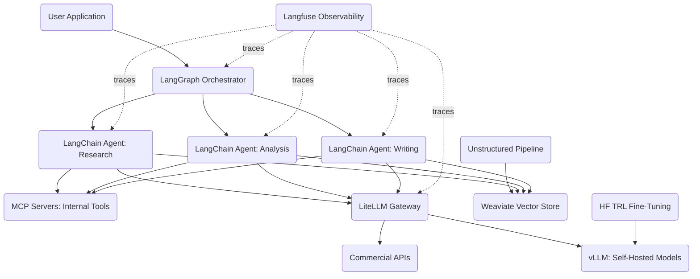

# Enterprise Agentic Pipeline

<!-- SUMMARY: A complete configuration walkthrough assembling LangChain, LangGraph, MCP servers, LiteLLM, Weaviate, Unstructured, Langfuse, vLLM, and HF TRL into a governed multi-agent system for enterprise engineering organizations. The architecture introduces orchestrated agent coordination, gateway-enforced cost and compliance controls, production observability, and a closed-loop fine-tuning pipeline that the solo developer configuration intentionally omitted. -->

A local-first stack for a single developer works because one person generates a manageable volume of requests, maintains full visibility into agent behavior through direct observation, and has no compliance obligations requiring audit trails. An engineering organization operating at team scale faces a categorically different set of constraints: multiple teams share model infrastructure, cost allocation requires granular tracking per team and project, regulatory or internal compliance policies demand immutable audit logs of every model interaction, long-running workflows must survive individual component failures, and specialized agents must coordinate on tasks that no single agent can complete alone. This configuration assembles an architecture that addresses each of these requirements.

## The Problem

An engineering organization needs a governed, multi-agent system that routes requests across multiple model providers, enforces cost and compliance constraints, maintains audit trails, and recovers from failures in long-running workflows.

The requirements span nine ecosystem layers. The system must coordinate multiple specialized agents through an orchestrator that tracks workflow state and supports human approval gates. A unified gateway must abstract away provider-specific APIs, enforce team-level budget caps, and route traffic between commercial endpoints and self-hosted models based on cost, latency, and data-sensitivity policies. The knowledge pipeline must handle enterprise document formats, including scanned PDFs, PowerPoint decks, and HTML archives, at volumes measured in hundreds of thousands of documents. The vector database must support multi-tenant isolation so that different teams' proprietary data remains separated. Observability must trace every model call, tool invocation, token cost, and latency measurement across the full execution path, with export to enterprise monitoring systems. A fine-tuning pipeline must convert production traces into training datasets, produce specialized models, and deploy them alongside the base models for A/B comparison.

The solo developer configuration intentionally omitted six of these nine layers. This configuration fills every gap.

## Architecture Overview

The architecture divides into four functional zones. The orchestration zone manages workflow state: a user application submits a task to LangGraph, which decomposes it into subtasks and dispatches them to specialized LangChain agents. The connectivity zone provides two types of access: MCP servers connect agents to internal tools, databases, and ticketing systems, while LiteLLM routes model requests to either commercial APIs or self-hosted vLLM instances based on routing policy. The knowledge zone handles document ingestion: Unstructured parses enterprise documents into clean text, and Weaviate stores the resulting embeddings with multi-tenant isolation so that each team's data remains segregated. The model lifecycle zone closes the improvement loop: HF TRL fine-tunes specialized models from curated production data, and the resulting checkpoints deploy to vLLM for serving alongside base models.

Langfuse traces span all four zones. Dotted lines in the diagram represent observability connections rather than request flow. Every model call, tool invocation, and orchestration decision emits trace data to Langfuse, producing a complete audit trail of each workflow execution.

## Component Selection

### Framework Layer: LangChain

LangChain, profiled in the Agent Frameworks Compared post, provides the broadest integration surface in the framework category. Its chain and agent abstractions standardize how applications construct prompts, invoke tools, and process model responses across providers. The mature ecosystem includes pre-built integrations with every tool in this configuration: Weaviate retrievers, LiteLLM model wrappers, MCP tool adapters via `@langchain/mcp-adapters`, and Langfuse callback handlers.

For an enterprise configuration, LangChain's integration breadth matters more than raw framework performance. An organization standardizing on LangChain gains a common programming model across teams, a shared library of tool integrations, and the ability to swap underlying components without rewriting application logic. If the organization later migrates from Weaviate to Pinecone, or from LiteLLM to Portkey, the change is confined to a configuration swap rather than an application rewrite.

### Orchestrator Layer: LangGraph

LangGraph, profiled in the Agent Orchestrators Compared post, extends LangChain with persistent state management and graph-based workflow orchestration. Where LangChain provides the building blocks for individual agents, LangGraph provides the control plane that coordinates multiple agents across multi-step workflows.

Three LangGraph capabilities address enterprise-specific requirements. First, persistent state: LangGraph checkpoints the full workflow state after every node execution, enabling recovery from failures without re-running completed steps. If an agent in step 7 of a 15-step workflow encounters a transient API error, the orchestrator resumes from step 7 after the error resolves rather than restarting from step 1. Second, human-in-the-loop gates: LangGraph supports interrupt nodes that pause workflow execution and wait for human approval before proceeding. A financial analysis workflow can generate a report draft and then pause for a compliance officer's sign-off before the final agent distributes the report. Third, parallel branching: LangGraph executes independent subtasks concurrently, reducing end-to-end latency for workflows where multiple agents can operate simultaneously.

### Connectivity Layer: MCP Servers

MCP servers, profiled in the Connectivity and Routing post, standardize how LangChain agents access internal enterprise services. The solo developer configuration used three MCP servers for filesystem, Git, and web search access. An enterprise deployment typically adds servers for internal databases, REST APIs, ticketing systems like Jira or ServiceNow, and document management platforms.

The standardization benefit compounds at organizational scale. Without MCP, each team building a LangChain agent would write custom tool integrations for the same internal services, producing N duplicate implementations with inconsistent authentication handling, error semantics, and maintenance burdens. A shared library of MCP servers gives every team's agents uniform access to the same internal services through a single protocol, with authentication and authorization handled at the server level rather than reimplemented in every agent.

### Gateway Layer: LiteLLM

LiteLLM, profiled in the Connectivity and Routing post, provides the unified gateway between LangChain agents and model providers. In this configuration, LiteLLM handles four enterprise concerns that the solo developer stack had no need for.

**Multi-provider abstraction**: LiteLLM translates a single OpenAI-compatible API call into provider-specific requests for OpenAI, Anthropic, AWS Bedrock, Google Vertex AI, Azure OpenAI, and self-hosted vLLM endpoints. Agents and framework code never import a provider-specific SDK; every model call passes through LiteLLM's unified interface.

**Cost governance**: LiteLLM generates virtual API keys for each team, enabling per-team budget caps, spend tracking, and usage analytics. A platform team distributes virtual keys to the research, engineering, and product teams, each with monthly spend limits. When a team approaches its budget cap, LiteLLM throttles or rejects requests rather than allowing unbounded spend against the organization's provider accounts.

**Routing policy**: LiteLLM routes requests based on configurable rules. Requests involving sensitive data route to the self-hosted vLLM deployment, which keeps data within the network perimeter. General-purpose requests route to commercial APIs for higher throughput. Fallback rules redirect traffic when a provider experiences an outage.

**Observability integration**: LiteLLM exports trace data, including token counts, latency measurements, and cost calculations, directly to Langfuse via its built-in callback system. Every model call across the organization flows through LiteLLM and automatically appears in the Langfuse dashboard without per-application instrumentation.

### Memory Layer: Weaviate

Weaviate, profiled in the Data Infrastructure post, provides the vector database layer for enterprise retrieval-augmented generation. Two Weaviate capabilities differentiate it from the solo developer configuration's ChromaDB deployment.

**Multi-tenancy**: Weaviate isolates tenant data at the storage level, ensuring that the legal team's contract embeddings and the engineering team's codebase embeddings occupy separate partitions. Queries execute within a single tenant's partition by default, preventing cross-contamination of retrieval results. ChromaDB's embedded mode does not provide this isolation.

**Hybrid search**: Weaviate combines dense vector search with BM25 keyword search in a single query. Dense vectors excel at semantic similarity, finding documents that discuss the same concept in different words. BM25 excels at exact keyword matching, finding documents that contain a specific product name, error code, or identifier. Enterprise knowledge bases contain both types of queries. A support agent searching for "authentication timeout errors in the billing module" benefits from semantic similarity for "authentication timeout" and exact keyword matching for "billing module."

Weaviate runs self-hosted on the organization's infrastructure, keeping all vector data and queries within the network perimeter. LangChain provides a native Weaviate retriever that agents use to query the vector store during task execution.

### Knowledge Management Layer: Unstructured

Unstructured, profiled in the Data Infrastructure post, handles enterprise document parsing at scale. The solo developer configuration used Docling for parsing project documentation on a single machine. Enterprise document repositories contain formats and volumes that require a different approach.

Unstructured processes PDFs with complex table layouts, scanned images requiring OCR, PowerPoint presentations, HTML archives, and email threads. Its pipeline architecture supports batch processing of document collections measured in hundreds of thousands of files, with configurable chunking strategies that preserve document structure. The chunking step is not a trivial text split: Unstructured maintains semantic boundaries, keeping table rows together, preserving list items as units, and respecting section headers as chunk boundaries.

The Unstructured-to-Weaviate pipeline mirrors the Docling-to-ChromaDB pipeline from the solo developer configuration, but at enterprise scale: Unstructured parses and chunks documents, an embedding model converts chunks to vectors, and the vectors load into Weaviate with tenant-specific metadata tags. The pipeline runs as a scheduled batch job or event-driven process that triggers when new documents appear in the source repository.

### Observability Layer: Langfuse

Langfuse, profiled in the Runtime Infrastructure post, provides the observability backbone for the entire enterprise pipeline. In this configuration, Langfuse serves three functions beyond basic tracing.

**Governance audit trails**: Every model interaction across the organization, including the full prompt, the complete response, the token count, the cost, and the latency, is captured in Langfuse's trace store. Compliance teams can query these traces to verify that agents operated within policy boundaries during any specific time window. The traces are immutable once recorded, providing a tamper-evident audit log.

**Cost attribution**: Langfuse receives cost data from LiteLLM's callback integration and maps it to specific users, teams, and applications using session and trace metadata. Monthly cost reports break down spending by team, model, and use case, enabling the platform team to identify cost hotspots and optimize routing policies.

**Dataset curation for fine-tuning**: Langfuse's production traces provide the raw material for fine-tuning datasets. The platform team identifies high-quality agent interactions from production traces, annotates them as training examples, and exports them as structured datasets. This trace-to-training pipeline is the first step in the fine-tuning feedback loop described in the model lifecycle section below.

Langfuse runs self-hosted and exports OpenTelemetry data to the organization's existing monitoring infrastructure, whether Datadog, Splunk, Grafana, or another backend. LangChain, LangGraph, and LiteLLM all provide native Langfuse integrations through callback handlers.

### Serving Layer: vLLM

vLLM, profiled in the Runtime Infrastructure post, serves self-hosted models behind an OpenAI-compatible API endpoint. The solo developer configuration used Ollama for local inference because operational simplicity outweighed throughput requirements. Enterprise deployments reverse this priority.

vLLM's PagedAttention memory management enables high-concurrency serving, handling hundreds of simultaneous requests without the memory fragmentation that limits simpler serving engines. Tensor parallelism distributes inference across multiple GPUs within a server, and pipeline parallelism distributes across multiple servers, enabling the organization to serve large models that exceed the memory capacity of a single GPU. Prefix caching deduplicates the KV cache computation when multiple requests share the same system prompt, which is common in enterprise applications where all agents use standardized instruction templates.

In this configuration, vLLM serves two categories of models. Base open-weight models provide general-purpose inference for tasks where commercial API costs are prohibitive at the organization's request volume. Fine-tuned models produced by the HF TRL pipeline provide specialized inference for tasks where the base models underperform. LiteLLM routes requests to either category based on the routing policy, and both categories expose identical OpenAI-compatible endpoints.

### Fine-Tuning Layer: HF TRL

HF TRL, profiled in the Runtime Infrastructure post, provides the training pipeline for producing specialized models from production data. The fine-tuning workflow in this configuration follows a four-stage loop.

**Stage 1: Trace collection**: Langfuse captures production traces from all agents operating in the pipeline. The platform team reviews these traces and identifies interactions where the agent performed well and interactions where it underperformed.

**Stage 2: Dataset curation**: High-quality traces are exported from Langfuse as instruction-response pairs in the format TRL expects. Low-quality traces are annotated with corrected responses, creating preference pairs for alignment training.

**Stage 3: Training**: TRL runs supervised fine-tuning on the curated instruction dataset, optionally followed by Direct Preference Optimization (DPO) on the preference pairs. PEFT's LoRA adapters keep GPU memory requirements manageable, enabling fine-tuning on a small cluster of GPUs rather than requiring datacenter-scale hardware.

**Stage 4: Deployment**: The fine-tuned model checkpoint loads into vLLM as an additional endpoint. LiteLLM's routing policy allocates a percentage of traffic to the fine-tuned model while the remaining traffic continues to use the base model. Langfuse traces from both models feed back into the evaluation pipeline, enabling data-driven comparison of base versus fine-tuned performance. If the fine-tuned model outperforms the base model on the evaluation metrics, the routing policy shifts more traffic to the fine-tuned variant.

## Integration Walkthrough

The components wire together through five integration paths.

**LangGraph to LangChain agents**: LangGraph defines a directed graph where each node contains a LangChain agent specialized for a specific task. The orchestrator manages the control flow: it initializes the workflow state, dispatches subtasks to the appropriate agent nodes, collects their outputs, and decides the next step based on the graph's conditional edges. State persistence through LangGraph's checkpointing mechanism means that the full workflow context, every intermediate result and decision, survives process restarts.

**LangChain agents to LiteLLM**: Each LangChain agent is configured with a LiteLLM model wrapper that points to the LiteLLM proxy endpoint rather than a provider-specific API. The agent code contains no provider-specific imports or API keys. LiteLLM receives the request, applies routing rules to select the target provider or self-hosted endpoint, attaches the real API credentials, and forwards the translated request. The response follows the reverse path through LiteLLM back to the agent.

**LangChain agents to MCP servers**: LangChain's MCP adapter package discovers and binds MCP server tools at runtime. When an agent needs to query an internal database, create a Jira ticket, or access a document management system, it invokes the corresponding MCP tool. The MCP server handles the actual service interaction and returns structured results to the agent.

**Unstructured to Weaviate**: The knowledge pipeline runs as a scheduled batch process. Unstructured reads documents from the source repository, applies format-specific parsers and OCR as needed, chunks the parsed output with structure-aware boundaries, and writes the chunks to an intermediate staging store. An embedding step converts chunks to vectors using the organization's embedding model, routed through LiteLLM. The vectors load into Weaviate with tenant-specific metadata, making them available for retrieval by LangChain agents operating within that tenant's scope.

**Langfuse across all layers**: Langfuse callback handlers attach to LangChain agents, LangGraph's orchestrator, and LiteLLM's proxy. Every model call, tool invocation, and orchestration decision emits a trace span to Langfuse. The callback configuration happens once at application initialization; individual agent code does not need explicit trace instrumentation. Langfuse's OpenTelemetry exporter forwards aggregated metrics and trace data to the organization's central monitoring system.

## Tradeoffs and Alternatives

This configuration optimizes for governance, observability, and multi-team coordination. Every model interaction is traced, every dollar of spend is attributed to a specific team, and workflow state persists across failures.

The primary cost is operational complexity. Running LangGraph, LiteLLM, Weaviate, vLLM, Langfuse, and the Unstructured pipeline each require dedicated infrastructure, monitoring, and maintenance. A platform engineering team is necessary to operate this stack; no single developer can reasonably manage all nine components. The infrastructure footprint includes GPU servers for vLLM, a database backend for LangGraph's state persistence, storage for Weaviate's vector indices, and a server for Langfuse's trace store.

The second cost is latency. Every request traverses multiple network hops: from the application to LangGraph, from LangGraph to a LangChain agent, from the agent through LiteLLM to the model provider, and back through the same chain. Observability callbacks add processing overhead at each hop. For latency-sensitive applications, the overhead of full-stack tracing and gateway routing is measurable, typically adding 10-50ms of end-to-end latency per request.

**Alternative substitutions at each layer**:

- **Framework**: LlamaIndex can replace LangChain if the application's primary workload is retrieval-augmented generation rather than general-purpose agent tooling. LlamaIndex's native index abstractions provide tighter integration with the retrieval pipeline at the cost of a narrower tool ecosystem.
- **Orchestrator**: CrewAI can replace LangGraph if the team prefers a role-based agent model over a graph-based workflow model. CrewAI simplifies agent configuration by defining agents as roles with natural-language descriptions rather than graph nodes, but it provides less granular control over state persistence and conditional branching.
- **Gateway**: Portkey can replace LiteLLM if the organization needs built-in semantic caching or in-path PII redaction. Portkey provides both features natively, reducing the need for separate middleware components.
- **Memory**: Qdrant can replace Weaviate if the organization prioritizes single-binary deployment simplicity over Weaviate's hybrid search capabilities. Pinecone can replace Weaviate if the organization prefers a fully managed service and does not require self-hosting.
- **Knowledge Management**: Docling can replace Unstructured if the document corpus consists primarily of PDFs and Word documents without the format diversity that Unstructured specializes in. LlamaParse can replace Unstructured if the organization is comfortable with a cloud-based parsing service.
- **Observability**: Braintrust can replace Langfuse if the primary concern is evaluation and CI/CD regression testing rather than production trace capture. Arize Phoenix can replace Langfuse if RAG embedding diagnostics and drift detection are the dominant observability needs.
- **Serving**: SGLang can replace vLLM if the workload involves heavy structured output generation or branching agent conversations where RadixAttention provides measurable throughput gains.
- **Fine-Tuning**: Unsloth can replace HF TRL if GPU memory is constrained and training speed is the priority. Axolotl can replace HF TRL if the team prefers YAML-driven configuration over Python training scripts.

This configuration moves from individual productivity to organizational capability: governed model access, auditable agent behavior, and a closed-loop pipeline from production traces to fine-tuned models. The companion setup guide provides step-by-step installation and wiring instructions for each component in this configuration.

## References

1. LangChain Documentation, LangChain Inc.
2. LangGraph Documentation, LangChain Inc.
3. Model Context Protocol Specification, Anthropic.
4. LiteLLM Documentation, BerriAI.
5. Weaviate Documentation, Weaviate B.V.
6. Unstructured Documentation, Unstructured Technologies.
7. Langfuse Documentation, Langfuse GmbH.
8. vLLM Documentation, vLLM Project.
9. Hugging Face TRL Documentation, Hugging Face.
10. Hugging Face PEFT Documentation, Hugging Face.
