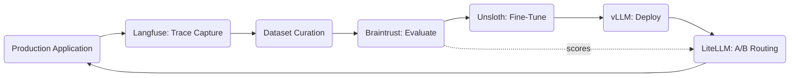

# Evaluation-Driven Development Loop

<!-- SUMMARY: A complete configuration walkthrough assembling LangChain or LlamaIndex, Langfuse, Braintrust, Unsloth, vLLM, and LiteLLM into a continuous improvement cycle that captures production traces, curates evaluation datasets, scores output quality across experiments, fine-tunes specialized models from high-quality examples, deploys fine-tuned checkpoints alongside base models, and routes traffic between variants for data-driven comparison. The architecture treats systematic quality measurement as the primary engineering discipline rather than an afterthought applied to a finished system. -->

Every AI application, whether a RAG pipeline, a multi-agent workflow, an enterprise chatbot, or a code generation tool, produces outputs whose quality varies across inputs, model versions, prompt revisions, and infrastructure changes. Without systematic measurement, teams rely on intuition and spot-checking to assess whether a change improved or degraded the system. Intuition scales poorly. A prompt revision that improves responses for one category of inputs can silently degrade responses for another. A model upgrade that raises average quality can introduce regressions on edge cases that the team discovers only after deployment. This configuration replaces intuition with a closed-loop evaluation cycle that captures production behavior, measures quality against structured criteria, and feeds the results back into model improvement.

## The Problem

A team building an AI application needs a systematic process to address three challenges that intuition cannot reliably resolve. First, the team must measure how good the system's outputs are right now against concrete scoring criteria rather than subjective impressions. Second, the team must determine whether the latest change, whether a prompt revision, a model swap, or a parameter adjustment, improved or degraded quality, and by how much. Third, the team must assess whether the system has accumulated enough high-quality production data to justify fine-tuning a specialized model that outperforms the general-purpose base model on the application's specific task distribution.

These three questions map to three evaluation layers. Unit-level evaluation scores individual outputs against expected results, measuring whether each response meets quality thresholds for correctness, faithfulness, relevance, or format compliance. Pipeline-level evaluation measures end-to-end system behavior across a curated dataset of representative inputs, producing aggregate quality metrics that track trends over time. Regression-level evaluation compares metrics across versions, identifying whether a specific change moved quality in the intended direction without introducing unintended degradation elsewhere.

The evaluation infrastructure must integrate with the production system without disrupting it. Trace capture must add negligible latency to live requests. Dataset curation must draw from real production inputs rather than synthetic test cases that miss the distribution of actual usage. Scoring must run offline against captured traces, not inline with live traffic. The fine-tuning pipeline must consume evaluation artifacts directly, without manual reformatting or data transformation steps between evaluation results and training inputs.

## Architecture Overview

The diagram forms a cycle, which is the defining characteristic of this configuration. Unlike the linear pipelines in prior configurations, where data flows from ingestion through processing to output, this architecture loops production outputs back into the improvement process.

The cycle begins at the production application, which can be any system from prior configurations: a RAG pipeline, an enterprise multi-agent workflow, or an airgapped analysis system. Langfuse captures traces from every production interaction, recording the full input, the generated output, latency, token counts, and intermediate steps. The dataset curation stage selects production traces that represent the application's input distribution, annotates them with expected outputs or quality labels, and organizes them into versioned evaluation datasets in Braintrust. Braintrust runs the current system against these datasets and scores each output on multiple quality dimensions, producing quantitative metrics that establish a performance baseline.

When evaluation data identifies a consistent quality gap that prompt engineering cannot close, the cycle enters the fine-tuning branch. Braintrust's curated datasets export as training data for Unsloth, which trains LoRA adapters on the application's specific task distribution. The fine-tuned model deploys to vLLM as a new endpoint alongside the existing base model. LiteLLM routes a configurable percentage of production traffic to the fine-tuned variant while the remaining traffic continues through the base model. Braintrust evaluates outputs from both routing paths, and the resulting scores determine whether the fine-tuned model earns a larger traffic share, requires additional training iterations, or fails to justify continued deployment. The cycle repeats with each iteration producing more evaluation data, tighter scoring criteria, and incrementally improved models.

## Component Selection

### Application Layer: LangChain or LlamaIndex

The evaluation loop wraps around an existing AI application rather than prescribing a specific framework. Any application from prior configurations in this series can serve as the system under evaluation. A LangChain-based enterprise pipeline, a LlamaIndex-based RAG system, a solo developer stack, or an airgapped deployment all produce the same fundamental artifacts that the evaluation loop consumes: input-output pairs captured as traces.

The framework choice depends entirely on the application's requirements, as detailed in the Agent Frameworks Compared post. The evaluation infrastructure connects to the application through Langfuse's tracing callbacks, which both LangChain and LlamaIndex support natively. The evaluation loop imposes no constraints on framework selection.

### Observability Layer: Langfuse

Langfuse, profiled in the Runtime Infrastructure post, provides the trace capture layer that feeds production data into the evaluation cycle. The enterprise pipeline configuration used Langfuse for governance audit trails and cost attribution. This configuration extends that role: Langfuse traces become the raw material for evaluation datasets and fine-tuning data.

Langfuse captures three categories of data that the evaluation loop requires. First, input-output pairs: the full user input and the system's generated response, recorded as structured trace data with session-level grouping that preserves conversational context. Second, intermediate steps: for multi-step pipelines, Langfuse records each tool call, retrieval result, and intermediate generation, enabling evaluation at any stage of the pipeline rather than only at the final output. Third, metadata annotations: Langfuse supports manual and programmatic annotation of traces with quality labels, correctness scores, and categorical tags. Production operators or automated scoring functions can annotate traces in place, and these annotations export directly as evaluation labels.

The trace-to-dataset pipeline operates as follows. Langfuse accumulates production traces over a defined time window. An automated or manual review process filters traces by quality indicators: high-confidence responses become positive examples, low-confidence or user-flagged responses become candidates for correction and annotation. The filtered and annotated traces export through Langfuse's API as structured datasets ready for Braintrust evaluation or Unsloth fine-tuning.

### Evaluation Layer: Braintrust

Braintrust, profiled in the Runtime Infrastructure post, provides programmatic evaluation, dataset versioning, and experiment comparison. The RAG-first configuration used Braintrust for retrieval quality scoring. This configuration uses the full Braintrust evaluation platform to measure output quality across any dimension the team defines.

Braintrust's evaluation framework supports three scoring strategies that address different quality dimensions. LLM-as-judge scoring uses a language model to evaluate generated outputs against rubrics defined in natural language, measuring dimensions like helpfulness, accuracy, tone compliance, and format adherence. Deterministic scoring uses programmatic functions that check concrete output properties: JSON schema validity, required field presence, length constraints, and keyword coverage. Human annotation scoring integrates human evaluators who label outputs on custom scales, with Braintrust tracking inter-annotator agreement and aggregating scores across reviewers.

Dataset versioning enables controlled experimentation. Each evaluation dataset carries a version identifier, and Braintrust tracks which dataset version produced which scores. When the team refines its evaluation criteria or expands the dataset with new examples, the version history preserves the ability to reproduce prior results and measure the impact of dataset changes independently from system changes.

Experiment comparison provides the decision-making interface. Each experiment represents a system configuration: a specific prompt template, model version, parameter set, or fine-tuned checkpoint. Braintrust displays experiment results side by side, highlighting score differences across quality dimensions. A prompt revision that improves helpfulness scores by 8% while degrading format compliance by 2% becomes visible as a concrete tradeoff rather than a subjective impression.

### Fine-Tuning Layer: Unsloth

Unsloth, profiled in the Runtime Infrastructure post, provides memory-efficient fine-tuning that transforms evaluation data into specialized models. The airgapped configuration used Unsloth for on-premises model adaptation. This configuration positions Unsloth as the optimization step that closes the evaluation loop: when systematic measurement identifies a quality gap that prompt engineering cannot address, fine-tuning on curated production data produces a model specialized for the application's task distribution.

The evaluation-to-training pipeline follows a specific data flow. Braintrust evaluation datasets contain input-output pairs scored on quality dimensions. High-scoring examples export as supervised fine-tuning data in the instruction-response format that Unsloth expects. For preference-based training, pairs of high-scoring and low-scoring responses to the same input export as preference data for Direct Preference Optimization. Unsloth trains LoRA adapters rather than full model copies, keeping storage and training costs proportional to the adapter size rather than the base model size.

The fine-tuning decision itself is data-driven. The team sets a quality threshold: if the base model's Braintrust scores plateau below the target despite prompt optimization, and if the evaluation dataset contains sufficient high-quality examples to train a meaningful adapter, fine-tuning proceeds. If the base model meets the quality target through prompt engineering alone, fine-tuning adds unnecessary complexity and the loop continues without it.

### Serving Layer: vLLM

vLLM, profiled in the Runtime Infrastructure post, provides the inference infrastructure for deploying fine-tuned models alongside base models. The enterprise and airgapped configurations used vLLM for high-throughput serving. This configuration adds a specific capability: multi-model serving for A/B comparison.

vLLM supports serving multiple model variants simultaneously through separate endpoints or through LoRA adapter hot-loading. The adapter hot-loading approach is particularly efficient for the evaluation loop: the base model loads once, and fine-tuned LoRA adapters load as lightweight additions that share the base model's memory footprint. Each adapter receives its own model identifier in vLLM's endpoint registry, and LiteLLM routes traffic to specific adapters based on the routing policy.

A/B deployment proceeds in stages. The fine-tuned model initially receives a small percentage of production traffic, typically 5-10%, while the base model handles the remaining 90-95%. Langfuse traces from both variants carry metadata identifying which model produced each response. Braintrust evaluations run separately on the two trace sets, producing parallel quality scores that measure whether the fine-tuned model outperforms, matches, or underperforms the base model on each quality dimension. If the fine-tuned variant demonstrates consistent improvement, the traffic share increases incrementally. If it underperforms, the adapter rolls back with zero impact on the majority of production traffic.

### Gateway Layer: LiteLLM

LiteLLM, profiled in the Connectivity and Routing post, provides the traffic routing layer that enables A/B comparison between model variants. Prior configurations used LiteLLM for provider abstraction, cost governance, and multi-provider failover. This configuration adds weighted routing: the ability to split production traffic between two or more model endpoints based on configurable percentages.

LiteLLM's routing configuration supports weighted distribution across model deployments. A single model name in the application code maps to multiple backend endpoints with assigned weights. The application remains unaware of which specific model handles a given request; LiteLLM makes the routing decision and tags the response metadata with the endpoint identifier. This metadata flows through to Langfuse traces, enabling Braintrust to evaluate each model variant's outputs independently.

The A/B routing configuration integrates directly with the evaluation cycle. When Braintrust scores indicate that the fine-tuned model outperforms the base model, the team adjusts LiteLLM's routing weights to increase the fine-tuned model's traffic share. When a new fine-tuned checkpoint becomes available, LiteLLM adds it as a third routing target for staged evaluation before replacing the previous fine-tuned variant. The routing layer serves as the deployment control plane for the entire evaluation-driven improvement cycle.

## Integration Walkthrough

The components wire together through four integration paths that form the continuous improvement cycle.

**Langfuse trace capture from the production application**: The production application integrates Langfuse through callback handlers that attach to the framework layer. For LangChain applications, the Langfuse callback handler wraps model calls, tool invocations, and chain executions. For LlamaIndex applications, the Langfuse callback manager captures query engine operations, retrieval steps, and response synthesis. The integration adds trace emission at each instrumented point without modifying the application's core logic. Each trace includes the full input, generated output, latency, token usage, model identifier from LiteLLM's routing metadata, and any intermediate steps. Traces accumulate in Langfuse's storage backend for subsequent review and export.

**Langfuse to Braintrust dataset pipeline**: Langfuse's API provides programmatic access to stored traces, filtered by time range, session, model identifier, quality annotation, or custom metadata tags. A curation script queries Langfuse for traces matching the team's selection criteria, transforms the trace data into Braintrust's evaluation dataset format with input, expected output, and metadata fields, and uploads the dataset to Braintrust with a version identifier. This pipeline runs on a scheduled cadence or on demand when the team prepares for an evaluation cycle.

**Braintrust evaluation to Unsloth training data**: Braintrust evaluation results identify which traces represent high-quality and low-quality system behavior. High-scoring traces export as instruction-response pairs for supervised fine-tuning. Pairs of high-scoring and low-scoring responses to the same input export as preference pairs for DPO training. The export script transforms Braintrust dataset records into the JSONL format that Unsloth expects, with each record containing the input prompt, the target response, and optional metadata for filtering during training.

**Unsloth to vLLM to LiteLLM deployment**: Unsloth produces LoRA adapter weights that merge with or load alongside the base model in vLLM. The deployment process adds the fine-tuned model as a new endpoint in vLLM's serving configuration and registers it in LiteLLM's routing table with an initial traffic weight. LiteLLM begins routing the configured percentage of production traffic to the fine-tuned endpoint. Langfuse captures traces from both the base and fine-tuned models, tagged with the model identifier that LiteLLM's routing metadata provides. The next Braintrust evaluation cycle includes traces from both variants, producing comparative quality scores that inform the next routing weight adjustment.

## Tradeoffs and Alternatives

This configuration optimizes for data-driven quality improvement through continuous measurement and iteration. Every change to the system, from prompt revisions to model fine-tuning, produces quantitative evidence of its impact before full deployment.

The primary cost is infrastructure complexity. Running Langfuse, Braintrust, Unsloth training jobs, vLLM serving with multiple models, and LiteLLM routing simultaneously requires dedicated compute resources and operational expertise. The evaluation loop itself consumes model inference tokens for LLM-as-judge scoring, GPU hours for fine-tuning, and storage for trace data and evaluation datasets. For applications where output quality is not the primary bottleneck, this infrastructure overhead exceeds the improvement it produces.

The second cost is evaluation design effort. The quality of the evaluation loop depends entirely on the quality of the evaluation criteria. Poorly designed scoring rubrics produce misleading metrics that guide the team toward optimizing the wrong dimensions. Building effective evaluation datasets requires domain expertise to select representative inputs, define meaningful quality criteria, and calibrate scoring thresholds. This design work is a sustained engineering investment, not a one-time setup task.

The third cost is the latency of the improvement cycle. Each iteration through the loop, from trace capture through evaluation to fine-tuning to deployment, spans days to weeks depending on the volume of production data, the complexity of evaluation scoring, and the training time for fine-tuned adapters. Teams expecting immediate quality improvements from a single loop iteration will find the cadence slower than ad-hoc prompt iteration. The value compounds over multiple cycles as evaluation datasets grow, scoring criteria sharpen, and fine-tuned models accumulate domain-specific capability.

**Alternative substitutions at each layer**:

- **Observability**: Arize Phoenix can replace Langfuse if the team prioritizes embedding drift detection and retrieval diagnostics over session-level trace grouping. Phoenix provides stronger visualization tools for vector-based analysis at the cost of a less mature trace export API for dataset curation.
- **Evaluation**: Weights and Biases can replace Braintrust if the team already uses W&B for experiment tracking and prefers a unified platform for training metrics and evaluation results. The tradeoff is a less specialized evaluation interface in exchange for tighter integration with the training workflow. PromptFoo can replace Braintrust for teams focused on prompt-level A/B testing without the full experiment management platform.
- **Fine-Tuning**: HF TRL can replace Unsloth if GPU memory is not a constraint and the team prefers the broader Hugging Face training ecosystem. Axolotl can replace Unsloth if YAML-driven training configuration is preferred over Python scripts.
- **Serving**: SGLang can replace vLLM if the application requires structured output generation where RadixAttention provides measurable throughput gains. For LoRA adapter serving specifically, both vLLM and SGLang support hot-loading, making the choice dependent on broader serving requirements.
- **Gateway**: Portkey can replace LiteLLM if the team needs built-in semantic caching to reduce evaluation scoring costs on repeated or similar queries. The tradeoff is a managed-service dependency in exchange for reduced token consumption during evaluation runs.

This configuration connects the final missing piece: systematic quality measurement that converts production experience into measurable improvement. The companion setup guide provides step-by-step installation and wiring instructions for each component in this configuration.

## References

1. LangChain Documentation, LangChain Inc.
2. LlamaIndex Documentation, LlamaIndex Inc.
3. Langfuse Documentation, Langfuse GmbH.
4. Braintrust Documentation, Braintrust Data Inc.
5. Unsloth Documentation, Unsloth AI.
6. vLLM Documentation, vLLM Project.
7. LiteLLM Documentation, BerriAI.
