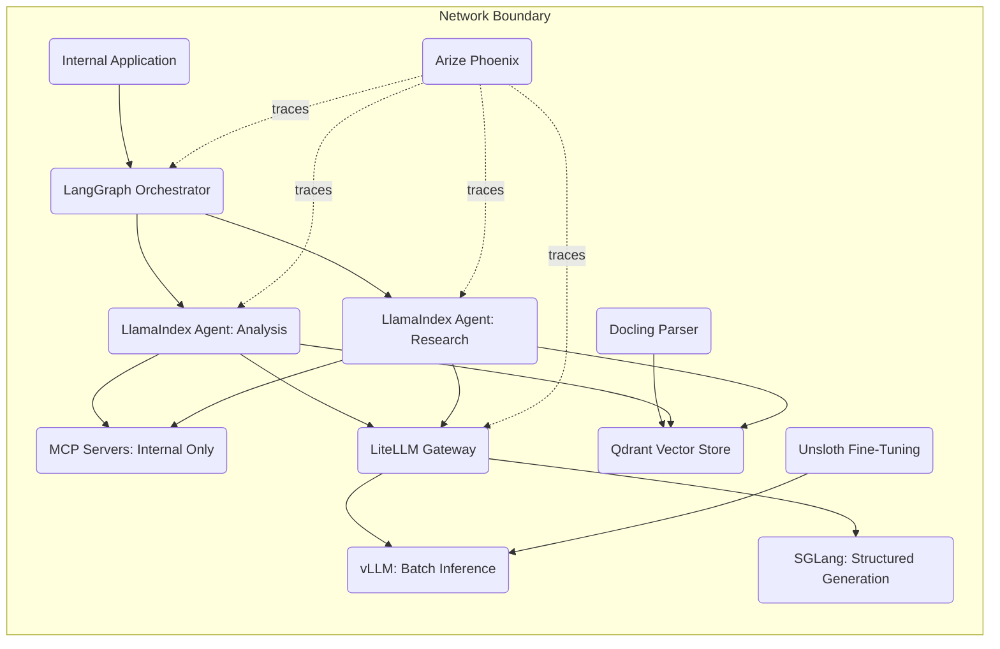

# Private and Airgapped Deployment

<!-- SUMMARY: A complete configuration walkthrough assembling LlamaIndex, LangGraph, MCP servers, LiteLLM, vLLM, SGLang, Qdrant, Docling, Arize Phoenix, and Unsloth into a self-contained AI system that operates entirely within a network perimeter with zero external connectivity. The architecture replaces every commercial API dependency from the enterprise pipeline with self-hosted alternatives, addresses offline model acquisition, and closes the fine-tuning loop entirely on-premises. -->

Enterprise AI pipelines that route traffic through commercial APIs and cloud-hosted services assume reliable internet connectivity for model access, embedding APIs, and dependency downloads during deployment. Organizations operating in regulated environments, including government, defense, healthcare, and financial services, face a constraint that invalidates this assumption: no data leaves the network perimeter, and no external service receives inbound connections. Every component in the stack must run on-premises, every model must be acquired and transferred offline, and the system must operate indefinitely without internet access.

## The Problem

An organization operating in a regulated or classified environment must deploy AI capabilities entirely within an isolated network. The requirements span the same nine ecosystem layers as the enterprise pipeline, but with an additional constraint at every layer: zero external connectivity.

The system must coordinate multi-step workflows through an orchestrator with persistent state, because classified analysis tasks involve long-running pipelines that span hours or days and must survive component restarts. A framework must provide retrieval-augmented generation over internal document collections, because the organization's primary use case is answering questions from classified or proprietary knowledge bases. Model inference must run on local GPU hardware, with the gateway routing between multiple internal model deployments rather than between internal and commercial endpoints. The vector database must deploy as a self-contained binary or container with no cloud dependencies. Document parsing must run locally without sending any content to external services. Observability must trace every interaction for audit compliance, with the tracing platform itself running on internal infrastructure. Fine-tuning must operate entirely on-premises, using locally stored training data to produce specialized models that deploy to the local serving infrastructure.

The enterprise pipeline used commercial APIs as the primary inference path, with self-hosted models as a secondary option. This configuration inverts that relationship: self-hosted models are the only inference path, and the entire system must be deployable from pre-staged artifacts without network access.

## Architecture Overview

Every component in the diagram sits inside the network boundary annotation. There are no outbound arrows crossing the perimeter, and no external service appears in the architecture. This is the defining constraint: the diagram is the proof that the system operates in complete isolation.

The architecture maps to the same four functional zones as the enterprise pipeline, with substitutions at each layer to eliminate external dependencies. The orchestration zone uses LangGraph for workflow coordination and LlamaIndex agents instead of LangChain agents, optimizing for the retrieval-heavy workloads common in classified environments. The connectivity zone replaces the enterprise pipeline's mix of internal and external MCP servers with strictly internal servers, and LiteLLM routes exclusively between on-premises model deployments. The knowledge zone replaces Unstructured with Docling for local-only document parsing, and Qdrant replaces Weaviate for single-binary vector storage. The model lifecycle zone replaces HF TRL with Unsloth for memory-efficient fine-tuning on limited GPU hardware, and adds SGLang alongside vLLM to provide structured output generation for tasks requiring constrained decoding.

Arize Phoenix replaces Langfuse as the observability platform. Phoenix provides open-source tracing and evaluation with a focus on retrieval diagnostics, including embedding visualization and drift detection, that are particularly relevant for RAG-heavy deployments.

## Component Selection

### Framework Layer: LlamaIndex

LlamaIndex, profiled in the Agent Frameworks Compared post, provides a framework architecture built around index abstractions and retrieval pipelines. Where LangChain optimizes for breadth of integration, LlamaIndex optimizes for depth of retrieval: native support for multiple index types, query engines that handle multi-step retrieval strategies, and response synthesizers that combine retrieved context with generated answers.

In an airgapped environment, the primary workload is answering questions from internal knowledge bases. Analysts query classified document collections, engineers search internal technical documentation, and compliance teams retrieve regulatory references. LlamaIndex's retrieval-first architecture maps directly to this pattern. Its `VectorStoreIndex`, `TreeIndex`, and `KeywordTableIndex` abstractions allow the system to select the optimal retrieval strategy for each document collection, and its query engine handles the full pipeline from query parsing through retrieval to response generation without requiring custom orchestration code.

LlamaIndex's integration with Qdrant through the `llama-index-vector-stores-qdrant` package provides a direct connection between the framework's retrieval abstractions and the local vector database, keeping the entire retrieval path on-premises.

### Orchestrator Layer: LangGraph

LangGraph, profiled in the Agent Orchestrators Compared post, provides the same persistent-state orchestration used in the enterprise pipeline. The airgapped environment does not change the orchestration requirements: classified analysis workflows span multiple steps, require human approval gates at classification boundaries, and must survive component restarts without losing intermediate results.

LangGraph's checkpointing mechanism stores workflow state in a local database, and its graph-based execution model supports conditional branching based on classification labels, document sensitivity levels, or analyst approval decisions. A multi-step intelligence analysis workflow can pause at a classification review gate, wait for an authorized reviewer's approval, and resume from the exact checkpoint without re-executing prior steps.

The combination of LlamaIndex agents within LangGraph nodes provides the retrieval depth of LlamaIndex with the orchestration control of LangGraph. Each LangGraph node wraps a LlamaIndex agent specialized for a specific retrieval or analysis task, and the graph coordinates the handoff of results between agents.

### Connectivity Layer: MCP Servers, Local Only

MCP servers in this configuration connect agents exclusively to internal resources. The enterprise pipeline's MCP servers accessed both internal and external services; this deployment restricts servers to resources within the network perimeter.

Typical internal MCP servers for an airgapped deployment include a filesystem server scoped to approved document repositories, a database connector for internal SQL and NoSQL databases, an API server wrapping internal REST services, and a metadata server providing access to classification labels, document provenance records, and audit metadata. No MCP server in this configuration makes outbound network requests.

The restriction is enforced at the network level through firewall rules and at the application level through MCP server configuration. Each server's configuration explicitly lists the internal resources it can access, and network policy prevents any MCP server process from establishing outbound connections.

### Gateway Layer: LiteLLM, Self-Hosted

LiteLLM, profiled in the Connectivity and Routing post, provides the same gateway functionality as in the enterprise pipeline, but its routing table contains exclusively internal endpoints. The configuration removes all commercial provider entries and replaces them with entries pointing to the local vLLM and SGLang deployments.

The gateway serves three functions in the airgapped context. First, it abstracts the serving engine from the application layer: LlamaIndex agents call the standard OpenAI-compatible API provided by LiteLLM, and LiteLLM routes to vLLM or SGLang based on the model name in the request. Second, it enables routing by task type: general-purpose inference routes to vLLM for maximum throughput, while structured generation tasks route to SGLang for constrained decoding. Third, it provides a single point of observability integration: LiteLLM's callback system exports trace data to Arize Phoenix for every model call across the system.

Cost governance, the primary enterprise motivation for LiteLLM, is less relevant in an airgapped deployment where model inference runs on owned hardware. The gateway's value shifts toward operational routing and monitoring.

### Serving Layer: vLLM and SGLang

vLLM and SGLang, both profiled in the Runtime Infrastructure post, provide complementary inference capabilities on local GPU hardware.

vLLM serves as the primary inference engine for general-purpose requests. Its PagedAttention memory management and continuous batching enable high-throughput serving across concurrent requests. Tensor parallelism distributes inference across multiple GPUs within a server, enabling the deployment of models that exceed the memory capacity of a single GPU. In an airgapped deployment, vLLM serves both base open-weight models and fine-tuned variants produced by the Unsloth pipeline.

SGLang serves as the secondary inference engine for tasks requiring structured output generation. Its RadixAttention mechanism provides efficient KV cache reuse across branching conversation trees, and its constrained decoding support ensures that generated output conforms to specified JSON schemas, XML structures, or other format requirements. Agent-to-agent communication in LangGraph workflows benefits from structured output: when one agent produces a result that another agent must parse, constraining the output to a defined schema eliminates parsing failures and reduces the error surface of multi-agent pipelines.

Both engines expose OpenAI-compatible API endpoints, allowing LiteLLM to route between them transparently. The application layer is unaware of which engine handles a given request.

### Memory Layer: Qdrant, Self-Hosted

Qdrant, profiled in the Data Infrastructure post, provides the vector database layer. Its Rust-native architecture compiles to a single binary that runs without external dependencies, container runtimes, or package managers. In restricted environments where software installation is governed by approval processes and air-gap transfer procedures, a single-binary deployment model eliminates an entire category of deployment friction.

Qdrant supports both in-memory and on-disk storage modes. For deployments where the document corpus fits in available RAM, in-memory mode provides the lowest query latency. For larger corpora, on-disk mode with memory-mapped files provides scalable storage without requiring all vectors to reside in RAM simultaneously. The quantization options, including scalar and product quantization, reduce memory consumption per vector while maintaining retrieval accuracy within configurable thresholds.

The enterprise pipeline used Weaviate for its multi-tenancy and hybrid search capabilities. In the airgapped deployment, Qdrant's single-binary simplicity and lower operational overhead outweigh Weaviate's feature advantages. Multi-tenancy is achievable through Qdrant's collection-level isolation: each organizational unit receives its own collection with independent vector indices and access controls.

### Knowledge Management Layer: Docling

Docling, profiled in the Data Infrastructure post, handles document parsing with the same local-only execution model used in the solo developer configuration. In the airgapped context, Docling's value extends beyond convenience: it is a hard requirement. Cloud-based parsers like LlamaParse and Unstructured's managed API are categorically unavailable in an airgapped environment. The enterprise pipeline's use of Unstructured relied on the open-source library rather than the managed service, making it a viable alternative here. Docling is selected for this configuration because its compact vision models download once during pre-deployment staging and run without any network access, and its parsing quality for PDF and DOCX formats matches the requirements of a typical internal document collection.

The Docling-to-Qdrant pipeline follows the same pattern as the Docling-to-ChromaDB pipeline from the solo developer configuration: Docling parses raw documents into clean Markdown, a chunking step splits the output into retrieval-sized segments, an embedding model converts chunks to vectors using a locally served model through LiteLLM, and the vectors load into Qdrant with metadata tags for document provenance, classification level, and ingestion timestamp.

### Observability Layer: Arize Phoenix

Arize Phoenix, profiled in the Runtime Infrastructure post, provides open-source tracing and evaluation. Phoenix runs as a self-hosted application with a local storage backend, making it deployable within the airgapped perimeter without modification.

Phoenix's distinctive capability in this configuration is its retrieval-focused diagnostics. Embedding visualization projects vector clusters into two-dimensional space, allowing operators to identify gaps in the knowledge base where documents are sparse and retrieval quality degrades. Embedding drift detection alerts operators when newly ingested documents shift the embedding distribution in ways that degrade retrieval accuracy for existing queries. These diagnostics are particularly valuable in an airgapped deployment where the knowledge base evolves through periodic bulk ingestion of new documents rather than continuous streaming updates.

For audit compliance, Phoenix captures trace data for every model call, tool invocation, and retrieval operation. The trace store runs on internal infrastructure, and export formats allow integration with the organization's existing security information and event management systems.

### Fine-Tuning Layer: Unsloth

Unsloth, profiled in the Runtime Infrastructure post, provides memory-efficient fine-tuning for open-weight models. Unsloth's custom CUDA kernels reduce GPU memory consumption during training, enabling fine-tuning of models with tens of billions of parameters on hardware that would otherwise require model parallelism or cloud GPU rental.

In an airgapped deployment, fine-tuning serves a specific purpose: adapting base open-weight models to the organization's domain vocabulary, document formats, and task patterns using training data that cannot leave the premises. Unsloth's LoRA and QLoRA support produces lightweight adapter weights rather than full model copies, reducing storage requirements and enabling rapid iteration on specialized model variants.

The airgapped fine-tuning loop operates as follows. Arize Phoenix captures production traces from deployed agents. Operators review traces and identify high-quality and low-quality interactions. High-quality traces export as instruction-response pairs for supervised fine-tuning. Unsloth trains a LoRA adapter on the curated dataset using local GPU hardware. The adapter merges with the base model or loads as a separate endpoint in vLLM. LiteLLM routes a percentage of traffic to the fine-tuned variant. Phoenix traces from both base and fine-tuned models feed back into the evaluation cycle, enabling data-driven comparison without any data leaving the network.

## Integration Walkthrough

The components wire together through five integration paths, each operating entirely within the network perimeter.

**LangGraph to LlamaIndex agents**: LangGraph defines a directed graph where each node contains a LlamaIndex agent configured with a specific query engine and retrieval strategy. The orchestrator initializes workflow state, dispatches analysis tasks to the appropriate agent nodes, and collects results at merge points. LlamaIndex's query engine abstraction handles the retrieval-generation loop within each node, and LangGraph manages the cross-agent coordination and state persistence.

**LlamaIndex agents to LiteLLM**: Each LlamaIndex agent is configured with a LiteLLM-backed LLM client pointing to the local LiteLLM proxy endpoint. The agent code contains no model-specific imports; all inference requests pass through LiteLLM's OpenAI-compatible API. LiteLLM selects the target serving engine based on the model name: general-purpose models route to vLLM, and structured-output models route to SGLang. The response returns through LiteLLM to the agent.

**LlamaIndex agents to Qdrant**: LlamaIndex's `QdrantVectorStore` integration connects retrieval pipelines directly to the local Qdrant instance. When an agent receives a query, the query engine generates an embedding through the locally served embedding model, searches the appropriate Qdrant collection, retrieves the top-ranked document chunks, and passes them to the LLM as context for answer generation. The entire retrieval path runs on local infrastructure.

**Docling to Qdrant**: The knowledge pipeline runs as a batch process triggered during document ingestion windows. Docling parses raw documents from the approved document repository, a chunking module splits parsed output into segments sized for retrieval, an embedding model running through LiteLLM converts chunks to vectors, and the vectors load into Qdrant with provenance metadata. New document batches arrive through the air-gap transfer process, typically via approved physical media, and the ingestion pipeline processes them on the internal network.

**Arize Phoenix across all layers**: Phoenix's tracing integration collects spans from LlamaIndex agents, LangGraph orchestration decisions, and LiteLLM gateway operations. The configuration requires setting Phoenix environment variables at application startup, after which all instrumented components emit traces automatically. Phoenix stores traces in its local backend, provides a web dashboard accessible within the internal network, and supports export to external monitoring systems through standard formats.

## Tradeoffs and Alternatives

This configuration optimizes for data sovereignty and regulatory compliance. Every byte of data, including prompts, responses, embeddings, training data, and traces, remains within the network perimeter. The system operates independently of external services, surviving internet outages, provider deprecations, and supply chain disruptions.

The primary cost is model capability. Commercial models from OpenAI, Anthropic, and Google receive continuous updates and generally outperform open-weight models of comparable size on broad benchmarks. An airgapped deployment is limited to open-weight models that were available at the time of the last air-gap transfer. The fine-tuning pipeline partially compensates for this gap by specializing models for the organization's specific tasks, but the base capability ceiling remains lower than commercial alternatives.

The second cost is operational burden for model acquisition. Every model, dependency, and software update must pass through the air-gap transfer process: download on an internet-connected system, transfer to approved media, scan the media, and install on the airgapped network. This process adds days or weeks of latency to any update cycle and requires dedicated personnel who manage the transfer pipeline.

The third cost is reduced framework ecosystem coverage. LlamaIndex's integration library is smaller than LangChain's, and some third-party tools lack LlamaIndex-native bindings. For workloads that extend beyond retrieval-augmented generation, the narrower ecosystem requires more custom integration code.

**Alternative substitutions at each layer**:

- **Framework**: LangChain can replace LlamaIndex if the workload mix extends beyond retrieval-heavy tasks to general-purpose agent tooling. The tradeoff is a less optimized retrieval pipeline in exchange for a broader integration ecosystem.
- **Orchestrator**: CrewAI can replace LangGraph if role-based agent configuration is preferred over graph-based workflow definition. CrewAI provides simpler agent setup at the cost of less granular state persistence and conditional branching.
- **Serving**: Running a single engine, either vLLM-only or SGLang-only, simplifies operations at the cost of losing the throughput/structured-output specialization split. For deployments without structured output requirements, vLLM alone covers all inference needs.
- **Memory**: Weaviate in self-hosted mode can replace Qdrant if hybrid search combining dense vectors and BM25 keyword matching is a priority. The tradeoff is a more complex deployment requiring Docker and additional configuration.
- **Knowledge Management**: Unstructured's open-source library can replace Docling if the document corpus includes formats beyond PDF and DOCX, such as PowerPoint, HTML archives, and email threads. The tradeoff is a larger dependency footprint and more complex installation.
- **Observability**: Langfuse can replace Arize Phoenix if the organization prioritizes production trace capture and cost attribution over embedding diagnostics. Both run self-hosted; the choice depends on which diagnostic capabilities match the deployment's primary needs.
- **Fine-Tuning**: HF TRL can replace Unsloth if GPU memory is not a constraint and the team prefers the broader Hugging Face training ecosystem. Axolotl can replace Unsloth if YAML-driven training configuration is preferred over Python scripts.

This configuration demonstrates that the complete AI application stack, from document ingestion through agent orchestration to fine-tuned model deployment, operates within a sealed network perimeter. The companion setup guide provides step-by-step installation and wiring instructions for each component, including the air-gap transfer procedures for pre-staging models and dependencies.

## References

1. LlamaIndex Documentation, LlamaIndex Inc.
2. LangGraph Documentation, LangChain Inc.
3. Model Context Protocol Specification, Anthropic.
4. LiteLLM Documentation, BerriAI.
5. vLLM Documentation, vLLM Project.
6. SGLang Documentation, SGLang Project.
7. Qdrant Documentation, Qdrant Solutions GmbH.
8. Docling Documentation, IBM Research and LF AI and Data Foundation.
9. Arize Phoenix Documentation, Arize AI.
10. Unsloth Documentation, Unsloth AI.
