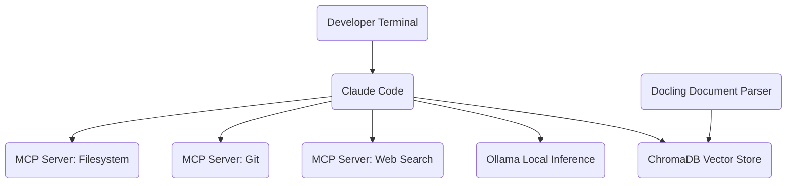

# Solo Developer Stack

<!-- SUMMARY: A complete configuration walkthrough assembling Claude Code, MCP servers, Ollama, ChromaDB, and Docling into a local-first AI development environment for a single developer. The architecture eliminates cloud infrastructure dependencies for supplementary tooling while providing agentic coding assistance, local model inference, and a lightweight retrieval-augmented generation pipeline. -->

The AI Tooling series maps how each supporting ecosystem component connects to coding agents, frameworks, and orchestrators. That architectural map serves as a menu of options; the remaining challenge is selecting and wiring specific components into a coherent, working system. This configuration assembles the first such selection: a local-first AI development stack for a single developer.

## The Problem

A developer working on a personal project or a small-team codebase needs AI assistance across the development workflow. The requirements include an agentic coding tool that can read, write, and reason about code across an entire repository; access to local models for tasks where commercial API calls are unnecessary or undesirable; and a lightweight retrieval pipeline for searching project documentation, design specs, and reference material by meaning rather than by keyword.

The constraints are equally specific. The system should run on a single workstation without requiring cloud infrastructure management, container orchestration, or GPU cluster provisioning. Per-API-call costs beyond the primary coding agent subscription should be minimal or zero. The configuration should remain simple enough for one person to install, maintain, and debug without dedicated DevOps support.

Enterprise concerns like multi-tenant data isolation, compliance audit trails, multi-agent orchestration, and high-concurrency serving are out of scope. The goal is maximum individual productivity with minimum operational overhead.

## Architecture Overview

The architecture divides into two functional paths. The interactive development path centers on a developer working through Claude Code in the terminal, which connects to MCP servers for structured access to the filesystem, Git history, and web content. When a task benefits from a local model, Claude Code routes the request to Ollama running on the same machine. The knowledge retrieval path handles documentation: Docling parses project documentation into clean text, ChromaDB stores the resulting embeddings, and Claude Code queries ChromaDB to retrieve relevant context during coding sessions.

The absence of several ecosystem layers is deliberate. There is no gateway because a single developer interacting with one commercial provider and one local model does not need traffic routing, failover, or multi-tenant cost tracking. There is no orchestrator because the coding agent handles task decomposition internally rather than coordinating multiple specialized agents. There is no dedicated observability platform because manual inspection of agent outputs is sufficient at solo scale.

## Component Selection

### Interface Layer: Claude Code

Claude Code, profiled in the Coding Agents Compared post, operates as a terminal-native agentic coding assistant. It reads and writes files, executes shell commands, and reasons across entire repositories without requiring an IDE. The terminal-native design avoids locking the developer into a specific editor, and the agent's built-in model handles the majority of coding tasks, including code generation, refactoring, debugging, test writing, and commit message authoring.

For a solo developer, a coding agent replaces the framework and orchestration layers entirely. Frameworks like LangChain and LlamaIndex exist to give developers programmatic control over prompt construction, tool invocation, and retrieval pipelines. Orchestrators like LangGraph and CrewAI exist to coordinate multiple agents across complex workflows. A coding agent absorbs both roles: it constructs its own prompts, invokes tools through MCP, manages its own context window, and decomposes multi-step tasks internally. Building a custom framework application to accomplish the same tasks would require writing and maintaining code that the agent already provides out of the box.

### Connectivity Layer: MCP Servers

The Model Context Protocol, profiled in the Connectivity and Routing post, standardizes how coding agents access external tools and data sources. Rather than relying on Claude Code's built-in filesystem access alone, MCP servers expose structured capabilities through a uniform protocol.

Three MCP servers cover the core connectivity needs for a solo developer. The **filesystem server** provides scoped, read-write access to project directories, allowing the agent to navigate, read, create, and modify files across the codebase. The **Git server** exposes repository history, branch operations, diffs, and commit metadata, enabling the agent to reason about code changes over time without the developer manually pasting Git output into the conversation. The **web search server** gives the agent access to current documentation, Stack Overflow answers, and API references, filling knowledge gaps that fall outside the model's training data.

All three servers run as local `stdio` processes launched by Claude Code. There is no remote server configuration, no OAuth setup, and no network traffic beyond the web search server's outbound queries. Adding a new capability, such as a database connector or a Jira integration, requires adding a single server entry to the MCP configuration file.

### Intelligence Layer: Ollama

Ollama, profiled in the Runtime Infrastructure post, provides single-binary local model inference on consumer hardware. A single `ollama run` command downloads an open-weight model from the central registry and starts a local server with automatic hardware detection for Apple Silicon, NVIDIA, and AMD processors.

The role of Ollama in this configuration is supplementary, not primary. Claude Code's built-in commercial model handles the demanding tasks: multi-file reasoning, complex refactoring, and nuanced code generation. Ollama handles tasks where sending data to a commercial API is either wasteful or undesirable. Summarizing a large log file, generating boilerplate code from a template, classifying code snippets by language, or processing sensitive data that should not leave the local machine are all candidates for local inference. The decision boundary is straightforward: if the task requires deep reasoning across a large codebase, the commercial model handles it; if the task is mechanical, repetitive, or involves sensitive data, the local model handles it.

Ollama exposes an OpenAI-compatible API endpoint on `localhost`, which means any script or tool that speaks the OpenAI protocol can route requests to the local model without code changes. Custom Modelfiles allow the developer to save pre-configured system prompts and temperature settings for specific tasks, creating named personas that can be invoked directly.

### Memory Layer: ChromaDB

ChromaDB, profiled in the Data Infrastructure post, is an open-source embedding database that runs embedded directly inside a Python process. There is no separate server to install, no Docker container to manage, and no database configuration to tune. A few lines of Python code create a persistent collection on local disk, and the same code works unchanged if the developer later migrates to a standalone server deployment.

In this configuration, ChromaDB stores vector embeddings of project documentation, design specs, meeting notes, and reference material. When the developer or the coding agent needs to find relevant context, a semantic query against ChromaDB returns the most similar document chunks, ranked by meaning rather than keyword match. ChromaDB's built-in embedding functions handle the text-to-vector conversion automatically during ingestion, eliminating the need for a separate embedding pipeline or an external embedding API.

The zero-infrastructure deployment model makes ChromaDB the right fit for this scale. Dedicated vector databases like Qdrant and Weaviate offer superior performance at high concurrency and large dataset sizes, measured in hundreds of millions of vectors, but they require running and maintaining a separate server process. For a solo developer indexing thousands of documents rather than millions, the embedded approach trades peak throughput for operational simplicity.

### Knowledge Management Layer: Docling

Docling, profiled in the Data Infrastructure post, is an open-source document parsing library developed by IBM Research. It runs specialized compact vision models locally to extract text, tables, and structural elements from PDFs, DOCX files, and other document formats without sending any data to external services.

The local execution model makes Docling the natural complement to the rest of this configuration's local-first philosophy. Cloud-based parsers like LlamaParse and Unstructured's managed API produce high-quality output, but they require uploading documents to external servers. For a developer working with proprietary codebases, client documentation, or personal notes, keeping the parsing pipeline entirely local eliminates data-egress concerns.

The Docling-to-ChromaDB pipeline works as follows: Docling parses raw documents into clean Markdown or structured JSON, preserving headings, table structures, and reading order. A short Python script chunks the parsed output, and ChromaDB's built-in embedding functions convert each chunk into a vector and store it. The entire pipeline runs as a single-machine batch job that the developer triggers whenever new documentation is added to the project.

## Integration Walkthrough

The components wire together through three integration paths.

**Claude Code to MCP servers**: The developer's MCP configuration file, typically stored at `~/.claude/claude_code_config.json` or the project-level `.mcp.json`, declares each server as a `stdio` transport with the command to launch it. When Claude Code starts, it spawns each server as a subprocess and discovers the available tools, resources, and prompts. The agent then invokes these tools autonomously during coding sessions, reading files through the filesystem server, checking Git history through the Git server, and searching the web through the web search server, all without manual intervention.

**Claude Code to Ollama**: Ollama runs as a persistent local server on `http://localhost:11434`. The developer can interact with Ollama directly via the command line for quick tasks, or scripts within the project can call the OpenAI-compatible API at `http://localhost:11434/v1` for batch processing. Claude Code can also invoke local models through shell commands or through an MCP server that wraps the Ollama API, routing specific subtasks to local inference when appropriate.

**Docling to ChromaDB**: A standalone Python script handles the knowledge pipeline. The script walks a designated documentation directory, passes each file through Docling's parser to extract clean text, applies a chunking strategy suited to the document type, and upserts the resulting chunks into a ChromaDB collection with metadata tags for source file, document type, and ingestion timestamp. A retrieval function queries ChromaDB with a natural-language question and returns the top-ranked chunks. This function can be called from the developer's own scripts, or exposed as an MCP tool that Claude Code invokes during coding sessions, closing the loop between the knowledge pipeline and the agentic workflow.

## Tradeoffs and Alternatives

This configuration optimizes for operational simplicity and local-first execution. Every component runs on a single machine, the total dependency count is low, and the developer maintains full control over all data.

The primary sacrifice is scale. ChromaDB's embedded mode and Ollama's sequential request queuing both become bottlenecks if the workload grows beyond a single user. A team of five developers sharing the same knowledge base and local model would need to migrate ChromaDB to a standalone server deployment and replace Ollama with a higher-throughput serving engine like vLLM.

The second sacrifice is observability. Without Langfuse, Braintrust, or a similar tracing platform, debugging multi-step agent interactions relies on reading Claude Code's conversation logs and terminal output. For a solo developer iterating on a personal project, this is acceptable. For a team that needs to audit agent behavior or track costs across users, a dedicated observability layer becomes necessary.

**Alternative substitutions at each layer**:

- **Interface**: Cursor, Windsurf, or GitHub Copilot can replace Claude Code if IDE integration is preferred over terminal-native operation. The MCP server configuration remains identical because all three support MCP clients.
- **Intelligence**: llama.cpp can replace Ollama for developers who want raw control over inference parameters, quantization settings, and memory allocation. The trade-off is a significantly more complex setup process.
- **Memory**: Qdrant in single-binary mode can replace ChromaDB if the developer needs advanced filtering capabilities or expects the dataset to grow beyond ChromaDB's embedded-mode comfort zone.
- **Knowledge Management**: LlamaParse can replace Docling if the developer's documents contain visually complex layouts where cloud-based vision-language models produce higher-quality extraction. The trade-off is a cloud dependency and a per-page cost.

This configuration establishes the foundation: a single developer, one machine, and a complete AI-augmented development workflow. The companion setup guide provides step-by-step installation and wiring instructions for each component in this configuration.

## References

1. Claude Code Documentation, Anthropic.
2. Model Context Protocol Specification, Anthropic.
3. Ollama Documentation, Ollama Inc.
4. Chroma Documentation, Chroma Inc.
5. Docling Documentation, IBM Research and LF AI and Data Foundation.
6. MCP Filesystem Server, Model Context Protocol Reference Implementations.
7. MCP Git Server, Model Context Protocol Reference Implementations.
