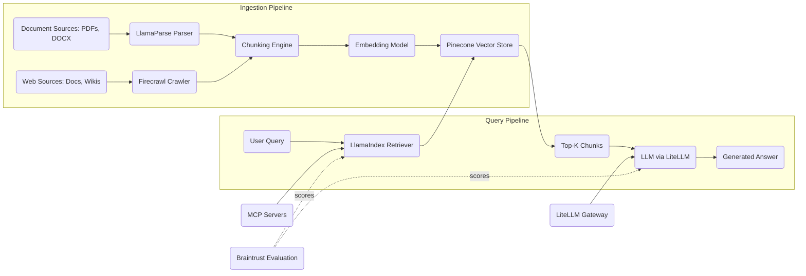

# RAG-First Knowledge System

<!-- SUMMARY: A complete configuration walkthrough assembling LlamaIndex, MCP servers, LiteLLM, Pinecone, LlamaParse, Firecrawl, and Braintrust into a retrieval-augmented generation system optimized for answer quality over a large, continuously evolving document corpus. The architecture prioritizes ingestion pipeline design, chunking strategy selection, and retrieval evaluation rather than model serving infrastructure, reflecting the principle that retrieval quality dominates answer quality in knowledge-heavy applications. -->

The previous post assembled an airgapped deployment where every component runs within a sealed network perimeter, with vLLM and SGLang serving open-weight models on local GPU hardware, Qdrant storing vectors in a single-binary deployment, and Docling parsing documents without any external connectivity. That configuration optimizes for infrastructure constraints: the primary engineering challenge is making the stack function in isolation. This post addresses a different bottleneck. When an organization's primary objective is answering natural-language questions from a large, heterogeneous knowledge base, the quality of retrieved context determines the quality of generated answers far more than model selection does. A state-of-the-art language model producing a response from irrelevant or poorly chunked context will generate confident, well-structured nonsense. A competent model producing a response from precisely retrieved, well-structured context will generate accurate, grounded answers. This configuration optimizes the entire pipeline for retrieval quality.

## The Problem

An organization maintains a knowledge base spanning thousands of documents across multiple formats: technical PDFs with complex tables and figures, internal wikis with hyperlinked content, web-hosted documentation that updates continuously, and structured reports with nested sections. Knowledge workers need to ask natural-language questions and receive accurate, cited answers drawn from this corpus.

The system must handle two distinct document acquisition patterns. Static documents, including PDFs, Word files, and archived reports, arrive in batches and require format-aware parsing that preserves table structures, figure captions, and section hierarchies. Live web content, including documentation sites, knowledge bases, and internal wikis, changes continuously and requires periodic crawling to keep the index current. A single parser cannot handle both patterns: PDF parsing requires layout analysis and OCR capabilities, while web crawling requires JavaScript rendering, link traversal, and rate limiting.

Retrieval quality depends on three pipeline stages that precede the language model entirely. Parsing must extract clean, structured text from each source format without losing semantic elements like table relationships or heading hierarchies. Chunking must split the parsed output into segments that balance retrieval granularity against context completeness, because chunks that are too small lose surrounding context while chunks that are too large dilute the relevance signal. Embedding must encode each chunk into a vector representation that captures semantic meaning with sufficient precision for the retrieval engine to distinguish between closely related but distinct concepts.

The language model is the final consumer of a pipeline whose quality ceiling is set long before inference begins.

## Architecture Overview

The diagram splits into two pipelines that share Pinecone as the central data store. The ingestion pipeline on the left transforms raw documents and web content into indexed vectors. Document sources flow through LlamaParse, which handles PDFs and structured files with layout-aware parsing. Web sources flow through Firecrawl, which crawls and renders web content into clean Markdown. Both parsers feed into a shared chunking engine that splits parsed output into retrieval-sized segments, an embedding model that converts chunks to vectors, and Pinecone that stores the vectors with metadata for filtered retrieval.

The query pipeline on the right transforms a user question into a grounded answer. A user query enters the LlamaIndex retriever, which generates a query embedding, searches Pinecone for the most relevant chunks, and passes the top-ranked results to the language model as context. LiteLLM sits between LlamaIndex and the model provider, enabling routing across different providers without changing application code.

Braintrust connects to both pipelines through evaluation scoring. Dotted lines represent the evaluation feedback path: Braintrust measures retrieval relevance and answer faithfulness, and the resulting scores inform pipeline tuning decisions, including chunk size adjustments, embedding model selection, and retrieval parameter optimization.

## Component Selection

### Framework Layer: LlamaIndex

LlamaIndex, profiled in the Agent Frameworks Compared post, provides a framework architecture built around index abstractions and retrieval pipelines. This is the same framework selected for the airgapped deployment, and for the same core reason: when the primary workload is retrieval-augmented generation, LlamaIndex's native index types, query engines, and response synthesizers map directly to the application's requirements.

In this configuration, LlamaIndex serves a narrower role than in the airgapped deployment. There is no multi-agent orchestration, no LangGraph wrapper, and no complex workflow coordination. The system is a single retrieval-generation pipeline: parse documents, index them, retrieve relevant chunks for each query, and generate an answer. LlamaIndex's `VectorStoreIndex` handles the indexing and retrieval abstractions, its `QueryEngine` manages the retrieval-to-generation flow, and its `ResponseSynthesizer` combines retrieved context with the language model's output into a coherent, cited response.

LlamaIndex's integration with Pinecone through the `llama-index-vector-stores-pinecone` package provides a direct connection between the retrieval abstractions and the managed vector database. The integration supports Pinecone's metadata filtering, enabling queries that constrain retrieval to specific document types, date ranges, or source categories.

### Connectivity Layer: MCP Servers

MCP servers, profiled in the Connectivity and Routing post, provide the LlamaIndex retriever with access to document repositories, databases, and web content beyond the indexed corpus. In prior configurations, MCP servers connected agents to operational tools like filesystems, Git repositories, and ticketing systems. In this configuration, MCP servers serve a retrieval-augmentation role: they provide supplementary context that enriches the retriever's capabilities beyond the pre-indexed Pinecone corpus.

A database MCP server connects the retriever to structured data sources, enabling queries that combine vector similarity search with SQL lookups. A web search MCP server provides access to content not yet crawled by Firecrawl, serving as a fallback for queries about recent changes. A document repository MCP server provides direct access to raw source files when the retriever needs to fetch full documents rather than indexed chunks.

### Gateway Layer: LiteLLM

LiteLLM, profiled in the Connectivity and Routing post, provides gateway routing between LlamaIndex and model providers. This configuration uses commercial APIs as the primary inference path, reversing the airgapped deployment's self-hosted-only constraint.

LiteLLM serves two functions in this configuration. First, provider flexibility for generation models: the organization can route generation requests to OpenAI, Anthropic, Google, or any other supported provider based on cost, quality, or latency preferences, and switch providers without modifying application code. Second, provider flexibility for embedding models: the embedding step in the ingestion pipeline routes through LiteLLM, enabling the organization to evaluate different embedding models from different providers and select the one that produces the best retrieval accuracy for its specific corpus.

Cost governance through LiteLLM's virtual key system remains relevant. A RAG-heavy workload generates substantial embedding API costs during initial corpus indexing and ongoing re-indexing cycles. LiteLLM's budget tracking provides visibility into embedding versus generation cost ratios, informing decisions about batch size, re-indexing frequency, and provider selection.

### Memory Layer: Pinecone

Pinecone, profiled in the Data Infrastructure post, provides the managed vector database layer. The previous configurations used ChromaDB for embedded single-developer use, Weaviate for enterprise multi-tenancy, and Qdrant for airgapped single-binary deployment. Pinecone addresses a different operational priority: eliminating vector database infrastructure management entirely so that engineering effort concentrates on retrieval quality rather than database operations.

Pinecone scales to billions of vectors without requiring capacity planning, index tuning, or infrastructure maintenance. The managed service handles replication, failover, and scaling automatically. For an organization whose bottleneck is retrieval quality rather than infrastructure sovereignty, offloading database operations to a managed service frees engineering time for the work that directly improves answer quality: parsing strategies, chunking algorithms, embedding model evaluation, and retrieval parameter tuning.

Pinecone's metadata filtering enables retrieval queries that combine vector similarity with attribute constraints. A query can restrict results to documents from a specific source, date range, or content category without requiring a separate filtering step. This filtering integrates directly with LlamaIndex's retriever through the Pinecone vector store integration, allowing filter expressions in the query engine configuration.

Pinecone's namespace feature provides logical isolation between different document collections within a single index. Different knowledge domains, such as product documentation, engineering specs, and customer support articles, can occupy separate namespaces with independent retrieval paths while sharing the underlying infrastructure.

### Knowledge Management Layer: LlamaParse and Firecrawl

LlamaParse and Firecrawl, both profiled in the Data Infrastructure post, handle the two document acquisition patterns that define this configuration's ingestion requirements.

**LlamaParse** provides cloud-based document parsing with a focus on complex, visually structured documents. Standard text extraction tools struggle with PDFs containing multi-column layouts, nested tables, embedded figures with captions, and mixed text-and-image content. LlamaParse uses vision models to analyze document layout, extract table structures as structured data rather than flattened text, preserve heading hierarchies, and maintain the relationship between figures and their surrounding context. The output is clean Markdown that preserves the document's semantic structure, producing chunks that retain contextual meaning rather than arbitrary text fragments.

For a RAG-first system, parsing quality directly determines retrieval quality. A table extracted as flattened text loses its row-column relationships, making it impossible for the retriever to find the correct cell value in response to a specific query. A table extracted with structure preserved allows the chunking engine to keep related rows together and enables the embedding model to encode the table's semantic content accurately.

**Firecrawl** provides web crawling with JavaScript rendering, converting dynamic web pages into clean Markdown. Documentation sites, knowledge bases, and internal wikis often render content through client-side JavaScript that standard HTTP requests cannot capture. Firecrawl renders pages in a headless browser, extracts the rendered content, and converts it to Markdown with link resolution and code block preservation.

The combination addresses the full spectrum of knowledge sources: LlamaParse for static, visually complex documents and Firecrawl for dynamic, continuously updated web content. Both produce Markdown output, enabling a unified chunking and embedding pipeline downstream regardless of the source format.

### Observability Layer: Braintrust

Braintrust, profiled in the Runtime Infrastructure post, provides evaluation scoring and experiment management for the RAG pipeline. Prior configurations used Langfuse and Arize Phoenix for production tracing and operational observability. Braintrust addresses a different need: measuring and improving retrieval quality through structured evaluation.

Braintrust provides three capabilities that match this configuration's focus on retrieval optimization. First, dataset management: Braintrust stores versioned evaluation datasets consisting of question-answer pairs with expected source documents, enabling consistent measurement across pipeline iterations. Second, scoring functions: Braintrust runs programmatic evaluations that measure retrieval precision, answer faithfulness, and citation accuracy, producing quantitative scores that track improvement or regression across experiments. Third, experiment comparison: Braintrust's dashboard displays side-by-side results from different pipeline configurations, enabling data-driven decisions about chunk size, embedding model, retrieval parameters, and prompt templates.

The evaluation feedback loop operates as follows. The team creates an evaluation dataset of representative questions with known correct answers and source documents. Braintrust runs the current pipeline against this dataset and scores each response for retrieval relevance, answer correctness, and citation accuracy. The team adjusts a pipeline parameter, such as chunk size or embedding model, and re-runs the evaluation. Braintrust compares the scores from both runs, identifying whether the change improved or degraded retrieval quality. This cycle repeats until the pipeline achieves the target quality threshold.

Production-facing observability for cost tracking, latency monitoring, and trace capture remains available through LiteLLM's built-in logging. Braintrust's role in this configuration is not operational monitoring; it is retrieval quality measurement.

## Integration Walkthrough

The components wire together through four integration paths.

**LlamaParse and Firecrawl to the chunking engine**: LlamaParse accepts document uploads through its API and returns parsed Markdown. Firecrawl accepts a starting URL and crawl configuration, rendering each discovered page and returning Markdown output. Both outputs feed into a shared chunking module. The chunking strategy is configurable per source type: document-structure-aware chunking for LlamaParse output preserves section boundaries, table integrity, and heading hierarchies, while semantic chunking for Firecrawl output respects paragraph and section breaks in the rendered web content. The choice of chunking strategy has a measurable impact on retrieval quality, and Braintrust evaluations provide the data to select the optimal approach for each content type.

**Chunking engine to Pinecone through LiteLLM**: Each chunk passes through an embedding model routed via LiteLLM to produce a vector representation. The vectors load into Pinecone with metadata tags including source URL or file path, document type, section heading, ingestion timestamp, and any custom taxonomy labels. LiteLLM's provider abstraction enables switching between embedding models, such as OpenAI's text-embedding-3 family and Cohere's embed models, without modifying the ingestion code. The embedding model selection directly affects retrieval accuracy; Braintrust evaluations across different embedding models identify which encoder produces the best retrieval precision for the organization's specific corpus.

**LlamaIndex retriever to Pinecone to LLM**: When a user submits a query, the LlamaIndex query engine generates a query embedding using the same embedding model and LiteLLM routing path as the ingestion pipeline, ensuring dimensional consistency. The query engine searches Pinecone with configurable top-K and optional metadata filters, retrieves the highest-scoring chunks, and passes them to the language model as context. The response synthesizer assembles the model's output with source citations, linking each claim in the generated answer to the specific chunks that support it.

**Braintrust evaluation across the pipeline**: Braintrust evaluation datasets contain question-expected answer-expected source triples. Running an evaluation submits each question through the full query pipeline, captures the retrieved chunks and generated answer, and scores the result on multiple dimensions: retrieval precision measures whether the correct source documents appear in the top-K results, answer faithfulness measures whether the generated answer is supported by the retrieved context, and citation accuracy measures whether the source attributions in the answer correctly reference the retrieved chunks. The scores aggregate into a pipeline quality report that the team uses to prioritize optimization efforts.

## Tradeoffs and Alternatives

This configuration optimizes for retrieval quality and operational simplicity. The managed services, Pinecone for vector storage, LlamaParse for document parsing, Firecrawl for web crawling, and commercial APIs for inference, eliminate infrastructure management so that engineering effort focuses entirely on the retrieval pipeline.

The primary cost is vendor dependency. Every managed service in this configuration is a commercial product with usage-based pricing. The organization depends on Pinecone for vector storage availability, LlamaParse for parsing API uptime, Firecrawl for crawling service reliability, and commercial model providers for inference capacity. Each dependency introduces a potential point of failure outside the organization's control, and each carries ongoing operational costs that scale with usage.

The second cost is limited customization depth. Managed services abstract away the underlying infrastructure, which eliminates operational burden but also eliminates the ability to fine-tune low-level parameters. Pinecone's indexing algorithms, replication strategies, and query execution plans are not configurable. LlamaParse's vision models and layout analysis algorithms are not modifiable. For organizations that need to optimize at the infrastructure level rather than the pipeline level, self-hosted alternatives provide greater control.

The third cost is data residency. Every document in the corpus passes through at least one cloud service during parsing and indexing. Organizations with strict data sovereignty requirements cannot use this configuration without evaluating each service's data handling and retention policies.

**Alternative substitutions at each layer**:

- **Framework**: LangChain can replace LlamaIndex if the system extends beyond pure RAG to include multi-step agent workflows with tool use. The tradeoff is a less optimized retrieval pipeline in exchange for broader agent capabilities.
- **Memory**: Qdrant or Weaviate in self-hosted mode can replace Pinecone if the organization requires infrastructure sovereignty. The tradeoff is accepting the operational burden of vector database management in exchange for full control over data residency and infrastructure costs.
- **Knowledge Management**: Unstructured can replace LlamaParse if the organization prefers an open-source parsing library that runs locally. Docling can replace LlamaParse for PDF-focused workloads with simpler layout requirements. For web crawling, a custom Playwright or Puppeteer pipeline can replace Firecrawl if the crawl scope is narrow and predictable.
- **Observability**: Langfuse can replace Braintrust if the primary need is production trace capture rather than retrieval evaluation scoring. Arize Phoenix can replace Braintrust if embedding drift detection and cluster visualization are the primary diagnostic needs.
- **Gateway**: Portkey can replace LiteLLM if the organization needs built-in semantic caching to reduce embedding costs on repeated or similar queries. The tradeoff is a smaller self-hosting footprint in exchange for additional managed-service dependency.

This configuration demonstrates that the highest-leverage optimization in a knowledge-heavy application is not model selection or prompt engineering, but the ingestion-chunking-embedding pipeline that determines what context the model receives. The companion setup guide provides step-by-step installation and wiring instructions for each component in this configuration. The next post shifts from retrieval optimization to systematic quality measurement, assembling an evaluation-driven development loop that applies structured scoring and experiment tracking to any AI application.

## References

1. LlamaIndex Documentation, LlamaIndex Inc.
2. Model Context Protocol Specification, Anthropic.
3. LiteLLM Documentation, BerriAI.
4. Pinecone Documentation, Pinecone Systems Inc.
5. LlamaParse Documentation, LlamaIndex Inc.
6. Firecrawl Documentation, Mendable Inc.
7. Braintrust Documentation, Braintrust Data Inc.
