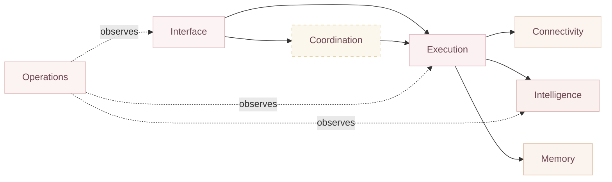
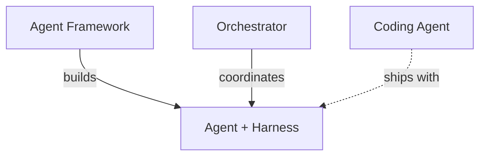
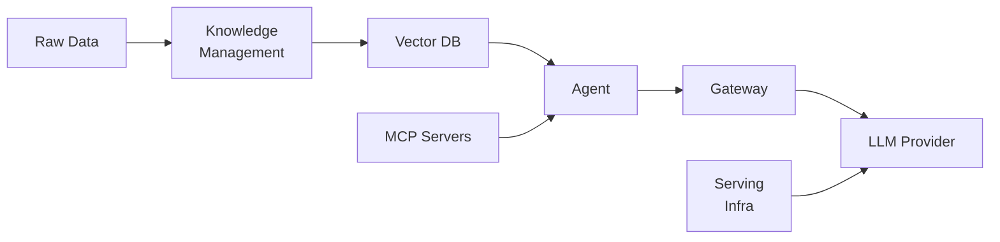
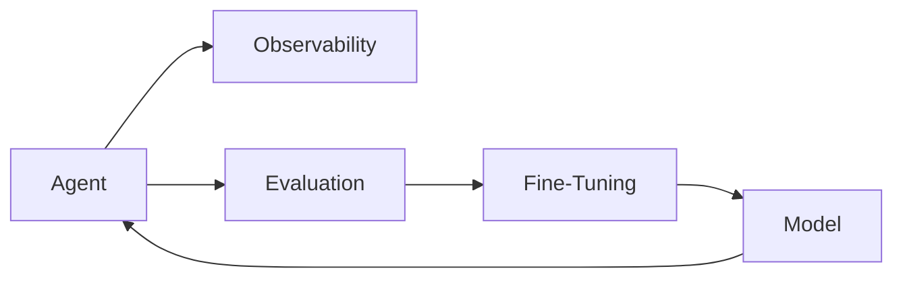

# Preface: The AI Tooling Landscape

<!-- SUMMARY: A structural map of the AI tooling ecosystem, defining functional zones, categorizing 11 types of tools, and establishing decision rules for assembling them into working systems. -->

A developer building an application that uses large language models must navigate a fragmented ecosystem of tools with overlapping capabilities and unclear boundaries. A single project requires code generation, data retrieval, multi-step reasoning, and real-time monitoring, but the tools that handle these tasks come from different vendors, use different paradigms, and sometimes compete in functionality. Choosing the wrong combination leads to redundant infrastructure, integration friction, or gaps in critical capabilities like observability and failure recovery.

The fragmentation exists because the ecosystem grew bottom-up. Individual tools were created to solve specific problems, such as Pinecone for vector storage, LangChain for LLM application building, and Cursor for AI-assisted coding, without a shared architectural standard. The result is a landscape where categories overlap, terminology is inconsistent, and the same tool is sometimes described as a "framework" by one vendor and an "orchestrator" by another.

This series maps the AI tooling landscape. It defines every category of tool, explains how the categories relate to each other, and provides reproducible configurations for assembling complete systems. The goal is to give the reader a structural understanding of the ecosystem, so that selecting and combining tools becomes a deliberate architectural decision rather than a guess.

## Functional Zones

In network engineering, the term "layer" carries specific structural implications: strict encapsulation, where each layer communicates only with adjacent layers, and universal presence, where all layers must exist in every system. The AI tooling ecosystem does not follow these rules. An application can call a language model directly without any orchestration. Observability tools monitor the entire system, not just one adjacent component. A solo developer setup may have no orchestrator at all.

To avoid these misleading associations, this series organizes the ecosystem into **functional zones**: groupings of tools by the concern they address. Each zone is independently adoptable. A given system uses only the zones its use case requires. The zones are not ordered from "top" to "bottom," and there is no implication that one zone encapsulates another.

The distinction matters because it affects how systems are designed. If these were true abstraction layers, such as the OSI model, skipping a layer would be architecturally invalid. Functional zones carry no such constraint. A simple chatbot uses only the Interface and Intelligence zones, which is a UI calling a language model directly. A complex enterprise pipeline uses all seven. The zones describe what is available, not what is required.

The diagram below shows the seven zones and how they connect. Solid arrows show primary data and control flow. Dotted arrows show observation. Select any zone to see its description.

    
Select a zone in the diagram to see its description.

## The Tooling Taxonomy

The ecosystem contains eleven categories of tools, each addressing a specific problem. The diagram below maps every category to its functional zone. Select a category to see a brief definition. Full definitions follow in the text.

    

        Interface
        <button class="taxonomy-node" data-category="coding-agents">Coding Agents</button>
    

    

        Coordination
        <button class="taxonomy-node" data-category="orchestrators">Orchestrators</button>
    

    

        Execution
        <button class="taxonomy-node" data-category="frameworks">Frameworks</button>
        <button class="taxonomy-node" data-category="harnesses">Harnesses</button>
    

    

        Connectivity
        <button class="taxonomy-node" data-category="mcp">MCP Servers</button>
    

    

        Intelligence
        <button class="taxonomy-node" data-category="gateways">Gateways</button>
        <button class="taxonomy-node" data-category="serving">Serving Infra</button>
    

    

        Memory
        <button class="taxonomy-node" data-category="vector-dbs">Vector DBs</button>
        <button class="taxonomy-node" data-category="knowledge-mgmt">Knowledge Mgmt</button>
    

    

        Operations
        <button class="taxonomy-node" data-category="observability">Observability &amp; Eval</button>
        <button class="taxonomy-node" data-category="fine-tuning">Fine-Tuning</button>
    

    
Select a category to see its definition.

### Interface

**Coding Agents**

Writing code involves repetitive tasks: renaming variables across files, running test suites after changes, searching through unfamiliar codebases for relevant logic. Coding agents automate these workflows by giving a language model direct access to the development environment. The agent reads the codebase, proposes multi-file edits, runs terminal commands, and iterates based on build or test results. Unlike basic autocomplete, which suggests the next few tokens of code, a coding agent operates at the task level: "add input validation to all API endpoints" or "refactor this module to use dependency injection."

### Coordination

**Agent Orchestrators**

When a system involves multiple AI agents, or one agent running a complex, multi-step workflow, execution becomes fragile. An agent frequently completes three steps of a ten-step process before hitting a rate limit, an ambiguous decision requiring human review, or an outright crash. Without coordination infrastructure, all progress is lost. Orchestrators manage who does what, in what order, and what happens when things go wrong. They persist workflow state so that a process can resume after interruption, route tasks between specialized agents, and enforce control flow logic, such as sequential steps, parallel branches, conditional routing, and human approval gates.

### Execution

**Agent Frameworks**

When an application needs to go beyond a single API call to a language model, the developer must build infrastructure for tool use, memory, retrieval, and structured outputs. Without a framework, this means writing custom code for prompt management, response parsing, tool execution, error handling, and context window management. Agent frameworks provide these building blocks as reusable components, reducing the boilerplate required to build a capable agent. The boundary between "framework" and "orchestrator" is not always clean; some frameworks include orchestration primitives, and some orchestrators bundle framework-level building blocks.

**Agent Harnesses**

When an agent executes code or calls external tools, it operates in an environment where failures can have real consequences: a malformed API call charges money, a buggy script deletes files, a hallucinated command modifies production data. An agent harness wraps a single agent with state management for persisting progress across retries, tool execution sandboxing for isolating side effects, and safety guardrails for blocking or flagging risky actions. Most production-grade frameworks include harness-like capabilities. Coding agents ship with their own built-in harness, so a developer using a coding agent does not need to configure one separately.

### Connectivity

**MCP Servers**

Before the Model Context Protocol (MCP), connecting an AI tool to an external service, such as a database, an API, or a file system, required a custom integration for each pair of tool and service. Supporting N tools and M services required N times M integrations, and each tool vendor had its own plugin format. MCP standardizes this interface. An MCP server exposes a set of tools and data sources through a common protocol, and any MCP-compliant client can connect to any MCP server without custom integration code. The analogy is USB: one plug standard, many devices [1].

### Intelligence

**AI Gateways / Routers**

Applications that hardcode a single language model provider face vendor lock-in, rate limits, and no fallback when that provider experiences downtime. AI gateways provide a single API endpoint that sits between the application and multiple model providers. The gateway handles request routing by sending queries to the cheapest model that meets the quality threshold, load balancing, automatic fallback by routing to Provider B if Provider A is down, cost tracking, and usage analytics. From the application's perspective, there is one API to call; the gateway handles provider selection transparently.

**Serving Infrastructure**

Running open-weight models, models whose weights are publicly available such as Llama or Qwen, locally or in a private cloud requires specialized runtime infrastructure. The model must be loaded into GPU memory, requests must be batched for throughput, multiple users need concurrent access, and the serving endpoint must expose a standard API. Serving infrastructure, such as vLLM or Ollama, provides this runtime engine, handling the low-level mechanics of hosting a model and exposing it through a clean interface.

### Memory

**Vector Databases**

Language models have limited context windows, the amount of text they can process in a single request, and no persistent memory across conversations. A model lacks persistent access to an entire corporate knowledge base or documentation set. Vector databases solve this by storing text as numerical representations called embeddings, where similar text maps to nearby points in a high-dimensional space. When a user asks a question, the system converts the question to an embedding, finds the most similar stored embeddings, and injects the corresponding text chunks into the prompt as context.

**Knowledge Management Pipelines**

Vector databases require clean, well-structured text chunks to function effectively, while real-world data exists in messy formats: scanned PDFs with complex layouts, HTML pages with navigation boilerplate, proprietary database schemas, spreadsheets with merged cells. Knowledge management pipelines handle the transformation from raw data to retrievable knowledge. This includes document parsing for extracting text from PDFs while preserving structure, chunking for splitting documents into semantically meaningful segments, embedding for converting text chunks to vectors, and loading for inserting the results into the vector database. The quality of retrieval depends heavily on the quality of this preparation.

### Operations

**Observability and Evaluation Tools**

Language models produce non-deterministic outputs. The same prompt can yield different responses on different runs. Standard debugging techniques, such as breakpoints, stack traces, and unit tests with exact expected values, do not apply directly. Observability tools trace the exact prompts, responses, latency, token counts, and costs of every step in an agent execution chain. Evaluation tools go further by programmatically scoring outputs against reference answers, rubrics, or human judgments. Together, these tools make it possible to detect regressions, such as a model update that degrades answer quality, identify bottlenecks, such as a retrieval step that takes too long, and compare the effectiveness of different prompt strategies.

**Fine-Tuning Platforms**

Generic foundation models are trained on broad datasets and perform well across many tasks, while they often fail at domain-specific requirements: medical terminology, legal citation formats, company-specific coding conventions, or a particular communication style. Fine-tuning adapts a base model to a specialized dataset so that it performs better on a narrow set of tasks. Fine-tuning platforms manage the data formatting to convert examples into the training format the model expects, compute provisioning to allocate GPUs for the training run, training loop execution, and model evaluation. The result is a specialized model variant that maintains the general capabilities of the base model while improving on the targeted tasks.

## How the Pieces Connect

The functional zones and taxonomy define what each tool category is. The diagrams below show how they relate to each other in practice.

### The Agent Stack

Building an agent that reliably executes tasks requires multiple types of infrastructure working together.

A framework provides the building blocks, such as tool definitions, prompt templates, and memory interfaces, used to construct an agent. A harness wraps that agent with production-grade reliability: state persistence, sandboxed tool execution, and guardrails that prevent unsafe actions. An orchestrator sits above, coordinating multiple agents or managing complex workflows with branching, parallelism, and failure recovery. A coding agent, such as Cursor or Claude Code, is a complete, packaged product that already includes its own built-in harness, represented by the dashed arrow. It does not require separate framework or harness setup.

### The Data and Intelligence Pipeline

When an agent needs to answer a question or complete a task, data flows through several components between the raw source material and the final response.

Raw data, including PDFs, HTML pages, and database exports, enters the knowledge management pipeline, which parses, chunks, and embeds it into the vector database. At query time, the agent retrieves relevant context from the vector database, constructs a prompt enriched with that context, and sends it through the gateway to the language model provider. MCP servers provide additional tool access, such as file systems, APIs, and databases, that the agent can invoke during execution. Serving infrastructure hosts open-weight models for organizations that run their own models instead of using an external provider.

### The Operations Loop

In production systems, a continuous feedback cycle monitors and improves the system over time.

Observability tools trace every step of agent execution, capturing prompts, responses, latency, and token usage. Evaluation tools score the quality of outputs against reference answers or rubrics. When evaluation reveals consistent weaknesses, such as the model failing at a specific type of task or its outputs not matching the required format, fine-tuning platforms adapt the model using domain-specific training data. The improved model then powers the next round of agent execution, completing the cycle.

## Key Distinctions

The boundaries between categories are often blurred. Three distinctions cause the most confusion.

**Framework vs. Orchestrator**

A framework provides the building blocks that define what an agent is and can do. An orchestrator handles the coordination of when and how multiple agents interact. A developer constructs a researcher agent and a writer agent using a framework, then uses an orchestrator to manage the handoff between them. Some tools, such as Microsoft Agent Framework, span both categories, providing framework primitives and orchestration coordination in a single package.

**Harness vs. Orchestrator**

A harness is a reliability wrapper for a single agent: it manages that agent's state, safely executes its tool calls, and enforces guardrails. An orchestrator manages the coordination between multiple agents or across complex multi-step workflows. The distinction is scope: one agent for a harness versus many agents or workflows for an orchestrator.

**Coding Agent vs. Framework**

A coding agent is an end-product application, similar to a text editor with built-in AI capabilities. A framework is a library used by developers to build their own applications. A developer does not need to write framework integration code to use a coding agent; it is already a packaged, self-contained product that ships with its own agent, harness, and tool integrations.

## Decision Rules

Selecting the right tools depends on the complexity and requirements of the system being built.

| Use Case | Tool |
|----------|------|
| Writing or editing code | **Coding agent** handles this directly without additional infrastructure |
| Going beyond a single API call (tool use, memory, structured outputs) | **Framework** provides the building blocks |
| Single agent needs reliable tool execution with guardrails | **Harness** provides that safety (most frameworks include harness-like capabilities) |
| Multiple agents, multi-step workflows, or crash recovery | **Orchestrator** manages coordination and state persistence |
| Multiple language model providers (cost, fallback, compliance) | **Gateway** provides unified routing across providers |
| Answering questions from a large knowledge base | **Vector database + knowledge management pipeline** handle storage and retrieval |
| Monitoring execution quality, tracing errors, comparing prompt strategies | **Observability and evaluation tools** provide this visibility |
| Already using a coding agent | A separate **harness** is unnecessary; coding agents ship with one built in |

## Series Roadmap

The subsequent posts in this series cover each part of the ecosystem in depth:

- **Coding Agents Compared**: Detailed profiles and comparison tables for Cursor, GitHub Copilot, Windsurf, Cline, Claude Code, and Antigravity.
- **Agent Frameworks Compared**: Analysis of LangChain, LlamaIndex, Microsoft Agent Framework, Pydantic AI, and DSPy.
- **Agent Orchestrators Compared**: Review of LangGraph, CrewAI, Microsoft Agent Framework, OpenAI Agents SDK, and Temporal.
- **Connectivity and Routing**: Coverage of the Model Context Protocol for standardized tool and data access, and AI gateways and routers for unified multi-provider traffic management.
- **Data Infrastructure**: Coverage of vector databases for semantic search and retrieval, and knowledge management pipelines for parsing and structuring raw documents.
- **Runtime Infrastructure**: Coverage of model serving engines, fine-tuning platforms, observability and evaluation tools, and a capstone section mapping how all supporting ecosystem components interconnect.
- **Configuration Walkthroughs**: Five end-to-end system configurations, each with a companion setup guide covering a solo developer stack, an enterprise pipeline, an airgapped deployment, a RAG knowledge system, and an evaluation-driven development loop.

## References

1. Model Context Protocol Specification, Linux Foundation Agentic AI.
