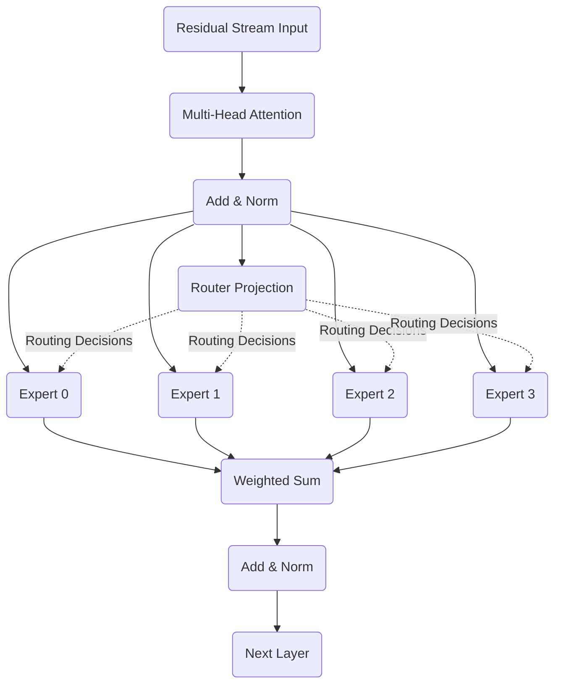

# Preface: From Dense to Sparse
<!-- SUMMARY: The dense Feed-Forward Network within a Transformer activates every parameter for every token, creating an unsustainable computation bottleneck at frontier scale. The Mixture of Experts architecture solves this inefficiency by decoupling the total parameter capacity from the per-token floating-point operations. This architectural evolution bridges the gap between the original Transformer design and modern sparse models. -->

The 24-part Transformer series concluded by tracing the full forward and backward pass through a dense two-layer decoder architecture. Within that dense structure, the Feed-Forward Network activates every single parameter for every token passing through the residual stream. At small scales, this brute-force approach works fine. At frontier scale, where Feed-Forward Network parameters constitute approximately two-thirds of total model capacity, it creates a severe computational bottleneck.

The Mixture of Experts architecture solves this problem by separating knowledge capacity from compute cost. A dense model locks these two quantities together: doubling the parameters doubles the cost of processing every token. A sparse Mixture of Experts model breaks this link, storing a vast number of parameters while activating only a small, relevant fraction for each token. This separation is the reason every modern frontier language model relies on sparse expert architectures. GPT-4, Gemini, DeepSeek-V3, Mixtral, and Grok all use this strategy to achieve massive capacity without proportionally massive compute.

## Prerequisites and Context

This series serves as the direct architectural successor to the Transformer series. The text assumes familiarity with the material covered in Parts 10 through 14 of that prior series. A practitioner entering without having read the Transformer series must understand the Feed-Forward Network as a two-layer affine projection with a nonlinear activation function.

An affine projection is a geometric operation consisting of a linear transformation followed by a translation. Within the Feed-Forward Network, a token vector is multiplied by a learned weight matrix to rotate and scale the geometric space, and a bias vector is subsequently added to shift the origin. The standard dense Feed-Forward Network operates as a key-value memory bank through two such projections. 

The first affine projection expands the vector dimensionality. A nonlinear activation function then enforces sparsity. A second affine projection subsequently contracts the vector back to the original model dimension. The Mixture of Experts architecture replaces this single monolithic memory bank with multiple smaller, independent Feed-Forward Networks and a learned gating mechanism to route tokens between them. The token representations used throughout this series are identical to those computed in the Transformer series, maintaining strict numerical and geometric continuity.

## Chapter Roadmap

The progression of the series systematically deconstructs the routing mechanics, pathologies, and economics of sparse architectures.

- **Chapter 1: The Dense FFN Bottleneck** establishes the exact FLOP counts and parameter waste of the standard monolithic architecture.
- **Chapter 2: The Router** details the gating network mathematics, softmax normalization, and top-k selection mechanism.
- **Chapter 3: The MoE Forward Pass** computes the full expert execution and weighted combination for a batch of tokens.
- **Chapter 4: Expert Collapse** simulates the positive feedback loop that causes routing distributions to degenerate.
- **Chapter 5: Load Balancing: The Auxiliary Loss** derives the auxiliary loss function and analyzes its gradients to prevent expert starvation.
- **Chapter 6: Capacity, Token Dropping, and the Switch Transformer** traces the mechanics of token capacity limits and residual bypasses.
- **Chapter 7: Fine-Grained Experts and Shared Expert Isolation** explores extreme parameter segmentation and shared universal pathways.
- **Chapter 8: The Frontier: Auxiliary-Loss-Free Routing** computes dynamic bias adjustments that eliminate gradient distortion.
- **Chapter 9: The Economics of Sparsity** synthesizes the parameter-to-FLOP ratio advantages that dominate modern AI scaling laws.

The series begins by quantifying the exact computational waste of the dense architecture. The next chapter mathematically constructs the routing mechanism required to bypass that limitation.

# Chapter 1: The Dense FFN Bottleneck
<!-- SUMMARY: The standard dense Feed-Forward Network forces every token to activate the entire parameter bank, creating severe computational inefficiencies at scale. Replacing this monolithic structure with a Mixture of Experts architecture introduces conditional computation, allowing models to scale total parameter capacity independently of the floating-point operations executed per token. -->

The preceding preface established the core goal: separate a model's total parameter capacity from its per-token computational cost. Grounding this goal in concrete mathematics requires a precise accounting of the waste embedded within the standard monolithic Feed-Forward Network.

## The Dense Activation Penalty

The dense Feed-Forward Network operates as a two-layer key-value memory bank. A token vector $x$ is expanded through a weight matrix $W_1$, passed through a nonlinear activation function, and contracted through a second weight matrix $W_2$:

$$
\text{FFN}(x) = \text{ReLU}(x W_1) W_2
$$

The mathematical dimensions directly dictate the computational cost. A standard toy-scale dense model configures the representation space with a model dimension of $d_{model} = 6$ and an intermediate hidden dimension of $d_{ff} = 8$. The expansion matrix $W_1 \in \mathbb{R}^{6 \times 8}$ contains 48 parameters. The contraction matrix $W_2 \in \mathbb{R}^{8 \times 6}$ contains an identical 48 parameters. The total parameter count for the monolithic layer equals 96 parameters.

The four token representations entering the layer carry the exact geometric coordinates established in the prior Transformer series:

$$
X_{4 \times 6} = \begin{bmatrix}
0.0200 & 1.2900 & 0.1800 & 1.3500 & 0.0000 & 0.6700 \\
0.7400 & 1.7600 & 0.4500 & 1.5200 & 0.2000 & 1.2300 \\
0.8800 & -0.3100 & 1.7800 & 0.9900 & 0.0900 & 0.9100 \\
0.1900 & -1.0300 & 1.5600 & 1.2100 & 0.5800 & 0.6900
\end{bmatrix}
$$

The dense architecture forces every token to activate every parameter. Processing this specific sequence of $T = 4$ tokens requires full execution across the entire layer structure. The sequence activation demands a total of $4 \times 96 = 384$ total operations.

## The Cost of Scale

This monolithic activation strategy scales poorly. A modern 70-billion-parameter dense architecture dedicates approximately 47 billion parameters exclusively to its Feed-Forward Network layers. During text generation, every single token propagating through the network activates all 47 billion parameters. This architectural design creates an unsustainable ceiling on model capacity dictated by the sheer cost of floating-point operations.

The fix is straightforward in concept. Each token should activate only the parameters relevant to its representation, leaving the rest dormant.

## The Mixture of Experts Architecture

The Mixture of Experts paradigm replaces the single dense Feed-Forward Network with $E$ independent, smaller expert networks. A learned router, also called a gating network, examines each $6$-dimensional token vector and selects $k$ experts to process it, where $k$ is strictly less than $E$.

The toy-scale Mixture of Experts architecture establishes specific geometric configurations to match the computational footprint of the dense baseline. The dense baseline activates a total intermediate dimension of $8$. To replicate this active compute footprint, the sparse architecture halves the intermediate dimension of each expert to $d_{ff} = 4$, and sets the active expert count to $k = 2$. When exactly two experts process a token, their combined hidden dimensions perfectly equal the original baseline dimension of $8$. 

The total number of experts is arbitrarily set to $E = 4$. This establishes a pool of networks large enough to demonstrate selective routing while remaining tractable for explicit mathematical calculation. The router projects each token vector into this $4$-dimensional decision space to determine the appropriate assignment.

This structural change dramatically shifts the parameter economics. The total parameter count now far exceeds what any single token activates. The $4$ experts each contain $48$ parameters, totaling $192$ parameters. The router requires a $6 \times 4$ weight matrix, adding $24$ parameters. The complete architecture stores $216$ parameters total.

Processing a single token, however, touches only a fraction of that capacity. The token passes through the router, activating $24$ parameters, and through exactly two experts, activating $96$ parameters. The per-token cost is just $120$ active parameters. 

| Configuration | Total Parameters | Active Parameters per Token | Ratio |
|---|---|---|---|
| Dense FFN, $d_{ff}=8$ | $6 \times 8 + 8 \times 6 = 96$ | 96 | 1:1 |
| MoE, $E=4, k=2, d_{ff}=4$ | $4 \times [6 \times 4 + 4 \times 6] + 6 \times 4 = 216$ | $2 \times 48 + 24 = 120$ | 1.8:1 |

Comparing these values directly reveals the mathematical advantage. The Mixture of Experts configuration houses $2.25$ times the total parameters of the dense baseline, calculated as $216$ divided by $96$. Simultaneously, the architecture requires only $1.25$ times the active compute per token, calculated as $120$ divided by $96$. This toy-scale ratio expands dramatically in production environments, decoupling knowledge capacity from inference latency entirely.

The structural foundation for sparse computation is now established. The subsequent section formalizes the mathematics of the router, calculating exactly how the architecture maps specific tokens to targeted expert pathways.

# Chapter 2: The Router
<!-- SUMMARY: The monolithic feed-forward network is replaced by a routing mechanism that dynamically evaluates the affinity of each token for specialized sub-networks. This gating network projects the token representation into a lower-dimensional space to compute a strict probability distribution over available experts, enabling conditional computation. -->

The dense feed-forward bottleneck makes the case for separating total parameter count from per-token computation. The mechanism that performs this separation is a dynamic gate that decides which subset of parameters activates for any given token.

## The Gating Network

The foundational component of a Mixture of Experts layer is the router, formally known as the gating network. This mechanism is a learned affine projection that maps the incoming token representation from the model dimension into the expert dimension.

Given the standard sequence of four token vectors, $X_{4 \times 6}$, moving along the residual stream, the gating network applies a weight matrix, $W_g \in \mathbb{R}^{d_{model} \times E}$. Each column of $W_g$ represents the geometric centroid of an expert within the embedding space.

$$
X_{4 \times 6} = \begin{bmatrix}
 0.0200 & 1.2900 & 0.1800 & 1.3500 & 0.0000 & 0.6700 \\
 0.7400 & 1.7600 & 0.4500 & 1.5200 & 0.2000 & 1.2300 \\
 0.8800 & -0.3100 & 1.7800 & 0.9900 & 0.0900 & 0.9100 \\
 0.1900 & -1.0300 & 1.5600 & 1.2100 & 0.5800 & 0.6900
\end{bmatrix}
$$

$$
W_g = \begin{bmatrix}
 0.0497 & -0.0138 & 0.0648 & 0.1523 \\
-0.0234 & -0.0234 & 0.1579 & 0.0767 \\
-0.0469 & 0.0543 & -0.0463 & -0.0466 \\
 0.0242 & -0.1913 & -0.1725 & -0.0562 \\
-0.1013 & 0.0314 & -0.0908 & -0.1412 \\
 0.1466 & -0.0226 & 0.0068 & -0.1425
\end{bmatrix}
$$

The dot product between the token vector and the expert centroid measures affinity. Computing this projection yields the raw router logits, $h(x) = X W_g$.

$$
h(x)_{4 \times 4} = \begin{bmatrix}
 0.0932 & -0.2941 & -0.0317 & -0.0777 \\
 0.1712 & -0.3393 & 0.0330 & -0.0621 \\
 0.1156 & -0.1155 & -0.2472 & -0.1707 \\
 0.0320 & -0.1227 & -0.4794 & -0.3710
\end{bmatrix}
$$

The resulting tensor contains the unnormalized preference of each token for each of the four available experts.

## Hard Routing and Top-K Masking

The unnormalized tensor, $h(x)$, represents the affinity of each token across the four available experts. Each row corresponds to a single token in the sequence, and each column corresponds to one of the four experts. Converting these raw logits into usable routing decisions requires normalization.

Early conditional computation architectures experimented with soft routing. In a soft routing paradigm, every token is processed by every expert, and the final representation is computed as a weighted average of all expert outputs based on a continuous probability distribution. While this preserves smooth differentiability, activating all parameters for all tokens defeats the computational efficiency that originally motivated the architecture. The combined parameter count of the routing mechanism and all experts far exceeds the size of a dense model, resulting in an unacceptable increase in computational cost. Furthermore, modern soft routing variants construct expert inputs by taking a weighted average of all tokens in the sequence. This operation requires visibility into future tokens, mandating a violation of causal masking. Consequently, production causal models, which are autoregressive decoders that generate text left-to-right, utilize hard routing exclusively. Hard routing strictly limits computation by dispatching each token to a discrete, restricted subset of experts, ensuring that unselected experts perform zero computation.

An alternative mechanism, hash-based routing, attempted to eliminate the learned gating network entirely by assigning tokens using a deterministic hash function applied to the token ID. This approach was initially pursued because it requires zero routing parameters. The method was swiftly abandoned due to two critical flaws. First, it provided zero contextual plasticity. A token like "bank" routes to the exact same expert regardless of whether the surrounding sequence describes a river or a financial institution. The fixed routing mechanism cannot adapt to the shifting semantic meaning of the contextualized hidden state. Second, human vocabulary follows Zipf's law, meaning a small handful of tokens appear with extreme frequency. A deterministic hash function that assigns highly frequent tokens to a specific expert causes that expert to suffer catastrophic load imbalance, while experts assigned to rare words starve.

The standard mechanism that resolves these limitations is top-$k$ selection, a direct implementation of hard routing. This operation successfully decouples the total parameter capacity of the model from the active computational cost per token.

The masked logit tensor is the direct output of an algorithmic selection operation applied to the raw logits, rather than the result of a matrix multiplication. For a configuration where $k=2$, an algorithmic pass evaluates each row independently, identifies the two highest numerical values, and explicitly masks all other values in that row to negative infinity. The output tensor takes the following form:

$$
\text{TopK}(h(x), 2)_{4 \times 4} = \begin{bmatrix}
 0.0932 & -\infty & -0.0317 & -\infty \\
 0.1712 & -\infty & 0.0330 & -\infty \\
 0.1156 & -0.1155 & -\infty & -\infty \\
 0.0320 & -0.1227 & -\infty & -\infty
\end{bmatrix}
$$

This discrete masking operation introduces a mathematical friction. In continuous calculus, a derivative measures how an infinitesimally small change in an input variable affects the output. The algorithmic selection of the top two elements acts as a discontinuous step function. If a raw logit increases slightly but fails to alter the ranking threshold, the discrete routing assignment remains entirely unchanged. An infinitesimal change in the input logit produces precisely zero change in the routing selection, causing the mathematical gradient to evaluate to zero. Without a continuous gradient signal, the optimizer cannot update the gating weights, rendering the step non-differentiable.

## Softmax Normalization

The top-$k$ masking operation identifies the surviving experts without normalizing their values. To combine the outputs of the selected experts proportionally, the masked logits pass through a continuous softmax function. This operation converts the surviving logits into a strict probability distribution over the selected experts, ensuring their weights sum to exactly one.

$$
g(x)_{4 \times 4} = \text{Softmax}(\text{TopK}(h(x), 2))
$$

$$
g(x)_{4 \times 4} = \begin{bmatrix}
 0.5312 & 0.0000 & 0.4688 & 0.0000 \\
 0.5345 & 0.0000 & 0.4655 & 0.0000 \\
 0.5575 & 0.4425 & 0.0000 & 0.0000 \\
 0.5386 & 0.4614 & 0.0000 & 0.0000
\end{bmatrix}
$$

The resulting gating weights, $g(x)$, specify the exact proportional contribution each selected expert provides to the final token representation. The first token is routed to Experts 1 and 3. The second token undergoes an identical routing path. The third and fourth tokens are routed to Experts 1 and 2.

The application of a continuous softmax function does not circumvent the non-differentiability of the algorithmic masking step; it simply provides a differentiable path for the values that survived the mask. During backpropagation, gradients flow backward from the final loss, through the softmax function, and strictly into the non-masked elements of the logit tensor. These selected elements are mathematically identical to the original raw logits, allowing the gradient to pass cleanly through to the corresponding columns of $W_g$. 

The masking operation replaces unselected logits with a constant value of negative infinity. The negative infinity is a mathematically rigorous trick to set the derivative to exactly zero, cleanly severing the backward path without throwing any errors or causing undefined behavior. This substitution is safely evaluated by the exponential function inside the softmax operator, where $e^{-\infty}$ equals zero. In continuous calculus, the derivative of the exponential function $e^x$ as $x$ approaches negative infinity evaluates cleanly to zero. When the chain rule multiplies this zero-valued local derivative backward, the mathematical path is severed. The gating network receives no gradient signal for unselected experts, while gradients continue to flow unaffected through the independent paths of the surviving logits. The discrete ranking boundaries remain invisible to calculus, preventing the architecture from learning which experts to select directly via gradient descent. Gradient descent only adjusts the centroids of the experts already selected. This structural limitation necessitates a dedicated load balancing mechanism, explored in a subsequent chapter, to prevent the routing mechanism from endlessly reinforcing the same subset of parameters.

The gating network has successfully resolved the routing decisions for the sequence. The execution of the independent expert feed-forward computations and their subsequent weighted combination is detailed in the next section.

# Chapter 3: The MoE Forward Pass
<!-- SUMMARY: The routing mechanism determines which specific computational pathways activate for each token vector in the sequence. Executing the selected expert networks and dynamically blending their outputs produces the final contextual transformation, completing the transition from a dense feed-forward architecture to a sparse conditional formulation. -->

The gating network narrows the full pool of experts down to two for each token, producing both the discrete assignments and their continuous blending weights. Translating these routing decisions into a final token representation requires executing the selected feed-forward networks and combining their outputs. This step completes the replacement of the dense bottleneck with a dynamically routed architecture.

## Independent Expert Computation

The dense feed-forward block explored in the Transformer series relied on a single monolithic expansion and contraction matrix pair. The sparse formulation fractures this structure into $E = 4$ separate sub-networks. Every individual expert $i$ maintains an independent set of weights $W_1^{(i)} \in \mathbb{R}^{6 \times 4}$ and $W_2^{(i)} \in \mathbb{R}^{4 \times 6}$. These matrices are not derived from prior structures; they are uniquely instantiated learned parameters that update via backpropagation, exactly like their dense counterparts. The internal dimensionality $d_{ff} = 4$ creates a deliberate parameter bottleneck relative to the dense baseline, enforcing specialization within each expert pathway.

The forward pass for any given expert perfectly mirrors the standard sequence of affine transformations and nonlinearities:

$$
\text{FFN}_i(x) = \text{ReLU}(x W_1^{(i)}) W_2^{(i)}
$$

The mathematical distinction lies entirely in the conditional execution. For each token vector $x$, the computational graph evaluates this function exclusively for the experts identified in the index set $\mathcal{K} = \text{TopKIndices}(h(x), k)$. Unselected experts remain completely dormant, consuming zero floating-point operations.

## Dynamic Output Synthesis

The active experts each produce their own output vector, representing independent transformations of the same input. These vectors combine through a weighted sum controlled by the gating weights $g(x)_i$:

$$
y_{MoE} = \sum_{i \in \mathcal{K}} g(x)_i \cdot \text{FFN}_i(x)
$$

The scalar weight adjusts each expert's contribution before the vectors fuse through simple addition. The combined MoE output subsequently merges back into the residual stream:

$$
\text{output} = x + y_{MoE}
$$

The architectural placement of this entire mechanism perfectly replaces the dense feed-forward sub-layer while leaving the surrounding structural scaffolding completely untouched.

## Numerical Execution

Tracing the exact geometric transformations for the four-token sequence solidifies the abstract routing theory into concrete linear algebra.

### First Token Pathway

The first token vector $x_0$ arrives from the residual stream:

$$
x_0 = \begin{bmatrix}
0.0200 & 1.2900 & 0.1800 & 1.3500 & 0.0000 & 0.6700
\end{bmatrix}
$$

The router previously assigned gating weights of $0.5312$ to Expert 0 and $0.4688$ to Expert 2. The remaining pathways were severed via negative infinity masking. Executing Expert 0 requires projecting $x_0$ through the expert's specific expansion matrix $W_1^{(0)}$:

$$
x_0 W_1^{(0)} = \begin{bmatrix}
0.02 \\ 1.29 \\ 0.18 \\ 1.35 \\ 0.00 \\ 0.67
\end{bmatrix}^T
\begin{bmatrix}
-0.0544 & 0.0111 & -0.1151 & 0.0376 \\
-0.0601 & -0.0292 & -0.0602 & 0.1852 \\
-0.0013 & -0.1058 & 0.0823 & -0.1221 \\
0.0209 & -0.1960 & -0.1328 & 0.0197 \\
0.0738 & 0.0171 & -0.0116 & -0.0301 \\
-0.1479 & -0.0720 & -0.0461 & 0.1057
\end{bmatrix}
= \begin{bmatrix}
-0.1497 & -0.3693 & -0.2753 & 0.3151
\end{bmatrix}
$$

Applying the ReLU nonlinearity zeroes all negative values, entirely deactivating three of the four intermediate dimensions:

$$
\text{ReLU}(x_0 W_1^{(0)}) = \begin{bmatrix}
0.0000 & 0.0000 & 0.0000 & 0.3151
\end{bmatrix}
$$

This heavily sparsified hidden representation then projects through the contraction matrix $W_2^{(0)}$ to produce the final geometric transformation for Expert 0:

$$
\text{ReLU}(x_0 W_1^{(0)}) W_2^{(0)} = \begin{bmatrix}
0.0000 & 0.0000 & 0.0000 & 0.3151
\end{bmatrix}
\begin{bmatrix}
0.0791 & -0.0909 & 0.1403 & -0.1402 & 0.0587 & 0.2190 \\
-0.0991 & -0.0566 & 0.0100 & -0.0503 & -0.1551 & 0.0069 \\
-0.1062 & 0.0474 & -0.0919 & 0.1550 & -0.0783 & -0.0322 \\
0.0814 & -0.1231 & 0.0227 & 0.1307 & -0.1607 & 0.0185
\end{bmatrix}
$$

$$
\text{FFN}_0(x_0) = \begin{bmatrix}
0.0256 & -0.0388 & 0.0072 & 0.0412 & -0.0507 & 0.0058
\end{bmatrix}
$$

The identical computational sequence executes simultaneously for Expert 2. The projection $x_0 W_1^{(2)}$ yields $[-0.1489, -0.1188, 0.1305, -0.3178]$, which collapses under ReLU to a single active dimension at index two. The final contraction through $W_2^{(2)}$ yields a slightly divergent projection:

$$
\text{FFN}_2(x_0) = \begin{bmatrix}
0.0082 & -0.0112 & -0.0140 & 0.0063 & -0.0029 & 0.0093
\end{bmatrix}
$$

Synthesizing these outputs involves scaling each vector by its respective gating probability before summation. The operation yields the combined MoE output for the first token:

$$
y_{MoE}^{(0)} = 0.5312 \cdot \text{FFN}_0(x_0) + 0.4688 \cdot \text{FFN}_2(x_0) = \begin{bmatrix}
0.0174 & -0.0258 & -0.0027 & 0.0248 & -0.0283 & 0.0075
\end{bmatrix}
$$

### Second Token Pathway

The second token routes to the identical expert pairing but with a subtly shifted probability distribution: $0.5345$ for Expert 0 and $0.4655$ for Expert 2. The pre-ReLU projection for Expert 2 evaluates entirely to negative values, resulting in a zeroed output vector after activation:

$$
\text{FFN}_0(x_1) = \begin{bmatrix}
0.0368 & -0.0557 & 0.0103 & 0.0592 & -0.0728 & 0.0084
\end{bmatrix}
$$

$$
\text{FFN}_2(x_1) = \begin{bmatrix}
0.0000 & 0.0000 & 0.0000 & 0.0000 & 0.0000 & 0.0000
\end{bmatrix}
$$

The combined output relies exclusively on the scaled contribution from Expert 0:

$$
y_{MoE}^{(1)} = \begin{bmatrix}
0.0197 & -0.0298 & 0.0055 & 0.0316 & -0.0389 & 0.0045
\end{bmatrix}
$$

### Third Token Pathway

The third token shifts to a new computational pathway, activating Expert 0 with a weight of $0.5575$ and Expert 1 with a weight of $0.4425$. For this specific input geometry, Expert 0 collapses entirely to zero post-activation, while Expert 1 supplies the mathematical structure:

$$
\text{FFN}_0(x_2) = \begin{bmatrix}
0.0000 & 0.0000 & 0.0000 & 0.0000 & 0.0000 & 0.0000
\end{bmatrix}
$$

$$
\text{FFN}_1(x_2) = \begin{bmatrix}
0.0164 & -0.0116 & 0.0136 & 0.0058 & 0.0116 & 0.0268
\end{bmatrix}
$$

The weighted combination generates the third token's final representation update:

$$
y_{MoE}^{(2)} = \begin{bmatrix}
0.0073 & -0.0051 & 0.0060 & 0.0026 & 0.0051 & 0.0119
\end{bmatrix}
$$

### Fourth Token Pathway

The fourth token utilizes the same pathway, relying on Expert 0 with a weight of $0.5386$ and Expert 1 with a weight of $0.4614$. Both experts successfully activate and contribute to the blended output:

$$
\text{FFN}_0(x_3) = \begin{bmatrix}
0.0012 & -0.0014 & 0.0022 & -0.0022 & 0.0009 & 0.0034
\end{bmatrix}
$$

$$
\text{FFN}_1(x_3) = \begin{bmatrix}
0.0079 & -0.0056 & 0.0066 & 0.0028 & 0.0056 & 0.0130
\end{bmatrix}
$$

$$
y_{MoE}^{(3)} = \begin{bmatrix}
0.0043 & -0.0034 & 0.0042 & 0.0001 & 0.0031 & 0.0078
\end{bmatrix}
$$

## Residual Integration

The combined outputs across all four tokens form a $4 \times 6$ matrix representing the sparse layer's total contribution. Adding this matrix to the original input vectors through the residual connection completes the layer.

$$
\begin{aligned}
X + y_{MoE} &= \begin{bmatrix}
0.0200 &  1.2900 & \dots &  0.6700 \\
0.7400 &  1.7600 & \dots &  1.2300 \\
0.8800 & -0.3100 & \dots &  0.9100 \\
0.1900 & -1.0300 & \dots &  0.6900
\end{bmatrix} \\
&+
\begin{bmatrix}
 0.0174 & -0.0258 & \dots &  0.0075 \\
 0.0197 & -0.0298 & \dots &  0.0045 \\
 0.0073 & -0.0051 & \dots &  0.0119 \\
 0.0043 & -0.0034 & \dots &  0.0078
\end{bmatrix}
\end{aligned}
$$

$$
\text{Final Output} = \begin{bmatrix}
0.0374 &  1.2642 &  0.1773 &  1.3748 & -0.0283 &  0.6775 \\
0.7597 &  1.7302 &  0.4555 &  1.5516 &  0.1611 &  1.2345 \\
0.8873 & -0.3151 &  1.7860 &  0.9926 &  0.0951 &  0.9219 \\
0.1943 & -1.0334 &  1.5642 &  1.2101 &  0.5831 &  0.6978
\end{bmatrix}
$$

The forward pass successfully updates the token representations while using only a fraction of the total parameter volume. This efficiency, however, introduces a dangerous training instability. The positive feedback loops inherent to conditional routing cause severe load imbalances that, left unchecked, collapse the entire expert pool into a single dominant pathway.

# Chapter 4: Expert Collapse
<!-- SUMMARY: The gating network's reliance on backpropagation introduces a severe positive feedback loop that systematically starves under-utilized pathways. Without intervention, this dynamic degenerates the sparse architecture into a heavily imbalanced network, severely wasting parameter capacity. -->

The completed forward pass processes tokens through independent network branches and recombines them into a unified residual stream. This dynamic routing mechanism introduces a catastrophic failure mode during training.

## The Positive Feedback Loop

At initialization, the gating weights in the router matrix are random noise. In theory, this random state distributes tokens evenly across all experts. In practice, perfect balance never occurs. Even under a perfectly random distribution, standard variance guarantees that some experts will receive slightly more tokens than others. Natural language makes the problem worse: it is heavily clustered rather than uniformly distributed. If an expert's random initialization happens to align with a frequent token cluster, such as common punctuation, it receives an immediate, disproportionate share of assignments.

This microscopic initial imbalance creates a severe positive feedback loop. An expert that randomly processes a slightly larger share of tokens during the first training step participates in more forward passes, thereby receiving a higher volume of gradient updates. As the optimization algorithm minimizes the prediction error, backpropagation adjusts the shared router matrix to assign even higher routing probabilities to this active expert.

The mechanism driving this collapse is rooted in the chain rule of calculus. The router computes an affinity score by taking the dot product between the input token vector and an expert's column in the router matrix. The token vector possesses $d_{model}$ dimensions, and the router matrix possesses dimensions of $d_{model} \times E$. Consequently, each expert's column acts as a vector perfectly dimensioned to share the exact same geometric space as the tokens. This forward operation is a purely linear matrix multiplication containing no activation functions. The local derivative of this operation therefore evaluates strictly to the input token vector itself. The chain rule dictates that the final gradient applied to the router matrix is the upstream loss derivative multiplied by this local derivative. Consequently, the gradient update mathematically adds a scaled copy of the processed token vector directly into the active expert's column. In linear algebra, adding one vector to another inherently rotates the receiving vector to point more in the direction of the added vector. This geometric update alters the active expert's column in two permanent ways: it aligns the column's direction with the token, and it increases the column's overall numerical magnitude.

When a completely unrelated token from a new training batch passes through the layer, the router computes new dot products against all available experts independently. An expert that was never selected during initialization remains completely frozen. Its column in the router matrix consists entirely of tiny, randomly initialized noise, yielding a correspondingly small dot product. The active expert, having accumulated multiple gradient updates, possesses a numerically larger column vector. The dot product between the new token and this enlarged column produces a mathematically higher score strictly because the underlying vector magnitude is greater. While a single gradient update is small, this magnitude advantage initiates a compounding statistical effect. By possessing a marginally larger vector, the active expert is mathematically guaranteed to capture a slightly higher percentage of tokens in the next training batch. This increased token volume delivers a correspondingly larger sum of gradient updates during the subsequent backward pass, accelerating the vector's growth. This compounding imbalance guarantees that the active expert will absorb an increasingly wider variety of tokens over thousands of iterations, ultimately driving the complete starvation of the frozen pathways.

## Simulating Progressive Starvation

A numerical simulation demonstrates this starvation dynamic over a simplified training loop. To measure the underlying preference of the network, the simulation tracks the soft routing distribution. This is the raw softmax probability calculated before the discrete top-k mask forces the unselected experts to zero.

Retrieving the raw router logits computed in Chapter 2 prior to the masking operation yields the following scores for the four tokens:

$$
H = \begin{bmatrix} 
0.0932 & -0.2941 & -0.0317 & -0.0777 \\
0.1712 & -0.3393 &  0.0330 & -0.0621 \\
0.1156 & -0.1155 & -0.2472 & -0.1707 \\
0.0320 & -0.1227 & -0.4794 & -0.3710 
\end{bmatrix}
$$

Applying the standard softmax function over these unmasked logits produces the true underlying routing probabilities for each token. 

$$
P = \begin{bmatrix} 
0.2937 & 0.1994 & 0.2593 & 0.2476 \\
0.3065 & 0.1839 & 0.2669 & 0.2427 \\
0.3086 & 0.2449 & 0.2147 & 0.2318 \\
0.3200 & 0.2742 & 0.1919 & 0.2139 
\end{bmatrix}
$$

Averaging these probabilities across the four tokens establishes the network's initial routing distribution across the batch. As expected from a randomly initialized matrix, the distribution begins in a nearly balanced state.

$$
\text{Routing Distribution (Step 0)} = \begin{bmatrix} 0.3072 & 0.2256 & 0.2332 & 0.2340 \end{bmatrix}
$$

The top-k masking operation applied to these same logits in Chapter 2 forced all four tokens to the first expert, distributed two tokens each to the second and third experts, and assigned zero tokens to the fourth expert. The subsequent training steps are executed algorithmically via a numerical simulation script. The simulation calculates gradient updates identically to the dense baseline architecture detailed in the Transformer series, updating the active experts proportionally to the tokens they process. The fourth expert, having processed zero tokens, receives zero updates and remains completely frozen at its initialized state.

As the simulation progresses, the probability mass shifts violently toward the heavily utilized first expert.

$$
\text{Routing Distribution (Step 1)} = \begin{bmatrix} 0.5141 & 0.1964 & 0.2026 & 0.0869 \end{bmatrix}
$$

$$
\text{Routing Distribution (Step 2)} = \begin{bmatrix} 0.7751 & 0.1075 & 0.1098 & 0.0076 \end{bmatrix}
$$

By the third step, the first expert absorbs over ninety percent of the total probability mass. The unfavored experts rapidly lose relevance as the positive feedback loop accelerates.

$$
\text{Routing Distribution (Step 3)} = \begin{bmatrix} 0.9173 & 0.0409 & 0.0416 & 0.0002 \end{bmatrix}
$$

$$
\text{Routing Distribution (Step 4)} = \begin{bmatrix} 0.9755 & 0.0123 & 0.0122 & 0.0000 \end{bmatrix}
$$

The routing distribution achieves total collapse at the fifth step. The first expert completely dominates the layer, while the remaining probability mass approaches mathematical zero.

$$
\text{Routing Distribution (Step 5)} = \begin{bmatrix} 0.9944 & 0.0029 & 0.0027 & 0.0000 \end{bmatrix}
$$

The consequence is a massive waste of parameters. The entire point of sparse routing is to decouple total parameter count from computational cost. When the router collapses to a single expert, the architecture degenerates into a constrained dense model. The system dedicates enormous memory to storing the inactive experts while processing every token through a single narrow pathway. The effective capacity of the network is divided by the number of experts, rendering the architectural expansion useless.

Preventing this collapse requires direct intervention. An auxiliary loss function that penalizes unbalanced routing and forces the network to use all available experts is detailed in the next chapter.

# Chapter 5: Load Balancing: The Auxiliary Loss

<!-- SUMMARY: The progressive concentration of routing probability into a single expert necessitates an explicit penalty term in the training objective. The auxiliary loss formulation combines a non-differentiable count of hard routing assignments with a differentiable softmax probability mean, producing a gradient signal that penalizes overloaded experts while promoting utilization of starved pathways. -->

The previous chapter demonstrated that standard gradient descent concentrates routing probability into a single dominant expert. Under an aggressive learning rate, the routing distribution collapsed from $[0.25, 0.25, 0.25, 0.25]$ to $[0.9944, 0.0029, 0.0027, 0.0000]$ in just five steps. Production models under standard hyperparameters decay more gradually, but the underlying dynamic is the same. Reversing this collapse requires a secondary loss term, the auxiliary loss, that generates targeted gradients pulling probability away from overloaded experts and toward starved ones.

## The Problem: Gradient Descent Cannot See Imbalance

Standard training optimizes a single objective: the language modeling loss $\mathcal{L}_{LM}$, which measures the quality of the model's predictions. Gradient descent reduces this loss by adjusting all weights in the direction that improves prediction accuracy. The difficulty arises from the discrete Top-K selection at the core of the router.

When the router selects the top $k=2$ experts for a token, only those two experts execute their forward pass and produce outputs. During backpropagation, gradients flow backward through the operations that actually computed values. The unselected experts performed no computation, produced no output, and therefore receive no gradient update from $\mathcal{L}_{LM}$. The primary training loss is structurally blind to the existence of idle experts. An expert that receives zero tokens generates zero error signal, meaning gradient descent has no mathematical mechanism to redirect tokens toward it. This asymmetry is the root cause of expert collapse: the winners accumulate updates while the losers stagnate, widening the gap at every step.

Solving this problem requires a second loss term, one that directly measures routing imbalance and generates gradient updates for all experts, including those receiving zero tokens. This second term is the auxiliary loss $\mathcal{L}_{aux}$.

## Measuring Imbalance: The Hard Routing Fraction

The first ingredient of the auxiliary loss is a concrete measurement of how unevenly tokens are distributed across experts. The router logit matrix $H$, computed in Chapter 2 by projecting each token through the gating weight matrix $W_g$, produced the following values:

$$
H_{4 \times 4} = \begin{bmatrix}
0.0932 & -0.2941 & -0.0317 & -0.0777 \\
0.1712 & -0.3393 & 0.0330 & -0.0621 \\
0.1156 & -0.1155 & -0.2472 & -0.1707 \\
0.0320 & -0.1227 & -0.4794 & -0.3710
\end{bmatrix}
$$

Applying the Top-2 selection to these logits generates a boolean mask where the highest two values in each row become $1$ and the remaining values become $0$. This mask makes the final expert assignments visually explicit:

$$
\text{Mask}_{4 \times 4} = \begin{bmatrix}
1 & 0 & 1 & 0 \\
1 & 0 & 1 & 0 \\
1 & 1 & 0 & 0 \\
1 & 1 & 0 & 0
\end{bmatrix}
$$

Token 1 and Token 2 routed to Expert 0 and Expert 2. Token 3 and Token 4 routed to Expert 0 and Expert 1. Summing the ones in each column and dividing by the total number of tokens $N = 4$ yields the hard routing fraction $f_i$ for each expert.

The formal notation for this count uses the indicator function, denoted by the symbol $\mathbb{1}$. This operator evaluates the condition inside its brackets and returns exactly $1$ if the condition is true, or exactly $0$ if the condition is false. The summation iterates over every token $x$ in the training batch $\mathcal{B}$, adding $1$ each time Expert $i$ appears in that token's Top-K set:

$$
f_i = \frac{1}{N} \sum_{x \in \mathcal{B}} \mathbb{1}[\text{Expert } i \in \text{TopK}(h(x), k)]
$$

Evaluating this count for each of the four experts produces the individual hard fractions:

$$
\begin{aligned}
f_0 &= 4 / 4 = 1.0 \\
f_1 &= 2 / 4 = 0.5 \\
f_2 &= 2 / 4 = 0.5 \\
f_3 &= 0 / 4 = 0.0
\end{aligned}
$$

These values form the hard routing fraction vector:

$$
f = \begin{bmatrix}
1.0 & 0.5 & 0.5 & 0.0
\end{bmatrix}
$$

This vector precisely quantifies the imbalance: Expert 0 is heavily overloaded, Expert 3 is completely starved, and Experts 1 and 2 sit at moderate utilization. The hard fraction provides a perfect forward-pass diagnostic of load distribution.

## Why the Hard Fraction Cannot Drive Gradient Updates

The hard fraction $f_i$ measures imbalance accurately, yet it cannot be used directly as a loss term for backpropagation. The reason is rooted in the mechanics of the indicator function.

The Top-K selection operates on a dynamic threshold $\tau$, defined as the value of the $k$-th largest logit for a given token. This threshold cannot be determined in advance; the router must first compute all $E$ logits, sort them, and identify the boundary value separating the top $k$ winners from the remaining $E - k$ losers. The indicator function then maps each logit to a binary output based on whether it clears this threshold:

$$
\mathbb{1}[h(x)_i \geq \tau] = \begin{cases} 
1 & \text{if } h(x)_i \geq \tau \\
0 & \text{if } h(x)_i < \tau 
\end{cases}
$$

This mapping is a step-function. Below the threshold, the output is a flat $0$. Above the threshold, the output is a flat $1$. Between these two flat regions, the output jumps instantaneously from $0$ to $1$ with no smooth transition. Taking the derivative of this step-function with respect to the input logit formalizes the problem:

$$
\frac{\partial}{\partial h(x)_i} \mathbb{1}[h(x)_i \geq \tau] = \begin{cases} 
0 & \text{if } h(x)_i \neq \tau \\
\text{undefined} & \text{if } h(x)_i = \tau 
\end{cases}
$$

In the flat regions on either side of $\tau$, the derivative evaluates to exactly zero: an infinitesimal change to the logit produces absolutely no change in the binary output. At the exact threshold, the instantaneous jump renders the derivative mathematically undefined. While modern optimization frameworks can bypass isolated undefined points using subgradients, a technique regularly applied to the kink in a ReLU activation, they cannot extract learning signals from entirely flat landscapes. Since $f_i$ is constructed by summing these indicator outputs, its derivative inherits this flat topography. The gradient evaluates to exactly zero almost everywhere, reducing the weight update calculation to a multiplication by zero. The parameters remain permanently frozen, completely severing the computational graph at the Top-K boundary.

## The Differentiable Counterpart: Soft Probability Mean

The auxiliary loss needs a quantity that captures the same routing preference information as $f_i$ but remains fully differentiable. The softmax function applied to the unmasked router logits $H$ provides exactly this. Before the discrete Top-K masking occurs, the softmax converts every logit into a continuous probability, creating a smooth landscape where infinitesimal changes to logits produce proportional changes in output. Applying the softmax to the full, unmasked logit matrix $H$ produces the dense probability matrix $P$:

$$
P_{4 \times 4} = \begin{bmatrix}
0.2937 & 0.1994 & 0.2593 & 0.2476 \\
0.3065 & 0.1839 & 0.2669 & 0.2427 \\
0.3086 & 0.2449 & 0.2147 & 0.2318 \\
0.3200 & 0.2742 & 0.1919 & 0.2139
\end{bmatrix}
$$

Each row sums to $1.0$ and represents the full probability distribution over all four experts for a single token, before any masking. The soft probability mean $P_i$ averages the probability assigned to Expert $i$ across every token in the batch:

$$
P_i = \frac{1}{N} \sum_{x \in \mathcal{B}} \frac{e^{h(x)_i}}{\sum_{j=1}^{E} e^{h(x)_j}}
$$

This is equivalent to taking the column-wise mean of the $P$ matrix:

$$
\begin{aligned}
P_0 &= (0.2937 + 0.3065 + 0.3086 + 0.3200) / 4 = 0.3072 \\
P_1 &= (0.1994 + 0.1839 + 0.2449 + 0.2742) / 4 = 0.2256 \\
P_2 &= (0.2593 + 0.2669 + 0.2147 + 0.1919) / 4 = 0.2332 \\
P_3 &= (0.2476 + 0.2427 + 0.2318 + 0.2139) / 4 = 0.2340
\end{aligned}
$$

$$
P_{\text{mean}} = \begin{bmatrix}
0.3072 & 0.2256 & 0.2332 & 0.2340
\end{bmatrix}
$$

The critical distinction between $f$ and $P_{\text{mean}}$ is differentiability. The softmax function is composed entirely of exponentials, sums, and divisions, all of which have well-defined, continuous derivatives. Changing a router logit by an infinitesimal amount produces a smooth, proportional change in the corresponding softmax probability. This means backpropagation can flow through $P_i$ to update the router weights $W_g$, even for experts that received zero tokens in the hard assignment. Expert 3, which has $f_3 = 0.0$, still maintains a non-zero soft probability of $P_3 = 0.2340$, providing a continuous gradient pathway that the hard fraction entirely lacks.

## The Dot Product: Why $f_i \cdot P_i$ Solves the Problem

The auxiliary loss must accomplish two simultaneous objectives: detect which experts are overloaded using the accurate but non-differentiable $f_i$, and generate corrective gradients through the differentiable $P_i$. The dot product $f_i \cdot P_i$ achieves both by using the hard fraction as a fixed scaling weight on the differentiable probability.

The mechanics of this product for each expert reveal the core dynamic. When gradient descent minimizes $f_i \cdot P_i$, it can only modify $P_i$ because $f_i$ has zero gradient. The hard fraction $f_i$ therefore acts as a fixed multiplier that determines how aggressively the optimizer penalizes each expert's soft probability:

- Expert 0 has $f_0 = 1.0$. The penalty term is $1.0 \times P_0$. The optimizer faces the full force of the penalty and is strongly pressured to reduce $P_0$.
- Expert 1 has $f_1 = 0.5$. The penalty term is $0.5 \times P_1$. The optimizer faces a moderate penalty on $P_1$.
- Expert 2 has $f_2 = 0.5$. The penalty term is $0.5 \times P_2$. The optimizer faces a moderate penalty on $P_2$.
- Expert 3 has $f_3 = 0.0$. The penalty term is $0.0 \times P_3 = 0$. The optimizer faces zero penalty for increasing $P_3$.

This asymmetry is the key mechanism. The overloaded expert incurs a large penalty, creating strong downward pressure on its routing probability. The starved expert incurs no penalty at all, meaning the optimizer can freely increase its probability without any resistance from the auxiliary loss. The net effect: probability mass flows away from dominant experts and toward underutilized experts, directly counteracting the rich-get-richer feedback loop.

## Computing the Auxiliary Loss

The full auxiliary loss sums these weighted products across all experts and applies two scaling constants: $E$, the number of experts, and $\alpha$, a hyperparameter controlling the strength of the penalty relative to the primary training loss:

$$
\mathcal{L}_{aux} = \alpha \cdot E \sum_{i=1}^{E} f_i \cdot P_i
$$

The scaling factor $E$ normalizes the loss so that its magnitude remains comparable regardless of the number of experts in the architecture. The hyperparameter $\alpha$ controls the tradeoff between prediction quality and load balance; typical values range from $0.001$ to $0.01$ in production systems. Setting $\alpha = 0.01$ and $E = 4$ for the toy batch, the individual terms evaluate to:

$$
\begin{aligned}
f_0 \cdot P_0 &= 1.0 \times 0.3072 = 0.3072 \\
f_1 \cdot P_1 &= 0.5 \times 0.2256 = 0.1128 \\
f_2 \cdot P_2 &= 0.5 \times 0.2332 = 0.1166 \\
f_3 \cdot P_3 &= 0.0 \times 0.2340 = 0.0000
\end{aligned}
$$

Summing these terms and applying the scaling factor:

$$
\mathcal{L}_{aux} = 0.01 \times 4 \times (0.3072 + 0.1128 + 0.1166 + 0.0000) = 0.04 \times 0.5366 = 0.0215
$$

## Theoretical Bounds of the Auxiliary Loss

The auxiliary loss has a well-defined minimum and maximum, determined by the mathematical constraints on $f$ and $P$. Every token selects exactly $k$ experts, meaning the hard fractions across all experts must sum to $k$. The soft probabilities are produced by a softmax function, forcing their total sum to strictly equal one:

$$
\begin{aligned}
\sum_{i=1}^{E} f_i &= k \\
\sum_{i=1}^{E} P_i &= 1
\end{aligned}
$$

In a state of perfectly balanced routing, these totals distribute equally among all $E$ experts, yielding $f_i = k/E$ and $P_i = 1/E$ for every expert. Substituting into the auxiliary loss, all $E$ product terms become identical:

$$
\begin{aligned}
\mathcal{L}_{min} &= \alpha \cdot E \sum_{i=1}^{E} \left(\frac{k}{E} \cdot \frac{1}{E}\right) \\
&= \alpha \cdot E \cdot E \cdot \frac{k}{E^2} \\
&= \alpha \cdot k
\end{aligned}
$$

At the opposite extreme, total expert collapse concentrates all probability mass into a single expert. That expert receives every token, yielding $f_{collapse} = 1.0$ and $P_{collapse} = 1.0$, while all remaining experts receive $f_j = 0$ and $P_j = 0$. The summation reduces to a single non-zero term:

$$
\begin{aligned}
\mathcal{L}_{max} &= \alpha \cdot E \left(1.0 \cdot 1.0 + \sum_{j \neq collapse} 0 \cdot 0 \right) \\
&= \alpha \cdot E
\end{aligned}
$$

The ratio between maximum and minimum penalty is $E/k$. For this toy configuration with $E = 4$ and $k = 2$, the loss ranges from $\alpha \cdot 2 = 0.02$ at perfect balance to $\alpha \cdot 4 = 0.04$ at total collapse. For production architectures like DeepSeek-V3 with $E = 256$ and $k = 8$, the ratio is $32$, creating a steep penalty gradient between balanced and collapsed states.

## The Gradient Signal: Which Direction Each Expert Moves

The auxiliary loss produces gradient updates through standard backpropagation, functioning identically to the gradient mechanics established in the Transformer series. The hard fraction $f_i$ carries zero gradient, as demonstrated by the step-function derivative analysis above. Backpropagation therefore treats $f_i$ as a fixed constant and applies the chain rule exclusively through the differentiable soft probabilities. 

To determine exactly how the optimization algorithm adjusts a specific router logit $h(x)_j$ for a given token $x$, the partial derivative must flow backward through the auxiliary loss summation and into the softmax function. Starting from the definition of the auxiliary loss, expanding the mean probability $P_i$ into its summation over all tokens reveals how the derivative isolates the specific token $x$:

$$
\begin{aligned}
\mathcal{L}_{aux} &= \alpha \cdot E \sum_{i=1}^{E} f_i \left( \frac{1}{N} \sum_{x \in \mathcal{B}} P(x)_i \right) \\
\frac{\partial \mathcal{L}_{aux}}{\partial h(x)_j} &= \frac{\alpha \cdot E}{N} \sum_{i=1}^E f_i \frac{\partial P(x)_i}{\partial h(x)_j}
\end{aligned}
$$

As established in the core Transformer architecture, the derivative of a softmax output $P(x)_i$ with respect to a logit $h(x)_j$ evaluates to $P(x)_i(1 - P(x)_j)$ when $i = j$, and $-P(x)_i P(x)_j$ when $i \neq j$. This relationship is compactly written using the Kronecker delta as $P(x)_i(\delta_{ij} - P(x)_j)$. The Kronecker delta $\delta_{ij}$ acts as a mathematical filter that equals $1$ when $i = j$ and $0$ otherwise. 

Distributing the summation across this derivative separates the expression into two parts. The $\delta_{ij}$ filter causes the first summation to collapse entirely to the single case where $i = j$, dropping all other terms. Factoring out $P(x)_j$ from the resulting expression yields the exact analytical gradient:

$$
\begin{aligned}
\frac{\partial \mathcal{L}_{aux}}{\partial h(x)_j} &= \frac{\alpha \cdot E}{N} \sum_{i=1}^E f_i \left[ P(x)_i (\delta_{ij} - P(x)_j) \right] \\
&= \frac{\alpha \cdot E}{N} \left( \sum_{i=1}^E f_i P(x)_i \delta_{ij} - \sum_{i=1}^E f_i P(x)_i P(x)_j \right) \\
&= \frac{\alpha \cdot E}{N} \left( f_j P(x)_j - \sum_{i=1}^E f_i P(x)_i P(x)_j \right) \\
&= \frac{\alpha \cdot E}{N} \cdot P(x)_j \left( f_j - \sum_{i=1}^E f_i P(x)_i \right)
\end{aligned}
$$

The behavior of the gradient is entirely determined by the inner subtraction. The summation term represents the dot product between the global hard routing fractions and the specific token's soft probabilities. The optimization algorithm subtracts this dot product from the hard fraction $f_j$ to determine the precise direction and magnitude of the weight update.

Applying this analytical derivative to Token 1 from the toy batch perfectly demonstrates the corrective mechanics. The dot product for Token 1 evaluates to $0.5231$. Subtracting this value from the fixed $f_j$ constants and scaling by the token probabilities yields the exact gradients flowing into Token 1's logits:

$$
\begin{aligned}
\frac{\partial \mathcal{L}_{aux}}{\partial h(x_1)_0} &\propto 0.2937 \cdot (1.0 - 0.5231) = +0.1401 \\
\frac{\partial \mathcal{L}_{aux}}{\partial h(x_1)_1} &\propto 0.1994 \cdot (0.5 - 0.5231) = -0.0046 \\
\frac{\partial \mathcal{L}_{aux}}{\partial h(x_1)_2} &\propto 0.2593 \cdot (0.5 - 0.5231) = -0.0060 \\
\frac{\partial \mathcal{L}_{aux}}{\partial h(x_1)_3} &\propto 0.2476 \cdot (0.0 - 0.5231) = -0.1295
\end{aligned}
$$

A positive gradient instructs the optimization algorithm to push the corresponding logit downward, reducing the probability of future selection. A negative gradient instructs the optimization algorithm to pull the logit upward, increasing future selection probability. Expert 0 holds a massive global monopoly with a hard fraction of $1.0$, meaning it incurs a strong positive gradient that aggressively suppresses its logit. Expert 3 is entirely starved of tokens globally with a hard fraction of $0.0$, so it receives a strong negative gradient pulling its logit upward. Experts 1 and 2 sit slightly below the average distribution, resulting in small upward corrective pulls.

## Numerical Stability: The Router Z-Loss

Large router logits create a secondary failure mode entirely unrelated to load balance. The softmax denominator $\sum_{j=1}^E e^{h(x)_j}$ involves exponentiation, meaning the values grow exponentially fast as the logits increase. Modern neural networks train using 16-bit floating point precision to conserve memory and accelerate matrix multiplications, but this format enforces a strict maximum representable value of $65504$. Since $e^{11} \approx 59874$, any logit exceeding $11.1$ causes the exponentiation to surpass $65504$. The hardware registers an overflow and returns an infinite value, which cascades through the division step and permanently corrupts the softmax probabilities into a Not-a-Number state.

Preventing this overflow requires explicitly anchoring the magnitude of the logits near zero. This is achieved using a secondary penalty known as the router z-loss. The z-loss isolates the softmax denominator, takes its natural logarithm, a mathematical construct known as `logsumexp`, and penalizes its squared magnitude:

$$
\mathcal{L}_z = \frac{c_z}{N} \sum_{x \in \mathcal{B}} \left( \ln \sum_{j=1}^E e^{h(x)_j} \right)^2
$$

A toy set of logits like $[1.0, 2.0, 3.0]$ demonstrates how this prevents overflow. The actual maximum logit is $3.0$. The sum of their exponentials evaluates to $e^{1.0} + e^{2.0} + e^{3.0} \approx 30.17$. Taking the natural logarithm of this sum yields $\ln(30.17) \approx 3.4$. The `logsumexp` output is slightly larger than the maximum logit, since the sum of all exponentials must be strictly greater than the single largest exponential. However, as the logits grow, the largest exponential completely dominates the sum, making `logsumexp` behave as a smooth, differentiable upper bound on the maximum logit.

Adding this term to the total training loss forces the backpropagation algorithm to minimize it. Squaring the `logsumexp` constructs a parabolic loss landscape with its absolute minimum at exactly zero. The mechanics of gradient descent always push network parameters down the slope of the loss landscape toward the minimum. If the maximum logit drifts into high positive numbers, the `logsumexp` evaluates to a positive value, generating a positive gradient that instructs the optimizer to decrease the network weights and pull the logits down. Conversely, if the maximum logit drops into deep negative numbers, the `logsumexp` evaluates to a negative value. Squaring a negative number yields a positive loss, which generates a negative gradient that instructs the optimizer to increase the weights, pulling the logits back up. This bidirectional gradient explicitly pins the `logsumexp` precisely at zero. 

Since the `logsumexp` is always slightly larger than the true maximum logit, pinning the `logsumexp` at zero forces the maximum logit to settle safely just below zero. This global downward shift avoids disrupting the routing assignments because the softmax function is translationally invariant. Subtracting a constant scalar $c$ from every logit does not alter the final probability distribution. The mathematical proof relies on the algebraic rules of exponents: 

$$
\text{Softmax}(x_i - c) = \frac{e^{x_i - c}}{\sum e^{x_j - c}} = \frac{e^{-c} \cdot e^{x_i}}{e^{-c} \sum e^{x_j}} = \frac{e^{x_i}}{\sum e^{x_j}}
$$

The shift constant $e^{-c}$ factors completely out of both the numerator and the denominator, perfectly canceling itself out. A logit cluster of $[10, 11]$ yields the exact same probability distribution as a cluster of $[-1, 0]$. The z-loss therefore acts as a physical anchor. It applies a uniform gravitational pull that keeps the entire group of logits safely centered near zero, ensuring no single logit ever reaches the $11.1$ overflow boundary, while preserving the relative distances between the logits that determine the actual routing assignments.

Applying $c_z = 0.001$ to the four-token batch yields a z-loss of $0.001653$.

## Combining All Losses: The Total Training Objective

The complete training objective combines the primary language modeling loss with both routing penalties through addition:

$$
\mathcal{L}_{total} = \mathcal{L}_{LM} + \alpha \mathcal{L}_{aux} + c_z \mathcal{L}_z
$$

Addition works for multi-objective optimization because the gradient of a sum equals the sum of the individual gradients. During backpropagation, the optimizer independently computes how each loss would adjust the router weights and then sums these adjustments into a single update vector. Each loss contributes its own directional pressure without interfering with the computation of the others.

This additive structure creates a deliberate tension between two competing forces. The primary loss $\mathcal{L}_{LM}$ optimizes prediction accuracy by routing tokens to the most capable experts. Due to the Top-K selection, $\mathcal{L}_{LM}$ generates gradient updates exclusively for the winning experts, reinforcing their dominance and driving the system toward collapse. The auxiliary loss $\mathcal{L}_{aux}$ counteracts this by computing gradients through the unmasked softmax probabilities $P_i$, which exist for every expert regardless of selection. The auxiliary loss generates corrective signals for all experts simultaneously, including those receiving zero tokens, because $P_i$ is computed before the Top-K mask is applied.

The hyperparameter $\alpha$ controls the balance of power between these competing objectives. A small $\alpha$ allows the primary loss to dominate, producing better predictions at the risk of mild imbalance. A large $\alpha$ enforces strict load balance at the cost of suboptimal routing, because the optimizer may be forced to send tokens to less capable experts simply to equalize counts. This tradeoff between prediction quality and routing balance is inherent to the auxiliary loss formulation, and motivates the auxiliary-loss-free alternatives explored in a later chapter.

The auxiliary loss and z-loss together provide the mathematical guardrails necessary to stabilize the router during training. While these penalties prevent expert starvation at the level of routing probability, physical hardware imposes a separate constraint: each expert can only process a finite number of tokens per batch before its computational buffer overflows. Managing this physical limitation requires the introduction of explicit capacity factors and token dropping mechanics.

# Chapter 6: Capacity, Token Dropping, and the Switch Transformer

<!-- SUMMARY: While the auxiliary loss stabilizes the mathematical probability of routing, physical hardware demands static tensor dimensions that cannot dynamically resize to accommodate unbalanced loads. Imposing a hard capacity limit on each expert resolves this physical constraint but introduces token dropping, where excess routing assignments are discarded and tokens pass through the residual stream unmodified, motivating architectural shifts toward Top-1 routing and block-sparse computation. -->

The auxiliary loss and router z-loss provide the mathematical guardrails to prevent expert collapse, generating gradients that push routing probability toward a balanced state. A balanced probability distribution over a large training corpus, however, does not guarantee uniform routing within any single batch. A localized sequence of text may legitimately require heavy use of a single expert. This creates a collision between the theoretical flexibility of the router and the rigid requirements of physical accelerator hardware.

## The Hardware Constraint and Expert Capacity

Graphics Processing Units and Tensor Processing Units achieve massive computational throughput by executing operations on fixed-size memory blocks. To compile a neural network into efficient hardware instructions, the shapes of all matrices must be declared in advance. The router acts as a dynamic traffic controller, defying these static requirements. If a batch contains $T = 4$ tokens, the router frequently sends all four tokens to Expert 0 on step one, and perfectly divides them among all four experts on step two.

If the hardware dynamically resized the input matrix for Expert 0 from $4 \times d_{model}$ to $1 \times d_{model}$ between steps, the computational graph would require continuous recompilation, destroying training throughput. The architecture must instead provision a fixed-size physical buffer for each expert before any routing decisions are made. This static allocation is defined as the expert capacity $C$, representing the maximum number of tokens an expert can accept in a single forward pass.

The baseline capacity assumes perfectly balanced routing. The total number of token assignments generated by the router equals the number of tokens $T$ multiplied by the number of selected experts $k$. Distributing these assignments equally among all $E$ experts yields the baseline capacity of $\frac{T \times k}{E}$. To provide a safety margin for natural fluctuations in the routing distribution, this baseline is multiplied by a hyperparameter called the Capacity Factor $CF$, and the final result is rounded to the nearest whole integer because hardware buffers can only hold discrete amounts of tokens:

$$
C = \text{round}\left( \frac{T \times k}{E} \times CF \right)
$$

The Capacity Factor explicitly trades memory and compute efficiency for routing fidelity. A larger $CF$ wastes hardware cycles on empty padding vectors but ensures more tokens successfully reach their assigned experts.

## The Token Assignment Matrix

Applying this capacity formula to the established toy batch, where $T=4$, $k=2$, and $E=4$, with a strict Capacity Factor of $CF = 1.0$ yields a maximum capacity of exactly $2$ tokens per expert.

The Top-2 masking from Chapter 2 dictates the requested assignments. Token 1 and Token 2 request Experts 0 and 2. Token 3 and Token 4 request Experts 0 and 1.

| | | |
|---|---|---|
| **Expert 0 Queue** | Token 1, Token 2 | Token 3 and Token 4 dropped |
| **Expert 1 Queue** | Token 3, Token 4 | None dropped |
| **Expert 2 Queue** | Token 1, Token 2 | None dropped |
| **Expert 3 Queue** | Empty | None dropped |

The capacity limit of $C=2$ dictates that Expert 0 fills its buffer entirely with the first two tokens in the sequence. When Token 3 and Token 4 attempt to enter Expert 0, they are physically blocked and dropped from the queue. Expert 1 and Expert 2 receive exactly two tokens, perfectly filling their capacity. Expert 3 remains completely empty, forcing the hardware to execute its matrix multiplications on padding vectors containing pure zeros.

Increasing the Capacity Factor to $CF = 1.5$ raises the capacity limit to $C=3$. Under this expanded allocation, Expert 0 successfully accepts Token 1, Token 2, and Token 3, dropping only Token 4. Raising the hyperparameter to $CF = 2.0$ increases the capacity to $C=4$, allowing all tokens to process through their requested experts with zero drops, but forcing every expert to allocate a buffer large enough to process the entire batch.

## The Mechanics of Token Dropping

When a token assignment is dropped due to capacity limits, the mathematical representation of the token is not destroyed. The Top-2 router attempts to process each token through two distinct experts, adding their weighted outputs together.

Token 3 successfully passed through Expert 1 but was dropped from Expert 0. The output computation simply substitutes a zero vector for the dropped expert's contribution:

$$
y_{Token 3} = g_0 \cdot \mathbf{0} + g_1 \cdot \text{FFN}_1(x_3)
$$

If a token is dropped from all of its requested experts, the MoE layer outputs a pure zero vector. The residual connection, established in the core Transformer architecture, guarantees that the token's original hidden state is preserved. The output mathematically collapses to the unmodified input vector:

$$
\text{output} = x + 0 = x
$$

The token survives the layer, losing only the opportunity to extract knowledge or refine its representation. High drop rates severely degrade the predictive power of the model, forcing practitioners to meticulously tune the Capacity Factor and the auxiliary loss weight $\alpha$ to keep the fraction of dropped tokens below $0.1\%$.

## The Switch Transformer and Top-1 Routing

The static capacity constraint motivated a radical simplification. If buffering and balancing assignments across multiple experts costs so much in both computation and complexity, restricting the router to select only the single best expert, where $k=1$, maximizes efficiency. This Top-1 routing paradigm is the defining innovation of the Switch Transformer, introduced by Fedus and colleagues in 2022.

By discarding the second expert choice, the Switch Transformer dramatically reduces the computational overhead per token. The capacity formula simplifies to $C = \text{round}\left( \frac{T}{E} \times CF \right)$, cutting the required buffer sizes in half compared to Top-2 routing. The auxiliary loss formulation remains identical, utilizing the same dot product between the hard fraction $f_i$ and the differentiable probability mean $P_i$. This architectural streamlining allowed the researchers to train models up to 1.6 trillion parameters, achieving a 4x to 7x training speedup over dense baseline models operating at equivalent computational budgets.

Top-1 routing introduces a severe mathematical vulnerability known as discontinuity. In Top-2 routing, the gating weights create a continuous blending surface. As the router preference shifts from Expert A to Expert B over successive training steps, the probability assigned to Expert A smoothly decreases while Expert B smoothly increases, allowing gradient descent to navigate a gradual slope. In Top-1 routing, the output is a hard, discrete jump. If an infinitesimal change in the router weights causes Expert B's logit to exceed Expert A's logit by even a fraction of a decimal, the entire token representation switches tracks instantaneously:

$$
y_{before} = 1.0 \cdot \text{FFN}_A(x)
$$
$$
y_{after} = 1.0 \cdot \text{FFN}_B(x)
$$

This instantaneous swap creates a turbulent loss landscape. The network cannot smoothly interpolate between the two expert representations, making the optimization process inherently less stable than Top-2 routing.

## Dropless MoE and Block-Sparse GEMM

The tension between static hardware shapes and dynamic routing defined the early generations of sparse architecture. A high Capacity Factor eliminated dropped tokens but wasted resources on zero-padding. A low Capacity Factor optimized hardware use but degraded model quality through dropped tokens.

The modern solution abandons static capacity limits entirely. Rather than forcing the router to fit fixed hardware buffers, the MegaBlocks architecture, developed by Gale and colleagues in 2023, rewrote the core matrix multiplication kernels to handle variable-sized tensors natively. Using block-sparse Generalized Matrix Multiplication operations, the hardware processes variable-length token queues without padding or static bounds.

In a dropless framework, Expert 0 can process three thousand tokens in the same forward pass that Expert 1 processes thirty. The router dictates the assignments, and the block-sparse kernels map them directly onto physical compute units. This innovation eliminated the Capacity Factor, prevented tokens from ever being dropped, and achieved near-perfect hardware utilization. The removal of this final structural bottleneck opened the path to the hyper-granular expert designs driving current frontier models.

# Chapter 7: Fine-Grained Experts and Shared Expert Isolation

<!-- SUMMARY: The elimination of static hardware capacity constraints enables a radical restructuring of the expert layer into a highly granular federation of specialized networks. Isolating a subset of these networks as universal shared experts guarantees the application of foundational linguistic patterns, allowing the remaining routed experts to achieve unprecedented expressive power through combinatorial activation without increasing the computational budget per token. -->

The transition to dropless computation and block-sparse matrix operations eliminates the physical capacity constraint that historically bottlenecked routing. Small numbers of massive experts were previously necessary to keep hardware utilization stable. With 64 tiny experts, token assignments become highly jagged, and under strict capacity limits, this means massive dropping or padding waste. Block-sparse execution lets the hardware process these variable-length queues efficiently, removing that limitation. This freedom opens the door to hyper-granular expert configurations, shifting the design from coarse domain buckets toward combinatorial expressivity.

## The Coarse Expert Problem

Early sparse architectures rely on a small total number of experts, typically $E=8$, selecting $k=2$ per token. To maintain a constant parameter count, each of these eight experts must contain a massive weight matrix. The limitation of this coarse configuration emerges during training. The router can only partition the token space into eight macroscopic buckets, forcing each expert to bundle vast, unrelated knowledge domains into the same physical weights.

A single coarse expert simultaneously acts as the repository for Python syntax, historical dates, and geometric reasoning. This artificial bundling dilutes the specialization of the expert. When a token requires geometric reasoning, activating the expert necessarily pulls in the dormant weights dedicated to Python syntax, wasting memory bandwidth and computational capacity on irrelevant parameters. 

Fine-grained expert segmentation, introduced in the DeepSeekMoE architecture by Dai and colleagues in 2024, solves this problem by shattering the monolithic experts into a massive federation of smaller networks. Instead of $8$ large experts, the model deploys $64$ smaller experts. To maintain identical active computation per token, the router selects $8$ of these smaller experts rather than $2$ large ones.

## Combinatorial Expressivity

The power of fine-grained segmentation stems from combinatorics rather than pure parameter scaling. The number of distinct functional pathways a token can take through the MoE layer dictates the expressive capacity of the model.

The mathematical number of distinct routing paths is calculated using the standard combinations formula, which determines the number of ways to select a subset of $k$ items from a larger set of $n$ items without regard to the order of selection:

$$
\binom{n}{k} = \frac{n!}{k!(n-k)!}
$$

The factorial $n!$ computes the total number of permutations, while the denominator $k!(n-k)!$ removes the duplicate permutations that consist of the identical chosen experts arranged in a different order.

In the coarse configuration, choosing 2 experts out of a total pool of 8 yields a strictly bounded number of possible routing combinations:

$$
\binom{8}{2} = \frac{8!}{2!(8-2)!} = 28 \text{ combinations}
$$

Shattering the layer into the fine-grained configuration, choosing 8 experts out of 64, produces an explosive expansion in the number of distinct computational paths:

$$
\binom{64}{8} = \frac{64!}{8!(64-8)!} = 4,426,165,368 \text{ combinations}
$$

Scaling to the ultra-fine granularity of DeepSeek-V3, which selects 8 experts from a pool of 256, yields approximately $4.38 \times 10^{14}$ distinct routing combinations. This combinatorial explosion allows the network to assemble a highly precise, bespoke feed-forward network for every individual token by dynamically composing atomic slivers of specialized knowledge, all without increasing the active computational budget.

## Shared Expert Isolation

Forcing all FFN parameters to undergo routing introduces a structural inefficiency. Certain linguistic components, such as grammar syntax, punctuation rules, and foundational logic, are universally required by almost every token in a sequence. If all experts are subject to dynamic routing, the network is forced to redundantly encode these universal rules across multiple routed experts to ensure they are available regardless of which specific combination the router selects.

Shared expert isolation optimizes this redundancy by explicitly partitioning the layer. A small number of experts, designated as $K_s$, are permanently isolated from the router and activated unconditionally for every token. These shared experts act as a universal memory bank for foundational patterns. The remaining experts, designated as $E_r$, act as the routed pool from which $K_r$ experts are dynamically selected. 

This isolation allows the routed experts to shed their generalized knowledge and achieve extreme, narrow specialization. The combined forward pass mathematically merges the unconditional shared representation with the dynamic routed representation:

$$
y = x + \sum_{j=1}^{K_s} \text{FFN}_j^{shared}(x) + \sum_{i \in \mathcal{K}} g_i \cdot \text{FFN}_i^{routed}(x)
$$

This equation defines the exact computation executed for a single token. The original input token vector $x$ passes through the residual connection, ensuring the baseline representation is preserved. The first summation adds the output of all $K_s$ shared experts, applying their universal transformations unconditionally. The second summation calculates the specialized update by iterating exclusively over the subset of selected routed experts, denoted by the index set $\mathcal{K}$. Each active routed expert processes the input vector $x$, and its output is scaled by the corresponding gating weight $g_i$ assigned by the router. This scaling ensures the network dynamically adjusts the influence of each specialized expert based on the routing preference.

## The Shared and Routed Forward Pass

In production architectures, fine-grained segmentation is achieved by reducing the intermediate dimension $d_{ff}$ of each expert while proportionally increasing the number of active experts $k$. This structural division guarantees that the total active parameter count remains strictly identical to the coarse configuration, even as the combinatorial pathways explode. To demonstrate the mechanics of shared expert isolation without expanding the toy matrices to unreadable dimensions, the established configuration is partitioned to feature 1 shared expert, where $K_s = 1$, and 4 routed experts, where $E_r = 4$. The router continues to select the top 2 routed experts per token, setting $K_r = 2$, and the intermediate dimension remains $d_{ff} = 4$. The shared expert, the four routed experts, and the gating network are initialized with new, independent weight matrices.

### Step 1: Router Projection and Gating Weights

**Goal:** Determine which specialized experts process each token and assign a proportional scaling weight to the chosen paths. 
**Equation:** $g(x) = \text{Softmax}(\text{TopK}(xW_g))$

The sequence begins with the standard $4 \times 6$ input matrix $x$ containing the 4 embedded tokens established in the Transformer series. All matrices are formatted to 4 decimal places for precision:

$$
x = \begin{bmatrix}
 0.0200 &  1.2900 &  0.1800 &  1.3500 &  0.0000 &  0.6700 \\
 0.7400 &  1.7600 &  0.4500 &  1.5200 &  0.2000 &  1.2300 \\
 0.8800 & -0.3100 &  1.7800 &  0.9900 &  0.0900 &  0.9100 \\
 0.1900 & -1.0300 &  1.5600 &  1.2100 &  0.5800 &  0.6900
\end{bmatrix}
$$

The router projects these tokens using the newly initialized $6 \times 4$ gating matrix $W_g$ via the operation $h(x) = xW_g$ to compute the raw affinity logits:

$$
W_g = \begin{bmatrix}
 0.1349 &  0.0401 &  0.1369 &  0.0385 \\
 0.1685 & -0.1110 &  0.0326 & -0.0836 \\
 0.2490 &  0.0928 &  0.0533 &  0.0767 \\
 0.1213 &  0.0708 & -0.0119 &  0.0210 \\
 0.0521 &  0.0813 &  0.0966 & -0.0267 \\
 0.0515 &  0.0309 &  0.0373 & -0.1251
\end{bmatrix}
$$

$$
h(x) = \begin{bmatrix}
 0.4633 & -0.0094 &  0.0633 & -0.1488 \\
 0.7668 &  0.0380 &  0.2298 & -0.2114 \\
 0.6814 &  0.3406 &  0.2360 &  0.1009 \\
 0.4531 &  0.4211 &  0.1428 &  0.1367
\end{bmatrix}
$$

To isolate the top paths, the Top-2 mask preserves the two highest values per row, pushing the remainder to negative infinity:

$$
h(x)_{masked} = \begin{bmatrix}
 0.4633 & -\infty &  0.0633 & -\infty \\
 0.7668 & -\infty &  0.2298 & -\infty \\
 0.6814 &  0.3406 & -\infty & -\infty \\
 0.4531 &  0.4211 & -\infty & -\infty
\end{bmatrix}
$$

Applying the softmax function normalizes these surviving logits into the gating weights, $g(x) = \text{Softmax}(h(x)_{masked})$. For the first token, the surviving logits for Expert 0 and Expert 2 are exponentiated and divided by their sum:

$$
g_{0} = \frac{e^{0.4633}}{e^{0.4633} + e^{0.0633}} = \frac{1.5893}{1.5893 + 1.0653} = 0.5987
$$

$$
g_{2} = \frac{e^{0.0633}}{e^{0.4633} + e^{0.0633}} = \frac{1.0653}{1.5893 + 1.0653} = 0.4013
$$

Repeating this calculation across all four rows yields the final dynamic gating weights. The shared expert bypasses the router entirely, receiving no gating weight and remaining completely excluded from this matrix:

$$
g(x)_{routed} = \begin{bmatrix}
 0.5987 &  0.0000 &  0.4013 &  0.0000 \\
 0.6311 &  0.0000 &  0.3689 &  0.0000 \\
 0.5844 &  0.4156 &  0.0000 &  0.0000 \\
 0.5080 &  0.4920 &  0.0000 &  0.0000
\end{bmatrix}
$$

### Step 2: The Shared Expert Projection

**Goal:** Compute a universal foundational knowledge update applied unconditionally to every token in the sequence. 
**Equation:** $\text{FFN}^{shared}(x) = \text{ReLU}(xW_1^{shared})W_2^{shared}$

The shared expert processes all four tokens unconditionally. The input matrix $x$ is first multiplied by the shared expansion matrix $W_1^{shared}$ to produce the pre-activation intermediate state:

$$
W_1^{shared} = \begin{bmatrix}
 0.1900 &  0.0209 &  0.0895 & -0.1181 \\
 0.0274 &  0.0603 & -0.0661 & -0.1044 \\
-0.0581 & -0.0356 &  0.0294 & -0.1797 \\
-0.0389 &  0.0449 & -0.0474 &  0.1164 \\
-0.1230 &  0.0987 & -0.0816 & -0.1758 \\
 0.0696 & -0.0021 &  0.0502 &  0.2658
\end{bmatrix}
$$

$$
x W_1^{shared} = \begin{bmatrix}
 0.0227 &  0.1310 & -0.1086 &  0.1659 \\
 0.1644 &  0.1909 & -0.0636 &  0.1168 \\
 0.0690 & -0.0123 &  0.1430 & -0.0501 \\
-0.1532 & -0.0036 &  0.0610 &  0.0270
\end{bmatrix}
$$

Applying the ReLU activation function zeroes out all negative values, yielding the shared hidden state:

$$
h(x)^{shared} = \text{ReLU}(x W_1^{shared}) = \begin{bmatrix}
 0.0227 &  0.1310 &  0.0000 &  0.1659 \\
 0.1644 &  0.1909 &  0.0000 &  0.1168 \\
 0.0690 &  0.0000 &  0.1430 &  0.0000 \\
 0.0000 &  0.0000 &  0.0610 &  0.0270
\end{bmatrix}
$$

Contracting this hidden state with $W_2^{shared}$ produces the universal contextual update applied unconditionally to the entire sequence:

$$
W_2^{shared} = \begin{bmatrix}
 0.1086 & -0.0163 &  0.0553 &  0.2289 & -0.0042 & -0.0750 \\
 0.0174 & -0.1575 &  0.0263 & -0.0501 & -0.1176 &  0.0356 \\
-0.0988 &  0.0885 & -0.0187 &  0.0981 &  0.0876 &  0.1117 \\
 0.0134 &  0.0494 &  0.0907 &  0.1858 & -0.0702 &  0.0442
\end{bmatrix}
$$

$$
\text{FFN}^{shared}(x) = h(x)^{shared} W_2^{shared} = \begin{bmatrix}
 0.0070 & -0.0128 &  0.0198 &  0.0295 & -0.0271 &  0.0103 \\
 0.0228 & -0.0270 &  0.0247 &  0.0498 & -0.0313 & -0.0004 \\
-0.0066 &  0.0115 &  0.0011 &  0.0298 &  0.0122 &  0.0108 \\
-0.0057 &  0.0067 &  0.0013 &  0.0110 &  0.0034 &  0.0080
\end{bmatrix}
$$

### Step 3: The Routed Expert Projections

**Goal:** Calculate the specialized knowledge updates from the dynamically selected experts and scale them by the router weights. 
**Equation:** $\sum_{i \in \mathcal{K}} g_i \cdot \text{ReLU}(x W_{1}^i) W_{2}^i$

The routed experts execute precisely as established in Chapter 3. For the first token $x_1$, representing the top row of the input matrix:

$$
x_1 = \begin{bmatrix} 0.0200 &  1.2900 &  0.1800 &  1.3500 &  0.0000 &  0.6700 \end{bmatrix}
$$

The gating weights selected Expert 0 with a weight of $0.5987$ and Expert 2 with a weight of $0.4013$. The input vector $x_1$ processes through both selected experts independently, beginning with Expert 0:

$$
W_{1}^0 = \begin{bmatrix}
-0.0858 &  0.1568 &  0.0854 &  0.0191 \\
 0.0918 & -0.0121 &  0.1162 &  0.0184 \\
-0.1392 & -0.0155 &  0.0807 & -0.1635 \\
 0.0704 & -0.0682 &  0.0967 & -0.0827 \\
-0.0214 &  0.0187 & -0.1148 & -0.0308 \\
 0.0752 &  0.1173 &  0.0543 &  0.1065
\end{bmatrix}
$$

$$
x_1 W_{1}^0 = \begin{bmatrix} 0.2371 & -0.0288 &  0.3331 & -0.0455 \end{bmatrix}
$$

$$
\text{ReLU}(x_1 W_{1}^0) = \begin{bmatrix} 0.2371 &  0.0000 &  0.3331 &  0.0000 \end{bmatrix}
$$

$$
W_{2}^0 = \begin{bmatrix}
-0.1096 &  0.1749 &  0.0480 &  0.2847 &  0.1152 & -0.0293 \\
 0.0495 &  0.0632 &  0.1409 & -0.0550 &  0.0751 &  0.0101 \\
 0.0140 & -0.1351 &  0.1549 &  0.0681 &  0.1143 &  0.0490 \\
-0.1525 & -0.0256 & -0.1034 & -0.0042 &  0.0229 &  0.0153
\end{bmatrix}
$$

$$
\text{FFN}_0^{routed}(x_1) = \text{ReLU}(x_1 W_{1}^0) W_{2}^0 = \begin{bmatrix} -0.0213 & -0.0035 &  0.0630 &  0.0902 &  0.0654 &  0.0094 \end{bmatrix}
$$

Simultaneously, the exact same sequence occurs through the isolated weights of Expert 2:

$$
W_{1}^2 = \begin{bmatrix}
 0.0032 &  0.0383 & -0.0037 & -0.0823 \\
 0.1951 &  0.1210 & -0.1178 &  0.1946 \\
 0.1508 &  0.1624 &  0.0205 &  0.0223 \\
-0.0420 &  0.0245 & -0.0983 &  0.3138 \\
-0.0995 &  0.0733 & -0.2226 & -0.1422 \\
-0.0029 &  0.0092 & -0.0723 &  0.0773
\end{bmatrix}
$$

$$
x_1 W_{1}^2 = \begin{bmatrix} 0.2203 &  0.2254 & -0.3296 &  0.7288 \end{bmatrix}
$$

$$
\text{ReLU}(x_1 W_{1}^2) = \begin{bmatrix} 0.2203 &  0.2254 &  0.0000 &  0.7288 \end{bmatrix}
$$

$$
W_{2}^2 = \begin{bmatrix}
-0.1325 &  0.0881 &  0.0487 & -0.1447 &  0.0746 &  0.0377 \\
-0.0167 &  0.0899 &  0.0047 & -0.0092 &  0.0864 & -0.0298 \\
-0.0321 &  0.0243 & -0.1140 &  0.0633 & -0.0287 &  0.1643 \\
 0.0522 &  0.0875 &  0.0189 &  0.0342 &  0.1409 & -0.2146
\end{bmatrix}
$$

$$
\text{FFN}_2^{routed}(x_1) = \text{ReLU}(x_1 W_{1}^2) W_{2}^2 = \begin{bmatrix}  0.0051 &  0.1034 &  0.0256 & -0.0090 &  0.1386 & -0.1548 \end{bmatrix}
$$

With both experts having processed the token, their final outputs are scalar-multiplied by their assigned gating weights:

$$
0.5987 \cdot \text{FFN}_0^{routed}(x_1) = \begin{bmatrix} -0.0128 & -0.0021 &  0.0377 &  0.0540 &  0.0392 &  0.0056 \end{bmatrix}
$$

$$
0.4013 \cdot \text{FFN}_2^{routed}(x_1) = \begin{bmatrix} 0.0020 &  0.0415 &  0.0103 & -0.0036 &  0.0556 & -0.0621 \end{bmatrix}
$$

Summing these two scaled vectors forms the combined routed output for the first token. This entire mathematical pipeline is evaluated automatically for the remaining three tokens:

$$
\sum_{i \in \mathcal{K}} g_i \cdot \text{FFN}_i^{routed}(x) = \begin{bmatrix}
-0.0107 &  0.0394 &  0.0480 &  0.0504 &  0.0948 & -0.0565 \\
-0.0096 &  0.0386 &  0.0795 &  0.0500 &  0.1232 & -0.0539 \\
 0.0012 & -0.0315 &  0.0275 & -0.0137 &  0.0422 &  0.0260 \\
-0.0083 & -0.0267 & -0.0126 & -0.0322 &  0.0309 &  0.0292
\end{bmatrix}
$$

### Step 4: Merging the Forward Pass

**Goal:** Merge the original token representations with the new universal and specialized knowledge updates to prevent representation collapse. 
**Equation:** $y = x + \text{FFN}^{shared}(x) + \sum_{i \in \mathcal{K}} g_i \cdot \text{FFN}_i^{routed}(x)$

The MoE layer concludes by summing the original input vector $x$, the universal shared output, and the specialized routed output. This addition operation merges the foundational linguistic structures with the bespoke, combinatorially selected knowledge fragments. Expanding the specific addition for the first token demonstrates the final residual merge:

$$
y_1 = x_1 + \text{FFN}^{shared}(x_1) + \text{Routed}(x_1)
$$

$$
\begin{aligned}
y_1 &= \begin{bmatrix} 0.0200 &  1.2900 &  0.1800 &  1.3500 &  0.0000 &  0.6700 \end{bmatrix} \\
&+ \begin{bmatrix} 0.0070 & -0.0128 &  0.0198 &  0.0295 & -0.0271 &  0.0103 \end{bmatrix} \\
&+ \begin{bmatrix} -0.0107 &  0.0394 &  0.0480 &  0.0504 &  0.0948 & -0.0565 \end{bmatrix}
\end{aligned}
$$

$$
y_{final} = \begin{bmatrix}
 0.0163 &  1.3166 &  0.2478 &  1.4299 &  0.0677 &  0.6238 \\
 0.7531 &  1.7717 &  0.5542 &  1.6198 &  0.2918 &  1.1757 \\
 0.8745 & -0.3299 &  1.8086 &  1.0061 &  0.1445 &  0.9468 \\
 0.1761 & -1.0499 &  1.5487 &  1.1888 &  0.6144 &  0.7272
\end{bmatrix}
$$

The shared and routed components are now successfully merged back into the central residual stream, producing a mathematically complete forward pass that maximizes parameter expressivity. The shared expert bypasses the router, meaning load balancing applies exclusively to the routed experts. However, to train this highly fragmented architecture effectively, the standard auxiliary loss must be abandoned entirely. When attempting to balance hundreds of fine-grained routed experts, the traditional auxiliary loss severely distorts the routing gradients. The optimizer is forced to route tokens sub-optimally simply to satisfy the aggressive load balancing penalty, actively degrading the primary language modeling performance. DeepSeek-V3 resolves this conflict in favor of auxiliary-loss-free dynamic bias updates that operate entirely outside the bounds of backpropagation, a mechanism examined next.

# Chapter 8: The Frontier

<!-- SUMMARY: The traditional auxiliary loss forces a direct trade-off between routing quality and load balance, degrading language modeling performance as expert counts increase. DeepSeek-V3 eliminates this conflict by introducing a dynamic bias mechanism that operates entirely outside of gradient computation, achieving hardware-balanced routing without distorting the mathematical integrity of the learned expert affinities. -->

The fine-grained shared and routed configuration massively expands the number of distinct expert combinations available to each token without increasing the active compute cost. Training this highly fragmented architecture effectively, however, exposes a conflict buried inside the load balancing mechanism itself.

## The Auxiliary Loss Trade-Off

The auxiliary loss introduced in Chapter 5 adds a differentiable penalty to the primary language modeling objective, pulling the routing logits of under-utilized experts upward and pushing the logits of overloaded experts downward. With a small number of coarse experts, this gradient-based correction is gentle enough to balance the load without materially harming the router's ability to select the mathematically best experts for each token.

When scaling to hundreds of fine-grained experts, this correction becomes destructive. The optimizer is forced to route tokens to sub-optimal experts simply to satisfy the balancing penalty, actively degrading the quality of the language model's predictions. A stronger penalty weight $\alpha$ produces better load balance at the cost of worse predictions. A weaker $\alpha$ produces better predictions at the cost of expert collapse. There is no value of $\alpha$ that simultaneously optimizes both objectives. Improving one metric requires strictly degrading the other.

The solution is to remove the load balancing penalty from the gradient computation entirely. Instead of a differentiable loss term, the correction takes the form of a simple arithmetic bias that the optimizer never sees. This preserves the integrity of the language modeling gradients while still enforcing balanced hardware utilization.

## From Softmax to Sigmoid

The auxiliary-loss-free mechanism also replaces the Softmax gating function used in all prior chapters with a per-expert Sigmoid activation. This change matters. Softmax, applied across all $E_r$ experts simultaneously, forces the resulting probabilities to sum to one. Raising the probability of one expert necessarily lowers the probability of every other expert, entangling all routing decisions into a single competitive distribution.

The Sigmoid function evaluates each expert independently. For a given token vector $x$ and the $i$-th column of the gating matrix $W_g$, the dot product $x \cdot e_i$ measures how strongly the token aligns with expert centroid $e_i$. An expert centroid is a learned vector in the gating matrix representing the geometric center of the concepts that expert specializes in. This dot product quantifies how closely the token's position in $\mathbb{R}^{d_{model}}$ matches that ideal.

This raw dot product spans an unbounded numerical range. The Sigmoid function compresses this unbounded value into the interval between zero and one, producing a stable affinity score. While the affinity $s_i$ for a single expert is calculated via the dot product $x \cdot e_i$, the complete affinity matrix $s$ for all tokens across all experts is calculated simultaneously via the matrix multiplication of the sequence $x$ and the full gating matrix $W_g$:

$$
s = \text{Sigmoid}(x W_g)
$$

A large positive dot product yields a Sigmoid value approaching 1.0, indicating strong alignment. A large negative dot product yields a value approaching 0.0, indicating weak alignment. A dot product near zero yields a value near 0.5, indicating neutral alignment. Each expert's score is computed and bounded independently, without affecting any other expert's value.

## The Two-Phase Routing Mechanism

The core architectural innovation separates the routing process into two distinct phases. The first phase uses biased scores to determine *which* experts are selected. The second phase uses the pure, un-biased scores to determine *how much* each selected expert contributes to the output. This separation is the mechanism that eliminates the trade-off.

### Phase 1: Biased Selection

A dynamic bias vector $b$ maintains one scalar value per expert. This bias is added to the Sigmoid affinity scores before the Top-K selection:

$$
\mathcal{K} = \text{TopK}\left(\{s_i + b_i\}_{i=1}^{E_r},\; K_r\right)
$$

The set notation $\{s_i + b_i\}_{i=1}^{E_r}$ represents the complete list of biased scores for all $E_r$ routed experts. The $\text{TopK}$ function sorts this list and returns the index set $\mathcal{K}$ containing the $K_r$ experts with the highest biased scores. If an expert has been receiving fewer tokens than average, its bias $b_i$ is pushed positive, artificially raising its score and increasing the chance that it enters the top-$K_r$ set. This boost has nothing to do with genuine alignment between the token and the expert. It is purely an administrative correction to equalize hardware utilization.

### Phase 2: Unbiased Weighting

Once the set $\mathcal{K}$ of active experts has been determined, the bias is discarded. The gating weight $g_i$ applied to each selected expert's output is computed by normalizing exclusively the original, un-biased Sigmoid scores of the selected experts:

$$
g_i = \frac{s_i}{\sum_{j \in \mathcal{K}} s_j}
$$

The denominator sums only the un-biased scores of the experts within $\mathcal{K}$, guaranteeing the weights sum to one. The bias influenced *which* experts were selected, but it has zero influence on *how much* each expert contributes. The output blending reflects the true geometric relationship between the token and the experts, entirely untouched by the load-balancing adjustment. The gradients flowing backward through these gating weights carry no trace of the balancing mechanism, leaving the language modeling optimization completely undistorted.

## The Dynamic Bias Forward Pass

To demonstrate the numerical mechanics, a new four-expert routing configuration is initialized with $E_r = 4$ and $K_r = 2$. The bias vector $b$ is initialized to all zeros. All matrices are formatted to 4 decimal places for precision.

### Step 1: Sigmoid Affinity Scores

**Goal:** Compute the independent affinity between each token and every expert centroid, bounded to a stable numerical range. 
**Equation:** $s = \text{Sigmoid}(x W_g)$

The sequence begins with the standard $4 \times 6$ input matrix $x$ containing the 4 embedded tokens established in the Transformer series:

$$
x = \begin{bmatrix}
 0.0200 &  1.2900 &  0.1800 &  1.3500 &  0.0000 &  0.6700 \\
 0.7400 &  1.7600 &  0.4500 &  1.5200 &  0.2000 &  1.2300 \\
 0.8800 & -0.3100 &  1.7800 &  0.9900 &  0.0900 &  0.9100 \\
 0.1900 & -1.0300 &  1.5600 &  1.2100 &  0.5800 &  0.6900
\end{bmatrix}
$$

The router projects these tokens using the $6 \times 4$ gating matrix $W_g$. Each column of $W_g$ represents one expert centroid $e_i$ in $\mathbb{R}^{d_{model}}$:

$$
W_g = \begin{bmatrix}
 0.0497 & -0.0138 &  0.0648 &  0.1523 \\
-0.0234 & -0.0234 &  0.1579 &  0.0767 \\
-0.0469 &  0.0543 & -0.0463 & -0.0466 \\
 0.0242 & -0.1913 & -0.1725 & -0.0562 \\
-0.1013 &  0.0314 & -0.0908 & -0.1412 \\
 0.1466 & -0.0226 &  0.0068 & -0.1425
\end{bmatrix}
$$

The matrix multiplication $x W_g$ computes the raw dot product between each token and every expert centroid, producing the unbounded logit matrix:

$$
x W_g = \begin{bmatrix}
 0.0932 & -0.2941 & -0.0317 & -0.0777 \\
 0.1712 & -0.3393 &  0.0330 & -0.0621 \\
 0.1156 & -0.1155 & -0.2472 & -0.1707 \\
 0.0320 & -0.1227 & -0.4794 & -0.3710
\end{bmatrix}
$$

Applying the Sigmoid function element-wise compresses each logit into the interval between zero and one. For the first element, $\text{Sigmoid}(0.0932) = \frac{1}{1 + e^{-0.0932}} = 0.5233$:

$$
s = \begin{bmatrix}
 0.5233 &  0.4270 &  0.4921 &  0.4806 \\
 0.5427 &  0.4160 &  0.5082 &  0.4845 \\
 0.5289 &  0.4712 &  0.4385 &  0.4574 \\
 0.5080 &  0.4694 &  0.3824 &  0.4083
\end{bmatrix}
$$

Every value in this matrix is bounded between zero and one, regardless of the magnitude of the original dot product. Each score is computed independently: the affinity between token 1 and Expert 0 has no mathematical effect on the affinity between token 1 and Expert 1.

### Step 2: Biased Selection

**Goal:** Determine which experts process each token by adding the load-balancing bias to the affinity scores before ranking. 
**Equation:** $\mathcal{K} = \text{TopK}\left(\{s_i + b_i\}_{i=1}^{E_r},\; K_r\right)$

The bias vector $b$ is initialized to all zeros at the start of training:

$$
b = \begin{bmatrix} 0.0000 & 0.0000 & 0.0000 & 0.0000 \end{bmatrix}
$$

Adding the bias vector to each row of the affinity score matrix $s$ produces the biased score matrix. With all biases at zero, this addition leaves the values unchanged for the first forward pass:

$$
s + b = \begin{bmatrix}
 0.5233 &  0.4270 &  0.4921 &  0.4806 \\
 0.5427 &  0.4160 &  0.5082 &  0.4845 \\
 0.5289 &  0.4712 &  0.4385 &  0.4574 \\
 0.5080 &  0.4694 &  0.3824 &  0.4083
\end{bmatrix}
$$

The Top-2 operation identifies the indices of the highest values in each row to form the selection set $\mathcal{K}$. Applying this selection as a mask to the biased score matrix preserves the active experts and zeroes out the unselected pathways. For the first token, Expert 0, scoring $0.5233$, and Expert 2, scoring $0.4921$, possess the highest biased scores in the row and survive the mask:

$$
(s+b)_{masked} = \begin{bmatrix}
 0.5233 &  0.0000 &  0.4921 &  0.0000 \\
 0.5427 &  0.0000 &  0.5082 &  0.0000 \\
 0.5289 &  0.4712 &  0.0000 &  0.0000 \\
 0.5080 &  0.4694 &  0.0000 &  0.0000
\end{bmatrix}
$$

This masked representation explicitly reveals the routing topology for the batch. Token 1 and Token 2 route to Expert 0 and Expert 2. Token 3 and Token 4 route to Expert 0 and Expert 1. Expert 3 receives no tokens.

### Step 3: Unbiased Gating Weights

**Goal:** Compute the final output blending weights using exclusively the pure Sigmoid scores, discarding the bias entirely. 
**Equation:** $g_i = \frac{s_i}{\sum_{j \in \mathcal{K}} s_j}$

For the first token, Expert 0 and Expert 2 are selected. The gating weight for Expert 0 divides its un-biased Sigmoid score by the sum of both selected scores:

$$
g_{0} = \frac{s_0}{s_0 + s_2} = \frac{0.5233}{0.5233 + 0.4921} = \frac{0.5233}{1.0154} = 0.5154
$$

$$
g_{2} = \frac{s_2}{s_0 + s_2} = \frac{0.4921}{0.5233 + 0.4921} = \frac{0.4921}{1.0154} = 0.4846
$$

The two weights sum to $0.5154 + 0.4846 = 1.0000$, confirming the normalization. The same calculation is applied across all four tokens. For token 3, where Expert 0 and Expert 1 are selected:

$$
g_{0} = \frac{0.5289}{0.5289 + 0.4712} = \frac{0.5289}{1.0000} = 0.5289
$$

$$
g_{1} = \frac{0.4712}{0.5289 + 0.4712} = \frac{0.4712}{1.0000} = 0.4711
$$

Repeating across all rows yields the final gating weight matrix:

$$
g(x) = \begin{bmatrix}
 0.5154 &  0.0000 &  0.4846 &  0.0000 \\
 0.5164 &  0.0000 &  0.4836 &  0.0000 \\
 0.5289 &  0.4711 &  0.0000 &  0.0000 \\
 0.5198 &  0.4802 &  0.0000 &  0.0000
\end{bmatrix}
$$

Every weight in this matrix derives from the pure geometric alignment between token and expert centroid, with zero contribution from the load-balancing bias. The forward pass proceeds identically to the standard MoE computation established in Chapter 3: each selected expert processes the token through its independent FFN, the outputs are scaled by these gating weights, and the weighted sum is added to the residual stream.

### Step 4: Out-of-Graph Bias Update

**Goal:** Adjust the bias vector to correct load imbalance, operating entirely outside of gradient computation. 
**Equation:** $b_{new} = b_{old} + \gamma \cdot (\bar{L} - L)$

At the boundary of each training step, the system counts how many tokens were assigned to each expert during the preceding batch. With 4 tokens and 2 selections per token, the batch produces 8 total expert assignments. The empirical load $L_i$ for each expert is computed by dividing its assignment count by the total assignments:

$$
L_i = \frac{\text{assignments}_i}{\sum \text{assignments}}
$$

Expert 0 possesses a non-zero value in all 4 rows of the masked routing matrix. Dividing its 4 assignments by the 8 total assignments yields its empirical load $L_0$:

$$
L_0 = \frac{4}{8} = 0.5000
$$

Applying this calculation across all experts produces the complete empirical load vector $L$ for the batch:

$$
L = \begin{bmatrix} 0.5000 & 0.2500 & 0.2500 & 0.0000 \end{bmatrix}
$$

The target load $\bar{L}$ for perfect balance across $E_r = 4$ experts requires computing the ideal fraction of assignments each expert should receive:

$$
\bar{L} = \frac{1}{E_r} = \frac{1}{4} = 0.2500
$$

The difference $\bar{L} - L$ is positive for starved experts and negative for overloaded experts:

$$
\bar{L} - L = 0.25 - \begin{bmatrix} 0.5000 & 0.2500 & 0.2500 & 0.0000 \end{bmatrix} = \begin{bmatrix} -0.2500 & 0.0000 & 0.0000 & 0.2500 \end{bmatrix}
$$

The bias update scales this difference by a small constant $\gamma = 0.001$, preventing overcorrection:

$$
b_{new} = \begin{bmatrix} 0.0000 & 0.0000 & 0.0000 & 0.0000 \end{bmatrix} + 0.001 \cdot \begin{bmatrix} -0.2500 & 0.0000 & 0.0000 & 0.2500 \end{bmatrix}
$$

$$
b_{new} = \begin{bmatrix} -0.0003 & 0.0000 & 0.0000 & 0.0003 \end{bmatrix}
$$

The overloaded Expert 0 receives a negative bias of $-0.0003$, which will subtract from its affinity score in the next routing step, reducing its likelihood of selection. The starved Expert 3 receives a positive bias of $+0.0003$, which will add to its affinity score, increasing its likelihood of selection. Experts 1 and 2 received exactly the target load and require no correction.

This update is a simple arithmetic operation applied directly to the bias vector. The optimizer never differentiates through it. No gradient is computed with respect to $b_i$, and the primary language modeling loss function remains mathematically unaware that the bias exists. Over thousands of training steps, these incremental adjustments accumulate, gradually steering the routing distribution toward uniform utilization across the entire expert pool.

## Device-Limited Routing

Deploying hundreds of experts across a distributed cluster introduces a final physical constraint. During the forward pass, tokens must traverse physical network links to reach the GPUs hosting their assigned experts. This data transfer is executed via an All-to-All communication shuffle, a specialized network operation where every GPU simultaneously transmits tokens to every other GPU. 

To bound this communication overhead, modern architectures constrain the router to select experts hosted on a maximum of $M$ physical nodes per token. To enforce this without breaking the affinity logic, the routing operation executes in two hierarchical steps. First, the router calculates the cumulative affinity for each physical node by summing the biased scores of all experts hosted on that specific node, identifying the top $M$ nodes. Second, a negative infinity mask is applied to all experts residing outside those $M$ nodes. This mathematically restricts the final Top-$K_r$ selection exclusively to the hardware-constrained pool. State-of-the-art architectures frequently limit this boundary to $M=3$ or $M=4$ nodes. This mechanism represents a systems-level constraint on hardware communication latency, rather than a learning constraint on the model's representational capacity.

The decoupling of total parameter count from active computational operations, known as Floating-Point Operations or FLOPs, achieved by these sparse architectures alters the economic landscape of training frontier language models. This paradigm shift is detailed in the final section.

# Chapter 9: The Economics of Sparsity

<!-- SUMMARY: The Mixture of Experts architecture decouples a model's knowledge capacity from its per-token computational cost. This parameter-to-FLOP decoupling explains why every frontier AI system abandons the dense monolithic Feed-Forward Network in favor of a sparse, dynamically routed expert federation, optimizing hardware utilization while massively accelerating training efficiency. -->

The dynamic bias mechanism resolves the tension between hardware utilization and routing integrity, allowing the architecture to scale to hundreds of fine-grained experts. The reason for all this architectural complexity comes down to economics. The dense Transformer relies on a monolithic block of computation that forces every parameter to activate for every token.

## The Parameter-FLOP Decoupling

In a dense neural network, the total parameter count and the Floating-Point Operations per token are mathematically fused. Doubling the size of a dense model strictly doubles the computational cost required to process a single token. The Mixture of Experts architecture breaks this strict proportionality. The total parameter count scales linearly with the number of experts $E$, while the active compute per token scales linearly with the selection limit $K_r$. This separation allows architects to increase the total number of learnable parameters without correspondingly increasing the FLOPs consumed per token.

The economic advantage is immediately visible in production systems:

| Architecture | Total Parameters | Active Parameters | Ratio |
|---|---|---|---|
| **Dense Baseline** | 13B | 13B | 1:1 |
| **Mixtral 8x7B** | 46.7B | 12.9B | 3.6:1 |
| **DeepSeek-V3** | 671B | 37B | 18.1:1 |

The Mixtral 8x7B system stores 46.7 billion total parameters while activating only 12.9 billion per token. The DeepSeek-V3 architecture takes this decoupling to the extreme, storing 671 billion parameters while activating only 37 billion per token, an 18.1:1 ratio between total capacity and per-token compute.

### The Chinchilla Scaling Advantage

The Chinchilla scaling laws estimate that optimal training requires roughly twenty tokens of training data per model parameter. A 671-billion-parameter model therefore requires approximately $671\text{B} \times 20 \approx 14\text{T}$ training tokens to reach its optimal performance. The DeepSeek-V3 training corpus of 14.8 trillion tokens satisfies this ratio. The critical economic difference lies in the cost of processing each of those 14.8 trillion tokens. In a dense 671-billion-parameter model, every single token activates all 671 billion parameters. In the sparse DeepSeek-V3 architecture, every single token activates only 37 billion parameters. The model trains on the same volume of data required by Chinchilla for a 671-billion-parameter model, and every parameter receives gradient updates through the routing mechanism, but the per-token compute cost is that of a 37-billion-parameter dense model. This reduction enabled the full training run to cost under six million dollars.

## The Memory and Compute Trade-Off

The parameter-to-FLOP decoupling is not free. While sparse MoE drastically reduces the required FLOPs per token, the total parameter count strictly dictates the Video RAM, or VRAM, requirements of the system. Every expert weight matrix must remain resident in GPU memory at all times, regardless of how frequently it is activated. 

A standard dense 13-billion-parameter model requires approximately 26 gigabytes of VRAM in FP16 precision. The Mixtral 8x7B model activates a nearly identical 12.9 billion parameters per token, yet its 46.7 billion total parameters require approximately 90 gigabytes of VRAM. The per-token compute cost matches a 13-billion-parameter dense model, but the memory cost is 3.5 times higher.

This massive memory footprint forces sparse MoE architectures to span multiple physical GPUs. Distributing experts across hardware creates a critical new bottleneck: network latency.

## Expert Parallelism and All-to-All Communication

When experts are distributed across multiple physical nodes in a cluster, where a single node represents a distinct hardware server chassis hosting multiple GPUs, each node hosts a discrete subset of the total expert pool. During the forward pass, a token's selected experts may reside on a different node than the one currently holding that token's hidden state. The token's representation must be physically transmitted across the network to the node hosting its assigned expert, processed through that expert's FFN, and the result transmitted back. This inter-node data exchange is executed using a collective communication primitive called All-to-All, which allows any node to send data to any other node simultaneously.

The actual traffic pattern on any given forward pass is determined entirely by the routing decisions. If the router assigns all of a node's tokens to experts hosted locally, that node transmits nothing over the network. If the router assigns tokens to experts spread across many remote nodes, that node must transmit to each of those destinations. In the worst case, a single token selecting $K_r$ experts on $K_r$ different physical nodes forces $K_r$ distinct network transfers for that token alone. In practice, some nodes may receive no incoming traffic at all if no tokens in the current batch select their hosted experts. The aggregate volume of cross-node traffic across a large batch, however, constitutes the dominant latency bottleneck in distributed MoE inference.

### Device-Limited Routing

To mitigate this communication bottleneck, modern architectures impose a systems-level constraint called device-limited routing. A conceptual affinity matrix $s$, calculated by taking the geometric dot product of the token vector against each expert centroid and compressing the result through a Sigmoid activation, demonstrates this mechanism for a single token evaluated across eight experts:

$$
s = \begin{bmatrix} 0.82 & 0.11 & 0.76 & \dots & 0.90 & 0.10 \end{bmatrix}
$$

Assume the hardware topology distributes these eight experts sequentially across $N=4$ physical nodes, placing two experts per node. The standard routing mechanism, where $K_r=4$, selects the four highest absolute scores regardless of location. The globally optimal experts are Expert 6 with an affinity of 0.90, Expert 0 with an affinity of 0.82, Expert 2 with an affinity of 0.76, and Expert 5 with an affinity of 0.60. These experts reside on Node 3, Node 0, Node 1, and Node 2 respectively, meaning activating this optimal path forces the token to be transmitted across all four physical nodes.

Device-limited routing enforces a maximum limit on the number of physical nodes $M$ a token may contact. If the system sets $M=2$, the router executes a hierarchical selection. First, the router computes the node-level affinity by summing the individual expert scores residing on each physical node:

$$
s_{node} = \begin{bmatrix} 0.93 & 0.80 & 1.15 & 1.00 \end{bmatrix}
$$

The top $M=2$ nodes are Node 2 with a total score of 1.15 and Node 3 with a total score of 1.00. The router applies a negative infinity mask to all experts residing outside this permitted hardware boundary, producing the constrained affinity matrix:

$$
s_{masked} = \begin{bmatrix} -\infty & -\infty & -\infty & \dots & 0.90 & 0.10 \end{bmatrix}
$$

The final Top-4 selection executes on this masked matrix, returning Expert 6, Expert 5, Expert 4, and Expert 7. The token communicates exclusively with Node 2 and Node 3. The mathematically optimal Expert 0, with an affinity of $0.82$, is discarded in favor of the locally available Expert 7, with an affinity of $0.10$, to satisfy the hardware limit. This trade-off trades a marginal reduction in representational accuracy for a massive reduction in All-to-All communication latency, enabling the system to scale efficiently.

## The Sparse Standard

The arc from the dense monolithic Feed-Forward Network to the dynamic, hardware-aware expert federation is complete. The Transformer series established how the original multi-layer perceptron served as a universal memory bank, activating every stored concept for every passing token. The Mixture of Experts paradigm recognized that as parameter counts grow into the hundreds of billions, this brute-force dense execution becomes both mathematically wasteful and economically unsustainable.

By introducing a differentiable gating network, conditional top-k routing, auxiliary-loss-free balancing, and hierarchical communication constraints, modern frontier architectures transform the static memory bank into a specialized, dynamic routing fabric. This sparse execution model defines the structure of virtually every major AI system deployed today, establishing Mixture of Experts as the definitive paradigm for intelligence at scale.

