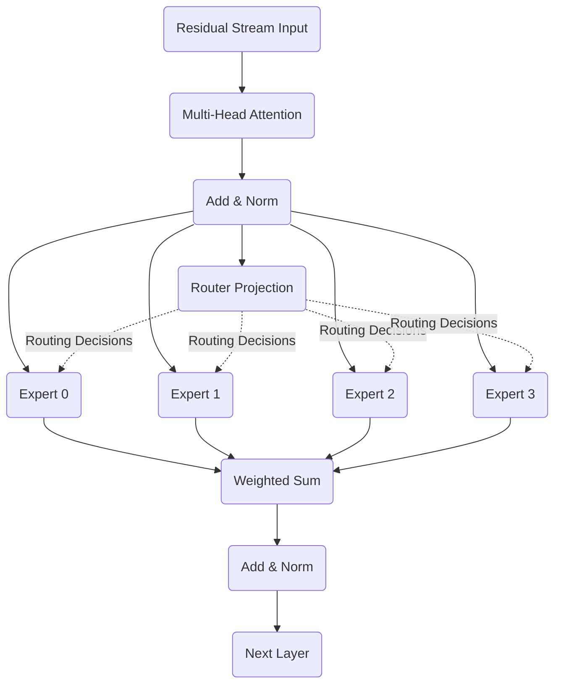

# Part 3: The MoE Forward Pass
<!-- SUMMARY: The routing mechanism determines which specific computational pathways activate for each token vector in the sequence. Executing the selected expert networks and dynamically blending their outputs produces the final contextual transformation, completing the transition from a dense feed-forward architecture to a sparse conditional formulation. -->

<em>Prefer to read this seamlessly offline? <a href="../assets/docs/mixture-of-experts-ebook-v1.0.pdf" target="_blank" rel="noopener">Download the complete, formatting-optimized Mixture of Experts Ebook here.</a></em>

The gating network narrows the full pool of experts down to two for each token, producing both the discrete assignments and their continuous blending weights. Translating these routing decisions into a final token representation requires executing the selected feed-forward networks and combining their outputs. This step completes the replacement of the dense bottleneck with a dynamically routed architecture.

## Independent Expert Computation

The dense feed-forward block explored in the Transformer series relied on a single monolithic expansion and contraction matrix pair. The sparse formulation fractures this structure into $E = 4$ separate sub-networks. Every individual expert $i$ maintains an independent set of weights $W_1^{(i)} \in \mathbb{R}^{6 \times 4}$ and $W_2^{(i)} \in \mathbb{R}^{4 \times 6}$. These matrices are not derived from prior structures; they are uniquely instantiated learned parameters that update via backpropagation, exactly like their dense counterparts. The internal dimensionality $d_{ff} = 4$ creates a deliberate parameter bottleneck relative to the dense baseline, enforcing specialization within each expert pathway.

The forward pass for any given expert perfectly mirrors the standard sequence of affine transformations and nonlinearities:

$$
\text{FFN}_i(x) = \text{ReLU}(x W_1^{(i)}) W_2^{(i)}
$$

The mathematical distinction lies entirely in the conditional execution. For each token vector $x$, the computational graph evaluates this function exclusively for the experts identified in the index set $\mathcal{K} = \text{TopKIndices}(h(x), k)$. Unselected experts remain completely dormant, consuming zero floating-point operations.

## Dynamic Output Synthesis

The active experts each produce their own output vector, representing independent transformations of the same input. These vectors combine through a weighted sum controlled by the gating weights $g(x)_i$:

$$
y_{MoE} = \sum_{i \in \mathcal{K}} g(x)_i \cdot \text{FFN}_i(x)
$$

The scalar weight adjusts each expert's contribution before the vectors fuse through simple addition. The combined MoE output subsequently merges back into the residual stream:

$$
\text{output} = x + y_{MoE}
$$

The architectural placement of this entire mechanism perfectly replaces the dense feed-forward sub-layer while leaving the surrounding structural scaffolding completely untouched.

## Numerical Execution

Tracing the exact geometric transformations for the four-token sequence solidifies the abstract routing theory into concrete linear algebra.

### First Token Pathway

The first token vector $x_0$ arrives from the residual stream:

$$
x_0 = \begin{bmatrix}
0.0200 & 1.2900 & 0.1800 & 1.3500 & 0.0000 & 0.6700
\end{bmatrix}
$$

The router previously assigned gating weights of $0.5312$ to Expert 0 and $0.4688$ to Expert 2. The remaining pathways were severed via negative infinity masking. Executing Expert 0 requires projecting $x_0$ through the expert's specific expansion matrix $W_1^{(0)}$:

$$
x_0 W_1^{(0)} = \begin{bmatrix}
0.02 \\ 1.29 \\ 0.18 \\ 1.35 \\ 0.00 \\ 0.67
\end{bmatrix}^T
\begin{bmatrix}
-0.0544 & 0.0111 & -0.1151 & 0.0376 \\
-0.0601 & -0.0292 & -0.0602 & 0.1852 \\
-0.0013 & -0.1058 & 0.0823 & -0.1221 \\
0.0209 & -0.1960 & -0.1328 & 0.0197 \\
0.0738 & 0.0171 & -0.0116 & -0.0301 \\
-0.1479 & -0.0720 & -0.0461 & 0.1057
\end{bmatrix}
= \begin{bmatrix}
-0.1497 & -0.3693 & -0.2753 & 0.3151
\end{bmatrix}
$$

Applying the ReLU nonlinearity zeroes all negative values, entirely deactivating three of the four intermediate dimensions:

$$
\text{ReLU}(x_0 W_1^{(0)}) = \begin{bmatrix}
0.0000 & 0.0000 & 0.0000 & 0.3151
\end{bmatrix}
$$

This heavily sparsified hidden representation then projects through the contraction matrix $W_2^{(0)}$ to produce the final geometric transformation for Expert 0:

$$
\text{ReLU}(x_0 W_1^{(0)}) W_2^{(0)} = \begin{bmatrix}
0.0000 & 0.0000 & 0.0000 & 0.3151
\end{bmatrix}
\begin{bmatrix}
0.0791 & -0.0909 & 0.1403 & -0.1402 & 0.0587 & 0.2190 \\
-0.0991 & -0.0566 & 0.0100 & -0.0503 & -0.1551 & 0.0069 \\
-0.1062 & 0.0474 & -0.0919 & 0.1550 & -0.0783 & -0.0322 \\
0.0814 & -0.1231 & 0.0227 & 0.1307 & -0.1607 & 0.0185
\end{bmatrix}
$$

$$
\text{FFN}_0(x_0) = \begin{bmatrix}
0.0256 & -0.0388 & 0.0072 & 0.0412 & -0.0507 & 0.0058
\end{bmatrix}
$$

The identical computational sequence executes simultaneously for Expert 2. The projection $x_0 W_1^{(2)}$ yields $[-0.1489, -0.1188, 0.1305, -0.3178]$, which collapses under ReLU to a single active dimension at index two. The final contraction through $W_2^{(2)}$ yields a slightly divergent projection:

$$
\text{FFN}_2(x_0) = \begin{bmatrix}
0.0082 & -0.0112 & -0.0140 & 0.0063 & -0.0029 & 0.0093
\end{bmatrix}
$$

Synthesizing these outputs involves scaling each vector by its respective gating probability before summation. The operation yields the combined MoE output for the first token:

$$
y_{MoE}^{(0)} = 0.5312 \cdot \text{FFN}_0(x_0) + 0.4688 \cdot \text{FFN}_2(x_0) = \begin{bmatrix}
0.0174 & -0.0258 & -0.0027 & 0.0248 & -0.0283 & 0.0075
\end{bmatrix}
$$

### Second Token Pathway

The second token routes to the identical expert pairing but with a subtly shifted probability distribution: $0.5345$ for Expert 0 and $0.4655$ for Expert 2. The pre-ReLU projection for Expert 2 evaluates entirely to negative values, resulting in a zeroed output vector after activation:

$$
\text{FFN}_0(x_1) = \begin{bmatrix}
0.0368 & -0.0557 & 0.0103 & 0.0592 & -0.0728 & 0.0084
\end{bmatrix}
$$

$$
\text{FFN}_2(x_1) = \begin{bmatrix}
0.0000 & 0.0000 & 0.0000 & 0.0000 & 0.0000 & 0.0000
\end{bmatrix}
$$

The combined output relies exclusively on the scaled contribution from Expert 0:

$$
y_{MoE}^{(1)} = \begin{bmatrix}
0.0197 & -0.0298 & 0.0055 & 0.0316 & -0.0389 & 0.0045
\end{bmatrix}
$$

### Third Token Pathway

The third token shifts to a new computational pathway, activating Expert 0 with a weight of $0.5575$ and Expert 1 with a weight of $0.4425$. For this specific input geometry, Expert 0 collapses entirely to zero post-activation, while Expert 1 supplies the mathematical structure:

$$
\text{FFN}_0(x_2) = \begin{bmatrix}
0.0000 & 0.0000 & 0.0000 & 0.0000 & 0.0000 & 0.0000
\end{bmatrix}
$$

$$
\text{FFN}_1(x_2) = \begin{bmatrix}
0.0164 & -0.0116 & 0.0136 & 0.0058 & 0.0116 & 0.0268
\end{bmatrix}
$$

The weighted combination generates the third token's final representation update:

$$
y_{MoE}^{(2)} = \begin{bmatrix}
0.0073 & -0.0051 & 0.0060 & 0.0026 & 0.0051 & 0.0119
\end{bmatrix}
$$

### Fourth Token Pathway

The fourth token utilizes the same pathway, relying on Expert 0 with a weight of $0.5386$ and Expert 1 with a weight of $0.4614$. Both experts successfully activate and contribute to the blended output:

$$
\text{FFN}_0(x_3) = \begin{bmatrix}
0.0012 & -0.0014 & 0.0022 & -0.0022 & 0.0009 & 0.0034
\end{bmatrix}
$$

$$
\text{FFN}_1(x_3) = \begin{bmatrix}
0.0079 & -0.0056 & 0.0066 & 0.0028 & 0.0056 & 0.0130
\end{bmatrix}
$$

$$
y_{MoE}^{(3)} = \begin{bmatrix}
0.0043 & -0.0034 & 0.0042 & 0.0001 & 0.0031 & 0.0078
\end{bmatrix}
$$

## Residual Integration

The combined outputs across all four tokens form a $4 \times 6$ matrix representing the sparse layer's total contribution. Adding this matrix to the original input vectors through the residual connection completes the layer.

$$
\begin{aligned}
X + y_{MoE} &= \begin{bmatrix}
0.0200 &  1.2900 & \dots &  0.6700 \\
0.7400 &  1.7600 & \dots &  1.2300 \\
0.8800 & -0.3100 & \dots &  0.9100 \\
0.1900 & -1.0300 & \dots &  0.6900
\end{bmatrix} \\
&+
\begin{bmatrix}
 0.0174 & -0.0258 & \dots &  0.0075 \\
 0.0197 & -0.0298 & \dots &  0.0045 \\
 0.0073 & -0.0051 & \dots &  0.0119 \\
 0.0043 & -0.0034 & \dots &  0.0078
\end{bmatrix}
\end{aligned}
$$

$$
\text{Final Output} = \begin{bmatrix}
0.0374 &  1.2642 &  0.1773 &  1.3748 & -0.0283 &  0.6775 \\
0.7597 &  1.7302 &  0.4555 &  1.5516 &  0.1611 &  1.2345 \\
0.8873 & -0.3151 &  1.7860 &  0.9926 &  0.0951 &  0.9219 \\
0.1943 & -1.0334 &  1.5642 &  1.2101 &  0.5831 &  0.6978
\end{bmatrix}
$$

The forward pass successfully updates the token representations while using only a fraction of the total parameter volume. This efficiency, however, introduces a dangerous training instability. The positive feedback loops inherent to conditional routing cause severe load imbalances that, left unchecked, collapse the entire expert pool into a single dominant pathway.

<em>Prefer to read this seamlessly offline? <a href="../assets/docs/mixture-of-experts-ebook-v1.0.pdf" target="_blank" rel="noopener">Download the complete, formatting-optimized Mixture of Experts Ebook here.</a></em>

