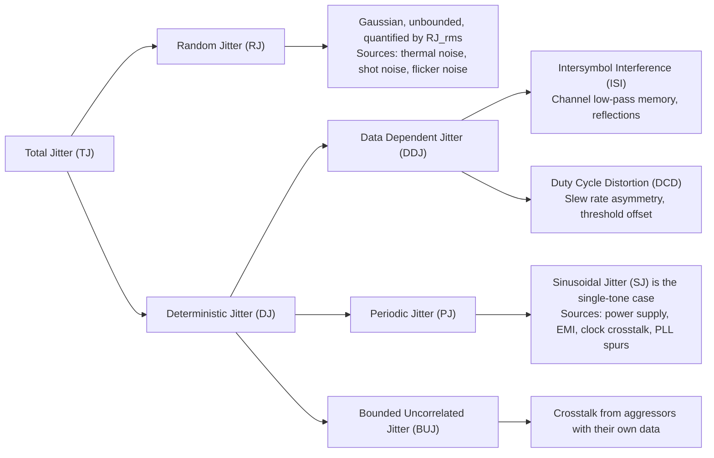

# Jitter Decomposition and Measurement

<!-- SUMMARY: A receiver decides bits by sampling a waveform against a threshold, making crossing timing as critical as voltage. This guide defines the unit interval, separates total jitter into its random and deterministic components, and lays out the measurement flow for root-cause isolation. --> 

<em>Prefer to read offline? <a href="../../../assets/docs/signal-integrity-ebook-v2.0.pdf" target="_blank" rel="noopener">Download the complete Signal Integrity (Advanced Edition) ebook.</a></em>

The first nine chapters characterize the channel as a frequency-dependent filter that delays, attenuates, and reflects a signal. The receiver at the end of the channel does not see the filter. It sees a waveform and decides, once per bit, whether the level is high or low, and that decision is correct only if the waveform crosses the decision threshold at a suitable time relative to the instant at which the receiver samples. This chapter begins Part 3 by defining the unit interval and the eye diagram that frame the question, defining jitter as the deviation of each threshold crossing from its ideal time, and separating that deviation into components by statistical behavior and physical origin.

A single number for total jitter is not enough to diagnose a failing link. A signal can miss its timing budget because of thermal noise in the silicon, because of reflections and loss in the channel, because of ripple on the power supply, because of crosstalk from a neighboring lane, or because of asymmetric drive strength in the transmitter. Each cause produces a timing disturbance with a distinct shape and a distinct corrective action, and the decomposition in this chapter is what turns a failed timing measurement into a specific hardware change.

The chapter first defines the measurement frame (unit interval, eye, time interval error) and the taxonomy of jitter, then shows how a voltage disturbance becomes a timing disturbance through the edge slope, and then treats each component in turn with a physical origin and a size. The measurement flow and the budget examples follow. [Dual-Dirac Model and BER Extrapolation](11_Dual_Dirac_Model_and_BER_Extrapolation.md) develops the statistics that convert the measured distributions into a total jitter at a target bit error ratio, and [Test Patterns and Jitter Isolation](12_Test_Patterns_and_Jitter_Isolation.md) develops the pattern and spectral techniques that isolate the components.

## Core Concepts

### The Unit Interval and the Ideal Edge Times

A non-return-to-zero (NRZ) link sends one bit in each **unit interval** (UI), and the unit interval is the reciprocal of the bit rate:

$$UI = \frac{1}{\text{bit rate}}$$

A 10 Gb/s link has a UI of 100 ps, and a link described as 16 GT/s (gigatransfers per second, which for an NRZ link equals 16 Gb/s on the wire) has a UI of 62.5 ps. A PAM4 link carries two bits in each symbol, so its UI is the reciprocal of the symbol rate and is twice the bit period; [Chapter 15](15_PAM4_Signaling_and_Gray_Coding.md) develops that case.

The receiver clock defines an ideal time grid. The ideal time of the $k$-th bit boundary is $t_0 + k\,UI$, where $t_0$ is an arbitrary phase offset, and the receiver ideally samples each bit at the middle of the interval, $UI/2$ after the boundary. The frequency $1/(2\,UI)$ is the Nyquist frequency of the link defined in [Chapter 2](02_Frequency_Content_of_Digital_Signals.md), the fundamental of the alternating 1010 pattern. Jitter is expressed either in picoseconds or as a fraction of the UI: 5 ps of jitter on a 100 ps UI is 0.05 UI.

### The Eye Diagram

The **eye diagram** is a display of the received waveform folded onto a window of fixed length so that every bit interval is drawn on the same axes. The construction is a modulo operation on time. Choose a window of two unit intervals, assign to each instant $t$ of the record the folded coordinate $u = (t - t_0) \bmod 2\,UI$, and draw the voltage at $u$ for every instant. A long record contains every combination of neighboring bits, so the overlay contains the transitions from low to high, from high to low, and the flat segments of repeated bits, all superposed.

The resulting picture has a standard vocabulary:

- The **crossing points** are the places at $u = 0$, $UI$, and $2\,UI$ where rising and falling transitions cross each other near the decision threshold.
- The **eye opening** is the open region between the traces, bounded above by the lowest trace of a high bit and below by the highest trace of a low bit.
- The **eye height** is the vertical size of the opening at the sampling instant $u = UI/2$.
- The **eye width** is the horizontal size of the opening measured at the threshold level, from the latest crossing on the left to the earliest crossing on the right.

The eye width is the quantity that connects the diagram to jitter. Assume that the threshold crossings are spread over a total width $W_x$ (peak to peak) around their ideal positions. The opening that remains between the left and right crossings is

$$W_{eye} = UI - W_x$$

The spread of crossings is the jitter histogram of this chapter, and the width of the eye at a specified bit error ratio is $UI - TJ(\text{BER})$, a relation that [Chapter 11](11_Dual_Dirac_Model_and_BER_Extrapolation.md) completes. The eye height is controlled by noise and by intersymbol interference and is treated in the Edge Cases.

The fold requires a timing reference, and a fixed-frequency trigger smears the traces whenever the data clock drifts, so an instrument folds on a clock recovered from the data itself, which [Chapter 17](17_CDR_and_PLL_Loop_Dynamics.md) describes. [Chapter 16](16_SerDes_Architecture_and_Eye_Diagrams.md) describes the three methods by which an instrument builds the eye from samples, and [Chapter 13](13_Transmitter_FFE.md) and [Chapter 14](14_CTLE_and_DFE.md) show how equalization reopens an eye that the channel has closed.

### Time Interval Error

The **time interval error** (TIE) of an edge is the difference between the actual threshold-crossing time and the ideal time. Let $t_k$ be the measured crossing time of the $k$-th edge. The TIE is then given by:

$$TIE_k = t_k - (t_0 + k\,UI)$$

A positive TIE means the edge arrived late, and a negative TIE means it arrived early. The zero of the TIE axis is not a fixed point in time, and the reference clock sets it, which in an oscilloscope measurement is a clock recovered by a software phase-locked loop running on the captured data. The choice of reference changes what counts as jitter: a reference that follows slow drift removes the slow components from the TIE, and a fixed-frequency reference leaves them in. [Chapter 17](17_CDR_and_PLL_Loop_Dynamics.md) explains why a receiver that tracks slow drift is not harmed by it.

Two related quantities follow from the TIE sequence. The period between two consecutive edges is $T_k = t_{k+1} - t_k = UI + TIE_{k+1} - TIE_k$, so the **period jitter** is the first difference of the TIE:

$$J_k = T_k - UI = TIE_{k+1} - TIE_k$$

The **cycle-to-cycle jitter** is the difference between two consecutive periods, $T_{k+1} - T_k$. The difference operation acts as a high-pass filter on the TIE. A sinusoidal TIE component of amplitude $a_j$ and frequency $f_j$, written $TIE_k = a_j \sin(\omega_j k\,UI)$ with $\omega_j = 2\pi f_j$, produces the period jitter

$$J_k = a_j\left[\sin\bigl(\omega_j (k+1) UI\bigr) - \sin\bigl(\omega_j k\,UI\bigr)\right] = 2 a_j \sin\!\left(\frac{\omega_j UI}{2}\right)\cos\!\left(\omega_j \left(k+\tfrac{1}{2}\right) UI\right)$$

where the second form uses the identity $\sin A - \sin B = 2\sin\frac{A-B}{2}\cos\frac{A+B}{2}$. The amplitude of the period jitter is therefore $2 a_j \sin(\pi f_j UI)$. For a 100 ps UI, a 10 MHz component appears in the period jitter at 0.63 percent of its TIE amplitude, a 1 GHz component at 62 percent, and a component at the Nyquist frequency of 5 GHz at 200 percent. Period jitter hides slow wander, which is why the TIE and not the period jitter is the quantity used for data-recovery margin.

### The Taxonomy of Jitter

**Total jitter** (TJ) is the full distribution of TIE values. The taxonomy separates it into two primary categories by probability distribution and then divides the bounded category by physical origin.

**Random jitter** (RJ) is unbounded and Gaussian. It comes from thermal noise (the motion of charge carriers in resistive material), shot noise (the discrete arrival of carriers at a junction), and flicker noise, which has a spectrum that rises toward low frequency. RJ is quantified by its standard deviation, $RJ_{\text{rms}}$, because a peak-to-peak value of an unbounded distribution grows with the length of the observation.

**Deterministic jitter** (DJ) is bounded: it has a minimum and a maximum that do not grow with observation time, and it is quantified by a peak-to-peak value, $DJ_{\text{p-p}}$. DJ divides into four components:

- **Intersymbol interference** (ISI) is the dependence of a crossing time on the preceding bits, caused by the memory of the channel.
- **Duty cycle distortion** (DCD) is a difference between the timing of rising and falling edges, caused by asymmetric drive or by a threshold offset.
- **Periodic jitter** (PJ) is uncorrelated with the data and repeats at one or more fixed frequencies. **Sinusoidal jitter** (SJ) is the special case of a single sinusoid, which is also the signal that a jitter-tolerance test applies on purpose.
- **Bounded uncorrelated jitter** (BUJ) is bounded, uncorrelated with the data of the signal under test, and not periodic. Its principal source is crosstalk from aggressors that carry their own data, as [Chapter 4](04_Inductance_Magnetic_Coupling_and_Crosstalk.md) anticipated.

The last category matters because earlier descriptions place crosstalk inside periodic jitter, which is correct only when the aggressor is a clock at a fixed frequency. An aggressor with random data produces a bounded timing disturbance that is neither tied to the victim pattern nor concentrated at one frequency, so the pattern-averaging and spectral methods of [Chapter 12](12_Test_Patterns_and_Jitter_Isolation.md) do not isolate it directly.

The distribution of each component is different, and two descriptions must be kept apart. The **histogram** (or probability density) counts how many edges fall at each TIE value regardless of when they occurred. The **spectrum** describes how the TIE varies with time. A periodic disturbance has a line in the spectrum and an arcsine shape in the histogram, which is derived below.

| Component | Histogram shape | Bounded | Correlated with data | Spectrum |
|---|---|:---:|:---:|---|
| RJ | Gaussian | No | No | Broadband |
| DCD | Two values (rising, falling) | Yes | Yes | Related to the data pattern |
| ISI | Discrete set of values | Yes | Yes | Related to the data pattern |
| PJ and SJ | Arcsine (single sinusoid) | Yes | No | Lines |
| BUJ | Bounded, continuous | Yes | No | Broadband, bounded |

### How Voltage Becomes Time: Amplitude-to-Phase Conversion

Most of the components above begin as a voltage disturbance. Near the decision threshold, the edge is approximated by a straight line with slope $S$ (in mV per ps), so the unperturbed waveform is $v(t) = V_{th} + S\,(t - t_c)$ and it crosses the threshold $V_{th}$ at $t_c$. A disturbance $\delta v$ that adds to the waveform at the crossing changes the condition for the crossing to $V_{th} + S\,(t - t_c) + \delta v = V_{th}$, and the new crossing time is

$$t_c' = t_c - \frac{\delta v}{S}, \qquad \Delta t = -\frac{\delta v}{S}$$

The slope is signed: it is positive on a rising edge and negative on a falling edge, so a positive disturbance moves a rising crossing earlier and a falling crossing later. The conversion gain is $1/S$ in picoseconds per millivolt, and it is the same for noise, for ISI, for crosstalk, and for a threshold offset. A steeper edge converts the same voltage disturbance into less jitter.

Every example in this chapter uses one reference receiver. Assume an eye of 400 mV peak to peak (a main-cursor amplitude of $A = 200$ mV on each side of the threshold), a 10 to 90 percent rise time of 64 ps, and therefore a slope at the crossing of $0.8 \times 400\ \text{mV}/64\ \text{ps} = 5$ mV/ps. These values are assumptions that give round numbers. The slope at a real receiver depends on how much the channel has slowed the edge, which [Chapter 7](07_Time_Domain_Reflectometry.md) quantifies, so every jitter value below scales as $1/S$ and should be recomputed for a specific link.

### Random Jitter

Thermal and shot noise voltages are the sum of a very large number of independent microscopic contributions, and the central limit theorem says that such a sum has a distribution close to Gaussian. The noise on the receiver input has a flat (white) spectrum over the bandwidth of the link, so the noise sampled at one edge is independent of the noise sampled at the next. The amplitude-to-phase relation converts the voltage noise to timing noise, and because the conversion is linear, a Gaussian voltage distribution with standard deviation $\sigma_v$ becomes a Gaussian timing distribution with

$$RJ_{\text{rms}} = \sigma_t = \frac{\sigma_v}{S}$$

Assume a noise of 7.5 mV rms at the threshold crossing of the reference receiver. Then $\sigma_t = 7.5/5 = 1.5$ ps, the value used in the examples of [Chapter 11](11_Dual_Dirac_Model_and_BER_Extrapolation.md). Each edge is an independent draw from this distribution, which is the defining contrast with ISI, where the timing of an edge is dictated by the history of the preceding bits.

The value of $RJ_{\text{rms}}$ is a property of the whole signal path, and it is not a fixed constant of the silicon. It scales as $1/S$, so a slower edge at the receiver has more random jitter for the same noise voltage. It depends on temperature through the noise voltage. It also depends on the bandwidth over which the jitter is measured, because flicker noise concentrates its energy at low frequency, and a clock-recovery loop tracks those slow components and removes them from the jitter that the sampler sees. Two instruments with different reference clocks can therefore report different $RJ_{\text{rms}}$ for the same signal.

The Gaussian shape is an excellent description of the central region of the distribution. In the far tails, where only rare coincidences of many noise events contribute, the central limit theorem gives the weakest guarantee, and the Gaussian form is a modeling assumption. [Chapter 11](11_Dual_Dirac_Model_and_BER_Extrapolation.md) defines the Gaussian distribution, the complementary error function, and the Q-factor, and it states the consequences of this assumption for the extrapolation to low error ratios.

The relation $\sigma_t = \sigma_v/S$ shows that random jitter can be reduced by lowering the noise voltage and also by increasing the slope at the receiver. Equalization that restores a rounded edge ([Chapter 13](13_Transmitter_FFE.md), [Chapter 14](14_CTLE_and_DFE.md)) steepens the slope, but the same equalizer can amplify the noise voltage, and the net effect on $\sigma_t$ must be checked in each design.

### Intersymbol Interference

The physical origin of ISI is the causal, dispersive low-pass response of the channel, which [Chapter 5](05_Skin_Effect_and_Dielectric_Loss.md) derives. A pulse sent through such a channel emerges with a main cursor and a long tail of post-cursors, and the voltage at the sampling instant of a bit therefore contains the tails of the earlier bits. The tail is the response of a linear, symmetric, causal system, and it contains no pattern-dependent mechanism beyond the superposition of those pulses.

The timing effect follows directly from the amplitude-to-phase relation. Let $b_k = \pm 1$ be the bits, and let $h_j$ be the pulse-response cursors of [Chapter 2](02_Frequency_Content_of_Digital_Signals.md) normalized so that the main cursor is $h_0 = 1$ and $A$ is the main-cursor amplitude. The received voltage at the sampling instant of bit $n$ is

$$v_n = A\left(b_n + \sum_{j \neq 0} h_j\, b_{n-j}\right)$$

The sum is the interference that the other bits add to bit $n$. The same sum is present as a voltage offset during the transition into bit $n$, and the crossing time shifts by the amount given above:

$$\Delta t_n = -\frac{A}{S}\sum_{j \neq 0} h_j\, b_{n-j}$$

The shift takes its largest magnitude when every earlier bit has the sign that adds to the sum, so $|\Delta t|_{max} = (A/S) \sum_{j \neq 0}|h_j|$ and the peak-to-peak ISI jitter is at most twice this value. The shift is pattern dependent and discrete: with $m$ significant cursors there are at most $2^m$ distinct values, so the ISI histogram is a set of clusters, and the Gaussian shape of random jitter is absent from it.

[Chapter 5](05_Skin_Effect_and_Dielectric_Loss.md) computes the cursors of a 12 inch FR4 line with conductor loss alone and finds that the first seven post-cursors sum to 9 percent of the main cursor. With the reference receiver, the worst-case voltage offset is $0.09 \times 200\ \text{mV} = 18$ mV, which converts to $18/5 = 3.6$ ps on either side, so the seven-cursor peak-to-peak ISI jitter is 7.2 ps. The first four normalized post-cursors of that example (0.0418, 0.0186, 0.0111, 0.0076) alone produce at most $2^4 = 16$ distinct timing values.

A reflection from a discontinuity ([Chapter 3](03_Impedance_Reflections_and_Termination.md), [Chapter 6](06_Return_Path_Dynamics_and_Parasitic_Effects.md)) adds a post-cursor at the round-trip delay of the discontinuity, so it contributes to ISI in the same way. A specific bit pattern can excite that post-cursor strongly and another pattern can leave it unexcited, which makes the ISI distribution asymmetric.

### Duty Cycle Distortion

**Duty cycle distortion** exists when the duration of a high bit differs from the duration of a low bit, which means that the rising and falling crossings are shifted in opposite directions. Two mechanisms produce it, and the first is **transmitter slew asymmetry**. In a CMOS output stage the pull-up transistor and the pull-down transistor have different drive strengths, so rising and falling edges have different slopes and cross a fixed threshold at different times relative to the nominal edge.

The second mechanism is **receiver threshold offset**. Assume that the transmitter produces symmetric edges and that the decision threshold of the receiver is raised by $\delta$ above the middle of the swing. A rising edge reaches the raised threshold later by $\delta/S_r$, and a falling edge reaches it earlier by $\delta/S_f$, where $S_r$ and $S_f$ are the magnitudes of the slopes. The high bit appears shorter than the low bit by the sum:

$$DCD = \delta\left(\frac{1}{S_r} + \frac{1}{S_f}\right)$$

With $\delta = 10$ mV and $S_r = S_f = 5$ mV/ps, the rising crossings move 2 ps later, the falling crossings move 2 ps earlier, and the two clusters of crossing times are separated by 4 ps. The transmitter and the channel are unchanged, and the measurement reference point is the part that is wrong. In either mechanism the histogram of DCD consists of two clusters, one from rising edges and one from falling edges, which is the shape that the Dual-Dirac model of [Chapter 11](11_Dual_Dirac_Model_and_BER_Extrapolation.md) places at the center of its description.

### Periodic and Sinusoidal Jitter

Periodic jitter is uncorrelated with the data and repeats at a fixed frequency. The sources are external oscillating disturbances that couple into the signal path: the switching frequency of a power regulator, electromagnetic interference, crosstalk from a clock routed next to the signal, and spurs from a phase-locked loop whose reference or loop stability is marginal ([Chapter 17](17_CDR_and_PLL_Loop_Dynamics.md)).

The simplest case is sinusoidal jitter, $TIE(t) = A_j \sin(2\pi f_j t + \varphi)$. Edges occur at times that are unrelated to the phase of the sinusoid when $f_j$ is not a simple ratio of the data rate, so the phase $\theta$ of the sinusoid at the edge is uniformly distributed over a full cycle, and the TIE value is $x = A_j \sin\theta$. The cumulative distribution of $x$ follows from the uniform distribution of $\theta$ over $[-\pi/2, \pi/2]$ (the half cycle over which $\sin\theta$ rises monotonically from $-1$ to $1$):

$$P(X \le x) = \frac{\theta(x) + \pi/2}{\pi} = \frac{1}{2} + \frac{1}{\pi}\arcsin\!\left(\frac{x}{A_j}\right)$$

and its derivative with respect to $x$ is the probability density:

$$p(x) = \frac{1}{\pi\sqrt{A_j^2 - x^2}}, \qquad |x| < A_j$$

This **arcsine distribution** is bounded between $-A_j$ and $+A_j$, so its peak-to-peak value is $2A_j$. The density is smallest at the center and diverges at the two ends, because a sinusoid spends most of its time near its extremes. Of all the edges, 33.3 percent fall within $\pm 0.5A_j$ of the center, and 28.7 percent fall beyond $\pm 0.9A_j$. The mean square value is $A_j^2\langle\sin^2\theta\rangle = A_j^2/2$, so the rms value is $A_j/\sqrt{2}$. The histogram of a sinusoid therefore looks like two peaks at the extremes, and it is not Gaussian in any respect.

The amplitude of a periodic disturbance follows from its source through the sensitivity of the circuit. Assume a supply ripple of 30 mV at the regulator frequency and a delay sensitivity of 0.1 ps per mV of supply change in the driver. The sinusoidal jitter has $A_j = 3$ ps, a peak-to-peak value of 6 ps, and an rms value of 2.12 ps. The spectrum of the TIE shows this component as a single line at the regulator frequency, which is the signature that [Chapter 12](12_Test_Patterns_and_Jitter_Isolation.md) uses to find it.

### Bounded Uncorrelated Jitter

Crosstalk adds a voltage $v_{xt}(t)$ to the victim waveform, and the amplitude-to-phase relation converts it to timing: $\Delta t = -v_{xt}(t_c)/S$. The size of $v_{xt}$ at the crossing depends on whether the aggressor is rising, falling, or idle and on how its edge aligns with the victim edge, so it takes a continuum of values between $-V_{xt,max}$ and $+V_{xt,max}$. The peak-to-peak BUJ is bounded by the following expression:

$$BUJ_{\text{p-p}} \le \frac{2\,V_{xt,max}}{S}$$

[Chapter 4](04_Inductance_Magnetic_Coupling_and_Crosstalk.md) computes a far-end crosstalk of $-35$ mV for a 1 V aggressor with a 100 ps edge on a coupled microstrip pair. Assume that the victim is the same pair with a 1 V swing and a 100 ps rise time, so that its slope at the crossing is $0.8\ \text{V}/100\ \text{ps} = 8$ mV/ps. The largest timing shift is $35/8 = 4.4$ ps, and the peak-to-peak BUJ is 8.75 ps. The value is bounded because the coupling coefficients and the aggressor swing are bounded, and it is uncorrelated with the victim data because the aggressor carries its own data.

Several aggressors with uncorrelated data add their rms contributions in power, the rule that [Chapter 8](08_S_Parameters_and_VNA.md) derives for uncorrelated signals, while the bounds of the individual aggressors add linearly. A stripline pair with $C_m/C = L_m/L$ has no far-end term ([Chapter 4](04_Inductance_Magnetic_Coupling_and_Crosstalk.md)), so the far-end BUJ computed above does not arise in that geometry.

### Combining the Components

The components act on every edge at the same time, and the physical mechanisms of random and deterministic jitter are independent. Write the TIE of an edge as $t = d + r$, where $d$ is the sum of the deterministic components and $r$ is the random component. The probability that $d$ lies in a small interval around $\tau$ and $r$ lies in a small interval around $t - \tau$ is the product $p_{DJ}(\tau)\,p_{RJ}(t-\tau)\,d\tau$ by independence. Summing over every value of $\tau$ that gives the same $t$ produces the density of the total:

$$p_{TJ}(t) = \int_{-\infty}^{\infty} p_{DJ}(\tau)\,p_{RJ}(t - \tau)\,d\tau$$

which is the convolution of the DJ density with the RJ density. The histogram that an oscilloscope accumulates is this convolution, and the task of the analysis in [Chapter 11](11_Dual_Dirac_Model_and_BER_Extrapolation.md) is to undo it.

A sum of bounded components has a bounded range. The support of the sum of independent components is the sum of their supports, so the total deterministic jitter satisfies $DJ_{\text{p-p}} \le \sum_i DJ_{\text{p-p},i}$, with equality when all components reach their extremes together. This linear sum is an upper bound used in budgets, and the statistical combination of components that rarely peak together is smaller.

## Architecture

### The Jitter Tree

The decomposition forms a tree that maps every timing disturbance to a measurable root cause:

Each leaf corresponds to a distinct mechanism and a distinct action. ISI is addressed through channel design or equalization. DCD is addressed through transmitter calibration or receiver threshold adjustment. PJ is addressed by identifying the interfering source from the frequency of its spectral line and decoupling it. BUJ is addressed through spacing, layer choice, and shielding, following the crosstalk physics of [Chapter 4](04_Inductance_Magnetic_Coupling_and_Crosstalk.md). RJ is addressed by lowering the noise voltage or by raising the edge slope at the receiver, since $RJ_{\text{rms}} = \sigma_v/S$.

### Capturing the TIE

The oscilloscope digitizes the received voltage at a high sample rate and interpolates between samples to locate the instant at which each edge crosses the decision threshold (the zero-volt crossing for a differential signal). A software phase-locked loop run on the captured data produces the recovered reference clock, and the TIE of each edge is the difference between its crossing time and the reference time, as defined above.

The instrument keeps the TIE values in two forms. The **TIE track** is the chronological sequence of values against time, which preserves the order of the edges and is needed to see periodic behavior and to average against a repeating pattern. The **histogram** discards the order and counts the number of edges in each time bin; its horizontal axis is time and its vertical axis is a count.

### From Histogram to Probability Density

The histogram becomes a probability density when each bin count is divided by the total number of edges and by the bin width. The area under the normalized curve is then 1.0, the statement that every edge lands somewhere. This density is the convolution $p_{TJ}$ of the previous section, and all further operations (tail fitting, extrapolation, bathtub construction) act on it.

### Separating RJ from DJ in the Tails

Deterministic jitter has hard limits, so no edge lies farther from the ideal time than the extreme of the DJ distribution, plus whatever the unbounded random component adds. The outermost parts of the histogram are therefore shaped by random jitter alone, centered on the nearest DJ extreme. The algorithm fits a Gaussian to each outer tail and ignores the center of the histogram, where the DJ clusters and the Gaussian overlap. The standard deviation of the fitted Gaussians is $RJ_{\text{rms}}$, and the separation of their means is the Dual-Dirac deterministic jitter $DJ_{\delta\delta}$. [Chapter 11](11_Dual_Dirac_Model_and_BER_Extrapolation.md) derives the fit, the Q-scale construction that makes it linear, and the extrapolation $TJ(\text{BER}) = DJ_{\delta\delta} + 2\,Q\,RJ_{\text{rms}}$.

### The Measurement Flow

The following numbered list is the single canonical sequence for decomposing jitter; [Chapter 12](12_Test_Patterns_and_Jitter_Isolation.md) refers to the steps by number.

1. **Capture the TIE values** of every edge in the measurement window.
2. **Construct the TIE histogram** and normalize it to a probability density.
3. **Fit Gaussians to the outer tails** to extract $RJ_{\text{rms}}$ and $DJ_{\delta\delta}$.
4. **Record the TIE track**, the chronological TIE values against time, to preserve the order of the edges.
5. **Average the TIE track synchronously** over many repetitions of a known test pattern such as PRBS-7. Components that are uncorrelated with the pattern average toward zero, and the pattern-correlated ISI and DCD remain.
6. **Subtract the averaged DDJ** from the TIE track to obtain the uncorrelated residual.
7. **Apply an FFT to the residual** to separate the spectral lines of PJ from the broadband floor of RJ.

Steps 4 through 7, with the pattern selection, the averaging mathematics, and the spectral analysis, are the subject of [Chapter 12](12_Test_Patterns_and_Jitter_Isolation.md).

## Worked Examples

### TIE, Period Jitter, and Cycle-to-Cycle Jitter from Four Edges

Assume a 10 Gb/s link with $UI = 100$ ps and four consecutive edge crossings measured at 0.2, 100.5, 199.1, and 300.3 ps. The ideal times are 0, 100, 200, and 300 ps, so the TIE values are $+0.2$, $+0.5$, $-0.9$, and $+0.3$ ps. The three periods are 100.3, 98.6, and 101.2 ps, and the period jitter (each period minus the UI) is $+0.3$, $-1.4$, and $+1.2$ ps, which equals the differences of consecutive TIE values. The two cycle-to-cycle values are $98.6 - 100.3 = -1.7$ ps and $101.2 - 98.6 = +2.6$ ps. The cycle-to-cycle values are larger than the TIE values because each is a second difference of the TIE, which emphasizes fast variation.

### ISI Jitter from the Cursors of a 12 Inch FR4 Line

Use the reference receiver ($A = 200$ mV, $S = 5$ mV/ps) and the conductor-loss cursors of [Chapter 5](05_Skin_Effect_and_Dielectric_Loss.md), whose first seven post-cursors sum to 9 percent of the main cursor. The largest voltage offset is $0.09 \times 200 = 18$ mV on either side. Dividing by the slope gives $\pm 3.6$ ps, so the seven-cursor peak-to-peak ISI jitter is 7.2 ps, or 0.072 UI at 10 Gb/s. The offset also reduces the eye height, as the Edge Cases show. Adding the dielectric loss of the same line increases the tail and the jitter, and the equalizers of [Chapter 13](13_Transmitter_FFE.md) and [Chapter 14](14_CTLE_and_DFE.md) act on exactly these cursors.

### DCD from a Threshold Offset

A receiver comparator has an input offset of 10 mV, and the reference receiver has equal rising and falling slopes of 5 mV/ps. The rising crossings move $+2$ ps and the falling crossings $-2$ ps, so the two clusters are 4 ps apart, which is $4\%$ of the 100 ps UI. A calibration that removes the offset removes the DCD, and no change to the transmitter or the channel is needed.

### Sinusoidal Jitter from Supply Ripple

A 30 mV ripple on the driver supply with a sensitivity of 0.1 ps/mV gives sinusoidal jitter of amplitude $A_j = 3$ ps. The peak-to-peak value is 6 ps, the rms value is $3/\sqrt{2} = 2.12$ ps, and the histogram is an arcsine distribution with its peaks at $\pm 3$ ps. The spectral line identifies the regulator frequency, and the corrective action is better decoupling or a lower-ripple regulator.

### BUJ from Crosstalk

The 35 mV far-end crosstalk of [Chapter 4](04_Inductance_Magnetic_Coupling_and_Crosstalk.md) acting on a 1 V, 100 ps victim edge (slope 8 mV/ps) produces at most $\pm 4.4$ ps of timing shift and $BUJ_{\text{p-p}} = 8.75$ ps. Changing the pair from microstrip to stripline with equal coupling cancels the far-end term, so the same spacing in stripline removes most of this component.

### A Jitter Budget at 10 Gb/s

Collect the components of the previous examples for a 10 Gb/s link with $UI = 100$ ps and $RJ_{\text{rms}} = 1.5$ ps. The deterministic components add linearly as an upper bound:

| Component | Peak-to-peak (ps) |
|---|:---:|
| ISI (seven cursors) | 7.2 |
| DCD | 4.0 |
| SJ | 6.0 |
| BUJ | 8.75 |
| **DJ total (upper bound)** | **25.95** |

For a bit error ratio of $10^{-12}$ the Q-factor is 7.034 ([Chapter 11](11_Dual_Dirac_Model_and_BER_Extrapolation.md)), so the random component spans $2 \times 7.034 \times 1.5 = 21.10$ ps. The total jitter at $10^{-12}$ is $25.95 + 21.10 = 47.05$ ps, which is 47 percent of the UI. The remaining eye width is $100 - 47.05 = 52.95$ ps. The linear sum of the deterministic components is an upper bound, so the measured eye is expected to be at least this wide. The largest single contributors are the random component and the crosstalk, and the budget shows which change (a lower noise, a steeper edge, or a different layer assignment) would recover the most margin.

## Edge Cases

### ISI and the Closed Eye

The cursors that shift the crossings also reduce the eye height. The worst-case sampled voltage of a high bit is $A\left(1 - \sum_{j \ne 0}|h_j|\right)$, because every interfering cursor can take the sign that subtracts. The eye height is the difference between the worst high and the worst low:

$$V_{eye} = 2A\left(1 - \sum_{j \ne 0}|h_j|\right)$$

For the 9 percent seven-cursor sum and the 200 mV amplitude of the example, $V_{eye} = 400 \times 0.91 = 364$ mV, from the 400 mV that an interference-free eye would have. The eye closes when the sum of the magnitudes of the other cursors reaches the main cursor, $\sum_{j \ne 0}|h_j| \ge 1$. The sampled value of a bit can then lie on the wrong side of the threshold, and the receiver records a bit error even with no noise. This failure is the direct motivation for transmitter equalization ([Chapter 13](13_Transmitter_FFE.md)) and receiver equalization ([Chapter 14](14_CTLE_and_DFE.md)), which reduce the cursor sum.

### Nonlinear Amplitude-to-Phase Conversion

The relation $\Delta t = -\delta v/S$ assumes that the edge is a straight line over the range of the disturbance. Near the rails the edge flattens and the slope falls, so the same voltage disturbance produces a larger timing shift there. A Gaussian noise voltage passed through a slope that varies across the noise range produces a timing distribution with heavier tails on the side where the edge is flatter. The threshold is therefore placed at the middle of the swing, where the slope is largest and the conversion is most nearly linear, and the Gaussian description of random jitter is most reliable for a measurement made at that level.

### Peak-to-Peak RJ Is a Defined Quantity

Any peak-to-peak random jitter reported by an instrument is a calculation, $RJ_{\text{p-p}} = 2\,Q\,RJ_{\text{rms}}$ with a $Q$ chosen for a target bit error ratio, and it is not a direct observation. Changing the target changes the reported value although the noise source is unchanged. The standard deviation is the measured quantity, and [Chapter 11](11_Dual_Dirac_Model_and_BER_Extrapolation.md) shows how $Q$ is obtained.

### The Reference Clock Decides What Counts as Jitter

The TIE depends on the reference clock. A reference recovered by a high-bandwidth loop follows the slow components of the data timing and reports less low-frequency jitter than a fixed-frequency reference. A receiver with the same tracking behavior is not affected by those slow components either, so the TIE that matters for margin is the one measured against a reference that models the receiver clock. [Chapter 17](17_CDR_and_PLL_Loop_Dynamics.md) quantifies this behavior with the jitter transfer function.

### The Dual-Dirac Approximation

The Dual-Dirac model replaces the full DJ distribution by two impulses and reports the separation of the fitted tails as $DJ_{\delta\delta}$. That separation is a model parameter and is generally smaller than the measured $DJ_{\text{p-p}}$; its relation to the true total jitter, including cases in which the model overestimates and cases in which it underestimates, is treated in [Chapter 11](11_Dual_Dirac_Model_and_BER_Extrapolation.md).

The decomposition in this chapter describes what each component is and how large it is, and the open question is how to turn the measured distribution into a statement about the rare edges that cause a bit error once in a trillion bits. The next chapter, [Dual-Dirac Model and BER Extrapolation](11_Dual_Dirac_Model_and_BER_Extrapolation.md), answers that question.
