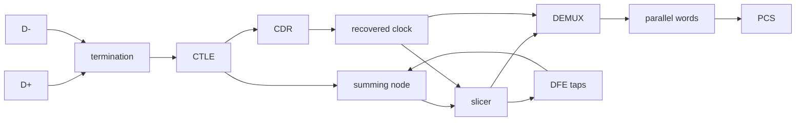

# SerDes Architecture and Eye Diagrams

<!-- SUMMARY: A SerDes link confines high-speed analog processing to a compact front end. This guide traces the receiver signal path, derives differential common-mode rejection, compares analog versus converter-based architectures, and explains how real-time oscilloscopes and BERTs construct measurement eye diagrams. -->

<em>Prefer to read offline? <a href="../../../assets/docs/signal-integrity-ebook-v2.0.pdf" target="_blank" rel="noopener">Download the complete Signal Integrity (Advanced Edition) ebook.</a></em>

The preceding chapters examined the parts of a high-speed link one at a time: the transmit filter of [Transmitter Feed-Forward Equalization](13_Transmitter_FFE.md), the receive equalizers of [CTLE and DFE](14_CTLE_and_DFE.md), and the four-level signaling of [PAM4 Signaling and Gray Coding](15_PAM4_Signaling_and_Gray_Coding.md). This chapter assembles those parts into a serializer/deserializer (SerDes) link and describes how laboratory instruments observe the result.

A SerDes link is the architecture beneath PCIe, Ethernet, USB, and DisplayPort. The transmitter sends all data as one continuous stream of serial symbols across a differential pair, and the receiver reconstructs parallel data words from that stream. The architecture exists because of a speed mismatch between the channel and the logic. A copper trace or an optical fiber can carry transitions at 112 Gb/s, but no standard digital logic gate switches at 112 GHz. The SerDes confines the extreme-speed analog processing to a small front-end circuit and then gears the data down to a clock rate that ordinary silicon can handle.

This chapter is the single home of two topics that earlier chapters only cite: differential signaling with its common-mode rejection, and the comparison of the analog front-end receiver with the converter-based receiver. It then explains how three instruments build the eye diagram that [Jitter Decomposition and Measurement](10_Jitter_Decomposition_and_Measurement.md) defined by folding, and what each instrument's eye represents. Every one of those instruments, and the receiver itself, needs a clock recovered from the data, and the next chapter, [CDR and PLL Loop Dynamics](17_CDR_and_PLL_Loop_Dynamics.md), explains how that clock is made.

## Core Concepts

### The Serializer and the Gear Ratio

The digital core of the transmitter produces parallel data words at a modest clock rate. A multiplexer (MUX) serializes each word into a single high-speed stream. The parallel clock frequency is the serial bit rate $R$ divided by the word width $W$:

$$f_{par} = \frac{R}{W}$$

A 128-bit word at 112 Gb/s needs a parallel clock of $112 \times 10^9/128 = 875$ MHz, and a 32-bit word at 16 GT/s needs 500 MHz. Both are well within the capability of standard digital logic. The receiver performs the inverse operation with a deserializer (DEMUX) that distributes consecutive bits over $W$ parallel lanes and divides the clock by $W$. For a PAM4 link the symbol rate is half the bit rate ([PAM4 Signaling and Gray Coding](15_PAM4_Signaling_and_Gray_Coding.md)), and the data-path clock of the analog front end follows the symbol rate.

The output stage of an NRZ transmitter is a current-mode differential driver. It steers a constant tail current between two complementary outputs. To send a logic 1 the driver routes the current so that the positive trace D+ swings up and the negative trace D- swings down, which produces a positive differential voltage (for example, +300 mV). To send a logic 0 the driver reverses the steering and produces a negative differential voltage (-300 mV). The current flows continuously, and the information is carried by the direction of the steering. The swing is proportional to the tail current and to the effective load resistance of the branch that carries it. The receiver threshold sits at 0 V, the midpoint of this symmetric swing. The feed-forward filter of [Transmitter Feed-Forward Equalization](13_Transmitter_FFE.md) is part of this driver, and a PAM4 transmitter replaces the two-way steering with a digital-to-analog converter that produces four levels.

### The Receiver Signal Path

The receiver faces the inverse problem of the transmitter: a continuous stream of serial symbols arrives with no accompanying clock, and the receiver must decide each symbol at the right instant. The functional blocks follow this order:

1. **Termination and equalization:** the differential termination matches the line impedance of [Impedance, Reflections, and Termination](03_Impedance_Reflections_and_Termination.md), and the continuous-time linear equalizer (CTLE) is the first active block. The CTLE flattens the channel loss before any decision is made.
2. **Summing node and slicer:** the decision feedback equalizer subtracts its estimate of the trailing interference at the summing node, and the slicer, an analog comparator, decides the symbol at each tick of the recovered clock. The slicer outputs only whether the voltage exceeds the threshold, and this single comparison is the instant at which the analog signal becomes a digital decision.
3. **Clock and data recovery (CDR):** the CDR runs in parallel with the slicer, not ahead of it. It receives the equalized signal and the slicer decisions, locates the data transitions, and generates the recovered clock that strobes the slicer and the DEMUX. [CDR and PLL Loop Dynamics](17_CDR_and_PLL_Loop_Dynamics.md) describes the loop. The equalizer must come first because intersymbol interference moves the crossings of an unequalized signal, and a loop that locks onto shifted crossings places the sampling instant away from the best position.
4. **Deserializer (DEMUX):** the decisions arrive at the full serial rate, and the DEMUX steps them down onto $W$ parallel lanes at the rate $R/W$.
5. **Word alignment:** the DEMUX output has no framing, and the digital logic scans for the alignment markers of the line code to find the word boundaries. [Line Coding, FEC, and Protocol Framing](18_Line_Coding_FEC_and_Protocol_Framing.md) describes the markers.

The analog circuits of this path (termination, CTLE, summing node, slicer, CDR, and DEMUX) form the physical medium attachment (PMA). The digital core behind it contains the physical coding sublayer (PCS) and the media access control (MAC) layer, which [Line Coding, FEC, and Protocol Framing](18_Line_Coding_FEC_and_Protocol_Framing.md) describes. An oscilloscope or a BERT observes the signal that enters the PMA, so an eye diagram measures the margin of the analog receiver, and the error rate that the PCS delivers after forward error correction is a different quantity.

### Differential Signaling and Common-Mode Rejection

A differential link drives two complementary traces, D+ and D-, with equal and opposite swings, and the receiver measures only the voltage between them. Define the differential voltage and the common-mode voltage of the pair as

$$v_d = v_+ - v_-, \qquad v_c = \frac{v_+ + v_-}{2}$$

The inverse relations are $v_+ = v_c + v_d/2$ and $v_- = v_c - v_d/2$, so each trace carries half of the differential swing about the common mode. The transmitter sets $v_d = \pm V_d$ and holds $v_c$ constant, and a receiver that responds only to $v_d$ ignores $v_c$.

The noise immunity follows from how interference couples into the pair. An aggressor that couples into a victim trace does so by the capacitive and inductive mechanisms of [Inductance, Magnetic Coupling, and Crosstalk](04_Inductance_Magnetic_Coupling_and_Crosstalk.md). A disturbance from a source farther away than the spacing of the pair, such as a power regulator, a neighboring connector, or ground bounce, couples nearly equal voltages $n_+$ and $n_-$ into the two traces because the traces occupy almost the same place. Add the noise to the signal and form the difference:

$$(v_+ + n_+) - (v_- + n_-) = v_d + (n_+ - n_-)$$

The difference $n_+ - n_-$ is small, and the large part of the disturbance appears in the common-mode voltage $(n_+ + n_-)/2$, which the receiver rejects. The rejection is incomplete in a real pair. Assume that the coupling into D- is the fraction $(1-\delta)$ of the coupling into D+, so that $n_- = (1-\delta)\,n_+$. The differential residue is $\delta\,n_+$, and a 1% imbalance leaves 1% of the disturbance.

A real receiver has finite common-mode rejection of its own. Model a linear receiver whose output is $v_{out} = A_d v_d + A_c v_c$, with a differential gain $A_d$ and a common-mode gain $A_c$. The **common-mode rejection ratio** (CMRR) of this receiver is defined by

$$\text{CMRR} = 20\log_{10}\left|\frac{A_d}{A_c}\right|\ \text{dB}$$

with the decibel defined for voltage ratios as in [S-Parameters and Vector Network Analysis](08_S_Parameters_and_VNA.md). A mismatch between the gains of the two input paths produces a nonzero $A_c$. Let the two paths have the gains $G_1 = G(1+\varepsilon/2)$ and $G_2 = G(1-\varepsilon/2)$. The output of the difference stage is $v_{out} = G_1 v_+ - G_2 v_-$. Substitute $v_\pm = v_c \pm v_d/2$ and collect the terms:

$$v_{out} = (G_1 - G_2)\,v_c + \frac{G_1 + G_2}{2}\,v_d = G\varepsilon\,v_c + G\,v_d$$

The differential gain is $A_d = G$, the common-mode gain is $A_c = G\varepsilon$, and the rejection is $\text{CMRR} = 20\log_{10}(1/\varepsilon)$. A 1% mismatch gives 40 dB, and a 0.1% mismatch gives 60 dB. The rejection is limited by the symmetry of the paths and not by the principle, so the statement that noise cancels is true to the extent that the two paths are matched.

Three further properties explain why every high-speed standard uses differential signaling. A differential receiver needs no reference voltage shared with the transmitter, because the threshold is the zero of $v_d$, and a shift of the ground or supply between the chips moves $v_c$ and leaves $v_d$ unchanged. The swing doubles in the sense that traces carrying $\pm V_s$ produce a differential swing of $2V_s$, which is 6 dB more signal than a single trace of swing $V_s$ would give against the same receiver noise. The currents in the two traces are equal and opposite, so each trace is the return path of the other, and the magnetic fields largely cancel at a distance, which lowers the radiation of the pair for the same reason that it lowers the pickup.

The coupling of [Inductance, Magnetic Coupling, and Crosstalk](04_Inductance_Magnetic_Coupling_and_Crosstalk.md) also sets the impedances of the two modes. In the differential (odd) mode the traces carry opposite voltages and currents, so the effective inductance falls to $L - L_m$ and the effective capacitance rises to $C + C_m$. In the common (even) mode the effective inductance rises to $L + L_m$ and the effective capacitance falls to $C - C_m$, because the mutual capacitance carries no charge between traces at equal voltage. Here $C$ is the total capacitance of one trace and $C_m$ is the mutual capacitance, as in that chapter. The impedances of the two modes then follow from the effective inductance and capacitance of each mode:

$$Z_{odd} = \sqrt{\frac{L - L_m}{C + C_m}} \approx Z_0\,(1 - 2K_b), \qquad Z_{even} = \sqrt{\frac{L + L_m}{C - C_m}} \approx Z_0\,(1 + 2K_b)$$

where the approximations hold for weak coupling and $K_b = \tfrac{1}{4}(C_m/C + L_m/L)$ is the backward coupling coefficient of that chapter. The differential impedance is $Z_{diff} = 2Z_{odd}$ because the two traces are driven in series, and the common-mode impedance is $Z_{even}/2$ because they are driven in parallel. The skew between the two traces converts a part of the differential signal into the common mode and the reverse, and [S-Parameters and Vector Network Analysis](08_S_Parameters_and_VNA.md) derives that conversion from the mixed-mode parameters.

### The Eye as a Receiver View

[Jitter Decomposition and Measurement](10_Jitter_Decomposition_and_Measurement.md) defined the eye diagram as the fold of the waveform modulo the unit interval, with its crossing spread and its opening. The eye at a point in the link shows what a receiver placed at that point would see. The eye at the pins of a receiver is often closed, because the channel loss has not yet been equalized, while the eye at the input of the slicer, after the CTLE and the DFE, is open. A measurement at the pins therefore applies a reference equalizer to the captured waveform before folding it, and the Edge Cases describe the consequence.

The vertical and horizontal openings of an eye are the amplitude margin and the timing margin that remain at the sampling instant. The width at a given bit error ratio is $UI - TJ(\text{BER})$ from [Dual-Dirac Model and BER Extrapolation](11_Dual_Dirac_Model_and_BER_Extrapolation.md), and the height at a given bit error ratio follows from the same Q relation applied to the amplitude noise, which the Worked Examples compute.

## Architecture

### Analog Front End versus Converter-Based Receivers

Two receiver architectures process the equalized signal, and the choice determines the equalization strategy and the test method.

**Architecture A, the analog front end (AFE):** the differential waveform passes through the CTLE and enters the analog summing node, where the DFE subtracts its estimate of the trailing interference, and the slicer decides each symbol on the analog voltage. No analog-to-digital converter (ADC) exists in this path. For PAM4 the slicer is three comparators and a thermometer-to-Gray decoder ([PAM4 Signaling and Gray Coding](15_PAM4_Signaling_and_Gray_Coding.md)). The decision for the first DFE tap must travel around the loop in less than one UI (31.25 ps at 32 Gbaud). The receiver relaxes that timing by speculation ([CTLE and DFE](14_CTLE_and_DFE.md)) and pays with a second slicer.

**Architecture B, the converter-based (DSP) receiver:** a front end of termination, variable-gain amplifier, and a CTLE with less peaking conditions the waveform, and an ADC measures the voltage at the sampling instant and converts it to a word of $N$ bits. The equalizer is digital: the FFE taps and DFE taps of [CTLE and DFE](14_CTLE_and_DFE.md) become multiplications and additions in logic, with the same equations and the same least-mean-square adaptation. The timing recovery is also computed from the samples. The sampling clock of the ADC is adjusted in phase by the loop of [CDR and PLL Loop Dynamics](17_CDR_and_PLL_Loop_Dynamics.md), and the fine phase is applied by interpolation. No analog slicer decides the data, and the decision is a digital comparison of the equalized word.

| Property | Analog front end | Converter-based receiver |
|---|---|---|
| Decision element | Analog comparator after a summing node | Digital comparison after an ADC |
| Equalizer | CTLE and a few DFE taps in analog circuits | CTLE plus digital FFE and DFE with many taps |
| Noise added at the decision | Comparator offset and noise | Quantization noise and sampling-clock jitter |
| Timing loop | Phase detector on edges and a clock generator | Phase detector on samples, digital loop, clock phase adjustment |
| Adaptation | Few taps, adapted by a small state machine | Many taps, adapted by LMS in logic |
| Typical use | Lower loss, lower symbol rate | Highest loss, highest PAM4 rates |

The converter adds two noise terms that the analog slicer does not have. The first term is the **quantization noise** of the converter. An ideal $N$-bit ADC with a full-scale range $V_{fs}$ has the step $\Delta = V_{fs}/2^N$, and the error of each sample is uniformly distributed between $-\Delta/2$ and $+\Delta/2$. The variance of that error follows from one integral over the uniform distribution:

$$\sigma_q^2 = \frac{1}{\Delta}\int_{-\Delta/2}^{\Delta/2} e^2\,de = \frac{1}{\Delta}\cdot\frac{2}{3}\left(\frac{\Delta}{2}\right)^3 = \frac{\Delta^2}{12}$$

The standard deviation of the quantization error is therefore $\sigma_q = \Delta/\sqrt{12}$. For a full-scale sine of amplitude $V_{fs}/2$ the signal power is $V_{fs}^2/8 = \Delta^2 2^{2N}/8$, and the signal-to-noise ratio is $12 \cdot 2^{2N}/8 = 1.5 \cdot 2^{2N}$, which is $6.02N + 1.76$ dB. The second term is the **sampling-clock jitter**, which enters through the slope of the signal. A clock error $\delta t$ at a sample that lies on an edge of slope $S$ becomes the voltage error $\delta v = S\,\delta t$, the relation of [Jitter Decomposition and Measurement](10_Jitter_Decomposition_and_Measurement.md) read in the opposite direction. Samples near the center of the eye lie where the slope is small, and the noise concerns the samples that fall on edges, which the timing loop uses. Independent noise terms add in quadrature, as in [Test Patterns and Jitter Isolation](12_Test_Patterns_and_Jitter_Isolation.md), so the converter noise is small as long as it stays well below the thermal noise of the front end, and the Worked Examples size it.

The comparison of the two architectures matters for test. A real-time oscilloscope is a converter-based receiver with a software decision and a software clock recovery, and a BERT error detector is an analog front end with a slicer. The two instruments therefore answer different questions about the same link, which the next sections develop.

### Eye Diagram Construction: Three Instruments, Three Methods

Every instrument that produces an eye diagram solves two problems. It must capture the voltage at enough points of the (time, voltage) plane, and it must establish a timing reference that defines where each unit interval begins. The reference is a clock recovered from the data ([CDR and PLL Loop Dynamics](17_CDR_and_PLL_Loop_Dynamics.md)).

**Real-time oscilloscope (RTO):** the RTO digitizes the voltage with a fast ADC (for example, 256 GSa/s on a Keysight UXR-Series instrument) and stores an unbroken record in memory. No trigger is needed to construct the eye. Software recovers the clock from the stored waveform: it locates the crossings by interpolation between samples, which the sampling theorem of [Frequency Content of Digital Signals](02_Frequency_Content_of_Digital_Signals.md) permits as long as the signal contains no content above half the sampling rate, and it fits the recovered clock edges to the crossings. The software then folds the record into one unit interval. Each sample at time $t$ is plotted at the horizontal position $t' = (t - t_{ref}) \bmod UI$, where $t_{ref}$ is a recovered clock edge, and at its measured voltage. The density of the plotted points is the eye. Zoomed out to the length of the PRBS pattern, the same record shows a long trace in which individual bits are visible, and the fold is what produces the eye shape.

**Sampling oscilloscope (DCA):** a sampling scope builds the eye dot by dot over millions of measurement cycles. Its ADC is slow (for example, 1 MSa/s), but its bandwidth is not set by the ADC. At the input sits a track-and-hold circuit, an electronic switch (typically a diode bridge) and a small capacitor. A strobe closes the switch for a short aperture time $T_a$, the capacitor charges toward the line voltage, the switch opens, and the slow ADC measures the held voltage at its leisure. The scope then plots one dot at the measured voltage and the strobe delay.

The aperture sets the bandwidth of the sampling scope. Model the aperture as a rectangular window of width $T_a$, so that the held voltage is the average of the signal over the window. A sine of frequency $f$ then appears with the amplitude factor

$$H(f) = \frac{\sin(\pi f T_a)}{\pi f T_a}$$

which is the sinc response of [Frequency Content of Digital Signals](02_Frequency_Content_of_Digital_Signals.md) for a rectangular window. The response falls to $1/\sqrt{2}$ at $\pi f T_a = 1.3916$, that is at $f_{3\text{dB}} = 0.443/T_a$, and it has its first null at $f = 1/T_a$, where the window contains exactly one period and the average is zero. The product of the bandwidth and the aperture is of order 0.4, in line with the 0.35 to 0.45 bandwidth-rise time constants of the same chapter, and a smoother aperture gives a gentler roll-off without the nulls. A 70 GHz bandwidth needs an aperture near 6.3 ps, and the aperture, not the speed of the ADC, is the hard engineering problem.

A sampling scope cannot build an eye without a timing reference. A pick-off tee, or an internal tap in an integrated module, sends one copy of the data to the measurement channel and another copy to a hardware CDR. The hardware CDR locks onto the data and produces a clock, and a divided version of that clock triggers the sampler. The trigger rate is limited by the ADC, so the scope takes one sample per trigger event and a sample for only a small fraction of the clock ticks. At 10 Gb/s with a 1 MSa/s ADC, one bit in 10,000 is sampled. The scope achieves its coverage through **equivalent-time sampling**: the strobe follows the trigger by a delay $\tau_n$ that differs for each event, stepped or random, so that the sample positions modulo the UI cover the whole window. The signal is repetitive, so samples taken on different repetitions assemble into one picture, and the eye is the density of the dots. The result does not require a pattern lock for the eye, because the fold treats all bits alike, and it requires the repetition for any waveform view.

**Bit error ratio tester (BERT):** a BERT does not measure an analog voltage. It contains a pattern generator (PG) that transmits a known pattern and an error detector (ED) that receives the data and checks it. The ED uses a slicer, an analog comparator whose threshold $v$ and sampling delay $\tau$ are programmable. The BERT sweeps $(\tau, v)$ over a two-dimensional grid, counts the errors at each point, and plots the bit error ratio as a contour map. This map is the BER contour, also called the statistical eye.

The BER contour and the scope eye are two views of the same random voltage. An oscilloscope plots the Probability Density Function (PDF), which creates a visual heat map of where the signal spends its time. A BERT measures the Cumulative Distribution Function (CDF). A BERT intentionally forces errors by sweeping its comparator into the signal paths, which creates solid walls of errors representing the cumulative probability. The visual eye lines drawn on a BERT screen are the mathematical derivative of these raw CDF error walls, a calculation that strips away the infinite 50 percent error regions to display the boundaries. The scope sees the body of the distribution as a PDF, and the BERT measures the tails of the CDF.

Let $V(\tau)$ be the voltage at the sampling delay $\tau$, with the distributions $F_1$ and $F_0$ (cumulative) for the bits 1 and 0, and let the two bits be equally probable. The slicer with the threshold $v$ errs on a 1 when $V < v$ and on a 0 when $V > v$, so

$$\text{BER}(\tau, v) = \tfrac{1}{2}\,F_1(v) + \tfrac{1}{2}\,[1 - F_0(v)]$$

The time interval error (TIE) distribution of [Jitter Decomposition and Measurement](10_Jitter_Decomposition_and_Measurement.md) is a PDF that an oscilloscope measures. A capture of $N_s$ samples cannot show a probability below about $1/N_s$, so it cannot show the low-probability regions that determine the $10^{-12}$ boundary, and a BERT reaches those probabilities by counting bits. Assume Gaussian noise of standard deviation $\sigma$ around the level $A_{in}$ of the 1 bits, and negligible error from the 0 bits at the same threshold. The error ratio is $\tfrac{1}{2}Q\bigl((A_{in} - v)/\sigma\bigr)$ with the $Q$ function of [Dual-Dirac Model and BER Extrapolation](11_Dual_Dirac_Model_and_BER_Extrapolation.md). A slice of the contour along the time axis at $v = 0$ is the bathtub curve of that chapter, and the contour at a chosen ratio connects the width and the height of the eye at that ratio.

### How the BERT Error Detector Achieves Pattern Synchronization

The ED exploits the structure of a pseudo-random binary sequence (PRBS), which [Test Patterns and Jitter Isolation](12_Test_Patterns_and_Jitter_Isolation.md) derives. A PRBS of order $N$ comes from a linear feedback shift register (LFSR) whose next bit is the exclusive OR of earlier bits. The ED contains the same LFSR and must bring its state into agreement with the incoming pattern. To synchronize it, the ED loads $N$ received bits into its register, so a PRBS-31 pattern needs 31 consecutive correct bits, which take 1.1 ns at 28 Gb/s. From that point the register predicts every subsequent bit, and the ED reduces to a comparison between the slicer output and the predicted bit. A mismatch between the two increments the error counter.

The ED does not know the voltage swing. The engineer sets the nominal threshold (0 V for differential NRZ), and the slicer reports only whether the voltage lies above or below the threshold at the instant of the recovered clock. The contour sweep moves the threshold and the delay away from the optimum on purpose. Near the edges of the eye the error ratio approaches one half and the loaded register can lose synchronization, so a BERT tests for the loss and reloads the register.

### TX Testing versus RX Testing

The pins of a transmitter are outputs and the pins of a receiver are inputs, and the asymmetry produces two testing paradigms.

**Transmitter testing** uses an oscilloscope, and the chip under test generates a pattern such as PRBS-31, and the scope captures the eye and measures jitter, rise time, and swing. The scope is a passive listener that characterizes the quality of the transmitted signal.

**Receiver testing** uses a BERT, and the receive pins are strictly inputs, and the signal proceeds directly into the internal front end and the digital core without an external observation point. The test must therefore stress the receiver to the limits of its specification and check whether it still recovers the data. The BERT pattern generator acts as a controlled-impairment transmitter. It injects calibrated sinusoidal jitter, noise, and attenuation to degrade the eye to the limit that the standard specifies, and it drives the degraded signal into the receive pins. Two mechanisms report whether the receiver survived the stress.

**Loopback mode:** the chip is configured so that the bits received through the front end and the digital core are routed to the transmitter and sent out again. The BERT error detector compares the returned stream with the transmitted pattern, and a mismatch is an error of the receiver.

**Internal error counters:** the protocol layer of the chip expects a known PRBS pattern, detects each discrepancy that the analog receiver passes in, and increments a counter that the engineer reads through a management interface such as JTAG or I2C.

The scope tests the transmitter by listening, and the BERT tests the receiver by stressing it.

## Worked Examples

### Folding a Real-Time Capture

An RTO captures a 10 Gb/s NRZ signal for 1 microsecond at 256 GSa/s. The sample interval is $1/256\ \text{GHz} = 3.906$ ps, the record holds 256,000 samples, and the record spans 10,000 unit intervals of 100 ps. Each interval therefore contains $100/3.906 = 25.6$ samples on average.

The software recovers the clock from the crossings and computes $t' = (t - t_{ref}) \bmod UI$ for every sample. The ratio $UI/T_s = 25.6 = 128/5$ is a ratio of integers, so in the idealized case of a clock without jitter the sample $k$ lands at the position $k \cdot 3.906\ \text{ps} \bmod 100\ \text{ps} = 0.78125 \cdot (5k \bmod 128)$ ps. The numbers 5 and 128 share no factor, so the 128 values of $5k \bmod 128$ cover every integer from 0 to 127, and the fold fills 128 distinct horizontal positions with a spacing of $100/128 = 0.781$ ps. Every one of these positions receives $256{,}000/128 = 2{,}000$ samples of the record. In a real capture the jitter of the clock and a small frequency offset spread the samples between these positions, and the density of 2,000 samples per column sets the lowest probability that a column can show, about $5 \times 10^{-4}$.

The rising edges of all slices cluster at the crossings, the falling edges cluster with them, and the settled regions overlap. The spread of the crossings is the jitter and the spread of the settled levels is the noise and the interference, and a wider bundle means a less clean signal.

### The Aperture and the Bandwidth of a Sampler

A sampling scope has an aperture of $T_a = 10$ ps. The $-3$ dB bandwidth is $0.443/10\ \text{ps} = 44.3$ GHz, and the first null of $H(f)$ is at 100 GHz, where the window contains exactly one period. At 70 GHz the argument is $\pi f T_a = 0.7\pi$, so $H = \sin(0.7\pi)/(0.7\pi) = 0.368$, which is $-8.7$ dB. A bandwidth of 70 GHz at the $-3$ dB point requires $T_a = 0.443/70\ \text{GHz} = 6.33$ ps. Halving the aperture to 5 ps raises the bandwidth to 88.6 GHz.

The equivalent-time coverage follows from the number of delay steps. An eye window of two UI, 200 ps at 100 ps per UI, with a delay step of 0.2 ps, has 1,000 timing positions. The equivalent sample rate is $1/0.2\ \text{ps} = 5$ TSa/s, compared with 256 GSa/s of the RTO. A density of 1,000 dots per position needs $10^6$ dots, which take 1 s at 1 MSa/s.

### From the Scope Histogram to the BER Contour

The vertical axis of the contour follows from the numbers of [Jitter Decomposition and Measurement](10_Jitter_Decomposition_and_Measurement.md). Take $A = 200$ mV, the cursor sum of 9.26 percent of the first seven cursors, and the Gaussian noise $\sigma_v = 7.5$ mV of the reference receiver. The worst-case level of the 1 bits is $A(1 - 0.0926) = 181.5$ mV, and the peak-distortion eye height is $2 \times 181.5 = 363$ mV, as in that chapter. Treat the interference as a fixed offset of the level and the noise as Gaussian around it, which is the amplitude counterpart of the dual-Dirac model.

The bit error ratio at the threshold $v$ is $\tfrac{1}{2}Q\bigl((181.5 - v)/7.5\bigr)$. At $v = 0$ the argument is 24.2 standard deviations and the ratio is far below any measurable value, about $10^{-129}$. The ratio rises as the threshold approaches the level:

| Threshold $v$ (mV) | BER |
|---|---|
| 0 | $1.2 \times 10^{-129}$ |
| 100 | $4.3 \times 10^{-28}$ |
| 130 | $1.7 \times 10^{-12}$ |
| 150 | $6.8 \times 10^{-6}$ |
| 170 | $3.1 \times 10^{-2}$ |

The contour of a chosen ratio $p$ is at the threshold $v_p = 181.5 - z_p \sigma_v$, where $z_p$ solves $\tfrac{1}{2}Q(z_p) = p$. The values are $z = 4.611$, $5.884$, and $6.937$ for $p = 10^{-6}$, $10^{-9}$, and $10^{-12}$. The contour thresholds are 146.9, 137.3, and 129.5 mV, and the eye heights (twice the threshold, for the symmetric contours at $\pm v_p$) are 293.8, 274.7, and 258.9 mV. The eye at $10^{-12}$ is 104 mV smaller than the peak-distortion height of 363 mV, and that difference is the noise margin of $6.937\sigma_v$ per side. A scope capture shows much less of the tail. A record of 256,000 samples shows probabilities down to about $3.9 \times 10^{-6}$, which is 4.47 standard deviations on this scale, and it shows no trace of the $10^{-12}$ contour at 6.94.

### Measurement Time of a BER Contour

A BERT tests a 28 Gb/s NRZ link at one grid coordinate, a threshold of +50 mV and a delay of +5 ps from the recovered clock edge. The ED samples $10^{10}$ bits in $10^{10}/28 \times 10^9 = 0.357$ s and counts 3 errors, so the ratio at that coordinate is $3 \times 10^{-10}$. The count of errors is a Poisson quantity, and its relative uncertainty is $1/\sqrt{3} = 58$ percent. A relative uncertainty of 10 percent requires 100 errors.

A coordinate where no error occurs reports an upper bound and not a zero. The number of bits that confirm a ratio $p_0$ at 95 percent confidence is $N = -\ln(0.05)/p_0 = 3.0/p_0$, the relation of [Dual-Dirac Model and BER Extrapolation](11_Dual_Dirac_Model_and_BER_Extrapolation.md). The times at 28 Gb/s are:

| Target ratio | Bits | Time per grid point |
|---|---|---|
| $10^{-6}$ | $3.0 \times 10^{6}$ | 0.107 ms |
| $10^{-9}$ | $3.0 \times 10^{9}$ | 0.107 s |
| $10^{-12}$ | $3.0 \times 10^{12}$ | 107 s |

A contour on a grid of 64 by 64 points has 4,096 coordinates. Confirming $10^{-12}$ at every point would take $4{,}096 \times 107\ \text{s} = 5.1$ days, while confirming $10^{-6}$ at every point takes 0.44 s and $10^{-9}$ takes 7.3 minutes. A practical BERT therefore measures the contour to a moderate ratio at every point, measures the bathtub along one line to a lower ratio, and extrapolates the rest with the dual-Dirac model.

### Common-Mode Rejection of a Cable Pair

An engineer measures a pair with two matched SMA cables and a two-channel instrument that subtracts channel 2 from channel 1. The instrument has a gain mismatch of $\varepsilon = 1\%$ between its channels, so its CMRR is 40 dB at low frequency. The cables differ in length by 2 ps of delay.

A common-mode voltage $V$ at the frequency $f$ appears on the second channel delayed by $\Delta t$, and the difference of the two channels has the amplitude $2V\sin(\pi f\Delta t)$, which is $V\,\omega\Delta t$ for small delay. The skew term is in quadrature with the gain term, so the common-mode gain relative to the differential gain is

$$\left|\frac{A_c}{A_d}\right| \approx \sqrt{\varepsilon^2 + (\omega\Delta t)^2}$$

At 1 GHz, $\omega\Delta t = 0.0126$ and the ratio is 0.0161, so the CMRR is 35.9 dB, and a 100 mV common-mode spike leaves 1.6 mV in the measured difference. At 10 GHz, $\omega\Delta t = 0.126$ and the ratio is 0.126, so the CMRR is 18.0 dB, and the same spike leaves 12.6 mV. The rejection falls at 20 dB per decade once the skew term dominates, and the mismatch of the instrument at 10 GHz is determined by the 2 ps of skew and not by the 1% of gain. The skew of the cables, not the gain of the instrument, limits the measurement, which is the reason that instruments provide a deskew adjustment.

The conversion of the skew in the S-parameter normalization of [S-Parameters and Vector Network Analysis](08_S_Parameters_and_VNA.md) differs from the amplitude ratio here by a factor of 2, because that chapter normalizes the mode waves with $1/\sqrt{2}$. The ratio $\sin(\omega\Delta\tau/2) = 0.156$ ($-16.1$ dB) for 5 ps at 10 GHz is the same physical effect expressed as $S_{dc21}$.

### Quantization and Clock Noise in a Converter-Based Receiver

A converter-based PAM4 receiver uses a full-scale range of 800 mV, the span of the $\pm 400$ mV levels of [PAM4 Signaling and Gray Coding](15_PAM4_Signaling_and_Gray_Coding.md). That chapter found that a coded link at a raw ratio of $10^{-4}$ tolerates a total noise of $\sigma = 36.6$ mV at the slicer. The quantization noise of an ideal ADC is $\sigma_q = \Delta/\sqrt{12}$ with $\Delta = 800/2^N$ mV:

| Bits $N$ | Step $\Delta$ (mV) | $\sigma_q$ (mV) | Share of the noise variance | Total $\sigma$ (mV) | Sine SNR (dB) |
|---|---|---|---|---|---|
| 6 | 12.50 | 3.61 | 0.97% | 36.78 | 37.9 |
| 7 | 6.25 | 1.80 | 0.24% | 36.64 | 43.9 |
| 8 | 3.13 | 0.90 | 0.06% | 36.61 | 49.9 |

Even six bits use about 1 percent of the variance, so the resolution of the ADC is not the limiting term in this budget, and the effective number of bits of a real converter is lower than the nominal number because of the clock and thermal noise that the table omits.

The clock term is larger than the quantization term. Assume that a full-swing PAM4 transition of 800 mV takes a ramp of $0.4\,UI$, which is 12.5 ps at 32 Gbaud (UI of 31.25 ps), as in the timing recovery section of the PAM4 chapter. The slope of that edge is $S = 800/12.5 = 64$ mV/ps. A sampling-clock jitter of 0.2 ps rms produces $64 \times 0.2 = 12.8$ mV rms on a sample at the middle of that edge, and the 1.8 mV of quantization noise of the 7-bit converter adds in quadrature to give 12.9 mV. The clock jitter dominates by a factor of seven in amplitude, which explains why the sampling clock of a converter-based receiver receives most of the design effort. The error applies to the samples on edges, and a sample at the center of an eye sees a small fraction of it.

## Edge Cases

### The Eye at the Pins and the Eye at the Slicer

The eye measured at the receive pins is not the eye that the slicer sees. A channel with 20 dB of loss may close the eye completely at the pins and still leave a receiver with an open eye at the slicer after the CTLE and the DFE, because the equalizers remove the interference that closed the eye. Standards therefore define a reference receiver, a specified CTLE and DFE, and a measurement applies it to the captured waveform in software before it folds the eye. An eye measured without the reference equalizer is a measurement of the channel, and an eye measured with an equalizer that differs from the specification is not comparable with the limits of the standard. The same applies to the recovered clock, which the following case discusses.

### The Hardware CDR Configuration Trap

The loop bandwidth and the peaking that an engineer sets on a DCA or on a BERT apply to the CDR of the instrument and not to the CDR inside the chip. Protocol standards define a reference clock recovery model, the golden PLL, with a specified bandwidth and peaking, and the instrument must be set to match it. A wider bandwidth than the golden PLL lets the instrument track jitter that a compliant receiver does not track, and the eye appears more open than the receiver will experience. [CDR and PLL Loop Dynamics](17_CDR_and_PLL_Loop_Dynamics.md) derives the loop and the quantity that the standard specifies.

### Instrument Bandwidth and the Edge That It Reports

The instrument has its own rise time, which adds to the rise time of the signal. For responses of Gaussian shape the rise time is proportional to the standard deviation of the impulse response, and independent responses add their variances, so the rise times combine in quadrature:

$$t_{meas} = \sqrt{t_{sig}^2 + t_{inst}^2}, \qquad t_{inst} = \frac{k}{BW}$$

with $k$ between 0.35 and 0.45 as in [Frequency Content of Digital Signals](02_Frequency_Content_of_Digital_Signals.md). Take $k = 0.4$ for the examples that follow. A 33 GHz instrument has $t_{inst} = 12.1$ ps. It reports a 20 ps edge as 23.4 ps, which is 17 percent too slow, and it reports the 69 ps edge of a signal after 3 inches of FR4 ([Time Domain Reflectometry](07_Time_Domain_Reflectometry.md)) as 70.1 ps, an error of 1.5 percent. A 70 GHz instrument ($t_{inst} = 5.7$ ps) reports the 20 ps edge as 20.8 ps, a 4 percent error. The bandwidth requirement therefore depends on the edge that the measurement targets. Optical standards commonly define a reference receiver as a low-pass filter of the Bessel-Thomson type with its $-3$ dB point at 0.75 times the bit rate, which is 7.5 GHz at 10 Gb/s, so that the filter and not the instrument sets the measured edge.

### Splitter Loss

A resistive splitter feeds the measurement channel and the clock recovery from one signal, and its loss follows from a short calculation. A symmetric three-resistor star has the resistors $R = Z_0/3$ in each arm, and each port connects to a $Z_0$ load. The input sees $R + (R + Z_0)\parallel(R + Z_0) = Z_0/3 + 2Z_0/3 = Z_0$, so the star is matched. The center node holds $\tfrac{2}{3}$ of the input voltage, because the two output arms in parallel have the resistance $2Z_0/3$ and the input arm has $Z_0/3$. Each output sees $Z_0/(R + Z_0) = 3/4$ of the center voltage, so $V_{out}/V_{in} = \tfrac{2}{3} \times \tfrac{3}{4} = \tfrac{1}{2}$, which is $-6.02$ dB.

The power at each output is $\tfrac{1}{4}$ of the input power, and the two outputs together carry $\tfrac{1}{2}$ of it. Splitting the power equally between two ports costs $10\log_{10}2 = 3.01$ dB per port, and the resistors dissipate the other half of the input power, which accounts for the remaining 3.01 dB. The loss per port is therefore 6 dB, of which 3 dB is the split, and the resistive splitter cannot avoid the second 3 dB. On a marginal link this loss reduces the amplitude at the measurement channel by half. An integrated module that taps the signal internally with a high-impedance sensing circuit avoids most of that loss, and an external splitter requires a check that its bandwidth exceeds the signal bandwidth.

### Pattern Length and Capture Memory

An RTO folds the eye from a stored record, and a long pattern limits the record. A PRBS-31 pattern has $2^{31} - 1 = 2.15 \times 10^9$ bits and lasts 0.215 s at 10 Gb/s, which at 256 GSa/s is $5.5 \times 10^{10}$ samples, or 55 GB at one byte per sample. No oscilloscope stores a full period, and the eye of an RTO therefore shows only the history that its record contains, as described in [Test Patterns and Jitter Isolation](12_Test_Patterns_and_Jitter_Isolation.md). A sampling scope and a BERT accumulate over many repetitions and are not limited by the memory in this way. They also expose the rare sequences of a long pattern only when the measurement runs long enough to contain them, which is the sample-count argument of the BER contour example.

### Eye Margin and the Error Rate After Correction

The eye diagram measures the margin available to the analog receiver. An eye that is unrecoverably closed makes the slicer pass bit errors into the PCS, and the forward error correction of [Line Coding, FEC, and Protocol Framing](18_Line_Coding_FEC_and_Protocol_Framing.md) tries to correct them. A link may therefore operate with a closed eye at the BER that the code tolerates and still deliver correct data, and the opposite also holds: an open eye does not guarantee correct data if a burst of errors exceeds the capability of the code. The two quantities, the raw error ratio at the slicer and the error ratio after the code, need separate measurements.
