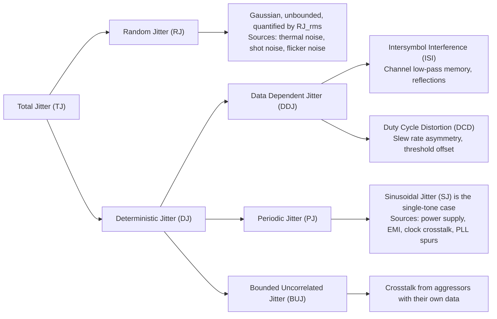
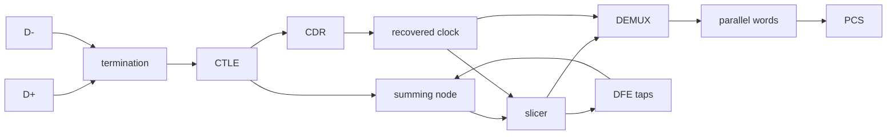

<h1 style='border: none; text-align: left;'>Table of Contents</h1>

<a href='#part-1' style='color: var(--primary-color); text-decoration: none;'>Part 1: Electromagnetic and Signal Foundations</a>

<ul style='list-style-type: none; padding-left: 20px; margin-top: 0;'>
<li style='margin-bottom: 6px;'><a href='#wave-propagation-and-transmission-lines' style='color: var(--primary-color); text-decoration: none;'>Chapter 1: Wave Propagation and Transmission Lines</a></li>
<li style='margin-bottom: 6px;'><a href='#frequency-content-of-digital-signals' style='color: var(--primary-color); text-decoration: none;'>Chapter 2: Frequency Content of Digital Signals</a></li>
<li style='margin-bottom: 6px;'><a href='#impedance-reflections-and-termination' style='color: var(--primary-color); text-decoration: none;'>Chapter 3: Impedance, Reflections, and Termination</a></li>
<li style='margin-bottom: 6px;'><a href='#inductance-magnetic-coupling-and-crosstalk' style='color: var(--primary-color); text-decoration: none;'>Chapter 4: Inductance, Magnetic Coupling, and Crosstalk</a></li>
<li style='margin-bottom: 6px;'><a href='#skin-effect-and-dielectric-loss' style='color: var(--primary-color); text-decoration: none;'>Chapter 5: Skin Effect and Dielectric Loss</a></li>
<li style='margin-bottom: 6px;'><a href='#return-path-dynamics-and-parasitic-effects' style='color: var(--primary-color); text-decoration: none;'>Chapter 6: Return Path Dynamics and Parasitic Effects</a></li>
</ul>

<a href='#part-2' style='color: var(--primary-color); text-decoration: none;'>Part 2: Signal Integrity Measurement</a>

<ul style='list-style-type: none; padding-left: 20px; margin-top: 0;'>
<li style='margin-bottom: 6px;'><a href='#time-domain-reflectometry' style='color: var(--primary-color); text-decoration: none;'>Chapter 7: Time Domain Reflectometry</a></li>
<li style='margin-bottom: 6px;'><a href='#s-parameters-and-vector-network-analysis' style='color: var(--primary-color); text-decoration: none;'>Chapter 8: S-Parameters and Vector Network Analysis</a></li>
<li style='margin-bottom: 6px;'><a href='#smith-charts' style='color: var(--primary-color); text-decoration: none;'>Chapter 9: Smith Charts</a></li>
</ul>

<a href='#part-3' style='color: var(--primary-color); text-decoration: none;'>Part 3: Jitter Analysis</a>

<ul style='list-style-type: none; padding-left: 20px; margin-top: 0;'>
<li style='margin-bottom: 6px;'><a href='#jitter-decomposition-and-measurement' style='color: var(--primary-color); text-decoration: none;'>Chapter 10: Jitter Decomposition and Measurement</a></li>
<li style='margin-bottom: 6px;'><a href='#dual-dirac-model-and-ber-extrapolation' style='color: var(--primary-color); text-decoration: none;'>Chapter 11: Dual-Dirac Model and BER Extrapolation</a></li>
<li style='margin-bottom: 6px;'><a href='#test-patterns-and-jitter-isolation' style='color: var(--primary-color); text-decoration: none;'>Chapter 12: Test Patterns and Jitter Isolation</a></li>
</ul>

<a href='#part-4' style='color: var(--primary-color); text-decoration: none;'>Part 4: Equalization and RX Architecture</a>

<ul style='list-style-type: none; padding-left: 20px; margin-top: 0;'>
<li style='margin-bottom: 6px;'><a href='#transmitter-feed-forward-equalization' style='color: var(--primary-color); text-decoration: none;'>Chapter 13: Transmitter Feed-Forward Equalization</a></li>
<li style='margin-bottom: 6px;'><a href='#continuous-time-linear-equalization-and-decision-feedback-equalization' style='color: var(--primary-color); text-decoration: none;'>Chapter 14: Continuous Time Linear Equalization and Decision Feedback Equalization</a></li>
<li style='margin-bottom: 6px;'><a href='#pam4-signaling-and-gray-coding' style='color: var(--primary-color); text-decoration: none;'>Chapter 15: PAM4 Signaling and Gray Coding</a></li>
</ul>

<a href='#part-5' style='color: var(--primary-color); text-decoration: none;'>Part 5: SerDes Architecture and Clocking</a>

<ul style='list-style-type: none; padding-left: 20px; margin-top: 0;'>
<li style='margin-bottom: 6px;'><a href='#serdes-architecture-and-eye-diagrams' style='color: var(--primary-color); text-decoration: none;'>Chapter 16: SerDes Architecture and Eye Diagrams</a></li>
<li style='margin-bottom: 6px;'><a href='#cdr-and-pll-loop-dynamics' style='color: var(--primary-color); text-decoration: none;'>Chapter 17: CDR and PLL Loop Dynamics</a></li>
<li style='margin-bottom: 6px;'><a href='#line-coding-fec-and-protocol-framing' style='color: var(--primary-color); text-decoration: none;'>Chapter 18: Line Coding, FEC, and Protocol Framing</a></li>
</ul>

<a href='#part-6' style='color: var(--primary-color); text-decoration: none;'>Part 6: Coherent Optics</a>

<ul style='list-style-type: none; padding-left: 20px; margin-top: 0;'>
<li style='margin-bottom: 6px;'><a href='#light-as-an-electromagnetic-wave-and-the-electro-optic-effect' style='color: var(--primary-color); text-decoration: none;'>Chapter 19: Light as an Electromagnetic Wave and the Electro-Optic Effect</a></li>
<li style='margin-bottom: 6px;'><a href='#mach-zehnder-and-iq-modulators' style='color: var(--primary-color); text-decoration: none;'>Chapter 20: Mach-Zehnder and IQ Modulators</a></li>
<li style='margin-bottom: 6px;'><a href='#wideband-signal-analysis-and-evm' style='color: var(--primary-color); text-decoration: none;'>Chapter 21: Wideband Signal Analysis and EVM</a></li>
</ul>

    <img src="data:image/jpeg;base64,/9j/4AAQSkZJRgABAQAAAQABAAD/2wBDAAgGBgcGBQgHBwcJCQgKDBQNDAsLDBkSEw8UHRofHh0aHBwgJC4nICIsIxwcKDcpLDAxNDQ0Hyc5PTgyPC4zNDL/2wBDAQkJCQwLDBgNDRgyIRwhMjIyMjIyMjIyMjIyMjIyMjIyMjIyMjIyMjIyMjIyMjIyMjIyMjIyMjIyMjIyMjIyMjL/wAARCAQABAADASIAAhEBAxEB/8QAHwAAAQUBAQEBAQEAAAAAAAAAAAECAwQFBgcICQoL/8QAtRAAAgEDAwIEAwUFBAQAAAF9AQIDAAQRBRIhMUEGE1FhByJxFDKBkaEII0KxwRVS0fAkM2JyggkKFhcYGRolJicoKSo0NTY3ODk6Q0RFRkdISUpTVFVWV1hZWmNkZWZnaGlqc3R1dnd4eXqDhIWGh4iJipKTlJWWl5iZmqKjpKWmp6ipqrKztLW2t7i5usLDxMXGx8jJytLT1NXW19jZ2uHi4+Tl5ufo6erx8vP09fb3+Pn6/8QAHwEAAwEBAQEBAQEBAQAAAAAAAAECAwQFBgcICQoL/8QAtREAAgECBAQDBAcFBAQAAQJ3AAECAxEEBSExBhJBUQdhcRMiMoEIFEKRobHBCSMzUvAVYnLRChYkNOEl8RcYGRomJygpKjU2Nzg5OkNERUZHSElKU1RVVldYWVpjZGVmZ2hpanN0dXZ3eHl6goOEhYaHiImKkpOUlZaXmJmaoqOkpaanqKmqsrO0tba3uLm6wsPExcbHyMnK0tPU1dbX2Nna4uPk5ebn6Onq8vP09fb3+Pn6/9oADAMBAAIRAxEAPwDxbHHWjHNKKK2IExRilophYMCiipUjVEEs2cH7qf3v/rUAJHEoXzJOI+w7t9KSSQuQAAqjoo7UjyNK+5j7YHQD2pvegTCiiimIKKKKACiiigBKWiigAoH3l+tFKOo+tDBblrVR/wATW6/36pVd1X/kLXP+/wD0qlSKluFFLj1oxQTYTrUiTOgwDlf7p5FR4ooDVE+6GTgjym/2eV/LtTHieNQSAy9mU5FR0+OR4zlGx6jsfrQO43ApemBUuI5umI39P4T/AIVGytGxVgQR1FAxMUcUUd6BAB0q3aWk15L5UKbnxnBIFVlqe3WWSZEhDGQnC7euaCoo6C28Oxpg3UpYj+BBgfnV65MGladLJBGsZAwuByWPA5psMwt5be0nmaW5bOT6fWs7xLc5eK1H8Pzt9T0rPdnT7sY6HOv0NMp7dKYetaI5Jbi0UUUxBRRRQAhxijj0pTSHpSKsO++uR94dfpTcUqkggjginsAVDqPlPGPQ0CGUdqKKBiEe1HHFLRRcLC/eX/aXr9KbTgcMCOT6etPaMI3zHAPIHfFFySHBPAp4QD7xx7DrQX/u/KP1poGaB2HbsfcGPfvTPeilxzQGodMeop8g/ebh0b5h+NNp5wbdT3U7T+PI/rQJkdKOozRSHpTAAOaXoOtB60UgHwjLsv8AeVh+lR+9SQnFxGf9oU1lKnGDwcUxdRKUfeH1oI9qUdR9RTQPYsakP+JjN+H8qq1e1GMnUJeQOnU+1VRCxHBT/voUNakxa5RlIeg+lTfZpT0UH6MKGtZgM+U+MdhmixXMiGnR/wCszjoCf0oKsv3kYfUYpYyAshH93H5mlYG1YZ0FFL3pKQ00A459BScY+lO6Jnpk4puKAuGBQOmfwopSOcelAxtPEhxhgGA9f8aZRTsIfhGI2tg/3W/xpGBBwQQ3oab2qRXIUKQGT0bt9PSkBHilzgU/YH5jJz/cPX/69IBjLMPungH1oBMQ/KNvc8n/AAptBySc9aKAFwKXFIKWkUGKMZGMUoUswA6mhivReVHf196BDOtHeiimIOlL0ozn6UGgYlFFFAgooooAKKB19qu3MNqSn2ZztxlyTnH/ANegaVyokZkJ5wo6segpzOFXZGML3PdqR3BARBtQdB6+5plAbBRRRQIKOtORGkcKilmPQAdat/Z4LUA3T75P+eMZ6f7zdvoKLjSK0UMkzhYkZ29AKsG1hh5ubhQe6RfM359BTJb2SRPLQCGL+5HwPx9ardqB3SLf2qCL/U2y5/vSncfy6U1765cBTMyr6L8o/Sq4FBB6UDux+STknn3qaNsEVApxxTw2DQUnc6GxuHGmXhDcIikficGseV9x9KtWLk6ZqHJ+VF/9CrMZuf6VKRbelgJ5NPW8nj+VZCV/utyPyNQk+tN6nJqjKTLPnwyf623AP96I7T+XSkNqsn/HvKJP9hvlb8u/4VWxml+lAr33BlZGKspUjqDSVYW6LAJcL5qjoc/MPoaJLbKGWBvMjHX1X6igVuxXooooEO5BBpcA8j8qSjP4GgEIBxWpp1hEYmvrw7bWM9O8h9BUmladbXcUk1zIyrH1A446nmq2o6gbyUBF2W8Y2xRj+Ef40XNElFXY+8v3vJ95+VFGEQdFHoKh89wMBjiqu7n2pdwosHOh7Pmoic0Ekj2pv0oSIbuOoozSZ59qQxaDRUsMIlYs52xIMuf6fU0wFijVU86UZQfdX++f8Kjld5WLsck/p7U6aYzPnAVQMKo6KPSoxzSDyCilKkKGzkHvSVRIUUUUAFFFFABSUtFK47B9KKlit5p/9XGzDuccD8ak+yxx/wCuuowf7sfzn/D9aLhylagdR9asH7EvQXDn6hf8aBLa5+W2br3lP+FA0tSTVcf2rc/7/wDSqI61f1bH9rXP+/8A0qlSHJaiYpaKKBBSYpaKAExS0UUBsGKlWbKhJQWQdD3X6f4VEf8A9VFMQ+SIpgqQyHowpgHNPSQrkdVPVT0NSJbvK6rCpfccADrn0NA1G+w2KN5ZVjjUs7HAUDrW8Wh0C3KKVk1CQfM3URioS8WhQlE2yag45bqIh/jWK7s7l3JZmOSSeppbml1H1J1upUuluCxaQMGyT1NF5dNd3Utw3Bds49B6VXLe9JnHfmnYlzBjnFNNLz3FFBAUUelFMVgoopCaRVgPA4oIxRn3oJ4oEJT432k5GVPDD1FMopsRI6bGA6qRlT6im0+Mhl8piADypPY/4U0qQ20ghgcYpDQlKFJGScL60oUIeeT6f40jMScmgYbyv3Bj3PWlX5gV79RTe9PiRpJURPvMQBTWpMtENxxRitz7Ba42bST3bdyfoKzLu2+zTmPORjIPqKuUGkZRqqTsVaKO+KKzN07hT4udyf3l4+o5plKrFHVh/Cc0IUthvbNH41JKuyVgOmcj6Hmo8UxDjjaOCe3XFJnGPlA/CgdD+dFIB4dgQd3Q5p1wMXMo7biaiPSp7jmRW67kU/pTDqQjtTh94fWk6U5Rgj60LcHsWtV/5CEv4fyqieDWhqa51CX8P5VRI705bkxWg3pTyzBiQzDHocU0ckDFDHLE+9IpomW9uUGBM2PRualF8xiPmwQyAnHK4z+VU8048Rp75P8ASndolwTLIkspPvwyRH1jbI/I0v2SCT/U3aE/3ZBtNUs8UDkgUXvuTydmWpbOeNRmIlQPvLyKre1SLNJExaJ2T6Gpxe7+LiGOUeuMN+dGg/eRUGM/Tmk5zk1d8q0mXEUrQsTwJeR+dRzWc8A3MhKf315FHKwU0VvpQTxS9R7UYGKRdxp64p3Ao7UAUhvQMbsAdSeKkMgfCvkqOAw6/wD16fJAYEVyc+YMqfbvUFOxN0xXQgbhhl/vD+vpTTTlZkOUOD/OnbVlPy4R/TPB+npSsMipfw57UpBUlSCCOx7VIn7lBI332+4PQetAPQGHlL5YPzt98+nt/jUP0pSP/wBdJQFrBRRRQAUUUUAFFFFABRRQAScDrQAqKXbA/E+lPdxwq/dH6+9K5CDYv/Aj/SozQPYSiiigQVPBbNNliQka/ekboP8A6/tToLZShnnYpADjjq59B/jTLi5abCgBIl+4i9B/ifegdrbkz3axIYrVSinhpD99v8B7VT6miihIG7hRRS8Ac0CF6Cgcd6njs5pV8wgRx/35DgU/bYw9WkuG/wBn5V/xp2YOa6FTOKeiSP8AdjdvopNWPtzJ/wAe9vDCPXbuP5mo3vbt+tzJ9AcUadSVzdjQsre4Gn36+RIC6JgFevzVntbXC9YJf++TU9pNKbS9zLISEXksf71VxcTqeJ5P++jSVjR81kRMGU/MCD7jFNq0L25AIMpcejgGkM8Tn97brn1jO2nZEarcrcYoqz5Mcn+pm5/uScH8+lQvG0bbXQqfeizQJpjKfHI8Th42KsO4plFIZcxHeD5QI7j+6OFf6ehqoylCQwIYcEHtR0q2rLeKEcgTjhHPRvY+/vQVuVKntrfzmLO2yJOXf+n1pIrd3mZG+QL98t/CKdcThwIohthT7o7k+p96AStqx092ZCqxAxxJwig/qfeqxyeaDQCQQRQJu4n0FGKcyYww+6f0pp4AoCwn0ooooEOFIOmaM4FFAxyq0jqiDLMcAVNOyqBbxnKIeWH8Tev+FLH/AKPbmU/6yXKp7Duf6fnVbikVsLRRRQIcj7CQRuU9RSvHswynKN0P+PvTQONxHFLHIYycgMp6qe9MQ3pRUssQCiSMloyep6g+hqGmJi0UAEkAAknpirXlR2nM4Ek3XygeF/3j/SlcaVyKK3eRS+QkQ6u3A/8Ar/hUnmwQ/wCqj81v78o4/Bf8ahkmeZ8uc46ADAHsB2plIexLLcTT48yQsB0HYfhUVGKvW2kX10AY7dgp/if5R+tPRAk2UcGlHUfWtY6LHDxdajbxnuFO40i22jIRuv5XOf4Y6VylDUq6qf8AiaXP+/VOtPWEtxq1wBI4O/n5eOlUfLjJ4mH4gigHuRUVKbeT+HDj1U5qI8cHigkKKKKACg0UdqYMKKKUKXYKoJJOABQJD4MmQKE3k8BfWthZ4tDi2IBLdvguM8IPT61VLJpSYGGvGHXtEP8AGs7cXfLN1PLGluaJ8pNckPMZQ+4SfNyeR7GoCeac42sQaaelMl6sMdKBRziikIKKKOtMLid6WiigSGk0UpGKSgTCiijpTAAM0UuMUqqG5PCjqaLjsAUk4HTuas7vOjwn+tUct3dfb6fyquzZGBwo7U1GZWDISGByCKQXsFLU0qiRfPQYBOHUfwn/AANQ0AFSwS+TOkoGSjZxUVFUiZK6sb63Ns53idAp5w3BHtisq9uRc3BK/dUbRmq3WnNygbp2P1q3O6sYwoqLuM70UYorJnQgJpOMYpTzSGgbJZDuiifuBsP4f/WqOnx/NFInphx+HX+dMpkAOv1oozyDTivzGgpK4mDU0vMUDf7JX8iaYoLHCgn6CrsdjczWybIJCQ57diBSuPlZTC8CrVraTXT7IY2cjk47VMukXnVotv1IrqdPs1tLJI1ADEZYjuam5rGnfc5zVrOeO4eZom8s4G7HHSspueK751VlKOoKkYI7Vys2iXXnOI1VkBO35x0p819WDp2WhlIv7xeO9M960hpN8jjNu3Q9CD2qs9jcxnDQSjH+yaLkcqK3bFPlBGxfRB+vP9aayEHBBB9CKfOP38g64OPy4p3E4kODSoCDn0GaWl6RE+px/n9KLhyjBQaXFPiGH3EcINx/z9aZDTQ1+G2/3RinwXM1ud0Tsvt2/KoueSe9Jii4nFNal7z7W6P+kw+W5/5aRf1FJJp8mzzIGE8fqnX8RVPNSRSvE+6Nireoqr33I5GvhGYx9asWaRvcqsoJTkn8qn+0w3QxdptftMg5/EU4afKkbFCrh8AOOgWhR7EuelnoLqNxbuvlINzIAFI6D1rMq5LZNCrszjCgEe9UyKUt9S4WtoFBoxTo4zLIEXjuSegHrSLehLDh1LTjMSfxd/p71HKXL73wQ33SOmPalmkVyEj4jT7oPf3NNR9oIIyp6qen/wCui/QSXUbRTnQAb0OU9T1X2NNFJqxadxDQRS0UBYbRS4pKCQpcCnBQRknA9fWkxQNDalH7tN38R+77e9IiBm54Uck+1Ndt7EkY9BSDYaKKKKYg61Yt4UKGefIhU4wOrn0H+NNt4BMxLnbEgy7eg/xpZ5vOYYG2NRhEH8IpFJdRLi4e4kBYAKBhUHRR6CogPelxTlWmhNjcDHrRx6VN5DlN4jbb64qWK2UR+fcErD2A6v7D/Gq5WR7REENvJOSVACL952OAPqam82C34gUSyD/lq44H0FR3Fy8wCgBIl+7GvQf41ABk9DmlewJN7kks0s775XZz7npTKcUCffPP90daYSD0GBSepa0DtR3pyI8n3VJ+gqT7O/fav1akUS2o/wBEvf8Armv/AKEKrVet4cWl4PMj5Rc89Pmqr5BP3ZI2+jUA9iI0U9oJVHKHHqOaZntTJ6ifWpkuWVdj4kj/ALrdvoe1QUDrRclq5YMSyAtASccmM9R9PWoMcelKMghgcEdxU+VuDhyFl7N2b6+9PcNiCpIonmkCr16k9gPU0iwyGbytp35xipZZFjjMEJyP43/vH/Ckyl3LEs4uYjBGTuXHJ/5a4/zxWfQGKkEEgjvU8oE0fnrgMOJFHr60Db5iCik60p60yRyMB8p+6f096aylWKkcikqTHmR5/iXr7ilsPcioHWilHWmxAegqS3hM8yR5wDyx9B3NRirSfubFnP35ztHso6/mcD8KRSIribzZiwGEHyovoo6VDS9qSgT1Y4e9KBkgUnIFOPyoFPU8n6UDGscnA4A6U3FOxSH6UCsSRSmPPG5W4ZT0IpzQ/Mpiy6ucLgc59PrUIq8jnT0xjM8g+ZT/AAL/AIn9KRSXcQsLIFIyDcnhnHSP2Hv71TzUkkYGHQkxnoe4PofemKjOwVQSScAAdTQgbErRs9HmnjFxOwt7bvJJ3+g71YjtrbSFWa9US3Z5S3B4X3aqF5qFxfS7p5MgfdUcBfoKL32GkluXzf2Gnjbp9v5so/5bzD+Qqjc6leXZ/fXDlf7oOB+QqpnuaKAcgo9Dmij0oEWtUx/adx/v/wBKqcVb1P8A5CVx/v8A9KqimJvUBkcjjHepRcNgBwJB/tf41FSUCTJvLjkH7ptp/uOf5GomVlO1gQR2NFSLLwEkBde3qPpQG5HR7U+SLYAynch6H/PemAZIA5J6AUBsABYgAEk9PetFCulpuG1rxhx3EQ/xqMY09ckA3RHHpGP8apElmJJJJOSTQUtAdizFmJJJySe9NzS4oAoJ1JQd6Y/iA/MVGPypQdrZHUU5gOGHQ0h6jKOtLRQAlFFJ1pie5LNEI2VkO6NhlW9fb61HUsLB0MLnAY5Un+FqjZSpKkYIODmgr0EpMUtHekIbjHNGeMU7pSgD7x6fzp3AFAxuYHH86RiW69ug9KUncc4+lJQKw3FKOKWigNh8MvlNk8qwwy+opZYxG3ByrDKt6io6liYMvlOcKT8pP8J/woDciooKlWKsMEcEUUxADinIRnDHCtwfb3ptBoACNpIPUcGinn5lD9x8rf0NNOCMEUhpAEYxmQI3lhtpcDgHrjPrTcZ612D3FzefCplnlZ1i1qJIgQAEXyG6AcfjXOi2t7fm4l3N18uM5/M03oOPvbla2Um4QdQ3ynHoeKm+wyr/AKzbGBxlzintqDKu23jSFf8AZGWP41BcuZJhKTkyKG/Hv+opahomSBLSP78skp9EXA/M0NewKf3NtEDgcudxptnZzajf2thb8z3MyQx5/vMQB/Ouj17WLW21SbSbOyjWysNQIikVVLFIx5eR8v3mwXLEnJx6Uct9Qc7OyMWabU7byxNHPb+Z/qw0JTf9Mjn8KbJLciOZJ2mWVJF3LJkMOD1B6V1Gj+KtP0+wvbG5uLm5a4mL2+oFGMts21wJWVmILjcB8mDjd8xwBWDqt5DcCGCK7kvWt7fY91IGHmHeWwu75tqg4GeevAGBRYXMzNDtn7x/E11WjarE1slvO4SROAzHAYf41yXepFfBGfUUrXNIzsdhqGpQWqMDIrSdkU5P4+lcfJK0kjOTyxJNWNSbN/N9R/KqRNCVtBupzImjmkUth3GFPRjUsepXkX3LmQf8CzVUH5X+n9aSgnmNSLWLuSVVlMcoJA+dAaY1/Zyk+fYLyfvRsVNUYSQ5P91Sf0qPAosPmL/laXNny7iWE+kq5H5ihtMndV8gxzgDJ8thn8qoBSSAO9P3EOWUkYPGDQO6YSRPE22RGRvRhin7dttnu7foP/r/AMqnTU7nGyUrOnTbKN369asSHT7htjb7V1G0EfMn+PWi9hWTMkikxjmr8+nTxp5seJov+ekfI/8ArVSxTuS0Mx3paCPSgAngUEkkeOWb7q9ff2rQ0+/SJWSY4y24Njis1ztwg/h6n1NJn1qoya2IlBSVmbFy0F+RHFMokHIzwG9s1kyRPFIUdSGHUGkBq5HcpKoiugSo4WQfeX/EU27shRcFpsUgpJAxknge9TS4t4zApG4/6xh/6DVp7c2UXn5DluImHQD1+tZ5xSasXGXMJRRRSKFVijZGPQg9CPenMqkeZHnb/Evdf/rUzrSqSjBgcGkHmJRT3UEF4xgfxL/d/wDrUwAkgAZJ6AUWHzBS7Qgy/fov+NO4j9C/6L/9emAF3AAZmY9BySaAFZt7ZP8A+qk/nQMU+NQWyfuryaAB/kQL3PLf0FRU4neS2c55pNtAMSnIjSOqKMsxwBSdDVmFTDbmUf6yXKxjuB3P9PzoFp1C4dUUW0RyiHLMP429fp6VXxSspVsHGR6GkoKbFFSwbTMgbhSwzUQqxaQq7NJLxDHy59faqhuZ1NjdCH/61Mh0C41m4ULe28byymG2ik3Euwxx8qkIOQMtgZPscZT6lPuYqwROirgcCpbHXBp7QzCzimurdy8MzSOMHORuAOGAPIH55HFbSmmrHPCEou4s+hy2sMguLq2hu4kEklmxbzFU47427sEHbnOPyrOMgTIiyPVz1P8AhWvf+JH1O2czaVZ/2hNGI579Q/mSAYGdudisQACwGTz0yayQiwgGQZfsnp9f8Kxeh0Rbe41ISw3EhU/vH/PNP3xxn5I9xH8T/wCFMd2kO5jn+lN79ajc0WhI00j9XOPQcCmECgD1FKByO/0pg30LVsP9Cvf9xf8A0IVTx+NX7aNvsV58jfcXt/tCqJUrwQR9RQJvYFkdfusR9DUnnhuJUDD1HBqL8aBg0BckMKvzE27/AGT1qLGD70o46HBqUSLN8snX+/8A40ARUlXbOwa4ufLZtqgbmb29qv3OjxRwmSJ2OwZYN3FF0UoNq5nb5Gh25Akxwe5Wquc093Jk3Dgg8e1LIAwWVRgN1HoaZFraEdSQy+VJuxlTww9RUdFAXJJ4xHJxyjDKn1FR+1Tx/voTD1dfmT+oquaRTAkUqOUYHt3HrTaKZI+RNr4HIPIPtTBwakPzw+6/yqOkDHKhkZVUZLEAD3qe8ZTPsQ5SIBFP06n880tnhHeftChYfXoP1NVs96CtkLiik9KXNACqATz0HJpGbccnvTvuxe7fyqPpQDHUUUsaGWRUUcscCgCa3CxoblwCFOEU/wATf4CoWcuxdyWZjkk9zUlw4aTYh/doNq+/qfxqHHpSBskjcoxGNytwy+tbXlx6HAJiN99IPkDD/Uj396r6fDHZ2p1K5UHB2wRn+JvX6Cs97mSW4eWVt7Octu70ik7IZJI80jSSMWdjksepptPdBjenKH9PY0wDmqIs7hRjPanHA9zTck8nmgNgoA5FAoHUfWgL6lnUedQn/wB+q3FWdQ/5CE/++arUA9w9qOnWjNGaYgopcAjI/Kkxk4HJoAdG5TjG5W4K+tXSi6egcDdO/wB3P/LMe/vUQAshuYBrgjgH+D3PvUCSHed+Srfe/wAakvYazFiSxJJ5JNJTpEMbYzn0PqKbVEAPWigdKWpKA0qnPyseD+hpKQ8mgAI5wetFOPzqG7jg/wCNNzTEwoooNABVp1WSGOWR9jHK5IJ3Ad+PyqGCLz5lTOB1Y+g7mluZhNMSowgG1F9FHSkNAI4v+fgf98Gjyov+fhf++DUOaT2piuTvBtCsrB4z/EBj8PrUZOTx+VSQy+XlHG6JvvAfzHvTZovKcYIZTyrDuKQxnajqMVZsIo5bgrJg/LlVP8R9KS9jjiuNsYx8oLLn7p9Kq2lzPm1sVicZJ6VvanoFrpekLNLqOdSAgd7TywAFlQuMHOSVXbu4A+cDNZempJLqtnFCEaWSZEUSIHUkkDlSCD16Gtnx3qh1TxjqYIgWGC6khjaKJUJRW2jJAy3Cjk5qklYUm+ayM2/sI9OsbIyu3225jFw0Y+7FE33M/wC0w+b2Ur68JJYx2F7Zx6kx8qaKOaVYT88cbjIPPfaQ2PQj1rW8SpcSfEi+t7aNDMt+Le3RkDLhSEjG0ggjAUYNReNdUfUvEl7hIRaQ3MkNu8UCJuRMIMlQC3Cjr0z2oaSEpMz9SsZbG+nspyrT2xxvXpImMqw9iCCPYis/Fb3ijKXOjS5xK+kWrN9Qm0f+OhabpNmt5DJIujx33z4YtfeRsOOgG4ZHvU21sXfS5h4pcV1h0ckf8itAP+4yP/i65Yptzu45Py5zihqw00wiXcSvUNwfb3oKhCQfmYdu1bDQeHCAP7X1ML6DTU/+PUPb+HHII1XVCcc/8S6MZ/8AI1K1x3SJ01fSR4Sl0c/2l58tyl2ZAkZUSKjLtA3Z2nd168dK5znv1rbNp4f2/Lf6u3/cPj/+PVF9m0Jet7q//gvj/wDj1U0yFJIyc0/dugHqjfof/wBVaEsGhCFzFeaqZQpKB7GNVJ7AnzTge+DWfHzuX+8vH1HNJqw7p6nWfDK3STxxbXcoBh0+Ga9kz22IcH/vorXJ7y7F3OWc7ifc9a7HwSRZ+GvGeqngx6atop95mx/QVxvTpTfwoUdZMSnw/wCsx/eUj9KRlIPTj3p0XEqkkdakt7GxpmiW99oV9qs+pG1ismRZU+z7yd5woU7hknBOOwBOagl02yOjz6lZalJOLeeKFopbXyiTIHIIO9s/6s+natt5YNL+Gmn2stpDPNquoy3StI7BUSICJSQpBPLSY5x161zd41tca7MbNPKsZbr93EMgBN2Bx9D+tVYzUmy74gslsLwCSQm5lAlMYHEcZA2Z/wBph82OwI7njH4rq9XiF98RNca4j8xYJrqbyucMsSsVU47fKAfasG6sWi0iDUZW2G7nlSOMJtBVAu5h7bmwAP7poknccJqwul2I1J57WNyLsxGS3THEpUFmT6lQSPUjHeqAYEZHSuod/J+JGm/ZbdIJYrqyR4ohhVmAjEgA7fPuyPrUmm6RYQW/iTVZnttthdraWaXClo97s/zlQDu2ohwCMEkZ4FKwc5l+G7KPUtT+zvGJsoXMZl8vMags5BHOQqnAqtHpdzOlm0ELu92kssaYwPLQkFs+g2vknGNprVl1prW/tdT0y1R5IoTBJcyWwVJZNpDMEGACFcDHsCRzioLXxdqVpZw2qx2jrHA1q7yRZeWBizGJmznbl2Py4PTngYemwe9ui3oWmaZHfW11qSS3NidPlvJYslCNpdRyOxYDb7kZ9+ZJQsxRWCZO0MckDtn3xWnDrt5DeTXe2B3mRYmjeIGMIpUqoXsFKLge3Oeazx5l3eKGkHmTy4Z29WPJP55pO3QpXWrNHw9pkes6zBYNdfZ5JSFiPlbwz56HkYGMnPtWVv3DOevNej6SYdL+LUHh+xsbdbS2vDahpIVaZyqkGUyEbskgtgEADjFcUlmw0SwhgtvNvdSumERC5bamEVF/3nZs/wC6tNrQlT94ow3Mtu4eKRkb1BqwbqC5P+kxbXP/AC1i4P4joa0ba1j0vU/EFjdR215Fb2s8DzbMhJAQqMhPIPmbRnuCfWsEHgVLRop3LEtoyJ5kTLNF/fTt9R2qJflBf8B9aWF5I5AYmKv6g1YMkNy+18RMOA6j5T9R2/CkU9SlyKAenepZ7eSFgHHB6MDkH6GosUyLWFHWpreNW3Syf6pOW/2j2AqKONpZFReWb9KfPIpIijOYk6e57mmiX2J0v5BI5kUPG/3oz0x7elNuLZfL8+3JeE9fVPY1Uqe3uGgk3L0PBU9GFVe+5DjbWJo+GNJg13xBa6XO88f2ltivCFOzuWIPYAE1JY2/h+81a2slOqkTzrCJA0Q+8wAOMe+etbXg9ba1Ota8q8WOnSbI2BwJZB5ajPp8xrm9Rvra50zT44oIkvIpJXnkiiEfBKhE467QpOf9rHanayJUnJk9rpVv52q3UztJp2msVyDhp3LFY0B7ZwWP+yrY7VkZBJIAHsK31AT4dZUf63Vz5n/AYfl/9DeoZLZv7I0qxtrZZLrUJGm3BMu53mKNAfTKscDqW56Ck1fYtStuY6N5bBgcN0rVktIZ/D39o2IZJLeRYr6MnON2dkinspwVI7EDkhhjU0y3i0LxVrWnTJFe20Ntc21zLJHygVCCy5ztO8AA+49ao+FgskOvQS/ck0eYke6FJFP/AH0oo5bbicr7GFwB1rc8KW63Gpuf7QFlsikcyIhaVURDI5TsDtQjJ/vY9avWFhZ6Z4Mg1ie6t4b2/mlSB5YDMUji2ghFwVDFm5ZugUY6mqLeIlg1R72z0yAQXFobaSKVNqTZUCR8IRtywzgHA6UrW1Y+bm0RVj0eW4g0sQBmu9RlcRqcBdgYKG9vmD57ALU2mabYXsFlG0t213c6glqYYkAQxtjlXP8AFkjjHAqWx8X6vYRQJb/ZBNA7GG4a2RpI1ZstGpIwEJJ4x0Zh0JFV31+7GrWV9BFa2xsZRJbQwRbYkYMGJ25OckDJJJ6DoAAXiFpbEniy7sb7xVqE2mxGK185kQcYIU7QVAAwMAep9TzWNkDOasXdybuUN5MUKKNqRRA7UGc8ZJJ5J5JJrctbeLTPAza4kUUl/caibNHlQSC3RYw5IVsjcxYckcAHGM0rXZV+VEGo+H7e10XRL+3vJJDqPmCQMoCxlAmcEHkZcjn+7WTczqzkR8KBtBHp6V3V0ja/pPgG3utmbma5SYxoE3L5wBOFAGdorkfs0mrWurayIoreC2MZ8uGPagZ32qgA6fKGP/AfeqatsZxlfcyxzS+9bOpun/CN6FG9vClztnfzUQKzxb9qbsfe+ZZOTzzUOg20t1fOkekR6oREWMLzNGFGR82VZfXHXvU21sa30uZyqXYIoJZjgCrN26oFtYjlI/vEfxN3NdjDpFzCwkj8E2gfkc38nH/kWuU1qB7bVXjfT49PbapNvHKZFXjruLMefrTcbIhS5maPgvxFL4a8Rw3qp5lu48q5iwDuiPXHuMAj3FdF49k1rQtUjvdN1i7fR9QXzrSVZiQM4JUH2yCPYjqQa4IgJFt6M4y3sPSu18M61ayeA9Y0fxBHI2mQgSWNwoBeG5PKooPXPJ9hvz1qoS0aIqQ95SRkReO/FdjtZNevDJ2V2DgD3DAis/xFq0Wu6qdTW2FvPPGpulQAK0wGGdR2DYBx6k1lkknJ5Y9TQvJwKhyb0NYxS1NrQ9Cg1bT9TvJ79rWPTollkxB5m5SwUAfMPmJIwPrzTf7J0+XTL69tNTllNmqO0ctp5e8M4Xghzzzn6A1taXLb6T8Mr6eWFZ5NW1FLdEdyilIV3ljjkjc44yOQK5vWrq3n1CZrICO2KomETYrlVALbe2Tk/jVWSRF22T3djb6ZpVjJOrvfXifaFizhYockKW7lmwSB0C4PO7jP+1v0Uqg9FGK6XxDapf8AxLnsDtS2hdIRkZCwxRAdP9xDWLLYyXmjXevSBIIvtaW6RxRBUZmVmIXHChVUf99Chp9ATXUtaBANVuX0+S6MMl1tigdhlfMJ+UH0BOBntnNZjPcQSNFLuDoxVkcfdI4IINbOvTIgsGgs4bO4XT4GmWAbRv8AmIbH94qUJrp5tI0288f+K7zUTElvYQvemOUMUaZigAcL8xUPJkgemO9FmLmVzhLXbNdIwQxMhDeZEAcHIA4PGckVp65pSR6v4hka4uLhbO5EKyMoDyTs2NrY46LJ067ferF9q0Udvp81hDBPd2cpee8jtBFE5LBo02AAHG0nJA6+2aqQ+LL+Ce5kjt7ICZlkVDDuWGVd22RMnO8bm5OevsMVolZhq3dEH9ji1XV0vzKk2nGNW8rG3cXCspz3xuwP9k1oeM/sVvdWGn2kM8bWNnDFIZGXG5l8xgcD725znntjtVPW9cu/EMWHjtoXd/OnWCLYbiXGPMY5OW68DA5JA5NU9U1i71iYy3QiDsxdxGm3c5ABY+5wP6YqW1bQcU27sNPvhay/MxCHhuM/lW/4lSLT9L054blplv4GkJKbQNrlDjnp8tUIEi0nwjb6tHDFLe3l5LbiWWMSC3SNUOArAruYvnJHAXjGTXQ3Numt3Xg5bmGNIv7NmuZYokAVlR5ZCAo4G7YeBxzSjBPcp1ZJnA9Tn1p8OCxjJwH/AENaE1hcXOhz+IZdqQyX32fake1SxUu2McADgY9/apvFEkD3tl5VlBZSrYQ+fDAu1Q5BIOOuSpTOe+aLNA5X0MVlKMVPUHBoqWX5wkv94YP1FRUilqhyO0bq6nDKcin3KKJQ6D5JBuH+FRVOv720df4ozuH0PWkVa6K1FFFBI+MgOM/dPBprKVYqe3FJUknO1x/EP1oAmH7vTs95ZP0X/wCuaq1avPkEEX92IEj3PP8AWqtCHIKVQSQPXpSU+I4fcf4QTQJBKcvgdBwKZRR3xQD1YoqeL5IZJP4j8i/1/T+dQD61PMNgji/urk/U8/4UFIhxxViytDeXaQjgMfmPoO5qvWlb/wCh6PLcA4kuG8pD3C9zSGtWQ6ldLcXIWLiCIbIlHYDv+NUacQPWkxxTJerHxuUbjnPBB6GnSAbcx/c7+o9jTPuilRijZH4g9DSGNop7KMbk+73HpTKokKB1FORGkYKilmPQAZqYWhTmSSOM+jNz+QpXGkF8c30/++ar1buYlkuZHW4j+Zs4ORUD28kY3Ffl/vDkfnQmNojooopkgM54q0uLUZwDcHt2T3+tM3C2HOPOPr/B/wDXqvuyc7hn1zS3HsKWYsSxJJ6k0UpKkZBB+lJ24oC5IP3kRU/eTkfSo+wpyNsdW9KWRAjkDp1X6UAN6Uhpe1JSGHtR7UUUAKpx16Hg0h4OD09aM1ZZjbIsYVTJ95ty5xnoP8+tMFqVQeKM1P8AanP8MWf+uYoN04/hi/79ii4rD2/0a02/8tJhk+ydh+NVKt3I+0QrdL1GEkA7HsfoRVUDigb3DHrQvrS0dKBWCgs23aTxnOKPwp+AseSMs3TPYetAEYBJ4B/CpBkqFkxgdCSMim7iRyT+dJii4rHSeGU0nT7iLWr/AFAJNYXSTRWwUnzwqswwcdS4Re2ASTXNyO0ru8hJdyWY+pPJpVYjoeD1B6GlK5G5M4HUdxTb0J5dbm3f6w8mpad4gs5lXUVWMzKwBKTxAAPgjBDAK313DtVR7iXXb62hnktbSFF8sEKI4oUyWZsdzksT1JPA7Cs4YwDSGne7DlsjT8Q6lFq+tz3FsjR2iKkFsj9VhjUImffCgn3JrOjC7sMu5TwRSAZPsKC3BA4pPUpJJD5Y4oW2qoc9Q2OMe1R5J5zmpF/eKIj97qh/pUfNIYueK09EtIbm/Ml2CbG1Q3Fzg4LIuPlHuzFUHu1WtN06x1HwtqjQwzf2vYbLtnMmVkt92x1VccFSyMSc8Z6Y5jum/s/w7bWa8T6gRdz+oiGREv4/O/0KelNLqS5X0R0iahr11a2V7f8AjC604ao7izhjklMa4bbzsIEaA8DGSAOmK5u+1rxLYX9xZXmtamlxbytFIpvXOGU4P8XPNSaQGMNrqGtSyvounyEwW7uf38mQxiiHucF2HCjryQDp6PreoXOqaneT21pGI0m1O8aW0R3kYgbV+dTtUuyDAxwxNaLUy2Odl17V7hGhl1m/ljcFXR7p2DD0IJ5qkjBXVv7pzXVeJdavZdK0q0lWzAurJbicxWUMbMxlcrgqgIAVVHB7VzMNtNc7xBE8nloZH2Lnao6k+gHrUNa2NE9DrE/4lnwkvFziTUtZWLB/ijiTdn/vquOLHHWur8VyFNI8L6PGoZ4rEXUioMsZJzuAI9doT865ttO1BQztp92EUZZjAwAHqTinLsENrkB7fSnwyeTPFIUR9jhtrjKtz0I9K0rfw7f3lmJbU2883l+d9kimDT+WT97Z+IOOuDnGOarXmlzWkLyefbTCKQRzCCXeY2OcA9j0PK5HHXpUlXWxb1jX7nWLa2tbi0sYY7NfLg+zw7CiZJKjk8ZJPPPvWPgggg854NSSD963uc0gA3D60+orKx1Gs6ubXxMmvWD27z3SFriCRQ4WRl2So6nqrZYj1DeoqNfHutrD5Srp/lx/8eymxjIten+qyPl+6PXnnrzWJqOPt8vbkfyqmKbbuRGCa1NjQbuOw1P+2rmVWeyYzwo7Zea4/g46kBsMx9Fx1IqpY6pc2EVxGnlTQ3IXzoZ03o5U5BI7EEnBGDyfU1TI4X0pOgqbmnKi9falc3gtxI6pHEhEcUShEjBPO1RwM9Sep75qr57kfNhx/tDP69abLw4A/hAH6U3GSB60mVHRE7tEyqpVkOM5Xkc+xpvkl/8AVsr+wOD+RqNyC5x0zinxAeaM/dX5j+HNKwN6G6fGGs2upw3qvbnUINoN5JbqZpAoxh278cE9SOCSKrWvi3WLO1ktreS3jVnaSJlt032xYAN5LYzHkAA7fTPXmsvzWb7+HHo3NCpHI2FYofRun50+ZkqETS1fxHqWtp5d41uAziWXyLdIvOk5+eQqBvbk8npk+prJpzIyNlxjPP1pFQu4UHr3ovdjtZDx8se7u3A+nc1Hk06Rtz8fdHA+lMoC5YiuHjUoQHjPVG6H/A09oFkQyW5LAfeQ/eX/ABFVe9T258v/AEg5Gw4X3aiw0+4pzbw7f+Wsg+b/AGV9PqarVcZlvCS5CXB79Ff/AANVmRkYqwIYdQe1FxcthuKF4pDS9qYjoNO8V3Gm6VNpkenadJbT7fPEsTkzbTlS2GGcZrKngR4vtEGNn8af3D/hVT9angkaBhKT8p4K/wB8en0p3vozNxtqjV0eWO40nUNGuJBGLkpPaMxwPtCZAX2DKzLnpnbS2Pi3U9K00WFvHaCSIuILp4A09sG+8I3P3cnPbIJOCM1m3cSuouIuYTwV/uH0qnmnzNDjFS1Zuav4r1DWLZ4ZobODzirXL20Aje6YdGkbqfXAwM84zzUNvKNN8P3b7l+1amgt41DAlIAwZ2PpuZVUeoD+2ckDmkxg8Cp5iuVdDUstZeHTBpdzbWt3ZiQyxLcK2YXIAJVlZWAOBkZxwDjIqneXU93PunCqY1EaRxqFSNR0VQOg5J9ySTknNQmncyLj+NRx7ile6sHKk7iRn58+nNCqWGScKOpPSnrGI43L8ngbf8fypjEseT06AdBQNClsDCce56mrVlrFxYWs9oI4LiznYPJbXCbkLLnDDBBVsEjIIODg8VTp0UfmzRp2ZgKFoNpWOhvfGOpSWunWi21hBJpzCS1nht9skJJD7V5xjIHbJ7k5NPHjvVCGh+yaX9gdGWXT1tQtvISQSzKpB3ZVSCDxjjArnJX8yeR/7zE1GKrmZCpxLWo6hc6petdXTKZCAqqiBERQMKqqOFUDgAVV2eYVUAEk4ApcYFT2YCzGU9IlL/j2/WpWrKeiEu1jEoiVV2xDb0HJ7/rTIUUNkgbV5IA60wktlieSc0/hYgP7xyaG7jijQ0TRr3xJrUOnWShppiWZm+7Go5Zj7Af4Dmul1XwZ4nu2itrPQriLTrUFbeOR4wzZ+9I/zffbAJ9MBeiiuNtLZry9t7VHVGnkWPc2cLk4ycc4HWoZFjSV1SRZEBIVwpUMOxAPPNVFpLUiSk3ozrLf4beK7idIv7NWEMQDJLcRhV9zhifyBqh4j0i20DWZNMS5+0m0RVuZV+68xGSq+wyF9eD9KzNM0+TVLswwtGgSNpZZZCQkcajLMcc4AHQck4A607ULKSyFsd6SW88ZkhmjztkwSp4IBBBBBBHb0wS9LaIn3m9WXb/xReajpUOmS2enR2tvu8lYbYIYycFiG65OBnOc1jsgRQZc8jhBwT9fQU5AIkErLkn7in+ZpFRpmLE+7M3apepaSRtX+ts91put2Usa3/lJHdRsoY+ZGoTcQRyrptz6ncDU8XjTW418sQaaLQKojtnso/JiZSSHVSOG+Zuec55zXP5VeIxz/eI5/CpfsM2N0pWIHvK2Cfw61SbJcYo0tJmiudXe81ecSwo32q53PlpsHOwe7HC+wJPaiLxBqUOtXmqrJC096ZPtMboHjlVzlkZTwV9vYelUI7eFYpsXaH5RkhDxzUYtt4xDPFKfQNg/kaLuxK5b6lnUNWub4RRlIbe3iJaOC2j8tFJ6tjqScDkkngDpVQOshxJw398f1odXjby5FII/hbimbeMipepqtNgZWjbHQjkEGpG/foXX/XL94f3h6/Wmo+5RG3Q9Cf4T/hTRuikDDh1NJMclfVF/T9audPs57MR21zZTusj211HvTeOA46FWwSMgjIODmtL/AITXVTPpUojsYX0xybZ4bZVKoc/uz6pyePc1hTIu4SIMJJyB6HuKgI96abWhPKnqdPL431hfMgMWmtZkq0NobJDBARkho0PAPzNzznPOa524nlurmW6uZWlnlcvJI5yWY8kmg/vIAf4kOPwqIdaLtrUaik9CWP5oZI/T5x+FR5p8TBZlJPGcGmsu12X0OKQ1oxvFTWzhZ13fdb5W+h4qKkHt1oGOkjKSFD1BINMqzefM6S/89EDfj0P8qrAULYGtRcYNSLkwEf3Tn86YeM0+L5mK46gigCfU23ajPjorbR+AxVOp7kmS5mf+85P61ERzQgktQ4FPU4hdj3wP8/lTO3NSEAWi+7n+VAkQ5ooxzkUoAxT0Cw+Nd8qKehNEj+ZIzepzSxcFm9FJ/pTKQ3sHf1rQ1ZijwWgPy28YH/Ajyar2EfnX9vGeQXGfpTbuXz7yaX+85P60DWxDilHqelJ0o/hA9TQIOp55o4FJ7UuKBMVWKtkf/rqxDAJizltkSfeY9vYepqBELsFUZLHAFWLmQLtgj/1cff8AvN3NDGhZLnAMVupii+vzN9T/AEqOG0uLg5jhdx6heKsxxx2kSyzoJJ3G5Im6KP7zf4VDPdTTnMsrMB0HQD6DpSG/Mkl0+83s32dyM9hn+VVg8kL8FlYdRU9zbz2F1JBOjwzxthkPBU08XInAS7y69BJj51/HuPY0wsnsQbVuc7V2Tf3R0b6ehoA+zDkfvj/45/8AXp80LWUxRseZgMrDpg9CKjlbzFEn8ROG+vrQOx1Hw6uS3iq106WC1ntbku0qz26SEkIxGGYEjkDoRV/xBrWrReMtQ0nR7TTvLhZikX2C3OFVNzcsvYAmsv4cj/ivdN+kv/opq2/Efi2XSvGesWs1ravamOWHKW0Yly8WFO/G7qRnnpXVC3svmedVv7fa+hh+JdXtNd0HRLtILSDUI/Oguo4I1j3Y2lX2jsQT+Oa5atE6Q0XheHWXkZfNuzbxRFeHVVyzZ9iQPz9Kz34Y+nasJXvqdVNJRshKe3zQxt6ZU/0plPXmFwO2CKg0QyikHApaRSQfhSU5QC3LBR6mn+Wn/PaP9f8ACmLlYsCgEyuMonOPU9hUbMWYsTlick1PcjygkA6KAxP94nvVegHpoFHUUUfhQK5NbTCKQh+YnG1x7f40yaIxTFDyByrdiOxplWwqvZI0z7NrFUOMkjv+FA09CpRU2yD/AJ7N/wB8UhSAc+ef++KAYyNAxyeFHJPtSO+5iT1Pb0qaQKkKeWdytyWxjkdv8+tQUBsFHbNFFFhXDqKFJUgg4I70UlMRJgSdOH9Ox+lNxnr0oH6VJkSYDcN2b1+v+NAXIzk9sDtSUrKVYgjBoxTATFSP+8UyfxD74/rTMUqttOfzHrSAv6Hqz6Jq0V6kSzoFaOaByQs0bqVdD9QT9Kh1G+k1PUZ7yRFQytxGn3Y1AwqL7BQAPYVWdQreqnkU0mi/QVle50dj478T6bYwWVnq8sVrAuyONY0+Vc5xyue5rNl1bUHk1AyXckh1DBunfBM2GDDJPuAePSs/NO4Ke6/yp3YuVXJ7q+ub5LaO4lMiWsIggBAGyMEkLx15Y9fWnadqV1pdw01o6qzxtFIrxq6OjdVZWBBB9CO1VOnJo4zilcqxcm1C7vL2e9nuJHu5D5hl3YbcOmMdMDpjpgUyTU9RlQpJqF46MMFWuHII9xmoEYI6segPP0pCu1ivocUahY2bXxDPYzW95Z28UGpQRiKO7RmyoC7chM7d23gnGDzxk5qHUdWhvIJEt9KtbJp5BJcNCzneRnAUMSEXJJwO+OcACs0KSOhpuPcCgLajzyyn1UUq9QPek4AQ57Y6UoIyBz1oW4uhPqQ/4mEuPb+VUhmrupY+3ykk9R/KquB6n8qctxQWgHkL9KbyxA7ninsFyPmHQUsSZlTkHnPBpF9BJjmZ/djTV4bPpzQysCSykZ55FAPyn34pAA9Kevywuf7xCj+Z/pTDxTpPlCJ6DJ+p5pgxgpRwv14pBQcZGO3FIaY5ZCgI6r3U9KmCoYiVIV36KT29j71Cih2AJwO59BSM2993Qdh7UDBgyttYEEdc0lPEmRtcbh2PcfSho8Dcp3J6ii5NhEQyOFHGepPYetOkkDsFTIRRhQf50rfuo9mPnblvYdhUXpQJC59qnEyzII5jyOFk7j2PqKr896KB3aHSRtE21vqCOhHtTakjlG3y5ASnb1U+3+FK0XlYZvmB+6R0NA7JjVUKAzfgvr/9amly7ZJoYliSeTSNz3pBYlgn8ljkbo2GHU/xCieIRMGQ7onGVb+n1qHFTQuChhk4jfof7p9aryItbUi7ZNLQ6GN2Ruo4NKEyu5jtT17n6UrFXEUF2wozTw/lNmM5cfx+n0/xprNkbQNq+n+NN70DtclkAEaso+V2z9D3H61FjmpgQY44ycBgSD6HPBqHoSDwRwRQyY6BU1vxI0n9xGb9Mf1qGpogfs05HU7VH4nP9KEVJaEI6UUu1QeTkjsKCTgDtSBCVOp2WEh7yOF/Ac/4VBUsnFtbr67m/X/61NEyIu1K/wB7HpxQuNwz60hOcmgo3vCV3b2Ori4uLqO0b7Nc/Z7iRSRHMYmVG4BPBPGB1xTbXWobWNo/tF4w3thhBCSwPf5gSD7ZNY0vHlrjoo/XmmZp81iOS+p1ljr9pO17HcTzrHc2E9r500SARuxVk4jGcEoAeuM1k6ncwS6Vo2nQyK/2SKV53U5AaR920HvhQvtkmsw/JBGv975jSdI/TccfgKfN0EoLcUlpnA4HYewp5+fbFGDjOAO7Gmfdj924/Cp4T5FuZ/8Alo/yx+w7n+lJDkSblshsiIa4/ik6hfZff3qoxaRySSzHueSaVFLNgHAHJJ7CnmTAxHlR69zTJSsPjicW8+UbO0dveqhU55GKuRDNvc5/ur/OoN5Aw3zD0NA1uOjujgRzgyRe55X6GiaLyirI25GGUYd//r1GyjG5c7f5VNakSA27dH5Qn+Fu359KB2tqiIjHzAcHtTmIeMN3HB/pSDhirD2+hoj+9tP8XFSykOiJeGSLuPnX696hqSJvLmQ+h5psi7JGX+6SKYtmLCf3m3swxUeMH3pQcMD6GnzACVsetIfQjPA4qWfmTcP4lBqLqM1K+DHEf9nH60+gdSOiiipKJ3+axibujMh/nVarMfNjMPR1b+YqtTQmFPjbbIp9DTce9AX3oJua2q6VLYTZYh43OVcD9D71mkCu51j7ONNf7UGMZYY2Yzn2zXLH+ys5K3ePqtTFnROKvYzguSABk+1XptOu47NHaBgq5LH0q1px00ahEVWfdn5fMIxntmuoO0KxcgADLZ6AU7ijBM8/K4ppHFaUr6WZXKpdbc8YK4qPdpn927/NaLkNIprwrY7gD9aZ9Kvk6dg4W6x9VphOndluvzWgTQuknGoxt/dVm/JTVIHjnvWtpxsRd5Rbjd5b8Nt/umqP+hdluMfVaCraWIByKXoAKsf6F6XH5rSH7IOgn/SmRbQrUvap/wDRvSb9KQm2/wCmv6UCsLaHY7S/880LD69B+ppbKNZrtBIP3aZd/oOTSxeV5MwXfyo649RUtn5YS6I358k+nqM0FroRyyNPK8rnLOcmul8M+GU1PULOK5BInkHyDjCDkn8ga5tTEMEh8fhXrngO3Et9c32AY7eJYo/95v8AAD9a0ox5ppGVeap0pTZQ+Ifh23uPEkt0g8t7qJZAw6ZHynI/AfnXmc0DW8rxuMOpwa9v8cQq9hZXbZxFKYm29cMM/wA1/WvK9Y/so3r+Y92ZMDdsCYzTrx5Z2FhJKpQUupkSHz9OB6vbsBn/AGG/wP8AOqqHKOvYjP4ius0LRdN1a01cWxvi1vYtM24J/CQePfg8Vj2umWdzIPsupx5IP7u4UxHp68r+tZNWVzZe87Id4e8SP4buPtNvptjc3QbMc1wHLR5BBA2sByD3q1f+MY9UvZby98NaNNcykM8hE4LHGOgkA7Vk3ukXenBTc28iI33ZOGRvow4NUsLnvVKo0rGMqMebma1NnX/FNz4gtLC0lsrKztrEMIYrRGVRuxnOSfT9TWK/O0+q07Ef+1St5exfvd6UpNu7KjBRVkRVJH92Qf7FJ+7/ANqnxmMbvvYKmkNENFPHk9y/6Uv7j/pp+lA7kZ4pOtS/ucdX/KhliwCN4/CgGSKftFts/wCWkQyvuvcfh1/Oq9PRxG4dGYMpyOKfOgyJIxhH5A9D3FAt0Q0UYowaYrD4YjcTLGvUn8ven3UiyS4T/VINqfT1/HrUq4tbTPSWcYH+ynr+NVO1Idw70UUUDJIyGUxH+LkexqMjBxQD6VJJ8yiQdTw31oFuiOiilxTENpwFAyO1OC578UAAAPWlAFW7HTbi/crAnyry8jHCqPc1dK6PYYB36hMOu07Iwf5mrUO5lKolojK3ArtY9Oh7im45rW/tx4+ILGxhX2hDH8zR/b0z8S2ljKvo0AH8qLInml2MnHtSY9K2fO0e7GJrWWzc/wAcDb1/FT/SobjRZooTcWzpd2w6yw87f94dRQ46aAqvczVOQUPc8H0NMIwcHg96eV4pWG4ZP3h196ixqrbkePWhSAwyOOhoIx3oCn8KChGUhivcUoXIB7dM0442bupHB/pTcknk9aADKgYzmnuxJVhgbhzioqeP9V/un+dFguNOc0DgCjNLjBoH1H/8s19mNIvUelSwQS3DLDCjSSOwCooyWPoBWvJaWGjjbd7b2/BGbdG/dRezsPvH2HHvQtwUW0ULm3nudTlSGGSV8j5Y0LHp7VKPDmskZ/su6/79mn6rrGoS3UsIuXihBwI4f3a/kOv41k72zyzE+uTTluVBRSLF1Y3VnJi6tpoTgYEiFagQYJPopq5Bq1/aZWK6k2HGY3O9D9VOQatR/YdUDKUjsbthgMP9S59CP4D79PpU3Hyp7GOrsg4Yj8acZMqA6g98jg1JdWs1ncPDPG0cqcMrdahbGfpxRoRZrQekaSMqhsZPIb0+tNkDbizDG45oXhHb0G0fU/5NNDMnAPHcdQaA3EBxz6UmR3qU7GAH3Sefak8ptyqeAe/bFALQMBYveT+X/wCv+VRinud7lhwOgHoKbQUg9KlgYxkyn7q8Y/vH0qNVLsqjqadKynCr9xeB7+9BLJGUTkun3zyy+v0/wpqwsy7+NuccnvUQODkcEVdW7RoSkifOTyy9/f60tRqxSI5weKO1PlBDk8c8gjpQAEALfe7A9vc0xaXFVRGNzjJ/hX+poWdlJ53BuoPQ0xiSxJOfek4oBaGjZQRXKSKMA4yVIyQPUGqEkZjlZG6qcU+2mNvcJKOdp5HqO4qxfmGW4Z4G3Dv9O1I0butCl9KMZpyqX6dupPQUpYIfkznu3+FMzJm2+WPMG6ZP4fb3quXZmyTzSqdrBsZx29akmRDIGj4RxkZ7e1MlaMhooIwcGnjy+6v+YpWKuLIOIv8Ac/qaJMMok6n7rfXsafK0eI8h/uDGMVNBJaQxOkkTs8mAMkfLTsTfQqBQACx2r+p+lS78WLBRtDSAfXApjeSWO4Sk+5FSAwfY+kn+s9R6UIG9Cv2oqTNv6S/mKM2/92X8xSsVcj7VLPnEA9Ih/M0mbf0l/MVLOYMQ8Sf6sdMU0ib6orjrTT0qTMH/AE1/MUZgx0l/MUrF8ws//Hw3tgfpUR71YuPJ+0PnzOvbFR/uPST8xRYlS0HXHE23+6oH6UknART2T+fNS3JhNw2Q/ODwR6U2Uxb87X6Dv7U7CT0I5PlIXuABUtycSiPPEahf8f1pZDF9pPyv98d6SYwmeQlZM7j3FMXUbu2wgDq5yfoKdBC08qxoMs3AoYxYTiT7vt61oaP5Zu22ht2w43fhVQ3IqSsrl2LSoI4mRmdiwwxBx+VZt/pxtcMh3xMcAnqPrXQ7fWq2oBfsEpcHHHA9c1u4xsckKrTOaUYYr/e4qLJVsjgg5+lWmMAk4STr/eH+FRv9n3t8svX+8K5up3J3Q67IF0WHRwHH4jNQt8smR65FWLp4CYspJxEv8Q6flUTPbg52S9B/EP8AChhF6DJhiR/rxS3GfOJ9QD+lSSPbl8lJe38Q/wAKWZrcsuUl+4vRh6fSktht6lanzH5lPqop262/uS/99D/CpJDbYjzHL93+8P8ACgd9CtTzzBH/ALzD+VPLWv8Azym/77H+FO32vkLmGUjcf4x6fSiwm7FejtU++z/54Tf9/B/hR5lkP+WE3/fwf4UWHz+QW/8Ax73Q/wBgH9RUGK0LZ7Mx3H7ib/V8/vB6j2qLfY/8+8//AH8H+FCQnLyKo+lW7Syku2O3CqOrHtS+ZY4yLeb/AL+//WrX0uSFrZlhVlAbkMcmrjFNmVWbS0RnanqU9/P+8ICoSFUdBWezGpb1fLvZ06bZGH61XyKzR1Sk7jw1aF3czPpdnmRyDvVvm64PeszI9Kusd+ioc8xzkfgw/wDrUBFlIn3puTRRTM27jwPlNIQKVOcj2NNpIbLemkLqMIPRjtP4jFVSMMR3HFOjcxTJIOqsDU18nl3soHQtuH0PI/nQPoVqcy/KpB65pKkT5omHcfMP602SiOjNFLQBNb8sU/vqV/HtT7N1juFEh+RwUb2B4qBcggg4I5rc+w2+nwpeahHvllG+Kz6f8Cc9l9B1PtSNIq5Xh0tyHe5YW9ujFWkYZyR2UfxGu98MeN9H0rS7fTEt52uJbnBd8AEHaoJIzk+2OPWuBu76TVWU3LqsqDajAbV29lx2x2pmn2041exBhfBuI8YGQfmHpV0puEk0RiKcakHE9X8Y+LdMtoNW0GcP9sjCmBlQspYBWG7pjnI4zxXkEkhkd5JDl2OSa6n4g2dxJ4+1ZlhfaXT5iMD7i9zWAliUUtOUYdlEgA/Fs/yzVV5809TLC0uSmkj1D4U6aLfw/dX0iZN9LsAPeNeP1Jb8q8w1CxbS9XvrNxg28zRD3wcZ/KvQ/BniLVP7J1C2Q6aYtM09pbeKNf4gerHPPfPPU1x/iCabX9Vm1PyYbaafaXiOUUsABkM3HOPWtKsoOnGxjQhUVeTZjWurXtiz/Z52CP8Aeib5kcejKeDVkLp2qnEQj0+8PRSx8iQ+xPKH65HuKhttFvbhr5fKaNrO2a5kDg8qCBx+dZvGOK5uXqdinrZk1zaz2dw8FxE0UqHDKwwRUcnRB7VpWt9FdQR6fqRJiHywXAGXg/8Aik9V7dvepqFpNZXbQTAZUAqVOVdccMD3B9aCnHS6KhGaenCv9MU2nDiLP940MhEdFOxmkIoCwuMkAd+KdIcucdBwKE+9u9OabnNAC1IsjxwfKxBZs1FmnP1UegxQCHGeX++1H2ibH+sao6KBlmZvtEK3OfmXCSD09DVUVLBKIpMsMow2uvqKJ4vIlK53KeVb1B6GgldiMUUtJSKCpi7QJsU4duWPp6CkhUcyMMqnb1PYVGSWJLHJJyTTFsPMsh/jNNLueCxP40lKBTEC8mtPT9NWdGu7tzDZRnDP3c/3V9TTNMsBeSPJM3l2kI3TSeg9B7mk1LUDeyIqJ5VtENsMQ6KPX61a01ZjJuT5USX2ptcxi3t0+z2afchXv7se5qrBbTXcnl28TSv1wo6fX0qeCzjigW6vmZIW5jiXh5fp6L7/AJU241GaaLyYwtvbZ4hi4H4nqx9zRfuCVtIkn9nxQ/8AH1qEETd0jzI36cfrSCDS+n264+v2bj/0Ks84FTx2d1MN0VrM49VjJpX7IGu7LYsbaQ4t9SgY/wB2UGI/rx+tKBqOjTLOokhPaReVb8RwaqvZXka5ktJ1Hq0Zp1rfXFmxEMhCH70bcqfqp4qkyXHTe5qCO11z/VKlrqJ58scRzH2/un2rHlieCVkkRkkQ4ZWGCPatAR2uoEeQFtbo/wDLItiNz/sn+E+x496ubv7VIsb8eTqUY2xTOMb/APYf39DVWuRGTg7HOuoB6cdhTTkgVYnhkgmeGZCkiHBVuoNQEc1k0dMZXQi43YPQ8GjGOPSlAoOcg+vWpLQNyQfWlTklT3FJjI+lAOCG7jmhA0IOnt61NBDJcTpDCjPJIQqooySfSoyMOV7A1tH/AIkdiFHGpXKZJ7wREdPZmH5D60FRjfUfNPHosL2dlIr3rDbc3SH7vrHGfT1bv2465dta3F3N5VvC0j9cKM4+vpV630+GG2S91J3jgcZhhTiSf6f3V/2j+Gahu9VnuUFvEqW1qDxBDkL/AMCPVj7mhblTtbUtX+mWsd7L9q1SCJs8pGjSsPy4/Wqv2bRl4/tG7z6/Yxj/ANDqK/H+nSn3qoevH86ctyISXLsaLadbSsfsmqW8h7JMphY/ifl/Wqs9ncWYKXELxlsbdw4YeoPQj6VA2MmrVrfzWsXl4WWBm+aCUZQ/h2PuMGpK0ZdtblNTt0069dVkUYtbhz9w/wBxj/dPb+6fbNZEsMkE7xSoUkRirqwwQR2q7cW0UkLXNnu8ocyQsctF757r7/n72JgdW003PW9tVCy+skXQP7leAfbHoaEU1zGS/wAsSr6ndTAATinzf60gdvlH4UwDjn6VRkB609G2Rk/3+MH0poGSAO9DHLcHgcCkA7aG5Tg/3T/SoyMdRS49Klj2yH9791Rkt3oHcZ/q4/8Abcfkv/16Z2p8gJclgOemOmKZQJaBRiinAAAFuT2FAEiOEXEgyDyB6e9RspDZJznnPrSEknJ6mlB4weR/KgY3NIBTiMUYpkiU8KMBicL7dT9KUKEwzjJ7L/jTGYsck80gFZyRgfKg6KP50wnilzxTetA9h9Pj+ZTF68r9aYcjrRyOnUUwauGOeaQDpjqfSpHUuyugzv6j3703OzhTk92/woESSYVIv723GfTmoCOakb/Uxn0JFMpArDm5Af16/WnZBtXHo4P6GkTmNh6cinRjMMw9AG/X/wCvQJkXejnOAKUDIyTgetG7jA6frQVcTvipJTmKBv8AZK/kaizUn3rb/cf+Y/8ArUxMio68UEYoHWkBLN99W/vID+lMqRvmgjP90lT/ADFRk9MUdRrYllwSjf3kH+H9Ka+WCn1GPypfvQA90Yj8D0pg+5j0OaYh8nMm4d8GnXA/fuR0Y7h+PNMPKD1HFSBGnEaxqWf7mB+lMT01I1BbaFBLZwAO9aKY00g/K9z3HZB6fWm5TTlMaENdNwz9o/Ye9UGLBiTnJ5571S0Ia5/Q6aDUoZYHkYMvlgFhjP5VUmvE1Itbr+7bOY9x+8fQ1Ss2zY33+4v86o5Jb5evtVObaIhTipEjqUmIYEMp5B7VCf1rQYi/TYTi6UYz/wA9QO31/nVSJMOS4+VOWz7dqyub2tsJc/67b/dUL+lRt98+3FOzukLt1+8aauMgnoOaQIJfvHH0p03+uI9AB+QpEAaUZ6Zyf60jEsxJ6k5o6DtqJT5eqj/ZFMAJIHrT5TmVvTOBQNDCMinHiGP6k0n1pZOFRfRf50ITI6KKKBFi3JEFyf8AYA/UVCamj+WymPqyr/M1XoKew/NSxXEkL742KN7VAAKXGcCnexPLctan8155vaVFk/MCqdW7n95Y2knXaGiP4HI/Q1UpIctwq9afPY3kOedqyj8Dz+hqkcCrNhIIryPd9xso30PH9aGOO5Xop0kZjlaNvvKSDTaAAYDDNHQkUUp5Cn1FAmJVu5/fWtvMOuPLb6jp+lVKtWv72OW2PVxuT/eHT8+lDGuxVpyNtYHqO49RTSMUUydmOkTY5A5HY+opop4+dAv8S9Pcelaem20NtbHVr6MPArbbeBv+W8g9f9kdT+A70rlxjzMmtoYtGtY7+7jWS8lG61t3GQo7SOPT0Hfr065jTz3Ny80zNNLK2WLHJYmpC15rGpFjumupmyT/AJ4AA/AAVaa7h0rMWnyCS5xh7wdB7Reg/wBrqe2O6Lf4Ej6ZFYp5moyMCelvFzJ/wLsn48+1JYarINUsobWCK2hNzHwo3MfmHVjz+WKyRI+/IJ3H8zWvpul3C6rp8lyI7UG4jI85trN8w6L1/TFC3VyZN8rsanxEnk/4WDq444kXBxk/cWuWxubJySe/U12Pj+2tD4/1Zpr0ofMXcohLY+Re+a5/ybQjEWpxoPeB1/UZqp/EzOinyK50XghDFYeKicZ/seXjPNcdDc3EAzFNJH9Gxn8K7XwZaCOy8UCO6t5i+kSKNjkc5HXcBiuKubS5tcC5hkiJ6F1IB+h71UvhRELqcmer/C+yOqeG9XfUMNDeZs1AG35cfN0/3h09K8xOl+c0iWLM8sbFXtX/ANaMdcf3x9OfavTvA/i3SLTws1tHbXSjS7bz7p9qneWfB2jPPLd8cCvNvEU1pJ4ov7rTZt9tNOZ4nAKld3zY9QQSR+Fa1YxUI2Zhh5ydaXOtDMUEOSRjaOc1p2UyX9uml3TqpBP2Wdjjy2P8BP8AcY/keematwp/btjcSTKsd3EUU3Z+VZCxwqyejHHDfn61hzwSW8zwzIySIdrKwwQfSuf1O29tthJoJIJnhlRkkRirqw5UjqKRzjavoOa2ZQNZ037X1vrNQLj1li6K/wBRwp9sH1rEY5JJ7mkElbYTsKUYpKVFLvjoO59BTsSmB4Qe9JT3k3P8oAA4Ax2pu45HA/KgLCoBnJ6Dmmkk81ITuhyAAQcNj9DUQoBi0UGgUAHtVhJImhWKcSHbyhTGQO457VHEgdst91Rub6UxmLuWPc0gaJ/9CB6XH/jtIfsYx/r/APx2q+DQRQBYnKCONYs+XyeepPvUNCnI2k8Hp9aPbpTQAOtWbS2ku7mO3hGXc4Ht71AAO9bCf8SrSt/S7vFwvqkXr9T/ACqoq7MakmlZDdTuokiXTrNv9FhPzOP+Wr92P9KhghitYVvbtA5b/UQH/lof7zf7I/Wm2VvGyPd3IP2WHAKjgyN2QfXv6Cq1zcy3lw00v3m4AUcKOygegqm+pMY9EFxcy3U7TzuWdup9PYegqzHYpFGs1/IYEYZSJRmRx6gdh7n9adtTShmRVe+PIRhlYPcju3t2qhJI8sjSyOzyMcszHJNK9ild6LYvf2mIOLG2jtx/fI3yH/gR6fgBUEl7dzHMt3O/+9IadDp8rxCeZkt4D0kmON3+6Op/CnbtNh6JcXJHcsI1P4cn9aerFaK8yJLu5jOY7mZT/syGrI1Od+LlIrpf+mq/N/30Of1qM3drjA02DHvI5P8AOlWawf79pLF7xS5/Rh/Wi9uoWXYmWG0u/wDj1k8iU/8ALGc8H/dfp+BxU3neZiy1MPHInEc7D5o/QN6r/LtVUWUVx/x6XKyn/nnINj/4H8DUiXDIBaajE7RrwMjEkX0J7ex4qkzNq5pXFvJqURgnAGpwLlGHS5j7YPc46HvXPOp78Edc1tx/uFhimmBtyd1peJn923oe4HqO3WjVbQ3CPeqgSeM7bqMdAezj2NEo31JhNxdmYP0pB3HrTyPmpvTpWVjqTuIDyKTB6ClbrkcA1JBDJcTRwwqWkkYKqjuT0oK3NLSYI0Emp3SB4LbG1D0ll/hX6dz7CpRti3avqf7+edi8ML/8tTn77f7APbv06Vbljt1URO27TNN+V9p/4+Jj1APuRjPZVqiIpNUkk1LUZfItAdpcL1x0jjXucfgO9TfU6UuVWRXRdQ1u/dgHuJ2+Zm4AUe56Ko/IVa+zaXZMBcXDXkwPMdsdsY9i56/gPxqteam00P2S0j+y2IPESnJc+rt/Ef09BUNpZXV3zb28kgB5ZV4H49Ka3M5vTQ1b7V/JvJBb2VkmD954fMb/AMezVVteuWyHt7Bx6Gyj/oKmvdKna7lJltE56Pcxg/lmqv8AYd8+TEkc+O0EySH8gc0Stczg5co/7dp85xdaUiH+/aSNGfybcv6ChtKW6jD6ZN9qwCTARtmX/gP8X/Ac/QVRmhkt5Ck0bxOP4XUg/kaYrMrqyMVZcEMDgg0F37kkMsltKrxna68cj8wR3HYirdvc/YL2G/t0Bi3fNETkdPmQ+xH6fSrKTwa5iK9ZINQPEd0eFlP92T0P+3+frWc8MtrcS2twjRuDsdGHKkUikuXVEutWKWd9mAlrWdRNbse6Ht9R0PuKziOcVu26nUNDmsmH+kWRM8HqU/jX+TfnWGadxTSvdAOBn8Kb06048EDsOKb7GgzuB6Cnt8gEX4t9fSkXj5/Tp9aSgNxQ+0YYZU9RSMmBkHIPSkp8ZC/MeV6Y9aAEX5cM3PoKaSSck9ac3zHcOh/T2pvBoBB6U4DA9/SgDHfmpI4mkcKqliTgADJNO1yXJIaBuwMcml2iPpy3r2FaI0owgC6uYLVu6uSX/EDOKcNIWY4tL62nf/nnuKMfpuquRmftUZBznn9abVq4t5baUxzxNG46qwxVcgfhSsaKV9hnSk75p1JikMdknGaVVL9MADqT2oRN3JOF9aGbPygYUdB/jSHckDKQYV4Vu57mosY7Udqc4yQ/94Z/HvQFrAOYCPRgfzqPipI+d6+q/wD1/wClRigRJFguAe+R+Yp9uPnKn+NSAP8AP0qNSI2B6sDn6U4MYrgvnJU5/WgQxmLYz+XpSVJOoSZgOmePpUdCGA60+LlmT++MD69RUeMd6cTghl69aBtCCjA7U9wA5I6N8wpnfFJgh8XKvH/eGR9RTO1KCVOQeRyKVwMhh91ufp7UxCx4BKk8MMZP6U0AhsY56Yp6wkqHkOxOxPU/QVIjSTSiK3TDN3/iPuT2qkJsIrd2kERHzNwFHJP+FWWuI7EGK2w0jcSS/wBB/jTJmW1iMdu4dn4llB6n+6PaqVF7E2vuPc446g8g03ew4B49KdCA0gU/dPWgGMnDIR/umlcqxctHJsL84X7i9veqRdiMdB6DitC0SM2F8Ec8qudwxjmq4tDgchz/AHUIz/Om3oiYK7ZDGGZxtOCOd3p71ckZL6MrF/rl5bjHm4HX61VnLKixldg5JH496iRmRgykhgcgipNFoK2V+Xv1NNPC47mrkgF4hmQATAZdB/F/tCqigu+M8+vpQO1gX5Yy3dvlH9aZxTnbLYH3RwKaBQIkiA3Fj0QZpgxUh+SEKPvNyfp2qGkFxx54HfilkILsR06CljPzbz/CM03+Hp9aNgG0UUUxFhvls4x3dy35cVXqe54dY+0ahfx6moKRTCpIBuuIx23Co6lg4Z3/ALqE/nx/WmSTwnzdOnjPWNhKPp0P8xVPtV+KM2d8scuPLkG3cDkMrDGRVOVDFI0bDDKSD9aCmhlKDniko6UWJRcvT5jR3P8Az1XJ/wB4cH/PvVWrMH762kg/iX94n9R+X8qrUFsPalXpj8aSkGQRikJi0qsUYMpwRyDSNjt07UCqJLNyBJi4To/3h6N3/wAarVLFIFJR8+W33vb3pDCwl8sKWYnChed2emKQ7XLOl2H226IdzFbxL5k8uPuIOv49gPUirF7dPrd9FFbQFAMRW8CnhV7D69ye5yafqTLp1oNHiI8wMHvHH8UnZPovT65psrf2Ram2X/j+nX9+/eFD/wAsx6Mf4vy9aRtaysJd3MVhA+n2TBmbi6uV/wCWh/uL/sD9Tz6VWtLB7lGmkkWC1Q4eeToD6AdWPsP0qW1s4kthfagWFuTiKNTh5yOw9FHc/lzUF3dTXkitJtEaDEccYwkY9AO38z3oE+7LX9px2fyaVGYiOt1JzM307IPYc+9R6YxfWbJmJZjcxkknJPzCorewnni84KscAODNK21PzPU+wya0NOWwh1axUSy3En2iPlF8tAdw9ck/kKcbXM6jbizU+Ix/4uDrOP8Anqv/AKAtckTznNdj8Qxbf8LA1fe8qsZEJ2oCPuL71yrx2ZPFxIv+/D/gTVT+JkUleCOl8Etmy8Vc/wDMGl/9CWuYt725tk2wzMqHqh5U/VTwa6zwZaZsvE/kTRTbtHkChSQc7l6hgK5BrW5hYJLDJGfR1I/nVS+FEwTU5WOy8LyW9z4d8WZiS2kNggZ0yUP7wc7ecfh+VclcWUtsFZgrRN92WM5Rvof6da6TwspHhnxd7WKf+jBXOWt7LaFghDI4w8bjKuPcf17USXuoINOUrnoPhjw4bn4V+ILp1+e5G+LI7Q/NkfU7h+FcbAy6zbrayn/T0G23kJ/1w/55sfX+6fwPbHtfh290OPwva28N/Zm1ghSK4xNlUZxyCT0yS3WvB9QtG07U7uzLAm3maPcpznBxkGtK0Eoxsc+FqSdSakPtLmXS72OZU+dch43HDKeGVh7jINJqlnHa3QMDFrWZfNgY9Sh7H3ByD7ir12P7Z05tRXm9twBdr/fXoJfr0De+D3NQ2YOoaZLYHmaANcW3qRj94n4gbv8AgJ9a5vM9C3QyT7VJnZFju3X6U1VGfYc0jNuJPc0yNhKKM80UCuOR9rf7JGCPakZdrYNJUoVDGplYqeQMDORQCIupo/GpgkB/5at/3zTlS2BDeY7Ac42daLjSGSZjhVM8t8zf0FQipZ1zJuJyH+YH1FRAUhC0h7UppOuKEDHDpinE5APc0mOQBS9z7VQmXtLtFurrM3FtEvmTN/sjt+PSnSvPrGqEgBWkOAD0RR/IAVPc5sNJisxxNcYmm9h/Cv8AWoXBsNPEYOLi6Xc3qkXYfj1+n1rTZWOe93cj1C6jlZILfItYMrHn+I93Puf5Yp8eNNgWdgPtkgzCpH+qX++fc9vz9Kjs4kRWvbhA0MRwqH/lo/ZfoOp/+vVZ3mvLos26SaVu3Uk9gKnzLS6dBiq80gVQzyOeAOSxq6RDpx5EdxdjqDzHEf8A2Zv0HvSSuunq0ELA3JG2aZT931RT/M/hVJEZ2WONSzMcKqjJJpFWv6Ek9xLcymWaRpJD1ZjmkhgluG2wxPI3oozirLQW9l/x9fvpx/ywRvlX/eYfyH51DNezzp5ZcJEOkUY2oPwHX8aYehJ9hZP9dcW0J9Gk3H8lzR9kiJ+W+tSffcP5rVPoKVQW6An6CgLPuXf7PudpMaLMB1MLh/0HNSRX7bRDdp58Q4wxw6f7p7fQ8VQ+ZDu5Ujoehq2t8zqFukW5X1bhx9G6/nmhMlq5dj/0WF5I/wDS9OcgSoRgr9R/C3oen8q07KQRPCFcTQuCkLt/y0XvE3+0O3+BrHgV43Nxp0pfaPmhcDft7gjow+n5CrEEsTRyS26EwkZuLUHlf9tD7fp9K1izCcdCvqtj9iusJ80Eg3RMfT0+orOIINdZLENT09oC4eTAeKQfxHsfbPQjsa5VlKkqwIIOCD2NTUjbVGlGd1YaOVxW5odrKsTXcS/6RK32e0H+2R8z/wDAVPX3rGhheaaOGNd0kjBVHqTXWzxeUiWVq6qfKaFZT92OIf62U/7zZA9gfUVizuowu7soyR20qhfMYaPYHaXXhp5D12+7Y/BQKoObrW7jKKkVvAMAE4it0z6n/wDWTVmRYr4B2ZrfR7T5E4+Zz3wO7t1PYD2AqncXMuoNHa20BSFT+6togW59T/eb1NTYqTH/AGiwsBttYlvJ+886/IP91O/1b8hVO4vbu8kX7RcPIAeAT8o+g6CrDaelv/x/XUcLDrEg8yQfgOB+Jpol06M/JazzHP3pZgo/JR/WqjuZTvYbfkrfy/X+lVCRnOBWpf3VqL6QNp8Z56rK4P8AOoFOlzHB+1Wp9ciZf/ZT/OnLcimvd3CLVbuOMRO4ngH/ACynG9fwzyPwxU62dtqRP2E+Tdf8+jtkP/1zbuf9k8+hNQTaVOkRuIWjurdessBzt/3l6r+Iql1Oc96k01WkhzqysUdSrKcEMOQfQ1rW7f23Atq5zqMK4t3J5nUf8sz/ALQ/hPfp6UJKmtqsFw6rqIGIbhjgT+iOf73o34H1rL2ywSsGDRyxtgg8MrD+uaBr3fQt2t1JY3sV0g+eNgSp7juD9RkU3V7NLPUXEPNvIBLAfVGGR+XT6irl+P7Qs11WMAS7vLu1HZ+z/RufxB9aRv8AT/DpI5n098+5hc/0b/0KjYbjpYxugxSbSeF6ntSGgcDPc8CmZNitydoPyr0/xpvcc0uc/X1pADkCgBQM8np3oLZA44HSg4IAHQUnega7jlO0dOD1FBGMY5zSgZ4pQQowPzppaik7EtvbyXE6QxLvlc4C+n1rRnuY9MVrWwcNOeJbodc9wnoPehv+JRp6oOL25XLHvHH6fU1StLQXG+SR/KtosGSTGcew9WPpV/Dsc3xavYZDBNdS7IkeSQ8nHP4mrB0/ZxJe2kbf3fM3fyBqK4vi6GC3TyLUf8sweW92Pc/pTLeyuLpC8Uf7peGkYhUH4nijqU1p2Nm3ZpoRaXzJd2vRZYnDvD7+uPasnUbCXTrryZPmUjdHIOjr6il+xrGwI1C1Dj+67cfiBW9ahtUsGsL7bIUG6G5iIfHscd/r1/KrtzaGV+R36HKEUADqw47D1q1dWktncNDOuGHT0YdiPaq7DJrJqx0xldXQ0ksQfToPSlk5w3r1+tNPHWlXlSvpyKksbk+tOGShGenIpuaAcc0xDkfa6t6HmhxsYqOTmkKhSQe1OfkK3qMGgLajD0xTn5dj6gUzinnofoKQAx3IjdwNpphNPQ5yv97p9aZg0DWwg6UozSUozigRIPmiK55XkfTvUfOKcCVIZe1SCAuN4IWLruPb29zQGxGiM7BVGWPQCp08uJSnyySDkd1U/wBajaUbTHECqdyerfX/AApsMTyyCOIZb+XvTQnqtRVWW6m2jLu3c9v/AK1TySpbxtBbtktxJKP4vYe1LPIsCmG3PDffk/vew9qqdBinsJK+rHo5TPGVPUetDJxuXlPX0+tIgyeeFHJNOSQRNuQNn3NIoSMEAydAOnuaVW/vAH36GpHmMsQIVF2HlQOD71FvGOUWgDQtAp02/K5HyL1+tZ3zds1oWbg6fqG1dpEa9/es8ksck5pvYmO7JW3TRZYkunqeoqHhSM9fSpIDsfzM/Koyff2/Gjzl/wCeEf6/41JYyN3WRWQkODxirUqrLG0kIG//AJaqO309qYjLJG4jjVJQOMZ5HcfWoY5HicOpww6Uh7DBginxoCST91eTU8sSzp58Ax/fjH8J9fpUDkACNeg6n1NAPQRyZGLHv+lMwcUvbFAG5gM49aBeYvSMY/i5P07U0+1OY7mJxim9aYCVLbqGnXd90fMfoKiqdP3dszHq52j6d6AW5G7GSRnbqTmm0UnNILhUwOy0Y/32x+A/yKhqeSNmeKBFJYL0HqeaYIlguUMX2a5yYeqsPvRn1Ht6ipdVgKSRT5VxMmd6nhiOCfx6/jVCrdqfPt5bQnn/AFkX+8Oo/EfyoKTvoUxnNBGaX0ooEh0cjQyJInVTmpbqJUkEkf8AqpBuT29vwNQVZtyJYzauepzGx7N6fjQIrdqPwpWUq5Vhgjg5pB+lAhevWkHSjuKMZHFA9wrb0thYWD6tKAZI28uyz3kxy30UHP1IrLs7SW+u4rWHHmSsFGeg9z7DrWpcLHqepR2lu+zT7RCokI+7GOWkPuTk/iBSZpBdSKyUWdudVnAaTcRbI/O+Tu59Qv6nHvUNrBG/mX9+Xa3VjkZ+ad+u0H9Sew9yKsFhq9/tx5NnCnyk9IIl7+5/mT71Bc+ZqN1HFZxEwriOCJeSB7+56k0FEFzcXGp3gdl3SNhI4414UdlUdhU22304/OEubrumcxR/X++fbp9aJZUsEa3tnDSkbZrhe/qqH09T3+nWtb20ty5SFM4GWJOFUepJ4AoIb1HXFzLeSeZNKzsBgA9FHoB0A9hUulA/2zY45P2mPgf7wpxFlagj/j8lHcErEP6t+lSabf3DavYqriKM3MfyRAIPvD06/jVR3ImvddzX+IrKfiDrG58fvVGAMn7i1y5ZAcKpP+8a6b4iyMPiFrABBHmrwQD/AALXNLIh+/Ah91yp/Tj9Kc/iZNK3IjqvBLMbDxWCQB/Y0nA/3lrmre8ngj2B90XeJxuU/geK6vwWkD2HinymZCdHk4kxgfMvcf4VyklpLGBmM4boy8qfoRxTlblRME1OVjsPCrW914Z8XLGv2d2so85YlB+89+R+tcZcQSW8hSVdrdfYj1HqK6rwsu3wz4w6ZFjH/wCjBXMx3h8sQzIJIP7nQr7qex/SiWyCnZylc6bw7cSW/wAPPE8sTlHWe0KsP981gzRRXsL3NsixyoN00C9AO7p/s+o7fTp0GmQLF8NvFDxyCSJp7TaehHzHgjsa5KGeSCVZYmKuhypHY05apE0tJSudFbadPpfhSz8TRDJkvXtmRvuvHs6EehIcGs+5T+y9Rt77T3PkORPbMeoweVPuDkH/AOvXs2r+Hkk+Fb6XHCqSRWYnCKOko+dsfU7h+NeM6Sft1vJpMh+aRvMtWP8ADNj7v0YcfXbTq0+WzKwlb2rcX0I9ZgihuxJbri1uVE8I9Af4f+AnI/CszvWwga80Ka3YHz7B/NUHr5bHDj8Dg/iayCKyR0TQlFLtI6A0mD6GgzsKi7nA6DufaiR9z5AwOg+lOPyJg/ebr9Kj6UAJRmige9AiZDvjMfcfMv8AUVHQCQQRwRzT3G7DqOD2HY0FDKKNh/un8qcEY4GDTJADjPrwK0NJtkuL3fNxbwr5sp/2R2/HpVHj8BWtIPsGiRwnia8PmP6hB90fieaqK6mVR6WQxG/tHUZru6/1KfvZfp2UfXgVW/f6pfnJAklYkk9EH9AB/Kpr0/ZLWOyH3ziWf/eI+VfwH6mmyj7DYCPpcXShn9Uj7L+PX6YptkxViG+uUmdY4Mi2hG2IHqR3Y+5PNSn/AIlkPHF7Kv4wof8A2Yj8h9abaIsERvplDKh2woejv/gOp/CqoE15ckfNLNK31LE0i0ugQwPcSrFEu5z+nufQVZe4js0aGzbdIRiS5HU+y+g9+pouJEtomtLdg2eJph/Gf7o/2R+tVYYJLmTy4l3N1JJwFHqT2FF7DtfcjFWxZrEA15IYQeRGBmQ/h2/GnedFaHbaHzJh1uCOn+4O316/SqZPJJJJPJJ70ity19sii4trWNP9uX94368D8qG1G9b/AJepVHorbR+lNjs5ZIxK22KE9JJTgH6dz+FOxYx/eeec/wCzhF/XJ/SjUnQF1K+AI+1SsPR23D8jT/tccv8Ax8W0bf7UX7tv04/SmGe0H3bL/vqZjS+bZt1tpE90l/xFAW8iVIBIweynJcciN/kcH27H8OfapkmaWcNu+z36Hhz8oc+jDsffoe/rVXyYJB+6uAD/AHZht/XkfyqVpHULFfxOyYwr/wAaj2b+Ie38qpENGtZ3AjckDytrfvYSMeUx4JH+we47HHtUev2IVlv4gdkhxJ7N6n/P86gj3qYnaVWA+WG5x8pH9yT2+vT3FbtoiXdrJbTIwVsoyseV9vqOMHuK1XvRsYN8krmb4Wsg08+oy8RWynDejEcn8Fyfrip77dcSS27v9nTCveyDnyox9yEepAxx3b6Vr/Zm0jR7e0iVXmzkZHEkh5Gf9kY3H2UCudnaGSHLyMbCJyxfo93KepHt79h7muZo9dNRgkiBz9vVZZD9k02D5Ih94+4UfxOepP8AKoJ9T2RtBYobW3Iw2G/eSD/abv8AQYFSTq1wEub5xbQYxDEi5JX0RfT3P61WOoCE4soEgH/PRvnkP/AiOPwApIzbI49OvJ03RW0hT++V2r+Z4p66ZOGw0tqpz0NzH/8AFVWmme4ffNK0jHu7bj+tIi5I471S3MpWsaV/pl5JeStHEJRnpE6ufyBJrKdGjcq6lXHUMMEVZ1H5dQm+tLHqdwE8uUrcwj/lnONwH0PVfwIpy3FBLlIoLma1mSaCV4pV6Ohwavr5GrNtCx298egX5Y5j6Y6K36H2qP7JbX3NiTHN/wA+sjZ3f7jd/oefrVB1KMyspBBwVIwQak01XoPkjeJ2idWR0JVlYYII9RWoxOsWrSdb+3TMnrPGP4v95e/qOexpiOdZRYnOdQRcRSH/AJbgfwH/AGh2Pfp6VRtriWzuo54WKSxNuU+hoHe3oXNLvUtLoicFrSdTFOo7oe49wcEfSrVmn9leIDaXLAwSZglYdGjccMPzDCq2qW8eYr61Xba3OSqj/lm4+8n4Hp7EVJJ/xMNFSXrcWOI39WiJ+U/gePxFKxcexm3Vs9rdS20oxJE5RvqDUDHNbGufvxaagP8Al6hAkP8A00T5W/kD+NY9NGU42Ygpeg2k9etHuaTigmwEHilUc8daAcHHUUdDgHj19aAYpOBt/M1oaTbRy3JmnH+j26+ZJ746D8TWeBWrcn7Fo8Fr/wAtbg+fL/u/wj+tXFGVR30KzvPquoljjzJmzk9FH+AFF7cI4W2t+LWL7ueN57sfc/yp+fsem56TXYIH+zED/wCzH9BTLOCMq91cDNvDgbf+ej9l/wAfam2Skh0MENvAtzeqXDjMUAOC/u3ov86gubya7IMzjYvCRqMKg9AKbLJLe3W8gySyHACjr6ACrTGLTDsj2S3g+9IfmSI+i9iffp6etFyrfeRx6dcFBI4SCMjIadgmfoDyalgie2nWW31C181DxtkI/mADVImW5nyxeWVz1OWYmrR0ySP/AI+ZoLc/3ZHy3/fIyR+NCeuhMlpqdHPbpqlsizp5ZkBaKUEERt3Ukfw55/GuWubeW1maGZCsin8/cVr6YAgeCK8gkP34xll+YduQOCM5q7NAmoWyRzBsYzDcAhtn+ySOorVrmRzRk6bs9jlDyKAdrK3pVi6tZbScxSphh0PZh6iq5FYNWO2Mk9UNcYYj34pKe4J2n1FMIOaRW45huVW/A0KMqV9en+fzpU5Vl/GkGRnmkNpDSAB1p38I/wB3+tKRk7uxpD0X6f1pgxo9uop7kEhwOG6/WmU5CMbT0NJghvSkJO3pS9Dj0qRVUL5j8r2H94/4UBcFRdgkkyE7Du3/ANahpi52vgR9gOi0x3aR9zde3tQkbSuFUc989APWmFurHJC8knlIBu7nsB61LJMscRgtz8p+/J3c/wCFK8q+V5ER4/ifu/t9KrYxReyFa+5IHxGqsvy/rSMgxkOCvrikfjaP9mkBKnI4pDHOQMIvQck+ppmKmwssYIKq6nBB4BphjkUZKN9cUxCwD98voc5+nekBhzyHH4g04fJEWPDPwPp3qHHNIZp2XlfYL8b2wY1zkdOapYt8f61z/wAA/wDr1YtF/wBBv+P+Wa/zqlgcDNU9iY7ssS7Ps6GLO3cdxI5z2/Sq9Sx87o/7wwPr2pgic/wN+RqS7MRGKOGU4IORU88GydlICqD1JoghKv5sinZH8xyMZ9BUTu0jl2OWY5JoBLTUnilEbgwctjnP8Q9KSaJXTz4R8n8S/wBw/wCFQKcOpHY0+GVreUsoBHQqejD0oD1IqcQFTn7zfyrQj003TLLbkCE/3jjafSqt1azQTFZVAJ6HPBHtSuh8tivjFFWFnhWHYYd7f3icYqAlSeFx6c5pgIqFmVR1JwKfOwL7V+6g2inJ+6iMh+83yr9O5qCgT0QUUUUEk1rF51wq/wAPVs+gqSadV3pGcs5+eQd/Ye1MH7q2PZpeP+Aj/wCv/KoAO9IrYdg05GaKRXQ4ZSCDT54HtpTG+PVWByGHqKj71TRKd9UT3SqXE0YxHKNwHoe4qtViA+YhgY/fOUPo3/1+n5VCRg4I59KRT1Q2j6UtFMkvedBcQeY8Ra5UYPOAw9frVHPpSqSrBlOCKcyhhuQY9R6f/WpD3GUDNFT2dq97dxWyHBkbBbso7k+wHNARV3Yv2x/s/SJLvpcXYaGH1Cfxt+P3R/wKknRrO0j0+NSbm42vOFHPqkf9T7kelTNNFPeyX2zNjZKI4I26Nj7in6nLH8ajhke1gfVJXLXc7MLcnrn+KT8Og9/pSub+Q29K2kI0uA73DA3Lrzvk7KPULnHuc+1LK/8AZEbW0Lj7Y4xPIp/1Y/55qfX+8fw9aSHGm2q3TD/TJl/cA/8ALNehk+p6D8T6VBbW0SxC7uwfIzhEBw0x9Aew9TQSx9vBFLF9ou8xW4OA6j5nPoo7n36Cm3Fw8yCGAKlspysSHk+7d2PvUE9xLeThmGTwqIg4UdlUVKbeK1/4+yWlH/LBDyP95u30HP0oEV0gllkEccbu/wDdVcmr+mWZj1ix82aFG+0x4j37mPzDj5c4/Gqk9/PPH5QYRQjpFGML+Pc/U5p+kDOs2A/6eYv/AEMVS3Ik0os6D4hW0snxA1hl2481f4ufuL261zHlxocM7Z9Av+NdL8RlJ+IWsH/pqv8A6Atc2J5QuC25fR+R+tOfxMml/DR1ngkIbLxUAp/5Asp5PXkVy8V9PACsbKsbfeTAKt9R3rqvBDI9n4pBQRk6LL82Tj7y9q5CS1lVd4AeMfxocj/6341UvhRnC/PKx1vhh4pfDPi8InlMbGPIz8v+sHTPSuPdGjcq6lWHUGuo8KD/AIprxf8A9eCf+jBXNwzqUWKZd8Y6Y+8v0P8ATpSlsghrOR1vhyYwfDvxU+xJB51plHGQw3HINczPCkJju7Qlod4I3clGHO1v8e4/Guo0q38n4ceKmDB42lsyrDoRvP5H2rk7e4+zyHKh4nG2RD0Yf0Poe1EtkFP4pJnq+mfELU4fBK6zfRw3Tf2p9lkUIEzGY9xAA4BzXll7A1lfOqNld3mROvAKnlWH4flXT3EIg+EpKPvik1wNG/qPJPX3HQ1zcebyyMBOZYAXiz3Xqy/+zD8fWqqSukLDxUXKy1NaWeIX1lrm3/R7zdFeKOgfG2QfiDuH19qwr20exv57V+Wicpn19D+IrR0cNcibSZRhL0AwZ6CYZ2Eex5X/AIF7UzVFNxaWd6QRJt+zTg9Q6YwT9VI/75NZHY3zK5k5IbqfzpfMcdHb86Q9c0mcigxbsSOfMUSdWHDf0NRdcU+Ntrc/dIwfpTXTy2Knt+tADaAaKO9AhQCcAd+lSZKYVWIA9D1NNX5V3dzwKQfWgpDi792b86NzE8sfzpOlA5NNITLmnWv22+igJwhOXPoo5NXzMl7qk17Iv+i243be2Bwi/icfrUdqPsWiz3X/AC0uT5Mf+7/Ef6VHeA2tlDZgfvJMTS/j91fy5/GtErI5W+aQy2AuruW7ustHH+9l/wBo54X8T/WmKJdSvmZ2ClyXkkPRF7n6AU+9ItoUsVPzJ88/vIe34Dj65pLj/Q7YWg4mkAec+g6qn9T/APWqWaIivbgXEiiJSsEY2Qoey+v1PU1LJ/xLoTCvF3IuJT/zzU/wj3Pf8vWktwLSAXrgGQki3U9z3c+w7e/0qtDDLdT7FOXbLMzHgDuSaCrBBbPcSEKQqKMu7dEHqafNcJ5Rt7YFLfPzE/ekPq39B2pbqdNgtrYkW6HJY8GRv7x/oO1Mt7YzhmZhHCn35D0HsPU+1Ia7sZDDJPJ5ca7mxn0AHqT2FWN1vaHEQW4nH/LRhlF+g7/U/lTJrgFPJgUxwdwfvP7sf6dBUUUTzOEiQs3X6D1PpSv2HbuEs0s7mSWRnc92OaI4JZsmNCwHU9APqelTEQW/pcS9/wDnmP8A4r+X1qKWeSbHmOSB0XoB9B0FMPQkFvEo/eXUQPogLn9OP1oKWYP+vmP0hH/xVQKjyNtRWdvRRk1MbR1GZXii9nfn8hk0xDvKtmHyXRH/AF0iI/kTU0KXMYKwNHOh6xqQwP8AwE8/pVfybfvdD/gMZP8APFOEEJPy3aA/7SMP6GhCZdtnXcywAIzcSW0p+V/YH/Hn0NdJ4cjWa443bIxhg/3kx0VvUehrm0+0uu2QR3iAdnDOB7H7w/lXYeH4vJ037QRI288b1w6qOxPcda0TIUFKRd122W605xuZWUEnYMsU/iUe5ribmURzI0sayXIAWG2AykA7Aju3t+fpXaQ34uJiefMH3cqRxnqAa5XVbOSxvJVtdsML/M1zI2Dz1UHqPoOaVSHUqlWvJxZlXEeJWl1G5bzm5Ma/NIfr2X+ftUX22FDi3soV/wBqbMjfr8v6UjfYYmP+uuW9R+7T+pP6Uouoh92xtgP9oM382rE6Ljhqt50WRV9kjRR+gp6alcuw3+VICR9+FD/So/tULfesoP8AgBdT/wChU6M2Mrgbprds/wAWJF/TBH5GmtyJPTcsahNZy3sontTGd3+sgb+atkH9KqNp5dS9pILhByVUYdR7r/UZFWtVspkuZplAkhzzJGdwH17j8cVlhmjcMjFWU5BBwQactxQfuq4gPyitJJU1ULBcsq3YG2K4Y4Enorn+Tfn7RiaLUPluSsVyek+MK5/2x6/7Q/H1qpNBJbzNDKhWReGU1Ja09AeOS3maN1aOWNiGB4Kkf1rRuFGo2h1BP+PiPAu1HfPAkH16H35701CdVtwh5vol+Q95kA+6f9oDp6jjsKrWN21ldLOqh1HyvGejqeqn2IoGrF7S3W4EmmTMBHc48tieElH3T+P3T7H2qLTLgWWohblSInzDcKf7p4P4jr+FM1G1W1nUwsWtpV8yB/VT6+4OQfcVPqX+lwQ6moG6b93P7Sjqf+BDB+uaRadvkWJ7R00nUdPk5msJxMpHdT8rY9vumsCuos5VuG0+6kb5Z1bT7o++MKx/4CV/75rmZongmeFxh0Yqw9wcGmFRaJjD1oxzRjOKX0oM2+gnakA5paUDmmQ9i1YW32y9hgJwrN8x9FHJ/SrEzf2trTYO2N3wD/cjHf8AACn2A+z6be3h4baIIz7t1/SoIf8AR9Mmm6POfJT/AHRyx/kPxNaLYwbvK424kbUdQxCv3yI4U/uqOFH5Ul/KhZLaBs28AKqf7zfxN+J/TFPt/wDRrKS76SyZhh9uPmb8uPxpljDHl7mcZt4ACV/vt/Cv49/YGpL0RKn/ABLbYOOLydcr6xIe/wDvH9B9aq29s9zIVQhVUZd24VB6k04CfUbw87ppWySeAPc+gAp91OgUWtsT9nQ5LYwZW/vH+g7Ci47P5jzeLbKYrHcinhpyMSP/APEj2H41DBbTXTEQxl8csegX6k8Cnw20aQi5uiRE3+rjBw0v09B7/lUc93JOoQ7UhX7sScIv4dz7nmi4ehZSKK1mSRr+ESoQQIlL4I9+n61pbYRNi2uWQSjz4AEPB7gc+xH4CscWbBBJcOtvGR8pk+830Ucn+VXYHtGsmCG4ke1bzFPCHBIB9eAcH8auLsYVI31NQTWupWyRXLIyOdofGxkfvj6/lWLqGlT6e53fvIc4EgHH0PoauNcWnmLILcLBdj5iXJCt34HoefoavW11NtdGtGJi+SWNVysiD6g5I/lWjSktTGMpU9tjlyMxg+hqPHtXS3egidWksQUJ+byX4z9M9PoawJYZIZDHLG0bjqrDBrKUHE66dVSWhCpKtkDGKUgB/btS4NB5AJ7cVmaXADcCvfqKT+FfxoPByKUgFM+9AxlHalwKApYgCgB4Acbm4A+8fWmMxdsngdAB2FOcg4Vfur09/emhSTjHNAAqs7ADrT2YLH5SH5f4m/vf/WpCQBtU/U+v/wBamEHNAwxS7jjB5ApKO1IBz/eHoVGPyptODrsCupOOhB6UgCno/wCYxTEKDtj5AO49DR5rr904+gok+9j04FMoAnMjSwjON6dTjqKi5PGTTouGJPICnI9aAybhlePY0ii3ZZ+w3/8A1zH86penNaNmsRsr7BcDyxnIB71SxBx87/8AfI/xpvYiO7FiwN0vXZ09z2/x/Cm+dLj/AFj/APfRqSRU+zKYySoY7sjBz2/rUA6UiyxDcMzGOV2Mbjadxzj0NQsrKxQjkHBpuRnFW7iJFZBI5DlAXAXPNAFXaQRml2jJLdM/nVm0htpJwrStjqAUxuPpVV2LMST3oHsdFo8yPZCMEB0Jyv8AWquusCkIHJDHJHb2rHBIOQSD61Ks2yRtw3I33lPf/wCvU8uty+bSxW6VJFGHPJwi8sfQU+S2IdfKJdH+6f8AGklYKgiQ5UHJP940zO1txkr+Y2QMKOFHoKZRRTJeoU+KMyyBc4Hc+g703FTH91b4/jk/Rf8A69A0hk0geQkDCjhR7VH0xR9afFE80ixoMsaBNluGZHiFrcHEf/LOT/nmf8KrzRPBIY5Fww/X3FNIxwRg981YhmSaMW9w2AP9XIf4PY+1VuJrlehWGammUuPNYYfo49/X8aSRJLeUow2uO/8AUU1XKsWPOfvAnrUlKxH0opzrg5Byp6Gm89qYWClVipyDSAUYpXCzHsob5l/FfStO2RrPSHnUE3F6TBEB1CD7x/HhfzrOtoJLm6it4hmSVgq/jW958a3c2oIM21gFgts9GfB2n88uals1gupHLaq88WlhtsFqDJdyjoG/jP4cKPf61DvivbmS+uY9ljbgIkQP3gPuxj69SfqafJDKsMemRDN5dESTk9QOqqfoPmP4elQusd3cLaQSbLG2BJmI/wC+pCPU9h9BQUxEBvZZtRvmPkgjcF4Lnsi+nH5AfSoJXuNUu8gLuxhVXhY0Hb2Ap0rvqE6QW6eXbxKRGrHhF6lmPqepP/1qjnuEWM21tkQ/xuRgyn39B6D+tBDHNcR2imOzbMhGHuMYJ9k9B79T7dKqRxPLIqRoWc9FUZJqaO3GwTTsY4j93jLP/uj+p4qRpZHiKQoIIDwfm5b/AHm7/Tp7UxWuN+zwwf8AHzMN3eKLDMPqeg/WrWlzQf2zYLFbKP8ASovmdizffH0H6VQ8tAMeYT/urx+tX9ItpBrGnvsZV+1Rctxn5xVR3Jn8LsbXxAaE+PtYDq4bzh8w5H3F7VzIjc/6l429l4b8jzXRfEVG/wCFga0cHHnjnH+ytcv5bZ6Y+vFOe7Ipv3Edd4LLfY/Fe/O4aNLnP+8tcdHI8TBkYqw7g4rs/BTsbHxSJG3gaNLxntuXvXKLbrNgwPlj/wAs3IDfh2NOXwozp/GzqfCsqT+G/F29Vjb7AmWUcf6wdv8ACuSkheEgNgg/dYcg/Q11PhdGj8OeL1ZSrCxTIIwR+8FcvFOYwVYb4z1Q9/ceh96JfChw+OVzrfD0wi+HXincgkUz2mVPcbz+VcncxCPa8RLQv91u/wBD7iup0tUX4b+KmRtyGazIz1Hztwa5SCYRko67on++v8iPQiiWyHT3kmdfaPE/wiME5wsmuEI5/gbyeD9PX2NcorTWVyD9yaJunoRXUS25h+Ew5DIdb3K46MPJ61k6bYtr19ZWy/68ypFIxPWPIG4/7o6+2PQ03uiYPSR1Pjfw6NJ8PeHdQt0MZ8jyph02OxMqj8Czj/gIrKniGpwyyRr/AMhKEzgD+G6i5cf8CBY/8DFeteMrCLWvCOowRvE5EfnQEMCNyc8fUAj8a8b8N3bMstmpJljYXdqPWROSv/AlyPqBV4iCi1YnL6rmmpHOsMjNM71qa5ZpY6vPFF/x7uRLD/1zcbl/Q4/CswjnFYI6ZKzCn7lZFEgORwMdxTAMnrSNyfagQ793/t/pS/ut2BvqPJpVOaLAtSSQfMAOgHH0ptKDkY7jpSAZoGLUkUbTSJEgy7kKPqajXlq1dGURPPfuPltkyue7ngCqitTKpKyuW7hIpNTitM5tLCP94fXHLfmeKpwzGS5uNVnAPltlFPQyH7o+g6/hRIXh05U5M96+9sdSoPA/E8/hTLtGM0GmQDc0Zw2P4pD1/Lp+FaMwgtCO0wpkvp/mWJsgN/HIeg/qfpUcEZu53lnciNf3k0nf/wDWTwKfdsJJo7O2+eOL5Ex/y0c9W/E/oBSXbrDGLOJgyRnMjD+N/wDAdB+J71BsiKeWS9uRtjwThI4152jsoqW4dbaJrSFgxJ/fyL/Ef7o/2R+ppcGxgz0uZV4/6Zof6n+X1qG3txIDJI2yCP77Dr9B7mlcoW3t1dTLMxSBTgsByx/ur7/yptxcmcqu0Rwpwka9F/xPvSXE/nsCBsjQYRAeFH+PvT0hSBRLcDJIykOcFvc+g/U/rSH6iRW+6PzZW8uHoD1LH0Ud/wCVEtxlPKiXyof7oPLe7HvTJpXnfe556ADgAegHYU6ODcgllby4v72MlvZR3/lQFu5GiNIwRFLMegAqXbBCfnPnOP4FOFH1Pf8AD86a8+V8uJfLiPUZyW+p7/ypiK0jBI1yaBj3upWTYG2R/wBxBtH/ANf8aZHFJLnYhIHU9h9TUn7mLriZ/QcIP8f89aY8skpAY5A+6oGAPoBTAeIYl/1k6/SMbv14FOBtV/hmb3LBf6GkECx/69irf3F5b8fSpI2Y58pViVernkj8T/Sglk1rbi6uI447WbLsADv/AF6V2+qSLaWa2iqzKFC7t+0bR6t7n86xvCtj5l6922T5QAV35JZv5cUms6xBBeOYUWa4X5Rk/JF/i1NPUrltTv3JbeZ7cjdFGDnI8ubdt9sH+lWNVtk1Cx3mEzTQ/MkYbGfUVzJ1eWUnzoLeQZyQVI/XNbmhanBLIsGWQk/KjnP4A/0rWMk9DilGUHzGI5uoh8umRRj3ty36nNQfbiMh7W1Y/wDXLb/LFbWsaZHZ3DSRGaBDyJE+ZRn1xyP1rKllvETc7JdQjjcw8wfmeR+lZSjY6qdTmRDvspTh4pIG9Ym3r+R5/WgWT/fgdbhByTH94fVTyKMWk4+U/Z5fRiSh/Hqv45+tReXLb3ChlaNwQQQf1BHX6ipjuXN6E95PLBqckkTsjZ+8pxTA9teHbLst5z0kAxG3+8B936jj271Yv5ILi8kS5Gx+0yD/ANCHf6jn61QntpLdwGwQwyrqcqw9Qe9OW5NN+6gngltpTFKpVx29R2I9R71agkS9iW0uGCuoxBM38P8Assf7p/T6ZqOG4R4ltrrJhH3HAy0R9R6j1H9ahuIHt5TG+OmQynIYHoQe4qTTbYCJbWfHzRzRN9CrA1cvUS5jS/iUKJG2zIvRJOvHs3UfiO1B/wCJjaF+t1AvzeskY7/Vf5fSorC4SGYxz5NtMNkoHYdmHuDz/wDroBdi7Yn7fp8unHmaPM9r65x86fiBke6+9Q6WwlMtg7DZdDCE9BIOUP4nj8ahkWfTNQ+Vts0DhkdenHII9jwak1SNFuI7q2GyG5XzYwP4Gz8y/g2fwxSNEyxpOZzc6ceGnTMXtKnK/ifmX8ai8QKG1FbtRhbuJZ/+BEYb/wAeBp99KyXdtqsHymfEwx/DKp+Yfnz+NXfEEKSafDcxDEaS5QDtHKN4H4MHFBe8WjmaKUikIFM5haUcCk7VNbwm4uYoV6yOFH4mmiZOyNC+/caXYWg++wM7j3bgfpUOoAm5isohuMCiIAd3PLfqcfhVxnS48QSzYzBagsPTagwPzOPzqlZuVknvn5aIFgT3kbgf1P4VpLsYxGX7A3K2sXzJABCmP4j3P4nNOv2ECx2MZG2HmQj+KQ9T+HT8KLAeSJb1hnyBhM95D0/Lk/hTLKJHle4nG6GEb3B/jPZfxP6ZqWaIlkP2Gy8rpcXChpD/AHI+oX6nqfbFQ20KBDc3AzCpwFBwZG/uj29TQiyahes0j4LkvI56KO5/Cm3VwJ5FWNSsKDbEncD/ABPU0hiSSy3lxkgtIxCqqj8gB2FTFo7A4TZLdDq/VI/Yep9+n86H/wBAQxKf9KYYkYf8sx/dHv6n8PWora28/c7v5cEf+skIzj2HqT6UBuJHFPezNgNJIfmd2PQepJ6CrlnJY2N0vmSNcbsxyFPlQKeD7t+lVp7renkQp5VsDkJnlj6se5p8VmqxLNdMY425RAPnkHsOw9z+tUmTJXWpeV3ia5sYYY4poiWTau4sR1wTnqOePSpZDdtFDd3Fx5MkZCOJmPzDsdo55GR+FNmvnWK1u7ZAg/1bqOWYr0Bbqcrik+xx213JDcShIbgYVOrkHlSfTnHX3rQ52h6GGKXyorlysn7y3ITADemSfw/Kr4uY7+AC6tpJgMK+6PDA/wB4HtWTE0kkD21pB5c8LblB+ZyOjDJ6Y68e9TSusZS4u53kEg2TQo28bu+TnAz1+tO5Dj2Jbjw4HLNZTdOfKl4OPUH0rIuNPu7M4uIHQH+IjjP16VrQCcy+RbwDfGN8TIc7lPYk54P8+KvJfmJMvcR+U/BUDf5b+hYcY/PvQ4xY41Jx8zksA/4Uo6MM+9dW0enXzMJbWPzlOJPJJUj/AGs8AjpzTT4dsGPyy3EZIyFO1uKn2Texf1pLdHJlSKXAVeDyf5V1P/CM2hOPt7Z7DYM/zp48OaahPm3UznPQFRzR7GQ/rcDkgvYU77g2gjJ6n+ldl/YukWyeY0EjhRnDMzHHrgVEt1p/3bGytn46KoL5/wB1gM/hmk6Vt2CxKeyOPwMcGkIrqTfR3DmMRWUjZx5M9uIm+gOcZ/EVTltNOupWiAk067H/ACzlyUJ+vUUuQtVu6MEikq3d2M9lL5dxGVYjIPZh6g96qkVBupKWqExSU78aTFIdiQAyJxyy/wAqQxuP4T+VNzhcdz1oyR6ikMccrFz1Y/pSDB6g/nTg2+MhjyvINIqE9MH6GgC7ZkGxv+Mfuh396pZAFXbRSLO+GD/qv61RxxTexMd2SwkEmM8Bxj8e1R7Gz90/lT4FAYysPlQZ+p7Ck8+XvK//AH1SKTJLeI72lkQ7IxuOR19B+dQuxeQsxJZjk1NDcEOVkZjE42uCc8ev4VFLG0cjIw+ZTikintoIjFZFI7EGhhh2HuabzmnP98/WmSNORj0p5UvJtUZJOABSIpdgoIGeMmppHSMskRyTwz+vsPakND0mW2Uwn5w/EmD/ACqCWLyyCDuQ/db1/wDr0z2qSKQJlH+aNuo9Pce9A2yOjtT5ovKwQdyNyrDvTEQyMAo/z60CHRIpJZ/uLy3v7UkpEjl93XsR09qWVxgIn3V/U+tR9SABk9qA6WFCM7hVGWJwAKsSstrG1vGQZG4lcf8AoI/rSk/Y0Kj/AI+GGGP9weg96qDiq2M9zQfF8vmcC5UfMB/y0HqPeqWDTlJVgykgjkEdqsMBdAsoxOOWUdG9x70jVq4xZRLGIZTwPuOf4fb6VEylGKsMEUmPWtqLTYLS1jm1cvvYZhtEOJHHYsf4V/WncUYO+hnWlpcXrmKCF5R32jhfcntWjDoMAcJc6lF5n/PK2QzN+nH61Nc3DeWkN2DDEf8AV6dajBPpu9PxyfaoppGhxbyAxqTj7DanDE9t7cnP1yfpUmyjFbl6PRfDwkWGW/u/ObgKAuT+A3Yq2/hPRCSq6lMjY4DMhP5cHNYXnGLEBHl54+y2f3j7M/J/Dn6Cp7Uut0ltHILaWVggitVDyE543Oen5/hSaZacdrGvB4TjtFlmtNSR5JFMUTSJjBP3iCCcnHH40P4cvLWOBPIjnt7QGQoj582Y44IPboPoD61a84I7XKuTDAvlwm5A2uwON2cZOW/kfSg3z258lmiEkMw81EDP5hPcjsM59/zpJGjUEc5cxXtoj+fFJ/aF+SG3KQyqT0Hux/T61UmBAXTLbDHdmVweHce/91f8TXoMOqrdgiVCkhXCllLI3GMjPPes2bRLItLbPZvbySAZktj8rKOuM8flVWIdNP4WcVcTRxxG0tmzHkeZJ/z1b/4kdh+P0EhFtgSIJLk8iI9E939/b8/SumbweYld9Ouo5pQcL5vy7B6jsT6HisW60PVLdijWUoQk7pOoPqS3QCgycGihJN+8Z3bzpj1dug+n+cUeVJIBLPJsQ8gtySP9kf5FO/c233Cs0ufvfwL9B/F+PH1qI+ZcSkktI56nrQZkhuFj4t02/wC23Lf/AFvwqXSyza3YMzEn7VHyef4xUHlovDuCfROf16fzq1pTI2s2AWL/AJeYuSST94VUdyKl+U1fH8jj4gayQxH7/sf9kVze9WHzKPqvFdN8QQg8f6z8zA+eO2R90VzJV+uFYe1OfxE0n7iOu8FKosfFRDZH9iy/Xqtcb2Fdj4Ib/Q/FPAH/ABJZen+8tcophkGGHlt6jp+VVL4URT+OR1Xhadn8MeLVmZmVdPjxzyB5o6GuSkh2qHQ74z0YdvY+ldT4bRo/DXi7OMf2fHgjkH96tcokjRNlTx3B6Ee9J7IcPidzrNAcp8OPFbYBxNZ5B6H52rl5Y12iWLJiJxz1U+hrqdH2H4b+LGjBGZrPK9cfO36VysUpibkblPDKe4olsgp7yOytvLf4QNFK2M65hGPRT5P8v8a5K3uJ9Ovkmj+WWF84I/MEenUGuqkj2fCMlW3I2uAqfbyf51y8jfabcv1ljX5v9pfX6j+X0on0FT6nc+I9WvNL8O+F5NOuZIIri0cOoPDKHyFI7jmuOkk/s7Vre/s/ljLLPCPTnlfwIIrp/E4Wfwb4ShAHmrYySp74fkflz+Fcnbj7TZSW55eLM0f0/jH5YP8AwE0VHdjw6tE3/FtrG9rZ30H+qB8tf+ubfPH+WXX/AIDXJEd67TS/+Jx4NvbD709qhMeOuAS6/wDs4/4FXGkE1B1VdfeGj7vuaQg0p4ooM9BMUuORR1oOaLgAJHOeRTmHAI6Gm4JIHendeB0FMkUDAzW6LcrYWOng7ZLp/OlPovb9MmszTrQ3t/DbjPzsM/Tv+lad5ch2vLxP+WjfZrcDso6kfhj860jtc5qru7EIuFa7uNR2/urcBIFP97og/Ac1Wjf7JZtck5uLgFIieoX+Jvx6D8aklhDTQ6cpwkILTN2DYyx/AcfhUWVv715GBjtol5x/BGOAB7n+ZpNlRQkH+h2puTxPKCsA/ur0Z/6D8ajt40ij+1TKCqnEaH+Nv8B3/Kn5OoXbSPiOJRliOkaDgAfy+tRyM97cqkSYUDbGmeFX3/mTUmiQiJJdzO8j4/jllbsPX/61NuLgS7Y4xtgj+4n8yfc0txKoQW8J/cqclv8Ano3r9PSnIos1WVwDOwzGhH3R/eP9B+NIoFVbRQ8ihpyMpGwyE92H8h+dQOzySF3JZ2PJPJJoCyTTYAZ5HP1JNTFxbDEJDS9DKOi+y/4/lQCQmxLb/XAPN2i7L/vf4fnUUkrzPvkbLdPp7D0pgBY4AJJP51LtWD74Dyf3Oy/X/CgEIkWUDudkfY92+goaXKGNF2R+g6n6nvTXcu+6RiTTljAUPISqHoB1b6f40FeokcZkzyAo+8x6CpPOWMbYMg9DIfvH6elRvIZMLgKg6KOgpUjAG9+h6D+9/wDWpiHRoMb3zt9B1Y/571agR5pI1VNzsdsUSjgmqy/OS7dBxgfoBXZ+H9KayX7Zcpm6cYRP7g9Pr/KlccYObsSXQl0Lw8LeHdJdTZyyDcdx+835cCuHkVkbDqyt6MMV0XiKe8vdRdISWii+RQkgy2OpwDnr/SsA3F1CTG7OQOscoyPyNIc97IizzzUqMVYMpIYcgjqDSiNLjmBdsveLOc/7v+FRKRnmqWhk1dHcW839saMJN7C4jyGKnnP8sH0PFc5JGEnHlFYLg52leElHTA/un2PH07y+Hr8Wl+EdsRTfI3sex/z61e1yzQSuWDbGyzYGcY/iHuO47j6Vs/eic0fcnYwXSOcldohuQcFOisf/AGU+3T6UyCd4XEEqb4w3Mb8bT7ehqaSN52+zy4+0qB5cmeJV7DPr6H8DUcR8+RIpeJQQqO3/AKC3+Pb6Vktzpb90l1WDbeSyxndHuwT3U+h/x71Wt7ny0MUqebbscsmeh9VPY1a1CSS31WYgYYHDKw4I9CKqyQh4/PhHyZ+dM5KH+o9D/kqW4U/hQXNsYQro3mQv9yQd/Y+hHcVLbMtzGLOZgDn9zIf4GPY/7J/Q8+tR21yIt0Uo3wP99R1+o9xTbm3NvJjIZGG5HHRl9ak0XdCxvLZXIZcpLE3QjoR1BFS3sKBkuIFxbzglR/cI+8v4H9CKdIfttn5//LxAAsvqy9A34cA/hSWLLLvspGAWYjYx6LJ2P0PQ/X2oKXYlb/TdMD9Z7MBW/wBqIng/8BPH0I9KS1zdWM1keXTM8P1A+dfxUZ/4DUVrM1le7njOFJSWM8ZU8Mp/DNOlWTS9SBibcY2EkT9mXqp/EUikyayX7Zpd3acl4f8ASYfw4cf984P/AAGtXT1/tHwreW/WSCM7R3wDvX/2oPxrNaRNM1uO6gXNsxEqL6xt1X+a/hWjozDS/Er2jHdBL8oPZl+8p/Ff50i46M5buKaeatahatZahcWrdYZGT8jVSqRjLRjhWjo4Ed49yelvE0mffGB+pFZ3StGE+RodzJ3mlWIH2HJ/pVxMamwRt5OjTyk/PcyCMf7q/M364qO4PkWFvb/xP+/f8eFH5c/jU1xCZZ7HTwMbUXd7M3zE/kR+VNUpe6u8rj9whLkf7C9vyAH402TEjvD5EEFmOqDzZB/tsOn4DA/Oi7P2eCOzHVf3k3u5HT8B+pNLbt593LdzDKx5mcepzwPzwKZbL51zJc3HzRx/vJM/xHPA/E/1pMpDpf8ARLNYOkswDy+y9VX+p/Cmwn7JCLo/65uIB6er/h0Hv9KSNWvrt5JmwvMkr+g7/wCApkrSXt2NifM5CRovYdABSuMS3gNzIctsjUbpJD/CPX6/zp1zcibbHEpS3j4jT+p9SaW6kWNBaQsGjQ5kcf8ALR/X6DoPz71JbQtCY2ERluZOYYgu7H+0R/Ifj06g0r6kkccdlGss6B7gjKRNyFHZm/oPzpkaz387sx3N955HbAUepPYVp2/hbWbmQvNaTxKcszyDDE+wJBJpLvR9XSPyl0q6it1OQgQtk+rEdT/kUXRXsZ72GW08cVpd21m7NME81ZiMZK9Qo7fKTz147VCtsbnTo7q6keMRHG4jLSKTxgd+cjJ4qKPOk3KSzRsblCD5TDAUdw3qcdv/ANVThHGqTrI5a3lGwzSHA2Ngqc+3Bx7VotUc8otMW5v3R4bi2QJDL/rB1Z2HDBj7jn8akjsY7aaSC5kCxT48qPPznup/2fTn1plsywieyhBa4GWWR16OvUKO3GRnr06UkUMuo2XnM+DbnEkznjYeRz3IP8xTIaHM8t1aiG2Ro5Ld/wDUox5Gep7kg/zqRxbW5EswEgn+WVFIMcbDrnHXscD1NLcXiwmO4tlzFKSs5YfNIR94H0BBzgetLHaizle2kaORpsNbxMMgnqrH0yOMe/NMmw7zLgxeZdN5Sw8NGgBEseccL6DpnpjHpT0byVwkZUoQwiVvnkjI/jPYfl16VCrMzx3RaOW4T5J33YVFx1/LIz7cc1JDFhzEqyNGGK5P3rk5yB7KR/nNUiXEtQBy5ijIcgYRhkb1J+7GBxx6n3p13fw2BECnZcFPlkC744/b/aPq3NRX13HpiLa4ZpJFIeVSMxL/AHEPsetYjN9mCpJ++tZOVYfzX0I7iiU2tCY0uZ3ZNcTNJMGvPklflLqI8N74HBH0wf5U2aT5xHfjduGUuY+SR65/iH159xUO/wCz/upf31pL8wI4/FfRh3H4GlJ+zYhm/fWcnzIy/wDoS+jDuPz9azbOhQSJJXK7Y7799Cw/dXKctj6nqB/dPI9qWRjEqQXp8+1YZimTkgf7JP6qf0qDLWh8qXE1nL8wK8ZH95fRh/8AWNO3fZf3Ex82yl+ZWX/0JfRh0I/CpuNotJcfZoxaX3+k6fIMxyL1UeqnsR3FUb+waykUq4lt5BuilHRh/Q+oqU/6Gxtbg+bZy4dWX07Ovv6j8DUsLi1ZrC9O+ymwyyLzt9HX+op7iV4u6MjGOaM+wqxe2kllcNDJzjlWHRgehHtVas2rHQpXQHk0UtGOKQxVOA30pPwoz8uPU0ZHoKALlnn7Le46+WP51XEczdFc/hU9oxFteEcHyxgj61V3Mf4j+Jp9CVuyxMrRW8aEEFjvOfyFVqmiPmoYD1zlPr6fjUPQ4pIthirLjzYonZlVsbct/EB0P9Pwquql3VFGSxwBUlwy+btX7q/KPwoHEPIJPDxn6OKdLblJSJDg56DmoMc1LK7M788E80gJ4TAGCNkEEEHHfNVXHzt9TSof3qEeopJM+Y3puNAXEpCM0c0BS7AKMmmBLA5wYmBZGPQdQfUUsy+Qvlqc7hkuO49qaSIgVQ5Y8Mw/kKI5BjZIMof/AB33FIPIizU6H7MNw5mPT/Y/+vTXQwvnr3U9iPWo855PU0yWg+8ck9amiRYkE8gBH8Cn+I+v0oijXb50o/djoO7H0qOaVpXLMRnoAOgHoKCrWFoBIYFc7u2OuaD0P8627WFtIihnMe/VLgA2sOMmIHo5H94/wj8fSkWlckhj/s+aItbCbWZMeXDjIiJ6Mw/v+3bqaiZpY7t0ikF1qbkma6ZsrF64PTI7t0HalCtE8lnayLJeSAm7vC3EY/iUN6f3m79B7wBY5YXhgcxafGR505HzSnsMfyX8TQUPicx+ZFYuDIOZ79+No77T2Hv1NVwyLGwt2McXSS5cfM59F9Pp+Zp0kkbQruRorMHMUAPzSn1J7/X8BRKSkim4jEtycCO2UfLH6ZHr7fnQIF2R24YFrW2b+LrLN9Pb8h9a2dHimtLeW8jjS0jKbItx+clujFiM9OgGMkjjvWQiP9oJys94OXdiPLhHv2yPyHvXSrG1vFEiKZp4j8ryE4luXHJxjJ2g/hgUGtNXdxTti3ERm7ktnAdm5zLjGAx4wo6k9/rUdxK9ukazXSQmEfNDGu9p0bH3u/UnqemKa6GZhJ5n+h27eXbB2yJpe7kfxc/096z1khiYvEUlKMUuLp8qRk/wY7+/X6ChIU5DpoUgLxySC4uQ3mQrIwUgemB+i/WrFvqc0cPl3hVNOdhkEFWjJ/u4/r1qmouNnlxBEA5gnkYMXB7An8+Bx0qLeI83MbRqjf69mVtxP+yOw9/WmkZ81tjXllEDpu+zySyD/RpfuI6dt3zdevuD1pia1cx7vnVmj+WaBATxnk5PH1rPtJ48LbCGS4t5W3LK53eW3Tdj27jvTp0uElETzu13F8yrb/LvXtz39vaqsJVGXJrrRb0k3FpBl2+WSJwpz6HGAD+FVLnRrecstreiMYz5MnQfiv8AhVR5P3TOfMWJuJII8EqfUHPH+RUblUKRkN6wzTHP4eo/pUg3cin0m4gUuI2mQdXiIK/pzTNJb/ieWC7cH7VFnJJP3xXR+H/D+s+ImZ7W3WKJG/eXkn7uIY65Pc/7tbN3q/hnwrtWyVPEOsR9LuZR5ETf7IH3u3Qn/eHStYU3uzlq1E/djqznfiAVHjzWMgHMw5/4CK5rKf7S/Q16HJceGvHTmW4k/sPXZOryHdbTtjHOfunj2/4FXKa/4W1Tw7ceXqVo0UbHCTx/NE/0P9OvtROGvMtiaU0oqL0Zq+DCPsXigllOdGlHp/EtceQVOCCK6vweCLPxRggj+xpeR/vLXKBygCkBl/umlL4UVD42dT4VfZ4Z8XcZBsY+D0/1ormTGJF3R/incfT1FdP4ZUHwv4vZM/8AHjFx3H70VymSCCCQe2KUtkOPxM67QWZPhz4qKnBE1oQf+BmuXdFkXzIxjH319Pce1dXojeb8OfFXA3ma0z7/ADmuQ3tG+VOCPWieyFT+KR18MiD4RyLJnYdcAz/d/c9a5EtJbTgjAZOR3B/+sa6nKt8JZSnA/txcj0/cmuYUedF5f/LRB8vuPT+v50T6BT6nXeLXMWgeDZYMrtsnZPY7+lc8P9HvoJrdMrIweNO3JwV/PIrpfEqLL4W8Iw4y5sHMZ99/T8f8Ko+CbeLUPEunWty6pFBN9qy/QhAWZfx2j8qqSvNIVOXJTb9TSt4JPCXxAk0yQgISsfHIYEBl+vp+dcvr2nf2Xrl3aYOxJCY890PK/oRXf/FuxePU9N1iLhmQwsw7Oh3KfyY/lXO+MQt/Z6VraAYuIfKkx2Zef6kfhSqQ5JNG+Hqe1pXOPxzRSnFJxWYbC0n1FH1oHWkAo6Z/ClXvSZNPA9uapIl7GzpANtY3l9j94R5EI9Wbrj8KRisM5bgw6egVfR5T/wDXyfotW5gLG2giI/49Y/NYesrfdH4f0qk8K7obKQ/u4QZrpv8AaPUfXGB9TW2yORau5Wk3QWWzk3F38zeuzPA/E8/gKbcAxKlhEN0hYGXHO5+yj6fzzThMd8uouAHJ2wL6H1+ijH44qJT9lg84/wDHxKD5fqq92+p6D8ahmyC5YRRiyhO7BzKw/jf0HsOg/GklItYjbqf3zD96w7f7I/rSJ/okSykYncfux/cH976+n5+lNhjVU8+cZjB+Ve8h9Pp6mpNEOiRYIxcSqGY/6qM9/wDaPt/OoAJLmY8l5GJJJP5k04mS7nJ4Lt+AAH8gKc8iqhihPyn7793/AMBQMHdYlMUJyDw8n9/2HoP51EkbSnC445JPAA96fHHvUyOdkY6tjr7D1NJJLuUIi7Ix0XPX3PqakYpdYxth6kcyHqfp6Co1UkhQMk9hSopcE8BR1Y9BSlwo2RghehY9T/gKB2sO+WLrh5PzVf8AE/pUbMzMWYkk9SaPoDn0p4/d46F/0X/69MQoAjG5xluy/wCP+FKkctzOqKrPI5wAByas6dpd1qUp8pcID88r8Kv4+vtW/AbHS4vLtC01xJkecV6ju3XhBz35obNI076sNO02LTcS3Gx7lT8q5BWMnp9X7+gAzWo920enzXbOgcoGQs/ygnhRn8cn3rBRkuZAxhlSNt213JZin8bn3b7oqXX2LQW9jHJErD946M20k9ByeM53fnSNU7LQ5+e2mjBdlDJ/fQhh+YoW7YxiOYedH0AY8j6HqP5UxvPtJud8Ug/A/wD6qkzFdcELDMehHCP9f7p9+n0pnONeIIBLCxeLPXoVPof8aeW+0qX/AOW4GWH98ev19fWoVMltMwK7XHDK3f2IpzDZtmiJVc8c8ofSgmwoPvXXxS/2ppEU27EqfKT6OO/+fWuSfawEqjAbggdjW14Zuwl49m5+Sdfl/wB4f/WzWsJa2OetG6uindQBiIsbckiHn7jd0+ncfUe9V8m5cO3+vQ/OP74Hf6jv+frWxq0AVnWThGIDH+7zhW/A8H2NZIDmXzGytxCwEuO/o39D+HrQ1qEJXiWNWxc6jMjHEwOFb+/7H39D+FZkUz28u4AZHBVhwR3BFaOuxqNRlkj+4zYI/un0/wAKot/pCFusyDLf7ajv9R39qzlubU/hC4hXAmhz5LnABPKHup/p6j8aktXFxH9jkYDccwsf4X9Poen1wait5RGWSQFonGHUfzHuO1MnhMEu0kMCNysOjA9CKk08yW3leyug+3JXKujdGHQqf1FF3AsM2YyWhkG+Nj3U+vv2PuKknH2q2FyOZFISYep7N+PQ+496LXN1btZ9ZBl4fc91/EfqPegfka7aRJq2kwapDcRm6c7JYW+XcRwG3dMnHfHI96pTwStY+VNE8dzZnDKwwfLY8cezf+hCtXRJFXSrZXOIpWkRvzGD+Bwa0YZljf7PeRCaDmN0bqoPB2nqP5dKvkutCFU11OY2i50gr/y0tHyPeN+v5Nj/AL6pZJybKxvkOZLZvJf8PmT9Mj/gNbLaD5OpFLKXzonzFJDJgSbW4yOzY4PGDx0rCtYnEt7pkqESurLtI5EqZI/PBH41FmtzaMkyx4sQHV47tP8AV3kCSj64wf5frWFW7en7Z4UsLg/ftZmgY/7LDI/lWGB6UBUWop/QVrvCHj0iw6bx5r/8CP8AgKyo0MkixgfMxCj8a27p1TU7+Vfu2sPkp9cbB/WtYrQ5Kj1SKqzb7jUNQPYEJ9W4H6Z/Kq6fuNLkYfeuG8sf7q8n9cflRLmLToIh96VjKR7D5V/rTrmIyX0NipwIgIs+h6sfzJ/KkxobKfI06OIcNMfNf/dHCj+Z/Kkuf9Hto7XoxxLL9SOB+A/maerJdag8zD9xGN2P9heAPx4H41HB/pF3JcT8omZJPfngfieKkpDpv9GtFgxiSTEkvsP4V/r+I9KUf6DZ+ZyLm4U7PVI+hP1PT6Z9aLdBeXUk9yT5SZlmI7jPQfU8VoaVp39s3k9/fEx2MBBnZB17LGnuegFK5pCDk7DtB0OGWJdR1IMLPfshiUZe5f8AuqPT1rWuNXdLr7Naw4uJG4tbRsc+kkg5Y+y4A9ulN1a9nkvPsVnEqXmzytqH5bSP/nkp7HH32/CsUD5zpumEMXGJ7gcbwOoB7IP1pHS7R0RvW2vT286wkyXk7H/UWxCxIfrgliPXp6k1sweJYZJRHE8D3RHzxtKyxp6kNyp+uQK4oMuHsdPkCwhc3N4eNw/mF9upqAYuI3hgJgsIyDJKw5c9ifU+i/8A66RSrSieinVreRTbeRJdTI374tHmNVI+9hjkrz1zzVS707QdSjiSVUAQtEZI90SRMDyMkYxzxkVzelypPbNBc5h0YnYCzfOX45Hqemewrf09Dd6deW11HFbWUMkbI2FcMeRwT98kY5PQn3qky21Naoc/g61uLs3VndStJGgd0DKx3ADBJXpng9O9Zl/pF/DdrNFEG09l2tHHwEBGGAU8k9SD9K0Lq+nCWjQW81umxXWOIr5km0lTv4547jgVM2sGwk8qWd5vnUxKU+WAMPlO4DkjGMDir5rHPKnTb2scstsdLkks5irXMvzQKRwrDO1j7npj35quk0s9n9pmmdHiyTLjLuue30bv/tD0rsje2z2w/tSKNSNoIBMgTP3XPdRz6/hVa50GK7nN9ZYmn3FXgEm0MOeo6jIPTGPxqlIxlhusWc8qxzToixKsF0BshHUyd957AE5x/u+9TNdJp9pFeuC1xIDCrAYOFPLgdscAD2zWxZ+GL0zvDMn+hhgITCwJJzlQR1znO4//AFq5jVZ3k1W6W4UxxyPhQRgIB90j2x/Wm5KxzyoST1WhnsxhdoZiXhf5gw6+zj/PtSJJ5DNb3HzQNySvb0df889Kcq5BtJsK4PyMT91vTPof/r+tRoC/+iyDbIpIjLcbW7qfY/ofxrO5fL0Hf6h2tpzugfDBl5+jr/h+FCMIS1pcnMDHO5edp7Ov+eRTY28xPsko2sGPlM3G1u6n2P6H8aagMq/ZnGJVJEZPBB7qf89frSuFkSg+SXs7o/uichl52Hs6+oI6+opYz5TPZXRAiY5D9QjdmHse/tUcebmIW5H76PPlZ6kd0/qPxHeiP/SoRB1mQHyv9odSv9R+I9KdwaJ4wV3addkJ837tz0jf1z/dPf8AA0sIaRW064+WRWPlFv4H7qfY/wA8GogftdoFxmeBeP8Abj9PqP5fShv9MtfM63EK/P8A7adj9R0+mPSmTYtwqdQtTp0oxdwZNuT1PrGf6VjkYOMYPcVoSu88CXsbEXEJAlI6/wCy/wDQ++PWnaii3USalEABKds6j+CT/A9fzoeuo4e67GbSUtHeoNRPajFLRSKsWbU/6Nd8/wDLP+tVs8VYtv8AUXX/AFy/qKr44pvZEx3YA45BxipWkRm3SIdx5JU4qNRgZPIFNJyck1JRZgaJXym5XIIXfjANQEbWIIwRwQe1JjNOZvM2sT8w4Pv70wG9SKc33j9aETc4G5evrSMcsfrQIE++v1obl2+ppY1LSIPcU5kCMxfjk/KOtA1sNVS3ToOpPQU5mCJtj6Hq/c//AFqY8hYYAAUdAKaCQQaQri0dqOvSiqESxyAjypD8vUHup/wpRAEYtLwi+n8X0qNVAG5+nYdzUizCUeXLwv8ACQPuf/WpFLzGSymV8kAAcKo6AUynSRmJyp//AF00ckAck0B6mvpsENtB/al5GHjUlbeBv+W0g9R/dHf16VZb7TDcMu5pNZu8mRyebdSOR7MR1/ujila6O6PUXgAYjy9OtAMhADgNjvg/m30qEh1MtkkgNxLlr65Y5CDqVz6Due54pG2wmyIxvaW8u2xi5ubrGPNbsB7f3R+J9o5JFeOOWSPbbLxa2oPL/wC0fX3PfoKHkgeIEKy2EJxFGeGmfuT/AF9BxSM0yzkkg3zjr0EC+nscfl9aCRGaSK4yR5l+3QDpCPT6j8h9ejrZEjSaQS8KMS3PU5P8KepPr/TrDHGrK0cTkQ5xJNj5pD/dUf0/E1O/IVVVFWAZIY5SHPr/AHnP+fQAi7pUEdxcK0imOztx53kKNzyYxtLeuTge/Yd62rvCsQFCMCyebMckd5ZQP/HR+VJotqLXThcLG7TzEzebKcYIACsfpktj6e1PvDJDBHBvYOFG47tzlByq+gJPzH/61Utze/JC7Mq9kjSQNPmCQJiOJAP9Gi/+Lb+v5VVZgFkKj7OV+WFsnI/vNnAH+cVLcIN5lupEQk7hvPGfXnkmqL3WmoW3Fp2JyW2E5/PFXypbs45VOZ6E5aKQojO90WJaKQLhUPTHBzjp6YpjeYN04tcTD5ZfOJCkdzgnH160walZFWibzBCw/wBWse0A+vBp7NA4SWIRySoMFS7JuTHXnrxwaehN2RSyRD5ZrlpIJD8gQcIR79OPYVPG/mRfZzHIksHMRMh+YD+H+opbOxur2f7Hp1u0rS8xiAlmP88YHXtXVp4Y0nwzDBe+M9Q23SfNFp1o26Zx6M3Yde4H+1VKD+REqiWhzul6Ve6zfKmkaeZWkGJhHn5fXcxICg9RW82leF/BwYa3df21qO7I0+3b91E3/TR/X2/8dNUNa8fXl1a/YNHt00jSDwYLY4ds9d78Hn2xnvmuRCkOsJBdHPybeTk+nv7UOUY7AoSnubuv+MdX13/RrlxbWAGI7S2GyJR24/i6d/wxWRZ2l5fXUdraQPcyyHCRxpvLfgK6mz8EDTLZb7xXf/2TaN80dtjddTj/AGY/4fq3TuKbeeNTYWr2Phez/sayYYedG3XU3u8vUfRcY9aycnI6oUIwXvaFtfC+l+H4vO8VThrsDd/ZNgwaY/8AXRwdqD6c4700fEy5jkWzj0mw/sJF8saWylhsznl2yS3uePauGd2ZiwYsScls8/jW3onhnVNbgN2whttMQ4k1C9by4U+jHlj7DNJScdipxjWXLGJ2Wi2HhzV4tYbwzcNa3t9YPb/2XdPgqxKnKMeo+Xpz17V5tf6Ze6TeNZ6hbSW9wnWOQY49Qe49xxXWJqvh7wu6toVn/a+oxk41O+ixFG3rFD69PmbuKks/HrXsH2HxVZx6zZFiQ7ALNFnqVYY/ofeteZT0ehyzoui9He5S8Knb4V8X4z/x5Rf+jK5YgP7N+hr1Sx8MafP4a8QyeFL59RjvLZEFswAmiYOGIYcds44HTjNeW3FtNazPDNG0cqHDo67WU+hB5FFSLSRFOacmdRonyfDjxXnj99Z/+htXKlhN1/1n/oX/ANeum0eQt8OfFKn/AJ7WfP8AwJq5M5HB4IqZrRDp/FI6uFyvwnk4yP7cXI9f3JrmSDGwdGPqprqEBf4Su2OTri59/wBya5dGG3ax+U9/Q+tE+g6fU7DxgGPhrwfIo2qbFunY781jabeT2uq2t1Zt5ckzeS/AONxAYfiD+prd8WSBPDnhGJ/uNpzBvY7uD/n3rndFGNfsYJfuvdRAj0IcYP8An1py+NCh/CfzPQ/H+swap/aOibmF1YzGZFKcHbjof91m/KuZ0tDrHgPVbEcy2DC7jH+z3/Qt+lReNZntviHqdynO26II9cAZB+oqx4Inj0/xlHau2bW9U25B/iVxlf6D8aVR3kzXCKMYJHFt70nGK0NZ05tJ1i8sHzmCVk57jPB/LFZ9ZlSVpWE6Uv60mKXtQIcK0dGtludTiD/6qP8AeOfYc1nCt7SYRFps0rnAnbaT6Rry359PxrWC1MK0rRH3U4eUzyjKr/pMgPdjxGv5Y/M1RdJHVbYn99cHzbhz/COoz+HJ/CrM7BiTMOFP2icerH7ifl/M1UlEp/d9bq7O6Q/3V6ge3qfbFU2Zw0GMYp5TIQRZ24CqvTd6D6k8n8ai3eY73dxhhnATsx7D6D/61K4WUiKNsW0Iyz+p7t9T0FM/4+ZCf9XDGPwVf6k/qazZskIq+ez3Fwx2A/Me7H0H+eKa7yXUoAAzjCqOAo/wodjcSKkSYRRhFz0HqT/M0juEQxRcg/ff+9/9apuWkLJIqIYYTlT99/7/AP8AWpqRqFEkuQh+6o4Lf4D3oCCNQ8i5J+6nr7n2/nTCXmk7s59KB2FkkaVgWwABhVHRR7UBAmGkyM9EHU/4Cl+WI8EPJ69l/wATTeWPUkn86RQryFyMgBR0UdBSKpbp+JPQVbttMuLk4WM49zgfnV02VraHFwwuHXpDE21c+hPUmgFFmfBBLcOYrWNpG7kDoP6CtWDSLa0KG9YzytysEJ4x6s3p9PzprXmR5EZWMnpFCo2J9eeSPU5FV1EcheNLtl/immKfe/H09u5pGiSRo3GrReV5Sxr9ljOCoUhWP91fb1J5/OqhaGVmWcSq7runZGACIOij07cfQU1JJ+bhH3wx/KkancCff+ZphcSHyplClv3lw8fykDsD7/1IpjbbNTTY45ZhKsjKWwwVk4VQcRr9M8/RaxdTLXd7PcRMJYgcKV6hRwMjqK2fOjTTp51lCSSKMBhtALDCj8Fz+dc26SQSg/MjdVIP6g0Ez2sLHcsE8uQebD/cY9Poe1EkK7TJExePvnqv1/xp25Lg/PiOX++BhW+o7fWox5ltN02sOCD3H9RQjNkiSCdBHKfmUYRz29j7fypiMYpCGBx0ZT3FLIiuvmRjC/xL/dP+FAzMoGf3ij5T/eHp9aYh6kRuVJzGw6+o7H606KV7a4SRDiSNgyn6VDGS48v8V+vpTwdy+44/CmnqRJXOw1ApdwR3KLuSVN231BHK/wCe4rniDHMr53tFhXP/AD0jPQ/kcflWrok32jSXtz9+Bsr9DyP1zVC4URzB9vC5JHrGxww/A/zrd6pM5Y+63EZrLeRq84cEo+Mj1HqPesxt9vMGRvmGGVx3HY1p6yDJqEsHO8cxE989R/Ufj61mxfvY/J6uOY/6r/nv9axnudVP4ULMisonjGEY4Zf7jen07j/61SQf6RF9mP8ArBloT791/Ht7/WooJFjJWQExuNrgenr9RSPG0ExG7kcqw7+hFSaLcfaziCbLjdE42yL6qev49x7iiRXtLoBH5Qhkcdx1BH6U+6AlVbpQPnOHA7P3/Pr+fpQP9ItNvWWAEj3TuPwPP0J9KQ/I6eIxS6TazxAASPIzKOitxuH58/Q1NKfMijnHX7j/AFHQ/iP5VV0Q79DigP8AE7lf94Y/n0qe2O5mg7SjAz2bt/h+NbLYwe5JK/mW8cv8S/u2/Dofy/lTpjDcfZrm4i3vGQBMpxIrLjHPcYxwc9+lRW43M8BH+sGB7MOn+H40sCmSOSHGSw3KPcf/AFs02NMG0X/QNagtmE1vJGLmJVHzIQdwBH0JGRn8K4rFeh6XKUuLeUEjaTGSODjqP0yKzNQ020ubiVJ18qdXK+fEo5OerL0P1GDUOHY2lU0Vzn9IjU6rAzD5YyZT9FGf6UsxJ04f89Lu4LfUDj+bGrh06fTILy4fa8Ri8uOWM5UliPxBxng1XJEWoWyN920gDsPfG7+ZAqtkcrd5DWCHWDnBhtF/RB/U/wA6qxMyxXF0x+dv3an/AGm6n8s/nSq5TTZpW+9cSbPwHJ/XFE0TH7LZp9/AJH+0+P6YqWy0NJ+z6cADhrhtx/3F6fmc/lRN+4tI4P43xLJ+P3R+XP409glxqBH/AC7xjGf9hR/X+tJbnzrqW7nAMcf7xh6nsv4nH4VLLRahsp7iS10i2Tdc3Dq0g/2j90H2A5P19q6a7uYNI06GGwIkjgZktMDmabo859h0WqmjW0lvZNdu+2+1MOEl7wwD/Wy/jyo/Gqs92hdtV2gRQ4hsISeAV7n2XOT6sak7YR5I+bIbkGzhGmWo331xj7RIDzzztB/n/wDXqB1MY/sqyILN/r5RxuI6jP8AdFB8zTrfe+5tSu/Xlo1b/wBmP8jTfLaPOnWzKZnGbqUnAQDkrn0Hc+vH1Rm7jNqz5tLZ9lnF8885/i/2j7dgKdiOaKOSRHj09GIghH35m7/j6nt0FPdbfyABv/s9G+UdHupB39h/Ie5pWidpHluTtZAFfaMCFe0aD+8f0596AHj/AEr/AEm7YJbRfIqR8ZP9xP6n/J0tLuZdTe4tpQkdubcxRt/Bb4O8D3yV+pJrLt7O+1m8jhtbWWQAbY4YIyxVfQAfqfzrsrTwZPaxxtrWoQaVFHIrR28RE05Ydyq8bvcnj0poqEZSehnzTbdNtIdJjdULMklwSMlCoJOTnYvOcdapfbGtzatZBbiUjyZZkAGQmMgDGAMdz6V0lz4c1W4tM6VaTx6ZGwnR5I/LZ9vBLAnLsR2AxXL7XNjeWyK1vFBOPMkkBVgDuDbsc9h8orRImonFk26K3dFkhSSWRjAskUedob5lJAIDtUsDSXE/k280MlyyZu51Yq6bSCTz6Dr6niq9vczzXdqsDlLXy4zJMTltoO3LHqPYCmP5lpp3lbjILl/ndQEZQCQvbjLZPvgU7KxnzanUabrPnapbJul8uOJz5UufMREVjuOODn/Gkk1HQdbhSHUogTJjy2GTj/dcc59jWPaSumvXcvmg/ZtNkETk/LINm3nsfmJrm3Zf3mIiI92Zbf8AijP95P8AP19ayZ0qq+XXU6TUvBS3Vt5+i3qXgjO3YzAMV7Dd0yPfHb0rlL2zu42aO6t5YbqJfmWRcF0HG4euO/tz61YW7mhn822n23CjG9TtEq9cHHIP+etbdt4yuvLQXsMV9bBvmSdfnQ+mcY+hPX1oM3CnLyOSf/SIvOHMqDEg/vDs39D+FD/6TF5uczRj5/8AaXs31HQ/gfWu2bQNE1lhdaJdfY52P/HtMCUb1X1H0Ga5zVNA1PQbgyy2z+QDlZQNyEehI49Rg00zKdGUdjLkzKn2hWIkUjzMdc9m/wA9/rT5T5irdxna+795t42t2I+v880jYikWaJcwvkbT+qn/AD6GkG2Cbu8DjnHUr/iP5imZ2JJWIeO/g+QlvmA/gk/wPX8x2pXbyJory3UKjkkL2U/xIfbn8jTFIgneGVt0MgwWHcdQw+nX9KWIFJJLOYgLIQA3ZW/hb6f0NBJKWSzvFljUvazLnZnqh4K/Uf0FPtxHaXslnM+bS4ULvx2PKv8Ah/jUMCtJG9i6kSqxaMHqGHVfxA/MCkQfabMxYzLAC6e6fxD8Ov500yWivPC9vcPDIMOjFSKi6Vo3RF3YxXY/1sWIZvcfwN+XH4Vn8A1LRpB3QUUUd6k0RZtcCK64/wCWX9arkgj7o/Wp7b/VXP8A1z/rVbtT6ErdjixKhQAo9qZSn0oAJ6c0AxMHFL/KnBGPXC/WlbYrdS304oC4gOHB9DTgm0Zc7R79ab5hz8oC/TrTc5PNA7kyTCORfKGDkfMetROfnY+5pUH7xfTND/eP1NIL6DKKKKZIdqXpikHFH1oAVmLHJPNJRR1oAsJKJYxFKRx9x8dPY+1LLG1oNjjExH/fI/xpinycMRmTsD29zSSzyTuHlcucYyaCjbaabel0Y8X1yoW1hXpBH0BHpxwPxPpVfZCsLW6SYtYyGuZ1/wCWrdlX29PxJp0hneeVZGxfTAtcSNwIE7r7cdfbA9aj3J5SyCP/AEaMlbeJusr92b+v4CpNWxxZ98UnlgTsALaEdIl7N9e4/Oo/KDBoIpCUJ/eyjkyN/dX/AD709ll82SMvuuXGbiQfwD+6P6/lTUUSqyxt5duvytJ7d8f5yf0qkiJuw/AKELJ5cUXDyLyFH91fVj69/pVmwtWu7y3gEJGWHlQDkRqf439TgZA7/SoV2KAxQRxRj9zG/wDD/tv7nsP6V1HheyjjguNTnLxgAje/GBjJY+/T6dKb2FSXNOxo3ZgtLPzJmEUEY43c5A6Z9cnkjvxXHat4hkmZY7LMURUHfj52z/LpVfxDrb6xekJlbSM/ukPf/aPv/KsctkKPQY/WkmXWlzSt0HMzOxZiWbuzHJNNIpcjvXU6H4F1HV7b+0LySPStJUBmvLv5QR/sqcZ/Qe9NRctjGU4xWpyeCXCKCzE4AUZJPtXdaT4He0s01LxZerotgCGjRz/pEh7hV5I47YJ9u9Ok8U+H/CamDwjYC7vsbW1a+XJB7+Wvb9PcGuJ1HUr7WLxrvUbqW5uG6vI2cD0A6Aew4rRcsPNmV51NtEdzqXj1NKsZdM8H6eumW6nEtw4DTye+TnH15PTGK4l5muJ3knleT7Q29pJG3MG9yevvW14f8Kat4ojFxZwKtvD8lxdTt5cKqO5Y9cDqBk9OK2kl8L+ESIrNE8QannctzOu2zhbttXrJ9Tx0IqZVHI6KWGsry0M3RPBt/qFkNQ1CWLStIU4e+vDtVx6IvVz6Y4PrWg/inSfDCG18K2jm5Aw+sXqBpc9zEnSMH1PODzzzXPaxrmp+IbtptUu5bi4QnYGPyqO6qo4H4VW0+wvNau4rGyt5bi7f/VJGMs3qD6D3PSpsa86WlNDLu+urq5a5up5J5ZeXlkcuX+pNXdE0DVNfuHj0y2dwgzLISFiiHXLuflUfX9a3V0PQvCxJ8S3Jv9RX/mEWEowjek0o4XpghefesjW/Fuo6vAtiVjsdLT/V6fZr5cS+5HVz3y2efSi4cijrUepqSN4X8LMNqw+IdWXuMrYxMP1m/RTmsLWfEOp+IZ1k1K8eQJxFFjbFEPREHCj8PrWaoZ2Cr8+44C45z9K6238GRaZDHfeLLxtJtnG5LMANeTD/AGY/4BwRubp6Uh3lNWjojmbLT7y/u47Wyt5bi4k+5HCCzN9AK63+wdE8N/vPFN19qvlHGkWDhnB9JpRwnuBzzVW+8aG2s5NO8M2Q0awbiR43LXM/vJL1/BcAZ7iuTwrfdbB9G/xo3FzQp7as6m/8e6lKsVvpSx6LZQuHitrFdmCOhZ+rn1zwfStBfGekeJIFtvGNiDMBtTVLNdsqf7y9x+Y9qwdD8KarrUL3SiO002L/AFuoXb7IE/4EfvH2GfwrU/trw/4YOPD1sdU1FDxqt/FiND6xQ9u2GbmqjUcdEROh7T36mhs3Xg270bwNros5DqNrfG2mt5IY2DsisSSy9uCD3rzSMbhg9B+lbdv4u1+HWX1RdWuWvJMeY7vuDgdip4x7Y47V11pP4e+IFwtre2TaVr8v3bmyjLRzN6sg6fj/AN9dq1ly1EraHGlKnJ9UYaqU+Ercj/kODBB/6Y1yr/OCwxkdR/WvRvEPhbUPDnw5ksrlVl26sJ/NhyymMxbQx9OeOe9ecDKnIpVI2sFGSd7HY+L13eG/CRH3l04n6jdXP6M2/XNMOfnS7i/Ebx/KtvxZMRonhLb/AA6af/QzWHo6D/hItLK/dN3Fj2+ccUp/GFP+E/ma/jT954612Lu9y23/AHh0/PkfjVHSxLMIZ4ATc2mSoHX5RvU/htb9Ks+N+PHesyDO03brx2rQ8BqsniiaNwDDdWE+4Y/2DnH4g0rXqFxly0k0SfEiOO61Kw12BcQ6narJx/eHUfkR+VcP3rvCDqvwumt2w1xol3kEc/unJH5ZJ/KuEPXipe501NbS7idqQZzzTulIOnNJGbJUVnYIoyzEAcV1FwiW9qkB5jiQBwP4sHp/wJsD6CsjQ7YyXZmP3IRnJ9e3+P4VpXTtvG3l9w2A/wB8jjP+6OT7mtoKyuclV3lYozHaz+cdyxNvl/6aSn+H6D+hqtJ5uWjJzdT8yN/dU9vb1PtUrsqBCg3qpKwr/wA9H7uf8+nvUHzEtCmJJX5mkzwPbPp61LLiiBsPiCEjyl5Zzxk/3j7elNLecywQA7AeM/xH1P8Anipzhv3EAQqOWbGd3v8AQUjSuqmKANg9WHG79OlQbJWIzGwUxwqzA/fcA/N7D2p4tJYl3NETJ1CkcD6/4Um8Rth8vL2XO7H196duUPmVSW/u53N/gKRSSGCzupGJK8nqzMKnGnT425SJTwSzfMfwFM+1MSEg3ID2iHJ+p70wvEudwLv3Xd/M9/wpFaFuLTrVULS3BZVOCVGB9M96mSa1jOyygIbGfMdMnHryelZrEEhpQRgfLH0x+XQUvm+aNgjwg5O18D6nNBV0Xpbl5nCR3SyS9N5B49lHQD3qL94p2W86vKeDIsnJPoM/5NQbo9vlwyYJ4JZTlvb6Upj8lCMEseGdOQB6UguSSNMv7kR+YTw7FcbvYEdqZ+5mYW8e5FByzLypPcnvgUgDQqRE4MjD5uxA9MfzpGKgeRtxK33ig/8AHcf5/SmK5KvDCVfmt4B8oQ8se2fr39qkVzOAtwoBl/eSsgAIQcgH6/4VW2FJljDERR5ZnU8Me/P5AVPFIZmDToA0zZZl4wg/z+lA0x2qFjHHBGQW/wBa64wcnoB9BWdFM8a7Gw8fdG6Z/oalnc3EzzA7gxzjuB9Ki8xX4kzn+8Ov4+tBLFkjXaXibK9weq/X/GhXDKI5D8o6N3X/AOtTBmJgQ30IPWlO1+Vwrd19fpTIug+aB+2e/oR/hQ4Aw6ZA7c8g+lCsCuxjx2Pp/wDWpB8rFWHHekA5jvHmDr/F7H1/GnA5w46/xUwHY/qD+opc7G68Hv7UxGroVx5OpqmflmUxn+n6irt9HsnLEZVfmI9VPyuP5GufV3ikDqcMhDKfcV1d0ySmOcDMbAP/AMBYcj8jXRDVWOWquWVzI1pS+oSx/wDLRPmjP94Y5H9R+NZrfvFM6HDj74Hr/e/z3rX1pWF64BPmwgOp7lcc/kefzrJbcrLcRjCseRjgHuPp/Ssp7m1N+6Ml+cCb1PzAdm/+v/jUqf6Rb+X/AMtIgWT3XqR+HX86au07mAxE3DjqUqNWe3nDA4dDkGoZqmS2sihmhlOIpRgn+6ezfgf0zTVMlndhtuHjbBU8g+o+lLcooYSxjEcg3KP7p7j8P5Ypz/v7dZf448I/uOx/p+VIpHR2sQg0u2aJj5bSO8Z7gEgj8R0/Cp5x86ypwrjcMdj3/WoNKUSeHIB/GkkjAeoyM/5+tWIj5kLxfxD51/DqPy/lW62MHuSXBJkSdOPMG7js3f8AX+dDuY7pLiPo2JAB+o/PNNjJkgki/u/Ov9f05/ChfntiO8ZyPoev64/OmMsDMNxKi/d4kT8OR+maXWRtvvMXpKiuPywf1FM8zENvP1KHY34dP0P6VLqS79PtZevlsYifbqP5Ggb2K6F1tY0RsGaQ5GMgjpgjuOaoXthbXgu5oiLaaUhecmNuc/Veg9R9K0CNjxjP+qh3fief6iojHkQxnofmb8f/AKwqmkc0dznruwlgurOynjKIiBmb+Fs/MxB6Hjj8KrxTF5Lm9bhhkL7M3A/IZP4V1ayZjn8xVkjk+Xy3GV56/TjuKzLzQlmijj09wjFt5glbqTwMN9Ox/M1m4djVS7mKP3NiT0ac4H+4P8T/ACrS0zTDqF1a6Zu2I3+kXcn/ADzQDOT9F5+rVTkixqLRTxukduPmVxghF9vf+tdLpduYdJzMStxq2ZZ2HWO1U549NxHH0Ws2dNGPNINSmN0+yICD7YoVM9ILSPpn0zjJ9cVlRmOfdqckRGnWYEdtC3/LRuoB+v3mqzOs2pXIgiASe+wNvaKBeg+ny5+i+9JcW9tMRhw2kWA2xhVJ81z1LEdyeTjtgDrUHU7ydyvJJK6x3AVm1O6JMW7rz1k9vQenJqukKi2eOIs9srATSp965frsX/ZHr+J7Crd5cWmmCWJ1mutQn5uGJEYiU/8ALMAZx74PTj1p0HiqJVjil05FiTgCCUqQPQZBpozm0ty1YaRezuty0TfaFTMUUYz5CDso/v8Ap6dTzVuHwtqUzL9osZoYEJCK6nP1x1JPrWrpnieC8+TTtRktpWP+okbymPsCPlP55q8+t6vbSMHvbtHB6PIf5GtVTT1MHXV9UHiTWY/BtsugaNEbefyQZ514eViM4z1C+gprSalY28U+lWtvDbNAlx/a0pEjynb8+1jkLg5G0DOQOafd6hYa/GkPiG0M7KuxLu2+SaNfyww9jUKafrOiWss2gzxa5ppx5lsyZZVBzhoT3915pSg09DqhVU3dPQs6dDFqujRavcpPr2obyr2rXDD7OoYgMw+83TPHHNMml0vWov8AiY2KWo8wR7rIFNuARyp4bOe/NItrpWr3EM+j3o0rUVidYraSUhMk/wAL9VOc8Glub26t447XxbpjCQsF+2xALIeDliR8sgwPrjvTg7MqreUbIzNS8N3pto47WKG9s1YASWylHjAJwXXrgZHqOOtc5JdRnVprpGLQorIY2+8FQYUj1xgGvQ5LC6jVNQ0a6F3AowZbf78eecsnVePwrFvxpmslkv4Bb3Tow+2WwAY+pdejdPrWjjzbHBJuDtJHM2Ltb6XqY/18X9ljHuGlUHHpWAXTZHmUgZzDP3X/AGW+n6fSuvuNAvtN8P6lJFJ9ptSsXlXNuchAHycjqvAGc/ma5BCJPMCxqe8sOfT+JPT/AD2rCUWtzbmVlYnCNcMw3CG/hHbAEqjn/vodfcUjyP8ANJHGqSqMSxEcEdePb27duKXdho1baGHNvKuBx/dOf8g+xqXyJLsoIY3zn5Sg+aEjqG/2e+ew/GpsK5EJ2gLTQsxhbHmxZ6H19vY11Gi+ItaRCqr/AGjY4yxnIARemGkPCkDs2a58tZWDLK4W5ndSrKjEW+e4YjlvoMD3NUbm8uJmG+UrHGcpGoCrCfZRxj370tzSNRxPQIp/A9zMxMNvLePtP2cyNFAT/vgAEjPbH41w2rafLYahNbSW0lvA7lrfzOeD057gjH6Vmt82XUD/AGh2H09q0LXWru1t/IytzY5+a2uBvQfTuv1GKdrCnUU1qrFJQZYjERiSPJX1I7j+v50HE1v/ALcQ/NP/AK38j7VqPFp2ostxYziwugRuguG+QsP7r/8AxWPrVa+0680uWOae2eJJOVyMqfUAjgj6djTTMHEhlcyxx3SsRKpCyEdcj7rfiB+Y96dJIyTRX0QA3HJHYOPvD6Hr9DUSlYJiOTBIPxKn+o/mKVBsd7aRhsfGG7A/wt9OfyNUTYsK0Nte4OfsdymD7If6qR+lUJomgneF8bkJBPY+9WEBltntWH72Il4x3/2l/TP4H1ol/wBJtEmHMsICSe6/wn8On5UPYS0ZUPWjPNBPOKKg1uWLYnyrn/rn/Wq+7GOB+VWLc/urj3jP86r03sKO4biD2/Kk3NjGTigijBNIBKKKKACilA6UYoAkhlMMgcYOOgIprElifU5pufajNA7gaSlOeDSDrzQJhRRRQADk4AyaeD5XIIL/AKL/APXpu7AwPzpKAA8nJ60UUUAbYtSN9vI7bE+e6lXku39wHvz+Z57VEWmlkRxFskb5YI+0a+v+fc09/LVfLjLPbwtyf+e0n+f0phaRnkRyfMYYmdf4R/cX+X+TRY0lKwojUxGKNz5Ab95Iv3pm9F9qkmZXjxGqwxRjEkuchP8AZX1PvSKkbYyxwoxtQZAHoPb1Pc8UjO2Y1VQsgXdGjdIV/wCej++OQP8A61WlZGTfMyWKLfIkSqd642IedhPQt6uew7Vq+Kr9dP0+30C2booe5YHqTyAfqeT+FM0SKK3WTU5g32e1QyDd1YkdT/tNx9Bj1rnFS+1vVtkMT3F7dy/KiDJZj/T+QFQ9XY1i+SF+42wsbrVb+GxsYTLczNtRB+pPoAOSa9XvvhrEPBsWk2DxHUxcJPLcycBzgqRnGQoB4Ht6mtPw14c0zwJYFtRvbOLUZl/fzTSqu0ddi57fzP4VJefEbwrYHIvpLtweVtoi36nA/Wu+nSpwjebPHrYirOdqS0Rxjp4U+HzbXVfEGvp/C2BBbt7jkZH4nj+GuR8QeJ9X8T3XnandNIqkmOBOI4x7L/U5PvV7xNo73Hjeew0nSbiCS4dTFaEqxJYbsqV42HOQc4Ar03w/4a8O+A9Pc67f2B1G5jKXDTOMBCOY0U87fU45+lcNWtZ2jsevhcI5+9P8TxrSNE1LX70WmlWctzN1IQcIPVieFH1rqV0zwt4S+bVp18Qasv8Ay42j4tYj6SSfxH2HpgjvUni3xIka/wBjeGr22i0Ar/qbGN4ix6HzWYAufocEYzXF7GVFcqVQ5AOMA46/lWau9zptGm7RV2dBqnjLVtYdI7uVY9PQbVsLZfLgRfQKOpHYnOKzjbtITbr87rgxEDl1PYfnWtpHgu+vbIapqc8Wj6P3vbzjeP8Apmn3nPpjg+ta0Hi7SNBjNt4Ss2+1RJgatfKGnYfxeWnSMdfU461pDsjKcJS96bGWvgmOwghvvFt9/ZMTAGO0A3XdwOoAT+DoRuboeoqjqXjRo7KXTfDNoNH05uJTGxNzce8knX8FwBk9RWFqFxPqE0lzcyyTXRP7yR2LM49cnknp+FXNE8L6r4mZ5dPhURxH/SLmVvLii77mY8dOSBk+1HqEZN+7TRjbllGDtV/73Zvr7+9dBpHhC+vLQajqU0ekaRnm8vAQH9o0+9IeuMce9aLXXhnwuf8AiWxRa/rCfeuZlItIW9Uj/wCWhHqeO49K53Vdb1DxBeG61W8luJ+iu54QegHRR7CkDUaestWdAfFOl+HVMHhKzeOfbtfV7xQ1w3GD5a9IwefU4965O4uJ7u4knnmaeaQ7nkkcl2PqSeTUtpYXl9eJZW9tLcXDn5Io1LM30xXUjw5onhht/im8+03q8jR7GUFgfSaUcJ7hSTzSegLmqeSOf0Xw3qniK4aLTLWSUoMyOcLHGPVnPA/Gt1o/C/hI/vGi8Sauv/LNCRYwn3PWX6dD7Vm654t1LVrUWEaRafpCf6vT7IbIsf7Xdz7t35wK5/zCBjcMeh5FFr7j5ow0hqzW1vxPqviKZX1K5EkUfEVui7YYR6Ig4H16+9ZqR+fIqRqxdjhVUbiT6Ada6PTPBdxc2SanrM8OiaS3K3N0CHl/65RD5n/l71cfxVY6BG0HhCwa2fG1tVuwHun9dv8ADEOe3P0NNeQOm371R2Eg8Gw6VCl54tvf7LgYbks1UPeTD/ZT+AcHlunpUN/42NvZyab4Zs10awcbZHjctczj/ppL1/BcDnvXM3N1cXVxJPPNJNNIdzvK25mPqSeTVrSND1HX7v7NptjLcygZYx8Kg9WJ4Ue5Io9Q57rlpo0vD3jXWfDreVby+fZNw9pcZeNgeuB/D+H45rqovDWh+P7G41LQoZdFu4iBNFKh+yliegcDAPI4H/fPeue+yeGfDWTfyrr+pL0tLVytpEf9uTrJj0XjjGay9b8S6nrxRLuZEtIv9TZW6eXBCPRUHH4nJ96uNV7PVGFTCxSvezN/x7pF9pWn+Hra6gZXt7Iwu6jKb95ON3TpzXM6Gf8AioNMx0+1wnHod4rb0Hx5qOkwf2ffRpqmlMNr2l182B/ssc4+hyK6iy8C6frU+n+IfC7TQ2wuEd7O8UqV2sC3lseGAHufr2rSym7xORc1ODjJfM47xdg+N9cRzhWvJOfQ7jg1ofD8H/hKEicEMILggjsfKYH8D1/CqPjaGWPxnq4liaNnu5HTepGVLcHnsexq98PZceLIGI+eO3n4PceU3H4fypW/eF3To6F3wbLFcavc6fJhbbWbNlA7Bjk4/Bg4/EVwtxC9vPJDIMPGxRgfUHBrZsrw2F5a3UJIW2mW5jyeiFgHH4HH61b8fWC2niuaeMfub6NLuMjp84+b/wAeDVmzsXvUkcv60Cg9a0NHtftd+gI/dp87/QdqaV9DCb5U2bdhbfY9NRCuXcb3B9fT/PvWfcvksxLYIwT3weTj/ab9BWnf3GFIHzMcgKP8/wA6xJXctlWwxHDDt6kf1Y9e1bS00OSCb1EdmSTapQTkYxniJfQccH3/AK1Czgqbe3c7f43BIB/wFRnhCqNsjP3nPVz7f4UscUtw6wW6SNuPCICzufoKybOqEX0EIY/uo2Kp1JJyW/8ArU3cqErEDJJ3c9B9P8a6SDwH4jltzLLpj2NsD80l9ItuPx3kH8hVmDwXamUQzeIbGaTj9xpUMl6347QBn8azc0dEaFR9DkM4Byx57Rjr+P8AWmlSPvfIvoOpr1BPAGm2VpJe3ljrD20S7nmvZobNFA9huf8ASuWPinRLbH2HwdpwI/ivppbgn8MgUlO+yNJYfk1m7HMbmYFUIRe+TyfqaciMR+6V3P8AeC5/IV00fjfV/OUWkOkaduYAGDToUVc+pZScV6Np3hfxpqYSW+8clYH5X+zxuDDPYgKKUp2Lp4eM9Yu540mnajMMrY3jqf7kDEn9KedG1phtXSb8J2H2V/14rufGGtpor/2ZonifXr29Rv8ASLp9QYRxY6qAuAT6noOnJzjj28W+IkGF8Q6t15b7bJj8PmoTb1JlClCXK2UzZXsAINjcq3RmMDAD6ZFRfNbNnBWT0Yfdr0XSdB+JmoKkh1y8tonAIefUWbg89FLdqta/f6r4NtGhv/GVzf6pImY7JIUdEz/FIZA3HoMAn2HNTz62L+rxtd3SPMlZFUOVw56Fe3vS/cjLCQb3GFDDoPWujXxlPLGXv9J0O8L9PN05FY++5NpH50iar4YvHBvvD81o2fml0+7b/wBAlDD8NwqzL2cXomc8FZEWADO45b0H/wCqnyuscDleVf5F9Qo/x/xrpU8PaTqAc6N4hiFwQf8ARtTT7M+PQPkoSfqKwdd0jU9FuxDqNlNanGIy6/K4HdSOGHuCaLpkypyijMBA+ZG5HrwRXU23hyzsbGHVPFM0lrFMu+2soQPtNyOxweET/aPXsKk8PaSmlaW3iO+tFuZ9jS6fZMOHC9Z5B/zzXsO59q5e/wBQvNUv5r2+nee4mO53Y8n29h6AVry8quzlc3N2Wx2cetX1voNzqugaVpumWFrcRwcW4nlJYE5Mjg5xgen3hWaPiBrkhxerp1/H3jubGMg/iAD+td/o+gZ+C9xZsh827gkvcerAhk/RErxjORnt6Vc+aNjGlyTb8jqxB4e8UYFmi6FqrHCxO5a0nb0DHmM/XIrnr+wu9Nu5LG/t3guYjgo4wR/iPQ12eoeHBB8HtO1AJ/pC3RuZMjoknyD/ANBj/OsnTNUttftIdD1ycRuo2afqL8m3PaOQ94z/AOO9elKUe+5UJvpqjmc/LtP4e1Gf4Tx6e1WNRsLrTNQnsb2IxXUDbZEP8/cHrnvVbJIGeay6nQtVdD+o5HIrpdLkE+kRAnmMtE306j+f6VzCmtrw/KfNuLc/xqHX6j/6x/StKTtIwrxvG5PrpZbzzQAXgIz6FSO/tnj8axyUglZDlraYBhjqB2I9wcj8D61t60Ql6JHyUwFkH+wwxn8CD+lYzRttltXx5kRLIfUdwPqOR/8AXonuFF+6JdW0tnIrY+WRcqw+7ID3H+eKikAdNy8lRz9P/rdPyq1aX0kcBgKpPEvJhl5Vh39wR6jB61bh0mLUyH0R2kmxltOlb98RjnYeBIPYYb2PWosbIy7dhIjW7H75yh9G/wDr9Py9KW3cQy/OCUb5XHsev4/1FRSQtBM8bhldTgqwwR9fQ1LP+8QTA8nhx7+v4/zzUlo6fTka10u3/i2yyc9mHH8xUrgwThozwCGQ+oqDTXMvh22JOTHI4P8Au5GP8PyqwP3kBGPmj5H+73/I8/ia2Wxzvce5WC5WROUOGUf7J7fzFOVVhuzGT+7bjPqrdD/I03/WWhH8UJz/AMBP+B/nTH/eWqN/Eh2H6dR/UVQyWIEpNAfvY3Ae6/8A1s1etozeaVPAvLjBX6jH9Kpb9s0VxjO4Bj79j/n3rR0c+RdzqT8qj/6wNNAjPm+YzMp++4RfoP8AIpjkbpXHRRsX+X8qlkjMEqxsMGPc5+uf/rCoMZSOP+8dx/lVNmHKJjiOP15P4/8A1qA/Ly9OwpWOfMk6Z+Uf5+lNI4VM4xy34/8A1qkqxdsbKPVGjtb2MSW2C7sxw0aD0I5HTp0zirep2C3cckttIQLnG+JiFaO3QD5UPQ5IAH0q/aWRtNKCv8k92N7k/wDLOIdPz5P4L61EFDyBnjGz5WKHpgfcT+pqGkzupJ0427nONa3MKGFsQahqCky7ht+y2w659BgY/wB0e9U7m/S3t4pbbKW0JK2ETDBZh96dx656e+B0U10l5cJqbSQ3hZ45l3zzE/OkKnsexY4wOnC8c1yuq6XcXMz3NmPPgChVhQfPEoHC7e4A7jPcnFZuDRUqqSsjAfLsSSTk5JPOTUftUhU03GaRiJ7Hmt3S/FN/p6LBMReWi/8ALGc5Kj/ZbqP5e1YLDFa2k+HdQ1VFmVVtrPPNzcHah/3e7H6VUea/uilb7R1tje6dquTYztFcEc205w3/AAE9DV22kubeYSQyvG8f8anBHtVTTtJ0zSSHt4zdXK/8vNwo4PqqdB9Tk1owpLcTlFVpJXOcDqTXRFPqc7kl8JbuJrDWnU6rBsuV+5fQKA+f9sdHH5H3pi61qPhlTpeprHq+mkBwk3zLLGxAVkJGRxkc+n4028bTdDXfq02+4/hsoSC59Nx6LWXLYa940uIxDZCJDGsaAcRwRh8jcTzk9fU9hUzUUjoo1KknaJqaraQ2EcHiLwteT28IZDNAH5RWJwwbuu44IOcVTtvFOm61PFFrlr9nunTIv7ROuQc74+/1HNWNcudJ8PaJLoNpKt7fTYjuZR9yIBt2OO+eAO3fmuMt4Ha5SZlzHDBlm7ZIOB9eelZRb6HTWlZ2O9NpqGjaVHe6fepcWLzZW5tvmRlxwGHb6Gsy70fQtd3SMn9lakeRcQLmFz6svb6jH41iaZrOoaEIzYXbxZR2dOqOOgDKeCMDvXRSSQ6hpNnq8Futt9oZ4pYU+4JExkr6Agg47HIrRSvozlqRTXNDQ5PWNEvfDRIvrX7XayD/AF8ZzAx7EOOQfbisgavJLE8DqscTgcRjAyOhP978c16LZ6lPZq0aMrwOMPBINyOPQg1l6j4V0bWSZNLkXS708mCQkwOf9k9V/Ue1TKmnqjONbpI4QyoA23AOcFcZRv8AD/PSkLBs7HUkDgOcZHpnof0p+qaVf6Pc/Z7+2eF/4SeVceqkcEVS49ayd1ubJprQmYNEAVwVbseSPUGm424cfMh4I/oajyR0p5lckFmJI6ZoEL0OSPkb+X+NXbPV73TlMUM+bdvvQuA8be5U5FVC6uMMNqnsvr604xK2ESVGzyCeCv1zRYE7Gi19p16nk3Vh9mkySstkTjJ9Y2OMH2IqH7KlxGI7a6indfuBv3bkdxhuM9+Ce9UWhkU7GjYOORx1HtTcMR5o6g8+x9aNh7luUTRlLhleOVCA2R3HRvx/oaUSRx3AuFH7mUEPHjjB+8v+H4VXWZ1VgrkI33kz8p/DpQJBgoVGxufTmmmTyj7i28qYqrqy43I2cblPQ1F5T/3c/jUm9HiETbgVPykjOPUfSovL5+WRD9eP50mNXJ4FKxT5HPl/1quI3/un8qmjikWKYkfLs6ggj9Kr8juaHsC3JBFKedhH1oaIoMsyj2zzUeTSUiri8A4zmjIHakooEFFFFABRRRQAtIaUdeaQ9aACiiigAooooAKKKKANyQHKMoEKqn7tG6xJ/eb/AGj/AJ7UiQqIQ8g8u3U5UH+L/aPv7U65dLUH7UfNuWO/yge/Yt/hVKWSSVBNdE+XklIxxvPt7epqtIid5PQke4Mm1beIiNjiNf4pSOBn29vWnRR5PlqRMzvhmPSaTrj/AHF6n/8AViFNxkZWISUrmRscQx+g9DjjHvjqa3dAshPcLM48uNU+VSf9XH159z1Pt9alu5rCnrYi1+c2OkW+mKxLynzZm7sM8E/U8/gK5yC4ntpPMt55YJMFd8TlTg9Rkdqsatff2jqc9z/AzYjB7KOB+lUqEKo7uwpLO5dyWY8lmOSaASMc0CkoI0SOx0fxFDd2Eelapez2M8KGKx1eBmDwIesMuOWiPbHK/TgYmt6BqWh3Ki/iys3zRXSN5kVwP7ySDhh39eeQKylJHStrR/FGo6PC9rG0VxYSHMljdJ5sD++09D7jBqbW2OlVVJcsjW8F+CrvxROZ5C1vpULYnuTwCe6rnv6noO/avS9Z1fwVpunQWEd3pPnWGTZxvE1zHC+MbmVM5PU8nrzXmMl54d1u0S1+3ahoJQkrbyu1zZAnk7QPnTJ9mqCXwTriwmewig1a0BwJtLlFwv4qvzD8VqWr6s6IS9nC0FczNd1vUtc1B7rU76W7lBIV3PyqP9kdFHsAKtReEfEIg028t9Omf7cx+zKgy7Ac5I/hUjkE4GOelaPhfTtAtbr+0fFV7HDHA5EensjNLK47uoGQvsev069brnxX0u6tXtbTSru4iYYJef7OCPT5CWxjtxT5nfQUKMXHmqsyG03w74V2Say39qatghdPtpP3MLf3ZZB1IPGF+hyKwde8UalrscQMogsYSAlhbKI4YTz0QcHr1OTzWFHIJ5JIdqxLIxeJQThG7AZ7dvyr1nwN4CtILA6z4ot1TzI8rbznakS/35Aeh9B26nnpo2krszgp1G4U1ZI8qWA3c4FumZiRiNRyxP8AdHr7V1tv4Lt9OtkvfF94dKRwGjtYwGu7geyfwf7zd+orW1/VdM8FqkfgyOwkeeNi+qJcC5nj5wVA/wCWfGOe49+a89urqTU5pLmeV3u3OZGlckyH1ye9G6M5KFJ2erOj1Hxqbe1k0zw5af2NpzDazxsWuZx/00l6/wDAVwBk9a5IqTyOR6j+td9oHww1PWfDlxqM7tbyvHusYHwDKfVs/dUjgdz16dam3wz4Pch/K8RazGcFeRZQN6HvKR+X0NTzLoU6VSS5p6Ix9D8KanrMD3qBLTTY/wDW6hdP5cCfj/Ee2BmtT+2vDvho40G1/tXUl/5it/FiND6xQ/lhmyeKyda8Tal4kkQ6pcNIkf8AqYoxsjhHoqDgfz96ZoPhy98R6mljpwV2JBeQ8CJe7N7fzo82KElflprUq6hql/rN495qF3JeXD9ZJHycegHYew4plhp95qV6lrY2009w/wB2KJCzH8B2rs7/AMAab4cv5pvEGuxxaYjfuFgXdc3fAyFTovcbjkfnms+88fyW9q+neGLNdF088MyMWuJx6yS9fwGMZxk00+w5UeV3qssnQNF8ML5niq7FzfDkaRYOC4PpLKOEHqBzzxWVrHi+71Wy/s23Eel6Sv3bCzXbGfdyOXPA5b8hXPvLG55BUnnK8j9a3/CHg688V6hshby7KNh9ouSvEY9B6sew/E8UnZasSk5+5TVjnSjLypzjoVNbGg+HNT8Qs7Wtqn2aL/XXczeXDCO5Zzx+HJr0vxF4C8OaCh1iKya4jtoPlsZroRJK6/xMx5YkfwrjJHvXnGt+KdV11Uiu3jjso/8AVWNunlQRDthB9epyaSd9hyoxpfxHc2PO8K+GBizjj8Qaqv8Ay3uFK2cR/wBlOsh68nA6EVi6h4k1vUtQjv7m/uHuIuYnR9oi9kC8KPpisr5G/hZfo2as2psY8tcidm7BSFX8cZNUtNTKdRzXLbQ7rRvGZ8SLFovifSH1dW+WKa3izcJ7gLye2SMH1zW1ZeAW0TxSl5pd7HeWcKyxTIWHnQFo2ADAdeo9Dz0rzuXXb+e2Nlp88dnatw0FmjR7/wDfbln/AOBMak0XTfFVldrdaRY6msvaS3gchvY/Lgj2NbxqL7RzVMNpamULcMJWtpkYPGWyjDDYxh1x645+orqfEsX9oeA9D1IndNZSNZSn1GMr+qn/AL6rrLXTL3xSiJ4r8M3NjegfJq0UYi6dPMU4/qPYU+bwPqUfhvVtMilt72C4Ikt5YXGA4YEZyfl4HqRz1pShfVM2ozkvcmrHi/TvXSacgsNN3NgSy8tnsOwrZtfBuiabIP7a8RW7Tpgtaacv2hz7F+EX8zU934t0HSXCaN4bhupwx/0jU5DNz0GEGFzUx93UipT5rJsxLPS9U16Tbpen3F2OjOkZ2D6sePzOK0z4OtrFgNf1/TrBif3kKMbmfPuicAfjVDVfF2v6jiLWNUuIrfgGwtsRZX+7tXgD/eyfaodR8VxXFo1rZ6LYWEJi8rjLvtzweeN+OrYz9KmUpM3p06EI67l64vvBemMPsek32szgf62+l8mJT7InJHsTVWf4ga15TQac9vpMBwDHplusP5v979ax9H0LUvEF19l0yzlunHLbR8iD1Y8AD3Nb/wBg8NeGgft8q6/qS/8ALrayFLSI/wC3IOZPouB1BNQ7GkXOS7IydO0jW/FVxJOomuVT5p7y6m/dx+peRuB+prv/AAf4p0Hway6M+rzXqTSFprmOLbbQtjnb/G+Txnp6V59rfijU9cRIbqdIrKL/AFVjaoI4I/og4zz1OTVLSNI1PXr77LpVlLczdW2DIUerMeFHucUnHm3LhV5XaCudR478bXHim6MEbvb6TE2YoP4pD/fcevoO31rB0Lwzq3iGdo9KsmdE/wBbOxCxxj1ZzwtbiWHhfwxn+1roa7qS/wDLjYyYt0b0km/i+i+mDWXrfjHVdbiWzdo7XTk/1en2a+VAg/3R1+pzTjorImpZvmqP5GpJb+E/C4ImceJNUHVIWKWcR926yfhwfaqs3xC1x9LvNPhe3tYLlhxaxeX5SYx5cYH3VPc9T61zCRyTyJEis7ucLGgyzH0AFdZF4Lj0m2S88W6gNJgcbkskAe8mHsn8I92/Kk0uoRnUkrQ0RycEUt3PHbW8Mk00h2xwxKWLH0AHJrqo/CVjoapceML827nldKtCHun9N38MY+vNMm8Yf2fA9p4Ws10W1YbXuid95MPeTqB7LgD1rlmmZyxUsSxyztyzE+pp6sn3Ke2rPQbH4oNo9pPZado0FvbKm2zi85n8k88uW5fk5wMdMVwNzNNdXMl1cyvNcSsXdnOSxPcmtDQfDera/KyaXZNMqf6ydiEiiHqzngV0LW/hXwsu+SRPEmqqc7EJFlGfc9ZT9ODSslsaN1KiXO7If8P/AA1pmvyyy6xFqC2yZZrpWWO2UDoGc85PPAruvEuq+Fvh9p6x6Npti+sSLmDCiRkB6SOxycdwM8/rXkuteJdT18j7bODbRn93bRKI4Y/QKg4/HrVRRqGs6l8onvL+5bqAXdj7Ac+n0AqeRt3Y1VjBctNakNzeT3TyyzytLPM5eaRjlnY+v867H4fy6leXM1pcXCv4btkM2oxXaCWBEAJ4B+65xwVwR17V23hrwf4WNnNJfaMkV3ZOsVwLm681Q4UMc4O3PPK9qx/iv4jtraNfCOkRRQQx7ZL0wIEVmOCseB6cE/h6GrhJN6rRGdSnKmubm1ZoaDaWXi4a1rttPcj7bbSadFaTxKothgYVCOCoG3sO+a8XljkhkeGVGSVGKOrDBUjggivXvAPiTSrLwsbZFuGm063ku7vCAA/MeFOeTjFcz45Gk+Io5PFugrIkTTCC/gkUK0chGUkwCRhwDn/aHvXVWsoRaPNw/NOpPTY6fR/iDdp4GutSfT7Urp88FpFApYKYyuCCSTzgdffpXku1JrsRpiKOSXC724QE8ZPsO9dPYPj4U60R/wBBGD+VckDke1RUk3a46NNJyse/6nPomqeCbvT7G/tntmt3tLYlwoeSNcqoJxk5Cnivn4LuXI711t1GD8KNNP8A1Fpf/RYrlgMDjtRWnzNCw9JQTOtgY+MfD/2V/m17S4iYH/iurcdUPqydR6jNcj2rutZ0q48LeH/CGv2Q8m7MZaWQD+MnzEz65ViPouKyPFdlbtJba9p0YTT9TBfyx0gmH+sj/PkexolHTzCE1ey2Zzmau6ZP5GpQSE4G4K30PB/nVIn3pVJB96zTs7ms1dWOq1qIGePdwsi+S/tnofwYCsFmcRxzDKzQN5b+ox90/wAx+ArotRxeWaMB/rUAz/tEcf8AjwH51gNIHlSZ+I7lTHMf7rDqfzw1azVzCi9LEEw8uRZ4RtR/mX/ZPcfh/LFMddhWWM4VuVI/hI6j8P8ACpY1O6SzlwCWwpP8Lj+h6flUcTBC8E2VVjg5/gb1/wAayOg3E8QRX0CR69Z/2gijb9pVtl1H6fvMHePZwfqKcnhz7cGk8P3Q1SIg77ULsukX18on5sdcoW6dq545hkKOOnDClG+CVZI3ZWU7o5EOCPQg9jTvfctSsdPpSNbafbpIDw8iuuMZGefxq3k2txnAYA/99Kf8Qa2tLuX8WaJbQ6hIZNZ+cW1y2AZtuP3b+pI6Mec8HrWI2ZIOQd8XBB/u5/of51otjKcdboeSLa67tEe/95D/APWNEcZS4e3bo42A+p6qfzx+dIP3tqM/fi/VT/gf50SZeBJQfnQ7G/8AZT/MfhTECNutmU/ejO78Dwf6VpWvzWe8H5pCsZ/A/wCFUWK/aA3RJl59s8H9auwqYraJDkMELEe5OBTSE9BurgG6aYf8tlUj+v6iqLkKzEdANo/z+dad8m/T4ZevkOUP0PI/UGssDIRc9eTTFJWYED5EPQfM1avh6zjvdUEl0CbWBTcT/wC4vRf+BHA/GsrBcn1c4Ht611Okwi10mNCdrXbfaZm/uxIcRg/U7n9woqZbGtCHNK7LV2zXW95+GnHmTAfwoMYUfUgKPYCs++KYWLdtQhhI468DMh/AfKKmkum2NNtIeQqwX9I1/r+FZ8zoBcSN80MOIhk/f2nJH/Anx+AaszpnJGXezttZCu2SUiSUD+EY+RPoox+P0qgGZGDKSrA5BB5FPlZ3kZ3OWYkk+pNJFDPdTLDBE0kh6KoyfrWtjhk7u425itNRy12hSc/8vEQwxP8AtDo36H3qhF4U1O5mxaxxzQZ5ug+2NB/tE/dPt19M11Nro9tbYa9cXEv/ADxib5B/vN3+g/OtX7S5VYztWJRhYlXCKPTHShU03qT7VrYwrHQNJ0wB2VdSu1/5aSL+5Q/7KH731b8qt3EktxKHlkaRugz2HoB2rUXSo5IDdmaOztgfnkmOE/4D6n2qpJrCR7ovDttvkHDahdADH+6Dwv481dlEI81R6Cm2jsLcXOrXIs4CMqpGZJP91ev41WXWtS1MC08O2j2dvISouCCZpfpjJ/Bc49RV238IYU6x4mvfKRzuM12CWc+iRnlv+Bcexpl/41h06N7XwzbG1DLte9nG6eQeg/uj26DsBWTqt6ROyGGjH3qjL1t4c0XwzALrxJckXTneIFbdO598HCfgSf8AaHSs3WPGl/qMKaV4etjY2r/IsNsP3jZ65I6E98cnuTWZBoV9eMt7q001us3zBphvnnHqq9cf7RwPerNxr1lpNs1npMfk/wB5o33SN/vydv8AdXj3qFHqzSVSytHREFtoVrp4D6zIVlVy7W8ZztwOjsOn0HP0rOvdQkvbh1t4gqu2yKKMcKvYKPXmtvTfC2qa7CmoanMmm6UDkTzjAIP9xOrH+frW5HqGl+HkMXhy1/fYw2o3ShpW/wBwdFFVbsYtaXloZOm+DVtIlvvFE7WNuy/JaDm4mHsv8I9z+lTanqsd80EFparZ2FspS3t1OdoPJJPdj3NUbqWW5nee4leWVjlndtxP41FuxVJGVStdcsdh6nLc9akKbhgc57Ui24jtzeXc0dpaA8zTHAPso6sfYVhah4zWENDoUTRdmvJgDIf91ei/Xk/Sqk0tzFRctjo73UrbSdPNvrwSe3kGUsZBulb0IHVPqSPavMJTG00jQxtHEWJRGbcVGeAT3okleaVpZXeSVzlndizMfUk9aZWE58zOiFPlQUUUdhUFBSg/lScetKBQFiRZpFAAdsDkc9Ke0yOVd4gH/iZT976ioKPpRcdlYndIWYGFzsYco/BU/XvUbo0blHGD/P3pucDmniZwipuygOQpGQKBWGE+ooLFjk8mpVMMj4kzHxyUGR+VOitWuH2RTRFsEgO2zPtzxn8adhX7jYThZeP4DUPBWrAikjD7l6qRwc1EsUjAARsfwpMER0VOtpcN0hc/hTv7PuMcqq/7zAUFWZWoq19ljX/WXMK+yncf0pCLROjSyn6bRQHKV6SpXkVvuxqg9uTUVAmA60pI4x0pKKACiiigAooooAKKKKACiiigC2oVP39xl3blYyeW9z7fqaeXdSLiUb53x5MeOg7HHp6CmKoRftNx87Pyit/GfU/7P86kTzldZBl724/1Q7qD/F7H09OvpSZaRJHBkmHBk2sDPg8yyE/LGD9c/wDjx7Ct6+l/svwzJhg1xeMY9w7j+Ij2xwPYis7TbdXkjjhO5FJRHX+I4/eSD6DCr9R71D4luxNqf2ZCPKtV8oAdN38WPx4+gFLc2VoxbMX6UZoIoxxVHMa2ieHb/wAQytFYNamYMFEUtykbuSCflViC3TtT9X8MajodzFb37Wcc0kgjMa3cbNGTjlwD8g5HJ4q78Oh/xcLRf+uzf+gNXQePfDlze+N9SuUvdJjSQxsFuNQiicfu1HKscjpWbk1Kx2QoxlS5ktTCPw/1xLJb5m0xbJztW6bUYRExzjh92OoI/CuWbKuVOPlJHByPzr1vXLN7L4D2dtJJDIyXC5aCVZEOZX6MpIPWvIxjGM04NyIxFKMGrCjipIJ5rWZZ7eaSGZeVkiYow/Ec1HR9Kuxgm1sdND488QrEsN5dRanApz5WpQJcj82G79akPiLw/dhv7R8I28bn/lppt1JBj6I25a5ak9qVjRV5dTsrK98E2l7b3tnPrtlcxHcv2i1gukU+uMjOO2RWnffYNfijmk+IklyeU8q/sJlXP0XcoP0FedVLbuEk2u2I3wGP930b8KaWo/rDtax1y+D7KSQNaeMfDyjPHnXEkZB7j5k/nWzoPhSw0zUhf39/4d1JYwGit4tXjWNpM9W3Dp3x6+3FcHdJsdjIvyscSgdQ3Zh9f8arxgwyBWCvFJj6MPb0NOXYmFWCfNynsupa/wCN71iunN4ftkOQDFfwyt+bNj/x2uI1Hwn4o1a+e8vp9LmnkwHc39sucDA4VgO1chNCozJEd8YPXHK/Wmbkc/vlG7++o5/H1qYx5TWeIVRWkjrE+HusOM+bpan+6dShP/s1dxptzqHhfTRp+iWGgWpbBlur3V4pJJW9SFKj6DkCvHGhKruUK6f3l7fX0pY53VdvysvowzRJXFCtCHwo9F1qDxL4gt3t9V8X+Ffs7HJiN7AAMehVSf1rnD4Ns4jiXxl4bHtHPJJ/JK50vE+chkPtyP8AH+dM+zs3MZEg/wBg8/l1oS0sE68Zu8kdOvhzw1HzdeN7Rf8Ar302eT9cCtZNa0a00yHS7fxnq6WMQOI9P0wQbiepZi4LE+pNefkMhwSyn34pwY98N9RQ433Eq/L8KOxkm8Cf6yV/FV9P3eRoEB/E7jUaa14Ntz8vhO8uR63GqMv6Iork8g9UA+ho+TPRvwpqKE68n0OtHi7SbYg2fg3Rlx/z8GWf+bikfx9qAbdZ6boFke32fTIhj/voGuU+Tjl/yFOwnbf+Yp2RDrTOln+IHi24QJ/bk8SjottshA/74ArOn17WrvP2rWr+b/rpdO/6ZrOVd3CIWP1zU9tBNPcx20ILTSMESKFcsxJwBTsR7SbdrmlpOl3mtajDZW6SzTzHAzj6knPQAck9q9A0rxBZeFbqLTdKaO5gDqL682/65uh2Z6Rrn6kjOeaoTadd+GvDlzaaZayzXMrCHU76P5trEgC3Qjk8kbiOp4qgNGsPD9uLrxRM6zlQy6TbECdgRx5jdIl9vve2aqMktTSdCSjZ7vqdbc+FtK8S6lfW1lFNpOpW7FZtsRa2deucj7pIOe30PWuD8S6XqPhe4a3ksJLRSdqXTEOZOP4XHC/QcjvWr478UX2oWGkm3meDS7y0Egto2wgcHDAnq2MD71ZGg+NdZsQmnTINW0+UhGsblfMDD0XqR9OR7Vbs37xyqLiv3epz9hp1/rF8trp9tNd3D87IVJ/En09zxXQjSNA8Ntu8Q3Q1C9X/AJhenyDap9JZhwPcLk+9dvrOkz3+lQaboVwPD008e9tElKQyTj1JX5iecYf07V5Zc6FqdjqS6dcWNzHeM21IAhLOe20c7vwqJQe/Q3hUhF8tve8zS1XxhqGp2X9nweXp2lDpYWKeXGfdz1c8DlifwrHstOu9VvEtLC1nubh/uRRruY/gO3vXUJ4SsdDjS58Xag1mxAZdNtsSXbj352xj/e/Kqt/47uI7R9O8P20Wiac3DJbMTNKP+mkp+Zvwx1qL9jdw+1UZYfw5ovhob/E979ovFGRpNhIGcH0llHyp7gZPPFY+r+ML/UrM6bbLDpmkj7thZAqje7nrIeBy35Vhs+7P3fet7TPB19e2i6hfzRaTpR/5fLz5Q/8A1zT70h+nHvSdt2NSlL3aasjnlwOOfYdK6+w8Fyx2aah4ivE0TTnGU85czzD/AKZxfePbk49eaVfEWjeGhs8L2PnXg4Or6igZwfWKL7qexOTzzXMXuoXWoXb3d7cy3Ny/3pZmLsfxNGrFaFPV6s62TxjZ6LE9v4P0/wCwBhtbU7rEl3IPY/djHso/KuQuJ5Li4knnlkmnkO55ZWLMx9STyT9aLS1utRu0trOCa5uJDhY4kLMfwFdYPDWkeGlEviu9Ml2BldHsHDS5/wCmsn3UHsMnniloh/vKi10RzelaLqevXwtNMs5ru4PJEYyFHqx6KPckV0h0vwx4WGdYuV1zVB00+xkxBGfSSUdT7L3GDVHVPF9/fWR02xji0jR88WVnlQ/u7fekPTk8e1c8CFHyDGP4j/nijXqNOEPhV2bmt+LtV1mFbWeRLbT4/wDVadZr5UCD/dHX8c/hWLHvlkVRkknCqB+gFdBpfgu7urNdT1a5i0fSTz9quwd0vtHH95z9OPerTeKtP8PgweEbJoJcYbVLxQ9y/HOwfdjHXpz9DR6A4t+9UY+DwSthBHe+Kr4aPakbktiN93MP9mP+H6t09KfdeNI9MtWsfCliNJgcYe5LbruYf7Un8P0Xp2NclPcz3c8lzdTSTTOcvJK5ZnPuT1q3pGhap4humi060aYoMyyH5Y4l9Xc8KPrRa+4vaW0gjofBcccct74gvsyWulIJljY8TXLcRr+fNP8ADfgq/wDG8lzqkupQxA3B89nVnkZjySB0xz611un2+heH9Ol8OSQrqmq6Xby6lcKQRatMFBG7oXwNoA4HJzyeODm8e+Ipr97tb0Rs8Bt0ijQLHCh7IvRSPXr71dRNRSRlR5Oduo7s9Di0Pwn4S0fxDHFNLqmoQWJF9A0u0FCwAX5R8pJ7ZJwK868NyC50rxba7Qkcmmm5Ea9AY5UYAfQE1o+DLO/1XRPFsVrDLdXU9pEoC/MzsZM/n3rO8NRG20jxXeOPli002pOeN8siqB+jUS+CN2Oi71pNKy/4A6w5+FOten9pQfyrkxXW2C4+FOtD/qJW/wDKuTxjiqnsjmhu/U6+4/5JNp3/AGF5f/Rdc7YWj6hqVrZRg77iZIhj1Ygf1robnj4S6ef+ovL/AOixXKBmVgysVYcgg4Iok9UxQ1i0e/fEXTo77wFepAqstmEmi29AEOD+Slq8m8LSDVLS98LzMMXw86yJP3LpR8v03DKn6iruuXM9v8PfCDQTSRl47xHKMRuUyAEH2I7Vx8E0trcRXELlJYnDow6qwOQa0qzTkjnoUmoNXGNuDFGUqynBBHIPpT06iuh8Y28c17ba7bIFttXi+0YHRJgcSr+Dc/RhXPJjev1rFqzOmMuaNzp4mNxpU8YPzxs6D2IO4VjygTPKqj5bhRPEB2YdR/6EPwFaWmuTPfwg87g6j3//AF4rNnygYxZDQOJo/wDcbB/Q4/M1rLVGENG0QS/vrZJ/4lxHJ/7Kfy4/Ckl/fxed/wAtFwJPf0b+h/8Ar1IxSG4J5+zTrnHop/wP8qgG61uCrDOOGXPDCs2dCYoHnxY/5axjj/aX0+o/l9KSJ127HOFJyD/dPrRIphlDRscH5kYelEwDr5yAAH7yj+E/4GkM6rTJpLTS7KSM7ZY5pGUg9CCCCK29bSM3kOr2cY+yXwMm3PCSf8tIz+JyPZhXOaWS+hWuckh5AM+mRxW1peox2yyWl9G0+nTkebGpwyMOkiE9GH6jINarYmLXwsrH/RpwfvRMOP8AaQ/5/OhFCTvCxyrjaD2PcH+VaOoaW1tDGI5FuLKVibW8ThWPdG/ut/snofUc1k48yEjndF/6D/8AWP8AOmgcWnYlUGaERgfOj4H0P/1/51rzcTRkHh8An0Abj+tULTBvFnP3WjLN9R/9fB/GrUmC0i54QqR77ev6mqWxm9ywqfaLK9gGcsNw47rz/jWEGzvYdOgrbspvKluZeDgnI9jz/IGse7g+zTtCf4WJB9R2/SkVNXSZYsLU3l7FbBtu8hN393d1P4AE/hXTFjdQB418oX8m2Ncf6uBMKg/75DVzmnM0Frc3I+9t8sc87pDt/wDQA/510M/yX7wKcLaQrAv+9gAn82NSzqoe7Ap39z/pRdeEgQzY9CRhB+W386yL9vKs7S077fOk9y33Qfw5/wCBGrzobxhGpwbucAeyZ4/9BFZF9OLm+nnXhWc7R6KOAPyApJGVWRD1rd0oD+xZxHw5nAlI6lcfKPpnNYINa2g3/wBg1BWYbomxuU9Dj2/OtYOzOSSbRpRWchXzHCxRDrJIQqiq02rWdqdtnGL2cf8ALSTiJT7Dv+NGrW11ea1HamYvuO1Sx+UDru9hjn6Vo2FzoGmWU72MP2zUk2rFLdJ8pYnGVToAOuTzyKc520RpQoKesmQ2eg6nruL/AFS5Edqoz507bIkX0UcZH+7ge9WZ/EOi6AgTQrdbu8TgX1wnyqf+maf1/nWJ4m1W61HUpYZbmWWCBti7m4Yjgtjpyc/QcUyzgsdMjjudQh+13DqHis8lVCno0hHPuFFYNN7napwh7tP7yVLLWfFczX91cYgBxJe3TYjT2H9AoqzLLo3hjH2VTNeL1nnQGTPqkZ4T/efJ9quNq15caBNqc7Dc04tLZEjCxWq7csygcKeQAevXvWVoWjaVLdzTXzvdbRujtlbYZm9CxP8AKmoinNK3mVIYde8Y3Mq2qssB5nnlkwoA7ySHr9P0rVtLbQvDJH2WNNY1Ef8ALzKpEER/2U/i+po1PUrq7P2V0FtbRHC2kS7ET8O59zWcVPYVSic8qyXw7l291S81Ocz3s7zv23HhfoOgH0qtnJwRikihknmWOFGeRjwqjJo1DVNK0D5buQXt+P8Alzgb5UP/AE0foPoOarTqY3lN3LMFlNcozqFWJBl5nIVFHqSaxdR8T6bphMemRrqF0OtzKCIUP+yvVv0H1rn9Z8RajrjBbmUJbKfktoRtjX8O59zmsg/pWUqnRGsKXcsX+pXuq3P2i/uZJ5OgLdFHoo6AewqtRSCstzZJIdSUUUgDtjFGM0UfjQFhKOmKWkNMVrDqQ10sVtpk/wAP9QvY7Ax31td2sJnaYuW3By2BgBQcDjn61zOM0DYUUo6UYHXtQTYQU4AkV1Nxp/hvRNKih1eK/l1a70pbuF7eQbIpZGYxqyntsCE9epxjtLpUemfZUXUtPtl0V7XLakpP2hZyv8Jzywfjy8Y2jOP4qHoW6dtzkQSucHHFJvYchm/Ouv8AEmmRWkF4wsLG2sldBplxbzh2ukzyc7jvBX5i2Bg8cZ21x+KCXGw8yOR99vzpnWjtSjpSGhMClFFHegA6UnejFFMTCiigUCCiiigAooooAKKKKACiiigC4G3A3d18+f8AVx9N5Ht2Uf8A1qljSYsDuzeXecMePLjPVj6ZH5Ln1qJCHJu7lR5afKkY6Meyj2Hf/wCvVq3jaXJnfE10C8j/APPOEck/8Cxge31pGyNWzlj06wk1BBhUjC24PXGSEz7s2XP+6K5VmLEljknkk962dduTmGzC7Ng82RB/CxA2r/wFcD65rFoQqj6B2o7UUUzI7L4a6fcS+L7DUlRRZ2kxE8zSKoQlGx1OT+FSfErTb6Txhc3yRB7O9mjit5VkQiR/LUY68cgjnHSuIKhjkgH6ikCL2A/KocdbnVGslT5LHs93pF43watNACRNq0coLWonjLD98x67sdCD17145IjRSNG4wyMVYehFMCKP4F/KnfoKIxsTWqqdhB2o5xRQas5wooooAKO1FFAGhA4ntxkbpIVIdf78f+IP9PSoeIpFR/ngdgVI6/Ue9QwzNbzLKvVT0PcdxVydI42UjLWs3zKR1U/5/lVrVE7aEM8clrcs0bhl3EK69D7H/Cmfu5jxiOT0P3W/w/lU155lteyr8rxsc46q4/z+IqExCRd0GWxyYz94f4ipKQw+ZBJzujcfhT/Mjf8A1qYP9+P+opqzMqbHAkj/ALrdvoe1L5Ucn+qfaf7khx+R6UCYGEt/qmEnsOD+VRFSDggqR6jFOeN4yBIjKfcU4TS4xv3L6MMj9aQxBNKBt8wlfRuf50eYCfmiQ/TIpxkjP3oV+qkikzAf4ZF/EGmKwboj1jcfRs/0o/c/9NP0pD5PrJ+Q/wAaCYR2kP1IFAAGiB4Vz9WqRGJOEiX8i1RrIo+7Cv4kmpSJCP3jeWvp0/SgB4J6SyHH9xP84r0zwtpOl+HbSDUdYu47C9uYvMjUkmWGE8bgAM+Y4zjA+VcnriuW8K2Vrbxza9qNt5lhZECKN+t3cHlIh7cbm/2R71n3+qXOqalcX97N515OxeWQnhfYegHAA9sVSXMawl7H392erXPxN8P6dai106zvHRU2Js2whR6g8kfUivGb+8F3Ozrv2Fi7NI+5mY9yx5P1rX0zw5qPiASNaRrFZxnM95cuI4Yx6s54/AZPtVo6l4f8MfLpEC6xqa/8xC7jxBEf+mUR+8R/eb04FQ1FaI35qlX3qrsjRtNAfUvh/Z3WrXP9lWdndttubiJjvhcA/Io5Y7uB296oN4ss9Hia28K2jWpI2vqVwA11J67e0QOei8+9R6PqmoeIpNftNSu5rqe+sGkUyNk74j5igDsOG4FYWiaRqGuXi2em2kt1O3JWMcKPVj0Ue5wKp7JswpStJwpoY9xNNMZ5JXeZm3GRmJYn1J65r2jQ9e1ddK0g3Vv5+mS6aHutSmuDAYCXZSfNz1IA4HzV599k8O+Gj/xMJU1zUl/5dbWQi1iP+3IOXI44XjggmpvH2sXWp6b4ad/LhiksPM+zW67IUO9h8qDgYAA/CqpydnYVWnFSTm9SxqPgqy1xLi+8G6qNSCEtLZztice4JxuB98fUmua0/wAIavfedLcxjTbOBtk93qB8mONh/Dzyzf7IBNUdJTU31OBdHW5OoE/uhagmT8Mc/WvVPFeoaVGmkaT41gW4uXsoneW3P7+1kKkOxI+UgsOgz0PB4q0oz20Mk503zSV0cYmq+HfDZ26La/2rqK/8xG/ixEh55ih/Igvzx0rB1LVL3WLtrvUbye6nb+OU5wPQDoB7Diuj1T4fXMdp/anh65XWtLPIeD/Wxj0ZOp/Dn1AqK38HR2VnFqHibUI9JtZF3xwY8y6mXttj/hB9Wx9KxlBw3N4VnW0jojlUt3uJ0hhjllmkO1I403Mx9ABya6hPCFloqJc+MNRNiCNy6ba4ku5Bx1H3Ywc9WPY0k/jSLS4ZLTwlY/2XEw2veyESXko936IPZenrXISyNLI0sjvJI53MzHJY+pJ5NTqzT93T82dXeeOZre0ew8NWUeh2LcOYGLXEw/25jz+Ax1xzXLhySccE9T3/ADq5o+h6lr1yYNMspLh1GXYcLGPVmPCj6mukW38M+GObqSPxDqi/8sYWK2UR5+8/WXtwMDqKNFsO06msnZGZoXhPU9dja5hRILGM/vb66fy4I/XLnqfYZrZXU/DfhbH9jwJrOqL/AMxC8ixBEfWKL+I+7enFYmueJ9U19kF5P+4j4htol2QxDsFQcD69fesyzs7q/uo7a1gluLiQ4SONSzN9AKLdWPnjH3aaLGr63qOt3rXeoXctzcNxvkOcD0UdFHsMCmaXo2o61eraadZy3Vw38MYzgepPQD3NdIfDWk+HcSeKr4m6AyNJsGDzZ/6aP92MdOOTg1T1XxleXdk2m6ZBFpGlH/l0syQXH/TR/vOcevHtRfsDglrUZbOleHPDZ/4nd3/a2oJ/zDdPkxEh44lm/PITnjrVvSfEF5ruqoLsRWugaTG17Jp9onlwYTlQR/ES20ZbJ5NcHwB6CvQtP8MNZ/D8TarqEOjxarOJJ5LgEymCP7iJGPmYsx3emADnmqgrO7MqjlNcsFa5R8FXFxqeueIZ5d0t1d6TeOcDJZiAcAVt+EvA+nR+RH4rsLyG/unItLd5AiyKFJ5VTuB4Oc4HSk8I67pFhc6naeG9OeGSPTbiUandkNcsyrxtA+VFzzgdcDNed3GoXl9cNd3VzNNcyHLyu5LHj1pz5pQQUvZ0qj6s9vu/FOk2/g7xNpPhlFgOn2m5poFCoCx2kKepPB+b16E15lqY/sXwNp+l423WpyDUbgY5WIArCp+vzP8AiK1fhpb2c1l4oOq700pLONrl1HVQ+dg92AIH1rkdb1ebXNZudRnVUad8rGvSNRwqD2AAH4VDWiKVRtyk+ps2HHws1r/sJW//AKCa5Kuvsj/xavWT66lB/wCg1yPbFaz2Rxw1bOsuj/xaPTx/1GJf/RYrksD8a6264+Eun/8AYYl/9FiuSxnmlPoFPqdZ4gP/ABb3wdn/AKe//RgrkxXWeIB/xbzwefe7/wDRgrkwTnAGSeABTqbipO0TrNKR9U8Ialo8qEXFmBqlnkclcASqPYrhv+A1yy/eUg969N8U2zeDte8K6iEBjiso7a4Ufx+WNsgP1VsVw/iDSBoviO7sFO6GOXdC396NvmQ/98kVc42IpTUr26hZTGLW5B08xSv6ZH8qLoLDOGI/dxyNDJ/uNkr+hP5Cq00nkar5nZHU/hxV67j33DQ4/wBfEYx/vofl/MAfnS6DatJGeY2Mctq/+sgJZPcfxD+R/Omf6+3/AOmsQ/76T/638vpT3c7ILtP9YmEfPqOmfqOPwqOT9zOssXCH50/w/pWbNULEwePyHOATlGPZv8DUSsYpCCuezKe47inzooIkQERvyB/dPcfh/hSE+chbrIo5/wBoev1oGdLpahdFtsHK+ZIQfxFWD0z+dVdJ/wCQFbf9dJP5irQzWy2MZblqx1O60/eIXDQycSwSLvjk/wB5Twfr1HatFYNN1OQS2TrY3hPzWtxJ+6k9kkPTPo//AH1WIRzShsdqZUajWjOhs9Lngnls7jbbymVVjW4OzORnGT0zgdePeorq0utPlEV5A8MgyzK4xnnP4jA61Haao72aWl4puLRCSoJ/eRY/uN2+hyPat2PU57Wy8uRYtW0kcGOf70P17xnHcHBpXZrGMJFPStIn1G3lFsYXnBLGAyAOy+oB6+n41k69a3FveIJ42jlZAjKwxgjj+grpY9K0/U2in0a6a1usHbZ3LBHLHn93J0J59jViPVZrp20bxTYTXARciR123EfGCwYcH+Z96lt3N1QTjY5izVWOmQr8wlummcAZwsYAGfwDGrbyv5DSH/Wykuc9SSD/AIZrVm8NXFh5Or+G703UFsCQ8I/exdT8y/Q4+naohqWl6wqJqMY0+9ZeLmFcxMenzp/D9R+VK/Ufs2lZmfa288kNzLbW8sxtYX/1SFiuRtBOPxP4VzmAQMV2N3JqnhSFbi3lUrKcpNExMcy9eGB5/nzUH9qaH4ndRqMJ0/UG/wCXmFR+8b1ZeA//AI63+9QmZzoppK9mcrjFIrMrAqcEHINaOr6TcaROiylJIpV3wzxnKSr6j+RB5FZoznpVrucsouLszqbSWO7s7WaVsctZyv8A3Qyna34ZI+i1iRZs7xknBUodjgdRg8/yqzau0Xhq6Y8CS5QJn1CsT/OoNWZpNauBj52kAIHdiBn9atoiJJdafiJHjlW4Qxq25Rh0B6bl6/jzWi1lpmvQxS2N4LbVQoWS2uDhJiABlG7E46H9KytRcC/lWM/6oiJSP9kBf6VBqiLHfSooA2BUJHdgACfzzUs1jNLdG5ZateeG3l0vVLDdbykGS2mGN3bIPQj/AOtz3q2ND0vVwZNBv/LnZs/Y7ltpH0b/APX9azP7cuLeJdOvYkvrJUUNDPklWxyUbqp57VmXSCx1GeKFm2RSELv5Ix0/Gpsbe0jaz1RvTrd2cos9Ys5N44Bk4cD/AGW7j8xQNMhe2mu1u99tEMuiJmUd8Fe316Vb/wCEsltYl0+/sbe+tREvmRvkHcQCSp/hPOOKzbd007xTNbxyMsKGWJWd8dUIXJ9jiqTIlSg2uVmXqmuNbaPdmzX7NEU8tdp+dy3ALN9MnA9K896V3viGCDUIo7Rs206hJHkVRtLlejKMevUflXF3unXennM8YMTHCzIdyN+Pr7Hms6l2xQSjoQZzS01TnmnjrWJqWtN0q91eWWOyhEjRJ5khaRUVFyBksxAHJA69TQmlX0mqnTFtpBeiQxNC3BVhndnPQDByTwACa6yxOmaZ8N7i7iubhbjUNQit5DJao4HkoZSoG7lN7R5J7gcVi2FzMnh3xFq0she6naGz80/e/fM7yH6lYip9mPrTsFjAk+SRkDK5UkbkOQfcHuKmW0nbT/twQGBZfKZlIOxiMgMOoyAcHvg+ldT4MTTLfRfEOrXct2ssFibbMUCsIzOwjBUlxlsF+OMDJzxVHwxEt3q91pUW5rbUraeBQ4wSVQyRMQOMh0T8z60WBI5+in2ULXs8USvDE0nR55RGg4zyx4H41qnw3cr/AMxLRPw1SH/4qizFzJGNS1YvrJ9PlWOWe0mLLu3W1wkwH1Kk4PtUn9jasemlahz/ANOkn+FFgvc6PTNK1Gb4aat5dlcMZ7+2miCxkl41V9zj1AyMn3rjxyMjvVr+w9SBJOk33/gG/wDhTv7I1Q4A0q//APAWT/Cm2DKuOKs6dYvqmqWmnx/fup44F+rsF/rVY/Kdp4I45rsPhbZLefEXSvMH7u3Z7lvbYhIP/fW2khx1kkUfiJcJc/EDWPKULFDKtsijoojVUwPxU1zAUA5wAfWrmo3bajqV3fP9+5nkmOf9pi39aq96G7sctZDlAXOAASOeOtSQwy3MqQwozyuwVVXqSe1RBj7Vb0qxfVtXstOXhrudIc46biAT+RzSFFc0ki63hPxGvXQ79f8AehIqhcabf2uojTp7OeO+LKot2Q+YS2NoA98jH1rrfHOjyXeteItUmmtIEs5YoIbVHDsUz5aDCk7flTdg4PtVLStQae81nXwnlzafparbYOfLciK2RgfUKxYe4FCdzedKKlynOXNs9ndy2shQyROUfy3DLuHUAjg4PccVEcVYt7NZNOurx5fLjg2RoNuTJIxOF9vlVyT7Y7ipNJsYb7WbKyvLsWEFxIqtcyISEU9GxxkUGHK72RH9hn/s7+0Aga2Evks6nOx8ZAYdsgHHrg+hqtn866jw5aONa1nw5Iyyrc21zAShyplhVpI3H/Ao/wAmPrWbpmhm80i61m6le3022dYjJHFveSVhkIgyBnALEkgAeuQCDlHsQ6Jp0uqaxbWqWlzco7ZeO2Kq7IOW2s3yg4B5PAqo8Ei28dz5TC3ldkic/wARXGR9RuH51vQx2fh7XEF5LetBLYPsCRKJoDNGVGULY3ANnr3B9qtadrvh+3g043NjeiSyE8cUcRQpH5jMyzknl3UFRtwASgOR0oEl3M/QfC99reqaTbrGUt9Rm2LMGXhVcK5GT1Gc7evTjmsvULdLTUrm3iffHFKyIxZWJUHjJUlScehxWxY63Z2Oo6dtSf7FYwzpHIFHmebKrAzbc4yGZSBnog5zWbaabJrOsw6do9tIz3EgjgiZsk+7HoO5PYc+lCYNdEN03Sb/AFeV4dPtmuJEUuyIRu2jqQCefwqkDkZFdtodpp+k2HifU7a8e9lsbBrVZPI8uPzJ2EW+NtxJG0vjKgkc1y1xpxgSwRGaS6uohKYFTJQMf3Y9yw+bGOjL1picbIpUVpWWlxXmi6re/a1juLARv9mZD+9jZwhIbsQzLx3yfSs4dcUCcWtxKKKKBGghjmdppV22duMCP+96L9Sep+taNmdkcl3dAEuouJxjAEYP7uP23Njj0ArPVYpJBFnNpbDfIw/5aHv+ZwB7VPqk8kdrHayHE0xFxce2R+7T6BTn/gXtSN1pqZc80k88k0rbpJGLMfUmo+1FFMwbuwooooADQKKM+lABnpRRS0AJR708KQBu4BpCQOgoGNooooEGaKKKAAmr1k4lQ2cmSrHKeue4Hue3v9ao1JHkSJgkHcMEduaL2C1y5ekw3cquPMgdiRjjPuPQ1WeMoBLExZAeHHBU+/oavXzBbqVyu+B3PmJ02t6j09vyqnteD99A+6M8bsfowpi20EMsc3+vGG/56IOT9R3pr27hd64kT++hyPx9Kdtin5TEUh/gJ+U/Q9vxqPEtvL/FE4/A0gFjnljXCudv908j8jS+bGxw8C59UO2lM6v/AK2JXP8AeX5T/hSbYG5WRk9nXP6imAf6O3eVfqAaTZDx+/P/AHwaUQqRxPEfqSP6U3yQOssX/fWaAuLth7yOfon/ANejdCvSNm/3mx/Kk2RL1lJ9kX/HFKGRT+7iyfVzn9KAHo8rD92qxr3ZeP1qzY2ct9ew2lnH9ouppFjTP3dzHA/WqpDHmZjkdEHX8u1dZ4bL6Poep+I2Gx4l+xWAGRi4kB3OD6pHuP1YUMqnHml5GuNGuPFGsw+H9JkxpGjgxTXwUbWkJ/eye7Mwwoz91V7VreJ/BmheFoF1hbC8u7KGNYzZ+dtRpOf3kjn5sHj5VHX0FcHH4212z0qPS9OuI9Os0H3LOMIzHuzOcsWPrmsCeae7nMlxNLPK38cjl2P4nmp9652+1pJe6rs3Nb8U6h4gMaXDpDZw/wCpsrdfLghH+yo789Tk1kQ2lxeXMdvbQSTzyHCRxqWZj7AcmugtPCIsLaO/8U3v9kWjjdHbld13OP8AYi/hHH3mwBUs/jL7JbPZeF7P+x7RhtedW3Xc44+/L1UcZ2rgClfsZuLfvVGX9A0az8J6/Y3viPUFhvFlCrptriWQBvlJlbO1Bg8jkn2rP8U67e2d3e+G7GCPS9KtZmiNta5BnwThpXPzOSMdeOnFcz1BOec5z7+td14g8NSavcWniO7u7fTdNvLOGSe5uDz5oXaypGPmdvlzgDHPWtFbkMnKXtUoKyZwSsWYIqlmJAVQMkn0Feia1odjb6V4dk8TX8mnC308I1jHHuu5TvY4CnheO7dD2rnj4ls9DUw+FbR4JcbX1S6Aa5fjnYPuxDk9Mt70zxVJLPo/hiaZ2kkewYs7tksfNfJJPWiD91iqKEJx6sLzxTKtnLp+hWw0iwcYkWFyZpxj/lrL1Pf5RheelWvGkTPeaCoBLHRrUBQMk8HAxVbR/Ck93aLqWpXEWlaSf+Xy6z+89okHzSH6ce9dl4y8Rp4eGjQ6HBGlxJpEBXU5YwbgRYYBVHIQ45JHPPXiiL0dh1E3Ui6jsjJ0GwvPB80eo6pqs2kM+CthCA9xcDPG6M8Ip6Zf34ra8aX/AIQ1fxZf6VrVtJpl5CypHqkHzBvlBHmLjkc478DqK8ya4luLvzp5HlkkkDPJIxZmOepJ5JrtfHHheWXxrquo6ncxaXpbSgJcTfM82EXIijHzOfyHqauMrR1M6kFUqKNNW8zE1b4d65YTRPZRrq1lOwEF1ZHejZOBn+79Tx70LpGgeHm3a7djVL1f+Ybp0v7tTxxLP0HcEJk+4rR0PxcNGv7PTPDcMkFlLcos8l43mSXOSAcr91Bg9F59WNbGo6D4V8U63qVjZBtF1i1mkU/Jm2lCkjcccJnHt9Gp8ikrxJVV0JcslfzOM1TxZqGq2q2KCKx0tfuWFkvlwj3bu546sTzWQiPLIscaMzsQqqoySfQCuu/4V9daY0s3iPULXSrCJtouC3mtP3/dIOW/HGKhl8YWmio9v4QsPsWRtbUrnEl3IOnB+7GPZfbvWLvHSx0waqLnlLQfB4Pg0uGO78WX39lxMNyWaAPdzD2Tog92/KmXnjRrW1ew8MWa6NZMMPJG265mH+3L1HrhcYzXJzXE1zO89xK800h3PJIxZmPqSeTWlovh3VNfZzZW4+zxf666mYRwwj1ZzwPp19qm/cvnv7tNGYzEnOSSeSa39E8I6jrFsb5zFY6Wn37+8by4h9O7H2Gfwq+svhjw0AYI08RaovPmzKVsojx0XrL364BrF1jXtU164WfUruScoMRp91Ix6Ko4X8BRq9hcsYfE7s6zSrnQ9M1W003wvaf2nq08qxrqt/F8kRJ+9FD2wOdzc8d6xviFqp1fxneP5zzR2oW1jdzkkJwT+Lbj+Nafw5srkT6lrVtayXE9nD5NpGi5Jnk4B+gXJPoKbcaL4f8ACt5MNfuzq+oxyHGnWjFU9jNIemeu1cn61s1yw9TCLlWq22SNX4X+CbzVfO1Nri3SwvLKe13I+6RGYbclfzOM+nrVDX/DehaVqC+FtCtLjVtfmxG000vyW57kKuBuxknOQo65NbHgDxXrF9q95ptrHBFZ/ZbieGytoggD4G1VPX/9dcdfX0Xhmxn0jTZ1n1S4XZqeoo2cZ6wxN/dz95v4j7VnJScUdEfZRlKy+Z01te2lp4R8T+G9NkSe3s7HzLm7Xpc3BkUMV/2FA2r+J715oDXS+Ex/xT3i4D/oGr/6MFcwvQVT0ijk5+acmddZZ/4VRrB/6icH/oNcjXXWJ/4tPrI/6icH/oNcj2NVPZGVPdnV3R/4tPp3/YXl/wDRYrk88V1l1n/hU+m/9heb/wBFiuTpT6DpdTrdfH/FufB/+9ef+jBWH4fW0PiTTTfTJDZrcI8zyfdCqcn88Y/Gt3X/APknPhD/AHrz/wBGCuQbBBFOT95E01eDR7P8TLzTNT8K28kN3E1wDFeQo3ys8L5XIB684yOoxzXD65jVPCWiaz1ltidNuT/ufNGf++SR+FO8dYVfC/8A2Arc/q1Q+GW+36L4g0U4LS2ovIAf+ekJ3ED3Klq2lPmlZmEKfJBNGDqPN7L9f6VcnkaSzSVD86JHOp9x8rfqBVK9bN5KRznB/SrNo6m0iL/djkMUn+44/wAQaxT1aZ0Ne6mMkCC6dQQsF0oZfRc8j8myPzqCJWkDWrcPklM9m7j8f54qSWNjZyQsP3ts5z/uk4P5H+dRSgyRrcA/MDtfH97sfxH6g0mUhInADRyfcbr/ALJ9aYQ0MnXDKeoqececguQOWOJAOzev49frmo1O8BCfmH3Sf5VJR02m4OiWxAxmSQ49ORU+cVFpqkaJbDp+8kH6ipiK3WxjLcZnNH3iABknoK07TQrm4RZpytrbnnzJerD/AGV6n+Va1uLXTsfYIyZR/wAvMoy/4DotWoNmcppFXT9Dl8tZb9xaQlshXGZH47L/AI1oC4gtEK2EOxmwDLIcuw7j0xxUDSPJKGdizHqxOSaEglurmOKGNpJDjaiDJNXZREnKT0IZAzRpOuWIlJZTyVXIyB7Zre8PT3uqCPTpbQ6jAhKEOx3xLkDKv1UAHofSpP7EsNIjWbxDdeVIfmFjAQZmBx94jhR/nIqGfxBqOpx/2VotoLOBpvL8i2J3uO5d+uff8655O+x6VGMoav7jH1u9l0HxbcnRr9wIXSNJEIwRgZB7NgjB7cVfure58TaRDqQ04R6pNOIFWFcLeJjLSBe2D1bpzVyLR9D8Lwx3GvSq96EwYQokcnrlY+g4P3n446VnPr+s+Irl9O0G1lgjcAP5T7pnHT95Iegx2GB2qDdRtdS69CK/aLw34dudBlvVvL+4dGaCM7orMg5Jz/fPQ4rD0zRL7xFKI9PtCyp/rJz8sSe5Y9PX1rf/ALH0Hw2udamXUb9R/wAeFq3yIf8Abf8Ap+hqhea5q/iJfscCJbafGP8Aj2th5cKD/aPf8aqKb2MqvItZv5D/ABNeW5hsNJtrsXYsVcy3K/dklcgtt9QMAZ71n2ektNGLm6kFrZg4MjdW9lHenKbDTchAt/cj+I5EKf1b9B9aSU3l6Dd3juYl4DHgD0VR/hWiVjhqVHUlcsPNFf3dvbxIYtOtgWIPXaOWY+56VSt5Wn1SS+k6Rlrhh79QPzIFS3h+x2ptAMTy4af/AGB1WP8AqffA7VDKptbNYCMSzYkk9l/hX+v5UNkpWGaeN96ry8rHmWT6Lyfz6fjS26/a79TKchmMkh9urf1pSPs2mZPEl0fyjU/1b/0GkiJhsnkPDz/u1/3Ryx/kPzoKsT2Si81ZZJvubzNJ7KPmP6CoYAb3U1aQ8SyGST2HU/pmp4/9F0iSTpJdnyk9kUgsfxOB+BqKE+RYTTE4eX9yn06sfywPxpDJLZlvtbR5f9W0plk9kHzH9BUdsDqusR+Yf+PiffIfQE5Y/gM0Q5t9Lubk8NMRbx/Tq5/LA/4FRZH7Lp15e/xMv2aH/eb7x/Bc/wDfQoKXQq31z9sv7i5AwJZGcD0BPH6VCHZQw4KNwyEZVh7jvSZwadg9aDOTuzH1XSraKykvrcGIo6q8PVTuzyO46dOetZNvDPdXCQW0Mk0r52xxqWZuM8AewNdLqo/4kF3/ANdIv5mucsL660y/hvbOTy7iE5RyoYdMHIIIIIJGDWU1qa03dG74gYWvh7w1peArpayX0w7h53yuf+2aRn8arabm68La7YLzKjQXyr3ZYy6Pj6LLu+imsq7u7m/u5Lu7mee4lbc8jnJJ/wA9u1LZ3dxY3kV1bOY5ozlWwD7EEHgggkEHggmoNLm1pmo6ZH4Uu9Lu3ljklv4rmQIhJniRHAjB6KdzZyeMHPJGC7wnOLbVbrVSqpHp9nc3HHQO6GONR/wORBXPSMHlZ9qruJO1BhR7AdhUq3k62DWKsFgeUSuAvLsBhdx7gZOB7mgLiWk62k8cpt4LhUGPKnBKNxjkAg/rWn/b8f8A0ANFH/bGT/45WN1op3ZLsyzfXi3squLO0tAq422yMqn3OSea0rKHWLq3jnOsfZIpmKQtd35iEpHB25PQHjccLnjNYh9617WO+8THTtKP2aOCxicG6ZQvkQbi7NI391SzEd8tjkkUXBLoRXlxrmnXs9le3uowXUDlJInuHyp/P9ehqv8A2pqZODqd6c+ty/8AjXSSXek+I/GEnl2FzerKbew06AzeTvVVEYklcAnooOMfxcn5eV1JvC1tpS3dp4dlkWa6uLeGR9RkwVjCYkwAOu8ce1BVjkc9yea7fwDL/Z2m+LdZ6fZdIaBG9JJmCr+q1wxyFAJzXW20v9n/AAnuyHxJq+qpDtP8UUCbyf8AvtgKEVS3ucsQBhR24ppA7U4cjNLtJGcUib6jOhrpfBF9pWj69Dq2pXYja1DmGHyHk3uUIViRwACc+tc5tOORTOaLDhPllzIt3LmOW4hivDcQySB2kCsolYZwxU85+Zuvqa1fCym7XWdKXmW/091hUfxSRuswUe5EbAe5FYANPt55rW5juLeRoponDxyIcMjA5BB9QaS0Gp63N7R5dCu/D0+l6vf3FgyXQvIZobbz/NBTY0eMjB4Ugk465rX1DVvCbz2euWk1693aWsdvbaTPCCFeIbY5JJfuleFYqBknI4Brjbm4e7upbh1jV5GLMI0CKCeuAOB+FQ9aLF+1srWOi8IymxutS1uRiF0+xmIY87ppVMUa/Uly30Vj2qbS9fMHhGLSYNYn0q4gvJLjdH5gSdHRFwSmTuUx8AjBDHkY55w3UzWCWW8C3WQylFXG58YDMe5AyB6ZOOpzDQQ56JFrUHt3ud1vJPNkZkmn4aVyclsZOB9ST374FWjk8YopmYVu+EtVttH11bm7aSOCS3nt2miTe8PmRsgcLkZwT0z0zWF34pcUXHF2dzsLK78NW3hTUdHm1S7Mk9xBPJJDanbOkYfESZPBywO58DnpxzcstY8Hw6rpmuXb38lzFbW8DWMUO3yJI0WMymQnDAKu5QBndjOMc8J60UjTn8ja1KTSNOspdM0W8nv1ndWuLyWDyQyrysaoSTjJ3MSeSFwBjnExS85opkyfMJRS0mPxoJsbdvDHAxhmGYbYefdf7Tdk/M4/E1lXVxJdXMlxM26SRizH3NW75ja2yWI/1mfNuD3L9l/AH8yazvoaSRc30CiiimZhRRRQAUUU9VyAxOF/nQA0KScU7OzoMn1pC2RgDA9KaKQ9gJJJJ5ozmiimIKKKKACiiigAp8RIkTB53D+dMp0f+tT/AHh/OgFuWrmZo9QuMjejMVdT/EM/55qL5rdhNA5MbcAkf+OsKW9P+nT+vmH+dRRyNExK4IPDKejfWhDaJtsU/wBzEUh/hY/Kfoe3403zJoT5Ui5A/gkGfy/+tSMiupeHJUfeQ/eX/Ee9LHO6oEIDx/3H5A+npQTYP9Hfn54j/wB9L/jSfZ8n5JoX/wCBY/nTitq44d4T6ONw/Mc/pSGzcjMckMg/2XH8jTAabaX+6v8A32v+NJ5DA/M8a/8AAwf5Upt2HUxD6yD/ABpPKRfvTJ9FBNABiFerM59FGB+Zp6uzA+UgjXu3/wBembok+6hY+rn+gpWLNgysQOy//WoAkTaD8nLd3Pb6V0nikNZaF4Z0aMf8uZv5dvJaSdiRn1IRUA+tcuz/ACNjgAHArtPE2tzaB44aezgtZZ7eytY7eSeMv5GIEO5RnG7nqQcdqTOmlFcjbNjQ/hSbnw/LPqkklvqUyZghwf3Huyj7zY/h4xn16YGoarbeDL+bTtD05otShO2TUr9Q8wOB/qk5WMe/LYPOKytQ8WeJtbcRXGrXkpkO0QwnYGJ4wFQAHNUtJ0DU9XvpLOxs5JZo8+aCNoiA6lyeFH1xUK/U3c42SpIp3N1cXtzJc3U0s88hy8krlmY+5NbGh+GtQ1mF7qNYrbT4v9bfXT+XBH/wI9T7DJrT8jwx4aH754/EOqL/AMsomK2UJ5+83WXtwMLWRq/iDUtclRr653RxcQ26LsihHoiDhf5+9PXoZuMY6zd2bq6t4f8ADeF0O1Gqaiv/ADE76PESH1ihP4YZ+eOlN1nULrxJ4Hi1K9uHub7T9QaKSSQ5YxyruX8AyEAe9c7pun32r3i2mnWk1zcN0SJckD1PYD3PFd54d03StJtdY0vUbq31W/ntDO2mWzExK0P7wK8w/i6ghc9+auDSdjGspzipbJHDaL4d1HXWf7HCBBFjzrqZxHDCPVnPA+nX2rtvEF5o3h3R/Dsdta22s30di3kXkwY26jzGywjON53ZwW4wAcVx2r+JtS11I4Znjt7CL/U2NqvlwRemFHU9eTk+9beraZd6npXg+1srWW4uJNPcLHEu4nErfp70R2dxTaUoqGrOc1TV9R1u7e91K7luZyPvOfuj0UdFHsMCuz8S6DqGt3OiNbxKltDolr511M4jhhBB5ZzwPp1PYGsd9P0Pw6pOrzLqmoL/AMw+zlxFGfSWYdfdU/76FW/iNqlxdvoMRbybT+yYJltYiREjHOSFz6YHrgVUX7rsKpFKpFzd2Vo9U0Pw6yppUS6tqWQDf3UX7iI/9Moj94+jP6cCpfiDDc3/AMStShiWW4mZ40jjXLsfkX5QP8KoaV4Uklgh1HWbldJ01yPLkmUmWf2ij6t254HvXVePvFk2l+LNWsNGt47CVnUXF9GSbibKqcBz9xRwMLjpnNJfCy5p+0jzaLsUtD8MWOhazp0niW78u7a4i8rTLUh5txYbTKc7Y1zjI5JHpVLxv4kvLvW9V0uJIrSwS8l3Q26bfPYOfnkPVz9eB2ArG0Al/E+lEksWvYeSeSd4rodb8KzN4g1bU9XuY9K0572Yxyz8yTjef9VGOX+vA96e0LktudXlgtLFj4ea/qN1q9v4bunS90q4SQG1uUEgG1GYBc9OQOOlGo+B9K1UwnSrhdG1addw0bUJgTn0VgSRnsG5+lWvButadF4rtNO0HTFggcSeZeXWJLqXCMeD0jHThfTk15j+8llzl3lZuuSWY/zJpqfu6oxnRipuNN6nZXWhaP4L8v8A4SCKbUtWdA6WEYaO3jz03y9X+icds1ha14n1TXgkV1KkVnH/AKmytl8qCIf7KDjv1OT716Z4eXUJ9CvLHxxHDc20Fk91BZ3BzehUHLeqjBwCxDZ9q5yD4f6V4guFufDWtiSyHzT20qZuYF9l43+nb6mh0k1eJX1icH7OascJAryyJHGrO7HaqqMlj6Ad67CHwhb6TCl74uvTpsJAdLGIB7yYey9EHXlvyqO48TxeGZJtO8NaXLptwuY5r6+QG9bscA8RA56DnpzWX4ftX8Q+KrSC8meRJpvNuppXJJjUbpGJPP3QeTWSTbsdF4Qjdas9S0y4T+3vDvh7RLV9MtUh/tO/hjkLMcjKLI3UnATPb5gOwrjfE3h3U9Z+JGrW1nbksZPNeRztjjTaCXZjwFHrWr4ct9Q1jxaviO7vv7KsNSvVEPmHDXahwViRepX5VBPQAd6yPG/jS91S8vdHtkWy02K4dZYoic3Dhjl3PfkZC9B+tbzleFkc0KclVU6nbY3PDdzo2mSappOin7XcDSbp7nVSMb2C8LCP4UB5z1Ygdq8s2/KPpXV+Av8AkJ6r76Rdf+gVyo4UfSoatBD9o5VGdP4UH/Eh8Xf9gwf+jFrlua6nws3/ABIPFv8A2DV/9GLXLdjSlsiIfFI6yx/5JTrP/YTg/wDQa5KutsT/AMWp1n/sJwf+g1yVOfQmnuzq7r/klGm+n9rzf+ixXKY4rrLr/klGm/8AYXm/9FiuUNE+g6ezOr13/knnhIf7V3/6GK5I8DHtXW67/wAk+8JfW7/9DFcmfun6U57ip/Czr/Hp48Mf9gK3/m1Y3hjUhpHijTb5v9XHMBKPWNvlYf8AfJNa/jok/wDCM/8AYDt/5tXKxLmVM/3hRJ2mKCvTsaXiKwbS/EuoWJB2wSlFJ7qPun8sVXsTvM9uRnzozt/3l+YfyI/Gt7xmv2k6RrGP+PyzVJW9ZYjsb9Ap/GuahlME8cq9UYMPwokrSCD5qZdkkAlt7sjcki7JR644b8xg1XCi2unhlOY2+ViO6nkMP0NWXiAe5tF5B/ew+/Gf1U/pUDYntBjmSAYPunb8ifyI9KTHEaC1tK6NhlPysvZh7fzFMZAD8rZXsfWnA+dDt6yRjj3X/wCt/KtHQLmwhuiLuKHzDjyZbgF4Ub/bQdQfXnHXBpbs0Om8PaNdX+gWs2Vitw0hM8pwOo6dz07VuwQ2NgFNtH50w/5bzDof9legqP8AtOS4SG11IG1u1GVRz+6fPQow4wR0prho2KspBHTNdUbW0OWfNcfPK88heR2d+5Y1EilmAAJJ4wO9W9M02XVb0QJIkaKpeWV/uxoOrGtdvEWk6DEU0O38+4EZb7fOuWYg4OxT0H5fQ0nM0pYfmXNJ2RHD4deC3W71m4TTrY9BJzK/sqdfzqvP4nFn5lj4etTaMHEZmf5riXPbOPl7cCoIdJ1PxD/xNdSvxa2G395qFyc7+eiZ+93GBgVbGt6T4cgYeHLYvcuFzf3S7pXycHYvb8fyrFzbO6EIw20/MfH4bSC1W98R3X2CGRCCsvzXEx6nC9Qfrk+1LfeInW2XTvCdm9s9wB88S77mTPBJPO3HHqfpTI/Dl1dt/aHii/ltTImRHId91MBzgL/CMZHT8KsSa/a6TaLbaHarYwYBZh808gHDKW5weh4/Cla5pdRXb8yonh63sYLibxTcESP/AKSLC3k3TtgfMWbP58+vNZl74pvbqH+zNEtV0yxY4EFr/rJP95+p/wA9alMRgnSe9kK/Z3O4N88k0bZxkdeckZPrVS9hntrqay0uLyrUAH7Rn5pEIyCz9gQegq1FX1MKtZ29zQo/ZLSw5v282b/n1ibp/vt2+g5prS3uqkQRRhYV5WCIbUX3P+JpBHp9pnzJDdyj+CI4QH3bv+A/Gjz73UT9mt4wsXUwwjagHqx/qTV3OTfccRZaePnxd3A/hU/u1Puf4vwqWe6ni2T3rbrkDNvb4wsI/vFe3sPxPvBvg08/uWS4ux/y1xmOM/7P94+54Hb1psVuGT7ZfO4iYkjn55j3xn9W/rSuFgtUAVr26BeNW+VW/wCWr+n07n/69NgjN9cyTXMh8tf3k8nfHoPc9AKUmfU7kLGqoqr8qjhIkH8h796S5nRlS0tAxgVs5x80r9Nx/kB2H40h2GyM+o3uQBGp4A7RoB/ICnLGdRvkgh+WP7qbuiIOST+pNJPi0ia2Ugyt/rmHb/YH9ff6VNJnTdP8nGLu7UGT1ji6hfq3U+2PWgaWupFdy/br5Y7dT5S4hgU/3R0P1PJPuabdsJLlLa3BdIsRR4/jOeT+J/pRCfstqbhuJZQUi9h/E39BU2m4s7eXU3+9F+7th6ykdf8AgI5+u2hjtdkep4W4jsojuS1HlDHO585c/wDfXH0ApdW/cSQ6enItFxJjvK3L/lwv/Aadpg+z+bqcgytrjy8/xTH7o/Dlj/u+9Z2SxLMSWY5JPUmpbsEnZeohBpd2aDR9KEzErarzoF3/ANdIv5muVrqdW/5AV2P+mkX865Y+9RPc3p7C49KWikzWZrsLRnFHeg8fWgBMGjBHalHak3CgQY6YrqdM8S6LZeH10u78LreBn8y4l/tCSLz2BO3cFHQA4Azgcnqc1yuaCc0wTsdC/iWBPEVzq1npMFmj2r29tbQv8tuTF5W8HHzEAs3bJOaoz6qJfDlnpJt1H2W5lnWYNyRIFBXH1QHOazR7UojduccepouO7Zd0lNMkvimryzxWrROBJCMlZNp2Fh1KhsZxzjpVzXNTs54dJ0qzkkm0/TIWQybdhmkd98jqDyB0UZ5woJ9KxtqL1bJHpSZ9FAouNOysbKP4b3f6nWgO376E/wDstbmjppX2a2OoWtt/YrwP9rvQFa4jm+bGOdwYHZtQDDDkg844sH15pcjOcc+tJ6gmdj4o06ztIrw2sNiumhk/syeGZGlmHAOdrFmBGWJYAg4HGcVxhHHQ09MAOQBkimB27E0IUrCdKPpTvMboQD9RShoz95SPoaYhlGcVIEViNjg+x4NIVZDhlI+tAWGjpS0Cj3pBsIBz60A0o9KDzQAUc5oHXmjn8KBiZooopkhR14pQMn0rXs9HjlXe84dfSP8AxpNjjFvYyOSelIeOCfwrW1S3t7OFEhjAdj97OTgVkYoQ5Ll0Hu7SOzucsxySe5ptFFMkKKKKACiipEUKN7cjsPX/AOtQCVwVQAHfp2HrTWYuf5UOxc5NNoHcKKKKBBRRRQAUUUUAFFFFABTo/wDWJ/vD+dNp8Q/fJ/vD+dAEt5/x+zf75/nUBNT3n/H7N/vn+dVzyKRTFBYMCpIYdCKk8xX/ANanzf3k4P5VFRimSSeWp+5Ip9jwaBDKDkKc+oNRUtAE20n/AFqge+4ZpDCqjPmbl/2BUY6YpQxUhgeaAHB8D5VC+/U0zdk5pxwx44PcUygB55XHtXTeKLebVdU0S4tI3uJdT0222IgyWlUeUyj33R1y/TFdRpEX/CReHX0JQW1Oyd7rTlHWZCAZYR7/ACh1Hchh3pM6KLUk4M7Tw7pnhnwHGL3WtVtJdaxgxwv5pg45VVXJz2LHHtx15Xxt4nstYIg0aS9gsmcvLbsiRROx/j2qcsxPUtn8K5AADAA69MV634N+HNta6c+peJoF3TRlUt5uFhUj7zZ6P6f3fr0zdo6s6oylUXJFWR5Pa2893PHb28Uk00h2pHGpZmPoAOtdQPC+n6AFm8WXjRSkZGl2TK9ye43n7sY+uTWh4g1eLwtK2neE7mzjgkjAkvraUSXLnoVaT+AZHRfrXClZGRpmDsu7DSHJG488n171V7mLjGm9NWdBqXi+6ubJtN0m3i0bST1tbQndKP8AprIfmc89+PaqfhW/TTPFel3L4EQnWOT/AHG+Vv0JqxpXhO+1Cz/tK7ki0zSB1vrz5Ub2QdXPBwB+dWG8QaZoOU8LWrm6AwdWvVBmz6xJ92P6nLfSnGVnoZ1ISnFub0Lk3gyHQrudvEl79htUlcQ28OJLm5QMQCq5wikD7zYHsa0fF3iKWLwtoFho6yafptzZuXhD7nYCRgA0mASOpI6ZPTpWZ4os7rWfElnd2UElxcaxZw3KxxruLPt2vgfVSTW54g0vStB0Dw7J4gSW6u4bWSOOwtpB5bt5hYl5gSABuAIXJz3Fa2s2ZRbmo8ui7nEaR4fvtaMhtkVLaLHn3UzBIYB6s54H06+grtfF2p6VoE2jCxsYdQ1JNJtxDfXALQomDhkiPVj1y3TjiuK1jxHf6yiQzNHBZQ/6iytl2QxfRR1Pucn3rd8Tabe6rqPh21sLWW4uH0S1xHEuSeDz9Pc0R+Fjm0qkVBXZy11qN5qeqC81C6lubiR13SStk4z09h7Diuw8U+H9Q1v4ga49vGsVrDMonvLhvLhhGxeWc8fgMn2qkul6H4cnQ6xKuq6kGAGn2kmIYTkf62UdSP7qenJqX4navfXvjXULGe6c2VrKPJgBwiZUEnA4JJJ5PNJP3GOUUqqc3dlzQtR8P6Fren22lQDVb+S5iR9RukKxR5YA+TEe/PDtzxwKwvGlzNc+M9ZeWV5Ct3Kql2J2qGOAM9hV7w34R1iXWdIuzDHHbForxpZJAqxx7+NxPRjjheSfStDxFqWg+H/EmqPYWw1bVjdys892n+j2zFj8qR/xsD/E3GRwKSa5ByjKVX3tFYsfDDw1fN4istXuoxbaeFlCSTtsM2Y2H7ter4zk44wDzWFL4j07Qt0PhO0aKXG1tVuwGuG9fLH3Yh16Zb3q/wCDNY1DWviNYXWo3ct1Oyy/NIc4HltwB0A9hXLaboupaxL5WnWFxdOOvkxlgPqeg/Gi3uJsUZL2rVNdNze8DXEk2oeI5p5Xllk0W6LvIxZmJA5JPWuQtrie0mjuLaZ4JozlZI2Ksp9iK9L8JeFP7Hu9WOsanZxO2lXKy2ltKJ5402jc5C/KMemcnIrmx4i0DSMDw9oCzSjhb7VyJn+qxD5FP1zVN2irExo+/L2jOm0K6ufHFmsHinQ2ntI1wNdUrbmED+87YVh7foau6V4ZtfDGlarrmjSw+J2kh+z28USZVQzDfvCsS3AGQMZBIIwa801bXtV1uTzdUv57ojlVdsIn+6o4H4Ct/UdRvfClnoNhplzJa3ccBvbloz1klwQrDocIq8H1q4S5leZjVUabSokOh6vf618Q9Gu9QuHlmF7EuG4CAMPlVeigegrG1s/8T/Uve7l/9DNdtpPjLQNX1Wzu/EmnLZ6lbypImpWi4WQqQR5ij6defbFZHivwfqllcXOsQKmoaVcSPMl3aNvUKxJ+bHT69PenKC5Pd1M/at1Pf0IvAf8AyFdT/wCwTd/+gVy68hTXT+AyDq2o89dKuv8A0CuXTlBUS+BFx/iM6nwsf+JD4sH/AFDl/wDRi1y3aun8LnGgeLD/ANQ5f/Ri1zB+lKXwoIfFI6yx/wCSUax/2E4P/Qa5LrXW2P8AySjWMf8AQTg/9BrlO1OeyCmtWdVc/wDJKNO/7DEv/osVyeK6u5O34Uadx/zGJv8A0WK5Z1xIw9DSn0Cnszqdd/5J74T/AN67/wDQxXKH7v4V1eu/8k98Jf713/6GK5U9Pwpz3FT+FnV+OPu+Gv8AsCQfzauXjP7xP94V1Pjb7nhn/sCQfzasnw5YrqfiXTbJhlJrhA4/2c5b9M0SV52FB2p3Zr3R+2eB7yLGZNM1BZR7Rygq3/jyL+dcnXp2u2ax+O/EumImI9U095YlA6uqiUYH+9Gw/GvMcEjODVVFZioyTTsXzIxtLe6RsSwN5Z/mp/mPwpkjC3uknhA8t/nVT0weCp/UUaePNle1JwJ12j2bqv68fjTYczRtaOMPnMYPZ+6/j/MCpeqLSsxtwnlSrLCSI2+aNu49vqKaVEwLRjD/AMSD+a/4U+CRdjW8xIjY5zjmNvX/ABFRzQyW8m1+D1BB4I7EH0qSjb0zxNNa2KWd5bx39inymCU/MgPdG6r346V02nzRXkY/sO8NyvU6deHbKvsp7/hXArMC+6QZPQuOpHv6/wCeak+zsW8y0cyAc/Lw6fh1/GrjJktLqeraJdWt9FqGiyy/YLu+iWNEuRjDqwYLu7qcY/KqlpYT6NqTwajZuHWZXeCTgMuTkcHlfcVyOna7eXUkdlexm+RvlVn/ANYv0bvj3rvtM8UBrNLXUIF1mwQlI/NOJ4wOpDDnA/p1q0m9UNVIaQlpYb4ou7y9uf8ASDmJMxpAgGyIY42AdAQRz14rbggXwzAi2sNudQiiWSe8mHIXusSH0H8XrmsHUtes782/9n2sthDCTDhpPMJ5z8xPQD8acutXELbroRsQSVLAy7EyT65XPTr3p8lw9ulJ638xlxdXV+7TS3DK0TGRLiU7mlj6nA6nHXHpnmoopEVmFlGYraVS32liN0TdDz0A9hyQetaEKWN/zZ30Et0jF7fz5ShXvtIOOM9OvU+tR3OiXjOqXcExtZCP3MSr/ozeo5zs69B068ilc1UJPXcz/Ot7MO00X2y6gAhuVJIVoz/EO7Y4GeOxp99YXmoWhhuJFU24Mls0hEaywnk4X269P7w7VP8AZry2MZiFpayrkR/vRJ9oiGcpuGTkAHjg49xUMNmu23aK7nkUyGSzuRFna2fmiYkjnPr3/wB6ob1L5LaMxVXT7cZdnu3/ALqZjj/M/MfyFOEl7qCGCCIJbryY4hsjX3Y/1JrQ1G2toCLqysGkSVyrLKSfJkHVCg6eoz2+lVJre/uUX7W628I5VZSI1H0X/AVSdzmlBp2IcWdkckpdzjsP9Un9W/QfWkEU+oM1zczbIhw00nQf7Kjv7AfpSlrC0+6GvJR0yCkY/Dqf0oeK8vwtxcusNuOFeQbUUeiqOv0ApgkMuLkOgs7KN1gYjPd5T6t/QUNjTl2hg14RgkHIh9h/tfy+tI15FbK0diGBIw1w4w7eyj+EfrUkVjFZItxqKncwzHaZwz+hb+6v6nt60DSuLZQx2sA1C7QOD/x7wt/y1b+8f9kfr09arIHvbiSe5kbbnfNIev8A+s9qczXOp3TyuVGB8zYwkajoMdgOwpHc3MkdnZxuybsIoGWkY9yP6UCaALJqt+qRhY1xgZPyxRgdT7AcmpLmQ6heQWdjGxiXEVvH3Yk/ePux5P8A9apb1o9Nt30+B1eZsfa5VORkf8s1PoO57n2FPA/sSw3MMaldx/KO8ETDr7Mw6ei89xSv1K5bblbUZkTy7CBw9vbZ+dekkh+8/wBOAB7AVQzR7UVO5jKXM7hRRRQSVtV/5AN2T/z0i/8AQq5euo1X/kA3fP8Ay0i/9Crl+tRM6aewlFLg4zjil+7g96kdg4HHf+VNyO1LTe9IbDJpc8AGkpRz060xB29ackTON3AUdWPSpRGsIzNy/aMdvrUUkrP16dgOgoKsluPzHHwg3N/eb+gqNnZzkkk03NB60WFcKWjjpQR70CD2pckUmaQdqQyRP9W/0qMdeKlj5il9l/rUeOOmKYWDrjNAzxxS0Uh2E4B44qRJ3UYOGX+63IplJjFMRMFim/1Z2P8A3SePwNRurIxVgQR2puOfapkm+XZIN6dvUfQ0h77kQ7Uc1K8O1fMjO+P19PrUXFAbB3oB45oo6CgBDRSg8YNOVGZwiqSx4AFMVriRo0rhFGWJwBWn9qXTU8mEh5Scyt2HsKgd1sYzFHg3B4dwfu+wqj1pblfCXtUuRcXYKnKBAB+PNUu1IOlLQK93cSiiimSFFFPiTzGwThRyT6CgBY0BBd/uD9T6UjuXbcfy9BSyPuIC8Kv3RTKRWwlFOVNwOOo7etNIxTJsFFFFABRRRzQAUCinIjOwVVLE9hQCVxtAqfyUT/WyBT/dX5j/AIUpliT7kIOO8hz+lFx8vcgAzxUkUbmVDsY/MO1ONzKRgPgeigCiOWUzITI/3h396RSSFvf+P2b/AHzVerN9xfzj/bNVhxTQnuFLSUUEhRRRQAUUUUAA4NKTu+tJR06UALyKkgnltp454JGjmjYOjocFWByCD60wZOBjmnKhYEn7o6mkWrp3R29jex65qEWraa9tY+KEbc0MyJ5F3IR/rI93ypL32twTypB4rm9d1DW7u9kh1u5vXuIz80V0zAof9w8D8qy3fPygfL6VuW3iy9+yx2epQW+rWkY2pFfKWaMeiSAh1HsDj2pWZ0e2Ulyt2H+GfDFx4iuGYyLa6fAR9ovJSAiD+6CeC3t+JrvdV17wNpeiRaRaG3uRbuHi2W5uFWQfxtyqueucnn6Vwbf8IlqCgebq2kNnOxlW8hU+3KMPyJpP+Eas5yRZ+KdFlB6Cd5Lc/wDj6AfrUtXZtCXJH3Fcz9V1bUfEOqebd3dxfSFtkG9ccE8KiDhfoK7qH4Q3q6VbXV1cOtwcvc2sEXmOi44VAD8z9jyAM9TjnO8O6fqnh2V7nT7fw9fX/SK5fVYZBCP9hPMA3e5z6eubGpW3xB1ot9rvN8bdY4dRt0j/AO+VcD86HfZBGGnNJXZevfEkEPgh4tFtp7O3sLj7BcKZAbloXBcbpMfLlw+VHHIFWfG+m2s/gzwjEtywuSkcFsmzPmb41znHTkL+dY3h/wAH6z5OrabcpaIl9ZssY+2wsfOQh4+A5PUEdOM1tW2t3VnoGjwT3PhiPUtOjeOO7vNQExjBwAVSPd820AZOeldSklBnA6NSdVKWiTCH4Rpb6Qs9/dNLdxS77hLZ1VTEByoZ8BTnq7HAHY1Q+IHiW6tI9N0jSGWy0yXTIGIgbLyLhgFaXhmUDtwDk+tUNTvodVLHW/H/ANoQ9YLOxlaP8Fwi/jWj4sHhC1bRvtq6xeSjSLbyVhMcKNHg4LE7iGPcDp61jD4Xc6q9lOKhZHnMYPnQ44+df513niGXR9P+J+rXmpW9xqVxHcr5GnQx/K7bFwXY9v8AZAOe/HXNh8T6LZ3ER03whp6sCAJL+aS6OfXBIXP4Vp/EHxhr9r4x1Wws9Rezt45QB9lRYnPyqfmdQGP4mnZuDRivZwrJt3djp7XX/FOqX9ju8K2mm2RuU/fam+GXLDJQOVy2OmFJ9K4nW9L8OReJdUuNU8SNK73krNa6bas7rlzwXfaoI9s81heH5prnxno8080k0hv4SXkcsT847mofEY/4qvWf+v6b/wBDNChamOdeMqt7dDvPAeqeHU8X2VtpOhSiQiUreX1yZJBiNjwigIM9O/WuQ1PxhrurQ+RcahJHagbRbWwEMIHpsTA/PNXPhucePbD/AHJv/RTVywIK8U2koIyVWTqPodX4D/4/tbwOP7Fuhx/uiuOUEAYrs/AQ/wBN1zHbRbr+QrjwDtBqpfAjKLbqSNTw5pY1nxHYWEhxE8u6Zj0WNfmcn/gINM17VG1rxBf6keFnmJQf3UHCj8FAFbGgxnTvCWta0eJbgDTLU+7cyn8EGPxrlypXgik9I2EmnNsQZI5rW0LxJq/hy487TLx4lJy8J+aN/qp4/HrWSMUCpUmndFuKloz0/Q9f8KazeTTzwR6Dq9xbS27Op/0WUuu3J/unv2+prjde8Jax4ZYfbrbNu3+ruoTvicdsN2+hwawj610Gg+M9Y8PobeGRbmwbh7K5G+JgeoA7fh+Oa151NWkYqnKm7wJ/DRx4d8WEf9A9P/Rq1zJzgc16ZpzeFvEFlqVtpLLomp6nbiE2ty+YCwdWGxvwxjjrwtcRrHh3VvD1yINUsnhJOEk6o/8AusOD/OicHyqwUqicnfQ2LAE/CrWP+wlB/wCg1yePUgV11mcfCrWB/wBRKD/0GuQFRPZF0936nVXX/JJ9P/7DE3/osVzEhG/IHUA1091/ySawP/UYm/8ARYrlzyiH2xRIIdTqNdP/ABb7wmePvXX/AKGK5YnKg/Wuo1z/AJJ74T/37v8A9DFcuf8AVg+5pz3FS+FnW+N8iHwtz10SH/0JqqeBryy0/wAXWl3fTeVDGHwwUtlipVRge5q344/1Phb/ALAcP82rm7H/AJCNtn/nqn8xTvaaYkr0mj0zxpqdlZfELRbuO4DXFnKsN3HtIKruDdcYIKuw4rzjVYJdN1u/sCx/0a4eL6hWIFbXxFOfHmsY6iVcf98LVPxcTLrkd/21C0huvqxQBv8Ax5Wq6snJsmjBRSRkfaJhlgwyOhx0q/eTmZYr0JGVm+/8v3ZB978+D+PtWYQSp46kVbsZkG+2uG2282Mt/cYdG/Dv7E1kn0NpRS1LbyQ3UBuTbgyL/rgjYI/2vp6+/wBaIjaXEZgklKoASglH3T6Bh2/DFVXSfTrwq3Ei9O4YH+YNP8mK4YNasEkzzCx7/wCye/0PP1p3I5V3HHS2ZTJbzxSR+7AH6en8qrvBc2jhmikjI5Dgf1FIxltpmGGikHUHg/QitGwaOUi4mkkgQOFPlsQsrf3R6e/UUJJibcVq7lmwMU8GZmjhvZUbbMR92MfeZvc84qJHm+TyA0TzkQ2oJ+5EDy3tk9/96r0kVxKzRTOC7fPcSLEGVV7Rgj/OcelWZ4Ybe1L3zR2ksibTsxlIc/dUdyR36VskznclctjUxNJGbxQYIZEhtphyzFeWcgfeHf8AEUXc5aMkhQ83zFh1Zc5GR79a5q+1Teqw6bGUgjDBWPLnJyT/ALNTafrKz4gvpNkoAVZnPDY4Ab0+vT19aJVFsOFLqy+3PWr1lreqafhba9lWMc+Wx3If+AnIqk6MjFXUq2Oh/nSYzUmyk1szrdO8ZRiNor/S4XVju8yBQCp/vBTkZ+hFb1v/AGLrbMLe8SaWfHmWt58uXGcOq5ADfQnNebgAU9OWGenWk4pnRDEyWktT0u5sbxMw3t067gUnW3tmRZgM88DKyAYx1yR7muRvtKt7CVDtvryKUbo5EjCBvUE/MQR3Haq+neKtX0xfKiujLb5z5E/zp+GeR+BFdHbeMdH1BGt9TgnshKMSNAxKE/3srhgff5qhJo25qVXyZziR35I+w6M0WP8Alo8Rdh+LcD8hUM1lM8nm6pqMMbdw0nnSfgq5x+JFbt94ailhN3p0kmpWf/PSO8XI9mDKMH8azRo8ycp4dvpvTfIWH/jij+dVch0rFEX1vaMBpsLGbtcTgM+f9lRwv6mkNk6MZ9TmaAt8xRvmmk/4D2+rY/GtA2+rxAhbe20pe5LLE2Pqx3mqf2fTbZi11evdyZyUtVIBPu7f0Bp3I5dRqrcanILOwg2xD5vLU8e7O39TwKlkuLfSYnt7CUS3TDbNeL0Ud1j/AKt37cU8TX2qK1lptoIrQcvHDwuPWRz1+pOKTzLDRvmjeLUNQHRgMwQn2z/rG/8AHf8AepX1BJLUSCCLSII729jV7h13Wto4/KSQf3fQfxfTrlTzS3NxJPPI0ksjFndjyxPeknmluZ3nnkaWWQ7ndzkk+9M68Gi5jOd9FsFFFFIyA0UUUAVtV/5AN5/10i/9Crl66jVP+QDef9dIv/Qq5ccnFRM6afwkqTAR7HXKZzgetRE7mzQcZpODUli0EZopVUswVQSxOAB3pAIqs7BVBLE4AqwWW1yqENN3fsvsKGYWqmKMgynh3Hb2FVSaB3sKWLck8nv60lHajBPNMgUDvmlpKkihkmzsXgdWPAH40bj2GUDk4AyfSpttvF95jMw7Lwv50G7kAxGqxD/YHP50WFzPoNW1nYZERA9W4pfsrjhpIV+r1Ezs5y7M31Oabx6U9Bal6G3Hkz5uISdo7+9Q/Zn/AIXib6OKIP8AVXH+4P51BjnpS0KaaJGgmTO6Nh74zTO/WlV3Q/I7L9DUnnluJUWQeuMH86NAuyKipBHHJ/qnwf7j/wBDTGUodrqVPvQCkmJRRRSGPjlaJsqfqOx+tPdFkUyRDp95O49x7VDTkdkYMhww6GgaG0nQVYZRMpkjADDl0Hb3FQAbiBjJ7UBsAUuQBkknAFXg4sI9q4N0w5b+4PT61FxZjsZz/wCOf/XqsSSc5JJ5zQF7B3560daU8jd3703rTEwpaO9HagEJRS0ZoFYQZJwO9TykRp5I5OcufU+n4URDyo2mPXon19fwqA8mgeyCiiigkUMVORTyBICy9R1H9aYBgZoDFWDA4IoH6iGjsKlYB13r+IqKgQUDPanIjOwVRknoKmLJbjahDSd37L9P8aBpdxFhWLmfIPZB1P19KR7hyu1AI0P8K/19aiJLEknJPrSYoC/YcKKlt7aa5fZDGzt7CtFdGSEBr67jgH90cmkWkZNOjP7xP94fzrSZ9Hg+5HNcEd24FLHqdqrqI9NhHzDknNA0kUL7/j/uOP8Alof51XzxVy+eP7dODF/GeQcVBiJu7L9eaCWiKipfJJ+4wb6VGQVOCMGmRYSiiigAooooAKX60lSxRbzknCL95jQNaiRx7sknCjqadNLvAVV2qO3r70ksu/5UG1F+6P61GBxmkU+yEopenWkpkBSg4pKKAuwOD1AP4Um1P7i/lS0UD5mXdJ1BtI1ey1KFRvtZklAA64OSPyyKs+K9Pj0vxTf28A/0ZpPOtyOhicb0x+DCso/dxXR62p1LwloOsDmSANplwfdPmj/8cbH/AAGqWsWiZNqaZzbcrXX+PBi68P8AH/MDtf5GuSK8V1/xA4uvD/8A2A7X+Rqo/AyZv94jlYjiaP8A3x/Oui+Ih/4r/WP+ui/+gLXOQ8zxf76/zFdH8RT/AMXA1j/rov8A6AtJfAD/AIq9DN8MDPi3Rf8Ar+h/9DFM8Sf8jXrP/X9N/wChmpPC3/I3aL/1/Qf+hio/Ef8AyNWsH/p+m/8AQzR9gP8Al4a3w4z/AMJ3Y/8AXOf/ANFNXKI2BXWfDj/ke7L/AK5T/wDopq5BemaH8CCOlRnbfD/BvNe9tEuf5LXIKCVUAZJ4A9a9S+Gvh6zvfD11qEU8kdzcQXGnTgjcAW2kOPopHHf2rC0nQbOz+IM1t57T6do265uZXUDPlAFhj/f4rV03yRMFWSnIPFEQ0200rw4nXT7fzLgetxJ8zfkMCuSulAVT3zUmoarcalqd1fyn95cStK3tk5xVV3MgDsc9j7VlOSbNKcGtWRnrSUHrRUGwveikooHceBuiIxyhz+BrqdE8falptp/Z2oxR6vpTDDWt3820f7LHJHtnIHauXiP70Ds42mm4xweo601Jx1REoRloz1GGw0LxL4UvtL8J3HkXdxOlydPvZNrAqDlUPcfifcivNtR0+90m7ez1C1ltrheqSLg/Ueo9xxVcMUcMrFWU5BBwQfauwsvHslxZJp3imyTWtP6K8hxcRe6v3P15961co1N9GZKMqT93VFW4J/4VRYD/AKjEv/ooVzYGYF9mNej3Phu11vwOtp4QvP7QSC9a7a3lYJPGrIF2kcZIx14z2zXn01tNa+db3MMkM0bDdHIpVlPuDSqRasOlNO50euLj4c+Ev+ul3/6GK5Qf6s+xrq9dP/Fu/CQ/27v/ANDFcukTsjbUZunRaVT4i6K91/M6rxu3yeGB/wBQOD+bVzdkR/aFsMf8tV/mK6PxlFMy+GsROcaLAOB05ajTbKO1ktvkHmF13EjnqKJP3wpr92VvHzbvHesf9dsf+Oio9VT7R4S8P3nVovPs2P8AusHX9HNdD4706O68RalKiATCTIIH3uBwayILS4uPAN/B5D77S/huFG3na6sjfqFoveTQrWhFnMgYjz70zPappIpI0AdHXk9QagZvWs7m3Ky9FfK1sILxDJEhwjr9+P6HuPalXTvO5tLu3mBPRnEbD6hv6VRwBEvuSaTAx0p37kcj6HQwQ+WoXVLuzMY42u/mP9Bt5FT/ANs6LaMGgtp5JIwViA+URj1BJ6++K5qMDdnoAM03jNWqjWxn7C+7NmfxLdGLybKNbOPO75CWYn1ye/uBWTJI7gs7MzuclmOSajp8ow+0fwjFTKTZcacY7IiDEHjINTC4J4lUOPfrUXejBpXG1c17DU3t0ESOJbf/AJ4THp/ut1X8OPat21lgvTttmIlP/LCTh/8AgPZvw59q4zGDU8Vy8fDDen901SmRKB15GCQQQRwc9qcpCRksetZtjrfnbYrgeeoHVziRR7N3+hz+FaTReem+2fzkxyoGHUe4/qMitU7md9bMhJHbpTM0HGeDkUnSmBPbXlzZTia1nkgkH8UbFTV/+21nYm/0yzuierqphc/imAfxFZPNABbAHWlYtVJR2NYXWit/zC7pT1OLsY/9ApG1Czix9m0uDPZ55Gk/TgfmDWYcD5R26n1pcEfT0pWQ3Vky1dale3sYjmnJhXlYUASNfoowP0qqBij3HTv7UUmrGcpN7hRR2o9aQgooooEFGaQnmgYHWnbQZW1XnQbz/rpF/wChGuZPHHc10+pj/iRXnp5kX/oRrlSc896zmb037oUozSUtSWgq1/x6Q/8ATeQf98L/AI02BVUGeQZVOin+JvSoXdndnY5Zjk0ittRmcmlwO4pKcB2pkX7iY96UAkgAZJ6AUqqzsFUbmJwAO9WGYWnyRkNP0Zx0X2H+NA3JDfKjtxm4+aTtED0+pqOaeSYYYhUHRF4Apn6nvSHrRcVurDOOMU2looAP50UcZpQO+aAJ7f8A1Vxn/nn/AFqDPPSp7f8A1Vx/1z/rUA5NBTFooozmkAmOalEpC7JBvT0PUfQ1H1pPammJpErRDaXiO9O47r9ai68ilVmVtyEhvWptqz8xgLKOqDofpQJaEP4UhNGKKBtj0do2DIcMKuOqW8Pnxr++bqP+edQAC3UOwzKfur/d9zUcMxSUlhuV+HB70ik7DCSSSTk+9FSTR+VJjOVPKn1FRZoExwbBzSMuDx0PSkp6fMNvfqKYtxlKOlJ7UUAHanohldUXqxxTR0qaMeXA8vdvkX+tIaQ2dwzbU+4g2r/jUVBopkt3ClAz1pKceAB36mgENpaT2o7UDHKxUgg0/wAvzCPKUnJxj0P+FRVZDfZVwv8ArGHzew9KQLzEd1hQxR8k8O/r7D2quakkUffX7p/Q+lEMLzyrHGpZ2OAKYO70GqrOQFUkngAd61Y9Ngs4ln1KTaWGVhXlm+tOZodGUxx7Zbw/efqE+lZMsrzOXkYszdSaW5WkdzRuNalKeTaIttAOgTr+dZpZmOWJJPcnNNop2JcmwyadGf3ic9xTelOT/WL9RQImv+b6c/8ATQ1Xqe8ObuY/7Z/nUFA5bh3zUgmOMMAw96jooFckKKwzGf8AgJ61H7Uo4PvUuRJw2A3ZvX60DtchopWUqcEYPcVJDCZScnai8sx7UBbWwRReYSSdqLyzHtRLKGwiLiMdB6+5pZpQwEcYxEvQevuaiFIrbQKKQGjJ4pk3FII4pKUcjmkoEwooooAKcqbs46jtTaVWKtkdRQCAccV1HhYDUtG13QTy80AvbUf9NYckge5QsPwrm5ABiRRw3b0PpV3RdVfRddsdSjGTbyh2X+8v8Q/EZFODsyaivEz2OVJHpXW/ED/j78Pj00S1/karX/heSbxtPodhJCqTs0tm8jEK8bLvTnHdePrW/wCP/DWpG2stTKRJa6fpdvBMzSD/AFgJUqo7nJFaqD5XoYSqxc4nAwf8fEX++v8AOui+In/JQdZ/66j/ANAWubhYefCf9tf5iui+IRz8QNZ/67D/ANBWoXwGz/iIo+FefGGif9f8P/oYqPxH/wAjTrH/AF+zf+hmpfCgz4y0P/r/AIf/AEMVF4i/5GjVz/0+zf8AoZpfYD/l4a/w3/5Hqy/65T/+imrkV6V2Hw3H/FdWf/XGf/0U1cmqZX3pv4EC/iM9G+FGtxadY+II52+S3g+2hc9lBDfnlRWMbl9N8A3N3M3+n+Iro5J6+RGcsf8AgTnH0Fc/ocN9e6sml2DlZNRxavjuhYE59vlB/Cr3jPUIb7xE9vZt/wAS/T0WytcdCicZ/E5P41ftHyehj7Je0dupicEDilTAOG4Q8GmD60vJFYnVYV1KEqeoptSNmRA3deD9O1MIxQKwlGKX+Vauj6es5a4mXdEhwF/vN/hQ2VGPM7GVjHI4NSTYMu4dHAardzp9z9pleVUhQsTuZgBj2pubKKEZL3DRnt8q8/rSuElZ6lIKScAEn2qymn3Mg3GPYuc7pDtFKdRlUYgVIB/sLz+ZquZJJGJd2ckdWOaA0RqWXl6ZcJdRapJDcRn5Wtc7h+NdenjfSPEMS6f4q0551C7V1KEBZ4/qBwR9PyNedA4FSQH98o9eK0jNxMakIz6HpmvaLcf8IfpJ8MyJrFjZNMXliQM6h2DD5OuR37+wrz7+1r2RHVrgqAOigDFN0vV9R0S8F1pl5LbTDglDw3sw6EexFdX/AG/4e8W5j8RWY0zU3GBqdmnyOfWRP68/hVy5ajvsyYc9JW3RW8YTzCLw3iVxu0aAnnqctzS6VcrdyW7bvmDqGBPTkVe8c+H79LHR720QX2nWunpbteWx3plWbnjoORz0964/TW/0+3wf+Wqc/iKU4tTCnUvTZ3vja4Sz1zUy7AOXwq9zwK53wve3DW+vWonk3S6a8ifMeGjZZOPwVqk+IjH/AIT/AFbngSKB/wB8LWf4RlUeLNPib7lyzWze4kUp/wCzVO0xp3pIrNrmoBFxOWyOdyg5qM6zJJ/rrS2l+seDVGUMhEbcMg2ke+aYelZ2N1I1ftOnShBNYlMjrE/Sj7Npcv8Aqrx4j6Spn9RWa5/eY9ABSHNA1K+5pNpE2xjBJFcA9DG39KoSwywHEsbIf9oYpu4oq7SVOc5HFWotVvIhtaQSp/dlG4Ux6FaL/WA9l+Y03J6nkmtNZ7C4jZpYDbM3y7ouR+VI2lNIC9pNHcL6KcN+VK4rdUZu3n1pDUkkbxsVdGVvQjFRkHNAnoKD0FSxJHJw0ojbsWB2/mOlQ85FPUAuS33V5NAX0JZrWaCLcUyh58xTlfzFSw6ncwsjBzlPusOGH41VS6mikMkUjI56lTjPtUn2iGf/AI+IQjf89YBj816H8MVSbRPJGR0NvrVneYW8GyT/AJ7IMH/gS9G/DBq49s6R+apWWHtJHyPx7j8a5NrUsheFlmjHUp1H1HUVNY6ndafIGhlYLjBGe3p/9arVTuZSpuOx0J7EU/G0Y/iPWo7fU7S6QSShLdzwHUHYT7j+H8OKmeJ4sFgCrcq4OVYex71p6GdxmBRSmkqBDeQfelxzkdR2pTzSEc5qrjFzxmjtik69+f50Z56c0rdgA9OaM0lGaLBYQ80dqMUCqAi1PjQLzj/lpD/6Ea5Q5rqtUONBu/8ArrEP1NcrWU9zaGwU9ELuqDqTgU0VYj/dQNN/EflX+prNmqG3DqWESH5I+B7nuagPWl7Ug5NMG7iitbTrOKSHzZFDEkgA9BWV0ArSsbv7Lbs0nMecIO5NOO5nIkvoo7SMyQJtZztJz0HtWT7irt7e/aQFUEKDnmqWeaGEPMOaTjP1qSKJ5n2oOnJPYD1NOdo4/li+Zh1kP9BUotsj2Y++dvt3pDjoKckbycjp3YnilzGhGBvPqeBQMYBuOAM/SniCTrsx9eKUzSHodo9F4qJic8mgC3BEwjnB258vH3veoPIfqAD9DTrfGyfn/lmf5iogMUDuhWVl+8pH1FJTlldejn6U/ej/AH059V4oCyZDRUrQ8bozvXvjqPwqKmTYKASDkcEdCKKKBFgj7QhkUfvlGXUfxD1FIqiJRIwyx5Vf61HGWRhIpwVOQafOd589ejfeH900bjTsROzMxLHLHk0mPalNA470g6kyHzYvLP3l5T39RUFKrFSCp5ByDUs6jKyqPlfn6HuKBvYho6dO1FFMke/JDDo1NpycqV/EU2kVvqA6cVPdHYyQDpGMH6nk0lqoM4LD5UBc/hUTsXZmPUnJoHshtFFFMgcoycnoOaaSScmnHhAO55ptA2FFFKoLMAOp4FAiWIBFMp7fdHqaiJ3NknJPJqSVsuEH3U4Hv71H2pDfYfETuCBS4Y42jvWrKy6RB5UJ3XUg+eT+4PT61FaKun2f26RQZX+WBT+rVn+azOzOS285bPegpaDCSTk859aSnMmORyD0NJ6UyWmGKWjgdefaigEBwOBQn31+tJwKVfvL9aQdR9yc3Mn+8aiqW5/4+JP941FTB7hiilBwcigYzzxQIQUvegjANSRRmQ4BwByWPQCgpIfCnn/Kxxj+M9hSTyA/uowVjU9O5PqaSWQFfLj4jHr1Y+ppn3xn+IfqKQ7jaM9KDQaCWxKKKKYgHFKeeaSlXjAPSgaEooPXFFAgooooAkiO4FDyp5Pt70hCH+P9KkZfKtwCPmk5PsKgGKBs7W3vWm8O6Pr0eXvNBuUtpx3aEndET7feT8q6j4tako0HTbOFwyXkv2gEHqirx+B3g/hXCeEL2CHV3069cJYapEbScnohb7j/AFVsH86r+IbrUXvIdN1MATaVF9iA9lY8/r+QFdSqWpvzOF0b1U+xkxBTcQ43Z3rwR710XxA/5H/Wv+vj/wBlFc9AmbyDH/PRf5iui+IH/I/6z/12B/8AHVrH7Fzp/wCXiKfhHnxnoX/X/B/6GKi8RD/ip9X/AOv2b/0M1L4QOPGmh/8AX/D/AOhiovEDZ8T6uf8Ap9m/9DNJ/AC/im18NwP+E2tuekE//opq5MdM1618I/sd1pd0ktrE95Z3BZJtvzhJEwRn0+U/nXIeJtMtb3x4dC8PWMcMcbLaIqEnc4++zE5Jwc8+i1o4fu0zKNVe1kh3h0JoXhrU/FL5W6YGx0//AK6OPncf7q559TXFrwOtdT4y1C3fULfR9Nbdpmkp9niPaV/+Wkh/3m/QVzbJjDKPkPT/AArObWyNaSfxPqNpc0goqDZj42Cvk/dIwR7UOhVyvU/zoVDgEnC+pqXzcxHyxhl6t3IpBp1EEYTmU7f9kfe/+tWlZ61HawCA258sEkFW5/GsfOaByKLDU7PQ1dUvLS9hjaNm81DwGXHFZsfzMV/vjH49qjpQSrAjqpzQlYmUubcO2KFxuGelSTKBKcDhvmH41F0NMSFbrSocOp9CKH659ab2oBoe4xK4HYmiMjzF+tPmU+cTg8gH9KRFwy5IHIzzQNbGnoXibV/DNx5umXbRqTl4W+aN/qv9evvXWW954R8V3MUsqL4e1jeGLIM2szZH02n8vqa8+IAc8jg0LgzIAf4h2960jUa3MalFS1Wh2fxM0u/tvFl5qMttJ9iumVobgDKN8oHUd+Olclp10bXVbK6Xgw3CSZ+jA1u6X4z1Xw9dTWkTpdacxIksbob4mB6gA/d/D8c1vRaL4S8ajOiz/wBh6u3/AC43BzDIf9hu34f981TipSujOMnCPLJaHG6/CIPE2qwjpHdyqPoHNZ+M4Hqa9dtfAR1TSNWi1mFbbVJLwyW9wCGI+Rc5I6oTnj8eteZ3mj32mam9jdwFLiJsMufxBHqD60VKUo6sujXhP3U9UZznMjfWm9etOljkj++jL9VxQgywHYmsbm9u4j/eC+gxSdBSs2WJPc5p0a75FXHegGLJ8oRB2GT9TSK7IcqSp9R1odtzs3qaaCO9DBaGgNVkYCO6jS4jHHzfeH0NNNtbXR/0Wbax/wCWUpx+RqhwTyKXrSKvcklikikKSIysOxpsmVAj9OW+tWbe9dIyJQJYl+6r+vse1IbdZ8vbMWPUxsfmH+NANJrQp9+aUClIIyCCD3BoA4pkrRiqzI4dGKsOhU4IqzHIk4LXC429ZFGCfqO9V1QuwVfvGlldRiND8i9/U+tJA9dCVndHMkZBToMdMehq5Z6nPbcQONp5eB+Uf8Ox9xzWYrtG2UPXqPWl3K2MDB9O34VSbRnKCZ09vqFreMEU/Z7g8eVK3BP+y39Dj8asMGRyjqVYdQRgiuTLCUbX+96/41dtdXubRRFMouIBwEc8qP8AZbqP5e1aKXcnkub+eKKitri3vv8Aj0kJfvA/Eg+nZvw/Kn4wSMcjrntTsRYGxmlHPf5vWk47UnUYqkAZxRTvvf7386bQAZoz1NGM9KXqPrSbEVdVJGhXPvLF/WuYrp9Yz/Ydx/12i/8AZq5gZPHU1nM2hsKATgDqasTAvIIYwSEG3j9aS3Cxu0jclBnHbPaozKxHXAPYVBp0FljWMbdwL98dBTB0o4o/Ck2CVhVUu6ovVjinzuGcKh/dx/Kvv6miM7Ink7n5F/rUfGKYrXYbiakghadtoO1QMs56KKZGjSuqIMsx4qeaVEQW8PMQPzN/fPr9KAfkJNMuzyYMrEOpPVz6mmBFQBpBknon+NOKpFh8ZcjKqe3uahJJJJOTQNIc7tIQSeB0UDgfSm0U+KGSbJRflHVjwB+NG4OyGdKQsPWp9ttH1Zp2/wBnhfzpftRH+rhiQf7uT+tFhXb2G2x+Sf8A65nt7iod3arkNzOVly/RCRgD1qL7XL/EVf8A3lFGgXZDn0oqYywv/rIAv+1GcfpQYCw3QOJAOo6MPwosHN3IldlIIJBHcVJuSb72Ek9ex+tRfoaSkNE0ds8s4iAw3v8Azq0dOUo22QlgM4K8Gm6dcrHOol+7gjd6ZrRvLiCGNirKZDkBRUtu5pFRMInnpgDoKdE4RsN/q24YU3OTTatGchzoY3KHn0PqKT2qT/WQf7Uf6rUdDCLCpov3kTw9T95fqOtQ0sbmN1cdVOaRS3G0VLcII52A+6eR9DUVMhqwqnDAjtSygB8joeRTetP+9F7qaBkqfLZyP3dgg+nU/wBKgqxONltbR/7Jc/iar0kU+wlAGSB60U6P7+f7oJpkA5y/HQcCkoHSikUJUsZ2q0nccD61FUjcIq+24/jTEiOrVhbfa7tIz93q59FHWqvpWlCTaaRLKOJLhvLX2UdaQ4rUh1C6F3dlkG2JPljX0UVT4pTSUIGx6tgYIyp7UMNnAOfem9Bx1pVbHB5U9aYXE7cUtBGORyPWjNIAwaUD5h9aSpVhkJHyHGe/FAxJ/wDj4k/3jUI5qxcRSec7bCRk9Oah5GQRz6UwaG9KATmlPWnxxmRto4A5JPYUEpBGhkbH8I5JPanSyDb5cfEY7/3veklkG3y48hB37sfWox2BpFNiUqnawI7UHrSUyB7rggjoelMHrUi/MhQ9RyKjoGwooooEBooooAd94Y7ikxUkEfmOdxIRRuY+1Kbg54VPYbRSKsupDUkMfmSAH7o5b6U77Qx42J/3zT4bgM/lyKio42llGMe9MRFNJ5srMOnYegqPpT5IzFIyMMFTg0w5FAMDz3rqtcb/AISHQLbxEhDXtvts9TA6kgYjlP8AvAbSfVa5UVreHdXTSNRLXMfnafcoYLyD/npE3XH+0OCD6gVcX0ZnNdVui54M0KHxFrhs5bw2zpH50REe4OVIyuMjtn8q3vifoS2OqPrT3YaTUZ8JbhPuqqjJLZ9cdu9Z9pbN4N8d6dL5wlsWlV4LtR8s9u/G4f8AAScjsRV34t3wn8WR2KnK2UCqR/tt8x/QrWy5VSae5ztyddNbGF4PtLqXxTpFzFbSvBDfwebKqEqmXGNx7fjVHxEsieJNUZkYK15NtJGAfnPSuu+Emom38R3lgWwt3b5A9XQ5H6FqrfFjVGvfFiWSuTHYwKmM8B2+Zj+RUfhUuC9jzFKo/rHLboN+GWvJomu3zTn9y9jI+M4y0Y3j8cBh+NFnO/h3w7ca9cMf7b1nfHZ5+9FET+8m9ic7QfqaxvDOhwXpm1XVmaHRLHBncfembtCnqzfoOaq67rVxr2qyX06rGCAkUKfdhjHCoo9AKUZNQ1HKClUdvmUMjGBSowGVb7jdfb3pmacFzz29axOpdhCjK+wjJ9u9LgJ3DN+gqUN5sflAYYfdPdh6VXoHoKWLck80qNsIYDPr7immigljnXa3HKnkH2pB1pw+dCueV5H070wc0CFIwaSnYO0Hp2OaNwHv9aB2JCN8CMOSp2n+YqPGOp/LmnxtuEif3lyPqOajHQHFALsOyMDAz25pu4kdcfSlHQ/nTaBsllJIjPqmPyqMdR6CnnmBD6MRTMUEoWTiRh70sf8Aro+/zD+dEv8ArSfXn9KIuJY/94fzo6h0Jr0f6fOe+6i0SGa+t47i4+zQM4DzbS3ljucDk0t9/wAf8/8AvVAv3x9aezuCXNGx9A2HiHw9dW8UFnrtvN5ahFM8+JGwMZO/BJqHxT4Sh8U6cpG2O/iUm2uR0P8AssR1U/p19QfAGwzEkVasdQvdP3yWd5cWzgDBhlZO/sa7PralHlkjz/7PcJ88JajrpdQ0q8msLrzYLiFtkkTHof5Efzpi3G7LSxRucdQNp/Sn6hquoaxNHNqN09zLGuxZJAN+30LYyfxzVbgR/U1xO19D0VzJak223cDa7Rn0cZH5j/ClWB0jeQDcuMAqcjmqxGDUgdokj2MVY/NkHH0oBtMYeBmgDOT6VL9oRx++QN/tLwf8DSmDemYWEnfb0bH0oGkV8mnDkgDrSYwcc5FPX5QZO44X60C2EkIBCA8L396bkg5HBHQ0mBnGKBzQBbFyk4C3Wd3aVR8w+vrTJoHhCtwyH7rryDUHBHWrVpM1urSthozwIz0c+/0pDv3I2/cps/5aMPm9h6VCcGrckKXO6WDJY8vGeo9x6iqjDmmK1hKSjNLmgRIHGMH8DTg+4BX6djUQ6elKgOOfu9//AK1ANaEnltu64xzu9PetS21+Rdsd6huIhwJAcSj8f4vofzrN3jYFb/VZ4P8AdNRsrIcN+B9RVJtaomye51kRjuYjNayiaMfeIGGT/eXqP5e9FcpDNLBKssMjxyL0dDgitu21uObCXq+XIf8AlvEvB/3lH8x+VWprqS4PoaFHX608oQiyAq8TfdkQ5Vvof6Uz3q7kWAjFL7e1ITmnZ+bJpdBFPVxnRJgTjM8X8mrmi2PlHHqe9dJrJ/4kkn/XxH/Jq5vH51lM3hsS/ctQBwXb9BUbDB2+lSvxIin+BBn+dRfWoKCjnFHFABdlUDJYgUWGyaQbYUB9MD69T/Soamu2BuGVfup8oqONQ8ihuFHLfSn1EtESr+4t8/8ALWUf98r/APXpkYAUysMheFH940jM1xNwBlzhR6USuC4VOUT5V9/U0AkNJLMWJyTyab0FFTRKqJ58gyM4RT/Ef8KAbsKkSoiyz5wfuRjq3+Apktw8oCthUH3UXoKRjJPLk5eRzjAqQlbX5YyHnHV+oX2Hv70CEEBVQZWES9g3JP4UbrdRhUkk92bA/SmBXlcscsx5JJ/nSlUHVtx/2aAsTwTJiYC3j+4e59R71F5kJ6wFfdH/AMadCUCS4X+A9TUXynsRRcaSHbEc/upP+Avwfz6Uwh43wdyOPwoK8diKesmAEcb09O4+lAWJN6XPyzYWXtJ2P1/xqIxOkhRxtI65okj2gMDuRujf0+tSxsJ08hz8w/1bf0NG4tiFiM4UcU8/v0/21H5ioiMEqwwRwQaVW2MGU4I5pFJje9ANSyqAwZPuMMj29qjpisOifZIGP3Tw30NI67JGTOcGm4qST5kjk9tp+ooFsyMmgYxSUlA7lmQ77eJ+4yh/pUJNSRHMEq9eAw/Co6RXmHenR85X1GKbSA7WU+hpiLWokfbGUcBFVQPoKq9KmuX8y6lf1c1EOaQ2FOXhGP0FMp/SEe7UCQ3vRxSZNApiuKBkgetLI25yaF4cH0pvvQHQBkn3q/qbbJY7ZfuwRhfxPJqCwTzb+BD0LjP0plxJ51zJIf4mJpDWxEKB15FL7UZ4piEopc+lJQIcrYGDyP5VIkW7JJAQdW/z3pkUZlkCDv39KfM4YhF4jXhR/WkUhxlC8RDaP7x+8f8ACo8ksCxJOe9WI4I4o1luSwB5WNfvN7+wp324rxBDFEPZcn8zQV6kFxkXDkEjmm+aSMMNw9+v51blvpPMZZFjkXPRkH86iEEd2SbbKSDkxHv/ALp7/SgZEIvMOY+U7k/w/WiSQBfLj+53P940iy7SQM7ehB7/AFprrhsDp2NBL2GUUUUyBx5Xd602npyrL+IplAMcjBXB9+aHXaxHvTRT36K3qKBrYb0o7UmeKKACipEi3jO9F/3jipYbUPKoLow64U5JoCzYjkRWyxD77/M307CoMcU6RzI5c9Sc0w0BsLSGj3oBFA7k7nzYRIT86fK3uOxqDHFTWoLXCqvIbhs9Md6UpBk/vjjP92gLEH86Kn8uDp5x/wC+DSxxR7vkk3MASFK4yaBG7pGr2lxpn/CO647LY7y9rdhdzWUh6nHUof4l/Ec1B4r0/WoNUe+1dRN9pwyXsPzQzgAAFWHB4A96wx1561raV4k1jRI3isL+SOB/vQMA8bfVGBH6VakmrMycHGV4ieFNVTRfFWmai7YiinHmkDJ8s/K3H+6TWxc6IbzVLzxD4klfTdMubh5kVh/pFwCSQsSHnpj5jgCoB4816MZtnsbVz/y0t7GJH/MLxXP3d5dahdNc3tzNczv96SVyzH8TVc0Urbi5JSlzbF/XdcbWDDBawCz0q1yttZochB3Zj/Ex7tWR0PNGcdDzT1AbkcN6etQ23qaKKitBoweT0peqgYwPSj2pKVh3FzjBHBHIp8uJF80AZ6OPf1pnfinIxRwcZHceoosK5GBwKKe64IK8qelJgDqOaVgvcFyrAilfCnKDg8gmk60o+YFD16igoQHJwe9N79KXFKfX1oCwitsdW9DmlkGyRlHTt9KbUj/NGj+20/h/9agQ0dcU3rR0pdpLHFAyQHNsw9HBqMnjmpEU+XKp4+UHn2NM2jGCwoYRFkGSP90Usf8ArY/94fzpz7fk5P3fSmx7fOj6/eFMT2Jr/H2+c/7VV1Pzj86sX5QX0wwfvVXj2b+rdD2oluOD91DKeM+Ufdv6UbVPR/zFSGJjGm3Dck8GpGyPHFB4Cj8aVkccFSPqKR+HPoOKAEwWIUdTxRKcynHQcD8KVOH3/wB0E1GTTJe4o54704/e47dKRemfTpS9qCkTCXzMLKu89Af4vz70Sxqf9Ud6oOQOvvxTEwql+/RfrUYO0gqSCO4oBvuHfmkxmpg6y8Pw394D+YpjRshAx16EdDQJrqKieY2M4UDLH0FEj72BAwo4Uegp0h8tfKB93Pv6fhUdALVjlcqQysQR0I7VKzpdffwk397oG+vofeq5PeikMHjaNirAhh1BpBUyyB0CS5wOFfuv+IpDCUG5vunoR/FTuHKRoueTwv8AOlZs47elKdz5ODge3SkwM0Nhe2wKSvoQeo9amBUqEJOw/dY/wn0+lQnrQOvTI7ihMhx7AwZHKtwR1pM1Mp8xQh+8PuH19jUXA7YNDGtSxaX11YuzW8pUN96Mjcj/AFXoa3LXVLW7IR8Ws3cMcxn6H+H8fzrnAoxuY4X9T9KRmzgdFHaqUmglFM7B0aIgMuCRkHsR6g96bj8q56w1K5slZEYSQ9TDJyufb0PuK3LK/tL4hY2MMx48mVup/wBluh+hwfrWikmZODRBrPGiP/18R/8AoLVzqgswHqcV0uuo0WkMjqQRcpkEYP3WrnIv9cn1qJmkNh8hyZn99oqHrip5P+PdP9tixqIISMjAHqaguI0+1T2vE/mH/lmpf/CojgcA5p8eFtZW/vEJ/X+lCFIjznk0oOIj6scfhTeMUrYAX2FAyWL93DJKOv3E+p6/pUNSy/LHFH6LuP1P/wBaosUMI9x8UfmyqmcDqx9B3NLPKJX44QDCj0FPX93aFv4pW2j/AHR1psCKZMv9xBub6elBPmP/AOPaIAf66Qcn+6v+JqONAQWbhB1/wFBLTS7ifmc09VM8ojjOEXuew7k0bgtFqCh522RrtQcnnge5NLi2i4O6Zh/dOFpJpgR5UORCv5sfU0xY/l3HAU9zTCze5bhukCSBbWIDYeuT3qIzW0hxJblD6xt/Q0kezbIMMfkPtUW0E8Hn0NO4rIkaDCmSGTzEHUgYK/UVHgN9fT1oVnifehKsKkkVXQTIAOcOo7H1HtS3Gm4vUYj7Mq33G+8P60x1KNjPuCO9LyRn86XJaLpyn8qQx8371FnHU/K/19fxqA8VNAd2+L++vH1HSoe3WgI9iRPmiZO4+Zf61H07U9DtkUn15pCuxyvcHFIrQSnD5oJF/u4YfyNMqSH75X+8pH6UyGRkYpOppeoFJ1oAltj+/Cno2VP40zBHHpSxnayt3BzTpwFncejUikR0UHrilx707CJrm3ltp2jmRkbOcHvUJ/Ku11mx+3WJ2KvmocqScfUZrmjo90Ac+T/39WpUjWpCzM8CpGH7iP3JrSs9Gd7tFnaMx5+YLICTW/Pp9rNB5BgVRg7Soxt/GjmFGnocT0orRfR7pWwTF/38FMOlzjq0P/f0U7kOLKQ7/Skq4dPlGfnh/wC/gpv2CT+/D/38FMLMfpfF4X/uRu3/AI6ap9hWpYWUivMd8XMLjiQelUzZP03xf9/BS6js7FairH2N/wC/H/32KDaOP4o/++xTIsV6KmNu3d4/++hSGBh/Gn/fQoHZj4fkt5ZOhPyD8etLaoryFpBmOMbm9/alaMi1jG5eXY9fpUkURWxmbK5LKv3vqaRVivLK00jSOfmP6e1XrDRri8US5EcXZm7/AEFVYbcy3EcZIwzAHmu3VVRVVRhVGAPSk2aQhfVnNX2hXEIaaMrKo5IAwRWMpZHDqcFTkEdjXfkn8K5e90tvtspieFYycgPIFIz7UKXcc4W2KV4iv5dyowJR8w9GHX/GoCA0IPdTitb+znOmspntyVkBX96O45qsNLuzHJsRZBgH92wb+VFzNxZmnpxSEVK8TIxRxtb0bg03yzjgj86pMloRDh1+tIwwxFOEf+0v506RCXJyOvrQFtCP605v9WvsSKPLPYj86eImaPAx19aAsQ0VL5D+g/Oj7PJ6frQTZkYHGaVXaN1dTgqcg1J5Eg9MfWmsjDsM/WgfkSXIDMJUHySc49D3FQY9KmgJIaFujdDnoajKFTgg5FIe4ylx6UpBz0p8MTSzKn3QeSfQdzTF6kiKILNpD/rJvlX2Xuf6VX6VLcSiWUlRhFG1B6AVD1oEFAJBBHBHSiigCWYZIkA4bt6HvUefWnxtkGMnAPT2NMI56c+lAwzR1IowfSjB6UbiWgYzSkdqUD860NP0ya9JfKxwpy8z8Kv+Jq1FkTmkUgFYYbIPY+tXbfRb+5XfHbPt/vN8o/WrbX1lp3yadCJZR1uJhk/8BXtWfc391dNma4kf2LcflV2SMuaUti3/AMI9d92t8+nnDNRzaJqECktbOV/vJ8w/Ss/d/nFTw3dxAd0E0kZ7bWIpaC95dSPBVWRgR9eoNRY9q2F1VbkbNRt1nBH+sUbXH496jn0sSRGfT5PtEQ5ZcYdPqP6ihxuVGpZ6mVjmjoQc8jmnMuKaRUONja9xz4zuA+VuRSAZyKVQWBTHuPrScKQM5PtUspMQDPQU9V+R0J/2gPpTXJ3YHA9BRGQrqT0PBoBhuA6D86Uuxxzximsu1mB6g4pR90exosCY6D77D1Uj9KbjI5p0P+tQ++Ks2VlLdzGNMAKNzuxwqL6k0BFXZB5RcRqqlicgADk1bi04QzJ9ruIoDuHyfef8QOn40+5vEtovI08sF5DXBGHf6f3R+tZkf+tQ/wC0P50DlZKxqX0emG+l3XNyGLc4gBA/8eqEafBIT9mvopGIOEkBjb9eP1qC9H/Ewm4/ipijgkdMUPcUWuXYJraW3kKSxsjjswpr8bR3C1civGWLypQJYP7jdv8AdPamXlsFAnhYvA2AD3U4+63of50DavqivHJIHA3HHUjNNMit95B9V4NCn5WPtimdqBXsS7EMBKvgs2MNx0qIoVOGBFPlGCq/3V/U80kbsCFyCvoeRQCt1EwQoBPueKOuAOtPOyQkj5G9D0/+tQA0eXYYI4X60hvYbIQCEB4Xj6nvTKAQKKZIAZqzBIYY97DIJwqHp7moY03tgnCjlj6Cld97ZxgdFHoKAHvEGUyREle6nqv+fWhbaV0DhflPQ5HNRozRuGQlSO4q6t3GYwGUqSckDoD6j/Cky0kUWUqcMMMOxoqW4y0hk42t0IpirtAZxz2X1+tAPsCqFAZh9B60onkU8Hg9u35U0ksxJPNIfagRqWDQziRNuxiMlQeGHtVC4hMEzJ17g+1MhleCVJUPzKc1d1GW3upVkhbDFckHoPb60h3uigRQPWihVL9OAOpPamhMPb1qbhl3EZlHUdiPX61GWC8Jn3bvTQxUhl6g5pi8xSSxz1pDUkiA4lQAI3Uf3T6UwLnoM0PQL3FT7j/Qfzpv1qZI2EcnHp/Oo/LfPT9aBN2LBvLi5sfsUkzuiHfGGOeg6f4VXgBMqYGcHmrNpYvOWdnWNYxnJIyT7UksTnmNSFPVfem7vcSdhLgpH5SD5yEHPaqxLMck5qxcQymXhCflH8qj8iX/AJ5tSe5UWrEdStj7Ig9ZCfyApvky5/1bVI8Mgt4h5bdW4xQJtFfv1pSAW47mn+TJ/wA82/KljhkMqDy2+8O1A20Fwc3DnsDgfhxUR6VK8cm9zsb7x7U3ypCP9W35UdQvoS3OF8mMfwRjP1PNM+7bHnmRv0FS3ccn2qT5DgYHT2qN432xAKeF/rQTdWQ2P5Y3Y9fuj8f/AK1P/wBXacfelP5KP/r0jxv5SDaeSTT5opPMVQpwqAUwb1IkReWblV6j1PpTslzluvb2pxicRqNp5OelWrGzaa4RXUhOp+lNIUpJDYLeR4pWEbEbeoFVXXDEEYPcGuqMix/KFwB2HaqOpWyzw+ei/ODg4HUVo4mEat2Yf31x/EOnuKWA4lCn7r/K341J5MgkGUbrTDBKCQEPBrK2pummhmCrMh+hpI/v47NxVm5hk+0k7Dzg9KhEMokGEbg+lDQ1IjQ+XIrjsQaJVCzuB0DGntBKWbEbdafPbzGcny25A/lR0HfUr0+fmTPqAf0pfs8w/wCWTU+SCVgn7s/dApDvoV+lPibEyH/aFP8As0wP+rNKtrPuX92eopk3RCRgkehNJwasSWs/mORGcZPcU37LOf8AlmfzFKw7qxHUt2P9Jb3wf0pRaTnjy/8Ax4VYurKdrjIQY2j+IelFhuSsUcZp2OelWPsVwP4B/wB9Cren2DG4BlUbVGQMg81SRlKasWta1uO4gNrbksCfncjH4CufJx0p8w2zup7MRTCc1CR0Tlclt53tp0mjPzocitq71yVrKMxxBGmU5bOcc44rn+9Wpfm0y3brtd1P6GhoUZtaFUnJ5o4z0pMUo6cUxXbFHQ0d6B3+lJQJst6dzO6/3onH6VVNT2DiO+hY9NwB/HiopYykzIf4WI/KkO+g0YPelIIANFOOGgB7qcfnTFYjzRmiigRMTutf91/5j/61Sw4a1nj7jDgfTr+hqKE8lCeGGPx7VZs4ChFxO3lQIcEkZL+qgd6VzRa6kMAdpQYgSwOfpjvXWWt/DdKNsieZ0ZQ3f2rm7yRGUfZV2Wh6KDzn/aPc1BbLm5ix/fHT60nqWpcuh111ex2sZaVgMdFzya5C4uGuJ3mbgsc49BVzV1Y6tMuCWyMDr2pIdHupMPNGYY+vzEAn6A0aIJO+iKzHZZKvGZH3Y9hx/jUSHbG7Dg8AEH3/APrVal06+lkLCDIHCqjA4HpwarzwS26qksToep3KRQZ2dyRNRn27JSs8f9yYbv16inCK1useS3kSn/lnKcqfo3b8fzqkR6Ue1ULm6MlmgkglMUsbI46q1RyH94x96twXYKiC4UyQDp/eT/dP9OlR3NsYdsisJIX+5IOh9j6H2pBa60K3Wn5xGPrTO9Ob7ijHPWmK4mTRkikooEOUnPPQc0hJPel4CfWmmgBec9allmkMn3yMYHWo0HzjNITyfegpDxNIDw7fnU1vPmRo5nPlyDaWP8PoarUEZpA9R0sbRSNEwwynBpn06VaY/abYSdZYRhvdex/CqtMi4UUUAZOAMk9qBksQAJkIyq9vU+lIZpDzuPNOk+QCMdF6/WoutA27Dt7f3jSgknkn8aQDPtV7TrFr642Z2RqN0jnoq+tUlczlKyJtO05bhXuLhzHaRfff1/2R70t/qRugsMS+VaR8JEP5n1NGo3y3JS3txstIeI19f9o+5pLWyQw/artjHbA4GPvSH0X/ABq/JGL7sr21nNeOVgQtgZZicKo9Se1WDBptrxNM91IOqw/Kv/fR6/hTbq+aZPJjQQ2qn5YkPH1J7mqYBZgqqWY9ABmi+pVm1qXv7RtoxiHTLZR/t5c0HUoX4k021I/2VKn9DTf7MuQuZxHbr6zuFP5daT7Dbj72pW4PsrH+lPUXLHoPzplx0Wa1b1z5i/40C2urNhdWsokRefOgOcfUdR+NINMV/wDU31rIfTeVP6gUG3vtOcS7JIvR16H8RwaLiLJW31lcqEgv/wC6OEl+noayZYHhdklUqwPKnrWl5lvekb9tvc9nXhH+o/hPv0qyyHUCLS8HlX6jEcrf8tPQH+hp2uhKTh6GAeOnGKSTAO4dDUs8LwytHIpV1OCD2pnVCvccis3E3Ur6jCMge1IcYoxhvak6VBdySXBZX/vL+vSmjPNL1hx3U/oaFHPtQESa0t5Lm5jiiUFyc89ABySfYVdv7qNIvsVnn7ODud+hlb1Pt6ClP/EvtPsqA/apwPOPdV7IPr1P4CmMV0/ghWuwOc8iL/Fv5fWka7IY1pHDEjXjshPIiT75+v8Ad/H8qjivBHOi21tFENw+Yje35n+gpVhnu3AiSSVzycDJ+pqeLTFjmT7RdwRncPkU+Y3/AI7x+tNESvbQS91K+jv5QtzIAG6Z4pg1OSQEXEUMw9WQA/muDU9/BYteyn7ZIrE9DBkD9ar/AGBXBFvdQTHsu7Y35Nih2uKN7CNDb3A/0dzHJ/zylPX6N/jimRzva3EiyJuRvlkjbjcPT2Pp6VDLFJA5jljZHH8LDBqUyib93KeRwkh6j2Pt/KgYXluIQrRktBL80bkdR6H3B4NVUXc6qe55rTtR50cmmzfLvO6En+CTt+DdPyNZ+0xs+4EMoIwex6f40Icl1Qxjudm9TmjG1Se54po470p5IHpQSHAqQyFAIzhlHUH1pq8fN2HOPftTMjOe9ADyivzGc/7J6/8A16Zz9aACCCDip4mQgySDkfdPqfegNxjny4/K/iPL/wCFRZp7qcnPfnPrTKBWsOzQoz/jSe1SYEagkZPUD+ppDHI/kj5huB/gPf3psgyd4JIPc9vrUZOSSTknvSqSp/p60DuJ0pcjAobH3h0pB2pkik8UnGKUZJAAJJpxCx9cF+/oKENgFUYZ8j/Z7mkZ9wAAwo6AUhJJyT1600Hmi4bDqTvmlo6KKQ2OjcISG+43DUjqUYoe3f1pKfy6Y/iXp7j0pkiIcRTD2H86aqZGScLUkYG1yw4K9O5phYnkjA7AdBQCBnzgdAOgpYyN20/dbgn096Z0xRmgZPdqVn567R/KoO3FWLlt4Dd1wD9CKgALHAoe4RtYPTk09ifs8fJ+8w/lSZVAQOSO/wDhThzatz91wfzFCE7EZYj+JvzpyMRInzHG4d6bQTxRcbSHyEiRhuPDHvTCzD+I8e9STjE7+/zD8ajPIxQFlYnu2b7S53HBwf0qORidh3H7op0x3CN/7yAH6jimMcxofTIoFbQVmYwR8ngkdafcMTKDk4Kqf0pq/NCw7g7h/I0rHdCjd1+U/wBKYW1HZbYvJ4yKv6YzRy+c5xEowzMeKrW1vvjaWYlIAc57k+gpJ7k3BVVHlxL91B2+vvVJmU1fRHQsCzbl+ZW5BFQX+UsWVTliw3Y/hFZ1m7i2uiHbCoCMH3qtFdvbylgdwPDKeQw9DVOWmhlTpK+pGSxkHJOT61GWOSdx/OrdxGnlfaYMmJuMd0PoaqQgNMoPQcn6Cs9zpSSRLcMxudoY8BR19qgYsXzk9fWnlvMlLnuS1MX7wpNjSEbOTyetOmLGVuTxgfpSKN0ij35prNuYse5JoDS4mT1yafIxGzDH7o703pTpeZMenFFx2GbjnqacuS68nqO9Mx70+P8A1iexzQIR2zI556+tNzR15ooAdye9TXf/AB8t9B/KoUGWUepAqS5O64kPbdRcdtBtW7G7+yXIc8qRhgPSqfFGapMhxvoTXoxeze7E/nzVerN98zxS5/1kYP49D/Kq/apLe4d+tWo/m0yVc/6uRX/A8VUq3YfO00B/5axkD6jkfyoCO5VJHpQOlGO9JQNsB1FFA60poJAEggjqKtX4DXAmX7sqh/x7/rmqlWwfOsMZy0LZH+6f/r/zpDWuhU71JFySp6Nx+Pao6B7UxLcUgg0nWpZPnAkA69frU1pbI4ae4yLeM844Ln+6Pf8AlSuPl1HW9vGsX2m5z5IOEQcGU+g9vU024uHvH3vgMowqjgAegqO4uXuZi7gAAYVR0UdgKmS2SGNZrvIDcpEDhn9/YUF+g2zjuHZjAOB98nG0D3zxWlBPp9vcRBoluZt4GY8qgOfzP6Vnz3b3ChHASNfupHwB+Hc+55qO2TddQ7SD+8Xj8RSGn2NfV9SnGoXEcLLCA2MoACfqetYblpHLOxYnuTk1qanY3UmrXJWCRl35yF4quNPuP4IBn/adf5Zpg7lVQFAdvwHqf8Kkjv7qH7lxIAeozkH8KWSwvQSzW8p9wuf5VVZSrYYEH0PBpktsum8gnP8ApNquf+ekHyN+XQ0xrPepe1kE6jkqBh1+q/4Zqp9afHkOChKsDkMDjFIL33DGE/3uKltrjydyOu+GT76f1HoferHnw3h2XBEcvRZ8cH/fH9RVae3lt5PLlTa3X2I9Qe4ouK1thbiDymBVt8T8o47j/H1qJ8FvpxVm1kUq0UpxEecn+Bux/wAaryxtFIyOMMpwaAepHQBnijFSJxlvTp9aYkrjP4vpRjjrSlweSopcjPK8expFIBwpP4UzmpJMAKB0xke9R0yWxfrRSUduKLBcfGxR8jpjn6VMPseOROPxFQt8igdzyaYDmgdix/oXHM/5ChDAHJiLlgPlDDvUFICcjFAth5Pr1pAMmnN8w3EcH+dCimkJj442kkVEUszHAA7mti9ZLC1GmwsC/wB65cH7zf3foKbpyCws31FwPMYlLcH+93b8Kq2tu15c7d21eWkc/wAI7k1otEc0nzMks7WJka5ucrbRnnHWRv7oqG7vJLybe2FUDaiL0RfQVLf3KzuscIK20Q2xL/U+5pbe2jhhF3djMZ/1cWcGU/8AxPvT30Q/Nhb2KtD9ouZPIt+zEZZ/ZR3/AJU59SECmPT4vs6Hgv1kb6t2/Cq1zdSXcpkkPsoHAUegHYVJZ2E94xaNQI0PzSOcKv1P9KY/NlRizkszEsepJyaQZPA/Kt97XTFwFUyygcuQRGT/ALuc1VmutQtACgjii6BoEAH54z+dLlBS7IzPLfrsbH+6angvLi1J8qVlz1XqD9R0qQ6lfHk3k/8A32aX+1bk8TFJx6SoG/XrS2G0+qH+ZZ3n+tQW0x/jQZQ/Udvwp+WgVbW/BMJ/1Uyc7fcHuPaoDJY3PVGtX9Vyyfl1H61IPPs49sipPaOexyh+h7GqM2uhcubc30eyQhr1Fykg6Tp9fWsLGxuRgitmFhHGCjs1qGyG/jgb1+n6H60up2XmxG9jUBxgTKvTnow9jQ1dEwnyuzMNwAeBweRTCBwanIyv+7URHODWTVjqi7ioPvDswq/pcCoHv5lDRW5G1T0eQ/dH9T9KpRI0kirGuWJAAHUmuimiisYAGCtDaHG3tNOeo9wP5D3qWzanHXmM+RzZg3ErFr6b5wT/AMswf4v949vSq628cAEt5uyw3LCDhm9yew/WrEoNq32i5/eXsvzqjc7M/wATD19BVZbeS4U3E0gSNj800p+8fbuT9KQ2LPfSzW6xriKAHiKPhfx9T7mobcfv4+P4hVjzrO3jHlW5nIP35zx+Cj+pNOj1e781RHIsS7h8sUar/IVUUZT21INT/wCQhKD1zVQ4wRitS91S8F3IDKXXP3XUMP1FVvtNtOCJ7UIf+ekHyn/vk8H9KJbhBKwyG8kRBFJiaEc+XJyB9D1H4Ustupj+0W7l4v4gfvRn/a/xoms2WFpYHE0I+8yjBX/eHUfyqC3nkgnEiH5gMEHkEdwR3FIvXZlh23qAfvp0I7j0/CpL4faIkvQP9Yds2OzgdfxHP50s0cbRi6gH7onDJnJib0Pt6Gix2ySSWjnC3ACg+j/wn8+PxpFeRn4zz1xTM9zUkitGzKRhgcEemKRdpOW7cmmZvcaeFAHXqabTn5yTTaBDlBJCjqac+CQFPyLwP8aQDanu3A+lJ0oGtRysQMHlfSkKj7w5X+VJTlyvzdvT1oGAxGAT1PQf1pm7LZPU9ac/zsXH4j0pmM0CCnYAGT+AoAxz1pOT1oAXgnPenBQ3Ixgdc9qTAxzwP50m49hgDoBQAu8KMJxnq3emUpGRkfjSUCCjmkpaAFNOzxTc9KFznA59hSHcXgdacMREMeXHIX0+tB/dnHBcd+wpmTnmgNyTO6Xd13qf5UzjFOjP7xQfWmlcZB7GmC0G0UZpwAB5/KgSJ+rKWOEZACaiZv4RwPT1pXJaKM/UUw8kN6/zoGgOMU+IZ8yP+8v6jmmZFKh2MGHVcGhCkhBjFJ1FPkUKzAdjkfSmUBclkO5I39tp/Co6cvKsnf7w+opmeKGNEmd0RXup3D6d6ReQV9eaWJHc7lHyjqTwPzpT5UTfLmQjoegoExEDfwg5PWr0NtFBGJLo/K33Y+7e9MH7hRNOMseY4ug+p9qqyzPNIXkbcxqloT8RJd3ElxJ8w2qvCoOgqJWHRhn3FKPmwvU9AaXy/RlJ+uKm5XLoXrTYLO8wTjYM8e9UmK5+Vc/WrNsrLa3eQeUHT61VEbseEOPeqb0JgtWENw8EpYHcrcMp6MPSrFxCsMReHJWTg+qf7J96ibZCF2ANIRy3YfSo4JmhkJI3q331P8QqTTS1hPuqfU0nQfWpZogD5iEtC3RvT2PvUJyx4HJ4ApBawq8Kze2BTMinN/dHIH86bjnmmIcgBdc+tNY5Ynvmnj5UZvXgVHSGw4709MYdvRePxpgp33YwO7HP4UyRpopfrSUAyS3GZ0+uaYxyxPcmpIflEj+i/qajI5pFdBM0oIoxRimTYsufMsIj3jcr+B5FV/51PbndFNDn7y7h9Rz/AI1BnmkUxBwakhlMM0cgHKMDTKT2pgWL2MRXcgX7pO5T7HkVXq1L++tIpOrR/u2+nUf1FVaEKW4Uo6UlA60CCpIJfKlDEZU8MPUd6jo70DWhJNH5cpUcjqD6jsai79KsofPiEf8Ay0TlPcdxUIXJAAJJOABRcbXYns4zNN5fGwjLk9FXufwqS9nWQokKlbaMYjH8yfc065ItIfsaY3nBnYevZfoP5/SkhAtI1nlAZ25ijPT/AHj7enrSK8hVRLFBLKoa4YZSNuiD+839BVVpJJpC7szOxySeSTUywSXszGNi7n5nLnkepJ9Kc0qWmUt8mTo0xGD/AMB9B79aYWFFvHEM3chQ9okGXP19Px/KpIL8xTxrawxwguAWxuc8+p/pis8kkk9z1Jq1ZWs01xEUiYqHGWxwOfWkJPXQfqzyHVbre7H94eCapEitXVrVf7UuSbiBcuerc/pVL7Kp6Xdv+LEf0oRTRCrlDlWZT6g4qcX9zjDuJV9JQHH60n2Cc/6vy5f+ucgY/l1qMxSIdroyH/aGKBWZJvtJuHiaBz/FGdy/98nn8jRLayQxbhiSM9ZEOQPY+n41CSq/dGT60QzyQPvicq3fHf6+tAm11G471bguUaIW11lof4H/AIoz7e3qKMQ3f3QsE/8Ad6I/0/un9PpUAjaMsZFIKnG0jvRuGxJdRNakQtjkbtwPBB6EUhPn2+f+WsQwfdf/AK1PgmSZPs1w2EJzHIf+Wbf/ABJ7/nUJElpclXXDocMp7+1AEXUjFOc4+XsP51LMixvuXlTyn41XoQPQXpxRR2ooEOHzR7e68j6d6ZTkJDA/5NSGAAkeYo+ppisQ9TT0HJJHC8mpBACP9alK8YEOEdWxywFA7EBYsSzdTSdRQOlLxQHQT3NLxmjvR3oQmPQ5O09KtWNo97eRwLxuPJ9B3NVQOMdzW5bD7BpDTHia6+RD3CDqfxq4oxqStoiPUp1nuFhgH7iIeXEo7j1+ppLw/Yrf7Ch/ethpyPXsv4fzp9kBbxvfyAfIdsIP8T+v4VXt7eS+u9meWJZ3P8I7k1fUzSH2drGyNc3ORbRdcdZG7KKr3d1JdTmWTA7Ko6KOwHtVjULlJXWCAFbaEbYx6+rH3NEFukEIu7ldwP8Aqoj/ABn1P+z/ADoGu4tvZxRRLc3uRG3McSnDSf4L70+W8kumVSAkS/ciThV/z61Vlne4mMkrZc9/T2q9Z2S7FuLtzFAen9+T/dH9elMGrasfFC8rhI0Z3PQKMk1eWz8jP2i5SInrGvzsfqBx+dMe9OwxW6fZ4e6qfmb6nqagGMelULUfPY6VKQUE6N3IwFP4c4/Cs65tYLcZktp/LPSSOUMv/oP88VpxW803+ridh3IHFWEsblDn5EzwQZFGfqM0mgukc55NnLgQ3RjP92dMfqM09UurA78fu24yMMj+x7GtibQFuclYxFJ2aJgyn6qDx+H5VmzWWpaOxZkdIjxvHKN9f8DS2GmmPt9sriSz/dXHeA8q49F9foa0bCdCNoXA+60bH7ueq/7p7ehrJVrW6I3AW03Zl/1ZP0/h/CrQkkE4WcBLnHyyH7so9GPf61SZnOJT1Kz+w3eACYX5Q+3p9RWeQa6uWIanYNEQRMhyu7qG9D7/AM8VzZiYvs2nfnbjHOamaNKUr6dTT0G2Jla7CgmIYiz08w9D9AMk/SrF1cRRLHPjciAraRuPvHPMrD3P58DtVyaGPTtNELnEaKRLtPLEnkA+pI2j2DVkSzPHN9olAN2+PLjA4hXtx646DtXOej8MUiNo1hcz3mZbhzu8pj+r/wCH8qqSG5v5iQGkfsFHCj0A6AVZaJLdi94WeY8+SDzn/bPb6dfpVWa7llHl5CRZ/wBXHwv5d/xoRkx5skRAs91DEf7oJc/px+tNSOxWRcXcrHI6Q8fzqL7PO6ApDI3+6hNNW3mSVd8Mi8jqhFUtyJ7bF68t4JLuTZdxhs/dkUr+vSqU9rNbgGSMhW+645U/QjilvuL2X60lvdy2xIjf5T95GGVb6g8UPcULco2GeSCQSRuVYdxVny47tWlhQJKoy8Q6Eeq/1Hb+S+VDe824EU5/5Y5+V/8AdJ7+xqqjPDJuUsjoeD0INIrbcltbjyJGLLuif5ZE/vL/AI9xSzwmCbCtlSA0bjuOx/z3p8yLMhuYwBziVB/CfUex/Q/hSwf6RA1t1dcvEfX1X8ev1HvSK8hdVAmeG8AAW4Tc2Ozjhv15/Gs7ovua0Yh5+nz25OTH++jH6MPy5/Cs5uTkdKYprqGTSqoY+3em9BS/dXHc8n6UE3BjubOMDt9KSnZzSBecGgYoA4z0prNuakJzjHSgUE3HAkcigjjcOvp6UUdOT0pFNAASM5pTgDnk+n+NGcDjj+lMJpi6ATk5OaPwooFAgzg9KPcUZ7UDGeaAEpaUgDHpSjBI9KAsJySAKdkKuFPJ6mmk9h0/nSUAKfmH0/lTcU4HB9u9IQVbFAC5xgjqOlOmOZCw6N81M9B1pzYMS+o+WgGgAwc03vRnjHaj8KAuScGID6mmgkgr+Ipc42emKT7r59KBoB0pBSnAOB+FJnB9qAHlsqp9PlP9Kb0oGM89DxT1i3LljtUdWNAIYu7cuxSW7YqV1iiO5hvY8hB0X60xpcApGCq9z3b61GM42+v86BMfJK0pG48dlHAH4VYRBaqskg3TdVQ/w+5/wpAq2mGcBp/4VPRfc+9VyzMSzElicknvTESNM0xPmsTuOcnsajYEHae1Ay3HrUiIOkjDaO4PIpDt2GR58wfXNO+U5wcc9DTmWJYztctngnHSowEH8f6UDLtrujtro99gwQfeq5uJCvLZ9iKmtsC1u8EsNg/nVXdx0FMUVqySUK0auvXGGHoahwW5PSpoT821uVYYb6etKUjP/LYY/wB00rlWuJFN5eVI3RN95fX3+tLLH5ADKdyv9xvb/Gk8tArOHD7ewB/zikjmIYiT5kf7y/1HpSK9SHpSjkgDqafNF5ZBU7kblW9f/r0D92mf4m6ew9aCUmNkPIUcheKZnijNHGKBXFAJwB1NDMC/HQcClU4Qt36CmjgUxCUUtKil3CjqTgUB5Eh+S2Ud3OfwFRdRUkzAyED7q/KKiFCKl2Fp8Q3SqD0zk/SmVInEbt7YH40CW5Ou0OtxCPunLR9cf/WqO4hEVwyj7vVT7HkVGrmNgykgirl0yXVqk6LteP5JFH6H6daRW6KIooIopk3JrVwHaNziOQbT7eh/Oo3RlcqwwQcGkzip5f30Qm6sMK/9DSGtUR+S5h80D5M4zUdODsE2BjtJzjPFNpki9hSUUEY/pQAoJDAg4NaduFhtm1DH77O2JfVu7/QfzqjbW7XU6RKcFjyT0A7k/hVmRzeXiR2/yxRjZHn+FR1Y/qTSZcdhkEaFWuJgTGp6H/lo3p/jTQst9cMxI3HlmPCqP6AVPKRfTRwWy7Qvyxp2b1PsT1qK5cQqbSL7qn94399v8B2/OhDaCe4VY/s9vkQ5+YngyH1Pt6CkgikmQtuCRL953+6P8T7CnR26RRCe6yFPKRD70nv7D3/Kop7iScjdgKv3EXhVHsKA9Swbi2gIFvCruP8AlrKP5L0H45pkdxPcXcJlkZ/3i4BPA59Khjt5ZF3BcIOrscD86ntRbx3kGWaVhIv3RtHUdzyaBXbHaupOr3YAJ/eGqPl46uB7da0taeF9YutySZ8w5Ib+mKpBLc/8tJU+qg/1oTKe40NGOgJPq1TrqNyoCM4kjH/LORdy/r0qP7Ju/wBVNG59M7T+RqN4ZIjtkRlPowxRoTdlnFpcdP8ARZPxaM/1H61BPbS27ASLgN91gcq30PemBSxwAc+lTxTNbqUch4zy0J5U/wCH4UBvuV1TK7m4X+dWlmW6VYpmCsoxHIT09m9vftSywpcq01pk4GWgP3kHqPUfrVIcmmLYe8bRSMjgqynBBqyv+lwCM/8AHxEPkP8AfX0+o7e1JGftaCJv9coxGx/iH90/0/KoogyM0ikq0fII6g5oHexIv7y2ZOrJ8w+neqtX3wrpeRLiNzhl/ut3H+FVZ4/LmZR93qD7dqAlqiKjtRR1OBQQPTg7+y9PrTTk5OcmnNwQo7fzpnekV0Dn1pUYo+c5HcUUlAWHMu1vUHkfSm+9SJ88ezuvI/wpmKYC9s0LycelIeOtOTge5pollywtWvLyOFeNx5PoO5q/dsdQ1FIYAAgxFEOwA7/1oslFlpMlyeJbj93GfQdzTYT9lsXn6STZjj9l/iP9PzrVKyOVu8riX0yPIsEJ/cQjYnv6t+JqWf8A0Gz+yjieUBpz/dHZf6mm2CJErX0qgpEcRqf437D8OtRQRSX12Qz8sS8kh/hHcmmUh9rbRlGurjP2eM4wOsjdlH9arXVzJdTGWQjJ4AHRR2A9qsXtws7rHECsEQ2xr/U+5pYYUt41ubhQzNzFEf4v9o+386B+Y+GCK0hW4uVDysMxwn/0Jvb270xrmS5uDJM5Zz39B6D0FQyO80jSOxZ2OST3q9bwRWjb7pN8uMrDngf73+FLqK3clt7ZpVMjMI4R1kfp+HrVjz4IMC3i3t/z0lGfyXpVWWeSdg8jZxwABgKPQCnwQyTEiNc46noB9TTvYT8ySS5nnx5krMPTOAPwpmOasCO2h+/IZm/ux8KPxNH2vZ/qooo/Qhcn8zTBeRCoPYH8Knju7m3BCSuFPVW5U/geKY15cueZ3/BsU37bcL/y3k/Fs0wsxk9tY3md0QtpT/y0hHyH6p/hj6VTltbixj2zqtxZk8PGcqD7H+E+xq/9tLcSRxSfVcH8xipoZUVt0UjRE8FXG5T7H2/A0WFdkNlIVaORX3g4UPnG4f3W9GHY1eTSlk1SPUU5RfmZQOd/bj/PSkFjE7B4AlvI/BXOYZPb/Z/z0rdtYXt4QkqFGI5DHPX0PeiXw2CnZT5jmNVl3zqEUSbWxCgGQzdN30GMD1OfesZnMUpS3JmvGPzSjnB77ff/AGvy9a1dXjMN3LHu8uPABlx/D2VRWQyySREQKLe2PWR2xv8Aqe/0Fc7VtDu5+bUhKwwf8fEhlk7xxHv7t/hmkF/In+oSOAf7C8/99HmkK2cY5Mk7D0+Rf6k/pSrcoudlnbj/AHgWP6mgTYx7m4dctPKTnu5oiublJU23Eo+YfxmpWuwy/Na2zfRNv8jQklo8i7oZIjkcxvuH5H/GmtyJ7Dry9zdSJPDFMAepGG/Mf1quLaK4ObRzu/54ycN+B6H9DU99YvNdyvbus3OSq/fH/Aev5ZrNKlT9KT3CD93UeQysQQQQcYPUVdVhqChW/wCPrHyn/nqPQ/7X86asyXgEdywWXGFnP8m9R79RVeWJ4JNjgq69fakVckgmaCXcV3A/K6H+IdxTpUNtOrwudvDxP7f4jp+FSS/6XCbgf65P9aPX/a/x9/rTYMzxG1P38lov97uPx/mBSKJ2lS3v4LxF/cS/MV+vDr/P9Ko3cBtruWEn7jEA+o7H8qsQfv7eW2P3hmWP6gfMPxH8qbefvba2ue5UxP8AVen6EflQU9UUhtPfgdaMk8nvQSMYopmfUTFOzwB+tAwB/Km9KQLQU460mD9KBkGnHGPegBOnWkJzSHk0UyWwHBzSkd6aKWgAoFIOtLigAoxRR/KgBRyMUmaM0p9qBidqSlpKBC0pOUBzyOKTg0o7j1FACUq8gr6jikwMUdCCOooABS8ccUrYzx0PNNoAX0+lDDIB9KD/AEoB55oY0LnKj16UlAGMinADAdhkdh6//WoAVVAG6T7vZR1b/wCtSySmbk4G0YwOmKjZmZtx60gJDAjrQNLqHf3qwuLYB2AMx6L/AHPc+9JxDhsZkPQH+H/69Qk5OSck9TQJ6krfvm3H75689ajIYZyDSt2X0FG84GfmHvQHQX7g5+8f0FMPP0p7jd+8HQ9fY0ygEOTrg9DxTjGQcZXPTrSRjB3EcLzTQc80D2LltG32e6GM5QYxz3qv5EmOVP41JbZFvdeuwfzqv2pvZEx3ZNJGYoxnq/oc8VCOlPX54yncfMP61HzSG9R6PscEDI7j1FOkjCSEBhjqM+lNjQySKi9zUk0gMh2DCjAB74FIa21HwkIuyX5omPTuD6iobhGSTk5B5BHQimZ5BqZXGDFJ/q88H+6fWgrdFftSqu44zTpYjG2D9QR3+lGNox370yLWEkxwB90cCm1bSzZ7fztyqP8AaOM1WK7SRkH6GgGuw2pYv3cbSd/ur9fWmIpdgo606Vgx2r9xeB7+9IF3I6KKKYMKnERZVUnAA3Mx7ZpkMYkkAbhRyx9qdcXBmbCjag6KP5mgFtciwamtpQjFX/1bja30p00IUCWI7om6H+77GoTmmxRfUWSMxyMp6jv6+9Mqdv3sIP8AHGMH3X/61QUhsKkhl8t+RlCMMvqKjA4o6kUAtCd7ZlJI5jxkP2IqLjpUiSF08p24zlc9AaYylSQeCKQ/NDcc0Y4pcc1PZW32u7SHOFJy7f3VHJP5U7glrYmT/Q9OMvSW5BRfZAeT+J4/OmuwtbXyhxLMAXP91ey/j1/KpmkS6vJLllxbwgBV9hwq/j/jUcR5kvpwGO75Aejv/gP8KksJP9Dg8sHFxIv7z/YU/wAP1PeliKW8azXKCQkZijPX6n29u9MiUHfeXGXXdwCf9Y/+HrTAJr65LZ3O3JJ4Cj+gFMAcPdTFlcyyufun7x+lPaKO0OJgJJh/yzH3V+p7n2FI8qW6mK2OSeHmxgt7D0H86jhE0x2R5YDqD0A989KAGzTyznMjZA6DoB9B2pbRS15CACT5i9PqKmZrWEYZFnkH90kIP8afbXsxuoVQrGhkX5Yxt70yba6jtXjcavdgjH7w1R8r/bQfjWjq00y6tdASPjzDxniqHnk/fjjb6rg/pSVwdrjQiDrKD9BViG78jKhndO6NjafwNRYt5OhaNvfkf402S3kjXeV3J/fU5H50C16FkzW1xwAbVv8AZJZD9e4/Wq80EkRG8DafusDlW+hqLgGpobh4AV4eNvvRsMqf8D70D33Ikdo3DoxVlOQw4INW8Lf8qoS66lRwJfp6N7d6R7ZJlMtqSQBlozyy+/uPeqgJBznn27U9xbbhkqe4NXpGFxaPMB+9BAlHr6N/j7/Wkx/aCFwP9KQZYD/loPX6+vrVeCUwTb8ZHRlPRgeooBpE1nOoZoZTiGUYY/3T2b8P5Zp1xE8cW11HmQt5b/Tt/WormIRSAocxuNyN6j/HtV+2K3toyMuZVTYxz1H8J/Dp+VS31Kj2MreO6inI43cqB7jtUbDBIPFJVEClSrkGinn54w3deD9KZSGkFJgUUduaAbHICrbs4280u/PJC/lQcBQOpPJpDyPSmF7C7u2B+VTQxvcTpEmMuQBxUKjnFa2kgQie9Yf6lcJ/vHpVxVzGpKyJ70faL6KyhP7uICNT/M1DOxvL1ILcZUYiiHt6/wBadHm3spLkn97MTHGfb+I/0/Gi3/0Wza46Sy5ji9h/E39Ksxihb2VSUtoTmKEbVI/ibu34mpLhRY232Rf9c+GnPp6L/jTLJRBG19IAQh2xKf4n/wAB1pkETXdwzO5A5eWQ9h3NFy0h9tAgjNzcDMKHAX/no3p9PWoZpXuZWkc5ZvTt6AU+6uPtEihBthQbY19B/ialVRYqGYZuWGVB/wCWY9T7/wAqYCgCwAJwbs/lF/8AZfyqCMl5Ockk9fWhEeeQKilnY8AdSavwILeZYbcCW7bjevIU+i+p9/y9aQEi26QANc5LY4iB5/4F6fzpJJ3lAXhYx0ReAKv32nWsEFvJb34uXlH7yPYQyHj+tD6LcwW63FzDPHCRnAjJJ/oPxqrMhNFGONpG2IpZj2FS+TFGP30uW/uR8/r0/nSSzME2IPLhPZe/1PeoVBlfYgLN6CkUTeci/wCrgQe7/Mf14pDcz44cL/uqBSGKOM/vZMt3SPk/n0pVnVBiOFF92+Y/rQg0EWa6cna7v9BmpR9pJ+e2DfWPH8qYJLqYHDuQOvOAP6Uqqg+/MSfROf1qhMvaem65HyyRY+ZgeQRWxLdOGEZj3xn72CMY/wAaoWC+VatKS+G/v84FRO25t+BGT/E/JPuBTSInpGxLq2lx39oJoNnmxj5C/Kgd81x91aPBL/p8sjN22LkY9icD8q7S3mZsq0iuPVT/ADqGW3ELlBGksTchHfIPtg0Sgh0qrjoziy9qPu2rt7vL/gBQZbcH/jzX8JGroL3THcM9vHEh/wCeUsSjP0bH86wZ8RSGO5s/LcdQpKH9cisHFo6VUTI3eyfAKTQn1Vg4/LioxbM8gNu6zrnPyfeH/ATzSPBHNzBLz/ck+U/geh/SoAjw3KqyskisODwRUrcqWxLeEreuQSGByD3FSLcx3Py3fD9BOByP94dx+tS3M0Uty0d0vI6SqPmH1H8Q/Wqs1s0ODkNG33ZF6N/n0py3Jh8IlxA8DhGwcjIZTkMPUGp4XF0i28hHmLxE5PX/AGT7enpTIJ12eRPkwk5BHVD6j/Co54Wgk2kgjGVYdGHqKRa8h8crWtxuA5HDKw6juDTpkEMqyQsdjfPG3ce31B4p0n+lwGbrNGMSf7Q7N/Q/hSW58+NrU/eJ3Rf73cfiP1ApFrsSTuUmivIRtL/P/uuOo/Pn6GnvErC4hQfu5EFxCPTHUflkfhUVv+9hktj1b54/94dvxH9KmsZPlQ4y1u+76oeGH+fU0ikZRxnNIDU1zD9nupYj/CxA+nb9KiOOgpmT0Ck5/wDrUp4IwKQnH1pBoLnH1puDRmgUBuGKKKO1MLBSUvajvQIMdKPxoOCQKD1xikUGfypTx9KQdBR06UyegUD9KKKAEpaPejpQAUq9RSUdaAQUUpBpKAFzkY9ORSYNGR6Uvf2oGrdQPb6UlHYUAc0CHIBnc2cL+tIxJPv6Ubu3YfrSsBu60DQ0c1IMRAE/6zsP7v8A9em5CjP8XX6e9Jk9e5oBgG655z1zS4DDj8qbRmgVx5+8frSU7buAPfuKaQemKB3HIcBuwNG5DjcpPuOKQ5HHfqaaOlAWJX2GL5M4zzmogcnJzinRjJxngijZk9R+dAFi2/497n/cH86r9qsQKRBcDgkqMY+tQ+U/HyGh7ErdiRZ8wYOMc/hTy8WeIj7fNSENHFyuCxx+FRjgc0iyzFIh3qibXZSFOc1WOM0o4ORxjoalaNmYOi5BGfagHsQ/ypW+8cDvUiwSswULjNNlwshC+vWmI19Gt4rkMJwHEWCqntmna1ZQRQrNGoVt2CB0NZVtdS2sokiOD0Poas3GotdARzKoj6jaPun1qepqmmrFAk4GWJA7UnANPkjMT4PIPII7inIAi+Y4yP4VPc/4UzNID+5ix/y0cc+wqDNOZixLE5JPWmYoBsXrRRUkSBmJb7i8sf6UxJXHf6qDb/FJyfZahPWnO+92Y9TRHE00gjQcn9KAbRLBOYSwI3Rtw6eo/wAaJ4vKwyNuib7rf0PvUZBBweCP0qSKYJlHG6JvvD09x7007ktWd0MikMb5Hb9RSyxhTleVPK/4U94hFIpPzxnlSO4o8xWypUKh6Y/hNJouLvoQUUrLtJB6ikHXmgk6LSwj6KkckaSIZnyrrnsvfqPwqK50hJhutZMOP+Wcp6+wb/GpNK40eP8A66v/AOy1ZxWqStqZXaehzU0UkMpiljZHHVWGDV2NWtNLZ8fvLv5F9dgPJ/E8fga2vLW5CwSosqE4AbqvuD1FRy2Hm3RurZt8UCgRQtwwI4UDseeahw7GsKi6mTLExaLT48Ar80rdg2Oc+yj+tI227nCIdlrCv3j2XufqTT5I5LaIxsrfarg/OCPmC56fUn9KbMjJssIfmbI8wj+J/T6D/GoNdyJt97OscS7Y1GFU9EX1P8yaSedEjNvb5Ef8bd5D/h6CluJFhjNrCwYZ/eOP4z6D2FCxpagNOoeYjKxHovu3+FAmMSBQglnYpGfugfef6e3vTZbhnXy0URxDoi9/cnuabI0k8u5iWdj/AJFSGCODmdju/wCeaHn8T2pi9CFQzEBQST0AHJqzb27i6g3sifvF4ZuevpUT3LlSqYiQ/wAKd/qeppLbIu4T/wBNF/nSBF/VoUOrXJ89M+YeDkVQMQA53EeoHFWdX/5C916eYapguhBUkH2oBh+6/wBqlim8psxllPs3Wn7g/EkWf9pRg0G1cqWiBcD0HI/CmKz3Q4y284/eR+U/99On4j/Co5YHjUNwyHo68g1F04NSRTvCcqeD1UjIP1FILjY5XjYOjFWXkEHBFWyEvssihbgcsg4EnuPf2phhS5XdbghwMtFnJ+q+o9utVgSrAgkEHjHanuG245XeNw6EqVOQR1BqzcKtxH9qiABziVB0U+o9j/OlIW9RnAAnUZdR/GP7w9/X86ghl8iXJG5Dwy/3h3FAEsH7+FrU8t96L/e7j8f54ptjc/ZLtJOducMPUU2aPyJsoxK/eRx3HY0tyocLcKOJM7gOzd/8fxpBsTaxAIdQcqQUkAdSO4NUK2HT7doPmf8ALWzbDe6Hp+RrHxQgl3HI2089DwaUoOm5TSAc59KaeeaYX0JPKPYr+dLs2nLDpUR6c05Dg4J4PWkK4E7mo4o27WIJo700LqPVeK2ZY2jtLWwjH7yQ72+p6CqWm2wub2NT9wfMx9hV0zMZbm+PUfJF9Tx+grWK0Oeo7ysJMBdXsdrEw8qMeWp7YH3m/mabIft16kUAxGPkjz/Co7n+Zpq/6LYF+ktxwPZB1P4mnqfstjnpNcDA/wBmP/6/8qYJBcyefNHDBkxR/JEP73v9SafclbeIWcZBwczMP4m9PoKIF+y2/wBoP+ukBWIf3R3b+gplvAr7ppiRAh+b1Y/3RQMkgRbeIXMihnb/AFSEf+PH29PeoEWS4mwMvI5zyevuac7y3dx0yzcKqjp6Ae1SyOkCGCFtzHiSQd/Ye386dxWHvNHbRtBbsGdhiSYd/Zfb+dafhGDz/EEa4ztgmcexEbc1hxQNKSchY15Zz0X/AD6V1HguVW1/yIQViNtPnPVz5bcn/CpLilcsfu9PCeUFe428zHkL/uj196jS5uIpTNHPKkpOS6uQSaZOfuAcfIK6q4dLc6hOtpayyPfvHvmjD7VwSAAeBzW17amUafO7HNS3MFwMX1tHKx/jj/dyfmOD+INVJbESoRYXKbf+eEgEbn8ejfn+FbMllHOvm3GnTQKePOtlJQfVTx+RFU59EuhG01qFu4h1aEEso/2lPI+uMe9NOMhypTgYn2O4WUxSRPGy8kONuPzqxZWEt5eR2lnCbm5kOEUHAJ/HH9KsR3UiReVLiSEH/VycqPp6fhiuj03wWNShW9nmOm2gG+RZsEhOzKTjg+rY/wCBUnC2ooybdrE1p8M9bugDfT21ov8AcLbyPwXj9a3F+Huh6PZveald3FysQyVBEasewAHOT9a3PDmraXPZy6fp13LNDp0SBp5ycFTnnceSBg84A/CuQ1/xEdWmeVGb7BBnyVxzIf75H6D60tEbNRSMDV7m3jbasaxxk5WFDwB25PasFr6YkhSEX0ApLp5ppWlkVgW55B4qtRcx5U3dl23uzHIGZAfdRg1syCK+tdyBW7jPY1zYPHtV/T7vyJgGOY2OG9vemmROFtUKTLBlI5Gjb+4x4P0PQ1WmnS4Hk31sHUd1GGX6f/WxWnqESq2Nu5G5C+v09DWa4xGCf3sHTP8AEv8Ah/Kk0EXdXMTVNJS3ijntZ/Ohcn5SPnXHXPrVK3mOUSVfNjBGA3Vfoe38q2NXjaK0tpI3yvmsQy8YOB19DVCONLqRAAqTEjgcB/8AA1i17x0Rk3G7I9RhxcSSId0ecZ7r7H0qtBcGHKMoeFvvRnoff2PvVi6d4NQkKnBBwQRwfYioniSVDLAMbeXj67fceo/lSluXT20C4hEaiSJi8L/dY9R7H3pYHWRfs0hAGcxsf4T6fQ0yKXySyuN0T8Ovr7j3FJND5LcEMjDKv6ipLXcdG72txnb8ykhlbv2INLOgilV4idjfPG3fH+IPFOb/AEmHzBzLGAH/ANpex/DofwogzNG1tj5s7ov97uPx/mBSLRJcMRLHdxfL5nz8fwuOo/Pn8acrpb6gkwH7mUZI/wBluCPw5/Ko7f8AewyW/c/On+8Oo/EfyFNH720df4ojvH+6eD/Q/nSHcn1mExXMbnncmCfdeP5YrLPXNbl4Rd6FDPnLxEBvbsf6VhkHrmhEz3FyMYzTScmjA9aPr3pkXAdKO1FFA0g96O+KKKQBjn2oApaKBide9Hfmjv1pp60CY7FFHtmigAorS0jQNT124SKwtt4aVYvMZgqKx6Ak1nMpR2RuqkqfqKqztcWl7Dc8U6kxQc7TjrUjsJkZxkZoJHTIz6ZrtdLmlN3bQpY2dx4VkVFuS8ceI0wPMd5MbklB3HOc5ACgjAp7wSWl1CdNms7nwsyAPLKi7NuPnMw+8Jc5IH3s428Yq7dSb6nE/wAIPekoBJA5NFSMKBzx3opCPQUAL6UvTnv2oB4pDz+FAwp3AAY8+lIBz7Un3jz0oELyTkmkOOnrRij8etIYUUmKUdRTEKSenagMQOCRSHijrQA8nPP50lCnaDxntS5X0oGgXoT7YFJt4ApeCnHam4pDLVuMQ3A/2R/Oq23IHOKng/1Nxz/CKhx70yI9RyglGXPT5hTATmnoG3rg++acTFk4Q4zxzSLGIpdgoPU055W3YRiFHAANOQp8yqpDMMAk1CRz0oB7EsVzJFIrh2OO2aZL/rW+vFNp0py5xT6i6Dace30pmKm2gAF+Bjhe5pMaJIdhiInP7oH5T3B9qgnLmTDgD0A6Y9qR5C557cADoKVGDLsc8dj6f/WoHe+hHSU51KnBFJTIsKoLMABkmppcoojA+XqW9TSY8lf+mjdfYf41GpboM89qCtkCqzuFUZZuMVPK628ZgjILn/WOP5D2oJFspRSDMfvEfwj0FVulPYjctD/SV/6bAf8AfY/xqsRg0oJByDg/yqfAuAWH+tHUf3vf60tjR6jY5QEMT8xn/wAdPqKayMrbTyOxHcU3HX0rQtLCSaASTOsFtniaQ4APt3P4U73JUXfQp7dw2/xDofUU1YndtqqWPoBmtyGPT4ArpAJkBwZ7liiZ9lXk/matJrEkUIaECKIn7wxCh+gX5j+dSa8q6iabY3a6VGDbSj945xsOe1Sm3nQ4MMo/4AauWV/JJYRSAfI0rYYqcnp0ycmtKC9bdskQIzNhQ0hz+Q6VqnoZezTe5hhWihZmBDSfIueMDvUnlAbYWPyR/PIff0/pXRvdCTay7ZYwdoATnPrzxUbWtndpteMISQzlDjA9TihSKdLoYTsssZmuYw7dIm6MnuD7dBWRcaZJawt9kJlkkHzA8OiemO5Pt2rr30WOQ+ZBcAqAMKRlR6DIrOfSbyJ2leMSkHI2HOT/ADpuz3I5ZwOQVfsg3MB9oPIBH+r9z71EkTzFnLAKOXdjwP8AE109zZrdOxvozkcvL91x/j+NZF3YTKC0IE0KfdVByo9WX+vNQ4samupT8wIhEHyL0MrcM309Kh3ICBGhY/7X+FKI3mJcnCDqx6CgybAViBX1buf8Kgu5IFKczSbP9hBz/wDWqSC4RbmHbED868uST1qoFJ6Zqa3ib7TDnA+depx3p2EnqW9auf8Aic3YK/8ALQ9DzVAuG6Suvs3P8qu61EDrN3hlP7w9Tis8oU6ocetIHe45llAzuLAdwcimpI6kFXYH1BoRwvOCPcHFSEwydcofXHFMQ4zpNxcJk/8APRR834+tMkt2Rd6kPH/fXt9fSh4HUbsBl/vLyKSOWSFtyHB6H3+tP0F6kW5kIZWIYHII7VdjQ6kwRU/0xjgKo/1p9AP7386kstOm1q+itLC3ZryVsLCo4Y98enrzwK6CfU7Twgr2OhyRz6tgpdaqORGe6Qeg7F+p7YqW9bGsIaXlsJb+EI9JSO68R6rFpDn5o7VV866PcZjB+XP+0RSzt4GyZFtPEEylsM4lhjx/wHa2PzqK90N5PAth4gbzDc3F5JFI7HO8Y+Un1OVcZ78VzkEvlyYKllb5WUdT/wDXqU7mkvdskjp103wlqcS29nqupafMMtH/AGhbrImD2LRnIHfO31qtceFNSsItzrFc2E5CxXtrIJYd/wDCCw+6T0w2DzW98QfDo0GTQ5IUCr9hjhZwMZljHJPuciucstYvtDuxd6ZcNCsw+dOqP6qy9GHsacdVoOfKpWkinpkq2975c+VilBilHoD/AIGs+6t3tbqWCQfNG2013V5Y6d4yt5r7R4UstdjBe40xThJwOS0Oejd9n5e/LaqPtdnbX+Dv/wBTOPRh0z+FCepM6dl5GR04pO9LkHJNGOao52GMdaXFXE0y5YBpPKgH/TeQIfyPP6U/+zI8c6nYg+m5z/7LTUWyXJIo5yv0oHJ+lX/7Kzwmo6e3t5xX+YFWYfDGqz4FvDDcZ6eRcRuT+AbNUoMlzihLNTb6ZLMM75z5a+uO9OdN88NiCAsfMh9CeWP4Dj8K0r7SdS051+0aZdxwWkeQzQttZvrjHWsLzGhtXdifOuDjnqFzyfxPH4VpaxgnfUtFkvLxnI228a/kg6D6mkTF7dvLKdkSjc+P4VHQD+VMlPkWqWw/1j4eT19l/rT7jEEa2a8tkNL7t2X8P50mWiVC1/edkXH4RoP8BS3UokZYogRCnCDufc+5pjt9miNsuPMODM3v2X8O/vUsQ+zxCUj98w+QH+Ef3v8ACgbGv/osbRL/AK9hiRh/CP7o9/X8qihhD5ZjsiX7zf0Hqakjh80szNtjXlm/z1NJM/mYAG2Nfur6e/uaBJBJL5gCKuyFT8q5/U+provBkZh16GUnarRSqo7tmNufpWEiJbqJJxlyMpEe/u3t7d61PDdwT4jgkdssyyD/AMcaklrqaJ9i5ePmTIAA2jgV2NtDb3U+oJc5KLqYyv8AeJBGD9f6VxU7bsfSuktL4NeS3UUUs9te3KSnyhl4Jgc7SPxbHYjHoRWs07aBhpKNRXM++8Sa415I8N9cxIrlVjhcqiAHoFHHFWdHGoa/fbRZyNOD/wAf1oBGyH1fop/Q+9al3oek6beyXerXu9i5dbGBcSMCe5z8oq9ZawdYs720jkfRbSBFCeQu7BLY+cjk59RjvURO3lvNqTKKpFYao1rfQW15qqLuSePGXHXp03YyckZrmNT1u91KUi5ZlUHHkqTgH1OeSfc1rXPhTVdNAvrUC8iDBhc2rbwD1zjqPxqa5sI9Zg/tCzRTKPlurdRl4mz94DqVP6VpzpqxyToyXkY2lm8iFxH5skVtMAsqDgSgHIH0o1edlhWKNlXccnnHA6Cp5J1M7hcKoG1VI6DpWHfO1zdOyyIwHygA4PH1qE7slw5UQMZUG/LY/vBsj86b5iPxIP8AgS9f/r03c0THko3cUvySnjCye3AP+BoMgZdhGcEHow6GkB5oVimUcHb3HpSldrY6jqD6imDNiAi908o5zJH+dU8MrM20FsfOvZx60ljN5FwpJwrcGrd3EVfcv3gcr9fT8apO6MPhkY+rfuLWB0IaJ5CNrd+BwaxmRVZZIiTEWHXqp9D/AI1sauypYxOATC8p3L/dOP51ho7W1yOjq35Ov+fyrKa946KfwE+oYub+ZSQJs4Ho/t9az0kkglDoSrqf8irWpJi9kccoxyp/p9ah/wCPkY6zjof74/x/nUS3NIbIdKiyR+fEMDPzp/cP+BogZXU20jAKTlGP8Lf4HvUMchjcMOR0IPQj0p80QGHj5jblSe3sfcUjRCqz20+duGU4Knv6g0sq+VIrxEhG+ZD3H/1wacx+0Q785ljAD+69j/T8qSEmSMwd/vJ9e4/H+gqSiSdtssd1F8u/5xj+Fh1H5/zocpBdrKo/cyDdj/ZPBH4cj8KbD+9ieDufnT/eA5H4j+QpFPm2rJ/FEd4/3T1/ofzpFI0NNTdJd6dIfvo2z3I6f0NYhBzgjkda0YZzBPaXg6odj/h/9Yj8qbrNuLfVJ1X7jnev0PNANXRnkfnSUE84ozTMg70d6OM1q6NojastxO8rRW0DxRsUQO7ySNtRFUkAnqeSOFNCV9Bt21Zk/WjOBWkdIkm8RPo1hPFdv9oaGOcfKjgH759FABJPYA1VuI4DfNBp7SzxFgkbsuGlPTIXsCeg69KdmK5BnpSZJrRi0sprcmkX8i21wsjW+7cGRJgcAMR/DngkdM55xiqM8EttPLBPG0c0TlHRhyrA4IP40rBcZk+tJRR0oAKOpoowOtAHQ+AwD490PjpdA/oaxJx/pM3/AF0b+ZrY8JX2m6Rr9nqt/czqLWYOIoYN5kGPXcMfrWbqK2a3RNldS3Eb5YtJB5RBJ6Y3HP1zVt+4SviuVeOvpWvbeFNfvLGO9t9Lme1kG5JsqFI6dSayOe4rvfh7rtpNFP4T1rD6bqGVi3nhJD29skAg9mA9aKcU3ZiqylGN0c2vgzX2YH+y2J9RLH/8VUn/AAhHiNm40aZ27bSjH9DVbxN4dn8M65NptyoYL80Mu3AljPRv6H3BrJ2LnoAfak7RdmhxvJXRp6l4f1nRoEm1LTLm1idtivKmAWxnGfXFZ1a8fiO9k0S40XUJ5bmxcB4BI29oJV5UqT0B5Ujphs1jE9KTs9ioqVtRwPHtR0rc0Xw4ur6bqF7/AGjFax2EXm3AkhZsKThcEdST24p2n+H7LU5ZobXXYfOjgknCS2si7wiF2APPOFPX0qOZGypytcwc8UVo6Xpy3kN5e3DtFY2UYeZ1GWZmOEjXtuY/kAx5xiq9hYXOp3LQWiB5FieZgWAARFLMST6AGnchwZX6D60mOK0NP04alZ3hgdvtltGbgRHpLEo+fb/tKPmx3XPpzn+lAnGyuFA6UnSgYpiQtA4o4paQ7IMA0mKO+aOtMlge1FGaKAFXPP0pc+ooHGeOa6Gfw1b2ujWGqT61bpb3xcQj7PIWO04bIx0B4zTSbE5JbmJEf3U2Bj5RUJOPati60q2tdGa/tdVgvEMwhZEidGUkFgTuA9Kq3NiLPTbWe4kYXN2vmxQgfdiyQHY/7RBwPQZ7jI0EZJlRfljJ7nimjpS7gw9xQOaRo0IKdLywb+9/OrmoWC28NteWzM9ndA+WW+8jrgPG3uMg57hgfYU2O35R/k0hKzQzOB1xSk5Oa1vD1k+oarCV1CKyNu3neayb2QIrOXC9DtC5OTVFonlsBqE8sj3F1cska7M+aQAXYn1y6gDHOT6U7MV1sVhgHI60rnc5JOTV6303zLPU5ppWgnsGj3wtHztL7G78EErx3yemK0/FNvpNjbaPaWMk73K2UcszPAsYbzcyZOGJ3YZBjoAOtHK9w5lsjnMdMUZ6UD0rWtdFS78O6lq32zyzYmNTCYs7y7YUBs+xPTtTSbBtJXM1WDoEfjH3W9P/AK1Ls8nlx8/ZfT3pqgJgt97sPSnBxJ8rnnsxqSiJiWPqTUgbyBlf9Ye/93/69IymIkEfN/KmUyLXDqc09EGCzfcHp39qETdnso6mkkcMQAMKOgpFWSACkBIOQelL9avwRrYRJdSpvncZgibkD/bYfyFMaRIIobWNLi7j33DjKW/b2Zv8O9FzJI8okvB59y2BHbAYCDsCB0+gpuXhnJcGXUZTwDyYyf8A2b+VNAaKVoYGEl02fMmz931AP8zSLHSuwlUSL9pueAqDlIvbHr7dBSE5nLEi4uupLfcjH8uPy+tMQAFoLRscfvZz6d/ov6mlRUMTKCy2yH536GQ+n+AoA39PJNkjiQuwdi9w54H+7/Sr1uxjjkljQIANqySY3En+L2qjp+ZLGAyR7UyxjhHcZ4J/Uk1oqrKitIuW5mYsen90Af561rpZGcHdsU7GYCVpZVReR0BwefzPFIZJndyiLGok52qDu/E0xw5QCQKDs3MXbO3J6kevtUB/esXYmQf6uONBwKRbZdWaWTOPs6Kv/LM4I2/hzUy3scfMMkkyDqvTy/z7e9Ze1CdimRApyXBHzGpU845MatAwPcD5/wAfWnZE8/c0nvhKNtyIJIzypcjH0781We3sJCDH50MnX92c4/A8/rVQSZJCygt1aDIYZ74/zxSFw6EqZZkByVyMxn/CnaxMmmLeaGl+DtljdhnaynY34qeD/OsG80S704bpoXkQfxKCAPr6fy966Avtw7OgBOA4XOfZsdDU0d9cJhFZ8r0R8Nke2aLJkarY4lpGPCYUei0luv8ApMRJ/jH866+5tLK+Bea2EL93hXAz7r/+qs46JPHKjWywXKb1/wBXww57qefyzU8jWw1LXUy9ZUHV7s7gP3h61QXcv3XA+hrS1fzY9Xu0eAZEhyCuDVLzUPWEfgSKkt2uN6j50z/tLTTHxlDuHt1H4VIBCTlC0bf7XT86GMkeGYBvQ/8A16BEccrxNlGI9fep1VLpgqrsmJwFA4Y/40zMMo5zG3vyDXS6BGvh/TZPFFwqtOrmHSo2AIecfelI7rGDn3YgdjSZdOPM9di3fkeC9FfTLZv+J7eIBqEyn/j2jPIgU/3iOWP4VyKK126RKhM7EKm0feJ4Ar0HRNCbVvhb4g1OfzJLprlZ1kblm8sZY565O9/xFefbZbeZXRirqQyspx07g1MbO5rX91p9D3XxD4ddPhc2jwIWms7dHVVHLOmGbHufm/OvHPD8dlLrthLf3CQ2izq88jAkbV+Y9M8nGPqa37l5f+FWabMs8iS/2vMA4c5yY/WuMUmNirDHqKmELJpm1eonKLSPZviVrGj6t4chhS4xdlI7+1DqV8xGJUge+MnHtXmOg2f9q61Z6U4JS5nQAjsM/N+mfyrW8ep+78NMo4/sa3G4DHPzVB4E1TTtL8RrqGpSOpjQrEiRli0jYXI9MAmlH3YOwTanWSZY8dQSaL8R714WaFLhxPG8Z2ld4zkHthgfypxI8VWV5OUSLVETdfxJ8onIOBOF7MON4H+961ofFbUNLv8AUY44Gk/tCxc21wrR4BU/MCG74OfzrkdHurm11ezvrNytwG2gj++Bjn1BHUd+aFrG4qjUajj0MhomjkZHXBU4Iq/aRiHT57xc+cJVhjI/hyCSR78AD6mtzxdpcBjtNf0+MLZagDvjX/lhOPvx/TuPb6Vh2T+bY3lr/F8s6e5TII/75Yn8K2pu5yVo8rI4EhF0Bfef5ROJDHjePfB649K6h/h5Pc2sd5pGq2t5bSjKM4MZPt3GfaraXmieJ/D7Jqbx2et20J2zt8nn7R8pz/FnABB57iub0LxVqHh9JxaFHjmXBilGVVuzgev8+9dEVCPxnHKU5/Bo0Zuq6ZdaRfNZXixidQCQkgcYPuP5V0Hg2y0LU5/smptPbXQbfFcpIArf7LAggexphi0HxK29Jl0TVX5ZJmLW0zeobrGT78U2XQb/AEGAxX9u0UkxwrjlGHqGHBGMmiEbSutiasrws9ztb3wVqOnWtxPp/iaW2CBpmZ98YCgeqn69q5JfEmo3dxGLmaG7t1jDv9st0lKoPcjOTx371IvjDXotKhsIr07HkAiLKGZY17Ekcg+h9Ksx3mhayBBqVk2nXU5ybqwX5GA6F4jxjqflraTjL4dDngpRXvalWLWtKkDXd/4dtw+75HtJniYt9CWHHXp6UkUPhiVRcpfanYuSQguIFnXd65Ug/pU154PvZ40n0q4h1XTYl5ezbdIo6ktH94E/jWHHIwvFlMEZWAjEUy5UAfwsO9Zttbo2ik1dM2Lfw1BcP5tnrmmXwAyI2lMLsfQiQD+dLP4Z12OQyXOnXAQ8tMi70A9dy5FdLot54Y8SwmG60izsrqNSxWMeWrKOpDDGPof1qC7sbiM+b4On32qjLrZXjNMW9SmcgfTNaulHlujGNeTm42OPuJBkRqCiL0UjB+p96Aog+ZwDL/Ch6L7n/Ct8+KdWj/c37QX0inBjvLdXKexJG7P40wXuiXRJu9C8pz1ezuWT/wAdfcKwcV3OmMpdUc8Q0rk5LueSSf51f0GRI9btwoDt8wLY/wBk8D/GunsPB1pr1m82m3d3ZWkfLy30C+W3T+MMM4z6VsJY6L4IuoVW0uXuHBxq00QkSP5ScooOO315oVN3NYzV9dDNsfCt1PGtzfb7a0C5ACFpXHXCp1/OpIdZSOY6fotuunIWVGkuTiWYk4wzfw9/8aTxJaX81xFqsE73luIVzdQscI2OSR1TPuMVSstbuJXigvIotQh3KB9oGZB/uuPmH6irlJMUbxlpqaGszyW+uXUep2QkhLkRSkbJCvbbIPvfjmtLQLS1u9L1WOxuTLJKke2CUbHUhyfXa3tjH0FSXEQlvZ49PvkLvMxfTL8KY3cddp6ZP4H3qtDaWqwahamKTS7llUPHck+V97gq2MgZ9cj3qXT0ujWNe1R3RHDeX+j3BRDPbzKcFc7c/Ud6vy65ZXkge+shHd5DG7sW2SD3PGCfrWdNqOoaVDHa6jbLcwkARrc/OrD1jce3oaljg0bUVBhuG06Z/upcsWjb33jkfiPxrLlcWdVOqpqzLN7DBeRPKTHfLg5mhxFdrn+8nR8fj9a4mbw/I25tOuUvMf8ALJl8uYf8APX/AICTXQXum6lpqrLPbiSFvuzIQY29MOOKpK0F1u3DEh+8G6//AF6q5E6Cb905feys0Uqn5Tgq3BU/0oaMAblO5P1H1rpNTtBdW97FLk3tkokSVvvSR8Aqx74BBBPYEemObQsjZHB6EEUNHHJWdh6t5oCt98fdb19jSqc/IRyOn1prqMb1GFPUehp2Q43fxDr7+9O4h6mtMN9otVYnnG1j6e9ZQOefzq7YSfM0THhhx9aqO5lUWlzO1htlojODtaYpKvocdR/OsA/K/kSEABsq3YZ7/Q10evDFpHu4Vpij+x28GubKll8tv9ZF09x3H4daioveNaWsCS5YLeTRv9wt8w9D6j3qs6NDJjOCOQR39DVm7/eySN/Ghw3uPWuu8C+GI/Eema00yAskPk2rkfdlPzZz7YA+jGpjBydkW5qEbs4qQCVfNHB/jHv6/jRC68xSH5G7/wB0+tGHt5mV1IdSVZD+RBpkibCCOUblSahq2had9UPDNbXHI6cEdiO4pJV8qYNGx2nDIfb/ABpx/fQburxjB917flSRnzIzF/EvzL/UVJaQ+ViJI7iPjf8ANx2Ydf1/nTy6xXaTKv7pxu2+x4YfzqOL95G0Pc/Mn1H+I/kKVSHgZO6fOv07j+v4UFolEZX7RbHnA3J74/xBNTamwuNPsLrOW2GJ/qvT9Kh34SC4HLIdje+On6cfhVoQh9LvrcHPkus0f+6eD+hFIfSxifhRTiMdqaaZlJWDqOtddcTWFr8NbcLp7pJfag5U/aDyYowu/p0zI3y/rXKRQTXDMlvDJK4RnKxqWIVRknjsByTW94lf7PpfhzTNwJt9PFw49HnYyc/8B2VcdE2Zy1aRH4a/cad4ivx/rINNMaH+6ZXWMkf8BZh+NTfD9bd/Flm9xbpJHbk3bSMzDyxEpfOAcHkDrUHhk/aF1bSh/rNQsWSFf70qMsiqPc7CB7kVW0DVLfS21AXCy7byye1EsQDNFuIydpIB4BHUdatNaMlpu6KepXkeoXb3EdqltvGWVZHfc3UsSxJyc1seMRv1m2vf477T7a5k93aMBj+JBP41kXHl3t+sWn2rqr7IoYvvO54AJx1Zjzx3OK0/FtxG+vG2hdZIrGCGxV1OQxiQKxHsWDVN9GUt0ZNqLIyN9uuJ4Ex8phhEhJ9wWXFW/K0Dtqeo/wDgCn/x2q1lqF1ps7TWjojsu0lolk469GBFXv8AhKdZP/LxD/4CQ/8AxFKLXUpqXQz7xbBSgsbq4nznf51usW30xh2z+lJa2st5cJBAFaV+FDOFB/EkAfnUt/qV5qbRteSo/l527YUTGev3QM1W424IzUtq4+ljZPhTWMf8e8GP+vyD/wCLo/4RbWP+feHP/X5D/wDF1i7V/ur+VBVP7o/Ki67BaQ5wUdkYYZSQRnuKb+lJwMcVLbwTXdxFbW8byzSuEjjQZZmJwABSG/M9HjuYfiF4FnhvJkTXNGjMqzyNjzIwOST6EDB9GAPevM05XNdBqksOi2EuhWMqSzSkf2ldRnIdgciFD/cU9T/E3sBWABgVdWV7dyKUeW9thaO9OSN5G2IjO2CQFGTgDJ/TmnW6xSXEazymKIkB3VN5UeoXIz9MiszVHaaatjY/C67e9uZrc6tfiNDFAJGZIQGIwWXjceuawdZ+z6TqNvDpcr74rRRNMQAzySKS4IBIGFfZgH+E1e8Q6ppF5oOk6dp13eFdMhaNEmtVQSu77pHyHO3txg9OtctnFTFdTerNJKKOgnPkfDm0ROPtmqyvIfURRIFH4GRz+NXPDFxZad4Y1zU3sS8iwJYFmuCPNMzHIAA+XCIfU/nVFW+2/D4xJzLpmomWRfSKZFUN9A8YH1cetMtdW09PCqaVcx3DPHqDXjRoo2XA8sKqs2crj5s4ByG4xQ10HzKMk/If4Tukj8eaTNDCIoZL6OMw7i4EbsEZcnkjaxHNZWpWosdTu7QHIgnkiB/3WI/pWv4NVZfGFpfT7UtrKQ6hcsq4VEiPmHjtkgKB6sBWJdXD3d3NcycPNI0jfViSf51SVjKbvAltU0toz9tvbqGXPCxWyyAj1yXX8sVOYdA/6Cmof+AKf/HajstXvtPiaO1ljVGbcQ0CPz9WUmrH/CTax2uIf/ASH/4mtE49TDlZn3AtVnIs5pZocDDSxCNs9+AzfzqzHZxppY1G68wJJIYreNCAZGUAuSTnCruUdOScdiRXu7y4v7kz3EgeQgLkIqDA9lAFT289rPbR2uoT3cccTMYnhQSBA2Nw2Er3Gcg/ge06XG7o1bnStHtdMtry5N9ANQimltfmDCIISqhvl+fe6kcbcDB5qDTtIgj0P+2NRSWUTTNBZ2kb+WZWUAu7Ng4RcqOOST1GM1Lql9o17HayLLfyNb2iWy2zxhVJQEBt+44B+8VAJzkZ5zUcup2t/wCGdO0u7aWCXT5JTE6R70kSQhiCMghgQfUEHtiq0I1sVdWg0+O4thpzlmeBWniVzIscpJyitj5hjb68kjJrO5BIxg11fg57GDxLBfx2ge30m1lvpWm+9I0allbjhfn2ADn3JqnqEMc/hKy1BdOhhnlvJiZId3+qUIPmJJzl2OM88GlbqVe2hgZwCetek61puky614X8P3+pGBLK1giuIBET8zne/wA2QFyCOe3WuD0ptOS+jl1N7kW8bqxS3iVzJg8qcsMfXn6Ve8Uana634iu9TtpJ3W7cyFZ4ghj7KowxyAAOePpTi0osmSvJFDz3ktpLWMBYHmEoX0PIHP0NaHi1Xfxnf2kS5MMq2cKD0QCNQP8AvkVkBiqPjr1Brf1+68jxba+IIoxJDdtDqMYJ4Zsguv4OrCjdBtIy7mwH9uy6Zp4Mrw742dnAEjRqTIwz0HytgegHepbOCxn8O6lcOky3ls0LRSh/kYM20oVx1xk5z2roYNY8GWF1dSW1jqdwb8TJLcXCoGtEkVh+7UE7mG7kkjIHvXM6hc2UdmunaX9oe2EglmnuECPM4BC/ICdqqCcDJJLEk9AE0lqNSctDR08i48D63G/P2S6trmM+hbfG35gr/wB8ipLXw6yaHa6lNZy3lxfFjbW6vsRY1ODJIwOeTkAAjoSTjg043Nl4HmRjiXVLxNo/6ZQg5P0LuB/wE+lF7qdpqulaXb3hnhn06E24aOISLJHuLLwWXDDcR3B46VV11JtLoWHudP0DWryO3t1u7e4slhljFznynYKzosij5gCCpI6qSM96bY+JRZx20j6ZBPe2c7zWkjsRFEWKnBjA5wVyvIAzyDxWPcvbNMPssLRRKoUB33Mx7se2T6Dp79TBnmo5n0L5V1NfWNYhv0nisrAWUVzMZ7jMxleV+SAWIGFG44GO+SScYZrmsDWLgTfYo4Hba0jBtxYhFQAcDagC8L7nJPGMz0pGU5z7UOTGklsbmkaVanRL3XtT8xrK2kW3hhjba1xOwJC7sHCgDJPXoB1zWlqEkcfgHT7eztPIn1bUGl8tHLhhGAi4zzgsx7nkVm2+p6fP4TXRb97qBre9a7ieCJZBIGQKVILDaRtGDz1PFWr7xHYNDolxY286XmmxJHHC4HlxFZS+7dn5yRgcgY5PpWkWkjGSbZk3Nmk2tSWGnKWMYZC8kgw7IpLvk9AdrED0xTrG2s7jw/qlxIkq3lqYXhkD/IVZtpUrjrzkHPY10Ees+ELbUb+eG31KT+0lmSSR4kX7CkgPEahjvYE4ySvy5A61hajeafHZLpmk+e9t5glmuLhAjzuAQuFBO1VBOBkkliT2AmyWpfM2ZyMJBtY/N2P9KRYyXIPygdSe1NRd3sB1JqYyCQCPOMdCe/1rM233EkkBwqDCDoPX3NRYpSCpIIpByeuBQJsvWcMaxvd3AzBGcBP+ej9l+nrUjTSI32yf57yXmJcfcHZsfyFPd4HbzNp+wWo2RI3/AC0Pv7nqfaoS8isLhhuvJ/8AVKB90Ho2P0H/AOqg0SsLh43MEJ3XcnEj/wBz1Gf5mjAdWtrdl2gZnuDwCP8A4n+dGwoTZwMDIw/fy54A7jPoO570g8t08tCVtIjlnxzI3+PoO1AD18t4DgtHaIeW/ilb/H9BTnbKpLMg2gfuLcdMep/zzTGdTtlkUBF4hh7Y9T7ep707cfMLPu85uWY9VB9B6/yoEbelRvJbL5x+Ys7TOW6AYOOPwFaTCJN3mZZzh3VR1/up/wDWqHRYFTTleTAjXPydhyDg+p5q2VZ25ZTJ1OB/Ee5+grS9xRVkVht8wA7d+fMlLAnb7en4etO8snDbn2fwxquB+NNmu4oF8qFVcg5z2z6+9UZbiaY/O5I9O1NIiU0i87KoAe6Ib0BAAqNmt5Ml3jJHAPf+dUBxS1drGbqXNDDOMrIAR3VQc/1zTHLB9zGUN/z0QDP4gVSBxyOD6ipkupEHzEOPRuaFYnmJMkMwjVY3I5V14f6dabuUod0paIdUAO5D7e1OE8MnDAL32tyM/wBKcQw+bO49nQDP4+tMObuREEFSjbyfuluCfb0NKH8ueMlGiy4xjtz6UMuQVztJ52OeG+h7U2NSsoCvuG4bkfqKBFrVGE+p3Szw+fH5rAbh057EcismfS4pv+PSX5v+eNz/AEf/ABxWpfjbqV0XVlJmbDofeoss3R0m9m60mF+xzk9oYHMc8TwSejDg/SoNssOShDJ3xyD9a6kspQwyoNn/ADzlG5fw7j6is6fSY877SQwuf4HbKn6N/jUuHYaqPqVtF0t9f1a3sLcCOad8bj9xRjLMfQAAk+wqz4p1OK/1QW9mrJptkgt7JTwfLX+M+7HLH61sWiP4e8JXl7cKsOpapus7YEYKwj/Wv+PCA/71cogdBh1DJ27/AJGs7anU5csUu57b4U13QbL4fG2muGeC2hWO7dImK75i2QOMnBJB47d68WmKwzywhlmiVyFZc4YdmGfWuu0pEPw08TMAxHn2nbkfOa4k7gcg7lqIRs2zWvO8YnZXygfCOw2nco1iTn/tnXFFw+FY4x0b09jXZXMjf8Kl08L97+2JeP8AtkK4xl3klRz3X/CqS0Jqv3kdp45zEnhkEhlbQ7clfXrXK2yYvbYqcqZUKn8RXV+OnX7P4VVsFW0K3+YdVI3f5xXL2gaK8hVhlTIp4Pv1FTHYqp/F0Og+IKCH4gaxuGUeYBvxRT+dSfDrSRqXjKC1mUPBGGmk9CFBwfzI/On/ABJTHj/VmxlGkQHHr5afrW/8JbiwtL+5FzdRreXGy2tY+dzgksfw4Wpm2o6Fpc1d3MvSUVr7UPCOoOEhvmMMTP0hu4yRG/tn7p9mriHW40zUCroYrm2kKsjjkMDggj8xXWePZ7K58ST32lXIlSUh9yAqUlXhhyOp25/GqfjEDVrTT/FUK8Xy+RehRgJdIACfQb1w3504vqKrFSuuxq+F9Q0u5ePSNUtoJ7GfJsJZlBMTfxRFuvU8c+nrTfG3g5LFIZtG05vKQFrjy3Lso4xlSSQOvNcTZzIge3nz9mlIJKjJjbs49/Udx+Fad1f61BqcF1PqExuEiVYLlHPzxjoQ3cfX8a7FUUocrR5EqUo1OZMy7e3NxKka/wAR/Kurstf1DS4HtkKXVk7CNbK5XfGR3IHb8CKmsNR0/VS0us2gguMY+32ihWJPd06N9Rg1LqPhW+itRe6cV1OyCbY5bXLFc9Sy9QaqMGleJjVqqUrMZ9g0HXZGmsLr+y7kfuhb3bZib2jk7d/vetZWp6df6RK0N9ayQXE52xgjI2dPlI4OfaqM+xByAYoOMf33/wA/oK0NL8Uanp8ItJtl/bynJtLob0UHuO6n6dKfMnvoVGMkrrUpwz3FhMq6fPJDOpyZYXKnPpkdhW2fE8OplLXX9OTUT0N5CfJuAf8AeHDAf7QqZdN0DXMpoV7/AGdfOcGzvHyjn0jl/o3JrG1TSb7RZPsl7aS28zcFmXh/ZT0I+lKzXoUnGW+jNf8A4R6LUIZR4X1WO9RhmS0lPlXJA7YPDDjt+VYIiuNKu/3iS297GeFIKNEfX1zUcNu8U6LDlrskbBHyVPtj+L6V6RbxTW2kofHc0EsBX/R7aVN159QykMo+pPvimrNdiuSV9NTH0e7v/EMsdjdaWNYcjmYHZPGPUyjsP9rNbkWgaFp0tw1oBr1/Ccrp4mQCP/ex/rMd8flUkgl1bwzew+F2VbMGMCyt4/KlXqW3kn94SB2J+leevFNa3RR45obmNuIyCrRn1PcGi9ty3GMfhep1et6nf6rocUuoM0ZS8eIW6p5axgKuEC9sc9eazdN13UdMYwW8gnt2P7y2nHmQle42np9RitwaqbjwlaSa9BJqUbXDwiUNtljAUcq/8XXvVceG4tSi3+Hb1bmPGTaS4juQPTHRh7jFJJ7xYVJXspo1btbF5rC5sr9tE1F7ZGj5JgKn+HPUfjkUkllCLyFNYsDYXDsoiv7JQYZuRjKjjkc5XB56Vn+IoJIE0lJUEEkdhGsnmDlDkjGOuar6HrF7Y3McNm5+yySqsqz/ADrJkgfdPA/Dn3oUk1aRLptTvFlzXLC6tL29vQiz2c0jH7RAd6oSejf3TzyCKLTXZodIeK9KX1rvEYiuMtwB/CeoPSrk0tkdZunsLubR71ZGV97breXn+L0BPYgiodVtIPs1uuq2xsHclku7NN9sx9So9Rz8p/Cq5NLxY/a+81NEmnT6fNC0djdfZkchjp2o/PC/+63bsM8H3pt/pEskuyG0ezuMbBbzNuSXPP7mTof9088cZ6VhXukXdnb+cFW5tJCD9rgbfGfbPY+xxT7TxBe6NbrZwyLNGTulgmXfHg/w7T0/Ch2ekkVG8VeDJYtbv9HJjtJnjAOySFxlWPcMh49uauWN1/amqRSI9tHO7KGt5UAjPr5f/wASfwNX7BNJ8XXCvNBNbXcS5kVG3JKo4yGPIIOOuePXtk614duNEk8zJltGPyTAcj2b0P8AP9KTpO3MhfW/fUWMuop0vNU+1Z84wzh+Mc7T27VzAIYbWPPY13mo4ntNN1KVyftMBinPqVJjY/XaQa4aeB7eeSGQfPGxRvqDisi56SZErFGORx0Ip33H4OR2PqKa3zDPcdfcUA5G3uORSsSPPB4PB6U+NykisOoOahU8fSnc8VSIa7k+vbXsImJ+SSXafbK8H8wK5ptwKSE4kjba39D/AE/Cuh1H95ogVunnhQfTKnFc+GG5ZHB2v8knsR/kGpnvcqlorDZyVn85OjcgfzFdH4Z13UtOsdTtrK5aG3jtZbqPYBkSboxknHOBxjpXOsp3PC3XOV+v/wBf/Cr+gH93rKk4B02T8PmSpg2noXNJxsyjqF0+oXc99KFEsrl5QowNx7ge/wDOq8ZVwYmOM/dPoaaCY5CGHsy+tNYbGx1HUH1FSzRK2w9C0UudvI4K+o7intbzo/mxRStGvzCRVJAHbJrsfC+hWzac3iPVYBNbIxitrZzgXMo7tjkovGfU4HrWpL4o1mbJXUrmBVHyJBIYkUDsFXAA/Cp3OiMIpe8zzlmxIk0fyhvmXHY9x+dWrezurzUIotPtZbiWX5kiiXJI7j6DmvTF8KP4vsx9vggsb2Rd9rdhQjzk4zvjX74xn58A9OTVa80ObRNKks9GeOe0jH+nXMD5lZ++8dUQHoOncnNXGnfcip7vwnK3Hg3W7GC5Z7MSQKu5jDKshjxz8wUkjgmqOm7XuIlJ+WZGgfn8v6flXS2l1cafNFeWkrRTAcMp7j+f0qLxNYwPaL4g06JYlMqi8t0Hywy9nUdlbnjseO9VKmrXiYxqNO0jhpU8tyjcFTg/hUR4/GtDVkCalKR918SD6GqHXFYmsizp+pXuk3JuLGXy5GjaJsorKyMMMrKwIIPoRUNzcz3tzJdXUrSzync7seSf89qj60007vYiy3HJI8TrJG7RyIQyspwVI6EHsamvLuS+vJLqZY1lkOXMabQzd2wOMnqcd6r0ZNAaFizvZ9PuDcWzhJthRZNuWTPUqezYzg9Rnjmq4A4FFH4UDsgxmjApccUHikO9kJ06UZ455xRiimTudJY2vh9dMuZ57e8v2tYkknliufITe7ACNFKEnGTljjO1sDABMXiKPQLOaS007T71JdkUiXEt4GXayq/3Ng7NjrVOTULdPC0WmW6v9pmuTcXbsuBhQViRTnkDc5PTlh6UmvX1tqWrm5s1kWHyIIwJFCnKRKh4BPdTWja5SEnzGaa7Tw5YafD4flvF8RaZY6vdZiUzud1tDyGxgcO3TPZSe544voPQCpbiAQSKgmhlJRXJhbcF3DO0nH3hnB96mMuUqUebS50o8I6d0HjLQsf7z/4VKPB+llhv8a6GF7lS5I/QVx/OaU4GMkD8afNHsLkl/Md5qcHhXw34YuY9I1VNV1q8xAZ14EMR5cqOgyBt6k/Me2a4MYo+UDkgUuMdamUk9iow5Vq7idqKXFFIZZ0/ULnS7r7RbMu4o0bq6hkkRhhlZTwVPp/UCquOaKKCtdizFfTw2M9nGwSG4ZWm2j5n2/dUn+6DzjpnB7DFaiigGw4NGM0UfhQTcCM0UUUEhS7uKSgc0ASRzyxLIscjoJF2OFYjeuQcH1GQOPag3E5t1t/Ok8hWLrEXOwMe4HTNR0elA7ijHrSjjuMU2igCVTw3fip/tszaaLFirwLJ5sYYcxsRhtp7A4GR0OB3FVlHDCkHBouCVxxPGaQ80AdAaXA9RSKJbu7lvJUaXaBGgiijQYWNB0VR+JPuSSeTUJ6DmlwCetNJyaYthcjp+tDdSO1J0NKTwM9aAuJ/Klf7w+gpMDvzSyYyOOwoBPQYeaKKKCQpwXPJ4A6mgADBP5UhbPsB0FA1puOZ8jAGFHamUUoGRmgL3JQRIoB4YdG/oaY+V+XGMU3PGB0qQMJBtbg9iaB7mkfKfLD5rO24UEf61/8A6/8AIUwmVP3jAm9uPujuinuPQnt6CgGDqBm1tuF/6aN/9f8AkKCzlsgE3dx1yfuKf5Z/QUjUAgAa1hcBQM3E3bjsPYfqaaSjKHKkW6HEceeXPqf6n8KNqOPs8RPkIcyOP4j/AJ4FO8smQM2AwHyL1Ea+/vTSuS2GWMiuVDTsPlXso9T7DsKsWkBlD7WzuPzSE8t649B+ppsUUaq3mFmLdcnmT/BfetDSibm6JjRfIj/j28M/r7ADp/8AXphG7Z0NnbCHS4SykHexyRwCMfoKzru8MuY4uI+57tVi9vG/s+O3Em4+a/mH04BxWXkHpVpGdWevKgpMUUh6VRgB44pKXrmii4bBxik6ig9aKQBSq7Rn5Wxn9aSkNMC0tyrDbKuB32jg/hUscSu6FH8wBhgg/Mv/ANaqK1JGSsqEHB3Dp9aaYGlqRI1G6wMZmbOeVPPf0NUGMfRojGfVTkfkatXtwGvrjeOsjfMPr39ag2gjCHI9Af5f4U7EX7jQ7EYV1kHof8DViwsn1LU7ewt0dJ7iQRqOo57keneqrJzygb1xwRW3oh+waRqOrb33bfsdsG6+Y4+Yg+yZ/wC+hSeiNKauzds9Jj8WazqFlCudOsLJo7RequV+VPoWbLHoea4KTSo2+a1fyyf4JGyp9g3+P51618M4LWz0K5vWljSSWQkguOI4x1I7csf0rhPFFguleJL+2jHlx+ZvjwdylG+Zf0IrOE7ycWdVenampobp9vLD8M/E6vE0cn2m0+Xpn5j09a4IzMG+cHI79CK9L02Qt8PfEaSKjx+fa/I3K/eP5Vx9xpsc65j6nojt/Jv6Gnyb2M6lTSN+xpXil/hNp+z5v+JxKfQ/6oVySYYjdw397vXYX9q8Hwr0+Nw6MNYmwHGD/qhXKjBIEgIP94f55rNbGtVptHY+PIEe18LBSBJ/YcGFxw33v1rkrZ9txEjg4Egx6qc113jyMvb+FtpDEaHBx3PLVyMEgeeJZc7g6/N369/WpjsXU/inS/EaQx/EPWNynY0iZHqPLWo/AqhfHWiANmM3IKt+B4pfiUxT4g6tuUmNnQ4z/wBM15Hoar+BGKeOdFUNvia6XB98H8jQ9i7fv7Gfcnbqd5bvwrTNtP8AwI4P5/zrX8Igakmp+FZ8KupJuti3SO6jyUPtnlT9RWJfqW1S8j7idzGfX5jxW34d0ubUft+qWxdbiws/taMnaVHX+YDGk9gjf2mhyRjdGZJFKupwykcg9xWvpt6scX2S6iNxZOcmMHDIf7yHsf0PetTxvawnWo9XtlAttXhW9QDortxIv1DhvzFYunJmYk9E+atabOXEx5b3N+70sWtsssLi4sB87zL1B/uuP4T29DnjNULXVL/TLg3tncSQXMhwmw43dOo7gdMGnJqFzYzmS3cqx++uARJ6IQeCPUGrP/Eu1Z2dXTTtRcbAXJ+zse+09Y/1H0rov2PMjH+Yvvr2i6/J5fiCwEU8fLajZjbl+5dMYbn8eKz77wffx2r3+kzJrFpIctcWvLqD2ZOq/rWfqOk3WmyrBdW7onWIdROf7wI4K+4rS8M6Xrt1qgbRBM1/xvlibCQr/tHp+B49iafMn8SNY05f8u2YKEW4MaEGQjDuOi+w/wAa9C8IQ69c6d/p01uvhteXfVFzHj/pnnDZ64wcfjXQWtp4en1yz0/VVs9X1/LtLPbQ4iVlQt+8wQHPy9x9QK4TWPEVnrd0Hv5dYYL9yEPEEQeioBx/OmrJ6M2dP3OaaOx06XQoI9VXwjEY76KBnjuLhDuJJAAjZ+AOTwcE8V55qcWoLqDnVo7o3jHkT5DMfcnt9K6Xw9Z2V1pviAxw6kYxYbikkqrvUOpwMDg8VZ0q7vZYl08aCt9Bwdl7c+YUA6hS2Nv4flS0kaTcowi4oyrESr4G1CVJQrpqEDKyNtCnY/48VPbeKjdQLb65aJqlsvym4kOydR6K45P0NdRL4Z0+78I3ojMekSSXEcs0VxcLLGrKGCqGByAdx/wrmY/CKAGR9e0eQgfKDOVQf+O80JSiZVZQmldWN6TR7LU/CVqNEklmiW5kkW2uWCSsdoyi87Wxx0rlJLa8trwpcwTWsqHckCqUfPXJzyB71093o8g8H2EKanpTOt7K4lF0qKSVXADEDkY6fSt3SPs1zoKabqdzY30qMQxmvllZwf7hByvbBzSir+QVXy26oxtR12F7PTINXsk1CF7NHaUNiZWOQSHH06GorTQ4L2+trnRb37QkbqWtZyEmjUHJ46N9RW1rng0XEdrJpj+W8UIRIZcsu0ZPDjvzjnr61yEFhe6dr1lFewSwSeeuARgHnsR1+oqmml7xN4ufusZreE1i+EqlWM7t5ZBB68E57ULrN/pvlwQyZiMYMkEqh45CeeVPHertxr0lzez2uqWiajAsrRqx+WaMZOArjn8DmnXPh5dQuZH0a7Wd+n2SQhJlx2GeG6dRQo9YsJzTupok0y7sJHaWyuG0W7Iw8bNutZSexz0+hyBUN/pdqzKNTtf7IupOVuYMyWkx654yVzx93IHpWPe27WsxtWjeNk++rjB3e9T6drF7piNFE6yWzfftp13xP9VP9MVTnfSRnyW+FlstrvhqNBHcOlpI26OWFhJBIfUHkdunWtK08cSNE1vqlhDdW7ja5T5SR9Oh/SjS7ywuJGSzuE0uWUjzLK6/e2dx7c8r+OccYqfWvBEqRfatNj2tjMlnv3YP/TNu49jz/Khc1vdZE+Rv31qGpQwN4Gtrm3cyQRXLojEYOD2b0PSuK1RhLPFODkzRgv8A7w+U/njP412Qu2sPhtGkke5ZNR2yROMbl5yPY5X8CK4zUoPs0giDl4j88Ln+JGwQf8fcGsmmtzqbUrNFHoc96YeDkfWn9frScc0gQucEH1p3Sm54oznmhCZLeAPorRn+ObA+uwkfyrnyd7cf8tRu+jD/ACfzrb1B9mmRDOM3IA/74NYkvG7HYiRfx6/r/Kokx00RyNviV8/Mnyn6dq09FIePWn9dMkz9d6VmMyiXJOI5ByPr/ga0vD42rritx/xLJAf++0qY7ly2Mn78YPdcA/TsauaLpU+v6xaaTa/66eQIrY4UdWJ9gMn8DVEZjcg9uCK7Xwhbf2ToWqa82POn/wCJfZHH94ZlcfRcL/wI0rX0NYW3Zra7qFub2KysPl02wQW1qvqg6ufdjkn61b0vT7bTLEaxqEaTSSMfsNo/RyOsj+qjsO59qx9C05NSvWkumZLG1Tzbpx12DjaPdicD/wCtXR6W669rsuoX6qmnWaCSRB91I14SJfqcL+dXZJFxvUlcfqE1zZ6W9xcTNJq2qJvlZj80VvnAA9N36Lx3qJrm5vbZNds5Wi1Wy2pdMv8Ay1j6LIR3/ut68H1rM1TUptR1Wa8n+/I5yo6KvQKPYDipNI1A6ZqSylRJHyksZ6SRkYZfxH9KlyZrFptp7MXUrW2v9Mk1OwjWEof9LtU6ROeA6f7B9Ox9qztIuYftBtb3myvENrcj0B6N9VOD+FbF2P8AhHNfEsB+0WM6blDdJ4HH3T79j7isTWNOTTr1lt2MlnOontZD/Eh7H3HIPuK2Urq5xVYOLcGcv4hsZbGZbecfvrZmtpPcqeD+I5rF4zXe+L4P7Q0K01heWdRDOf8AprHwCfqhH5VwJ6isJqzNIS5oq4enHNN70p9KSpBhRRRQIKWk70e9A0L6UYpaQ84pDF4x0pOOaDRRYYlBoo7UwLuj2v27W7Gz8hJ/tE6QiOQsFJYhedpB7561t+Jvsv8AwmuoS30UtrDIS8cNtApZAT8gZXIAOwAn6jiudt7S4uvONvC8vkRmaTYMlUGMt9BkZ9KhB/XrTvoT1NoS6B/z01DP/XlB/wDFVa028vbTSoG0S0gnmaST7YXtI536/IrBlbbHt57Aktk8DHN0hVT1wakZ6BqNvC9nDL4MiQ3ZcnU4LQiR4pCF+WPIJMAO7BGVznccba5LXlt11iZYFhUBY/NWDHliXYvmBMcbd+7GOPTjFZxCkc4NJ2xmhDuFFLxQaYkhKKKKBhR04opfxoAMZpMUvbrRx60hWQlGM0v40cetMLISilpKBWCiijFAgooxRigBw4BFGcdaAODSAdjQNDhwaOlNHalpDQDrml6HNJ3xS/w89aYISj2oo7daAAUEZxzQcetBwF68AUCECkml4XGOTUlzbT2coiuInikKK+1xg7WAKn8QQfxqGgLroFFFFAg+tKW7DpSUUAFHaiigDWAjAyE3W8Bwuf8Alo/+f0FMPnDPBE82S7sfur/TP8qVynEhz5UfyxIRncfU+vv+VNI3t5YDPK3MrHgD2P8AWixq2OVFYKq5MQ+4veRv7xHpShihZYmDNnLy44U+3qf8imcHcQzGP7rOBy5/ur7U4K6pyQjDoF6QjufdqexHUeyL8yl2IyA+DlmPZB/WugknGi6CjsoE8n3EHZiOPwA/zzWZpViJbxVxtVOAp6qD6/7R/QfpR17UPt+psUbMEX7uPHTA6n8f8KVzVaK5f052fSlZiSzTyEk9z8tTgiq2l/8AIHj9fOf+S1YzWyON7i96Q96M80ZoYhaQ0UUgCiiigArX0/wxquq2/n2UdvMmAxAuYwyDn7yk5XoetZFd58OFLW+tBcZKRjk+z1pTipSszOrJwjdHPReEdYmcJGlm7Hoq3sRJ/wDHqy7q2nsL6W1uY/Lngfa6ZBwR9KvzeHf7N8PHUJZ7drpbtIoza3CyBBsY5JXocgY5qvq2oHVtWuNQMYjachmUHPO0A/mRmiUUhQk2VpXaSR3P8RyaZyDkHBpM807txUtmth3mkjD846Gt/X1FjBp+j5wbWHzZwf8AntJhjn6LtH4VX8K6dHqPiO0iuOLaNjPOT0EaDc2fyx+NUdSv5dQ1O6vpOHuJWkPtk5x+HSi92aWtC/c6bwQMHxCOB/xJbkjP/Ae9cm7uowwBH6V0vgmQmXX1xjOi3XGfZa5f/dOM9j0pJe8xzb9nFHSaQV/4QDxL/Dme0+n3mrmsMBkdPVeldLpSk+AvEQK4Hn2nI6feaudUMpypB+lNdSavwx9DpZNrfDWyEiJIh1SXKsOP9Wv5VysulwS/8e52k/8ALKRv5N/jXVXR3fDiw3L/AMxOXp/1zWuYOM8N+BpJX3HU0kmbHxBtylt4XV8o40WEYPTgmuKWQi4iEyE/MMMDz19e9ekeMpd2neGo5FSSM6REdrDjOSMg9R0riW05DOjW0m3LAmOU9eex6fnioUNDeVT97Z+RpfEZWHxD1gxlXBkTcn/bNe3+FV/Ae0+PdFKHaftS5Rj7Hp61d+Jkap8QtVDI6sXQhh3/AHa+tV/AyZ8d6IWw3+lL8xGCOv51DWhrzfv/AJmNdqVv7pSQU89yrrztO417D8KtLEPh+7vpo9v2yXYQ3AZFGCR7ElvyryS8XZql2UJTMz53DIPzHrXXeBHMra6khYrDotyyqH4H3entU1ItrQqjPlqu5Y1zRXXwtqmkSAm40C6Nzbkg5e1kIDY9vuN+dcZbp5Ntg43Nyc/pXS+F9Ujt9bja8kaSxuVNtcbmJxE42sp+gOfwrG1Kwm0zU7uxuP8AWW8hib3wev48GtKceU5cVLnV0UJTwSG7Zz/X6mmWtlcX1wkFvE8kknCpEhZiPRR/M11emeCrme0Gp6xcR6Vpa4YzXAwz5/ur3z2z+Ga2Nf1q28FpDp3hm1WB7m2jna/m+eZ1cZHBHHA78D0rVJdTCMG1cs6J4fj0OGCDxZfxpHdsEg0VcSuSxChj12H3XH17Vj+LvEdzaXl34d0wR6XpdpK0PlWxKmTBwSzdTn0/PNczo93Pc+LdOnuJJJZpL2Eu8r7mY7xySat+LNzeM9aZQB/psvIXn7x71LqO9kdCppU+ZdzW+HEanxtYELK/yy4bG1R+6b2rkyJQflCQDr8vB/xrrfhvz45sC8m5tsuAWz/yyauXHkKRhcn3Of0FQtzSX8FHTeDEV9M8UhcM39lPkk9fmHeuZNshI8xgf9iIf1rrfB0u7TfFAPIGkSHBXA+8K5NriTJVQEHoDtFOO5NW3JE6vTlVfhvrewRx/wCm2wyfmx1/WuWaAN80m6Q/3nO1a6TT5pW+G+tkOSwv7YcHOOvSuVKknLvz+Zppsmra0fQ6q8Gz4daOfvg6hccIMDotc5taQ7ThR/dUZNdJekL8NdF+Ukfb7jGT7CuYDs3GQAPwAojcVVe8jr/FV1c2Uegm3uriAnSoTlJSvr6Vb8L+JNXuVkhuLtLuKIqxju035Xn+LrnjvnrWV40fdHoHGcaTDj9ap+E5tmtCN2wssbLz7c/0pqcktAdODrLmR1k8fh+61SUSTPp1zF+9IPzw84xycY6j0rJudHvbaUNG0c7Mcq0T4JzzkA4J/DNZOq3Hm29xdDj7bcYT/rmn/wBfH5VW03VryxxHG4kt85MEw3If8PwraNRP4jnr07Saizpv7cnKi11u0+2xr8oFwCk6f7r9fzzT00C11KRX0a881Cw8y3nISeIZ5PowHqKitNYsLxfLErWUh/5ZSsHiY+275fzA+tW4bwaNeLcyadGXQH97ASvB9VOV/LH1rVKL3OOTlHbcyNc0W40O8MUvzwuf3UwHDj+h9RUuj+KNT014rdJ1ktSwUxzklUBPUHqv4ce1dQfEOk6zZvaXSoySdUlPlMD6qTlcj13CuNvtDvrSZzHaXMltn93N5eQw9yuR+RpSjyO8QhP2i5Zo9FvV0zVLNYLi4ge2uc+WfMALEHqh9Qa4PxBok+macEmy/wBjuBHHLjAkhkBZfyZX/wC+qz4NN1O/ZIIbO6mC/dXYdq569eBWnesNP0ePSBci5laQS3BV96R4BCxqehxkk44z9Kqc+daodODpvRnLdDSdKvNaLKT5fD9l7H6VRbI4I5rmsddwJ55pR0IpjH0p3akDRX1lj/Y0eD0uQf8Axw1lM4ISTt0P0P8Ak1paxxpCD/p4H/oBrFibMRB6jpWcrXKgtCRx8jJnJQ5H0/zitXQTvh1o9/7LlB/BkrIL7Sj9R0Pv/kVr+HxsGuDr/wASuX8tyU4lS2Mogy4Kglj8pA7ntXoniCH+zYNN0CLkabbgSgfxTv8ANJ+px+Fc/wCBrBLnxhAZ1za2Qa8mz0KRjcPzO0fjXWaPi51G88RXwDpav5wVukk7H5F/Pk+wpwRUtrIZfJ/Y+mRaJH/x8MRPe47yEfLH/wAAB/MmrersuiaTb6EhxcNi5vyOocj5I/8AgIOT7mk0fEEt14k1FfNSB8xK/wDy3uG5APsPvH2A9awLi5lu5ZLiZy8zuWdj1Ynkn86fxO5o37OFurHyNuAfueD9aN29FbPK8H+lQxknKf3ug9+1OiY7tp6NwaloIO6OitMa3ocumnm7tQ1xaerL1kjH/oQ+h9ap2anVtLfSDzcRkzWR778fPH9GAyPcD1qjYXc1jexTwPsmifeh9GFauqwLDdW+sad+6t7o+ZHtP+olB+ZPbB6exFKDszWpD2kLrdFLR7f+09M1TRjy08P2iAf9NI8kgfVSwrzGRCjlT2JFet3c4sNX0/xHapiCaXzJEXokgP7xPoQSR7H2rhPHWlDSPF19BH/qJG86E9ijciqqI44M5uiiisjRhRRRQIO9FKODRQOwmMUZNLSUAFGaKKAuL+FJml7UZoHcsWGoXWl30N9ZTNDcwtuR17djx3BGQQeCDXQDxB4aucyah4QX7S3LNZXzwRsfUJghfoOK5ajsKak0TKKep051fwcf+ZTvB/3FW/8AiKDq/g4dPCd5/wCDVv8A4iuX70VXORyLudR/a/g7/oVLz/wat/8AEUf2x4P/AOhUvP8Awat/8RXL0lHOx8i7nVf2x4N/6FO9/wDBs3/xFN/tfwf/ANCpe/8Ag1b/AOIrl6KOdhyI6gax4P8A+hTvP/Bs3/xFL/bHg7/oUr3/AMGzf/EVy9FHOw5F3Op/tnwd/wBClef+DZv/AIik/tjwf38J3n/g2b/4iuXozmjnYci7nUf2x4P/AOhTvP8AwbN/8RR/a/g//oVLz/wat/8AEVy9FPnYci7nUDV/B3/QqXn/AINW/wDiKcNU8FyEJJ4Z1CFTwZItT3Mv0DLg/jXK09F8yVI9ypuYLuc4Vc9z7Uudgqa7nVnwjYPGdVh12FPD3e6lX9+r/wDPHygcmT6cY5yKhOoeCrf93HoGqXaj/lrPqAiZvfaqkD8zUFx4RuY7iKGC+s7hprRbyAbmQyqVLEAMBghVJ5xxj1xWDMgileNZElCsQJIydre4yAcU3K2yEo33Z0n9r+D/APoVLz/wat/8RR/bHg8f8ynef+DVv/iK5jNFHOx8iOo/tnwf28J3n/g2b/4ik/tfwh38KXf/AINW/wDiK5iilzsORdzqP7Y8If8AQqXf/g2b/wCIo/tjwf8A9Cnef+DY/wDxFcvRRzsORHUf2z4P/wChSu//AAbN/wDEUn9seEO3hO8/8Gzf/EVzI5PNJRzsfs0dP/bPhLt4Tu/x1Zv/AIik/tnwn/0Kd1/4NW/+IrmaKfOxciOm/tjwl/0Kd1/4Nm/+Ipw1fwljnwnd/wDg1b/4iuXopc7DkR1A1nwl/wBCldf+DZv/AIimt4i0S1xLpfhaCK4XlJby6e5Cn1CHCk/UEe1c0c+lL2o52P2aJbq6uL+7mvLuZpriZi8kjcliaho9qKgppIKKKKBBRRRQAUUUUAbIQ4UxRbTj5AcfIvqfeoyUMZjj2sBguQcIB7n+Ko5ZWl3q0rGIHMj/AN8+gH8h+NR/NcjLfurZP0/xY0y5bljMZQOGIjTIMxH6KO1EbuApVQgYZiQn7o/56N/n/wCvEWVlWRoz5S/LDEDy5/r7n8Kt2kDz3flsQzbh5hxwSOdv+6vU/gPSkxqOpdkddN0RpQT503yRk9ckcsffHP4iuZ9q1NfuRJfi3QnZbjbz3Y8sf8+lZI60hzlrZHRaX/yB4/8Ars//ALLVk1V0v/kDx/8AXZ/5LVqtlscr3CiiigQUUUUAFFFFABXoXw/tntLHUJrkxRR3aIYS0q/PjfnjOR1HXFee9qaVUnJUflWlOXK7kVIc6sdHbeGPEH2RrFY7eOCZ0aTddQ7dyggE4YnjcelQ+KoorbXfssDxyJbW8MJePGGZUAJ475rFAUD7q/lVrT7Nr/ULazjwGmlWMHHTJxmndPRIlRcXdsrEZNKK1fEemrpXiG+s0XbEkm6IZz8jcr+hx+FZRIBrNq2jNYtNaHbeDbHdpl5ISyvqU0WmRsOysd0x/BF/WuU1aybTNWu7Fjk28zx59QDgH8RXo3hS1aOfSrbYQtlYm8lPTEtwcLn/ALZr+tc18SLJrXxMt1j5LyFZAccbh8p/kD+NZxn79j0K1FKgpdiHwR/x8a6PXRbr+QrlweBg10/gn/j51zj/AJgt1/IVy61ot2c01+7idXox/wCLf+JOOk9p0/32rmd/PY/oa6bSMD4feI/Xz7T/ANCNcwwFKL3JqrSJ09y//Ft7D/sKSjn/AK5rXLtjPcfSulucf8KzsT/1FZR/5DFcufQU4vQKkdUdP4uP+geGOf8AmER8/wDAmrmk/wBYg68j+ddL4wU/2f4Y/wCwTH/6E1c3Cv7xfXIoT0Kqr94dX49VW8a6rHIqyRGRPlYZH+rX8qz/AAhp0UfjXRpYJSFF0uY35/I/41o/ED/ketUH+2n/AKLWq3g8/wDFYaR/19JQ/h1Hqq+nc5LUt0OqXaSIVbznyCMH7xrp/Ak4jj8SNjpolx976rVW7SS+1KW2EBuHeZwsSqWJ5PTHNdHpei6d4Pgu59cuAj39q1uNNRw0hViCcsOnTGenvR7NtaCjVUajbOT0HRtR1u9MenWzv2kYnEaD1J7fTrXd+ItS0Pw/BBr4gi1nWDttDKrZt0mjQcn/AGsEHueOMV594k8Z6rcw/wBlW1sNH0teFtLf5d49WYfe/Dj603wm39q6bqvhpuXu4vtNkPS4iBYAf7yb1/KiUlHYKMXO6ezKOt+KtW1+5a41CfzWGdi4wiD0Veg+vWtf4izyJq+mBcAHSLU9P9k1xx5U46Yrr/iQANX0n30a1/kayk23qdEI2pSRheHpnPibSTkD/TYOg/21rT8YzSf8JtrY3ZAvpQAf941keHuPEukf9fsH/oxa1PGIz431z/r+l/8AQjQtxf8ALn5m38MJHPj2wBbjy5u3/TJq5TezKCWPTua6j4Y8ePrH/rnP/wCimrlB0H0px3M5/wAJHZ+CjnTvFfP/ADBZf5iuUOMn5a6jwScaf4r/AOwLL/6Etcuacd2TU+CJ1WnD/i2WuHPW/tv61zCjccAV1Onc/DHXP+v+2/ka5TPbtTiFbXlOwvgB8NdE74v7jj8BXIyH3rq78/8AFsdE/wCv+4/kK5RiB0/OiOwVviR0vi45XQVz93SIP61z0byJKphJV/uqR154/rW/4uBzoXp/ZUH9az9DiVtSSaQZitlM8nHZeR+ZwKF8IVLuoS60qx3Udkp+W0iWLj+91b9TVDhVwOSetPkkaaV5ZDlnYs31PNM9T3quhjN3dwHrV2z1W7ssKj74c/6qTlfw7j8KpE0U7tEOKe50MUum6lgK32W4P8DdG+h6H9KWSK701jsklix/FG5X+Vc7jrkVftNYurRRGSJoB/yzl5x9D1FaKd9zJ0rbFya+vLlds97cSp/deVmH5E1DuAGB0q5CLDUyPs0otbg8CGU4DfQ9D/niormzntGKXETIfUjiravqSpW0ZDjtnmp9StY7nRY9RjULPDKILgAfeDAlH+vBBP0qtuxkitGzO/RNchJ4+yrJ+KyJj+ZqEug5O2pzHvTqT607rWbN7lPWf+QUn/Xx/wCymsGNtr1vayD/AGSn/Xz/AOyGue7g5rOW5rBXROWwGX8RWx4eO6LWfUaXMP8Ax5KwzwQa2vDxCx6376ZIB+LoKIvUJKyOo8MW7WvhPUb5FLXOoyx2EIHUqBufH1JUV00lg8s1n4YsmQ/ZyXuZc/L5xHzsT/dQfL+B9amsbB9H0+wRYi8+mxLFBGBkvey/M3HfYD+YWqOpXQ0G0k0iBle9m/5CE6nJH/TJT9eWPc8dquWnuo0opW55bIg16+t7mWPT7H/kH2alIDjHmN/FIfdj+mKwlID89DwfpTi2Gx+RpHwTuHQ81aVjCcnOV2BBRyO4pWOWD9m5x796G+aMN3HB/pTR8yle45FRJGtJ3ViU5bbIOp6/UVu6LdwFZtMvX22V0Qd/XyZB92T8M4PsfasKPlGX8R9aBJtXPdTWZ0Qlyu50sFm6zXvhy+/dvcH91u6JcD7pHsw4z3BFcr44ha78OaHqUikXFsX025B6gocpn8M/lXSW8p1/T4rYMRq1qmbV88zRjny/99eq+oyPSpdbsh4g8D6reQIC8yLdOo/guYf9Z/30hLfnWsfejZmOIhySU47M8ZI5pKU9jSVgKwUUUUBYXPtRSUUigoxRRTE0FFGKKCA46mnvFJE22RGRuuGGKtaRZHUtWtrUcB3y59FHJP5Cuh0rR7bUpLzxDrDPDoNvLhmHD3D/AMMMfqxGMnsOaDSEHJ2OYeyuY7KG8eCRbaZ2SOUjCuy43AHvjIqHtWpr+tza7qAndEggiTyra1j4jgjHRFH8z3OTWUeKBySTshKOlLRQRYb+NLQaMCmKwcUUUUAFFFFABSUtGKAEpaKO9AAccUYyMBsZ4z6Up4o/lSKOm1PxBZv4n1G8tEke2+xtY2Rxt2qIhCrEHp8u44965jGKc2NxpoPGKbbZKSQUUUUAFFFFAAKWiikUHFGKMUUDdhMGjBx0paWi5NhKMUtJQOwUe1FHQUBoFFFFBIUUUUCCiijNA0goPI4pccUh6cUFF0hG4BBVByxHyL9B3P8AOgMJxvkJW2j6Dux9B7n9KQL5y5P7q2TsOef6t/npShlKefImII+I4s/eb09/UmgaSY9WYusjAJK6/ux2hT+9+XT8/StexK2FhJfkYCJ+7U/+Og+5JDH8PSsu3hkmmZZPmlZgZc9yfup/U+w9qsa7dDZDZRn5R+8f3P8ADn8yf+Be1I0WiuYrMXYs5yxJJJ7mk/lRjrQaZizodK/5A6f9dn/ktWqq6T/yB0/67P8AyWrVanP1CiiigAoFJRQAtFFFABSGlpKY0Ktdf8PrHz9ckvGXKWkRIP8AttwP03Vx44Nd94M1fStL06C0kkeS/v7kDZGudgJCruJwPU8ZPNa0bc+pjiLqDsR/Ee123djqCjiVDC5915H6E/lXI6ZZNqmr2lgn3rmZIs+mTgn8q7rxlq+l3unahozyPFf2kiyR71+WQgDIBGedrHriuZ8IH7Hd3+sMcf2dZSSxn/po37tP1fP4UYi3NoVgk2lc0kvxf/FOB4mItm1KKONQfl2IyovH0Fc9rbl9d1EZJAupcD/gZqz4RUf8Jjoxz0vIv/QhVbVwP7d1HH/P1L/6GawtqdtSblTv5m74HXEuun/qC3X8lrlQMV1vgVA82urnGdFuRnrj7tY66Sjr+7uDv7Bo8A/jmqjuzOabhE09KIX4feI/Xz7T/wBCNcuTXVWMRi8BeIlLcm4tByMY+Zq5bYwGeo9qSQVdo+h0Vzn/AIVlZDv/AGtL/wCihXMc5rp7nn4Z2R/6i0v/AKKFcyAaI7Dq/EvQ6rxcM6b4W/7BKf8AoRrml4kX6ium8Vndpfhf20pR/wCPGsjSNE1DXLsQ2NuZNpG+Q8In+8f6daIpsVVpVLmt8QZAPHWq5I4dOf8AtmtWvCuj3Ntd2uv3zx2OnWsgl824O0yY6BR159fyzV7xFrPhzTvEF3qMMa6vqsrAjcQYICFA7fePHv8AUVxWqazqOt3Xn6jctKw+4vRE/wB1egrWyitTKdRuo3E6C88V2mlrLbeGLbyTIT5moTDMsmT/AAg/dH+cCuSlkluJnmmkeWVzlndizMfcmigVMpNk26jc5QxuqvGf4HGR/wDWqO0tzYapa6jps3kXNtMsyJKcoSpzjd2HsfzqUigjioauXGTi7os+IvDcsnjP7HpcKmPVB9qsULhQVcFtgOcZBDL/AMBrV+JOg6lH9h1Oe3Edrb6da2zszj/WgEFAO5HenJcS3HhG3v4QWvvDN2tymOrW7sNw/BsH6Ma0vjLrCXFholpC+Y5915weq4AQ/wDjzVzybUkkeolF0nI868P8eJNJ/wCv2D/0Na1PGQx431z/AK/pf/QjWRoB/wCKj0o/9PkP/oa1seMhnxvrnOf9Ol4H+9V9Tm/5c/M1vhjj/hPtPH/TOf8A9FPXJqcqK6z4Yf8AI/6f/uT/APop65NeAKcd2RP+EjsPBf8AyDvFX/YFk/8AQlrl+9dT4KP/ABLvFX/YFk/9CWuWI5NVDqTU+GJ1unf8kx1v/r/tv5GuUxXVacf+LZ62B/z/ANt/I1ypBz1px6jqrSPodVf8/DPRf+v+4/kKxtGW1OtWS3sQltWlVJVJIypOOo+ua2b0E/DLRsHj+0Lj+Qrm41OQQcHsaS2HUaU4t+R6R42tNOttCQ/Y0F0gS0tyWYmONck9T+GevNcagFnoLnpJeybR/wBc05P5tj8q3vF+sf27Lo8NsuWNqjOAOsz43fyFc9q0qve+TEQYbZRChHfHU/icmpgmlZl4icZS5kUsiikPrS4rU4gxmkxTqQ0AHag8UdqQ0DEP0rUsdfvLJBC+25tu8E/zDHseo/Diss8GiqUmtiWk9zpEOk6mf9Gn/s+4J/1Nyf3Z+j9B+OKlls7rStF1V7qFo/PjjgiY8q+XDHaRweEPSuXzTjK7RLEXYxqchMnAPsKv2nkZ+z10Y0YoUnpR0oxWVzUq60f+JRH/ANfP/shrnuK39Z50dP8Ar5/9krAxkc1E9zamtBu5em4V2/wts4dS8VS2sy+ZEbQsy+uJIzj9KxU8W68kSoupyBFAUDy04A6fw1qaH4p1wpq0hv28yLT3kjYIgKtvQZyB7mnG1xSb6npXiTxFZ6ZdGDTZ1kvk3hpgciFmPzsp7uemewAA56cI7qfmLAnrnNc5/wAJn4kJydVlyf8AYT/Cnf8ACZeIxx/a03/fK/4VXPG4p887Lob5dSv3hlfftQsiFSNy56jmsD/hM/Eg/wCYtP8A98r/AIUHxp4jPH9rz/8AfKf4U/aRI9lI30YA8sNp460bgoHI3A+tYH/CaeJMf8hef/vlf8KD4y8Rng6tN/3yv+FS5RZcFKJvmVVwykY6jmjcokKgjDdOfWue/wCEx8RHj+1pv++V/wAKP+Ex8RDpqs3/AHyv+FT7popT7HRwzmJxJG5V0IZSrYII7g16R4T1rTdZkmgnMUd/c/NNEOFnbBG8DoGIyGHfqO9eLf8ACZ+I8f8AIWm/75T/AAoXxr4kR9y6vMrDowRMj9KqMop3G5ScXFoqeItKfQfEN/pcmR9nlZVLdWTqp/EEVmbl9f1r6Cu7afxZ4T0vX9MuhDqM1uokh2rtmcZBAJHDZVsdjjFefS6vqsMjRvcsjqcMpiQEEdQRtqWlfcTjOKujz7cPUUbh6iu//tzU/wDn8b/v2n+FJ/beqf8AP43/AHwn+FK0RXkcDuHqKNw9a77+2tU/5/G/74T/AApDrWqf8/jf9+0/wotHuHvHBZHqKAw9RXenWtT/AOfxv+/af4UDWtT6fbG/79p/hRaPcfvnBZHqKGI9RXoA1jUv+fxv+/af4Vs6Bb61rdwxN/JDZxMBLN5SE5PRFGOXPYfieKLRvuJRmzmPBmmQDQ9a1u/uRaWixfZEnxk5b7+0d228Aeremaxtd8Sf2xJBbwItrpdmpjsrRWyI17s3q7dWbua7v4k+KLzSLvTtK0ac26pAZpiqqxcscLnIxnC5yMferh/+E18S/wDQWl/79x//ABNE1Z2KjUfLoYpZfUfnTdy/3h+dbp8ZeImIJ1WYcY4RB/7LQPGHiHH/ACFZwPov+FJWE79DC3L/AHh+dG5f7w/Ots+LvEB/5i0/5L/hQPF3iAf8xWf8l/wo0C8jD3L/AHh+dLuXP3h+dbf/AAl3iD/oKz/kv+FB8XeIO+qzf98r/hRoK8jE3D1H50bl9RW3/wAJb4g/6Cs3/fK/4Uv/AAluv9P7Um/75X/CjQPeMVFMnCAsf9kZpm5f7w/Ot5fGXiKPIGrTgfRf8KZ/wl3iDn/iaz/kv+FGgPyMQMvcj86Ny/3hW5/wlviD/oKzf98p/hSf8Jb4g/6Cs3/fK/4U9BamIGX+8KNy/wB4fnW0PF3iD/oKzD/gKf4U7/hLvEB66rN/3yv+FFkO7MTK/wB4UArnqPzrb/4S/wAQf9BWb/vlf8KP+Ev8QZ/5Cs35L/hRoK8jFZxuPI6+tISvHI/Ots+L/EJznVp/yX/Ck/4S/wAQY/5Cs/5L/hQrBeRi7lPcfnRuU9xW1/wl3iD/AKCk2Pov+FB8XeICOdVn/Jf8KLILyMTKnuPzrWg8OatdaSuqWtm1zaFirNAd7IR1DKOR2PTHIp//AAlevn/mK3H/AI7/AIVuWfxL1fTtGS0hHnXZZme6uTuxnoFUYGAB3zyTVwVO/vMicqi1ijjDkEqQQwOCD2pMVb1LVL7Wb1rzULhp7hhgsQBx6YHFVf51m7X0Nk3bUKKKWkAlFFFABRg0UUAFGDRRQJhRRRQSFFFFABRRRQAUUUUF3L3+tAkm/d26cKq9/Zff3o3Mdk7J85+S2iA6e+PY/maTImBnmG23j4VF7/7I/qalhWR3ErFVnmBEXYRRgcv7ADIH4mkWkXbGNLeNndgyRhi7f3v75/kg+prEuJnubiSeT78jFjWjqEwitI7eMFRKA23uIx90H6nLH6isqhBJ9A9qD1oNFMzZ0OlcaOn/AF2f+S1aqrpX/IHT/rs/8lq13rXoYMtWdql2JQ0vlOgBBK5U845xyP1qOe0ntjl0+X++vKn8am04jzJef4B/OtPe3UMc45qW2mbRhGUbmBmitea1hn+8Nj/30H8xVC5sZrUb3G6M9JE5U/4fjTTREqbRBQaQUUzMBQaCaSmMK0vD5/4qTS/+vuL/ANDFZtaOgf8AIyaV/wBfkX/oYqofEianwsteMv8AkcNU/wCuo/8AQFqxCPsfw+nfpJqd8sYHrHCu4/8Ajzj8qr+Mv+Rx1PP/AD0X/wBAWrXiNjbWGhaWMj7NYiZx/tzEyH/x0pU1H75eHdqd/Ir+EV/4rDRv+v2L/wBCFVNX/wCQ3qH/AF9S/wDoZq/4RGfGGj/9fkX/AKEKz9VA/ti+/wCviT/0M0r3Zd/3SOh8BNi51wcEHRrnIPf7tZsJidlUF4mJxx8y/l1H61o+BAPtOuHP/MGuf/ZaxV5KnpzRHdmmnJE6uxhEng3Wopwjo1xBj5uPvHoa5afSXVs25Ld9j8H8PWujtGI8EaweCDcW4wR7msKG4eNdqtgA5KOcj/61NM1qqLUbl68jdPhvaI6lWGrSZBH/AEyFc1FBJcTJBBG8kznCxoNxY+wFeiQaNNrfg22juJo7C3S+aZ5JweVKKoK9M5JOKzLrV4dDhlsvCdi3mDKT6hKu6YkHnavYfUY9u9Uo2V5HNWeqUdS7q2n6RYadoz+I7llmtLFYv7PgIMkjbieSDwOcZ4+tcxq3iu81K3+w2kaadpijC2tvxuH+0e/8qwpWlnneaeR5JnOXeRiWY+5NJRz2VomMk27yEGB7UvFGKKkbsFFFFIBCaBk0GimM0NK1lNEmE9yu+wmlW3vI/wC/A6srj8jn6gVi+NpLqLW4tLuju/sq2SyikHIliBLI49mVlNLqozo0v/XaP+TVY1Bf+Eg8E2uqL819ou2yvPV7dj+5kP8AunKH/gNZT3OqjJypuJkeHz/xUOlH/p8h/wDQ1rS8cZXx5rpGQftsnT61J4D8PT6/rKm1uoI5rKSK4MUuf3iBxuIIHbjj3rX+JnhufS9cudWuLqAjUruR4IEyXCDB3NxgdQMe9Q5LmsaqD9jcZ8KZy/xD01HXkrNyP+uT1zKkMoKkEAdq6L4VAf8ACxdMH+zN/wCinrjtzIcoxB9qpOzInH90jvvBRxp3irP/AEBpP/QlrmCc5rc8D3YfTfFocY26LISw/wB9e1c+rK67lIYeoOauLMqq9yJ1+mnPw01z/r/tv5GuZxzXTaUB/wAK01wf9P8Abf1rAgiWWeNHkEaMwDORkKCev4ULqOrryryOmvE/4tjpHH/MRuP/AEEVzIGDXp134Omi8GJY3F/bxx2Es908wVmDKV4AHHPFeaJG8kixxrukchVA7mlCSa0DEwcWrmhpzfZoLjUX6xDy4f8AroRgY+gyfyrMzjrV7UXWMx2EbAx2wIYjo0h+8f6fhVHirRhJ9BfSkPWkozVWJFBpdw9KbRmiwDs+lN6mijrzQIKKKKYBRRQaAFpaKKkZT1n/AJBKf9fP/slYFb+s8aRH/wBfP/slYB6ZrOe5rTfuiitjQR/o+tf9gyT/ANDjrGzkVtaAP3Gt/wDYMk/9DjpR3CWxidCaPrS4GeuDRQytwz0oo7UUirAf0ooooGGeMUUUuKQMTBo/pS8Y60fjQI9Z+HusRt4HubK5ciGzuwspHVIphw4/3ZEz+J9as6vpkmum4VlA1+zBEoX/AJfEX+Iergc/7S+pFcb8OJhJr9xo7t+71a0ktgCePMA3xn/vpcfjXXpPJc6Za6pG7Je2DLb3DD7wA/1T/ptP0FaJXj6GkaijK0tmccFPU0hrp/EdlFc26a7ZxqkU7bLqFekM3XgdlbqPfIrmc5rO4ThyuwmeKKKO4pkBR0+tLUsFtJdTxwQo0ksjBEVeSxJwAKQJNuxd0TSn1e+8vzBDBGvmXFww+WKMdW+vYDua7K3vF8iIWCG3tzKLHS4T97zH4eZvVgpJJ7EgVmXkP2GGDwzprLLM8i/a5EH+un6bQf7idB75NQT6lFbX99dWz5s/D1k6W7dnnb5N/wBS7Z+iitqMdeZjxU1Th7KO73OA8XX6al4s1KeLBgWXyYQOnloNi/oorEwPwpc0fw9Kzk7u5lBWVg4FApO+aD09KQ2xetFdD4rg8r+w5Ftkhjl0mAjYgXewyGJx1bOcnr0rARGkkVEVndjhVUZJPoBTatoEZXQ2girn9l3+P+PC7/78P/hUU1pcW6gz288QJwDJGygn05FLUd10IaKfBBNczx29vE80shwkaLlmPsKdcWstoyrN5W5hkeXMkmPrtJwfY0rDurkNHSlqS3t5ru5jt7eF5p5WCpHGuWYnoAKYEOQOrD8aWuv8KwXukyatfSLAbW2sZnkwYplMm3ZGpIzg73BxxnHtXJGNkRSVYKw+ViOGx1we9Nq2pKldjO1OIKnBBGecEVt+GLKCe/uLy7jEtrptrJeyxt0kKYCIfZnZAfYms2CDUdcvp5EV7ifa000jEAKo6szHAVR74HQVLZSVyrjFBGK0J9E1GBrTNsZVvGKWzwMJVmYEAqpUkEgkDHXmpJtAv7e2nuGSGRLfAn8i4SVocnHzhSSozxk8Z460XHyPsZVFbB8L6stpBdvbxra3BISdriMR5GMgtuwp5HBwaf8A8Ilrf25rJrHbdBtqxPMitIcbgEBb5+CCNuc5FO6D2cuxidKTNaWn6FqWqw3EtlbectsMzDzFDRjONxUnOB3OMDvUV5pF/Y2kV7LCrWrvsWeKRZY94Gdu5SQGxzg80XD2cuxSHzZ5yKK63xe016nhaTZ5lzcaREW2IN0jmWQdAOScAVkz6BqNtbTzyQoVt3CXASZHaBicAOqkleeOe/HXilzXLcGnZGSM0Vuz+E9Zt57KCazVJL47bUGePExyBhTuwTkgYz1OKzL+xn0y7e2ulVJk+8qyK+PYlSRn2p3Rm4NblfvRxWmPDusGS2jFi4e5wYFLqDLngbRnnnjimDQdUIuyLTizJFz+8T90R13c8dD+PFPlZPMjPPNIOavJpGoPbmdbVygi8/AI3+X/AH9ud233xihtH1CPS11I2xFix2ibzFIz6dc57460crHzIocjrS9avtomppPDAbNjLMnmIqsrEpjO44PC45ycDFKuiXpurSGSNEW6bEU3moY2AOGIfO3juM0WYnNGfRXT+KNKez1mbRrTSogYbmVbeWF90jxJx8+CfTcScYyeg6YbaZeo9urQH/SCRC+5Sj464bO3jvzxTcWhcyaKlHU1qyeG9agIE2nTRnzhAQ+Fw5GQpyeMjkZ60kvh3WLdrlZNPmV7UFpo+N8ajGWKg52jI5xilZhzIyzx1oz6VcutJ1GxtY7q4tJY4HfYsnBXeBnaSOjY5weatalbxz6TY6vEioZne2uUUYHnIFO4AdNyupx6hqLDurmTR2oopFNBRjNFGaBJF8FZP38qbLWL5UjB+8f7v+J/+tVmNRlmuOGdRLcEcbIhjag9CeP096gVkYfaZExbw/LDEedzeh9fUmkvpXhi+zyEmeRhLcE9c/wr+Gc/U+1I12KlzO91cPNJjc5zgdB6AewGBUWaKKZne+4UZ7UUUAdDpX/IHT/rs/8AJatdSKqaV/yB1/67v/JatVqjne5JHI0T7lrQhvFfgnDe9ZucUnPWhpPcqMnE3Bg85zUiO8ZJVsZ6jqD9RT7TT508Iy6yuXWO8WFkbldm3lvruIFQQzQ3JxGwVz/Ax/kalxaNYVVLYZPY29w37sLbyHrz8hP07VmXNrPauFnjK55B6hvoe9bMisjbWUg+hoSUhDE4WSI9Y3GQf8DQmxyppnPmjNa0+lxy/NaNtb/njIf/AEE9/wAazJInicpIjI46qwwRVJmTi4jcVoaDx4j0s/8AT3F/6GKzzWhoQz4j0of9PkX/AKGKuHxIwqfCzU8Q2baj8Q7mzUcz3MUfHuqj+tWfHtu8fiy5mZcRTokkPGMRhQoH4ba1rWGI/FTUrydgsNijXLse2I1Ufqwqx8SxaTRaZPDPG86IUdN3zbGAZCR1x1/Ooqv960dVGmnheY5XwgP+Kw0f/r8j/nVDWABrN+BwBcyf+hmr/hHjxfo//X5H/wChCs/WBjWr8A8C5kH/AI+aPtE/8uje8C/8fGvE/wDQFuf/AGWsaLl0HvWx4G3Pc61FEpeWTSJ0RF6knaBVhdH07QIkuvEdz++I3R6fbtmR/wDeI6D/ADntVwg3dhOajCJd0TTrjVvC+o2dmoMj3MGSzYVVG7J/DinKdE8O4EITVdSU48w/6iI+3qfz+orPtvGt7cXq28EcNjY7dkNvEoKg/wC0SPmz+FXlXSbzKXMX9mTfdE8K5gc+6fw/hVpKO24pzlUs3sJc68NUtlGtK7CKUNHNb/K0RP8As9GHH196xtV024hnm1W1dZ7CWVnS5gJwhJzhh1Q89DWhq+iXlhp0krostudrLcQtvjIz69uvesXT9SudMlaa1l2EjaynlXX0ZehFJtvSQpJacjIpLyK5XbfQLL/01U7ZB+Pf8QarPo7ygvYS/aV6mPG2Uf8AAe/4Vsy6fba8Hn0qJbe+UFpNPB+WTHVof57OvpWMitG+QSrKfoQazcGgjNS0kZxUqxDAhh1B7Up6mtx7mO8AS/jMuBxMvEi/j/F9D+lZ95pz2yCaJxNbtwsijv6Edj7fkTRqDh1RSooopEBSUtBpjRW1X/kCy/8AXeP+TVB4U1qLRdZD3iGXTbqNra+iH8cL8Nj3HDD3FTar/wAgaXH/AD2j/k1c7+FZzRrSlyu53vhyCTwX8ULS1klD28kghScH5ZoJR8jg9MHKn6g+lS/F7UftXjP7GCdtjbpERn+JvnP6Mo/CqGlbvFfh1dHBJ1vTFaTTWH3p4R8zw+7L95fxFcrquqXGr6rdahdMDcXEjSSEDAyayUVe52zqfu+VdTr/AIUuP+Fj6Xnpib/0U9cW7Dca9D+FXh+S41G28Q295EWs5pIZ7Z1IYBoyFYHvnd7dD1rlPFXhz/hF9Xj05r5LqfyVllKIVWNmJwoz14AOeOtNSV7EzpyVFNmr4HGdM8Yf9gST/wBCWuSRniYNGxVu+K7PwIv/ABLfFw9dDl/9CWuOYY7VSZnUXuRO70e9RvhjrbTFY8X9sCwHBPP5VioQwBBBB6MDkGu90f4fG78C3FjDq0TW2pTQXiXBiIKoq8grnrz69q8mM/2C+nSyuGlt1lZUdlwJFBwGK9sjmlCabaKxFJxUWe1eINZaX4Y6a/mbpr4JE3qdmd/6qB+NcLZn7DatqDf618x2wPr/ABP9B0+v0qDSNQk1qzjs7pmgsrDfO8nWOJWK557EkAAetJfTtc3O8x+XEFCwoDwqDpg9/r3NVBJaIyr1HK0mV8UUGkrY5QNFFFABRRRQIM0Uc0UwCijvS4NABRS0VNxgaSlNN74oAq61/wAgiP8A6+f/AGSsA10Gs/8AIIi/6+f/AGSsDBxWc9zWGwlbOgf6jW/+wZJ/6HHWNnFbOgf6jW/+wZJ/6HHSjuEtjHwfWkNL60lI0WwfSiiigYUdTS96MUhBjFBz2oxzxSGgGKc0hNJzRTsJstabfy6VqlpqEHEtrMkyfVTn+lev3ctppvi6d+f7I1SMSHjA8mYBgw/3Sc/8BrxcCvTLK4XVvh5pd1ndPpkr2E+TzsPzxH6YLD8Kum7MJK8GjVtZF0nU7vStTBa0lH2e5C916rIvuDhga5fVNPm0rU57GcgvE2A69HXqGHsQQfxrfnYanocd2ObuwCw3A7vEf9W/4fdP4Ul4g13w2s4+a+0pQG7mS2J4P/AGOPo3tSqRszalP2tOz3Ry9FGDnFBU1BmOA9a63Q4Romjtrb8XtzuhsBnlB0eX/wBlHvmsLQ9LbV9Ujti2yEAyTy9o4l5Zj9B+pFbl3NL4j1yK2so/LjO2C2j7RRKOP05P40JXdjaC5Iub+Qy3k/srRrrWicXEmbWxz13EfO//AAEfqa5nXXGm+A7S1HE2q3Rnf18qL5V/NiT+FbHiC6XVdVg0/T/mtYMWloB/Hzy/1ZufpiuX8d3Uc3ieSzgbNtpsa2UeO+wfMf8AvotXS/diee7zqXZzVLjtSHGfenHHNc9zoQlW9LsG1K9EG4oio0krhdxVFGSQO54wB6kdKqfzp6TSxFjFI6b0MbbWxuU9QfY0IGjqbr7NdeE7rS45FludJlW681pAfM3/ACTKn+ypEeMZztJ71y9uyLcxPI8saBwS8X31HqvI5/GouMDgcUuTVNtkRjbQ6L+0rDtrPiL/AMd/+OVn6pdwXMcSw32p3O1iSt4RtX3GGPNZnNFF20CikdN4QuIoodajWCKe/ms/LtopHKeYC48xVIIOSueAQSAR3xVay0db/wAQQ22pRDTI2idmjt0+ZVRGYsVY5HCnr+ArC4IwRUtvcTWrO1vI0TPG0TFf4kYYYfiKE+jDl1bRuT6NpaWcrRSXqXC6bFe/vGUqjM6LsOBkghg2eMZA561LpaR6TpXiC8juIp7uNY7OCWEkhVlLB3B/3UK/8DrFGp3gaZvNBM0KwPuRSCi7doHHGNq4PXiq8cssIYRyOgcbWCtjcPQ0XVw5WzrdO066t/AmsuI/3l5dW8EgH/LGJA0pL/3RkJ1pTp8F/wCGNEtJrx45gl9eR4j3ARDueRgExNjrya48klSoZtpOcZ4z61qr4gvFvVufJtiq2gsxAynyxFtxjrnnqTnkk+tNSXUlwd7os+HZN+keJoB/rJdLyuO4SeJ2/wDHQT+FWvC4W88NeJ9GhAOpXkNvJaoSAZRFJueNfViMEKOTtrCsdRnsNTW/VUkky3mIwwsisCHQgdiCRx61XufI+0P9l83yM5QS43KPQ4646Z74zgdKzaubwlyu523hG4vNJ1rSY9avBZQN9ojtYpx5ZtnkiKCYjGVBbaMn0J6DNVvCdhdeHtWv7zWrWW2srWyuIblZQVWYvGUWJT0YsxBGM8DPQZrjjkkk8k9SaCzMqqzMwUYAJyB9PSlymqrJWOwv9Nv1+GOgq1ncfNqFwwHlnkMqbD+ODj17Vu3mnagPiV4L3WdyPLttN3Zib5Qm3fn02nOfSvMgzf3j+dG44xk4+tHKP6wux3Wj2Vwdf8e2ohKTvYXKLG/yk5nTA59R09ciqFhbz6V4H8QpqMT25vzbw2lvKhV5ZUk3M4U84Vcjd0ywFZ+g6zYaVaanBeWNxdfb7f7MTFcrFsTcrZ5RsnKj9eKwySX3c+2TnA9KOUp1YpJo9ShX+xPEvga61SE2sEejiAT3KFUhnJm27iehUspPp1rn2j1fSIdWgfQbSwjltXt7iaQyFGQkECNmchmLKpUrnPXpmuO5I/XrRkkAEkgdOelLlJda6PSdAtNQ023j8O6jBPbX2o7pdLlMW42DlSpkzjKhwcHHKgB+Dg15/f6bd6ZdvaX1vJbzoSCjrjPbI9R7jg1VyQetGTmmo2InUUlax1mi3UL+GHnllVbrQpTPbbjy6y8AD12yhWx/tNUHiuS2Pl3Ns6E6uiahMqfwNtwV9v3nmnHptrmTzRwK159LHNyK9z0myT7H4uUyI15I2nOsGos+El/0UhRGoGD2THJ9eawNCs/POreFbuWKGSZRNE7t8qTxZJ56cxmQfXFcrxgUAALT5xeyOz0PULfUD4mhjiia7vbZEsYpHKh40dSYgQRyUUYGeduO9UWGpPbabpEmmR20bX3mxQ7X84sQqscMSQuAOwHHsa5rqMUYzyefelzj9nZnoOoRf8VL44sinlXmo+Y1iz/KJlFwHKqTwdyqceuMd6xvs01v4KfSriF/t13qMctrakfvAqxsrtt6gElBz12+1cvjjpQB7daOcXJ5nXeN4b9vGN9aQpO8dy8ZSOPJWYrGoBAH3sc/Tmt+S0u5fi1r80UErIYLsh1HBDQMqYPucAeprzLHHTFGBT5w5DqI7W4i+GF4XhkUHV4XGRj5VikUn6AkDPrxVR2EfgS3jbrPqcjqPZIkBP5uPyrCIB/xq7fXwu/IijQx21tH5cMZOTjJLMT6liSfwHak2UosqUUUVBoFB4HFFIec+tAGqJI8/aNn+i23ywo38b9s/wAz+VZsjvJIzuxZmJLE9yasXk6SMsUGRbxDbHnq3qx9z/hVbPFIcn0EP6UGiimIMelHajpQDxQB0Ok/8gdP+u7/AMlq12qppP8AyB1/67v/ACWrdao53uJRnGSe1L0q/okds+tWhvZkhtY38yVnPBVece+cAY96uKu7Ck7K56na6KE8C/2K64le1O4HtK3zfox/SvHA+cdjXsMfifTZdHOtbpksxP5JZk5ByBnA7c/WvLtditE128axmSW1kkMsTR9MN82PbBJH4V0V4xSVjjwspczuR22ozQgJIBNF/cbt9D2rUg8i+I+yygSY/wBTIcN+B6GsDpR3yOCOlcjR6MajW5vOjRuY5FKsOqsMEU5pFmjEc6LMg4GeGH0NUrbWpkQRXaC6hHA3n5l+jda0Yo7e9G6wl3t/zwfiQfTsahqxtGSktDNm0snLWrFx/wA834cfTsadoKMvifS1ZSpF5FkEYI+cVcZGjco6lWHVSMEVZ0xhJr2mCRQ5F1FtYnkfOO/9K0pv3kY1qacXY0dZcWs/jC6JwZpobND9QHb9EFUfHL4163HpY2//AKAKn8eA28rWqkMZ7qa6bAweyL+imjxHpGpa54sSCxtmk22dsGfoiful6mnKLc9C01Ghy+hmeETnxfo/P/L3Gf1q4vhe5vr6/wBRv5003TBcSMbi44LDcfujv/nGalSbQvB0u5WXWNajPBU4ggb69yPz/wB2qEvi6XVnMfiCxgv7YsWURjypIc/3GH8jnPrWkYxi9Wc8qj9nypFufxTZ6RbvZeFrbyVYYkv5xmaX6A9B9fyFVjrWn6w3/E/sP35GPt9kAkv/AANfuvSHw1BqCNP4dvftqgbms5sJcoPp0f6j9awpUeGVoZY3jkQ4ZHUqyn3B6USlJehkuWXqbc/hydIDeaXOmqWa8mW2B3x/78f3l/Wq8GuSxKVlCzIeoYc/nWfbXVxY3K3FrPJBMvR42Kmtc67p+rNjXrH9+f8Al/sgElz6un3X/Q1PuyKUpwNDT9ekt4pv7OujA7rnyZcFGbPTHQ56U/Gkaq/l3kX9i35/jQE28h9x/D+HFZU/h24+zNd6VNHqtkv3ntwfMjH+3GfmH61TtNRkSPy32zw/885OcfQ9RR70S+eM/JmrqOjajomy4kTMQIaO7t23IT2IYdD9cVo3NpLq1y9rdwC18QIobacBbxcZyO2/36H+TfDWs29jqCkXdzFaNnzbTG8Nkenp+tdXqlrpXiq2T7LqEEd/Cc28u7a6nrtI64/kea1gotGNTni0eZyIyOVcFWU4ZSMEH0NSxNu0+/XPHlK34hxz+p/Ot/VrKbUreeaaAxa1ZD/TYsf65B/y0GO44z2IwawLYbrW+X1gI/UVjJWOqjK5hgmnCmjmnCoMwoJyKWjtTAqatxo0v/XaP+TVzo6V0Wq/8geX/rtH/Jq5w+9RM0hsT211cWdzFc20rwzxOHjkQ4KMDkEV0Os20Hiaxl8RaZEsd7GN2q2MY+4f+e8Y/wCebH7w/hJ9DXLmrWnX93pN/DfWM7Q3MRyrrz9QR3BHBB4IqGbwl9l7Ha/CHVDa+KZdPJ+S/hIUf7afMP03VzPirUv7W8Xape7spJcMqf7q/Kv6AVuWEUGr6hBqvhpodO1+FxJ/ZjNtjlf1tyeOf+eZOfQnpXIXNnPY3ElvdQywXEZw8cqFWU+4PNQlrc6Kkn7NRWx7X8MtC0PVfCMk/wBmIup45LC9xI2HXcGHGeCRt5GK8p8TPYnxHqK6bAsFkk7RwxoSRtX5c5JJ5xn8a674X+If7K0vxPEXwYrE3sYP95AV/myCvOy3cn6k0op8zuOrJOnGx614Z8Rm3+Dmqkv+/sRJbJ7eZ9z9XP5V5bpOkXes3y2dmoLFSzu52pEg6u7dAo7muk0XStQfw5eC9mj0vQruSKSS9uRjf5ZbAiTrITu6DjgZIrO1bXLf7C2j6FA9ppRYGV5CPPu2HRpSOg9EHA9zzTUbXFUfMlzdCPWtUto7RNE0d2bTYW3yzlcNeSj+Mjso/hXsOeprOtL+5sxtjcGMnJiflT+Hb6jFVQOaXvVrTY5pe+9TobbUba5wpPkSf3ZD8p+jf4/nVtlZGwwKn0NcmRVy11K5tFEakSRD/llJyv4dx+FWpdzKVN9De60nSobe/tbrAV/JlP8AyzlPB+jdPzxVh1ZGKupVh2Iq0zJobR2paD9KYCUUuKMUAGDS0UUgCiiikAfWkPWg0Z5NMCrrPOkRf9fP/slYH0re1n/kDx/9fP8A7JWDWc9zansJwRWxoH+o1v8A7Bkn/ocdY+TWxoH+p1v/ALBkn/ocdEdwmtDHzzRSAUelJl3FooHtS9e9SMOlHXtRR9KBBmkNL2pppoGB60vekoFMm4HrzXa/Da6WXVb7QJmAj1e3McWTgLOnzxn8cEfjXFdTUltczWd3DdW0hjngdZI3HVWU5B/MUbFReup6Hp1+dL1ASSRl4wDFcQnjfGeGX/PcCtCJm8Oa/FLGRc2brvjJ+7cQMMEH6gkH0Iqv4gMOotaeILRQttq0fnFR0jmHEqfg2T9CKm0aSLUrMaLduqSBi9jOx4jc9Yyf7rfofrW9uZGak6NS6KOvaUulam0cLF7SVRNayf34m5X8RyD7g1lkZrsltpNW0qXQp4ymqWRaSzVh8zd3h/HG4e4PrWR4c02K8upbu+BGnWSiW5P9/n5Yx7sePpmud6bnXyKclbZlogaF4bWDGL7U1WWb1S3B+RfbcfmPsBSGU6DoBkY7dS1RCsY7xW/8TexboPbNTAjUrq78R6wCLCOTLKDjz5P4YU/DH0Arl9R1G51XUpr25wZZT91eijoqr7AYArWCsrmeIqKWi2RqaJKmnLe6/KoMemwlogejTN8sa/mc15y7tI7SOxZ3JZmPUk9TXYeMLo6dpVj4cQ4mBF5fYP8Ay0YfIh+i/wA643GBRUfQ56S+0GKKKKyNRMe9KRgdKD1pScCi4WQ2ig0UyQopKKAFoxRiloGkFFFFIYtBHSig0gEPXNJnNLRimKwlHajFFMQUUYxRigAooooAKTpS0UAFFFJQAtFGKKACiiigAooooAKKKKACkpaMUAFAoxS0DQveikopDCgdKKKACjFFFABRRRQAUgpaOlAHQaT/AMggf9d3/wDQVq5VPSD/AMSgf9fD/wDoK1brY53uB5pPwpaShMDrY/8Akksv/YQH/oS1yWeOldYv/JJn/wCwj/UVyQNa1HojGl1FzS00U6sTUKAxQhlYgg5BHBFBNJ3pjRrQ63KyLHfILmMcBicOv0P+Na2jRx3Wu6c9pJ5gFzETGeHHzDt3/CqXh7wjqWvnzo1FvYry93Nwigdcf3vw49SK6P8A4SDQvCA+z+HIlv8AUT8r6jMMqvY7PXv0wOnLVHNaSsdkabcL1HZF7xXo9nLrP2/XLr7PaIhSO3j5mnIZicDsOev8utUpfGdpf28mm3llcW+nuojVradhKqgY+Y9+B0/nSQ/ED7XvsfE+nxalahyBIECypz1HQfltPvSXHg6z1iBrzwrqMd4g5a1lYLKntzj9cfU1q6zT2M1h1NXi7mHdeCnltzd+HrtNTtRyYhhZkHoV7/hg+1c6Y2ikaOVGjkQ4ZHGCp9CD0rX2X+kXxB8+0uY+oOUYVujxDp+sRLb+I7FZ2Awt5D8kqf4/Tp7U7xkYypyjojjQWV1dGKspyrKcEH1BrdTxILuFLfXbRdSiUbVmzsuIx7OOv0NWb7wbM8DXmg3S6padSi8TJ9V7/hz7Vyrbkdo3VldThlYYIPoQelP3oGLin6nQSeHo9QRpvD16L5QNzWkoEdyg/wB3o31WsCRHilaKVGjkU4ZHGGU+4PShGZHDoxV1OVZTgg+oNb0fiP7bEsGvWi6lEBhZ87LiMezjr9DR7svIXvR8zGtLm4srhbi0nkgmXo8bbT/+qugGuafq5269Zbbg/wDMQslCSfV0+63161E3htL6Np/D92L5FG5rWQBLmMe69G+orDZHjdkkVkkU4ZHGCD6EHpR70fQFyy9TcvPDVyIDe6ZMmp2S8ma2zvT/AH0+8tUYb4bds48wdnH3h/jVa0vbqwuRcWdxJBMOjxtg/wD1xW0+taZrIK65aGC5P/MQslAYn1kj6N9Rg1PuvbQq8o+ZNZ6hLBtv7abzJ4HGHPOR02sPTHH0qW90+KK4a6tFIsb2PfCv/PM7hujPup/QiruieDkktryeHUre6SVV+yTwlgNwJJDqRx2BHOKs6bBLNby6JcRstwU8+JD1WZM7l/4EoP5CrcJKOvU1p1ISd10POQOORS0+Rdsjj0YimnisiXuJRRRSEVNV/wCQNL/12j/9mrncCuj1X/kDS/8AXaP/ANmrnTwBSma09gxRilorM0sCmuhh8Z6oLdLbUFtdXtoxtSPUoRMUHor8Oo+jVzx4pCMUFKUo7HUweJtFiWb/AIpO2QzRmKQQ386KykgkYJbuB37VAPFUNod2leHtIspO0zxtcyD6GVmUH6LXO0nT2oUUDrSZd1HVL/V7o3Wo3k93OePMmcsQPQeg9hVSiigV77iUuOKKKBhRiiigQYGMVetdUubVRGcTQD/lnJyB9D1H4VR7UUJslpPc6W3vba8IWJ/LkP8AyylIBP0bof0PtUrAqxVgVI6gjBFcrwetX7bVriBRHJieEcBJDyv+63Ufy9q0Ul1M3DsbdFRW9zbXmBbviQ/8sZOH/Ds34c+1SkEEgggjqCKozCiiigAooopAGaKSgjJxTQFXWP8AkERf9fP/ALJWBW9rH/IHi/6+T/6BWDWc9zansFbGgD9zrf8A2DJP/Q46x62NB/1Gt/8AYMk/9DjojuVPYxsUtGODSelIBaKKKQxelJnFFFABSGj+VFACUtHakpkiiig0UAdx4F1S2uIZ/C+pTJDb3riWzuJPu29yBgZ9FcfKfwNWbq2msrmW2uomimibY6N1U15+DiuysfHgks4rTxBpiaqsK7IbkTGG4ReylwCHA7bgT704y5SmlUWu52WjXx127tLK6S4bUFIW3vrcZkUDkbxkbgP72QR71t6zL4fvLe4gs70XkdnI0+oW+mx5eWY8F+TgKOmRkDJrzDUfHkhsJtP0HT00i2nXZPIJTLcSr3UyHG1fZQK5ezvrrT7uK7sp5Le4iOUkjOCpqudN6ou/s6fJB6nb65rM2syxBIUtrK3Upa2sZysS+pPdj3PeksRBotidf1BA0cRxZwN/y8TDp/wFepNZ7+PXmTzLvQNJuLvvPsZNx9WVSAT+Vc7qmrXut3Yub6beyjaiKoVI1/uqo4Aq3OK1RzcspOzILq7nv7ye8upDJPO5eRz3JqID86aKdWLNVpogoNFFIYvakyaKKBiGj8KCKO1MkKOlFAoAWjpRRSKCl7UhooEFFFFABRRRQNB3oNFFABRRjmigQGkpaQ0CYUd6MUCmCQY6UHil7YoNIdtBtL0oo+lMkKKKKACilpKAsFFFFAwxijHFFHQUBcWiiikUFFLRQISkbpS0N0oABRRS0AgpKKKACjtRRQB0Gkf8gfH/AE8N/wCgrVusbTNSjtYmt50bymfeHTqpxjp3HFbKBZY/NgdZox1ZD0+o6itU7mDi0HeigYxRTEkdYf8Akk3v/aVchzXXt/ySdffUq5JUZ2CqpZmIAAHJPpWlTZGdLqIKdQVKsVYYIOCD2rrNE8D3F1a/2lrE66ZpagMZJeHcf7IPTPqfUYBrFySOinSlUdkjm7HT7rUrtLWygknnfoiDJ+vsPc8V2sfh3Q/CMSXXiadby+I3R6dAcgem/wD+vgdfvVDe+NLPSLR9N8JWotYekl665ll9xnp35PrwFrippZJ5HlmkeSRzuZ3YksfUk9an3pehvenR21Zu+IfGOo6/iAkWunpxHaQ8IAOmf72OPb0ArAVvmX6im0qf6xf94fzrSKS2OapUlN3kyaZibiX/AHz/ADpba7uLO4W4tppIZk+68bFWH4im3HF1MB2kb+dR4oe5MZNao7uz8e22p262XiuwW9jAwt3Eu2VPyx7dMfQ0+88Fx31q194Zv49StR1iyBKnsRxz9cH2NcFwansb66026W5s7iSCZejxtg/T3HsahxtsdUMQnpUVy/HJe6VdnY01pcxnDDlWB9CP6Gtw6/putRrD4jsBK+MLe242yr9fX6dParVt4307WoktPFenpKQNq31uu2RPqB/Tj/ZNLe+B2ntjf+H7uPVLI9AhHmL7Edz+R9qcarjoypUFNXg7mTeeC5ngN5oVymqWo5KrxMn1Xv8Ahz7VzTK0bsjqySKcMrDBB9x2rage80y6LRPLbzocHHysD6EVvDXNO1tFh8RWKyOBtW8gGyVfy6/Tp7VqnGXkcrpyTOJV3jdZEZkdTlWU4IPse1bS+I1vY1g1+0GoRgYW4U7LhB7P/F9DV6/8Fz+QbvRLhdTtBzhOJV+q9/w59q5RgVdlZSrKcMrDBB9CKLyh6GbjF77m4/h0XsbTaBeLqMYGWt2Gy5jHun8X1X8qxCrJI0cisjqcMjjBB9CKarMkiyRsySKcqynBU+xFdDb+IF1Hy7bX7L+0QcIlzENtyn0b+P6Gj3ZeRD5o+Zd8O+KdStLV7ZTA8ECL5atEB/Fg8jBPWt+88QW1xJZX7WTQ31vKjLLG2VZRyQ3fHX1qxB4DtrTSLqCB3e9kYPFLMuwqB0Qj88n6elc1qMUtrbmCeMxzRkBkbqDirfPFWZVH2c7tbmN4qs10/wAU6naqoCLOWQDsrfMP0YVj10HjjI8YXit98RwBvr5SZrn6yluUtgooopAVdUJ/seX/AK7R/wDs1c9zmuh1X/kDy/8AXaP/ANmrnulRM1p7BzRS45o6VmaCUUdxR3pgHaiiigAooooAOaOc0tGKQxBwKKXFFAhKKKKYrhRS0lAw+taNtrFxEAk4FxEOMOcMo9m/ocis6g9aabWwnFM6e3ngvf8Aj2ky/wDzyfh/wHRvw/KnngkEYI61yv8AMVp2+szxqEul+0xjgMThx9G7/jmqU77mcoNbGvRTbeSG8Um1k8w9TGRhx+Hf8M0p4NUZhRRS4pjKes/8giP/AK+f/ZKwTW9rP/IJjz/z8/8AslYNZz3Naewc+tSw3E0Cy+VIUE0Zikx/EpIOD+IFRCipuW1cKMc0dqKACjpRkEVLbxRzTbJbqO2TBJkkVmHHbCgnP4UIT0RF060mTWnr2lLourGySYzKIYZd7LtzvjV+nP8AerMptWdhJ3V0BNGaKKAuFFHWtrRNNgm0/U9XvkMlpp8a7YtxXzpnO1FJHO3qxxzhccZzTSuJuyuYuKTI7Gt7fo0/iO2fT7cJbNCpMNxxF9p8s8fMSdnmY6np1OK39NaG7jMXjS0htYDIgtZzbrby79wyuEUExYzuODt4xg01G5Ep2WxwYwaQjmut1S21OKxvxrNhb29uqZs3jhRF8zcMCFlHzqV3Z5IxyecVyROBxSasXF3Vxw6UVNNaTW9tbzzBUFwC8aE/MUHG7HoTnHrg1DUloD1pOaU80Dg0CE5paCeK7Ow8K6Zp2mw3viM3T3FyokgsLdgjBOzyMemew61UYuWxE5xgtTjKOM9K6jXvDVnHph1nQ5J5LJGCXNvPgy2zHoSRwVPY1y2aJRcXqONRSV0KaM4pKKkq4p6U3n1pRRTBhRWv4d0CfxDftCkqW9tChlubqQZWGMdSfU9gO9dOvh/wffP9htLnUrSdvlhvboqY3btuUDKg/pVxpuSuZSqxi7HBZ70Vb1LTbrR9Tn069iMdxA211/kR6gjke1VM4NZtW0NU01dBRSUGgLi96KTNGePf0osO4tGa29a0IaDY2SXTv/adwPNkhHAt0Iyqt33nIPsKxMd6bXK7MUZKWqCil9qTp2qRi0HikGc0Zp2C4UGg0lAmwJpaTNFMLi0hoooC4d6KKKBAKXFJRQAvcUneiigGwooooAKCaKKAFpe1NpaVh3CiiigYUh6UtIelAC9qKKKCQoo9KKCkFFFFABUkM8tvKJYJGjcfxKcVHRQDNmDW0k+W8Ta3/PaIfzX/AArQG14/MjdZIv76HI/+t+Ncv6ZqW3mmglD27sjnj5f4vYjvVKZm4dj05if+FUR++o/410fw88J+SYtdvo/m+9aRsOn/AE0+vp+fpVXwqml3Xw8tLjxDNHb2VvqDSThVJDMM4UgA4BJGfbjjNal/8VdHi3DTbea9x91/9Wn68/oKeJk3ZRNsvhCF51H1K2oR+H/BV9cXVzAdR1eV2nghK4jhVmJU8+nryeOMda4XXPEep+Ibnzr+4LKpykS8JH9B/U5NafiTxrd+JbVLe4sbOJI23IyITIvqAxPAPcY9K5ftU046Xe48RXu7Qegd6WgUCtTjClT/AFif7w/nSd6VB+8T/eFC3E3oS3X/AB+3H/XRv5moqlu/+P64/wCujfzqHNOW4o7DsUh6Uo6UVJQY4q5p2qXuk3IuLG5kt5R3Q9fYjoR7Gq0Ko8yJJJ5aMwDOVJ2j1wOTXYT+CLW20ePVpfEEK2UoBjk+ySEsT0GOo6Um1szalCpK8odC/b+L9I1+JLfxPYhJsbVv7YYYf7wHP8x7CoNS8G3UUH27SJk1SyblXg5cD3Udfwz9BWL4b8Ox+I3khXUktrpAWELQM25BjLbgcDk4x1pbu4uvBmq+XpOuCaZWK3EaQsiqwOMMG4bvyM1FrO0TrUnKHNVWncq29/dafP5ttM8Uin+E4P8An61ttqll4hWOHWdNd7mQiOO8s12y56AEdG/zxVyDxL4e8TDZ4itBY3p6XluCFP16kfiCPcV1Nh4Vs38NiwW7WdTI09teQ8FCcYYEH2GcHBpqu4aNCWDVXWLujndS+HUR0eFNNfOoW6kOX+UXHOef7renbsfUefPFLbzMkitHLG21lYYZWHr6Gu9eTxR4fvWt5b9Wwcp9puIyHHYjec4NQa3AfEKLd3k2i2d4AA06XY+cejKN2T6HPtXU+WorwPKcKlGTjMzPD+varE9wF1K6ISEsqvIXAOR2bIroI746xANT1qKIWtgQxmQbWmbqIsdCSfyH1rD0q30Sw+1SSX8moyLCd8NtGY4zyON7c/kKdq+oy6nptuCkcMER/d28QwkY5/M+55qbuO5vTgpLRGD4gupL7WnvZceZcIkrY6ZIrNq9qiET259baP8AlVI9ayvcJq0rBRS0lBJW1T/kDTf9dY//AGaue9K6HVP+QPP/ANdY/wD2aueqJ7mtPYO1H40tNPWoRoxaSijtTBBS4pKWgAHNFApRxSbATFHNBpee9ACHOKKDRzmgBO9FFFMGBo70UCgBcUAe9FHNIA5Heg8HPeg5pD6YoAReGBBwRyCO1atvrcowl4n2hf7+cSD8e/4/nWVj8KAapO2xDSe51UMkN2N1rL5uBkpjDj6r/UZoJrllJVgykhgcgg4IrUg1uQYW8Tzx/wA9AcSD8eh/H86pSIcGtizrBzpMf/Xz/wCyVhYrZ1S4tp9Mi8idZCZ87SMMo29xWNmlJ6lwWgvWg/WgsoPJH503evqv51Bdx1H40A5GQcik6UALTSPlP0NLUsE5t5hJ5MMuM/JMm5T+FNA9jd8df8jXIP8Ap1tf/RCVzlaer65da5Ist5FaCUBR5kUARiFAUAkdQAAPwrMzVSabujOKtGzDNFN706kUHTrXX6hH/Z3wq0iHAD6nfyXTeu2MbAPpzn8a5A5ruPiRH9hbw9o/T7Fpib19HY/N/wCg1pD4WzKo7yijh6ABRRWZqGAOcVreHNNg1LV1F5u+w20b3V2VPPlIMkD3PCj3asmul0RfJ8EeJrwffk+zWin2Z9zf+gCnBXZM3aOhjajqEuq6jPfThQ8rZCKMKijhVA7AAAAegqpS0AHFS3ctKyDFHSlpKSGdN4H0aDUtYkvdQXOm6bH9puc9Hx91P+BHt6A1p6nez6rqNxfXLZlmbcR/dHYD2A4q3HAdD8E6fpuNtzqR+33XqE6RL+XP1rLNdSXLFI42+aTZd0W+i0+/xdL5ljcKYLuPs0TcH8R1H0rkfEGkSaFr13psjbxC/wC7f++h5VvxBFbrYwc1Y8TwHVfCmn6yvzXFg32C69Sn3omP6r+VKSvEcHyz9TiBSikpRwawOkCPWlPSlrpfAulRal4niluwPsNghvLknptTkD8TgfnRFOTsE5cqudBPbf8ACOeGrTQlG28uQt5qJ75P+rjP+6OcetYxAJx1z1qe+vpdR1C4vZz+9nkMje2eg/AYFQGul+RyR2uy/wCI4P7e8JRasPm1DSStvdHvJA3+rc/Q/L+NcFXofhq6hh1kWl1zZagjWdwP9l+AfwOK4fVNPm0nVLrTrgYltpWjb3wev0I5rOovtGlGW8SpSUtJWRuL9K6zwPp0H2u612+jD2WkoJQh6SzE4jT8+fwrk84r0O+gOj+GdI8Pop+0TD7feKByZH4jTHqF7eprSmtbmdV6W7nLeILqa9uBc3Dl5pZGd2PcmsfnHBrd1jTL9CUaxuQ9upkmUxNmNePmbjge5rC6iondu5dOyVkL0FMIxTqs29kbjTb288zaLUxjZjO7eSOvbGKlIpuxUoorXstLjHhy71y5QyRRXCWsMW4qHkYFiWI5wFHQYySOeKpK5LdjIorX1DTof7AsdbtEaOKeaS2nhyWCSoAwKk84KsDg5wQeelZGOaGrAnfYM0Vu+FdPgvdeso7+xkuLGeUI7bmRVA5c7h1IUNxmsRiruxRdqEkquc4HYUNWVxX1sN/GitTQbKG6uri4u08y0sLdrqZM48zBAVM+jOyKfYmqaRXmp3UrxQNNKfncRR4Cj6DhR0HpSsO6uV6K2NH0+SLXRDqGhX1+saEy2cQdJOVO08DI5INZ0NhezWj3UVncSW8Zw8yRkop9z0FOzFzIg6UVYl06+hlihmsbmOWb/Vo8TBn7cDHNPXSdTe8eyXTrtrtRloBCxdR1yVxmizHdFSjFTQ2dzcSvFDbyySJ95VUkrzjn05oe0uY7hbd7aZZ3xtiZCGbPTA60rMLoho5qxdWF7ZBTdWk8G84UyRlcn0Ge9XNbihg+wJFpF1pzi1UTfaC37+TJzIu7oD6DjinYL6mXSd66vwZpLz6/bR6jpBmsbiOQ7riFtvEbspU8dwPrWd4et49UeTRpEUyXSM1pJj5knAJUZ9HxtI9SD2o5WTzFO209rzT7q4gctPajzJYcdYsgb19cEjI9CD0zilWx4UultPFGmSSqDBJOsE6no0UnyOD9VY1Q1KybTdUvLBzl7ad4SfXaxH9KLaDvrYrdqWk6Vd1Cw/s82g83zPtFrHcfdxt3A8fhikWmU80nXNBooC4vaij8KO1IELSUUUDCiiigBelApKXpSAP5VMbkiAwRptjJBJIBYn6+ntUHNLmmJbm14d8V6r4ZuS9jMDBIf3ttKN0Uo9x6+45rqf7L0Txnm78LyppWs4LSaVK2Ek7nyj0/Dp7L1rzvvTo3eORZEco6nKspwQR3B9a0jPo9jOdK+q3N6R7rT7ySx1S2ktrqM4ZWXBHvj09x1qyuCgdSGU9COla+leLLTxRBBofi6B55SQlpqcK/v4mPADYHzAnH9Qeo7C98FovgyLSLJg1/aFpopsbfOkP3lOexGB/wFa3hSc03HY5qldQsp7nnNIelQLdBZGiuEMUqnawI4B9D6VOegI5HYg8GsjUOtOj/ANYn+8P51GTmnx/61O/zD+dCE9ia8/4/rj/ro386hqa8/wCP+5/66t/OoelOW4R2FFFFFSMUHmvVr9LOX4XaRHfXbWsLCL96sJlOfm42gj868st41muY4mljhV2CmSQkKg9TgE4H0r0TVbjR73wPY6GniDTVubYoXkLSGM4z0ITPf0rOotUd+DaUZXGeB7fR7bxKDYay17K0Ei+WbNouOOckn8q4/wAU4Pi3Ven/AB9P/OtXwHNp+nap/ad/qlrboqPF5L7/ADDnGCMKRj8fwrO8UravrtzeWmoW15FdSvKPJ3ZQE8BtyjnntnpQl79yqsk8Mku5mWksUF1FLPbi4iRgWiLFQ49MjkfhXp2n/E7S44o4ptKltY1G1VgZWVR7DC8V5ZmgmnOCnuctHETpaRPZb/U/C3jGwa1/tGGG5XmF5/3bI344yD3Ga801TT7vSL6SzukMc0Z/Bh2I9QfWsQ9MVcttSnt4xE+Jrcf8sZeQPp3X8KcIuGxpVrqr8SszR0uMTi7ThWMQ+bHHUda0xY3DaQCIiyoeWXkDnv6VW0yfT5fMFs3lSyDHkynknPRW6H9DWrDNNaSbkkeKRevY03qaQirHL60P31sf+nZP5msw/Sut1q4s9RuIvtkBRxGB9ogABHJ6r0I/I+9YV1pE8MTTQMt1bL1liB+T/eXqv48e9COarD3rozj60ZNJ2yOaXp3qjIrapn+x5j/01j/rXO/hXRapxo83/XWP/wBmrncmomaU9hc+tIP0pfSkqCmwPFB6Ud6MUFLVBQTRS0AH4Uc0ZozSAOaKMmkJOaACiiimAtJRRQAvajt0oozSAO1GeelGTRk0AGTSUZopgFJjFLRQDQlFBopki59qSiiiwGvo1zcQQTCHWbKwUuCUuIS5bjqMRtj8xWkdQu/+hp0n/wABH/8AjFctRT5rE8ly5qUzy38jvdw3THGZoUKI3HYFV+nQUllLp8Qk+3WdzcEkbPJuRFt9c5Rs9vSqnXqKDSvqVy6WNX7VoH/QH1D/AMGK/wDxqnwyaJcSiODQNTmkPISO/DH8hDWOPWuo0qzvIoNP0vT3aHVdckXLqxUxwbsIMjkBiC59kX1qk22TJJDBY2f/AEKGvH/t5b/4zSNZ2Q5/4RHXB9blv/jNWILE6pLqFrp2sasl/ZxySiO5YqLhU+8Bg5RsZIBz9RXPDVdQXpqd7/4Ev/jTd0SrM0LqCwjtZH/4RzVLdtpCyy3RKoexIMQz9MisTpVqTVL6eJoZr+7ljbqjzswP1BNVe9S2WkaOhWQ1HxDptkw+We6jjb6FgD+ma2fiPei+8fao6nKxOsA9tqgH9c1J8NIEm8d2U0uPJtUkuJD6BUPP5kVzF9dvqGoXV7J9+4meU/ViT/Wr2pmdr1L9iCikpazNRcZ6V0+mDf8ADjXlHWO+tXYexDj+dcwDiul8Kv8Aaoda0T+PULImFe7TRESKPqQrD8aqDsyanwklvoVhceFbbV1WdpBcvbXIWUAK2NyHG3gEfqKhXSbBl/1dx/39H/xNWfAl0lzd3nh6ZwsWqxbIiTwtwvzRn8TlfxpY0dXaOVSroSrKeoI4IolsmXS1biymdGsc/cuf+/o/+Jq9oXhix1bWrazInWNm3SuZRhY15Ynj0H6088/MDx/Or8kv9heCNQ1HdtutUP2C19RH1lYfltop6u4VvdjZbszNe8YW+p63dXSWbmIvsixKFHlrwuBt44H61mnX4D/y5y/9/h/8TWFnIGKKbqNu5nGCirG4ddgP/LnL/wB/h/8AE1veE9WstU1Cbw/dQPFbavF9nLtKCFk6xnp13DH41wvSnxSSQSpNE5SSNg6MOqkHINCm0wlBNHSS+H7KKV4HS7SWNijqZFyCDgj7tN/sLTxgZus/9dF/+Jrp9ddNRWx8RQLiHVIt8gHRJ1+WRfz5/GsvIGR6VM1Z2N6SU43M06HYL/Fdf99L/hW3NJZeEPByRxxyyXOuPvcNIAywRnjnH8TZ+opNN06TWNXttPjOPOYBm/uL1ZvwGa57xlrMeteJ7me34soMW1oo6CJPlXH15P41UHyrmMayUpcpH/b1v/z5S/8Af8f/ABNH9u25/wCXOX/v8P8A4msSilzsORG4Nctcf8eU+fUTj/4mum8QQWHiay07xMUmWS7Q29yEkHyzR8c8dSuD+Feeiu08Czf2hb6l4ac/Ndp9pswf+fiMZwP95cj8BVRlf3WS4pNSM8aFYnp9q/77X/CmnQ7Ic5uv++1/+JrUjPy9SPUYpxUBTgVk2dSgtxvh3wxpt/rkCTG4+zw5nnLuNojT5mzx04x+NU7vxBf61rWp6la25V3V5GmZ8eREcKDntgEKPcjHNa9/N/YPgWefO281pzbxeot0OZG/E4WuGs7+80+UzWV1NbSMu0tE5Ukehx2rXm5UkcrXNJtHWeIprvTrfRdNsJXEdrphuJpSNv8ArwS2Qeg2sFAPr71g3GlxWmj/AGh52NzviGwAbCHQuQD1yo2Z93x25p3Wp399EkV3e3E8afcWWQsB+f1NXrrXPO0z7HFbtHvjjjYtJuVQoGdgx8u4qCSST26UpOMtWEYuKM61kt47hWu7eSeEA5jSXyyfT5sH+VdFY3uiHQdX26RdKmYNy/bwSfnOOfL4rlqmiupYbW4tl2iO4278jn5TkY/Opi7FSjzE17LYTbPsNlNbYzv8y583d6Y+UYrbgmW4+F97ax8y2mrR3EgHaN4ygb6bgB+I9a5iprW7uLKbzbaZ4pCpUlT95T1BHQj2PFNSs7g4pqx0joD8PtG095I4nvdUlnR5DgLGFWPcfbO7/vk1RudCt7f7ShvpBJbpF5geIACV2A2EhjjC5Y+m0is9dQll1OC9vwb7y2UtHK5w6r/Bx0GOw6VZvdaFzBdwx22PtciySzTSGSViCT1wBznsO1VeL3I5ZLY6mW5kt9R8SzRpJFYaVZyWFom4gKSwgHHTcQ7ufc5rnNL0u1H9oDVIpSYLFpwscuwxtlQobg8/MOPcfSqT61qrEs2o3LExeSS0hPyccfoPyFWIrm3tfD14gvFlur/YrwhG3R7XLEsxGCDhehOc84xS5kw5WizopVvDvioRggm2hZVJyQguEz/NaXQ57a30HUU1Oxa50ua4gSQwy7JY5QHKFSQQRjfkH29KztH1FNNvHMytJa3ETW9yi/eaNupGe4OGHuopkd9dae88FlqEnku3zGIlUlA6Eqf69KFJLUbg3c7jSIBD8QfD0trez3NpcWRa1MqBJViCSoEcDgkFTz3GKwPCs8sGj+KGjldHXTVwVYgj99HWNHrGqRXb3cepXaXMihXlWZg5UYwM5zjgU+DXtYtxKINVvYxMxeXZMw3sepbnk1XOifZs1rks/wAMbInJK6vMFJ7ZhQkD+dbUpkm+LPh8ruYn+znBHOVEUfP0681xb6rqUliLF9QuWtAAogMp2ADkfL060+PW9Whhhij1K6RIRiMLKRsHXA9s9ulCmg9mzobae0httYi1ewnm0i41LBubZwskUybyvB4YFWbg1o2tuIri/lsb17y4fQN+mu0flzLGDtYYH8YRX5HUc1x39uat5s8p1O7LzkGYmUnzCOm4d/xqub67N4Lz7VN9qBDCbzDvBHAIbqKPaIPZs3/DjIPCnicXWPsX2eMxg9PtO8eXt/2sb+nbPatWP7JNqvgAamyvataoJPNOVI+0SYzntnGfauNu9Svr7Z9qu5ptjFlDuSAT1IHTPvT7zV9S1GFIb3ULm4iQ5VJZCyr9AelJTQ3B3Ot8JvqJ+J9yt6ZvtZF2LoMTnIjf73tnGO3SsDwYGbxroIXOft8HT03jP6VVXX9ZRomTVLxWixsYTHK46c9eO3pUulamNPuLvVJJnk1HY6W+ck+Y4IaVj/sgnHfcR2Bo5loHJa5WhxJrcYh6NdjZj3firvi9lbxtrrLyDqE/P/AzS+E4o112LULgf6Jpg+2zn1CEFV+rPtUf71ZE00lxPLcTNmWV2kc+pJyal7Fpalqyn0yKEre6fPcyFsh47rygB6Y2H863tdu9FL6bv0m6Yf2dDtxfAYGDgf6vk+/6VylWLq6luzCZip8mFYU2jHyr0/GlfSw3G7IpmieZ2gjaOIsSiM+4qPQnAz+VM6UUUhi9qO9LjikpFIKKKKACiiigApaSigBKUdaKKAsFFFHagZf0jWtQ0G9+2abOIZypQsY1fjuPmBrutL+LdwjKur6bHMOMy2zbG+pU5B/MV5r04p3fnpWsK04fCzGpQhU+JHVeJ9R0G/8AEi6nYfaHs7oeZc2/+qkSTowyQw54bPPU1v61ofh/w74f03VU/taRb9VZYvtEY2ZQNz8nPpXmueK9b8VSaZH4C8NNqdtdTxeTCFFtMsZB8kdSVbNa03zqTZzVVyOMVsZfgnStG8VtJaztqEN5DGZHZGQRsN2BjIJzyKyrr7D9uVdOFz5CsFP2kqWLBsH7oxiup+GEuivrl5/ZlpfQP9m+b7TcJICN69MIuDXm3nSQ63J5blQbkgjsfnpy0gmTBuVSS7G9e/8AH/c/9dW/nUNMub+2bVruCRvJkWd1BblG5PftUjIyEbhjPIPY/Q96zerN0rIKKKKQAR603k96celJSAQDBpeaKM0DHUlFFAgpKU0lMYuPatS01u5gQQz/AL+EdAx+Zfo3X8Ky6KQ4zcdjbu7m1ugkkDndg5VhgjnoarRXE1tKssMjRyL0ZDgis3o3FSpOejc+9Mvn1uartY34Y3ai2uMEi4hX5WP+2g4/EY+hrFHIq2WDxnaR0PSqYPFFuxM3cr6p/wAgaX/rtH/WudrodUP/ABJpv+usf9a56omVDYAKKKKgoX8KTtRRQAtH40UUFCE0ZoNIaA1FoopCaBgeKWmnqadTEFFFFIBc0ZopKAFpKKO9ABRRRzQVYKMc0fjSGgTA0UUUyGFFFJQAtJSmigLB9ansJLSG+jkvrZ7i2U5eJJPLLe2cHj6fmKgooQPU6rUPDNpb+MntEdhozIL5ZhyRaFd+Qe5x8o9Tj1rC1DU5r/VZdR5gkZ90YjOPKUcKqnsFAAH0rSuPEzXHhK10f7Pi5izE91nl7cNvWP8ABuf+ArWLbTva3MNxGEMkTh1DoHXIOeVPBHsauTXQzipdTptPeTRbC6uG8yfXNRt2ihhXLvBC4+eV++4rkKOuCWPGMppWsy2mi3c1vbWkdtZwrEglto5WkuJD94llJ6B2A6DaB65jn+IPiS4t7iB7uAJcIyS+XZxIWDDDchcjIPWsE30501dPDKLYTGbaFAJcjGSepwOg7ZPrT5knoTyN7m/421O8bV7nSXW1jtYmjkVIrSKNsmMHllUMfvHjNcuTxVvVtTu9Z1CS/vXR7hwoZkQICFAA4HsBSaXfy6VqlvfwxxSSW7hwkq7lPsRUN3dzSMbRsdF4Wl/s3wz4n1bOGa1Wwh92lPOPcKpNcoBnoD+VaGoas93aR2UMC2tkkrT+Srli8jcFmY9TgAD0H1JMNpqV/p6stlfXNsHILCGUpuI9cU5PZAo2u+5WKkDOD+RrYtPC+oXsUbRPZieZQ8No9yizyqehVCc89h1PGAc1WuNe1i7tntrnVr6aBxh45LhmVvqCeauf2lpk11FqNzFdtdxhN8EZURyMgAB35yoOBkYPfBHGEkuo3foRxeHL+WOIu1tBNMMw208wSWXnAwp6ZIwN2M9s1mwzz2N5Fc27tDcwSB42HBRlOR+RFdFqXiDStevk1bVbS8GqYXz1tnUQ3JUAA5PMeQBnAb2xXOXVw93dz3UoUSTSNI+3gAscnH505JLYUW3uS3d4JdXkv7OI2haUTIiHiN+p2+wbOPbFdzq0iatZweJ7RR5V2dl6i/8ALG5A+YH0DfeH1rzz6Vp6Hr99oFxK9oYpIZ12z206b4pl7Bl/kRyKE+jHZppo6nS9Pn1jUIrG1+9IfmY9I1HVj7AVkeNtag1XV47WwOdL06P7Na/7YH3n/wCBHn6YpdQ8bXlxpsun2FhZaVbTjE4tFbfKPQsSTt9hXM9qbaSsgd5PmYlHWiioGHenAcUgHelxSGkdr4HvVv7a68KXMir9sbzrB3PCXIH3fbeOPrj1pJA8EjxTq0csZKurDBUjqDXGBmVgysVZTkEHBB9RXXp8QbmVUk1LRtM1G8jAC3c6MHbHQuFIDH61aaa1Em4PQ1ru6/4RfwlNdMduraxGYbZf4orf+OT23dBXnHtV3VNUvNa1GW/1CYyzydTjAUdgB0AHpVIc0SknsJRe73YGjtRRUlWEqxZXk+nX1ve2rlLi3kWSNh2YHIqvS9KNhHpWsrDeJb+ILBdthqPzMq/8sJv44z6c5I9jUGlWEmsajFZxMEVvmllPSNByzE9gBXLaD4nvdB86COOG6srjBns7ld0bkd/UH3FXdV8a3F7p0mn6fp9rpVpN/r1tyxeYejOedvsKv3W7sSlNR5SDxjrkWua8zWgK6daILazT0jXv9Scn8a58UdBRiobu7glZWCijFLQVYTHNGKWikOwlFLR+FMVhKKMcUUCCkpaKAEpc8UlLQMSl70UlAhaKKMUAHFFGKKACikpaACijFGKB2LAvZ101rBSqQPKJZNo5kYDC7j3AycD3NQcUUUNglYKKKKQwoHvRRQFgoo96O1AIKKKKACiiigAooooAKO1FGeOlAwBoo7Ud6BsKKKDQSyW0FsbqIXjzLbbv3jQqGcL7AkAn6mu68QeKvDeteG7DSU/tWL7AiiOQwRnzCse0bhv4ycc84964DOOM0dauM3FNLqZTpKTTfQ7bwN4m0Pws8l5djUZbyaMxvFFEnlqN2QQxYE8Adq5q7ewfWY5NPkuZInlDMbiNUYMXzgAMeMY5z+FZ1SW3/H3Bx/y0X+Yp+0bSiHslFuXcn1gf8TzUP+viT/0I0lpqNzZ/LG4aLPMTjKn/AA/Cl1g/8Ty//wCviT/0I1TzUyvcqNmjo7fUbW6IGfs8p/gkPyn6N/j+dWmV0ba4Ib0Ncl9RxV601S5tFEeRLD/zyk5A+h6j8Kal3JcOxu5pagt721vMCJ/KlP8AyylI5+h6H9KsMpVirAhh1BGKohobRS0EUxCUUdKKACjvRRSAWg0UHpTGJijpS0lAxQdpyDg0hHFGaXtQJlXVMf2NN/11j/rXPGuh1T/kDzf9dY/61z57VEzSGwlLR17UlQUFL74pPxpT+lAISiiigoKKKO9AxM0Gl/Cg9KAkJ3ooopkAM96Wko60DuLRRR3FIYUUUUD2CijNBoBuyDNJRRTIuHeiijmgANJzRRQAtHSij8KBhRRRQIKKKKACikpfwoAKKKBQNBSUtFAgHBooAJOBzntV+90TU9Osobu9sZ7aKZzHGZl2ksACflPPQjt3pXGk2tChRSDpS0xBR0pKWgAzziipLa3mu7qG2t4mlnmcRxxqMlmJwAPxra1nwrdaRpC6m1zBcW32prNmiDAeaoy20kDeowRuHGQfYlXRpGDauYVGK6q28PaNPqA0J9RvIdaZ/JWR4lNsZ+nl8HeBu+Xf684xVW40XT9L1FNJ1ae9g1EhPNMcSmO3ZwCAQTl8BhkjHfGe65uhfsna5z9FTXdvJZ3c9rMAJYJGicA5AZSQf1FQ0zLYKM4pa0tB0G98R6qmn2IQOVLvJIcJEg6ux7Af4UDSbdkZlHWt/wAR+E7nw9Fa3Qu7a/0+63LFd2pJXevVSD0P8x+NYGfakVKLi7MSij8KKZmFBrV0DQLnxDftb28kcMUSGWe4lOEhQdz/ACA71L4k8NXfhu8iimlhuLe4jEttdQHMcyeo9CO4our2L9nLl5rGLRS9qO1MzENA6Utbfhvwzc+Iprgrc29nZ2yhp7u5OETPQe5PpSbNYRcnZGJ/OitXX9BvPDmqNYXmxyUEkU0Zyk0Z6Op7g/0NZZ+lJA4uLsxKKKAKZIUv4UlKRQIQ0hpaQ0ITEpe9FGeaYgooo/CgAwSaWilpFWsFJS4pKACg4opCeaBMSlo/CgGmCHc0lFFIoKKKKBBRRRQAUUUUAHal7UnQUo6UMS3EooAooGHaiiigAooooAKDRRQAtGKOfSkJpALj3o7UUmelMBaSiigAqW2/4+4P+ui/zFRcUqkqwYHDKQQfehPUGrot6v8A8hu/yP8Al4k/9CNUqklkknleaVi8kjFmY9yTyajINNu7JS0sFFFFAC/Xmr9rq9xAojkxPCOiueR9D1H8qz6KFpsJpPc6e2ura9AFvJiQ/wDLKThvw7H+ftUpBUkEEEdQRXJnk5rStdZnhAS4H2iIcAOcOv0b/HNWpdyHDsbJopLeaC9GbWTe3eJuHH4d/wAKd0OMVQkGaKTFLQIKKDRSEBooopgIeBR24paKBlbVP+QNN/11j/rXO9q6LU/+QNN/11j/AK1z3NZzNKewnWil74oxntUltXEoFAo70CsFFFFBQUUUuKACkIpcGjvSuG42ijuaKokKWgiikNIKKKKBhSijFH4UgE74oIpcHNIQfwpgJR2ApT2oHpQIKM0UUDCiijrQFhKKdg00gii4mgooopiCiiigApKWigApafDBNOXEUbSbEaR9oztUdSfYVH9KQwooopiAZHIJB9q6q+Bb4YaQ7Elm1a5JJ6k7ErlR9a6i91XQ5fCNro8L6p5trPLcJI8EYV2dVG04ckAbevPXpUs2pNJM5aloNFUYhScUcUtAHZfDaERa9e6065TR7Ca8GRxvC4UfXkn8K47cxA3En1zXc6Ev9n/CnxLqHR724isUPsMFv0Y/lXCmojq2dNX3YRRsL4kvkCuq2ou1j8sXvkDz9uNo+bpnHG7G73qx/wAJhqTJbGaOzuLq1ULb3s9uHniA6Yb+LHYsCR2rn6KqyMfaSXUVmZ2LOxZmJJJOST6mko6UUyBRivSNAtv7G+HMt2Bi71y4MSt3FtH97H1bIPqMV5sqszBUGWY4Uep7V6x4rVbC5sNEjIKaVZRW5x0LkbmP45H5VL3sdeHVk5FTS7c6xoWseHWG5poTd2g6lZ4hnj3ZcivMuuD2r0jRNQ/srXrC/LbVinUuf9g8N+hNch4s0z+xvF2raeEKRw3L+WD/AHCdy/8AjpFJaMqurwUjFpw6ijBNS2lpNe3sFnCMy3EqxRj1ZiAP1NU2ckVd2PQtOtho/wAPrWLaBd61KbmVsciBDhF+hPzfjUstt/bfgHUrBgXudJP9oWpxkiPpKv0x831qfxQ8I12S0tsfZ7GNLSIDoAigH9c0vha5WHxJaRyAGC7JtJlPRkkG0g/iRWdtLnodeXoeWMRmkFW9TsJNM1S70+X/AFlrO8LH1KkjP6VTA5rRao4GuWVgzgEntXqFzaf2H4R0XRAAss8Y1G89S7/cU/RQBj2rg/Dmmf214n03TcErcXCI+P7mcsf++Qa73xBfDUvEN/cjlDMUTJzhV+UfoKhu7sddBWi5FPX4Rqvw9ScjN1olyIz6/Z5emfo+APTNeedSa9L0uS38nWbG6dEivtNmjVpHCgSqN6cn3GPqa8zBJANEexOI6MBzS4puTRnHXoKs5Ex2PekNTXNtNZ3L29xE0UyY3I3UZGf5EVCSOc0hhSVuDwtftdmxV4DqaxeabDc3m427yOm3ft525z2xnisLIIyOlNNBKLW4tFXtH03+19WttOW5it3uJFjR5QxXcxAAwoJySQOlQ3tt9jvrm181JfIlaLzEztfacZGexxRcOR2uV6McVe0rTJdX1SGyidIy+WeV/uxIoLO7eyqCfwqC6+zm5kFp5ptw2IzLjeR6nHQnrjt0560XDl0uQ9KOhq/o+mLq2qxWTX1rYiQN/pF0xWNcAnkgd8YqgQc4zx60vIdna4E80ZpMc0Ypk3YE0UdaOnFMQUZoxWhqWlrp8Vg639pdfa7YTlbd9xhySNj+jDHSkNRb1KFJ9a2/C+hReI9aTTJL8WckqsYmMPmBiqliDyMcA/jVbTNNTVLa8WF2F7BE1xGh+7NGoy6j0YLlh6hSOuMq5ag2rmd1pa2vDlvFq10dDnC5vQRaSHgxXGPk5/uuQEI6fMD1UViEEEhgQwOCD2ouDjZXCiipJoJrfy/OjZPMjWVN38SHoR7GmSR0ZpKKYri0UUUhoKKKKACiiigAopKKYrhmiikoELS5FJmlpDQUUvtRQMTvRRjvS0AFHajNHekAUGjPNGaAAjNJjFGTS80wG0UtBFArWEo70UUxCgkEEcMO4rVttclUBbxPtCDjfnEg/Hv+NZNJQm0JpM62F4btS9rIJQOSmMOPqv8AhmjnOK5RXZGDKxVl5BU4IrWttcfhb1POH/PROHH17H8fzq1LuZuLWxqUUsRjuYjJbSCZB12j5l+o6ikqgClpKUUAwoopaRJV1PnRpv8ArrH/AFrnua6HU/8AkDTf9dY/61zuQDxUTNKYtITS5oqEaiUZozRTAWkoooAXGKKM5ozSAWkozgUZpAIaO9FHWqCwUUUUAFFGKWgA5o/CjPFLmkAUhoyKKAENH1oopgFFFLQAlLzRQKQC96aRz6UuaM5NCAaetFKeaQjFUSwooooAKdEoklVC6IGYDe5wq+59qbRQB1mg6NCr6l/xPNKO7Tp1yskhxkDk/J0rBu9Njs4fMTVdOujuA8u3dy315Qfzo0u9ismvTKHPn2csCbRn5mHGfaqQ60MFuSW1uLm4WJp4YA2f3k7FUHHcgH+Vag0GIjP9v6GPY3T/APxFY+ccUZPqaRSaRtr4dib/AJmDQs/9fT//ABFOPhuMdfEGg/8AgW3/AMRUHh+ygu795b4MdPs4muboKcFkGAEB7F2KoD23Z7VsWltPqVqJ7HwNazxMxVWSS5O8jqF/e5Yj0GTSuaximtjLHh6PH/If0L/wLb/4ik/4R6Ptr+hf+Bbf/EUx9W04Eq3hfTVYcEedcgg/9/ab/a2m4wfDOnH/ALb3P/xygVoozJ4xDcPEJY5QjFd8Ryje4PcUi9RQ+1ndlQICxIRckKPQZ5pMEggdTwPrT6GaV5aHf66P7O+EPhqy6PfXMt449Rzj9GWuArvPiiwtb/RdHUjbp2mRIQOzHr+iiuDqYLQ1xD96wUUlB6VZgdBa+E7y68Nwa4lzbC1luGttpLbkdRnDDGBkcjmoP+Ednx/x9W3/AI//APE103gSY3/hfxFohJZ4kXUoF9ChxJ+a7RUQG/GMVKZ0yorlUl1IfB/hSS78X6WktzbtEk4mkCls7U+Y9Vx2/Wp9T1zT77V7y8Oowfv53k5D8Angfd7DFamnTf2XoXiHV+jR2X2WI+kkp2jH0AzXmI6YpJ3Zc/3dNRj1OukvdOkBH9pW2Dx/H/8AE1q+M9J/tuXSNetbq32X1giyOxb55Y/kYj5fZa887YNeieH5f7Q+GrxHLTaTqPH+zFMv/wAWDRIVKXOnBnLHw3cgc3Vr+b//ABNdJ4C8PC38URane3Fu1ppkUl7MFLZAReDyvZiD+FNxirt47aX8ONWvFJWXUbiOwQ/7Ay74/DiiWw6dJRlzdjIm1OxlmklfVLUvI5djh+pOT/D70g1KyR0ePVLUOjBlb5+COR/D61xhz60E84qraGPtZc1z0Tx7oX23xM2r2txax22qW8V5GGLZO5QCeFPdSfxrmB4cnPS8tD/wJ/8A4muvs5P7U+GmjXnWXTbmWwkPcqfnT8AMCs/HNStjepTTfN3LPgbRP7H1DUteuru2EWnWMrK67jtkcbVz8vpu6ZrJk1PT7aBmW/hmdVyFVXyx/FRWzrkw0z4Z+XnE2sX+CPWGIZ/9Dx+debv8wI9aS11CrL2aUUeiaVqGl6quoSx6bFFZ6fpclwt1dLmR5gVCsRkg/O3AA6YBrldTkt9Zvbb+zbZzOtqBdt5axh5FzukwDhRt25PA4JOM1fk8W2sw1ENoqqNRt0guClyQV2FCoi+XCLlASpDdeopul6nayrqtuIrOyE9kkNush+UlJUchnIILNgklhjjHHFOzIclKyuc/c20tnO9vOhSWM4ZSQf1HBq1FpsFxaiR9X02Aupykrybl+oCGrHia4srnXZZbDZ5JjiDtGu1GkEah2UYGAWBxwOKxnGUYDuDxT1Zg0lI6/wAXaTCfFN8TrelISUyrySAr8ijnCH0rntISN9c05JgDE11EHz0K7xmp/Ed/BqfiG9vbUsYJmUoXGDgKB0/CswEqQQcEHII7Gn0G5JSudy0si/HjzOdw1z9N/wDhXPwaHPrXi+bStOVQJL14lkb7ka7yASfQAZ9TjirsniyGXWRr509hre3PmrMBCZdu3zdm3Oe+N2M8+1W/Bt7ZWK29xeXkaGO++0NmYK0e1CA5UqfM+8doU9c561nqjobjN2HeGZdFg1Se+trG6LaTE97bztMMzBBhS6kYBLMpG3p0Oetc/aaNeaisc0YVUuLkWsTSvjzJiAdo/MZJwBkZPNWrHW7KxtL61GmOUvIPJlkSfa4w6sNuVIA+UZHOeea2tI1Dy4or+6sRFpKXUU1qRMMW7QAKxx/G7A9Mcsc8AUa7ilytKNzK0TfZ6N4plxtuI7RLbHdQ8yq/6Lj6E03w7ZWt9Zagimz/ALWBiNnHeyBI3XJ8wLuIUv8AcwGPQtjnoaFcRXmo6pYSEQrq8MkUW5hhJt4kiBPoWULn/azVO0v4LXSr3SL+xlcS3CSMyyCOSNow67SCp/vnIPcCjUlNaX2Ons9JtU+INlpmoeHBbmS2/wBKs7hnCCRY2ZmjKvypKgjkjkisfw5b6dd6Nr0l5p0c0lpZi5ik811Kt5irt4ONvzemfen2/i2O11bTbtNPdodMtjb2kTXPzYJYkyNt+bPmNwAoHA7c19L13TtNj1aD+yZpIL+HyAv2zDRJkN12cnco5x0GMUWZalT7lm8tbB/A1hraaZBDcrqclrIkbybJoxGrjdlic8kZBHFaVxpukp8S9J09dJgFhefYlltS8m1fNVCxB3bs/Nxyaw31+1fwgugnTnytw10tx9p6SFQp+Xb93aBxnqM57Vb/AOEstW1fS9Xm0oy6hZJCjn7TtilMQARtu3IOFGfmxx0o1FzUx+n6TYXE+uW8IsTqUN3ss7a9m2RtEGcPtJIDOMIAGPQnqeko0S1GranNfaPLYRaXpgupbEyMVmm+VRhskiNmbdwTwMA1kT6xZXUd5DLpr+Tc3X2oFbgeZG+CCNxXBU5PBHpzU0HiqS3v43FnHJYpY/2e1nLIxEkBJJDMMHduJYEYwcYGBilaQuamSWFpaa34d1iT7LFb3+mwrdpJDlVkjLBWRgSRkZBBHPUHNX59EtNYvfBtnZWkWnvq0A89oizDPnMhb5iT91c4zWKdcgttKvNO0yya3ivSguZJpvNkdFORGCFUKucE8ZOBzjirN14pjJ0WTTbGSzuNIwLeV7jzsgOXGRtAzuJ9scYqrManBKzN/wAHXGnP8Qobez0uOGCI3AtpN7mX5InwXJOGJA54GCeMVzPg6WSDxjobRDcxvIoyvZgzBSD7EMR+NXrLxVp+n6+NattDZbhvMMkZvD5YLqQxQbcr949S2Kg8MyW9r4gGtGJo7DS2+1BHfcSw/wBVHuwMsz7R06Bj2pWYcydkihb7tM8VQrCx3WuoKEI/2ZBj+VTeLokg8a67FEoWNNQnCqOgG88U7wrbDUfF1jJdNiCKb7ZdyHosUf7yQn8FI+pFZ2pXsmp6reahIMSXU8k7D0LMW/rVLciTXJ8ySz02O6h8xtT0625I2XErK31wFPFdJ4h0S3b+yiNf0ZdumQJhpZBuxnkfu+lcbmr+pXkd39h8ot+4s44H3DHzLnOPbmqMlJWKk8YimeNZI5QrECSMkq3uCQOKj70UUyeo4UcUlFIaCiiigAxRRRmgBKKU0GmKwlFFFAgpaKKRSQUUUUAFFHeigBc0Z4oHNJSAXNGaSigAoopMUwFooooAKXrSUtACfw0lL1pDQhNBRSUUxD45JIZBJE7I46MpwRWxb64Hwt9Hn/ptEAGH1Xof0rFopptCaT3OsQJLEZYJFmiHVk7fUdR+NAxXLQzSW8olhkaNx0ZTg1r2+tRyYW9j2t/z2iH81/wquZMhxaNKjNKFDR+dE6yxf89EOR+Pp+NJ24qiStqh/wCJPP8A9dY/61zpPSuh1T/kDzf9dI/61ztRMuGwuf1opOvFHNQa3FooooGFL0pO9HegQvSjNGPSkpALnvRnJpPwopgHaiiigAooooAUUZoB7YopAGaAaSinYBcmkoooAKKKUUAJRS+lHpQDYdKCaSl7UrAGaM0lFMAooooAQ0UGimSwooooAKKKKAF7itXWdAn0WDTrh7i3ube/gMsU1uSUyrFWXJAyQRz25FZINdt4Yn0vVvC95pGuXAih0yUanAc4Z48hZoVPqw24HrzSdzSnFSdmZOoZ0nw7Z6Wo23N9tv7s9whB8hD/AMBLP/20X0p9s914p1vT1xHZW+nWsSPMjER2sMf3pST90kknjqzeprH1PUZ9W1O61C4x51xIZGA6Lnoo9gMAewFdNZ6j4JHh+3067j8SbziS7FsYESaT15ySF5Cg9Mk9Sal7GsGnLfQbqEmjeJ/F2o6lN9tAv7xY7OzskQSy7sDexbhc8HGCSWPoabqWk+E7Cxiulm1uVZpp4IyrQ4LRbctnHKneMfQ1TTWdMtPE+oapYWU0MQjcabE2CYpCoRWbn+EEtxn5gKqXupW0/hfSNMjSVbizmuZJWYDYRIU27ec/wHPFJIblGzvuZP1rV8M2P9p+KtIsiCVmvIlbH93cCf0BrKOccDntXbWNz4f8L6s2saXqjXrQ2X+hxOh8w3ToVYsMYVEyTyck4Az1q5bGVJXldmT441L+1fG+sXSsGQ3DRoR0Kp8gx/3zXP49qmtZYIrkSXVs11Hg7oxKYyT67gM1pLqWhcZ8OOf+4jJ/8TSWmgpWlJtsxyQBzxSEgdSB+NdVpF3qFtowbQJkhvTcOboK6CUx4XyxluTH9/OOM/e7VuXpgvtOik8KyWcGtxuDqi20iRGQ7F+aAkgeWG3bghxnnBXBp3NI0U1uc94C1VNH8Z6dcTFfs0rm3nyeDHINpz7AkH8K3tRsX0jVrvT5M5t5WQEjqv8ACfxGD+Ncr4kaKTVE2tA0/wBnjF21vt2GfHzkbflz0yRwW3YrsoNe8P8Aia2s73XdU/s+/tY1ivk8pmN4q/dZCP4iODn+VS3rc2pWa9m3sVvF0/8AZngnS9LIxPqMxv5eefLA2xg/Xr+Fef8AatfxPr0niPXrjUGj8qE4jgh/55RLwq/lyfcmsihKyMa81KdlsJ3rtPhpcJJrl3ok0gSLV7VrcMeglX5kP5g/nXF/hUtrczWd1DdW8hjnhdZI3HVWU5B/Om1dWM6cuWaZ3EpkhkeKVCJUYoy9wwOCPzpfiVMLFNF8OIRmxtvOuVB486Tk/kB+TVsL4o8K3d2nii6uDFdKBLNpCxktJcDptbpsJwcn8fSvNdU1K51nVbrUrtt09zIZH9BnsPYDAHsKlK7OytKMYWT3KdGBRg0tWcKR3nw4l+22+ueHSfnvLb7RbL3M0XOB9Qf/AB2moWkKqilnchVUdSTwBXJaRqlxoms2mqWpHn2sokUHo3qp9iMg/WvR38Q+EbGaTxJZXhluGBlttIMRDRXB/vN02Kef5dKh3R3UmpQSfQwfiXdxjXLTRYWBh0e1S3OOhlI3Of5A+4riO1TXFzNeXUtzcSGSaZ2kkdurMTkn8zUNVFWRyVp882wFLk/SjNFMzsJkk0UtJTCwYoxS0Uh2EApQSO9LSUXCwZ496TPOcc040lAWEz+VPmmluJTLNI8kjYy7tknAxyaaRSUC1Ckp2KKYWG0uOKWilcLCUUpHFJTE0FFFJQAoNP8ANk8kQ7m8sNvCZ43YxnHrimUUAtC3BqMtrp1zZwqsa3WBPIPvOgOQnsu4An1IHpVWiikXd2EoHvS0UybBSClopDAUUUUAgpDS0hoBhRRRTJF60GijvSKAiiijNAWCjNHeigANFB7UUAFFFFABRRRQAUc0UUFBRRRmgQUtJRQIKWkooAKKDSd6ADqQB19KtXWmX9hDbTXlrLbpcqWhMi7d4BwSB1pllfXmm3AuLG5mtpgpUSROVbB6jIrrvG7vN4c8HSSOzu1gxZmOSSWByT3q1FOLZk5Wkl3OKpKWipLCiiigCW3uZrSTzIJWjfuVPX6+ta9vrUM2Fu08pv8AnrGPl/Fe34flWHRmmm0JpM64aXc61ALOwaKVppVxJvARVAYszHsABk1k6j4cutP0eDWElS602eUwpcIjICwz2YA4ODg+x6Hit/w3EdL+HPibW87ZbnZp8Jz2Yjf+jD8q5KfVdRudNt9OmvJpLK2JMMBb5EJ7gfifzrSVklczhdt2NOy03Rra0t7nXry9jN0pkht7GJWcR5I3uWIAyQcAZJAzxxnTl8BvMsF/pWqQXWhyhme/kHl/ZgoywlXkgjsBnPHqKyfP0vVbC0S/vJbC8tIvI8wQGWOaMElc4OVYZI6EEAdOc6mj+LrLQVOmW9k17os4YX63ACyXWRjIAJEe0DgZJ65PTBHk6hPn3iUotM0HULgWGm6hf/bX+WCW6hRIp37LgMSmegJzyRnFc/z3GD3FdT/xSOlXqapp+o3940TiW2sJbXYVcHK+ZJuwVBxnaMnpx1rl2Zndnc5ZiWY+pNRJJFwbYncUUgpag0QUUUUDDmiiigAooooAKKKTNAhaKWkoAKO1FFA0FFFGaACikzzRmgm4tHeiigYUUUUAFAoooH5BRRRQAGkpaKBNCYopaKBWExxR2paKBqI3uaMUuKTvTE9BeaSloxzQIKKKKADNBJooxQAdKSlo6UAIeeCAfqKD83BwfYij360ooHewfhRk0UUCuHPWitPS9Bv9ZguZ7QW6w2xQSyXFzHCqls7RlyBztP5VBqOmXGlTpDcvauzruBtrmOYYzjkoSAfanZ2uK6vYpnmipra0uL25jtrWGSe4kOEijXczH2Ap19YXenXT2l9ay21woBMcqlWH4GlbS41vYr5NLSY5paRaXcMmiiigNgo5pR7Vb07SdR1eV4dNsLm7kQbmWCMuVHvjpQlcTlbcp0U+WKSCV4Zo3jlQlXRxgqR2I7GmUBuFFFGaBpBRRRQAUUUUCCiiigAooooGgoOaM5oNAWCiiigAooooELTTS0cUAxKOaU0GmKwUdRSHjHFTWltJe3UVtC8SvIcBppFjQfVmIA/E0DuiLnFFa954b1Cx0+S9d7KW3idUka2vYpipbO3IRiRnB/KsnHpQ1bcSaewelJRRSGFHU0hoFAuooooooGgooooAKKKKACiiigAooooAKQ0tIaAYtFJS0BcMYpCQDyQKUt1rsdNEHh/wjp+supF1fajjzECl1tovvBMjgluCfYDoTVRi5ETnynHZGKUAldwU7c43Y4z6ZrVuceJvFjrplmlp/aF0Fgt1+7HuIA+nqccDmn+JLyB7/wDs7T2I0uwJhtwP+WhHDSt6s5Gc9hgdAKOXqHPrYxsgUpVlVWZGCvnaSOD2OPWtz+wraPwGdenmkW6lvvs1tCMbWQLl2Pf2/D3p/hdU1WWTw5cEbb4E2jsf9TcgZQj0DY2MO4IP8Io5dbA6itdHP0UpVlYqylWUkEEcg+lJ3qS0wooooAKKKQ0AKaTNFFMkT3rtPGf/ACK/gz/sHt/Na5OzumsrpbhYbeYqCNlxEJEOfVTxW3eeM9Sv7OK0ubTSpIYYzHCpsI/3SnsnHy1cZJJpkSi3JNHO0UY4AoqCwooooAD60UvanwQtczxQRjLyuEUe5OBQtQeiud74jX+y/hJ4c08rtku5jdt6kEEj9HWvPu/SvRvi2629/o2lxf6q1tCUHoCdo/SMV5zmta+k7djLDv3OZ9RO9FLRWRqFFFA60AL3o4o6Uh5GDSHewbgO/wCtAYeor0SK+fTPhLDqE1pYyX93eeTaTSWcTMkS9eq88owyc9a5zTvE97FqVq91aabcWxlUPHLp0AV1yARkICPwNaOCVrszU272Rz4PrTtj+V5uxvLLbd+Dt3YzjPrW7d6WNa+IN1pmnJHDHc6jJFCEUBI03nnA7BRn8Kq+IdShv9SMFgpTSrPMNlF6ID98+rsfmJ9/YVLVtSlK+hlUdqM88HmgmpLuKqOwcojMEXcxUZ2jpk+g5FNPtVrT9Qn0y+ivbXaXjPKsMo6ngqw7qRkEehrR8T6Xb6dqUU1iCNNv4Eu7QE5KI3VCfVWDL+APemlpcm+tmYo6c0fhQcAcnAp0LQiaNplaSIODIqNtLLnkA9jjvSKLix6T/wAI+8rXNx/bH2kKsAT915WOWJ9c+/4d6oA5PFdz4mQ3Og6DYRWcUV7fSPexxJGF+zwPhIY92MkYGST9TWdNpCaz4+Tw9aBLe1t5DZiVIgDsizvlboWY7Wbn1A6YrSUOxlCotzmMjPUc9K0dO0g6hpurX5uFhh06FJGyud7M4VUHpnnn2q74auvJ0/xEkkMclrLprB2dRlH3qIyD1B3Ecd/wrag1vVtM+G1hHbTsk17fmO38qJQ3lRAcDAySZH69eKIxXUJzeyOGopWyXbdncSd2fWkyAOTj61BYAjuQKXuK7jwXdfZPCHii9ngtJbe2tgkPmWyM/nSnap3kbuMdM45rhgAMDIzTaskxRldtC0cY6UcUnB6EVJYpwSKKQdaXNAJ3CjFFLigANJRRQAUUUUCCjPtRRQUBpKdik7UXJaEx60poooAOhpDRRTEBpM0UUAHtU1rcLbylmtYLgYwFnDED34I5qKpba1nvJhDbx+ZJjONwHH401uJ7G344ggtfG2qQ28EcMKSLtjjUKqjYvAA6Vz9dV8Q7d/8AhMNQvVKPazyL5Uscisr4Rc4wa5UU5/ExQfuoKKKKko6LTP8AkQvEY/6erL+ctc4AAOB9a6PTP+RB8Rn/AKerL+ctYdpbteXtvaKwVp5ViDHoNxAz+tVLZEw3Z6J4H0a8t/DrXllE39paoWVJdwXyLVDh33H7u5uM+i1b1/Qr3VdFuNNv4W/tfTIzcWchO5poerxhv4hj5l69CK6DxM8Wj6XbaJarsSSNd3qIE4jX8cFz7ml0i+a40VJV+a+0NxPHjq9sTh198dfoa1vbToVOlG9k/ePChyM9aO9dJ470SPQ/FdzHbKBZXIF1a44HlvzgewOR+Fc30rCSs7DjLmVwo96Kltraa8uora3jaWeZxHGi9WYnAA/GkPd2Ra0fRtR1/UEsNMtXuLludqjhBnG5j0A9zXtc3g7WtH0q30bQbSX7JCokubmORUa5mPUnkHA7D/CptEtbbwJanSrUo0tpB9s1i6Ucyy4+SFSegyR+H1NchP4h1e8naefUbkuWLALKwVe+AAeBW0ItK4VVSi1GerIfHeiXOoaQdXuLaSHWNPCx36um1poTwkvuQflJ7jHpXmY6c19BeGPEq62p0bWv9IkaNkikflpUYYeJj3yOn0rxfxV4fk8MeIrjTXLNCp328hH+siP3T9ex9wamSe5K5Yu0dmYuc0tNpeagaYtFFJSC4tL+NJn2oz7UDuFFFFABQaKKBoM+1FIc96AeaBXFpetS2trNezeVAgJCl2JOAigZLMT0AqIUBcTHaig5qW2trm9uEt7SCWed87YokLs3GeAOaAuRUUh44pQaBhmjij605EaWRUQZZiFA9SelAhhoPIwa0ZND1GHUotOntjDdzKGijkYDeD93BzjntzzWe6sjFHBV1JDKwwQR2Ipkm3pn/Im+IB/02sz/AOPSVidq3NN/5E7xD6+bZ/8AoT1h03shR3YUUtJUliUCg0UyeotFFFIoKKKKACiiigAooooAWjmk6mlzzSAKMUZOOKQ80AJRRRVEj4pWhmjmQKWjYMA6hhkeoPBHsa9B8a65eWOl+HbBEsg8mmi4mzZQkBpP7oK4Tofu4rgLW3e8u4LSIZkmkWNQPVjgfzrpviNcx3Hji+iiOYbRUtU9gigEfnmtItxgzGSUqkUR+AP3Xij7Sv3rSzuZ0/3libH865uCUwSRzAIzIwcCRQykjnkHgj2NdF4DljTxhZ28rBY7xJLQk+siFV/UiudeJoJWhmVleNikikcgg4I/nSv7qL+2zvfFev3ljpHh2xWDThI9l9rmX7BEUUyMSAFK4XgdsZzzXF6XcNZ61p9zGSHiuY3Uj1DA11Hi6bTLrW7rVftFtdWjwJDp9tFLuYgRhQzgcoF5JBwS2ABjJrn/AA5ZNqXifSrNQT5l1GG9lDAsfwAJ/CnNtzIppKDLPjKBbbxvrcSDCC9kYAdgTnH61lWTWYulN/HcSW2DuW3kVHJ7YJBH6Vb8RX66t4m1TUEOY7i6kkT/AHSxx+mKp2ly1ndR3CRwyMmcJPEsiHjHKng1DtzGkb8qNXzvCf8A0Dtb/wDA6L/41QJ/CffTtb/C+i/+NUf8JTdH/mG6J/4K4f8A4mgeKrr/AKBuif8Agrh/+Jq7ojlZkTmBriQ2ySJb7iY1lYM4XtkgAE/hT7Kyk1C7S1heBJHBIaeZYk4GeWYgCm3E7XVzJcPHEjSNkrFGEQfRRwKhODWfU11sbx8Ial/z86Qf+4rb/wDxdKPB2qf899K/8Glv/wDF1z+B6UYHoKq8exFpdzoP+EP1Qf8ALbSv/Bpb/wDxdH/CH6r/AM9NL/8ABpb/APxdQaPotrfWd5qGo3b2en2uxDJHCJHeRj8qKuRngMTzwBVk2Hg9f+Y7quf+wYv/AMdp8qepDk07XGf8Ifqp/wCWmmf+DS3/APi6X/hDtV6mXS//AAaW/wD8XR9h8In/AJjmq/8AgsT/AOO0hsvCH/Qc1b/wWJ/8do5UClL+kI3hLU0VmabS8KCTjU4CePbfWEOQDWzdWfhdbSVrTV9SluAuY0k09UVj6E+acD3wax89KmSS2NYNvcK3/A9p9t8baRF1C3AlP0TL/wDstYFd38JbQT+MJJiP+Pe1dx9SVX+RNVRV5pE13am2UfiZdG68dXihsiBI4hj/AHQT+rGuRrQ129GoeIdRvBys1zI6/Qscfpis+io7zbFSVoJCUtFFQaC0UlFAXDNBOB0orc8MaXBf6rbTXt/YW1nDcRmcXNwsbMmcnaDyeBj8aaV2KTsrnX+NDo2lab4f8P6lBfPLZWSyMLWZEAZ/vZDKcnKk9utcr4rmsxNpunad5gtLOyTCyMGbzJP3r5IABILheP7tXfiEwv8AxNeatFf2FzbzyBIlt7lZGCqoAJUcjp+tciODwK0qy1aMqUbJNnV+Al26rqd0OJLTSLuaM+jeXt/9mNcxZ2ct9d29nbrma4kWKMerMQB+prpPAUm7xJJYFgv9pWVxZKSeNzxnb+bAD8ayfD98mkeJdMvrlW8u0u45JVxyArAnj161PRFXtJk2tNFc6ymm6ZEv2W1b7JbbVAaY5wZGPcu2Tz0BAHAqs4m0DXiHW3luLC5+ZT+8idkbp7jIrs00Lwz4X1mDWrnxLa6jaRTrNa2tn880nzAjfzhQOpz1xjqcVWvtD8P6Vqk2s3XiCx1OzMrT29jatumuCTuVJOyDkbiecZwM1Th1JVRPQyPHcsE3jTUZbeBYFfy2eNRgLIY1Lj67t2fep9WYTfDnw1K334Lm6gB9VJVv5k1zl1cy3t5Pd3Dbpp5Gkkb1Zjk/qa6DxDi08H+GNMbiYxTX0g9BK+E/8dXP4ipTWpTVlFGxbaDJo3hGxv7axiuNa1MGRJZ2TbZwDGCoc43NkHceg6YrE12WBtGtYru5hu9b892kmhcPsh2gBHdeHbdkjBOBxnnAt67LF4o0zQ7m0uLRZ7KwSxuLaadImQoThxvIBVgexOMc1hX1tYWlokSXP2q/L5kaE5hiXH3Qf42J6kfKMcFs8VNrZCgnvIu6l4rvdSt0iMFvby+TFBLcRBvMlWPGwEkkKOASFABIyc4GNEfEPUoLz7dZ6fplreyOHurmKA77kjkhsngMeSFxk1yFHWoU5dynTi1sa+q6/JqNsLO3sbPTrPf5jQWiECR+cMxJJbGTgZwM8CpYPFF1b6PZ2K2tu0tiZfsl0d3mQiQ5bAztLZ5DEZGeOcEYdFLmY1FbC9F+ldjqFvH4N8N6Z5UUZ13U4vtUk8iBjbQn7ioCCAx7t14IrjTyuK7fxWI/FVzp+sW1/Yw2v2KOGfzrhVa2dc7lKZ3t1yNqnOeKqCVn3Jn8S7EutagyfCjTTMkC3eq3jSu8MSx+YkWQCwUAE5xzXP6wiaZpOnaOqr9oZBfXjkfNvkX92meuFjIOPVz6VueJ30y+0TRbi3uo20+y04wRW5kXznuNxBDICSo4VyemOAcmp9S0rw/rM58TXPiK1hs7iNJLixjObsSBQGiRPcjhjwAe4FXJc2hnGXKrnFX2nT2EdobjYpurcXCKDllQkhd3oTjI9iD3rofFd3Y3+geGLq3sILO6a1kjnWFQocI+xW/Ehj69eeK1tW0nQ/E5t/ECeILDTLVraKO5tJG3S25jQJsjQctwox69c1yGt6hDqOoA2cTw2NvGsFpE5yyxr0Lf7RJLH3Y1ElylxlzteRm96cPpTadnnArNmyA0lFFAmL70lL9KSgYUv40hpQKAEpR16UUZpDA0Y9qKQ8nGKEAHHpRSHrRVEhkAVpXEEaeGdOuBGole6uUeTHLBViIGfbcfzqtZalfaa7vYXtxatIMO0MhQsPQ4rfufEmuf8Izpsg1i+EjXVyGcXDZICxYBOegyfzNVG1iJXurHLAjtT0jd/uIzeuFJqW6u7m+uDcXlzLcTMADJK5ZiB05NTWWralpyOljqF3aq5yywTMgY+pweanQt3K3kTf8APGX/AL4NDW02ObeUj3Q1pHxPr/fXdT/8C5P8a0dN1DXLy0nvbvxPqFnZxOsXmtNK5eRskKqg8nAJPpx6iqSTIbkjmFhkU/6hx/wA1J5Mp/5ZSf8AfBrqX1UgcePtV/79T/8AxdN/tiQf8z7qv/fqf/4ujlQczOXaGVQS0UgA6kqcUyug1PVZpdPmjXxfqN8HABtpElVXGec5Yj36VzoHHFJ2KV2dJpn/ACIPiP8A6+7L+ctP8AaQda8d6Pabd0YuBNLxxsT5j/6Dj8abpg/4oDxH/wBfdj/7VrK0/VtR0iZ5dNvrizkdNjvBIULLnOCR2ol0HSaUm2en+I9RXVfEF7eg5R5MRnGPkX5V/QA/jUGi6q2k6vBeBd8akrKhHDxkYYflXmx1bUm/5iN3/wB/m/xpBqupj/mI3f8A3+b/ABq+dWsS4y5+c9V+KOgf8UrZ31uDImnS+UkgH37aTmNs+gOF/OvHwR3Few/CzxVJrMd54P1m5eZLyFjaTSEsyMBkrk/99D02n1rIukmtbmW2mLJLE5RxnoQcGlbn1KnH2autmea5r0P4V6fHHeX/AInuo99vpMWIVx9+4fhQP88FgaRnfB+dsfWus1rUpvCPgez2sy3AH2pgTjdPIMRKR/sqCxH+yKXsx0qtvesJr5lsPD0UFyxN/qkpu7onglAflB+rEn8K5EtjvXHy67q87b5tUvZXPVnnYn9TUf8Aa2onrf3P/f01ftFaxlOm5u7O1imeCaOaFykkbBlYdQR0NdX8QtKXxV4HtfEFpHm6tFMrheuzOJV/4CcMPbNeQf2vqfH/ABMLo/8AbU16H8J/GFxFrsmiajdSS2+oDbCZn3COUdAM9mHH1Ao576FRiorU8xOMdaTOa9g8XaadK1hiibLefMkYxgKc4ZfwOfwxXPbyTU+zJlU5XZo4Hj1pAR2INei2dvLf38FnEf3k8ixr+Jxmuyms7XUfGc0J2RaRpiDz3wAqxRD5sn3OeaThZXuaU26j0R4P2BH6UoGTwCfpWn4j1hte8QXupeWsSTykxRqoAjjHCLgeigVRtb67sJTNZXU1vIV2l4XKEj0yKlDkrPQiCt/cb/vk0nTjp7GtT/hJNe/6Deo/+BL/AONUrq8ub6c3F5cTXExABklcuxA6DJpu3QlX6mppvh86nADHfQJcG3muVhZWPyRAlgWHRsKxA7+oyKhuNGMUtvDFeQTSSQ+ZIDmMQkLuKMW4yAPzIFbXhiTTtKuBMuqQJc3OmXKtK7YWCV0ZUQehPGWPAziqOjWtog1Z7v7FdXS2DGCKWRSvms6JndkAsql24z0qSrnPjntSHHeuuutFsYdMtZzZTOJ5YzcT27Ei3ADFwhyVYFcYOOCjAnIxU+q6DFpdj4gkj0o+VHPBZwTMXZVyGd5VJ6AiMdf+emKBGTABZ+ALi5TibUdQW1Ld/KiUSFfoXZCf9wVHaaFFdeHLnWDqMca20qRSwtE27c4baFI4OdvtippGFx8PoUQgtY6q5kHos0S7T+cTCprF7f8A4QLUbVr+0juZ7yGZInlwxSNXB49csMDvzQ0CILrw7BZWmm31zq0a2eoRGSF0gZn+VirApngAjrnntmrmleH7/T/HsWjxauun6jHKBBdxKzAllypGOgKnv64NGufZrzw14ZtINSsWntYJYp084Dy2eQuuT0xg8kdDWv8AbdNf4r2urnWLH+z4zE7T+YcAJEEIxjOcjp6c02kCfU5LTNGTV1uUi1CNbuKKWdYJImzMEG4hWHBYgE49qbc6VFa2cbPqEbXzojfYliYupY8KT03Ywce/rVvR7b+z9QN+urafFPZBpIMXGfMlH3QOOmeTnggEdTU18LDzrDxHaXFpHeeYs13p5lJPmh87k4PytjdtJ+XJHTFFtAuQL4cZ72fTEvY31a3R2e2CHaWRSzxh+7gA9sZGAaqf2UsOnW19qFwbeO7DG3jSPzJJFBwXIyAFzkZzkkHA71s6lqU8uv3N/Y+IVgsriR5lkRgs0atk7CgG4tzt9D64qpqM8Ot6NpEiXcEVzp9r9jmgnkCEqrMyuvY5DYIHII6HNOyE2yXxoqrd6MiPvRdGtQrYxkbTg+1QeKVFxLperY+fUrFJpj/elVmjdvqSm4+7GpvGD2ksmkyWeoWt2kem29u/lMcq6LhgQQCB71F4jYRad4dsT/rLfTRJIPQyyPIB/wB8sh/GjuT1Qmmf8ib4j/662f8A6G9YJre0v/kTPEf/AF1s/wD0N6waT2Q1uwooopGgGkFLR6UCCiiigaCiiigAooooAKKKWgBKWikHTpQAuaM0ZpKACiiigDq9D8TaXpOlWSyaa0l/Y3L3UbBV2zSEYTe33gq9do68dK5eeeW4uJJ53Mksrl5HPVmJyT+dRmiqcm1YhQSdxyuyMroxV1OVYHBBHQitTXdQttYmTVADFqE5/wBNiC/I8n/PVT23dSvY5IyDxk9qKV+gNa3AY9Ota2n6jBpWm3MluxfU7pGgVtuBbRHhyD3dh8vHRSe54yR9KXjqBzRew+W+4dBSUtFIqwlFLRTFYXHFNpaO4BOBnBOOlIGGKACxCqCWJwAOpNdXf+G9MfwNFr2jXFzcPb3Jt77zlC4zjawUZ2jkDknO7tjFVvCsUVpLc+IbhA1vpSiSNW6SXDcRL+eWPshq+Rp6mfOrOxa1q0lFxpPgyywZYJFFxg8PeS43Zx/cG1P+An1pmpx6BoGuTaPd6LcXMUDeXLdPcNHM/wDtoo+UAjkAg5GOea5t7iaS4a5eRzOzmQybsNuJyTn1zWroukyeIdQluNQunjsLcCS+vZWJKJ0AyeS7Ywo6/lVJ3dkQ48quw8WeHl8Na0LWK4NxaTxLcW0xGC0bdM+4wR+vesMsvrXU6v4i0/W/E/8AaF5YyNp9tCIrSzRgMqv3Fc9QpJJbHPYetbMOsXl3b6LEmmaFFd6rdMse3S4cJFuWNTjH97f/AN80OCcnYanKMVdHn2Qe/NArovEviKTULi709LHTbe1juW8treySOTapIGWAz061zo9aiStsaRberFr0X4cSjTPDvinWSdrwWwWNj/e2scfntrzqu7aX+yvgwsfAk1i/JHr5aEZP5xj/AL6rSho2+xniFzJR7nBdOppaKKyNA74o7UYq0NMv2sftq2F0bT/n4ELeX/31jFA9irRT4YpLiVYoI3llbhUjUsx+gFOuLa4tJjDcwSwSgZKSoUYD6GgCKiiigAooooAkjnkt5454ZGjljYOjqcFWByCPxrS169s9VuV1SBfJurklry22nasvd0P91jzjqDkdMVk0UX0sK3UKKKKBlvTVsGvkOpySLZp88ixDLyAfwL2BPTJ4HX2LtX1SfWtVnv51RGlI2xpwsaAYVFHoAAB9KpUUXDrcMD0ooooAKKXjijA9KVx2G0tLijFMVhKOPSlxSYx70BYB645o7570Yo7UAHGc4ozQRRQAZx3p1IAPSjNIaQZ5oPUUUUDCiiigBaTiiloAM0tJwKKQATmk6HNHHpQeaACkpaCKYNCUUUUyQ7U+KKSeZIYo3klkYKkaKSzE9AAOpplXdK1a80XUYr+wmaKaNgcqcZAIO0+xxyKEJlMKzMEVWLk7QoHJPpXUyvplrrmk6JqMhGlafIBfNGCd8rEGY8cnBAjyOyZFaGs2dvpeu3Pim0UCwniS908cY+0S5wv/AABlkbH+wB3rjLO0m1G+gtIArTzuEXe4UZPck8D61VuVkpqSOt065i8R2uvQahbWIhtrKW7t5ra1WEwOhG0AqoJVidu1s9R3rCsfDGqalZrcwCzWMrvxNewxMFzjcVdgQM8ZIxXTanoWo6VpU+n2MmnxafCfPurlr+EyXjJyPlDFtg52pjOTk84xz9xLK3h681G5lD3WqXCwrnr5cYDPx2G4xAf7pHaqavuRG6WhU1Xw5qOiIj3y2q7m27Y7uKRgcZ5VWJAx3NZoHqK3vGsH2fxpqkW/zNsi7XyDuXauDke2KwMmoktdDWN7anSaaR/wgHiL/r7sv/alc7+Nb+mn/ig/EQ/6erL+clYHQUS2QQ3YmeeKXPOaXHFH4YqS7FrS9Sn0fVLPUbc/vbWZZV98HOPxHFe2+L9Mh1eKPxBpfziWBJp4h1MbD5ZQPTs3oR9a8H4I6V6b4K1m61DQYtPsrh49a0lmktNjYaaBuWQepU847jtWlPXQmUlFe9sX/DumLqWpKZlJtIMSznHVQeF+rHAH1rD+LWuNf+I00xXytnl5sHIMz4JH/AVCr+ddTL4ku9F0mTVtVhhtlQk2dmtuITdXGMBioAJC5yT0HbmvGZ55rm4luLiRpJpnMkjt1Zick/nVz0VupC5XZR2RHRRRWJYU6OWSGVJInZJEYMrKcFSOQRTaKAPfbecfETwTBeRgf2iuQ6g4C3Cj5h7B1wR+HpXBFHjZo3RkkQlWRhgqe4NVPht4jGja69hPcG3s9RAiMoOPJlH+rf8AM4Psea9Bn1+3uNW/s3xJ4Xiu9VVxF5tq5iaU9Acdweuc4x6VtG7V0RJRlpJ2aKPg21a0N3r7xNILRTFaoBnzJ34AA74z+tY/jnV18P6CfDEEofU70ibVZVOdg6rFn1zyf/sq1vGnxFh8NbvDfhmxggltx+8uS2/yXPUID1YZ+8c45GK8bllknleWaRpJHYs7u2WYnqST1NZVLt2N6Uo06fu6tjc0UUfzpGYUUdKKAsKOlKMYo49KOKRRYg1C5tZY3jk3LH92OUb48cnBU8EZJOPeh9Qu5Ypo5LqdkmcSSq0hIkcZwxHc8nn3qtkelBxQIt2GoyWLzKYlmt7iMxTwucB1zkdOhBAIPYj61T7UUUxBS0lLigaQc+tH40AUGkAn0oo/CimIlt5I4rmOSaBZ41bLRMxUP7EjnHrj9Kde3k+oXs15dPvnmYu5xgZ9AOwHQDsBUBpcUAb2l/8AIl+Iz/01s/8A0N6we1b2ln/iifEn/Xaz/wDQ3rBpy6ChuwoooqSwpKWk9KAFFFFFAIKKKKACiiigApaSigAooo6GgBaSiigAooooAKKPaigLi0nbrRR2oAKKKKACiiigAooooAOlLiikoA7D4eX8P9q3WgXp/wBB1mE27D+7Jg7CPfJIHuRVXxSo0W3tPCscqSGzYz3rx/dkuHHT6KmF+pauaSR4pUljdkkQhlZTgqRyCKWWaSeeSeaRpJZGLu7nJZjyST61pz+5ymPs/f5hYlR540kl8qNmAeTbu2DPJwOuPSu/vJPAs9jbadFr+pw2UHzeVHZ/6yQj5pGJ+8x6ew4FeeZoGc9KUZcvQqcOZ7m14ifRWvbWDQ5JGsoYFjaeWPa8jlmLMw79QPoBWxc69pcXj7Sbu0kZ9G0xreGJyhDGNMFm29clizevNcb0ozzQptaicE1Y0fED2cviPUpdPk8yzkuZHhfaRlScjg1nUUVLd2UlbQ6mPwa194Y0nUtKumvb28naGa1SPi3xnlmz8vABJbAwc9qXxxqlpPdWGjabKs1hpFuLdJUPyyycb3HsSB+We9csCQCASAeoBxn603pV82lkRya3bNDTZtJi83+07G7uSceX9nulh2+uco2e3pV8XnhX/oCat/4M0/8AjNYNFSnYpxTNm3/sW68S6asVtPbae00azpdXAkyN3PzBVwMY7etWU8S+KLPxGZFvLxNQSby/sgLbc5x5Qi6bewXH0rnSQRWsPE+ufZRbjU5wgTywQRvC9Nu/G7HtnFNSsDidv4qsJLPw/JqPhqIW0c05Gsx2b5e3lwP3WV5EYO7gcZI7YxyYlubrwRcvqDyyRQ3cSWDykkhyG81UJ/h2hSQOAdvrzl6ZrGpaNcGfTL2e0lIwWifG4ehHQ/jS6nrOpazcLcanezXUijapkbIUegHQD6VUpJ6kxg1oUaAKWisrmtg4oxRRQMMCiiigBDRjilooFYMCiiloGJ1pRR1o7UgEooopgFFLSUAFFFFABS0lFABRS0lABRRS0BcSijJooFcPpRRRQMWiikoAKKKKACiiigAooooAKMUtJQAhopaSmJlqfUr250210+a4Z7S0LtBEcYQuct+ZqpgEc9KWkoJ2AKB2H5UUv4UlAxRgdBRjNAoxQBs6NrVrp+m39hfaYb63vHikIW4MJUx7scgH+9+lU9SuLC5nRtP097GILhke4M25s9ckDH0qng0UOV9AUUncKDRRSLDnPWnxTS28yzQyPFKhyjoxVlPqCOlMoxnmgTRNd3t3qFwbi9up7mYjBkmkLtj6moM0tJine+5NrBRRTu1IdhtFLRimFhCM8V1kHxF8Q2+nJaCW3eWNPLivZIQ1xGnor/1Iz71ydGKak1sTKCluhXZndmdizsSSxOST6mkoxRSHYBzS0UUikFFLSUAFFFFACGilo60CaEpaKKB2ClpKKAClPIxSUUAFBFFFABU1o8EV1G91btcQA/PEsvllv+BYOPyqGigDeuNd04aJeaZp2jNafa3ieSR7wy/6skgAFR/eNYOeaKO9Nu4lFLYKKKKQwoFFFAB2ooooBMKKKKACiiigVwooooC4UUtJQMKKKKACiiigAoo7UHpQLoFFFFAkFFLSUFBRRRQAUUopKAFpKKKAEPWilooFYSilooCwlJTqKYWEopcUmKBWCiiloCwlJTsUYoHYT60UuKSgVgoxS4xRSHYKKKKBhRRRQAUUUUAFFFFABRRRQAUUUUAFFFFABRRRQAUvfFJRQAUUUUAFHeiigA70dqUmkzQSFFFLxQISiiigsKKKKACiiigAooooAKKKKACiiigAooooATFFLRQKwlGKWlzRcLCUUUUDCiig0AHailpKBoPaiijtQAUUUUCCiiigAooooAKKKKACiiigAooooAKKKKACiiigAoopaAEoAoooFcKKKKB3CiiigVwooooGFFFFABRRRQK4UUUUBcXpSHpRQelA0wopQPalx7UE2G4NFPwaSgLDaKXA9KXA9KAsNopcD0owPSgLCUUuKMH0oFYSijB9DS4PpQFhKKXFGD6UBYSilwfSjB9KA1EoowfSl2kdRQFhM0UuD6UmD6UD1CijB9DS4PpQGolFGD6UYPpQGoe9FLj2owfSgoSilwfQ0YPpQAlFLj2NGD6UAJRS4PpRg0AJjmijnPQ0uPY0AJRS4PpSYPpQADmjFLg+lJgigV2FFGD6GjB9KAuwoowfSlwfSgLic0UYPpRg+lAtQoNGD6UYPpQGoUUoB9KMe1BQlFLg+lGD6UAJRS4PpRg+9ACdKKUA+lGDQHQSilwfSjB9KCdRKKMH0pcH0oFYSjNGD6UuD6UD1Eopce1GDmgNRKKXBx3owfSgQlFGD6UuD6UBYSijB9KXB9KAsJRS4PpRg+lAWEoowfQ0YPpQPUKKXB9KMH0oDUSilweOKMGgeolFGD6UuD7/AJUBqJRS4PpRg+lAtRKKXB9KMH0oDUSilwfSkwfSgd2FFLj2owfSgYnejtS4NJg+lAncKKMH0pcH0oEJRS4PocUYPpQAlAoAPTFLg+hoHdiUUv50EH0oDUKSlwSehowfSgoTrRS4PpRg+lBOolLRj60mD6UBqHeilwfQ0YPoaBiUUYPpS4oFqJRRg0uD6UDEopcH0owfSgGJRS4PpRg+lBLuJRS4PpRg+lArCUUYPpRg+lAWCijB9KXB9KBq4lFGD6UpB9KA1EpQaTB9KXB9KA1EoowfSlwfSgVhKKMH0pwGR0oCw2ilxntRjHagD//Z" style="position: absolute; top: 0; left: 0; width: 100%; height: 100%; object-fit: cover; opacity: 0.25; z-index: -2;" />
    

    

        
Part 1

        <h1 style="border: none; font-size: 2.8em; margin: 0 auto; line-height: 1.2; max-width: 50%; text-align: center;">Electromagnetic and Signal Foundations</h1>
    

# Chapter 1: Wave Propagation and Transmission Lines

Every high-speed digital system operates on a single physical principle: information travels as electromagnetic waves, not as electrons drifting through copper. The moment a transistor connects a trace to a voltage rail, a localized electric field boundary forms and propagates through the dielectric material at a significant fraction of the speed of light, while the electrons themselves barely move. Understanding this distinction is the foundation on which all signal integrity analysis rests, from characteristic impedance and TDR measurements to jitter budgeting and equalization design.

This guide traces the complete physical mechanism of wave propagation on a PCB transmission line: the distributed nature of trace geometry, the CMOS switching event that launches a wavefront, the segment-by-segment chain reaction that constitutes propagation, the relationship between signal voltage and current, and the Telegrapher's Equations, from which the characteristic impedance and the propagation velocity are derived.

## Core Concepts

### Distributed vs. Lumped Elements

A discrete resistor, capacitor, or inductor is a *lumped* element: a component localized at a single physical coordinate, designed to hold a specific value and small enough that the signal traverses it in effectively zero time. Ohm's law, Kirchhoff's voltage law, and the standard circuit equations all assume lumped behavior.

A transmission line is a *distributed* structure. Its physical dimensions are significant relative to the wavelength of the signal it carries. The capacitance and inductance are not localized hardware elements; they exist continuously along every microscopic fraction of the trace. A bare microstrip trace on a PCB is itself a capacitor, with no soldered ceramic component required: the trace is the top metal plate, the ground plane is the bottom metal plate, and the FR4 fiberglass laminate is the insulating dielectric between them. The capacitance is intrinsic to the geometry and distributed along the entire length.

The inductance is similarly geometric: any current flowing through a conductor generates a surrounding magnetic field that resists changes in current flow. The signal current travels forward on the trace while the return current travels backward on the ground plane directly below it, forming a current loop. The area enclosed by this loop stores energy in the magnetic field, producing a distributed series inductance per unit length.

These two parameters are geometrically coupled, so a change that raises one usually lowers the other. Widening a trace increases the surface area facing the ground plane, which increases capacitance. That same widening simultaneously provides a broader path for current, which decreases the loop area and lowers inductance. Moving the trace closer to the ground plane increases capacitance and decreases inductance. The ratio of distributed inductance to distributed capacitance per unit length determines the characteristic impedance of the line, derived from the Telegrapher's Equations at the end of this section:

$$Z_0 = \sqrt{\frac{L}{C}}$$

The boundary between lumped and distributed behavior is set by comparing the time the wave needs to cross the trace with the duration of the signal transition. A trace whose one-way propagation delay is a small fraction of the rise time charges almost uniformly during the edge, and a single lumped capacitor models it adequately. A trace whose delay is comparable to the rise time has one end changing voltage while the other end has not yet responded, and only the distributed model describes it. A widely used guideline treats a trace as lumped only when its length is less than about one sixth of the spatial length of the rising edge, which is the distance the edge travels during one rise time. Assume a driver with a 30 ps rise time on FR4, where the wave travels about 0.147 mm per picosecond (derived in the velocity section below). The rising edge spans about 4.4 mm of trace, so the lumped limit, called the critical length, is roughly 0.7 mm. Essentially every trace in a multi-gigabit link is longer than this and must be analyzed as a transmission line.

### Why Ohm's Law Fails at High Speed

Ohm's law ($V = IR$) assumes an immediate steady-state condition where electrons drift uniformly across the entire conductor and the voltage is identical at every point. This assumption requires the signal to have already finished propagating and settled into equilibrium.

High-speed serial links operate in a regime where this equilibrium never exists during a signal transition. A CMOS driver transitions from low to high in picoseconds. The voltage at the near end of the trace changes before the wave has reached the far end. The wavefront sees the bare trace as an infinite chain of empty geometric capacitors it must fill with charge. The energy is consumed charging the local geometry, not overcoming the DC resistance of the copper.

The ratio of voltage to current within the traveling wave is determined by the trace geometry alone, expressed as the characteristic impedance $Z_0 = \sqrt{L/C}$, not the DC resistance of the conductor. Treating a high-speed transmission line as a lumped resistor produces physically incorrect results.

### Transverse Electromagnetic (TEM) Propagation

A static voltage applied by a disconnected battery creates a pure electric field with no associated magnetic field. A steady DC current creates a constant magnetic field with no changing electric field. Neither of these scenarios produces a propagating wave.

Propagation requires both fields to exist simultaneously and to vary in time, and two of Maxwell's equations supply the coupling between them. The Ampere-Maxwell law states that a changing electric field produces a magnetic field in the same way a conduction current does; this contribution is the displacement current that appears again in the propagation sequence below. Faraday's law states that a changing magnetic field produces an electric field, and [Chapter 4](#inductance-magnetic-coupling-and-crosstalk) develops it in detail as the basis of inductance. Each changing field regenerates the other a short distance further along the line, and the pair travels as a self-sustaining transverse electromagnetic (TEM) wave through the dielectric material between the trace and the ground plane. The word transverse means that both fields point across the direction of travel: the electric field runs from the trace down to the plane, and the magnetic field circles the trace within the cross-section.

The electromagnetic wave propagates through the dielectric material, not through the copper. The copper trace and the ground plane serve as physical guide rails that confine and direct the wave. This is the fundamental reason that the properties of the PCB laminate material (dielectric constant, loss tangent) dominate high-speed signal integrity engineering.

### Propagation Velocity and the Dielectric Constant

The speed of the electromagnetic wave in a transmission line is governed by the dielectric constant ($\epsilon_r$, also called relative permittivity or $D_k$) of the insulating material surrounding the conductors:

$$v_p = \frac{c}{\sqrt{\epsilon_r}}$$

where $c$ is the speed of light in a vacuum ($\approx 3 \times 10^8$ m/s).

Standard FR4 has a dielectric constant of approximately 4.0 to 4.5, which reduces the propagation velocity to roughly half the speed of light. For $\epsilon_r = 4.2$, the velocity is about $1.46 \times 10^8$ m/s, a delay of about 6.8 ps per millimeter (about 170 ps per inch). Lower-loss laminates such as Megtron 6 have lower dielectric constants (around 3.6), which allow slightly faster propagation.

The amplitude of the signal has no effect on propagation velocity. A higher voltage produces a stronger electric field (higher "electrical pressure"), but the velocity of an electromagnetic wave in a transmission line is determined entirely by the distributed inductance and capacitance of the physical geometry:

$$v_p = \frac{1}{\sqrt{LC}}$$

Neither $L$ nor $C$ changes when the voltage increases from 1V to 5V. The speed remains identical regardless of the signal amplitude.

The two velocity formulas describe the same quantity, and the link between them shows why the geometry drops out of the velocity. Every TEM line in a uniform dielectric obeys:

$$LC = \mu_0 \epsilon_0 \epsilon_r$$

where $\mu_0$ is the permeability of free space and $\epsilon_0$ is the permittivity of free space. Copper and PCB laminates are nonmagnetic, so the permeability stays at $\mu_0$. A wide trace over a plane, with the fringing fields at its edges ignored, shows the cancellation directly. Assume a trace of width $w$ at height $h$ above the plane. The capacitance per unit length follows the parallel-plate formula:

$$C = \frac{\epsilon_0 \epsilon_r w}{h}$$

The inductance per unit length of the same geometry, a current sheet of width $w$ with its return sheet a distance $h$ below, is:

$$L = \frac{\mu_0 h}{w}$$

Multiplying the two cancels both the width and the height:

$$LC = \frac{\epsilon_0 \epsilon_r w}{h} \cdot \frac{\mu_0 h}{w} = \mu_0 \epsilon_0 \epsilon_r$$

Substituting this product into the geometric velocity formula:

$$v_p = \frac{1}{\sqrt{LC}} = \frac{1}{\sqrt{\mu_0 \epsilon_0}} \cdot \frac{1}{\sqrt{\epsilon_r}} = \frac{c}{\sqrt{\epsilon_r}}$$

The last step uses the defining relationship of the speed of light, $c = 1/\sqrt{\mu_0 \epsilon_0}$. Widening the trace raises $C$ and lowers $L$ by the same factor, which is the geometric coupling described earlier expressed as an equation, so widening a trace changes its impedance while leaving its velocity unchanged. The same two expressions give the impedance of the wide trace, $Z_0 = \sqrt{L/C} = (h/w)\sqrt{\mu_0/(\epsilon_0 \epsilon_r)}$, which falls as the trace widens or moves closer to the plane. A microstrip departs from the uniform-dielectric case in degree: part of its field travels through the air above the trace, so the wave sees an effective dielectric constant between 1 and $\epsilon_r$ and travels slightly faster than a stripline buried in the same laminate.

### The Telegrapher's Equations: Deriving Z0 and Velocity

The characteristic impedance and the propagation velocity both follow from applying Kirchhoff's laws to one short slice of line. A slice of a lossless line, of length $\Delta z$, contains a series inductance $L\,\Delta z$ and a shunt capacitance $C\,\Delta z$, where $L$ and $C$ are the per-unit-length values. Let $v(z,t)$ and $i(z,t)$ be the voltage and current at position $z$ and time $t$.

Kirchhoff's voltage law states that the voltage lost across the slice equals the voltage across its series inductance:

$$v(z,t) - v(z+\Delta z,t) = L\,\Delta z\,\frac{\partial i}{\partial t}$$

Kirchhoff's current law states that the current lost along the slice is the current diverted through its shunt capacitance:

$$i(z,t) - i(z+\Delta z,t) = C\,\Delta z\,\frac{\partial v}{\partial t}$$

Dividing both equations by $\Delta z$ and letting the slice shrink to zero turns each left-hand difference into a spatial derivative. The results are the lossless Telegrapher's Equations:

$$-\frac{\partial v}{\partial z} = L\,\frac{\partial i}{\partial t}$$

$$-\frac{\partial i}{\partial z} = C\,\frac{\partial v}{\partial t}$$

The first equation states that a voltage falling along the line requires a current changing in time. The second states that a current falling along the line requires a voltage changing in time, because the current that disappears from the trace is charging the local capacitance.

A wave traveling in the $+z$ direction at speed $v_p$ keeps its shape, so its voltage and current depend only on the combination $t - z/v_p$. Writing the voltage waveform as $f$ and the current waveform as $g$:

$$v(z,t) = f\!\left(t - \frac{z}{v_p}\right), \qquad i(z,t) = g\!\left(t - \frac{z}{v_p}\right)$$

By the chain rule, a derivative with respect to $z$ brings out a factor of $-1/v_p$, while a derivative with respect to $t$ brings out a factor of 1:

$$\frac{\partial v}{\partial z} = -\frac{1}{v_p} f', \qquad \frac{\partial i}{\partial t} = g'$$

Here $f'$ and $g'$ are the derivatives of each waveform with respect to its argument. Substituting both into the first Telegrapher's Equation:

$$\frac{1}{v_p} f' = L\, g'$$

Integrating both sides gives the first relationship between voltage and current (the integration constant is zero because the line ahead of the wave is uncharged and carries no current):

$$f = v_p L\, g$$

The same steps applied to the second Telegrapher's Equation give the second relationship:

$$g = v_p C\, f$$

Substituting the second relationship into the first:

$$f = v_p L \cdot v_p C\, f = v_p^2 LC\, f$$

The waveform $f$ cancels from both sides, leaving the propagation velocity:

$$v_p = \frac{1}{\sqrt{LC}}$$

The characteristic impedance is the ratio of the voltage waveform to the current waveform. Taking the first relationship and substituting the velocity:

$$Z_0 = \frac{f}{g} = v_p L = \frac{L}{\sqrt{LC}} = \sqrt{\frac{L}{C}}$$

The waveform shape $f$ appears in neither result. Every edge, regardless of its rise time or amplitude, travels at the same velocity and carries current in the same proportion to its voltage, provided $L$ and $C$ do not depend on frequency. Losses introduce that frequency dependence, as the Edge Cases section shows.

## Architecture

### The CMOS Driver as a High-Speed Valve

The voltage rail (such as +1.2V) and the ground plane (0V) are two reservoirs of constant electrical potential. The power distribution network (PDN) works to keep these reservoirs stable and fully charged, regardless of what the surrounding logic circuits are doing.

At the beginning of a trace sits an output driver (transmitter). At the most basic level, this driver consists of two complementary transistors acting as switches. The pull-up transistor connects the trace to the voltage rail. The pull-down transistor connects the trace to ground. The power supply is never asked to generate different voltage levels, and the information is encoded in *time*, in the moments at which the switches change state. To send a logic "1," the driver closes the pull-up switch and opens the pull-down switch, connecting the trace to the +1.2V reservoir. To send a logic "0," the driver does the reverse.

The power supply provides the constant potential energy, and the transistor decides when that energy is applied to the trace. Abrupt transitions in the time domain contain broad frequency content in the frequency domain, and [Chapter 2](#frequency-content-of-digital-signals) quantifies that content and its dependence on the transition speed.

### The Wavefront Launch Event

Consider a trace currently sitting at 0V. At the exact picosecond the pull-up transistor switches on, the physical copper at the beginning of the trace is abruptly exposed to the +1.2V potential from the rail.

The entire length of the trace cannot instantly jump to 1.2V. The distributed parasitic capacitance requires time to charge, and the distributed series inductance resists sudden current flow. A sharp boundary forms right at the transmitter between the newly applied 1.2V region and the existing 0V region.

The 1.2V difference concentrated across this narrow boundary creates an intense, localized change in the electric field. This field, accompanied by a magnetic field from the inrush current, is what launches down the trace as an electromagnetic wave. The spatial width of the boundary equals the rise time multiplied by the propagation velocity, about 4.4 mm for a 30 ps edge on FR4.

### Segment-by-Segment Propagation

The physical mechanism of propagation can be understood by mentally dividing the entire trace into millions of microscopic, contiguous segments. Each segment is a tiny piece of copper separated from the ground plane by an insulator, making each segment a tiny capacitor with a tiny series inductance.

**Time $t = 0$:** The transistor switches on, abruptly exposing the very first microscopic segment of the trace (at $d = 0$) to the 1.2V rail. To bring this first segment up to 1.2V, charge must be deposited onto it. A localized burst of conventional current flows from the power supply into this segment (physically, electrons are pulled out of the copper, as the section on conventional current below explains). This movement of charge is the conduction current. The accumulating charge rapidly builds an electric field across the dielectric, pointing from the trace down to the ground plane. Maxwell showed that a changing electric field produces a magnetic field exactly as a current does. This displacement current bridges the physical gap of the insulator, completing the local circuit loop back through the ground plane to the source. At this moment, only the first microscopic segment is affected, and the rest of the trace has not yet received any signal.

**Time $t > 0$:** Segment 1 is now charged to 1.2V, but segment 2 remains at 0V. The voltage difference causes segment 1 to act as the local power source for segment 2. Charge shifts from segment 1 into segment 2. The local series inductance briefly resists this sudden movement, but charge transfers. Segment 2 charges, and an electric field forms beneath it, creating a local displacement current through the dielectric and a local magnetic field around the copper. Segment 2 then acts as the source for segment 3, which in turn charges segment 4.

This continuous, sequential charging of microscopic segments is the physical mechanism of electromagnetic wave propagation on a transmission line.

### The Three Zones of a Propagating Wavefront

Freezing time while the wavefront is halfway down the board reveals three distinct zones:

1. **Behind the wavefront:** The trace is fully charged to 1.2V. A static electric field holds steady between the trace and the ground plane, and because the voltage is not changing, no displacement current flows here. The conduction current is steady and nonzero: a current of $V/Z_0$ flows along the trace from the driver to the wavefront and returns along the ground plane beneath it, surrounding the trace with a static magnetic field. This current delivers the charge that the wavefront deposits on each newly reached segment, as the next section quantifies.

2. **Ahead of the wavefront:** The trace is still at 0V, its voltage is not changing, and neither conduction current nor displacement current flows.

3. **Exactly at the wavefront:** The voltage is actively transitioning from 0V to 1.2V. Charge is shifting to charge the local segment (conduction current). The electric field is growing, passing energy through the dielectric (displacement current). The current flows in a loop: forward on the trace from the driver to the wavefront, vertically through the dielectric as displacement current, and backward through the ground plane to the source. The vertical leg of this loop, the only place where the fields are changing, slides down the transmission line at the propagation velocity, so the loop lengthens as the signal travels.

### The Role of the Power Supply During Propagation

A critical physical detail: segment 1 does not simply dump its stored charge into segment 2 and go dead. Segment 1 remains continuously connected to the 1.2V power supply through the closed transistor switch. The power supply acts as a continuous, high-pressure source that forces charge into the trace at $d = 0$ to feed the propagating wavefront. Every segment behind the wavefront stays firmly pinned at 1.2V.

The rate at which the supply must deliver charge follows from the geometry. In each second, the wavefront advances a distance $v_p$ and charges that length of line, whose capacitance is $C v_p$, to the voltage $V$. The charge delivered per second is the current:

$$I = C\, v_p\, V = \frac{C}{\sqrt{LC}}\, V = \sqrt{\frac{C}{L}}\, V = \frac{V}{Z_0}$$

An ideal 1.2V switch launching into a 50Ω line therefore draws a steady 24 mA from the supply for as long as the wavefront is still traveling toward the far end. A real driver has some output resistance, which forms a voltage divider with $Z_0$ and lowers the launched voltage; [Chapter 3](#impedance-reflections-and-termination) treats that divider. The ratio $Z_0 = V/I$ obtained here from charge bookkeeping alone is the same one the Telegrapher's Equations produced.

The forward direction of energy flow is maintained by the permanent voltage gradient. The driver at $d = 0$ is forcefully held at 1.2V, representing high potential energy. The uncharged trace ahead of the wavefront sits at 0V. Charge always flows from higher potential to lower potential. The electrical pressure behind the wavefront is 1.2V, and the pressure in front is 0V. A forward segment cannot transfer charge backward to a previous segment because the previous segment is held at a higher electrical potential by the continuous supply.

The transmitter sends a logic "0" by disconnecting the 1.2V rail and connecting the trace to 0V ground. The high-pressure source is removed, a low-resistance path to ground is provided, and the stored charge flows out of the trace through the driver, discharging the line segment by segment as a falling wavefront travels toward the far end.

### Conventional Current vs. Electron Motion

Operating a standard positive voltage rail (+1.2V) means the power supply is performing the exact opposite of "pushing electrons into the trace." Electrons carry negative charge, and the copper trace naturally contains an equal number of protons and electrons, giving it a neutral 0V baseline. Creating a +1.2V potential on the trace requires the power supply to *strip electrons away* from the copper atoms and deposit them into the ground plane.

This removal of electrons creates a localized electron deficiency (a net positive charge) at $d = 0$. The propagating wavefront requires the power supply to continuously pull more electrons out of the trace at $d = 0$ so that each newly encountered segment reaches that same +1.2V state of electron deficiency.

Operating a negative voltage rail (-1.2V) reverses this: the power supply forces surplus electrons into the trace, creating a state of electron overdensity.

Electrical engineers typically use "conventional current" and state that "the power supply pushes charge into the trace" for a positive voltage. This is a historical mathematical convention established by Benjamin Franklin before the electron was discovered. The physical reality of the subatomic motion is always reversed for positive voltages. The core mechanical principle remains identical regardless of polarity: the power supply actively does physical work at $d = 0$ to alter the electron density of the copper, and it must continuously perform that work to keep the entire length of the transmission line fully charged behind the wavefront. The rest of this series describes current in the conventional direction.

## Worked Examples

### Electrons, Drift Velocity, and Signal Speed

Electrons move through copper at a drift velocity measured in millimeters per second. The signal arrives at the far end of a trace in under a nanosecond. The resolution to this apparent paradox lies in the distinction between particle transport and wave transport.

The mathematical definition of current is:

$$I = n \cdot A \cdot q \cdot v_d$$

where $n$ is the electron density (number of free electrons per unit volume), $A$ is the cross-sectional area of the conductor, $q$ is the charge of one electron, and $v_d$ is the drift velocity. The electron density $n$ is a fixed physical property of the copper lattice (approximately $8.5 \times 10^{28}$ electrons per cubic meter). To increase current, the drift velocity $v_d$ increases. The drift velocity remains extremely slow, but the number of free electrons is so large that a tiny collective drift moves a large number of coulombs past any cross-section each second.

Assume the 24 mA wavefront current from the previous section flows in a trace 100 µm wide and 35 µm thick, a cross-section of $3.5 \times 10^{-9}$ m². Solving the current equation for the drift velocity:

$$v_d = \frac{I}{n A q} = \frac{0.024}{(8.5 \times 10^{28})(3.5 \times 10^{-9})(1.6 \times 10^{-19})} \approx 5 \times 10^{-4} \text{ m/s}$$

The electrons drift at about half a millimeter per second, while the wavefront they support travels at about $1.5 \times 10^8$ m/s, a ratio of roughly 300 billion.

The copper trace is already packed completely full of free electrons. Applying the 1.2V potential at the driver exerts a force on the electrons at $d = 0$, which drift a short distance toward the driver. Their neighbors drift to fill the vacancy, and the next neighbors follow, creating a cascading wave of charge-density change along the line. An electron at $d = 0$ only needs to move a fraction of a micrometer for the disturbance to pass to its neighbor, which passes it to the next neighbor in line.

The signal is the electromagnetic wave traveling through the dielectric. The current is the localized shuffling of electrons facilitating that wave. The electrons leaving the transmitter are not the same electrons arriving at the receiver when the bit flips. The wave propagates through the dielectric at a fraction of the speed of light, locally perturbing the electron sea as it passes.

### Signal, Voltage, and Characteristic Impedance

The "signal" is the electromagnetic wave, and its driving force is the voltage (potential difference). The current is the resulting flow of charge. The relationship linking voltage to current in a traveling wave is the characteristic impedance:

$$Z_0 = \frac{V}{I}$$

A higher voltage pushes more current through a given transmission line geometry. On a 50Ω line, a 1.2V wavefront carries 24 mA and a 0.6V wavefront carries 12 mA, and both travel at the same velocity. This relationship holds strictly for the traveling wave; it does not describe the DC resistance of the copper. It also holds only for a single wave traveling in one direction. A reflected wave traveling back over the same segment adds its own voltage and current, and the ratio of the totals at that point is no longer $Z_0$, as [Chapter 3](#impedance-reflections-and-termination) shows.

### How Information Reaches the Receiver

Information is carried by the arrival time of wavefronts, not by the receiver interpreting the frequency content of each edge.

The receiver at the far end of the trace is essentially a voltmeter that samples the line at instants set by a recovered clock ([Chapter 17](#cdr-and-pll-loop-dynamics) explains how the receiver extracts that clock from the data itself). A rising-edge wavefront arrives, the receiver's local voltage jumps from 0V to 1.2V, and at the next clock tick the receiver reads 1.2V and records a "1." At the following tick the trace is still fully charged, since the transmitter kept the pull-up transistor closed and no falling edge has arrived, so the receiver records a second "1." A falling-edge wavefront then arrives and discharges the trace to 0V, and the receiver records a "0" at the next tick.

The data is encoded purely in the time duration between wavefronts. The high-frequency content of each edge, quantified in [Chapter 2](#frequency-content-of-digital-signals), is the physical mechanism that makes those edges steep and sharp. An edge lacking that content would be slow and sloped, and the receiver would struggle to identify the exact moment the transition crossed the threshold, leading to jitter and bit errors.

## Edge Cases

### The Telegrapher's Equations with Losses

The derivation in Core Concepts assumes perfect copper and a perfect insulator. A real line adds two more distributed parameters, so each infinitesimal slice contains four:

- **$R$** (series resistance): the resistance per unit length of the conductor and its return path, which rises with frequency because of the skin effect ([Chapter 5](#skin-effect-and-dielectric-loss)).
- **$L$** (series inductance): the self-inductance of the current loop formed by the trace and its return path on the ground plane.
- **$G$** (shunt conductance): the conductance per unit length through the dielectric between the trace and the ground plane. $G$ is a separate parameter, not the reciprocal of $R$. DC leakage through a good laminate is negligible; at high frequencies $G$ is dominated by dielectric loss and is approximately $\omega C \tan\delta$, where $\tan\delta$ is the loss tangent of the laminate ([Chapter 5](#skin-effect-and-dielectric-loss)).
- **$C$** (shunt capacitance): the parallel capacitance between the trace and the ground plane.

The series elements ($R$ and $L$) are in-line with the current path. They dictate the impedance that the physical current encounters while traveling along the conductor. The shunt elements ($G$ and $C$) are in parallel between the trace and the ground plane. They determine how much current leaks across the dielectric at each point along the line.

Adding $R$ to the voltage equation and $G$ to the current equation gives the full Telegrapher's Equations:

$$-\frac{\partial v}{\partial z} = R\,i + L\,\frac{\partial i}{\partial t}$$

$$-\frac{\partial i}{\partial z} = G\,v + C\,\frac{\partial v}{\partial t}$$

With losses present, an edge no longer keeps its shape, because each frequency inside it is attenuated and delayed by a different amount. The analysis therefore proceeds one sine-wave frequency at a time. For a sine wave at angular frequency $\omega = 2\pi f$, each time derivative becomes a multiplication by $j\omega$, the notation for a 90° phase shift that [Chapter 3](#impedance-reflections-and-termination) derives in its treatment of reactive impedance. Writing $V$ and $I$ for the complex amplitudes of the voltage and current at one frequency, the equations become:

$$-\frac{dV}{dz} = (R + j\omega L)\, I$$

$$-\frac{dI}{dz} = (G + j\omega C)\, V$$

A forward-traveling solution has the form $V = V^+ e^{-\gamma z}$ and $I = I^+ e^{-\gamma z}$, where $\gamma$ is the propagation constant. Its real part sets the attenuation per unit length, and its imaginary part sets the phase shift per unit length. Differentiating each exponential brings down a factor of $-\gamma$, so the two equations become:

$$\gamma\, V^+ = (R + j\omega L)\, I^+$$

$$\gamma\, I^+ = (G + j\omega C)\, V^+$$

Multiplying the two equations together and canceling the common factor $V^+ I^+$ gives the propagation constant:

$$\gamma = \sqrt{(R + j\omega L)(G + j\omega C)}$$

Dividing the first equation by $I^+$ and substituting $\gamma$ gives the characteristic impedance, first written in this form by Oliver Heaviside:

$$Z_0 = \frac{V^+}{I^+} = \frac{R + j\omega L}{\gamma} = \sqrt{\frac{R + j\omega L}{G + j\omega C}}$$

Setting $R = G = 0$ recovers $Z_0 = \sqrt{L/C}$ and a purely imaginary $\gamma = j\omega\sqrt{LC}$, whose phase shift per unit length corresponds to the velocity $v_p = 1/\sqrt{LC}$ found earlier. At multi-gigahertz frequencies, $\omega L$ greatly exceeds $R$ and $\omega C$ greatly exceeds $G$ on a typical PCB trace, so $Z_0$ stays close to $\sqrt{L/C}$ even on a lossy line. The losses appear mainly in the real part of $\gamma$, as an attenuation that grows with frequency.

The series impedance $R + j\omega L$ also governs how return current distributes itself when several return paths are available, a topic [Chapter 6](#return-path-dynamics-and-parasitic-effects) develops.

### Static Fields Between Transitions

Between edge transitions, no new frequency content propagates along the trace. The section behind a wavefront that is still traveling holds a static electric field and carries the steady current $V/Z_0$ with its static magnetic field, as described in the three-zone picture. The wavefront then reaches the far end, and the reflections described in [Chapter 3](#impedance-reflections-and-termination) travel back and forth until the line settles into a DC state set by the load. A high-impedance CMOS receiver draws essentially no current, so only the static electric field remains and the magnetic field disappears. A resistive termination $R_T$ keeps a DC current $V/R_T$ flowing, together with its static magnetic field.

The trace remains in this static state until the next wavefront arrives to change it. The changing fields, and therefore the high-frequency content of the signal, are confined to the rising and falling edges, while the flat portions between edges hold only static fields.

The next chapter determines how much high-frequency content a single edge carries, which sets the bandwidth that every later structure in the channel, and every instrument that measures it, must support.

# Chapter 2: Frequency Content of Digital Signals

[Chapter 1](#wave-propagation-and-transmission-lines) showed that a digital signal is a wavefront launched when a transistor switches a trace between two DC levels, and that the information lies in the timing of those edges. This chapter answers the question on which every later chapter depends: which frequencies does such an edge contain, and how much bandwidth must a channel or an instrument provide to preserve it?

Every digital signal on a high-speed transmission line is simultaneously a time-domain waveform and a frequency-domain spectrum. Fourier analysis provides the mathematical framework that connects these two representations, showing that a voltage waveform can be decomposed into a unique set of sine waves with specific frequencies, amplitudes, and phases. The Fast Fourier Transform (FFT) and its inverse (IFFT) are the computational engines that perform this decomposition and reconstruction on sampled data.

The discipline of signal integrity measurement rests on the ability to move between these two views. Loss mechanisms, parasitic structures, and equalizers are described most naturally as functions of frequency, while the receiver judges each bit in time. Every loss mechanism, every parasitic interaction, and every equalization strategy becomes clearer when viewed through the appropriate domain, and [Chapter 8](#s-parameters-and-vector-network-analysis) applies the same mathematics to convert a TDR measurement into S-parameters.

This guide traces the Fourier framework from correlation through the square-wave series and the step integral, derives the relationship between rise time and bandwidth, separates the data-rate frequency from the edge bandwidth, defines the channel as a linear filter, and concludes with the practical limits of the method: the Gibbs phenomenon, sampling and spectral leakage, and nonlinear systems.

## Core Concepts

### Fourier Analysis as Correlation

Fourier analysis detects each frequency through mathematical correlation. The procedure multiplies the time-domain signal by a test sine wave of a specific frequency, then integrates the product over time. A signal containing energy at that frequency produces a product whose positive lobes outweigh its negative lobes, and the integral evaluates to a large value. A signal with no energy at that frequency produces a product whose positive and negative lobes cancel, and the integral evaluates to zero. Sweeping the test frequency across the spectrum and computing the correlation at each one builds the complete frequency-domain representation.

A single test sine cannot measure timing, because a component shifted by a quarter period correlates to zero with a sine and fully with a cosine. The Fourier transform therefore correlates against both at once, using the complex exponential $e^{-j2\pi ft} = \cos(2\pi ft) - j\sin(2\pi ft)$:

$$X(f) = \int_{-\infty}^{\infty} x(t)\, e^{-j 2\pi f t}\, dt$$

Here $x(t)$ is the voltage waveform, $f$ is the test frequency, and $j$ is the imaginary unit. The cosine correlation becomes the real part of $X(f)$ and the sine correlation becomes the imaginary part. The magnitude $|X(f)|$ measures how much of the signal lies at frequency $f$, and the angle of $X(f)$ measures the timing offset (phase) of that component relative to $t = 0$. Together, these form the complete spectral portrait of the signal.

The inverse transform performs the reverse operation, summing every component at its measured amplitude and phase to rebuild the waveform. This reconstruction is called Fourier synthesis:

$$x(t) = \int_{-\infty}^{\infty} X(f)\, e^{j 2\pi f t}\, df$$

Instruments work with sampled data rather than continuous waveforms. A record of $N$ samples $x[n]$, taken at a fixed interval, is transformed by the discrete Fourier transform (DFT), which replaces the integral with a sum over the samples:

$$X[k] = \sum_{n=0}^{N-1} x[n]\, e^{-j 2\pi k n / N}$$

Each index $k$ corresponds to one frequency bin. Computing every bin directly requires about $N^2$ multiplications. The FFT is an algorithm that computes exactly the same DFT result in about $N \log_2 N$ operations by reusing shared intermediate products, which is the reason an oscilloscope can transform a million-point record in a fraction of a second. The FFT and IFFT are exact inverses: applying one and then the other recovers the original samples.

### Discrete Spectra vs. Continuous Spectra

A repeating signal and a non-repeating signal produce fundamentally different frequency-domain representations.

A repeating clock signal or square wave contains only discrete, widely spaced frequency components. A 1 GHz square wave contains energy at 1 GHz, 3 GHz, 5 GHz, 7 GHz, and so on, with nothing in between. These individual spectral lines appear as distinct vertical spikes on an FFT plot, separated by empty gaps.

A single, non-repeating voltage step possesses a completely continuous frequency spectrum. The signal contains energy at 1 GHz, at 1.000001 GHz, at 1.000002 GHz, and at every other fractional frequency. This continuous spectrum begins at 0 Hz (the DC term, which sets the level halfway between the two voltages) and extends without interruption toward infinity.

The distinction matters for measurement: a spectrum analyzer sweeping across a repeating clock signal detects energy only at the harmonic frequencies and measures silence between them, while the spectrum of a step has energy at every frequency in an unbroken continuum. The word *harmonic* applies only to the discrete case. A harmonic is an integer multiple of a fundamental frequency, and a non-repeating step has no fundamental, so its content is described as a continuous spectrum rather than as harmonics. The next two sections derive each spectrum.

### The Fourier Series of a Square Wave

A repeating waveform with period $T$ contains only the frequencies that fit a whole number of cycles into that period: the fundamental $f_0 = 1/T$ and its integer multiples $n f_0$, the harmonics. Its Fourier series is the sum of these components on top of the average (DC) level. A square wave positioned so that it switches upward at $t = 0$ needs only sine terms:

$$x(t) = a_0 + \sum_{n=1}^{\infty} b_n \sin(2\pi n f_0 t)$$

The DC term $a_0$ is the average value. Each coefficient $b_n$ is the correlation of the waveform with the $n$th test sine, computed over one period:

$$b_n = \frac{2}{T} \int_0^T x(t)\, \sin(2\pi n f_0 t)\, dt$$

Consider a square wave that sits at 1V for the first half of each period and at 0V for the second half, so that its average is $a_0 = 0.5$V. The 0V half contributes nothing to the integral, so only the first half remains (with $f_0 = 1/T$ written out):

$$b_n = \frac{2}{T} \int_0^{T/2} \sin\!\left(\frac{2\pi n t}{T}\right) dt$$

The integral of a sine is a negative cosine, divided by the factor that multiplies $t$:

$$b_n = \frac{2}{T} \cdot \frac{T}{2\pi n} \left[ -\cos\!\left(\frac{2\pi n t}{T}\right) \right]_0^{T/2}$$

Evaluating at the two limits, where the cosine equals $\cos(\pi n)$ at $t = T/2$ and 1 at $t = 0$:

$$b_n = \frac{1}{\pi n} \left[ 1 - \cos(\pi n) \right]$$

The cosine of $\pi n$ alternates between $-1$ for odd $n$ and $+1$ for even $n$, so the bracket equals 2 for odd $n$ and 0 for even $n$:

$$b_n = \begin{cases} \dfrac{2}{\pi n} & n \text{ odd} \\[6pt] 0 & n \text{ even} \end{cases}$$

The 0-to-1V square wave swings ±0.5V about its average. A square wave swinging ±$a$ about its average scales every coefficient by $2a$, which gives the standard form:

$$b_n = \frac{4a}{\pi n} \qquad (n \text{ odd})$$

Two features of this result govern everything that follows. The amplitudes fall as $1/n$: the 3rd harmonic has one third the amplitude of the fundamental, and the 5th has one fifth. The even harmonics vanish exactly, and the symmetry of the waveform explains why. Measured from its average, the second half of each period is the inverted copy of the first half, a property called half-wave symmetry. An odd harmonic completes an odd number of half-cycles in each half period, so it also inverts from the first half to the second; its correlation with the inverted second half therefore has the same sign as its correlation with the first half, and the two halves add. An even harmonic completes a whole number of full cycles in each half period and repeats unchanged in the second half; its correlation with the inverted second half is equal and opposite to its correlation with the first half, and the two halves cancel.

For the 0-to-1V square wave, the fundamental has an amplitude of $2/\pi \approx 0.637$V. Riding on the 0.5V average, it peaks at $0.5 + 0.637 = 1.137$V, overshooting the 1V level that the square wave actually reaches. The higher harmonics correct that overshoot: at the center of the high half-period, the fundamental contributes +0.637V, the 3rd harmonic (amplitude 0.212V) contributes $-0.212$V, the 5th contributes +0.127V, and the 7th contributes $-0.091$V, with each term correcting the error left by the previous terms by a smaller margin. The alternating series $1 - \tfrac{1}{3} + \tfrac{1}{5} - \tfrac{1}{7} + \cdots$ converges to $\pi/4$, so the full sum at that instant is $0.5 + (2/\pi)(\pi/4) = 1.0$V exactly. The same continuous correction at every other instant cancels all of the natural curvature of the sine waves, and the infinite sum is flat at 1V across the high half-period and flat at 0V across the low half.

The harmonics realign at every transition because each one is an integer multiple of the fundamental. In one half period of the fundamental, the $n$th harmonic completes exactly $n$ half-cycles, so at every multiple of $T/2$ every component crosses zero simultaneously and all of them change direction together. This lockstep is what allows a periodic waveform to repeat its sharp edge forever, and it is the property that a non-repeating step lacks.

### The Fourier Integral of a Step

A single step from 0V to 1V at $t = 0$ never repeats, so it has no fundamental period and no harmonics. Its spectrum is continuous, and the Fourier series is replaced by an integral over every frequency:

$$u(t) = \frac{1}{2} + \frac{1}{\pi} \int_0^{\infty} \frac{\sin(\omega t)}{\omega}\, d\omega$$

where $\omega = 2\pi f$ is the angular frequency, the first term is the DC component, and the integral is a continuum of sine waves, each crossing zero with a positive slope at $t = 0$ and each weighted by $1/\omega$.

Two facts establish that this expression is the step. The first fact is a standard result called the Dirichlet integral:

$$\int_0^{\infty} \frac{\sin x}{x}\, dx = \frac{\pi}{2}$$

The value of this integral follows in three steps. The factor $1/x$ can be written as the integral of a decaying exponential, $1/x = \int_0^\infty e^{-sx}\, ds$. Swapping the order of integration leaves $\int_0^\infty e^{-sx} \sin x\, dx$ inside, which integration by parts (applied twice) evaluates to $1/(1+s^2)$. The remaining integral $\int_0^\infty ds/(1+s^2)$ is the arctangent evaluated from 0 to infinity, which equals $\pi/2$.

The second fact comes from a substitution that applies for any $t > 0$: setting $x = \omega t$ gives $d\omega/\omega = dx/x$, and the integral in $u(t)$ becomes the Dirichlet integral regardless of the value of $t$:

$$\int_0^{\infty} \frac{\sin(\omega t)}{\omega}\, d\omega = \int_0^{\infty} \frac{\sin x}{x}\, dx = \frac{\pi}{2} \qquad (t > 0)$$

For $t < 0$, every sine changes sign because $\sin(-\theta) = -\sin\theta$, so the integral equals $-\pi/2$. At $t = 0$, every sine is zero and $u(0) = 1/2$. Substituting the two nonzero values into $u(t)$:

$$u(t) = \frac{1}{2} - \frac{1}{2} = 0 \quad (t < 0), \qquad u(t) = \frac{1}{2} + \frac{1}{2} = 1 \quad (t > 0)$$

The sine continuum therefore sums to exactly $-0.5$V at every instant before the transition and to exactly +0.5V at every instant after it. The DC component lifts both levels by 0.5V, producing 0V before and 1V after. Without the DC term, the same sine continuum would produce a step from $-0.5$V to +0.5V. The DC term is indispensable because every sine wave averages to zero over time, so no sum of sine waves without an offset can sit at a permanent nonzero level; the 0 Hz component supplies that average.

The weighting $1/\omega$ defines how amplitude depends on frequency. Rewriting the integral in terms of ordinary frequency $f$ (where $d\omega/\omega = df/f$) shows that the narrow band of frequencies between $f$ and $f + df$ contributes a sine of amplitude $(1/\pi)(df/f)$. The amplitude density of a 1V step is therefore $1/(\pi f)$ volts per hertz: content at 1 GHz is one tenth as strong as content at 100 MHz, and content at 10 GHz is one hundredth as strong.

The frequencies in the continuum share no common period, so after crossing zero together at $t = 0$ they never again cross zero together. The flat levels on either side of the step are therefore held by continuous cancellation among components whose phases spread further apart as time moves away from $t = 0$, rather than by the periodic realignment that shapes a square wave.

The $1/f$ proportion is exact for an ideal step. Any physical channel that attenuates high frequencies more strongly than low frequencies breaks the proportion, the cancellation near $t = 0$ becomes incomplete, and the edge arrives rounded and slowed. [Chapter 5](#skin-effect-and-dielectric-loss) identifies the copper and dielectric mechanisms that impose this attenuation.

### Rise Time and Bandwidth

A real edge has a finite rise time $t_r$, conventionally measured between 10% and 90% of the final voltage. The faster the transition, the further its spectrum extends. A signal that takes 1 nanosecond to rise from 0V to 1V contains significant content to approximately 350 MHz, and a signal that completes the same transition in 10 picoseconds contains significant content past 35 GHz. The factor 0.35 that connects these numbers comes from the simplest physical low-pass filter, a single resistor and capacitor.

Apply a 1V step to an RC low-pass filter with time constant $\tau = RC$. The capacitor voltage rises exponentially toward 1V:

$$v(t) = 1 - e^{-t/\tau}$$

The 10% point is reached when $e^{-t/\tau} = 0.9$, and the 90% point is reached when $e^{-t/\tau} = 0.1$. Taking the natural logarithm of each condition and solving for $t$:

$$t_{10} = \tau \ln\frac{1}{0.9}, \qquad t_{90} = \tau \ln\frac{1}{0.1}$$

The rise time is their difference, and subtracting the two logarithms combines them into the logarithm of a ratio:

$$t_r = t_{90} - t_{10} = \tau \ln\frac{0.9}{0.1} = \tau \ln 9 \approx 2.197\,\tau$$

The same filter, driven by sine waves, passes low frequencies and attenuates high ones. Its bandwidth is the frequency at which the output power falls to half of the input power (an output amplitude of $1/\sqrt{2} \approx 0.707$ of the input), a point written as $-3$ dB in the decibel notation that [Chapter 8](#s-parameters-and-vector-network-analysis) develops. For an RC filter, this half-power point is the frequency at which the capacitor's opposition to current equals the resistance ([Chapter 3](#impedance-reflections-and-termination) derives the capacitor's frequency-dependent impedance):

$$f_{3\text{dB}} = \frac{1}{2\pi\tau}$$

Solving this expression for $\tau$ and substituting it into the rise time:

$$t_r = \frac{\ln 9}{2\pi f_{3\text{dB}}} \approx \frac{0.35}{f_{3\text{dB}}}$$

Rearranged as $f_{3\text{dB}} \approx 0.35/t_r$, the result gives the bandwidth of a single-pole system that produces a given rise time. A 20 ps edge corresponds to about 17.5 GHz, and an instrument with a single-pole-like response needs at least that bandwidth to display a 20 ps edge without slowing it significantly. Systems with sharper roll-offs have a larger constant (oscilloscopes with a steep, flat response are commonly specified with values between 0.4 and 0.45), so 0.35 is the single-pole result and other response shapes shift it modestly.

The $-3$ dB point marks a gradual transition rather than a wall: content just above it is attenuated moderately, and content far above it progressively more, at a rate set by the shape of the filter. The spectrum of the edge itself follows a two-slope envelope. An ideal step falls as $1/f$, a slope of $-20$ dB per decade (each tenfold increase in frequency reduces the amplitude tenfold). An edge that ramps linearly over a time $t_r$ follows the same $1/f$ slope up to a corner near $f = 1/(\pi t_r)$ and falls as $1/f^2$, or $-40$ dB per decade, beyond it. For a 20 ps edge, the corner lies near 16 GHz. A related rule of thumb, the knee frequency $f_{knee} \approx 0.5/t_r$, marks the frequency below which most of the energy of the edge resides. The three numbers $0.32/t_r$, $0.35/t_r$, and $0.5/t_r$ answer different questions (the envelope corner, the bandwidth of a single-pole system with the same rise time, and a design guideline for how far the spectrum matters), and they should not be used interchangeably.

### Data Rate, Nyquist Frequency, and Edge Bandwidth

The high-frequency content carried by a digital signal does not come from different voltage levels output by the rail. It comes from the speed of the transition between the two DC states, and two distinct frequency scales coexist on the same transmission line:

- **The data-rate frequency** describes how often the driver changes state. The fastest possible pattern for non-return-to-zero (NRZ) signaling, in which each bit holds one of two levels for one unit interval, is the alternating 10101010 pattern. Each full cycle of that pattern spans two bits, so its fundamental is half the bit rate: 5 GHz for a 10 Gb/s link. A long run of identical bits drops to 0 Hz (DC) for its duration.
- **The edge bandwidth** describes the spectral content required to construct the shape of each rising or falling transition. It is set by the transistor's switching speed through the rise-time relationship above, independent of the bit pattern. A 20 ps edge carries significant content beyond 15 GHz whether it occurs once per microsecond or once per 100 ps.

The fundamental of the 1010 pattern, half the symbol rate, is called the **Nyquist frequency** of the link. The name comes from sampling theory (see Edge Cases): a sequence of values delivered at a rate of $R$ per second can represent frequencies only up to $R/2$, and an NRZ data stream is exactly such a sequence, with one value per unit interval. Specifications quote channel loss at the Nyquist frequency because it is the highest fundamental that any data pattern can produce. The correct term is Nyquist frequency, never Nyquist rate, for this quantity; the Nyquist rate is the minimum sampling rate for a signal, twice the highest frequency it contains.

The two scales combine in a specific way: the repeating pattern sets *where* spectral lines fall (at the fundamental and its odd harmonics for 1010, or densely spaced for random data), and the edge rate sets the *envelope* that scales their amplitudes, the two-slope curve from the previous section. Any mechanism that treats high frequencies differently from low frequencies (such as the skin effect, dielectric loss, or dispersion) acts on both scales and distorts the composite waveform as it propagates.

### All Frequencies Travel Simultaneously

The Fourier decomposition of a digital signal reveals a counter-intuitive physical fact: all frequency components occupy the same physical space at the same time. A digital bitstream is the superposition of continuous sine waves running simultaneously through the transmission line, rather than a signal that changes its frequency moment by moment as the bit pattern shifts.

A long run of identical bits (such as `1111100000`) is dominated by low-frequency components that hold the flat voltage levels. A rapid alternating pattern (`10101010`) is dominated by high-frequency components. The sharp vertical edge of every transition, regardless of the surrounding bit pattern, requires high-frequency components to construct its steep slope.

The trace physically carries low-frequency waves (sustaining the flat voltage plateaus) and high-frequency waves (building the steep transitions) at every point along its length. Frequency-dependent physical mechanisms such as the skin effect and dielectric absorption do not selectively target one "part" of the signal. They attenuate the high-frequency components everywhere, simultaneously, across the entire trace. The composite waveform distorts because its constituent sine waves are no longer arriving at the receiver with their original amplitude relationships intact.

## Architecture

### Physical Reality vs. Mathematical Decomposition

A conceptual trap surrounds the Fourier description of signal generation. Describing a step function as "composed of" an infinite spectrum of sine waves can create the impression that the generating instrument (a TDR, an oscilloscope calibrator, or a SerDes transmitter) physically synthesizes and sums thousands of individual sine wave oscillators.

The physical mechanism is far simpler and involves no sine wave generators. A DC power supply holds a steady voltage, and a high-speed transistor acts as a gate. At $t = 0$, the transistor closes, connecting the voltage supply directly to the trace. The flat plateau at $t > 0$ exists because the transistor remains closed, permanently connecting the trace to the supply.

Fourier analysis acts as a mathematical lens applied after the fact: the physical voltage step exists first, and the Fourier transform shows that the shape of that step intrinsically contains a continuous spectrum of frequency components. The analogy to optical spectroscopy is precise: a beam of white light exists as a single physical entity. Passing it through a glass prism reveals its constituent wavelengths, but no one constructed the white light by aligning millions of individual colored lasers. The decomposition reveals structure that was always present in the original signal.

This distinction is essential when reasoning about loss mechanisms. The skin effect does not wait for a Fourier analyzer to decompose the signal before attenuating high frequencies. The physical copper and dielectric interact with the electromagnetic wavefront as it passes, and the skin effect attenuates the rapid field variations that constitute the steep slope of the transition, softening the edge. Fourier analysis provides the quantitative framework to predict how much softening will occur at each frequency, but the physical interaction operates on the waveform directly, not on its mathematical decomposition.

### The Channel as a Linear, Time-Invariant Filter

Fourier analysis becomes a design tool once the channel itself is described in the frequency domain. A channel is *linear* when scaling the input scales the output by the same factor and when the response to a sum of inputs equals the sum of the individual responses (superposition). It is *time-invariant* when delaying the input simply delays the output by the same amount. Passive transmission lines, connectors, and vias at normal signal levels satisfy both conditions closely, and the combination is abbreviated LTI.

An LTI channel treats sine waves in a special way: a sine wave entering the channel emerges as a sine wave of the same frequency, changed only in amplitude and shifted in phase. The channel can therefore be described completely by one complex number per frequency, its transfer function $H(f)$, whose magnitude gives the amplitude scaling and whose angle gives the phase shift. Superposition then gives the output spectrum directly, because every component of the input spectrum $X(f)$ passes through independently and is scaled by $H(f)$ at its own frequency:

$$Y(f) = H(f)\, X(f)$$

The same channel has an equivalent time-domain description. Its **impulse response** $h(t)$ is the output produced by an infinitely short input pulse of unit area. The impulse contains every frequency at equal strength (see the transform pairs below), so its output spectrum is $H(f)$ itself, and $h(t)$ and $H(f)$ form a Fourier transform pair. Any input waveform can be treated as a dense train of scaled, delayed impulses; each produces a scaled, delayed copy of $h(t)$, and linearity sums them. That sum is the **convolution** of the input with the impulse response:

$$y(t) = \int_{-\infty}^{\infty} x(t')\, h(t - t')\, dt'$$

Here $t'$ labels the instant at which each slice of the input arrives, and $h(t - t')$ is the channel's response to that slice, observed at time $t$. Convolution in time and multiplication in frequency are two descriptions of the same physical process.

Two further responses built from $h(t)$ appear throughout this series. The **step response** is the output for a step input. A step is the running accumulation of an impulse, so the step response equals the running integral of the impulse response, and a TDR displays this response for the reflections from a line ([Chapter 7](#time-domain-reflectometry)). The **pulse response** is the output for a single bit: a pulse of unit amplitude lasting one unit interval (UI). A one-UI pulse equals a step at $t = 0$ minus a step delayed by one UI, so the pulse response equals the step response minus a copy of itself delayed by one UI. Sampling the pulse response at one-UI intervals yields the main cursor and the pre-cursors and post-cursors whose cancellation is the subject of [Chapter 13](#transmitter-feed-forward-equalization) and [Chapter 14](#continuous-time-linear-equalization-and-decision-feedback-equalization). A channel that attenuates high frequencies has a pulse response that spreads beyond its own UI into neighboring bits, and that spreading is the origin of intersymbol interference (ISI), whose physical causes [Chapter 5](#skin-effect-and-dielectric-loss) traces.

### Bandwidth and Time-Domain Resolution

A time-domain measurement can resolve features only as small as the spatial extent of its edge, and that extent is set by the high-frequency content of the edge. An edge that has crossed a lossy line arrives with its highest frequencies attenuated and its rise time lengthened, so features farther down the line are probed by a slower edge and appear broader and shallower than identical features near the launch point. [Chapter 7](#time-domain-reflectometry) quantifies this resolution limit and its consequences for TDR measurements.

## Worked Examples

### Fourier Transform Pairs Used in Signal Integrity

The FFT and IFFT produce characteristic signatures for several fundamental waveforms that appear repeatedly in signal integrity work:

**Pure sine wave:** A single-frequency sine wave in the time domain produces a single, sharp vertical spike at that exact frequency on the FFT, and no other frequency components are present.

**Square wave:** A time-domain square wave produces a spike at the fundamental frequency, plus a series of progressively smaller spikes at every odd harmonic (3f, 5f, 7f, ...), with each harmonic's amplitude decaying as $1/n$ and the even harmonic positions empty, as derived above.

**Dirac delta (ideal impulse):** An infinitely narrow, infinitely tall time-domain impulse of unit area produces a flat, horizontal line on the FFT. Equal energy exists at every frequency from zero to infinity. This transform pair is the mathematical reason that impulse response testing can characterize a channel across its entire frequency range.

**Brick-wall low-pass filter:** A frequency response that is flat up to a cutoff frequency $f_c$ and zero above it has an impulse response shaped as a sinc function, $h(t) = \sin(2\pi f_c t)/(\pi t)$. The sinc shape features a main pulse flanked by rippling lobes before and after it that decay gradually with distance from the peak. The lobes before the main pulse show that such a filter would respond before its input arrives, so no physical channel is an exact brick wall. A brick-wall band-pass response produces a sinc envelope multiplied by a sine at the center frequency of the band.

**Gaussian pulse:** A Gaussian pulse in time transforms into a Gaussian in frequency, and the narrower one is, the wider the other becomes. The Gaussian is a shape that is its own Fourier transform (a property it shares with a few other functions), and it has no overshoot in either domain, which makes it the reference shape for well-behaved filters and instrument responses.

### Building a Step with a Finite Bandwidth

Cutting the step integral off at a maximum frequency $f_{max}$ shows how bandwidth shapes the edge, and it is exactly the operation a brick-wall low-pass filter performs. Truncating the integral at $\omega_{max} = 2\pi f_{max}$ gives:

$$u_{f_{max}}(t) = \frac{1}{2} + \frac{1}{\pi} \int_0^{2\pi f_{max}} \frac{\sin(\omega t)}{\omega}\, d\omega = \frac{1}{2} + \frac{1}{\pi}\, \mathrm{Si}(2\pi f_{max} t)$$

where $\mathrm{Si}(x) = \int_0^x (\sin s / s)\, ds$ is the tabulated sine integral, and the substitution $s = \omega t$ converts one form into the other. Raising $f_{max}$ step by step shows the interference at work.

The DC term alone is a flat line at 0.5V, half the step amplitude, and every sine wave added rides on it. With a low cutoff, only low frequencies are present, and their sum crosses 0.5V at $t = 0$ with a gentle slope, producing a slow S-shaped transition from 0V to 1V. Raising $f_{max}$ adds faster components, each crossing 0.5V with a positive slope at exactly $t = 0$. This phase alignment is required by the shape of the target step, and it makes the components interfere constructively at the transition, steepening it. Setting the sine integral equal to $\pm 0.4\pi$ (the 10% and 90% levels) gives $2\pi f_{max} t \approx \pm 1.40$, so the 10-90% rise time is about $0.45/f_{max}$, the sharp-cutoff counterpart of the single-pole factor 0.35. Away from $t = 0$, the added components fall out of step with one another, and their destructive interference suppresses the ripple on both plateaus. The ripple that remains oscillates with a period of about $1/f_{max}$ and decays with distance from the edge.

The ripple nearest the edge never shrinks below a fixed height. The sine integral reaches its maximum at $x = \pi$, where $\mathrm{Si}(\pi) \approx 1.852$, compared with its final value $\pi/2 \approx 1.571$. The first peak after the edge therefore reaches:

$$u = \frac{1}{2} + \frac{1.852}{\pi} \approx 1.089 \text{ V}$$

an overshoot of about 9% of the step height, occurring at $t = 1/(2 f_{max})$. Assume $f_{max} = 20$ GHz: the rise time is about 22 ps, the overshoot peak arrives 25 ps after the midpoint crossing, and the ripple period is about 50 ps. Raising $f_{max}$ moves the peak closer to the edge and compresses the ripple, but the 9% height stays the same, which is the Gibbs phenomenon described in the Edge Cases.

In the limit of infinite bandwidth, the components continue oscillating indefinitely, yet the decaying amplitudes and synchronized phases make every residual ripple cancel, leaving the 0V and 1V levels exactly flat, as the Dirichlet integral guarantees.

### Superposition and Phase: Why the Result Is Not Zero

Summing an infinite number of sine waves does not automatically produce zero. The outcome depends entirely on the phase relationships among the components.

Components with completely random, uncorrelated phases superpose into white noise with an average value of zero. Random phases cause random constructive and destructive interference at every point, producing a signal with no coherent structure.

A step corresponds to the opposite condition. Its spectrum places every component crossing zero with a positive slope at $t = 0$, and both the constructive interference at that instant and the cancellation that follows are consequences of that alignment, as the finite-bandwidth example above shows.

The critical distinction is between random superposition (which produces noise) and deterministic superposition (which produces coherent waveforms). Fourier analysis can reconstruct a waveform because the decomposition preserves the phase of every component as well as its amplitude.

### How Many Harmonics Survive a Channel

The square-wave series gives a direct rule linking harmonic count to bandwidth. The $n$th harmonic of a pattern with fundamental $f_0$ sits at:

$$f_n = n\, f_0$$

For an NRZ 1010 pattern, $f_0$ is the Nyquist frequency, half the bit rate. The bandwidth needed to pass the $n$th harmonic is $n f_0$. Conversely, the highest harmonic within a bandwidth $BW$ is found by dividing and rounding down to the nearest odd integer, since only odd harmonics exist:

$$n_{max} = \left\lfloor \frac{BW}{f_0} \right\rfloor_{\text{odd}}$$

Assume a 10 Gb/s NRZ link ($f_0 = 5$ GHz) through a channel modeled as a single-pole low-pass filter with an 18 GHz bandwidth. Dividing gives $18/5 = 3.6$, so the 3rd harmonic (15 GHz) lies inside the bandwidth and the 5th harmonic (25 GHz) lies outside it, although lying outside the bandwidth means attenuation rather than removal. A single-pole filter passes the fraction $1/\sqrt{1 + (f/f_{3\text{dB}})^2}$ of each amplitude (the RC response, which follows from the capacitor impedance derived in [Chapter 3](#impedance-reflections-and-termination)). The 3rd harmonic keeps about 77% of its amplitude, the 5th about 58%, and the 7th (35 GHz) about 46%. The harmonics are attenuated progressively, and the bandwidth figure locates the point at which that attenuation reaches half power.

Passing harmonics up to the $n$th implies an edge no faster than the rise time of a system with bandwidth $n f_0$:

$$t_r \approx \frac{0.35}{n\, f_0}$$

Passing up to the 3rd harmonic of a 5 GHz fundamental (15 GHz) implies an edge of about 23 ps, and passing up to the 5th (25 GHz) implies about 14 ps, compared with a unit interval of 100 ps at 10 Gb/s. A channel that passes the 3rd harmonic delivers a rounded, trapezoid-like waveform, and one that passes the 5th delivers a well-defined square shape. Designs commonly target the 3rd to 5th harmonic, because higher harmonics add little to the receiver's ability to decide each bit while raising the cost of the channel.

## Edge Cases

### The Gibbs Phenomenon

Performing Fourier synthesis with a finite number of frequency components reveals an artifact at every sharp discontinuity. Stopping the summation at a finite bandwidth limit prevents the vertical transition from becoming fully sharp and produces an overshoot and a localized oscillatory ringing adjacent to the discontinuity before the waveform settles to its steady-state value, as the finite-bandwidth step above shows.

This ringing is called the Gibbs phenomenon, and it confirms that the summation was terminated before reaching infinite bandwidth. The overshoot amplitude converges to approximately 9% of the step height regardless of how many terms are included; adding more frequency components narrows the ringing but does not reduce the overshoot. The same 9% appears at each edge of a square wave synthesized from a finite number of harmonics.

The Gibbs phenomenon has a physical counterpart only in systems whose frequency response cuts off sharply. An oscilloscope or channel with a steep, brick-wall-like roll-off shows overshoot and ringing on a fast step for the same reason as truncated synthesis. An instrument with a gradual, Gaussian-like roll-off shows little or no overshoot, because its response tapers the high frequencies instead of removing them abruptly. Signal integrity engineers must distinguish this bandwidth-induced ringing from physical ringing caused by impedance mismatches on the transmission line ([Chapter 3](#impedance-reflections-and-termination)); the two produce similar waveform signatures but arise from different mechanisms.

### Sampling, Aliasing, and Spectral Leakage

Digital oscilloscopes and FFT-based analysis operate on samples, and two effects arise from that sampling. The first effect, aliasing, follows from the finite sampling rate. A sampler running at rate $f_s$ takes $f_s$ values per second, and a sequence of values at that rate can represent frequencies only up to $f_s/2$, the Nyquist frequency of the sampler. The Nyquist-Shannon sampling theorem states that a signal containing no content above $f_s/2$ is fully determined by its samples. Content above $f_s/2$ appears in the sampled record as a false lower frequency, $|f - k f_s|$ for the nearest integer $k$, and corrupts the measurement. Real-time oscilloscopes therefore sample at more than twice their analog bandwidth and rely on that bandwidth to suppress content above the Nyquist frequency of the sampler. The same limit, applied to a data stream that delivers $R$ values per second, defines the Nyquist frequency $R/2$ of an NRZ link.

The second effect, spectral leakage, follows from the finite length of the record. The DFT treats its finite record as one period of a waveform that repeats forever. A record that contains a whole number of cycles of a sine wave joins smoothly to its own repetition, and the sine appears in a single frequency bin. A record that ends partway through a cycle creates an artificial jump where the end meets the start; that jump behaves like a small step, with the continuous spectrum of a step, and it spreads energy from the true frequency into neighboring bins. Analysis software reduces leakage by multiplying the record by a window function that tapers smoothly to zero at both ends, trading a slightly wider spectral peak for much lower leakage into distant bins. [Chapter 12](#test-patterns-and-jitter-isolation) accounts for both effects when it uses the FFT to separate periodic jitter from random jitter.

### The DC Component and Amplitude Independence

The DC component of a step sets the level halfway between the initial and final voltages, and the sine continuum supplies the remaining plus or minus half of the step, as derived above. Neither part produces the step alone: the sine continuum alone gives a step centered on 0V, and the DC term alone gives a flat line at the midpoint.

The Fourier recipe for the shape of the transition is independent of the physical voltage level. The same relative amplitudes and phases construct a step from 0V to 0.5V, from 0V to 1V, or from 0V to 3.3V; only the DC term and an overall scale factor change. Linearity guarantees this: scaling the input of an LTI channel by any factor scales its output by the same factor, so the edge shape a channel produces does not depend on the launched amplitude, and whatever circuit sets that amplitude can be analyzed separately from the spectral content that sets the edge shape.

### When Fourier Analysis Breaks Down

The frequency-domain methods in this chapter assume an LTI channel. Physical transmission lines at moderate signal levels satisfy that assumption well. The skin effect, dielectric loss, and impedance mismatches are all linear phenomena whose effects can be analyzed independently for each frequency component and then superposed. Nonlinear elements such as semiconductor junctions, saturating ferrite cores, or ESD protection diodes violate the superposition principle. The Fourier decomposition of the input signal remains valid, but predicting the output by independently processing each frequency component and summing the results does not produce the correct answer. Nonlinear analysis requires time-domain simulation methods that process the composite waveform directly.

The next chapter applies these tools to the first structure every wavefront meets, a change in impedance, and derives how much of the incident wave reflects and how capacitors and inductors respond to each frequency in the spectrum derived here.

# Chapter 3: Impedance, Reflections, and Termination

[Chapter 2](#frequency-content-of-digital-signals) derived the spectrum of an edge and showed that every structure a wavefront meets responds to that spectrum one frequency at a time. This chapter treats the first such structure, a change in impedance, and answers two questions: how much of the incident wave reflects, and how do capacitors and inductors, whose opposition to current depends on frequency, respond to each frequency in the edge?

A transmission line carries electromagnetic energy forward as a propagating wave, and the characteristic impedance $Z_0$ sets the ratio of voltage to current within that wave as long as the geometry remains uniform. At a boundary where the impedance changes, the voltage and current on the two sides must still satisfy Kirchhoff's laws, and no single forward wave can satisfy both laws at once. A second wave, traveling backward, appears to make up the difference.

The reflection coefficient $\Gamma$ is the ratio of the reflected voltage to the incident voltage at the boundary. It follows directly from Kirchhoff's voltage and current laws, and it underlies every TDR measurement, every impedance-controlled stackup, every termination resistor, and every via optimization. The symbol $\Gamma$ is reserved for reflection throughout this series, and resistivity receives a separate subscripted symbol so that the two never share one.

This guide derives the impedance of the two reactive elements, derives the reflection and transmission coefficients and the power each carries, and inverts the reflection coefficient to recover impedance. It then follows the reflections between a driver and a load until the line settles into its DC state, compares the two basic termination strategies, and closes with numerical examples and the conditions under which inductance and capacitance cancel each other's reflections.

## Core Concepts

### Impedance, Resistance, and Reactance

The impedance of a two-terminal element at one frequency is the ratio of the voltage amplitude across it to the current amplitude through it, together with the phase difference between the two. A resistor obeys $v = iR$ at every instant, so its voltage and current rise and fall together and the ratio $R$ does not depend on frequency.

A capacitor and an inductor store energy instead of dissipating it, and the defining equation of each links voltage and current through a rate of change. The ratio of amplitudes therefore depends on how fast the signal varies, and the peaks of voltage and current no longer coincide. The frequency-dependent part of impedance is called reactance, and the next sections derive it for each element.

### Capacitor Impedance

A capacitor of capacitance $C$ holds a charge $Q = Cv$ at a voltage $v$. Current is the rate at which charge flows, so for a constant $C$:

$$i(t) = \frac{dQ}{dt} = C\,\frac{dv}{dt}$$

Assume a sinusoidal voltage with amplitude $V_0$ and angular frequency $\omega = 2\pi f$:

$$v(t) = V_0 \sin(\omega t)$$

The derivative of $\sin(u)$ with respect to $u$ is $\cos(u)$, and the inner function $u = \omega t$ has derivative $du/dt = \omega$. The chain rule multiplies the two, which moves the frequency from inside the sine to a factor in front:

$$\frac{d}{dt}\sin(\omega t) = \omega \cos(\omega t)$$

Substituting into the capacitor equation gives the current:

$$i(t) = \omega C V_0 \cos(\omega t)$$

The current amplitude is $I_0 = \omega C V_0$, so the ratio of voltage amplitude to current amplitude is:

$$\frac{V_0}{I_0} = \frac{1}{\omega C} = \frac{1}{2\pi f C}$$

The identity $\cos(\omega t) = \sin(\omega t + 90^\circ)$ shows that the current waveform is the voltage waveform shifted a quarter period earlier. The current of a capacitor leads its voltage by 90°.

### Inductor Impedance

An inductor of inductance $L$ produces a voltage proportional to the rate of change of the current through it. [Chapter 4](#inductance-magnetic-coupling-and-crosstalk) derives this relation from Faraday's law; here it serves as the defining equation:

$$v(t) = L\,\frac{di}{dt}$$

Assume the sinusoidal current $i(t) = I_0 \sin(\omega t)$ flows through the inductor, and apply the same chain rule to find the voltage:

$$v(t) = \omega L I_0 \cos(\omega t)$$

The ratio of voltage amplitude to current amplitude is:

$$\frac{V_0}{I_0} = \omega L = 2\pi f L$$

The voltage waveform is now the one that is shifted a quarter period earlier, so the voltage across an inductor leads its current by 90°. The two elements mirror each other: the capacitor current leads the voltage, the inductor voltage leads the current, and their magnitudes move in opposite directions with frequency.

### Phasor Notation and the Factor $j\omega$

Keeping track of amplitudes and 90° shifts for every network quickly becomes unwieldy. Complex numbers encode both quantities in one symbol. Euler's identity $e^{j\theta} = \cos\theta + j\sin\theta$ describes a point that rotates around the unit circle as $\theta$ increases, and a sinusoid of amplitude $V_0$ and phase $\varphi$ is the real part of a rotating point:

$$v(t) = V_0 \cos(\omega t + \varphi) = \mathrm{Re}\left\{\hat{V} e^{j\omega t}\right\}, \qquad \hat{V} = V_0 e^{j\varphi}$$

The complex number $\hat{V}$ is the phasor of the voltage. It stores the amplitude as its magnitude and the phase as its angle, and the rotation $e^{j\omega t}$ is common to every signal in a linear circuit at one frequency, so it can be carried along implicitly.

Differentiating the rotating point with respect to time brings down the factor $j\omega$ from the exponent:

$$\frac{d}{dt}\mathrm{Re}\left\{\hat{V} e^{j\omega t}\right\} = \mathrm{Re}\left\{j\omega\,\hat{V} e^{j\omega t}\right\}$$

The imaginary unit satisfies $j = e^{j 90^\circ}$, a rotation by a quarter turn. Multiplying a phasor by $j\omega$ therefore scales its amplitude by $\omega$ and advances its phase by 90°, which is exactly the change that the derivative of a sine wave produced in the previous two sections. In phasor form, a time derivative is a multiplication by $j\omega$.

Applying this rule to the capacitor equation $i = C\,dv/dt$ gives $\hat{I} = j\omega C\,\hat{V}$, and the impedance is the ratio of voltage phasor to current phasor:

$$Z_C = \frac{\hat{V}}{\hat{I}} = \frac{1}{j\omega C} = -\frac{j}{\omega C}$$

Applying it to $v = L\,di/dt$ gives $\hat{V} = j\omega L\,\hat{I}$:

$$Z_L = \frac{\hat{V}}{\hat{I}} = j\omega L$$

The real part of an impedance is its resistance, and the imaginary part is its reactance. The inductor has a positive reactance $X_L = \omega L$, and the capacitor has a negative reactance $X_C = -1/(\omega C)$. The magnitudes match the amplitude ratios found from the sine waves, and the sign of the imaginary part records the direction of the 90° shift. [Chapter 1](#wave-propagation-and-transmission-lines) used the same rule to turn the Telegrapher's Equations into algebraic equations at one frequency.

### Reactance Scaling with Frequency

The two magnitudes scale in opposite directions, because the capacitive reactance falls in inverse proportion to frequency, and the inductive reactance rises in direct proportion to it. Assume a parasitic capacitance of 0.5 pF, a plausible value for a via, and a parasitic inductance of 1 nH:

- The capacitor presents $1/(2\pi \cdot 10^3 \cdot 0.5\times10^{-12}) \approx 318\ \text{M}\Omega$ at 1 kHz, about 318 kΩ at 1 MHz, about 318 Ω at 1 GHz, and about 32 Ω at 10 GHz. Each factor of ten in frequency lowers the magnitude by a factor of ten.
- The inductor presents $2\pi \cdot 10^9 \cdot 10^{-9} \approx 6.3\ \Omega$ at 1 GHz and about 63 Ω at 10 GHz.

At low frequencies the capacitor therefore looks like an open circuit and the inductor like a short circuit, and neither disturbs a 50 Ω line. Near 10 GHz the same two elements have magnitudes comparable to $Z_0$ and change the impedance the wave encounters.

The physical reason follows from the defining equations. A capacitor changes its voltage only by receiving or delivering charge, so a fast transition requires a large current and a slow one requires a small current. At DC the voltage does not change and no current flows. An inductor opposes a change in its current with a voltage proportional to the rate of change (the back EMF derived in Chapter 4), so a rapidly varying current requires a large voltage across the inductor for each ampere and a constant current requires none.

### The RC Half-Power Point

The impedance of the capacitor fixes the bandwidth of the RC filter that [Chapter 2](#frequency-content-of-digital-signals) used to relate rise time to bandwidth. A resistor $R$ in series with a capacitor $C$, with the output taken across the capacitor, forms a voltage divider whose transfer function is the ratio of the capacitor impedance to the total impedance:

$$H = \frac{\hat{V}_{out}}{\hat{V}_{in}} = \frac{Z_C}{R + Z_C} = \frac{1/(j\omega C)}{R + 1/(j\omega C)}$$

Multiplying the numerator and denominator by $j\omega C$ removes the nested fraction:

$$H = \frac{1}{1 + j\omega RC}$$

The magnitude of a complex denominator is the square root of the sum of the squares of its real and imaginary parts:

$$|H| = \frac{1}{\sqrt{1 + (\omega RC)^2}}$$

With the time constant $\tau = RC$ and the definition $f_{3\text{dB}} = 1/(2\pi\tau)$, the product $\omega RC = 2\pi f \tau$ equals $f/f_{3\text{dB}}$, and the magnitude becomes the single-pole expression used in Chapter 2:

$$|H| = \frac{1}{\sqrt{1 + (f/f_{3\text{dB}})^2}}$$

At $f = f_{3\text{dB}}$ the magnitude is $1/\sqrt{2} \approx 0.707$, which is half of the input power. This is also the frequency at which the capacitive reactance $1/(\omega C)$ equals $R$, because $\omega RC = 1$ there.

### The Reflection Coefficient: Derivation from Kirchhoff's Laws

An incident wave travels down a transmission line with characteristic impedance $Z_0$ and strikes a boundary where the impedance changes to $Z_L$. At this boundary, the incident wave splits into a reflected wave that travels backward and a transmitted wave that continues forward into $Z_L$. Three waves exist at the boundary:

1. **Incident wave:** carries the voltage $V_{inc}$ and the current $I_{inc}$ toward the boundary.
2. **Reflected wave:** carries the voltage $V_{ref}$ and the current $I_{ref}$ back toward the source.
3. **Transmitted wave:** carries the voltage $V_{trans}$ and the current $I_{trans}$ into the load.

Two constraints hold at the plane of the boundary.

**Kirchhoff's voltage law** requires the voltage to be continuous across the boundary. The voltage on the line side, which is the sum of the incident and reflected waves, must equal the voltage on the load side:

$$V_{inc} + V_{ref} = V_{trans}$$

**Kirchhoff's current law** requires the current to be continuous across the boundary. Charge cannot accumulate at the boundary, so the current arriving from the line must equal the current entering the load:

$$I_{inc} + I_{ref} = I_{trans}$$

Each wave carries a current set by the impedance of the medium it travels in. Chapter 1 showed that a forward wave on the line has $V/I = Z_0$. Take current as positive when it flows in the direction of the incident wave, toward the load. A wave moving backward carries current in the opposite direction for the same sign of voltage, so the three currents are:

- The incident wave carries the current $I_{inc} = V_{inc} / Z_0$.
- The reflected wave carries the current $I_{ref} = -V_{ref} / Z_0$.
- The transmitted wave carries the current $I_{trans} = V_{trans} / Z_L$.

The sign of $I_{ref}$ records the direction of travel, because the reflected wave moves backward and the current is a signed quantity that follows the direction of the wave. Substituting these currents into Kirchhoff's current law:

$$\frac{V_{inc}}{Z_0} - \frac{V_{ref}}{Z_0} = \frac{V_{trans}}{Z_L}$$

Replacing $V_{trans}$ with the voltage continuity equation:

$$\frac{V_{inc}}{Z_0} - \frac{V_{ref}}{Z_0} = \frac{V_{inc} + V_{ref}}{Z_L}$$

Cross-multiplying to clear the denominators:

$$Z_L(V_{inc} - V_{ref}) = Z_0(V_{inc} + V_{ref})$$

Distributing the impedances:

$$Z_L V_{inc} - Z_L V_{ref} = Z_0 V_{inc} + Z_0 V_{ref}$$

Collecting $V_{inc}$ terms on the left and $V_{ref}$ terms on the right:

$$V_{inc}(Z_L - Z_0) = V_{ref}(Z_L + Z_0)$$

Isolating the ratio of reflected voltage to incident voltage:

$$\frac{V_{ref}}{V_{inc}} = \frac{Z_L - Z_0}{Z_L + Z_0}$$

This ratio is the reflection coefficient:

$$\Gamma = \frac{Z_L - Z_0}{Z_L + Z_0}$$

$\Gamma$ is a ratio of voltages, not of energies. The fraction of the incident power that reflects is $\Gamma^2$, as shown below. For a load with reactance, $Z_L$ is complex, the same algebra holds for each frequency component, and $\Gamma$ is a complex number with a magnitude and a phase.

### The Transmission Coefficient and the Power Fractions

The voltage continuity equation gives the transmitted voltage directly. Dividing it by $V_{inc}$ defines the transmission coefficient $\tau$:

$$\tau = \frac{V_{trans}}{V_{inc}} = 1 + \frac{V_{ref}}{V_{inc}} = 1 + \Gamma$$

Substituting the expression for $\Gamma$ and combining over a common denominator:

$$\tau = \frac{(Z_L + Z_0) + (Z_L - Z_0)}{Z_L + Z_0} = \frac{2Z_L}{Z_L + Z_0}$$

The power carried by a wave of voltage $V$ in a medium of impedance $Z$ is proportional to $V^2/Z$, and the same constant applies on both sides of a resistive boundary, so power fractions follow from ratios. The reflected wave travels on the same line as the incident wave, so its power fraction is the square of the voltage ratio:

$$\frac{P_{ref}}{P_{inc}} = \frac{V_{ref}^2/Z_0}{V_{inc}^2/Z_0} = \Gamma^2$$

The transmitted wave travels in the load impedance, so its power fraction includes the impedance ratio:

$$\frac{P_{trans}}{P_{inc}} = \frac{\tau^2 V_{inc}^2/Z_L}{V_{inc}^2/Z_0} = \tau^2\,\frac{Z_0}{Z_L} = \frac{4 Z_0 Z_L}{(Z_L + Z_0)^2}$$

The identity $(Z_L + Z_0)^2 - (Z_L - Z_0)^2 = 4 Z_0 Z_L$ shows that this fraction equals $1 - \Gamma^2$:

$$1 - \Gamma^2 = \frac{(Z_L + Z_0)^2 - (Z_L - Z_0)^2}{(Z_L + Z_0)^2} = \frac{4 Z_0 Z_L}{(Z_L + Z_0)^2}$$

The reflected and transmitted powers therefore sum to the incident power, so the equations conserve energy. The transmission coefficient can exceed one, with $\tau = 2$ for an open circuit, without violating this conservation, because the transmitted wave enters a higher impedance and carries less current for the same power.

### Recovering Impedance from the Reflection Coefficient

A measurement instrument observes $\Gamma$ and must report the impedance that produced it. The inversion starts from the definition and clears the denominator:

$$\Gamma (Z_L + Z_0) = Z_L - Z_0$$

Distributing $\Gamma$:

$$\Gamma Z_L + \Gamma Z_0 = Z_L - Z_0$$

Collecting the $Z_L$ terms on one side and the $Z_0$ terms on the other:

$$Z_0 + \Gamma Z_0 = Z_L - \Gamma Z_L$$

Factoring each side and solving for $Z_L$:

$$Z_L = Z_0\,\frac{1 + \Gamma}{1 - \Gamma}$$

This pair of equations, $\Gamma(Z_L)$ and $Z_L(\Gamma)$, is the working relationship between what an instrument measures and the impedance it reports. [Chapter 7](#time-domain-reflectometry) applies it to a reflection measured in time, [Chapter 8](#s-parameters-and-vector-network-analysis) applies it to a reflection measured in frequency, and [Chapter 9](#smith-charts) draws it as a map of the complex plane.

### Three Canonical Terminations

The reflection coefficient formula produces three boundary cases that define the extremes of termination behavior, summarized here with the transmission coefficient and the power fractions.

**Matched termination ($Z_L = Z_0$):** The numerator vanishes, so $\Gamma = 0$ and $\tau = 1$. The entire wave enters the load, and the load absorbs all of the incident power. A 50 Ω trace terminated by a 50 Ω resistor produces no reflection.

**Open circuit ($Z_L \to \infty$):** The reflection coefficient approaches $\Gamma = +1$ and the transmission coefficient approaches $\tau = 2$. The reflected voltage has the same polarity as the incident voltage and adds to it, doubling the voltage at the boundary. No current flows into the open circuit, because the reflected current equals the incident current and flows the other way. All of the incident power returns on the reflected wave.

**Short circuit ($Z_L = 0$):** The reflection coefficient equals $\Gamma = -1$ and $\tau = 0$. The reflected voltage has the opposite polarity and cancels the incident voltage, so the boundary voltage is zero. The total current doubles, because the reflected current flows in the same direction as the incident current, and all of the incident power again returns.

### Impedance as a Property of the Medium

Electromagnetic waves do not possess an independent impedance. Impedance is a property of the copper geometry and the dielectric surrounding it, and it sets the ratio between voltage and current for any wave traveling on that geometry. A 50 Ω trace forces each propagating wave to maintain a voltage-to-current ratio of 50 Ω.

A reflected wave created by a localized defect steps onto the trace heading backward, and the geometry of the trace immediately fixes the ratio of its voltage to its current. The defect determines only the initial amplitude of the reflected wave, through $\Gamma$, and once launched the reflected wave behaves as a new signal traveling in the reverse direction.

A reflected wave with a smaller voltage amplitude therefore carries a proportionally smaller current. Assume a transmitter launches a 1 V forward wave on a 50 Ω trace, producing 20 mA of forward current, and a parasitic via rejects 0.1 V backward. The geometry forces the reflected current to equal $0.1\ \text{V} / 50\ \Omega = 2$ mA, and the reflected wave carries $\Gamma^2 = (0.1)^2 = 1\%$ of the incident power.

## Architecture

### The Reflection as a Separate Electromagnetic Wave

A reflection is an electromagnetic wave of its own, propagating in the backward direction, and it is distinct from the return current of the forward wave. The forward wavefront carries its own localized current loop: conduction current flows forward on the trace, displacement current bridges the dielectric at the wavefront, and return current flows backward on the ground plane. This loop structure, described in [Chapter 1](#wave-propagation-and-transmission-lines), closes at all times during forward propagation.

At an impedance discontinuity, the mismatch launches a new backward-traveling wave with its own current loop: conduction current on the trace, displacement current through the dielectric at the reflected wavefront, and return current on the ground plane. The two waves coexist on the line wherever the reflected wavefront has already passed, and the fields add by superposition because Maxwell's equations in the dielectric are linear.

### What a Meter Sees: Total Voltage and Current with a Reflection

A voltmeter and a current probe at one point on the line observe the sum of the waves present there. Behind the reflected wavefront, the forward wave contributes voltage $V_{inc}$ and current $V_{inc}/Z_0$, and the reflected wave contributes voltage $V_{ref} = \Gamma V_{inc}$ and current $-\Gamma V_{inc}/Z_0$. The totals are:

$$V_{total} = V_{inc}(1 + \Gamma), \qquad I_{total} = \frac{V_{inc}}{Z_0}(1 - \Gamma)$$

Dividing the voltage by the current gives the ratio a meter reports:

$$\frac{V_{total}}{I_{total}} = Z_0\,\frac{1 + \Gamma}{1 - \Gamma}$$

The ratio equals $Z_0$ only when $\Gamma = 0$. With a reflected wave present, the ratio of total voltage to total current at a boundary equals the load impedance, as the inversion equation predicts, and the individual waves still obey $V/I = \pm Z_0$ separately. [Chapter 1](#wave-propagation-and-transmission-lines) noted that $Z_0 = V/I$ holds for a single wave traveling in one direction, and this equation is the quantitative form of that restriction.

### The Launched Wave and the Driver Resistance

A driver is not an ideal voltage source. The output transistor has an internal resistance $R_S$, typically between 10 and 30 Ω, that forms a voltage divider with the line. During the first round-trip time after switching, no reflection has yet returned, so the line presents only its characteristic impedance to the driver, and the driver sees $Z_0$ as a resistive load. The launched voltage is the divider output for a source voltage $V_S$:

$$V_1 = V_S\,\frac{Z_0}{R_S + Z_0}$$

Assume a 1.2 V supply and $R_S = 10\ \Omega$ driving a 50 Ω line. The launched wave has $V_1 = 1.2 \cdot 50/60 = 1.0$ V and a current of $1.0/50 = 20$ mA, compared with the 24 mA drawn by the ideal 1.2 V switch of Chapter 1.

The same boundary analysis applies at the source end. A wave returning from the line meets the resistance $R_S$ with the source voltage acting as a constant, which contributes nothing to a wave that merely arrives. The source therefore has a reflection coefficient:

$$\Gamma_S = \frac{R_S - Z_0}{R_S + Z_0}$$

A driver resistance of $10\ \Omega$ on a 50 Ω line gives $\Gamma_S = -40/60 = -2/3$. The source reflects two thirds of a returning wave with inverted polarity, because a driver with a resistance below $Z_0$ behaves as a partial short circuit.

### Ping-Pong Reflections

The launched wave reaches the load and reflects with $\Gamma_L$. The reflected wave returns to the source and reflects with $\Gamma_S$, and the process repeats. Each wave has been multiplied by the product $\Gamma_S \Gamma_L$ after one complete round trip.

Let $T$ be the one-way delay of the line. The load voltage after the first arrival at time $T$ is the incident wave plus its reflection, $V_1(1 + \Gamma_L)$. The wave that returns to the source and reflects arrives at the load again at time $3T$, with amplitude $V_1 \Gamma_L \Gamma_S$, and it adds $V_1 \Gamma_L \Gamma_S (1 + \Gamma_L)$ to the load voltage. Each later arrival repeats this step with a further factor $\Gamma_S \Gamma_L$.

Each time a wave strikes a resistive termination, the resistance absorbs the fraction $1 - \Gamma^2$ of the arriving power and converts it to heat. The remaining power returns on the reflected wave with a smaller amplitude, so the reflections shrink with each bounce, and the ping-pong ends when the amplitudes fall below any measurable threshold. A reactive termination does not absorb power, and its reflection depends on frequency, as the Edge Cases section shows.

### Settling to Steady State

The ping-pong process is the mechanism that connects wave propagation to ordinary DC circuit analysis. The load voltage after all the bounces is the sum of the series above, which is geometric because each term is the previous one multiplied by the constant $\Gamma_S \Gamma_L$:

$$V_{final} = V_1(1 + \Gamma_L)\left[1 + \Gamma_S\Gamma_L + (\Gamma_S\Gamma_L)^2 + \cdots\right] = \frac{V_1(1 + \Gamma_L)}{1 - \Gamma_S\Gamma_L}$$

The sum converges whenever $|\Gamma_S\Gamma_L| < 1$, which holds for any source resistance above zero. Writing each factor in terms of the resistances, and noting that $1 + \Gamma_L = 2R_L/(R_L + Z_0)$, the denominator becomes:

$$1 - \Gamma_S\Gamma_L = \frac{(R_S + Z_0)(R_L + Z_0) - (R_S - Z_0)(R_L - Z_0)}{(R_S + Z_0)(R_L + Z_0)} = \frac{2Z_0(R_S + R_L)}{(R_S + Z_0)(R_L + Z_0)}$$

Substituting $V_1 = V_S Z_0/(R_S + Z_0)$ and simplifying, the factors containing $Z_0$ cancel:

$$V_{final} = V_S\,\frac{Z_0}{R_S + Z_0}\cdot\frac{2R_L}{R_L + Z_0}\cdot\frac{(R_S + Z_0)(R_L + Z_0)}{2Z_0(R_S + R_L)} = V_S\,\frac{R_L}{R_S + R_L}$$

The result is the DC voltage divider, with no trace of $Z_0$. The characteristic impedance governs how the line approaches its final state and has no influence on the state it reaches. The voltage is then uniform along the trace, no gradient remains to drive a propagating wave, and Ohm's law ($V = IR$) describes the circuit completely.

The wave solution and the DC solution are the same solution observed at different times. The series converges only asymptotically, so the practical settling time is the number of round trips needed for the remaining amplitude to fall below the noise or timing margin of the receiver. A well-matched link settles in the first arrival, and a poorly matched one rings for many round trips. Copper resistance dissipates a small part of the energy throughout, and the loss mechanisms are the subject of [Chapter 5](#skin-effect-and-dielectric-loss).

### Termination Strategies

The ping-pong series ends after at most one reflection when either $\Gamma_S$ or $\Gamma_L$ is zero, because the product $\Gamma_S\Gamma_L$ then vanishes and nothing returns for a second trip. This observation defines the two basic termination strategies.

**Series (source) termination** adds a resistor $R_T$ at the driver so that $R_S + R_T = Z_0$ and $\Gamma_S = 0$. The launched voltage is $V_S/2$, which reaches an open load and doubles to the full $V_S$. The reflection returns to the source and is absorbed completely, so the line settles after one round trip. No DC current flows with a high-impedance receiver, which makes the method power-efficient. The line voltage between the driver and the load equals only $V_S/2$ until the reflection passes, so every receiver must sit at the far end, and the method suits point-to-point links.

**Parallel (end) termination** places a resistor equal to $Z_0$ from the load end to a reference voltage, so that $\Gamma_L = 0$. The load absorbs the wave and no reflection forms, regardless of the source resistance. The resistor draws a steady current whenever the line is held high, which costs static power. In the 10 Ω example above, a 50 Ω end termination draws $1.2/60 = 20$ mA, dissipating 20 mW in the termination while the line is high, and the steady-state swing is reduced to the divider voltage of 1.0 V. High-speed receivers commonly place this resistor on the die, where it is called on-die termination, to remove the stub that a discrete resistor would add.

## Worked Examples

### A 75 Ω Section on a 50 Ω Line

Assume a 1 V wave on a 50 Ω line reaches a boundary with a 75 Ω load. The reflection coefficient is:

$$\Gamma = \frac{75 - 50}{75 + 50} = 0.2$$

The reflected voltage is $0.2$ V, the transmitted voltage is $\tau V_{inc} = 1.2$ V, and the currents follow from the impedance of each medium. The incident current is $1/50 = 20$ mA, the reflected current is $-0.2/50 = -4$ mA, and the transmitted current is $1.2/75 = 16$ mA. The three currents satisfy Kirchhoff's current law, because $20 - 4 = 16$ mA.

The reflected power fraction is $\Gamma^2 = 0.04$, so 4% of the incident power returns and 96% enters the load. The total voltage at the boundary is 1.2 V and the total current is 16 mA, so a meter at the boundary reads $1.2/0.016 = 75\ \Omega$, the load impedance, and not $Z_0$.

### An Open Receiver Behind a 10 Ω Driver

Assume the 1.2 V, 10 Ω driver from the Architecture section drives a 50 Ω line that ends in a CMOS receiver whose input is effectively an open circuit. The reflection coefficients are $\Gamma_S = -2/3$ and $\Gamma_L = +1$, and the launched wave has $V_1 = 1.0$ V.

The voltage at the load at each arrival follows from the series above. The first arrival at time $T$ doubles the wave to 2.0 V. Each later arrival adds twice the incident amplitude, which is multiplied by $\Gamma_S\Gamma_L = -2/3$ per round trip:

- At time $T$ the load voltage is 2.0 V.
- At time $3T$ the load voltage is $2.0 + 2(1.0)(-2/3) = 0.667$ V.
- At time $5T$ the load voltage is $0.667 + 2(0.444) = 1.556$ V.
- At time $7T$ the load voltage is $1.556 + 2(-0.296) = 0.963$ V.
- At time $9T$ the load voltage is $0.963 + 2(0.198) = 1.358$ V.

The sequence oscillates around the final value $V_S R_L/(R_S + R_L) = 1.2$ V, and the departures from 1.2 V shrink by a factor of $2/3$ each round trip: +0.8 V, -0.53 V, +0.36 V, -0.24 V, +0.16 V. The first overshoot reaches 2.0 V, well above the 1.2 V supply, and can exceed the voltage rating of the receiver. The period of this oscillation is the round-trip delay $2T$, which depends only on trace length and velocity. The Gibbs ringing of [Chapter 2](#frequency-content-of-digital-signals) has a different origin, because its period depends on the bandwidth of the system and not on the length of the line.

Adding a 40 Ω series resistor at the driver makes $R_S + R_T = 50\ \Omega$ and $\Gamma_S = 0$. The launched wave becomes $V_1 = 1.2 \cdot 50/100 = 0.6$ V, the load doubles it to the full 1.2 V at time $T$, the reflection returns and is absorbed, and no further bounce occurs. The receiver sees a single clean transition.

### Reactive Discontinuities on a 50 Ω Line

Two reactive structures appear throughout the later chapters: a parasitic capacitance that shunts the line to the reference plane, and a parasitic inductance in series with the line. Each can be treated as a load impedance in front of the remainder of the line, which behaves as a matched 50 Ω load.

For the shunt capacitance, the impedance seen at the discontinuity is the parallel combination of $Z_C$ and $Z_0$. Define the dimensionless quantity $x = \omega C Z_0$ to shorten the algebra, and write the parallel combination as:

$$Z_{in} = \frac{Z_0 \cdot \dfrac{1}{j\omega C}}{Z_0 + \dfrac{1}{j\omega C}} = \frac{Z_0}{1 + j x}$$

Substituting into the reflection coefficient:

$$\Gamma = \frac{Z_{in} - Z_0}{Z_{in} + Z_0} = \frac{1 - (1 + jx)}{1 + (1 + jx)} = \frac{-jx}{2 + jx}, \qquad |\Gamma| = \frac{x}{\sqrt{4 + x^2}}$$

For small $x$ the magnitude is approximately $x/2 = \pi f C Z_0$. With $C = 0.5$ pF, the value of $x$ is 0.157 at 1 GHz, 0.785 at 5 GHz, and 1.571 at 10 GHz, which gives $|\Gamma| = 0.078$, 0.366, and 0.618. The corresponding reflected power fractions are 0.6%, 13%, and 38%. The same capacitor that is invisible at 1 GHz reflects more than a third of the incident power at 10 GHz.

For the series inductance, the impedance seen at the discontinuity is $Z_{in} = Z_0 + j\omega L$, and the reflection coefficient simplifies to:

$$\Gamma = \frac{j\omega L}{2 Z_0 + j\omega L}$$

For $L = 1$ nH the reactance is 6.3 Ω at 1 GHz, 31.4 Ω at 5 GHz, and 62.8 Ω at 10 GHz, giving $|\Gamma| = 0.063$, 0.300, and 0.532, and reflected power fractions of 0.4%, 9%, and 28%.

Both reflections grow in proportion to frequency while the product $\omega C Z_0$ or $\omega L/Z_0$ is small, so a fast edge, which contains more high-frequency content ([Chapter 2](#frequency-content-of-digital-signals)), is reflected more strongly than a slow one by the same structure. [Chapter 6](#return-path-dynamics-and-parasitic-effects) traces where these parasitics come from in real geometry, [Chapter 7](#time-domain-reflectometry) shows how they appear as a dip and a bump on a TDR trace, and [Chapter 8](#s-parameters-and-vector-network-analysis) shows how the same $\Gamma(f)$ is measured directly.

## Edge Cases

### Inductance and Capacitance That Cancel

Every millimeter of a trace has both capacitance and inductance, and their ratio sets the characteristic impedance. A discontinuity that adds inductance and capacitance together in the proportions of the line leaves the impedance unchanged. A uniform section of line with per-unit-length values $L' + \Delta L'$ and $C' + \Delta C'$ has the impedance:

$$Z = \sqrt{\frac{L' + \Delta L'}{C' + \Delta C'}} = \sqrt{\frac{L'}{C'}} = Z_0 \quad \text{when} \quad \frac{\Delta L'}{\Delta C'} = \frac{L'}{C'} = Z_0^2$$

The section is slower than the surrounding line, because the product $LC$ increased and the velocity $1/\sqrt{LC}$ fell, but it produces no reflection, and a TDR trace shows a flat impedance profile even though the geometry changed.

A short lumped network of a series inductor and a shunt capacitor imitates a short section of line when $L/C = Z_0^2$. Assume a pad adds 0.5 pF to a 50 Ω line. A neck of narrow trace with $L = Z_0^2 C = 2500 \cdot 0.5\times10^{-12} = 1.25$ nH next to the pad forms a matched section. The imitation holds for edge content well below $1/(\pi\sqrt{LC})$, which is about 12.7 GHz for these values, and the match degrades as the frequency approaches that limit. A discontinuity shorter than the critical length of Chapter 1 behaves as such a lumped element, which is why a via is modeled as a capacitance and an inductance. Engineers exploit this cancellation in connector launches and via designs ([Chapter 6](#return-path-dynamics-and-parasitic-effects)).

### Reactive Terminations Reflect All of the Power

A load that is purely reactive, $Z_L = jX$, has no resistance to dissipate power. The magnitudes of the numerator and denominator of the reflection coefficient are equal, because $|jX - Z_0| = |jX + Z_0| = \sqrt{X^2 + Z_0^2}$, so $|\Gamma| = 1$ at every frequency. All of the incident power returns, and only the phase of the reflection changes with frequency. This unit magnitude is why purely reactive loads lie on the outer boundary of the Smith chart in [Chapter 9](#smith-charts).

In the time domain, a capacitor $C$ at the end of a line initially holds no charge and acts as a short circuit, so the first reflection has $\Gamma = -1$. The capacitor then charges through the line impedance. An incident step of amplitude $V$ drives the load voltage as $2V$ through an effective source resistance $Z_0$, so $v_L(t) = 2V(1 - e^{-t/(Z_0 C)})$, and the instantaneous reflection coefficient $v_L/V - 1$ moves from $-1$ toward $+1$ with the time constant $Z_0 C$. A 0.5 pF capacitor on a 50 Ω line has $Z_0 C = 25$ ps, so it is a short circuit for edges much faster than 25 ps and an open circuit for edges much slower.

The inductance that appears in every example of this chapter has so far been a given quantity. The next chapter derives it from the laws of Ampere and Faraday, shows how the magnetic field of one trace induces a voltage in its neighbors, and answers the question of how much energy a neighboring trace receives, which is the problem of crosstalk.

# Chapter 4: Inductance, Magnetic Coupling, and Crosstalk

[Chapter 3](#impedance-reflections-and-termination) used the inductance $L$ as a given number: a 1 nH parasitic inductor reflects the edge, and a narrow trace behaves as a series inductance. This chapter explains where that number comes from, why it depends on geometry, and how the magnetic field of one conductor induces a voltage in another, which is the mechanism behind crosstalk between neighboring traces.

The electric field of a transmission line stores energy in the dielectric between the trace and the ground plane and defines the capacitance. The magnetic field stores energy in the current loop formed by the outbound trace and the return path and defines the inductance. [Chapter 1](#wave-propagation-and-transmission-lines) showed that the ratio of the two per-unit-length quantities sets the characteristic impedance and that their product sets the propagation velocity, so controlling inductance is inseparable from controlling signal integrity.

The subject divides into two mechanisms that differ in which conductor receives the induced voltage. Self-inductance describes the opposition that a conductor's own changing field creates against changes in its own current. Mutual inductance describes the coupling between two separate conductors, in which the changing field of one induces a voltage in the other. Both act simultaneously in every transmission line, and the total loop inductance depends on the self-inductance of the outbound trace, the self-inductance of the return path, and the mutual inductance between them.

This guide develops the physics in order: the field of a current from Ampere's law, the field inside a conductor, Faraday's and Lenz's laws and the two rules for applying the right-hand rule, the four cases of induction, the definitions of self, mutual, and loop inductance, and finally the crosstalk that mutual coupling produces between adjacent traces.

## Core Concepts

### The Magnetic Field of a Current: Ampere's Law and the Generation Rule

Ampere's law states that the line integral of the magnetic field $\mathbf{B}$ around any closed path equals the permeability of free space $\mu_0$ times the current enclosed by the path:

$$\oint \mathbf{B} \cdot d\mathbf{l} = \mu_0 I_{enc}$$

Charges in motion produce the field, and the field of any conductor is the vector sum of the contributions of all its moving charges. This is the principle of superposition: the total field at a point is the addition, with direction, of the fields that each current element produces there.

The right-hand rule gives the direction of the field. This series calls the procedure the **Generation Rule**: point the thumb of the right hand along the current, and the fingers curl in the direction of the magnetic field circling the conductor. The Generation Rule answers the question of which way the field points when a current is known, and it is applied once, at the start of any analysis.

For a long straight wire, symmetry makes the field tangent to circles centered on the wire and constant in magnitude on each circle. Choosing a circle of radius $r$ outside the wire, the enclosed current is the full current $I$, and the integral reduces to the field times the circumference:

$$B \cdot 2\pi r = \mu_0 I \quad \Rightarrow \quad B(r) = \frac{\mu_0 I}{2\pi r}$$

The field falls in inverse proportion to the distance from the wire. A wide, flat conductor such as a ground plane shapes the field differently. Consider a very wide sheet carrying a current per unit width $K$. At a point above the sheet, the contributions of strips lying at equal distances to the left and to the right have equal magnitudes and point at mirror-image angles, so the components perpendicular to the sheet cancel while the components parallel to the sheet add. The resulting field is parallel to the sheet, and Ampere's law with a rectangular path that straddles the sheet (two sides parallel to the sheet at equal heights above and below, each of length $w$) gives:

$$B \cdot 2w = \mu_0 K w \quad \Rightarrow \quad B = \frac{\mu_0 K}{2}$$

This uniform field points in opposite directions on the two sides of the sheet. The geometry of the copper therefore selects which components of the contributions of the individual current elements reinforce and which cancel: a compact wire produces tight circles around itself, and a wide sheet produces a broad, uniform field parallel to its surface. The behavior of each moving charge is identical in both cases.

[Chapter 1](#wave-propagation-and-transmission-lines) added the Ampere-Maxwell term, which lets a changing electric field produce a magnetic field in the same way as a current. The remainder of this chapter concerns fields produced by conduction current, and the displacement-current contribution is not repeated here.

### The Field Inside a Conductor

Inside a solid wire of radius $a$ carrying a uniform current density $J = I/(\pi a^2)$, the same circular symmetry applies. A circle of radius $r < a$ encloses only the part of the current that flows through the area $\pi r^2$:

$$I_{enc} = J \pi r^2 = I \, \frac{r^2}{a^2}$$

Ampere's law gives the field at radius $r$:

$$B \cdot 2\pi r = \mu_0 I \, \frac{r^2}{a^2} \quad \Rightarrow \quad B(r) = \frac{\mu_0 I \, r}{2\pi a^2}$$

The field is zero at the center, where a circle of zero radius encloses no current, and grows in direct proportion to $r$, because the enclosed current grows with the area ($\propto r^2$) while the circumference grows only with the radius ($\propto r$). At the surface ($r = a$) the result equals the external expression $\mu_0 I/(2\pi a)$, and beyond the surface the field falls as $1/r$. Assume 1 A flows in a wire of radius 0.1 mm. The field is 1 mT halfway to the surface, reaches its maximum of 2 mT at the surface, and falls to 0.2 mT at a distance of 1 mm from the axis.

Ampere's law uses only the enclosed current, so the copper outside the circle contributes nothing at radius $r$. The same fact follows from a geometric argument about a hollow current-carrying pipe. Consider a point inside the cavity and a narrow cone of angle $d\theta$ that opens from the point and cuts the wall on both sides. The wall length cut by the cone is proportional to the distance from the point, so the nearer segment carries less current and the farther segment carries more current in direct proportion to its distance. A line current produces a field proportional to its current divided by its distance, so both segments produce fields of equal magnitude, and they point in opposite directions. Every cone cancels, and the field inside a hollow current-carrying cylinder is zero. A solid wire is a nest of such hollow tubes, so only the current inside radius $r$ produces the field at radius $r$.

The uniform current density assumed here holds at DC. At high frequency the changing field inside the conductor drives currents of its own, which push the current distribution toward the surface, and [Chapter 5](#skin-effect-and-dielectric-loss) analyzes that redistribution.

### Faraday's Law, Lenz's Law, and Ampere's Law as Three Distinct Statements

Three statements about electromagnetic induction are often blended, and keeping them separate removes most of the confusion about which direction is which.

1. **Ampere's law** describes the generation of a magnetic field by a current. A current is the cause and a field is the effect.
2. **Faraday's law** describes the generation of a voltage by a changing magnetic flux. The magnetic flux $\Phi$ through a surface is the integral of the perpendicular component of $\mathbf{B}$ over the surface, and a changing flux through a loop produces an electromotive force (EMF) around the loop: $\mathcal{E} = -d\Phi/dt$.
3. **Lenz's law** is the minus sign in Faraday's law. It states that the EMF drives a current whose own magnetic field opposes the change in flux that produced it.

Ampere's law concerns the field that a current creates, and Lenz's law concerns the reaction of a conductor to a change in the field that passes through it. A conductor that is not exposed to a changing field shows no Lenz effect, and a conductor carrying a steady current is surrounded by a steady field with no induced EMF.

### The Reaction Rule

Applying the right-hand rule to find the direction of an induced current requires a second procedure, distinct from the Generation Rule. This series calls it the **Reaction Rule**:

1. Use the Generation Rule to find the direction of the existing field and decide whether its magnitude is increasing or decreasing.
2. Write down the direction of the opposing field that Lenz's law demands: opposite to the existing field when the flux grows, and parallel to it when the flux shrinks.
3. Point the right-hand thumb along that opposing field, and read the direction of the induced current from the curl of the fingers around the thumb.

The two rules are applied one after the other with a pause between them, and they are never chained into a single motion. The Generation Rule starts from a current and produces a field. The Reaction Rule starts from a changing field, produces an opposing field, and only then reads the current that would generate that opposing field. [Chapter 5](#skin-effect-and-dielectric-loss) uses the Reaction Rule inside a single conductor to explain the skin effect, and the crosstalk section below uses it between two conductors.

### The Four Cases of Induction

Four situations cover the cases in which a conductor and a magnetic field interact.

**Case 1: a constant current in an isolated conductor.** The field is steady, the flux is constant, and $d\Phi/dt = 0$. No EMF is induced and the conductor shows only its DC resistance.

**Case 2: a changing current in an isolated conductor.** The field changes in proportion to the current, and the changing flux induces an EMF that opposes the change in the conductor's own current. This opposition is the back-EMF of self-inductance. It acts on every part of the conductor, and the internal distribution of that opposition is the cause of the skin effect treated in Chapter 5.

**Case 3: a changing current near a second conductor.** The changing field of the first conductor passes through the loop of the second, and the induced EMF drives a current in the second conductor. This is mutual inductance, and it is the inductive part of crosstalk.

**Case 4: a conductor moving through a static field.** The force on the moving charges produces an EMF without any change in the field. This motional EMF is the principle of generators and has no role in the signal paths studied here, and it is included for completeness.

Case 2 occurs inside Case 3, because every conductor reacts to the changing field of its own current and to the changing fields of its neighbors at the same time, and the two effects add by linear superposition. A current already flowing in the second conductor does not alter the induced current from the first, because the induced contribution is simply added to it.

### Inductance Defined

Ampere's law shows that the field is proportional to the current that produces it, so the flux through a given loop is also proportional to that current. The constant of proportionality is the inductance of the loop:

$$\Phi = L\, I$$

The unit is the henry, equal to one weber per ampere or one volt-second per ampere. Faraday's law gives the EMF induced by a changing current, and the minus sign records the opposition of Lenz's law:

$$\mathcal{E} = -\frac{d\Phi}{dt} = -L\,\frac{dI}{dt}$$

A source that drives the current against this back-EMF must supply the opposite voltage across the inductor, which gives the circuit equation used in Chapter 3:

$$v = L\,\frac{dI}{dt}$$

The flux that a current $I_A$ in one loop produces through a second loop defines the mutual inductance in the same way, $\Phi_{BA} = M\, I_A$, and the EMF induced in the second loop is $-M\, dI_A/dt$.

## Architecture

### Self-Inductance and the Effect of Trace Width

Self-inductance measures how much magnetic flux a conductor's geometry produces per ampere of its own current. Trace width has a pronounced effect on it. The field of a current is stronger close to the current, so a narrow trace that concentrates the current in a small cross-section produces a field that is denser near the conductor and stores more magnetic energy per unit length than a wide trace carrying the same current. The narrow trace therefore has a higher inductance per unit length.

Chapter 1 showed that the inductance and capacitance per unit length change in opposite directions when the width changes, so a narrower trace over the same plane has a lower capacitance, a higher inductance, and a higher characteristic impedance. The inductance per unit length is tied to the impedance and the velocity by $L' = Z_0/v_p$, which follows from $Z_0 = \sqrt{L'/C'}$ and $v_p = 1/\sqrt{L'C'}$ (the symbols with a prime denote per-unit-length values).

A short narrow section acts as a series inductor. The back-EMF of the extra inductance is proportional to $dI/dt$, so it is small for the slow change of a low-frequency signal and large for the fast change of an edge. The section therefore behaves as a low-pass filter: it passes the low-frequency content, reflects part of the high-frequency content as derived in Chapter 3, and rounds the edge that continues to the receiver.

### Mutual Inductance and Geometry

Mutual inductance $M$ measures the efficiency of magnetic coupling between two current paths. The current in the outbound trace generates a field that spreads through space, and a fraction of the field lines pass through the loop of the second path. The mutual inductance is the flux through the second loop per ampere in the first.

Geometry alone determines how strongly the two paths couple. A thick dielectric between the trace and the ground plane lets the field spread over a wide region before it reaches the plane, so only a small fraction of the field links the return path, and the mutual inductance is low. Compressing the dielectric moves the plane close to the trace, so the plane intercepts a much larger fraction of the field lines and the mutual inductance rises.

### The Reciprocity Theorem

A narrow trace and a wide ground plane are very different shapes. The trace produces a dense, localized field, and the plane produces a broad, uniform one. It seems that the flux linking the plane because of a current in the trace should differ from the flux linking the trace because of the same current in the plane. The reciprocity theorem states that the two are equal:

$$M_{12} = M_{21}$$

The equality follows from the Neumann formula for the mutual inductance of two current paths $C_1$ and $C_2$:

$$M_{12} = \frac{\mu_0}{4\pi} \oint_{C_1} \oint_{C_2} \frac{d\mathbf{l}_1 \cdot d\mathbf{l}_2}{r}$$

where $r$ is the distance between the two line elements. The expression is unchanged when the labels 1 and 2 are exchanged, so $M_{12} = M_{21}$ for any pair of shapes. The derivation of the Neumann formula uses vector calculus beyond the scope of this guide, and it is stated here with every symbol defined. The physical content is that a concentrated source projecting onto a large receiver and a diffuse source projecting onto a small receiver couple the same total flux, and mutual inductance is a property of the pair of conductors and not of either one alone.

The symmetry is the reason the loop inductance equation below contains the term $2M$ and not the sum $M_{12} + M_{21}$ of two different values.

### The Total Loop Inductance Equation

A signal needs a return path, so the quantity that governs signal behavior is the inductance of the complete loop. Let a current $I$ flow along conductor 1 (the trace) and return along conductor 2 (the plane). Each conductor carries a partial self-inductance, $L_1$ and $L_2$, which describes the flux that conductor's own current produces through the loop, and the mutual inductance $M$ links them.

Take the reference direction of current along the trace, so the trace carries $+I$ and the plane carries $-I$ in that direction. The voltage along each conductor combines its own back-EMF and the EMF induced by the other conductor:

$$v_1 = L_1 \frac{dI}{dt} + M \frac{d(-I)}{dt} = (L_1 - M)\frac{dI}{dt}$$

$$v_2 = L_2 \frac{d(-I)}{dt} + M \frac{dI}{dt} = -(L_2 - M)\frac{dI}{dt}$$

The loop voltage is the drop along the outbound conductor minus the drop along the return conductor, because the loop traverses the return path in the opposite direction:

$$v_{loop} = v_1 - v_2 = (L_1 - M)\frac{dI}{dt} + (L_2 - M)\frac{dI}{dt}$$

Factoring out $dI/dt$ gives the total loop inductance:

$$L_{loop} = L_1 + L_2 - 2M$$

The minus sign on $M$ arises because the return current flows opposite to the outbound current, so the magnetic coupling between the two conductors cancels part of each self-inductance. Compressing the dielectric raises $M$ and lowers $L_{loop}$. The reduction has a floor, because the coupling cannot exceed the geometric mean of the two self-inductances, $M \le \sqrt{L_1 L_2}$. Substituting this bound gives the smallest possible loop inductance:

$$L_{loop} \ge L_1 + L_2 - 2\sqrt{L_1 L_2} = \left(\sqrt{L_1} - \sqrt{L_2}\right)^2$$

The loop inductance approaches zero only when the two conductors have equal self-inductances and perfect coupling. A trace and a wide plane have unequal self-inductances, so the floor is positive, and the loop inductance of a real structure remains finite however thin the dielectric becomes.

The quantities $L_1$, $L_2$, and $M$ in this equation are partial inductances, which describe the contribution of a segment of the loop and have no independent meaning for an isolated segment. The per-unit-length values $L'$ and $M'$ apply to a slice of line whose length $\Delta z$ is small compared with the shortest wavelength in the signal, and the values for a full trace follow from summing the slices along its length.

### Loop Inductance versus Self-Inductance

The self-inductance of a conductor considered alone, with no return path, answers a theoretical question about the flux of one wire in free space. Loop inductance describes the complete, closed circuit that exists in practice, and it includes the outbound conductor, the return conductor, and the coupling between them. No real signal exists without a return path, so the loop inductance is the quantity that determines signal behavior.

High-frequency return current gathers directly beneath the trace to minimize the loop inductance. Concentrating the return current into a narrow band raises the self-inductance of the return path slightly, because a narrower current distribution produces a denser field, but the penalty is much smaller than the benefit: the loop area shrinks and the mutual inductance with the trace rises. The current settles into the distribution that minimizes the total impedance at each frequency, and [Chapter 6](#return-path-dynamics-and-parasitic-effects) describes the resulting return-path behavior in detail.

### Loop Resistance and Why It Lacks Spatial Interaction

Resistance and inductance respond to conductor spacing differently at DC. The resistance of a conductor of length $\ell$ and cross-section $A$ is $R = \rho_r\, \ell / A$, where $\rho_r$ is the resistivity of copper. Spreading the return current across the full width of the ground plane enlarges $A$ and lowers the resistance. At DC the current is confined to the copper and distributes itself uniformly, so the spacing between the outbound and return paths has no effect on the total series resistance, and the term "loop resistance" carries no extra information beyond the sum of the two resistances. Magnetic fields project into the surrounding space, so the spacing changes the mutual inductance strongly, and "loop inductance" is a central design parameter.

The statement is exact only for uniform current. At high frequency the currents in neighboring conductors redistribute under each other's fields, an effect called the proximity effect, and the effective resistance then depends on spacing.

The frequency-dependent distribution of return current follows from the comparison between the two terms. At low frequencies the inductive reactance $\omega L$ is small, the DC resistance dominates the impedance, and the current spreads across the whole ground plane to minimize resistance. At high frequencies the reactance grows to dominate the impedance, and the current gathers under the trace to minimize the loop inductance, accepting a higher resistance as the price of the much larger reduction in the inductive term.

### Crosstalk: Coupling Between Neighboring Traces

Crosstalk is the transfer of energy from one trace, the aggressor, to a neighboring trace, the victim. Two mechanisms operate together in producing crosstalk. The **capacitive coupling** is the electric-field link: a mutual capacitance per unit length $C_m$ lets the changing voltage of the aggressor drive displacement current into the victim. The **inductive coupling** is Case 3 of the four cases: the changing current of the aggressor induces an EMF in the victim loop, characterized by a mutual inductance per unit length $L_m$.

Two locations on the victim define the measurements. The **near end** is the end of the victim next to the aggressor's transmitter, and the **far end** is the end next to the aggressor's receiver. The words refer to fixed positions on the board relative to the point where the aggressor launches its signal, and the direction of the victim's own traffic is irrelevant. **Near-end crosstalk (NEXT)** is the noise that appears at the victim's near end, which is carried by a wave traveling backward on the victim. **Far-end crosstalk (FEXT)** is the noise that appears at the victim's far end, carried by a wave traveling forward.

The directions follow from how each mechanism launches waves on the victim. A short segment of the aggressor with a rising edge passing through it couples two sources into the matching segment of the victim:

- The capacitive coupling injects a displacement current of $C_m\,\Delta z\,dV_a/dt$, where $V_a$ is the aggressor voltage. A current source in a transmission line launches equal currents away from the injection point in both directions, so half of the current travels toward each end, and both launched waves have the positive polarity of the injected current.
- The inductive coupling induces a series EMF of $L_m\,\Delta z\,dI_a/dt$ in the victim. By Lenz's law and the Reaction Rule, the induced current opposes the aggressor's current, so it flows against the direction of the aggressor's travel. A series voltage source launches a forward wave and a backward wave of opposite voltage polarity: the current is continuous through the source, so both waves carry current in the same direction along the line, and the backward wave travels the other way, which reverses the sign of its voltage relative to its current. The induced current in the victim flows backward, so the backward wave has positive polarity and the forward wave has negative polarity.

Both couplings therefore produce a positive wave toward the near end, and the two contributions add. Toward the far end, the capacitive contribution is positive and the inductive contribution is negative, and the two subtract. Backward coupling is the sum of capacitive and inductive coupling, and forward coupling is their difference.

The magnitudes follow from the equations above. Assume the two traces are identical, weakly coupled, and terminated in $Z_0$ at both ends, and let $C$ and $L$ be the self values per unit length of Chapter 1. The relations $Z_0 C' = L'/Z_0 = 1/v_p$ follow from $Z_0 = \sqrt{L'/C'}$ and $v_p = 1/\sqrt{L'C'}$. A wave of half the injected current times $Z_0$ gives the backward capacitive wave from a segment $\Delta z$:

$$\Delta V_{b,C} = \frac{Z_0}{2}\,C_m\,\Delta z\,\frac{dV_a}{dt} = \frac{1}{2}\,\frac{C_m}{C}\,\frac{\Delta z}{v_p}\,\frac{dV_a}{dt}$$

The inductive EMF with $dI_a/dt = (1/Z_0)\,dV_a/dt$ gives half of that EMF as the backward voltage wave:

$$\Delta V_{b,L} = \frac{1}{2}\,\frac{L_m}{Z_0}\,\Delta z\,\frac{dV_a}{dt} = \frac{1}{2}\,\frac{L_m}{L}\,\frac{\Delta z}{v_p}\,\frac{dV_a}{dt}$$

The edge reaches the segment at position $z$ at time $z/v_p$, and the backward wave from that segment reaches the near end after a further $z/v_p$, so the contribution from position $z$ arrives at the near end delayed by $2z/v_p$. Summing over a coupled length $\ell$ with the substitution $\tau = 2z/v_p$ (so that $\Delta z = v_p\,d\tau/2$) turns the integral of the aggressor slope into the difference of the aggressor voltage at two instants:

$$V_{NEXT}(t) = \frac{1}{4}\left(\frac{C_m}{C} + \frac{L_m}{L}\right)\int_0^{2T_c} \frac{dV_a(t - \tau)}{dt}\, d\tau = K_b\,\bigl[V_a(t) - V_a(t - 2T_c)\bigr]$$

Here $T_c = \ell/v_p$ is the one-way delay of the coupled region and the backward coupling coefficient is:

$$K_b = \frac{1}{4}\left(\frac{C_m}{C} + \frac{L_m}{L}\right)$$

The bracket reaches the full aggressor swing when the round-trip delay $2T_c$ of the coupled region exceeds the rise time of the edge, and NEXT then forms a flat pulse of height $K_b V_a$ and duration about $2T_c$. The pulse height does not grow with additional coupled length once this condition holds.

Forward waves behave differently, because a forward wave on the victim travels at the same velocity as the aggressor's edge and stays aligned with it. The contribution from every segment reaches the far end at the same instant, $\ell/v_p$ after the edge launches, so the segments add directly instead of spreading out in time. With the capacitive part positive and the inductive part negative:

$$V_{FEXT}(t) = \frac{1}{2}\left(\frac{C_m}{C} - \frac{L_m}{L}\right)\frac{\ell}{v_p}\,\frac{dV_a}{dt}\bigg|_{t - \ell/v_p}$$

FEXT is proportional to the slope of the aggressor edge and to the coupled length, so it grows with both. A stripline surrounded by a single uniform dielectric has $C_m/C = L_m/L$, and the forward terms cancel, so its FEXT is ideally zero. A microstrip has air above the trace and laminate below, so the field distribution differs between the electric and magnetic couplings, the inductive ratio $L_m/L$ exceeds $C_m/C$, and the forward crosstalk is nonzero with negative polarity. The two expressions are weak-coupling results for matched terminations and uniform parallel traces. Strong coupling, unmatched terminations that re-reflect the crosstalk, and nonparallel routing require the full coupled-line equations.

Both ratios $C_m/C$ and $L_m/L$ fall as the spacing between the traces grows relative to the height above the plane, because a thinner dielectric ties the fields of each trace to its own plane and reduces the fields that reach the neighbor. Reducing the dielectric height lowers crosstalk at a fixed spacing.

Crosstalk from several aggressors with uncorrelated data adds in power and not in voltage, a rule that [Chapter 8](#s-parameters-and-vector-network-analysis) derives together with the decibel arithmetic. [Chapter 8](#s-parameters-and-vector-network-analysis) also shows how a multiport VNA measures NEXT and FEXT, and [Chapter 10](#jitter-decomposition-and-measurement) classifies the timing disturbance that crosstalk causes on the victim as bounded uncorrelated jitter.

## Worked Examples

### Case 2 and Case 3 on the Desk

A fixed coordinate frame removes the ambiguity of "above" and "below". Imagine looking down at a flat desk. The $x$ axis points to the right, the $y$ axis points toward the top of the page, and the $z$ axis points up out of the desk toward the viewer.

**Case 2 (self-inductance):** Wire A lies on the desk along the $x$ axis, with its current flowing to the right and increasing. The Generation Rule (thumb to the right) gives a field that points out of the desk, in the $+z$ direction, at points on the $+y$ side of the wire and into the desk, in the $-z$ direction, on the $-y$ side. The field at every point grows in proportion to the current. The Reaction Rule demands an opposing field at each point. Where the original field points out of the desk, the opposing field points into the desk, and the right-hand thumb into the desk gives a clockwise circulation of induced current as seen from above. The induced current therefore reduces the net field, which is the back-EMF of self-inductance, and its distribution inside a single conductor is the subject of Chapter 5.

**Case 3 (mutual inductance):** Wire B lies on the desk parallel to Wire A on its $-y$ side, so Wire A is above Wire B in the picture, and the return path of Wire B lies farther toward $-y$. Wire B and its return path form a long rectangle, and the flux through that rectangle is the flux of Wire A's field at the rectangle. Wire A's field points into the desk at Wire B and grows with the current. The Reaction Rule demands an opposing field out of the desk, and the right-hand thumb out of the desk gives a counterclockwise circulation around the rectangle. Wire B is the edge of the rectangle nearest to Wire A, so a counterclockwise circulation carries the current in Wire B from right to left, opposite to the current in Wire A. This opposition is the property of inductive crosstalk used above, and the induced voltage is $-M\,dI_A/dt$.

The rectangle formed by Wire B and its return path is the closed loop whose enclosed changing flux sets the EMF, and it is the same loop area that governs loop inductance in [Chapter 6](#return-path-dynamics-and-parasitic-effects). Case 2 occurs inside Case 3 in this example. The total EMF in the rectangle is the sum of the EMF from Wire B's own changing current and the EMF from Wire A's changing current:

$$\mathcal{E}_B = -L_B\,\frac{dI_B}{dt} - M\,\frac{dI_A}{dt}$$

A current that already flows in Wire B contributes only through the first term, and the second term is independent of it.

### Loop Inductance of a 50 Ω Microstrip

Chapter 1 gave a velocity of $1.46\times10^8$ m/s for FR4. The relation $L' = Z_0/v_p$ then gives the loop inductance per unit length of a 50 Ω line:

$$L' = \frac{50}{1.46\times10^8} = 342\ \text{nH/m} \approx 8.7\ \text{nH/in}$$

The capacitance per unit length follows from $C' = 1/(Z_0 v_p) = 137$ pF/m, which is about 3.5 pF/in, and the two values reproduce $Z_0 = \sqrt{L'/C'} = 50\ \Omega$.

The loop inductance of one inch combines the partial inductances according to $L_{loop} = L_1 + L_2 - 2M$. Assume partial inductances $L_1 = 14$ nH for the trace and $L_2 = 2$ nH for the plane (illustrative values chosen to reproduce the 8.7 nH/in loop value). A mutual inductance of $M = 3.65$ nH gives $14 + 2 - 7.3 = 8.7$ nH, matching the figure above. Thinning the dielectric until $M = 4.5$ nH lowers the loop inductance to $16 - 9 = 7.0$ nH. The coupling bound is $M \le \sqrt{14 \cdot 2} = 5.29$ nH, so even perfect coupling leaves a floor of $(\sqrt{14} - \sqrt{2})^2 = 5.4$ nH. The reduction available from thinning the dielectric is therefore limited, and the loop inductance never approaches zero.

### A Narrow Neck as a Series Inductor

Assume a manufacturing defect narrows a 2 mm section of a 50 Ω trace so that its local impedance rises to 65 Ω (a value a field solver would supply), and assume the velocity is unchanged. The excess loop inductance of the neck follows from $L' = Z/v_p$:

$$\Delta L = \frac{65 - 50}{1.46\times10^8}\,(2\times10^{-3}) \approx 0.21\ \text{nH}$$

The reduced capacitance of the narrow neck partly compensates this inductance, as the cancellation condition of Chapter 3 describes, so the net behavior is smaller than that of the inductance alone. Using the inductance alone as an upper estimate and the series-inductor reflection of Chapter 3, $|\Gamma| = \omega \Delta L / |2Z_0 + j\omega \Delta L|$ gives 0.013 at 1 GHz and 0.128 at 10 GHz. The neck is nearly invisible to a slow edge and reflects about 13% of the voltage at the highest frequencies of a fast one, which rounds the edge at the receiver as described above. On a TDR display, which [Chapter 7](#time-domain-reflectometry) treats, the neck appears as a positive impedance bump.

### Crosstalk Numbers: Microstrip versus Stripline

Assume two closely spaced traces with a 1 V aggressor edge of 100 ps rise time, a coupled length of 1 inch (25.4 mm), and a velocity of $1.46\times10^8$ m/s, which gives $T_c = 174$ ps and a round-trip delay of $2T_c = 348$ ps. The round-trip delay exceeds the rise time, so NEXT reaches its full plateau.

For a microstrip, assume $C_m/C = 0.04$ and $L_m/L = 0.08$ (illustrative values for closely spaced traces). The backward coefficient is $K_b = \tfrac{1}{4}(0.04 + 0.08) = 0.03$, so NEXT is a 30 mV pulse lasting about 350 ps. The forward result is $V_{FEXT} = \tfrac{1}{2}(0.04 - 0.08)(174\ \text{ps})(1\ \text{V}/100\ \text{ps}) = -35$ mV, a negative pulse with the duration of the edge.

For a stripline with the same total coupling, assume $C_m/C = L_m/L = 0.06$. The backward coefficient is again $K_b = 0.03$, and NEXT is the same 30 mV. The forward terms cancel, and FEXT is zero.

NEXT depends on the sum of the two couplings and FEXT on their difference, so identical NEXT can accompany very different FEXT. Both quantities fall with greater spacing or with a thinner dielectric, which ties the fields of each trace to its own reference plane.

## Edge Cases

### Two Geometries, One Inductance Increase

Trace width and loop area both raise inductance, through different mechanisms, and confusing the two is a common source of error.

A narrow trace width increases the self-inductance of the trace by concentrating the field into a denser region around the conductor. A wide loop area, meaning a large vertical separation between the trace and the return plane, increases the loop inductance by allowing the field to occupy a larger volume, so more field lines pass through the loop and more flux links it per ampere.

The two mechanisms are geometrically independent of each other. A designer can choose a wide trace, which has a low self-inductance, on a thick dielectric, which has a high loop inductance, or a narrow trace on a thin dielectric. Good design minimizes both contributions: a trace width matched to the target impedance avoids unnecessary field concentration, and a thin dielectric raises the mutual coupling and lowers the loop inductance toward its floor.

### Short Coupled Lengths and Unmatched Victims

The NEXT expression $K_b[V_a(t) - V_a(t - 2T_c)]$ applies for any coupled length. The pulse height is approximately $K_b V_a\,(2T_c/t_r)$ when the round-trip delay is shorter than the rise time, because the bracket no longer reaches the full swing. Assume a coupled length of 5 mm with the 100 ps edge of the previous example. The round-trip delay is 68 ps, and the NEXT amplitude falls to about 21 mV instead of 30 mV.

The derivation assumed that both ends of the victim are terminated in $Z_0$. An unmatched victim end reflects the arriving crosstalk wave with the reflection coefficient $\Gamma$ of [Chapter 3](#impedance-reflections-and-termination), so a high-impedance receiver at the far end of the victim doubles the arriving FEXT, and a low-impedance driver at the near end of the victim reflects part of the backward wave toward the far end. The crosstalk observed at an unmatched victim is therefore the sum of the coupling terms above and their reflections.

The next chapter applies the Reaction Rule inside a single conductor, where the changing field of the current itself drives eddy currents that push the current toward the surface, and it examines the loss in the dielectric. The two mechanisms together set the frequency-dependent attenuation that rounds the edges whose spectrum Chapter 2 quantified.

# Chapter 5: Skin Effect and Dielectric Loss

[Chapter 2](#frequency-content-of-digital-signals) described the channel as a linear, time-invariant low-pass filter and showed that any loss which grows with frequency breaks the $1/f$ proportion of a step, rounds the edge, and spreads the pulse response into neighboring bits. This chapter supplies the physical origin of that low-pass behavior. [Chapter 4](#inductance-magnetic-coupling-and-crosstalk) found that the magnetic field inside a conductor is zero at the center and grows in proportion to the radius when the current is uniform, and it deferred the question of what happens to that current distribution when the current changes quickly.

A copper transmission line is not a perfect conductor, and the dielectric around it is not a perfect insulator. The two dominant loss mechanisms in high-speed PCB design are the skin effect, which raises the resistance of the conductor with frequency, and dielectric absorption, which grows with the frequency of the electric field in the laminate. The two mechanisms have different causes, different frequency scaling, and different remedies, so the chapter develops each from its physics and then combines them into the insertion loss that determines how many gigahertz a channel can carry.

## Core Concepts

### Resistivity versus Resistance

The distinction between resistivity and resistance is the foundation for understanding why the skin effect increases loss at high frequencies.

Resistivity ($\rho_r$) is a property of the copper lattice. It describes the opposition to charge flow that the material itself provides and does not depend on geometry. This series writes $\rho_r$ for resistivity, to keep the symbol $\Gamma$ for reflection and to avoid confusion with other uses of $\rho$. Resistance ($R$) describes the opposition of one specific piece of copper, and it depends on the geometry of the current path:

$$R = \rho_r \cdot \frac{\ell}{A}$$

where $\ell$ is the length of the current path and $A$ is the cross-sectional area available to carry the current. Annealed copper has $\rho_r = 1.72 \times 10^{-8}\ \Omega\,\text{m}$, which corresponds to a conductivity $\sigma = 1/\rho_r = 5.8 \times 10^{7}\ \text{S/m}$.

A wide ground plane carrying DC current has a large cross-section, because every parallel path through the copper carries current at once. Any mechanism that reduces the usable cross-section raises the resistance in the same proportion. The skin effect is such a mechanism: it forces high-frequency current out of the interior of the conductor and into a thin layer at the surface, which reduces the effective $A$ and raises the AC resistance.

### Why a Changing Current Cannot Stay Uniform: The Eddy-Current Procedure

The skin effect follows from the three statements of [Chapter 4](#inductance-magnetic-coupling-and-crosstalk) applied inside a single conductor: the current produces a field (Ampere's law), the changing field induces an EMF (Faraday's law), and the EMF drives a current that opposes the change (Lenz's law). This section applies the Generation Rule and the Reaction Rule step by step to find the direction of the induced currents, and the next section derives their magnitude.

Use the desk frame of Chapter 4. A straight wire lies on the desk with the page as the desk surface, the current $I$ flows to the right, and the cross-section drawn is the plane that contains the axis of the wire, so the viewer looks down on a lengthwise slice through the copper. Assume that the current is increasing at the moment of analysis.

1. **The Generation Rule gives the direction of the primary field.** Point the right-hand thumb to the right, along the current. The fingers curl out of the desk on the upper side of the axis and into the desk on the lower side. The field inside the upper half of the wire therefore points out of the desk, the field inside the lower half points into the desk, and both grow stronger as the current grows. The field is zero on the axis and strongest at the surface, as derived in Chapter 4.
2. **Lenz's law fixes the direction of the opposing field.** The induced currents must produce a field that opposes the growth of the primary field. In the upper half of the wire the primary field points out of the desk and is growing, so the opposing field points into the desk.
3. **The Reaction Rule gives the eddy loop.** Point the right-hand thumb along the opposing field, into the desk. The fingers curl clockwise as seen from above. An eddy current loop in the upper half of the wire therefore circulates clockwise: its upper arc, nearer the surface, flows to the right, and its lower arc, nearer the axis, flows to the left.
4. **Comparison with the primary current shows the effect.** The upper arc flows in the same direction as the primary current and adds to it near the surface. The lower arc flows opposite to the primary current and subtracts from it near the axis.
5. **The lower half follows the same steps.** The primary field points into the desk and is growing, so the opposing field points out of the desk, the thumb points toward the viewer, and the loop circulates counterclockwise. Its lower arc, nearer the lower surface, flows to the right and adds to the primary current, and its upper arc, nearer the axis, flows to the left and subtracts from it.

In the end-on view, with the primary current flowing toward the reader, the top and bottom halves of the lengthwise slice correspond to the 12 o'clock and 6 o'clock positions of the circular cross-section, and the same two-step check at each position gives the same result: eddy currents add to the primary current at the surface and subtract from it at the core.

Each eddy loop is a closed circuit. A loop crosses any transverse plane of the wire twice, once in each direction, so it contributes zero net current from one end of the wire to the other. The source fixes the total current, and the eddy loops only redistribute it, drawing current density out of the interior and adding it at the surface. A decreasing current reverses the procedure: the opposing field points in the same direction as the primary field, every loop reverses, and the eddy currents add to the current at the core and subtract at the surface. In both cases the eddy currents oppose the change at the core, so the interior current lags behind the surface current. A DC current produces no changing flux and no eddy currents, and it uses the full cross-section.

The procedure gives the direction of the redistribution. The magnitude and the depth over which the interior current is suppressed follow from combining Faraday's law with Ampere's law, which the next section does.

### The Diffusion of Current into a Conductor

Consider a flat conductor surface at depth $x = 0$ with copper filling $x > 0$. The current flows in the $z$ direction, the magnetic field points in the $y$ direction, and both depend only on the depth $x$. This planar model describes a wire or a trace whose thickness is much larger than the depth analyzed, and it contains the physics of the round wire without the extra geometry.

Faraday's law relates the spatial change of the electric field to the changing flux. For fields of this orientation it reduces to:

$$\frac{\partial E_z}{\partial x} = \frac{\partial B_y}{\partial t}$$

Ampere's law relates the spatial change of the magnetic field to the current density $J_z = \sigma E_z$. The displacement-current term of Chapter 1 is negligible inside copper, because the conduction current $\sigma E$ exceeds the displacement current $\varepsilon_0\,\partial E/\partial t$ by the factor $\sigma/(\omega \varepsilon_0)$, which is about $10^{8}$ at 10 GHz. Ampere's law therefore reads:

$$\frac{\partial B_y}{\partial x} = \mu_0 \sigma E_z$$

Differentiating the second equation with respect to $x$ and substituting the first gives a single equation for the magnetic field:

$$\frac{\partial^2 B_y}{\partial x^2} = \mu_0 \sigma \frac{\partial E_z}{\partial x} = \mu_0 \sigma \frac{\partial B_y}{\partial t}$$

This is a diffusion equation, the same mathematical form as the flow of heat into a solid. It states that a magnetic field penetrates a conductor slowly, by diffusion, at a rate set by the product $\mu_0 \sigma$. Consider a field that varies as a sine wave at angular frequency $\omega$ and write it as a phasor, so that the time derivative becomes multiplication by $j\omega$ (the notation of [Chapter 3](#impedance-reflections-and-termination)):

$$\frac{d^2 B}{dx^2} = j\omega\mu_0\sigma\, B$$

A decaying solution has the form $B = B_0\, e^{-\gamma_s x}$, and substituting it gives $\gamma_s^2 = j\omega\mu_0\sigma$. The complex number $j$ equals $\left((1+j)/\sqrt{2}\right)^2$, because squaring gives $(1 + 2j - 1)/2 = j$. The square root of the equation is therefore:

$$\gamma_s = (1+j)\sqrt{\frac{\omega\mu_0\sigma}{2}}$$

The real part and the imaginary part of $\gamma_s$ are equal. Define the **skin depth** $\delta$ as the reciprocal of that common value:

$$\delta = \sqrt{\frac{2}{\omega\mu_0\sigma}} = \sqrt{\frac{\rho_r}{\pi f \mu_0}}$$

where the second form substitutes $\omega = 2\pi f$ and $\sigma = 1/\rho_r$. The field therefore varies as $B = B_0\, e^{-x/\delta}\, e^{-jx/\delta}$ with depth. The current density is proportional to the spatial derivative of $B$ by Ampere's law, so it has the same dependence:

$$J(x) = J_0\, e^{-x/\delta}\, e^{-jx/\delta}$$

The first exponential is the decay of the amplitude: at one skin depth the current density has fallen to $1/e$, about 37 percent of its surface value, and at five skin depths it has fallen below 1 percent. The second exponential is a phase rotation of one radian per skin depth, which is the quantitative form of the statement from the eddy-current procedure that the interior current lags the surface current. The Chapter 4 value of the field inside a wire, which grows linearly with the radius, is the DC limit in which $\delta$ is much larger than the wire.

### Skin Depth and Surface Resistance

For copper, with $\rho_r = 1.72 \times 10^{-8}\ \Omega\,\text{m}$ and $\mu_0 = 4\pi \times 10^{-7}\ \text{H/m}$, the skin depth follows directly from the formula. It shrinks in inverse proportion to the square root of the frequency:

| Frequency | Skin depth $\delta$ | Surface resistance $R_s$ |
|---|---|---|
| 1 MHz | 66 µm | 0.26 mΩ |
| 100 MHz | 6.6 µm | 2.6 mΩ |
| 1 GHz | 2.1 µm | 8.2 mΩ |
| 5 GHz | 0.93 µm | 18 mΩ |
| 10 GHz | 0.66 µm | 26 mΩ |
| 15 GHz | 0.54 µm | 32 mΩ |

The surface resistance $R_s$ in the table is derived next. A typical 1 oz PCB trace is 35 µm thick, so the current is confined to a thin layer at every frequency above a few tens of megahertz.

The total current carried by a conductor of the planar model, per unit width of surface, is the integral of the current density over depth:

$$K = \int_0^\infty J_0\, e^{-(1+j)x/\delta}\, dx = \frac{J_0\,\delta}{1+j}$$

The electric field at the surface is $E_0 = J_0/\sigma = \rho_r J_0$. The ratio of the surface field to the total current per unit width is the **surface impedance**:

$$Z_s = \frac{E_0}{K} = \rho_r\,\frac{1+j}{\delta}$$

The real part is the surface resistance and it equals the resistance of a layer of copper one skin depth thick, carrying the current uniformly:

$$R_s = \frac{\rho_r}{\delta} = \sqrt{\pi f \mu_0 \rho_r}$$

The imaginary part, which is the internal inductive reactance of the conductor, has the same value as the resistance. Both terms grow in proportion to $\sqrt{f}$. The internal reactance is small beside the external reactance $\omega L$ of the loop, and the remainder of this chapter keeps only the resistance.

For a conductor whose current flows on a surface of effective width $w_{eff}$, the AC resistance per unit length is:

$$R'_{AC} = \frac{R_s}{w_{eff}} \propto \sqrt{f}$$

The skin effect therefore does not switch on at a particular frequency. It is a smooth law in which the AC resistance equals the DC resistance at low frequency, where $\delta$ exceeds half the thickness of the conductor, and then rises as $\sqrt{f}$.

### The Skin Effect as a Low-Pass Filter

A resistance that grows with frequency attenuates the high-frequency content of an edge more than the low-frequency content, so the conductor behaves as a low-pass filter. The attenuation per unit length follows from the propagation constant derived in [Chapter 1](#wave-propagation-and-transmission-lines):

$$\gamma = \sqrt{(R + j\omega L)(G + j\omega C)}$$

On a typical PCB trace $R \ll \omega L$ and $G \ll \omega C$ at multi-gigahertz frequencies. Factor out $j\omega\sqrt{LC}$ and expand each square root of the form $\sqrt{1 + \epsilon} \approx 1 + \epsilon/2$:

$$\gamma = j\omega\sqrt{LC}\,\sqrt{1 + \frac{R}{j\omega L}}\,\sqrt{1 + \frac{G}{j\omega C}} \approx j\omega\sqrt{LC}\left(1 + \frac{R}{2j\omega L} + \frac{G}{2j\omega C}\right)$$

Multiplying through and using $Z_0 = \sqrt{L/C}$ gives:

$$\gamma \approx j\omega\sqrt{LC} + \frac{R}{2 Z_0} + \frac{G Z_0}{2}$$

The imaginary part is the phase constant of the lossless line. The real part is the attenuation constant $\alpha$ in nepers per unit length, with a conductor contribution $\alpha_c = R/(2Z_0)$ and a dielectric contribution $\alpha_d = G Z_0/2$. The voltage of a forward wave falls as $e^{-\alpha z}$, so a length $\ell$ attenuates the voltage by the factor $e^{-\alpha\ell}$. Chapter 8 defines the decibel from the power ratio, and the voltage form $20\log_{10}$ gives the loss in dB of the same factor:

$$\text{loss (dB)} = -20 \log_{10}\left(e^{-\alpha \ell}\right) = 20\,\alpha\ell\,\log_{10} e \approx 8.686\,\alpha\ell$$

The conductor loss is therefore $\alpha_c = R'_{AC}/(2Z_0)$, and since $R'_{AC}$ is proportional to $\sqrt{f}$, so is $\alpha_c$. This is the quantitative form of the statement in Chapter 2: the loss no longer matches the $1/f$ proportion of the step spectrum, so the high frequencies that form the edge are removed faster than the low frequencies that form the plateau.

### Skin Effect and the Return Path

The return current on the ground plane obeys the same physics. Its distribution is set by the competition between resistance and inductance, and at high frequency the current gathers directly under the trace in a layer one skin depth thick, on the surface facing the trace. [Chapter 4](#inductance-magnetic-coupling-and-crosstalk) derived the loop inductance and the small self-inductance penalty that this crowding pays, and [Chapter 6](#return-path-dynamics-and-parasitic-effects) follows the resulting return path through vias, slots, and plane splits.

### Surface Roughness

The current density is largest at the conductor surface, so any irregularity there forces the current along a longer path around the peaks and valleys of the copper grain structure. The extra path length raises the effective resistance above the smooth-surface value $R_s$.

The standard model, due to Hammerstad and Jensen, multiplies the smooth-surface resistance by a correction factor that depends on the RMS roughness $\Delta$ of the surface compared with the skin depth:

$$K_r = 1 + \frac{2}{\pi}\arctan\left[1.4\left(\frac{\Delta}{\delta}\right)^2\right]$$

This is an empirical fit, and the book states it without derivation because deriving it requires solving the field equations over a rough boundary. The formula has two limits that carry the physical content. The argument of the arctangent is small when the roughness is much smaller than the skin depth, so $K_r \approx 1$ and the surface behaves as a smooth one. The arctangent approaches $\pi/2$ when the roughness greatly exceeds the skin depth, so $K_r$ saturates at 2, and the resistance of a rough conductor at very high frequency is at most about twice the smooth value. Assume $\Delta = 1\ \mu\text{m}$ of RMS roughness, a value typical of standard foil. At 1 GHz ($\delta = 2.1\ \mu\text{m}$) the factor is 1.20, at 5 GHz it is 1.65, and at 10 GHz ($\delta = 0.66\ \mu\text{m}$) it is 1.81. Foils with an RMS roughness of 0.3 µm give 1.02, 1.09, and 1.18 at the same three frequencies. Low-loss designs intended for multi-gigahertz operation therefore specify very low profile or hyper very low profile copper foil.

## Architecture

### Dielectric Loss: Polarization That Lags the Field

The laminate surrounding the trace contains polar molecules, which are molecules with an asymmetric distribution of charge. The electric field of the propagating wave exerts a torque on each molecule and rotates it toward alignment with the field. The alternating field reverses direction every half cycle, and the molecules follow it with a delay, because the rotation does work against the forces that bind each molecule to its neighbors. The polarization of the material therefore lags the field by a small angle, and the work done during the lag is dissipated as heat.

The lag has a compact mathematical form. A lossless capacitor with a dielectric of permittivity $\varepsilon'$ has capacitance $C$ and carries a current $I = j\omega C V$, which leads the voltage by exactly 90°. The lag of the polarization is described by giving the permittivity an imaginary part, $\varepsilon = \varepsilon' - j\varepsilon''$, which multiplies the capacitance by $(1 - j\tan\delta)$, with the **loss tangent**:

$$\tan\delta = \frac{\varepsilon''}{\varepsilon'}$$

The current of the capacitor then has two parts:

$$I = j\omega C\,(1 - j\tan\delta)\,V = j\omega C V + \omega C \tan\delta\,V$$

The first term is the ordinary capacitive current, 90° ahead of the voltage. The second term is in phase with the voltage, so it behaves as a conductance, and it identifies the shunt conductance that [Chapter 1](#wave-propagation-and-transmission-lines) introduced:

$$G = \omega C \tan\delta$$

The average power dissipated in this conductance is $\tfrac{1}{2}G|V|^2$, and the reactive power exchanged with the field is $\tfrac{1}{2}\omega C|V|^2$. The loss tangent is therefore the ratio of the power dissipated to the reactive power, and the angle $\delta$ is the amount by which the current deviates from a pure 90° lead. The dissipation factor $D_f$ quoted in laminate datasheets is the same quantity.

The conductance is proportional to frequency, because the same fraction of the stored energy is lost on every cycle, and there are more cycles per second at higher frequency. The dielectric attenuation follows from the result of the previous section, $\alpha_d = G Z_0/2$. Substituting $G = \omega C\tan\delta$ and using $Z_0 C = \sqrt{L/C}\cdot C = \sqrt{LC} = 1/v_p$ gives:

$$\alpha_d = \frac{\omega \tan\delta}{2 v_p} = \frac{\pi f \sqrt{\varepsilon_r}\,\tan\delta}{c}$$

The velocity $v_p = c/\sqrt{\varepsilon_r}$ comes from [Chapter 1](#wave-propagation-and-transmission-lines). The dielectric attenuation grows linearly with frequency and does not depend on the width or the geometry of the trace.

Standard FR4 has $\tan\delta \approx 0.02$, which makes it unsuitable for multi-gigahertz serial links over long traces. Low-loss laminates such as Megtron 6 have loss tangents below 0.005, because their resin systems contain fewer polar groups that rotate and lag the field, so less energy is dissipated on each cycle. This chapter uses $\tan\delta = 0.004$ as a representative value for such materials and assumes that $\tan\delta$ is constant with frequency, a common first approximation, since the loss tangent of real laminates varies only slowly over the range of interest.

Assume the propagation delay of about 170 ps per inch from Chapter 1, which corresponds to $\sqrt{\varepsilon_r} \approx 2.04$. At 5 GHz the dielectric attenuation of FR4 is $\alpha_d = \pi \cdot 5\times10^9 \cdot 2.04 \cdot 0.02 / (3\times10^8) = 2.14$ Np/m, which is $18.6$ dB/m or $0.47$ dB per inch. The same expression for $\tan\delta = 0.004$ gives 0.094 dB per inch.

### The Loss Is Symmetric: Rising Edges and Falling Edges

The molecular picture above might suggest that the dielectric responds quickly to an applied field and relaxes slowly after the field is removed, and that this asymmetry produces the long trailing tail of a pulse. The picture is not correct for the signal levels of a PCB, and the correction matters for the equalization chapters.

A laminate driven with signals of a few hundred millivolts is a linear material: doubling the field doubles the polarization, and the response to a sum of fields is the sum of the responses. A linear system treats a falling edge as the exact negative of a rising edge. The polarization current that follows a rising edge and the polarization current that follows a falling edge have the same shape and opposite signs, and no part of the response is faster or slower in one direction. The trailing tail of a pulse arises in a different way, which the next section develops.

### The Causal Low-Pass Tail and Inter-Symbol Interference

A channel with attenuation that grows with frequency has two properties that together produce a tail in the time domain.

The first property is **causality**: the output cannot begin before the input. The magnitude and the phase of a causal channel are not independent, and a magnitude response that falls with frequency requires a phase response that varies with frequency, so that the sine waves composing an edge arrive with different delays. A pulse whose components are attenuated by different amounts and delayed by different amounts cannot reassemble into its original shape. The leading edge arrives rounded, and the energy that is delayed arrives after the main response.

The second property is the **shape of the attenuation**. The skin effect gives a useful exact case. Using the form $\gamma \approx j\omega\sqrt{LC} + R/(2Z_0)$ with the surface impedance $Z_s = R_s(1+j)$ in place of $R$, the voltage transfer function of a conductor-loss line of length $\ell$ is:

$$H(f) = e^{-j\omega\tau_d}\;\exp\!\left[-(1+j)\,a\sqrt{f}\right], \qquad a = \frac{\ell\, R_s}{2 Z_0\, w_{eff}\,\sqrt{f}}$$

where $\tau_d$ is the lossless delay and $a$ is a constant of the line, measured in $\text{s}^{1/2}$. Using $(1+j)\sqrt{f} = \sqrt{j\omega/\pi}$ the exponent becomes $-(a/\sqrt{\pi})\sqrt{j\omega}$, which has the form $e^{-k\sqrt{s}}$ with $s = j\omega$ and $k = a/\sqrt{\pi}$. The step response of this transfer function is a standard Laplace transform pair, which the book states without derivation:

$$s_r(t') = \operatorname{erfc}\!\left(\frac{a}{2\sqrt{\pi\, t'}}\right), \qquad t' = t - \tau_d$$

where $\operatorname{erfc}$ is the complementary error function, which Chapter 11 defines and uses. The result is a step response that rises from zero and approaches its final value with a tail that falls as $1/\sqrt{t'}$, a much slower approach than the exponential of a single-pole filter. A step response of this shape never settles in a few unit intervals, so the voltage left over from a past bit still affects bits that arrive many unit intervals later.

The dielectric adds a second long tail. A material whose loss tangent is nearly constant over many decades of frequency, as FR4 is, contains polarization mechanisms with relaxation times spread across those decades. The time-domain polarization of such a material decays as a power law in time, not as a single exponential, and the polarization current continues to flow long after a step. The mechanism is linear and symmetric, and it adds to the conductor tail.

The pulse response of Chapter 2 is the step response minus a copy of itself delayed by one unit interval, so a long step-response tail is a long post-cursor tail. The tail has a signature that follows from the causal low-pass nature of the channel: a main cursor that is lower than the input pulse, a very small pre-cursor (a causal channel produces little response before the main arrival), and a larger series of post-cursors that decay slowly. A receiver sampling at the center of one bit therefore sees the sum of the main cursor and the decaying contributions of all earlier bits, and this sum is inter-symbol interference. The size of the first post-cursor relative to the pre-cursor is the reason that the transmitter equalization of [Chapter 13](#transmitter-feed-forward-equalization) needs more post-cursor correction than pre-cursor correction.

### Combined Insertion Loss

The total attenuation is the sum of the two contributions, $\alpha = \alpha_c + \alpha_d$, and the loss in decibels is proportional to the length. The two terms scale differently:

$$\alpha_c = k_c\sqrt{f}, \qquad \alpha_d = k_d\, f$$

where $k_c = R_s/(2 Z_0 w_{eff}\sqrt{f})$ and $k_d = \pi\sqrt{\varepsilon_r}\tan\delta / c$ are constants of the line. The two contributions are equal at the **crossover frequency**:

$$k_c\sqrt{f_x} = k_d\, f_x \quad \Rightarrow \quad f_x = \left(\frac{k_c}{k_d}\right)^2$$

Below $f_x$ the conductor dominates, and above it the dielectric dominates. The crossover frequency rises as the dielectric loss falls, so a low-loss laminate pushes the dielectric-dominated region to a higher frequency, and it falls as the conductor loss falls, so smooth copper has the opposite effect. The Worked Examples section computes both cases for a specific line.

The exact attenuation of a real line includes further effects: the roughness factor $K_r$ multiplies $\alpha_c$, the loss tangent of real laminates varies slowly with frequency, and the current distribution across a trace is not uniform. These effects are modeled by field solvers and measured with the VNA techniques of [Chapter 8](#s-parameters-and-vector-network-analysis), and the equations above give the trend and the order of magnitude that a designer needs for a first estimate.

## Worked Examples

### Skin Depth and AC Resistance of a Stripline Trace

Assume a stripline trace 0.1 mm wide (about 4 mil) and 35 µm thick, with copper on both faces carrying current, so that the effective width of the current layer is $w_{eff} = 0.2$ mm. This is a simplified model that ignores the current on the edges and the non-uniform distribution across the width.

The DC resistance per meter is the resistivity divided by the cross-sectional area:

$$R'_{DC} = \frac{\rho_r}{w t} = \frac{1.72\times10^{-8}}{(0.1\times10^{-3})(35\times10^{-6})} = 4.9\ \Omega/\text{m} \quad (0.125\ \Omega/\text{in})$$

At 1 GHz the skin depth is 2.1 µm, which is much smaller than the 35 µm thickness, so the skin-effect model applies. The surface resistance is $R_s = \rho_r/\delta = 8.2\ \text{m}\Omega$, and the AC resistance per meter is:

$$R'_{AC} = \frac{R_s}{w_{eff}} = \frac{8.2\times10^{-3}}{0.2\times10^{-3}} = 41\ \Omega/\text{m} \quad (1.05\ \Omega/\text{in})$$

The AC resistance is 8.4 times the DC resistance at 1 GHz. The conductor attenuation on a 50 Ω line is $\alpha_c = R'_{AC}/(2Z_0) = 0.41$ Np/m, which is $0.091$ dB per inch. The 41 Ω/m is small compared with $\omega L' = 2\pi\,(10^9)(342\ \text{nH/m}) = 2150\ \Omega/\text{m}$, which uses the $L'$ of Chapter 4, so the approximation $R \ll \omega L$ used for $\gamma$ holds.

### Loss Budget of a 12 Inch FR4 Stripline

Consider a 10 Gbps NRZ signal with a 30 ps rise time on a 12 inch FR4 stripline with the trace of the previous example and $\tan\delta = 0.02$. The 1010 pattern has a fundamental of 5 GHz, the Nyquist frequency of [Chapter 2](#frequency-content-of-digital-signals). The rise time corresponds to an edge bandwidth of $0.35/30\ \text{ps} = 11.7$ GHz, so the edge carries content above the fundamental. The square-wave series of Chapter 2 places the next component of the 1010 pattern at the third harmonic, 15 GHz, with one third of the fundamental amplitude.

The attenuation of each component follows from the equations above:

| Frequency | Conductor (dB/in) | Dielectric (dB/in) | Total (dB/in) | 12 in total (dB) | Voltage factor |
|---|---|---|---|---|---|
| 5 GHz | 0.20 | 0.47 | 0.67 | 8.1 | 0.39 |
| 15 GHz | 0.35 | 1.41 | 1.76 | 21.2 | 0.087 |

The conductor loss grows by a factor of $\sqrt{3} = 1.73$ between 5 GHz and 15 GHz, and the dielectric loss grows by a factor of 3. The skin depth shrinks by the same factor $\sqrt{3}$ and the resistance rises by it. The fundamental arrives at 39 percent of its input amplitude, and the third harmonic arrives at 8.7 percent. The ratio of the third harmonic to the fundamental, which was one third at the transmitter, becomes $(1/3)(0.087/0.39) = 0.074$ at the receiver. The harmonic that sharpens the edge has fallen from 33 percent of the fundamental to 7 percent, and the received waveform keeps its 5 GHz repetition rate with a rounded edge. The consequences for the eye diagram are the subject of [Chapter 10](#jitter-decomposition-and-measurement).

The two crossover frequencies follow from the constants of the line. The conductor and dielectric attenuations at 1 GHz are 0.091 dB per inch and 0.094 dB per inch for $\tan\delta = 0.02$, so $k_c/k_d = \sqrt{f_x}$ gives $f_x = 0.93$ GHz, which agrees with the statement that conductor loss dominates below about 1 GHz on FR4. For $\tan\delta = 0.004$ the dielectric attenuation at 1 GHz is 0.019 dB per inch, and the crossover moves to 23 GHz. A low-loss laminate therefore changes the dominant mechanism at 10 to 15 GHz from the dielectric to the conductor, and at that point only the conductor can be improved, by smoother copper.

### Pulse Response of a Skin-Effect Channel

Use only the conductor loss of the 12 inch line above. The attenuation at 5 GHz is $\alpha_c \ell = 0.28$ Np (2.4 dB), which gives $a = 0.28/\sqrt{5\times10^9} = 3.97\times10^{-6}\ \text{s}^{1/2}$. The step response $\operatorname{erfc}\!\left[a/(2\sqrt{\pi t'})\right]$ at the unit interval of 100 ps has the following values:

| Time after arrival $t'$ | Step response |
|---|---|
| 10 ps | 0.62 |
| 100 ps (1 UI) | 0.874 |
| 200 ps | 0.911 |
| 300 ps | 0.927 |
| 1 ns (10 UI) | 0.960 |
| 10 ns (100 UI) | 0.987 |

The line has delivered 87 percent of the final voltage after one unit interval, and 4 percent is still missing after ten unit intervals. The pulse response at the sampling instants is the step response minus the step response one unit interval earlier. The main cursor equals the step response at one unit interval, 0.874. The first post-cursor is $0.911 - 0.874 = 0.037$, which is 4.2 percent of the main cursor. The next ones are 0.016 (1.9 percent), 0.0097 (1.1 percent), and 0.0067 (0.8 percent). The sum of the first seven post-cursors is 9 percent of the main cursor. In the worst case, when all seven preceding bits have the opposite value, a receiver sampling a bit sees an interference of about 9 percent of the bit amplitude, before any dielectric loss is added.

## Edge Cases

### The Roughness Factor Saturates, and the Skin Depth Does Not

The skin depth formula $\delta = \sqrt{\rho_r/(\pi f \mu_0)}$ has no floor. It continues to fall as $1/\sqrt{f}$ at every frequency for which the copper behaves as a classical conductor, and no roughness changes that. Roughness changes the resistance of the conductor. A skin depth smaller than the RMS roughness means that the correction factor $K_r$ of the Hammerstad model has reached its limit of about 2, the current follows the contour of the surface, and the resistance continues to rise as $\sqrt{f}$ at twice the smooth value. The Hammerstad model is a scalar correction and neglects the three-dimensional shape of the grain, so models that resolve the roughness profile give more accurate loss predictions when the skin depth is below the roughness.

### The Transition from DC Resistance to Skin Resistance

The $\sqrt{f}$ law applies once the skin depth is much smaller than the thickness of the conductor. A 35 µm trace has $\delta = 17.5$ µm, half its thickness, at 14 MHz, and the AC resistance equals the DC resistance well below that frequency. Between roughly 10 and 100 MHz the resistance transitions smoothly from the DC value to the skin-effect value. The transition has no consequence for signals whose spectrum lies above 100 MHz, but it matters for low-frequency effects such as the settling of the DC level and the baseline wander of [Chapter 6](#return-path-dynamics-and-parasitic-effects).

### Which Loss Mechanism to Improve

The crossover frequency determines which remedy helps. Replacing standard FR4 with a low-loss laminate reduces $k_d$ and has no effect on $k_c$, and specifying smoother copper reduces $K_r$ and has no effect on $k_d$. A link at 5 GHz on FR4 is dominated by the dielectric (0.47 dB per inch against 0.20 dB per inch), so the laminate is the first choice. The same link on a low-loss laminate is dominated by the conductor (0.20 dB per inch against 0.094 dB per inch at 5 GHz), so the next improvement comes from copper profile and trace width. Wider traces lower $R'_{AC}$ in proportion to $w_{eff}$, which lowers $\alpha_c$ and also changes the impedance, so the width is chosen together with the dielectric thickness to hold $Z_0$ at its target.

[Chapter 6](#return-path-dynamics-and-parasitic-effects) examines the other half of the current loop: where the return current flows, and how vias, slots, and plane splits disturb it.

# Chapter 6: Return Path Dynamics and Parasitic Effects

[Chapter 5](#skin-effect-and-dielectric-loss) showed that at high frequency the current in the ground plane flows in a layer one skin depth thick on the surface that faces the trace, and it left open where along that surface the current flows. [Chapter 4](#inductance-magnetic-coupling-and-crosstalk) defined loop inductance as a property of the whole circuit, which includes the return conductor, and stated that the high-frequency return current gathers beneath the trace. This chapter derives that distribution, explains why it depends on frequency, and examines the structures that interrupt the return current or add unintended capacitance and inductance to the signal path.

The trace and its return path are the two halves of one closed current loop. [Chapter 1](#wave-propagation-and-transmission-lines) established that the loop closes at the wavefront through the displacement current in the dielectric, and that the characteristic impedance and the velocity of the line follow from the inductance and the capacitance per unit length of this loop. Every feature of a board that changes the geometry of the loop, such as a via, a gap in the plane, or a pad, changes the local inductance or capacitance and produces a reflection of the kind analyzed in [Chapter 3](#impedance-reflections-and-termination).

## Core Concepts

### The Current Loop

Current requires a closed loop to flow at all. A transmitter launching a step into a trace sends current forward along the trace and draws an equal current from the ground plane. The loop travels outward with the wavefront: the current flows along the trace to the wavefront, crosses the dielectric as displacement current at the wavefront, and returns along the plane to the source, as the three-zone description of Chapter 1 explains. Behind the wavefront, a steady current $V/Z_0$ continues to flow in the trace and in the plane.

This chapter uses one description of the displacement current throughout. Displacement current is the term of the Ampere-Maxwell law that lets a changing electric field produce a magnetic field in the same way that a conduction current does. No charge crosses the dielectric, yet the current through the gap obeys Kirchhoff's current law at every node and produces the same magnetic field as an equal conduction current. This is the sense in which the returning loop is closed, and the same description applies to the dielectric gap around a via.

### Where the Return Current Flows at High Frequency

A common explanation holds that the return current follows the trace because the electrons in the plane are attracted to the opposite charge on the trace. The explanation does not predict the observed distribution or its dependence on frequency, and the field description below does. The return current distributes itself to minimize the impedance of the loop, as stated in Chapter 4, and at high frequency the impedance is dominated by the inductive reactance, so the distribution minimizes the loop inductance.

The distribution can be derived from the fields. At high frequency the plane is a good conductor with a skin depth much smaller than its thickness, and [Chapter 5](#skin-effect-and-dielectric-loss) showed that the eddy currents inside the metal cancel any penetrating field. The magnetic field is therefore zero inside the plane, and the field just above the surface is tangent to it. The tangential field at the surface and the surface current density $K$ are related by Ampere's law applied to a thin rectangular path of width $w$ that crosses the surface, with one side in the dielectric and one inside the metal. The field exists only along the dielectric side, so $B_t\,w = \mu_0 K w$, which gives $K = B_t/\mu_0$.

The remaining problem is to find the field of a trace at height $h$ above a plane whose interior is field-free. The method of images supplies the field. Replace the plane by an image of the trace at depth $h$ below the surface, carrying the same current in the opposite direction. The field of the trace and its image has a tangential component at the surface and no normal component, which is the boundary condition of a conducting plane, because the vertical components of the two fields cancel and the horizontal components add. This is the same cancellation argument that Chapter 4 used for the field of a wide sheet.

At a point on the plane a lateral distance $x$ from the point directly beneath the trace, the distance to the trace and to its image is $r = \sqrt{x^2 + h^2}$. Each line current produces a field of magnitude $\mu_0 I/(2\pi r)$ by Ampere's law, and the horizontal component of each is smaller by the factor $h/r$. The two horizontal components add:

$$B_t = 2 \cdot \frac{\mu_0 I}{2\pi r}\cdot\frac{h}{r} = \frac{\mu_0 I\, h}{\pi\,(x^2 + h^2)}$$

Dividing by $\mu_0$ gives the surface current density of the return current:

$$K(x) = \frac{I}{\pi}\,\frac{h}{x^2 + h^2}$$

The integral of $K$ over all $x$ equals $I$, because $\int dx\, h/(x^2+h^2) = \pi$, so the plane carries exactly the signal current in the opposite direction. The distribution is a bell-shaped curve, centered under the trace, with a width set by the height $h$ of the trace above the plane. The fraction of the current within a lateral distance $a$ of the center is $(2/\pi)\arctan(a/h)$: 50 percent lies within $\pm h$, 80 percent within $\pm 3h$, and 94 percent within $\pm 10h$. Reducing the dielectric thickness narrows the current band in proportion.

Among all the ways that the plane could carry the same total current, this distribution also stores the least magnetic energy, a variational property of perfect conductors that the book states without proof. The energy stored in the field defines the inductance through $\tfrac{1}{2}LI^2$, so the flux-exclusion property of the plane and the minimum-inductance principle describe the same distribution, and one mechanism accounts for the behavior.

### Frequency-Dependent Return Path Selection

The impedance of a return path is $Z = R + j\omega L$, and the current divides among the available paths in inverse proportion to their impedances. The division of current among the paths changes smoothly with frequency.

At DC and at low frequency the reactive term $\omega L$ is negligible and the resistance $R = \rho_r\,\ell/A$ decides. Spreading across the whole width of the plane enlarges the cross-sectional area $A$, so the current takes the shortest geometric path from source to sink over the full width of the plane and ignores the route of the trace. A DC test current injected into a trace therefore returns by a broad, nearly straight path.

At high frequency the term $\omega L$ dominates the impedance. The current then takes the distribution that minimizes the loop inductance, which is the narrow band derived above, directly beneath the trace and following its routing however long or winding the route is. The narrow band has a higher resistance than the broad path, and the current accepts the higher resistance because the reduction in inductive reactance is larger. The skin effect of Chapter 5 confines the band to the surface facing the trace.

The transition between the two regimes occurs at a frequency of the order of 100 kHz to 1 MHz on typical boards, and its exact value depends on the geometry and the length of the path. Every edge discussed in this book is far above the transition, and the high-frequency description applies to all of them. At intermediate frequencies the current is partly concentrated and partly spread, and the distribution reflects the relative size of $R$ and $\omega L$ for each path.

### Loop Area and Loop Ballooning

The inductance of the loop is proportional to the magnetic flux that the loop encloses per unit of current, as [Chapter 4](#inductance-magnetic-coupling-and-crosstalk) defined it ($\Phi = LI$). The cross-section of the loop of a trace and its return path is a long, thin rectangle whose area is the trace length multiplied by the dielectric thickness, the same rectangle that Chapter 4 identified as the closed loop of Wire B. A changing current in this rectangle encloses a changing flux, which sets the back-EMF that defines the inductance, and a smaller area encloses less flux.

The return current cannot cross a slot or a hole in the plane, because there is no copper to carry it. It detours around the obstacle, and the loop changes from a thin rectangle into a wide polygon whose width at the obstacle is the width of the detour instead of the dielectric thickness. The enclosed area grows, the loop inductance grows with it, and the impedance of the affected stretch of line rises. Engineers call this effect **loop ballooning**, and the Worked Examples section estimates its size.

The field geometry explains why the distribution derived above favors proximity. Around the narrow trace the field lines form tight circles, and around the broad plane they form wide, shallow arcs. The current band concentrates beneath the trace because the closer the return current lies to the outbound current, the more completely the two fields cancel outside the narrow gap, and the less flux the loop encloses.

## Architecture

### Parasitic Structures: Geometry That Behaves as a Circuit Element

A parasitic is a local change in the inductance or capacitance per unit length of the line, over a length short enough to behave as a lumped element. [Chapter 1](#wave-propagation-and-transmission-lines) derived how widening a trace raises the capacitance and lowers the inductance per unit length, and [Chapter 4](#inductance-magnetic-coupling-and-crosstalk) gave the reference values for a 50 Ω line on FR4, $L' = 342$ nH/m and $C' = 137$ pF/m. Any feature that adds metal facing a plane adds capacitance, and any feature that lengthens or narrows the current path, or enlarges the loop, adds inductance. A parasitic capacitor behaves as a shunt element from the signal to the reference plane, and a parasitic inductor behaves as a series element in the signal path.

Parasitic resistance is usually negligible on a PCB. Assume a via barrel of 0.3 mm diameter and 1.57 mm length (a 62 mil board) with a plated wall 25 µm thick. The DC resistance of the barrel is $\rho_r \ell /(\pi d\, t) = 1.2$ mΩ. At 5 GHz the skin depth of 0.93 µm confines the current to a thinner layer and raises the resistance to about 31 mΩ, which gives a reflection coefficient of about $0.03/100 = 3\times10^{-4}$ in a 50 Ω line. The reactive impedance is the concern, because it scales in proportion to frequency, as [Chapter 3](#impedance-reflections-and-termination) showed for a 0.5 pF capacitance and a 1 nH inductance.

### The Via Anti-Pad as a Capacitor

A via is a plated vertical barrel that connects traces on different layers. The barrel must pass through every plane in the stack without touching it, so the manufacturer drills a clearance hole in each plane, called an **anti-pad**, which is larger than the barrel and filled with laminate. The barrel, the laminate in the annular gap, and the rim of the plane form two conductors separated by a dielectric, which is the definition of a capacitor.

The capacitance of one plane crossing follows from Gauss's law, treating the geometry as a coaxial capacitor of length $t$ (the thickness of the plane), inner radius $a = D_v/2$, and outer radius $b = D_a/2$. A charge per unit length $\lambda$ on the barrel produces a radial field $E(r) = \lambda/(2\pi\varepsilon\, r)$ in the gap, and integrating the field from the barrel to the rim gives the voltage:

$$V = \int_a^b E\, dr = \frac{\lambda}{2\pi\varepsilon}\ln\frac{b}{a}$$

The capacitance is the charge $\lambda t$ divided by the voltage:

$$C = \frac{2\pi\varepsilon\, t}{\ln(D_a/D_v)}$$

Assume a 35 µm plane, a barrel of $D_v = 0.3$ mm, an anti-pad of $D_a = 0.8$ mm, and $\varepsilon_r = 4.2$. The result is 8.3 fF per plane, which shows that the barrel-to-rim capacitance is small and falls as the anti-pad grows, in proportion to $1/\ln(D_a/D_v)$. The pads on each layer, which are wider than the barrel and face the planes above and below, add capacitance of comparable or larger size. A widely used empirical expression for the total capacitance of a via that crosses a ground plane gives:

$$C \approx 1.41\,\varepsilon_r\,\frac{T\,D_1}{D_2 - D_1} \ \text{pF}$$

where $T$ is the thickness of the board, $D_1$ is the diameter of the pad that surrounds the barrel, and $D_2$ is the diameter of the clearance hole in the plane, all in inches. The expression is a fit to field-solver results, and the book states it without derivation. For $T = 62$ mil, $D_1 = 20$ mil, $D_2 = 40$ mil, and $\varepsilon_r = 4.2$ it gives 0.37 pF. The value falls as the anti-pad grows and rises as the pad grows, in agreement with the coaxial result.

### Displacement Current through the Anti-Pad

A signal that enters the barrel sees two paths. The first is the copper of the barrel, which carries the signal to the destination layer. The second is the capacitor: the rising voltage of the barrel changes the electric field across the laminate in the gap, and the changing field is a displacement current that leads to the plane. The description of the displacement current in the first section of this chapter applies: no charge crosses the gap, yet the current through the gap obeys Kirchhoff's current law and produces a magnetic field.

The capacitor current is $i = C\,dV/dt$, and this single equation determines when the capacitor matters. Two observations about when the capacitor matters follow from it.

First, the current is zero whenever the voltage is constant. A trace that holds a steady logic level leaves the capacitor charged, no current flows through the gap, and the via is invisible. The capacitor carries current only during a transition, and it behaves as a low-impedance shunt only while the voltage changes.

Second, the size of the current depends on the rate of change of the voltage and not on how often the transitions occur. A transistor that switches in 20 ps produces the same $dV/dt$ whether the clock period is 1 µs or 1 ns, so a 1 MHz clock and a 1 GHz clock driven by the same output stage produce the same displacement current in each edge. The two clocks differ only in the number of edges per second. The edge rate of Chapter 2 sets the frequency content that the via sees, and the repetition rate sets only how often the event occurs. The via affects the signal through its high-frequency edge content, so it matters most for the fastest edges, whatever the data rate.

### How a Shunt Capacitance Divides the Current of an Edge

The division of current at a via follows from a short calculation. Consider a step of amplitude $V_+$ traveling on a line of impedance $Z_0$ that meets a shunt capacitance $C$ and continues on an identical line. The line on the source side is equivalent to a source of $2V_+$ in series with $Z_0$, which is the doubling at an open circuit from Chapter 3, and the line on the far side is a load $Z_0$. The Thevenin equivalent seen by the capacitor has open-circuit voltage $2V_+ Z_0/(Z_0 + Z_0) = V_+$ and resistance $Z_0 \parallel Z_0 = Z_0/2$. The capacitor charges with the time constant:

$$\tau_C = \frac{Z_0\, C}{2}$$

The node voltage is $v_j(t) = V_+\left(1 - e^{-t/\tau_C}\right)$ and the capacitor current is $i_C = C\,dv_j/dt = (2V_+/Z_0)\,e^{-t/\tau_C}$. At $t = 0$ the capacitor is uncharged and acts as a short circuit, so it takes twice the incident current $I_+ = V_+/Z_0$. The current falls to zero as the capacitor charges, and the total charge drawn is $\int i_C\,dt = CV_+$, which is the charge of the fully charged capacitor.

Kirchhoff's current law at the node fixes the split. The reflected wave $v_r$ travels back toward the source, so the net current arriving from the source side is $(V_+ - v_r)/Z_0$. The node voltage is $v_j = V_+ + v_r$, and the current continuing forward is $v_j/Z_0$. The remainder flows into the capacitor:

$$\frac{V_+ - v_r}{Z_0} = \frac{V_+ + v_r}{Z_0} + i_C \quad \Rightarrow \quad i_C = -\frac{2 v_r}{Z_0}$$

The reflection is therefore negative, and the current taken by the capacitor is proportional to its size. The return currents in the plane follow the same accounting: the plane carries, at each instant, a current equal to the sum of the forward trace current and the capacitor current, which equals the incident current minus the reflected current, so the total return current at the source matches the current delivered by the transmitter at every instant.

The result for an edge of finite duration follows from the same equations. Writing $v_j = u + v_r$, where $u(t)$ is the incident edge, the node equation $\tau_C\, \dot v_j + v_j = u$ becomes:

$$\tau_C\,\dot v_r + v_r = -\tau_C\,\dot u$$

For an edge slow compared with $\tau_C$ the first term is negligible and $v_r \approx -\tau_C\,\dot u$: the reflected voltage is proportional to the rate of change of the incident edge. For a linear ramp of duration $t_r$ and amplitude $V_+$, $\dot u = V_+/t_r$ and the solution is:

$$v_r(t) = -\frac{\tau_C V_+}{t_r}\left(1 - e^{-t/\tau_C}\right) \quad (0 \le t \le t_r)$$

The reflection reaches its largest magnitude at the end of the ramp. The Worked Examples section evaluates it for a via.

### The Via Barrel as an Inductance

The current in the barrel flows vertically, and the return current in the planes must close the loop. The loop is larger when the return path is farther from the barrel, and the inductance is proportional to the enclosed flux. An empirical expression, widely used as a first estimate, gives the inductance of a barrel of length $h$ and diameter $d$ in inches:

$$L \approx 5.08\,h\left[\ln\frac{4h}{d} + 1\right] \ \text{nH}$$

The book states this Tier 2 result without derivation. For $h = 0.062$ in and $d = 0.010$ in it gives 1.33 nH. A series inductance reflects an edge in the same way that a shunt capacitance does but with the opposite sign. The two lines on either side of a series inductance $L$ share the current $i$, and the voltage across the inductor is $L\,di/dt$. Writing the node voltages on the two sides in terms of the incident edge $u$ and the reflected wave $v_r$ gives $2v_r = L\,di/dt$ with $i = (u - v_r)/Z_0$, and therefore:

$$\tau_L\,\dot v_r + v_r = +\tau_L\,\dot u, \qquad \tau_L = \frac{L}{2 Z_0}$$

The equation has the same form as the capacitor's equation with the sign reversed. A shunt capacitance reflects a negative pulse of size $\tau_C\dot u$ and a series inductance reflects a positive pulse of size $\tau_L\dot u$.

### Matching the Via: Capacitance That Cancels Inductance

The opposite signs of the two reflections allow them to cancel, which is the compensation that [Chapter 3](#impedance-reflections-and-termination) derived for a lumped network. The two reflected pulses are equal in size when $\tau_L = \tau_C$:

$$\frac{L}{2Z_0} = \frac{Z_0 C}{2} \quad \Rightarrow \quad L = Z_0^2\, C$$

This is the condition of Chapter 3, now obtained in the time domain. A barrel with $L = 1.33$ nH is matched in a 50 Ω line when its capacitance is $C = L/Z_0^2 = 0.53$ pF, and the empirical expression above gives the clearance diameter that produces that value: $D_2 = D_1\left(1 + 1.41\,\varepsilon_r T/C\right) = 34$ mil for $D_1 = 20$ mil. A larger anti-pad lowers the capacitance below the matched value and leaves the via inductive, and a smaller anti-pad raises it and leaves the via capacitive. This is the principle behind the anti-pad tuning that board designers perform on high-speed vias.

The cancellation has limits that depend on the size of the structure. The lumped treatment holds only for structures shorter than about one sixth of the spatial length of the edge, which is 0.73 mm for a 30 ps edge on FR4 (the critical length of Chapter 1). A 1.57 mm barrel is longer than this guideline, so the lumped values are a first estimate, and a field solver or a measurement with the techniques of [Chapter 7](#time-domain-reflectometry) and [Chapter 8](#s-parameters-and-vector-network-analysis) gives the final answer. A time domain reflectometer displays a capacitive parasitic as a dip in impedance and an inductive parasitic as a bump, and Chapter 7 treats the signatures in detail.

### The Series Capacitor and Baseline Wander

An intentionally placed series capacitor, the AC coupling capacitor of a high-speed serial link, uses the same capacitor physics in a controlled way. It blocks the DC level so that the transmitter and the receiver can use different common-mode voltages. Together with the termination resistance $R$ at the receiver it forms a high-pass filter with the time constant $\tau = RC$.

Let $v_C$ denote the voltage across the capacitor and $v_{in}$ the signal applied to the series combination. The current through the capacitor and the resistor is $i = C\,dv_C/dt$, and the receiver sees $v_{out} = v_{in} - v_C = iR$. Eliminating $i$ gives:

$$\frac{dv_C}{dt} = \frac{v_{in} - v_C}{\tau}$$

For times short compared with $\tau$ the capacitor voltage remains small beside the signal, so $v_C \approx (1/\tau)\int v_{in}\,dt$. Take $v_{in} = \pm A$ for the two logic levels and let $D$ be the excess of ones over zeros accumulated since the capacitor was last at its reference level, counted in bit intervals. The integral gives:

$$v_C \approx \frac{A\, D\, T_{UI}}{\tau}$$

where $T_{UI}$ is the unit interval of the data. This one expression describes both of the problems that follow. A long run of $N$ identical bits has $D = N$ and produces a droop that is proportional to the run length: the receiver level decays toward zero along the exponential $e^{-t/\tau}$ for as long as the run lasts. A sequence with an unequal proportion of ones and zeros has an average level different from zero, and the capacitor voltage follows the average, so the received levels shift by the amount $\langle v_{in}\rangle$ and the decision threshold no longer sits in the middle of the eye. The slow shift of the received baseline is **baseline wander**.

The remedy is a DC-balanced signal, in which the running disparity $D$ stays bounded to a few bits at all times. The line codes of [Chapter 18](#line-coding-fec-and-protocol-framing) bound the disparity by construction, as 8b/10b does, or keep it statistically small by scrambling, as 64b/66b does, and the capacitor voltage then stays within $A\,D_{max}\,T_{UI}/\tau$ of its reference level. The capacitor does not reset when the polarity reverses. The balance holds the average input level at the bias point, and the capacitor voltage remains close to it.

## Worked Examples

### Return Current Distribution under a Microstrip

Assume a trace $h = 0.1$ mm above a plane, a typical dielectric thickness for a 50 Ω microstrip. The distribution $K(x) = (I/\pi)\,h/(x^2 + h^2)$ places 50 percent of the return current within $\pm 0.1$ mm of the trace center, 80 percent within $\pm 0.3$ mm, and 94 percent within $\pm 1$ mm. A DC current in the same board spreads across the width of the plane. Assume that the plane is 50 mm wide and that the current spreads uniformly, so that the share within $\pm 1$ mm is $2/50 = 4$ percent. The band at 10 GHz is therefore more than twenty times more concentrated than the DC distribution inside the same $\pm 1$ mm window, and an intermediate frequency such as 100 kHz has an intermediate distribution that depends on $R$ and $\omega L$ of each path.

### A Via with 0.37 pF and 1.3 nH

Assume a 62 mil via with $C = 0.37$ pF and $L = 1.33$ nH on a 50 Ω line, driven by a 1 V edge that ramps linearly over 30 ps. The incident current is therefore $I_+ = 1/50 = 20$ mA.

The capacitive reflection has the time constant $\tau_C = Z_0 C/2 = 9.25$ ps, and the ramp solution of the previous section gives a peak at $t = t_r$:

$$v_r = -\frac{9.25}{30}\,(1 - e^{-30/9.25})\,\text{V} = -0.296\ \text{V}$$

The reflection is 30 percent of the edge amplitude, and the impedance at the minimum of the dip is $Z_0(1 + \Gamma)/(1 - \Gamma) = 27\ \Omega$, using the inversion of Chapter 3 with $\Gamma = -0.296$. The capacitor current at the peak is $i_C = -2v_r/Z_0 = 11.9$ mA, which is 59 percent of the incident current, and the current that continues forward is 14.1 mA at that instant. The diversion is large during the edge, because 30 ps is short compared with the 100 ps unit interval of a 10 Gbps signal and the capacitor changes its charge during that time. The capacitor then holds $CV_+ = 0.37$ pC and stops conducting, and the forward current recovers to the steady $V/Z_0$. The 50 percent point of an ideal step emerges delayed by about $0.69\,\tau_C = 6.4$ ps, and its 10 to 90 percent rise time becomes $2.2\,\tau_C = 20$ ps.

The inductive reflection has $\tau_L = L/(2Z_0) = 13.3$ ps and a peak of $+(13.3/30)(1 - e^{-30/13.3}) = +0.40$, which corresponds to an impedance of 116 Ω at the maximum of the bump. The two time constants differ, 13.3 ps against 9.25 ps, so the cancellation is incomplete, and the via shows a bump of +0.40 and a dip of -0.30 that are separated in time by the delay between the two structures. Raising the capacitance to the matched value of 0.53 pF equalizes the two time constants and the two peaks.

### Baseline Wander with a 100 nF Capacitor

Assume a coupling capacitor $C = 100$ nF and a termination resistance $R = 50\ \Omega$, so that $\tau = 5\ \mu\text{s}$ and the high-pass corner is $1/(2\pi\tau) = 32$ kHz. At 10 Gbps the unit interval is 100 ps. A run of 66 identical bits, the longest run that a 64b/66b frame with its synchronization header can contain, lasts 6.6 ns and droops by $1 - e^{-6.6\text{ ns}/5\,\mu\text{s}} = 0.13$ percent of the amplitude. A run of 130 bits droops by 0.26 percent. The droop of a single run is therefore negligible with this capacitor, and the concern is the cumulative imbalance over many bit times. Consider a pattern that contains 60 percent ones. The mean of the input is $(2p - 1)A = 0.2A$ for $p = 0.6$, and the capacitor charges to that level over a few time constants. The received levels become $+0.8A$ and $-1.2A$ about the threshold, so the opening of the upper eye is 20 percent smaller than for balanced data, and the opening of the lower eye is larger. Assume a code that bounds the disparity to $D_{max} = 3$ bits. The capacitor voltage then stays within the capacitor voltage within $A \cdot 3 \cdot 100\ \text{ps}/5\ \mu\text{s} = 6\times10^{-5}\,A$, which is negligible.

### Return Path Detour at a Slot

Assume a trace over a plane with a slot that forces the return current to detour over a length of 2 mm, with the current band spreading to a distance of about 1 mm from the trace. The estimate treats the trace as an equivalent round conductor of radius $a = w/4 = 0.045$ mm for a strip of width $w = 0.18$ mm, which is an approximation for the field of a flat strip, and it uses two standard results for round conductors that the book states without derivation: a wire at height $h$ above a plane has $L' = (\mu_0/2\pi)\ln(2h/a)$ (the image-method result), and two parallel wires with center spacing $D$ have $L' = (\mu_0/\pi)\ln(D/a)$. With the plane present, the inductance per unit length of a trace at height $h = 0.1$ mm is $L' = (\mu_0/2\pi)\ln(2h/a) = 298$ nH/m, close to the 342 nH/m of Chapter 4. Without the plane beneath the trace, the return current at a distance $D = 1$ mm forms a two-conductor loop with $L' = (\mu_0/\pi)\ln(D/a) = 1240$ nH/m, about four times larger.

Over the 2 mm detour the added inductance is $(1240 - 342)\ \text{nH/m} \times 2\ \text{mm} \approx 1.8$ nH. This is of the same size as the barrel inductance of a via, and Chapter 3 gives its effect: a series inductor of 1.8 nH has $|\Gamma| = \omega L/|2Z_0 + j\omega L| = 0.11$ at 1 GHz, 0.49 at 5 GHz, and 0.75 at 10 GHz. A small gap in the plane therefore reflects a large part of the content of a multi-gigahertz edge. The estimate is an order-of-magnitude figure, and a field solver gives the exact value for a specific geometry.

## Edge Cases

### Reference Plane Discontinuities

The most damaging layout error in a high-speed board is an interruption of the reference plane under a trace. A slot cut for routing, a split between power domains, and a poorly placed mounting hole all leave a region without copper that the high-frequency return current cannot cross. The return current detours around the obstacle, and the loop inflates, as the example above estimates.

Three consequences follow from the detour of the current. The loop inductance rises, which produces an impedance bump visible on a TDR. The enlarged loop radiates, because a current loop of larger area is a more efficient magnetic antenna, and the radiation appears as electromagnetic interference. The signal also couples more strongly into neighboring traces, because their loops now share the region of enlarged field, which increases the crosstalk of Chapter 4. The severity of all three effects increases with frequency. At DC the current spreads over the plane and the gap is irrelevant, and at multi-gigahertz frequencies the current is locked to the band beneath the trace, so a small gap forces a long detour.

### Layer Transitions and Return Vias

A trace that changes layers through a via may change its reference plane, for example from the plane below the top layer to a plane above the bottom layer. The signal current passes through the barrel, but the return current in the first plane must reach the second plane, and the two planes are connected only through the dielectric between them or through other vias. The displacement current of the plane pair can carry the return current, because the changing field between the planes is a displacement current that closes the loop, but the capacitance of a plane pair is small at the location of one via and the path has a high impedance at the frequencies of interest.

A ground via placed next to the signal via gives the return current a conductive path from one plane to the other. The spacing $s$ of the return via from the signal via sets the loop area of the barrel pair. The two-wire expression $L' = (\mu_0/\pi)\ln(s/a)$ from the slot example applies to the pair of barrels. With $a = 0.15$ mm and a barrel length of 1.57 mm, a spacing of 1 mm gives a barrel-pair inductance of 1.2 nH, and a spacing of 5 mm gives 2.2 nH, which is an 80 percent increase. The return via should therefore lie as close to the signal via as the manufacturing rules permit.

### When the Lumped Via Model Fails

The lumped treatment of a via in this chapter assumes a barrel shorter than one sixth of the length of the edge. A barrel that is long compared with this guideline, or a stub that extends past the layer where the signal leaves the barrel, behaves as a short transmission line instead of a lumped capacitor and inductor, and its response includes resonances that the lumped values cannot predict. The lumped expressions then give the correct trend for the effect of the anti-pad and the return via spacing, and the actual values come from a three-dimensional field solver or from a measurement.

[Chapter 7](#time-domain-reflectometry) shows how to locate and measure such parasitics in the time domain, using the reflection of a fast edge from each feature of the board.

    <img src="data:image/jpeg;base64,/9j/4AAQSkZJRgABAQAAAQABAAD/2wBDAAgGBgcGBQgHBwcJCQgKDBQNDAsLDBkSEw8UHRofHh0aHBwgJC4nICIsIxwcKDcpLDAxNDQ0Hyc5PTgyPC4zNDL/2wBDAQkJCQwLDBgNDRgyIRwhMjIyMjIyMjIyMjIyMjIyMjIyMjIyMjIyMjIyMjIyMjIyMjIyMjIyMjIyMjIyMjIyMjL/wAARCAQABAADASIAAhEBAxEB/8QAHwAAAQUBAQEBAQEAAAAAAAAAAAECAwQFBgcICQoL/8QAtRAAAgEDAwIEAwUFBAQAAAF9AQIDAAQRBRIhMUEGE1FhByJxFDKBkaEII0KxwRVS0fAkM2JyggkKFhcYGRolJicoKSo0NTY3ODk6Q0RFRkdISUpTVFVWV1hZWmNkZWZnaGlqc3R1dnd4eXqDhIWGh4iJipKTlJWWl5iZmqKjpKWmp6ipqrKztLW2t7i5usLDxMXGx8jJytLT1NXW19jZ2uHi4+Tl5ufo6erx8vP09fb3+Pn6/8QAHwEAAwEBAQEBAQEBAQAAAAAAAAECAwQFBgcICQoL/8QAtREAAgECBAQDBAcFBAQAAQJ3AAECAxEEBSExBhJBUQdhcRMiMoEIFEKRobHBCSMzUvAVYnLRChYkNOEl8RcYGRomJygpKjU2Nzg5OkNERUZHSElKU1RVVldYWVpjZGVmZ2hpanN0dXZ3eHl6goOEhYaHiImKkpOUlZaXmJmaoqOkpaanqKmqsrO0tba3uLm6wsPExcbHyMnK0tPU1dbX2Nna4uPk5ebn6Onq8vP09fb3+Pn6/9oADAMBAAIRAxEAPwDx/H5UhGD706itbkNDD1ooPWiqJCiiigAooooADR3pc0Z6UAGKXApc0VI7BRRRQMKKBRQAmBSEU6ii4WGHrRmnNTetUiQ+tLx6UnSlzQAYHSgilBoJFIY2iiimIKKKKACiiigApKWigAooooAKKXHNBoASiiigAooooAKKKKACiiigA4o4oooAKD70UfWgAoFAOSAOT6Vet9G1O6AMNlKV/vMNo/Wnyt7BzJblGgc1tf8ACOvCM32o2dqO6l9zflR5Ph62H7y7u7th2iTaP1/xquR9SHUXQxaAC52qCxPYDNbX9raVB/x66JGxH8VxIWP5UjeKNQA22621svYRQj+tHLFbsLyeyKUOk6jPjy7Gds9yhA/Wri+F9VIBkhihHrJKB/jVWXWNTnyJL6cg9g23+WKpOzOcuzOf9o5o90PfNg6AkfNxq1hH7B9xpp0zRk/1ut7vaKEn/GscfSlo5l2Dlfc2PJ8Np9641CU/7KgfzFBk8Np92zvpP96QD+tY9A60c/kHJ5mv9t0JeF0WRv8AfnNL/aekr93QIf8AgUpP9Kx6PrR7RjVNGx/bNkPu6DZfiSf6U4a5bA8aFp/4isWij2khqnFG+viKzAw3h3TT+Bp3/CQ6cR83hvTz9Mj+lc9R0qbs09o9jov7e0Y/f8M2w/3ZSP6Uv9q+G3+/4eZf9y4P/wBaucopD9ozo/tPhKQ/Npt/F/uS5/maDB4Ql6XOpwH/AGkDAfoa5yigXtPI6I6P4dl/1PiIp7TQH/61A8KxTf8AHrrumy+gZ9p/rXO5o6+hoHzx7G+/gvWFBaKOCcesUwP88VQm8P6vb58zTrgAd1Td/LNUY5HiOY3ZD6oxH8qvw6/q9tjy9RuQB0BfcP1zQF6bM+SKSI7ZEZD6MpH86aBmuhTxlqu3bP8AZ7le4lhHP5Yp39vaVcn/AE3w/b5PV7dyh/z+NAcsHsznfc0V0Ji8LXQ+S4vrFj2kXeo/LNKPCouhnTtWsLr0Uvsb8uaA9m3sc7RWrd+GtYssmXT5io/ijG8fpmssja21gQfQ8Gghxa3Eo4oooEFFFFABRRRQAUUUUAFFFFABRRRQAUUUUAFFFFABRRRQAoGRS4pRRU3KQ3+VJ+FOz2pMmmSLjijAozmg8UitBpopTSVRIUUUUAFFKRzQenWgBKKKKADvTsCkAwaXIFIaEwBSEU4nmkNCEJRRRTAKKKKACiiigAooooAKXApR0paTY0hh60Up60nemIfTT1p1NPWkhsSiiimIKKKKACil6GlPSlcLDaKKKYBS7qSigB9FMp9S0UmFFFFABRRRQAjU2lbtSU0SwooopgFFFFABRRRQAUUUUAGKUjikpc8YoASgHFLigii4CUUc0UAFFFFABRRRQAUUGj6UD0CiiigQUVYtbK6vn22tvJKfVRwPqelaf9gxWmG1XUIbb/plGd7/AOfzqlFslzSMQ8dantrK6vDi2t5JfdV4/PpWn9v0eyOLLTmuXHSW6PH/AHz/APqqvda/qVyuw3HlR9AkI2D/ABp2it2K8nsib/hHpIFDahe21mv91m3N+QoB8PWh6XV+/ufLT/Gsc8tkkknqSck0Ucy6IOVvdmz/AMJFJCNun2NraL2Kpub8zVK41XULvia8mYH+ENgfkKpiik5tjUUhMDOcc+tLRRU3GFBoooGFFFGQOpFABijtUkcE0x/dQSyf7qE/yq2miapJyNPuMHuybR+tOzFzIoUVpHQr9f8AWC3i/wCulwg/rTTpQU/vNS05P+2+7+Qp8rFzxM+itD7BaD7+s2v/AACORv6UfZNMH3tWJ/3LRv6mjlYc6KFGav8AkaOOuo3R/wB21/xagRaN/wA/l8f+3df/AIqjkHzmf0ozzWssOgcbr7UB/wBuyn/2anfZvD5/5id8PrZj/wCLqTTkZj0Vrmy0Rj8mtTD/AH7I/wBGo/szTG+5r1uP+ulvKv8AQ0ByMyKK1/7EifPk6zpb+xmZD/48opf+EavnGYpbGb2jvIyf50C5JGP35pQM1qv4Z1tBn+zLhh6xgOP/AB0mqUtjdwf660nj/wB6NhQHI+qK1FO3DOMjNIetJMTVhKKKKYgoPXJoooC5etNY1Oyx9mvriMD+EOSPyPFag8XXM67dRsrK/X1liAb8x/hXO0UFqpJHRGbwtff6y2vNOkP8UTeYn5H/AAo/4RZbr5tK1a0u/SNj5b/ka56j+frQVzxe6Lt7o2o6eT9qs5Y1H8W3K/mOKoitWy8R6tYgLFeO0f8Azzl+df1q7/bWk6gcappCI56z2h2n/vn/AOvQLli9jnaK6P8A4R6x1DLaPqsUjdoLj5H/APr/AJVlX+jahppP2u0kjUfx4yp/EcUCdOSKNFFFBAUUUUAFFFFABRRRQAUUUUAFFFFADh0oPSkFHYmlYdxKKKKYgooooAKKKKACiiigBfpQfekxRQAUUUUAGetFFFABRRRQAUUUUAFFFFABRRRQAUUUUAKO1OplOFJjTEPWkpT1pKYh9IRnnvS0VJQyilYUlUSJS0UUAKx7UdRSU7HFIBv1opcEUnSmAUn4UtFABRRRQAu72o3e1JRSsFxd3tSk02nZ9qLBcQ9aSlPWkpgJS0UUAFFJS0AFFFFABRRRQAUnFLSrQAo4oIzS0VJW409aSlNJVEsKPwo7Yo60AFFHHapbe3mu5RFbwvK5/hQZ/wD1U1qD03IqUAsQqgszdABkmtkaJb2ID6xerCev2eI7pD/hQ2uR2ilNIskth085xukP+H61XJb4iOa/wojg8P3bRedeNHZQf3pzg/gKl87QtP4hgk1GYfxy/LH+Xesie4mupfMuJXlf1ck1HRzJbIOVvdmnda/qNynlrILeHtHANgA+vWsvqSTyT3NLRUtt7lKKWwUUUD2pDCjPFBI45q7BpN/OgkW2ZI/+ekxEa/m2KaVwbSKXX60uAK0PsVjD/wAfWqIx/wCedohkP/fRwKPtWnQ/8e2mmYj+O7lLf+OrgU+Xuxc3YoAb22opZuwUZNXk0XUXTe1q0Sf352EY/wDHiKVtbvyCkUq2yf3LeMRj9Of1qjK7SuWldpGP8TsSf1o91B7zLv8AZ9tF/wAfGq2qn+7CGlP6DH60f8SaIdb65PttiH9TWfS0cy7C5X3L/wDaFmn+o0i3+s8jyH+YFA1q7X/UrbQD/plboP1xWfjmjNHMw5UXZNW1KbiS/uCD2EhA/SqjvJJy7u/+8xNJ9aMgdxSuylFIbgeg/Kl6UoG44QE/QZqZLK6k+5azt9ImP9KNWLREOaSry6NqjjjTrnHqYyP509dA1U9bNl/3nUfzNPlYuZGdSgcVo/2FqA+8kK/71wg/rSf2JdZ5ktB9blP8aOVgpIoYFGBWsvh68ZQVnsDn/p8j/wAaP+Ea1E/d+yt/u3UZ/rUam6g30MnFJ/Otj/hGNYxlbLf/ALkqN/I1E/h3Wl66Xdf8Bjz/ACoF7N9jMNJgeg/KrkumX8P+tsblP96Jh/SqzIY/vqVP+0MUyeWSFRnj5R2X/dOKuwa3q1sMQ6ldoPQTHH5E1Q3A9CD+NGanUabRr/8ACS6m/wDr3t7kf9N7aN/1xmmnV7KXi50KxY92hLwn9Dj9Ky+1IRnvTQ+eRqtJ4fnHNvqNq3+xIkq/kQDR/ZenTH/RtcgBPRbqJoj+fI/Wsk9KKaFzLqjVbw3qm3fDbrdJ/etZFlH/AI6c1mywyW77JopIm9HUqf1pisUbchKt6qcGtOHxFqsShDeNNGP+WdwBKv5NmgFymaOvSgitYarp9xxeaNDnvJaSGFvy5X9KQWWj3R/0bVHtmPRLyLA/77XP8qQ+VPYyOlFa0vh3U0QywwrdQjkyWjiUfpyPyrKK7WKt8rDqCMEUyXFoSikpaCRc559K1bDxJqtgNsd00kXQxTfOuPx5rJooGpNbHSf2l4f1U/8AEw09rGY9Z7T7ufUr/wDWNMl8JyzRtPpF5BqMI5wjbZB9VNc9UkUskEgkhkeOQdGQkH8xQaKafxIWa3ltpTHPE8Ug6o64NRYroIPFc8sQt9WtotRgxjMgxIPo1SLo+k6vzpF95E5/5dbvg/QN3/WgORP4Tm+aDVy/0u90uXy7y2eI9mI+U/Q9DVM4oM3FrcKKKSgQtFFFABRR2ooAKKKX1oAQ9aKXHzUlABRSUtABRRRQAUUUUAFFFJQAtJRS0AFJS0UAFFFFABRRRQAUlLRQAlLRRQAUUUUAFPpnYU+kxoa3akpxGRSDrQge46iiikMaetJSnqaSqJCiiigApQaSigCeG1uLrd5FvNNt6+WhbH1xUp0rUev9n3mP+uD/AOFanhrxRJ4b+1eVarOLjbndIV27c+3vXQf8LSuen9lx/wDgQ3+FTqdMIUXG8panFf2VqP8A0D7v/vw3+FJ/Zl//AM+F3/34b/Cu1HxRuF4Glx/jcMf6Uv8AwtG5PP8AZcf/AIEN/hRd9i1Tw/8AMcT/AGZf/wDPhd/9+G/wpf7Mv/8Anwu/+/Df4V2v/C0rn/oFx/8AgQ3+FNHxPuQzH+zEOe32hsD9KLvsHs8P/McX/Zmof8+F3/34b/Cj+zNQx/x4Xf8A34b/AArtv+Fo3H/QLj/8CG/wo/4Wlcf9AuP/AMCG/wAKLvsHs8P/ADHEjTL8H/jwu/8Avw3+FL/ZuoZ/48Lv/vw3+Fdt/wALSuD/AMwuP/wIb/Ck/wCFpXH/AEC4/wDwIb/Ci77B7PD/AMxxf9m6gP8Alwu/+/Df4U3+y9Q/58Lv/vw3+FdqPijc99KjP/bw3+FL/wALRuf+gXF/4EN/hRd9h+yw/wDMcV/ZmoYx9gu/+/Df4Uf2ZqH/AD4Xf/fhv8K7T/haFyM/8SuL/wACG/wpx+KV1jH9lxf+BDf4UXYvZYf+Y4j+zNQ/58Lv/vw3+FH9mah/z4Xf/fhv8K7X/haVz/0C4v8AwIb/AApf+Fo3P/QLi/8AAhv8Kd2Hs8P/ADHE/wBm3/8Az43f/fhv8KP7Nv8A/nxuv+/Df4V2v/C0bn/oFxf+BDf4Un/C0bntpcX/AH/b/Ci4eyw/8xxf9mX/APz43X/fhv8ACj+zL/H/AB43WP8Arg3+Fdr/AMLQuf8AoFxf+BDf4Ug+KFyP+YXF/wCBDf4UXYezw/8AMcYdMvwpY2N0FAySYWwB+VVRj8a71PibMZl83S08vPzbJ23fhkYq/wCf4P8AFbDzFS2u367v3MhP1+6345pNsaw9OXwS1PNaSuw1DwDdRbn0+4WZRz5U2Ef8D0P6Vy93Z3VhMYbu2lt5P7silc/T1pJpmEqU47oq5zRS9KdDDLcSiKCJ5ZG6KgyateRi3bcZUtta3F7L5dtC0rnso6fU9q110e001BJrNx+86i0hOXP1Pb/PNQ3WvTNEbexjWytv7kX3j9TV8qXxEczekSX+y9P0znVrrzJuv2W3OT+J7VFca/OYvIsI0sbf+7F94/Vqye5P86X6UOfRDUe4E5YsSSx6knJNJzRxR71BfoJS0dqntLK5vWK20Dy46kD5V+p6Cmlcm5Dg0nHQ9a0fsdja/wDH5e+bIP8AlhafN+bngfhmlGqtb8afbQ2g/wCemN8h/wCBHp+GKfLbcV77EcWkXbxiWVFtoT/y0uG8sfhnk/gKd5ek2/Mk096/92JfLT/vo8n8qpyySTyGSaR5HPVnbJqOlzLoPlfVmh/a8kXFjb29oP70abn/AO+myfyxVKaaW6k8y4meV/WRix/Wm4pOFGc8UOTY+VIdjFLVi30+9uxugtZGTu5GFH4nipTp8EJ/0vUrdCOqQAyt+nH60uVsOeKKVNLD1q/52lQkeXa3Ny3rPIEX8l5/Wl/tmeI/6LDa2uO8UILf99Nk0+VdWLmfRFeDT7y65t7OeQeqocfn0qwdGuIx/pM1pbe0s65/IZNQtc6jqL7TNdXRP8ILN+gq3b+FtZuMFLB4x6ykJ/PmrUb7IhytuyD7Jp8f+t1QOfSCBm/U4FJv0iPpDezkf33WMfoDWr/wh80I3X2p2Nqvoz5P64pBpfhq3P8ApGtyznuII/8A6xquSXoTzx7mX9vs0/1Wk2/1lkd/6inf2zMg/dW9lD/uWy/1zWzAfCYjnaOyvLkwx+YfMcjIyB6j1qL/AISLSYf+Pbw3bDHQysGP8qLd2DbtsZTa9qTcC+kX2jwv8hTftGq3P/La+lz6M5rXPjO7T/j20+wgH+zGf8RUUnjLW36TxIP9mEf1zR7vVh73Yzv7O1ab/lyvn+qN/Wnjw9q7/wDMMuP+BLj+dTN4n1t+TqEg/wB1VH9KgbXtYfrqdz+D4/lR+7HafkSDwxrJ6aa4+rKP609PCmtOwC6ecntvX/GqjavqbddRuz/22b/GtXwtfXsni7R1kvLh1a9hDK0rEEbxwRmleBUITlJLQD4G8RqOdKf/AL7T/Go28GeIF66TJ+BU/wBateK9W1GHxbqiRX11GguDtRZ2AHTpg4rKXxBrKfd1W9H/AG3b/GsnudS9n5k7eE/ECddIuf8AgKg/yqM6Nr8Bz/Z+opjusb/0pyeKdfTgavefjKT/ADqdPGviKPpqkp/3kU/zFLUd6S6srC51604E2pw/VpB/OnDxNrkfDalOfaXDf+hA1pR/ELxHGMG7icf7cC/0AqZfiJqT8XNjp1wP9qI8/rQUuT+YyP8AhJLx/wDXwafcf9dbOPJ/EAUh1axk4n0GxPvC8kR/RiP0raPjHS7gf6X4UsG9TGQp/wDQaQan4Juj+/0W8tie8MmQP/Hv6UDUU9pGN53h+XhrPULY+sU6yAfgwH86PsWjTf6nWZIfa6tSP1Umtr+zvA93/qdZvLRj2mjyB/47/WgeCLa6/wCQZ4j065J6KzbT+hNFw9nLpZmMPD80ozaXun3We0dwFY/g2DVa50TU7QFp9PuET+95ZK/mOK2LrwB4gt1LCzS4Ud4ZAc/gcGstk1vRX5F/Ykf7yD/CgiVPujMPp3FGK2P+EivJhi8jtb5f+niBS3/fQwf1o+06Jc/67T7i0Y/xWs29f++X/wAaLmXIujMfNKK1v7Ksrj/jy1i3Y9o7pTC35nK/rUNzoupWaeZLZyeV/wA9YxvT/vpcijoHI0U4ZZbeQSQSvFIOjIxUj8RWmPEN5KoS/jt9QTpi6jy3/fYw361kZz05+lHcGhDUmjW/4kV2ORdadIe4/fxf0YfrSN4fu3QvYvDqEfravuYfVDhh+VZeKVSUcOjFXXoynBFFwunugZWRyjgqwOCrDBH4Ulaq6/dSII9Qjh1CIcD7SuXH0cfMPzpfI0a+x9nuJNPlP/LO5+eP8HAyPxFAcqexke1HfFX73R76wQSzQEwt92eIh42+jDiqJIouS4tbjaKKKZJs2HibULKP7PIy3dqeDBcDeuPY9RVz7LoOtf8AHnMdLuz/AMsZjmJj7Ht/niuao7Gg0VR2s9TQ1LRb/SXxdwFUP3ZV5RvoaobecVq6b4ivtNTyQ4ntTwbecblI9vStAWeia7zYTDTr1v8Al3mP7tj/ALJ7f54oHyRl8JzQ680NwOKuX+mXmlz+VeW7RMehP3W+h6Gqn0pEOLWg2iiimSFFFFAB+NHQ0oA70pHtSuOwyloopiCiiigAooooAKTvRS0AFFFFABRRRQAUUUUAFFFFABRRRQAUUUUAFKaSnGkAdxS0nelpFBSetFFCCwtFHeigBpHNJinHP4UnIBzTExMUuKUigii4rDcGin4FJtFFx2E5FKeaXvRSuFgpKWigYlFFFMBOaSn0nFFxWG0U6imFhtFOIpCMUXEJRRRQAUUUUAFFFFABRRRQAUZBHIyKD9KMcUAjV03xHqulMv2a7YovSKX50/I9PwxXVWnjqw1FRa6xZ7UY4wkfnRkn/ZPI/DNcfp2kXWpZdAIrdfvzycKv+NX/AO0NP0bKaTGJ7kDDXky5x/uj/P40eyT1ehpHFTjotTupPhvo+pRR3NrcSWu8bisZ3KR/ut8y/wCeKw9a0XWtAiki03TjHZj711B+9dh6kjlfyrkP7TvTd/a/tU/2gf8ALUSEMPoRXTaX8RNTshHHexx3sKngn5JB9GH9RSTlHY3vQrfGrM5BslizEsxPJJySfemEYzzXp76j4S8XBhMkVtdkceZ+7kJ/3xwx+ufpWNqXw9uEDSaZdpOuMiKbCP8Ageh/Sp59dQnhna8NUcRRVm8sLvT5PLvLaWBvR1IB+h6H8Kkh0yWSMTzulpbHpLPxu/3V6t+FWtdjkkuXcpHA5zV230q6niE7hbe2/wCe852L+Hc/hUgvbOyP+gW3nS/8/N0oP4qnQfjmqdxcz3kvm3MzzSernOPp6VWi3J1exc8zS7L/AFUbahN/flykQPsvU/jUF1qN3eKElmIiHSJBsQf8BHFVqSk5voNRtqOAGMUtTWtldXrEW1u8mOrAfKPqegqybSxtD/pl95rj/ljafN+bngfhmkotjc0tDPJAq3DpV7NGJfJEUP8Az1nIjX8z1/CpP7W+z8afaQ2v/TQjzJP++m6fgBUCRX+r3BKJcXcvc8tj8egppL1JbfoSmHTLf/XXcl04/gtl2r/3239BR/aixf8AHlZW9vjo7DzX/Nv8K0o/CU0KCbVL23sYvRmBb/Cn+d4X03/U28+pSj+KQ4T+n8jWvK+uhnzrpqYrS3+qS7S9zdv/AHRlsfgOBWnbeENWmTfLFFaRd2ncDH4DNPn8XaiyeVZx29jF2WFBn8z/AIVT1O4nvrKyu55pJTh4X3sT8ynOf++WX8qluC8ykpyXYu/2ToFl/wAf2tGdx1jtVz+vP9KUavoNn/x5aH5zDpJdNn9Oa536CjNHPbZByX3Z0EvjHVGXbbrb2qdlii/xzWZcavqV1kT39y4P8PmED8hVKik5yfUapxXQCATkjJ9TQKKKgo0dJXzLuWE/8tbaZB9dhI/UCs8nNX9GlWHW7F2+6J0DfQnB/Q1SmjMM8kTdUYofwOKSNH8Iyiik70yBaKSloAcOlbHhXjxfox/6fYf/AEMVjitfwp/yN2j/APX7F/6GKXU0p/Eh3jAY8Yar/wBdz/IVid63vGgx4x1Uf9Ns/oKwepqnuQ9wooopCENLRRQAUuaTtR/KgApCcAnjjmlqazgFzfW9v/z1lVD9CaYN2NKfVtR028SG0v7mDyIY4yI5CBkKCeOnUmtG1+IXiC3G2WeK6Tus8QOfxGDXO3c32m+uJ8f6yVmH0JqDPNJ6suFSUVudkfFeg6h/yFfDMAY9ZbRth/Lj+dJ/Zfg3Uv8Ajy1i50+Q/wAF0uVH4/8A2VcdRmlY0Vdv4lc624+H+qBPNsLi01CLsYZACfz4/WsV4da0CXLJeWDeo3ID+PQ1Rt7q4tJPMtp5YX/vRuVP6V0Fn471u2GyeWO8i7pcIDn8Rg/nQUpUn5FH+3nuONRsrS9Hd2Ty5P8AvpcfrmneToV5/qrm5sJD/DcL5sf/AH0vI/Ktgax4T1bjUtIksJW6zWZ4/IY/kaX/AIQq11EGTQNbtrsdfJlO1x+X9QKLlcjfwu5hS6BfrGZYFjvYR1ltHEgA9wOR+IrNPBIOQR1B6itW90XWtBlEtxa3FsVPE0Z+X/vpeKB4gmnAXUbeDUF/vSrtkH0kXB/PNBk0k9dDKzRWqLTSb0f6NevZyn/lldjKfhIP6gVWvNJvrBd9xbsIj92ZDvjb6MOKRPK7XGWepXmnOWtLmSHP3lByrfUHg1d+3aZfn/iYWX2aU/8ALxZDH4mM8H8MVkZpaYKTNKTQp3jafT5Y9QhXkmDO9R/tIeR+tZZB3EHqOoqSOSSGVZYpGjkXkOjYI+hFaZ1mO9wur2i3J/5+IiI5h9SOG/EUXC0X5GPgmg8cVsPohuYzNpM4vowMmIDbMg907/UZrJIIYqykEcEHqKCXBobRniiimSbdh4kurWH7Jdql9ZHrBPzgex7VabRdP1dTLoVxtm6tY3Bww/3T3/zzXNU5WZCHVirDkEHBFI0jUvpLUkntprSdoLmJ4pV6o4wRUOK6O38RRXsC2mvQfaoQMJcKMSx++e/+etQX/h2SOA3unSi/sTzvjHzJ/vD/AD+FAOF9YmHS9qQ47U4e1MzsLRRRUlCEZpCMCnUUXCww8UU/GaQj0p3FYbRSkflS44xTuKw3FLj2p1JSuOwAUEUoopDsMPFFP4NIadxNDaKMUlMQUtJS0AFFFFABRRRQAUu7ikooAfmikzkilqWUFJS0lCAXvRSUtABRRRSAKKKQ9KYC0UlLQAUUUUAFFFITigAo7UZweBQTTC4UUmeRS0BcKBQMYo4/GgBaRulH40UANooopkhRRRQAUUUUAHeil5NXtO0ifUAZQVhtU5e4k4Vfp6mmk3sS2luU4opJpFiijaSRjhVUZJrbGmWOjoJdWfzrkjK2cbf+hH/P402TVbbTY2t9FX5iMPeSD52/3R2FYjs0jF3YsxOSzHJJ96rSPqT70vJF7UNYutRwjkRW6/cgj4Rf8aoZ96KKltvctJLYXNJuoFT2lncX0nl20RcjlmzhUHqSeAKErjv3IOMe1dDoWpa7Ywie3vPs9gp5e6O6L3Cqep/3ao50/TjhQmoXQ/iI/cIfYdX/AJVTuru4vZfMuZWkYDAzwFHoB0A+lHKluEak18Lsej2fxE0Vj9nvbGRk4zMYwyMfXyySR+povPCmieKTJf6Vfus55O2TzV/FSdy/p9K8yGfWpIZpLaVZoZXilU5DoxUj8RUW7HZHEpq1RXRval4J1rTg7i2+1QL1ktsvj6r94fiK50jbnI6da73R/F+sWkaSat5Mtmf+WlyNspH+yRy34g1t2ms+DteugZ0ihmydr3cYR/qHGVP/AAKj3luSqdKr/DZ5pBpdxPEJn2W9uf8AltOdqn6dz+FSmXTLIYgia+lH/LSYFYx9FHJ/Gu2174b6hcu13pt/9tB5CXLYbH+yw+U/pXOy+Ev7IRZvEN0LRT0iTlm9s9PyzWsbPY561GdP4jDudSvL1VhklYpn5YIhtX8FFXrPwvqFxH5s4SzgHJec4IH0/wAcVci1u0t7W6XQ7BIJYkDiWUbndc4Y/hkHr61gXN9dX777u5kmbsGPA+g6Cqait9TBcz2VjbH/AAjelHnzdUnH4Rg/y/nUVz4q1GSPyrURWMI4CQLg/n/hisTgUY75pe0fTQr2a66iySSTSGSWR5HPVnbJ/WkzzxSUYqG29ykrDgeOlXbf99pV7B/FEUuF+g+Vv0YH8KpYwKt6Y6pqMSOcRy5hc/7Ljb/XP4VJpEqCjFOZGjdo3GHUlWB9R1pKQrDcHPpRtp1ITindisAFAAFLRilcYbijBxwVOR+FX9djVNbvCv3ZJPNX6OAw/nWea0dYHmfYLj/ntZx5+qZjP/oFMfRmZRS7aTvimQFFFFACrWx4VB/4S3R/+v2L/wBDFY46ZrZ8Kj/irtH/AOv2L/0MUuppT+JE/jgbfGWpe7g/+OiuerpPHox4zvz/AHtp/QVzVU9zNi0UUUgCiiigAooooAKu6WfLvTN08iKSXPuFOP1IqlVu1G2y1CUn/lmkQ+rOP6KaqO5MtipgBQPSiggUVJQUUUUAFFFFAAOOlXtJhWbUoTISsUeZZWHUIo3Hn6DH41Rq/F+40i4lzh7lxAv+6MM367BSKg9bmxZ+PddtJnY3KzwuxJhnXeoBPQHqB+NXf7W8Ja2calpkmmXDf8t7T7ufcAf0NcZn35pMU7Giry66nX3PgaaeFrnQ7+31O364Vgrj684/lWCk+q6FcNEGuLOT+KJwQG+qngiqdvdXFnMJbaeSGUdHjYqf0rp7bxvPNCLbXLKDU7fpl1AcfQ9P6+9LUtOnLbRmZ9v0y/JGoWX2eU/8vFkMfi0Z4P4Ypj6JNJG02nTR6hCOT5GfMUf7SHkfrW8PD2ga/wDNoOo/Zrg/8ul16+gPX8s1gajouraDcK9zbywFT8k8Z+XPswo0CUJLdXRmZPQjBHUHtRwa1v7aS8ATV7Vbvt56HZOP+BDhv+BCg6J9rUyaRcC9UcmEjZMv1Tv9VzSMnG+xlo7xSB43ZXXkMpwR9DWt/a8V8AmsW/2gjgXURCzL9T0f8fzrHZSjlWBDA4KkYIpaZKbRpTaK7xNc6bKL62XljGMSRj/aTqPqMisvPHPNSwTzWs6zQSvFKpyro2CK1Pt9hqvy6pF5Fwel5bpjP++nQ/UYNBVkzFxRWhf6TcWKLNlJ7Vz8lzCdyN+PY+xqgeKZDi1uJVvT9Su9MuPOtJmjfuOqt7Ed6qUUCTa2OmzpXiRsnZpuqN3/AOWUx/of881i3+n3emXBgu4WicdM9GHqD3qn1rdsPEOLYWGrRfbbHsG+/H7qaRqpKej3MWitzUfD3l239oaVN9t089WUfPF7MKwxyODSJcXF6hRSUUWELRQKKACiiigAo+tFFMAoopKAFopKKACg0tFIBlFK1JVEhRRSYoAWjvRiigAooooAKfTKVaTBDqSlpDSRTF70UneloAKQmlpvfimgbDdSnmm0U7E3ClPekooAdmlpgz2p2aloaFprGlJpvWmkDCiijvTEFL3pKMdqAHDmjFN5pSe1IdxaWmZ9KM9KLBcD1pKXrRTEFFFFABSgZIABJPAAHWpbW1nvLhYLeMySN2Hb3PtWy0tn4eyluUutT6NLjKQ+w9T/AJ9qpRvq9iXK2i3I4dLttNhW61kkE8x2in5n/wB70FUtS1a41IqjYitk/wBXBHwq/wCJqpPPNczNNPI0kjclmNM603LogUNbsOlHekpQeagoUCjGSAASx4AHU1asrCe+LtGFSJP9ZNIcIn1P9OtWje2+nZj0sFpsYa8kHzf8AH8I9+tNR6sTl0Q0afBZIJNVZkYjK2kZ/eN/vH+EfrUF1qE11GIFVLe1U5W3iGF+p/vH3NVjlmLMxZickk5JNFDn0QKPVjQOOtBAHU1Zs7G4vnZYI8qvLyMcIg9ST0q15mn6bxbqt/dD/ltIP3SH/ZX+L6n8qFHqwcuiIrbS5poftErJbWv/AD2m4B/3R1b8Kma+s7HjToPMlH/L1cLk/wDAU6D8cmqrPf6veAfvbq4boAM4HsOgFbkfh6y0uFbjxBdhSeVtYTlm+pH9OPetIxvsZyklozEigv8AWbs+Ukt1OfvMTnH1PQCtsaJpeiqJNdvBJNjItIDk/j3/AJCoLzxTL5P2XSYF0+1H9wfOfx7fz9654ksxZiWYnJYnJNF4x82FpS8kdT/wnupWaCDRUSwtU+6m0Nn6g8D8s+9bVj8SobqL7Nr2nI8bcO8KBlYe6N/Q/hXnmM0uBWUved2ddKtKkrI9Sg8MeFtclW80O8ELjO+KI7lKkYIMbfMuQT04rkdV8Ba5pLuy2/2y2XpLbfNx7r1H5VzyO8TrJG7JIpyrKcEfQiu30/x9qlpptnLOqXscTGGXzCRID1B3jnkHHOfu1Nn0N/aUKnxqzOHZCMgg5HBB7UmPWvUhrXhDxYNl/ElrdtwGuPlYH2kHX/gRrL1P4bTCJbjS7tZEcZWKf5T+Djg/jikpdyZYRtXg7nA9aWrd/pd9pcojvbWWAnoWXhvoeh/CqlUYcji7MKQ5wSDg+tLmmk56UCNDVRvvRdL926jWcfUjDf8AjwaqDVfb9/oMTY+e0nMZ/wBxxuX/AMeVvzqi3SjqExM80E5pKKZA7vS0zPPWl3daVh3F71o3H73w9YSd4ZpYD9Dtcfzas7vWlYo95o9/bRI0jxyRTqqDJ6lDwP8AfH5UGkFfQzqa1aI0PUFXdNClsvrcyrF+jEGkFjZx58/VoM/3YI3kP54A/WgXKzOoxWgf7Ii+6L64PvsiH/sxpft1nHkQ6RB7GaV3P6ED9KYlAoE4HWtjwmN3i7RyOf8ATYen++KrjWLpP9THaQD/AKZ2yAj8SCf1rT8M6rqM3izR0kvrhka8iDJvIBG8cYHFJF01HmQ/x+APFkpz96NT+RYf0rl/pXVeP1/4qGN+zRMPykcVyuKuW5j1DtRQMUCpGFFJS0CA0vbNIOtKQTQAq1aGE0N/WW6UfgqE/wDs1VRxVqc7dIsUz9+SaT/0Ff6GnHqxS6Ip0UUd+aQ7CUvajijFABRRRQAvQZ7Vf1QGE2tn0MEI3D/bb5j/ADA/Co9LtlutTt4ZD+7L7pD6IOW/QGobmdru7muJPvSuXP4mkWl7pBRS0cUyAxR0o+nWj2oHYUE5B7+vpXWeH/FOpwLMl3L9r0+GIvKlwNxx0Cgn1JA5yOvpXJnpWld5s9Mt7LpJNi5n/Efu1/LLf8CpM1pzcdUzpfsXhTxMP9BmOkag3/LGT/Vsfbt+RH0rB1bw3q2gSiS5hYRqcrcQklPz6j8cVjHketdBo3jHVdIUQ+YLq0xgwT/MMegPUfy9qNS+eE/i0ZANaS8UR6zbi7HQXCHbOv8AwLo30amS6K0sTXGlzi+gUZZVGJYx/tJ1/EZFdJ/Z/hrxWM6dKNK1Jv8Al3k+459u35flXM6lo+q+HbtTcxSQOrfu54z8pP8AssP5daAlTaV90ZZJB+lBrXOpWup8avERN2vbdQH/AOBr0b68Gq15pE9pF9ojZLmzPC3MPK/Q91PsaZk4diOx1O606RjbyYV+HjYbkkHoyng1e+zafq5/0MpY3h/5dpW/dSH/AGGP3T7N+dY5HejFAlJ2syS4tprS4aC4ieKVeCjjBFRVrW+riSFbPU4jd2q8K2cSw/7jenseKZeaQ8Vuby0lF3Y5/wBagwY/Z16qf0oG4dYmZRRRQZlzTdUvNKufPs5ijfxL1Vh6Ed63GtdO8TAyWASy1Q8vbMcRy+6Hsfb/APXXL/WnAlSGUkEHII4IoNIzsrPYluLea0naC4iaKVTgqwwRUddFb6zaavCllr2dwGIr5R86f73qP8+9ZmraNdaPMBNh4H5inTlHHsf6UrFOGl0UKKKKRmFFFFABRRRQAUlLSUIAooopjAUtJSikxDWpM5pW6UnWqRL3CiiigAopKWgAoopKAF6UdjRRnigB9N65oJJpB1pWHe47vS0d6KQwpp606mHrQhMKKKKoQUUUUAFFFFACnrSdaByeaUjFAeY2lPWg9aKAFHXilbpTR1pxpPcfQaetFB60UxAKOlFGDQMSloxRQIOuKvabpc+pSNsIjgTmSZ+FQf41NpukieA317J9nsE6uesh9FpupaubxFtbaP7NYR/chXv7t6mrUbashyu7RJ7rVYbO3ax0cFIjxLcn78v09BWMOBRRSlJsqMUg/Gj3oqWC3mup1gt42klboq/56VJTfciPH0rSjsIbSJbjVCyBhmO1TiSQep/ur79fSneZbaS37ox3V+P+Wv3ooT/sj+I+/T0rOkeSaV5JXZ5HOWdjkk1WkSNWWbu/mvVSMhYrdP8AV28Ywi/4n3PNVqKs2lhNeK0oKw20f+suJeEX/E+w5qdZMvSKKygu4RVLM3AUDJNaP2K30/59TYtN1FnEfm/4Gf4fp1prajFZKYtKVlJGHu3H7xv93+4P196Zpej32sTlLWMlc/PM/wB1fqe59qqMe25Dl1eiI7vUp71VhwsNsp+S3iGEH4dz7mtfT/Czm2+26xOLCzHOG4kb8O38/arPn6N4XBW2C6hqY4Mp+5Gfb0/Dn3Fc/f6ld6pP515O0jD7q9FX2A7Vo1GOstWRFylpHRHQahrsekILLQ7ZbeN0VxcsMtICMgj/AOv+QrlpZHmlaWaRpJG6u5yTWhCPt+mPb9Z7QGWH1aPq6/h94f8AAqziN1ZubZr7KMdUJRijBowakAooooAU1f0rE0kti5AW7XapPaQcofz4/Gs+nISDkHBByCO1GwBgqSGBBBwQexrR0vxDqujNmxvZYl7x53Ifqp4puqDzpIr9FGy7XcwHaQcOPz5/Gs/A9aGi4zlF3i7HpuieJ7XxVbT6Nq1ukUsqEr5ROyQ98A52sOo+lcTrmgXuh3bxzxO1vn91cqvySL2Oex9jzWVFLLBKksMjRyowZGU4KkdCK6aLx3fylU1GKO4i27D5YCEj3H3T+VSlZ6HUqsKsff0Zy5NID6V3+naT4N1+Bit7JbXj9IQREV/AghvwNVdQ+G+qW2ZLCWO9jH8P3H/InB/P8KHJJ2ZDw8rXi7nOaSvnS3Fn/wA/MLKn++vzL+ZXH41nbq0DbXunX8avbzRXUbh1jZCGyDnp+FXNR0X7PfSvLPBZ27nzIxM2X2tyAEGW4zjoOlPRmbpytqjD60oUsQqglj2AyTWgJNJth+7gnvX/AL0zeUn/AHyuSfzFI2t3oUpbNHaIf4bVBH+bD5j+JpkcqW7BdFvVAe5VLRD/ABXTiP8A8dPzH8BQYNLg/wBZeTXJ/u20Wxf++n5/8dqgcsxZiSx6knJNGPxpD0WyL/8AaNtD/wAeumW6ns9wTM35HC/pV3StUv7y6ms3uXCT28qLHHhFDbSVwFwOoH51hkHHFWdOuBZapaXJ6RTK5+mRn9KBxm7lT73zHknnNLmrWoWws9Su7Y/8sZWQfQHiqnemRLRjhjHFBpe1IakArX8Kf8jdo+T/AMvsX/oYrIrY8K/8jbo//X5D/wChiqNKa99Gn44G66tpev7y5TP0mP8AjXJMw9RXY+JrhkszIscLGPU7qLMkYfGWzxmubGqXo+5Kkf8A1zhRf5CtJ2TRg78zXmVERpMBEd/91SanXTr+T7ljckf9cm/wpW1LUJOGvrkj081h/Wq7yyyffmkb/ecmp90HzFv+xtS72Uy/7wx/Oj+yL/vAB9ZUH9ao7QeopNi+g/Ki8Ral/wDsm97pH/3/AI//AIql/su9H/LKM/SZP/iqobV9B+VBRf7o/Kj3Q1L50rUO1sT9HU/1qze6XqH2XT0WynfZAd2xC2CXY449sVkbFxnA/KruojE9soJG20hHBx/CD/Wqjy2YnzXRBJZ3UWd9pOn+9Ew/pUBIBw3GPXip0urqL/V3U6f7srD+tTjV9QHBvJWHo53j9c1PulalIEHpRyauHUZW/wBbBaS/71uoP5gCk+1Wjf6zTox7xSsn88iiy7hd9ipQetXB/Zj97yA+4SQf+yml+yQP/qdRt2/2ZVaM/qMfrSswuupJp58my1C66FYRAh9GkOD/AOOhqoVsSaZepokMUVu0wlmaZzARIMABV+7n/arIYGNikisjDswwaTTNXJbDTz3pOvWlwDSAUEBnmgDvR25oGM9KALmnQJcXiCYH7OgMkxHZF5P59PqajvLl728luZPvSsWIHQegH0GBVr/j10Qn/lrevge0SH+rY/74rOPrSRUtrCUZzRRTIFDc5zXTaV4zu7WH7HqMa6jYkYaOblgPYnr9D+lcxSjOaLFwqSi9Ds5/C+ma9C934Yuh5gG57GZsMv0J/rke9c1FPqOh3rqPMtpx8skTrww9GU8EVUgnltp1mgleKVDlXRiCPxrrrbxPp+twJZeKLcPgYjvohh0+uP6fiKRunCptozHMenax/qfL0++P/LNmxBKf9kn7h9jx71mXNpPZTtBcwvFKvVXGK3Nb8IXWmQ/brR1vtNYbluIucD/aA/mOPpVG11ci3W0v4vtlmPuqxw8Xujdvp0oTIlFp2lozM6VYsb650+4E9rKUfGDxkMPRh0I9qt3ek7bdr3T5Td2Q+8wXDxezr2+vSswcimQ04s2jb2WtjdZBLPUD1tScRyn/AKZk9D/sn8KxpYpIJGilRkkU4ZGGCp9xSYrXj1GDUI0ttX3EqNsV6gzJH6Bv76/qO1K43aXqY2OadVq/02fTpF83a8UgzFNGcpIPVT/TqKq0E2tuBx1rX0nXms4jZXkf2vTpOHhbqvup7VkEZptCBScXdG5quhrFb/2jpkv2rTm/iH3oj6MP61jVd0rVrnSLky27Ao3EkTcrIPQitS80m21W1fUtDB+Xmey6tH7r6j/PtQXZSV4nPUUmaWkZhRRRQMSiiimgCiiimIKBRQKTAKbTj0pvtQhMKSiimIX3oopKAFooooAM04DikxzTqTGkIelNHWlakHWhB1Hd6WkpaQwpp606mt1poGJRRRTJCkpaSgBaMdKKU9BQAlKemKSlNACHrRQeKKACnE5Wm0UAB60YpKWgAoooPSgA7ewrYstMgtrZdS1XK25/1UA4eY/0FSWtjb6VbJqGqpukbm3tD1f3b0FZl7fXGpXRuLl9zngAdFHoB2FXpHVkaz0RJqOpz6nMGlwkScRQp91B6D/GqNLRjFS3fVlJW0QUYJoz61etbCMwC9vnaK0zhAv35j6J/U9BQk2DdiOzsZLze+9YreP/AFs8n3U/xPsKmnv444GtNOVorduJJW/1k31PYf7IqG8vpLzYgQQ20fEUCfdX39z7mqtNytogUb6sUYHag8HjqelS2trPeTiG3jMkh5wOgHqT2FXzcW+k/JZMtxe9GusZWP2jB6n/AGvypKN9WOUuiGrZQ2KLLqm7zCMpZqcO3u5/hH61WvL6e/eNXwsa8RQRDCp7Af160tlYXmr3vlWyNNMx3O7Hge7GujMmmeEVKRbb7V8fM5+7Ef6fz+laRjddkZSlZ92VbLw5BZ24v9fl+zwfw24Pzv7H/Ac/Sq+q+JpruH7HYR/Y7ADAjThmHuR/IfrWXe31zqNybi6lMkh6Z6KPQDsKr0OdtIgoXd5ABjiiiisjUkt7iW1uY7iJsSRsGU9s/wCFW9Rt4o5kuLZcWtyvmRD+5/eT/gJyPpg96oCtDTyLqJ9Oc4Mjb7ck/dlx0+jDj649KGXF3VilRQcqcEEEcYPaipEFNPH1p1BoQWGHg0oGTQQc0uMU7iSNGy/0mxubDq/+vh/3lHzD8Vz+IFZnGM+tSwzSW88c8RxJGwZT7ip9RhSK582EYt7hRLEP7oPVfwOR+FPoFinjPWhu1X49LmEazXkiWcLDKtN95h/soPmP16e9PN1ZWn/HnbebIP8AlvdgN+SfdH47qRSj3K9tptzdReasYWDvNKwRPzPX6DNdHpXiaTw8u2LU7i/wMCDGIQf95vm/ICuYnu5ruTzLiV5W6Auc4+npUZOOtDV9y41XD4T0+0+Iek6lGINYtDAx43hd6YPXkfMPypmp+CtH1m3in0XUhhF2qQ/mpjJOD/EDyepP0rzPHFaegXM0F+8NvPJBJcxmNHjYqwcfMnI/2gB+NRy9johiVJcs0T6p4T1fSixltTNCP+WsGXX/ABH4gViYFdlpfxE1G0ZE1CFbtB1dT5cg/EDB/KtwzeEfFr7XCQXbd3xDKT9ejH86fM1uL2NOesGeZYFLXa6n8Ob6FmfTp1uE7Ry/I/59D+lchd2V1YTGG7t5IJP7sikf/roTuYzpTjuQ008gj1pSeKTtVJGNzS1s+ZcwXY6XVtHIT6sBsb/x5TWZWpP+/wDDlpIPvW08kLeyuA6/qHrLpjnvcUGnU0UtJggrY8Kj/irtHx/z+w/+hisfrWx4U/5G7R8f8/sX/oYoNKfxo0Nd/eWOuJ3g1pmHsG3D+lcriusvgZJ/GMPdbkyj/gMrZrlOp61pPZGMv4kl5iUUUVABRRRQAUlLRQAHiM/Sr+rDGpMv92KJfyjWqDf6o/StDWf+QzdD0Kj/AMdFP7LF9pGeeDRTsUhGKSYxKKKKAFzg5oPAz6UlWbKD7Tf21uT/AK2VUP0JFIcdXYm1YGG7it1JH2eCOPg4w23c3/jzGmJqt+ibDcvKn9yYCRfybNR30/2rUbm5xxLKzj6E8VXppsckmy59tt5f+PjToD/tQsYj+XI/Sjy9Ol/1dzPbt6TR71/76Xn/AMdqnRVcxFuxc/sy5YEweVdKO9u4Y/8AfP3v0qvHBJJcpAiESuwQKwwck4pmBkHuO9bOl391GtxczSedHaxZQTDfhydq4J5HJzwe1LRjim2VdVljkv2jhOYLdRBEfVV4z+JyfxqgetXC+nz/AOshltW/vQnen/fLc/rSjTZZebSSK7HpEcP/AN8HB/LNLle6ByTepRNGKV1KuUcFHHVWGCKTBoATFGKWlxxQA3FKDilIxSUAbGh+JdQ0CUm2k3wMcvbyco34dj7iuqv/AA7pPiE7tJeKw1cxiWTT3bCnIzgeh+n4gVyOlwx20T6tcoGigbbBGf8AlrL2H0HU1QN1O12boyv55feZAcNu9fam42VzSFZv3ZaouMNS0DUyrCW0u4+CCO306MD+INWtllrfMQisdRP/ACzziGY/7P8Acb26fStuy8S6f4gtk07xSg3gYi1BBhkP+1/j0Pcd6xdf8M3mhSB3IuLKT/VXUfKsO2fQ/wCRU3NXGyvHVGTPBNazvBPE8cqHDI4wRUfXkVqw6nFcwJaasrzQqMRXC8yw/T+8v+yfwxVa/wBMlsdku9ZrWT/VXEfKP/gfY80GTj1Q6w1N7SN7aWMXFlIf3lu54z6qf4W9xT7zTFW3N9p0rXFlnDZHzwk9nH/s3Q1nVYsr240+5E9u+x8YIIyGHcMO49qBqV1aRXoIrZksrfV4nutMjEdyo3TWI547tH6j26isekTKNhlWLK+uNPukubWUxyp0Yd/YjuKgIpKolNpnUz2tr4ohe709Fg1RRuntegl9WX3rmWVkdlYFWU4IIwQaWCeW2mSaGRo5UO5XU4INdPtt/FsJZfLg1tByo4W5A7+x/wA9OiNlap6nLdaPSnyxSQSvFKhSRDhlYcg0z2oM3dC4pOlFFAgopaKAEpRSUCgBaYRzT6a3ShAxtFFLTJCiiigAooooAfRSUVJQHpSd6XqKToaYnuLS0lFA0LTT1px4FMoQmFFFFMQlLRRQAoFKRkUtFSOwhxkUhHtS0hxmmgYh5ooxjiimIKTmlooAKKPwooAK3re0g0O3S+1CMSXjjNvan+H/AGm/z/8AWLW2h0K2S/vkD3rjNtat/D/ttWNc3E15cPczyF5XOWJq9IrXcz1m7LYW7up766e4uXLyv1J7ew9qiwOlHakrNu5slbRBQcAZJ4oxWqIY9HVZrpFkvyN0du3IiHZnHr6L+dUlchySGRWkNjCt1qKbmYZhtM4L/wC0/ov6mqd1dzX05mnbc2MADgKOwA7CmSzS3EzzTO0kjnLMx5JpmaHLogjHqwq3ZWL3gaRnWG1j/wBbO/3V9h6n2FSWthGYBe3ztFZ5+UL9+Y+i+3qe1Q31+93tXasNtHxFAn3UH9T70JdWKUr6InudQRbdrPT1aG0P32b783ux9PbpVnQ/DlzrTb+YbNPvzEdfZfU/oKtaT4fiS1Gqa45t7FeUiPDS+nHXHt1PsKZqPim8uLmE2Q+yWtuwMMKcDj+9j+XStVFLWZk5N6QJr/xDBZWp03QEMMA4kuf45D7Hr+P5YrmeP6kmt3W7SK5t01uxTFvOcTxj/ljL3/A/561hVNRu5VNJLQKKKKzNQooooAKVTjpkHqCKSigDRvh9riXUlHzO2y4A7SY6/Rhz9d1UatafcJDI0c+TbTr5cwHUDsw91OD+neorq2ks7qS3lxvQ4yDkEdQR7Ecj61Jo9VciyKKQ5pMnmixNx1JVuz06e7jab5IrZTh7iU7UX2z3PsMmphd2dgf9Bi8+Yf8ALzOnA/3EPA+rZPsKLFJdWMh0uQwi4upFtLZuVklHzP8A7i9W+vT3rRt9QhXTprbTomWa2BminmAaQr/HtHRezcZPB5rCmnmuZmmnkeWVvvO7ZJ/Gn2ly9pdxXCAFo2zg9GHcfQjIqkHPbYY7vNK0kjs7tyXY5J/GmkCreoWqWt4RDk28qiWEnuh6fiOn1FVaRAYHFGOaQGlpDsFAdo3V0O11IZSOxFFHahDLerIPtpuIxiK5UToB23dR+Dbh+FUfY81oKPteiuuf3lm+4f8AXNzz+TY/76rPIxVClo7o2tJ8U6vo5UW12zRL0hm/eJj0wen4YrrrTx5pepwfZ9bsFQHgnZ5sZ/A8j8M15vRmpcEzWGJnHfU9HufBWiavCbjRLwRk84R/Mj+hHVfz/CuV1Twjq+kgvNbGWEf8tYPnX8e4/EVk2t3cWcwmtp5IZB/HGxU/pXV6Z8RNStCqXyJdRjjf9yT8xwfyqbSWxpzUqu6szC0zE+m6pa9SYVuEHq0bc/8AjrNWUa9Ytf7B8QMt9HZtbzYKl3i8kuGBUjP3X4J9axbv4ZXEQlktrmSaNPuwlVWQj6sQtNT7lSwspJcmpweO/WhcswVQWb0Aya07uJdLl8mXSHil/wCn1ix+oAwD+tQHVL4oUjmMMf8AdgAjH/juKo5nHldmKuk35Te9uYUP8U7CMf8AjxFa3hi0hi8VaQW1C2MgvIsRx7nJO4cZAwPzrnTliWYlm9ScmtPwuf8AisNG/wCv6H/0MUnsXTa5kb7/AGKXxV4jtoZZ3luFuVIaMKoIYnjkk8+wrihyorpoZfJ+Jlzno99PGf8AgTMP8K524i8i5mhPWORl/I4rV/Ajnn/GkR0UUVAwoopKAFoopQM0AI/+rP0rQ1njXLwf7Y/kKoSfcb6Voa1j+27r3YH/AMdFP7IvtIo0jdKWkb7tQWNoooqiQzV/ScJetMTxBDLKPqEOP1Iqjjnir1mNmn6lN/0zSIH3Zwf5KaRUFqUOnFFB60UyQooooAUDitGb/R9Etov4rqQ3Df7q5Vf13mqIVnYKnLMcAe9XtaZRqkkCEGO2VbdfogwT+JyfxpXLirJszj7Unce3SnEZptNEMuLqVxtEc+y6jH8M43Y+jfeH4GjZYXB/dyPaP/dl+dP++hyPxB+tU6MU79xW7FmeyuLaMSSR5iPSVCGQ/wDAhxUIORxT7e4mtmL28rxseu08H6jofxqx9otbg/6VB5Tn/lrbDH5p0P4YpWTC7RUwKltLSS/vIrWHG+Q4yeijuT7Ac1M+nSmNpbaRLuFRktFnco/2l6j+VWV/4leiGXOLvUAVT1SEdT/wI8fSqjHXUUpaaFfVLqOeVLa1/wCPO1Hlw/7Xq59yf6VQ4o4xRSbuxxVlYOldBoPim40hDaXEQvNMk4ktZORjvtz0+nT+dc+aKRcJuLujr9W8LW93ZtrHhqQ3Vl1ktuskJ9MdT9Ov1HNc9YalLYl02rNbSf623k5R/wDA+hHNO0jWb3RL0XVjKUfoynlXHoR3rrLjTtN8bW73ukhLPWVG6ezJwsvuv+P5+tLY6ElPWGjOZu9Nhktnv9LZpbVeZIm/1lv/AL3qv+0KyielWo5LzSb8ld9vdQttZWHI9QQeo9q0Hs7fWo2n06IRXqgtLZL0b1aL+q9u1Bi439TIhmkgmSWJ2jkQ7ldTgqfUVtEQeIuVEdvq3dR8sd19Oyv+hrCIOTntRgg5zQKMmtGPdHikaORGSRThlYYIPoaaRW1FPFr8a295IseoqNsN0xwJvRJPf0b86yZ4ZbWd4J42jlQ4ZGGCDRYJR0utiGnxu8UiyRuUdTlWU4IPqKZ3opkJ2Z1iPB4vthFIUh1uNfkfotyB2Pv/AJ+nMyxSW8zwzRtHKhwysMEGo0do3WRGZWU5VlOCD7V1UckPi+2EMxSLW4l/dydBcAdj70rG9/aLzOW4o4p00EtvK8EyMkiHDKwwQajz2osY3a3HcUUg7UtIYUUUhOKAFppPNKTikJpoTEooopiCjiiigAooooAfSUGikULTe9Opo60ITFoFFAoGgam05ulMoRLFooopgGeKXOe1JTvagaFoooqRhSNS0jULcHsNoJ5ooqiQoo70UAHQZzW7Z20Oj2qanqCB7h+bW2bv/tN7UzTbOCxtRq2pJujB/wBGgPWVvU+1Zl7eT6hdvc3DbpG7dlHoParVoq73M377sthLq6nvbp7m4k3yuckn+VRYoPakrO7epslbRB6UdwAMk9AKO/v2rVULoah2VW1NhlFPItge5/2/btVKNyZSsOVV0JQ8iq+qMMpGRkW49W9X9B2rJd3kdpJGLuxyzMckn1NKWZ2ZnJdmOSSckmm9KblfYSjbUDwK0YbWGzhS71BNzOMw2p4L/wC03ov6mlSKPSkWa6jD3jDdFbMOEHZn/ov51SJuL67yd89zM31ZjRa3qJu/oPurqe/uBLM29zhUVRwo7KoHQV0tlo1toNl/ausoZJwAYrQDOD2Le+fwHuafDbWXhC2W5vAlzrDrmKEH5Yvc/wCP5etc7LqV3cag17PJ5kzcEMPlK/3centWiShrLcyu6mkdhdU1a61e6866fgfcjX7qD2/xqnmp7u3RVW5twTbSHABOTG3dD/Q9x+NNhgBi8+djHbg4BH3nPoo/r0H6VlK7eptDlitDR0G8NrcTRTKH0+Zdt0GOFUdm+v6mq2raW2lXvlbt8Eg3wSjo6H+tVZ7hpwEVRHCv3IlPA9ye5962NKuItSs/7Dv3CgnNnM3/ACzf+6fY/wCe1aJqS5SJJxfOjCPWkzU1xby2lzJbXCbJYzhhUPesttGab6oKKKKADn1pwB4ptPByM0mCErTUf2lphXrd2SZHrJD/AIr/ACJ9KzDWnYW8lo8Oo3Ev2WJTujJXc8vsq9x2JOB/Kg1hqyhBbTXUwht4nlkboqjJq9ssdNP77ZfXQ/5Zo37lD/tMPvn2HHuam1W5AiT+z4xbadcgkIh+YsPvK7dTg9umCDisb2pg7Q2LF5fXF9KHuJN20YRANqoPRVHAFVu9AoxQZNt7hRRShcigDSiP23SHg6zWmZY/Uxn7w/A4P4ms/rUtpctZ3UdxGAShyVPRh3B+oyKk1C2S2uv3RJt5AJISe6Hp+I6fUUFFaiiipAT8KXmkJxRkUBcuaXNHDfoJ2xbygxTH/Ybgn8OD+FV7iB7W5lt5hiSJyjD3FMVWdlRQWZuAoGSa3NQ05nitr2/lFozII5lZS0hdRgHaO5XaeSO9MtRckYROasQWFzcRmVY8QjrLIQiD/gR4qQ3dtbn/AES2BYf8trjDt+C/dH6/Wq8089zJvnkeRuxc5x9PSgiyLAisLc/vZnuWH8EA2r/32wz+Qo/tF4/+POGG19GRdz/99tk/liqePxpelFx3FlklmcvNK8sh/idix/M11Fx4j1XTbyO7tLyTyLyFJzC53xliMPwenzK3TFcrWq2Ljw1Gw5eyuDG3rskGR+TK3/fVG5pCcop2Z2WneNtL1pksdcs4oxIwAdhvhB9TnlfrzWT4y8Hf2FKbvT2abTmPzdS0J9Ce6+h/A+p47ODxXa+E/GZt1TSdWcPZEbIpZBnywf4Wz1T+X06Q48uqN6dSNWPJPfucWW7VpeF8/wDCX6N/1+w/+hitjxd4QbSi2o6epfT2ILKDnyc9Pqp7Ht09KyvCaFvF2jf9fsP/AKGKad0Zqm4VEmO1iQ23ja+uAcGLUZH/ACkJpnieD7P4lvlH3Wk8wfRgD/WneJ1/4qjWB/0+Tf8AoZqXxM3n/wBl3v8Az8WSbj/tLwa3jrBnLW0qmF6UlGaBWY7CUvGaMjqfxqSGCa5bbBDJKx7RoW/lTtcluxH3pRkVqJ4d1Rl3SWwt0/vXEix/zOaX+ybSL/j61yyQ91hDSn9KfJInniZT8o30q/q53arK2fvJG35otTGHw9ECGu9RuT/0zhWMH8zVnULrSI7iM/2VNMzQRMGkuSoI2DGQo64HNUoWi7sXPqrIwup60hZe5rT/ALVtU/1Wh2A/66F3/maBrsqn93YaZH/u2in+eanlj3K5pPoZO5f7w/Ol3D1Fa/8AwkWoj7ptU/3bWMf0pv8AwkWqdrmMfSBP/iaLR7h73Yyi4x96ryOE0CbkfvbtB1/uox/9mFWf+Eh1XH/Hyp/7Yp/hVubXdRj0izfzIS0ryk7rdDkDaBxj60Wj3Kjzq+hzu4E9RS8diK1f+EhvSMNDYv8A71on9BS/22rf63SdMf6Qbf5GnaPci8uxk4OetKFNah1HTJP9bocQ9TDO6/40GTQJOtvqMB/2JFkA/MCjl7MOZ9UR6OF/tSKVxlIA07Z/2FLfzAqgzMxLMcsTkn1Nb1raaV9gvZYdUkjDqsO64gIClju/hz2U1WGgzy/8el7YXXsk4Dfk2KTps09oklcy6Q9Ku3Gj6naAtPYXCqP4gm4fmKokg8dx2qOVoOZPYSijpRTEFKDjikpSMck0Ai9pNo11qcaiVoY0zJLKpwUQck5pup37anqMt0RtQ/LGp/hQdBVl/wDiX6AkXS41E739RCDwPxPP4VlE7cVUtFykxV3zCHrSUpxmkqSgpaKKAD61Nb3M9pcJPbytFKhyjocEGoccUUAm07o72G40/wAeWy2t6Y7TX0XENwBhZ/Yj+n5elcfeWV9ouom3uEe3uYTkEHp6Mp7j3FVAzKwIJBByCOCDXb2GsWfi2yTSNfcR3q8Wt/xnPo31/X2PNTsdKaq76MxB5PiL+5Dq/wD3yl1/g/6H61iOjxSNHIpV1OGVhgg+hq7q+j3mh6g9peJtdeVcfdceoP8AnFXYpotfjW2u5Fi1IDbDcscCb0SQ+vo351RMotuz3MPgVt29zDrUMdlfyrHdoNtteOeCOySH09D2rIuLeW1neCeNo5UOGRhgg1GOlBmpOLJrm1ms7mS2uImjljOGVu1QkYrbtbiPWraPT76RUukG20unPX0jc+noe30rKngmtbiSCeNo5YztZG6g0glFbogp6O8UiyI5R1OVZeCD60mBSEelFydUdaPK8YWWDsj12BOD0Fyo/r/np05SSNopGSRSrqcFSMEH0p0MslvMk0MjJIh3Ky8EGumuYo/Fdk97boqavAv7+FePPUfxD3/z6UGv8ReZyopSKTGPr9OlB6UGWwpPP0pDzSYxS+xoAD2oPWlIzTaEJhSUtJTAWiiigBVNLSL3paTKQUUUdqADqKTvSnikHWgT3F70opKWkxiHpTaeaYeDTQmFFFFMQvQ0elAoNAxaWkHHWgnFSMWmNSk0namkJsKSjFLTEFa2lafCYW1PUcrYxHhe8zf3R7VDpOm/2hO7yv5dnCN08p7D0HuaNX1P+0J1SFPKs4Rtgi9B6n3NXFJK7Ibu+VEWo6jNqd2Z5sKBxHGOiL2AqpRnNHSobbZokooPekNKcYzWnbxx6ZbpfXKBrlxm1gYcf9dGHp6DvTSuKUkkOjVdFiW4lAbUZF3QxsMiAH+Nh/e9B261mMWdmd2LOxyzE5JNEskk0zzSuXkc7mYnJJ9ab05pyfRCirasOO1aioujos0yK+osN0UTDIhHZmH970HbrRGi6PGs8yBr9xuiiYZEI7Ow9fQfjVCOO4vboIgea4mb6liaNvUTd9egIlxe3YRQ89zM31LMa6uP7H4NhXzMT6tMPmKjcIVPcf55+lIxtvB9nsTZPrUy/M3VYQf8/j9K5SSSSeZ5ppGklc5ZmOSTWl1T9TOzqvTYsX3ntePLcyebJL84lzkSA9CPb+XSq+Rjmpre4jCfZron7OTlXAyYm9R7eo7/AFqeS3GmuDchJZz80UfVCOzn1HoPz9Dnbm1NU1H3R1o8dnEZLtC8Uyj/AEboZB2Y/wB0Dsep+maraiJDcCRpBJFIMwuo2rt9AP4cdMdqhd3lkaSVy0jHJY9TU9vKmPs0wZoJCOFGWRuzKPX279PSne/uhy8vvFQHbyelXUgjt0Wa7BLEbo7cHDN6Fj/Cv6n261LNbDSJAJQkt2RuTjKIOzf7R9ug788Cg7M7s7szuxyWY5JNTblHfnOjfHijTzIAo1i1XJUDHnx+3uP89a5o+45qxZzXMF7DJZlvtCsCgUZJPpjvW1rdlFfQPrFiELKcXsMZ3CN+7D1Hv+PrV/GubqZX5Hy9DnKKKKzNRRUkEMtzOsMEbSSOcKijJNTWWny3e99yxW8f+tnk4RP8T6Acmpp9Qjhhe105WjhbiSZv9ZN9f7q/7I/HNBpGNldkhFrpR58q8vh2+9DCf/Z2/wDHR71QuJ5rqdpriVpZW6s5yTUWOPSlpA2X9OmjcSWFw4SC4IIc9IpB91/p2PsfYVSmhkgneGZCkkbFWU9iKYcVpyf8TPTjN1u7RAJfWSLoG+q8A+2PQ0D+JWM3HNGB6UAc0tJkWDFHWkJoosOwVoW/+m2D2f8Ay3gzLB7j+NP/AGYfQ+tZ9Pile3mjmiYrIjBlb0Ip7AMBzRV2/gVpIrm2jIhuvmRFGdr/AMSfgensRSmxjtedQkMb/wDPvHgyH69k/Hn2osOzKccck0giiRnkY/KqjJP4CrZsobT/AI/Zx5g/5YQEM4+rfdX9T7VHJfyeW0Vui20J4Kxn5mH+03U/y9qq0CukXv7VliQx2SLZoeCYj87D3c8/gMD2pdOzcJc2B6zr5kWT/wAtUBI/Mbl/EVQx7U+KV7eeOaJtskbB1PoRyKBKTvqNHqKMZq7qsSLdCeFQsF0omjA6DPVfwYEfhVKkO1tBaBSUUDsLWnomJZ7jT2PF7C0S/wDXQfMn/jwA/Gss0+KV7eaOaI4kjYOp9CDkU0CdmMz7daYeTWlrMSR6lJJEoENwBcRAdArjOPwOR+FZ/NPqKSsztvBvitLaNdI1Yh7JxsikfkR5/hb1T+X06aknhFtF8Y6RfWKs+ntfQllHJhy46+q+h/OvOIwzOERGdz0VRkn8K9M8HanqNgsWn6xsigfC23nSASgnou3qV+vT+USg1qjro1ozajPc4rxVx4s1jP8Az+S/+hGkuBJfeEbAxI0klrdSQ7VGThhuFdV4z8O2WmtLrUdnPeiaQtNG021IWPcgDJU/XjpXPafq11daTqsFusVo0USzRi1XZgA/Nz1PB6mtqTTVjjxcZRnexnJ4f1BUEl35NjH/AHrqQIfy6/pTvs+h2w/fX1xeOP4baPYv/fTf0FZj5kYySMzsf4mOT+dNx27UXS2RnZvdmt/atpB/x46PbRkfx3BMzfrxUcuvarMuw3skaf3YcRj9KzuM8UfSlzsORCuzStukZnb1ZiT+tIP0oopXuNKw44xVvUfmj09/71og/wC+WZf6VTFXLr5tK01/QSx/k2f/AGaiOzB9ClRRjiikMSloGacQKLjsA5q/qBxpulJ/07ux/GRv8Kod+KvamMJp6+lmh/Msf60ilszP7UU4gUmOtO5NhB60daXtRgZ6UBY0JgIvD9qv8U9xJKfooCj9S1Z2B3HNaWrL5Uenwf8APOzQn6uS/wD7MKzT1oKmWba/vbMj7NeTw+yOcflV3/hILqUbbyC0vR/02hG7/voYNZPWiqUmjJxTNXztDuf9baXVk5/igfzF/wC+W5/WgaOlx/x4ala3HpHIfKf8m4/WsqlwDwRRzLqgUbbMs3Nhd2JxdWssPuy8H6HpTtNshqOowW2cRsd0jdlQcsfyp1pqt/YjbBdyBO8bHch/A8VsR31qmjPd3dmkMl6zW4a0GxmQYLHB464HFVCMZO6JlKSVjF1O8F/qU06cRZ2RL/dQcAfl/Oqh69a0/wCyorjnTL2O4P8Azxl/dy/keD+BrPuIJraTy7mGSGT+664qZJ3uXFq1iPiig0CpGO20HAHSlpM1NyrCE4PSjFBOaUd6ZPUbindKWkouWlY7LR9cs9esE0HxE3A4tb0n5o27Ak/z/A+tc9reh3mg35tbteDzHIB8si+o/wAO1Z2B0rsdD1u01exXw/4gbMLYFrdE/NE3YEn8gfwPHQN01U92W5kwXMOuW8dlfSrHfINttducBx2jkP8AJu3esieCW1neCeNo5YztdGGCDV/XdCutAv2tLoZU8xygfLIvqP6jtU9tNHrkKWN3IqXyDba3LnAf0jc/ybt0pkST+F7mLjity3lj16COxu5FTUIxttblzxKO0bn+R/CseaCW2nkgnjaOVDtdGGCDURGM0jNPl3JJYpbeZ4Jo2jljO1kYYIPoabW5Gw8R26wSEDVoVxFIf+XlR/Af9sdj36VhkMpKsCCDggjkGkxuNtVsJmp7S7msLqO6tpDHNGcqR/I+oqCj2pgtNjpNUtINbsH1vTkCTJ/x+2y/wn++PY/571zZxjjmrmlanPpF8lzAc44dD0de4NaOu6XB9nTWNLG7T5z8yjrC/dT6f59qZcvfV1uYBOaXODSUUGA4nFJ1pOtJQkDFpKWkxQAtFFGOKAFHTFL1ptOPSkyr6BRRRQAdqQdc0tFAWF70UnelpAFMbg0+mnrQhMTvSnoaSlJqhCUUUUAHWlJ4xSUUAJS4pBS0AFWLGzm1C7S2gGXc8nso7k1AFZmVFUszHAA6k1u3LDQdONjEw/tC4UG4kB/1a9lFVGN9XsRKVtEQaveQxQrpOnn/AEWE/vH/AOez9yfb/PasigccCjmlJ3ZcIqKAcUUY4q5p9ktwZLi5Yx2UGDK46n0Rf9o0JXBuxJY20UVv/aV6u6BTiGE/8t3H/so7n8KqXNxNd3D3E77pHOSew9h6Cn3t499ceYVEcaDZFEv3Y1HQD/PNV8U5PogjHqxeAOa0oETS4Uu7hA1243W0DDIQf89GH8h+NNtIIrO3XUbxA4JxbQN/y1YfxH/ZH69KozTTXdw00zNJNI2SfU+lC016ivfToL++u7n+OaeZ/qzsa7CGO18I2i+bJGdYuV4ZhlYR7+3v3+gqK0gg8I6eL+9RZNVmUiCA/wDLMe/9T+HrXL3NxNe3D3NxIXmkOWY/56Vafs1d7mX8V2WyHXYuBdyG7LGdjudmOS2e+e4qDPerkM8UkK2t2xEY/wBXKBkxf4r7fiKe8DaUwaZVa6IzEvVVHZ/f2H4n0qHG+popW90iCCxUPKoa6IykZGREP7zD19B26mmw3KyL9nvHZoixZZTy0THqfcHuPx61AxZmLOxZickk5JNIkTzSrFEpd2OFUdTSv0RVla7JpbWaK4+zlC0hIChOQ+ehX1BqfethlIXDXR4eVeRH7KfX1b8vWpUuIYYRYGbJAI+1LyIyeqr32ep9+PelNC9vIYpBtYc+oI7EHuDTemwk+bRk8E0csQs7ptseSYpf+eTH1/2T3H4/WL7JcfamtSgEq8sScKB/eJ6Yxzmkgge4ZgCERBueRvuoPU/4dTVz7XDdwLp6kxRrgRTSHBcjs/ouTx/dppJrUTfK7IryTpBG0Fm2QwxJcYwZPZfRf1Pf0p+lalJpN6s8Y3xkbZYj0kXuKqvG0cjRSoUkQ7WU9QaZ3wBk9qlNp6DcU1qa+taVDAsepacd+m3HK+sTd0NV7eyiigW71BmSBuY4k/1k/wBPRf8AaP4ZrZ0qSPQLZodYJMd5jNltDbB/fYdvp1/KsvXrG4s9QMkspnhuPnhuM5Dr2H4elaVI6cyIpTSfKype38t6UQqsNvH/AKqCPhE/xPqTyarYo+lHasbnQ9QxzQaWikSNPXFTWd1JZ3KXEWN6HoeQw6EH2I4qE9aQVQk7Mv6hbxRulxa5+yTgtHnkoe6H3B/MYPeqVXtPnjKyWV0222nI+c/8snH3X/ofY/SqtxBJbXDwTLtkjbawpFvuiP8ACiipILea5lEcKF2xnA7D1J7D3oER4q3DYM8IuLiQW1sekjjJf2Rerfy9SKk3WlgPk2Xl1/fYZijPsP4z7nj2NUpriW5maWeRnc9Wb/PAoG7Lc2rHUFeKTS7NWt1m5imZ/nMvbJ6KGHy4GOoyTWEwIYhgQwOCD1zS8joea0L8fbIE1JRlnOy4A7Sf3v8AgQ5+oNO4m20ZtKBRTqTJSCkxS0lIo0Ic3ekS23WW1Jnj90OA4/k34Gs+p7K5NneRXAAbYfmU9GU8EH6jIp2oWotL140YtC2Hib+8hGVP5Uy3qrlUH1pelHNKaDNaBTcYq7Y6Ve6iS1vD+6X70znbGv1Y1c/4kuljnOq3Q7DKwKf5tVKL3ZEqi2QsFnc6zo1uLWEyS2cjRMegEbfMpJPGA278xTBY6ZYn/T7w3Uo/5YWfI/Fzx+VWLTV7vV7v+z7mVY7a5QwpDGoSNGP3Dgf7QXn61g7SjFGXaQcEHsaq8VsVJSkk2bD6/LChj023h0+M9TEMyH6ueaZ4dZpfF2lPKWkLXsW4uck/OPWso8Vp+GM/8JXpH/X5D/6GKiUmyqMFGaZ19n4tWw8RanpOqPv083kyxuwz5OXOQfVPbt9Kkl8If2bra32mp5ml3KNDPGpz5IccEeqZxz2+lcR4jB/4SjVucYvJf/QzXT+BvGz6LImnag5bTmOEduTAf/iPUduo9KlLlfMjsc41W6dT7zipYHglkgkGHiYoR7g4plel/EDwWwaTxBpQEtvKPMuIo+dmR99cdVPU+nXp081IANVe7OWrRlTdmJRn3oo/CgyCilpKAFAq43z6Cv8A0yuyPwZB/wDE1TXpVy2G/S9Ri/uiOYD6NtP6PTjvYUtkUsc0HjNJ1NLSGHSnZpopw+lDBAavar9+yHb7FD/I1RJq7qjjfZZI/wCPKL+RoWxelimTSH603cCeDmnhXPRHP0U0rMV0N5ORQQdpHfFPEUx6RS/98Gp7S1llvIIzFIN8qryh7kU7Md1csa+ca1cxjpEVhH/AVC/0rMFW9Ul83VryVsjfO7cj/aNUyV/vCgU3eTYtFHXpzRQQFFFJQMlVHldIoxl3YKoHcnitHXnVb9LGM5hsYxAuO7dWP55/Kl8Pqsd9JfyDMdjC0/Pduij8z+lZRZnZnc5diWYnuTV7R9Sd5egEA9auwateQxiKQrc2/wDzxuBvX8M8j8Koc0tSm1sU0nuaRTS70/u3awnP8Mh3xH6N1H45qvdWF1YgNPFiNvuyqdyN9GHFVcVatNQurHIglIRvvRMNyN9VPFO6e5NmtiAEGkPStHOm6h1A0+4PcZMLH+a/yqtd2VzYsBcR4VvuSKco/wBD0NJwtqhqaejK3enU3HNOqWWkJRRijFIoKCOCKWkpibO20HWLTX9PXw7rz9eLO6P3kbsCT37A9+h7Vy+s6Pd6HqL2V2uGXlXA+WRexH+eKo9D7V3Gk39t4v01dC1aQJfxj/QrtupP90+p9u49xyjeLVVcstzDgkTxDbpaTsF1SJdtvM3H2hR0jb/a9D+FYciPG7RupV1JDKRgg+lWNQsLrSb+S0uozHPEef6EHuPQ1ptjxFbFwP8AibwrlgP+XpB3/wB8D8xVGbV9HuYasyOGUkMpyCDgg1uTINftXu4gBqkK5uIlH+vQf8tFH94dx+PrWEcjipba5mtLmOe3kMc0bBkYdjQRCVtGM7Uta+pQQ39qdYskVBuC3duv/LFz/EB/db9DxWRUjasNJOa19A1gabO8Nyvm2FwNlxF14/vD3FY9HeqJjJxdzW17RzpV2vlv5tnON9vMOQy/4ismuk0G9gvrNtA1F8QSnNtKesMnb8D/AJ61h31lPp15La3CbZYzgj19x7UFzimuaJXpKWk560GQpoxRRzQAmKWkpaACiiigB3eigUUikFFFFAAOKWmjOaX9aGAhPOKSlYUlNEsKKKKACiijmgAooooAO9FL+NaWi6cl7O81y2yxthvmc9D/ALP400ruxMpJK5a02KPSNP8A7YuVzO+Vs4m7n++fb/PesSSR5pHllYvI53Mx7mrmq6i+qXzTkbIlG2KPsi9qpd6c5dEEI/aYh65FFFKqszqiKWdjhVA5J9Kkpk1nayX1ysMZAOMs7fdRR1Y+wqa/u45hHa2oK2UH3AeDI3d29z+gqa9I062bTYiDO2DdyD1HSMew7+/0rNxxVN2VhJXd2J161esbWJka9vMiziONo6yt2Qf1PYVFZWZvZmDP5cEa75pT0Rf8fQU6+vBduixoY7WEbYY/Qep9z1NJaasTd9EMu7uS9uGnmwDjCqvCoo6KPYV0mj6fBoVgNe1Vcyn/AI9bc9Sexx6/yHNVPDmkwSJJq+pfLp9tyAw/1jD+Y/meKo6zrE+tagbiXKxL8sUX9xf8T3rRLkXNLczl775I7C6hNJrc73ysTc7fnt85wB3T1Ht1HvWWHqTJV1dSVZTkMDgg1pwQw3xW5uFjSckhFJ2rcsPX+7z1PQ9ODzUfHqafArFOLFrGtxKoMrcwxnoP9s+3oO/06rFdhwYbwu8LMW39XjY9WHr7jv8AWoJzK1zIbgMJt2HDDBB9MdqYASQFBYk4AA5NHNZ2Q+VNXZYltZop0hC+b5nMTR8iQeo/zxU0kiWkbW8DBpXGJplP/ji+3qe/06zx3K6fCbKTdJvJ84o3MWRjCH19ex6e9Urm1NsEdXEkEn+rlUcN7H0I7im0ktCU7vUr4x0q/ZBbqFoLpxHbRDIuCM+ST29wf7v4+tV7a2NwWZmEcKcySEZC+3uT2FLcTibbFEpjt0+4mec/3ie7H/61StNWVL3tESX7NHJ9jVDHBGdyrnO/0ckfeyOnb0qns49qtQzRvELW5JEQ/wBXLjJiP9V9R+I92vazLcrbhC8rY2BOd+ehHqDQ7t6ArLRk0R/tBUtn/wCPpflhk/vjsjf0P4dOl1fK8PAM4SbVyMhTylsPf1b+X8x3i8Po0UTLJqzDEkg5W3B/hHq38qoZ/tDCuf8ATeiuT/rvY/7Xoe/StNvUy1k/IrSyyTzPLNI0krnLMxySa29Du47y2k0W/wAtasC8cv8Az7t657D/AD3rHgtnmL7iIo4/9bI44T2x3PtS3FwrR/Z7dDHbA5wfvSH+8x/p0FTFuLuy5pSVkOv7C40y9e1uRhl5Vh0cdiKrmug0+aPXbJdHvGxdRg/Y7g9en3G9qw54JrWd4LiMxyocMp7Upx+0tghP7MtyPFNJwaXjIpMioRowPalwO9IOuKdQC1EI5rUT/ia2Ozre2q/L6zRDt/vL+o+grMCkkAAkk4AHOa04lTR5Fmn+e+Q7kgB4iI6FyO/+yPxx0IaQ7dCtDZfuVubqTyLY/dbGWk9kHf69BSXN9vjNvbR/Z7bvGDkv7u38R/T0FWtWY36rqycrJhJUHSGTHQeinqPxHaskDigUtHZCd6cKTGO9OwOnrTMxT0qzp9zHDK0c+fs06+XMB2HZh7g81VNJ0pIq9ia5t3tLl4JMFkPUdGHUEexHNR1oKP7R0/aBm6tFyoHV4u4+qnn6E+lUVhnbpC//AHzT5W9gbSG0mc1OLO4P/LPH1YU8WE3UlB+NNQZPPFFWtEH7Zo+DzPYnI9WhY/8AsrH8m9qji02SWRY0kDSMcBEUsT+FbFvYWGgXAm1W6aSXBBsoMFmBGCHPYEHpVezYlXinYw7LT7vUJilrCXx95uiqPc9BWht0fSeZWGqXY/gQ4gQ+5/iqxrdzEX+yRTmLTyoeCKFdqshGQT6n1z3BrFCWK/xOfzqklHYzbbepPqGrXmphVnl2wr9yCMbY1+grPx6Va3WQ/gkP+frRvsgf9S5/H/69S03uyk0tkV1Yqcq21gcgjsa0daxLeJfIBsvYxPx2fo4/76DfmKrebaYI8hv8/jWlbta3eizxeQxa0bz0H+w2Ff8AXYfzpcvmaRk7WsY2K1/CwB8WaP8A9fsP/oYrPMloT/qXx/n3rY8Km0PizRyEcH7ZFj67xScfMqnP31oVfEwA8T6sO/2yX/0M1j9K6LxKLL/hKNV3Fw32yXOP941k+VZtyJ2H1/8A1U+UmpP32eieG/GTab4e01b7c1hua1kdRloGHKt7jB5HtVPxj4KiMP8AbOh7JYZF8ySCHkY/vx+o9R27cdOf0uOO50jU9MjmEhdBcRDuGT/EVJ4U8WzaFIttcM0unM2Sq8tC395P6jv9aVWDVpI6MNXjUTpVPkcufbpRXpHiTwXFqsceseHnhl8/5pIlYKr/AO0meAfUcc/lXn11ZXNhOYby3lt5R1SVSpqU7k1sPOm/Ig9qKnt7K6uxm3tpJFHVwMKPqegqf7Bbw/8AH3qESnvHbjzW/MYX9apJnPdIpg8Vc0z95dS245M9vJGB6naSP1UUol0+H/U2TzN/euZTj/vlcfzNWbPWLm2vLd1MUMKyqXSCJUBXPIJHJ49TTiknuKTbWiKcelX7oH+yvGh/jlxGPzbFL9giT/X6haJ6hGMh/wDHRj9ajv4Wh1G5hlLO0UrJuY5PBqt1odr7BZtF3ZpkfW4u5j/sRKg/Mk/ypPPsE+7YSOfWW4P8lAqnQRRzBylz7eo/1en2SH/ajLn/AMeJq5fapeCKxZDDGGtlI2wJ2ZhxxwOOlZA4q9fDOm6W/wD0ydPykb/GjmZcYqzG/wBsalji9mX/AHTt/lSHVdQP/L9cn/tq3+NVB0opXYrItjUb8f8AL9df9/m/xq/o1/fS63ZRte3LBplyDKxBHXnmsYHrWjoZA1u2Y/wl2/JGNK7Kio3RD/a+pAk/b7jnnBcmnf2xf/xXAf8A34kb+YrPXlQfYUtO7IaRdOpSN/rLeyk+tso/lik+12zHD6ZB9Y3dP6kVTo601Ji5UXN2mv1ivIT6rIsg/IgUht7N/wDVaiF9p4WX9RkVUpG6HjntRzX6BbzNuaI6d4Y2eZG8l/cZ3RtkGNP/ALI1i9a1/EH7m8trEdLK2jiP+8Rub9TWRjNOb1sKC0uFFFFQWFFFFAAegq5Z6lcWaGJSstu337eUbkb8O31FUzS9KabWwmk9zT+yWuondpzeTcHraTN97/cbv9DzWdIjxStHKjJIpwysMEUzP51pJqKXMawamjTRjhJ1/wBbGPr/ABD2NPSW4ax2KFFW7vT5LWMXEci3Fmxws8Y4+hHY+xqp2qHFopST2CiiikMKFcxsGQlWUghgcYNFJihDTO+geLx9ov2aZkTxBZoTHIePPX3/AK+h56E1wg+0WN5/HBcQP9GRgf5060u57C8iubaQxzRNuRx2NdprFrB4x0c69psQTU4FAvbZerAD7w9en4jjqKa0N/4qv9pHPXsUerWj6pbIq3EfN7Ao6f8ATVR/dPcdj9axSCOtWbK9m0+7S5tyN69mGQwPVSO4NXNUsYfITUrBT9hmbBTOTBJ3Q+3oe4pmMlzK/UrabqEmnXXmqgkRhslib7siHqpqbVLCO1kiuLVzJYXILQOeo9Ub/aHSs2tbSLyACXTb9sWFyRl+pgftIPp0PqKAi7rlZlfSk6VavrKbTr2S0nXEiHt0I7EHuCOaq9KCGrOwDg11a48WaPsODrNkny+txH/iP89a5SrFleTWF5FdW77ZYm3Kf6H2oLpzto9iueuMc0V0niGzhvbWPX7BMQTnbcRj/llL3/A/561zfSgU48rCiiiggKKKKACiiigAHFPplL2FIaFopDnBoyaB3HUUd6KTAD0ph60/tTT1poTEopKWmIKKKKACiig8UAS21vLd3MdvAu6SRsAVqa1cRWsKaNZtmGE5ncf8tJO/5f56VLa/8SLRzetxf3YKwA9UTu3+fasH68mrb5VbqzNLnlfoL0FJRR2rM3A+9alr/wASqzW+b/j8nBFqp/gXoZD/ACH51Bp1pHM0lxc5FnbjdKR1b0Qe5P8AWoby6kvbp7iXALcBR0UDoo9gKtaK5k/ediH1J6nqT3p8FvJdXMdvAu6SQ4Uf57VHnitSTOk2RiHF/cpmQ94Yz0X2J7+1KK6sJPohl/cRRQLptm+63jbMso/5bSev0Han6HosmtX4hyUt4xunk/ur6fU1Qtraa7uYra3TfLI21VH+eldNrdzDoelr4fsHBlYbryZepJ7fj/L6mrjG/vS2RnJte5HdkGt6ta6kV020cW9nbnEJziOTHr6ex/PGawJY3gkaOVCjjqDTMfLirlrIJtlpOu+IA4fOGhHUkH09j+GDScud6lxh7NaEUEKyBpJSRBH98jqfRR7n/wCvTJ5jcOXYADGFQdFXsBVrUUCJF5BD2I4ikXozdy3o3segxVLtUy00RcddSyLhLlFivGw6jEdyeSo7B/VffqPccVI8UmlYDjF265Ug5EaH+IHuT2PYe/SO3jFvCLyZQxJxbxsOHYfxH/ZH6n8aI7tmBS7DXELMWILfOpPVlPY/oad++5LWumxXHSrmns5kkiIVrZhunD/dAHfPY+mOe1NOnSs6G2cTQSEhZegXud/90gcn9M024nTYLW2JMCnJfoZW/vH29BSStqxu0tET36gwxtanOnqcJjqG77/9o/ljpWeKnt55LaUsm0qw2ujDKuPQipJbVZl86yV3TIDw9XjJ6fUE9D+B92/e2Evd3KyI8sixxoXdzhVUZJNbwuItBhFk0pa+YHfMmG+ybuy+p9cfzqIsvh6EohD6tIuHfqLYHsP9r+VYh5JJJJPJJ70/4fqTb2noSTwPbyFJMEkbg4OQ4PcHuKdBAJQ0kjGOBDh37k/3QO5//WansNs0LxXbEWSHJl7xMf7vqT/d79e2abfiRZlRlVYFGYAhyhU9we5Pc9c/TFK32ir/AGSzNN/bMaxRqY54slIs5Ew9feTA59e3oc+3gkupRFEoLdSScBR3JPYCnW1vLczbYiF2je0hOBGB/ET2rRnlTU1eG0JWbILgqFN2R/F/vd9vfr1qrc2rJ+HRFWWeK3ia3s2J3DEtxjBk9l9F/U9/StVXTxNZiFyqaxAv7tzx9oUdj/tVzyh5JFijRnkc7VRRkk+mKtmX+ym227q98OGmU5WH2X1b1b8B60Rl32CUE9tyoVZHZHUq6nDKwwQabj1NdC8a+J7RriFAmrwLmWJf+W6j+Ie/+fSsADr6+lRKNtVsVCXNo9xoGDUtvby3MojiTc3XrgAdyT2HvUlrZvdFiGCRRjMkrfdQe/v6Dqadc3cYi+y2atHb8bifvzH1b29F6D3PNSa2siVrqGwUx2Lb7gjD3WOntGOw/wBrqfas/GeTT0hlfoh+p4qUWuBmSVVHoKrlZLmhbG6FrK3mJ5lvKuyaLON6/wBCOoPYim3tr9knCK/mRON8UgH31PQ/XsR2INGbVOgaQ1fsr2OWP7BMscUbEmKVv+WTn1/2Txn8D2oa7sFJy0M1IJmHEZ+p4qQWbAZeRVFLcC6gnkgnLJJGdrL0warkZPJyfei8SWpdScR2qfel3fQ/4U4S2q/dh3e5H+NVcAdqWjn7IOS+5di1SS3lSWCMIyHKkmpdQnl3R3Nu221nyUAH3GH3kP0/kRWbV7S/9IdtOYFkuSNuBkpIPut/Q+xpqUmNRilZlRriZhzM/wCBxV6y0aa7g+2Xk/2SwHWeUnLeyjuatm0stAbOoqt3qA6Wqn5Iz/tnufaszUNQutTn827l3kcKo4VB6Adqr4fiM9ZaRRdl1iKzja10WI20RGHuG5mk/H+EewrFOSc5yT1OetL9aPrUuTe5Sgo7GlF/pukvD1ns8yR+rRE/Mv4H5vxas3rU9pcyWlzFcxgFo2zg9GHcH2IyPxqXUrRLa4DQ5NtOvmwk/wB09j7g5B+lQatcyuU6KKKZA+rWm3Ysr6OVxui5SVf70bDDD8iaq0napLWjuT3lsbK9ntmOTG5UMOjDsR9Rg/jWl4VI/wCEq0f/AK/Yv/QxSGzn1XS7e7hUM9v/AKPcOzBQoAzGxJ4HGV/4CPWp/Df2K38UaUgdrqY3cQBTKxodw555b9B9aZrCPvoi1+3mu/FOr+TGWAvJSzdFX5z1J4FZ/l2UH+tkNy/9yH5UH1Y9fwH41b8TXM83iLUo5JCUju5QqdFHzHt0/Gsg0GdRpSZr6VrBs9VtmWKGG23hZEjTqp4OWOSeueTVa70y4g1e6soYHfypDjA4CnkEnoBjHWqWPlIPet3XZpL7SdM1DzHMbxmGVc/L5i98epH8q1i04tPoYSupJ9x2j6zd+G5MpqY2E5e0hAmVvqT8oPuCTXW2vxA0XVnEOr6cIU/h3oJowfXplT+FeZAY9qKyaT2OqniJ09G7o9N1jwZBrcK3ulaw8kb8rHLJ5kIPoCv3fpg1w2p6BqejEG9tHjjP3ZQNyN9GHH4daq2Oo3mmymSzuZIHPUo2AfqOh/Gu40n4lybVt9Xtlki5VpIFHIP95D8p/SpfMa/uKv8AdZwP0oY/KRXpEug+GvEqtNpdykE5GSsIwB9Yz0/DFcprHg7WNLLOIhdwDnzLcFsfVeo/Ue9JSRE6EktNTO1hvNu4rkf8vMEcv/AsbW/VTWfVuXMuj27/AMVtM8Lewb5l/XfVTtWr3OVJpWYUUUoHekMXFX5l36FaN3S4lT8whH9aoVow/PoFwOpiuY2/BlYf0FJFozqTmnEU0cDNMgXoOKv6Jn+1E45EUp5/65tVDnPStDROdVQf9MZv/RbUi4rVGYPur9BS0KP3Y+go4pkPcKKKKAA1e0a3F3rtjAR8plUt/ujk/oKo5wa2PD58mXUb3/n2s3Kn0ZvlH8zVQXvImo7RZQ1C5N5qV1dH/lrKzD6Z4/Sq2TjrRjgDHSik9WNKyCijmkpDFoopOKAFooooAKKKKALFpez2UheFhtYYeNxlHHoR3q2bOHUFaXTQVlAy9mTkj3Q/xD26isynKzowdGKupyGU4INUn0ZLXVB1yOhHUelLWkJIdYO24ZINQ/hmPCTezeje/fvVCaGW3maGeNo5UOGVhgiplG2qKjK+jGUUUVJYVoaHrNzoOqR3tsc7eJI+0i9wf89az6QU0Ck4u6Os8WaLbPbx+I9H+bTbs5kQD/UyHqCOwJ/I/UVg6VqIsZ3SdPNs5xsuIf7y+o9GHUGtjwhr8Wm3Eun6gBJpV78k6P0Qnjd/j/8AWql4m0GXw/qjwZL28nz28v8AfX/Ed/8A69M2mrr2kfmU9U086fchEkEtvKvmQTDpIh6H69iOxqhWxpk8d7bHSLt1SN23W0zf8sZT2P8Ast0P4Gsue3mtriSCaMpLGxV0PUGkYyXVG1bf8T7TBZNzqNohNsx6zRjkx/UdR+IrCp8M0lvMk0TlJUYMrjqpHetbVoY7+1XWrVAgkbZdxL0il9R/st1HvmmP415mLRRRQZm54b1aOyuJLO9G7T7seXMp6L6N+FU9a0qTR9SktXO5PvRv/fQ9DWf/ACrqrE/8JLoLabIc6lZKXtWJ5kTun+fag2i+ePK9zlaSlIIJGCCDgg0c0GIlLRzRQAUUUmRQAtKOlJS44oAUnrSDrQe9A60g6i96WjvRSKEPSmnrTm6U2mhMKKKKYgooooAK0tFsEvbppbk7bO3HmTMemOw/Gs5EaR1jRdzsdqgdya2tXddOsYtGgILDEl04/ic9B+H+FXBdWRJv4UUNTv31K/kuWG1T8saf3VHQVToxigVDbbuaJKKsg70+GGW4mjghXdJI21VHc0zitOHOm6b9pzi7u1Kw+qR9Gb6noPxppXJk7DNSmjjWPTrZg1vbkl3H/LWTu307D2rPNGOParNjZNf3awhgiAFpJD0RB1Y0bsLcqLWnRR2tu2q3KBkjbbbxH/lrJ/gOprOlkkmleaZy8jsWZj3NWtSvVvLhRApS1hXy7eM9l9T7nqa0fDWlRXk8l/ffLptmN8pPRyOQv+P5d6q3M+VEX5VzSNbQ4rXw1pqapqJKXV38kAC7mjQ/xY/In2wO9c9qem3Nqxu3kF1bzsWW7Q5VyfX0PsaNZ1aXWtRku5BtT7sUf9xew/xqPT9TutMkYwsrRPxLBIN0cg9CP61cpxfu9CYU5L33uU+ox1qeT9xGbYH943+uPp6J+Hf3+lbg0y11KH7do0bQ3bA4sZGB5HVoyfvAenr9K51lZHZHUq6nDKwwQfeolFxRpGSkx0FxLas2zBVhh42GVcehH+cVetbKC8LXEQkEEXMsA5f/AHVPfP5gfTNUYoJLiZIYgC7HjPAHqT6AVJcTLmOC2dhBCcq44Lt3f/D0GKUXbcqSu7IJ7h7yYysAMjCqvRFHQD2FR7GLBVBZiQAB1Jq2Jobw4uWWG4PSfHyv/vgdD/tD8R3p7o+mL+8XF5KvyH/nmh/iB7k9j2FHLfUXNbQT7QdNVraLZIz8XOeVf/Y+g9fX6VDJbxyI09nuMajMkLHLxe/uvv8AnVbGOBSpK8EqzROySKcqynBFLmvowUbaoTOBmt2A/wDCO263LAf2rOv7qM/8sEP8TD1PpT7C3i8qPVZbeNLts/ZrbICTuP4wO306E9MVhTSzT3MstwzNMzZct1z/AErRLkVyG/aO3QtyxJf77i1G245aW3659WT1HqOo9x0rW1v9pLMziOCMAySEZ2j0HqT2FLaxSTXKiJthX5zJnAjA6sT2xV65mh1VhDAfJkViUD4VZ2/vHsrn8u3HdfFqyr8r5UUbmcTlI408u3jz5cec49ST3Y9z/SrGnA3G6zlG625dmJx5Hq4P9O/Triq8NtNLcGAJskXO/fwEA6lvQCpbi4j8v7La5FupyzEYaVv7x9vQdvrUq61YOzVkTagPs0aWlvn7G3zrKP8Al4P94/T+72+tUYo5ZZkjgVmlY/IF65q1YzsXFo0RnglbmIHBB/vKf4SPXp68VPeINPtwlnIJYp8q12v8fqg/u+46n6VW65iVp7pLLIsyyxWro2qsuJZkH+u/vKh/vep/i5x74ScDpyKkxjGOMdCKu7RqfPAvx+AuP8H/APQvr1lvmKUeUrWtxNZzx3FvIY5kO5WFdFJZQeJI21O2AtpYz/p0SqSOmd6DuT6f5OFaWnn75ZmMVtD/AK2Qjkf7IHdj2H58CpE1W5t72K4sj5CQZEUYOQB33epPc/8A1qqEktJbBKH2luS3d3byxpBG2y1jOUhQ5yf7zH+Jj6/lxVX7SkfEUIHua1b+yg1S0fV9Mj2svN3ar1jP95f9k1gkg89aJ3i9Ai+fcke4mY8vge3FRnrk5PuaWmVndsuyWwuT2pc5HSm0tArmoh/tW2WA830K4iPeZB/B/vDt6jj0rM+lClkYMjEMDkEHBBq/Ov8AaEL3sYHnpzcRqOo/56D+voee/CNd/Uo0UmfetSz0hTajUNTka2sAflA/1kx9EH9acYuRnKSjuQadplxqcjCLbHCnMs7nCRj3P9Kuz6pbabE1pou7LDEt64w8nsv90VT1DVpL1FtoYxbWMZ/d26Hj6se5qgegquZR0iQouTvI03P9p2XmfevLVBv9ZIh39yvQ+30rMPbipbe4ktZ0mhbEiHIz39j7VZvrePCXlsuLabOF/wCebd0P9PUVNzTdaFCjrRSrQSKB71p2P+n2MmmnmZCZrUnu2PmT/gQGR7j3rM7Yp0bvFIskbFXRgysOoI6GkaRdmMxmkBINaeqRpMkepQKFiuSRIg6Ryj7w9gfvD2OO1RR2SxRCe+kMEbDKIBmST6DsPc/hmgThZleGCW4lEUEbSSH+FRVrZaWefOIu5h/yyjbEa/7zDlvov51FNfs8TQQILe3PWNTkv/vN1b+XtVTjFFgulsa9nqU13dfYbqVVtLlDAEACxxEnKsAOBhgMn0zSeGoZI/GWlRSKVkS/iVgR0IcA1lkA11WkYuvEmgaoB80t5FFcf9dVZef+BLhvruoNafvNGP4mXb4q1f8A6/Jf/QzWX/StbxQc+KtX/wCvyX/0M1k9qfQyqfGxw5FbejJ/aGjanpJ5kCi7tx/tL94D6isWGOSeZYoY3lkb7qICSfwre0yBdA1OC91C7jhlRv8Aj2j/AHkhB4O7HCjB9c1VNO5jUa5fM570orT16w/s7WbiAAeWW3x46FW5H+H4VmUmrOxSd1cKKKKQx0cjxyCSN2R1OVZTgj6EV1Wk+P8AU7EhL1Vv4f8Apodsg/4GOv4g1yYFH86TSZpCtOGzPWrfUfCXjK3ktJUWG6kUFhIBFL8vOQ44bHP68Vz2rfDO/tmL6ZcJdp1WKQhJMe3Zv0+lcbYzC1voJ2GVV/nHqp4YfkTW3ba3q3hu8ktILtpIYHIWKY70K9iB2yMdMUmmlodX1inU0qR17mNd2V1p9wYLy3lglH8EiFT+tQngV6RZ+NtI1qFbPXrVIgejOpkiHuO6/wCeaTUvh7YX8S3ehXqqrjIR38yI/wC64yR+OaXN3JeHUlzU3c82rR087rHU4vW3Eg+qup/kTS6poWpaM5F7auidpF+ZD/wIcf1qTw/azXepCGGCSVZopImKoSBuQgEntziqumYKElKzRklsjrRnjmro0eZFBurqztQByJJgzf8AfKZNKINJj/1l7dTkdoYAg/Njn9KLByFDPvWp4fG7W4F/vLIv5owpFuNLi/1WlySH1uLkn9FArQ0bU0XW7FYtPsYQ0yrlYyzcnHBYnHWmVGKTWpz3CgDI6U5IJZP9XFI5/wBlCa0H13U1ZlW68vBIxFEidPoBUL61qr8NqN4fbz2/xoRD5bkS6bfPjbZXR+kDf4U86VqX/QPu/wDvw3+FQm7uWOWupyfeVv8AGm/aJxyLiYH2kP8AjQL3SV9Mv0+9YXS/WFv8K0LWCa28LalI0UitPPFCNykHAyxrNW8u1HF3cAD0mb/GtqXU9QtvC1gUvbgSTXUrF/MOSqgDGfTNXDqzOpy6I544HfB96OorT/4SHVD9+7Mo/wCmsaP/AOhA0g1guSZ9O0+bPrBsP5oRUGlo9zNwaOlaX2vSZeJdMlhPrbXJx+Tg/wA6PsulTcRalLAfS5tzj/vpCf5UBydmZtFaX9h3sgJtPJvF/wCnaUOf++fvfpVCSKSJykqNG46q6kH8jQJxaGUUUUEigZpSOaRTTqljQhGenWk5HSnUntQOwYyOa0YbyG8hS01FiAoxDdYy0Xs395f5Vmn0oHIxVJ2JcUye6tJrKcwzAZxlWU5V17EHuKhq9a3iCD7FfAvaE5Vhy0B9V9vUd6hvLOSxlCOQ6MN0cq/dkX1FOSTV0Ck07Mr06ON5XWOJWd2OFVRkk+gFS2trLeTCKFRnG5mY4VAOpJ7CrUl5DYxtb6cxLMNst2Rhn9Qn91f1P6VJpbqx3l2ulk/aVS6ux/ywDZjjP+2R94/7I49T2ro9Fvk8W6XL4f1GRFvFzJYTkAAED7nHb29PoK4g47U+CeW2mjnhdo5Y2DIw6qRyDRYqnV5XboLc28tpcy21xGY5Y2KOh6gitZs67pxlHOpWafOO88I/i92Xv6j6Vu+IYIvFGgR+JrNALuACO/iX2H3sf54PtXG2l1NYXcV1bvtljbcp/wAfagco8krdGQ+laOj6kthdMJ0MlnOvlXMX95D3HuOoqXWLSFhFqdkm2zuifkH/ACxk/iT+o9jWTTM9YSLuq6a2m3zwb/MiIDwyjpJGfusP89apdq27A/2xpbaW2Dd24aWyPdh1eL+o9wfWsXH/AOqgJx6oSp7K8msLyK6t2KyxNuU/0+lQUUEJ2dzo/ElrDcxQa9Yri2vP9ao/5Zy9x+Nc53rofDN7Ezz6Nen/AEO/G0E/wSfwsP8APpWPf2U2nX01pcLiSJtp9/Q/jQazV1zorUUUUGQd6O1FFABRRRQAHrSikooBD6TOKaDignNKw7hRRRTEFFFFABRRUtpayXt3FbQjLyttHt6n8KaV9BN21Zq6LGljaT61OoIi+S3U/wAUh7/h/jWO8jzSvLIxZ3O5ie5Namu3MZnj0+2P+i2Y2L/tN/Eaye9VN291Cpq/vMMZoA70dqCT0HX0FQXoW9OtEurhjMStrCvmTsOyjsPc9BUd7dPfXb3DqFB4VB0RRwFH0FXNQ/4l9nHpaf60kS3R/wBvHCf8BH6msyqlorER1dxc8ZrTvP8AiW2H9ng4uZsPdHuo6rH/AFPvTdMRLeOTVJ1DRwHbCh6SSnoPoOp/Cs+SR5ZHllYs7kszHqSaXwoPifkTWVpNqF5DZ2y5llbaPQepPsK6PxHIlvZxaBpjB4bXm52/ed+uSO/qfQ/Sn6cq+GfDr6tKo/tG9Gy1U/wL6/1/IVygZw/mb28zO7fnnPrn1rW6hG3VmavUldbIbnjIqe2gE8p3sUiQb5X9F/xPQe5qQSRXbBbgbJicCZF+8f8AaUdfqOfY1LqFu9hElp1UndJKpyruOwP+z0x65rNR6mrl0K81w004lXMQTAiCnHlgdAD/AF9a0/7TtdVQRa0pE4GE1CJfnHtIv8Y9+tYtWrRERGvJlDRxHCIekknYfQdT+XeiMncJJJFvUdOn0a1CnEgueDcxglNnZQfU9T7YHrWUMDpWhZavd2csrblnimOZoJhuSX1yPX3HNX49Istaffo7tbydZbOY5KDuUb+Iex5qmlP4SVLk+IyreNEia7uFDRIcIh/5av6fQdT+XehdQkcst2PtETMWKscFSepU/wAJ/T2qO9lZroxNE8Kw/IkLjBQe49T1PvVcGobtoi0lLVlqa22xme3czW46tjDJ7OO316GrOmWEUyyXt7lbC3Pz46yt2Qe5qHSLe4utRSO2fyyMtJIeiJ3LdiPY1c1K6h1KRLaxxDbwEiCJvlWT1bPZj6H8+1XFK3MRJu/KijfXsuoXTTygL/CiL91FHRRUsRGpSR285IuW+WKcDJPoH9R79R7iqTq0bsjqVZThlYYIq0wNlAY+l1Kvz+sSH+H/AHj39Bx3NSm27stpJWRJfJ9hX7BGcg4eWUdJj22nug7ep5+lSKJ55lhjQu7nCqO5qW3uvLj+zzxma2J+5nDIfVD2P6HuKvXVqdMt28hjKZcpLMBjyx/zzI/hb1/Id6q3NqRfl0Y+e6t5oPsDz/OAFa86hyOit3KDsfx6YxmSW08VyLYxN5xICqvO7PTHqD6iom4Fakd0NOhFnc72dgQxQjdbA9QpPc/xDp24OTSvzbhbk2K1wwske0hIMzDE8o6Y/uKfT1Pf6dYbS6a1LAossEgxJC3Rx/QjsRyKW6t5ICshcSwyf6uZfutjt7Eeh6VXqW2mUkmi3ParHGLm3cy2jnAY/eQ/3W9D79D29KjtrVrqUqHCIo3PI3SNfU/55NOsHnS6CQKJDJ8jRN92Qeh9vft1q5qEcS22NObfZK2ZSDlg/bd/s9lPT8TVWTV0CdnZjru6XWAltDujkiJ8oOR/pB4yW/6aHHXv0+uPypIYEMDgg8EUu3PerhK6kAkrhL0cJIxwJf8AZb0b0bv0PrU/EVflfkR2N/cabdrdWr7JF6g9GHcEdxWnfWVvqVo+q6UmzbzdWg6xH+8v+zWEweJ2SRCjqcMrDBB9DWjZzzaLMtynF2RxGeiqf7w7k+nbrVQfSWxE19qO5QHPPakPvW/f6fb6laPq2kptC83VqOsZ9V9qwOCOKU48rCMlJCUY54o6GlFSWhe2KkgnktZ1miba6njvn2I7g9MUwBndURWZ2OFVRkk10Cx2/hqNZLhUuNXYZSI8pb+7ere1VGF9egSqcui3HvpdppkA1a8t2O8Ax2H9xj/fPZfTv2rDv9QudTujPdSbmHCqBhUHoB2FPj1K4F7Jczn7QZeJkkORIp7H09sdO1F7ZpCEuLdi9pKfkY9VPdG/2h+vWiU+i2BQv773KVGeaKMGpC4Zq5Y3aRF4LjJtZgFlA6r6MPcf/WqnwDQOtAJ2LF3avaXDQuQehV16Op6MPY1X6GtG1P2+BbFz++XJtmPc94/oe3v9aoMpU7SCCDg57UFNdgxUtvbS3UvlQpvbGT2AHqT0A9zUtvZ74vtFxJ5NsDjfjJc+iDuf0HeknvN8Rt7dPItc58sHJc+rnuf0HYUD9TUsLyysGazEizGYgNcsMxQuM7WVSOcE8sexOBWNdLOl1Mt0WM6uRIXOTn61FitCQfb7Az5JubZQsvq8fRW+o4B9se9JDb5lYzelKKD1pRTMhc1v+C7tI/E9jbzgtDPcxYA/hkDZRvz4Psxrn24BroPCelyt4l0e4uXW1ia7iMXmfelIYYCr1/HpQk2tDanLlqIo+IkkfxdqscaM7teyhVUZJ+Y9qRdLgs8Nq05R/wDn1hIaQ/7x6L+PNdB4ouNt9f3Omxi2P2uSC7deZC4Y4O7srAHgY5U1xpGGPrVKyIrp877GjLq8iRGCwiWxgPBER+dx/tP1P6VnY68Zz1pccUnHSk22Qkkb99/xNPC9nf8A3p7Jvssx7lD9wn+X41gVueF3Et9PpkgLQX0RjfAztYcq34H+dY88ElrcS28wxJExRh7iqlqlIzjo3EjopBS1BoHU0YwOaMVPa2lxeTiG2gkmlPRI1LGgpJvYjAzWhfET2lned2TyJD/tJwP/AB0r+VOOnW1mf+JheqHHW3tcSv8AQtnav5k+1WbTUkFreWthapAyr58TSHzXJX73JGAdpPQDpTj2HKNrNlCHTbuePzViEcJ/5bTMI0/NsZ/Cr1jew6FP5tvq108p+8tkNiN7FnGD/wB8msae5mu5TLcTPLIf43Ysf1qPFTYcanLrE9AtPiNFI5j1HTv3Lcbo23nH+0DgH8MfStdNO0bxIYbjStQkjlidZEiilIRSDnDRHp07Y/GvKcUscjxSLJG7RyKcq6Egg+xFS4dUdEMVraaudJrfg3VNNuZ5obb7Ral2KtD8zKM5+Zeo4+o965zGD0rtYfHGoae1nJcILy3mgRiGO1ww+VsN9VJ5B61ui78IeL22zosN0w/5aEQy5/3hw5+ufpSu1uVKjTqO8GeW1PZTeRf202fuTI2fowrstU+G17bo02mXCXUY58mQhJR9M/K36fSuIvYJ7ORoZ4ZIZl52SKVI/OqUkzGVKcN0TalEIdVvIv7k7r/48aqd6v60Ma1ct2kKyj6Mob+tUOtUYz3EpaKKCR4PGa1tYATRdBi/6d5JD/wJ6yM4U1seIhsTR4/7unRn8yTVw+FkT1kjFo60UlQWLiijvRQMP4s9/WtCLW9QijETT+fCP+WVwolX/wAezj8KzqUdaAUmjTNzpd1/r7J7Vz/y0tGyv/fDf0YUn9kNPzp91DeZ6Rqdkv8A3w3J/DNZtFIrmT3RI8bwyNHKjJIvBVxgg/Q0lXY9XuDGIroJeQjgJcDcQP8AZb7w/A077NYXn/HpcfZpT0gum+U/7sg4/wC+gPrQOyexn96KmubW4s5fLuYXifqAw6j1B7j3FQmkG2gho70h9aKohsdWrpLi4hlsbvmwUGRpT1tj/eH1PG3vVC1tpLucRIVXjLu33UUdWPsKnvbuJo1tLMMtpGcgsMNK399v6DsPxoTsNxTV2T6sGsmFhENtoQJEcHP2gdnJ7+w7dOuayuprSsryGW3/ALOvyfsxOYpsZNux7j/ZPcfjVS8tZrG5aCdfmHIYH5WB6EHuDTa6onmu7Mrk0oHFJQOtIaN/wpr39hasGl+aynHl3KYyCp749v5ZFHi3QBoWr7YfmsbkebbODkFT/Dn2/kQe9YHvmu48PyJ4q8OTeG7lwL23BlsJG9v4f6fQ+1Gx0U3zx5H8jm9Hu4UaXT71sWN2Art/zyf+GQfQ9fbNUry0lsbyW1nXEsbbW9D7j271FNHJDK8UqFHRirqwwQRwRWywOsaKZRzfacgDjvLB2b3K9PoR6UEbrle6MiCaS3mjmhcpLGwZGHUEd61daijuI4tZtUCw3RImRekUw+8PofvD6+1Y+K1tEuIRLLp1422zvQEdj/yzf+B/wPX2JoJg/ssyOaWprq1msrqa1nXbLC5Rx7ioKCGrCjg8ce9dPqJHiHw7Hqowb6xAiuwOrp/C/wDn3rl61fD2qDS9UV5vmtZR5Vwh6FD/AIdaC6clflezMrH5UYrS13Sm0jVpbUHdF9+F/wC8h6H+lZtBMlZ2CiiigkKKKKACjtRRQAUUUUAFFFFABRR1oFABW7px/snRZtUYYuZ8w2oPYd2/z6e9ZNjaPqF9Dax/ekbBPoO5/KruvXiXN8IIOLW0XyYgPbqfz/lWkdFzGclzPlMvnHWjNFFZm2yFFaOlIkAl1OZQ0drjy1PR5T90fh1P0rORWkdY41LO5Cqo7k1oam6xtFp0TAxWuQxHR5T94/0H0qo6amctdChI7yyNJIxaR2LMx7k0+2t5Ly5itoRmSRto9B7/AEqPHHrWnAf7O0lrnpc3gMcPqkX8Tfj0H40lq9QbsrIj1W4ikljtLVibS0BSM/32/if8T+mKs+G9HXVtVAm4s7cebcMem0ds+/8ALNZAB4VQSScADvXWaqV8N+HbfRkCm8u/3t37L/d/p+B9auC5nzPZETfKlCO7MfX9XbWtWkuBxAn7uBPRB3x79ay6kfyzhkBx0KMeR9DUlrbfarlYlbamN0jEcoo6moleUjSNoRsS23+i2/24/wCsYlLYf7Xd/wAO3v8ASq0NxLBuAIZG+/G4yrfUf160+7uBdT71TZEoCRR/3UHQfXufcmoPehytohpX1ZcitEvpVSzcJKx5hlbp6kN3A98H60l66mYQRhlhgyiKwwfdiPUnn8h2pXX7JZhOlxcrlv8AYi7D6t1+mPWmLdb0Ed0hmQDAbOJF+jdx7HP4U21axKvv0K/sOT2FW7ljaxCzjbEmQ07Kf4h0XP8As/z+gqzHaG1tH1GFvPAGISFwUPQuw7Y7HpnHPFZQ+tGsUF1JmwNTt9SiWDWlZnUYjvox+9QejD+MfrVO90a7szG8YW6t5SFhng+ZXJ6D2Psaqdvat3R7qfQdOk1Lewa5+S3gJ+V8dXYeg6CrhafxEyvD4SK+ZdHsDpELA3UuGvZF7dxGPYd6x63GtbLX3aawcWupOSXtJX+SU9zGx7+xrLjs5ftjwXKPb+TzPvXBRfp6noPUkVM029Nh02ktdy3aTxi3We/UOqnbbvt3Nkeo/iVeOD9B3qlcQSxHzZHEqyEkTKchz359fY80lxObiXcF2RqNscY/gXsP6n1OataY3lGWab5rNAPNjYZEp/hTHqfXqACaLqWg9V7w2ECxt1unH+kSDNup/gH/AD0P9Pz7CoLe5ltJC8TD5hh1YZVx6MO4q5dINUne7tcmVuXtScsuB/B/eUDt1Hv1qvZxRbGvLpSbaI4CZx5z9kHt3J7D6ihp302EmrXZoR28SQi+tIyLtl3w2rHJQd5F7sB2HXvyBWKDnJJyTySe9PmnluLlrl2/fE7srxt9MemO1Wt8WotiZkhuz0mPCSH/AGvQ/wC109fWk3zaIaTjqyG2umt9yFFlgk/1kL/db39iOxHSnT2qiE3Nq5kts/Nn78R9GH8j0PseKimhltpmhnjMcq9VYVa09ms2a/JwkfyqvaViPun1XufbHqKF2ZTXVCOf7PtvK6XUy/vD3jQ9F9ie/tgdzVe3uJbWVZYWAYDBBGQw7gjuD6VaaNNUZ5rUYuzlpLfOd3q0fr/u9R2yOlA8gUPTYSd9y7NbR3MTXVku0KN01vnJj/2h6p+o7+tUGwVPTFTQyyW8iywyFJFOQy9RWtHbwzKl3FAgv3XdHafwOf74H54TuRxxxTS5hNuJCjqsUX2zyxqO3/R3kH3V/h8z3/u56cZ4xWa6SLMyyq3m7vmDdc0jlnld5ixkLEsW6k981oxyrbLHDcyCO72/uZWGfIB6bv6d16/R/EK3LqEF3JoM3mRHN6cb0J+WNf7pHdj+n16WL6yt9Ttn1TSUKkc3NmOsZ/vL6rWLLBPDc+Q8bGYkYA53Z6EeufWrtveSaPMGs5FNyD+9kHK/7g9R6nv292pdJbCcbO8dyhkMMg0+OOSeVIYkLyOdqqoySa3biyg16Jr7SYwl0MfaLMHuf4l9qJZovDULW1s6S6s4xNOvIgH91ff1NL2VtXsP2l9FuIzxeGUKRlJtYYYd+q2wPYerVgs7O5d2LOxyzMckmmkkkkklicknnmlzilKV9EOMbavcTJq3ZXgtmeOZDLbSjEsWcZ9CPRh2P9DVSjvUFp2ZavLT7M6sjeZBIN0MuOHX+hHcdqq9eKuWd1GiPbXQLWshy2370bf319/UdxTLu0e0m2MVdSNySIfldT0I/wA8UFNX1RWxSgevajoRinKC7BUUszHAUDJJoZKVxBwcg4rfe1jltP7Ru0LXaJvktQcGVegkbuB6jqevAJNUf3el9Qst/wChwyQfXsz/AKD3PSpFdTxXYulkYzBtxZjnce+fXNItWiJc3Ut5N5krZwMKqjCqvYAdhUQ4q7eW8bRC+tVAt5Dh4858l/7p9j1B/wAKpA0EvcB1qW2ne0nWaPBK9VI4YHgg+xHFR0HAFIPMsX1qkDpLASbWcb4Seo9VPuDx+R71Db2095OsFtEZJD2HYep9B71p6XZm6tHS9lW3sHfKTv2k6fIO+Rwe3QnpUN/dPbebp1vA9pAjFZEJ/eSEf327/QcVol1ZMm3rElV7PShiPy72+H/LQjMMR9h/Gffp9an8OzTXXjTSZ7iVpZWvYcsxyfvisLPArY8K5/4SzR/+v2H/ANDFEn2KoxSmmX9QuIofGGsW9y220ubqaKY/3fnO1/qpwfzHeudu7eW0upbeZdssTFWHuK0vFAP/AAlOr/8AX7N/6GasLZNrOjx6hJIkBtMQ3E8oOHQfcYYGWYfdIH+zUG0488mkYABYgAEknAAHWtH+z4rHB1R3jfGRaxkeaf8Ae7J+PPtQdQjtMppaPGcYa6kx5rf7vZB9Ofes/qTzknrmgzskXJdTnaPyrULaQAhhHCTyRyCx6sfr+AFX9fxfW9prkQA+0jyrgD+GVR/UfyrE71ueHil4l3ocrDZeLuhJ/glXkH9P0q4a+6ZTTvzIwRnFTWtncXs3lW0TSvjJCjoPUnsPc1d+w22nMRqcjPOvBs4GG4H/AG36L9Bk/SobrVJ7iL7OgS3te0EI2r+Pdj7kmpNEluyb7Pp9hzdSm8nH/LG3bEYP+1J3/wCA/nUdxq91NCYIyttanrBbjYp+vdvqSaoUc0g53shc8cdKmtLn7HeQ3G3IjbLL6r0I/EZqDrRimtCHqTXtuLS9mtwcqjfI3qp5U/lioe3Sr1yPtOlW12OXhP2aX6dUP5ZH/Aaog+lN7ii9AooopDNMgT6Ap6ta3BU/7rjI/VT+dZzHsav6WTIbq0/5+IGCj/bX5l/kR+NZ2e9Itvqbel+LdZ0hFjgu2kgXpBP86D6dx+BFdVD4y0LXoRa63YrCWGN0g3oD6hgNy/55rzo03FJwTNqeJnHR6nf+K/ClsmmDWNLu/NiiiRXiyHGwAKGVx1wMZ/OuCr0n4e6gradHpdwqtHIZlRWHDYAZlP1Vz+RrjPEmjPoWtT2ZB8oHfCx/ijPT/A+4NKL1szTEwUoqpFGTRR0oqziA/cb6Vt+J+LywXsunwD9DWG33WHtW14nOdQs/ewg/9Bq4/CyH8SMbHFHNFFQa2CiiigLBR096Xt6UhoFYKKKKBBQM0UCgEXLbUp7eLycrNb5yYJhuT8B2PuMGpvs9nfH/AEST7PMf+Xed/lb/AHX/AKNj6ms4Clxx0pXNFLuPnt5badobiJ4pV6o4wRTERnkVEUs7EKoHUn0q/b6mwhW2vIhd2q8KjnDR/wC43VfpyPatEaWLSxe/sGe4eWPMSkASwIchnK/gQGHHU8cUFKmpaozbpxaQtYQsGOf9IkU5DsP4Qf7o/U8+lZ/FL/Kg0jN2e4hrTs7mK7t102+cIo/49rg/8siex/2T+lZgNHUVcXYiSTJbm3ms7l7eZCkiHDA1Ec1rW7DV7ZLKZgL2IYtpT/y0H/PM/wBD+FZZVlZkZSrg4YHqDTa6oUX0e4yrFjez6few3ls+2eFw6H3/AMO1Qng0D2qS02ndHZ+MbODVLC28V6cmIrrEd0g/5Zyjjn+X5HvXLabfSabfxXcYDMh+ZD0dTwVPsRkV0fgjUYTcXGgX5zYamvl8n7knYj0J6fUCuf1XTJ9J1O4sbgfvIW25/vDsR7EYNI6KmqVSJJrFjFZ3ivbEmzuF862b/YPY+4OQfpWcPStvTP8AiaabNpDczpm4ss9S2PnT/gQGR7j3rExzzmmZTXVG3fH+1dFi1IHN1a7be6Hdl/5Zv/7KfoKxDV/R72OxvcXALWk6mG4Ud0Pf6g4I+lQ6jZPp1/LayHJjbhh0ZTyGHsRg0Dl7y5irzSUtFBkdQD/b/hEqfmvtK5Hq8J/w/p71y9aeg6mdI1eG5PMJ+SZf7yHr/j+FO8QaX/ZOryQpzA/7yBh0KHp/h+FBtP3o8xlUUUUGIUUUUAFFFFABRR2ooAKKKKAAUelFS2tu95dQ20Wd8rBR7e9NK4N2Rraf/wASzQ7jUzxcXH7i3+n8Tf59KxOgrV1+5R75bOA/6NZr5SD1I6n8/wCVZVOb6ImmvtdwopTnilSN5pEijXc7sFUDuTUops0NNAs7ebVGxuj/AHVuPWQjr/wEc/XFZw9zn1NX9WdUnjsISGhsx5eR/E/8bfnx+FZ5FOXYmK6lqxs/t16kBbZH96R/7qDkn8qXULsXt60qrsiUCOFP7qDgCrLA2GihOlzf/M3qsIPA/wCBH9BWcqPI6xxqWdyFUDuT2ptWVgWr5mdB4SsYnvJtVu+LOwXzCT3fHH5dfyrI1G/l1TUZ76bh5WyB/dHYfgK6XXJLbRtHtvDu5wzKJbmSLBO7ORkHqM+44ArmXsZFjMsJW4iHJePnb/vDqPxq6itFRRnTfNJzZWJ4zVqZfs1ukBz5z4kk/wBkdVX8ufxHpRZRoXe4mXdBAA7Kejn+FfxP6A1A8jzSvLI26RyWYnuTWS91Gu7sODpJxIDu/vDr+Pr/ADqe1t0DPczgPbQ8kD/lo38Ke2e/tmoLW2N3cpCGCL953PRFHJY/QU+5uI5ZttupjgTiMH7xHq3qTTXdieuiGSyyXEzzStukkO5j7062txczbWbZEoLyvj7qjqfr2HuRUa7T8pyGPQgcflVm4It7SO2QgtJiSZwcgnsufbv7n2oS6jb6IZJeSm6FxCWg2DbEEP3FHQZ/n65NP823uz/pCiCU/wDLWNflP+8o6fUfkaqUqqzuqopZmOAB3NJSbY+VWNSx0dp7wLcMFs0UyyzocqUHXB9T6daralfHUb0yhdkSjZDGOiIOgrRv5W0e2TSoGVpB896SNwdyOE9wB+tZYjhn/wBURFL/AM83b5W+jHp9D+dayso8qMoNt8zKwUswVQSxOAB1Jrck1eJok0zVEe7hQAPcI/71GHZT/EBnGD7+1Z4jfT0MsiFLl8rErDBUdC/9B+J7VT+6KhNxLaU9TWk0Gd9kunzR3lo5wJ048v8A66DquO/aqd1MjlILc/6NFnaT/GT1c/X9BgVNBc3GkKpt38u6lAd+M4TqFI756kemPerIGn60QqrHp2oNxgf6iY/+yH9KtpNWW5CbWstjOtbdrm4ChxGEG95e0ajq3+e+KtXmoQanIEnQwomRDKOSB/tgdSepI5+tLqtvNpKDTJI2SVsSXDEcOeyg91X9Tn0FZnaobcdCklL3iSe3ltGVZVG1hlJFOVceoPeojjFWLa7e3RoiizW7nLwyfdJ9R6H3HNSNZpNG0tgzSKoy8Lf6yMevH3h7j8QKm19i79yWzmN4YbC4QzITiJwcPD9Cf4R1IPHpik1OIx+V5RD2KjbBKnKv6k+jHqQeR9Kaf9BscdLm7Tn/AGIv8W/kPeq9vcS2rFU2tE/+sicZRx7j+vUVd+jIt1REuQwZWwynIYHBFaJmt9UGJ2SC9PSc8JN/v/3W/wBroe/rTJLSK6iMunbiFGZLZjmRPcf3l+nI7+tV7aATlnkbZbxjMjjqPQD1J7UttAbT1LEdkbMvNfxFRG21IW/5aP6f7o4JPfoOtVZZpJpmmkcmRjksOOfb0q6dRS5xDeQg2yjbF5f34B2CnuPUHr7UosEsk+2XDJPak4g2nidvQ9wB379veqav8Ik7fEWkdJ44ri68pNScfuHk4Eg7NJ2z/dJ69+OawZo50uHjmR/P3YZWHzFj/OppZ3uJnlmbc7nLGtGOZIoo4rtylxsxFMFy1upHGe5z6dVHI64ofvAly6kC3C2dv9imcmXBBlXBNvnqq/8As36c5qi0EkUixFdxbGzZyHB6Y9aLq1lsZQkwGGG5HU5Vx6qe9btu58Paek06htQm+e2hcZ8gHjzD6E9hQlzPUbfLsKgXwtED8r6xKvIzlbdT2PqT/n3mntLXxNA95p6rDqiDdPaZ4l9WT3/z7nmpHeWRpJGZ5HOWZjkk+pq7Z5sgl8xKuDmBQcFmHf8A3R+vT1pup9noJU38S3KTIysysCrKcFSMEH0NNrqC1t4tjx+7ttbUfRLoD+Tf5+nNTQywTvDNG0cqHDIwwQaiUbarYcZX0e4yil20mKksUCr9pdRGE2d5n7MxyrgZaFv7w9vUd/rVAGpLeCW6mWGFC8jnCqO9BUW1sTS6dcR3gtQnmSNgps5Dg9CD6VPJPFpymK0cPdMCstyp4X1VP6t37cdbaXttBbf2WZjtIKteDnYSeVXv5fr69fY5Nzay2k7QzKAy8jByGHYg9wfWguSUVdEOAQKCaOetGOtIzbJ7S7NrK2UEkUg2SxHo6/4+h7Gn3dp9nZJI2MltKC0UmOo7g+jDuKqgYar+msZZhYNG80VwwGxBllbs6+4/UULsNNW1KPTgdTwBWmLODTVWXUV8y4IyllnGPQyHsP8AZ6/Spp0XQGCxbZr5xlbjGURexT1Pv26VjMzO5ZiWZjksxySfWr0j6mbvL0J7u8nvZhJcPuIGFUDCoPRR0Aq46jVrIsMm+tU59Zoh3/3lH5r9KzO/FSw3EttcRzwuUljYMjDsRUtmkGo6dCuDjvW34VwfFmj/APX7D/6GKjuNNOosl5p0SrHKf30ecLbv1OSeAh5IJ9x2q/4Zubez8VaTbWZEsjXkSSXRHBBcAiMHoP8AaPJ9qTehrTg1NN7EniSG2s/EmqTXZE8zXcrJbI3AG84LkdB/sjn1xWPBrVymoR3M+JYgpiaADahiPBQAcAY9O/PWpvE5z4p1fP8Az+S/+hmsigVWTU3YuanZfYLzZG/mW7qJIJP78Z6H69j7g1TB5rY07OrWZ0jGbpCZLI9yerR/QgZHuPeri2GneGwJdVVL7U8ZSwVv3cXvKw6n/ZH40D9nf3lsVNN0CW7tft13MllpwODczD7/ALIvVj9Kmm1yGwia10GA2yHh7uXBnl/Hog9hTG1q51q4kj1KceXMAsfG1IGH3doHQc4PsfasuWF4ZnikQrIrFWU9QfSmhSaStE1fEEa3kVtrkCgR3Y2zgfwSjr+eP0rCwK6nRbdfKuNG1CVYvtoHlxHlo5B0Y/3c+nWucuLaW0uJbeddssTFWHuK0mr+8jmjdPlZDRRRWZYUdqKSgDQ0rEs01g5AW7TYue0g5Q/mMfjVDBBwQQR1HpSgkEMpKsDkEdjV7UwJJo71ABHdr5hA7P0cfnz9CKrdE7MoUlLxRUlEttcta3MVxH9+Jw4/A5qXUYFttRmSP/VE74z/ALDDK/oRVOtQW9xqVjaNbQSTzxE2zrGpY4+8nA9iR/wGgtJtWM7mlx2zxXRp4OubaMS6ze2ekxnnbO+6Uj2RcmpFl8I6aR5Vre6vMP4p28mL8AOT+NS2UqT+1oUtMmnh02WW1J+0WlzFcR7eSMhlPHp92u78T6S/irw5Z6la27LeoAfKb5TtPDKc+h5/P1rkn8bajAhj0y3stLj9LWABvxY5Na3gbxPcT6pNp+pXDzi8yyNM247wOV+hH8qmSe6OqlKD/d3uYZ8GXUI3X+paXYgdVmuQWH4LmmnR/DsJ/wBI8TiRh1W1tGb9TiqvijRv7C1ua2C/uH/eQN6oe31HI/CserWquYT5YS5eU6Bl8HRA/vNbuT7LHGD+ea0tZv8Aw0JrB7jSL24ZrGIoftQT5cEAEAdfeuNxxzWxrag6foc2PvWWw/8AAXIq4r3WYTq+8tC5/a3hhRgeGJG/3r9v8KT+2PDfP/FLkfS+f/CucPFHSpNPbM6Qan4WcfP4duV/3L5j/MUon8GyfesdXh/3J0f+dc3yQKD70h+1fZHSG08HzcRarqVuf+m1uHH/AI7SDw3plwT9j8T2DnstwjRH9a5ul6igOdPdHQSeCtZCF7aOC8TH3radXz+HBrIu9NvrE4u7OeD/AK6RlR+dV45HhYNE7I3qpwa17XxVrloNsepTOn9yY+YP/Hs0ah+7fkY3Xkc0Yrov+EjsrzjVNBs5SesttmF/rxwaBYeHNQP+h6rNYSHpHfR5X/vtf60XF7NP4WYFFbN54V1e1iM6QC7t/wDnvaN5q/pz+lYx44PUdc0hODjuW9OtUurr98xW3iUyTOOoQenueAPcikn1GeW/N4jmCQEeX5Zx5YHAA+gwKlnzZ6ZFb8iW5xNL7J/Av82/Fazun1p2BtpWNIy22o5+0MlrdnpMq4jkP+2B90+449R3qhcW8trKYpkKPjIHYj1B7j3FR1ct7wLGLe5j8+1znZnDJ7oex/Q9xQTo9yn0NFXrvT/JgF1bSfaLMnAkAwUP91x/Cf0PY1Rp3E00KM5BBII6EVqzD+2LVrpB/p8C5uEA/wBag/jHuO/51krzU0FxLaXEdxA+2WM5U007aMlpvVEYwcGl5rQ1C3jkhXU7NNtvK2JYh/yxk9PoeorPpSjYcXdCqSrBlJBByCDyK7jXkXxT4RtvEUYBv7LEF8B1I7N+uf8AgR9K4eup8DarHY60bK6w1jqK/Z5kboSeFP64/GpOmi1dwezOYhmktp454XKSxsHRh2I6Vo63FHJJFqlsoW3vQXKjpHKPvr+fI9iKZr+kyaHrVxYSZIjbMbH+JDyD+X65qXRCL+G40WQj/Sf3lsT/AAzqOB/wIZX8qZPLZuDMbOeDW3N/xNPDyTjJutOxFL6tCT8rf8BPH0IrFKlWOQQQcEHtV7Rb5LDUkklBa2kBiuF/vRtwf8fqKCIPWzKOO9JVvUrF9N1Cezc58tvlbsy9Vb8Rg1UpkSVnYK6jH9ueEOu690k/i0J/w/pXL1reHNSGmazFLJzbyfupgehRuD+XWhl05a2fUyjikrR1zTTpOr3Fp1RWzGfVDyP8+1Z1BElZ2ClFJSnHNAgPWkoPWigA7UUdqKACiikoAWtrRcWFjeaw33kHk2+e7nqfw/xrG2liEUbmYgAeprY14rapaaTGfltkDS47yHr/AJ96uGnvET1aiY+SSSxyx5JPc0nvS0mazNkHQ1p6WRaQ3Gpt1hHlwe8rdD+AyfyrM5OABknoBWjqn+jiDTUPFsuZcd5W5b8uB+FXHuZz1dkZ/PU8k96tadaC+v44XbbCMvM/91Byx/Kq+a0P+PLQ89J9QP4iFT/7M36ClHV3YS0VkV7+8N/fy3O3ahOI0/uoOFH5VteEbSJbm41i74tbBd2T3fH9B+pFc5gnhQSTwAO9dZrQh0nQbPQHlMUsi+fcMq7hnPQ98Z/9Bq6ercmZ1dlBdTm7y8l1G+nvJvvzOWx6DsPwHFRJI8LiSN2R15DKcEVJJaSwx+YNskP/AD1jO5fx9PxxUliEEjXMihorcb9p/ib+Ffz/AEBqNXI091Rsi5eXMXlR2V3ERIMSTSxAA+YRwCvRsD6HJPNUZLN1jaWFluIRyXj6r/vL1X+XvULMzszuSzuSzE9ye9WdPX/TBKXZI4R5sjIcEKOwPqTgfjTvzOzFy8qugkJtNPEQ4mugHk/2Y+qr+J5+mKpjpir018l9K0l7AN7nPmw/Kw+o6MPyPvSRabLcyBLSVJ1J5I4ZB3LKeQB6jI96GubYIuy94S2Y2sLXvSTJS3/3u7fgD+ZHpVaNwh+ckp3AGc1LdzJNOFiz5ES7Igf7o7/UnJ/GoMEnaBkntSe9kNa6sdhXPycMf4Sf5GtTS0GnW0urzrzEfLtkYfelPf6L1qvp2mNqF/FZrzLIeQOiDuT9BU+t6nFPdrZ2qK+n2g8qIH+LHVs9ea0jHlXMyJSu+RGaZXlcyOxLMSST1J7k1NawJPIzTEiCIb5WHXHoPcngU5bLzYBLbEkEkCNyAxIxnb/e6/X2pbsfZkWxHDId8/vIe3/ARx9c1FmnzMptW5UPk1J7mQ/aYllh6LH08tR0CHqMD8PapbewSQNdQZuIoufJYYct2UjuOpOOwPSs+NHkkWONSzscKB3NTXcgDJBC+Y4Tww/ifu36YHsBTT6sTj0iV3kaWR5JGLSMSWJ6k1atj9ktjfn/AFpJS2H+13f/AID29z7VJbuNTnEN4OdpZrpeHRQMkt2YfXn3qPUFkd/tEQV7NAEiMZyEXsG7g9znqSaLW95A3f3WSWesSRW4tL6IX1l/zykPzR+6N1U/pU0mjJdW7XWjTNdwqMvAwxPF9V/iHuKyOtPilkglWaGRo5UOVdDgg/Wkp30kVyW1iNHPXrU9qpScTlmVYMOWU4OewB9Sf61oi/tNXYR6pGYbwnC3sCfeP/TRB1+o5qDVLCfTkihZd8OSfPTlJH9j7dMHnrTUbaoXNf3WRzXSapM0t0RDducmZR8jf7wHT0yPy71XuIJLWTypUION2c8N7g9xUZG0f7R/Sp4bxoIvJlQTWxOTE/8ACfVT1U/T8QaV77gk1tsMtkmkuoxAxSQHcHBxsxyWz2Aq/cXNtqREIYW7q2VkYBUmbuzgfdY+vT19aW7sxa2bizLSbgGuQceZCvUIwHbuSOM4HGMVnQwyXMyQxDLucDPAHufanrFWJ0lqTLZSRzyLdo8KRANKT1x2A9Se3505dTmWVsojW7AKbZxlNo6D2I9RzUst9DsSxZDPYxcKwOHLd3U9vZTxj35pgsEANyZfN09PvSJwxPZCP4WP5d8mnt8Ib/EWEs4VtjqVurSKAWS2k5ZSDgsf7yD19eCODWW0jSOXdizMSWYnJJNPku5XuhchzE642eWcbAOgHtWxpFhaaxI95eYtYLYg3Ei/LHJnoB/dY98cfSmlzuyE3yK7H6aF07SDf36rJAzZs7ZxnfIP4x6Afr+VZ/8AaTXsjjU8zB2LCRQN8RP931X/AGTx6YNSa7Nd3OpsbqPyQoCwxD7qx9tuOCPcdapW9uZ5SpIVFG6SQ9EX1/8ArdzSqS+yiqUHfmZZOmi2H2m4O+zH3JIzxMeyr6e/cflmlPO9xMZJMZOAAowFA6ADsBVp9VbeYljDWWNotnPGPXPZu+4fy4p8enRTo93HMRYx8zMf9ZH6KR3J6A9D7c1kb2voitbRKqi7mLCKNvlCnDSOOwPb3Pb6kVtpeWvihEttRZLbUx8sF2BhJPRX/wAf8nn7q5N1KCF8uNBtjjB4RfT69ye5qSxszdu2WEcMa75pSOEX+pPQDuauMrGcoKT0FvbK5027e1u4jHKvY9CPUHuKr7QfrXTJrNjqiCw1WNltlG23uQcyQ9vmP8QPesrUtGutKukhkXzUl/1MsfKyg9Me/tTlD7USYz15ZblGKF55kiiQvI52qo6k1duJo7CF7O0dXkcYuJ16N/sKf7vqe/0pJXGnxPbREG6cbZ5B/wAsx3RT6/3j+HrmgABwKzZttsAyeau291E9uLO9yYBkxygZaA+3qvqv4jmqYopXEtCW5tpLSXy5ADkblZTlXU9CD3FQ9T0q5a3MZi+yXm5rUklWUZaFv7y+3qvf2NKNKuWu1t49rKy7xPn93s/v59P/ANXWqSvsKSsrle3tpr2cQQJuc8nJwFHck9gKtzXcVlC9npz7mcbZ7voZP9lfRf1NNuruKK3axsCfs5P72Y8NOf6L6D86zscVXw6Iz+LVmlZXMMlv9gvWxbk5ilxkwMe/up7j8etVbq3mtLhoJlCuvocgjsQe4I5BqAVo208d1AllduFCcW85/wCWR/ut/sH9OvqKk1WqsUOnNXLGwN3vlkkWC1ix5s7DhfQAfxMewH8ualj0l45JXv8AdbQQNtkbGWZv7qepP5Y5qG+vmu9kaRiG1i4igU8L7k92Pc//AKqQ+Xl1ZcGswxZtILYrpbDZLESPMmH95m/vDqOwI+uXaFaGz8baMFfzImvIXilA4dC4wfY9iOxBrF6Vu+E7hT4h0q0uFLRG9ieIjrG+4c/Q4AI+h7UM0pS5ppMqeJTnxXq//X7L/wChmo9J0i71m8+z2qDgbpJHOEjX+8x7CtbUtGmvvFOtTXD/AGSzhu5GnuJRwgLEgAd2I6AdajfxJHAgsNNtRHpPSWKT79yD1MjevpjpTTHKCU257Et3qVloUL2GguZJ2G241IjDP/sx/wB1ffqaoago1G0/teJQH3BL1B/DIekn+636Nn1FVb+1WCRHhYyW0o3QyEdR3B9GHQj+hFXtFU2e6+uvlsXVonjYc3IPVFH/ALN0U4PXAoFzOT5XsZ9lZTXbsIguxBmSRztSMerHt/Wt67uojp7XOmnzLyALFcXTLhynRXQfw/3S33vu9M1S15Wgkihtyo0x1820CDCsPVvVweDnuPTFU9NuJIr2IxRGZmPlmEDPmqeCv4igle6+UphnVtwJDZzuzzn1roNbVtW0i311UInUCK7XGM44D/Q/56VX1C2tdEn6C7lcb4Q/MaL23Y++wIIIHAI79Kg0fWnttUd71jNbXQ8q5Dc5U8Z/D+VXBr4WYVYcuq3MrtRnHSr2raa+lajJbE7o/vRP/eQ9D/SqPNS1Z2YJ3V0FFFFIYVets3NjPZdXXM8P1A+ZfxXn/gNUgOa0tF0zU9S1CMaZbtJNGwbd/Cnux6AU07MORy0RljJAOa0tK0PUtZciytmdV+/KfljT6seBW1c2/hrQ7mZpW/tW63krbQtiCL2Z/wCLHtWTqniLUtVQQyyrDaLwlrANkSj6Dr+OaTNlCMfiL50/w5o7f8TC9fVLkf8ALvZHbED7yHr+FTQeKruZ207T4YNKtp1McYtRtYP/AAkv1PPH41yoxjpSgsCCpIIOQR2oW4pVHa0dBZHd3ZpCxkJ+YucnPuTTc1e1ICWWO8UALdLvOOzjhx+fP4iqJpvQyu3qLninRSyQTJLC5SWNg6MOoIOQaj7UdqQ02ndHqOsW0XjPwTHqdqo+3QAyBF5O5R+9j/8AZh+HrXl4HHWuu+H2sfYdcFhLLst71gFY9Fl/hP49Pyqv430JdH1x5IE22l1mWIdkP8S/gensRURdnY7a6VSmqiOZ/nW3qA87wro0g58uSaI/mCKxBW4n77wVMM82t8rfQOuP5itodUebPozEIxTaUnJpDUGgUvQdKKO9AIKO1FGKCwoA4pcGk5FAmgopQeKM9qBFiz1C80+XzbO5mt39Y3IrobTX01m4S31zT7a6yCWukHlSooBJOV4PA71y1XoMQaTd3H8cpW3j+h+Zz+QA/wCBUmaU5yTNe50+y1+5e40rUk+0SHP2O8Aiceiq33TgcAVhXlhdafOYby2kgk/uuuM/T1/Cq2O1a9l4kvrWAW05S+su9vdjeo+h6r+BoQ3KE99DIxg07oK6BbDRdZP/ABLrg6fdn/l1unzGx9Ek7fQ1k3+m3ml3Jgvbd4H7Bhww9Qeh/Ci5MqbSuhlnezWUxkhYcja6sMq6+jDuKtTWcN5C91pqlWUbprQnLRjuy/3k/Ud/Ws7HPtT45ZIJkmhkaORDuV1OCpouKMtLMjHXNOrSMcerZe3RY7/GXgQYWb1KDs3qvft6VmZ7d6TBxsXNOvRZzMsyF7Sddk8fqvqPcdRSX9k1hdGLf5kTDfDKOjoehqr7dc11enWsEVrHp2qCN73JktLZyR5ZI+7IR0Df3fzxmrjqrEcjvzLYxbLSnng+2XMq2tiDjzpBkufRF6sfpx6kVM2sRWSNDo9ubfIw11Jhp2+h6IP93n3qpfXd1e3LPdk+YnyBMYEYH8IHQAelU2FTbozXnt8J2+vkeJ/BdnrqANfWP+j3mOpH978yD/wI+lcNHI8UiyRsVdCGVh1BHQ11PgTUY4NZk0y7wbLU08iRSeN38P8AMj8aw9X0yXSNWutPlzuhcqCf4l7H8Rg0I1q+/FVEW9eVLiSDV4VxFfqXcDokw4dfz5+hrGPXnvW1o/8Ap9jd6OeXkHn2o9JVHI/4EuR9QKxiOenPpQYz1tI2bv8A4mXh+2ves9kRaz+6HmNv5r+ArFyQela2gTIt81ncEC2vkNvIT0Un7rfg2DWdcQSWtzLbzKVkico4PYg4poJ6rmIqPrRRQRY6bUf+Jz4TtNR+9c2J+zT+pT+En/Pc1zPfmt/wncx/b5dNuD/o+oRmFs9m/hP+fWsW6tpLO7mtpRiSJyjfUGg0mrpSIqKKKDIKKKKACiiigA7UYzRR0oA1fD0KPqLXUo/c2aGZz7joP8+lZ0873VzLcSH55WLH8a1pP+Jf4Vjj6TahJvb18ten+fesXNVN2SiTD3pOQZpc0lFQal/SFVbp7yVcxWaecQe7dFH4nFUmd5JWkcku5LMfUmr84+yaLb244kum+0Sf7o4QfzNZ46GrlorGUdXcntLVr29htV4MjYLf3R3P4CpNSu1vL95IxiFAI4V9EXgf4/jU1qfsmlXN5nEs5+zQ+w6ufywPxrO4A+lJ6KxS1lc3fClgt3rSzyj/AEezXzpCemR0/Xn8KzNTv31TVrm8bOJG+UHso4A/KukRI9H8FLFLN5FzqpLbipOE98c4xj/vquZksp408xVEsI6ywnco+uOn44rSacYKKMabUpuRHHK8DeZFI0bDupxV+5uIViitLiEq+BLK8ICneRwCvQ4XHpyTVS0RJJt8gzDCplkHqB0H4nA/GoWd5ZHmkOXdizH1JrNNpGrSbLRs3cFrZ1uVHJEY+cfVev5ZHvTpf9GsI7fpJcYll9l/gX+Z/EVBZQia6QMxVFy8jA8qq8k/XFWJdUe8neS9gSYMTjHyug7AMOuPfNUrWuS73sVOlWY2NraNOpKzTkxxkcEKPvN+PA/OpIrBL6REsbgMzkKIpvkYfQ9G/PPtUl/DCl8Y5DIqRKI0Rl24Qdz9eT+NOMGtQlNN2KyzG6bZNCZXP/LROH/E9D+PPvUzWwWMJZMJpMfvMffHsB3/AAzUc13H5fk2yeWnQt3b/CjS7JtR1GG1U7VJ3O3TYg5J/KqTV+UJKy5mX4X/ALF8PSXAyt7qOY489UiH3j+P+FYUMTSyxwxDLuwVRWzqusJqV/I8luktqp2Q87XVB0w3v15z1qOCxU2klxZy7pZcxRxykK4/vkc4bggdvvHiifvOy2RMHZXe7KN3KryrHCSYYhsQ/wB71b8Tk1NZTec4hux5kCKWaQn541Ho36AHIyaqSRvbu0U0bRuvBVhgj8Knl/cWywdJJAJJPYfwr/X8R6Vnd31LaVrItwLEtvLLaO0s7DYsZGHRSPmOO/px6npWccflSwxPPMkUZw7Hg9Nvv9B1q+2o273ivNaiaGNhtYfLIwHduzZ6nP509JLsFmnpqMmX7HZi2H+vnAeb/ZXqqf8Asx/D0qpHJLbSebC5RumR3HofX6VZltpZ2kuIJftQJLOQMOPdl6/iMj3qrgHvSle+hUEupMWtrg/OBbTf31H7tvqOq/hx7VXlhlgI8xcK33XByrfQ96GUdKmtHnSUQxYcSsAYnGUb6j+tJO+jG1y6oktAIIWvT95Tsg937t/wEfqRUmn31xYCRlIe2PDwSDckp9CP6jmpJUt9RnS3tJPI8sFI0k+4wzksG7Z5PP51UuVeKcQPG8aoPkDjqP73vmrd47GStLc0/wCz7HVsvpcn2e7PWyuH4Y/9M3PX6HmqkNvJYtJPeQMjwttSKVcFpPceg6n8B3qCG2e5uEgTG9zjJ6KO5PsBzWtJrkV04t7+2+2WMYCRSE7Z0A/iDe/XByKpcsld7ifMnZbGMs8sU/2hZXWbJbzAcNk9ea1JHgNuYT5drqFwgMjBcJtPIU/3CeCccdBxzUv9ixrFLqdjL9vsoBu2bCJA3ZXX0HUkcED3rBeVpWaSRy7sSzMepNLWK1Gkp7Ews7n7WlmYiszdA3Ax/ez0245z0xUs16YZUisXIt4sqMjiUn7zMO4Poe2KsC6bT7BLWVfOM43PGzYMSHoFP8JbqfbGR1qpJZb42ns3aeFRl0I/eR/7w7j3HH0pWstB3u9Se204axdRxWRWG4c/NC5+UDuyn0HoefTNXNZvbdY49I05v9Btj8z/APPaTux/z/SrASPQNM+zSyPHqN8n7x0GTBH2H498f0rCmtJbQKW2tE33JUOUb6H+nUU5PlVupMI87v0LdnctIkdjLGbiBmwkecMhPdD2Pt0Pep9TtltbZUs5Vns8/POh+9J6MP4cdh0PJBOarH/QbXJ4uZ04/wCmcZ/qw/T61Ut7ua2m3QHBI2lSMq49CO49qxOm6SsxkMElzMI48AnJJbgKB1JPoKsPemGREs3ZYYs7dw/1hPBZh7+npxWjdW0LQvaWAVLw4NzbhicnrsjJ6gHqvXPTOKxAhLY2ktnGMc5pg1y7GjBYDVpQLBFS4P3rctge7KT27kHke/Zl7NGkYsrU5t42yz4wZn6bj7eg7D3JpZ/+JdD9kjYi6bH2h1P3OciMH26n347Uqyx35P2lhFcnpPj5XP8Atgd/9ofj60Da08ykvHU/WulsdX/sO2Sxv1eeOT5mhB+a2BHBU9m5zjt9azhbtoy/aLuMC5P/AB7wtgg/9ND2Kjt2J9hWU8jSO0kjl2YkszHJJ9TVKTi7kypq1nuaeqaIbKFb6yl+16bJ92ZeqezjtWUDkVs6bqE2hRl9oka4ALW0n3Nnqw9SOntz3FT3OjWup2z6hoOTt5msTy8fuvqP8+1NxU9YmPNKDtIwKKT+fpUkFvNd3CW8CF5ZDhQKzt0NW1uPtLWa9uVggALHkknAUDqxPYCtQapbW8DaUivLpzf62QcO7f319AOw79/areXEVpbNp1i4dCf9JuB/y2Ydh/sD9etZwq37uiJjd+90LN5YvaFGDCW3k5inQfK4/oR3B5FVSMVcs7w2yvFIgmtZf9ZCxxn3B/hYdj/MUXdiIoxc28hns3OFkxgqf7rjs36HqKk05U1dFHpV6ys0kja7u3aOyjOGK/elb+4nv6noB+ApLK0WffNO7R2kWPNkA59lX1Y9vz6Cm3t413IpCCKFBthhXpGvp7nuT3NIS01ZoSaiurolrdeXB5fy2j5+SIf3G/2enzdQfasqaGS3naKZCkiHDKeoNRE9qvxzJeRJb3ThZEG2Gdv4R/db/Z9D2+lAX5t9yn1rp/BukS3Gs2OoSMsNpBdxfvH/AI5Nwwi+pP6VnWGisZZp9TL2ljasBO+PmZuoRPVj27Y56Vq6drD6r4v0SJYxb2UF3EtvbIfljXeOvqx7nvTexrRgozTkS+ItQ/tjV73Rblo4Ps9062T5IQEEgq/+9j7x6H2rkJYpIJnhmjaOVGKujDBUitXxMufFGr8f8vk3/oZrRs1hvbeAagYf7TC4svOOBKMfKJfb+6T16HjFCKqfvJO+5BpZtbSz26yCbW4IeGDBLZ6CXjkL2Pdh09az9TNz9uk+1FS4AC+X9zZ/Dsxxtx0xVW9+1fbpheeZ9pDkSCThs+h9K0dLiGp27211IsMEOCt3Iflhyfun1DHoOoPPTNBGrfKP0jOoW82lTf8AHucypMxwLV+m4nsp4B/A9RVW7kOlSzWFqHSYZjuJ2GHb1Vf7q/qe/HFJqkskEsmnJE9tbwvzEx+Z2/vOR1Pp2APHrUsK/wBt28drjdqUS7bdu9wg/wCWZ/2h/Ce449KQ9/dW5Xs3F5B/ZszKCWLWzscBJD/CT2VuB7HB9aFso7MCTUgwc/dtFOHPu/8AcH6n261LmDSQVQJNqAOCx5S3PoP7z+/QdsnkJKp1O3a863cIzcjPMi9BJ9RwG/A+tArdHuakUn/CSaS9kyRpf2gMlqEGA8feMfT/AA965kA+mPUGtSyV9Pkg1GSRodp3wqv35ceg/u9iTx1xmruvWsN3bx69YJi3uWxcRj/ljL3/AAP+eta/FG/U5rOEtdmc7zmlVSzAAEknAAHJq/pWj3utXf2eyhLkDc7scJGvqx7Ctx9T03wuDDopS+1QcPqLrlIz3ESn/wBCNZm8Kd9ZaIhg8PWmkwpeeJZngDjdFp8X+vlH+1/cH15qtqnii6vbf7DZxpp+mjgWtvwD7serH61jXFxNd3DzzyvLM5y7uckn3NRmgcqllaGgY7UA4FFFBjcOopKWigC9aH7TZT2X8a5nh9yB8w/Fef8AgIqj171JDM9vLHNE2JI2DKfcVPfwxx3AlhH+jzr5sXsD1X8DkfhT6CtZlTGTRjmgUtIoVSVIIJBHII4xXqcZTxv4DZWw2o2/HHXzVHB+jD+ftXlnFdJ4J1eXS/EESKHeG5xFKijJx2b8D+hNRJdTpoT97l6M5tlKEqylWBwQeCDWto7edputWfd7YTKPdGB/ka6Lxx4chtdSbVmuVgtLpvnwjO3m8kgAccjnkjnNYeh3mn22u20cMEsgnJgaW4YDhhjhBx+ZNaU5XZjiKLhe5iQQS3DhIInlc/wxqWP6Vf8A7Eu05uWt7Qf9PEyqw/4Dnd+lQ3OoaiJJbSS5eNI3KGKLEaZBx91cCqQFJ7hFRsaf2PTYv9dq28+ltbs36ttpN+jRniK/nH+1IkWfyDVnUUh6djS+3acv3NHQ/wDXW5dv5Yo/tO2H3dFsB9TIf/Z6zaKYczNL+1Yf+gPpv/fD/wDxdL/alo/DaJY/8BaVf/ZqzKM0hczNT7ZpMn39JkT/AK43bD/0IGgpospOJr+39N0aSj9Cp/SsuinYnn7mn/ZUEhH2XVLSUnoshaE/+PDH60avA9la6fYuAHEbTuAQfmduORwflVfzrNBLfKPvHgVe1rH9sXEacpCRCuPRAF/pSLTTiyhRzR3oNMgUd81sWPiG5t7cWd0iX1h/z7XHIX/dbqp+lYpNOHSk0OM3HY6FtGtNURptAlZ5AMtYTnEq/wC4ejj9awXVo5GR1KspwysMEH0NIjsjq6MVZTkMpwQa349Xs9YVbfXgRKBiPUYl/eL/ANdB/GPfrRYv3Z+TMBWKkMrEMDkEcEH1rUcprSlvlTU1GW7Lcj19n/8AQvr1TVdBu9KKSPsmtZeYrqE7o5B7HsfY1JYwR6bZjVbhQ0hYrZxMPvOOrkf3V/U/Q0wjFp2lsPCr4fhV3UNq7jKqRkWoPQkf89D6fw/XpjM7u5kLsXJ3FieSfX61quP7bjZyc6mgLN/08qOp/wB8fqPcc5A6cUhT10Wxq3pGo2Y1JP8AXoQl2o9ez/j396y6safefYrsSOu+FwUmj/voeo/rS6ha/YbsxK2+Jhvik/voehqpK65jGPuvlK4YxsroxVlOQw6g9jXZeLtmu+H9M8TxKPMI+zXYUdHHQ/nn8xXFMeK6/wADzR6hBqXhq4b93fxF4Sf4ZF7/AJAH/gNQdVF3vB9Tlbe4ltLiK5gbbLE4dD6EHNaWv28aX6Xtsu21vkFxGB0Un7y/g2R+VZksMltPJBMu2SJijKexBwa2LRv7Q8N3VkeZrFvtUPrsPEg/9Bb8DTRC/lMQ/ka2de/02Cy1hRzcp5c/tMmAfzGD+JrHzmtjRx9t03UNJPLun2m3H/TRByB9Vz+QoQQV04mIOlBFGRijOehpmew5HeKRZEJV1IZSOxFdD4qRLv7FrcIAS+iHmY7SLwf8+1c52610mkn+0/C+o6UeZrf/AEq3H0+8P8+tBdPVOLObopARjIpaDIKKKKACiiigAqa1t2vLuG2QfNK4X6VDWzoCi2N5qbAbbSI7M/324H+feqgrsmbsiLxBcLNqzxxf6m2UQxj2HX9ay6UlmyzHLE5J9TSVMndlwVlYKnsrU319BarwZXCk+g7n8BmoK0dPY2thfX/Rtv2aE/7T9T+C5/OnBXYpvTQh1O6W61OaWPiIHZEPRF4X9BVQKXIVRlmIAHqaOg4FaOjhY7qS+kUFLOMy4PQv0QfmR+VPdi+FC6uViuIrBCClmnlHHd+rn8+PwqPRtPbVtYtbIZxI/wA5HZRyf0qmSzsXc5ZjuJ9Sa67whE1jpep62I90qoYbde7N3x+O0fnVQXNMio+SBneLr9b3xBLHFj7PajyIwOnHX9f5ViRySQyCSKR43HRkYg/pSOHV2EoYSZywYYOafDA9zPHCn3pGCj2zUSblK5UIqMLF9rtBpyLdwBpLlt7PFiN9inCk4GDk5PTsKqC1SXi1uFc/88pf3b/hk4P4H8KL2RZryRo/9UuI4x/sKMD+VV1heeZIYxl5GCKPc8U27uwJWVy08clhYOs0bRz3LbNrjBEanJ492x/3yarwoXyc4QdTVua/ma6aGF1ktIgI0SVQyFV4zg9CeTx60pazuisSB7VydoCgvGx+n3h+tVZMSbQ+FhBZS3K8M+YIfXkfM34A4/4FUMV5NHEIX2TwDpHMNwH0PVfwIq3qFnNHtWFRPa2y+X5kLbhn+InHIyc9ccYrMLA9MUSbTshxSauyx5dnPzFI1s/9yU7kP0Ycj8R+NaXkPo3h2WZ8C61BvKVlIIWIckgjjmsuys31C/gs4/vSuFz6DufyzVvVdTeTU5PsshW1hAgiQcqUXjkdDk804tJOTImm5KJnRxPK6RRjc7kKoHqatXrI8oijOYYF8tD/AHsdW/E5NT2U1sY5bqaMW7qPLSWFcjcwPO3PYZPBHaq72UyxmSEpcQr1eE52/UdR+IqWmloXzJvUmtbp5D5V4FuLWFd7CXkqo7K3UZOBjpzUE6wXsrywz7JnYs0VwQMk+jdPzxSy/ubOOH/lpNiWT/d/gH8z+IqCK2a6uY4E4Z2xuP8ACO5P0GTQ3tESS+IkaOXT7V/ORo57jMahhghB94/jwPpmqqnAwatz6jKZnWPD2gwkcMq7l2jgcdj3yMdaYiWt04WJjbTMcBHJZCfZhyPxB+tJpPRFRdtWWNOJt9+ongwECH3lPT8uW/AetBuork4voiWPWeIBX/4EOjfofenatbzWTQ2jRkQwggSdVkkP3yD0PPH0UVQDU5StoCSlqWpbKRYjNA63MC8l485X/eU8r/L3psR8m0e4P35cxR+w/iP5cfiajg877TH9nZkmLAIynBB+tannWmpXZ+1RYt7dcmeL5SVB7r0JYntg/NRFJ6ik2tGZzf6JahR/rrhcn/Zj7D6t1+n1pILyWGLynVZoOvlScgfQ9VP0qa7tJ3eW8RkuYSctJD0QehXqvpzUVnEk8/70kQRjzJmHXaOw9zwB7mh3vYFa12aKwxpYH7I226u14hlYb1izyFPQliPY4HQ5rNWGZ7hbdY2EzMECEYOfQ+lR3U7XVxJcSAAufujoo6AD2AwPwq9BqD29gGuVM3nAxxZOHSPoxVsZGegzkfep3UhWcVcZJeva3MX2C4eMW2QksZwWb+Jvx/kBWhbz6dqrm61OBLeaEqWniXEczHoHQdzjJK9gay1sjckf2e5uCf8AliRiUfh/F9Rn6CnXZSMrZxkMkBO5h/HJ/Efp2HsPempNavYHFPRbjtSsby1l+0XIEqTsWW5jO6OQn0Yfy61c8PWyQmXW7rItrL7gBwZZeyiodGlvxex2VltkFywVoJF3RuO5ZT6DnPWtXVtdis7z+zdPtreTTLbKNDIu5JWzycnkYPQ5z1q4qPxkScvgOdu7ua+u5Ludt0sp3N/gParWnT/ZEluJVWS1XhoX5WZz91SP1J6gDrzV1dKsdZwdGl8i6PWwuH6/7j9/oeay9UD2919gKPGtvlQrrtLHu2Pft7AVlOLvdm1OSWxLceXqszz2zMLmQlnt5GyWPfYf4voefTNNt0OnwfbJFK3DErbKwwVIOC5Ht0Hv9KrWlstxMfMYpBGvmTOOqqPT3JwB7kVbn1YalOTqEWU4WN4/vwqOAoz94Adjz7iszRd2Z3O7PPXNdDa3NulrHdagSl3JkW1wq7mAHG9x/Fg8A9c564qpBpIObiSVX0+MbnnjPUdlweQxPGD9egqleXLXly0zgLnAVF6IoGAo9gKY17urC5tZbV18zDK43JIp3K49Qe/8/WprKGIB7q6BNrEeVBwZX7IP6nsPwp+mSzGYWoVJIJTmSKU/IAOrE9VwO45qXUYobtQ2lFntYFIEDD94g7uR/FnrkdOAQMUXBL7RA+rPdMy36+fCxyAvymL/AK5nsB/d6fzqVNPW0h/tJytxa52wcHDv6OOwHcd+gJ61RsrVbqUmR/Lt4l3zSAfdX29STwB6mpjqUxu/OhxEgXy0h+8oj/ukHqPXPUkmgL9WV5ZXmlaWVy7uSzMepNW45ptKKSQSNFeMA24dY164+p7+31q/bWlvcw/bII1S4BKxWjHKyuO6Z6gddp74AJrEkLmVzKW37iX3dc980XtqiXHTU6HFn4oIBEdnrB6EcRXJ/o1Ur1H0KBtOClb6ZAbmXH3VP8CH09SPpV9EHhjS1uJF/wCJxeR/uUI/49oj/GR/ePb0qrZ6zFdwrYa1G1xB0juAf3sXvnuP881tGSlvuZVKfIkYXQYApa09V0SbTlE8bi5sX5juY+mPf0NZeTjpmsnFrcuM01oLmtLRfPN1IVdFtgmboyDMfl/7Q789O+cYqjbW8t3cJBAm6RzhR/8AX7D3q9f3EUcK6fZvuto23SSDjz5P73+6Oij056mkXHT3ixqix3dqsumAiwgHzW5+/CT1Zv72f730HGBWNU0NxLazLNC7JIOhH8j6j2q19mj1IF7NFjuurWq9H94//ifyz0CG3zarczcd61NH0oag8s9xL9n0+2Aa4uCM7R2VfVj2FRaTpk2q3wt42VEUF5ZX4WJB1ZvYVb1vU4LhItN04NHpdsT5YPDSt3kf3Pb0FMIxS95kt7rNvrW2ylT7JZQDbYnJPkjph/7wOOT1B6ccVF4fhmtPGGlxTJtdbyHvkEbxgg9wfUVi4Oa6XwjIZtc0yK6UNBFdxmNy2GjYsCFU9wT1X6nig0pS56iuO8Qolr4k1S7uFDO15MYYW6N85+dh/d9B3PtXOTzyTytJK5d2OWY9Sa2vGSXKeLNSknQgS3UhjbOQyhux9umO1ZFnateXHlh1jQDfJK3SNR1J/wA8nAoJq39o0jXtAPEMIivJBDPAFRL1+jL0WN89W7KfbB45GfqM8nnGyEL20NuxVYG+8G7lvVj3P4Dim312kwW3tkMdnF/q0PVj3dvVj+nSrtrIusiKyuiRejCW1z1LeiSeo9G7d+OgPmUtFuMtT/bMUdjLn7Yg22s2Oo/55t7eh7fTo2eT+xzJaWzH7Z924uBwV9UT0Hq3ftx1l1D/AIknm6bCpFyRi6mI5I/uJ/s+/wDF9OsUMkerRrb3Dql4ihYZ2OBIB0Rz+gb8DxghC206ksoXXbd7lFA1KJd08YGBcKP+Wij+8B94d+vrUNq/9jyx3UihrrG6KBugBHWQehB+7378dXLG2hMlxMhGoD5oYjwYfR3Hr6L+J44LLuNNTgk1G2XE6/NdwA5wT1kX/ZJ6j+En06A336hqX+kt/aETM0MxwQxyYnx9w+2Pu+30NbfhOylFnf3V/ti0Foylw8pwGbts9W+n88VX8OaVGtlNq+sSNBo2NhT+K7bqEQfUfe7fnVLXvENxrksaeWtvYwDbbWkfCRL/AFPvVRdtQlTXLzTNDxJqcllCmi6bELXSSiyKY2ybsEffdu/07Vy3Oa2tMmj1Kz/sW7dVbJaymb/lm5/gP+y386yZYZYJngmQpLGdrK3UGnJdUc/tHJ2kR0UUVIBR0oooAKM0fhSUALmr1tm6s5LLrKhM1v6k4+ZfxAz9R71Rz7U+OR4pElQ7HRgysOxFNOwWvsNHI9jU1vbTXcwht4nlkPRUGT9a1brT7eFo7+73wQXA3i3jX95u7qM8KO4J7EcGqNzqsskJtraNbW0PWKI/f/326t+PHsKT0ZaStdkxtrGxP+mTG5mH/LvbMNo/3pOn/fOfrUM+rXMkLwQBLS2bhobcbQw/2j95vxJqj7UdqA5+x6f4evU8YeDpdEvZR9ogQRhn6jH+rkz/AOOn6H1rzWaOexuzHIhjuLeTDKeqsp/xFaXhrW38P67BffMYc7J1H8UZ6/iOo9xXV/ETQ1cw6/alZIpsJcMnQtj5H+hHH4D1qE+WR2T/AH9Hm6o5PxHCi6zJcxj91dotymP9oc/rmsmtq8H2zwxY3A5ezla2f/dPzL/UVjHg1rU3uefSelhKKPwoqDQKKKUUwEzRRRQQwqxZ2322+t7UOE81wpc/wjufwGagFbfhAZ8W6dn+83/oDVUFzTSJqNxg2dOvhbwxY3qRzXpW5RlYJJdAE9xxjvUf9g+D5JHd9UG9mLN/pq9SfpVTXBv+IR3DIjiR+nTCcf0rHn1OC1u5ITblihwSoHXvXdJwjukcMVUkk03qdKPD3gz/AKCY/wDA1f8ACl/4R3wX/wBBMf8Agav+Fcx/bltn/j1b8lo/t2272jf+O1HPT7Ir2dXuzpf+Ed8F4/5CQ/8AA1f8KD4e8Gf9BIf+Bq/4VzP9u23a0b/x2l/ty3/59X/Sj2lPyF7Or3Z0g8P+DP8AoJj/AMDF/wAKkXw74M76mv43q/4Vy39uQZ/49X/MVIuvQZx9kf8AMUe0peQ/Z1e7O70nTvDluJLS21JJbaQEyW8l2roR3OO31FN1Dw34V1BvtUV6rwwoE2pdfLEo6DjoP65rmbjWIrHSbcm1ZZb0F8ZGREDgfmQfwFU7bxT9mmDwwSoR6EYPsaXPT3NZQrJcrbOg/sLwZGVdNRAdTkFb3kH1zSz6F4PvJZLj7agf70gS6AH+9gCq0d9a6/BI9jbbNRQbmtNwHmjuU9/asMeIvJk4tZEdTyCwz9CMU/aUrbEulWj1Z0A0HwRjH9or/wCBn/1qtDQvCF5bR2i6jG5iy0Q+1/NjqR06cZrnJ9Ut2tBe29q2zIWWMMMxN2/4Cex/Cqq+I442DpbyKwOQQw4oU6ZMqdXzOiHh7wUR/wAhJf8AwM/+tViw0XwjY30F5b6sqTQuHRvtnQj/AIDWHeapAYYNRitnMNxkMAR8kg6jp+NVh4hhX/l1k/76H+FDlT7CjGrumztdd8PeF5b/APtC7u1RrweYGFxtDnjkcY9Kq2Ok+DrK6SePUkyMgg3QIIIwQRjkYJpltqUet+B7uZIWNxpbb9hIyUP/ANbP/fNcmviGPP8Ax7P/AN9CpU6ZrUpVk1K71OruPDPgy2uHikvtpU8A3XbqO3pSW+l+D7K5iubfUwk0LBkP2voR+FZd1rSXOiW+oLbuTFJ9mm5GQcZQn6jI/Csd9fQn/j3f8xVc9K2xLp1k73Z0t14f8HLOS92E8weYoF0QMHkY46VD/YPgvH/IQH/gV/8AWrOk1mO50BbkW77rSUQycj7rZKn6ZBFZw1yI/wDLu/5ihVKfZBKlVT3Z0f8AYXgv/oIZ/wC3r/61XNNsPCFhepcQagquPl+a6yCDx0xXIDXYu9s/5j/CmtrULIy/ZnwwI+8P8KHUpW2RKp1b7s6q78OeDrS8kgnuxE4OdpuSMA8jtTRongf/AKCK/wDgX/8AWrF1xRf+H9K1deX2m2n/AN5eh/nXMk1kqy/lRtPDyT+JnS+JLDw9a20B0a6E0rSESATb8Lj6etc2V5oyTQKynJSd7GsI8qtcSj8aKKgoQ1t3h+xeGLO16SXbmeT/AHR93+lZVtbtdXcNsvWVwg/GtDxFOs2syxx/6q3AhQfTr+uatO0WzNq8kjLzxSdqO2KKhGrYE8ZrR1D/AEe0sbHoVTz5R/tvz+i4qDTbUXmpW9u33GfLn0Ucn9AaS8uTe389z2kckD0Hb9MVW0SHrIh7Ven/ANF0O3g6SXb+e/8AuDhB/M1Vtrd7u7htk+9K4QfjU2r3C3OqTNF/qYyIov8AdXgfyz+NKOibG9ZJFMk9FGSegHrXVeJ8aZoulaEhwyp50+D/ABHP9S35CszwxYf2h4itY2GY4z5r/Ref54qHXr86nr95cg5TfsT/AHV4H8s/jVx92m33Il71RLsQJeTLGFkKzIOiTDcB9D1H4Grlm1oIri5KvbMB5SkHeoZgeQOv3Q3r1FZg6Grd2PJtrW17hfOcf7T9P/HQv5mpi3a5Ul0EOnzMpa32XKDvC24j6r94fiKWyUxrcXXIaJfLjz2kfI/Qbj+FVY1JkG07SOcjjFbF3fS29laQTqk7Mpmfzsk/Nwo3Dn7oz1/iq4JP3iZNr3TIk2xIIk5Pc1NY4iaW8PH2dcp7yHhfy5P/AAGlKWM/KySWrntIPMT8xyPyNWLuxuLfT4I4081DmeWSL5gCeFzjkfLzz/epWu7jv0M6N5IHWSKR45B0dWIP51Z+3LN/x+W6S56yR/u5PzAwfxFVNwPFKqPI6xxrl3YKoHqelQpO9imlY6LTYIbTSbzUref99MptrYT4jIJ+9znB478Vz00E1qwSaJ4zjjcOv09a1fEJSG4t9KiIMVjGEYj+KQ8saraXNLBMzbybeFTK8Tco2OgIPHLECtKlrqJlC6TkR3q+QIbMdYRmT/ro2CfyGB+FJYpuvYyJGjVMu7ocFVAyT+VPkubW7YtdQPDKxy0tucgn1KH+hFWE06Uae5tHW6a4OMR8P5ann5TzywHTP3alJ810Veysxk+pLeTvLeWqOXYndGdjqOwz0OBxyDViK2iWxkntrhTJPmGJZsRsBxvwc4PUDr3NZSK7yiFUPmlgoTGDnpirN+yNcCGMhobdREh/vY6n8SSaal1kNx2SK8sEsD+XPE8T+jrip7ACBpL9ulsAY895Twv5ct/wGiK9ngi8oMJIP+eUo3L+APT8MVbvvsbW8Fn81pIB50m0F03sBwf4hhcevU0oqO6HJte6zOhuri3DeVKcN99G+ZX+qng0/wAyznP7yNrWT+/EC0Z+qnkfgT9KbLY3UUZlVRNAOssJ3qPr6fjioFOV45NTdrcfutXRpR2c1taz3a7Zkx5aSxHcBnqT3GBxzjrSXCi2to7QcSPiWb64+VfwBz9T7UltmC+Uq7LHZJukKNjLZ5GR6sQv0FI1+l07PfQZkY5M8GFbPuvQ/ofer0sRrchilkglEsMjRyL0ZTgitC6ntxapb3URSeYLLNLAoGP7oZeh4OTjHX2ostLWeYyxOt1bQqZZFjBD4HRSvXk4HGRz1rOnmaeWSWU5kdizfWhXih6SZLHpclxKogljlgJ+eaM/6tepLKeRgZ6iq1zOLi4aRVKxqAkS/wB1BwB/nuTVgF7C0V4nZLi5+YMpwVjB4/Mj8l96WORdTnjgmjxcSHas8QAyfV16Ee4wfrQ7bIE3e7G2R+zQvfdJMmK39mx8zfgD+ZHpUn23zQFvU88AY85TiUfj/F+OfqKL+3LESWjLPZQoER4+do7lh1Uk5PPrRpFi2ranDaBtqE7pX/uIOp/z60tb8qHpbmZtW0Y0LQJtVjcvcXmYbVyhUxp/ExHY8fyrmkHGK1tV1qS71WSWzcx2kaiGCMcr5Y6ZB4OevNMtILTUbgJIfsRALSSKMx7R1OOq/hkZxwKKkr+6tkOlDq92V/8Aj1sTIeJrgFU9Vj6E/ieB7A1LFrXmwra6tD9ttlGFcnE0Q/2W/oaZq0Fytz5ssQWKTiFkYNGVHACsODgY96isohGJL6RQY4CNgI4eQ/dH4YJP096mMmi5Q5nY1NR0dotOaPSnN3Er+ZdAf61Dj5VZB2XJ6dyfSudhVpXVI1LOx2qoHJJ7VNFcXFvdC5hnkjnBz5iths9+a6O0v7G5hW91SJbW7ZjHDewJ95scuyDg4yOR3PtVe69tCFdPXVGdcXj6YVsLSUYiz57ABllkP3gR0ZR90fie9RJDa35xDstbk/8ALJmxG/8Ausfun2PHv2pdQ0K802Nbg7Lizf7l1AdyH6+h9jUVgFj3Xsqq0cGNqN0eQ/dX6dz7D3qWmjSM1Nlq9hfSrVrF4zHeTAG5yOUTqqfjwx/AdjWXEZVnjMJcTBhsKHDZ7Yx3q4NUkkUx3ym7QknLth1J5JVu30OR7VetrE2lm+p2btPIykQLtxJEOjSFfboCOMnPGKkr4th2oT2twn9nyusFwrBpriNR5csuMHcB0x03Dvk45zWaNMniuSlyDFEq+Y8o+Zdn95SOGz0GO5xVVFZnCopYk4VQMkn2rWkvvsMK6XsjubdDuuEY5VpO+0j7u3oCOpyec0x3UtWZt1cfaJQVTZGg2xJnOxew+vcnuSa6XRlgTT317WYRPFbuEttxw1xKP4W/vKO5PPb2qhpugJrV8iWFxiHO6cS/6y3QdWPZh6EfiBUOu6umo3McFopj020XyrWP/Z7sfdjyaCorlXNIr317JrF9LeXEmLqZtzbj8pPoPT6VUdTECjDEjdQf4RSxquDI4yi8Af3j6U/zd+FmBfPRh94f4/Srvp5nM7t6lvSNWutMkZIyslqw/ewS8oR347GrUul2Wsxtc6ExWYfNJYSHDD3Q9x/n2rIuIzEmxTuQn5nHQn09sVNpym2P9pMceS2IQDjfJ/gOp/Ad6alb3ZE8l3zR0JnB0y1e3wVvplxPngxIf4PYnqfbA9az8Guih1Oy1xBDrSiG5AwuoRrj/vsd/wDPSs3VdHu9KZWmUSW7f6u4j5Rx257UnDS62Gql3Zmd14qS2gmurqKC2RnnkcLGqdS3bFRE8V0aA+GtJE5+XV76P90O9vCf4vZm7egqDaMbu72LGrX1vFbzaKtwi3Lbftl8gG2eQfwMR/CP73cjJ9a5iWCWCYxyKVcdvUeoPce9R7e9WoLsCNbeeMyw5+UA4ZCf7p/p0NA5T53qRwwNNJsBAGMsx6KB1JrW0CYP4s0aOMEQpeRbAep+YZY+5qDU7YWVqI7eQTQsf3sy/wB7+4w/hx6dz64o8LEHxfowBGftkX/oQp2HTtGaRZ1u5ceMdYtTF58E1/KGgJxk7yMqf4W9/wA8iq2pW6W9gq6fJ59ju/fzjqZOcK47Adux5IPYWvE2LPxFq4BBup7qXcQf9VGWPH+8R19Bx3NYtpdy2M4lt2AbGGBAKsO4YHgg+hpWY6kkpNMhXJIGCT6DvWlK39lxNbo2L2QbZ3B/1Sn/AJZj3/vH8PWr8dpA9v8AbrGIRahIpaKz3ZwOhkjzye+FPI5IzgVzzHn396DNrlRrWt/Bd2yWGp7jEoxBcqMvB7f7Sf7Pbt6ElsG0RkuLgRTPIN1rtO6N1/56e6+g9eo45qWkUYje7uBm3jOAmcGV+yj27k9h7kVai1uZ2kjv0F3aytl4T8uw9Mxn+AgY6cYGCMUi01b3tx63aayghvpAt70iu3P3/wDZkP8AJu3Q8dL+iaC2nmTW9ZaWzsbNyoUcPcSf8819R6npj8al0nwvaXDvqlzegaBAN8s/SQn/AJ5beznj254NZfiPXpNcvFIjEFlAvl2tsp+WJO34nuaDX4FzT3INb1u51u7WSULFBGNlvbpwkK+gH9azaOtGOaGYOTk7sDW6c+IrPP8AzFrZOfW5jH/sw/WsMginQyyQTJNC5SVDuVl6g1UHbcynG+2409PekrbvYo9Xs31W1QLcx83luo/8iKPQ9/SsT3oasKMuYKKKKRQUuc0gFWrSya5V5ncQ20ZAkmYZAPoB3Y9h/Ic0DV2R29tLdSiKFNzYyTnAUepPQD3NXRc2+m8WZWe6HW5ZflQ/9Mwe/wDtH8AOtV57wNH9mtUMNrnJUn5pD6ue/wBOg/WqnSkWmlsX7OX7S0tpcynFyQRI5ztl7MT79D7H2qk8bRu8cilZEJVlPUEdRSdRir9z/p9kL0c3EICXI/vDosn9D749apaoze5niikGaWkAor0vwVqkGt6BP4fvxuMcZQc8tEemPdT0/D0rzP6Ve0nUptI1KC9g+/E2SP7y9x+IqZK6OjD1OSWuxsWeny2moat4euDl5YyIz2Z0+ZSPqK5nOeo5HBr0nxfbrdafZ+KNMO6W22yMR/FESMH8CcH6+1cNrkCRaq08H/HtdqLiL6NyR+ByKtPmh6GdWn7Or5Mz6UdM0YNHOKkQgFKQKK2rHwrq15D9oaBbS06/aLxxEmPx5P4Ci4KLlsYlH1OK6E2fhnT/APj61G51KUf8s7KPZH/323X8BSf8JJa2nGl6DYW5HSWcG4k/NuB+VBXskviZj21leXjbbW1nnP8A0yjLfyrqfCvhvWLXxJY3N1YvBErNkykKfunsTk1iXPifXLsFZNUuFT+5E3lr+S4qx4RkeTxjp7u7O+9jlmyfuN61pS+NGdf2apux2GoaI83iy6uzPbKskCKEMo3jpklew4rk5vDkDXMskniXRcu5Y7ZWbr9FrqNTB/4Sm+cdTbIAffaa82GcAe1bYnexhhJR5L2N4+HLQ8L4m0gn0LOP/ZaT/hFZX/1GsaNN7C8Cn9QKwsHFGPauU7OaHY3H8Ha6FzFZrcL628ySZ/I1mXOmX1kcXdlcQY/56RFR+eKrKWRgUJU+qnFatr4m1qyAEGqXIX+4771/Jsiiwr02ZP0q3ptm2o6lbWaHDTyKmfQE8n8Bk1rHxLFeDGqaLp90e8sSeRJ+a8fpV7SoNDkW8v7K5uLB4oTGBeAOkbyfKpDrz/e7UFRpKUtGYGt3yX2szyQDFshEUA9I1G1f0GfxqiK0b7w7qWnQ+eYhPanpc2zCSM/iOn44rNU8UEzunqSxyPFIskbsjqcqynBB9RW/mLxUuGKQ64Bw3Cpeex9JP51zuaPmBBHBByCKQRlbfYmgmnsLxg8XIzHNDIMbh3U/54pby0WB0eFi1tKN0Tnrjup9x0P5963Yyvim3Eb7V1uJf3bnj7Wo/hP+2Ox71k2kqqZLG7zHC7ckjmFxwGx+hHp9BTBrtsT6PJHL5umzsFhusBWPRJB91v6fjWZKskMzwyKVkjYqynsRT7mGW1uHhlXbIhwcH9Qf1BrR1UC+sbfV0xvOIboDs4HDfiKvdGHwyNb4faglv4j+xT4Nvfxm3dT0J6j+o/Gud1WxbStYu7B+sErICe4zwfxGKrwTSW9zFNAxEsTh0x6g5Fdf8RLQS3thrUSFY7+3UsCMYcAdfwI/Ko6nb8VH0MXQHFy15pLHi9hIj/66r8yfngj8axe/Ip9vcSWlzFcxHEsTh1PuDmtLxDbxwaxJLCMQXKrcwj0VxnH4HI/CmYPWPoO8PYnu7jTXPy38LQr/ANdB8yf+PDH41j4IJBGD3FSwzSW1xHPGSJImDqfQg5rS8SQJHrUs0IxBdKtzGB02uM4/A5H4UgavH0Mmg8il5xSUyeh0ugH7foGsaQRlwguoR/tL1/pXNZ9O9a3hq9+weIbOU8Rs/lOP9luD/Oq+sWZ07WLu06CKUhf93qP0xSNHrFMo0gODS0lNMzYtFL1HtRmgVjX8Noq6hLeOP3dpC0p+uMD+tZDM0jtI/wB5yWJ9zWxD/onhKeTo95OIx/ur1/rWNVT0SRnBXbYtJ3oFHaoRqzS07Nvp+oXp4YRi3jP+055/QH86zQcCtK8/caNp9t0Mpa5f8flX9AazcCrlpZGcddTT0lvI+135/wCXaEhP+ujfKP61ljgVpXH+j6FawD791I07f7o+Vf6ms1uEPtSlskEXq2dX4bkXS/Duq6y65Y4giGcZ9f1I/KsELp03+rmmtGP8My+Yv/fS8/pW34gX+zvDOjaSOHZTcTD3P/1yfyrmeK0qPltEzpR5ryNS20S5uLmJY2inhZhvkt5A+F7kjqOM9qqXkjy3s0siNGzsTsYYIHYf0p1nmC1urpSVfAhjYHBDN1P/AHyD+dW7bW9QYFLmVLqBOStygk/AE8j8DSXK1YpuSd9ytaWxnuIrcHDSOFJ9M0X9wt1fSzKMIWxGPRRwv6AVp2t5p0sdzcy2kloyLs3277hufI4Vu+Mnr2qmNNim/wCPLUbab0jlPkv+TcH8DVSjpZCjLW8inbxfabqKHOA7AMfQdz+AzRPcvLeyXUbNGWbKbTgqvQD8Birn2K6063up7m3kiJQQxlhwS3Ug9D8oP51mZGOKzacVYuLUncna+kkOLmKK4/2nGH/76GCfxzWr4eSy+3PqB8yOOyQyssuCu7ovzD39u1YJPpWvIfsPheCHpNfyGZ/Xy14UfieaqnvzPoTVWll1KNxBdPJLdSp5gkcu0sZ3rknPUdPxqXHk6Yg/jun3n/cXgfm2fyqpD5wuEFuzpM7BVKHBya1bvUFmunSW3iniixEj/cfA4zuHryeQetCs02N3VkZyxNK6RIMu7BVHqTxT71la6KxH93EBHGR6L3/E5P41oWkFs3nXUM7QmJMAXA4DtwvzD8T0HSqU+n3VtEHeItF/z1jIdD/wIcUuVqOgKSctS3ZalPHDLc3Oy5EChYjKMsHPAw33uBuPXtVRfsE3+rlktG/uzDen/fQGR+Ipt2RDbWtp0OPPk/3m6D8Fx+ZqqRxScraMcY31RrWumym4SSZFktEzJJJEwdSqjJGR64xz61Rnma5nknk5eRizfjUtrLLYac08MjRzXMmxWU4IReW/MlR+Bpft6z8Xlskp7yR/u3/McH8RTdrWJXNe5BE0sEnmwSvE46MjEH9KuW10kszS3lsjmFTIZYhsfI6ZA+U8kdR+NNFrbTf8et4ob/nncjyz/wB9fdP5irMVg9tCEvImjV2MsoPeNPQ+5OPypxjK4SlGxFLaAWaQWc4lllImljkwkhGPkGCcHqTwc8jis2QPC5SZHjdequMEfnSzym5nkmkxudixA7e1WbK5nluIrWVllts/Msy7giDliO64GehFJ2k7FK8Vce8htNNhgUlZZyJ5CDghRnYP5t+IqS2uDfXCQXqLOjdZidsiKOSd3fAB65qG5nstSuZJyZLORzwG/eRgDgDj5lAGB0NTfYriz0ySfaJFnOwSxHcoQck5HTJwOcdDVJu+mxGlvMdcQx6jcvPZzK+cBbeT5HVQMBQM4bA9Dn2qNYGsrOaWRGjuJiYI1YYKr/G2PoQv4mqkUTTSpFGNzuwVR6k8VpXWpt5/2cbLm0gAiRZhnIHVgeoycng96E09Qaa0RlK8ttIJYZGjdejIcGujCT2/hZpYoF+36kPm8pQG8gd9o9e+B0NVdO0uz1rUYYIJJIMndLHJ8wCD7xVx/UD61T1zUP7S1iWeE7YI/wB3bheNqLwMenrQlyx5gb5pcpn/AHRgVceQ22niLpLc4d/aMfdH4nn8Fqe0nW/uFj1GMTRKC0k4+WRUAyTuH3vT5getNuLc6jcy3FlIJi5z5BG2RR2AX+IAccE9KxOm2l0RWd1cwny7di3mkKYWG5ZD2BU8GtLUpLC4ZLK3dbYW5IJ5MMkhxuYHkjkYGc8AdKz7MNaRTXrAq0R8qLI/5aEdf+AjJ+uKpDpxTC7Ssy4ul3b3kVsYyrynCOeVI7sCOCAOcijULhJ7hVgBFtCvlQg/3R3PuTkn61csL2bStJllRhm7by0icbkKD77Ee/C5/wB6q+LK6J2sLSU/wsSYz9D1X8c/WkN2Ssg0zUb/AE+YLYynMpCmAjckmexU8GtS/fR9VZbSCVdOmhZgvH+jyucbiD1XJGBnjAFURaz6TbtdzIY5HzFbHqDkfM4I4IAOAfVvashiAtWp9zJ0+25ffRry3vlgvImhjwXaXquwclgRweP6VHJdvJdCaLdEEwIgrcxqOgB/zzmr8Or3OkWEdkQlxHKBJNb3A3JtP3Vx2/vceo9KlttO03W51XTJ/sVweXtbhsrjuUf+h/Om0nqieaUdGPgvLYWpvL1fKvHLJb3ES85xguy9DjoGGDnJ5xWJLaSQhW+WSMnCyRnKt7fX2PNWNWS4iv2iubd7YoNkcTjG1B0+vqT3JNbHhiMafHda/c5NpZjakZPE8x+6mO4H3j+FRZo3i1N2JdRc+G9Fi0iFjHqVyFmvpFOGjHVIwe3qf/r1h+dDfybbsbJmP/Hyg5+rr3+owfrVe6u5b67mubl8zyuXd/Un2ppUxx4P3pBnI/u//Xot1FOpd2LF7ZS2+xhh7TpFMhyjevPY+xwahT92hlP3icJ9e5qSzuZ7eRhE+FcfvFYBlYf7Sng1OwtL5t0RFpKBhYpG/dkezH7p9jx70/Mi3RFW0jlmuliiIBb727lQByS3sBzU17JHdSJHagrFGNkUbenc/UnJP/1qmvIZdIt/sssZju7hQ0gbqkfVV/4FjJ9seprNPyLj+J+vsKcdWE9FYJDj92M4B546mrum63daYrQjbPaPxJbS8o3+FPi011jWXVJFtbcjKmT/AFpH+yvU/jxVyxgWW6ig0K0FxJIwX7VONzJ77Oi/U5+tWk07mWkvdSua+jeHLDUZk1eG3mjt0Jf7DPwJXxkBWP8ADn1rC1JWutVuLjWNRjS6dsyRxxs7L6ADgAAcDmneItT+03qWltcO0FmdolDnMsn8UmfrwPYVPY6xb6kv2fxBD58MK5+1pxNGOmM/xZJ//XVJwfqaSUopQRRMujRACO3u7gj+J5BGD+Az/Oli1KGD99DpVojA4jLl3OfXk44/rVi/8NSwQ/bdPnS/05jxPF1Qf7a9sf5xWM7B2Gw/Kowv0qJNxJjFMvJrl1AWaGCyjDDDAWqEMPQ5BzXTeFbtdR8QadPDLDYslzGJLfywqS5PSNgM5/2T+B7VxkcLzSJHGMs5wBW94bMR8ZaJBCcwRXkQU4xvO4ZY/X+QFRzs3oxSmmybxLq1+nifVE8xcLdSKA0SnADHHUVTtL9nZ7i8trOS3hGXzAoLk/dUY7k/kATV7X777V4r1GyvYWuP9NkjikjwJk+cgAHow9m/Ais7VrPy7dVsJVutPgzumiOf3h6l16r2AzxgcE5NNTkKpSi5NkM+sw3k5mudKgMvGHhkeMjHTHJxirJk0rWm/fJPaTqpZ7kYcYHd+mfr16dawjzgDr7d60LtPsMH2EEebkNckf3uyfh39/oKbm+plGFtS5qOkSvJGLO5tZbdUxbp5m0lfUbsBiT1wev0qLSPDeo6nqqWUsElqgG+aaVcLHGOrZ6GqdlLcF1tEh+1RzOB9mP8THgbe4b3FdNrOoHwxaf8I7pc7M4bzL6RyHBJHEXpgDr6/nS91mtOLfvy2M/xHr0F75WlaWDHo9n8sK95W7yN6k9v/r1zpOTmr3nafdHFzAbWU/8ALW3GUP1T/Ckn0u4jiNxCUurYdZoDuA+o6j8aOXsROrzu8ijQDijIo6GpEFJRS0AWLG8n0+7S5t22yJ2PRh3BHcGr2oWUE9r/AGppy4ticTwZ5t3Pb/dPY1kjParen382nXInhAYEbZIm5WRe6kelUn0ZMo9VuVKO9aupafD9nGqaZk2DnDxnlrd/7re3oagsrOOWNru7Zks4zhiv3pG/uL7+/Yc+lKSsVD3thbKyR4GvLtmjs0O0lfvSt/cT39T0H6VFe373jIuxYreMYihT7sY/qfUnk0Xt7JfTKWVY4kGyKFfuxr6D+p7nmqvWkW30QlLSUUEC9asWdy1pcCYIHXBV0PR1PVT9ar0oOKA8ixeWy28qtExe3lG+Fz3X0PuOh+lVjV60ljliayncLFI26OQ/8sn9foeh/A9qqyxyQSvDKpSRDtZT2NN9wXYjpfekxT6lgkd98OtTjnabQrvDxOjtGjdHUj50/r+dZOuaK9lbXelk+ZJprG4tn7yWznn8j1/Gubtbuawu4bq2cpNC4dGHqK9b+yxeJNLsNct2ij8oM0m88GIjEqN9MZH096UXyyt0Z2uPt6NlvE8eGTgLnngD1rfg8MPbwJda3crpdswyqSDdNIP9mPr+JxVy+vbPwtctb6Lahp2USJqE+HbY3I8sdFGOM9eK5m4uZ7ud57iV5ZXOWd2yT+Jpu6djni4pX3ZunxBYaWNmg6akbj/l8uwJZj7gfdX8Kxb7UbzUp/Ovrqa4k/vSuWx9PSqxooSFKpJhR2oopmYAEmt3weM+LtP+r/8AoDViit3wWN3i6yPoHP8A46aulrURnX0ps6jV5lt/ErM3AYwp+eB/WvOXUxyMhHKkqfw4rs/HkrQX25T82+Nh+Az/AIVzOtxrFrd6qfcaUyJ/ut8w/Q1tin+8Iwi/c3KPfmk60UVzHRcMmiiigQucVrsPJ8Gk9Gur/H/AY0/xesgD1rZ1EbPDGhp/ea4kP/fYH/stBrT0TM6w1G90ybzbG6lgfvsbAP1HQ/jWr/aml6p8ur2P2ac/8vlioU/V4+h/DBrCo6GpCM2ka17oFxbW5vLaSO+sB/y82+SF/wB9eqn61l9s1YsdQu9MuBcWc7wydyvRh6EdCPY1rq2la+dsgi0vUm6OOLeY+4/5Zn9KEPlUtjCjdo3DISGU5Ug4IPrXR3Ea+J7N7yFQNYgXNzEox9pQf8tFH94dx361iX+n3emXTW15A0Mo5w3Qj1B6Ee4qxppaxlh1CSaS3WNt0Zj/ANZIR2X27Enj69KpihdPlkT29pJrdl5MUbPe2iZU9ni7gnsV6j2z6VLpSWVtNLp93ciZbwCNki+4jA5U7/XPoD1q5qd5cT2sGsaU/wBntVkHnW0XAgm65P8AeDdQT7isPU4Iw0d3brtt7gb0A/5ZsPvL+B6exFEXZjqxVhsmpXlpLJb28cdi0bFW8lfnyP8AbOW/WukhkfXPhjdRyO0l1pdwJQWOWKH3/FvyrA1bF3BbasoGZh5U+O0q9/xGDWz8PZ0OtXOmTH9xqFs8TA9yBn+W6iasx4eo5Oz6nIgZFbdx/pvhW0uOsljMbZ/9xvmT9dwrKnt3tLqa2lBEkMjRt9QcVqaCftK3+mn/AJe7Y+WP+mifOv8AIj8aQlo3EyMVs3n+meFrC6zmSzla0f8A3T86f+zCsbOQD61saJ/pVlqundTNb+dGP9uM7v8A0HcKEKHYxc0Ufyo7UzIASDkHBHINdH4sxdNp2qr0vLZd/wDvrwf6VznvXRoPt3gKResmnXIYeyP/APXNBrDVOJzlFFFIkWmngHI6UuKsafb/AGrUraDqHkUH6Z5/SqSu7EN2Ro65/o9tpth/zxg3uP8Aab/JrGrR1yf7Trl2/VVfYv0Xj+lZ1FR3kKkrRClSNppEiT7zsFH1JxSVp6AinWI5n/1dsjXDf8BGR+uKIq7sE3o2N1yRG1maND+7gCwJ9EGP55rPCtIyonLMQo+poZi7NI3LOSx+prQ0NFbVo5X+5bq07Z9FGf54o3kHwwE1pl/tR4EOY7ZVt0/4CMH9c0zSLM6jrdnaEZWSUbv90cn9AaqMzSO0j8s5LH6nmum8EQqmo3moyf6uzt2bPuf/AKwNVBc0yJvlplTxde/bPE9zg/LDiFfw6/qTWGcEdOKuNqd1MzPMyT7iWImQPjJ7E8ilgFreXMUDWhiaVwgaCQgcn0bP86JJSldDheMLMbOPKsrO2A+ZgZ2Hu3A/8dUfnULsEQRr9SfWtG5itbi4muIbsKCdkaToUwBwACMjoPaqh0y+PzJD5wY/ehYSDn/dJxTcWgjJD5z5Wl2sPRpmadvp91f5MfxqkQCORVnUnU6hKinKQ4hX6KNv64J/Go7aA3V1DbqeZXVM+mTUPexUfhuy8b68022tbe2uZIiU82RQeCW6Ag8fdA/Oozqsc/8Ax+adazHu8Q8l/wA14/MVBfTC5v55l4RnIQeijgfoBVU9abmxKnGxp29lpmo3Edva3FzbTSsFWOdN4JPoy/1FX9d026u9TY2SJcW8CLDGkMgZlCjGCo5znNVvDSrFeXWpOMpY27SjP988KP1rJ5zvyd5OSw65+taXShqtzNRk56PYt2kUlrPLPJG0bW0ZcBlIIY/Kv6nP4VVU4A5rWTVr6DS4xJILgTSMdlyokGxRjv7k/lUUc2nX0yRS6e8EsjBVa0k4yTj7rZ/nUuMdEmUpSV20R3B8nTbWDo0xNw/0+6o/IMfxpumeYdQhSKZ4dzfOyNghRyx/IGrV7bWl7du1pqcGFxGkc4MZAUYAB5U9PUUsemXtjY3d1JbsdyCKN48OPm+8crkYwCP+BU3F8wuaPL5la61IXtzLNcWkMgdiQVGx1HYZHXjjkGoVhtJsLDcvC54CXC5GfZl/qBVcEHvzVzTUUXwuHAKWymdh67fuj8WwPxqLtvUtpKOhLqlpcQzLEkZeC1QRb4zuGRyxOOnzFutZysCetCvIsnmrIyyk5LqcHP1qwb524uYYrgf3mXa//fQwT+OaTs2C5kiDBchVGWY4A966DU7ybTraKygkGCApUgMpROOh45bcfwFVdFhs7vVoBE00DqTJtkAdRgZHzDB647UzUYJ7y8muLdRcQD5UMLb8IBgZA5HA7itYpxjdESalOz6FYz2c/E9qYW/56Wx4/FG4/IirEdgRp80lpNHO858lFzsfaOX+U9T90cZ6mswk9ACW6Y96tagoSdLUcrbIIz7t1Y/99E/lUp9WU49EVfs832hbby2WZmCBGBByeB1q5PdPFflrSd0SACGNkYjKr3/E5P41Y0+9uYIZ53fzooFCxJL8wDtwMZ5HG48Y6VVY6fIM7JbR/VT5kf5H5h+ZpbLQL3eqL9lewmOe8u4FDxDYk0ACOXbgcfdJAyeg6VTFjHIAbS6jm9I3/dyfkeD+BNTXdhcxW0FvCgnRF86QwncQzYIyvUALt6juaoW8DXdzFbRjMkrhAPcmqb2TRKSs2mdJYRLpfh67uLiQW11fZt4WkQ/Ko+9nAyM/T0rn5bC5tovNMYaHtLGwdPzHT6HmtLxLdrLqi2cRzBYoIE57jqf6fhVCya5W6jSzleKaRggKtjqe/tSqvXlRpQSteXUeT9l0jGMSXpz9IlP9WH/jlUsEkBRk9gPWtnUNSsr+7YTWgEaYSOa3+Rwg4GV+6fXgDr1qXS9KU3DX1lcR3YtxvSIjZIZP4BtPB554J+6azN+S70IdS1ErKthcxJdpbII2Z2O/f/EQ4568c5GFFVbbTotRnSGwuNsrsFENx8p59G+6QPwPtVGaKWGVo50eOVT8yyKQwPuDVy0/0awuLvo8n+jxfiPnP/fJx/wOgOa71HazldRaARyRxQARRI64OwdDg+vLfU1TggkubiOCIZkkYKo9zViHUp44xC5WeAf8sphvUfTuv4EVpWa2H2SW7RjZTPugi8xi8e4j5iCBuGFOOQfvDmglJSdyrdao6XBt7Zw9lEBGkci5RwP4ip7kknPXmpNOt9Nvp2llDW0cAEkqMS0bDIAUN1XJIHOep54qhdabd2iCSWL90eFlQho2+jDip7kfY7KG0ORJLieYfUfIv4Kc/wDAvakVdp3kRahFdC4ae7T5pmL7wcq2f7pHBH0olT7JpyrjE10Nx9ogeB+JGfoB61NpMswvBGku2A5eZWUMmxRliVPB4/XFLdXVnqty806NZytgApl4wBwBt6qAABxnp0pisrXLGkarfXElvpU0CajBK4RIJ+SpP91uq1s67b21+IdF0O7j8vT2dfssh2tLIT8zBujHt/8Arqrplq/h/SbvXWKSTMPs9i8Tbl3Nnc/tgAjnHNcuPUmrUu5MqfJHTdkslrLBctFdRPC0fLq64OKZuJLOTgnkjtWuutyrAlnqMK38AHKyk709Nr9R+tC6Ta3zGXSp2kCjc1pPhZB6AHo3P403G+kTBTt8RmMVVAn3Xblvp2FWrCCMvJdXC5t7cB2U/wAbfwp+J/QGqLxXAujBJDILhmx5ZU7tx7YroriGz0e2t7W+/fXEZ8yS1Vv+Wh/vH0AwMfX1pKLbLUklcr2zXmoB57xo2sw5aSS4+6CT0U9c+wqbz7NeNCUtdHOZbkfvD/1z/hH86zr65n1BhLcOFiThIlGFQew/yapmT5CiDan8/rV3UTNxc3djbjzjcSPcM7TE/OZCS2ffNdNZM/hbw5/aSN5ep6mDHbZAJjhGNz4Prx+lVvDVkdc1NLO8XzLOFDLNIeGjjUc4br6DBz1qx4kgn1nVZL1p0ht1QJFbMpEsUajgeWOfeo31R0x/dx5nuZCixvuW2WNwe4B8lz9OqH8x9KkvdMubGCK0a3lMkn72Qqu4E9lBHBwDnjufanWLafAJbkW0lysAGHnO1Wc/dG0fTPJ6A0HXdSkjaEhGtmOXgWMIrEnk5HOffOaaSW7Ic2+gzTp9U0SdpoJVtt2A6TuArj0K9T/OtW8s9E1O7aNLyDT9R4DqAfJZ+45Awc+n5Vn2enWku+/t5CjxnCW8xB3S9Rtfo2OuCAeAOc1lvGtvM6TW0nnA/MLgkHPuOKpTSVmRKk9zavNFm0SJzeSgNINkckcbMuDnJB9wPyzTvCaQr4x0crOzH7ZFgeXjPzDvmkttfu9M05beYJdQ3HJtZV+RYx6ehJ6fT3q94at9Mv8AxVpVzps/2eRLqOR7O4bnAYE7G/i+h5pcsX8JdNyU4qRH4kjitvEmtTC5jjuJruZYxIGGxN5DHgHk8gH0z7Vg28d7bTrNZ3EIkHRo51Bx9D29q0fGbTt4w1U3COjG5fYGXGVycY9sVhw27XNwkUa5dztGajRboc1LndmdPZRRSj7dc2i2d5GcRPGhaF37MyqDtx1yOM44rBu7G6tHzcq37wkrIDuWT1IYcGmXMgEyrbyMsUI2IVJGfVvxPNdH4Qm1DUtVWznmWXTlBlu/tCB1WMdSc9+2aHylJSk1EteG7eDw9pJ8RX7CO5uC0OnBk3bTjmUj0HT/APWK5O8tp4ZTLOfM80lhMG3LIT1IPr+tdDr+u6Zr2o/PDNb20A8m1MRyEjHT5D0/D+lZ8VncIrHT54L+BuXh7n6oe/uOaOTsFWrFe50Ri4B4p1tPNaTCW3laKQd1OP8A9dXXsPPY/ZEkSYDLWkn3x/u/3h+vsetUB1wRyOtTqjOyaNE3NnqBP2tBa3J/5eIl+Rj/ALS9vqKq3dnNZlfNUGNvuSoco/0NQEVYtb2W0DIoWSB/vwyDKN+HY+4qrp7k8rjsVhSd60JbSC6RrjTtx2jMlsxy6e4/vD9aobs0mmiotSFAo6UtS21tLd3KW8IzI5wMnAHqSewHUmoLS6IvaFLNb3Ms6kCzVP8ASw4yjIf4SO5PQe/40/VohcW0d9Yc6cg2CIdbcnqGHuf4u9VtQuYxGtjZsTZxNkv3mfu59uwHYe5NQ6ffz6bc+dCQwYbZI3GVkXuCK0TVrMia5fh3K5zjikAwea17+wt5rY6npQLWv/LaAnL259/VfQ1knkcVLTQovmQ2iiigYUUlFMB/Xg9KvqP7TgWHrfRLiI95kH8P+8O3qOPSs7ODShiCCpIYHIIPQ0LQAHPPenE4GauyD+043uolzeIM3ESj74/56KP5j8fWtZLa28LxpcX8aXGssA0Vm/KWw7NJ6t3C/nScS6cebcZZ6PaWFrHqPiAukbjdb2KHEs49T/cT36ntXV+CPGLza2dMuUhgtLkBbaGNQEiYdFHruHc9Tj1rzq8vbi/upLm6maaeQ5Z2PJqJJXidXjYq6kMrDggjoanlN6eI9nJcux3njHw8LUy20S/6gG4tP9qEn54/qh5+hrgM56V7Il43i7wjb31sFOp2x3gD/nqo+ZPo4/mPSvLdbsUtbhLq2UiyuwXi/wBg/wASH3Bq170bkYimqdS62lsZlBpCaXNKxk7BRRRzQSPziuj8Cpv8UQtj7qN+ornOtdV4BX/ieB/Qgfoa2w6/eIwxT/dMPiG+NaRP9nP6CsLUm8+30+77y2wjc/7UZ2f+ghT+NbfxF58SoOwhB/Uj+lYkINxoFxEOXtJlnX/cf5H/AFCUYj+Ky8Gr0UjPoOadFFJOwSGN5H9I1LH9K0R4f1MqGltxbr63Mqxf+hEGsTVRb2MwCgdeK020uKM/vdW05D6K7Sf+gqaPsGnj/mMwn/dtpD/Si5XIzOrZ1b/kAeHiOnkz/n5pqsbGwPC61B/wKCUf0rYvdMFx4Y0jyb6yfy5biPc0mwNkq2BuA9aRpGLszmM0Zq8dF1IKStpJKo6tDiQfmuaosCrFHBVh1BGDQZ2EzRnAoqS2t5Lu5it4h88jBR6D3PtQI6DSdUT+yzDrcf2rS42CxKf9Yr+kZ9AOSOnT1qjrVjNFKt4JVubOfiG4jXCYH8GP4CP7tVNQuI5ZxFbk/ZYBshB7jux92PP5DtUulas+mu8bxrcWU3FxbP8Adcevsw7EUXNuZP3ZDtG1T+zLtjJH51pMvlXMB6SIf6jqD61fuNPFtcvpgkEtpeATWE/Zj/D9CeVPvj0qrq+kx20Eeo6fI1xpk5wjn70Tf3HHZh+tWdFkXVbNtBncLIzGSwlJxsl/uZ9G/nigaT+BlLSh563WlycfaFzGD/DKvT+oqtpV62m6xZ3gGDbzKzD2B5H5Zq3qiTRzRaiqmOcviYYwUnXr+fB/E1Bq0cZu1uoVxDdoJlHoT94fgc1b96PocyvTqGv8QbIWfi24kj/1d0izrjvkYP6g/nWFpt22n6na3g/5Yyq+PUA8j8q6vxX/AMTLwb4d1fq6IbWU+46f+gn864nHb1qFsdFZWndGjrdoLDW7y3T/AFaykx+6Hlf0Io0O7Wx1yyuG+4soD+6ng/oTVnXCbm00rUOvnWoic/7cZ2n9NtY3ODg0EvSRa1O0Njql1aHrDKyfgDx+lVa2fEX766tL/wD5/LWOQ/74G1v1Wsb6UyZqzYV0nhAi5uNQ0xz8t7auoH+0OR/WubrR0G6+xa/Y3GcBZlB+h4P6GgVN2kZ2CDgjBHBFHetLxDa/YvEN9BjCiYsv0PI/nWZnnFIHo7C1r+G1A1Vrhh8ltC8p9uMf1rH7e1bNhmDw5qtz0MhWBfxPP860p/EYVPhsZDMZGLt95iWP1NIKKKlmi0FzWjYnyNF1S46GTZbL/wACOW/Raze1aVz+68P2EPeeWSc/QYUfyNOOmpEuiM3rWjZHyNH1K46GQJbKfqdzfotZ4rQucw6HYQ95nkuG+n3R/I0R7jl2M+ursP8AiX/Dy/uOj3s3lKfUdP6NXKE4BNdf4iMNj4e0PS5kkJ8rzm8tgCDjuCOeSfStKWibM62rjE5EnAq9pKn7TLN/zwhZh/vH5R+rfpTPs9rIv7u9CH0njK/quRWjb6fcw6LPJDGs7TyqimFg+VUEnp7kVMI63LqTSVjKuWG4RpjaoxUml/u79bjoLdGmJ/3RkfrgVWkSSJys0bxt3DqQf1qxCQmlXkveV0gX6Z3N/wCgr+dK75h6ctgXUrtlxM6XI/6eIw5/M8/rV2wuLPdPcSWRiaCItugkPU/IPlbPPzZ69qyKs58vR2I63E4H/AUGT+rD8qUZO4SirWQv2azk/wBRfhP9m5jK/qMj+VIdLvCCY4hOv96BhJ/LmqnalwQQV+92x1zRdPoOzitzbeNtP8H7XUpLf3PIYYOxP/r/AM6yOi1veIr24tby305XDpa26I6yKHDORkk5B55FULCW2ur6COeyjALgs0LFOBySQcjGAfStJpNpdjOm2ouVtyPUQY547cDi3iWM/wC91b/x4mo7A7JpLn/n3iZx/vH5V/VgfwqWY2l1NJKl1JE8jFyJ48jJOeq5/lUq6bc/2U3kKtw08w/1LBjtQenXq3p2qbO9x8y5bGWBhfpV+Seext7KG3nkhfYZ2MbFTlzx0/2Qv51VFvM91HamN0lkcIFZSDknHQ0++mSfUbh4z+7D7E/3V+UfoBUptK5TtJpFj+15pBi7t7a7/wBqWPD/APfS4NW0bS20t2xcWZuZPL4/ejCYY+hxkr69KxOgJNXL/wDdi1tunlQKW/3n+c/oQPwqoze7JlBNpIkOlNIf9DvbS69FWTY//fLYqlc21zaNi5t5YfTehAP496YVB6ip4b+9tEKwXUqJ3TdlT/wE8VF4voWlJFnT3FtpOoX2cM4FtEfduW/Ss9MqQyEqw6FTgitu/vI0sLG0urKKQvH9pl8o+UQzdMbeM7QO3es8RadJ/qrua2Y/w3Me5f8Avpef/Ha0l0SZEHu2i3p2oTPdCS7EdzHbqZiZkyw29Bu6/ewOveqxaxuGLMZ7aQnJJPmoT+hH61ZXTbtNLkaCMXPnyAFrc+YAi89ueSR2/hqhbWzXV7Da8o0jhTn+EdyfoKHzWSYLlbbRp3Gnzpp1tbW4W5LE3EnktlueF+X733Rnp/FWfZ26z36RTgrGpLzA8EIoy36ClvJ1ur2aZRhS2Ixn7qjhR+AAq0t/cxaTI0jibzpBCizDf8o+ZuTyP4RwaNHIPeS9ShNO9xdyXbErLI5fKnG36Vu6DeyRm81W9CzpZRZR3Uby54A3dfXrnrWGXs5Bl4pLc/3oW3r/AN8sc/8Aj1a+pxDTfDdjYK+57tjdSHGMr/Dx/npRDRuQp9ImV5dtcu0kV0Y5HJYpcjGSfRxx+eKvQ2lxYWs95NGVwvlQuCCpZ8gkEcHChvxIrGIx2rWa5uLC2tbaGV4zs82UKeCXwQCOh+UL19TWTdzqjZIzWyDxVy8Bt7C2tejyD7RKPrwg/wC+ef8AgVWrN7fUbyG3ubWMeY2DLAfLIHckcrwMnoKS+jg1O+lubW6TMjZWGceWVXoACflIAwOo6UAo6XRDDrF0IVguQl7AvCxXI3ED0VvvL+BrQ1aLTJJI7GGdrRrVfLKyDfGXPL/OOepxyP4RzVSxsZrO9NxdQPGlrGbj51wGI+4PcFitZTMXYszEsTkk9zQHM1HUsXGn3VsAzRF4ycLLEQ6N9GHH4VLqTeVLHYqRttF8s47yE5c/nx9FFS6LcTWV1LexSOgt4zI21sbj0UH1+Yjj2NNN/bXRJvrFGkPWa2PlPn1I+6fyH1oBWsLo00sV58szxwAF7gKeGReSCOhz0GR1Ip9zf2upXEk15b+RNIxYy23T8UJwfwIqYach0tjYXaSvdPhY5sRSFF5IAJwctjof4az49PuzfR2UkEkVxIwQLIpU5JxnntQO0krGp/ZU1to0j2brdtdkcxZ3CFTkkofm5YemPkPNZFpazXt5DZwJmaaQRqPcnFT6hcLNqDPASIYsRwEHBCLwD+PX6k10GhXVzBp19rc6iaS1XybSRky/nMMZ3dSFXnnNBcYqUvQoeKruI38Wl2bZs9MT7OhB+8/8bfif5ViwMA5eRAVTk+pPYVF6sTk9ye9Oc7ESPufnb+n+femjCo+aQ/b5jFg24nk54NWVs55zHZwRs0zfOwA6Htn0wP51FYW0l7dpFGm7HzEZ4x7n0rZh+0XDNpekFp5ZD/pE6/xn0B7J/OtKcWzCcktGXLXU00ixL3Ti/mjbZHI3UHjIRsZ2gdT3zisqPTbfVJPtFneFZZCXdLzCkk+jdDznArpbnwzpOnWsUms3ZCxoFWNW2qTnJ6DLHntXO6/pMay201g7PZTpvUynATpyT6cj3rZxdtUZKpFu0TMvoLqymMN1A8JB4Djr75700QFEElw/lIRkDGXb6D+p4rRtddlsIhbhv7QiBGVuBlB/uZ5H1q7pelaV4i1SMwXEts5bzLi3ny4KDltr/T1rJxT1ubRcr2aLstyPDvguKK2X7Pfat87EN86wDpk+/tjqa49WbzAyEhwcgr1z7V0HjNL+bXLi7mtXjtOEt3HzIIxwuCOOev41k6a4t5GviAfswDJnvIfuj8D83/Aayaa3OiUlJ2WyNe/vLXammXsbeZDzLcw43GU/e3L0fHC9QeDzzWc2jXMxDWRF7ESFDQ5JUk4AZTyv48e9ZrMWYliWJOST1JrT0+4k0+3lv4naOb/UwOpwQxHzMD7Lx9WFILqT12Gai6Ax2kTB4bfK7x0kc/ef8TwPYCpdOuvPZYL5RcWcaln3k7o0HXY3UHoAOmSOKb/adveMf7SttznrcW4CP9Sv3W/Q+9XLrR5ItMT7DKLpbn96xRcSLGPugp94ZOSSMjgc0D1vcp3UMWqXDz2Eg3MBi1lwrqAMBV7OMemD7Vf8GQG28UafcTxlX+2R28SMMHex5OD6Ln8SKwI4DLIsSOrO7BVXBySe3Sus0i9Y+LdEsi0F1BbXUUUbucuG3jcynrgnoDxgDiq1WpVJpyTZBquvXEPiDVLS7ijv7MXcoEM4yUG4/dbqtLFpenXlq82kXHkXM4KR2122CP72xu/pz6mm6lpsGqeKL+KyuEW6e7kUxTHy23bz0/hYfiD7Vl6pAovDB5jxCEeWiTRFDgd/xOT+NUpN7mdSnaTktCneWV1p85hu4HhcdnHX6Hv+FdPqJHhnwhDpafLqWqgT3Z7pD/An4/41Z8HNc3k8keqPBeaNZxGeYzYfy8fd2nqCT6+hrltb1C61XV7nUbtGVp3JA6hV6BQfYYFRJLdF024Qu92URSglWDKSrDoQcEU0EGlqLmbs9zSi1q42iO7RLyNenmcOv0Yc1oCPTdbXCyMl12LYEh+vZ/5/WudpO/vWin0kQ4W+EtX+n3OnSbZlymcCRR8p/wAD7VV7VsWniCRIvs2op9rtiMZbl1H9abd6OrQG80uT7TbdWUffT8KbgmrxJjNrSRlJI8UqyxOUkU5DL1FX8R6rygWK/wC6jhJ/p6N/Os4HcOKX9KlStozSUU9UKwZGKupVlOCCMEVoSk6ZZG3HF3coDMe8cZ5CfU8E+2B61e01V1FTdXKK9zb4WIsQBcvg7Ub1Ixn3AwetYczyS3EjzljKzEvu6lu+aJK2qHGTtruRZzRSlcUmKRJYsb240+6We2fa44IIyGHoR3FaM9jBqcL3ulJtkUbp7EclP9pPVfbtWNUkE8ttcJPBI0cqHKupwQapS6Mlx6rcZnPtSc5JrcZbfxBlowltqveMcR3PuP7re3Q1jTI8TPHKjI6ZDKwwQfehxsNSv6m+1vp1lZQyXEKkMBliuSSRmq/2nRM/6lf+/Rp+sknSrb0yn/oNYVaznyuyRjCHMr3Nr7TomeYU/wC/RpRc6GTgQp/36NYfUV0emW8Xh+xj1q8jV72UZ0+2ccD/AKbOPQfwjuean2r7G0cPd76G4DpPhVYrhokXV3UNGnlnNup7sOzEdutZlxcaNdJLfCJWLNumHlksjHufYnv+FczPcS3U7zzyM8sjFndjksT3p1tcy2k4miIBHGCMhgeoI7g+lJVbPVBUgpaJ6Gx5+h/88V/79GmG40TtCn/fo1Qu4YpITeWYxDx5sWcmEn+ansfwPPWkvTPWq9q+xmqSfU6/SfFNvoYm/s5xF5o+YeUSMjofqKisdQ02+kaxutpW5k3q0iHCynv7Z6GuWApcZFJVbO9i5U3KKi2dDN/Y9rcSQT2ypLGxV1MJ4NRfaNB/54p/36NKy/29pnmKM6pZp8473EQ7+7L+orA681Tq26Gcad9G9Tf+0aF/zxT/AL9Gj7ToX/PFP+/RrAo9qXtfIPYrub/2nQv+eUf/AH6NbPha80069bQWe1HkYnAQjOFNcrbaf5kAuruQW1ofuyMuWk9kX+L68D3rc8KXkKeKbKCytlhhZmDPJh5XG09W/h+i4/GrpVnzrQmtQSpttlvxzaRSeIvNubuOCLyFGMbnbk9FH8zgVj6Xe6ba6gkMVuzxzgwSTXTZ+VuM7BxjODyT0q349x/wlDH/AKYJ/WuXPNZ1/wCIzfCytTjYv3ep6qJJbWa5eHy2KNDDiNAQeRhcVn4ycnk+p61rasPtcFrqqgHz18qfHaVAASf95dp+uayvpWRtJ2YZxRR7UoXvRsZ6sXHArajIm8FTJjJtb9X+iyIR/NBWNWzoA+0xarp3U3Nozxj1eMhx+gakjWnvYxkZom3RsUYfxKcH9K0U1y/CBJpEuo/7l0glH4E8j8DWd1HHSk5oITaNIzaVdf622lspD/HbnzI/++GOR+DVcttMlt9Ovb60kS8GzyY2gySm77xKkZGFyOn8VYPStC6eS1sNMiRmjfY1zuVsEF2wOR/soPzpmkZdWjOB7ClPar/2+C8OzUoSX/5+oQBIP94dH/Q+9R3Wny20QnRluLVjhZ4vu59COqn2NIhxvsS6Tq0mmSurRieznGy4tm+7Iv8AQjse1Satpy2Dw3ljM0thP81vOOCpHVG9HH/16y+3NauialDbmSw1AM+mXRAmUdY27SL/ALQ/UcUFxlf3Wb0qr4i0g3yY+0TYhulA6Tj7j/8AAvu/jXORA3GizwkfvbN/NUHrsbhh+Bwa1tPDeGvEb2F64ezuVCNKh+V425SRfpwfbml1K0/svxQDKB5N0SkuOBluH/DJ3D2IrSBNdXXN1LmlY1L4aaxZ9XspluUHoOM/oGriq7fwHGY9c1PRZ+lzbyQsPUj/AOsTXFyRNFI8TjDIxUj3BxWdrM0n70IyNWNjdeEJ4+r2V2so/wByQbT+qisetnw8POl1CxI/4+bOQKP9pfnH/oNY2cigiWyZs3H+k+ELKXq1pdPAf91wGX9Q1YtbOlfv9F1qz6kRJdIPdGwf0Y1j96EKprZhSjI5B57UlKfWmZrc6Lxhie50/UR0vLNGY/7Q4P8ASub75ro77/S/Aum3HVrS4eA/Q8j+QrnO9BpU+K4tbN3+48KWEXQ3EzSn6Dgf0rHbhSe9bPiIeT/Z1oOkNqufqf8A9VaQ2bOaa1SMWiiiszQGOFya09a+S6trUdLa2jjP1I3H9WqnZQfab+2g/wCekqr+ZqbU5vtGr3kw6NM2PoDgfoKraJP2kU2OFNaOs/JfR23a2gji/Hbk/qTUGnwi51S0gPR5lB+mef0pt5N9p1C5n/56Ssw+meKX2RvWQlnAbq+trfqZZVT8zW543uBN4mkjX7tvEkY/LP8AWoPCNv8AafFNmCMrHulP4A4/UiqWsvM+s3k08UkZkmYgOpXjPHX2q/8Al36mb1q+hUjQyuqL1Y4rR1hlS30+1Q/JHEZMe7H/AAUfnVWD91bPP/E3yJT9VOdSlTtEFiH/AAFQv8xQvdiVfmkRJf3ka7FupCn9xzuX8jkVcuLtF06yims7eQyb5mwDH1O0fdIHRfSswnCk1b1QbL8w9oI0h/EKM/rmpUmkxyim0iInT352XUB/2WWQf+yn9atXttEYbOGK9gzHCGKy5jJLktnpjoV79qzwhkdY1HzOwUfU1NqBWTUrgp9xXKL/ALq/KP0AoTVtQcdbJi/2beYLLbtKo/ihIkH/AI7mrOhWpuvENjbSIR+9DMGGOF+Y/wAqzVG1gVJBHccV0OgX11FFqd3JcSSLbWjbBI24B2O1ev41VNR5iarkomXql2L7Vry66+bMxH0zx+mKSzbyo7uf+5DsX6udv8i1NF2jj99ZW7+rRgxn/wAdOP0q3/xLzpA/4+YPOuPaT7i/8B4+ejeTdxt2ilYzcjbzVu/+RbSD/nlApP8AvN85/wDQh+VLDp0d1NHDDf27mRgu1wyNycdxj9alv7K9lvbidLV5ImkJVohvG3tyue2KSTS0ByTkkGl393DJI/2mQx28LybHbcucYXg/7RFVRdxyD9/YW7k/xRZiP6HH6U9VMGl3DOCjTSrEARjgfMf121TBpOTSSCKTbZdtoLC9u4YEkuYWkcKFdRIOT6jH8qdeQm8v557ee3lEjllUSbSBngYbHbFRaf8AJLPcf88IHcH/AGiNo/VhVQKNoGKOZcuqGovm0ZPNaXFuMzQSIPVlIH50ltAbu7htk+9NIsY/E4ohuJ7c5gnkj9kcitnQ71jeTXdxHDJ9jgeYMYwG3dF5GD1NOEYyYTlJIz9ZnW41q6kjH7oP5cf+4vyr+gqg2ApyKvb9NmHzw3Nux7o4kX8jg/rUlnp0N1f26R30LxmQblcGNtoOT1GOme9Djd6CUrR1Ib/MFxDboxVraFUJU4IY/M36sfyq3ZavepDczTSC5WKPav2hQ/zMcYz1HG7v2qneQXpuJrqa2k2yyM+9RuXk+o4pH/daRAnGZ5WlP+6vyr+u+mm02S0nFInN3pcy/vbKa2f+9bS7l/75b/4qrWoWNuTb21tqEGYYhmOfMTFm+YnJ+XPIHXtWXp8K3Wo28L/cZwXPoo5b9AabPMbq5muHHMrlyPqc0c3u6j5PesmX7fQr+e8t4Htn8qWQKZUw6Y7/ADLkdM1e1nVrG71eeK708SwwnyY5YZTHIFX81POe1J4TItJtR1M/ds7ViPQu3A/rXPZPVjknkmm9IWXUcG+e76G9Z6PpOpXUUdnqpiLsAYryIo2O+GXKnAz1xUer6XqSXE949nIbd3LLLERIgXsNy5HAxVSwBigvLrp5UWxT/tOdv/oO78qitb26s5fMtLmaB/70blT+lZHVdW1RLp7GK0vLsjkIIEP+0+c/+OhvzqsTiuju9cP9nWUF/Y2t40iGeVmXy35JC/MmOdozk561nFNDvCBDPd2Ep4Czr50ef95cN/46aQnBPRMVL6ew0JY4pCPtcxYo2GXYnH3TwcsT2/hqkJ7aX/X2uw/37dtv5qcj8sVsapoF9JdiGwSO8jtY1gxbSB2BX72U+8PmLHpWG9rcLcC3aGRJmYKEdSGyTgDFASUk7M1nsI49FiS2u4nlu5POKSkROUXKrwePvb+/YVkS2txDKsTwSLI5ARWUjcT0x61Nq0iyanKkZzFCBBH/ALqDbn8cE/jVnQ7uazuJLhJWEdtE0uwnKluiZB4+8V/KgTs5FXWHX7ebaPBitVECkdCV+8fxYsfxq7pOrXlhaXEnmGWCNfLjhm+dN75HAPT5Qx4xVU3VrMSbqyQMTzJbt5Z/LlfyAq3qFrbR2Vpb292oZl89knGxiW+7zyvCgdx96mUnrzIRJNIvSFeGWwlPQxEyxk/7p+YfgT9K0/EznSBYaHbSlTYp5kzxkjM78k/gMCqPhvS5P7cgmvIWFnbBrmV+qFUG7G4cHJwKzb29k1C+uLyU5knkaRvqTmgbdoX6smF8Jzi8t4pwOTJjZJj/AHh1/EGo/s9tez4t52jmkbiKdep9Ay/1AqvghMf3uT9K1rOxliSLykJv7z5YE7oh6t9T29quEHJ2OadTlV2WbbRr3KaTZKfOuBuurleURf7oYdvX3rrRJp/hKyWzttv2nyzI2Rk7R1dv6DucVSnmi8CaGscRD6hOMj/aP94/7I7etclJfpc2Utxfq5ub2TDzxHDFV5JIPBBbHTH3a6pS9krLc5adP27u9Ehlzc3niPWAZHZpZXwgPIjX/ACrnie4jDW2mQ8x2qfN9cDA/L+dWdJs47GxbUreeKWeX5YFlPlN9MMcc47HoPesC8huYblvtkciSuSx8wEFie/vWUpNR82aqF5aLRFf0robP/iUeDbq+PFzqjm0g9REvMhH14WsOKCSeSOKIZkkYIoHck4FdD4rvpLLUo9ItZAbXT4UtzGyhkdwMuxB4zknn2rnOynonJmNp+tahpilba5YQn70MnzRkf7prXu59GvIYrW4hbTLggSu9uu6LewHVeo4x06ZNZunrYX94i3Fu9uq5kkaFiU2qMn5Tz27Hv0qxLpUk0s1yJEvWdi/k25+fnn5lPKj8DVxk+pjKCtdEE3h3UFXzbVFvrfPEtod4/EdR+NRakIYpEsxNu+zL5bKg439XOfrx9AKn029urWea9V3hWzQkIhKgOflUH15OefQ0DW4rzjWbCO6J63EP7uUe+Rw340/db0J9+MdUULSEXF3HCSEjJzI/Xag5Y/gAabPePdXzXIyhyPLCnGxRwoH0AFbcekW09hLJo98sklyfLWG6xG4AwWAPRj93p71iXVheadJtvbaWA9t68H6HoalxZSmrWNqx1Q7ZrvUIkuTAoCSn5Zd7cD5x1wNx+YHpU/hy0sZfE+ky2N4MreQkwXI2OPmHQ/db8wfasi8xDb29p/GF86X/eYAgfguPxJq14UIXxho3/X7F/6GKk6IS95In1+N9P8AEOvXTqySfa5YYdwxkuzZYfRc/wDfQrIh1e5hhELlbi3H/LGcb1H07r+BFb/iy/mtPEN/p6MksEVzKXilXehdnLHGemMgZGPu1T8PaVY69r9raeVLb5bfKqnfGUXluSQV4GO/WkxzjzVOVG1rE0OheDLXTbaIwXWr7bq5QvuKRj7q564PXn3ri1keMnY5APUdj9RWj4k1U614hvL0H90X2QjsI14XH4c/jWVmmjOtK8rdETboZP8AWIYm/vRjI/Ef4UkkDxLvyrx5x5icj/6341Hn2p0cjxPujYqe47H2I707p7mNmthuaM1Y2x3X3MRT/wBzPyv9PQ+1QEMrFWBDDgg8YNS0UnfQT2qa1u57G4E1rIY5B6dD7Ed6iooTaKaTOhWLT/EiloyljqgGWX/lnL7+3+evWsebTbyC8jtJLdxPIwWNRyHzwCp6Ee4quGZGV0Yq6nIYcEGur0/U7k6XLeCNZJvmQQP92RsDdIo6qwU4+XHJzWl1NeZnFcr12MDUp4w0dnbtmC1yoYfxv/E/4kYHsBUn/IXjzx/aMa/+BCj/ANnH60n2G3vvm019sh62kzDd/wAAbo304P1rPYTW1xhg8M0bdCNrKR/Kpi7aMqavqhAc/Wg81oXare239owqFkBC3UYHRj0cex/nWf1FKSsxRd0N7UUUlACkgdzmtVNQt9ThW21ZikwG2K+AyR6CQdx79ayC4B5IFMZlZSMiqi2hSSZ0/iC3kttNt45Apwy4dTlW+XqDXO10suoraadDDcwi4s5CoeInkcdVPY1Enho388LaROLi0lcKXbhoPXePQeta1YXd0Y0J291kOh6bBIk2q6kp/s2zIynTz5P4Yx9ep9BVPUtRn1W/lvLlgZJDwAOEA6KB2AHFXPEWqW1xJDp+nPjTLIFIef8AWt/FIfdj+mKxd64+8PzrnsztlKKXKgpQccU3evdh+dBdP7w/OnZmNyaCeS2mEsLANgjBGQw7gjuD6VLLDHLC91aKRGvMsOctF7j1T37dD6mpvTGNw/OnQ3DW86zRShJF6Nn9D6imrhcRTkU6rhhiv42ms1CTKN0tsvp/eT29R1H06Udy/wB4fnQ4tDUky1aXU1ncx3Fu5jmjbcrCtHVLWG9tjrNggWMnF3br/wAsHPcf7J/SsfcmOo/OrGn6hLY3YktwJC48toeolU/wkd8049mRLe6KuCWAHJJwAO9aXkQaWAbtFnveotj9yL/rp6n/AGfz9KuahbRaOpu9PBYu20uWDfY2xynH8Xo35c1gbkY/eBz15pOLTLjJJXW5Pc3U95OZriUySYxk9h6Adh7CtbwgR/wlun/7zf8AoBrDLrj7w/OtvwewPiywwQeX/wDQDV0U+dGNeV4Nlvx42fE5H/Tun9a5j8K6PxyR/wAJOcHkQJ/Wucor/wARjw38JGpo7LcCbS5Gwl2B5RJ4WYfcP48r/wACrMdSjFWUqykgg9QaBnIwcH+VampKL22TVUHzOfLugO0uPvfRgM/UGsjo+KJlAU+kAozQ9SUgq5pV8dM1a1vhz5MoZh6r3H4jNU6XrQNOzuaOuWKabrN1bRnMQffEf70bfMp/Iis0mtu//wCJj4dsr7OZrI/Y5/8Ad5aMn8Ny/gKxVVn4RWb/AHRmkayjrcaT8pNaWtjZqQi7Q28Mf0xGuf1Jqk1rcFG/0eUDHXyz/hV3Xgy65dblI+ZcZGP4RTJ5XyszsdantL2eykMkDBdww6MAyuPRh0IqAfWigi7TNCS1gv0aWwXy5QN0lnnJ9zGf4h7dR7is7HTFORmRldGZXU5DKcEH1rUWNNZB2BU1Ic7AMLc/Qdn9v4vr1YfFtuXtMxr2kto8hzfWymSwc9XHVovx6j3q/c517wcJ8Zu7LiT1+UYz+K/qtcnBLLbTpNE7RyxMGVhwVYV3OnXUT6rDqcaKLPVgYrqIdI7gckY9G6j/AHjTi7M3j+8i4vczNLvBb+LtE1TOFutqyH/aP7tv6Gs3xdaiz8WalEBgGYyD6N839al1G2extbq3BPm6bdiSM/7DdD+YB/Gr/wARUV9as75PuXlmkgPqR/8AWIqqi1uZ0/4TXZmDoNyLTxBp87H5ROob/dJwf0NVtQtjZaldWpGDDM8f5Eiq+4qQV4I5BrZ8Uru16S4A+W6iiuB/wJAT+uazJTvAb4YYHXY7dj8t1HJbN/wNSB+uKyCpQlWGGBwasWE5tNRtbgHmGZHz9CKs+ILcWviHUIVHyrOxX6E5H86AesDNooopmZ0Wlf6T4P1u1PJhaO4UfQ4P6CudrovB5829vrMni6s5EA9T1/xrnOnB6ikbS+FMngiM91BCB9+RV/Mir/iSXzdfucdE2oPwApugxedr1kvo+4/gCaq38nn6ldS9Q8zn9a0XwHM9ZlWlooqCzT8PqP7Yilb7sCPMf+Aqf61nKSRk9Tya0tJPl2erT91tfLH1dgP8azRwKqXwomPxM0dF+TUJLg/8u9vJL+O0gfqazl+6K0LH93pOqzdykcI/4E2T+i1ng9ql/Chx1k2dP4LxBJq1+RxbWZwfc8/+y1jQa9q8aBBfSyKeAkuJF/Js1saR/o3gTXLnoZnWEfoP/ZjXO2oG8yN0jGfxrZuyikYxSlKTZuR6pHcX1va3Om2UyhlBcIYyOeT8pA/SqrXWiXkryzWt/btIxYtFKsgyTnowH86qWTf6RLMeqQyP+O0gfqRVQcDFS6jsUqSubdppWl3d7AlvrH3pF/d3FuyMeemRkU250TULq8uJ7drW7EkjP/o9yjHk56ZzVPS223hm/wCeMMkmfcKcfqRVEIMDIGfWjmjbVDUZc2jNS30vULPUYZLqwuYliJlJeIgfKC3Xp2rKBz1PPU1q6Zf3tnDdywXc8flxDbtkOAxZQDj6Zp58Q38nF0lndj/p4tUY/mAD+tHu2Bc1zJ68g1sx/wCj+DLh/wCK7vEj+qoN38zUf9oaZL/x86JGh/vWs7x/odwrX1OLRRo+k2zXN5aqyNcIDEJfvn+LBHp2FVCK1aZFSbuk0cr2qzd/Jb2MOOkJkb6uxP8AILV06PazDFrrli5PRZg8R/UY/WrGo+HtUkvXNtbi4RFWNfJkVzhVC9Ac9qnkdmy3Ui5JGXpp2Xwm/wCeEbzfiqnH64qkoaPDISreoODWktje2VnfPc2c8LFFiHmRlerAn9FNZ24bTz07VNmkkNNNtmrPqV5Dp9jGZ2ferysJcScFsDhs9l/Wqn22J+JtPtX94wYz/wCOnH6UuqfJfeQDxDFHF+IUZ/XNUjxQ5O44wjY14204aTdOFuoPNkSLgrJ0y3+zxwP0qn9ngfiK/h+kqtGf5EfrTpxs0qxj7u0kx/MKP/QTVTAPaiUkEY9Uy5/Zl6VzHCJl9YHWT/0Emrkcb2Xhi9klRkkuZ0gAYYO1fmPX8KxsAc9Md637zUL2z0nTLVLl/mjaV1c7gcnjIOR61VOyuyKnNojBzVqzPlrdz/8APOBgv1bCfyY/lT/t4Y/vrG0k91Qxn/xwj+VWd+nHSCTFc2/nThTscSfcGehxx8470opXuVKTtaxlI7w/NFI8ZHdGI/lWjf304uEgmWKcQxIh86MMd2Mt83XqT3pLaxtbu7gii1BDvcArLEyHGefUfrTZ7G9uLqeeONJ/Mdn/AHEqydT6A5o1SFeLZLYTWQhvbh7RoWSHyw0Mhxlzt4DZ5xu71UEFo4HlXxQ+k8RX9V3VJLBLa6QqTRPE01wWIdSDhAAOvux/KqRIxmm3shxW7R0qMuk+EG3rBO97c4xuJVkUeoI7j9ax92nzkb457Y+sZEi/kcH9TV/xIv2ZNKsB/wAsLVWYf7TnJ/lWI3Azmiq9bDo7X7m1JpuNDijt7u3la5nMu1n8tmVRtXh8dy/es7+z7xJo4ZLeVGkYIpZSASTgYPQ1LqmY7iO2bOLeFI8ehxub/wAeY0uiXU9nqInimkRIUeZgjEA7VJAI+uKyudDs2JrE6SarcLEcxxMIYz6qg2j+VM0dEOrQSSLmKEmdx6hBuI/HGPxpg1KWU5uoLa4J6s0e1j/wJcGtWxGmnTL64ZLi1JCW+5SJRlju4HB6IR1PWgSV5aGKZJHmaYsRKzFywODk81vaR4j1KOfdcXJure2iaUJcqJcED5cFuR820cEVmyWCMM219bS/7LMY2/JsD8jSmxvLLSbmWa3kTzpEiDEcbR8x56dQlA4uSd0TLd6LeOTd6ZLauesljNkD/gD5/wDQhWkui2baM39n6tbs11MNq3Y8hiqDkc5U8sO/YVzCgAZzxWjqmYmtbQ/8sLdQR/tN85/9Cx+FMFPRtokk8N6pFNEktnKI5XCiVBvTnvuXIqhqNyLy/mmX7jNhB6KOFH5AVoaNeXNgbu7tp5IvJgJGxiBuYhF47/ez+FSNrxul/wCJhptleHvJ5flSf99Jj9QaQWi1ZEtl/wAS7wTqV0CRJqEyWaf7i/M5/kK59BuIA7mus8SppscOnaYklxZ+RB52x181Q0nzEEjByBjtWBHpc8pb7JJDdMflUQyDcSf9k4b9Ka1CrdaLoSWEMU873M4/0WABmH94/wAK/if613Oi28WnWc/iLVP9YyBkX0U9FUep6fT61zem6TJPqsGktG/kWp826JGN8np9P4R+NWPGeufarsWEDjyLdivH8Un8R/DoPxrtptU48zPMqp1J8iMPVL+61zVXnk+aSVgqqOg7BR7Uhtvt+sx2MR/dR4iDD+6v3m/E5P40mm/upJbn/n2iMg/3vur/AOPEflV7SALDR7zVGHzsPKhz/n1/lXPH353Z1S/d07Io67dpcX32eHAt7f5FA6Z7/wAsfhUFrql5aR+Sku+AnmGVQ8Z/4Ccj8qp47nn1z3oGQQDUSfM7lwTitDtvCD6Zc6x9vmsjbrYRtdSGKQtH8o4+VuRyex7VjXWk3OpXsktndW1/JM7SN5b7XyTk5V8H8s1ds43tPA9w0Y/farciJSeMQx/Mxz2GSAawpWjjTyYjlf43/vn29qm3U3qTtFQsXHjfSdNnXy3jnnfyd7qVYhcFsA9BnaPzrJ8wqcgkHrkHpW5eazfWXl2HmrNBAgVorhBIu48tw3Tk449Krwy6XqdxHBLp0lrPKwRZLOTK5Jxyj/0IobI5VsmT3OrTDR7O2u0W7abMz+fksFztQBgQezHqetUlt9Nuf9XPJaSH+Gcb0z/vKMj8RV290+DUL+RtN1G1mUYjjhkbyXCqAoHzfKeB2NJaaPdWmoRvqFnNFBCDO5dPlZVGcA9Dk4H40F2k2JrOkXFsY4ki823tYwjSREOoc8vnHTkkc46CjRdZ1CG5S1Nx51kAWlinUSIEUZbAPTgVnJc3C3TXSzOkzMWMiMQcnk8itSPUn/s66uLuCC4eRlgVmTa7A/M+WXBPAXrnrTUmtiXGE3qRz32iatO811BPptzIdxkgPmRk+6nkfhWn4Z0SQeKNKuLe7tLy2S7jd3ikwyqGHJU8iufaLTLk/JLNZt/dlHmp/wB9KAR+Rre8MaXLa6xpssSrP9ovokMkDB1WMOCxOORk4HIHQ1XMnoyadOXPeLM3xXn/AISzVsqy7ryUjcMZG44NauhL/Y/g3WNaPyz3WLC1PcZ5cj8P5U3VvEN7b+INTtLhIL62ju5UEVygbADEAA9RWr4zOmwwaZoQd7H7LCJ2RU8xFkk5IJzu49cHrSko9GaUnLmlKSPPsYGMdKTOa0pNGuyhe2CXkY5L2zb8D3X7w/EVmkYODwR1B4IqUZNPcKKKTnNBIp54NWVlW4UR3LbWAwk3cezeo/UVWx60vHSnewWuSSRvDIY3GGH5Eeo9qbU0UiOgt52AX/lnIf8Almf/AIn/APXUUiPFI0bqVZTyKTXYE7aMEVpHVI1LOxCqB3J6CtHULk2t/FDaP8liBGjdmfq7fi2fwxTNLJtnn1Dp9kTcn/XRuE/Llv8AgNZ/45pIp/DbuX72GOZFv4F2wynEiD/lnJ3H0PUU+PUvNjWG/jF3EowrMcSIP9l/6HIqHT7lIZWinz9mnGyUf3fRh7g1uaH4Vg1CW8S8vHia2dV2xgfMpBO7J7cVqoOb0MPaeyT5tihawiCfz9Pb7VCQVltmGJCh6gr3+oz+FZ99aCzudqEvC43xP6qf6jofcV1X/CMaPfBxo2rM11GMqC4P48AEfUVmRztcx3GmaxbNJdW2WjKnbIMfeAPQ5AyM9cVUqbUbMUKsZu60Oe7elKa0BpZuQX02UXa4z5WNsw/4B3/4Dms8gqxBBBHBB6isDoasju/C1pp2n+E5dZu7VJ2yzOWQMwUHGFz+dL/wmfhnvozf+Asf+NOsUP8Awqe4P/TOT/0ZXnxT5DXXKbgkkcEaaqOTl0PUbjxRoFrBHJNpTOjEAL5EZxx9auyeLtB0mxtpzp0sDXqF1iSBAxTOAWweh7Vya6dHqVxZQzt5dpGTNcv/AHYlXLf4fU1zusak+r6rPeMuxXOI4x0jQcKo+gxRUryTLo4aDhzM9EtfFnhe+m8oWKROfu+dbRqGPpnkA/WoL3xVoFjOYbnQpI3HY20eD7jnkV5pxitG11d44Ba3sS3tl/zykPzJ7q3UUo4h2s0J4VLVM64+NvDR6aQ//gLF/jQvjPw3n/kEv/4Cx/41ykmipdI1xo0xuowMvbtxNH+H8Q9xWWeCQQQwOCCORQ6810GsPTfVnoY8ZeGf+gU//gLH/jSnxl4Y76U+P+vWP/GvOx1px7UvrMuw/qkO7PUrfxH4fjtBfpppRVBYEW6bhz25qCDxV4XvJ3WLSt0hG4KbWPLn0HPJ9q5SM48LEf8ATJv5mudz+nTFaTxDVtDKnh4yvqeiv4x8KZIOkkEcEG0j4/WnS+LPDli0ZGmOkzLuwttGGQHpnngkfoa5Kxe3uYmvdT2LJG2yCZwds0mOBIAOQOpbr0Bzmsu6huYrlvtYbzX+fcTkPn+IEcEe4qHiJdDf6nFK7bO8Txv4eVHRdMlVHHzKLePDfUZ5qy3iHw4lkl6umeZAx2syW0Z8tvRhng15oc1b07UJdOnaRAskbjbLC/KyL6GiOJfVGcsJHo2d0fGHhbtpb/8AgLH/AI0sfjLw2j747GSN1BwwtkB+mQa46902GW2bUdLLSWY/1sTcvbn0b1X0NZPWn9ZnFgsNCS3Zoa3qbaxqst4V2qcKgIAO0dM471n59qXpQB3rmlJyd2dUYqKshQOKuadeJazuk6l7SdfLuEHXb1BHuDyPpVTPNFRctabFi9s5LC7eByHAAZJF+7Ih5Vh7EVXNbelW02vQjSo42e6iBe1Ydh1ZGPYdwTwD9atPJpHhxikcceq6ohwzuM20B9AP+WhHqeKZr7O/vdDNsPD2oX0H2rZHbWfe6unEcf4E/e/DNW/K8M6eP3s93qsw/hgHkQ/99HLH8hWZqOqX2q3Hn31xJO/Qbjwo9AOgH0qnmkxc0VsjrdG8SQLfCxt9K0+xt7seVvKmUh/4CxckEBsdqzpvFniSGZ4G1CS3eNijpEix7SDgjgCsFs47+1bWtr9utbXXEHNwPKusfwzqBk/8CGG+uaZTqSlEd/wlviLHGtX3/f41oal4t1yK5iKag7xSW8T7ZEV1yUGeGB75rlhj1q/e5l0rT5uvlh7dvwbcP0f9KGRGpKz1L3/CSx3IxqWh6XdZ6vHEYH/NCB+lAt/Dmo8W13c6XMeiXY82L/vtRkfiKwM8Uq0WD2l9GjS1DQr/AE2MTzRLJat925gYSRN/wIcfgeazgSpBUkEcgjtVvT9VvtKlMlncNGG4dOqOPRlPBH1rUVNL184iEWlak3RCcW0x9if9Wfrx9KBqMZfCVmI1iF5lA/tGNd0qj/l4UdXH+2O/qOeuan8N3WbttOdwsd4VCMTwkwOY2/Pj6Gsya2vdI1Dy5kktbuBgQDwVPYj1+tT3qLPCNTtlEeXxPGnAik6gj0VsEj0II9KY4tp36nX6vZ/a2+0eXsN5aNDIuOki84+oII/Cs3xGftngPw1fEfNGHtmP04H/AKBXQ290NV0CG/GDISJXx2kGFf8APhvxNZF/Bn4c30H/AD46puX2Vun/AKHWktYpjtapKK2aucKBWzrH73StEuuubVoG+sbkfyIrIrXk/e+DoGxzb37ofYOgP81NZbmcdmjHPKnFbPif95qUF1/z82kMpPvsAP6isQGtnVz5uiaFcd/IkgJ90c/0YU7BHWLMajtRRQZmx4Vn8jxPYNnAZyh/EEVQ1OD7Nqt5B/zzmdR9MmksJvs+o2s3/POZG/IitPxhCIPFN6B0crIPxUUGq1gHhgf8Td5j0ht3esXORuPfmtnQTstNXn/uWpX88/4Vi9gKt/CjnWs2HbNFFFQWacH7rwzfP3muYoh9AC1ZprSm+Twvar/z1u5H/JQKzMHFVLoiYdTSH7vwy3YzXg/JU/xas2tG8+TRNLj/ALxllP4tj+lZ2eppSHDZnVMYbb4dWyzBytzdFiIyAeCfX/dFYhSyFoircyxmQ5JkizwP90/0rZ8QL5XhTw7bActGZMfUD/4quduMCbYOiKFrao7GFJX1NC2sozaXzR31q+Y1QZYpjLjruA7A1XGl3p/1cSSj/plKr/yNRxkDSbg9N88a/kGP+FVtqnsKybVtjZKV3ZmpBZXdvZahJLazJ+5WMbkI6uuf0BrL3AcE/hV+3nmt9IuHilkjZp41BRyDwrE9Pwpn9q35GHuWlHpKA/8A6EDTdtBLmuwiO3R7hz/HPGn4AMT/AEqrWpLfEaXbCS0tX8ySRyPL2dMAH5SPeqvn2R/1lgV/65Tkf+hA0ml3HGTXQqtnacda3PFBCatDagjFtaxRfiFyf51UtItPub62iX7YjSSqoDbXHJHfirWvi1uvEF/IL9Ebziu2SJsDHHUA56Vaj7jIlJOaM6xjEuo2sbDhpVB+mearyOZp5JiSGdy2R15Oa0tNsWN2ZI7q0k8qKRxiXHOw4+9juRVYaVfhfltHkA7xEP8A+gk1Nny6FXjzaly31bUbLR1aC+uEaS4IB8wn5VUZHPuw/KnweINRubqGG5S0uvMkVP39shPJA6gA1Vv4J7bT7COS3lj+WSQ7kIwS2OfwUVBpbD+1Lds/6smU/wDAQW/pVXkmkRyxabL91q2n3V7O8+iwPmRvnileNjz1PJGahJ0CUZMepWx9mSUD89prKQ/KCepFPA3sqDqxAH41Lm29UX7NJXTN7UdP093t4Y9XjiaK3RdtxC69RuzkAj+Kqf8AYV2//HvPZXQ/6Y3KEn8CQah1d1k1i829BKUH0XgfyqgVUnkA4olKN9hQjJLRmi+iapG6pLp1ygdgN3lkjn3FS6/IBqYj6CKJVAPbOT/Wm6DLNHrFuYp5UC7pCFcj7qk/0q9qPiHUhqM8TTRzxo2wLcQpL0GD94Z65q1y8hDcvaWOe8wVbuTts7GPPVHlI/3mI/koqw+rW0g/0jRbB/UxB4j/AOOnH6Vav30VrlY5bW9gaOKNMwyq4Hyg4wwHr61KirbluTurooab8lzLOePIgkcH324H6kVR8sYHH41u29ppbWN40GptHvCRZubcrty27GVLddtQLoM0nFtfafcZ4AS5UH8mwabg7IXPG7Yt1eXdmtlBDczIEtUZgHOCWy3I6dGFLYXL32p2lvLbWsxlmVMmEK3JHdcVZ1rR9UGp3Ei6fctApCI6RlgVUBQePpR4StyfFNr5qMog3TMGBBG0H+uKfvc9he7yXJPE1zY3XiO+82KdWR/L3xOCPlAH3SP61n2unWl3fQQxX4BkkVdk0TKTk9sbh+tVLiY3F1NcNyZZGc/ic1LpxMd40/8Azwhklz6EKQP/AB4ispu8jopaJIdfWl1dX9zNCI5xJKzjyZVc4J9Ac/pSQwy2ml38s0TxsxjgAdSOpLHr/ufrWaFHGRzWz9surTQ7RIriVPOmkcgOcFQFUcemd1SXo9TJGOuRWhM/k6FZxd5ppJiPUDCL/J6ifUXP+ugtZvdoQD+a4NaGqT2DPZ28lnLH5VrH/qZeAWG8jDA939aBJK2hjH5xWnJNcWVjp0UE8kR8tpm8tivLNgZx7IPzqNLbTpOEv5Iv+u8Bx+ak/wAqv61pcg1N4oJbeYQokO1ZlDAqoB4OD1Bpgk0rlazvJb/Uba1uIrecSyqhaSIBsE4+8uD+tQ317p9/qNxcNFcwmSRmzGwcdfQ4P61JY2V5a3M1xNazRrBbyyBmQgZ2kDn6kVkIBQO7S1OgWzthoDGHUId1xcDaJlMZIQHI6EdXHfHFGk6FdXmqWdv5W+KWZFd42DqASMklSccVn6gfKt7CDpsg3ke7sW/ltrY8EOINYuNRI4sbOaf8du0fq1LcqNnJKxT8UXa6h4k1G4UjYZiif7q/KP0FVLFPssb35UEwnEQ9ZD0/LrVbJJ3EZJ5P1rr9D0sXWsWlmy5hsE+0T/7Uh6D+X5Gt6MOZnHialrstxXNz4U8KhjK7X05AUOd37xvrn7o/X61xMt9BPOfPs0IHAeFjGT745H6Vs+LNSN9rcsaNmGyVlX3f+I/nx+Fcv0FXXmm+VdCcMmvee7N9YrM6MFhuWjlvJwqrPH1CdsrnqWHYdKu65aTxWdnp9rEZo4V3OYju59wOfU/jVLT7XzNXsoDytnbK7f77/N/7MPyrOv7o3GpTXCsRl8KQeQBwKiOkL9zSbUqiXYrPlCVYEMOoIwRTeW+VVyx4Uepq8uo3bLtkmMyD+GYCQD/vrNbnhy1s73XNMtZrIJPczqd0TkbEBySQcjnB6Y4FZJGqtdJEvizUn0uaz0CJYWgsbWNJkeMMGkYb2569x3rJ02TT7zUII57RogWBYwyHAUcnKtnjAPerus2NprOtX19a65Zu087P5dyGhYZPQEjb+tQWvh7VbaG8nWzacCEojWzCUEsQD90n+HdSZq1LmuVrqC1vJ5JoL9CZGL7bhDG2Sc9eV/WptP0i9gea9EBdLeFnV4iJBuPyryuehYH8KynjeFiksbRuOquMH9avxO9tos0sbMjTzqgZTg4QFjz9WSglWbu0ZTJs+XHI7GtfTdTvdN0m4kt7mRPNkWJEzlCB8zfKeD/COneqx1a8cbZpFuF9LhBJ+pGR+dXLy5sfsdhBLYtH+6MzfZpSu1nPo27+FV7igI6apjBrFrcH/iYaRbSEnmW2Jt3/AEyv/jtaN3Z6TNbWlrFqDWbCPztl3GWGX5GXTP8ACF/hrJhsbC9njht76SOSRgqrcQkck4Aypb+Qq/qGmXN7qVxLZeTcxlysawSqzBF+VRtznoB2pFK9trkD+GtSKl7eKO9jHO+zlWXj6LyPxFXtOia18c6BZlWVree2jKkYO4sGYf8AfTEVnWVhOmrW0E8UtuxkG4upUhRyf0BrX0LxHql14q01JbtpYpb6P5JgJNoLj7u4Er+FPqOCS8izbGbVfibPYXEcM8QvpWcyxglEViThuvbua5zxBqh1bxBf327KzTMV/wB0cL+gFdlHcJb33jTWPssUU1s0tvHMhbLvIxHIJIz06Y615vjacDpR1KrPlppdyRZGRw6MVYdGU4I/GtFddumUJeRwX6dMXMe5h/wMYYfnWXQOtBzKTRqH+xbodLnT5P8Av/H/AEYfrSf2FdSZayeC/X/p2k3N+KHDfpWZyaB1BHUdD6UFcye6HyI8TlJVZHHVWGCKZ061fTWr5YxHLKtxGP4LlBKPwzyPwNSC50q5x59hLbN/z0tZMj/vhv6EUC5U9mZ3UVaiP2uIRH/Xxj92e7r/AHfr6flVpdLtrjmy1O2c9o7jML/r8v61DJo+pW80SvaTIXcKkgGVJJwMMOKEwlTb2HXWINHtbcH552NzIPYfKg/9CP8AwKs6tLWJVur57qE5iDeSfbbwD9CBn86zj9KLWYSHYzxXd+Ctl3p9+8hJlt4hGSe6DJX8uRXBg12nhCdLTw3rtxICUAw2PTb/APXrbDv3jmxSvA4+2uprOaK5t3KTRnKsK6nV9urabbeIrIbbqDHnKO2Oo/A/oa5OaJoLiSBusbFc+vvW54Rvxbai9hPhra8G3DdN/b8+n5U6ctXFirQ91Tj0Mu+ijjuFng+WGdfNjx/D6j8DkVMuptPhdRiF2o6Ox2yr9H7/APAs1oalpbWYvNPIJ+zn7TbE94z94fy/I1gjms6kXGRrRqXjoemW0Ecnwrnjsy774n2BwFY5k6en+NeaSxvCXjkjaORequuCPwNegQ4Hwll9PKY/+Ra5LTru5vJ7bTnRLpJXWJI5hu25OOG6r+BrStpymeFtJy9Tc11zp/haJQcTagwU47RLyfzYD8q4vNdZ44nWa6SOL/Uwv5Mf+6ox/jXJdBWdRam0XpZC0UlL3qBj45GikWWJ2SRTlWU4IP1rW/tW21EBNZgLSdBeQACQf7w6N/OsYetODetNSaE4pmlc6LNHCbmzkW+sx/y1g6r/ALy9RWaSD0NS21zPZzie2meGUdGQ4rTOp6fqXy6rbeROf+Xu1XGT6snQ/hVaS2JvKO+pYjI/4Rhuf+WTfzNYNvE9zcxwRDMkjBVz0/8A1V0k2nSReHJTbyJdwCNsSw5IIz3HUViWuLTTZbr/AJaz5ghPov8AG35EL/wI+lXVWxOHSbbI7+dJZUhgOba3HlxcY3c8sfcnn8h2ot7xoovImQT2xOfKY42n1U/wn9PUGqpxS1gbOWpclslaJriyczQqMupH7yIf7Q9P9ocfSqefyp8cjwyrLFI0cinKshwRVvdbXp/e7LW4P/LVV/dP/vAfdPuOPanowIrK9uNPuRcW0myQcEEZDDuCO4rTksrfWEafS0EV2Bulsc9fUxnuP9nqKyri2mtHCTRlSRlTnKsPUEcEfSmK7KyuhKspyGBwQaalbRkuPVbiHqVYEMDgg8EGge1a4vLTWcR6ky297jCXoHyv6CQD/wBCH41QvrC506byrqIoSMqw5Vx6qe4oceqCM+j3Kxq/pOlz6vd+TEyxxou+aeQ4SFB1Zj6fzqGxsp9SvYbO1jMk8zBEUdz/AIVra3dwWNv/AGDpkge2ibN1Ov8Ay8yjv/uL0A/GoRvGP2nsGo63Ba2raVoW+Gy/5bXB+WW6I7sf4V9FH41TmxqsL3IH+nRjdOgH+tUf8tB7j+Ifj61mH3p0E0lvPHNC5SWM7kYdjTE5t77Cd6StK5gjvbdtQs0Cbf8Aj5t1/wCWR/vL/sE/kePSs7pSJasIa1dCuI5Hn0m6cLbX4CB26RSj7j/nwfYmss9M4ph5p2CMrMkmjktriSCZSksTFHU9VYcEVfs2Nxpl9adSu25jHuvDf+OsT/wGtC4sX1/TotYDxxPFiC+llO1cgDbJ7kjAIHOR71TivNP0yTdaRPeTgEebNlI+Rg4QckYPc/hQW4crv0Mg9cZpwVuDtP5Vpf29qK/LBJFbL2W3hSPH4gZ/Wga/rAP/ACFbz/v8aGyeWKM3I6d6K0Trl+4/fSxXA7ieBJP1Iz+tNFxp1wxFxaPbE/8ALS1bIH/AGP8AIihBZPZl6y1aC9tE0zWiz268QXYGZLU/+zJ6r+VQvBNoOpNa3qh7aZAHMbZWaI8h0PfsQexFV5tLkW3a5tZEu7ZfvyRZyg/21PK/Xp71c0u7hvrUaLqEirExJtLhv+XaQ9j/ALDdx260y1d6Pc3PCEhtL++0WeQMjDzYm7MMdR7FSD+FatxakeG/FFuf+eMcw+qnn/0EVzFi01heQNcIY73SZhHMh6mEtg/98kkfRh6V6BJbCRNWhHKz2Mij34OP51pHWLQ7e/F/I8brWsf3vhnWIe8bwTj8CVP/AKEKyF5UfStfQhvh1iD/AJ6afIQPdSrf0rJER+Ix+hrZm/e+DLVu8F/In0DoD/7Kaxx0rYtP3nhHVI/+eVzBKPxDKf5ihBBboxepo70Y5o4pmQZIBx1FdJ40G/U7O57XFlG/481zY610niX99ovh65PObUx5/wB3FBrD4WU9N+TwxrEn98on6/8A16x62oRs8F3BH/LS7UfkBWLkcVpLZHNDdhRmj8KM4FZmhpah8ujaQnqksn5t/wDWrNPArT1gbYNKj/u2SH8yTWW33D9KqfxCh8Jpat8kemxf3LNCR7kk/wBazW+430rT13jUlj/55wRJ/wCOCs9F3yIv95gPzNKXxAn7h13ixVjudHtjjENoOPyH/stcezhnZvUk12vi+8nt9ddIpNqRWoO3AIySfX61yp1CVvvwWj/71uo/kBW1a17GFBtRuNOBpUQ/v3Dn8lX/ABqEVoT3UX2GzDWFt83mPhd64+bHGG9qr+bZt96ydf8AcuCP5g1lJI3i32HScaLAP79zI35Ko/qaq+9alw2n/wBnWCFLtAVkf5WVurY54H92qmywPS7uF/37cH+TU5IUZIW7O2CwT0t935ux/wAKqmtPUbW3M8SrqEC7IIlw6OP4Qeyn1qoLJj9y7s2/7bhf/QsUpRdwjJWLvhuETeJtOU9BMHP4An+lZ1w/nXk8vUvIzfmTW94XsriPWvPIRhFbyuNkqtzsOOh96xv7L1FVy1hc/URE/wAqpxfIiFJc7Y6y+W21F88/Zwv/AH06j+WapYUDIGCO4q+lvcQ6Tes9vKu6SJPmjI/vH+grPY4VieOO9TK+hatqad/fXkD2kcd3PGEtIshZCOSN39aksNTvM3TyTCXZbOR5iK3Jwo6j/aqtq3GqSIcAxpGmPoiim22FsNRf/YjT83B/9lq7vmJsuUU3+7/WWNi59odn/oJFT6dLaT6rZo2nqjNMgzHM2ByOxzWYD3q/pA/4m8D/APPMPJ/3yhP9KiMm3YqcEo6DZJNNnmeUrexF3LEhkccn6Ck+z2Lfc1B19pbcj/0EmqaY2D6U7NJy12Go6aM3dCsI2vZXS/tXxCVGCyn5iF7qPWqN1Y3Ut9cyRiGUPKzDZOh4ye2at+HFAluXPQeWv/j27/2WsLAPJA55rWVuRGMU/aPUvDStQbCmynG4gZCEj8xRqwZdWuyyMo81gMjHAOBSaUp/tezVSVzMmcccZBo/tXUdzMt9cgMSceaSKhWsa+9zACF0PI6y3f8A6Cn/ANnRpcQm1azjxw0yA/TIzVy41O6GmWQkMUpcyOfNhRs8gDqPY0mmXw+2h2srTMcckm5UKkbUJ7HFVpdEa8r0Khu5xcyTxTyxs7lso5Xqc9q6HQNZ1Aw6pPc3UtwlvaFlWZt4DHp1+lc6tzYuBusHX/rlcEf+hA1sWj2yeENYlt1lUyPFEfNIPfPBAHYmnD4m7imvdWhVTWrCRMXXh+yY92geSE/oSP0q7ayeHprK+f7LqNqpjSNysqS43ODxkL/d7npXNZGKvxYXQp/WW6QZ9lVif/QhWB2Rn0Lf9laHLzBr7Rn0urRl/VC1W9Q0F5ILCK01LS5vLtxx9rWMkszNkB8cYIrnGJ2GrutpjUniI/1UUUf5RqD+uaLFKUWtUTt4T11vu6dJKp/ihKyD81Jp2v2dxFrl4Xt5kjWUohaMgFV+UEe2BVXQkI12xVSVBnTODjgHJq0nirXYWZotXvFDMTtMxI59jQHuWKenRCfU7WDORJMin6Eiory4N1eTzHkySM/5kmt/TPFGpXGoA3ItLgRxyS5ktYy3yoxHIAI5FUo9asJQDc+HNPb1MDyRH9GI/SgXLG2jI9MkmtdK1KeKaSJtsUSlGI5Z93b2Q1AdTu+jtHPnj99Er/qRmt43Xh1tBG6w1C1Se558q4WTlF/2lHH7yqtjYaDeanaRW+p3aFpV+Se1HPI4yrH+VA+V6JMp63eQvrFzG9jbkRMIgULIcKAvY47elXdPe3t/CGt3cEcsbSmG1w7hurbjg4HYVBdaLDdXM09vrmmS+Y7Ph5GiPJz/ABKK0Z9FvofBFvbRLDM89+0pMU6MCFQKMHPPJP0oRcYu7Zg6SqS38Zl/1UQMr/Rea7bTrg6N4Ou9YkwLm7YyL9ScIPzOa5S10fUre0nVrKdZLiRIF+QngnJ6fh+dbvjuf7JaadpKqVRBvPHZRtH9TXdStCDkeRWi51FE44k/Z5GY5Z2AJPfuaihgNzdQ246yyKg/E4qR9vlRAEdyf8/hU+mny9QE+P8AUI834qpI/XFckndndBWRq283l2mr6mvHnSuI/oDhf5j8q5wZAGK2r4/ZfDthbdDJhm/LJ/UiskDJqqmlkZUtW5E1rGsknz5ESDe5Hp6fj0/Guh8KSEajqWqPwbSwmlXHRWK7FH/j1c7NmC0jjHDSnzH+n8I/ma29Emex8I69eqF3SNb2y71DA5YsRg8Hhal6aGtJc0uY5zBIwKvxvNaaMHhkeN5rr7yMVOEX1Hu9Il7G/wDrbC1b1KhkP/jpA/StK9k0safp8bW9zGTG8uI5VYLucjuvPCjvUlx6tMrx+KtajjEcl61yn9y6VZh/48DVy61q0lsbKO80a0kDo0x8gtAVJYjjacchB2rIeHTW+5fXEfr5tsCB+Ksf5Vd1LTVF0kMV/ZMYoY02vIYznaCfvADqT3oLTlYaR4duBhW1KyY9mCTr/wCymtHU9FtJ9Rkjttb0/MQWHy5y0TDYoXqRt6g96z9N0G9n1K2XyVljMqljDIkg25Gfuk9qqT2d8s0ktxaXCF2LHfEw5PPpSC+mqNzTvC2qw3qXUcCTpArSh7aZJQWVSVHyknk4rm57a5s22XNvLCw7SRlf51esWMNnqUykqywrGrA4ILOv9AaSLxDrdsoSLVLrZ/ceTev5NkUaifLYfpGr39tFdyRXcwiigYhC5KbmIQfKeP4v0rQ8Oan9q8UaSs9nZs5vIcSJF5bD5xz8uAfxFQDXpH0md7uw0+4aSZI+bcR7gAWOSm09dtT+GbzSp/FOk40ua3n+2RbGhudybtwxlWBOPxpotK7STN/xgY7LwxfJGjRtqGtTOysckhCR+WR+tec13/xPm2XunWQGAkck5U+skhP9K4HvQLEq0rdhOveiiig5gooooAKUUlFADhz1rU0G7ns75poZ5Y0ghklZVcgHCnGR/vEVkjr7Vp2n7rRdSnxzI0Vuv4kuf/QBSNINk8GuCVjHqFjZzpJ8skgj8t8euUwMjryKSW30hpHjaW7spVOCGUTJn6jBx+BrIzVmZvOtYp/4kxFJ/wCyn8uPwp2uiXN31LJ0eRwTZ3lneD0jl2v/AN8vg/lW5awzWHw91f7RDJDJJKF2upU4JQd/xrj3GR0rr7e5ubD4cJLDM6PJcYBzn+L3/wB2tqK3fkY4lqyXmc1dfvrezux/GnlOf9pOP/QStRrldrKSGHII7Vr2+oLeaddpd2dtMYdsw2p5RPO0nK455HaoANHlP37y0OP4lWZc/UbSPyNZy3uaRimuU6G61AX2k2OqyAF4ZPLn91PysP6/jXJXlsbK8ntic+W5UH1HY/liui0q2jmsb+xhv7W4WVNyAEowP0YD2rL1qyu1itLyW3kXfFskbbkbl4znpyMVvVanBM56VN05uJ1UL/8AFppB/wBMG/8ARtc74Vxaz32ruAV021aVc/8APRvlQfmc/hW5Cf8Ai08np5LD/wAi1gNmz+H/AKSane4+scQ/+KNKt9n0Lwa1m+wa+SYLcnkl8/pWGeDxW3r3+pth7n+QrEbtxWdb4h0fhE7UUUVmaBRRRQAfjSMc0v1oA4oBHQafJcwaB5tpI8c4U7Chwc7ql1PVrC8vDaapab/IHlfa7XCvkfeJX7p+bJqTSJBBof2gjIhjeQD3BO39cVy4zyTyT1JracmrEU4KzNdvD7XKmXSLuLUIxzsX5JVHuh/pWVLFJBKY5o2jkXqrgqR+BoUlGDoSrDoynBFa6eILl4hBqMMWoQDgCcfOPo45FR7r8h2nHzMWjmtr7HouoH/Q717GY/8ALG8GUz7OP61VvdD1GxTzJbZnh7SxfOhH1FJwfQSmiC3vZYIzEdstuTloZRlfqO4PuMVMLWC7/wCPFysh/wCXeZhu/wCAt0b6cH61QBB70uM1Bpce8bRuY5FZHU4ZWGCPwrRsdYktbf7HcxLd2LHmCT+H3Q9VNQR6g5jEN3GLqIDC7zh0H+y/UfQ5HtWho+j22q6nDFFdYt875xJ8rxRqMsfQgAdR+QqlK2xXs1N2NmPT/wCytCuL/RxLLdXsXyI+BNbW5yGYAdd2Mbh2zXE9e34Vq6prEl9rUuoW5a3AYLAEODHGvCgfQAU/7fY6p8uqxmG47XtuvJ/306H6jmq0kKcnHTdIyKPqKvXukXVjELgbLmzb7tzAdyfj6H61Q3ccVm00JSUie1uZrK4WeB9si+2QR3BHcHuKt3FvDdxPeWS7dvM1sDkxf7S+qfqO/rWfUkEslvMksDlJEOVZeopIu+lmNArQhtLaytkvNRQvvG6C0BwZR/eY/wAKfqe3rWhZ2ttqETagtsBNHkfY1+7cSAZ+Qeg6so7dOuBg3M8tzPJNO5eVzlmP+f0pj5eXUv2uvzDUPMvV82zkjMEtsg2oIj1CL0BHBB9RVbUrBtNvXt94ljIDwyr0ljPKsPqPyOR2qkRz0ra04rqtmukTMq3CEtYyscfMesRPo3b0b6miwJ8+jMbmnUro0UjxyKUdDtZWGCCOoIpuaQrWFpp4HTrTutI2MUIlj7e5ltZ1mt5WilX7rocEVpBYNZOESO31E9FX5Y7g+3ZX9uh9qyKWmOMmtDrYJBf2sV9OGF5YD7NqCkYaS3b5NxHqvQ/Qeleh6OftCWpbljE0L/UDB/UGvNNE1Hz7+KeX57mNSk6n/l6gxhgfV1HPuB6jn0Xw1E9tMbUtvSKXdG/95GTg1cHqdLXNFSXdHjMieVK8Z6oxX8jWp4ZO7WRF/wA9reeL842qnrCGLWr+P+7cyD/x41Y8NNt8Tad6GcL+fH9aixhtUMxfuj6Vr6Qd2j69F/06pIP+AyL/AI1kuNjsmOVYj8q1fD+WOqQ4/wBZp0w/IBv6UBF2kZBHNJR15opkB6V0mqHzfAuiv3jmlj/n/hXOfSujk/efDmM/88r8j8wf8aDSn1Kjnb4KgH9+8J/IGsUfStq5+Xwfpw/vXEh/nWN+NaVNzlp7NhSN90/SlpD9xvpUI0Zqa7xd2qf3LOEf+O5/rWYRkY9eK0/EH/IWKj+GGJf/ABwVnRDdPEvq6j9acvjJj8Bf1051y7GPuuF/IAVXsF8zUrROzToP/HhU2sHdrl6f+mzfzpdFXdr+nLjrcx/+hCmtZibtTNrxs/8AxPr33ESf+O5rl66fxf8AZG8QXCzTTo5bcdkQYcADuw9KxPK09v8Al/lX/etf8GrSsrzIoSSgMvOIbFcdLfP5uxqtn1rWv7WzLWwXUkAFtHjdC/PHXgH1qkbSA9NStfxWQf8AstZSi2zWM1YW9OI7BfS2B/NmP9aqMcqfpWpqVivmwAXtoNttEuGcj+EHPT3qounO7hVurI5IHFwv9aHFtiU1YdqYH9qTqOikL+Sgf0qr+Nad/Yzvqd2yNAwMzY/fpnr9arjTb09IVb/dlQ/1olGVwjKNjR8N4jXWZv7mnSAfiQKw1yoG0ke4NdBpOnXkek64TbuHe2VEA53ZcZxisgabqAHNjc/9+iauV1FEQceZslju7qPRpGS5nUm5UAiQ9AjH19xUQ1TUVAH26c/Vyf51Zayul0ZFNpPk3LEjy2zgIvt71UitZmuIYzBKN0ijlCO9J30KTjqaGp6pdf2teLvjZVlZQHhRuhx3FJHqDnR7lntrRszxrjyFAPDnnGKoaiSdTvGKsMzueR/tGpFP/EhYngNeAZ+iH/Gnd3ZLirIabyNj82m2Z/3Q6/yarul3NqJ53+wIpS2lOVlfpsIxyT61k5T+8Pzq5YEbL9gc7bRv1ZR/Wpg3cqcY2DztOIx9inU/7Nz/AIrTG/s1v+Wd6v0dG/oKqhgeM07jGaTepSijpdEj05dMu5BLd/fPWNeMRufX3/lWGILAgbb6RfTfbH+jGtPTWCeHrlvUzH8ogP8A2asIEYrWbSitDKnFuT1NbS7S3/tFHXUYCUV3AKSA8IT/AHaprYggBb6ybH/Tbb/MCl07iedv7ttMf/HCP61UwAlZ3VloXZ8z1Ne/06byLBEe2cpb5OLhOpdj6+hFNs9MvgLtlty3+jOo2sGyTgdj7mqepAedAv8Adtoh/wCOg/1os1xaagQP+WKg/jIlO65ha8oh03UIx81hc4Hfyj/hWxF/oXgh/tFrvM2oAGOXcnAXrxg1zxyh+ViD7Gtq8kYeCdO8xid95Icsc9Bj+tELatBO90imJtMYfPp8yn1jusfzU1pONJ/sG0Gb2INcSnojnIVB/s8f/Xrng6ngEVpXPy6Tpq88iV/zbH/stZHWnoSR22nTOFXUJVLEDElsf6Mat61aQTa5fOmo2nM7/K5dSPmIxyuKzNPTzdVs4gcb50X82FMu3Mt7PIf4pWb8yaAT0NnRdJk/tJZBc2biOOVxsuUzkRsRwT64rJ/sfUBwtsXA/wCebq38iam0o4e8f+7Zzfqu3+tZZjHXAoBtWNrT9L1CBL+WSxuU22jgExHkkhcfkTWQUkTIeN0x/eUiruls8VjqrxyOhFuoBViMZlT/AAqKPVtSj+VNQulHoJmx/OgHayJrtgui6ameWaaT6/MF/wDZafohxqKyjrFHJJkf7KMf51ZvtWv47PTQblmL25Zt6h85kf1B7AUumapNtvWeO1crauQTbIDkkL2HvQDtcx1A2gYrf8QxiPwp4Zt8dYZpyMf3pMfyFZqX67tz6fZNz2Rl/wDQWFbPi9gy6FGsaoq6XEVRScLuLHAzz3prcadoSdx/he2Lajo0GSBGsl2+PUnA/kKq+J9f1BPEt2ttezxxxYQKrnbwOeOnWuj8NQJDqWpXJHyWdvHCPbC5P8q88vHae/nkf7zyHP1rsq+7TSPMo+9VcjXbxHfqwWRbScBVz59pG5PGeu3NW7bV45ra9aTR9NZjGsfyRMmdzqCPlYds/lXPT8XUg9Dj8q1tLj3Wh/27yBP/AENv6VyW1O5TaiX/ABFd6Yt7DDPpbMI4uPJuSmMn3B9Ky4jodzMkSRalAXIX/WRyD+S03xC5fWJv9kKv6Vn2wMfnzdDHGQPq3A/rVSXvGcZvkNO5TRrq4d01G5iHRRJaZAA4HKt/St0aZaHwEkEer2iLcakXEsyyIr7IwNv3SQRuz6e9cXHgDFdPqy+V4L8Oxf8APR7mY/8AfQX+lRe500rJPQqjwzOTmDUdJn9Nl6gP5NireqeGdZaaBILJpljtolzE6vztBPQ+pNcvL90/Srus8a1dLnHlsE44+6oH9KBe5bYnbw3rSuqyaReoGIGTC2OfwputW841m+doZQPPcAlD0BwP0FS6DcXI1mxRLqdVadAQshAxke9PHizXldimr3m0kkAykj9aAfJYp6ONmoSTcDyraaTPpiNsfqRVeG9uIAPKuZkx/ckI/lXQ2finV3t795riObZb5XzbeNuS6jn5eRgniqB8SSsP3ul6RL7mzVT/AOO4pA+Wy1Jotav10Sd3uXkL3EaL52JBgKxIwwPqtVDqTSHMlnYyfW3C/wDoOKvyaxYto1v5uhWRWSeRisTyRjIVBn7x9cenFRxXvh51/eaNdxn/AKZX2f8A0JaYPokxbqaxGjWYfTYwZJJZMRSuuMbVzyT6H8qd4ZOnHxXpHlQXUcv2yLb+9V1zuHX5QcVa1A+HWt7FH/tSEC33JtEcmAzseenPP8qf4YttFbxbpDW2pXbSC8iKxzWgG47hxkMcfWg0gvfQ74n3HneOruMdII44v/Hc/wDs1ccDW/44l83x3rRJ6XTL+WB/SsDiktiKzvNh3xRijvRTMAooooEJRS0UAH8q1JsR+G7NR1muZZD9FCqP5tWWCM1qalhdP0iL0tWc/VpGP8gKC4bMzfwqa2+aR4D0mXaP94cj9ePxqHilDFGV1PKkMPwoTsyZK6EHI5rsNWXyPhxpEXQvIrf+ht/WuUulEd1MF+4TuX6HkfzrrPGJ8jQNBtO4i3EfRFH9a3p6Rkc9V3lFHPaOu+9aA/8ALeGSIfUqSP1AqjxgGrOmyiHVLSU9FmUn86ZdxfZ724h/55ysv5E1k/hNlpMk0mXydVhOeGyh/GrDT3NnY3kdtPLC1rdbgY3K/K3Hb6Cs2N/LuIn/ALrgn863JoN+qapb/wDPa08wD3XH+FXTd42M6nuyudJFdTSfC+W5mCTv5RJEighv3nfFYXjEpFFodikSRCCwSRkTOA0hLHr+Fb9lF5nwraMdXiIH/f2ub8cOH8X3ka/dgMcCj0CIq/0rSt9keFl+7n6kXiD7lt9W/kKw881t+ITxbfVv6Vh5rOt8QUfgDqaOhxRRWRoHeiijHSgA+lFJxR2oGjo4Tt8Gyn+8pUf99Vz/AGro3XZ4RhX1hLn8XrnM8c1rV2RFLdi9qaSTS7s0h5NYmjkJwetWbTUb3T23Wd3LD6qrcH6jpVftSHsKpNrYhpPc2jrltecarpUE7HrNB+6k+vHBoGnaPef8eGrGBz0hvl2/+PjisXp3pDjHIque+6J5P5XY07rQtUs18x7VpIu0sB8xfzFXLFxpvhW/vOk9/ILKL1CDDSH/ANBX8TWPa3lzYsXtbmWA/wCw5A/Kup8Qa0Yl0yxvrG2vitmk0rSLscPJ8xwV6cFaVovbQ1p88U5bnJZFHrWoB4euzwb3TnPY4mjH9alTw7LcDdp9/ZXo7Kkmx/8AvlqOR9CfarqZ9lf3enSl7SZoyfvL1VvqOhq80ukan/x8xnTbo/8ALWFS0LH3Tqv4VWutK1Cyz9qsZ4gO5QlfzHFUuG6EUJyWjJajLVMvXmjX1nD54Rbi17XFud6fjjp+NUrdXuJ44YRukkYIoHcngVLa3t1p8vm2lxJC3fYeD9R0NbFnqdlci4vNQslhmiXaLm0G07n+XJToTjJzx0otF7Di5J66mdqNyouUt7aQ+RaDy43U43EH5n/Fsn6Y9KmN3b6pxesILvtdgfLJ/wBdAO/+0PxB60n9gm5G7Sb2C+X/AJ5Z8uUf8BPX8Kz5bea0l8q5hkhf+7IpB/Wk4NFqrdj7i0mtZvLnTaxGRg5DD1BHBHuKhzzV62v2hh+zyos9qTkwP0B9VPVT7j8c1IdOS8y+lu02Bk2zkCZfp2cfTn2FIq19UWHP/CQw7h/yF415H/P2gHUf9NAP++h7jnF/SlUvDJlSySI2QRwVI/ka1z5WvfNlIdVPXOFS6P8AJZP0b2PVDvzepkUUskckMrxSo0ciHayMMFT6EUlIgbjJpQOaX3pPegLaj4pZLeVJYmKSIwZGB5BHevZ/Bl7FqVvbXKqoZkKMoH3COcD2znHsRXitd/8AC6/MesGxZvlciRR79D/MflVLQ6cNOz5X1OU8Tp5finVVx0u5P/QjVfRn8vXNPf8Au3EZ/wDHhWh40XZ401df+nlj+YBrGtG2Xtu442yof1FIzkkpsl1JPK1S7jP8M7j/AMeNaHhjJ1aRD/y0tLhP/IbVV15dviDUQP8An5k/9CNWfCvPiO2X+8si/nG1BK+Mxh90fSigdBnsKM0EgB3rpLZt3w9v07peI354rnK6LT8N4F1gf3Zom/UUzSn1Kt8NvhTSR6vIf1NY31ra1H/kV9F+sn86xelaVNzkp/CB64oI4oI5NJUItmp4g/5Dk47AIP8AxwVStQDeW49ZU/8AQhVzxB/yHbr6r/6CKq2POoWvvOn/AKEKqXxij/DJNTO7Vr0jvO//AKEan0AZ8SaYP+nlP51WvudSu/8Aru/8zVrw9/yMum/9fC0o/wARBP8Ahk/iyTf4mu8/wtj+v9axs8VveIdL1KfxFfSRaddSI0mVZImIIwOhxWcNC1fHGlXv/fhv8KqpGTm9CaU4qCVxl/8ALNAPS2i/9AFVG5U1s6houqtcJt0y8bbDEvywMeQgz2qqdC1gqf8AiVXuf+uDf4VLjK41ONtyPU8fbQD2hiH/AJDWq9uoa6hH/TRf5itfUtF1Rr4sum3bDy4xlYGI4RR6e1V7bRNVF5BnTLwASqSTA3AyPanyvmFzx5bFK8Ia/uSR1mf/ANCNQ7V7qPyrTuND1hrqVhpV6QZGIxA3PJ9qQaFrH/QJvv8Avw3+FDUmxqUSzpihfC+vEDGRCv8A4/WIowOCR9DXT2GkamnhrV4m0+6WR3h2oYmBYBjnAxzWV/Yesf8AQJvf+/Df4VU4ysiYTjdifaJo9Ettk8ilriX7rkfwpTbK9vDf2y/a7jBmQEea3PzD3q1Lo2q/2TaINNvCyzSkqIWyMhMdvY02x0XVhqFqW0y8VRMhJMDAD5h7UWldCvCzK82pah9olIvrnG9sDzW9TVr+1L9NDiIu5txunBJbJICLx+tRPourGRz/AGXe8sf+WDev0qxJouqnRYFGmXZYXMhI8lsgbU56UWkF4aFI6tflfmuSf95FP8xViz1O5a31DcYWK2/GYE/voPTn6VXOiav/ANAq9/78N/hVqy0fVfs9+v8AZl4GaAAAwtyfMQ8ce1EVO45OnYoC/lJy0Fm31tk/oKf9v7GysT/2xx/I1MNC1fH/ACCb3/wHb/Co20XWB/zCb7/wHb/CptNdCuambFreofDs5Nja4Al4UMAeI/8Aa/zisP7TARzp1v8Ag8g/9mrcstJ1QaDPEdOuhIRLhfJbPPl9sex/KskaFrH/AECr0/8Abu3+FaVFKysjKm4Xd2T2Fxa7L0mwVSLV/uytzyoxz9aomay2k/YpB9Lg/wDxNX7XSNVWO8DabeAtblVBhbk7l46VWGh6wyY/sm+/78N/hUPm00LThd6kuotY/bMPbXGViiGVnAH+rX1Wltzp40++Iiu1GIwf3qk/e7fL7VLqej6o2oSFdOu2XagysLEcIB6UkGjar/Zt4v8AZl5uZosDyWycFs9qdnzbCvHlWpnN9gPT7YPqUNbt7cyWXhHRhZyyRpJLMxLAZbnuOlZf9hax30m9x/17t/hW7qmkagfDGhQpYXLyIJi6LESyZYYyMcVUYuz0FOS5o2Zz41W+A+aSN/8Afgjb+a1pXmrSiw0zNvZMWgcnNsn/AD0ccYHHSqB0bVRx/Zd7/wB+G/wq5faLqzWmnY0y8O23IIELcHzHOOnvWPKzpjWVnqSaNqKtrdlusLHPnJyIipHzDng1SbULZnLNpVryezSDP/j1WNK0nVY9Xs2fTLxVWZSSYGAAz16VQ/sfVyf+QTff+A7f4Ucr7D9rG25qafe2BttTb+y0XbaH7s78gugxznHXrWZ9p0053adMP926x/NTV2w0fVhb6iv9mXgLW20AwNyfMQ46e1VP7B1n/oE33/gO3+FHK+w3VWhatpNMOk6my212gxED+/Vj9/jHyj0rPUaWT8xvlH0Rv8K0bXRdWXS79Dpd4GZosDyGycE+1Vh4f1g/8wm+/wDAdv8ACjkl2FKrHQuarHpRjsE+03ibbRMfuFbIJY8/MMHmo7GHTRbX5W/l2+QAS1tjaDInPDHPp+NO1TRNWMtvjS7whbWJeIW7L9KZaaJq4sL8f2Xe5ZEAHkNk/ODxx7UcjH7WNyEW2mkHGsKP962cfyzW94rRG8RaRaqwYLZWkfHfgVzbaBrIQ/8AEovs4/592/wrqtX0zUZ/G9lILC6MMcNupfyjtG2MZ59jVxi+bVCnVg6bsamluV8L65cD7087oD9SFH8686OJLokfxyZ/M16Lp1pd/wDCBSAWs3mPc52+Wc/6wHp+FcXb6Dqxmi/4lV7jcCT5Dev0roxCb5TgwzScrmbc/wDH1Mc/xn+da+kPi1tvQ34/SM/41XutE1bz5D/Zd7jcT/qG/wAK0tK0fVPs9oDpt2MXjMcwtwPLxnp0rnUXzHS5rkZi6rJ5mq3Z/wCmhH5cVFt26aD3ll/RR/8AXq5eaLqzahcMNLvSDKxB8huefpU0miat9ltlGl3nCsT+4bgk/T2ocJXeglKNkY6cfWuw125tYtB8Mwz2nnH7CzhhKUIzI31HaudfRNWX/mF3n/fhv8K3PEelanPZ6Csem3b+Vpyo22FjtbcxIPvU8kuxvCrFRepieZpckij7FdKCQPluQe/ulW9V/st9avWIvlbz3zjYRncenTiorPQtXNzFnSr0DeuSYG9fpU2oaJq7ajdP/ZV6Q0zkEQNg/MfajkkL2qsS6IukjWbUrPehlfcA8SY4BPJDVnCDSSAU1Kcez2mP5MatabpGrR6lEx0u9AAbkwN/dPtWeuiayFH/ABKb7/wHb/Clyy7B7SNjVs7LT20zUSNVQZSNSWt3GMuD2z6dqo/2XbEZXWLL6Mso/wDZKs2mjauNOvVOl3oZjHgeQ3OCfaof7B1k/wDMIvv/AAHb/CjlkDqQLN1pSDSNOC6hYnPnNkylQfmHTI9qqJpcmMrc2LfS7T+pq9faLqzaZpqDS70lEkyBA3GXPXisltE1nn/iU32f+vdv8KOSQ3Up3NnVNJu5JrdYjbuEtYVwLiMHOwE8FvU/jVzwdpF9F4y0eSWACNbtCWEiNjn2NY2q6Rq0mosV0u8ZVjjUEQMRxGo9PatbwVo2pReNdFll0y7ijW7Qs7QMAoz1JxxT5Jdi4VKfOjL8W/P4y1pvW+mP/j5rHxxXSeJNJ1ObxRq0iabeMj3krKywtggucEcVlHRNXx/yCr3/AL8N/hS5JdiKlSPM9Sh05pDV8aJq/fS73/vy3+FH9iauT/yC70f9sG/wp8kuxm5x7lHnvSVof2HrH/QLvP8Avy1H9h6x0/sq8/78tRyS7Bzw7mfRV86HrH/QLvP+/Df4Uf2Fq3/QLvP+/LUckuwuePcoVqa0NtxaJ/csoB+aA/1qE6Jq4B/4ld7/AN+G/wAK0db0fVZNSXZpl2VEEKgrExHEaj0o5Zdio1I8r1MOg9KvjQ9YP/MKvP8Avy3+FKdC1gD/AJBV7/34b/Cp5Jdhe0j3KcwMotMfekQRn6g4/wAK6j4gSD+07G3XpHbk/m2P/Zaz9O0HUnu9OEunXSKl0CxaIgBcqcn24NXPF9hqd54jlaHT7qWNI0RXSJiDxk8/U108rUGc3PF1FqcuG2sGHUEGr2tAf23dkdHff+YB/rSf2Hq5X/kFXvT/AJ4N/hWhq+h6q+os6abdsDHHysLEZ2DPas1BuOxt7SPMtTBbkGukV8eJbBj0ntyh/EGsxtC1bbj+yr3P/XBv8K2DpOq/2po0g067+QIHPkt8vTOeOKqnBoitOL2Z1Ogw+Z4NtbY93Uf+Rq4DxFMbnxPqU39+8kP/AI8a9T8N2M8ekW0UkLo4lJKspBH70mvMrvRdWk1Kd/7LvcNOzZ8hv7x9q0rRfMrEYaaVN37i+IhzbfVv6VhnrxXUa/o+pym3MenXbgbs7YmPpWN/Yesdf7Lvf+/Df4VlVi+YujNcpQoq9/Ymrf8AQLvf+/Df4Uv9iat/0DLz/vw3+FZ8kuxrzx7lCjvmr39iatn/AJBd7/34b/ClGiavj/kF3n/flv8ACnyS7Bzx7lHHekA4rQGiauRj+y7z/vy1L/YOr9Bpd7/34b/ClyS7Bzx7mvd4Tw5EnpaJ+vNcwc/hXY6hpWpto6oNPuSwto1wImz0HtXO/wBh6wR/yCr3/vw1aVU3YinOKbM+itD+wtY/6BV7/wB+G/wpP7C1f/oF3v8A34as+WXYvnj3KANAq+NC1c/8wq9/78N/hR/YWsY/5Bd7/wB+G/wo5Jdg549yh6cUVf8A7D1fp/Zd5/35b/Cj+w9X/wCgXef9+G/wo5Jdh+0j3KkMXnzRwjrIwT8zitjxe4fxdqSr92KQQr7BFC/0pdF0PVP7c0/zNMuwn2mMsTCwAG4deKk1zRtXn17UJ10q9KyXMjA+Q3ILHHalys09pH2e5gEd8U049Oa0DomsY/5BV7/34b/Ck/sPVz/zCr3/AL8N/hQosyc4ha6zqVkALa/uI1H8O8lfyPFXP+Ekkn4v9OsLwf3mi2P+a1T/ALD1j/oFXv8A34b/AApToWs/9Am+/wC/Df4VSc0Q+Rlkz+Hbn79ne2TesMokX8m5q1/ZOnS6MBaa3AvnXBOLqMx52rjGeem/9azP7C1n/oE33/fhv8KvT6Hqx0mxQaXeEhpWYCBsjJHXj2p3b3Q42V7Mg/4RfUyd9sLe6xyGtp1Y/wAwatC+8Q6fF5N5azXFuP8AlleQGRfz6j86z/7A1dTuGl3yn1EDD+lWoI/FVr/qY9WRR22OR+Rq1p0Ibv1QhudBuzi4tZ9OlP8AFbt5if8AfJ5H4Ug0JpyG03UbS7I5VQ/lSf8AfLf41c+3+KWwLjTJLkek9hu/9lpczy/8fHg9W94opIz+lO0XuTzSWxVupryLbFrumyyADAnI2Sj/AIGOG/HNVxpiXYJ025S4z/yxk/dy/keG/Amt62upIBtXR9dtk/uRyF1/J1xUrQ6VeNm50q+Df3jZFG/OMj+VL2KezKWJa+JGC13v22etwTboxtSfbiaIehz99fY8+hqtdaVPBEbmJkubPtcQ8qPZh1U+xxXYRafZPGIlvbvyx0iurdpVH03Jkfgalg8L26yiaxu5bWbH34dyg/VWzx7ZxU+wl0NViaclqeecGgcV6HP4Ie8yZFg3/wDPW3UxE/VeVP4YrNn+HOqLkwTwyD0fKn9Mil7GXYpzjumchmtzwbdm18X6a2cB5RGf+BcfzxTpvBfiCE8WHmAd45FP9adpvhnX7XWLK4OlzBYp0cnK8AMCe9L2ck9hxqwUlqR+Oh/xXOre8wP5qKwEO2RD6MD+tdX420zUJ/GWozW+n3UsTuu10iYg/IvQ4rCj0PV2kXGlXvUf8sG/wqeV9i51Iub1JfESj/hI9Sx/z8Mfz5qbwrx4p0/H/PQj81NXPEGi6rPr17LDpl26PJkMsTEHgd8U/wANaJq0PiOwkk0y7VFmBZmhYAD8qOWXYnnjz7nLkcmkrTl0HWA7j+yrzqf+WLev0rbtvC0OqaeJHguNMvk+V1ZD5b/7QB5GfY1cKM5PRGVTEQhq2cjnkV0ekH/ijteHo0R/WqGp+HNT0pTJNB5luP8AlvF8yj69x+NXdHP/ABSOvj/rkf1qJRcXZm9CanrEg1Dnwto5/wBqQfqaxa2bznwjpR9JJB+prGq6m5z0VoHWj/GlzxTWPyGs1uaSWhq+IeNeuffaf/HRVOyONQtT/wBNk/8AQhVzxEP+J3If70cZ/wDHBVG1OL23PpKn8xVS+MmP8MkvuNRux/02f/0I1Z0A7fEemn/p4QfrUGpDbq94P+m7/wAzT9GbZr2mt6XMf/oQoXxhLWmX/EGp6lD4h1CGPULuONJiFVZmAA68DNZw1rVQOdTvP+/7f41c8Vrt8VaiMdXB/wDHRWN2pzlLmepNOEXBaGxf6xqaTxhdRu1UwRNgTN1KDJ61VbWtV2n/AImd50/57t/jTNQ5e1Praxfyx/SqpHBpSm7jjCPLsbOq6xqa3zKmo3ar5cZAEzAcoD61WttY1T7bb51K8I81QQZm55HvUWqHN3G3rbwn/wAcWq0Bxcwn0kU/rTc5cwRhHlvYv3OtasLudf7TvAFkYACdvU+9NGtatj/kKXv/AH/b/Gqt98uo3Q9Jn/8AQjUO4eopOUrlKEbHT6dqmov4Z1qVtQumkjMGxzM2Vyxzg54zWR/bOq4/5Cd5/wB/2/xq1pLB/DevqD0jhb/x+shSCOOauUpcqMoRjzO5rvq+qDR7ZxqV2GNxKpYTNk/KnHX3NMsdZ1X+0rUNqV4VMyAgzMQRuHvULRyNocW2Jztun6KT1Rf8Kjs7a6a+titrPxKhz5beo9qTlK6DlhZlibXNWE8o/tS8wHYY89vX61M+tap/Y0TjUbsP9pdS3nNnG1TjrVKfTb83lwEsrgjzWwRE2OtW00u/OiBfscwZbonBXBwU68/ShOTbBxhoVv7b1jP/ACFb3/v+3+NW7TWdVMF/nUrslbfcpMzcHzE5H4E1U/sq9H3oQn+/Ki/zNWLPTpyt6pe3XdbMP+PhD/Ep5weOnWnFzuElCxB/b2sEf8ha9/7/ALf40DWtXJx/al7/AN/2/wAajGmOOt3YL/28qf5U4WCr11GxH0dj/Jam8+5X7vsbdjq2pHQrqQ6hdF1EuGMzZHCY7+5/OsY67q5/5it7/wB/2/xrVsLaE6LdxjULc4Em4qr4GUB/u/7OaxRbWn8Wox/8Bhc/zArSblZamdNQu7ovWOsaq0d/nUrtiLVmGZmODuXkc1U/tvV9p/4ml7/3/b/GrOnw2IF9m9ds2j5xAeBkc8nmqRXTgDm7uT9LYf1eobloWlG70NDVNa1UajIqaldqu1CFWZgBlFPrS2usaqNOvWGp3e5Wiw3nNkZJBxzUN+NOa8DtJeEtFEcKiDjYvvUlp/ZosL8bbwjEZOSgP38cfnTTlfcTjHlWgw6/rP8A0F77/wACG/xrb1XVdRHhXQp0vrlZXMweQSkM+CMZPeufaXSh0gvm/wC2yD/2Wt6/tvt/gvR2sYX2RzyqVdwSufU8CqjJ2epMoLmjoYR1rVs8are/9/2/xq5f61qgtdPI1K8G63JOJm5PmOM9fYVS/sq5BJeS1THZ7qMf+zVc1HTsWGmFr6yUiJ1z527P7xj/AAg+tY88jqVKNnoR6VrOqvrNkrandsrTICDMxBBPQ81UbWdX3Ef2re9f+e7f41Z0uzt49XsnOq2uROhwqyH+If7OKhktLBJnU6ohw5B227nHPvilzMPZRtsXNN1nVvs+pf8AEzvCVtSwJnbgh05HPoTVMa9rB/5i19/3/b/GrmmRaaBfr9umfdZyZxbYwBtOeW56dKoBNKB/4+r1h7W6j/2ehSY3TjZGja6zqp0zUD/ad4WURkEztkfPj1qmde1kdNVvf+/7f41esv7JXTdTAa/YeUhPyopwJF6cn1rOWXSR1t75z/12Qf8Aspp88hulHS5oalrerZtCNTvAGtY2OJm5ODk9aitdY1f7JqBGqXmUiVgfPbI/eKOOfep9RuNLMGnP9huW3WoAzcgYAdhz8ntTLC404xX6jTXwbYkhrknIDoccAelPnkHsoXM8+INbCH/icX3T/n4b/Gun1rU9Qj8dQRJf3QiaCE7PNbBzED0rmzd2AUgaNCT/ALVxIf5EV0HiDY3jDSLhVCrNZWzgfVMU4yd9SKlOKpuxr6LqV63w6u5Ptk/mpKcOZDuHI71xVtrmriaL/ia3uCw/5bt/jXU+Gsy+DNXt/wC5IT+org4CRLFkchx/Ot60naNjioRV5XNO813WDdSqNVvcBiAPPbj9a0NM1fVXs7XdqV2T9tKkmZuR5ecdenFYNyP9Mmz/AHjWrpRBtIh/dv4/1Rh/SseeXMdPIuR6EF1q+rLfTr/al5gSEAee3HP1qSfWdUVIManeD93k4nbnk+9U9RXbqdyP9smorg5gtmz1Qj8j/wDXpucrvUUYKy0Jn1rVf+gre/8Af9v8a2/EOp6nHZaC8eo3a+bpysxWZhubcwJPPJrmAMiuu1iKzk8N+Gp7iSdD9kkjHlRhs7ZD1ywx1qOeXc6IUotPQxbbXdYjmiP9q3uA65/ft6/Wp9S1vVo9TukXVLxQszgATtgDcfeqjNo0eDuv3I5+6i/1NWtYfSl1u9Bgu2PnMTtnUA5OePlNJTkT7KNhdL1vVpNVhR9UvGVwwwZ2P8Jx3qgNa1gqP+JtfZx/z3b/ABrT0OfSv7csQtjcBjMq7mugQMnHTYPWqAutMQ4GkZxxhrpz/IClzyH7OFi3Z63q39m35OqXpK+UVPntx82Djmq41/WT/wAxa+/7/t/jVq0v7E2WohdIgAEKttM0h3YkX/a9+1UP7RtxyNIsvxaU/wDs9PmkDpwNO+1rVhpWmuNUvAzrLkidsnD455rJbXNZP/MWvv8Av+3+NX7nVc6RYMthYAB5k2mIsF5U8ZJ9arJqkm3K2tgP+3RD/MUc0l1CVOFyXU9a1ePUCF1W9UGONgBMwHKKfX3rZ8E61qk3jTRoptTu5InukDI0zEMM9CM1napqlx5tuyLbKGtom4to+u0A9V9qveENWum8YaPG7xbGu4wQIEXv6gZFDnLuVGnD2iKvifV9Ug8U6tEmpXaRpeSqqiZsAbzgdayTrern/mKXv/f9v8aveMhs8a62h7Xsp/Niaw8fnQpvuZ1Ka5noXhrer4/5Cd5/3/b/ABo/tvVv+gnef9/2/wAapUmaOeRPs49i9/bWrf8AQTvP+/7f40n9tat/0Erz/v8ANVKijnkP2cexe/trVv8AoJ3n/f5v8aP7a1Xvqd5/3+b/ABqjRT55dxOEexeOsaqRn+07z/v+3+NX9Z1XVI79NmpXYDW8LDEzDrGpPf1rDHIxWlrIybCT+/ZRH8gV/pS55dx8keXYiGuauP8AmKXn/f5v8ad/b2r451O8/wC/zf41n0U+Z9yeSPY7LwZeajf6yiS31zIiFnYPKSD8uB39SKxNU1nUZdZvXi1C5SPz3CBJWAABwMVveAyLa31fUW+7BDx+RY/yFcYCWyxPJ5NbTm1TRz04J1ZOxbbWNVCk/wBqXn/f5v8AGr+p6xqseoOi6ldqAkfCzMBnYue9YgUsQo/iOKvauQ2s3mOiyFfy4/pWfPLl3N3Ti5WsSf25q2P+Qpef9/2/xrSvtX1SJ9KI1G7G8KWxM3zcjrzXOk/KTWzqg/0rSox2jj/mKqE209TOpCKaPTdCuZjpkUsk0jHz2G5mJP8ArSK8vu9X1OPVLhBqV4ALhlwJ24+Y+9eh28otvCInz92XOf8At4rzfX4Ps3irUYP7t7IP/H61rSacTPDwTpy9TS1/VtTia3Eeo3aZ3ZxMw9Pesf8AtrVj/wAxS8/7/t/jV3xF9+3/AOB/0rFrCrJ825tRhFw2Lv8AbWrf9BO8/wC/zf40n9s6r/0E7z/v83+NUqKz55dzX2cexd/tnVv+gnef9/2/xo/tnVv+gnef9/m/xqlQaftJdw9nHsX/AO29W/6Cl5/3+b/Gl/tzVhj/AImd5/3/AG/xqhSZp88u4nCPY7a91K/PhmCf7dcb2tUO7zTnIYjPX2rlxrOq4/5Cd5/3+b/GtqSTf4NgPpEyflJn+tcwOmcVdSUrIzpwi27ou/2zq3/QUu/+/wA3+NJ/bOq/9BO8/wC/zf41SozzWXPLua+zj2Lv9s6t/wBBS8/7/N/jR/bOrdf7TvP+/wA3+NUqMZNP2ku4ezj2Lv8Aberf9BS9/wC/7f40v9t6uP8AmK3n/f8Ab/GqPelxRzy7i9nFdDa0jXtVXWrEyapeFPtEe4GZsEbhmpte1bVrbxDqVuupXarHdSKAJmwAGOO9YCuY2WReqkMPwrd8ZIo8VXc6/culS5Q+odQf55o52aKEXT2KH9t6v/0FLz/v83+NH9uav/0FLz/v83+NUR9KdDDLcyCO3ieV+yxqWP6UuaXchU4voXP7d1jP/IVvf+/zf40f27q/P/E1vf8Av+3+NXoPBuuSp5k1oLSLvJdyLEB+Zz+lTDQ9EtP+Qj4kgZh1jsYmmP8A31wKrml3KWHv0Mr+29Yx/wAhW9/7/t/jV6XW9V/sazk/tO8BEsqM3nNzwhH8zU5vPCVpxb6VqF+3967uBEv/AHygzU8Xidl0y5On6PploYHSRQIPMIByrHLk852c0uZ9y40YdWZsGo+Ibs4trzVJj/0zd2/lWnFpPjaYbt+pRL/emuDGB/30RWfJ4t8RXbCIapcDdwI7fCZ+gUCra+GtauYhdavcLYW7c+bqM5Un6Kcsfyo55dxKjTeyLH2LWoP+PzxbBbY6g37Ow/Bc0LcWkLBZvGepzuf4bWOQ5+hZhVQr4W07+K81eYf3R9nh/Plj+lMPi28twU0u1stLTpm1hG//AL7bLUc7LUKUd0dLawzNEJY4/E00X/PW7vFtU/Mmpv7a0yw/4+9QiU/3I76e7Yf987VrjJoLq5YXWu6hNGG5CzMZJnH+yhPA9zgUwamlswTSbNYXzhZpAJZj9D0X/gIz70+eXctezW0T0JfFNrHEsqWlysR6TXTi3Q/QMzM34A1GPHC3cv2fTbCW+nIOVgUhAPUuwzj32iuKls4rSQ3PiK4mlu25FksmZT/10Y52D26+wqlea5dXUH2WIR2ll/z7Ww2ofdj1c+7E0c0ivaRitkdte+Nrm2LC4ubOKT/nhZJ57D2Zydg/DNYtx8QtXfK2wSMf3pcO36AD9K5HpR1o55dznnPm6G/N4v8AEE551KSMf9MlCfyFGk6xrd7r2n27atfMJbmNGHntyCwz39Kw66PwHbfafGencZETmQ/gOP1Ioc5dyadOMppWH+NNT1GDxjqUMF/dRRJIoVElYAfKvQZrDXWdWDjGqXvJH/Ldv8a0fGzBvG2sEdrgj8gB/SsJBmVAO7AfrU8zKqQj7R6HQa/rOqQ67eRR6ldqiyYCrMwA4HbNSeF9X1ObxLp8cuo3bo0vzK0zEEYPvWb4jIPiPUfadhUvhTjxPZN/dLN+SGnzMShHn2K0ut6ozORqV31P/LZvX61tWviiPS7ARxvPqN6/zSSzORGh9Bnk4/CuWznmiqjVnHYynQhPdGhqOv6pqoKXNywhP/LGP5U/EDr+NaOjj/ij9fP/AFyH/j1c9xXSaWNvgbXWP8UkS/qKlycndm9CChpEp3B3eDrA/wB25cfzrHrYPzeC0H9y8P6j/wCvWPVVehz0dmFI/wBw/Q0tIehHqKhGstjW8QHOpRsP4raE/wDjorMjO2aM+jg/rWjrfMmnv/fsYj/MVlk4GfTmql8RnH4C/rI263fD/psx/WobF/L1O0kJxtnjb/x4VY1wY1u6P94hvzUGqCnYyv8A3WB/WjaRO8DpfGAs08U3Xmw3DOwQkpKFH3R2KmsTzNPHS0uT9bgf/E1teO1/4qTzB0kgRv5j+lc1VVHabCjFOCZq3s9nssz9hZs264zOegZh2HtVQ3VqPu6dH+Mz/wCNF0d1rYN/0yZfydv8aqjripb1Goqxq315GfsjCwtTutozlt56ZGPve1VBf7CGWzshg5/1Of5mlvObawb/AKYFfydqptyjD2ocncairGvqd66atdqtvZjEzcm3Uk8+9VhqVx0At1H+zbIP6Uuqc6nK398I/wCaA1UxzSlJ3HGKa1Ok0PULuXTtdHm/MlmJFIUDBDD0FY51bUcYF/cAez4/lWj4ZO59WhJ/1mnSgD6YNYGQQOauUnyozjFc7NP+0b99JmY31yWW4QZ81s4Ktx19qppeXfmozXU5w4JzIx7/AFp0GG0y+A52tE/6kf8As1QrFK/+rhkf/dQmld6FWirlnUtw1S8VnY4nccsf7xpU/wCQJcg/w3MRx9VcVa1SwvX1e7ZLOdlaUsCIzjnmiDTbs6dfJJGsZPluPMkVejY7nj71NJ8wm48qMkKv90flVzTV/e3KgfetJh+Sk/0pP7PZfv3Vkn1uAf5Zq7pVpCNRRTqFsd6Om1A5JyjD+7jvSinfUc5R5dDHGMUfhVv7PYKOdSZh/sWzH+ZFHl6aDzcXjn/ZhVf5saTiylNdi9oY32t/F/ejf/0VJWKMYFdJ4efThdyxrHdsWT+N1APBXsP9qsZZ7DaNunyHj+O5J/kBVNe6tTOEnzvQXTcefcIf47SYf+OE/wBKp/LsrX0y6tzqUaJp8Cb1dMl5GPKEY+936fjVJb0BRtsrJf8AtkW/mTSsrLUtN8z0Fv8AAa1bputYj+Qx/Sls3BtdRQEE/Zw35SJVm71K4FtYsqwJmEji3TjDsOOOO1Jp+pXxmuEFwylraUjYAuCF3dh7U9Lk+9ymeqPJ91Hb/dUmujuopF+H1p5kbKY9QYYZcHBUnvWGdT1Bhhr+5I95W/xratZDfeB72Oe62mG+jcyS7mwCuOwJpwtqkKpfRs5zirtwd2j6e2OFkmT9VP8A7NSfZ9PX72pMx/6Z2zH/ANCIrRK6V/wj0fzXkvlXTdFVD8yL7nj5KxOpJmHC3lXUMn92RW/Iipb9FTU7tMY2zuMf8CNWPP0pQT/Z9w+P711j+SVb1m5s49auymmxODJv3PLId2RnOAR60dQsrFXR133k0YGd9pOuP+2bH+lZw4Wug0DUU/tu0RLCyTzJPLyIySNwK9WJ9azhrF4PueRGRx8ltGuP/HaY7KxLpA8231SNRuJsyQB/syI39Kqx2N3L/qrWdx/sxMf6VpaTq2pSXzxG9nxJBMoCuV58tiOnuBWQ13czcy3Mz5/vSE/1oB2sjavdH1BtM01jayKVjdGD4TGHJ749adpekXAmnSR7aMvbSqN1zGedpI4Bz2qhIVk0C0JHMdzMvT1VCP60ujf8hq0QDHmP5fH+0Cv9aQ9LinT41OJNSsV9cOzf+gqa2vETRx3HhW4WZZR9ijUuoIB2OwzzzXJFiBgnGK2tWYy+EfDtyvJie4gyPZwwH/j1NOzRLV4SVjpPCG0ya9p/diQM+5I/wrgpV8u7kHTbKf55rtfDKzR+MpSIpPLuoAwO04yQG6/gay9Z8MaoNbuxDYymIyErIcKpB9ziuqp8CfY4KKftGu5jXoAu5ceuataZJss7g/8APO4gk/JiP/Zqs3uh3AmDy3NjCCqk+ZdJnP0BNPstOsktr+OTWbNi1uWxCsjldrK2fugHgHv3rnvrc7IwdrFLxAAusSjswU/pj+lU3G7TI27xykH6EZ/pW9rcejSvaXkt3eESxADyIFO7vnLMMdfSq1pJogtriIWl9N8ok/eTKmdvphTjg1U/iM4R9xamMg710upkSeA9Dk7xXNxEfx2tVE6npkagRaDbk+s1xK/8iBWvFrsj+CrqS3sNPia1vkIQW4dQHUgnDZ5yOtZXOuklZ3ZxbkPkDk+3Na+oadeXGps8NpcSiRI5BsiY53Ip7fWpR4o1on93eCEf9MYUj/8AQRU2q6zqssdk7ald7ZLZSwEzAFgzKTgHqcUyLRsLpfh7W0v7ab+yrtVSVHLPGVwAwPfFOvPCeox3s4YWsSiVgDLdRpxk+rVgSTSvlnkdj6sxNXdcwdbunx/rGEv/AH0A39aAXJbY1LLQCgu0m1XS0L2zgbbkORjDZO0Hj5azzpenp9/xBZn/AK5Qyt/7KKh0gb9Vgizjzd0X/fSlf61RjG7CqCW9BSG2rbHQG20P+xIvM1O6kWO6YForTByyLx8zD+6eaYh8NRr93Vpj7mOMf1plno2o3Oj3YjsbhsTRSD92efvKcfmKgOkXUYzM1vAP+mtwgP5Zz+lA2/I1r+80ZbawePSJJQ1vgGa6YYw7DB2gZ/8Ar0eHNTtW8V6QkWj2cO68iAcNIzL8w5BLYz+FVLm1tf7Fs2k1K3zFJLHmJXfOdrAdB6mk8Npp48U6Vi5unk+2RbcQqq53jrlicfhQyot86JfiBF5Xj7WOCA0of81U1zoxXY/E+Hb4xM/ae3jfPqRlf/Za43rSJrxtUYUYxRR+FUZAKOtL2pMUEthRRSrQIUDArS1ErJpmkOOcQPEf+AyMf5MKzuKvsfN8PRHvBdOp+jqCP1U0i49ihxTXbAp1bnhrRY9Tu3ubshNPtB5kzN0OOdv6ZPt9acIuTsROajG7NOMDRfh3Ish2XGoHKqepBx/7KM/jXH9q0dd1d9a1R7ggrAnyQR/3V9fqev8A+qs+rqyTdl0IowaV3uyzpsQm1S0iPRplz9M5NRTyefdTzf8APSRm/Mk1Z0k+XcT3J6W9u7g/7RG0fq1UuFUDpU7RLWsgblSK1787/E1nCOQjRJ+tVrHTLy+mi+z2s0iFxudUO0DPOT0rSFhnxO1xc3VtGsbM5QPvbCj0XOOncirp7EVIts6e7n/4tjPKDzt3D/v9XLeMVVvGEtwg+W68m4H/AANVJ/XNdJL9mj+GILebLAYUzghGb979Diue11kvLHw5qMaFVeD7MQW3EGJ8DJ7naRWtZ3kiMLH93Mq+IfvW/wDwL+YrFrZ8Rfet8f7f8xWN2rKsveLoP3BaSjvRWdjS4UUUUBcOlIaWk7UCOlj+bwUx/uMf1P8AiBXOV0+mx/afDE1uOWeJ9o9wSw/lj8a5fsK0qbIik9xTSUo5FJWRsFKBnvQAScAZJ6AdTW7Y+D9YvIvPkhSytupnvH8tQPoef0pDUW9jC68UBcnaOSegHeumNn4V0v8A4+tQuNVnHWO0Xy48+7nk/hSHxc9oNmi6ZZaav/PRU8yX/vpqY/ZpfEypZeFtavo/MSxeKHqZbgiJR+LYroNV0jSX0nS7zU9YBNtF9ik+wJ5wdlJYDdwAQpHWuQvtTvtSk8y+vJ7g/wDTRyQPw6CtzRrSa70XUdNlTYbiMXNornDPLGCflHXlNwz06UI1hKPwpEI1Xw9YH/QNCa6cdJdQmJH/AHwvFNl8aayUMdrNFYxf3LOJYx+fWufPSjpRczc2TT3M95IZLieWZz/FK5Y/rUQq/pmiX+rFjawjyU/1k8rbIox/tMeB/OtLd4f0b7i/21ej+JspbIfYfef9BQJRk1eRm6bo2oasW+x2zSIv35T8safVjwK3NPs9B0258jUNSN7LOPIeKzH7pckfekPoQDxWLqeu6jqqrHc3BEC/ct4hsiT6KOKzQO1BUZxg9EdHceKbuyeS30mxt9IVSUYwrum44wXPOfpisKa4nupTLcTSTSt1eRix/M1e1CL7ZbwanGpLSERXAXkiUDr/AMCHP13Uot7bShuvkE94Pu2eflj95SO/+yOfUjpQEnJvyI7TTZLmE3MsiW1oDg3Ev3SfRR1Y+w/Sn/2jDY/LpkRWT/n7lAMn/AR0T8Mn3qneXtxfSiWeTeQMKoACoPRQOAPYU6w0+bUrsW8G3ONzu5wsajqzHsBTI62iJaWt1ql75UKtLM+WZmboOpZmPQDuTWk+oW+jKYdJcS3fSXUMdPURA/dH+11PtUV9qEENs2maUSLQkedORh7ph3Ponov4nnpk0FN8q03FJLEkkkk5JJ5JptLR2oMXqFFFFADjXoPwusf+Jo16wPUoh+gyf121wUFvJc3EcEK7pJGCqPc17H4GtI7eWCOI7oo4vlb+9n+L8eT9CKR2YSnzVObseW+KpBJ4r1d/W7k/9CIrMtF3XkC+sqD9RU2qy+fq97L/AM9LiRvzY07Ro/O1uwjH8VxGP/HhTMJ61H6j9dfzNf1Fx0NzJj/vo1Z8L/8AIdjf+5DM35RtWdfP5moXL/3pXP8A48a0vDXy3t5J2jsLhv8AxzH9aQL4jGH3R9KKOwFKPpQSIK6O0OzwBqZ/v3Ua/wAq5yuj4j+HcnrJfj9B/wDWppF03qypbfvPCF6v/PO5RvzwKx619L+fQdZi9FSQD6H/AOtWRmrnsjnp7tBRRQazRqaeq/NY6PJ62pU/8BYisthlT9K1Lz5/D2lv/ceaP9Qf61mdRVz3Mqa900da5v0f/npbxN/44P8ACs1vuN9K0dU+aLTZP71oo/IkVnnkGlL4gj8J1vi22mvf7Ju4oy4ks1yQQMHr3+tc4bC4H3jAn+/Og/rW54gAn8JeHrg87UaM/kP/AImuYAA5wK0q25jOjflNSWy/4lVozXdou15EJ83P909gfWqy21uD82owf8Ajdv8A2UUbd2kH/Yuh+qf/AGNV8DFQ2jRRZqTxWJ0yzJu5WCtImUg68g92H96qm3TR/Fev/wABRf6mjGdIX/YuT/48o/8AiarUOVgUdLXNS/lsfMt3+zTuXt4zkzgdBt7L14qobm1XG3To8/7crn+RFF2d1pp7/wDTJkP4O39CKqn2ok9QjHQ6TwteK+vJAtpbIJopI8qGzyp45J9KxFv5f4YbVD7W6n+YNW/DknleJtNYnA89V/Pj+tUryMW9/dQnjZM6/kxqrtwJUVz2ZftNTvDBfKJymINy7FC4IdfQemaoyX17KpD3lw3sZW/xqTT/AN5cvEvzGSCVMD/cJH6io47K9lXKWdwR6+WcUXbSsNKKbJdVkaW+EjsxMkMT8n1RabYgFb1APvWrH/vllb/2WrN9YT7LN5DDGTbqp8yZFwQWHr6AUumWsQvlR762zIjx7U3MfmQjsuO/rTs+YLx5DLHTpVrTHCatZsennICfYkCgR6avW9nk/wCudtjP/fTD+VOjk02GRHWG8kKMGBaRUHB9Ap/nUWs9RuV1oilgplT1U7T+FOOMda0dQntodUu0TToTiZ+Xkc9/QEVX/tBx/q7e0j/3bdSf/Hs0NJdRqTtoi14dcDW4lyDv4x/wIVSjsLyU7Y7S4fHHyxMf6Vd07VbxdUtM3LiPzkDKuFBBI4IGOKpXUk5uJUmnlkKuy/O5PQ4qtOUlJ87NHStMvItWs3mg8pRMu4yMq4GcHgnNUm0xonZJLm0j2krzOCePpmqqN5UiSAcowYfgc1Z1SMR6veqvTz3I+hOR/Oi65R2lzbluW2tjpdoz6hD8jyJlI3bP3Wx0HrRpkdgNThQXU7mTdHgQAD5lI6lvf0qoo36PKO8dwh/BlYf+yiobWYW9/azf885kb8iKG1dCs7PUlU6aBxFeSfWVU/kprZ0toLjw14gt4bcxFYo5sGQuTtbr2rCnhaK9nt1RmaOVkwoyeDiui8JadeNcaik9rPFBcWUkZkeMhQeCO31pwvzEVLct7nMZq9bnfpF6vdJIpP8A0JT/AOhCraWnh+JMz6xdXDelrZ4B/F2H8qt6bPoK/bYorC9n3WznE9wqhgpD4wq5H3c9e1Y9TthDuznR6Y61d1f5ruJ/+eltC35IFP6g1dXXrSH/AI9fD+mx+jSh5T/482P0q3deKtUGn2MttJDagq8Z+zwInKtnggZHDDimNRjZq5naRYai2oWs9vYXUvlyo+Y4WboQewq3d+EdXivrlWtlhiWVwrzzJECMnB+YjjFZt1rerXqkXOqXkuezzsR/Om64TJqzXDHJuIop8nuWQE/rmgFy2NjR9DjttatHudZ0tB5oUok5kYg8EDaCM8+tUHsNDtnaObWbiUodpFvZHqPd2FZSymJldDhkIYH3HNW9ZRI9bvduAjTF1/3W+YfoRSDmVtEa0U3h8aHcKtvqVwIZ45MPKkedwZewOBwPzFQWmt6ZZ3kE9vocSmORXDzXEkhGCDnggdqp6XbT3kWoQQQySb7fcAik8qyt29gah/sq6X5ZxFbf9d5VQ/lnP6UDcno0auoa5PZ6ld29vp+mQeVM6AraKxOCR1bNXn1nUrzwM832jbNaagoLRoq/I6ccAY6rWfq1naDUDcS6gpM8ccuIYmfJKjJydo65q9o62c+ha9YW/nsxtVuQZcDJjcHgDOOGPehMavdohi1m7gutH1B7qZlUhZAZDg4POR9Ca0/iNaD7da36jKyoYyfccj9DXNRr5+izp/FBIJB9Dwa7C8I1/wCHCTD5riz5b1yvH6r/AErtj78GjyZ3hNSPPnxtQgdRVrR1EmrwQscCfdCf+BqV/maqAhoDj+Fv0NPt3aG4jnX70bhx9Qc/0rkkdsHqahj+0+Fom/jtpMH6Zx/Jh+VUrJljvYi/+rJ2P9Dwf51u2EUY1HVNNP8Aq5SzJ9D0/Qg1zkqshZG4ZSQR6EVpLZSMo7ygxJ0aCeSBusbFT+Fb3huJr3R/ENgil5JLZJ0QDJJjcdPwNZV+DM0F2Ok8Y3f768H+h/GtXwawHiSG3bAS7jktm/4GpA/XFZS3Oig7tFAaReR48yJYf+u0ip/M1euNPgOiWck2pWqGOSWI7C0n91gPlGM8nvWHIvlSMjDaykqeO4qxC3m6Vex9fKeOYfTlD/6EtIrRCmLSkGGuruU+kcCqPzLf0q5qM+mkWVwllNMZLZRmW4xymU5Cgc/KO/esu3tri7YJbQSzN6RoWP6VunwvqzaVbm5gSy8uVwWvJFhG1gCPvHPUNTHHmaskUbPV0tbyKaHT7KMRurf6sueDnqxPNPv9V1KK9uIRdyRqkjKBFiMYBPZQKkGj6Xb/APH54itie6WkLzH8yFH61d1G48O288cq2N9evLDG+6SYQoflAJwoJzkHPPXNAcsraszLOae4hv4pJXcyWrNh2J+4Q/f2U1lxRS3LhLeGSVz0WNCxP5V0th4ihh1C3W20bTbWN3EbP5bSuFb5Ty5PY+lZdx4j11meB9Rni2kqYof3QyOMYXFIdo23L9t4a1eTRZ0ntDa4njkVrphEMYZW+8R6rUug6Rb2niXS3m1qwaVbqIrDblpSxDDjIGB9c1n6Zpuo3n2vzIZts1uw82c7QSMOOWx3Wp9AsYrfxFpnm3kBcXUWEhy+TuHGcbf1qo7horNI6T4lxJPBpN/G24bri2Y47pIf/r154R7V6Jrwjv8Awbq0casH0vWGY7jk7ZDyfYbmP5V55xRJWY67u1LuJQfpRRSOdhRR0ooEFOXpTaUdaTBC9q0LHEmmanb9xGk6D3RsH/x1z+VZ45IAGSew5Nbei6ZdpqMLXSJaW8oaJmuXEeVcFeAeT17ChI1itTItreW8uoraBN0srBVHvXUeJLmHStMh8OWLjCAPdyDjex5x/X8hUmnQWfhXTW1a5Zri7l/d28ezZ9SM8/iQOPrWE+sgO8lvY26SuxZpph50hJ75bj8hW/8ADjbqzmUVUnd7Ip29jd3efsttLKB1KISB9T0FTnSzAf8ATLy0tj3TzPNf8kz+pFR3Wo3l7gXV1NKB0Vm+UfQdBVUjjAHJ4AFYG7sjYWTTLLS5WRLi7NxII/nIiBC8k4GTjJHeoF1l4/8Ajzs7O1P95YhI3/fT5I/DFVr8eXMtr2tkCH/e6t+p/SqwGM032JjJ2N7Sr69v9UWa8u55lt42l/eSEgYHp0HWqFu5FpqN033jFsH1c/4ZqSyb7Nol/c95itun8zTJh5WiW6dGuJWlP+6vyj9c1rFWSMZNts6+8GPhNH6eRH/6MFYWlJ/aHgq7g/5a6beRXS/9c3+Rv1wa6TUFC/CSH1MUX/owVzXgi4jj8QfYp8eRqEL2j59WHyn/AL6Aq6+8RYT7S7lbxD/rLf8A4F/MVjZ9q2/EaNHcwRuCHTerD3BFYnFZ1fjZVNWiJS0UVmaBR296KO2KACkPSl4pOxoGdJYXLWegpcJ9+Jt4/B6yNUtltdQlSP8A1LYkhPqjDK/oa29O0i81Dw2RGqxRlSTNMdkajd1JNW1l8P2WmrIynXLqxxGTkxwhWJIz3YA5H4itamtgoU781zm9M0bUNXl8uwtJbg9CyjCr9W6Ctr+wNG0nnXNXWSYdbSwG9voX6CqepeKdU1KD7OZltrQcLbWq+XGB6YHX8aw6yNbwjtqdM3iuLTwY9A0m3sB0+0SDzZj+J6VhXuo3moy+be3U1w/rI5OPoO1Vicd6dHHJNIscaM7scKqjJJoJdRyG96tW1lNcIZcrFbqcNNIcKD6e59hk1KYbWw/4+Ntzcj/lijfIh/2mHU+w/PtVe4vJrtw0zZ2jCoBhUHoAOAKCdty0bq2tOLGPfIP+XmZRn/gK9F+pyfpUFvfXNrqMWoJIxuYpBIHY5JIPeq3HJ/Wt6x0COO1TUdcnaxsG5jQLma49kX0/2jxSLgm3oGqaNJearHNpFq8ltqC/aIEQZCf30J7bWyOe2KT7PpGinN4y6pfD/l3hfEEZ/wBtxyx9l4961LPWYNZhl8OW8SaZaTDFltkOfNzkCRu+/oe2cVyM8MltNJBNG0csbFHRhgqR1BpmtTlj70dS5qWt3+qhUnkC28f+rtoV2RR/RRx+PWs/iikxQc0pN7jhzzU0EEt1OsMEZklbgKP89Pei2tpbuYQwrucgnJOAoHUk9gPWrVxdRW8DWdixKMMTT4wZvYeie3fqewCKS6su2moW+iSmKJjcNINtxNG2Ao9Iv9odd/txxycm9tDZzABxLDIN8Uw6SL6/X1HY1FnirFreLFG1vcx+daOdzJnDIf7yHsf0Pegu/NoQ20Et1cx28CGSWRgqIO5rR1C6isrVtJsXDx5Burhf+W7jsP8AYHb1PPpWhdabLoOkSTWoeaW5X55wuDbQsMhWHVGYHntjgHmuZ6DimOS5FbqLSdaOgox6UGLCiiigQUDk81Lb2811OsMETSyt0RBkmr4MGkn5HS4vx/EvzRQH2PR29+g9z0Coxb1L2l2Qt5lt5W2XM0Za4f8A59LfGWJ/2yv5AgdTx6l4UcC0Ny0flllLFAPucbtv4LtX8K81igGnwpZXG43Nwou9SPVkhHzLET/ec4J9yo9a9FtZWstEv/MIEltpzzTf9dHBJ/UGhLdnoUPdkkeJSNvkZ/7xJrU8MLv8T6d6LMHP4An+lZIGAPpWx4Y+XWGmPSG2nk/KNqRxp3mZDNuZm9STWvoYxZ63If4bBlz/ALzqKxx0H0rX04bPDuty/wB4QRfm+f8A2WhBHcyCKKKWggK6K9/dfD7T1/563jt+QNc5XQ64fL8J+H4e7LJL+ZH+NMuGzK/h0b/7Tg/56WbY+o//AF1iqcitjwwwGuxIeksbofyz/Ssll2OyHqpK/lVvWCOeOk2hKD0oo7dKg0uaWd/hYesN7+jJ/wDWrN7VpWZ8zQtUh/uGKYfg2D/Os2qn0Ih1Rfu/n0bTJP7vmx/kwP8AWqFaB+fw0PWG8/Rk/wDrVn4zRLuKOx00/wDpHw2tjnm2vCv0Bz/8UK5njHWup0Vll8Ea5A0ayeRIswR84PT0IP8ACawFvHX/AFcNrH6YgVj+bZrSpZpMilo2hYB5mm3iqNxV4pMD6lf/AGamJZXkoylnOw9fLOPzxVy1v7x47tPtMgzbsw2Hbggg8Y9gazmZ5OZHd/dmJrNpWLTlc049OuP7Lu1fyoyskbgSTIP7wPfjqKpi0QffvbVfozP/ACFOs1BhvowPvW+7/vl1P9DVUdKG1ZAk7vU05I7I6RAWupW8ud1zHD/eCnHJHoapg2A6Q3Un+9Iqj9AafGN+lXS/3JY5P/QlP8xVahyGol21vYLa9t5UskUxyqwZpGYjBHuBV3xHO9t4k1COOK3UCYsG8lWJzzkkg+tYb5Cn1rb8UDfqsNz1FzaQy5/4Dj+lVGXusiUUpoh0vULo6taK9zJ5bSqjKp2jBOOg+tZr+YXIldnZSQdzE8/jSo/lssinBQhh+BzVrVIyusXiRqx3TMyhRngnI/Q0tWirJSGzYOl2bf3Hlj+n3WH/AKEajsHEWp2kh6LMhP0yM1eh0jU7jSZAtjP8k6updCowVIJycei1F/Y06YM95YW2P+elypI/Bcmm07pk8ys0UHiMM0kRHKOVP4HFIwyp+lbep2mmpqlw8upt+8fzNkNuWI3fN1JA71U36LF922v7g+skqxg/gAT+tJw1Gql1oiLUzm/aTP8ArY45c/7yAn9c1SLDOMitu8v7c2tjNDpdqN0RTMpeQjaxGOuDwR271VXWb5P9S8NuP+mECJ+oGaJJX3CEpW0RBbWV9O6tb2lxKQQQUiY/0rT1HRbv+0rp2EEMbyM6madE4Jz0Jz3rMnvby5B+0XlxL7PKSP51JqK73tZzg+dbRkn3UbD/AOgU1y2B83MSHTrVBibV7NfVYleQ/ouP1q3qSaQLpJpJ72VpYY3xHGqg/KBnJJ6kHtWLtq1c/Np1lJ/d8yE/g24f+h/pQpK2iCUXdNsv2t1pgtb2OLTZHIhEn7+4J3bWHZQMcE96pHVGUZgsbCEjoRBvP5vmk0ob9Tii7Tq8J/4EpA/UiqYHHP40nJ2BQV2mbWs6xqR1B/Lvp4oZESVUjcqMMoPbHcmk8L3ksfiuweWZ33yGIl3JzuBHf61SvT5lhp8//TJoW+qNx+jCq1vMba6huFPzRSLIPwOaab5kLlTg0LdQm2vri3YYMUrJ+RxVzQyBrFsrcLKxhb6OCv8A7NWp4qtLK38S3ju0584rMEjQAYYA/eJ+vaslNQtbWRZLfTkZkIZWnlZzkew2j9KmatJo2pO8UyjgqxRuGHBHvWrDp17daI5W2lCwzhwzLtXDLgnJwOqr+dJq+o3Y1a6EEvkRPIXQQqI/lb5hyoGeCKrWjSTpeQyOzmWAsN5ySUIfv7KfzqTRWTHrpwB/f3tpEO48zzD+SA1f1SDThp2mXBuLiYeW0H7qMKGKOT1Y8cOvasFWwODWlGftPhudO9pdLIP92RSp/VE/OkCe6IPtWnx/6vTDIfWe4Y/ooWtDUdTlZbKaGG2hEtshJSFSQVzH1bJ/h9axCvFacVvNeaLD5ELyvb3DRkIpJw4DDge6v+dAJtol02+uptWt0uLuZ45WMLhnOMOCp4/4FWOYjGxVhhgcEe9aa6ZcxENM8FqQcjzpQGB/3Rlv0q3rMGnRarO7XEsomImVIYwq4cBh8zfX+7QFna7KdyBJpmnzD+FXgb6q24fo4/KtDwdKq+Jra3cjy7pXtX+jqV/mRTIbu3OiXUUFlHmCRJl85jIcH5WPYdSnas8axewTJJFMYxGwYLEAikg5HC4plKykmSWTfZtSe0m4WTdBIPQ9P510HgXUBa6jdaPdY8qYFWB9R1/QVieLIlXxJczwjEN1tu4sekgDfzJH4VDczyQ3dlrEHBkALH0kXgj8f61vSlZnFiaerXcNS0xtL1u+05hwpOwnuOqn8qorwMV6F4l0mbW7DT9esIC7qqpIOBlOxyeOOQa5FtKghdjdalbRKD92LMzf+O8frSrR5XoFBuSFa5Nveabfno8Ko/8AwElD+gBpmvW3lakZR9ycb89s9/8AH8atNJpJ0aRI4Lq6e2lDhpXEQw/BOFycAqvf+KrI1aa98PlrSGC3uLX+4m5sD0LZI4/lUxfNFxLqrlmplDT7C71DTZoIraR/Lbzon2nb6MM9OmD/AMBotbX+zr+C6uNQs4DBIsm1ZPNbgg4wmf51mtqd41xHcy3Ms7o2R5rlgfbntRqVotteOkRLQNzGfb0+o6VNrq5pGUYy0Og8SRaDYeIb0Sw31y8knnBEdYowHG4YPJI59qi0fWLVb029no9lB50bxq8paZi2MqDuOMbgval1mwn1TStG1WJVIa1+zTuzhQHjO0ZJI6qV/Ksq3ghsrmKeW9QNG4cLAhkOQc+w/WpudEpNS0LM3irXLhPLOpTRRH/lnBiJfyXFQ2u+7sr+Fi0kmxZxnkkq2D+jt+VTaqdPstTnjtrMypu3I00h27W+ZcBcdiO5pdL1maDUIVUxwQSHy5PJjCfKwKk5HPGc9e1BnfWzZR/s272Bnh8pD/FMwjH/AI9ir9xbWg0ezmnvQxhZ4G+zxl++9eTgfxN69KyJ1dZ3WckyqxVixycg4NbGm6Rf32l30S2zpEyrNHLL+7Tch/vNgfdZ/wAqQRS2sU0urGMYisTI3ZriUn/x1cfzNXtX1C4/tBpreQQR3CLMPJQJywy3I5PzbhVZNP063P8Apurxsw6x2cZlP/fR2r+RNas17py6JbzWenLM9vIbctetvIU5dTtXA67+uelMavbUyNMlnbWbaZUluXSRSwUF2Izz+ma1NN0S70/xPZLdPBD5N6gCyTKHfDjGFBzzj0rOn13U5oTD9seKEjBigAiT8lwKmti03ijQ7zg/aZYS2O7qwRvxyM/8CqoboWnKdPpgtbzWfFOjRXLyzahHMRGYtqq6EkYOeTz6dq87AOATwa6u1afSfiA2qPsggjv3ZmlcIGQsQcA8ngnoKoeKdMGleJtQtVGIxKXj/wBxvmH6H9KJfEy5e9ST7GJ060Yp6RvLII40Z3PRVGSfwrS/sKeFd2oTQWC+k7ZkP0Rct+YFSYKLZlDJp0cbyyCONGdz0VRkn8BWl5ujWv8Aq7ee/cfxTN5Uf/fKksfzFMbWr0xtFbyLaRNwY7VRGD9SOT+JpXHypbjjolzEA19JDYr6XD4f/vgZb9KRm0m2xtW4vnHd/wBzH+Qyx/MVnHliTkk9Se9JQO6WyNQa5dxKUs/JsUPa2Ta3/fZyx/OtDw5pCahPLq2pORp9od8juSfMYc4z39/wHeszRdHuNc1FLSDKr1lkxwi/4+grV8T6vbukWiaXhdOtOCVP+tcd89wD+ZyfStqcVFc8jnqzcnyRKvii/bVNUS9ywgmiDwIf4ByGH13A1ijpV8D7TocmOXspd3/bN+D+AYD/AL6qgvSspNyd2bKKitBe1W9OASZ7yRcx2q+Zg/xP0Ufnz9Aapk4q7eE21vFYY+cHzZ/98jhfwH6k04rqRN30KTMzsXY5djkn1NB6Y/Sir+kQJJeGeb/j3tV81z6kdB+f8qIrmdhyfLEfqYMKWWlR8vGoZwO8jdv8+tR6pIpvDAhBjtkWFffHX9c06yZp7651OUbjCDJj1c8Kv5/yoGl/ZUMurz/ZmPzeQo3Ttn/Z/h/4Fj6GrkyIQbO21IE/Cq3QDJMcIAHP8YrjbWyksbq3mupRbOkiukfWUnIx8v8AD/wLH413OrXX2f4bwPaF4AY4QvzZYAkd/pXnMOGuIu5Mi5P41pX+KJnhmlGT8zovHSiTULS8Qfu7pGkGOx4DD8/51yldvfwjU9Hn08DN1bK15bjuyjiRR+GG/CuI+lZVPiNo/CpLqFFFFQMKPxrS0jQdQ1qQpZwFkX/WTOdscY9SxrYZvD3h7iMLreor1Zhi2jPsOr/yoNI029XojM0vw5f6nEbhVS3sl+/d3DbIwPYnr+FXzd+HtEwLCD+1r0f8vFyu2FT6qnf8aydV1vUNYlD3twzqvCRgbUQegUcCs6gtzjHSJ1N3qd5qvhyWe9nMjFGwMYUYbjAHArA0+6Wzuw8ieZAwMc0Y/iQ9R9e49wK14QP+EUk/3H/9Crnx0rWrsjlpSd22W9QtWsbl4NwkTho5B0kQ8qw+oqqBWlZ/8TK0XTnP+kx5Nox/izyYvx6r75Heo4bOOCFbm+3LG3McK8PL/wDEr7/l7Ym0o3d0Q21m9yrSFligQ4eZ/uj29z7CpHvUhRoLFWjjYYeVv9ZIPf8Auj2H45qK5u5Lpl3bUjTiOJBhEHsP69TUHWmyb22EqW1tp7y5S2tonlmkOEjQZJP0qzpWkXWr3RitlAVBulmkOI4l/vMewrUutXtdJt5NP0Fm+cbbjUGGJJvUJ/cT9TQXGGnNLYftsPDB/eiHUNZH8H3oLY+/99h6dBWHfX93qV291ezvNM/V3OfwHoPaq3aikEql9FsAPocV0sgPiuz85BnXLaP96g63kaj7w9ZFHUdxzXNfhUkE8ttOk8EjRyxsGR1OCpHQimOM0tHsR4wOlSwQSXM6QxLukc8D+p9B710Mkdv4qBlt1S31vrJAMKl2f7ydlf1Xoe1Zl0P7MjksF/4+mGLp+6/9Mx9P4vU8dByA6dtehHcXSW9u1hZPuiYgzTAYMxHb2Qdh36ntijzRj2xSE8ikQ3cU8itXRreGMTareIHtLPG2Nuk0p+4n04JPsPesyKN55kiiQtJIwVVHUk8AVq626QNDpFuwMFlkOy9JJj99vfkbR7KKC4aLmZU/tW//ALRk1AXUi3UrFnkU9c9sentV2GfT9VnSK8svImc/8fFnhR7lozx09CKx8dqtWo2QXU392LYv1Y4/luphGbuTNplvKc2ep2kqnospMLfju4/Wl/sHUDyEtyPVbqIj/wBCrOwO9JtU/wAIpXE3HsaDaPLER591Ywj/AGrlWI/BMmk8vTIPv3E12w/hhTy0/wC+m5/8dqiBxjFBxii4adEXZtSkeFoLeNLS2b70UORu/wB5j8zfice1XdNgj020XWb2NX5xZW7j/XOP4yP7in8zx60ttpcGm20d/rSHDjdb2OcPP6M39xPfqe3rUaTPq19NqWp4a1t1UuijauB9yFAOgOMY7DJ7UzSKtq9zY0O0lvdVtY7h2lubx/t147cny1OUB/3mwfptrqdSvlbwX4pv1PyzutrGfUAhP8TWJo00tjoGqeI7nH2q65j46DO1AB6bu3ogqfxCosPhVZW+fmubtc++Nx/9lFP7Jv8AC16NnnR65rX0TCWmsz/887BlB93ZV/qax+vatezxF4X1WXODLNBAPzZz/wCgipOOGrMge1bMQ8rwXdMes9/Gv4KjH+orGrZvD5XhHS4u81zPN+A2qP60FR6sxqKKKCQ7ZrofFY8q30S36GOxUn6n/wDVWAqF3VB/EQPzre8asP8AhITCOkEEcYHpxn+tNFL4WZujSeTrdk+cDzlH58f1puqxeTrF7H6TN+ROf61VSQxyJIOqsG/I1reJ0C67LIPuyokg/EY/pVr4Dnek0Y46Yoo60cEVBZp6IPMbUIP+etnIAPUjDD+VZgOQDWhoMgi12z3fdd/LP0YEf1qi8flSPGeqMV/I4qn8KJj8TLtn+80jU4f7ojmH4Ng/+hVnitHSBvupoP8AnvbyR498ZH6is9ckD1ND+FDXxNHUeDP376vYE/8AHzZNge44/wDZq5hfuD1rc8H3H2fxTZHOFk3Rn8QcfqBUd9oNxbX9yjyW0EayttaadVyueDjOentV2coK3QyTUajv1Kem838cf/PVXi/76Uj+Zqqv3Qa1Le2sbW5hll1aJijq22CF36HPU4FLdLo9pdzQ/Z764dJGU7pVjXg+wJxU8uhXP72hX00Brzy8/wCtikjx7lCB+uKoKQcYOSewrWt9WgtbqGSDSrOMK4O5y8jDn1Jxn8KW81bUre7ngiuBbrHIyYt41i4Bx/CBRZW3HeXNog03StQuYbxUsp9rwHDMhVchlbqeOxqv/ZUkfFxd2UHrvnDEfguTTbK4kl1W2NxNJJ5j+Wxdy3DfKev1qiEKEqRggkGhuNhpSvuaH2bS0H73UpZj6W9ucfm5H8q29Wk046No92LKW4XymgTzJtmNh6MFHJ59a5dRjFbqn7R4HcdWs74H6K6/41UJbpEVY2abKZ1by+LfTdPh9D5PmH83JqfUtY1JngZb2aJJbeN9sR2DOMH7uO4NZBORVy4Ak0iwl7o0kB/Ahx/6GalTbQ5QSaC3eS5ivo5ZHkZoN4LsW5Vg3f2zVLChegq5pxH9pQIeBKTEfo4K/wBapDgbWGCODSu2ikkpNFu/IcWkv/PS3UH6rlP/AGUVUz1qzKwfSoD1aGZ0P0YBh+oaoo7e4lH7u3mYeoQ4/OlJNji7IsY8zQeM5t7r9HX/ABj/AFqmK07G0nkgv7Zgil4N6hpFB3IQ3TPpuqoLRAMSXtqv0ZnP/joNU4t2EpJXRCB37VekAk0O2k43QTvCf91gGX9d9Q+XYoMtc3Ep9I4go/Nj/Sr1jPZvYahbx2btiMTgTSk7ih/2QMfKzH8KIx6MU59UjJJAPJFXbWCa80q5jhieVo5UlUIpPBBVv/ZaiF/KvMMVtD7pCpP5tk1Na3d1dzy209zLKs8DoFZyRuxuXA+qilG1wk21cbBaXFrcQzyvBbmN1cebKAeDnoMn9Kk1C1sbbUrhGu5GXzCyrFD/AAnkcsR2I7VmAKVHAGau33zx2Vx/z0gCMf8AaQ7f5BT+NNWsDTutS3FJZNotwqWryG3lWUCaXqG+Un5QO4XjNVPt8yDEKQwenlRAH/vo5P61Y0aJ7m4mtY0Z/tEDx4UE4bG5f/HlFVzYTR/8fDw23qJpPmH/AAEZb9Kq7smhJRu0zW8RSG803RNSJLNLbeRIx6lkOOa5tlzXTwQQX3g26gW63fYLlZjJ5Z4Vxg4HUjOfSsU/2dCuQlzct7kRL+Q3E/mKKu9x0Nmh17h4LK47vAEY/wC0hK/+ghaNLime+hkigkkjVxvKqSAp4OT9CasrqTPo0y29tbwG3mVhtj3kK4wTl8kcqnT1rLnubm6P7+eWX0DuSBWJ0uyZZl0z7JPJDc3ttCUYqRv3twfRc/ritDRf7NMl3ab7m4NxbOAAojBK4kAB5Ocpjp3rP1EedPHc45uIlkJ/2vut/wCPKahs52sr6C6XrFIr/XB6UBez0LJvIlH+j2Nuno0mZD/49x+lWre9uruwv7OSdyGhEqKDtAKHJGBx90t+VUb62+y6ncWqZZVkIjwOWU8qfxBFaukaNqMN/b3Vzbi0td2Hku3EIKHhsbsE8E9M0Ar3OfUY7YFad3++02wud3IRrd/qhyP/AB11H4VZn0rSNNnkhvdUluZY2KmKyhOMj1d8Y/AGp7XVrWOwvIdP0uJWiC3CNdN57cHaxwcKDhs9O1A1Hoyrodnc311Jb29vLMs8LxEohIBIypJ7fMFqBtEeD/kIX1nZnujSeZJ/3ymSPxxSXGv6vebfNv5iqEMsattQEdMKMD9Kh1OFV1GaSNQsU2JkA6BXG7H4Zx+FANxSN/Ujpb+HdLvwlxe+QWsixIhHyncuRyejEDkdKp2OpyTI9jbw29sXG+Aqm4hx7tk8in6HH9t0PWNLxlxGt7CP9qP72PqrH8qxUcxurocOpBU+hFVGVmTX96KaO38Ga+1zLPpGpu8qXOVIkOSfb69fzrmvEGlyaLrEtpJlkPzI/wDeU9DRf8NBq9t8gmPzbf4JR1/Pr+ddfOYvG/hrMYUaraglAP4j3T8eo/8ArV1254cvVHm3dOfN0ZxOmBWvxbSsAlypgYnoN33T+DbT+FLo9wbLUQkg2q58t1PY57/jxVIgjKsCrqcc9R7VZ1ceZcR3qjCXkYlOOz5w4/76BP4iuVe6zuceeFiLVLI2OoTQY/d/ej/3TyP8Knd1a5lgmP7pypDf3G2jn/GtSTTL3XtGhuYLdzPD8pZhtVh3+Y8e/wCdVbvTrS2u5PtepR7hgGK2QysCAMjPC/qauWmq6mUFzadUaOnxfbPCWr6Y6jz7F1voe+V+6+PbBB/CubigluZhFbxSTSHokalifwFdP4Y1rTrHW7aOS1ZraXNu808mWVH4IwABj2Oay9autW03Ur3SJp2t1glMbRQKIkbHAOFxnIwahpHU9YJvoTXeh3Bs7S4vprexKJ5Mn2l8MCp+X5Rls7SOMdqpBNEth80t3fv6RqIY/wAzlj+QqCyXz7e7tDyXXzoxn+NMk/mpb9Kp8AVIm1ukdNq2vSJNFc6fa21oLqITGSOINIWPD/M2SPmDdMVjwahM2pw3d3NLPhsSGRyxKHhhz7E1btbCe/0BiUEYtZfMSWY7FMb8NyeuGCnj+8arKmmW3Mksl4/92IeXH/30Rk/kPrSG7vUp3Nu1neTWznLROU474PUfWtfS7CeWO5trkrbJcQ5jM52kunzDC/ePAYcDvRqepTy21rd2qpah0MMnkjDbkwBlz833Snf1rK0+C+uL1JrKCWeaNw+5RkZBzyf8aaV9hNqL1Jml0yDhRNet6t+6j/IZY/mK2/DV/Je39paxpFb+TeRTKkK4yhYK47k/wnr2NULnSNMsLt/t2o/ITvjtrNfMfaeQC33R6dTWp4Y1S1h8S6bDYaZBBHJcJG0spMsrAnB+Y8D8BVxjZq5m6rV0kU9Y8PX82vanO0a29r9qkxPcuI0IyehPX8K2/EjaZNo2kazLv1GURfYpWhYxxs8fdiRu6H2zisHxYJR4s1RJmdily4QOxO1c5GPQYIq94bUaxoWs+HyMzMgvbQf9NI+oH1U0ptc2hpQcmuVmK2uXgRorTy7GFuqWy7SR7t94/iazmJJLE5J6k8mjIoIqCG2N70UuD6UhBpk6i9as2FhcanfR2dom6Vz+CjuT7CooLeW6uI7e2jMk0h2qg6k1097cw+FbBtK0+QPqkwH2u5X/AJZ/7K+/8uvXpcIJ6vYidRr3VuJqepwaHp76FpDZkPF3dDqzdwP5e3T1NcsBgcUoGKKmc+Z+RUIKKLmmTRxXyrO223mUwzH0RuM/gcN+FVp7eS0uZraYbZYnKOPcHFMxkEVryWzavFb3m4KFXyryU/wbBw5+q4HuQalK+ho3oVLFUgjbUZlBSI7YUP8Ay0k/wHU/gKqM7SMzuxZ2JLE9STU15dLcSgRoY7eIbIUPZfU+56mnW1hJNGJ5ZEtrX/ntL0PsoHLH6fjiqk+iIhFvUqk10Vzp/wDZujRWtzMtsZsTT5G529FC9/xwPeo9LltLNZb6GAmK36TzgF5H7BR0X9T71Us3N7fT6nfEvFD+9kyfvt/Cg+p/QVUVZCm4/cWr28Gk2UVjp4e3lkHmzyFsycj5Rn+Hjnj161z7k4YsSSepPerE88l1cSTytmSRizH3NQyDK1Ld2U2+XU9D14bfhtajtsg/pXB2p/0mH/fX+deg+JV2/Du3H+zAP5V55AcXMP8Avr/OujEaTRx4XWnL1OivtQl0zWtPvoPvwktg9GGeQfYjIrP8R6dFY6kJrTmwu1FxbN/st/D9VOR+FP11wZ7fP91v510WgaJNrvh0WOoBra3E3mWFwwGWY/fRFPLAgZGO4rGq/eO3Cwc6fKcTa2lxe3CW9rC80z/dRBkmui/sfSfD2H16X7VeAZGnWz/dP/TR+30H60y88Rpp8Emn+H7drGA5WS4f/j4l+p/h+grmiSSSSSScknvWZr7sNN2a+reJL7VIhbDZaWCfcs7cbYwPf1/GscdaKOlMzlJvdh1oxmj0pwGB70EG7D/yKsn+4/8A6FWACSQoGSTgAd66O3ieXwuyRoXdlYKqjJJ3dBWYZF0z5ISrXvRpQciH2U929W7dvWtai0RlR3kAWPSyGlVZL4crEeVhPq3q3t27+lS3DNrUUl6CWv41zcp3lUf8tF/9mH49M4yjToZZbedJ4XaOWMhkdeoNZXOhO24mOOK09H0Z9TeWWSUW1hAN1xdOPlQeg9WPYVf07RovEBe9jItIYTm9CoSqcE7ox3zj7vY+3SprGtLepHZWURttLtz+5gzyx7u57sf0o9TRQUfekP1bWklthpmmRtbaUhzsP352/vyHufboKxKU47UlIzlNy1YUUUUyB2KOKUVc020juZnkuCVs7dfMnYddvZR7seB9fakUo3dixa/8SmyW/bi7nBFqveNehl+vUL75PYVai1my1ZFt9fjcyKNqajAuZVHYOP4x+tY19eSX929xIAu7hUXoijgKPYDiq+cUF+05dFsbGoaBd2kBu7cpfWB6XVt8yj/eHVT7EVj9elWbHULzTpxPZXMtvL3KNjP1HQ/jWq2tadfg/wBr6ShkPW5sT5Ln3K/dJ/AUD5Yz20ItFH2GG71lutsvl2+e875AP/ARlvwFZPP1NdfqumaUlvbaRFrS2jQAzSJeQsNzyAHllyAQu0Y7VnL4TvJeba/0m5H/AEzvkB/JsGgudNpcqMEdatMdmk4/56z/AKKv/wBnWsfBWt4z5Nrj/r8i/wDiqmuPCt5HaWqT3emWwVWZjNeoOS3bBOeAKGzNU59jmaQ4rcGlaLbf8fviKGQjqljA8p/M4FKNV0Sw/wCQboxuJR0n1J9/5RrhfzzRYahb4mUdO0W/1NWlgiC26ffuJTsiT6sePwHNaC3elaFg6eF1LUR/y9Sp+5iP+wh+8fdvyrM1HV7/AFZ1N7cvKq/cj+6if7qjgfhUNraz3tylvbRmSV+i9MDuSewHc0D50naJOq3utakS8jTXMxLSSyt0HdmPYAflV9I4dRu4dMtpGj0y13SzTkcsAMvKR9BhR9B1JqveXMNlbvp1hIJFb/j5uR/y2I/hX0QH8zye2Og0vTI7XyNLn+R5VF7qrH/llAvzJGfrwxH09KC4RuyXxBcmRtI0hY/KD4vJoh/yzUDEafgo/Op/iPJ5Gk+H9P6FUaVx74A/q1ZOkzPr3ii51GQEfaJ1jjX+6uen4KAKl+JV15/iryM8W1ukePc/Mf51T0SG5XU5/I46tif9z4PtFHW5vJJD9EVVH6k1j1sa2fKstGtOhjs/MYe7szfyxSZzw6syM8ZrY13EVto9rjmKxVyPd2LfyIrIVS7BFHLHA/GtfxUw/wCEiuYl+7AEgH/AVApIa0TMb8KPpRjoKO9Mhl7RoPtOt2MJHDTpx7ZzU3iWfz/EuoSZyPOKj8OP6Vb8GxCTxPbO33YVeUn0wp/xrDuJTPdSzE8yOzn8STQabQRGwyMCtvXT59npN3nJktthPuv/AOusXHFbMn+k+DoG/itbkofo3P8AUVcNmjnqaNMxqDxRR2qDQfFKYJ4pgeY3DD8DmruuRCLXbwD7ryeYv0Ybv61nkZFaernzV066/wCetqqsf9pDtP8ASqWsWRtJMr6bMLfVLSU8BZVz9CcGobmE297PAescjL+RqM5weeexq/rI3al546XESTfiVGf1BpL4Qb94gsbj7JqVrcdBDMjn6A81teNbUQeK7hgPlmVJV/EYP6iudZQVPvXW+JkfUtK0LUokaR5Lfyn2jJyMf13VcNYNGc/dqJs5Y4wRirOondeCbtNGkn4lRn9c0xrV1P7x4ovZ5Bn8hk1YuI7U2FrI07uU3xHy064O4dcf3vSkou2pq2rqxQc5U1Z1GQNd+bniaNJPxKjP65qMyWyj5bZ2PrJJ/QAVamu3Gn2ckUUCEF4SfLDEYO4ctns9JJWBt3WhnoHZgYlZnByNoJ5rRv8ATrn+0J3WBljkfepYhRhvm749apve3Tja1zKV9A2B+Qp92BLBZznktF5bH3Q4/wDQdtP3bCblcGsnQAtPap7GdSf0zWzoFr9psta0+OeKV5rXzERNx+ZDkdveudGMYxz7Vs+FJlh8S2TPIqo7mJs55DArj9RTg1zEVU+W9zNFvKq/PGU9fMYL+hq7BFHJot4jTL+5ljmGwFiAcqfQd171Fe2lrp99cW0ks0jxSFCEjCjg+pP9Km0uaE3M1tHar/pEEkYMjFySBuUcYH3lHamkoysJtyjcoJNbRSLIizO6kMuWCjI+gP8AOruoRMdSna3sk8t28xWYEjDDcOScd6prdzkfIyxA/wDPJFT9QM1LfFprSxuXJYlGhYscnch4/wDHWWldWKs7ot2r3K2t7CLqKJvKEirCwzlTk/c/2S1ZbuZTmSWWU+rH/E1NYSpBqEDvgRltj/7rfK36E1DLE0E0kL/ejYofqDik5XRSik9S1ps6Wuo20jKPLDhXyf4D8rfoTVaeB7W5lt3+9E7IceoOKfDBLc/JDDJKfRELfyrR1Wxd7mO6nngg8+JXYSPlt4G1vlXJ6g/nRZuIrqMjH7Vb0uZItUtzKcROTFJ/uOCp/Q00rYRnmS4uD6IojX8zk/oKa12iD/R7OCMj+JwZW/8AHuP0qUrO7Y5PmVkhgtpxcSW6QSSSRsUYIpOCDg1Zt7eW0u4biaWC38qRX2vIC3BzjauT+lP1a4muZ47h5pGjuYVl27jt3Yw3HT7ytWftAGBTdkwSbiaV3bWFjezwtJcTbHIARQgx25OT0x2qVL1G0pxBaRI1vMGHmfvDhxgn5uOqr271Xvv3sNncj/lpCEY/7SfL/wCghT+NR6fzcSW//PxE0YH+11X/AMeAq762RFrxuxzaperJFL9pkPlMHVAcLkHP3RxUWpRJDqk6xjETt5keP7jDcP0NSQadfXke+C0kaPvIw2oPqxwKvXNlZfYbWe81FA0S/Z3W1TzixBJXnIUcHHXtRq1qO6TVh/hOVX1G505yAl/bPDz/AHsZB/Q1gncpKOMMpwR6EVp2+p2Om3MVxZaczvEwYS3UpZvwVcAfjmtbXNJ0i11iW6ub+QQXeLiGC2i3OVbnO44UDOfX6Un8PoOH8T1MDTFMtxJbYz9piaID1b7y/wDjyio7TT7y/fZaWs07dxGhOPqe1a8eq2ViytpujwK6nKzXbmZwR0OOFH5Ua/qF3c3TI11L9kkAlihU7UVWAOAowOM46dqyOlpWJo9IiXTVXUdRtrV7dyWVG89wrY4wmQDkHqR1qFp9BtR+4tLq+cfx3LiJP++Fyf8Ax6svT03XLW2Ri4Qxgf7XVf8Ax4CoRyPemHMt0jpNS1+/OnWFzYvHZLIjQSfZkCNuTgDd97Gwp3rnJJnmcvK7O56s7Ek/ia0LMfadJvrT+JMXUf1Xhx/3ySf+A1Visbi4iMsUJ8odZGIVB/wI8UWHJtsn1HM32a8zn7REN5/21+Vvx4B/4FUOnXKWmowyS8wsTHL7owKt+hNW7ZbL+zJ7e5naZoG+0ItuOg4Vxubj+4eAfu1XGoLGf9DtIYMdHcea/wCbcD8AKQmrO4n9k3qTyxtAVETlGkchEyDj7xwK0ZoLFdKtpp7pppIWMDJajIwTuUFmxjq3QHpVTWJJbs2uoSytI08QVizE4dPlb8+G/wCBVFpqvdm4sY0Z5Jk3RqoyS6/MMfUbh+NAWszW0PXINK1i1uIbKKOESASs5MjmM8MMngcE9AKo65p50rW7yyPKxSkIfVDyp/EEUh0w2yr/AGhcxWuesefMl/75Xp/wIitvXpLC90XTdaSCW5YL9hmLvs+dB8pcDJyV9D2oKtzQs+hg6fOhjlsp8mGXBwBkg+o9xwfzHetPSFv/AA7qwkuWS2iU4kaSQDI7Mo6n16etZA1S6iYG38u1UHO2BdpPsW+8fxNTbf7Sf7Kx3XKjNtIx5kU87Ce59PyraEuvU46kY6rudR4l0jT7mMa9bRTzI4zcRQEIN3dsnOB68dwe9Y9rqjyaXNBZ21vbPb/v4yF8x8HAfls4ONp4x0NWfDXiBtKiaO6Qvbo4SdCMkKeA2PY8H1BArTu/Di22oRarpTJNp8nzeXu4weCuf7pBIHoeDWs4c65omdKq6UuSWxytrqdy+oI13cyzCX92xkctjPQ8+9JrSbNVkP8Az0UOR74wf1FWBo/2bWXE/wDx5wfvRIwyHTqv19/oazdQvZNQvHnddoPCjGMKOlZvSnZl71borseMetdV4gLa5ZaPq3lSTPdQ/Z52jXc6TRYUn6FdpwfeuSNdL4YY6npupeHS5Elwv2i0wcfvkB+X/gS5H5VidMLO8WVba1XS7mK6uLtAY33KsK+YWI7HkBfQgnPtTtSuLfT7549MtY448B4ppP3jlWGQRngcHsO3WqOn297dSGGztZLjPDoq5H4noK3LvR7CHT47i/vGke1HlyW9oQ7qCSVDN0HO4Z57Vag2iPaW905+G+lbUlkuppZRKDFKWYsSjDB/LOfwqwvh+9gy2oPDYQqceZctgtj+6o+ZvwFStrxtlKaRZQ6ev/PUfvJj9Xbp+AFVdRJvILfUJHaSVx5MzMcnevQn6rj8QaPdQe9JGraXWjwwzWVtbvqEpHmpJdDbGXUHgIOeRnqfTisq71S+1CIRyz7YB0giASMf8BHH51ThleCaOaI4kjYMp9wc1cvYo47ktEMQTASxD0U9vwOR+FTzvoPkVtQ8rz9IVx9+0fY3/XNiSp/Btw/4EKs+HCV8R6Uc9LuL/wBCFT6dYGCXzNSkSzs7iMxt5ud7KehVBycHDZOBx1qTSZIbTxRY2tvbnzFvER5Z8FuGAOAOF/U+9EdypJcty74ispNS1C9vpGW3WK7lgklnO1WUMShHduMjgH7orM0vUrXQdVtr22EtxNDICZG+RdvRgF6nIJHJH0p1zP5nirVbS4lPl3c8kO5z91t+UPsA2B9CaqppUyLuvnWyi/vTfeb/AHU+8frjHvRLcuL0UkWfGOlx6X4kmNvg2d0Bc2zDoUfnH4HI/KsTpXZ3K2/iLwSYrVpZLvQ/mVpQA0sB68DOMY6ZP3feuUsdPvdUl8qxtnnbuVHyr9T0FSotvQK1ovm6Mrnir+laLf61KUs4vkHDzPwi/U/0Fao0jR9C+bXLsXV0OllbHOD/ALR/xx+NUtV8S3mpxC1hVLKwXhbeDgEf7RHX6dPatVCMdZnI6kpu0C42oWHhqGS30lxd6k42yXuBtj9k/wA/ie3NgsWLMSWJySTkk+tG0AUAHrUznzadCoQ5deotHFH41JBby3UywwLuc/gAPUnsKhJvQtuwQQSXM6wwgF29TgADqSewHrW3p2y6kk0e0Vns5UxNcYx84+7Ic9EU9M9ie5qvNDb6bC1tLI+T/rUTiSX2OfuJ7Hk9SOmKU9/LPCLdQsNsDkQRDC59T3Y+5zVbKwR35pE8sdtpUrQlBc3kZ2uXX91Gw6gA8ufc4HsagRbrVr9VaRpJnOC7dFX+gHoKu3KNqthFexKz3cW2C5VRy3ZH/EfKfcD1pLh00m0eyiYG7lH+kSD+Ef3B/WnGN9QqytoiC/mFzPDp1ipaCI7EA/5aP3b+f60l/IkCJpsDBo4TulcdJJO5+g6Cngf2Tbbjxfzr8o7wxnv/ALx/QVmgADiiUrGcFcdinIu+RF9WA/WmA/nViyXffW6+sq/zpQV2XUfus9D8WqE+H0P/AGwrziyhlutQt4YInkkaRQqIMk816vrmlT6x4PtLO2Mas3kszyNtVFA5Yn0FcZJq1joDrYeHW8ydmCT6mw+Z+eVj9F9//wBddOIXvo5sFFezbk9C1fLpfh+5jl1KIX2oqhMVpn93Gc9ZD3+lc9qGu6lqepJfz3LefGQYtvAix02jtVXVHZr0M7EkjJJOc8mqobH1rnnrLU64VLQSjsdJrsMerWY8Q2ihS7BL+Jf+WUp/iA/ut1+ua5xj2rR0fVjpd4XeMTWsqmK5gJ4ljPUfXuD2Ip2taUunTxzW0nn6dcjfaz/3l/un0YdCKk0kuZcyMrNLgE0AZ7UuMfWmYi09UaRlVFLOxwFAySaiYjpkmtDf/Zcfl7sXzj5z/wA8FP8AD/vHv6DjrSSuU9jfUGy8LyRxuDMsbh3Q/dOTkA/oTXIAccV01sw/4RN8f883/ma5vPFa1tkYUd2NJ4q/o2lSatdMhdYbaFfMuLh/uxIOpPv2A7morKwuNTvIrO1jLzSttUf1PsK09avLe1tl0PTH3WcLbricf8vMo6t/ujoB+NYnVGP2pbEWp60JJIbbS/MtbC0bNuobDs3/AD0Yjqx/TpTd1trH3jHa6ie/CxTn37I36H2rJo7Uxe0bepLcW8ttO0M8TxSocMjjBFRGtGDUlkiS21KNrm3QYRg2JYh/st3H+yePTFLNpEhha5sZBe2qjLNGPnjH+2nVfryPekJxvsZvbFFKQOxptMgkxngDJ7CtPUz9ht49IQ/MhEt0R/FKR936KOPqWpukqtv52qSAFLMAxqejzH7g/DBY/wC7Wazs7MzsWdjliepJpI02iNoxkUCnDp6UyEha0vD9rFda3B9o/wCPaDNxP/uINxH44x+NZtbFiPsnhjU7zo9zJHZIfb77/oqj8aSNIL3jNvryTUL+4vJifMnkaRvxPSq2ATyBR3pQMmmZttu4oUeg/KrF3jyLIhR/qSOn+21QfjU8o32Ns2fus6H8w3/s1Iq7sVc9aXHFKFyQACSeAB1NaS6bHY4fVnaHPItUx5zfXsg9zz7GgIxcivZWE9/Iwi2rHGMyzSHCRj1J/p1NWbm/ht7Z7DTNwhcYnuGGHn9v9lPbv3qC81KS7jW3WNLe0jOY7eP7oPqT1Zvc1NpGljUZZJbiQwafbDfcz/3V/uj1Y9AKC0ukS3olvDZW767fxq8MLbbWFv8AlvN2/wCAr1P4CrmpXEum+GT57s2qa432i4Y/eWHPyj23Hn6VHalPEWsq8yfZtGsI95jHSKFe3uzHqe5NZ13dv4g197q4G2N23Mo6RxKOg+iig0lJQhodN4ItQuq2EJHzA72HuQXP6BR+Ncx4kuxf+JdSuRyrzsF+gOB+gFdf4UnMB1XVZBtNpZNMfZ5MkD8FVR+NeeHJ5J5PWm3qKWlJR7gqGRlQDliFH41q+JWX/hIruNPuQFYF+iKF/oaTw5brceIrFH5jSTzZP91BuP8AKs64ma5uZrhjlpXZz9Sc0jJaRL3h+AXPiDT4iPlM6s30HJ/lVW+uTeajdXJOfNlZ/wAyTWj4dPkz316TgWtnIwP+0w2j9WrGFA3sHWiilouRY6LwufItNbvsf6myKKf9pun8q5sccV0dufs3gK8k6NeXaRD3CjP+Nc4eOKC5qySFrY0f9/pOr2ffyhMo91PP9Kx61fDkoj1yFG+5MrRN75H+IFXT0ZjVV4mV15o780+eE29xLC3WNyh/A4plJgtUKK0WPn+Goz/Fa3RX/gLjP8xWYK0tLBmt9RtO8lv5ij/aQ5/lmnDexM9rlDqKvXf73SNOnHWPfbt+B3D9DVAHj61ftv32i30H8ULJcL9Put+hFEVuhy6MoZzmumgJvvh3cRgnfYXIfA/ut/8AtH8q5jNdL4NYXFzqGluflvbVlAP94dP0JqqXxWIrfDfsc4BVmM79OuY+8bpKPp90/wA1qsCUJRxh1O0j3q9p9rPLOUMbKk0bR7n+UZI46+4FSk7mratco9qsR/vNLuo88xSJMPoflP8ANab5Vui/vbtSf7sKFz+ZwP1qzYSwfajBFAzGdGizM2ckjgYGP4gO9CVnqEpXWhm5yQOpPatOKznm0qVTH5flSrIplOwbWG1uT7hKqLdTgfIwhHpEoT9RzVjTgZLp4SSTcxNHzzlsZX/x4LTViJXtciENvGR5t2D/ALMKFj+ZwKfHcQW7rJBbszoQytM+cEdDhcfzNVd3AIFIKL22Hy3WpveLAsuqQ36ABL63ScY9cYP8qxra4+y3kNwOsMivj6HNbkrRXfgu0nliaV7G4aA7W24VuRng8dqxhdmPiGC3i99m8/m2aqa15iKd+XlJZ7OVNRuLeCKSQJIQu1SflzwfyxViOzZ9KuYZpoYWhdZwC+4gfdbhcnuv5VDqNxNdRWkzyyOskW0jcSNynaePptP41Hpq4vkR12xS5hcnjAYYz+GQfwo0uPVxIylig5eec/7IEY/M5P6Vev7wLPHPDbwDz41l3sm9iejfeyPvA9qzGjaN2RwQ6EqwPYjrVpv3ujhurW02D/uPyPyZT/31U36Ibjs2RzXtzcJtmuZGXspb5R+HSpeJtEGPv2k+P+ASD+jKf++qoscL1q3pKSXN1LaRqX+0xNHhRn5h8y/+PKPzpJt6DlZalWkx3rSGjTRAG+uLexH92Z8yf98Lk/ninD+xbUfJFdX7jvI3kx/kMsfzFLkfUfOuhCFNxoq7VJe1n28DnZIMj/x5T/31T49FvmQSzRLaxf8APS6cRD8M8n8BV7TtXuHuTaW6QWSXCmJfs6bCHI+U7/vH5sd+9YLu8sheVmZ+5c5NW1G1yY817bG7DHpS6bNDPdy3b27eeFtl2jBwrAM3/AT07VVGrpbMrafp1tblCCJJB50mR7twPwAqjZSxw30ZkbEUmYpD/ssNpP4Zz+FSNp91GzpMghCMVZ5WCLkHBxnr+GaOZ9BcivqP1u7uLrUZDNcSywtiSFXckKjDIAHtnH4VFZfvYLu1xktH5yD/AGk5P/jparTxWbadFM8slw1u3kMIfkBByy8sM/3h09KS11I2V1DNb2sMKxsGOBuZh3G45IyMjjFD3uwW1kiuthcyRiRoxDEf45iEU/TPX8K3NRiS78JWNzHMk8lg5tpXQHG08r1APHArF1OEwalMhkaQBso7HJZTypz9CK1vCuLma90eRgI7+Aque0i/Mp/nTja7iKd7KZhZq7N/pGkwS5y1s5hb/dbLL+u/9KDpq2xP2+6igYcGJP3kn5DgfiRVnTb61jme0tbUk3C7BLckPlxynyY2j5gBznrWVrHTFXRQtbS6uP3ltC7bDnzOiqfdjwKv6jZWNvd+bNd7hOomEVsu4jPUbj8vByOM9Kzbm9ub05uZ5JMdFY/Kv0HQVLj7Rpeer2rf+Q3P9G/9DpFLsW7LV7fTr6Ka3sI1jVhvMjeY5XowyflGRnoKraos41KeKed52jcqru2cr/CR7EYNVra0ub6QxWtvJM4GSEXOB6k9h7mt6Wws1062vL+8DPCBbzR2mJGJGSmWztHy8d/u09RpNowbaVba7SSQfu8lZB6oRhh+RNXE0G+R384xW1ujFftFw4RGx3XPLf8AAQalbVUg402xitcdJX/ey/8AfRGB/wABAqtqcj3sNtfSszy48iZmJJLL90/ipH/fJpCXLY1oG0Yadc2Y87UZoQbmM8wxkjhgOrEbeT937lZK6zfRMDaMlpGGDCO2GwHByMnq34k1Bp0z2+o28sURldXH7oDJkHQrj3GR+Nal7okenXUqXV5HFCDmID95LIh5UhR04x94igd3JXRQvYY4blzGMQyYlj/3W5A/Dp9RW34XtZ9RtNQ0h0Kw3sW+3Z+AZ05XbnrkZBx2qkb2I6W4s7dFltCMSTgSP5bHkj+EYYjsT83Ws63vbqLUIr9Zna5icOrs2TkHIoHGylcgKsGIYEEcEHsasKAbZWBIkhbqOu09PyP862/FdtCdQh1W0TFpqifaEAH3XP31/Bv51jwxeU/+kOI1YbWQjLYPt29ecVSMaseWVjSt5k1FnkYL9qKFJhj/AFq/3x/tDqfpmr2ha1c6A0ltf4GnsSHjflhnuq9we+eDXOG4e2k2wAwujffBy+R79vwq5fL/AGvAl/Av+lD5biJf4iB94D6D9PY1rGbTutzCdOLXLI6zWLBNT0CaTRTlIiHC7stIhJ+XPpnp+Rwa883HHzE8cfMeldH4dvr7Q5EkndbaylYZ889/UL1IPQ8Y/KuufTdK1YzXuhxw/bMYl3oGkib1CHg/z9DW0o+11Rgpuk7S2PPrXRry6iE7BLa27z3DbE/Dufwq9aXOmaJdRXFoZb+8hYMsrZiiUj0H3m/HFV9YtdQgu86lJJMW4SViSD7DPQ+3GKz84rnl7mljrj72tzqvF1zcvJbz2twyaVqEQmiiiARQ3R1O3GSGz19RXP6derY3W2UbrSUeXPH2KHv9RwR7itnSH/tnw/eaC3NzDm8sfUsB86D6ryPcVyozIwVQWYnAAGSTUOTZrKnFarqaVxYJ9plggcCWNiphduT7qejA9uhptnA7vNp0isrTgBFYYIlHK/nyv/AquyaYv9nxXeoymGWDEMsCANKR/ASOi8Ar83PyjinR+Ibm12x2UaQRKMAud8pH/XQ8j/gOBT0ZKTi9SiNLaBd2oSi0HXyyN0p/4B2/4Fir0OpIumvHp8RintPnSaQh5DGT82OMLgkHjnBPNSX0dhfol/5rWr3GfM3DcglH3unIzkN36+1M0/w5fpcRXaS2rWxzz5nMikYIC9TkEjp3p8j6C9tFOxjvK0zNJK7O7HLM7ZJ+pNdNpOnz3GqaLqkmIh9oiikMnBdgcIQOpBUYz0yp5rOv7KbQrlo4LKRl4ZLqZN2VIyMD7qn8zkdqteELi8uvFVmR5s5eZPPJy3yhs5Y9sEA5pwg+ZaBKceV6lHWbtbXXtR+zQqs32mTdNJ87Z3H7oPC/z96ebG/8SXEN3Y28lxcTDZcnPAkXALEnpuGD9c10mp6JoGk6ld3viC8NxcSzPLHp9ty2CSRuPbqOuPxrOl8WXepK2lWMUelWUilIUtzht3YM3HB6HGBzVyhGLvIinUlOPLFF7TLfS/BV0Z9T1Tzr5kMb2lqNwCnqH/ng4+hqt4xvtR0y8XTrJ47TS5Ylltvsg2+YhHdh75GBjtXHw20884ghhkkmJxsVSWz34rtbG0Ov+GH0CSWKXV9ODXFmqNuJT+KLcOCfYE9vSodR7R0NYUeZWnqzhduD9aeOKds9eMUYwMms73JtYXBxSZ9amt7W4uyfJjyo6uxwi/UnitI29lo/N1i6veohxhU92/8Ar8+w60+V7sXNfRFO102W5jM8rLb2g+9NJwPwHc1PJqqWsJttKVoUP37hv9ZJ/wDEj9fp0qneX1xfSh7iQtj7qgYVR6AVV70c1tIlJDu+e5605EaR1jRS7scBR1Jp9vbzXUwigQu56+gHqfQVqPPb6FG0cBWbUCMPLjiP2H+fr6URjfVkTnbRbk9rcp4XO5gJ72VdsiBvlRD1H1/z9YJrWLSpftsref5v7yzRurg873+nTHcj0quIUtE+2agDJcv80Vu/Vj/ff29u9OtL1dQMlnqU2PObfFcP/wAsZOnPoh4BHbAPatHKwoR59GZ8krzSvLKxeRzlmPUmm1JcQTWtzJbzxmOWNtrKexqLPWsHuaWtoNPB610PhrRJbuaPUrhhb6fA+Wlf/lo391B3NGn6HbWlkmsa8Wjsj/qLYcSXR9vRff8AyYn1y61rXbZpQsVtCGEFtHwkQ2ngD196un8SKqRUYNyPQ/EVzaxeCUkIb7O4iUKRkle2a4CK90YSrugVcHr5XSur8VEf8K8tue8H8q82zXVXm4yR52GhzwZvT3uizSkvEpwMAmM1F5+h/wDPOP8A79msU/Wm8ZrH2z7HSqCtozb+0aJn/Vx/9+jWnpmr6HHA+n3iq1hK25lEZPlv2dff19a5HHtThhaHVv0HGnyvRnXajZaXpVwsc8UJSRBJDKkZKyIejKe4/lVMz6J/zzi/79motK1iAWZ0nVo3n0yRtysv+stnP8af1XoaLrQTpT/a7p0uNOwGgmiPy3OeijuD/eHUAH2oVV9ipYZNc0WWlk0exSO5KRLK43QjyzkD+/0/L86otc6MSWKIWJySYjkmsm4nkurh55iC7nnAwB6AegHTFRYFN1vIhUfM3Z9TsRpsttAW+ZSqqqEAZrDAo4Fb/hy2gtYp9fvow9rZsFhibpPP/Cv0HU1nKbkbUaKTsi1P/wAUxov2Zfl1i/jzMe9tAeiezN39BXLfyqe7vJr67murmQyTzMXdj3JqDtUlVJXdlsFFFFBmLmpYZ5bWZZ7eZ4pV+66MQR+NQ0fhRYadjWOpWl9/yE7TMh/5erUBHPuy/db9D703+xzcfNp11FeDr5Y+SUf8APX8M1l+lamgxRvqQuJgDBZobmUHuF5A/Fto/Gg0i+Z2Y/WUfT4bXSmVkMK+bMGBGZXAJ/75GF/OsitNdf1LLGW5MyOxZo51EqZJyeGzj8KP7Q0+f/j60eIHu1rK0R/I7h+lIclGT0ZmYpR9K0tmhyN8s+oWwPZ40lA/EEfypRY6W3Ka4F/66Wkg/lmhk8hnVtani38MaHbDrL5123/Am2D9EqsdP08An+3bb8LeX/4mtjxBbaYtxYwz6o6fZ7CBAkdszE5Xdnkgc7s0GkYNRbOUxzThwOa0D/YkR/5iFz/3xCP/AGY0v9q2sP8Ax56RaRkfxzlp2/Jjt/8AHaDJRtuyna2lzeyeXaQSzv6RqWx/hWpHp9tb2ssepXaK6sJBDbESyccEEg7R1Hft0qjdarf3sflz3UjQjpEuEQfRVwP0qop2HI6dPwoLTSNM6wLYFNKtlsgeDNu3zt/wP+H/AICBWYeSSSSTyST1pOh61p6Zo738b3U8otdOiOJbpxwP9lR/Ex9B+NArOTsiLS9Ll1OdwHWG2iG+4uH+7Evqff0Hep9W1SO5ji03TY3i02Fv3afxyv03v6sew7U3U9VS4hSwsYmt9NibKRk5aRv78h7t+g7Vc0WFNKsW8QXSBmRilhEw/wBZL/fx/dXr9cUGi/lRJrDDRNJj0CIj7VIVm1Bh/ex8sf8AwEcn3qhp8AFqNx2m7fYT/dhT5nP6Y/A1QUT396FLmSeeTlm7knkn+daFzMi2txNET5RxZ23rsXl2/Hj/AL6NUtNTKcueWhvrM1t8NNQu2+WTVb7YB/sL2/8AHSK4quv8aN9g0nw/og4Nva+dKP8Abf8Ay351x9Sa1t0uxsaITb2WsX3QxWvkof8AakYL/LdWOOBWxIfs3g+FOjXt20h90jGB+rGsbIoMpdEbNuPs/hK9m6NdXMcC+6qCx/XFY9bOr/6NpGj2PRvJa5kH+1IeP/HQKxqGOXYKOnWipYIWubiKBR80rhB+JxQZ7uxu67/ovhvQrDozRtcv9WPH8zXO1u+L5lfxFLCn+rtkSBPwHP6k1hUGlTcBT4pjb3EU69Y3D/kaZQRmns7mbV1Y1PEUQj1qV1+5Oqyr+I/xFZdbGpZutC0y86tGGt3P06fyrHxxVVPiuTS+GwVc0m4Ftq9rK33N+1v91uD/ADqnQenWpTsypxuia6tzaXs9uesUjL+RqzorL/aaQPwlyjQN/wACGB+uKfrR86e2vR0uoFdv94fK36is5HaJ0kQ4ZGDD6jmq2kQtYAVKEowIZSVYe4q5o15/Z+tWd0ThUlG4/wCyeD+hpdYQDVJJUH7u4Czp9GGf55qgwyCKL8sh2UoG74njl0/xJeQxMI0ZhIhRQpIbnr165rFWR0mWcMTIjBwScnIOa6PxIft+jaNrA5Z4vs8p/wBpf8tXNjNOo3zE0tYE97Gsd/KIxiNm3p/utyP0NRRyNFKkqfejYMD7g5qxOPNsrafuoML/AIcj9Dj8KZFby3APlQu47sBwPx6VNtSr6D76NY9QnCAeWzb0/wB1vmH6EVHFK0E0cqHDxsGX6g5q9Nbxta20011FGUUwvtzISRyPu8fdIHJ7VB5lhEP3cE1w396Zti/98rz/AOPVTjZ3FzXViO/jSK/lWP8A1bNvj/3W+YfoRSrp9zsDyRiBD/HMwjB+meT+FXLnULh9PtpYClvt3QP5ChTxyvPXocde1ZRyzFmJZj1JOTQ7II8zOl8Px200V/pL3BmN3DuVYlIG9PmGC3c/SsH7VEBmC0jX/alPmN+vH6U7T7xtP1O1vF/5YyBj7jPP6Zq3qej3K6/eW1lbSSpv8yPYuRsb5hz24NVzNx0JSUZ6vchW5muNMljaQ5hkEoA4+Vhtbge+2qvFadjp0MFyI7+/t4vNUxGKI+a/zdM4+UYODye1Ma8sLYlLTTvNkU4Ml624g+yDAH45oa0uwvrZIbdW1xfXST28EkpuEEh8tSfm6N9PmB/Op7DTAs72l5d28P2hPK8tX8x92QV4XgcgdSKilv7vUNKljkmb/R3EmxMIuw8H5RgcHb+ZrMQmNleM7WUhlI7EUm4p3C0pKxf8/SbYfuLGW7cfx3b7V/74X+ppj61qBXbFMLaMHIjtlEa/jjr+NN1NVF6ZoxiO5UTqB23dR+DZH4VBDbTXWfJiZwOrAcL9T0H40m3fQajFq7JtRjRb0zRqBHcKJ0A7BuSPwOR+FV+AvWtMQQSaUPOn3vZvysHzHY54GTxw2eRn71Vlu1g/49baOI/89H/eP+Z4H4CiUerHB6WQ2CzuZFEyIY4wciaRgig/U1c1WOwjuhdNLJKLlfOEcAAXJ4Ybj/tBugrNnlkuJPMmkeR/V2JNToPtOlyRf8tLVvOT/cOAw/A7T+dCa2QNO92NN8UH+iW8Nv8A7QG9/wDvps4/DFP1Bjc/Z71iWaeMByTn51+Vvz4P/AqpqC7BEUs54CgZJrUgsHNhcW16wtzH/pCLw0gwMONmcjjB5x92hXegStHUraZiSeW0J+W5Ty19nHKfqAPxogtJ7nPlQuwX7zHhV+pPA/Gliuba3wbW03OORLcncfqFHA/HNT6xcSXckNy0jNFOm8Jn5UccOAOg55+hFOytqK75tOpYuYbRtNt7i4nMskH+jyLbEHPUpljx0yOAfu1Ui1VrOeOayt4oPLYMD992wehY9PwxTdN/eSyWTH5bpNi57SDlD+fH0Y1BFZXEsZk2COIHBllOxQfTJ6n2GTRfZoFFapml4phjTVheW4/0a/jFxHj36j8/51ig7SGBww5B9DXT2sFpqvhmS1e4kkbS287zI4+TE2dwUE8gHucduKy21KK3G3S7UW+D/r5CJJj+PRfwH40qi1uaUfhs3sTXmjzyT/bpDFaW1wol33DbQGP3gF6nnPQdMU+wudIsbkJiW8Eo8qWSQeXGFPfaOTg4PJHSqIaS+s5hLI0k8J89WY5YqcB+f++T+BqjxjFQbOSWqNDUr6/laSyuH8qKJyptoQEjUg4+6OD9Tmk0cCaWXTm4F2mxM9pRyn5n5f8AgVWZbG41S1i1GBF27fKuJHYKquoAySeOVwfcg1WBsLJg25r2dTkbCY4lP1+834bfrQDTvqVoYpp5PLiid3HUAdPr6Vq6faWrGazu5xI86/u4YDuIkXlfm+6CeV4z96otcuZr1ob1SEt7xd7RRjaglHDjA6nPzc84YVnRs8bKyna6ncpHYjpSFsyxJqEixNFaRraQkYIjJ3sP9pzyfpwPapWb7Zokb/8ALaxby294mOVP4MSP+BLVm90+W+uBeWUBMNynmtjhYm/jBJ4ADevYio7KXT9Mux58huxIpjmWPiMKevPVsdeMcgc0DS1syHRkklv12QtLFgrOF6CMjDZJ4HHOT3Aqaa0s9KuXhuZDeToeEiJWM+hLdTkYPH51Dqk92l1JZTuoihb5IoRtjx2YAdcjByeaScm801JsfvrUCOT3jJ+RvwPy/wDfNAeR0uk30mt6Df6Iixw3UQN1YrCu3p/rIx35HPXJIrjc45P4mtnSLS8sLi21eWddPhicSRzTA5kx2VBy2enp71p+I3s7CeDVNFs4xb6irTR3Eo3mN8/MiqflUg/U81SHL3o36owY9LmnhW6uZFtLcDBlmBG4diq9W9OKmtNRt9OnCadGQW4+1XAywbswXouD9TzVBrmSW5M9zJJOzcOztkkfjUckZjkZDzjofUdjVKVtUczjfRmnMo1yd2kYRaqCQ6O3yynpx6H2psE93p8oubaSS3vbX5JO2V6DI7+hz7VWkAlRLn+IYST6jofxH8jV2DUElkRL8b1HyiYfeC9MN/eH61alr5kWsrPVHWWPiTTvEcJtNXjigu3GN7cxy/X/AB6j1NYeteEbiykLWQaRcZEJOWx/sn+IfrWdeaLNahZw6HT3+aO7J+Qjt7546Vc0/wAYXukwRwW5+0W38fnHn/gP9z9a254zVqi+Zi6U6b5qb+Rnae0ukX8F7JN9mngcOseN0mR2K9vxxWn4mkjtLiG+0eFLaz1GMzLLGcyBifnTd/Dg9lxwR1rY8rQfFseUk+z6gezkCQn69H/Hn3qO28Lao+n3Ph+eISqX+0WU6/dWUcMpJ+6GHr3ArKdJr4dUdNLEKXuS0Zx2nzrBOyy5NvMvlzAf3Sev1BwR7ira6XdmeWIoFWI4eZztjA7HcexHI9ab5VnZEq5+13CnBQZWJSPU8Fvwx9amurybU7BTIRus1xtGFQRk4BA9QTj6EelY26M1umizZS2cHmWauJWl+7PIMRpIM7Sqnr1Iyex6VjXCT3Vyd++SUttOeTn0/wDrVpaVoVzqETXcsi2mnp9+6m4XH+z/AHj9K0LnxNaWBZNCg3XBGJNSnQGRz6qvRfr1rRRtrIylLmWiJbXSZNOsYLvXtQn06NQVWGOQ+dMvUDb278mp9P8AFry6/p1jpduLKzkuUEhPMswz/Ef8/WuYhnkvriWO7mZ2uCMzSMSVf+FiT27H2NaPhzSrkeI9Pklj8lIrtVZpDtywP3R6n2FVCo+ZJEzpXi5Mb4jgQ6vdXMQOxrh45M9pAf6jBH4+lVhp8dsA+oSNCTyIEwZW/D+Ae559jWudVstP8RalELdwJ53Sa4d/mQ7jhkA4XB78nGeRmsmZ47aeWN7KMzIxDBpGbn69/rUTs5PUuEuWCaRNq168tslxZgW9tc/LcJH94yDqHbq2Rhuw5PHFU9Guryy1O3vdPRzPA4ddo4+h9iODWvpE9xcJKjRW1rYP8r3HlqqxP/CcnqRnoOSCar3epy6fI9rbGTzkJV7iUfNn/ZXov16+9QkjRuppI3PGOgwtPHr0Dx2dlfAPKkgOYpT95QAOc9fz7EVysZtfPWKytZL6c9Gm+VPrtB6e5NbPhbVi8l5pWpK9xpt+ubkk5MJHSbJ6YOMn/Cs3X7SfQbyTSlXZEQG89etyh5DZ/u/7I4HfJ5p8yWyKnS51ztiXGptAAkcyz3I481RiKH2jHTP+1+XrWS2SSSSSTyT3pEVpGCRqzseiqMmtOLRZRGJr2VLSH/bPzUrSkZOUY6IzfQZ5PatC30htgnvZPstv3LfeP0H+fpUn9oWVhkadBvk/57yj+X+RUK293qObq6m8uAdZ5eFHso7/AEFXGKXmZym2uxNJqGwCy0iJ0D8bgMu59R/j/KmFYdIOX2T6gOi9UhPv6t/KmPfx2yGDTVZFYYe4b/WP9P7orP7USnYIwuOklknlaWZzJI5yzN1NN+vNBoAzjjnoMVmaJdEbNuy6zapaStjUIV228jH/AFyjpG3uP4T+HpWhZ6fZ+H4Y9R1uLzbthutdOPBPo8noPbqaSC0g8K2sd/qUSyatKN1pZP0iHaST+g/yKTSf8JI5eRwNY9+Fuh6DsHHTHQ/Xqjpsktdypq+qXWs3rXd5LvkPAA4VB6KOwpujpnUwf7sbH+lVSpVirKVKnBBGCDWnoSZvJj/diP8AMVpSV5o5K0m4ts7HxYcfD20+tv8AyrzevR/FoP8Awr+y/wB6D/0E15xW2K+M58FpTYvWkIoormsdfMGKXNJz1oJFAmyxawm6nWJSF6lnboijksfoK17fxEIQ1jJarc6MRt+yycHH98N/C565/DpWbN/oVr9kHE8oDTn+6Oqp/In8PSqmaHpsVGTjqa+oaIq2p1HSpmvNNH3mxiSD/ZkXt9ehrGzzVuw1C60y6FzZzNFKODjow7gjoR7GtbydL145hMWl6i3/ACyY4t5j/sn/AJZn2PHuKRpZT1juYlnaTX97DZ267pp3CIPc/wBK1vEl7AZ4dJsWzp+nAxow/wCWsn8ch+p/SrcFpc+F9PvL68haDUJSbS0RuCuR88g/A4B965ce1Mck6cbdWLRnpSUtBzhRRRQAUUUlADhWqP8ARPDDsOJL+fZ/2zj5P5sR/wB81k9AT+la2vfuJ7SxHAtLVEP++w3t+rfpQaQ0TZk0d6O9FBmApKWigBGJ2t9K3PFhx4imX+7FAo/CJaxCMofpW34uGfEDP2kt4JB+MS0Gsb8jMXrxSdKO9GOc0rmQoPrSn36Vc0zR77VpGFpDlE5klc7Y4x6sx4FaoutM0A408pqOor/y9yJ+5iP/AEzU/eP+0fwFBtGGl2Nt9Gt7G2j1DW/MjjYZjs14lm9Cf7in1PPpVDVNXuNVeMSKkNvENsFtEMRxD2Hr6nqagmvbi6nmmuJWmll++8h3E07TtOuNUvUtbYDcQSzscKijqzHsBR6FOV9Ik+i6UNSuHaeTybG3XzLqb+4noP8AaPQCm61qp1W9V0TybSFfKtoB0jjHT8T1J9an1fULdYE0jTGJ0+Ftzy4wbmT++fb0HYVmW1u93cpbx4DOcZPRR3J9gOaPImbUVyos2qtb2L3Kg+dcE28AHXn77D8Dt/E+laWmWK6j4q0zSEw0MEgR8dGwd0h/Egj6AVVS4Q3Et5GCLayQR2wPduin65y5+lbXgMCx/tfX5B8thanYT3kbp/L9ap9h0Y3krmX4yv8A+0fFmoShgUSTyk+i/L/MH86wj0pWZnYuxyzHJPqa0dAtEvdetIpP9UH8yT2RRub9BUik+adyfxHiC4s9PGMWVskbD/bPzN+prLtrd7u7htkGXmkWNfqTinX921/qNzdv1mlZ/wAzWj4ZUJqj3zj5LCB7k/UDC/8AjxFHUTs5kfiOdLjxBd+UQYomEEeP7qDaP5Vl0pJYlmOSeSfekoE3d3CtvwlbifxLas/+rgzO59Aoz/PFYldFoYNl4d1rUicM0a2sZ926/pihDppcxh3ly13fXF0x5mkZz+JqAUuO1IOtMh73FooooBGvp3+laDqVn1aLFyg+nWsjsK0/D9wLbWoQ/wDq5sxOPZv/AK+KpXUBtLya2brE5X8B0qpaxTM4aTaIaKKKzNTSH+k+GvV7K4/8cf8A+uKza0tEIkuprJj8t5C0Q/3uqn8xWbyOCMEcEVpLVJmcNG0Xp/3+jWs3V7d2gb/dPzL/AFFUav6aDOt1Y/8APeLcg/20+YfpkVQHIzSeuoQdro6fQk/tXwrqulZzLARcwg/r/L9awBHbJ/rJnlI7Qrgf99H/AArS8K3o0/xJaOx/dTHyZPo3A/XFVtYsDpms3dmRhY5Ds/3TyP0IrRv3EzKN1Nx7j7W6XyLiCC3jQlfNUv8AvCSvXrx90t0FVJp5p8GaV5PQM3A+g6UkMpt545sZ2Nkj1HcflmpHtJTePbW8UkzBvlCKWJXqDx7YqLtrQ0sovUSDD2tzD3CiZfqvX/x0n8qr5GPStKCy+w3Mcl/cwWwBw0W7fIQeCNq5xwT1IonfT9OnkghsmuZomKGW7f5cg9Qi/wBSafLpqHNroRafBNfQXdrBE8jFRKoUZ+Zf/sS1J9ghiP8Apt/DD6xxfvpPyXgfiaDrV+ZYneY+VGwYQIAkZHptGB7VWu7dba8kiTmMHdGfVDyp/Iii6sCUrlw32mWwxZ6eZ3H/AC1vW3fki8fmTWhrF3can4d06/MrhFZraeNDhN45U7RxyK50Vv8Ah8C+tdR0VutzF5sAP/PVOR+Yz+VOMm/dInFL3jCwAuBx9Kt358yaO7GNtynmH2fow/ME/iKjhsbmWLzCgji7ySnYo/E9fwq7CLP+z5oCzXcsB89QMomOAwB6kdD26Uknsy3JaNFXT5At9GpVnSTMciqMkqwwePxz+FPl057WZ4ry4ihKMVIzvc/RR/XFRvf3BjMcRWCI9UhG0H6nqfxJp8+bi0gu/wCNf3Ev1A+U/ivH/AaFawne5cV7V9IfyYTLLZuCDcf3HPJCj0bHBJ+9WbNdTXAAlkLIPup0VfoBwKksJ1gu1MufJcGOUD+43B/Lr+AqOS1liu3tdpeVWK4QZLfShttaDjFRepPp0scV2ElO2GdTDKT2Vu/4HB/CqksbwSvDIMSRsUcehBwanezMeRdzJB6p9+T/AL5HT8SKt3s8TQW99bwKzyfupZZhuIdQB937oyMHvzmi11qHNaWhRhtJ5o/MSPEQ6yuQqD/gR4qxbS2Wn3CSvK103KukQ2oVIwwLHk8E9B+NVJppbl988jyMOAWOcfT0puBUqSWxTTe5fvp57O5mtIClvEpwPIG3ep5BLfeIIIPJ71TtJzaXcU4XcEbJX+8O4/EZFaAs5tV0+KS3jMk9sfJlA/uclGPsORn2FRC1srb/AI+7nzn/AOeNqQfzc8D8Aap817macbW6kF3ALW7khQlkzmM/3lPKn8QRV22s2kspbe9kFsUPnxqw3SYA+cBOvIAPOPu0s1/JLpoe0RbZrdhGxTl/LP3fmPPByDjH3hWXbyPb3CXEZzIjbuec/X609EwSlJFv7bbQDFha/OP+W9zhm+oX7o/Wk1KV7uaO9dmcXC7vmOdrDhlHpzzj0IqK7gjguT5OfIkAkhz/AHT2+o5H4U+0RrmGWxQFpGPmwAdS4HKj6r+qii7ehVkrMn0DUF0vWoZ5Obd/3U69jG3B/Lr+FN1nTG0nV7myJysbZQ5+8h5U/lTBZxwDN9Ltb/nhFhn/ABPRfx59q6S4uodW8Mx6lHaxveabtt5BId+Iv4WI/i9Ofei142YN2nfoYWmWlz5sd4EVbZGw8kzbEYYwVz3yMjAyalvYdN0i6KQIb9iA8ck2Vj2MMqdoOWOMdSOc8VnXN3PeSB7iZ5SBhdx4UegHQD2FWBi60o/89rQ5HvEx5/75Y/8Aj3tWJumtkSwahcahK9ndz5iuFCRggKkTg5QgDhRng47MayyCrlWUqwOCD1Bp8cEtxIsMEbSSN0VBk1sXdtZxxpf3jPNNJ8ksFu4K+aByWfkDIwcDPO7kYpoFeS1G6TayapaXWnRqWkA+0QAdA4+8PbcufxVarqljZ/8AHw32uYH/AFULYjH1fv8AQfnTTql1lBA/2ZI2DpHB8qqwOQT3J9zml1WKNpI76BdsF2C+0dEcffT8DyPYigeli3BqEuqWs+luqRo3722jjXaokUH5ffcMjnJyFrFKgjNXNM06+1C522ETs8eHMgOFjx/EzHhR7mt2/bSNKYXkUEWpXUxPO7/RYpBjcAOC/JyM4GCOtMqzkrso22kz6vpUV4zpbx237uS4nyqGP+Eg/wARH3cD1Wls9XsdFnzp1v8AapPuyXVwvBU9QkfQeoLZ+gqk2t3suord3srXA2mN4zwpjIwyKBwowe3SiTSJo7mREKm2XDLcudqFGGVOfUjsOeoouJtWvEh1GS5lv5ZLy5e5lPPnO2dynkEexGOK3vDsDajp0+g3bLEt0fNsGkOGE4HYf3WHBPT05qiklsLFltlE13bDKTSp1jzltq+x5BOTgngYrKM0pnE/muZtwYPuJbPY59aQJ8rElikgmeGaMxyxsUdW6qQcEU8HzYNv8UXT3X0/A8/jXV+IbOTWLCHW1g234VI9Qt15cMeEkKjkbsdPpXOiKGylDXB8yZf+WEZ6H0du30HP0poipHleg2wjeV5E2FoiuJWyAFX1JPAweadIbbT3MagXVwp++w/dD3A6t9Tgexpl9PJNsCkJbY3RxoMKv4dyOmTk1AR5sH/TSIf99J/9b+X0p+RNy3Dq19KDGbhnl/gD/MrDuhXpg9vf60iJY6mw8spY3R4KMf3T/Q/w1nRpJLIFjUluvBxj3z2+tWZjCpEqhZZT984+QN6gd8/l1qlJ9SJq70JZtLubIg3KNFGT8knUN/u+tbGn+Mb6yCQTJ9qtRgFZWPmH/gVVIdWvHtN4l84wgLLFL86unY4Pp049q14fD+nSW0d/q5/shHOUhMgzKPYHlR71pC/2GY1LL40bUukaT40C6jp4ljuZWCziMDMb+rrnGD6g1Wl8MJ4fhLrENYvVyViQ+XCnb5hnL/QVmm/1G3fytPsUGj/dlisZQ7yIRzuYc5xWFcyaj4fvjDb3twkZAkiO44dD0JU9+xGOoNaOcVuhcs5R5osdf32rNfJNqqTr5ZwsToURV7qo6AY4rPa2YXghhVpd/MW0ZLqehH+eua6bTfFurtEXuktZLQHDzSqUH0GOp9gDWtaeLdJuy1sdKkQbTt2ohMnquOOvp3xUuEJO/MONSolZxOQENtZn/SCtxN/zxRvkX/eYdfov59q2tKmk1PxJo162TJHdRxSoOijPykDsDjB9x71pDU/BVwPnsvKz62uP/QTWjoy+GV1G3u9PCqfNWMErIoZsj5Ru4J/lVRoJSTTJliXZxcTgtbhefxRqMUMbSSNdyBVUZJ+Y9BV6KC1WzaS62XV/bR5NtHJ8pQcAuw6le4U9McjBpniOaW31vUI41WCGaZ23o2TKCT1PX8OBxWVZmZbuI2is04YbAozk+mO/0rnmveZ1UpJQQ68v7i/kUzONiDEcaAKkY9FUcCtKGxbUdOF1OXj8hcbwMtcRgdEHdlHfpj6czX9nZaOEujAtxNIf9Ru3RWz90Yj7xHYenXODWQ+p3012k4nY3AYbCg5U9gvoPYVLSRXNZ6jrmS4uIvIihFpaA5EZb7x9XPVj+noBXX6La2viHQrfQtWnT7WhJ0uYnazjvGCeq8YB6dh0rCl0tYWF19kNxes2GsEBdbeTr8+Ox6hO3Q9MGrLZy/ajc6pqCQT5Bwh3yjHTCrwuO3IxVJdkJVHB+89x01/Nps0tnbWQs5ImKSeavzgj1H+OaqpaX2qP5zlnUdZZWwi/if6V3MwtvFmlreQwq/iCGPCC4ADX0a9X2g4LD9cflwF5dXNy+LiVjtONmMBfw7U3LuTKnZ3iWAdPsD8oF9cDueIl/D+Kqlzdz3kge4lLkcKOgUegHQVDRiocmCilqwoopccc1BYmMmuvtbWDwhYxalqESyazKu60tHHEI/56OPX0H+QumWVt4W0+LXNWiEl/KN1hYv8A+jHHoO3+ccvfXtzqV7LeXcplnlO5mP8AnpTNYpU1d7iXV3cX13JdXUrSzytl3bqTUGfSig0GTd9Wa/2mHWFC3cixagBhLluFn9Fk9G9H79/Wp9Ggkgub2OaNo5Y0AZWGCDWBXUeHbxXsrqK9JaKNQElAy8QwTx6j/Z/LFbUV76Mq8rwdzoPFw/4t9Y/W3/8AQTXnH1r0rxkoXwFYhHV0DQAOvRvlPNea9MVeIfvGGFVoBRRS9a5zpE61cslWNXvZVDJCQI0PR5D0H0HU/wD16rxxPLKkUSlpHYKoHcmpr908xLaFt0FuCqsP42/ib8T+gFNdwKzu8kjPIxZmJZie5NJRRSAMelWdPsptS1C3srcZlnkEaj3JxVYGul8Nf8S3T9T148PbR/Z7b/rtIMZH0XJ/Gg0pK8i1rHiKO31GTS1t4L/SLULbpDOOuwYLqw5Uk55B9KzjpOlap82j33kTH/lyvmCnPokn3W/HBrCxz60YHelc0lV5n7xYvdOu9Nn8m9tZYJPSRcZ+h71W6Vq2XiHUbGH7P5q3Fr3trlfMj/AHp+GKtC48Oah/r7W50yY/x2rebF/3w3I/A0EcsXszAorf/wCEXkuvm0rUbDUB2RZfLl/74bBrOvNG1PTzi70+6gA7vEcfn0pkunJFHvRQCOgYGlwaCbFrTbb7bqlnbdpZkQ/Qnn9KTVLr7Zq15c/89ZnYfTPH6Vb0D5NTNx2t7eab8Qhx+pFZPYChFt2gLRRS0GdhOooNKBuIUcn0HJrVs/DWtXyBoNMuDH/z0kXy0H/AmwKClCTMvHy4rY8Qfv4dHvOolsEQn/aQlD/IVKdAsrP/AJCmu2cRHWG0zcSfTj5R+daRvtMj8LiWw0/7UbC48tX1DDFRICd21TjGVxg5pWOiFPRqRzmn6Pf6oSbO2d0X78rfLGn1Y8D860Bb6HpXN1MdWuh/ywtmKQKf9qTq3/AR+NZ1/rGoantW7uneNfuxLhY0+ijAH5VTA5oM7xj8KNLUtcvdSjW3dkgs0/1dpbrsiX8B1Pucms0DvSVasLC51O8jtLSMyTP0A6AdyT2A9aDO8psLKyuNSvI7S0iMk8hwqj9ST2A9a1dTvLfTLJ9F0uUShv8Aj9u1/wCW7D+Ff9gfqeade31vpFnJpWkSCWSQbby+X/lp/sJ6J7965/pQa/ArLcOlXz/oGm+lzeL+KQ/4sf0HvUdhBHI7z3AP2WABpMdW9EHuT+mT2qe2c3V7Pqd2oaOHDsuPlLdEQe2ccegNNaGW5Hfj7NBBYfxJ+9m/66MOn4DA+ua6PUQNF+Gmn2Q+W41Wc3Eg7+WvT/2Wub0+0m1nWYLXJaW6mAZu/J5P8zWz4+vkuvEz2sHFvYRrbRgdPl6/qcfhSOiGkXI5itnSz9j0XVb/ADh2RbOL6uct/wCOg/nWN0rY1YfY9J0zTej7DdzD/af7oP0UD86DKNlqY/atqH/QvCFzJ0k1C4WFf+ucfzN+pArF7e9bXiL/AEZ7HSx/y5W6hx/00f5m/mB+FALqzFopaOKRInvXSauBYeEdIsOklwzXco9ui/z/AErDsrVr2/t7VessgT8zWp4uulufEM0cf+qtVW3QegUc/rmmi1pFsw6KKKEQFFFAoEgDMpV14ZTkex7VseIgstzbagg+S8hDn/eHB/pWRitiL/TfCk0fWWwl8wf7jdf61cNU4mVTRqRjUUZoqDYdHK0E0c8Z+eNg6/UHNXtaiWPU3lj/ANTcKJ4/o3P881n1pyD7X4dil6y2Upib/rm3K/rkVUdVYzno0yjbzta3MNxH96Jw498GptTt0t9RlWP/AFT4kj91bkf59qqdq0Jv9J0a3uOr2r+Q/wDunlD/ADFC2FLR3KGSACuQRyCOxrrfEUUerWWm655yQiaIRTswJ+cewByfvflXI/yrp/Dx/tTQdT0NuZdv2i2/3h1H8vzNaUrO8WZ1tLSXQyPM0y3H7uCW8f8AvTHy0/75HJ/MVLd6ndXGnwlJPJhyYpIofkXI5XIHX5TjnP3ay+uDVm0Hmie1PWVNyD/bXkfmNw/GkpdC3BbkBUbSAKsXP71Le5HWRNjn/bTg/mNp/GqwYbck1ftbOa4sZo2XykGJo5JflU4+9j1+XnjP3aiKb0Kk0tSgelWyj3dlA8aM8sJ8llUZJU5KHH/fQ/AU1fsEPUyXj+2Y4/8A4o/pVqzvJZ5Wsx5cENypiCRLsAb+Ek9Tzgck8E00lsxSk3qir9jWJv8AS50hI/5Zp87/AJA4H4kVNa6imnXUVxZW+14mDCSU7mPqPQZ+n41SAxlSMEHBHoaTtS5rPQHC61NjxTCF1trhHZ7e7RbiAsc4VuoH0OazLWf7JdxzhdwQ/Mp/iU8EfiCRWyo/tTwiyDm50t9w9TC/X8jWUthKIxJcslrGRkGX7zD2Ucn+XvVzTvdEU5Ll5X0I7qAWt3JCrbkByjf3lIyp/EEVb0q1nuzLCkZ8iZdrStwiMOVJJ468fQmpDNbnTxJDAJpbXEZe4H8BJIbYOODkck9RVC4uZ7pg08zPj7ozwv0A4H4UrKLuV70lZFnyrK0JE8r3MoODHF8iA+hY8n8B+NT3V/Nc6eskDeQqYhmSLjI/gJPU8DHJ/h96qXp+0JHfDrL8k2O0gHX/AIEMH65qK1nSGYpKf3Mo8uQD0Pf6g4P4U+azshcul2QdOnSrlifOSewP/LwoMftKvK/nyv8AwKnPpM8Dlb2SO1QHG5+S/uqjkj34HvS/aba0INlAWlHIuLgAkH1VPuj8c1KVnqU5JrQgt7G4mj8zaIoe80zbF/M9foM1MG0606B76X1bMcQ/D7zfpS6o73c8d87FluFzyc7XHDKPTnnHoRVKk7R2BJyWppQavKZhHcnFnIDHJDEoVAp4JCjuOCD1yKo3Nu9ncSQSYLIcZHQjsR7Ec1EauMrX1kjIrPcW2I2UDJaMn5T74Py/QrTT5lYLKLuRWs6Qznzs+RKpjlwP4T3/AA4I9xTGgkiuGtipaVW24Xncfb1zUxtI4f8Aj9m2MP8AlhFhn/Hsv48+1W5rt5rDfaL9n8kCOXacu6dFJbqf7pHA+7xQlpqDlrdCLZKLNob6XZNBmVIYyGk2fxKey9jzyPm4qsL+SIgWSC1UEHcpy5x6t1/AYFV4ZGt5o5o8bkOQCOD7H2qa5hWGcGLPkSL5kRPPynt9Qcj8KfNpoHLrqP1CNPOW4iULDcDzFUdFP8S/gc/hirfh3UY9O1UfaebK4UwXKnoUbv8Ah1/Oq9sPtNu9njLMfMg/3wOV/wCBDj6gVTRGmYIilmIzgen+FK7TuFk04su6vpkmk6tNYsC21v3ZHO9T90in20a6ZcrNfEgqCDary7gjBVuyggnrz7VrG5l1Lw2WgnDajpqbZHQfM0Hs3X5e+K5fH4+9ElZl05aeZp6rdNFI9pZKsFi4DII85lQjILt1Y+o6A54qrYSRqZLaZgsFwArMeiMPuv8AgevsTUkQ+12DQ4zNbgyR/wC1H1Zfw+9/31Vq28Pt9nW81SddPs25UuuZZf8AcTqfqcD3qDVJt6GWLa4N39lWF2uN2zy1XLFvQAda6fTdPtLNDp2tSq888itFZxyAGOQZxvfom7O0jk9CcYqte6wW09jpKNaqmIriU4NxImMKzOB0PQgY6DrmudzTKuos19V1q8u0NkI1srKNsCyhUqqkf3u7N7tk1DpY+0yNprk7LogIcZ2SD7rfTkg+xPpV+4sW1LT01qZ/s6/cuXKEmRhwHUd93Qngbgcnms9r0RI0VihgiYYZycySD/absPYceuaQm2nqSyWFtpjH+0D5t0pwbSNuEP8AtuP5Dn3FOa5bV7M27YWa3Be3jQYUp1ZAPUfeHc/N1yKbOranY/aVBa5tlVJx3ZOFV/w4U/8AAT3NRrB/ZkiS3Lut0hDJbocOpHILn+H6dfp1oJ1+RHp8M7v9ohZI0iYFp5TiNfY+uf7oyT6VcuprfT1jl0lD++BIun+8hB5RB/Djjk8kEHio9Xka9WO/Ti2f5fJUYWCTGSoA4APUeo9SDSaXbmeCYXLrDYOQGnk6K46FR1ZueQOx5x1oGl0RN4a1C6stbjaKOS5FwDHcQLyZkP3h9e+aNf0X+x70CF/Nspx5lrMDkOnpkcZHQ/8A16h1CR7CSbTreNoIwdsjEgvN7kj+HuAOPr1rR8P3cWpWp8N6g+IZ23Wc23Jt5v8A4luhH40IpWa5WYKMChiYgBjlSf4TRGjRMs0jeUqnjjLN9B/kVPe2b6TdyWlyivdxHDL1Rf8A4r+X1qrK7TEyuxaRRhyT1HY/0/Kqsc+qdiS7YMoNuojtXOQg7N3DHufT2p2madd6pdG3tIt5AzIxOFRfUntWrpmiFLT7drEhtNMfkBh+8mI6BB/Wl13UHMEdpp0K2ejyLujSM8y+pkbuwPUf/WquW2shXcl7pIl/pnhhsaYI9Q1McNdyD91H6hB3+tZGovJdz/bpJZJhcZO6Q5KsOq/h29iKqcY4q1poM0sls4Jt5BmRsgCLHSTJ4GP1BI71Lk3oioQXUp5aJt8bMjDoVODXW6PcT31u2mak4urzl7K3nO5nbHMbk/dB4IHXI7Zrn7rOl3L28XzXCHm4xxjqDGD0BHIbr6YqpDuSRZFZhIDuDA8g+ufWi7RUbJ2aNKa/t7qTN5pu1kG0LBKyBPYKcgfSmrHp8sqCB76KQsNg2LIc9sYIP6Vs3VmfEtm2r2wjjvIsDUlY7UHpN9Djkdc9BzWK91HbIYbLdlgVkuCMM/qF/ur+p7+lVzt7ilRUXdM27nT9Mt4Ddvf289yCBLEVcRo/q20E8/3RxnPPaoNNY3PiXTZpNRtZNs6BI03KFGeirtAFYMFybaUNsV0I2yRt0dT1H/1+x5rb0bTEt/EWk3TzYtJrhGtiR88vPTHbHQk8emaqE/eSsZ1IXi2izJp76nqepW32u18sXUjxu+cQszcq5IwAfTPUDHeqr3Wn6YHtrW7linGUmnS3PmHsQuSNg/U+vaqGvXs13ql1E2EgincRxIMKvzHJ9ye5PNT2Wny+IozIXEU9uAJp3B2yJjjoOZAB06sB6jklO0nZDhT54JE2lfYJrj7HDaXt3HKP3iO6IoA/jPXG3rnIxVq81C18PymHTIYZ52Xcl7swm094x1PpuJ6ggAVk3mpx/ZWsNMRobIn94zf6y4Pq5Hb0UcD3PNJpzLd7dOnDskjfuWUZaJz3A7g9x+PUVHOzRU47bjDrF9vBadjHyDCPljIPUbVwMGr9zp9tpUC3jxNL5hHl28g/1TEZxL79wv8AEOeOlJPGnh9miws2pr1k6pB/u/3mx/F0HbJ5GVBeyW8rswEyS8TRyEkSD3757g9Qam/cvlUdGNOoXSXovRcOLlWDLIpwVI6Y9Melddfaeviy2+1wLFB4jSPzLqyUgfaF/vgdn7lawrm1i0WJbmIPLPIcRmRR/opxnD9vM9OwHPXgUNNW5a8+1R3L2/kHzJLrPMfv7k9h3/OkXF20kViCrFWBDA4IIwQaBg12MqWXjbzJbNRa64vJicgLeKO47B/Uf/rrkpYZIJXilRkkQ4ZGGCD70EVKbjqtiPArqtF0600bTk8RazEHUn/QbNus7/3iP7o6/wCRmHw/olqbWTXdZyulW5wqd7mTsi+o9f8A9eMzW9Zudc1Fru5woxtiiX7sSDoooGkoLmluQ6nqV1q9/Le3khkmkPJ7AdgB2AqnS/SkpEN3d2BpKU0VSM3uABNbWk/Lo+oN7Nz/AMB/+vWMOK2bL5fDl63qW/korWj8RlW+E7HXruWz8B2DoEYEQKySIGVlKHgg1xP2Wx1M/wCgkWt0f+XWZ/kc/wCw5/k35muv8Vf8k8073+z/APoBrzwjPFPEfEThJe40ySe3ltZmhnieKVDhkdSCKirRh1R/JS3vIlu7deFSQ4eMf7D9V+nI9qkXS4NQYLpl0DMxwLW5ISTP+y33W/Q+1YJnVy32ILY/ZrOS86SPmGD6kfM34A4+re1UenSrurI9tf8A2R43jS3Xyow6lSQOrc+pyfxql3qnvYmzW4UUUUhCg4BNdHr+NO0HR9GXh/LN7cD/AG3+6D9F/nWZoWn/ANq67ZWOPllmUP8A7o5b9Aad4jv/AO1PEN9dj7jykR+yLwv6AUjWPuwb7maCO4o4pKM0zO4Gij2ooEGcnpzWjZ+INXsABaandRKP4BISv5His4iigpSktmdB/wAJffSjF5aaZe+puLNM/muDSHXNIm5n8L2We5gnkj/qawKKC1Vkddp15oDWmpypo1zCEtgrhb3duVnUYGV4PvzWf9r8MD/mD6if+39f/iKq6b/yBdaP/TOEf+RB/hWaaRcqjsjb/tHw8g+Tw9K3/XW/Y/yUUDXrGI/6P4b0tT6zeZL/ADbFYfakNBHOzdPi/VkBFq1tZr6WtskePxxmsy71K+1Bt15eXFwf+mshb+dVaKZLnLuKMdO1bfhsrPc3WlSEBNRgMK56CUfNGf8AvoY/GsMdRUscjxSLJGxV0YMrDqCOhpBCVnqRsjIxVhtYEgg9jRgYra8QRrcSQ6zAmIL8bnA6JMPvr+fI9jTdL0M3Vs2oXs32PTIzhrhxkuf7sa/xN+nrSKcHexV0vSrnVrkxW6gKg3SyyHCRL/eY9hV6+1S1sbR9L0Vm8l+Lm8Iw9yfQf3U9u/eodT1oXFsNO0+E2mmIciLOWlP96Q9z7dBWSMYpjuo6RCnxRPPMkMSlpHO1V9TUZPetBgdOtNvS8uF+b1ijPb/eb9B9aEjJsZeyoFjsbY74Yjyy/wDLWQ8Fvp2Ht9afqJ+yxx6ap5iO+cj+KU9R/wABHH1zRpwFrG+pOB+5O2AH+KU9PwUc/l61nkkksxJJOST1NDZS0R2PgSJLJtS8QzgGLTrc7M95GHA/p/wKuRklknlkmlbdJIxdie5Jya7DW86F4C0vR/u3N+32y4Hfb/CD+n/fNcXzQa1XypQLml2R1DVLa1H3ZHG8+ijlj+QNLqt9/aWrXN3jCyP8g9FHCj8gKuaZ/oWi6jqJ4eQCzgPu3Ln8FGP+BVjUGctEaeg2sd1rVuJh+4izPN/uINx/lj8aqXl099fz3cv35pC5/E1o2v8AoPhu8ujkS3ri1iP+wPmc/wDoIrH9qA6C/hSUUUhHQ+EY1j1C41KQfurGBpf+BYwB/OsCSRppXlc5d2LMfc10Tf8AEs8CKOk2pz59/LT/AOv/ADrm+1MueiSCilHNJQQFH40UUMSCtTw9OsWqiGX/AFN0hgcfXp+tZdALKQyHDKcg+hpxdmKceaNiSeB7W5lt3+/E5Q/hUWa2NexPJa6mg+S7iBfHZxwRWNTlGzJjK8R2a0dFdDevZysBFeRmE57N/CfzrMpQSpDKcMDlSOxojo7hJcysPdHikaNxhkYqw9COtXtJIe5ksnYCO7Tysns/VT+f86drIWaaHUIxhLxA7Y7SDhh+fP41m7mVgynDKcg+ho+GQvigKQyMVYYZTgj0Iq5pGoHStWtrxT8sbjf7qeD+lP1ZRJcRXyDEd2vmfR+jD8+fxrP7H3p/C7oLc0bG14k0xrPX5UtkLw3H7+LYM8N1/XNZ8cYtpUlmuFjdGDBI/nfIP5D8TW5K76x4HV1ZjPprhJAD96I9M/p+RrmhtA6VVSyd0RSu1yvoaF5PHb3O+ygSKOZRLG7fOwB6gZ4GDkcDt1qrFcyRX0d1IzSurZbeclh3B+oyKkH7/TWX/lpatvX3jY4P5Ng/8CNV+2aiTfQuMV1JbmBba6kiQ7kByjf3lPKn8iKi5yCCQR0I7VfjtJtSsUkgTc9sfKkJIACHlSSeBj5h+VIsVha8zTNdy/8APOA7UH1cjJ/AfjRy63BSVrC3kT3NxHcQRs5uxv2oufn6OPz5+hFM+xR25ze3Cxt/zyiw8n49l/E/hVpL+a7sbmyjVLdQvmxxwDbnH3lJ6tleeT/CKyAB26VTtuEU3obui63BpurQtHbiK1c+XMzNukZT3LdscHgDpWfq9lLp2sXVrOzO6PkSMcl1PIbPuKpNgjBreukfW9AtbyJGkvbIi2nVRlmT+Bv6U03ONiHFQkpGTZzJb3AMgJhcGOUD+4ev4jgj3Apk0LQXD27fM6ttG3nd6EfXrUxtYoP+P2fY3/PGLDv+J6L+PPtVp71ptPLWafZ3twEkIOZGi6KS/Xg8HGOopW0sy3LXQZaWqQM8GpTrbRTgDYfmkVs/K2P4ce+OCahe5NpLJFaW/wBmdGKtI53y5Hv0X8B+NUyoK/WrMubq0FyOZoQI5vcdFf8A9lP0HrS5rqyE42eopdryDe7F7iEfMWOS8frnuR/I+1Vz1pYZWhkWVMblPGRkH2PtUt1CFKSxAmCXlO+091PuP1GD3pP3ilaLsT2K/aYZbA/ff95B/wBdAOn/AAIZH1AqjySABknoPWra2rWxWS5lNuwIZUAzL7HHb8cVZ1C5G2O8sIxBHcbvMdfviT+Jc/wjkEYxwfaq5brUlSs9CqbRbfBvpTCf+eKjdKfw6L+P5U6DUhazBre3EcP3ZF3ZeRDwQX7ZHpiqWMGipUrbFON9ya6txa3LRo2+MgPG+PvIeQf8ffNSWk4t51d03xkFZEB+8h6j/PcCnQAXdmbfGZoMvF6svVl/D7w/4F61AMYz2oejuC1Vh9zam2uXi3blHKP2dTyD+Iqxbr9qtWs+sqEyQe5/iT8QMj3HvUtvA9/YsDlTaDd5m0kGMnkcdSCcgehNVDdm3INmGjZSCJT9/P8AQfT9aq1tSb30W4eV9mIed2jcEFY0/wBZ6g/7P48+1TXszTxJPEqxQTE+YiDH7wdQT37EdufaobxIy63cShYbgFsf3G/iX8D+hFSWQQo0d1II7WfG0n724dGUeg5BPTBNHkg82P0a6nstWhmto/NIyJI+zofvA+2Kv3nhyU6oVsdpsJU8+O5ZsRpGT/E3bHT8qyLmaRd9osX2eNGKtEDksR/eP8R/T0FbWhzf2rps3h2aTaznzbNicASDkofY/wA/rTST90L2fP0FF7pWh4Glr9uv163sy4RD/wBM07/Vvyqjq8rX066kWd1ueu9ixRxjcn06EexHvWfJBJBNJFMpSRGKsjdQR1Faum2ytbv9ulW20+cgea/XeOjIOrYyc9sE89Kzemh0qbnojPsWlF6kcULTmTMbQr1kU9R/9fsQDVq5t7fRbgKdl7My74mIzEFPQ/7Z45H3QQRzUWoTPayzWEEJto0YpIC2Xkx3Zh1HsOPr1qG0P2qL7A5AfO63YnGGPVc+jfoceppAtNCaHVZxetcXTtcJKvlTIxxvjP8ACOwxwR6ED0p8ulSpclI2DW5USpcOdqGM9GJ7emOuQR1qGOyWCNZtQLwxnlIQP3sn0B+6P9o/gDVqK/XU410uby7a3B/0XBIWGQ/3ieSG6EnocHoMUC9QttTTSLpJdP8A3kq8PO4I3juqj+EEcZ6/Sqd9bpDOJYHZ7ef54mbk+6n/AGgeD+fcUxbC6e9ezEDC4QkOjcbMddx6AD1rY06+stLLWwlaVnJzeIMi3fGA8akc47ngkdMYBoGlfRkViINK3pqquyTqFezX7wGchn/ukdQOp6cA1T1VrkXxSdkIQDyhEMRhDyCg7A9f581Bd281tdSRT8yA5LA5Dg8hge4PXNaWn20d5axQ30nlJu/0VyQGkOeUGf4Sf4jwp+pFMa10C0t5NbsxCQFmtRxM/wB3y/7rH1HUdyMj0qpLeRQxtBp24Kw2yXDDDyjuB/dX26nv6Uy6vLj7QkaqbQW7/u4UyPLYdz3Le55q9a6XLr8pnthHbqD/AKU7/LHH/tj2Pp2Pt0aTbsiJSSV3uWrfHiixWzY/8Tm1jxbyf894x/Ax9R2JpPJtPDL5uljvNWHSAHMcB/2v7x9qZc6vbaXA9joBYBhtnvjw8vsvov8An3MUaLrsIVABqsS8L/z9KB/6MH6j363pDbcizrb6fqU7/UbzVbgXF9OZZAMDPAUegHaprC5hMUlhenFrMcrJjJgk7OPbsR3HuBWc3HXjHY9qviCKwUPepvnIylqSRj0MnoP9nqfYdc9Xqyo2hoiKbTJbOVxfMIYkONy/MZf9z+8COc9OagluzLGIYoxDbg5EanOT6sf4j/LsBWr9pbxDGlpdui3sfy2kuAikf88TjgD+72B46HjEaNoXZJFKOpIZWGCCOxob7DlDXmL9sBqUCWTY+0x8Wzn+Mf8APM/+y+/HcYZBbKqCe7ZoYckAAfPIR2UH9SeB7nihII7MLLdJulPzJbnI+hf0Ht1PsOti5lbVw92WzeouZk6eYo/iUew6gfUd6Q90Lb6/dWd3FJaqsUMRO23+8jAjDB8/eJHBJ/TipNVsLdoo9S0sM1jO23y+rW8n/PM+v+ye49wayI45LmVYoULu3QD/ADwPetTS9WTQ7phEouo5RsuvmKh19EPYjqG656Y7scXdcsis0cNgf3yrNdjpEeUi/wB71b/Z6Dv6Vd8OXcknibT1uGaZZbqNjuOSGzgMPw4+n4VW1XSls/Ku7OQz6bcZ8iYjkHujjsw/XqK0PDVnHaa9pF1fMVMtzGbeAfff5uHP91P1PbjJFQ0kiKkXZohvtNVNW1C51BmgtFuX2hfvzHJICevGMt0H6Vm3moS3DRCJfs9vAcwQxMcRn1z1Lerdavavc/avEF9BeviNbh1ikxnyQDgDH931A+o560E0+6e9W0WItM33QDwR1znpjHOemKJfEwh8KUSzHA2sndboPt/8cKj/AF3+0o9fUfiO9OluI9Mie2tGD3LjbPcocgDukZ9PVu/QcdY5rlNOVrewmzIcebdIcbyDnCei8de/0pCi6qGeFQt+Ms8SjAmHdkH971Xv1HpUFry3JLe5jvLdLK9baF+WC4xkxf7JxyU9uo6juC+4j/sBmidQdUx16rbg9x2Lkd+i/XoKy6KnHzaow4weLUf/ABz/ANB+vSKwzqDLY3ILRgFlmJ5tx1LZ7r3I/LnqD8nuRaUJ2uZACpt9u6687Jj2Z6tjnr0xznpzU+oiO4s0/swH7BCctGR+8Vjxuk9c9ARwOnB6rq6vZxQ2cK7bA/vI5Qc/aT03k+3QL/D06kkxWjPpKpfK226cfuF/ur3cj07Ad+vYZB7aMVidJXylO2+P+scdYe+0Hs3qe3T1rrdMitvGdq11rg+ytZlFk1JSqCYE4CPn+L3Fc7pWkDxLf+XbFLVl+e4DZ8tE7uD2/wB0/gcdJfEetW9ysOlaUDHpFnxEO8zd5G9Se1CLg+Vcz2JfG1zenV1sZrY2dlarss7cfd2f3gRwc+v4VzFdBpviGP7GNL1qBr7TP4MH97bn1jb+nSm6p4Zkt7T+0tLnGpaWf+W0Q+aL2kXqp/T6UETXO+aJg0UUUGQUUcCgUyB+K14cp4VuDngsR/48BWQa17hfL8IR/wDTRh+rE/0rSjuzKutEjqvFf/JPdNGf+ff/ANANeeAH1r0Pxb/yIGnf9u//AKAa87zVYj4kRhPhfqL071btG+zwT3v8Sjyof99hyfwXP4kVTJ4yat6gPJ8iy/54Jl/+ujct+XA/Cso9zqYW2rXlvCIC6z2w/wCWFwokT8Aen4Yqcy6Rc8yW09i56tA3mp/3yxBH/fRrMHFLUlXexoHTFkP+iX1rcf7O/wAp/wAnx+hNQ3GmXtqMz2k8anozIcH8elVevWpre7urQ7ra5mhP/TNyv8qBWTN7wr/ocOsavnH2OzKRn0kk+Vf61zeD611l3eXDfD1HuJN8t9fkbiACUjX26/Ma5PFNF1bJKKEpaKKDEKKSigBaKKKACl/Gko/lQNM1tOydC1rn+CA/+RKyvrWnpXzaXrSf9OqN+Uq/41lnrSLeyA9OtFFFAgHNFHaj3pktCjk1JGjyyLHGjPIxwqqMkn0ArQ0zQrrUIWumZLSwQ/vLu4OEHsO7H2FXH1u00dGg8PI6yEbZNRmX98/rsH/LMfr70rGkYWV5GvpNlaaXCdK8QSxNJdurxWRY/uZB91pGH3M/dI64PNc3rd/qF7fsl+PLa3JjW3VdqQgfwqvb+tZzMzsXZizMckk5JP1rbcHxBY+cnOq2kf71e9xEBww9WUdfUc9qDRy548sTBI5xmlGcUZGM1YtLZZg89wStrFjew6seyr7n9BzTWpzbbktrGltB9vuFDDOLeJv+WjDuf9kfqePWq8Uc+oXoQEvPM/LMepPUk+nelurpruYyMoVQAqRr91FHQCrWP7O07PS6vE49Y4fX6t/Ie9Nvoi1HqyG/uI5JEgtyfs0A2RH+9/eY+5PP0x6Vd8LaT/bfiOzsyMw7vMm/3F5P59PxrHrtNG/4p7wLqGsthbvUW+yWvqF/iYfr/wB8ip6mtJXld7Ix/F+sDWvE11cocwI3lQgdNi8D8+T+NYf05oxxWr4dtoptUE9wM2lmhuZ89CF6D8TgfjQZu85XJNeH2OKx0gHm0i3zf9dX5b8hgfhWMEZ2VVXLMcADuakurmS8u5rqY5lmcux9yc1p+HI0S/fUZlBg0+M3DA92HCL+LY/KgGuaQviIrb3NvpaH5NPhETY6GQ/M5/M4/CsYdafLK88zzSndJIxZj6k9aZjJpik7sWpra3e8uobaIfPM4RfqTioa6PwjGlvc3esSgeVp8JcZ7ueFH86SKiruxH4uuEbWFsYD/o9hEtun1A5P5/yrAp0kjyyvLIcu7FmPqSc02gUneVwopaShCDGBRRR2oEgooopDNiw/0/QL2w6y25+0w/T+ID/PesbqM1c0q9/s/U4Lkn5A21x6qeDTtXsv7P1SeBR+7zvjPqp5H+H4Vq9Y3MVpKxQpw4FFFZtmtjSs/wDTNIurE8ywn7TD744cflz+FZvUVPZXRsr2G5Az5bZYeq9x+VSalarZ38kcfMLYkiPqh5H+faresbkJWlYltT9q0q4szzJCftEXuOjj8sH8KzhzU1rcNZ3cVwoyY2yV9R3H4ipL+2W1vHSM5hYCSJvVDyP8PwoequC0lY0fC18lprAgnINreqbeUHpz0/Xj8aztRsn0zUbiyl6wuQCe69j+IxVY+3X27V1mqTHU9Atdehjja6ixb3TMu4qR0bB479cdxVr3o2fQiT5J3XUw9OhlSWO4lUR2rZV3kbaGQjBA7nj0BpZ4rXTp5IBG13Khxvk+WP2IUctxg8kfSqckjzSF5ZGkc/xMcmrUh+0WEcx/1kGIpPdf4D/MfgKhNWsimne7H22oSTT+Tdy4tplMTLgBI89GCjgYIB/CqUkbxSPFIMOjFWHoQeaawzxVySCfUUingjaWXHlzBezAcMfTK9/UGjWSHZRZWime3mSaM4eNgw+oqae3LXgS0id0mHmRKoydp7fgcj8KPItLY/6RN58g/wCWNuRgf7z9Pyz9asfbJLrT5bSNUgEY8xI4cjcg+8CTyf73J7Gml0Ym9bor/Zbe3ObyfLD/AJYW5DN+LdB+taOjaxFb6gsDwRwafcAwzKvLYbjJY8nGfYe1YmB2GBTSOMdqSnZ3QOF1ZlvUNPk0vUp7KX70LYB/vDsfxGKZa3H2W5WXbvXlXQ9HQ8FfxFa93/xOvDsV+PmvNPAgufVoj9x/w6GsPgCiSs7oIO8bMmurf7NcFFYvEwDxP/eQ9D/j7g0ltcfZpxJtDqQVdCeHU9R/n2rQs7KW+sBHMfIVMvBI45cdWVR1bpkY4zn1quLyO3GLCIof+fiTBkP07L+HPvVcttRc1/dQtzpgtJf38/lwMA8RK5d1PT5fXsc4GQadaalHbFreJWhgk4aYndIjY4cdhj25wTzUcD/a0NpK2XZi0Mjno56gn0bgfXB9aoupBKEEODgrjnPpijmtqgUb6SJJkeCd4pv9YDyc5z75759asWckZ8y2nbbbzgAsf+WbD7r/AIZ59iafHa+fCIblilzEh8qIffkUc7D6Ec4zz1GOlUyQ4BCKowB8vek9Hcpe8rCvE8UzQyYV1ba2TwDTSpBwasl/tZRXIEyqERjwGA4APv2B9gKt21jLf27RuvlvAcCRxgDnlG9+pA69R6UlG70G5JLUzUkeGSN4mKyKwKleue1ad3aQ2ird3EZDSf8ALmvHlv6Of4QeoHXHHGKrm7htFK6eG8zobpx85/3B/CPfr7iqsDqkp83c0b8SAckj1HuOopppaENN6k8OozRXSzHBQAqYxwpQjBUDtkGo57ZkuvIhDSh8NEQOXU8g/wCP0NK9jJFK6u6rCuD55+6ynkEepI7dasxzLdWRs7YOjxKWQsfmmXqy+394KPfqcU0r6MG0ndC2YgjRrKV0kkkbchPMUUgHGT3z0PYcHnFZ8nmNK/nbvMzhg3UEdvw9KCBj2rSSzbULU3ruIVi+WeVgTvA6FR/E3QH8CepoWuiDSOrK+x79E8tS9ymEZRyXXoD+HQ/h705Xi0yRWRlmvEOQynKREd8/xMPy+tO/tEWzCOyhCQdHEnLTDoQ57A+g4+p5qvLaEzRi1V5Y5v8AUgDLH1U+47/n3o9Nx+ux0k8trrOmProgEt/bIEuoeiseglIHUY7f0Fc3dXU99MZrmUyPjAzwAB0AHQD2FXLC7i0G9WUn7TIfkniRv3ew9VJ/iP6D3qfUNGVLhLixkU6XOvmRzueIx3VvcenU05LmVwhKz5ehXVH1W3SJEL3sC4UD700Y7e7L/wCg/wC7UYSHTnJIjnvFPQ4aOI+/Zz+g96kF99kIXTi8WCCZz/rHP/sq+w/HNMuoUlj+2wIqIzYljXpE59P9k9R6cjtzibjryV9Wje9kYteRqPtBJ5kUcCT6jgH8D61Tt7NrhWkLrFbocSTP91fb3PsOau2kQsvL1C5dokB3RRr9+btwD0XsSeOoGai1OX7UEuoFCWf3UgTpbt3X8eoY8nvyDQO3Vmpc339r6ZJBZGRZbdQZg+PMu41GA7EdSv8Ad5455wTXPqf1p9m9wl5C9pv+0qwMfljLbvatq6WCKN76wSL7QCPtAjbctsx7oO4J/i5CngdjTG/e1JbOGCS1jstRMZvkB+xxykqFzzslPYEnKjseuAawrySeS4ka6LeaDtYMMbccYx2x0x2qJiSSWySeSSc5rr4bC1g0yLWPEELNKgAjgB+acfwlx29Mnr3qoxuZzqJLzKVtpkeoadFqmryNa28RCtN/Fcr2AHXd79x9Kj1PU/7U0lYNORraztSfNtB1Zc8SEjr7jscHnOaoarq11rN15twQsaDEUKfcjHoB/WqdtcS2dylxA+2VDkHqPcEdwfSqlNLSJnGLk+aZEOMU+3843EX2beZ9w8vy/vbu2K0pdPGpD7VpcQCcefBnH2c+uT/yz9z06HtmrNPFaxtb2bbiw2zXGMFx/dXuF/U9+OKhLuU7xehv3EkN7HJeWYifXIl3XOzlOOskY6M4/iPQckZ61yxZmYszFmJySTkk0+CWW1mSaCRo5Y2DI6nBU1rPaprgNzp0Kpejm4tE4B9ZE/2fUfw9enRbmtlPXqZKKXZVUFmY4AAySa6SIJqK4Xy5PEEaYQk5EgH6NMB+B92FYryx2qGK1YM5GJLgd/ZPQe/U+wqqrbGBQlSpyCDgg+1AlK2jBixdmkLF2OWLdSe+fepLWOeW5X7MdsifP5mcCMD+InsBW3HbHxRukTEepxgGZsfLcL/e4/5aeo/i7c9ca5uk8s2tsGS2By27hpT/AHm/oOg+uTSG421L120Nxazf2YoUAZusLtaUD+JR2jz/AA9up46Y64Ap0czwSLLE5jdDlWHat1IIbSJb4WyHUWTzI7I4KoP+epXuO4T8fu8UxfEP0u9Xw/bt/aERnS6Ct9gYA8ZyJWznBH8Ixznnjq+z0+aPxdo9+Llr60ur1Cl0erNuGVcdnHcflxXOySyTyvNLI0kkh3M7HJYnuTXQ+DLie31+zAZfsslzGsquMqzZ+XH+16EcjntVQ+JBJ80HFlHVoHn8TajFEpd2upMD8T+QqeHULSGzbSpJWMTAq15GMlCTnCjqY89R36+xv+JrTy7rU7jTiZYGuXF1KOHjYt9xh/Cueh6N+lcn3on8TJguSKJr62lsp/Ll24I3JIhyrr2ZT3FXYgNIgS4bH9oyDdCh/wCWC9nP+0f4R26+lSafcR2NgJdQj863dt1rAQCwbPMgz0UY6dGPHYkU721mRvtZm+1QzsSLkfxN1IYdQ3sfwyKk0tbVFiLy9anEbBYtRbo4GEnP+1/db/a6HvjrS6kVsVbS4AcqQbqQjBlcdh/sDt6nn0xHOP7Kge1H/H7KuLg/88lP/LMe5/i/L1qXTpxqJSyvgWjRSVueN9ug6/7yj+6fwIpBdPR7kmlT+TZzG8jE2nBhmB/+WknYKeqn1I7cHOQKiuLC41O4M9k5vGmcAoBiRCeACvYdgRx9OlP1aJ1MTRAHTwNts8Z3KR3yeznqQcH8AK2NJVfDOhN4gmUf2hdAxadGw+6P4pSPT0/+vTKhG7s9kRa3NF4c0k+HLJ1a7lw2pTqep7Rg+g7/AP1zXJ4pzu8rtJIxZ2JZmY5JJ6mmUiZy5n5C1d0vVr7R7r7TY3DROeGA5Vx6MOhFUaWghe7qjqGXQ/Ex3KYtG1Vuqn/j1nP/ALIf0+tYmp6TfaRceRfWzwsfuk8q49VI4IqljsBnNdJH4gn0mGPSpoYr+1jH7+3ufmXeeoU9Vx047g0GnNGa97Q5s0gNdtaeErHxHax6hpUk2nxO5VoJx5oBHXYwIOPrU/8AwrF+v9rD/wAB/wD7Kto0ZtXSOKdanCXK2cMelberDy/Dunw9CQrY/wCA5/rW+3wzlKkf2uv/AIDn/wCKrRv/AAFJfxwKupJGsSbQDCTnoPX2rWFGcU7mNSvTk1qV/F4A8Aaf/wBu/wD6Aa85r0vx0qWvhGyszKrOkkSDtu2KQSB+X515oRzUYjSRpg/guWdPiSS9RpRmKEGWQeqrzj8TgfjUEkjSyvLIcu7FmPuasx/udJkf+K5kEY/3F5b9Sv5VUIFYvax0X6hx3pTSDHpRjJ4qbDuL0ozSd6Q/cP0p2BPU6TxCRBoHhyy7i0a4Ye8j5/pXOV0XjX5NbhtugtrK3ix6fID/AFrnRQXWfviUUuBRigyDiiiigAooooAKSlpKANXQzulvbf8A572Uyge4G8f+g1l+9X9EnWDXLJ5P9X5oR/8Adb5T+hqnPC1tcy278NE7Rn6g4pGm8UMpePWtLTvD2paohlt7fbbD71zMRHEo92PH5Ve8vw7o/Mkjazdj+CMmO3U+7fef8MCgr2berMzTdIvtWlK2Vuzhf9ZIflRB6sx4Fae3Q9DOZCus3w/hXK20Z9z1f9BVDUddv9TjEEjrDaL9y1t18uJf+Ajr9Tms2gd4x2L2pavfavMr3kxZUGI4lG1Ix6Ko4FUaKDQQ22GcDipoJ5rS4juLeVo5o2DI6nBBqEdas2lo93Iw3rHFGN0srfdjX1P9B3p2ITs7m19ig8Sq15ZqttdJ815AqnaR3kjHvz8nr0rFvLlZ2SOJTHbRcRxnr7sfVj3qSW/MckS2DSW8MDb4yGw5b++xHf8Al0rThW38SzLGwS11Vv8AloFxFPxklgPuNjJJ6fSm30RrZTfmZ+mWsTtJeXYP2O2w0gBwZGP3UHuf0GTVW7upb27luZiDJIcnHQdgB7AcVp+IY3sZ49KWN47e2GVLDHnMesnuD0HsBWNUhLTQs6fYy6lqFvZQDMs8gRfbPf8ADrXReO72I6nb6Naf8eelRCBQO74G4/yH4GpfByJpGnaj4onUEWyGG1DD78ren0yPzNcg8jyyPLIxd3JZmPUk8k0FyfJTt1YVsSk6d4ZSAHE+pMJZPUQoflH4tk/gKo6XYtqWpQ2oOFc5dv7qDlj+ABpdVvRqGpSzoNsPCQr/AHY1GFH5CgyWiuU62rwf2b4btbP7s9832qYeiDiMfzNUtIsP7T1SC1ZtsZO6Vz/Cg5Y/kKTVb7+0tUnuQMIx2xr/AHUHCj8qBrRFOiiigkK6TUh/ZXhGx07pcXzfap/UL/CD/ntWZoWnf2rrVtakfuy26Q+iDk07xDqI1TXLm4X/AFIPlxAdkXgf4/jQWtItmZRRS9qRAlFFFMA7UUdaKBIKKPaigAPIwa2bv/iY+Hbe86z2Z8ib1Kn7p/z71jVp6FcIl81pP/x73i+S/sT0P5/zq6b1t3M6i0TXQzOtFS3FvJaXUtvL9+Jip96iqGrOxondXCtI/wCnaCrf8t7A7T6mJjwfwP8AOs2rWm3S2d8kkgzC4Mcy+qHg/wCP4VUX0JmtLroVetXh/pekFf8AltZnI94mPP5H+dQ39o1hfS2zHIQ/K395TyD+IpLO5NpdxzMu5B8si/3lPBH5ULR2Ypaq6IB61v8AhW7iW9m0u6P+iagnksD2b+E/0/Ksi9thaXbxKd0fDRt/eQ8g/lUGWBBBII5BHY00+WRMlzxLN5aS6fez2c/EkLlT7+h/Ec1Jpu6S78kRvJHKpSUKM4U/xfgcH8K3NY8nWNGtvEJiaSVAILtEO35h0Yn0/wARXOy3cssflcRw/wDPKMbVP19fxzVSiou4oyco2J2t7WzdluZftEinHlW7fL+L/wCGfrUkF8ZmazkEdvZ3C+WUjXCqf4WJ6nBx17ZrPAx9KQgYIPeo5+xfJ3B0eKRopFKuhKsp7EdafDK9vPHNHjfGQRnp9PpU11m5t4r0HLjEU/8AvAfK34gfmp9arDpmk9GWtVYmuokjnDRA+RKPMi9ge31ByPwqE+tW7KOS+U2CKXlyZIMf3u6/Qj9QKDHbWp/ekXM4/wCWaH92p92/i+g496q19SOa2ha8OTyWmo+cybrJ1MV0WOEKHrknv3x1pdUs49C1F7eKPzWwHjmmAK7TyCq9D6ZOenSqE1xLckGVxtXhUUYVfoBwK27cf29oLWZ51HT1L257yxfxJ7kdRVxaastzKSafM9jDe4nknFw00jTghhIWyQR0qe7VHRbyJQscpw6DpHJ3H0PUfl2qrDHJcuEhjLtjOB2HqfQVftp7Kwcx3B+1pIQJVT/VpjuO7Ee2B1GTmpSb3NG0vhKkVs80ZlYrFADgyv0+g7k+wq7LOs8Ek1lkXMY/fyMuJJExjePT3xz3z1qnfidbx0uJA7L9wr93aeQVHQAjmo4ZXglWaJtsiHIP+PqKLqOg+Vy1IgxBDKSpByCDyD61bnX7Qn2qNeSQsyKOjnuB6N/PPtVkaW9/i6slSO2OTKXfC257gk9u47np1pRqEGlgx6UWecjD3rrg/SNf4R7nn6UKLW4nK/w7irYQaegl1YsJMZSyQ4kb3c/wD9aiuNVmvXUTYSJCDEsQx5JHQj16DOeaoFi7l3YszHJYnJJ96dDFJPKI4oyznsP5n0HvRzPaIuVbyJbpAV+0oAFY4cDoreo9j1H4jtTltktlEl7ncRlLZThm9Cx/hH6n261Na3EVlN5YmBLAq02Nyx+6jvg85/L1qnNFJBcyxz5Mob5iTnPvnvnrmh23GrvQsyXL6lEltMEV4yfs20bVXPVMe/Y+vXrVOJ3hkR0LJIjAgjqCKkhtpbqYRQRl3POB2Hck9h71ce5jsmP2V1muz9+7xwp/6Zj1/wBo8+mOtC11Y7W0RYurW3tCt1dwMHmG5bQcBW77j2HfaOcEdKoPf3D3KzMwynCoFwij+6F6Y9qda3CFXtbpz5EpzvPJjfs/+PqPcCnjTTbFpNRcwxKcBVwXl/3Pb/a6fXpVXv8ACSlbSQ17AzsJrfCWrAsXkb5YfVWPt27kEU6G+ht45LSBnWCUYec8Pn+8B2HYjqQTk9MDX4nH2Z4xFYHhYo+dh7PnqzepPUZHFVWtpluRbBDJKxAQJzvz0I9QaTdtgWvxEE0bwSNE/DL6Hj6j2rotDuYLSGTS9Yfba3hGIyOYW7SH+729+/1qQCOICAPHLqCDEL8FEP8AcB6FvQ9AePcZUnLMWJLk/MT1J96E+XUGufQ0NQ0640zUHs5huYY2OvSQdiKvWskehuz3UYnuJF2tZk/KFzyJPfjhexwT0xVvRrmXUNKSzuJVguEJXTbpyAxPdB3x2z26elc5LHLbzyQXCNHMjFXVuoNKcbao0pz6dS1q0cklz9rMrTxXGTHK3XA/hPoRwMfTHBFV7ATNcFI0DxuuJlc7V2dyx/hx1z2OKu6Z+8WVLg4084M7t0Q9mX/b9B35B46M1MNA32SEBbQgPGynPnjs5Pf6fw8jrmoNLdRbsx2MXlaczNBMpDXWMNKO6/7IHQjqep4IFULSee2uke3GZCdoTG4PnjaR3B9KsWCyzXK2iQvOJyFMS9SfUehHr+fFbTvaeE98cDJd60chpSMpbD0A7t/n61GN9XsZ1KlnZblqSysvDcA1Ge3Mt++DDaMdy2xIzlz39v8AJrBg1y6XUpLy5IuxMNk8Uv3ZU/u+3tjoQMVUS7uFuXuHkMryf6zzDkSexp0sCPEbm1yYR99CctEff1Hoacp3VkTGLT5nuWdQsYo41vbB2lsZGwC334m/uP7+h6EdO4FaC2e4chSqqo3SSPwsa+pP+c9BVjR5JkuJCuz7NtxdCXPllP8Aax+mOc9Km1KNGs1k05W/ssN3OXWT/pr7+nbHTnNQl1ZrLXYhTVGsmCaeNsA4fzFBM/Y7x/dP93oPrzUd1ZxywNfWCnyBjzoCctbk/wA0PZvwPPWlVrT2uUvUazYLKAclsbdvfdnjbjrnile44voyvBFLcSCKJQT1JJwFA6knsB61bF62nuF02V0YEF7heGkIOePRc9u/f0GhfQ213aStoq4jT5rqAAhmx/GoPJjHp1HU+owB2NO9hSTTub7W8OvRPc2MaxagoLT2aDAk9XiH6le3bjpl28DTu2GCRqNzyN0Qev8AgO9Mskme6VoZDE0f7wzZI8sD+LI/z+Nb01zb+IyYoWW2vQ2VV9qpdt03HHCyH8j7HqF6S9TJmvRhI7XfFDE25OcMzf3yR39PTt723EWvc5SLVfU4VLr+iyfo3165csTwSvFKjRyIdrIwwVPoRVy0hjtoBqF3GHTP7iBv+WzDuf8AYHf1PHrgIjJp2Y9LddIjW5u4Q123MFtIPuYON7j+Snr1PHXPaeVrg3DSuZi28yFvm3eufWtU6hDrjCPVZEivOkd9twG/2ZQO3YMOR3yKpPpl1Fetazp5LKN7u/3VT+/kdV9COvagco9Y7Fyzsl1tnkBW3mQjzWxhJM/3R2kOPu9D7c1NpExfxbpMSxGGGG8RUiPVfmGS3qx7n+grLuLlJFWC3DJbRfcB6se7N7n9BxWv4duftviHSheAtMl1FsuB94/MMK/9769R7jiqhuhTs4NEWpX1xp/izU57Z9ji6lUgjKuu45VgeCD6GrFvpljrTfbLSJo2QnzdOVuZmAziFj1B7r1UdM8VBrenzt4n1ESqYo2nllMhGVCbjlge/p9eKyLicvInlBo4ouIlzyvvn1PUmiXxMKcuWPvbCXtzNd3by3ACyfd2AbQgHAUDsB0xV/S7yTRIje5BecYhgflXAP8ArGHoCML789ubtrc2utRvJroKmDbm/Th3zwEcfxk88j5gATziszV7K9guRc3IR4Zv9VPCd0TKOAFPbA4x1HpUl2a95EklnDqTGTTS3nH5ntJGy+fVG/jHt9769aS822Ft/Z0eDOSGu3B/iHSMey9/9r6CobUfY7c37Ab8lbcH+93f/gPb3I9DUsN0uqSR295E8lw5CRXEI/eEngBh/H9eD79qLgrP1NHwlaPd3sxml8vSoU82+LDKFB0BB4ye3cdqo+IdafXNUe5KeXAgEdvCOkcY6D+prW8STR6JpsXhi0cMyES6hKv/AC0l6hfovH6VynNJlzfJHkXzCkpaKDFB2oopyI0jqiAs7EKoHcmgRcsR9nSS/b/liQsIPeU9PyHP4D1qiSSckknuTV3UGVJEtI2BitsruHRn/ib8+B7AVT6c0A+x6BpjPF8NJJI2KuIpiGBwQd5rNn8R6ppGnWRjn85ZQBJHPlww2j8R+BrT08/8Wul/65S/+hmua8RrtstOUen/ALKK75Nqnp2PMpa1fma1pfaXrcoZb/U9HuowZXXz2lt2C8nvuX9ary6T4qSJriz1CfUbbr5tjdmQD6gHI/KsCAGHSbqbvOy26/T7zfyUfjUFrdXFlKJrWeWCUdHicqfzFcfPJdT1eWnJe9Emu7i8uJQL6aeSSMbQJ2JKj056VVboa6FfGeoTx+XqtvZ6rF0/0uEbx9HXBqS0/wCEY1O9iU21/p0pbcVRxPEccnrhgMClrJj9nC3usxtQHlPBa/8APvEFI/2m+Zv1OPwql3rqJvDcWo3Es+m69pt00rF/LkkMD8nPR/8AGqdz4R1+0Bd9KuHT+/CPMX81zSb1JdKSWxhilqSaCW3YiaKSM9w6lf51DkHoQaLkOLFp8Kl5o0H8TqPzNNwanshm+th/02T/ANCFA4L3kbHjd93jLUvRXRPyQCufrd8Zknxlqx/6bn+QrCpGlT42GOlFHNHSncza7CUtAG44HJ9BzWhaaHqt6R9l027lB7rC2PzxQJRb2Rn/AIUV0Q8F6rGu++eysE9bu5VT+QyaP7M8OWf/AB+a+9yw6x2FuT/4+2BQWqUjnelWrLTrzUZRHZ2k1w/pEhbH19K1zrOiWX/IO0BZXHSbUJTKf++BharXnirWb2LyWvWhg6eTbARJ+S4/Wgrkgt2WP+EZNjhtZ1O1sCORCredN/3yvT8SKvaxqul2WpG6sNJjuJ7pFuBc3h3LlhyVj6DnPXPNcjkk5P41pS/6ToMEvV7OUwsf9h8sv6h/zoKVRJNRRHqWsajqzg313JKq/dTOEX6KOBVGjFFIzu3uFFL1pKQgpaSrVrZiWM3FxIYbRThpMZLH+6o7n9B3ppXE2kJa2jXO9y4it4+ZZm6L7e5PYUt1drKi21shitEOVQ/ec/3m9T/Kku7w3ASKNPKto/8AVwg5x7k92PrVaqvbRAkHStef/iUWLWi8X9yo+0HvFGeRH9T1b8B61HYounW66nOoaU5FpEwyGYf8tCP7q9vU/Q1nO7ySM8jFnY7mZjyTUl7Gha6xLFbfZLmNbyyHSGU/c90bqp+nHtUi6XbalNGmkXBMsrBRa3HyyAk44PRh+R9qya7LwdBHpGn33iu8QFLVTFaK3/LSU8cfTOPxPpRuaU/flZ7DPG1xDYx2PhmzfMGnpumYfxzHqf1/X2rj6knnkubiS4nYvLIxd2Pck5NS2NnJqF/DaRfelbGfQdz9AMmgzqS55aGnb/8AEr8NzXROLnUSYIh3WIffb8TgfnWJWhrN8l5fnyRi1gUQ26/7C9/x5P41W0+xl1HUILOL78zhQfQdz+A5p2FLeyNS3/4lnhqa66XGokwReoiH3z+JwKxMVpa7eR3epFLY/wCiWyiC3H+wvGfxOT+NZtIcn0CiiprS2lvbyG1hGZJnCKPc0E7uxv6Z/wASjwre6oeLi8P2W39Qv8RH+e1cyOOlb/iq5jN9Fpluc2unJ5K+7fxH8/5Vg0FzfQKKXNJ1NFjJ7hRRRQULSUfWj2oJQUUUUigpOeo4I6Glopha6NnVwL/T7XV05dh5NwB2cdD+P+FY1a2hSpI8+lznEN4u1Sf4ZB90/wCfasuWJ4JnhlGJI2KsPcVpNXXMZQ0fKNo60UuBWZqac3/Ew0SO463FliKX1MZ+6fwPFZfUVc0y7SzvQ8oLW8gMcy+qHr+XWmX1m1hey27HcFOVb+8p5B/KrequZRdnykv/AB+aTj/lvZ/+PRE/0P8AOqPap7S4NpcpNjcBw6f3lPBH5UXluLW5KI26Jhvjb+8p6UnqhrR2NXwxqEUF5Lp13zZX6+VJns3Y/wBKzdQsZdL1Geym+/E2M/3h2P4iqhFdRfj/AISHw1HqafNf2A8q6A6vH2b+v51a96NiH7k79Gc1zmkJ5pAwAzVoWflqJLyT7OhGQmMyP9F7fU4/GslG7NnJILGVVuDE4ZoZx5UiqMnHYgeoOD+FPlskspWjvZMyIceTCclvcnooP4n2pjXRVDHaRm3jPDEHMjj3b+gwKkYfa7Hf/wAt7UAP/tR9j/wE8fQj0q9LWM3e9yN7yYoEhAt4gQQkXHI6EnqT9afegTqt6gAEpxKB/DJ3/A9R+I7VWGCKuachkaVGXNqygTOTgIOzZ9QenryO9JNvQbSWqKWcDNaVj5um3EGoSSG3MZDxoBl5Pw7A+p/WoHlgs5ClqvmyqcefIvH1Re31OT9KqszSOXkdndjksxyTTXuO4NOat0NvxHGjxw6jYnZpt7lvLXjZKPvK3qe4z+FYIHFbeh3dvibSr58WN5gbz/yxk/hcfyPtVJ9Jvo9Tm08xfv4T85zhQP7xJ4C45zTknLVEwah7rCEfbrQW3/LzACYP9tOpT6jkj8R6U+KyhtkE2psyAjKWycSuPf8AuD3PPoKPtFtprD7EwuLtT/x9FflQ/wDTMHqf9o/gKZdAXitqEf3y3+kpnO1z/F/un9Dx6U9LeYru/kTHVpGxG0KLZY2m1j4Xae+epbvuPOap3VsLd1KP5kEg3RSYxuHv6EdCPWoenNalskFrF5erBvJkYOsC/wCsU/3z/dGO3Uj6A0K8txu0dilb2hnRpXdYbdDhpWHGfQDufYfpTprpTE1vaIYrcn5ieXl92Pp7Dim37Tm7KT7QE/1ax/6sKem32Pr371Xzxmobtoikr6sMCtSztW1a0Ks3ltajiYgkMnUp7sOSB6ZHYVWhtY0hW6viyQtzHEvDzfT0X/aP4Zpst9PJLE8ZEKwnMMcXCx/T39SeTTjpuD12HTXq+SbW0RorY/ez9+X3Y+nsOB79aqDitGe1N/Gt3ZRZZmCTQRj7jnoQP7rdvQ5HpTRJHpnEDJNe95RykP8Au+rf7XQdvWm0+ok0tFuIYYtPAe8QSXJ5S1PRfeT/AOJ6+uKPPfVcRzsPta/6lsABh/zz9v8AZ/L0xQbczFmJZickk5zUlraPcl23BIY+ZJm+6n+J9AOTSUuiBq2rHQwy3EvlRr8w5OTgKB1JPYCtGOaHyDp8EpDkFVum43E9UHdUP8+TwSKS4uF1GB1tQyunzSqw+e5A/jOO46lfx5OazMjb161V+XYn4txXjMTsjqVdThlPBBFaYgje2W8u4jJdbN6227BnUdJG7gevdsZ9TUqQBI0e5jWXU1TMMD87l7Fx3YDovcdewOI880tybhpXM+7d5mec+tO3Lqw+LYS4uZbuczzPlugAGAo7AAdAK6K1C+KrUJPuXU7YBVmAH+kJ2Uk/x+n/AOuspLRNQikvAfISLm5Crx9UHqe47denSpNdtI0YgBghiOYkVuQf7xPdveknbVlWvsWbi4lkIgeMwpCSFg6bD3z6t6k1c0tHv5U0vynlSVspsGWhbuw9vUdx7gVetVHi6PZhY9ZhUbpMYS4TOMtjow/X+RfX9rotu+maPJ5kzcXV6OrH+6noP8+9NQXxPYTqv4VuT6g48JwmwsgzajMmZr0rjCn+GP29/wDI5Uc8kkk85rYs9Tgmtl03Vdz2o/1U4GXtz7eq+oqnqWl3GlzKspV4pBuinQ5SRfUH+lTUlzbbFU4W1e5TqewE/wBp8yFxGsYzJIwyir33DuD0x3pkED3EpRWCqo3PI33UX1P+eafcXCOi29sGS1Q5GfvSN/eb39B2H41CVtRt9EWr6aO9h26fF5VtES724+8T/wA9D6j2/h/Wq1ley2M/mxbWVhtkjcZSRf7rDuKhR3jkWSNijqchgeRV0QpqbAW6LHeHjyhwsp/2fQ+3T0p35hr3SWTTkvh5+lKSmf3luzZaD3J7p/tdu/vXubiOCA2dswZDjzpf+epHYf7I7Dv1PbEjXLaW/kWj4nU/vpl7kfwD/ZHf1PsBQ0EWpfPaIsd11a2HR/eP/wCJ/L0A9Cr8yuilBPNbTJNDI0cqHKOpwQa0xaw66/8AoipBqR+9Bwsc3qydlPcqePT0rJ2kHbg5HGMc5qzcf6FC1qpzO/E5H8I/uD+vvx25kalZWYXri236dFkJG/75iCDI446H+Edh+PU1TIFaSXkGoRrDqbFZVAWO9AyyjsJB/Evv1HuOKYmkXH2zypyscAXzGuQdyeX/AHlI+96DHfjrQO19Uaum3NvqdqW18HyIMJHeA4kJ7Rng7xj8VH5VR1dLpbzddIgV1/cmI5jMY6bD3X/J5zVa+vFunSKBDFaQjbDGeoHdj6sepP8AhU1jqDWsTW80SXNm5y8EnQH+8p6q3uPxzTv0BtPRlBImmkWONCzscADua24NUhgtBpN8jXViPvSRtiSNs9YyeNo/ung8niprrS4rSyNxprSzGSPfIjgCW2iI7gdc/wB4cY7DNc+RxmgNYbF6+0eW1VLm3lW7sZDiO5jGAD/dcHlGHofwyOadocmPEmlBT8ou4z9TuHNLFfXOjYjt3AlkANwjqGRl7Rsp4I5yR6n2rS0C20/VfEOny2oNnPHcRyS2rElGAYf6tu3OPlb8CelVH4kKaUk7D9X1MWGr6lZbVuYJrp5LiJ2O0nJwB/dI65HfrnFZg0pb+QHSHM5YgG3kIEqf0ZfcfiBVTW1aLxDqaOGVhdSZDDBHzGnwStYWXmqxW5uRiNgcFIweWHoWIx9AfWlL4mEHolIbqEsYK2tuc28BODj/AFj/AMTn69vQAe9T6JdXEVybdXQ2knzXEUy74ig5LFfUDoRg5xg1Ib+21D5dUQ+ael5EB5n/AANeA/14PuamvtLm0zS8RMs6TkGeeLkIvVEIPKk/eIOP4fSkUk78yC5isNakB02U2syLsjsrlxtKjoEk6ZOc4bByTyavaDZt4bsrrxFqVu0c8DGCxglXBaYjliD2UZ/WsLStKm1nVrfT7cfPO+3djIUdyfoM1peMNUjvNTjsLNidO05Ps9vzndjhn/Ej8gKDWLXK5tamBNNJcTPNM5eWRizserEnJNMzRRUmF76hRRS4oEAq9Y/6NBNqB+9H+7h95GHX/gIyfriqPU4wc+lXtSxC0VipGLZcP7yHlz+HC/8AAaYLe5R7dKCOKOPWg9KQHoGnf8kum/65S/8AoZrnvFHCWCnsrfyWui03/kl03/XKX/0Ouf8AEULXOoabbL1k+QfiQK75/wAP5Hm0f4vzMq//AHdvZWo6pF5rD/afn/0HbVKrF/KJ9QuJVHyGQhR6KOB+gFV64XuekFXLHMcV7cd0h2KfdyF/luqoBVwjy9EB7z3J/JF/xanEiZUJ4AIzU1te3dm261up4G9YpGX+RqDHHWjj1qS02tjdi8Z+IYl2HU5Jl/uzoso/8eBp3/CXTyf8fWkaNc+pezCn81xWBxSCmX7SSOg/4SDS5P8AX+FdOJ/6ZSyJ/WpLfVfD7XMOPDrxNvXBS+fg5HOCK5vvSq211b0INBUask7nb+KrzQIPFGox3ei3M84l+eRLzYGOByF28Vjf2n4aH3fDk5/379v6LUnjwf8AFYXjjpIsUg/GNTXOADFMKlR87N4a1oqf6rwvbH/rrdSt/UU7/hJYo+YPDujR+haBn/8AQmrAx70cY60rk+0Z0P8AwmmsoCLdrW1H/TC1jTH44qhdeItZvQRcareOp6qZSB+QrNxRigTnJ9QYlm3MST6nk0lFFMm9woGaKMZoAPTFaWjMHuJLFyBHep5OT0D5yh/76A/Ams0Uo4PHB7GhiTsxWVlcqwIZTgg9iKbxitLVB9q8rU16XWfNx/DMPvfnw341ncVI9g4pO1PjjknmWKGNpJGOFVRkmr2LfTD83l3N8P4fvRQn37O36D3qkuorjIrSKCJbm/3BG5jgU4eX3/2V9/yqvdXUl3IGk2qqjbHGgwqD0Apks0k8rSzO0kjHLOxyTTOlHN0QW7hjvV7T7SF0e9vCRZQnDBThpn7Rr9e57D8KjsrI3kjF38q3iG6aY9EX+pPQDvS316Lp0SJDFawjbDFnO0dyfVj1JpFLTUju7uS+uWnl2gnAVV4VFHRQPQVB3xSZ4o4NBDdy3p9hNqeoQWVsuZp3CL/ifYda6PxxfQQSWvhywb/QtMXa5H8cuPmJ+mT+JNT+HUXwz4cuPE84H2ucG309G9T1fH+eh9a4t2Z3Z3Ys7ElmPJJPeg6H7kLdWJ71r2jf2Zok130ub0GCD1WP+Nvx+7+dU9NsW1G/itVYIGOXkPREHLMfoM0/Vr1L7UGeBdlrGBFAn92NeB+J6n3NMyjpqUcdq3LEf2VoM+pE4ubzNta+qr/y0f8A9lH1NZun2MmpX8FnDw8rY3Hoo7k+wGTVjXL2K8vxHbcWdsogtx/sr3+pOT+NALTUzu1AoBoNKxN9BDXTeHEGmadeeIJRzCPJtQf4pW7/AIf41z1vbyXNzFBCu6SRgqD1Jre8UTR2xtdCtnzBYLiQj+OU/eP+fU0MuGnvHPsSzFnJLMck+ppDRgdjR75pEidqKKKpEPcKKM9KKRSCgUUUyQ60UUUikBOaKKKQxQSrB0JVlOVI7GtnWVW/tLfWYgB5uIrgAfdkHf8AH/CsatXQriMyy6bcn/Rr0bMn+F/4T/n2rSm/ssyqK3vIyqSpbi3ltLqW3mGHjYqf8aj/AAqGrOxondXA/WtM/wDEz0fPW6sF59XhJ/8AZT+lZnNTWV29jex3KDO04ZT0ZT1H5U4OzsyJrqiDqKuwf6ZYtbH/AF8GZIfVl/iX+o/Gk1O0S0ugYTutpl8yBvVT2+o6VWileCZJozh0O5T71Wzsw+JXRGTWn4f1Y6PqqTNzbyDy50xkFT/h1qC/hTcl1CMQT5ZR/cbuv4H9Kp4zQnysTSkrG7r9mug6iFs4wIp182G4J3Haey9hj169Oaw+WcszFmJySTkmun0ph4i0KTRJSPttrmWyY/xDun+fb0rm8FWKsu1lOGUjBB96qp3WxNL+V7oUDipbWV4LuN4l8x848vGd4PBXHfI4qSG0Z4RNK6wW/wDz0cfe9lHVj+nqRQ14IlMdihhQjDSt/rXHuf4R7D8SahK2rLk76IsXtlbabNmYvKrjfFEDjj0duxByCBzx2qjPczXIVXKpEn3IkGEX6D+p5qe1/wBIiNi55Y7oGJ+6/p9G4H1xVQggkMCCDggjoaJPTQUVrqGeMHqB+lJnH0qSGGW5nWG3jeSZj8qoMk1oE2ekHpHeX47fehgP/s7foPehRurspytoiOHT1Fut1qEht7ZhlFAzJN/uj0/2jx9a1571/Eukva26vDcWY3rBv3GeIDuf4mXrXNzTzXc7z3ErSyt1djk062uJrK6iurdyk0TBlYdjVKaWi2M5U29XuQjHHOasWTXAu0FvH5rsCpjxkOp6g+2Py61r6hpceqRjWrFo7ezkJ+1Kx4t5O4A6kHPAHrWbLdqkLWtijRwtw8jffm+p7D/ZH45oceV3Y1LmVkW7iKDS9s1mRM0hIWYkMsJHVR6sP73THI9aymLOzO7FmY5JY5JNTWs4gLRyoZLeTiRBwfYj0I7f4GnPYTC4SKEecsg3ROvAZe59sd89KTfNsOK5dwt2S5iWzmIBB/cSH+An+E/7J/Q8+tO8lNNY/aY1kvB0gblYz6v6n/Z6evpQZY7LKWr75+j3I6D2T/4rr6YpseLxFgkIW4UbYpCcBx2Rj/I/gfZ/mDv8iCWaW4maaZzJI3JZjzT7a2ku5fLiA4G5mY4VAO5PYU63spJnkEh8mKI/vpJAcR+2O59B1p1zdq0X2a1UxWoOSD96Q/3nP8h0H61NurHfpEsR38Onv5VmnnRkbJ5HyDOp6qP7q/r39qq3VssBSWFjJbSgmJz146qf9od/z6GoOlaOnrGls7X+4afKcbQPndh3T3Hc9McU0+bQTXLqVbe2EytNM5itUOGkxyx/uqO5/l3ouLkzhY0QRW0f+riB6e5Pdj3NP1ISLdBHCCFVzAIz8mw9Cv17nrnrzVVVZ3VEUs7HCqvJJpPTRDWurFV3ikWSNmWRSCpXqD2xWy6paRNdxxJ/aSgGWEYK2+f49vr04/hP4Ypuw0rKxlX1Dozg5W39l9X9+3bmqEc0kEqzRuVkU5B659c+tUnyktcw4yOzGQuxcncWJ5z659a0Y7VdVD3T7kMfM+xeZeM5Qf3/AFH4+tRpZxXUL3y5gtYz+/RRkqfRPUH9O/bMEt280kbR5hSL/Uoh+5759fU01pqx76IbLeSvLG8P7iOL/UxochPf3J7k9fpxUlvpsmr3Kpp8YEzH95F0Cf7Q/wBn27VPb2kmuXSRWqKt2x/eDGEI7v7e4/L0rQ1G9t9ItG0nRpMuf+Pq8U4MjD+FT2A9v8TTt9p7EuVnyx3IL7ULfSLR9I0mTczcXV2Osh/ur7f59ScQNgCrZRdR5+VL38As/wDQN+h9j1pEMrFGBVlOCpGCD71Epc3oXCHKvMkXmtbSb+Rd1hPEtzYSZaSJzgR+rg/w4/zzWVBDJPMkUSl3Y4UVanmjjhNnbMGTOZZh/wAtWHp/sjt69fTCjpqO/RFnU7Ex2ST6c/naSWyZF+8H/wCmg7Edu34msodOKt2Go3OlzGW3YYYbZI3GUkX0Yd60n0y01eJrjRx5dwBulsGbJHvGe49qb97YaiYeeOattmwjMYOLuRcOe8Sn+H/ePf0HHc0iL9hQXEyYmyRDG47jqxB7Dt6n6Gqm4lizEsxOST1JpbC3di6LiO6QJeZDgYW5Ayw9mH8Q9+o9+lQTW0ts6+Z0b5kdTlWHqDUJPGavadMVEgnAexUbpY25BPYL6MemR79hSWoPTY0Y76B4FuL/AAmoOCLe5C59t8gHXHQMOepOcCsS4tZraYLMuNw3KwOVceoPcVbmi/tB2ntiWbHNufvoB02/3gPbn2qK3u3iQwsizW5OWhfpn1B6qfcfrQy3Lm3KojeSVUjUu7EKqgZJJ7Vq/wBoDToDpYSO5td265Rjw8n+yf4dvQEdTk88VZhskj06XUdPZ5JnzHHEwHmRDHzt/tYBABHTJJAxWDt9KB6x1NF9LS4ja40qR7iNRmSBh++iHuB94f7Q/ECmWSRqhu5k3QxnCqekj/3fp3Pt9RUNmkz3cQtmKTBso4bbsxznI6Y65rYutVsdXn8q7VoNmRFdRJ9492kQdSTySMH64pDVnqZRvLkX320Tutzu3eapwQfati1l07UF+13nlWV0rbUcL+5mfGQWUD5ccEkcHjgZqjPol5HJHtCSwynEdxEd0bf8C7YHJBwR6VSuZUlkVIs+TGNkee47k+5PP/6qExpuO5JqFjdWc/8ApaHMmXWTduWT3DDhvwq3pqm017SLUDErXcMs2e2WG1fwByfc+1Lo15LaiYS7ZdPjUyS28o3I7dFGOxJxyMHGataWljqPibT7qKdre5a8jeSG4bIYlwTsf+jY+pqo/EiZRTg2h+qaut14jv7HVLX7bD9reOKRWCzxDdgBX7j/AGWyPpVbU9Ge8mmvdJnS/tUGCkQxJAq8AMnXAA6jI71DrUUlnr+r3Eisjm7lSEMMHJJyw+gPX1IrIt7ia0nS4t5XhmQ5WSNirKfYiiXxMKcvcUZF/T4lJe5mXdb243sD0c9FT8T+gNMj1K7jvWukuHW4diWcH72eufUe1bt3rVrdRJY63asszBZZru0VUfzCDjen3XwpHock1FaeEZtSvIF067gvbSSQK08Rw0QPUuh+ZePw96Rp7J7QNaC8XRvCk2tfZ4rfUtSDW1t5Q2jZ/HIF6D04wOlcLmt3xZqkeoawYbXixskFtbKOm1eM/if6VhDGKQ6svs9hBRRS0jEB0ooxRzmgC5pqhLhrpgClqnmkHu3RR/30R+tVGZmYszZYnJJ7mrk3+j6XBD/Hct57/wC6Mqg/9CP4iqVABSdqKKAPQtP/AOSXS+8cn/oysnWD5Wr2s/8Az728s34gfL+uK2NNH/FsGHqj/wDoysXxMQiSOOrokI/Ftx/9AFehP+EebR/iv1OVx2pcUCjkV556KDFW735LXT4fSAyH6sxP8gKptkKeKvasCupPGB/qY44vyUA/rmqWzJeskiliiikqSw6GiiigApG5U/SnHrRQB0fjM+bfabdZz9o023kz6kLj+lc4BXRa7m48MeG7v+7BLbE/7j8foa53mmXV+K4UUfhRQiAxR2pKKYhaSilxSGJS+9IfWgk0xMP0paT8KkghmuJligjaWVuiqMmgkvaZKkom06dgsN1gK7HiOUfdb6dQfY+1QRadMxczkW0UTFZJJegI6gDqx9hUvl2lgMTMl3cj/lkjfu0P+0w+8fYce9T30j6zYi/Lbrm2ASeMdNmfldR2HY/ge9O1tyk+ZWRUkvUhja3sEaKJhh5W/wBZKPcj7o9h+Oap9ulHQYoqW7glYKsWVnJfT+UhVQBukkfhY1HVifQUlpaTXtwIIFyxySScBVHUk9gPWrV5dwx239n2JJtwcyzYwbhvX2Udh+PWgpLuM1C8ieNLOzBWyiORkYaVv77e/oOwqh70pB4ptMiTbFAz9K1/DmiSa/rcNip2xffnk/uRjqf6fU1kgH8a7S8P/CIeE/7PX5dY1VQ9yR1hh7L7E8/r7UjSlC+r2Rl+L9bi1fVRDZgLptkvkWiL02jq344/ICueoxxWlo1lFdXbS3ZIsrVfOuD6qOij3JwKBNucrk7r/ZOhqhGLzUVDN6xwZ4H/AAI8/QCsarV/fSajfzXkww0hyFHRR0Cj2AwKm0XThqWoLHI2y1jBluJP7kY6n+n40wersi7b/wDEn8PvdHi91EGKAd0hH3m/E8CsI+3ar+saj/aeovcKuyEARwR9kjHCiqGTQKbWyEpck0lWLO0mvruG1gXdLKwVRQQld2N7w3GunWd34gnUEW48q2B/ilP+H+Nc9I7yyPJIxaRyWYnqSa3fE9zHFJBoto2bWwG0kfxyfxH/AD71z9I2lp7oHiiiikZsKD0ooFUSHNFFFIpIKDRQaZIUdqAKBSBOwUUUUiwo56jIIoFLQDRtajjVdJi1Rf8Aj4hxDdAd/Rv8+vtWLV/R75LK9Kz82s48qdT02nv+FQ6lYvpt9JbMdyjlG/vKehrWXvLmRjD3Xysq0UUVkbGpYf8AEx0+TS2/10ZMtqT3P8Sfj1+tZfX606N3ikSWJisiMGVh2NaGpxpcxpqsCgRznbMg/wCWcvcfQ9RWnxIy+GXkQ2EiSK9jMwWKcjYx/gk7H6HoaqujxSPFICsiEqwPYimkZFaE3+n2X2sc3EACzjuy9Ff+h/Cluh7O5VtrmazuYrq3bbNEwZT/AJ7V0muQ217aR+JbO3DrMQtxET8sUvqw75/Loe9ctkVs+HdYj068e3uxv067Hl3CHoB/e/D+VXTl9lkVYv4kZcs0lzJ5kzl26AnsPQDsPamdK0db0p9G1JrcnfA3zwSdnQ9Of0rOwSwUAlicAAZJrOUWnZmkGmroQ8itVLM6rbnUHlWBY/lupXBwT2YAfeJ6EevPeofskFh8+ogvP1WzVsEf9dCPu/Qc/SmNqd0blJ2KFUBVYQMRhD1UL6EVaSj8RLbfwjptRSOFrXTUaCBuHkY/vZv949h/sj9azwOcDjFWLu3SF1lhybaYboyeo9VPuOn5HvUCqXYKilnJwoAySamTd7DSSVxDhRmrcNqkcSz3pZI25jiU4eX6f3V/2j+GafsisDmVUnux0jPKRH/a/vN7dB3z0qtJJJNK0srs8jHJZjkmlotx6y2NXT9ce1uds8Svp0ieVLaKPl2H0/2u+epqHWNL/su5RoZPOsrhd9tP2ZfQ+46Gs6t3SLmFtOfT9WbZpkz5hkJ+aOT+8nt69quL59GZyXI+ZGPFC0+4ghIk+/I3Rf8AE+1WodQhSB7DEi2Un3nH39397Hp/s9x74NJrVtcWF+1lMgjSPmJUPysp6MD3z61QxxSvyuyLSU1dk08D20nlvgggMrryrqehB9KktrMTRG4uHMVopwXxkuf7qDuf0HerdhHCbRf7UbZZM2YT/Fuzzt/2P736c1X1Fp2u9lwqxiMYjjT7iJ22+o75707Jai5m/dLNxeHWFS3VfKeL/UR7siQYxhier8de/T0rJPBwRgjgg9qcRitaCOG6WO4vFDXTAmKMtt+046FvT6/xdPel8YfBoUoII44Rd3gPlH/VRA4Mp/ovqfwHtFPPJdSmSUjOMKoGAo7ADsKbcTTXFw8k5JkJwQRjbjjGOwHpTY1eWVYokLyOcKq8kmk30RSXVlu1cTKtjMGaN2/dMq7mjc9wO4Pcfj1p9wp0YmBCDeMvzzKchFPZD3z3b8B3pJJUsEaC3cPcsNs06nIX1RD/ADbv0HHWKGWOSEWtySIh/q5AMmI/1X1H4irvbTqRZv0KgwFxU1tbLMGmmcx20Zw7gck/3V9WP6dak/s6SOV/tJ8uCMAtKvIYHps9c9v1qO4n88qqoI4YxiOMHhR6+5Pc1CVtWab6IWS/lM6SRAQpENsUY5VV7g5657561ZtrFtVnRdOQea5w8BP+r/2ge6fqKowW013cR29tG0kshwiDvW9dXEfhi3bT9PlV9SfH2q6X/ln/ALC/5/8ArXHXWWxnOVvdjuP1C6g0W0fSdMk3zvxd3S9Sf7i+3+fWue+6MAVbVU1DJhVY7vq0K8CX3T0P+z+XpVQ+/GKmcub0HCCivMQ88HpVyORL/ZBckic4WK4wST6K+OSPfqPeqeeCauYOnRel7IvA7woR1/3iPyHueJSLbtoOu430xGtAMTyL+9lHQr/dU9x6kdTx25z14NWre62Q/Z50862znZnBQ+qHsf0PeiayMcf2iB/Ots4LgYKH0Ydj+h7Ghu4RVivmrVkpWQ3Jdo44CGLocNnsqn1P6cmoIIXuJ1ijxubuTwo7k+w61JdTpIVht8i3izsyOXPdj7n9BimlbUDXbULLXfl1YfZrrol7GuRjsHX09xWXqOlXelOvnqGif/VzxndHIPY1XBwOKvafrFzpytEAk9o/+stZhujb8Ox9xRdPcZnqrOyogLO5CqB3JqeZ1VVtoiDFGcsw/wCWj9z9Ow9vrWyNOs9QjNxozGC7lU7bOd+QM4Jjbv6DPvWFJFJbStBNG8UicFHGCKT0QNajVbawYEhhyCDgitWy26rcxW1yhE7nC3CDke7juAOc8H61lVpxn7DpDTn/AF13mOL/AGYx95vxPy/99UkNLXUl1e2kSRZ7VvMsIgEgnhbIGOcnurE5POKrfaoboYvVO/8A5+Ix8/8AwIdG/Q+5qG0vbizk328rRsRggdGHoR0I9jWlax6fq82LhPsLKN8ssIzEVHUleq/hke1PQad2QXVrJpml+ajCUXfyiaMHasfpz0LHscHA96ylYYrVvU1GwunvY8CCQ4WSIiSFl6BT2IxgYP5VDG2m31wn2hTYkkb2iBaNh3+Xqp+mR7CkU0mWLLUZ9Hs90TDzLsZaNxuQxgkfMp4O4/oPehv7L1LlCumXR/hYloH+h5Kfjke4qpqlvcJO1zIg8mQ4jkjbdHgDAUMOOBgY60zTYUluTLOu63t182Uf3gOi/wDAiQPxo8h3d7Mv6rp91pNlb2s0TL5p86SQcqx6KoYcHA54PVjUOgr/AMVHpfHP2uL/ANCFEGt6hbyTOk+RMxeWKRQ8chPqp4NbPh+XTL3W7S4e0eymhmRj5LbonYsABtPK5J7E9DxVR+JEyipJ2ZX17U7iLxBfwMsc1qkzJ9nmXcnBySO6kknlSDVaxs9Kup/tSu1ssGJJbec7o25wAHHQFiBgjpnk1a8QaTfPq+pXsMQuLc3Dszwtv2c/xAcr+IFZM4MGnxQdHnPnP/u8hB/M/iKJP3mFO8VrsQ6jbXsNwZb2Ng0zFvN4KyEnJIYcH8K6LRlOg+Eb/Wydt1fE2Vme4HV2H8vqKwtOmv1uY7SyclrhwnksAyOScDKnIP5VseObyM6rDpFttW10uMQKEGFMh5cgfXj8KRrTtFOZzGMcdqOtAoqTFsKXtSUtAhKlt4HubmK3j+9K4Qe2TUWav6b+5ju73vDFtQ/7b/KP03H8KYIi1GdLi/lePiFSEi/3FGF/QVVpcY4pKA3Ciig0Aei6Wufhlj/Zb/0bXP8Ai2Tm0i9Szn9AP610Okf8k1H0f/0bXM+Lz/xM7ZP7sH82P+Fd9XSijzKKvWfqYHekpaTNeeemSQRma6hiH8cirj6nFS6hJ52qXcnZpnI+mTUmkANrNn6CUMfw5/pVLduJY9yTV/ZI+0FFHeipLCiiikAUtFJQB0SH7X8O5U/isdQV/oki4/mK52ui8MA3NprmmdTc2JkRfV4zvH6Zrne1Nmk9UmLmkoooMwooooAKKKVVZ3CIpZ2OAqjJNAXA0BSzBVBLMcBQMkmrv9nLb/NqM4t/+mKDfKf+A9F/Ej6UHUvIUx6fF9lQjBkzulYe7dvoMVVrbmbd9hfsEdqN2oymJv8An3jwZT9ey/jz7UybUZGha3to1tbY/eSM/M/+83Vv5e1VMc89e5pD1pc3Yah3DHGKntLuSyuUmiwSuQVbkOp6qR3BHFQUUFXtsXtQtIo9l1abjZT58vPJjbvG3uP1GDVe1tJr24WGEAuRkknAUDqSewHrV/RN81xJZtH5lnMM3AJwIwP+WmTwCv69O9SauF0+JLKyO6zmUSG5HW69/ZQeNvY9aLdTS11zFe6vIoLZtPsGJhJ/fT4w05H8kHYfifbP+lA680lSQxSeaM0laOh6Pca9q0Nhb/ec5d+0a92P+fSgai5OyNjwjplvEJ/EWpj/AIl2n8op/wCW0v8ACo9ecfjj3rB1XUrjWNUuL+6bMszbiB0UdgPYDitzxfq9vK0OhaUcaXp/yKQf9bJ3c+vf9T3rl6bNajUVyIVFZ2VEUs7HCqOpJrX1ZksLWPRoSC8beZduv8Uv936L0+uaNOA0uxOryD9+5Mdkp/vfxSfRe3v9Kx8kkkkkk5ye9Bnsg7Vu3/8AxJtHTS14u7oLNeEdVXqkf9TUGjQRwpLq90ga3tWAjQ9JZj91foOprNuJ5Lq5kuJ3LyyMWdj1JNNCbsiKil+tBHpTMxK6jRlGhaHNrso/0mbMFkp9T95/8/1rH0bS5NX1SGzTgMcyN/dQdTVvxJqcd/qIhtQFsbRfJt1HTA6t+P8AhSNYKy5mYxYsSzElicknqTRQetGKRNwooopAGKWkopgFFFFABQKKKZAUd6O1FDEFHeiipNAooJzRQAdRW1DnWtHNv1vrJd0XrJH3H4f4Vi1NaXUtldx3MJxJG2fr6itISs9SJxurogHNFaus2sYePUbUf6Jd/MB/cfuv+fesmlKNnYFO6uKav6XdxW8zwXOTZ3I2TD+76MPcGqFJQtBSV0W76zlsLuS2kIJXlWHRlPQj2IptpdPZXSzqoYDh0PR1PVT9avwH+1tN+yHm9tVLW57yR9Sn1HUVk5GKb01QRd1Zlu/tUt5VkgJa1nG+Fj6d1PuDxVTFXrGZJIn0+5cLDKd0bnpFJ2P0PQ1UmhkgmeGZSsiHDD3oa6oI9mdLpMsfiHSf7CunVbyDL2Mzfqh9v6fSseWX+zJpLe2V0uEJSS4cYcHuFH8I9+p9qoxyPDKksTlJEbcrA4IIrpdRSPxJpZ1i1ULf24C3sC/xDs4H+f0rRPmj5mbXJLXZnNY59+9BGRQDkVPDah4xPcOYbbPDYy0h9EHf69BWCTbN7pEmm5nMlpICbZxud+ghI6Pk/kfUcdcU64/4lsj21vnzcYe47sCP4PRSO/U/pUE9z50YhjQQ26nKxqc5Pqx7n/IxU0BW7iSzkYCVf+PeRjj/AIAT6Ht6E+hrS6tZGbT3ZTAxxS5GOtKY5BJ5RRhIG27Mc59MetWm26a2DtkvfTqsH19W/QfXpCi+pd+wixR2qrLdrukYZjt+hPu/oPbqfaqs8stzIZZjuYjHHAA9AOw9qQku7O7FnY5LMckn3pG6Zo5uiBR6s3dNuYdXsU0W/kCTJ/x43LfwH/nmx/umqT2J01ydSi/eoSEts8uR3bHRf59vWmLAunqs1yga5YBo7duiDsz/ANF/OtW3ni8RwrZXrrHqi8W103Al/wBh/wChrZWa13MXdPTYw7i4lupjLM2WIwMDAUdgB2HtVi3njnhFndOFQf6mc8+UfQ+qn9Oo75rXFvNaXMlvcRtHNGcOjdQasRRR2kS3NygZmGYYD/F/tN/s+3f6Vkr31NHa2hI1p9gG++jBfP7qAnO//aOP4P5/SqM0kk0jSytvdupNXRe/bl8nUJOcny7gjmMnscdU9u3b0qpJbzRXH2doz5uQFVed2emPUHtTf90S0+InU/2iVif/AI/Okb/89fRT/teh79D606RhpivbRHN2w2zyj+Ad0X+p/AcdRyumo0MTBrxgVlkU5EY7op9fU/gKiDJdKsc7hJQMRzHoR2V/b37fTpV+nUN/QrYwMDtVi2t/tDM7P5cEfMkpGdo9AO5PYUkdnO08kMi+T5QzK79EX1P9PXtS3FwsirDApS2j+4p6sf7ze5/TpUpW1ZV76IsNfR3Ma2kyFLRP9QV5aH3/ANrPcfliqr2kyXKW6p5kjkeX5ZyJM9CvqKiGSQACSTgAV1luU8LWUf2zc2oz/MkagMbVSMFuf4j6d8VUVzu7InLkVo7leaSPwrZm1t2V9ZnX99MvIgU/wj3/AP1+lcwOpJJJPJJ61ZvLeaGXzZH85ZiWWcHIk9Tn19QeRVelOV3YdOFld7iY5zV7z0vRtunEc/a4I4b2f/4r881Sz3qzbQIyNc3Gfs0ZwQODK3ZB/U9h+FQlctssx2505Rc3MY80ki3ibBDEfxn1UdvU+wNZ8rNJI0jsWdiSWPUn1q4NSeUst4gmgJ4QfKYv9w/w/TpUc9qUj8+F/Ot848wDBU+jD+E/oexqm+iEl1ZVHXmpobiW1k8yFyhxg9wR6Edx7VDjPSrtsFt4TfSqCVbbboRkO/qfZev1wPWklcd7FuVIvJa3h8u2vZQDNGThcdQik/dPQkH2GeMVkvG8UhjkRkcHBVhgikYs7FnYszEkk9STViO8BRYrpPPiAwpzh0H+y3p7HIobuCIAalt4RNLh22xIN8jDso/r2HuRUr2e6MzWknnxAZYAYdP95f6jIpLj/RrZbUf6xsSTH3/hX8Bz9T7UkhkE0rTTGTbtHAVQfugdAPpWpBrvnRLbavAL6ADCuzYmjH+y/f6GselAzRewJG/D4fh1O4T+yb1Z4mYb4pPlmiXuSv8AFj1FZupzNLfupjaJI8RxxsMFEXgDH6/UmpGDafo6OCUub1sqQcFYlPX2y36Cp4dfNxGIdZtUv4gMCQnbMn0cdfxqm1sWZXfNX2P2bSFXGJLpsn2jX/E1dXQ7XVCP7E1FZHbpa3OI5R9OzfhVPW7aa01AQTI8e2NQisOg9KlpkpW1Kdve3Vkxa2mePdwwB+Vh6EdD+NWPtVjd/wDH3a/Z3/57WgwPxjPH5EVRNM6ZNJXDmN2y0+8ihnudNuVuYsbdkX3nb0aNhzgZOMEVEbqznha3nhNhK0gaR4UyhIGACh5XqTwe/Sq17mCK2sRwYV8yT18x8E/kNo/A05dVuHUJdrHeRgYC3AJYD2cYYfnTK5raCyaXcBWkgKXUI6y253AfUdV/ECtHSlEF9o0A+/PdpM/0DbV/9mP41FZJp09whtbq5065JATcDIufZ1ww/I1uxJfP4itGntLe+gS5jUXMDAugDAAlk54/2hVQXvIU0uRtGJfNcL4vvjbzyQS/a5P3iMVKjJycj2pl1rkV/cyPqGnxTqx+WRD5Uyjt8w4PH94GreqpaPrmrNFdiKd5pFKTqQBk84YZ9xyB1rEubG5t18x4sx/89EIdD/wIZFE/iYqcpKCSOp8LQabZzXniKKaWSDTYS6xTR4YSsMIMg4POfT6VxssjzzSTSNukkYuzHuScmum1X/iU+CNM00fLPqMhvpx/sD5Yx/WuW6VDN6rslFBRRRSMBaSiigArQuAINEtIsYe5ka4b/dHyL+of86z+TwOSelaGtbU1JrdPuWyJAPqowf8Ax7NMpGfRRRQSFHaiigD0fRRn4cIPUP8A+jK5Xxa2dcA/uwqP1J/rXW6CM/D2Mez/APow1x3ik58QS+0aD9K7q38FHnYdfvmY1FFFcJ6Jd0jjU0bskcjfkhqiPuj6Vf0ri6nb+7azH/xw1QHQVT+FEr4mLRQKKksKKKKQhTSUUDmgDX8L3y6d4m0+5c/uxKEkz/cb5T+hqtrNg2l61e2LD/UTMg9wDwfyxVH6cGuk8YH7Y2ma0Dxf2i+Yf+mqfI38hTsaR1h6HN0VPBY3dyu+K3cp/wA9GG1R/wACPFS/ZLWEf6TfoT3jtl8w/wDfXC/qaaizJzRT4qe3srm7BMEDMg6ueFH1Y8CpftltCf8ARLFM9pLk+Y3/AHzwo/I1DcXdzeEfaJ3kA6KT8o+g6CnZLcm8nsT+RZW3Nxcmdx/yytun4uePyBpDqUqKUtESzjPBEP3yPdzyap49KOMYpc3YOXuHSjvRRSL8kFJS0lAxcVZsrGW+kcKVSKNd0sz8LGvqT/IdTTrOxNwrTyv5FpGcSTEZ5/uqO7e35068v/PhS1t4/IsozlYs5LH+857t/LtTC3Vj7y/i+z/YLBWjswdzM3352H8Te3ovQfWmWN4iRNaXaNJZyHJC/eib++nv6jof5UqKQX1LN5ZvZyKN6yxSDdFMn3ZB6j0PqOoqtmrVrdiBGhmTzrVzl484IP8AeU9m9/wNFzZ+VGJ4H861Y4EgGCp/usOx/n2pBbsVgrM6oilmY4Cgck+grt7918E+HP7MhYf23qCBrp1PMEfZB7n/ABPpUPhyzt/D2lHxVqcYZ8lNOt26yP8A3/oP8T6Vyd7eT6hezXl1IZJ5mLOx9f8ACma39nG/VkGOlXdLsFv7srLJ5VtGvmXEv9xB1/E9B7mqkUbzSJHEheRyFVVGST6Vq6lKljaDR7Zw2GD3ciniSQfwj/ZXp9c0zKK6sqapqB1G7Mip5cCKI4Ih0jjHQfXufcmo7Gzm1G+htLcZklbaM9B6k+wHNV+1bzA6Do+z7upX8fzesMB7exb+X1oGtXcq61dwtJHYWTE2NplYz/z0b+Jz9T+mKyqX0pKEZt3dxRR0oFb/AIZ06GeeXUr/AI0+xHmSZH327L7/AOfWhjhHmdi04/4RvwyI/u6nqa5b1ih9PYn/AD0rlhirmq6lNq2pTXs3DSHheyr2FUxQVOWtkLRRRUgFFA60UCCilpKdhXCigUUxXCiiigQdKOlFFK4JXCiiikWFFFFABRRRQBraNcxOsulXbYtbn7rH/lnJ2NZtzbS2l3JbTLiSM4Pv7ioyM8VuMP7e0vzBzqVmuGHeWP1+o/z1rVe8rdTFrllfoYNFOHODTakskileCVJomKSIQyMOxFaGoxR3UA1W2UKkjbbiMf8ALKT/AAPUVl1c0+9FncMXTzLaUbJ4v7y/4jqKcezJknuipj8a01/4mtps5N/br8vrNGO3uw/UVBqNj9huAEbzLeUb4Jf76/4jvVaOWSGVJYnKSIQysOoIo2dmO3MroaDxVzS9Un0i/S7g5xw6Ho69xUl9Gl1B/aduoVWOLmJf+WbnuP8AZP8AOs8CjWLuh6TjZnSaxptjHCmuWSGWxuCMQAYWOQ9Qx7D29eOlc/PPJcymSVtzdBxgAegHYe1amgavHp7yWl6nm6ZdDbPGf4f9oe4qLW9HfR7wIG821lG+3nHR1+vrVz95c0TKD5ZcsjNBAqWKCS5lWKFC7t0A/wA8D3pbe2e5ZtpVI0GZJH4VB7/4dTUk10ixNbWYZID9+RuHl+voP9n881mkt2at9EaTXCSo0drIsmpogVrhR/rVHUIf7wHfqwHHvh4BWnDKkMpIZTkEHBBq0yNqOZIUzdjmWJR/rP8AbUevqPx9cNvmElylMHkDuegrQCjTMM4V77sh5WD3Pq3t2+vRoZdNysZV73o0gOVh9l9W9+3b1qn75pfCP4vQGdndndizscszHJJ9aDkc+nehjjnpVyNI7KJLm5QPK43QW7dCOzv7eg7/AE6qOruOTS0N+3aPW7a2i1Lyv7WVf9EaU489cfKJP6Z6/wA+YuftBvJReBxcBsSBxgg+lMd5J5mmkdmkY5LE85rdjmi8RwpbXkixaqgCwXLcCcdkf39DWkpc+nUyUeR36GB3AAyTwAK1YrlLKAWk7nz8FfNUZNqD1A9c9wOnbnNRSwyaO5jlXbqGORnPkD/4o/oPfpm4qV7nqW/fJpreS2k8uQDkZVlOVcdiD3FFvbvdTeXHtAA3M7fdRR1JPpU1lIZSllJG0sTt8oX70bf3lz+o6H9amv1FrbpbW7B7Z/mNwvSdh/ID+7+PcU7L4hcz+EdLfW9xbrp+50to/wDVTnqSO7D+7zwP4e2eaz5opLaTy5RggZBByCOxB7j3pvbpXQ6LbRWumnVtWQPZRNm1hccySe3t6jocZ7UL32Dapofp8EXh6xTWNQjDXkg/0K2bt/tsP8/meMCe5mu7mS4uJDJNI2WY96fqGoXGq3z3d02ZH6AdFHYD2qsPpROenLHYKcH8Utyxb3TQB42QSwP9+J+h9x6H3FEtmvlNcWrNLAPvhvvxf7w9P9ocfTpUFT2v2j7VELUt57HCbf8APT1zxULXQu1iO2g+0ylSwjiQbpJD0RfX+gHc065uBOyqi7IIxtijz0Hqfc9Sa0boW12ptLJ4onDbmH3Y7h/VSfu45wp457dKyHjeJ2jkRkkU4ZWGCKp6KxK11E71Jbzy2z+ZC5VsYPoR6Edx7GojSjPYfQVIzStoINSlxGy2rAbpQf8AV7e5BPT6HjJ69qr38jyXRQxNCkQ2RxMPuL/j3J7k066xaQ/YU/1mQ1yw/vdk+i/z+gpkd38giuE86IcLk4ZP91u30OR7U27aD3K3TrSCrhsfNQvZuZwBkpjEi/Ve/wBRn8KrIjM6oilnY7VUdSfSkIsWf7lmvMkCD7uDjLnoP6n2FS/bIbon7bGRIes8IAYn1Zeh/Q1FeMqlbWJgY4cgsOjP/Ef6D2FVe9IpFmWxkRDNCyzwDq8fO3/eHVfxqXTrP7dew2+/YjHMj/3UHLH8ADVSKSSGQSROyOOjKcEVvJcxW+i+ZeRYnv8AcgeABXEIIySOhywx2JAPNUtRpIy9VvBqF/JNGuyEARwp/djXhR+X86p8ir39nNKC1lKt0B/Ao2yD/gB5P4ZqkwwxVgQQcEEYIqWN3FRPNkRAcEkAH0rWTxPfKzRSiK8s84WC6TeABwMHqPzrKQbUkk9PlX6n/wCtmohTTYm7G4x0HUOQZ9KmPZszQn8fvD9ans/DVyLpLhliu7CLMsktrIJFKqM4wOQTwOR3rn8VpW082nab59vNJBPcy4V42KsETryPViP++aLji43uyhPK9xcyzSn97I5Z/qTk0zBrdHiGW4ULqtna6iB/y0lTZL/32uD+eaXyfDl5nybu602U9EuE82P/AL6XkfiDQgcU9Uyroi7dSjnf7lurXDf8AUsP1AH41Hobv/wkWnPvIZrqPJB5PzDNbEXh++TTL6SyMGoecqwobSQOcbgzHHUcKB071maVbT2vibTI7mCWF/tcXyyIVP3h61UdGgqRahYva5r19Hr+owymC5iW4dVjuIVkwM9ASMj8DT9Cks9Z1q0sUsZbOe4kEfmWc5AwepKtnjGe9ZXiT/kZtU/6+X/nWx4JxYHVteccadaN5Z/6av8AKv8AWib95hh43aQ3xfc6dqniW6aO+eFICLaNXhygVOOCp6ZyenesQaVNJ/x73FpceyTAH8mwapZJJZjkk5JpCAeozS5l1RM7ttplqbTb+AZlsp1H97YSPzHFVSQpweD71LDc3Fuf3FxLF/uORVn+2L/GJJxKPSaNX/mKPdJvNFEEUVdOoq3+t0+yc+ojKH9DSfabBvv6Zj/rncMP55o5V3Dml2F0iNZdXtVk/wBWsgkf/dX5j+gqpLK080kzHLSMXb6k5rY0+TTkivbgW1ynlwFSfOVvvkLxkdcE1RxpJH3r9f8AgKH+tHL5j59NinRV3y9JJ/4+rxfrCp/rS+RpR6ahcD623/16ORi9oijSnpV77Ppn/QTl/G2P+NKLTSz/AMxZvxtW/wAaORi9ojv/AA6oPw/i/wB1/wD0Ya4XxMc+Irn2CD/x0V6JoEMC+CY447jzIdj4k2EfxntXD+IrSybXrpm1JY23AFDAzY+UdxXdXX7mKODDy/fSZz3eg9auG2sB11Vf/AZ6Bb2H/QUH4Wz1w8jPQ50O0vh7w+lnL/KqI6Vs6fFpym7/ANPkkzbODttyMDjJ5PP0qr5ejjrc3zf7sKj+bVTjoiYzSbKFFXt+kJ0gvpP96VF/kDSfarFf9XpSn/rrO7fyxU8vmVz+RSJFC5dtqKWb0UZq6NRZT+5s7KL3EAY/+PZpG1XUWG0XkqL/AHYzsH/juKLRC8n0BdK1B13fZJET+9L8g/NsUCwjQ/v9RtY/aMmU/wDjox+tU2Jkbc7F29WOTRmi6XQLSfUu50uE9Lu5Yeu2Jf6n+Vb9lfvfeE7+2tIYbebTmF1CoG8+WxxJgtnB+6eMVyda3hrUI9N1+2mn5tZCYLgdjG42tn88/hRzPoaU0k7PqZs1xcXTbrieSVv9ticVHV/WNMfSNYutPk5MEhUN6r2P4jFUcVLeouXldhKKXvRikIKSjpRQMKKKACxAUEsTgAd6YBV+2s444Vu79mS3P+rjXh5/p6L6t+Wad5EOmfNeIs131W1P3U95Pf8A2fz9Kp3FxNdztPO5eRupP8gOw9qB7El5ey3jLuCxwxjEUKcJGPYfzPU1WpfakxSFuL+FHSikoAK6jwho4upLjUr6UwaPar/pLnpL/wBM/ft+ncisvQNCuNf1JbWH5Il+aaYj5Yk7k+/oK0vFGu29xHDomkfJpFmcKR1nfu59e/8AP6M2ppRXPIoeJNel1/UvOK+VbRDy7aAcCNB049fX/wCtWNS9619Is4EifVdQXNnA2EjP/LxL2Qe3c+1Bk5OpK7JoF/sHTVvHGNTu0/0dT1gjPWQ/7R7fnWFVi+vJ9Qu5bq4fdLIck9h7D2HSpdK02TVLwQKwjjUb5pm6RoOrGmDfM7It6LawxRSavfputLY4jjP/AC3l7L9B1NZt3dzX93LdXD75pW3M3+e1XNY1GK8njgtFMdhbDy7dD1x3Y+56msygUnb3UFFFFMgsWVnNqF7FaW67pZW2qP6n2rb8SXkVrBF4f09821qczOP+Wsvcn6f56VPa/wDFL6Gbxxt1W/XbAp6wx92+p/w965Y5J569zSNn7kbdWHpSdqKKZiOoxxRRUFhS9qOtJQAUUGiqIe4UUUUAFFHaj0oABRRz0oqSwooooAKKKKADvRR0peaADHvU1pdzWN3HdQNiRDnHYjuDUOOOlHOaadnclq6sausWkRVNUsh/olyfmX/nk/dTWQRWnpN/HbPJa3Y32Nz8sq/3T2YfSoNS0+TTLxoHO5CN0cg6OvY1o1dcyMouz5WUqUGgjBpKk0NXTriK4tzpV44WF23QSn/ljJ/8Se9UJ4JbW4kgnTZLGdrCojyORxWxF/xO7QW5P/EygX90x/5boP4T/tDtT+JWJ+F36FCzu2sbjeFEkbDbLE3SRT1Bp19aLbMk0DF7SbJic9R6qfcVWwc4III4IPardjdJEHtboFrOYjeByUPZ19x+ooTvowat7yKmK39G1OC5szoeqt/ocjZgm7wP/h/jWReWcljceU5DKRujkX7rqehFVsZHIpRk4MJRU0amtW0+n3p0+RPKhiOYlHRx/fz3J9e3Ss0jiuh068g1yxTRtSkCXCf8ed03UH+4fb/PpWPJp15FqD2MkRSdPvbjhQP72f7vvVTi37y2Jpyt7styvFHJPMkMKF5GOAo71e+0LpZK2Uoa76SXK9F/2U/q3foOOsUs8dvE1vZnIYYlnxgyew9F/n39KqA4pX5di/i3LssaXcb3MCBZFGZoV6D/AG1Hp6jt9OlPIxmnxSPDKssblHQ5Vh2rV+zQmL7eLdTcBPM+x/w4/wCemOuzvt/9loS5xN8uhTjRLSJLq5QNIw3QwMOv+03+z6Dv9KqSySTzNNM5eRzlmPelklkuJGmlcvI5yzHqaYalvoVFdWLwMmryp/Z0ayuB9tcAxoR/qQejH/aPYduvpTIY1sokuplDTON0ETDIA/vsPT0Hf6dazu8js7sWdjlmY5JPrTXu+on73ob0F5ba9AljqkghvkG23vm6N6JJ/jWLd2N3Y3zWVxAy3AIATGd2emPUGoGxiuks9Thit4dO1h3yFIjuFAMlmCOmep+nYfpaanuS04bGNKUs42to2DTtxPIpyB/sL/U9/pUdvcG3DIVEkD/fiY8H3HoR61Y1XSJ9ImVXKyQSDdBcR8pKvqD/AEp2jaTJq94Y9/l28Y3zzHpGv+NTZuVkNuKjdlzS9GtrkPf3MxXSIfmdzw5P9zHr9Kg1DXp7+8L+Wi2ar5cdow+QJ6Y9fcc0a3qyXpjsrFfK0224hj/vH+8fc1kVU5W92JEYuXvSLUlskkbT2ZZowMvEeXj9/dff88VV/GnRvJFIskbsjqcqynBFWSsV6f4Le5/KOT/4k/p9Kz3NU7FTdtHNaDg6fbGPpdzr+8PeKM/w/U9/bjuabBbtYhru7iw6NshhcffcdyP7q/qcD1qm0jyOzyMWdyWZieSfWq+FB8Q2ri3ayxrDeq0sajCSD/WRj2Pcex/DFVAeaDUXKaJ7izeKMTI4mtycCVOgPow6qfY/hmpLX/RIDft98Hbbqe792+i/zx6GiwE32oCGTywQTKxGV2DruB4I9jU88lpqUo8rFmyDZFG5/dle3P8ACe5zkZPUVXS5PkZYJPU5PcnvS4P50+aCa2lMc8ZR+uD3HqPUe4pmaQDkYqwYMQQcgjgiteC7VYGu7xN8hJjilTAkzj5m9DgEdecnrWVDE08yQxjLuwUZ/wA9KmvJUeVY4j+4iHlxn1HdvxOT+NHmNCtYsyl7RxcIBkhRh1+q9fyyKp57U9SykMpKkcgjqKs/bBNxeQib/pop2yD8e/4g0DGWNq97ew2qHBlbBP8AdHc/gMmptUu0vdQd4hi3jAigX0ReB/j+NaNlZeVpNxd2cnmzXObeBHARwP8AloQM8nGBx6msRkaJzHIjI68FWGCKb0Q7WQn6Ecg1a/tGV1CXSJdKBgeb94fRxz+tVPrVmyjWS6VpBmKMGSQeqjnH48D8akLlq6t7E+XBHO9tIq7nSYbl3Nz94DPAwOR2qpJp9zFGZPL8yIf8tYiHX8x0/GopHeaV5XOXdizH3NLFJJBJ5kLvG46MjFT+lAXTIxlgMDJ7Yq9quIrwWg5W1QQ8f3hy3/jxarelXplv1lvIIZ1gVp2dk2t8oyOVxnJwOc9aqO2n3Mjv5lxbSOcneBKpJ9xg/oaB20KWcUVbGmyvzbSwXIHaKQbv++Wwf0qvLbzwuI5oZInPADoV/nQKzNC/BtdI0uJSVZg9wSDg5YgD9AKs6F4h1ddZ0+2a/mlge5jUxynzBgsOm7OPwqLxIAl6kS/dhHkj/gIC/wAxVPRh/wAT/TO3+lRf+hCrXxIU5uzsa2s6rbNr+ox3ekWkwW4dd6Fo5Dz1JBwT9RV7VXtdP+HlpFZRSQ/2rdNMySuGbZH8o5AHGcEVzuuKx8R6koGWN04A991bPjg/Z9SsNJQ/LptlFCf98jcx/UUp7s1oSapNs5fHvRiikqDMKKKKACj1ooxQBfj/AHegTHHM9yiA+yqSf/QhVHFaF2DHo+mx44k82b822/8AslZ/pQNhijHHWiigQUdBRSdqAPUfDR/4oBD6JJ/6Ga4LxEc+Ir/2lx+gruPD77fh6D/0zl/9DNcNr5z4g1D/AK7Gu6v/AAonn4b+NIzMZoopa4T0C5poy15/16Sf0qnjjrV7Sxma6GOtpL/KqC9BVv4UZp+8xelGPekoqbF3FxSUuaSkMKMUUUAFHXINFGPTrTEdNrIOr+GtO1oHNxb/AOg3frkD92x+q8fhXNcnuK3vC1zGbufSbtgtpqcfkMT0STOY3/Bv51j3VtLZ3c1rcJsmhco6nsQcUM0nqlIh6UdqSikQFFFXYbBREtzfSGC3blABmSX/AHB6f7R4+tMaIbW0mvJTHAoJAy7McKg9WJ4Aq2buDTgY9ObfcYw94Vxj2jB+7/vdfpUFzfNNF9nhjEFopyIlOcn1Y/xH/IxVWgL2Dk5OeTzk0c+tA6Uc0hB+NHPrRijvQAfjVvTNNutY1CKxs4980h49FHcn0AqK0tJ767itbWJpZ5W2qi9Sa7DUru38F6ZJo+myrJrFwo+3XaH/AFQ/uKf8+vXozSEE/elsQeINStNC01vDOiuHGf8AT7sdZn7qPYdP09c8dRVmwsZtRvEtrdQXbkk8BQOrE9gKZE5ub0JNN0838zb38q1hG+4mI4Rf8T0Ap+qaiL6VEhjMNnANlvD/AHV9T6sepNS6pewLCumacxNlC25pMYNxJ3c+3oPSsr8KQPTQkghkuJkhhQvK7bVVepJrY1OeLTLH+xbOQOxIa9mX/lo4/gB/ur+pp+D4csiMY1a5j/G2jI/9DYfkKwCe1CFflQUlOxzR2p3JsNroPDumQOsur6iMadZnJB/5av2UetZ+j6TNrGopaxfKPvSSHpGg6k1f8RarDcGLTNO+XTLP5Y8f8tG7uf8AP86C4qy5mZuq6lNq+oy3lx95zwvZF7AVSpcUYoTJldu7E6mngUmOaWk2CQYox70UCkMMGkpSKOtACUUdqKohiUtFFAB2ozRRQAUUAnNFKxSYUUUUWGFLSUUMBfwo70ZozSAM0lGc0UAFbWnzR6rZDSLpwsq82kx7H+4fY/57Vi0cgggkEHII7VcZcrInHmHywyQTPBMpWRDhlPY1Ga3pAPENgZV/5ClsvzqP+W6ev1FYPUU5RtqthRldWe4d6cjsjq6MVdTlWHUGmGlzSGa90q6xbPqEKhbyMZuoVH3x/wA9FH86yCQcVNbXU1pcR3ED7ZEOQex9j7VdvraK4tzqVim2EnE8I6wt/wDEnsab97XqQvddugyzuIp7cafevthJzDMf+WLf/EnuKqXFvLaXDwTrtdTz6H0I9RUfUY7Vo28sd/AljdOElTi3nY9P9hj/AHfQ9qV76FW5dTO545rp7O7TxHYjS7yYRaioAt7gniYDojf59+vXm5YZbeZ4ZkaORDhlbqKZyDkHBHII7VUZuLCUFNXRPcW01nPJb3EZjmjOGU1B9a6e3nh8U2yWd46xavEuLe4PAmH91vesdrZtNkJvocXCkiO3buR/E3+z6ev0pyh1WxEal9HuNjjWziW4nQPI4zDCw4P+2w9PQd/pVZZ7j7R9pErifdu8wHnNEkkk0rTSuXkY5LHuabnis2+xoo9y00a3qtNAgW4X5pYFHDerIP5jt246FtFHDCLy5XchP7mE/wDLUjuf9kfr09aLOMJi+mLLDE3ybThpHH8Kn+Z7D3IqWWX+15DJgLe9PLHCyD0T0Pt37c8Vol16kO+3QqSyvcTNLM26RzliaYTgUhPJB4I4INWLeJBEbu4XdCpwkf8Az1b0+g7/AJd6zs2zRtJDosWUSXTgGdxmBD/CP75/p+faquSxLMSxJySeSTTpJHnlaaVtzuck4/l7U1QzOERSzMQFUDJJPahu+iC1tWbOh31w8i6Q9ub2yuG5tyeUP95D/CR1rS1y3Nhogs9J/e6cHP2udGDMZAfuvjoOntUNyy+FtNNnGQdZuk/fyA5+zof4R7n/AD2rE07UrrS7jzrWTbkYdGGUkHow7itubkXK9zn5HN8y2Kp9hSfUVvSWNpramfR1EF5jMmnk/e9TET1/3awWDI5RgVZTgqwwQfQisnGx0JoAentVi0thcysZX8u3jG+WT+6voPc9AKgjjeaRIolLSOQqqO5qzdyJGi2UDBoozmRx/wAtX7n6DoPz70RXVid9iaXVFum2XUAa1UbYUQ4eFR0Ct39weD7VXmsykRngcT246yKMFPZl/h/l71WFPhnkt5RLC7I4/iU/pQ3fcaVthgo6Vcza3nLhbSf+8B+6b6j+H8OPYU6K1a0dri6jHlxYKL1WVj90AjqO59h70uUOawk2bOzFqOJ5gHm/2V6qn9T+HpVOnSSPLIzyMWdm3Mx7mkHSk3cFoWIb2WOLyZEWe36+VJyB/unqp+lKLSK5O6ykO7/n3lIDf8BPRv0PtVXJqS3ge6uY7dSAXOMnoo7k/Qc002DSJ1R7K0klkVknmJiRWGCq/wAZx/47+dU60J9T86ZkeNZ7RfkiST7yqOAQ3UHv6c9Kj+y29ww+yThXP/LG4IVvwb7p/T6U35DSKlOhhkuJ44YlLSSMEQepNLNBNbSeXPE8b+jrg1q6IBZw3erN/wAuqbIM95n4H5DJpILXZDrssYu0sYDm3sk8hT/ebq7fi2fyqtHqU6oI5tlzEOkc43Y+h6j8DVQ5Jz1Pr60YPrQwvqXwLCflXktHPZ/3ifmOR+Rqc2FxDpcjxqJhM4XfCd4CLyc46ZOOv92svknCjJPAFWbtzDdCOJ2X7OojDKcHI+8c/wC8TSGrdSuPT9KWrX9oyyDFykV0PWZfm/76GG/WgNp0vX7Rat+Eq/0I/WgEr7D4j5Gi3Un8VxIsC/7q/O367KoZ4rbv9MkNvZW1rLbzeXF5hUSBXLOd2drYP3dtZNxa3NoxW5glhP8A00Qr/OhlSTWhHgMPWtTQru7i1a2jS6mWAPvkTeSpVRuPB46CssMO3StDThsttRuehjtti/V2C/yLUIUW7k91qjXEMU91Z2lwzsWYtHsJzz1Qin6PLp0uvadizngf7VHjZNuXO4diM/rVC5XFhbn6fyp2iMR4g0z/AK+o/wD0IVa+JGTm+VnR2ml2l98SHiFySRftI8TxEZCsWOCCR274rntfvTqXiHULzORLcOVP+znA/QCun0t/s/inxVqeObOG4ZT6MxwP61w4JApVPiZvF2oxXcWkooqCAooo70wClHXpR0pCcIfpQTc0dV+VdPi/uWUeR/vZb+tZ+fatHWwU1Rk/55xRJ+Ua1nZOaRT3EopQaO9MQlFHpRTC56VoAz8PAM4zFL/6Ea5/UtDhutWupmuXUvJu2gDjiuj8OJu+H8a+sU3/AKEa4HXBu1iWXOfNSN/zRa7qsoqnG6POoxbnLlZqDw1B/wA/cn/fApD4bhxgXUn/AHwP8a5zApcVze0h/KdXsqn8x0SabDpaT3BuC2YXjwwA6jArnAOBxzS7RS5qJST2RcKbW7EoNGc0VJQZoo6UYzQO7Cl+tHFFSUFFGaM89aADnjGQRXSa6P7a0i18QxjM4xa6gB2kA+Vz/vD9RXNHJrc8M6hDbXstlfH/AIl2oJ9nuB/dz91/qpwfzplQevK+ph1LBBNdSiKCNpHPOB6ep9B71o6hokmj3ssGpv5QjYqAmC8o7FR2B9T+tU5r5niMFugt7Y9Y1PL+7Hq38vaiwWs9SYG1045Hl3d0PXmKM/8As5/T61TmnmupWmmkaSRurMcmo6KBXClzxRmikIOaOaM0mT60AL0p8EE11cRwW8bSzSMFREGSxPalt4J7u4jt7eN5ZZG2oiDJY12rNbeALMojRz+JJ0wzD5ltFP8AX+f06s0p0+b3nsE0kHgHTjbW7RzeI7lP3so+YWqHsPf/APX0xnhWZndndizMckk5JPrTpZZJ5nmldpJXJZ3Y5LH1NJFFJPKkUSNJI52qijJJ9KBTnzOy2HW9vLdTxwQRtJLIdqoo5JrWvp4dLtG0qxkDyv8A8ftyp++f+ean+6O/qaWaVdBt5LO3ZW1KQFbmdTkQjvGh9fU/hWJ04oJty7B0rc0+KLR7RNWu4w9y/NlbsOCf+ejD+6Ow7mmaVYQR2p1bU1P2KNsRRZwbl/7o/wBkdzWffX0+o3kl1cMDI/QAYCjsAOwFAbasiuJ5rmeSed2klkYs7t1YmoqX6UDrTM9xTUkMMtzOkEKM8sjBVUdSTUfWurtkXwlpYvZlH9sXaYt42H+oQ9WPv/n1pI1hG/oM1SaPw7pZ0OzcNezAG+nXt/0zH+f51y+Kc7vI7O7FnY5ZieSabRcJO4UtGeKORSJDn0o98UZozQAZpKKKACiiigANHaiiqIYUUUUAHaj0oo6Uh2uFFFFBVgpaSloASlpKKACiiikAUUde9FMAooopASW9xLa3CXED7JEOVNauowRajatq1kgVh/x9QD+Bv7w9j/nvWP7VZsL6bTrtZ4cHjDoejr6GtISXwvYznH7S3KpORTc1rapYRCFdS0/5rKU/MveFv7prK4NDjyuwRlzK4lWbK8lsLjzYsMCNro33XXuDVegdaV7DavozQv7OIQrf2OWs5DgqeWhb+639DVDqMVZsb6SxmLBRJFINssLfdkX0P+NTX1jHFEt5Zs0ljIcBj96Jv7je/v3ptXV0JOzsx8MianClrcuFukG2Cdv4v9hj/I1nyRvDK0UqFJEOGVuoNNODWnFJHqsS29y6x3ijbDO3Rx2R/wCho+L1Brl1WxmDIIZSQQcgg4xXSwXNv4nt0sr6RYdUQYt7ojiX/Zb3/wA/XnZopLeZ4Z4zHKhwyngimYzRCbi7PYU4Keq3J7q1nsbp7a6jMcyHDKf5j1FFtAsm6aclLZD8xHVj/dX3P6da3rPUbXX7aPTdak8u5T5ba+PUf7Lev+e/NZesWlzYX32S4h8pIhiJQcqV/vA9ye5q3BL3lsTGbfuvcqXFy1zKGKhEUbY416IvoP8AHvUXWjoTT4IGuZfLUhQASzt0Re5NZ7s02RdgWPUgTdv5TR43XPADeit/teh/P1qrePI9yVkjMQiGxIv7i+nv6575zTbqZZQsUAK20f3AerHux9z+nSnxzK8aw3OSi8JIOWj9vdfb8qbl0ElbUr5x1rpNOij8O6cusXSBr+cEWMDfwj/noR/L/wCvxDo2kwJ5up6oVOnWpBAU5Fw/ZV9ff8vWq2s3E+q3Umpl/NhbAwBgwDspHYe/Q/pVqPIuZ7mcnzvlWxmyyyTzPNM5eWQlmZuSSabmkorHV7m6SSshysVZWUlWByGBwR9K211K01iNYdZzHcgYjv415+kg/iHv1rDq1aRIQ91OM28X8P8Az0fsn9T7fhVRb2JZcvNNudEtvMcB2uMrHcRcoE9QfVv5Z9ayAMDjpWpZ67e2sku9luIJzma3mGUf8O34VZOlWmrKZdDkKzdWsJm+cf7jfxD261TtLYIu25hUCnSRyRStFKjRyKcMjjBB+lNqGWPijkmlSKJd0jsFUepNXpr7yGW1gKTWcQ27XXKyN/E/qMnoRzgCoov9EsjcHia4Bji/2U6M34/dH/Aqp9OBT2ILvkW11/x7SeTL/wA8Zm4P+6/T8Dj8arzRSQyGOVGjdeqsMEVF25q3FfSJGsMqrcQDpHLzt/3T1X8KQ0ypVyP/AEbTnm/5a3GYo/ZB94/j9386kjsre/lSOyn8qVzjybg/yccH8cVHqaul75bRvGkYCRK4wdg6H8eT+NNK2oPUp4xRjtR/KipGizDf3EEXlbhJCP8AllKN6/gD0/DFbWqfYoba20pme1dAJ5Qql0EjgcHncMDHr1rN0O1judURpx/o1upuJv8AdXnH4nA/Gql1cyXt3NdSn55nLt7ZNV0HexPJptwqGWIJcwjrJA28D6jqPxFU85pYpHikEkTsjjoynBH41b/tFpuLy3iuf9sjbJ/30Ov45qbC0YywAW4M55Fupl/EfdH/AH0RVbJJJJyfWtXyrE6f+6ne2ad84uBuG1e25R0ye47VVbTLzaWji89Ou+BhIB+XT8aY3EpHk4FTWtu11eQW6nmWRUz6ZNRcdOh9O9aGl5ikubrHNvbuwP8AtN8i/q2fwoCK1IdQnF3qFxMB8jOdg9FHCj8gKIL66thi3upo1/uq5wfw6VWxgYpc80htlz+0mfH2i1tJ/doQjfmmK0Rcacvh9i9nNCLm5x+5mz/q1z/EOnz9M1hEZq/qB8vTtMgz0heZh7u5/oq0xxk7Mt3Memy6dAFvZosY/wBbDnt6qT/Km6PYr/b+mtFfWkwFzGcByp+8OzAZrPmObCP8Kl0MY8RaWR/z9xf+hCrS95GLa5GdVqMTWHh7xRO6FXvdTWBc91X5jXDV2/jM/Z9Cs7ccfaNQu7g/QOVFcRUz+Jm70jFeQUY5oopEBRRRQSwpQMkD14pKfFzKg9WUfrQC3L+vknX77PUS7fyGP6Vm960Ncbdr+oMe9w/8zWf/ACpFPcKMcUlL+NAWDFAHHSiimI9R8L8eBYD/ANM5f/QjXnup/OLKX+/bBT9VZl/oK9C8M4/4QWD/AK5y/wA2rzyc+Zo1pJjlJpYz9DtYf+hGuzEfw4nFhfjmUaWkorhO4KBRSUAKefejFFFUKwYooopXCwtJRS0hh/KkJqe2s7i8cpbxFyoyx6BR6kngD61YIsrLgkXs47AkQr+PV/0H1p2CxBb2UtwplG2OBT800hwg9s9z7DJq2t7baeB/Z8ZkuB/y9zL0/wBxOi/U5P0qlcXU904aaQtt4VQAFQegA4FQ96ClpsdNOT4j8OfaSS+p6Wu2Yk5aa3zw3uVJwfauZq7pOpy6RqcN7CA2w4dD0kQ8Mp9iKt+IdLisbqO5siX028XzbZ/Qd0Pup4oLl70ebqY9LSUUjIXpQKSjGaACprW0uL66jtbWFpZ5DhEUZJqXTdMvNXvks7KEyyt2HRR6k9hXV3d/ZeCrWTTtIkS41mQbbm+AyIf9lPf/ACeeAzSFNNc0tiSSW08A2bQW7R3PiOVcSSjlbUHsPf8AyeODw0ssk8ryzO0kjsWZ2OSxPcmkd2kdndizscszHJJ9adDDLcTJDAjSSudqooyWNDCc+bRbCRxvLIkUas7sQqqoySfQVuTMnhyJreBlfVnXbNMpyLYHqin+96nt2pGlj8ORtDbOsmrONss6nK2w7qh7t6nt2rD55JySe5o2J+FCVraTpcU8T6hqLNFpsBw5H3pm7Inue57Umk6St4kl7eyG302A/vZe7H+4nqx/SmatqzajKixxCCzgG23t16IvqfUnuaLAtNWR6nqcmp3AdkEcMY2Qwp92JOwH+PeqPejrQOtMzbvuJSjpRjit3QdHgnjk1TU28vS7c/Me8zf3R60FQi5OxZ0Swt9Msf7f1RN0an/RLc9Zn9foKw9Qv7jU76W7un3SyHJ9AOwHtVnW9Ym1q/8AOcCOFBshhHSNewrNoZcpL4VsFFFFSQFLmkooAWkopKYC0UlLSGFFFFMTA0UdhRTIYUUUUAFFFFIpbBRRRSGFFFFABRRRQAUlLRQMKKWkqhBRRRSAKOgooNAMu6bqLafKwdPNtZRtmhPRh6/Wnanpq2ey5tmMtjNzFJ6f7J96z60NM1L7GXt7lPOsZuJYj2/2h71pFprlZlKLXvIz/rR3FX9T002LpJE/nWc3MMw6Eeh96ofWpas9SoyTVwzzVuwvnsZWO0SwSDbNC33ZF/x96qUD3oTtqh76M0L+wSKEXtkxlsZDjJ+9E391v8e9UOD1q1Y30thKWQB4nG2WF+VkX0NTXthF9n+36ezPZk/Op5aFvRvb0NNpS1RKbj7rHxXMWowpaXzhJlGILpu3+y/qPftWfPBLbTtDMhSRTgg/56UzqPUVeS8S5tBaXgyUGIJ+6f7Leq/yoTvowa5dtijjPbNb+n6zBd2i6VreXthxDcj78B+vcVizwNbTGNiCezKeGHqKjxTjJxYnFSRo6nol3pl0kWPPimP7iaPlZPT8faq9w6wxG0hYMM5mkH8bDsP9kfqefSr+j66+nxmzukNzp0nDRE/Mnup7UmqaH9ltxqGnyG60xzxIPvR+zjtVNJq8CVJp8szG2nHFaOj6U+rXoi3eXBGN88p6RoOp+tVYIJLqeO3gQvLIwVFHc1t6xPFpNj/YNk4Z8hr2Yfxv/dHsP896mEPtPYdSf2YlPXNUjv5Y7azXy9Othtgj9fVj7ms+GaS2kEsLFW6HuCPQjuPaoqM1MpNu5UYJKyLvkw33NqoiuO9vnh/9wn/0E/hnpVLG1iCCGHBBHINH4VcFzHcqFvc7gMLcKMuP94fxD9fftRox6xIIIHuZ1hjwGbueijqSfQAVJdzpIVigJ+zQ5EeRgse7H3P8sDtVq8tX0u0EJ+Z7j/WSqDtC9QgPqepHXpWZ+FN6aAve1F6jmhSQyspKsDkEHBBpvJp2akaNqPWYr6JbfXIDcqvC3UfEyD6/xD2NNbw8z4ns7lLuwzl5ox80a9TuTqDisg8c1fFzcaSkS2szw3TYllZeCB/Cn5HJHuPSrjJP4iWmtirc3H2q4MgXagAWNP7ijgCoCK2/t2marxqcH2S5P/L5bL8pPq6f1FQXmg3ltB9ph2Xln1Fxbncv4jqKTj1QX6MyzSdhS8EZp8UTzzxxRgF3YKv1NSXYsw/6NYSXB/1k2YYvZf42/Xb+JpkF/cQx+TlZYP8AnjKu5fw9PqMUXsyyXG2LmGJfLjPqo7/icn8arUXsMu7bC5Pys9nIezZeM/j94frUc1hcQIJCgeH/AJ6xncn5jp+NV1qexN0b2KO0keOaVgilDjJJxRe4i+h+w+F2bpNqMu0f9ck6/m38qyPat7XNQtZtTe2e2WSC1/cxvE2xuOp7rycnpWcLS2mP+i3iA9o7geW358qfzFNsbXRFPBo7f0qzPY3Vqu6e3kRD0fGVP0I4NJYqrXkbMMpHmV/ooz+uMfjUiURdQO25EAPECCL8R97/AMeJqqrFHDIxVh3U4NKzM7F2OWYkn6mgUDfkXBql2RiZ1uV9LhBJ+p5/WtCO6shocjzWJj+0XCx/6PIVyEG4/e3d2XisTOKvX/7qw0227iJp2Hu7HH/jqrRctNob5OmyfcvZ4T6TwZH5qT/Kl/sx3P7i7spx22zhT+T4NUOMUE0Et9y9JpWoxLlrKfHYqm4fmM07XB5eqPAePISOHHT7qAH9Qai0sSSapaQwyNGZJkTKsRwSPSrNxruoyXMzi7dkaRiEkAcAZOBhgadx+7ylWQf8S+P8Kl0Q48QaafS6j/8AQhVt79n08NLa2kh4zmEL3/2cUuj3dq+u6eDpsaMbmPDRyuMHcOcEnNX9pGXKnF6mx8RZR/aOn2yniK3LEe7OT/SuLrpPHUxk8WXK9okjQf8AfIP9a5zNRLc1bDFFFFSSFHtRRVCYZqSD/Xx/76/zqOnxHEqH0YfzoEty3rHOt35/6eJP/QjVHPFX9bBXXtQB6i5k/wDQjVDNIu2oA0UZ9qKAAUUUCmSz1Dw7x4EgPpFKf1avPISJNDuk7xzRSj6EMp/mtehaBx8P0PpBL/7NXnulDeLqD/ntavj6rhx/6DXViH7sUceE+KZSooHNFch2ISilFFBQCiij8aBBRVq10+5u0LxR/ul+9K5Cov1Y8VNt06z+8xv5h2TKRD8fvN+lFh2Ktvaz3blLeJpCBk46KPUnoPxqx5VjaHM8n2uX/nlCcRg+79/+A/nUVxfXFygiZgkAPEMQ2oPwHX6nmq1AFq51Ce6jERKxW6nKwRDag/Dufc5NVaKM+1AgoNHNFIYV0OgXUN9aSeHr+QLDcNvtJm/5YT9v+At0Nc9iimgjLldya6tZrK6ltbmMxzRMUdT2IqGuluD/AMJNoxux82rafGBOB1nhHAf3Zeh9q5r8eKByj2CtXQvD174guzFbAJEnM078JGPUn+n/AOurmg+GG1GBtS1Gb7FpEXL3D8F/ZPX0z/OpNc8UC5tBpGjQ/YtIj42Lw83u5/p+fsFxppLmmXNS8Q2WhWL6N4ZY4bi51D+OU+insPf8vU8b3Oe9Bq1p+n3GpXHk26gnG53Y4VFHVmPYUyJzc3ZEdpaT3tylvbRNJM5wFH8/YVrzXEGgxPaWEiy37jbcXi9EHdI/6tUV1fwWEElhpT5Vhtnu8Yab2X+6v86xulFwuooWtXSdJS6je9vZDb6bAf3kvdz/AHEHdj+lO0rSIpbY6lqcjQaahxkffnb+4n9T2qHVtWk1ORFCLBaQjbBbJ92Mf1PqaQlorsXVtWbUWjiijFvZQDbBbr0Qep9WPc1mUZopkN3DvS+lFa2iaK+rTO8jiCygG64uG4Cj0HvQOMXJ2F0TRf7SeS5upPI023+aec/+gj3o1zWjqckcFunkafb/ACwQDjj1PvT9c1pLxY7CwTyNMt+IoxwXP95vesag0k0vdiFFFFSQFKKSigAooooAKKKKYwooopCCgUUUAHaigcUVRDCiiigAo5xRRSKWwUUYopDCiiigAooooAKKO9L1FACUuKPwowfSgApKWkoAKKKKACiiigZo6bqSWyPZ3iGWwm++ndD/AHlqPUtMfT3R1cTWsvMMy9GHofeqWOK0tN1MWqNaXkfn2Ep+eM9UP95fetFJNWZjJcr5ombRitDU9LawKSxP59lLzFMOh9j71Q5qWmtC4yTV0FWLK9msLjzoCMkYZGGVcehHcVXpKSdthtJ6M1LmxhvLd77TAdi8z2vVofceq/yrL6ipbe5ltJ0uLeQpKnQj/PStJreDWVaayRYr4DMlqOBJ/tJ/hV2UtVuZpuGj2KEUokjFvMwCD7khz+7P+B/+vUOfWkwQxUghgcEHsaO1S+zLtbVC1e0vVrrR7gyQENG/EsL8pIPQj+tUsHbuHK9yO31pp6ZoV4vQUkpKx21hFZS2l9qPh2PGpNHgWzsMwA/eKevt/kVxJDB2D7g+Tu3dQe+akgnmtp1ngkaKVDlXU4IroFu9O8TAR6jsstTOAl0owkp9HHY/59q2clUVtmYRi6bvujm6SrepaXd6Tc+ReRFG/hfqrj1B71VPvWTVtzoi09hKuWSJDG1/MoZIm2xIekknUD6DqfwHeq9vA9zcJChALdWPRQOpPsBzUl5cJPKqQgi2iGyIHrjux9yeT/8AWoWmopauwkd7cRyyPv3+acyrJ8yyfUVKIILvm0by5T/y7yN1/wBxj1+h5+tUwKUrngilzdw5ewMro7I6srqcFWGCKOvvVtb3zYxFeoZ4wMK4OJEHs3cexz+FNexbYZbV/tMQ6lRh0/3l7fXp707X2Fe24WaIGe5lG6GABip6O38K/if0Bqu8jzSPLIxZ3JZie5NWLwiFUskIIhOZSP4pD1/Lp+frVXpSfYqPcOKs2d/dafMJrO4eF++08H6joarikou+g7I2m1HTNT/5Cloba4P/AC9Wgxk/7SdD+FPXQ7mG1nu7B01BCpSN7fJK5+8SvUEDj8axApdlVAWdjgAdz2q1cTyWt2kdrO8f2YbFkjYglv4jkepz+AFWpJq8iGrbFM5UlWBVhwQRgiitka4t2oTWLKO84wJ0/dzD/gQ6/jSjR7O//wCQTqCM5/5drrEcn0B6Gp5b7FKVtzGzzWtoX+jG71RulnFmP/rq3yr/AFP4VRu7C80+XZeWskDdt4wD9D0NXLsfY9Cs7LpJcE3cv0+6g/LJ/GklbcpGVyepyT1Jo7UvSkqQRPbXlzaE/ZriWLPUK2AfqOhrQTUFaxuJLqzgkaQrFvjXymI+8fu8dl7d6yKtXI8u0tIe5Uyt9WPH6KPzpoadiTytMmHyT3Fs/wDdlQSL/wB9Lz/47QNLnb/j3kguR2EMoz/3ycH9Ko0HntTJ5kSy21xFII5YZY3JwA6Fefxq1rWP7XnjU/LCRAv0QBf6VNoV3cx6rbIJ5RCr73QOdpVRuPHToKibVZJ3L3VnZzknJLRbCc+6YNBenKZ/NIemKv8AnabJ/rLKeI+sM+R+TA/zo+zaZJ9zUJ4T6TW+R+ak/wAqQuUXQjt1iGU9IVkl/wC+UZv5gVSUYArZ07TIwl9JFqNnLttmUfOY8FiF53AY6n86rDRL8/6qOOYf9Mp0f+RoKcHZIYxB00fh/On6CM+JNLX/AKeo/wD0IVYbSNRj08h7G5H/AGyJ70/w1ZXH/CWaSJLeVB9qj+8hHfNafaRjyySYzxdIZPFuqH0m2j8AB/SsWtbxPz4q1U/9PLVlc+lRP4mOLukJ1paOfSjmpKCig0lNAFKDgg+nNJ3pDyp+lMlbmn4hGPEWoe8zN+fP9aza0tdy2ru/P7yOJ/zjU1nYqS3uJRxS+lIBTRLYdOlFFFMk9R0Tj4ej/r3l/wDZq820uZbfUbSVvuLIu/3U8H9Ca9K0nA+HRPpbS/yavKxyoHtXTiNonLhPil6k9zCba6lgb70TlD+BxUVX9X/eXMV12uoUlP8AvY2t+qmo4NMvLiPzVh2Q/wDPWUhE/Nq5TusVKXGSAOSegHWr/kadb/666e6f+5bDav8A32w/kKQ6pLECtlFHZr6xDLn6uefyxQFu4Lpcsah7x0s0PI84/Ofog+b+VKLmwtP+PW1NxIP+W10Pl/CMcfmTVFizMXYksepJyTSY70XC5PdXlzesDcTtJt+6p+6v0A4H4VXpcGkoEFFFFIAoopRQAlLRj2o5oAKMYo5q9pOjX+t3gtrCBpX/AIm6Kg9WPagaTbsiLTr2506/hu7QlZkb5QBnd/skdwemK7S60HQ9IlXWtYV4opkEsWkD7/mHqp/2Af54PpVc3WjeClKWXl6prgGGuGGYrc/7Pqf85HSuRvr261K7e7vJnmmkPzO55+g9B7U0b3VONnqy/r/iO81+dTNtito+IbaPhIx9O596x+9FGKZzyk5O7HIql1DNtBOC3XHvWje6jGtt/Z+nqYrMHLsfvzn+8x9PQVnDpRtZyFALEnAA6k0rgr2shua27DSre2tk1PWQ62rcwW4OHuT7ei+pqaLT7XQIlutWjEt6wDQWBPT0aT0Ht3rHv9QutTu2ubuUySNx6BR6Adh7UD0juS6pqtxqtysk21I0G2GFBhIl9FH9aoUUUzNtsKKXrWtomiSaq7yySC3sYOZ7huij0HqaZUYuTshui6LLq87EsIbSIbp7huiD/GrOta1FPAml6Yph0yE8DvKf7zU3WNajuIV03TUMGmRH5V/ilP8AeasUDNIttRVogBzQKXBowelSSJS4oxQaAE7UUGjpVEhnvRR1opWHcKKMUuDSGFJilwfSjmgBMUtHNJQAUUCjGKaJYlLRRTEFFFFItbC0lLSUgCijFFABRRR0pgLRzikpc9KQB7UfhRnigmgBBRRRQAUUUCgAoopR70AHX1ozxRnjFIf5UxWNDTtT+xq9vPH59jL/AKyE/wAx6Gl1HTPssa3drJ59hJ9yQdV9m9DWbjFXtP1KXTpWwolt5OJYW+64/wAatNPRmTi07xKXaitW/wBMia3Oo6YTJaH78f8AFCfQ+1ZXXpUyi4s0jPmClVmRw6MVZTkMDgg0lL3pXKaua4mt9aAS6dLfUeiXB4Sb2f0PvWZPbzWlw0FxG0cq9VYVGcEYrRg1GKaBLPU1aSBeI5l5kh+h7j2qrqWj3MrOO2xRVmRgy/l6/WmuwaRmChVJyFB4HtVu+0+Wx2SB1mtpP9VcR/df/A+1UhzSaa3HdPYKB09qKKCkja0/xA0Nt9g1OH7dp5/gY/PH7qafe+Hd9sb7RZjfWXdR/rYvZl7/AOeKwverFle3WnXAuLOZopB3HQ+xHcVamnpIhwa1gSOfsdn5I/4+LgBpf9hOoX6nqfw96qdq6T7RpXiU4vdunao3Sdf9VKf9odj/AJz2rI1LSL7R5vLvISqk/JIvKP8AQ/5NE4vdbChO2j3KXSj8KM0E8YFZGwd+lXLFjaB9RBKtEdkOO8hH8gOfy9aqIjyyJFGN0jsFUepNT30iGVLeFg0NuNikdGb+JvxP6AVcdNSHroONzb3X/H3H5cp/5bwr1/3k6H6jB+tMls5YozKNs0H/AD1iOV/HuD7HFV6khmltpPMhkaN+mVPUe/qKV09w5Wthg5oxVvz7W4/4+IjBIf8AlrAPlP1T/DH0psllMkZli2zwjrJDyB9R1H4ijl7D5u46y/crNenjyQBH/wBdG4H5cn8KpgYAq5eERRQ2Y6xjfJ7yN1H4DA/OqlDfQF3DNIQD1FL0pM0ijb0TVNUa7t9OiuPNgmcIYZ1EiY78HpxzVq/1HQNUvZTdWtxalT5cc9u24FV4XKHpwB0qlpH+iWGoamfvRx/Z4T/00fgn8FzWPjtVqTSCysbh8Oi7y2lala3o7RlvLk/75NZl3p97YHF3azQe7rgH8elVvetO08Q6rZpsjvHeL/nlN86n8DS0YrmciGV1ROSxCj6mp9QdXvpdn3FOxP8AdXgfoK27TWLC4maa90a3V4VMvnWpMZyOny9Dziqn2PQbo5g1Se1Y/wAN3Dkf99LRYbWhj5pMc1t/8ItqEilrKS1vk9becE/kcVQudMvrP/j5sriHH9+MgfnSsRYdp2US8m/552zAfViE/wDZjVI/lV2KTy9GuyDzLNHH+ADMf/Zao5zSL2SClAyKSnZ4pAXbfMei6i4/jaGL9S3/ALKKzgF9B+VaTDb4eH/TW8P47U/+zrOpjexegmkTT32SOuM/dYjvW54Nu7ybxbpUTXVw8ZnBZDIxBABPIzWDCP8AiXSevNbngJd/jPTx/d8xvyRqvqjODbujM8R8+JtUz/z9P/OsytLxEf8AiptU/wCvl/51m5qZ/Exw+FByDRRn0oNSUBpKKKACijNHfincVjT1k75LGb/npYw/jgbf/Zaza0L/AObS9JlJ48qSL/vmQn/2YVWgs7q6OILWeX/cjJFIpp3IO/SkrSOiXkQDXLW9qP8ApvOoP5DJ/Sk+zaZEP32oyTH+7bQn/wBCbH8qaE4szsUoRpG2IrOx6KoyTWiL3ToAfI0sSns13MW/8dXaP50yXW9QMbJFMttGR922RYh/46AT+NNCsktz0fT7Z4/h9JHKPJYW0obzBjbwevpXmqxabAB5lzNcuP4YE2If+BNz/wCO16VEdvw7vSSf+Pebk/jXlGOK6sTtE5MI9ZepuNfk6Kj2kEUBtpjHnG9lVxkEFs45DdMVkTTzXMnmTyySv/edix/WrmlfvTdWf/PxAdo/21+df5EfjWfkEZrkudt7i0UE0ZzSEH4UUZpKACiiigAooooAMUtGcd6M4oAPwoPArS0fQtR1258nT7dpMffkPCJ/vH/Jro/O8P8Ag3iDy9Z1pf8Alof9RA3t6n/ORQXGm3q9EUdL8JZtBqevXH9naaOQG4lm9lXr+n4d6TVvF26zOlaFB/Z2mDghf9ZL7sf/AK/41i6pq9/rN211f3DSyds8BR6AdAKoiq2KdVLSAvQUUUVJkFLR+FX9N0m41NnZGWG2i5muZeEjHue59qASb2KtrbT3txHb20LSyucKqjk1vGaz8MApbNHd6x0ab70dsfRf7ze/aq1zq8FjbvYaIHSJhia7YYln+n91fbrWHmnYpyUdtx808txM800jSSudzMxySaYeaAcGinYzuHNJRXQaToUX2X+1dZc2+mqflX+Oc+ij09//ANdMcYuRDouhG/R728k+zaZDzLM3G7/ZX1NLrWu/bo0sbGP7NpkP+rhHVv8Aab1NRa1rsurOkSRi3soeIbZOFUep9TWTQXKSS5YiinUUdqkkO3SgfSjNH40gCikozxTsJhSUtFMkO1B5oo+tACijvQMUZ5pMpBRRmjNIYUdKSigApKWg00JhRRR3pkhRRRSLWwUUUUgCiiigA70DgUoopiDJozQaSkMXPNJmiigAooooAKKKWgAzRmikoAXNGaSigAooophYsWN/cadcCe3bB6Mp+649CK0prC31WJrzSV2yrzNZ91919R7f/qrFp8M0lvOs0EjJIhyrL2q4z6PYzlDqtxnqCOfQ0tbn+i+IhyUtdV/JJ/8AA1jTQy207QzxtHIvVWFKUbaoIzvo9xmaM0lFQaFuy1Gay3oAstvJ/rIJBlX/AMD7ip5dOiu42uNKLSKozJascyR/T+8Pes2nRyPDKssTtHIpyrKcEGrUujIcOqG9frRWr9otNWOL0ra3h6XKrhJD/tgdD7iqN3Z3FjL5dxHtJ5Vgcq49Qe4oceqCMlsyCiiioLA46HmtjTfEN1YQ/ZJ0W9sG4a3m5AH+ye1ZHFHTpVRk47EygpbnRvodhq6NP4euP3uMtYTth1/3Seo/zmufmimtpmhuImilXqjrgimKzI4dGKMpyGU4IP1rfh8SLdwra69ai+hHCzDiZPoe9X7st9GQlKPmjMtj9ltJLw8SyZigH/oTfgDj6n2qj0FdPfaANQhW60G5W9to0C/Z+ksYHqO+Tk/j3rmnV0do3VldTgqwwR9RSnFoqDTEooox6VBoFXNN+S7+07iqW6+a5U4zjov4nA/GqffNWpP9H06KH+O4PnP/ALo4QfzP5VS7mb7D2vkuiWv7dZHY5M0PyP8Aj2P4j8aRbBZv+PK4Sc/88m+ST8jwfwJqpSEDuKV77j5bbD5EeGRklRo3HVWGCKbnH4Vaj1O4EYil23EQ6JON2Poeo/A1b060sdU1K3t1Wa3Z3G9Sd6bRyeeCOAfWiwIdqv8Aoekabpw4cqbqYf7T/dH4KP1rH7e1bGqwXWo6jdXsCLPE7kqYGD7VHABA5HAHUVkEckEEHuDTe5T3Eo6UUUhMtRjZps795ZFiH0HzH/2Wqwq1c/u7Wzi/2DKR7seP0Aqr7UhgpKNuUlW9VODWnbeI9ZtABDqM+3+67bx+RzWXSE002I6i78STPpll9s0/T7ppjJI2+AKcA7QflxzweapDUdBm/wCPjRJISf4ra6I/Rs1T1UbJLSD/AJ42kYP1Ybz/AOhVQou+pU3rY3TF4ZmHyXepW59JIVkA/KmjSdKl/wBT4htx7TwOn+NYtFFwudVc+HXOj2MNvqmlzESSyZFyFDZ2jjdjP3aof8Inq7H91DDL/wBc7iNv61V1BcWmmRkD5bXd/wB9Ox/wrPIAPAAouipNNnSL4X1tNPkB06XPPAwf5GtPwLo2qWfi23nutPuIYlily7oQBlD3rk4pH+xSASMOvRjXRfDiSQ+MYlMsjL9nn4LEj7hqtLoinZtlHWtH1KfxBqMkdnIyPcOysMYIz161Q/sLU882pH+86D+tN19R/wAJJqeQP+Pl/wCdZ2B/dH5UpfExRaUTTOiXy/fFun+9cxj/ANmpP7IkGPMvdPjHvcqf5ZrNwOwApRSsPmRoHT7Zfv6vaf8AbNZH/wDZaPI0tPvahPJ/1ztsf+hMKoUUh3L2/Sl6Q3svu0iJ/IGg3lomfL0yH2Msjv8A1Aql2pKAub51i6Xw/E1usEBjuWjPlQqMBlBGMg4PBrJn1C9ueJ7ueQejSHH5VPbfvNE1CP8A55vDN+pU/wDoQqhjikNtsTA9B9aXOaSjNNEMKCPkNGadtyVHqRT6k9D1Lp8PL4Z/5d5R+teV16lKcfD7UPaGT/0KvLRwK6sV9k5MF9r1Jba4a0uobhPvxOrj8Dmp9TgW11KeOM/uid8R9Ub5l/Qiqn0rQu/9I0iyuxy0RNrIfp8yH8iR/wABrkWx3Gfn6UZpKKQBnNFFFMAooopAFL2pUR5ZFjjRndjhVUZJPoBXU2vgw2tut74jvE0u0PIjPM0nsF7fr9KC405S2Oatrae8uFt7aGSaZjhUjUsT+VdXH4Y07QI0uvFV2FkI3Jp1u26R/wDeI6D/ADmorjxfBp0DWfhexFhC3D3UmGnk/Ht+v4Vykssk8rSzSPJI5yzu2Sx9zTSKvCHmzodY8YXd9bfYNPiTTdMUYW2t+Nw/2j3/AM9a5ztSUuOaZjKcpvUKKOlLSYJBRVqw0271O48m0haRgMseioPVj0ArW+0ad4fOLIx3+pDrcsuYYT/sD+I+5oLS0uyO30eGygS91x2hiYborROJpvw/hX3NVdT1mfUVSBUS2sov9VaxcIvufU+5qjcXM13cPcXEryyucs7nJNR0CcuiE70YpaKLk2E70YOcVNb2015cJb28TSzOcKijJNdKsdj4RAkn8u91rGViBzHb+59T/njrTKjTvr0I7LR7TRrRNS15cswzb2P8Uh9W9B/n2rH1fWbvWbrzrlgFXiOJeFjHoBVe9vrjULp7m6laWVzyT/IegqDj1oCU9LR2Epw4oA4opNkpC5ozRRSGGaM0UlOwgpKU0lMlhRR2paADtRRR2oHYUHAFGeKQdqO1ABRRRSZQUUUUgCiiimhMKKKKZIUUUUilsFFFFIYUUUUAFFFFABRRSUDFooooAKKKKBBRRRQAUUUUAJS5oopjDNFFHSiwgooooAPpnNbMOp2+oQLaavnK8RXYHzJ/veo/z71jUU4ysRKCkXNQ0yfTZF8zDwvzHMnKuP8APaqdaGn6tJZI1vKguLJ/vwP0+o9DU9zo6TwNe6Q5uLccvCf9ZF7Ed/8APWrcVLWIlJx0kZFFJmlrM0Dk1dtNSkt4fs06Lc2ZOTBJ291PVT9KpUCmm1sJxTNJ9Njuo2m0qRplAy9u3+tQfT+Ie4rNBGfenIzxyLJG7I6nKspwQfrWj9ttdR+XU0Mc3QXcK8n/AH1/i+o5qtJGesTN70mauXmmXFnGJsrPat924iOUP19D7GqdQ4tbmiaYUUUUDHwTzWs6zW8rwyr0dGwa308Q2upIsOv2QnI4F3ANsq/X1/zxXO0VSm0JwTOgm8MNcxNc6Jdx6jbjkovyyp9VP+fasB0eKRo5UaN14KMMEfgadDLLbzLLBK8Uq9HRsEVup4mW8jWDXbGO/QDAmUbJV/Edf0qvdl5E+8jEt4BcXCRE7VJy7f3VHJP5UXM/2m5kmxtDH5V/uqOAPwGK6OLQrHUIJzoGoLJNIoX7PcnZIq5yQD3zx/jWBe6feabJ5d7bSQN0G9eD9D0NJwaQJ3d2VxSd6M0Z71BYdq19LzaaVqOo5w+wWsJ/2n+8fwUH86yM/pWtqn+iaXp2ndG2G5l/3n6D8FA/OqXcEZas0bBkYow6MpwRV0atcOMXKxXa/wDTdMt/30MN+tUf50lIm7ReL6ZN1juLVv8AYIlX8jg/qaRdN89gtrd20zNwF3+W35Nj9M1Sq5pYA1COVgCsIaY/8BBI/UCgq4/VreaG/lDwyJGhEaMVOCqjaMH8KocGpobu5tyTDcSRk8naxAP1FTDUS/8Ax8WlrP7mPY35rikPQp96VVLsFHJYhR+NXQ+mSfehurc+scgkH5HB/Wr2j2FlNq9n5eooQsysY5YmRiAcnnkdvWmCjdlPXHD65e7fuLKY1+i/KP5Vn1pS6VeTTu8PkXHmMWzDOjk5Oemc1Wm06+t/9dZ3Efu0RA/OkNplajoM0hIBweD70EZU47igk1da+S6gj/552kC/jsB/rWYSCK0Nf41y6TP+rKp/3yoH9KzutIctyxET9lb8a6b4bLnxlH7W0/8A6Aa5eM/uSPrXU/Dc48Yx/wDXtN/6Aa0W6FTXvGF4hGPEupj/AKeX/nWZWn4jP/FTapz/AMvL/wA6zcilP4mTH4Qo/lSUZ96nUrQWjvSZFGR60WC4vaijj1oyMjkU7CuaGlfOL+D/AJ62b4+q4cf+g1Qz8vHeruiOq61ZqxAWSTym+jfL/WqBBRmQ9VOD+FJopbC0UZHbFHHrQiWA681JEC1xEo7uo/Wox9asWIDajarnrKv86qK1REnaLPSro48Aah/1yk/9Dry2vT7s/wDFv9Q/65v/AOhivMK6cXujlwW0vUK0dL/0iG8089Z498Y/6aJ8w/Mbh+NZ1S2872tzFcR/ficOv4GuRHbfUiz3FGauapAkF/IIh+5kxLF/uNyPyzj8KpUFC0d6uadpV/qs3lWFpLcP32LwPqeg/GukHhPTNFAk8TaukUg5+xWnzyn2J7f55oNI05SOSihluJVihjeWRjhURSSfoBXUW/gt7WBbvxFfRaVbHkIxDTP7BR/9f6U6XxpHp8TW/hrTIdOjPBuHAeZvqT0/WuXubq4vbhp7qaSaVuryMWJ/Ogf7uHmzqX8VafosbW/hfThCxGDfXQDzN9B2/wA8VzF1eXN/ctcXc8k8zdXkbJqCigiVRyCiiiggKKStGw0a6v42nGyCzT791OdsY/HufYUFJXM/nOO/StqLQ4rOJLrXJmtYmGUtkGZ5R9P4R7mlOp2Gj/Lo8fnXPQ386cj/AK5ofu/U81jTTS3EzTTSNJI5yzuckmmDaiaN9rcs9v8AYrOJbLTwf9REfv8Au7dWP6Vl0lLQZttidqcKQdaWhjQVo6Rol5rEpEIVIE5lnk4RB7n+lX7DQIoLZdR12RrWzPMcI/1s3sB2HvVfVfEMt/ELO1iFnpycJbx9/dj3NCRrZJXkXbnWbPRLd7DQDmRhtnv2HzP7L6D/AD71zTEsSWJJJySe9FHelcicnISjFLiii5NgooopDCg0UUAFH1pKWmAdqOtFFMTDpRQKBQSHajNFFBSCiiikxhRRRSGFFFFAgxSikooAKKOlHYVRAUUUUilsFFFFIYUGiigAooooAKKKKBhRRRmmIKKPSiiwri0ho55o+lOwXCijPajNFguFHSijtQJgPeiig5oFcKKKKCrhRRRSsMKltrq4sp1ntpWjkXuD1+vrUVFCdthNJ7m5vsNe4k2WOpH+L/llMff0P+eaybuzuLCfybqIxv2z0I9Qe9QkA9a1LTWmS3FnqEIvLPsGPzp7qau6luZ2lDbYy6K17nRBLAbvSZTd24+8n/LSP6jvWRnNTKLiXGSlsL0PWkooqSixZ31zYyF7aQru4ZCMq49x0NWyNO1E5Xbp90f4ScwufY9V/lWZRVqVtyHBPYnurO4sXCXMLITyrdVYex6GoPwq5aalc2kZhG2a2b70Eo3Ifp6fhUwt9Pv/APj0l+yXB/5YTtlCf9l/8adk9hczXxGbxRU11aXFjL5dzA8THpuHB+h6GoahqxaaewUtJS0hgCQQRkEdCOorbs/Fmp28XkXDR39t0MV0u7j69f51h0VSk1sJpM6Mnwvq3/PbR7k/8DhJ/p+lQXPhLVIovPtVjv7fqJLVt/H06/zrDxU9peXVjL5tpcSwP6xsRmr5090Lla2H2FmbrVYLKRWQvIA4YYKjqcj6Zp2rXn2/Vbm5H3Hc7B6KOF/QCtq28aXW4f2laW18MFfMKhJACMHDD29qYtn4Y1P/AI97240yU9I7ld6fg3+JosmtGNvQ5z3FFdBceDtVij861WG/g7PbOG/Tr/OsOaCW2k8u4ikhf+7IpU/rUtNE3I6t258uxvJe7BYR/wACOT+i/rVQYz7VblHl6Xbp3lkeU/QYUf8As1IqPcqUtJRQAfhV7SzsuJZunlW8r599pA/UiqPUVetBt03UZe3lpEPqzg/yU0DjuUMDgbR+NTw3U9ucw3E0R/2JCv8AKoqSkLU0BrmpBcNePID2lCyf+hA0+DU5ZrqFJbWxkDSKpzaqDyf9nFZlXdHTfrdgmODcR8f8CFMcZNuxc1XU4ZNXvTJpdnKfPcbyZFZvmPJw2KqLdaeeX0kD2S5cfzzVSZvMuJXP8Ts35k00dKVynK7NNbvSguP7NmH0uv8A7Gul8CS6bJ4qjW2tp45PJkwWlDDG3njFcNxiul8AqW8Y2gDEZSXp/uGrjuiVJnU3vg/7XfXFwDanzZC/zoSefXiq/wDwg/T/AI8v++D/AIVz3ifVtStvEl7FBqN1FGrKFRJWAHyg8DNZH9uaxj/kK3v/AH/b/Gut1qSeqPPVGs1dSO4/4Qj0+xf98H/Cl/4QrHez/wC/Z/wrh/7d1ngf2te/9/2/xoOvaz/0Fr3/AL/t/jR7ej/KL2Ff+Y7j/hC/+vP/AL4P+FL/AMIZjj/Q/wDv2f8ACuG/t/Wf+gte/wDf9qX+3ta/6Ct7/wB/mo9vR/lF9Xr/AMx3H/CGZ72eP+uZ/wAKX/hC/wDrz/79n/CuG/t7Wf8AoLXv/f5qP7e1n/oLXv8A3+aj6xR/lH9Wr/zHcDwayOrqbQMpBB8s8H8qfdeDhJdTOv2QB3LDMZ4yc+lcGdd1g/8AMWvf+/7Vbv8AW9X22ci6peBZbdWOJm+8Mqe/qtHt6P8AKP6vXt8R16+C+Otp/wB+z/hTv+ELA72f/fo/4Vwf9vaz/wBBa9/7/t/jS/2/rOP+Qte/9/m/xo+sUv5RfVq/8x3Z8FjHW0/79H/CmjwgYnV0a1DKcqRGeDXDf2/rP/QVvf8Av81J/bmsMedUvOf+mxo+sUv5Q+rVn9o9B1mIad4JvraaaMuYyAc43EsDgZ715fVwyanqzrCZLu9dTlUy0hB9hW7Z/D/XJ4hPeJDp1v1Ml5IEwPp1/PFc9ar7R3R2YbDTgrHLU5EeWQRxozu3RVGSfwrrTp/g3SAftmp3Orzj/llZrsjz/vd/wNNfxy9mhi0DS7TS4zx5iqHlP1Y//XrE6vZRjrJiweD9SvNItpb8x6YsDMnmXjbP3Z5HHXIO7g460wDwhovLG41y5HYfuoc/zP61zl7qF5qU3nXt1NcP/ekcnH09Kr0DdSK+FHR33jbVrmH7NZmPTbToIbNdnHuev5YrnSSzFiSSTkknJNJRSM5TlLcXFJilpKCQooqzZ2F3qM3lWdu8z99o4X3J6D8aYJPoVqtWGm3mpymOzgaQryzdFQerE8CtA2Wl6V/x/XAv7of8u1s37tT6NJ3+gqtfa3eX0P2cFLe0H3baAbIx9fU+5oHZLct7NI0b/WFNVvR/ApIt4z7nq/8AKs7UdVvNTkVrqXcqcJGo2og9FUcCqnakPWmKUtLISlA4zQBTu1DZKQHIpKDyf5V0Fn4bEVst9rk/2Cz6qhH72X2Vf8aSNIxb2Miw0671S5FvZwtLIeuOij1J7Ct4tpfhY4QRalq69WPMMB9vU/54qrfeIj9mNhpEP2Gw6EKf3kvuzf0rCxxT2HdR2LF7f3WpXTXF3M0srdz29gOwqt3pcUUrme+4UUUYpDClxSUpoASigUU7CbCiigdKB3DNFFHSgApaSlxQAhooo7UyGHpRRRmgaYZoooqSgooooAKWgikoAKKKM0wbEFL2pKXtTICiiikWtgopfwpKQBRRRQAUUUUAFLSUUAL7UUh60UyWwooopiCiiigAoxRRQAUd6KKACiiigAooooAKKKKAAdKKUelIKTKQv4Ude1H40UhkltcT2c6z20rRSL0Zf881qteafrHF+gs7w/8ALzGPkY/7QrGOaPrVxm0Zyppu/UuX+l3WnYaVQ8LfcmjOUb8apVdsNVu9OykTB4G+9BINyN+Harn2XTNW5snFldn/AJd5T8jH/Zb/AD9KrlUvhFzOOkjGoqa6s7mwmMN1C0T+44P0Peoazaa3NE09gox2xS0Z96Qy5bapdWsXkkrPbd4JxuT8PT8Kl8rTL7/USmwmP/LOYloj9G6j8azulIeetWpdzNw6os3dhd2JBuISqH7si/MjfRhxVbOas2moXdlkW8xCHrGw3I31U8VY8/TLz/j5t3s5f+elvyn4oen4UWT2FdrczqK0X0a5ZDLZvHewj+KA5YfVeorPPysVYEMOoIwRScWi1NPYSgUUtSUJS/hSUueaAJba6ubKTfa3EsD+sTlf5VtxeMtUEflXqW2oQ/3LmIH9RXPZNHeqUmhWR0hv/C18f9J0m5sZD1e0k3KP+An/AAqWXQ9K1JYRpviG2zHGEEV2pjbqT1+p9K5ajAI5p83dD6G/ceDdcgXelqLiPs0EgcH8OtY9xZXVm225tpoT/wBNEK/zpLe7ubM7ra5mgP8A0zkK/wAq2LbxlrsC7WvBOv8AdnjDZ/rR7ojBzkeoq6rbNDlH/PW5Qfgqsf8A2YVrnxRaXJ/4mHh2wmJ6vFmNv609r3wjd26wyWmo2IDlx5TiQAkAHqSewosu49jmep6UV0X9keG5/wDj28SGI9hc25H68U8eDmn5s9b0q49AJsH8uaXKxanNYyTzV/QxjXLNgfuybvyBP9K1H8Da6oylvDKPWOZT/PFP03wzrdrqCyS6bMAscnIw3OxgOh9cUWY4p3OY6jNLxjir76Dq8Sjfpl4uBz+5b/CoGsbtCQ1pcD6xMP6UWYtSsK6XwEwXxpp5z18wf+ONXPNFIvWJx9VIrb8Flh4x0sAHcZSMfVTTW6CKdyLxd/yNd/8A7y/+gLWJW74vUjxZfjBzuXj/AICKxAjsflRj9BSn8TEk0huaSpltbh/uwTN9Iyf6VZi0bVZj+60y9f8A3bdz/SgfJJ9Cj3pR0rai8I+I5sbNFvP+BR7f51fh+HfiaUZawWEessyD+ppXLVGb6HLUYrrz8PrmAZvtb0e0x1D3GSP0FIvh3wrbH/TfFqSEdVtbct+vNI09jLqcjVyb95oto/eKaSI+wOGH/s1dEX8A2f3YdY1Bh/eZY1P8jTh4x0myjMemeFLJFJDZunMuSOAcHvye9MFTS3kcpb2tzdvstbaadvSJCx/St608B+I7tQ/9nG3Tu9y4jA/A8/pU0/xC8QyqUguIbOP+5bQKoH55NYN5quoag2b2+uLj/rrKWH5Ggn92vM6H/hE9JsOdZ8T2UbDrFZgzN9OOn5U4ah4L0z/j10m81SQfx3kmxPyH9RXJDijFIftEvhR1c/xA1YRmHTYbPS4ey2sIB/M//Wrm7y/vNQl829uprl/70rlv51XooJdST3YUUdKWmQJil/CjpRmkAfhR+FAyxAAJbsBzWrF4fuzEJ714dPtz/HdNtJHsn3j+VA7GVmrmn6Rf6nk2tuzRr96VvlRfqx4q79p0TTiBa2z6lOP+Wt0NkQPsg5P41Tv9Yv8AUgEubgmJfuwoNqL9FHFOwWS3Lht9G0zP2mc6lcj/AJZW7bYQfd+p/Cq97rl7dw/Z0KWtp2t7cbE/HHJ/Gs2ii4cz6B26UdvailouKwlGPUUtWrHT7zU5xDZW7zP32jgfU9BSBRvsVe1aWlaHf6ud0EYSBfvzyHai/j/hWmNP0bQPm1SUahej/l0gb5FP+03f6fpWdqviC+1UCJ2WG1XhLaEbUUfTvTsXypbml9t0jw9ldOVdQ1AcG6kH7uM/7I7/AF/WsC9vbnULlri7naaVv4mPT2HoKr0UCcm9AoooAzSJDB9KO1LnFGaAAUDjtRmjnFABSUuaSgA+tFFFUiWGTRRRQIKXtSUZoC4tA6Ck5oHSiw7hRR2ooEFFJS0AHal/CkHSlGaTKQfhSUZ96XNIYlFLn3pKYBRRRTIYUlLRQAUZo47UUWADRRRQCCiig0imw7UUUd6dhXA0djRRRYGwzRRR2oEFFFFABzRR3ooHYKKBRQIKKKKACiiigAooooAX2FApKXPrQNB246UUmfajikO6FzR2pMjNLRYdwpKKKQBQRmijOKANO01qeKH7NdRre2n/ADyl5I+h6ip/7LsdSy+k3OyU8m0uDhv+AnvWLRjkHv2Iq1PozNw6x0JZ7eezlMVxC8Tjs4xn6etR5+lalvrtwkX2e9jS+tv7k33h9G61KNN0/UjnS7ryZj/y7XJwfwbvT5U/hFzuPxIxs0lWLuzubCTy7qB4m7bhwfoehqvnvUNNGiaewUUUUhio7xOHjdkcdGU4IrQGsyzAJfwQ3qDjdIMSD6OOf51ndqWqUmiXCLNHyNKuj/o91JZyH/lncjcn4OP6iop9Kv7ePzPI82H/AJ6wHen5iqfHpUkFxPayeZbzSQt6xsRTvF7onlktmRbh+NLmtL+2GnGL+zt7v/bK+XJ/30tJ5Wj3P+quZ7Nz/DOu9P8Avpef0o5U9mHM1ujOzSVpNod6VL23lXif3raQMfy6/pWfIjwybJUeNx/C64NJxaKUkxtFFJ3pD0FpaPrRxSGhOKWkFL26UAGabgegp3FJQA9JZYv9XI6H/ZYj+VXIta1WD/ValeL9Jm/xqhRTu0Bsp4s19Bgatcn/AHiG/mKsp458RIONQz/vRIf6VztH4U+ZjudMPH3iDHNxA31gWpoviHr0Tb1+xFs5ybYZHb1rlKSjmYKTR17fEnX3bJ+wk+v2Uf403/hZHiMfdmtV/wB22WuT49KTNK5ftZ9zqX+Inih/+YiF/wByBB/Sq0njjxNL97Wbgf7u1f5CufooD2s+5rTeJ9en4k1m/Pt57D+RrPlvLqf/AF1zPIT/AH5Gb+ZqGignnl3DAJyQM0UCl4oJCjPNHHpQT7UCDNGaTIoosAUUUUhhij60+KKSeQJEjyOeiopY/kK1V8M6mI/NukisYv793II/06/pTsNJsyBSZA61r/ZtDs/9ffT3rjqlqmxf++m/oKcdfS240vTbWz7eYw86X/vpun4CiwW7la10XULxPMS3McPeWciNPzapvsuk2n/H1fPduP8AllaLhfxdv6CqF1e3V7Jvup5Jm/6aNnH4dqh/CgLo1/8AhIJLYFNKtYNPX+/GN0p+rnn8sVkyyyzymSV3kc9WdiSfxNNoouJtsQe9LRRRcSQUUVbsNMvdTl8uytpJm7lR8o+p6CkNJvQq1Ys7K61CcQWkDzSeiDOPqe1bn9j6Rox3azei4uB/y52hzg+jN/8AqqG78VXLwm102GPTbT+5Bwx+rdadi+W3xE39iaZowEmu3fmTjkWVscn/AIE3aqt94mup4DaWKJp9l08mDgn6t1NYpJJJbkk8k96SgObsLmkoopEBRRRQAUUUuaADtSClo49KADNJ3oooAKKKKACigUdqpEsKKKKBBmiiigAoopKAFooooAKKKKAFz/8AqopBS9zSY0GaSil6GgoTGKDRQe1MTCiiigkKKKKACjFFFAAaBR0NFABRRR3oAKKKKACiiigAooooAKSlooAKKKKACiiigAoopKAFpKKKAFooooAKKKKACiikoAXNHb0oo/CgAo60UGgdw7UUEYooBMPrRRRUlBSYB7UtFMDStddvbaPyJCt1bd4ZxuH4HqKmMWi6if3EjadcH+CU7oifY9qx+poq1PuZumuhfvNGv7Fd8kO+LqJYjuUj61QBBHFWrPUr3Tzm1uGQf3Oqn8Kv/wBp6bf/APIRsPKkPWe14P1K0Wi9gvKO5jUvFa/9gi6UvpV9Ddr/AM82OyQfgf8A61Zlxa3FnJsuYJIW9HXGfp61Lg0NTiyKiiipLCiiigAUlHDqxVh3U4NaEeu6iiCOSYXEY/guEEg/Xms+iqUmhOKZpfbtOnP+k6UqE/xWspT/AMdORR9l0mb/AFOoy25/u3MOR/30v+FZtFPn7k8nY0RotzIM20trdD/pjMM/kcGq89he2v8Ar7OeMerRnH51V2g1ag1C+tceReTxj0Ehx+VF4sLSRV3L680taZ128fi4jtbn/rtApP5jBpP7Q0+T/XaLCD6wTMn6c0Wj3C76ozaK0i2hyDmLUID/ALLpIB+YFJ9l0l/9XqskftNbH+amjl7D5jOorS/sqBv9VrGnt/vsyfzFKNBun/1U9lL/ALlyv9aXIx8yMyitT/hHNW/htN/+5Ip/rTDoGsDrptx+C5o5WF0Z1HNXjo2qqedNuh/2yNNOk6l/0Drv/vy3+FHKx3KdFXf7I1I/8w+7/wC/Lf4U5dE1Zumm3Z/7ZGlYdihRWkvh3WW6aZc/imKkHhnWSMmxZf8AfdV/maLBYyaK2T4a1CMZlks4v9+6QfyNM/sSJP8AXazpqeyylz+gosFmZNLWr9g0eP8A1utl/aC1Y/qcUZ8PRD/mJXB/4BGD/M0WCxk0EjGO9a/9paVCv7jQo2b+9cXDv+gwKVfEt5D/AMekFjaf9cbZQfzOaLBZFG302/u+beyuJR6rGSPzq7/wjl9GN11JaWY/6eLhVP5DJ/SqtzrGpXmftF/cSA9t5A/IcVSxznvT0HdGr9j0iAZn1Z52/uWsBI/76bH8qPt+lW4xbaR5rD+O8mLf+OrgVlUfhSuHMasniPU2j8qKZLWL+5axrEP05/Wsx3aRt8jM7Hqzkk/rTRQaLibuFLSUUhBRRRQAUVYs7G71CXy7O2lnb/pmuQPqegrcHhaOxUSa5qcFkvXyUPmSn8B/9enYpRbOb4HWtbT/AA5qmop5sduYoOpmnOxMeuT1/Crp1rR9LONH0oSyjpdXp3H6he36VlajrOo6q2b27kkXsmcIP+Ajigdorc1Ps/h7R/8Aj4mbVbof8s4fliB9271WvvE2oXkX2eJks7QcCC2GwY9yOTWNxS5NFwc30DjFITmjvRSICiiigAooooAKKDRQFwooooAKKKDTEGaKKO5osCYUUUUhhR2oopgwopKKZAtJR+FFAC0lFLQAUUUUAFFFFABRRRQNBRRRSZQUUUUyWFFKBxSgcUriSG0DrTiOM0gouOwlKOtJTgMUCQtM6U+kIpIbQ2jrmjafSnBfypisNpTyBQBSkZouOwgGaGp1FK4DKKdikIqrisJRS4NGDigBKKdt9aCMilcLDaKUCgincLCUUuDRg0AIOtOIoxzmlpXHYYetFKRSHimIKKKKACiiigAooooAKKKKACiigYoBBRRRSLCiiigAooopAFFFFAAMhgykhh0I4Nalv4g1CFPLkdbqHoY7hdw/PrWX2o7VSk1sS4J7myZ9Cvj+/tZrCU/xwHcn5Uh8PyTqX028t71f7qttf8jWPQDhsjII6EHBFVzp7oXI1sya5s7qzbFzbSwn/bXj8+lQjB5rTttf1O2XYLkzR/3JxvH681MdT0q6/wCP7SRG5/5aWrbT+VFovZgnJbmNRWyNO0m5/wCPPVvKY9I7pNv69KZL4b1SNd8UK3Cf3oHDD8utJwY1NGT2o7VJNBNbnbPDJE3o6lf51HnNTYq4UUUZpAFGaKKACiig0xXEPpSbQew/KjrRVE3FHynjI+hp4llX7ssg+jmo6KALP2u6HS6nH/bVv8aX7fe9ry5/7+t/jVYdKXtSuykWf7Qvf+f25/7/ADf4003t2et1cf8Af1v8agopXKJGuJ2+9PKfq5/xphJb7xJ+ppKKBCYHoKd3pM0UgCiiigAooooAKKKKACiipYLae6YJbwSzE9o0LfyoAio/lW9b+D9ZmXfLAlrH3e4kCY/DrT/7H0KyP+n64JmHWOyj3f8Aj3SnYrlZzxNWbPT72/bFpazTe6ISPz6Vs/2zodgf+JdogmcdJb193/jvSq154p1e7Qx/avIi6CO3GwAfhzRoO0VuyceFXtkD6tqFrYL/AHGfe/5Cl+1eGtOI+zWU+pyj+O5bZH/3yOv4iueYlmLMSWPUk5JoouHMlsjbuvFeq3EfkwyrZwdorVdgH49axGJZizMWY9STkmiigTk3uFFFFIkKKKKACiiigYUUUUAA9KOKBQDjtTRLYA4ozRRTsSFFFFFguGaKPeigBKWiigAoooosIKDRRmiw7iUUtFACUUuPalwaLgJRSgGgj0ouFhKKULzSkcGi4WG0UUUALSdKKKB3CjNFFFh3ADpRRRQSOWlooqSgooooAKKPwNLg0AJRRRg+hoAKKXB9DRg+lIBKKMH0owfQ0AFFGD6UuDTASijB9KXB9DSASilwfSkwaACijB9KXB9DQAlFGD6GjB9DTGFFGPalwfQ0CEoooxQAUUUUAFFLg+lJSAKTb6UtH4Uw0G7T+FG3mnfgaPwp3Cw3Bo2mnc+ho/Oi4rDcGkp/5/lSY9jRcLDelFOx7Um2gNROlJTsfWlC+1O4WY3NFLt/zigg+lAaiZopcfWjHsaWgaiUUuD6GkwfQ0aBdhRS7f8AOKNtGgXYlFLg+howR2oGhKfFLLbtuhlkib1Riv8AKm4PoaMH0NF7DsasPiTVol2tcCdO6zoHB/rUn9s6fP8A8fuiW7Hu0DGM1jYPpRj2qudi5UbPl+G7j7st9aN/tKJFH5c0n9h2sx/0TXLOQ9llzGf1rG/CkIz1FHMuqFbsbL+GNWQbo4I519YpAc1Rl0zUIP8AW2NwuO/lkj8xVVJHhIaN3Q+qsRV6HXdVg4S/nwOzNu/nR7oWZRYFThwQR2IxScHoa2V8V6njbL9nmH/TSEHP5Ypx8Qwyf6/Q7Bz6qu2nZdwszEpK3DqOiP8A63QnT3imP/1qQSeGpOttqUX+6QaLeYrMxKWtvyPDTHi61KM+8Wf6UosfDzdNXul/3rY/4UNDsYfelrcGmaC3/MdcfW2anjSdB6HxAR/26t/jUtFJMwKO9dAdI0AY/wCKiz9LVqU6V4dX73iGQ/7to1HKyuVnPUV0H2Dwwo+bWLx/922I/pQIPCkf3rrVJP8AdiA/pSsHIzn+tFdAZvCkZytlqkv+84X+Rpf7U8ORf6rw9K59Zbg0WHyruc7TlBZsKCx9BzXQDxLaw/8AHt4c05PQupekbxpqwGIEtLZe3lQAY/PNOyDlj3MyHSNSuMeTp9y+e4iNaEXhDW5Bl7VYF7tNIqgfrVafxNrdznzNTuMeiNs/lis2WaadszSySn1di386NBPkN4+Gre3/AOP3XtPh9VjYyH8higQeFbX/AFl3qF6w7RII1P581z446Cj8KLhdLZHQjXdKtf8Ajw8PWwYdHunMp/L/AOvUc3jDWpV2R3CW6f3YIwoH9aw+fSgj2ouJzl0Jbi7ubp91zcSzN6yOW/nUNLto244paE3fUSilxRgigLsTFFLt9qMY7GgLiUUuPajHtRoF2JxRkUuD7/lRijQV2JRTsD0NL+dFwSYyjaafj2/Sj8P0ouOwzvR1p/4UY56UXFYbgnnFGDTsH0NGaLjsN20YNO/P8qKLsVkN2+9G33p2PajFK7HYTApcUYPpRigAooowfQ0AJtFG0UuD6UUBYTAowKXHtRg+lAWEwKWjtRQAUUYPpS4PoaQCUUYPpS4PpTASijBx0owfSkAUhGaXB9DRg0wG4pNvtT/z/KindishuKXFLg+lFK7HZBgUUYPpRQAUUYowfSgAopcH0NJg+hoA/9k=" style="position: absolute; top: 0; left: 0; width: 100%; height: 100%; object-fit: cover; opacity: 0.25; z-index: -2;" />
    

    

        
Part 2

        <h1 style="border: none; font-size: 2.8em; margin: 0 auto; line-height: 1.2; max-width: 50%; text-align: center;">Signal Integrity Measurement</h1>
    

# Chapter 7: Time Domain Reflectometry

[Chapter 3](#impedance-reflections-and-termination) derived the reflection coefficient $\Gamma$ and its inversion to impedance, and [Chapter 6](#return-path-dynamics-and-parasitic-effects) derived how the capacitance and inductance of a via reflect a fast edge. A time domain reflectometer (TDR) measures those reflections in the laboratory. The instrument launches a voltage step with a short rise time onto a transmission line, records the voltage at its own connector as a function of time, and interprets every deviation from the launched level as a reflection from an impedance change somewhere along the path.

The measurement rests on the wave propagation of [Chapter 1](#wave-propagation-and-transmission-lines). The step travels through the dielectric between the trace and the reference plane at the velocity $v_p = c/\sqrt{\epsilon_r}$, a reflection returns at the same velocity, and the delay between the launch and the return of a reflection therefore locates the impedance change along the line. The amplitude of the reflection identifies the size of the change, and its polarity identifies whether the structure is predominantly capacitive or inductive. A single measurement thus produces an impedance profile of the whole channel, with distance replaced by time along the horizontal axis.

This chapter is the single home of the TDR measurement. It covers the instrument architecture, the conversion of a measured voltage to impedance, the display signatures of the structures of Chapter 6, the resolution limit set by the rise time, the extraction of a capacitance or inductance from the area of its reflection, and the masking and spreading effects that limit what a TDR can report about features far from the connector.

## Core Concepts

### The TDR Architecture: Source, Sampler, and Termination

A TDR consists of three functional elements that share one physical node at the instrument connector: a step generator, a series source resistor $R_S$, and a high-bandwidth sampling voltmeter. The source resistance is made equal to the reference impedance of the measurement, which is 50 Ω for the instruments considered here, so that $R_S = Z_0$ for a 50 Ω line.

The step generator produces an open-circuit amplitude $V_S$. Assume $V_S = 1$ V, which keeps the arithmetic visible, although the amplitude differs between instruments. The source resistor and the line form the voltage divider of [Chapter 3](#impedance-reflections-and-termination), and the amplitude of the launched wave is:

$$V_{inc} = V_S\,\frac{Z_0}{R_S + Z_0} = 0.5\ \text{V}$$

The voltmeter reads the voltage at the connector. The line presents a resistance equal to $Z_0$ at the connector, because the ratio of voltage to current for a single wave in one direction equals $Z_0$ ([Chapter 1](#wave-propagation-and-transmission-lines)), while the wavefront travels along a uniform 50 Ω line. The display therefore stays flat at 0.5 V until a reflection arrives.

The source resistor has a second function. A returning wave reaches the connector and meets $R_S$ with the step generator acting as a constant voltage, so the source reflection coefficient of Chapter 3 applies:

$$\Gamma_S = \frac{R_S - Z_0}{R_S + Z_0} = 0$$

A source matched to the line reflects nothing, and every returning wave is absorbed in $R_S$ as heat. Each reflection therefore appears at the display once, which keeps the later part of the waveform free of re-reflections from the connector.

The voltmeter is a sampling oscilloscope that works in equivalent time. The step generator repeats the step many times, and each repetition samples the voltage once, at a delay that is a small increment later than the previous sample. The waveform builds from many repetitions, so the device under test must repeat the same response for every step, which holds for a passive linear board. The sampling method is the reason a TDR can reach tens of gigahertz of bandwidth with a simple sampler.

### Velocity of Propagation and Distance Measurement

[Chapter 1](#wave-propagation-and-transmission-lines) derived the velocity $v_p = c/\sqrt{\epsilon_r}$ and the resulting delay of FR4 ($\epsilon_r \approx 4.2$), which is about 6.8 ps per millimeter or 170 ps per inch. A TDR measures time, and the wave must travel to a discontinuity and back, so the distance to a feature at round-trip time $\Delta t$ is:

$$d = \frac{v_p\,\Delta t}{2}$$

The instrument does not know the dielectric constant of the board. The user supplies a velocity factor $V_f = v_p/c$ or a dielectric constant $D_k$, and the instrument uses it to convert time to distance. An incorrect value changes the horizontal scale only. The vertical scale depends on the ratio of two voltages, which the instrument measures directly, so the impedance readings stay correct. A board of known length provides a calibration: the measured delay of a trace of known physical length gives $v_p$, and from it $\epsilon_r$, for that board.

The velocity changes along a path that crosses different materials. A wave that leaves an FR4 trace ($D_k = 4.0$) and enters a Teflon coaxial connector ($D_k = 2.1$) travels faster by the factor $\sqrt{4.0/2.1} = 1.38$. An instrument configured for FR4 therefore reports a connector region that is 1.38 times shorter than its true length, so a 20 mm section appears as 14.5 mm, and every feature beyond it is displaced by the same error. The error is of the order of picoseconds for a via or a connector pad, and it is acceptable there. A long cable with a different dielectric constant displaces all later features by a larger amount, and the instrument must then be configured for the cable and the board separately.

### The Reflection Coefficient on the TDR Display

[Chapter 3](#impedance-reflections-and-termination) derived $\Gamma = (Z_L - Z_0)/(Z_L + Z_0)$ and the three terminations that bound its range. The display shows each of them as a level of the total voltage, which is the sum of the incident wave and the reflected wave that has returned to the connector:

- **Matched load ($\Gamma = 0$):** the display stays at 0.5 V indefinitely, because nothing returns.
- **Open circuit ($\Gamma = +1$):** the reflected wave has the amplitude and polarity of the incident wave. The display rises from 0.5 V to 1.0 V at the round-trip time, and the returning wave is absorbed by $R_S$. The final level is the full source voltage $V_S$, which is the level of a line that carries no current.
- **Short circuit ($\Gamma = -1$):** the reflected wave cancels the incident wave, and the display falls from 0.5 V to 0 V at the round-trip time, the level of a line that holds no voltage.

A connector with nothing attached is an open circuit at zero distance. No current flows through $R_S$, the voltage across it is zero, and the display shows the full 1 V immediately, with no intermediate level at 0.5 V, because the round-trip time is zero.

The display shows voltage, and the reflection coefficient is a ratio of voltages, and the fraction of power that returns is $\Gamma^2$ ([Chapter 3](#impedance-reflections-and-termination)), so a reflection of 0.2 on the screen corresponds to 4 percent of the incident power.

### From Measured Voltage to Impedance

The instrument measures the total voltage on the line at its port, the sum of the incident and reflected voltages:

$$v(t) = V_{inc} + v_r(t)$$

The incident voltage $V_{inc}$ is the launched wave, which is 0.5 V for the divider above and not the 1 V of the open-circuit source, because $R_S$ and the line share the source voltage. Subtracting the launched wave and normalizing by it isolates the reflection coefficient at each instant:

$$\Gamma(t) = \frac{v(t) - V_{inc}}{V_{inc}}$$

The inversion of [Chapter 3](#impedance-reflections-and-termination) converts each value of $\Gamma(t)$ to the impedance that produced it:

$$Z(t) = Z_0\,\frac{1 + \Gamma(t)}{1 - \Gamma(t)}$$

The same result follows from the divider alone. Before any reflection from a later feature has returned, the line looks like an impedance $Z$ to the source, and the connector voltage is $v = V_S Z/(R_S + Z)$. Solving for $Z$ gives $Z = R_S\,v/(V_S - v)$, which equals $Z_0\,v/(V_S - v)$ for $R_S = Z_0$. Substituting $v = V_{inc}(1 + \Gamma) = V_S(1 + \Gamma)/2$ into this expression reproduces $Z_0(1 + \Gamma)/(1 - \Gamma)$.

Assume the display reads 0.6 V at some instant. The reflection coefficient is $(0.6 - 0.5)/0.5 = 0.2$, the impedance is $50 \cdot 1.2/0.8 = 75\ \Omega$, and the divider form gives $50 \cdot 0.6/(1 - 0.6) = 75\ \Omega$ as well. The display therefore shows a step from the 0.5 V baseline to 0.6 V when the line changes from 50 Ω to 75 Ω.

The vertical accuracy of the impedance readout depends on the accuracy of the voltage readout. Differentiating $Z = Z_0\,v/(V_S - v)$ and evaluating at $v = V_S/2$ gives $\Delta Z/Z = 2\,\Delta v/v$, so a 1 percent error in the voltage at the 50 Ω level produces a 2 percent error in the impedance. The factor 2 explains why the instrument is calibrated against a reference of known impedance.

The impedance profile $Z(t)$ is an apparent impedance. It treats the wave at every point as if it had the full launched amplitude, which holds until an earlier reflection has depleted the wave. The Edge Cases section quantifies the error.

### The TDR Staircase: What the Screen Displays

The screen does not show a side view of the board. The TDR is a voltmeter fixed at one physical location, the connector, and its horizontal axis is time, which maps to round-trip distance through $d = v_p\Delta t/2$. Consider a 12 inch FR4 trace with an open circuit at the far end. The one-way delay is $12 \cdot 170 = 2.04$ ns and the round trip is 4.08 ns.

1. **$t < 0$:** The display shows a flat line at 0 V.
2. **$t = 0$:** The step generator fires, and the voltage at the connector rises to 0.5 V, the divider level.
3. **$0 < t < 4.08$ ns:** The wavefront travels to the open end and the reflection returns. The line presents 50 Ω to the source throughout this interval, so the display stays at 0.5 V. The width of this plateau is the round-trip time of the trace.
4. **$t = 4.08$ ns:** The reflection of $+0.5$ V arrives and adds to the existing 0.5 V, and the display steps to 1.0 V.
5. **$t > 4.08$ ns:** The source absorbs the reflection, and the display stays at 1.0 V.

The staircase has two steps, and the width of the first plateau gives the electrical length of the trace: $d = v_p \cdot 4.08\ \text{ns}/2 = 12$ in.

## Architecture

### Capacitive Dips and Inductive Bumps

A structure with a small reactive impedance reflects only the part of the edge that changes in time, and the display records the reflection with a polarity that identifies the type of the structure. [Chapter 6](#return-path-dynamics-and-parasitic-effects) derived the result for each type, for an incident edge $u(t)$ that is slow compared with the time constant of the structure:

$$v_r \approx -\tau_C\,\dot u \ \ \text{(shunt capacitance, } \tau_C = Z_0 C/2\text{)}, \qquad v_r \approx +\tau_L\,\dot u \ \ \text{(series inductance, } \tau_L = L/(2Z_0)\text{)}$$

A shunt capacitance reflects a negative pulse and the display shows a dip, which corresponds to a local impedance below $Z_0$. The uncharged capacitor draws current from the edge as if it were a short circuit, and the current it takes is proportional to the rate of change of the voltage. A series inductance reflects a positive pulse and the display shows a bump, which corresponds to a local impedance above $Z_0$. The inductance opposes the change of current in the line with a voltage $L\,di/dt$, which the instrument sees as a positive reflection. Both reflections are proportional to the slope of the edge. A step with a long rise time has a small slope and reflects weakly, and a fast edge reflects strongly, as the $\Gamma(f)$ of [Chapter 3](#impedance-reflections-and-termination) predicts for a structure that reflects more at higher frequency.

The numbers of Chapter 6 give the size of each feature on the display. The 0.37 pF anti-pad of a 62 mil via, probed by a 30 ps edge, produces a dip of $-0.30$, which is an impedance of 27 Ω at the minimum. Its 1.33 nH barrel produces a bump of $+0.40$, an impedance of 116 Ω at the maximum. The 0.21 nH neck of [Chapter 4](#inductance-magnetic-coupling-and-crosstalk), probed by a 15 ps edge, has $\tau_L = 0.21\ \text{nH}/100\ \Omega = 2.1$ ps and produces a bump of $(2.1/15)(1 - e^{-15/2.1}) = +0.14$, an impedance of 66 Ω. The neck also removes capacitance, so the measured bump is smaller than this inductance-only estimate.

The same signatures appear for distributed features. A section of trace that is wider than the rest has more capacitance per unit length and a lower impedance, and it appears as a plateau below the baseline. A narrower section appears as a plateau above the baseline. The lumped dip or bump is the limit in which the section is shorter than the edge, so that the plateau does not reach its full height. The next two sections describe the plateau and its limit.

### Returning to the Baseline After a Defect

A defect has a finite length, so the display returns to the baseline after it. Consider a section of impedance $Z_1$ and one-way delay $T_d$ in an otherwise uniform 50 Ω line. The wavefront reaches the entry of the section and generates a reflection with coefficient $\Gamma_1 = (Z_1 - Z_0)/(Z_1 + Z_0)$ that returns to the connector. The wavefront then travels through the section to the exit, where the impedance returns to $Z_0$ and the reflection coefficient for a wave arriving from the section is:

$$\Gamma_{exit} = \frac{Z_0 - Z_1}{Z_0 + Z_1} = -\Gamma_1$$

The exit reflection has the opposite sign and arrives at the connector $2T_d$ later than the entry reflection. The display therefore stays at the level of the entry reflection for a time $2T_d$ and then returns toward the baseline, because the second reflection cancels the first. The width of the plateau gives the length of the section:

$$\text{Length} = v_p\,\frac{\Delta t}{2}$$

The uniform 50 Ω line beyond the section generates no reflection and the display stays at the baseline. The TDR plots voltage, which is the sum of the incident wave and the reflections that have returned, so the return to the baseline is the end of the reflected voltage and not the end of a stored quantity. The section generates a reflection only while the edge crosses its two boundaries. The Worked Examples section computes the plateau of a 75 Ω section and shows that a section shorter than the edge produces a lower, shorter bump.

### The Impedance Cancellation Principle

[Chapter 3](#impedance-reflections-and-termination) showed that a discontinuity that adds inductance and capacitance in the proportion $\Delta L'/\Delta C' = Z_0^2$ leaves the impedance unchanged, and [Chapter 6](#return-path-dynamics-and-parasitic-effects) derived the lumped condition $L = Z_0^2 C$ in the time domain as the equality of the time constants $\tau_L = \tau_C$. The display of such a structure is flat, because no reflection occurs, but the structure is slower than the surrounding line, so the flat region is displaced later by the extra delay. A flat trace therefore does not prove that the geometry is uniform, and the equal areas of the dip and the bump in the next sections reveal the cancellation.

## Worked Examples

### Spatial Resolution: Why Rise Time Limits What the TDR Can See

The step of a TDR has a finite rise time $t_r$, the 10 to 90 percent transition time, and this rise time sets the smallest separation of two features that the display distinguishes. The incident edge occupies a length of line:

$$l_{edge} = v_p\,t_r$$

An edge of 30 ps on FR4 ($v_p = 1/(6.8\ \text{ps/mm})$ from Chapter 1) occupies 4.4 mm. Consider two discontinuities, Point A and Point B, separated by a distance $d$. The tip of the edge reaches Point A at $t = 0$, and Point A begins to reflect. The reflection from Point A needs $t_r$ to reach its full value, because the incident edge needs $t_r$ to reach its full amplitude. The edge continues to Point B, which takes $d/v_p$, and the reflection from Point B travels back across the same distance. The second reflection therefore arrives behind the first by:

$$\Delta t = \frac{2d}{v_p}$$

The display shows two separate features only if the first has completed its transition before the second begins, which requires $2d/v_p > t_r$. Solving for the separation gives:

$$d > \frac{v_p\,t_r}{2} = \frac{l_{edge}}{2}$$

Two discontinuities are resolved when their separation exceeds half the length of the edge. A closer pair produces overlapping echoes that merge into one feature. The criterion is a rule of thumb, because the visibility of the two features also depends on their relative heights and on the noise.

[Chapter 2](#frequency-content-of-digital-signals) derived the relation $t_r \approx 0.35/f_{3dB}$ between rise time and the bandwidth of a single-pole system, and noted that instruments with a sharp-cutoff response have $t_r \approx 0.45/f_{max}$. Using the single-pole value, the resolution in terms of the instrument bandwidth is $d_{min} = 0.175\,v_p/f_{3dB}$.

A TDR with a 15 ps edge has $l_{edge} = 2.2$ mm and resolves features separated by 1.1 mm. A 30 ps edge resolves 2.2 mm. A 20 GHz instrument has $t_r \approx 17.5$ ps and resolves 1.3 mm on FR4. The criterion reappears in the next example, where the same condition decides whether a short section reaches its full impedance on the display.

### A 75 Ω Section on the Display

Assume a 1 V source and a 50 Ω source resistor, so that $V_{inc} = 0.5$ V, and a section of 75 Ω trace of one-way delay $T_d$ in a 50 Ω line that ends in a matched load. The entry reflection coefficient is:

$$\Gamma_1 = \frac{75 - 50}{75 + 50} = 0.2$$

The reflected wave at the entry is $0.2 \cdot 0.5 = 0.1$ V, and the display shows $0.5 + 0.1 = 0.6$ V for a long section. The inversion of the earlier section gives $Z = 50 \cdot 0.6/(1 - 0.6) = 75\ \Omega$. A wave of amplitude $\tau V_{inc} = 1.2 \cdot 0.5 = 0.6$ V continues into the section. At the exit the reflection coefficient is $-0.2$, so a wave of $-0.12$ V starts back, and it crosses the entry into the 50 Ω line with the transmission coefficient $1 + (-0.2) = 0.8$. The wave that reaches the connector at $2T_d$ after the first plateau has amplitude $-0.12 \cdot 0.8 = -0.096$ V, and the display falls to $0.6 - 0.096 = 0.504$ V.

The display does not return to 0.5 V, because the wave inside the section also reflects from the entry from the inside and bounces. Each further round trip inside the section multiplies the leaving wave by $(-0.2)^2 = 0.04$, and the display reads 0.504, 0.50016, and 0.500006 V at successive round trips, approaching 0.5 V. The apparent impedance of the matched 50 Ω line beyond the section is $50 \cdot 0.504/(1 - 0.504) = 50.8\ \Omega$ immediately after the section, which is a small error that the section itself introduced. This error is the masking effect of the Edge Cases section.

A section shorter than the edge behaves differently. To first order in $\Gamma$, the reflected voltage is the incident edge, scaled by $\Gamma_1$, minus a copy of the same edge delayed by $2T_d$, scaled by $\Gamma_1$ as well:

$$v_r(t) \approx \Gamma_1 V_{inc}\,[\,u(t) - u(t - 2T_d)\,]$$

In this expression $u(t)$ denotes the normalized edge. For a section of one-way delay 7.5 ps (1.1 mm of FR4) and a 30 ps linear ramp, the largest difference between the ramp and its delayed copy is $15/30 = 0.5$, which occurs for $2T_d = 15$ ps. The reflection reaches half its long-section value, so $\Gamma = 0.1$ and the apparent impedance is $50 \cdot 1.1/0.9 = 61\ \Omega$. A section whose round-trip delay exceeds the rise time ($2T_d \geq t_r$) reaches the full 75 Ω, which is the resolution criterion of the previous example.

### Quantitative Parasitic Extraction: The Area Under the Curve

The waveform contains enough information to extract the capacitance or the inductance of a lumped discontinuity. Chapter 6 derived the equations of the two structures without any approximation of small reflection. For a series inductance, with an edge $u(t)$ that rises to $V_{inc}$ and a reflected wave $v_r(t)$:

$$\tau_L\,\dot v_r + v_r = \tau_L\,\dot u, \qquad \tau_L = \frac{L}{2Z_0}$$

Integrating both sides over the whole duration of the reflection, from before the edge to long after it, replaces each term by its accumulated value:

$$\tau_L\,[v_r]_{0}^{\infty} + \int_0^{\infty} v_r\,dt = \tau_L\,[u]_{0}^{\infty}$$

The reflection vanishes before the edge arrives and after the reflection has ended, because the inductor is a short circuit for steady currents, so $[v_r]_0^\infty = 0$. The edge rises from 0 to $V_{inc}$, so $[u]_0^\infty = V_{inc}$. Dividing by $V_{inc}$ and using $\Gamma(t) = v_r(t)/V_{inc}$:

$$\int_0^{\infty} \Gamma(t)\,dt = \tau_L = \frac{L}{2Z_0} \quad \Rightarrow \quad L = 2Z_0 \int \Gamma(t)\,dt$$

The shunt capacitance follows from its equation, $\tau_C\,\dot v_r + v_r = -\tau_C\,\dot u$, by the same steps, with the sign of the right-hand side reversed:

$$\int_0^{\infty} \Gamma(t)\,dt = -\tau_C = -\frac{Z_0 C}{2} \quad \Rightarrow \quad C = \frac{2}{Z_0}\int \bigl(-\Gamma(t)\bigr)\,dt$$

The area is taken on the $\Gamma(t)$ axis, in seconds, and not on the impedance axis, because the conversion to impedance is nonlinear. The derivation requires only that the element is lumped (shorter than the edge), isolated from other features, and preceded by a line that delivers the full incident amplitude.

The area does not depend on the rise time of the edge, because the edge entered the integral only through its total change $V_{inc}$. A faster edge produces a taller and narrower reflection, and a slower edge produces a lower and wider one with the same area. For the 0.37 pF anti-pad, $\tau_C = 9.25$ ps, and the ramp solution of Chapter 6 gives the peak of the dip for three edges:

| Edge $t_r$ | Peak of $\Gamma$ | Impedance at the minimum |
|---|---|---|
| 15 ps | $-0.49$ | 17 Ω |
| 30 ps | $-0.30$ | 27 Ω |
| 100 ps | $-0.09$ | 42 Ω |

The three dips look different, and each has the area $\tau_C = 9.25$ ps, which returns $C = 2 \cdot 9.25\ \text{ps}/50\ \Omega = 0.37$ pF. The physical capacitance did not change between the three measurements, and the slower edge only reduced the ability of the instrument to show the true depth of the dip, so the peak impedance is not a reliable measure of a lumped parasitic unless the rise time is stated. A low-pass filter in the instrument, a cable, or the line itself preserves the area as long as its gain at DC is one, because the area of a convolution is the product of the two areas. The area method therefore remains valid when the display is slower than the incident edge, which is the practical reason to prefer it to the peak.

The measurement works in reverse for the neck of Chapter 4. A measured bump with area 2.1 ps on the $\Gamma(t)$ axis gives $L = 2 \cdot 50 \cdot 2.1\ \text{ps} = 0.21$ nH.

### The Order of a Bump and a Dip

The display shows the features in the order the edge meets them. Consider a series inductance $L = 1.33$ nH and a shunt capacitance $C = 0.37$ pF placed next to each other on a 50 Ω line, probed by a 30 ps linear ramp. The equations of both elements, solved numerically for the two orders, give the following display:

| Order along the line | First feature | Second feature |
|---|---|---|
| Inductance first | bump of $+0.29$ at 22 ps | dip of $-0.12$ at 58 ps |
| Capacitance first | dip of $-0.20$ at 14 ps | bump of $+0.25$ at 50 ps |

The times are measured from the instant the edge begins to arrive at the structure. The peaks differ from the isolated values of the previous example ($+0.40$ and $-0.30$), because the edge reaching the second element has already been modified by the first, and because the two reflections overlap in time. The net area is the same for both orders and equals $\tau_L - \tau_C = 13.3 - 9.25 = 4.05$ ps, which the numerical integral confirms. The area of a pair that overlaps in time is the difference of the two time constants, and it vanishes for $L = Z_0^2 C$, the cancellation condition of Chapter 3.

The order identifies the sequence along the signal path. A dip followed by a bump indicates a capacitive feature in front of an inductive one, and the reverse indicates the opposite order. A via modeled as a pad capacitance followed by a barrel inductance therefore shows the dip first.

## Edge Cases

### Rise Time Degradation and the Need for a Rising Edge

A constant voltage contains no time marker, so a DC level reveals only the total resistance of the path. The instrument measures distance by timing a change, and the rising edge is the marker that starts the clock. The sharpness of the edge matters as well. A step has a continuous spectrum, not a set of harmonics ([Chapter 2](#frequency-content-of-digital-signals)), and the rise time sets the frequency up to which the spectrum has significant content. A 10 ps transition has a bandwidth of about $0.35/10\ \text{ps} = 35$ GHz. The reflections of Chapter 6 are proportional to the slope of the edge, so a slow edge passes over a small parasitic and reflects little.

The instrument limits the achievable rise time. A TDR with a 20 GHz bandwidth has $t_r \approx 0.35/20\ \text{GHz} = 17.5$ ps. An edge with zero rise time would need an infinite bandwidth, which no instrument provides.

### Masking: Upstream Discontinuities Reduce the Incident Wave

Each reflection takes energy from the forward wave, so the wave that reaches a downstream feature is smaller than the launched wave, and the reflection returns through the same upstream mismatch. Consider a mismatch with reflection coefficient $\Gamma_1$ at the entry of a section. The wave transmitted into the section has amplitude $(1 + \Gamma_1)V_{inc}$. A downstream feature with local reflection coefficient $\Gamma_2$, referenced to the impedance of the section, returns $\Gamma_2(1 + \Gamma_1)V_{inc}$. This wave crosses the same boundary in the opposite direction, where the reflection coefficient is $-\Gamma_1$ and the transmission coefficient is $1 - \Gamma_1$. The amplitude at the connector is:

$$v_{2} = V_{inc}\,\Gamma_2\,(1 + \Gamma_1)(1 - \Gamma_1) = V_{inc}\,\Gamma_2\,(1 - \Gamma_1^2)$$

The factor $1 - \Gamma_1^2$ scales every reflection from beyond the mismatch:

| Upstream $\Gamma_1$ | Factor $1 - \Gamma_1^2$ |
|---|---|
| 0.2 | 0.96 |
| 0.5 | 0.75 |
| 0.9 | 0.19 |

The instrument computes the impedance of each feature as if the wave had the full launched amplitude. A feature that would read a reflection coefficient of 0.20, an impedance of 75 Ω, at the connector reads $0.2 \cdot 0.75 = 0.15$ behind an upstream mismatch of 0.5, which is an apparent impedance of 68 Ω. A near-open or near-short upstream, with $\Gamma_1 = 0.9$, reduces the same reading to $0.2 \cdot 0.19 = 0.038$, an apparent impedance of 54 Ω, which hides the feature. The practical rule is to find and understand the first large mismatch before trusting the readings that follow it. Distributed loss has the same effect as the mismatch, because it attenuates both the incident and the returning wave.

### Spreading: Loss and Reactive Discontinuities Slow the Edge

The edge that reaches a downstream feature is slower than the launched edge, so the feature appears wider and shallower than an identical feature near the connector. Two mechanisms slow the edge, and a shunt capacitance acts as a single-pole low-pass element: [Chapter 6](#return-path-dynamics-and-parasitic-effects) showed that an ideal step passing the 0.37 pF anti-pad emerges with a 10 to 90 percent rise time of $2.2\,\tau_C = 20$ ps. A series inductance slows the edge in the same way with $\tau_L$.

The line itself slows the edge through the frequency-dependent loss of [Chapter 5](#skin-effect-and-dielectric-loss). The loss constants of that chapter for FR4 (conductor 0.20 dB per inch and dielectric 0.47 dB per inch at 5 GHz, scaling as $\sqrt f$ and $f$) define a transfer function, and a causal (minimum-phase) response with that magnitude applied to a 20 ps edge gives the following rise times, computed numerically:

| Distance traveled | 10 to 90 percent rise time |
|---|---|
| 0 in | 20 ps |
| 1 in | 29 ps |
| 3 in | 69 ps |
| 6 in | 149 ps |
| 12 in | 342 ps |
| 24 in | 768 ps |

The numbers use $\tan\delta = 0.02$ and smooth copper, and they are the single magnitude used in this book for the degradation of an edge on FR4. The distance in the table is the total path of the edge, so a feature 3 in downstream is observed after the edge has traveled 6 in, out and back, and its echo has the 149 ps rise time of the 6 in row. The resolution of that echo is $0.147\ \text{mm/ps} \cdot 149\ \text{ps}/2 = 11$ mm, about ten times coarser than the 1.1 mm resolution at the connector.

The same inductance appears different when probed by different edges. A 1 nH inductance has $\tau_L = 10$ ps. A 30 ps edge reflects a peak of $(10/30)(1 - e^{-3}) = +0.32$, and a 100 ps edge reflects $(10/100)(1 - e^{-10}) = +0.10$. The area of both reflections is the same $\tau_L = 10$ ps, which is the reason the extraction of the previous section stays valid, as long as the slower edge is accounted for by integrating the whole reflection and not by reading its peak.

### The Peeling Algorithm

The peeling algorithm, also called layer peeling or impedance profile deconvolution, is a numerical method that corrects the masking of the previous sections. It runs on the measured waveform and does not change anything on the board. Several analysis tools implement it, including the physical-layer test software of instrument vendors, and the algorithm is a generic inverse scattering method that does not belong to a single product.

Consider a line that consists of successive sections, each with a delay equal to a time step of the measurement. The first sample of the reflection, taken at the first interface, is the reflection coefficient $\Gamma_1$ of that interface and is already correct, because the wave has crossed nothing before it. The second sample comes from the next interface and has crossed the first interface twice, so its true coefficient follows from the masking factor above:

$$\Gamma_2 = \frac{r_2}{1 - \Gamma_1^2}$$

The same step applies to every later sample. The reading $r_k$ is first corrected for the multiple reflections that the sections already identified would generate at that time, and the result is divided by the product of the factors $1 - \Gamma_j^2$ of all earlier interfaces, which restores the amplitude of the wave that reached the interface:

$$\Gamma_k = \frac{r_k^{\,\prime}}{\prod_{j<k}\bigl(1 - \Gamma_j^2\bigr)}$$

The method therefore removes the cumulative amplitude loss and the phantom features that result from reflections bouncing between two interfaces. It cannot restore resolution that the instrument bandwidth has removed. A lossy line requires a loss model, and the division by a product of factors that decreases with distance amplifies the noise of the later samples. The result is the impedance profile that each section would show if it were measured alone, subject to those limits.

### Where the Time Domain Stops: Separating Inductance and Capacitance

The TDR identifies $Z_0$ from the longest flat region of the display. On that region the distributed inductance and capacitance are in the ratio $Z_0^2 = L'/C'$ and produce no reflection, so the display shows only the ratio and not the two quantities separately. The delay of the region gives their product ($LC = 1/v_p^2$ per unit length), so the pair is fixed by the two readings.

The extraction of a discrete $L$ and $C$ is limited by the resolution of the instrument. A dip and a bump that are separated in time by more than the resolution show two areas, one for $C$ and one for $L$. A pair that overlaps within the resolution, as in the previous example, reports only the net area $\tau_L - \tau_C$, from which the individual values cannot be recovered, and a pair with $L = Z_0^2 C$ shows no area at all. The time domain measures the net signature of a cluster of structures within the resolution of the edge and does not separate their parts in space.

The frequency domain resolves this ambiguity, because a complex reflection coefficient measured as a function of frequency distinguishes a series inductance from a shunt capacitance. [Chapter 8](#s-parameters-and-vector-network-analysis) defines the measurement of $S_{11} = \Gamma(f)$ with a vector network analyzer and shows how the reflection of a TDR step becomes $S_{11}$: the instrument displays the step response, so the response is differentiated to give the impulse response and then Fourier transformed, a calculation that a TDR does not perform on its own. [Chapter 9](#smith-charts) shows how the Smith chart separates inductive and capacitive reflections by hemisphere. The question that the next chapters answer is how to measure the same reflection directly as a function of frequency, without the limit that the rise time of a step places on the resolution.

# Chapter 8: S-Parameters and Vector Network Analysis

[Chapter 7](#time-domain-reflectometry) ended at the limit of the time domain: a TDR displays the reflection as a function of time, and the rise time of its step restricts how finely it separates nearby structures and how much it reveals about their frequency dependence. A vector network analyzer (VNA) measures the same reflection directly as a function of frequency, one sine wave at a time, and it also measures what the network transmits. The results are organized as scattering parameters (S-parameters), which are the common language of channel specifications. The compliance documents for PCIe, USB, HDMI, and Ethernet define their pass and fail limits as masks on S-parameters plotted against frequency.

This chapter is the single home of S-parameters. It defines the normalized waves at a port and the scattering matrix, derives the decibel and the dBm arithmetic that every limit is written in, derives the relationship between phase and delay, and describes the architecture of the VNA together with the IF bandwidth that sets its dynamic range and the calibration that makes its numbers trustworthy. The chapter also contains the only full account of how a TDR step reflection becomes $S_{11}$ (the conversion promised in [Chapter 2](#frequency-content-of-digital-signals) and [Chapter 7](#time-domain-reflectometry)), and it ends with the multiport measurements that quantify differential behavior and crosstalk.

## Core Concepts

### Incident and Scattered Waves at a Port

[Chapter 1](#wave-propagation-and-transmission-lines) established that a single wave on a line of impedance $Z_0$ carries voltage and current in the ratio $Z_0$, and [Chapter 3](#impedance-reflections-and-termination) showed that the total voltage and current at a point are the sums of the forward and backward waves. A port is the pair of terminals through which a line of impedance $Z_0$ connects to the network. The wave that travels toward the network is the incident wave with voltage $V^+$, and the wave that travels away from it is the scattered wave with voltage $V^-$. The total voltage and current at the port are therefore:

$$V = V^+ + V^-, \qquad I = \frac{V^+ - V^-}{Z_0}$$

The two waves are normalized by the square root of the reference impedance:

$$a = \frac{V^+}{\sqrt{Z_0}}, \qquad b = \frac{V^-}{\sqrt{Z_0}}$$

where $V^+$ and $V^-$ are root-mean-square phasor amplitudes. The normalization has a purpose: the power carried by each wave becomes the squared magnitude of its amplitude. The net power that flows into the port follows from the real part of $V I^*$:

$$P = \operatorname{Re}\!\left(V I^*\right) = \frac{1}{Z_0}\operatorname{Re}\!\left[(V^+ + V^-)(V^{+*} - V^{-*})\right]$$

Expanding the product gives $|V^+|^2 - |V^-|^2$ plus the two cross terms $V^- V^{+*} - V^+ V^{-*}$. The cross terms are a number minus its own complex conjugate, which is purely imaginary, so they do not contribute to the real part:

$$P = \frac{|V^+|^2 - |V^-|^2}{Z_0} = |a|^2 - |b|^2$$

The quantity $|a|^2$ is the power that the incident wave delivers to the port, $|b|^2$ is the power that the scattered wave carries away, and the difference is the power that the network absorbs through that port.

### Definition of the Scattering Parameters

A network with $N$ ports is linear, so each scattered wave is a weighted sum of the incident waves at all ports, and the weights are the S-parameters. For two ports the relationship is:

$$b_1 = S_{11}\,a_1 + S_{12}\,a_2, \qquad b_2 = S_{21}\,a_1 + S_{22}\,a_2$$

Setting $a_2 = 0$ isolates the two parameters that belong to port 1, and setting $a_1 = 0$ isolates the other two. In general, the parameter that relates the wave at port $i$ to the stimulus at port $j$ is:

$$S_{ij} = \frac{b_i}{a_j}\Bigg|_{a_k = 0\ \text{for all}\ k \neq j}$$

The condition $a_k = 0$ means that no wave enters any port other than $j$. A termination equal to the reference impedance absorbs the wave that arrives from the network and reflects nothing back ($\Gamma = 0$ in the notation of Chapter 3), so the condition is satisfied by connecting a matched load to every port that is not the stimulus. The definition therefore requires all other ports to be terminated in $Z_0$, and an S-parameter measured with a port left open or shorted does not describe the network.

The subscript convention places the measurement port first and the stimulus port second, so $S_{21}$ is read from right to left as the wave that leaves port 2 per wave that enters port 1. The words entering and leaving refer to the network under test and not to the instrument: a wave that enters port 1 travels from the instrument into the device under test (DUT). The four parameters of a two-port have the following meanings:

- **$S_{11}$** is the ratio of the wave that leaves port 1 to the wave that enters port 1 with port 2 terminated. At a port driven by a line of impedance $Z_0$ the ratio $b_1/a_1$ equals $V^-/V^+$, which is the reflection coefficient of Chapter 3. The parameter $S_{11}$ is therefore the reflection coefficient $\Gamma$ at port 1, measured as a function of frequency.
- **$S_{21}$** is the ratio of the wave that leaves port 2 to the wave that enters port 1, which is the forward transmission and plays the role of the transfer function $H(f)$ of [Chapter 2](#frequency-content-of-digital-signals).
- **$S_{12}$** is the reverse transmission, from port 2 to port 1.
- **$S_{22}$** is the reflection coefficient at port 2 with port 1 terminated.

Each S-parameter is a ratio of wave amplitudes with the same units in numerator and denominator, so it is dimensionless and complex, with a magnitude and a phase. The common statement that S-parameters are energy ratios is inaccurate. The ratio of amplitudes is the S-parameter, and the ratio of powers is its squared magnitude $|S_{ij}|^2$. A complete S-parameter result is an array of complex numbers with one entry at each measured frequency, and a single value written as $r\angle\theta$ describes the network at one frequency only.

### Return Loss, Insertion Loss, Passivity, and Reciprocity

Specifications use the S-parameters through two quantities that are written as positive decibel values:

$$\text{RL} = -20\log_{10}|S_{11}|, \qquad \text{IL} = -20\log_{10}|S_{21}|$$

The return loss RL measures how far the reflected wave lies below the incident wave, and the insertion loss IL measures how far the transmitted wave lies below the incident wave. The parameters $S_{11}$ and $S_{21}$ are the complex coefficients themselves, and the losses are derived from their magnitudes. A data sheet that requires a return loss of at least 10 dB is requiring $|S_{11}| \le 0.316$, which is an $S_{11}$ trace at or below $-10$ dB on the plot.

A passive network cannot create power, so the net power that flows into the network is nonnegative. With port 2 terminated ($a_2 = 0$) the power into the network is the incident power minus the power that returns through port 1 and the power that leaves through port 2:

$$|a_1|^2 - |b_1|^2 - |b_2|^2 \ge 0 \quad\Rightarrow\quad |S_{11}|^2 + |S_{21}|^2 \le 1$$

The inequality is the generalization of the power fractions $\Gamma^2$ and $1 - \Gamma^2$ of Chapter 3. Equality holds for a lossless network, and the difference $1 - |S_{11}|^2 - |S_{21}|^2$ is the fraction of the incident power that the network dissipates. A measured file that violates the inequality at any frequency is not physical and indicates a calibration or measurement error.

Reciprocity is a property of the materials. A network that contains only linear, passive, isotropic materials (copper, dielectric, and vias) satisfies $S_{21} = S_{12}$, which means that the transmission from port 1 to port 2 equals the transmission from port 2 to port 1 ([Chapter 4](#inductance-magnetic-coupling-and-crosstalk) uses the same symmetry for the mutual inductance). Reciprocity does not imply $S_{11} = S_{22}$, because the two reflection coefficients are equal only when the network looks the same from both ends, which requires a physical symmetry such as a uniform trace with identical connectors. A structure that is wider at one end or that has a via near one port has $S_{11} \ne S_{22}$ and still satisfies $S_{21} = S_{12}$, as the first worked example of this chapter shows.

### The Decibel

The magnitudes of S-parameters span a wide range. A well-designed trace may have $|S_{21}| = 0.94$ (an insertion loss of 0.5 dB), while the coupling between two lanes may be $|S_{21}| = 0.001$, one thousandth of the amplitude and one millionth of the power. A logarithmic scale places both on one plot. The decibel is defined for a ratio of powers:

$$\text{dB} = 10\log_{10}\!\left(\frac{P_2}{P_1}\right)$$

The decibel is a ratio, and it carries no reference to a physical unit. For two voltages across the same resistance $R$, the powers are $P_1 = V_1^2/R$ and $P_2 = V_2^2/R$. The resistance cancels in the ratio:

$$\frac{P_2}{P_1} = \frac{V_2^2/R}{V_1^2/R} = \left(\frac{V_2}{V_1}\right)^2$$

Substituting into the definition and moving the exponent out of the logarithm gives the voltage form:

$$\text{dB} = 10\log_{10}\!\left(\frac{V_2}{V_1}\right)^2 = 20\log_{10}\!\left(\frac{V_2}{V_1}\right)$$

The factor 20 is the factor 10 doubled by the square, and it applies whenever the two voltages are measured in the same impedance. The normalized waves of this chapter satisfy that condition by construction, because $|a|^2$ and $|b|^2$ are powers, so $|S_{ij}|^2$ is a power ratio and $20\log_{10}|S_{ij}| = 10\log_{10}|S_{ij}|^2$ with no ambiguity. The logarithm of a product is the sum of the logarithms, so the decibel values of cascaded networks add.

| $\lvert S\rvert$ (linear) | Power ratio | dB | Meaning |
|---|---|---|---|
| 1.0 | 1 | 0 | no loss and no gain |
| 0.707 | 0.5 | $-3.01$ | half power, the bandwidth point of [Chapter 2](#frequency-content-of-digital-signals) |
| 0.316 | 0.1 | $-10$ | 10% of the power |
| 0.1 | 0.01 | $-20$ | 1% of the power |
| 0.01 | $10^{-4}$ | $-40$ | 0.01% of the power |
| 0.001 | $10^{-6}$ | $-60$ | one millionth of the power |

The half-power entry confirms the notation of Chapter 2: an amplitude of $1/\sqrt{2} = 0.7071$ gives $20\log_{10}(0.7071) = -3.01$ dB, and a power ratio of one half gives $10\log_{10}(0.5) = -3.01$ dB. The conversion between nepers and decibels used in [Chapter 5](#skin-effect-and-dielectric-loss) follows from the same definition. A wave attenuated as $e^{-\alpha\ell}$ has a voltage ratio of $e^{-\alpha\ell}$, so the loss in decibels is $20\log_{10}(e)\,\alpha\ell = 8.686\,\alpha\ell$, where $20\log_{10}(e) = 8.686$.

### Absolute Power: dBm

The decibel compares two values, and the unit dBm compares one value with a fixed reference of 1 milliwatt:

$$P_{\text{dBm}} = 10\log_{10}\!\left(\frac{P}{1\ \text{mW}}\right)$$

A power of 1 mW is therefore 0 dBm, 10 mW is 10 dBm, 100 mW is 20 dBm, and 1 µW is $-30$ dBm. A relative change in dB can be added to a level in dBm, because adding a logarithm multiplies the power: a 10 dBm signal that passes through a $-3$ dB attenuator and a $+5$ dB amplifier leaves at $10 - 3 + 5 = 12$ dBm. Two levels in dBm cannot be added algebraically, because the sum of two logarithms is the logarithm of a product and not of a sum. The levels must be converted to power, added, and converted back.

The result of the addition depends on the relationship between the two signals. Assume two signals of 10 dBm (10 mW) each. For two independent signals with no fixed phase relationship, the instantaneous voltages are $v_1(t)$ and $v_2(t)$, and the average power is proportional to:

$$\langle (v_1 + v_2)^2\rangle = \langle v_1^2\rangle + \langle v_2^2\rangle + 2\langle v_1 v_2\rangle$$

The cross term averages to zero for uncorrelated signals, so the powers add: $10 + 10 = 20$ mW, which is $10\log_{10}(20) = 13.01$ dBm. For two identical signals that are in phase, $v_1 = v_2$ and the cross term equals $2\langle v_1^2\rangle$, so the voltage doubles and the power increases fourfold: 40 mW, or 16.02 dBm. Antiphase signals cancel each other, and the rule for $N$ uncorrelated signals of equal power is a rise of $10\log_{10} N$ dB over a single signal. The same principle sums independent random jitter in quadrature ([Chapter 12](#test-patterns-and-jitter-isolation)) and sums the crosstalk from several aggressors with independent data, as the multiport section of this chapter shows. A passive two-way power combiner also introduces its own loss, which this arithmetic does not include.

### Phase, Delay, and Group Delay

The phase $\theta$ of an S-parameter is defined at one frequency as the lag of the output sine wave behind the input sine wave. A fixed delay $\tau$ turns the input $\sin(2\pi f t)$ into the output:

$$\sin\!\big(2\pi f (t - \tau)\big) = \sin\!\big(2\pi f t - 2\pi f \tau\big)$$

The lag is $2\pi f\tau$ radians, and the delay $\tau$ is a fraction $\tau/T = f\tau$ of one period $T = 1/f$, and one period corresponds to 360°, so:

$$\theta(f) = -360^\circ\, f\,\tau$$

The phase is a per-frequency quantity, and a delay of 1 ns gives $\theta = -180^\circ$ at 500 MHz, where the delay is half a period, and $-360^\circ$ at 1 GHz, where it is a full period. A fixed physical delay therefore produces a phase that rotates faster as the frequency rises.

A matched line connects the phase to the propagation constant of [Chapter 1](#wave-propagation-and-transmission-lines). A line of length $\ell$ terminated in $Z_0$ at both ports has $S_{11} = S_{22} = 0$ and a transmission equal to the factor by which a wave changes over the length:

$$S_{21} = S_{12} = e^{-\gamma\ell} = e^{-\alpha\ell}\,e^{-j\beta\ell}$$

The magnitude gives the insertion loss $\text{IL} = 8.686\,\alpha\ell$, and the phase is $-\beta\ell = -\omega\ell/v_p = -\omega\tau$ for a line whose delay is $\tau = \ell/v_p$, which agrees with the rule above.

The derivative of the phase with frequency measures how much the delay varies across the band. The group delay is:

$$\tau_g = -\frac{1}{360^\circ}\,\frac{d\theta}{df}$$

For the constant delay above, $d\theta/df = -360^\circ\tau$ and $\tau_g = \tau$. A real channel has a group delay that changes with frequency, which means that its frequency components arrive at slightly different times and the pulse shape distorts (the linear time-invariant channel of Chapter 2). The phase of a VNA trace is plotted wrapped to the range $-180^\circ$ to $+180^\circ$, and the display jumps by 360° at each wrap. Unwrapping adds back the multiples of 360° and is unambiguous only when the phase changes by less than 180° between adjacent frequency points, which requires $360^\circ\,\Delta f\,\tau < 180^\circ$, that is $\Delta f < 1/(2\tau)$. The measurement of a 2 ns channel needs a frequency step below 250 MHz for this reason.

## Architecture

### The VNA: Source, Couplers, and Receivers

A VNA measures wave amplitudes with the following signal flow, described in the order that the signal travels.

1. **Source:** a synthesizer generates a single sine wave at the frequency $f$ of the current measurement point. A switch routes the source to port 1 for the forward measurement and to port 2 for the reverse measurement.
2. **Directional couplers:** a coupler at each port separates the wave that travels toward the DUT from the wave that travels away from it. A small, known fraction of the forward wave is sent to a reference receiver ($R_1$ at port 1, $R_2$ at port 2), and a small fraction of the backward wave is sent to a test receiver ($A$ at port 1, $B$ at port 2). The receivers therefore measure $a_1$, $a_2$, $b_1$, and $b_2$ up to known scale factors.
3. **Receivers:** each receiver mixes its input with a local oscillator that tracks the source and shifts the frequency to a fixed low intermediate frequency (IF). A filter at the IF selects a narrow band around the measurement frequency, and an analog-to-digital converter records the amplitude and phase of the result.
4. **Ratio:** the instrument divides the test receiver value by the reference receiver value. In the forward direction the raw ratios are $A/R_1$ for $S_{11}$ and $B/R_1$ for $S_{21}$, and in the reverse direction $B/R_2$ for $S_{22}$ and $A/R_2$ for $S_{12}$.

The ratio is the central design choice. The reference and test receivers share the same source and the same local oscillator, so drift in the source amplitude and phase appears in both measurements and cancels in the division. The phase of $S_{ij}$ is the phase difference between two receivers and does not require a fixed time reference.

A TDR launches a broadband step and sorts the frequency content afterward by calculation. The VNA reverses the order: it injects one frequency, tunes its receivers to that frequency, and steps to the next, so that all of the source power is concentrated at the point of interest and all energy at other frequencies is rejected by the IF filter. This narrow-band detection is the source of the large dynamic range of the VNA.

### IF Bandwidth and Dynamic Range

The width of the IF filter, the IF bandwidth (IFBW), controls the noise that reaches the converter. Thermal noise power in a bandwidth $B$ at room temperature is $kTB$, which equals $-174$ dBm in a 1 Hz bandwidth plus $10\log_{10}B$:

$$P_{noise}\ (\text{dBm}) = -174 + 10\log_{10}B$$

For $B = 10$ kHz the floor is $-134$ dBm, and for $B = 10$ Hz it is $-164$ dBm (the receiver adds its own noise figure to both). The signal is a steady sine wave whose power does not depend on the filter width, so narrowing the filter lowers the noise floor and raises the usable dynamic range. A reduction of the IFBW by a factor of 1000 lowers the floor by $10\log_{10}1000 = 30$ dB. A reduction from 10 kHz to 10 Hz is that factor of 1000, and the 30 dB gain costs time: the receiver must integrate for a period of order $1/B$ at each point, so the sweep becomes about 1000 times longer.

The tradeoff determines how the instrument is used. A wide IFBW gives a fast sweep with a higher floor and suits the measurement of insertion loss on a short, low-loss channel, where the signal is far above the floor. A narrow IFBW gives a slow sweep with a deep floor and is necessary for weak crosstalk of $-60$ dB or lower, or for high-isolation shielding. Production tests use a wide IFBW to screen quickly and a narrow IFBW only for marginal units.

### Calibration and De-embedding

The raw ratios of the receivers are not the S-parameters of the DUT, because the cables, connectors, couplers, and switches add reflections and loss that the DUT does not have. Calibration measures these errors with standards whose responses are known and removes them. The error model has a simple structure that can be derived for one port. The raw reflection $\Gamma_m$ measured at the instrument is related to the true reflection $\Gamma$ of the DUT by three error terms: the directivity $e_{00}$ (the leakage of the forward wave into the reflection path), the source match $e_{11}$ (the reflection of the instrument port that re-reflects the wave returning from the DUT), and the tracking product $\Delta = e_{01}e_{10}$ (the combined transmission through the error network and back):

$$\Gamma_m = e_{00} + \frac{\Delta\,\Gamma}{1 - e_{11}\,\Gamma}$$

Three standards fix the three unknowns: a matched load ($\Gamma = 0$) gives $\Gamma_m = e_{00}$ directly. An open ($\Gamma = +1$) and a short ($\Gamma = -1$) give:

$$p \equiv \Gamma_{m,\text{open}} - e_{00} = \frac{\Delta}{1 - e_{11}}, \qquad q \equiv e_{00} - \Gamma_{m,\text{short}} = \frac{\Delta}{1 + e_{11}}$$

Dividing the first equation by the second gives $p/q = (1 + e_{11})/(1 - e_{11})$, and solving for $e_{11}$ and then for $\Delta$:

$$e_{11} = \frac{p - q}{p + q}, \qquad \Delta = \frac{2pq}{p + q}$$

The correction of any later measurement follows from the first equation. With $y = \Gamma_m - e_{00}$, the relation $y(1 - e_{11}\Gamma) = \Delta\Gamma$ gives:

$$\Gamma = \frac{y}{\Delta + e_{11}\,y}$$

The three standards of this one-port calibration (short, open, load) are the origin of the name SOLT for the two-port procedure, which adds a known through connection (the T) and extends the model to the 12 error terms of a two-port: six for the forward direction (directivity, source match, reflection tracking, load match, transmission tracking, and isolation) and six for the reverse direction. The solution of the 12-term model is a larger version of the algebra above and is stated here without derivation (Tier 2). The alternative TRL procedure uses a through, a reflect (a high-reflection standard that needs to be identical at both ports but whose value does not have to be known), and a line whose electrical length differs from the through by between about 20° and 160°. The line standard defines the reference impedance, and TRL is the standard choice on a printed circuit board, where open, short, and load standards of known quality cannot be fabricated.

Calibration moves the measurement reference plane to the end of the cables or probes, which is rarely the DUT itself. A DUT mounted behind a connector and a launch structure is measured together with that fixture. De-embedding removes the fixture mathematically from the measured result. The S-matrix of a cascade cannot be obtained by multiplying S-matrices, because each element relates waves leaving a network to waves entering it. The transfer matrix (T-matrix) relates the waves at port 1 to the waves at port 2 and does multiply: $T_{meas} = T_A\,T_{DUT}\,T_B$ for fixtures $A$ and $B$ on either side, so that $T_{DUT} = T_A^{-1}\,T_{meas}\,T_B^{-1}$ (Tier 2: the conversion between S and T is a rearrangement of the two defining equations and is omitted). The fixture matrices come from a separate structure, such as a through line built with the same launch, or from a measurement of the fixture alone.

### From the TDR Step to $S_{11}$

The reflection of a network at a port is a linear, time-invariant system with the impulse response $h(t)$ of Chapter 2, and its frequency response is the reflection coefficient. The reflected wave is the convolution of the incident wave with $h(t)$, and in the frequency domain the convolution becomes a product:

$$b(t) = (h * a)(t) \quad\Longleftrightarrow\quad B(f) = S_{11}(f)\,A(f), \qquad S_{11}(f) = \frac{B(f)}{A(f)}$$

The TDR of Chapter 7 launches a step $a(t) = V_{inc}\,u(t)$ and records the reflected waveform, which is $V_{inc}$ times the step response $s(t)$ of the reflection (the quantity normalized as $\Gamma(t)$ in Chapter 7). The step response is the running integral of the impulse response:

$$s(t) = \int_{-\infty}^{t} h(\tau)\,d\tau \quad\Longrightarrow\quad h(t) = \frac{ds}{dt}$$

The TDR displays $s(t)$, so the impulse response is obtained by differentiating the trace. The differentiation has a mathematical reason as well as a practical one. The Fourier transform of a derivative is $j\omega$ times the transform of the function, so $\mathcal{F}\{ds/dt\} = j\omega\,\mathcal{F}\{s\}$. A direct transform of the step response contains the factor $1/(j\omega)$ that the spectrum of a step carries (Chapter 2) and a singular term at zero frequency, and neither describes the reflection of the network. The recipe is therefore to differentiate the measured step response to obtain $h(t)$ and then to Fourier transform it:

$$S_{11}(f) = \mathcal{F}\!\left\{\frac{ds}{dt}\right\}$$

A TDR does not perform this calculation on its own, and a statement that the FFT of the step gives $S_{11}$ omits the differentiation. A real step has a finite rise time and a shape that is not exactly known, so the incident waveform is recorded as well (for example, by measuring a short or an open at the reference plane) and the division $S_{11} = B/A$ is carried out frequency by frequency. The derivative of each waveform carries the same factor $j\omega$, which cancels in the ratio:

$$S_{11}(f) = \frac{\mathcal{F}\{b'(t)\}}{\mathcal{F}\{a'(t)\}} = \frac{j\omega B(f)}{j\omega A(f)}$$

The division limits the useful bandwidth, because the spectrum of the incident step falls with frequency (the envelope of Chapter 2, with the 0.35/$t_r$ corner), and above the frequency where it falls to the noise of the sampler, the ratio is dominated by noise. A 20 ps edge has a corner at $0.35/t_r = 17.5$ GHz, and the usable range is of that order. The lowest frequency is set by the record length $T$, which gives a frequency spacing of $1/T$, and a TDR-derived S-parameter typically has a dynamic range of tens of decibels, compared with more than 100 dB for a VNA.

The inverse conversion is how a VNA presents time-domain data. The measured $S_{11}(f)$ on a uniform frequency grid with spacing $\Delta f$, extended to negative frequencies as its complex conjugate (so that the result is real) and extrapolated to zero frequency, is inverse Fourier transformed to give $h(t)$, and a running integral gives the step response that a TDR would display. The result is periodic in time with a period of $1/\Delta f$, which is the time range before the response aliases, and the spatial resolution is set by the highest frequency in the same way as the rise time of a step (about $0.45/f_{max}$ for the sharp cutoff of the data, [Chapter 2](#frequency-content-of-digital-signals)). A window that tapers the data reduces the ringing of the sharp cutoff at the cost of resolution.

## Worked Examples

### A Junction Between Two Impedances

Assume a lossless junction between a 50 Ω line (port 1) and a 75 Ω line (port 2), with each port referenced to the impedance of its own line, so that $a_1 = V_1^+/\sqrt{50}$ and $a_2 = V_2^+/\sqrt{75}$. From port 1, the reflection coefficient of Chapter 3 is:

$$S_{11} = \frac{75 - 50}{75 + 50} = 0.2$$

The transmitted voltage wave is $\tau = 1 + \Gamma = 1.2$ times the incident voltage wave, and the normalization converts it to a ratio of normalized waves:

$$S_{21} = 1.2\,\sqrt{\frac{50}{75}} = 0.9798$$

From port 2, the reflection coefficient is $S_{22} = (50 - 75)/(75 + 50) = -0.2$, the transmitted voltage wave is $1 + S_{22} = 0.8$ times the incident wave, and:

$$S_{12} = 0.8\,\sqrt{\frac{75}{50}} = 0.9798$$

The two transmissions are equal ($S_{21} = S_{12}$, reciprocity), and the two reflections are not ($S_{11} = 0.2$ and $S_{22} = -0.2$), because the junction looks different from the two sides. The power check closes the example: $|S_{11}|^2 + |S_{21}|^2 = 0.04 + 0.96 = 1$, so the lossless junction conserves power exactly. The return loss at port 1 is $-20\log_{10}(0.2) = 13.98$ dB, and the insertion loss of 0.177 dB is the power that the 20% voltage reflection (4% of the power) removes from the transmitted wave.

### Reading a Channel Plot

Consider a 12 inch FR4 stripline pair measured to 20 GHz. Chapter 5 gives the insertion loss of the line as 0.67 dB per inch at 5 GHz and 1.76 dB per inch at 15 GHz, so the $S_{21}$ trace reaches $8.1$ dB of loss at 5 GHz ($|S_{21}| = 0.39$) and $21.2$ dB at 15 GHz ($|S_{21}| = 0.087$). The trace falls steadily with frequency because the conductor loss grows as $\sqrt{f}$ and the dielectric loss grows as $f$. The compliance mask of the protocol is a curve in the same plot, and the channel passes when the trace stays above the mask at every frequency of the operating band.

The reflection trace reads differently, because a return loss of 30 dB at low frequency ($|S_{11}| = 0.032$) shows a well-matched line, and a peak at $-10$ dB ($|S_{11}| = 0.316$, 10% of the power) at one frequency identifies a structure whose reflection has grown with frequency, such as the via or connector of Chapter 6, and Chapter 7 can then locate it in space.

### Phase and Delay of a 12 Inch Line

The delay of the 12 inch FR4 line is 2.04 ns (170 ps per inch, [Chapter 1](#wave-propagation-and-transmission-lines)). The phase of $S_{21}$ at 1 GHz is $-360^\circ \times 10^9 \times 2.04\times10^{-9} = -734.4^\circ$, which the instrument displays wrapped as $-14.4^\circ$ after removing two turns. The phase changes by $360^\circ\,\Delta f\,\tau = 7.3^\circ$ between points spaced by 10 MHz, so the unwrapping is unambiguous with a large margin. The group delay is the negative slope of the unwrapped phase divided by 360°, which returns 2.04 ns for this line. On a real lossy line the group delay also contains the contribution of the dispersive loss of Chapter 5 and varies slightly with frequency.

### The Decibel Arithmetic of a Crosstalk Budget

Assume that four aggressors with independent data each couple $-50$ dB into a victim lane. Independent signals add in power, so the total is $-50 + 10\log_{10}4 = -43.98$ dB, a degradation of 6.02 dB relative to a single aggressor. Aggressors of unequal strength are summed in power: for individual couplings of $-45$, $-50$, $-50$, and $-55$ dB, the total power is $10^{-4.5} + 2\times10^{-5} + 10^{-5.5} = 5.5\times10^{-5}$, which is $-42.6$ dB. The strongest aggressor contributes 58% of the total power, and the remaining three together contribute the other 42%.

### A Shunt Capacitance from the TDR Step to $S_{11}$

Assume the 0.5 pF shunt capacitance of Chapter 3 on a 50 Ω line. The reflection has the time constant $\tau_C = Z_0 C/2 = 12.5$ ps ([Chapter 6](#return-path-dynamics-and-parasitic-effects)), and the response of the reflection to an ideal step is a step down of the full incident amplitude that decays back to the baseline:

$$s(t) = -e^{-t/\tau_C}\,u(t)$$

The negative sign is the dip of a capacitive discontinuity on a TDR display ([Chapter 7](#time-domain-reflectometry)). Differentiating the step response gives the impulse response. The derivative of the jump at $t = 0$ is a delta function, so:

$$h(t) = \frac{ds}{dt} = -\delta(t) + \frac{1}{\tau_C}\,e^{-t/\tau_C}\,u(t)$$

The Fourier transform of $\delta(t)$ is 1, and the transform of $e^{-t/\tau_C}u(t)/\tau_C$ is $1/(1 + j\omega\tau_C)$, so:

$$S_{11}(f) = -1 + \frac{1}{1 + j\omega\tau_C} = \frac{-j\omega\tau_C}{1 + j\omega\tau_C}$$

Substituting $\tau_C = Z_0C/2$ and $x = \omega C Z_0$ gives $S_{11} = -jx/(2 + jx)$, the reflection coefficient that Chapter 3 derived directly from the impedance of the parallel combination, so the two routes agree. The magnitude for small $x$ is $|S_{11}| \approx \omega\tau_C = x/2 = \pi f C Z_0$, which rises in proportion to frequency (it does not show a $1/(2\pi f C)$ roll-off, because the reflection of a small capacitance grows as its admittance grows). The values are:

| $f$ | $x = \omega C Z_0$ | $\lvert S_{11}\rvert$ | Return loss | Phase of $S_{11}$ | Reflected power |
|---|---|---|---|---|---|
| 1 GHz | 0.157 | 0.078 | 22.1 dB | $-94.5^\circ$ | 0.6% |
| 5 GHz | 0.785 | 0.366 | 8.7 dB | $-111.4^\circ$ | 13% |
| 10 GHz | 1.571 | 0.618 | 4.2 dB | $-128.1^\circ$ | 38% |

At 1 GHz the approximation $\pi f C Z_0 = 0.0785$ matches the exact value of 0.0783 within 0.3%. At 10 GHz the approximation gives 0.785 against the exact value of 0.618, which shows that the linear rise saturates as $x$ approaches 1.

### A One-Port Calibration with Numbers

Assume the error terms $e_{00} = 0.05$ (a directivity of $-26$ dB), $e_{11} = 0.1$, and $\Delta = 0.9$, and a DUT with a true reflection of $\Gamma = 0.2$ (a return loss of 13.98 dB). The instrument reads:

$$\Gamma_m = 0.05 + \frac{0.9 \times 0.2}{1 - 0.1\times0.2} = 0.2337$$

The instrument therefore reports a return loss of 12.6 dB, an error of 1.35 dB, because the directivity leakage adds to the true reflection in phase. The three standards would measure $\Gamma_{m,\text{load}} = 0.05$, $\Gamma_{m,\text{open}} = 1.05$, and $\Gamma_{m,\text{short}} = -0.768$. These give $p = 1.00$ and $q = 0.818$, so $e_{11} = (1.00 - 0.818)/(1.818) = 0.100$ and $\Delta = 2(1.00)(0.818)/1.818 = 0.900$, which recovers the error terms. The correction of the reading uses $y = 0.2337 - 0.05 = 0.1837$ and returns $\Gamma = 0.1837/(0.9 + 0.1\times0.1837) = 0.2000$, the true value of the DUT.

### Mixed-Mode Parameters of a Differential Pair

A differential pair is measured with four ports. Assume that ports 1 and 2 connect the two traces at the near end and ports 3 and 4 connect the same traces at the far end. The differential and common-mode waves at each end are the normalized difference and sum of the single-ended waves:

$$a_d = \frac{a_1 - a_2}{\sqrt{2}}, \qquad a_c = \frac{a_1 + a_2}{\sqrt{2}}$$

and likewise for $b_d$ and $b_c$ at each end. The factor $1/\sqrt{2}$ keeps the power equal to $|a_d|^2 + |a_c|^2 = |a_1|^2 + |a_2|^2$. To find $S_{dd21}$, apply a differential stimulus $a_1 = A$, $a_2 = -A$, so that $a_{d1} = \sqrt{2}A$ and $a_{c1} = 0$, and read the differential wave at the far end:

$$b_{d3} = \frac{b_3 - b_4}{\sqrt{2}} = \frac{A\,(S_{31} - S_{32} - S_{41} + S_{42})}{\sqrt{2}} \quad\Rightarrow\quad S_{dd21} = \frac{b_{d3}}{a_{d1}} = \frac{S_{31} - S_{32} - S_{41} + S_{42}}{2}$$

The same procedure with the common-mode wave at the output gives the mode conversion from differential to common mode, and a common-mode stimulus gives the conversion in the other direction:

$$S_{cd21} = \frac{S_{31} - S_{32} + S_{41} - S_{42}}{2}, \qquad S_{dc21} = \frac{S_{31} + S_{32} - S_{41} - S_{42}}{2}, \qquad S_{cc21} = \frac{S_{31} + S_{32} + S_{41} + S_{42}}{2}$$

For a symmetric pair, the through paths are equal ($S_{31} = S_{42} = s$) and the cross-coupled paths are equal ($S_{32} = S_{41} = c$), which gives $S_{dd21} = s - c$, $S_{cc21} = s + c$, and $S_{cd21} = S_{dc21} = 0$. The differential mode sees the through transmission minus the coupling and the common mode sees it plus the coupling, which reflects the different propagation of the even mode and the odd mode on a coupled pair. Any asymmetry between the two paths produces mode conversion. Assume uncoupled traces ($c = 0$) with a skew $\Delta\tau$ between them, so that $S_{42} = S_{31}\,e^{-j\omega\Delta\tau}$, and the conversion becomes:

$$|S_{cd21}| = |S_{31}|\,\frac{\left|1 - e^{-j\omega\Delta\tau}\right|}{2} = |S_{31}|\,\sin\!\left(\frac{\omega\Delta\tau}{2}\right)$$

For a skew of 5 ps at 10 GHz, $\omega\Delta\tau = 0.314$ rad, so $\sin(0.157) = 0.156$, which is $-16.1$ dB relative to $|S_{31}|$. Roughly 2.4% of the differential power converts into the common mode at that frequency, and the conversion grows in proportion to the frequency for small skew.

### NEXT, FEXT, and Their Frequency Dependence

The crosstalk of [Chapter 4](#inductance-magnetic-coupling-and-crosstalk) is measured with a four-port arrangement for two adjacent lanes. Assume ports 1 and 2 at the near and far ends of the aggressor, ports 3 and 4 at the near and far ends of the victim, and a stimulus at port 1. The near end of the victim is the end co-located with the aggressor transmitter, which is the end of port 1, and the far end of the victim is the end at the aggressor receiver, which is the end of port 2. Near-end crosstalk is therefore $S_{31}$, the response at the victim port on the same end as the stimulus, and far-end crosstalk is $S_{41}$. Both are quoted in dB as negative numbers. The names describe fixed board positions, and the direction of the victim's own data does not enter the definition.

Chapter 4 derived the backward coefficient $K_b = \tfrac{1}{4}(C_m/C + L_m/L)$ and the near-end waveform $V_{NEXT}(t) = K_b[V_a(t) - V_a(t - 2T_c)]$ for a coupled length with a one-way delay $T_c$. The delay $2T_c$ becomes a factor $e^{-j2\omega T_c}$ in the frequency response, so:

$$S_{31}(f) = K_b\left(1 - e^{-j2\omega T_c}\right), \qquad |S_{31}| = 2K_b\left|\sin(\omega T_c)\right|$$

Assume the microstrip of Chapter 4 with $K_b = 0.03$ and $T_c = 174$ ps. The NEXT is $-43.7$ dB at 100 MHz, rises with frequency to a maximum of $2K_b = 0.06$ ($-24.4$ dB) at $f = 1/(4T_c) = 1.44$ GHz, and falls to a null at $1/(2T_c) = 2.87$ GHz, where the round-trip delay $2T_c$ equals one period, so that the delayed term of the bracket equals the undelayed term and the difference vanishes, and the pattern repeats at higher frequencies. The forward coefficient follows in the same way. For $C_m/C = 0.04$ and $L_m/L = 0.08$, the magnitude is $|S_{41}| \approx \tfrac{1}{2}\,|C_m/C - L_m/L|\,\omega T_c$, which is $-33.2$ dB at 1 GHz and $-19.2$ dB at 5 GHz, and it grows in proportion to frequency because far-end crosstalk depends on the derivative of the aggressor edge.

The total crosstalk into one victim from several independent aggressors is summed in power with the rule of the decibel section. Compliance limits are written as the power sum of NEXT (PSNEXT) and of FEXT (PSFEXT), defined as $-10\log_{10}\sum_k |S_{k1}|^2$ in positive decibels, with the sum taken over the near-end terms or over the far-end terms, which carries the same $10\log_{10}N$ penalty that four equal aggressors incur in the preceding example.

## Edge Cases

### Passive Reciprocity and Its Violations

The reciprocity property $S_{21} = S_{12}$ holds for any linear network that contains only passive, isotropic materials, and it does not hold when the network contains an active element (an amplifier with gain in one direction), a nonlinear element (a diode), or a nonreciprocal component (a ferrite circulator or isolator, which uses a magnetic bias to break the symmetry). The equality $S_{11} = S_{22}$ is separate and requires a symmetric structure. Reciprocity is a useful check of measured data. A VNA measurement of a passive trace that shows $S_{21} \ne S_{12}$ beyond the uncertainty of the instrument indicates a calibration error or a connector problem and not a physical asymmetry.

### Changing the Reference Impedance

An S-parameter is defined relative to the reference impedance of its port, so the same physical network has different S-parameters when it is measured against 50 Ω and against 75 Ω. The junction example showed that each port can have its own reference impedance. A data file measured in 50 Ω can be renormalized to 100 Ω for a differential specification, or the impedance of a measured trace can be recovered with the inversion of Chapter 3, $Z = Z_0(1 + S_{11})/(1 - S_{11})$, as long as the reference impedance used in the inversion is the one that was used in the measurement.

### Passivity, Causality, and the Quality of Measured Data

A measured file of a passive network should satisfy $|S_{11}|^2 + |S_{21}|^2 \le 1$ at every frequency, and it should be causal, which means that its impulse response is zero before the first wave can arrive. A violation of passivity of a few hundredths in a lossless region indicates a calibration residual, and a noncausal impulse response (energy before the time of flight of the fixture) indicates a bad reference plane, an insufficiently low starting frequency, or a data gap at low frequency. Both tests apply the energy conservation and the propagation delay of [Chapter 1](#wave-propagation-and-transmission-lines) to the data and should be run before the file is used in a simulation.

### The Limits of the Frequency Domain

A VNA measures the net frequency signature of the network and does not locate each element in space. Two nearby discontinuities that produce one combined reflection cannot be separated by the VNA more finely than the time resolution of its own bandwidth, which is the same $0.45/f_{max}$ limit that applies to a transform of the data. What the frequency domain adds is a different kind of information: a model of two lumped elements can be fitted to the measured $S_{11}(f)$ across many frequencies, because inductance and capacitance have different frequency dependence and different signs of reactance. [Chapter 9](#smith-charts) describes how the Smith chart displays this distinction and why the magnitude of $S_{11}$ alone cannot separate a series inductance from a shunt capacitance.

### What S-Parameters Cannot Capture

S-parameters describe the linear, time-invariant behavior of a network. They do not describe phenomena that depend on the signal amplitude, such as compression in active devices and dielectric nonlinearity at extreme voltages, nor phenomena that change with time, such as thermal drift during a long sweep or the aging of connector contacts. Systems that show any of these behaviors need large-signal measurement techniques or repeated, time-stamped sweeps. The measurement of the channel in the time domain (the eye of [Chapter 10](#jitter-decomposition-and-measurement)) is the complement for the effects that the linear model does not contain, and Chapter 9 turns to the display that makes the complex $S_{11}(f)$ readable at a glance.

# Chapter 9: Smith Charts

[Chapter 8](#s-parameters-and-vector-network-analysis) established that $S_{11}$ measured at one frequency is the reflection coefficient $\Gamma$ of [Chapter 3](#impedance-reflections-and-termination), and that a VNA reports it as a complex number at every point of a frequency sweep. A complex number needs two coordinates, so a plot of magnitude in decibels or of phase in degrees against frequency shows only half of the information at a time. The complex plane of $\Gamma$ shows both halves together, with the real part on the horizontal axis and the imaginary part on the vertical axis, and the Smith chart is the same plane with a grid of impedance values printed on top of it.

The chart solves a problem of scale. The impedance that produces a given reflection ranges from zero (a short circuit) to infinity (an open circuit), and a Cartesian plot of impedance cannot place infinity on a finite sheet. The reflection coefficient of any passive impedance has a magnitude of at most 1, so the $\Gamma$ plane is bounded by the unit circle, and the Smith chart is the map from the unbounded impedance plane into that circle. This chapter derives the map and its two families of curves, explains the landmarks of the chart and the motion of a trace along a line and across frequency, introduces the admittance chart for shunt elements, and ends by completing the story that [Chapter 7](#time-domain-reflectometry) left open: how the complex $S_{11}$ separates an inductance from a capacitance that the time domain cannot separate.

## Core Concepts

### Normalization and the Universal Chart

The reflection coefficient of Chapter 3 depends on the load impedance $Z_L$ and on the reference impedance $Z_0$:

$$\Gamma = \frac{Z_L - Z_0}{Z_L + Z_0}$$

A 100 Ω load gives different values of $\Gamma$ against a 50 Ω reference and against a 75 Ω reference, so a chart drawn in ohms would apply to one system only. Dividing the load impedance by the reference impedance gives the normalized impedance:

$$z = \frac{Z_L}{Z_0} = r + jx$$

The normalized resistance $r$ is nonnegative for a passive load, and the normalized reactance $x$ is positive for an inductor and negative for a capacitor (the sign convention of Chapter 3). Dividing the numerator and the denominator of $\Gamma$ by $Z_0$ removes the reference impedance from the equation:

$$\Gamma = \frac{z - 1}{z + 1}$$

A normalized impedance of $z = 1$ always gives $\Gamma = 0$, whether the system is 50 Ω, 75 Ω, or any other value, and a single printed chart therefore serves every transmission line system.

### The Reflection Coefficient as a Complex Number

The quotient of two complex numbers is a complex number, so $\Gamma$ has a real part $u$ and an imaginary part $v$:

$$\Gamma = u + jv$$

The two coordinates carry the two properties of a reflected wave: the magnitude $|\Gamma|$ gives its relative amplitude and the angle of $\Gamma$ gives its phase relative to the incident wave. The derivation starts from the substitution of $z = r + jx$:

$$\Gamma = \frac{(r - 1) + jx}{(r + 1) + jx}$$

Multiplying the numerator and the denominator by the complex conjugate of the denominator, $(r + 1) - jx$, makes the denominator real:

$$[(r + 1) + jx]\,[(r + 1) - jx] = (r + 1)^2 + x^2$$

The numerator expands to $(r-1)(r+1) + x^2 + jx[(r+1) - (r-1)]$, which simplifies to $r^2 - 1 + x^2 + 2jx$, so:

$$\Gamma = \frac{r^2 - 1 + x^2}{(r + 1)^2 + x^2} + j\,\frac{2x}{(r + 1)^2 + x^2}$$

The first term has no factor $j$ and is the real part, and the second is the imaginary part:

$$u = \frac{r^2 - 1 + x^2}{(r + 1)^2 + x^2}, \qquad v = \frac{2x}{(r + 1)^2 + x^2}$$

Every impedance $z = r + jx$ therefore maps to exactly one point $(u, v)$. The denominator of $v$ is positive, so the imaginary part of $\Gamma$ has the same sign as the reactance $x$: a positive reactance (inductive) lies above the horizontal axis and a negative reactance (capacitive) lies below it. This sign rule is the basis of the hemisphere reading at the end of the chapter.

### Passive Impedances Lie Inside the Unit Circle

The squared magnitude of $\Gamma$ follows from the magnitudes of its numerator and denominator:

$$|\Gamma|^2 = \frac{|z - 1|^2}{|z + 1|^2} = \frac{(r - 1)^2 + x^2}{(r + 1)^2 + x^2}$$

The difference between the denominator and the numerator is $(r + 1)^2 - (r - 1)^2 = 4r$. A passive load has $r \ge 0$, so the denominator is at least as large as the numerator and $|\Gamma| \le 1$. The equality $|\Gamma| = 1$ holds only for $r = 0$, a purely reactive load that absorbs no power. This is the energy conservation of Chapter 3 (the load absorbs the portion $1 - |\Gamma|^2$ of the incident power) shown in the algebra: the numerator and denominator differ by $4r$, which is proportional to the resistive part that dissipates the power.

### The Conformal Mapping

The map $\Gamma(z) = (z - 1)/(z + 1)$ is an analytic function of the complex variable $z$, and its derivative is:

$$\frac{d\Gamma}{dz} = \frac{(z + 1) - (z - 1)}{(z + 1)^2} = \frac{2}{(z + 1)^2}$$

The derivative is nonzero everywhere except at $z = -1$, which is not a passive impedance. An analytic map with a nonzero derivative preserves angles between curves (a standard result of complex analysis, stated here without proof), and a map with this property is called conformal. The rectangular grid of vertical lines of constant $r$ and horizontal lines of constant $x$ in the impedance plane meets at right angles, and the images of those lines meet at right angles on the $\Gamma$ plane. The lines do not remain straight, because a map of this form (a Möbius transformation) turns lines into circles, and the next section derives the circles. The right half of the impedance plane ($r \ge 0$) is the set of passive impedances, and it fills the disc $|\Gamma| \le 1$.

## Worked Examples

### Deriving the Constant Resistance Circles

The derivation starts from the inverse map of Chapter 3, written for normalized impedance:

$$z = \frac{1 + \Gamma}{1 - \Gamma}$$

Substituting $z = r + jx$ and $\Gamma = u + jv$:

$$r + jx = \frac{(1 + u) + jv}{(1 - u) - jv}$$

Multiplying the numerator and the denominator by the complex conjugate of the denominator, $(1 - u) + jv$, gives:

$$r + jx = \frac{1 - u^2 - v^2}{(1 - u)^2 + v^2} + j\,\frac{2v}{(1 - u)^2 + v^2}$$

Equating the real parts isolates the resistance:

$$r = \frac{1 - u^2 - v^2}{(1 - u)^2 + v^2}$$

Multiplying both sides by the denominator and expanding it:

$$r - 2ru + ru^2 + rv^2 = 1 - u^2 - v^2$$

Collecting the terms in $u^2$, $u$, and $v^2$ on the left:

$$u^2(r + 1) - 2ru + v^2(r + 1) = 1 - r$$

Dividing by $(r + 1)$:

$$u^2 - \frac{2r}{r + 1}\,u + v^2 = \frac{1 - r}{r + 1}$$

Completing the square in $u$ requires adding $\left(\frac{r}{r+1}\right)^2$ to both sides:

$$\left(u - \frac{r}{r+1}\right)^2 + v^2 = \frac{1 - r}{r + 1} + \frac{r^2}{(r+1)^2}$$

The right side over the common denominator $(r + 1)^2$ is $\frac{(1 - r)(r + 1) + r^2}{(r + 1)^2} = \frac{1 - r^2 + r^2}{(r + 1)^2} = \frac{1}{(r + 1)^2}$, so:

$$\left(u - \frac{r}{r+1}\right)^2 + v^2 = \left(\frac{1}{r+1}\right)^2$$

This is a circle with center $\left(\frac{r}{r+1},\, 0\right)$ and radius $\frac{1}{r+1}$. Every constant-resistance circle is centered on the horizontal axis. For $r = 0$ the center is the origin and the radius is 1, which is the outer boundary of the chart. For $r = 1$ the center is $(0.5, 0)$ and the radius is 0.5, so the circle passes through the center of the chart. For $r \to \infty$ the center approaches $(1, 0)$ and the radius approaches zero, so every circle passes through the point $(1, 0)$ and the family shrinks onto it.

### Deriving the Constant Reactance Arcs

The imaginary parts of the same expanded equation give the reactance:

$$x = \frac{2v}{(1 - u)^2 + v^2}$$

For $x = 0$ the equation reduces to $v = 0$, which is the horizontal axis, so the resistive axis is the zero-reactance line. For $x \ne 0$, multiplying by the denominator and expanding gives:

$$x - 2xu + xu^2 + xv^2 = 2v$$

Dividing every term by $x$ gives $1 - 2u + u^2 + v^2 = 2v/x$, and moving the terms into the form of a circle:

$$u^2 - 2u + v^2 - \frac{2v}{x} = -1$$

Completing the square adds 1 for $u$ and $1/x^2$ for $v$ to both sides:

$$(u - 1)^2 + \left(v - \frac{1}{x}\right)^2 = \frac{1}{x^2}$$

This circle has center $\left(1,\, \frac{1}{x}\right)$ and radius $\frac{1}{|x|}$. Every center lies on the vertical line $u = 1$, and every circle passes through the point $(1, 0)$, because the distance from the center to that point is $1/|x|$. Only the part of each circle that lies inside the unit circle corresponds to passive impedances, so the reactance curves appear as arcs. Larger values of $|x|$ move the center toward the horizontal axis and tighten the arc, and in the limit $|x| \to 0$ the radius grows without limit and the arc flattens into the horizontal axis. The sign rule of the previous section places the arcs for $x > 0$ in the upper half of the chart and the arcs for $x < 0$ in the lower half.

### Reading a Point on the Chart

Assume a load of $25 + j50$ Ω in a 50 Ω system. The normalized impedance is $z = 0.5 + j1.0$, which lies at the intersection of the $r = 0.5$ circle and the $x = +1$ arc. The coordinates follow from the equations for $u$ and $v$ with $r = 0.5$ and $x = 1$, where the denominator is $(1.5)^2 + 1 = 3.25$:

$$u = \frac{0.25 - 1 + 1}{3.25} = 0.0769, \qquad v = \frac{2}{3.25} = 0.6154$$

The distance from the center is $|\Gamma| = \sqrt{0.0769^2 + 0.6154^2} = 0.620$ and the angle is $\arctan(0.6154/0.0769) = 82.9^\circ$. The squared magnitude from the closed form is $|\Gamma|^2 = 1.25/3.25 = 0.385$, which confirms the coordinates. The return loss is $-20\log_{10}(0.620) = 4.15$ dB and the fraction of the power absorbed by the load is $1 - 0.385 = 0.615$. The point lies in the upper half of the chart, in agreement with the positive reactance.

## Architecture

### Landmarks and Navigation

The two families of curves form a coordinate system inside the unit circle, and each point on it corresponds to one normalized impedance.

The **center** of the chart, at $(u, v) = (0, 0)$, is the intersection of the $r = 1$ circle and the $x = 0$ axis. It represents $\Gamma = 0$, a load equal to the reference impedance with no reflection, and the aim of impedance matching is to bring a trace to this point.

The **left edge** of the horizontal axis, at $(-1, 0)$, is the short circuit ($z = 0$). The magnitude is 1 and the phase is 180°, so the load reflects the full wave with inverted voltage.

The **right edge** of the horizontal axis, at $(+1, 0)$, is the open circuit ($z \to \infty$). The magnitude is 1 and the phase is 0°. All the resistance circles and all the reactance arcs meet at this point.

The **horizontal axis** is the line of zero reactance, so every point on it is a pure resistance. The printed values rise from 0 at the left edge through 1 at the center to infinity at the right edge.

The **upper half** of the chart contains the impedances with positive reactance (inductive), and the **lower half** contains those with negative reactance (capacitive). The **outer circle** is the $r = 0$ circle, which holds the purely reactive loads.

The magnitude and the angle of a point are the polar reading of the same chart: the distance from the center is $|\Gamma|$, and the angle measured from the positive horizontal axis is the phase of the reflection. A VNA measures these two quantities directly, and the printed grid converts them into resistance and reactance.

### Rotation with Line Length and Frequency

A reflection coefficient that is measured at a distance $d$ from the load, looking toward the load along a line, is the load reflection delayed by the round trip of the wave. The reflected wave travels the extra distance $2d$ and attenuates and rotates over it, so with the propagation constant $\gamma = \alpha + j\beta$ of [Chapter 1](#wave-propagation-and-transmission-lines):

$$\Gamma(d) = \Gamma_L\,e^{-2\gamma d} = \Gamma_L\,e^{-2\alpha d}\,e^{-j2\beta d}$$

On a lossless line ($\alpha = 0$) the magnitude is unchanged and the phase decreases by $2\beta d$, so the point rotates clockwise around the center on a circle of constant $|\Gamma|$. The phase $2\beta d = 2\omega d/v_p$ equals $360^\circ f\,(2\tau_d)$ for the delay $\tau_d = d/v_p$ of the line, which is the rule $\theta = -360^\circ f\tau$ of Chapter 8 applied to the round-trip delay. A half wavelength of line ($\beta d = 180^\circ$) turns the point through a full circle. Increasing the frequency at fixed length rotates the point clockwise by the same rule, so a trace of $S_{11}(f)$ for any structure with delay moves clockwise as the sweep proceeds.

Assume an open stub of 1 inch of FR4 line, which has a delay of 170 ps ([Chapter 1](#wave-propagation-and-transmission-lines)) and a round-trip delay of 340 ps. The open circuit starts at $\Gamma = 1$ (phase 0°). At 1 GHz the phase is $-360^\circ \times 10^9 \times 0.34\times10^{-9} = -122.4^\circ$, which places the point in the lower left of the chart, and the impedance is $z = -j\cot(2\pi f\tau_d) = -j0.550$, a capacitive reactance in the lower half. At $f = 1/(4\tau_d) = 1.47$ GHz the phase is $-180^\circ$ and the stub, a quarter wavelength long, appears as a short circuit at the left edge. At 2 GHz the phase is $-244.8^\circ$ (equivalent to $+115.2^\circ$), and the impedance is $z = +j0.635$, which is inductive and lies in the upper half. A single open stub is therefore capacitive below the quarter-wave frequency and inductive above it, and the trace passes from the lower to the upper half of the chart through the short-circuit point.

### The Admittance Chart

Shunt elements add their admittances, so the natural variable for a shunt element is the normalized admittance $y = 1/z = g + jb$, with the normalized conductance $g$ and the normalized susceptance $b$. The reflection coefficient in terms of $y$ follows from $z = 1/y$:

$$\Gamma = \frac{z - 1}{z + 1} = \frac{1/y - 1}{1/y + 1} = \frac{1 - y}{1 + y}$$

The expression equals the earlier map with $y$ in place of $z$ and a change of sign, which means that the point for the admittance $y$ lies at $-\Gamma$ of the point for the impedance $z = y$. The admittance chart is therefore the impedance chart rotated by 180° around the center. The constant-conductance circles are the images of the constant-resistance circles and pass through the left edge, and the constant-susceptance arcs mirror the reactance arcs. A combined impedance and admittance chart prints both grids, and each point carries both readings.

The two elements of Chapter 3 take a simple form in the two variables. A shunt capacitance on a matched line adds a susceptance $b = \omega C Z_0 = x$ (the dimensionless quantity of Chapter 3) to the matched admittance $y = 1$. A series inductance adds a reactance $x_L = \omega L/Z_0$ to the matched impedance $z = 1$. Assume $f = 5$ GHz and $Z_0 = 50$ Ω:

- A shunt capacitance of 0.5 pF gives $y = 1 + j0.785$ and $z = 1/y = 0.618 - j0.486$, and the equations for $u$ and $v$ place the point at $\Gamma = -0.134 - j0.340$ ($|\Gamma| = 0.366$, angle $-111.4^\circ$), in the lower half.
- A series inductance of 1 nH gives $z = 1 + j0.628$, and the point is at $\Gamma = 0.090 + j0.286$ ($|\Gamma| = 0.300$, angle $72.6^\circ$), in the upper half.

These magnitudes agree with the values of Chapter 3 (0.366 and 0.300), and the chart adds the information of the position: the capacitance lies below the horizontal axis and the inductance lies above it.

### Reading S11 Traces Across Frequency

A VNA plots $S_{11}(f)$ on the chart as a trajectory of points, one for each measured frequency. The position and the direction of the trajectory carry the following information.

- A trace that stays near the center has a small reflection at all frequencies, and the distance from the center is $|S_{11}|$, from which the return loss follows.
- A trace in the upper half has a net inductive reactance and a trace in the lower half has a net capacitive reactance, by the sign rule derived above.
- A trace rotates clockwise as the frequency rises, because the electrical length of the structure grows in proportion to frequency.
- A trace that spirals inward as it rotates indicates loss. The magnitude of $\Gamma(d)$ decays as $e^{-2\alpha d}$, and $\alpha$ grows with frequency ([Chapter 5](#skin-effect-and-dielectric-loss)), so a poorly terminated lossy line spirals toward the center even though the termination itself has not improved. A spiral into the center is not evidence of a better match.

The chart is the display for the quantity that both instruments measure. A TDR presents it as a real voltage along the length of the trace, and a VNA presents it as a complex trajectory along frequency, and [Chapter 8](#s-parameters-and-vector-network-analysis) gives the conversion between the two.

## Edge Cases

### The Passive Boundary and the Interior

The unit circle is the limit of the energy conservation derived in the Core section, and its interior has a physical meaning. A point on the boundary is a purely reactive load ($r = 0$) that reflects all of the power, such as an ideal lossless capacitor or inductor. A point inside the boundary has a nonzero resistance, which absorbs a fraction $1 - |\Gamma|^2$ of the incident power as heat and reflects the remainder.

### The Extended Chart

An active circuit that contains a transistor amplifier or a negative-resistance oscillator can reflect more power than it receives. The formula for $|\Gamma|^2$ gives the condition directly: its denominator exceeds its numerator by $4r$, so a negative normalized resistance $r < 0$ makes the numerator larger and gives $|\Gamma| > 1$, a point outside the unit circle. The extended Smith chart prints the continuation of the same circle and arc families into this region, with circles of negative resistance, so that the measurements of active devices can be read in the same way as those of passive ones.

### Conformal Mapping Preserves Angles but Distorts Distances

The mapping preserves angles and does not preserve distances. The sensitivity of the impedance to a small change in $\Gamma$ follows from the derivative of $z = (1 + \Gamma)/(1 - \Gamma)$:

$$\frac{dz}{d\Gamma} = \frac{(1 - \Gamma) + (1 + \Gamma)}{(1 - \Gamma)^2} = \frac{2}{(1 - \Gamma)^2}$$

Near the center ($\Gamma \approx 0$) the derivative is 2, so an uncertainty of 0.01 in $\Gamma$ corresponds to 0.02 in the normalized impedance, which is 1 Ω in a 50 Ω system. Near the open circuit, with $\Gamma = 0.9$, the derivative is $2/0.01 = 200$, and the same uncertainty of 0.01 corresponds to 2 in normalized impedance, which is 100 Ω. The region near the center is expanded, so a small mismatch occupies a large area on the chart and is read with good resolution. The regions near the short and open circuits are compressed into the narrow rim of the chart. A measurement of a nearly total reflection is therefore sensitive to noise and calibration error, and the result is large changes in the computed impedance for small changes in the measured $\Gamma$.

### Reading Reactance from S11: Separating Inductance and Capacitance

[Chapter 7](#time-domain-reflectometry) ended with a limit: a TDR reports only the net area $\tau_L - \tau_C$ of an inductance and a capacitance that overlap within the resolution of the edge, and it cannot recover the two values. The complex $S_{11}$ carries more information, and this section shows what the information is and what it does not include.

**The magnitude alone does not separate them.** The shunt capacitance and the series inductance of Chapter 3 have the reflection coefficients $\Gamma_C = -jx/(2 + jx)$ with $x = \omega C Z_0$, and $\Gamma_L = jy/(2 + jy)$ with $y = \omega L/Z_0$. The two expressions have the same form, so they have equal magnitudes whenever $y = x$, which requires $L/Z_0 = C Z_0$, that is $L = Z_0^2 C$ (the compensation condition of Chapter 3). For $C = 0.5$ pF the matching inductance is $L = 1.25$ nH, and the two reflections satisfy $\Gamma_L = -\Gamma_C$ at every frequency. At 5 GHz both have $|S_{11}| = 0.366$, which is $-8.7$ dB, and a plot of $|S_{11}|$ in decibels cannot tell the two elements apart, because both rise in proportion to frequency while they are small ($\pi f C Z_0$ for the capacitance and $\pi f L/Z_0$ for the inductance). The phase differs by 180°: $\Gamma_C$ has an angle of $-111.4^\circ$ and $\Gamma_L$ has an angle of $+68.6^\circ$.

**The hemisphere of the point separates the two elements in the complex plane.** The two points lie on opposite sides of the center of the chart, and the sign rule of the imaginary part identifies them: the capacitance is in the lower half and the inductance is in the upper half. A magnitude plot discards the sign of the reactance, and the complex plot retains it.

**The impedance plot gives the values of the elements.** The software converts $S_{11}$ to impedance with $Z = Z_0(1 + S_{11})/(1 - S_{11})$ (Chapter 3) and plots the real and imaginary parts against frequency, and the plot differs between two physical situations.

For a component that is measured as a one-port, with the component as the termination of the cable, the impedance is the reactance of the element itself. An inductor has $X_L = \omega L$, a straight line that rises in proportion to frequency (6.3, 31.4, and 62.8 Ω at 1, 5, and 10 GHz for 1 nH). A capacitor has $X_C = -1/(\omega C)$, a curve whose magnitude falls as $1/f$ (−318, −63.7, and −31.8 Ω for 0.5 pF). A lossless element reflects all of the power, so $|S_{11}| = 1$ at every frequency and the decibel plot is a flat line at 0 dB, and all of the information is in the phase. The capacitor has the angles $-17.9^\circ$, $-76.3^\circ$, and $-115.0^\circ$ at the three frequencies, and the inductor has $165.7^\circ$, $115.7^\circ$, and $77.0^\circ$. Both trajectories move clockwise along the rim of the chart as the frequency rises, the inductor from near the short circuit toward the open circuit and the capacitor from near the open circuit toward the short circuit.

For a small discontinuity that is embedded in a line terminated by $Z_0$, as in Chapters 3, 6, and 7, the magnitude $|S_{11}|$ rises with frequency, and the roll-off $1/(2\pi f C)$ does not appear in $S_{11}$ itself. A shunt capacitance gives the input impedance $Z_{in} = Z_0/(1 + jx)$, whose magnitude falls with frequency, and this fall appears only after the conversion from $S_{11}$ to impedance. The admittance $Y_{in} = 1/Z_{in} = (1 + jx)/Z_0$ shows the capacitance directly, because its imaginary part $\omega C$ is a straight line that rises with frequency. A series inductance gives $Z_{in} - Z_0 = j\omega L$, which is also a straight line. The slopes of these lines are the values of $C$ and $L$.

**A cluster of both is read from one complex measurement.** Assume the via of Chapter 6 with $L = 1.33$ nH in series and $C = 0.37$ pF to ground, seen from the line with a $Z_0$ load behind it. The input impedance is:

$$Z_{in} = j\omega L + \frac{Z_0}{1 + jx}, \qquad x = \omega C Z_0$$

At low frequency the expansion of the second term, $Z_0(1 - jx - x^2 + \cdots)$, gives:

$$Z_{in} - Z_0 \approx j\omega\left(L - Z_0^2 C\right) - Z_0 x^2, \qquad S_{11} \approx \frac{j\omega\,(L - Z_0^2 C)}{2Z_0} = j\omega\,(\tau_L - \tau_C)$$

The first-order term is the net quantity $L - Z_0^2 C = 0.405$ nH, which is the same net area $\tau_L - \tau_C$ that Chapter 7 measures from the TDR display, so the two instruments agree at low frequency and carry the same limit there. The second-order term is real, equals $-Z_0 x^2$, and depends on the capacitance alone. At 1 GHz the exact impedance is $Z_{in} = 49.33 + j2.62$ Ω. The real part gives $x^2 = Z_0/\operatorname{Re}(Z_{in}) - 1 = 0.0135$, so $x = 0.116$ and $C = x/(\omega Z_0) = 0.370$ pF. The imaginary part then gives $\omega L = \operatorname{Im}(Z_{in}) + Z_0 x/(1 + x^2) = 2.62 + 5.74 = 8.36$ Ω, so $L = 1.33$ nH. One complex number at one frequency therefore determines both elements, where the time domain with an overlapping pair determines only their difference. The real part differs from $Z_0$ by only 0.67 Ω at 1 GHz, and the difference grows as $x^2$ (it is 12.6 Ω at 5 GHz), so the accuracy of the calibration of Chapter 8 and the use of many frequency points determine the quality of the result.

**The limits of the extracted values come from the assumed model.** The extraction assumes a model of the structure, here an inductance followed by a capacitance, and it returns the values of that model. Reversing the order of the two elements changes the phase of $S_{11}$ and leaves the magnitude unchanged (at 1 GHz the angle is $102.8^\circ$ for the series inductance first and $61.0^\circ$ for the shunt capacitance first, and the magnitude is 0.0272 for both), because reversing the order is looking into the network from the other port, and a lossless network has $|S_{22}| = |S_{11}|$. The measurement identifies the net frequency signature of the cluster and permits a lumped model to be fitted to it. It does not locate the individual elements along the line more finely than the time resolution set by its own bandwidth, which is $d > v_p\,(0.45/f_{max})/2 = 1.6$ mm for a 20 GHz sweep on FR4 (the same limit as in Chapter 7), and two elements that are closer than this appear as one cluster. The frequency domain removes the ambiguity between the signs of the reactances and supplies the data for a fit of both elements, and the choice of model must come from knowledge of the physical structure.

The channel that this chapter and the previous three chapters characterize is a frequency-dependent filter, and its effect on the timing of a digital signal is a separate question. [Chapter 10](#jitter-decomposition-and-measurement) begins Part 3 with that question and decomposes the timing error of a received signal into its sources.

    <img src="data:image/jpeg;base64,/9j/4AAQSkZJRgABAQAAAQABAAD/2wBDAAgGBgcGBQgHBwcJCQgKDBQNDAsLDBkSEw8UHRofHh0aHBwgJC4nICIsIxwcKDcpLDAxNDQ0Hyc5PTgyPC4zNDL/2wBDAQkJCQwLDBgNDRgyIRwhMjIyMjIyMjIyMjIyMjIyMjIyMjIyMjIyMjIyMjIyMjIyMjIyMjIyMjIyMjIyMjIyMjL/wAARCAQABAADASIAAhEBAxEB/8QAHwAAAQUBAQEBAQEAAAAAAAAAAAECAwQFBgcICQoL/8QAtRAAAgEDAwIEAwUFBAQAAAF9AQIDAAQRBRIhMUEGE1FhByJxFDKBkaEII0KxwRVS0fAkM2JyggkKFhcYGRolJicoKSo0NTY3ODk6Q0RFRkdISUpTVFVWV1hZWmNkZWZnaGlqc3R1dnd4eXqDhIWGh4iJipKTlJWWl5iZmqKjpKWmp6ipqrKztLW2t7i5usLDxMXGx8jJytLT1NXW19jZ2uHi4+Tl5ufo6erx8vP09fb3+Pn6/8QAHwEAAwEBAQEBAQEBAQAAAAAAAAECAwQFBgcICQoL/8QAtREAAgECBAQDBAcFBAQAAQJ3AAECAxEEBSExBhJBUQdhcRMiMoEIFEKRobHBCSMzUvAVYnLRChYkNOEl8RcYGRomJygpKjU2Nzg5OkNERUZHSElKU1RVVldYWVpjZGVmZ2hpanN0dXZ3eHl6goOEhYaHiImKkpOUlZaXmJmaoqOkpaanqKmqsrO0tba3uLm6wsPExcbHyMnK0tPU1dbX2Nna4uPk5ebn6Onq8vP09fb3+Pn6/9oADAMBAAIRAxEAPwDxI0lLSVuYhQfpRRTAKSlooGFHFFFABgUtAo7UhBRR2ooATHtR+FLSUwEpaKKBhSUtFABRRRQAYooooABiiiigA/Cj8KKKACjiiigBOKWiigApMUtFABSYFLRQAUUUUAJiloooAKOKKKADikpaKADFFFFABijFFFABRRRQAUUUUAGKPwoooAOKKKKAE4opaKAEpfwoooAKTilooAMUUUUAGKMUUUAH4Un4UtFABSfhS0UAHFFFFABSYpaKADHtRRRQAUYoooAKKKKAExS0UUAJRxS0UAFFFFACYpeKKKACk4paKACiiigAxRRRQAYooooAKMUUUAFHFFFABRRRQAUUUUAFJilooAT8KWiigAoxRRQAYooooAKPwoooATFLiiigA4pMUtFABSYpaKACiiigAo/CiigAwKKKKADijFFFABRRRQAtIaWkpCCiiimMKKKKACiiigBRRQKKQgo6UUUAFHegUUAFJRRTGFFFFABRRRQAUUUUAFFFFAgooooGFFFFABRRRQAUUUUAFFFFABRRRQAUYopaACkpaSgQUUUUDCiiigAooooAKKKKAEpaKKACiiigAooooAKKKKAEpaKKACilooFcSiiigYUUUUAFFFFABRRRQAUUUUAFFFFABRRRQAUUd6KACiiigAooooAKKKKACiiigAopKKAFooooAKKKKACiiigAooooAKKKKACiiigAo70UUAFFFFABRRRQAUUUUAFFFFABS0g4paBBgUnalopAJQaKKYwooooAKKKKACiiigAooooAKKKUdDQAlFFFABRRRQAp69KSg/eooEFFFFAxKWiigAooooAWjPFJRQIWkoooAUGkoooAKKKKBhRRRQAUUUlABS0UUAFFJS0AFFFFABRRRQAUnFLRQAUUUUAFFFFABRRRQAUtJS0hBRRRQAlFFFMYUmaWigAoopKAFooooAKKKKACiiigAooooAKKKKAEzS54pKWgBc0UlLSEJRRRTGFFFJQAtFJS0AFFFFABRRRQAUUUUAFFFFABRRRQAUCigUALRRR2pCEooopjCikpaACiiigAooooAKKKKACiiigAoopKAFooooAKKKKACiiigAooooAKKKKACiiigAooooAKXPFJQaAFpM4oooAKSlooAKKKKACilFFAgpKWk6ikAlLRRTGApaKKQgo7GgUdqAEooopjFPWkpe9JQIKKBxS0DEopaMUCEooooGFFFFABRRQKAFpMUtFIQlFFFMYlLRRigAooxRQAUUUUAFFLiigVxKKKKACiijFAw6UUuKKBCUUuKMUAJRS4pMUDCiigUALij3oopCCijtRQAlFL60lMAooo4oGFJS0CgQDFLjiijtSASilooABRQaKACjt1oooASiiimMKKKKACl7UgpRQISjFLRSATFFLR2oASjpRijFMAooooGFFFFABRRRQAUUUlAC0UUUAFFFFAC9qKKKQgpKWk7UwQUUlLQMKKMcUdqACiiigQUYopR0oAMUUUUgDFGKKKAEopaSmAUUUUDCiiigAooxS4AoEJiil4ooASiiigYUUUUAFJ3opaACiijigAooooAKKKKAFooopCCiiigBKKWigBKKWkpjCl7UlKOlAhKKSnUDCiiikIBQKKKACiiigANJilooATFLjiil4xQAmKMUvFB60AJRR+FFABRRRQAYooooAKMUtHagBpFL0pePSigBKKKKACiiigAooooAKWiigBKWiigBKKKKACiiigAoopfwoAM0lLkelFACUUtJQAmKMUtFAABRRSigBKKX8KKAE70ZpeKKAEooooAKSloxQAlFFFMYUCjrSjjtQIBRRRSAKKKKACiiigApeDRRQAgopeho7UANxRinUlACYopaKYXExRS9KTigAopce1HagBKKWg0AFJS0lIAooHTmlximAlFL7UcUBcAKKXj0opCE7UUfhRQMKKKKACiiigAopfwooAOtJS0lABikpaKAExRilo7UAFHFKKOBQAlFL9aDQA2iiimAUd6KO1ABRS0dqAuJRRRQMKKKKACiikoAKWkpaADvS0lKDigQUUdqO1IA4pKWkpgFFFKKAEpaKO1IAooooAKKKTNAB9KM0UUxi5opKKADNGaKPxoAdxSUlLSEFHtRQKADpRRRQAUUtGKADig9KPxpKACiiigAooooAKKKPxoAXvRRRj3oEFFGB60lAxaM0maKACiiigAo496DSUBYWjNJiiiwWFz3xR/SkooAWiiigAooooAWjFBxRj3oAKOKOvek/GgBaSikzQAtFFFABRRS9aAG4op3FNxxTAKKTFLQMXiik70tIQUUUvegBAKUUlKPrQAUUfjScUAKaSiigAooooAKDRRgUAJR2ooA96YDu1B60cUUgDikoooAKKKKAAUUDFLxQAcdKKTil/GgApKU/XmkoAKKKKACiijv1oAKXtTaUe9AC96Sl49aTigBTikoooAKKKKADtRilxRigQnYUtIaAPegYtJR0ooATFFLSUxhRmiigBaWkHFHakITGOaKDRimAUGlpM0AFFFFAwooooAKKKTFAC0dKMUUAFFFHWgBRRRRSEFFL70lAB3ooPFJQAUUUUwCiiigYUUUUAFFFFABS0gpaBBRRRSAKKKKAF6UlFFAB1ooooAKKKM0AFFJ3paAClHFJRQAYooozQAUUUUAFFHFFABRRRQAYpOlO5pMcUAJRRRTGFA6UUcUCFooFFIAoo96O1ABRRRQAUlLSUAAo6dKBil60AFFFHpQAvNFJ3oBNABQaKOKAE7UUGjjNMYZxSikpRQAVds9J1LUI2lstOu7mNW2l4YWcA+hIHWqVeneDb26074X6vcWU7wTrqSASJjIBEYPX2pM2w9JVJWZw//CM6/wD9APUv/AR/8KT/AIRrXh/zBNS/8BX/AMK7M+LfEP8A0GLnP/Af8Kt6N4l1241/TYJtVuHikuo0dDjDKWGR0qbs644Wi3a7PMJoJrWd4LiJ4ZkOHjkUqyn0IPSo66Lx7z481s/9PJ/kK5zPNUtTgqR5ZuIoopPxooIFooooAWkoooAO1FFJQAtFFFABRRRQAUUUUAJRRR3pjDpQKO2aKBC0UUUgCiiigBKWiimAGjFFJQAtFJxSikAUUUUAFFFFABS4pKKACiikzQAtHajNIMCgA7UUdKKYBRRRQMKKKKACjtR0pKAFoo6UUAHWiiigAopfakoEFFFFAwopKWgAoAooFAhaKKKQB1ooooAQ9aSnd6SmAUUUUAFFFFAwooooAKWijHFIQUUUUAFFJ0paACiiigAooooAKKDSUALmikxgZopgFLSCl7UAFFFFIQUetFJQMWiiigAooooAKKKKACiikoAWiiigAooooAKKKKACijtRQAUUYzRQAUUYoxQAUUlAoAWiiigAooooAKKKKACkwKWk7UALRRRmgQV6P4ZP/FpdZ/7CUf8A7TrzivRvDX/JJ9Y/7CUf/tOkztwXxv0MitHQf+Rk0n/r8i/9CFUMcVf0If8AFSaT/wBfkX/oYoex1U/jRg+PP+R71r/r5P8AIVzneuk8ef8AI963/wBfJ/kK5vFC2PPr/wAWQClHQ0DpRimYiUo6UUgoAWiiigAooxRjNABRQRRQAUUUUAHSkoopgFFFAoGGKXFFGKQgooooAKKKKACigUdKACijtSUAg70CiimNi0UcUUhBRRRQAUUUUAJRRRQNBRR1opgFFFFABRRRQAUlFLjNABRRikxQAUtFHegApaAaKQgpKWjFACUlFFMYvvRRRQAD2pRSUtAgooopAFFFFAB3pKWkpgLRR0opAJRRRTAKSlpKBiilpBS0hBSGlo60AJS0lLTGFFJS0hCUAc0UZpgHBoxRSigYlGDS4opCuFHelFIKBBQaKKBiUYoxQKYwwBS0AUuMUhCdqKXpSfSgQUnSjpR2oGFJS9KMUxgBSigdKKQgopKUUAFFekeCE0+28B6vqdzpFjfzQXiKn2qINgEIMZwSOpNTt4l03/oTdC/78j/4mp5jtjhE4qTla55hR3r03xE+n6l8NrnUodD06wnS/jhV7aFVOOp5xnvXmXemncwr0fZStcKKKKZiFFFH4UAJQBS0Dg0AFFHSigAooooAKKKKAEooopgKKKSlFAC16N4Z/wCST6x/2Eo//adecV6N4a/5JPrH/YTj/wDadSzswXxv0MmtDQv+Rk0r/r8i/wDQxVCr+hf8jJpX/X5F/wChCm9jqp/GjA8ec+O9aP8A08n+QrnTXReOznx1rRHe5P8A6CK52lHY8+v/ABJCiigUvamYiCilNNoAWikozTAWiiikAUYoooAKKDxR2oASiikpjDFLiikoAWiiigQUtJQKAFzRSUD0oAWiiikAUmKWkpgJiloooGFLmkooELRRRSATHNGKKKYBiiiigAxRTsUmBikFxKKMYopgFGKKBQMMcUuKKKQgxSYpaBQAnalpcUgHFAC0lHU0UAFFFFACYoxxS0UBcMcUlLS8dKAuNpRSUopgwoNFFIANJS0lAC0UUdqACl4pKKACkpaKAEo+tLRQAdKWgUUAHFGKKTFAhTjFJS0UDG0ClooATmijrml4pjEpRSUo64oEKcUcUe1J9KQC0lFFABRRRQAAUo5opKAF4o4pBRQIUUlLmk7UDCiiigAooooABjvRxig/pSd6AsFKKSgUwPSPCeP+FVa/x/y/R/8AtOsY+lbHhNgPhZrwJ5N7Hj/xysgVk3qet/y7j6GzfEf8KfvFzyNVT+S15v7V6RfgD4QXjY5/tVP5LXm/eqic2N+JegUDHejFJVHEFAxRRTAUUvGaQUUgCiiigAoopaAAUhozSfjQFgoo/GimMKBRQKBC16P4Z/5JJrH/AGE4/wD2nXnFejeGf+STax6f2nH/AO06lnXgvjfoZVaGg8+JNK/6/Iv/AEIVn1oaD/yMmlH/AKfIv/QxQ9jqp/Gjn/HeD441nH/Pz/7KK52uh8c/8jvrH/Xx/wCyiueojscFb+JL1CnU2lFUYh3pDS9aSgEAooooGKKWkHNAGKQgpKU0lMAooooGFFFFABRRRQAd6KKUCgBO1KKXAHekpCuGKKO1FABRRRQAUY7UtIRxQISjijtRTGFFFFAwo7UUUCCiiigYUopKMUAOGKKSjtSELSUUUAFFFFABS8UYooAOKQUvajH5UCDijFJS0DENFFFABRRRQAtHFGKKAA4Pam4pwPPFJQCEpaKO1ABRRRQAUlLiimAUUUUgCgUUUAFFFFABRRRQApopKKAFx2opKO1ABRxRRQAUUUZzQAd6D7UEUc/SgBPxooI9qTtTGOopKWkIKKKKAClxSUUALj3oxRikoATp0NFFFMYtFFFIQUUUUALSfjRR2oAQj3ooopjDFJS0lAHpHhMf8Ws189xex4/8crIrX8Jf8kt8Qen2yL/2nWR2rI9V/wAOPobV/wD8kfvP+wqv8lrzevSL/H/Cnrz1/tVf5LXm9VE5sb8UfQMUnalNJiqOISjFHeimMUUUUUhBRRRQAhNFFFMYlHPrS0lAC0UlLQAYpelHSikIB1r0bwyf+LTawP8AqJx/+0685r0bw0P+LUawP+onH/7TqZHZgvjfozKrQ0Af8VLpX/X5F/6GKz60NA/5GTSv+vyL/wBCFN7HTD4kc/46BHjjWM/8/H/sorncV0fj3/ke9aH/AE8n+QrmxRHY4K6/eMWlpOtLVGIUlGaKAClFJSgYoAAD60oB9aQelFIBcc03FLR3oASkzS0UwCiigd6Bhg0oFHWigQu36UYxSUUgCjNFFABRRRQAUo+tJRQAuD60c460ds0mMUAJj3ooo6c0wEopaSgYUtFFABRRRQAdqTFLRQAClpKWkJoKKKKAClxSUUAFLj3pKM0ALj3opKKACiiigAooooAWj8qKMUCDBoxSUUDF5o70lH1oATNLSdKWgAooooAMUUdKKACiikoAWiiigAooooAKO9JmgUAKOtegr8PNHkxs8Y2Zz/0xHH/j9ee9q6g/StacVLcTqKHQ6JPhZZSDKeKrdv8Adt8/+z08/CeHqPEaH/t0P/xVcydvpTkllT7ksif7rkVr7KPUPrC/lR0B+FUCn/kYk/8AAQ//ABVRv8MbRPv+JUH/AG5P/jWWmp6hHgJf3IH/AF1ap01/V0xtv5T/ALwB/mKfsqYvrP8AcQ+TwHosP+t8YW8ZHZrNx/Wo/wDhDvDYPPjrTx9YT/8AFVbj8V6ygwbiN/Zoh/TFSHxXeOMT2djMO+6M8/rS9hB9Q+t/3EUP+EQ8N5/5HvTv+/X/ANlSHwf4cP8AzPWnf9+//squHWtOm/4+PDenOfVVA/8AZahabwtN/rvDZT3imI/kRR9XXRj+tx6wK/8Awhvh7/oedO/79/8A2VKfB3h3/oeNP/79/wD2VSGz8Fy9bLUYM/3Hzj8yaYPD/hCU/JqWoQ/76Z/9lpfVpd0V9cpdYDR4P8Pf9Dzp/wD36/8AsqcfB/h3H/I86d/35P8A8VUsPgjRb2ZYbLxKGkc4VGg5P6iuOvrc2N/c2jNvaCVoy2MZwcZrOdKUFdlRxNKbsonWXHgbTjoupalp/ie2v/sEXmSRxQn8BnPGcGuKrtfCBz4K8aH/AKdo/wD2auLrI0rxiknFWuFJRRQYBRRRQAfjR+NFHFABRRRQAUUUUAHajtRRQAmKKX8aSmMKSlo4oA9D8LZHwx1sg8fbYwR68JWXxWr4VXPwv132voj+iVldKyPV+xE277H/AAp+96Z/tVM/kteb9a9HvlA+EF63c6og/Ra84704bHNjV7y9BKKKKs4go/GijtQAnaijFFMLBRRRQMKKKKACikNLQAUuOKO3aikIKKKKAF616N4a5+Eusf8AYTj/APadecV6N4a/5JNrH/YTj/8AadTI7MF8b9DK71f0E/8AFSaT/wBfkX/oQrPrQ0H/AJGTSc/8/kX/AKEKfQ6ofEjA8ef8j3rX/Xyf5Cud/Guj8e/8j3rf/Xyf5CucFOOxwV/4jAUUUUzEWjtRR0pCCjNL2pDQAUUUUAFH40UUAFFFFACUdKKO1MYfhS0lLSEFJS0lABRRRTGLmikFLSEwooooAKKKKACkNLRQAmOKBxRRxTGFFFFABR70tFAhtLQOM0UDF/Gikpe1ITCuytfBWmtomn6lqPia30/7bH5kccsBPTqAc844/OuNHNdn4rGPA3g0/wDTvL/7LQb0VHlbavYcPCHhs/8AM82H/fr/AOyp3/CGeHcf8jzp/wD36/8Asq5Cytje39taK4QzyrHuxnGTjOK7B/CGiWczw3niMiVDhkS35B/M1pClKexnPE0oOziMPg3w738c6f8A9+v/ALKg+DvDg/5nvT/+/P8A9lT/AOw/CEf39R1Gb/cXH/stL9j8GxdLLUJ/958fyIrVYaXVkfXKXSBF/wAIh4b/AOh60/8A78//AGVH/CI+Gv8Aoe9Pz/1xP/xVTiXwvD/qvDRc+ssx/wATTxrGnR/8e/hvTk9C6hj/ACo+rrrIPrcOlMq/8Ij4aP8AzPVh/wB+D/8AFVLH4H0KU/u/Gdq/+7aOf5GrI8U3MYxBY2EP+7Ef8aR/FmsNwJ4kHosQ/rmmqMOrF9ZXSCHR/DOylGU8URt/24v/AI1KPhXCeniOM/8Abo3/AMVWfJ4h1eTrfSD/AHVUfyFV31TUJB899cnP/TUin7KAvrP9xGz/AMKqgHJ8RIP+3Q//ABVNb4Y2Ef8ArPFMCf71vj+b1gPNLIfnmkb/AHnJpmBkcfpSdOI/rC/lRut8PNEjVi3jK0BAzjyR/wDFV57XTA1zHpWVSCjsP2insrC/jR2ptKKzGFKKbiloAWlpKKQgooooAKSlpKYC0UlFABRRRQMKO9FAoAWunNcxXTnrW1HqYVeg2iiiugzCndqQCl4oFcOlGaKTigAoxRRmgAp1N980oPFAGn4ebb4isDn/AJa4/MGuY8Srt8T6oP8Ap6kP/jxrodFbbr1h/wBd0H61h+LV2+LtVH/Tcn8+ait8A6X8Q3fCH/IkeNP+vWL/ANmriz1rtvCH/Ij+Nf8Ar2i/9mriT1rjPSrfDESiiig5woxSUfjQAUUc0Uxi9qKBRSEFFLmkoAKKKKADHpSd6WkFMaExS0lLQB6N4T/5Jbr+f+fyL/2SskHIxWr4UIHwv14f3r2ID/xysoVkeq/4cfQ2r7/kj17/ANhVP5LXm5r0e+/5I9ecf8xZf5LXm9VDY5sb8S9Aoo6UVRxBRRzRQA2loopjCiiigAoopKAFoxRR+NAAOmKKO1KKACiilpCEr0bwz/ySbWP+wnH/AO0685r0fwyP+LTax/2E4/8A2nUyOvBfG/Qx60NB/wCRk0n/AK/Iv/QxWf3q/oP/ACMmlc/8vkX/AKGKbOun8aMPx5z471o/9PJ/kK5yui8dnf451kg/8vJ/kK52iOx59d/vGAooFLVGIUUUUgDtRRRQAUYoooAKKKKACiiloASiiigQUUUUDCkwaWigBtKKKXFMYYxRRRSEHeiiigAooooAMUUUUAIaKWk7UwCjtRRQMWjFIKKQg6DigUUY5zmmMKBSUo96AYo6iu18V/8AIh+Df+uEv/stcUOtdt4s/wCRD8G8f8sJf/ZaRtS+CRz3hpQ3ijSl/wCnqM/+PCuh15s+I9QP/TYj9BWL4QTf4v0of9NwfyBNa2skNr2oHPH2h/512Uf4bPOqr94VBz1oxSfjRn3rS4rC4pMUfjRmkAUdKMijigBeMcUmaOOlJQFgoopKBhXNc101czWFboa0gA4opKWsDYKKKKACilo7UCEopKWgYtJS0GgQlFFHagAooooGFKKSloEFdMetczXTHFbUeplV6CYpMUvFGK6LmIlFGaKACijNJkUAFFGRS5oAKMUcUH0zQIt6WdusWB9LhP8A0IVn+Nl2+MtR93U/mq1csmCX9q47TIf/AB4VB49Xb4zvfdYz/wCOLUVv4Y6T/eGp4Q/5Ebxr/wBe0X/s1cQfpXbeEP8AkRvGv/XtF/7NXEEc1xnpVfgiFNzS96KZgFFFFAwooooAKWkpRQIKM0UUgCiigUAFJQaKYBQOaKUUAeheF/8AkmOtf9f8f8lrMrU8KLn4Za8xJ+W9iwMf7lZWayXU9XXkibd8MfB28/7Cy/yWvNq9HvXz8Ib5fTVUP6D/AArzj8KqGxz4xrmjbsFFFLiqOISjFLj34o/GgQ2ig0UygooooAM0lLRQAUUUUAFFFGMd6AHAUlAopCCvR/DP/JJdY/7Ccf8A7TrzivR/DXPwl1j/ALCcf/tOkzswXxv0MfkVe0Xd/wAJBpe3732uLH13CqXp6VoaH/yMmlf9fkX/AKGKJbHVD4kc/wCOf+R41n/r5/8AZRXPV0Pjr/keNZ/6+P8A2UVz3eiOx51b+IxQKWjtR1pmQHpSUGigAooooAKO1BpB9aAF6DNdPD4F1Wa1huPPsUSaNZEDz4O0jI4xXMHoa7vxIoNnoGf+gbH/ACFb0YRldswqycWrFCP4fatK21LrT2b0E+T/ACrlDwSO4OK7rwWoHieLA/5ZSfyrhW+831NOtCMYpxFSnJtpiUZo/Ciuc3E70uaSgUxi0UUAc0gA0Ckx70uKAF4pKWkoAKKKKACiiigAxRilwMUYHrQAdaKMD1o49aAEo9aKKAEFGaKKYB2ooooGGKKKKAFWu28V/wDIh+Df+uMv8lriRXbeLP8AkQ/Bv/XGX/2Wkb0vgkZXghd/jLTR6Mx/JDV7UznV74+txJ/6Ear+AF3eNLH2WQ/+OGn3bbr66Y95nP8A48a7aP8ADPNqP94Q0UHtScVQhcUUcetHHrQFwoo49aWgBKKM0lABmijIpc0AL2/CuZ7V02f5VzPauet0NqQUUUVibBRRRQAtFA6UUhCYpaKSgBaD1FGeaTrigBaOMUUgoAKKSlpjAUtIKdSEHeukPWubroyea3o9TGr0CikzSn2re5kKaSkyM0ZoAWikzRmgBaKKM0ALikPbmjPNGaBWHRHbNGfR1P61J8RFx4xnP96GM/8AjuP6VDnA+nNW/iQP+Kojfs9pGf1NKp/DY6f8Qn8I/wDIj+NP+vaL/wBmriTwa7Xwj/yJPjT/AK9Yv5tXFnrXEenW+CIlJSmkpnOFFFHNAwoo5ooAKUUlAoAWikpaQhKKKKYBRRSUDCnCkoFAj0bwp/yS3xB/1+Rf+yVkdq1fCmf+FYa+QRj7ZFkf98Vkk8Vket9iPobF8T/wqG9G3j+1FOfwWvOd65617Domo3WkfDq7vbIoJlvwB5ibhg7AeKof8J74gzy1nz/07CiLZWIoRm05O2h5cOfWlxXrd5rt9rnw48TNf+QTD5ATy4wuMyLXknNWnc8/EUVSas73DH50UYNHWmc4mKSlooASiiimMKKKKACikooAWiiigBwowa7X4U/8j5b/APXvN/6DWynj/wAQleZbX/wHFS3rY66OFjOnzylY8x2n0NejeGSB8J9ZXuNSjOMf9c6vf8J9r+MGW1I/69xWhNqt3rPw41S5vDGZFvI4wY02jAaM/nyamTZ1UKEINuLvocXV/QhnxJpI/wCnyL/0MVQrQ0HjxJpX/X5F/wChinLYKfxowPHgx461oHtckf8AjornD1rovHWf+E41n/r4/wDZRXO8047HnVv4jFpTSCimZBRRRQAUUtJmgBKO9FA60xisODXd+I/+PPQP+wbH/IVwhBIru/EfNpoH/YNj/kK6KG0jmrbod4M/5GaL/rlJ/KuDY/M31rvfBh/4qeH/AK5SfyrgT94/U06/wIVJe8wooorlOkKMUtFABg5pBn1pcGjBoATGKKKKACiiigAoopcGgAoo5pOaAFxR0pM8UDNAhaSiigYUUUUAJRSmkpjCik5pcGgAoo5ooAVetdr4s/5EPwb/ANcJf/Za4pe1dt4sx/wgng3/AK4Sf+y0G1L4JFX4dDPi+E/3YZD+mKhkO6aRvVyf1qz8OF/4qaVv7lo5/VaqZ3DPqa7Kf8NHm1H+8CiilJpiCikyfSkz7UALRRmkzQMWikzRmgBaKTNGaAFrmvSulz1rmucVhW6G1ISlo5orE2DvRRScUALRmiigAooooAD1o70HrRQIKKKKBhRRRQAUtJSjpQIUDNdvq2hXWmbZGxLbOAVnQfLz2Poa4gGvSrLVZ7HMfElu3DwuMqRWlJ2ZUacZ6M5f8KK6i70C31GJrvRT8wGXs2PK/wC7/n/CuYeNkdldSrLwQRgg+9dCaZz1KMqb1G5NFOwfWkwe5pmYlLxS4xSUwD8DQMUdKQ8CiwaC98YooPc0d6A0EfhD9KvfEX5tZsH/AL1gh/VqouMoR7Vf+IIzPosn97T1/n/9elP+ExR/iIk8Ij/iiPGh/wCnaL/2auLPWu08I/8AIk+NP+vWP/2auKI5rhPTrfDESiiimYBRRRQAUUlLQAdutAoooAKWkpR60CA0lLSCgAooooGFAPaijFAI9G8J/wDJLfEH/X3F/NKx+1a/hM/8Wu8Qf9fcX80rIxxWR6z+CPodXbYHwovT66io/VK5bFdVb4PwnvfbUVP6pXK54ojsVW6G7aj/AItn4sPobf8A9DFeaGvS7U/8W08Wj3t//QxXmlVHY48Z9n0EoooqjiCiiigBMUUGimAUUUUDEpaSloAKBRigCgDuPhOM+O7f/r3m/wDQaqL90Vc+E4/4ryD/AK9pv5VTT7oqOp6VL+Ah9dXYf8kr1b/sIJ/OKuU7V1Fi/wDxa/V09L+M/mY/8KJG1Hqcz1q/oX/IyaV/1+Rf+hiqFX9C/wCRk0r/AK/Iv/QxTexFP40c/wCOh/xXGs5/5+T/AOgiuero/Hv/ACPet/8AXyf/AEEVzlEdjzq38RgKWkFLTMgooooAKSg0UwCiiigYpPFd54i/49NA/wCwbH/IVwR6V3viMf6LoH/YNj/kK6KGzOer8SHeC/8AkaIv+uUn8q4E9T9a7/wZ/wAjRF/1xk/lXAHlm+pp1vgQqXxsKKKK5ToCjvS0lABRRRQAUUUlAC96KKKADtS0lGaAFNNp2aTGaAEo7UlLTGFFFJQAtKKSigBaSiigQUUUmKBi0UUYoAUV2viz/kRfBv8A1wk/9lrihXa+LP8AkRfBv/XCT/2Wg3pfBIj+HYxq2oSdksX/APQlqgh+QfStH4f/ACvrUn92wb+f/wBas5eEH0rsp/w0eZL+IxaOaTilP1qh6Cc4opeetJz60gVgo70daCKegB2ozR1pwzSDQTNHNOSN5JFRFLOxwqqMkn2FdTaeHbbS4ku9dbLn5o7JD8x/3v8AD/8AVUt2NadF1NtjK0vw/d6pHJOuIbVFJaeTpwO3rXCj7tem6hrE2or5eBFbqMJCnCgDp9a8yHSsKjudEqcYaRCiijmsyQFHajFA+tABS0UUhBRRRQAlFHeimMKKKKACiiigAooooAU9K7smuE9PrXd4zWlMuA+3uJLaZZYXZHU8FTW1I+m+IkEd8Ftb7GFukGA3sw/z9RWHilGAau5qpaWexU1PSLrSbjyrlMA/dkXlX+hqieK6u01XbF9kvYhc2Z/gbqv0NVNS8O4jN3pTG5tTyUHLx+3v/OrjI56mHv70Dn+hxSgZzTST6UFsDpVb7HJqtBcUmOcUBuKTOT0zT1HYKMd6M9sUZJNGoWAj5TWh47+ay8OydzZ4z9Av+NZ5PB4rR8Z/P4f8NSf9MXX9Eol/DZK0qIf4RA/4Qnxp/wBesf8A7NXFHrXZ+Ev+RK8Z/wDXrH/7NXGHrXCepW+CIlFFFBzCUlL2o7Uxh2oxRQO9AwxRijFLQIMUUUdqQhKKKSmMWj8aKDzQNBRRQOtAHovhP/kl3iD/AK/Iv5pWR2rW8KDPww1/jgXkR/H5P/r1lDpWXU9Vv3I+h1NuSPhPeY76koP/AI7XLd66m3/5JTejt/aK/wA0rlScYpRRdZWsbtof+LZ+Lfrb/wDoYrzXvXpFp/yTXxb9bf8A9DFebHk1pE4sYvh9BcUYoyB1IH1oJHqKZycr7BRRnJ6iigkSiiimMKKKKACijPNFAwo70UCkJndfCX/kfIP+vab+VUkHy1d+EvHjuD/r2m/kKpp90VPU9Kl/BQ6upsD/AMWt1bH/AEEE/nFXK11Ngf8Ai12rgdft8fH4xUpdDaj1OZq/oX/Ix6V/1+Rf+hiqFXtEXd4i0oHobyLP/fQqnsRT+NGD47/5HrWc9ftJ/wDQRXO9a6Px2MeO9aA7XJH6Cuc5FC2OCv8AxGGOaWgUUzBhRRRQAdqSlpKYBQMUnWl9KBgeld74jH+i6B/2DI/5CuCPSu98Sf8AHroH/YMj/kK6aG0jnq/Eh3gvnxPD/wBcpP5VwJwC31rvvBfHieIf9MpP5VwPdvrRW+BCpfEwBozQKK5ToCiiigAopOlFA7BR3ozzRTAKWkpaBC0lFFIAooooATFFBNJTGGKKKWgAooooAKKKO1AABR0FFFA0Hag0UlADgOldr4s/5EXwd/1wk/ktcUO1dr4sP/FC+Df+uEn8loNqXwSE8Cjbp3iOT0swPzDVndvwrS8G/L4c8TP/ANMUH6PWbk+ldsP4aPMetRidqDSZ56Uu7HOKB2D60Y4oz7UZ9qB2FAFGKA3PSjPtRqFuwoAq/pekXmrTeXbR5UffkbhU+p/pV/TfDw8pb3VXNva9Vj6PJ/h/Or13rG6D7HZxi2s14EacFvqahyOqlh/tTLcc+neHIvL09UuL8jD3bjIX2X/P51izXD3EzSzuzuTksxyTUOc0GoOlvSy2AnrXBgcCu87HmuDHQVnMxnsLjikxS0VmZiUDrRRTGKKBSClpCCiiigBKKKKYBRRRQMKKKKAClFIKWgQen1rvAx64rhK7vIwKuBrTQbzQXoyKTgkYHXpV6Glg3VNa3k1nL5sDlW7+h+oqEkUdeaYLTU1J7ay175lC2uoHv/DJ/wDX/X61zd5Y3NhOYrmMxv29G9we9Xx61qQ6jHcQC11OPz4Ogb+JPcf5zVKVmTOnGpvozlucUZ4rY1PQZLSH7XZv9qsuu9Ryn1/x/lWO67GK/iPpTZxzpyg7SEpaTIpaRAVf8Vjd4P8ADsn90yL/AC/wqh3rS8SAN4B0Vwfu3Dj/ANC/wq0/ckiHbniN8JD/AIonxn/16x/+zVxZ612nhL/kSfGX/XrH/Nq4s9a4j063wREooooOcTJpOaWimMOaKKKACndqbSigQUlLRSASk5pTSUxi0UUUAFFFFAHofhViPhlro4w17Hn/AMcrK7ZFa/hQqPhfrwIyTexge33KyRWR6l/cidRB/wAkpvPT+01/9lrlTXVQ/wDJKbz/ALCa/wDstcr6cUQNKq2N2z/5Jp4tPvb/APoYrzXnNel2fHw08Wj3t/8A0MV5pVxOTGfZ9D0/whJaWHw1utSfStPvbhdS8oG6gD4UqnGevrTm8UxDH/FM6Afb7GKraCT/AMKgvAP+guP/AEFKxz0qLXZ1qbjCNjofF0lrqHwxt9STSrCzuH1ERk2sAT5QH4z17CvLq9K13/kjdn/2Ff6SV5rVx2OPHfGvQKKKKo4wooNHagAooooAKUZpKUUAzuvhL/yPcH/XtN/IVRT7gq78KNx8bxbT832WfB98CqScKKjqelT/AIKHV0+nqD8NNZyOl9Fj8465jtXTWX/JNNVPf+0I8jHT7lKXQ0p7s5w1f0HP/CS6V/1+Rf8AoYpmmaZPrF39mtmjWTYX/eEgYGM9B71v6J4Yuodf06V7uyKx3MbkLKSSAwOBx1rVQlJXRlGpGM0mcP49z/wnmt/9fJ/kK5uvRvGfg28vvGOrXUeoackcs5ZVkmIYcAYIxxWGPAWosjsl/pr7FLkJMScDn+7VRoztsedXqx9rLU5WgijsDRmsyQooooGFJ3paSgEJS0UUxinOK7zxJ/x6+H/+wbH/ACFcGeld74k/49dA/wCwbH/IV0UNpHPV+JB4NyPFEX/XKT+VcN9mnLHEEvU/wGu68GDPieL/AK5Sfypo8Ya8CwF8OCQP3S/4VrKClBXZkpuM3Y4Z4Zo13PFIq9MspApleha7ql3qnw5ea9l8yUX6rnaBwBxwPrXnhrmqwUHZHRTm5q7CjNJS1maCDNL2oooGFFFFABQKXFFAriUc0GigBOaXJpKWgYnNFLRQAUUUUAFFFFABzRn1oooAM0ZNFGKACiiigBw7V2niznwL4NGf+WEv/stcWOortPFeP+EF8Hf9cZP5LQjal8EhfCnyeDfEb+pjX+f+NZw6VpeHht+H+tP/AHrlF/8AQf8AGswGux/BE85aykBGaMc9aXIpM1F2UHPrQMmnxI0sojQZY9BWxpnh97mAXl7J9lshzvbq/wDuj+v86dy4UpTfumZZ2FxqFwIbeMu/fHRR6k9q6OK1sdA+Ztt5qA7/AMER9v8AOfpTZ9Tjt4DZ6XF9nt+7/wAb+5NZh9T/ADqXI7IQjT82T3V3PeTGaeQs3b0H0FQHOaOM9aCBnGfxpD3DnOKP1pOMj+dKCBQCQE/KfpXCD7td423acHoOTXCCs5mdRWCig0lZmYUUHiimMO9LSUUCYtFIDSnpSAQ0UUUwCiiigYUUUUAApaBS0hCeldzjNcPXcdq0gaREwMcUpopCcZrQvUXFJgUEilP86A1DNBOaTPFGRSFqW7HUbiwk3RNlT95G+631qx4ss7d7ew1e0hEUd0hSRFHAcf5I/Cs3tzW7Ev8AaHgfUbc8yWci3CfTv+m6mmW/fg4s4wevrS80hz2pas84b1HWtXXPm+G+nnul6R/6HWUOmM1raoN/wzT/AKZ3/wDj/jVr4WQ/iQzwl/yJPjL/AK9Y/wCbVxZ6muz8Jf8AIleMv+vWL+bVxh61wnp1vhiJRRRQc4lFBopgFFFFAwpaSlHegQUUUUhBSYpaMfnQMTtRRjNFMYUAZopRQB6L4Sz/AMKu8QH/AKfIv5pWOK2PCf8AyS3xB/1+Rf8AslY3asup6j+CHodTB/ySe8/7Ca/+y1y/cV1Nvg/Cm+HpqSkfmn+NcselETWsrWN20/5Jr4s9c2//AKGK809q9LtMf8K18WD3t/8A0MV5p3q4nFjPs+h6RoIH/CoL3/sLj/0FKxj0rY0I4+EF6MddWH/oKVj/AMNT3Ol/DH0NvXRj4N2f/YW/pJXmtel67/yRyz/7Cx/lJXmlOGxzY3416BRRRVnGBo4oooAKKKKAEpelHNFAHdfCU/8AFdw/9es38hVFPuir3wk/5HqH/r1m/kKor90ZqOp6VL+Ch5rqrHH/AAq3V+ef7Qj/AJxVytdTYj/i12sHOR9vjxx05jpSNqO7IPBX/IwH/r1k/pSaAi/8JFphAHF1F2/2hTfBh/4qA/8AXrL/AEqTw5z4g03/AK+YuP8AgQrqTapnBFf7QY3jhFbxzrJKjJuTz/wEU7wggXUrzAH/AB4y9vpTvG4/4rbWD63H/soo8If8hO8/68Zf6VpSbujzsX/Fl6nBL90fSihfuD6UVym6AUtJ9aAaAFpKKKQB1ooo70xikcV3viT/AI9dA/7Bsf8AIVwR6Gu+8S/8eugf9gyP+QroobSOar8SHeCv+Rni5/5ZSfyrn2OHf/eP863/AAZ/yM0P/XKT+Vc8332/3j/Otpfw0ZL42bF6f+LZSf8AYRH8hXEV213z8MpvT+0R/IVxNYV916G9DZidO1LRS47VgbiUdjS446UoGOlIVxuDSgUcUUAKaSiigA4pO1LRQAlFFFMYUUUUAFFJS0AFFHeigAooooASloooAKKKSgB47V2niv8A5ETwd/1xk/8AZa4petdp4q58CeDv+uMn/stBtS+GQ/Rvl+G1+f718B/6BWV2rY0/5Phi2P49QP8AT/Cseu1/DE85fExccUY9qXNFQUdX4OtYIbe/1i6jDx26eWisOCxHP9B+NVL/AFO51GbfM/A+4i8Ko9hWjOv2DwTptp0ku2M7/TqP5j8qwqi56WsIKCFpab3NBOM880jMQj1FJSn1pPxplBt5p20UmcdqXPoaBCcYP0riO1dweAa4f+Gs5mc+glFJ3pagkKKKKACiiigAooooADRRRQAUUUUAFAFFFABTvem0tITFHUV22TiuJzzXbCrgXBi9G604Oqgkd+1MoJ960NVKw8MuPvfpSsykdaiNGPeiwcxLuTJyetMbaKbj3owM9aLD5hePSt7wnKp1WSzk/wBVdwtEw9eM/wCNYIzU9ncmzv4LkE5ikVvwBoBP3jHnie3nkgbO6NijZ9QcVGSa3vGNsIPEk8iD5LgLMvvkc/qDWCT69a0OCrHlm0BY5yK2Lo7/AIZ3mOqXyn/0H/Gsatk4b4c6uvdbhG/VKtbP0MmrNEPhL/kSfGX/AF7R/wDs1cYetdn4T48E+Mv+vaL/ANmrjD1rhPTrfBESlpKKDnEJ9qKU0lMAooooGFKOlJQPegQtFHeikAtJjiikoAM8UA0UUxhSikoFAHo3hP8A5JZ4h/6/Iv5pWN1NbHhP/kl3iEf9PcX80rGFZdT1v+XcfQ6u34+FF976ko/VK5Wuqt+fhRe+2pL/AOyVy2aIF1nexuWfPw18W/8Abv8A+hivNe9el2Y/4tt4u+tv/wChivNKqJx4z7Poej6EQPhDeDB51cD/AMdSsftWzoIz8H70+mrqf/HUrGJ4qep0P4Y+ht64f+LOWh/6iv8ASSvNa9J1v/kjdof+oqf5SV5tVQ2OfHL316BRSYpas4gooooAKT8KWigAooooA7n4T5/4TiLbjd9lmxn6CqKfdFXvhNx45h/69pv5CqSfcFR9o9Kl/BQ4cV1Ni4Hwt1dSeTfx8fjH/hXK11Wngf8ACrtZbv8Ab4xn8Y6Ujajuyr4M/wCRh/7dpP6VN4dH/E904/8ATzF/6EKh8Gf8jAf+vaX+lT+Hv+Q7p3/XzF/6EK6b/uzhh/vBk+N/+R21jP8Az3/9lWm+ER/xNLz/AK8Zf6U7xwT/AMJvq/8A13/9lWm+Ev8AkJ3n/XjL/StaW6POxf8AEl6nBr90fSigfcH0pK5TZbC4o70DHrR1NAwooooAKPwoooAVs4Nd74lObbQP+wbH/IVwRJ213viX/j20D/sGx/yFdFDaRzVfiQ7wZ/yM8X/XJ/5Vzrfeb/eP866LwZ/yM0X/AFyf+Vc6fvMf9o/zraf8NGcfjZsXf/JMZv8AsJD+Qria7a7/AOSYzf8AYSH8hXFGuetujejsxKWkoBrE1F/CjPFBpKQATRRRTHYWik6ilpCCkpTSUwCiiigYUUUUAFFFJQAtFFFABRR2ooASj8KWigAooooAVetdp4q48DeDv+uMv/stcWvWuz8Vf8iN4P8A+uMn/stBvS+CRZtxs+F9kP798x/9C/wrG5z0rab5Phroqjq1w5/V6xK7WtEebHdi9ulTW0DXdzDbJy8zqg/E4qLGe5roPBlsLjxLC7cpbq0ze2BgfqRUM1pRcppGh4smU6t9liAEdrGsSgdu/wDh+VYIJxVi9uGur2e4PWSQt+ZqAE+tQd03dtjaDTqKCbjaOadRQFxuOKO/tTqKAuJnINcRziu3JyDXEdvas5mcxKWiioJCiikoAWiigUCCilxxRSC4lFFFMYdqKKKACiiigBRS02lHSkIWuzycVxgrs8itIGkA+aj5sUAmjJ9assCTRzSEntS5pgLQTjNJkUZPbpQAu40FgQRSdaBiiyA1vEY+16FpF/yWQG3f6jp/I1y55rq7cfbvCep2nV7crcIP5/oD+dcpTTMsQtVLuJWzbAP4E8QJ/dKN+q/4Vj1taYN/hPxInpCrY/P/AArWD3OOfQg8Jf8AIkeMv+vaP/2auLNdl4S/5Erxl/17Rf8As1caetcT3PSrfBEQdaKKKRzhSUtJ7UxoKSlooCwlLRRigAFL3pKM0CFyMUgo70UAgoopKBi0YopOaAPR/Cf/ACS3xD/19xfzSsXtWx4VDH4X6/g8C8iz/wCOVkVnuz1W/cj6HUwf8knvP+wmv/stcvXU2/8AySi+Hb+0V/PKVyuaUS6qtaxvWZ/4tr4u+tv/AOhivNK9Ks+fht4t/wC3f/0MV5r3qonLjPs+h6RoAB+D99/2Fh/6DHWMelbHh85+D9+P+osP/QY6x2+7SXU6JfDH0NrXAf8AhTlp/wBhU/8AtSvNq9J1wf8AFm7Tn/mK/wDxyvNsU4bHPjvjXoJS0UYqzhCijt0ooAKKKKBXCijmlpAdz8JR/wAV3D/17TfyFUE+4Kv/AAm/5HqH/r2m/kKoJ90VPU9On/BQ6uqsM/8ACrdXxjH9oJnP1irla6qxP/FrdXGCc6gg/WKlI2o7sq+DP+RgP/XtJ/Sp/D5/4n2nDt9pi/8AQxUPg0f8VB/27Sf0qbQOde07/r5i/wDQxXSv4Zww/wB4Mnxx/wAjtq/p5/8A7KtN8I/8hK8/68Zf6Uvjj/kd9X/67/8Asq0nhI/8TO8/68Zf6VrS3R5+L/iS9Tgh9wfSjpQPuD6UorlZqgFFFFAwooooAKKKT6UAKeld94l/49tA/wCwbH/IVwJ+7Xe+JP8Aj28P/wDYMj/kK6KG0jnq/Eh3gznxPF/1yf8AlXPfxN/vH+ddD4M/5GeL/rk/8q54/ff/AHj/ADraf8NGS+Nm1dj/AItfP/2Eh/IVxBFdvd/8kwn/AOwkP5CuIJ5rnr7r0N6OzEpetJS9qxNQpKWk9aQCUUUtMYClpKO9AheopKXtSUAFFFJQMWkoNLQFgooo6UAFFFFABRRRQAUdaKTp3oCwtJS0d6AsKK7PxVx4F8H/APXGT/2WuNFdl4r/AORF8H/9cJP/AGWhbm1P4JFq6+TwD4eT+8Xb9W/xrE5rc1UbPCXhpP8ApgW/Qf41h12zex50eouevNdX4bAs/Dmr6ieHfbbxk/r/ADH5Vyea66+U2PhHSbIjDzZuX/Hp/P8ASs2dmFjq5djEz+lGaSk7VBoLk4xS5b0pvelpjDJ55pcmk6UUgFJ96M0lFAhTkA/SuJ7V2h6GuL/hFRMiQUd6KKgkKKSigBaUUlLQIKKKKQCd6KXvSc5pjCiiigAooooAKUdKbS0AOrss1xuO9diT7VdMuA/d2/pRmm0YqrF3F3ClyKaM5pTSAXIzSE0UdTzQMXNJmiigRseGZ1TVxBJ/q7hGib3yK5m4ga1uprd/vROUP4HFaNrO1tdxTjrG4b8jVjxdAIvEMkqD93cosy++Rg/qK0RNZXp37GDmtvRfm0XxEnrZE/kGrFrd8NjfBrUZ/isHrSnucE9in4R58EeMf+vaP/2auMNdn4S/5Efxh/17R/8As1cYeo5rje56Vb4IhRRmjPtSOcTtQKWkoKSDmiiimAUUUd6BBRRiigAoNFIetAC0UA0UDCiiigR6N4T/AOSW+If+vyL+aVjdq1vCu7/hWOvY+79siz/45WTis1uz1X8EfQ6mD/kk95/2E1/9lrlq6q3/AOST33Gf+JkuPblK5SpiaVejN2z/AOSbeLj/ANe//oYrzbuDXpNkf+LbeLuP+ff/ANDFebfhWkTkxn2fQ9G0D/kkF/8A9hZf/QUrHY/Ka2NAz/wqG/8A+wsP5JWOc4pI6JfDH0NvXB/xZu0/7Cv/AMcrzXHWvStcz/wpuz/7Cp/9qV5tj3ohsc2O+NegAUtIKWqOEO9GOKKBQIKKKPwoGFFFFAHc/CX/AJHqL/r1m/kKoR/cFX/hN/yPMP8A16zfyFZ6cKKnqenS/golArq9PX/i12sZI5v4wB75irK8P6TDrF1PFPctbpDAZi6pu6Edvxrt7HSNHPw+1GCLVWkga5SR5jFgo2UwMe+B+dU4Nq46VWKk15HI+D+PEB/69pP6VNoHGvad/wBfMX/oQrS0TS9Os9VM1rqLXEvkuvlmPbwcc5rO0EZ13TvX7TH/AOhCurltTVzkoyUsRdGP43/5HXV/+u//ALKtN8JH/iaXnp9hl/pS+N/+R21f/rv/AOyrSeEj/wATO7GP+XGX+lOlujhxf8WXqcGPuj6UYz1oX7g+lL3rlZqgooooGFFFFABRRQTxQAHla77xJn7LoH/YNj/kK4E/drvvEn/HtoH/AGDY/wCQroobSOer8SHeC+fE0X/XJ/5Vzp+83+8f510Xgz/kZof+uUn8q5w/eb/eP861n8CMov32bl4R/wAKwm/7CI/kK4Y9a7O9fHwymGf+YiP5Cn6H4L0i+8J2+u6prk1ik07whVt943AnHTnkDNc9d2aOvB0pVbqJxXQUV3w8HeDv+hvn/wDAI1n+LvCVh4f0rS7/AE/U5b6G+ZwrPFswFA5Hfv3rC6OqeEqRi5M5GkoJoqjnQUd6KKACgUUUAFFFJQAUA0Uo+lABRRRQAUUUUAFFFFAB9KSlpKACloooGHSiiigQors/Fg/4oTwf/wBcJP5LXGLXZ+K/+RE8H/8AXCT+S0Lc2p/BIua7xofhxPSzB/Rawq3fE3yW+hx/3bFf5D/CsHtXZU3POhsTWsBuruC2XrNIsY/E4rp/Fc4l1p4Y/wDV26LEo9MD/wCvVHwdbiXxAkz/AOrto2mY/QYH86r3U5ubqWYj5pHLc+5rJs9Cl7tL1Isjnijd7Un5UtKwwyO9L+FJRjnOaQDqM0lFSAZozSY70H6UwAng1xfOBXadQfpXFDpUyImL3pKWipIEpaKKAClpKKAFooopCE60UHqaKYBRRRQMKKKKACiiigB1dia46uxI561UDSAuOKXgfjTec0nNWUPoA5pnJHXijn1pWAf7UUzPvRz60WAeT60mabz60dutAD+COeBWprwF34d0u9HLxFoHPt2/l+tZO05rasl+2+GdTs8ZeMCdB7jr/L9aaHa8XE5XFb/hPDXWox/37KQfyrC5K1v+Dhu1uVD/ABWzj9RW9N+8eZN6WKHhH/kRfGH/AF7R/wDs1cUeprtfCPHgbxiP+neP/wBmrij1rje56VR+5EKKPpRQYhRRRQAUUUUAFFFFABRRRQAUUUcUAFFFFABRRRQB6N4T/wCSW+Iv+vuL+aVj4yK1fCxI+GGvDPW9iz+S1kjpWXU9V/BE6m3/AOSU3/8A2ER/NK5XOAK6u3/5JTff9hFf5pXKdhRE1rbRN2z/AOSbeLj/ANe//oYrzfvXpFl/yTbxd/27/wDoYrzYHmqicWM+z6Ho2gg/8Kgvj/1Fh/JKxyflrZ0E5+D1/wD9hZf5JWKfu0kdMvhj6G7rn/JGbT/sK/8AxyvNa9J1sZ+DVp/2Ff8A45Xm1OGxzY7416AOtGaKKs4haKSlFIQUvbFFJQIKBR2ooGdz8J/+R5i/69Zv5Cs9fuitD4TZ/wCE5h/69Zv5Cs9eFFLqelT/AIKOl8GH/TdSH/ThJ/MV0Oi4Pw61bjj7RF/OOuc8HY+26l/2D5P5it/Rm/4t3q3/AF8R/wA466PsIzofxZehU0D/AJCv/bF/6VU0D/kO6f8A9fMf/oYq14fOdVyf+eL/ANKraCP+J7p//XzH/wChCtJfAc+H/jmJ43H/ABW2r/8AXf8A9lWjwgP+JneZ/wCfGX+lO8cD/it9XH/Tf/2VaTwiP+Jnef8AXjL/AEpUt0ceL/iy9Tgh9xfpRQPuj6UVzGyCgUUUDCiikoAWiiigAP3a77xIP9G0H/sGx/yFcER8td94lH+jaB/2DY/5CuihtI56u6F8Gf8AIzxf9cpP5Vzjfeb/AHj/ADrovBn/ACM0X/XKT+QrnT95v94/zrafwIxj8bNK9B/4VpLn/oIj+QrZsxn4M6d7aq3/ALPWTej/AItlL/2ER/IVs2Qx8GdP/wCwq3/s9c2I3R6mW/a+ZiBQK1PHZ/4oPwh9Jv6VlmtPxzz4E8I/9tv6Vzvc7v8Al3I88oooqzywooooAKKKKACikpaACiiigAooo5oAKKKKACiiigBKKWjNACUtFFABRRRQAq9a7LxX/wAiL4Q5/wCWEv8AJa40etdl4q/5Ebwf7wyf+y047mtP4JF7xaSLrTkP8Fkg/nWAelb3jLjW4U/uWyD9TWBkdT2rsqP3jgp7HU6Cv2Tw3qd50aYiBD7d/wCf6Vlfh+NbF6DZeGtLsuQzqZ3HueR/P9KxDkVzt3Z6b0SiOopvJo60iB1ApvNHNAD8CjFR5I4o5oAf0ozTPzo7UAOPQ/SuMrsjyDg1xtTIiYUd6KKkgKKKKACiiigApaSigQHrRQetFABRRRQMKKKKACiiigB1diK4/vXXU4lQHY9DSE0maOfWrRoO5x1pKTn1o59aAFJopKOfWgApe9J9aAMHrTuA7Ga1vDswi1eNG/1c6mJh656VkZ9zTopWhmSVDhkYMPwpoIvUq3dubS7ntz1icp+R4rW8GkDxLGM9YnH8qb4rjA1j7Sn+ruo1lH1xg/yFN8JHb4mtfcOP/Ha1p/Ejhrx5W0ReF12eDvGq+kSj9XriT1rutEXZ4a8dL6AD/wAeeuEPWuWW53T/AIcPQKKKKRiFFFJmgBaKTNLQIKKKKBhRRRQAUUUUAFFJRmgBaKKKAPQ/C3/JMNd/6/Yv5LWSOla3hYE/C/XuOBexZ/8AHayO1ZdT1fsROrtufhRf/wDYQX+aVyorqrb/AJJRff8AYRX+aVytEVoa1/s37G7Zf8k18X/9u/8A6GK805zXpdkf+LbeLuf+eH/oYrzTPNXE4sZ9n0PSNA4+D99/2Fl/klYpPFbOgn/iz96Mf8xYfyjrFNSup0P4Y+hva3/yRq0/7Cp/9qV5rXpWuf8AJGbP/sLf/HK816CnDY58d8a9AoooqziCjOKKKADNFJQTQAtA60ZpR1oA7r4Tf8j1D/16zfyFZy/drR+E3HjqH/r1m/kKzh92pPSp/wAFHR+Dz/pupkf8+D/zFbuikD4d6tn/AJ+Yv5pWB4P/AOPvVPX7A/8AMVuaMf8Ai3mrf9fMX/tOuhfAjKgv3s/Qr+Hj/wATYf8AXJ/6VDoHOvaf/wBfEf8A6EKl8On/AImw4/5YvUfh/jXNP/6+Y/8A0IVc/gOfD/xzE8cf8jtq/wD13/8AZVpvhEf8TO8/68Zf6U/xz/yO2rf9dh/6CtN8I/8AITvP+vKX+lFLdHHi/wCLL1OAX7o+lLSL90fSlrmNkFFJS0DCiiigAo5zR3q0unXsiKyWVyysMhliYgj8qaTewm0tysfumu/8Tf8AHvoP/YNj/kK4ttL1DtYXef8Arg3+Fdj4nDLFoaupVhpyAgjBBwOK3oxaTuc9V6qw7wWf+Kni/wCuT/yrnT95/wDeP866HwX/AMjNEP8Apk/8q58j53/3j/OtpfAjKPxs1r0f8WylH/URH8hWxaf8kX0//sKN/wCz1k3o/wCLZSf9hEfyFa9rx8GNP45/tRv/AGeuXEaNHqZb9owM8VqeOP8AkQvCP/bb+lZdanjn/kQfCP8A22/pWDO7/l3L0PPT1ooJ5pKs8sUUvakFLmgQdBSUUdOKACiiigYUUUUAFFJSigAopccUmKBBRRRQMKKKKAA0lFFAC0UUUAKK7PxIu/wd4LTPWNx+ZSuMFdzrKeZoHgNOu4EY/wCBJVQ+I0i/3ciXxkQfEbjP3YUH86xrOA3d7BajOZZFT8zWp4vOfE1z7Kg/8dFO8Iwhtb+0uP3dtG0rH8MD+ddNT4mcuHjzNIveJJ1l1iVE+5CBEo9MCsilmlaeaSYn5pGLH8TUfOeprF7nbJ3Y7Oe1FJ+JpPxouSOzRk03HvSEE96NAH8+tFMIJ70uD60DF20uBTef736Uc460XAcehxXG12B6HntXH9qiREwpKWkqSBaKKKACiiigAooooAWkpT1pKBBRRRQMKKKKACiiigB/euu9K5AV1w6U4lwFo4pDRzVFi0UlFFwFxR+NFFFwCikopgLQaSk60XA1NWX7X4YsLkctbyNC30PT+Qqn4abZ4lsT6uR/46a0NMBvNF1Ox5LGMSoPcf8A6hWVoJx4h08/9Nh+oNb037yOfFpbl7TV26J8QF9Gx/489efnrXo9smzTviKv+0D+Zc15yetc09JM2k704eglFFFSZhmiiigAopKKAFpKKKAFooooAKKKKACko/CloAKKSigD0jwlj/hVniLP/P3F/NKxMcVteE+fhb4i/wCvuL+aVjA8Vket/wAu4+h1NucfCe9466ko/VK5auog/wCSUXv/AGE1/wDZa5fIxSiXW6G5Z/8AJN/Fv/bD/wBDFebe9elWQz8NfF3/AG7/APoYrzXHNXE48Z9n0PSNCx/wp68/7Cw/klYZPFbOhZPwgvPbVh/JKxu1CW50SVox9De1z/kjNn/2Fv8A45Xmtela3/yRq0/7Cv8A8crzaiGxzY1e+vQbS0UCrOMKKKKADtRRRQAUopKQHmgDvfhKP+K5i/69Zv5CswfdrS+Ehz46i/69Zv5Cs8D5RU9T0qf8FG/4P4u9U/68H/mK3NFOfh5rGf8An4i/9p1jeD1zeaof+oe/862tGQr8PdY9ftEX8466PsIzofxp+hV8Nn/ibj/rk/8ASk0Af8Tuw/6+Y/8A0IUvhz/kLrx/yxf+lHh//kOaf/18R/8AoQq5fAc9B/vzE8c/8jtq3/XYf+grTPCHOqXn/XjL/Sl8dNjxvqw/6bD/ANAWm+EGA1O8/wCvGX+lFPdHHil+9l6nAL90fSikX7o+lLgmuY1QYoApaKBhRRRQAvavR9U1m/07S9BjtLp4UawQsABycD1rznsa7jxFg6d4e/7ByfyFdFB2UmjmrK7RWl8Ua5gt/aMnA9F/wrR8Yu0kmjyOcu9irMT3J71zEvEbfSun8XDP9iY6/YF/pXRGTcHcyaSkrEfgz/kaIf8Ark/8qwOrP/vH+ddB4MU/8JPEf+mT/wAqwCMOw/2j/Opl8CGvjZr3uf8AhWL/APYSH8hWta/8kZ08/wDUVb/2esq+4+GT/wDYRH8hWnbHHwY08f8AUVb/ANnrlxO6PTyz7Rg1q+OP+RA8I/8Abb+lZXatbxwP+KB8I/8Abb+lYPc7v+XcjzzNFB6mirPLCj0pKUUAGaKO3WlHSgBAKKXFGKBCUZo6UUDCiiigBaKKKQhMUUveimAlFOxSCgApKcabQAUUdKMUDFA6V6Bepv074eJ/ecD/AMeSuAHWvRim+H4cr/tZ/Ioaqn8aLT/dSMzxQc+KL8+jqP8Ax0Vd0hfsnhjULo8NcusCn2HX+ZrO8Rtu8R6k3bzyPy4rU1JfsmiaXYkYbYZnHuf/ANZroqfEyMJHTm7GUDxS5FMNLmsDYdketGaZS5pgL+NHHrSd+aKAF4o6UlBoAXj1FLn6U3rS5GKQASMGuPrrz3+lch2pSImFFHajvUkBSUUtABRRRQAUUUUAKaSg9aKACkpaKACiiigAooooAU11oJx1rk66vtVRLgLuNGT603JJpc1VixcmjJ9abmjPvRYBcn1opOaKAFopKKAFyQOtGT60maM0Aavh6fydagz9yQmNvof/AK+KqQ25sPFcEBGPKu1UfTdx+hpNOYrqVsfSZP5itHxCvk+NIHH8bwv+oH9K1pbozxCvSv2LDLts/iIB/cib81P+NeZHrXqFyNtv8QB628B/8cry89ayq6TYX/dQ9BKKWk71mQFFGKOc0DCiijNACc0tBooAKKKKACiikoAWigdaPwoGHNFHeigR6N4TOPhZ4gBPW7ix/wCOVjde1a3hb/kmGuj/AKfY/wCS1k1mt2eq/gj6HVWxH/Cpb/PX+0lx+aVynWurtufhPfj/AKiC/wA0rlKUC63Q3rPj4Z+LcesH/oYrzSvTbIf8Wy8XZHeD/wBDFeZd6qJy4v7J6NoRP/Cnr321YfySsYHitfQz/wAWdvf+wuP5JWMDgURZ0S+GPodDrgI+DNp/2Ff/AI5Xmvc16VrbZ+DVtj/oK/8AxdebY79B6miOxzY1e+vQTH5U3HPNd34W+HN5rEA1LVZP7M0gAMZZfleRf9kHoP8AaPrwDW/dTeALB/s0Hho3aR/KJ2c5c+vJz/L6VSu9iI4Z2vN2PJRin4r1qBfC9zgw+AJ5EPRt21fzJArQi0nw24y/giGIf9NLsf0Jq405voJ0aS+2jxXHFNNe5jTfAiL+/wBAsIz6faCaY1t8O15/sG1b2VnP9Kv2M1uSqdPpM8OBozXtTL8PlH/IsKfop/qwqBn8B5O3wjn/AIFj/wBmqXTaH7GL+0cr8JWx46iJ6fZZv5CqMZ3KK9O8Lp4ak11f7H0AWNyInxL5meOMjGe9Ojs/CCcf2EPz/wDr1Kpyb0R6EacI0knI5fwaMXeqcf8AMPk/mK3dIUf8K/1f3uIv/adbulf8I3bzTiz0cws0LK7Z+8p6jrVq0j0d9CunhsCll5imSLP3j8uD1+n5Vq4zSSsRRhDnk1LocV4eXbq446RPVbQXI1zTvT7TGP8Ax4V3VpceHo7kGHSmWTYfmz27jrVC2/4R+S/txbaUYpfMXYxYnacjB6+taSUuTYxoUYe2vzI818bvnxvq5zx5/wD7KtJ4RJ/tO+P/AE4S/wBK7/V4vDI1i7F9oYuLkyfvJSx+Y4HPWpdJ/wCEXiuJTa6EIXMDhm3dV7jr3op3VtDOvgoyqSfOjwCPO0Z9KlCnFexRw+CSoYeE1xgdX/8Ar1qLoPhllBXwOxBGQQ6n/wBmrn5JdhvCRX2keFbTRtNe7HQfDWP+RFf/AL6H/wAVVOe18GWcoiuvB3luV3BWIzj/AL69jR7OXYFho/zI8UKkUzNe2BfAB+94V2/QA/8As1Bi+HTf8wBV/wB6Nv6MaOSQvq0f5jxMk7Tiu48QkjT/AA9zx/Zyf0rtVs/h03/MHtlH+0zitq8s/Ck8FiH0q1kRYAsAMuMJ2AyeRW1OMop6Gc8LBte+jxRgWQ/Sus8VIduiE/8APgv9K7Z9J8ORrmPwqJV77HBz/wCPVb1r/hH0SzFz4faXEA2ZJxGv93rVpyjFqxnLB03Je+jzvwcCviWLj/lk/wDKucf77/7x/nXsmhf8IvNqiJBo4tZtjFZkcnHqMZ/pXD+J/At5pMb3+nyf2jpjZYTRDLIP9oDt7jjjnFEql4JMieCnGTlF3Ma/fd8NXH/UR/pWra8fBiw/7Crf+z1iXh/4tu3vqP8AStu1/wCSNWAH/QVb/wBnrHE7qxvlqs5Iw15Fa/jgf8UD4S/7a/0rJUGtjxz/AMiF4R/7a/yFc73O3/l3L0POTRSmkA9qs8sOaWiikISlFFFABQelFFACGkFOpKY0FHNHajmgYozRSUopEsKKKKADtRRRQAUlGaKADmiilpjYo616XAAw+HY9Ekb8gprzQda9Os13P4AHpbzH/wAcFaUVeaKelKZkz239o+LZoMcS3jBvpu5/Sp/EVx5+tT7fuRkRr+H/ANfNWfDyed42nfqEkmf9SP61k3pzqFyf+mrfzNa1X7zKoK1FPuQUUlFZFCkmjOKSigYuTRSZozQIXNGaSigBc0ZxSUZoAUk4P0rkucCusJO0/SuTzUyIkHNFJS1JAUlLRQAUUUUAFFFFAAaKDRQAUUUUCCiiigApKWkoGPJrqwRgVyldUMYpouAuRQTSYpO9UkWLSUUUwF/GikooGLRSUUALRSUUAWLHAv7b/rqv862PGCeXrGnT9jgZ+jj/ABrGs8i8gP8A00X+Yrd8Z/PYWk/eK5ZD+OD/AErSnuFSPNQkTaguyLx5/tWduf8Ax1v8K8rPWvWdXG228Yt2fTrc/q4/pXkxqK/xsxX8KAgopaKxJE/Cig0CmAvekpaOcUgEooopjCiiigApKWjpQAUfhRRQAUUUc0Aeh+FTj4Ya+NvW7jwfQ/J/9esmtjwoufhd4g9ryI/+gf41jdqyWjPV+xE6u1/5JPf/APYRX+aVyma6m3/5JNf/APYRX+aVyopx2NKy29DorIZ+Gfi36wf+hivMTjdjvXp9kM/DLxb9YP8A0MV5ljnFVE5MX9n0PQtDz/wp2+OP+YuP5JWKCMD1rd0TA+Dt6D31Yfyjo0LwrPqkf269k+xaUvLTtw0g9Ez/AD/nUKSR025lFLsW20y+1z4XWmn6fAZ7h9ULbQcBVG/JJ7D3rS0jwtoXg10e+Qa5r/VLaMZihPryOP8AebnoQB1rdiiij8IB9Gd9NtFmKGX+MrzubJ5BJ79a5r7etqhg01PLQn5pm5dz6/8A662pUrq8th4ucYSXKrysamoQXmszJP4k1NYY85jsrc8D/E+/P1qlcXdhpM5h07ToVZQP30vzMf6/rVSM5nRnZmcuMsTk9ah1TnUZPoP5V1RaivdR5koOcrzdx0+rX1x9+5cD0TC1Qk3SHLsz/wC8xNLQf0pOT7goRXQjCqOwH4U8PjijGKTFSVYsxwyT5EMTyEckIpOPypHsrkcm1uP+/Tf4VseGJXg/tF0Yqy2+QR2PNMOt6myjN7J+n+FaxgmrsxlNp2RoeA4J08SBpIJY18h/mZCB2qIE7z9a1PBl9e3Wu7Li4Z08lzg468VlH5XPrmqikm7HTJt0Y3NDS8Geb/rka0dPYf8ACH6h7SJ/7LWXpbfv5h/0yNaGnk/8IbqHGf3qf+y1ctkRh/jl6GfYsDeAf7Bo0oD+1bX/AK7L/wChCmaef9NGP7hqTSP+Qraf9dl/nVS+Ami/3xS8R/8AIxXx/wCmn9BTdFGbqf8A693/AKVP4nQf8JDef7/9BUejDFzOf+nd/wClYp6Gtb42YwO22GP7ta2tXVxDcW6R3Esa/Z0OEcgVkgj7KP8Ac/pWhrwLXVt/17J/Wsot2Y5rYpHULzaf9LnH/bU/41peLEI1K1OdxNohP5msJhwwHOM1ueLWxqVoP+nOP+Zpt6FRRhk+1MyPSnnk0bfasr2KSEYAoQBW5qMRNho/H/LoD/KsbAwa6LU1J0/RuM/6IOPyq4PRkVEroylkaIHYWQ9tpIrptX1O6s10/wAuQbWtgzKwzk/zrl3yFPPatfxBJ/yDR1/0Rf6VvCXus5qiXOi7pGpQXWqIJLKNZ9rYkSqNjLeaXK9xo14J4mYs9vIeDz3Hr78H61D4f51iP/castSySs8bFWDHBB560Ss4q46UpQm3Fm/qugaZ4y8ONBp6Jo98bnzGgcYjeQDnGOmfUD3xWFcaXd6P8MbXTr6ExXEWqksp5yDvwQehBrVllFx4fR7slT9pAEqDBBHQ/wD1xW5i2n8K251sNe28k5jMvUjltrZHORjGRzXLiINNNHpYSUKnNdWkeWYGRxWp48x/wgfhL/tr/IVpa94Tm0uH7dYyfbdNI3eYvLRj/ax1HuPxArK8dOreAvCeD/z1/kK5rpjnTcacrnnZ6Un4UdaUVZ44UDrR2oxQAYpfpSUUAFFFHagAzSCloGMUAFJS+9FAAKXtQBRQISjtRRQMTPFHWiimMB9KT8KXNFAB3paSlAoEKO1epaau6XwMP7tjO3/jq15aOtetaQmV8Ht/d0yc/wDoutcP/EQ5/wAGRU8Fp5msalcHtkA/7zk/0rAvP+P24/66t/M10fgkbLC7uD1luFQfgM/1rm7z/j8n/wCujfzNXU3OmEbUIkVHFJQazJFopKKAF4opKKQCiikopiFzRSdqQUAK33T9K5PPFdWeh+lctUyImJRQeKKkgBRRRQAUUUUAFFFFABRRRQAUUUUCCijtRQCCiiigY6umzXM+ldLuNOJcBc0vJFN3expd2O1WWKSaPzppb2o3H0pALz60dKTdRu46U7hcWjPvSZo3dsUXAXJpcn0pN/tRvwaVwLNof9Lg/wCui/zFdB4izNoOqKTkwXSOPxGP61zto+byAAf8tF/mK6e8QyweJIMc+UJAPoc1pDY0WtNom1b5tJ8Syf39Jt2/V68k7167qS58I6rL/wA9NGh5+jN/jXkR61Fb4zlX8KIUUUVkIKBRQKADtSdqXnFIOlMAooxRjFAwopcUdqBCUd6KKBhRS4FLigVxtFFKOuaBno3hP/kl/iH/AK+4v5pWKRgVseFFJ+GGvMDgC8jyPX7lZB61mtT1X8EfQ6WDn4T3/H/MSX+aVyoPFdZCD/wqW+x/0Elz+aVyOOKUXY0rW09DpbBx/wAKy8W/WD/0IV5uq7mAUEknAAGSa9F0uOSf4deKYIY3lmlkt0REBLMS6gAAda0tH0TT/h9ZRajqyR3fiOVd1va5ylrnuSO/v+C92qovojKvR5+VvRWNXwloLaL4CmTxDZFka7F0LU9RkKFDD1yBkfn3FS3k0+pt9pvCY7VP9VAvQemPX6/yrQ0SZ77wPeX2pyPK890XLN/FgpgAdhx0rHnnaebc3QcIo6KK1pU18TKqydlGGxf1KUzeBY/kCKLzaFXpjmuS6gY61194mfAaY/5/P8a5EqUB5rSLuRX3XoCHEkPP8Y/nTNSb/T5Oew/lT0bMsWf74/nUepkf2hIe+F/lWi+E45PUrHnvSc560oK5xxR8tSK4AnHWjOaAR1oVh0pBc3fD4+TU/wDr1/xrPTNaXhv5l1TJ/wCXU/1rPHA4reHwnO37x1HgQ/8AFQkf9MH/AJrWfIfnb61e8CHPiL/tg/8ASs+Q5kb60R3Z2P8AgxLek/8AHxN/1yNamnf8idqA/wCmif8AstZelD/SJ/8Arka1NOx/wh1+D/z1T+a1pLZE4d+/L0M2wX/TR/uNUmj/APIVs/8Arsv8xTNPx9sz/sGpNIH/ABNrP/rsn8xTm/cM6P8AFIPEv/Iw3n+//QVBpH/HzP8A9e7/ANKm8SH/AIqC9/66f0FQ6P8A8fE//Xu/9Kwga1vjZg5P2UZ7L/StTW2zcW3JH+jJ0rKP/HoP9z+laOtn/TLYH/n2T+tZrZlTeqKEq/KxzjitfxcM6naEH/lzj/maxc/Kc88GtvxbtOo2hUcfY0/maG9GXEwAT61J261GTinBhisSxzD5Tz2rotSY/wBn6Lz/AMug/pXOs2QRit/VMDT9GP8A06j+lawehjUfvIzJvunBzxWp4g/5hv8A16L/AErIkf5TWtr7ZOm4/wCfRa3pr3Wc9T40M8PDGsxg/wBxqzNuGb/eP861/D3Osx/7jVlkfM4/2j/OiXwoUfiZeuWH/CKAd/tNbME6xeALbKBlN2ykH6tWHdZPhcd/9JrUzj4f2n/X63/s9ZVXZo7MGr8xWtNTuNKbz7OTzLdz88R6H6+h96q+MfDk/ifwxp0miW6Rm3LzLZ8KSrdQvbgjp3z+FVhI0T7kxg9V7GtXX5ZLXw9oF/Yu8Lxu5V1/h9iO49ulY1Yp2cdzsoVL05QqbHiMkbwyNHIjI6EqysMFSOoIPQ0gGa9Z1XR7L4h2rXFssVn4khTLKOEulHv6+h6jocjBHltxaT2VxJbXMTxTxNteNxhlPoayueZXw7pu61RDR+GKXBpDTOYSiiigYUUUCgAoFJ3pRxQAooFFGaBBn2o7UUcmgYlFFFABRiiigAxRS0dKAuNzRnNFFMY4V67pQK6d4clxwmjzH9Y68jxXr9iNvhLTJsDKaNIM/Xb/AIVth/jQS1pSKXhpTB4f0zPBuLtn+oCn/CuYuyfttxz/AMtW/ma6q0Bgt/DNseoiLn8R/wDXNclcsftk+f8Ano38zTmdctIRQwnnrRSZPpRuqDIdz70c9eabu+tG6gBwpOaTcc0ZoAX8aX0pufajJ9KAFJNGT60meOlG72oGO529e1cuK6YtweD0rmgaiRlMQ0lONNpEBRRRQMKKKKACiigYoAKKKKACjNFFABRRRQAUUUooAXvXSZzXN10YanEqAu6jPNJkV2vhuW1svBGranJptneTQXMaoLmMMAG2jr17k1VzopU/aSscWM0mc9q6v/hNbbn/AIpbRf8Av1/9anDxtbdvC2if9+f/AK1K7NPZUv5jkgeOMfnRnFdZ/wAJtb/9Cton/fn/AOtR/wAJvB/0K2if9+f/AK1PUPZUv5jlM9jSjiurbxxBsOPC2iZAz/qf/rUfEGG3t9Ztfs1tDbo9jHIUiQKMktzgUutiZ0oqDlF3OTLAdxTd6/3hXUX17baZp+lhNKsp2ntg7tInORj/ABql/b0P/QC07/vmtnBLdnEqjeqRmWbqL225/wCWqfzFdfCPM8R6pbnOJoHX/wAdBrJtddilvIIzounrvkVdypyuT1HvWlDIIvGXXhnKfmmKaikro3pzbVmWr5R/wr+8Y8H+yQv5Ef414/Xsmpr5fgPUkPO2zkXP0YV44etZ1175l9hCUcetFFYkhS0lGeKAFzSE4oBx2rvvC0tlpvw81fWJ9IsNQuIL2ONBdxbgAwUHnr3oNKVPnla9jgcj1o+hrs/+E/tf+hM8Pf8Afk0f8J/a/wDQmeHv+/BoNPZUv5jjMjNHHriu0/4T61P/ADJnh7/vyaP+E+tf+hN8Pf8Afg0B7Ol/McVkUo57iu0/4T+17eDPDv8A34NH/Cf2o/5k3w7/AN+DS1D2VP8AmOLyB3oLD1rtP+FgWv8A0Jnh3/vwaP8AhYFt/wBCb4d/78GjUXs6T+0cUCPanZHavQ7u/ste+G2s6h/YOl2FzbXEUaPaQ7TgsueevevOf0pomrS5LWd7no3hXcfhfrxBwovIs+/3KyO4rW8KH/i1viH/AK+4v5pWQpNTHqei17kfQ6+2APwk1HPbUV/nHXG7SxCopZ2IAVRkknoAK66DP/CpdR5wBqKk/mlaGgaKnhy0TVdShzqUoP2a3f8A5ZDHVh6/y6dSahOxs4ObXYsaBY3XhLwnqV6+xr1lExgY8R44UHH4n9K5G3WbV7qbUr+R3Tdukdurn0+nt9AK7yzhF74Y12S9dmExzK5OOw71wl9eicCGBRHbR8Ko711UIJLmkc+Yzdowjsdzpl61z8P53K7Qt7tVfQfJiskMSat6IcfDu4/6/v8A4iqSPkVpHW5VrQj6HRSQvP4GVYwCRdZxnHc1yE9lcAjcgPsHHNdPdSH/AIQRMZ/4+/8AGsixaOPQ7i5kgimdJgAJBng4/wAaqjBSuY4yTg0ZcdrcNOhWBiAwJwc4qLVFKajIGGDheD9K7HQrmKXT9UkOn2q+XAGG0detYmqaxDHqEiNpNnIQB87DnpV2ja1zmqXVn3Od3D1FKGGOorTOrwnP/Ensvy/+tTf7ZhH/ADB7LH+7/wDWqeWPcy55djPyMdRTCwHetMa1F/0CLL/vn/61O/tiIj/kEWX/AHz/APWo5Y9xc0uxZ8MONuq/9ep/rVIEEVsaLfrML8rYW0WyDcfLGN3Xg+1VF1hCP+QZZ4/3a2UVy7kOTvsbPgT/AJGEn/pg/wDMVnN/rG+prqPCHlTXMFyLeGKR4nz5a47iuZlGJG+ppWtKx2c16ES5pQzPN/1xNaNiMeD7/j/lsmP/AB2s7STi4m9PJP8ASt3RJBF4ZuZTFHKFkyUkGVPC9aJuyQYON6jXkYWm/wDH5/wBqm0nnVLT0Eq/zFaUGsxSXOxNLs0O0/MEostZjub2CEabZxM8iqGVORz1FEnLl2KpU6ftfiMPxISfEF4R08z+gqHRji5uP+vd/wClb2pavHa6tc2zaZZTMj48ySPluB1qPVIYbfxNdpDEkafYydqDAHA7VlDomaV6UdZJ9TigQbQD/Y/pV7XFzewYH/Lun9az0/49gc/wV6Frd5b2dzBE2mWU+YFYNJGCRyRjp04qFK2iKjQU1zN2sedEHaeK3fFqhNTtBxn7GmfzatR9Wtyhxomm/wDfof4VR8e4TXrYBQo+yLwox/G1KUuljT2CUeZO5zh5ppGO9IOe9IxIA5rNIyHlgQRmt7Vmzp2jf9eg/pXNMeCa3tUkP9naMP8Ap0H9K1grIxqWujPJ+Q+lbOtfMdO7/wCiL0q9pxt7Lwi189hbXMn2ry/3q54wKtalrcVoLJjpFhL5lurYdPuew9q1hezsFSlBOPNIyvDXOspjB/dtWXLne/oWP8667SPEMVzqKRro9hCSrHfGvNUr/XbcCMDRdOyy5Pye5od7K5KjC7szGuXC+GR/18j+laLOR8PrQ/8AT8w/9Dqrq9yl54XMq2sNv/pKrtiGB25qbP8Axbuz/wCv5v8A2es66s0b4LXmMffxWh4gmK+FNBAbvIcHoRT/AA3BFPr0MU0SSRlXJRxkHj0rR1DV47XRtJuW0ixnWbdiKRPljxj7vHFYynZqx2wpRdGTbOIgd7WeO6tnaMq2VZTzG1dBrWl2vxA0tp7YRQ+I7WPlRgLcqO3+B7Hg8HNXV8XQiNlHhzSgGHI8sYP6VdPim2RIbqDQbGMsMrIihSp7jIFJx59UYQcILkm7pnhM0bwTPFMjRyoxV0cYZSOoI7Goc5PH6V73rsVpregy6zpuh6fdalBzdQSx5d1x1Bx8xAHHqMjqMV5n4uNpP4c0G/t7C2tJLnzGdYEAHYdR1pqCcW77Hm4im6U7dHszkKKKKzMwJpKWk/CgBRRkCkFdlo0tnpvga41OXS7O8nW/EQ+0ID8pUd+tXGPMyZOxx24eopdw7EV6JY6tp9/4O1vUj4a0qOayaIIoi4bcwznuPwrP069sdZ0PXHfRdOt5Le13RtDFyCc85P0pxgpOyZVVOmk31OL7dKTpRnitHQYkn8Q6ZFIivG91ErIwyGBYZBrNjjHmdjOorvde8SWWka/e6fH4W0aRLeUorPDgnjv+dUB43tv+hS0P/v1/9ag1dOCdnI5HPvRXdeJZrPUfAOlarDpVlYzzXrxv9mjC8KGGM9e1cNQRUhyMOlGaOPSjigzG0dqPwoplDhxXsNoM/D+0bv8A2Vt/MV4/XsmlLv8AAunRg5LWkSfmwrbD/ED/AIbXoU7xlj8R6fAPuwwqg9jg1xtwQbyc/wDTRv511Mr+Z4tyfmAl2fkuKo3Guww3k8X9iaa4SRl3MnJwepq2rq7ZtUqdEYAYeopQw7EGtweIocf8gDTP++Kt/aLXU/DGq3H9lWdtLbmMI0Kc8sM81PInszJ1Gt0c1mjcPam5GOaCRWRqOzmjNNyKMjmgB1FN3c0A0himjI9aaW9qMiqEKSMGuaHHFdHkc1zmRUyM5i5ptLSUiAooo7UDEpaKKAClNJRQIKBR3ooGFFFFABRRRQAUCigdKBC10Qrnh2roQMjNVEqLsJn1rr9KP/FsPEAz/wAvcH80rka67S/+SZ6/jp9rg/mlNs7MM7t+hyHNOzRScVRzcyFpKOKXj1pC50Ix+Rvoa6/4jf8AIZsD/wBQ2H+bVx7fcb6Guw+I3/IZsP8AsHQ/zal1OmDToyM7X/8Ajw0LH/Pn/wDE1iVt+IONP0L/AK8x/wCy1hg81rUWpwU3oWbHnUbQf9N0/wDQhW7dy/Z/Ehl6bJ0J/SsOw41Oz/67p/6EK1tZyNVuvXcP5CnH4DaL946TXF2+D9WXsLeX+deMHrXs+tP5ngjUZu0lozfmAa8YPU1Ff4gmrJCUvSkFLWBmJSUtJQAtdrpn/JH9f/7CMH/stcSK7XTP+SQeIM/9BGD/ANloOjD7y9DiaWiimc4dqBRRQMKBRRQIKOlFHtQOx22lc/CLxF/1+wfzSuGx713ejDPwh8R8f8vsH80rhqSOmv8ADH0PQvChI+FviHnn7XEf1SsZWx3rW8Lvt+Gmuj1uo8/+Of4U/wAMaD/bd+8lwfL021G+5kJxx12g+/6DPtUJ7ndGLmoxR2fg3yrbwLJc30JMX2s3EQI++QV2kD/eHH0qFpZ9Y1EyzMdzdcdEX0FXZdQF94Mv5Y0EcMdwscKAY2xgpiobRTZ2QzkTzdR/dFVRhzO7OjEVHCCitzXuWi/4QrWYYxhY0AP1zXljrzXpQ/5E/XQP7i15wRzXVB3ueXi01yryO10Q/wDFubkH/n+/+IrOUcVqaMD/AMK6uRj/AJfs/wDoNZw6YFJO1zqfwR9DWuCf+EDQntdn/wBmrLtjjwzeD/psv/stal1x4CQ45N2f61kW5/4pu8/67r/7LV4fqc+P3ia3h1guk6ycdLb/ABrldYYNqkpU5GF/lXS6Aw/sfW8/8+v+NcpqH/H4/PYfyoezM63wxIQ3rSHGetM9aTJqbHPzMdwO9OUgd6aM5PX8qORmiwcx0fhkgxatx/y6H+tZOOK0/C5/d6t/16H+tZ4BK+1bw+Eh7nfeCulr/wBcpP5iucl5kY+5ro/BfS1/65SfzFc25+dvrTl8Z0x/gL1Zb0ni4n/64tWzpP8AyKF77P8A/E1jaT/rp+f+WDVsaV/yJ1967/8A4mlPZF4P+JL0MuwAN4P91qXSB/xOLP8A67p/MUywP+mL/umn6MP+JtZnp++X/wBCFaS+EypfxiLxCceJLz/rqP5CtLWDnxXd/wDXn/7KKy/EfHiO9/66D+QrT1b/AJGy8/68v/ZRWSWx1VPhn6nEoP8ARcf7Ndp4sP8AxM7U/wDTqv8ANq4xT/oo/wB2uz8Wf8hG3/69l/8AQmrBfEbQX7pmJnINWfiGn/E+tjn/AJdV/wDQ2qrjFW/iIc67bf8AXqP/AENqJ7opaUmcgXwD6VpweHdZnjWRLBzGyhlfeuCD071kyj5WPtXSa/NLEmliOaRAbJDhXIz+VEYnJKVivL4T17yznTnHuXT/ABqfXLae0ttJhnQpKlrhlOODxWSby6AP+lT/APf1v8a6XxOCYtGZyW3WSk+/ArRKyFdS17EkbEfD+TI/5f8A/wBlqDxAf3emY/59F/pU/wB3wA5H/P8Af+y1U19sppnH/Lov9KqlsycZ8UfQZ4eP/E6jx/cb+VUtSOGg/wCuf9at+Hm/4nMf+438qo6nnMB/6Z/1qp/CjCnuyeb5vBr9z9rHHr0rQYf8W8tP+v4/zes5j/xRrZ/5+x/StQrn4e2eP+f5v5vWGI3R24D7SGeFR/xUMJ/6Zv8AyqPXuPC+g/8AA/5VP4VAHiCEf9M3/lUWv4HhbQs+r/yrml8SO9fwGc4p9a2LaAR6TbLOy7LjJT2rFzg1s3cgPh7SR1wjV04fR3PHrLRCWOo3GjagssLfOnUdpF9D/niq/wAT9NjvPDWl6vpVqUs0d3nUDHl78c47DdnPbJFM5uo8H/XJyP8AarqZ9WXSPDWgvdQCWyud8F1E65yhB7d8encZp1ocuq6nXh+WtTdOp0PAqOxrp/G/hU+G9TSW0Pm6TdjzLSYHIA67CfUZ49Rj3rlx0rlOCrTdOTiw7UUdqKZIua6qH/kll1/2FF/9BFcpXWQn/i1l1/2FF/8AQRWlPqZ1OhNoIH/Cs/Fn+/b/APoQqn4WP/Ej8SD/AKdP/iqt6Ef+LaeK/wDrpb/+hCqfhf8A5AniT/r0H9aKPxG+LX7uP9dTm+g5rT8O/wDIzaV/1+Q/+his0VpeHTnxNpP/AF+Rf+his3uFP4kWvGn/ACOerf8AXwf5CsGt7xr/AMjpq3/Xf+grBoYqvxs7PUR/xaTRD/1EZv8A2auOrs9S/wCSR6J/2EZv/Z64ukXW3XoFFFH4UGAUUUfhQMcDXtOgjPhHRlPeGL/GvFh1/CvatFIj8EaTL/ctVb8lNb4f4mUleNjmbSTzvESSf3p2b+dYt+Mandj/AKbP/M1q6Pzq1rnqWP8AI1l6hj+1bz2nf/0I1pL4BN++V+O9bumn/ij9d/3ov/Qqw+1benf8ifrv+/F/MVFPcKjTRgZzRSZpeKkvmQZNLk0flSEgdhSsPmQuaTJo4peKLBzoTJ/GjNGBnmk43EZxRYXOgY8GudByK6IjjrXO9qmRMncDQKKKkSCikpaACiij8KACg9c0Cl4xSEB60lLSUxhRRRQAUUUUAFKKSlHSgQtdBnjiufreBGKaGOzzXX6UB/wrLxCf+nuD+aVyHGK7DSh/xbDxBz/y9wfzSmzrw279DkD70lIfpSCmjke46jjNJ2xQMCkIG+430Ndf8SONYsP+wbCf1auPY/I/ptNdh8Sf+Qxp2P8AoGw/zahbo7Kf8GRn+Ij/AMS3Qf8ArzH/ALLWFkelbniIf8S3Qcn/AJc//iawR1NbVPiOGGxd08/8TS0/67p/6EK2NYGNZuv94fyFYthzqlmP+m6f+hCtrWudauv98fyFNfAWviN27Pm/C+8f+7aup/A4rx416/H+9+FGuE/8sVkH57T/AFryAjk1lVd7Gk9kFJS0lZGQUmfSlpPX1pghRXZ6Z/ySHX/+whB/7LXGCu00z/kkPiD/ALCEH/stI6cPu/Q4qijHNFM5woooFABSUo560eooAOtHPpScUvWgZ3mic/B/xJ/1+w/zSuEI5IrvND/5I/4k/wCv2H+aVwx4JJpJnTXV1H0PQ/Bel3Oq+A9Xs7XaZpb2NRnoPuZJ9gMn8K6DVpbbSrGLw7pv+ogObmQdZZO+fx6/gO1W/Cuk3nhT4fXE8uUvroicxsMGINhVB9wOfqcdqwFgeaRI0GXY4GfWpgrs9WNqVJdzqvD6Qt4QujOB5YuNxz7FCP5VnmRpJDI3U9vQVtG2jtPBs8MZBCyqGPqcp/jWGOlbw91OJNVKfLLyNWM58I67/wBc1rzwnnmu9iP/ABSOv/8AXNf51wHeqicGNWsTu9G/5J5cY/5/P/iKzSpyK1NEA/4V5c4/5/P/AIms4/rQjofwR9DSuv8AkQFP/T2f5tWLbHPhq9/67r/7LW1dceAV/wCvs/zNYtv/AMi3e/8AXdf/AGWtcNuzlx+8TS0M40TXP+vX/GuSvW/0x8eg/lXWaJ/yA9d/69f8a468P+lv9B/KmupnW+GIzd3JoJ9xTf1oODS0OYdkUmeOtNJ7UAjNNIZ0nhb/AFer/wDXof61nhspV/wtzHq3/Xof61nA/LxWkdiZHoXgrn7Pj/nk/wDMVzD/AOsP1NdN4J/5Yf8AXF/5iuafiRsetOXxHTH+AvVlzScefP8A9cTWxpX/ACJ97/v/APxNY2k8T3HH/LE1s6V/yJ19/v8A/wATUz2ReD/iS9DJsP8Aj9X/AHWp+kf8hezH/TZf50yw/wCP0f7jU7SONWsvXz0/mK0l8JjS/ikXiT/kY77/AK6D+QrU1b/kbLv3sv8A2UVk+I8f8JJe8/8ALQfyFa+qY/4Sy7H/AE5f+yis10Oup8MvU4YAfZRg/wAH9K7XxYf+Jnb8f8uy/wDoTVxaj/Rl/wBz+ldn4t51S3B5H2Vf/QmrnXxG0H+6ZiN91selTfERwPEFtzj/AERf/Q2queVP0qb4jD/ioLXHT7Iv/obUp6NFR/hSOXZlKEZ6iuh8SoAulf8AXilcwSAp+ldX4jIaPSf+vFKa0OOoc8wGDXV+JsrBowP/AD4r/SuWPUjNdN4qf9zov/Xih/QVotiI7MnY/wDFvXI/5/h/6CKpeIPu6X/15r/SrisP+Fcye1+P/QRVPxHwul/9ea/0q6T0YYrWUfQh8PHOsx/7j/yqrqQ+W294/wCtWvDhH9tR/wC4/wDKquo9Lbj/AJZ/1p1PhRjT3ZLIP+KLf/r8H9K1sf8AFvLP/r9Y/q9ZbjPgth/0+D+laTPj4fWi/wDT6383rDEbo7MBf3hfC3/IwRf9c3/lVfXz/wAUroX1f+VT+FiP7fh/65v/ACqt4gP/ABS+hD/aeuaXxHpL+AzmWbGcVrzc6DpX+61Yzcg1ryk/2Hpg9FauqjuePW6FdXMbq46j9a6Hxjh/BXh+RR8rSMfpwa50811HiJQ3gbw8jDKtuH44NaVNVYqk7KTMPRJLXW9Ll8Kaq2Lec5s5uphl7Y/Hp9SO9eZavpV3omqXGnXsey4gba2OjDsw9QRyK7PyzGxBJDKRhhx9DW9r2nDx54X+1wrnxBpaYdFHNxF7ep6ke+R/EK4WrM3klXp+aPIaSnAd6CBQecNFdVEf+LWXI/6ii/8AoIrls11ER/4tbcf9hRf/AEEVrT6+hE3sWdB5+Gfiz/rpb/8AoQql4X40XxH/ANeg/rV3QB/xbPxZj/npb/8AoQqn4XP/ABJfEf8A15/40qXxG+L/AIcTmhWn4d/5GbSv+vyL/wBDFZg5rU8Of8jNpX/X5F/6GKh7ip/Eiz4258a6v/18H+QrB+lb/jX/AJHTV/8Ar4P8hWBikKr8bO11H/kkWi5/6CM3/s9cXXa6iB/wqHRP+wlN/wCzVxR4pl1t0ANJnrS8ZpPpQZBnml60dqOaQhw617DaSeX8M7BjnJtAo/Hj+tePDtXrUp8r4Y6IP+ekaA/qf6CtqPUuDMfSB/xN7Uf7R/kax9QP/E0vOn+vf+ZrY0fJ1i2/3j/I1jagP+Jpef8AXd/5mtZfwyX8ZXzz1rb03/kUNc/34f5isIADtW5pn/In65/vxfzFTT3InsYIxS8ZpBjFLwKybLDj0o4oxS0XEJkUHpRgUhGKEwCgikPA60HjpVDFPANc/jit/sawRiokITFFLSdDUgFFFFAw7UtJQDQAtGP0pKWkIKKO1FACUUGimMOlFFFABQKKWgGOFbw6CsEcsMck8YrrRomr9Dpl0Dj/AJ5mnFN7BddSlx1rstK/5Jf4gzjP2uD+aVzR0bV/+gZdf9+66vS9N1Ffhrr8LWU6yvdQsqFPmYApkj8qqUWdOGau9ehwppMelXf7G1Tvp11/37NH9jar/wBA65/79mqUZdjluu5UzSZ4q5/Y+qZ/5B1z/wB8Un9j6of+Ydc/98Ucj7Bddym33G/3TXY/Ehc6xp//AGDYv5tXN/2LqrK3/Etueh/grsfiHpt7Nq2nmG0mkA06JSUQnBy3H1o5XzI64SXsZWZheIx/xLdBH/Tn/wDE1z+a6HxUrxWWhI6lXW0wynqD8vFYFvDNdTpBDG0ksjBURRksT2FXU0kclGN0WtO51Sz/AOu8f/oQra1kf8Tq6/3h/IUyw8M62l/as+kXgCzISTEQAARWtrOgavJq1w8Wm3LozDDKnB4FEX7tjZ0ZqV7Eml5l+HnieAMR+5dvyTP/ALLXkfU17T4d0y9j0PWbO4tZYnuInRFkXBOY2HFeWr4U8QbBnRb3OP8AnnU1IN2sTLSCuY9Falx4d1i0gknn0u6jijG53aPhR6msvtWLi1uZXT2CiiikMK7XTP8AkkHiD/sIQf8AstcVXa6X/wAkf8Qf9hG3/wDZaDow+79DiTRQTRTMAozS0lABnij0oo60AFGaOlIaAO60VsfCLxEP+n2H+aVa+HPhqC5kl8R6qoGmaecorD/XSjpx3A4+pIHrTvBmlT678PtW0yA7XuNQhBc/wKNpZvfABOK39bv7aOO30LTBs03TxsGP+WjjqT685+pJPpUb6HsQo+7GpLZI2lv59V8J6zeTkgyXQ2rnIRf3eB/nvms7S4Ft4Xv5B0+WMep9f6fnWhoNq154L1CBTjdcjJ9B+7z+lQ3MNxKyRQW7/Z4wAhA4b3rehGycgxVS7jF9SzDufwhfMxyWugSffKVk9BxXQ21hc/8ACI3cZhfe04IXHJGU5rCazu1/5d5f++aIRbua1ZxSir9Cyhx4Q18/9M0/nXAK+TXoiWV3/wAIjrqfZ5C7om1QOW57V5/LYX1vG0s1nNHGv3mZSAKuMWcGOkvdO90Mj/hXdyf+n3/4is1sd6u6Cw/4Vxc/9fv/AMRVHIqF1Nn8EfQ1rsf8UAp/6ez/ADasO2/5Fu9/67r/AOy1uXX/ACT9B/09H+bVi2sUsvhy8WKNnJuF4UZ/u1tht2c+OTvEvaJ/yA9e562n+Ncfe4F2/wBB/Ku00Wyuk0jW0a3lVntcKCp5OTXLX2mXxu3ItJiMDotNNak1ovljoZ3AoJFTtp97jJtJcf7tH9nXvGbSbn/YNCsc/I+xXzRkc1Z/s+8x/wAesv8A3zQNOvDwLWU/Rad0HK+xt+FT+61fPX7If61mAHFbHhmxuo01XzIJFJtSBlep54qkNPuwozbS9P7taK1jNp3O48E8C3/64v8A+hCuZJ+c/U11Xg6OSIW4dGU+VIMEf7QrnDY3ZfH2eTJ/2acviOqCfsF6sl0ria4P/TE1t6UMeDb7P9//AOJrK0y1nVrhjEwBgbBxWtp0Uq+EryNkYOZMgev3ambukaYRP2kvQxrD/j9H+41Gkf8AIXsh/wBN0/mKdYwTLeAtGw+RuoqTSLWf+1rRjE2BMhJx05FaP4TClF+2KviP/kZL3/rqP5CtXVmH/CX3Xr9h/wDZRUGuaPqFzr15NDZzSRmQEMq8dBV/UNLvbjxNc3EdtI0TWmwPjgttHGayujsnCTjLTqefxnNqP92uz8YgjVID/wBOyf8AoTVzkeg6wIAp0264X+4a6rxZZ3lzqED29vJIi26glVyMgtxWC+I0jGSpO5zZ4U/SrHxIH/E/tfa0X/0NqhmimiGJYnjYrkBu9TfEGKWTX7YxxswFooJA/wBtqU1qVHWkzj3BKn6V0/iI7V0of9OKVgNbzbDlGHHORXXa/oWo3cWlPa2ksyixQMVXofSqTRyunKS0RyuQc45ro/E6sYdHyc/6EuP0rJl0LVbcKZrGZNxIXI610HiWznaLRwkLsRYqGwOh9KtWaIcJRumiIHHw5lHf7eP/AEEVV8RNldL5/wCXNf6Vcltp/wDhX8sQiff9uB245xt61T122nkXTNsTHFoucDpV0rWZOKT5o27EfhoZ1qPP9x/5VV1IYFt0/wBV/WtHw1aXA1iItC4+R+o9qravazwLaNJEVDRfL78057Iypp3Y48eC29ftg/pWg3/JPbQ/9Prfzeqa2s9z4OKW8Ekr/a8lY1ycDHNaL2d2PAdtbi1m88XhYx+WdwGW5xWFfdM7cBrzFfwsc+IYf+ub/wAqqeIG/wCKX0H6yVc8N2l5b+IYHntZo08t/mdCB0qjr8bp4Y0FHUqwMmQwx2zXM37yPSSaoO5zuRgjrWozg6NpygdFbmsthxXQQ6Ve3ehaa8FrLICrHKrnj1rppWvc8iqtkUF5NdT4m48D+Hv94/8AoJrJi8P6tnJ0+4/74ro9f0u+ufCOiWsVpK80JPmIF5Xg9RVTY6VOTTVjz6YFgHHJHX6VNpepXGk6jFe2/wB+M8r2de6n61pf8I7rAbI065PsYzUUvhvV0Y7dNuWXqDsrnm1uaUqdSL2Mb4jeHII3i8T6SudM1A7pFA/1Mp6/QE5+jA+orz/OT1r2fQ47mP7R4c1vT5hp2opjDj/VseAR6ZIHPZgK8u8ReHr3w1q8tjdo23JMMxGBMmeGH9R2NZpixdB/xIr1Miuqi/5JdcD/AKii/wDoIrlSOK6qL/klk/H/ADFV/wDQRW1Pr6HmT6FnQP8AkmXiwdvMt/8A0IVS8Mc6L4j/AOvMf1q7oP8AyTLxb/10t/8A0IVS8Lj/AIkviM/9Of8AjSo/Eb4z+HH+upzVanhz/kZ9J/6/Iv8A0MVl1p+HePE2lf8AX5F/6GKh7ipfEi14058aauf+ng/yFYIrqvF+k6jP4t1SaKyneN58qyoSDwKwzouqHAGn3Of+uZoZVSL52dRqPHwg0T/sJTf+z1xRHWu8vtOv3+FejWq2cxmTUZWaPYdwHzckVyn9gauef7Ouf+/ZoZdaLbXoZvPelq+dF1MdbC4H/ADSDRdT7afc/wDfs0jDlZRoq/8A2Lqmcf2fcf8Afs0v9iarj/kHXP8A37NAcr7FHNeu6tH5Hw/8MxHr5SE/9+8/1rzE6FqxU/8AEuuc4/uV7F4ttJjoej2kURdoFVCqc4xGoreim7lpOMbtHIaTj+17b/eP8jWJft/xNLz/AK7v/wChGuk0zT7xNVt3e2lRQxyzLgDg1zV4ry6vcpGpaR7h1VVGSTuOBWkv4diGnzXK556VvaYM+Ddd/wB+L/0IVnLoes7sf2Vef9+jW9pukalH4V1iF7C4SaR4iiFDubBGcClTjJPUibjbc5QClJq+2japFGzyadcqigliYzgAdTWaXA5rGSaepas9h9ArUj8L6/NGkkejXrxuoZWERIIPIIp48J+Ij/zBL/8A78mp0Nvq8+xj0ua1Ljw1rdpayXFzpV3FDGMvI8ZAUeprKJxQRKnKOjFpDT4IpLmeOCFGklkYIiKMliegFbH/AAiHiLH/ACBL44/6YmgcaUpapGITwa5+u6HhDxG2QNDvj/2yNcMQQcHqODSbFOnKG6EoI/OilPTFIzG0CiimMKKKO1ABS/hQPpRQIQ9aKDRQMKKKKACiiigApaSloEKCQwIODngiunOsasTk6nef9/mrmPStrORTUmtikk9y3/bOq/8AQTu/+/zV2Ojanft8MfEMr3tw0q3UAVzIdygsmcGuCzxXZaP/AMkt8R/9fkH80puUjqw0Y3enQ506vqX/AEELr/v6aadW1E/8xG6/7+mqR9iaQk0+aXc5+SPYuf2pqX/QRuv+/po/tTUgf+Qhdf8Af01UBIpAaOeXcOWPYvf2tqIRiNRuxgH/AJatXYfEXUL2PVdPEd1PHu06IkJIRk5bniuBfiNv9012nxHOdX03/sGQ/wA2pc8rnRCK9jIz/E7PJZaC7sXdrLLMxySeOar+FePFmjgdftcf86n8SH/iW+H/APryH/stV/Ch/wCKt0j/AK+4/wCdVVd2YYX4l6mjqmtapB4yuYY9Ru1iGoFQgmbaB5nTGelW9e1rU1127SPULlUDDCpKQOg6CsbVwG8eXI9dS/8AalX/ABCMeIb3H98f+ginB6HRVlK716nV+Brm4vI7lrueSYiZQGkYsQMeteS3Wua1BdzwnVr793IyY89uxI9a9R8EPss7w/8ATZP5V5Z4oiEPirVo8YX7U7gezHcP51rXulGxxQfNF37m3oWo3t74c8TC6u55wloNvmyFsZ3dM1xw6dK6jwsP+Kd8U+1ov/s1ct+NZVHeMSILVi/WjNHWisSxe1dppZz8IPEA/wCojb/+y1xf4V2mmf8AJIdf/wCwjb/+y0G+H3l6HE0UUUzEKKPel6CgBKKKXHFAhKToDS13fw/0C3Jm8UasuNM047o1I/10w6ADvgkfiR70mzajSdSfKjrfDmk3fhL4e3MkhMd/cYndTwYt2FA+oHP1PtXPx/IBjn2rfsdQuNW8I+I7+6b99LdKdo6IPkwo9gOKoaZbqFa+uB+5iPyD+83+f1+lFKPM7HrYmcYQio7HXafG1h4DvjuIldwzY7ZKjH5VS1KeVJLcRzOi/Z0OFYils55JvBOrSOck3C8eg+TiquovmaD/AK90/rXQnZOxhUjrC/Y2rO8uP+EPu5POk3i4ADbuQMp3rEe5uCSftM3/AH2a07I58GXv/XwP5pWP0as4ydmzpqwjpoaKXt2vhLXHFxLvVU2Nu5XkdK5KG8ubrw7q32m4kl2+Xt3tnHzV1YAPg7Xv91P5iuPs0/4pvWv+2X/oVbUG3e55uY2TjY6TQCf+Fc3PP/L8B+iVVzjnNWNA4+G1z/1//wBEqoPzrJdTqfwx9DcujnwBGR1+1n+bVnae7x+ENRdGKsLlMEH3Wrtyf+Lfx9v9MP8ANqo2P/ImaiT/AM/KfzWtMO9zHG/FE1NCuZ30bXHeaRmS1ypLHg4bpXHatf3keqShbmYYA6OfSur0A50TXsf8+n9Gri9X/wCQrL9F/kKpbMjEN2iRf2hed7qX/vs0f2hed7mb/vs1W5FGeKk5XJlg6jeD/l6m/wC+zTf7QvD/AMvMvP8Atmq+6lH0oFzM6/wndXEiasXnkbFoSMsTjrWX/aF3/wA/U313mrnhM4TV/T7Gf61kA5AreHwkSbueleC5ZZY7RnkZsxSZJPX5hXOSXdyWIM8mM/3q6HwR/qLP/rlJ/wChCuXf77fWm/iOqDfsF6s0dLup2nnVpXK+S2AW6Vr6XLLJ4QvXaRiwfhienC1h6TzcT8/8sW/pW3pBx4Lvv9//AOJpVPhReEk/aS9DM06aVr4BpGPyN1NGkXEx1mzHmvgzqCM9twqLTT/py/7jUaP/AMhqy7f6Qn/oQq5fCY02/ak2valfQ+Ir2OO7mSMSABVkIHQdq2b++u4/F9zBFcypCLQsEDHbnHXFc54l48S6h/11H/oIra1Js+M7s+ll/wCy1l0OiU5Lm16nHDWtU8oj+0LrO3qJTXUeNry5ttSgjinljBtVYhHIGdzVxMf3T/u11/j8f8Te2/681/8AQmqIr3kac8nRd2VNWkZprYlj81uM89aT4kSywa/beXIyg2inAOP42purgiS07H7MtN+JhI8QWmf+fRf/AENqVVWmKg37BnKG6m2MTMx4P8Vdz4p1C8tbfRxb3U8QeyUsI5CuTxycV58Twe2Aa7jxh/x76H/14r/Ss/tIunJqlJodq91c/wDCGaNObiYyvJLucuSx+Y96i8R3UyxaRiZ1Js1zhjz0pdX/AORF0P8A66Tf+hGoPEn+q0f3sl/pVw2ZniG3L5F4XEzfDuaUzP5n24DOTnGBVXxBJKg0vbIwzZqTg1MuP+FbTEf8/wCP5Cq3iMk/2X/15r/St6WzObFyfND0JPC9zMdcjBlcjy36nParHiMltN0ZiSc256/UVn+F2xrkZ/6Zv/KrevY/snRcf8+5/mKJ7IVFtqVx9tPLD4Hv5IpHjdXJDKcEcrT5L67bwDaTm6m85r1gZPMO4jL8ZqvD/wAiFqOD/Gf5rSn/AJJzZDn/AI/m/m9ZYh7HTl71mP8ADN1dT+III5rqaRCj/K8hI6e9U/EbySeFtEd3ZmMkmSxyTU/hQf8AFSW/+4/8qg8Q8eE9B/35K5Z/EenzP6uzmWLbSMnpXaS3VxbeDfD5gmkjJRslGIz+VcUeVz0rsr0/8UX4d/3GrfDvc8OrJ6WKo1jUgf8Aj/uf+/profEWpXtv4R0O4hup0mkJ3ukhBb5T1PeuQHBrpPEuf+EI8PgnPJ/9BNa1EjahOeupzx8Q6t1/tK7+vnt/jUMuv6vIrr/ad4G7fv2/xqmT1qKToT6CsbI1U533N/xeZX/sd2kcs2noWbcckn196n1zRJ/GXgKxkLb9Xto3kgOeZcHDL9SAv4gepo8YRE2mjzqOligNRXF9caX4U8NX9sQJYblztPRh84Kn2IrnaskegnGUpqWx45tOcEEEdQR0rq04+Fdx/wBhRf8A0EVsfELQLeQQ+LNJXNhqBzcKB/qpj1J9MnOf9oH1FZMZ/wCLWzL/ANRQf+gitaTvf0PAxVJ05pE2g/8AJMvFn/XS3/8AQhVLwsf+JL4jB/58/wDGrmh8fDTxZ/10t/8A0IVS8L/8gXxH/wBef+NFH4isZ/Dj/XU5utLw6M+JtKH/AE+Rf+hiswVqeHePE2lf9fkX/oYqHuKn8SNXxnqd9B4w1WKO9uEjSfCoshAHyjoK51tV1I8/2hdZ9pm/xrW8b/8AI7ax/wBfH/sorn8etBVRvnZ213qV+nw10mVby4WQ3suXEhyfvdTXM/21qeMHUbr/AL+t/jW7fn/i2Oj/APX7J/7NXKVpU6GMJya1Ze/tjUv+ghdf9/TR/bGo/wDQQuv+/pqjRWZV2Xv7Z1L/AKCFzn/rqad/bOp4/wCQhdf9/WrPpRxSHzM1LPUtUudQtoBqF0fNmRMea3OWA9a9W8ZXU8dtatFK6E3D8qcHpXl/hGD7T4u0tME4nDkD/ZBb+lekeMTmxsz/ANPEn9a68P8ADJkVZy5YrzM7Qry5m1m2jkuZCjMchmJH3TXPW5/4q6PH/QQH/oytrw7zr9lyR85/kaxbcAeL4v8AsID/ANGVPVG0/wCGW/EOq6lB4j1CKLULqONZsKiSkBRgdBVrTtU1CXwnrMz31y0kckIRzKSy5bnB7VleJs/8JRqeP+e39BVrTOPBmu/9dIf51Sk+do5mlyIu+Hb+7uoNZW5upplFi5AkcsAcH1rlOTEef4a6Dwwf3Wtf9eDf1rnUb92f90/yrOprFGtJe+z0Hxnq+p6bF4fSx1G6tkfSomZYZioJ9TiuV/4SvxDn/kOaj/4Ev/jW94//ANV4bP8A1CYq4o9awiro769SanZM77QtUv8AUfA3i5r6+ubnZFEE8+UvtyTnGelcGx5Ndf4YOPAnjD/rlD/M1xx9aaFiG3GLfY0/Dhx4n0g/9PsP/oYrf8WeINZs/F+qwQatfRRJOQkaXDBVGB0GeKwPDv8AyMuk/wDX7B/6GKveNv8AkdtX/wCvg/8AoIo6ji3GjddyD/hKtfAP/E71H/wJf/GuMJ5JJ5NbbEbTWJ3pHHUlKW4ZzR7UUGgzG96PwoPtRTGFLSUUAL7GjtSZoNIQp60lL68UlMYUUUZoAKKKKAClGKSlFAhRwa2TjNY1bAHvQXFi8EeldjpBH/CrvEQ/6e7f+aVxp4NdfpBx8L/EY7/a7f8AmlB14fd+hyGaM03NGTTOZtDs5pQRTM+lAJ9BQHMhzY8t/wDdP8q7P4j4/tjTf+wZD/7NXFMfkf02n+Vdr8Rz/wATbTT/ANQyD/2aktzeP8KRneI/+Qb4f/68v/iar+FP+Ru0j/r7j/nU3iM/8Svw9/15f/E1X8Jn/irtIH/T3H/OtKu5hhbcy9SfVDnx9c/9hP8A9qVf8RHHiC8/3h/6CKz9U48f3Wen9pf+1Kv+JD/xUF5/vD/0EU6ZvV6+ps+EpNmm3rZxiaP+lcN4/gMPjO7YjiVI5P8Ax0D/ANlrrNDcx+GtXlHVGVvywax/ilb+XrtlOBxNa4z/ALrt/iK3xK/dxOCi/jXmUPCw/wCKc8U/9ei/+zVynYetdV4W/wCRd8U/9ea/+zVyvauaXwxCO7FAFHFGKSsyheK7PTP+SQ6//wBhGD/2WuLrtNM/5JDr/wD2EYP6UHTh936HFUUdqOlMwYtGDR1o9qQgwMUUuKVULMAoLMTgADJJ9KASu7I1PDmgXPiTW7fTLXgyHMkmMiNB95j/AJ5JA713nirUrVUt/D+lDZpWm/u1wf8AWyDqxPfknnuST3qzDZjwD4TFuDt8Qaoga4YHm3i/ug9j1H1yewrk4o3uJUhiQvIx2qo70RTbPQdqFPl6vc7jwjYm+8G6vbhtoe4TLegGw1Uup1lKQwjbbRcIPU+tdBolmmneA9TiSTdP5o84qehIXgfhXOMm3gdq6IK10bStOMJeRuWP/Ikar/13X/2SqupH99B/1wSrlgMeBtVP/Tdf/ZKoankT2/8A17rRH4WVW+OHoa9kf+KMvf8Ar5X+aVknGa07I/8AFE3xz/y8r/NKyd3NYxWjN6vT0ND/AJk/Xv8AdT+YrlLPH/CNa0P+uX866xcHwbrxI/hT+Yrk7I58N639Iv8A0Kt8PuzzMx+yb+hcfDe6/wCv8fySqQPFX9DGfhvdZP8Ay/D+SVnn5Ris11Ot6wj6G1cH/i3yf9fh/m1UbH/kS9R/6+U/mtXp8f8ACAxf9fn9WqjZceC9S7/6Qn81rSh1Mcd8US94dP8AxJ9dB72f+NcbrBH9qS/Rf5V2Hh3nR9d97P8Axri9ZP8AxNJvoP5CqWzMsR8MSoSKbj0ptLipORjgozTvxqPkUlFgudN4TOV1fH/Pof61lDgDitTwjjZq/wD15n+tZfbFdEPhM5bnpHgp8RWI67o5B+oNcwxJZvqa6fwR/qLP/rjJ/MVzB+831NOXxHXD+AvVl3SQTcXGf+eJra0o/wDFF3v+/wD/ABNYuk/8fM//AFxNbOk/8iXfEf3/AOi1M9kXg/4kvQydNwb1f9xqNGwdZshn/lun/oQpNM/4/h/uNS6L/wAhqx/6+E/9CFW/hMab/ekXiYZ8TagP+mg/9BFbOo4/4TG5A/58f6Vi+J/+Rn1H/roP/QRW1qA/4rK5/wCvH+grNPQ6J7S9ThI1/d5/2a674gf8ha2/681/9CauQjP7oj2rrviEf+Jvbf8AXmv/AKE1RH4in/BZT1zPm2P/AF7CoPidz4htgf8AnzX/ANDeptbP72w/69RUfxPx/wAJDa5/581/9Depr/EGHf8As7OLPBJPoa7rxjxBon/Xin9K4YtlG44wa7bxi37jRP8ArwTH6VkviRcf4MmGrHPgTQwP+ek3/oRqPxKB5Ojc/wDLkv8ASnan/wAiJoeP+ekv/oRpniU/uNGP/Tkv9K1j5GeI3+SLCDHw1nGf+X8fyFVvEXTS8f8APmn9KsgY+Gs3/X+P5CqniI5Gl/8AXmlb0vhZz4te9D0GeGT/AMT2P/cf+VWtfP8AxKtEI6fZ2/mKp+Gf+Q3H/wBc3/lVvXsjSdF5/wCXc/zFFTZCoK/MEJz4B1H/AHj/ADWnv/yTmxH/AE+n+b1HCM+AtR/3m/mtSMM/DuxP/T6383rDE7xOrL95h4T/AORjg/65v/KoPEY/4pTQf9+SrHhTH/CRwf8AXN/5VX8Sf8ipoI/23/lXJL4j0f8AmHZy52ha7C+x/wAIV4d/65tXGsTtJP5V2F7z4K8Of7jV04fdni1d0Y4rpfE3Hgfw99T/AOgmuYGK6LxM3/FDeHcf3j/6Ca2qG1Dqcj1yeMUxvuN06UvJ5pG+630Nc5stzq/EcwWHSIpBmF7BA3t71B4igWDwTocYOQJpMH/vqpfE6gpo4I62CVY1KOKfwLo8Ehw7SOY2PUEbqh+8kjqn8c35GN4X1K1Tz9E1UB9K1EeW4Y8RueA3tnjnsQD2rH8Q+Hrjwz4Nv9OuDvVNUVoZcYEkZX5W/ofQg1WljZCySLtYcEGuwe2vPG3w2exkmBvYJ8W7Mf8AWmMZCsfUgkZ9QD60oy5G7nM6X1mny9UcNorA/DPxX/11t/8A0IVT8Lf8gXxH/wBef+NW9Hikj+HXi2GVGSRJ7dXRhgqQ+CCPXiq/hdcaJ4k/68/8aqj8RwYxNQiv63OZ7VpeHf8AkZtK/wCvyH/0MVnGtHw9x4m0r/r8i/8AQxUPcVL4kWvG3/I66v8A9d//AGUVg1v+Nv8AkdtX/wCu/wD7KKwKQVfjZ1d/z8MtI/6/ZP8A2auUrq7/AP5JjpH/AF+yf+zVyla1OhjT6gMc5owMUtFZFiYpelFFAHV/DqEzeL4WHWGGST9Nv/s1dn4rk36ZYMOhnl/ma5z4XQFtY1CfoI7ZVz/vOP8A4mtfWXMnhvSH6lnkb8yTXbQX7uRNdfAV/DfPiGy/3z/6CaxYDjxhH6f2gP8A0ZW14b/5GCy/3z/6CaxIP+Rwj/7CH/tSs+qN5fwhPEp/4qnU/wDrt/QVa00/8Ufrv/XSH/0Kqnib/kadS5/5bf0FW9N/5E3Xf+ukP/oVH/LxmD+BD/CuNmten2F65xT+7P0/pXReFf8AV61/14N/WucX/Vn6VM/gRdL+IzufH+Ps/hr/ALBMf9K4kkYrs/H5/wBH8Nf9gmP+Qris1jHY7cT/ABDsvDB/4oTxh/1yh/8AZq409a7LwuM+BfGOP+eMP/s1ccRgmhFV/gh6Gn4dx/wk2k8/8vsP/oYq/wCN8f8ACbax/wBfH/sq1n+Hf+Rm0n/r9h/9DFX/ABvj/hNtY/6+P/ZVpdSbfuPmYBwKxMDNbTH5DWJTOSQvFGaTNHaggSloooGFFFFABRRRQAveg0dzRj3pCEooFFMYUUlLQAUtAopCFHWtXIz1rK9K06aKTsPLDOa7DSefhd4j97uD+aVxvWuy0k/8Wv8AEX/X3b/zShnXhnq/Q409aMnrSEUmD1qjlvqOyPWjj1pMcUUg5hWP7t/of5V2nxGP/E10z/sFwf8As1cSw+V/9012nxG51fTP+wXB/wCzULc6abvRkUPEZ/4lfh7/AK8v/iag8Jf8jfpH/X2n86m8RYOmeHx/05f/ABNQ+Esf8Jho+P8An7T+dXVepjhd16k2rf8AI/3Xb/iZf+1Ku+JP+RivQP7w/wDQRVLVzn4gXX/YT/8AalX/ABKf+KivR/tg/wDjop09jWts/Ut6OM+Ede/3f/ZTVT4lr5+j6DedeGUn/eRW/oau6Lz4T18f7B/9BNVvFy/afhtpk3UwyRZ/Jk/wrpra0kcFB+/JHP8AhYf8U94p/wCvNf8A2auVrq/C3/Iu+Kf+vNf/AGauUrll8ERx3YUUUVkWFdnph/4tFr//AGEYP6Vxldnpf/JItf8A+wjb/wBKDow+79DiyfailxSYpmAc0tJ2pCcUgsPHWvRfh/oVvp9nJ4y1lP8ARrY4sYiOZpem4Z9DwPfJ/hrl/BvhmbxVrqWoLR2cQ8y6mH8Efpn1PQfn2Ndl4m1pNdv7fS9HiA06zHlWkMYwGwMb/pjgZ7fU01FydkddCKpx9rP5GTf391repyXMuZLm4fhF5x6KPYdK1Fjj8OQYBWTVJV5I5EIP+fx+lRjyfDsRVCk2qOPmbqsIPYe/+elY7yPLIzyOzOxyzMckmuqMVTXmcs5upK7O+8NsT4E1csSWNyCSTychKy25Oa0vDGP+EC1bH/PwP5JWbg5rOD3Z6r/hxsbtn/yI+q8/8t1/9p1n6p/rYP8Ar3Wr9n/yI+q+06/+06z9U/18H/XulEdYsqr8cPQ0rL/kSb7n/l5X+aVk54rVs/8AkSL7/r5X+aVkVnHY3rdPQ048f8IXr+Ou1P5iuTsDnw3rf0i/9CrqUb/ijPEH+4n865PTjjw1refSL/0Kt6G7PLzD7J02hn/i21yP+n4f+yVn7c81paFj/hW10P8Ap+H/ALJWecCsU7XOt/BH0NmdQvw/iP8A09n+bVnWX/Ik6n/18p/7JWndf8k+h/6+z/Nqy7RgPBGpf9fKfzStMP1McdvEueHsDR9eH/Tn/jXG6zj+1Zvov8q7Dw8c6Rr/AP15f41x2r/8hWYey/yFX9lmWI2j6FLGec0YGetLuA4pCQPwqDm5RcH60D0rX8P2NlfNetfLI0dvCJAI2we+fr0q5jwqB/qNQ/76/wDr1qqbauZ86TsHhI7V1f3sz/WsoHpXV6NHo0lvqrabHdI4tGL+c2QRg4xya5ZRwK1SsrBLXU9J8EKDDZnH/LGTH5iuXP3j9TXXeCQBb2fP/LGT/wBCFce5wzAetJvU6YfwI+rL2k/8fM//AFxatnSc/wDCF3/+/wD/ABNYmkH/AEm4/wCuDVt6U2PBGoY/vj/2WifworCaVJehkaZ/x/j/AHGo0f8A5DNl/wBd0/mKTTD/AKcP9xqXRedaseP+W6f+hCqfwmVL+KReKD/xU2oHP/LQf+gity/bPjS7OP8Alyx/46KwvFBA8T6h/wBdB/6CK2r5v+K1ux/05f0FZxRvN/F6nBKcLwOo/pXYfEI/8Ti2/wCvMf8AoTVxqt+7Iz1X1rs/H4/4m1v/ANea/wDoTVEfiNJfwZFDW/8AW6f/ANeopnxQOPEVp/15r/6G9Sa1jzbAf9Owqv8AFA/8VFaHOP8AQ1/9Depr/GTh/wDd5HFkk5x6V3XjL/UaH/14J/IVwQbg/Q133jHH2fQ/+vBP6VC0kiofwZDdUP8AxQOg/wDXSX/0I0zxIR9n0XH/AD5L/IU/VBnwDoX/AF0l/wDQmqLxH/x76L/15L/IVcCcRv8AJFwf8k0nPP8Ax/jr9BVLxH00v/rzX+lXgR/wrSf1+3j+Qqj4kIxpf/Xmv9K3pfCznxb96HoReGv+Q2n/AFzf+VW9f/5BWi4/59j/AEqn4ZP/ABO0P+w/8qt68QdL0XGf+Pc/0pVNkLDvSYsH/Ihal/vn+a1M3/JObDj/AJfW/m9Qwf8AIhakO+8/zWrDc/DiwH/T6383rHE/ZOrL95EfhUEeI7f/AHH/AJVX8THHhLQT/tP/ACq14V48RW/+4/8A6DVTxN/yKmgf70n8q5ZfEel/y4ZypPyNnNdfeN/xRnh0f7DVxrHg/Suxvf8AkS/Dv/XNq6sPo2eJV3Rj5ro/E3/IjeHP95v/AEE1zWea6bxJk+BvDvpk4/75NaVNjeh1OQXoKR/ut9DShgBSE5z9DXLbc0TWh1PiXldH9tPSma8SPBOg/wDXaTn/AL6p/ibGzSP+welVNfl/4ojQef8AltJ/7NUHZNXcvQwpWF9FtYgXKjg/3xWtZ3Vzp/w++1W7GO4h1cFCfXC5B9jyD7GubPzAENtYcgjsa7CILqPw4YSlY5BqAAOOHYKKprm9TnwzcHJ+QviOOx1DwHrmuafGUe/WA3cI52SIwBP5EZ9QAe5rz/w2caP4iHrZ/wCNd94SvIdL0/WGvYd1vvhSdGGRsbcpOO4wefUVgan4Xk8Ly+IY4z5mnXNl5tnMDkMmTxn1GR9QQe9VSTjKxjmEPaUlUiec5HatLw9/yM2lY/5/Iv8A0MVlKeK1vDnPifScD/l8h/8AQxWb3OSnpJFrxt/yOurf9d//AGUVg10HjgY8b6uP+m//ALKtc+KGKp8bOs1D/kmGkH/p+k/9mrk66zUSB8MdJ/6/pP8A2auTrSp0MoBRmk70tZl2Cl4o70d6Qj0n4ax+Tout3pXuq5/3UZv61Nqg2+EtA9Sp/lSeEx9l+GeoT5wZnmP6Kg/kadq4/wCKU0D/AHT/ACrvoq1Jk4h+/BEPhv8A5GKy/wB8/wDoJrDg/wCRxT/sI/8AtStzw3/yMNlj++f/AEE1g23/ACOMX/YR/wDalYrdG0v4QniY48U6n/12/oKs6Yx/4Q/Xef8AlpD/AOhVU8UEf8JVqf8A12/oKtaYP+KO105/5aQ/+hUL+IzF/Aifwmf3etf9eD/1rmt37v8A4DXReFX/AHetf9eD1zSn93+H9KVT4UaUvjZ3HxA4t/DH/YJj/pXFbsHg12nxA/1Hhkdv7IiP8q4zIzXOtjrxT/eHaeFAT4F8Yn/pjF/7NXGE4zXZ+FjjwH4xP/TGL/2auLZuTQh137kPQ1fDg/4qfSef+X2H/wBDFXfHJx431gek/wD7KtUfDPPinSP+v2H/ANDFXfHRx451jj/l4/8AZVo6gn+4+ZzxPXPpWRjHStY1k54ps5JMSlHNFFBIlFFLQAUUUUAA60tIKU0guHeiig8igQlFLik7UwCiiigYtFFFIQ5QCwBOBnqa9DPgnTs/8jlof/fZrzvuK0Q2DTNqU4r4lc7EeCtPz/yOOh/99n/GtCe00/RPAGs2Ca7p19cXM8MkaW0mTgMueD9Ca4Df9cUhY0am6xEY/ChxPajcabn2pM07HI2Oz7UZ9qbmlzRZCuDEkMPUGvTPEGlaV4knsbpfFOk2ojsYoGjlkyQwBz0Pv+leZZ54pQfWkdNKsoxcWr3PRtY8N6Re2elxQeMNHDWlv5Tl5OCeORg+1Q6L4b03TNcsb9/FuiultMsjIsmCwHYZNefk5oGM+9Em3uVCrTjqonRahJFP46nlgkWSN9R3I6HIYFxyDWl4m/5GG8/3h/6CK5jTD/xNbED/AJ+I/wD0IV0viU/8VFfcfxj/ANBFaUyKkuaLfmXdDP8AxS2vf7v/ALIajuk+1/Cm8XqYMn/vmQN/I0/Qxnwtr3+7/wCympNDT7Z4L1uz6nZJgfWPj9Vrsmr0/kefRdqrOW8GyWT6dr1ld39vZtd26xxPO2Bn5v8AEU8eC9PIH/FZ6J/30a4/qAfajPFcDldJHVHlT1R2H/CFad/0Omif99H/ABpD4L03/oc9D/76P+NcjSUi+eH8p1//AAhenD/mc9D/AO+jV+6g03RPh3qumx69p9/c3F3DKiWz5OAQDwfzrgDRigpVoxT5UPzUlvA11dQwIQGldUBboCTjmoulXdI/5DVh/wBfMf8A6EKIq7OZvQ3pPBLQyNHca7pcTrwytKQR+Bot/BVpc3UVsniOzeeVwiRwL5jMT2ABzVXxXj/hK9R9PNH/AKCK7rw3paeCPD//AAkN9Ev9s3qFbGBxzCh6sR2JGCfbA7mtpOKfKkXh6Mqju3oWr1dF8FaA3heCSea4mG6+mhADOT/CTnjjsO31Nc0uqw2UbJpdr9nL8NK53Nj2rOnkkuJ5JpnZ5JGLOzHJYnqTTRj1q4y5VoXXl7SXkiQsXOWbJPJJ5JpB160wccZpw4Gc0mQeh+EIkm8F6rC8yQg3A/eSHgcL1qA6fET/AMhSz+m6ovD2P+EE1jH/AD8J/wCyVQXAqIPc9SUW6cbPodhZ6bEPCOoQ/brdhJKCZFPyp9zg/l+tYOpsjTxBJFcLCq5U55Ga0dOP/FE6nj/n4H/tOsE8Uoy0aNKsNYt9jetB/wAUPff9fI/mlYn41tWh/wCKIvv+vpf5pWH9aiKNaz29DSiz/wAIZ4hPoifzrmNGEE+k6paS3kFs0xj2mVsDg5rqIgf+EM8Qj/Yj/nXne32FbUpcruedj1flPVNG0uFPh/cwLqdo4N1u81W+QH5PlPvx+tZh02H/AKC9lj60zQyR8NrwDp9uH/tOswt+dSmtTeUJOEbPodjPp9v/AMIPHEdTtVUXBbzSflJyfl+tYUlvDaeD7+NLyC4L3CHMR4zlePrxU1zz8PI/+v0/zNZNon/FJ3x7faU/9lrShJa6GONTTjdmn4eB/sfXv+vP/GuN1rjV5cei/wAhXbeHxnRtdI/58/8AGuJ1r/kMTfRf5CmvhZniNVEpbqPxpmM/SlHFQYJnQeGT+41jn/l0P9azFb1Nafhj/UayP+nT/wCKrLC8V0L4Uc7+JnV+DQGg1s8f8eLH9DWB29q3/Bvyw65/14t/I1zueKIdTWfwo9L8EzRNZxBZozJHE4aPPzDLCs7/AIR22f5v7esOeev/ANemfDtd19Of+mL/AM1rF7k0W9464SjGhG6udNYaHBBNNt1azlzCwIQ9Pc89KtJaxWfhDUYYryC6BIO+E5Azt61zujH/AEm4H/TFv5itHRR/xReq5/vp/Sia0THhpxc5WXQoaWM34/3Gp+iH/idWP/XdP5im6X/x/j/cak0Q/wDE6sP+u6f+hCql8Jz0v4pB4rOPE+o8/wDLUf8AoIrppLS2uvFNxcjUbZS9qF8on5hwOfpXK+K+fE+penmD/wBBFaMIx4qnx2s/8KcI3iVUrKNRxaKI8M2ojP8AxUOlk4/vmtDx+6HV7dVcNizUZH+81cYR+7P0rpPGBzqkPP8Ay6J/M1MYa3HUxKcORK1w1rBmsR0H2YVq+NNDtdZ1aC4l12wssWyqsc7DLDcx3Dkcc/pWTrQAksT/ANOwqH4htt1bT/8AsHx/+hNWOI+M6MJJKg7q5XfwZZBWI8V6PnH9/wD+vV/xztiOiwrMkuyxUb0OQwHAI9jXD78qQeOK7Dxeg26GxH/MOj71EVqE60eRqKsaNvFYat4Q0q0fWLK1ltzI0iTPzyxxxmtLXvD9ncwaXu1uxtvKtVRfNbHmDj5l56V5vnYCeldT4vk3RaJgnH2BPzq1Fp7i9tCULyWqL2pJZ6b4JmsI9Vs7uV7xZAIHBOMDt+FZ3iPBGl/9ea/0rnNp2n6V0XiTgaX72a1vTVos4MTV55xaRF4ZP/E7j/3H/lVvXB/xK9FOefsxP6iqfhr/AJDcf/XN/wCVXdd/5BWif9ex/mKmpsXh/tEunpDP4Purea7htRNKUEsp+UHKn+laz6XbjwbaWg1ixMSXJf7SWxGxy3yj35/Q1ytyv/FFE/8AT4K0QM/Di04/5f2/9mrHEtOx2Zc1eRoaPZWem6pHdya3pzqqsCqyAHkY7msnxQw/4RLQfQvIRj0xWUQCK0/E4/4o/wAOY/2/5VzNapnouopUmkjk2+6TxXX3vPgvw9k/wNXHsOG4rsL8f8UV4c/3Hrow71Z4lbdGOMZ5Oa6jxN8vgTw79T0/3TXLgjHSuq8RnHgTw4cdc/8AoJq6jNqC3OKzSZGD1zip/NIH3R9Ke8wESfIM561inc1S1Or1O3sdVttMddb0+3MVmkbLJJkg49ulQ6no8Nz4X0q2bWrCFIZXK3Ej4SXJPC+4/pXKFgT9xa19bAbwNoPy4/fy/wA2rJqx306sZKTa6EQ8L23bxPo3/fyrWpJa6b4IbT01WyvLhr4TYt5ATtxjp17VyhAHAphXqelBz+2gk0kdDpF5DPoeo2l3ew28kmwRvIOTg5/H/wCvXQ6PFZ6t4au/C9zrNrO0yOtmyA748jpjuB1+mR2FefYFLGzwzJLE7JIjBkZTgqR0IrT2mhnCavZ7Drj4d21ncyW1z4r0uKeJtrxv8pU/Qmr2ieCbK31qxuI/FOlTvFOkgiRhufaQcD5upxWp4k02Pxp4eGvWkSjWbBAt9Cg5lQfxAd8cke2RzgVyHgxR/wAJlpGMf8fA/kaOaLdrHNVw7p1FZ6Mp+NJUm8Z6rJG6uhnOGU5BwAP6Vgk4rR1zH9u6jj/n6l/9DNZh5rN7mE/iZ2drFY6v4FsNPfWLKznhuZJWWd8HHIHH41TXwlZ/9DTpP/fZrmAox0pQBjpWnPFrVGPI+jOo/wCESs8/8jRpP/fdA8JWf/Q0aTj/AH65jAo49KOaPYOWXc6f/hE7If8AMz6V/wB900+FLT/oZtK/77rmSPakJCgk+lHNHsCjLuew2+lw2ngO30/+1LUI4GLkn922XL8VJqOmW83h/SITqtpGsQIWVm+WTjtWXrsf2bwdotpjBCpkfSPn9TTdWXHhHQBjsx/SvQi4qm1YxrczqrU0dE0iC31i2mTWLGVlYkIjctwRxWNHolnb+IheSeINOxHd+aybueHzjr1pfDa7tfsgQPvn/wBBNcvqQH9q3vH/AC8Sf+hGuRzitbHZyN09yzr8sVx4i1CWGVZI3lyrqcgjA6GtHQvsk3h7VrG41C3tJZ5IyhmbGQOTXOdsYprDNYqpaXMS4e6kdroGm6daPfxSeI9NH2m1aJWZ9oUnueagXwXYBSv/AAmWg9Mf6w1x5AJ6c0oGO1E58ytY2ouNPVq52nj65s5ZdFgs763vBa6ekDyQPuXcpx/SuPJI70zOAaMg9azCrU55cx3Hgs2U/hvxHp11qdpYyXiRJE9y4UHG7P17fnUH/CE2Of8Akc9B/wC/h/xrkM8d6TNI2VeLilKN7HeaX4W0/T9VsrxvF+hutvcRysqyckKwJA59qwfGFxDd+L9Vnt5UmhkmykkbblYbRyDWDQOvFNCnWThyRVhzYAPFZQ6deK1D0IxWWBxTOWQGijjFAFIkSilxxR2pjEooooEApaSigBaKKKQBxR2oooEJRS9KB0pjCgUcUUgFrQHtWdWgOKBj8UnNJnFGadx6C0dqTPtR1pXHoLn2pMmikzRcdkLQeelH50d6BWQvPPFJRk9jRnINFxaF3Sv+QzY/9fEf/oQrqPEp/wCKkvv98f8AoIrltK/5C1j/ANfEf/oQrqPEp/4qS+/3x/6CK0gaP4C9oY/4pXXz/s/+ympvA2HbULdjw6I2PzB/nUWhD/ilNf8A93/2U0zwVLs1ySPtJbt+YIP+Nd62SOCGk2zy90MTtGeqEqfwOKZWlr8H2bxHqkGOEupMfTcSKza81qzOphS9KT2pfegBaSjNHU0ALVvSzjWbH/r4j/8AQhVQirujwSXOu6dDCu6SS6iVVHclhTi7NCUXLRHpuk+Hba58Wav4i1hR/ZOnzBgrDPnShVwMdwDjjuSB61k+IdcuNe1SW8nOAeI485Eadh/nqa6H4i6itveW+g2p229sgllA/jkbJyfwOf8AgVcN1rSycnI6qrVOCpR6binrSUmaM1ocwZpc0mc0gNIDvPDeD4C1kn/n4j/9krPAIFXvDR/4oPWv+viP/wBlqjnjpWK6nr/8u4nR6cR/whGpc/8ALwP/AGnWGT+VbOnn/ih9T/6+R/7TrCzmlHqbVlpE6C0/5Ei+/wCvpf5pWHjBrbs+fA18f+nlf5pWNntmnB2uKu7W9DTgx/whniHP9xP5152e9ehwf8iZ4i/65p/OvPMnNVDqcGN+yd3o3Hw0uj/0/j/2Ssr8a1dH/wCSZ3X/AF/j/wBkrK98VK6nXf3I+huzEf8ACu4h3+2f1as+0/5FLUM9ftKf+y1oTDHw8i/6/T/NqzrI/wDFJX/H/Lyn/staUN2c2PesTR8Pn/iTa7z/AMuZ/rXEa4f+JtN9F/kK7fw/zouvn0s/6muH1w/8TeX/AHV/kKtfCzGttEz6THNGfSgGpuc9kdF4V/1Os/8AXp/8VVAYx1q94Wz5Os8f8un/AMVWePu9K6PsIwb95nVeDyPK1v8A68W/ka5sMMV0fg3mLXD/ANOLfyNc526Uo9TSeyO/+HR/0ub/AK5P/NawC1bnw7Yi4mx/zzf/ANlrABzVW1N/+XMfmaGif8fVz/1wb+YrS0Y/8UVqv++n/stZuif8fV1n/ng38xWjop/4orVv9+P/ANlpz+FDwnxy9Cjpf/IQH/XNqbonOt2H/XdP5il0k51Af9c2pND51vT/APrun8xQ/hJpP98VvFZz4o1L08wf+gitOH/kbLgf9Of+FZfiz/kadS9PNH/oIrUh/wCRtuf+vP8Awpw+ExrfxzjXH7v8K6HxicarCf8Ap0T+tc83MZ47V0HjPjVIR/06J/M047EyE104ksORj7MtQ/EY/wDE204eunx/+hNTte/1lj/17LTfiLxq2nZ/6B8f/oTVz4j4zvwz/wBnkcefuEV2fjAgRaHj/oHR1xjfcYjsK7Hxg37vQv8AsHR1nAyk9DmW+6RXUeKwPL0X/rwT+lcsRkZzXW+LV2x6IOP+Qeh9PStbkL4Wc2xG04Pat/xPgf2X/wBeSVzz/cP0roPE5+bS/wDrxSt4fCzkm/eRF4ZP/E6j/wCub/yq3rpxpWie9sf5iqfhg/8AE8T/AK5v/KrmvcaTonH/AC7H+YrKpsjpw/2ipcn/AIob/t9FX8/8W1ssf8/7fzes66/5Ebj/AJ/RWhn/AItrZf8AX8383rHEbo7cv+0Yh6Vq+J8f8Ib4c9y3/oNZXatbxQP+KM8O/Vv/AEGsJPVHYn7kjkCeCeldjfEHwT4c/wBx6404AIxnNdjfH/iifDnrsat6G7PIrboxge1dT4iz/wAIH4cJ/vH/ANBNcrn2+ldX4jJPgHw5kY+Yjr/smqqbG9HqccxwOeKCQUA601jkEZpuc1zrY1SY/AJrZ1048D6D/wBd5f8A2asYEVr67z4H0D/rvL/7NUt9zeirRl6HM5yMUYpNvFL0FI5g6GnDp05pn1FLnFAjU0XWJ9D1OK+t8sF+WSPOPMTuP8PetK50C2sfG2ia9pIDaPqFwGAUYEMhBJXHYHnA7EEdhXNFsGut8A6gJL2XQ7g7oJ/30Gf4JVIPH1Az/wAB96F3Omi1Nezl8jynWW3a3qB/6epf/QzVDqa0NbjeHxBqcUilXS7lDKex3mqOMUzzJq0mg6CijqcUu3jNBLEoopQM0CDFOSLz5UjH3nYIPxOKQVpeH4PtXiTS4SOGuo8j2DZP8qFqxx3PQvHACNYW46Ijt+oA/lUGs8eE9Ax/dP8AIUnjSQvrip/zzt0H5kn+tLrQx4V0D/dP/oIr0vsM5aj/AHqK3ho/8VDZf75/ka5XUj/xNb3rzcSf+hGuo8N/8jDZf75/9BNcrqRzqt7z/wAt5P8A0I1xT2PQVvZ6lfmj8aTk55pQevNYkDqTjrmmkkHrRzQLQd260fjSZNBz60BZAetHak59aM89aAshcUvNJupTRcNAJJzWbWhnjArPHSmyX5C0UUd6Qgziko6UUAJRml7UlMAooooGLR3o4xSUhC5pe9N6dKWgAo6UgpaYAKMUuKKQCVoCqFXfzpjH8HvR9KbyaTmlYaHelL1NM5peadgFopvNFFh3HUvSm4o5pBcdiim0c0WEy5pn/IWsv+viP/0IV1PiU48SXv8Avj/0EVymmH/ibWQ/6eI//QhXU+JePEd7/vj/ANBFaw3NH/DNLQTjwj4gz/dH/oJqh4Yl8rxHZHpvYxn8VIq7oRz4R8QD/Z/9lNYemzfZ9Ts5v7kyN/48K7ukTzlpJmX47g8jxlf+kmyQfigz+ua5yu1+Jtv5XiaGUDiW2Xn3VmH+FcViuCorTaOzfUKO1FFQAUUY9KKAHV6D8JtKjk1u5127AFrpkeVJ7ysMD8hn8SK4AYxkivXZ7Y+GPCWgeH1Gy7vJ47u99clgQp/HA/4BRFXkkdGGja9R9DnfFNw9z4ov5n+80gJ/75FZW6tHxFx4ivRjgOP/AEEVmggV0tWdjm5nL3mPBo3elJQcUgvcXNNoGCKXA5oA7nw1geAda5/5eI//AGWqAbtV7w2MeANaP/TxH/7LWd05zWPVnsL+HH0Ok07/AJEfUz/08j/2nWHW3px/4oXU/wDr5H/tOsPOKUTatsjfsx/xQt//ANfS/wA0rDOcnmtyzOPAl/8A9fS/zSsSqp6XFX+z6GrbjPgvxGM/8s0rzzjFeh2w/wCKL8R/7ifzrzvP5U4dTz8b9n0O70f/AJJndHp/p4/9krKzkVraMM/DK65/5fx/7JWSRikup1fZj6G/ccfDqA/9Ph/9Casy1Yf8IpqHP/Lyv/staVwc/DqAf9Ph/wDQmrKtCB4T1DH/AD8p/wCy1pQ3Zjj/ALJqeHv+QJr/AD/y5f41w+tHOrS8/wAK/wAhXa+G2/4kniEHp9j/AMa4bWTnV5cei/yql8LMK20CnmgU3PvRkDpUWMLnR+FTmLWf+vP/AOKrOX7tX/Cv+p1n1+xn/wBmrOBIA4roVuRI5n8TOt8GH9zrh/6cW/k1c1/COe1dH4LOYdd/68G/k1c0CSBREuWyO++HX/H1N/1yf/2WsAEADmt/4df8fM3/AFyf/wBlrnaf2jp/5cx+ZqaH/wAfd3/17t/MVoaKT/whOrD/AGo//ZaztC/4+rv/AK92/mK0NFH/ABRGrn/aj/8AZaqfwoMJ8cvQo6Rj+0B/1zak0Ij+3LD/AK7p/wChCl0fH9ojP/PNqboX/IcsOf8Al4T/ANCFEvhJpP8AfFfxb/yNOpf9dR/6CK04jjxdcH/py/wrJ8XceKtT/wCuo/8AQRWtCB/wltzn/ny/wop/AZVv45xjf6o/Suh8Z/8AIUhP/Ton82rm2P7k/Suj8Zn/AImcH/Xon82qo7ES3I9eP72x/wCvcUz4jkjV9N7/APEvj/8AQmp+unEtkf8Ap2X+dQfEpv8Aidabnj/iXx/+hNWGIXvndhn+4kcizZQjHau08X8RaF/2DUriNw2ke1dt4wP7rQf+wcn9KyiZy+E5voOtdZ4vXEWhH105DXIk5B+ldd4wyYtBJbP/ABLI8VotyY/AzmHxsbntXQeKfvaX/wBeKVz7fcI9q3/FP3tL/wCvJK6IfCzjk/eRF4X41yP/AK5v/Kr/AIh/5BWif9ev+FZ/hf8A5DkY/wCmb/yq3r3/ACCtE7Ytj/MVlU2R14faZTus/wDCDD/r9FaX/NM7HP8Az/N/N6zbo/8AFCf9vorQ/wCaZWX/AF/N/N6wxO6OvL95GNketa/ijB8E+HP95v8A0GsfFa/in/kSfDmem5v/AEE1g90di+CRxxwFxXY3v/IleHP9x64okfhXZ3xx4J8OjP8AA1dFHqeRVd2jIrqfEhx4B8OZI+8f/QTXK5rqfEoB8AeG8/3j1/3TVTOqg9zj2IxjNW20a7Gm218WgW3uCRGWkwTjOcjHsapbRjtXU3Y/4obQwP8AnrJ/Nq5r2OulBSTuc61lMo+/CfpJWprylPBGgqw+YTy5x06tVUjjpV3xH/yJmh/9d5P/AGapbLhFKMvQ5TnFJjjrSfjSjGetBxXD1HOKDjpQDgdfpSEg8ZpiYjE5xWl4bdovE+nyRthlkJH/AHyazW5q/oPHiGxP/TQ/+gmqitUUpOLuhvxT0lI9dt9bth/ouqRBiR2lUAMPxGD9d1cH06168bY+JvCGuaIRuvLCZ7uzHcgEkqP/AB4f8DFeQ5zzUta2IxkVzKa2Yn1ooNIKRxjuMdKPwpBzS8etAgHvXReBYPtHjLTwRxHvk/JD/XFc70PWu2+F9v5viaab/nlbH82YD+WaumrzQ1oXvFMgk8R33ohEf/fKgVa1v/kU/D/+6f8A0EVj6pN9o1S9m/vzu3/jxrZ1vjwl4f8A9w/+givQfwyOV6zRS8NY/wCEisf98/8AoJrldRGNWvf+viT/ANCNdT4a48Q2X++f/QTXK6l/yFb3/r4k/wDQjXFPY9D7BBijFMo9qxsRckwKTimHOKOaLBcdxRSZNJk07BcdRSZNJk0APoHcU0UUrBcXotUAKu471SpslhR1pKKRIEDOaM0E0lA7APWigdKKYwo4FL3oxSC4UlLSGmIO9HeiigYClpKUCkJi0lL3o6UAHSrufWqVWqaQyQYzSEjNMAGaCoosrjTJMg0fjUeKMUWC5JkUZFR4oxRYLkmaKjxRiiwXJO9GQO9R4GaXAHWiw7lzTT/xNbL/AK+I/wD0IV1PibjxHe/74/8AQRXK6YP+JtZf9fEf/oQrq/E3/Ix3v+8P/QRWlM0/5dmh4f8A+RS8Qf7v/sprmdxVcjqORXTaBj/hE/EH+7/7Ka5jqK7X8KPN+0zY+JqiaLR70dJEdc/UKw/ma87NejeL/wDSfh9pFz1MMiKT/wABZT+oFedVx11aZ1xtyoQDmgUvejpWIBRRR170AdX8PNDXXPFtskwza2v+kzk9Nq4wD9Wx+Ga6TWNV/trxel4CTE1wixD0QMAPz6/jTtAhHhn4bPcMNt/rr4XsVgAP9Mn/AIGKyLI51OzI6efHj/voVdL4rnfVXs6Kh1erJPEgH/CRX3++P/QRWUwAFaviMA+Ir7/fH/oIrJKgGt5fEedDZCUopNuaAoxSKuPFBPpTCuPpS464pAd14b4+H+tf9fMf/slZpPNaPhwj/hX+tf8AXxH/AOyVm8YrJdT2L2hH0Oj07nwJqf8A18j/ANp1hg5rb03/AJETVP8Ar5H/ALTrEpRN6z0idBZf8iHf/wDX0v8ANKwia3LHP/CB6h/19L/NKw88U4dSK/Q1rc/8UR4k5/5Zp/OvOie1eh2x/wCKJ8SA/wDPNP5152auBw4xfCd/o3/JL7r/AK/x/wCyVldBWpoxx8Lrr/r/AB/7JWQSD3NR3Op/DH0Ohn5+HMJ9Lw/+hNWTbEHwnqBH/Pyn/stalwR/wraH/r8P/oTVlWpP/CJagT/z8pn/AMdrTD7swx/2TT8LQyz6Vr0MKl5JLQKqg9SSa5rUvCuuz6jJLFp7shC4O9R2+tdN4UyNH8QEEgiz4I+prm9ZubiPVHVbiZVCLwJCB0remk4O5y4mTSgkUpfC+twQSTzWJWONS7HzFOABk96x8g8g112jTyyWOtB5ZHxZNjcxPZvWuNBO0VNSKik0c9OTk2mdN4U/1OtH/pzP/s1ZRbpz2rS8Kn9zrX/Xmf61lDBGKuPwpmb+JnX+C+LfXf8Arwb+TVzYPyj0rofBf+p130+wN/WucDcD6U4lz2R6D8Oj/pc/H/LJ/wD2WucBOBXRfDr/AI+bj/rk/wD7LXO0+p0W/cRNLQf+Pq7/AOvZv51paJx4G1j/AH4//ZazdB/4+7vP/Ps1aOiE/wDCD6z/AL8f/stFT4UGE/iS9Cjo/OpD/rm1JoP/ACHLD/r4T/0IUaMf+JiP+ubfypNCP/E+0/8A6+E/9CFOXwk0v4xW8Xn/AIqrUv8ArqP/AEEVqREjxfc4/wCfL/CsrxeceKtT7/vR/wCgitSI/wDFX3PP/Ll/hTpfAZVv45xbf6o/Suj8Z5OqQf8AXmn82rmif3R9MV0vjUj+1Lf/AK80/m1OJEnqJrmPOsiRn/Rh/OtTxvPocWpWS6jpL3U32JCJEmKALlsDGfXP51k6+fmsv+vYVN8Rx/xN7Dj/AJcE/wDQmqKnxnTRf+zyOe8WWNhZtp0mnWxt47m181kLljk9OpNa/i8/udC/7Byf0rL8Yn9xogx/y4D+QrT8YHEGgf8AYOTP6VlLSRMdYNnNkYFdd4vfMWhc9NOQdK45z1+ldd4wP7vQv+wbH/IULVgvgZzbEBD9K3/FJ+fSvT7Elc83+rb6Vv8Aio/NpX/XklbwXus5ZfEiPwtzr0f/AFzf+VW9eP8AxLNE9Psx/mKp+FT/AMT6MZ/5Zv8Ayq34g/5BWiDHP2c/zFZ1PhR04f7ZTuuPAn/b8K0wB/wrGyPf7cf5vWZc/wDIhj/r+FaQP/FsLP8A6/z/ADesMQ7tHZl/2jF4zWv4p/5Efw4evzN/6Caxe+MVs+KjjwL4c/3m/wDQTWD3R1/YkcSDXaX/APyJXh3/AHGrie5rtb4j/hCvDn+41dNDqePV3Rj+nFdV4mP/ABQHhv8A3j/6Ca5MV1niUZ+H/hr/AHj3/wBk057HZh+px4rqro58D6J0/wBbJ/Nq5PFdTeEDwLofvLJ/N65Gd1DaRlk8dqs+Jx/xRegn/pvL/wCzVnlgRV3xIQfBWgD/AKby/wDs1BUV7kjlKcPrTNgznvQRimcDFOKOKbgUYGaAHcVo6B/yH7L/AHzj/vk1m4rT8Pj/AIn9j/10/wDZTTjugNLTdU/sTxibsnEK3Lxze6FsH8uD+Fcr8QdBXw/4vu4Yk22twftNvjpsbOQPo2R+ArT1AA6jeDBwZn4I9zWn4jh/4Sb4bQ3y/NqGhP5cvq0JwM/ltP8AwFqVT4rmzj7Sk49UeXE04UzvS5oPMHCigDmikJoK9E+FyiFdYvT0jVFz9AzH+led8V6P4N/0T4f6xddDK8qj/vlVH6k1vh174fZZh7tw3HqeTXSa6f8AikPD3+6f/QRXM5xxXS67/wAif4e91P8AIV2L4WcrXvxKnhs58Q2X++f/AEE1yepHGq3nP/LeT/0I11XhoZ8Q2Q/2z/6Ca5PUQP7UvMdPPfp/vGuGZ3/YIQOKKZikxWdiLkmeTR7VHto20DuSZ60dqjxRgUBckBzRUeKUDBBoC4/vRkYpmBS7RSAU9Ko9KtmqlPoTIKKKOlIQhwDxRR3opjCjvRRQAtFFFIQUUUUANFLRRTGFFFFAC5oo6UUhC1ZqrVrPFNDFHNHem0u4UWC4uaM8YzTdwxS7hRYBSaO3WkyKN1IBaM00N2xRuHpRYY7JPtS55GKZn2pQRTC5d0v/AJDFj/18R/8AoQrq/E//ACMd7/vD/wBBFcnph/4m9iR/z8R/+hCus8THPiO9/wB4f+girp7mz/hmhoH/ACKfiHt8v/shrlicCuq0D/kUfEP+7/7Ka5bGRXa37qPNXxM3bsfavhddr1NvJkfhIp/kxrzgV6boqfa/CWvWfU+UzAfVDj9VFeYKwYA+tc+IWqZ0x+EfjNFGc8UuK5hjSOM1q+GdEk8ReI7LTEyFmf8AesP4Yxyx/L9SKzMZ4r0zwVa/8I54N1DxM67by9/0Sxz1C55YfiCf+Ae9JnThaanO72QeMNRS+1x4LYKtnZKLWBV6AL1x+PH0ArIsW/4mVof+m6f+hCqvBNT2ZxqNp/12T/0IVrTVmh15ubcifxE3/FQ3v++P/QRWZmtHxEf+KivfZx/6CKza2nuzji9Bd3tSZ9utFFSUG40ZBowaQ0wO68OYPw91v/r5j/8AZKzCeK0vDXPw+1vH/PzH/wCyVmkHBrHqz2G/3cfQ6TTf+RC1Q/8ATyB/6LrCGcZFbmm/8iBqn/XyP/adYWeKmPU1rPSJ0NmSPAV/73S/zjrCBwOBW3aN/wAUDf8A/X2P5x1hd6dN7k1+nobFqd3gnxL/ANc0/nXnRPPWvRLQf8UR4l/65pXnf860icWM+yd7o3Pwvujn/mID/wBkrINa+j/8kwu/T+0B/wCyVjgjNQnqzqk7Rj6HQ3H/ACTiE/8AT50/4E1ZdoQfCGoZ/wCflf8A2WtS4P8AxbaEf9Ph/wDQmrLtcf8ACIahg5/0pP8A2WtMO9WY4/aJreFP+QN4gJ/58/8AGuU13/kLyf7i/wAq6vwqcaL4gP8A05/41yeun/icS/7q/wAq2pfCzjxP2PQt6D/x563/ANeTfyauOBO0V2Ggn/Q9bH/Tk38jXGqTgfSlV+FHLSfvM6bwmf3WtHt9jP8AWs1cEZxWj4S5h1rj/lzP9azVHyirXwIhv32db4LOYtd4/wCXBv61zQPyD6V0fgv/AFWu8/8AMPb+tcyOAOacTWfwo9E+HJzdT8f8sn/9lrnC3Jrofhyf9Jn/AOuT/wDslc2aPtHS/wCBH5mroH/H3e/9ezVo6Gc+BtYH+3H/ADWs3w/zd3uf+fZq0NCP/FDaxx/HH/Naqp8KJwf8SXoUtH/5CY/65tSaF/yG7D/r4T/0IUujH/iZDv8Au2/lSaEca5p//Xwn/oQol8IUv4yKni8/8VTqXr5o/wDQVrVhOfGFz/15f4Vk+MP+Rs1P/rqP/QRWrAP+Kxuv+vH/AAop/AZV/wDeDiWP7o/Suj8acapB6fY0/m1c2f8AVH6V0fjQn+04P+vNP5mrjszGT1DXvvWR/wCnYVY+JHOr2B/6h8f/AKE1VdfJH2H/AK9hVj4jk/2xYD/qHx/zas6vxnRQf7iRheMuINEP/TgP5CtLxk2YfD+On9mpx+VZfjL/AFGh/wDXgP6Vq+NF2weHfU6YhNZT+IKf8NnL5ODmus8XkiPQuf8AmHpXJE8V1vjHmPQf+wclNbiT91nNM2Ub6V0fin7+l5/58krm2+430rpPFZAfS/8ArySt4fCznk/eRD4V51+P/rk/8qta/wAaXomOn2dv5iqnhQ/8T6P18t/5VZ18/wDEq0TH/Pu38xWNTY6KD+MrXR/4oL/t+FaS/wDJMLT/AK/z/wChNWZd8eAf+34VpIf+LX2n/X+f5tWNfdHZl/2jDzWv4qJ/4Qbw3/vN/wCgmsfitfxXx4F8N/7zf+gmsHujrT9yRxWePeu1v+PBHhz/AHG/lXEkjGe9drfj/ih/Dfpsb+VdNDqeTV3RirXWeJR/xQPho/7R/wDQTXJgj1rqvEWP+FfeGh/tt0+hoqbHTQla5yJIC10t7hvAuiYP/LV+3u1cuTjg1014R/wg2h/9dZP5tXKzvwzupGMV4610VzpVpqXg/R1vdTWwSKVyrtHuDEluOo7Zrnc10Op/8iHpBx/y8H+UlJs6KVrO5njwtoYznxVEP+3f/wCyqjr/AIettJ020vrXUhexXMhjBEWwDAPPU55GKgya0vEBB8CaEf8Ap4l/m9CTMnGEoSaRymPSjnPSgdadx04NVc89sD7VpaAT/b9lxzvP/oJrOGK0NBYDX7H/AK6H/wBBNEdwuM1Ns6reHHWd/wD0I1oeD9Sisdd+zXQVrLUENrOjfdO7hc/icfRjWVqJzql5/wBd3/maqOAR1/EU5p6m1Kbi0zF8R6JJ4d8Q3ulvkiF/3bH+OM8qfyI/HNZYxnmvTPG9t/wkng3TvE6Luu7P/RL7HXGeGP4kH/gdeaGpRzYmn7OemzDIFFJilAoOcPxr0u0QWnwptx0Nw2T77pCf5LXmTnCn6V6hrYNn4M0OyPBKRkj6R8/q1dOHWrZMvhZzXXtXS67/AMih4d/3W/kK5kdK6bXj/wAUj4d/3W/9BFdMfhZyP40U/DH/ACMVl/vn/wBBNclqX/IVveelxJ/6Ea6zwuf+Kksu3zn/ANBNcjqRxq16P+m8n/oRrinsej/y7IOeOaTNJu74pM89KzszIeDyOaMk4phPGKM0hjwckUgJ9aaGo3U7CHZP40DNN3Cl3CkMduNJk03dS7vamIU9OtVKskg1WoEFJR0o4xQMKKKKACiiigApaQUtIQUUUUAJRRRTAKKKMZNAxaKKKQgxVmq9T00AtFJmjNGoWFopM0Zo1AMd6MUZozijUYBRxzRt75oyaQE09QF2560uMimn1pc80tQLml4GrWJ/6eI//QhXWeJif+Ekvf8AeH/oIrktMP8AxNbL/r4j/wDQhXV+Jz/xUl6f9sf+girp7mt/3Rq+Hf8AkUfEX+7/AOymuWI4rp/Dp/4pDxF/u/8AshrmM12/ZR50fjZ0/gqRY5NRaQhUEaM2emATXB+KNIGi+Ibm2Rdtu582H02HoPwOR+Fdp4cH/Ev15cZ3WRH04asvVU/4SHwRDeD5r/Sjsm9WjPf+R/BqymuaLXY6JPlUX3OJFOHNMUk0ucVxlmlomkT67rNpplvxJcSBN2M7V6s34DJ/CvSfGt5brd2+i2Q22WlxiBFBz82AD+QAH1z61T+HlquheHNQ8XXCDznBtbBWH3jnlvzGPorViyyNI7O7FmYklieSSeTSWruehb2VG3VkXSn2ZzqFr/12T/0IU3FPsxjUbX/rsn/oQrenbmRySejJPEXHiK+/3x/6CKzM1o+I8f8ACR32f74/9BFZuRitJ/EzCOw6jP5UlJgYqRikccUnJpaQii4HdeGefh/rn/XxH/7JWf1GM1oeGT/xb7Xf+viP/wBlrOrHqz2H/Dj6HSaZ/wAiDqp/6eh/7TrC7Vu6Zz4A1b0+0rx/37rAzURNa2qib9of+Lf6h/19r/OOsLNbtpz8P9Q/6+1/nHWBz0qodR1vs+htWf8AyI/ib/rmn8686PrXotmceBvE3/XNP515yTzWkDgxf2Tv9G4+Ft2f+oiP/ZKx8DPFa2jHPwtux/1EB/7JWTU33Ol/DH0OiuP+SbQf9fp/9Casy048H6j/ANfSf+y1pT/8k1i/6/T/AOhGsyzI/wCEO1E/9PSf+y1WHerMMd9n5Gr4Wx/YviD/AK8/8a5TXj/xOJP9xf5V1XhbA0XxDjp9iH9a5PXz/wATmT/dX+VdFP4Wc2J+x6FvQP8Aj01s/wDTk38jXGqflH0rsNBz9j1v/ryb+RrjVPyj6UVvhRy0viZ03hI/u9a/68z/AOzVnAcCtDwkcRa13/0M/wBazhnFVH4EZP42db4KH7nXsf8AQPb+RrmBjbk10/gk/uteH/UPb+Rrl8/KBjtQjaT91Hovw3Obmb/rk/8A7LXNDOOa6T4anNxP/wBcpP8A2WuaXAGB+tP7Rv8A8uI/M1PDx/0q9/69mrR0PP8Awgurj/bj/wDZazvD3N3e+1s38xV/Qz/xQur57PH/AOy05/Ch4L+JL0KWinOpD/rm38qTQOde0/Pe4T/0IUaN/wAhIf8AXNv5UmgH/ifad/18R/8AoQpy+EVJ/vSr4w/5GvU/+uo/9BWta358Y3R/6cf8KyPGBz4s1P8A66j/ANBWti3/AORyuh/04/8AxNKn8BjX/jnDkfuT/u10fjX/AJCcH/Xmn82rmyf3JP8As10fjU/8TS3/AOvNP5tWkNmYyWo3XzzZf9ew/nU/xIP/ABObD/sHx/zaq/iE82P/AF7Cp/iT/wAhmw/7B8X82qKvxnRQf7iRheND+40L/rwH9K1PGR/ceHfX+zUzn8KyvGf+o0L/AK8B/StTxh/x7eHT66alYz+MKb/ds5g9DXXeMP8AU6Dj/oHJ/SuRPQ11vjH/AFWg/wDYOT+lC3JTvFnMv9w/Q10Xiv7+lf8AXilc2/3W+ldJ4r+/pX/XildEPhZzy+JEPhM58QR5/wCeb/yq1r5zpOif9e7fzFVfCY/4qCP/AK5P/KrXiIf8SnQ/+vc/0rKp8KOqh9oq3R/4oD/t+FaS/wDJL7T/ALCB/m1Zl0f+KAz/ANPwrTVgfhbZ/wDX+f8A0Jqwr9DswH2jDyBWv4sA/wCEF8NH/ab/ANBNY3Fa/iw/8UJ4aB7M3/oJrDqjrXwSOJ7V22of8iN4ax/cb+VcRniu41E/8UP4Z/3G/lXTR6nk1XqjDGO1dV4jOPh/4Zz/AHm/ka5Ous8SAf8ACv8Awz/vN/6CaJ7HRR6nH5Brqbv/AJEXRP8ArtJ/Nq5XtXV3g/4obQ+f+Wsn82rlkd+G2kYgHHSuh1T/AJELSP8Ar5P8pK57NdBq3/Ig6R/18n+UlS90dFP4Wc3wBWl4hA/4QDQv+vmT+b1l5zzWr4gwfAGhf9fUv83qupmtIS9DkccdqXHHWjFHTPNK55wp6Vf0E/8AFRWX/XQ/+gms81f0L/kYLE/9ND/6CaqD95AQ6j/yFbzJz+/f/wBCNVhz9Kmvwf7WvCf+e7/+hGogMGqk9S0zqPBV1bm9udEvebHVYzC4J6Pg4x7kEj64rzjW9JuND1q70y5/1tvIULYxuHVWHsQQfxro0Z0KvG5R1IZWHVSOhrb+IVmniDw7p/i+2Qeaii1v1UfdOeD/AN9Ej6MtQ9GaVI+1peaPMQKD0paQ9aDzDU8NaR/bWv29qwJgU+ZN/uDqPx4H413/AIzmSZdLeIgxskjIR0xlcYrBsI/+Ee8Dy3f3b7VTsiPdYvX8sn8RWt4hQLofhoYx/oP/AMTXZFcsUu5EXzKT7HP4xxXR6/8A8ij4d/3T/wCgiudrovEH/Io+HR/sn/0EVtH4Wc8neUSl4Yb/AIqWxH+2f/QTXIal82q3h9Z5P/QjXWeGBjxLZf75/wDQTXI6jxqt57Tyf+hGuKZ6C/hkG2jbSBjzS5Pes9SNA2c8mgLjvRk0Z96NQ0DbnnNAU5oyaXJ5o1FoJijFGaM4o1EGO1GKM+tBOTijUdgx7dKr1Y9ar0CEPSjtS0CkAlFFFMYUUlLQAdaWiikIKDRQaAEooopjCgUUtAhKWk70tAC1Lkmoql70IAyaMmkopjFoyaKKQBRk0UUAFHrRRQAfWjtRRQBb0s/8Tay/6+I//QhXWeJsf8JJfDH8Y/8AQRXKacMatZen2iP/ANCFdV4m/wCRkvf98f8AoIqobmj/AIZp+HT/AMUf4i/3P/ZDXLg+9dR4eP8AxR3iP/c/9kNcqGFd32UeevjZ1fhQA6Z4h4P/AB4H+tc94cv107WEE2Da3I8mdT0IPQn8f0JroPCRzp3iDH/Pg2fyauMOGGD3FYp2kdFVXppFPxBpL6HrlxYnPlqd0RP8SHp/h9Qah0jTLjW9XtNNtBma5kEanso7sfYDJP0rsNctz4i8GQ6ko3X+l/u5/Vo/X+R/76rT+Hunp4e8M3vjG6jHnyg22nI3c9C34kY+it61hWjaWnU3wcfatX6bljxje29vNaeHtPyLHSoxEP8AakxyT6kfzLVzG6mSuzys7sXdiWZj1YnqTSZx1NTy2RvVnzybJd1S2f8AyErX/rsn/oQqtnJqxZc6ja/9dk/9CFaQXvIxlsx3iQn/AISS+xj74/8AQRWZk81peI/+Rivv98f+gisytJ/EznjsLmjJ9qTOaX8akoN3NG4UhIB6ij5SOGH50XRSi2d54Y/5J9rp/wCniP8A9krNyMVoeGXX/hX2vAEH/SIuh90rL/GsFuz1mnyR9DqNNI/4QDVv+vkf+0657I4Fb+mH/igNWP8A08j/ANp1z4GTRHqb1to+h0ln/wAk+1D/AK+1/nHXPjHWt6z5+Huo/wDX2v8AOOuf5Ipw6k1+nobdn/yIvic5/wCWcf8AOvOCeema9Gsz/wAUJ4nHrHH/ADrznAz6VcOpw4v7J32in/i113x/zEB/7JWTn2rW0b/klt3z/wAxEf8AslZB7VC3Z0y+GPodFN/yTOL/AK/T/wChGs2z48Gal/19J/7LWjOcfDOI/wDT7/7MazLQ/wDFGal6/ak/9lq6G7MMf9n5Gp4W50TxD/15j/2auS14/wDE4k/3V/lXW+Fv+QL4i7f6EP61yOu/8hib/dX+VdFJ+6zmxL+D0Lnh/i01v/rxb+TVxi/dFdjoHNnrfr9hb+TVxqn5R9Kmt8KOOk/eZ0/hE4h1v/rzP9azQxwK0fCR/da2f+nI/wBazB0BrSPwIzl8bOx8D8xa+T/0D2/k1cqD8o+ldP4IyIdf/wCwe38mrlx90fSiJtLZHovwz/18x/6ZSf8Astc2CSMnqetdH8M+Z5x/0yk/9krm1OeR0zxR9o6f+XEfma3h3/j8vR/07N/Or+hH/ihNY/34v/Zaz/Dh/wBNvc/8+zf0rQ0L/kQ9Zz/fi/mtVU+FDwfxy9Cjox/4mS/9c2/lTfD/APyHdP8Ae4j/APQhS6Nzqa5/55t/Kk8P/wDIf07/AK+E/wDQhRL4SaP8Up+MP+Rs1T/rqP8A0EVs2x/4rG5/68f8KxfGP/I2ap/12H/oK1swj/isrr/rx/otFP4DCv8A7wcPx5B/3a6PxqANVt/+vNP5tXNniIj/AGf6V0fjbjVbbP8Az5p/Nq0jszJ7ieIeWsf+vYfzqf4lcazp/r/Z8ef++mqv4h/5cP8Ar2H86n+JWP7ZsB3/ALPj/m1RV+M6aH+7yMDxoT5Ghf8AXgP/AGWtTxeSbbw9z/zDU/pWX4z5t9C/68B/StPxfxa+HvfTU/pWM/jJp/w2c0fun6V13jI4g0Aj/oHJ/SuQJ+U/Suu8Zc2/h/0/s5f6U0tRR+FnLMx2N9K6bxYcPpP/AF4pXMNyjewNdP4u+/pP/Xilbx+FnPL4kQeFCP8AhII/+uT/AMqteIP+QToX/Xsf6VU8JnPiGP8A65P/ACq34g/5BGhf9ezf0rKp8KOnDfaKd0f+KAx/0/CtRf8Akltn/wBhA/8AoTVmXX/JPx/1/CtMHHwstP8AsIH+bVhiN0duXv4jBzWx4sx/wgvhr/eb/wBBNY3atrxZ/wAiJ4ZP+03/AKCa53ujqXwSOHrttS48D+Gh/sN/KuIrttT/AORJ8Nf7jfyFdNDqeTV3RiV1fiT/AJJ94Z453Nx/wE1yY4xXW+I/+Se+GT/tN/6Cac9EdFF7nH5wMYrqbzP/AAguh5/56yfzeuVJznmupvSP+ED0Pt++k/m9cjO/DPSRi5wK6DVv+RA0b3uT/KSucNdFqhH/AAr/AEb/AK+W/wDalDOinszmua1fEHy/D/QuOtzJ/N6yse9aviLA+H2gc/8ALzL/ADejqYp+5L0OQzznHHpSZ4Hr9aQHK5Jo44BbNBwC9jgfrWhoJ/4qCxHbzD/6Caziea0PD+3/AISKy9fMP4/KaqPxDI9Q41S8GP8Alu/f3NQBvpUuof8AIVvOf+W7/wDoRqIEH0qpWuV0HKTjrXU+Db63luLrw/qPzWGqoYiP7smOCPQkcfULXKbhnrS7ypDoxV1IZWHVSOhFRLUunPldzn9a0qfRNYu9Muv9bbSFCcY3DqGHsRg/jS6Hpba1rdtYqDsdsyEdkHJP5fqRXd+PLVfEvhay8X2yD7TABa6iq9iDw35n8nX0rK0WD/hH/Bs2qt8t9qR8m29Vj7t/M/8AfNaUY8z16HDjI+ybS67FXxPqCajrDxwYFpajyIVHTA6kfj+gFdH4mwNE8M4H/LgP/Za4baF+gruvE+P7E8M9v9A/wrdu8rmNNWpyRzWfauj8Qf8AIn+HT/sn/wBBFc0x4rpNf/5E/wAOf7p/9BFbR+FnM/jRn+F/+Rksf98/+gmuS1HnVr3/AK+JP/QjXW+F/wDkZbL/AK6H/wBBNclqX/IVvf8ArvJ/6Ea45no/8uytk0ZNFFZmYd6M0UUALnmjPvSUUAGTRk0UYoAXJPFJ2oo6CgBagGMVNUIHFDExe9HANGPeikAlJilooASloooAKKKKACkNLSGgAooopjDvSikpaACjpRRSEKKl7VFUgpghaKSjNAxe9HWkpKAHUUlFAC0UlJQA6ikozQBe0z/kK2Wf+fiP/wBCFdR4l/5GS+z/AHx/6CK5bSwBq1j/ANfEf/oQrqPEuP8AhJb7nneP/QRV0zR/wzU8On/ijvEnsn/shrlMjFdV4e/5E7xJ/uf+yGuSyMV2yXuo89fGzqPCku2w8QDPWxI/nXJDJA+ldB4d1JNPTUPMg86OaHy3XdjI5yPxqWPVNABx/wAI8v8A3+NYuLOr3ZxSuS+AlnuPE0dhHGZYLuNo517BAD8x+n9cd62/iLOLbUrLRLWHyNOsLdRAg6NxjP4Yxz7+tdHocVno/hqXWrTS0sLu6hbyV3Fm2dQxz0Hf/vmuXvUbxJ4b3ZL6np2T/tSJ/XIH5j3pKPOrdjplH6tTS6y3OOPXNNpoIIyDRgVlYRKpFT2X/IQtf+uyf+hCqdWLE/8AEwtf+uyf+hCnBWZMvhZN4iP/ABUV9/vj/wBBFZZIFafiT/kY77/fH/oIrK2etaT+JnPD4R2fenAUwIKUYzUjaR6R4UvH0z4fXt7DDA8yX+0ecm4YIT/Gmt411Ltaad/4Dn/Gq+iH/i1uo/8AYQX+UdYZ5rDqewqjhCKXY7I6rcav4G1ee5jgjdJkQCFNoxlDzz15rjxgc10emA/8K91r/r5T+cdc50pLQ1qyuot9jp9MP/FvtW/6+R/7TrnxjrXQ6Xj/AIV7q3/XyP8A2nXPDpxTi9y6z0idJZED4e6if+ntf5x1zxHftW/Zf8k81LI/5e1/nHXPU4dSa32fQ3LL/kRvE5/6Zx150fvV6LZH/ihfE4P/ADzSvOic1UDhxf2TvtGH/Fq7v1/tEf8AslY59K1tHP8Axay8/wCwgP8A2SsbJNQtbnTL4Y+h0cxx8Mox/wBPv/sxrLsjnwZqX/X0n/stak3PwxjP/T9/7MayrIY8Gal/18p/7LW2H+JmGP8Asmv4U40TxF/15j+ZrkvEHOtS4/ur/Kuu8L/8gXxD/wBeQ/rXIeID/wATqXH91f5VrT+BnLifsehb8PD/AEPW/wDrxb+TVxq52D0xXZ+HmzZa5jj/AEFv5NXEqx2j6Uq/wo5KWsmdT4QAMOu5/wCfE/8As1ZaitPwef3Ou/8AXif61lhumBVR+BWM5fGzrvBP+q1/n/mHt/I1y+flFdP4JOIte9f7Pb+Rrlc/KO1NGz+FHpPwx/4+Z/8ArlJ/NK5kfKCO1dL8Mj+/nGf+Wb/+yVzI6n61X2jqt+4i/U1/Dn/H7e/9erfzFaGhf8iJrH+9F/NazvDZ/wBNvf8Ar1b+YrQ0H/kQ9a/34v5rRP4UGE/iS9Clon/IUH/XNv5Unh//AJDunc/8vCfzFGinGqDj/lm38qTw/wD8h7TuM/6Sn8xTn8BNH+MU/GB/4q3VP+uo/wDQVratz/xWd1/14/0WsTxkf+Ku1T/rqP8A0Fa2rcf8VpdZ/wCfD+gop/CY1v8AeDhScRNz/D/Suk8bYOq2/HH2JP5tXMnmJj/s10njb/kK2/8A15R/zarjsYvcNf62P/XsKn+JR/4nljx/zDo/5tVbXz/x4f8AXsKs/Ez/AJDdj/2D4/5tU1f4hvQ/3eRgeND/AKPoX/XgP6VpeMP+Pfw8P+oan9KzPGv/AB76D/2Dx/StLxf/AMe/h0/9Q1P6VlL4iaf8NnNHPIrrvGQ/0bw9/wBg5P6VyB4BPtXYeM/+Pbw7/wBg1P5ChPUF8DOWb7jdOldL4u+/pP8A14pXMMRtP0rpvF+BJpHP/LglbR+FnPL4kV/Cf/IwR/8AXJ/5Vb8Qn/iT6F/17t/MVT8J/wDIwR/9cn/lVzxD/wAgfQv+vdv5is6nwo6sNrzlW6OPh6D/ANP4rTT/AJJXaf8AYRP82rLuv+SeD/r/ABWkp/4tZaD/AKiJ/m1YYjdHbl/2jDFbPi3jwF4ZP+03/oJrEra8Wf8AIgeGf95v/QTXM90dS+CRw/4iu21L/kSPDXP8Dfyrh+a7bU/+RH8Nf7jfyrrodTyau6MQcV13iRT/AMK+8Mf7x/8AQTXH5PpXYeJAP+Fd+GCOm49/9k0VHodNHqceR2rqL3/kRND4/wCW0n83rlCOK6q+GPAeh/8AXaT+b1ys7sNtL0MU9DXRaqB/wr7Rv+vg/wDtSucPIrotV/5J/o3H/Lw3/tSkzal8Mjm8VqeJMf8ACv8AQOf+XmX+b1l9q0vEv/JPvD//AF8y/wDs9LqZQ+GXocdxuGDjHakwCuN3SkPHekxg8Z+nrVHCSEkdq0fD4z4isO48w/yNZmK0/D2Rr9hz/wAtT/6CaqO6BjNQIGqXuO07/wDoRqrmp9RA/tW95x+/f/0I1VI56mh7lR2HcevNLnPf8KZjHQ01mCrknjqeaQO3U7D4fTrNrF1olxH52n6lbslxGei4HB/HO38R6Vk+Po5rXxIdNMZit7KJY4FxwVIB3D68D8K0bCJtA8PmckrqOoD5exiT/wDUc/Uj0rsNbhsdY8ORavd6ampXtnbJ5w3lWMZGS3HXuf8AvquizhG3czUFiotdY7Hih7nNdt4qcf2L4Zxz/oA/ktZ0mp+H1X/kXV6dpzT/ABHfxXltpHkw+TEkBCR7s7V+XAz7VUU9zmfLCLjfcxS3Brp/EBH/AAh3hv8A3T/6CK5ckV0/iH/kTPDf+6f/AEEVtD4WccvjRQ8L/wDIyWIP98/+gmuS1D/kJ3mDx574/wC+jXWeF/8AkZbH13n/ANBNcnqQ/wCJtef9d5P/AEI1xTPR/wCXZXowaTmjmoMxaKQ0UALRSZooAXNFNpaAFopKKAD1qLHFSc4qMdKGKwtJRRSAKKKKACiigUAFFJS0AFFFFACUUdqKYBxSikoFAC0dqKKQC08HNMpw6UDFyM0GkoIphYXIoyM0GkpALkUZFJRQKwuaXNMzzS0DsLxmlzxzSCgHNAWLmmNnVrLn/l4j/wDQhXT+J/8AkZb3/fH/AKCK5bTD/wATay/6+I//AEIV1Hij/kZb3/fH/oIrSnuav+Ga/hv/AJE7xL/uD/0A1yR55rrfDf8AyJfiX/cH/oBrkq7JfCjzftssWhOy4/3P8a2PBnh//hINdSOYYsbceddOeAEH8Offp9MntWRZIzCZFBZmUBQBkk9gK9CvY18I+FIdCjIGo3oE18wPKj+5/T8D61nJ6WO3CUryc5bIs3usrrF7qkkfy2sNsY7dcYAX1x7/AOA7VyGmag2majFdDJUHEij+Je/+P4Vf0hgYtQyw/wCPZuKwzg0Q0ehtXk6iTZb8U6Umn6gt1a4NjeDzImXoCeSv65H19qwga7LSfK1nSJ9AuWCsf3lpIf4WHOP5/gTXHSxSW88kEymOWJijqexHWipBfEjCnP7LEJ4qazb/AImFr/12T/0IVASMdalsz/xMbT/run/oQrKPxIqUtCfxH/yMl/8A9dB/6CKzdoNaPiQ48S6h/wBdB/6CKzs8daqfxMzjsGM0FeKQn0NIW561IzvdDb/i1upf9hFf5R1i59619DP/ABa/Uz/1EF/lHWMMelZdWetP4I+h1emYPw81o/8ATyv/ALTrm8e9dFpY/wCLe61/18r/AO0653t0qUa1fhj6HTaZx8PNX/6+R/7TrnRkCug00/8AFvNW/wCvof8AtOud6d6US6+0TprL/knWo/8AX4v84657Nb1kc/DvUuf+Xxf5x1g1UGTX05fQ2rHH/CC+J/8ArmmK86A5r0Sx/wCRG8U/9c4/5155iqT0OPFK/Kd5o3/JLLz/ALCA/wDZKxe1bOkHHwru/wDsIj/2SsTNSjpn8MfQ6WYn/hWEf/X7/wCzms2z/wCRN1Pn/l6T/wBlrSlwfhdH/wBfv/s5rNshnwZqfH/L0n/sta4f4mYY/wCya/hTnRPERPay/wAa47xAf+JxL/ur/Kuv8Kf8gPxHj/nz/wDiq47Xz/xOJf8AdX+Vaw+FnJifsehb0BsWOuen2Fv5NXDrIuB8wyB613nhKUwtqsqgFo7XeAwyCRnqPSmL4z1DaM2mm/8AgMP8a0nBSirnAqjjN6FLwa4MOukEH/QT0/GswV2ela3catp+spNBbRiO0YgwxbTyG6/lXGD7ozVcvLFWJUrybOw8D/6vXs/9A5/5GuU/hH0rq/A3+q17/sHP/I1yeRtH0qEdM/hR6R8MeZ5/+uUn/slcx2P1rpvhfgz3H/XOT/2WuZUfL1FV1Oha0Ir1Nfw5/wAft7/16t/MVoeHiP8AhBNZ9d8X81rP8OD/AE2+z/z6t/StDw/x4E1knqHi/mtFR+6h4P8AiS9Clov/ACFF/wCub0nh/H9u6fntcRn/AMeFGin/AImi/wDXNqPD4/4nun/9fEf/AKEKJfAKiv3xR8ZH/irtU/66j/0Fa27c58aXP/Xh/QVh+Mv+Ru1X/rqP/QVrctf+R0uv+vD+gp0/gMK3+8HBHHkn/drpPGhzqltn/nyT+bVzR/1R4/h/pXR+NP8AkJ23/Xmn82rSOzMJfEL4g/5cP+vYVP8AEz/kO2P/AGDo/wD0Jqr+If8AlwH/AE6irPxM/wCQ5Y5/6B8f/oTVnV/iHTR/3eXyOe8bN/o2g+n9nD+QrT8Yf8e/h3/sGp/SszxtxbaD/wBg8fyFafjHi38O/wDYNT+QrOp8RnT/AIbOZJ+U8HpXYeNP+Pbw7/2DU/pXHkfIfpXX+Mz/AKL4d/7ByfyFJbjj8DOVb7jfSul8XEeZpP8A14JXMt9xvpXS+L/v6R/14JXRH4Wc8viRX8J8+II/+uT/AMqueIONI0L/AK9m/mKp+EufEMfH/LKT+VXPEP8AyCNBH/Tu38xWdX4UdeG+2Vrv/knq4/5/xWip/wCLWWh/6iJ/m1Zt0f8Ai3g/6/hWiDj4VWZ/6iB/m9c1fdHZl/2zCz7VueKv+RB8M56b2/8AQTWDu+XIre8U8/D/AMM/77f+gmsGdS+CRwtdtqf/ACI/hnP9xv5VxWOMeldrqYz4H8Mn/Yb+VdNB7nlVd0YO72rsPEzE/Dvwv2+Y8f8AATXHc9K7DxLg/DrwsV/vH/0E0T2Oij1OO4IrqL7jwFoR6/vpP5vXLEg5rqL0/wDFBaD/ANdpP5vXLqduG2kzFycV0mq/8k+0X3uW/wDalc1nArpNUOfh9ov/AF8t/wC1KT3NaW0jmetaniQ5+Hugf9fMv/s9ZbdK0fErY+H/AIf/AOvmX/2an1JjrCXocZtalAPXP6U0deCKUFumPxoPPsPVuOBWj4c/5GOw9DIf/QTWWXZRggZrR8Of8jHY8f8ALQ/+gmqitUJkeqMf7UvRnnz5P/QjVQSEGrGp/wDIVvu+J3/D5jVXIHWiW4EzEqOmc1peGtMXU9SM1zgWNoPNmY9DjkL+nPsKyo1lnkjt4VLyyMFRR3JNdbqYj0bS4dBtmDSHEt5IP4mPOP8APYCtaML+89jOrP7KKmpag2p6hJctlUPyxr/dUdP8a6+y1ZdGv9KeQ5tpbRY7hTyCp749uv0z61wOcDgV0euviDS8D/l1H9K0b5tzXDv2aujB8b6CfD+vSRRDNnOPOtWHIKHtn2PH0we9UdSOLHSzn/lh/hXcQQL4w8JzaLJg6pYAzWDHqw7p/T8VPauG1JWWz0xWUqwhwVIwQeBj9KuGzRy42mozU47MpEgr711PiH/kTPDf+6f/AEEVzG0beK6jxEMeC/DJ/wBk/wDoIq4fCzjes0Z3hY/8VLY/75/9BNcpqZH9r3vp9ok/9CNdV4WP/FTWI/2z/wCgmuT1LH9q3m3p58mP++jXHM9G/wC7K+aCRSCjrxWZlYX8aOBR3pM+1BVhc0UlHWgVhcijPHSkpcZoEGRRmkzRQFhetR9qeehpmOlA2FFIelAoELRRRQAlGaU0lMApR9KT8KWgAooopAFFFFABRRSUALR2opKAHenFO6mm06gaCijNGaACiiigAoo4o4oAKDR2ooAXHHFJ24ozxzSZoGW9MH/E1sv+viP/ANCFdP4mP/FS33++P/QRXMacf+JrZY5/0iP/ANCFdN4mI/4Sa+/3x/6CK0pmj0pm54ZGfBPif/cH/oBrkADXXeGGH/CFeJs/88x/6AazPC/h648S6xHZQkpEPnnlxxGnc/XsPf8AGuqTtFHDCDnUcUdL8P8ASEtoLrxNqCf6HaD9yCP9ZIO49cfz+lY2o382p6jPe3BzLM24+g9APYDj8K6jX9Ytp1OkaWoj0uxi8uIL0du7e/fnvknvXGkZPFTFX1Z31GoRVOPQ1NIP7vUP+vY81iBwOtbWkjMd/wB/9GPXtWGMHFNWuZ1H7qJop3glSaJikkbBlYdjWp4kt49W06PxDaIA64jvI17EcBv5fgR6Gsc4xjNaOiamunXjJPhrK4HlzoeRj1x/njNUrP3Wc0m17yOYLbu9WLI/8TG0P/TdP/QhVjXdJbRtVeAZNu/zwPnOU9M+o6fr3qHTwP7StP8Arsn/AKEKxs4yszbmUo3RN4kH/FTX+f8AnoOP+AiswHIrT8Tj/ipr8f7Y/wDQRWUelE/iZMNhx6cUmaaTxxSfjzUFHfaFz8L9TH/UQT/2nWOBxW1oC/8AFrtT/wCv9P8A2nWOwxWXU9Sb9yPodPpX/JPNb/6+V/8Aadc5XRaUcfD3W+f+Xhf/AGnXO1KZvV+GJ0umH/i3mr/9fI/9p1zddJpn/JO9X/6+V/8Aadc1jiiJVZ6ROlsf+Scan/1+L/OOueLccCugsc/8K41Qf9Pi/wA4654VURV/sm5YHPgTxTx/yzj/AJmvPe1ehWBz4F8UD/pnH/OvPKaOPE/ZO80n/kll5/2Ev/iKw8mtzSf+SWXfr/aP/wARWHipR0T2j6HSSn/i10Z/6ff/AGc1n2X/ACJWqf8AX0n/ALLWhLx8LVx/z/f+zms6xP8AxROqf9fSf+y1rh/iZhj9o/I1fCh/4kXiT/ryH/s1cb4g/wCQxJ/ur/Kux8JnOh+JD/05D/2auO8Qf8hqUf7K/wAq2h8LOTE/Y9C/4UGV1rnpYt/WubU/KK6Twmfk1rj/AJcW/rXNoflGfStpfAjzvts6bwp/x5a9n/nyP8mrm/4RXS+FD/ouvf8AXkf5NXMhvlAwelNv3UKPxM7DwN/qtf8A+wc/8jXKAjAz6V1XgXmHXz/1Dn/ka5MH5R9Kz6nVN+6j0v4Wkefcf9c5P/ZK5ccAgV0/wt5luf8ArlJ/7JXL55Jp9Tpj/AibPho/6Ze/9erfzFXvD/PgTWh6tF/NaoeGeb2+P/To39Kv+H+PA2sntvi/mtE/hQYP+JL0KWi/8hRf+ubfyo8PnGu6f/18R/8AoQo0Qn+1V/65t/Kk8P8A/Ie0/P8Az8x/+hCql8AqP8YpeMhjxbqn/XUf+grW3af8jrdf9eH9BWH4z/5G3VOf+Wo/9BWt21/5HW6x/wA+P9Fop/AY1v8AeTgG5hP+7/Suk8a/8hS3x2sk/m1c2x/cn/drpPGxxqlv/wBeSfzatI7HPPSQniI82H/XqP51Z+JvOt2P/YOj/wDQmqt4h+/Y/wDXqP51Y+Jn/IbsP+wdH/Nqir8Z0Uf93kc/42b/AEfQfbTx/Ja0/Gf+o8Ocf8w1P6Vl+Nv9RoP/AGDx/IVp+M/+Pfw4f+oan9KyqfGRT/hs5kt8p+ldh41/49vDn/YOT+QrjSQQfpXY+Nv+PXw5j/oGp/Shbjj8DOWbGxvpXSeMPv6R/wBeCVzDfcP0rp/GP+s0f/rwSt4/CznkveRX8INnxFH/ANcpP5Vc8Qn/AIk+hc/8uzfzFUvCHHiOP/rlJ/KrniD/AJBGhf8AXu38xWVT4UdWH+2Vrv8A5J2P+v8AFaIOPhTZ/wDYRP8A6E9Z10cfDv8A7fxWkOPhPZ4/6CB/m9c9fdHbl+8jnq3vFI/4oDwzj++3/oJrA7Yre8Uj/i3/AIZ9C5/9BNYvodcfgkcQK7XVB/xQnhn/AHG/lXEdua7bVefAvhgf7Dfyrow/U8mq9UYIz9K7LxNx8OfC+ezn/wBBNcWBXZeJWx8OPCw24/eN/wCgtTqbHRS6nGZrqr//AJEPQf8ArtJ/N65P1rq7/nwDoPtNL/N65ZHfh9pehik8V0WqnPw90bv/AKS3/tSuaOMV0eqcfD3ReeftLf8AtSlY1pL3XY5s8g11Fxb6PN4E0c60t20KzuI/spAbcS/XPbANcuOhro9SXd8PNG/6+m/9qUmKg7KTZQWw8Df88tb/AO+1/wAar+JND0Wy8NWWr6QL1RcXRhIuXB4AbPA91qkODWt4hGfhlpH/AGEH/lJR1IupQehxJbI61peHsf8ACSaeOn7w/wDoJrJ+Xnn9K0/DhH/CSWBB/wCWh/kauO55zYmo/wDIWvhnn7RJ/wChGqLjbz2q5qgH9r3uf+fiT/0I1JoekNreqpb8i3T553HZfT6np/8AqquVylZClJJXZs+GrVNK02TxFeJluUs42/iJ4z+P8gay3nknmeaVt0kjFmY9yava/qiaherBbYWxtR5cKr0PYn9MD2FZgIxxXQ7JcqOaN2+ZkpYAGt/XWzDph/6dRx+Vc0Tx1ro9a5g0v1+yjNI6ab91lTT76bTb+C8gbbJEwYe/qD7EZH41tfEPSkurXT/EVjH/AKHcLiUAco7c8/XkfUe9c6F46122k6vbW8FtpOqIr6VfW+yUH/lmeMN7fXtwe1CbtoOLjOPs5ddjyzBFdV4lx/whPhn/AHT/AOgiqXijw9N4b1iSykJeI/PBNjiRD0P17H3/AAq54kb/AIorw19D/wCgitYu8WeXODhVUWZfhfnxLY5/56H/ANBNcpqA/wCJrecY/fyf+hGuq8Mc+JbDB/jP/oJrldTAGq3oH/PxJj/vo1yTO9fAViMUdsUgpRjNZkBRzRkZozQMKKKM0CCijNFABRRmkzQApHFMxxTieKbTExKBQaUUAHtRRRSAO9FFFABQKKKACiiigAooooAKKKKAExR7UtFAAOtOFNp9ABikxS0UhDaKKKYwozRRQMKKTtSg80AOpKXtRSJLOmc6rZdv9Ij/APQhXSeJsDxLff74/wDQRXN6b/yFbLn/AJeI/wD0IV0mvwTXXiq6ggjeWaWRVREGWYlRgAVpA15XKnZG14Wjln8JeIoYI2kmkUKiLyWYqQAPxro7x4vBXhpPD1q6tqt2ok1CZT90EcID9OPpk/xVd8O6O/gjwzf3VzJHLqrJ55twQVhwp2g469/r29a4Ca4mubiS4ndpJZGLO7Hkk966W7pChD6ve/xP8DQtTujuP+udUiCKs2TfJcf9cjVYk80r2M23Y0tJb93f5/592rC7VuaUD5d9j/n3asLt1oTHUfuoX8qTr2o59aAPencxOisYV8R6E+lSsBfWo8y0c9x/d/p+R7Vy9kGTVbZHQqy3CBgRgghhxV+0uZbK5juIH2yxtuU/0rZ1yzhvbnT/ABDYriOeeNbpB/A+4DJ/kfwPertz2fVEqXK7dDnPE7Y8S3//AF0H/oIrGLVreJz/AMVJfkdN4/8AQRWO1Y1PiZtHYUuO5ApyMpP3l/OvQfCd/LpXw5vr23hgeddRCAzR7hgqmafH421UnP2XTMf9ev8A9esXJ9DvjhYcqcpbhoGD8LtTwR/yEF6f9s6xGPtXZTapPq3gDULm4igjZbtExAmwEZQ9MnnmuLLKMj15rNG9eKjypdjptJ5+Huuf9fC/+065sHiuj0n/AJJ7rnPH2hf/AGSucwKEbVX7sfQ6fSx/xbzWD/08j/2nXOCuk0z/AJJ1rHp9pH/tKubPFESq+0To7If8W41P/r9X+cdc5nBrorI/8W31P/r9X+cdc2Dk04LQdbp6G/Yf8iL4oPpHHXneecCvRNPP/FB+KvXy4/5mvOwPm5qonHifsne6Tx8K7z/sI/1SsMGt7Scf8KqvP+wj/VKwTipi9zeb92PodJL/AMksX/r+/wDZjWbYEf8ACE6qP+npP/ZK0Zf+SWD/AK//AP2Y1mWPHgjVP+vtP/ZK2w27OfHfZ+Rr+Ej/AMSLxJ/15f8AxVcb4h/5DUv+6v8AKuw8J8aF4m/68R/7NXH+IT/xOpf91f5VrT+FnJidoehoeEuU1r/rxb+tc2rEIMeldJ4R+7rX/Xg38jXNKflHritpfAjg+0zpvCjf6Lr3/Xif5NXNKeB16V0fhT/j117/AK8T/Jq5tfujntTfwolfEzs/An+o8Qk/9A5/5NXIg8D6V13gX/UeIOf+Yc/8mrkP4Rn0rFbnRP4Uel/Czia4/wCuUn/slcuTXT/C3PnXHP8Ayyk/9krljV21OuP8CJteGD/pt9/16N/StDw+f+KE1v2aL+a1n+F+b2+/69G/pV/w+f8Aihda7fND/NaJv3UPCfxJehS0P/kKL/1zak8Pn/if6eD3uI//AEIUmiH/AImq/wDXNqXw9/yH9P8A+vhP/QhVS+Amj/GKXjP/AJG3Vf8ArqP/AEFa3bX/AJHe69PsH9BWD40/5G/VP+uo/wDQVrdtP+R2u8H/AJcP6LSp/AYVf95PP2/1B/3a6Xxsf+Jpb+n2JP5tXNP/AKk8/wANdJ42x/adv/15J/Nq0hsc8/iE8RH5rD/r1H86s/E3nW7D/sHR/wA2qt4iHNh/16j+dWfibxrdh/2Dov8A0Jqmr8Z00f8Ad5fI5/xv/wAe+g/9g8fyWtPxof3Hhz/sGp/Ssvxv/wAe2g/9g8fyWtHxpnyPDv8A2DU/pWVT4yKfwM5onKn6V2HjbP2bw72/4lqf0rjW4BHtXY+NP+PXw7n/AKBqf0pLccfgZyjE7D9K6jxn/rtI/wCvBK5ZsBGPtXUeMuZdJ/68EroivdZzS1kiv4Q/5GKLt+6k/lVvxD/yB9B/69m/mKp+EP8AkYox/wBMpP5Va8QH/iT6D/17N/MVlU+FHXhd5le6P/Fuzn/n/Faf/NJrL/sIn/0J6y7k/wDFvP8At/FaYBHwns/+wif/AEJq58R0O3L/ALZz1dB4q/5J74ZP+0f/AEE1z9dB4p/5J34a/wB8/wDoJrB7o618Ejhs12uqj/ihvDH+438q4vv6V2mrH/ihvDH+438q6KD3PIq7o5/+ddj4l/5Jx4W/3z/6C1cdXY+JSP8AhW/hbH99v/QTRN6HRS6nGYwCK6u9B/4QDQCeP30v83rlMgjg811d7/yIGg/9dpP5vXMztw20vQwSeOldHqhH/CvtFz/z8t/7UrnT0ro9UGfh7ov/AF8t/wC1KDopfDI5odK6bUlH/Cu9G/6+W/8AalczjIrptT4+Hmjf9fLf+1KTJo7SOZHfitfxBj/hWekc/wDMQf8AlJWKxwa2tailufhppCwxSysL9yRGhYgfvOwFD3M43cJW7HCFMVpeHgB4gsMf89P6Gq506+HSyvP/AAHf/CrmiRTQeIrFZoZI235AkQqcYPODVx3R57jJatFXU3ZtZvERCztcuqqoySSxwBXTXQXw1oK6ZEQdQuxvuXU/dB4x/Qfie9Q6TZxWt/qfiG+Q+TDcSLbKf423EZH8h+PpWNc3ct7dy3Uz5lkOT7egHsBxXVGPJd9Wc0pc7t0GqSvG3gUZ9hSE570mT61JdkhxY4PFdLrRPkaXxx9lX+lcxn3rptZ/49tL5/5dRQaQdoszAxrT1RsW+n/9cB/SsgHHetHWG/0fTsH/AJdx/SrjszFy1R0FhLB4x8PHw5eyKuo26l9OuHPXA+4T6Y/T/drmvE8c1t4R0C3uI2jniZkkRuqsBgg/lVCOea2njngkZJY2DI6nlSOhrvtd0aXxz4XsLmGWGHU9nniEnAmOMMAe3r+PPrTi7RZrUh7e1viX4nnnhV8+JrD/AHz/AOgmuX1M/wDE3vf+vmT/ANCNdR4fgns/F1pBcRPFPHKyvG4wVO08EVymonOrXv8A18Sf+hGuae1x2ap2ZBwKMUtLWZjcaBR+dL3OKKACjFJilFAhcUmKWikAlGKKWmAhFNp9NHNA7iUvWjA9aD9aACk9qXj1ooASiiigAozRRQAUUUUAFFFFABRRRQAUUUuKACnDpTaUUALRRRQIKSijFIBKOlOPNJimO4lFFAFAx1FAVjWv4f8ADOpeJdQFnp8O4jHmyt9yIerH+nU9qNhwpubsiDQLK51HxBYW1pC80zTowVRngMCSfQAdTXr+pXOl+DLq6nttl34huersMrargD8yB06nvgYFc/8A2ppfg0R6F4YYXN9LKkd9qrAZPzAFU6j+g9zyMfX3Y+IL0knmQZJPsKcdT0LKhTstWdHoU8954d8S3VxK8s0vzO7nJJ2GuYB46V0vhUhvCPiLnov/ALIa5okZrtt7qPK1lNtl6xOUuT/0yNVweKsad9y75/5Ymqm4jmsmW9jX0f8A1d//ANezVg5+WtzRjlb/AP69mrFz0xQFT4UNzSbsZp2OKa2AKDFAZO2K1dA1Y2d8LWRd9rdMEdT2Y8BqseDdMs9X8QfZr6IywCB5CqsVJIxjkVqQS+D3uYVXQ7xXMihWF0flOevWqhPllc6FhXOnzN2OX8YaTdWesT3rputZ2BWRegOANp9DxXPAA17jpFzot9rd1or2VyS+5iZXDxscA9O38q4jU/DWky30lshfSrzJ2xyHdFIOxU+/1/CqnDnk3El03SgnIm0RB/wqjUPfUl/lHWH93oK6uDSbnSPhnqMF2EB/tBGDKcgrhBn8x3rjXfng8ZrjlFrRndOS5Y27HW2MmfhlqmP+f9P/AGnXMfNkc8HtXRWJx8M9U/6/0/8Aadc2GbjsKlGtf7PodXpIP/CvNc/6+F/9p1znaum0gD/hXmuDPP2hf/ZK5k+lOJtU+GJ1Omf8k61j/r5H/tOuYJrpdM/5J1rH/Xyv/tOuZJBpIuttE6SyP/FttUP/AE+L/OOucrorEk/DjVB6Xi/zjrnhyKcXoFf7Pobmn/8AIieKT/0zj/nXn46e9eg6f/yInin/AK5x/wA689HIoOTFfZO90jA+Fd6vcagP5pWEf0rd0g/8WpvPX+0R/NKwT1pRNp7R9DpZf+SWD/r/AP8A2Y1lWP8AyJGqf9fSf+yVqy/8kqGev27/ANmrLsefA+qEf8/af+yVvhviZhjvsmp4TP8AxIPE3tYj/wBmrjvEJ/4nUo/2U/lXX+E/+QD4mBOf9BH/ALNXHeIj/wATuX/dT+VaU/gZyYr7HoanhDG3W+f+XBv5GuZU/KDXS+DyPL1v/rwb+tc0nKj6VrL4EeeviZ03hL/j2149vsJ/k1cyPuiun8JD/Rdf/wCvE/yauYA+UZpt+6iV8TOz8Cf6jxDj/oHN/Jq4/wDhGfSuw8CZ8jxDj/oHN/Jq48dPwrOO50z+FHpnwtP7+5P/AExk/wDZK5ftXTfC4/vrkd/Jk/8AZK5gdKetzrj/AAImx4YOL6+x/wA+jfzFX/D5z4E1sf7UP8xVDwxzfX+f+fR/5ir/AIf48C61/vw/zWqn8KHhP4kvQpaJ/wAhVf8Arm38qXw9/wAh/Tf+vmP/ANCFJon/ACFh/wBc2o8Pf8jBp3/XzH/6EKqXwkUv4pS8Z8+L9Vz/AM9h/wCgrW5Zk/8ACcXf/Xj/AEWsPxn/AMjfqn/XYf8AoK1u2eT44vD/ANOB/ktKn8DMav8AvJ58/wDqD/u10njXjVLb/ryT+bVzT8wN/u10vjgY1S2/68k/m1aQ+FnPP4hPEbYNgP8Ap1H86s/E3/kN6f8A9g6L+bVU8R/e0/8A69BVv4m/8hrT/wDsHRf+hNU1fjOmj/u8jn/G3/HroH/XgP5LWj4z/wBR4cx/0DU/pWd42/49tB/7B4P6CtDxnn7P4c99NT+QrKp8ZnS/hs5lvun6V2PjT/j08OH/AKhqfyFcaclW+ldl414tPDf/AGDU/kKS3BfAzk3/ANW30rqPGf8ArNI/68Erl2+4w9q6fxmMSaOP+nBK2j8LOZu8kVfCH/Ixx/8AXKT+VWvEB/4lGg/9ezfzFVPCH/Ixx/8AXKT+VWvEX/II0D/r2b+YqKnwI7cN9sr3Of8AhXY/6/xWqpJ+Eln/ANhE/wDoTVk3XHw6X3v61FP/ABaWz/7CJ/m1c+I1aOzL9XIwAOMV0XikZ+Hfhr/eP/oJrnq6PxT/AMk68Nf75/8AQGrne6OpfBI4PtXZav8A8iN4Y/3G/lXHEV2OtA/8IN4YPbY38q6aPU8qpujAzXYeJiP+Fb+Fs/32/wDQWrjeorsPE/Hw28Lf77f+gtTmtDem9zjwcjjmurvf+RB0L/rvJ/N65NfujHNdfeD/AIoDQsD/AJbSfzeuV6HfhXpL0MACuj1Qf8W/0X/r4b/2pXPe1dHqvHw+0X/r4b/2pSZ0Q+GRzPTmul1Ns/DvRv8Ar5b/ANqVy5bFdNqBH/CudG/6+m/9qUMiltL0OXYHBrro9UvdI+Hum3FhOYZXvHjZtobK/Occg9wK5Tr0FdXc2Fze/DjSorWFpXN85wOg/wBZyT2ppXdjOnPljJ+RlP418QlGxqXIH/PGP/4mt7xJplzqHjzTLlUItoLGN5ZT0GWk+Ue5zWDa6LZW06xX0pvLs/8ALrbngf7x/wD1V6Dr+qaTHqdrpFza3MjyIn+pfaijJAB5zjiumFPkkpSMFUnXpSjc8s8Taqt9ffZbbAs7YlUA4DN3P9B/9esTd9a7m8Pg+K6uA2jX7OrtuxcYBOecfNWP400my0fWobewieKF7VJdruWOSW7n6U3UcpHPLCOlDmTuc9u9qUEnoKAvFOwKDnFHTpXRayQINNwOfsq5rneMGug11v3GmDPS1FI0j8LMssR2rQ1bm103j/l3H9KytwxWrq+BZ6YfW3H9KuOzM5JGZ1FdFrs81n4V8MXFvK8U0eWR0OCDtrnMjvXQ+KCP+EL8OfQ/+giqj8LJbalFo1NJv9M8Y39nLe7bPxBbfclXhLpcEYI9cZ46jtkZFeS69ZXWneIL+2vIHhmE7ttYdQSSCPUEd66fQR/xP7H/AK6f0Nbh1XSvF5k0LxQRBdRSvHZaqgAKfMcK/wDnB9jzXHLQ9N2xFOz0f5nl3alrZ8ReF9R8L6kbK/i4OTFMo+SZfVT/ADHUVjkEHpU7nnzg4OzG0E+lLTaZIvelpopc0CFopO1H40gFooooAKaKdTRmmAUUYNJQMDRRRQAUUUUAFLSUCgAooooAKKSigBaKSjNMBaXpTaWkAtKDxQoJYADJJwB611EPw88UzHA01Y/+utzEv/s1NRb2C1zmKTPNd3bfCbX5uZrzSbYdw9yWI/75U1q23wfU4+2eJrZD3EFsz/qSP5U/Zy7GipN9UeX0Zr1sfDTwxaDNxf67fMP4bWz2A/iV/rSr4f8AC1mv7jwTr1+473UwQH8pP6Uezl2LVGPWSPIyQOpxU9rZ3d84SztZ7hj/AAwRM5/QV6ut5d2YxpXwysYCOkk6rK354B/WmXXiP4kTrtg05LNAMBbeBOP++2aj2c+xSp0FvM4vT/hz4t1Agpo8sKnq1yyxY/AnP6Vsf8Kzi0058QeKtK0/HWONjJJ+R2/yNQ31r471HK3n9qTIeqNcAJ/3yGA/Ssr/AIRbXI2w2lSqxGeCn+NDhJK7RpF0L2grs6eOL4a6OvEepa5MBwzkxx5+nycfgah1TxwZdJOk6HpsOjWDk+akBy8meuWAGM9+59cVgr4a1zP/ACDZ/wDx3/Gpx4V1w/8AMNn/APHf8ajQ05qtrRjYzrLH9p2mMD9/H/6EK2PEXHiG9H+2P5Cn2XhXW0vrd20yfCyoxPHQMPetPXfDWs3GtXU0OnzPGzgqwA5GB71pG1iHTnyaos+E3x4S8SD/AGB/6Aa57PFdf4Z0HVYPDPiCCWylSWVB5aHGX+Ujj8axl8La9gf8Su4/If411SkuVHGqFTmehFp4zHd/9cTVDjFdPpvhfW1S6B06UFoSBnHJ9OtVz4N8QY/5BU35r/jWV0aOhUtsUdHbCX//AF7NWOr8DPpXX6d4T1uBL0SabMpkgKrnb8x9OtY48F+Jhx/Yt1/47/jTi0KpRqcq0MnOec0Guv8ADvga9n1B01zT7y3thCzKyMoJcEYHf3rZXwZozAEaX4iHHrHQ5JFwwVWUb7GF8O1x4oc+lrL/AErJteL63PH+uT+Yr0fQfDdjpepG4tLPVopPKZM3WzZg49Oc1yUPhDXUuoXGlzYWRWPK8YI96lNNnTUoThSUdzS8Nt/xcWb1w/8A6CKwFvoZWl0/UxvtvMby5f4oTk9/T/PSuq0bRdTsvHb3k9jMlswfEpHy/dFcvL4W1+SeVxpNzhnJ6D1+tPncZtomdCUsOlY6e1+1aP8AD2/aSVbkJdqsZk+ZXiO3j6cmuRe30rVjm3Y2F0f+WZ5Rj7f/AFsfSuu0zSr2HwNd6be6deM0l4uIlGXVcL8wHoCP51zVz4K1qObZDZS3EZ+6wGD+IPINWpX13RhWoyXKutjQSwnsfhrqqzgZ+3RtlTkY+TmuPiIc9BXpWl6frdh4IvrU2cz3puVMcMuG3J8me/Tr37Vkt4RmvwzvpN3ptwOSVUNGT+B/wrP2cXflZvV9olHmXQZpH/JPtbJ/5+F/9krmD713NroF9Y+DNYsSFluJpUaJU43DK564x0Ncq3h3XD10yT/vtP8AGoVKd9jWpVjyx1NfTX/4txrH/Xyv/tOuYBzXY6fo2oR+BtUsZLZlu5rhXjiJGWHyZOc4/hPU9qxovCutsP8AkHP/AN/E/wDiqSpzXQ0rVoNRsy/p4z8N9UHreL/OKuexiu1tdA1GPwLqFk1sy3clyrpFuXJXMfOc4/hPftWGPC2tgf8AIOf/AL+J/wDFUo059hV60Haz6D7AH/hBPFJ/6Zx/zrzssQPavWLTQNUi8H+IbR7N1uLmNBDHuXLkE574rgn8GeJFPOky/wDfxP8A4qqVKfY5sROL5bM6DSm/4tPeHP8AzEh/7JWGrZrqdO0PVIvhvdadLZSLfPfiVYSVyU+TnOcdj37Vjjwzrw/5hsn/AH2n+NKNOfY2nVhaOvQ15Rn4VD/r+/8AZ6zrBQfAuqH/AKe0/wDZK3n0bUW+HI08Wrm9F5v8jIzt3ZznOP1qlZ+HtYTwlf2ZsXFxLco6xllyVG3JznHY1rQhKLd0ZYucWo2YeFwP7B8T/wDXgP8A2auI8Rn/AInUh/2E/lXo2g6DqtnoXiCKezeOW4tAkQLKd5ycgc+9cfrfhbXbrVZJYNMmeMqoDAqOg9zV04PkascmJd+W3Yi8IOQmt/8AXg39a52Nsxj6V2nhrw5rNmmrfabCSLzrNo48lTubnjg1hx+D/EYUf8Smbj/bT/4qtpRfItDiUXzM0fCX/Hn4gJ4/0A/yauZUcD6V3Xhnw7rFpa60lzYSRPPZlIgWU7mw3HB9x1rDXwX4kwB/ZUmf+uif/FUSXuoUYvmZp+Bsi38Rc/8AMNf+TVx6t8ox1xXonhLw7q+n2+trd2LxNcWLRRZdTuYg8cH371y48FeIwBnSn6f89U/+KqFF9jeavFHY/Cobp7rP/PGT/wBkrlM7QK7b4e6VqOjTT/b7RoN8UirllPJ246E+hrnx4X11gP8AiXSf99p/jQ07nVC/sYof4XOLzUD/ANObfzFaHh8Z8Da17tF/MUaB4f1WzuL17iykRZLR0QllOWPQcGtDQ9C1O38I6rbS2brcSvGY4yy5YAjPf60VNYqxWEi1Uk32MLRONVX/AK5vTPDx/wCKg03/AK+Y/wD0IVq6V4f1eLUg8tjIiCNhuLKRnHHel0Xwtrdtq9lPNYOkUc8bO29DgBhk9abfuCowl7W9jn/GQz4w1Uf9Nh/6CtbtmMeOLr/sHn+Qqr4q8O6xc+KNRuILCSSGSQFHDLhhtHvWtb6Zer4snvDbP9nez8oScYLYHHXPaqhpCxjVg3iLo8xY/uSf9mum8dYOrW4/6c0/maqv4O8QGIgaXLnGPvL/AI1t+K/DurahqMUlrZSSotqqEgqMNzxyferi1ZnPOnLm0RleJAd9h/16L/WrfxRwNc04f9Q2P/0Jqta74f1a7a08iykfy7VVbBXhvTk1J8QNE1LWNWs5rGzedI7FImZWUYYFuOT7ioqO87o3pJxoSTOR8a8waAP+oap/QVp+NRi18M5/6BqfyFL4o8N6zfppC2unyymCxWKXBX5W445Nafinw/q2o2ugraWLym2sFimAZRsYY45PtUTi3K5nDSDTOCPQ/Su08c/8efhr/sGL/JayP+EN8RFT/wASmb/vpP8AGuq8WeH9Wv7XQRa2Lytb2CxShWX5GGODk0kmmEfgaPPHICN9K6bxo4M2ke1glUpvCHiEqR/ZUvI/vp/jW34p8O6xfS6YbSwklEVmkblSo2sO3JrdL3WYcj5kY3hBv+Kjjyf+WUn8qt+IhnSdB/69m/mKm8M+G9bstbjnudOliiEbjcWUjJHHQ1oax4c1i507R44LB3eC3KSqGUbTkcdayqJ8tjrw+nNcwrlf+Ldp/wBhCtQKf+FS2p/6iR/9Can3HhzWD4LSxWwkN19t8wxBlzt9euK0v7D1H/hWtvpwtH+3JfGRoNy7gu5jnrjuKxrQk2rHTgpqHNzM4ndiui8Uyf8AFuvDJ9XP/oLVmv4a1zODpsv/AH2n+NbXiPSL+48C+H7KC2eS7gkJmiBXMfysOecdxWTozvex0KtT5JannxNdprJB8CeF/wDdP/oNc4fDGvE4/s2X/vtP8a7C90XUrrwloFnDalri2UiWPcoKce5rpo05JPQ8upUg2tTjsHtXZeJQf+Fb+FQf77f+gtWUPCWuf8+B/wC/qf8AxVdJr2k6jc+CNA0+GzaS5tmJljVlygwe+cUp05W2N6dWGup58qkcY4rsr1cfD7QT/wBN5P5vWGfDWuoP+QZLj/eX/Guku9OvpPBOj2aWzm6gmdpYsgFAS2D1x3Fc7o1Ox2YetTSldnMe9dBrDD/hXui/9fLf+1KzP7C1Yn/jxkH/AANf8a6K80K7vfBuk2KbEuIZ2eVXb7g+f0znqOnrUulPsb0q9NxaucMTXXS6fc33w80VLdA2LlySTgAZkFNTwtNZrui0u51KcfxMAkQPsCef1rZ1i21688F6faQWUqXnn/v4IMJtT58d+n3e/eq9kl8QqMpuMrLocwllpun/APH7P9quB/ywi6A+/wD9fH0rrLya6v8A4e6etmBb+bclCsZwAgMnp9B0rlbLwhrTXQhlsngXGWZsN+QBOTXW6rY3yeDbTTNNtrkMJiJImIDlPnOTzxkkHHuKty5bdDGjTlNSW7scNd3EVhE1rYNljxNcdz7A103iNv8Aiv7L1KR/+hNWFJ4X1wx8aXN+a/410+taRqN540tLuC0ke3RYwZRjAwWz396lz5p6nRSoOFFqxxeoc397/wBdX/ma0PiOo/t+145+wxfzarF74V11rm6caXMQzuQQV5BJ966jxB4bsNUvYZ7yx1aaVbdIy1myBAATwcnOef5UnJKRHsZTpuJ4/nnpQSBXpJ8GaKoz/ZPiM+26L/GsbxJ4DvIL+JdCsLy4tmhDO0jqSHycjt2A/OqU1c5Z4OpFXOMZ+DzW5rLfutOz3tVpD4K8S7cf2Pcfmn/xVbWqeFNanjsBDpkrFLYI+CvB9DzVXRMcPU5XocoOe1bGskfZNK5H/HuP5Cp/+EN8QD/mFTfmv+NaGseFtbe105Y9OlcpBhgmDtPHB5q4yVjN0KnY49iK6HxK3/FGeG/of/QRVQ+EvEP/AECbn8h/jW14k0DVX8J6BbJZSmeIHzI+Mp8uOapNcrIlRqcy0OX8O/N4isgR/Gf5Gse+x/al3xwZ5OD/ALxrrNA8Patba1aTTWEqoj5ZjjA4PvWZfeF9bkvrl10yYq0zsCNvILH3rlnqjrVKfJsXNL8btDpi6XrOm2+s6emPKS5PzxfRiD+HceuKmeP4b6sP3ltqeiykctGxePP/AI//ACFYn/CKa2OTpk//AI7/AI1HJ4Z1xTxplxj22/41nY0U6lrSjc1v+FZ22pAHw/4r0u9J6RTHy3/Qk/oKx9Q+Gvi7T8l9JedB/FbSLJn8Ad36Uw+Ftck/5hMzEDPJXIH51fsrbxxpwAs/7VgUfwJP8v5FsVShJ6oyk6F7TVjkbvTr7T223tlc2zek0LJ/MVWBBHBB+leqW3ib4jwALLaG6ToVnt0Of++SKm/tTULwn+1fhvYXZPV4oxG35kMf1p8lTsQ6eHe0zybrS16x/Y/hi9H+k+BNasWP8VrLuA/DeP5Uv/CufC16pNtea7Yt6XVvuA/8d/rQ4T7E+wi/hmjyakzXp83whRs/ZPE1s3tPasn6gn+VZtz8Jtci/wBRf6TcD/ZuGT/0JRSUZdjOVJx6o4OmV1Nx8PfE0Dbf7Pjm/wCuFzG/9a5h12sVIwQcEHsabi1ujNjaKOlGKkAooooAKKKKACiiigAooooEFJS0lMYUUUUDClFJQKBC5IwRkEciujbxLrhyTq97+Mprmz0rQPTFbUXqZzRonxJrn/QWvP8Av6aP+Ej1z/oLXv8A3+NZnbkUV03JNRfEWtn/AJi179PONL/wkOtk/wDIWvf+/wA1ZnrxS5JzS5mLQ0f+Ej1v/oK3v/f40f8ACRa1/wBBW9/7/NWaDgnilJ9qOdhZF99f1sg/8Ta9zj/nu1dF4v1bUrbUrJYL24hV7JGYJIVycnk471xzH5G+ldT42AOpad6/YI/5mlN3psdNuNRWMka9rB5/tS8/7/N/jUi6/rI66nef9/2/xrM4x6Uuck81xaHb7SXc39O13VpNRtVbU7wgzICDM3I3DjrWx4j1fUYNfvI49QukQOMKszAD5R05rktNfGp2fP8Ay3j/APQhW74mbPiO95/jH/oIpo3VSXJudB4a1C/l8P8AiaSS9uXdLRCjNKSVPzcj0rn/AO2dVx/yErz/AL/t/jW34UG7w14o5/5c1/8AZ65g7cnHWhbm05v2cdTt/B2pX0tn4haW9uXaLTy6FpSSjYfkc8GsQeJdaA41a+/8CG/xrQ8Fn/QfEvcf2Y38nrlQetVFahWqSUItM9B8KanqN7Z689xqF1K0WnvJGXlY7Ww3IyeDXn7eJ/EBwf7b1Hp/z8v/AI12fgdybLxEM8/2Y/8AJq847D6VtSitTkxVWahHU0h4p8Qjpreo/wDgS3+NSJ4s8RAc65qP/gS3+NY5pPxrXlRw+2qfzG6PFviDvrmo/wDgS3+NWLHxTr0mpWqNrWoMjTICpuGwRuHB5rmwx9Kt6d/yFLPP/PdP/QhQoxuKVaqo7mt4o8S+ILfxLfxQ61qEcSyDaiXLgD5R0GeKxv8AhK/Ef/Qe1L/wKf8Axqbxad3ijUP+ug/9BFYRWsppczKhXqcq1NYeKfEWf+Q9qX/gU/8AjWjpvjbXbK48ybUru6jONySzMT+B7GuYxTkJZwoBZmOAAMkn2pRdnoOVWbWrPRbjUNX1S2a/0HX9RYDmS0a6fch9Bz+n5E1n2upa2Lc6hrOvalb2aHiNrlw0p9MZz+HU+3Wqdrbw+FIF1LU5XW9dSIbON8Ej/a/zge54qA6hpvi9Eg1B/wCz9SXiGXcTE/sQeh/zntW94fMhVqz0u7FTU/GutXtxm1v7q1gXhVSUhj7sf6dqof8ACSa/n/kN6gf+27VX1PSr3RrryL2IoedrjlXHqDVXFc0pzT1NFqjTHiTxB/0G9Q/8CG/xqVPE/iBR/wAhu/8A+/7VkYxRuqfaS7hZG1/wlPiD/oOah/3/AGpD4o18/wDMcv8A/v8AtWNv9qM0e0l3CyNo+KvEOONc1D/v+1Rt4l19uTrd/wD9/wBqyd1GaPaS7hZGn/wkviAf8xu//wC/7Un/AAk3iD/oN3//AH/as2ij2ku47GovijxAB/yG9Q/7/tUi+K/EH/Qc1D/v+1Y30pc0e0l3FZG1/wAJX4gOQdb1DB/6eGpjeJteI/5DV/8A9/2rIBFLR7SXcLI0z4k8Qdtbv/8Av+1IviTX/wDoN3//AH/as00mfaj2ku4WNUeJtfBz/beoZx/z3anf8JR4g/6Deof9/wBqyKB170e0l3CxrjxR4g/6Deof+BDf40f8JR4g/wCg3f8A/f8AasjNL+FHtJdwNYeKfEI/5jmof9/2pw8VeIh/zHdQ/wC/7Vj0UueXcq7NoeLfEY/5juof9/2pv/CWeI/+g7qH/f8AasbIozRzsOZm0PF3iMf8x7Uf/AhqU+L/ABJ/0HdQ/wDAhqxM0Z9qOZhzPubP/CWeIz/zHdQ/7/tSf8JX4jB/5Duof9/2rHzmjP1o55BzM2T4s8R/9B3UP+/7Uf8ACV+Iu+uah/3/AGrGzRmjnYXZs/8ACV+Iv+g7qH/gQ1IfFHiA/wDMbvz/ANt2rHz2ozQpyXUTd9zX/wCEo8QH/mN3+P8AruaT/hJ/EA/5jd//AN/2rJzRmn7SXcVka48U+IP+g3f/APf9qD4o8QH/AJjd+P8Atu1ZBNGaPaS7hyo1D4n8Qf8AQbv/APv+1J/wkviA/wDMbv8A/v8AtWZmij2ku4WNVfE3iAH/AJDd/wD9/wBqkHinxAP+Y3f/APf9qxs0Zo9pLuFjbHirxAOmuah/3/amN4p8QH/mN3//AH/asjNJmj2ku4aGm3iXXyc/2zf/APf9qZ/wkevZ/wCQxe/9/wBqz6TAzT9rPuLlRpDxHrv/AEGL3/v81PXxJry9NZvh/wBtjWV+NA6jmhVZ9w5I9jZHifXv+g1f/wDf80f8JPr/AP0Gr/8A7/msfNGaPaz7hyx7Gs3ibXjwNZvv+/zUw+Idd/6DN9/3/aswmjNHtZ9w5Y9jTPiLXMZ/tm+z/wBd2q9pXjLWrC53z391cwnhkeUkj3U9jXOk1e0zSb3WbkQWUW4j7znhUHqT/TrRzTelyoyUHzI7q71PWLq1/tLRde1KW3b78AuX3Rn0Az+n8xU9te6vpduuo69r+pxqeYrNbl90h9xnn6fme1YKapp3g1JLfTWF/qT4E0zE+WmOwwefw/E9qsTw2/jCFtQ06Rl1KJAJ7SV85A6Ffb9Poet3UN9Wb+0qVvhdirqPjbXbu4329/c2cQJ2xxTEMfdm6k/5xVL/AISrxDnnXNS/8Cn/AMaypQ0cjRurIynDKwwQfcVGATWEpOTuyoSnBWTN0eKtfx/yG9S/8Cn/AMa1/DPiXXJfE2nRyaxfyRtIQyPcMQflPUE81xwBHetnwrn/AISjTif+ep/9BNENZIbrVLbmvqfinXk1S8RdavwizuFUXDYA3HA61UPi3xAAf+J3qH/gQ3+NZ+rZOr3v/Xd//QjVI5PetJJXM1Wnbc2D4s8RMf8AkOaj/wCBD/40h8U+IR/zG9R/8CX/AMax9uBxSgMPWhJD9tPubQ8T+IMc65qP/gS/+Ndt4r1TUbSDQmg1C7hMuno8hjmZd7YHJweTXmSg969C8Zn/AEbw6P8AqGJ/JamVkzsw9WThJtmM3iLWgp/4nF//AOBDf410HjLUr+HSvDLxXtzE01kXkZJSC52x8nHXqfzri2B2k5rrPGw/4k/hLj/mH/8AssVS9zanUbhLU5w61qwBxqt7/wB/2/xrpPFF9fLoXhaRby5V5LNi7CUgucJyfWuRC5rqvFoH/CN+Euf+XNv5R1LYRk3TkU/D2pX8uv2Ub31w6GTBVpSQeDWDqOuaqmpXarqV2qiZwAJmwBuPvWl4cIHiOx5/5af0Nc1qjZ1a79PPk/8AQjVX0OdzkoLUsnxDq2Mf2nef9/mqM67qxznU7z/v81Z2eaXHUk8UjL2ku51/g/Ur+6v79Z724lVLKRlEkhODkcjPeubXXdY2A/2pe9P+e7f41t+B/wDkI6jk/wDLhJ/MVyyZ8tfoK6FJqCsck/em2zQ/tzWf+gre/wDf5qcNe1jr/at7/wB/mrOw3Y0YbHWlzvuFkaY8Q6yP+Ytff9/2oOv6yR/yFb3/AL/NWZyehpAW6Uc0u4WRp/8ACQa3/wBBa9/7/NR/wkGtjpq17/3+as48c0uT2FJSfcVkaJ8Q62Of7XvQfUTt/jXNDnknOepNaRJwe1Zo6CpnJvdjSSFxRRRWQBRR2ooAKKKKACiijvQAUUUYoATtRRRTGFFFFABRRQKBCnpV+s89K0M9u1aUyJi8mkxS5xRkVpzMzuJS4pM0Zouw1FzjtRmkzQDRcLit9xvpXUeNT/xM9OP/AE4J/M1y5PyH6Guq8bf8hLTj/wBOEf8AM1V/3bEv4iOYyKQtTs85xQa5tTpJtPfOp2f/AF3j/wDQhW74lP8AxUd9/vj/ANBFYWn/APIUs/8ArvH/AOhCt3xKQPEl9/vj/wBBFCOiL/dnR+DSD4Z8VZ/59F/9nrlmxuNdN4OP/FM+Kv8Ar0X/ANnrmWOWNJG1Vfu4nXeC1H9neJT3/s1v5PXIZ5OTXZeCQDp3iX/sGt/J64xuM+lXAKv8OJ1/gZyIPEWD/wAwyT+TV56GJAPtXfeCCPs/iLj/AJhsn8jXnyH5R6VtTObFL93Afk4pOR6UuRRWpwWAc1asDjUrQ/8ATdP/AEIVVIxyKlsSf7StB/03T/0IVMfi3Jl8JN4oYHxRqGf74/8AQRWPmtPxU+3xTff74/8AQRUmmeHNR1ICQQmC36mab5Rj1A6n+XvUzTc3YaaUVczrW1nvrhbe2iaSVugHYep9BW9NLY+Dk2oUvNbYcn+CDP8An6n2FRX2uWehW76doDB5m4mvupJ/2f8AHoO2etcgSzOWYlmJySTkk1MpKGkdy4xctXsS3V3cX1y9zdStLM5yzN/ngVF164oornu3qbo6PSvE/l2w07WIft2nHgBuXj9wf8+xFWrjwi96FuvD1wl9ZueAzBXjPoc4/ofauSqSOeWHJilkjz12MRn8q0VTS0tTN0+sToj4L8Qj/lwH/f5P8ab/AMIZ4h/58B/39T/GsP7fedry4/7+t/jR/aF7/wA/lz/3+b/GnzQ7C5Z9zc/4QzxD/wA+H/kVP8aT/hDfEJ/5cB/39T/GsT+0L3/n8uf+/wA3+NH9oX3/AD+XP/f5v8aOaHYOWp3Nv/hDvEOf+PEf9/U/xpf+EM8Q/wDPiP8Av6n+NYRv73/n8uf+/rf40fb73/n8uf8Av63+NHNT7Byz7m4fBniL/nw/8ip/jS/8IZ4h/wCfAf8Af1P8awvt97/z+XP/AH9b/Gj7fe/8/lz/AN/W/wAaOaHYOWp3N3/hC/EP/Pj/AORU/wAaP+EL8Q/8+I/7+p/jWH9vve95c/8Af1v8aT7fe/8AP5c/9/W/xo5odhctTubv/CF+If8AnwH/AH9T/Gg+DPEP/PiP+/qf41hfb73/AJ+7n/v63+NH2+9/5+7j/v63+NHNDsPlqdzd/wCEL8Q/8+I/7/J/jR/whfiH/nxH/f1P8awvt97/AM/lz/39b/Gl+33n/P5c/wDf1v8AGjmh2Dlqdzc/4QvxEP8AlwH/AH9T/Gj/AIQzxF/z4D/v6n+NYf2+8/5/Lj/v63+NH2+8/wCfu5/7+t/jRzQ7Byz7m5/whniL/nwH/f1P8aT/AIQvxD/z4D/v6n+NYf2+8/5+7nH/AF1b/Gj7fe/8/dz/AN/W/wAaOan2Dlqdzd/4QvxCP+XAf9/U/wAaP+EM8Q/8+A/7+p/jWF9vvR/y+XP/AH9b/Gl/tC9/5/Ln/v63+NHNT7By1O5t/wDCGeIf+fAf9/k/xo/4Q3xD/wA+A/7+p/jWH9vvf+fy5/7+t/jR9vvc/wDH5cf9/W/xp81PsHLU7m7/AMIZ4h/58B/39T/Gk/4QzxD/AM+A/wC/qf41h/b73/n8uf8Av63+NH2+973lx/39b/GlzQ7By1O5u/8ACGeIf+fEf9/U/wAaP+EM8Q/8+A/7+p/jWH9vvf8An7uP+/rf40n269/5/Lj/AL+t/jRzU+wcs+5unwZ4h72A/wC/qf40f8IZ4gx/x4D/AL+p/jWF9vvf+fy5/wC/rf40v2+9x/x+XH/f5v8AGjmh2C1Tubn/AAhniHP/ACDx/wB/U/xo/wCEL8Q/8+H/AJFT/GsP7fe/8/lx/wB/m/xo+33n/P5cf9/W/wAaOaHYOWfc3f8AhC/EX/PgP+/qf40f8IX4i/58B/39T/GsH7fef8/dx/39aj7fe/8AP5cf9/W/xovT7By1O5unwZ4i/wCgeP8Av6n+NH/CG+Ic/wDHgP8Av6n+NYf2+973lz/3+b/Gj7fef8/lz/3+b/Gi9PsPln3Nw+DPEOP+PEf9/U/xo/4Q3xD0NgP+/qf41h/b73/n7uP+/rf40n269/5+7j/v63+NHNDsLln3N3/hDPEH/PiP+/qf40f8IZ4h/wCfEf8Af1P8awvt17/z+XH/AH9b/Gj7def8/dx/39b/ABo5odg5Z9zc/wCEN8QY/wCPAf8Af1P8aP8AhDfEH/Ph/wCRU/xrD+3Xh/5fLj/v63+NH2+9/wCfy4/7+t/jRzQ7Byz7m5/whviHP/HgP+/qf40v/CG+If8AnwH/AH9T/GsI397/AM/lx/3+b/Gj7fe/8/dx/wB/W/xo5odg5anc3f8AhDPEI/5cB/39T/Gk/wCEM8Q/8+A/7+p/jWH/AGhe/wDP3cf9/W/xo+33p/5e7n/v63+NHNDsHLPubn/CGeIf+fAf9/U/xo/4QzxDj/jxH/f1P8axPt95/wA/dx/39b/Gk+33n/P5cf8Af1v8aOaHYOWp3N3/AIQzxD/z4D/v6n+NL/whfiH/AJ8B/wB/k/xrB+3Xf/P3cf8Af1v8aX7dd/8AP1cf9/W/xo5odg5Z9zprfwfJaq114gnSws0PPzhnk9lxn+p9qq6r4n8y1/s3RofsOnDgheHl92P+fcmufknlm2+bLJJjpvYnH50zNJ1ElaI1T1vICT26VLa3VxZXMdxbTNFNGcq6nkVD9KKzNU7bHcQXNj4zjEUxS01tRhXH3LjH+enUdsjisK5sriwuGt7mIxyL1B7+4Pce9YqsVIZSQwOQQcEGu003xDZ65bpp3iFtsi8Q3w4IP+1/j0Pf1oOhTU9Huc/+Na3hlwvibT+c/vD/AOgmnar4c1DTiWERuLbqs0I3Aj1I6j+XvUHhog+JtPx/z1P/AKCacPiRnKLW43U5B/a97/18P/6Eaq+YM1PqJH9q33/Xw/8A6Eaq4zW7SuZEisCadvFR4/SilZDHmTk+ld941fFv4c99LjP6CvPGzgivQfGbf6P4aPppUf8AIVnPdHbhv4cjl2ORn2rr/GYH9jeEz/1Dz/6DFXI7g3Ga7LxqP+JH4T/7B/8A7LFUvc2pS9yRyCkc11HjAj/hGvCRzx9jb+UdcqnzEnPFdP4xOPDfhP8A682/lHSa1Cn/AA5GL4dcf8JHY4P/AC0P8jXOai3/ABNL0Z/5eJP/AEI1v+HB/wAVHZE/89P/AGU1z2o/8hW9/wCviT/0I09LGLf7sgDDpijPtSjNKaRhc6TwOf8AiZah/wBeEn8xXLJny157Cuo8Ef8AIS1H/rwk/mK5ZDhF+grV/AjDebH80c0AilzzUcw7MTB5pce9JuzRuzRdisBpc8cUmRRuHpTuAE1nA8cVok85rOHSpYBRRRUgHFGKKKADtRRRQAUUUUAFFFFACdKKUg0lMYUUUUAFAoooAU8iro6CqR6Vd5rSnsZzFOc9qKTnPak5qzMdz0o5xSc0c+1AAM+1Lk0nPtSgGgAP+rYe1dV42P8AxMdO5/5cI/5muUYkIfpXS+NZCdS07/rwj/ma0XwMS+NGBnikJNM3GlBrlOgs6cCdUs/+u6f+hCt7xKpHiS9z/fH/AKCKxtL/AOQpZ5/57p/6EK3fFP8AyMt9g/xj/wBBFFjeP8M2/Bpx4Y8Vn/p0X+T1zD5Dda6Twm23wr4sI7Wic/8AfdcqZMnNCOir/Didz4HwdM8S57aa38nrjHzmuv8AA8oGmeJx1/4lp/k9chkE1URV/gidV4Iz9m8Rn/qGSfyavPU4QYPavRvBC/6H4kPppkn8jXnCgsVRVLMcYVRkmtqe7OXFfBAlB4608Y9c1oWvhrUJo/OuNllCBkvO2CB9P8cVP9p8NaQcfvdVuB/wGPP+frWnL3OBzXQzrezub6TZa28kx77BwPqegrXtfDv2C+tZNUvoLd/NUxwK252ORgfnj1rMvvGOqXCeTbMljb9BHbLtIH+91/LFZ2lO0mu2TuxZjcxksxyT8woUoJ6IHGTWp0PiHxBaaTrt2trpcUl+GG+5nOQDgfdH0x6Vy2o67qeqnF5du6dfLHyp+Qq34yXHi7Ucf89B/wCgisSsKtSTk0bU6cbJhRRRWJsFFFFABRRRQAUUUUAJS0GigAooooAKKKKAEpaKKACiiigApKWigAooooAKKKSgBaKKKACkpaKACiiigAopOaWgQe9FFGKBhRRRQAUUUUAGKKKKACikooAWiiigApKWkoAWiiigAooooAKKKKACiiigAooooAKSlooAKATRzR2oA0tN1/U9KIFndukf/PJvmT8j0/Cuq0DxBZat4hsFvNLjjvTJ8txAcAnB+8Ov864OtrwgM+LNM/67f0NVD4kN1JKLR0l34bF/fXk2mXsNwwmcvCWw6nPI/wD14rEu9PubKTZdW8kLdt64B+h71V1KRoddvnjZldbmTDKcEfMe9adn401K3j8q6Md/bkYaO5XJx9f8c1ctGxxnCSV9DNIwCKaR71ui58M6wf8AlrpVwex+aMn+X8qjufC+owx+bbBLyA9HgbOfw/wzSuynT7amM3C133jX/j18N/8AYKj/AKVwbI6MyOrK44KsMEfhXe+NFP2Xw37aXH/SpZ00U1TkcqnBruPG5/4kfhPt/wAS/wD9ljrhxkGu08byAaH4UHf+zv8A2WOpZVL+HI5EH5RzzXSeMD/xTXhP/rzb+UdcqG5H+cV1Pi07vDHhP/rzb+SUmVTf7uRh+Gv+Risv+un9DXPaj/yFrz/r4k/9CNdL4ZQnxFZf9dP6Gua1MEaref8AXeT/ANCNPoYP4CEGlHXrUQal3kCkZnU+CP8AkJaj/wBeEn8xXJpny16dBXVeCG/4mGpf9eEn8xXLLkIv0FbP4Ec/22LRRzSZPtWYxaXNM3GjcaY7DuaMmkyfajJ9qBC546VSFXOcVTHuKUht3Ck/GlpBUkgKKO9HagYUUUUAFFFFABRRRQAUlLSUwCikpaBhRRRQAV1B1fwrj/kBXWcf8/B/xrl6M1UJuOxEoKW50/8Aa3hb/oBXX/gQf8aDq/hcf8wO5/8AAg/41zFHNX7aRPsUdMdW8Ldf7Duv/Ag/40v9r+Fv+gFdf+BB/wAa5jtRR7aQexidP/a/hYZ/4kV1/wCBB/xpw1nwt/0Arr/wJP8AjXLUUe2kHsYnTSax4Wwf+JDddP8An5P+NbnibUNDhurIX2mT3DtaIyFJdu1OcL1+vNedt90/Sup8bc3+mf8AYPi/rWkarcWZyppSQf2v4W/6AV1/4EH/ABqRNW8K450K6/8AAg/41y4FOAxU+0ZfKdjY6v4Ye/tkj0S6VzKgVvPJCncMHrWvrupaDBrd1HcaPPLMrAM4m2g8DtniuE0rA1exJ/5+Y/8A0IV0Xiwj/hKL/wD3x/6CKl1Gb04e4dh4b1DRZPDXiV4NKljijtkMyGbJkX5uAe3f865Yap4e/wCgJcf+BB/xq/4S/wCRT8Yf9eaf+z1yQXAqVNnXUVqcD0nwhqGjyab4jNvps0SJYFpQZcl1w3A9O/PvXMR6x4dOP+JHc/8AgQf8a0PBH/IJ8V8f8wxv5PXGIaFUaCtFezgz1DwlqGkTWmvfZdOmhC2DNKGk3b05yo5471wsni1LZCmj6VBZgj/WN8z/AOfrmt/wK2bLxL/2C5P5GvOc8DmqhUkcuJguSLJrzUL3UJd93cSTHsGPA+g6Cq/anEGm49aG2zmVlsLnjmrulf8AIYsf+viP/wBCFUat6W2NXsv+u8f/AKEKcN0KWxY8Yf8AI2ah/vj/ANBFYdbXi058Vagf9sf+gisWoqfGzWn8KCiiioLCkopaACiiigAopOaXFABRRRQAUlLRmgBKKKWgAoopKAFooooAKPwoooAKKKKAEpaKKACjNFFABRRRQAUUUUAJzS/hR3ooAKKKKACiiigAooooAKSlooASloooAKKSloAKKKKACiiigApKWigAooooAKKKKACiiigApKWigBPwopaKACtvwhj/AISzTef+W39DWJ2rZ8JnHirTf+u39DVQ+JEz+FkWrn/ic33/AF8Sf+hGqJNW9WP/ABOb7/r4k/8AQjVQCtJfEzFbC4q3Z6hd6fJvtLiWFu+xsA/UdDVbpQKgtScdjqoPFq3C7NX06C9UD74Gxx/T8sV23izUdHgttBNzpssqyacjRYkxsTjCnnmvIRwD9K9E8eH/AETwvj/oER0pbnfh60vZyuZ76x4fycaPcY/67/8A166fxbfaXHpHhh59OllSSx3QqJdpjXbHweee35V5o1dt43ydB8H/APYN/wDZY6ls3pVH7ORl/wBqaATj+yJ/+/8A/wDXrqvEF5pEXhzwzJcadNJFJbOYUEmDGuEyDzz2rzbuK7Pxa2fCPg8f9Ob/APslJhSqvkkSaDqGhS65ZpBpc8Upf5XaXIU4PbNYWo6r4VTULtJNDu3kWZwzC46tuOT1pfCh/wCKnsBnjzDz+BrmNX/5DWof9fMn/oRqkYzrNQNj+1/Cg66DeH/t4/8Ar0n9r+FP+gDe/wDgR/8AZVzRFMxjvSMPby7Ho3hPUdCnvr1bLS7i3YWbly8u4MuRkDnr71jJrPhHy1H/AAj970/5+f8A69Q+BmxqWo+9hL/MVyyk7etaS0gjONV870Ot/tjwnn/kA3n/AIEf/ZUn9seE/wDoA3n/AIE//XrlKKi5p7V9jqv7Y8Kf9AG7/wDAk/40o1jwpn/kAXf/AIEf/XrlKDSuP2z7HVnWPCf/AEAbv/wI/wDr0v8AbHhP/oA3f/gR/wDZVydFF2Htn2OrbWPChBxoN3/4Ef8A165U9/r3pM0UESlzBmiiiggKWkoFAMWiiikAtJRRQAUUUUAJmiiimMKKKKAF4opKWkIKTvS0mKY0FFFFABRRRQAUhpaKAEP3SK7zVrLR9c+x3B8Q2duYrWOJkYFjkDn+dcJSjFXCfKZyhzNM6n/hG9I7eKrL/v2f8aD4d0gf8zTZZ/3D/jXK55pDyav2i7C9m+51kGhaRBcwynxRZN5bq5Gw84Ocda0dStdH1LU7i8/4SayQSkHaVJI4A9fauCIHSm7fTrUuouxcVKKtc9j8J6Zpo8MeKY4tdtp1ktkEkiocQj5uTz/nFc3/AGHpIJ/4qey/79H/ABp/gEEeEfGn/XnH/wCz1zbYzjvUKavsdtWL9nDU9P8ABuk6dFpfiRI9ctpxLYFXdEIES4b5j7f4Vxf9haSD/wAjTZf9+z/jW14G40nxZx/zCz/J64hlzyaFNX2HVhL2cdT0bwdpthb2mvrDrtrceZYMjFFI8tcHLHnpXFroGjkceK7E/wDbM/41q+Chm38S4/6BUh/Q154oAUHHanGaT2M8RSfs46nYf8I/o5P/ACNVj/3wf8aD4f0j/oabL/v2f8a5H6UuO1ae0j2OH2L7nVnQNJ/6Giy/74P+NPtdG0i1vYJ28S2bCKRXI2kZwc461yFBFCqpO9g9k+5reJZ4bnxHezQSLLE7gq6HIPArKoorKT5nc1SsrBRRRSGFHakpaACikpe1AABRRRQAUUUUAFFFGKACiiigAopKKAFooooAKKKKACiigDigBKMcUtFAwooooAKKKKBBRRRQAUUnaigBRRiikoAWikpaACjNFFABRSUtACUtFFAWEoopaACiiigAooooAKKKO9ACUUUUAFLRRQAUUUUAFFFHFABSUoo7UDsFafhyeK28R2E9xIsUSS5Z2OAowazKDTi7NMlq6sdhd6Jo9zeTz/8ACT2S+bIz42k4yc+tRDw7pH/Q02P/AHwf8a5TFFa+0i9bGXs33OsPh/SQOPFNl/3wf8aT+wNI7+KLL/vg/wCNcp+FH4UvaLsHsn3OrbQ9Hx/yNNkP+2Z/xrtPF+n6bcWnh3zNdtrcR6YioWQnzV7MOehrx1hkH6V6D4yH+h+Fj/1B4ql1F2OuhSapy1IjoWlkZHiey/74P+Ndf4y0rTn0TwukmuW0Kx2G1HZSRKMJ8w9v8a8xU8812vjkY0Lwee39mf8AssdLnj2NqVN+znqYz6NpQ5/4SWz/AO+D/jXUeKdO01vDHhVZdetYFjtXWN2QkSj5eRz/AJzXnDJnNdH45X/ij/Bfp9jk/wDZKOeN9hU4NUpu5PpUWjabqVveHxJZyeU2doUjPBHXPvWbc6FpF1e3Fx/wlNkollaTbsJxk5x1rjsDFOA4qlOPY42pNWudX/wjej/9DVZf9+z/AI1G3hrSB08UWf8A37P+Nczx6UDmnzx7Eezlfc7XR7bSNDku5/7etbhpLZ4gqqRyef6Vwq8YqSm4qZT5laxcYcrvcXFLRSVBQtFFFABxRRRQAUUlL+NABRRRQAlLRRQAtFAopCClFJRQAd6Q0tJTAKKKKBhRRRQAUUUZ9qADmgc0lL+FAADRRRQAUUUUAFFFFABRRRQCAGjmijPFAw6UCilHWgR3/gL/AJE/xp/15x/ykrmyM89K6TwH/wAif40/684/5SVzfao6nfJXpQOz8FANo/i0EdNMJ/IPXFMOmfTpXY+CXxpPi7/sFn+TVx+MjIpLcdX4InU+CV/0fxMf+oRJ/I15yD0HtXpXgof6N4m/7BEn8jXm3OwcdqpbmeI0pwFooGaWmclxKKWigm4mKMUtFACYoxS0UAIKOaDS/hQAnNHtS0lMdwooooAKKKM0AJS0UfhQAUUUUDEpaKKBBRRRQAUUUn4UAFLmijn0oAKKKKBgKKKKBBRRRQAUUlLmgAooo/CgYUUUUCCiiigAoopKACloooBBRRRQAnelopKAFooooAKKSl/CgAoozSfhQO4tFFFAgooo7UAFFFFACd6XvSd6WgYc0elFFABRRRQIKKKKAD2oo7cUZoAD9w16H41X/QvCue+jx/0rzw/dr0Txtn7D4V4/5hEf9KlnZQ/hyOTGQeK7jxwQdB8H/wDYN/8AZY64nGF6c12fjf8A5APg8/8AUN/9ljpWNKa/dyOMA54rpPHYx4O8Fn/p0k/lHXOL1rpPHn/IneC/+vWT+UdHUmH8KZwFHag0VZwh1FFIeBS0DCjNFGeelIBKWiimIKUUlLjigTDHFIetLSE0gEpe1FFMYUUZooBhSUtFABS0lLSEFHeiigApO9LSUwCiiigYUUUUAFFJxRQAtFFFABRRz1pQPzoEHWkpSKSgEFJS0UDD2oxQKWgBKKMc0UAFA60UDrQB6B4D/wCRQ8a/9ecf/tSua7ZrpfAf/In+NeP+XOP/ANqVzePzqEd8v4cTqvBZA0rxcf8AqFn+TVycUiMoy4/Ouu8D3UthYeKLyDb5tvp3mJvXcMjceR3FZSfFPxGP4NN5/wCnNaSvc1m6apx5mavgplNt4mAIP/Epk6H2NecDoPpXY3HxM8QXVpPbOLARzRtG+y1CkqRg859647H5VS8zkxNSElFR6BS96TBzilwcUzkEpaKMHHSgYntQaWkoAKKKKACiil7UAHakPWikoBBRRSUxi0UUUAFHeiigAooooAKKKKACiiigBKXvSUtABRRRQAUUUc0AFFFFACUtFFACUtFFABRRRQAUUUUAFFFFABSUtFABRRRQAUUUUAFFFFABRRRQAUnFHFLQAUUUUAFFFFABRRRQAUUUDrQAUUe1KPagBKKXntSc+lABRRzRQAUUnSigBaO9GaKADPyn6V6L43/48fCo/wCoRH/SvOyPl/CvR/GYLWfhX20iP+lSzrofw5HJbSB7V2Xjj/kBeD/+wb/7LHXJFflNdZ45P/Ei8H/9g0/yjqXua0/4cjjVOT7mul8eD/ijfBX/AF6Sf+065pQfSum8d/8AIm+Cv+vST/2nT6kU/wCFM4A0n40v1pMc1Rw3DrSgUUUDuFApenpRzQJsQ0dqMY7Uc4oASgdKKKYxaKTNGaQgooopjCiiigAooooAKWkFKKQhO9LSfhS0AFFFFACYooopjCiiigAooooAUCgAjtQOKWkISlozRn3oASkpaSmAUUUCgYv1paM0UhDaBQetFMAoFFAoGegeA/8AkT/Gv/XnH/KSubAro/Aef+EP8bD/AKc4/wCUlc3nrUdTvlpTgdV4TH/Eh8Y/9gpv/Zq86xXovhM/8SHxf76U38mrzs9aI7sjE/BEQc0uKAeTk0Z4qjiYtFGaKBCUUUUDCiiigApe1JSZoAXNJmiimAUdqM0UDCiiigAopKcKBCYopTSUAFFFGaBhRRRQAUUUUAFFFFABRSZpc0AFFJS0AFFFFABRRRQAUUUUAFFJmlzQAlLRRQAUUUUAJS0UUAFJS0negBaKSloAKKKKACiiigAooooAKKTNGaAFoopRQIQUUtFAXEooooGFHQ0UCgBaKOBRmkIOtGKCaKAEIOKO9LSUwCij3oHNACkce+K9Nu9V8Gazp2ji+1a/triyskt2WK1LDIAzyR615mDShuKlmtKs6d1bc7508BbSB4g1X/wD/wDsat+PTb/2b4VFnI8tqLFhDI4wzL8mCR2NebZzXoXi4f8AFNeDP+wX/RKTWp2U63PTlpY5NetdL4758G+Ch/06Sfyjrm1610vjsf8AFG+Cv+vSX/2nR1Ih/CmcCKO9FFUcIUv1o6UcUCD8KKM0UAJSYpc0UDEopcUmKYAOhoo7UUAFJS0maBi0UUUAFFFFABS9qKPWkIAPaiiigAooozQAlFFFMAooooGFFFFABTgabQMUCHE80lFFIA7UlLSUAFFFFMYoPSlzSDmjtSEIaKD1pKYxaB1pKXvQB33gT/kUPGv/AF5R/wDs9c1jn3rpfAnHhDxp/wBecf8AKSubUnFR1O+avTgdX4RGdA8Yf9gpv5NXneeK9F8I/wDIA8Yf9go4/Jq856UR3ZniPggGaWkoqzjFzS5pKKQBRRRQAUUUUAB6UlKaSmMKKSloAKKKSgBaBRQKAClFJS9KBCUZoooGFFHakzQAtJS9aKBCUtAooGFFLRgUCEooooGFFJSg0AFFFA6UAGKMUd6WgQUhNL2o60AJRRR+FAwo70UCgQUUUUDCiiigAooooAKKKSgBaTilpKAFooooAKKKO9ABS9aKKQgopKWgAooooATtRRRTGFGcUUCgBc8UdqKKQhKKKKYxaBRRSEHFFBo4AoAUGjNJmigAzXovi0f8U34N/wCwX/RK86r0fxaMeGvBh9dM/olJnXhvgmckB0PrXR+Ov+RO8Ff9esv/ALTrnM9P5V0fjrH/AAhvgrH/AD6y/wDslI0j/CmcFS5pKKo4Bc0ZNJS0AGTSZxRRQAUUUUAFFFFACUUUUwCiijtQMKKKSgBaKKKACgUUUCFFHaiikAUlLRQAnNFFFMYCigUtAhKKKKACiijr2oGANHNFGaACijpRQAUUUUAFGeKKKBB3oopO+KCg5o5paKBHoXw/gmuvC3jCC3ieWaS1jVEQZLHD8AVkN4d12IAPo1+uemYGrD03W9U0fzf7N1C4tPNxv8l9u7HTP5mrp8ZeJmYE69fkjofN6VDT6HbGvTcFGXQ7Hwzp1/Y+H/Fpu7K4t0fS2VTLGVBIDcV5niteXxX4gntpLaXWb14JFKPG0vysp6gj0rI7U4prcyxFSM0lHoJS0UUzmCjmjNFABzRRRQAUUtNoAKKKKYxDRR3xRQAc0vNFFABQKKKBBRRR2oASl+lFJQMWjtSd6WgAooooAKKKKBCgUUlHagAooBpO1AxaOaM0UAFLSUCgApRRSUCF7ZpKKO1AAKB9aWikAUUUUAJRSmkpgFFFFAwo7UUUAHNGDigUUAFFFFABRRRQAUUUlAC560Zo70lAC0c0UUAHNFFFABRRSUALRmiigApaPrRmkKwlFFFMYoo4oozSEIaKKKYw+lGT+FFFAC969R8Q6VqepeFvCD2On3N0kemgOYYywUkLjOPpXlvvW3B4w8SWttFbW+uX0UEShI41kwFUdAKlo6KFSEE1LqaB8M+IB/zBdQ/8B2rV8fW89r4R8HQ3MTxTR28quki4ZT8nBFc7/wAJv4qz/wAjBqH/AH+NUdS1zVdY8r+09QuLvys+X5z7tucZx+Q/KkkzSVakqcoxvqUKKKSqOIU0UUUAHNJzS5pKADkUUUYpjCiiigAooooATpS8mkpaACk5pfwpKAFooooAKKKKAFooFApCCiiigBO9FFFMBe1JRRQAUUUUDE9KM0tFAC9qKKKQhMUUtIBxTAKKKKBhRRRQAn4UUtFABRRRQAUUUUAFKKQUooEFGaKKQBRSUooAKKKSgA5ooopjCkpaKAE/Cl/CiigBKWiigAooooAKSlooASjIpaKACiiigAoxRRQIKKKMUDDtRR2ooEHfpRxSUtAwooooAO1FFLQIKSlpO1IAzikpaKYwBxRn2oooAKX2pKKACijtRQAUD6UUCgQv1o49KKKQCUUtJTAKKKKBhRR2ooAKM0lFAC8Un4UtFACUtFFABRRRQAUlLRQAlFFLQAmaXvRRQAUUUdqACiiigBM0ZopaAEoopaACiiigAooooAKKKKBB3ozR3paAD8KSlopABpKWkpgFFFFAxKPwpaKADNGaKKACiiigAooooAKKKKAFo70UUhAaSg9aKYC9aSiigYUUUUAJS0UUAFL7YpKWgQUoo6UlIBaTFLSHOKAEooopjCiiigAo70UUAFFFLigQgFFLRSAKKKKACk7UveigBKM9qDQKYBR2oooAKKKKBhRRRQAUUUZoAO1FA6cUDpQIKKKKBhRRRQAUUUUAFFJS0AFHSiigBRRRRSEFJS9KSmAUUUUAFFJmloGGOKWkooELSd6KKAsFFFFAwopRxR9KBB2ziilpKQCUUtGKYCUUYpRzQAlLmjFJQAUUUUDDPFAoxSigQlFBooASilooGFFFFAgoo9aSgYtFFFABR+NFFABRRRQAUUUUAFJS0UAFFFGKACijFFABRSdKWgAooooAKKKSgB1AooxSEFFFFABS0UlACHOaKO9FMAoooFABRRijGBQMKKKKACkpaKACiiigAoopcUCEpe1AFFABRRRSAKKKKAEooopjCiiigApaSlFAhc0lFFIAooooATGKKWigLiUe1FFMApe3WkpaQB9KKXNJQAUCiigA7UD3opaAEpaPajigBDR2peKSgBKTtS0lMYtFFFABRRRQAUUUUCCjtRQKAE70tGPeloC4lFKBQKAEope1JjNABRRRQMKKKKACkopaACiigUCDPvRS49qBgUANpaMUUDCikooAWiiigAoFFKKBMM0oPAo7dKM0hBmjNJRQMO9FFFABRR2paACk6UtGfagBKBR+FFABRRR0oACKSiimAUUUDmgYUUUCgQUUtJQAUUUUAFFLij8KAuJRS4ooASiijtQAUUUUALigCiikAUUd6WgBtFLjrRjHWmFxKKDRigApKKUUDCloo7YpCClo49KKADNGaMj0pKAEopaSmAUtIKWgAopaKQCUDFLx6UZ9hQAmKSlooASlpKUUwDFFFFIAooooAKKKKACiiigBKKKBTAWiiikAcUUUUAFFFFABRRRQAUUUUAGKMcUUUAGKKKKACiiigAooooAWk7UdqKACiiigAooooAKSlooASlpO9KKACjFFFABRRRQAUUUUAFFFFABRRRQAUUUUAJiilooASilophcTFFLRSASl9RRQKADiiiigQUUdqKBiYpaKKAEpQKB9aBQAUdKKKACiiigAooooAKKKKAF6mikooAKKM0d6ACijNFABRRRQAUYoooAKOKKKACiiigAooooAKKKKACiiigBaSiigAooozzQAlFFAoAWiijFABRRRQAUUUUAFFFFACUtFFABRRR3oAKKKKACjtRRQIKKKKBgBRRmigApaSigAooooAKKKKACiiigAFLSUtABRRRQMSig0UCCiiigAooooAKKKKACiiigAooooAKKKXFACUUtFACUUUUAFFFFABRRRQAUUUUALRSUtABSUtFAwoopKACilooEJRS0UAJRS0UAJRRRQAUUUUAFFFFABRRRQAUUcUUAFFFFABRRRQAdqO1FFABRRRQAUUUUAFFFFABRRRQAUUUUAFFFFABRRRQAUUUUAFFFFABRmiigA7UUUUAFFFFABRRRQAUUUUAFFFFABmiiigAooo7UAFFFFABRRS0AJRRRQAUUUUAIKWiigBelJRRQAUUtJ3oAKKKKACiiigAooooAKKKKACiiigAooooAKKKKACiiigAooooAKKKKACiiigAooooAKWkooAXpSUUUAFLRRQAUUYNFABikpcGjB9KAEopeaMH0oGFFGPajB9KACijBooAKKMH0ooAKKMUUAJS0UYNABRijn0ooEJRS4PpRQAUUYNFAwoo5ox7UAFFGKMUAFFFFABRRg+lFABRRz6Uc0AFFH4UY9qACiiigAoo59KKACijB9KMUAFFGD6UUAFFH4UUAFFGPaigAoowaMUAFFGD6Uc+lACUUuD6UYoEJiilxRz6UAJilo/A0UAJilowfSigAooowfSgYUUUYoAKKMH0oxQAUUY9qMUAFJS4PpRQISjFLz6UfhQAUUYowaACkpce1HNABiij8KKACijB9KMH0oGFFGD6UUAFFGD6UYoAKKMH0o5oAKKMGjB9KACijB9DRz6UAFFGD6UYoAKSlwfSj8KBCUtGD6UUAFFGD6GjB9KBhRRg+lGD6UAFFGKKACiijFABRRg+lGD6UAFFGPajB9DQAUlLg0Y9qAEoxS0UCCijFFAwoowaMUAFJil5ooEJRS49qKAExS0YooAKKKKACijB9KKBhRRg+lGDjoaAP/2Q==" style="position: absolute; top: 0; left: 0; width: 100%; height: 100%; object-fit: cover; opacity: 0.25; z-index: -2;" />
    

    

        
Part 3

        <h1 style="border: none; font-size: 2.8em; margin: 0 auto; line-height: 1.2; max-width: 50%; text-align: center;">Jitter Analysis</h1>
    

# Chapter 10: Jitter Decomposition and Measurement

 

The first nine chapters characterize the channel as a frequency-dependent filter that delays, attenuates, and reflects a signal. The receiver at the end of the channel does not see the filter. It sees a waveform and decides, once per bit, whether the level is high or low, and that decision is correct only if the waveform crosses the decision threshold at a suitable time relative to the instant at which the receiver samples. This chapter begins Part 3 by defining the unit interval and the eye diagram that frame the question, defining jitter as the deviation of each threshold crossing from its ideal time, and separating that deviation into components by statistical behavior and physical origin.

A single number for total jitter is not enough to diagnose a failing link. A signal can miss its timing budget because of thermal noise in the silicon, because of reflections and loss in the channel, because of ripple on the power supply, because of crosstalk from a neighboring lane, or because of asymmetric drive strength in the transmitter. Each cause produces a timing disturbance with a distinct shape and a distinct corrective action, and the decomposition in this chapter is what turns a failed timing measurement into a specific hardware change.

The chapter first defines the measurement frame (unit interval, eye, time interval error) and the taxonomy of jitter, then shows how a voltage disturbance becomes a timing disturbance through the edge slope, and then treats each component in turn with a physical origin and a size. The measurement flow and the budget examples follow. [Dual-Dirac Model and BER Extrapolation](#dual-dirac-model-and-ber-extrapolation) develops the statistics that convert the measured distributions into a total jitter at a target bit error ratio, and [Test Patterns and Jitter Isolation](#test-patterns-and-jitter-isolation) develops the pattern and spectral techniques that isolate the components.

## Core Concepts

### The Unit Interval and the Ideal Edge Times

A non-return-to-zero (NRZ) link sends one bit in each **unit interval** (UI), and the unit interval is the reciprocal of the bit rate:

$$UI = \frac{1}{\text{bit rate}}$$

A 10 Gb/s link has a UI of 100 ps, and a link described as 16 GT/s (gigatransfers per second, which for an NRZ link equals 16 Gb/s on the wire) has a UI of 62.5 ps. A PAM4 link carries two bits in each symbol, so its UI is the reciprocal of the symbol rate and is twice the bit period; [Chapter 15](#pam4-signaling-and-gray-coding) develops that case.

The receiver clock defines an ideal time grid. The ideal time of the $k$-th bit boundary is $t_0 + k\,UI$, where $t_0$ is an arbitrary phase offset, and the receiver ideally samples each bit at the middle of the interval, $UI/2$ after the boundary. The frequency $1/(2\,UI)$ is the Nyquist frequency of the link defined in [Chapter 2](#frequency-content-of-digital-signals), the fundamental of the alternating 1010 pattern. Jitter is expressed either in picoseconds or as a fraction of the UI: 5 ps of jitter on a 100 ps UI is 0.05 UI.

### The Eye Diagram

The **eye diagram** is a display of the received waveform folded onto a window of fixed length so that every bit interval is drawn on the same axes. The construction is a modulo operation on time. Choose a window of two unit intervals, assign to each instant $t$ of the record the folded coordinate $u = (t - t_0) \bmod 2\,UI$, and draw the voltage at $u$ for every instant. A long record contains every combination of neighboring bits, so the overlay contains the transitions from low to high, from high to low, and the flat segments of repeated bits, all superposed.

The resulting picture has a standard vocabulary:

- The **crossing points** are the places at $u = 0$, $UI$, and $2\,UI$ where rising and falling transitions cross each other near the decision threshold.
- The **eye opening** is the open region between the traces, bounded above by the lowest trace of a high bit and below by the highest trace of a low bit.
- The **eye height** is the vertical size of the opening at the sampling instant $u = UI/2$.
- The **eye width** is the horizontal size of the opening measured at the threshold level, from the latest crossing on the left to the earliest crossing on the right.

The eye width is the quantity that connects the diagram to jitter. Assume that the threshold crossings are spread over a total width $W_x$ (peak to peak) around their ideal positions. The opening that remains between the left and right crossings is

$$W_{eye} = UI - W_x$$

The spread of crossings is the jitter histogram of this chapter, and the width of the eye at a specified bit error ratio is $UI - TJ(\text{BER})$, a relation that [Chapter 11](#dual-dirac-model-and-ber-extrapolation) completes. The eye height is controlled by noise and by intersymbol interference and is treated in the Edge Cases.

The fold requires a timing reference, and a fixed-frequency trigger smears the traces whenever the data clock drifts, so an instrument folds on a clock recovered from the data itself, which [Chapter 17](#cdr-and-pll-loop-dynamics) describes. [Chapter 16](#serdes-architecture-and-eye-diagrams) describes the three methods by which an instrument builds the eye from samples, and [Chapter 13](#transmitter-feed-forward-equalization) and [Chapter 14](#continuous-time-linear-equalization-and-decision-feedback-equalization) show how equalization reopens an eye that the channel has closed.

### Time Interval Error

The **time interval error** (TIE) of an edge is the difference between the actual threshold-crossing time and the ideal time. Let $t_k$ be the measured crossing time of the $k$-th edge. The TIE is then given by:

$$TIE_k = t_k - (t_0 + k\,UI)$$

A positive TIE means the edge arrived late, and a negative TIE means it arrived early. The zero of the TIE axis is not a fixed point in time, and the reference clock sets it, which in an oscilloscope measurement is a clock recovered by a software phase-locked loop running on the captured data. The choice of reference changes what counts as jitter: a reference that follows slow drift removes the slow components from the TIE, and a fixed-frequency reference leaves them in. [Chapter 17](#cdr-and-pll-loop-dynamics) explains why a receiver that tracks slow drift is not harmed by it.

Two related quantities follow from the TIE sequence. The period between two consecutive edges is $T_k = t_{k+1} - t_k = UI + TIE_{k+1} - TIE_k$, so the **period jitter** is the first difference of the TIE:

$$J_k = T_k - UI = TIE_{k+1} - TIE_k$$

The **cycle-to-cycle jitter** is the difference between two consecutive periods, $T_{k+1} - T_k$. The difference operation acts as a high-pass filter on the TIE. A sinusoidal TIE component of amplitude $a_j$ and frequency $f_j$, written $TIE_k = a_j \sin(\omega_j k\,UI)$ with $\omega_j = 2\pi f_j$, produces the period jitter

$$J_k = a_j\left[\sin\bigl(\omega_j (k+1) UI\bigr) - \sin\bigl(\omega_j k\,UI\bigr)\right] = 2 a_j \sin\!\left(\frac{\omega_j UI}{2}\right)\cos\!\left(\omega_j \left(k+\tfrac{1}{2}\right) UI\right)$$

where the second form uses the identity $\sin A - \sin B = 2\sin\frac{A-B}{2}\cos\frac{A+B}{2}$. The amplitude of the period jitter is therefore $2 a_j \sin(\pi f_j UI)$. For a 100 ps UI, a 10 MHz component appears in the period jitter at 0.63 percent of its TIE amplitude, a 1 GHz component at 62 percent, and a component at the Nyquist frequency of 5 GHz at 200 percent. Period jitter hides slow wander, which is why the TIE and not the period jitter is the quantity used for data-recovery margin.

### The Taxonomy of Jitter

**Total jitter** (TJ) is the full distribution of TIE values. The taxonomy separates it into two primary categories by probability distribution and then divides the bounded category by physical origin.

**Random jitter** (RJ) is unbounded and Gaussian. It comes from thermal noise (the motion of charge carriers in resistive material), shot noise (the discrete arrival of carriers at a junction), and flicker noise, which has a spectrum that rises toward low frequency. RJ is quantified by its standard deviation, $RJ_{\text{rms}}$, because a peak-to-peak value of an unbounded distribution grows with the length of the observation.

**Deterministic jitter** (DJ) is bounded: it has a minimum and a maximum that do not grow with observation time, and it is quantified by a peak-to-peak value, $DJ_{\text{p-p}}$. DJ divides into four components:

- **Intersymbol interference** (ISI) is the dependence of a crossing time on the preceding bits, caused by the memory of the channel.
- **Duty cycle distortion** (DCD) is a difference between the timing of rising and falling edges, caused by asymmetric drive or by a threshold offset.
- **Periodic jitter** (PJ) is uncorrelated with the data and repeats at one or more fixed frequencies. **Sinusoidal jitter** (SJ) is the special case of a single sinusoid, which is also the signal that a jitter-tolerance test applies on purpose.
- **Bounded uncorrelated jitter** (BUJ) is bounded, uncorrelated with the data of the signal under test, and not periodic. Its principal source is crosstalk from aggressors that carry their own data, as [Chapter 4](#inductance-magnetic-coupling-and-crosstalk) anticipated.

The last category matters because earlier descriptions place crosstalk inside periodic jitter, which is correct only when the aggressor is a clock at a fixed frequency. An aggressor with random data produces a bounded timing disturbance that is neither tied to the victim pattern nor concentrated at one frequency, so the pattern-averaging and spectral methods of [Chapter 12](#test-patterns-and-jitter-isolation) do not isolate it directly.

The distribution of each component is different, and two descriptions must be kept apart. The **histogram** (or probability density) counts how many edges fall at each TIE value regardless of when they occurred. The **spectrum** describes how the TIE varies with time. A periodic disturbance has a line in the spectrum and an arcsine shape in the histogram, which is derived below.

| Component | Histogram shape | Bounded | Correlated with data | Spectrum |
|---|---|:---:|:---:|---|
| RJ | Gaussian | No | No | Broadband |
| DCD | Two values (rising, falling) | Yes | Yes | Related to the data pattern |
| ISI | Discrete set of values | Yes | Yes | Related to the data pattern |
| PJ and SJ | Arcsine (single sinusoid) | Yes | No | Lines |
| BUJ | Bounded, continuous | Yes | No | Broadband, bounded |

### How Voltage Becomes Time: Amplitude-to-Phase Conversion

Most of the components above begin as a voltage disturbance. Near the decision threshold, the edge is approximated by a straight line with slope $S$ (in mV per ps), so the unperturbed waveform is $v(t) = V_{th} + S\,(t - t_c)$ and it crosses the threshold $V_{th}$ at $t_c$. A disturbance $\delta v$ that adds to the waveform at the crossing changes the condition for the crossing to $V_{th} + S\,(t - t_c) + \delta v = V_{th}$, and the new crossing time is

$$t_c' = t_c - \frac{\delta v}{S}, \qquad \Delta t = -\frac{\delta v}{S}$$

The slope is signed: it is positive on a rising edge and negative on a falling edge, so a positive disturbance moves a rising crossing earlier and a falling crossing later. The conversion gain is $1/S$ in picoseconds per millivolt, and it is the same for noise, for ISI, for crosstalk, and for a threshold offset. A steeper edge converts the same voltage disturbance into less jitter.

Every example in this chapter uses one reference receiver. Assume an eye of 400 mV peak to peak (a main-cursor amplitude of $A = 200$ mV on each side of the threshold), a 10 to 90 percent rise time of 64 ps, and therefore a slope at the crossing of $0.8 \times 400\ \text{mV}/64\ \text{ps} = 5$ mV/ps. These values are assumptions that give round numbers. The slope at a real receiver depends on how much the channel has slowed the edge, which [Chapter 7](#time-domain-reflectometry) quantifies, so every jitter value below scales as $1/S$ and should be recomputed for a specific link.

### Random Jitter

Thermal and shot noise voltages are the sum of a very large number of independent microscopic contributions, and the central limit theorem says that such a sum has a distribution close to Gaussian. The noise on the receiver input has a flat (white) spectrum over the bandwidth of the link, so the noise sampled at one edge is independent of the noise sampled at the next. The amplitude-to-phase relation converts the voltage noise to timing noise, and because the conversion is linear, a Gaussian voltage distribution with standard deviation $\sigma_v$ becomes a Gaussian timing distribution with

$$RJ_{\text{rms}} = \sigma_t = \frac{\sigma_v}{S}$$

Assume a noise of 7.5 mV rms at the threshold crossing of the reference receiver. Then $\sigma_t = 7.5/5 = 1.5$ ps, the value used in the examples of [Chapter 11](#dual-dirac-model-and-ber-extrapolation). Each edge is an independent draw from this distribution, which is the defining contrast with ISI, where the timing of an edge is dictated by the history of the preceding bits.

The value of $RJ_{\text{rms}}$ is a property of the whole signal path, and it is not a fixed constant of the silicon. It scales as $1/S$, so a slower edge at the receiver has more random jitter for the same noise voltage. It depends on temperature through the noise voltage. It also depends on the bandwidth over which the jitter is measured, because flicker noise concentrates its energy at low frequency, and a clock-recovery loop tracks those slow components and removes them from the jitter that the sampler sees. Two instruments with different reference clocks can therefore report different $RJ_{\text{rms}}$ for the same signal.

The Gaussian shape is an excellent description of the central region of the distribution. In the far tails, where only rare coincidences of many noise events contribute, the central limit theorem gives the weakest guarantee, and the Gaussian form is a modeling assumption. [Chapter 11](#dual-dirac-model-and-ber-extrapolation) defines the Gaussian distribution, the complementary error function, and the Q-factor, and it states the consequences of this assumption for the extrapolation to low error ratios.

The relation $\sigma_t = \sigma_v/S$ shows that random jitter can be reduced by lowering the noise voltage and also by increasing the slope at the receiver. Equalization that restores a rounded edge ([Chapter 13](#transmitter-feed-forward-equalization), [Chapter 14](#continuous-time-linear-equalization-and-decision-feedback-equalization)) steepens the slope, but the same equalizer can amplify the noise voltage, and the net effect on $\sigma_t$ must be checked in each design.

### Intersymbol Interference

The physical origin of ISI is the causal, dispersive low-pass response of the channel, which [Chapter 5](#skin-effect-and-dielectric-loss) derives. A pulse sent through such a channel emerges with a main cursor and a long tail of post-cursors, and the voltage at the sampling instant of a bit therefore contains the tails of the earlier bits. The tail is the response of a linear, symmetric, causal system, and it contains no pattern-dependent mechanism beyond the superposition of those pulses.

The timing effect follows directly from the amplitude-to-phase relation. Let $b_k = \pm 1$ be the bits, and let $h_j$ be the pulse-response cursors of [Chapter 2](#frequency-content-of-digital-signals) normalized so that the main cursor is $h_0 = 1$ and $A$ is the main-cursor amplitude. The received voltage at the sampling instant of bit $n$ is

$$v_n = A\left(b_n + \sum_{j \neq 0} h_j\, b_{n-j}\right)$$

The sum is the interference that the other bits add to bit $n$. The same sum is present as a voltage offset during the transition into bit $n$, and the crossing time shifts by the amount given above:

$$\Delta t_n = -\frac{A}{S}\sum_{j \neq 0} h_j\, b_{n-j}$$

The shift takes its largest magnitude when every earlier bit has the sign that adds to the sum, so $|\Delta t|_{max} = (A/S) \sum_{j \neq 0}|h_j|$ and the peak-to-peak ISI jitter is at most twice this value. The shift is pattern dependent and discrete: with $m$ significant cursors there are at most $2^m$ distinct values, so the ISI histogram is a set of clusters, and the Gaussian shape of random jitter is absent from it.

[Chapter 5](#skin-effect-and-dielectric-loss) computes the cursors of a 12 inch FR4 line with conductor loss alone and finds that the first seven post-cursors sum to 9 percent of the main cursor. With the reference receiver, the worst-case voltage offset is $0.09 \times 200\ \text{mV} = 18$ mV, which converts to $18/5 = 3.6$ ps on either side, so the seven-cursor peak-to-peak ISI jitter is 7.2 ps. The first four normalized post-cursors of that example (0.0418, 0.0186, 0.0111, 0.0076) alone produce at most $2^4 = 16$ distinct timing values.

A reflection from a discontinuity ([Chapter 3](#impedance-reflections-and-termination), [Chapter 6](#return-path-dynamics-and-parasitic-effects)) adds a post-cursor at the round-trip delay of the discontinuity, so it contributes to ISI in the same way. A specific bit pattern can excite that post-cursor strongly and another pattern can leave it unexcited, which makes the ISI distribution asymmetric.

### Duty Cycle Distortion

**Duty cycle distortion** exists when the duration of a high bit differs from the duration of a low bit, which means that the rising and falling crossings are shifted in opposite directions. Two mechanisms produce it, and the first is **transmitter slew asymmetry**. In a CMOS output stage the pull-up transistor and the pull-down transistor have different drive strengths, so rising and falling edges have different slopes and cross a fixed threshold at different times relative to the nominal edge.

The second mechanism is **receiver threshold offset**. Assume that the transmitter produces symmetric edges and that the decision threshold of the receiver is raised by $\delta$ above the middle of the swing. A rising edge reaches the raised threshold later by $\delta/S_r$, and a falling edge reaches it earlier by $\delta/S_f$, where $S_r$ and $S_f$ are the magnitudes of the slopes. The high bit appears shorter than the low bit by the sum:

$$DCD = \delta\left(\frac{1}{S_r} + \frac{1}{S_f}\right)$$

With $\delta = 10$ mV and $S_r = S_f = 5$ mV/ps, the rising crossings move 2 ps later, the falling crossings move 2 ps earlier, and the two clusters of crossing times are separated by 4 ps. The transmitter and the channel are unchanged, and the measurement reference point is the part that is wrong. In either mechanism the histogram of DCD consists of two clusters, one from rising edges and one from falling edges, which is the shape that the Dual-Dirac model of [Chapter 11](#dual-dirac-model-and-ber-extrapolation) places at the center of its description.

### Periodic and Sinusoidal Jitter

Periodic jitter is uncorrelated with the data and repeats at a fixed frequency. The sources are external oscillating disturbances that couple into the signal path: the switching frequency of a power regulator, electromagnetic interference, crosstalk from a clock routed next to the signal, and spurs from a phase-locked loop whose reference or loop stability is marginal ([Chapter 17](#cdr-and-pll-loop-dynamics)).

The simplest case is sinusoidal jitter, $TIE(t) = A_j \sin(2\pi f_j t + \varphi)$. Edges occur at times that are unrelated to the phase of the sinusoid when $f_j$ is not a simple ratio of the data rate, so the phase $\theta$ of the sinusoid at the edge is uniformly distributed over a full cycle, and the TIE value is $x = A_j \sin\theta$. The cumulative distribution of $x$ follows from the uniform distribution of $\theta$ over $[-\pi/2, \pi/2]$ (the half cycle over which $\sin\theta$ rises monotonically from $-1$ to $1$):

$$P(X \le x) = \frac{\theta(x) + \pi/2}{\pi} = \frac{1}{2} + \frac{1}{\pi}\arcsin\!\left(\frac{x}{A_j}\right)$$

and its derivative with respect to $x$ is the probability density:

$$p(x) = \frac{1}{\pi\sqrt{A_j^2 - x^2}}, \qquad |x| < A_j$$

This **arcsine distribution** is bounded between $-A_j$ and $+A_j$, so its peak-to-peak value is $2A_j$. The density is smallest at the center and diverges at the two ends, because a sinusoid spends most of its time near its extremes. Of all the edges, 33.3 percent fall within $\pm 0.5A_j$ of the center, and 28.7 percent fall beyond $\pm 0.9A_j$. The mean square value is $A_j^2\langle\sin^2\theta\rangle = A_j^2/2$, so the rms value is $A_j/\sqrt{2}$. The histogram of a sinusoid therefore looks like two peaks at the extremes, and it is not Gaussian in any respect.

The amplitude of a periodic disturbance follows from its source through the sensitivity of the circuit. Assume a supply ripple of 30 mV at the regulator frequency and a delay sensitivity of 0.1 ps per mV of supply change in the driver. The sinusoidal jitter has $A_j = 3$ ps, a peak-to-peak value of 6 ps, and an rms value of 2.12 ps. The spectrum of the TIE shows this component as a single line at the regulator frequency, which is the signature that [Chapter 12](#test-patterns-and-jitter-isolation) uses to find it.

### Bounded Uncorrelated Jitter

Crosstalk adds a voltage $v_{xt}(t)$ to the victim waveform, and the amplitude-to-phase relation converts it to timing: $\Delta t = -v_{xt}(t_c)/S$. The size of $v_{xt}$ at the crossing depends on whether the aggressor is rising, falling, or idle and on how its edge aligns with the victim edge, so it takes a continuum of values between $-V_{xt,max}$ and $+V_{xt,max}$. The peak-to-peak BUJ is bounded by the following expression:

$$BUJ_{\text{p-p}} \le \frac{2\,V_{xt,max}}{S}$$

[Chapter 4](#inductance-magnetic-coupling-and-crosstalk) computes a far-end crosstalk of $-35$ mV for a 1 V aggressor with a 100 ps edge on a coupled microstrip pair. Assume that the victim is the same pair with a 1 V swing and a 100 ps rise time, so that its slope at the crossing is $0.8\ \text{V}/100\ \text{ps} = 8$ mV/ps. The largest timing shift is $35/8 = 4.4$ ps, and the peak-to-peak BUJ is 8.75 ps. The value is bounded because the coupling coefficients and the aggressor swing are bounded, and it is uncorrelated with the victim data because the aggressor carries its own data.

Several aggressors with uncorrelated data add their rms contributions in power, the rule that [Chapter 8](#s-parameters-and-vector-network-analysis) derives for uncorrelated signals, while the bounds of the individual aggressors add linearly. A stripline pair with $C_m/C = L_m/L$ has no far-end term ([Chapter 4](#inductance-magnetic-coupling-and-crosstalk)), so the far-end BUJ computed above does not arise in that geometry.

### Combining the Components

The components act on every edge at the same time, and the physical mechanisms of random and deterministic jitter are independent. Write the TIE of an edge as $t = d + r$, where $d$ is the sum of the deterministic components and $r$ is the random component. The probability that $d$ lies in a small interval around $\tau$ and $r$ lies in a small interval around $t - \tau$ is the product $p_{DJ}(\tau)\,p_{RJ}(t-\tau)\,d\tau$ by independence. Summing over every value of $\tau$ that gives the same $t$ produces the density of the total:

$$p_{TJ}(t) = \int_{-\infty}^{\infty} p_{DJ}(\tau)\,p_{RJ}(t - \tau)\,d\tau$$

which is the convolution of the DJ density with the RJ density. The histogram that an oscilloscope accumulates is this convolution, and the task of the analysis in [Chapter 11](#dual-dirac-model-and-ber-extrapolation) is to undo it.

A sum of bounded components has a bounded range. The support of the sum of independent components is the sum of their supports, so the total deterministic jitter satisfies $DJ_{\text{p-p}} \le \sum_i DJ_{\text{p-p},i}$, with equality when all components reach their extremes together. This linear sum is an upper bound used in budgets, and the statistical combination of components that rarely peak together is smaller.

## Architecture

### The Jitter Tree

The decomposition forms a tree that maps every timing disturbance to a measurable root cause:

Each leaf corresponds to a distinct mechanism and a distinct action. ISI is addressed through channel design or equalization. DCD is addressed through transmitter calibration or receiver threshold adjustment. PJ is addressed by identifying the interfering source from the frequency of its spectral line and decoupling it. BUJ is addressed through spacing, layer choice, and shielding, following the crosstalk physics of [Chapter 4](#inductance-magnetic-coupling-and-crosstalk). RJ is addressed by lowering the noise voltage or by raising the edge slope at the receiver, since $RJ_{\text{rms}} = \sigma_v/S$.

### Capturing the TIE

The oscilloscope digitizes the received voltage at a high sample rate and interpolates between samples to locate the instant at which each edge crosses the decision threshold (the zero-volt crossing for a differential signal). A software phase-locked loop run on the captured data produces the recovered reference clock, and the TIE of each edge is the difference between its crossing time and the reference time, as defined above.

The instrument keeps the TIE values in two forms. The **TIE track** is the chronological sequence of values against time, which preserves the order of the edges and is needed to see periodic behavior and to average against a repeating pattern. The **histogram** discards the order and counts the number of edges in each time bin; its horizontal axis is time and its vertical axis is a count.

### From Histogram to Probability Density

The histogram becomes a probability density when each bin count is divided by the total number of edges and by the bin width. The area under the normalized curve is then 1.0, the statement that every edge lands somewhere. This density is the convolution $p_{TJ}$ of the previous section, and all further operations (tail fitting, extrapolation, bathtub construction) act on it.

### Separating RJ from DJ in the Tails

Deterministic jitter has hard limits, so no edge lies farther from the ideal time than the extreme of the DJ distribution, plus whatever the unbounded random component adds. The outermost parts of the histogram are therefore shaped by random jitter alone, centered on the nearest DJ extreme. The algorithm fits a Gaussian to each outer tail and ignores the center of the histogram, where the DJ clusters and the Gaussian overlap. The standard deviation of the fitted Gaussians is $RJ_{\text{rms}}$, and the separation of their means is the Dual-Dirac deterministic jitter $DJ_{\delta\delta}$. [Chapter 11](#dual-dirac-model-and-ber-extrapolation) derives the fit, the Q-scale construction that makes it linear, and the extrapolation $TJ(\text{BER}) = DJ_{\delta\delta} + 2\,Q\,RJ_{\text{rms}}$.

### The Measurement Flow

The following numbered list is the single canonical sequence for decomposing jitter; [Chapter 12](#test-patterns-and-jitter-isolation) refers to the steps by number.

1. **Capture the TIE values** of every edge in the measurement window.
2. **Construct the TIE histogram** and normalize it to a probability density.
3. **Fit Gaussians to the outer tails** to extract $RJ_{\text{rms}}$ and $DJ_{\delta\delta}$.
4. **Record the TIE track**, the chronological TIE values against time, to preserve the order of the edges.
5. **Average the TIE track synchronously** over many repetitions of a known test pattern such as PRBS-7. Components that are uncorrelated with the pattern average toward zero, and the pattern-correlated ISI and DCD remain.
6. **Subtract the averaged DDJ** from the TIE track to obtain the uncorrelated residual.
7. **Apply an FFT to the residual** to separate the spectral lines of PJ from the broadband floor of RJ.

Steps 4 through 7, with the pattern selection, the averaging mathematics, and the spectral analysis, are the subject of [Chapter 12](#test-patterns-and-jitter-isolation).

## Worked Examples

### TIE, Period Jitter, and Cycle-to-Cycle Jitter from Four Edges

Assume a 10 Gb/s link with $UI = 100$ ps and four consecutive edge crossings measured at 0.2, 100.5, 199.1, and 300.3 ps. The ideal times are 0, 100, 200, and 300 ps, so the TIE values are $+0.2$, $+0.5$, $-0.9$, and $+0.3$ ps. The three periods are 100.3, 98.6, and 101.2 ps, and the period jitter (each period minus the UI) is $+0.3$, $-1.4$, and $+1.2$ ps, which equals the differences of consecutive TIE values. The two cycle-to-cycle values are $98.6 - 100.3 = -1.7$ ps and $101.2 - 98.6 = +2.6$ ps. The cycle-to-cycle values are larger than the TIE values because each is a second difference of the TIE, which emphasizes fast variation.

### ISI Jitter from the Cursors of a 12 Inch FR4 Line

Use the reference receiver ($A = 200$ mV, $S = 5$ mV/ps) and the conductor-loss cursors of [Chapter 5](#skin-effect-and-dielectric-loss), whose first seven post-cursors sum to 9 percent of the main cursor. The largest voltage offset is $0.09 \times 200 = 18$ mV on either side. Dividing by the slope gives $\pm 3.6$ ps, so the seven-cursor peak-to-peak ISI jitter is 7.2 ps, or 0.072 UI at 10 Gb/s. The offset also reduces the eye height, as the Edge Cases show. Adding the dielectric loss of the same line increases the tail and the jitter, and the equalizers of [Chapter 13](#transmitter-feed-forward-equalization) and [Chapter 14](#continuous-time-linear-equalization-and-decision-feedback-equalization) act on exactly these cursors.

### DCD from a Threshold Offset

A receiver comparator has an input offset of 10 mV, and the reference receiver has equal rising and falling slopes of 5 mV/ps. The rising crossings move $+2$ ps and the falling crossings $-2$ ps, so the two clusters are 4 ps apart, which is $4\%$ of the 100 ps UI. A calibration that removes the offset removes the DCD, and no change to the transmitter or the channel is needed.

### Sinusoidal Jitter from Supply Ripple

A 30 mV ripple on the driver supply with a sensitivity of 0.1 ps/mV gives sinusoidal jitter of amplitude $A_j = 3$ ps. The peak-to-peak value is 6 ps, the rms value is $3/\sqrt{2} = 2.12$ ps, and the histogram is an arcsine distribution with its peaks at $\pm 3$ ps. The spectral line identifies the regulator frequency, and the corrective action is better decoupling or a lower-ripple regulator.

### BUJ from Crosstalk

The 35 mV far-end crosstalk of [Chapter 4](#inductance-magnetic-coupling-and-crosstalk) acting on a 1 V, 100 ps victim edge (slope 8 mV/ps) produces at most $\pm 4.4$ ps of timing shift and $BUJ_{\text{p-p}} = 8.75$ ps. Changing the pair from microstrip to stripline with equal coupling cancels the far-end term, so the same spacing in stripline removes most of this component.

### A Jitter Budget at 10 Gb/s

Collect the components of the previous examples for a 10 Gb/s link with $UI = 100$ ps and $RJ_{\text{rms}} = 1.5$ ps. The deterministic components add linearly as an upper bound:

| Component | Peak-to-peak (ps) |
|---|:---:|
| ISI (seven cursors) | 7.2 |
| DCD | 4.0 |
| SJ | 6.0 |
| BUJ | 8.75 |
| **DJ total (upper bound)** | **25.95** |

For a bit error ratio of $10^{-12}$ the Q-factor is 7.034 ([Chapter 11](#dual-dirac-model-and-ber-extrapolation)), so the random component spans $2 \times 7.034 \times 1.5 = 21.10$ ps. The total jitter at $10^{-12}$ is $25.95 + 21.10 = 47.05$ ps, which is 47 percent of the UI. The remaining eye width is $100 - 47.05 = 52.95$ ps. The linear sum of the deterministic components is an upper bound, so the measured eye is expected to be at least this wide. The largest single contributors are the random component and the crosstalk, and the budget shows which change (a lower noise, a steeper edge, or a different layer assignment) would recover the most margin.

## Edge Cases

### ISI and the Closed Eye

The cursors that shift the crossings also reduce the eye height. The worst-case sampled voltage of a high bit is $A\left(1 - \sum_{j \ne 0}|h_j|\right)$, because every interfering cursor can take the sign that subtracts. The eye height is the difference between the worst high and the worst low:

$$V_{eye} = 2A\left(1 - \sum_{j \ne 0}|h_j|\right)$$

For the 9 percent seven-cursor sum and the 200 mV amplitude of the example, $V_{eye} = 400 \times 0.91 = 364$ mV, from the 400 mV that an interference-free eye would have. The eye closes when the sum of the magnitudes of the other cursors reaches the main cursor, $\sum_{j \ne 0}|h_j| \ge 1$. The sampled value of a bit can then lie on the wrong side of the threshold, and the receiver records a bit error even with no noise. This failure is the direct motivation for transmitter equalization ([Chapter 13](#transmitter-feed-forward-equalization)) and receiver equalization ([Chapter 14](#continuous-time-linear-equalization-and-decision-feedback-equalization)), which reduce the cursor sum.

### Nonlinear Amplitude-to-Phase Conversion

The relation $\Delta t = -\delta v/S$ assumes that the edge is a straight line over the range of the disturbance. Near the rails the edge flattens and the slope falls, so the same voltage disturbance produces a larger timing shift there. A Gaussian noise voltage passed through a slope that varies across the noise range produces a timing distribution with heavier tails on the side where the edge is flatter. The threshold is therefore placed at the middle of the swing, where the slope is largest and the conversion is most nearly linear, and the Gaussian description of random jitter is most reliable for a measurement made at that level.

### Peak-to-Peak RJ Is a Defined Quantity

Any peak-to-peak random jitter reported by an instrument is a calculation, $RJ_{\text{p-p}} = 2\,Q\,RJ_{\text{rms}}$ with a $Q$ chosen for a target bit error ratio, and it is not a direct observation. Changing the target changes the reported value although the noise source is unchanged. The standard deviation is the measured quantity, and [Chapter 11](#dual-dirac-model-and-ber-extrapolation) shows how $Q$ is obtained.

### The Reference Clock Decides What Counts as Jitter

The TIE depends on the reference clock. A reference recovered by a high-bandwidth loop follows the slow components of the data timing and reports less low-frequency jitter than a fixed-frequency reference. A receiver with the same tracking behavior is not affected by those slow components either, so the TIE that matters for margin is the one measured against a reference that models the receiver clock. [Chapter 17](#cdr-and-pll-loop-dynamics) quantifies this behavior with the jitter transfer function.

### The Dual-Dirac Approximation

The Dual-Dirac model replaces the full DJ distribution by two impulses and reports the separation of the fitted tails as $DJ_{\delta\delta}$. That separation is a model parameter and is generally smaller than the measured $DJ_{\text{p-p}}$; its relation to the true total jitter, including cases in which the model overestimates and cases in which it underestimates, is treated in [Chapter 11](#dual-dirac-model-and-ber-extrapolation).

The decomposition in this chapter describes what each component is and how large it is, and the open question is how to turn the measured distribution into a statement about the rare edges that cause a bit error once in a trillion bits. The next chapter, [Dual-Dirac Model and BER Extrapolation](#dual-dirac-model-and-ber-extrapolation), answers that question.

# Chapter 11: Dual-Dirac Model and BER Extrapolation

[Chapter 10](#jitter-decomposition-and-measurement) decomposed the timing error of a received signal into random and deterministic components and ended with a histogram of time interval error values that is the convolution of the two. A specification does not ask for that histogram. It asks how wide a window of time around the ideal edge contains all but one edge in a trillion, and the answer lies in a part of the distribution that a measurement of a few hundred thousand edges never reaches.

The high-speed serial standards state compliance at bit error ratios such as $10^{-12}$. A direct measurement at that ratio is feasible only for a short time at a modest rate, and it becomes impractical at lower ratios, as the first worked example computes. An oscilloscope that captures a few hundred thousand edges therefore projects the timing behavior at the target ratio from the tails that its histogram does show. The projection rests on the shape of the Gaussian distribution and on a deliberately simple model of the deterministic part.

This chapter derives the mathematics in the order in which it is needed: the Gaussian distribution and its standard deviation, the tail area as a bit error ratio, the complementary error function and the Q-factor, the Dual-Dirac model and the formula for total jitter, the Q-scale fit that extracts the model parameters, and the bathtub curve that links a sampling position to an error ratio. The Edge Cases state the conditions under which the projection is conservative and the conditions under which it is not.

## Core Concepts

### The Gaussian Distribution

The **Gaussian** (normal) probability density of a variable $x$ with mean $\mu$ and parameter $\sigma$ is

$$g(x) = \frac{1}{\sigma\sqrt{2\pi}}\,e^{-(x-\mu)^2/2\sigma^2}$$

Three properties are needed, and each follows from a short calculation. The first is that the density has a total area of one, which is what makes the factor $1/(\sigma\sqrt{2\pi})$ correct. The calculation takes $\mu = 0$ and defines $I = \int_{-\infty}^{\infty} e^{-x^2/2\sigma^2}dx$ as the unnormalized area. The square of $I$ is a double integral over the plane, and converting to polar coordinates ($x^2 + y^2 = r^2$, area element $r\,dr\,d\theta$) gives:

$$I^2 = \int\!\!\int e^{-(x^2+y^2)/2\sigma^2}\,dx\,dy = \int_0^{2\pi}\!\!\int_0^{\infty} e^{-r^2/2\sigma^2}\,r\,dr\,d\theta = 2\pi\,\sigma^2$$

The radial integral equals $\sigma^2$ because $r\,e^{-r^2/2\sigma^2}$ is the derivative of $-\sigma^2 e^{-r^2/2\sigma^2}$. Therefore $I = \sigma\sqrt{2\pi}$, and $g(x)$ integrates to one.

The second property is that the parameter $\sigma$ is the standard deviation, the square root of the mean square distance from the mean. Integration by parts with $u = x$ and $dv = x\,e^{-x^2/2\sigma^2}dx$ (so $v = -\sigma^2 e^{-x^2/2\sigma^2}$) gives

$$\int_{-\infty}^{\infty} x^2 e^{-x^2/2\sigma^2}dx = \Bigl[-\sigma^2 x\,e^{-x^2/2\sigma^2}\Bigr]_{-\infty}^{\infty} + \sigma^2\int_{-\infty}^{\infty} e^{-x^2/2\sigma^2}dx = \sigma^2\cdot\sigma\sqrt{2\pi}$$

The boundary term vanishes at both limits because the exponential decays faster than any power of $x$ grows. Dividing by the normalization $\sigma\sqrt{2\pi}$ gives a variance of $\sigma^2$.

The third property gives $\sigma$ a geometric meaning on the horizontal axis. The first derivative is $g'(x) = -\frac{x-\mu}{\sigma^2}g(x)$, and the second derivative follows from the product rule:

$$g''(x) = g(x)\,\frac{(x-\mu)^2 - \sigma^2}{\sigma^4}$$

The second derivative is zero at $x = \mu \pm \sigma$. The curve changes from concave down to concave up at these two **inflection points**, so $\sigma$ is the horizontal distance from the center of the peak to the inflection point, a distance measured in picoseconds when the variable is a timing error. The area within $\pm k\sigma$ of the mean is $\operatorname{erf}(k/\sqrt{2})$, and the area beyond $k\sigma$ on one side is the quantity $Q(k)$ defined below:

| Distance from the mean | Area within $\pm k\sigma$ | Area beyond $+k\sigma$ (one side) |
|:---:|:---:|:---:|
| $1\sigma$ | 68.27% | $1.59 \times 10^{-1}$ |
| $2\sigma$ | 95.45% | $2.28 \times 10^{-2}$ |
| $3\sigma$ | 99.73% | $1.35 \times 10^{-3}$ |
| $4\sigma$ | 99.9937% | $3.17 \times 10^{-5}$ |
| $5\sigma$ | 99.99994% | $2.87 \times 10^{-7}$ |

The 68.27 percent proportion is a property of the Gaussian function and holds for any $\sigma$, whether it is 0.5 ps or 50 ps. [Chapter 10](#jitter-decomposition-and-measurement) showed that the random jitter of a link is Gaussian with $\sigma = RJ_{\text{rms}}$, and the rest of this chapter uses that result.

### What a Measured Sigma Determines

A pure Gaussian distribution is fixed by two numbers, its mean and its $\sigma$. Assume that the histogram contains random jitter alone. The width of the central mass then gives $\sigma$, and the whole curve, including the tail at $7\sigma$ that no measurement reaches, follows from the same formula. That statement holds only for pure random jitter, and only if the random jitter is Gaussian all the way out. The second condition is an assumption about the physics, and the Edge Cases return to it.

A real histogram contains deterministic jitter, and the center of the distribution is then the convolution of the Gaussian with the deterministic clusters of [Chapter 10](#jitter-decomposition-and-measurement). Its width reflects the clusters as well as $\sigma$, so the central mass cannot be used to measure $\sigma$. The tails are the part of the histogram that deterministic jitter does not reach. No edge lies farther from the ideal time than the outermost deterministic extreme plus whatever the unbounded random component adds, so the outer tails are approximately Gaussian tails centered on the outermost deterministic positions. The standard deviation is taken from the tails alone, which resolves the apparent conflict between measuring $\sigma$ in the center and measuring it in the tails: the center is used only when no deterministic jitter is present.

### Bit Error Ratio as Tail Area

A bit error does not occur at one specific jitter value. It occurs when an edge arrives anywhere beyond the sampling instant of the receiver. Assume a receiver that samples at a time $s$ after the ideal edge and an edge whose arrival time $t$ has probability density $g(t)$. The probability that the edge arrives after $s$, and the bit is read incorrectly, is the sum of the density over every value from $s$ to infinity:

$$P(t > s) = \int_{s}^{\infty} g(t)\,dt$$

The density at the single coordinate $s$ would give only the probability of landing in one narrow bin, and the error ratio requires the integral. The bit error ratio of a jitter-limited link is therefore the area under the tail beyond the sampling boundary, up to a transition-density factor that the Edge Cases treat.

### The Complementary Error Function and the Q-Factor

The integral of a Gaussian cannot be written with elementary functions, so two named functions represent it. The **Q-function** is the tail area of the standard Gaussian (mean 0, $\sigma = 1$) beyond $z$:

$$Q(z) = \frac{1}{\sqrt{2\pi}}\int_z^{\infty} e^{-s^2/2}\,ds = P(Z > z)$$

where $Z$ denotes a standard Gaussian variable. The **complementary error function** is defined by

$$\operatorname{erfc}(x) = \frac{2}{\sqrt{\pi}}\int_x^{\infty} e^{-u^2}\,du$$

The two are related by the substitution $s = \sqrt{2}\,u$, which gives $ds = \sqrt{2}\,du$ and a lower limit $u = z/\sqrt{2}$:

$$Q(z) = \frac{1}{\sqrt{2\pi}}\cdot\sqrt{2}\int_{z/\sqrt{2}}^{\infty} e^{-u^2}du = \frac{1}{\sqrt{\pi}}\int_{z/\sqrt{2}}^{\infty} e^{-u^2}du = \frac{1}{2}\operatorname{erfc}\!\left(\frac{z}{\sqrt{2}}\right)$$

Rearranged, $\operatorname{erfc}(x) = 2\,Q(x\sqrt{2}) = 2\,P(Z > x\sqrt{2})$, which is the correct statement of the definition: erfc counts the tail beyond $x\sqrt{2}$ standard deviations, doubled, and not the tail beyond $x$ standard deviations. The bit error ratio for a Gaussian edge distribution whose mean is $Q$ standard deviations from the sampling instant is

$$\text{BER} = Q(Q_{\text{factor}}) = \frac{1}{2}\operatorname{erfc}\!\left(\frac{Q_{\text{factor}}}{\sqrt{2}}\right)$$

A specification fixes the ratio, and the quantity to find is the distance. The jitter analysis therefore needs the inverse of the tail function. The forward function takes a boundary coordinate and returns the tail area. The inverse takes a tail area and returns the boundary coordinate, in units of the standard deviation, and an inverse function is a reversal of inputs and outputs and not a reciprocal. The coordinate returned for the target ratio is the **Q-factor**:

$$Q_{\text{factor}} = Q^{-1}(\text{BER})$$

The standard Gaussian has no physical scale, so the Q-factor is a pure number that applies to any distribution once the distance is multiplied by the measured $\sigma$. The values for the common ratios are:

| Target BER | Q-factor | Multiplier $2Q$ |
|:---:|:---:|:---:|
| $10^{-6}$ | 4.753 | 9.51 |
| $10^{-9}$ | 5.998 | 12.00 |
| $10^{-12}$ | 7.034 | 14.07 |
| $10^{-15}$ | 7.941 | 15.88 |
| $10^{-18}$ | 8.757 | 17.51 |

The Q-factor grows slowly with the number of decades of error ratio, and a short argument shows why. In the tail, $s \ge z$, so $1 \le s/z$ and

$$Q(z) = \int_z^{\infty}\varphi(s)\,ds < \int_z^{\infty}\frac{s}{z}\,\varphi(s)\,ds = \frac{\varphi(z)}{z}, \qquad \varphi(s) = \frac{e^{-s^2/2}}{\sqrt{2\pi}}$$

where the last step uses the fact that $s\,\varphi(s)$ is the derivative of $-\varphi(s)$. At $z = 7.034$ the bound is $1.02 \times 10^{-12}$ against the exact $1.00 \times 10^{-12}$, so it is accurate to 2 percent there. The logarithm of the bound has the slope $-z$ with respect to $z$, so each factor of ten in the ratio requires an increase of about $\ln 10/z = 2.303/7 = 0.33$ in the Q-factor, in agreement with the table (from $10^{-9}$ to $10^{-12}$ the increase is 1.04 over three decades, or 0.35 per decade). The extrapolation to a much lower ratio therefore adds little distance.

[Chapter 15](#pam4-signaling-and-gray-coding) uses the same mapping between a ratio and a Q-factor for amplitude noise.

### The Dual-Dirac Model

The histogram of [Chapter 10](#jitter-decomposition-and-measurement) is the convolution of the deterministic density $p_{DJ}$ with the Gaussian $g$ of the random jitter. The deterministic density has a complicated shape: two clusters for duty cycle distortion, a set of clusters for intersymbol interference, an arcsine shape for each periodic tone, and a continuous bounded shape for crosstalk. Deconvolving the Gaussian from a general shape is sensitive to noise.

The **Dual-Dirac model** replaces the deterministic density with two Dirac impulses, each carrying half of the edges, at positions $\mu_L$ and $\mu_R$:

$$p_{DJ}(\tau) = \tfrac{1}{2}\,\delta(\tau - \mu_L) + \tfrac{1}{2}\,\delta(\tau - \mu_R)$$

The convolution with a Dirac impulse simply shifts the Gaussian to the position of the impulse, because $\int \delta(\tau - \mu)\,g(t-\tau)\,d\tau = g(t-\mu)$. The total density of the model is therefore the sum of two Gaussians with the same $\sigma$:

$$p_{TJ}(t) = \tfrac{1}{2}\,g(t - \mu_L) + \tfrac{1}{2}\,g(t - \mu_R), \qquad DJ_{\delta\delta} = \mu_R - \mu_L$$

The standard model uses equal weights of one half. The only deterministic parameter that enters the total jitter is the separation $DJ_{\delta\delta}$, called the **dual-Dirac deterministic jitter**, and it is a parameter of the fit, which is generally not equal to the peak-to-peak deterministic jitter that the instrument could measure directly. The positions $\mu_L$ and $\mu_R$ need not be symmetric about the ideal edge time; an offset of the pair shifts the center of the eye but does not change the separation.

### The Total Jitter Formula

The probability that an edge arrives later than a position $x$ in the model is

$$P_R(x) = \tfrac{1}{2}\,Q\!\left(\frac{x - \mu_L}{\sigma}\right) + \tfrac{1}{2}\,Q\!\left(\frac{x - \mu_R}{\sigma}\right)$$

For $x$ at or beyond $\mu_R$, the first term is negligible, because the left Gaussian is centered $DJ_{\delta\delta}$ away and its tail at that distance is far smaller, so only the right Gaussian contributes. The compliance convention takes the boundary $x_R$ at which the tail of the right impulse, counted at full weight, equals the target ratio:

$$Q\!\left(\frac{x_R - \mu_R}{\sigma}\right) = \text{BER} \quad\Rightarrow\quad x_R = \mu_R + Q_{\text{factor}}\,\sigma$$

By symmetry the left boundary is $x_L = \mu_L - Q_{\text{factor}}\,\sigma$. Total jitter at the target ratio is the width of the interval between the boundaries:

$$TJ(\text{BER}) = x_R - x_L = DJ_{\delta\delta} + 2\,Q_{\text{factor}}\,RJ_{\text{rms}}$$

The factor of two arises because an edge can be early or late, and each tail contributes a distance of $Q_{\text{factor}}\,\sigma$. The formula is additive because the width is the separation of the two deterministic positions plus the Gaussian reach on each outer side. The peak-to-peak random jitter at a ratio is the second term, $RJ_{\text{p-p}} = 2\,Q_{\text{factor}}\,RJ_{\text{rms}}$, a calculation and not a measurement, as [Chapter 10](#jitter-decomposition-and-measurement) stated. The convention counts each impulse at full weight and does not include the transition density of the data. The Edge Cases quantify what this omission costs.

### The Q-Scale Fit and the Single-Sigma Constraint

The model parameters are extracted from the histogram tails by a linear fit. Take the tail probability of a single Gaussian tail with mean $\mu$ and deviation $\sigma$, $P(x) = Q((x - \mu)/\sigma)$, and apply the inverse tail function to both sides:

$$Q^{-1}\bigl(P(x)\bigr) = \frac{x - \mu}{\sigma}$$

Plotted against $x$, the quantity $Q^{-1}(P)$ is a straight line with slope $1/\sigma$ that crosses zero at $x = \mu$. This is the **Q-scale**: a Gaussian tail becomes a line, and the standard deviation and the mean are the slope and the intercept of a linear regression. In the Dual-Dirac model the measured tail probability includes the weight of one half, so the quantity to transform is $2P(x)$, the tail probability conditioned on the impulse that produces it.

The tails of the histogram are fitted in a region that excludes the center and excludes the region too far out to contain data. A common choice is the region where $Q^{-1}$ lies between 3 and 5, which is the span of $3\sigma$ to $5\sigma$ from each mean. The lower limit is set by the deterministic contamination of the center, and the upper limit is set by the sparse population of the tail. The line is then extended to $Q^{-1} = Q_{\text{factor}}$, which gives $x_R$ without any assumption beyond the Gaussian shape of the tail.

The two tails have the same physical origin in the noise of one circuit, so the model requires them to share one standard deviation: $\sigma_L = \sigma_R$, which in the Q-scale means that the left line and the right line have slopes of equal magnitude. Fitting each tail alone gives slightly different values because of finite sample sizes and because rising and falling edges can have slightly different slopes at the threshold ($\sigma_t = \sigma_v/S$, [Chapter 10](#jitter-decomposition-and-measurement)). Oscilloscope jitter software, for example Keysight EZJIT, applies a constrained least-squares fit that forces equal slopes and returns one unified $RJ_{\text{rms}}$ together with the two means.

The probability density and the jitter spectrum are different descriptions, and the fit uses only the first. The deterministic density of a periodic tone is an arcsine shape and its spectrum is a single line, and the two impulses of the model describe where the deterministic mass sits in the histogram. They do not describe discrete spectral lines.

## Architecture

### The Bathtub Curve

The **bathtub curve** shows the bit error ratio as a function of the position at which the receiver samples the bit. It follows from the model by counting the two ways a bit can be misread. Let $s$ be the sampling position measured from the left bit boundary. The bit is misread if the left boundary edge arrives after $s$, so that the previous bit is still present, or if the right boundary edge, at $UI$ plus its own timing error, arrives before $s$. Random data has a transition at a given boundary with probability $\eta_T = 1/2$, which scales both events, so for the Dual-Dirac model with impulse positions $d \in \{\mu_L, \mu_R\}$:

$$\text{BER}(s) = \eta_T \sum_{d}\tfrac{1}{2}\left[\,Q\!\left(\frac{s - d}{\sigma}\right) + Q\!\left(\frac{UI + d - s}{\sigma}\right)\right]$$

On a plot of $\log\text{BER}$ against $s$, the first term produces the left wall and the second term the right wall. Each wall is the Gaussian tail of the corresponding edge, so on the logarithmic scale it falls with a curvature that increases with distance from the boundary. Between the walls the curve falls to a floor that is far below any measurable ratio. The horizontal width of the curve at a chosen ratio is the width of the eye at that ratio, and the convention of the previous section gives

$$W_{eye}(\text{BER}) = UI - TJ(\text{BER})$$

A bathtub built from measured tails and the Q-scale fit is the standard picture for reading margin: a wider floor at a given ratio is a wider horizontal eye. The curve describes timing only, and the vertical noise of the receiver is a separate limit, and a floor of $10^{-64}$ at the center of the example below is a statement about timing jitter, which other mechanisms would exceed long before.

### From Histogram to Compliance: the Pipeline

The jitter analysis software executes the following sequence, building on the first three steps (acquisition, histogram construction, and tail isolation) of the measurement flow in [Jitter Decomposition and Measurement](#jitter-decomposition-and-measurement):

4. **Fit the tails** in the Q-scale under the single-sigma constraint, solving for $RJ_{\text{rms}}$, $\mu_L$, and $\mu_R$.
5. **Compute the dual-Dirac deterministic jitter** as $DJ_{\delta\delta} = \mu_R - \mu_L$.
6. **Compute the Q-factor** for the target ratio from the inverse tail function.
7. **Apply the total jitter formula** and compare $TJ$ with the unit interval.

The pipeline converts a physical histogram into one picosecond value that is compared with the unit interval to give pass or fail. The terms of the formula have direct interpretations: $DJ_{\delta\delta}$ is the deterministic spread that the model assigns to hardware mechanisms, $RJ_{\text{rms}}$ is the Gaussian width of the unbounded noise, $Q_{\text{factor}}$ is the number of standard deviations required for the target ratio, and the factor of two covers both tails.

## Worked Examples

### How Long a Direct Measurement Takes

Assume a link running at 16 GT/s. One trillion bits take $10^{12}/(16 \times 10^9) = 62.5$ s to transmit, but observing no error in that many bits does not prove that the ratio is $10^{-12}$ or better. The true ratio is $p$, and the probability of seeing no error in $N$ independent bits is $(1-p)^N \approx e^{-Np}$. A measurement with no errors therefore supports the claim that the ratio is below $p_0$ with a confidence

$$C = 1 - e^{-N p_0} \quad\Rightarrow\quad N = \frac{-\ln(1 - C)}{p_0}$$

For a 95 percent confidence, $-\ln 0.05 = 2.996$, so $N \approx 3.0/p_0$ bits. The times at 16 GT/s are:

| Target BER | Bits required | Time at 16 GT/s |
|:---:|:---:|:---:|
| $10^{-12}$ | $3.0 \times 10^{12}$ | 187 s (3.1 minutes) |
| $10^{-15}$ | $3.0 \times 10^{15}$ | 52 hours (2.2 days) |
| $10^{-18}$ | $3.0 \times 10^{18}$ | 5.9 years |

A ratio of $10^{-12}$ can therefore be verified directly with a bit error ratio tester in a few minutes at this rate. A ratio of $10^{-15}$ or lower, a capture of a limited record by an oscilloscope, and any measurement that must also identify the cause of the errors need the projection from the tails.

### PCIe Gen 4 Jitter Budget

Consider a link at 16 GT/s, so that $UI = 1/(16 \times 10^9) = 62.5$ ps. Assume that the tail fit returns $DJ_{\delta\delta} = 12.0$ ps and $RJ_{\text{rms}} = 1.5$ ps. For a target ratio of $10^{-12}$ the Q-factor is 7.034, and the calculation proceeds in four steps:

$$RJ_{\text{p-p}} = 2 \times 7.034 \times 1.5\ \text{ps} = 21.10\ \text{ps}$$

$$TJ = DJ_{\delta\delta} + RJ_{\text{p-p}} = 12.0 + 21.10 = 33.10\ \text{ps}$$

$$W_{eye} = UI - TJ = 62.5 - 33.10 = 29.40\ \text{ps}$$

The total jitter consumes 53 percent of the unit interval, and the horizontal opening is 47 percent. The same fit at other targets gives:

| Target BER | Q-factor | $RJ_{\text{p-p}}$ (ps) | $TJ$ (ps) | Eye width (ps) | Eye width (% of UI) |
|:---:|:---:|:---:|:---:|:---:|:---:|
| $10^{-9}$ | 5.998 | 17.99 | 29.99 | 32.51 | 52.0 |
| $10^{-12}$ | 7.034 | 21.10 | 33.10 | 29.40 | 47.0 |
| $10^{-15}$ | 7.941 | 23.82 | 35.82 | 26.68 | 42.7 |

Each added three decades of ratio cost 2.7 to 3.1 ps of eye width, which is the slow growth of the Q-factor stated above.

### Extracting the Parameters in the Q-Scale

Use the model of the previous example, with the right impulse at $\mu_R = +6.0$ ps, the left at $-6.0$ ps, and $\sigma = 1.5$ ps. The tail probability beyond three positions on the right side, multiplied by two to condition on the right impulse, and transformed by the inverse tail function, is:

| $x$ (ps) | $2\,P(t > x)$ | $Q^{-1}(2P)$ |
|:---:|:---:|:---:|
| 10.5 | $1.350 \times 10^{-3}$ | 3.0 |
| 12.0 | $3.167 \times 10^{-5}$ | 4.0 |
| 13.5 | $2.867 \times 10^{-7}$ | 5.0 |

The points lie on a straight line with slope $1/\sigma = 1/1.5 = 0.667$ per ps, which crosses zero at 6.0 ps. The regression therefore returns $\mu_R = 6.0$ ps and $\sigma = 1.5$ ps, and the mirrored left tail returns $\mu_L = -6.0$ ps, so $DJ_{\delta\delta} = 12.0$ ps. Extending the line to $Q^{-1} = 7.034$ gives $x_R = 6.0 + 7.034 \times 1.5 = 16.55$ ps and $TJ = 2 \times 16.55 = 33.10$ ps, the same total as before.

### The Bathtub of the Example

Evaluate the bathtub formula with $UI = 62.5$ ps, $\mu = \pm 6$ ps, $\sigma = 1.5$ ps, and $\eta_T = 1/2$:

| Sampling position $s$ (ps) | Position as fraction of UI | BER |
|:---:|:---:|:---:|
| 5.0 | 0.08 | $1.9 \times 10^{-1}$ |
| 10.0 | 0.16 | $9.6 \times 10^{-4}$ |
| 15.0 | 0.24 | $2.5 \times 10^{-10}$ |
| 20.0 | 0.32 | $1.3 \times 10^{-21}$ |
| 25.0 | 0.40 | $1.1 \times 10^{-37}$ |
| 31.25 | 0.50 | $3.5 \times 10^{-64}$ |

The left wall falls by more than six decades between 10 ps and 15 ps. The curve reaches $10^{-12}$ at $s = 16.26$ ps and, by symmetry, at $62.5 - 16.26 = 46.24$ ps, so the horizontal opening at $10^{-12}$ is 29.98 ps. The compliance convention gave 29.40 ps for the same ratio, and the difference is explained in the Edge Cases.

### Fitting a Distribution That Is Not Two Points

The Dual-Dirac fit applies to a deterministic jitter that is not two points, but the fitted $DJ_{\delta\delta}$ is then a parameter and not a measured width. Take three cases with the same random jitter ($\sigma = 1.5$ ps) and a deterministic jitter of 12 ps peak to peak. The Q-scale fit is made in the region between $Q^{-1} = 3$ and $Q^{-1} = 5$, and the result is compared with the total jitter computed directly from the density at $10^{-12}$ under the same convention:

| Deterministic jitter | Fitted $DJ_{\delta\delta}$ (ps) | Fitted $\sigma$ (ps) | $TJ$ from fit (ps) | True $TJ$ (ps) | Difference (ps) |
|---|:---:|:---:|:---:|:---:|:---:|
| Two impulses at $\pm 6$ ps | 12.00 | 1.500 | 33.10 | 33.10 | 0.00 |
| Uniform over $\pm 6$ ps | 8.51 | 1.672 | 32.03 | 31.67 | +0.36 |
| Arcsine (sinusoid, $A = 6$ ps) | 9.98 | 1.602 | 32.51 | 32.30 | +0.22 |

In both extended cases the fitted $DJ_{\delta\delta}$ is smaller than the 12 ps peak-to-peak value, and the fitted $\sigma$ is larger than the true 1.5 ps, because part of the width of the deterministic distribution is absorbed into the apparent noise. The projected total jitter is slightly above the true value. Using the peak-to-peak value in the formula, $12 + 21.10 = 33.10$ ps, overestimates the true values of 31.67 ps and 32.30 ps by 1.4 ps and 0.8 ps.

## Edge Cases

### The Projection Is Usually Conservative but Not Guaranteed

The comparison above shows the typical outcome: the fitted total jitter is equal to or slightly above the true total jitter, so hardware that passes the projected limit usually meets the target. The model carries no guarantee, and the result depends on the shape of the deterministic distribution, on the region chosen for the fit, and on the assumption that the random jitter is Gaussian beyond the region that the data reaches.

A concrete failure of the last assumption shows the size of the possible error. Assume that one edge in $10^5$ carries random jitter with a standard deviation of 3 ps instead of 1.5 ps, for example because of an occasional supply glitch, and that the rest follow the model above. The tail fit in the $3\sigma$ to $5\sigma$ region sees almost only the narrow population and returns $DJ_{\delta\delta} = 11.86$ ps and $\sigma = 1.52$ ps, which projects $TJ = 33.25$ ps at $10^{-12}$. The wide population dominates the density far out, and the true value at $10^{-12}$ is 43.20 ps. The projection under-predicts by 9.95 ps, which is 16 percent of the unit interval at 16 GT/s. The model is conservative when its assumptions hold and it can under-predict when they do not, and a measurement that must be trusted at a very low ratio needs a check of the tail shape or a direct measurement.

### Weights, Transition Density, and the Conservative Convention

The total jitter convention equates the tail probability of one impulse, counted at full weight, with the bit error ratio. The exact bathtub includes two factors that the convention omits: each impulse carries a weight of one half, and random data has a transition density of one half. At the boundary of the convention, $x_R = 16.55$ ps, the exact ratio is $\eta_T \times \tfrac{1}{2} \times 10^{-12} = 2.5 \times 10^{-13}$, a factor of four below the target. The exact $10^{-12}$ boundary is found where $\tfrac{1}{4}Q(a) = 10^{-12}$, so $Q(a) = 4 \times 10^{-12}$ and $a = 6.84$ in place of 7.03. The exact total jitter is $12 + 2 \times 6.84 \times 1.5 = 32.52$ ps against the convention's 33.10 ps, and the convention therefore overstates the width by 0.59 ps in the example.

The weights are one half in the standard model. A general model may use unequal weights $w_L$ and $w_R$ with $w_L + w_R = 1$, which scales each tail by its weight and shifts the exact boundary by a fraction of a standard deviation, but it does not alter the form of the Q-scale line. Asymmetric deterministic jitter, such as duty cycle distortion, appears in the standard model as a shift of the pair or as unequal positions relative to the ideal edge, and the separation $DJ_{\delta\delta}$ is unchanged by either.

### The Single-Sigma Assumption

The constraint $\sigma_L = \sigma_R$ assumes that the noise level is the same for all edges. Slightly different slopes of rising and falling edges give slightly different values of $\sigma_t = \sigma_v/S$, and temperature gradients across the transmitter output stage change $\sigma_v$ during a thermal transient. The constrained fit averages these differences into one value, which remains a good description when they are small. A measurement made after thermal equilibrium removes the transient contribution.

### Sample Size and Tail Population

The fit needs data in the tail region, and the data are sparse. Assume 300,000 edges, so that each impulse holds 150,000 of them. The expected number of edges beyond $3\sigma$ above one impulse mean is $150{,}000 \times 1.35 \times 10^{-3} = 202$, beyond $4\sigma$ it is $150{,}000 \times 3.17 \times 10^{-5} = 4.75$, and beyond $5\sigma$ it is $150{,}000 \times 2.87 \times 10^{-7} = 0.043$. The practical upper edge of the fit region for this record is near $4\sigma$, and reaching five expected edges at $5\sigma$ needs about $3.5 \times 10^7$ edges. A record in which only noise-free random jitter is present could determine $\sigma$ from a few thousand edges, because the central mass reveals it. With deterministic jitter present the algorithm cannot use the center, and the sample requirement rises to hundreds of thousands or more because most edges contribute nothing to the fit. Measurement-to-measurement variation of the reported $RJ_{\text{rms}}$ and $TJ$ is the sign of an insufficient record, and increasing the capture depth is the first remedy.

### The Gaussian Assumption in the Far Tail

The central limit theorem explains why a sum of many small independent noise contributions is close to Gaussian near its center, and it gives the weakest guarantee in the far tails. A single large disturbance, a nonlinear conversion from voltage to time near the rails ([Chapter 10](#jitter-decomposition-and-measurement)), or a rare mechanism with a different noise level changes the tail without changing the center. The Q-scale line exposes such a change as a bend: a measured tail that departs from a straight line in the fit region indicates that the extrapolation should not be trusted beyond that region.

The projection tells the designer how much timing margin remains at the target ratio, and it needs the random and deterministic components to be known separately and accurately. [Test Patterns and Jitter Isolation](#test-patterns-and-jitter-isolation) shows how pattern averaging and spectral analysis separate the data-dependent, periodic, and random contributions that this chapter treated as two parameters.

# Chapter 12: Test Patterns and Jitter Isolation

 

[Jitter Decomposition and Measurement](#jitter-decomposition-and-measurement) separates total jitter into random jitter and the bounded deterministic components, and [Dual-Dirac Model and BER Extrapolation](#dual-dirac-model-and-ber-extrapolation) converts the fitted parameters $RJ_{\text{rms}}$ and $DJ_{\delta\delta}$ into a total jitter at a target bit error ratio. Both chapters work with the measured distribution. A histogram records how many edges landed at each time error and discards when they landed, so it cannot tell a data-dependent shift from a random one, and it cannot find the source of a periodic disturbance.

This chapter supplies the other half of the measurement: the stimulus and the processing that make each component visible. A test pattern that repeats allows the timing errors of the same bit position to be averaged. A record kept in time order allows the Fourier transform of [Frequency Content of Digital Signals](#frequency-content-of-digital-signals) to be applied to the timing error itself. The techniques correspond to steps 4 through 7 of the seven-step flow in [Jitter Decomposition and Measurement](#jitter-decomposition-and-measurement), and this chapter refers to those steps by number and does not list them again.

The chapter first derives the properties of the pseudo-random pattern and the two statistical facts that the processing relies on, the $1/\sqrt{M}$ suppression of averaging and the quadrature sum of independent random jitter. It then applies steps 4 to 7, works through numerical examples (including what the residual contains when crosstalk is present), and closes with the limits of each technique.

## Core Concepts

### The TIE Track and Step 4

Step 4 of the measurement flow records the TIE track, the chronological sequence of the time interval errors defined in [Jitter Decomposition and Measurement](#jitter-decomposition-and-measurement). The track is a list of pairs: the index (or time) of each edge and its error $TIE_k$. The histogram of steps 2 and 3 is built from the same values after the order has been thrown away, which is why it can fit the tails and cannot do anything that depends on order.

Two properties of the track matter for the processing below. The first is that it contains one value per edge, and a data stream has no edge at a bit boundary where the bit does not change. The track is therefore sampled at the times of the transitions, which are not evenly spaced for random data. The second is that every operation in this chapter, averaging at a bit position and transforming to the frequency domain, treats the track as a sampled signal and inherits the sampling limits derived in [Frequency Content of Digital Signals](#frequency-content-of-digital-signals).

### Why the Pattern Must Repeat

A live link carries scrambled data whose bit sequence never repeats, and its spectrum is broad because the data contains both rapid alternations and long runs of identical bits. A test stimulus must reproduce that broad spectrum and the variety of bit histories, so that every intersymbol interference condition occurs. The stimulus cannot be a truly random sequence, because the technique that isolates data-dependent jitter needs the same bit position to occur many times: the instrument averages the timing error of bit position $k$ over $M$ repetitions of the pattern, and a sequence that never repeats offers no repetition to align.

A **pseudo-random bit sequence** (PRBS) meets both requirements. It is generated by a deterministic circuit, so it repeats exactly, and its bit statistics resemble those of random data closely enough to excite the channel in the same way.

### Structure of a PRBS

A PRBS-$N$ pattern is produced by a linear feedback shift register (LFSR) with $N$ stages. Each clock shifts the register by one position, and the bit shifted in is the exclusive-or of selected stages (the taps). The register state is an $N$-bit word, so the register can take $2^N$ states. The all-zero state feeds back zero forever and never leaves, so a register started in any other state cycles through at most $2^N - 1$ states. A suitable choice of taps (a primitive polynomial) makes the cycle visit every one of those states exactly once, and the pattern length is therefore

$$L = 2^N - 1 \text{ bits}$$

Every nonzero $N$-bit word appears exactly once as a window of $N$ consecutive bits, which is the statement that the pattern contains every possible history of $N$ bits except all zeros. The counts of ones and zeros follow from the same fact. The words with a leading one number $2^{N-1}$ and the words with a leading zero number $2^{N-1} - 1$, because the all-zero word is absent, so a period contains $2^{N-1}$ ones and $2^{N-1} - 1$ zeros.

The longest runs follow from the missing state. A run of $N$ ones occurs once, when the register holds the all-ones word. A run of $N$ zeros would require the all-zero word, so the longest run of zeros is $N - 1$. A PRBS-7 pattern of 127 bits has 64 ones and 63 zeros, one run of seven ones, and one run of six zeros. The shorter runs are distributed by halves: a count of the runs in one period gives 32 runs of length one, 16 of length two, 8 of length three, 4 of length four, 2 of length five, then the single runs of six zeros and seven ones. In general the number of runs of length $k$ is $2^{N-k-1}$ for $k \le N-2$.

The total number of runs in a period is $2^{N-1}$, and each run boundary is a transition, so the transition density is

$$\eta_T = \frac{2^{N-1}}{2^N - 1} \approx \frac{1}{2}$$

(0.504 for PRBS-7, 0.5000153 for PRBS-15), the value of $\eta_T$ used for the bathtub curve in [Dual-Dirac Model and BER Extrapolation](#dual-dirac-model-and-ber-extrapolation). A PRBS therefore has half as many edges as bit boundaries, in agreement with random data.

The pattern repeats every $L$ unit intervals, so it is a periodic waveform with period $T_p = L\,UI$. By the Fourier series of [Frequency Content of Digital Signals](#frequency-content-of-digital-signals), its spectrum consists of lines at multiples of $1/T_p = R/L$, where $R$ is the bit rate, under an envelope set by the spectrum of one rectangular bit. At 10 Gb/s the lines are 322.6 MHz apart for PRBS-5, 78.74 MHz for PRBS-7, 305.2 kHz for PRBS-15, and 4.66 Hz for PRBS-31. A longer pattern fills the spectrum more densely, and the closely spaced lines approach the continuous spectrum of live data, while a short pattern concentrates its energy at a few widely spaced frequencies.

### Run Length and Intersymbol Interference

The maximum run length sets the worst intersymbol interference that the pattern can produce. The origin of the interference is the causal low-pass tail of the channel derived in [Skin Effect and Dielectric Loss](#skin-effect-and-dielectric-loss), which leaves a post-cursor $h_j$ of each earlier bit at the sampling instant of the present bit. [Jitter Decomposition and Measurement](#jitter-decomposition-and-measurement) shows that the crossing shifts by $\Delta t_n = -(A/S)\sum_{j \ne 0} h_j\, b_{n-j}$, with $A$ the main-cursor amplitude and $S$ the slope at the crossing.

The sum has its largest magnitude when all the earlier bits that contribute have the same sign, which is exactly a run. A run of $L_r$ identical bits followed by a transition contributes $\sum_{j=1}^{L_r} h_j$ to the offset (with the cursors normalized to the main cursor, as in [Jitter Decomposition and Measurement](#jitter-decomposition-and-measurement)), and the longer the run, the more cursors add in the same direction. With the first four post-cursors of the 12 inch FR4 line of [Skin Effect and Dielectric Loss](#skin-effect-and-dielectric-loss), which are 4.2, 1.9, 1.1, and 0.8 percent of the main cursor, and the reference receiver of [Jitter Decomposition and Measurement](#jitter-decomposition-and-measurement) ($A/S = 200\ \text{mV}/5\ \text{mV/ps} = 40$ ps), the timing shift of the edge that follows a run is

| Run length before the edge | Cursor sum | Timing shift (ps) |
|:---:|:---:|:---:|
| 1 | 0.042 | 1.7 |
| 2 | 0.061 | 2.4 |
| 3 | 0.072 | 2.9 |
| 4 | 0.080 | 3.2 |
| 7 (all seven cursors of Chapter 5) | 0.09 | 3.6 |

The growth saturates because the cursors fall off, which is the practical statement that the memory of the channel is finite. A pattern that never exceeds a run of $r$ bits cannot excite the cursors beyond $r$, and a pattern with a longer maximum run exposes a larger worst-case shift. This is why run length is the critical parameter for ISI testing, and the older picture in which a lumped capacitance charges to the rail during a long run is replaced by the cursor sum, which uses the measured pulse response of the channel.

An alternating pattern is the opposite case. Every edge of 101010... follows the same history of alternating bits, so every edge is shifted by the same amount, and a common shift of all edges does not spread the timing of the crossings: it is absorbed by the clock recovery that sets the zero of the TIE axis. The pattern has no data-dependent jitter, although the alternating bits still reduce the amplitude of each bit through the same cursors.

### PRBS-7 and the Choice of Pattern Length

PRBS-7 is the most common pattern in jitter characterization for two reasons. The first reason is capture depth, since a 127-bit pattern repeating 10,000 times needs 1.27 million bits, which fits in the memory of a real-time oscilloscope, and the instrument can therefore average many repetitions. The second is that its maximum run of seven exceeds the limit of the line codes of the first generation of serial standards. The 8b/10b code used by PCIe Gen 1, SATA, and Gigabit Ethernet allows at most five identical consecutive bits, so a PRBS-7 stimulus contains a run longer than any run the link carries in service. A link that passes with PRBS-7 therefore has margin against the worst ISI case that the code permits.

Standards that rely on scrambling rather than a line code, such as the 128b/130b encoding of PCIe Gen 3 and later, can in principle produce long runs, and validation then uses PRBS-15 or PRBS-31 to exercise the low-frequency end of the channel response and the longest runs. [Line Coding, FEC, and Protocol Framing](#line-coding-fec-and-protocol-framing) describes how each code bounds the run length. The cost of the longer pattern is measurement time, which the Edge Cases section quantifies.

A very short pattern is avoided for the reason that the line spacing above shows. PRBS-5 contains only 31 bits, so its spectrum has lines 322.6 MHz apart at 10 Gb/s, and it contains only 31 distinct five-bit histories. A channel whose cursors extend beyond five bits sees only a small subset of the histories that it sees in service. Hardware generators in commercial testers and in the built-in test blocks of SerDes devices also implement the PRBS-7 polynomial almost universally, which makes PRBS-7 the common reference in practice.

### Averaging Suppresses Uncorrelated Jitter as the Square Root of M

Step 5 of the measurement flow averages the TIE track synchronously. Let $x_{k,m}$ be the TIE of bit position $k$ in repetition $m$, with $m = 1, \dots, M$. Write each value as the sum of a part that depends only on the bit position, the data-dependent jitter $d_k$, and an uncorrelated part $r_{k,m}$:

$$x_{k,m} = d_k + r_{k,m}$$

The average over the repetitions of the pattern is

$$\bar{x}_k = \frac{1}{M}\sum_{m=1}^{M} x_{k,m} = d_k + \frac{1}{M}\sum_{m=1}^{M} r_{k,m}$$

The first term is the same in every repetition, so it passes through the average unchanged. The second term is the average of $M$ random numbers. Assume that the $r_{k,m}$ are independent with zero mean and variance $\sigma^2$. The variance of a sum of independent variables is the sum of the variances (the covariance terms are zero), and scaling a variable by $1/M$ scales its variance by $1/M^2$, so

$$\operatorname{Var}\!\left(\frac{1}{M}\sum_{m=1}^{M} r_{k,m}\right) = \frac{1}{M^2}\, M \sigma^2 = \frac{\sigma^2}{M}, \qquad \sigma_{\bar{r}} = \frac{\sigma}{\sqrt{M}}$$

The residual random contribution in the averaged track falls as $1/\sqrt{M}$. Ten thousand repetitions reduce a 1.5 ps random jitter to 15 fs, a factor of 100, so the averaged value at each bit position is the data-dependent jitter to within a few femtoseconds.

The derivation uses only zero mean and independence, and it covers each uncorrelated component to a different degree. For random jitter the suppression follows $1/\sqrt{M}$. For a sinusoidal disturbance the suppression depends on the relation between its frequency $f_j$ and the pattern period $T_p$. Between consecutive repetitions the phase of the sinusoid at a fixed bit position advances by $\varphi = 2\pi f_j T_p$, so the average of the sinusoid of amplitude $A_j$ over $M$ repetitions has magnitude

$$A_j\left|\frac{1}{M}\sum_{m=0}^{M-1} e^{\,j m \varphi}\right| = A_j \left|\frac{\sin(M\varphi/2)}{M \sin(\varphi/2)}\right| \le \frac{A_j}{M\,|\sin(\varphi/2)|}$$

The sum in the middle expression is a geometric series. For a generic frequency the suppression is therefore proportional to $1/M$, faster than the $1/\sqrt{M}$ of random jitter, and a periodic disturbance is removed more completely than random noise. The exception is a disturbance whose frequency is an integer multiple of the pattern repetition rate, $f_j T_p = n$. Then $\varphi$ is a multiple of $2\pi$, every repetition sees the same phase at each bit position, and the disturbance is identical in every repetition: it is correlated with the pattern, it survives the average, and it is reported as data-dependent jitter. Assume PRBS-7 at 10 Gb/s, so that $T_p = 12.7$ ns and the pattern repeats at 78.74 MHz. A 100 MHz disturbance has $f_j T_p = 1.27$, a phase step of $97.2^{\circ}$ per repetition, and after $M = 10{,}000$ averages its amplitude is reduced by at least a factor of $1/(10^4 \times 0.75) = 1.3 \times 10^{-4}$. A disturbance at 78.74 MHz or at 157.5 MHz is not reduced at all. Periodic jitter that is derived from the same divider chain as the pattern generator, which is a common situation in a transmitter, is therefore a case that synchronous averaging cannot separate from ISI.

### Independent Random Jitter Adds in Quadrature

Several random jitter sources act on the same edge in a real measurement: the transmitter, the channel noise converted to time, the receiver, and the instrument. Let $r_1, r_2, \dots$ be independent zero-mean timing errors with standard deviations $\sigma_1, \sigma_2, \dots$, and let the edge carry their sum $r = \sum r_i$. The variance of this sum of independent errors is

$$\operatorname{Var}(r) = \Big\langle \Big(\sum_i r_i\Big)^2 \Big\rangle = \sum_i \langle r_i^2 \rangle + \sum_{i \ne j} \langle r_i r_j \rangle = \sum_i \sigma_i^2$$

because the cross terms $\langle r_i r_j \rangle$ average to zero for independent zero-mean variables. This is the same argument that [S-Parameters and Vector Network Analysis](#s-parameters-and-vector-network-analysis) uses to add the powers of uncorrelated signals, with the squared timing error taking the place of power. The standard deviations therefore add in quadrature:

$$RJ_{\text{total}} = \sqrt{\sum_i RJ_i^{\,2}}$$

The correspondence carries over, including its limits. Uncorrelated powers add as $10\log N$ and coherent signals add in amplitude, and in the same way independent random jitter adds in quadrature while two timing errors that are correlated (the same noise voltage seen at two points of one edge) add linearly. The rule applies to standard deviations only. The peak-to-peak values of bounded components do not combine this way: they add linearly as an upper bound, as shown in [Jitter Decomposition and Measurement](#jitter-decomposition-and-measurement), because a bounded component reaches both extremes of its range.

### Power Accounting in the Spectrum of the Residual

Steps 6 and 7 of the measurement flow subtract the averaged data-dependent jitter from the TIE track to leave the uncorrelated residual, and then apply a Fourier transform to it. Let the residual have $M_e$ samples $x_n$, and let the discrete Fourier transform be normalized so that a sinusoid of amplitude $A$ at a bin frequency reads $A$ in its bin: $X_k = (2/M_e)\sum_n x_n e^{-j 2\pi k n / M_e}$.

A white random component of standard deviation $\sigma$ has independent samples, and the mean square magnitude of each bin is

$$\langle |X_k|^2 \rangle = \frac{4}{M_e^2}\, M_e\, \sigma^2 = \frac{4\sigma^2}{M_e}, \qquad \text{noise floor (rms)} = \frac{2\sigma}{\sqrt{M_e}}$$

A periodic component occupies one bin and keeps its full amplitude $A$, while the random component is spread over $M_e/2$ bins. A longer record lowers the floor as $1/\sqrt{M_e}$ and leaves the line height unchanged, so spectral lines emerge from the floor as the record grows. A record of $10^6$ edges with $\sigma = 1.5$ ps has a floor of $2 \times 1.5/1000 = 3$ fs per bin, and the frequency resolution is the reciprocal of the record duration (10 kHz for $10^6$ unit intervals of 100 ps).

The power in the record divides among the lines and the floor. A sinusoid of amplitude $A_i$ has mean square value $A_i^2/2$, and by Parseval's relation the total variance of the residual is the sum of the line powers and the floor power:

$$\sigma_{res}^2 = \sum_i \frac{A_i^2}{2} + \sigma_{floor}^2$$

The floor power is the random jitter: $RJ_{\text{rms}} = \sigma_{floor}$, which the processing obtains by subtracting the line power from the total. This is how the instrument can report $RJ_{\text{rms}}$ and $PJ$ separately although both are present in every sample.

### What the Residual Contains

The derivation above assumes that the residual consists of random jitter and periodic jitter. [Jitter Decomposition and Measurement](#jitter-decomposition-and-measurement) introduces a third uncorrelated component, bounded uncorrelated jitter, and states that averaging and the FFT do not isolate it directly. The reasons are the same two properties that define it. It is not correlated with the victim pattern, because the aggressor carries its own data, so synchronous averaging suppresses it as it suppresses random jitter and leaves none of it in the averaged track. It is not periodic and does not concentrate at one frequency, so the FFT shows it as broadband power that raises the floor and creates no line.

The residual after step 6 therefore contains three components: random jitter, periodic jitter, and bounded uncorrelated jitter. In the spectrum of step 7 the lines are the periodic jitter and the floor is the quadrature sum of the random jitter and the broadband bounded uncorrelated jitter:

$$\sigma_{floor}^2 = RJ_{\text{rms}}^2 + BUJ_{\text{rms}}^2$$

A spectral estimate of random jitter that reads the floor as $RJ_{\text{rms}}$ is therefore too large whenever crosstalk is present. The Worked Examples quantify the error and show how to remove it.

## Architecture

### Applying Steps 4 to 7

The steps of the flow in [Jitter Decomposition and Measurement](#jitter-decomposition-and-measurement) apply the results above in order.

**Step 4, record the TIE track, with the pattern boundary identified.** The oscilloscope locks to the pattern so that every repetition can be aligned. It knows the pattern type and length from the user and finds the pattern boundary by correlating the captured bits with the known sequence of the selected polynomial. The TIE of each edge is stored with its bit position within the pattern and its polarity.

**Step 5, average synchronously over the repetitions of the pattern.** The values at each bit position are averaged over the $M$ repetitions, which suppresses the uncorrelated components as derived above and leaves the pattern-correlated part $d_k$. Rising and falling edges are separated at this point. The mean of all rising-edge values and the mean of all falling-edge values differ by the duty cycle distortion, and the part of $d_k$ that remains after removing that polarity-dependent offset depends only on the bit history, which is the intersymbol interference.

**Step 6, subtract the averaged DDJ from the track.** The averaged track $d_k$ is expanded back over the full capture (each bit position takes its averaged value in every repetition) and subtracted from the raw TIE track. The difference is the uncorrelated residual: random jitter, periodic jitter, and any bounded uncorrelated jitter.

**Step 7, transform the residual to the frequency domain.** The software resamples the unevenly spaced residual onto a uniform time grid, applies a window to limit leakage, and computes the Fourier transform. Each line that exceeds the floor by a chosen margin (typically 6 to 10 dB) is recorded with its frequency and amplitude. The frequency of a line identifies the source: a regulator, an adjacent clock, or a phase-locked loop spur.

The quantities from the steps assemble into the Dual-Dirac inputs of [Dual-Dirac Model and BER Extrapolation](#dual-dirac-model-and-ber-extrapolation). The random jitter comes from the floor of step 7 (corrected for crosstalk, as the example below shows), the deterministic jitter comes from the sum of the isolated components, and the total jitter at a target bit error ratio is

$$TJ(\text{BER}) = DJ_{\delta\delta} + 2\,Q\,RJ_{\text{rms}}$$

with $DJ_{\delta\delta}$ and not the measured peak-to-peak width $DJ_{\text{p-p}}$ in the formula. The two differ: $DJ_{\delta\delta}$ is the separation of the two impulses of the model and is generally smaller than $DJ_{\text{p-p}}$, so a formula that mixes them mixes a model parameter with a measured width.

### Consistency Checks Between the Two Methods

The tail fit of step 3 and the spectral analysis of step 7 estimate the random jitter independently, and their disagreement is informative. In the tail fit, bounded uncorrelated jitter widens the bounded part of the distribution and moves the Gaussian tails outward, so it appears in $DJ_{\delta\delta}$ and leaves the fitted $RJ_{\text{rms}}$ near its true value. In the spectrum the same component is part of the floor. The random jitter from step 7 is therefore greater than or equal to the value from step 3, and a floor that is clearly higher than the tail-fit value is the signature of bounded uncorrelated jitter. Agreement of the two values indicates that the residual contains little BUJ.

Further consistency conditions follow from the model. The deterministic jitter reconstructed from the isolated components should not exceed the linear sum of their peak-to-peak values, $DJ_{\delta\delta} \le DJ_{\text{p-p}}$ should hold, the histogram of the residual after subtracting the lines should be close to Gaussian, and where the observation window is long enough to count errors, the extrapolated bit error ratio should agree with the counted ratio ([Dual-Dirac Model and BER Extrapolation](#dual-dirac-model-and-ber-extrapolation) gives the time required).

### Specialized Jitter Test Patterns

A purpose-built pattern excites one failure mechanism more efficiently than a PRBS.

**Clock pattern (101010...):** This pattern has one transition per bit and its fundamental frequency is the Nyquist frequency of the link, half the bit rate, as defined in [Frequency Content of Digital Signals](#frequency-content-of-digital-signals). Every edge has the same history, so, as shown above, ISI does not spread the crossings. A measurement with this pattern therefore reveals the transmitter's duty cycle distortion and the random jitter floor without the pattern-dependent component. The TIE track of the pattern is sampled once per unit interval, which sets the highest frequency that the spectrum can represent without aliasing at half the bit rate.

**CJTPAT (continuous jitter test pattern):** This pattern alternates sections of high-frequency content and sections with long runs, which exercises the clock recovery loop of a receiver under abrupt changes in transition density. It is used in receiver compliance testing to check that the recovery loop holds lock and tracks the timing of the data.

**Low-frequency square wave (for example 64 ones followed by 64 zeros).** The transmitter holds a static level for 64 unit intervals, and the pattern exposes slow voltage effects: droop of the local supply as it supplies the load during the run, and the droop through a series capacitor derived in [Return Path Dynamics and Parasitic Effects](#return-path-dynamics-and-parasitic-effects). The pattern is diagnostic for supply integrity and coupling, and it does not isolate a timing mechanism.

## Worked Examples

### Averaging the DDJ of a PRBS-7 Capture

An oscilloscope captures $M = 10{,}000$ repetitions of PRBS-7 at 10 Gb/s with the 12 inch FR4 channel and the reference receiver used throughout [Jitter Decomposition and Measurement](#jitter-decomposition-and-measurement). The pattern has 127 bit positions and 64 transitions per repetition. Consider the transition at bit position 47, which follows a run of three identical bits. The cursor sum of the table above gives $0.072 \times 40\ \text{ps} = 2.9$ ps of delay relative to an edge with no history, and the other bit positions have other offsets according to their histories.

Each individual repetition shows this offset plus the random jitter of 1.5 ps rms, so a single value at position 47 is $2.9 \pm 1.5$ ps and the offset is not visible. The average over 10,000 repetitions has random contribution $1.5/\sqrt{10{,}000} = 0.015$ ps, so the averaged value is $2.9 \pm 0.015$ ps and the offset is measured to 15 fs. The spread of the 64 averaged edge values is the data-dependent jitter of the channel.

### Separating DCD from ISI

Assume that the averaged edges divide into 32 rising and 32 falling edges, that the mean of the rising edges is $+2.0$ ps, and that the mean of the falling edges is $-2.0$ ps. The software sets the DCD to the difference of the means, 4.0 ps, which matches the 10 mV threshold offset case of [Jitter Decomposition and Measurement](#jitter-decomposition-and-measurement) (rising edges 2 ps late and falling edges 2 ps early). It then subtracts each polarity mean from the edges of that polarity. The remaining variation among edges of the same polarity is determined by the bit history alone, and it is classified as ISI. With the cursors above, the largest ISI shifts are 3.2 ps for a run of four and 3.6 ps for the full seven-cursor sum, so the seven-cursor ISI peak to peak is bounded by 7.2 ps.

### Instrument Noise and the Quadrature Rule

The oscilloscope adds its own random jitter, independent of the device under test, so the measured random jitter obeys

$$RJ_{\text{measured}} = \sqrt{RJ_{\text{DUT}}^2 + RJ_{\text{instrument}}^2}$$

and the device value is recovered by inverting the relation, $RJ_{\text{DUT}} = \sqrt{RJ_{\text{measured}}^2 - RJ_{\text{instrument}}^2}$. Assume an instrument floor of 0.2 ps. For a device with $RJ_{\text{DUT}} = 1.5$ ps the measured value is $\sqrt{1.5^2 + 0.2^2} = 1.513$ ps, an error of 0.9 percent. For a device with $RJ_{\text{DUT}} = 0.3$ ps the measured value is $\sqrt{0.09 + 0.04} = 0.361$ ps, an error of 20 percent. The quadrature sum shows why the error is small while the device value is large compared with the floor and grows quickly as the two approach each other. Assume a measured value of 1.60 ps on an instrument with a 0.4 ps floor. The device value is $\sqrt{2.56 - 0.16} = 1.549$ ps, and ignoring the correction overstates the device by 3.3 percent.

### Reading the Spectrum: One Spur and a Floor

Take the combined residual of the reference receiver with a 30 mV supply ripple, as in [Jitter Decomposition and Measurement](#jitter-decomposition-and-measurement): sinusoidal jitter of amplitude $A_j = 3$ ps (rms 2.12 ps) on top of random jitter of 1.5 ps. The standard deviation of the residual is

$$\sigma_{res} = \sqrt{1.5^2 + 3^2/2} = \sqrt{2.25 + 4.50} = 2.598\ \text{ps}$$

A histogram of this residual has a standard deviation of 2.60 ps and does not reveal the line. The spectrum of $10^6$ edges shows a line of 3 ps at the regulator frequency over a floor of 3 fs per bin, so the line is clearly resolved. Parseval's relation gives the random jitter after the line power is removed: $\sqrt{2.598^2 - 4.50} = 1.5$ ps, the value that was assumed, and the periodic jitter is 6 ps peak to peak.

### Bounded Uncorrelated Jitter in the Residual

Add the crosstalk of [Jitter Decomposition and Measurement](#jitter-decomposition-and-measurement), $BUJ_{\text{p-p}} = 8.75$ ps, from an aggressor that carries random data. Assume for the illustration that its timing error is uniformly distributed over $\pm 4.375$ ps, so its rms value is $4.375/\sqrt{3} = 2.526$ ps. The distribution is an assumption, because the real shape depends on the coupling and on the aggressor data. The aggressor is uncorrelated with the pattern, so averaging removes it from the DDJ, and the floor of the spectrum becomes

$$\sigma_{floor} = \sqrt{RJ_{\text{rms}}^2 + BUJ_{\text{rms}}^2} = \sqrt{1.5^2 + 2.526^2} = 2.938\ \text{ps}$$

An instrument that reads the floor as random jitter reports 2.94 ps, almost double the true 1.5 ps. At a bit error ratio of $10^{-12}$ ($Q = 7.034$) the random term of the total jitter becomes $2 \times 7.034 \times 2.938 = 41.33$ ps in place of 21.10 ps, an overstatement of 20.2 ps, which is more than a fifth of the unit interval at 10 Gb/s.

Two methods remove the error, and the first is to compare the floors with the aggressor active and quiet (held at a constant level): $BUJ_{\text{rms}} = \sqrt{\sigma_{active}^2 - \sigma_{quiet}^2} = \sqrt{2.938^2 - 1.5^2} = 2.526$ ps, which follows from the quadrature rule because the two sources are independent, and the quiet floor is the random jitter. The second is the comparison of step 3 and step 7 described above: the tail fit returns $RJ_{\text{rms}} \approx 1.5$ ps (with the bounded component moved into $DJ_{\delta\delta}$), the floor returns 2.94 ps, and the gap flags the crosstalk. The peak-to-peak value of the BUJ cannot be read from the rms value alone, because it depends on the distribution: the uniform assumption gives $2\sqrt{3} \times 2.526 = 8.75$ ps, and another shape gives another ratio.

## Edge Cases

### Pattern Length and Averaging Depth

A longer pattern exercises more bit histories and a wider spectrum, and it takes proportionally longer to repeat. At 10 Gb/s a PRBS-7 pattern repeats 78.7 million times per second, so 10,000 repetitions take 127 microseconds. A PRBS-15 pattern repeats 305 thousand times per second and 10,000 repetitions take 33 ms. A PRBS-31 pattern repeats 4.66 times per second, and 10,000 repetitions take $10^4 \times (2^{31} - 1)/10^{10}\ \text{s} = 2{,}147$ s, about 36 minutes.

A second limit applies to the longest patterns: the pattern has $2^{31} - 1$ bits, so a capture memory of a few hundred million samples holds only a fraction of one repetition, and the alignment of whole repetitions that synchronous averaging uses cannot be applied. Instruments then group edges by their recent bit history (for example, the preceding few bits) and average the TIE within each group, which accumulates statistics for the dominant cursors without a full pattern. The averaging depth per group is then set by the number of edges that share a history. In either approach a longer pattern reduces the averaging depth per history, so the residual random contribution in the DDJ estimate grows, and the engineer balances realistic spectral content against a clean DDJ estimate.

### Aliasing and Leakage in the Jitter Spectrum

The Fourier analysis of step 7 is subject to the limits of [Frequency Content of Digital Signals](#frequency-content-of-digital-signals). The residual is sampled at the edges, so a clock pattern at bit rate $R$ is sampled at rate $R$ and represents jitter frequencies up to $R/2$. Random data has a transition density near one half, so the mean sampling rate is near $R/2$ and the unevenly spaced samples are resampled onto a uniform grid by interpolation, which limits the highest jitter frequency that is represented. Jitter above that limit folds to a lower apparent frequency, $|f - k f_s|$, and the line appears at the wrong place, which would send the engineer to the wrong source.

Leakage also affects the line amplitude, because a periodic disturbance whose frequency does not fall on a bin frequency of the record spreads over neighboring bins and the line reads low. The window reduces the spread and widens the line slightly, so the amplitude of a periodic component is read from the sum of the power across the main lobe of the window, and the amplitude reading is trusted to the extent that the window correction is applied.

### The Recovered Clock and High-Pass Behavior

The TIE is measured against a recovered clock, as described under capturing the TIE in [Jitter Decomposition and Measurement](#jitter-decomposition-and-measurement), and the recovery loop follows the slow variations of the data timing. The jitter that remains in the TIE is the part that the loop does not follow, which makes the measured jitter a high-pass filtered version of the data jitter. [CDR and PLL Loop Dynamics](#cdr-and-pll-loop-dynamics) reconciles this with the low-pass character of the loop's jitter transfer function: the recovered clock is the low-pass-filtered version of the data timing, and the TIE, the difference between the data timing and that clock, is the complement of the low-pass response and therefore high-pass.

A first-order model gives the size of the effect. Let the loop have a corner frequency $f_c$ and let it follow the data timing with the transfer $T(f) = 1/(1 + jf/f_c)$. The TIE of a component at frequency $f$ is multiplied by

$$|1 - T(f)| = \frac{f/f_c}{\sqrt{1 + (f/f_c)^2}}$$

A sinusoidal component of 3 ps at 1 MHz measured with $f_c = 4$ MHz appears with a factor of $0.25/\sqrt{1.0625} = 0.243$, so the reported amplitude is 0.73 ps (or 0.60 ps for the second-order loop of [CDR and PLL Loop Dynamics](#cdr-and-pll-loop-dynamics)). The same component measured with a much lower corner shows almost its full 3 ps. A narrow loop bandwidth therefore exposes more of the jitter, a wide loop bandwidth hides low-frequency periodic jitter and low-frequency flicker noise, and the bandwidth must be the one that the standard specifies for the result to be comparable with its limit.

    <img src="data:image/jpeg;base64,/9j/4AAQSkZJRgABAQAAAQABAAD/2wBDAAgGBgcGBQgHBwcJCQgKDBQNDAsLDBkSEw8UHRofHh0aHBwgJC4nICIsIxwcKDcpLDAxNDQ0Hyc5PTgyPC4zNDL/2wBDAQkJCQwLDBgNDRgyIRwhMjIyMjIyMjIyMjIyMjIyMjIyMjIyMjIyMjIyMjIyMjIyMjIyMjIyMjIyMjIyMjIyMjL/wAARCAQABAADASIAAhEBAxEB/8QAHwAAAQUBAQEBAQEAAAAAAAAAAAECAwQFBgcICQoL/8QAtRAAAgEDAwIEAwUFBAQAAAF9AQIDAAQRBRIhMUEGE1FhByJxFDKBkaEII0KxwRVS0fAkM2JyggkKFhcYGRolJicoKSo0NTY3ODk6Q0RFRkdISUpTVFVWV1hZWmNkZWZnaGlqc3R1dnd4eXqDhIWGh4iJipKTlJWWl5iZmqKjpKWmp6ipqrKztLW2t7i5usLDxMXGx8jJytLT1NXW19jZ2uHi4+Tl5ufo6erx8vP09fb3+Pn6/8QAHwEAAwEBAQEBAQEBAQAAAAAAAAECAwQFBgcICQoL/8QAtREAAgECBAQDBAcFBAQAAQJ3AAECAxEEBSExBhJBUQdhcRMiMoEIFEKRobHBCSMzUvAVYnLRChYkNOEl8RcYGRomJygpKjU2Nzg5OkNERUZHSElKU1RVVldYWVpjZGVmZ2hpanN0dXZ3eHl6goOEhYaHiImKkpOUlZaXmJmaoqOkpaanqKmqsrO0tba3uLm6wsPExcbHyMnK0tPU1dbX2Nna4uPk5ebn6Onq8vP09fb3+Pn6/9oADAMBAAIRAxEAPwDyaiiiukwCiiigAooooAWiiigAooooAKKKKACiiigAooooAKKKKACiiigAoxRRQAmBRgUtFABRRRQAUUUUAFFFFABSUGigBaKKKAENFFFABRRRQAUUUUAFFFFAC0UlGaAFooooAKKKKACiiigApKKKAClpKWgAooooAKKKKACiiigAooooAKSjNFABS0lFAC0UUUAFFFFABRRRQAUUUUAFFFFABRRRQAUUUUAFFFJQAUtJSigAooooAKKKKACikooAKWkooAWikpaACiiigApKWigBKKKKACiiigBaSlFJQAUtJRQAtFFFABRRRQAUUUUAFFFFABRRRQAUUUUAFJS0lABRRRQAUUUUAFLSUtABTc0vWjHWmhBRRRSGFFFFABRRRQAUUUUAFKKSgUALRRRQAUZpKKACiiigApaSigBaKSloAKKKKACiiigAooooAKM0UlABRRRQAUUUUAGaKKKACiiigAooooAKKKKACiiigAooooAKKKKACiiigBaSiigAooooAKKKKAFooooAKKKKACiikoAWikooAKKKKACiiigAooooAKWkooAWiikoAWiiigAooooAKKSloAKKKKACiiigAxRiiigAooooAKKKKAEooooAKKKKAClpKKAFooooAKKKKAEooooAKKKKACiiigAooooAKKKKAClpKKAFooooAKKKKACiiigAooooADSUtJQAUUUUAFFFFABRRRQAtFJRQAtJS0UAJRRRQAUUUUAFFFFABS0lFAC0UmaM0AFFFFABRRRQAUUUUAApaSigBaKKKACiiigApKWkoAKKKKACiiigAooooAKKKKACiiigAooooAKKKKACiiigAooooAKKKKACiiigAooooAKKKKACiiigBaKSigBaSiigAooooAKKKKACiiigAooooAKKKKACiilxQAUUUUAJS0lFABRRRQAUUUUAFLSUUALRRRQAUUUUAFFFFABRRSdqACiiigAooooAKKKKAClpKKAFopKKACiiigAooooAKKKKACiiigAooooAKKKKAFopKXNABRSUUALRSUUALRRRQAGkoooAKKKKACiiigAooooAKKKKAFoooNACUUUUAFFFFABRRRQAUUUUAFFFFABRRRQAUUUUAFFFLQAYooooAKKKKACiiigBKKKKACiiigAooooAQYpaKKACiiigAooooAKKKKACiiigAooooAKKKKACiiigAooooAKKKKACiiigAooooAKKKKACiiigAooooAKKKKACiiigAooooAKKKKAClpKWgBKu6Rpsmr6pb2aN5QmYr5hUkAhSf6VRY/ITXe2N7d2XjHSdKtriRNPNlF+4VsI+6HeWI6EljnNa0oKT1Mqk3HY5m10ezfSLbUL7V0sxcPIkaG3eT7mMklfqKpajYy6bqE9lMyM8RxuQ5VgQCCPYgg1tpdafaeENGN/pgvd01yUBuGiC4KZ6dc1R8TIw8QTyNI8nnpFON6gMquisFIHHAIH4VVSKS0JpzblqVtM0u71i6e3so98qRPKR7KM/meAPciqIO4ZHSvTfhxDp9hp011Le2wvrrLeX5g3pEmTkjqO5PtiuO8W2tlbeIJpNNuYJ7O5/fIYXDBCfvLx05z+BFEqSVNSuKNbmqOBiUUUVgdAUtJS0AFFFFABRRSUAFFFFAC0lLRQAlFFFABRS4ooASiiigAooooAKKKKACiiigAoopaAEooxS0AJRS0UAJRS4pMUAFFFFABRRRigAooxRQAUtJS0AFFFFACUUUUAFFFFABRRRQAUtJS0AFFFFABRRRQAlFFFABRRQTjmgAorok8C+JZrKG8t9Ma4hmjEiNBIjnaRkZAOQfbFZl3oWr2H/AB+aVfQe8luwH54ouX7OXYoUUHhtp4PoaKCbMKKKKBBRRRQAUUUtABRRRQAUUUUAFFFFABRRRQAUUUUAFJS0UAJRRRQAUc+lIWA6mpoLee7YJbW807HtFGWP6U1FsTkluRUmeK3ofBviKdQ50uWBP79yywj/AMeIq1H4JeMZvdb02Ad1iZp2H/fIx+tWqU30M3Wgupy9HArso/Dfh2D/AF17qV43/TKNIVP55NXIrfQbYj7PoELsP47qZ5T+WQK0WHfVkPELojgQylsA5Y9hya0bTQNZvubXSbyVT/EIWA/M8V3SatcwLttI7WzHpbW6R/rjP61VuLy7uTme6nkHo8hI/KqVCPVkPES6Iw4/A2s7h9qaxsh63N2gI/AEmrtx8NNdiiWSCSxu0KgkxThcZ6fexXRafpi2gW5u4gZj80cDD7vozj+Q/OtOO7mjnMqyHzD94nnP19at0I20HSrPm97Y8wvvC2vaaC13o94kY/jERZf++hkVkHCsQeGHUHivazA8xMml3Mun3R6xJKUjk+nPyn2PH0rNu9Q1CWRoNVtra6deGW8tUdh+OM/rXO6TTOxcktUzyaivR5dO8O3X/HxoKwsf47Od4/0O4fpVGXwjoE2fs2qX9oey3ECyqPxUg/pUum0HL2Zwx6UV1cngK8b/AI8tU0y79F84xMfwcD+dZ914P8RWalpdHumjH8cK+av5rmpcWKzMSjOaWRWhcpIjIw/hcbT+tJSJCiiigYUUUuKAEopaKAExS0UUAFFLSUAFJS0lABRRRQAUUUUAFFFHAoAKKKKACiiigA/rWza+KdWsreGGGWHdCuyOV4FaQJz8m4jO3k8VjZpNwBxmqjKS2JlGL3Nix8Rahp1hHaQ/ZXhiLMnnWqSlS3XBYE9hWbc3M97dy3V1K0s8rbndupNWbPSNT1A/6Jpt5OD3jgYj88YrWTwNrxANxBb2anvdXKJ+mSf0q7TloZ81OLIPCGBrk/8A14XX/oo1gJ/qwfUV3Wi+HF0m+lnk1WzuJjZ3KiG3DtkeU2TuIArhl+4v0pzTjFJihJSm2haKKKxNwpaSloAKSiigAooooAKKKKAFooooAKKKKACiiigBKKWkoAKKKKACiiigAooooAUUUUUAFFFFABRRRQAUUUUAFFFFABRRRQAUUUUAFFFFABRRRQAUlLSUAFFFFABRRRQAUUUUALRQKKACiiigAoooNACUh6UtIehoBHoenwTw6XZs0UiAwoQSpHBA5zWrbatqNuAIdSuUA7CY4/Ktfw/rVw+g2ELXsls6W0apMFDrgKMBlOfzH61YvNW1K0YC+tLG4V+UleEMrj1DDg1Lb2sevGEeVNMx5NZurkD7XHaXg9Lm1jkz+mapTR6FO2bnwxpp97cyQH/x1sfpWy2t6c4P2jQbMn1iOz+n9ab9s8LTriXT7qBvVXJA/Jv6UvkVyKXU5qTQfCE5ObTVrMn/AJ4XKSgfg6g/rVOTwVocw/0bxDPCey3dif5ox/lXaLpvhS5OI9RljPo8m3/0JakXwnZynNtfTun99AkmP++TmjmQnhU+iZ5+/wAPbx1zaazo9x6KbgxN+TgVVm8AeKIV3LpMk6f3rZ0mH/jpNeizeGoYPvalsHrPaOg/Ook0Jc5g1rSwR0PnlD/KjmRlLBrseT3ekanp523mnXduf+msDL/MVS3DoDk17hHD4gt8C21yGQDoqXwYfk1Mnsdeuctd6Npmoqeplggcn8QQafMZfU77HidFesz+F7SfIufBDRsf47KZ48fhlhWdceA9FcZVNf09vSa3WZR+W00cyIeDmtjzeiu2l+HLMx+xa9YSei3KSW7H8wR+tUZvh54mjBMVglyo7208cn6A5/SndGLoVF0OXorXPhPxEJvJOh6iH9Gt2UfmRiraeB9b4NyLOzHrcXSKfyBJrSMJS2MJyUNJHO0cV1Mfg23X/j616D6WsDy5/E7RWjb+E9IGCtrrF8fqsSn/AL5BP61qsNN7mEsTTRwuaFy7bUyzdgoya9QtvDqQjdb+FbJD2a7YyH/x9sfpV5bXWIk2pfafYJ/dgKRf+gCrWFfVkPFrojzW28N67dgNDpF4UP8AG8RRfzbAq6ngzUc4urrTbT1Et0GI/BNxrtZNH+0Nm71xZW/2Q8pqSPw1aHpJfSj/AGLcIP8Ax6tFhUZyxbOPTwppkRH2rXHlI6raWhP6uR/KrUek+HLf7thfXZ9bi6CA/gg/rXW/2DpsX+silGP+e90ifyo8nw/B1Fjn3meU/pVqikZ+3b7nOxzWdr/x6aPpdvjoxg81vzcmp21vU5F8v7dMF/uQnYPyXFbZ1PRYP9XDG2P+eVmB+rGmt4pjjGILWT23OqD/AMdH9arlS6k8zfQwRaXl0d32e5mJ7lGap10HU34WylA/2sL/ADq83irUJTthhi/ANIf1NSLceJrlchZ41/vFFiH5nFPliHNIqJ4U1Z+TDGg/2pB/TNPPhe6iGbi9sof96Q/4VBduyqft/iKzjx1R7ze3/fK5pIdL0trQX0+pyNA33NluVMvrs3YJHvjHvQuUTci3BodrNN5K6vbySd1hQvj34PSrttZ6RpkrMbp7mcfcdYxtQ+ozwTWd/bFnBb/Z7PTAkPfzJTl/dtuM/nWlYS3ckazyx21jb9VEdupkk/3d2ePc/rTvFDSmyxHFa3MjeVHeS5+Z5HZQB7kmrMA0TzGikS4xjibfwD9MZx74/Corm8lulEZJWJei5z+JPc1W2ZrOcuY7aFPkd5am09jpkSq7G7WNvuyKVdT+PFSSW2kXsHk3V5KQoxHIYTvT2yM5HsfwrJtbqe0JMUmFP3lPIb6joatmWzu1+Qra3B4CEkxufY/w/jx9K55XW7O+Kg9UiF/Bq+WJIdWikiJ4byW/XBOKqS+Db1Rlbq2I/wBoOv6lcfrV/de6ZMyujR5GGVgCrj37EVVltHncyaU5tbg8+QrlVY/7B7fQ/ge1Z+9fc2UaLVpR1M5/C2pkkILaU+iXKf1IpiaFr9m3mR2d4mP4ocn/ANBqY6zrFrKYZ55N6HDJOobH4NVmPxPOo/eWtq3uqFD/AOOkUc0xOGH2u0Zs2o6simO+DSr/AHLyAOP/AB4VQlg0W6/4+vD9kSerWzNA36HH6V10fi9AMPDcp67LksPyYGnnXtHuD+9jbJ6+daRuPzGDUuT6or2FPpM4GXwv4buM+VLqdk3oQk6j/wBBNUn8Cq//AB569YP6LcJJCf5EfrXpOPDdy2f9CyfaWEj+Yp50HR5h+5lyT08m5jf9GANS2uxSwl9mmeVyeAPEigmGyju1He1uI5P0Bz+lZV3oOs2B/wBL0i+g95LdgPzxXscnhJAcpPOh7brct+qk0iaZq9nkW2uLFj+Fpnj/AEIqLxKeBfY8MJw2CcH0NLXuE1vrkw/0lNPvx/02WGTP/fQzWdPoMEoJuvBlo3q1vG8Z/wDHGx+lLmRk8HI8g4or0mfwz4YYkS6bq1k3/TO4Dgfg6/1qhJ4K0GYn7N4guoD2FzZhh+aN/SnczeGmjhT0orsX+Hk7c2mu6RP6B5HhJ/76XH61Ul+H/idATFpy3K+trcRy/oGzTuZujNdDmaK0bvw/rVhzd6Rfwj1e3YD88VmkgNtPB9DxQS4tboKKQso6kVctNK1K/wD+PPTru4z3ihZh+eKai2Q5JblSjFdDH4I19gGmt4bRf711cJHj8M5/SrKeDraP/j98Q2i46raxPKfzO0VoqM30MnXgupygB65pSa7aDw94cjxhdUvm9C6xKfwUE/rWtbaZFF/x4eFbZfR54nmP5ucfpWqw0upk8VHoeaxRyTvshjeVv7salj+lbFv4R8QXKhl0meND/HPiJfzYivQhB4jdNiMLWPskbJCB+C0weFdRuW3T3URbuWZnP8q0jhV1IeLOLTwXcLg3mr6ZbDuqymZvyQEfrVlPDWgwf8fGp6hdH0ggWIfmxJ/SuxPhOCAZutTSMf7oX+ZqFrDwzb/63UpJSOyNn/0Ef1q1Qiuhm8Q31MCGy8PW4/c6GJmH8V3cs/8A46uBV+PUntQPsdtY2Xb/AEe1RT+ZBP61e+3eGLfiOwnnI7vnH6t/SnjxLZRjFto1snoXx/Qf1q+VIjnb6GRNf6jdsQ91dTZ7B2I/IUkOmajM2Usbg+5jI/U1sjxPq106w2kcKs3CpFFuJ/PNaUNtrMS+ZezTzzdoI2EaL/vMMZ+g/OhJMlya6GAul3thMs11B5SvbXKrlgTnyWPQGvMF+4v0r1vU7fUzdw3V9tEbW90qhXBC/uW4AH0ryRP9Wv0rlxKWh2YV3vcWlpKWuU6wpKWkoAKKKWgApMUtFIBKUUlFMBaKSloAKKKKACig0lABRRRQAUUUtABRRRQAUUlFAC0UUUAFFFFABRRRQAUUUUAFFFFABRRRQAUUUUAFFFFABRRRQAUlLSUAFFFFABRRRQAUUUtABRRRQAUUUUAFBpM0UAFB6UUdqAR7XpEsc/h7T/sVhZ3TJaxiWIqyyghRkjDfMPcflUkev2cNvJbtpKmJ/vR+exUn1wwOD7jmsHSoH/sG2vbG4juo4YkEr27Hdbvjo44Kn3xj3q6b621P5dRGybteRLz/AMDX+L6jn61Nkz14TfKuhNPBoslm11awanNsG6WC3dGljHqEbBdfcEn1Fc+mseFJjkatfQennWOf/QWNaFxZ3emSxTbsITmG5gbKt9G7H261U1LStN8TEvcMmn6oTkXiriGY/wDTVR90/wC2PxBoSaFOTey1HxyaFMQIfEunnP8Az2jli/mtX49MibBttT0ic9vKvkB/I4Neaaro1/ol4bS/gaKXG5e6uv8AeUjhh7iqJ6dM/WqscrxLi7OJ7VHbeJrZA0H25ox08qUSr+hIpk+qaxEc31gs3/X1Y/1AFeMrM8bZjdkb1U4/lV2HxLrlpxb61qMQ9FuXA/LNJxLjjEelNqWnT5Fzo8at/etp2jx/wE5FAi0OYjy7u/tT/wBNYlkH5qQf0rjdN8X+NL9/ItLq5v27q1uk2PqSpxXTWV7qquG12XQ1HeGKzWSY/UxlVH51caUnshyx9JLVmnHp7A5tNdtj6AzPC35MAP1q/Da+KMAwzXkiHo8d1vT89xFZqa/p1vch7fQbdwO80jHP/AckD9a0m1yS9RWk025hiHQi98qNfoCoAq1Qlcxlj6VtGXIrjWoCFudVPHWNYxMx/MY/WrR1gIu0WkrSf89ngjBz9AuP1rOXXLA4Qy6hcSdoon81fzZf5VcXVI0B3iW0U97qbY34Zbj8FrRUrdDn+tKX2yWOXWtQlPkXNw2f4Zk2rj8sVWurAWpzqcGllzzgwEMfxUCoZbnw7cEm41i58zOflmMg/MqKuWV3p8OEs9UmmXssl6ifoaLNGkZUpLXUpSTaLs2wTTWknTdbxqV/8eGf1qA2K3C5i1m6vH7RlvJ/oR+tdE8xDCR9BilQc+YuGJ/FRipYoJdUG2Jr6zHuoKD8Rto9rKPUiWGoz6HEz2GpwE7PD0sg/wCejzmYfmpAqqbm+hJDHS7QjsArMP8A0I12z6Hfq7tHq4kKc4hfL/lkfzrH1C4W2DC/0ie77eZdRBB/32AT+taLEaas5pYFt+6mc2+p3H/LTV529rdNg/Pj+VVJLlrjKr9okY93lZyfwFdDBd6E8RB0cW0rdJY388D/AIC5H86zL/T9cu8rpXi60VCOIWh+xN9MgEH/AL6o+sxtqS8uq9EUl0a/ePzDaNFH/fmIjH5tiq8j6XaHF5rlihH8EBadv/HRj9aw9W8J+JoM3GoWF5cLjcZ1b7QuPXcpIH41zbAKxHQjjBqHiF0D6nOPxHayeI/D0GRFBqV6w7sUgU/zNVZPGZQf6Homnw/7U26dv1IH6VygIA61IDkVDryZSoRW5tT+MPEMybF1FoE/u2yLEP8Ax0ZrPj/tDWb1Lfdc3tzIcKjOzsfzNaGi+G7rWUNwzraaejYku5R8ufRR1ZvYV1Ef2bTLdrTR4WgicYlnY5mn/wB49h/siripy1kzObhHSK1Klh4fsNGIkvBDfagMHyR80EJ/2v8Ano3t90e9X/KvNVui3zTSn7zHoB/ICrFppGxVlvmMMfURj77f4Ctt/Is7KOW8b7DYNzHFGMyTf7oPX/ePH1rV2iiIU5VHoUbDSkinVIoxe3nUAD92nvz/ADPFTXer6Xp0h8921S7/AIxHJshT23clvwwKy73VLrU7KRbcRaXoiHEkkj4ViP779ZG/2R+VctdeJ7WxJj0OHzJRx9vukBb6xx9F+pyfpWcm2tdEdMHCnpFXZ6I/iHS7S1W61bS4bC3cZjBndppR/sJ1/E4FVLbx94UniWNYJbCXkGS7gMy+3Ktkf9815HPcT3dw9xczSTzuctJIxZj+JphPFYSn0ibwqSTvJI9rS/1C9Xfo91pN8uM7bRYy4HujDd+lZ83iDWrZ2ikKRSDqj2kan6YK15KGIIYEhh0I6iugsPGutWiLBcTLqNoP+Xe+XzQB/st95fwNRzM6FWg91Y9FsvGF8jBbpILmEcbDEqlfdcDAP1FaUuo3b27Xdh9ku7Vf9YrWqiWL/eUdvccVxthquha5iO2mOmXp6W13JmNz6JL2+jY+tXD9v0i+BIltbmPpkYOP5EfpSvrdHTGV1rqjdHiWK9xHqVjZSfLtjn8jc0f1GfmHsCPauc1rXLrQ5Ea88NaXPay/6m6tpZRHJ9DuOD6g4I9K1QbTWh0js9RPbpDOf/ZG/Q1DGZ7Bp7G7tleCTie0uFyjjscdj6MOaLsU6aa/U5lfG2mP/rfDzD/rlekfzU1Ovizw+/39N1OL/dnjf+YFV9d8FqsMuo6D5s9og3zWr/NNbjuf9tP9ocjv61xhwKtO5w1FKDs0egJ4i8LucNLq0X1t43/k4qVdY8LOONcuYv8ArrYN/RjXm7EDvTA3zdeKLslVbdD1eLUtEwPs/i21U/7Uc0Z/9BrTg1R+PI8Y6Y/oHvsfo4rxqJXmkEcMbyueixqWP5Cty38H6/OgkbTXto/792ywD/x8g00m+hp9b5T1Vb7UpCP+Jhot3/28W7Z/UGrsdzrBIK6VFIP+nSYj/wBBY15QnhK3hP8Ap+vWKeqWsbzt+eAP1rUsfC+kthrbTtY1E/3mZYY/0BP601h5PoV/aijuelLf6ig/faXqsa/7K+YP1X+tM+32ly/lSW67/wC7caed3/jpP8q5qy0q5sSGhtNN07HTe7zyD8ywrVFxdBt02tajKR2iIiX8hWiwbIlnS7GqNHtLhdx0mMqf4o3eL9GC0w+GNJb5mlmt27ATo38/8aoteRTIEmtkuG/vzHc5/EYq3bTwQnc1hJCp/jSQgD8G4pvC8pKzRT6WJ49De2XdZazqGwdRHOv+P9KdPbSyoyXVgdRTpuvNkg/RahOsWEb/AC6rbIxPRo1JH/AlBq/FrI8oPAr35A+YwTKcf8BHP6UKHL0InVVT7VjJitrK3BSHSLa1fPWyhCN/6CakbSo7wZmk1XnoJpvl/IEGrx12RlKPatAP+mwK4/HOahC6VesRcXlpHn+7cnP68VfOluZfVnPZ3MyXwzGpzHbWb/7xkdvyJqhcC20w/v7d48f3LAKPzaunXwvpMwL21+WHqhDD8wKrz2t/pikWsU10g7Nc5B/4DwaaxMV1E8tm/ss5g+JLWMfu4btx/tShB+lVZvFLt/q7OBT6yOz/ANa0bq/QXQa/8P2YP+0jIx/HofyNVp4xdqTpuvSaS56RvYxlf+/iDcPxFH1ldWT/AGZPoiqmqa9dj/RYZAP+mFtx+eKjuIdXxnUL0W6/9PV4sY/Ld/SsrVfCnjKVGkF9NrEI6taXhl/8cyD+lcRc20tpcNDcwyRTA8pKhVh+B5qXiYvYl4GcfiR3bSaJAx+0a/ZkjtbxvMfzAA/Wqsmu+G4sgDVbth/dWOFT+eTXGL04p8cMk0qxRI0kjkKqIMlj6AVDrt7IPq8VuzppPFlivFr4fiz/AHrq5eT9F2irek6nr2q5nt4dM0ywjbD3f2NSq+yltxZvYfpTLPwtbaUon10Ca6IymnRvwvp5rDp/ujn1IrYdJr6NLrUZVtbJBiKNE2jH92NP61rBTerMZOC0iX11vUbyNdP02W4cdXncKrv78ABF9h+dQtcW1gT+9OoXnd5GLRRn2H8R9+lZd1qZaI21rH9mtO6A/M/u57/TpT2jttOtkutZuTaQsMxxBd00w/2U7D/aOBWrlYyULi/a7i81gSXMrSN9ju8Z6D9y3QdAK86T7g+ldxpuux6vrhht7KO1tYbG7KDO6RiYmGXbv9BwK4dPuj6CuWs7pM66EeVtDqKKK5jpCiiigAooooAKKKKACiiigApRSUUALRSUUAFFFFABRRRQAUtJRQAUUUUAFFFFABV7SNIvtd1GOw0+AyzP17BR3Zj2FT6B4fvvEd+La0Xai482Zh8kY9/U+grpdW8RWHhrT30Hws2XPF3qI+87dwp/r0Hb1q1HS7Kiluw8T+AYtG0BdQ0+/F/JaSeTqIQgiN+OQB0AyAQeeQfWuGrp/BHiWPQtWeC//eaVfr5F5G/IwcgOfpk59iaq+LvDknhjXZLPJe1kHmWsvUPGenPqOh/+vUG1SEZR54GFRRRQc4UUUUAFFFFABRRRQAUUUUAFFFFABRRRQAUlLSUAFFFFABRRRQAUtFFABRRRQAUUUlABRRRQAUDGaKO9AFqw1O90m7S7sLmS3nTo6Ht6H1HseK7bTPFWl61iHUVi0u/OALhARbSn/aHWM+44+lef47UACixrTrOGnQ9cSW90iUwTRKYZQC0MmGimXsQeh9mFTPpcN1E1xpZYgDL2rnMkfuv99f1FcN4W8SalaldMFq+qWLH/AI88ElD6xsASh+nB7ivRU0ho2F5Bem2jUBzG6k3EPsyrwMeucU1CT2R0vFU7asyhJb3Vl/Z+qQfarDkqucPAT/FG3Y+3Q1x+reDNQtJFl0xJNUspTiKa3jLMD/ddRyrfXg9q9Pkl0m+IM1ur3eP9fMNkcrerKpxn3/Oqwm1lJDBEnlxDgwxxBY2HuAMEe9axpO+phWxEJK34nmEPg67XDand22nr3Rm8yX/vhen4kVqW+l6FYYMNjJfyD/lpethPwjX+pNdc3hfTy5kSZIZCCzWgk3N74xyR7YzVNNQ0uzBFpZtK4/icbf55P8q6o04rU8mpOVymq6pewLHzDafwxoohiH0AwDWjbeHREnmTCQqO/ESf99N/QVCNY1O7l22cYRzxiCMs/wD30cmq95bTxt5mr3sFoSM5vbj5/wDvnJb9KvQy941PN02z+7cwow7W0Zlf/vtuPyqlcatZgl47Azv/AM9LyUv/AOOjArGm1zw3ZggXF7qDjtbxiJP++m5/Ss2fxrIhI03SLG0HZ5QZ5Pzbj9Kh1YouNFvodKl/rN+DFaiYIf4LSPYv/jv9aqz2BtctqF7ZWZ7i4uF3/wDfIy36Vxt/4i1rUlK3WqXLxn/lmr7E/wC+VwKy9oHQDNZOuuhtHDvqdzJq/hy1+9qF1dsP4bW22r/305H8qqSeMLGPiz0JHPZ7y4Z//HV2iuT6UVk68uhoqEVudE3jrX1ytpcQ2CHtZwKh/wC+uT+tWbb4jeJYYxHcXqX8QOdl7Esv68N+tcpRWUpOW50Qbh8J3tt4/wBPlYfb9FeB88y6dOVx/wAAfP8AMV0Wn+MLSYgWXiRVb/nhqkZj/Dfyv/jwryCip5Uzrhjakd9T3V7uLyVl1TQkkibkXVnh0P8AwIf/ABVNXTtD1AD7DftFIekbnn/vlsE/ma8Z07VtR0iXzdOvp7Vz18pyoP1HQ/jXTW3jv7QAmt6XBc+txbYgl+pwNrfkKjktsdMMXTlo9DvT4f1ewbzLGcsef9TIY2/I4/rWdqEs07eVrWm2122Mf6bbYkx7OMN+tR6Vr1rMANG8Q+We1nqOIz9ATlD+BFdImsXwkWz1TSpQz9BFHvVvfY2QR7g00m2bScGrpnA3fhnw1eKzRpfaXJ28pxPEP+Athh/30adafDQ2kn2i6uYtSQAPDZW7GOSQH/noGwVHsMk+1ej/ANlaWzh7WG3luwTk27hfL9CI2YgtWXP4cuHuOJS0rtkJOpSQ+/PB/OuinFRd2ebiLT0ivmjmJ49Su7tLaa0kiZBiO3EexIl9AOwrWsrCO2kRIE+03rdCoyF/3R/Wt2OHUbNPsaxSTI33zMNyfgegH4025uNBFm1qZJrcyY802DYeT1HzZKp+IJ9K6JVLLU44YRSe5kTTpbTSJBGmoakg3Nlh9ntvVnY8MR9cfWuM1XxHZQ3ck8sv9u6mx5kckWyH26F8egwv1rW8QeGtY1VTDo97Y3GnKcx2Fuxhce7K5y7e+T7VwN/pl7pk3kX1nPbS9ds0ZQ/hmsXVS23NJUqlrNWQzU9VvtYnEt9cNLsGEQAKkY9FUcAfSqWAKkK8ZppFYuTe5KilogooopDCiiigBO3rmui0XxjfabElldouo6aOltOxzGP+mb9UP6e1c+qM7hVUszHAUDJJrpbDwBr94izT20enW5/5bX8ghB+in5j+Aotc0pucXeJ11kljrdu1xos7T7Ruls5QBPEPp/GPdfxArTttRjltltdSRpoV4jlB/ew/Q9x7Guf07wppGlTR3E2r3l3cIQy/YV8hUb2dst+QFdjBrNjdTOpsYbe4fGy4MYlJI/v5HOe5AzT9nJo7I14r4nZlFdOvoJ4rjTWe4UnMNxbg/r/dPsaz9c8Arrv+lRi00fUicSI8iiKf/aCrko3t0PtXWCXXIZiksfmoRgq5Xy3HtUM3hgTv56yNHGRkwghyn/Aj1H61pCk3uRVr07WSPLn8JaJp8zRajq93POhw8NtB5eD6bn/wq7Z2Gk7wuleGVuZB/HdM9wfxUYX9K76SLQVVBdmGeVBtWWXEjKPTA6j2P4VBfa3FpeyNbeZ42XdG6bUjcf7JHX/Oa6owitzyKk5fZRm22m+JJIwnnQ6XB/zzhCxcfRBn86sQ+E7R333Vxc3snfbwD/M1Cuu6vfMVsLJR7pEZCPqTxVHUJ7qPcNY12C09Y5bnLf8AfCZP6Vomkczc5HQLZaZpv3ILG1YfxTEM/wCpJqC71ywVMSag8v8AsxIT/PArip9c8M2uds1/qDj/AJ5RiFD+Lc/pWfN412ZGn6JYwej3Ba4f9cD9Kl1orqNUJtHa/wBt28r7LLT7m4ftlv6KD/OknutViXzJrSx0+M/x3bKn/obf0rzq78W6/eLsk1WeOMjHl25EK4+iYrGbMj73Yux6sxyT+dZvEroaxwvc9Kn8T2sWVuPE4OOsdhCzfqAo/WsifxXowYlbLUr5v71zOsYP4AMf1rjMYorKWIk9jVYaKOnl8a3IBFlpOmWw7M0ZmYfi5x+lUp/FviG44bVriNf7sBEQ/JAKxqKzdWb6mipRXQ37Lxt4is12Jqs00f8Acugs6/8Aj4Na0HxCZiBqGhadcDu8G63Y/wDfJK/pXFUdKzZ0Rqyjsz0OHxX4YuCCRqumS+oCzoPxBVv0rZtNZaU/8SzxZZXHpHcSmNj/AMBlA/Q15EeaXFKx0U8ZKJ7k2pa5bLvv9KE0B6yIh2kf7wytNN94eviBLbyWrnqyKAAf+A5H6V47YatqGltusL65tW/6YysmfyNbkXxA1gcX0dlqK4x/pVuC2P8AeXa361DprobxxkZbnpI0CCf97pmqRu45A3DI/FTkflUF5Drgh8u/tI9UtlJ+W4iFwP1+YfpXFQ+LdDuiDeabeWEn/PS0mEqg/wC6+D/49XaaPe3ElvFe2mvGayYnZFcr5ckuOyiTjHuDj61UacnojV4iilqzDTwtoGtMyiwutKkH35reTfCp/wBpX5H0DVdsvDCaLAF8PTwXl44IkumYJPjuI1bhR7gkn1rqLjVri9dYtR0RRACSGEhUIPUt0Joa00jyf9A1EWsz9WkG8/TcDx/OummlD1PNxEFV1jscfcWK6L819CZrw/MsTA+Wue7H+I+w/Os4xXmrTyXEsgKoMyTSsFjiX3PRR7V6VFpWp6bbGSW4lvIe0CESBh7hq5fWF0vV4Vs9U0uazSNiyiyk8vaT3MbDax9+tauukc0MvnJ3Rw994istMJi0ZRc3Q630yfKh/wCmaH/0JvyrlZ5prq4ee5meaeQ5eSRizMfcmuzu/AUUzFtI1q2lPUQXgMEn0BOVP5iub1Pw/rGin/iY6dcQITgSlco30cZU/nXPOq5Gqwsqe6LfhHA1uf8A68Lr/wBFNWCv3B9K3/B4U69JuyV+w3OcdceU1UFOilR/yEenrHQ/gRnFe+ygaKvn+x89NQx/2zpB/Y/pqH5pWZpylGir+dHx01D80pM6P6aj+cdAcpRoq9nR/wDqI/8AkOj/AIk3/UR/8h0BylGir3/En9NQ/NKP+JP6ah/45QHL5lGir3/Eo/6iH/jlH/En9NR/8h0BylGir3/Emx01D/xyl/4k/wD1EP8AxygOUoUVezo//UQ/8cozo/8A1EP/ACHQHKUaKvZ0b/qIf+Q6P+JP/wBRD846A5fMo0Vf/wCJN6aj+cdJ/wASb01D/wAcoDlKNFXs6P6aj+cdGdGwTjUfzjoDlKNFX86N6aj+cdLnRfTUf/IdAuUz63PDvhmfXZGmlk+zabDzNdPwMDqFz39+g/Suh8NeC9L1GxOs6pJeWWkREHzJ2VfP5xhcDOO2e/Qe2b4y8Qm8u5NHsIBZaTaOYkt043lTjLfj0H8zVQceppOk4R5mLrvim3jsf7D8OobbTEyskw4ef1OeuD69T7DiuS7Y6UtFEpN7mQV6JoEkfjnwlJ4ZunA1fT1MumyufvqOqE/p9MH+GvO6s6dqFzpWo29/ZyeXcQOHRvcdj7Hoak1pVOV2ezIZY3ikeKVGSRGKujDBUjgg0yu/8cafba5pdt410qPbFc4jv4h/yymHGT9en/fJ/irgKExVafJLyFopKWgzCiiigAooooAKKKKACiiigAooooAKKKSgAooooAKKKKAFpKKKACiiigBaSlpKAA0UGigAo6DJ6UUjfdNAHQaf4Q1C8gjuriS3sLaRQySXD/MynuqDLH8hW7b6D4fsFDOlxqco7zHyYv8AvkfMfxNT6aumxaXZSXFzLNIYEJjhTGOBwWP9K0Y9UCsE07T4o5DwGIMsn6/4V3wpRSPPnVlK6JLWPVbmEw2Ft9ktT/BbxiFPxPf8zT4bSz02VZrnVgk68hbTLOP+BdBVXUDfbQ+s6jHaRnkLdzbSfpGOT+VYc/iDQLMlYkvNSkHTb+4i/M5Y/kKuUox3IUZvY7iPX9KuZjFBaxw3LYCTXKhlc+4HCn36fSp5hqlwDDqimO3zgOzrEE+nYj2ry6fxnqrDbYJbadH/ANO0eX/77bJ/LFS6Z4vuQVt9dMuqWZOcyvmaI+sbn/0E8H261zyrRWx3UoSlpJ2O8urGz0tYp5btpo35ie0TcDj/AGjwD+NOW70/VFfy7O3t78gCG5vsvHI3+2FwB/vc+9QWEwtrT7TayR6los5w4HAB9GHWNx/nNTXWlxi2N7p7GeyPDZ+/CfRx/XpWLrSex3rBQSvucD4g1vxTa3kumahczWTRnDW9uohXH/AMbgfXJzXMFfmLHlj1J5Jr1i4Sy1axGn6zGzwoMQXKcy2x9v7yeqn8O1efeIPDt74fnQXG2W1m5t7qLmOUex7H1B5FS5t7sznhlD3oLQyaSkByKO3SpMRaKO1FABRRRQAUUUUAFFFFABQaOldDonhn7ZAuo6q722mk/IF/1tyfRB6erHj61UIOT0JnNRV2UNF0O71qVzEVhtYuZ7qXiOMf1PoBXe6frX9hWa6dozv9lBzI9wNxnPc7Two9his25uvOjjtoYUtrKHiG2j+6vufVvUmmWtrNeTiGBNzdSTwFHqT2FdkKairLc45VZN3b0OntNVsruVI3tntpmOFMGXTP+6Tkfma6+wt7y3s5GtrtZowCZ5clwoHUBev6Zrj4I7DRNMe/u5SIF4MwHzzN/cjH9f6VwereKtS1O+juI5pLOKA/6NDBIVEI9cjq3q3/AOqoqpRXmb4es5S8j1OXxXZ/Nb2cE1pFnmWJULOf9pGHT2zTYY7K/OUjtLtietsfs0//AHwflb8B+Nec2/jq9YBNXtodTjHHmSfu5wPaRRk/8CDVs2t9oWqAfYtTFrMf+XbUcRnP+zIPkP47a5fee57UKtNqyOom0NJG22tyFlPS3vF8mT6DPyt+BqC4uNV05Psl9GzQn/l3u4xJGw9g2R+VQpda/pwEMkU80J+7HJH58bD2PIx9DWzY6heyx+VLo13FEeqhd0P/AH7k6fgRT5W+g5OEetjkrrRPDGphjNYTadORnzLF8pn3jft9CKwrn4e3TZbSNSs9QBOFiZvIm/75fg/gTXp82g6bdqSJ4rKf0EnyH6oxyv4Eisx/Cl4il5by1WPsybn/AKVXs5dDmnUpPfU8d1DSdQ0mXytRsri1c9BNGVz9Cev4VTHJwOp6Ad6+gLTTGtbcJe38s1qw5t5YgUcf7jbv5CkittFsnc6ZpcOmys2fPjC7vzIJX/gNJUpGLVLfmPI9P8D67fRLPJbLY2rf8t75/JXHsD8zfgDW9Z+EPD1moe9vLrU5f+edsPIi/wC+2yxH0ArszoUd1dmSa2vrmRufONzvBHruI/rVyOx0TT3+YK0noo81l+pPFXGlrqym0l7kfvMPTzLbrs0HSobBcYL2sRMhHvK2W/UVYXw/d3Epa5mVXPUZMj/kP8a3JLhbkCHTp4TKeiXEcjH8lGKoS6DrlzJJHcatAiKMmK2Y5I9AgAP51qvZxMnTxFTUqvp+kacP9LuAWHaWTB/74XJqL/hIdPtvksrSWRv9lRGp/mxrD1NrnSA/2Xwjqdzt63F6jBPrtjz+r1yd14z8RNujScaevTZawLCR/wACxu/Wh14rYh4Zx+I9NTXNdVN72cVvZn73nN5QP/A3IwfeiMW108l5aeJEnFuokkSBvtEsOfXacED+8OPpXiM8011MZbmeSaQ9XlcufzNWNPvLrTb2K7sp5ILiM5SSM4IrGVRvY0pyjF2krnuCzaHqjDy4pXvivDNiBJ29Djdgn8M1DHrBsybOTSreKEP88TAs6N03LvyA34YNc5pGv2PiLbDOsNhq5GBj5YLo+3ZHPp90+1b/ANoSf/QdXR45IvlWcr+8i9mH8S/qKz55HcoU5q8UcV4ytvENvGLp9Xu77SJmxHKjlEU/3HRcBW9uh7Vwu0DtXs0xudHkaKVI5redcMjfPDcJ/X+YrivEPhKMxzap4fV5LRBvuLNjultvUj++nv1Hehyb3Zz1MKlrFHHUUZzRSOYKKKKACiiigAooooAKKKKADFFFFAB3oJxT4IZrqdILeJ5ppG2pGgyWPsK7nTNFt/DbLNceVdayOQOGitD/ACZ/0FaQpuRlUqqJS0nwzFYxx32uRFpGG6DTzwT6NL6L/s9T7CtrZNqDm7vZfLgXC79uAAOiIv8AQcCnxwgg3t+zsHO4KT88x9c9h70S5uomvb2aO00+E7fMI+VP9lF/ib2H412RSijklJyeo+DU9ReaO00jzYIhkrCjdfVn7H3zxUc/j3TtKnWD7FDqVyCRLdW22FU9kIBDH/axj61y2teJGvIJLDTI2tdOY/Pk/vbj3kI7f7I4+tc7gAVz1Kq6HVRjKO7PU7XxToN3KZbfW7zTrlu17GcH/tpGT+oFdHHf6vLbFjBZ61aD/lpCVmH5ryPxFeEllHUj8at6c1+l0kmm/ahOD8rWobcPoV5rn5G2ejDG8isz1xxoN6Sskdzp0vfA8xB9R1/lUlvpup2ysdH1KO5iPJjhk6/WM8Vzmn6l46ZFW90n+0IcYH9pQqhH/AyVb9a6K2tbK7QvfLFo1wOyXyTrn6DBH5mn7GfY3WOoPdmTdQqmoq8uk29ld/ZLsPLFCYjIPJbggfL+IFeUx/cX6V7Bqi3CvAH1mK/txbXYjCuSy/uGyTntwO9ePpjYPpWkk4wSZ51WcZ1m4jqKKKyEFFFFABRRRQAUUUUAJ06UtFFABRRRQAUUUUAFFFFABRRRQAHHeijrSojSOsaKXdjhVUZJPYAd6ASuxPrXe+H/AAjYaVpq+I/F7GGyHNvYkfvLg9sj09vxOB1saboWmeBrCLW/FCCfU3G6z0sEEg9mf/OB7ngcdr3iDUPEmpNe6hLubpHGvCRL/dUf5JpbnSoxpK89+xoeIvFt94p1WAygQWMUii3tIz8kYzgfU47/AJYrI1kf8Tu//wCviT/0I1WgOLmH/rov8xVrWP8AkN3/AP18Sf8AoRpmUpuSuyjRS0lBmFFFFAHX+AvEMGmX82laoA+j6mPJuFfojHgP7dcE/j2rJ8U+Hp/DGvz6dNlox88EpH+sjPQ/XsfcGsbrXo+nuPiB4LbSpSG1/SE32rn708XTb/IfXafWlsdNP97Hke62POKUUEFSVYEMDggjBBpKZzC0UlLQAUUUUAFFFFABRRRQAUUUUAFJRRQAUUUUAFFFFAC0lLSUAFFFFAC0UUUAFJS0hoAKRvun6UtB6UAeuaJNoy6Fpu7T5Lqb7PHu80Kqg7R6ckVfubu0uYvKSK7sI8YI025WLP1JQk/nUmgzrF4X0oT6PbOn2VMM0TKW46kg/rVp7vRGBEmkeS395ZGYflkGtW5vY3pqgt0cRd+DNCuZWeHWb+CRuSbu3EuT7spB/SsubwDeEE2OqaXd+i+f5TflIAP1rv5Y9Ok5t7GC4/2UvHjb/vlx/U1Qnk0yGTZc6LewH0Nx1/Neaykpbs6I06Ejzu88J+ILBC9xo92Ix/y0SPzE/wC+lyP1rIZSpIIII6g9RXstjeaLAwaFdWt29YpV/wDrVpveeHtRQx6gWuQRgG9tw5H/AAMAkfnUczXQbwkH8MjxvRdZvtCu/tNlLsLDbJGw3JKv9116EV6PoOuW+pyfaNExb6gEPn6bI2VlHfyyfvjvtPI7Zo1r4caRexC40S7NsXJwGJkgz6FvvL+Oa861fQtX8OTKby2kh+b93cIcox7bXHGf1pppiUatB66o9Quba31K3ku9LQpLHzPZn7yepUd1/lWRFdKtvLZ3UCXVhMcy2sh4J/vKeqt7isnRPGC6hPCmq3AtNRTAh1NRgOewmA/LePxB611s1murXDQSxJZ6xtDbP+WVyP7ynpz7cGhabm6tP3oHnHiHwo2nRvqOlySXWlFuXYfvLcnosgHT2YcH9K5zt0r1aE3Wl3jgqY5VBSSN1yGU9VYHhlPpWFr/AIShureXU9CiKmMF7nTwctGO7x/3k9R1X3FM5atC+sdzh+1FGM80UzjCiiigAooooAKQnFOrV8OaQusaqEuCUsbdfOu3HaMdh7k8D6+1VGLk7ImclFXNbQtDtLa0g1bVo/PeYb7SyPCsM4DyH+7kcL3+latxcy3sxnnfc5AA7BR2AHYe1Mvbxry7ecqEU4VI16Ig4VR7AVditIbKNZtRBaRgGjtAcMR6uf4R7dT7da7VFRVkcE5Xd2Q2+mPcxmeRxBaKcNM44J9FH8R9hWlcy2Gi6V9pu90Njn5IAQZbtvc/0HA7+lMmu44YI9U1VDID8ljYRLgynsFUdEHc9/fviXml3OqXp1DxPcNG5GIrC3xvRey+kY+uT7Vom4rTczspfE9DB1DU9V8W6ugSB5GA2wWsAJWJfb+pNbVn4X060U/2xeSSzgZa2sSCE/3pDkZ9hn61rrbCxs/LcJpNk4yIIVJmmHvnk/ViB7U21vrh5TbaLZ+UOpYAPIR6s54H4YFZqmr3lqa+0drQ0RHb6RppGbPw283o08kkv/oO0Va/s6aLkaXpVn7vDEpH/fWTTLhpmB/tDXrGP1Wa/DkfgpNUZbzQLYZk1oSt/dtbZ3/VtoqvdQlzt6Gzb6rf2BwNchSMdYY03of+AhcVZbUtFvMebJcxznqwBERPuMkj8Kg0zRIL+AXc1pfWtkeRcX0iQBh/soAzH/PNW2uNC05gNO00XMo/5bXRJX6hSazdWOyO6lhqz1lovMsWlhcSRefbW1o1t1+0B9yj8znPtjNblpeXNmuIYVLdC8v7qP8ABTyfqfyrBttb8Q6jOsdp8xXjZGg2qM9+wH1NbSR2VsizatJAlwecwjcv45zz9OKz51J6nWqEor3V8zShgTUxueNRKT80sLnb+tJ/YVrEDJJKZ9p6c4H1A61nXGpXs8O632C1xw0D7uPc9R+QqCxivZXMlvvRR96Qnao+pqo+pnKSTs1dk012EYxrqQihA2mIWpCY9CO9ObRtMuY0uDdrBuwQoJjEn0DdPrzRNrulWzCK7dL+YHmRIgVT8e9VLvWNW8rzrS3s7y3HR4wxZR6YzkU+VvYn6zTg/f1GX9tdWCPFJeS2FqTgi2tJHDf70n8X6D2rFNvovX+1pifazP8A8VUkHjC6tnOLdVGfmVHZc/zrR/4SWw1AfNYQTSH/AJYTLGrE/wCy2MH8SKydCT2ZtDH0XurGek9lbD9xrupRn/pnAR/7PUn9rwOuy41a6u4/7lzp8co/8eY1Fcar4V85ob3RtTsJh1CEDH4FiP0ojt/Cl0Mwa9Nbk9EurYn8yMCsXTa3OuOJg17rQyXTvBuoH/SrBUJ/jtrZoGz64Vyv6VnT/D/w9dMf7K12aJj0iuogf1+X+tb0Xhg3I/4l+p6bek9EinAY/gahuNA1a14m0+4wOpRd4/MZqOW2zG+We8UcBrXhDV9DDyTW5mtk4aeIEqv+93X8R9M1paL40Roo9P18yS26DZDeIMzQDsD/AH09uo7elddZ+ILqwUQT7pYV42MxDp/unt9Dke1Zmr+EtH1+OS801vs8w5Ywx42/9dIh0/3k49qafSRn7BxfNSfyLouHs4FinEd7pdx88bI2Uf8A2kb+Fh3/ACIqKS2lsSmp6Zcu8CNxMow8R/uuO38jXJWs2teC3aO7gS80idvnQNuhkPqrdUf34PsRXWafOjwf2tody0tr92aNwN8Wf4ZV7g+vQ+xp2sbQmpaPcxtY8MW3iJXu9JjjttW+9JZLxHc+rR+jeq9+1efyRvFI8UiMjodrKwwQR1BFeytYQX8ZudOTy50+aW0B5X/ajPce3UVmarp1h4pULfOlpqgXbHqGPll9BMB+W/r65pXMK1BS1W55X36UnGOKvarpN7ot81nfwNFMvIz0ZezKehB9RVI0zhaadmFFFFBIUUUUDCiiigAq7pelXms3gtbKLe+NzuThI17sx7CreieHbjV0a6lkFppsTYlunGcn+6g/ib2/OusWSKO2XTNKt2gtCw/d5zJO396Q9z7dBW0KTerMKla2iEsrez0C2aDTGMt042z6gVwzf7MY/hX36mpFiS0Ae4TdKeVh/q3+FWY4fs0qwQr9ov2OAFG4Rn0Hq38qztU1q30KVobRo77WCcNJ9+O3b2/vv+g966tIo5LuTLN9dW+loLzWmaSeQbobFGw7jsW/uJ+p7Vxmp6rfa/eo03zEfLBbQrhIwf4UX/JNb2n+CdU1S5N3rc81sZjvKuC9zN77e31bFdRBNo3hiMxadbL9pxhmV90h/wB+Xt/upj61DjKe+iNFOMHpqzmdK+HmoXa+ZqMqafF1KMN0n4rkBf8AgRB9q2B4Q8MWI/eyi5f/AKeLvav/AHynP6moLzUbm/bM8nyA/LGowq/QU2HTby6H7iznkHqsZx+dVCEI7K5Epzlu7FxY9Ktv+PT+xbcjuto0rfmy05r53Xa3iKQJ/digdR+QxVaTRLmAZupbS0/6+LlE/TOav2/hNjareXeqWkFo3SQbm3/7uQN34VbmkKNKU9rsqlNPfmTVJHPq1ux/rWra+GbeWEXNzftb255DSQbC/wDugnJ+tTW6eH7EBrO7leUf8tntt7A+2SAPyzW1aaFBfN9qvLvUDu5Hmoqs30HJFYSrI76OBk+lzm9Ti0uFYk02KXC293mWUjL/ALhvTpXj642L9K908VpYxG2gtIkBjtrzcd7Mw/cN14wCf6V4Uv3B9KynLmimOVP2dRxY6iiisSgooooAKKKKADvRQaO1ABRRRQAUUUUAFFFFABRRRQAZoFFXtJ0i+1zUI7HT4Gmnf8lH95j2HvQOMXJ2RXtLW4v7uK0tIXnuJW2pGgyWNejRw6V8MbRZ7pYtQ8UyJlIs5jtQR1P+PU9sDmorrUdM+HFrJp2jNFe+IpF23V8VBSD1VR6j0/P0Hnc88tzcSTzyvLNIxZ5HOWYnqSaW503jRWmsvyLGp6neaxqEt9fztNcSnLO38gOwHoKqUUUzmbbd2Pg/4+Yf+ui/zFWtY51u/wD+vh//AEI1Vg/4+Yv+ui/zFWtX/wCQ3f8A/XxJ/wChGgfQpmlNJ9aMe9BAnFFKOlJQMKu6Rqt1omq22pWb7ZoH3AE8MO6n2I4qlQKBxk4u6O68e6Va3tvbeMNIXNhqP/Hwg/5Yz98/U5z7g+orha7TwDrltFLceHNXO7SNV/dnceIpTwGHpngZ7EKe1c/4h0O58Oa3caZdDLRHKPjiRD91h9R+uR2pLsb1UpL2kfmZdFFFBzi9KKSimAtFJS0AFFFFABRRRQAlFFFABRRRQAUtFFABRRRQAUlLRQAUUUUAFJS0lABSH7ppaRvumhbgz3Pw5r1xB4X05C4eEW0alkJYKQBwecqamubnUp0Mmn3cEwP/ACxuIkOfo+Bz7HBrhtPF3ZaRYXcT7Y3iUCaJgy5xypI6H1BrTtNZRn/fgwuessI+U/7y/wCH5V6EVBrVHnSq1oNuLLMviCSKUw3+iWRkXqNjRN+hq3b+KNMC7H0meOM9US53qf8AgLDFXP3N5aqt7DFcwH7kiMeP91ux9uKyrvwy+Gl02T7Qg5MTcSL/AI0OiuhpDHVNmab33hC+UZjvLGX+8qAr+IGf0xTE0G2vGP8AZms2VyccI5MTn8DXIyKyMUdWR14KsMEH6VEzEHIOCPSsXRidMMdLqrnSzLqvh67+dZbWQ9D1Vx/JhV+DW4r9DFJ5NvLIMPFMN1vN7EH7v45H0rD07xXcW8Js9RjF/p7H5o3+8PcH19+tXrrRYZXR9Hu1uo5o/NjgfiYr3wP48dDjkelYTpOOrPVw2LU9I/cZms+CtLuZiIlOi3zchHy9rJ7g9UH0yPpVOzuNV8M+TpniK0lk0vdm3mjIYwnruhccEdyufyNbFlqVxaobWeNZ7UH5raccL9O6n6VtWqCWB10mRZ42GZdMvAHz3OAeGH0wax16m/LFu8NGSM8Go28MN9cRzJIubLVIxw4/uv8A1B5B/OsiaG70XUEOTFcRHcjjofceoNT2Mem200kULPYRysBcWE5Lwlum5G+9Gw565HatO8jEFulrfsJtPkP+j3icmEnp/wDXHQ9qV7Fum5K/U8z8baHHbTR63YRBNPvWIeNRxbz9WT6Hqvt9K5E9Oteuy20cD3Ojarg2N4oV5F5C90mT1wefpkV5dq2mXOjapcaddriaBtpI6MOoYexGCPrVo87E0nF8yKdFFFM5QooooACT6Zrv4rL+w9Gj0rgXUpE98fRsfLH/AMBB59yaxvCGnKZ5dbuUDW1iQIVYcSzn7o+g+8foPWugs7WXVNQ2PIfmJkmlP8K9WY110YWVzkrzu7EthEtjaHU5UVpCSlojDILDq5HcL/P6VPpenrcGTVdVmK2itktIeZm/qP59KmSGPVbmS7mzBpNmoQf7o6KPc9T9aj1SZJXSbUUMUEY/0bT4zhtvYt/dH6+nrXTFJas4nduyF+1TahdTXdoFtoh8r3s3BRf7qn+Eeirz65qB9TtrAFdNTfP3vJ1y2fVV/h+p5rMub641CSNCBsU7YoIlwq+yj1/U0y/vLLQOLpUu9S7We75IT/01I7/7A/EipczSNPoTSRDyW1PVbpoLVj/rX+aSdvRB/EffoPWuf1HXbvVwumaXbSW9m7YW2hy0k59XI5Y+w4H61DEmq+L9fghLtPdzkImRhY19gOFUDnj0ru4ja6BE1loI8sAbJr/GJrg9yD/AnoB+NclSs78sT1MNguZc0znLHwDdIqya3dQ6UhAPlN+8uG+kY6f8CIrptPXRtEwdI04NcDpe3uJJfqq/dX8Kz/mL4GWdjx3LH+tdFp3haZ4/tOqTCztxyVYgOfqTwv48+1c7fdnqUqKXwIpF73VbrBaa6uG6DO4//WFbUHhy3skFxrNwqA9IEbkn0JHJ+i/nUj+INH0qE2+mo8g7+SMBj7u3J/AGsqfxNeOxaBYrXPBdBukI/wB9sn8sUuaXQ35YR1buzdubm6S2EVnbRadZ9pLkiJT7hTyx9+awm+wyXIRprvVLt+Alum0E/wC82SR9FqleJHaRC/1+9a1jcZUSfPcT/wC4h5/4EcCuU1XxzcSwvZ6JCdMs34d1bNxKP9p+w9lx+NNN9DKpVjH4jvrnxVp/hA/vRbx3g/5cbPEko9pJWyF+gGfasaL4qJq7G31OL+z0J+V4UEsWOwdCM/iPyry73Joq4ScHc83EVPa6bI9clMBthctbRT2h6Xdg+U/EcgH2OKijlijkElhqflSeko2H6Z5B/GvNNO1W/wBHnM+n3clu5+8FOVcejKeCPrXS2nifTdQITVIPsFwf+Xm2QtEx/wBqPqv1XP0rrhWUjzp0ZLzOullF4udVsC3b7Xa8/njP+e1U5dAkljMunTJeRei8OPwqg1nd2kS3ttKJbZvu3VrJuQ/iOh9jiprfW7uKQPJ5cxH8Trhv++lwf1rbmT3MLNfCLHczRr9lu4lniU48m4U/L9O6/gabJpVpcjdYz+RJ/wA8LluP+Av/AI4+tbsOv6XfoIdStmU9BI3zY/4EMEfrSz+G0ni8/SrtJoz/AAswP4bh/XFLlvsJTa30ONurW4s5RHcwvE/bcOvuD3HuKtWWv6tpbA2eo3EYHOzeWX/vk5B/KtKSS804fZbyDMRP+ouEyh9x6fUGqMumWt/k6a5huD/y6zNkP7I/9D+dZypp7G8K0ovc2YvGFnrsa2XiKFYpjxFqMIxsPbcvp69vYdagurK+0S7jZy0bfehnib5XHqrD+VchIjRu0cqMkiEhlYYIPcGui0fWr+TTG02NUuZYAXgtpxuSdBy0fqGHJUjnqPSspUk1Y9GljWvj+83Ib201QGK9WO3uJOGl2/uZvaReg+o49qxbvw/f+GtSF/oxNtOBkwM26OVT2BPDKfQ/nmrGnPY69EZtHZvOUZlsJWzNH6lf+ei+45HcVpWWqNDD9kuoxc2f/PJjynuh/hP6VzbHotqok+vcZpt7DrETXenRtZ6jbfNc2PIaIj+OPuV9R1H0xVm9iTVraS8gRUvI13XESDiRf76j19R+NRXGlRRyx6rp0zMsTAx3CnbJCf7ren48H9KmeZ55DqNioivrb95PEnRl/wCeiD0/vDtn0pMcW2+WRh3Vj/wkmivpJw15DmbT3J53Yy0X0YDj3A9a8wwQSGBBHBBHSvWdRhVTFqthmOGR8lVP+olHOPp3H/1q5bxvpqyvH4itIwsF4xS6RRxFcAZb8G+8PxoTMMRSbV10OPooopnCFFFFACfjW74d0OPUTLf3+9dNt2CsFOGmftGp/UnsPwrO0zTbjWNShsLUDzZW5Y9EUclj7Ac12909vHHDYWORY2i7Is9XP8Uh92PP5VvShfVmFadtEFxcS3zxRqipFH8kFtEMJGPRR/XqatrFJaymysyGvWB8+bOBCO4B7Y7tVjSbCUIs0YxczAiAnpGv8Uh/kKtxC2gspINOERhU/wCkahcD5GYeg/ix2HTvg9a7Iwe5wSn0RmNbXDWht7O6FjZyjbNqLqfNuB/dgT723/a4z64637Gw0rwzGHih+zS7eHkxJdyfTtGDWdcawsErtYtI87DD3s/Mjf7o/hH6/SqFtFc3115cKSTzucnHJPuT/U0O3QaTa7GjqGtz3QeOEfZ4X+8FYln/AN9up/lWelsqWxvLueOzsgcefL/EfRF6ufYfpTb7VtL0XKfu9T1Bf+WaN/o8R/2mH3z7Dj3rJsdL1PxnfS32o33lWkGFkuZF+SIHpHGg7/7Ix71jUqqO500MPKo7RRLP4zNsxj0GBbdR/wAvdwivM/uAcqg9hk+9XrTQvFWvxLdavqtzZae3PnXszDcP9iPOW/ID3rXsYdI0HH9jWAa4H/L9egSSA+qL91PyJqR7ie9uQ0sks87nALEsx9hXK60metTwNOHxasSw07Q9BYNplmLu8H/L9foGIPqkfRfqcmrsen6lr100zyPJzh7iZiQPb/6wrW03w0ABPqLYwN3kBsY/327fSptR8S2lsnkWMazleBgbYl+mOv4VjKd37p6EacYq70JrTR7HR4TMSGkXrcSkAL9M8L/Os3UfFMS5SAtP64JRPxP3m/Db+NY0n9o69O0ksu6OIbnkkYJDAvqT0Ufr9awNQ8W2Wkkw6Coubsfe1GdPlQ/9MkP/AKE3PoBQo9WVUxMYRtHRHQ3s+ovcwi9CxRSWN28MAAQgeSfm2dcH1PX3ryVfuL9K6Lw1c3F54kvLm6nknnksLovJKxZmPlN1JrnU+4v0rd/Ajw5y56rkh1FFFZgFFFFABRRRQAUUUUAFFFFABRRRQAUUUUAFFFdJ4V8IXPiOSS5lkFnpNvzc3snCqB1C54J/Qd/QhUIObsit4a8L6h4p1D7NZJtjTBmuHHyRD39T6DvXUaz4l0/wtpsvh/wg+XPy3mqDG+Ru4Uj+Y4Hb1qj4j8ZW66cfDvhaM2ejJlZJRxJdHuSeuD+Z9hxXEjjFKxu5qkuWG/cXrz1zRRRTOYKKKKAJIBm5hz/z0X+Yq1q//Ibv/wDr4k/9CNVbf/j5h/66L/MVZ1j/AJDd/wD9fD/+hGgroU6KSigkKKKKACiiigBMV6Sv/FxPBhj+/wCI9HTK/wB65h/qf6j/AGq83rR0LWbrw/rNtqdof3kLcqTgOvdT7EUmbUZqLs9mZ1Fdp490e2323ifSBnStU+cgD/VTHllPpnn8Q3tXF0EVIOErBRRRTICiiigBc0UlFAC0UUUAFGKKKACiiigAooooAKKKKACiiigAoozSUAFFFFABRRRQBd0zV77R5mksptqvxJC43RyD0ZTwf511dhqmmayVSMrp18ePs8z/ALqQ/wCw5+6fZvzrh6Q4I56VrCo4mU6SkelxzXmlXDJ+8t5Rw8bjg/UHgiti0123mIWUi1m7OCfLP9V/UfSvO9K8V3VlAlnfx/b7BeFR2xJEP+mb9R9DkV0ccMGoWr3ekz/a4FGZEIxND/vp6e4yK6oVE9jknRtudheRW+oIE1CDc2PknjIDgex6MK5nUdCubNWmhb7TbDq6Dlf95eoqvZapc2PyxsJITyYX5U/4H3FdJp+ow3rA2kjR3A6wufm/4Cf4h+vtW3uyOdqUNjjAQe4q5bwJqdq2lSzeSzP5tncZwYJ+3PYN0P4HtXS3mhWuq7pIQtrejqAMI/uR2/D9a5iW1ltZngnQxyocMpqJwtubU6nVbiWfi+WOZtP8U2kk8sLGNrpMLcxEcc9nA9+feuhFqJbX+0NMukvrJTnz4Mhoj/tr1Q/p71zviCx/trTG1SIE6jZIBdKOs0I4En1XofbB7Vydhq17pN2t3p91Jbzr0eM4yPQ+o9jXBUp8j02PYoYxzXvnqp1SC/QQ6shkIGEu4gPNX69nH60+336P80pW70a5OyR48lfrjqrj0Nctp/i/S9WIj1eNdOuz/wAvduhMLn/bQcqfdfyreX7VpLLKhintZ14ZWEkFwnpkcH+YrJo9KnUT1vcv3UEfnDR7mVdjjzLC6P3cN0BP91unsea57xFo7a5pDIUI1nSlICn700A6p7snUe2a6NbOLU9MFrASYMlrRnOWt5MZMLH+6ex/rUEc011ELtdyavpuPMBHLovG4j1XofalFmtSCa16njH40V1njTRI7W4j1mxiC6ffMcoo4gm6sn07r7fSuUxVnjVIOErCVNa2s99ewWdsheedxHGvqT/Sosc11/hiz/s3S5NZkGLm6DQWY7qnSST8fuj8a0pw5pGFSfKjTuvIs4YNLs23WtkpXeP+Wsh++/4ngewFbFrYypBHpcIxd3YEly3/ADyj7Kf5n8BWbpVugZ72dN1vbYIX/npJ/Cv9TWzf3L6RprKzZ1O/+eZx1RfT+n5+lehGNldnmTd3ZEeq6vbWcSadpahhAf8AXHkBu5Hq3v27etc9Faz31wwU7mwXklkbCqO7Mx6D3NS2lt5/mO0iQ20K75p3+7GvqfU+g7muc1zXzqCmxsFeDTFOQp+/OR/HJ/QdB+tZ1J21ZrSp30Ra1HxLBp4a10Fy0xBWXUSMMfURD+Ef7XU+1cqCASScnqSaXaOtdN4N0OK9upNV1FN2mWBDOpOPPl/hjHrnqfb61xVKjkejh6CbsjpfD2nr4d8P+dIoGq6nH+MFseg9mfr9MVoaXpcmq3YhT5I1G6WQjhF/xqoHvNZ1UuQZLq5fJ9v8AB+grpNVlh0TSU0m0YGadd1xIOpX/wCv0+n1rLb1PZhBJX6IrSavY6UGj0O0Uy/dN3ONzH6D/wDUPasC8u7m9l8y7uHmYdN54H0HQVatLGa8DtGESCPmWeZgkUQ9WY8Csm/8WaRpBMelQrqd4P8Al6uEIgQ/7CdW+rce1GxM6ml5OyNCLT3Fp9tvJorCw/5+bk4Deyjq59hWNfeN7bT8w+HbcmUcHUbtAX+sadE+pyfpXK6pq+oa1dm61G7luZuxc8KPRR0A9hVIU7Pqcc8T0gS3V1c3ty9xdTyTzuctJIxZm+pNRUlLTOVtvVhRRRQIKKKKALenapf6POZ9PupLdzwwU/K49GU8EfWumtPFGmahhNUtjY3B/wCXq0XMZ92j7fVfyrjqK0jUlEznSjI9FlsJRbC7t3iu7M9Li3beg+vdT9cVXhuprWTzbeZ4nH8SNj/9dcXYahe6XcC4sLqW2l7tG2M+xHQj2NdJb+KtPvsJrNobaY/8vlkvB92j6f8AfOK6IVUzmnSkvM6238WCeP7PqkCyoerhAR+Kn+mKJtEsr9DNpc4U9du7KZ9M9VP1rEbTZHtTd2UsV/aDrPbHdt/3l6qfqKitJ5rWYTW7lHHcdCPQjuPauhT7nM6f8ppX9hJq0bh42TWLVcSIRzcIB192A/MVz8DSQyxzwuUkjYMjDqCOhrvrd4dWtorpWENxAQA46xN6H1Q9vTmsjxHo5VW1OCIIC2LmJekbn+If7J/nROP2kOnNp8sjmfE9uYp7bxHpu6CO5f8AeeUSpguRyQCOgP3h+NaWleM7XVAsGvYguui6jGvDn/pqo/8AQhz6g03TJLeUT6Zfttsr5RG7dfKf+CQfQ/oTXF6hZzabqFxY3K7J4HKOPcdx7HrXHVhrc9HDV5Q909TM95o90rqyjeuVZSHinQ+h6Mp/zzV/T3gmu/tmmqYbkKS1qDnaf7yf3l9V64JrzHQvFNzo6G0njF5pjtl7V2xtP96Nv4G9xwe4NdknkzW6anpF001puAEg+WSB+yuB90+/Q9q5pI9ijWUtUbbiCHN0IyumXhMVzDjmCQen0PIPpVH7HFBJd6PqRBsrtRHJIOQvdJV+hwfpmtjS7yLVY5oLqNftMybZQBgTAfxY/vioZtPea3fTpDvurVDJbPj/AF8PUj6jqPxFZ3s7HTNKSvE8e1bS7nRtUudOu02zQOVb0PoR7EYI+tUq9H8UaZ/bnh8X0a51HTI8S4HMtt2b6of0PtXnFa3PIrU+SQmaCQBmlrovCulRyyyazfRh7KzYBI2HE83VU9wOp9vrVwjzOyOac1FXNnS7H+wNE2OCup6ggabPWGE8qnsW6n2wK0NI04X1wXlyttFgyEd/RR7mqkKXWraljdvnmYszN0HqT7CuvRrXSdP83BNtBwg6GaT1/wA9Pwr0KcL+h51Wo/myDV7m20+ExyoWmnT5okOPkHATPZfXHJ/WuYur2a7KecwEaDEcaDCIPQCpGF3rGo5wZLidu3Qf4AD9BWXqHia10h2t9E2XF2vD6hIuVU/9MlP/AKEfwFE6i67BTp9ty/c21tpdutzrNwbWNxujt0GZ5R7L2HucCuZ1TxRd3sD2VjENP09uGiibLy/9dH6t9OB7VkzzzXVw9xcSvNM5y8kjFmY+5NMSN5ZFjjQvI7BVVRksT0A9645129IndCguu5peH9Fn17VY7GAhFwXllP3YYx95z7D+eK9EupbZYIbDTozFp9qMQofvOe8jerGqtppyeG9J/sldpv5sSahKpzg9VhB9F7+p+laOjab9vlaWbctnERvI6ueyL7mudvqz2qFHlXKtxun6NPqO196wwFtvmPzuPoo7mtY3On+HDJHADLc9CQQXP1P8Ip+sar9gBtbcIt0U2Ns6Wyf3F/2vU/5HNQWclyks5eOG1i5muZm2xp9T3PsOTU25tWdLtHSO5Pfavd6i22RtsZPywx9M9vcn61FfSaf4fiEutyN9oI3R6dCR5z8cFz0jX68+1YmpeNLfTw9t4cVvM5V9SmTEjD/pmp+4Pf730ripJHmlaSR2eRjlmY5JPqSetNLscVWuo7as2td8U3+ugQMEtbBDmOygyI1Pqf7ze5/SsPpRSVRwynKTuzd8IKW1ydQQCbC6GT0/1RrMTTJdoH2qy6f8/K1qeEB/xO5/+wfdf+imrn0A8sHHatrrkVzBX52aH9lzY/4+bL/wJWj+ypv+fmy/8CV/xqjtHpRtHpWd49irS7l7+y5v+fmy/wDAlaT+y5v+fmy/8CVqltFGB6U7x7BaXcu/2ZN/z82X/gSv+NL/AGXN/wA/Nl/4ErVHAo2j0pXj2C0u5d/syb/n4sv/AAJX/GgaXN/z82X/AIEr/jVLaPSjaPSnePYdpF3+zJv+fiy/8CV/xo/sub/n5sv/AAJX/GqW0elG0elF49gtIu/2ZN/z82X/AIErR/Zk3/PxZf8AgSv+NUto9KMCleIWkXf7Mm/5+bL/AMCVpRpc2P8Aj5sv/Alf8ao4HpXQeEPDEvifWBBnyrKEeZd3HQRp9fU44/E9qG12KhCUnZG54P8Ah1JrYbUdUuYYdHhPzPFKCZSP4QegHYn8vbY8WaXrWuLHpmnXWkafoduAIbSO5+9ju+Bgn26fU81l+LPEttq+nX+maUixaHp6wxW0aDAc7+XP1xxn69Sa88Ma54QU4Sh1RrV5oLkpv1Ov/wCFd6qOP7Q0r/wIP/xNL/wrnVsf8f8Apf8A4EH/AOJrj/LX+4KXy1/uj8q056f8pyclT+Y7D/hXWr9r7S//AAIP/wATSf8ACu9X/wCf7S//AAIP/wATXIbF/uj8qPLXPQflS56f8ouSr/Mdf/wrzV/+f7S//Ag/4Uf8K81f/n+0v/wI/wDrVyOxfQUeWvpRz0/5Q5Kv8x2MPw+1VJ42N9phCsD/AMfB9fpU+peANVn1K6mS800JJKzrunwcEk8jFcVCi/aIflH317e9WNVRTrN9kDP2iT/0I0+en/KUoVOX4jo/+Fd6vk/6bpn/AIEf/WpP+FeasP8Al90z/wACP/rVyXlr/dFGxfQUc9P+Unkq/wAx1v8Awr3Vv+f7S/8AwIP+FH/CvdW/5/tL/wDAj/61cl5af3RR5af3RRz0v5Q5Kv8AMdb/AMK91b/n+0v/AMCP/rUf8K91f/n90z/wIP8AhXJeWvoKPLT+6Pyo56X8oclT+Y67/hXmr/8AP7pn/gQf8KX/AIV3q/8Az/aX/wCBB/wrkPLT+6Pyo8tfQflS56f8oclT+Y9c8JeHLu30zUPD2t3dhPpd6uU8q4y8MvZlBA9AfqB6muef4UaxFJsfVNIVh0D3BU49cba4QKoIIGCOQR1Fd9ZtD4/0UWN0yL4isUJt5m4+0IP4T/n39aSjGekdGbqs4pe01Gj4Vavj/kKaPn/r5P8A8TS/8Kn1nvqWj/8AgSf/AImuFmgeCd4pojHNGxV0YYKkdQaZ16gVlZo256T15TvB8J9Z7alpH/gQf/iaX/hVGtD/AJiOkf8AgSf/AImuCIGMY5oSJpJFjjjaSRjhURclj7AUasfPS/lO8/4VTrP/AEEdI/8AAg//ABNL/wAKp1nH/IR0j/wIP/xNcI8bRO0csTRyKcMjrgg+4NKtvIyB0hdkZ9gYKcFv7oPr7U7PYXtKP8p3Q+FOsn/mI6T/AOBB/wDiad/wqjWf+gjpP/gQf/ia4eexubUBriznhU9DJEVBP4io1RtjSCNiikBnA4Unpk/gfypWYe0ov7P4ndH4U60D/wAhHSf/AAIP/wATTT8Kta/6COkf+BJ/+JrhtjGMyeWfLBCl8cAnoM+vWmBVPOBQNTpfym14h8OXfhm8htrue1meWPzFa3k3gDJGDwOeKyKQADoKWgxk03oLRSUtAgooooASlpKKACiiigAooooAKKKKACiiigBMVLbXM9ncpc2k0kE8ZykkbFSKi70U02hNXOxsvEljqpEWrhLK8PS9iT91If8Apog+6f8AaX8RWhcWU9k6eYBtcbo5UYMjj1Vhwa8+6itbSPEN9oytDGVuLJzmS0n+aNvcf3T7jmuiFbpI550esT0XTNXe5kSC8lAmGPJuTwQ3YMe4PTP9K09Tsl1mz3qgjvoPlKn1/un2Pb0NcnFNY6rYPfaX5iCIgXFrKcvDnoc/xITxnr610Gj6k1ymXObmBMOP+esY7+5X+X0rrhJSVmcVSLjqjnre6msbpJ4+JIzgqw4I6FSPQ9MVznifSItPu47uyB/s29BeAZz5bfxRn3U/mCK9B8QaWJ421C2XLAZmUfxD++P61hW6W99ZzaRevstrogpIf+WEw+6/07H2NZ1ad/dNaVT7SPPutdH4U8RDSLh7K+3SaTdECZOpibtKnow7+oyPSsO7tJ7C8msrqMx3EDlHU9iP6VBzXA01oenTqOLUkevpJPoWo/wzROob5T8k8Z5DKf1B7GtjUouIPEWlne6DMq4++vQkj25DVwvgvVRq1mPDt06/aY8vp0jHGe7Qn69V98jvXVaBqh0+6NvOcW8pw4b/AJZt0z/Q/wD1qza6o9mjVUlyvZiXlpY3MLwScaNqi8NjJtpAeD9UP5qfevJNT0650jU7jT7xds8D7Wx0PoR7EYIPoa9pudPWwvJNNf5bC+O63ZjxDMOg+hzj6Eelch4p0dtZ0Zp1Q/2rpKESJj5pbcHn/gUZ/wDHfpTTMMVSuvNHG6FpLa3q0dnu8uEAyXEv/POIfeP9B7kV2s4bUr6OG0h2phYbaIdEQcKPy5P41U0qy/sTRBZuCL+8Cy3eesa9Ui/9mPuR6V1OhWBgtmvXGJZlIi4+6vc/UngV6NGnZWPm69TqSQW1vahNx/0OwBctj78nd/6D3x6VzDvca5qryZCNISSWOFiQdyewArT8S3oULpkBARMNPt7t2X3x1Pua5jxJenSLD+xYmxeXKq96w6onVYv5FvwFaVZpL0MqMG3fqzP8Q66l9t07TmZdMgbIJGDcP/z0b+g7CsLNNAx3ozivPlJyd2enCCirIvaXplzq+pQWFom6edwi+g9SfYDk/SvQ74W1rbW2k6cc2FmCFbGDPIfvSH6np7VV8Pad/wAI/oX2iQY1PUo+M9YLc/yZ/wCX1rp/C+jedIuozqdiHECkfeb+99B/P6Vk3bVnr4ahZW6ssaZZx+HdKkv7xAZmX5lPUZ+7GPc9/wD61c5B9o1jUnaWUKz5kmlY4WJByWPoAKu+JtV/tC+EEDbraAkKR/G/dv6D/wCvXN+L9R/sbTf7AgI+23IWTUGHWNeqw/yZvwFJJ7m1apGOnRGJ4q8SHWLoWtk0kekW3yW0JON2OsjDuzHJ9s4rnuaBiirR49Sbm7sKKKKCAooooAKKKKACiiigAooooAKTr2paKAJrO8utOuVuLG5lt516PE5U/Q+orudOv08RaXJcFFXVLQZukRQomj7SgDoR0bHsa4AVb03UbjSNRhvrVgJYmzg8hgeqn2I4rWnUcXZ7GNSmpK63O8sL59PuxKo3KRtkQnh19K7BLmIIki4mtZUONw+8h6gj+lcbdC2nt4dSsP8AjxuslFJyYnH3oz7g/mMVd0O/Ac6fKwEcpzEx/hf0+h6fXFd9OVtDz6sdLmZ4h0s6VeBYzvtJhuhf27qfcf4Vm69B/a+hx6qoze2AWG7HeSLokn1B+U/hXe3Nmmp2EumTfI+d0Lt/A46f4H2NcTYzNpepMtzCWj+aC5gP8SHhlqalNfJlUql/VHFA7q1NB1m60HUBd22GVhsmhf7kyd1Yen8jzTdb0g6Lq81pvMkPEkEv/PSJuVb8v1BqgOCK8+UbOx6lOb0kj1vML29rq+lyN9kmOYmz80Mg6xt/tD9RzXSLKurWMV3bYjvYXyuD9yTuv+63b3rybwh4ij0e9e0vsvpd5hLgDrGf4ZF91/UZFd3FcS6BqxWQiSFgA+w5WSM8hl/DkGsZK562Hqpq5Pft9jvYNXs4wIpSd8TDhX6PGw9Dzx6H2rzTxboaaNqyyWgJ028XzrRj2XPKH3U8fke9ex39tBco+yQfZbwKWYdEf+CUex6H/wDXXJ3GlDV7C58O3e2O6Dl7N2P+rnAxtz/dccfXBpxdysTRurHmulaZPrGpw2FtgPIeXbpGo5Zj7Ac12t9LBtgsbBWFhaL5cIPVz/E592PNQadp7eHNJe2lQpqt6AbkHrBF1WP6nq34Cug8O6Zz/aMyZVTiBSPvMP4voP5/SvRo07Kx8zXnrr0LukaV9hg8tsLczDM7H/lmvXbn+f8A9asLW9VF/dhIeLWH5Yh/e9W/GtXxHfm2gNhE376Ubp27hT0X6nv7Vz4nh0TTTrV0gd9xSxhb/lrKP4j/ALK9T6nAroqSUVyo5qcXJ8zK/iHUDolg2lwErqN3H/pbA8wxHkR/7zdW9sDvXEbcVJLPLcTyTzyNJNKxeR2OSzHkk0yvNqT5menTp8qG/hXd+ENLGlWK+IrpFN1LlNNiYZwejTEeg6L789qxPCvh8a5qLPcs0em2i+beSr2Xso/2mPA/PtXZ3U02qX6eXFtJ2xW8CdI0HCqPQAVk2ejhqX2n8hNPsZtRu/IR+T88sjdFHdjXUX93DodhFHbALKQRbRnkqO8re57f/rp8Nta6DpUhlIdRgzsP+Wz9kHt/9c1zSC41zVJJJZFQsDJNK3CQxjqfYAVF+Z+R6V+SNluyISW1nYXGr6oHe0hbaEDYa5lPIQH9Sewrg9c8R6hr0iC5dY7aL/U2sI2xRD2Hr7nmrXivX01m+SCzDR6XaAx2sbdSO7t/tMefyFc/VnlV613yx2CiiimcoUUgpaAN3wh/yG5/+vC6/wDRTVgR/wCrX6Vv+EP+Q3P/ANeF1/6KasCP/Vr9K0l8CM18bHUUUVmaBRRRQAUUUUAFFFFABRRRQAUUUuMkAAknoBQBY07T7rVtRgsLKIyXE7bUUdPcn0AHJNdv4t1K18LaGPBmiyhpDhtUul6yOeqf4jsMD1q3FGnw08Li7lVT4o1OMiJG5NrF6kev8zgfwmvNHd5JGd3ZnYlmZjksT1JNJanS7UY2XxM0LH/kC6t/2x/9DNZ9XrI50XVv+2P/AKGao0zCWyCiiigkKKKKACiiigB8A/0mH/rov86s6r/yGb7/AK+H/wDQjVeD/j5h/wCui/zqfVf+Qzff9fD/APoRoK+yVKKKKCQooooAKKKKACiiigA71LbXM9ldRXVrI0U8TBkdeoIqKimm07iaTVjudWt4fG+itrunRhNYtVC31qnWQAfeX19vbjqBnhBhue1aGjaxdaDqkWoWjfOnDoeki91P+eK3vFOjW15Yr4p0MZsLg5uYQObeTvkdhnr6H2IrdpVFzLcxi/Zy5XsciRW1ocr2uma3fwOyXMUMcUUinDJvcBiD2OBjPvWN1Faej3VpCl9Z3xlS2vYghliXc0bKwZWxxkdQRnvWVN2ZdT4dDeFkviG10K7v5pMi3uPtc45d44TkdepwcZNT2T2DaToZ0+O4jhbXUJSdw5DYXoQBxjFZ8Wv2FlNY2cAnl06C3mt5ZSgWSQy53OFzgY4wCe1RLq2l6fZ6Za2k1zcC11EXckjwhMrhfujJ9O9dKcTlcZG5em8gg8SyX2qLf2jRyKtolwZmiYv8jMP4Nvr26VztpaC5s9K0oymJb2V7ydgMkRoCq/oshH1qV9S0W2l1O7spbya4v0kiEc0QRYhIfmJIJ3Y7YFVhq1vb+KY72NXksYALdF6M0ITZkZ6EjJ+ppScblQjKxaSKyvvDLw6aJ4FuNTgiK3Dh8Ha+GyAPXp7UuoeG4Y7S5a2sr61ltrhIUe5bK3IZtuQMDBzg4BPBqFdR03SrCK306Se6kS/iu980QjUhQRtxk889fei91HTF+0XFpLdXN3PcLNH9oTaLcBtxGcncT06dKPctqO0k9Buq2GjWX2+yhnuFv7Jwm+RgUuTnDhVA+XB5HJyAaxK3NVvNEu31G+hFxLd3rh44pE2rbMTuc7s/N3A471hdawqWvob022tRaUUlLWZoFFFFABSUtJQAtFFFACUUtFACUUUUAFFFFABRRRQAUUUUAXtH1WfRdTjvYAHABSWJvuyxnhkPsR+Rwa7hmW0mttR02Vmtph51tKeuOhVvcHII/wAa85xXS+FNWijZ9FvpAtndODDKxwLeboG9lPRvwPat6NSzsznrU7q6PTLK7S4t0uYMBHOCn/PN+6/Q9R7Vzmu6WtlOJ4V/0WYnaP7jd1/w9qNPu5NH1KS3u0ZYyfLnj7jHce46/wD666iWGKeJ7ach4JQPmXn6Oteh8cTzn7kvI888QWX9s6R/aca5v7BAlyAOZYOiv7leh9selcYOa9FZbjQ9YIZVdozgqRlZUI5B9QRXJ+I9HTSr9JLXc2n3a+basew7ofdTx+R71xVodTvoVOhkxSSQyJLE7JIjBldTgqR0Ir1G31FPEmjjWFAF5GRHqESjADn7soHo3f0Oa8uxitfw5rj6BqyXWzzbdh5dzBnAliP3l+vcehArkZ6NGpyuz2PXNJuYdb0uTSbw/vEXMb9yB0I91/UfjTVtZYbwavOQJ7PKTKMjzJcYVv8AdYEE/T3rEdJLHU7SbTJDcLMVkspF/wCWqt0B9+qkeuRXolzapqFgGgZZNmcBGyG7Mv8Ah9KunG0r9DvqzdSk4r4kefS6SLvWVuV3GzuMzytnlDn5k+uTx7EVs6lfLp9kZwFEp+SFOwb/AAUfrWjbaabaB7Zm2mU7yx/h9D+FcXqH2nVNea0C+UY2MSq/AjVerH9STXpRkox8z5apBynd7FBJ00uym1u7Ak8pttuj/wDLac8jPqB9415/PNNc3MtxcSGSaVi7u3VmPJNbXifWY9Uv1itM/wBnWgMVsD/F/ekPux5+mKw+tcVad3Y7aULK7EFdH4O0SHUL2TUL9M6ZY4eVc485z92IfU9fYGsSzs59QvYbO1jMk87iONB3Jr0qW2jsbe10HTyZY7ZsMy/8t7g8M/07D2Fc7Z6GGpcz5nsW7G3n8QavJNcsQhPmXDj+Feyj+QroNf1D+ztPFtFhLidNiqv/ACyi6cfyH41LaW9toekFpXBWIb52A++/YD+Qrl41m1zVZJriQRR4Ms8p+7BEvU/QCslq79D1H7it1IFuYdB0qTXblFdkby7GFv8AlrN64/ur1P5V5hcXE13cy3FxI0k0rF3djksxOSTW14s8Qf29qoaBTHp9svk2cXTbGO5/2m6n8u1YPetV3PKxFXmfKtgoopaZzCUUUUAHvRRRQAYzS0lFABRRRQAUUUUAFFFFABilopKAN/wxrEdjPJp9+5Gm3pAkbGfIk/hkH06H1Brcu7aWzuZLeYYkjODjofQg+h61wZ9K7bQL7+29K/s+U51KwjJgJPM8A6r7svUe30rpozv7rOStTs+ZHXabfHULMTMf9Kgws3+0Oz/0NVPE2mieNNVhXnAWcD8g39D+FZGn3b2F4lwg3KOHT++p6iu1t/JdTFxLbTJlc/xqR0/z3Fd0XzxszgkuSV0cDqFn/bHh1kAze6Ypli9Xg/jX32n5h7Zrij0zXo9xDPoOsgxHJiYPExHDofX6jIP41yPijS49M1MS2q4sLxfPtj/dBPzJ9VOR+VcVaHU76E+hi5xxXdeFNV/tnThodwc31spewY9ZU6tD9R95fxHpXB0+CeW1uYrm3kaOeJw8brwVYHIIrlZ6FKpyPyPZ/DV/5n/EsuCDG5Plbjxz1T6Ht7/WtfU9Hjjlh1WQ8WuFKn/lqQP3ZJ9uh+g9a5m1P/CSWtpqumRhZbiURXMKceRPjJPsp+8PTkdq9FguLXVdNmhjfzAuUfI+/j+ID36iiEPe5j0J1VKDgt+hwFzpba5dx3u7axOL4jqMDhh/vAY+orXvbyDS9PE2xRtGyCLsT2H0HU1pQ2I0+MwPg5JMrDv/APqriddF1ea+tqibw21bVVPDIejD69T/APWr1ItRjofNVqcpSu+m5QhjW9muLu+nKW0IM11Oey+g/wBongCuK13WZNc1I3LJ5UCDy7aAHIijHRfr3J7k1q+KdWikK6NYSBrO3fM0q9LiYdW/3R0H4nvXMsMdBXJWnd8qN6NP7THA1LbW015dxW1vE0k0rhI0XqzHoKgBxxXoPhHTf7G0sa3KNt/eKyWIzzFH0aX6nlV/E1zHdRp88vI1JLeDRdLi0O1dHWFt93Mv/Lefv/wFeg/E10mgaP8AY4hc3AC3Uq5BbpEmO/v6/wD66zvD2lLczfbJ0Bt4D8oPR3/wHU/hVvxNqhjRrCM4ll5nYdQvUL+PU1lJ3fKj14RUVzMydZ1E6neLFAGNvGdkKgcuT/F9TXO+MtVXTLRvDlo6mdiG1KVDnLDkQg+i9T7/AErVu9RXwzo39qHab+53R6fG3O3s0xHoOg9T9K8xZi7s7MWZjkknJJ9atK2hx4itZWW7EoooqjzxaKSlzQAneg0UUAb3g/8A5Dk//YPuv/RTVz6f6tfpXQeD8f25Pz/zD7r/ANFGufjyUUAEkgVcvgRnH42OoKtsLhWKg4LY4B+tas2iSx+H7XUlWZpJriaFovLPyBFQg/jvP5V1vhvXLi81C3WPfaeG9OtFF/bscwsuwhy46M8jdM85Ix0rO51QpXdmeegE5I5AGTjtTM49/Su0bVLvw7ofh/8AsuV7dbsy3Nyq4/fYlKKr/wB5Qq4weOTSaz4e0nTNQ8Q3t6lyNPt9RNpbW9oyqxZgX6sCAFUDjHOR0o5inh30Zx8aSN8qxuxxnAUk49acQVYqylW9CMGvSB9pTXtbTTrxreZfDloIbh5hDsAEHJbOF496xPEqX82haDDfXK6nqEs0oW+jkEylCVCw+aPvMDk47bh60ubuVLD2W5yZjYAEggHkcdRTCCOoIzzzXc32n6bJdarc3jztpmiCHT4orZlV5pBlTgkEAFlkcnB61c1XRLPVtW07H2z+zrXw/DdMqANO6DICDAxuJYDOMdTTuT9XbR51RXZt4Rsm1K3k8y9ttMl0+TUZFnQGeNYyQydgSSBg4HDDisHWbbSI4bS60m5mKThxLa3BBlgZSOpUAFWByDjsaE7mcqUoq7MqvQfBmkWeiaS3jTXUzbwHFhbnrPL2b9OPoT2rD8GeF18Q6g9xev5Oj2Q828mJwMDnYD6nv6D8Kb4y8VN4l1VRbp5Ol2i+VZwAYAUcbsdicD6DApPXQ1ppU4+0l8jK1vWLzXtXn1K9cNNM2cD7qDso9gKoUUcVRzybk7s0LEf8SXVv+2P/AKHVCtCy/wCQLqv/AGx/9DrPoHLZBRRRQSFFFFABRRRQBJB/x8w/9dF/mKsat/yGr/8A6+H/APQjVeD/AI+Yf+ui/wA6sav/AMhq/wD+viT/ANCNBX2SnRRRQSKKSlxijFACUUppKACiiigAooooAK3fC3iJvD98wmTztNuRsuoCMhlPGQPUfqOKwqOvFVGTi7omcVJWZ0Pivw6ui3Ed3Yv52kXnz20ynIXPOwn+XqPcGuezXVeE9etUtpfDut/PpF4cK5PNu56MD2GfyPPrWR4g0G68O6q9jcfMn3opQOJE7Ee/qPWtKkE1zx2Mqc2nySM0mkoorE3CiiigAooooAKKKKAClpKWgAooooAKSiigBaKKKACkoooAKKKKACiiigAooooAKKKKACggEYPIoooA7vR9R/4SHSDHK2dVsIxknrcQD+L3Zeh9Rg10fh/URKg0+UjeMmBj39U/qPyryixvrjTL+C+tH8ueFgyN/Q+x6Ee9d9JJBeW0Gr6cDHbTnlQebeYcsn9R7Yruo1bnBXpWOk1nTTqNlujGbqAEx4HLr3X+o/8Ar1zEVvDq1hLo1y6qszeZazN0hmxx+DdD+B7V1+m6h/aNoJ84nQgTADGG7MPY/wA81ieItMEEn26BcQzNh1H8D/4HqPxrecU1c5qcuV2Z5bcQy21xJbzxmOaJikiN1VgcEVEXx3rsPFVkdS09dciGbmDbDfgdWHRJf/ZT749awNA0g65qywSMUtIl826lH8EY6/ieg9zXnypvmsj041lyXZ6J4AaePwwqXTIJp5JP7KDj5kyMOQewY8D3ye9dp4NmmgE3mHFuxCqCP4xXCRvLqmpxJbp5Q4jt416Qxr0A9MDmvQ3u0trFrjGfLHTGNzHufqa6VSVrdDL61PmT6lnxPDIulzSxAkN/rT3C/wCeK8+8XG5/4Q+4ubVF/tBo0S8Kn5xa5IDY9/lBPpj1r0HR9V/tDTJBcgSPF8soI4YN0/qPwrhtRabRvE000g8+OXJKuPlmibgoR6Y+X8KwlUcdOp631WNRe06P8zx4Hind81seKtDXQtY2W7GTT7hfPs5TyWjPY/7Sng/T3qTwnoi65q2LglNPtV867kHZB/CP9pjwP/rVz30uYeylz8h1PhLTP7F0U63MNt/fK0dkD1ii6PL7E9B7Z9a6nw3pmxftzr875SAeg6Fv6D8ap26v4g1bcyeVbIoyicCKJeFQfy/WtvWtQGl2GyDalxKuyJR/yzXufb/GspN3serSioryMbxHqQublbC3O6GBsHb/ABydP06D8a5fxlqg0qw/4Ry1cG5l2yalIp6HqsP0HU+9an2xPD+ky67KqtKreTYRt/HNj72O6qOfrgV5jNNJPM800jSSyMWd2OSxJySauK6HNiatlZbsZRS44oqzzgooooASilpKACiiigAooooAKKKKACiiigAooooAKKKKACpbW7nsbuG8tZDHPC4eNx2IqLtRTTs7iavoz0SSW31Kyh1izQJBcErNEP8AlhN/Ev0PUex9q1dAvSc2Dt82S8Bz0PUr+PUe/wBa4DwzrUelXrwXZLabdgR3Kj+H+7IPdTz9MiuoubeXT7wxFxuQh0lQ8MOqsp9D1rup1L6o8+rTs+VnWa1YjU9KE8QzPCCyjuR/Ev8AUVx72g1zSJtI4NwCZ7I+koHzJ9GH6gV2WlakLqJZxhTIdsg7JJ6/Q9fz9K5zXLFtO1ITwZjjkbzIiP4GB5H4H+lbVI8yuYUpOL5TzFc9GGCOCD2pw9a6bxfp6+fFrltGFgviRMo6RXA+8Po33h9T6VD4W0aLUbyS8vV/4ltkBJP/ANNG/hjH1PX2zXn+zfNynpKquTmOp8HkeGdKMt5vEmrqA6AkGK35w2P7xJyPYe9dv4bt5tPuJZpyCGOxAp+VlH8X09K4i2huNf1h3lOFY75mHREHQD+Qrt4bkJAVRQGjXbAmfvADO0euAM12QpK3kc31pxku5v69ZyXekyGD/W7ckDuvcV5/qUd1L4cntLLaNXMDvBwd/kZyyKf7xG4j2zjqK6/w5qzzQyxSncFOY2J+83UqPX1rm9fs57LWBqcLMolk8xHH8DjnH09PauWdRw909uFBV4+2to9zxVSNvHSkNdf430aOC4TXLGLZY3zHzI1HEE/Vk+h+8vsSO1cva2017dRW1tG0k0rhERerMegrC99TnnTcZcpq+FtCXWdSaS73Jploolu5B/dzwg/2mPA/E9q7yHzte1hVCrEGwoVR8sMSjAAHoBVea1i0fTodDsysgiffcyp/y3nPBx6qv3R+J711mk6emjaeWmKrcSLvmkP8A/u/h/OspSsenQpckbFi+u4NG0weWo2xjy4Iz/E3v9OprjrdIpmudQ1OZ1srcebdSj7zEnhB/tMeBU13c3Gv6vHFbRswY+Vbx+g9T9ep/wDrVyPjLXIZ5I9F02Tdp1mxLSKeLiboz/QdF9vrRGNkFWooq7MbXtaude1aW+uAEyAkUK/dhjH3UX2A/Pk96zaOtFankyk5O7CiiigQUUUUAFFLSUAb3g7/AJDdx/2D7r/0Ua5+F2j2SIxR1wysDggjoa3/AAh/yG7j1/s+6/8ARTVz8f3B9K0l8CMo/Gzqp/GusS+HrW1Gt6kbwTzmdjO/zxsqBQTnno/HbPvV6afw1caJp+mRa/cWdpCgkniGns5knP3nYhhnHRR2A964qjPasrHWq0up1sF5oWo6Rpltqd/PavpkkijZbGT7RCz7wBz8rZ3DnjmpbnXdM8S2urW2pXMmmm51P+0IZBCZhgqUKELznG3B6cHpXG0UuUaryR3Emt6Bc6xq+++uYbG80iGxjlNsWdWURg5UHn7nrjmoLDWNB0mOxsbW7muoLW7bU5ZpoDGJJUjxFGi5J5OMk/0rjqbtp2G8RJnQ6LqdnNpGqaXqt29t9sliuUuhEZAJELZDKOcEOeR3FdAPFWkx6pClnf3sNu2hpphvViKSQyK2Q+0HOOBnBzhvavPwOtL9aViVXklY7dNb0a21RYpL++vYLjTZbK8v3DMxd+jojsTtXCjHGcE4FZy6JZazfaZovh5nurolzc3zxtGpBIx8pJIVQOvBJP0rnIopJ5kiiRpJJGCqijJYngAD1r0i/kj+G/hj+zbd0PiXUowbmVDk20f90H19PfJ7Ci1jWEudXnsjM8Z6zaadp8fg7QX/ANAtT/pkw63Eo65I6gHr7gDoBXCkD0pfxoqloYVKjnK4tFFFBmaFl/yBtV+kP/odZ9aNln+xNV+kP/odZ1IqWyCiiimSFFFFABRRRQBJB/x8w/8AXRf51Z1j/kN34/6eH/8AQjVa3H+lQ/8AXRf51Z1f/kN3/wD18P8A+hGgr7JSooooJDtS9qSigAooooAKKKKACiiigAooooATGVx1rttDvrfxVpK+GdXkC3cYzp123UEfwH/PI9wK4qgFlZWVirA5Ug4II7itKdTlfkZ1Icy8ye+srnTb6WyvIzHcQttZT+hHqD1Bqv2rux5fj/QSCVXxJYJwen2qMf1/kT6HjhSrIzI6lXUkFWGCD6GnUgo6rYVOd9HuFFFKKyNRKKWjFACUUtJQAUUUUALRSUUAFFFFAC0hoooAKKKKACiiigAooooAKKKKADtRRRQAUUUUAFbfhnWo9KvJLa8JOm3eEuAOSh/hkHup/MZFYlJ9aqEnF3JlFSVj0+GabQtW2tiRAMNtPyyxnnIPoRgg11REFzbtG5821uE6jup6H6g/qK878N6j/a+lnSJjm+tFL2bd5IurR+5HUe2RXReHdQIYafK3yucwk/wt3X6H+f1r0qUk/RnmVYNeqM+RW0XU5Le5jE0BUxyp2mibr+Y5HoRTpNHi8NWjaVbs7mdvPmmYYMi5OxfoB19ya6y409LhI7ySLzJrTLRKf4j6H1wearafbjVIgbtTJ5EnmI5P3ieSh9s81bpq+hCq31F0LSzaWwuHX9/MBgd1TsPx6/Sq0uvM+vRW0StNahvJdFP+tLHBI+nGPpV/xBqRsrHZG3+kTghSOqju39BXCahe/wBh6O1yh23t4GitR3ROjyf+yj3JPalUkox5SqUXKfOdff38uiatapbP5lpGgkDqci5Dfeb+g9CK3NVsYtc0lWtyHcDzbd/XI5X8en1Fec+DtQ/tfST4emIN5bBptPY9XXq8X/sw/Guv8M6iISbCRjtbLwkno3dfx6/X6149R3dz7HCSiocj2ZhTWC69osuiSgC6RjNYM3BWUD5oyT0DAY+oFIlmuh6RDoVuA9wWEt86c+ZN2QeoXp9c1099bw2l82tKvzsNqRkcCY/xfTHP1qzp+nW95dJrajDMNpj28Cbu35c/Umocupp7FX8x2l2sej6YROyqyjzbh/cdvw6fU1zZaXXtWZ5HEUeCzyN92CJeST9B+tXPFGoZYadC3yId07D+Juy/h/P6Vyvi3Uv7G0kaDCcXt0qy37d406pF9TwzfgKIx6syrTUV6HP+KteGuaoptwY9OtV8mziP8Kf3j/tMeT/9asE9aU80Vqjx5zc5XYD1paQUtBIUUUUAFJS0UAJRRRQAUUYooAKKKKACiiloASiiigAooooAKKKKAExkYrs/Dd//AGvp40aVs31spayY9ZY+rRfUdV/EVxvSnQzTW88c8DtHNEweN1PKsOQRWlOfKzOpDmR6FpV8LK7/AHmfs8o2SgdR6N9Qefzrsbmy/tXTZLZ9vnryjdt3Yg+hH8640zxa3pqa1bqqMzeXeRL/AMspvUD+63UfiK6Tw3qG+IW0jfvYR8nP34+4+o/l9K9GnLSzPMqw15uxgW9st5HcaNcqdl4NgBHMco+434Hg+xNDwJY20GhWeXS3f96QOZpzwx/DoPpXR63brYtLqcAYTzjy8jpHnq/1I4/OjS4I7hk1l0In2+WQRwWHHmflx9afsxe16lmx0xdOsltlI81vnnfPGf8AAVzk1/canrsH2FtoifEBPAAHJc/zPtWx4j1EQW32ONv3sy5kIP3U9Pqf5fWuK8QXp0bSBZxHbf6jHmQjrDbnt7F//QfrSqTUY2HRg5Su9zrdR1GK5Wx1TRph9gV3ETIMbZgfmyPfgj/ZIrq45bfW9HBYBUmBDjHMbjuPoefoa8a8D6zFY3sulX8gTTb/AArOf+WMo+5IPTng+x9q9C0q6k0XVJbK8HlozbJM/wADDo30/oa8ipeWp9dhGlTtEpy28KteaLqvy2tyPLlYDPlOOUlX6HB9wTWPoOhT+EvtF3fKF1WRngtQpz5cYJVpv+BdF9smu21nSYtQmjmlby1t/wDj4I7xD0988D6+1U3s08TPHIAIJbdgsm3vB2A9x0/GoUjZ0E/e6jfDWmB2GpTLmNDiBT/E3976D+dM8U6rkf2dCe+64b37J/U+9bepajFpemoYgBIR5dtHjhccZ+g/nXHie30uxn13UFEqQttghf8A5eZzyB9B95jSirvmYpe4rGd4g1I+GtG+xxEDV9Ri/eEHm2gPb2d/0H1rzup76+uNSvp728lMtxO5eRz3JqCtUjya1TnlpsFFFFMxCiiigAooooAKKKKAN7wf/wAhy4/7B91/6KNc/H/qx9K3/B//ACG7j/sH3X/oo1z8f3F+laP4EZR+Nj6KKKzNQooooAKD0opaAExSfzp1dZ4K8Lw6rPNq+rMItD0/553bgSEc7B69s49QO9GxdOm5ysjU8K2Nt4Q0FvGOsRhrqQFdLtW6sx/jx/XsMnuK4a/v7rVdQnvr2Uy3M7l3c+vt6DsBWp4r8Sz+KNZa6dfLtYx5drB2jT6ep6n8ugFYdJGlaa+COyCiiimYBRRRQBpWX/IE1X6Q/wDodZtaNkf+JLqv0h/9DrOpFS2QUUUUyQooooAKKKKAJIP+PmH/AK6L/OrGr/8AIav/APr4k/8AQjVeD/j6h/66L/OrGr/8hq//AOvh/wD0I0FfZKdFFFBIUUUUAFFFFABRRRQAUUUUAFFFFABRRRQBPZXtzpt9De2khjuIW3Kw/kfUHoRXXa7ZW3irSG8T6TGEvIhjUbReoOPvj8PzHuDXFVpaDrt14e1RL62+YfdlizxIncH+nvWtOf2ZbGNSD+KO6MwHPIpa6rxXoVslvF4i0T59IvDllUf8e8h6qR2GfyPHpXK1E4crLhNTVxaKSlqSwpKKKACiiigAoopaAEooooAWiiigAooooASilpKACiiigAooooAKKKKACiiigAooooAkt7ia0uYrm2kMc8Lh43XqrDoa9Js408Qpb6lZKsSzMVulXpbSgZY+ykfMPrivMc4XJr0zw5bx+GtNW1vVbz9RCveL3hjx8gx/eGdx/KurD3vbocuJslfqdvY3kV+heLIMZ2kN1x2b8aGSG0RmQCOFMv8ATuTVfTbI2JdWIMvR2HQjsB/OrN3Cl1BJAzfKw6jse35GvSirHlyaOV1OIajdpqUjmOyKE3DHnyAg5H4jke5rzPWtTbWtVkvGXZHwkMWeI4xwq/l19ya9F1BreFW0K94huVxeSLz5ZONhH+7wx9c15rqFhPpWoT2N0oE8DbTjoR1BHqCMEfWuLFN7I9DCd2R2txNZXUVzbyNHPC4kjdeqsOQa9WtiniRbPV7HECXDH7WE6Wkq8ufoR8w+uK8kxXqnhuzj8NaQtlfgrNqQEl4DnNumP3Yxn7wzuP1ArzpHvYJtuz2OztfJ8QQOifJG2UZT1T0b69DVuaeHRbZEcN5akRKowSfVvw61S0W2OjwM8+0SN88rZ4VB0/Tn8ak1a1OrlWhwskZ+XJ4MZ6k/TrWFlc9SUepzOoRx+GVu9Uvws6W7D7KrdLqVhlPwA+Y/SvIbq5mvbua6uZGkmmcySO3VmJyTXq3iWCLxXpcljYq3n6cpewHOZ0AG9f8AeONw+mK8kxXRHzPJxrd7LYWiigUzhFFFFFABRRRQAUUUUAFFFFABRRRQAmKKKKAClpKM0AFFFFABRRRQAUUUUAFFFFAGx4c1r+xdRLSqZLG4XyrqIfxJ6j/aU8j/AOvXoOnac1rq3ntNm0tws63C9JUIym313D+teWWlpPf3kNnaxmSedwkaDuTXqtmYYrGPw9DKZTZp+5m3HE0gyXH05O36e9duGu9zhxSS2OjkMWp2hyP3Uy4Yf3f/AK4NRO8WnWrSOP3EShQg7jsPcmjTITb2ogbO9zuf/ZYjpUWs2zXlr5UPMsZ3Kv8AePevSWx5nU5q8VLG9vNR1JzLZwgT7unn7vuIPqePYA+lecX9/capqM99dPunnbc3oPQD2A4HsK7/AF6Fdc019FtGLT2P7y3IYkXDjO9R+BO36e9ebqcqK8zFN3t0PWwqVrvcdgEfWvRtE1JvEug+W2X1XTUCMAMmeDore5XgH2IrzntXeeB9Pk0m3bxLMCHbdDYxnIEh6O5/2QOPqfauJnrYNv2luh6JYTBY105n8y4tlXzuM7z6e+3pWjDYx6VAdhCrkyO57L6fgOKxtMs4/tY1SFv3LjdCpPIJ+8D9Dke9bV5JDqNs1sGwM/eB+647GuZ72PZZzGsWUt/q0E6PstJo8h3xtt0UZfd6Y6++a8z8W6+ut6gkdruTTLRTFaRnrtzy5/2mPJ/Adq9O1We2W0bQLqRokvEK3Uqkk2+QNnfnBALDuOK8d1XTLrRtSn0+9TZPA21scg+hB7gjBB9DXRE8/GtpaFOik60tUeWFFFFABRRRQAUUUUAFFFFAG94Pwdbn/wCwfdf+imrn4/8AVr9K3/B//Icn/wCvC6/9FNXPx/cXntWkvgRmvjY+iiiszQKKKKACk7ZFLUlvBNdXMVtbxtLNKwREUZLMegFA0m3ZGl4b0C68S61Dp9qCA3zSyYyIkHVj/T1JFdD458QWnkw+FtCIXSLA7XdTnz5B1JPcA5+pyfStDWLmP4feG/8AhH7CRW1y/QPf3CHmJSOEB7cZA9snuK83xiludM37KPIt3uLRRRTOUKKKKACiiigDRsv+QNqv0h/9DrOrRsv+QLq30h/9DrOoKlsgooooJCiiigAooooAkg/4+Yf+ui/zqzrA/wCJ3f8A/Xw//oRqtB/x9Q/9dF/mKs6x/wAhu/8A+viT/wBCNBX2SlRRRQSFFFFABRRRQAUUUUAFFFFABRRRQAUUUUAFFFFAHQ+FfESaNcS2d+nn6PejZcwkZC543gevr/iBUXijw6/h6/Xyn8/TrkeZaXA5DL1wT6jI+vBrD6113hfWLW9sW8La42bCc/6LMTzbydsHsMn9SOhreDU1ySOecXB88TkB0pavazpF1oOqS6feLh05Vx0kXsw9qo1jKLi7M2jJSV0FFFFIoKKKKAClpKWgBKKKKAFooooAKKKKACkpaKAEooooAKKKKACiiigAooooAKKSr+j6TPreqRWNuQpfLPI33YkH3nPsBTSu7Eyairs2vB+lRu8mt38Yazs2xDGw4nn7L9B1P4V12lW01/fNfT/vHMhK7ujydc/QdfyFU2WK7nt9N08GPT7VSkW7so5aRvc8k/lXW2UCW1uoUeWNuE3fwJ1yfc9TXp0aaR5depfXuSS3Rt7Zwrb5kU+UGPMhAyfrjrWdol25BE0g2ySYhLdWkIyR/nvj1rCub251PxBA1ixBjcLb56AA5LH68k+1SaldQ3vkXunSA2AZ44inGyRW+b6E8EexHpWrqrdGKpPY1PFGk+dbDUEGZIxtl917H8On/wCquL16z/tfRReIM32mIBIB1lt88H6of0PtXpWl6guo6dvkCs2PLnTHU49PQj+tcl/ZtxYeJo7e2VXDNlC/3WiP3t3tjIP0rKrFSV+jN6M3F8vVGB4F0aK4nk1y+iD2Vkw8qNhxPP1VPoPvH8PWu80nT21XU3u7nMiI++QkcO55A/rVaezjt5LHStKjxYbf9DGfvlj8zMf72cg+gArrP9H0PSSDgxxDnsZHP+J/IV5FW8dEfV4VWgmihrd35tvNZRPm4SPzZAOrR56fUdcelGlXzQxRafI+L3yhLt7iPPCn3xzj0rnUvPsk1z4gvJD5dpmR8HBlkbhYx9ensM1VuLtxe2+vWcpeO8/0iFzzg9GjPup+X6YqOTodftlYu6zZyaJqkdxakxxs3mwMP4GHVfw/lXGeNtKiWaPXrGIJZ3zESxqOILjqyfQ/eH1I7V6lKsHiDRQikIsw3Rkn/VSDsf5fQ1x9osX+l6TqqlbO6/dTjHMLg/LIPdT+mauLujDEUU9up5jRV3V9KudE1W4067AEsLY3Dow6hh7EYI+tUqs8aScXZhRRRQIKKKKACiiigAooooAKSlpKACiiigAooooAKKKKACiiigAooooAKOAKK3vC2ixajdSXt8v/ABLLLDTD/nq38MY+vf0GaqEeZ2JnJRV2bfh2w/sPSRqUw26lfxkWykcwwHq/sW6D2+tbvh+x8yc3rj5ITiP3k/8ArdfyrNle51bUicBp52Cqo4C+gHoAP5V2Nnbw20CxK2La3QlnPcdWY/XmvSpRS+R5laf3sfqlw1ppj3CDEj4Xj+DP8X+e9QaddyXFgkzcT4wM9wON/wBO1Ya6q99rclxJhbMowmV/upABkk+46/Wq82ozWXiEXYAaAovlKp+V7cj5cfhz9a3VVLUw9k2LrWmvpt8l5a7o43behXjy5Bzj+o/+tXJ+LNOQSR63aoFtrxys8ajiGfqw+jfeH4jtXrFxDb6np7RFw0E6BkkA6ejfUd64eOJIZ7rStSQ/Zrj9zcKvJU/wyL7g8j1/GuatC500Kjvbqct4Y0RvEGsJbF/LtowZbmbtFEOp+vYe5FelpAda1KK2toxb2kaCOONekMK/1/mTWfFpC+EtOOi7hJdysJb2dM4cf8s0X/ZA5+p9q7PSLBdN0/dLhZ5RvlJ/gUDIB+nU15U3yn1GGp8sR088NjFHbgpCkrCK3B6K2MAn26Z+tY+l3TadJJPqDlI5JvKVX6mXu30Hf6iqV8767qm1G8uBQcO5wIol5Z2/Un8qoXGrW/iu3lvbRn/4l7eS8Uh+Zoifkmx6no3vis+Xodjqqxu+I9MM8X9pRrmROLgD+Jezfh39vpXLa5pn/CS6KBEu7V9PjJhwebiAclPdl5I9siuw8OamtzZm0nw0sS4+b/lpH05+nT6VgapaS6Lq6SWzlUz5tvJ3Ht9R0qou3usxqRUlc8kzkUV1/jLRYhs1/T41S0un23EKji3n6kf7rdR+I7VyODWtzyKtNwlYKKKKDMKKKKACiiigAooooA3fCGRrk3/Xhdf+imrAj+4PpW/4Q/5Dk3/YPuv/AEU1YEf+rX6Vo/gRnH42Ooo70VmaBRRRQAhr0fw/ZweBPDg8VanEr6rdKU0y1fqoI++R9Dn2HHVqyvA/h61uTP4h1v8Ad6Lp3zvuHE0g6IPUdMjuSB3NY3ijxJdeKdck1C4ykf3IIc5ESdh9e5PrS3OqCVKPO93sZl1d3F/eTXd3K0txM5eR26kmoc0e9KKZzNtu7CiiigQUUUUAFFFFAGjY/wDIF1b6Q/8AodZ1aNl/yBdW+kP/AKHWdQVLZBRRRQSFFFFABRRRQBJb/wDH1D/10X+dWdX/AOQ1f/8AXw//AKEarW//AB9Q/wDXRf5irOr/APIbv/8Ar4k/9CNBX2SlRS0UEiUUUUAFFFFABRRRQAUUUUAFFFFABRRRQAUUUUAFIeaWigDudLuYvG2iDQ7+VU1m0UtY3L/8tFH8DH+f4Hsc8TPbzWtzJbXMbRTxMVdG6qRSRSy280c8EjRyxsGR1OCpHQiu2vIYvHmjHUrRFTX7JALmBBj7Qg/iA9fT8vSuhWqx80c/8KXkzh6KBzRXOdAUUUUAFFFFABRRRQAtJS0lABRRRQAUUUUAFFFFABRRRQAUUUUAFFFFAB9Bn2FegWen/wDCO6MbIj/iZXiq943eJOqxf1b34rL8JaWsEX/CQXkYZInKWMbDiSUdXPqq/wA8eldTpFq91cm+m/eMXPl7/wDlpJ1LH2XqfwFdlCn16nFXq9DQ0fTRbRHzVw5w02ex6qn4dT+A7VH4k1TyYjZRt+9lAMx/ur1C/U9T7Y9a0ry7i02xaZvn28IG6yyHnJ/ma4+3VLie51DUnb7Hbgz3UndueFHuxwBXTN8q5UckI8z5mVdYvf7E0EqhxqOpxlU9Yrfu3sX6D2zWR4Q1SO2upNJu5AllfkKHPSGYfcf2HY+x9qyNV1SfWdUuNQuAFeVuEHRFHCqPYDAqmRkEVwOr710ehGiuSz3PT9OvJdI1Ro7gFFyYp09Oev4da7a502SXT22FRcFTtI6shwSuffANcb4Y2+IdIXVb4M8mm4husj/j4wP3fPqejewz3ru/Dk8+qIyzcvC3zsBgFTyP8K61VXLboRTwzck2tR2gaVIumCaRAWLkwZHKZ4Y+2f6VzOu6jJqGqLY24LpE/loo/jkPBP8ASuy8T3sljp/lxDmT5AR0T3/wrgNf1FtI8Oz69bRuNSuf9GDjgQ5yDN9SBtHvk1xzp83vHtRxMacfY9F1OR8d6yks8Wg2UgazsGPmup4mn6M30H3R9D61H4K1aMtJ4fvZQtteOGtpXPEFx0B+jfdP4HtXKYP1pNvNZWOf279pzHsWg3j6bfyWN0DGjvtcNx5cg4B/oa0fE+l74/7TjX5lwlyv6Bv6H8K5zTr8eI/D4v3bOo2YWG+HeReiS/8Asp9xnvXY6Dfpf2TQXADui7JQ3O9D0P8AQ/hWUtHzI9OElONjidf03/hIfD/moN2p6XGSvrPbd19ynUe2a83r1y9huPD2tK0DEGNvMgc/xL7/AMjXFeM9EisbuPVNPj26Zfksij/lhIPvxn6dR7H2q0zixFJv3upzFFJS1RxBRRRQAUUUUAFLSUtABSUUdaAEooooAKKKKACiiigAxRRRQAUUUEgDJoAsWFjcanqEFjaJvnnbao7D1J9gOTXeXJtrS0g0mwObO1z8+MedIfvSH69B6Cq2j6f/AMI/o3myjGqajHk+tvAeg9mbqfarmk2H9oXyxtkQoN8pHZR2+p6V20qfKvM4qtTmd+iNnQbDybb7W6/vZxtjH91O5+p6fT607xPe/ZbVdNiPzyAPOR2HZf6//rrXa4is7aW/mUCOIAIg4y3RVFcfC6XFzdapqTFrW3BuLk/3v7qD3Jworok+VWOSPvyuzF8S3h07R49LQlbq+Cy3HqkI5RP+BH5j7AUnhi8Op6cdElObu3DSWLHq69Xi/mw/EVzGo30+qalc39zzLO5dgOijsB7AYA+lV47ia2uIri3kaOaJg8bqeVYHINcTq+/foeh7H93bqeq+GtVKsNPlfCO2YSf4W/u/Q/zrfuNMjZ11Ypme3X5UI4Y9if8Ad/oK5KyiHiZrXUbFRGLhtt2q9LeUDLH2Uj5h+Ir0fS5E1M7UzujO1g38S/3vx712KaceVnPSoy5+dblLRtPGpW8d3doXezf9y5Od+cnafXB5H1qr4l1YRA6fG3LfNOw7DqF/qa6vUZotF0wLAgUKMRp6t/nmuFv2s7WG48TXYDRQfNJb7f8AWXH8I9lY/MfTBFedUp3fMfSUq6hD2T36nPeL9T/sXRho8RxfXyCS7PeKHqsfsW6n2wO9cd4f1mXQdZivol8xBlJ4T0liPDIfqP1xVO/vrnUr6e+u5DJPO5eRvUn+lVs4FZpaHFUrNzuuh6tORp13bX+myl7WZRPaSn+JDwVPuOVIrqHjt/EGkAIQok+aJj/yykHY/wAj7HNeaeCdVW6jfw1eSBUnfzLCRv8AlnP/AHM9lfp9cV1OiX76XfSQXKskTHbKpHMbDvj26Gs5K+q3R6NKopK5DbGO3a4sdRidrO4Bgu4R1Azww/2lPIPtXnmvaLPoOry2M7B1ADwzD7s0Z5Vx7EfkcjtXsfiXTvOiGowruZQBNt5yvZ/89sVzN5pq+JdI/ss7RqFvmTT5GONx6tCT6N1HofrTjK6uZ16XMrfceX0U50aN2R1KupIZWGCCOoNN5rQ8t3TswooooAKKKKACiiigDe8Hj/iez/8AYPuv/RTVz6f6tfpXQeD/APkOz/8AXhdf+imrn0/1a/SrfwIyj8bHUe1FLUGolbfhXw3c+KNajsoSY4R89xPjiJO5+p6D3/GsuzsrjULyG0tYmlnmcJGi9STXfeJLy38EeHR4T0uUPqNyofVLpOvI+4D9D+A92NJm9GC+OWyMnxv4ktr1oNB0X93oenfJEFPEzjq59e+PXJPeuQpOlLTM6k3OV2FFFFBAUUUUAFFFFABRRRQBo2X/ACBtW+kP/odZ1aNl/wAgbVvpD/6HWdQVLZB2ooNGKCAooooGFFFFAEkH/HzD/wBdF/nVnV/+Q3f/APXw/wD6EarQf8fMX/XRf5irWsf8hu//AOvh/wD0I0FfZKVGaM8UmOKCAooooGFFFFABRRRQAUUUUAFFFGKACiiigApaSloASilpKACrWm6jdaRqMV/ZSbJ4jkejDuD6g1V70DpTTad0JpNWZr+JdR0/VtYN7YWr2wmQNOrEYMp+8QOw/n14zWR1PNHeiiTu7sUY8qsgpaSlpFBRRRQAlFFFAC0lLSUAFFFFABRRRQAUUUUAFFFFABRRRQAVp6Boz63qYty/lW0Y825n7RxjqfqegHqazY43mlSKGNpJXYKiKMlmPAAFehx2I0fTo9Etv3lw7h7x058yXsg9VXp9c1tSp8zuzCtU5VZFkBdVu0igQW1jbR7UHaGFe59Sf1JrprSNUiVwoiXy8KrdIohzz7nqazLCzWIG1XDRRMGuXHSWXsg/2V/nUPiDU8ZsImyxObhh3PZfw7//AFq9CNoq55sm5ysijql8+q3yrArGJT5cEfc5PX6k1zvjC/WIR6BaOGitn33ci/8ALWfoR9E6D3zWxNejQdGbVOPtlxuhsVPY9Gl/4DnA9zXAc9c5Pqa5K09LdWdtGnd36IZjFWdNsLnVtSt7CzjMlxO4RB/U+gHUn0FV2yBXf+HtM/4R/RPtUoxqmpR/LkcwWx/kz/8AoP1rjPSo0+eXkdNptxDpv2TRdOzLYR/uZMDBuXYjfJ+YG30AFd1bxxaHpiwW+15XJ+Y8Fm9foK47w5ZR2Vo+s3h2IikxZ7L0LY9T0H/6quXWqS3lgsD/ACXsytNFGoyUhOPkz/eIBb6fUVdKV5cr2O+tR5KftFuac8sOqRSbnzbyA72/ugdSPpXAX14Trl1FqEObORfs0sCngQ/w7fccMD61tLqCWN0mkMdry4aVt2PLk/gT/H3PtTde0wXVl9rjT9/APmHcp3H1HX6Zr0FFSjzI+cr1OWXs2eUaxpMmjapNZSsGCENHIOkiHlWH1FUMYOa7nVbQ61onloN1/p6l4fWSHqye5X7w9s1w+QVzXFVhyu500Z8ysa/h3XJNA1eK8RDJCQY7iHOBLEeGU/09wK9CMo0fUYbyykE1pKglgftLE3Y+/UH0IrybNdl4N1X7dA3hu5f5mYyaezH7sp+9Hn0cDj/aA9axZ6GGqWfKz03UbSLXtIX7OQ0gXzbZieT6qf5fUCuQtVtr20udH1D5LO7wC5HMEo+5IPoeD7E1qeGtS+y3Ysrhikbt8hbjy5PQ+x6fWpvFGleXKNSiQiKY4mUjG1/X8f5/Ws46PlPQkudcyPHdR0650nUrjT7yPy7i3co4/qPUEcg+hqrXoviXTDr+hfbol3alpkeJQBzPbDo3uU7/AOyfavO+K1PJrU+R6bBRRRQZBRRRQAUUdqM0AFFFFACUUtJQAUUUUAFFFFABRRRQAh6V0fhTSIp5JNZv492n2bALGelxN1VPoOp9vrWTpOlXGtanDp9tgNIcs7fdjQfeY+wFdnezQbILKxUpp9ovlwKerf3nPux5rejD7TOetP7KGXF1NeXMlxO++WVtzH3rsNLsDZWqWwH+kSkPN9ey/gP1zWF4fsg8hv5VzFA2Iwf45O34Dr+VbWo6gdL0xpgx+1XGUhPdR/E9d0FZczOCo7vkRl+JNRW4uksbc7oLY44/jk7n8On51zHjC7+xwweH4mG6Iie9Yd5SPlT/AICD+ZPpWtZzx6ZZ3GtzqGS0wsCN0knP3B9Byx+lcBLNJPNJNM5kllYu7nqzE5JrmrVNDqoU1f0I8e1NI4NPHXFdf4M0WN3k12+jD2dm4EMbjiefqq+4H3j+A71xNnoU6bnKxv8Ahq3i8J6Stldpi71MLJek9bdOsS/Xnc3scdq9H0KxOk2RluFAuZDjZnoPT+tcPouly63qj3V0S8KP5kzH/lo55C/4+1dLfax5+nyPbn94Nwi55kQYDOv0OR9OexrSnU+wejKhGEPa222NTUXj1NTCrAo33GHY+v8AjXCatfLb6k2nSxebp8SmCaBv+WwbG5vqTgg9sCtSw1JLGCO2uJNr3hJhJ/gHYn2Y8fhmq/iDT/t1qbiJf9LhHK93UdR9R2rujC6uuh8/XrOMrS6nlWv6SdE1IwLJ5trKvm20/aSM9PxHQj1FZRINd0YodZ09tJunWPcxe0nbpDKexP8AcbgH04PauHmt57S5ltriJo54mKSI3BUjqK5KsLO6NqU+ZWY0ZDAgkEcgg9K9RsdRHiTRxqhI/tC22xX6Dq/ZZvx6H3+teYDg1r+Hdbl0HV4r2NfMiwY54SeJojwyH6j8iAawZ20KvK7PY9f8O6l5kX2CbllU7Mn7691/D+VYus6e2m3w8okQyfPAwPK+31H+FRXirZzQXdjOXtZ1E9pODyVz39GB4I9RXRRzQeINHdGwj8bwP+WUnZh7H/EVm/dd1sepH31bqef+M9LGp2jeI7VAJlITUokXGGPCzAejdD/tfWuFPSvU4ZZtJ1B0niDgAw3EDfdljP3lPsRyPwrifFPh8aHfo9sWk0y6BktJj1K91P8AtKeD+fetEcOJov4l8zCooopnEFFFFABRRRQBveD/APkOzf8AXhdf+imrn4/9Wv0rofB3/Idm/wCvC6/9FNXOofkX6Vb+BGcV77HDpR0PWj8K7XwVoNokEvirXRt0mxOYkYZ+0SjoAO4B/M8djUNnRSpupKyNXSIYfh74Y/t29jVtev0KWMDjmFD1Yj1xyfwHc151PPLdXMlxPI0k0rF3djksx5JNaHiLX7zxJrM2o3ZwW+WOPPEadlH+eSSayqSRdaon7sdkLRRRTMAooooAKKKKACiiigAooooA0bL/AJAurcdof/Q6zq0bP/kC6r9If/Q6zqCpbIKKKKCQooooAKKKBQBLb/8AHzD/ANdF/mKsax/yG7//AK+H/wDQjVe3/wCPqH/rov8AMVY1j/kN3/8A18Sf+hGkPoUsUUUUxBRRRQAUUUUAFFFFABS0lFABRRRQAUUUUAFLSUCgBaKKKAEopaKAEooooAKWkpaACiiigApKWigBKKKKACiiigAooooAKKKKACiiigAAp8MMtxOkEETyzOdqRopZmPoAK2dH8MXeqQi7ndbLTu9zMPv+yL1c/Tj3rqbaS00iFoNFgaDcMSXcmDPL+P8ACPYVtCi3qzGdZLRFbRNC/wCEZWTUL9ojqxXZb2ysGNsT1d8cBsdB2z+WxY2ksAjZAft10MQZ/wCWaHrIfc84/OoNOtE2te3Sk2yHhT/y2f8Auj+tdENml2Uuo6gc3c/GwcEDsg9Pf0Fd1OKivI4Ks235lTULuLRNPjgtzmXBEWeue7n+n/1q5mxtxeXLedL5VvGpluJm/gQck/X09yKbeXMt5dPNKdzucAAcD0Aqh4qvBp9mugQN++crLqDA/wAXVIv+A9T7n2qKlRb9CqVPp1MfXtaOt6m1wsflW0a+VbQ9o4x0H1PU+5rM+lNHHFaug6PPr2px2VuQoILyyt92KMfec+w/ngd68+Uru7PTp09oxNjwdoEV7LJq2pRltMs2HydBcS9VjHt3Pt9a7ewsJvEGryXF0xZd2+dvX0Ufy9gKrpGlzJa6VpcRSzgGyBW6n+9I/uep/KuhuH/s2xg07TwWu7n5YgODg8GQ+meg9B9KzlLsezQpKCRW1G8gvruRGA/svT8GVV4E0nRUHt2+gJ9KwbvWDpVvceJLwrJceZttIyf9bPjjj+6gwT+A71cuYkuLiDR7GRRbW+WkmJwrNj55Sf7oAwPYe9ebeK9bGt6qFtty6daL5Noh/u55c+7Hk/gO1OKtsLE1rK7Orupk1WOLXIOIr4lpFz/qpx99fzOR7Guu0jUDeWQkZh58ZCyA9z2b8en1ry/wdqCQ3kmkXMgS0vyArseIph9x/pk7T7H2rprW7l0jUj5qMNhMc8fcjoR9R1H0r0qM9mfLYiDbZLq0DaTqkd1ZtsjdvNgYfwkHlfwP6GuR8UabHbzJqdlGEsbxjlF6QS9WT6dx7H2r0a7t47wPYs4Mc4EtvL2DHofoehrlUEa/aNN1FGFrN8k64+aNh0cf7Sn8xkd6qrTvoTRqdThM0KzJIskbFXU7lYHBBHQirep6ZcaPqElncgEjDRyL92VD0ZT3BqqBzXnuNnZnpRl1R6dFeJ4h0iPW4wBdKRFqEajG2TtIB6OB+ea7LRL9NX017O7AkcJslB6svZh7jj8ea8d8La4NC1YSzKZLGdfJu4h/HGepHuOo9xXfSCbRNUSW3l3rgSwSj7s0TDg/Qis2rqx61CtdX+8bcx3Wgax8vMkLbkYjiRD6j0I4P41w/i7RIdNvY76wXGmX2XgXr5LfxRH3U9PUEV6xqsUXiTRlurMZuYQWVR1I/iT69x/9euQt1tr+0n0i/fbaXZBWU/8ALCYfck/ofUE0J3Q69JNW77HmlFWdQ0+60rUZ7C9jMdxA5R1/qPUHqD3FVqo8pqzswoopDQIWkoooAWikpaACikzRQAUUUUAFFFFABSHOOh+gpa6zwlpa20X/AAkN5HuSJ9tjE3SWUfxn/ZT+ePSrhByZE5KKuatpYf8ACN6GbLA/tO9UNetjmJOqxA/q1RWVlLf3sdrCBvc8k9FHcn2ApWkkuZizFpJZGyT1LMT/ADrrLLSzpVkUxuvbjAk2nO0f3B/Wu+EL6Hn1J216kiRQAJBG3l2Vqhy7dlHLMfc1yN/fS63q48mMnzCIreL0XoB/U1c8T6qI1OkWzZCkG6cH7zDon0Hf3+lZAujoWgS6sTtvLndbWHqv/PSUfQHA9zRVmtugqVN25nuzO8W6nFLeRaRaSBrPTsoXHSWY/ff8+B7CudzUagLx3qWJHllSKNGeRyFVFGSxPQAV585czuelThypJGloWjT65qsNjAQpbLSSN92JByzn2Ar0poku5rTSdLjZbOAeVbq3XHVpG9zyxqlY6cnhnSW04FW1C4w1/IvOzHIhB9urY6njtXVabAmgaRJqN0h+1SjakfcZ5C/U9T7Vk5WPXw1FRWpNdRxWVsmjWrmNfLL3MvdI/wCJj/tN/X3Fc3HqCDUZNXnJgsNOQSFR2QcJGPdicfiTVvUHnii+xtl767YSXWOuT9yP8ODj1IHauK8e6itv5Xhy2cFbVvMvXX/lpcYxtz3CDj6lqcVY0r1Ul5Gpqt6urGLWbck2l4vyJx+5ZQA0R9NvGPUYNbuiasb232yMftMAG493QdG+o6H8K818L6tHZ3Emm30m3T74gM5/5YyD7kn4ZwfYmujQXekaoQw2XFu+CDyD/iCP0NelQqW1R8tiYObdzS8QaQtvMLyBR9nmPzKOiP8A4HtWPrOmnXrA3cS51Wzj+cDrcwgdfd1H5r9K7y3mtr+ywUzbXCkbCeRjqv1B5H4GuVu7e40XUl8tyHjIeGUcbh2P+IrSrFPVbMwo1GtHujzfIOCKXOBXR+KdKjULrdjGEtLh9s8S9LebuP8AdbqPxFcznOR2rzpw5XY9SE1JXOy8GaulxG3hy9lCxzvvspW6RT/3c9lfgfXBroLC9uNIvy5jIZCY5oW4yO4Pof615ZzwQcEV6bp1/wD8JNo328kf2laBUvl7yr0Wb+je/Pes2ujPTw1W6t1R02rWMeq2kV5Z/PJsynHMiDqp/wBpf89qxI7W21LTptHv222053RTH/l3m7P9D0Yen0q/oV8LGbyZZCkEhyHHWJ+zj+o9Ktazpu1pbmOMIQwFxEvRCejL/st/9aoWmjOuSUo3R41qOn3OlahcWF5GY7iByjr7/wBR3zVWvSfEuk/2/o/2qFd2qafH8wA+a4tx/Nk/VfpXm3Bq07nlVqXJLTYKKKKZiFFFFAG94O/5Dk3/AF4XX/opq56MZQfQV0Pg7/kOzD/pwuv/AEU1ZWjaXd6zqFtYWUZkuJiFUdh6k+gA5JrST9xEwTc2kavhLwvN4o1cQFjDYwjzLuc8CNPr6nBx+J7Vc8beJodYuYdM0pRDodh+7to04Dkcbz/TPbnqTWx4v1K08L6P/wAIbokgZuupXS9ZHPVP8fQYHrXntZLudc5KnHkjv1CiiimcwUUUUAFFFFABRRRQAUUUUAFFFFAGjZH/AIk2rfSH/wBDrOrQsv8AkDat9If/AEOs+gqWyCiiigkKKKKACiiigCSD/j5h/wCui/zFWdY/5DV//wBfD/8AoRqtB/x8w/8AXRf5irOsf8hu/wD+vh//AEI0FdClRRRQSFFFFABRRRQAUUUUAFFFFABRRRQAUUUUAFAoooAWiiigAooooAKSlpKAClpKWgAooooAKKKKAEooooAKKKKACiiigAopCQK6XTfCUrxR3etStYWrDckWMzzD/ZU/dH+035GqjBy2IlNR3MOwsLvVLsWtjbvPMedqDoPUnoB7mutsdC0zRSJb0x6pqCnIiU/6PEff/nof0+tXWukgtDY6dAtlZd44zlpfeRurH9ParVpoUsirNeMbeE8qCP3j/wC6v9T+tddOkltqzkqVm99EVZbm81S7UuXnmPyoijoPRQOgrXstFihIa9PmydreNuAf9ph/IfnWnaaf5cDeUi2VqB88jt8zD/ab/wDUKo3XiW0sQYdKiEsnQ3Eg4/Ad/wBPxrp5EtZHNzuWkTTl8mz2X2olI0jGIIVGMeyr/n1NcpqmpzandmWT5VHEcYPCD/H1NVLm7nvJ2muZWkkP8TdvYegqWwtPtlxtaQRQIpknmbpHGOrH/PXFROd9EXCFtXuPW5j0XTZdbnCtIjeXZRt/y0mx97H91ep98CvPnkkllklmdnlkYu7seWJOSTXTXqaj421ry9Is5GsrZPLt0+6sUf8AecngE9ST9O1bth4a0jQ/3lwYtXv17c/ZYj9Osh+uB7Vw1al3yo9XDYSTXM9Dl9E8KX2sILp2Sz0/ODdz8KfZB1c+w/HFdpYWlnp9q2laHFPLJcsPOnlwJJ8dFAH3UHJx+ZqZIdQ1mVp5ZR5UQw88p2xQr6DsP90VdtCksrabouVMg/f30gwxQdSP7ifqeKwbPXo0YwWho2H2bSLO5kcrIIcLPKOksnaJD6Dv/hVGa5mtIJL64cf2nfrlRj/UQnjj0J6D2pHltZcSlD/Yun/JCh4NxJ1/Mnk+g+tUG1JbaK78SamBKsT4ijbpPOR8qD/ZUcn2FQl1Z0TnaNkZfi7UP7F0gaNCdt/eoHvTjmKLqsXsW4Y+2BXnmMGrN7ez6hezXd1IZJ5nMkjnuTVY1okeLWqc8vIRuQea723vv7e0WPUmbN5b7YL0dycYST/gQGD7j3rgvU1qeHdWXR9XWScFrOceTdIO8Z6ke44Ye4ralPldmcdaHMro77Srg3Vm9i3M0IMkHqy9WT+o/GnatajUrEapDzLGAtyB1IHR/wDH86zp4pdL1HEcgLxMHilXoynlWHsRW3HeC1nj1K3TNpc5EsWOFb+Jf6j2NehF8yszzZLlfMjn/LtdSsBpupErEpJt7lRlrZj/ADQ91/EVyOqaVd6Pem1vEAbAZHU5SRT0ZT3Br0LV9IW3QX1j+8sJeQRz5Z9D7f8A6j753nW1xZ/YNSiaeyzlChxJCT1ZD/MdDWNSnfRnVSq21RwQyDXd+E9U/tfTToEzA3luGl09j1cdXh/9mX6EVzGt6HcaQVnRhdafKcQ3cY+U/wCyw/hb2NZdvcTWtxFc28jRzROHjdTgqwOQRXFODi7M9HD1kndbHqmhaw2lXwck+Qx/eL6e49xVvxNpKW96l7a7TaXfzrt+6rdSB7HqPx9KzJJ4dasINctlVBO2y6iX/ljOBz9A33h+I7Vs6NfQy2L6NqMgS2l/1Mzf8sX6j8M/z9DWfmj1FJNcr+RkXdjpfiC1ig1ZpLe6hQRwX8S7iF7LIv8AEo7EciuL1zwtqeghZbiNZrNz+7vLc74n/wCBdj7HBr0DUdJvNLbFzHhD92VOUb6H+h5qrb6lc2BcQyDy5BiSJwGjkHoyng0/QwqU1L4lqeWmkrvtQ8NaRreZNOdNJvz/AMsJGJtpT/sseYz7HI+lcVqel6ho12bXUrSS3m6gOOGHqD0I9xTuck6Moa9CtRSD6UtBkFFFFABRRRQAUUVe0zRdS1qRk0+0eVV+/IfljQerMeBTSb0QpSUdyjV3TNH1HWZmj0+1ebb9+ToiD1ZjwK6SDw/o2l4a+m/ta6H/ACxgJS3U+7fef8MCrV1qdzdwrbkpDap9y2gXZGv/AAEdfqa6IUOsjnlX/lILPQNE0ohtQl/te7H/ACxhYpbofdur/hgVduruW9dCyxxoihIoYk2pGv8AdUCo7DSLu/HmRosduPvTynag/wAT7CumsLW00yLzo2Ax96+uFxj2jT1/M10xp9jmnU7u7HaNpK6ahvb35J1Xdg/8sFPc/wC2ew7UzWNaawtBIg2XtyuIE/54xf3z7nt+JpJ9Tinge9mV10u2b5I2PzXU3YE9z3PoK4y8vJ7+8lurl90shyx9PQD2HSnKfKrIiEHN3ZLYae2pXqW4fYpy8srdI0HLMfoM1g+ItUTWNVLwKY7G3UQWkZ/hjXoT7n7x9zW5rlx/YmijS04v9QRZLs944eqR+xb7x9sCqeheDrnU7YX97L9g0vtO65aX2jX+I+/QevauOrL7J6GHoyqSukYmnaVe6xepZ6fbtPO3O0cBR3LE8Ae5rvdM0+x8LI32WSO81Yja96PuQeqw+p/2z+GKla4gsrJtO0qD7HYnG8ZzJOR3kbv9BwK1LLSorCKK81WFnklYLaWAHzzN23DsP8n0PM3bc9ihh0np95a8P6bhU1C8AA5eFH6EDkyNn+EfrUs+ord3D6pKN1rbHZaxv/y1kPQn/wBCPsAKj1We4uLj+y0dXupCDdyL91cciMeir1P/AOuqBI1W+hsbVwlnApHmNwFQcvK2emev5CoS6s7JuMfdiR3WqnRNLuNfmYPdyM0ViG53yn70h9lzn64rymR2kdndizMckk5JPrW34r11db1fNsCmn2y+TaR9MIP4j7seT9fasM81ojycRU5pcq2RGyZGMV3ehX39u6QIJTnU9Pj4z1ngH82Tp9PpXD1YsL650zUIL60fZPA25D6+x9iOD9a1pz5WcVWHMvM9F0q/FrKYZZCtvKQS458th0cfTv6it29t11Wxe3kCpeQn5eeje3+yw/pXM3TW95aQarYrts7rOU/54yD70Z/mPUGr2k6hJKqRr813Av7of89o+pT6jqPyr0KcvsvY8ypB/EtzLt5hbPNBdQebbyqYrm3bjcvp7MDyD2IrmtY8M3Omq15ZMb3S85E6DLRD0kX+E+/Q16Bq9gl/Amp2Q3b8B1HUn/Ht78ViWs1xZ3AmtpWjkHGR3HoR3HsazqU1tI2pVXujgV5GRWnoOtXGgaxDf24DbcrJE33ZYzwyH2I/xrqbzSdJ1nLgJpd8f40X/R5D/tKOUPuOPauT1XR7/RpljvbYxh/9XIDujkHqrDg1yTpOOp3Uq6vdbnpd3HbhIb2xdpNPu18y3c9QO6H/AGlPBrV0nUTcolm7L9qjUpB5h+WZD1ib+n/6q8/8G69DD5mh6jJssLtgY5SeLeboH/3T0b2we1bl3BPaXUlvcIY5om2svofUfzzWLV9D2KdW650at7BJp9xHeWjSJEXPltnDxOOqN7j9RWLqei6V4gJkfy9M1I/8vEa4glP+2g+6f9pePUV0en6xb3o+y6qQGkAR5T92UDpu9GHZvwPrTb3wxcpF59kHniIzsI/eAf8As34VPkzScVJaao8m1bRdQ0O6FvqFu0RYZjcHcki+qsOCPpWfjvXqkdwy272N3Al3Ys2XtZwdoPqp6o3uK5/U/A5nVrrw68l0gGXsZMfaI/8Adx/rB7jn2qr23OGphusDjKKUgqxVgQwOCD1BopnK9Nze8GKW16UKCSbC6wAOv7pq6u2Efw18IpMwU+KNVhBRev2SI/1/mfZa5vwBcm08WpcqoYxWtw4U9DiMnmsTU9XvNc1GbUb+XzLic7mPYDsAOwA4FVJe6h0qig21uVWZpHZ3Ys7EszMckk9zSUUVJO4UUUUAFFFFABRRRQAUUUUAFFFFABRRRQBoWX/IH1X6Q/8AodZ/atCzONG1X6Q/+h1n0FS2QUUUUEhRRRQAUUUUASQf8fMP/XRf5irOsf8AIbv/APr4f/0I1Wg/4+Yf+ui/zFWdX/5Dd/8A9fD/APoRoK+yUqKKKCQooooAKKKKACiiigAooooAKKKKACiiigAooooABS0lFAC0UlFABRRRkZxQAUtJRQAtFFFABRRSUAFFFFABRRRQAUjHCk0tI33TQtwZ3Oi22naVZW91aRG51GSNZDc3CjbASM4jTpkf3j6cYq9DY3mpSNcOx2scvcTE4J+vUn2Favh3RY5NLspkha5kNvGxLjEafKPz/GtG5uba1cDZLqVyvCxwKSi+2QMfkK9GMYpK7PNm5Sfuq5DpulRQYeCIySAZ+0Sr091U8D6mmXetWNk7GM/bLnuQ2VB927/h+dUb6DxLq/y/2ddJBniKKFkX8c9fxqonhfV8/vIoIB/02uY1x+G7NV7aK0iNYWpLWSK+o6pd6kwNxJ8g+7Ggwi/h/jWeePrXW2ngbULqNn+2acqKMlvOLAfiAR+tLH4a0SzkzqWsifafmis04P8AwM/0FYyqrqdMMHUeyOYs7O51K6W2s4XmlY4wo6e59BXUXmg6XpmnJp+p3zTMxEl3a2pw07D7qM/8MY646k88YFOvfEBhgNlotuNOs/SP/WP7s3X9azbPTZ71WndlgtVPz3Mv3R7D+8fYVjUq3Wh34fApSu9WW5L+S4gjsLOBLW0ziOztUwCffux9zVkafa6aok1Zt8uAVso2w3/A2/h+g5pYbuOws2ksWSwsz8r6pena7+oQdfwUE+uKybXV/t909t4ctBNInzT6rqIGyEf3wnIX23biewrluem7R0e5qSWuqa6YQyx2tlnEKkbIx3+RerHrzz7kVcksLa00nyLW68q1l+a8vGGGdeyoPQ8//XqaK2gsLRrzUbme580YaS4z512euNv8Efon51zmq6hPqM/mSfLGv3Ix0WiKbZo6igtdx8rtrN7BZWiiC1jBWFXPEadWkY+uOSa4nxZrsWrX8dtYkjS7IGK2U/x/3pD7sefpgVt+KNQOiaONKhJXUNQjD3RB5igPKx+xbqfbA71wfamjz8TV05UOpKKKo4QpMUtFAHa+H7v+1tCazkObzTV3R56yW5PI/wCAE/kfatXTLpY3a1nbbbz4BY8+Ww+6/wCHf2JrgNM1GbSNSgvrfBkhbO09HHQqfYjI/Gu3vY4R5dxandZXSebAx/unqp91OQfpXbSndehwVadnbozdsbiSKe4ss+TLkiWEjKhv76juPVe46VmXOnR3c8sNsgt7+M/vLMn5X94z39cflSEnULAXCEi9slAcjq8Y6N9V6H2xVyKSHxHAsFy5h1SFf3Nwg/1gHOCB1Pf+XcV0tpqxzWcdUYNvdTWTSxGNZIZPkntplyjj0Yevv1FZeoeGFmjkvdD3ywqN0tmx3SwjuR/fX3HI7jvXU3J8wrHrMZDHiO/h+bdj+9/e/RhUD6dd6fsu4X3xA5S6gbKg/Xqp9jWM4XVmbQqWd0YHhDWotIvpILwltNvFEVyo6r/dce6nn6ZHeutvbWSyunt3ZWK9HU5V1PIYHuCOaydQ06019jJujs9UP/LTG2G4P+1j7jf7Q4Pf1qtB4pvtECaN4g0wXMdsNiLIfLniXsEcdV54zkelcc6Ti7nr4fFRkuWWh1WneIbnTk8hgtzaHhreXlce3p/L2q2dM0fXgX0qdrS66tbScj8B1x7jOPSsK2Ol64f+JLf7pz/y5XeIpvop+6/4HPtVaWG4s7gxyxSQzIejAqymsnG+x6Km0tdUWtQ0m+0xiLqAqvQSLyh/H+h5pYrzzbMWGoW8d9p//PvN/B7o3VD9K19K8UToVi1FDcxH5d/8YHv2YfWtW60bSr63+12W5UY/M9qu4L/vRnkfhj6VLk18RTjF6wZ5zqXgUTo1z4cle7UDL2UuBcR/QdJB7jn2ri3RkdkdSrKcFSMEH0r2K40G/th51vi5jjOfMtiSUPuPvKfwrOv/AOzdeTy9cty0wGFv7cATrxgbx0kHTrz71V+xy1KCe2jPLKK6DXPCV9pERvImS+0wnC3kGdo9nHVD9fzNUdJ0HUtbdhZW/wC6Q4kuJDtij+rHj8OtVFOTsjiqJ0/iM3+VaOlaFqWtM32G2LRL9+dzsiT6seP6109noGjaXIvmq2tXw/hwVt1P0HzP+OBWrcpqV6iLdmO2gX/VxORFGg/2UH+FdMcPbWRySxH8pkWnh/RNLAa7c6vdj+BCY7ZT9fvP+gq7d6hc3cKwMyx2yfct4VCRJ9FHH51ctNIiuZRHEZ7t+4gXYo+rN/hWuYtI0T/j6SGW5H/LCMeYQf8AaZv/AK30NbxhbyOeU7+ZzVnot9qJzbwHy88yt8qD8f8ACtuPR9L0ZRJqE0c0w52uPlH0Tq348e1R33ia+ulKxEW0Q4ATlsfX/DFZzac/lfa72dLWBufOuCdz/wC6v3m/lVJpEtSkX73xMrYFtAGKjCvOOB9FHAqlIkkqrf65dSRW5+4G5klHpGnYe/AqhJrNtZnbpdrukH/L3dKGb6qnRfxyayJrie5uGnuJXmlbq8jZJqJVS4Uexe1TVpNRmjAjEFrApS3gU5CDuSe7Huau6BZtKX1F7V7mOBgsNui5NzOfuRgenc+gFR6H4avNcZ5gVtrCP/XXk3EaDuB/ePsP0rob7UorOFNJ0d9ljAuzzgMSTE8sSewJ7DrgZrnc1e/U76WElJLoilDoVvaXsmpa+0Wp6xK/mPbK26CJv+mjD7xHA2jgYwSavMbzV7xE+eedhtRFGAq+gHRQPypdJ0ifUQJciG1BwZnHH0UdWP0pur+MLLQ4X0/QVDTdJLhjk59yOv0HHr3Fczd3oetGEacddEXrj+y/CUYuL1kudT6xRA/Ih9fw9fXgc5IrJc3VpGdbv3Mmr3iYtEI4t4j/ABgds9h+POTWbpGhtuXXvEQaR5MPb2kn3pj2Zx2Qenf6ddeSRo3bWL/97cyHNvG38Z/vEf3R29amxvCbtroijM/9l2LQkn7ZcrmUnqiHt9T39qxfE+o/2HoSaXE2L/U0Elzg8xW/8KexY8n2A9a07dot13rOqkyWdmPOmyeZnP3Ix7sf0zXm+o6hdavqlzqN4++4uHLuew9APYDAHsKe5zV6vLHTqV6KKWqPNEpc0lFAG74Y1mLT7iSyvmI029wsp6+Uw+7IPp39QTW7cW8+nXxjZts0TAh0P4hgfQ9Qa4Q811+gatFqdpDpF/Ksd3CNllcOcK6/88nPb/ZP4eldFKp0Zy1qevMjqrPUym68CBoJflvbcfwk/wAajsD+h/CtG70q0v8Ay3ilDGZN8Ui8SN7EdJMd8fMO+a5hPPsLlldDHMhKvG4/MEelafmBbcyRr9o084M1sxw0TdmBHKn0YfjXZzXVmcThyu6Kd9pdzp7BpUzGTgSpyp9vY+x5qCPUJbeBrZljntH+/bTrujb3x2PuMGtWXxBcaTGJrjzNT0ZyFN0APPh/2Jl+63sT17HtSvpml65bNeaNdR4/iAJKA+jD7yH8xU8t9i+e3xHKXPhmz1DMmiy+ROethdScH/rnIeD9Gwfc1saXqv263Gj6462Gs2QCRSXh8sTRdkYnow7E8EGqd7YXVjIEuoGjz91uqt9D0NTC5S7tltNVt1vrVRhN5xLF/uP1H0OR7VhUoqXkzsw+KlSfdGjcWNxZSiK6geJiMjd0YeoPQj3FaWk63daWVRT5lvnmFzx+B7GsfT01XTIfJ0K8i1XTyc/2Xfgb0/3QSBn3Qg+1aMc2n3reXLDcaHek/wDHtqAIiY/7EpHH/AgPrXNKm1uj1aOJhPWDszqJRpXiC2abYxnUcmMASp9R/EPf+Vc/qGkXWmP50TGSNPmWaLIKehI6j69Peq11BeaXcL5qSW8w5Rs4z7qw4P1Falh4nWVhHf8AyuOBcRj/ANCUfzX8QaycWtjtUozeujOe1CHTPEYxrEZhu8YXUrdBv/7aKOHHvweK4vWvDWoaFsedVmtJD+6u4Duik9s9j7HBr1u/0K1vEFxHtiL8rNCNyP8AUDg/hg+1Y5h1DRg4aNJbOXiRWUSQSj0Yf44NCd9jOtQT+L7zz7wndW1pr2+7uEt4pLeaHzXztUtGQM47Zpq+HIFGP+En0Pj/AKayf/EVqeLNI0q3tor/AE4S27vJsktG+dF4J3I3XHHQ5PPWuSxg1upq1mjyKlFwnubX/CPQ/wDQy6Gf+2z/APxFH/CPQ/8AQy6H/wB/3/8AiKxcUYo5o9iOWXc2v+Eeh/6GTQ/+/wC//wARQfD0P/QyaH/3/f8A+IrExRgUc0ewcsu5tDw9D/0Mmhf9/wB//iKP+Eeh/wChk0P/AL/v/wDEVi4FLijnj2Dll3Nr/hHof+hk0P8A7/v/APEUn/CPQ/8AQyaH/wB/3/8AiKxQKXijmj2Dll3Nn/hHof8AoZND/wC/7/8AxFL/AMI9D/0Mmh/9/wB//iKxMDrS4FHNHsHLLubP/CPQ/wDQyaH/AN/3/wDiKP8AhHof+hk0P/v+/wD8RWKR7UYFHNHsHLLubX/CPw/9DJof/f8Af/4ij/hH4f8AoZNE/wC/7/8AxFYuB6UuBRzR7Byy7nR2+j2sen3sDeI9F3ziPafOfA2tk5+Wq3/COwgf8jJof/f9/wD4isTApccUc0ew2pdza/4R6H/oZND/AO/7/wDxFH/COw/9DJof/f8Af/4isXFGKOaPYnll3Nr/AIR6H/oZND/7/v8A/EUf8I9D/wBDJof/AH/f/wCIrFxRgUc8ew+WXc2f+Eeh/wChk0P/AL/v/wDEUf8ACPQ/9DJof/f9/wD4isbApMCjmj2Dll3NyPQYEmRj4j0T5WB/1z9j/uVPfaJbXWoXNwniTRAssrOAZnyATn+5XOYHpRgelHPHsO0rWubf/CPQf9DLof8A3+f/AOIo/wCEeg/6GXQ/+/z/APxFYmBRgUc0exPLLubf/CPwf9DLof8A3+f/AOIo/wCEeg/6GTQ/+/7/APxFYuKTAo5o9h8su5t/8I/B/wBDJof/AH/f/wCIo/4R6H/oZND/AO/7/wDxFYuKTAo5o9g5Zdza/wCEfh/6GTQ/+/7/APxFL/wj0P8A0Mmh/wDf9/8A4isTAowKOaPYXLLubX/CPw/9DJof/f8Af/4ij/hH4P8AoZNE/wC/7/8AxFYuB6UbRRzR7D5Zdza/4R+H/oZNE/7/AD//ABFH/CPw/wDQx6J/3+f/AOIrFwPSgjFHNHsHLLubX/CPw/8AQyaJ/wB/n/8AiKP+Efh/6GTQ/wDv8/8A8RWLijFHNHsHLLubX/CPw/8AQyaJ/wB/n/8AiKD4fg/6GPRP+/z/APxFYuOaTHNHNHsHLLubf9gQf9DHon/f5/8A4ij+wIf+hj0T/v8AP/8AEVi4FG0Uc0ewcsu5tf8ACPw/9DHon/f5/wD4ig+H4f8AoY9E/wC/7/8AxFYuBS4o5o9hcsu5sHQIv+hi0X/v+/8A8RXTeEPDunzfb7e8uNM1OKRFO2B2Z4yCeclQR17GuANX9P1m/wBJiuUsJhC1wAHkA+cAZ4B7dfrV0qkIyu0RVpzlGyZu+K/ClhoS+fa6ogLciznOZP8AgJHUfUD61ygpGLPI0kjM8jHLMxySfc0pqKkoyleKsaU4yjG0ncKWkorM0CiiigAooooAKKKKACkPINLSHoc0Aey6Rresz6FpkFqXAS2jQLBHz90DsK1ksfFNwhaa5uoI+5klbP8A3yuT+lctp/iDW30LT7YXFxHFHbIixwgoNoAA6dfrVmCy12f5o7XUGz/FtfB/E1fPodtOiurNmXSHXJuE1i/f0jhZFP4tk/pVdrXVIv8Ajy8PeQP70kRlb824/Sq72N5bgfbr61s/+vq+RP03ZqjNqWhWwP2jxPC7D+G0ikmJ/HAH60nUkbKFOO5oS6f4ivWzcwXcvp5jcD6AnAoHhzVDjzIEjGeskqgfzrmrjxd4cgx5Ntq963cyTJAv6bjVQ/ESSAn+z9FsoD2aZ5J2H5kD9Ki82V7SglqzvU0TTtLga71O4hkVDyWbZAh9yeWPsPyrkvEHxDtt/laZbrdOnCT3CYijH/TOL+rflXF6vrWo65cCfULqSYjhVPCp7Ko4H4V0+h+CfKSG91yF2eUg22mLkSTehkxyi+3U+3Wla2siPbyqe7RVkUtO0vVPFtwdV1m9mFkDs8+T5mkP/POFOhP0wo7+lejILDw3p8ML26Jt+e3sAcnd/wA9JW/if69OwqK8uxopDSCGTVQgVI0UCKyTsqqOM+3+TzOLm/vcDzJ7iVunVmNCVzdWpqy1ZevL+fU7kzTvuc8ADoPYCm6nfWfhOFZL6NLnVWAeGwY/LF3Dy/zCdT3xVHVfEVv4YU2tg8d1rXSScYaK0PovZpPU9B781wE88lxM800jySOxZ3c5LE9SSepp77bHLVqqHqP1C+udTv5768lMlxO5eRz3P9B7dqrDPpSnmjNNHA5OTuwooooAKKKKACuq8JX32yCXQJmG5yZrFj2lx8yfRgPzA9a5TtSq7wyJLEzJKjBkZeCCOQaunLlZnUhzRsdxb3U1lcpPDxIh6MOD6gj0rRFpFff6RpLMlwnztaE/OhHOYz/EP1FVZJF1nT01yBR+9+W8jX/ljN3JHYN1H1IqGJmjcOjFWU5DKcEH2ruTOBxv6m88t3qNrLe6ckb6jGP9N0+RcpdgfxBezgenP6VV0nULa+bfoty1peMMNYzsPn9kY8OPY81bs9QivbiNrllt79SAl0owJPZvQ+9VvFXhVr8PqFhGP7RA3zwRjAn9WUdn9R/F1HPW5XtzRM4NJ8sh08dpdyNFLGNNvgcFWBETH3HVD+lUrwTQotlq9lHdQr/q0nzlR6xuOQPocVhWXi2Qxra6vE1/bKNqyZxPEPZu49m/MV0tlNPcWZ/smWPVrHqbZ0y8X1T7yn3XiojKM0ayjKD1MKTw/wCHrg5in1Gxb0ISdR/6Ca6DS5dQtFS1n1rTdb08cC31ASQyIP8AYkIJX8yKjb7Buxc6Tc2zd/KmI/Rwf508RaQ/3bu6i/66wBv1Df0qZU4vdGsMRUh8LOjbwsl9b/adGcM2Obd5kYj6OpwR9cGqQsdd0Kbz/st1Cy/xqhZfxIyD+NZsVpBHIJLfWLdHXoxEkZH44/rXV6fc6u8Kf2hPay2R6Xa3Gxx9Gx8305rnnRtsd1HF8z10ZVg8R6dqRWO7Y6derwtzD8oz745H06e4qW5tL6UBr6ystRtjyL5XEZx/vr/UGrpVFjMtpJHq2OpuArBPwI3fj0piazIZMyxzxHoQjZXHptbjFTGgr6bHY8X7tprXuU7NdG0i7a4tWuZ5GXa0Jf8Ad49DwN49jxTLyLT9TVQii1ZBiK3k4tl+ir939a6BdP0/WFHlBYp8c7QVP5dDUTeF44cmUNKD0GQoP+FbQUI7aM5Kiq1N9UcZNp2srIIEgcK/3fs4Ajb/AIEvFRfYrDTzu1Cc3E//AD7W3zc/7TV2JN9ao1vaW1rHCfvDerBvrk1Yi025ukGb77JKP+WUcoZcewU5Fa+1UdzB4Hn+A4p9Q1a7i+z2NjNa23aO3ibJ+rY/wptr4X1W5yzWkkMY6tIhz+CgZP5V2M0b6fNseDVNRfqNgYR/icnP5VXm1PxBhlttHNvG3aVixH/fRx+lZTxCexvTyx/bdjBHh3XIwRpmkMH/AOfq9ZAw/wB2MnC/U5P0qCX4farLIbnV9ZsYXbq88zMx/MD+daky+JbknzZpFU8EC5SMfkCKonRbvcS0lmrerXcef/Qq55VpPqdUcFSjsmymfCvhu0ObrXLi6YHlLSDH6nIp4k8O2J/0HQRO4PEmoSl/zQcVaj0KWaQJ9t0/cei/aQT+QzU83hKS2Bku761t4+rOc9PqcCs3NdWbxoW2jYxr3VL/AFdord+UU4htbePain/ZQVcTTbLRbdr7XJoxs/5YlvkVvRiOWb/YX8SBWdqHjPSPDqPBoMYvLsgq90/3B+I5P0GB7muTtLXWvGeotNNNujiA824lO2G3X8OB7KBk0tX6Fc8Y6LWRr6x4w1PxHdppulRSpA58uOKMfvJR6YH3R/sjj1JroNB8NW2jzBrmOO+1cY2wj54rY++Pvv7dBS6Lp8NpFLaaADHGF/0zVpxtYr3A/uL/ALI5PenXOpwWsBs9L3JD0knPDzf/ABK+1HkilDXnqbmneXENvO014wvL487C25EP+2R1/wB0cVmuj3izajqN0ILOM4mupOg9FUfxN6KKhLWmm6cNU1mRo7Vv9RAhxLdN6KOy+rdPxrhNf8SXniCdDPtitYRi3tYuI4h7DufUnk0GdWso6ss+J/FH9sJHp1hC1rpNu5eOJjl5XxjzJD3bHboM4rnKOg60U7HnTm5u7CiiimSFFFFAAKMA9aKKAOt0fxPFcQR6frsjAINtvf4y8Q7LJ/eT36itpxdaRdqcqGK7kdSGSVD3B6MprzjrW1oviOXTI/sV5EbvTGOTDnDRH+9G38J9uh710063RnLUo9YnawSvNKZ9MKpOylZbJ8FZV7gA8MD/AHTz6ViXWiSpdHUfDDT2t6mTLYKx3r6+X/fX1U8j3qzLCn2aO+sZ/tNi7YSdOCrf3XH8LD0/LNaNrdw35Rb1/Julx5V6OoPbfj/0LqK6dJbnJrHYzdJ8dRTj7NrMKxbuGmjj3Rsf9uLt9V/Kt2TR7G8gW6sLiOONvuur+ZAx9A45Q+zVn65oEGpylbzZZaqeVusYiuP9/HH/AAMfiK46OTWPC2qSRq81ldLw6fwuO2RyrKfxFRKco6S1RpGEZq8NGdXd2N1YkfaYWRT91xyrfRhwaWPWdQt12RXs6p/dLkr+R4pumeO7aVPJ1AHT5W4M1um+Fv8Aej5x9Rn6VpCW3vyDbvoF9npskWNz+GVP6VS5ZbMXvxfvIba+LtSgQQyJa3NtnJhkhXafywPxxWvBd+HdV2mLT1huT1t2mMW4/wCy3Kn6EA/WsqTSpU5k8Nz/AFgmcj+tVjHpkRxNY6hC3cGQf1WplS7nRTxconVWk1jpU7p5Gp2hJ/eQmRGRvqrLz/P3rbt30q8ctaSTxO3BhZVw/tgnB+ma5Cx16xt4lgmW7ubYcCOba23/AHW4I/A1sWX9i3w3Wl3NFIelvKVVvwY8GueVNdUehSxknomcr8TLfS4dMhNtHNDdfaAHiZdq42nnGTj+VeYmvUvidMf7Es7eWK5EkdwNrTgZ27WGB3I/SvLDWUkkZ1Jc0rhRRRUkhRRRQAUUUUAFFFFABRRRQAUUUUAFFFFABRRRQAZoz6UUUCCiiigYUUUUAFFGBRQAYooooAKKKKACiiigAooooAKKKKACigGigAooooAKKKKACiiigBOtauj20Fxa6000Su0FgZYif4W3oMj8CayxxWvojqtpr2WAzprAZOM/vI60ppOWpnUvyka+H75rRJ99sJHhNwlsZR5zxgZ3BfoCcZzgdKNO8PXupW9vLFLaRNcuUt4ppgjzEHB2j0zxzjPOM1uRxP8A2/p2v5X+zIbSJpJt4wpSIK0Z/wBrIIx71HpdlLqUnhe6tTGYrQrDOTIq+UwnZuQT3DAj16da1VJNmHtZWOYuIHtbqa2lx5kLtG2DkZBwcflUdXdZOde1L/r6l/8AQzVKueSs7HTF3VwooopFBRRRQAUUUUAFFFFABSN900tI/wBw0LcGer2PinWbDQ7C1uBJ5H2WMLu3Rtt2jG11wcYrG1G1s9YJeTWNXtnP8M8zXMf8ww/WtHTZtZsNDsmdJWtHgQgSr5kRGPxAp7TaTdj/AEmxa3c/8tLRuP8Avk8flXoxpwcdjz5Vqidrs5GbwbqfLWL2uor1/wBGlG//AL4bDfkDWJc2txZSmG7glt5R/BKhQ/ka9D/sVLht2nX8Fweojc+XJ+R6097nVrKP7PfRvJD/AM8ryMSxn6bsj8qiVBFRxEuup5lVjT9OvNVvY7Kxt3uLiT7qIOfqfQe56V6Fb+F9G1tGmmsH06MZ3XVtKRGD6bGzk+wNbUWiQW1mum+Hp7ZIXA85nJWe4Pq7EY2/7IIH1rCdNrbU7qHLN+/oZOhaFZ+H5ofIVNT10nCuo3Q27f7A/jYf3jwO1dDPdJoZkCTC51iX/XXBO4Q56gHu3v8A/qqtdRXPh+3MVnbzNM64mvljJUD+7GR0+tZVlAJoJLq5nS1sYeZrqT7qew/vMewHJrDl6yPWjOMVywCGyuNRnZYxubBeSR2wqKOrMx6D3Nc/rfiuGwgl03w/ISzjbc6ljDSDukf91PfqfYVW8S+LW1GJtN0uOS00ndyhP7y4I6NIR19lHArlqL3OWpXSVoCD2paKKDjCiiigAooooAKKKKACiiigC9pWr3ui3f2mzkClhtkjYbklX+6y9xXaWc1lrtuZ9LBjuVG6bT2OWX1aM/xr7dRXntPimkt5kmgkeKWM7kkRiGU+oNa06rjo9jGpSUtVuduzDb6itbStYCbLa8cqgP7m4/iiPv6j+VYljrttrxWHUHjtdVPC3JwsVwfR/wC4/v0PfFSzW8ttO8FxE0cqcMjcGuyE+sTjnC+kjQ8UeEjqjyX+noq6hjdLEvCXQ/voegf1Hf69fPE863uCR5kE8bEHBKMp9PUGvTvDuoTlzp7xS3Fu4xtQEsnvx2/l19QdnU/Cmlzyx3OuiSYBwqXNucOy/wB2Yjg46ZHPvUVYKT5o7m1DnStPY82sfFHiZHSG21O7nZuFikHnFvbDA5rtLCHXsLL4hi0azhPJW5tR9oI9kjII/wCBYrUhsdRswYtGsba0s2XIuLPADL/tSsd34Eiqo0q080Ce/wDPmY/6qyQzuT9eF/U1z+0lF2Z6VPC05LmSuSf2xotpMfs+hpnGBN5mGz6hWDAfrUS3Fnq1wP3mptK3QFBP/Ig/pV4aRBbKJJrW2sY8f6zUZTJIfpGuB+YNJJrenWsRiiFxen0bEEP4ImM/jSVR9DZ4WFrSdgttGYXQFtqGLgHhBGyuPrjOPxrpbZUt0xqU0LHs8bFnz7hRiuSN7ruqwFbeE29iOSIVEMKj3bgfmaxLjUtB0vP23WkmmHWHTl89s+hfIQfmabq3WpMaKg/dWnmekahe3FmpNpbf6Pj/AF6ncD+XQ/Wsy21DUJQUEZuIj1EoG0D0z2FefD4pz6cSuh6eYh3kvZmkJ/4Cu1R+tadt8W/t6LHqsV3aSgY8/T5AV/GNun4NR7W3QLRcvisdykGjXTFSsiT8/JCrNH+Jx/KqmpaXrBhMEJiFv1EVu+3P+9uwT+ZrKs/ELX7f8S3xRBcMcYhnk8mU/wDAZOD+BNWbnWNb09sX0D7f+m0RAP0I4NZSm3sdUIQS1/AijXUdPjEFxNaRwsMmC9mTYw/3c5H4c1TurTw7JtP9oC1lJ+dYEeaP8MgEfma0IPEVhcDZeWXyngnAkH5GpDo2hanj7HKI3btHJgj/AIC39KzbfU6oxjb3XcxbqztrSPfpuj3uvKoyXt7mNfzQAuPyrlrjx7PayvDB4e0+0ccbblHldf8AvogfpXaXHhC8gctaTpKV5GQY2/Dt+tQXB1RIhHq9mL2AcAX0ImUfR+o/BqPdZnUjNbaHBz+OfEUylU1BrZD/AA2qLD+qgH9aw7i7ub2TzLm4lmc/xSuWP5mvRW8L+HtZlEVvaXthcv8AdFo3nx57ko3zAf8AAq0dK8B22iM1xC9trOoKxESFlEcOP4ihPzN+g96pOKOP2Fab1ehxui+DTJAmoa28lrZMA0UC8T3I/wBkH7q/7R/DNdhDZi9s1aVU0zQbY/JFF0ZvRc8u57sc/wBKtGzcSSaj4gaYLuwI3OJJ29B6L7/lVK6mvdfv4oYo9zfdgt4hhYx7enuaV7nVCnGktiDUNUN2iWdrF9nsYz+7t15LH1b+81U9Rv7LwsqtfRJd6oRujsCfki9Gmx/6B19cVU1jxJbeHw9no8iXWp8rLfjlIPVYfVv9v8vWuDZ2kdnkdndjlmY5JJ7k0LU561fl21Za1LU73WL572/uGmnfueijsAOgA9BVSjHGKKo4G23dhRRRQIKKKKACiiigAooooAKKKKAL2kavd6LdGa1KlHG2aCQbo5l9GHf+Y7V21m1lrVu1zpJKyoN01g7ZkjHqh/jT36jvXnYqSCea2njnt5XimjO5JEOGU+oNbU6rjo9jGpSUtVuem2mooYBZ3ymW1/hx9+I+qn+lR6lbwtax22pJ9s00n/R7mLiSL/cJ6e6Hj+dZen+ILXX/ANzqLR2eqn7s+NsNwfRuyN79D7VbWe60u4ltriH5ScTW8o4b/PYiuuLUkcTi4vzOS1nQbnSV+0owu9Oc4S6iHAP91x1RvY/gTWPhH5wDXpiRvEHutIdpoWG2e2dd5AP8Lr0Zff8AlVC78CnUk+06dCNMnZgGtbp9sbE94yeR/ukfQ1jPDveJvDEraZxNtd3Vmwa2uriAjvFKy/yNbEHjLxJa/c1q6YekzCQf+PA1qp4M0+xkKavrDmZD80FlASf++3wB+Valnp2mQkLpfhz7TIP+W15unP8A3zwg/KlGlU6scq1PormVp/i3xDqU3lxabZ6k/cDT1Y/iUAxXS25u1BOr6LpFivcfbHjf8EUuf0qWSPUzEI77U4LCADAgDhcD0CJVF10S3J+a7vmHoBEh/ma2jDl3ZhKonsjP8dX9lcaHa2dhPdzeXcb/AC2BZFGxskZAPH0AxXABs17JokNtfMbk6XbQwR7o4wuWLFl2tknqNpI/4Ea8q1/SX0HXbnT3yURt0TH+KM8qfy4+oNZYik0lM2w1VN8j3KNFFFch2BRRRQAUUUUAFFFFABRRRQAUUUUAFFFFABRmiigAzRRRQAUUUUAFFFLQAlLRRQAUUUUAJRRRQAUUUUAFFFFABRRRQAUUUUAFFFFABRRRQAUUUUAFBAPaiigBuwE5xWtYa41hDAF06ylntiWt7iRDvjJOeQCA2DyNwOKy6KpTcdiZRT3FZmkdndizsSzMepJ6mkooqRpWCiiigYUUUUAFFFFABRRRQAUUUUAXtN1rU9Hfdp99Pb5PKo/yn6qeD+IroLfxtHP8ur6VDMe89mfJk+pHKn8hXI1f0nRr/W7s29hAZGA3OxOEjX+8zHhR9auNSUepPsVUdrHZwNo2qYGnatGsrdIL4eS+fQN90n8a6OztNV0FUl1OadUOdloTvD/7x5AH6n2rD0zStO8PqGtil7qQ63jL+7iP/TJT3/2zz6AVvWQvNPjF3eX1zBC53rBu3Pce+08Af7R/DNbfWHY3hlyTu2W4dSXUiBcafF5UQ5eJzGsQ+nI/TmppX02SHy7C9+z7uGadCGcezDoKyrnW31C4WJ9KgaJ3/dw22UYE+mMhj9RSTXWi6bdtb/2hbLqigf6LePhIm9GcDaW9iR71UZqRFSlKGr27mjHpd3p8Zu98rxAZQWb5aT6eg9zWDq2tTao4g1WwtpoYzmOCeMjy+2Qcg596hvo9XhnN5c+fl+RcRtlSO2GXjFKniS7VPLukhvYv7sy5P5/45rdKL+I8+dWS0hsZFxofhu7UlY77T3PTypBNH+TYb9az5fBMj5On6xYXI7JKTA5/BuP1rq1bQdSIGyWwlPbd8mfx4/lSzeGplGbe4hmU/dDHYT9M8H8DSlRi1sZqu09zgL3wtr1gu+40q58sf8tI18xP++lyKyCwVipyGHY8GvSmg1PSm3Bbq1/2kJA/McU2XVZ7pdt9FaXy/wDT1Arn/vrGf1rF0EbRxEjzcEUHpxXcS6f4du/9dpEts396zuSB/wB8vkVUl8JaXNn7HrckJ7JeW/8A7MhP8qzdB9DVV11OToroZPBGsDJtGsr4f9O9ypP/AHy2DWXdaLq1gD9q0u8hA/iaFtv59Kh0proaKrB7MpUU3eucZ5p1Z2KuFFKimRwiAs5OAqjJP4V0Fl4H8RXsYl/s17aDvNeMIFA/4Hgn8BSukaRpylsjnqQnHeu4g8D6ZasP7U19JmB5h02IyZ/4G2B+hro9N8N20TKdJ8LCQ9rnUz5p+oBwn5A0XOing5y3PNtK0HVtcJGn6fNcIOGkC4jX6ucKPzr0fR9Ot7DT0s/EV/HfuhAhW2y5tl7qZMjcP9nnHY1t3WlybQNe15EjXGLaHoB7KMAf981FBe6NayCLS9LkvZuitMM/kvP8hTjVcdjo+o07e8THTbx4FW3miTT3+4bWM7W9sdSf97mtXT7NtOj8uRAsLABjduFUj/cqhJr2qWBWXU7mx022ZcGG4kEZZfQAZf8AEVmyalo95az3elXVzqgiY+bFuKNGvqcjcy+4H5V0wqOehx4ilCjqjob6SKxMnkpLfEnLW8jDYE9QuMMPfrWfNLquo2m7TSulRnC+SVEKuenyvgE/Q1gW/iuVAbcxJBbH7jw5LxH1BJOfpxTdRt4tQKy6kxd5BiLUYfmDezL3/Q/WrdO6uc0cUk7J2/IoahqmiaRcSw6nd3l3eocPb20RXB9C8mP0BrFuPH0yZXR9KsrEdpZR9olH4t8o/Ba2NQtGEMdvrlqL+zI2wXkT/Oo/2JPb+61cvqXhSe3ge80uX+0bJRl9i4mhH+2nX/gQyPpWU6TtdFLFyWjVjK1PWNU1iUSalf3N0R086QkL9F6D8Ko7TTgwfocinYrDYbk3uxBS9KMUmc0CFOSP8a0tN8Sa3o+FsNUuoIx/yyEhMZ+qHKn8qzBRQNSlHZnaWvxBZwF1bRrK645mt828h9/l+U/981tW+ueF9QGItSuNPlIH7u/h3Ln2dM/qBXmGKt6bpt9q16lnYW0lxO/RI1yfr7D3NDRvDEVG7WuexWp1mGLzNNulvoF/itJhcJ/3zyR+VX7HVb2SLzbmKO3t1OGnLmPJ9ApzuPsK4vSdAsvDbpc3s4vdTQgrDbyEQwn/AG3BBc+w49zW5DrGs6pdiLy4r92ORFLApVR9eMD3zUSjc9OlK/xG6NV0i5DRrKIkfiQuGjaT0yV4x7ZqUaNZ2x8wKS4PyRStuT2JwM49qx3v9KsZdptwbnBEk9mcpGf9gMeT7/lS2yWSvBfSa0LdZySi3TCGWYj0JOCPfpWbi1sdGiRsn+2GlbcI5Yn+8+QyAf7pGfwArHv9S0y4iuLFbCSCCZQkstsRBK/qMYOF9j+NXrnUNZizJNpoe0OGVoSXAHrvXP5moRr2k3Y23CGNjwRNGJVH49R+VPXsRJ30Rw914F0e5LNp2uyW7Z4iv7fj/vtMj9KzLj4c+IowzWsVtqEa/wAVncK//jpwf0r1BNF0y9QyQKduM7rWXcB9Qc4/SqUugKGJhvkVgePOQr+ozVc6OSeGg+h43e6Zfaa/l39lcWr+k0TJ/MVUz3Hevb1h8TQIyw3DXMGMFRKsykf7rf4Vm3ljYzH/AIm/ha0z3eOF7Zj75XA/SqUjCWD7M8jor0Wfwp4VuF/c3Op2Dn1CXCD/ANBasyb4fvIWOn69plwOyzFoGP4MMfrTTMXhprbU42iuhuPAvie3Xd/ZE1wn9+1KzD/xwmsK4t57RylzBLA4OCsqFD+tMylTlHdEdFA56UhYKcEjNBD0Foq9ZaHrGo4Nlpd3Mh/jERC/99HiteHwPqAGb6+02wHdZbgO/wD3yma0VOT2Rm6sF1OapM12UfhbQID/AKTql7eHuttCIlJ/3mJP6VftdPsUcf2X4ZSdh/y0ud9wfx/hH5VpHDSe5m8RFbHCW9vPdyCO2hlnc/wxIWP5CtqHwXrjqHuIIbFD/FeTLF/47979K72K21+ZPJe6hsYu0MRCf+OxikbQdNtiXv753fvkiP8Anlj+VbLDJbmLxTexx8fhfSoB/p2tNcN3jsYDj/vt8fyrpdPubaW3hs00u6uoYQVjuLhvOeMehwACo9DUkl/olkf9EsRM395lz/48+f8A0EU0atrOpHbZWzBR08uMuR+Jzj8MVrCMYPQynKU9zUFrq9uVZJYIbcEFZI9sKH6jAP4GrP2TS7+TdPcK14w+byTtWQ/UjAP0rnl1AabMx1XWLYB+JbeSU3DMPQqucH8iKsLqek3dlLdaRDNeiInzIZX2NEvZio5K+4P1q+dX0MnSluasl5bQutvc6YN0Y2q0pDuo9sjke3SqWo2uutbtI91/oKruLlhAiL/tLxj9apJ4vumXybiJfs2NoFuSkie6sST+fFVwbq3c6npt7Lcxr96QE+ZGPR1Pb8xSc00KMJJ6mXNqWhWWfN1J7p/7llESPxd8D8gaz5/GCR5Gn6Rbx+kl0xnf8uF/Q1dv7HR9bHmL5el3x/5aRqfs8p/2lHKH3GR7Vy+oaZe6TOsV7bmPeMo4OUkHqrDgj6Vy1JTWx3U4Qe50/h3xRrV9qb2012BGLW5lxHEq5ZYmKngdiBgdOK5jUdZ1HW3gk1Gfz5Ik2o5RQ2DzgkDn8fU1o+DxnXpP+vG6/wDRTVhJ9xfpWc5ycFdmkIRU3ZDqKDRWBuFFFFABRRRQAUUUUAFFFFABRRRQAUUUUAFFFFABRRRQAUUUUAFLSUUALRSUtACUtJRQAUUUUAFFFFABRRRQAUUUUAFFFFABRRRQAUUYpaACiiigBKKKKACiiigAooooAWiiigAooooASilpKACiiigAoJwKKQ8g0AdboXg37RbxajrUr2di4DRRKP39wp7oOy/7R49M12UKPcwx6XpNktvaA7ltoe/+1Ix+8fc/pVHR7FY9HsbrUp2ghaBCqgbpZRj+EenueKvSX9zcwG0sLKWC0brHErM0nu7Yy306e1K6PVp01GKshzSWmjt+58u8vR1lIzDF/uj+M+549jVeBbnVbiWV5AcDdPczvhIx6sx6CrVtoV3LE1xd2tylvH1jRB5snsoOMfU8Vg6zpHijXUW2S3s9M0uNsx2j3sajP95znLN7n8MVPMtrlSut18irrfjK3so3sfDrNvOVl1Jhtdx6Rj+BffqfauFJ3Ek8k9c116/D25UZuNd0WL1CztIf/HVNWIvAmmAZuPEycdVgsnb9SRVXSOOdOrUeqOV03WNT0h9+nX9xbZPKo3yt9VPB/EVvw+M0uPl1jSILjPWe0PkSfUgZU/kK1ofCHheP/Xahq9wf+mcMcY/UmpV0PwnA3y6ZqE4/6bXoXP8A3ytaRqyWxl9S5tyvbzaFqH/HlrC28h/5Y6gvlH8HGVP5ir/l6ppEYfbIkDdGXDxP+IypqSHSdHkOLPwlFKe2+SaXP5Gtywt9X0yNjp2iWWmI3DHy1jBHvvPNaxxD6mcssTW5jQa6fumWW1c/xRfPGfqh6fhU8jzzx+ZLpVtfxd5rZCrfjgZH5V0EGrXMK7L+90hkPXynIcfQxAimyX1lNPtt9fvoB1+cHbn0DYH6ito4i+hjPLVBXucymk212f3NrqVu/wDdMJkX/Gpj4P1QjdEiuOwfMZ/JsV0Mz3UUO8y3GoQd32rKuP8Ae5I/SqkV5pcz7f7D3P8A3o3LH/vkgik5u9rBHDU1q2Yx8I6mD+8W2j/3rhP8as22kX1pwNcSEd1ieR/0AxXQR2e9dyX0unJ12yQxoP0INPaORAfLubjUn/2bpEH5ZJpOc1sUqNF9DFksrSf5tQmTUT3EmmoT/wB9HmoYfDHh2WfzI/CJlGeG+0Oi5+mdv4VtG+8QIRHBp7wgdDs3kf8AAmzVS51a7QFNT1WwjHeKcrIw/BASKTcpKzNY0aUHdaF+Kws7KIpb31voYxgpbRxE/iyYaof7E0aRjNLfy6pKTn55xHn8zn9awJdc8PRuAbee5buYR5S/+PEn+VTDXbRx/wAS+S2sT2863LN/30dwqPYqRp9dVPqb4TUbEBdK8NW6dhKHSQ/mDn8zWVq2oXNmCNe8QJY8cwQKzv8ATCDH5tWXcjWb8bvtxvFHIEU+QPovGPyqD+0NZs8K9zeRgfwyMSPyPFH1ZdTOWay6IzLnxloNoSNO02e/l/563snlpn/cTk/iayL3x74gukaKC6WwgP8AyysUEI/MfMfxNdHLqBuSftdnp917zWqE/mADVR7fQJ8+f4fiQn+K2uHj/TJFN4ddGYyzCpLc4R5Hlcu7FnPJZjkn8aktb67067ju7Od4LiM5WRDgj/Ee1dbNoHhqUfupdVtG99kyj/0E1Sl8IW7n/RPEFqfQXMMkR/MBhU+ymtUZOvCWkjQsNXsfERETiKw1Y/wk7YLk/wCyT9xvY8Htir1rdXWmTSwSRHaTia2mHDfUdj7iuZfwPrLE/Z1s7wf9O92jE/gSD+la1re6xp8KWfiTSdQktEG2K68o+bAPQN0df9kn6EVtCUuqMJxj9lnVW0qmGSTTm82EjM1nMAxA91/iHuOR7VROnRXM63Gj3DWd4pysLyYBP+w/9G/M1S8iSDyry2uBLbscw3UJIBPp6q3qDzWrFd2+o4W5KQXR/wCW4GEk/wB4dj7jitHFP1CNRpWeqMLUNNsdQnkj1i1bTdSHW7hiwGP/AE0i/wDZl5+tcxq2gX+jhZJ41ltH/wBXdwNvif8A4F2PscGvTZpf3YstXtjPEo/dtnEiD1R+49jkVmyWF7psct1pFz9qs2H75dm7j0ljORj35HuKxlBP4jeL6wZ5d9KTOc12r+HrDX5sWEL6dft/yzRWkt3PtjLR/qPpTB8NdcgQy6pJZaZADjzbmcHd9AmSa55x5TopqVTZHG5OOaciu7hEUu7HAVRkn6Cu8tfC/hq0Obm6vdUkHaNRbxfmcsf0rat72KwQppFnaaaOha2T96R7yNlv1FQdMcP/ADM5XTvA8qKlz4hmbT4Tytqozcyj/d/gHu35GuiF7Ha2RsNLtUsLI43pESXl95H6t9OntTFt57u4CRJJNPIegyzMa0GhsNFP+mNHeXyn/j2U5iiP+2R94+w49TTsdMIxitNPMhsdKM8Au7uUWtiP+Wrjl/ZF/iP6VauL8PB9h0yBre1YgFRzJMenznv9BxVHz7zXL375mkA74VI1H6Koqte6/c2Yaz8LWd3d3RXbLqcds5Az1EIxx6bzz6Y60KLY514QWjJNVvbHwtGPtsaXeqEZjsN3yRehmI/9AHPrivOtT1O81e/kvL6dpp36segHYAdAB6CtceEvE125f+xr4sxyWlQqSfUlsVIfAfiAf663toP+u15Ev/s1WqcuqPOq4xS0TsjGsNV1HTG32F9c2resMrJn8jzXQwfELWcbb+Kx1JcYzdW43/8AfS4NQL4Iu1P77V9Hi9R9pLn/AMdU1KvhGyQfv/EUHuILWR/54p+xk+hlHG8m0jYs/GmgytuuLG/06XtJaSiVc/RsED6GulsdfS8x9i8R6deDtDfgwufb58ZP/Aq4lPDPh5f9ZqWqT/8AXO3SMH82NWo9I8MQ9LHULj/rtdhP/QVo+qtm8cz7q56Ot5e2kQa60OcRjkzWh3qffgEfrUR8RWRmDw6lLAf4kuUOBx6jIrjLG+s9KkD6VpUVu/YieZz/AOhCttPEHim9cP5AdR0L2q4H4sP60fU3bQ0jm0dpI2UQ6hlhFZaihPLrA3/oQHFSP4WtJuZ7A2i92juuPyYVnG9vbnH9qJYL7i6ZG/JWI/SnmXSocNHfXsTk8+S5cfqBTWF5S3mUHtY0I/Cdkh3WesSJIOgVQx/8dIpGNzBuim1G9vUHDQvah8/g7GolvbGfasVws7dvtQdWz9VXFaUEd7IoAsLUp2fdvx9MnNV7FJamTxTfwnP3On+Grts3PhZXk/vGMQn/AMcAFWYLTSLSMCysl09+32eOMv8Anjd+tblxcT2kYb/S2b+7EWUD8Gz/ACrPbxJdGXyotPLMf4QG3n8hVRstjCouf4kZd54autTG7+1b1h2W5jOP0b+lVIvA8UWTPerK4PMcJVPzJ/wroDPFMc6jD9mz2kuvm/75wT+lVJV8O+ZzNegdyqAj8CcGr9qluZxwnNsVv7Mg0+Pfa6K1047oUkI/Ek/oKo3Wpa/O/lQ6VPFnoDCzH9Rj9K0ZWsRgadfWiN2a8Egb/Cmxr4iZ/wDRtRSYf3bW5QL+QxRLEpLQuOWSlujmLz7ZBkarrNtYjvFLcDd/37TJ/SsmfXvDlnkLJfai/wD0yQQIfxbLf+O13d2NZxuvdLiuh3aexjlz9Tt/rWBcw6XK+Lvwtpue/lxPAf8Axxh/KsniWzZZal1OTm8aTAkabpVjZjs7qZ5Pzfj9Kyr3WtW1JcX2o3Mqf88y5CD/AICOP0ruTofhSfltKvbb1+z3m79HU/zqGXwh4alP7jVdTt/+u1skgH/fLCsnWk9x/UeXY8/ChenFT2t3cWN1HdWkzwzxnKuhwRXWy+AYHJ+yeJbBvQTwyxf0IqvJ8PdaUEwS6dd8ZHkXseT+DEGpUnfQToTtsSWH2jxIl5cxQQwNawNPcFchGxz8oxwTg8dOD0qCyguHiW/ivoLJC5jjklmKF2ABIGAemRknjmtix8Oa1pts0A0+58j7HPLLIq7g8jRMAuRnpnA9yaxFufsel2NtqOmpcWrPJNE7SMr7SQr7cHHBTuDzXVHa7PPkmm0As7m4urs3M0EK27hZ5nbKBicADaDknB6DsTVpJbrTGaxuVhurORRJ5Mn7yGRSMhl9MjuMGpb3TF0zRtUsg/mCHU4gGIwSvluVJ98GnXgSOLQN6BgLNCyn+Iea+B+VW9EStWS6VotjBqMuoac7QJ9juBJaTHcVzE3KN/EPY8j3rz5OUXPpXrUcFjN9ru7STyMWk5NrKPmGY2+6ejAe+DXKRav4GWCNX8NXjMFALfaDyfX71ROCaXQuE3FvqclnjrSZFdh/a/gT/oWb3/wJP/xVB1fwJn/kWbz/AMCD/wDF1l7NfzGntX/Kchx60ma6/wDtfwNn/kWrz/wIP/xdH9r+Bcf8i1eZ/wCvg/8AxdHsl/MHtX/KcjketGR611/9r+BMf8ize/8AgQf/AIuk/tfwLn/kWbz/AMCD/wDF0eyX8w/av+U5HIpMiuv/ALX8C5/5Fq8/8CD/APF0v9seBf8AoWb3/wACD/8AF0eyX8we1f8AKcfx60uR611/9r+Bf+havf8AwIP/AMXSf2t4FH/MtXv/AIEH/wCLo9kv5g9q/wCU5HI9aMj1rrv7X8CYP/FNX3/gQf8A4uj+1/Av/QtXv/gQf/i6PZL+YPav+U5DNGa6/wDtjwJ/0LV7/wCBB/8Ai6Uav4Dxz4bvf+/5/wDi6PZLuHtX/KchmkNejeHl+H+u6olgdHuLaWQfuzLO2Hb+6MMeadqN14D0rUJ7G68J6hHPC21h9pJB9CDv5BHIqJwcVdam1Jxm7N2POKK7z+2/h5jjwvfH/t4P/wAXSHXfh3j/AJFW+/8AAg//ABdZ3Oj2Mf5kcJRXdHXfh4R/yKl7/wCBJ/8Ai6T+3Ph5/wBCpff+BB/+LouHsI/zI4aiu5/t34e/9CpffjcH/wCLo/t34ff9Cpe/+BJ/+LouHsI/zI4YUe9ehS2vhTWvB2t6jpWiTWVxYLGVeSZm+83puI6A157QncirS9nbW9wooopmQUUUUAFFFFABRRRQAUUUUAFFFFABS0lLQAUUUUAFFFFACUUUUAFFFFABRRRQAtFJRQAtJRRQAUUUUAFFFFABSHoaWkPQ0Aj1zSb/AFW50jTkhlcyC2jVRGig4CgDJx0x3NXTfS2jYN3PqN4eAiyM8Uf1/vH26fWqmm66i+H7C3ttPgiUW6ByxLFztGSemfp0p/8Abl/HgwmCLH9yICs3dvY9qnNKKuwa11W/lMs8Fw7t3kGwfhnAAp6aDdSdRDHk/wAbZx+QNVH1zUnYF7057bVUfyFTQtrt2N0I1CQesaNj8xR7wPlbLSeGWIZpLsjb2jt2b9Tip4vD1kq7pDdN7ySxxL/WqE+lasE33r+Qp/iu7tU/9CaqEo0m1bF14k0lPURSNOR/3wp/nS17j5ox3R0otNKt1GE0pWHee8aU/kOKT7ZBEf3Wp6Zbf9e1kWP5kVyD674Tt2wdT1G6x/z7WQQH8XYfyqrJ408PwkiDRdQuR2NxeLH+iL/WqsQ68F2Ozm1CGTIl8R6hIp6iOEqPy3CqDnQCcyXGpyse+yMZ/MmuRf4gshP2Tw9pUY7GbzJiPzYD9KrN8RPEnP2e5trRT2trSJMfjtzTVzN4mmd1Db6fMcWulavc/wDAx/7Khq4LEpGWbw4Y1/v3l8UH67a8nuvFXiC8BW41zUJFPVftDBfyBxWS7NI26Rmdj3Y5NPUzeLh2PaE1Ww0s+b9r8N2cnqty88g/75Zqjk+IOhx5F5qhveelrYun67l/lXjXSgmqUpR2ZzzrRn9k9T/4WB4Ta4ObDU0Q9HYIw/EA5/Wpx4q026P/ABLdZ0u2J6LcW7RsP+BOGH615JmjgitVVa3OWSk3o7Hrhk8RXH7y1v5LpfW0ulcf98qf6VUuNS1qH5L6EuPS6tQf1Iry4DawZCVYdCvBrUtPEuvWIAttYvY1HRTKWX8jkVrHEJHNOhJ7u52v9o2cuPP0awf3iDRH/wAdNKX0KQ/Np15B/wBcbkN+jCuaTx1qx/4+7fTr31M9ooJ/FMGrCeLtMl4u9AaM93tLsj/x1gf51aqxfUy9jJdDdFrojtmLUL63PYyW4bH4q1W4muIvltfFFu6f3LlHA/8AHgawU1fwzcH5b3ULM/8ATxbCQfmh/pViKCyuR/omuaXMT0VpjEx/BwKtSXQmUe5uGC6mOJbXR70n+K2uVjb+Y/lUUujKfvafqdufVVE6/wDjvNZ8mhaoEDiwklQ9HhxIPzXNUWEts+CJYX9OUNXzLqjPlb2ZpPojkkRXUZP92VGib8iKgfSL+LrbM49Y8N/Kmx6pqMYGzULnA7GUsPyNWY9e1JTkyxv/AL8Sn+maPcYrVEUGjKHEkbIfRhip4by6tz+4up4h/sSEVqJ4nusYltbaRfTDD+tO/trTZv8Aj40SIn1jcD+QFTZdGUnLqiCLX9QjBV5Y50b76TRqwf69zWpato2poAtmIbnHMSSFS3+52P04P1rOabw7J1tb+A/9M3DfzJqu0OiSH93qd1D/ANdLfd/Kq1E7ehuxrpyobY3cohBI8m4XlD/ssPun/OKj/s97OUXVlM0qqciWF+V+uKggksp18u61m3mIHyXDK0cg9AwPDD8c+9WotNuLfZcW13b4b7jxzYDf41o0mtiFNxe5O+tXU0Hky4EZ6+Sxi3fXbjNUopYLct5VvKA33l+0MVb6ggg1dNpPc5M1uEk/56wsCp/3lB/UflTItFv5ZGXygqryZCflx/P8OtZOHKtjojXc3a5RYabLKX/spUPfZOyr+Q4/KtOy0yylQXEumxQWveaaeTB+gyNx+lSpp7Wh/cWhnlH/AC1mACj6IT/P8qU6dfXs4NzOzuemSpx7Abv5Vm4X2R0RqJbyuPk1W3s0eHSrGCBGXa8jIdzj065A9smqIKW0IurxLS0tv4QlpHvk/wB0EZ/HpWitnYWDbprlZJB0VmQBD7gnk1nXK6JNO095dpcSnvLclv0QUo07aIc8RG2upjah4qvpW8uxkNjbDosQCs3uxA/QVnDUtTuW2m9vJs9vNdv610j3/h+2H7pYiR/zzts/q1QP4ptUG2KG7Yem9Yx+lbKKW7OKdWUnsZaaZqlzg/ZLl893BH86tJ4bv2++kEX+/KP6ZpH8WyZxHZQg/wDTSRnP9Klh1bxDegfZbRgp/iitsD8zRaJF5EqeEZX+/dw/9s0Zv8KkPhG2i5nu5SP91U/mao3VxqCZGo67aWnqkt4oP/fKkn9KyZtR8OxqTNrr3D9xbWrv/wCPNgUc0IjSmzpBpmgWx/eTRMf9u6z+iil+1+H7f7gtsj+7bs5/Nq46TxJ4cix5Nhql0f8AprKkIP5ZNQSeMoEI+yeHbJPe4mkl/qKl1oItUJs7RvEdhGMRvdY9Io0jFIurW90cR6ZfXTe8pOfyBrhX8cayGzbJp9p/1ws0/mwJqnceK/ENznzdavQD1EcpQfkuKmWKj0KWEk9z0wPfBS8XhtIUH8VzIVH/AI9tqnPrZgBM2p+HrP8A2UYSuPwXdXlMrvO5eaR5WPUyMWP600ADpwKylivI1WE7s9HuPF2nocP4i1Ccd1srTyx+bFf5VmS+MdIV9yaXqF2/Zrq9C/ooJ/WuMorOWIkzWOHijtV+KGs28fl6daWtonbLSSEf99Nj9KI/it4uQnzL23mU/wAElqmP0Aris80c1k5NnRBuOzO7T4pX7Y+06Jo8vqyQtGx/Jv6Vdi+JOjy4F34bMY7mCZW/RlH8683oqLHRHE1InqsfjDwdcnGya1z3mtCQPxRz/KrMd94fuT/omo6O57CW4lgJ/wC+8fzryGiixosY+qPcIH1VIw9nZmeL1tL5pB/46xqU+Iry2Gy9064X2lY/+zIa8MjZo3Dxkow6FTg1s2vjDxHYgC31u/VV6K0xdfybIqbM0WMR6s3iHSJf+PjSUb3AQn/0EfzqB7nwvcNhra6g91U/0c/yrgY/iHrBJ+2W2mX2epntFB/NNpq5D450pwPtfhzYx6tZ3jL/AOOuCKLGqxUH1O0Gn+GpeYtWlhPpIpx+oH86bL4eglXFprVhLnoHcKf5muZTxH4TuAALjVbMnr51ukqj8VIP6VZjGjXZ/wBF8SaW3oLhmgP/AI+MfrRYpVIy7FxvCet2xke1hgn3xvEdkoI2sMHA45qjFpGu6faLDNoy3EUTF4vtFv5nlMcZKn0PXByMjpV+HQNSkXzLWJLlB/FaTJKP/HSalMmr6bwzX1t7MXUVanJbMxlh6Ut0c9HLqFvLctdWy3C3Tb547mMkOwJIbjBBGTyD3pVu7y9vx5kEBWXYgVotqRqOFA/ugCt8eJ9UUbDdiVfSVFf+YpRrSysDcaZYyH+8iNG35qar2s9mZPB0d07FcWc9lJcxzWwj3WVwVYcqw8tvukcEV5Mn3F47V7SNStHs7u0trSWDfazsV8/egIjbkAjIP414smdi/SrnLmijhcOSo0OooorIoKKKKACiiigAooooAKKKKACiiigAooooAASGDoxVgchgcEEdxXfZT4geH+qjxJYR/T7TH/j/ACPsa4Gp7G+udMvob2zkMc8LblPb3B9QemK0pzto9jKpByV1uQkMrMjqVdTggjkH0pK7PxJY2/iPSP8AhLNJj2yL8upWy8lG/v4/me459a4wHjNKpDlY6dTmXmFFFFQaBRRRQB3Pg/EngLxnGecQRN+W4/0rhq7nwJ8/hrxjF66fu/IPXDUkdFX4IBRRSe9M5xaKKKACiiigAooooAKKKKACiiloASloooAKKKKACiiigBDRS0lABRRRQAUUUUAFFFFABRRRQAUUUUAFFFFABSEZFLRQB2lr4u0OysLeFdGvbmSOJVYy3gjUsBzgKucZ96a3xCdCfsugaTGOxlWSYj/vpsfpXG0UrG31idrHUP8AELxJtKwXcFop7WtrHH+oXP61lXXiPXL4Yu9Zv5h/de4cj8s4rMoosiXVm92DfOdzfMfU80UUUzO4UUUUAFFFFABRRRQAA0H0oooAKKKKACiiigAooooAKQgdDS0UXFYfBNNbOHt5pYWH8UTlT+lbEHjHxFbrtGrTyr/duMSg/wDfQNYlFUpyWzJdOL3R0q+NblwBd6Rpdx6sITE35qf6Vai8UaFKR9p0m+tfU21ysg/JwP51yFFaKvMh4eB3ceoeHLgZi1qW3bst3aMP/HkyKtRWAucfYtS0y7J6LFdKG/75bBrzrim4U9QDVKv3RDw/Zno1xpOp24JlsLlQP4ghYfmKonAO1uG9DxXIWuoX1g26zvbm3P8A0ylZf5GtaPxr4hRQst8t0g/huoUl/UjP61arQZm6M0bPA5q5Y6jJZ5QgS27ffhY8H3HofesJPGayf8fmg6fJ6mBngP6Ej9KtReIPDk4/e2+p2bf7DJMo/wDQTWinHoyJU5dUdT5MUsIurVzJbk45+9Gf7rDsffoaljkm8vZ5shT+7vOKxdP1LSYLkSWXiC2G75Xiu4XiDr6E4I/HPFdBJfeHbGH7TPrNkQ3KRiXzMfUJkt+lat6XuTBa2Y0W5MRuJpBFbjrK56+wHc/Ssu71vajW9gphiPDysf3j/wCA9hVHU/FugTS+Yx1LUnXhVAW3iA9AOSB+FY83jWVcjTtH060HZ3QzuPxfj9Kxc49Wb2k9Io17e3uLtttvbyzN/wBM0Lfyq0+k3Fphr+a0sFIzm7uFQ/8AfOc/pXGXnifXtQUrcatdbDx5cb+Wn/fK4FZO0ZyeSe561m60VsCoSe53c2o+Hbb/AFurzXTd0srYkf8AfT4H6VRk8V6TDn7Jock7dnvbkkf98oB/OuT4AozUOvLoWsPHqdDJ431kZ+xiysF/6dbZQf8Avpsmsi81fU9RJ+3ajd3HtJMxH5dKq0Vm6kn1NFSgtkIFA7UtHeiouWkgooooGFFFFABRRRQAUUUUAFFFFABRRRQAUUUUAFFFFABRRRQAUYoooC4sbNGweMlHH8S8EfiK2LTxb4isVC2+uX6KvRTOzL+TZFY1FJopTktmdXF8Q9cLZvE06+/6+bJCT+KgGrsXj2wkGL3w1AD/AHrO5eL9G3CuHFFFkaKvNdT0nTNe0LU5riOyj1GC5+x3BEc+x0I8ps/MMH9K80T7i/St/wAIDOvS/wDXjdf+imrATlF+grR6QRzym51G2OoooqCgNFLSHpQAUUUtIBKKKKYBRRRQAUUUUAFFFFABRRRQBreHNfn8OaoLmMeZbyDZcQHpIn+I7f4GrvivQIdPMWr6S3m6LffNCy/8smPVD+uPoR2rnO3Sum8J69b2fnaLq48zRr75ZA3/ACxY9HHp2z9Ae1bQkpLkkc9SLi+eJzAOR0pa1fEWgXHhzVns5Tvhb57ebHEqdj9exrJ5rOUeV2ZtGSkroWiiipKO6+HPz2viiL+9pMh/Qj+tcKOgruvhh81/rkX9/Spf5j/GuEX7g+lStzoqfwofMWiiiqOcKKKKACiiigAooooAKWkpaACgGkpaAEpaSigBaKSloAKKKKACkpaKAEooooAKKKKACiiigAooooAKKKKACiiigAooooAKKKKACiiigAooooAKKKKACiiigAooooAKKKKACiiigAooooAKKKKACiiigAooooAKKKKACiiigApMUtFACAUtFFACECgKo6Clop3YWQUUUUgCiiigAooooAKKKKADFFFFABRRRQAUUUUAFFFFABRRRQAUUUUAFFFFABRRRQAUUUUAFFFFABRRRQAUUUUAFFFFAG94P/5D0v8A143X/opq5+P/AFa/Sug8Hf8AIel/68bn/wBFNXPx/wCrX6VpL4EZr42OooorM0CiiigAooooAKKKKACiiigAooooAKKKKACiiigApMZpaKAO38P3lv4r0X/hFtUlCXcQ3abct1BA+4f8O49wK468s7jTr2ayu4jHcQttdT2/xHfNRLI8UiyRsUkQhldTggjoRXeTrH8QdB+1Qqq+I9PTEqLx9pj9R7+noeOhFdC/eRt1Rzv91K/RnBUUD0III6g9qK5zoO5+FWD4mvI/+emnyr+q1woGMe1dv8KWA8cIp6PbSj9Af6VxTjbI6+jEUludE1+5j8xKKKKZzhRRRQAUUUUAFFFFABSikooAKKKKACiiigAFLQKKACiiigApKWkoAKKKKACiiigAoopaAEooooAKKKKACiiigAooooAKKKKACiiigAooooAKKKKACiiigAooooAKKKKACiiigAooooAKKKKACiiigBKBS1seFdNtdY8R29leBzA6SMwRtpO1CRz9RVRjzOyJnJRi2zH4ortBp3hUjP8AZmof+Bn/ANanDTvCuedM1D/wLH+FbvDS7mH1mPY4jilzXb/2b4V/6Bmof+Bf/wBaj+zvCv8A0DNQ/wDAv/61L6s+4fWF2OIzRketdv8A2d4U/wCgZqH/AIF//WpRp3hT/oG6h/4F/wD1qPqz7h9ZXY4ftRniut8Q6Po1v4Zh1PTba4gka8+zsJZt+RsLf4VyINZ1Kbg7M2pzU1dC0UUVmWFFFFABRRRQAUUUUAFFFFABRRRQAUUUUAFFFFABRRRQAUUUUAFFFFABRRRQAUUUUAFFBooAKKKKACiiigAooooAKKKAc0AbvhA/8T6T/rxuv/RTVgJ/q1+lb/hD/kPSf9eN1/6KasCP/Vr9K0fwIzXxsdRRRWZoFFFFABRRRQAUUUUAFFFFABRRRQAUUUUAFFFFABRRRQAVa03UbrR9Rhv7KTZPEcj0YdwfY1VpKabTuhNJqzOz8Uabba1po8W6MmIpDi/t16wyd2x6ev1B7nHGdelbXhrxFL4d1EyFPOspx5d1bkZDp649Rk/qO9S+LPDqaRPDf6e/m6NffPbyA5CZ52H+n+INaySmuZGEG4Pke3Q0vhc23x/Yj+9HKP8Axwn+lcreqU1C5T+7M4/8eNdL8NW2/EDSj6mQf+Q2rD1yPyvEGpR/3bqUf+PmsOp6EtaC9ShRRRTOcKKKKACiiigAooooAKKKKACigUUAFGaKWgAooooAKKKKACkpaSgAooooAKKKKAFooFFABRRRQAlFFFABRRRQAUUUUAFFFFABRRRQAUUUUAFFFFABRRRQAUUUUAFFAoIoAMUd6OgooAKKKKACiiigAooooAK6LwJ/yONr/wBc5v8A0W1c7XReBP8AkcbX/rnN/wCi2rWh/ERjX/hsvJ9wfSl6UifcH0FOrse5yLYKCTiig0DCiiigCTX/APkn0H/YVP8A6Kria7bXv+SfQ/8AYVP/AKKria5cR8SOjD/CwooorA6AooooAKKKKACiiigAooooAKKKKACiiigAooooAKKKKACiiigAooooAKKKKACiiigAooooAKKKKACiiigAooooAQnFAORW3pYjs/D2oaubeGe4SeK2hE8YdE3BmZtp4JwoAz6moPENvDDPYXdvCkKX1mlw0UYwqvkq20dhlc47ZrT2fu3M1UXNYteEP+Q7L/143X/opqwI/wDVr9K3vBxLa/IqgkmxueB/1yaslbG8CL/olx0/55N/hQ17iBO02Q0VN9ku/wDn0uP+/Tf4UfY7v/n0uP8Av03+FRysvmRDRU32O7/59Lj/AL9N/hSfZLv/AJ9J/wDv23+FHKwuiKipfsl3/wA+k/8A37b/AApfsl3/AM+k/wD36b/CjlYXRDRUv2S7/wCfSf8A79t/hS/Y7v8A59J/+/bf4UWYXRDRUv2S7/59J/8Av23+FL9ku/8An0n/AO/bf4UWYXRDRU32S7/59J/+/bf4Un2S7/59J/8Av23+FHKwuiKipvsd3/z6T/8Aftv8KPsd3/z6XH/fpv8ACizC6IaKm+x3f/PpP/37b/Cj7Hd/8+lx/wB+m/wo5WHMiGipvsd3/wA+lx/37b/Cj7Jd/wDPpcf9+m/wosw5kQ0VN9ku/wDn0uP+/Tf4Un2S7H/LpP8A9+m/wosw5kRYrq/COt2qxS+Hdb+fSL04Vif+PeQ9GB7DP5Hn1rmfsl3/AM+lx/36b/ClFjdkYNpP/wB+j/hVQcou5E4xmrHaeH9DuvDPxU0qxufmBmPlSgYEqFWAI/kR2Nc74sTy/GGtJ6X03/oZru/A+pjVZtN07WoZVvNOmWawuZEILAdYyT7ce4x3Fcf4ysrpvGmtMtpOVa8kYERkggnIPSnOGt4msKn7nllumc5RU/2G8/59Lj/v03+FJ9ju/wDn0uP+/Tf4VFmTdENFTfY7v/nzuP8Av03+FH2O7/587j/v03+FFmF0Q0VN9ku/+fS4/wC/Tf4Un2S7/wCfSf8A79t/hRysLoioqb7Jd/8APpP/AN+2/wAKPsl3/wA+lx/36b/CjlYcyIaKl+x3f/PpP/37b/Cj7Jd/8+k//ftv8KLMLoioqX7Jd/8APpP/AN+2/wAKPsl3/wA+k/8A37b/AAo5WF0RUVN9ju/+fS4/79N/hR9ku/8An0uP+/Tf4UWYcyIaKm+yXf8Az6XH/fpv8KPsd3/z6T/9+2/wo5WHMiKkqX7Jd/8APpP/AN+2/wAKPsl3/wA+k/8A37b/AAo5WF0RUVL9ku/+fSf/AL9t/hS/ZLv/AJ9Lj/v03+FHKwuiGinPG8bbZI3Ruu1gQabSAKKKKBi0UUUAFFFFACUUUUAFFFFABRRRQAUUUUAFFFFABRRRQAUUUUAHajFFFABRRS0AAooooAKSlpKACiiigAooooAKKKKAD19a6PwIf+Kxtf8ArlN/6LaudHNdF4E/5HC1/wCuU3/otq1o/wARGNf+Gy8v3F+gpe1NT7i/SnV2M5I7BRRRQMKTGKWjqKAJde/5J7B/2FT/AOijXEV2+vf8k8g/7Cp/9FGuIFcuI+JHRh/hYUtJS1gdAUlLSUAFFFHFAB70o9aSlHSgAxRRSUAFFFFABRRRQAUUUtACUUUUAFBzQOlFABRRRQAUUUUAFFFFABRmiigApaSigAooooAKKKKANvSXhutB1DR3uYbaaSaK5ged9iMVDKyljwDhsjPpUfiO4t5JtPtLWZJ0sLNLdpo/uu+SzbT3GWxn2rIxmjFaOp7tjL2fvcxveDMr4gkYHBFjc4P/AGyasdb+9KD/AE246f8APVv8a2PB2P7el/68br/0U1c+n+rX6UNtQQLWbLH228/5/Lj/AL+t/jR9svP+fy4/7+t/jUNFRzM0sib7Zef8/lx/39b/ABo+2Xn/AD+XH/f1v8ahoo5mFkTfbLz/AJ/Lj/v63+NH2y7/AOfy4/7+t/jUNFHMwsib7Zef8/lx/wB/W/xo+2Xf/P5cf9/W/wAahoo5mFkTfbLz/n8uP+/rf40fbLz/AJ/Lj/v63+NQ0UczCyJvtl5/z+XH/f1v8aPtl5/z+XH/AH9b/GoaKLsLIm+2Xn/P5cf9/W/xo+2Xn/P5cf8Af1v8ahoo5mHKib7Zef8AP5cf9/W/xo+2Xn/P5cf9/W/xqGijmYcqJvtl5/z93H/f1v8AGj7Zef8AP5cf9/W/xqGii7DlRN9svP8An8uP+/rf40fbLz/n8uP+/rf41DRRdhZE32y8/wCfy4/7+t/jR9tvP+fy4/7+t/jUNAo5mHKjb8N3t03ifSle7nKteRAgyMQRvHXmvQPGtl/b+o6oNLlli1nS22ywRuR9oiwCGAHfB/p6V5lor+Xr2nP/AHbqI/8Aj4rqfG+pXeifFS/v7N9s0TxtjswMa5U+xq4Ts9dip0r0eaO6Zx5v71v+X25/7+t/jSfbbz/n8uP+/rf411XirS7XVLBfFmip/o0xxewDrBL3OPTPX6g9644ciiacWY05Rmif7bef8/lx/wB/W/xo+23n/P5cf9/W/wAahoqLs0sib7Zef8/lx/39b/Gj7Zd/8/lx/wB/W/xqGii7CyJvtl5/z+XH/f1v8aPtl5/z+XH/AH9b/GoaKOZhZE32y7/5+7j/AL+t/jR9tvP+fu4/7+t/jUNFF2FkTfbbwf8AL5cf9/W/xo+2Xf8Az9z/APf1v8ahoo5mHKib7Zef8/dx/wB/W/xo+2Xf/P5cf9/W/wAahoo5mFkTfbLv/n7uP+/rf40fbLv/AJ+7j/v63+NQ0UczCyJvtl5/z+XH/f1v8aPtl3/z93H/AH9b/GoaKLsLIm+2Xf8Az+XH/f1v8aPtl3/z93H/AH9b/GoaKLsLIc8kkr7pJGkbGMsxJptFFIYUtJS0AFFFFABRRRQAlFFFABRRRQAUUUUAFFFFABVqPS9RnjWWHT7uSNhlXSBiGHqCBzVU16N9vvbTw54fW2u54VazyVjcqD8x9K2o01O9zCvUcLWOGGi6t/0Cr7/wHf8AwoOjasP+YVff+A7/AOFdl/bWqg/8hK7/AO/zUv8AbWq4/wCQjd/9/mrb2EO5kq8zjP7G1b/oF33/AIDv/hR/Y2rf9Au+/wDAd/8ACuyOtargn+0rs/8AbY0o1nVs/wDISuv+/po9hDuHt59jjP7H1XH/ACC77/wHf/Cj+x9VJwNLvv8AwHf/AArs/wC2tW7and/9/TV7RtX1OXW7GOTULlkadAytISCM9DQqEe4niJpXseYkFWKspVgcEEYINGat6sc63qH/AF8y/wDoZqpXJJWdjri7pMKKKKRQUUUUAFFFFABRRRQAUUUUALxXR+BMf8Jhaj/plN/6LaucrovAn/I42v8A1ym/9FtWtH+IjGv/AA2XY/uL9KWkj+4v0FLmu17nJHYWikpaQw69aOKKKAJdfH/Fu4P+wr/7SNcRXb+IP+SeQ/8AYV/9pGuIrlxHxI6MP8LClpKWsDoCkpaSgAooooAKWkooAKKKKACiiigAooooAKKKKACiiigAooooAKKKKACiiigAooooAKKKKACiiigAooooAKKKKADPGaDiikx1oA3vB/8AyH5P+vG6/wDRTVgR/wCrX6Vv+Dv+Q+4/6cbr/wBFNWBH9xfoK0fwIzj8bHUUUVmaBRRRQAUUUUAFFFFABRRRQAUUUUAFFFFABRRRQAUUUUAFFFFABRRRQBPZNsv7Z/7syH/x4V1PxSXb8Q9QP95Ij/5DUf0rkUO2RG9GB/Wu0+K6/wDFdyv/AM9LaJv0I/pS6m8f4L9TE8L+IX8P6gfNTztOuR5d3bkZDr0yB6jP4jIqbxb4bTRLiK7sH8/R7wb7WZTkDPOwn19PUe4Nc7ius8J65bG2k8Na18+lXhxG7H/j3kPQg9hn8jz3NbwakuRnDOLg+ePzOU4orS13Q7rw9qsthcjOPmikxgSJ2Yf1HY1m1lKLi7M1jJSV0FFFFIoKKKKACiiigAooooAKKKKACiiigAopcUUAJRS0UAJRRRQAUUUUAFLSUUALRSUUABooooAKKKKACiiigAooooAD0rvp+fD3h3/ryP8A6FXBdq76458O+Hf+vL/2aurD9TlxP2SjkUZpcUuK3MRO9KKBS0hBV7RP+Q/p/wD18J/OqNX9E/5D+n/9fCfzprcUtjh9V/5DWof9fMv/AKGaqVa1X/kN6j/19S/+hmqtcE/iZ6EPhQUUlLUlBRRRQAUUUUAFFFFABRRRQAoNdF4E/wCRxtf+uU3/AKLaud7V0XgX/kcLX/rlN/6LataP8RGVf+Gy4h+QcdhTs0ifcX6Utdr3OOOwopcZFJ+NHrUjCiikzTAm1/8A5J3B/wBhU/8Aoo1xFdvr/wDyTuD/ALCp/wDRRriK5cR8R04f4WFFFFYG4Y/Oj3opaAEooxRQAdqKKKACikpaACiiigAooooAKKKKACiiigAooooAKKKKACiiigAooooAKKKKACiiigAooooAKKKKACiiigDd8H/8jA//AF43X/opqwI/9Wv0rf8AB/PiB/8Arxuv/RTVgR/6tfpWj+BGa+NjqKKKzNAooooAKKKKACiiigAooooAKKKKACiiigAooooAKKKKACiiigAooooACcAn0ruvisM+JbGX/nrp0Tfq1cI33T9K7r4mnfeeH5v+emkQn9Sf60upvD+FL5HDUhGRilopmB3Oi3MHjTQv+Ed1GRU1W1Utp9y/VwB9wn6DB9sHqK4q4t57O5ltbmJop4mKSI3UEU2KaW3njngkaOaJg6OpwVI6EV3OoQxePdCOr2iKuvWSBbuBBjz0H8QHr6fiPSuj+JHzRz/wpeTOEopAcjNLXOdAUUUUAFFFFABRRRQAUUUUAFFFFAC0UlFAC0UlFABRRRQAUUUUAFFFFABRRRQAUUUUAFFFFABRRRQAUUUUAB6V39x/yLvh3/ry/wDZq4A9K9BuB/xTvh3/AK8f/Zq6cO9zlxP2SjiloorcwCjFFLQAlXtF/wCQ9p//AF8J/OqVXtF/5D2n/wDXwn86a3JlscNqn/Ib1D/r6l/9DNVatar/AMhvUP8Ar5l/9DNVe1cE/iZ6MPhQUUUVJQUUUUAFFFFABRRSigBMUUtFABXReBP+Rytf+uU3/otq52uj8B/8jja/9cpv/RbVrR/iIyr/AMNlxMbB9KdSJ/q1+gpa7HuccdgoopcUDG96XAxmgilxxQBJr/8AyTuD/sKn/wBFGuIHNdvr/wDyTyD/ALCp/wDRRrhwMCubEfEdNDYWkYkKT6Clprfcb6VznQtz0WTwHoFtHb/atbvkmmt45iqWoYDcueuai/4Qzwxj/kP6h/4Bj/Gt7Xsebp/PXTrf/wBBrIxgVKPQcYJ2USufB3hn/oP6h/4BD/Gk/wCEN8M/9B/UP/AMf41YPtQcUJAlD+Ur/wDCG+Gf+g/f/wDgEP8AGg+DfDPbxBf/APgD/wDXqfFGOelOzHyQ/lFsvh/oGo3a2tt4gvDM4JUNZYHAz6+1ednivXfCf/IyW/8AuSf+gGvIjQtzHEwiopxQUUUUzjCiiigAooooAKKKKACiiigAooooAKKKKACiiigAooooAKKKKACiiigAooooAKQ9aWigDd8Hf8jA/wD143X/AKKasCP/AFa/St7wdxr8n/Xjdf8AopqwY/8AVr9K0fwIzXxsdRRRWZoFFFFABRRRQAUUUUAFFFFABRRRQAUUUUAFFFFABRRRQAUUUUAFFFFACHpiu6+Ifz6b4Rm/v6Si/kF/xrhu1dz43+fwh4Ll9bJ0/LZSN6f8OSOGooopmAVd0jVrrRNUh1CzbEsZ5Unh17qfY1SopptO6FKKaszr/FWkWt/Yp4r0Rf8AQbg/6VAOtvL3z7Enn3IPQ1yA6VveFfER0G/dLhPO0y6Hl3cBGQVPG4D1H6jil8V+HRoN6k1o/naTdjfazg5GDztJ9R+o/GtppTXOjCEnCXJL5GBRRRWB0BRRRQAUUUUAFFFFABRRRQAUUUUAFFFFABRRRQAUUUUAFFFFABRRRQAUUUUAFFFFABRRRQAUUUUAHrXoM/8AyLvh3/rx/wDZjXn1egz8eHfDp/6cf/ZjXTQ6nJiehSooorcxFozRRQAVf0T/AJD+nf8AXwn86oVf0T/kYNO/6+E/nQtxS2OF1T/kNah/19S/+hmqtW9V/wCQ3qH/AF9S/wDoZqpXDP4mehD4UJS8E0d/au38KaHod14XutT1SznuZUvBAojnMeAUz2981L0NadNzdkcRRXpP9k+Df+gHe/8Agcf8Kd/ZXg/HGhXn/gcf8KRt9Wfc80or0r+y/B//AEA7z/wOP+FJ/Zng/wD6AV5/4HH/AAouP6q+6PNqM16T/Zng8f8AMCvM/wDX+3+FI2meEApI0K86f8/zf4UXD6q+6POKK6LxrpVjo+vRwafE8VvJaxTBHcuQWBJ5Nc7Tuc84OEuVhXR+A/8AkcbX/rlN/wCi2rna6LwGceMbX/rlN/6LataP8RHPX/hsvJjYv0pQKRPuL9KdXY9zjWwdKKKKQwooooAf4g/5J5B/2Fj/AOijXEV3HiD/AJJ5B/2FT/6KNcP9RXNX+I6cP8IUj/cb6Gl4FI/+rb6VgdK3PW9eP77Tv+wdb/8AoFZVauvEefp//YOt/wD0GsqpR6b3CkIpaOopgJijvS45oGM0Et9DZ8Kf8jJb/wC5J/6Aa8hNev8AhX/kZbf/AHJP/QDXkNJbmWJ/hxEoooqjiCiiigAooooAKKKKACiiigAooooA1tB8Pz6+92Iru2tltYxI73BIXBOOwNaX/CDvnB8Q6N/39b/4mn+CTi18Qg/8+a/+h1Owya7KdOHKm0cdSpPnaTK48Duf+Zi0b/v6/wD8TR/wgz/9DFov/f1//ianAxS96r2cOxPtJ9ysfA7j/mYdG/7+v/8AE0h8ESf9DBo3/f1//iasnBFJgHpR7OHYXtKncrnwRIBx4g0Y/wDbV/8A4ms7XfD1xoK2jS3drcx3Ss0b25JGFIB6getbgAqPxnj+xvDn/XGf/wBDFRUpwUG0ioVJ8yTZyFFFFch2hRRRQAUUUUAbvg4f8T+T/rxuv/RTVgJ/q1+ldB4O/wCQ/J/143X/AKKaufT7i/SrfwIzj8bHUUUVBoFFFFABRRRQAUUUUAFFFFABRRRQAUUUUAFFFFABRRRQAUUUUAFFFFABXb+LDv8Ah14Nkx0SdP1H+FcR2rt9f/efCbws/wDzzuJ0/wDHm/wpHRR+GXocRRRS0znEopaSgBP5V13hXW7We0fwvrZDabdHEErHm3kPQg9hn8j7E1yVI3IORxVwnyu5E4KasaGt6NdeH9Xl0+7HzLykg6SL2Yf568Vn12+kTxeN9C/sK+kC6zaKWsLhz/rFA5Qn6Dn2wexzxc0E1tcyW9xG0U8TFHRhgqR1FVUgl70diac2/dluNooorI1CiiigAooooAKKKKACiiigAoooFABRRRQAUUUUAFFLRQAlFLSUAFFFFABRRRQAUUUUAFFFFACHvXoc/wDyLnh3/rx/9mrz3tXoU/8AyL3hz/rx/wDZq6cP1OXE9Cl2ozxSUVuYi0tJRQIKv6Jj/hINO/6+E/nVCr+h/wDIf07/AK+U/nQtxS2OG1X/AJDeof8AX1L/AOhmqnereq/8hvUP+vqX/wBDNVK4J7s9CHwoK9D8Kf8AJPb3/sKJ/wCi688r0Lwr/wAk9vf+won/AKLqWdeF+MkpKXt1pKDqA8Ue9GaKAChvun6UUjfdb6UDMv4kf8jFaf8AYOt//QTXH12HxJH/ABUdp/2Drf8Aka4+hbHDiP4jF7V0fgP/AJHG1/65Tf8Aotq5ztXR+A/+Rxtf+uU3/otq2o/xEcdf+Gy8n3F+gp1NT/Vr9BTq62ccdhaTHelPpRQMTvS4pKX8aAH+IP8AknsH/YVP/oo1w9dx4g/5J5B/2FT/AOijXD9q5q+6OnD/AAhSP/q2+hpaa5+RvoawOlbnrevf6/T/APsHW/8A6DWXWprv+u0//sHW/wD6DWXULY9SW4ClpKKokOOlGOtFKB70hM2fCnPiSD/ck/8AQDXkFeveFP8AkZLf/ck/9ANeQfjQtzLE/wAOItFFFUcQUUUUAFFFFABRRRQAUUUUAFFFFAHU+C/+PbxB/wBeS/8AodWx0qr4L/49/EH/AF5L/wCh1aruh/DRwVPjYEUh5paCM1RI3FHTtRR+NAAaZ4z40bw1/wBcZ/8A0MU/saZ41/5Avhr/AK4z/wDoYqanwMqHxo5A0UUVwneGaK1NE0K41uS5ETrFFbQNNJIwyOASF+pwfyJ7UWOjJcact9eajBYQSymGEyozF2ABPCjhRkZPvVqEmQ6kVuZdHFasWgTLdahHqFzFZQ6ewS4mZS43E4UKBy2cE/QZqtqemyaVdrC8qTRyRrNDNHnbIjdCM8jvx6g0nBpXYKpFuyNLwdz4gk/68rr/ANFNXPx/6tfpW/4P48QP/wBeN1/6KasCPHlL9Kp/AiY/Gx1FFFZmoUUUUAFFFFABRRRQAUUUUAFFFFABRRRQAUUUUAFFFFABRRRQAUUUUAFdvqH7z4N6S3/PLU5F/MOa4ivQdDGi6x8OU0W/12302ePUGnHmjJK7cDjI9Tz7UmdGHV7x8jz7FFd4PBXhfGP+E5sv+/Q/+LpP+EK8L/8AQ82f/fsf/FUroX1af9M4Siu8/wCEK8Mf9DzZf9+x/wDF03/hC/DH/Q8WX/fsf/FU7oPq0/6ZwtIa7o+C/DP/AEPNiP8AtmP/AIqnDwT4ZP8AzPNj/wB+x/8AFUXQfVp+X3nDwTS2txFcW8jRTRMHjdeqkdDXdapbw+OtCOuWEarrdmgW+tkHMqj+ID+X4jsKP+EI8MZ58c2X/ftf/i60NG0DQdB1SK/tPHtkrx/eUxjEi91Pz9DWkKiXuvYyq4WfxLdeZ5j1GRS5BFeha74f8I6jqst5Z+KbO0SU7nhADAN3I5GM+lZv/CI+HT08bWY+sQ/+Kq/Yvoc3t0tGjj6WuvHhHw9/0O1l/wB+x/8AFUHwj4eA/wCR2sv+/Y/+KpexkP28Tj6K6/8A4RPw/wD9DpZ/9+x/8VR/wiXh/v40sv8Av2P/AIqn7CQe3ichRXX/APCJeHh/zOtl/wB+x/8AFUv/AAiXh7H/ACOtl9PLH/xVHsZB7eJx9Fdh/wAIj4f/AOh0s/8Av2P/AIqj/hEvD/8A0Odn/wB+x/8AFUvYyD28Tj6K7AeEdA/6HSy/74H/AMVS/wDCIeH/APoc7L/vgf8AxVP2EhfWInHUVo63p1ppeoC3stTi1GExh/OjGBk5yOp9P1rO6Lu5xnGccZrJpp2NU01cKBRRSKFooooAKKKKAEooooAKKKKACiiigAooooAD0r0KcD/hHvDn/Xj/AOzV572r0Kf/AJF7w5/14/8As1dOH6nLiehSooorcwCiiigAq/on/Ie0/wD6+E/nVCr+if8AIe0//r4T+dNbilscNqv/ACGtQ/6+pf8A0M1Uq3qv/Ia1D/r6l/8AQzVSuCe7PQh8KCvQfCv/ACT69/7Cif8AouvPu9eg+Ff+SfX3/YUT/wBF1DOzC/GSUUlHFB1C0UdKKADvSN90/Sndqa33T9KAMv4knPiO0/7Btv8AyNcfXYfEj/kY7T/sHW//AKCa4+hbHDiP4jFro/Af/I423/XKb/0W1c5XR+Axnxja/wDXKb/0W1a0f4iOSv8Aw2Xk+4v0FOpif6sfQU+u17nEtgooopDCiiigB/iD/knsH/YV/wDaRriK7fxB/wAk9g9P7VP/AKKNcRXPiN0dOH+EKa/3G+hp1Nf7jfQ1znStz1vXv9dp/wD2Drf/ANBrLrU13/XWH/YOt/8A0GsupR6ktwx3pc+lJRTJFpO1HaigDZ8KD/ipLf8A3JP/AEA15DXr3hTH/CR2/wDuSf8AoBryGhbmOK+CIUUUUziCiiigAooooAKKKKACiiigAooooA6rwUf9G8Q/9eS/+h1a7VV8F/8AHr4g/wCvNf8A0OrWDXdD+GjgqfGwoooqiRp6n0opSPWkpjF421F40z/Y/hof9MZv/QxUv8NReNP+QP4b/wCuM3/oYqJ/Axw+NHIGrlrHpjWUj3d7dRXQzsijtw6txxltwxk+1U+tLiuOLSO2Suj0HSLGKCWCzs9V014I7Sd5ilxl5JmiYFiAPuqOB7AnvXNazF5fhTRY1kSRUlu0LocqxDLyPbGKy7G9n025NxasEk2NHkqD8rDBHPsat6dr17plubeEW8sG/wA1Y7iBZQj4xuXPQ1uqsWrM5/YyUro6PxPH/wASvXwfvLe2W/6+SR/OsTxF/wAefh1T94aWmfp5j4/Sq1vr2oW9xdzF47g3hzcpcxiRJTnIJB7g9PSql7fXGo3ZubqQPIQFAVQqqoGAqgcAAdhUzqRa0HTpST1Lnh6/ttM1kXF4ZBbtBLCzRruZd6FQcZGetSLZ+GQAP7d1Dj/qHf8A2ysYHP1pahTsrNGrhd3vY2fsnhr/AKDt/wD+C7/7Oj7J4a/6Duof+C7/AOzrHoo512Dkfc2Psfhr/oO3/wD4Lv8A7ZR9i8Nf9B2//wDBd/8AZ1j0Uc67ByPubH2Lw1j/AJDt/n/sHf8A2dH2Lw1/0Hb/AP8ABd/9nWPikFHOuwcj7mz9i8Nf9B2//wDBd/8AZ0fYvDP/AEHb/wD8F3/2dY9FHtF2D2b7mx9k8Nf9By//APBd/wDZ0fY/DX/Qdv8A/wAF3/2dYv8AKnYpua7ByPubH2Pw1/0Hb/8A8F3/ANso+x+Gv+g7f/8Agu/+2Vj0Uuddg5H3Nj7H4a/6Dt//AOC7/wC2Uv2Pw1/0Hb//AMF3/wBnWLjilo512Dkfc2Psnhv/AKDt/wD+C7/7Oj7H4b/6Dt//AOC7/wCzrHoo512Dkfc2Psfhr/oO3/8A4Lv/ALZR9k8Nf9B2/wD/AAXf/bKxsUY4xRzrsHI+5s/ZPDX/AEHL/wD8F3/2dH2Tw1/0Hb//AMF3/wBnWNijFHOuwcj7mz9j8Nf9B2//APBd/wDZ0v2Pwz/0Hb//AMF3/wBnWLilxRzrsHI+5sfY/DP/AEHL/wD8F3/2dL9k8M4/5Dt/n/sHf/Z1jUUc67ByPubP2Tw1/wBB2/8A/Bd/9nR9k8M4/wCQ7f8A/gu/+zrGpMCjnXYfK+5sm08Nf9By/wD/AAXf/Z0fZPDPX+3L/wD8F3/2dY9FHOuwcr7mx9j8Nf8AQcv/APwXf/Z0v2Twz/0HL/8A8F3/ANnWNRijnXYOV9zZ+x+Gf+g7f/8AguH/AMXR9i8NH/mO3/8A4Lv/ALOsaijnXYXJL+Y1/sHhr/oO3/8A4Lv/ALOj7B4Z/wCg5f8A/gu/+zrIoo9p5C9m+5r/AGLwz/0HL/8A8Fw/+LpRZeGf+g7f/wDgu/8As6x8UmKftF2D2b7mx9i8M/8AQcv/APwXD/4uj7F4Y/6Dl/8A+C4f/F1j4o7Ue0XYfs33Nj7F4Z/6Dl//AOC4f/F0fYvDP/Qcv/8AwXf/AGdZFFHtF2F7N9zX+xeGf+g5f/8AguH/AMXR9i8Nf9By+/8ABd/9nWRRS9p5B7N9zX+w+Gz/AMxy9/8ABd/9nSCy8Of9By8/8F3/ANnWRjHagkAgE0+ddg9m+5r/AGPw921y8/8ABf8A/Z113gW10pzqVrBcPqEciI0kVxa7FGCcHknJ5rznpU0N7dW8E0EFxJFFPjzVQ4346Anrjk8dKulVjGV2iKtGU48qZ1Pi7S/DNgWOm3rJe55tIv3qD6tn5fzP0rkqQADoKOcVnUmpyulY0pwcI2buOFFJS1maBRSUUAFFFFABRRRQAUUUUAFFFFAB2r0K4/5F3w5/14/+zV56elehXH/Iu+HP+vH/ANmrpw/U5cT0KQo4pKXNbmAcUUUUAFX9D/5D+nf9fKfzqhV/Q/8AkP6d/wBfKfzoQpbHDar/AMhvUP8Ar6l/9DNVKt6r/wAhvUf+vqX/ANDNVK4Zbs9CHwoBXoHhX/kn17/2FE/9F15/3r0DwqD/AMK/vcf9BRP/AEXUM7ML8ZJS0Ud6DqCiiigQvNNb7h+lKaa2dh+lA0ZnxI/5GO0/7B1v/wCgmuPrsPiT/wAjHaf9g63/APQTXH0LY4cR/EYD0rpPAXHjK1/65Tf+i2rnK6PwH/yOVr/1ym/9FtW1H+Ijkr/w2XUP7sfQUtNT/Vj6CnV2Pc41sKDS4ptLmkAtFFFAD/EB/wCLewf9hU/+ijXEV2/iD/knkHp/ap/9FGuIrmxHxHVh/hCmv/q2+lOpsn+rb6GsDoW563rnM1h/2Drf/wBBrLrU13/X2A/6h1v/AOg1l1K2PUluHaiiimIKKKKANnwn/wAjJb/7kn/oBryGvXvCn/IyW/8AuSf+gGvIe9JbmOK+BBRRRVHCFFFFABRRRQAUUUUAFFFFABRRRQB1fgr/AI9fEH/Xkv8A6HVqqvgv/j18Qn/pyXP/AH3Vo13U/wCGjgqfGxKKKKokKQ0tIRQAdqi8af8AIH8N/wDXGb/0NamqLxp/yB/DX/XGf/0MVNT4GVT+NHIUd6KK4TvCikpaACiiigAooooAKKKKACiiigAooooAKKKKACiiigAooooAKKKKACiiigAooooAKKKKACiiigAooooAKKKMUAFFFFABRRRQAUUUUAFFFFABRSUtABRRRQAUUUUAFFFFABWtoqI9jrxdVYrp+5SQDg+bHyPQ1kZ5rT0m4ht7PWlmkVGmsfLjB6u3mIcD3wCfwrSnbm1M6l+XQsL4cBSKD+0Yv7Rmthcx2gjY5UrvCl+gYjkD6c81HpugRXcdiLjU47W41BsW0TQs4I3bdzEfdyQQOvTtWglzZf2zZa+b6ARwWsYa33HzfMSIJs246Egc9MH8Kk0mCDULvwxNJdpayW5jiMMqNukAmJVo8DDA5x14INbqnFvYwdSSRzNxCba7nt2O4xSNGWAxnBI/pUdWtTYNrF8w73MnT/eNVa5paPQ6Yu6QUUUVJQUUUUAFFFFABRRRQAUUUUAFFFFAB/DXoNx/yL3hz/rx/wDZq8+PSvQrkf8AFO+HP+vH/wBmrpodTlxPQo0UUprcwClpOKKACr+h/wDIf07n/l4T+dUKvaJ/yH9O/wCvhP501uJ7HDarxreo/wDX1L/6Gaq1a1X/AJDeo/8AX1L/AOhmqtcE/iZ6EPhQV6D4V/5J9e/9hRP/AEXXnw5r0Lwrj/hXt9/2FE/9F1DOzC/GPopcUUHSFJS0lABSN9w/Slpr/cb6UDRl/Ej/AJGO0/7B1v8A+gmuQrr/AIkceIrT/sHW/wDI1yFEdjhxH8Riiuj8B/8AI42v/XKb/wBFtXOCuk8A/wDI5Wx/6ZTf+i2raj8aOSv/AA2XI+Yx9KWiP/Vj6U6ux7nGthvSjsaMcUYoGFL2pAD3paQiTX/+SeQf9hU/+ijXEV2+v/8AJPIB/wBRU/8Aoo1xFc2I+I6qHwhSP9xvoaWkf7jfQ1gdC3PW9c/11h/2D7f/ANBrLrU1z/XWH/YPt/8A0GsqpWx6ktwopaTvTEFJilooA2fCg/4qW2/3JP8A0A15DXr3hP8A5GS3/wByT/0A15DSW5jivgiFFFFUcIUUUUAFFFFABRRRQAUUUUAFFFFAHV+C/wDj18Qf9eS/+h1Zqt4K/wCPbxD/ANeS/wDodWa7ofAjgqfGwoooqiQooooAKi8a/wDIF8Nf9cZ//QxUxqLxtj+xfDX/AFxn/wDQxUz+Bjh/ERyFFJS1wnoDQjOwRELMegUZNO+z3Of+Paf/AL9muu+GH/JQNNxwds3P/bJq6keJNbA/5Cc/6f4UjqpUIyhzSZ5ULa5J/wCPaf8A79t/hTvstz/z7T/9+z/hXqf/AAk+tj/mJz8/7v8AhTh4m1vvqc36f4U7Mv6vT7nlX2S5/wCfaf8A79n/AApfslz/AM+0/wD37Neq/wDCT63/ANBOb8h/hSnxPref+QlN+n+FK7D6vDueU/ZLn/n2n/79mmPBNGN0kMiDplkIFernxNrZ5/tOf9P8Kp+K9RvNQ+HUz3lw8zrqcQBbHA8tvSldhLDR5W0zzGiiiqOIKKKKACiiigAooooAKKKKACiiigAooooAKKKKACiiigAooooAKKKKACiiigAooooAKKKKACiiigAooooAKKKKACiiigAoopaAEooooAKKKKAE4rStdf1KztY7eC4VUi3eUxiUvFu67GIyufY1nUU1JrYlxT3CiiikUFFFFABRRRQAUUUUAFFFFABRRRQAUUUUAGeK9CuP+Rc8Of8AXj/7NXnvavQrjjw54c/68f8A2auih1OXE9CjS0lLXQYBRRRQAVf0T/kP6d/18J/OqFX9E/5D+n/9fKfzprcUtjhtVH/E71H/AK+pf/QzVSreq/8AIb1H/r6l/wDQzVSuCfxM9CHwoBXofhQZ+Hl9/wBhRP8A0XXnor0Hwp/yT6+5/wCYon/ous2deF+Mk4o4pO1FM6gooNFABSP9xvpS0jfcP0oGjL+JP/Ix2f8A2Dbf/wBBNcefSuw+JH/Ix2n/AGDrf/0E1x/eiOxw4j+Ixa6PwH/yONr/ANcpv/RbVznauk8Bf8jjbH/plN/6LatqP8RHHX/hsux/6tfpTqanKL9BTq7Huca2A0UvvQR1pDExRS0HpQA7xB/yT2H/ALCv/tI1xHFdx4g/5J5D/wBhb/2ka4eubEfEdOH+EKR/uN9DS0j8I30NYHStz1vXv9dp/wD2Drf/ANBrKrU105m0/wD7B1v/AOg1l1K2PUktQooo7UxC0lLRQI2fCn/IxW/+7J/6Aa8g4r1/wr/yMdv/ALkn/oBryCktzHE/BEKKKKo4hRSUUtACUUUUAFFFFABRRRQAUUUUAdV4L/49fEP/AF5r/wCh1aqt4J5tfEP/AF5L/wCh1Zrup/AjgqfGwoooqiQooooEHaovGv8AyBfDX/XKf/0IVLxUXjX/AJAvhr/rjP8A+hCpn8DKp/Gjj++KWiiuE9A6/wCGH/JQNO9Nsv8A6KatcYrI+GH/ACUDT8/3Zf8A0U1a47VPU9Cj/CQhGe1KRignNGOadykrCUvFGKKQxOMUuv8A/JN7n/sKRf8Aos0lLr//ACTa4/7CkX/oBoYP4X6HnNFFFUeYFFFFABR2oooAKKKKACiiigAooooAKKKKACiiigAooooAKKKKACiiigAooooAKKKKACiiigAooooAKKKKQBRQKKYBRRRQAUUUUAFFFFABRRRQAUUUUAFFFFABRRRQAUUUUAFFFFABRRRQAUUUUAFFFFAB2r0K4/5Fzw5/14/+zV56elehXA/4pvw3/wBeP/s1dFDqcuJ6FGl4pKWugwCiiigAq9on/If0/wD6+E/nVGr+if8AIf0//r4T+dNbilscNqv/ACG9R/6+pf8A0M1Uq3qv/Ib1H/r6l/8AQzVSuCfxM9CHwoUV6D4U/wCSfXw7/wBqJ/6Lrz2vQfCn/JPr3/sKJ/6LqGdeF+Mko6UUUHWFFGaKACkfOw/Sl7Uj/cP0oBbmX8SePEdp/wBg63/9BNcfXYfEkf8AFR2n/YOt/wD0E1x9C2OHEfxGLXSeAv8AkcbX/rlN/wCi2rm66PwF/wAjja/9cpv/AEW1bUfjRx1/4bL6fcX6CnU2P/Vr9KdXY9zjWwUUUUhgaCMCiigB/iD/AJJ5D/2Fv/aRrh67jxAP+Lew/wDYV/8AaRrh+1c2I3R04f4Qpr/6tvoadTZP9W30NYHStz1vXf8AX6f/ANg63/8AQay61Ne/12n/APYOt/8A0GsupWx6stwooFFMgXHvRRSUAbXhQf8AFR2/+5J/6Aa8gr1/wpz4ktx/sSf+gGvIKS3MsT8CCiiiqOEKKKKACiiigAooooAKKKKACiiigDq/BJxa+If+vJf/AEOrNVfBX/Ht4h/68l/9Dq1XdD4EcFT42HeijmkNUSGaOp60lIKYWH1F41/5AnhnP/PGf/0MVJzio/G2Rovhr/rjP/6GKifwMqHxo5CiiiuE7zrvhj/yP+n/AO7N/wCimrXHSsj4ZHHj/Ts/3Zf/AEW1a46VPU9Cj/CQp+tH40c0lMsXFJRnmigBKdr/APyTa4/7CkX/AKAaSna9/wAk3uP+wpH/AOizSY3rF+h5xRRRVHlhRRRQAUUUUAFFFFABRRRQAUUUUALSUUUAFFFFABRRRQAUUUUAFFFFABRRRQAUUUUAFFFFABRRRQAUUUUAFFFFABRRRQAUUUCgApaKKACjFFJQAUUUUAFFFFABRRRQAUUUUAFFFFABRRRQAUUUUAFFFFAC9q9BuP8AkW/Dn/Xj/wCzV56eleg3H/IueHP+vH/2auih1OXE9ClS0ntS10GAtJRRQAtXdE/5D+n/APXwn86o1e0T/kP6f/18J/OmtxPY4fVf+Q3qP/X1L/6GaqA1a1X/AJDeo/8AX1L/AOhmqtcE/iZ3w+FBXoHhXH/Cvr3/ALCif+i68/r0DwqP+LfXv/YUT/0XUM7cJ8ZLSUUtB1B3oopaAEpG+430paR/uN9KARl/En/kY7Pj/mG2/wDI1x9df8STnxHaY6f2db/yNchQtjhxH8Ri10XgP/kcrX/rlN/6LaucFdH4D/5HK1/65Tf+i2rah8aOSv8Aw2aEYwij2p1NT/Vr9KdXW9ziWwUUUUDCiijmgB/iHH/CvYP+wqf/AEUa4cV2/iAf8W+h/wCwr/7SNcQK58RujqofCFNc/u2+hp1Nk+430rnOhbnrmu/67T/+wdb/APoNZVamvf6/T/8AsHW//oNZdStj1Zbi0lFFMgKXrx3pKKBm14T/AORktv8Adk/9ANeQV694T/5GW2P+xJ/6Aa8hPWktzHFfBEKKKKo4QooooAKKKKACiiigAooooAKKKKAOr8Ff8eviH/ryX/0OrNVvBX/Ht4h/68l/9DqzXdT+BHBU+NhTTTqZzn2qkShaSilpjFH3ai8a/wDIE8Nf9cZ//Q1qbHFQ+Nf+QL4b/wCuU/8A6GtTP4GOHxo5GiiiuA7zrPhp/wAj9p/+7L/6LatkdBWN8NDjx7p5/wBmX/0W1bA6VPU9Gj/CXqLRRSUyxaOPWkxS0BYPel17/km9x/2FI/8A0WaSna9/yTe4/wCwpH/6LNDB/C/Q84ooopnlhRRRQAUUUUAFFFFABRRRQAUUUUAFFFFABRRRQAUUUCgBcUlLRQAlFFFABRRRQAUUUUAFFFFABRRRQAUUUUAFFFFABRRRQAUtFFABRRRQAlFFFABRRRQAUUUUAFFFFABRRRQAUUUUAFFFFABRRRQAUUUUAB6V6Dcf8i54c/68T/6FXnx6V6Fcf8i54c/68f8A2Y104fqcuJ6FGlpKWtzAKKKKACr+if8AIe07/r4T+dUKv6J/yHtP/wCvhP501uJ7HC6r/wAhvUP+vqX/ANDNVatar/yG9R/6+pf/AEM1Vrgn8R6EPhQY5r0Hwr/yT69/7Cif+i68+Feg+Ff+SfXv/YUT/wBF1DOzCfGPpaKKDqCiiigA6U1/uN9KdTW+4c+lAIy/iP8A8jFaZ/6B1v8AyNchXX/EjjxFaf8AYOt//QTXIULY4sR/EYCuk8Bc+MrX/rlN/wCi2rnK6PwEP+Kytv8ArlN/6LatqPxo46/8Nl5PuL9KfTE+4v0FPzzXYziWwUtJRSGFHeijvQA/xD/yTyH1/tX/ANpGuH7V3HiD/knsH/YV/wDaRrhq5q/xHVQ+Fiikb7jfQ0tNf/Vt9KwOhbnreu/8fFh/2Drf/wBBrLrV13/X2B/6h1v/AOg1lY5qY7Hqy3DtRRRTICig+tJQM2vCf/IyW/8AuSf+gGvIe1eveE/+Rkt/9yT/ANANeQUluZYr4ELRRRVHAFFFFABRRRQAUUUUAFFFFABRRRQB1Xgo/wCi+If+vJf/AEOrVVfBQ/0XxD/15L/6HVqu6HwI4KnxsKQ0tBqiRnWlA5pce9LincAqHxr/AMgXw3/1yn/9DWpqi8bDGi+GveGf/wBDFRP4WVD40chRRRXCd51vwz58faf/ALsv/opq1x0FZPwyP/Ff6d/uy/8Aopq1h0FLqejQ/hL1FpMUppKCxSKMUYooAPwp2vj/AIttcf8AYUj/APRZptO1/I+Gtwf+opF/6AaTB6RZ5xRRRVHlhRRRQAUUUUAFFFFABRRRQAUUUUAFFFFABRRRQAUUUUALRSUUAFFFFABRRRQAUUUUAFFFFABRRRQAUUUUAFFFFABSikpRQAUUUUAFFFFACUUUUAFFFFABRRRQAUUUUAFFFFABRRRQAUUUUAFFFFABRRRQAGvQrj/kXPDn/Xj/AOzGvPe1ehXA/wCKc8Of9eP/ALMa6KHU5cT0KNLSUtdBgLRRRQAlX9D/AORg07/r4T+dUKv6GM+INO/6+U/nQhS2OF1X/kOaj/19S/8AoZqrVvVf+Q3qP/X1L/6GaqVwz+JnoQ+FCivQPC3Hw+vP+won/ouvPxXoPhXB+H15/wBhRP8A0XUM7ML8Y8UtH40dqDpEooooAKR/uN9KWmv9xvpQNGZ8Sf8AkYrP/sHW/wDI1xwrsfiT/wAjFaf9g63/APQTXH0LY4cR/EYtdJ4B/wCRxtf+uU3/AKLaubxXSeAh/wAVjbf9cpv/AEW1bUfjRyV/4bLyfcX6CnccUxP9Wv0FP4rrZxLYKKKKBhRRQelAD/EJ/wCLeQf9hX/2ka4eu48Qf8k9g/7Cv/tI1w9c2I+I6cP8LCkf7jfQ0tNk/wBW30rA6Vueu6//AK/T/wDsHW//AKDWVWprpzcafn/oHW//AKDWVUrY9SW4UUUUxBQKMUUAbXhTjxJb/wC7J/6Aa8gr1/wn/wAjJbf7sn/oBryCktzHFfBEKKKKo4QooooAKKKKACiiigAooooAKKKKAOq8FnFv4h/68l/9Dq1VXwX/AMe3iA/9OS/+h1a7V3U/4aOGp8bDNBpM8UVRAtFFFABjiovGx/4kvhod/Jn/APQxU3aofGw/4k3hr/rjP/6GKmfwMqn8aOQooorhO8674ZDPj/Tv92X/ANFtWsORWV8MuPiBp2f7s3/opq1R0FT1PQo/wkLRRS8UyxMUtHFGKACl1/n4b3A/6icX/os0nFLrv/JN7n/sKRf+izSY/ss84oooqjywooooAKKKKACiiigAooooAKKKKACiiigAoxRRQAUUUUAFFFFABRRRQAUUUUAFFFFABRRRQAUUUUAFFFFABR1oqxp8ST6pZxSjdHJOiuvqCwBFNK7sS5WVyt+NKMV6NqNl4as9SubVfDcbLDIUDfa5BnHtmq3l+Gh08Mx/+BkldH1Z9zm+tJ7I4PNJkV3uzw3/ANCzH/4GSUbfDf8A0LEf/gZJT+reY/rP904LIoz713uzw2f+ZYj/APAySgp4bx/yLEX/AIGSUfVvMX1r+6cFketFd7NYaDd6FrEkGhx2s9ramWORbh2Oc46E1wNZVKfIbUqvtL6C0UUVkahRRRQAUUUUAFFFFABRRRQAUUUUAFFFFABRRRQAvavQrj/kXPDn/Xj/AOzGvPT0r0Kf/kXfDn/Xj/7Ma6KHU5cT0KVFHekroMAooooAKv6GM+INO/6+U/nVCtDQ+PEGnH/p5T+dApbHC6t/yHNR/wCvqX/0M1Uq3q//ACHdR/6+pf8A0M1Urhnud8PhQvNeg+Ff+SeXv/YUT/0XXnw9a9B8K/8AJPr3/sKJ/wCi6iR2YX4yTFJ0oooOoKDRRQMKRvun6UtI33T9KAMv4kf8jHaf9g63/wDQTXH12HxJ/wCRktP+wdb/APoJrj6FscOI/iMWuk8A/wDI5W3/AFym/wDRbVzY6V0ngH/kcbb/AK5Tf+i2raj8aOOv/DZej+4v0FOpif6tfpThzXY9zjWwtFHag0hiUHpRSH7tAEviD/knkH/YVP8A6KNcOK7jxB/yTuD/ALCp/wDRRrh65q+504f4QxSP9xs+hpaa/wBxvpWB0rc9c13Hnaf/ANg63/8AQayq1dd/11hz/wAw63/9ArKqVsepLcKKB1paYgoo5o5pCNrwn/yMtt/uyf8AoBryCvXvCf8AyMlt/uyf+gGvIO9C3McT8CCiiiqOIKKKKACiiigApaSigAooooAKKKKAOq8FH/R/EP8A15L/AOh1a7VV8FY+z+If+vJf/Q6tY4xXdD4EcNT42NoowaBnFUSOHSijtRzQSLUPjXP9jeGv+uM3/oQqY1D41/5A3hr/AK4zf+hCpn8DLp/GjkKKKK4TvOv+GP8AyUDTv92b/wBFNWsvSsj4YnHj/Ts/3Zf/AEU1a46VPU9Cj/CQd6WijmgsDRRRQgCl14f8W2uP+wnH/wCizTadr5/4tvcen9pxf+gGhj+yzziil7UlUeWFFFFABRz6UUUAFFFFABRRRQAUUUUAFGaKMUAAoowfWigAooooAKKKKACiiigAxRRRQAUUUUAFFFFABRRRQAUUUUAHNW9L/wCQzYf9fMX/AKGKqc1b0v8A5DNh/wBfMX/oYqofEiJ/CzuNdP8AxUGof9d2/nWfnNX9d/5D+of9fD/zrOr0HucEVoOHWlpopwqRhRRQKALlsP8AiQeIs/8APh/7NXn4r0G2z/YPiL/rwP8A6FXnw6VhiOhvhuoUUUVzHUFFFFABRRRQAUUUUAFFFFABRRRQAUUUUAFFFFAAelehT/8AIueHP+vH/wBmNee9q9Cn/wCRd8O/9eP/ALNXRQ6nLiehSoooroMAooooAK0ND/5GDTv+vhP51n960NC/5D+nf9fKfzoFLY4XVv8AkN6jz/y9S/8AoZqpVvVv+Q3qP/X1L/6GaqVwy3Z6EPhQCvQfCn/JP73/ALCif+i68+Feg+Ff+SfXp/6iif8AouoZ14X4ySiiig6wooooAWmt9xvpS0jfcP0oAy/iT/yMVn/2Dbf+Rrj67D4k/wDIx2g/6h1v/wCgmuP70R2OHEfxGLXSeAf+Rytv+uU3/otq5oV0vgL/AJHK2/65Tf8Aotq2o/Gjkr/w2Xk/1a/QUo5pqfcX6CnDrXYziWwtFFBNIYlGcCikPSgCXxBn/hXcH/YV/wDaRrh67jxB/wAk6g/7Cv8A7SNcPXNX+I6sP8IU1/uN9KdTX/1bfSsDoW563rv+v0//ALB1v/6DWXWpr3+v0/8A7B1v/wCg1l1K2PVnuFFHeimQLSUUUAbXhP8A5GW2/wB2T/0A15BXr/hP/kZbb/dk/wDQDXkFJbmOJ+CIUUUVRxBRRRQAUUUUAFFFFABRRRQAUUUUAdV4K/49/EP/AF5L/wCh1b7VU8Ff8e3iH/ryX/0Orfau6HwI4anxsSig0fhVEBRRRQAtQ+Nf+QL4Z4/5Yzf+hipsYFQ+Nv8AkDeGf+uE3/oa1M/gZVP40chRRRXCd513wz/5H/Tv92X/ANFtWuOlZHwy/wCR/wBO/wB2X/0W1a46Cp6noUf4SCiiimWFFFFAwp2vEf8ACt7j/sKR/wDoBptO17/km1xz/wAxSL/0WaB/ZZ5zRRRTPKEopaSgAooooAKKKKACiiigAooooAKKKKACiiigAooooAKKKKACiiigAooooAKKKKACiiigAooooAKKKKACrelf8hnT/wDr5i/9DFVKt6X/AMhnT/8Ar5i/9DFVD4kTP4WdvrvPiDUP+u7/AM6zu3rWjrgzr+of9d3/AJ1n4r0HuefHYBzTqRRilqWMKKKWgC5bf8gLxF/2Dz/6FXn3avQbb/kBeIf+vA/zrz4dKwxHQ3w3UKKKK5jqClpKKAFooooASilooASilpKACiiigAooooAKKKKAA9K9Bn/5F7w5/wBeJ/8AQq8+PSvQZx/xTvhz/rxP/oVdOH6nLiehT7UlFFbmAoooooAKv6EceINO/wCvlP51Qq9on/If0/8A6+U/nQhS2OH1b/kN6j/19S/+hmqlW9W/5Deof9fUv/oZqpXDP4mehD4UGK9C8K/8k9vf+won/ouvPa9B8K/8k9vf+won/ouoZ2YT4x+KMUUo60HUFHeiigApH+4fpS0j/cb6UAtzK+JBz4jtP+wbb/8AoJrkK6/4kc+JLTP/AEDrf/0E1yFC2OHEfxGAFdJ4C/5HK2/65Tf+i2rnB0ro/AIz4ytv+uM3/otq2o/Gjkrfw2Xk+4v0FOpqfcX6CnV1s4lsLQaQd6KBhQelFBoAk8Qf8k6g/wCwt/7SNcN2ruPEH/JPIP8AsK/+0jXEVzYj4kdVD4Qpr/cb6GnUj/cb6GsDoW563r3+vsP+wdb/APoNZVauvf6+w/7B1v8A+g1lVK2PVnuGaKKKZAUUd6KBm14T48S23H8Mn/oBryCvXvCZx4ltf92T/wBANeQ96S3McV8CCiiiqOEKKKKACiiigAooooAKKKKACiiigDqvBX/Ht4h/68l/9Dq32qp4L/49vEI/6cl/9Dq2Old0PgRwVPjYUlLikPtVEhRQaWgAI4NQ+Nf+QN4a/wCuM/8A6GtTdqh8aj/iS+Gj/wBMZ/8A0NamfwMqHxo5CiiiuE7zrvhjz4/08f7Mv/otq1geKyfhiceP9P8A92X/ANFNWsOlT1PQofwl6i0UUlM0QUtFFABgUviD/km1x/2FIv8A0A0lO1/n4bXH/YUi/wDQDQD+F+h5z2ozSdqKZ5YtJRRQAUUUUAFFFFABRRRQAUUUUAFFFFABRRRQAUUUUAFFFFABRRRQAUUUUAFFFFABRRRQAUUUUAFFFFABVvS/+Qzp/wD19Rf+hiqlW9L/AOQzp/8A18xf+hiqh8SJn8LO41z/AJD+o/8AXw/86oY5q/rv/Iwaj/18P/OqFd8tzz4rQOtLRRSGFFFL0oAuW3/IC8Rf9g8/zrzwDivQ7b/kBeIv+wef5154OlYYjob4bdi0UUVzHUFFFFAC0UUUAFFJS0AFJS0hoAKKKKACiiigAooooAD0r0G4P/FO+HP+vE/+hV58a9BuP+Rc8N/9eJ/9Crpw/U5cT0KVFFFbmAUtFFABV/RP+Q/p/wD18J/OqFXtE/5D2n/9fCfzprcUtjh9V/5Deof9fUv/AKGaqVb1X/kN6h/19S/+hmqlcE/iZ6EPhQV6D4Vyfh7ff9hRP/RdefV6D4U/5J9ff9hRP/RdQ9jrwvxklFLiig6hKKWigBM80jfcP0pTTX+430oGlqZnxJ48SWn/AGDrf/0E1x9df8SDnxHaf9g63/ka5ChbHDiP4rFFdJ4B/wCRytv+uM3/AKLaubFdJ4B/5HK2/wCuM3/otq2o/Gjkr/w2Xk/1a/QUtJH9xfpTq62cS2E7UUtJQMKKKMUAP8QZ/wCFeQ/9hX/2ka4iu38Qf8k9h/7Cv/tI1xFc2I+I6sP8IU2T/Vt9DTqa/wBxvoawOhbnreu/6/T/APsHW/8A6DWXWtr3+u0//sHW/wD6DWTUrY9SWrCiiimSFHNFFAzZ8KZ/4SW2H+y//oJryHvXr/hP/kZbb/dk/wDQDXkFJbmOK+CIUUUtUcIlFFFABRRRQAUUUUAFFFFABRRRQB1Xgv8A49/EP/Xkv/odW+1VfBX/AB6+If8AryX/ANDq0D7V3w/ho4KnxsKKKTNMkXmjmkzS0AFReNv+QL4Z/wCuM/8A6GtS1F4250Xw1/1xn/8AQxUz+BlQ+NHH0UUVwnedd8MR/wAXA07/AHZv/RbVrD7tZPwyOPH+n/7sv/otq1h0pdT0KH8JeoA0vaij8KDQOe9FHelNACUuvnHw2uf+wpF/6AaSl184+G1x/wBhSL/0A0A/hfoec0UUUzywooooAKKKKACiiigAooooAKKKKACiiigAooooAKKKKACiiigAooooAKWkpaACiiigBKKWkoAKKKKACiiloASrel/8hnT/APr5i/8AQxVWrWl/8hnT/wDr5i/9DFVD4kTP4Wdzrv8AyMGo/wDXw/8AOs/FaGvf8jBqH/Xw/wDOs/vXe9zz4vQUUUUUhiUvak7migC7a/8AIC8R/wDYPP8AOvPu1eg2v/IC8R/9g8/zrz4dBWGI6G+G6hSgUUVzHUJS0UUAFJS0UAJS0UUAFJS0lABRRRQAUUUUAFFFFAB2r0K4H/FOeG/+vE/+hV56eleh3IP/AAjfhvH/AD4n/wBCroodTlxPQoUUuKMV0GAtJS0lABV7RP8AkP6f/wBfCfzqjV/Q/wDkYNP/AOvhP501uKWxw2q/8hvUP+vmX/0M1Uq3qv8AyG9Q/wCvqX/0M1Urgn8TPQh8KCvQvCn/ACT2+/7Cif8AouvPq9B8K8fD29x31RP/AEXUM68L8ZJSYpaKDqCkpc0hoAO1NbhW+lO+lI4yhx6GgaMv4k/8jJaf9g63/ka4+uv+JHPiO0/7B1v/AOgmuQoRw4j+IxcV0ngL/kcrbn/ljN/6Laub7V0ngHnxjbcf8sZv/RbVrR+NHHX/AIbL0f8Aq1+gp9MT7i/QU6uxnGthab60tB6UDEpe1HJpcYoAd4g/5J5B/wBhY/8Aoo1w9dz4h4+HsH/YVP8A6KNcNwa5q/xHTQ+EKa/3G+hp1I33G+hrA6Vuet6//r9P/wCwdb/+g1lVra+v77Tj/wBQ63/9BrJ7ZqD1HuA9MUUZpOpqhC0UduaMUCNrwmM+Jbb/AHZP/QDXkB617B4TH/FSWx/2ZP8A0A15BSW5jivgiJzS0UVRxBSUtFACUUUUAFH1oooEFFFFAwooooA6vwV/x6+If+vJf/Q6tVV8Ff8AHr4h/wCvJf8A0KrVd1P+GjhqfGxKKWkxVEBRRRQIWovGw/4kvhn/AK4z/wDoa1LUXjb/AJAvhn/rjP8A+hrUz+BlQ+NHH0UUVwnoHXfDL/kf9P8A92X/ANFtWsOlZXwxH/Ff6f8A7sv/AKLatYA4pdT0KP8ACQUuOcUUUFhSHPrQaKQBTteH/Ft7nP8A0FIv/QDTafr/APyTe4z/ANBOL/0A0A37rPOKSndKSqPMEopaKAEooo70AFFFFABRRRQAUUUUAFFFFABR1o7UYoAKKKKACloooAKKKKACijtRQIWkpaSgAooooGFFFFABRRRQAYq1pf8AyGtP/wCvmL/0MVVq3pfOs2B/6eYv/QxVQ+JET+Fnca9/yMGof9fD/wA6z8Voa6D/AMJBqA/6eH/nWfXe9zz47BSmkopFBQKKKALtr/yA/EX/AGD2/nXn3YV6Fa/8gLxF/wBg9v5156OlYYjob4bdi0UlLXMdQUUUUAFFFFABRRRQAGkoooAKKKKACiir+nadbX0cjXGsWdgUYALcK5L+42qaaV9EJtJXZQorc/sHTj/zNelf98S//EUo0HTs/wDI16V/3zL/APE1fs5Ee1iYXbpXok5J8N+G+P8AlxP/AKFXMf2BpxP/ACNmlf8AfMv/AMTXUvcaFJpWlWh8SWIezt/JY7HIY5zkcVvRjy3uc1ealaxnUVa/4kfbxNY5/wCub/4UEaH/ANDPYf8Aft/8K1Mr+RVzRVrGh/8AQz2H/ft/8KNuh/8AQz2GP+ub/wCFOwX8irV/RM/29p//AF8J/Oo9mhf9DRY/9+3/AMKsWM2gWmoW103iayYQyq5URvk4OfShWvuJvQ4LVf8AkN6h/wBfUv8A6Gap9O1dNe6Npd1qF1cp4q0tVlmeQBllyAWJ/u+9Qf8ACP6b/wBDZpX/AHxL/wDE1xyptvQ7Y1IpIwq9C8Kc/D29/wCwon/ouubOg6b/ANDZpP8A3zL/APE11WgyaBpvhm50u48UaeZJbxbhXRJSMBNuMbRzmolTlY6sNVip6jDSVb8zw2T/AMjZYf8AfmT/AApN/hz/AKGyx/78yf4UuVnZ7WHcq9KDVkN4d5z4s08H/rjJ/hQr+HD18WWA/wC2Un+FHKw9rDuVhSsPkb6GrO7w528WWH/fmT/Cgv4dwR/wllh/35k/wpcrH7SG9zn/AIjn/io7YemnW/8A6DXIV3fi6HRtc1qO7tfFGmJGlrFDh0lzlFwTwtYJ0HT8/wDI16T/AN8S/wDxFVGm7Hn16sXUbMLpXTfD/wD5HO1/65Tf+i2qt/YOnf8AQ16V/wB8S/8AxNa/hq30jQ9eh1CbxNp0scaOpWNJM/MpHdfetacGpJs5atRSg0hVHyD6UVZUaIAAfE1h/wB+5P8AClxoecf8JNY/9+3/AMK6rHMVaKsldE/6Gew/79v/AIUoXQ/+hnsP+/b/AOFLQLlagVZK6H/0M9j/AN+3/wAKMaJj/kZrD/v2/wDhRoF/Ih8Q/wDJPIOP+Yqf/RRrhq73VG0a98NJpaeJLASLefaN7JJtxs244U81z/8AYGnf9DXpX/fEv/xFYVoNvQ6KM0lqYNDfcYexreHh/Tv+hr0r/viX/wCJpG0DTdpH/CWaVyMfcl/+JrL2bN1Vjc9B14gzafz/AMw+3/8AQayDitLUNS8N3z2zjxRYxmK1ihYGKQ5KrgkcdKq7/Dh/5m2w/wC/Mv8AhWXI0ep7SG9yt3pO9Ws+HMAjxbYf9+Zf8KUN4d/6Gyw/78yf4U+Vi9pDuVaBmrW7w7/0Nlh/35k/wp+7w5jP/CW2H/fmT/CjlYe1h3L3hXjxDb/7sn/oBryD1r13SdS8M6Zqcd2/iiykCKw2LFICcqR6e9efjQdN6f8ACV6V/wB+5f8A4inGDZz4mrDlikzCorc/sHTv+hr0r/viX/4ilHh/Tj/zNmlf98S//E1fs2cftImF1pDXbWnw7S601NQTxPpn2WSQxrJ5cmCwGSOlP/4V1Dn/AJGrS/8Av3J/hWb0OiNKcldI4aiu5/4V1B/0Nel/9+5P8KP+FdwD/ma9L/79yf4UD9hPscNRXcf8K8g/6GvTP+/cn+FH/CvIM/8AI16X/wB+5P8ACgPYT7HDfWlrtj8O4cE/8JXpYx/sSf4VT1TwZb6PqMljfeJ9MiuY8FkaOXjIBHRfQiqjFyInCVNXkcr2pCcV0H9gab0/4SvSv++Jf/iaafD2nZ/5GvSf++Jf/iar2UjH2sS94HObfxCP+nJf/Q6tYOKXw9Do+jx6nHN4l05/tduIlZFk+U7s5OVqyP7D/wChmsf+/Un+FdcFaKRxzleTZVpMZq1/xIyf+RnsR/2yk/wpduh/9DPYf9+5P8KfzJuVOaAKtY0T/oZrH/v3J/hRjRCP+RmsP+/b/wCFFvMLlbFReNT/AMSXw1/1xn/9DWr/APxI/wDoZ7H/AL9v/hUXiCLRtWsNKt4fE2no1mkiuzpJhtzAjGF9qU1eLQ4O00zhTRit3+wNO/6GvSv++Zf/AImj+wNP/wChr0n/AL5l/wDia5PZSO32sTT+GX/I/wCnf7sv/otq1hyKp+D49H8PeKLTU7nxPpkkMQkDLGsu47kKjHy+pFaXm+H8ceKtP/79Sf4VDptM7qNeHs7XIaTOPrVjzfD/AP0NWn/9+pP8KTzNA/6GrTv+/cn+FHIzT29PuQZo7VMJNA/6GrT/APv3J/hS+ZoGOPFenZ9fKk/wp8jD29PuQfjUmuj/AItxc+v9pxf+gGpPM8Pc58Vaf/36k/wpNWudBu/Ckukw+JtP857xLjeySABQpGPu9eaXI2DrwUXqebHrTa3ToWnf9DXpX/fEv/xNN/4R/Tyf+Rs0r/viX/4mr9lI832sTExRW+PD2mnr4t0oD/cl/wDia3rj4ZG0nMFz4n0yOVQCUMcnGRkdvSolFx3NacXU+E4GgcV3J+HUOf8AkatL/wC/cn+FIfh5D/0Nel/9+5P8Km5p7CfY4eiu4/4V3D/0NWl/9+5P8KT/AIV3F/0NWl/98Sf4Ux+wn2OIort/+Fdxf9DVpX/fEn+FSRfDQTsyw+J9Ld1RnICSfdAyT09KBOhPscJRW7/wj+nZ48WaUR/1zl/+Jpw0DTu/ivSv++Jf/ia09mzn9okYFH4V0P8Awj2mn/mbdJ/74l/+JrTs/h9Hfab/AGhF4o0s2vm+T5gjkxvxnHT05qXBrVl0/wB47ROLoruf+FdQ/wDQ16X/AN+5P8KP+FdwY/5GvTP+/cn+FSa+wn2OHort/wDhXcH/AENWl/8AfuT/AAo/4V3D/wBDVpf/AH7k/wAKB+wn2OHzzilruP8AhXUJ/wCZr0v/AL9yf4UH4dwgZ/4SvS/++JP8KBewn2OHorqtU8FQaPfNaXnifTI5wquVMcvRhkHhfSqZ8P6eP+Zq0r/viX/4mrVNvVHPKai7MwaOtbo0DTz/AMzVpX/fMv8A8TVmx8Iw6jOYLTxJps0gQyFVSThR1PKimqUiXWitTmaK6oeCo8ceI9Ox/uv/AIUf8IVF/wBDHp3/AHw/+FV7CZP1imcpxRXV/wDCExf9DHp3/fD/AOFL/wAITFj/AJGTTv8Avh/8KPYTD6xT7nKUV1Q8Exf9DHpv/fL/AOFL/wAIRHj/AJGTTf8Avl/8KPYT7B9Yp9zkzwKWuqufBMdpZLezeItOW2aTyhJskI3YzjgelUh4f07/AKGvS/8AviX/AOJpOlJDVaL2MKrelf8AIasP+vmL/wBDFaX9gab/ANDZpX/fEv8A8TU9no+l219bXD+KtLZYpUkICS5IBB/u04U2mhTqRcWjf14/8VDqP/Xw/wDOs41pahcaDe6ldXSeJLNVmkLhWjfIB/Cq5TQ8Z/4Sax+nlSf4V1u1zjWi2KoNLVnZoeP+Rmsf+/cn+FGzRP8AoZbH/v3J/hRbzHcrUVZC6J/0Mtj/AN+3/wAKdt0PBz4nsf8Av1J/hSC/kOtzjQfEP/YPP/oQrz0V6JHPocWm6nbDxHZM95bGFD5cgCnOcniuY/sDTv8Aoa9K/wC+Jv8A4isq0ea1jWjO17mHS1t/2Dp//Q1aV/3xL/8AEUv9gaf/ANDVpX/fEv8A8TWHspHR7WJhUtX9R0+2sY42g1ezvi5IK24cFPc7gKoVMk07M0TuroKKKKkYUUlFABRRRQAUUUUAFFFFACYFLgUUUXYrBijFFFFwshMCjApaKLsdkJijFLRRdgGKTFLRRdisgxRiiii7CyCiiigYUYooouAmKWiii4BiiiigAxRiiigVgxSYFLRRdjsJijApaKLsBMUYpaKLsVkGKKKKAsGKMUUUXYWDFJgUtFO7HZCYANGBS0UrgJgUYFLRRcAwKMUUUAJgUYFLRRcLBigdaKKLhY9M0M/8W2sf+wjN/wCg1ETTtD/5JtY/9hGb/wBBFRk1KPTS91egp6nHSmk896XpQapWFYTtRRRQxpAcYNY/xNH/ABX+oZ/uQ/8Aopa12B2msn4m/wDJQNQ/3If/AEUtLqRXX7pnIhRS4oo71V2edZBijFFFK4WEIHvS4ooouFgxSYpaKd2FkJgUYpaKV2OyEwKMCloouxWExRgUtFF2FhMUYFLRRcdhMCjApaKLsBMCggGloouA0rSqKKWi7FZC16/4oP8AxUNwP9iP/wBAWvIDXrnig58Q3PHVI/8A0BaXU7sMv3cjHJNNyc8040lUmjWwHmjH1oopNjsOArW0AD7bcn/pyn/9ANZFa2gn/TLr/rxuP/QDUvYpbnkgACLj0FNPWlT7i/QUtUmeU9xB1r0jw1/yTNv+wwf/AESK84FejeGs/wDCtX/7DB/9EikzpwvxMO1JznFJ2paDqsJn1zSHilI60U9BWYo96VsbD9DSUjcofpSZRlfErjxe/wD16wf+gCuPNdh8Sjjxe3P/AC6wf+gCuQIoV7HBXt7RjQMnrXVeAhjxDP8A9eE//oNcuBiun8B/8jDP/wBeM/8A6DW1F++jkrpcjLgOEHXoKSgfcU+wpDzXYci2DrRk+tFFAxc0oPFJRQBP4h/5J7b/APYUP/oo1wuOOtdv4gP/ABb+2/7Ch/8ARRria5a/xHRh17omOaMCij3rG7OiwuKSlopXYrCYpcUUUXYWQYoxRRTuwsgoxRRSuwsgxRRRRdjsFFFFABRRRQAUUUGgAooooAKKKKACiiigAooooAKKKKACiiigAooooAKKKKACiiigAooooAKKKKACiiigAooooAKKKKACiiigAooooAKKKKACiiigAooooAKKKKACiiigAooooAKKKKACiiigAoopaAPR9E/5JtY/9hGb/wBBplP0X/km9j/2EZv/AEGox1qEeovhXoLQaTmlqgEpe1H4UUANc/IayviZ/wAj/qH+5D/6KWtV/un6Vk/Ew/8AFf6h/uQ/+ilo6kV/4T9TkqKWg0zzhKKKKACiiigAooooAKKKKACiiigAooooAKKKKACiiigAooooAKKDRQAteueKOPEVx/ux/wDoC15HXrnin/kYrn/dj/8AQFpdTuwvwSMagUufajt0oNhKWgUUCAVqaF/x+XWP+fK4/wDQDWXWnofF5df9eVx/6AaTKhueTJ9xfoKWmp/q1+gp1UeW9wFei+G/+SaOf+owf/RIrzr1r0bw3/yTN/8AsMH/ANEikzpwvxMbzS0fhR+FB1BiiiigApr/AOrb6U6mv/q2+lALcyviV/yODf8AXpB/6AK5Guu+JP8AyN5/69Lf/wBAFcjQjhxH8RhXTeBP+Rin/wCvGf8A9Brme9dN4D/5GKf/AK8bj/0GtqPxo5K/8NlxBlF+gpMUqfcX6ClIzxXYcaEopeKCKQxKKDRTAf4g/wCSf2+f+gof/RRriq7XxB/yIFv/ANhQ/wDoo1xVcuI+I6cP8IUUUVgbhRRRQAUUUUAFFFFABRRRQAUUUUAFFFFABRRRQAUh6UtFABRRRQAUUUUAFFFFABRRRQAUUUUAFFLSUAFFFFABRRRQAUUUUAFFFFABRRRQAUUUUAFFFFABRRRQAUUtJQAUUUUAFFFFABRRRQAUUUUAFFFFABRRRQAUUUUAFFFFABRRRQAUtJSigD0bRf8Akm9h/wBhCb+QpoNP0X/km9h/2EJv5CmVKPUXwr0CjNGaKdwDiiiigQjfdP0rJ+Jv/JQNQ/3If/RS1rMPlNZPxNB/4T6//wByH/0UtHUiv/CZyNFFFM88KKKKACiiigAooooAKKKKACiiigAooooAKKKKACiiigAooooAKKKKAFr1zxV/yMdz/ux/+gLXkfbFeu+Kh/xUdx7rH/6AtJ7nbhvgZjUUUvNBuFJS846UUCErT0L/AI/bn/ryuP8A0A1m1p6CM3l1/wBeNx/6AaT2KjueSJ9xfoKdTU+4v0FOqjy3uAr0bw3z8NJP+wwf/RIrzkda9H8M/wDJM5P+wwf/AESKTOjC/ExtFLijnFB1AKKMGjBBoAKa/wBxvpS01/uH6UDW5k/En/kcD/16Qf8AoArkq634lf8AI3nj/l0g/wDQBXJULY4cR/EYV03gTnxFP/14z/8AoNczXTeBM/8ACRT/APXjP/6DW1H40cdf+Gy4n3F+gpTQoOxfpRXWciA/WkzzQc/SimMKKKKAJPEH/JP7f/sKH/0Ua4mu28QD/i31sP8AqKt/6Kria5a/xHTQ+EKKKKwNwooooAKKKKACiiigAooooAKKKKACiiigAooooAKKKKACilooASiiigAooooAKKKKACiiigAooooAKKKKACiiigAooooAKKKM0AFFFFABRRRQAUUUUAFBoooAKKKKACiiigAooooAKKKKACiiigAooooAKKKKACiiigAooooAKKKKAClFJRQB6Romf+FcWP8A2EJv5CmZqbwulve+BLW2/tLT7eaO9ldkublYztIGDg1d/saPJ/4nuhf+DBanY9RK8VbsZfWlzzWn/Yqf9B3Qv/A9aP7FT/oOaF/4HrT0FytmYKUGtM6KmD/xPNCz/wBf60n9jJ/0HNE/8DlpDUWZj8KayPiYSfH2oH/Zh/8ARS11baIhUj+3ND/8DlrkPiLPBc+OL6W2miniKRAPE4ZTiNQcEcUJ6mddWpanK0UUVR54UUUUAFFFFABRRRQAUUUUAFFFFABRRRQAUUUUAFFFFABRRRQAUUUUALXr3ir/AJGO4/3Y/wD0Ba8hr17xUR/wkVx/ux/+gCk9ztw3wMxqKM0E80jYKSlzSUwCtTQf+P26/wCvK4/9ANZdamg/8fl1kf8ALlcf+gGhlR3PJE+4v0FOpqfcX6CnUzy3uKOlejeGj/xbSTj/AJjB/wDRIrzkV6N4a/5JpL/2GD/6JFJnRhfiYmeOlGfrRmjNB1CUtFJQAU1/9W30NOpr/wCrbHoaBrcyviT/AMjef+vSD/0AVyNdd8Sv+Ru/7dIP/QBXI0LY4cR/EYCum8Cf8jFP/wBeM/8A6DXM10ngeWGPxFJ59xDAr2cyB5nCLkrgcmtaPxo5K/wMvL9xfoKK0l0dMAf2zo3A/wCf1aX+xl/6DOjf+Bq12tHEpIzKK0v7HX/oMaN/4GrR/Yy/9BnRv/A1aOVhzIzR0pQK0f7GX/oMaN/4GrR/ZC8/8TjRuP8Ap9WjlYcyKPiD/kn9v/2FD/6KrieorufFKwWvg23tBf2VxP8A2gZdtvOJML5ZGTj3rhq5cR8R1Yf4Qoo6UVgdAUUUUAFLQKKACiiigApKWkoAKKKKACiiigAooooAKKKKAFooooAKSlpKACiiigAooooAM0UUUAFFFFABRRRQAUUUtACUUtJQAUUUUAFFFFABRRRigAooooAKKKKACiiigAooooAKKKKACiiigAooooAKKKKACiiloASiiigAooooAKKKKACiiigBCAe1G0egpaKAuJtHoKMD0FLRQFxMD0FGB6ClooC7DA9BRRRQFwooooAKKKKACiiigAzRRRQAUUUUAFFFFABRRRQAUUUUAFFFFABRRRQAUUUUALXrvir/AJGK4/3Y/wD0Ba8ir13xVz4iuP8Adj/9AWk9ztw3wSMejNJRQbhRRRQAVp6D/wAfl1/15T/+gGsytTQf+Py6/wCvKf8A9ANKWw47nkqfcX6CnU1fuL9BS1R5b3Fr0bw1/wAk0k/7DB/9EivOBXo3hr/kmkn/AGGD/wCiRSZ04X4mJmlJ4pKKDqCiiigApr/cb6GnU1/uN9KAW5lfEn/kbz/16Qf+gCuRrrviT/yN5/69IP8A0AVyNC2OHEfxGFB5HIzRRTMRNq+lJsX0FOoouxWQ3Yv90UbF/uinUU7sLIbsX0FLsX0FLRSuwsgwOwooooGFFFFABRRRQAUtJS0AFFFFABRRRQAlFFFABRRRQAUUUUAFFFFAAaKKKACiiigAooooAKKKKACiiigAoopaAEpaKKACiiigAooooASiiigAooooAWiiigApKWkoAKKKKAClpKKAFpKWkoAKKKKACiiigAooooAKKKKACiiigAooooAKKKKACiijNABRRRQAUUUUAFFFFABRRRQAUUUUAFFFFABRRRQAUUUUAFFFFABRRRQAUUUUAFFFFABRRRQAUUUUAFFFFABRRRQAteueKf8AkYrn/dj/APQFryOvXPFP/IxXP+7H/wCgLS6nbhfgZj0mTRSig3Eo5opaACtTQR/pl1/15XH/AKAay609Bz9tucf8+Vx/6AaT2HHc8lT7i/QU6kT7i/Slqjy3uAr0bw1/yTSX/sMH/wBEivORXo3hnj4aS/8AYYP/AKJFJnThfiY2l5pKO1B1C0UUYoAKR/8AVt9KWkk+430oBbmR8SR/xVxH/TpB/wCgCuSrrviT/wAjecf8+kH/AKAK5GhHDiP4jCiiimYhRRRQAUUUUAFFFFABRRRQAUUUUAFFFFABRRRQAtFFFABRRRQAlFFFABRRRQAUUUUAFFFFABRS0lABRRRQAUUUUAFFFFAC0UUUAFFFFABRRRQAUUUUAFJS0lABRRRQAUUUUALRRRQAUlLSGgAooooAKKKKAFooooASiiigAooooAKKKKACiiigAooooAKKKKACiiigAooooAKKKKACiiigAooooAKKKKACiiigAooooAKKKKACiiigAooooAKKKKACiiigAooooAKKKKACiiigAopaSgAooooAWvXPFX/IxXP+7H/6AteR1654q/5GK5/3Y/8A0BaR24b4JGPn2pPwpc0UGyaCiiigYtaeg/8AH5df9eNx/wCgGsutTQf+Py65/wCXKf8A9ANJ7DjueSJ9xfoKdSL9xfoKWqPLe4CvRvDX/JNJf+wx/wC0RXnIr0bw1/yTSX/sMH/0SKTOjC/ExPwooooOsKWkooEFNk/1bfSnU1/9W30NA1uZXxJx/wAJfx/z5wf+gCuRrrviTj/hLuP+fSD/ANAFcjQjhxH8RhRRS0zESilpKACiiigAooooAKKWigBKKKKACiiigAooooAWikooAKKKKACiiigAoopaACiiigAooooAKKKKACg0UlABRRRQAUUUUALRSUtABRRRQAUUUUAFFFFABSUtFACUUUtACUUtFABRRRQAUGig0AJRRRQAUopKWgAooooASilpKACiiigAooooAKKWkoAKKKKACiiigAoFFFAC0lLSUAFFFFABRRRQAUUUUAFFFFABRRRQAUUUUAFFFFABRRRQAUUUUALSUUUAFFFFABRRRQAUUUUAFLSUuaACjtRRQAUUUUAJ3r1zxUP+Kkucf3Y//QFrySvatd05dQ1ma6t9T0oxOqBd14gPCgf0pN2OzDawkjmOmKcBjnvWp/YMn/QS0n/wNSl/sGXr/aWk/wDgalK5q4MyiD1oP0rU/sKX/oJaT/4GpR/YM3/QR0r/AMDUouNRkjKrT0Ef6bc/9eVx/wCgGl/sKb/oI6V/4GpVqwsV02S6ubjUdN8r7JMvyXasclCBxSZok0zxpPuL9KdTY/uL9KdVnlPcK9H8Nf8AJM5P+wwf/RIrzgV6N4aP/FtJf+wx/wC0RSZ0YX4mJS/nSUuaR1CUUtJTAKa/3G+hp1Nf/Vt9KBrcyviUP+Kv/wC3SD/0AVyNdd8Sf+Ru/wC3SD/0AVyNEdjhxH8RhS0lKOlMxCiiigApKWkoAWiiigAooooAKKKKAEooooAKKKKACiiigAooooAKKKKAFooooAKKKKACiikoAWkoooAWkpaSgAooooAKKKKACiiigBaKKKACiiigAooooAKKKKACiiigAooooAKKKKACiiigBKKWkoAWiiigAooooAKSlpKAClpKWgAFFFFABRRRQAlFLRQAlFLSUAFLSUUALmiiigBKKWigBKKKKACilpKACjFFKKACiiigBKKWkoAKKKKACiiigAopaSgAooooAKKKKACiiigAooooAKKKKACiiigAooooAKTavoPypaKAE2r/AHRRtX+6PypaKAuxNq/3R+VG1f7o/KlooC7G7F/uijYv90U6igd2FFFFAgr0bw0f+LaS+v8AbB/9EivORXovhr/km0n/AGGD/wCiRSZ04X4n6B2oo7dKMjBpWOjmCjtSUdqdg5habIfkb6U6myf6tvoaRa3RlfEn/kbz/wBecH/oArka634kHPi7/tzt/wD0AVyVNbHDX/iMKUUlLTMQooooAKKKKACiiigAooooAKKKSgAooooAKKKKACiloxQAlLRRQAlFLRQAUUUUAFFFFAAaSlpKAF60UUUgCiiihAJRS0UwEopaSgApaKKACiiigAooooAKKKSgBaKSigBaKSigBaKKKACiiigAooooAKKKKACiiigAooooASiiigApaKKACiiigAooooAKKKKACiiigBKXFFFABRRRQAUUUUAFFFFACUUUUAFLRRQAUUUUAFFFFACUUtJQAUUUUALRRRQAlFFFABS0lFABRS0lABRRRQAUUUUAFFFFABS0lLQAlFLSUAFFFFABRRRQAUUUUAFFFFABXoHhTUdF/wCELk02/wBYhsLgagZwJI3bcvlhew9c/lXn9J1HWixpTqOm7o9P3+G8f8jbZ/8AgPJ/hRv8N/8AQ22X/gPJ/hXmHelpWNvrP909N3+HP+htsv8AwHk/wpQ/hv8A6Gyy/wDAeT/CvMaKLB9Z/unp2/w5/wBDZZf+A8n+FIzeGypH/CWWfT/n3k/wrzKl/Ciw/rX906Px1qNnqfidriwuVuYBbwxiVQQGKoAeDz1rm6Wk9qZzTm5y5mFLSUtBIUUUUAFFFFABRRRQAUUUUAFFFFABiiiigAooooAKKKKACiiigAooooAKKTNLmgAooooAKTvS0UAFFJ3pakAooopoAooopgFJRRQAtFFFABRRRQAUUUUAFJRRQAUUUtACUtFFABRRRQAUUlLQAUUUUAFFFFABRRRQAUUUUAJS0UUAFFFFABRRRQAUUUUAFFFFABRRRQAUUUUAFFFFABRRRQAUUUUAJRS0UAFFFFABRRRQAUUUUAFJS0UAJRRRQAUUUUAFFFLQAlLRRQAUlLSUAFFLSCgBaSlooASiiigApaKKACiiigApKWjFACUUUUAFFFFABRRRQAUUUUAGKDRRQAUtFFABRRRQAUUUUAFFFFABRRRQAUUUUAFFFFABRRRQAUUUUAFFFFABRRRQAUlLSUAFFFFABRRRQAUUUUALRRRQAUUUUAFFA5owfSkAUUYPoaMexpgFFGD6GjB9KACijHtRg+lABRRg+lGD6UAFFGD6UuD6UAJRS4PpRg+lACYpMUuD6GjB9DQAUUYPpRg+lABRS4PoaMH3oASijB9KMH0oAKKMH0owfSgAopcH0owfSgBKKMH0owfSgAopcH0ox7UAJRS4PpSYPpQAUUuD6UmD6UAFFLg+howfSgBKKXB9KTB9KACijB9KMH0oAKKXB9KMH0oASijB9KMe1ABRRg+lLg+lACUUuD6UYPpQAlFLg+howfSgBKKMH0pcH0NACUUuD6UYPpQAlFGD6UYPpQAUUuD6GjB9KAEopcH0owfSgBKKXB9KMH0oASijB9KMH0oAKKXB9KTB9KACijHtRg+lABRRg+lGD6UAFFGD6GjB9KACijB9KMH0oAKKMH0owfSgAopcH0NGD6UAJRS4PpRg+lACUUYPpRg+lABRRg+lGKACijB9KMH0oAKKXB9DSYPpQAYoowfSjB9KADFJS4PpRg+lABRRg+lGPagAopcH0NGD6UAJRRg+lGD6UAFFLg+lGD6UAJRS4PpSYPpQAUUYPpRj2NABRRzRj2oAKKMH0owfSgAoowfSjB9KACilwfSjB9KAEoowfSlwfSgBKKMH0ox7UAFFGD6UYPpQAYoxRj2NGD6UAJilxRg+lGD6UAJj3pcUYPoaMH0oAKKMH0owfQ0AFFLg+lJg+lAH/9k=" style="position: absolute; top: 0; left: 0; width: 100%; height: 100%; object-fit: cover; opacity: 0.25; z-index: -2;" />
    

    

        
Part 4

        <h1 style="border: none; font-size: 2.8em; margin: 0 auto; line-height: 1.2; max-width: 50%; text-align: center;">Equalization and RX Architecture</h1>
    

# Chapter 13: Transmitter Feed-Forward Equalization

 

[Jitter Decomposition and Measurement](#jitter-decomposition-and-measurement) ends with a condition for failure: the eye is lost once the interfering cursors together are as large as the main cursor, and the same cursor sum sets the timing shift of every edge. Those cursors originate in the causal low-pass dispersion of the channel, which [Skin Effect and Dielectric Loss](#skin-effect-and-dielectric-loss) derives, and the size of that loss is the insertion loss that [S-Parameters and Vector Network Analysis](#s-parameters-and-vector-network-analysis) defines. This chapter describes the first remedy, which is applied at the transmitter before the signal enters the channel.

The remedy is a short filter that adjusts the voltage of each transmitted bit according to its neighbors. The filter reduces the cursor sum that the channel would otherwise produce, and it does so with a handful of multiplications per bit. The chapter defines the filter and derives its frequency response, which explains in precise terms what it does to the spectrum of the signal. It then solves for the tap values from the pulse response of the channel and from the insertion loss, and it shows what the filter costs. [CTLE and DFE](#continuous-time-linear-equalization-and-decision-feedback-equalization) treats the receiver equalizers, and the negotiation that sets the taps in a running link is described there.

## Core Concepts

### The Pulse Response and the Cursors

[Frequency Content of Digital Signals](#frequency-content-of-digital-signals) defines the pulse response as the output of the channel for one bit, and the cursors as its samples at intervals of one unit interval (UI). Number the cursors $h_k$ with the main cursor at $k = 0$, the **pre-cursors** at $k < 0$ (samples before the main arrival), and the **post-cursors** at $k > 0$. The received sample at the sampling instant of bit $n$ is the superposition of the pulse responses of all the bits:

$$y_n = \sum_{k} h_k\, x_{n-k}$$

where $x_n$ is the transmitted amplitude of bit $n$. The sum is a discrete convolution, and the terms with $k \neq 0$ are the intersymbol interference. Normalize the cursors so that $h_0 = 1$, the convention of [Jitter Decomposition and Measurement](#jitter-decomposition-and-measurement), which shows that the worst-case eye height of an unequalized channel is $2A(1 - \sum_{k \ne 0}|h_k|)$.

The sampled pulse response of a causal channel has a characteristic shape, which [Skin Effect and Dielectric Loss](#skin-effect-and-dielectric-loss) derives. A causal channel produces no output before the input arrives, so the response before the main cursor consists only of the leading edge of the smoothed pulse, and the pre-cursors are small. The dispersive low-pass response then delivers its remaining energy over a long tail, and the post-cursors are larger and decay slowly. For the line of that chapter (12 inches of FR4 at 10 Gb/s, conductor loss only), the pre-cursor is zero at the sampling phase of the example, the first post-cursor is 4.2 percent of the main cursor, and the following ones fall below 1 percent by the fourth. The first seven post-cursors sum to about 9 percent.

A larger pre-cursor appears when other parts of the link also limit the bandwidth. A transmitter with a slow output stage and a receiver with a limited input bandwidth smooth the pulse before and after the channel, and a smoothed pulse has a leading edge that extends into the previous unit interval. The relation between the sizes of the two kinds of cursor is the reason for the asymmetry of the equalizer taps described below.

### The FIR Filter and Its Transfer Function

A **finite impulse response** (FIR) filter forms each output from a weighted sum of a finite number of input values. Its impulse response is the list of its weights, which has a finite length, and the name follows from that fact. The transmitter filter has three taps, one for the bit that is being transmitted (the main tap), one for the preceding bit, and one for the following bit. With $b_n = \pm 1$ for a logic 1 or a logic 0, the output amplitude for bit $n$ is

$$x_n = c_{-1}\, b_{n+1} + c_0\, b_n + c_{1}\, b_{n-1}$$

The tap $c_{-1}$ is the **pre-cursor tap**, $c_0$ is the **main tap**, and $c_1$ is the **post-cursor tap**. The names refer to the position of the bit that each tap reads relative to the bit being formed, and they correspond to the cursors that the taps are designed to cancel.

The expression uses the next bit, $b_{n+1}$, and the apparent use of the future needs an explanation. A transmitter does not observe the future of the data. It holds the data in a serializer that has the whole parallel word available, and it delays the output stream by one unit interval, so that when the output of bit $n$ is formed, bit $n+1$ has already arrived in the register. The pre-cursor tap therefore costs one unit interval of latency and requires no knowledge of any bit that has not yet been generated. The filter is causal with respect to its own delayed output.

Write the delay of one unit interval as the operator $z^{-1}$, so that $z^{-1}$ applied to a sequence gives the sequence delayed by one position. The advance by one position is $z$. The filter equation then reads $X(z) = (c_{-1}\, z + c_0 + c_1\, z^{-1})\, B(z)$, and the transfer function is

$$H(z) = c_{-1}\, z + c_0 + c_{1}\, z^{-1}$$

The frequency response follows by evaluating $H$ on the unit circle. A sinusoid of frequency $f$ sampled once per unit interval advances in phase by $\theta = 2\pi f\,UI$ per sample, so a delay of one sample multiplies it by $e^{-j\theta}$ and an advance by $e^{j\theta}$. Substituting $z = e^{j\theta}$ into $H$ and using $e^{\pm j\theta} = \cos\theta \pm j\sin\theta$ gives

$$H(e^{j\theta}) = c_0 + c_{-1}\, e^{j\theta} + c_1\, e^{-j\theta} = c_0 + (c_{-1} + c_1)\cos\theta + j\,(c_{-1} - c_1)\sin\theta$$

The response has period $2\pi$ in $\theta$, so only $0 \le \theta \le \pi$ is needed, and the two ends of the range are the two frequencies that matter most. At $\theta = 0$ (DC, a long run of identical bits) all the factors are 1, and at $\theta = \pi$ ($f = 1/(2\,UI)$, the Nyquist frequency of [Frequency Content of Digital Signals](#frequency-content-of-digital-signals), the fundamental of the 1010 pattern) they are all $-1$ for the neighbors:

$$H_{DC} = c_{-1} + c_0 + c_1, \qquad H_{Nyq} = c_0 - c_{-1} - c_1$$

Equalization of a low-pass channel requires the filter to have a lower gain at DC than at the Nyquist frequency, which means that the neighbor taps $c_{-1}$ and $c_1$ must be negative. The two gains then differ by twice the sum of the neighbor magnitudes.

### Normalization and the Peak Swing

A transmitter has a fixed maximum output swing, set by its supply and its output stage, and the filter output must not exceed it. The largest possible output of the filter occurs when each tap multiplies a bit of the same sign as the tap, which gives $\max |x_n| = |c_{-1}| + |c_0| + |c_1|$. A filter with $c_{-1} = c_1 = -0.25$ and $c_0 = 1.0$ would reach $1.5$ times the amplitude of a single bit, and the output stage cannot supply it. The taps are therefore normalized so that

$$|c_{-1}| + |c_0| + |c_1| = 1$$

which makes the largest output equal to the peak swing. With the neighbor taps negative and the main tap positive, the Nyquist gain becomes $H_{Nyq} = c_0 + |c_{-1}| + |c_1| = 1$ and the DC gain becomes $H_{DC} = c_0 - |c_{-1}| - |c_1| = 1 - 2\left(|c_{-1}| + |c_1|\right)$.

The normalization shows what the filter does. The alternating pattern, which has the highest amplitude demand, is transmitted at the full peak swing, and the long runs are transmitted at the lower level $H_{DC}$. The equalization consists of reducing the low-frequency content relative to the high-frequency content, and the high-frequency content is not increased: it is at the maximum already. Terms such as pre-emphasis (a boost of the transitions) and de-emphasis (a reduction of the bits that follow a transition) describe the same filter from two points of view, and both are relative statements about the amplitudes of different bits. In terms of amplitude, the filter attenuates, and the cost is that the signal that reaches the receiver is smaller than the signal of an unequalized transmitter at its full swing.

### Time-Domain View: Neighbors Set the Level

The transfer function describes the same behavior as a set of rules about neighbors. Take the symmetric filter $c_{-1} = c_1 = -1/6$ and $c_0 = 2/3$, which is the filter $(-0.25, 1.0, -0.25)$ normalized by the sum of the magnitudes, 1.5. Evaluate the output of the middle bit for the four patterns of its neighbors, with the middle bit equal to $+1$:

| Previous, current, next | Output | Role of the bit |
|:---:|:---:|---|
| 1, 1, 1 | $-\tfrac16 + \tfrac23 - \tfrac16 = \tfrac13$ | inside a run |
| 1, 1, 0 | $+\tfrac16 + \tfrac23 - \tfrac16 = \tfrac23$ | last bit before a transition |
| 0, 1, 1 | $-\tfrac16 + \tfrac23 + \tfrac16 = \tfrac23$ | first bit after a transition |
| 0, 1, 0 | $+\tfrac16 + \tfrac23 + \tfrac16 = 1$ | isolated bit |

(a logic 0 neighbor enters the sum as $-1$). The patterns for a middle bit of $-1$ give the same magnitudes with the opposite sign. The levels agree with the transfer function: a long run has amplitude $H_{DC} = 1/3$, and the isolated bit of the alternating pattern has amplitude $H_{Nyq} = 1$. The ratio of the two is 3, which is $20\log_{10}(1/3) = -9.54$ dB of de-emphasis of the runs relative to the transitions.

The unnormalized version of the same filter produces outputs of $0.5$, $1.0$, and $1.5$ for the same patterns. The value of 1.5 for the isolated bit exceeds the peak swing, and the apparent "amplification" that this version suggests cannot be realized. The normalized filter scales all three by $1/1.5$ and gives the levels of the table, with no output above the peak swing.

### What the Waveform at the Transmitter Looks Like

The waveform at the transmitter pad looks distorted: the bits inside a run are at one third of the peak swing, and the bits at transitions are at two thirds or at the full swing. An oscilloscope at the transmitter output displays unequal bit amplitudes, which is the intended result. The channel attenuates the content near the Nyquist frequency more than the content near DC, and a filter that has lowered the DC content by the same factor leaves a waveform whose bits have nearly equal amplitudes at the receiver. The equalization is correct when the waveform at the receiver, and not the waveform at the transmitter, has an open and symmetric eye.

## Architecture

### Choosing the Taps from the Pulse Response

The taps can be chosen directly from the cursors. Let the channel have the pulse response $h_k$ and let the filter have the taps $c_j$. The pulse response of the combination (filter followed by channel) is the convolution of the two sequences, because a one-bit input first produces the tap sequence and each tap then produces a copy of the channel response:

$$q_m = \sum_{j} c_j\, h_{m-j}, \qquad j = -1, 0, 1$$

The aim is to make $q_m = 0$ for the cursors that cause the largest interference. A filter with three taps can zero two cursors, because two equations fix the ratios of the three taps and the normalization above sets their scale. Choose the first pre-cursor and the first post-cursor:

$$q_{-1} = c_{-1}\, h_0 + c_0\, h_{-1} + c_1\, h_{-2} = 0, \qquad q_{1} = c_{-1}\, h_2 + c_0\, h_1 + c_1\, h_0 = 0$$

These two conditions define the zero-forcing solution. For a channel with a negligible pre-cursor, such as the line of [Skin Effect and Dielectric Loss](#skin-effect-and-dielectric-loss), the first equation gives $c_{-1} \approx 0$, and the second reduces to a single relation between the main tap and the post-cursor tap:

$$c_1 \approx -\,h_1\, c_0 \qquad (h_0 = 1)$$

The filter cannot remove the whole tail. It cancels the cursors that its taps are placed on and it changes all the others by the convolution, so a short filter leaves a residual tail beyond its span, which the Edge Cases section quantifies.

### The Taps and the Insertion Loss

The frequency-domain statement connects the taps to the insertion loss of [S-Parameters and Vector Network Analysis](#s-parameters-and-vector-network-analysis). The channel has a gain $g = 10^{-IL/20}$ at the Nyquist frequency, where $IL$ is the insertion loss in positive dB, and its gain at DC is close to 1 (assume that the resistive loss of the trace at DC is small). The equalized signal has equal amplitude for the run and for the alternating pattern when the product of the channel gain and the filter gain is the same at the two frequencies: $H_{DC} \times 1 = H_{Nyq}\times g$. For a filter with a post-cursor tap only, with $c_{-1} = 0$, the normalization gives $H_{Nyq} = 1$ and $H_{DC} = 1 - 2|c_1|$, so

$$1 - 2|c_1| = g \qquad\Longrightarrow\qquad |c_1| = \frac{1 - 10^{-IL/20}}{2}, \qquad c_0 = 1 - |c_1|$$

The following values apply to the channel of 12 inches of FR4 at a bit rate of 10 Gb/s, for which the Nyquist frequency is 5 GHz and the insertion loss numbers come from [S-Parameters and Vector Network Analysis](#s-parameters-and-vector-network-analysis) and [Skin Effect and Dielectric Loss](#skin-effect-and-dielectric-loss):

| Case | $IL$ at 5 GHz | Gain $g$ | Post-cursor tap $c_1$ | Main tap $c_0$ | DC gain of the filter |
|---|:---:|:---:|:---:|:---:|:---:|
| Conductor loss only | 2.4 dB | 0.759 | $-0.121$ | 0.879 | 0.759 |
| Conductor and dielectric loss | 8.1 dB | 0.394 | $-0.303$ | 0.697 | 0.394 |

The same relation applied to the 21.2 dB of the 15 GHz entry of that table (a link at 30 Gb/s over the same trace) gives $|c_1| = 0.456$ and $c_0 = 0.544$, and a DC gain of 0.087. A filter of this strength leaves a received amplitude of 8.7 percent of the peak swing, because every pattern is then limited to the amplitude that the channel passes at the Nyquist frequency. The numbers show the limit of the transmitter filter: it can equalize only as much loss as the signal amplitude that remains can tolerate, and the large losses are shared with the receiver equalizers of [CTLE and DFE](#continuous-time-linear-equalization-and-decision-feedback-equalization).

The result also shows that the two views, matching one cursor and matching the loss at one frequency, give different tap values. Zeroing the first post-cursor of the conductor-only line gives $|c_1| = 0.040$ after normalization, and matching the 2.4 dB at the Nyquist frequency gives 0.121. The first criterion cancels exactly one cursor and leaves the others unchanged. The second criterion chooses the filter that equalizes the Nyquist gain, and it changes all the cursors. In practice the taps are set by a search that minimizes a measure of the eye, and the formulas give the starting region.

### Why the Post-Cursor Tap Is Larger

The pre-cursor and post-cursor taps have different sizes in nearly every channel. A realistic configuration might use $c_{-1} = -0.1$, $c_0 = 0.6$, and $c_1 = -0.3$, which satisfies the normalization. The origin is the shape of the channel response described above. [Skin Effect and Dielectric Loss](#skin-effect-and-dielectric-loss) shows that a linear dielectric responds symmetrically and that the asymmetry of the pulse response comes from the causal, dispersive low-pass response of the line: the response begins at the arrival of the pulse and decays over a long tail. The pre-cursor consists only of the part of the leading edge that falls in the previous unit interval, and the post-cursors collect the tail, so the first post-cursor is several times larger than the pre-cursor and the tap that cancels it is correspondingly larger. The explanation is the shape of a causal low-pass response, and it needs no mechanism that favors one polarity of the transition.

An asymmetric filter has a phase term. With $c_{-1} \neq c_1$ the imaginary part of $H(e^{j\theta})$ is $(c_{-1} - c_1)\sin\theta$, which is nonzero between DC and the Nyquist frequency, so the filter also delays different frequencies by different amounts. The filter in the example has $H_{DC} = 0.6 - 0.1 - 0.3 = 0.2$ and $H_{Nyq} = 0.6 + 0.1 + 0.3 = 1.0$, a de-emphasis of $20\log_{10}(0.2) = -13.98$ dB, and at half the Nyquist frequency ($\theta = \pi/2$) it has $H = 0.6 + 0.2j$ with magnitude 0.632. The output levels for the four neighbor patterns of the middle bit $+1$ are 0.2 (a run), 0.4 (the last bit before a falling transition), 0.8 (the first bit after a rising transition), and 1.0 (an isolated bit). The bit after a transition has the largest amplitude next to the isolated bit because the post-cursor tap carries the most weight, and this is the waveform that cancels a long tail.

### Where the Taps Come From in a Running Link

The tap values depend on the channel, and they cannot be fixed at design time. A two inch trace and a ten inch backplane channel have very different losses, and the relation above gives a post-cursor tap that grows with the loss. The manufacturing variation of the laminate, the copper, and the transmitter output stage moves the optimum for each unit, and the optimum depends also on how hard the receiver equalizer works, because the two are adjusted together. A set of taps taken from a laboratory measurement on one board is a starting value and not a production setting.

Modern standards therefore set the taps through a negotiation at start-up, which [CTLE and DFE](#continuous-time-linear-equalization-and-decision-feedback-equalization) describes in full. The part that concerns the filter is the form of the request: the receiver measures the quality of its own signal after its equalization and asks the transmitter for a change of one tap, an increase, a decrease, or no change, or for one of a set of predefined combinations of taps called presets. The transmitter applies the change within the limits of its normalization. The training pattern is a pseudo-random sequence for the reason that [Test Patterns and Jitter Isolation](#test-patterns-and-jitter-isolation) gives: it exercises every bit history up to its order, so the taps are tested on the runs and on the alternations together.

## Worked Examples

### A Symmetric Filter on a Mild Channel

Take the channel of [Skin Effect and Dielectric Loss](#skin-effect-and-dielectric-loss) (conductor loss only, 10 Gb/s) together with the receiver assumptions of [Jitter Decomposition and Measurement](#jitter-decomposition-and-measurement), a main-cursor amplitude of $A = 200$ mV and a slope of 5 mV/ps. The normalized post-cursors are $h_1 = 0.0418$, $h_2 = 0.0186$, $h_3 = 0.0111$, $h_4 = 0.0076$, $h_5 = 0.0056$, $h_6 = 0.0044$, and $h_7 = 0.0035$, with a sum of 9.26 percent, and the pre-cursor is zero.

A filter with a post-cursor tap only, chosen to cancel $h_1$ and normalized, has $c_0 = 1/(1 + h_1) = 0.9598$ and $c_1 = -h_1/(1 + h_1) = -0.0402$. The equalized cursors relative to the equalized main cursor are $q_m/q_0 = h_m - h_1 h_{m-1}$ for $m \ge 2$, which gives 0.0169, 0.0103, 0.0071, 0.0053, 0.0041, and 0.0033 for $m = 2$ to $7$, and $q_1 = 0$ by construction. The sum of the cursors falls from 9.26 to 4.70 percent, about half of the original value.

The consequences follow from [Jitter Decomposition and Measurement](#jitter-decomposition-and-measurement). The main cursor at the receiver is reduced by the factor $c_0 = 0.9598$ (the signal amplitude is 192 mV in place of 200 mV), and the slope is reduced by the same factor, so the ratio $A/S = 40$ ps is unchanged. The seven-cursor peak-to-peak ISI jitter is $2 \times 40 \times 0.0470 = 3.8$ ps, in place of $2 \times 40 \times 0.0926 = 7.4$ ps (the 7.2 ps of that chapter uses the rounded 9 percent). The seven-cursor eye height is $2 \times 192 \times (1 - 0.0470) = 366$ mV in place of $2 \times 200 \times (1 - 0.0926) = 363$ mV (364 mV with the rounded sum). The jitter is halved and the eye height changes by less than 1 percent, because the loss of this line is small and the amplitude that the filter gives up almost cancels the reduction of the interference. The benefit of the filter grows with the loss of the channel.

### The Filter Gains at DC and at the Nyquist Frequency

For the three-tap filter $(c_{-1}, c_0, c_1) = (-1/6, 2/3, -1/6)$ the transfer function gives $H_{DC} = 2/3 - 1/6 - 1/6 = 1/3$ and $H_{Nyq} = 2/3 + 1/6 + 1/6 = 1$. The response is real for the symmetric taps, $H(e^{j\theta}) = 2/3 - (1/3)\cos\theta$, which is $1/3$ at $\theta = 0$, $2/3$ at $\theta = \pi/2$, and $1$ at $\theta = \pi$. The unnormalized filter $(-0.25, 1.0, -0.25)$ has $0.5$ at DC and $1.5$ at the Nyquist frequency and the same ratio of 3. The direct evaluation of $H(z)$ at the two frequencies reproduces the level ratio of the neighbor table above without enumerating any pattern.

### Equalizing 8.1 dB at the Nyquist Frequency

Take the channel with conductor and dielectric loss, $IL = 8.1$ dB at 5 GHz, and a filter with a post-cursor tap only. The required tap is $|c_1| = (1 - 10^{-8.1/20})/2 = 0.303$, so $c_0 = 0.697$. The DC gain of the filter is $1 - 2 \times 0.303 = 0.394$, and the Nyquist gain is 1. A run is transmitted at 39.4 percent of the peak swing and the alternating pattern at 100 percent. The channel passes the run at its full gain and the alternating pattern at 0.394, so both reach the receiver at 39.4 percent of the peak swing. Without the filter the run reaches the receiver at 100 percent and the alternating pattern at 39.4 percent, and the receiver decision threshold sees a difference of 2.5 to 1 in the amplitudes of the two patterns.

The cost of the filter is the received amplitude: a transmitter with a peak swing $V_{pk}$ delivers $0.394\,V_{pk}$ for every pattern with the filter, while the unequalized link delivers $0.394\,V_{pk}$ for the fastest pattern and $V_{pk}$ for the slowest. The filter does not raise the amplitude of the weakest pattern, and it lowers the amplitude of the strongest pattern to match. The signal-to-noise ratio of the weakest pattern is unchanged, and the elimination of the large slow-pattern amplitude is what removes the intersymbol interference.

## Edge Cases

### Over-Equalization

A filter that is too strong for the channel overshoots: it cancels more than the channel adds. Apply the 8.1 dB filter above ($c_0 = 0.697$, $c_1 = -0.303$) to the conductor-only line, whose loss is 2.4 dB. The first equalized post-cursor relative to the main cursor is $q_1/q_0 = h_1 - |c_1|/c_0 = 0.0418 - 0.435 = -0.393$, an interference of 39 percent of the opposite sign, and the sum of the magnitudes of the remaining cursors is 40.5 percent in place of the 9.26 percent of the unequalized line. The eye height drops to $2 \times (0.697 \times 200) \times (1 - 0.405) = 166$ mV, compared with 363 mV without any filter, and the peak-to-peak ISI jitter becomes $2 \times 40 \times 0.405 = 32$ ps. A filter that is too strong on a short, low-loss channel closes the eye as the lack of equalization does on a long channel, and the taps must be matched to the loss.

A mismatch of the pre-cursor tap acts through the same cursor sum, with a different pattern dependence. A residual pre-cursor $q_{-1}$ shifts the crossing of the transition into bit $n$ by an amount proportional to $q_{-1}\,b_{n+1}$, as the sum over $k \neq 0$ in [Jitter Decomposition and Measurement](#jitter-decomposition-and-measurement) includes the terms with negative index, which refer to the bits that follow. The shift therefore depends on the next bit, and it appears as data-dependent jitter.

### The Span of a Short Filter

The three-tap filter acts on three adjacent bits, so it can shape only the cursors within one unit interval of the main cursor. The residual tail beyond the span is the cursors $q_2, q_3, \dots$ in the first worked example, which stay at 1.7 down to 0.3 percent for $m = 2$ to $7$ and decay slowly. A reflection appears as a post-cursor delayed by the round trip to its discontinuity, as [Jitter Decomposition and Measurement](#jitter-decomposition-and-measurement) notes, so a reflection with a 1 ns round trip lands at $m = 10$ for a 100 ps unit interval. No tap of a three-tap filter reaches it. Longer filters with more taps reduce the residual, at the cost of a smaller main tap for the same peak swing (the sum of the magnitudes is fixed at 1), and the cursors at larger delays are the work of the receiver equalizer.

### The Transmitter Filter and the Receiver Equalizers

The filter has two properties that define the division of work with the receiver. First, it is open loop: it shapes the signal from stored tap values and does not observe the waveform at the receiver, so its settings are correct only for the channel for which they were chosen. Second, it can act on both pre-cursors and post-cursors, because the transmitter knows the bits on both sides of the one being formed.

The decision feedback equalizer of [CTLE and DFE](#continuous-time-linear-equalization-and-decision-feedback-equalization) has the opposite properties. It subtracts the interference of bits that have already been decided, which means that it cancels post-cursor interference only: a pre-cursor is the interference of a bit that has not yet been decided, and the feedback structure cannot cancel it. The subtraction uses the decided bit value and not the noisy analog voltage, so the equalizer does not amplify the noise at the input of the slicer, and this absence of noise enhancement is the reason that it is used for the long tail that a linear filter could cancel only by amplifying noise. The transmitter filter does not amplify the receiver noise either, because the noise enters after the channel, and the price of the filter is the reduction of the signal amplitude shown above. The continuous-time linear equalizer at the receiver does amplify the high-frequency noise along with the signal, and [CTLE and DFE](#continuous-time-linear-equalization-and-decision-feedback-equalization) quantifies that. The three equalizers divide the work according to these properties: the transmitter filter and the receiver linear equalizer shape the smooth part of the loss and handle the pre-cursor, and the decision feedback equalizer removes the post-cursors that remain.

# Chapter 14: Continuous Time Linear Equalization and Decision Feedback Equalization

 

[Transmitter Feed-Forward Equalization](#transmitter-feed-forward-equalization) ends with the division of work among the three equalizers: the transmitter filter is open loop and can act on pre-cursors and post-cursors, the decision feedback equalizer cancels post-cursors only, and the linear equalizer at the receiver shapes the smooth part of the loss. This chapter describes the two receiver equalizers and the procedure that sets all three. It works with the same line as the earlier chapters, 12 inches of FR4 whose loss comes from [Skin Effect and Dielectric Loss](#skin-effect-and-dielectric-loss) and whose insertion loss, a quantity defined in [S-Parameters and Vector Network Analysis](#s-parameters-and-vector-network-analysis), sets the amount of equalization required.

The two equalizers differ in what they observe. The CTLE sees the analog waveform before any decision, and it applies a gain that depends on frequency. The DFE sees the decisions of the slicer, and it subtracts a weighted sum of them from the waveform before the next decision. The first is a linear filter and shares the limits of every linear filter, which is that it cannot change the signal-to-noise ratio at any single frequency. The second is nonlinear because it contains the slicer, and the nonlinearity is the reason that it escapes one of those limits and acquires another: it does not enhance noise, and it can propagate a decision error.

Neither equalizer chooses its own parameters without help from an adaptation procedure. An adaptation engine estimates the tap weights from the received signal, and a negotiation with the transmitter sets the transmitter filter. The chapter derives the update rule of the adaptation engine, shows how fast it converges, and describes the negotiation. [PAM4 Signaling and Gray Coding](#pam4-signaling-and-gray-coding) then shows why these equalizers become more demanding when the number of voltage levels increases from two to four.

## Core Concepts

### Pulse Response and Impulse Response

Both equalizers act on samples of the pulse response, and the two terms need to be kept apart. [Frequency Content of Digital Signals](#frequency-content-of-digital-signals) defines the **impulse response** $h(t)$ as the output of the channel for an infinitely short input of unit area, and the **pulse response** as the output for one bit, a pulse of unit amplitude and one unit interval (UI) in length. A pulse is a step followed one UI later by the opposite step, so the pulse response is the difference between the step response and its copy delayed by one UI. The impulse response is a mathematical object that no transmitter can launch. The pulse response is the quantity that a link produces for every bit.

The receiver samples the pulse response once per UI at its sampling instant. The samples are the **cursors**: the main cursor $A$ (in volts) at the sampling instant, the pre-cursors before it, and the post-cursors after it. Write the cursors in volts as $A h_k$, where $h_k$ are the normalized cursors of [Transmitter Feed-Forward Equalization](#transmitter-feed-forward-equalization) with $h_0 = 1$, negative $k$ for pre-cursors, and positive $k$ for post-cursors. With the decided symbols $a_n = \pm 1$, the sample taken for bit $n$ is

$$y_n = A \sum_{k} h_k\, a_{n-k} + \nu_n$$

where $\nu_n$ is the noise at the sampling instant. The terms with $k \neq 0$ make up the intersymbol interference, and the peak-distortion result of [Jitter Decomposition and Measurement](#jitter-decomposition-and-measurement) gives the worst-case eye height $2A(1 - \sum_{k \neq 0}|h_k|)$. The cursors are properties of the pulse response and not of the impulse response. The two are related by the convolution of that earlier chapter, and a statement such as "the DFE taps equal the impulse response" is correct only in the sense that each tap equals one sample of the pulse response at the cursor spacing.

The main cursor $A$ is smaller than the launch amplitude. The line of [Skin Effect and Dielectric Loss](#skin-effect-and-dielectric-loss) delivers 0.874 of the launch amplitude at the main cursor, because part of the energy of each bit has moved into the tail. The resistance of the copper at DC accounts for a small part of this: the 12 inches have $R_{DC} = 0.125 \times 12 = 1.5\ \Omega$ in the model of that chapter, and the conductor attenuation at low frequency is $R/(2Z_0) = 1.5/100 = 0.015$ Np, which is 0.13 dB or 1.5 percent of the voltage. The dielectric loss is proportional to frequency and has no DC component. The main cursor is therefore a measured quantity of the received pulse, and the receiver estimates it, as the Architecture section describes.

### The CTLE Transfer Function

[Impedance, Reflections, and Termination](#impedance-reflections-and-termination) derives the transfer function of a resistor and a capacitor, $H = 1/(1 + j\omega RC)$, whose magnitude is $1/\sqrt{1 + (f/f_{3\text{dB}})^2}$. The phasor rule of that chapter replaces the derivative with a multiplication by $j\omega$, and the transfer function of a circuit is therefore a ratio of polynomials in $s = j\omega$. Write the single-pole response with the pole frequency $\omega_p = 1/RC$:

$$H_{pole}(s) = \frac{1}{1 + s/\omega_p}$$

The magnitude is $1/\sqrt{1 + (f/f_p)^2}$, and it equals $0.707$ ($-3.01$ dB, the half-power point of [S-Parameters and Vector Network Analysis](#s-parameters-and-vector-network-analysis)) at $f = f_p$. For $f \gg f_p$ the magnitude approaches $f_p/f$, and a tenfold increase of frequency reduces it by a factor of 10, which is $-20$ dB per decade. A pole therefore marks the frequency above which the gain falls, and the gain of a single pole decreases at every frequency, faster above $f_p$ than below.

A **zero** is the same factor in the numerator, $1 + s/\omega_z$, and its magnitude $\sqrt{1 + (f/f_z)^2}$ is the reciprocal of the pole magnitude. The gain is $+3.01$ dB at $f_z$ and rises at $+20$ dB per decade above it. A zero alone would amplify without limit, and the pole that follows it limits the rise. The CTLE has one zero and two poles:

$$H(s) = A_{dc}\,\frac{1 + s/\omega_z}{\left(1 + s/\omega_{p1}\right)\left(1 + s/\omega_{p2}\right)}$$

The magnitude of a product is the product of the magnitudes, and the decibel values of [S-Parameters and Vector Network Analysis](#s-parameters-and-vector-network-analysis) add for a product of gains. The gain curve in decibels is therefore the sum of three simple curves: the zero rises from $f_z$, the first pole cancels the rise above $f_{p1}$, and the second pole causes the gain to fall above $f_{p2}$, which stops the amplification of noise at frequencies where there is no signal.

The **peaking** is the gain at the top of the curve relative to the gain at DC, expressed in decibels as a ratio (the decibel is a ratio and carries no physical unit, as that chapter explains). For $f_z \ll f_{p1}$ and $f_{p2}$ well above $f_{p1}$, the gain in the region $f_{p1} \ll f \ll f_{p2}$ is

$$|H| \approx A_{dc}\,\frac{f/f_z}{f/f_{p1}} = A_{dc}\,\frac{f_{p1}}{f_z} \qquad\Longrightarrow\qquad \text{peaking} \approx 20\log_{10}\frac{\omega_{p1}}{\omega_z}$$

The relation gives an upper estimate of the peaking. The poles are close to the zero and to each other in practical designs, so the curve rounds off before it reaches the plateau, and the Worked Examples section computes an exact curve and compares it with the estimate.

The channel loss of [Skin Effect and Dielectric Loss](#skin-effect-and-dielectric-loss) rises smoothly with frequency, as $\sqrt{f}$ for the conductor and as $f$ for the dielectric, and the CTLE reproduces the rising part of the curve with a zero and a pole. The match between the filter and the channel is approximate. A smooth curve with three parameters cannot follow the irregular structure of a real channel, which contains resonances from via stubs and reflections from discontinuities. The CTLE corrects the overall slope, and the cursors that remain are the work of the DFE.

### The DFE: Subtracting Decided Bits

The decision feedback equalizer subtracts from each sample a weighted sum of the decisions that precede it. A slicer compares the corrected sample with a threshold (zero for a differential NRZ signal) and outputs the decision $\hat{a}_n = \pm 1$. A logic 1 is represented as $+1$ and a logic 0 as $-1$, because high-speed differential links represent a logic 0 as a negative voltage. The slicer input for bit $n$ is

$$z_n = y_n - \sum_{k=1}^{K} w_k\, \hat{a}_{n-k}$$

where $w_k$ is the weight, in volts, of tap $k$, and $K$ is the number of taps. Tap $k$ reads the decision of bit $n-k$, so a $K$-tap equalizer uses the bits from $n-1$ down to $n-K$. Substitute the sample $y_n$ into this expression and assume that the decisions are correct, $\hat{a}_{n-k} = a_{n-k}$:

$$z_n = A\,a_n + A\sum_{k<0} h_k\, a_{n-k} + \sum_{k=1}^{K}\left(A h_k - w_k\right) a_{n-k} + A\sum_{k>K} h_k\, a_{n-k} + \nu_n$$

The third term vanishes when $w_k = A h_k$ for every tap, and the equalizer then cancels exactly the post-cursors from $k = 1$ to $K$. Three useful properties follow directly from this equation.

**Only post-cursors are cancelled:** The pre-cursor terms $k < 0$ involve the bits $a_{n+1}, a_{n+2}, \dots$, which come after bit $n$ and have not been decided when the slicer evaluates bit $n$. The feedback structure can subtract only what it knows, and the later bits are unknown. A pre-cursor is the work of the transmitter filter or of the CTLE, which act on the waveform and not on decisions. The cursors beyond tap $K$ also remain.

**No noise enhancement:** The noise term $\nu_n$ passes through the equalizer unchanged. The subtracted quantity is a weighted sum of decisions, which are the values $\pm 1$ and carry no noise, so the noise at the slicer input has the variance $\sigma^2$ that it had before the equalizer. A linear equalizer that cancels the same post-cursors by filtering the whole waveform also filters the noise. Consider a channel with a single post-cursor, $y_n = A(a_n + h_1 a_{n-1}) + \nu_n$ with $h_1 = a$. The linear filter that removes the post-cursor is $1/(1 + a z^{-1}) = \sum_k (-a)^k z^{-k}$, and white noise of variance $\sigma^2$ passes through it with the variance $\sigma^2 \sum_k a^{2k} = \sigma^2/(1 - a^2)$, so the rms noise grows by the factor $1/\sqrt{1 - a^2}$:

| Post-cursor $a$ | Linear cancellation, noise rms gain | DFE noise rms gain |
|:---:|:---:|:---:|
| 0.0418 (first cursor of the 12 in line) | 1.0009 (+0.008 dB) | 1 |
| 0.3 | 1.048 (+0.41 dB) | 1 |
| 0.5 | 1.155 (+1.25 dB) | 1 |
| 0.8 | 1.667 (+4.44 dB) | 1 |

The values of $a$ other than the first are illustrative and not tied to a particular channel. The advantage of the DFE is small for the mild interference of the 12 inch line and grows without bound as $a$ approaches 1, which is the case of a large post-cursor that a linear filter could cancel only by amplifying noise.

**Signed arithmetic:** The decision of a logic 0 is $-1$, so the prediction for a logic 0 is the tap weight with a negative sign, and the subtraction adds voltage. The same multiplication handles both polarities, and there is no separate path for zeros and ones.

The nonlinearity gives the DFE its behavior. The equalizer removes interference by discarding the analog value of the previous bit and replacing it with its decision, and the decision has no noise. The price is that a wrong decision is also treated as correct, and the Edge Cases section quantifies the consequence.

## Architecture

### The Data Path and the Control Path

The circuit that performs the subtraction contains delay registers that hold the past decisions, one digital-to-analog converter (DAC) per tap that converts the weight $w_k$ into a current, switches that choose the sign of that current from the stored decision, and a summing node in front of the slicer. All of it operates at the full symbol rate. The tap currents steer into the summing node according to the past decisions: a decision of $+1$ closes one switch of a differential pair and sends $+I_k$ into the node, and a decision of $-1$ sends $-I_k$. By Kirchhoff's current law the currents add at the node, and the net current across the load resistance becomes the correction voltage. The weights come from a separate and much slower block, the adaptation engine, which writes them into registers that the DACs read. The data path runs at the gigahertz line rate, processing transitions in picoseconds. The control path updates the registers at a small fraction of that rate. The sub-sampled architecture is mathematically sound because the physical channel changes over milliseconds as temperature drifts, which is millions of times slower than the data rate. The high-speed data path continuously uses the static tap weights while the adaptation loop operates on its own slow clock to track the thermal drift.

The CTLE belongs to the data path as well. The order is CTLE, summing node, slicer, and the decisions return to the summing node through the tap registers. Clock recovery uses the same signal, and the sampling instant that [CDR and PLL Loop Dynamics](#cdr-and-pll-loop-dynamics) describes is the instant at which the main cursor is sampled.

### Where the CTLE Zero and Poles Come From

The CTLE structure follows from a standard circuit, a differential pair with a resistor $R_s$ and a capacitor $C_s$ connected in parallel between the two sources (source degeneration). Treat each half of the pair as an amplifier with transconductance $g_m$ and load resistance $R_L$. The two sources move in opposite directions, so the midpoint of $R_s$ is a virtual ground, and each half sees a degeneration impedance made of $R_s/2$ in parallel with $2C_s$ to ground:

$$Z_{deg} = \frac{R_s/2}{1 + s R_s C_s}$$

The gain of a transistor with a source impedance $Z_{deg}$ is $g_m R_L/(1 + g_m Z_{deg})$. Substitute the impedance:

$$G(s) = \frac{g_m R_L}{1 + \dfrac{g_m R_s/2}{1 + sR_sC_s}} = \frac{g_m R_L\,(1 + sR_sC_s)}{1 + g_m R_s/2 + sR_sC_s}$$

Divide the numerator and the denominator by $1 + g_mR_s/2$ and define $\omega_z = 1/(R_sC_s)$:

$$G(s) = \frac{g_m R_L}{1 + g_m R_s/2}\;\frac{1 + s/\omega_z}{1 + s/\omega_{p1}}, \qquad \omega_{p1} = \left(1 + \frac{g_m R_s}{2}\right)\omega_z$$

The DC gain is reduced by the degeneration, the gain at high frequency is $g_m R_L$ (the capacitor short-circuits the resistor), and the ratio of the two is $1 + g_mR_s/2 = \omega_{p1}/\omega_z$, which is the peaking of the estimate above. The load resistance with its capacitance $C_L$ adds the second pole $\omega_{p2} = 1/(R_LC_L)$. The relation $\omega_{p1}/\omega_z = 1 + g_mR_s/2$ shows how the designer sets the peaking: a larger degeneration resistance gives a lower DC gain and more peaking, and the capacitor sets the frequency $\omega_z$ at which the peaking begins. The noise of the stage is shaped by the same gain, and the Edge Cases section quantifies the result for the filter of the Worked Examples.

### The Error Signal and the Main-Cursor Target

An adaptation engine cannot find the tap weights from the data path alone, because the slicer produces only decisions. The receiver therefore has a second comparator, the **error slicer**, which compares the corrected sample $z_n$ with the expected level $A \hat{a}_n$ and records the difference

$$e_n = z_n - A\,\hat{a}_n$$

The expected level uses the main-cursor amplitude $A$, and the engine estimates $A$ from the data. A pseudo-random bit sequence (PRBS) is strictly used for initial link training, as [Test Patterns and Jitter Isolation](#test-patterns-and-jitter-isolation) details. Live traffic adaptation relies entirely on decision-directed tracking. The receiver treats its own slicer output $\hat{a}_n$ as the perfect mathematical reference, assuming every decision is correct. The receiver correlates this instantaneous error from the error slicer with the bit history to find the gradient that updates the taps. A target equal to the launch amplitude would make the error include the loss of the channel at DC and the spread of the pulse, and the taps would try to correct a quantity that no equalizer can restore. The error is positive when the corrected sample lies above the expected level and negative when it lies below, and it contains the residual interference and the noise at the sampling instant and nothing else. The estimate of $A$ is adapted by the rule that follows in the next section.

### The LMS Update as Gradient Descent

The adaptation engine chooses the weights that minimize the mean squared error $J = E[e_n^2]$. The error depends on the weights through $z_n$, and $\partial e_n/\partial w_k = -\hat{a}_{n-k}$, so the gradient of the cost with respect to a tap is

$$\frac{\partial J}{\partial w_k} = 2\,E\!\left[e_n\,\frac{\partial e_n}{\partial w_k}\right] = -2\,E\!\left[e_n\,\hat{a}_{n-k}\right]$$

Steepest descent moves each weight a small step against the gradient, $w_k \leftarrow w_k - (\mu/2)\,\partial J/\partial w_k$, where $\mu$ is the step size (a dimensionless constant, because the error and the weight are both in volts and the decision has no unit):

$$w_k \leftarrow w_k + \mu\,E\!\left[e_n\,\hat{a}_{n-k}\right]$$

The expectation requires an average over many bits. The **least mean squares** (LMS) algorithm replaces the expectation by the value for the current bit, which costs one multiplication per tap and gives the update of the hardware:

$$w_k^{new} = w_k^{old} + \mu\, e_n\, \hat{a}_{n-k}$$

The sign of the update is correct. A positive error with $\hat{a}_{n-k} = +1$ means that the sample is too high because too little of the contribution of bit $n-k$ was subtracted, and the weight increases. The same gradient argument applies to the main-cursor estimate, because $\partial e_n/\partial A = -\hat{a}_n$, and it gives $A \leftarrow A + \mu\,e_n\hat{a}_n$.

The behavior of the update follows from the expected value. Assume that the decisions are correct and that the bits are independent with zero mean, so that $E[a_ia_j] = 0$ for $i \neq j$ and $E[a_i^2] = 1$. The error is $e_n = \sum_{k \ge 1}(Ah_k - w_k)\,a_{n-k} + (\text{terms with other bits}) + \nu_n$, and the average of its product with $a_{n-j}$ keeps only the term of the same bit:

$$E\!\left[e_n\,a_{n-j}\right] = A h_j - w_j$$

The update therefore moves each weight toward the cursor that it should cancel, and the average step is proportional to the remaining distance:

$$w_j^{(m+1)} - A h_j = (1 - \mu)\left(w_j^{(m)} - A h_j\right)$$

The distance falls by the factor $(1 - \mu)$ per update, so it decays exponentially with the time constant $1/\mu$ updates. Each tap converges to its own cursor because the bits are independent: the pre-cursor terms and the terms of other taps average to zero in the product with $a_{n-j}$, and only the cursor of that tap survives. A tap that corresponds to a cursor of zero converges to zero. [Test Patterns and Jitter Isolation](#test-patterns-and-jitter-isolation) shows that a pseudo-random pattern supplies the independence that this result requires.

The step size sets a compromise between speed and accuracy. The weight fluctuates around its mean because each update contains the part of the error that is uncorrelated with $a_{n-j}$, which has a variance $\sigma_\varepsilon^2$ (the noise and the residual of the other taps). Define the distance from the target as $u = w_j - Ah_j$. Then $u_{m+1} = (1 - \mu)u_m + \mu\,\varepsilon_m$ with $\varepsilon_m$ of variance $\sigma_\varepsilon^2$, and in the steady state

$$\mathrm{var}(u) = \frac{\mu^2\sigma_\varepsilon^2}{1 - (1-\mu)^2} = \frac{\mu}{2 - \mu}\,\sigma_\varepsilon^2$$

A larger $\mu$ converges faster and leaves a larger fluctuation of the weights. The assumption that decisions are correct fails during normal operation, because noise inevitably causes raw slicer errors. The adaptation loop survives these errors solely through the law of large numbers and the tiny step size ($\mu$). The incorrect updates average to zero over millions of samples. The adaptation loop cannot use bits corrected by forward error correction, because the decoding latency of the pipeline detailed in [Line Coding, FEC, and Protocol Framing](#line-coding-fec-and-protocol-framing) is far too massive for picosecond feedback. The physical survival of the analog loop relies purely on statistics, while the digital survival of the payload relies on the code. The Worked Examples section gives the numbers. The error shrinks as the taps converge, so the production hardware keeps the loop running, which lets the taps follow the slow changes of temperature and supply voltage.

### Link Training

The transmitter filter, the CTLE setting, and the DFE taps depend on each other. The optimum transmitter taps depend on how hard the receiver equalizes, and the optimum receiver settings depend on the residual that the transmitter leaves. The Worked Examples section shows the dependence with numbers: the best transmitter tap on the 12 inch line is $-0.040$ without a DFE and zero with one. A setting measured in the laboratory serves only as a starting value, since the channel differs from board to board and the silicon differs from lot to lot.

Modern standards therefore set the transmitter taps through a negotiation at every start-up, wake-up, and cable insertion. The structure is common to the protocols that use training, and the paragraph in [Transmitter Feed-Forward Equalization](#transmitter-feed-forward-equalization) states its request semantics:

1. **Starting point:** The transmitter begins with a preset, a predefined combination of taps that is safe for a wide range of channels.
2. **Receiver adaptation:** The transmitter holds its taps, and the receiver adapts its CTLE and DFE to the received training pattern with the LMS update above and measures a figure of merit of the result, such as the eye height or the error count.
3. **Request:** The receiver sends a request to the transmitter on a low-speed return path. The request is an instruction to increase, decrease, or hold a transmitter tap, or a request for a specific preset.
4. **Update:** The transmitter changes the tap within the limits of its normalization (the sum of the magnitudes of the taps is 1) and reports that the change took effect, and the receiver measures the figure of merit again.
5. **Convergence:** The receiver repeats steps 2 to 4 until the figure of merit stops improving, then declares the link trained and the data transfer begins.

The loop measures a figure of merit after the receiver has adapted, so each trial requires the receiver adaptation to settle first, and the time per trial is set by the convergence time derived above. The number of trials that fit in the time that a protocol allows for training is therefore finite, which limits the size of the search. The training pattern is pseudo-random for the reason that the previous section uses.

### Implementation Note: the First Tap and Speculation

The decision of bit $n-1$ must reach the summing node before the slicer evaluates bit $n$, so the first tap closes a feedback loop whose delay must be shorter than one UI. At 32 Gbaud the UI is 31.25 ps, and the loop contains the slicer, the register, the switch, and the summing node. A common solution is to speculate: the receiver evaluates $\mathrm{sgn}(y_n - w_1)$ and $\mathrm{sgn}(y_n + w_1)$ in parallel for the two possible values of $\hat{a}_{n-1}$ and selects one with a multiplexer controlled by the previous decision, so that the loop delay is the delay of the multiplexer only. The result is the same as the equation above, and the cost is a second slicer.

The same equations describe an equalizer whose decisions are computed digitally after an analog-to-digital converter, in which the taps are binary multiplications in logic. [SerDes Architecture and Eye Diagrams](#serdes-architecture-and-eye-diagrams) compares the analog front end with the converter-based receiver, and only the implementation differs from this chapter.

## Worked Examples

### A CTLE for the 12 Inch Line

Over 12 inches, the line of [Skin Effect and Dielectric Loss](#skin-effect-and-dielectric-loss) has the insertion loss $IL(f) = 12\,(0.20\sqrt{f/5} + 0.47\,f/5)$ dB with $f$ in GHz. This gives 8.04 dB at 5 GHz (the 8.1 dB of [S-Parameters and Vector Network Analysis](#s-parameters-and-vector-network-analysis) with the rounded constants), which is the Nyquist frequency of a 10 Gb/s link. Choose a CTLE with $f_z = 1.5$ GHz, $f_{p1} = 6$ GHz, $f_{p2} = 15$ GHz, and $A_{dc} = 1$. The circuit of the previous section needs $g_mR_s/2 = f_{p1}/f_z - 1 = 3$ for this ratio. The gain follows from the three factors:

$$|H(f)| = \frac{\sqrt{1 + (f/1.5)^2}}{\sqrt{1 + (f/6)^2}\,\sqrt{1 + (f/15)^2}}$$

The asymptotic estimate of the peaking is $20\log_{10}(6/1.5) = 12.04$ dB. The exact curve peaks at 9.23 dB near 9.2 GHz, because the second pole and the proximity of the first pole round off the plateau. The table compares the filter with the channel:

| $f$ (GHz) | Channel loss (dB) | CTLE gain (dB) | Net (dB) |
|:---:|:---:|:---:|:---:|
| 0.5 | 1.32 | 0.42 | $-0.90$ |
| 1 | 2.20 | 1.46 | $-0.74$ |
| 1.5 | 3.01 | 2.70 | $-0.30$ |
| 2.5 | 4.52 | 4.96 | $+0.44$ |
| 5 | 8.04 | 8.08 | $+0.04$ |
| 7.5 | 11.40 | 9.09 | $-2.31$ |
| 10 | 14.67 | 9.21 | $-5.47$ |

The net response is within 0.9 dB of flat from 0.5 GHz to the Nyquist frequency, and the Nyquist tone, which the channel reduces to 0.396 of its amplitude, leaves the filter at 1.005. Above the Nyquist frequency the net response falls to $-5.47$ dB at 10 GHz. The data pattern has no fundamental above 5 GHz, so the shortfall affects only the edge content, and the cursors that result from it are part of what the DFE removes. The zero sits at the frequency at which the channel loss reaches 3 dB (1.5 GHz in the table). The estimate of 12.04 dB exceeds the 8.08 dB that the filter delivers at the Nyquist frequency by 4 dB, which is the reason that the exact calculation is needed.

### Cancelling the Cursors of the 12 Inch Line

Take the pulse response of [Skin Effect and Dielectric Loss](#skin-effect-and-dielectric-loss) at 10 Gb/s and the receiver values of [Jitter Decomposition and Measurement](#jitter-decomposition-and-measurement), a main cursor of $A = 200$ mV. The first seven normalized post-cursors are 0.0418, 0.0186, 0.0111, 0.0076, 0.0056, 0.0044, and 0.0035, so the weights of the DFE in volts are $w_k = A h_k = 8.37$, 3.72, 2.22, 1.52, 1.12, 0.87, and 0.70 mV.

For a bit $n$ with the previous three decisions $(+1, -1, +1)$ the sample is $200 + 8.37(+1) + 3.72(-1) + 2.22(+1) = 206.87$ mV for $a_n = +1$. The DFE subtracts $8.37(+1) + 3.72(-1) + 2.22(+1) = 6.87$ mV and the slicer sees 200.00 mV. The subtraction follows the history of the bits, so the same cancellation applies to every pattern, and the interference of this history is removed whether it adds to the sample or subtracts from it.

The cursors of this model decay as $t^{-3/2}$ because they come from the erfc step response of [Skin Effect and Dielectric Loss](#skin-effect-and-dielectric-loss), and the sum of the post-cursors beyond tap $K$ is $(1 - s((K+1)\,UI))/h_{main}$ with the step response $s$ normalized to its final value 1. The first seven cursors of the earlier chapters sum to 9.26 percent, and the sum of all post-cursors is 14.35 percent, because the tail beyond the seventh cursor holds the other 5.09 percent. The residual after $K$ taps and the resulting eye height $2A(1 - R(K))$ are:

| Taps $K$ | Residual $R(K)$ | Eye height (mV) |
|:---:|:---:|:---:|
| 0 | 14.35% | 342.6 |
| 1 | 10.17% | 359.3 |
| 3 | 7.20% | 371.2 |
| 7 | 5.09% | 379.6 |
| 15 | 3.60% | 385.6 |
| 31 | 2.55% | 389.8 |

The eye heights of 363 mV and 364 mV in [Transmitter Feed-Forward Equalization](#transmitter-feed-forward-equalization) and [Jitter Decomposition and Measurement](#jitter-decomposition-and-measurement) count only the first seven cursors, and the 342.6 mV of the first row counts all of them. The residual falls as $1/\sqrt{K}$, so a long tail needs many taps for a small gain: going from 7 to 31 taps halves the residual (5.09 to 2.55 percent) and adds 10 mV of eye height. The ideal conditions of the table are correct decisions, no noise, and no reflections.

### LMS Convergence

Take the update $w_k \leftarrow w_k + \mu e_n \hat{a}_{n-k}$ with the weights starting from zero. The distance to the cursor falls by the factor $(1-\mu)^m$ after $m$ updates, and it reaches 1 percent when $m = \ln(100)/(-\ln(1 - \mu))$. The steady-state fluctuation follows from the variance formula with $\sigma_\varepsilon = 10$ mV:

| $\mu$ | Updates to reach 1 percent | Fluctuation of a weight (rms) |
|:---:|:---:|:---:|
| 0.1 | 44 | 2.29 mV |
| 0.01 | 458 | 0.71 mV |
| 0.001 | 4,603 | 0.22 mV |

The first tap of the example has the weight 8.37 mV, so a fluctuation of 0.71 mV is 8.5 percent of that tap, and a smaller step size is required for the later taps, whose weights are about 1 mV or below. A practical engine starts with a large step and reduces it as the error falls. Each update uses one product per tap, so the cost scales with the number of taps and not with the length of the channel.

### The Optimum Transmitter Tap Depends on the Receiver

Apply the transmitter filter of [Transmitter Feed-Forward Equalization](#transmitter-feed-forward-equalization) with a post-cursor tap $c_1$ only ($c_0 = 1 - |c_1|$) to the 12 inch line and compute the eye height for a receiver with no DFE, with a one-tap DFE, and with a seven-tap DFE. The eye is $2A(1 - |c_1|)(1 - R)$, where $R$ is the sum of the magnitudes of the post-cursors of the combined response that the DFE does not cancel. The values use all the cursors of the model and ideal decisions:

| $\lvert c_1\rvert$ | No DFE (mV) | One tap (mV) | Seven taps (mV) |
|:---:|:---:|:---:|:---:|
| 0 | 342.6 | 359.3 | 379.6 |
| 0.040 | 347.2 | 347.2 | 365.2 |
| 0.100 | 304.2 | 329.1 | 343.8 |
| 0.200 | 232.3 | 298.9 | 308.1 |
| 0.303 | 158.3 | 267.8 | 271.2 |

Without a DFE the best tap is $|c_1| = 0.040$, the tap that zeroes the first post-cursor, and it gives 347.2 mV. With any DFE of one tap or more the best tap is zero, because the DFE cancels the post-cursors without the amplitude cost of the transmitter filter. A link that starts from the 8.1 dB preset at $|c_1| = 0.303$ and requests decreases of the tap improves at every step until $|c_1| = 0.040$ when the receiver has no DFE, and until $|c_1| = 0$ when it has one, so the point at which the training stops depends on what the receiver can do. The channel of the example is mild. A long channel still needs the transmitter filter with a DFE, because the filter reduces the size of the cursors that the DFE has to cancel, and the error propagation result of the next section shows that large cursors raise the probability of a burst.

## Edge Cases

### Error Propagation in the DFE

A wrong decision enters the feedback sum as if it were correct. Suppose that the decision of bit $n-1$ is wrong and that the tap weight is $w_1 = A h_1$. The subtraction is then wrong by $2 A h_1$ (the difference between $+1$ and $-1$ times the weight). The sample of the next bit lies at $\pm A$ from the threshold with the error in the direction that depends on its value, so the margin of that bit is $A(1 - 2h_1)$ in one case and $A(1 + 2h_1)$ in the other. Write $z = A/\sigma$ for the margin in standard deviations, which [Dual-Dirac Model and BER Extrapolation](#dual-dirac-model-and-ber-extrapolation) relates to the error ratio by the Q function. The probability that the next bit is wrong, given the first error, is

$$P_2 = \tfrac12\left[Q\big((1 - 2h_1)z\big) + Q\big((1 + 2h_1)z\big)\right]$$

For a link whose margin is $z = 7.034$ (the Q-factor for $10^{-12}$ in the table of that chapter), the first cursor of the 12 inch line, $h_1 = 0.0418$, gives $P_2 = 2.9 \times 10^{-11}$, which is 29 times the nominal error ratio. A channel with a first cursor of $h_1 = 0.3$ gives $(1 - 0.6)z = 2.81$ and $P_2 = 1.2 \times 10^{-3}$, nine orders of magnitude above the nominal value. Errors therefore arrive in short bursts, and the burst length depends on the size of the cursors that the DFE cancels. A large first tap is a weakness in this respect, which is another reason to share the equalization with the transmitter filter and the CTLE, and the forward error correction of [Line Coding, FEC, and Protocol Framing](#line-coding-fec-and-protocol-framing) exists in part to correct bursts. A precoding step at the transmitter, which shapes the data so that a burst shortens, is a known remedy that this chapter does not derive.

### CTLE Noise Amplification

A linear filter that follows the point where the noise is added has the same signal-to-noise ratio at every frequency as the signal that enters it, because it multiplies the signal and the noise at each frequency by the same factor. The CTLE therefore cannot improve the signal-to-noise ratio of any tone, and what it changes is the weighting between frequencies. The filter of the Worked Examples section restores the Nyquist tone from 0.396 to 1.005, a gain of 8.08 dB (2.54 times), and the noise at that frequency receives the same gain. For noise that is white over a bandwidth $B$, the rms gain is $\sqrt{\frac{1}{B}\int_0^B |H|^2\,df}$, which gives 1.82 (5.20 dB) for $B = 5$ GHz and 2.36 (7.48 dB) for $B = 10$ GHz. A receiver whose front end is wider than the signal needs adds noise at frequencies where the signal has no energy, and the second pole $f_{p2}$ exists to stop this.

The cost is largest for a channel that is not lossy. The same filter on a short channel boosts the noise by the factor above and restores nothing, so the optimum peaking depends on the loss and the link training searches for it. The comparison with the table of the DFE section explains the division of labor: the CTLE takes the smooth part of the loss, and the DFE takes the long tail, which a linear filter could remove only at the price of amplified noise.

### Reflections and the Span of the Taps

A reflection is a post-cursor located at the round-trip delay of its discontinuity, which [Jitter Decomposition and Measurement](#jitter-decomposition-and-measurement) also states. A $K$-tap DFE cancels reflections whose round trip is shorter than $K$ UI and leaves the others, and no CTLE setting removes a reflection, because a smooth filter with three parameters has no response that matches a delayed echo. A reflection at a delay of 1 ns is the tenth cursor for a UI of 100 ps, and it needs a DFE of at least ten taps. The pulse response measured by the receiver contains it, and the LMS update places a tap at that position without any knowledge of the cause.

### Baseline Wander and the Long Tail

The coupling capacitor of the link adds a very small and very long negative tail to the pulse response, with the time constant of its high-pass response. No tap of the DFE reaches this tail. The effect and the disparity bound that limits it belong to [Return Path Dynamics and Parasitic Effects](#return-path-dynamics-and-parasitic-effects), in the section The Series Capacitor and Baseline Wander, and the line codes of [Line Coding, FEC, and Protocol Framing](#line-coding-fec-and-protocol-framing) limit it by construction.

### Training Search and Local Minima

The training procedure searches a space with several dimensions: the transmitter taps, the CTLE peaking, and the number of DFE taps in use. The figure of merit that the receiver measures at each point is the result after its own adaptation, so it is noisy and its dependence on the parameters need not be a single smooth hill. A step in the wrong direction can look like an improvement, and the search can stop at a combination that is better than its neighbors and worse than the best. The designer reduces the risk through the starting presets and the step sizes of the state machine. The search fails whatever its algorithm when the equalization that the silicon provides is smaller than the loss of the channel.

# Chapter 15: PAM4 Signaling and Gray Coding

 

[CTLE and DFE](#continuous-time-linear-equalization-and-decision-feedback-equalization) describes the receiver equalizers that restore the amplitude and the shape of a pulse after the channel. The equalizers cannot restore energy that the channel has converted to heat, and the loss grows with frequency as [Skin Effect and Dielectric Loss](#skin-effect-and-dielectric-loss) derives. A higher symbol rate therefore costs insertion loss at a higher Nyquist frequency, and at some rate the loss exceeds what the transmitter and receiver can compensate.

PAM4 (pulse amplitude modulation with four levels) raises the data rate without raising the symbol rate. The transmitter divides the voltage swing into four evenly spaced levels, and each level represents a unique pair of bits. A 64 Gb/s PAM4 link operates at 32 Gbaud, and its Nyquist frequency of 16 GHz is the Nyquist frequency of a 32 Gb/s NRZ link. The channel loss at 16 GHz is much smaller than the loss at the 32 GHz that 64 Gb/s NRZ would need, and the Worked Examples section puts numbers on the difference.

The price of the extra levels is paid in voltage margin. Four levels share the swing that held two, so the distance between adjacent levels is one third of the NRZ distance, and the same noise causes more errors. This chapter derives the penalty and the conditions under which it applies, links it to the Q table of [Dual-Dirac Model and BER Extrapolation](#dual-dirac-model-and-ber-extrapolation), and derives the error ratios of the three-slicer receiver. It then shows how the assignment of bit pairs to levels, the Gray code, reduces the bit error ratio, and why timing recovery from a PAM4 waveform is harder than from an NRZ waveform.

## Core Concepts

### NRZ, PAM2, and Return to Zero

The term non-return-to-zero (NRZ) describes the temporal behavior of the waveform. Older signaling schemes used return-to-zero (RZ) encoding, which forces the voltage back to zero in the middle of every bit period so that every bit contains a transition. A sequence of three logic 1 bits in an RZ scheme rises, falls to zero, and rises again three times. An NRZ transmitter holds the voltage at the level of the bit for the whole bit period, and three consecutive logic 1 bits produce one continuous high voltage for three bit times.

NRZ removes the transition overhead of RZ and leaves long runs of identical bits without transitions, which the clock recovery circuit must handle ([CDR and PLL Loop Dynamics](#cdr-and-pll-loop-dynamics) describes the circuit, and [Line Coding, FEC, and Protocol Framing](#line-coding-fec-and-protocol-framing) describes the codes that limit the run length). NRZ is the same as two-level pulse amplitude modulation, PAM2, and the name PAM2 distinguishes it from PAM4. The voltages in this chapter are differential voltages: the physical link carries two wires with equal and opposite voltages, and [SerDes Architecture and Eye Diagrams](#serdes-architecture-and-eye-diagrams) describes differential signaling and the rejection of common-mode noise.

### Symbol Rate, Unit Interval, and the Nyquist Frequency

Three quantities describe the speed of a serial link, and they are easily confused. The **data rate** is the number of bits per second that the protocol delivers. The **symbol rate** $R_s$ (in baud) is the number of voltage symbols per second on the wire. The **unit interval** is the duration of one symbol, $UI = 1/R_s$, which is the definition of [Jitter Decomposition and Measurement](#jitter-decomposition-and-measurement). A symbol that can take $M$ levels carries $\log_2 M$ bits, so

$$\text{data rate} = R_s\log_2 M$$

NRZ has $M = 2$ and one bit per symbol, so the data rate in bits per second equals the symbol rate in baud. PAM4 has $M = 4$ and two bits per symbol, so the data rate is twice the symbol rate, and the unit interval of a PAM4 link is the reciprocal of the symbol rate and not of the bit rate: a 64 Gb/s PAM4 link has $UI = 1/(32\ \text{GBd}) = 31.25$ ps, whereas a 64 Gb/s NRZ link would need $UI = 15.625$ ps.

[Frequency Content of Digital Signals](#frequency-content-of-digital-signals) defines the Nyquist frequency as half the symbol rate, the fundamental frequency of the fastest alternating pattern. The definition applies without change to PAM4, because the fastest alternation of a multilevel signal is one in which the level changes at every symbol, for instance $+3, -3, +3, -3$, which completes one cycle every two symbols. A pattern that cycles through all four levels, $+3, +1, -1, -3$, repeats only every four symbols and has the lower fundamental $R_s/4$, so it is not the fastest pattern. The Nyquist frequency is $R_s/2$ for both signaling schemes, and the comparison that matters for the channel is the symbol rate:

| Link | Data rate | Symbol rate | Nyquist frequency |
|:---|:---:|:---:|:---:|
| NRZ | 32 Gb/s | 32 GBd | 16 GHz |
| NRZ | 64 Gb/s | 64 GBd | 32 GHz |
| PAM4 | 64 Gb/s | 32 GBd | 16 GHz |

The number of bits per symbol is bounded by the noise as well as by the bandwidth. The capacity of a channel of bandwidth $B$ is $B\log_2(1 + \mathrm{SNR})$ (the Shannon-Hartley theorem), so the maximum rate grows only logarithmically with the signal-to-noise ratio. PAM4 uses a smaller bandwidth by spending signal-to-noise ratio, and the next section derives the amount.

### PAM4 Levels and the Three Eyes

A linear PAM4 signal divides the peak-to-peak swing into three equal intervals. In normalized units the four levels are $+1$, $+1/3$, $-1/3$, and $-1$, and engineers label them $+3$, $+1$, $-1$, and $-3$ to emphasize the uniform spacing. A typical transmitter has a differential peak-to-peak swing of 800 mV, which gives the levels $+400$, $+133.3$, $-133.3$, and $-400$ mV.

The signal has three vertical eye openings, one between each pair of adjacent levels. **All three eyes are equal:** each spans $800/3 = 266.7$ mV, because the spacing between adjacent levels is the same at every position. The decision threshold of each eye sits at its center, at $+266.7$, $0$, and $-266.7$ mV. Every level lies $133.3$ mV from each threshold beside it, and an inner level has two such thresholds while an outer level has one. The Edge Cases section returns to the question of which threshold limits the error ratio, and the answer depends on the number of thresholds that a level has and not on the distance to them.

### The Penalty of Four Levels

The NRZ levels at a peak swing of 800 mV are $\pm 400$ mV, and the distance from each level to its threshold is 400 mV. A signal with $M$ equally spaced levels in the same peak swing has $M - 1$ intervals, and the distance from a level to the nearest threshold is the half-interval $A/(M-1)$, where $A$ is the peak amplitude. The distance relative to NRZ ($M = 2$, distance $A$) is $1/(M-1)$, and the change in decibels of a voltage ratio is the $20\log_{10}$ defined in [S-Parameters and Vector Network Analysis](#s-parameters-and-vector-network-analysis):

$$\text{penalty} = 20\log_{10}\frac{1}{M-1}, \qquad M = 4:\quad 20\log_{10}\frac13 = -9.54\ \text{dB}$$

The penalty applies under two stated assumptions: the **peak swing** is the same for both signals (it is limited by the supply and the output stage of the transmitter), and the **noise** at the slicer has the same rms value for both. Values for other numbers of levels follow from the formula:

| Levels $M$ | Bits per symbol | Penalty at equal peak swing |
|:---:|:---:|:---:|
| 2 | 1 | 0 dB |
| 4 | 2 | $-9.54$ dB |
| 8 | 3 | $-16.90$ dB |

The assumption of equal peak swing is one choice. A transmitter limited by its average power, as in a power-limited link, gives a different number. The average power of the four levels $\pm 1, \pm 1/3$ is $(2 \times 1 + 2 \times 1/9)/4 = 5/9$ of the NRZ value, so a PAM4 signal at the same average power as an NRZ signal has its levels scaled up by $\sqrt{9/5}$, and the half-interval becomes $(1/3)\sqrt{9/5} = 0.447$ of the NRZ distance, which is $-6.99$ dB. The two figures differ by 2.55 dB, which is $10\log_{10}(9/5)$, the ratio of the peak power to the average power of the PAM4 levels. A link limited by swing is the usual case in electrical serial links, and the rest of the chapter uses $-9.54$ dB.

The decibel figure translates into an error ratio through the Q function of [Dual-Dirac Model and BER Extrapolation](#dual-dirac-model-and-ber-extrapolation). Assume that the noise at the slicer is Gaussian with the standard deviation $\sigma$. A level that lies a distance $d$ from a threshold is misread across that threshold with the probability $Q(d/\sigma)$. An NRZ level has one threshold, so the bit error ratio is $Q(A/\sigma)$, and the distance in standard deviations for a target ratio is the Q-factor of that chapter: 4.753, 5.998, 7.034, 7.941, and 8.757 for $10^{-6}$, $10^{-9}$, $10^{-12}$, $10^{-15}$, and $10^{-18}$.

An inner PAM4 level has a threshold on each side and an outer level has one. Take the four symbols as equally likely and count the errors to adjacent levels, the dominant error. Each of the three thresholds is crossed by two symbols, one from each side, with probability $Q(d/\sigma)$ each, where $d = A/3$ is the half-interval. The probability per symbol that a given threshold is crossed is therefore $2 \times \tfrac14\,Q(d/\sigma) = \tfrac12 Q(d/\sigma)$, and the symbol error ratio is the sum over the three thresholds:

$$\mathrm{SER} = 3 \times \tfrac12\,Q\!\left(\frac{d}{\sigma}\right) = 1.5\,Q\!\left(\frac{A}{3\sigma}\right)$$

The inner symbols have two neighbors and an error ratio of $2Q$ each, the outer symbols have one neighbor and an error ratio of $Q$ each, and the average over four symbols is $(2 \times 2Q + 2 \times Q)/4 = 1.5Q$, which agrees. The number of bit errors per symbol error depends on the code and is derived in the next sections. With Gray coding each adjacent-level error flips one of the two bits, and the bit error ratio is $\mathrm{BER} = \mathrm{SER}/2 = 0.75\,Q(A/(3\sigma))$.

The required noise follows from this expression. For a target $p$ the half-interval must be $z_p$ standard deviations, with $0.75\,Q(z_p) = p$. The values below use the Q function of that chapter, and the NRZ column is its table. They assume the same peak swing and the same Gaussian noise for both signals:

| Target BER | NRZ distance (σ units) | PAM4 distance (σ units) | SNR penalty of PAM4 |
|:---:|:---:|:---:|:---:|
| $10^{-12}$ | 7.034 | 6.994 | 9.49 dB |
| $10^{-9}$ | 5.998 | 5.951 | 9.47 dB |
| $10^{-6}$ | 4.753 | 4.695 | 9.44 dB |
| $10^{-4}$ | 3.719 | 3.646 | 9.37 dB |

The penalty at a fixed error ratio is 9.4 to 9.5 dB and not exactly 9.54 dB, because the factor $0.75$ lets the PAM4 receiver operate at a slightly smaller distance in standard deviations. The decibel figure of $-9.54$ dB is the exact change of the eye amplitude at equal swing, and it is the simple estimate of the loss of signal-to-noise ratio.

### The Three Slicers and Thermometer Code

The receiver uses three slicers, one for each eye. Each slicer is a comparator that outputs a logic 1 when the input exceeds its threshold and a logic 0 when it does not, and it produces no analog value. The thresholds sit at $+266.7$, $0$, and $-266.7$ mV for the levels of the example above. The outputs of the three slicers, read together, form a **thermometer code**, because the ones fill from the bottom as the voltage rises, like the mercury in a thermometer:

| Input level | Code (top, middle, bottom) | Meaning |
|:---:|:---:|:---|
| $+400$ mV (level $+3$) | 1-1-1 | Above all three thresholds |
| $+133.3$ mV (level $+1$) | 0-1-1 | Above the middle and bottom thresholds |
| $-133.3$ mV (level $-1$) | 0-0-1 | Above the bottom threshold only |
| $-400$ mV (level $-3$) | 0-0-0 | Below all three thresholds |

A fixed logic table converts the four codes into the two data bits. The mapping that this table implements is a design choice with consequences for the error ratio, which the next section analyzes.

### Gray Coding and the Hamming Distance

The mapping between the four levels and the four bit pairs determines how many bit errors one symbol error causes. The **Hamming distance** of two bit patterns is the number of positions in which they differ.

**Natural binary mapping:** Counting in binary, $00$, $01$, $10$, $11$, and assigning the values to the levels from the bottom to the top places the pair $01$ and $10$ on the two inner levels, which are separated by the middle threshold. A noise error across that threshold changes both bits, a Hamming distance of 2. The errors across the outer thresholds change one bit. The thresholds are crossed with equal probability $\tfrac12 Q$ per symbol, as derived above, so the number of bit errors per symbol is

$$\tfrac12 Q \times 2 + \tfrac12 Q \times 1 + \tfrac12 Q \times 1 = 2Q, \qquad \mathrm{BER}_{natural} = \frac{2Q}{2} = Q$$

**Gray mapping:** A Gray code is a sequence in which every neighbor differs in exactly one position, a Hamming distance of 1. The standard PAM4 assignment is:

| Level | Thermometer code | Bit pair |
|:---:|:---:|:---:|
| $+3$ | 1-1-1 | 1-0 |
| $+1$ | 0-1-1 | 1-1 |
| $-1$ | 0-0-1 | 0-1 |
| $-3$ | 0-0-0 | 0-0 |

Every adjacent-level error changes one bit, and the number of bit errors per symbol is $\tfrac12 Q \times 3 = 1.5Q$, so $\mathrm{BER}_{Gray} = 1.5Q/2 = 0.75Q$. Gray coding lowers the bit error ratio by one quarter compared with natural binary mapping, a factor of $4/3$. The reduction is a measurable gain and a modest one, and it comes from the middle threshold alone, which causes two bit errors with natural binary and one with Gray.

The assignment also divides the errors between the two bits. The first (most significant) bit is 1 for the top two levels and 0 for the bottom two, and it changes only across the middle threshold. The second (least significant) bit is 0 for the two outer levels and 1 for the inner levels, and it changes across the upper and the lower threshold. A middle-threshold error occurs with the probability $\tfrac12 Q$ per symbol and an outer-threshold error with $2 \times \tfrac12 Q = Q$, so the second bit has twice the error ratio of the first. The average, $(0.5Q + Q)/2 = 0.75Q$, agrees with the total. The benefit of Gray coding for forward error correction depends on how the code counts errors, which [Line Coding, FEC, and Protocol Framing](#line-coding-fec-and-protocol-framing) describes.

## Architecture

### The Gray Decoder

The conversion from the thermometer code to the Gray bit pair needs very little hardware. The first bit is 1 for the top two levels and 0 for the bottom two, which is the output of the middle slicer, so a wire connects the middle slicer to the first bit and no gate is used. The second bit is 0 for the two outer levels and 1 for the two inner levels, which is the output of an exclusive-OR gate with the top and bottom slicers as inputs. The gate outputs 1 when its inputs differ:

- Level $+3$: top slicer 1, bottom slicer 1, the inputs match, output 0.
- Level $+1$: top slicer 0, bottom slicer 1, the inputs differ, output 1.
- Level $-1$: top slicer 0, bottom slicer 1, the inputs differ, output 1.
- Level $-3$: top slicer 0, bottom slicer 0, the inputs match, output 0.

The decoder is one wire and one gate, and the delay it adds is that of one gate. The standards fix the mapping so that every transmitter and receiver agree on it.

### The Demand on the Equalizers

The smaller distance between levels makes every part of the equalization chain more demanding, and the numbers of the earlier chapters show how. [Transmitter Feed-Forward Equalization](#transmitter-feed-forward-equalization) shows that a filter with a post-cursor tap only is limited by the signal amplitude that remains after it equalizes, and that 21.2 dB of loss leaves 8.7 percent of the peak swing. The transmitter filter therefore has a limit that is closer for PAM4, whose levels sit at one third of the NRZ distance before any loss is applied. The factor of $1/3$ that gives the $-9.54$ dB penalty of this chapter equals the DC gain of the symmetric filter $(-1/6, 2/3, -1/6)$ of that chapter by coincidence, and the two are unrelated: one is the ratio of the level spacing, and the other is a ratio of the filter gains at two frequencies.

[CTLE and DFE](#continuous-time-linear-equalization-and-decision-feedback-equalization) quantifies the cost of a linear equalizer: it amplifies the noise in its boost band by the factor that it amplifies the signal, and noise already reduces the distance in standard deviations. A larger share of the equalization must come from the decision feedback equalizer, which does not amplify noise but propagates errors, and the burst probability of that chapter rises as the margin in standard deviations falls.

Forward error correction closes the remaining gap. The table of the previous section shows how much: at a target of $10^{-12}$ the PAM4 half-interval must be 6.994 standard deviations, and at a raw target of $10^{-4}$ it must be 3.646, which allows the noise to be larger by $20\log_{10}(6.994/3.646) = 5.66$ dB. A PAM4 link therefore runs at a raw error ratio far above the application requirement and relies on the code to correct the errors, and the code recovers more than half of the 9.5 dB that the extra levels cost.

## Worked Examples

### A Noise Spike at the Middle Threshold

An inner positive symbol arrives at $+133.3$ mV. A negative noise excursion of 150 mV at the sampling instant moves the sample to $-16.7$ mV, and the middle slicer outputs 0, so the receiver decides that the symbol is the inner negative level.

**Natural binary mapping:** the inner positive level is $10$ and the inner negative level is $01$ when the pairs are counted from the bottom, and both bits are wrong. One analog error produces two bit errors.

**Gray mapping:** the inner positive level is $11$ and the inner negative level is $01$. The first bit changes from 1 to 0 and the second bit remains 1. One analog error produces one bit error.

The noise event is the same in both cases, and the mapping alone determines whether the error counts once or twice. Over many symbols the averages are the ones derived above: $\mathrm{BER} = Q$ for natural binary and $0.75\,Q$ for Gray.

### NRZ and PAM4 on the 12 Inch Line at 64 Gb/s

A link must carry 64 Gb/s over the 12 inches of FR4 trace that [Skin Effect and Dielectric Loss](#skin-effect-and-dielectric-loss) analyzes. The insertion loss follows the model that [CTLE and DFE](#continuous-time-linear-equalization-and-decision-feedback-equalization) uses, $IL(f) = 12\,(0.20\sqrt{f/5} + 0.47\,f/5)$ dB with $f$ in GHz, which the earlier chapters verified against 5 and 15 GHz. The model extends beyond those frequencies with the same scaling laws, for smooth copper and a loss tangent of 0.02, and it is an estimate there because roughness raises the real loss.

**NRZ:** one bit per symbol needs 64 GBd. The Nyquist frequency is 32 GHz, and the insertion loss is $12\,(0.20\sqrt{6.4} + 0.47 \times 6.4) = 42.2$ dB. The signal arrives at 0.8 percent of its amplitude, and the equalizers cannot restore it.

**PAM4:** two bits per symbol need 32 GBd. The Nyquist frequency is 16 GHz and the insertion loss is $12\,(0.20\sqrt{3.2} + 0.47 \times 3.2) = 22.3$ dB. The loss is 19.8 dB smaller than for NRZ, and it is a loss that a transmitter filter and a receiver equalizer can share, as the 21.2 dB case of [Transmitter Feed-Forward Equalization](#transmitter-feed-forward-equalization) shows.

The net advantage at the Nyquist frequency is $19.8 - 9.5 = 10.3$ dB in favor of PAM4: the channel removes 19.8 dB less amplitude, and the extra levels cost 9.5 dB of signal-to-noise ratio. This difference is the engineering reason for the change from NRZ to PAM4 at rates in the range of 56 Gb/s and above per lane. A channel with a lower loss than this one, or a lower data rate, reverses the balance, because the loss at the NRZ Nyquist frequency is then small enough that the penalty of the extra levels exceeds the gain.

### A Noise Budget at the Slicer

Take the NRZ levels of $\pm 400$ mV and a target of $10^{-12}$. The distance of 400 mV must be 7.034 standard deviations, so the rms noise at the slicer must not exceed $400/7.034 = 56.9$ mV. The same noise on the PAM4 levels of the 800 mV swing gives the half-interval $133.3/56.9 = 2.34$ standard deviations, and the bit error ratio is $0.75\,Q(2.34) = 7.1 \times 10^{-3}$, which is about ten orders of magnitude above the target.

To reach $10^{-12}$ at the PAM4 distance of 6.994 standard deviations the noise must fall to $133.3/6.994 = 19.1$ mV, a factor of 2.98 (9.49 dB) below the NRZ limit. A code that corrects a raw ratio of $10^{-4}$ works at the distance of 3.646 standard deviations, which allows $133.3/3.646 = 36.6$ mV, and that is 5.66 dB more noise than the uncoded PAM4 link tolerates. The two numbers show how much of the penalty the code recovers, and the code adds redundancy that raises the symbol rate, which [Line Coding, FEC, and Protocol Framing](#line-coding-fec-and-protocol-framing) quantifies.

## Edge Cases

### Which Threshold Limits the Error Ratio

The three eyes have the same height of 266.7 mV, and the three thresholds lie at the same distance of 133.3 mV from the levels beside them. With symmetric noise each threshold is crossed with the same probability $\tfrac12 Q$ per symbol, as derived above, so no threshold dominates the symbol error ratio by its geometry. A statement that the middle eye is half as tall as the outer eyes is incorrect for a linear signal. The inner symbols are more exposed than the outer symbols because each has two thresholds beside it, and the errors of the inner symbols are twice as likely as those of the outer ones.

The thresholds differ from each other in other respects as well. Gray coding makes the most significant bit vulnerable at only one threshold (the middle), while the least significant bit is vulnerable at two thresholds (the outer), which gives the least significant bit a higher error ratio. The thresholds also experience different amounts of intersymbol interference, which is determined by a physical counting exercise. The four levels produce 12 possible ordered transitions between different voltage states. Any transition from the bottom two levels ($-3, -1$) to the top two levels ($+1, +3$) crosses the middle threshold, which gives $2 \times 2 = 4$ rising transitions. The symmetry provides 4 falling transitions, so 8 of the 12 transitions cross the middle threshold. A crossing of the top threshold requires the level $+3$ as an endpoint, which provides 3 rising transitions from the levels below it and 3 falling transitions to the levels below it, so 6 transitions cross the top threshold. The same count applies to the bottom threshold. This 8/6 distribution concentrates interference in the center eye. The eyes also differ in real transmitters, because the output stage compresses the outer levels at large swing, and the spacing between levels is then unequal. The transmitter specifications for PAM4 include a measure of the mismatch of the level spacing for this reason, and a smaller outer spacing lowers the distance of the outer thresholds below the 133.3 mV of the linear case.

### Timing Recovery from Several Trajectories

An NRZ waveform has one kind of transition, from $-1$ to $+1$ or back, and every transition crosses the threshold at the middle of its edge. A PAM4 waveform has 12 kinds of transition between two different levels, and the edges that cross a threshold differ in their start and end levels, and therefore in the time at which they cross it.

Model each edge as a linear ramp of duration $T_r$ between two levels. A transition from level $a$ to level $b$ crosses zero at the fraction $-a/(b-a)$ of the ramp. The eight transitions that cross the middle threshold, in both directions, give three fractions in units of $T_r$: 0.25 (for example $-1 \to +3$ and $+1 \to -3$), 0.5 (for example $-1 \to +1$ and $-3 \to +3$), and 0.75 (for example $-3 \to +1$ and $+3 \to -1$). The crossings are spread over $0.5\,T_r$ even without noise, and the spread depends on the data pattern, so it is deterministic jitter. Assume a ramp of $T_r = 0.4\,UI$ at 32 GBd, which is 12.5 ps. The crossing times then spread over 6.25 ps, a fifth of the unit interval, and the clock recovery circuit sees this spread as data-dependent jitter that an NRZ signal does not have.

The amplitude noise adds to the effect. The conversion of [Jitter Decomposition and Measurement](#jitter-decomposition-and-measurement), $\delta t = -\delta v/S$, depends on the slope $S$ at the crossing. A full-swing transition ($-1 \to +1$) has the amplitude 2 in the normalized units, and an inner transition ($-1/3 \to +1/3$) has the amplitude $2/3$. Over the same ramp the slope of the inner transition is one third of the slope of the full-swing transition and of the NRZ edge, and the same amplitude noise gives three times the timing jitter, which is $20\log_{10}3 = 9.54$ dB. The recovered clock of a PAM4 link has a larger jitter than that of an NRZ link at the same symbol rate for these two reasons, and the jitter budget of the link is correspondingly smaller. [CDR and PLL Loop Dynamics](#cdr-and-pll-loop-dynamics) describes how the phase detector uses the crossings.

### Interference Costs Three Times More Margin

The interference of the channel reduces the distance between a level and a threshold in the same way as noise does, and the relative cost is larger for PAM4. The worst-case interference on a sample comes from neighbors at the outer levels, $\pm A$, which contribute up to $A\sum_{k \neq 0}|h_k|$ in the notation of [Transmitter Feed-Forward Equalization](#transmitter-feed-forward-equalization). The NRZ margin is $A$, so the interference removes the fraction $\sum|h_k|$ of it, and the worst-case eye height is $2A(1 - \sum|h_k|)$ as in [Jitter Decomposition and Measurement](#jitter-decomposition-and-measurement). The PAM4 margin is $A/3$ while the neighbors can still be at $\pm A$, so the interference removes the fraction $3\sum|h_k|$ of it, and each eye has the height $(2A/3)(1 - 3\sum|h_k|)$. For $M$ levels the fraction is $(M-1)\sum|h_k|$, and the eye closes when that product reaches 1.

The numbers of the 12 inch line show the effect. Take $A = 200$ mV and the cursor sum of 9.26 percent for the first seven cursors. The NRZ eye height is $400 \times 0.9074 = 363$ mV, and 9.26 percent of the margin is gone. Each PAM4 eye has the height $(400/3)(1 - 3 \times 0.0926) = 96.3$ mV in place of 133.3 mV, so 27.8 percent of the margin is gone. The NRZ eye closes at a cursor sum of 1, and the PAM4 eyes close at a cursor sum of 1/3. The receiver therefore needs to cancel interference much more completely than for NRZ, and this requirement is the reason that the equalization of [CTLE and DFE](#continuous-time-linear-equalization-and-decision-feedback-equalization) is applied to its full extent in PAM4 links.

    <img src="data:image/jpeg;base64,/9j/4AAQSkZJRgABAQAAAQABAAD/2wBDAAgGBgcGBQgHBwcJCQgKDBQNDAsLDBkSEw8UHRofHh0aHBwgJC4nICIsIxwcKDcpLDAxNDQ0Hyc5PTgyPC4zNDL/2wBDAQkJCQwLDBgNDRgyIRwhMjIyMjIyMjIyMjIyMjIyMjIyMjIyMjIyMjIyMjIyMjIyMjIyMjIyMjIyMjIyMjIyMjL/wAARCAQABAADASIAAhEBAxEB/8QAHwAAAQUBAQEBAQEAAAAAAAAAAAECAwQFBgcICQoL/8QAtRAAAgEDAwIEAwUFBAQAAAF9AQIDAAQRBRIhMUEGE1FhByJxFDKBkaEII0KxwRVS0fAkM2JyggkKFhcYGRolJicoKSo0NTY3ODk6Q0RFRkdISUpTVFVWV1hZWmNkZWZnaGlqc3R1dnd4eXqDhIWGh4iJipKTlJWWl5iZmqKjpKWmp6ipqrKztLW2t7i5usLDxMXGx8jJytLT1NXW19jZ2uHi4+Tl5ufo6erx8vP09fb3+Pn6/8QAHwEAAwEBAQEBAQEBAQAAAAAAAAECAwQFBgcICQoL/8QAtREAAgECBAQDBAcFBAQAAQJ3AAECAxEEBSExBhJBUQdhcRMiMoEIFEKRobHBCSMzUvAVYnLRChYkNOEl8RcYGRomJygpKjU2Nzg5OkNERUZHSElKU1RVVldYWVpjZGVmZ2hpanN0dXZ3eHl6goOEhYaHiImKkpOUlZaXmJmaoqOkpaanqKmqsrO0tba3uLm6wsPExcbHyMnK0tPU1dbX2Nna4uPk5ebn6Onq8vP09fb3+Pn6/9oADAMBAAIRAxEAPwDx2kPWl+tJmtzNh+FGBRRQIOKKKKAEwKXFFFABxRRRQAUlLRQAUfhRRQAlLRRQAUUUUAJ0opaKAAjNJxS0UAJS8UlLQMPTig4AooNIAowKMUUxCcUUtFAhMD0ox7UtFAxMelFFFAhcUUUUDExS0UUAFGKKKAE4owKWigA70UUUhhR+FFFACUd896XvQaYgooFFABRRRQAlLxRRQAfhRRRQMMUUUUhh3pMUtFMliYHpRS0UAGKKKKADAGKMYo7CigA4oopKAF4pKX0ooAMUmKWigAwKKKKACjGKKKACkwBS0UAJS0UUAJgelHFLRQAUmBjpS0UAJijilooASjA9KWigBMCl/CiigAxRRRQAUmKWigAooooATApcCig9aAEwB2oxS0UAJgUUtFABijAoopDAUnvS5oFMHoFHpRRQIMCjFFHTHPNA7iYFGB6UtFAhMUYGelLRQAlGKWigBO3SjAHalo7UAGBSd6WgdqAuFH4UUUhhR+FFFAB+FFFFMAooopAGcCigdKDTEFFFFABRRR2oAKKO1FABRRRQAUUUUAFJS0UAFFFFABR2oooAKMUUUAFFBooAKKKKQwooooAKKKOlAMKKPaimIKKKKACiiigAoopKAFooooAKKKDQAUUUUAFHpRRQAUUUUAGKKKKQxKWgUUyQooooGFFFFABRRRmgAoo70fSkMKKKKYgooooAKKKSgBciiiigAooooAKSlo/GgAooooAKKKKACijvRQAUUUUAFFFFABRRRQAUUUd6ACgUUCgAo9qOKSgBaKKKACiiigAooooAKKKKACiiigAooooAKBRRQAd6Ooo70H1oGFFJQKBC0UUUAFFFH0oAKKKKACiiigAo70UZzSGGKKOlFMQUUUUAFFFJQAtFFFABRRRQAUdKKKAFHSgiig0hiUUUUxBRRRSGHaiiimFgopPxpaBBSUtFACUtFFABRRRQAUUUUAFFFJmgApaKKAD8KKTNKKAQUUUUhhRRRQAYoFFFAAOaKKKYgooooAKKKKACjNFFABR2oo7UAFFFFAWCkzS0UAFFFJQAtFHWigAoo7UUAFFJ2paACiiigLBRRRQMKTNLRQJhR3oooAKKKKACkNLRQAdqOlFFA0gozRRQFgooooFYKKBRigYlLRR1oCwUUUUBYKKKKBBRRRQAUUUUAFJS0UAFFFFABRRRQAUUUUAFFFJQAtFFJQAtFFFABRRRQAUUUUAFFFJQAtFFFABRRRQAUCiigLBRRRQAUZoooAKBQeg9KKAAUUelJQAtFFJQAtJS0fSgBKBS0UAFFFFABRRRQAUUUDrQAo6UUgpaQxKKDRTEFFFFABRR3pKAuLRR+FFA7hRRRQFwooopAFBoo6CgBKWiimIKKSloAKKKKAEpR0oooAKKKKAuFFFH40DTD8aKO9FAXDrSUtFAgB9qM0lLQFwooooAKKMUUAJS0UUAFFFFA7h/KjNGaTAoEL+NFFFABxiijpR2oAKKBRQAUUUUAFAxRSYoAWkopaACiiigAooooAKKKKACiiigBKWiigEwoooFIdwooopiEpaSloAKKSigBaKKKAE4paKKACkpaKACiiigAz60gI9D+Vdd8NRnxkn/AF7yfyFdGfFmqBmG21IBI5i9/rXXSw8Zx5m7HJVxLhPlSueXZ9j+VGfY/lXqP/CW6n/ctf8Av1/9ej/hLtU/uWn/AH6/+vV/VYfzEfWp/wAp5dn2P5UZ9j+Veo/8Jdqh/gtP+/X/ANej/hLtU/u2v/fr/wCvR9Vh/MH1qf8AKeXZ9j+VGfY/lXqX/CX6r/dtf+/R/wAaQ+LtU/uWv/fr/wCvQsLD+YPrU/5Ty7IPY/lR+B/KvUP+Et1T+5a/9+v/AK9L/wAJdqn9y0/79f8A16PqsP5g+tT/AJTy4c9j+VL2wK9h0vXLzVLbVIrlYdqWbsNiY5wR6144n3B9Kxr0VTs07m1Cs6l7rYdSUtGK5zoCigjFFABRR3pcUAJiijFAoAKKXFJQAUUUUAFFFFABSd6KKBC0UUcUDCjvRRQAUUUUAFFFFABRSYpaACiiigAo70UUAFFFHagAopKWgApaQUtIYUlKaSmJiUveijtQCCkxS96SgApat2umXN5A88XkrEjiNmllVBuIzjk+lTf2Ldd5rH/wLj/xp2YrozqK0P7Fuf8AntY/+Bcf+NJ/Y9z/AM9rL/wLj/xp8rFzIoUVf/se5/57WP8A4Fx/40n9j3I/5bWX/gXH/jRysfMij3oq/wD2Rc/89rL/AMC4/wDGk/se5/57WX/gXH/jRysG0UaK0E0a6dwqy2ZZjgAXSEk/nQdGulJVpbMEHBBuk4/WjlYXRn0Vf/se5/57WX/gXH/jSf2Pc/8APay/8C0/xo5WLmRRozV/+x7nH+usv/ApP8aVNFu3baklozdcLcoT6+tHKw5kZ9FXv7Iuf+e1l/4Fp/jS/wBkXH/Pay/8C4/8aOVhzIoUVf8A7Huf+e1l/wCBcf8AjStol4gUs9oAw3Lm5Tkeo5o5WHMjPoq//ZFz/wA9rL/wLj/xoGjXRIAlsiScAC6T/GjlYcyKFHar7aNdIxVpLMMpwQbpMg/nSf2Rcf8APay/8Co/8aOVhzIo0VoHRrsIrmS0CMSA32pMEjr39xTRpNx/z1sv/AqP/GjlYcyKNFaDaNdoFLSWgDjKk3Scjpkc+1CaNdyNtjktGbk4W5Qnjn1o5WHMjOpelXv7JuMf66z/APAqP/GnNo10m3fJaLuAYZuk5B79aOVhzIz6K0Dot2IxIZLTYW2hvtKYz6Zz1pv9kXH/AD2s/wDwKT/GjlYcyKNFXv7JuP8AnrZ/+BSf40n9lXH/AD1s/wDwKT/GlysOZFKirv8AZVx/z1s//ApP8aP7KuB/y1s//ApP8afKw5kUqSrv9l3H/Pa0/wDAlP8AGj+y5/8Antaf+BKf40crDmRToq5/Zk//AD1tP/AlP8aV9JuUYq72ysOCDcICP1pcrDmRSoq5/Zk//PW1/wDAlP8AGgaZP3ltf/AlP8aOVhzIp0Vb/syf/nra/wDgSn+NKul3DEASWpJOABcJ/jT5WHMinRVttMnVipktQQcEfaE4/Wk/s2fj95a/+BCf40crDmRVoq3/AGbP/wA9LX/wIT/GlGl3JUsHtyowCfPXA9O9HKw5kUu2KWrX9nTg/wCstf8AwIT/ABpf7On/AOelr/4EJ/jRysOZFSirbaZcKxVmtww4IM6jB/Ok/s+b/npbf+BCf40crDmRVzRVttNnUAs9uNwyMzryPXrQunTswVXt2Y8ACdcn9aXKx3RUoqz9gm6F7cf9t1/xpTp04UMWg2nOD5y4P60+Vi5kVaKsjT52zh7c4GTiZen50CwmJAD25J4A85f8aOVhzIrUVYNjMpKl4ARwR5y8frR9il/vwf8Af5f8aXKw5kV6Kn+xy/34P+/q/wCNH2ST+/B/3+X/ABo5WHMiCjtU32ST+/D/AN/V/wAaPssn9+H/AL+r/jRZjuiGipfssn9+H/v6v+NH2Z/78P8A39X/ABosxXRDS1MbWQAEtFg9D5g5pPsz/wB6L/v4v+NFmO6IqKl+zv8A34v+/go+zv8A3ov+/goswuiKipfsz4JzHgd/MFJ5D/3ov+/goswuiOipPJb+9H/32KPIYkAFMn/bFHKwuiLrS0/ymUH95Ecf7YrotR8E6naQrcWhF7bsgf8AdjDrkZ5Xv+GauNKcldIiVWEWlJk/w1P/ABWUf/XvJ/IVYJyW/wB4/wA6g+HUTR+MEJxxBJnke1WNvzN0+8e/vXdRT9kcNZr2onWgd6Xb7j86MY7j86si43p1pfpS49x+dIB7j86B3EoNLtPqBn3o2knqPzoASg0oX3B/GgqfUfnQBt+GeV1f/rxf+Rry9fuL9K9S8ND5NY6f8eL/AMjXlqA7B06etc+K2ib4TeQo69aWjH0pMcda4juuLSGjFGKBXCjFJS9qAFoxzSdetFAxeM0cYpfSkPI4pAJRRRTEFFFJ2oAKWiigAzRRRmgQUUUUDCiikoAKWkpaACijj1pQRQAh4opTSUAFFFFABS0lL0oGhMUUUUCFB4oNIKDQPoFFFFAgpO1KPYUUAFFFA6c0hmpF/wAijd5Gf9Pi/wDRbVlbR6CtWH/kUbv/ALCEf/os1l1cuhCE2j0FG0ccCloqShML6CjAHYUv4UUAJgDsKMDPSl7UUAWLAA6naYAH79P/AEIVHcqPttxwD+9f+ZqTT/8AkKWf/XeP/wBCFMusfbbj/rq//oRqugupDtX0FG1fQUv40lK4BhfQVf0VQNUj4H+rl/8ARbVRq/o3/IUj/wCucv8A6A1OO4PYzUUbQcDpTsD0FIvCL9KdUtlJCYHoKv6mB5Wm8f8ALkn/AKE1Ue1X9S/1Wm8/8uSf+hNVLZkPdGfgegqW3UfaoOP+Wi9v9oUzHFSW/wDx9wc/8tF/mKSepTWguogf2pecD/Xyf+hGq2B6CrWo/wDITvP+u7/+hGq1D3JWxfnA/wCEfseP+Xib+SVQwD2FaMwH/CP2P/XxN/JKzwM05MIov6mo+x6UcD/j0/8Aaj0migHVY+B/q5P/AEW1P1Lmz0of9On/ALUek0P/AJC0ef8AnnL/AOi2p395CtoZ6KNi8DpV/VVGLDPP+gxf1qin3F+lX9V6af8A9eMX9aF1G90Kyj/hFouP+X5+P+2a1nbV9BWk4/4peI/9Pzf+i1rOpSYRE2j0o2r6CloqRibR6Ck2r6D8qdRTuAm0eg/KjaPQflRS0rsY1lXaeB0q9q6j+17rI/iH8hVJvun6Vf1njWLr/eH8hVdCepQ2j0FG1fQUYpakYmB6VLagfbLf/rqv8xUfepbX/j9t/wDrqn8xTW4NaCXIH2yfj/lq/wDM1Fgegqa6/wCP2f8A66v/ADNRZoe41sJgelW4AP7KvuP44v5tVWrcA/4lN6f9uL+bUImRTwPQUADI47iloxyPqKFuMm1ED+07rp/rWqttHoKt6iv/ABM7r/rq1VcUS3EloXL4fu7HIH/Hsv8ANqbpyg6racf8tl/nUl+P3Vh/17L/AOhNTNN/5Clp/wBdl/nTb94EtCswG5v94/zqzKB/ZFn/ANdZf/Zart99vqasy/8AIJs/+usv/stC6hbYbZKM3P8A17v/AEqK2A+1Qcf8tF/mKmsvvXP/AF7v/SorYD7XB/10X+YoQ7CXK/6ZP/10b+ZqLAx0qe5H+lz/APXRv5moqlvUaWgm2gqPSlopDsJgelGB6UtHemIQAZ6UAUtFAE0o/wBGtvo3/oVQYFWJf+PW1+jf+hVXpsSFwM9BSYFLRSGSD/jylA/vrz+Brch17REgjR/Clq7qoBc3LjcQOT+PWsMHFnJ/10X+RqOrjNx2IcFLc6P/AISDQ/8AoUbT/wACXpU17Q2lRR4TtQSRg/aX4rm6kt/+PmLn+IVoq8rkexibbeINE5z4Ttcf9fD16JJqlnpunQXV5OltG0Ssik5J4HCjqa8bKgjHrTppZruXzLmaSWTAG52ycDoK1pYyVNPQxrYONRrU9L8P69Y6542V7TT1iKwSE3DDEknTqBx+eT71jkfO/H8R/nVX4cHHjBB/07yf0q0fvN/vH+ddFObnTu+5zVKahUsuwdqD95vrSUrfeb60+gCr/F9DTaVe/wDumkx60mMUjhfpQB1+lKei/jSdm+lF2JB3B96D1oH3h9aCKbsBu+Gfu6v/ANeL/wBa8tX7o+lepeGfuax7WL/yNeWJ91fpXPi9onRhfikOopKWuI7QooooAKKKKACijFFADqSgfWikUJ3rb8JaVa614jgsL0OYHR2PlttOQuRzWICD0rp/h9/yOdr/ANc5f/QTW1FJ1EmY13am2jVOj+C8kbNUyDjhxR/Y/gzsuq/99iqR++3+8f50teg1G9uVHnJzt8TLf9j+DP7uq/8AfY/wpf7H8Gf3dV/77H+FUjS496Vo/wAqD3/5mW/7G8GD+HVf++x/hR/Y3gv+7qv/AH2P8KqfjR+NFo/yoPf/AJmW/wCx/Bn93Vf++x/hS/2N4M/u6r/32P8ACqWaOetPlj2Qe/8AzMuf2P4Mz93Vf++x/hR/Y/gzpt1X/vsf4VTOcUDNFo9kP3v5ma2neGvB+o30VpENUEkmcFpABwM9ce1cDfQpb6hdQR58uKZ0XJycBiBXoPhX/kZrP/gX/oJrgdU/5DF9/wBfEn/oRrDExjyJpWNsNKXO03cq0UUYrhO4KKMUUAFFFFABRRRQAUUUUAApTSdqDQMSloooEFFJS0AgooopFGnF/wAild/9f8f/AKAazK1Iv+RSu/8Ar/j/APQDWVWktkZoKWik4qBi0UlL3oGFFFFAFnTv+QpZ/wDXeP8A9CFR3f8Ax+3H/XV//QjUmnD/AImtn/13j/8AQhUd1/x+3H/XV/8A0I1X2SepFRRRipKDrV/Rv+QnH/1zk/8AQGqgOtX9H/5CaD/pnL/6A1OO4nsZ6fcH0paan3F+lOpDuFX9S/1Wm/8AXkn82qhV/Uv9Xp3/AF5J/NqpbMXUo4xUlv8A8fcH/XRf5io6kt/+PuD/AK6r/MVK3Kew7Uf+Qpef9d5P/QjVbvVnUedUvP8ArvJ/6EarU3uStjQn/wCRfscdftE38kqiORV+bA8PWP8A18TfySqHaiQRNDUf+PLSf+vT/wBqPRon/IVj/wCucv8A6LajUv8Ajy0n/r1P/ox6ND/5C0f/AFzl/wDRbU/tC6Gev3R9K0NW+7p3/XjF/Ws9fur9K0NW6ad/14xf1oWzB9Bz/wDIrRcf8v7/APosVm1ov/yK0X/X83/osVm54xRIIhS9qTijipGLRRRQMKKKKAEbkGr+tf8AIauv98fyFUD0NX9a/wCQ1d/7/wDQU+hPUo0UUUigqW1/4/bf/rqn8xUQqW0/4/rf/rqn8xTjuAXXF5cf9dX/APQjUVS3X/H7cf8AXV/5moqHuC2CrcP/ACCb7/fi/m1VKuQ/8ge+/wCukP8ANqcRMp0DqPqKDxR6fUfzpLcZZ1L/AJCl3/11aq2as6l/yFbv/rqarZoluC2Ll/8A6qw/69V/9Cam6bzqtn/12T+dOv8A/U2H/XqP/Qmpumf8haz/AOuyfzqvtInoVm++31NWpuNIs/8ArrL/AOy1Vb77fU1bmH/Ens/+usv/ALLS7g+g2xHzXH/XtJ/Korb/AI+7f/rov8xUtj1uf+vaSorX/j7tx/01X+YoXQYlz/x+T/8AXVv5mo6lusC9uP8Arq/8zUVKW41sFJS8UZpAxKWkpaACiiigCeb/AI9bX6N/6FUFTzf8elr9H/8AQqr5pslC0UlLSKJF/wCPKT/rov8AI1H1FSD/AI8pf+ui/wAjURIz1psQtSQ/8fEf+8Ki3D1FPgYG4jwf4hQk7hdBijacUZwDyK6nUvBF7bwJc6e32uJ0VzHjEi5GenRvw59quNKc03FbEyqwg0mw+HC/8Vgh/wCneT+lWD99/wDeP86j+HitH4wCupR1gkBVhgg8VIfvv/vH+dd1FNUjgrNOqFB++31oyCaVsbz9askF6t/umkpV7/Q0UmAHoKUcA/Shui0gB+b6UAC/eH1oPWlX74+tIaGBueF0aRtViQZd7JlUepNcgngLxNt/5Bo/7/J/jXWeG+mrEH/lxevLkZ9o/eOP+BGs8Q48seY1wym5S5WdN/wgPifP/IM/8jp/jR/wgfif/oGf+Rk/xrnd7/8APST/AL6NLuf/AJ6Sf99GuTmp9jq5Kvc6L/hAvE//AEDP/Iyf40f8IF4n/wCgX/5GT/Gud3Sf89ZP++jRuk/56yf99mjmpdg5anc6L/hAfE//AEDP/Iyf40f8ID4nA/5Bn/kZP8a53c//AD0f/vo0b3P/AC0f/vo0Xp9g5anc6L/hAvE4/wCYZ/5GT/Gg+AvE/wD0Df8AyMn+Nc5ucf8ALR/++jSlmP8Ay0k/76NF6fYOWp3Oh/4QTxN/0DR/3+T/ABp8fgXxIsqM2ngBWBP75Ox+tc1uf+++f980+KQrPGWkfaHBPzHpmnF077ClGrbc9a17whpmtyPKsf2S7Jz50K8Mf9peh/Q+9c54Z8P3/h/x5Zw3ojKyRSmORGyHGw9uo/Gn698RWeR4dDj2qePtUq8n/dU9PqfyFZngOea58dwTTyvNK8cpZ5G3EnYepNdk50ZVI8i1OKMK0aUud6E7D94/+8f50lK332/3j/OkNU9yY7ISiiimMKKOKXj1pNjEopSBSUXABR60daKYGz4W/wCRns/q3/oJrgNS/wCQvff9fEn/AKEa7/wrz4msvq3/AKCa4DUv+Qvff9fEn/oRrHE/w0aYb+IytRRSVwHeFKOtJS9qACiikoAWlpKWgEIeaKOlAzQAdqKO1FABRRRQAUUUUAJS0UUAacX/ACKV1/1/x/8Aos1mVqQ/8ildH/p/j/8AQDWX2qpdBIKSilqRiUUtFABRRRQBZ07/AJCln/18R/8AoQqO6/4/bj/rq/8A6Eak07/kK2X/AF3j/wDQhUd1/wAftx/11f8Amar7IupEKKKMVIwFX9H/AOQpH/1zk/8AQGqiKvaN/wAhSP8A3JP/AEBqcdwfwmcn3F+lOpqfcH0p1IQVf1L/AFenf9eSfzaqFX9S+5pv/Xkn82qlsw6oo1JB/wAfUH/XRf5io6ktx/pcH/XVf5ipW5T2Haj/AMhW8/67v/6EarZ96s6iP+Jpef8AXd//AEI1X6inLcSNCbnw9Y/9fM38kqgD0q9OP+Kfsf8Ar5m/klUB0pyFE0dR/wCPPSf+vT/2o9Gif8heP/rnL/6LajUh/oWlf9ev/tR6NE/5C0f/AFzl/wDRbUdRdCgOUX6Ve1Xpp3/XjF/WqI+4v0q/qw407/rwi/rTWzG90K3/ACK0X/X+3/osVnVpN/yK0X/X+/8A6LWs2lIUQoooqSgooooAKKKKAEPQ1f1of8Tq7/3/AOgqgRwa0Nb/AOQ3d/7/APQU+gupQ/GkpcZoxSGGPepbT/j9t/8Arqn/AKEKiqaz/wCP62/66p/6EKa3BiXf/H7c/wDXV/8A0I1FUt2P9Ouf+ur/APoRqKh7iWwVcg/5A9//ANdIf5tVOrkH/IGv/wDrpD/NqcdwZT9KB1X6j+dFL3X6j+dStxljUf8AkK3f/XVqrVa1Mf8AE1u/+urVVpy3BfCXb/8A1On/APXqP/Qmpul/8hay/wCuyfzp2of6jT/+vUf+hNTdK/5DFl/13T+dU/iJ6FVv9Y31NXJh/wASay/66zf+y1TbmRv941bmH/Emsv8ArrN/7LS7j7CWP3rn/r2k/kKitf8Aj7t/+uq/zFS2I5uf+vaT+QqK1H+mW/8A11X+YoXQYl1/x/XH/XV//QjUVS3f/H9cf9dX/wDQjUVKW447B2o6UUUgYUUUUCCkpaKAJ5v+PS0/3W/9CqvVmcf6Haf7r/8AoVVsU2JC8UCjFJ2pDJV/48Zf+ui/yNX7PXBZ2qQf2Rpc+wY8yaAs7c9zmqKj/QZf+ui/yNRCqUnHYlxUtGbf/CSj/oBaN/4Df/Xp8PiXM6D+wtGGT1Ft/wDXrByDUluP9Ki5/iq1WkS6MbG6fFYIJOgaNj/r3P8AjXf3mt2Gk2UE17MkbNErLCgyxyOgHp9eK8e7Y9ac7NJIXkZnc9WY5NbUsZKmmY1MHCo0ek+HfES6/wCMkcWUUCpbybXxmRun3m9PashuXfn+I/zrI8L6zHoWtfbpYHmQQumxCAecc8/St5vF/hpsn/hHJsk5J86uinWjKHvPU56lGUJ+6tCv+NOJG9vrUjeMPDfQeHJv+/8ASP4v8OCRgfDkuQef39VzU/5hctT+UYCOf900gPvUi+L/AA6cgeHJRhSf9f2oHjHw5/0Lkv8A3/pc1P8AmDkqfyjc8Lk9qAeD9Kk/4TDw4FUnw5NyDt/f+9KvjDw4Qx/4RybgZP7/ALUc1P8AmFyVP5SJfvD60043VMPF/hxnUL4cm5Ix+/oPjDw3n/kXZv8Av/RzU/5h8lT+U1fDeANW/wCvJ68uj+6v0r0CPx1olvBcpaaFcQyTwtEWEwPBHvXAKMKBnpXNiZRaSizpwsZRbclYdR1oorjOy4UUUZoEFFJ2oxTC4tFGKSgLh3paOtFAgrp/h5/yOlt/1yl/9BNcv0rqPh5/yOdsf+mUv/oJrah/ERjiP4TLTffb/eP86Slb7zf7x/nSV3Pc4I7IKSijFBQHvS55pCKKNwFo+lFJSAKKDRmqEbPhX/kZrP6t/wCgmuA1P/kL33/XxJ/6Ea7/AMKc+JrMe7f+gmuA1P8A5C99/wBfEn/oRrHE/wANGuG/iMrUlFFcB3i0elFFABRRRQAUtJS0DQhooIoFAgooNFAMKKKKACiiigApKKMUAasX/Io3f/X/AB/+gGsv8a1Iv+RRu/8Ar/j/APRZrLq5dBISlooqBhRRRQAUlL3ooAs6aP8Aia2X/XxH/wChCo7sYvrn/rq//oRqTTf+QrZf9fEf/oQqO6/4/rj/AK6v/wChGq+yLqRUUd6KkYvGetXtH/5Ckf8AuSf+i2qiKvaP/wAhWP8A65yf+i2px3CWxnJ9xfpTqan3F+lOpCCr2p/6vTf+vJP5tVGr+p/6vTP+vJP5tVR2YPcoVLbjN3B/11X+YqKpLfm6gz/z1X+YpLcfQfqP/IUvP+u8n/oRquKsaj/yFbz/AK7v/wChGq44oe4JmhL/AMi/Y/8AXxN/JKzxzitCfjw9Y4/5+Zv5JWf2Bpy3EtjS1L/jx0n/AK9D/wCjHpNE/wCQvF/1zl/9FtRqX/HlpP8A16n/ANGPRof/ACF4v+ucv/otqdveF0KCj92PpV/Vumnf9eEX9aoJ9xfpV/V+mnf9eMX9aS2ZT6Cv/wAitF/1/t/6LWs7FaTDPhaL/r/b/wBFis2iRMQoooqSgooooAKKKKAEb7prQ1sf8Tu8/wB/+grPIwprR1z/AJDl5/v/ANBVdBdTPoooqRhU1n/x/W3/AF1T/wBCFQ1Nac39t/12T/0IU1uJ7CXX/H9c/wDXV/8A0I1DU13/AMf1z/11f/0I1FQ9xrYSrsH/ACBr/wD66Q/zaqVXrf8A5Auof9dIf5tTjuJlHpSgcj6j+dJSj7y/UfzpLcZa1MY1a8/66tVWreqcatef9dmqpRLcFsXtR4g07/r1H/oTUzSudYsh/wBN0/mKfqP/AB76b/16j/0JqbpP/IZsf+u6fzFN7k9Co333/wB4/wA6uTf8gax/66zf+y1Sf77f7x/nV2fP9i2P/XWb/wBlp9x9hun9br/r1k/kKitP+Pu3/wCuqfzFS6f966/69ZP5VFaDN7b/APXVP/QhSQBecX9z/wBdX/8AQjUNTXg/0+5/67P/AOhGoee9S9xrYKKKDSGwopKWmIKQUtFAyxP/AMeVn/uv/wChVWq1cf8AHlZf7r/+hVWpslCYopaKQyZf+PCX/rov8jUNTLzYS/8AXVf5Gof5U2EQp8P/AB8Rf7wplSW//HzF/vCktxvYhHQUtC0Z5oGiSIZc/wC438qYOgFPi4f/AIC38qjzxR0Je4uOlOl/18n+8ab6U+YYnk/3jT6B1CIfM/8AuNTKfEOX/wBxv5UykA6T/VQ/7p/nRD0l/wBw/wAxRJ/q4f8AdP8AOiIYEvtGf5iq6iCIATR/7wpvc/U06L/XR/7wpp+8fqaXQBMCloopDCiiigAHWikoFABS44opO1ACiiiigBMUtFFACY966j4fZ/4TK2/65S/+gmuZ6V0/w9/5HK2/65S/+gmtsP8AxEY4j+Eyw33n/wB4/wA6KD95v94/zorulucC2ExRijvS96QxuKWigYqxhS0UlSAUUUnFUI2vCX/Iz2Xplv8A0E1wGpD/AIm97/18Sf8AoRrvvChI8TWf/A//AEE1i3/g25l1C6lGr6OA8zthrsAjJPXjrWVeDlBWNKE1Go7nI0tdH/whtz/0F9F/8DB/hQPBt1/0F9F/8DB/hXH7GfY6/bQ7nOU7axRnCsUXAZgOFz0yfwroD4Nuj/zF9F/8DB/hXS+D9EfS2v1nurC7SZFUpBKJBjJ+8PTmrpYaU5KJFXEwhG6POc5o716Jrngaxmiku7CVLFlG5llbEP5/w/y9q88YbWZcq2DjKnIP0NTWoSpOzLo4iNZXiJRSUfzrE2uBoFFFAgooooBhRRRQAUUUd6AEzS0UUAasX/IoXf8A2EI//QDWVWrEP+KPuz/1EI//AEWayqqWyJXUKKKKkoKKKKACkHFLRQBZ04n+1LL/AK+I/wD0IVHd/wDH9c/9dX/9CNSaacarZf8AXxH/AOhCmXn/AB/3P/XZ/wD0I1V/dsLqQ0lLRjipGL3xV7R/+QpH/uSf+gNVHvV7Rx/xNI/+ucn/AKA1OO4S2M5PuL9KdTU+4v0pe9IQVoan/qtN/wCvJP8A0JqoVf1P/Vab/wBeSf8AoTVS2YMoVLb4+1W//XVf/QhUYFSW+PtcH/XRf5ipW4+g7Uf+Qpef9d5P/QjVbtVnURnVLz/rvJ/6EarAZpvcSNGbnw7Y/wDXzN/JKoA9KvzceHrH/r5m/klZ4HT2okEdjR1L/jx0n/r1P/ox6NEz/a8X/XOX/wBFtRqX/HnpP/Xof/Rj0aFzq8X+5L/6Laq+0LoZ6fcX6Voav007/rwi/rVBPuL9BV/V+mnf9eEX9aF1B7oc3/IrRf8AX+3/AKLFZtabf8irF/1/t/6LFZlKQRCiikqShaKKKACiiigBD0NaOu8a7ef74/kKzm+6fpWlrw/4n15/vj/0EVS2F1M6ikpakYlT2f8Ax/23/XZP/QhUFT2f/IQtf+uyf+hCnHcQl2MX1z/12f8A9CNRVLd/8f8Ac/8AXZ//AEI1FSluUtgq9b/8gTUP+ukP82qh1q/b/wDIE1D/AK6Q/wA2pollGhfvL/vD+dJSj7y8/wAQ/nQtwZc1X/kL3n/XZqpnirmrY/ti9/67N/Oqfak9xrYvajxb6b/16D/0JqbpH/Iasf8Arun86fqYxb6b/wBeg/8AQmpmkf8AIbsf+u6fzFW9yehTf/WP/vH+dXZ8/wBiWH/XWb/2WqT/AOsfH94/zq9cf8gOw/66zf8AstHcOw3TvvXX/XrJ/IVDac3tt/11T/0IVNp3W7/69Zf5VFZf8f8Abf8AXZP/AEIUkML3/kIXQ/6bP/6Eahqa9/5CF1/12f8A9CNQVL3KjsLSYozxRSGFHaiigVgooooAtXH/AB4WP+6//oVVatXP/HhY/wC6/wD6FVWqZKCiiikMnX/kHy/9dU/kar1YUf8AEum/66p/I1BmmxIM1Jbc3MX+8KjqW1/4+4eONwoQ3sQjpRS4+WkNSV0NLQ9Hvte1FrPToRLOInfaXC8DjqSB3FbH/CuPFQQMdNXB4/18f/xVXfhNn/hNTj/nzl/mta32y8+ZRe3QXJ485sdfrU3d7I7qGHpyhzSOdX4ceKP+gcP+/wAn+NSy/DnxO0sjLp6kFsg+enP61vi5uQP+Pu5/7/N/jUktzcidwLq4+8RjzW/xovMv6tTObj+HPicF86coyhA/fp1/Ooz8OPFI5/s5f+/yf411MVzckuDdXB+Q/wDLVv8AGo/tN1/z9XH/AH+b/Gj3gWFpnPv8N/FJig26cp4bP7+Pjn601fhv4qUsracgLIQP9Ij9vfiumkvb0xxf6bdcg5/ft6/WkjurwiTN7dH5CR++b/Gi7K+q0LdTmY/hx4pBjkbTkChgT/pCZ6+mc0z/AIV14oJP/EtHX/nsn+NdSl1dmRVN7ckEgEGZv8aj+0XIJP2q46/89W/xovITwtLoc0/w58TpE8jacoVFLMfPTgAZPeuVGDgivaPDc87vqqSTyyL9hcgPITj868XUfIB7CiMm9zlxFGMLOItFLt9qTFWc1mFFFFArMKKKPxoHYKSjijj1oE0xe9FHTPNTW0ayXESNnDOqnHXBNA1Ft2IwOK6f4ej/AIrS1/65S/8AoJrS8S/Da/0mSSXTJDqNoCeFXEqD3Xv9R+QrO8AAp40tgwwRHKCD1B2mtcO06iIxdKVOm1JEzfff/eP86KG/1j/7x/nRXfLc81bBRwKKMUgEpeKSlqgCiijNSMSj6UtNNUhGz4VOPE1n9W/9BNcBqqg6xfcA/wCkSf8AoRrvvC2R4ls/q3/oJrgtS51i+/6+JP8A0I1jinaCNsNrUZT2r/dH5Uvlr6D8qXbTq4LnckMKL/dH5VveGdfi8PLfSG2M80yqsS5wowSSSfy6Vh0fWrhUlB8yIqU4zVmaOra7qGty7ryb92DlYU4RfoP6nms48UUUpTlJ3kxxhGCtFBS0lLUloKSlpMZoBhRRSUCYtFFJQAvpRRRSGFJjgGloxxQDNWH/AJE67/7CEf8A6LNZVakR/wCKPu/fUI//AEA1l1pLZEIKKSioGLSUcUvHrQMKKTIpcinYCzp3/IVsv+viP/0IUy8z9uuf+uz/APoRp2ncapZY/wCfiP8A9CFMu/8Aj/uf+uz/APoRp/ZJvqRUc0mRS1Nhi44q7pHGpx/7kn/otqpZwKu6R/yE4/8ArnJ/6LaqitRvYz0+4v0p1NT7i/SlzSYha0NSH7vTT/04p/6E1Z2eM1o6l/qtM/68k/8AQmppaML6oo0+D/j8g/66L/MUwjFPt+LqA/8ATRf5ipW5T2JNRH/E0vOf+W8n/oRqtjFTag3/ABNb3/rvJ/6EagB9qbWoK1jRm/5F+y/6+Zv5JWefpV+XB8P2X/XzN/JKo470SFG1i/qX/HjpP/Xof/Rj0uhf8hiL/rnL/wCi2pNT5sdJ/wCvU/8Aox6NC/5DEf8A1zl/9FtVfaRHQoJ91foKv6v003/rwi/rWehyi/StHVeRp3/XjF/7NQtmPqhzf8ipH/2EG/8ARYrM9K0m48Kp/wBf7f8AosVm9qJLYIhRQKTINRYoKWikzQAtFGOOlHNACH7p+laOv/8AIevP98f+gis5/un6Vo6+f+J/e/74/wDQRVJaE31M6jFGaXtmlZlBU1kf+Jha/wDXZP8A0IVBU9kf9Ptv+uyf+hCmlqILw/6fdD/ps/8A6EahPFSXhxf3R/6bP/6EaizSktSlsLV63/5Amof9dIf5tVA8Cr1sf+JLqA/24P5tQiWUu1KoO5fqP50AU9eXX/eH86S3HYsarn+2b3n/AJbN/OqZHNXtXGNZvs/89m/nVE9RTluC2L+p/wDHvpn/AF6D/wBCamaP/wAhuw/6+E/mKfqRH2fTP+vQf+htUejt/wAT2w5/5eE/mKr7Qulyq/8ArH/3j/Ors4/4kWn/APXWf/2SqT48x/8AeP8AOr0//IC08f8ATaf/ANkpX3HZaDdOHzXf/XpL/IVFZD/T7X/rsn/oQqXTR813/wBekv8AIVFY/wDIRtf+uyf+hChdBML4f8TG7/67v/6Ear81Pff8hO8/67v/AOhGoKl7lrYKKKOpzSGFAoozQIKKKKBFu5z/AGfYf7sn/oVVOfWrlz/yD9P/ANyT/wBDqmQc1T3JWwfjRRjFJSGWU/5Bs3/XVP5Gq3SrK/8AIMn/AOuyfyaq56U30EFS2nN3D/vios1NZjN7B/vihbg9iHHSgjinAcc9qsXVlcWM7W91BJBMvJSRSpx2PPb3pFJNrQ634TfL4257Wkv81q+gJY/U1S+FSkeNM8Y+yS5/NavRjrnrk1nfVnq0HakkSDFPm/10mP7xplPm4uJP94009DQI+C/+4abUkYzvP/TNqYeKTEOk/wBVEfY/zpYxkSf7h/pRJxFF9D/OiHnzMf3D/SmtxiRgeYnP8Q/nTGGCQfWnxf66P/eFMkHzt9ab1Ea/httj6q5QOBYuSrdG9j9a4WDxdpXljd4K0VuOOXruvDhwNX44Ni/8jXjSfcX6VKSuzLEScUrHYHxhpIPHgnRvzek/4THSO3gjRfzauSoq7HH7eZ6D4b1zRNc8R2GmS+DNIjjuZdhdCxI4J6H6Vwl8qR6jdJGoVEnkVVHYBjgVu+ABnx7ov/Xf/wBlNYupLt1e+Hpcyf8AoZpdSpyc6Sk+5teBbS3vvGmlW91DHPBJKQ8cihlb5W6g9a1brxra213cQDwd4cIjlZATbHOASPWs34fH/ivtGH/Tc/8AoDVg6k2dVvT/ANPEn/oRpbsak4Uk13OpPjq3/wChN8N/+Ap/xpP+E9gH/Mm+G/8AwGP+Ncf2pafKR7eR2K+Prf8A6E7w3+Fqf8akj8dQTTxRjwh4dTe6ruS2IIyeo5rienXilDlHDKxDKcgjsafKEa807nvuv+I9N8NEjULged/DBEQ0jfh2+pwK4fRvE58UfEazufsFtahYJVBjX94/yHl2/iP8q87kmeaZ5JXaSVyWd3JJYnuT3ro/h8R/wmlqR/zyl/8AQDWmGgo1EZ47EupSatoW3++3+8f50A0H7zf7x/nRXoy3PHjsHaiikoQC/jRik6UcZpgHel9aM0cVICUd6MZFKMZqhmt4W/5Gaz+rf+gmuC1H/kL33/XxJ/6Ea7zwv/yMtn9W/wDQTXBamP8AicXv/XxJ/wChGscV/DRphv4jIMUlFFcB6FxKWiigQlLSUtABS0lOoGhKKKO9IYlFHalpiEopaKAsJRRiigQUGiikM7rwXZ6Nc+Gb46zEZIVvF2/M452cfd+prYGk+A8f8eh/76m/xrD8KmNfB9+ZELr9uTgNt/gHerPm2mMfZpMf9dv/AK1exQ5fZq6PJrc3tHZmn/ZPgP8A59T/AN9Tf40n9k+A8f8AHs3/AH1N/jWZ5tp/z7Sf9/v/AK1J5toP+XaT/v7/APWra0P5UY3n3Zqf2R4CP/Lsf++pv8aP7I8Bg/8AHq3/AH1N/jWX5tp/z7Sf9/f/AK1L5tpji2k/7+//AFqLQ/lQ7z/mZpf2R4E/59T/AN9Tf40f2R4F/wCfU/8AfU3+NZoltAf+PaT/AL/f/WpfOtP+faT/AL+//WotD+VCvP8AmZq2+l+CEuI3itiJVcFPmm654ps2leB2mkMlsd5Ylvmm65571Qt5LX7XDi3kzvX/AJa+/wBKSeS1FxKDbyffPPm+/wBKdodkL3/5mXf7K8Cf8+x/76m/xo/snwJ/z7H/AL6m/wAazfMtf+faT/v7/wDWo821/wCfeT/v7/8AWotD+VD9/wDmZpjSfAeP+PY/99Tf41Ys9L8FJcqbe3Il2tj5pem056n0zWIJLT/n2l/7+/8A1qtWElsL1cQSA7W6y5/hPtRaHZA3P+Zln+yPAn/Ps3/fU3+NNOk+Bf8An2b/AL6m/wAaoLLaYB+zSf8Af7/61BktSf8Aj3k/7/f/AFqVofyofv8A8zLw0nwL/wA+rf8AfU3+NWptM8FyJB50JIWILF80v3cnHf1zWN5lp/z7Sf8Af7/61T3MlqqW2YJDmEYxLjHJ9qPc/lQvf/mZeGkeBO9uf++5v8acmj+B/NQpbnduG35puv51kia1/wCfeT/v9/8AWqWKe28+LFvJ98Y/e+/0otDpFBefdl+70rwO11K01u3ml2L4aX72ee/rUP8AZXgT/n3f/vqb/Gq1y9obufNvIT5jZ/e+/wBKgLWh6W0n/f3/AOtRaC+yh+/b4ma50zwS1lEhgbyRIxUbpfvEDPf2FC6R4Cx/x7Mf+Bzf41nO9sNOg/0eTHmvx5vsvtUIltenkSf9/f8A61D5OyBOf8zN640nwS0VsJbdiix4i+aX7u4n19SabZ6V4Mju1a2tmEoVsHdL02nPU+maz7ma28i0BgkP7njEv+0fanafJbG8XbbyD5H6y/7J9qVodkK8+7JBpfgPoLV/++pv8asXOmeC3WDzrdztiVY/ml4TnHf61iiS0AGLeX8Zf/sas3ctsotswSHMCn/W4x19qdofyoLz7s1P7L8FHTRH5DfZhMWALS/fwPfPSqx0jwF2tm/77m/xqv5tt/ZCnyHx9oPHmf7P0qt5tof+XaT/AL/f/WotDsgvPuzQOj+BP+fZv++pv8aP7G8C5z9lb/vqb/Gs3zLXP/HvJ/39/wDrUCS1/wCfeT/v9/8AWotD+VBef8zNL+x/An/Ps3/fU3+NKNH8Cf8APsf++pv8azDJbDrbyf8Af3/61Altsf8AHvJ/39/+tRaHZCvP+Zml/Y/gX/n1b/vqb/Gj+x/AuP8Aj1P/AH1N/jWcJbYf8u0n/f7/AOtS+bbf8+z/APf7/wCtR7n8qD3/AOZmgdI8Cj/l1b/vqb/GrF5pfguS7ke5tyZmI3HdL6exrHMtqB/x7Sf9/f8A61WNQe2F9KDBISCORLjsPaj3OyC8/wCZln+yPAn/AD7H/vqb/Gj+yPAmf+PY/wDfU3+NZu+2/wCfeT/v7/8AWo8y15zbyf8Af3/61CUOyH7/APMzROj+BP8An2P/AH1N/jT4dI8Di4jMduQ4Ybfmm65471l+ba/8+8n/AH9/+tT4JLb7VDi3kB8xf+WnuPanaH8qC8/5maU+k+BmnkMlsfMLHcd03XPNQnRvAeD/AKO3/fU1UppbX7RLm3kJ3tz5vufam+ban/l2l/7/AH/1qVodkCc+7L40XwL3gf8A77mqeLR/BQtZ0SJxExXzBvl684/rWT5tr0+zS/8Af7/61WYJbb7Fcf6PJjcmR5v19qLQf2UF592Wf+Ee8DMesy/SST/Cj/hFPBTsCl5coc8fviP5rVEzWva2lH/bb/61KJrbIzbydR/y1/8ArUuSn2RSlU7mhd+AtC1G7llh1acTSOWZQ8bc/TArK1D4diyjLxG9uwBkiDyy3/fJwfyzVi9ltReTgwSE+YefNx3+lPttbms8eS0+B/A825fyIqXRpS6DVarHZnIaqulxrZJMNSjZLfbtKICMO3UHvnNQaV/ZI1myMbX27z027wmM574r0u6u9H12CG31q0j3SRhll6bSSejdV6fT1rm7/wAFx6JqVpd2lvNd2YnQmRZvmj5HLLt5HuOPpXLVwso+9HVHTTxSl7stGck50XzHB/tLhj08v1q9N/ZH9i2ORqGzzZtuNmf4M5rP87TDI/8AxLpj8x5+1+/+7WjNLpw0WxJsJivnTbVFz0+5nnbXNbc629hNP/sjddbRf/8AHrJnOzpjnHvUNkdH/tC2x/aG7zkxny8Z3DrU+nzacXutthMo+yy5zc5yMdPu1Xs5tN+32oFhOD5yYP2rp8w/2aS6DFvv7F/tG63f2lu8587RHjO49M1B/wASTGP+Jn+UdS30+ljUbrOnzk+c+SLrH8R/2ag87Sv+gdP/AOBf/wBjSe41sL/xJPXUvyjozo3X/iZZ+kdIJ9Kx/wAg2f8A8C//ALGgz6Xj/kHT/wDgX/8AY0roNRQdF/6iX5R0Z0b/AKiX/kOk8/S/+gdP/wCBf/2NH2jTP+gbP/4F/wD2NAC50b/qJf8AkOjOjdv7R/KOk8/TP+gdP/4F/wD2NHn6Z/0Dp/8AwL/+xpAXLs6SNP0/d9v27ZNuNmfv85qmTo//AFEP/IdXLufTv7O04mxlKlJMD7TyPn9dvNUvO03/AKB03/gV/wDY03uCQZ0j/qI/+Q6M6Rn/AJiH5R0gm03/AKB83/gV/wDY0ebpnONPm/8AAr/7GjQZZQ6V/Zlwc3u3zY88Jno1Vs6T/wBP/wCSVYSXT/7KuD9hlC+dGCPtHXhv9mq4m07GfsE3/gT/APY0NgKP7JHX7f8AklWLH+zDqFuE+258wY3bMfjVcTadj/kHzf8AgV/9jVnT5bA6lbBbGUHeME3GcfhtpLcT2N3SPCOm6n4ebWbzWl0uzNwbYNOu8lsZ6DH8+xr1yXS7HXdMtrS9giv4ViUI5XBxgfMrDlc+xryx7iyb4PKfskgjGtFQBN8w/d8nJX9MVX1L4kapqVpFZRRiys0iWNo7eQqzgDHL9enYYH1rFxbZ6lOdOlDXsdp4f0DQ9A8fvbabqz3M/wBlkD2xTd5XK5BkHGeOmM+tYY+zBjkz5z0wtU/hhcW//CZKY7d0Y20nJl3Dt2xWgDbsxPkN1/56/wD1qLJSN6UlOndKw1vs+c5m/Jamm+zC5kBM33jxgU0/Z+vkN/38/wDrU+6a3W7lHkN948+Z/wDWqyh8H2ctIMzf6tvT0qL/AEf1m/IU6CWDdJiFh+7b/lp7fSoxLARzC3/fz/61TZCsSzeR5MH+txg+nrRAbfbLgy/6s+ntRI8JigPlN90/8tPc+1LC0BWY+U3+rP8Ay09x7UaDGwm389P9d94enrSN9n3t/rs5PpSxNALiMeS33xzv9/pTGlt97DyW6n/lp/8AWoYrGx4f8of2oFMhBsn3Zx09q8aBtAq4NxjA/u17N4ceIrq+2Ir/AKC+fnzkV4wr2u0YtpOn/Pb/AOtTjuzmxqfLFjv9G9Z/yWj/AEUd5/yWjfa/8+0n/f7/AOtS77Y/8u7/APf3/wCtVnms6TwD9n/4TvRtvnbvtHGQMfdNY+r/AGcaxfjM2RcyZ4H941r+A5LceOtG2wOrfaBgmTPY9sVj6vLbHWb/APcP/wAfMn/LX/aPtU9Tof8ABXqa3w/MA8faMQZc+ecZAx901haj9nGrXvM3/HxJ6f3jW74CeA+PNGKRMrefwTJn+E9sViaiYDq16fIfP2iT/lp/tH2oSVxy/gr1IF+zes36U9Vt23cy8KT2qMNCB/qW/wC/n/1qlieD95+5b7h/5af/AFqrQ5iLMHrL+QpD5HYy/pSh4D/ywb/v5/8AWpN8H/PFv+/n/wBakAmIO3m/pW14S1Ox0XxFDfXInMKRuDtUE8qR0rG3Q/8APFv+/n/1qkiaIvxEw+U/x+30q4y5ZKSJnFSjZnbDWfBJJO7VuTnhFpTrPgvs+q4/3BXCZh/55N/38/8ArUpaH/ni3/ff/wBat/rMvIw+qx7nc/2v4LbIEmq9M/cFNOr+Cv8Anrqn/fAriEeIs37oj5T/AB//AFqYGiJ/1Lf99/8A1qf1qXZC+rR7ndjVvBjEDzdUyenyCp1ufCr6dJfqurtaRSLE8wj+VWYEgE/QH/Jrg7aMT3KRQ27vK52oofkseAOnqa900/wvb2/g0+HJMeVLH+/Yc5lODuH0IGPYConjXHojqw+XRq3d2efjV/BmM79Ux0+6KP7Y8F5+9qv/AHyK5S/sTpt3cWVzAyTQSlHXf+o46d/xqiTCP+WTf99//Wqli5dkYSwkYuzZ3Z1fwYACX1TkZ+6KQat4OZgFfVOenyiuHdovkHln7o/j/wDrUsLR+cuI2HP9/wD+tT+ty7Ij6rHud/YeI/CWn30d3E2pF4843ICORj1rhb2S2uNQup083ZLM7rnA4JJFQB4v+ebf99//AFqXdGP+WTf99/8A1qzqVnUVmaUqEabuhMQ56SfpQ6oEV03ckg7vpSl4v+eR/wC+/wD61DlTAu1So3nqc9hWFjYjopKBSGFLSUtABRRRQAtFJRQO4tJR2ooAWiig0gEo70UUxBRRRSGdr4WdU8HX5eNZB9uX5WJx9welT/aIf+fOH/vpv8areF5TD4PvmAU/6cv3lDD7o7GrH21/+edv/wB+Vr16L/do8qt8bD7RF/z5w/m3+NH2mLH/AB5w/m3+NAvZP+edv/35Wk+1uf8Alnb/APfla1uZWFNzF/z5w/8AfTf40faIv+fOH82/xo+1vj/V2/8A35Wk+1v/AM87f/vytFwHC5hH/LnD+bf40faIT/y5w/8AfTf400Xcn/PO3/78rTvtj4/1dv8A9+VpXBIkt7iI3UIFpCP3i8gt6/WluJ4hcy5tYs727t6/Wm2925uocxwcyL0iX1FLPdyfaZv3cBxI3WJfWncEtSP7RF/z6Q/99N/jR58Q/wCXSH/vpv8AGj7ZIesVv/35Wk+2SH/lnb/9+VouAv2mL/n0h/76b/GrFhPG16gFrEp2tyGb+6feq32uT/nlb/8AflasWF2xvlHlwD5W6RAfwmhPUTK63MWB/okP5t/jTxcxf8+cH5t/jTFvHx/qrfp/zxX/AApReN/zyt/+/K0XHYcbiI/8ucH5t/jU13PGFtSbWI/uAeS3HJ96gN63/PK3/wC/K1Pd3Tqlp+7gOYAeYlPc0JgV/tMf/PnD/wB9N/jT4riIzx/6LEDuHOW45+tRm7f/AJ52/wD35Wlhu3NxF+7g++BxEvrQmFrE11cxLdTA2kR/eNzubnn61F9piP8Ay5Rf99N/jTrm8cXc42Q8SN1iX1+lMF7J/wA84P8Avyv+FAWLEs8Q0+D/AEWLHmPxlvRfeqouYv8An0i/76b/ABq1LdudPgPlw8yP/wAslx0X2qr9rfr5dv8A9+lpNgkWbi4jEdr/AKLEf3Pctx8x96fp9zGb1QLaIfK/ILf3T71Fc3TCK0/dwfND/wA8h/eNOsLpmvFBjhHyv0iH900X1H0IBcxFcCzhH/An/wAanvJogLbNrGf3C/xNx196rrePtH7q3/78r/hVi7u3C22I4eYFPMS+p9qYhzTxf2Op+yx4+0kY3N/dHvVYXEWP+PSH/vpv8as/aXOjBvLh/wCPgjHlLj7o9qq/bHx/q4P+/K0NoBftEWf+POL/AL6b/Gj7RF/z5xf99N/jSfbHx/q7f/vytH2yT/nlb/8AflaLoLC/aIv+fOE/8Cb/ABoFxF/z5w/99N/jSfbH/wCeVv8A9+VpReP/AM8rf/vytFxWFNzEefscP/fTf40n2mIf8ucX/fTf40G8bB/dW/8A36Wk+2P/AM8rf/vytFwsK1xFg4tIf++m/wAas388Qv5QbaJjkZJLeg96qNePj/V2/wD35WrWoXbrfyr5cB5HWIE9BRfQdiv9oi/59Iv++m/xo8+L/nzi/wC+m/xpPtj/APPK3/78rS/bHP8Ayyg/79LRcLALiH/nzh/76b/GpYJ4jcwj7LED5i4wzcc/WoReP/zzt/8AvytS2925uoR5cAzIvSJfWncLBPcRC4lH2SI4duct6/Wo/tMX/PnD/wB9N/jTp7txcyjy4fvt1iX1NN+1v/zyt/8AvytJsSF+0xf8+cP5t/jU8VxF9guT9lhwGj4y3PX3qD7Y+P8AVW//AH5Wp4rpzYXTeXBw0f8AyyGOpoTHbQhN1F/z5wZ/3m/xoW4i3j/Q4eo/ib/GmfbX/wCedv8A9+VpVvJC6/u4Oo/5Yr/hQmBNe3MQv7gG0iJEjZJZvX61B9piz/x5xf8AfTf41Ne3ci39wNkBxI3WJSev0qAXr9fKt/8AvytNvUFsWbu4jEVr/o8RzCO7ccn3rQ0HX5baeK1eNfszNtGCSUz6ZJ49qzru5cJakRw8wg8xD1NOsbqQ3tupSDmRRxEo701KzIlG6Dxb4btbCD+19L023ntW+eZQz/Jn+JcMBt9u306c3Ne240Gwf+zbUgzTAKWkIH3Onze9d1oOv+Rc/YrsRfZJCVHygBST39j3/wD11i+NtPfw6LVLWG3NlNNK8e+3RvLyFOzJHsceo+lcuIpJe/E6sNVekJHPaZewGS7/AOJZaAC0lPBk546feqra39udRtQNLtATMnIaTI+Yf7VWLDVZt91iGzGLWU8WyDPy9+OlUbPVpW1G1Bt7IZmQZFqgI+Ye1cSZ323JL+/tV1O7U6VaNidxkvICfmP+1Vf+0bX/AKA9p/33J/8AFVPfapKNTu18mzOJ3GWtUJ+8e+KhGqy/8+9j/wCAif4UnJXGhRqFr/0CLP8A77k/+KpPt9r/ANAmz/77k/8AiqX+1Zv+fex/8BE/wo/tWX/n3sf/AAET/CpuAn2+1/6BNn/33J/8VR9vte2k2n/fcn/xVL/asv8Az72H/gIn+FH9qy4/497H/wABE/wouFhP7Qtv+gTaf99yf/FUfb7b/oE2n/fcn/xVL/aso6W9j/4CJ/hSf2tN/wA+9j/4CJ/hRcGi3e3luNN0xv7NtiCkmF3SYHznp81Uvt9t/wBAu0/76k/+Kq9ealN/ZumnyrTlJOPsyYHznpxxVL+05f8AnhY/+Aqf4U2wS0EF9bf9Aq0/77k/+Kpft9t/0C7T/vuT/wCKpf7Ulx/qLH/wET/Cj+1JcH/R7H/wFT/CpuOxYS8tzpFw39m2wAnjG0M+Dw/+1VYX1t/0C7T/AL6k/wDiqtx6lKdHuX8m04njGBbJjo/bFVRqkv8Az72X/gKn+FNsSQo1C36f2VaH/gcn/wAVVnTbuCTU7ZV022QmQDIaTI/8eqr/AGpL/wA+9j/4Cp/hVjTdSlfVLVfJtBmQfdt1B/PFC3BrQ6SS6g/4U+XFjb7P7cKiPc+3/V9fvZz+OK40X0A/5httn/ff/wCKrr2v5T8IDL5VuG/tzbjyF2/6rrjGM+/WuP8A7Rl/542n/gMn+FQtzqrbRfkdF4N8SQ6Rrj3i6XCzJbS8LK4J+XOMkkdvSt0fEXSACV8KQAt63Of02Vx2l30rXMgMVrjyJTxboOiH2qub6QgHyrUf9u6f4U3CL1YoYmpBcqO/HxK0YgD/AIRGHn/p5H/xFLf/ABF0iG+nhPhWBikjKWM4BbB/3K4FL9ww/c2nUf8ALun+FTarfyLq14ohtcLKwyYFz1+lHJGxaxlY7S3+IekStKR4UgXZC7/68HOB0+5US/EnSD/zKNv+NwP/AIiuMsL+R5LgGG14t5DxAo7fSq6X8v8AzxtP/Adf8KnkiH12t3PQ5PiHpMdpbN/wiluRKGwPtH3cNjrsqS1+ImlSi4P/AAi1upjhL4Ew55HH3K4W5vpFsrEiO25V/wDlgv8AfPTilsb+Ro7zMdvxbsRiBR3X2pqEbj+uVTtoPiRpct3DGfCdsN8irnzh8uT1+5VWX4k6YJ2/4pK0yrEf6/r/AOOVyFnfO9/bL5VtzKg4hUHqPaq013J58mIrb75/5YL6/SjkjYX1yqdynxPs4451t/C9tC0sTRFkuMcEY5+XmuDE0GB/oUP/AH0/+NKLyT/nnbf9+F/wp321/wDnlbf9+FoSS2MqladT4hvnw/8APnD/AN9P/jSGeH/nzh/76b/GnfbZP+eVt/34WkN25/5ZWx/7YrVXMToPAlxEfHOjgWkan7RwVLZHynpzWNqs8f8AbN8Ps0fFxJ/E394+9bHgW4ZvHWjLshANyOVjAPQ96xdTuX/ti/8A3cP/AB8yf8sl/vGkviOmS/cL1N34fyxN470dfsyKfP8AvBmyPlPvWJqrxjV73FvHxcSd2/vH3ra8AXDt460ddkQzMeVjAP3W71jancv/AGve/JD/AMfEnWJf7xpX94JL9wvUp+dH/wA+0f8A303+NPhlX97+4T/Vnu3+NNNw39yH/v2KfBM3707Yv9Wf+WYq7nOyHzE6+RH+Z/xpRJH/AM8E/Nv8aUTsB9yH/v2KUTt/zzi/79ilcQnmR/8APCP82/xqSGRN5xCg+Vu59PrTPtDA/ch/79inwzHzD8kX3W/gHpRcTI/OT/nhH+Z/xpPOT/nin5n/ABpftDH+CL/v2KTzzjOyIf8AbMUBYdFIpZv3SfcPr/jTNy9oU/M/41LDKSzfJH9xiPkHpTfOb+5F/wB8Cnca3L+iavJo2qxX9tbW7TQhmTzVLgHB5xnrXosPjjV5fAd1rxW0W5jv0t1URHZtK5PGeufevLYp23EFY+h6IPSuwtbgn4P37bUyNXjH3Rj7lZzSerOrD1JK6Ria7r82v3TX15b24nO1GMSlQwAwM89ccZrHaRCP9Sn5n/Gn+e3ksdqffH8A9DTPObrsj/74FVojmlJyd2LI6AIPKT7g7n/GljkTzVxCg57E/wCNLJKR5fyx/cH8ApI5WMqfLH1/uCn1J6DfMT/nin5n/GgyJ/zxT8z/AI0CY9NkX/fAo85v7kf/AHwKLjQF1/54p+Z/xpzkNbLhAvznpn0FN85um2PH+4Kc7l7VeFH7w9BjsKLgRAUUUelSMSiiloAKKKKAAUUlLQAUUDoKD2oAKKKKACiiigEFFFFIZ2nheQxeEL9gqMftq8Ou4fdHapxeORzBbf8AfkVB4XaNfB18ZULr9uXgNt/gHepxJZ4/49Zf+/8A/wDWr1aL/do8yr8bE+2N/wA8Lb/vyKPtjf8APC1/78igyWgH/HrL/wB//wD61HmWef8Aj1l/7/D/AArXm8zK3kL9rftBa/8AfkUn2t/+eFr/AN+RR5tn/wA+03/f/wD+tSeZZ/8APtL/AN/v/rUrvuFvIX7W+P8AU2v/AH5FH2t/+eFr/wB+RSebZ/8APtL/AN/v/rUebaf8+0v/AH+/+tRd9wt5Etvdv9ph/c23+sXpCB3FJNeMJ5f3NufnbrEPWnWz2huoQLaUEyLz53uPamzSWnny/wCjTH525873+lVfTcOoz7a//PC2/wC/Io+2N/zwtv8AvyKQSWf/AD7Tf9/v/rUu+0/59Zv+/wB/9ajm8xCm8f8A54WuP+uIqzYXLNeKPJtwNrciIA/dNVt9l/z7Tf8Af4f4VZsHtPti7beUHa/JlB/hPtQn5ia0Kgu3wP3Fr/35FL9tfPMFrn/riKFkstoItpun/PYf/E0hks+9rN/3+H+FK/mVZDvtrf8APC1/78irVzdtstf3NuSYAeYgccmqm+z/AOfWb/v+P/iat3UloI7XNtKf3CkYmxxk+1O4mtSt9qb/AJ4W3/fkUsV03nx/ubblx0hHrSeZZn/l1m/7/wD/ANjT4ntPOjxbSg7xj99nv9KSeu4xLu7b7bOPJtjiRusQ9TUYvH6eRa/9+RT7uSzF5cZtpSfMbJE3fJ9qiEln/wA+03/f7/61Dk+4JeRce6b+zoD5NvzK4/1Qx0Wq/wBrb/nhbf8AfoVO0tp/ZsB+zS7fNfA832XvioPMsv8An1l/7/8A/wBak35h8ia7umENofJt+Yc8xDj5j0osbtmvFBhgA2vyIgP4TS3b2nk2mbeU/ueMTYwNze1MsZLU3qhbeUHa/WXP8J9qaeoW0K4v2wP3Fr/35FWrq7YC2xDBzAp5iHqaqLJZYH+izf8Af8f/ABNW7uWzAtQbaU/uFI/fYwOfancCQ3Lf2OGEMH/HwRjyxj7tVPtjf88Lb/vyKuCS0/sVT9nl2/aSMed32+uKqF7P/n2m/wC//wD9jSchIb9sb/nhbf8AfkUfa2/54W3/AH5FLvs/+fab/v8AD/4mk8yz6/ZZv+/w/wAKd/MLB9sb/nhbf9+RR9sb/nhbf9+RR5ln/wA+03/f7/61HmWn/PrN/wB/v/rUX8wsKLx/+eNt/wB+RR9sf/njbf8AfkUnmWf/AD6y/wDf7/61G+0/59Zv+/3/ANai/mCQG8faf3Nt/wB+RVq+umW+mHk255HLRAnoKqmSyKkfZJv+/wD/APWq3qD2gv5gbaUnI5E2Ow9qL6bhbUqm7b/nhbf9+RSi8Yf8sLb/AL8ik8y0z/x7S/8Af7/7GjzLP/n2m/7/AH/1qSfmDXkH2xj/AMsLb/vyKlt7tvtUH7m3GZF6RD1FQ+ZZ/wDPtN/3+/8ArVLbS2n2qHFvKD5i4Jl9/pTv5g15CXF2Rczfubc/O3JhHrTPtjEf6i2P/bEU6aS0+0y5tpSd7Z/fe/0poez/AOfWb/v8P8KG/MdlYX7Y2MeRbf8AfkVYiu2FhdEQ2/DR8eUMHk1X82z/AOfWb/v+P8KniktDp91/o0uN0eQZuvJ9qE/MT22K5vWx/qLX/vyKFvG3r+4tuo/5Yik8yz/59Zv+/wAP8KVZLPeP9Gm6j/lt/wDWo5vMGiW+vGXULgCG3OJWGTEM9ah+1sT/AMe9t/36FTXr2n9oXO63lJ81skS47/SohJZgf8esv/f/AP8ArUm3fcLaFm4umEdoTDbnMAPMQ45PSn2F0W1G2Uw24BkUZEQz1pt09p5drm3lOYBjEvQZPtRYPaf2hbAW8qsZFwTLnv8ASm99xW0IZL0lmHkWx5PWEV1VnLD4k8OmwvhCZSD5ZZAwUrwrYPpkA/8A165J5LQOw+zS9T/y2H+FW4b6OzgsrqGGQNHJJt/ejnpkHjkGri1syZJ7rc5gXF3p2p6hZXVjYpNBBKGxbLzxx9Qf1FZ9nqkjahag2dgMzIMi2UEfMK9E8S2VlqekN4iht3mdLZo5VSTYdh654PKnj6fSvPLCXTWv7XFhcA+cmCbrP8Q/2a82vTdOVrno4eqqkL21H3+qSDVbwfZLBsTyDLWykn5j1qH+1Zf+fLTv/AVas6hLpY1O83afcE+fJki6xk7j22VX8/Sf+gdc/wDgX/8AY1ztu+5uttg/tWTH/Hnp3/gItIdWf/nz07/wFWl+0aV/0Drn/wAC/wD7Gjz9K/6B1z/4F/8A2NK77j07Cf2tIB/x56d/4CLR/a0n/Pnp3/gItHn6V/0D7n/wL/8AsaPO0r/oH3H/AIFf/Y07+YfIT+1pP+fPTv8AwEWkOrS4z9j08f8AbqtO87Sv+gdcf+BX/wBjSefpf/QOuP8AwK/+xov5h8i5d6lJ/ZmnH7LZHKycG3XA+c9PSqY1OT/n00//AMBVq9dTad/Zem5sJypSTaBc4I+c55281S87S/8AoH3A/wC3r/7Gm35gtthP7UkA/wCPPT//AAFWj+1HP/LnYf8AgMtOM2lY50+5/wDAr/7Gk87S/wDoH3P/AIFf/Y1N/MfyLUeoudHuWNrZ8TxjH2dcHhu1U/7Sf/nzsP8AwGWrqS6b/YtyRYzhBPECPtPJOH77apedpeP+PC5/8Ch/8TTbfcS32D+05P8An0sP/AVasabqLvqtsptrJcyDlbdQR9DVfzdLx/yD7n/wKH/xFWdMk046taeXZXCsZBhmucgfhtoTd9xv0OlF5I/wdM5t7Un+29uzyF2/6rrjpn3rkVvn5H2Sx/8AAda7RJLD/hTZIs5RF/beNnn87vK6529PbH41yAn0z/oHz/8AgV/9jUrqdFb7PoWdNv2NxJ/otmMW8pysAH8BqidSdv8Al2sv/Adav2E2nGeXbYzqfs8p5uc8bDn+GswTaYf+XG4/8Cv/ALGm27bnOtx/9pMCP9Gsuv8Az7rVnUr9v7Wu1+z2hxK3JgBPXvVTzdLJH+g3PX/n6/8AsavahJpq6tdh7KdmEzAkXOM8+m2hPTcY3T7pjJcH7PaDFtIeIB6fyqt9vdRxbWf/AIDrWjp8uml7nbZTr/o0hObjPGOn3apmbTMf8eE//gT/APY0BbUfd6g62NgRb2nKPwYFwPnPSm2eoOY739xajFsTxAoz8y9fUU69ksPsNh/oU2Cj4H2jp85/2eajspLDy73FpMMWxzmfORuX/Zp31DoJY6gzahbKba0GZUGRAAeopst63nSf6PaH52/5Yj1p1hLp51K1As51JmTBNwDjkf7NEsmn+bJm0n++3/LwPX/dpX0DqRfbmx/x7Wn/AH4FH21h/wAu1p/35FKZNOA5s7jP/XwP/iaTzNP/AOfSf/wIH/xNL5gH21v+fa1/78ik+2t/z72v/fkUGSw7Wk+P+u4/+Jo8ywPS1n/7/j/4mj5iN/wPeZ8caOGht1BuBysQBHB6Vj6rckazfDyLfi5k6xD+8a2/ArWj+ONHCW0qt9oGC0uQOD2xWRq72Q1m+H2aUn7TJk+cP7x9qS+I6H/BXqa3gC5J8d6OvkQDM/VY8EfK3esXUronVr39zb/8fEn/ACyH941s+A3tB470fZbyq3n8Ey5A+U9sVialJanVr39xL/x8Sf8ALX/aPtR9ob/gL1K/2g/88bf/AL9ipIZ2Pm/uoeIyeIx7VEGtccwS/wDf3/61TQNa/vcQyf6s9ZO35VS9TmZD9pP/ADyg/wC/Yo+0Ef8ALGD/AL9ilLWv/PGX/v6P8KM23/PGT/v4P8KAE+0H/njB/wB+xTopyZD+6hHyt/APSm7rbH+pk/7+j/CnwNblz+5kHyN/y09j7UJ6hYiFwcf6qH/v2KUXBP8Ayyh/74pA1v2gk/7+f/Wpd9v/AM8ZP+/n/wBagCSKclm/dxfcbog9KZ9oP/PKH/vgU6JoMv8AunB2N/y09vpUW+D/AJ5Sf9/P/rUASxznef3cX3T/AAD0NdZayk/B/UDsjz/bEXG0Y+4K5KJoDJ/q3+6f+WnsfauvtREfg/qDCNwv9rxZG/v5friplc3odfQ5ASkQsfLi++P4B6Gk884/1UP/AHwKd+58hv3b43jjf7H2pm6Af8sn/wC/n/1qowJJZv8AV/u4uUH8ApIpsyoPLi69kpZHhxHmNz8g/j+vtSQmHzkxE/X+/wD/AFqOoWIxOepji/74o885/wBXF/3xRmD/AJ5Sf99//Wo3Q/8APF/+/n/1qAF884/1cX/fFOd91ovCj94fujHam7of+eT/APfz/wCtT3KfY1KKy/vDkE57UdBEFGKBRUFhS0lFAwpKWimSFFFFAC44oPagUnegbCiiigQUUlL70AFFFLSKOy8MxNL4OvlQDd9uXqQP4B61MLC5P8Cf9/F/xqr4eyfBd+D0+3J/6CKTaMdq9OlbkR5lVPnZb+wXX9xf+/i/40fYbn+4mf8Arov+NU8D0H5UbR6CtdDOzLn2C6x/q1/7+L/jQLC5/wCea/8Afxf8ap4X0FBA9BRoFmWzYXOfuL/38X/Gj7Dc/wBxP+/i/wCNVCB6CjA9B+VGgWZpW1jcC7gO1QBIuf3i+o96SexuftEpCLje2P3i+v1qraY+2W/A/wBan8xSTqDczcD/AFjfzNF1YVncnNjdHoi/9/F/xo+w3X/PNf8Av4v+NVNo9BQVA7D8qm67BZlv7Bdf3F/7+L/jVrTrK4S+Qsq42v8Axr/dPvWTxzwKt6WR/aCYA+4//oBqotXBp2BbC52AbE/7+L/jQdPuf7i5/wCui/41UULtHTpTtq+g/Ki6HZlg2FyP4E/7+L/jVu6srgpa4VDi3UH94vXJ96zNqdMCrF8Bts+B/wAey/zNCasLW48Wdz/cX/v4v+NSRWNwJo8qmN6/8tF9frWdgegzU0IH2iLgffX+dCauDTLV3Y3BvLjCLgyNj94vr9ah+wXI/gT/AL+L/jTbxf8ATrjgf61v5moNuR0FDsCTNJ7OcaZbrtXPmyZG9fRfeq4sbkj7i/8Afxf8aZMo/sq34H+tk/ktU8Dvj8qHYcU7GxdWVw0NmAqkiHB+deu5veiwsrhL1SUUDa/8an+E+9U7sDyLLj/lh/7M1SaYoN+vA+6//oBqk1cVnYYLC4C/cXP/AF0X/GrN5ZTt9lwq8W6A/vF9/es8IABxVi+T/j1JAP8Aoyf1pXWoWehe+yT/ANiKu1ci5J++vTb9aqfYrk/wL/38X/Ggr/xIFGB/x9nj/gAqngegqXYFcufYbn/nmv8A38X/ABppsLr+4v8A38X/ABqrgY6CjC46ChSQWZa+w3X9xf8Av4v+NAsbr+4v/fxf8aqYT0o+X0H5U+ZBZls2NyP4E/7+L/jQLG5/uJ/38X/Gqvy+g/KjC+1K4WLZsrkg/In/AH8X/GreoWVy2oTFUUgkf8tFHYe9ZJAweB+VXNSwdTn4H3h/IU01YLMX7Dc/881/7+L/AI0n2G6z9xf+/i/41UIGegpCo9qSsGpb+wXP/PNf+/i/41Jb2NwLuA7UAEik/vFPce9UNoPYVLaKBeW5x/y1X+Ypq1wdyzNZXJuZcIn32x+8X1+tN+xXX9xP+/i/41XuNv2qbIH+sb+ZqPAx0objcFsXDZXXXYn/AH8X/GrEVncfYLobUBLR4HmL6n3rLwPQVahUf2becD70f8zSTiDTF+w3XXYv/fxf8aVbC53rlE6j/lov+NUwgz90U9EAZeB94fzp6XBpl++sZzqFyQq4MrY+dfX61CLC5P8AAv8A38X/ABpuogf2ndnH/LVv51W2j0FNtXEr2Na6s5zFaYVMiAA/OvXJ96ZZWdwmo2xKrgSqTiRT3+tVr3HlWf8A17j+ZqLTgP7VteMfvV/nRdJhZ2JHsbksxCp1P/LRf8asNZXH9m2y7F3B5D/rF9vespwMtx3P86tOoOmWvH/LST/2WmmgaZ0vhQ3FvNNZXCI1rMpOC6sM9CMZ6EGuQ1Pwld6V4pijtkVrNp0kgZpFB2bhxyckjp/+ur9gCGnK8MIHwR26V0720Xi3Qrdm2/b7SZXU8ZDqQSPow/XHpRUpqrC3VE06jpTv0Z5xqGh3x1K7YJCQZ3I/fxjjcf8AaqqdDv8A/nnD/wCBEf8A8VUWpL/xNr3IGftEnUf7RqkUGegryZWTsz14ptJo0Tol+P8AlnF/4ER//FUf2Lf/APPOH/wIj/8Aiqzdoz90UbRj7oqbodmaP9i3/wDzyi/8CI//AIqj+xr/AP55Rf8AgRH/APFVmbV9B+VLtX0H5U9A1NL+xb//AJ5xZ/6+I/8A4qj+xb//AJ5xf+BEf/xVZoVfQUu0Z6CloGpvXek3h0zTVCR5VZc/vk/vn35ql/Y99nPlRf8Af9P8aS9A/snS8gY2y/8AoZrOKj+6KG0CvY0jo9+f+WcX/f8Aj/8AiqT+x77/AJ5xf9/4/wD4qs7A/uijav8AdH5UaDtI3E0m9GiXSeXHua4iIHnJ0Ab3qn/Y+oH/AJZR/wDf9P8AGkiUf8I9e8f8vMP8nqgqLjoKbtYSuaQ0bUD/AMsY/wDv/H/8VVrS9Hvl1a0Z44wokBJ85D/I1i7R6Cr2iLjWrM4H+tHNCtcbvY7NdPuh8HjBtTf/AG3ux5q4x5XrnH4VyH9lXv8Azzj/AO/6f410vyr8FSAB/wAhz/2lXCnHoKhdTes37vobmn6ZeLczbo0A+zSgfvUPVD71nLpN8RjykP8A22T/ABpdJUG6n4H/AB6zf+gGqccQwDgVeljnV7l5dHvt4/dJ1H/LZP8AGr+paVeNq94wjQgzMR+9Qd/rWOI13L8o61d1dV/tm9yB/r2/nQrWHrcv6dpd4slzujQA2soH71OuPrVH+y7zH+rTP/XVP8abpzKJLrGP+PSX/wBBqgNpHQUaWBXNe90y8ay08CNPljfP71P7596ZZ6ZeLHegoozbED96vXcvvVe8QGw07gf6uT/0YaLCMCK/4H/Hq3/oS0aXDWxPp2l3n9pWpMaYEyE/vU/vD3pJdMvDNJiNMbz/AMtU9frVfTUA1SzIA/16f+hCoZlHny5UZ3t/OloGty1/Zd4OTGn/AH+T/GkOmXeP9Wn/AH9T/GqZUY+6KTaAOQKFYNS5/Zl0P4E/7+p/jSf2fc5+4n/f1P8AGqm0f3aXavoKNASZ13gKxnj8c6O7qoUT84kU/wAJ9DWRq9jcf2zfHavNzJ/y0UfxH3q98PyF8e6NgAf6R/7KaxdWIbWr8nH/AB9S/wDoZqdLnRJNUV6m/wCBbO4Tx1pDFVAEx/jU/wALe9Yeo2c41a9+Vf8Aj4k/5aL/AHj71reAF/4r7RiB0nP/AKC1Ympx/wDE4vsj/l5k/wDQzS05hu/sF6jfsdwQBtX/AL7X/GpYLSceaNq/6tv41/xqnsA/hFS24AM2B/yyb+lWmrnM0x5s5/7q/wDfxf8AGk+yz/3V/wC+1/xqDA7CjaPSjQLMn+yTn+Ff++1/xqSC1mEhyq/cb+Meh96phRmprcDzDj/nm/8A6CaFa4O9g+yS8fKv/fY/xpfssw/hX/vsf41BgECjGe1GgizFbyhn4X/Vt/GPT61ELeUY4X/vsUkC5Z/+ubfyqPbxwBRoGpait5fM5C/db+IehrsbSCQfB6/UgZ/teI/eH9wVxNupEvIH3W/ka7GzP/FndRH/AFGIv/QBSexvRTu/Q5U28v2duFzvH8Q9DURt5f7o/wC+xS4/0R/+ug/kahKDmm7GKuWZbeQiPAXiMfxD3ogglE6Ehev94VFMM+Tx/wAsx/WktwDcRD3p9Ra2HC3l/ur/AN9j/Gl+zy/3R/30KhAGBS4FLQNST7PJ6D/voU942SyXcB/rT0IPaq+B6VPj/QQf+mx/9BFNWEQj0ooxzRUloKKKQ0gFooopiCiig0AA6UppB0ooGFFFJQIXFGKKKB2Ciij0pAdl4aMQ8HX3nK7r9uXhG2n7o74NSeZYY4guP+/w/wDiar6Bx4Lvv+v5P/QBUea9Kk/cR5tRe+y55lj/AM8Lj/v8P/iaTfY/8+9x/wB/h/8AE1UyaM1rzEWLe+x/54XH/f4f4Ub7L/nhcY/67D/CqmfajtRzBYt+ZZZ/1Fx/3+H+FG+y/wCeE/8A39H/AMTVT6UZ9qOYLGhbSWf2yDEE4PmLjMo9R7UTSWRuJcwXH32ziUev+7Vaz/4/bcf9NU/mKbcnFzMP+mjfzNHNoLl1LHmWX/PC4/7/AA/+Jo32XeC4/wC/w/8Aiap7qN1K4+UtF7L/AJ4XH/f0f/E1a06Sz+3JshmDbX6yj+6fasonPSrml836f7j/APoJqlIHHQRZbHaP9HuOn/PYf/E08SWP/PvP/wB/h/8AE1QU/KPpShqXMHKXzJY4/wCPef8A7/D/AOJqe9ey2WhME5/0dcYlHAyfassPV29I8uzx/wA+qfzNCYrDC9iP+Xe4/wC/w/8AiafDLZefHtgnB3ryZR6/7tUzz0p0J/0iL/fX+dJDsXruWyF7cBrecnzWziYc8n/ZqLzrH/n3uP8Av8P/AImq16f+Jhc/9dX/AJmog3rTcgS0NWZ7M6XbnyJtvmyYHmjPRfaqe+xHW3n/AO/w/wDiakk50i2P/TaT+S1TOD2obBI07qWyEFlugmP7njEo4G5v9mnadNZ/bkCwTA7X6yg/wn2qpe/8e1j/ANcP/Z2pNLP+npn+4/8A6AaE7MTWhIJrEqP9HuP+/wAP/iatXklli2zbzn/R0xiUDjn/AGayVcbefSrt6Ri1/wCvZP60XuKxaaSz/sRf3E5X7UePNGc7BznFUxJY4/497j/v8P8A4mpG/wCQAP8Ar6P/AKAKzz0obGolwy2OP+Pe4/7/AA/+JpPMsv8An3uP+/w/+JqpmjJxRcLFoPY/88Lj/v8AD/4ml32P/PC4/wC/w/8AiaqBqM0+YOUth7H/AJ4XH/f4f/E0vmWP/PC4/wC/o/8AiaqBqN3pSbHyloyWIBPkXH/f0f8AxNWdSlsxqM+6CcncMkSgDoPastmBBGetW9Tx/ac4/wBofyFCeguXUPMsv+eFx/3+H/xNKHsf+eFx/wB/h/8AE1TBzTs9qEwsXA9j/wA8Lj/v8P8A4mpbZrI3cO2GcN5i4JlB7j2rOzmp7Q/6Zb8/8tU/mKdwaJriSyF1MDb3BIkYEiYY6n/ZqLzbE8fZ7j/v8P8A4mobo/6ZP/10b+ZqLNJsEtC55tjj/j3uP+/w/wDiatRSWR066xDOF3R5HmjPU/7NZWauQf8AIMvP96P+Zoi9QaHCSxx/qLn/AL/L/wDE0qy2W5f3Fx1H/LUf/E1TyKVT869PvD+dHMFjRv5bMajdBrecsJWyRMAOv+7VfzrH/n2uP+/w/wDiaZqZ/wCJpd/9dm/nVTNNvUSWhq3ktn5VnmCc5gGMSjgZPtTNPks/7TtdsEwbzVwWlBHX6VDenEFl/wBe4/8AQjSabzqtmP8Apsv86G7sdtBWksS7D7PcHk/8th/8TVp3shptt+4n275MDzRnt7VnEfO3+8f51bmGNKtOP+Wkv/stPmJsWbFrPdPiGf8A1D9ZR0x9Ks6JqkGnakhSKYJMRG+ZAR14OMdv8azrE4af/r3f+VR2bj+0LbP/AD2T+YpqbVhShdWJvHukWNhff2sbWeSG8b94YZggSTHptP3uvXrmuP8AN0kj/jzvf/Alf/iK9M054Nf07UNAvzyCwjbqQu75SPdTj8K8rvbK402+nsbpcTQuUYevuPY9a5cXT5Xzx2Z14OpzLkluifzNKP8Ay53n/gSv/wARQZNK/wCfO8/8CV/+Iqic9+BQRk1xcx2tF0S6V/z6Xn/gSv8A8RS+bpX/AD6Xn/gQv/xFUcUUrk2L3maV/wA+l5/4EL/8RSiTSv8AnzvP/Ahf/iKojpQc+lFxqNzbvZdN/szTd1pdFNku0C4UEfPzn5eaoebpP/Pnef8AgSv/AMRTr0Z0nS/9yX/0M1n4ptiSLnm6V/z6Xn/gQv8A8RRv0o9LW8H/AG8L/wDEVTx3oAxzSuOxtwPpv9h3eLa62faIsjz1znD4521UEmlAc2l7/wCBC/8AxFLBj/hH7z/r5h/9BeqBBJqnLYSRf83Scf8AHne/+BC//EVc0qbTf7XtBHa3St5o2lp1IH4baxRVzST/AMTqy/66ipUtSmtDrTPp7fB8kW1z5H9tY2+cu7d5XXO3GPbH41xvmaX/AM+l5/4EL/8AE10Ydf8AhTvl5+f+292Pbyq5MLntUp7nRWV1H0NjSW003cuy1uwfs02d069Nhz/DUCyaXgf6Jef+BC//ABFLo64u5v8Ar1m/9FmqOCMdqvm0Ofl1Lm/TN6n7Jd9R/wAvC/8AxNWdVl0w6xeb7W6LCZskTqATn/drJ3YZfqP51Z1Y51m+/wCu7/zp30C2pZsJdOMt1ttboH7LLnM6njH+7VIS6Z/z6Xf/AIEL/wDE0/TeZbr/AK9Jf5VVVeKV9B21Ni4k046fpxNrckbHx+/Xj5z1+XmnWUmn7L7bbXI/0Vs5mU8bl6fLVS5GNO03P9yT/wBDNP04Ax6gf+nRv/Qlp31JtoSae+mnVLTFtdA+emCZ1I+8P9mq0sum+fJm1us726Tr6/7tGnL/AMTey/67p/6EKpzf69/99v50r6DtqWjLpv8Az7Xf/f8AX/4mjzNOP/Ltdf8Af8f/ABNUsilHBpXCxc36dj/j2uf+/wCP/iaPM0/H/Htc/wDf5f8A4mquaSi4WsdV4DezPjzRhHBOr+fwWlBA+U9ttY+ptYHWL7/R7jP2mT/lsP7x/wBmtHwAD/wnujEckTnj/gLViajxq19/18Sf+hGpv7x0tfuV6nT/AA/ay/4TrSFSCcP5x2lpQQPlbtisjVWsRq97/o8/FxJn96P7x/2avfD3nx5pA9Zj/wCgNWRqjD+177H/AD8yf+hGld8wNfuF6kTtZ44gn/7+j/4mlt2tT537mYfum6yD29qr8mpIAcz/APXFv6VaepztaDRJZ/8APGf/AL+j/wCJp2+0/wCeM3/f0f4VV75xTvancViwWtMf6ib/AL+j/Cpbd7XzDiGUfI3WQeh9qpjpiprb/Wn/AK5v/wCgmknqDWg3fa9oZsf9dR/hS7rfr5Uv/fwf4VCo4pQKLjsWoGti0mIZf9W3/LQen0pgNuR/qZf+/g/wpLf70n/XJv5VHzii4krsnha383/VS/dbrIPQ+1dZZvD/AMKg1I+XJt/teLjfznYPauQhB83/AIC38jXV2g/4s9qX/YXi/wDQBSb0N6C1focwHtzaP+7kx5g43j0PtUWbf/nlL/38H+FIuPsj/wDXRf5GmDpTvYwsWbg2+If3UhzGP4x6n2psDQfaY8RyA57uP8KbOBiD/rkP5mm2/wDx9R8d6fUXQA1vx+6k/wC+x/hS74P+ecn/AH2P8KgH3aB1pDJ90GP9XJ/32P8ACpXKHT18tWH745yc/wAIqsBxU5401T/03P8A6CKEIgoopOtIYvaiijvQAUUUUAFFFFAB2opKKAFpKWigA9KKKKQwooooA7Dw5FJL4NvkijZ2+3KdqjJ+4KX7Be/8+k//AH7NR6CxXwXfFSQftycg4/hFR+bJ/wA9H/76NelTtyI86p8bJ/7PvP8An0n/AO/Zo+wXn/PrP/37NQeZJ/z0f/vo0ea+f9Y//fRq7ojUn+w3n/PpPz/0zNL9gvP+fSf/AL9moPNk/wCej/8AfRpPNf8A56P/AN9Gi6DUsfYLz/n0n/79mj7Def8APpP/AN+zUBkk/wCej/8AfRoMj/8APR/++jRdBqXrWyuxewE2swHmrkmM8cim3FjeG5lItZ8b2/5Zn1NRWUjm/tv3jf61P4j6imXMji5m/ePjzG/iPqaelha3H/YLwf8ALpP/AN+zSfYLz/n0n/79moTJIf8Alo//AH0aTzJB/wAtX/76NLQepP8AYbz/AJ9J/wDv2f8ACrumWd0t+ha2mUbH5KEfwmszzJP+er/99Grmlyyf2gmXc/I/BYn+A001cHexCLC9wB9jnzj/AJ5mk+w3uMfZJ8/9czUKyPtGZH6f3jS+Y/8Az0f/AL6NLQNSX7De97Sf/v2av3dldslnttZji2UHEZ4OTxWV5kg6SP8A99Grl/JIqWWJH5tUP3j6mmmrCd7gbC8/59Lj/v2f8KSOxvBcRn7JOAHXrGfWqvnS/wDPWT/vo1LbySfaYf3j/wCsX+I+tCsMkvbK8+33BFrOQZWIIjPPNQmxvT0tJ/8Av2affsw1G6+dwPOf+I/3jVfe4H33/wC+jSdhmo1ldnSbdfs024TSEjYcjharjT73P/HpP/37NJJI40e1bzHyZpP4j6LVXzpO8r/99Gm2hampfWV0beyAtZiRBggRng7m9qj06zulv0LW0ygI/JQgfdNMvZH+zWH7x8mDJ+Y/32o0t3bUEBdz8r9WJ/gNGlxdCutlebR/os/T/nmavXlndH7Li2mIFugOIzweeKyt7hR+8fp/eNWr6Rx9k+dubZO596NBmgbS6OgBfs0277UTt2HONg5qgbC8Of8ARJ/+/ZqUSP8A8I6p3tn7Yf4j/cqj5smeZX/76NN2BXLH2C9/59J/+/Zo+wXn/PpP/wB+zVcyyf8APR8f7xo82TP+sf8A76NLQNSx9gvP+fSf/v2aPsN6P+XSf/v2armWQf8ALR/++jQZXx/rH/76NLQNSx9hvP8An0n/AO/ZoNjef8+k/wD37NV/Mk/56P8A99GjzZP+ej/99GjQWpMbC9Of9En/AO/Zq5qVheNqM7LazMCRghCQeBWaZJMH94//AH0av6pI41S4xI45HRj6Cq0sGtyD+z70f8ulx/37P+FKLG8/59Lj/v2agMsn/PR/++jSeZLn/Wv/AN9GldDLH2G9H/Lpcf8Afs1LbWd4LyAm1nAEqkkxn1FUTJKekj/99GpbOST7fbAyP/rU/iPqKNAdya5srw3czC0n5kYgiM+ppgsL3/n0uP8Av2abcyP9snw7/wCtb+I+ppnmvj/WP/30aHYCb7Bef8+k/wD37NW4LK8/s28X7LPuLR4Hlnnk5rOMrjpI/wD30atQyOdLvTvfIaL+I+ppqwmRf2fen/lzuP8Av2acthfB1/0S46j/AJZmq3myf89H/wC+jSpLJ5i/vJPvD+M0la49S7qNldnUrpltZiDKxBEZ55qqdPvu1pcf9+zUupSP/at2N7gec3G4+tVfNfP+sf8A76NDtcFc0ruzujDZgWsxxAAcRng7jRptncpqlqzW0wUSrklCAOahvncQWOJGGbcE8n+8aNKkkOrWYMjkGZerH1p3Vxa2HNZXm9v9En6n/lmatTWl02l2qi1mLCSQkbDkfdxWY8kiyMPMf7x/iNWZ5HGlWh3vkyS/xH/Zp3QrMntLW7Uz5tZgDA4GYzzxVe0tLoX1tm1mAEq5JjPqKbZSyF5wXfi3fqx9KbZPIb+2+d+Zk/iP94UlYZMVv7LWHure3m3xzMy/IcEZPH0IrR8b6Gda0u316wt5DcxqFmiCncyfT1U8fT6Vi3ZcX9yA7f61/wCI/wB41veE9WFreGxuG3W1ycDfyA54x9D0/KrXLNOm+pD5oNTiee/2TqR/5h93/wB+W/wpTpGp/wDQNu/+/Lf4VqeLtCl8O628MbyCzm/eW7bj93uv1B4/I96wBJL186T/AL7NeXUgoS5WepCbnFSTLZ0jU++m3f8A35b/AAo/sjUh/wAw67/78t/hVXzZT/y2l/77NHmS/wDPWX/vs1noXqWTpWp44067/wC/Lf4UHStT/wCgdd/9+W/wqsZJf+esv/fZpPMl/wCesv8A32aPdD3jXvNL1FtK0xRY3JKrLuAiOV+fv6VR/sjUjz/Z13/35b/Cp7x5BpOlYlkBKS5O8/3zVDzZf+esv/fZqnYSTsWRpGo5/wCQfd/9+W/wpf7I1I/8w67/AO/Lf4VU8yU/8tZR/wADNO82X/ntL/32aXujszWj0rUBoN2n2G53m4iIXymyRh+2Kpf2TqW3P9nXf/flv8KlhllPh69PmyZ+0w87j6PWeJZv+e0v/fZpuwlcs/2ZqX/QOu/+/Lf4VZ0nTtQXWrNmsblVEoJLRMAPrxWbvl/57S/99mrejvL/AG5ZfvZDmYdXNJWuDvY6/QdPsb/wS2i6vd3enSLqBuQVsXlyNgXsMf8A6veph4H8M448TX3/AIKZa4BZJFH+sk/77NL50pP+tk/76NRZdDoVZtK6uekaf4P8NQXEhXxJePmCVSG0yRcAoRnp26471Ql8H+Glxs8TXbeudLlGP0rk9Llk+1TfvX/49pj94/3DWaJpiMmaT/vs0+XTcPbL+VHdHwZ4Z3D/AIqi9wCD/wAgmSp9S8IeGn1S7f8A4SW8R2lZin9lyMAc9Nw6/WuBE0wIHnSdf75q3q7zDXL4CWTHnN/GfWnbTcPbr+VHc6d4N8MJJcbfEt45a3kU50yRcAjk+59u9Qf8IV4aV1C+Jbwqep/suQYrktKmlL3eZZD/AKJKfvn0qh9om/57Sf8AfZpcum4vbL+VHo914P8ADJs7FW8S3ahEcKw0yQlvnJ5Hb096Sw8J+HEju/8Aio7ohrdlfOnSDaNy8jj5u3HvXDXkkv8AZumkyycxyfxH++abYSyGK/8A3snFq38R/vLRy+Ye2TXwo7jT/CfhgapasPEl2+2ZCF/s2Rd3zDgkjj61Xk8G+FzK5/4Sq7XLE4OlScc1xulSS/2xYqZZD/pEfG4/3hUM80ouJf3smN7fxn1o5fMfto/yo7X/AIQzwvn/AJGu7x/2CpKafB3hb/oa7v8A8FUlcOZJP+esn/fRpPMk/wCekn/fZosP2y/lR3H/AAh3hX/obLr/AMFclKPCHhXP/I2XX/grkrht8n/PWT/vs0eZJkZkkP8AwM0WD28f5UepeGfDegWHijTLmy8QXNzMk3yxtYPGGOCMFj06msq78JeHm1C6M/iK6hZpXLA6c5wdxyBg881lfDx3bx9owZ3I8/oWP91qxtZZjreofM2PtUvf/bNTy67mrqfu07He+GfDuhaf4q025stfuLmZJfljawaMEkEY3Hp1NZ9z4X8MyXtzJN4nuopGmcsn9mOdp3HjOeayPAO4+PtFyxP7/wBT/dasLUix1e+O9v8Aj5k7n+8aSWpXtV7JPl6nZjwn4U/6Gy5/8FklTW/hTwmBNnxTcnMTA405xgevvXn+5v7zf99GrVpIwFz87f8AHu38R9qtLUxdZW+FHWt4S8IA8eLbr/wWvTT4U8JDOPFt3/4LHrii7/32/wC+jSb3/vv/AN9Gi3mT7dfyo7RvCvhMMMeKrwg9f+JY/FT2vhnwish3eKbsnYwP/EtfgYNcJvf++3/fRqe0d/Of52/1T9/9k0ct3uHtl/Kjs/8AhFvBwPHiy7/8Fr0h8LeD8f8AI2Xf/gseuGDtx87fmaXc399vzNKwKuv5Ud5B4Z8Hq7/8VXdnMbA/8S1xjjrUX/CNeDD08XXf/gseuOtmbdN8zZ8pj19qgDP/AH2/OnbzD26v8KO+g8NeDhICPFd0TtP/ADDX9DS6qdE07wHdaJpWpT6jPPex3A3Wjx4AGD1GO3r3rh7Z387BdvuN/F7GoRI5HLt/31Ryh7e2ySLH2Wb7G4MMufMHG0+hqMW1xj/US/8AfBp4ZvsDncf9avf2NQbnx99v++jVOxzq5antptsOIZDiIZ+U+ppLa3n+1R5hkAz3U025LfuPmbmFT19zSWrN9siG5vvetGlxa2I/stwP+WEv/fBpfs1xj/j3l/74NR5YjO5vzNLlv7zfnRoPUk+zXH/PvL/3waleN49MTfGyHzycMMfwiq+W/vN+dT8/2UmSSftB6n/ZFCsDTK2PSlx0o6UVJVgxSGlooCwUUlLQIKKKO1AAetFBooBhR+NFFABRRRSGFFFFAHWaEf8Aiir4f9P6f+gioKm0M48FX3/X+n/oAqCvRp/CjgqfGxR9aXPvTKKozH9+tHFNpM0AOyKCcHrzTeaM0BoWbM/6fbc/8tk/9CFJcn/S5v8Aro38zSWJP2+2/wCuyf8AoQpLk/6VOP8Apo38zT6AR596XPvTck0ZNAC9RV3SjnUE/wBx/wD0A1Rzirulf8hBOf4JP/QDQhMqKflGPSlz3pin5V+lKWNAxxNWtRPyWH/Xon8zVPPbFXNRPyWP/Xon8zQgKeT61LbnNzF/10X+YqDPpUtuf9Iiz/z0X+YoTAnvzjULr/rs/wD6EarZ561PfnOo3X/XZ/8A0I1XFD3Atz/8ge05/wCW0v8AJapg4q7Nzotr/wBdpf5LVChiNC9YfZtP/wCvf/2dqdpJH9ox/wC6/wD6Aahvj/ounf8AXv8A+ztTtHOdTj/3ZP8A0BqFuD2K3BAx6VY1Hg2f/XrH/WqoPyj6Vb1HrZ+v2SP+tMZLnHhtf+vw/wDoFZ+TV8/8i2v/AF+H/wBAFZ1IEOBpabk0lADuKXIpufek5FADhQTz1puaM80AO555q/q5xq1x9R/IVnFjtq/q7f8AE2uf94f+gin0EVCT60hJ9aaWNFIY7NTWX/H/AG//AF1T/wBCFV+tWLMf6db+0qf+hCgQXX/H5cf9dW/mai7daku2/wBNuP8Arq/8zUBY0DHkn1q3AT/ZV9z/ABRfzNUMnvV6A50q+/3ov5mhAVN1PjyZF5/iH86jC49qen30/wB4fzoAn1Qkatec/wDLZv51U3Vb1b/kL3h/6bN/OqVNvUDRvz/o9h/17D/0JqbpXGrWeP8Ansv86W+IW30//r1H/oTU3Smzq9n/ANdk/nS6iIGOZG5/iP8AOrc3/IIs+f8AlrL/AOy1Tf8A1j/7x/nVqY/8Sey/66y/+y0+4DbHl7jB/wCXeT+VJYn/AE+1/wCuyf8AoQpbDmS4/wCvaT+VNsP+Qja/9dk/9CFCYC3n/H/df9dn/wDQjUGSe5qa+IGoXX/XZ/8A0I1W3UX1uB2Txx+NvCb2crKNSteUY9d4HB+jDg+/0FeUsjxSPHIrJIhKsjDBBHUGux0nUpNK1GO6QFkHyyoP4kPUfXuPpVn4gaFG4j8R2ADW84Xz9g4yfuv+PQ+/1qcRT9rDnW6Kw9T2c+R7M4TrRR2orzD0gozRR2oGy7en/iVaV/uS/wDoZqhg561fvOdK0r/cl/8AQzVLtVSFHYOQKCeaM0YqS7l2E48PXv8A18w/yeqI6Veh/wCRevf+vmH+T1SFVIhBV7Rf+Q3Zf9dlqjV/Rf8AkN2X/XZaS3B7FFqaTgUpPFM5NBS2L2knN5N/16z/APoBqgvC1f0kf6XMf+nWb/0A1QTt6U+hCeo4Al1x6ir+tDbrl/x/y3f+dU14ZfqP51e1o/8AE9v/APru/wDOjoN7i6R/rbz/AK85v/Qazh1rQ0o4lu/+vOb/ANBqgDxS6CtqXb0Z03TMf885P/RhqPTx8mof9ejf+hLUl5/yDdM/65yf+jDSacAY9Q9Psjf+hLVdQ6DdK/5DNh/18R/+hCoJ+biX/fb+ZqbSz/xOLD/r4j/9CFQS/wCvlz/z0b+ZpPYERkYop1GBSG0Nox6UoH50v0oEkdL8Pjjx/ouP+e5/9BasXVG3axfH/p5k/wDQjWz8Pzjx/oh7faP/AGVqw9Q/5C19n/n4k/8AQjU9Tpf8FepvfD3/AJH7R/8Arsf/AEFqwtRA/tW9P/TxJ/6Ea3fh5/yP2jf9dj/6A1Yeo4/tO8/67yf+hGjqH/LlepVqa1z/AKSP+nd/6VDU9pybn/r3f+lUtznexWHXOeaO9GDR14oEFT2f+uf/AK5P/wCgmoehz2qxZDM7f9cZP/QTTW4mVR0FLk4oHaigZPafem/64v8AyqAE5qe0+/N/1xf+VQDrR0Etye0/1/8A2zf/ANBNVxnFWbP/AF5/65v/AOgmqw6CjoDLK86bJ/12X/0E1DjAqUD/AIlkn/XZf/QTUBzQxos3QwLb/rgv8zSWQ/06H/ep12MfZv8Argv8zSWPN9D/AL1PqLoV+lL2pBS0mNBzVk5OkLj/AJ+T/wCgiq2eas/8wdf+vk/+gChDbK3NFFLipHuJRRRQAYooFFMkKKKKADHAoo7CigAo6UUUhhRRRQAUUUUAdd4eWJ/Bt8JpTEv25PmCbv4B2pPJsf8An/b/AMBz/jTNG/5Em+/6/wBP/QRVXBr0YNcqPPqK82XfJss/8f7f+A5/xo8my/5/2/78H/GqR68ClIqrojlLnk2eP+P9v+/B/wAaTybLH/H+3/fg/wCNVPXik7UJoOVlzyrL/n/P/fg/40eTZf8AP83/AH4P+NUsUo4PSi47GlZxWX263IvWJ81MDyCM8j3pLmGy+1Sk3zA+Y3HkE45+tVrID+0Lb/rsn/oQptwP9Ln/AOujfzNCloLl1J/Isv8An+b/AL8H/GjybP8A5/2/78H/ABqofajvRzD5S55Nkf8Al/P/AIDn/Grelw2Yv023pZtj8eSR/Afeseruk86ih/2JP/QGpp6icdBBDY7R/wATBsYH/Luf8aQw2X/P+3/gOf8AGqS/dH0pc+1Fwt5l3yLH/n/b/wABz/jV2+hsmjst18y4tlA/cE5GTz1rFz6Vf1DiOw562ifzammFrMb5Fj2v2/8AAc/41JDBZfaIsXzE7148g88/WqHB6Gn2/N3D/wBdF/mKV0DXmX72Kz/tC63XxB818jyCcHJ96gEVj/z/ALf+A5/xqPUD/wATO7H/AE2f/wBCNVR0pXQkjblhszo9r/prbRNJg+QeeF7ZqkILH/n/AG/8Bz/jSzHGhWh/6eJf5LVIGhsEjXvobI21huvWAEBwfIJyN7c9eKTS0s11FCt6zna/HkkfwH3qrfjNrpv/AF7f+ztSaSB/acY/2ZP/AEBqd1cLaCrFYbR/p7dP+fc/41cv4bJvspN8y/6LHj9wTkc89ax1HyDPoKvaiObP/r0j/rRdDsXzBZjw8B9tbZ9rPzeSeuzpjNZ/k2Of+P8Ab/wHP+NTEf8AFML/ANfp/wDQBWbnA6ZpNglct+RZf8/7f+A5/wAaXyLL/n/b/wABz/jVI9aMii4+UueTZf8AP+3/AIDn/GjybLr9ub/wHP8AjVPPtSbvancXKXBDZf8AP+3/AH4P+NL5Nln/AI/m/wC/B/xqlmjNFx2LZhsgDm+bp/z7n/GruqRWjapcFr1lbcMjyCccDvmsdsbTV7VhjVbn/eH8hRzeQra2G+RZf8/5/wC/B/xpfIsv+f8Ab/wHP+NVOM0ClcOUu/Z7H/oIH/wHb/GprOCzF5b7b4k+amB5BGTke9ZuansTjULb/rsn/oQppiaZZuobL7XPuvyCZGyPIJwcn3qHybD/AKCDf+A5/wAar3h/024/66v/AOhGoc0XHZl3ybD/AKCDf+A5/wAau28Fl/Zl5i9bbuiyfIPHJ7Z5rG+lXrb/AJA9/wD78X8zRcLDzBY/9BA/+A7f401YbLzExfsfmH/LufX61TyelKn+tT/eH86V0DRqalDZ/wBq3e6+Kt5zZHkE459c1UMFj/z/ALf+A5/xpNW41i9/67t/Oqefzpt6itobF9DZmGxzesALcY/cE5G5uevFGlw2Y1azK3rM3nLgeSRnn1zVXUB+40//AK9R/wChNRpP/Iasc/8APdP5076gSSQ2O9v9PYHJ/wCXc/41PNDZnSrQG+IAklw3kHn7vbNZTn94/wDvH+dW5x/xJ7H/AK6zf+y0XAtWMNmHuMXxbNvID+4IwMdetNsorIX9ttvix81MDyCM8j3qtp/+suP+vaT+VM0//kJWg/6bJ/6EKLoCzexWX2653XzAmZ8jyCcHJ96gEFl/0ED/AOA5/wAajv8A/kI3f/XZ/wD0I1XzxSuFi75Nl21A/wDgO3+NdL4avrN4JNDurgXNvcBhGjRleD95cn16j3rjc+tOR2R1dGKupyrA8g+tXCfKyZw5kRa74dttB1NrS41CRVI3xN9mLbkPTkHr2NZ/2bTR/wAxV/8AwFb/ABr0i9t4/HXhPKhRqtpyuOPnxyPowH5j2ryghlYo6lWU4KkYIIrkxNJQleK0Z14arzqzeqL32fTM/wDIUf8A8BW/xo+y6af+Yo//AICt/jVAAZp1ct/I6dTbvLbTv7L0wHUXACSbT9mPPzntniqP2bTv+go//gKf8ade4/srSz/sy/8Aow1QxzTbXYSTLotNO/6Cr/8AgK3+NL9l03/oKP8A+Arf41Ro5pXKs+5tw2unf2Def8TJtn2iLLfZm4OH4xmqX2XTR/zFm/8AARv8aWAD/hHb0/8ATzD/ACeqA6U20Sky8bXTR/zFW/8AARv8auaRb6cNZstmpMzeauFNswz+OaxTV3RR/wAT2w/67LQpK+w2nYabfTDnGqP/AOAjf40n2bTv+go//gK3+NUQOOacOKV/IdvM3dJttP8AtUxGpMxNtMMfZmGBsPPWqa2enAcao3/gK3+NJo//AB9T+1pP/wCizVLccU76E9TQ+y6dkH+1G6/8+rf41a1m3sG1q+LakVbz3yv2ZjjnpnPNYoP3fqKt62P+J9fj/pu/86d1yhZ3Lumwaf5l1jUWb/RJR/x7MMDHXrVH7Npyj/kJt/4Ct/jTtJAaS7/685v5VnjpzSvpsM27uHTzp+nA6iwAjkwfszHPzn34osLewEV/t1BmzasD/o5GBuXnrzVO8H/Et0z/AK5yf+jDS6b/AKrUf+vRv/Qlp3VxFnTLaw/teyxqLMftCYH2Zhk7hxnPFV5LewE8v/EyYfO3/LsfX60zSBnW7Af9PMf/AKEKrzqPtMv/AF0b+ZpNqw0ncs/Z7DtqTf8AgMf8aT7Pp/8A0Em/8Bj/AI1VpvX/ABqbodi79nsM5/tFv/AY/wCNBt7HqNRb/wABj/jVJR3pwPFO4WOs8Bw2a+O9GKXrSN9o4XyCuflPfNYmpQWK6vfA37g/aZMj7MTj5j71p+AP+R+0b/rv/wCymsXVV261qA/6eZf/AEM0r6nQ1+5XqdL8PorIePNIKXrO/nHavkFc/K3fPFYupW9j/al5/wATBgfPkyPs567j71e+H4/4r/ReP+W5/wDQWrDvznU7w/8ATxJ/6EaSeoNP2K9R/wBnsR/zEG/8Bj/jU9nb2f8ApRF+x/0d8/uDwOOetZ3tVqxGTd/9ez/0qk1c5mn3G+RYn/mIN/4Dn/GjyLLp9vb/AMBz/jVPFFF0Kxc+z2P/AD/t/wCA5/xqzYQWf2htt6SfKk48kjjafesurenc3L/9cZP/AEA009Qewhgssf8AH83/AH4P+NJ5Nn/z+t/34P8AjVYdKBxSuM0bSG03y/6Yx/cv/wAsT6fWq/k2mP8Aj8P/AH5P+NJZDMk//XvJ/Kqw6029AsaVnFafaDi8Yny3/wCWJ/un3qv5Np/z+k/9sD/jS2XNyR/0yk/9ANVAOKL6CtqaSw2p0uT/AEtseevPkn+6feq/k2n/AD+N/wB+T/jTkH/EnlP/AE8L/wCgmqwHbFDaGkaN1Da7bbN4R+4XH7k8jJ96SyhtRfQ4uyTu6eURn9ahvulr/wBe6/zNNsOdQgH+1/SnfUXQPKs8f8frf9+D/jSeVaf8/jf9+T/jVYdKBUtjRa8m0/5/G/78H/GpZUiTR4/KlMg+0nJ27cfIKpVa/wCYKv8A19H/ANAFCYNFWiiikMWkI4oooC4g6CloooAKKKKADoKKO1FABRRRQCCiijFIphR3ozQaBXOp0c/8UTff9f6f+gCq24njFWNI/wCRIvv+v9P/AEAVUyfWu+Pwo4Z/Ex/JFFN3H1o3GmIdn1oB4ppY9qATQIfmjNNBpN1IC1ZHOoWv/XZP/QhSXJP2y4/66t/M02yOdStef+Wyf+hCkuj/AKbc4/56v/M1XQXUj560Hmmg0bjSGPzxx1q5pZ/4mKD/AGJP/QDVDJ9au6UT/aSZ/uSf+gNTitRPYpL90Z9Kdx+FMXhR9BS560MfQdir+pHCaf8A9eafzas7OQfSr2pH5NOz/wA+afzan0E9ynk5xU0B/wBJh/66L/MVBn2qS3J+0wjt5i/zFIb2JdRP/EzvOP8Alu//AKEarZ46VPqOf7UvOf8Alu//AKEarc0PcFsaEp/4kNn/ANfEv8lqiD0q3Kf+JDZ/9fE38lqiOtDEjRvjm10z/r2/9najR+dTi/3JP/QGpt8cWemH/p2P/obUujc6rH/uSf8AoDU+odCov3B9Kualw1l/15xf1qkv+rH0q5qhO6x/684v60l1AmLf8Uun/X6f/QBWdn2q8xP/AAi6f9fp/wDQBWfk9KGCHZozTATRkkUhjuKMCm0E0agKaU03Pegk9jRdhYUnCmr+sE/2xc/7w/8AQRWcSdprQ1kkazdD/aH/AKCKfQnqUieOnNANNySTS54pFWHZOOtTWZP2+1Of+Wyf+hCq2eKmss/brb/rsn/oQqkLoLdn/Trj/rq/8zUX1p13ze3H/XV/5movcUmNDqvW5xo9/wAfxw/zNUNxq7btjRtQH+3D/M0JiaKoPenoT5qcfxD+dRnI70qE+Yg/2h/Oktxst6vzrN7/ANd2/nVEE1c1c/8AE5vv+u7fzqln2qhLY0dRP7jTv+vUf+hNTdJP/E5sf+u6fzpNR/1Gm/8AXoP/AEJqTSOdbsf+u6fzp31JtpcrOf3jn/aP86uT/wDIFsf+us3/ALLVKT/WP/vH+dXJ8/2JY/8AXWb/ANlp3Bhp2fNuP+vWX+VM08/8TG1/67J/6EKfppPmXPP/AC6y/wAqj08/8TK1/wCu6f8AoQpJiC+P/Eyuh/03f/0I1Xyamvyf7Su/+u7/APoRqvk0m9SkhcnijNJk5oyc0XHY0tG1eTRtSS5XLRH5ZUH8S/4jqKs/EHw/HuTxFpwD2txgz7BwGPR/o3f3+tYZz1rrvCOqxSxSaFfgSW84IiD9Dn7yfj1HvmtIpVI+zkZybpy9pE8zHTmlrY8S6DL4e1d7Vstbv89vIf4k/wAR0P8A9esfgV5s4OEuVnpQmpxujQvf+QVpX+5L/wChmqFX73jStK/3Jf8A0M1n54zUMqIUUUUii/D/AMi/e/8AXzD/ACas/PpV+H/kX73/AK+Yf5NVADGKp7IUVuLwe9XtF41ux/67LVHoOlXdFOdcsf8ArstJbg3oUAOaM8DigUUCNDSP+Pmb/r0n/wDQDWeTxWho/wDx9T/9ek//AKAazs8Cq6C6iqfmX6itDWh/xPdQ/wCu7fzqgOSp75H86va0T/buof8AXdv50vsjtqO0cfvbzP8Az5Tf+g1nitHR+Zbs/wDTlN/6DWeOlD2DqXr0f8SzS/8ArnJ/6MNJpuPL1H/rzf8A9CWlvv8AkGaV/wBc5P8A0YaNMx5Wpf8AXm//AKEtPqLoJo/Ot6f/ANfMf/oQqvcf8fMv++38zU+jn/ieWH/XxH/6EKr3H/HzLz/y0b+ZpPYa3I6Q5/8Ar0uaTIqRgKX1pKTPNMaPRvBfg7VbXWdI10PZyWQYTbo5tx2lSOmOvPT2NZXiXwVq2nJfavdvZpbGZmAE2Xbc/AAx15/Q1ufC3XGLT6HK2c5mtgT/AN9qP/QvzrN+JfiD+0NaXS4XzBYkiTHRpu/5Dj65rJOXMeg40/YXMz4ff8j/AKL/ANdz/wCgNWBe/wDISvP+u8n/AKEa6H4e8+PdH/67H/0Bq569/wCQjd/9d3/9CNX1OZ/wV6kBq1Y5zd/9er/0qrmrVic/a8f8+r/0qo7nO9inRRRQSFXNNH+lP/1wl/8AQDVPqauab/x9OP8AphL/AOgGmtw6FIdBS0nYUUgLdh/rJ/8Ar3k/lVYcjJFWrD/WT/8AXvJ/6DVYdKb2BblnTwftR4/5ZSf+gGqY6Zq7p3N2R/0yk/8AQDVMHgUdA6lxBnRpf+vhf/QTVU1bT/kCyn/p4X/0E1UNDH0LV8P+PT/r2T+Zpun/APISt/8Af/pTr7raf9eyfzNJp3/ITtx/tf0p9SehUxxQOvtSjoDSj1qSrBVo/wDIFX/r6P8A6AKq+lWmz/Ya/wDX0f8A0AU4hIq/WjrRRUjCiik/CmJi0UUUAFFFFABRRRQDEpaKKACiiigAooooA6jSD/xQ99/1/p/6CKp5q7pGP+EHvv8Ar/T/ANBFUK7Yv3UckviYucUZ5pKTtTuIcTRnim0tO4C8UuRTaKVwsWbE/wCn2v8A12T/ANCFJdnF7cf9dW/maLE41C1/67J/6EKS6x9tuP8Arq/8zVLYm2pHRxTM9aXIpBYdVzSv+Qkn+5J/6A1Uc1d0nnUk/wByT/0A01uDWhTXmMfSlB9aYh+RfpTsgUmFheDV7UiPL07/AK80/m1Z/tV/Uv8AV6d/15p/Nqa2E1qUs1Jb/wDH1D/10X+YqHPNSW5/0qHn/lov8xSRVibUTnVbz/ru/wD6EarVNqLf8TS7/wCu7/8AoRqt1NN7iSNCY/8AEgsj/wBPE38kqgG5q9Mv/Egs/wDr4m/klUMcihsIrQ0b/iy0z/r2P/ox6XRSDqsY/wBiT/0BqZqB/wBD00Z/5dj/AOjHpdFP/E1j/wCucn/oDUr6hbQqKRsH0q7qZ+ayP/TnF/I1ng/KM+gq7qZybLn/AJcov5Gn0C2qJmwfDCD/AKfm/wDRYrNrQY/8Uun/AF/H/wBFis7NIIoXmgkmkzRuoGOopuTSZpCsx+eaM0zdS7uOlMLCsflNaGtf8hq6/wB4f+gis1iCprQ1o/8AE6uv94f+gin0FbUp0cUzdRmkVYcf1qazI+323/XZP/QhVfr3qey/4/7bn/lsn/oQoQraBdf8ftx/11f/ANCNRZwOKfdnF7cf9dX/APQjUOeaHuFh+eauQH/iTah/vw/zNUsirtvxo2oH/bh/maaCxVzSqf3icfxD+dRZpyHMiZ/vD+dJDaLerH/idX3/AF3b+dU81b1jI1q+x/z3b+dUc8029RJaGjqPFvpv/XoP/QmpNH/5Ddh/13T+dF/za6b/ANeg/wDQmo0c51uxH/TdP503uT0K0hG9x/tH+dXJz/xJLD/rrN/7LVJsGR8/3j/Orc5H9iWH/XWb/wBloXUH0F04gy3P/XrL/KotPI/tK0x/z2T/ANCFSabjzbr/AK9Jf5VFp/8AyE7T/run/oQoQWC/x/aN3/12f/0I1XzU1+f+Jld/9d3/APQjUGaTGgzSgg0lA4pDHZWlVipDKxVhyCOoNMzil3cUegWud3sh8eeFWt5WRNTtjlWIxh+x/wB1uh9/oK8qmiltp5IJ4zHNGxR0bgqRwRXT6Rqsuj6nHeRDcB8siZxvQ9R/h71veOtBi1bT08SaX87CMNOFH307N9V6H2HtV1oe2hzLdEUZ+ynyvZnDXp/4lOlf7kv/AKMNUPpV+7GdJ0r/AHJf/RhqhXnSVmelDVXCgUUg61JVjQh/5F+9/wCvmH+TVQ71fg/5F69P/TzD/J6oVTJXUPar2ijGuWP/AF2WqNX9FH/E9sfXzloW5L2M/HNJ3o5zzRSA0NG/4+5/+vSf/wBANZ46Vf0f/j6m9fsk/wD6AazgCRVdBrQfn5l47ir2tH/ieX//AF3b+dURncv1FXda/wCQ9qA/6bt/Ol9krqSaQP313/15Tf8AoNZwHFaWj/627/68pv8A0Gs9e1HQnqXr4f8AEr0rt+6k/wDRhpNM4i1L/rzf/wBCWn33Gl6V/wBcpP8A0YaZp3+o1P8A682/9CWn1F0GaOf+J5p5/wCnmP8A9CFV5j/pU3/XRv5mptJ41uwP/TzH/wChCq8x/wBJmz/z0b+ZpPYOog4YcZrrIdT8ELEFn8M38kn95b8iuTFFI1pycdjrDqfgX/oVtR/8GBoGq+BR/wAytqJ/7iBrk+1FI19u+yO0tvEXg2xuYrm08NalDcRNujkXUWBU+oqJta8EPIzt4W1AuxLEnUWOSe9chQDSsh/WZWtZHcaf4m8I6XqVvqFl4cvo57dtyZvs84x39jXF3Evn3c0wXaJJGfHpkk4qOjvQlYznVclYKtWIz9s/69JP6VVq3YDP23/r0k/pVx3MnsUqKKKBCge9XNN/4+pP+veX/wBANVKuaYM3b/8AXvL/AOgGiO43oigOgopcZAoAyaRJc04fvZ/+vaX/ANBqoDkVc08fvLj/AK9pf/QapAcU+hUVqXNO/wCPw/8AXGX/ANANUx9wcVd00H7Yf+uMv/oBqkn3BR0C2pdT/kBy/wDXyv8A6CaqGra8aHL/ANfSf+gmqnWhh0Ld/wAfY/8Ar1T+ZpNN/wCQnbf7/wDSl1D/AJc/+vVP5mk0z/kKW3+//Sn1J6FQdBS9qQdBS1JSYfWrbD/iRp/19n/0AVUq22f7BQ/9PZ/9AFVEncqUUd6KgsKQUtFMTCiiigQUUUUAHQUZo7UUAFA60lLQNBQMGijtSCwUYoooA6fSjjwJfn/p/T/0EVQ3L6itXQ7mez8EX81vI0cgv0G5euCoqv8A29q3/P8AT/kP8K7Y/CjjlfmZS3D1GaNwHcVe/tzVv+f2b8h/hR/bmq/8/s/5D/CnoK7KG8DvS+YOmavf25qv/P8AT/kP8KP7c1X/AJ/p/wAh/hR7otSjuHXNAYZq8Nc1X/n9m/If4Un9uar/AM/0/wCQ/wAKegakVmy/2hagdfOT/wBCFMunH224yR/rW/8AQjV+z1rVHv7ZWvJiGmQEEDn5h7U251rVFu5wLuUASMBwPX6U0lYWtzM3j1FG4eoq/wD23qv/AD+zfkP8KBrmrf8AP7N+Q/wo0K1KO7uTV/RyDqkYH9yT/wBAaga3qv8Az/TfkP8ACruk6xqUmpxq95Mw2ScHHZGPpQrXE72MNWG1ee1KWHXIq4Nd1XAJv5+noP8ACl/t3VCf+P8Am/If4Um1cFcpbx6ir2osBFp2f+fNP5tQNc1XH/H9N+Q/wq7e6zqqR2W28lG62VjwOTluelNWsJ3uYRcetPgcfaYRn/lov8xV1td1bP8Ax/TH8B/hSw65qj3UCm9mIMig5A55HtRpcepV1BgNTu8kf69//QjUAdf7wrT1DWdUXUrpVvZgFmcAYHAyfaoE1zVv+f6b8h/hQ7XGr2JpWB0GzPb7RN/JKo8AjkVtvrGpjRbWQXkoYzygnA5ACe1VP7d1bp9tm/If4Una4lch1JgLTTT/ANOx/wDRj0zRnH9qx4P/ACzk/wDQGq9qGsamtvYMLyUb4CTwOTvYentUWl6xqUmoorXcrApJkEDsjH0p6XFrymQsgKrz2q/qLc2WT/y5xf1qNdb1UoD9tm6eg/wq/eazqi/ZAt5MA1sjHAHJOeelCtqGozI/4RZcnj7ef/RYrMJUd63xrOpjw2Jftcu/7aV3YGcbOnSqP9vatj/j9m/75H+FDGrmaWA70bge9aH9u6t/z+zfkP8ACj+3dW/5/pvyH+FK6DUz9wo3j1rQ/t3Vjj/TpsfQf4Uf25q3/P8AT/kP8KLoNTP3DHUUbh1yKv8A9u6t/wA/035D/Cl/t3Vv+f6f9P8ACnoGpnkgqTntWhrR/wCJzdZOPmH/AKCKDr2rbD/p0/6f4Vc1fW9Ui1e5RbyVVVgAABxwPan0Frcwy6+ooLAd6vHX9W/5/pvyH+FA17Vv+f2b8h/hU3RWpQ3AHqKsWTZ1C15585P/AEIVY/t3Vec3035D/CprLWdUk1C2U3sxBmQEEDn5h7U00J3sULth9tuc/wDPV/8A0I1FlcZ7VqXOuaot9cKL2YASuABjjk+1M/tzVSP+P6b8h/hQ9wV7GduHY1ftiP7G1DnPzw/+hGj+29Wz/wAf0/6f4VdttZ1Q6XfubybcrRYJxxknPahWB3MTIHcUI48xBn+IfzrQOvatjH2+f8h/hTBrmrGRB9um+8B0Hr9KStcNRurP/wATq+yf+W7fzqmXAHWtXU9a1SPWLxFvJlVZmAAxxz9KhGuarj/j+m/If4USSuNbBqJxbadyP+PQf+htSaO4/tuwHGfPT+dXL/WNTSCwIvJRutgzcDk729qTStX1KTWLNHu5WVplBBA556dKelydbGS7AO/P8R/nVydgNFseePNm/wDZaVtZ1QO4+2TcMew9fpVqbV9TXSbJ1u5dzSSgnA5xtx2qhdinprfvLvkf8ekv8qj09h/adpyP9en/AKEKv2GsanI9zuu5W220jDIHBA+lNsdY1N9QtVa6kIaZAQQORuHtS7A7lC+cf2ld5x/r34/4Ear719q1b7WdUTUbpVvJgomcAADgbj7VD/bmq/8AP7N+Q/wpNK5S2KBZR3o3LV8a5q3/AD+zfkP8KX+3NW/5/pvyH+FFkJtlDePUUbwe9X/7c1X/AJ/pvyH+FJ/bmq/8/wBP+n+FGgXZRDc9a7bwFqMrSXOnMQ0IQzKDzg5AI+hz/nNc0utaqT/x/Tfp/hXS+Cr+9u9ZniuLh5EFszANjGdyjP61tQtzmNa/Ic9430UaNPaCBSLBvM8o9kJbds/DP5VyLuoHUV7cxTVbS406eQxykv5UgHK4YgMPccfga8n1HUdf0q/nsbq7mWaFtpwBg+hHHQjmscZh1CXMtmb4PEc8eV7ox94z1pN4Per/APwkGr/8/wDN+n+FO/t7Vun2+fP4f4VxWR23YluwPh699PtMPP4PVLIPet231jVToV7Ib2bctxEobjgEPntVX+3dXx/x/T/p/hVNLQlNmaMdc1oaJj+3bHHXzlpx17Vx0v5/0/wq3pGu6pLrdlHJezMrTKCpxz+lJJXBs54ketNDDNaX/CQavyf7Qnz74/wpDr2rdr+f9P8ACk0h6ho7D7TPg/8ALpP/AOgGs5WA7it7Stc1aS6mVr6ZgtrMwHHUISD0qouvavj/AI/pvyH+FOysF2ZwcBxyMZFX9aIGu3+SM+e3X61Kuu6uWH+nTdR2H+FW9W1vVU1q9RL2ZVWZgBgcDPTpTSVgu7lLR2Hm3mCD/oU3/oNZ4YY6/rXQaZreqtJdhr6UlbSVhwOoHXpWd/b+r4/4/pvyH+FK2gXYt8wGmaVyMeXJ/wCjGpunN+51I5B/0Nv/AENKuXet6p/Z+msL2YFo5MkY5w5HpS6drGqPHqBa8mJS1Zl6cHcvPSnZXFd2M3S2H9s2GCCftEf/AKEKqysBcy8j/WN/OtrS9Z1Z9Xska9mZWnQEEDnLD2qGbXNWS6mAvZgBIw6D1+lKysNN3MsOo6EUu8etaJ17Vv8An/mH4D/Cj+3tXx/x/wA/5D/ClZDuzO3LnqKTevqK0v7e1f8A5/5/0/wo/tzVv+f6f9P8KLIOZmduGaQMuOorS/t3Vv8An+n/AE/wpP7d1b/n+n/T/CiyC7M4suc5FLuHrV/+3dW/5/p/0/woGu6t/wA/8/6f4UWQJsoFhnrVzTzkX2OcWcn9Kk/t3Vcf8f8AP+n+FXdN1nU3+2k3kxK2kjDpweOelOKVxNs5/cPWlDAdxWkdd1fP/H9N+Q/wpP7b1XvfTfkP8KVkBn7hjg1e0og3j4P/AC7zf+gGnDXNV/5/5/yH+FXdL1nU3vXVr2Zh5Ep59QhI7URtcG3YwgwwOaNwB61ojXNW2j/T5/0/woOt6qT/AMf836f4UWQ9SHTiDJc4P/LrL/6DVQMMdRW3YavqjSXGbyY7baRh06gfSqY1vVf+f2b8h/hTsrAm7jNMO69IBB/cy/8AoDVSVl2jkfnW5p2s6m12VN5KR5Uh6DshPpVL+29Vx/x+TfkP8KLKwc2oikHQ5uePtSf+gNVPI9RmthNX1L+x5ZPtcu4XKLnA4G1vaq39taoB/wAfsv8A3yP8KTSFdkd+QBZnP/Lqn8zS6UQ2rWoByd/9DV281fUlW0Iu5Rut1Y8Dk5PtRpur6i+p2ytdyMC2MEDng+1PS4tbGIGGOtLuX1FaA1vVMDN7N+n+FH9t6p/z+zfp/hRZD1KG4etXG/5ACH/p7b/0AVJ/bOqH/l9m/T/Cn3d1c3ehxPcyvKy3bAFuw2ChJAZtFFFZlhRRRQJhRRRTEFFFFABRR1ooAKKKKGNBRRRSGFFFFAjq9GuZrTwJfywStE/29BuU4PKiqn9u6kP+YlP/AN91b0a5mtPAt/LBIY5P7QQbgO20VVGuan/z+v8A98r/AIV2p+6jka95h/bupY/5CM//AH3R/bup4/5CU3/fdH9t6n/z+P8A98r/AIUf23qf/P4//fK/4UX8xcvkH9u6njP9pTf990n9val/0EZv++6X+3NT/wCfx/8Avlf8KT+2tS/5/H/75X/Ci67hy+Qf27qX/QRn/wC+6T+29SJ/5CU3/fdL/bepdPtj/wDfK/4Uo1vUv+ftv++V/wAKL+Y+XyJbPWNQa/tlN/MwaZBjf1+YUXer6it7cAX8wAlcAb+nJp1jrGotqNqrXbFTOgI2ryNw9qdeazqK31yq3TACVwBtXpuPtVc2hNtdit/bepDpqM3/AH3S/wBualj/AJCM3/fdKdc1M/8AL4//AHyv+FL/AG5qZP8Ax+P/AN8r/hU38x8vkN/tzUv+glP/AN91d0jV9Qk1NFa/mcFJDgv6Ixqn/bmpj/l8b/vlf8Ku6Pq9/LqiJJckqUk42r/cb2pqWu4nHTYzl1zU8D/iZXHTvJR/bWpf9BGb/vunLrepFQftbdP7i/4Uf21qQ/5e2/74X/ClfzKUfIQa3qXfUp/++6u6jrWoRx2AW+mXdaKx+fqdzc1SOt6l/wA/bf8AfC/4Vb1HWdQSOw23TDdaIx+VeTluelUnpuTy67FUa5qJ/wCYjN/33T4NW1FrqFf7QmIMij7/ALimprepf8/Z/wC+F/wqe31vUWu4AbpjmVQfkX1HtSUtRuPkNv8AWNSTUrtRfzKBO4A39BuNV/7a1If8xGb/AL6q9qGs6iup3YW5YKs7gDavA3H2qoda1L/n7b/vlf8AChvUEtNi1JrWoDRbRxfzBmnlBbf1wEx/Oqf9u6j/ANBGb/vurM+s6gNEs3F0wZp5QTtXkAJjtVMa1qR/5e2/75X/AAob8wjHyL17q+oC208i/nG+3LHD9TvYZ/SjSNTv5dTRWvpnGyTgt6IxpbzWL8WumsLpstbEsdq8nzHHp7U/SdXvn1JFe4JGyTjavPyN7U76i5dDNXWdSKDOp3HT/npVzUNW1CP7GPt0y7rSNj8/UnPNV11jUSgJuznH9xf8KualrF+BZbbkjNpGT8q8nn2p3VmFtRw1i/HhlZBfTbvtpXfv5x5YOKof27qX/QRm/wC+6vnV78eGUcXLb/txUnaOnljjpVAa5qY4+2OP+Ar/AIUnIEg/t3Uv+gjP/wB90v8AbmpZ/wCQjN/33SjW9T/5/H/75X/Cj+29T/5/H/75X/Cov5hbyG/23qWf+QjN/wB90f25qJ5/tGb/AL7p/wDbep/8/j/98r/hSf23qX/P4/8A3yv+FPm8x8vkN/tzUsf8hGb/AL7o/tvUef8AiYzf9907+29S/wCft/8Avlf8KT+29S/5/G/75X/CjmDlGtreo7D/AMTGb/vurmtavfx6xdIt9MgDDAD9OBVN9b1LaT9sbp/dX/Cr+t6vqEetXaR3TBQ4wNinsPaqvpuLl1M7+29S/wCgjN/33Tl13Uh/zEZv++6f/bep/wDP23/fC/4Uv9tan/z9t/3wv+FRzDt5DDrmpn/mIzf99irFjrOovf2qnUJmDTICC/X5hxUX9t6n/wA/jf8AfC/4VYsdY1FtRtFe6YqZkBG1eRuHtVJ67ia8iO81vUUvrhRqEyhZXAG/p8xqIa9qX/QRm/77qa81jURfXAW7YASuAAq8DcfaoRrWpj/l8f8A75X/AAobXcOXTYU63qR6ajP/AN91bh1jUP7Kv5BfzEq0WG39Mk5qoNd1P/n8f/vlf8KvW+s6g2kag5u2LK0OCVXjJOe1CeoOPkZ39vameupT/wDfdOXWtRLL/wATGY5Yfx+9B1rUj/y9t/3wv+FC61qRkQfa2+8P4F9fpRza7jcdNibVtZ1GPWb1Fv5kVZmAXfwBnpVYa7qZGP7Rm/77q5q+rX6a1eolyyqJ2AG1eBn6VVGs6j/z9N/3yv8AhQ3qJLTYvXurailtp5F/ON9tuOH6ne3NJpWrX8us2SNfTMrTKCpfORmlv9X1AW+m4uSN9rljtXk729qTSdXv31qyR7klWnQEFF5GfpVX1JS0KT63qXmP/wATG4xuPHme9WptXvxpFlIL2bc0soLb+TjbUEmsah5j4umADHHyL6/SrM2r366RZMLk7mkmBOxecbcdqOZaj5dhunavfs9zuvpjttpGGX6EDrTLHWNQfULVWv52DTICC/X5hU2natfvJc7rknbayMPkXg447VHY6zqDajaqbpirTICNq8jcPammDQahreox6ldouoTqqzOoG/oAx4qt/bupY/5CU3/fdWb/AFnUV1O7VbpgqzuB8q8DcfaoP7Z1LP8Ax9t/3yv+FS5ajS02GjXNTP8AzEp/++6X+3NT/wCglN/33Tv7a1If8vb/APfK/wCFIdZ1P/n8f/vlf8KXOu4uXyE/t3U++oz/APfdH9uakf8AmJTf990o1rUsf8fb4/3V/wAKX+2tS/5/G/74X/Cjm8wUQGu6mP8AmJTf9910/gjUry71yWOa7klT7Mx2s2RncvNc1/bmpdPtZ/74X/Cuh8Fapd3evyRTTl0+zscbQOdy+grag71EZ117jLOpajdQ3MbpcSArJIR83HDntVjWoJvE2gre6TcSQ6jbj/VxuRv7lD/Nfy71V1K7mWYbX6vJ/CP75plhq9zZ3ayM26MnEiAAZH+NdsrSvGWxwxbi1KO558Nc1To2oTgjggtUi63qf/QRm/76Fdz42sb23Rdd0u5f7JLgzogBCk9HHHQ9/f61xX9vaqOl6+P91f8ACvHrU3SlZs9ilUVWPMi9BrWpHQL2T7fNuW4hUNu6Ah8j8cfpVH+39UA/5CU//fdXoNd1M6DeSG8beLiEA7V4BD57fSqB8Qaqet63/fC/4VDaLSIz4g1TP/ISn/77q5ous6lNrlkkl/M6tMAVL8Gqra9qva9b/vhf8KuaLrupSa5YpJdlkaZQRtXkflST13G1psZp8Qatk/8AEzuOv9+kGvaox/5CU/8A31Txr2qEn/TG5/2F/wAKkTW9Tz/x+N/3wv8AhSv5lJaFnSdY1KW5mD38zYtZmHzdCEJzVJdd1QAD+0rj/vutfSNZ1J7mcPdkgWszD5F6hDjtWeNd1PH/AB9n/v2n+FO+m5Ntdhg1/U8j/iYzjn+/VvV9a1GPW75F1CZVWZgFD9OelV/7d1XcB9sPUf8ALNP8Ku61reoprl8iXWFWZgB5aHAz9KL6BbUi03WdReS7zfzHbaSsPn6EDrWf/bepledSuP8AvutPTNa1J5LvddE7bOVh8ijBA47VnDXdUx/x+N/3wv8AhSvpuNLXYs3Ws6kmn6aw1G4UvHIWIkPOHIp+mazqTxaiW1CdtlozD5/uncoz+tLd6zqI07TWF0wZo5Nx2rziQ+1P0zWdQMWolrpiVtGZflXg7l9qpPUTWhHpWuam+sWSNqE7BriNSpfrlhxUM+t6kl1OP7RnAEjD7/uat6RrmpSazYI12SrXEYYFF5G4Z7VBc65qYupwt4wAkYD5F9fpSurbjS1K39vap/0Ep/8Avul/4SDVQP8AkJT/APfdP/t7Vf8An8b/AL4X/Ck/t7Vf+fxv++V/wpX8wsM/4SDVf+glOf8AgdB17VP+glP/AN90/wDt/Vf+fxv++V/woGv6r/z+t/3yv+FK/mFiMa9qn/QSuP8Avul/t7VP+gjP/wB90/8At7VMf8frf98L/hR/b2qf8/rf98L/AIU7+YW8hn9vapn/AJCU/wD33R/b2pn/AJiU/wD33Ug17VR/y+N/3wv+FH9v6r/z+N/3wv8AhRfzHbyIxr2qY/5CU/8A33V3S9a1JzfZv5jts5GHzdDxzVX+3dV6/bGH/AF/wq5petakxvt10Tts5GX5V4OR7UJ67iaKJ1/VT/zEp/8Avuj+3NTP/MRn/wC+6k/t/Vf+fxv++F/wpRr+q4/4/G/74X/Ci/mFiH+3NT/6CM//AH3VzStZ1GS9cNfzMBBKcb/RCc1XOvar3vW/74X/AAq3pWs6i966vdsR9nmONq9RGcdqE7vcTWmxnr4g1TGDqdx/33S/25qZ5/tKf/vuga3qeAftjf8AfC/4U8a5qX/P23/fK/4UXXcdvIsWGsai73GdQmbbbSMPn6EDrVL+29S/6CM//fdaWn6zqDyXO66Y7baVh8q9cfSqLa3qR/5ej/3wv+FO6sBNpusahJeMGv5iPJkP3+4QmqP9s6iRzqE//fytHS9Y1F70hrklfJlP3F6hGx2qmNb1Ij/j7P8A3wv+FK+gW1Jk1XUP7Glk+3TZ+0ou7f22txVb+2NR/wCghN/33V5dY1A6JK/2k7/tKDO1em1vaqo1rUgOLo8f7C/4UNiSLN7q+oRiz23867rZWOJOpyeadpOsahJqtsj30zqWIIL8Hg0t/q9+os8XJ+a1Rj8i8nJ9qNL1e+fVLdWucgvyNi+h9qaeoW0KQ13U++oz/i9H9tal/wBBCf8A77p/9t6ljP2tv++F/wAKX+2tR/5+m/74X/Ck35jsR/2zqJ/5iE//AH3U1zcz3egxPPM8rC7YAsc4GwcU3+2tS6fam/74X/Cpbu6nu9Aie4kMjC8ZQSAMDYPSmmBlUUDNLWRoJRRRQAlLSUtMkKKKKACijOaKACiiigEFFFFIYZpRSUUDOq0iSOPwLfvLAs6/2gnyMxUfdHORzVMXtkP+YRD/AN/pP8auaRFHL4Dv1lnWFP7QT52UsB8o4wOao/Y7Mj/kLw/9+JP8K603yo42lzMd9vsx/wAwiD/v9J/jQL+zH/MIt/8Av9J/jTfsVnz/AMTaD/vzJ/hR9js/+gtD/wB+ZP8ACjULIcL+zxzpNv8A9/ZP8aPt9n/0CLf/AL/Sf40n2Ky7avD/AN+ZP8KPsVn/ANBaH/vzJ/hRdjshf7Qs/wDoEW//AH9k/wAaPt9pn/kEW4/7ayf40n2Ky/6C0P8A35k/wo+xWWf+QtD/AN+ZP8KabFZFmyv7U6ha40q3U+cmCJZCR8w96S6vrUXtxnS4GPmvk+bJzyfeixs7Maha41WFj5yYHkyc/MOOlF3Z2Zvbg/2tCD5r8GGTj5j7U7uwtLkX2606f2TB/wB/pP8AGj7faf8AQJt/+/0n+NN+x2XP/E2g/wC/Mn+FL9jssf8AIWh/78yf4UrsGkL9us/+gRb/APf6T/Grek3tqdTjCaXCh2SciVz/AAN6mqZs7Ij/AJC8P/fiT/Cruj2dmupx7dUhc7JPlETj+BvUURbuDSsUEv7TaP8AiT2/I/56yf8AxVO+32n/AECLf/v9J/jTFsbLYMaxAeP+eEn/AMTR9is/+gtB/wB+ZP8ACjUaSHNf2mT/AMSe2/7+yf41Z1C9tRHY50uBs2iEZlcbRluOtV/sVmf+YvD/AN+ZP8KvahYWZj0/OqwqRaKBmGQ5G5uelNXsJ2uUI7+z/wCgRb/9/pP8as215afaoSNJgB8xcHzpOOR71X/s+xH/ADGLf/vzJ/hT4LayS6hI1eA4kXjyZOefpSTdxtIs6je2i6peA6VAxEz5JlcZ+Y89apvf2e3H9kW//f6T/GptRt7NtTuydVhUmd8qYZOPmPHSq5srJv8AmLQf9+ZP8KbbuSkrFiW9tf7FtD/ZcG0zy/L5r8cJz1/ziqgvrM/8wiD/AL+yf41dmsbX+w7Qf2nDt8+XDeVJzwnHSqQsLX/oKwf9+pP/AImk7jjY0L29tUt9OzpcDBrbIBlkG394/HX/ADmpNJvrVtTjVdMgQlJORI5/gb3qG/s7Y22m/wDEzhAFtgExSc/vH5+7/nFP0a1tV1SP/iZwMdknAik/uN6rTu7hpYqLfWhUH+yLYcf89ZP/AIqreo31qFs86VA2bWM8yuMDnjrVEWlntH/E2tzx/wA8ZP8A4mrmp2tqfsW7U4VItIwMxSHI556UXYWQ831qvhpGOmQ7TekbPNfGfLHPXNZ/2+zP/MIg/wC/0n+NXzZ2p8NIv9pRbftpO8RPjPljjGM1QFjZ99WgH/bGT/Chtgkh39oWeP8AkEW//f6T/GgajaD/AJhFv/3+k/xpv2Kz/wCgtD/35k/wpfsVmf8AmLQf9+ZP8KWo7Id/aNpn/kEW/wD3+k/xpP7QtOv9k2//AH9k/wAaT7FZf9BeD/vzJ/hSfYrL/oLQf9+ZP8KLjshx1Cz/AOgRbf8Af6T/ABo/tCz/AOgRbf8Af2T/ABppsbI/8xeH/vzJ/hSfYrIf8xaH/vxJ/hRdishXv7Pa3/Entv8Av7J/8VV7WL22GsXQbS4XbeMsZXBPA9DVBrGxCt/xN4cY/wCeEn+FaOsWVm2sXRbVYUbeMqYZDjgegppuwrK5SF9Z/wDQIg/7/Sf4077fZj/mEW//AH+k/wAaBY2X/QYg/wC/Mn+FKbGyxxq8H/fmT/CjULRG/brTPOkQf9/pP8asWV9aHULbGlQq3nJgiaQ4+Yc9ar/YrLH/ACF4P+/En+FT2NpZi/tiNVhYiZOBDIM/MOOlCbuDSsNu9Qsxe3AOlQE+a+T5snPzH3qI39n/ANAi3/7+yf40XtnafbbjOqwA+a+QYpOPmPHSoRZWZ66tB/35k/wouxpKw7+0LP8A6A9t/wB/pP8AGtC1vrU6PqDDS4AFeHK+bJzyfftWb9hss/8AIXg/78yf4VftrS0Okago1WEqWhy3lSYX5j7d6E2KSViqNQss86RB/wB/5P8AGnLeWRdCNIhB3DnzpPX61GthZEj/AInNv/35k/8AiamWzslkTGr25+YdIZP/AImi7BpFjVry0Gs3obS4XInfLGVxnnrwapnULL/oDwf9/pP8au6vaWbaxeltUhRjM+VMMhI56dKoNZWY5/teD/vzJ/8AE03e4opWL2o31ssGn50uBgbUEAyP8o3tx1pNKvrZ9ZslXTIEYzphhI5I569aNRtLV4NO/wCJnCALUAExSfMN7c9Ki0i0thrdjt1KFz56YURyDPPTkUXdx2Vhj31p5jj+ybb7x582T1/3qtzXtr/ZFkf7LgwZJQF8yTA+7z1qkbO0Mj/8TaD7x/5Yyev+7V2WxtP7Hss6nCAJZsN5UmD9327U7vUVloGn3lsz3ONLgXFrKTiR+Rjp1qGxvrVtRtQNLt1zMgBEknHzDnrU2nWlqsl1jU4Wzayg4ik4469Kr2FpajUbTGpwsRMmAIpBn5h7UK9gaTFv760Gp3edKgYid8t5sgz8x561CL+zB/5BFv8A9/pP8akv7O0/tO7J1SFSZnyDFJwdx46VD9js/wDoLQf9+ZP8Klt3GlGw/wC32f8A0B7f/v8ASf40C/tB/wAwi3/7+yf4037Haf8AQWg/78yf4Un2Oz/6C0H/AH5k/wAKV2FkP+3Wf/QJt/8Av7J/jR9vtP8AoEW3/f2T/Gm/Y7P/AKC0H/fmT/Cj7HZ4/wCQrB/35k/wp3Y7Ic2oWeP+QNbf9/pP8a6DwPdW83iB1i0+KBvIb51kdjjK8cmubNnaf9BaD/vzJ/hXReB7e3j8QO0V9HO32dhsWN1PUc8itqF/aIxxFvZsualLGJwDbI3zy/xN/fPvUUc8Hezj/wC+2/xqzqFvE0wLXKL88vVW/vn2qAQW4H/H7H/3w3+Fds9zgWxt6NqsGDp1xAgtpQVAYllOeqnPY1xPi3SoPDmpiNdJhksp/mglMkmfdT83UfyxW4IoMY+2RZ/3W/wrcZLPxLokmk306SSgblkUHcpH3XGccjPPqPrWdWl7WFuppSqeynfoeax39oNCuz/ZUG37RECvmyYPD89f85qj9vstuf7Gt/8Av9J/8VWjeaJ/Zdlf2N5fwxyJcxZPlyEEbXwenIIrKNhZgZGsQf8AfmT/AOJryZKUXZnrxcZK6HHULLodGt/+/wBL/wDFVc0e+s21qyC6RAjGZcMJpCRz7mqQsLI/8xmD/vzL/wDE1oaLp9l/bdkV1aF285cKIZBn25FTG9ynYoJe2RP/ACBrb/v9L/8AFVOL6yAx/Ytt/wB/pf8A4qmCxsFHGsQf9+Jf8KcLKx76xB/34k/wp+8CsaGk31mbifbo9un+izE4lkORsPHXvVAX9iP+YNb/APf6T/Gr+kWdmLmfGqxNm1mBxDJwNh56dqzjZ2HT+2IP+/En/wATRd2FpcDf2QYf8Sa36/8APaX/AOKqfWL+0XWr3dpMDkTNljLIC3PXg1WNlZZH/E4g6/8APCX/AOJqzrNlZNrV9u1aFG85sqYZDjnpkChN2DS4/Sb6zZ7vGkwL/okpOJZDkY6daom+ss8aPb/9/pP/AIqrulWdmkl2F1WFs2coOIZBgY6/dqoljZY/5DFv/wB+Zf8A4mjWw7It3l5aDTtMJ0m3IMcmAZZPl/eH/ap2nXlp5WoEaVAALRiQJZDuG5ePvU6/sbM6dpn/ABNYABFJgmKTn94f9mmafZ2qQ6j/AMTSBgbRgcRSfL8y8/dp3dxaWDS9QszrFiF0e3Qm4jAYSyZHzDnrVa4v7M3UwOkW5PmNz5sgzz/vVNpdnZ/2xYkatCxFxGQBDIM/MOOlQTWVkbiY/wBrwjMjceRJxz9KV3Yeg37fZf8AQHt/+/0v/wAVS/2hZdtGtv8Av9L/APFU37FY/wDQXh/78Sf4UCxsT/zGIf8AvxJ/hS1EO+32X/QFtv8Av9L/APFUn9oWXbRrb/v9L/8AFUhsbEdNYh/78Sf4UfYbH/oLw/8AfiT/AAo1GO+32WP+QNbf9/pf/iqP7Rsv+gLbf9/pf/iqQWVj/wBBiD/vxJ/hSGysR/zF4P8AvxJ/hRqA7+0LL/oC2w/7bS//ABVH9oWX/QGtv+/0v/xVN+w2P/QYh/78Sf4Uv2Gx/wCgxB/34k/+Jo1AP7QsT/zBrb/v9L/8VVzTr6zP27bpMC4tJCcSyHIyOOtVPsNiP+YzB/34k/wq5p1nZAX2NVhbNpIDiGQYGRz0pq9xOxS+32XOdGt/+/0v/wAVThqNj1/sa3/7/S//ABVRmxsu2sQH/thL/wDE0Cysh/zGIP8AvzJ/hS1HoSf2hYn/AJg1v/3+l/8Aiqu6XfWZu3C6RAp8iXnzZDxsbjrVD7FYj/mMQf8AfiX/AOJq9pFlZ/bZMatC2bebgQyD/lmeeRTVxO1igL6zA/5Att0/57S//FUv9oWX/QHtv+/0v/xVL9hscD/icwH/ALYS/wDxNMNlZA8avB/35k/+Jpaj0Lun39mXucaTbri2kz+9kORjp96qn26zx/yB7f8A7+yf/FVa0+ysw9zjVYTm2kziGTgY69Kp/Y7PHGrwY/64yf8AxNF3YStcuabe2hu2C6VAp8mU5Esn9xuOtURe2f8A0Cbcf9tpP/iqv6XZ2Yu2xqsLHyJeBDJ/zzbnpVIWNljjV4T/ANsZP8Kd3YNLlpLy1/saQ/2XBt+0r8vmyYztbnOaq/bbP/oEW/8A39k/+Kq4tnaf2LIP7Thx9qU7vKkxnY3GMZqmLKz/AOgtB/35k/8AiaG2CsXL+8tQLMHS4GzaoRmSQYGTx96k0u8tm1W2C6XboS/3hJJkcH1al1CztGWzzqkC4tUAzFJyOefu0mk2VqNWtsapCx38ARSDPB9Vo1uGliqL6zx/yB7b/v7J/wDFU77dZ/8AQIt/+/sn/wAVTPsdkB/yF4D/ANsJP8KX7JZf9BaH/vxJ/hS1HoO+32Z/5g9t/wB/ZP8A4qpbqeObQIjFax24F4wKozNn5Bz8xNQi0se+sQ/9+JP8KmuooYdAj8m6W4Bu2yVRlwdg45p62E7XMykzziikJ4rI0FooooGHeiiimSFFFFABRQaKAYUUUUMaCiiikMTOSKX1ooFAjptP/wCSe35/6iEf/oIrIzxz0rc0mb7P4Bv5PJilH9oINkq5X7g7Vnf2ouP+Qbp3/fk//FV1dEc3VlTNH1q3/aa/9AzTv+/J/wDiqX+01x/yDdO/78n/AOKpWAp8e1IDzV3+016f2bp//fk//FUf2mv/AEDNP/78n/4qiyAp0d6uf2mn/QN0/wD78n/4qkOpoP8AmG6f/wB+j/8AFUBqMsCP7StM/wDPeP8A9CFJeH/Trn/rq/8AM1csdRQ6jaj+zrAZmTlYiCPmHT5qZd6kgvbj/iXWBxK/JiOT8x/2qfQXUz+c9aXJxVoamhJH9m6f/wB+m/8Aiqd/aK/9A3T/APvyf/iqQ2ynmr+i4Oqx/wDXOX/0W1R/2mnQ6Zp4/wC2J/8Aiq0NG1BG1SMfYLFfkk5WIg/cb3qklcT2MFOEH0FOC1dGpKVU/wBmaf0H/LJv/iqP7SUf8w3T/wDvyf8A4qkO5VXjvWjqnCadj/nyT/0JqhGqLn/kG6f/AN+j/wDFVo6lqaLHp2dOsGzZofmiPHLcD5ulPoDepht702Bv9KhH/TRf5irzaoh/5hmn/wDfpv8A4qmw6ipuoR/ZmnjMijIiPHI/2qlAV9SP/E2vcf8APxJ/6EagRucVp6hqCjVLwHT7A4nkGTEcn5j15qsNSUN/yDdP/wC/J/8AiqAWxamH/FPWf/XzN/6ClZ+MnpituXUk/sCzf+z7E5uJRtMZwPlTkfNVD+1F/wCgZp//AH6b/wCKqmCHajgWel/9ep/9GPUejHOqxj/pnL/6LatDUtRAs9NP9nWJ3WxPMZ4/ePwPmqHRr9X1VF/s+yX93JysZB/1bH1oe4lsYqtiMfStDUmybH/rzi/rTPt6lAf7O08cf88j/wDFVd1HUFU2Q/s+xObSM/NExxnPA+bpSQDc/wDFKrj/AJ/z/wCixWac8/pW8uoKPC6P/Z1j/wAfxG3yzt/1Y569az21RP8AoG6f/wB+W/8AiqbsCKBz0pKuHVFGf+Jdp/8A35P/AMVR/aif9A3T/wDv0f8AGlYZT+tFW/7TU9NN0/8A78n/AOKpTqSf9A3T/wDv0f8A4qiwFPmgGrf9pp/0DdP/AO/R/wAaX+0lH/MN0/8A78n/AOKpWDUpP90/StLWf+Qzd/7w/kKjOpJtJ/szTun/ADxP/wAVWjrGpIusXQ/s6xbDDloySeB1+aqWwupiZ4oq5/ai/wDQM0//AL9H/wCKoOqL1/s3T/8Av0f/AIqlZD1KZ96msiBqFr/12T/0IVIdUQ/8w3T/APv03/xVTWWoq2oWw/s+wGZkGRE2R8w6fNTB3sZ94R/aF1/12f8A9CNRZAq/e6gPt9yP7PsD++cZMRyfmPvUa6gN3/IO0/H/AFyP/wAVS0ErlXIPQ1etBu0bU/8Aeh/9CNH29f8AoHafj/rif8a0LXUFGj6if7PsOGh4ERwfmPXmnHcGYtOT/WL/ALw/nVz+1Fx/yDNO/wC/J/8AiqaurASL/wAS3Th8w/5Yn1/3qFYNR2tf8hy/H/Tw/wDOs8nitbWNUVdcv1/s+xfE7/M0ZJPPfmqf9qKeTpmn/wDfo/8AxVDWoJOwuoHFvpmP+fQf+htSaMQde0//AK+E/nV6/vl+z6af7PsTutc4MZ4+d+Bz0o0i8V9csVGn2S7p0GVjII57c0dQ6GQx/evz/Ef51oTkf2FYD/ptP/7JUT6gqyP/AMS6w+8f+WR9f96rc2pKNFsW/s+xOZphtMZwMbOnNPTUHfQg005e67/6HL/KodPI/tWy/wCu8f8A6EKvaZqStJc/8S6xUi1lPyxHn5eh56U2w1BX1K0H9n2IzMgysRBHzDpzQraC11KWo4/ta9/6+JP/AEI1W71qX+oAandj+z7E4nkGWiJJ+Y9ear/2kvfTrD/vyf8A4qk0r7jVyl3o4B61e/tRDwNN0/8A78n/AOKpP7SX/oHaf/36P/xVA9SiB60vHtV3+0l/6B2n/wDfk/8AxVH9pLnJ03T/APvyf/iqNAuyn3rqfh6M+JX/AOvZ/wCa1iDUgf8AmHaf/wB+T/8AFV1HgO8WbxBJGLO1j/0djuiQqeq+9a4f+IjDEP8Adsn1UYkH/XSX/wBDNZ3IrY1O5Cyj/R4G+eXqmf4z71mvfelrbf8AfB/xrvktThhsQk9fWkS5kt5llifbIhypqX7YT/y623/fB/xphusn/j2tj/wA/wCNJabF2urM19a09PF/htmtQi6hEVIB4JK5Own0OSR7/jXlLAoWR1Kupwyngg/SvTdP1OSxhlmSCIDzYw6oCCRhvem+LtHinsT4h02xtLjjfch4ySV/v8EdP4vz9axxdBVY+0jubYSu6cuSW3Q80UA1qaCANesP+uy0xdSTtpmnf9+T/wDFVo6LqSvrliv9nWCbplG5YyCOe3zV5aikz05NtGByaTpV7+1Fz/yDNO/78n/4ql/tVQP+Qbp3/fk//FUNLuJMk0ZsXNx/15z/APos1k5GBW5pOph7q4H9n2C4tZjlYj2Q8dehqiNTUD/kGad/35P/AMVRZWC+pSUjI+oq5rWP7ev/APru386VdTUsP+JZp3Uf8sT/APFVc1jUVXXb5f7NsGxOw3NESTz3+aiysO7uVNIXfNe88fYpv/QaogYGK6DSNQUvd406wXFnKfliIz8vQ/N0qgdSQf8AMN0//v03/wAVRZWC7uF9xpWkn/pnJ/6MNJpp/wBH1PP/AD5t/wChpV691FRpmmH+z7E5jk4MZwP3h6fNSabqCtDqP+gWI22jHAjPPzLweelGlxX0M7SDnWtP/wCvmP8A9CFQTcXE3/XRv51q6Tfq2s2K/wBnWAzcRjKxMCPmHI+aq0+pKLmUf2bp5xI3JiOev+9SsrDT1KGaM1c/tJc/8g3T/wDv0f8A4qj+01/6Bun/APfk/wDxVLlXcdymTjmk4NXf7TU/8wzT/wDvyf8A4qj+0l/6Bmn/APfo/wDxVOy7hcpcfjS1d/tNf+gbp/8A36P/AMVSf2kv/QN0/wD79N/8VSsguymCDRmrv9pL/wBA3T/+/R/+KoGprn/kG6f/AN+j/wDFUWQXKVXtMPy3+f8Anyk/pR/aQx/yDNP/AO/R/wDiqu6ZqSn7d/xL7EYs5DxERnkcHnpTilcUm7GFS8Y5q6dSX/oG6f8A9+m/+KpP7RU8f2bp/wD36P8A8VRZdwTKRPIxV/R/+P2T/r2m/wDRZpP7SA4/s3T/APvyf/iqu6VqA+2P/wAS+wX/AEeY5WIj/lm3HWnFK45PSxiqflFL1q4NRUKP+Jbp/wD36b/4qgakD/zDdP8A+/R/+KqWl3BBpv37v/r0l/8AQapA9jWxp2oKXuf9AsRi1lPER546delUv7QUf8w+w/79N/8AFU7KxN3ck0j/AI/m/wCveb/0W1UFPyitnStQBvGAsLEfuJTkRHPEbf7VUxqa8f8AEtsP+/Tf/FU7K2476jlz/YEuOf8AS0/9AaqNbK6gh0OVjYWQH2pRt8tsfcbn73Wqf9oIP+YbYf8Aftv/AIqhpaBdhqGALL/r0T+Zo0f/AJDNr/v/ANDVzUL9Qtl/xL7Ik2qHlG45PA+bpTdJvlbV7UfYbNcv1VGBHB/2qLK4r6GMp+XFOq0NRQgf8S6wH/bNv/iqd9vQf8w6w/79t/8AFVNkO7KXSr7f8i7H/wBfrf8AoApn9oKP+YdYf9+j/wDFVYuZxP4fiIghhxeMNsSkA/IOeSapJaie5l570lL3FJnnioKYo6UtIOlLSGFFFFMQUUUUAHaiiigGFHeigdaACiiikMKKKKAOlsT/AMW6v8/9BFP/AEEVh7h/eFdDpNw9r4Av5YxGW/tBB+8QOPujsRis3+27v/nnZ/8AgJH/AIV1aWRz68zKGfQ0ZHqM1of25d/88rP/AMBI/wDCj+27sf8ALKy/8BI/8KQ9TPzg9RTt3uKvHWrv/nlZ/wDgHH/hR/bV1/zys/8AwEj/AMKWgtSjuHtQWHqPzq//AG1df88rL/wDj/woGs3X/PKz/wDASP8Awo0DUr2BH9p2eOvnx/8AoQqO7Yfb7kf9NX/9CNaljq1y+oWoMdpgzoOLWMfxDviorvV7lb64HlWfErjm0jP8R9qqysF9TMDdeR+dLkeozV0a1dD/AJZWX/gJH/hS/wBt3XaKzx/16R/4UtA1KIbJ6itLQiDq0fIz5cv/AKLamDXLv/nnZ/8AgJH/AIVo6LrFy+qRgx2oGyTpaoP4G9qatcHexggjYvI6U1iB3FaC65dlB+6sun/PnH/hSHWrs/8ALKz/APAOP/CloCuUAR6itDVJPk03P/Pin/oTUz+2LvH+rs//AADj/wDiavajq1ysenkR2mWs0Y5tYz/E3Tjge1PQNbmLuBzyKktsG7hAPWRP5irQ1q6H/LKy/wDAOP8Awqe31i6a6hHl2fMiji0jHce1JWBlHUzt1i+5H/HxJ/6Eaq7h7VuarrFzHqt4gjtCFnkHNrGT9498c1TbWbrr5dn/AOAkf+FPQELK/wDxTtn/ANfM3/oKVRDAd62ZdUuf7BtJBHa5a4lBH2aPHCp2xxVP+2Lr/nnZ/wDgJH/hSYIl1JlNjpWT/wAup/8ARj0zRMHV48f885f/AEW1Wr/VbkWumHZa/NbEnNtGf+WjjjjipdE1Sd9URTHa48uT7tsgP+rbuBTVrid7HP5+QDPar+qEA2IPX7FF/WgavclRiKz6f8+kf/xNXtV1O4T7DtS1+aziJzaxnrn24HtT0DUgDj/hEl5x/wATA/8AosVlnHPIrbOq3C+GVkCWuftxXH2aPH+rHbGM+9Z41y6/55WX/gJH/hSdgVyjkZ6ilDfSr/8Abd1/zxsv/AOP/ClGt3WP9TZf+Acf+FDsMz9/0/Ol3D2q9/bd1j/VWX/gJH/hSjWrr/nlZf8AgJH/AIUtA1KG4HuKMr6j860P7auj/wAsrL/wDj/wo/tm5/55WX/gHH/hRoGpnsw8tgD29av64f8AieXYJ/jH/oIpW1q62H91ZdP+fOP/AAq9rmsXKa3dqIbMgMOWtUJ+6O+KrSwa3MEyY7ik8z3FXjrd3/zxsuP+nOP/AApBrN2T/qbL/wABI/8ACloBTznuKnsSBqVpyM+fH/6EKn/tm6/55WX/AICR/wCFT2WrXTahaqYrPBmQcWsYP3h0OKE0DvYzrxv+JjdDP/LZ/wD0I0wMBWpd6vdJe3IEdpgTOBm0jP8AEfaoxrVyesVn/wCAkf8AhQ7C1KO8e351o2pB0TUj/tQf+hGm/wBtXRP+rs//AAEj/wAK0LbWLn+xdRcx2mVaHA+yx45Y9RjmiNgdzn3cA/eFNVhvXBH3h/OtBtauiceTZY/69I/8KYNauvMUGKyxkdLSP/CjQYzWT/xPtQOR/wAfD/zqor57itjWNVuU1u/RUtcLO4G62jJ69zjmq0esXQP+qs//AAEj/wAKHa4dCXUn22ulf9en/tR6NDbOu6f/ANfCfzq9qWrXCWumMI7Q77XJzaof426ccfSmaPq88muWCGK1w1wgO22QHqOhA4p6XJ6GLMwEr9PvH+dWLggaDp//AF3n/wDZKfJq1yZXAjtMbj/y6x+v0q7Nqc66HYuI7TLTTA/6NGRxs6DHFGg9dCjpTjzbr/r0m/8AQabp0g/tSy558+P/ANCFX9O1a5aW5BjtRi1lIxaxjov0qLT9Xum1O0Ux2mDOg4tYwfvD2oSQFTUW/wCJre8/8vEn/oRqsWHrWxf6xcpqV4ojtMLPIObWMn7x9qqHWrof8srP/wABI/8ACk7XBFHcD3FAOO4/Or41q6/55WX/AICR/wCFH9tXX/PKy/8AASP/AAo0DUo59x+dG4eoq9/bV0R/qrL/AMA4/wDCl/tq7/542X/gJH/hRoPUpKQcnIrq/h63/FSyY/59n/mtYY1u6x/qrP8A8BI/8K6bwNqM114geN0twPs7HMcCIeq9wM1tQt7RGGIv7NkurPiVcn+OX/0M1lsw9a19UvZUkXCw43y9YlP8Z9qz/wC0Z/7lv/34X/Cu+W5wwvYr7vQ80bverC302PuQf9+F/wAKUX0xPK2//fhf8KWhWo6IbtMuOf8AlrH/ACatbw9q32CT7POR9mkPOeQhPf6HvVSK8k/s+dykORIg/wBUuOh7YqP7dKescH/flf8AChO2pLVzD8beGf7Cvftloh/s24b5R18l+uz6dx7fSsXQ2zr1hz/y3WvUtH1SDU4X0rUY43SRdqAoNrD0x0yOorjrqPUtA8XWljcJayQvKDDMtqi+YnrkDg9j6GuLEYdRfPHY7sPXclyS3OLyPUU0uD3rS/tu9PPl2eP+vOP/AOJpDrF3/wA87P8A8A4//ia4rK52pMbozZu7jn/lzn/9FmqAYbeSK3dI1e7e7mBS1wLWZuLWMdEP+zVIazdsP9XZ/wDgHF/8TRZWC7uUV+8Oe4q/rXGv3/r57/zpya1dbh+7suo/5c4v/ia0Nb1i5j1y+QRWZCzsButYyevclcmnpYV3cp6Kfnvf+vGb/wBBrMJBNdBpOr3Ty3Y8u0GLOY8WsY/h78dPaqA1m6HWKz/8A4//AImk0rBrcS/40nST6xy/+jDSaYR5Gp8/8uTf+hpV+91a4/szSyI7TLRyZzaxkf6w9OOPwqPT9UuWi1E+Xa5W0YjFtGP4168cj2o0uLWxQ0dgda0/B/5eY/8A0IVVuCPtM3P/AC0b+dbOkatdNrNgpjs8NcRg4tIwfvDoQvFV59XuhcTDy7PHmMObSP1+lGlh63MvcOmaAR6itD+2br/nnZf+Akf/AMTS/wBtXf8Azzsv/AOP/wCJpWQ9TOLD1FGfcVo/2zd9fLsv/AOP/wCJo/tm6/552f8A4CR/4UaAZ2R6ijI9RWj/AGzdf887L/wDj/8AiaP7Zuv+edn/AOAkf+FLQWpnZHqKXI9RWh/bN1n/AFdn/wCAcf8A8TR/bF2f+Wdn/wCAkf8AhTsu49TPDjPUVe0w5+34P/LlJ/7LSnV7s/wWY/7dI/8ACrum6tdZvsx2vFnIR/o0Y9OvHP0pxtfQHexhbhnqKCR7Vpf21d9fLsv/AADj/wAKP7Zu/wDnlZf+Akf+FLQepn7h6ir+kYa9kwf+Xaf/ANFtTv7Zuz/yzs//AAEj/wAKu6Tq1014+5LTAt5jxaxjoje1OKVxSbsc+GGByOlKrD1rQXWLsgHy7P8A8A4v/iaT+1rr+5Z/+Akf/wATStEFcbppBkuuf+XSX/0GqIIHetvTNVumlucpaDFrKeLWMZ+X/d6e1UTq9z18uz/8BI//AImnZWFd3HaQR9tbn/l3m/8ARbVQBG0c1t6Vqty16w2WoHkSn5bWMdI29qpLq11gfu7T/wABI/8A4miysPUEOdAlOR/x9p/6A1U92e9bSancnQpX2WuftSDH2aPH3G7Y61U/te6x/q7P/wABI/8A4mh8oJsTU+BYf9eifzak0c51q0A67/6GruoapcBbP5LU5tUPNrGe59uB7Uuk6jO2sWgMdqMv1W2QHoe4FGlxXdjCGMU4EDvV4atcn/lnZ/8AgJH/APE0f2tdf3LT/wABY/8AClZdx6lAsMdR+dXyc+HI+f8Al9b/ANFig6vd/wBy0/8AAWP/AAqe7upLrw9E0ixgi8Yfu41Qf6sdgKashXdzLo5ooqDUKKKKRIUUUUxBRRRQAdqKB0waKAYdqKKBQxoKKKKQxDRjrS0UCOksTj4d3/H/ADEU/wDQRWGSMZrotKt2ufh/fRo0an+0UOZHCL90dzxWZ/Y1z/z3sf8AwLj/AMa6XsjnursoZ56UZq9/Y1x/z8WP/gXH/jR/Y9x/z3sv/AuP/GlZjuijmkyav/2Pcd57L/wLT/GgaPc9fPsv/ApP8aLBdFHPNLu4q7/Y9x/z3sv/AALj/wAaP7HuB/y3sv8AwLT/ABosF0M09v8AiZWf/XeP/wBCFR35xqF1/wBdn/8AQjV+x0mddQtT59kcTIeLpCfvD3p15o873ty3n2WDM55ukH8R96q2gr6mLupd/pWidFuMf6+y/wDAuP8Axpo0a4/572X/AIFx/wCNSO6KINaWhH/ibx/9c5f/AEW1M/se4/572P8A4Fx/41f0bS54tVjZprM/JJwtyhP+rbsDTV7ib0MJchF+lLk1fXRrjao86x6D/l7j/wAad/Ytx/z3sf8AwLj/AMaVhpozGJq9qf8AqtM/68Y//QmqRtEuCP8AX2P/AIFx/wCNXNT0idotNxNafLZopzcoOdzdOeR700tBaGBmp7Vs3UH/AF0X+Yqc6Nc/89rL/wAC4/8AGprXSbhbqEmey/1ini6j9R70kh3RBq5/4nN9j/n4k/8AQjVOtnU9JuJNWvHE1nhp5DzdID949s1XGi3GP9fZf+Bcf+NN3C6EmP8AxTlmP+nqb/0FKzc810M+j3B0K0QTWeRcynP2pMcqnfNZx0W5H/Lax/8AAuP/ABpNCTQag2LXSv8Ar1P/AKMepdBOdXjH/TOX/wBFtU1/pVw1tpoE1n8ttg5uox/y0fpzzU2haZPHqsZM1mcJIPlukJ+43YGn1DoYPQCtHWD/AMg8/wDTjF/Wj+xrggf6RY9P+fyP/Gr+q6RO62OJ7IbbONTuukHr055HvTHcz2P/ABSa/wDYQP8A6LFZgeuhbR7g+F1j860z9uLZ+0pj/VjvnGfas4aJc/8APex/8C4/8aTFdFENS7ver/8AYtz/AM97H/wLj/xo/sa5H/Lex/8AAuP/ABpWC6M/caN9XzotyP8AlvY/+Bcf+NH9i3P/AD3sf/AuP/GiwXRR3Um6tD+xrkDHn2P/AIFx/wCNH9i3B/5eLH/wKT/Giw7mez/I30rQ15s69ef7w/8AQRTH0W42kfabD/wLj/xrQ1rSZ5NZumE9ngsPvXSA/dHbNUtguYBbBpd2a0P7FuCf9fZf+Bcf+NL/AGJc9p7L/wAC4/8AGlYLozwataeC2p2f/XeP/wBCFTjQ7kH/AF1j/wCBcf8AjVyw0eddRtWM1lhZkJxdIT94e9K2pN0Zl8SL+65/5bP/AOhGq+cc1r32kTtfXJE9lgyucG6jB+8feqh0i47TWX/gXH/jTY9CoG44q9bORomqZ/vwf+hNTf7Iuf8AntZf+Bcf+NXYNKuP7F1BPNs8s8OD9pTHDHqc8UK4OxiZBoQZkTH94fzq+NFuB/y3sc/9fcf+NSxaJcb1P2iyPzD/AJe4/X60JBdEGt8a9qH/AF8P/OqO7Fb+uaRcPrt+4mswGnc/NcoD17jPFZh0i4zjz7L/AMC4/wDGhp3C6JtTfNnpJH/PmP8A0N6bobH/AISDTv8Ar4T+dXNQ0qdrXTQJrP5bXac3SD+NunPP1o0XSp49csHM1oQJ0J23KE9ewzzRbUV1YyJD+8k/3z/OrV03/Eg07/rvP/7JSyaVOXfE9l94/wDL0nr9auT6RcHQ7BPOtAVlmOTcpg52dDnnpVahdFTSSPNuj/05zf8AoNN03B1Oy4/5bx/+hCtDStLmje63T2ZzaSrxcoeq9+envTNP0yZdTtG8+yIE6Hi6Qn7w7ZosGhm6m2NXvv8Ar4k/9CNVSfatjUdIuH1W7cTWYBnkIzdID949s1W/se4H/Ley/wDAuP8AxqWtR3RRz7UFqvf2Pcf897L/AMC4/wDGlGj3HTz7L/wLT/GgLoohiBS7uKvf2Ncf897H/wAC4/8AGk/sa4/5+LH/AMC0/wAaAuiiX54rrfh2c+J2/wCvZ/5rWCNFuD/y8WP/AIFp/jXS+BrGW08Rl2ltmHkMMR3Cueo7A1tQ/iIyxFvZsn1jHmp/10l/9DNZuR61qanayySIfNgHzyn5plH8Z96qrp0rD/WW3/f9f8a7pJ3OCLViqDT+O1Wv7NlH/LW2/wC/6/40f2fLjiW1/wC/6/40rDugjONMuP8Arqn8mquGOOa0o7CQabODJb5Mqf8ALZcdD71VNhN/z1tv+/6/40NBdFcPtIYNgg5BHBFdLbTW3ie0it7wAXtq4ljfvkH7w9j0I/8ArVzzWUuf9bbf9/1/xqfTraaHU7aRJ4VIkH3ZlJx3781cLbPYmXdbnAXtncabfTWV1GY54W2sD+hHqD1qHNeqeI9Bj8WaYl1aeUmqQDAAcEP/ALBIP4g/5HnI0a7yQ0lmrA4Ktdxgg+4zXl4jDunLTY9TD4hVI+Y7RBm9n4/5dLj/ANFms7GAOK6HRdGuY7uZjPZYNrMOLuM9UPof1ql/Ydx2uNP/APA2P/GsOV2NuZXM0feX6itDXv8AkP6h/wBd2/nT/wCxLjIxcWHX/n8j/wAat65pU8muXzrNZgGZiA11Gp/EE8UWdhXVyloxxLe/9eU3/oNZrHNbml6XOkl3mey+a0lUYu4z1H16e9UP7GuTx9osP/AyP/GizsO6HXZ/4lelf9c5P/RhpdL5t9UP/Tm3/oaVbvNHuDp+mr59n8scnP2qPB+c9OeaXTtMnSDUQZrPLWrKMXUZ53L154HvTSdxXViho5xrenn/AKeY/wD0IVVmIN1N/wBdG/nWxpWj3A1exPn2RC3EZ+W7jJ+8OgzzVebR7j7TKRPY4MjdbuP1PvSs7FXVzMzntR3rQ/sa47T2P/gZH/jS/wBj3H/Pex/8C4/8aXKwujPApMGtEaNcj/lvY/8AgXH/AI0n9jXP/Pex/wDAyP8AxpcrC6M+itD+xrn/AJ72P/gXH/jR/Y1z/wA97H/wMj/xp8rFdGf3p1Xv7Huf+e9j/wCBcf8AjS/2Pc/897H/AMC4/wDGlyspNIz+1XtN5+38f8uUn/stO/se5H/Lex/8DI/8auafpU6i9zNZ82kijF0h9Pf9aqKdwlJNGIKKvf2Pc5/11l/4Fx/40v8AY9xn/XWX/gXH/jUuLBSRQ6c1f0f/AI/ZP+vaf/0W1H9kXP8Az2sv/AyP/Gruk6VOl5ITNZ4NvMOLpD1RvenFO4pNNGEucD6Uver/APY1yMfv7H/wMj/xo/se5/572P8A4GR/40nFj5lYbpg/e3R/6c5v/QaoVu6bpNwslzmezObWVeLqM9V+vT3qkdHuMY8+x/8AAyP/ABquV2FzK4mkEfbmx/z7zf8AotqzwflFb+laROt6xM1l/qJRxdRnqje9UP7HuAB+/sf/AAMj/wAaVnYV0AP/ABT03/X2n/oDVRGetbSaVP8A2JKnnWeTdKc/ao8fcbvnr7VV/se5/wCe1l/4Fx/40NMakhmoZ/0H/r0T+tP0Y/8AE5tB/wBNP6Va1DSp2+x4ms/ltkHN1GO59/1pdJ0qdNXtWMtoQH523UZPT0BpqLuLmVjFXGBSVfGjXA/5b2P/AIFx/wCNL/Y9x/z3sf8AwLj/AMaXKw5kUOKvMf8AinIuP+X1v/RYpf7HuP8AnvZf+Bcf+NTXdrJa+HoVd4WJvWI8qVXH3B3FNJ2HdGVRRRWZQUdBRR6UAAooopiCgUUUAGOKKUdOaQ0DYUUUCgEFFFFIYUUUlAjprH/knWof9hGP/wBBFYBwOwroLH/knOof9hGP/wBBFYBHGa6G9Ec6WrG/gKXj0pcUYNTzFWE49KOPSlxxSEe9K6HYOM9BRgH0FABr1TwRHp1p8PbnVLjSbO9uEvTHmeME4O0YyQemTRKXKa0KPtZW2PMbEAaladP9en/oQou2Bv7kZH+uf/0I167Dr+ntdQgeGdLUmRcMI1yOeo+Wm3Ovaet3MD4Z0xsSMCxjXJ5PP3aFNtHS8HC/xHj5xjtRgY7V7AniLTR/zK2mf9+1/wDiKk/4SPTP+hV0v/v2n/xFLnYvqkP5jxkgeorQ0PH9rx4Iz5cv/otq9UfxLpuOPCul/wDftP8A4inaf4g09r5QPDemxZVvmVFyPlP+z+FEZu4/qcLfEeLIw2rkjoKlDDHUGvX/APhIdNwCPCuk4x/zyT/4inr4k00/8ytpQ/7Zr/8AEUc7H9Sh/MeQDHtWhq6gwaWeP+PJP/Qnr2LR9T03U9Xgs38N6XGkpILCFGxgE9NvtXlnjKNINaEMSBIo0ZUUdFAlfAqoyvcwr4b2STTuc4QPQU+3UC6g4/5aL/MU2pIP+PqH/rov8xTTOZol1UY1e+/6+JP/AEI1AjAdqm1Q/wDE4vs/8/En/oRqsDQ3qJI1ZiP+EetCen2qb/0GOs0gH0r1TwzfadpfgTT5p9Gs76SaaQZnRTg5PPIPOAB+Aq5/wk2l8/8AFJ6V/wB8J/8AEVMpNM66WGjON3Kx5VqUYFnph/6dT/6Nek0LH9sR4P8Ayzl/9FtXrl54g037PaMfC+mPuiJUMi4Ub2GB8nTjP41WsNf01tQUL4Y0yE7XO9FAIwp/2fw/Gnzu5r9Th/MeOIw8tfXFaWpnP9n5x/x4xf1r0c+INNI/5FTSVHtGv/xNXbnX9OH2Uf8ACNaXJm2Qjci/KOeB8vSlzsHhIX+I80Uf8UeP+wif/RYrKIHtXtg1vTf7DD/8I7poH2ojyQi7c7B833evaqf9v6Zj/kVtK/GNf/iaHNiWEj/MeOkD0owPQV7D/b+mY/5FfSv+/a//ABNYXxNgshYeH7y00+2s2uYZHkWCMKD90jOAM4yaSmyKmEUYuSZ53gZ6CjA9BTSTml4J9as5OUOPQUcdxRSEEUXCwMmUbA7Vd10Y127B67x/6CKitAGuIUYZDSKCD6ZFe3+Jr/SNJ1lrX/hGdNuMRq3mNEgJ6jH3T6Cpc7HRQw/tLtux4OCue1SDHtXr6eJNKB/5FPS/+/af/EVKvibSf+hU0z/vhP8A4ikpM3+pw/mPHAQPSrNiwGo2nT/Xp/6EK9bPibS+3hbTP++E/wDiKZD4j097yEL4Z0xCZFAYIuVOeo+WhTdw+pw/mPIL5wdRu8kf65//AEI1ACMdq9pXXNPudWS3bw1pn7y58tpPLUnlsE/d615z48t7e08balDbQRwwqyFUQYUZRScAdOafM7mdXCqEOZO5z2R7Vo2uP7B1TjndB/6Eaz9ua0rNcaBqh/2oP/Qmqos5GjNA46VJFgSJx/EP50wmlQ5kT/eH86EwsX9fbPiHUeP+Xh/51mbQT0FaevDHiDUf+vh/51mlsU29STS1UBbTSeP+XMf+hvUWhjPiHTun/Hyn86fq5P2XSf8ArzH/AKG9N0Bc+IdO/wCvhP50X1DoVHUec/GfmP8AOtK6X/inNM/673H/ALJWdIMSyf7x/nV+7f8A4pzTf+u9x/7JTuAmlgeZd9P+PKb/ANBqtpf/ACF7Lgf8fEf/AKEKsaRzJeD/AKc5v/Qaj0xcatYn/p4j/wDQhQmAanj+1r3gf8fEn/oRqmcelWNTb/ib3w/6eJP/AEI1VzmpbBC/gPyo/AUmaM0XY7C4HpRgelJn3pRQA4YA6Cuo+H5/4qZv+vdv5rXK7s11Pw858Tn/AK92/mtbUH+8RliF+7Zoaonzx8fxzf8Aow1TBA7Vo6rjMX+/N/6MNZhNd8nqefHYcSD2o49KaPelpXKLkZH9k3A/6bR/yaqRGRVqM/8AEquf+u0f8mqoM+tJyGkAUYqxp6j+07Uf9NBUGT6Va0xd2q2v/XUU09QH6XfSabeCdOVJw6Z4Yf41N4z8NQ6pZ/8ACQ6Qu59u64jUffHdsf3h3H4/WgeD0rX0HWW0u4CyMfs0h+cddp/vD+tN2qR5JEpuEueJw2hgG7mwP+XSf/0WazeMdK9F1/wwmm6jLrGnIPsE9tN5iJ92JjG2CP8AZP6H8K84JyvFeXWpypPlZ6lGoqiuhCfmHHcVe1oA6/f5H/Ldv51nkksv1FaGtf8AIfv/APru386yvoa9RdKUedeDH/LlN/6DVAKMjgVp6OpM15n/AJ8pv/QazgMYpdBpamhfqBpOlcD/AFcv/ow1HpwBh1Hgf8ebf+hLS37f8SzSv+uUn/oxqdpS5h1P/rzb/wBCWnfUm2gzRQP7d07j/l5j/wDQhVe5UfapuB/rG7e5qzo/Gu6f/wBfMf8A6EKrTtm6n/66N/M0nsNLUh2gcYpMD0p5GaToRSuNobgelGB6ClooEJgegowPSlopgJgego2j0paKLgAA9BV7TgM33H/LnJ/SqY4FXdN5+3/9eUn9KIvUcloZ5xycUYB7UtFAhAvtV/SAPtkuB/y7Tf8Aos1RA5q9pOPt0g/6dpv/AEWaFuDWhQCgKOBS7QewpAOBSr1pDRf0pR513x/y5zf+g1SCjjir+kj9/df9ec3/AKDVEnAp30BLU0NIUfb2wP8Al3m/9FtWVgbRxWro5/08/wDXvN/6LaswdAaL6C6lyMf8U7Nx/wAvif8AoDVTAGOlXlGPDs3/AF+J/wCgNVIfdoY0i7qIH+hcf8ukf8zRo6j+2rTHHz/0NGo/8uX/AF6R/wAzS6LzrVof9v8Aoad9RW0M8AEDilCjPQUqjgUg60gF2j0FX248Npx/y/N/6LFUTV9sDw0nr9tb/wBFihBIoDpRQKKkoKKKCeaEDCiiimIKKKKAFHAxSUvWkPrQNhR3oooEtwooozSKuHeiijimTc6axP8AxbjUP+wjH/6CKweDXQ6WbcfD+/NykrR/2gnEbBWztHcg1lh9IPW31D/v8n/xNbyWiMYvVlDFH41o79Hx/wAe+of9/k/+JppOkdrfUP8Av8n/AMTU2KNXwl4MvfF5uxaXVvbi12bvOyS27OMY+n610p+DOsAn/ia2Bx1+V/8ACrnwxay/sXxR9miuUUW6F/MkUkjbJ93AGD19a5FLyyCDA1PGB1uF/wDiaxd22rnoxhSjTjKS3N7/AIU/q4J/4mlh/wB8v/hXW6R4H1Ow8GT6G11atNLcicSANtxleOmc/L+teZ/abMnj+0vp56/4V3GirZt8Pr2VVuzH9rAO+RS+fk6HHSlJS7nTh/ZXfJGxp2/w91JJopJL6z2qyscBskA9qlm+HmotNLKL+0Cu7MAVbOCaxLGS0+1wf8f3+sUcyj1+lS3b2bXc+ftv+sb/AJaD1NNRlbcb9nfY0v8AhXWo5/4/7P8A75amt8PdSyP+JhZ88D5WrKMll/ev/wDv4K0fDhtD4jtPLN3vy2N7gr909aTUl1HGNNu1jEuPD97BcSRNPa5Rip+YjocelS6fot1Heh2uLYAI4wH9VI9Kh1GPTW1K8LRXe77RJkh1/vn2pLFNOW7UpFc5KOOXXup9q6YuGmhw1IVE3Z6Fe5sZ7KKJpSjLJkKyHIOKgFa92LMaHpZKz7PmCgMufx4qiG0/+5d/99L/AIVNSKT0NKMm46mt4Q58UWPPdv8A0A1w3jjjxE4/66f+jpK77wo9l/wk9iI0uQ+WwXZSPun0Fcd40m0n/hIXE1vfFh5n3JUA/wBa+eq+uaUepGL/AIcTj/anwD/SoP8Arov8xV0Pone31L/v8n/xNTQton2mHFvqAPmLjMqeo/2aaWp57Zn6txrN+P8Ap5k/9CNb3hPwJqHi60ubm1u7aCO3kEZMuckkZ7D6VQ1Y6W2rXpMF7u8+TOJUxnceny13PgprEfDjxLsjvBFv+cGRd33B904wKmpdLQ6sJTjOdpI6G3+HuoQ+FtP04Xts00ErszENtIJPTj3FRp8NtWbpe2WO/wB//Csae8gbwlpqh70RC4kwPMG7qetUY7i0U5zfZH/TQUpwnfc7acqdmoo7C5+HupTQW0a3loDFEUYndydzHjj3FVrL4f6nbagsj3doVCsMLv7qR6e9ZV7c2zWth898AbfgiUf3260aRLarqsTq96xAfhpB/dNK0l1LTp9ie+8A6lYQxtJe2ZD+hbj9Kjm8LXbm2YX1muyBV+ZjzjPt0qx4xW0OgeHXdZ8NbEqAwJA2oec9+a5jVEsF+ybluc/ZY8bSvTmtabTjqjjxLcalkdfa+FLqTR5I1vLVnSVpTtYnICDjp1rlSc8g9a6r4fi1NrcCJZ8ZlJ3lf7ig9BXPrLpZQfuLzp/z1X/4mlNK5rR/hplUEVP8S+fDvhTH/Ps/8kqQyaYOkN5/39T/AAp3xCm03/hH/C/nQ3ZTyH2bJFBAwvXI/lUxjqFV/u2eYEZFMJNau/RD/wAsNR/7+p/8TUTNow6W+o/9/k/+Jq7HmG54T8B6h4ssri7tLu2gjgl8oiUMSTgHjA6c10H/AApnWD01Ow/75k/wq/4Hexb4ceIjbpdpCsjeYHkUsT5a/dIAArISe04+bUsf9dx/hWD5m9z1oUKSppyRdt/g5rKTRyjUtPYI6tjEnOCPau38ReDr/W9Xa9hurOOMxqmJC27Iz6D3rh7aaxM8QLagcuvWZfX6V2XimW3i1rY7XQbyl/1UgA6mp5ZX3N4Qgk1FGcfh1qg/5frH8N/+FR/8K81QdL6yH4P/AIVXe4tf+euof9/RURmtT/Hf/wDf0U0pdxqFPqi23w+1Mdb6z/BXP9KfbeAdSjuYpGvbQhHViNrjODn0rPMlof8Alpf/APf0U+1ktlvIGEt9kSKRmQY6iqSl3L5aSWxpt4LvrTUre8N3ashu1O0bs8tn0rn/ABd4A1LVvFV9ew39hHHIV2pIzbhhAOcLXVXr2zeH9LMqzsj6ou3awzu8x+vt/wDWriPG6ab/AMJdfmSG8LllyVdMfcXpkVpTab9448bDlp2iVE+GGqDrqenf99P/APE1bh+HeoR6ZeWp1LTzJO0WzDNgbSSc8Vgj+yguPIvf++0/wre8JLYm9fyYbnd5kf32XH8WOgrppqEpWsePPmSueeyxtDcSwORvjco2OmQcGliGJU/3h/OtW+OkLqV2Xt77PnvnEyYzuPT5agWbRxIhFtf/AHh1mT1/3axasyr3Qa+3/FQ6j/18P/Ossk5rb1uXSTrt95ltfl/PfcVmQDOe3y1TVtFPW21H/v8Ap/8AE0NajRJqfNrpH/XkP/Q3pdCO3xBp3/Xwn86v6k+kfZNL3W99j7INuJk4G9uvy9ai0d9KOvWAjgvg32hNpeVCM57/AC0W1FfQx5TmV/8AeP8AOrlyP+Kf03/rvP8A+yUjPo5lfNvqH3j/AMtk9f8AdrRmfSf7CsN1vfFPOm2gTJnPyZz8tAdilpBxLef9eU3/AKDUOmyD+1rH/r4j/wDQhWlp0ukCS62W98D9klzumQ8becfL1qtpraSdVs9tvfBvPjxmVCM7h1+WhbITZS1Mf8Ti+x/z8yf+hGq3StrUm0gare7re+LfaJM4mTGdxz/DVTfo/wDz7ah/3/T/AOJpNajVihSZq/v0b/n21H/v+n/xNG/Rv+fbUP8Av8n/AMTTsMo5ozzV7fo3/PtqP/f5P/iaXfo3/PtqP/f5P/iaLAmUOtdV4AO3xKfe3f8AmtYwk0Uc/ZtR/wC/yf8AxNdF4Jl00+IcQQXauYW/1kikdvQVrQ/iIxr/AMNk2qSZaP8A35v/AEYao9RWtqX2AGItFdHLS4w6/wDPQ57VT36YODDef9/F/wAK7ZrU4obFb8abn8atGTTCTiG8/wC/i/4Ub9N/543n/f1f8Kl+pS9AiJGl3P8A12j/AJNVbOO1acZsP7MuCIroL5sef3i5zhsdqr7tO/543n/fxP8AChoCoDir2lH/AImtr/11X+dMVtO/55Xn/fxf8KtafJYDUbYJFdbvNXBaRcfypoTM1s7vxo3ds1ZMmnf88bv/AL+r/hTDLp//ADwu/wDv6v8AhSe+40bPh3VgS+lXoV7SRG++eFGOVPsf0rifF3hiTw7qG+Lc+nzEmFz/AAn+43uP1H410dk+nm4kxBdf6mTOZF6bTntWxp+o6brFidDvo5XikXajTMCT6AEDhh2NVOmq0eV79CYTlRnzLY8jU5ZfqK0daOdfvzj/AJbt/OtfXvD9l4d1Jbe4t794nOYZlmQK4/754I7j/wCtUOrnSBrV6JLe+8wTNu2zoBnPb5a8yVNwvFnqQmp2kiro5/fXn/XlN/6DWaeRW9pkukCW6229+P8ARJs5mTpt5x8vWszztG/599R/7/J/8TUW0LUtRL4f8SzSf+uUn/ow1JpbYh1Mf9OTf+hpVu8l0n+zdN3QX23y5NuJUz/rDnPy+tJpsmleXqO2C+x9kbdmVMkbl6fL1p21JvoUtJbOuaf/ANfUf/oQqvPxdT/9dG/ma19JOj/2xY7IL8N9oj2lpkIB3Dr8tVrl9I+1T5t7/PmNnEyep/2aXLoNPUzc0hIq/wCZo/8Az7ah/wB/0/8AiaPM0b/n2v8A/v8Ap/8AE1PKO5nn6UVfMujj/l2v/wDv8n/xNG/R/wDn3v8A/v8Ap/8AE0+UVyhRjmr+/R/+fa//AO/6f/E0u/R/+ffUP+/6f/E0rDM+gda0N+j/APPvqH/f9P8A4mjfo3/Pvf8A/f5P/iaLCuUe1XtN/wCX8/8ATlJ/Sjfo2P8Aj31D/v8AJ/8AE1c059JH20iC9x9kk3ZlTpx0+XrTitRt6GHQMVoeZo2f+PfUf+/yf/E0b9Gz/wAe+o/9/k/+Jo5QuUR0q7pH/H/If+nab/0WaXfo2P8Aj31H/v8AJ/8AE1d0l9J+2Psgvs/Z5c7pU6bDn+GmlqDlpsYS/dFL3q8G0bH/AB76h/3+T/4mlL6OP+WGof8Af5P/AImly+YXHaRgT3WT/wAuc3/oNZ+fyra0uXSfOuNtvfZ+yy5zKnTbz/D1qj5mjf8APvqH/f5P/iafLoK+o/RjjUD/ANcJv/RbVnKflre0mTSftp2W99nyZfvSp02Nn+H0rO36OFGINQ/7/J/8TRbQE9RynPh2f/r8T/0Bqo9q2kbSv7BmPk3uz7Umf3qZzsb/AGelU92kAf6jUP8Av8n/AMTQ1sNMTUTzZD/p0j/rTtF/5Ddn/wBdP6GrmotpOLLdBff8eqY2yp0ycZ+XrRo7aV/bNpshvt2/jdKhHQ9flotqLm0MRe1LjBq75ujYGLbUMdszJ/8AE0vm6Pj/AI9r/wD7/J/8TScfMdyiavOf+KbjH/T63/osUeZo/wDz73//AH/T/wCJqe7a1bw9F9ljmRReNuErhjnyx6AU0rITeplUUUVmaBRRRQISloopiCiiigA7UHrRmjpQNhRRRQIKKKOlABRRRQB0ln/yTnUP+wjH/wCgisDdW/Zg/wDCudR/7CMf/oIrnu1bT2RlHdjw1Ge9Nozmsyz0/wCFADaP4rycEWq9P92SuJ/hTp90V2vwnONJ8Vf9eq/+gyVxRHyr/uj+VZr4md8/4URwPA4r0PQRn4ZXp9L7+qV52K9F0A5+GV7/ANf39UoZeF+J+hTtCPtcH/XRf5inXbf6XP8A9dW/maZa/wDH5B/10X+Ypt3n7bcc/wDLRv5mr6Gi1Y0etbHhc/8AFS2Y/wB//wBANYgJ9K2fCv8AyM9kB3L/APoBqZbGsF7yMW/P/EyvB/08Sf8AoZo0/BvAP9h//QDTb451S9/6+ZP/AEM0/TsteqF6lX/9BNXHoY1d2Wrz/kXdL9y39ay8cmtW7z/wjel/U/1rKz7VdXcyofCbfhAZ8V2P/A//AEA1xPjvA8TS/WT/ANHSV23g8/8AFWWH1f8A9ANcR4848US895D/AORpKiKDFfw0c8KlgP8ApUH/AF1T+YqAHk1Nbc3UH/XVP/QhTR55Y1Q/8Ta+5/5eJP8A0I16D4HUH4ZeKT/t/wDsi157qnGr33/XxJ/6Ea9E8C/8k08V/wC9/wCyLU1DqwfxEEy/8Ujpp/6eZP61nCtG4OPB+m8f8vMv8zWYDitJ9DSk9Gal9/x6abjr9mP/AKG9P0f/AJCcX0f/ANBNQ3bN9j0/IOPs5x/321SaKf8AiaxDth//AEE1DNYs0fGBb/hG/C5J4Nl0/CP+mK5jVSCbL/r0j/rXTeMznwz4VI6/Yzn/AL5jrl9TPNl/16R/1opfCYYpfvDt/h2B9kusf9Nf/QUrkUOEX6V1vw3Obe5H/XX/ANBSuOB4H0qprU2or90kTZBqT4jgDw14V/64v/JagBqf4jHPhjwp/wBcZP5LSjsya3wM863EE0oJPWg4x0oAHWi+h556l8PlJ+Gfig/w+Y3/AKLWsYcCtv4fN/xbbxQu08SMc/8AbNaxG/Sso7s9b/l3Eltj/pMOP+ei/wAxXa+MuPEB/wCuK/zNcRAcXUA/6aL/ADFdp41P/FRMP+mKfzNWjSn8LMPcD6UmRTAeaXNIsd61JbD/AEuH/rov86hzUtsT9sg5/wCWi/zFFtQ6G7fH/inNG/7Cy/8Aox64rxu2fF9//vL/AOgiu21EAeGtFPrqy/8Aob1w/jf/AJHC/wD95f8A0EUU9zHG/AjBzXTeDP8Aj/k5/wCWkf8AJ65gV0vg4/8AEwYeskX8nrpoK00eLV+BnE6nn+1r4elxJ/6EaprzIn++P51c1T/kM34/6eZP/QjVVP8AWp/vD+dRJ+8KK90s64MeINQOP+Xh/wCdUc9PStHXP+Rg1Dj/AJeH/nWcAc0X1Gampt/oek/9eY/9DemaF/yMOmk/8/Kfzp+pD/Q9Iz/z5D/0N6boX/IxaaP+nlP50N6jtoUZOJXx/eP860Lk/wDFO6b/ANd5/wD2Ss+QfvH5/jP86vXPPhzTcf8APe4/9ko7itsLpPM13/15Tf8AoNRaWP8Aib2P/XxH/wChCpNI/wBbd/8AXlN/6DTNL/5C9j/18R/+hChdAsM1U41e+/6+ZP8A0I1ULe9W9U/5DF9/18yf+hGqmBSb1GkAbrRuNGB6UmKLodh2aCeKTb3BoouhWFzXTeAz/wAVKM/88H/mK5nFdH4GOPEg/wCuL/0rWjbnRjW+BmzqpG2D/em/9GGssn8q0NVPyQf703/ow1mAn0rtluccFoOFPzUeaN1SXYvxsP7Huv8ArtH/ACaqoap4TnRrr/rtH/JqqZp6WFYlDcVZ00/8TS09PNX+dUs1a0051W0H/TVf50ITRWJ5P1ptITyeaTNSVYu6cM3Ev/XCX/0E1AqgAc4I6GrOmc3Ev/XCX/0A1U3cVV7LQm1zrrSe18V6U2jaocXIG6GbHJI6MPcdx3Fed+J7aey8TahFcRlHMzOuf4lJyCPY1sLKY2DoxV1IKspwQa6zVLfT/GkU1hORb6nasRDL7f1X1HbrRUp+2jpuOlU9jLXY8y0s5nu+f+XKf/0GsxRhc1uw6dd6Tqt/Z3sRjmSyn69CNhwQe4PrWGoJHSvMlFx0Z6aalqjQvB/xLNK9PKk/9GNTtLA8jU/+vNv/AENKdep/xK9J94pP/RjUaYv7jVP+vJv/AENKS3F0GaQR/bmn/wDXzH/6EKq3HN3P7SN/M1Po/wDyHdP/AOvqP/0IVBPj7VN/10b+ZpPYa3GUUmeOlLSNLdQOfWkHApc0UgCiiigQUZOOlFJ2oE2L6Vc04fLff9ecn9Kp96uad0v/APryk/8AZaqO4mUec06k7UtJlJaBV7Sf+P2T/r2m/wDRZqjV7Sf+PyX/AK9Z/wD0WacdxS2KC9BTqRego6VPUaL2lf6+7/685v8A0Gs7HFaOl/6+7/685v8A0Gs0dqroR1NLSD/p7DHH2eb/ANFtWcv3RWho5/09v+veb/0W1UFzsGB2o6FdS+gx4cn/AOvxP/QGqkKvR/8AIuT5H/L4n/oDVRofQSL2pf8ALjx/y5x/zNJo3/Ias/8Arp/Q0up/8uP/AF5x/wA2o0b/AJDVn/10/oafUnoZw6CloHSjvUjHVeY/8U5H/wBfrf8AosVRq83/ACLicf8AL83/AKLFVHqORRooozUFCGgUGlpksKKKKACiiigAo70YwKXoKAsJRRxSYoAWiiigAooooA6O0P8AxbjUf+wlH/6CK5+ugtOPhxqP/YRj/wDQRXO8ZraeyM4LVjgaM5puRilBrMs9Q+E+TpPisDr9kXH/AHzJXEhsqv8Auj+Vdp8J8nS/Fa+tmB/47JXEr9xfoKyXxM7Z/wAOI8HNeiaAT/wrC97Zvv8A4ivOs4r0TQf+SYXo/wCn7+qVTZeF+J+hTtSPtlv/ANdF/mKLs/6ZcY/56N/M021P+mW+P+ei/wAxSXh/0yf/AK6t/Oq6Gi3GD0rY8KtnxNZf8D/9ANYoI/GtjwoQfE9l9X/9ANKWxrD40Y2oEDVL0D/n5k/9DNLpzEXi4Gfkf/0A0zUDnU73/r5l/wDQzTtN/wCPxf8Acf8A9Aaqj0MqnUvXZP8AwjWlf7zf1rJ5xWrdD/iltK5/ib/2askn2qqm5jR2N3wcceLrH6v/AOgNXE+POPFEw5PMn/o2Su08HH/irbD3Z/8A0Bq43x9/yNMv/A//AEbJUxHif4aOZzkYxU1sf9Kg4/5ap/6EKgFTWx/0qDH/AD1X+YpnDYsaqf8AicX/AP18yf8AoRr0XwKf+LaeK/8Ae/8AZFrzrVTjWL//AK+ZP/QjXofgY/8AFtPFf+9/7ItTUOrB/EQ3H/Ioabj/AJ+Zf5msrP6Vp3I/4o/TfX7VJ/Nqyhn0rSXQKfU0rtybfT/7ot8D/vtqk0Y/8TSL6P8A+gmo77iy0wf9Ox/9GNTtGz/asX+6/wD6AanqbQNTxi2fDPhXn/ly6f8AAY65fUz81l/16R/1rpfGDA+F/CZH/Pmf/QY65jU+tl/15x/1pU9IszxelU7n4bkfZ7nPX97j/vlK49PuD6V13w2/1NwPaX/0FK5BCNg+lOe5pR/hofkCpfiL/wAi14VP/TF/5LUOR0qb4iD/AIpnwqf+mT/yWiJNb4Gee4pc847U2lBpHBY9W+Hp/wCLaeKf99v/AEWlYJOa3Ph8c/DfxUB2c5/GNf8ACsM1nHdnq/YiOgP+lQ/9dE/mK7PxqT/wkR/64r/WuLg/4+oD/wBNV/mK7LxuceJGH/TFP61ZrT+FmDu9+acGxUIIx1p4IxQUSE5qW1P+lw4/56L/ADquDnirFrj7ZD/10X+YoRLdjd1E58M6KRnI1Zc/99vXE+NefF9//vL/AOgiu21AH/hF9HP/AFFl/wDRj1xHjX/kbr//AHl/9BFKHUzxv8Mwa6Lwgf8AiYEessf8nrmya6LwiQdRP/XWP+T100PjR4tX4GcdqwxrmoD0uZP/AEI1VjP7xP8AeH86taxga7qP/X1J/wChGqaf6xP94fzqZ/GyoL3UX9cP/E/1D/r4f+dZ4Oeav62f+J/qH/Xw/wDOs/pxWb3HY1NTJNnpH/Xn/wCzvTdB/wCRh032uY/5il1M/wChaQP+nMf+hvTdB58R6b6faU/mKfUXQpSHEj/7zfzq7cf8i5pv/Xe4/wDZKpP/AKyQ/wC0f51duf8AkXdN/wCu8/8A7JT7h2F0r/W3f/XlN/6DUeln/ib2H/XzH/6EKfpTDzbv/rym/wDQaj0o51fT/wDr5j/9CFC6BYTVOdYv/wDr5k/9CNVatamQdYv/APr5k/8AQjVXvUy3GtgooopAFFFFABXQeCTjxIP+uL/0rnzW94NOPEi/9cX/AKVtQ+NGVb4GbGqn93bn/am/9GGs3NX9VOYrbtzN/wCjDWcTiu2e5xR2FDGlzzTc0ZqSi/Cf+JLd/wDXaP8Ak1U81agP/Elu/wDrvF/JqpgnNNiH5zVrTCf7VtBn/lqv86pZ/Krel/8AIWtP+uq/zpJgVM8mlpmeaUfWgZf0s/6VKP8Ap3l/9ANVNxxVrSz/AKTL/wBe8v8A6AaoluBVN6C6ilznFW7+SSHWriSJ2SRJSVZTgg1RJ5q5qZ/4m93/ANdTQpNbA1c6ewurPxdA1hqKCLUVgkSK5ReoYYOPz5Xp6V57r3hvUfDlz5V5FuhJxHcIPkf8ex9jXQ6Wv7245x/o0v8AKtrTfFAaA2OtxC7s3GGZ13ED/aB6/Xr9aKkI1l72jFTqSov3dUcBfEf2VpH/AFyl/wDRjUmmt+51X/rxb/0NK7bxD4HW+sba58OTJLBGjbIGfqCxb5WP1xg88da4m1t7iyOrW91BJBMtkwKSLtI+ZPWuKpQlB6rQ7qVaE1oQ6N/yHtO/6+o//QhUFx/x9T/9dW/masaGR/b2m/8AX1F/6EKr3H/H1P8A9dW/maxexvHcZSUtFQWJQQDS0UCuFHSijNBID3pM4paO1MQVd03pf/8AXlJ/SqWRV3Teft//AF5Sf0prcClnjNFHSipKCr2k/wDH5L/16z/+izVHtV/Sf+PyX/r2m/8ARZqo7ilsZ4+6KXpSDoKWpGti7pX+vuv+vOb/ANBrOxxWjpRxPdj/AKc5v/Qaz15FX0EviNDRh/xMG/695v8A0W1UF+6Kv6Pj+0G/695v/RbVnqflGaXQHozSj/5F24/6/E/9AaqGKvR/8i9P/wBfcf8A6A1UqH0BdS7qf/Lj/wBecf8ANqNG/wCQ1Z/9dP6GjUuRY/8AXmn82o0bjWbP/rp/Q0+pHQzj0GKKcvAFAqSkri1eb/kW0/6/W/8ARYqh1q+2P+Ebj/6/m/8ARYqo9QZRo7UUVBewdaKDQOKBBRRR3pkhRRRQAUUUUAxKXg0U+CCW5uI7eCNpZpGCoijliewppXFsMorZ/wCER8R/9AW8/wC+KT/hEfEef+QLef8AfFV7OfYn2ke5j4xRxWz/AMIh4jP/ADBbz/vil/4Q/wARn/mCXn/fA/xo9nPsHtI9yzajHw41D/sJR/8AoIrnq7m18Ma4vgW8s20u5Fy9/HIsW35ioUZP0rE/4QrxLnjRbv8A75FXU0tcdOEpXcUYOOc0EVvf8IX4lz/yBrv/AL4H+NB8F+JP+gLd/wDfA/xrO5r7KfY6/wCE/wDyDfFX/XmP/QZK4kN8i/7or0L4eaNqel6X4ojvdPngknswIhIuN3yyAgfmK49PCviDYudIuhwP4R/jWSfvM7J05ezirGeDnmvRdBI/4VhfZ/5//wCsdcgPCuvAc6TdD/gI/wAa7PStOv7X4dXdpNZTx3DXu8RsnzEfJz+hptl4WElJ3XQzLTH2y3/66r/MUl1zeT/9dW/mamtdOvxdwZspwBIpPyH1FOudM1H7VPiyuCPMbnYfU1d9CuWVygePrWz4UJ/4SmxPu/8A6A1Z507UP+fG4/74Na/hezu4vFFg8trMibmBZkIA+RqiTVjSmmpJs52/ONUvf+vmX/0M0tgT9sXsdr/+gmrN5peoy6hdyJY3BV55GB2HkFjUunaVf/bU32M4G1+Sh4+U1UWtDKrGV3ZC3Rz4V0v/AH2/9mrHzXR3Ok6gfCunItnMXSRsrt5HWsc6Pqh6afc/98Vc2rmdGErbGj4OP/FW6f8A77f+gNXH+PRjxVMDz/rP/Rr12/hPTdRt/FFhLNYzxxq7bmZeB8prnvGnhvWbrxE80GmXMiMHO5Uz1lc/yIP40k1qPEQlyJWODAqW34uoM/8APVf5itX/AIRTX+n9j3Z/7Z0+Dwpr4uYSdHvMCRefL96LnF7KfYoarzrOof8AXzJ/6Ea9B8DH/i2viz6/+yLXJap4Z106tesNJuijXEhBCdQWPNdt4M0rULf4f+J7WWymSeU5jjZcF/kA4qKh1YWElJ3Rn3P/ACJ+m5/5+ZP5msnp9a6O60XUR4T06D7HN5ouJCU28gc1l/2Fqr/8w64P/Aa0m9iIRlroF4/+iad/17n/ANDan6OcapF/uv8A+gmrF/ompJaaeBY3BIgIICdP3jcUaPpmoJqcRksp1XD5JT/ZNI0jGVtix4wLf8Ir4UJwP9EYYH0T+mK5vVDl7H/rzi/rXXeJ9Ovrzwz4YjhtJWeO1ZXUL904Qc+/FYGqaBqzNaFbCYhbWNTx0IzxSptcosRCTqaHVfDPmK6+kn8krjl+6PpXb/D6xvLC3uWubeSL/WAZHsn+BrmE0PVXiVl0+4Ix2WibVzSlGSppW6lEVN8QSf8AhGfDGf8Anm+PyWrH9h6svXTrn/virfjbQdWvvD3h2O3sJ5ZIo33oq8pwOv604O9yK8Zcux5VRnmttvCHiEf8we7/AO+KjHhPxAf+YPdD/gP/ANeg4/ZzfQ7vwAwHw08Un/pof/Ra1ibua6HwZpmo2Xw+8TWlxZTxXErZjjdcFsqo4rKTQNaHB0y4/wC+R/jWUXqz1eSThHQgthm6h/66L/MV2fjhf+Klf/rin9a5+18PawLiEnTbgASKTlRwMj3rqvGGn3d34gZ7e1lkTylGVHHerv2HGMkjkCQKAc5q2+j6mP8Alxn/AO+ai/svUc/8eM35UXQ+RkW88VYs2/0uH/rov8xTBpWo5/48p/8AvmrFpp2oLdxFrKcASKSdvTkUJobi7aI3dQ/5FTRT66uP/Q3rh/G//I4X/wBU/wDQRXfXdpcy+GdKiS2lMiaoHZQOQodjn6c1y/izwzrV/wCJby5tdNuJYnK7XUDB+UD1pU2jPFQcoWSOKroPCWBqDc/8tIv5PUf/AAh3iHH/ACCLr/vkf41seGvDOt22oZm0u5RfMjOWXsN2f510UZJTVzyatCfK9DznWSTr2o8f8vUn/oRqrH/rU/3h/Oul1Xwf4jl1q/dNEvCj3EjKRH1BY81DF4I8TeYmdDvR8w/g96iclzscKM+VaGbrg/4n+of9fDfzrOzg11+ueDfEsmt30kWiXro87MrLHwwzWePA3ipv+YDff9+x/jUuSKVKfYpaof8AQ9I/68//AGo9JoH/ACMOnf8AXyn8639R8E+JntdMVNEvWMdrtcBPune5wfwI/OmaN4N8Sw67YSSaJeoiXCMzNHgAZGSabkri9jO2xy8g/eSf7x/nV2448P6b/wBd5/8A2StJ/A/icO//ABIr3lifue/1q5ceCvEraJYxLot4XSWYsoTkA7MHr3wfyoUlqP2M+xgaUf3t5/15Tf8AoNR6T/yGbDH/AD8x/wDoQroNN8GeJUlut2i3gLWkqD5OpK8Cm6X4M8TQ6tZPJol4iJcRszGPgAMMmhTWgKjUvsc/qf8AyGL/AP6+ZP8A0I1WrqNR8F+JX1S9dNCvmRriQqwi4ILHmqo8FeJycDQb7Pp5fNEpK4vZT7GDmjPNTmyu1YqbS4BBwf3Tf4Un2K7/AOfS4/79N/hSsQRZpKm+xXf/AD6XH/fpv8KPsd3/AM+lx/36b/CnZgQ81veDjjxGh/6ZP/Ssf7Hdn/l0uP8Av03+FbvhO0uV19Ga2nUeU3WNh6e1aUvjRnV+Bl/VCPKtvrN/6MNZuea1NUtrgx22LeU4MvSM/wDPQ1nfZrjP/HtP/wB+z/hXZJ6nFG1hmaMg08W1x/z7T/8Afs0fZbj/AJ9p/wDv23+FIehbgI/sW7/67xfyaqe72q7FBcDR7ofZ5smaIgeWc9Gqp9muiP8Aj2n/AO/bf4UxDd1W9KP/ABN7P/rsv86r/ZbkdLaf/v23+FXNKtbgavaZtpgPNXkxkd/pQhsziaMipPstz3tZ/wDv03+FI1pc5/49p/8Av23+FAKxb0o/6VL/ANe03/oBqhuyKv6XbXK3Uha3mANvKOYyP4D7VTFrdY/49p/+/bf4UC6jQckZ6Zq9qxxrF5/11NVxaXGR/o0//fpv8Ku6vaztrF2RbzEGU4IjJoB2uM0tv3tzn/n1l/8AQapb8dav6db3CyXP+jzDNrKBmMj+H6VnfZ7o8/Zp/wDv2f8ACgDRGqXmnQWEtncNExR9y9Vb5z1HeugtPEOm67azW2u2SALC26VQSAuRnBHzLzjpnpXLXdtc/Y7AfZ5uI348s/3zUllbXHl3g+zzDNs2PkPPK1caklp0IdNPXqbMPw8spNQtdR0LVkkginSRo5TuwAwJ+Zf5EVyWp+E9fsZ5nl0yd4y7NvhHmLjPX5c4/GtXSYbyDVrR44riM+cgLKrDjcM/hWzF4r8QWdxIrRG4RXYASQnOM+oxUSpUp76FxrVYbanmjHYxVgVYdQRgijIr1pvFdnqChdW8OvLxjJhEuP8AvoAiq76f4GvxlrCS1c91SWPH5fLWX1K/wyNVjrfFE8tzS5Br00+A/C1zzbaldIT285D+hXNQyfC63bmLWJlB6boA38mFT9Rq9CljqTPOKK75/hZc/wDLLV4T/vwMP5E1A3ws1f8Ag1GwP+8XH/stQ8JVXQpYui+pw/alrsm+GOuL0udPb6St/wDE1Gfhrr46PYn6TH/Cl9Wq9h/WaXc5AZzV/TOl/wD9eUn9K3v+FceIR/DZn/t4H+FWbLwBr8Aut8VsfMtnjXE46nGP5ULD1b/CN4inbc4r8OaK6k/DrxICf9Ht/wDwIX/Gmf8ACvfEg/5dYP8AwIT/ABqfq1XsP6zS6s5mr+kf8fsv/XtN/wCizWv/AMK/8Sgf8ecP/gQn+NWdP8D+IoLp3ktIgDDKn/Hwh5ZCB39SKccPVv8ACJ4ik18Rx4+6KWukHw+8TAZ+xRf+BCf407/hXniYj/jyix/18p/jS+r1exSxFLuY+l/625P/AE5zf+g1ngYrtLDwF4khlmMllGA9vIgP2hDyVwO9VP8AhXviYHH2GI/9vMf+NP2FS1rC+sU77mJpH/H+f+veb/0W1UB0FdlYeA/EsF2ZHsECmKRci4jPJQgfxepqkPh/4oUf8g9P/AmP/wCKo9hUtsDxFNvcyo2x4fnH/T2n/oDVRBGK6xfAviQaVLCbBPMa4RwPtEfQKwP8XuKrf8IB4nP/ADD4/wDwJj/+KoeHqfyiWIp/zGVqJz9h/wCvOP8Am1Gkf8hm0/66f0robzwL4klFr5dijbLdUb9/HwQT/te9Lp3gPxJBqNvLJYIqI+SftEZx/wCPU/YVL7B7enbc48cqKWulHw98T4/48Yh/28x/40p+H3iYf8uUX/gSn+NL6vV7D+sUv5jmavt/yLUY/wCn5v8A0WK1v+Ff+Jf+fKL/AMCU/wAah1jQ9R0LQrePUIVjaS7Zl2yKwI2AdjR7GpFNtAq1OTsmYFHGaKK5zoCiiigAooopiYUUUUCCiiigGHStXwv/AMjZpPr9qT+dZVavhf8A5GzSP+vpP51dP4kRU+FiarqN+us3ypfXKqtxIABMwAG4+9U/7R1D/n/u/wDv+3+NP1X/AJDV/nr9pl/9CNVKc5y5ghCNkWf7R1D/AJ/7v/v+3+NH9pX/APz/AN3/AN/2/wAarUlTzS7lcsTt9I1TVYfh/qM9pe3a3I1CMB45GL42jIz1rM/4STxYB/yFNYGf+mklT6fNJD8N9SeKRo2Gox4ZWwR8o7iuf/tS9/5/7n/v+3+NaTs0myKc5q6TNn/hJPFf/QV1j/v5JUcniLxVjnVdY/7+SVlDVb3p/aFz/wB/2/xpf7UvT/zELj/v+3+NRaJr7Sp3PSfh3qWsXuleJ2vry+mdLTMRndiVO1/u5/Dp6CuFTX/FAUA6lq4OOf3kldp8NLi5uNG8VO91NJ5doNrPITtJWTp6dP0rztdTviozqN10/wCe7f41nBLmZ11ak/ZRdzT/AOEh8Uf9BPV/+/slauj6z4hmS4E9/qjjKnDSSH1rmhqV7/0ELnH/AF3b/GtfQ9SvGM4F9cHp/wAtm9/ertEypVZ82501tqGrfa4M3N/jzFzl3xjIqW4vdX+2TkXF8B5jYwz+pqla3lybqANdTspkUEeaeeRx1p1zqFyt5Oq3c4USuAPNbj5j709Dp53fctLd6ww/4+b/AP76etvwncai/iqwW4mvGj3NkOzEfcb1rmRqN5j/AI/Zv+/p/wAa3vB15cy+LNPR7qVwzPlWkJB+Ru1Zy2NISfNqzM1G61WPU7xI579UW4kCgM+AN5qKzv8AVkvk3XN6fkk4Z3/uNUGp6jcjVL7N3Mn+kS/KJTx85461BZ3s73i7ruZv3chx5h/uNVRS0M6spXepr6rqWrx+BdJeO6vFlM7bmRmDEfP1xzXNDWvEHX7dqf8A39etnWbqdfAGiyfaJQzTNlg5BP3u9cr/AGhdf8/k3/f5v8aupa5gpzXU6jwzq+uSeJrBZb3UGjaXDB5HweD1zUHirV9fTWAILzUUQo3+rd8f6x/Sq3ha7uZPE+nI11MwMvIMhIPB7ZqPxZf3cOrKqXs8Y8tjhZWH/LV/eqsvZ3MpVJuW5TGueJv+gjqv/fySpINb8SfaoQdQ1TBkXOZH9RWT/a9//wBBK5/7/t/jU1vqd611AP7QuSDIo/17eo96zVmxc8+5o6rrfiP+173GoamFFxJgCV8Abj0rs/CF9qlx8OPFE891evcKcRu7sXHyj7p6/lXnmq6leLq16q3twoFxIABM3HzH3rt/B2oXTfDLxU7XUzNGflcyElfkHQ54qZpHThZycmrkV7qOrjwbpsiXN755upNzB23Y+br3xWVFquu97rUf++3qe/vLgeCNKf7TKHa5ky/mHJ+93zWCupXaj/j9n/7/ADf41rUSujCE5a6nT3+pa2LTT8XN+Cbck7XfrvbrVbS9T1ltUjWS6vipV8h3f+4aqXeqXYttNP2ycbrckkSnn5296XS7y5m1FAbydgUk4aQkfcPvUdTRSl3Op8UXWpW/hXwq8E96kr2p8wozAk7UPzY78nrWHqepa0Psmy71DH2SMth35ODnPvWj4yurmDwb4RZLqdGe1JZlkILfLH155rmr/U7sSWq/bJxm1jJ/enk469amHwmmJk1U0PQ/h5Nf3en3wuZrh33OFMrMf4Vx1rkoNT11I1UX2prxwN711vwwnlmsLtpJZHxI3LOT/CK4ddVvSg/0+56f892/xpyS5i4yapJ3Lj6zr3a+1Mn3kepPFWsa7FoegSW97qCStE/mNE7hj9372P61ky6reEH/AE64P/bZv8aXxZf3SaFoDpdzKXjbLLIQW4Xqc81rTirM4sROaa1Mw6/4oI/5Cer/APf2SoH1zxPnnU9WP/bWSqSarekf8f8Ac/8Af9v8akOp3p/5f7n/AL/t/jU6EKdRdT0rwfdanc/DLxNcXFzeSXSOwjkkdi4wingnnrXL/wBt+JFODf6r/wB/JBXUeC7q4l+F/il3uJXZGO2RpCSP3a9Dn/Oa49765zzfT/8Af5v8axitWelOcuSNmadpr/iI3EKtqGqbS65Bkfpmu18ZajqcfiWQWtxdxR+Uh2ws20Hn0rzaLUrn7RDi9n5kX/ls3qPeu08ZX9xB4nmSO4ljHlJkK5A71qkuW5jGpPms2VW1PXWGPtmo/wDfT1XbUNeB/wCPvUf++nqBNUvWH/H5P/39P+NB1G9PJvJ/+/p/xqbI35pdyX+0tdPW71H/AL6epLTUdbN9bh7q/IMqAhmf1FVTqF4eDeT/APf4/wCNPs7y8bUbUG8nIMyDBlP94e9OyDnl3Oyubi/Twvo7xzXImbVAHKk7ivmOCD7YArlfEuteIrbxFeRW19qSQq42rG7hRwOmK6K8uJ4/CGiOk8odtWCswcgkeZJwT6VwvirVrtPFF8i3s6KrgBVmIA+Uds1MUi8VJqKsPbxH4nA51LVf+/kla/hTWtfuNVxcX+osm9OJJHx0b1/CuO/tW7b/AJf7j/v+3+NdP4MuriTWFD3Usg8xOGkLDo1bUUnNHmVqs+R6mbquv+Jk1q/VNS1QRrcSBQsr4A3HGPaq0fibxMZ4lOp6rguoOZH6ZFVdb1O7XXNRC3s6gXMgAErDHzH3qpa6hdPdwA31wcyL/wAtm9R70pxjzMVOrNpanZeLNb1+38U30Vtf6jHErrtWORwo+UdMVlxeIfEx/wCYlqn/AH8ep/Gd5cp4w1ELdzoFdRtEpAHyjtmsX+07oD/j/uP+/wA3+NQ+U2nOXNudXf6/4iSz03Zf6iC1tlirvyd7dffpUOla/wCI5NbsUl1DUWQzKGDu+CM9/asjUdTvBaaVi9nBa1JJ85hn5296l0PUbyTW7BWvbhg06AgzMc8/WnZXF7SXcs/8JB4lDt/xMdUxuP8Ay0f1q/Nr+v8A9j2TLf6iHaWUMwkbJ+7jP61gSaleeY4+3XH3j/y2b1+tT3Go3i6RYt9tnBMs2W81snG33pWRXtJ9za0zXtfaS5D3+oti1lK7pG4OOCPeoNO13xAdXs1k1DUjG06Bg0j4I3DrWfpWp3byXO69nOLWUjMp67evWl0rULqTWbBDfXBVriMEGU/3h70rIaqT7lm/8ReIk1O7WPUdTWNZ3CqJXwBuPSt7wLrOtXvi20hu76/lhKuSksjFSdpxnNcfqd7djVrwLeThRPIABM2B8x963vh5f3T+M7OJ7uZ0IkyrSkg/Ie1JpIulOTqJXOKv7vWhqN0BPqQAmcAb5P7xqD7XrP8Az31L/vuSkvdTvP7Ruv8AT7kfvn489v7x96i/tK9/5/7n/v8At/jWitY4p35mTfatZPWfUv8AvuSg3Osf899S/wC+5Kg/tO+/6CFz/wB/2/xpf7Uvh/zELnH/AF3b/GndE2ZJ9p1n/nvqR/4HJW14VutUbW1Ek98V8tvvu5Hb1rB/tS+/6CFz/wB/2/xrU8OajdtrIzezsPLPWYnuPeqptcyM6qfIzd1GfU/Ittkt7ktNnaz/AN84rN8/WBx52of99PUt/qF0IbU/a5hkzciU8/vDVQajd5x9tn/7/H/GutvU40tCwLnVx1m1D/vp6X7Tq2P9bqH/AH1JVRtRux/y/T/9/W/xpBqV3/z/AE//AH+b/GlcdjWjm1U6PdN5l7v86LBLPnGGziqYuNX/AOe1+P8AgT1NFqNz/Yt0xvJ8ieIA+aeOH96onU7sj/j+n/7/AB/xp30BItC51b/ntf8A/fT1b0qfVG1e0DzXpUyrncXxWQNSuwf+P6f/AL+n/Gr+kajdNrVkpvJmBmUEGUkHn60k9QaGG51gE/vtQ/76emG61bP+u1D/AL6eoDqN3k5vpx/22b/GmnULsnIvrj/v83+NDYJGnptxqhuZA816R5Ev3mfrsNU1udWH/La//wC+nqbTL27a4l3XkxxbynmU9kPvVMandjrfT/8Af5v8aE9AtqXBdatx++v/APvp6s6vNqg1a7CS3oUSnAVnx+FZo1S8J/4/5/8Av8f8auavqV4usXirezqBKwCiUgD9ad9BW1FsLnVDLcZlvTi2lIyz9dv86qLcasT/AK2/x/vPUthf3bS3Gbyc4tpT/rWP8PXrVVNSvAOb64/7/H/Gk3oOxo3UuqfYbArLfAlHyQz/AN89afYXGqGK9DTXpxbMRln4O5envUVzf3Q0/T2F5PllkyfNPPzn3ptlqF2Yr/N5OdtqxGZTwdy89adwtoTafc6odTtA019tMyAgs+MbhVee61YXM2Jb7G9sYZ/Wm6bqV0+q2am9nIM6DBlbn5h71FPqF0LmbF7OB5jcea3r9aVxWJPtWr/899Q/76eg3WrnrNf/APfT1V/tG7P/AC/Tn/tq3+NKdQvP+f6f/v8AN/jRcfKWPP1Q9Zb/APEvTd2oZ+9e/m9Q/wBo3Y/5fZ/+/wAf8aU6ld5/4/bj/v8AN/jT9oxezJxPqa9Jb4fRnqQX+sp9271Ffo8lVDqV3/z/AE//AH+b/Gk/tG8wf9On/wC/zf401UfcXsl2L66vr69L3UPxLH+dSDXvEK8C8vPxTP8ASs3+0rzH/H/cf9/m/wAaP7SvBn/Trj/v83+NNVZdxeyj2NZfEfiMf8vdz/35H/xNXLPxF4hf7Tuupjst3dcwrwRjH8Nc8NTvMf8AH/cf9/j/AI1c0/Ubphe5vJji0kP+tPHT3o9rK+4nSj2LjeJ/En/P1P8A9+F/+JqM+J/EnP8ApU//AH4X/wCJrJOpXf8Az/z/APf5v8aQ6jd9r+f/AL/H/Gj2su4exj2Nb/hJvEn/AD9T/wDfhf8A4mrFj4h8QyXRV7mbb5ch/wBSvUKSP4fWsAaleYP+nz/9/j/jVzSr+7a9IN7M37iXgyk/wN701Vl3H7GO9i6PE3iXH/H3P/34X/4mpV8T+JOn224/78L/APE1hjUrwD/j/uP+/wA3+NOGqXgOPt9x/wB/j/jS9tLuHsY9jo7XxJ4hkaYNeTnbC7D9yvUDj+Gqv/CSeJM/8fk//flf/iapWGoXhe4JvZzi2kPMp4469arjVb0D/kIT/wDf5v8AGn7WXcPZR7G9aeI/EEk5V7ycjy3PMK9QpI/hqk/iXxF/z+3H/fof/E1BYaneSXLA305/dSHHmnsh96o/2peHrf3H/f5v8aPay7i9lHsbI8Qa+NMklN3PvEyqD5Q6bT7VAPEniM9Lu4/79D/4mqw1G8OjSv8AbZyftCjd5pz908ZzVQape9Pt8/8A3+P+NDqy7gqUexvz+IvECC3C3k43QhjiJeTk+1Saf4h8QS6jBHJeTlGbBBiUZ4+lYl5qV4ptcXk4zbqT+9IzyeetS6XqV0+p2ym9nbLdDKTnj60e1lfcfso9i4fEviPPN5c5/wCuI/8AiaX/AISTxGf+X25/78r/APE1kf2jeH/l/uP+/wAf8aU6jeD/AJf5/wDv83+NHtJdxezj2Nb/AISPxF/z+XP/AH6H/wATWd4j1G/v9BtWv5ZJGS7YLvULgbB7Cohqd4R/x/zn/tsf8ai1eeW48PW7yyvKReMAWYnHyDis6tRuDTZpSpxU07GAKOnWig15p6aDNFFFABiijNGaZLCiiigAooooBhWt4Y/5GzSP+vpP51k1reF/+Rs0j/r7T+dXT+JEVPhZU1X/AJDV/wD9fMn/AKEap1c1X/kNX/8A18yf+hGqnalP4mVD4UFFFHapGdTpd3LZ/DzUpYSFcahHglQf4R2PFYx1y/b/AJax/wDfiP8A+JrV0+SOH4d6i8sCzp/aCZRmKg/KO45rHS9sMZOjQ/8AgRJ/jW0tlqZQWrF/tq/z/ro/+/Ef/wATThreoD/lrH/4Dx//ABNL9u0//oDQ/wDgRJ/jR9t0/to0P/gRJ/jU/M0PR/hnqV1daL4oMzoxjtlK4iVcfJL6Dnp3rzk63qPBE8Y4/wCeEf8A8TXofw2urd9D8VGKwSELaqWCyu2/5JeDk8fh6154t7YlRnR4en/PeT/Goi/eep11v4UA/tzUiMeen/fiP/4mtfQtY1AvMTMvAGP3Ke/tWX9t0/P/ACBof/AiT/GtXSbyz/ebNKiUnGf38h/rVN+Zz0/iN2HWLx7iFXmG3zFz+6X1HtSS6reLdzqsq4ErAful9T7VDa3drJdQD+z4h+9QZEr8fMPenXN3ardz/wDEuiJ81snzXGeT70lsdN7vYkGr3qgASrj/AK5J/hW74Q1W7m8VWEUkoZCz5HlqM4Rj1ArmjfWu0j+zIif+u7/41t+Drq3bxbp6pYpGxZyHErEr8jdjx/8ArpS+E2pP30ZOr6ze/wBrXyCVMLdSgAxIf4z7VBY6neNdqrSqV2P/AMs1/uH2pNSubY6vfZ06IkXMuSZX5+c+9Nsrq3N6gGnxKdknzea5/gPvVR6EVdZM0dW1C6TwJo8wdd7zMCTGpz97sRgVzA1i+yP3kX/fhP8ACup1a4hPgHSHaxiZPPYCPzGAH3++c1zK3dkOukw/9/pP8aqe5z9TW8Nandy+JNPV2TaZecRIOx7gVH4r1S9h1dEjlQL5ZODEh/5aP6ipfDd5at4jsFTToo28zhxK5I4PYmofFF9aJqqLJpUUreVne0zr/wAtH9D/AJzVf8uzFv3zF/tq/wA/62M/9sI//iakg1u/N3CDKnMij/UR+o/2aZ9v08cf2ND/AOBMv+NNj1Cx+0Q7dHhB8xeftEnHP1rJX7l/Il1fWr0avfKssYC3EgA8lDxuPtXZeD9SupPhr4rmdkMkXKERIAPlHUYwfxrhNTvLT+170NpUTEXEmT50gydx5613PhG5tz8NfFDx6fGiL9+LzXIk+QdSTkfhSqep04Re8/QoXup3SeDdMmDx+Y9zICfKTHftjArCOtXxH+si/wC/Cf4VtX9zbf8ACF6Y5sIyn2mQLH5j4X73Oc5rFS9ss/8AIIh/7/yf41pU6HNDqX7zVL4W2m7ZEG+3LN+6Q8729qsaRql4dTjDypja5/1SDoh9qbfXVmLTTS2mxkG3OB5z/KPMbjrzUenXlquqRldPjUhXORK5x8p96m+potjo/G2oXSeEPCjo6bpbTLkxqcnZH2I4/CuW1DU7yFrMJIgzaRsf3SHJ59q6nxdcW48HeEXksYpA9oSq+Y42DbHwMHn8a5zVLm0RrQHTYn/0SMgmVxgYPHBpQ+Fl4n+Id18MbyW5tLx5nVmV2AwirxtHoPauIOtXzqMyIR/1xT/Cuv8AhrcxPbXgitUhXexIVmboo9TXEw6hZ/e/smDp086T/GiW5ol+5XqLLq98FOJI8Y/54J/hTvEupXcWhaDIkiBpI2LExKc8L2I4/Cle+tNuDpVv/wB/ZP8AGpvFM9qmgaAzadFIrRuVQyOAnC9CDk/jWtP4ZHFiHrE5X+2r9cETR/8AfiP/AOJqVdcvzg+bH/34T/4moTeWX/QIh/7/AMn+NOW+sR/zB4f+/wDJ/jUr1JPUfBuo3Enwx8STvIplSRtp8tQP9WnYDBrj5dYviBmVD/2xT/4mut8G3Vu/wv8AEsiWUcaJI26LzGIf5E7k5H4VyDXtkzf8guDP/XaT/GsY7s9Cb9yJGur33mxAzJjeox5Kev0rqfF+o3Vv4klSGQKvlIcFFPPPciuXjuLMzRf8SmDlx/y2k45+tdR4zmgi8TyK9kkx8tDuaRl454wK2j8DOdS99GQmt34P+uX/AL9J/hVga3f4/wBav/fpP8Kpre2YP/IKi/7/AL/41MNRssY/smH/AL/P/jUG9y0dYvhAJPOTltuPJT/Cn2OsXr6haq0kZBmQH9yn94e1Rm5sxosU406Ilrhl2mV8D5evWmWV9anULbGmwg+cnIlfj5hz1qmrERlfodXqV5cDwpo829d76sEY+WvTzJPbjp1HNcJ4n1i9h8S30UckaorgAGFD2HcjNd1ezxf8Iho0jWaMjaqAqb2AU+ZJ83qfoeK4bxJd2a+JL0PpUUjbxlzM4zwOwNQjpxfwoy01rUM/62P/AL8J/hXR+EtVu5tUVZJFIEidI1H970HtXOteWPbSIR/23k/xrb8JXMEurKI7GOI+bHysjN/e9TW9D41qeXW0gzD1bWr8a3qCLMgVbmQKDCh43H2qK01fUDdwHzk/1i/8sE9f92pdUubRdavw2lxOwuJMsZnGfmPPWo4LuyE8WNKiBEi4Pnyeo96mp8b1CjstDovGWs3kHi3Uo0lQIJBgeUh/hHciufbXdQPHnJ/35T/4mtjxleWg8XakH0yORhLy5mdc/KOw4rEF7Y/9AeL/AMCJKh+ptNLmZq32q3yWelkTAF7Ys37tOTvb24p2i6xevrlijzKVadAf3SDjP0o1C5tBY6UTpsRBtjgGZ/l/eNx15qLSru1Ot2ITTY0YzphhM5IOfrT67iQj69f+a4E643H/AJYp6/SrE+rXp0myYTLuaWUE+UnbbjtWa93aCR/+JXEfmP8Ay2k9frWg93aDRrInTIiDLNgec/H3fel8x3Hafqd6ZbgtOvFtKR+6QcgcdqXSNXvJNUslecEPOinESf3h7Uumz2jyXO3TIhi1lJxM/Tb061Dp1xbDV7ILpsakzx4Imc4+Ye9C6FfIl1PVr1NUvEWZdqzuB+6Q8bj7VseA9RvJvGFrHJIpQpISBEg/hPcDNYV9fWh1S836ZEzefJk+c4ydx5610XgC5tJPF1qkenRxOVkxIJXJHyHsTipl11Lo29qjzu91y/8A7Quh5sXEzgf6PH/eP+zTP7cv8f62P/vxH/8AE1PqF1Yf2jdf8SeI/vn/AOXiT+8feqwvLAH/AJA0X/gRJVrbc5ai996Djreof89o/wDwHj/+Jo/tzUR/y2j/AO/Ef/xNAvrDH/IGi/8AAiT/ABoN7p/T+x4f/AiT/Gi/mTYX+3NQP/LWL/wHj/8Aia1PDur3susqjSJjy26QoPT0Wsr7ZYf9AeL/AMCJP8a0dAvrMauoTS4kbY3Inc/zNVTfvLUip8L0NPUtTvY4bYrKgyZc5iQ9HPtVAa3fD/lrH/35T/CtDULu1NtaFtOjYEzY/fOMfvD71nfarI/8wqL/AL/v/jXU3qckVpsPGs37f8tk/wC/Kf4UHWL8f8tU/wC/Kf4U0X1kP+YRF/3/AJP8aU6hYkf8gmL/AL/yf40XHy+RZj1e9/si6kMy7lljA/dJ3De1Vf7bvyDiZP8Avyn+FWo7q0bRrthpkYUTxAr5z8nDc5z/AJzVMXVkv/MJi/7/AMn+ND9QS8hf7a1A/wDLZP8Avyn+FXdJ1i+fWLNGlUqZVBHlIM/pVE3lj/0CI/8AwIk/xq5pN3ZNrNmq6XGjGZQGEznH5mi/mDWmxW/ty/zzOv8A35T/AAp39tXpH+uTP/XFP/iag+22W7/kExf+BEn+NPF7ZD/mExf9/wCT/Gk35hy+RoaZqt5JcyBpVIEEpGIkHIQkdqpnWb4j/XL/AN+k/wAKs6Xd2ZupQumRri3lJImc5Gw8cmqn2uy76VH/AOBD/wCNO/mJLXYYdZvx/wAt1/79J/hVvVNXvU1i8RZlCiUgAxqf6VWN1Y/9AmPr/wA/En+NWdYnsl1q8U6ZG5EpyxmcZ/I076BbXYfpuqXrSz7pVOLaVh+7QcheO1VW1m/A/wBev/fpP8KsabeWZmuNumRri1lJxM5yNvTrVb7VZEf8guP/AL/v/jSvpuPl12LV1rV8lhYETjLrJu/dpz859qWw1e9kjvS0wOLVmH7teDuX2qO8uLQWGn502NgUkwDM/Hzn3p2nXVn5d+Rpsa4tSSPOc5G5eOvFF9dxW02GWGq3ranaK0y4MyA/ukHG4e1RT6zfrczL5y4DsB+6T1+lWNNurJ9Us1GlxqTOgB89zj5h71XnurJbqb/iVxn943PnuM8n3ouJLXYZ/bN//wA9l/78p/hS/wBtX+P9cn/flP8ACj7dY99Ii/8AAiT/ABo+22HbSIv/AAIk/wAaLlW8g/trUB/y3T/vyn/xNIdbv/8Ansn/AH5T/wCJpft1jjH9jxf+BEn+NJ9tscf8giL/AMCJP8aLjt5B/bWoY/1yf9+U/wDiaP7Z1Dr5yf8AflP8KPt1iP8AmERf+BEn+NH22wP/ADCIv/AiT/Gi4reQf2zf9fOT/vyn+FL/AG1f9POT/vyn+FIL6wP/ADCIv/AiT/Gj7ZYf9AiL/wACJP8AGi/mFvIX+2tQx/rk/wC/Kf8AxNXNO1i9b7ZulQ4tZGH7pOox7VRN7Y4/5BEX/gRJ/jVvTryzzebdLjXFq5P79zkccdaE79RNabFb+2b8/wDLZP8Avyn+FH9sX3/PVP8Avyn/AMTTRe2Of+QRF/4ESf404X1j/wBAiL/wIk/xov5gl5AdXv8Ap5qf9+E/+Jq5pmq3rXjBpUI8mU/6pByEPtVX7dYY/wCQRF/4ESf41c0u7s2vGC6XGv7mXnz3P8B46016g1psUBrN/gEzLz/0xT/ClGr33/PZf+/Kf4Ufa7D/AKBMX/f+T/Gk+22P/QJi/wC/8n+NS35jtpsW7DVrxpJw0q8W8hH7pRzj6VW/ti9Gf3qf9+k/wqayvLRpLjGmRLi2kJ/fPyMdOtVBd2hGf7LjP/bd/wDGm3puJR8i9YareNckGVceVIeIkHRD7VUGr3pH+tX/AL9J/hVrTbq0e7ONNjU+VLyJnP8AAfeqi3VoF/5Bkf8A3/f/ABo6bjS12LiapdnSJH81dwuFGfLXptPbFVP7WvR/y0T/AL8p/hVpLm1/saRv7OTb9pUbfOfrtbnOar/aLIj/AJBkf/f5/wDGncSXkTX2q3qC0xKo3W6sf3Sdcn2pdK1a8fVLZWlUqX5HlKO30pb+e022mdPRs2yEfvnGBk8U3S57T+1bYLpyKd/BEznHBobsxtabEa63fH/lsv8A36T/AApTrF8T/rV/78p/hUAvLIY/4lUeP+u8n+NPF7Zf9AuP/v8Ayf40vmHL5Dv7Yvu0qf8AfpP8Kg1q6mutAt2mYMwvGGQoXjYPSpjeWWP+QVHn/rvJ/jUGsSxS+H7cw26wAXbZVXLZ+Qc81E/hepUF7y0MCk60tJ0riOwOMUtHSj60AJS0UUAFFFFABRRRQDDFavhfP/CWaR/19p/OsqtXwuP+Ks0j/r7T+dXT+JET+FlXVf8AkNah/wBfMn/oRqpVvVf+Qzf/APXzJ/6EaqUp7scNkGM0lLQahFs6Wwt5rn4d6jHBE8sh1BMKgyT8o7ViLo+qYx/Z11/36NbVnn/hWupkHB/tGP8Aktc0pcDO9/8Avo1vOySMoLVl/wDsTVcf8g27/wC/RoOjaoP+Yddf9+jVIO//AD0f/vo0b2H8b/8AfRrPQs9P+G2n3sGk+KFntZojJZYQOhBY7ZOB69vzrz5NI1PAB066GP8Apka734WyM2ieLULH/jzByT6LJXmySuAPnYDH941ELczOqt/CgaH9kamDn+zrr/v01aOl6ZqKeYTYXIHHWI1gGV/77/8AfRrQ0yRv3hLsen8Rq3YwhdM6O0sr5by3JspwBKhyYzx8wp91Z3n2u4P2OcgysRiM+prOs3b7dbYZv9an8R/vCkui/wBuuP3jY81+Nx9TRobK9y0bS+7WVx/37Nb/AILtLxfF+nySWsyIGfczIQB+7bvXHknZnc4/4Ea6HwGzf8JrpnzMfmk6n/pm1TK1jag37RFfUdOvjqt8RY3JU3MpB8s4PzmjTdOvft6lrO4Vdj8mMgfcNVNTZ/7a1DLt/wAfUv8AEf75qTS2b7cnzsf3cnc/3Gqo9Caukmb2q6fdN8PdIiS1maRbhiyBCSPv9RXKDSdSP/Lhdf8Afo10WtMR8NdFIZsm4bv/AL9cb5rj+Nv++jTna5gzpfDWl38XiWweSznRRJyzRkAcGq/ivTb+bVI3gsLiRPKI3JESM+Y9Q+GJXPifT/3jH953b2NVfFkjtrEY3sP3PY/9NHq/+XZl9soHSdVH/MMu/wDvy1LFpOpi4iJ027ADrz5TeoqkS2Mb3/76NPt2ZbqH52/1i9z6isla5Zb1HTL9tYvmFhclTcSEERHBG4816B4N067T4Z+KY3tJ1kkzsRoyGb5B0HevOtTd/wC2r/52/wCPmT+I/wB413vg52b4X+LCWY89Sf8AYFFTc6cL8T9Cjf6deN4J0yJbSYyLdSFkCHI+91FYK6TqQ/5h91/36NbN+xHgHSfmbJupD1/3q5sySf33/wC+jV1dGjlp9TfvdOv2stNC2VwSluQ2Ijwd7cHim6Vpl+mpIZLK4UbH5aMgfcNZt/JILXTf3jDNse//AE0epdFmYatEGZsbXzlv9hqnqaI7DxlZXj+D/CKRWk7tHZkOqxklTsj6+lcvqllfSNabbK4bbaRqcRng4PFbfjdyPBngwAkA2Tcg/wCzFXK6oH8y0O5v+POLv7Uo25TXEL94ei/DC0uYbW8E1vLHl24dSP4RiuDTS9TQqDp90P8Atka7r4VKTZXhLEnzG6/7grzV3fIw7dP7xpytcr/lyvU1zpWpGMEafdf9+jV3xLpl/ceH9Bjisp5JI43DqqElPu9fSubMzquPMf8A76Na3iSQnw54cO45ML9/92taVuWRw1/iiYbaFqwGTpt2P+2ZqL+xtV5xpt0P+2ZqF3b+83/fRpm4jPLf99Gsrodj1LwbZXkPwt8UQPazLM7nZGVIZv3adB3rkP7K1FiT9huf+/ZrpvBzN/wqXxZyeHbv/wBM0rh1kcA/O3/fRrOO7O6r8ETYi0vUFmhzYXHDqf8AVn1rq/GdjdXHiaV4baWVPKQbkQkZrg4Zn86L52++v8R9a7Hxu7f8JVLhiB5SdDjtXRFL2bOS/wC8RkyaXqEZ5sLkD/rmaibT9Q6/Yrn2/dmoZGbIPmN/30agLMVzvbPruNZaHQzYayvf+EcgjW0mMgu2JTYcgbfSorGz1AalalrK4CiZCSYzwNwqOVn/AOEStTubP21+/wDs1X08t/almNz8zoPvH+8K0nujGm3qekXFlO3g3Q08iUyLqodlCnIHmScn25H51w3ibSNRk8R3skVhcOjOMMsZIPyjpXZ3Z2+BdDwSP+JuO/8A01krgvFcr/8ACS3uJG++P4j/AHRWSOzEfCigdH1TPOn3P/fs10Xg/TL2DVkaa0mjXzY+XQj+9XJCR/77/wDfRrpvBUhOsrlj/rY+pz2atqDXOjzqyvBmPrGlaidav3WwuSrXDkERnkbqqw6XqX2iLOn3ON6k/uz603XJGbX9S+dv+PqTox/vGqUBb7TF8748xe/uKVS3Ox0ouyOq8V6Zfz+LNSkisrh0aXIZYyQeBWQdG1Mc/wBn3X/fs1c8ZSEeMdU+Zv8AXdM+wrCaV8ffb/vo1D5TSSfMzotQsdQax0pRY3JKWxVgIz8p3twaTQtPv49f093srhQs6EloyAOe9U78u1hpPzN/x6Z6n/no9WPDYLeJNMUsxBuU4JPrTdrjVxj6Xf8AmORY3P3j/wAsj61Yn06/OjWSrZ3BZZZiR5ZyM7cZqlNK/nSYdx8543e9T3Rc6PYnc3Msw+9/uUtA1LWj2WoRzXO+zuADaTKMxnqV6dKNK0+/XV7Fns7kBbiM5MbcfMPaqmlCUzXQDE4s5j9//ZqXRGca3p4Znx9pj43/AO0KFYpXHalpt+dUvGWxuSDO5yImwfmPtXQ/D6yvIfFtnJLaTxoFkyzxkAfIe9c3qzn+177DMP8ASJON3T5jWz8P3b/hM7LLMRtk6nP8BqZWNaC/epHG3uj6odQus6ddY85/+WR/vGqraNqeONNuv+/RqG9kf+0rv53H79+5/vGotzkH52/76NXdHLUvzMtf2Nqmf+Qbdf8Afo0o0bUz/wAw+6/79Gqe5x0d/wDvo0m+Qfxt/wB9GjQz1L/9j6oP+Yddf9+jVzRdL1GPVVZrC5UbG6xmsZXcjl3/AO+jWnohJ1QZZvuN/Efaqp25kTUvyM273T797W0C2c7EGbIEZ4zIap/2TqZ6afdf9+jS6iWWxscOw/13Q/8ATQ1nea/Z3/76NdMmrnNFOxdbSdUB/wCQfdf9+jSDSdSxj+zrr/v2ap72P8b/APfRpC7D+N/++jUtoqzN2HTb/wDsO8X7DcbzPEQuw5IAfNU/7J1MjP8AZ11/36NNt5W/sC9+ds/aIf4j6PVMSSf89H/76NNtMSUi6dI1Mf8AMOuv+/Rq5pGl6imtWTvY3CqsyklozgVjGVz/ABv/AN9Gr2iyOdcsAXb/AF69WPrQrXBp2Iv7I1QH/kH3OP8ArkaUaTqh/wCYfdf9+jVIls/fYf8AAjSbnycu/wD30aNASkbek6bqKXUpexuFH2aYZMZHJQ4qmNM1Ef8ALhc/9+zS6M5+1zZZv+PWfuf7hqiS3GHb/vo07qwWdy+NL1EnA0+5yf8ApmauaxpmoNrN4y2NwwaUkERkgj2rD3uP426/3jWhrEjf23ffO3+ub+I0XVhWdyxp2maik1yWsrhQbWUDMZGTt6VVTTNRI/48Ln/v0ak0wkyXOGb/AI9Ju/8As1nZYfxN/wB9GpbVhpM3LzTr5tO04LZXBKpJkCM5GXPWorHTtQSO/DWdwu61IGYzydy8VXumYaZpp3N9yTv/ALZpbAsYdQ+Zv+PRu/8AtLVJq5OtifStN1BdXsmayuFVZ4ySYzgDcKZcaVqTXUxWwuSpkYgiM+pqDSmYazYfM3/HxH/F/tCq9w7G5m+dv9Y38R9TRdWGk7ln+yNU/wCgddY/65Gj+yNU/wCgddf9+jVLew/jf/vo0eY399v++jSuh2Zd/sjVB/zD7r/v0aT+x9T76ddf9+jVLe2Pvt/30aN7f33/AO+jRdBZl3+x9T/6B11/37NL/ZGqH/mHXP8A37NUd7f33/76NG9v77f99GleIWZe/sfU/wDoHXX/AH7NH9kan/0Drr/v2ao72/vN/wB9Gl8xv77f99Gi6Grls6TqY/5h9z/37NW9O0zUR9szYXAJtXAzGeTxxWRvbpvb/vo1c01jm++dv+POTufanFoUk7CjSNUH/MOuv+/Rpw0jU/8AoHXX/fo1QDsP42/76NL5jf33/wC+jRdBZl/+yNT/AOgfdf8Afo1e0vS9QS8YtY3CjyZRkxnqUbFYnmsP42/76NXtJkY3r/Ox/wBHm6sT/wAs2oTVxSTsN/sjU8Y/s+5/79mmnSdTH/Lhc/8Afs1VDsAPnbp/eNMLMf4m/wC+jSbTBKRq2Ol6gJLktZXAzbSAZjPJx0qqNL1AcCxuf+/ZpunMwlufmb/j1l7+1VAWP8Tf99Gm2rDSdzb0zTL9bwlrK4C+TKOYz/cNVRpmo4H+gXOf+uZpukO39oEFmx5Mvf8A6ZtVVXOB87f99Gi6sCTubCabfDRZV+xXG43KkL5Zzjaeaq/2ZqP/AD4XP/fs0qFv7Dl+dv8Aj6Tuf7jVSLtj77/99Gm3HqCTNa/02/dbPbZXBxbKCBGeDk8U3TNNv11W2L2VwoD8lozgcGqt9IwWz+Zv+PVO/uaNIdjrFr8zff8AU+houmxWlYQaTqYGP7Puf+/Zo/srU/8AoH3P/fs1RDsB99v++jSbm/vt/wB9GpvEdmaB0rU+v9n3P/fs1HqttPa6BAtxC8TG7YhXGDjYKqB2/vt/30akvmJ8Pwkkn/TG6/7gqZNcrsVFPmRj9aUHijpRXKdKCiiigLhRRRQAUhHFLRQAUUUUAwrW8Lf8jZpH/X2n86ya1/C3/I26R/19x/zq6fxoip8LKeq/8hq//wCvmT/0I1Uq3qv/ACGr/wD6+ZP/AEI1UpT3Y4fCgoooxUlndeFvDmo+JfAOqWemxo84v0ch3CDAUZ5NQv8ACrxYOltaf+BS03QtY1DRfh9qVzpt3JaznUI1Lx4zjaMjms1vHviwn/kP3v5r/hVVObQ1oOik+ZGiPhX4r6/ZrX/wKWj/AIVX4rJx9ntPwu1rN/4T7xX0/t67/wDHf/iaUePvFnbX73/x3/Cs/eNm8N0TPR/BPhPV/DeieJV1GGJRdWn7ry5g+SqSZ6dPvCvIxpl7gf6LJ0rSm8b+KLu2lt7jXb2SGVCkiFgAynqDgVgAACnBWd2ZVqkZJRh0Ljadf5/49ZK0NM0+/HmEWkpAx0FYmKQ8dDVNowTaZ2NpY3ovbX/RJQBKhPHT5hUd3p1+b64xaykeaxHHua5qw3f2lZ4JH7+Pv/tCkvA39oXXJ/179/8AaNPoaOep0f8AZ1+VANpL7cV0/gPTrtPGOnySW0iIpkyxHA/dtXmI3ep/OrFre3Njcx3NrcSwTxnKSRuVZfoal7F06qjJM9Rv/AHiGXU7ydLWExyXEjofPXkFiRx9DUdj4E1+3vQz20KqEcH9+p5KED9TXHf8J94swB/wkN//AN9j/Cr+j+OvFEupRpLrl1IuyQkPtOcIx9PUVMea50OrQeskdvf+CNYv/A2ladAsAu7eYvIjygAA7uh79RXN/wDCrfEw/wCWdn/4Ef8A1q55PiF4tSNca9dgAdPl/wDiaa/xC8Wtx/b10PoEH/stN87Fz4fsdfoPw81+w1+zubhLURRPlis+eMH2qLXfhz4gv7+Oa3W1KiLad84XB3sfT0IrH8NeNvE1x4lsIbjWrmWJpMMr7SCMHrxTfEHjnxPbaikcGtXEa+SCQoXk5bnpWnLU9nfoZ+1wvPazuWP+FW+Je/2L/wACP/rU+H4WeIxPE5FphXUn9/2B+lYK/EDxaeDr93j/AIB/8TVi38f+K2uYlbXrsq0igj5eeR7VmlM0dTDLozZvfhb4luNSu5o1tDHJM7qTcAcFiRxium0fwpqnh/4d+JLO+SLzrhS8QikDAjaB+HIrhNT8c+KItVvEj129RUndVVWAAG44HSs278YeIdRs5bS81m7nt5Rh43fIYe/FDU76hGtRjrA6fUrK6/4QnSoxCxdbmQlRjj71c2dNvscWr/pVnUn/AOLe6OP+nqT/ANmrmDmtau6OCnPRnU3un3r2unbbdzttyD7HzHpdI0+8i1SN3gdVCvknHHyNWBqWTa6V1/49D/6NepNBQ/2xBjssn/oDVPU0Ukkepa14Y1bX/CPhNLC2V/s9l+98yVUK7ljx1P8Asms2++HviGVrcpbwkLbRof36jDAciuI07xTr2lWaW1jq95bwLyI0k4H09K2dV8beJENjs1y8QNZxO2HHLEHJ6dTUWkjsdWjN3kj0jwT4c1TQLG5W9hRJJXbbtkDDBUAHj3FcV/wrTxJxkWPH/Twf/iazT428Sjwv5ya3d+ab3Zv3DO3ZnHTpnmsv/hOfFfU6/e/99D/CiXNcpVqHLy20OqPww8Sbelh+Fzn+lXdb+HPiC70XRreAWhltUZZQ02ACduMcc9K4weOvFe3/AJGC9/76X/CtzXvGPiSDw7oM0WsXKSTRMZHUjLn5evHvV01PldjCpPC8y5kyNfhV4oJwUsf/AAJH+FSD4T+Jj/BY/wDgSP8ACsBPHniwHI1+8/Nf8KlXx/4sAx/wkF7/AN9L/hWfvDcsP0R6HpvhjUvDnwz8TWV+kXnz5eMRShwRtUfzFeZLZ3WceS35j/Gn3/i7xFqdnJaXusXU9vIMPGzDDDrg4FYO1R1604q24q1aMrKPQ6OGxuvOjPkNw69x611vjOCZ/E8rohZREgyCPSvMoSRcRYP8a/zFdP8AESQv4ynOc/uYx+ldC/hM43P96iRre4Jx5Rx9R/jUbWlxkYiP5j/GuWAOep/Onj6msTf2mh3UlncN4StVERLC9ckZH90VBp1lcx6jaExHCzIeo/vCsu4YjwBYcn/kIS9/9gVl6azf2tZck/6RH/6EK1qWujGlN2Z7QunXmqeC9JhtI1Lw6i07hmC/KJJM/wAxWFrHw/1zUtXubuI2gSQggPNg9B6CuDi8Ta5o9xd2+n6rc20LXEjmNGGM7uvINT/8J74rzj+3rv8A8d/wrBp30PSeIozilJHTH4Za+BybP/v8f8K1fDngTWNN1ITXBtQgkRsiXPAznt7iuCbx54qb/mO3f5r/AIV0vgfxbr19rAivNTnuIzLENsmCMHdnt7VdPm5tDNzwrVmmTX/ww1m61W8uEu7HZNM8i5ds4Jz/AHaSL4WazG6SfabM7WB++fX6Vj6p4x8RQ6zfJHrFykaXEiqoK4ADHA6VUHjnxKXRf7busFhxlfX6UmpX1KVTCrRJnZ+IPh1fapr97fRXiKk0m5V2A8YA/ve1Zo+FWok/8fqf9+x/8XWd4g8X+IIfEV/FDq1zHGsxCorDCjA4HFUV8ZeJf+g1d/mP8KLSKdXC3u0ztrr4b3b2enoL+ANDB5bb0bk7mbtn1p2l/Dy9sNXs7tr+2ZYZlkIVXyQD24xVK/8AEmr/APCM6FN/aE4llR/McNgueOvrS+GNd1O88SafBc300sbSEFWI5G00pKSZpTeHl0GSfDfUDIzfbrbBYn/Vyev0q4fh3evptrB9utw8bysT5b4O7bjt7VhTatqPnyj7bLgOw6j1q1Lq+oxaNZML6cM0swJ3dcbcfzpK439X2sbNh8Ory2e4c31ud9tJGMRvwWGAelVbP4f3tpqlrO19AVimRyBFIMgMD6VU0vXtTeW5Vr+chbWVh83Qgdai03V9Sm1eyVr+4ZWuIwRv6jcKNSoqh2L134AvLjUbqYX8IEkzuAYJD1YnritXwt4NudH8RW15JdxyIquu1YmU8qR1PFczqWq6pHq14q39wFW4kAAfoNxrU8G6tqFx4otobi9nkj2OSjvkHC1Mr2Lh7FytFanI+I/AOtaYsmoGJZ4pbll2whiy5JYEgjpjv61zo0fU+n9n3P8A37Neg+JZ2l+FsrPIzH+3pRkkk4DSYrzDLf3m/Oqg9NTzcZBRqe6Xzoup/wDQPuP++KT+xNU7afcf98GqSlv7zfnTtzY6n860ujlLn9jaoMA6fcj/AIAav6Rpeox6gC1jcAbD1SsMse7N+dWNN3DUB8zfcPenCykKesWdLf6ZqEtlZBbKckebkBDxlzWd/Y2qf9A+5x/1zNSXjEaZp5yf+W3f/poazjIcdW/OuhtXOeKdi6NI1QddPuf+/ZpDo+qHP/Evuf8Av2aoEtnhj+dKCcfeb86V0VqbUWk6iNDvENjcBmniIXYckAPmqq6PqmP+Qddf9+zSw5Hh++O4/wDHxD39nrNLsf42x9TRdCVzSXR9UP8AzDrrP/XM1d0jSdSj1qyd7G4VVmUlmjOBzWDvfsW/76q9ojsNfsMsf9evU+9CauDvYcNG1Tvp9z/37NJ/Y+p/9A+5/wC/ZqiGJB+Zvzpcnuze3NF0Gps6VpWox3cxeyuFBtphkoepQ4FU10rUiB/oFzn/AK5ml0nJurgZOPsk/f8A2DWepOeSfzp3Vgs7l86RqZ/5h1z1/wCeZq5qul6i2s3hWwuGUysQRGSCKxw3T5j19au64D/bt8cn/Xt396Lqwtbl/S9M1FJbnfY3Cg2soGYzydvAqh/ZOpY40+5/79mm6UzCa75P/HnN3/2apqxx94/nSurBrc2bvTtQOn6cgsbgsqSbgIzx85607TtNv1jv91lcLutWC5Q8ncvAqlqAP9l6Ycn/AFcnf/poai05n8rUfmP/AB5t3/2lpq1xWdjQ03S9RXV7FjY3CqtxGSShwBuFV5tI1NrqYrYXJBkYjEZ55qHRyTrNh8x/4+Y+/wDtCq1yW+1T8t/rG7+5obVhpO5d/sXVf+gdc/8Afs0h0bVf+gddf9+zWeXP95vzo3Nn7zfnS0HZmj/Yuq4/5B11/wB+zSf2Nqv/AEDrr/v2az/Mbpub/vqk3nPLN+dLQLM0f7G1TH/IOuf+/ZpDo+q/9A26/wC/ZrP3ns7fmaNzZ+83/fRp6CszR/sfVP8AoHXP/fs0f2Pqf/QOuf8Av2aztzY+83/fRo3sP4m/76NHujszQ/sfVOf+Jfc/9+zVzTtI1EG8zY3AzaSAZjPJ44rFDt/eb/vqr2mMxF/8x/48pe/0pxauKSdg/sfVB/zDrr/v2aT+x9U/6B1z/wB+zVEsc53MPxNHmH++35mloO0jQGj6p/0Drr/v2avaVpWopeOz2Fwo8iUZKHujYrB3n++35mr+juTfP8zH/R5u/wD0zahNXFJOw4aRqe0f8S+54/6ZmkOk6n/0D7n/AL9mqSu2B8zdPU0ZP95v++jR7oJM19P0jUVluS1jcL/osoGUPJx0qkNL1HOPsFx/37NO0xm8y6+Y/wDHpL3/ANmqXJ6k/nTdrAk7mxpOmX6XxLWU4HkyjJQ90bFVU0rUcf8AHhc/9+zRpOft5GT/AKibv/0zas8FgOp6etK6sNXudAum350ORPsU+/7Up27DnG1uaqLpOpf8+Fz/AN+zUcbt/YUvzN/x9J3/ANhqqeYxH3j+dO6FZmtf6XqDfZNtlcNi2UHCHg5PFGl6ZqCava77KdVD8koQBwapagWxZcnP2VO/u1JpBYa1acn7/r7Gi6uKzsKNI1PGP7PueP8ApmaP7I1P/oH3P/fs1nhmAHzN+dO3Mf4j+dJ2uUky9/ZGp/8AQPuR/wBszSapaz22gW6zwvExu2IDjBxsFU9zf3j+dTXmT4dg7/6Y3f8A2BSdrMaTujJopMUtcp0BRRRQAUUUUAFFFB4oAKKKKAYVreFj/wAVZpH/AF9x/wA6ya1vC3/I3aP/ANfafzq6fxIifwsqat/yG9Q/6+ZP/QjVSrerf8hvUP8Ar5k/9CNVKUtxw+FCUUtJUlHU6bCtx8PNRRp44F/tCP55M4Hyj0BNYn9l2/P/ABOLD/yJ/wDE1rWpH/Ct9R99Rj/9BFc4OnFazdkiKe7L39mW4/5i9j+b/wDxNH9mwf8AQYsfzf8A+JqlRxWXMjSxd/syD/oL2H/j/wD8TQdNgH/MXsPzf/4mqNFO/kKxd/s+H/oLWP5v/wDE0h0+H/oLWP5v/wDE1S9aFFO67Dsa2n6dANTtD/aticTpwC+T8w/2afeadA19cH+1bEZmc4JfI+Y/7NUtPx/aNp/13j/9CFJenF/c4/57P/6EaOZW2C2pP/ZsH/QXsPzf/wCJpp06D/oL2H5v/wDE1SLGjOaXN5Byl3+zoP8AoL2H5v8A/E1paLYQLqkbf2rZMdkg2qXyf3bf7Nc/kdavaMw/taH/AHJP/RbU4vUTWhH9gg2jGr2J4/2//iaQWEH/AEFrH/x//wCJqggzGn0p231obQWN7RVtNP1q1vJtUs2iifcwQvkj2+Wuk1FPBtzLDNcyuTJEGQh2GVLN7fWvPwMVpaku2LTT/wBOSf8AoTVrCryxtYxnSUpXOmFv4FHSST/v6/8AhT4rfwQZ4/LlfdvG396/XPHauIDU+A4u4CO0q/zFNYjXZC9gu7O1v4fBo1C5FxO4m81/MAkbhsnPb1qk0fgrp58v/fxv8K5vVWB1u/8A+vmT/wBCNUiM84pOvrsNUF3Oy1k6RdeGbG20+/iihiupCpm3nPAJGdvX5qwBp1uf+YvY/wDj/wD8TTJFx4ctP+vub/0FKo45qJyu7mkI8qsjor7TbdrTTB/a1iu21Iyxf5v3j8j5fw/Cl0XT4Y9ViYapZP8AJJ8ql8n5G/2az9Q4sdK/69T/AOjHo0M41iH/AHZP/RbUJq5XQYdPtwv/ACF7A/jJ/wDE1a1Sygf7DnVbNcWcQ+YSc9eRhelYZbMYx0xVvUv+XD/ryi/rRfcDWSyg/wCEVCf2naY+3534fb/q+n3c5qidNtsf8hey/KT/AOJpF48J/wDcR/8AadUQ3FKTQkaC6dbgf8hey/KT/wCJrqku/C1xo2n2WqXHnSWkZQGIsBz17ewrht1JuqqdXk2RFSmp7s7Yp4CHeX8ZWpm3wGD/AMtfwlauMyDTc4PAq/rH91EfV/NnageBAeTN/wB/WpGTwGejT/hKa4s0me1H1j+6g+rr+ZnZKvgQPuElwNvP3z/9eq/i1bPU/Ek1yNStoPlVDHIHyCB7LjvXJuPlbA7GtPXQTrt1n1X/ANAWiVbmjaxUKKjLmuOFha9P7Ys/yf8A+Jp40+1/6C9l/wCP/wDxNZmaUNWPMuxodbcWVufA9lGdStQov5D5hD7T8o4HGc/hWZp+n2y6nZsNWs2InQhRvyfmHA+Wpbkf8UFYn11GX/0EVk6cf+JtZf8AXxH/AOhCtZvVaGdPZly9sbb7dcZ1eyBMr8EPkfMf9mqhsrfORq9j/wCRP/iar3wB1G6/67P/AOhGoCBis3JdjUvCwg6f2vZH/vv/AOJrq/A1vbWerJI9/bTg3EI2x785y3qveuIUAV1Hg3nUUx/z9W3/AKE1OM7O6Q4xUmkza1I+DDqN0ZZGEpmff+8k+9nntVJf+EKMigSNncMfvH/wrltWB/tm+z/z8Sf+hGoIVHnRnA++v8609u30MpUYqW56Fqv/AAiA1i8+1yN5/mkPiR+v5VVEngj+83/f1/8ACuZ8Rkf8JJqRH/Pw1ZBY0vb+QpUVfc9Q1VdKufC2ktZXUMMKyyKjylzkeg+XPaovCcFunijT2XUrWU+ZgIofcflPqtZbqP8AhXeisf8AnvN/M0eEOPFmmf8AXb+hrKUuZ3PQpJRcUi7JYwGSQ/2pZZ3scEv6/wC7Ut3ZxNo1kv8AadmMSzfMS2D93p8tYcjkSyE/325/Gr8xDaDYn/pvP/7JQnYpvUt6VYxrNc/8TKzbNpKOGbj5ep+XpUuj2UI1ayI1KzYieM7VL5PzDgfLVLSVXz7k/wDTpN/6DUGlny9asP8Ar5j/APQhRdFXNXVLKFtVvD/adkpM8hIJfI+Y9flq54OtIo/FVs4vrWYhHwsbNuPyn1UVz+pNu1e+P/TzJ/6Ea2PAybvF9qR/ck/9BNRNq1jSi05q4viC0ib4XzR/b7YKNdlYyHdtzuf5fu5z+GPevPBp0BH/ACFrH/x//wCJrvNfT/i1Vzx/zMEv/oT15oDg0Qasc+N+NF/+zoB01Wy/N/8A4mk+wwj/AJill+b/APxNUs5pMVfMuxyNMvfYISOdVsfzf/4mren2EAvA39qWX3T3f/4msccGrVk4+1D/AHTVReq0Jl8JvX1nEdPsANRswAJeSWwfnPT5aoiwiP8AzFLAf8Cf/wCJp1+f+JZpp/67f+jKzc1s2YJOxpLpsPUarYf99P8A/E0/+zYf+grp/wD32/8A8TWWGApQ3vSuFmb6WEX9g3ijUrLm4iO7c2Bw/B+Ws3+zYgONVsP++2/+Jp8PzeH77/r4h/k9Z3bp0ptgky8thH31Sw/77f8A+Jq5pNjGNbsiNRsmImU4Vmyfp8tYmQKvaL82vWHH/Ldf50kxtOwg0+LP/IVsP++n/wDiaf8AYIv+gpYf99P/APE1nAYpwOKLhZm/pFlGt1OTqVk2bWYYVm4+Q8/dqgbCH/oKWP8A30//AMTTtHI+1z/9ek//AKLNZxbjgU7qwkncvf2fCCD/AGrYf99P/wDE1f1ezifW70nUrJMzN8rM2R9flrA7/jV/WiBrt8cf8tmourBZ3NDTdOjE12f7Tsm/0SUcM3Hy9fu9Kzlsol/5ilj/AN9P/wDE1NpJBku/+vOb/wBBrLYZFK+gWZvXdrC+naav9pWS7Y5Bks2G+c9PlpLCwjEd/jUbJgbVgcM3y/MvJ+XpWbdjGmaV/uS/+jDU+mEeVqP/AF5v/wChLVJq4rOxZ0qwiXWLJv7SsmxcRnarNk/MOB8tQT2ETXMxOqWIy7HBZvU/7NQaWM6zYf8AXzH/AOhCq1wSLmb18xv5mldWGk7lz+zov+grp/8A32//AMTS/wBnRd9VsP8Avt//AIms/PHNGaVx2L/9nRf9BSw/77b/AOJo/s2L/oK6f/323/xNZ4NGRRcLM0DpsX/QVsP++2/+Jo/s2L/oK6f/AN9t/wDE1n596Cfei4WND+zYuv8Aath/323/AMTSf2ZF/wBBXT/++2/+Jqhn3ozxwaLhZmh/ZsX/AEFNP/77f/4mr+m6fEPt2NTsjm0kHys3HTk/L0rAzWhpRH+n5/58pP8A2WmnqJp2FOnQ5x/alh/32/8A8TTTp8X/AEFLD/vtv/iapk+1NOPSlcLF7+z4sf8AIVsP++3/APiavaTYxC9cjUrJv3EowrNn/Vt/s1hZ/wD1Vf0YgXzcdLeb/wBFtTTQNOw8afDj/kKWHT++3/xNL/Z8R/5idh/323/xNZYPHXtTweODRcdn3N3TrCISXJ/tOyP+iyjAZv7vX7vSqX2GH/oJ2P8A30//AMTTdMOZbr/r0m/9Bqn0XOKfMrCs7m3pdjF9sJ/tKyP7mUYDNn7jf7NUPsEO3/kKWP8A30//AMTS6Tj7ec/88Jv/AEW1UQw2j6VN9As7mytnENClUalZn/SlO7c2B8p4+71qotnH/wBBOx/76b/4mmLzoMx/6e0/9AaqFFwsdDf2ULLZj+0rJcWqDlm55PI+XpSaVYRLq1sw1GyfD/dV2yeD/s1m35+Wx/69E/m1S6Pg6xaf9dP6GmmhNOw0adGP+YpYf99t/wDE0v8AZ8X/AEE7D/vtv/iao5x3pDnsaLjsy/8AYIv+gnY/99P/APE0up26w+HrcLcRTZvGOYiSB8g45A5rPBPT9atXPPhuHp/x+t/6AKmT0Y0tUZNFFFc50BRRRQAUd6KKACkPSlooAKKKKBsK1vC//I26P/19p/Osmtbwt/yNuj/9fcf86un8SM5/Cypq3/Ib1D/r5l/9CNVKuat/yG9Q/wCvmT/0I1T70pbscdkAo4zRRjNQWdFbf8k31D/sIx/+giudHSun064Nr8Pr+RY4nP8AaCDEqB15UdjWR/a8uObPTv8AwEStamyMqe7M/PvRx2q//a0n/Pnp3/gItJ/a8mP+PPTv/ARaiyNLlHIoyPWrv9ry/wDPnp3/AICLR/a0n/Pnp/8A4CLRZdwuUR9aXrV3+1pf+fPT/wDwEWlGrSZ/489P/wDARaLIdyPTzjUrP/rvH/6EKZe/8hG5/wCuz/8AoRq/Z6rIdRtQbSwGZkHFqoP3hTLvVZRfXA+yWBxK4ybVSfvGnZWBbmZjmgelXv7VkPP2LTv/AAFWj+15P+fLTv8AwEWlZdxlHjGKu6KM6tF/1zl/9FtS/wBrSY/48tO/8BFq7o2qytqsYNpYr8knK2yg/canFK4nsYEX+rX6VJxV1dWkKKfsencj/n0WlGrSf8+Wnf8AgItJpAUQM1paoMQ6YP8ApxT/ANCagavJj/jy07/wEWr2parIkGm/6HYHdZqfmtVOPmbge1UrWYmc/ToT/pMP/XRf5irrau/X7Fp3/gItEWrSG5i/0LTv9YvS1XPWkGhBqWDq99n/AJ+JP/QjVQHJxWtqGpSDVbwfZbEgTyDLWykn5j1qEao4/wCXPT//AAFWk0rjTQ+Xjw3Z/wDX3N/6DHWeOa35NVceH7RvsdjzcyjBtlx91O3rVA6u4H/Hlp3/AICLTkgQ7Uf+PLSf+vU/+jHqPRju1iL/AHJP/RbVb1HVpfsmmEWlid1sTzbKcfvH6egpmj6lI+rQqbWyXKycpbqD9xu9PqFtDDjPyL9K0NSGTYDp/oUX9aWPU5GUH7FpwyP+fRa1NR1F0Fli0sDmzjPzWqnHXge3tS01E2ikFx4RHr/aJ/8ARVZvSukOpP8A8IsH+yWOftxG37Mu3/VjnHr71ltqsn/Plp3/AICLRIEjPpM1e/tV/wDn00//AMBFpf7WfH/Hlp3/AICLS0HZFDI9aO/Wr39rSf8APlp3/gItL/a0n/Plp3/gItFkMocUYFaH9qyf8+Wnf+Ai0v8Aa0n/AD56d/4CLRoIz2A8puOcGtLXf+Q5dDHdf/QVpG1eRUY/YtO6f8+i1f1vVHGtXC/ZLBsFeXtlJ+6Opp9Asc8etOB45q+2qP8A8+Wnf+Aq1GdXkHSy07/wFWlZBY1LhgPAGn/9hCX/ANBFY+nt/wATWy/6+I//AEIVu3GqOPBFnL9lsyTfSDYYAUHyjoOxrP0/V3fVLNfsWngGeMZFqoI+YdK1qNXRnS2ZnXfN9c/9dn/9CNQnjrWnc6rIL+4H2PTyBK45tVOfmNIdTcjP2LT/APwFWstDVozQRmur8FDOoKf+nq2/9CNY41WT/nx03/wEWum8Hak8mooptLJR9ptx8luo6sf19KLDp/Gjl9XA/tq+/wCviT/0I1UjOJY/94fzra1fVWGsXo+x6ecXD8m2XJ+Y1nnVnMi4s9P+8OlsPWhIJ25h3iFwfEWo/wDXw1ZmefWtvW9SdfEF+v2WyYCdhlrZSTz3Peqq6m//AD56f/4CrQybanSytj4daH6faJv5mjwe3/FWaaM/8tv/AGU1ZuNQkHw/0eUWtmd1xKNv2dSo5PQdjTfCWoyS+J9OiNrZLmXG5LcKw4PQ0HXH4ome6ZllB7ue/uavSnGg2AP/AD3n5/74p76nIJZB9ksThzybZeeanutVkTRbNha2ILTS8G2UgY2dBQPqRaUy+bdZP/LpN/6DVbTmzrNj/wBfEf8A6EKt6bqspe5/0axBFrKeLZR/D39qdpmpO2p2ebWxAM6DItlBHzDv2proFypqWBrV77XEn/oRrd8BlW8XWvskh/8AHTVDUdSb+07sC1sT+/kGWtlJ+8eprT8F30kviy1i+z2iBkk5jgCt909xUS6l0UnNFfxEP+LVXH/Yfm/9Dkry09eK9b12+cfDK6mFvasRrUqBWgUr/rH5x6+9ebDVZcf8een/APgKtENjPGK00Z4NKDV7+1JMc2en/wDgKtJ/asg/5c9P/wDAVaqyOPUpHFSWhP2of7pq1/ash/5c9P8A/AVamt9UfzR/olgOO1qtUrXJlsTX3OmaZ9Jv/RlZrHFb17qTppmmkWtkdyykg2ykD5z09Kzjqzn/AJc9P/8AAVa1e5grlDcDS5FXf7Vcf8uen/8AgKtNOrSA8Wen/wDgKtFx6lm2YHw/fc/8vEP8nqgeelasGrSjQ7sm0seJ4hgWy4OQ/aq66w5HNlp//gItMFcoYrQ0IY16wJ/57r/OkOsP0Fjp/wD4CrV7RdUeXWrJTZ2K5mUZW2AI57GjQHexhnHr+FMY4PWtA6s+4n7Fp/8A4CrUbas5PFlp/wD4CrSbDUdo5zd3H/XpP/6LNZ6uAOa2dK1ORrmcfZbFf9FmPy2yjoh4+lUBqcnX7HYf+Aq0dA1uQAg1e1vjXr//AK7NUa6s4P8Ax56f/wCAq1p6zqbJrN6v2SxbEpGWtlJP1NPSwa3KWjvme8/68pv/AEGqPU+1bWlai7SXeLSxXFpKflt1Gfl6fSqI1ZwP+POw/wDAVaXQB9+P+JTpRx/BL/6MNR6W37rUv+vJ/wD0Ja0LvUnGl6YfslkdySHBt1IHznp6VHYag/laifstkNtox4t1GfmXg+o5pi6FLR2B1mw/6+Y//QhUFzj7VP8A9dG/mav6VqTtrFiv2OxG64jGVtgCPmHQ1HNqzi5lH2OwOJGHNqpJ5NLoPW5n5FIT1q9/az/8+Wn/APgKtH9rv/z5af8A+Aq0aBqUcikyB3q8dYk/58tPz/16rQNXcf8ALlp//gItMepRzzS5HPNXf7Xk/wCfLT//AAFWlGryf8+Wnf8AgKtLQepRyKM+4/Or/wDa8h/5ctP/APARaT+15M/8een/APgItLQnUo5zWhpRA/tDv/oUn/stNOryf8+lh/4CJV3TdVkJvv8ARbIYtJDxbKM9OD7U0DTMbIBoz3q6dXf/AJ89P/8AAVaP7WfH/Hlp/wD4CrT0DUpEjmr2jN/p74/595v/AEW1J/a8n/Pnp/8A4CLV3SdVdr1/9EsR+4lOVtlH/LNqFa4O9jCB4/Cng81a/tVzz9j0/n/p1Wnf2s+P+PPT/wDwFWkGpJpX+suj6Wc3/oNUu1a+mao7S3P+iWIxayn5bZR/D0+lU/7Tb/n0sP8AwFWnpYSvcdpOPt7f9cJv/RbVmZ4Fb2k6g73pH2WyX9zKcrbqDwjVmf2o5H/HpYdP+fVaT2BXuSRt/wAU/N/19p/6A1UDgmtiPU5P7Dlf7JY8XSrj7Mu0/I3OPWqo1Z/+fPT/APwFWgpBqPAsf+vRP5tTtGYnWbT/AK6f0NW9R1JwLP8A0WxObVDzbKccnge1N0fUnbWbVfslkuZOqW4BH40+pOtjKHTml4zVwau5A/0OwH/bqtL/AGtJ/wA+lh/4CrS0HqUdwqzcnPhuH/r8b/0AVIdWk/59LD/wFWl1C5Nx4ft2MUMZF4wxFGEB+QdhSsrAk7oxaWk6UVgdAtFA60UAFFFFACUE4paKAA0UUUAwrW8L/wDI2aR/19x/zrJrW8Lf8jZpH/X3H/Orh8SIn8LKmrf8hrUP+vmT/wBCNVKt6t/yG9Q/6+ZP/QjVTtSnuxw2QUUUZqCzobb/AJJzf/8AYRj/APQRXPV0Vr/yTjUP+wlH/wCgiuc7VrU2RnT3YtIelLRWRqN6UUAA9aOlMkUUtNXrTvekyo2JrHP9p2n/AF3j/wDQhRej/iYXP/XZ/wD0I0WX/ITs+P8AlvH/AOhCkvCf7Quv+uz/APoRqvsiW5DR3xilFIDUj2DHPFaGic6tF/uS/wDotqoY71oaHj+1ov8Acl/9FtVLcl3M1R8i/QU4ULzGv0pcUmO2lwByav6qf3Glf9eS/wDob1Qzirmqn9zpX/Xkv/ob01sxMomnQg/aof8Arov86YOlS2//AB8wj/pov8xQtxE2pjGr33/XxJ/6EaqCr2rY/ti+/wCvmT/0I1TAGaJbgjRmOPDll/19Tf8AoKVmscitGds+HbIf9Pc3/oKVnjrTkUloW9Q/48tJ/wCvU/8Ao16doYzrMP8Auyf+i2pNR/49NJA/59T/AOjXqTQB/wATqDI/gl/9FtR1F0KEQxGv0rU1Xpp//XjF/Ws1PuLWhrDc6fj/AJ8Yv60LZjY9mx4TX/sIH/0UKyetaTnPhNf+wgf/AEUKyxRIlCnrRntR3o46elSWgP0pRRRSGFLSUUCB/wDVtz2NaevADW7r/gH/AKAtZbn9230NaXiFv+J7dY/2P/QFq18IjNPANNNLkNRUiN6xvdDm8Nxabqkt7FLFcPMDBGCDkAd6n0628J/2lamO91QyCZNgaJcFtwxn2zXM45q1pYxq9iR/z8R/+hCtlUvo0Z+z7M3Lq18ILeT7r7Vg/mNuAhXAOTmgQ+DwP+P/AFf/AL8LWJe/8f11xz57/wDoRqvS9ouwezfc6PyfB/8Az/6v/wB+Vrc8Mp4aS9VrW71N2+02/DxKOdxx+FcBn866TwY2dUT3urb/ANDNP2i7FU6b51qLqUXhNtUuzJe6uJPOfcBEmAcnNVkg8ImRAL3Vs7h/yxWsrVedYvv+viT/ANCNVY+J4/8AfH86SqeQTpvmep1ut23hVdbvjPeaoJvObeqRKQD7e1UVi8I/8/2rY/65LVLXzu8RakO32hqzlUA03Us9hezfc9OuE8Pf8IFpINxqH2UXEvluI13k85yPTrUfhNPDo8U6cba41BpvN+RZEUKTg9ay7rA+G2i/9fUv/s1R+Cz/AMVfpn/Xb+hqeddjt5fejqXLk+HRPIDcaluDtkbF65p8/wDYR0m0/wBJ1AJ5su07FyT8uc/pWDeAm5lx/fb+Zqy5A0OwGOTNPn/xyp5vIhx13NjSrTTJoNTms57tngs5GKyqACCMVS0chtZsAR/y8x/+hCrnhll+xa+eM/2e3H41R0bnW7DBHFzH/wChCh9Coq2jJb851G7/AOviT/0I1reCDt8X2hHXZJ/6Caxr4/8AExvBnnz5P/QjW34GwfF1oP8AYk/9BNZyN8P/ABER62T/AMKrvgeca5J/6MavMy3P869J15m/4Vbekn5f7ckx/wB/GrzPdmlDYjGaSQ7g4oNNBFOHSrOIKlgOJAc1FTo/viq2F0Ni/wCdJ0sf7M3/AKMNZu0mr94caTpX+7N/6MNZ/cCtGRFaAVpuOadyTTcdaSCxejb/AIkF6P8Ap4h/k9UlNb+j+H7vV9CvDDJDGhuIwGkYjlQc9B/tCpR4F1Ef8vtl/wB9N/hWihJohySZzoNaWhHGu2Hr56/zrTHgbUM831j/AN9N/hV7TPB17a6razte2TLHIrFVZskD04qlSlclzicc45P1qM8V1X/CD3zH/j/sf++m/wAKD4Cvz0v7I/8AAm/wpezncftImDpH/H5P/wBek/8A6LNUQQBXa6f4HvoLiR2vLMhoJE4ZurKRnp71U/4QDUBx9vsf++2/wp+zl2F7SNzlGatPW2B1y+/67GtY+ANQxzf2H/fbf4VV8V6Rc6VqxmneNo7stJGUJPTGQffkUnCSV2NTi3Yh0XmS8/68pv8A0GszHOc1f0V8T3g/6cpv/Qazd3FR0LS1NS+IGk6T/wBc5f8A0YaZp3Nvqf8A15N/6GlMvnJ0rScnjy5f/RhpdLOYdUz/AM+Tf+hpRfUVtCLSB/xPLD/r5j/9CFQ3HF3Px/y1b+Zqxo//ACHLDP8Az8x/+hCq91/x+z/9dX/9CNHQFuR9aWm5x60A0ihe9HekJ4oz3xQId2opufajNADqKbn2oyfSkA6rum8Lff8AXnJ/7LVHNXtMI23/AL2Un/stUga0KOaXPvTcgZpN3NA7IkwDV7Sf+P1/+veb/wBFtWdu5rR0g5vX/wCvab/0W1CE0rFBeFFLkU3t1pO1IXQ0tK/1t3/15zf+g1RJ5q5pRxLd/wDXnN/6DVADvQ3oCV2aeiHOont/o83/AKLassDitHRsjUj/ANcJv/RbVmg/KKfQaWpox4Hh2b/r8T/0Bqz/AKda0F58Oz4/5/E/9Aas4g9aLgkaOo/dsP8Arzj/AJtTtEGdbtP+un9Kj1H7th/15x/zan6ID/blpj/np/Q0dRW0KQ/KlzTc0hNJgONWrkf8U5Dz/wAvj/8AoAqnmrk5z4cg/wCv1/8A0AULYa3MwfSlopKxNRaKKO9ABRRRQAUUUlAC0UdqKAYCtfwv/wAjZpH/AF9x/wA6yK1/C/8AyNukf9fcf86qHxImp8DKerf8hvUP+vmT/wBCNVM1b1XnWr8/9PMn/oRqpmie7CGyDpRRSdqko6jTrd7n4e38aNGrf2ihzI4RfujueKx/7HuB/wAvFj/4Fp/jWpa4/wCFcah/2EY//QRXN7R6VtO1lczp7s0P7IuP+e9l/wCBcf8AjSf2Rcf897L/AMCk/wAaz9g9BS7R2ArK8TZl/wDse4/572P/AIFJ/jSf2Rc5/wBfZf8AgXH/AI1Q2j0pMD0p3RBo/wBj3H/Pey/8C4/8aQ6TcY/19l/4FJ/jVDHtSbc9qLoeprWWlT/2janz7PidDxcoT94e9LeaROb+5Insv9c5GbpB/EfeqFko/tKz4H+vj/8AQhReAHULr/rs/wD6Eaelhrcs/wBkznpPY/8AgUn+NA0if/nvY/8AgWn+NUNo9KQqBzSuh2NH+yLj/nvY/wDgWn+NX9H0qddViLT2RwknC3SE/cbtmsDA9BWhogA1eI4/gl/9FtTi1cmWwq6POEXNzYdP+ftP8aU6TOB/x8WP/gUn+NZigCNeO1Hy+lJtAaDaRPjJuLH/AMC0/wAaualpUzQaYVuLL5bNQc3SD+N+nPI96wigwa0NSXFtpX/Xkv8A6G9NWsD0Yq6PcHkz2P8A4Fx/41PBpE63MWZ7L769LpPUe9ZQx6VLb4+0wHH/AC0X+YpK1wbNbVNJmbV71luLIA3EhGbpAfvHtniqTaVOP+W9l/4Fp/jUWrjOs35/6eZP/QjVEqOTjIpu1wVrG7Npk40C0QT2eRcyn/j5THKp3zVMaTcn/ltZ/wDgUn+NNlT/AIpyzOOt3N/6DHVNQAelErDTN6+0iZ7PTAJ7P5bYg5uUH/LRzxzzUmi6XNFqsTNNaYCyfduUY/cYdAaoahj7DpXA/wCPU/8Ao16TRP8AkLw4/uyf+i2o0uLZDRpUyqD9osuna7T/ABq5qunyMbE/aLMbbKMc3KD19+R71hBcxj6Vc1SPH2D/AK8ov60KwGp/ZsreFQgntC328tn7QmP9WO+evtVAaTcH/lvZf+BSf404L/xSQH/UR/8AaVZoRfSiVgjc0P7IuP8AnvY/+Baf40p0e4/572P/AIFx/wCNZ+0elJsFTeI3c0f7Huf+e9j/AOBaf40f2Pc/8/Fj/wCBaf41nYHHFG0elF0K7ND+xrj/AJ+LH/wLT/Gj+yLjP/HxY/8AgUn+NZ+BnpQFHpT90FcvPpM5Vv8ASLHof+XpP8a0Nc0qeTWrlhPZAErw1ygP3F7Zrn5EHlscdjWlrqg65dH3X/0BaaasMaNHuM/6+x/8C0/xp39j3H/PxY/+BSf41Q2D0o2gfwilddhtF8aPcf8APxY/+BSf41c07SJ01SzYz2RxPGeLpCfvD35rEwAOlW9NP/E0suOlxH/6EKE1fQWxevNImN9c/wCkWPMznm6QH7x96gOj3AP/AB8WJ/7e0/xqrfEf2jde88n/AKEarke1K+o9C6+kXH/PxY/+Baf410Hg/TJotQRmmtT/AKVbnCXCMfvH0NchtHpXUeB1/wCJmox/y923/oZppocPjRQ1LSLg6tekT2WDPIebpB/Efeqq6PceYmZ7IgMP+XpPX603VRnWL7IH/HxJ/wChGq6KBLGRj7w/nQrXCfxM29Z0mZte1BhPaAGd+GuUU9e4zxVIaPOORPY/+BSf40a/j+39RPGftD/zrOHam2rkHoV1p0rfDvSIvOtQy3MpJNwgU9ehzgn2qp4T0+eLxXp0hmtSqzdEuEYng9ADk1FdYPw10Y/9PcvH/fVVfB6f8VhpeP8AnuP5Gp0OtfEiWbT5mnkzPZ/eP/LynqferU2lTNpFkqz2gIlmyTcJj+Hoc1z83/HzLn/no38zWhNj+wbDOMefN/7JQZt6nY+DPDvnabr8txdRD/RhGfJmRwFOSSTnjGB1pdO8NaZFqFtIuoyMUlVgPMi5IIPY0vw/UN4V8XH/AKdF/wDQXrndPwup2fA/18f/AKEK1puOzRFZNJNM6a98MaW99cO2oyqzSsxAki4yT71p+EdC0608SQTQ3skjqr4VnjIOVPoc1wWokNqt5wP9fJz/AMCNbXgMBPGFmwAHEgz/AMANOcobWKwyl7SLudFrHh3TZvh9eWn29/J/tR5TIJI8hvMORnOO/wBa4H/hDNGz/wAhaQfWWH/4qug1DDfDDUAeh1qQ/wDkQ1wARfQflWdOpFLY1x1OTmteh09p4E0e6uBCurTFiMgI0TE/gCTXKnRrhWZfPsiASObpP8a6XwWoHiiDAA/dv/KuOk/10nrvb+ZrWpyuCkkedFSU3Fsuf2RP3nsv/ApP8aWPSZt4/f2X/gUn+NZxApVA3A4FYpq5rZ2N++02Y6XpirNaZVZcn7QmPv8AY55qkul3B/5bWf8A4FJ/jSXyg6RpP+5N/wCjDWf5Yz0q20RFM7bw38PNS8SQ3EtveWEYhYKcy78kjP8ADnH41tD4Ma1nnUdP/wDH/wD4mpPhoxXwJ4u2sysqggqcEfuz3qh9vvT/AMv13/3/AH/xrBybeh6sKNNQTkjq9P8Ahlf2vha60uW8tTcS3KyqwDbQuF68ZzxWe/wp1RGGbyyH4P8A4Vc0u6uR4Hv5vtU/mrdgB/NbcB8vQ5zWO+oX+CBf3f8A3/f/ABp80+5t7GirXRbf4WaoFyb6x/J/8KfZfDPUba+hna9tCqNk7VfP8qzPt9+M7b67H0uH/wAas6bfXz6raK9/dsplUEGdyDz9apSnfcPZYe2sR7/C/UxgfbbI/QP/AIVLF8L9SI/4/bPP+6//AMTWYL+9P/L/AHf/AH/b/GpU1G9H/L9dH/tu3+NLmn3D2WHt8JtWvww1CN5Cb60y0TIMK/UjHpXDtpEqMymS0yDjmdf8a9G8EXU8+uyiW5mkAtmIDyFh95fU15dcKDcPwPvE/rV05u9mcuKowik4osvpUgU/vbT/AMCF/wAav+PrGS4TStktuuxZAfNmVP7vTJ5rDIGOgrV+JAyukZ6ESf8AstdcJXpyPJqq1SJiaTpkwmuyZrM5s5gNtyh/h+vT3rN/sq4OP3tn/wCBSf40/SFHn3Y/6cp//QazQg4yK5rqxpZ3N690uY6Xpaia0BRJc5uUA++Twc80umaZcJFqOZrT57Rl4uEPO5evPHTrWfernSNJyP4Jv/Rhp2lLiLUumPsT/wDoS1V1cVnY0NK0i4XWLFvOtCFuIycXKE/eHbPNV7jR7lrudlls+ZGIzdIO596g0njW9P4/5eY//QhVa5AN3PwP9Y38zRdWuCTuWv7Guu8tn/4FR/40n9jXYPEln/4FR/41RKj0pNo9BS5kVys0Bo13/wA9LT/wKj/xoOjXfTfaY/6+o/8AGs8Kv92gqvpRzIXKzQ/sW7/v2n/gVH/jR/Yt2P47T/wKj/xrP2r6UbV9KOZBys0P7Guh/Haf+BUf+NH9jXX/AD0tP/AqP/Gs/avpRtXP3f0o5kOzND+xrv8A56Wn/gVH/jV3TtJuVF9ue15tJFGLlDzx78D3rC2L6VoaUADqH/XjL/SmpITTA6NdE/6y0/8AAqP/ABo/sa66eZaf+BUf+NUNoJPFG1fSlzIOVl8aNd/37X/wKj/xq/pOlXUd45Z7bBt5hxcoTzG3vWBtB7VoaNgXz8f8u0//AKLammriadh39j3WB+8tP/AqP/GmnSLrP+stf/AqP/GqChSg47U3apHT9KXMg5Wbul6VcJJdZktebSUDFyh52/X9apjS7j/npaf+BSf40zSlAnusY/485v8A0GqIUEdKG1YaTub+j6XcLfljLa/6iYcXCE/6tves8aXcbR+9s/8AwKT/ABpdHAGpcD/lhN/6Las5VBQcCh2sOzudCmlXH/CPyoJLUk3aHi4TGNjd8/pVH+x7r+/af+BKf40iL/xTc/H/AC+p/wCgNVLavpQ2tBJM29Q0q4IssSWvy2iKc3KDnLe/I96XR9Mnj1q0dpLbAkydtwhPT0B5qjqgBXT+M/6FH/NqZouP7dsu370fyNF1cWth/wDZN1/ftf8AwKj/AMaT+yLrP37X/wACo/8AGs4BcDgZo2jH3RRzIdmaX9kXX9+1/wDAqP8AxqS+tpLbw9bpIYyTeORskVx9wdwaytoPar8g/wCKZh/6/n/9FrRdNMLNMzqKOlIPrWJqLRRRQAUUUUAFA60lKKACiiigGFa3hf8A5G3SP+vtP51k1r+Fz/xVmkf9fafzqqfxImp8DKeq/wDIav8A/r5k/wDQjVSrerf8hrUP+vmT/wBCNVKJfEwh8KEpaKKko6K2/wCSc6h/2EY//QRXOYrorb/knd//ANhGP/0EVz1a1NkZ092JmloorI0uFHfNHU4opDCiikzQBZsRnUrP/rvH/wChCm3ozqN1x/y2f/0I0th/yErT/rvH/wChCkvf+Qhdf9dn/wDQjVdBX1IeKMUUUgbuFXtF/wCQrH/1zl/9FtVGr+i/8hWP/ck/9FtTjuJ7Gev3F+lLSJ9wfSlqS1sBrQ1QYttJ/wCvIf8Aob1nd60tU/49dI/68h/6G9UtmS9zOIqSD/j4h/66L/MVH1qSD/j5h/66L/MULcGS6qP+Jzff9fEn/oRqpirmqf8AIZvv+viT/wBCNVB0NEtxI0Jhjw3ZD1upv/QY6z+4rSm/5Fyyx/z9T/8AoMdZ3GcHtQxo0NRP+gaT/wBezf8Ao16TRB/xOIv9yT/0W1Gof8eGkf8AXs3/AKNel0L/AJDMP+5J/wCi2p9RPYzl5QfSr+rDP9n/APXjF/WqCfcX6Voar/zD/wDrxi/rQuox2P8Aikx/2ED/AOihWdWl/wAyov8A2ED/AOihWbjFEugloFGaKKkYUe1FJQAp54pOgpaKRQyT/Vt9DWnrq/8AE8uh7r/6AKzHz5R+lamvf8h26/4B/wCgLVdBLUzsUUUdqQgqzp5/4mln/wBfEf8A6EKrVZsP+QlZ/wDXeP8A9CFC3Abe/wDIQuv+u7/+hGoKnvedQuv+u8n/AKEar/hQMK6nwR/yFE/6+7b/ANDNcsK6nwP/AMhWP/r7tv8A0M0IdP4kYWqf8he9/wCviT/0I1WT/Wp/vD+dWdUz/a97/wBfEn/oRqsn+sT/AHh/OhbhP4mXNcx/wkGof9fDVnkY61oa4f8Aif6hj/nu1UPrTluSdldHHw20X/r6l/8AZqr+Dv8AkcNL4/5bj+Rqe7/5Jvoo/wCnuX/2aoPBp/4rHSuf+W4/kaR1faRmz/8AHxL/AL5/nV6f/kX7H/rvN/JKozn9/L/vt/Ork5/4p6x/67z/AMkpoze523w+48IeL/X7Kv8A6DJXN2Jzqdn/ANdk/wDQhXQ/D8/8Ul4vx/z6r/6C9c5Yn/iaWfP/AC2T/wBCFXT3JrfCht//AMhO7z/z3f8A9CNbXgY/8VdZf8D/APQTWLf/APISuwf+e7/+hGtrwSP+Ktsv+B/+gmlPdlYd+/EsXw/4thfH/qMyf+jDXBACu/vMf8KwvsDn+2JM/wDfw1wPasYHVineSN7wYf8AiqYMn/lm/wDKuLkJ8+T/AH2/ma7Lwd/yNVv/ANc3/lXGy/6+T/fb+ddUv4SPKT/esSlA5GKKB2rBGzNG9/5BOk/7k3/ow1QrQvj/AMSnSv8Acm/9GGs+rZCR6d8OSV8BeMCOTtHHtsNY4bArW+HjbfAPjDnGQo/8cNY+OKxW7PVX8OJ1mlv/AMUFf5/5/V/ktZBcHNaemMB4Dvx/0+r/ACWsnmqWxcuguat6WM6taf8AXZf51THSr2kjOrWn/XZaaepLM88GgHFKw5NNxzRcDq/APPiGX/r2bP5rXm0p/fPn+8f516P4AJ/4SSQDp9mfP5rXm8gzM/8AvH+dTF6sjE/BEax4rW+JORFo/wBJf/ZaySOPxrV+JBzFo/0l/wDZa7Kf8OR5Fb+JE5jRebi7/wCvKf8A9BrPU8CtDRf+Pi6/68p//Qaz1+6Kx6F9TQvv+QRpP+5N/wCjDTdMP7nU/wDryf8A9CWnahxo+k/7k3/ow0zTB+41P/ryf/0JKfUVtBNIbOuad/18x/8AoQqC4P8ApU//AF1f+ZqbSP8AkOaf/wBfMf8A6EKrz/8AH3P/ANdX/maXQfUZRmg49aKkYuaM0lFAC5ozSUUAGaPwoooAO9XdNP8Ax/5/58pP6VSxV3Tf+X//AK8pf/ZaqO4nsUqXNB60VLGGfar2kE/bZP8Ar2m/9FtVCr+kH/TpP+vaf/0W1OO4pbFAH5Rx2ozSD7o+lLSGXtK/191/15z/APoNZ6nIFaGk5+0XX/XnP/6DWeuar7ILc0dG51H/ALYTf+i2rPT7g+laGi4/tID/AKYTf+i2rOXlB9KXQXU0kP8AxTM//X6n/oDVQz+VX1/5Fqf/AK/U/wDQGrPpvoCL2qHjT/8Arxj/AJtRo3Ou2X/XX+lJqvTT/wDryj/m1Gif8hyz/wCuo/kafULaFFRxml601TwKdUvcELV2TnwzD/1+v/6LFURV2T/kWoP+v1//AEAU47MGZ2KWiisywooooAKKKKACiijvQAdhRR2ooAWtXwx/yNmkf9fcf86yeta3hfP/AAlmkY/5+4/51VP4kTU+FlTVv+Q1qH/XzJ/6EaqVb1Y/8TrUP+vmT/0I1Uoluwh8KCkpaKko6G2/5J1qH/YRj/8AQRXO10dt/wAk61D/ALCMf/oIrnelaVNkZw3YUUlFZmgYFAGKWigBKKWigCxYf8hOz/67x/8AoQpt7/yEbr/rs/8A6EaWw/5CVn/13j/9CFF7/wAhC6/67P8A+hGn0EQUlLiikMStDRcf2rH/ALkn/otqoVf0X/kKxf7kn/otqa3E9jOX7g+lO7U1PuL9KdSHcK0dU/49dJ/68h/6G9Z1aOqYNrpP/XkP/Q3qlsxMzqkh/wCPiH/rov8AMVHUkP8Ax8Q/9dF/mKS3H0JtW/5DN/8A9fEn/oRqn2Iq5q3/ACGb7/r4k/8AQjVMDNEtxI05f+Rbsj/09Tf+gpWd2zWjMf8Aim7If9PU3/oKVnUSGi/qH/HhpP8A17N/6NejQjnWYf8Adk/9FtSah/x4aT/17N/6Nel0Ef8AE5h/3Jf/AEW1PqLoZ6fcX6VoasP+Qd/14xf1qgvKKPatDVuP7O/68Yv60LZgO/5lQf8AYQP/AKKFZtaf/MqD/sIH/wBFVmYokJBRRRUlBSUtJQAfSlo96KBjJP8AVH6Vqa7xrl19V/8AQFrMcfI30Naev/8AIduvqn/oC0+gjOooopAJVnT/APkJWn/XeP8A9CFVqs6fzqdp/wBd4/8A0IU1uAl7/wAhC6/67P8A+hGoO9T3p/4mF1/12f8A9CNV6TG2L0rqPA2f7XjH/T3bf+hmuXx3rqvAo/4nEX/X3bf+hmhFU/iRg6r/AMhe9P8A08Sf+hGqif6xP94fzq3qvGsX3/XxJ/6EaqL/AKxP94fzpoVT4mXdcx/b+oD/AKbt/OqHf1q/rnHiDUP+vhv51RNEtyVsddef8k40b/r6l/mah8G/8jjpX/XcfyNTXv8AyTnRf+vub+ZqDwaf+Ky0r/ruP5Gkjp+0jNn4uZf99v51cnP/ABT9j/13n/klUpzm4lP+22Pzq1cMP+EfsB/08T/ySmjOT1O0+H7f8Un4wA/59VOf+AvXPWBP9qWn/XZP/QhW54Ab/ilfGHb/AERP5PWFp/8AyFLT/run/oQrSmKt8KFvv+Qnd/8AXd//AEI1teCv+Rrsz7P/AOgmse/XGpXf/Xd//QjWz4KH/FU2mPR//QTSmLD/ABxLd0v/ABay89f7Xk/9GmvPm4r0K5x/wqq8/wCwu/8A6NNedsecVhA7cV8SN7wbz4qtv+ucn8q46T/Xyj/bb+Zrr/Bh/wCKqtx/0zk/lXIP/r5D/tt/OuqX8JHlf8vmFAHOaXn0oHWsDdmjff8AIJ0rn+CX/wBGGs4gYrRvv+QTpX+7L/6MNZxGapmaPS/h7j/hAPGP+6v/AKBWSOF6VrfDzH/CBeMC2du1enrsrJBGBWHVnqr4InSadx4Gvu3+mr/JazFPYVpWDD/hBb4f9Pq/yWspTwK0voXPVIl5q3pDH+1rT/rqtUd3NXtKI/ta09fNX+dCepBTY8mmEmnN1NMbHrSvqI6j4fHHiSbr/wAer/8AoS153Jnznx/eP869C+Hx/wCKmfn/AJdn/mteeP8A61z/ALR/nSi/eYsRrTQEAD8a0viRjy9H+kv/ALJWa3T8a0/iOMpo/wBJf/Za7KX8OR5NZfvInL6L/r7r/ryn/wDQazgcCtLRf+Pi6/68p/8A0Cs0dKx6F9TQvjnR9J/3Jv8A0YaTTf8AUan72Tf+hJRff8gnSv8Acl/9GGjTOYNT/wCvF/8A0JKfUXQj0jP9u6f/ANfMf/oQqvPxdz/9dX/9CNWdJ/5Dmn/9fUf/AKEKrXH/AB9z/wDXV/8A0I0dB9RgIpM46UfSj8akYuaM9aQijHNMAyaNxpOvvSkYoAN1G6kxil20gFzV3Tel9/15Sf8AstUgMVe00fLf/wDXlL/Naa3FLYpUUUUgsFX9HP8Ap0mP+faf/wBFtWfmr+j/APH9J/17T/8Aotqa3BrQoDoB7UHpQOg+lHSkMv6R/wAfF1/15T/+g1QA4HrWho//AB83I/6c5/8A0Gs8cDrTewluaGi86kM/88Zv/RbVnKPlH0rR0b/kJj/rjN/6Las9fuj6UdAW5oJ/yLk3/X6n/oDVQrQT/kXJv+v1P/QGrPNDBF3VPu6f/wBeUf8ANqTRT/xPbL/rp/Sl1MfLp+P+fKP+bUaKP+J3Zf8AXQfyp31DoZ4PApd1LjPakxUjHdavSY/4RuD/AK/X/wDQBVD2q/KP+Kbh/wCv1/8A0AU0S+hm0tFFQWFFFFABRRRQAUdcUUCgAoo7CigArW8Lf8jZpH/X3H/Osmtfwt/yNmkf9fcf86uHxIip8LKeq/8AIZvx/wBPMn/oRqpVrVf+Q1f/APXzJ/6Eaq0pbscfhQUUUVJR0VscfDnUP+wjH/6CK5w9Mg1v6PrWm2miXOmalYT3UU04mHlSbMYAA96mGoeD++g33/gUf8a3cVJJ3MYtxb0Obx9KBXR/2h4O/wCgDff+BX/16P7R8H/9AG+/8Cj/AI1Ps13K9o+xzY6dRRXSHUPB/wD0Ar7/AMCT/jR/aPg//oBX3/gUf8aPZruHtH2ObzS10X9oeD+2hX//AIFf/Xo/tDwh/wBAK/8A/Ar/AOvT9mu4c77MxLE/8TK0/wCu8f8A6EKS9/5CF1j/AJ7P/wChGt+PU/CUUiSJoV8HRgyn7TnkHPrRJqnhKSV5H0K9LMxZj9pxyevejkVrXFzvsc1RXR/2j4Q/6AN9/wCBR/xo/tDwf/0Ab7/wK/8Ar0vZruHO+xzlX9FA/teL02Sf+i2rU/tDwf8A9AG+/wDAr/69S2+r+FLWcSxaJfK4BAP2jPUYPU+hNNQV9wc3bY5VPuL9KdXR/b/B4/5gV/8A+BX/ANej7f4Qz/yA7/8A8Cv/AK9L2a7h7R9jm+hrQ1Lm10nn/lyH/ox61Pt/hD/oB3//AIFf/XqSXVvCkyQpJot8VhTy0/0jGFyTjr6k01BW+IOd9jmB1qWEf6TDz/y0X+YrfGoeD/8AoBX/AP4Ff/Xp41PwerK66Ff5UgjN13/OkoJPcPaO2xh6r/yGr85/5eZP/QjVTgd66afVfClzPLNJod8ZJGLsRc4yScnvUJv/AAj/ANAK+/8AAr/69DppvcaqO2xnTYPh2yH/AE9T/wDoMdUOK6VtX8LG2jtzod6YkZnVftXcgZ7+wpg1LwiP+YBfH/t7P+NDgn1BTdtjK1A/6DpX/Xs3/o16foP/ACGYf92T/wBFtWtJq/hSaOFH0K+KwoUQfaugyT/MmnW2seFLS4WeLQb0SKCATdZ6jB7+hNPkV9xcztscsv3F57Vf1U/8g7/rxj/m1a39oeDwP+QBff8AgWf8afNq/hScR+ZoV6fKjEaf6TjCjOB19zQoLuPnfYyc/wDFKDn/AJiH/tKs3p3rqf7Z8K/Yvsn9hXvk+Z5oX7T/ABYxnOfSohqPhDP/ACAL4/8Ab3/9ehwT6iU32Ocoro/7Q8H/APQBv/8AwK/+vQdQ8H/9AG+/8Cv/AK9L2a7j532ObyKM9810Z1DwfjjQr7/wK/8Ar0n9oeEP+gFf/wDgUf8AGj2a/mGpvsc8MGgY9a6Eah4Q/wCgFf8A/gT/APXpRf8AhD/oBX//AIFf/Xo9kv5hc77HNv8A6pvoa09e/wCQ5dc91/8AQFrSN/4QIx/YV9/4Ff8A16fcav4Vup2nm0S+aRsZIuMZwMdj7U+RW3DnfY5j8aX8a6L7f4Q/6AV//wCBX/16Pt/hD/oBX/8A4Ff/AF6Xs13Fzvsc5VnT/wDkKWf/AF8R/wDoQra+3+D/APoBX/8A4Ff/AF6ki1TwjBNHLHod/vjYMpNznkHI70Kmu4+d9jn7zH9oXX/XZ/8A0I1D1rpZNU8JSyPI2hXxZ2LE/aupPJ70n9oeEP8AoBX/AP4Ff/XodNX3G6j7HOV1PgY41qI54+1W3/odRf2l4QA/5AF/n/r6P+Na3hnV/DY8QWNvbaLeRPNcRgO1xkBgcgkZ7UuRLqXCb5locfqvOsX+D/y8Sf8AoRqmpPmpz/EP511eoXvhVdUu/M0O+LidwxF11O4571X/ALQ8IKQRoN9kc5+1H/GmoLuTOb5noZeuf8jBqJz/AMvD/wA6oAiumuNY8K3d1LcS6FemSVi7EXOMk9eM037d4Q/6AN9n/r6/+vQ4K+4ud9i3eH/i3Gi4/wCfub+tQeDf+Rx0r/rt/Q1vXeoeGl8Eaa76ReG1+0yLHELj5lbnJJzyKy9J17wxa6rbT2+i3yTI+UY3GcH6ZqFBdzoc3dOxz1y/+kTevmN/M1NO/wDxIbD/AK+J/wCSVoS6t4TMrk6De5LHP+k+/wBaU614Wa2jtzod4Y42ZlX7R0Jxnv7Cq5F3MnUd9jovh/If+EV8YnP/AC6IP/Q6x9LGdUs+379P/QhXU+CLvQ7jw/4na00u5ghjtVa4RptxlX5uAc8Hr+dY0WteG4JUkj0a7DowZT5/cHI71dOK7irz0WhV1H/kJ3mP+e7/APoRrU8GNjxRa8/wv/6Caqz694dlkklfRrou7FifP6k8nvTLXxPo2n3a3VppN1HMmcN54PUYPBNXKnfqTRrcsk2jSupf+LVXRJHOsPz/ANtDXCcf3h+devQ+JtOb4fjVpNIDwC78prchOW3fe6Y71jr490A9fDQ/KP8AwrlUWm0etVUJWk30OW8EJv8AFtuBz+7k/lXIPzLLjH32/nXtmh+L9Gv9XitrbQFt5CrHzPk446cCsbxnd+Fm0HQtTl8PlPtYmwLZljPysB82MZ9vSt3rTSZ506cFOUou55W31xSLw2a3zqPhM/8AMDvv/An/AOvSjUfCY5/sO+/8Cf8A69SoLuY877GfetnS9L5/hl/9GGqBroJNY8MSxxRNot6UiBCD7R0ycnv601b7woT/AMgO+/8AAr/69NwXcSk+x13w9Xd8P/GHUEqOfomaxOdtdt4GudDfwR4kktdNuYbdQfPjebczjy88HtxWHJqHh3cduk3e3sPP/wDr1z8ibep63NanHQsWDY8EX4HX7Yv8lrJDH8a1IfEOixafJZLpd15DuHYeaOvHOc57CoP7W0DtpV3/AN/h/jVuC7hKrotCsG4zV7Smxqtp/wBdVqH+2NBHTS7z/v8AD/GpItf0SGZJU0u8DowZSZhx+tNRV9yHU6WKrHmmMcd6tLreg/8AQJvOfWYf404avoJbnSrvP/XYf40nHXcPaeRs+ACf+EkkOefszf8AoS1wEhxI31P869Q8E3ujXOtSx2On3EE4tmJeSXcCu5cjGfXH5VyNxN4cMrFdJu+pz/pHvUxjqaVtaUbHOEkitX4i8po/+7L/AOy1Z+0eHgD/AMSi7wP+nipvFt/o32LSZ7/TbicTRu8SpNtKD5cg+vauulFcklc8nEXU4uxxWjD/AEi6z/z5T/8AoFZea6eHWfDNuztFod8peNoz/pWcqwwR+VVm1HwoB/yAr3/wLrPkVrXFzu97GffMDpWlYP8ABL/6MNN0tv3epjPH2J//AEJK05dY8MzRQxNol5shBCD7V0BOT+ppYNW8MwLKE0S8AlQxv/pOcqSDj9BRZdw5nbYy9J/5Den8/wDL1H/6EKr3H/H3P6+a/wD6Ea3oNV8L208c0eiXokjYOh+1ZwQcimvqXhV3Z20O+yxJOLruaOVW3Dmd72Of5xQfzre/tDwr/wBAO+/8Cv8A69J9v8K/9AO9/wDAr/69LkXcfM+xg5pc1uHUPCuf+QHe/wDgT/8AXpRf+Ff+gJff+BP/ANenyLuHM+xhA+1Jn2re+3+Ff+gJff8AgT/9el+3+Fcf8gS+/wDAn/69LkXcfM+xgUZPpW+b/wAK/wDQEvv/AAJ/+vSf2h4U/wCgJff+BP8A9enyLuLnfYwqvab0v/8Aryl/9lq//aHhXP8AyBL7/wACf/r1LDq/hm3Mnl6LeASIY2zcZyp6jrQoK+4nJ22OdzR1re+3+FSP+QHe5/6+f/r0f2h4U/6Ad7n/AK+v/r0cq7j532MHr61e0cgXz/8AXtP/AOi2rQOoeFP+gJff+BX/ANepYNW8L20hki0W9DFWT/j4zwwIPf0JpqCT3E5vsc2v3RTq3vt/hP8A6At//wCBP/16X7f4T/6At/8A+BP/ANelyJ9Q9o10KGkD/Sbn/ryn/wDQazuCOtdJDq/hm3dzHot8CyNGc3PVWGCOvpUP2/wp/wBAS+/8Cv8A69HKu4ud3vYoaNkamOf+WE3/AKLas9TlRXRwat4ZtpfMi0W9V9pXJuc8EEH9Cah+3+Fcf8gO9/8AAqjlVtxqbvsUUP8AxTs+f+fxP/QGqiCK6Eat4ZW2a3GiXnlM4cj7T/EBjP5E1GNQ8K/9AK9/8Cqbiu4Kb7FDUjxYf9ecf82pdEx/bll/10H8q05dY8Mz+X5miXp8tBGuLnGFHT+dLBq/hi2uEnh0S9WSM5Um5zzScVfcOZ22OcHQUVvnUfCnbQr0f9vX/wBek/tDwr/0Ar3/AMCf/r0cq7gpvsYVXpf+Rbg/6/X/APQBV/8AtDwr/wBAO9/8Cf8A69VdV1HTbmxgtdNsZrVElaVvMk35JGP6UrJLcOZt2sZFLRRWRqFFJS0AFFFFABQOtFA60AHaijtRQDCtbwv/AMjZpH/X2n86ya1vC/8AyNuj/wDX3H/Orp/GiJ/Cypq3/Ibv/wDr5k/9CNVKtar/AMhvUOf+XmT/ANCNVaU/iY4fCgoooqSgpKWkoAWiijFBSsFFFFIAoooNAgooozzQAd80UYopj0Cj0oox6UBcKKQUtBIelFFFAXA8iiikPAoAO3Wjj1ox2ooAXHTmj0pKKAuGKWiigAo4oooAKKKKBhRRSUBcWjFFGcUBoH0ooooEFHSikoAXvSUtHSgAooo7UAJS0gooELWz4U/5G7SP+vtP51jVs+FP+Rv0j/r7T+dBpT+JFLVf+Qxf/wDXzJ/6EapHpVzVP+Qxf/8AXxJ/6EaqUipfExMUveijvTIZ0t8c/DzSx/0+y/1rn7P5b2Ins1b15/yTzTP+v2X+Rrno22yKw9aRrU6COcux9SaTpR3/ABooMj0b4af8i141H/UOH8nrjy2K674btjw5405/5hw/k9ccxran1JrfDEC1NbpRSgVoYHeQKP8AhS7Z/wCgl/7MK4sDFdvCv/Fmnx/0Ef8A2YVxHTrXN1Z6dX4Y+h0Hg3jxPB/1zf8AlTfGLbvAPg8+1z/6EKPBjZ8UwD/pm/8AKk8Wj/igPB//AG8/+hCtpfwkctP45ehw1FHQUuKxIExz0pw45pBSmgdj1P4eN/xbjxd9Cf8AyFXMFvQ10PgDj4beLiDg4P8A6LFc0Dxk1Md2elP4Ii55o3dxR+FIDVXMrisQeaCRjFNzhc5zQSAOTQK47cDnilDCmHvSFuaAO6+GbA+J5/8Arzf/ANDSuUk/1jf7x/nXTfDI7vFUq5x/ob/+hJXNOPnf/eP86lbs6JfwkR4GD9Kf44wNH8N/9e7/AMkppGFNHjg/8Sfw1/17v/7JXRT+GR5mJ+OJxmeSKaeaOpzS8ViJiY5GOtKTS4ooATOaWikxmgBaKMc0UAHFFIaXFIpBRmijvQIKKKKBidqMUUtMGkgooo60EiUtFFABRRRQAZo70Ud6ACkpaSgAopSM0lAC0UUUAFBzRRQAlLRRQAUlKaSgBaKKKACiiigAoooHpQAdqKKKAYVreGP+Rt0j/r7j/nWVWr4X/wCRt0j/AK+0/nV0/jRNT4WVNW/5Deof9fMn/oRqpVzVv+Q3qH/XzJ/6Eap0p/Ewh8KCiikqShaQUvNJQAYpRRj3ooADR/OikFAC/jRRRSGGeKBRSfjTBi80UD60UCExS0UUAFFFFABRRSUAL3opKWgAxRRRQAlFLRQAUUUUAFJRRQIMGilpKBi0lLRQAUUUUAFFFJQAUUGloAKDQKKAA0UUUAFFFFABWz4T/wCRv0j/AK+0/nWLW14T58X6R/19p/Og0pfEijqo/wCJzff9fMn/AKEaqVb1X/kMX3/XzJ/6EaqUhyfvMOg5oxzSc9xS0zNs6O8/5J7pn/X9L/I1zg6Guju/+SfaZ/1/S/yNc5n1pGlTdBRRRQZnf/DxgPDvjPJxnTR/7PXI5zWt4VkddH8TBXIBshnB68msmwVJtQtYpi3lPKivg87SwBx+FdEY8quZylztQ7DtvtSgE16u3hz4dq5H2i84OPvS/wDxNRvoHw+XpcXn5yf/ABNT7VHUsFJ/aRlwHHwbf/sI/wDswrhjkmvX007wwfCT2izXR0g3O4sC27zMj2zjp2rOXQfAe0hri/8AwZ//AImsObXY7quGdo6rY4zwaceKbf8A65yfypPFZz4C8Ie32n/0IV6Bomi+DINYjls57tpwrBRKzYxjn+Go9Y0XwfNoelQXb3xsYvM+yGNmyckbs8Z64rWU/wB2lYwhhGpSd1seIAEjpRivVbjwX4Qu9C1a50uTUBPZWrzgyPxkKSAQRyDtNeUknis00znq0XTtcQilwfoKBQMgdaZmken/AA/x/wAK18X5H8Jx/wB+q5PfjA711XgLA+GXjEnsp/8ARYrji4HTr3qI7s7qjtCJYLZBBpSc+9Vd5znNL5vHWqMOYnLnoD+NG/AABz61u6DpWl3ejzX1/wCf+7m8v922OMDt9TV0ad4Xx1vv++jW0aLauYuur2OV3BQO9M3MD0NenaT4R8K32jzX8n20Rxy7CfMIxwOwGe9DeE/Bfaa9/wC+3/8Aiazas7HbToSnFSvYxPhk+PFcv/Xm/wD6ElYAbc7/AO8f516X4e0bw3pesefpsl01x5TKRIWI2kjPUeoFUV8O+EMk+deAk5Pzt1/75rO+ux2Og3TUbnBuDtbHpUXjgH+x/DZ/6d3/APZK9GXw94Qzjz7zH+83/wATU+s+G/Bd9Y6dFe3NwiQRlYCsjAkHGc/L7Ct6crRasefXwkm4u6PAMnOKXivZl8A/D+VZWS8vm8tC7YkbgD/gNZf/AAjPw6J+W71Ig/7T/wDxFZy03COEctpI8v60Yr0PxX4S8N2Hg8a1okt4zC5WE+a5wQc54IB9K896Uk77GVWk6bsxtJS4680n40zAWjvRzQBmgBDxSivR9F8JeFm8I6Zq2szaiJb0uP3DDaCrEYxtJ6Cpl8NfD7o11qp+mR/7LUuR1Rwsmr3PMveivT18OfDsrzcauD6E/wD2NB8OfDv/AJ+dX/M//E0cxSwku6PMKQ/WvUP+Eb+HZ/5eNX/M/wDxNA8N/DwqMz6uD6ZP/wATRzD+qS7o8v5pe9en/wDCN/DzOPtGrj8f/saD4c+HgHE+sE/X/wCxo5kL6nLujzCjFenjw58PSeZ9XH/Av/saavh7wAW5l1YD1z/9jS5hfVJdzzKiu+8YeFdD03wzZ6vo32wpPcGLdPICCAG7YBHK1wRxVJ3MKlJ03ZiUUUlMzAjpS4zQBRQAYx1ooooASloooAKKKKACikpaAEpaSloATFLRRQIKKKKBhRRRQAUCiigAooooBi1reF/+Rt0j/r7T+dZNa3hf/kbdI/6+0/nVU/iRNT4GU9X/AOQ3qH/XzJ/6EaqVc1f/AJDmof8AXzJ/6Eap0S+Jih8KCkpaO1SWFFFFABRQKD2oAKKKKADvR2oo9KACkHSl9KKBgOaKOlHOKBBRRRQAUUlFAC0UmaWgQZoo6ClpFCCjHFH40GgGFFFFMQUUUUAJS5oooCwd6KAKO/WgdgoxRjpR6UCsFFFFFx2EoFLRxQFgooooEFFFFABSUtFABRRRQAlbXhP/AJHDR/8Ar7T+dY2K2vCQz4w0f/r7T+dBdP4kUNVP/E4vj/08yf8AoRqp1q3qvOs33/XzJ/6EaqUCnuwopKXFBJ0V1/yT7Tf+v6X+Rrna6K6/5J9p3/X9L/I1ztI2qdBOgpewoxRTMTpfCv8AyCfEw/6cB/M1m2OFv7U/9Nk/9CFavg2MXFvrtoJYonuLMRoZGwM7jVu18IXiXlu5v9PIWRWIEp7Ee1dSTcFY53JKZflkYTSAE/eP86ZvbPU1ryeHLgyu32u05Ynlz6/Sk/4Ry4H/AC+Wn/fZ/wAKx5GdqmjWt1z8PpM/8/v9RWLgY611cWkTJ4He2E9uXNz5m4P8vbjOOtYI0S5I/wCPu0H/AG0qYxZ2Vp/D6BoYzrcXH8DY/KrGujHhLw8R3E386saPpUtvqaSPcW7gKwwj5PSn63psreGNEiE8G6LzckvwcsOhraUfcRjSmueXoZuhn/il/Fh9NOb/ANAkryACvbtB0ac+G/EyGa3LTWDIu1+Adr9eOnNeYt4Tvk63Nj/3+P8AhWKg3sGJqR5YmEKbW0fDF9/z82X/AH9P+FIvhe9/5+rL/v6f8KfspHF7WJ1/gaTb8M/GI9V/9piuKL85zXo3hHw/cW/w+8UW7z25ecfKwfKj5O5xxXG/8IxeAn/TdPzn/nt/9aojB3Z3VqkeSBmFs96QvWwvhm7I/wCP3T/+/wD/APWpr+GLsDH23T/+/wD/APWq/ZyOX2sTV0OX/ij7zn/l6H8lpqtuq3pOjzW/hq5tnntmZ7jduSTKgfL39eKF0mYH/j4tv+/ldfK+VHKpJyZ2Ph0/8UNqPtcD/wBkrOZmIO0jPatnw9ZOngvUIWlhLGcHIbIH3OtZn2CXcT58HPq9c6WrPWlNKEfQ0PDq7tWJP/PFv5isocE/Wt/w5ZNDel2mjcCNl4fJ6isIgBjz3NRtI64yvSQnQH1qnrzH7Hpn/XNv6VbbbjiqOvkC10r/AK5t/StY7M4cR0HeHxkaj/16t/WueUDA+ldH4e6aiB/z6tXOjov0qKuyIw/xM1tfx/wp/wCmpr/WvLTXqGvkH4PN7aoteXVhE0xe6CiiiqOMKB1pKUdaAW56iuf+FY+GhjjfKc56/M9Y+eK2P+aY+Gef45v/AEJqxgOKhHqS6egp6Uma0NM0uTVZZY4pY4zGm8tJnGM47Vc/4RWY/wDMTsfzNbRpyaujnlXhF2ZiDmnVuL4SnwD/AGnZY7daevhOf/oJ2P5mq9jIPbwexgUV0X/CJS/9BSx/Wk/4RKX/AKCdl+tL2Ug9vE57FLnAroP+EUmA/wCQlZfrTD4VmH/MSsv1o9jLsCrxK3i07vhPo/8A2EG/9q15g3WvafEHhl7v4eabYLqNnG8d20hlcnYfv8D3+auFf4f3XlSyR6vp0hjQuVQsTgDPpShQm1ojHGV4KaTfQ4+k96AcqCPypagxCijmigAoopKAFopKXFABRRRQAcUUUUAFFFJQAtFFFABRRRQAUUUUAFFFFAB2oo7CigArW8L/API26R/19x/zrJrW8Mf8jbpH/X3H/Orp/GiJ/Ayrq/8AyG9Q/wCvmT/0I1Sq7q//ACG9Q/6+ZP8A0I1SpT+JhD4ULRRRUlhRRRQA5I3mmSONSzuwVVHUk8AVtnwX4lzg6RNke6/41maZn+2LH/r4j/8AQhXoniTUL+38Q3ccN7PHGCuFRyAPlFddCjCcXKRyV604SUYnG/8ACF+JT/zCJ/zX/Gj/AIQzxJ/0CJv++l/xre/tjVAP+Qldf9/TS/2vqef+Qjdf9/TW31ej5mP1it5GB/whniT/AKBE3/fS/wCNH/CGeJO2kTf99L/jW9/bGqf9BG6/7+Gj+2NU/wCgjdf9/DT+rUfMPrFbsjB/4QzxJ/0CJv8Avpf8aP8AhDPEnfSJ/wA1/wAa3v7X1P8A6CN1/wB/TS/2xqn/AEEbn/v6aX1aj5j+s1vIwP8AhDPEh/5hE/5r/jR/whfiT/oET/mv+Nb/APbGqf8AQQuf+/po/tjVP+ghdf8Af00fVqXmL6xWv0MA+DPEn/QIn/Nf8aP+EN8Rk4/sif8ANf8AGt86xqh/5iN1/wB/TTf7Y1P/AKCN1/39NCw1LzD29byMMeCvEpOBpE3/AH0v+NYbAoxVhhlJBHoa9Q8Laje3HiCCOa8nljKMdruSOleZXJzeTn/po38zWOIoQppOPU2w9ac5OMuhFS0UVyHWFFFJzQBo6XoWqa0ZRpllJcmIAyBMfLnp1Psa0P8AhBvFH/QFuf8Ax3/Guj+GMzQ2HiVkYo/2VdrKeQQHOf0qY6rqhH/ISu8/9dTU3d9Dtp0KbgpS6nKP4J8SxQySvo1yI41LMflOAOp61XHhTxCw40a8I/6516Zod7e3Gl+IftF3PME06QqHcnadrcjNeTrq2qBR/wATO96f8/D/AONXTcftGGKo8lnT6l7/AIRLxF/0Bbz/AL90f8In4i/6A15/3xVP+2NV/wCgpe/+BDf40f2xqv8A0FL7/wACH/xrX915nLar5Fs+E/EX/QGvP++KP+ET8RY/5A15/wB+6qnWNW/6Cl7/AOBD/wCNH9r6r/0FL3/wIf8AxpXpeYv3pa/4RTxF/wBAa8/790v/AAiniL/oDXn/AH7qp/bGq/8AQUvf/Ahv8aT+19W/6Cl7/wCBDf40fugtV8i5/wAIp4iHXRrz/v3Sf8Ir4h/6A15/37qp/bGq/wDQUvf/AAIb/Gj+2NV/6Cl7/wCBDf40fuvMP3vkWz4U8Q/9Aa8/74pP+EW8Qf8AQGvP+/dVf7Y1XH/IUvf/AAIb/Gj+2NV/6Cl7/wCBDf40fuvMf77yLX/CK+If+gPd/wDful/4RXxD/wBAa8/74qp/a+q/9BS+/wDAhv8AGj+19V/6Cl7/AOBDf40XpBaqW/8AhFPEPX+xrv8A74o/4RTxD/0B7v8A74qp/a+q/wDQTvP/AAIb/GkOrap1OpXn/f8Ab/Gj90L96XP+ET8Q/wDQHu/++Kzbm1uLK6e2uoXhnj4eNxgjjNWbbVdSN1CDqN2QZF4M7eo960vHH/I66l2+ZP8A0Bacox5eaIoylz8sjn6KKKxNgoooAoAUVteEf+Rx0f8A6+4/51i1teER/wAVjo//AF9x/wA6RrT+JGfqv/IYvj/08yf+hGqlW9V/5DN9/wBfMn/oRqpzQRP4mFFGKKZJ0Vz/AMk907/r+l/ka52ujuf+Sead/wBf8v8AI1zneg1q9BKWiigyEKhuCAfrU9jGp1G1+Uf65O3+0Khq1p//ACE7Pj/lun/oQouxxV2dmyKHb5F6ntUTIp/gX8qfIT5j/wC8aaoJNK53qKOp08f8W7uFGMfbQcY/3ayOB2H5VtWIx8Prn/r8/wDiKwWNTFtnTVs0vQ1dB2rrEZAAOx+g9qs60ufC2gAgHiY9P9oVR0HcdZh5/hfj8K3NV0u5k8PaPboEMkIl35b1IIrqSbp6HHGUY1JX7EHhkhfD/igAAf6A3T/ckrzFghPCivV/D+jXqaL4ijYRh57Mxph++1+vHHUVwg8G63u+5bY/66//AFqzVOfQnEyhyxZz/krnO0flThEo/hH5V0i+C9ZIzst/+/v/ANamt4M1rH3Lf/v7/wDWp+zqHFzwNfwyVHw38XAAf6ps/wDfuvLsJn7q/lXrWm6Pe6P8N/FYuwgMkRK7G3fwYryTtWdmnZnZWs4Qa7CgKP4R+VBCNn5F/KkNAouznsdf4ejx4PvAFGPtXT8FpwjGPuj8qm8PD/ijrn/r6/8AiaToa7Pso5urO58MgJ4D1Mcf8fA/9krLbZvAZRls4rS0BseA9T/6+B/7JWQT8xYD9O9YX1Z68l+7h6HQeFyi6su0YzE39KzScsx9zVrwyzf22vp5T/0qmh5b6mpXxM6bWooc3T2qj4gH+iaV/wBcm/pWhtFVfEagWek/9cm/pWsNmcOI6CeGzzqP/Xo1c8Og+lbvh04fUf8Ar0aufDDaPpUVV7qJw71Zq67/AMkhl7/8TNf515gRk16brDbvhBOO/wDaa/zFeZ4zWETTGLVeglFGOKMVRxBQO1FKOooBHpjMR8MvDP8Avzf+hNWQGxWs/wDyTLwyP+mk3/oTVjc1KR6s9l6HQ+GmBGqf9eZ6/jVJI49inYvTPSrHhng6p/16H+tQL91c+grdu0EclNL2kjRuYYxp1jhF+43b3qmVAH3V/KtG7402wJ/uN/Os0ketZuTN0kG1f7i/kKMKP4R+VNz7ilBNCbHZBtX+4v5U0op/hH5U/PFHFO7HoX/EYB+FWnqQCBqBwMf9dK5jweAL/UcAD/QZOg+ldP4kOfhdYD/p/P8A7UrmvB5xfalx/wAuEn9K2wzfMefmiX4HDp9xfoKdTV+4v0p3esGZoKKKKQwpKOaOaACloooAKKTNLQAUUUlAC0UUc0AJ+NFKKKACiiigAooooAKKKKAAdBRR2ooAK1fDH/I2aR/19p/Osqtbwx/yNukf9fcf86un8aIn8DKmr/8AIb1D/r5l/wDQjVSrmr/8hvUP+vmT/wBCNU6U/iY4fCgoooqSgooooAtaX/yGLH/r4j/9CFd34oOfEl3/AMB/9BFcLpf/ACGbH/r4j/8AQhXdeKT/AMVJefVf/QRXoYVfu2cGJ/ioyPaik/nRWtjMM0UUcUwClopKACiiigAoNKBk0lAG34Q/5GaD/cf+VedT/wDH1P8A9dG/nXo3hAf8VLB/uP8Ayrzmf/j6n/66N/M1hivgRrhv4khlFFFcB3BSc0tGKAO++G5/0DxGf+nYf+gyU7sKb8OFP9m+JTg8WoJ/75koDAgVK3Z6MF+6idF4fI/sjxHkE506QcDp8rV4+Ogr17w84/sjxIP+oc//AKC1eQgfKKFuyMV8MQooxiimcVwoozRTEFJS0m0+tAC0UYpDx9KBpMWiulT4feLHRXXRZirAMp8yPkH/AIFTv+FeeLf+gHP/AN/I/wD4qkbexqPocxQa6f8A4V54t/6Ac/8A38j/APiqT/hXvi0ddDn/AO/kf/xVK4vY1P5TmaK6b/hXnizOTok4/wC2kf8A8VQPh74s/wCgJNj/AK6R/wDxVF0Hsam1jQ8D2miatDNa3ljG1/AfMSTcwLpn2PY/oRWx4xtNFtbO61W7skmvpiEjLOw3PjAOAegAz+FYel+DvGek6pBfQaHOXibJXzE+ZTwR97uK0vGfhvxTrWsIbbRbk2UCARZZBuYjLHGfXj8K74V4Ki4tanFPA13WUknY86H3RzzRXSDwB4s/6Ac//faf/FU4fD3xYf8AmBz/APfyP/4quG6Oz6vV/lOapRVrUdOvNIv5LG/gaC5jxvjYgkZGR0JHQiqlMzacXZi5ra8If8jlo3/X3H/OsWtvwf8A8jlo3/X2n86RdP4kZ2rf8hm+/wCvmT/0I1T71d1b/kMX3/XzJ/6Eap80yZ/ExOlLRRigk6O5/wCSd6d/1/y/yNc5XR3Q/wCLd6d/1/y/yNc3+FJGtXoLRRRTMgFW9N/5C1l/13j/APQhVXvVvS+dXsf+vmP/ANCFBcNzr5gRPKPRz/OmhjilueLub/ro38zUWaR3na6LaXGo+B7m3tFVpWvM4JxwNh61V/4RPWj/AMsIv+/orKsri4t9KJgnliLTnJjcrngelO/tDUMf8hC7/wC/7/41KTR1qVNpcxqHwprQ6QRf9/RWpqnh7UrnSNIgjiQyW8bLKPMAweO/fpXLG/1A9dQu/wDv+/8AjW3qd/e/2PoxW7uFLQsWKysC3TrzzW0OazM5OgnZo1NE0PUbHTtYt5I0El3bGOICTOTtYc+nUVzi/D7xATnyk/7/AIrofC9zcTWOtmW5nkaO13IXkYlTh+Rk8dq5Bta1T/oJXmP+u7f406UJSvqY4qpQjGKcTYtvh9rM0hSeeG2AGQxcvk+mBVofDLUSxB1iEep8l/8AGpvA99eXk+qC4u55QloWUSSFtpz1GTXiqazq7IpOrX5yB1upP8aifOna5n/s/Ipcu571Z+Cb208K6vo8l/C8l+pCShG2p8uOQeTXGt8F9RB41u0+v2d/8a8zlurq4H7+5nl5z+8lZv5moju/vH86zSfVjdek0k47Hp5+C2pf9Bu1/wDAdv8AGnp8FdQB51y0H/bu/wDjXlw3f3m/OnhiP4j+Zp2ZHtKP8p7ppXwyubPw/LYPqcTyPN5m9YDjHHHX2pP+FY3QGf7Ti/78t/jXnuhTkeC7pdx/4++mfZagM7dmP511KnNxWpyvEYfma5D1uy8Mz2OiXelG7jZ55N4fYQB93gjP+yfzqmfBlyvXULf/AICjH+tYWhDzfhzrbMSSJx1/4BUvgJB/wkjbVx/or/8AoS1zyUot6nswlSnGKt0LHhliNcXPaNx/KrUWg6iCT5UfJOPnFc+oZJCyllYMcFTgjmrC3dyvS6n/AO/rf40a3uVzU+XkktjdGg6jn/VJ/wB9ijWvCuo3drp4hWNjDGVcbwMHisT7ZdD/AJep/wDv63+NHirVbtLHRAl1OoMDZ2yMM/d64PNaR5rNnLXdDS6NXR/COq2325pUjAktmRP3g5b0rnx4K10KB9ni4H/PUUvhjU757jUR9suCBaNgNKx/maqC5uiuftVx0/56t/jSndxRNF0LuyZsXvhfUrj4dzaU6qs5vhJhSG4BHPauVPwy1eOLzG5UnAICkH/x6ut8y4Hw9upfPm8z7ao3+Yc4yveudW+uwB/pdx/39b/GsEma14U202Tad8HtVvxN5t/FaNEQNrwly2RnPDYqwfglqKkA67ae/wDoz8frWtY3Ez/DXxW7zSOwifDM5JHyCvGmnuGP/HxN/wB/G/xo959TCpGlTtdHpp+Ct+P+Y9an/t1f/Gk/4Utfg/8AIctiP+vV/wDGvMhLPnm4m/7+H/Gl8yb/AJ7S/wDfw/407PuQqlD+U90/4V9fHwtpekf2lbb7JnJkMTYbcSeO/eqn/Csb7H/IVtf+/Tf41hXOU+Enhtwx3meTJzyeZK5X7RION7f99GnGEmtzarWhFpNXPWdI8Az2AvfN1CKRp4DGNkTYU+pyarjwBdjj+07fA/6Ytn8s1x3hiaUwa0fMb/jybufQ1zSyybRlm/76NaThJRWplDE0XJpRPYrrwZcyWVtCmoQgwqQSYm5z6c1Q/wCEAvHOBqdtn08psGuL1Jy2iaN8zf6pu/uKs+DU3eJrAtk4uY+pz3rJqS6nRGpTbtYmvrOTT9QuLOVlZ4XKFl6GoAea1fFA2+KtTH/Tb+grINVF6Ey0Y7NLmmEmkBzVEmt4hOfhfYf9f5/9qVznhD/j+1L/AK8JP6V0fiAf8Ws0/wD6/wA/+1K5zwj/AMfupf8AXhL/AErbDfEcOabHDp9xfpS01B8i/SnVi9zJbHV+EvAl74rdjHdw2sWxmV3UuW2kAjA6ferpj8Fb3p/b1r/4DN/8VVr4WOf7PuRnpZXP/oS1w0f+qT5m6Duaxu29D0I06cYptHX/APClL0A/8T61/wDAZ/8A4qk/4Urff9B21/8AAZv/AIquS3N2Zv8Avo0u5sfef/vo1dpFWo/ynWf8KVvv+g5a/wDgM3/xVH/Clb/H/Ictcf8AXu3+Ncnlj/E3/fRpMt/ef/vo0WkO1D+U63/hSt/j/kOWn/gO/wDjR/wpW/x/yHLX/wABm/xrkgW/vv8A99Gly3Xe/wCZo94VqHY6w/Ba9765bf8AgM3/AMVWB4u+H134T02C/lv4LqKWbycJGUKkqSOpORhTVE7sfeb/AL6NdR4jGPgvon/YRP8A7Wpa3B06UoNxWx5pRRRVnnBSUtJigQtFFFAwooooAKKKM0AFFFFAMK1vDH/I26R/19J/Osmp7C8k0/Uba9iVWkt5BIqt0JHrVQdpJsmSvFpEmrsP7b1Dn/l5k/8AQjVPcPUV00njFZZGkk8OaM7uSWZoSST603/hLYcf8izov/fk1q4wbvzGUZTStynN5HqKMj1FdJ/wlsX/AELOi/8Afk0f8JZF/wBC3ov/AH5NLkh/MPnn/Kc3ketdNpHg+TW/Dy6hZXAW6EroYZeFcDGMHsee/wClRnxXH/0Lei4/64Gu68K6nBP4aa/mhs9PgWZ1YRDZGMAc8966MPRpTk02YYitVhG8UebW9jd6f4jsra9t3gmW4jO1x1G4cj1HuK7LxR/yMt79V/8AQRRrHjLT9Uv7LT7OzSeMXMeLqZcFTuHKDqPqfypPE3HiO8+q/wDoIropwjCLUXdGE5znKLmrMyaMUUUDF70nFFFABRRRQAhpaKKAFT7wpOKWP/WAUmM0Abvg8f8AFSQf7j/yrzicgXc4/wCmjfzNej+D/wDkY4f9x/5Vzs/iq2WeRP8AhGdGcq5G5ojk89etZYiKcFd2KoSaqOyuctketGQO9dH/AMJVb5/5FfRR/wBsTSf8JXAD/wAizov/AH5P+NcfJD+Y7Oef8pjafAl3qNrbOxVJpUjYr1AJAJFdDrvgTVNGLzQD7dZryZIl+ZR/tL2+oyKLDxRFLqdpGvh7SIy8yKHSE5XJHI5616HrHijTvDxP2qctcfw28XLn6+g+tddGhRlBts5aterGaUUcv8Nz/wASfxQQM5s1/wDZ6rAYrZ8JawNaHi26Wxgsw9mv7uEdfv8ALHuffArHAxXntJSaR9DTbdGLZt+HzjS/EfP/ADDpP/QWrydegNeteGpGgtNdmEaSiOxZykgyrAAnBHocY/GuXTx3ZADPgrw9/wB+Km+ugYiMXGN3Y48ikrtf+E7sCOfBPh7/AL8mmnx1YY/5Enw9/wB+TTuzk9nT/mOMorsD45ss5Hgnw9/35NTale2WufD6+1GPQdN0+4t7+GFWs49pKlSTzRcfsYte7I4v/lju/wBrH6UmOalEZ/s1W9ZT/Ko8UzLYTpTWHyOe2DW7ovhXUtf0+8u9OSOU2jKHhLbXYMCcrng/dPGc1jXcMtu00M0bxSx5V0dSrKfQg9KLlqMlZtHtfivUb60utOS1vZ4UayjYrG5AJ55rE/tvVz/zFLvP/XU1o+MObzTD/wBOEf8AM1z9Skj06k5J2TND+3NX/wCgpd/9/TR/bmr/APQTu/8Av6aoUUWRn7SXcunWtWYgnU7vI6fvTR/ber9tUu/+/pqlSHnvT5UHtJdy7/besf8AQUu/+/ppDrWr/wDQUu/+/wAap0YoshqpLuXP7Z1djzql3/39ardhqmpy6jZxtqd2VeeNSDKxGCw96yAO9XdM41axP/TzF/6GKTSsWpSbSuc78TwF+IOpADtEf/IS1yFdf8T2B+IOpYPaIf8AkJa5CnHY8uv/ABGLW34O/wCRz0bj/l7T+dYlbfg7/kc9G4/5e0/nQKn8aM/Vv+Qzf/8AXzJ/6Eap1c1bnWb7/r5k/wDQjVI+3FMU/iYuaKOtGORQSdHdf8k60/8A6/5f5VzldHc/8k70/wD6/wCT+Vc5ihGlXoFFFFBkLVvS/wDkL2P/AF8R/wDoQqnVzSxnV7H/AK+I/wD0IUFx3R1t0T9tn4/5aN/M1D3p122L24/66t/M1Fu+lB2tmpbH/iWY/wCmx/kKCaitWJsD/wBdT/IU/dQWSCt3VVH9h6Ke/lN/SsEHNb2qkjRNF9PKb+lXDZmct0aXhH/kH6//ANeZ/wDQXrhGPFdz4Sb/AEHXh/05H+TVwprbD9Tmx70idf8AD/8A1+sf9eR/nXicX+qU47CvbPh+f9I1f/ryP868Uj/1aD2FZVfjY9qEB1LRSVmYCmjOBQaQ9KAOq0Qn/hEbrH/P3/RaYM4pdFOPCNz/ANfX9FpgrvXwo4pfEzvvDY/4ttrn/XwP5JVjwAP+KjbrzbSdf95aq+HT/wAW21zt+/H/ALJVj4fnPiRhn/l2k/8AQlrjn1PoKG0PQz2OGYf7R/nTd1NZjvf/AHj/ADpjNxUouXxDmY81B4rJ+waHz/y7t/7LTmaoPFX/ACD9D/692/8AZa0i/dZyYh6xH+EDm41IH/n0b+dCA7V+lJ4MObnUv+vQ/wA6VT8q89hRL4UTQfvM6Fl/4tvcn/p9X+a1xxPFdk5/4tvc/wDX6v8ANa4x6xj1Our0Ok098/DTxZ/1zb/0Ba8hHSvWtP4+Gfis+qN/6AteSikjPFr4fQdijGDS4o71RxnpV8cfCPwyPWWX/wBCeuRLAV1mpHHwk8MAf89Zf/QnrjzV09VqaYr4l6HTeF2/ca1/15N/I1zSN8g+lb/hVv3Wt/8AXk38jXPpyg+laVdII5KL9+R0eojGh6MTz+6bn8RV3wbuOv2ZbqLiP+dVNTGPD2jH1ib+Yq14M41m1I/5+Yv5msJs9Gk/3iNPxYVHivUsc/vFz/3wuaxi3Fa/i7jxfqQA/jX/ANAWsUmlHY3qfExST1pc0lFUZ3NjXefhbY+n28/+z1z/AIPH+naj/wBg+X+ldBrgz8LbHH/P+3/s9YHg4f6dqX/YPl/pWuG+I4sz2+RwifcX6ClpE+4v0FLzWLM1setfC0AWM5Y4Bs7kH/vpK4aInyl/3RXcfDDjTZv+vS6/mlcNHgQoT/dFZx+JnpT0pok3c0ZNJ3oqzAXJpOetFFACj/IpeOxpvQYApBkdTTAf1rqPEuB8GND/AOwg3/tauWwM5FdT4lH/ABZnQ/8AsIH/ANrVL3RtT+GXoeZnrSEYpaKZwNCUmKWimSGKKKKACiiigAoo70UAFFHaigAooooAKKKKQ0FFFAPHSgBOakaeZ7dLdpXMMbFljLfKpPUgetM5op3ZNi3pZ/4nFj/18R/+hCu48T/8jLe8d1/9BFcNpf8AyGbD/r4j/wDQhXdeJx/xUt6B6r/6CK9DC/w2cGJ/ioyKWjtRWxAlFFFABRmjFFFwCiiigCSEZmFR1NbD9+P89qhPHFIDc8Ic+JYP9x/5V51cc3c//XRv5mvRPCP/ACMsH+4/8q86n/4+p/8Aro386xxX8NGmF/iSGZoxmiiuA77hG8kMySRsVdGDIw6gjoaGLSStJI7PI5yzMckn1Joop3drBbW56F8NONL8Uf8AXmv8npo6Uvw1BOmeKMHGLNSeOvD00dKhbs9KH8KJvaAg/sjxIf8AqHP/AOgtXkI6D6V67oTldJ8QgfxafID/AN8P/hXkQ6CiO7McV8MQpaKKo4xc4rq/Dut6Da+HL3R9ctL6eK4uUuFNqyrjauOSTXJ0ZNBcKjg7o9FJ8ADQ1ujp2teR9oMewTpu3bc569Kzmu/h3/0DNf8A+/8AH/jWIWH/AAiSjv8AbM/+O1jmlY1dd9kexeA59BlGonQLa/gjBjEv2t1bJO7GMfQ1D491HwobSSDVU+036IQi2jATJ9X6AezZ+leZ2GvanpVjdWmn3TWyXZUzNHw5C5wA3UDk9KyZBiN89wST61HJrc6PrS5EktT2rxeAbrTCAQDYocE54ya5+ui8YDFxpP8A2D4/61ztVHY2qu8gooopmYUUUUDsIc0tFGKCgBqzpzbdWsv+vmP/ANCFVqnseNVsf+viP/0IUiofEjC+J5z8QtT+kP8A6KSuQrrPicy/8LC1PkDiHqf+mSVyWR6j86a2PPxEX7WQ4da2/Bo/4rTRv+vuP+dYm4diK3PBrqvjLRiWA/0uPkn3oFTT50Zur/8AIav/APr5k/8AQjVTNWtWdf7av/mH/HzJ3/2jVQsv94fnTJqRfMxaSkDA9DnFKDzQZvzOjuf+Sd6f/wBhCT/0Gudrorj/AJJ7Yf8AYQk/9BrnTwaSNavQKKO1FMyD0q5pf/IYsf8Ar4j/APQhVMdat6WcaxY/9fMf/oYoKhudTef8f1z/ANdX/wDQjVfPuKkvD/xMLnHXzn/9CNRHPeg7HuaNof8AQcZ/5an+QqTvUNqP9EPP/LQ/yFSc0jREimug1d/+JHoo9Ym/pXOAn1rb1iQ/2Nogz/ywb/2WrgtGRLdGn4Tf/RNeAPP2Bv5NXEls85rrfCL/AOj68M4/0Bv61yA6YNb4dbnNjlpE7T4ejM+r/wDXkf514nEP3afQV7b8PhiXVz/05n+deKrwif7orGq/fZTX7iInNFLRUHMFIaWkNAzp9F48IXX/AF9f/E0wNxUmi5PhG5/6+v6LUYruj8KON/EzvfD3/JNNdP8A03X/ANkp/wAPnz4nYdP9Gk/mtR6AT/wrHXT/ANN1/wDZKZ8PX/4qc/8AXrJ/Na45Lc96h9heRSeT5n5/iP8AOmF+e1RFyWfp94/zpM1NzSW7JC3ynpTPFYzYaF6fZ2/9lpcFgad4qXGnaF/17t/7LWsPhZxYjdCeDB+/1Mf9Oh/nSIQI1HtT/Bxxcan/ANeh/nUAfCL9BRL4ETQ+JnTOR/wra7/6/V/mlcY3Oa6oy5+G92P+n5f5rXJjkVijuq6JHS2A/wCLY+Kv9xv/AEBa8lAOTXrthgfDDxSD3Rv/AEFa8lIx2pIyxe0QFJzSnFNLUziPRtTbPwn8Mj0ml/8AQnrkK6bULmJvhh4cgWVWlWWRmQHkDL8kVzOcitIbGmJs5L0Og8Kf6rW/+vJv5NXOxE7B9K6PwoD5Oucf8uTfyNc0hwi59K1q/BE5KPxyOq1Rh/wjuijPPlN/MVa8GN/xNrb/AK+of/QjWbqhxoWiknrC3HpyKu+CX3avb57XkH/oVc0tj0aL99Gn4vfPi/U8H/loo/8AHFrGDGtXxg2fGGp8dJFH5ItYwbmiOx0VPiZLk+tKKYKcCaZmbutf8ktsf+v9v/Z6wPCHF9qX/YPl/pW7rLA/DCxH/T83/s9YHhEj7dqQ/wCnCT+lbYb4zjzNaHCJ9xfpTqanEa/QU6sXuZx2PWvhedulytjkW1z/ADSuDTd5SYPIArvvhiv/ABKJjn/l3uv/AGSuCRsRIf8AZH8qzT95noVH+7ih2fU/XikGRgfrTfM55Bo34wcHmrMLocSeO3rQck4HA9aYJPXrQJOckYoFdC7Dg80igg4I4pQ3A4Io35wBn8qA0JAetdT4lP8AxZjQ/wDsIt/7Wrkg+P4fxrqvErf8WW0L31Fv/a9DOil8MvQ83JNFJS0HEIaKDRTMwooooAKKKKACkpaKAAdKKO1FABRRRQAUUUUhhSClopiYUlLSYoAt6X/yGbDn/l4j/wDQhXd+Kf8AkZLz6r/6CK4LT5Fi1SzlkYJGk6MzHsAwya9G1Obw1qOpzXZ8SQJ5hHyiMnGBj+lehhWuRq55+KT9onY5/wBqStXyPDX/AENEX/fo0fZ/DX/Q0Q/9+jW+ndGPM+zMqitX7P4Z6f8ACUQ/9+jR9n8M/wDQ0Q/9+jRZd0Pm8mZWaK1vs/hrt4oh/wC/Ro+z+Gv+hoh/79Giy7oObyZlY7UdK1fs3hrH/I0Q/wDfo0v2bw1j/kaYc/8AXI0ml3Qc3kzPtAftK/j/ACqEDiuk0nStCvtRjt7PxClxcMCViSI5IAJP6c1U+z+GOR/wlEP4R0fNFXfLew/wh/yMkH+4/wDKvObji8n/AOujfzNen6RP4Z0vU47weJIH2grtK46+9eXzsGupmUgqZGII7jJrDFW5ErmuFT55OxHRRS1wHaFFFJQM9B+G+BpviXIyTaDB9PlkpB9aPhx/yD/Ef/XqP/QZKTt0qFuz0Yfwom3of/IL1/8A68JP/QHryUdB9K9d8Pn/AIlPiT/sGyf+gtXkQ6D6U47mWK+GItJRS1RxhRminCKT/nm+f900DSb2NDef+Ea2ccXWf/HazeverI8z7F5ISQnzd2Nh9Ki8ibGPJk/74NFxuMuw3GelMkX9230Nd14J8I2HiPT9TS+a4t7qJozBMg+6CGyCp6jgeh96yvEngvV9Ajllli+0WiqT9phBKgf7Q6r+PHvU8yvY3VCdlKx6J4xObrSwOgsE/rXOV0Hi5t1zph7fYY8e4rn+xojsdtT4goooxmmTYQc0tHSjtSGFLRRQISp7EZ1Sy/6+I/8A0IVDVjTxnVbL/r4j/wDQhT6FQ+JC+N/G2taJ4xv7Czaz+zxiMr5tqjtzGpOSeTyTWCPib4jH/QO/8Ak/wpvxQXHxC1L/AHYf/RS1yFCSscdetNVGkzs/+Fn+Isfd07/wCStTw34/1rVfE2mafcrYeRcXKRuEtFU4J7EdK85rd8FHHjfRD/0+R/zoshU60+dK5r6h8Qtfg1O7hU2GyOd0XdZITgMQMnFQf8LH8Q9P+Jd/4Ax/4Vzmrc6zf/8AXzJ/6EaqDrRZCnXqcz1O68YXs2reBvCuoXSwi5na68xoolQNhgBwPauFC12niAY+Gng3jktd/wDowVxlERYh3lc6ayu9Fn8MQabqNzcwyxXLzZii3AgjA5qFrTwqDxqmoH/t3Fc/SZzTJ9rpqjdNt4Y/6Cd//wCA4pPs3hrH/ISvv/AcVh0uaBc67Gy1t4cx8uo32feAVLptvon9rWXlX10X+0R7QYcAncKwat6UcavYk9rmM/8AjwpFKautDqdQS1XUbny5ZG/evnK453Gq3ycfOcfSluyPt1z/ANdn/wDQjUAbFFzeUrs6DRrnRomkXVxctFglPJHO7I68+ma1PtvgntHqn+fxri9xAwPwFBIyDSaNI13FWsdob/wRjHk6r+f/ANetfUrzwjJpOkiWO/KeSTFtODjj73PXpXmUhGw4rb1B/wDiUaJj/n3P8xVwWjJniHdaI7jw9L4eaPVf7PjvAFtGM/mHqnPTnrWCr+EC3+o1Hb/v/wD16m8Ervg8Q9v+Ja2f1rmlXaK2opO5ljK2kdD0zwkNBZr7+y47sMID5vnHOV9vevOl/wCFc7F/0HVeg6uf/iq7H4dnE2r/APXof5146Pur9BUSh77FOu40o6I65m+HeeLLVf8Avo//ABVMJ+Hnax1X/vs//FVyZpCPWhU0c/1l9kdZu+Hxz/oOqf8AfZ/+KoB+H2ObHVP++z/8VXJ4wKAPanyIPrL7I6y61TwvDpD2Ok299FvkDky4b69W9hWR9ps/Wf8A75H+NZfApwIrRNpWMJS5nex6Ro15Avwt8QyL5mxJ0zlRnnZ71U+G17DceLhHH5mTayH5lAHVfeq2kyf8Wo8Sgf8APeP+aVD8JefHC/8AXpL/ADWueT3PWoys6ZB/aFtvf/W/eb+Aep96eNRtemZB/wAAH+NZEqgNIcZw7fzNRZxyBipJnUfMzeXUbbGd0v8A3wP8a35NZ8J3+m2MOoW9+8trFszGAB2z/F7CuDDYHHWl34TANO7tYj2l90emeHZfCbzX4sIb1WFqTJ5h6rntyeazjJ4UI4h1DHb5v/r1i+CyfteqA/8APk386qgqEHI6VtyXgiIV+Wb0R3aDQ28GXJEN4bD7UNy7hv3/AC989OlY8S+ET/y76j/38H+NWbYB/hteEHj7avOf92uYG1T1rNQOmtiWktFsd3bRaHH4M1phHdtpjbvPRj85GF4U59Md64xW+G+OdP1XP++f/iq6S3Ofhd4gYHjDc/8AAUryTzFz94fnShDdEYrEOMY6LY7OQ/Dk9LDVf++z/wDFVGf+Fd44sNUz/vn/AOKrkg6n+IfnSgbhx+lX7NHIsU+yO/ll8FDRrItZ6gYFZljAf5h1zn5qgS48BAf8eOp/99//AGVYFwuPD1l/vt/Wssn8qFAueIu9kel6HP4SaHVTY2l8ii1PneY2dy4PTnr1rnDf+Ado2WWqjj+9/wDZUzwnzaa5/wBeR/k1cWMbB9KupG0UZUa/vvRHpOoXvhEaTpZntNRaExnyQr8gZGc/NVnwvdeGJdSi/s+1v45BdQYMjZG7dx36VxmrY/sHQ8f88W/pWr4CH/E5i7f6Zb/+hGuaS0PQhWvNKx2niJvDCeJNQF/bXzXXmDzGjb5Sdoxjn0xWZ5vg7ta6j/31/wDZVX8anHjHVP8Arov/AKAtYOfwpRWhpOrZ2sdKbjwgBxbaj/31/wDZU03fhHta6j/31/8AZVzRbvTSRjrVWI9r5HeXMnh6XwbZ+db3h0/7U3lqG+ff82SeenWoNCg8Lm6uhp9tdpIbV/M8xsgpxkDnrVCYZ+HVh/1+v/7NTPCoAv7/AP68pP6VrQXvkY6d4aozhp/gXau2w1LbgYzIf/iqQ2HgheljqP8A38P/AMVWYvESf7opGPFZNalRkrLRHo3gkaKsVxHpsFzHEIJ/9a+f7m7v9P1riLe58H+Qm601HOBna3H/AKFXVfD/AP1F1x/y73H/ALTrzBflgTHoKzS95m1WfKk7HXRv4OlO1bTUc4zy57f8Cpgn8Gf8+mo/99H/AOKrBsMm4Of7jcfhVTecdODVnO61uh1Qm8G/8+eo/wDfR/8AiqPP8GZ/489S/wC+j/8AFVyZJzz1pN3rRYn2/kjrPO8G/wDPnqX/AH1/9lSG48G5/wCPPUv++v8A7KuVLH1pN2M80WH7fyOoafwb0+yan/31/wDZVv6vJ4cT4ZaTJdW162lm9YQxq37wP+95PPT73f0rzfdg12XiP5vgnoWBz/aLH9Z6GbUqztLToY63PgDH/IP1TI/2/wD7KsrXJfDskcA0O2u4ZAx80znIIxxjk1iDIoPApnFOrzK1hKKKKZgFFFFABRRRQAUCigdaAA0UUUAwooooAKTtRS0AJ0paKKACkpaM0AJQaWigQlLikpaB6CYox70tFF2OyExRiloouwsgIoxQTRzRqFkdn8KSR8RNO/3Jv/RbVxjZLn6muy+FZ/4uFp3+5L/6LauObhz9TS6m00vZITpSUtFMwCiiigAoopKAO++HP/Hj4iO0n/RBz/wF6OQKm+GpxpPir/rzX+T1Eo4FQt2elBfuom54f50nxJ/2DZP/AEFq8kB+UfSvXNBGNL8R/wDYOf8A9BavIxwF+lUjLFfDEWkpe3NIOlM4ia2/4+4P+uqf+hCvSPG/jzxLpPjTU7Cyv1jtoZFEaGBGwCinqRnqTXnFr/x9wf8AXVP/AEIV0nxIx/wsTWP+ui/+i1pdTopycabaJ0+J3jNU8wagPLDbd/2SPGfTO2n/APC1fGH/AEE0/wDAaP8A+JrIjH/FAzH/AKiS/wDoFYeTVShaxnDEVJX1PXPCHjSe/stU1DxJq0KpAYkjMiqp53khQoyx47A1g+I/ildzRy2+iRm2i2sDcyAGRhjHC9F/HJ+lcDuz+FMlH7tv901nyK9zo+sz5VFHsviwYn0vkktYRkk1gd63/FikXGl5Of8AQI/w61g4px2Oqp8QUUUUzMPwpeaSigdwo6UZNGfeiw0FWdO/5Ctl/wBfEf8A6EKrVa0//kKWX/XxH/6EKOhUPiRg/FA/8XB1L/dh/wDRS1x1dh8UP+Sgaj/uxf8Aopa4/FC2PPxH8Vi9q3fBfHjXReP+XtP51hVueDCf+E10XH/P2lAqfxozdW41i/8A+vmT/wBCNVV69Ktatk6xff8AXzJ/6EaqDrTJn8bO18Q/8k18G/W7/wDRgriyea7TxGT/AMK28G/W7/8ARgriuTxSiaYj4l6BmkzRigCmYBmnCm04UAgq3pvGqWhx/wAt4/8A0IVUzVrTjjUrTv8Av4+P+BCkWtzdvZMahcj/AKav/wChGqpcdhzTr1j9vuM8/vX/AJmq24UGrbLCszZzzSl8Dk8+uKrbsd6Uv2oC5YduCM/hWveknStH56W5/mKwSxI9jW3eMf7M0kekB/mK0jsyZvVHXeBMm18Q+p05v5GuZzz0ro/AL5tvEGR/zDX4x9a5osd1a0OpGL+GJ2/w+OJNY/68z/OvHA2VX6CvXPAEn73WR/05GvIEPyL9BUv42Kqv3MB/alzSAH0pcfhVHKGaN2DSFSaXGO1Aw3YOMUFqU5PWk5oA7DST/wAWr8R/9d4/5pTvhFz45UHjNpL/ADWmaZkfCzxEB/z3i/mlO+EP/I9pz/y6S/zWuafU9anvD0MG4Y+dIO29v5moScd80TvmVz/ttj8zUW7qfShbGM/iZLuwc0hkPTtUZYkE5ppfNMk3vDmozadPdTQrGzNEFIcZGM1vJ4muyObaz/79H/GuT0kktcf7i/zrRxgV0U5NRsYTS5j0S11mdvAlze+Rbeat0E2hPlxx29eTWB/wk90fvW1p/wB+v/r1bsCT8NrsHp9tH/stcu7AURkzWtBWj6Hew63NJ8OtbvDBbeZCTtTZ8p4XqM815qfF15n/AI8dPP8A2x/+vXaWrf8AFrPEH+9/8RXlgalCbuxYuCcYX7HR2/iq6kuoY2sNP2vIqnEPYkD1qt4jCReJL9FQBRIMBeAPlHaqFkAb+2/67J/6EKv+Kv8AkadR9PMH/oIrZu8NTz1G09CnPfebYw2wUjyyTuJ65qpn3pmaQt2rKxu22dP4Uf8A0XXP+vI/yauMRsxj6V1vhYn7Nrv/AF5H+TVyMXKL9KK3wxFQ+OR0mrD/AIkOhf8AXBj+orW8BHGrwZ6G8t//AEKs3ViP7A0L18hv5ir3gViNYg/6/bf/ANCrllsejS/iI1vGzn/hM9U7ESL/AOgLXPl2zWz42bHjbVc5z5i4/wC+FrB8zB60R2NKnxEmWJ96UBsVGr5zTxJjqaqxB1si4+Hdh/1+P/7NUHhg41C//wCvJ/6VYlP/ABbvT/8Ar7f/ANmqh4cfN/qH/Xm/8xWuHXvonHP3Dn4mBiT6CnY4NVoW/cIP9mp1Oaye5Udkd54BUi0uj28i5/lHXlsLYiTP90V6t4Bz9kuwRx9nuMH/AL915SFOxB6qKzXxM3rv3UXdP/4/en8DfyqiDmrmmgi968CNu3tWcG7VZySJt3qaQt71HuozQSSBsZGeKTNMzSE0wuS5GK7XxAv/ABZPQv8Ar/b+c9cMOSBXdeIif+FK6F/2EG/9rUmb0vhl6HmlN/Cl54pKZxsSloooEFFFFABRRRQAUUUUAtwooooBhRRRQAUUUUAFFFFABRRRQAUUYooAKKKSgBaKKKACjNFFABRSdKO9A7nZ/Cv/AJKFp3+5L/6LauOb7x+prsfhZ/yUPT/9yb/0W1cc332+ppdTea/cxEFFFFM5wooooAKKKSgDsvA2u6XpFtrEOp3EsK3kaRr5cZbI+bPTp1rdGq+AxwNR1P8A79H/AOJrzEjjijv1qeXqdUMVKEVGx6kvifwjY6Zqcdpd3rz3Vq8IV4iRkg45wPWvLAOBmlBPrRTSsZ1qzqWv0EH6Uooo6UzElteLyD/rqn/oQrpviQP+Liaxz/y0T/0Wtc1a/wDH3Af+mq/+hCuk+JBI+Iesf9dE/wDRa0up0RX7plVAB8PZ/wDsJL/6CKwO1b0fPw9uP+wkv/oArAFa1NkcdLdh9aCNyEdyDRjjFLk1mbXsew33ifwPqq2kl1qd5HLDbpFhIHxx/wABPfNUxqnw/wB3Osah9BA//wARXlZNNzxzUcp1/XJPdHq51T4e5H/E41HA6jyG5/8AHKQ6p8PQQRrGoY7jyW/+IrynikJo5Q+uPsj1j+1vh2P+YtqX4Qt/8RR/a3w75/4m2pf9+W/+IryfPoKM5NOwfXH/ACo9WGrfD3jOrajn2hb/AOIpf7W+HuP+QtqP/flv/iK8ozmlzzRyj+uPsj1b+1fh9kY1fUB65gb/AOIqSPWPh9HNHIusajuRwwzA3UHP9yvJegHNJRyi+uS/lR0fjrVbLW/F97qGnyGW2kEYRyhUnCKDweeoNc7RRVHJOTlJyYtbvg3/AJHXRf8Ar7T+dYXWt3wYM+NdF/6+0pF0/jRmaqf+Jxff9fMn/oRqoByKt6p/yGL7/r5k/wDQjVSmTP4md1DrPhLUPCWjaXrMmrxz6eJebONCp3vnqx54x6d6qmH4c/8AP34lz/1yirj+aKVjb2190jr/ACfhz/z9+Jf+/UVL5Pw5/wCfvxL/AN+oq440d/pRYXtV2R2PlfDn/n78S/8AfqKk8r4d/wDP34k/79Q1yFFAlV/uo7Ax/Dv/AJ+vEn/fqKpbRfAAvrbyrrxDv85Nu+KLGdwxn2riucVLaHF5bn0lU/qKLDVbX4Ud1df8IR9qm3Ta/u8xs4jiIznt7VB/xQ+f9fr/AP37irl7hs3Mx9Xb+dRbuOKLF+18jrceCM/6/Xv+/UVJjwT/AM/Gu/8AfqL/ABrk84FLmmJ1fI6z/ii/+fjXD9Y4v8a0Jr3wa9nZJ52r/uoyoARM9e/NcGGpwehaEud3ex6f4a17wfp0l7F9q1CFLm3MTtPGCMeg2gnPP0qVpPhwBk6vfZ/3X/8AjdeWb6a7ZoTa2NHWTSTime2+F5PCrT6mNDvricrZlp/MBG1PbKiuKit/hcVUnWdTPA/hb/43Tvhaf9N17HfTSP1NeZRf6tfoKmLfMzWrNKnF2R6kLb4Wf9BjUv8Avl//AIil+zfCz/oL6l/3y3/xFeXjPrTh71d2cvtV/Kj042/wt6jV9S/J/wD4ik+z/C3/AKC+pf8AfL//ABFeZd6AcjNF2P2q/lR6b9n+Fv8A0F9S/wC+X/8AiKPI+F3/AEF9S/75f/4ivM8e1HSld9x+1j/Kj0+81XwLZeFL/S9N1C/mF3IjMvlkvwR0LKB27034YPo6eNU+wvfGY20oAnRAuPlJ6HPavMuTXcfCY48fQZ/59pv5Cpa0NKNVzqJWKcr+H/NkzNqYO9s/u4/U+9RZ8Pf89tT/AO/cf+NY0zfv5P8Afb+ZqMNVLYmc/eehuZ8P/wDPbU/+/cf+NL/xIP8Antqf/fuP/GsPPenAjtQTz+R1OmLoubgxS35wgzvRB37YNXM6WM/vLv8A75X/ABrndKkwZx6xgfrV0k+lbwWhzVJ6nd6Nqvhw+HZtLv7u4hR5/M+58x6egI7U1ofAj9NTvf8Avk//ABNcJyexpQDnpRyI1WK0ScUeow2/h/8A4Q3VUiu7ltKJzcSY+dcBenH07Vx62Hw5yf8Aiaal/wB8n/4itbT1/wCLT6+f9pv5JXl2enNZwjqzoxNf3Y6LY9AjtPh+k8Bg1LUGlEi7QVOCcjH8NWNbg8CPrt8b+/v0ufM/eLGp2g4HT5TXnls3+nW3P/LZP/QhVvxOf+Kp1Pn/AJbf0FbqPuHnuuvafCjqWtfhxj/kJal+R/8AiKh+xfDzORqWo/8AfJ/+IriB35pyjis+U1+s/wB1Hpmi23g0W+qfYLy8dDakXBcH5UweR8o561z0Vr8NsDGp6njt8jf/ABFQ+FFH2LXyf+fFv5NXFIMKB7UVY2ihUsQnN+6jtfEN/wCGpIbK00+4vZYbaMhX8sZ5PQ7senYVY8FSae2rQiF7kt9st+HRcfe46GuELc11vgDnWYf+vy2/9DrB7HTRnzVUze8cmxHjbVBNLdLJvTISNSv+rXoSawQdLz/r7zn/AKZL/jWn8QgE8canx3j4/wC2SVy2cUR2Na0/fZsBtN/573X/AH6X/Ggvpp5E93/36X/GsffxRuJ4FUZc7PQ9P1Hw3P4XttPvp74eVM7jy48Hknr1Herujr4X+03P9nz3rS/ZnEgmXgJxnHHWvOrY/uB9TXReE+dQvv8Aryk/pWtFe+icRiG6dmicQ+CAq7brU8YGOP8A7GnpF4Lz/wAfWpf98/8A2NcpCP3Sj/ZFPA5z1rBrU6VV0WiPWfBw0Qpcx6bNdSJ5E27zRjA+Td2H+zj8a4GOPwJ5a/6Xq4GBj5f/AK1dR8OWAjvugH2a4/8AadeTZ+RfoP5Vml7zLq1LRTtud3ZReCTdHyrrVC3lt95fb6Vm+X4Fzj7Vqv8A3x/9jWFph/0okE/6tv5Vl5IrRHO63kdj5fgYD/j51X/vn/7GgJ4F/wCfrVc/7v8A9jXH5z1NGaLC9quyOwEfgYf8vOq/98D/AApRH4Hbj7Tqv/fA/wDia48GnKeaTQvarsjsBD4Hx8t1quf9wf4V0+rp4bb4YaQs898uli8byXVR5hf97weOn3vyFeVK2K7nxE3/ABZPQB66g/8AOeho3pVE1LToYjQ+BO13qv8A3yP8KytZj8PJbxnRprx5t/zidcDbj6DnNY9JTOOVS6tYSloopmQlLRRQAUUUUAFAoPFA60AHailHSk7UAFFFFABRRRQAUlLRmgBKKKUGgAFFFFABRRRQAUUUUAFGaSloAKKPwooGdl8K/wDkoenf7k3/AKLauOb7x+prsvhZ/wAlC0//AHJv/RbVxrffb6ml1N5/wYiUUUUznCiiigApMZopevBFAIKKKD9KAA0UUUAAFFFFAEtvxcQf9dV/mK6T4lHHxD1jP99P/Ra1zlsM3MGB/wAtV/8AQhXR/EzP/CxdXIH8cf8A6LWl1OmP8FiaNpl5rHge7tbJFeb7er7SwXgKM8moR4E8R/8APlF/4EJ/jXO/mPoaOfVv++q354NLmRw8k03ys6P/AIQPxH/z5xf9/wBP8aD4E8Rf8+cf/f8AT/Gucxnu35mkxn+JvzNHNS7By1e50R8C+I/+fOP/AL/p/jR/wgniLH/HnF/3/T/Guc28/eb86Me7fnT5qXYOSr3Oi/4QXxEP+XKP/wACE/xo/wCEF8Rf8+cf/f8AT/Gue2+5x9aNvu350c9LsHJV7nQ/8IL4i/584/8Av+n+NH/CC+I88Wcf/f8AT/GudxnqT+dLt9z+dHNS7ByVe50P/CC+I/8Anyj/AO/6f40f8IL4j/584/8Av+n+Nc9j3P50Y92/M0c1LsHJV7nQ/wDCC+I/+fOP/v8Ap/jR/wAIL4i/584/+/6f41z2Pc/maMe5/M0uel2Dlq9zov8AhBfEQ/5co/8Av+n+NA8D+IScCyjz/wBd0/xrncAd2/Or2hZXxFpnJ5uou/8AtCnF0m7WFJVUr3K9xby2lzNbTrtlhco65zgg81s+C/8Akd9E/wCvxP51U8Q/8jPqv/X1J/6FVrwUf+K30Q46XifzrGatJo6aDbcWzN1X/kMX3/XzJ/6Eaqdqtar/AMhi+/6+ZP8A0I1Vz7UhT+JhRRmigkKOnSik5PWgaYtFBozQFwNPgOLiL2df50ztToT+/j/3x/OgS3LUzZnk/wB8/wA6Zn2okYiWT/eP86bu46UGo7dRSZ9aM0CuOzRk+lN3UZ70hXHbjjpSFqbu60ZpjR6D8Khm61/j/mHH+ZrzSP8A1S/QV6Z8Ksm518gdNPP8zXmif6tfoKlbs6av8KItLRRVHK2go75ozRQQAo96SigBRXb/AAo48eW+f+feX+Qrie1dr8KP+R9t/T7PL/IUnsdOG/iI5SZj58v++38zTM8dKJT/AKRL/wBdG/maQH6UEzfvMdzSgkU3NJu60EXLlpci3dyf4lx+tWf7STqQayS3HWjitIzaVjOUE3c34Lhpz8kZ/Or8Nhdy8iMD6tXJYUHGaduxzk/nWiqrqiHSb2PatJ0q6l+GGt2gEYmlkO3LYHROprz4+DtVyfmtP+/p/wAK2NCmb/hS/icZP+uI6/7MVeYBSecn86VOpFN3R0YqlNxhZ9Dt4fCGqR3cMjNbbVkVjiQ9AQfSrOt+E9TvdcvLqEweXJJuXc+D0HXiuM01dup2eCc+fH3/ANoVpeLgT4w1Xk8TnofYV0KrDkvY8505+0tc1P8AhCdZx1tv+/h/wpw8F6wO9t/38P8AhXHHP95v++jSbec7m+uTWftafYr2VT+Y9I0rRrrRdN1mS8aLEtoyrsbPRW9vevOUPyj6U3GepP508Gs6tRTSSWxpRpODbb3E712Hw/ONZtz/ANP1sP8Ax+uQ/Cut8BH/AInFv/1/W3/odYvY7aC/eI1PiGwHjjVABjLRn/yGtcoX4rpviK//ABXmpgdMx4H/AGySuVzn0pLY0rfGx5bJOBkUBsHpTc0ZGc0zO5ft+YAPc103g5PM1W6jBUM9o6jPqSK4sEd6ehGRWlOpySuzOpDnjY7FPBesIir/AKLwMf6w/wCFMfwdrC85tv8Av4f8K58SMFXDN+dDliPvN+dbWpPWxjzVlpc9W8AaDe2Udz9p8jDJIvysT97Zjt7GvMk8Fa1hV3WnAx/rT/hXb/DNmU3ZDNny5O/+5Xj0ZYovzN0H8RrOHs+Z6HViXU9jBpna2fg3WIJy7G2I2MvyynuPpVIeBNcA5+y/9/T/AIVzauw/ib/vo1JuY/xv/wB9GtX7LscHNV7nQf8ACC656Wv/AH9P+FH/AAguuDta/wDf0/4Vgbm/vv8A99GjLH/lo/8A30aP3XYV6vc6D/hBtc7i1/7+n/Cl/wCEI1sdRa/9/T/hXO7mB++//fRpN7/33/76NO1J9AvV7nRt4K1sf8+v/f3/AOtXYaz4U1S6+E2h6dGbf7TBePJIGk+XBMvQ45+8K8pJbu7/APfRruNcZj8E/D43MB/aL9/easp+z0sjswvtGpXfQxP+EC13pi1/7+//AFqz9X8N6lokEc16IfLkfYpjfcc4z6e1ZOT/AHm/76NKSSOWJ+pzUylTtojCKqJ6sTpRRRWRoFJS0UAFFFFABQOtFAoAUdKSlHSkoAKKKKACiiigAopOKKAFooooAKKKKACikpaACiiigAo7UUUAJS0lLQB2Xws/5KFp/wDuTf8Aotq45vvH6muy+FQz8Q9OH+xN/wCi2rjW+8fqaS3N5/wYiUUUUzAKKKSgBaKKKACiiigAoo5ooAO9FJ70ZoAuWkUpuIHEUhTzV+YKcfeFdJ8RkaX4gasyRswLpyFJ/wCWa10Xws8SOY5PDs8h25aa1BP4ug/9C/76rqvGviVvDnh6Q20my9u8wwY6jj5n/wCAg/mRWbk+ax6MKMHRvc8FYbT0pMZ4xTmPP+NNrQ89hRSYpRQFwoApcYNJSGgoopO5oBi+1FFHamJsKM0dqTmgGxaBzRT4V3zxr6uB+tAkNIIODVzRf+Q/pn/X1F/6EKhv4/JvZoh/A5FTaLg6/pv/AF9Rf+hCqp/EiamkWTeI/wDkZ9V/6+n/AJ1a8Gf8jrov/X2n86reI+PFGq/9fT/zqz4N/wCR10X/AK+0/nRU+NmmG+yZuq/8he+/6+ZP/QjVTvVvVf8AkMX3/XzJ/wChGqnepCfxMKKOaOaCQ7UdKKKAsFFFFABirFhbSXmpWlrCAZppkjQE4BYsAOe3JqvSozIwZWKspyGBwQfWga3O/k+EnigyOQdO+8f+Xg//ABNMPwl8Ujr/AGf/AOBB/wDia5Y+J/EBcOde1Td/eN5Jkf8Aj1KfE3iIsCdf1UkdP9Nk4/Wp1OxSodjqP+FS+KvTT/8AwIP/AMTR/wAKm8Uj+Gw/8CD/APE1zH/CVeI/+hg1X/wNk/8AiqP+Ep8R/wDQwar/AOBsn+NGoc2H7HTH4TeKs/dsP/Ag/wDxNH/Cp/FX92w/8CD/APE1zP8AwlPiL/oYNW/8DZP/AIqk/wCEp8Rf9DBq3/gbJ/8AFUahzYfszp/+FS+KfSwx/wBfB/8AiaB8J/FGeVsP/Ag//E1zP/CVeIs/8jBqv/gbJ/8AFUf8JR4i/wChg1X/AMDZP/iqNQ5sP2Z6n4J8G6v4WOtXOpi3EM2ntGhil3cjJ54HavFVH7tR7CtSbxFrlxC8M+talLFINro93IysPQgnkVmc0RTWpnWqRkkodAoooqjmCiiigApOBS0UAIOtdt8KOfH1t/17y/yFcV3qW2u7iyuUntZ5YJk5WWJyjL9CORSauaUanJNSZ3cnwn8UedIQLAgsT/x8Huf92mf8Km8U/wB2w/8AAk//ABNcuvifxAowuvaoB6C9k/xpf+Eq8Rf9B/Vf/A2T/wCKqbM6nUoPdHT/APCpvFPpYf8AgQf/AImj/hU3inHTT/8AwIP/AMTXM/8ACU+Iv+g/qv8A4Gyf/FUn/CU+Iv8AoP6r/wCBsn/xVPUXNQ7M6f8A4VL4p6Y0/wD8CD/8TSf8Kl8U+mn/APgQf/ia5geJ/EAJP9vaoCep+2Sc/wDj1H/CU+If+g/qv/gbJ/8AFUahzYfszqP+FT+KFPI0/wD8CD/8TQfhN4oxk/YP/Ag//E1y/wDwlHiE/wDMf1X/AMDZP/iqafE3iDvr2q/+Bsn/AMVT1HzYfsz0Y+HtQ8NfCXxFaaisQlkk8weU+4FT5YHOPUGvI164rQudY1S9hMN3ql9cRE5Mc1y7qfqCcVRoRliK0Z2Ueha07/kKWX/XxH/6EK0fFx/4q/Vf+u5/kKztOz/aln7Tx/8AoQrQ8Xf8jfqv/Xc/yFbr+GcL/imNRRRWJqJS4oozQAua6zwHzrNsoHP222P/AI/XJUqkqwZWKspyCOCDSNKc+WSZ6/4v+H+va34nvdRtPsf2ebZsEkxVuEVTkbT3BrEHwq8Skc/YP/Ag/wDxNcifFXiPP/Iwar/4GSf40DxX4k/6D+q/+Bkn+NJXR2Sq0ZO7R2H/AAqvxLnpY/8AgQf/AImj/hVfiUDJ+wf+BB/+Jrj/APhKvEn/AEMGq/8AgZJ/jR/wlXiT/oYNV/8AAyT/ABo1J56HY7AfCzxL/wBOH/gQf/iacvwu8SBhzY+/78//ABNcb/wlfiT/AKGDVf8AwMk/xo/4SvxH/wBB/Vf/AAMk/wAaNQ56HZnfJ8M/EG0c2QP/AF2P/wATQ3w08QYPNl/3/P8A8TXBf8Jb4j/6GDVc/wDX5J/jQPFniM/8x/Vf/AyT/Gq55EXw76M9j8HeGtR0AXP24Q/PG+DG+7rt9h6GvFRp1xsXiPoP+Wqf41LJ4n1+aJ4pNd1N43BVla7kIYHqDzWRsXso/KnFtO7IxFSNSMYw0sao065x92P/AL+p/jS/2fc+kf8A39T/ABrJ2j0FG0eg/Kr9ocns33Nf+z7n0j/7+p/jQdPuf7sf/f1P8aydo/uikKjrgUuddg5PM1zYXGekf/f1P8aQ6fc/3Y/+/qf41k7R6CjaP7o/KjnXYOQ1Dp10T92P/v6v+Nej/wDCMan4h+Eui2FgkRuIb2SVw8gA25kHUZ/vCvJML/dH5Vct9V1KzhEFtqN5BEpJEcU7ooJ68A1MpX2OjDyVNvm2Z1v/AAqbxV18m0/8CB/hWL4h8H6x4Yhgk1OOFFnYrH5cockgZPFUf7e1k/8AMY1H/wACn/xqvc397eBBd3lxcBSSomlZ8H2yanUubo291FfGaMUZoNMw0CiiigQUUUUAFAHSiloAB0pKB92igGFFFFABRRRQAUUUUAFFFJmgApaSloAKKKO1ABRRRQAUUUUAJS0UUAdn8KuPiJpx/wBib/0W1ca33j9TXY/Cv/koWnf7k3/otq45vvN9TSW5vL+ChKKKKZgJS0UUAFFFJQB1Xg/wYfFkd/J/aMdklmELM8W8ENu56jGNtbg+GFjgEeMdPx/1zA/9nqT4XOf7K8VR9jZqT+Cyf41CEG0cVndtnpUqdL2acldjh8MbBuP+EvsQfeIf/F0o+F9icf8AFYWHP/TIf/F03avoKNq+lOz7lezo/wAo4fC6yPP/AAmOn/jEB/7PUX/CsbT5c+LdO56/u+n/AI/T9o9KNo9KLPuDp0v5Sey+HcVjeW93a+M7COeJxJG/lD5SPX5//wBda3ifwknijVvt03ivTIFWNY44VUFUA64O/ucn8vSsIhcdKAoHaiz3LXIo8ttBw+F1owBHi7TsHrlACPw30h+FtmGAHjDTyfaMf/F0YGelG1fSi0u5nyUv5Q/4VdZnGPGGn8/9Mh/8XSD4X2hwf+Ev0/n/AKZj/wCLpcD0pNoxjFFmHJR/lHw/Cy2uN/leK7N9g3PthztHqfn4FJ/wq6y/6HHTcHvtH/xdbvhdR5etZH/Lg9c4uNo47UK76lypUkk7E9t8LLe8nSGDxVaSSPnCpCCePYPmvO5YjFNJFkHY5XPrg4r17wOo/wCEqh4/5Zv/ACFeSXn/AB+XH/XV/wCZpxvexzYmnBQUoohoooqjiCikooELU9mN19bj1lT+YqCrOnDOp2Y/6bp/6EKCo7lnxAmzxFqC+k7VFo3/ACH9N/6+ov8A0IVY8T8eKNTH/Tw1V9G/5D+m/wDX1F/6EKqn8SFW2ZY8S/8AI06r/wBfL/zqx4Mz/wAJtov/AF9pUHiUf8VTqv8A18vVjwZ/yO2i/wDX2lFX42PD7RMzVf8AkMX3/XzJ/wChGqlW9W/5C99/18yf+hGqlSOfxMPejvQODQTzQSFFFFIoMelHeilpisJRSUtAg+lABJo70UDsHtR+NJk0c46UAL6UdqKOaBCYFLRRQAUlLSUALRSZozQAtFJzml7UAFFFFABRRRQAUlGaM0CFGelBoyKTr2zQVbQU0nFLScAigNRc+lFGDmkoELRRSZoAs6cf+JpZ/wDXeP8A9CFaPi//AJHDVf8Aruf5Cs7TzjVLP/rvH/6EK0vF5x4x1X/ruf5Ctf8Al2Y/8vDFFFJ2payNQooooGIaXtRRQAtFITRnjilYdwooFFMLhRRSUCFpQeaSlAJIAGSeAKBocqFs4BbAzwM8UhGPpXsPg3w/beH9O+0zS2lxd3UeJ8Msioh6x/T19T9K4vxt4SbQ5lvrJGbSrhv3ZznyW/uE/wAj3FSpXdjonh3GHMchQO1BoqjmE/CjFFLQITFGBS0YoGFFHaikNMB1oNLSHrQDEoooNMQtFFFABRRRQAtJ6UvNJQMKKO1FAmFFFFACYpaKKACiiigAooooAKKSigBaKSloEFFFHtQMKKKKACiik70Adn8K/wDkoWnf7k3/AKLauOb7x+prsfhX/wAlC0//AHJv/RbVxzffP1NLqby/gx9RuKWkpaZgFFFFAAOaUcCkpaBo9H+FrH+zvFK9jZqfxxJ/jTf4RS/C9T/Znip8cCyUfpJTV5UVC3Z6dP8AhRCiiiqGFFFHegmwUUUUAGaM0dRR2oHYKKKDgUCSOg8LjKa1/wBeD/1rmlHyj6V0Xhpio1UDvZOD+Rrnh0FJPU1lrFHQ+CwD4niH/TN/6V5Hdf8AH3Of+mr5/wC+jXrngk58VQf9cn/lXkVzzdzf9dX/AJmhbnPitKaIs0UUnaqPPFoFA60nbpQAtWtM51Sy/wCviP8A9CFVKt6X/wAhay/6+I//AEIUFQ+JFzxOP+Kq1T/r4aq2jf8AIf03/r6i/wDQhVnxR/yNWqf9fDVV0fP9v6b/ANfUX/oQqofEhV+pa8Tf8jVqoH/Py1WPBhx410X/AK+0qt4lZR4q1QEgf6S/ep/BrqfGuiAMCftkfGfenUT52GGaXKZ2q/8AIYvv+vmT/wBCNVKs6o6nV775l/4+ZO/+0aqb1/vCosxza5mOGaKbvX+8KN6+o/OnZkXHUU3evqKN6+o/OlZlXQ6im71/vD86Xev94fnRZhdDqSk3r6j86N6+ooswuh2aSm719RRvX1H50WYXQ6jvTd6+o/OjevqKLMLoUUtN3r/eFG5f7w/OnZk3Q6im719aN6+o/OizC6HUfWm719R+dG9fWizDQd3opu9fUfnRvX1FKzHdDqOBTd6+o/OjevqPzoswuhaWm719R+dG5fUUWYaDqKbuX1FG5fUfnTsxXHUU3evqKNy+ooswuO9KKaHXH3v1o3r6j86VmNNDqKbvX1H50u9fUfnRZjuhaO1N3r6j86XevqPzoswuhaO1N3r6j86N6+o/OizFdFrTz/xM7P8A67x/+hCtLxd/yOGq/wDXc/yFZensP7Ts+RxPH3/2hWn4u/5HDVf+u5/kK1t+7+Zlp7RehjUUlLWRqJS0UUAFFFFABR2pKWgApKKKBBRSmigYYpRSUtA0dD4bCtYeIcgf8g0/+hLXP+Y+woHbYeq54P4V0Hhr/jx8QD/qGt/6EK531pWNZt8iCikopmAtJRS0DEoopaACiiigAoNFFAXCiikoAWiiigApR0pKXtQCCk7UtJQNiikpRSGgGJ2paKKBBRRRQAUUUUAFFFFACUUUZoAKWiigAooooAKKKSgBaKBSe1AHZ/CvP/CwtP8A9yb/ANFtWX/whPilmJGgah1/54mse1u7mxuFuLS4lt51ztlhcowzwcEc1of8JT4hz/yHdT/8C5P8aR0RnTcFGZY/4QjxT/0ANQ/78mj/AIQjxT/0L+of9+TUH/CVeIf+g7qf/gXJ/jR/wlXiLtr2p/8AgXJ/jS1D9z5k/wDwhHin/oAah/35NH/CEeKB/wAy/qH/AH5NVx4q8RD/AJj2qf8AgXJ/jQfFPiHvr2p/+Bcn+NPUP3HmXbbwb4ihu4JLjQL8QrKhfdAcY3DOa9E8T/C7T9QeS50RlsbgkkwHPksfbun4ce1eZ23ibXJLmBJ9c1ExGVN++6fGNwznnpXpPib4pWVi72+gql5OCQbhwRCv07t+g9zUS5r6HTS9jyMo+BdKv9Ds/FdpqNrJby/ZFI3D5WAEgyp6Ec9qzVJ2ir3gLU77W7bxXd6jdS3E32NQC7cAYkOAOgHHQVRBwopxvfU2VvZq2wtFFFUSFFFFAgNFHtRQFgpD0paKBhRRRQBv+Gc7NXwM/wCgvn24Nc4v3RXSeGMrFrPGf9AfPtwa5xfuipW7Lk/dRv8AgshfFERP/PJ681l8Ma81zMRo18QZGIIhPqa9K8FjPimEH/nk/wDKvMJ9b1hLqdV1W+AEjAAXDccn3prcyr8vs1zEv/CK+IP+gLff9+TQfCniH/oC33/fk1B/b2s/9Ba+/wDAhv8AGk/t7We2rX3/AIEN/jVHFan5lj/hFPEH/QGvv+/RpP8AhFvEH/QGvf8Av0ag/t3WD/zFb7/wIb/Gj+3NX/6Ct7/4EN/jQFqZP/wi3iD/AKA17/36NWdO8Ma7HqdpI+kXios6MxMRwAGGTWd/berf9BS9/wC/7f40f21qxOf7Tvf+/wC3+NAJ007ljxQP+Kq1XP8Az8vWbbzPbXUNxFjzIXWRMjIyDkU2SR5pGkldnkY5ZmOST6k02hXWplN8zZ0cnjXUpXZ3s9LZ2OWY2ikk+5rW8J+KL298WaVay2mnKktyisyWoDAex7GuH6jpW54LOPG2i4/5+0/nWjrTfUVKjDnWhe1PxfexareRLYaSVjnkQE2a5IDEc+9VP+Eyvz/y4aV/4CLWVq3/ACGtQ/6+Zf8A0I1TzxR7afcJUYcz0Oh/4TG//wCfDSv/AAEH+NH/AAmN/wD8+Ol/+Agrn6Kftp9zN0YdjoP+Exv/APnx0v8A8BBR/wAJlqA/5cdL/wDARa5+ij28+4KjDsdB/wAJlqH/AD46X/4CLS/8Jlf/APPjpX/gItc9RR7efcfsYdjof+Eyv/8Anw0r/wABB/jR/wAJlf8A/PhpX/gIP8a56ij28+4vYw7HQf8ACZX/APz46V/4CD/Gj/hMr/8A58NK/wDAQf41z9FHt59x+wguh0H/AAmN/wD8+Glf+Ai/40f8JjqH/PhpX/gIK5+ij28+4exh2Og/4TK//wCfDSv/AAEFH/CZX/8Az46V/wCAg/xrn6O9Ht59w9jDsdD/AMJlf/8APhpX/gIP8aP+Eyv/APnw0r/wEH+Nc9RR7ep3F7CHY6D/AITG/P8Ay4aV/wCAg/xo/wCEwv8A/nw0r/wEX/Gufoo9vPuUqEOx0H/CY3//AD4aUP8At0H+NH/CY3//AD4aV/4CCufoo9vPuJ0Idjof+Eyv/wDnx0r/AMBB/jR/wmV/j/jw0r/wEH+Nc9Rij28+4exh2OhHjK//AOfDS/8AwEH+NA8ZX/8Az4aV/wCAgrnqDnP86Pbz7i9hDsdD/wAJnf8A/PhpX/gIKP8AhM7/AP58NK/8BB/jXPUUe3n3D2MOx0H/AAmN/wB7DSv/AAEH+NA8Y3//AD4aV/4CD/Gufoo9vPuV7CHY6D/hMtQ/58dL/wDAQf40f8JjqH/Pjpf/AICCufoo9vPuJ0IdjoP+Eyvz/wAuGlf+Ag/xo/4TK/8A+fHSv/AQf41z9JkUe3n3F7CHY6L/AITK/wD+fHS//AQf40n/AAmN9/z46X/4CD/Gufoo9tPuHsYdjoP+Exv/APnx0v8A8BRSf8Jhf/8APjpf/gKKwKPaj28+4ewh2OgHjPUAQRZaWCDkEWg4rGvr2fUb+e9uNvnTNubaMDPsKg5oqZVJSVmONOMXdCUtFFQWAo60UdqACiiigA+lHNJS0AFHNFFAB+NFFFABS0lLQNHQ+Gf+PPX/APsGt/MVzveui8L/APHl4g/7Br/zFc6aDSfwoSilooMhM0UtFACUtFFABRRRQAnSjmlooAKTmiigApaKKAClFJS9qAQUUZopDDr2oxRRQAnailpKYmFFFFABRRRQAlLR3paAEooooAKKKKACiiigApKWigAooooAKKKKACkpaKACkpaSgApc0UUAek/CwZ0rxX/16J/6DLUS/dH0p/wvJ/srxVgnH2ROMe0lNxxULdnqQf7qIUUUVQXCkNLRQK4UUUUDuFFFFAXDtRRRQK50Hhf/AFOtn/pwf+tc4CQOa6Twv/qNd/68H/rXMr90VKWppJ+6jovBI/4qmH/rk/8AKvIrvi9uP+ur/wAzXrvgk/8AFUw/9cn/AJV5Hd/8ftx/11f/ANCNNbmGJ/hRIaKDRVHBcKM0UUA2JS0UUCCiiigArc8GnHjXRf8Ar7T+dYdaGhaimk69YajJG0iW0yysinlgOwzQaUmlJNker/8AIavx/wBPMv8A6Eap966241HwTc3Ms76TrG+Vy7YuUxknJ/nUf2vwP/0CtZ/8CUpGjgm2+Y5X86Wuo+1+CP8AoFaz/wCBK0fa/A//AECtZ/8AAlaLk+yX8yOXo7V1Bu/BHbStZ/8AAlaPtXgj/oF6x/4EpQCpr+ZHL/jRXT/a/BH/AECtZ/8AAlKX7V4I/wCgVrH/AIErQHs13OX7cUV1H2vwR/0CdY/8CVo+1+CP+gTrH/gStA/Zrujl6K6f7X4Ix/yCtY/8CFo+1+CT/wAwrWP/AAISgfs/M5ijFdP9q8E/9AvWP/AhaX7V4Jz/AMgvWP8AwJWgn2a7o5eium+1eCcH/iV6z/4ELS/avBOP+QXrP/gQlA/ZrucxRXTG58E/9AzWP/AhaPtPgn/oGax/4ELQHs13OZ7UV032rwT/ANAvWP8AwISl+1eCf+gXrH/gSlA1Bd0cxRXT/afBX/QL1j/wJSj7V4K/6Bmsf+BCUE+zXdHMUV0/2rwV/wBAvWP/AAISj7T4J/6Besf+BK0B7Nd0czikIrp/tPgn/oF6x/4ErQbnwTjjTNY/8CFoD2a7o5iium+1eCf+gXrH/gQlH2rwV/0C9Y/8CFph7Nd0czRXTfavBX/QL1j/AMCFo+1eCv8AoF6x/wCBCUgdNd0czRXT/avBJ/5hesf+BK0n2rwV/wBAvWP/AAJWgPZrujmTkUV032rwV20vWP8AwJWj7V4K/wCgXrH/AIErQHs13RzNJXT/AGrwTj/kF6x/4ELR9q8E/wDQL1j/AMCVph7Nd0czRxXT/avBP/QL1j/wJWj7V4K/6Besf+BC0B7Nd0cwMelFdOLrwV/0C9Y/8CFo+0+Cv+gZq/8A4ELSuL2S7o5ijBzXT/avBX/QM1j/AMCFpPtPgr/oGax/4ELTD2S7o5nFFdMbnwV/0DNY/wDAhaPtPgr/AKBmsf8AgQtAezXc5mkzXT/avBX/AEDNY/8AAhaPtPgrP/IM1j/wIWgPZL+ZHMfhR17V0/2nwV/0DNY/8CFo+0+Cv+gZrH/gQtAey80czRiunFz4J/6Besf+BC0n2nwVj/kF6v8A+BC0B7JdzmaK6f7V4K/6Ber/APgStJ9p8F/9AvV//AhaVw9mu6OZo6jBrpvtXgv/AKBer/8AgQtH2rwZ/wBAzV//AAIWi41SXdDfC/8Ax4+If+wa3/oQrmz04FdWNa8O2VhqEWm2GoRz3duYN00ysoB56Vyn40BUsklcSj8KWimYhRRRQAUe1FLQAlJ+FKaKAEpe9FFABRRRQAUUUUAFLQOKKQ0FHcUUnpTAWiiikAUGig0AxKKKKYhMUtFFAC0Y9qBRSGhDxRSmkpiYUUUUAFFFFABRRRQAUd6SloAKKKKACiiigAooooAKKKKAPSPhfkaP4sxwfsifykqMMCBWL4N8XW/hePUo7nTjex3qIhUSBcBd2QeDnO6t5fiL4eAA/wCEPXjj/Wr/APE1Gtz0qc6bppN7DM0ZHrUn/Cx/Dp/5k5f+/q//ABNL/wALG8O9/By/9/V/+Jp3fYq9L+YhBHrQelS/8LG8O/8AQnr/AN/l/wDiaP8AhY3h3/oTl/7/AC//ABNF2P8AdfzEWRS5FSf8LG8O458HL/3+X/4mj/hY3hz/AKE5f+/y/wCFF2K9L+Yi4pak/wCFjeHe/g8f9/l/woHxI8O5H/FHKf8Atsv/AMTRdhen/MR9qM1L/wALH8On/mTx/wB/l/8AiaT/AIWN4d/6FBf+/wAv/wATRd9gvT/mNzwuwFvrg9bB/wCRrmh90Veh+J2iQLIsPhQxiRdrhZ1G4eh4qEfEPw4D/wAieMennL/hSV0XKdJpLm2NjwQf+Kqh5/5ZP/SvJrsf6bcc9Jn/APQjXo1r8S9Csrpbm38KNFKuQGS4UHB6/wANebTyCW4lkA2iR2bB7ZOaavc58TODgoxdyPrRS02qOAWikpaACiiigAooooAKKKKACg0UvFACZooJ5ooAKTtS0UAFFFFABRRRQAUlLSUAFFLRQITFFLRQMKKKKACiiigAooooASloooAKKKKAEpaKKACiiigAoopKAFooooAKT8aWigAooooAKKKSgBaSlooAKQUtFACUtFFABRSdKWgAopKWgAooo7UAFFFFABRRRQAUUp60lABRRSmgA6UUUUhiGig0UxMKKKKACgjml70E0AJQKKBQCFooopDCiiigYUUUUAFIaWg0CEooxQaYgooooAXvS0naikMOtJS0UAxKKMUUxBRRiigAooooAM0UUUAFFLikNAWCikooAWiiigAooo4oAKM0UHAoAKSlpKAFooooAKKKKACkpaKACkopaADvRSUUAL2pRSUtAIKGoyKQ4NIb2CkzS0UxBRRRQAUlFLQAUUUUAFFFHFAB3oo70UAFFJRQAtFFFABRRRQAlLRRQAUUUUAFFFFABRSUtABRSUtACZpaKKACjtRSUALRSUtABRRRQAlFLRQAUUUUAFJS0lAC0UUlAC0UUUAFFFFABRRRQAUUUUAFFFFABRRRQAUUUlAC0lFLQAUUlLQADmnUcelFIaCm9qdn2pO1AMSiikpiF60tJRQFwoooxQAcUtFFIaQtJiijvQAYooooAKKKWgYlFFFABRRRQAUUUUCA0nalooCwlFBopiAUvakApaBoKKKKQBRRRQMKMUUUCDFJg0tFAWExS0UUBYKDRRQMSig0UyQoowaWgLBgUUUUirAaDRRQAh4ooIpcUyRKKMUUAFFFFAB1paBRQNITHNFKaMUBYaKWiigQUUUUAFFFFACUuaSloAKSlooAKKKKACiiigAo7UH0o5oABS0UdqB2EopaKAsJilxzRRSCwd6Q+9LSUwCkpaKBCdqKKPwoELRRRQMKKXFFAWEoNGaD1oGJS0lFBIUUUUALRRRQMKKKKACijHNLQFhKSnUUBYTvRS0UBYSilxSYoCwlL3pcCg0DsJSUuKSgQZNLRRzQAUUYoxQAYooxQRg0AFFFJQIWijHpRigYUUlLQAUdaKUDmgAooopDCij8KKAA0UUUAJRS80UwDvQRRRSAKKTvS0AFFFFABRRRQAUdqKKBhRRRQACiiigQUUUUAFFFFAwpCKWigQUUUUDCl70lH0oEH0ooopiCiiigdwooNFAXCiijNAXCiiikAd6KKKAFpKKKBhRRRQIKKKKADNFFFABig0UUBYSjvS0UwsFBoopDQUUUUAHvSUtFArCd6XpRRQFgooooAQ0lONJTCwYpaKKQCYpcUUUBYMUUUUDAiiiigAooooEFHeiigYUUUUAFFFFAhKOlL2o60wYlJS4pcUCsJiloopDCiiigAoNFFADaWl4opisJRS0mKAsFFLijFAWExmg0tHFA7BRRRSGFFFFABRRRQIKKKKBhRRRQNBRR3ooEFFFLQISiiigAooooAKMUUUAFFFFAwo7UUUCCiiigYUUUtACUvak7UUxBRRRSAKKKKACiiigBOlLRRQAUUUUAFFFFAwooooEHSiiigAAzS4oFLj2oHYbiinc0UxWEpOlLj60YpBqJRS4PpSYNMAoox7UuDQGolFLj60tAWG0uKWigLDcUU6igLCUlO60c5oCw2inYooCw2inUUBYbRTu1HSgLDaKdRQFhuKKd17UmKAEopcUYPpQGolFLg+lGD6UC1EopcH0owaB6iUUuDSYPpQGoUUYowfSgNQoowaXBoDUSjml20YoDUSijB9KMH0oFqFFLijFA9RKO3WlwfSgg0BqIKOKMH0NGD6UBqFFGD6UYPpQLUKKMH0NGD6UBqFFLj/OKMUD1EopcfWkwaBBRS4+tJg+lAahRRg+lGD6UD1CijB9KMH0oAKKMH0owfSgNQopcUmPY0AFFLg+lGD6UAJRS4NGKA1EoowfSjB9KAuwoowfQ0YPoaACjGetLg0mOKQBRS4NJg+lMBaSlwfSjFAaiUUuKMUBqJRRg+lGD6UC1CjtS4PpRigeolFLijBoFqJRRg+lGD6UBqFFLj60BSaB6iUd6dj2ox7UBYbRS4+tGPWgNQpKXFGDQGolFLg+9Jj2oAKKMH0owfSgWoUUuD6UYoHqJRRg+lLigWolFLj/OKMf5xQGolFLijbQFmJRTutJigdhKKXFGPagNRKKMH0pcH0oASilA9qMe1IBKKXB9KMe1ACdqKXH1pMH0pgFFLijHtQGolFLjjpRg46GkB//Z" style="position: absolute; top: 0; left: 0; width: 100%; height: 100%; object-fit: cover; opacity: 0.25; z-index: -2;" />
    

    

        
Part 5

        <h1 style="border: none; font-size: 2.8em; margin: 0 auto; line-height: 1.2; max-width: 50%; text-align: center;">SerDes Architecture and Clocking</h1>
    

# Chapter 16: SerDes Architecture and Eye Diagrams

The preceding chapters examined the parts of a high-speed link one at a time: the transmit filter of [Transmitter Feed-Forward Equalization](#transmitter-feed-forward-equalization), the receive equalizers of [CTLE and DFE](#continuous-time-linear-equalization-and-decision-feedback-equalization), and the four-level signaling of [PAM4 Signaling and Gray Coding](#pam4-signaling-and-gray-coding). This chapter assembles those parts into a serializer/deserializer (SerDes) link and describes how laboratory instruments observe the result.

A SerDes link is the architecture beneath PCIe, Ethernet, USB, and DisplayPort. The transmitter sends all data as one continuous stream of serial symbols across a differential pair, and the receiver reconstructs parallel data words from that stream. The architecture exists because of a speed mismatch between the channel and the logic. A copper trace or an optical fiber can carry transitions at 112 Gb/s, but no standard digital logic gate switches at 112 GHz. The SerDes confines the extreme-speed analog processing to a small front-end circuit and then gears the data down to a clock rate that ordinary silicon can handle.

This chapter is the single home of two topics that earlier chapters only cite: differential signaling with its common-mode rejection, and the comparison of the analog front-end receiver with the converter-based receiver. It then explains how three instruments build the eye diagram that [Jitter Decomposition and Measurement](#jitter-decomposition-and-measurement) defined by folding, and what each instrument's eye represents. Every one of those instruments, and the receiver itself, needs a clock recovered from the data, and the next chapter, [CDR and PLL Loop Dynamics](#cdr-and-pll-loop-dynamics), explains how that clock is made.

## Core Concepts

### The Serializer and the Gear Ratio

The digital core of the transmitter produces parallel data words at a modest clock rate. A multiplexer (MUX) serializes each word into a single high-speed stream. The parallel clock frequency is the serial bit rate $R$ divided by the word width $W$:

$$f_{par} = \frac{R}{W}$$

A 128-bit word at 112 Gb/s needs a parallel clock of $112 \times 10^9/128 = 875$ MHz, and a 32-bit word at 16 GT/s needs 500 MHz. Both are well within the capability of standard digital logic. The receiver performs the inverse operation with a deserializer (DEMUX) that distributes consecutive bits over $W$ parallel lanes and divides the clock by $W$. For a PAM4 link the symbol rate is half the bit rate ([PAM4 Signaling and Gray Coding](#pam4-signaling-and-gray-coding)), and the data-path clock of the analog front end follows the symbol rate.

The output stage of an NRZ transmitter is a current-mode differential driver. It steers a constant tail current between two complementary outputs. To send a logic 1 the driver routes the current so that the positive trace D+ swings up and the negative trace D- swings down, which produces a positive differential voltage (for example, +300 mV). To send a logic 0 the driver reverses the steering and produces a negative differential voltage (-300 mV). The current flows continuously, and the information is carried by the direction of the steering. The swing is proportional to the tail current and to the effective load resistance of the branch that carries it. The receiver threshold sits at 0 V, the midpoint of this symmetric swing. The feed-forward filter of [Transmitter Feed-Forward Equalization](#transmitter-feed-forward-equalization) is part of this driver, and a PAM4 transmitter replaces the two-way steering with a digital-to-analog converter that produces four levels.

### The Receiver Signal Path

The receiver faces the inverse problem of the transmitter: a continuous stream of serial symbols arrives with no accompanying clock, and the receiver must decide each symbol at the right instant. The functional blocks follow this order:

1. **Termination and equalization:** the differential termination matches the line impedance of [Impedance, Reflections, and Termination](#impedance-reflections-and-termination), and the continuous-time linear equalizer (CTLE) is the first active block. The CTLE flattens the channel loss before any decision is made.
2. **Summing node and slicer:** the decision feedback equalizer subtracts its estimate of the trailing interference at the summing node, and the slicer, an analog comparator, decides the symbol at each tick of the recovered clock. The slicer outputs only whether the voltage exceeds the threshold, and this single comparison is the instant at which the analog signal becomes a digital decision.
3. **Clock and data recovery (CDR):** the CDR runs in parallel with the slicer, not ahead of it. It receives the equalized signal and the slicer decisions, locates the data transitions, and generates the recovered clock that strobes the slicer and the DEMUX. [CDR and PLL Loop Dynamics](#cdr-and-pll-loop-dynamics) describes the loop. The equalizer must come first because intersymbol interference moves the crossings of an unequalized signal, and a loop that locks onto shifted crossings places the sampling instant away from the best position.
4. **Deserializer (DEMUX):** the decisions arrive at the full serial rate, and the DEMUX steps them down onto $W$ parallel lanes at the rate $R/W$.
5. **Word alignment:** the DEMUX output has no framing, and the digital logic scans for the alignment markers of the line code to find the word boundaries. [Line Coding, FEC, and Protocol Framing](#line-coding-fec-and-protocol-framing) describes the markers.

The analog circuits of this path (termination, CTLE, summing node, slicer, CDR, and DEMUX) form the physical medium attachment (PMA). The digital core behind it contains the physical coding sublayer (PCS) and the media access control (MAC) layer, which [Line Coding, FEC, and Protocol Framing](#line-coding-fec-and-protocol-framing) describes. An oscilloscope or a BERT observes the signal that enters the PMA, so an eye diagram measures the margin of the analog receiver, and the error rate that the PCS delivers after forward error correction is a different quantity.

### Differential Signaling and Common-Mode Rejection

A differential link drives two complementary traces, D+ and D-, with equal and opposite swings, and the receiver measures only the voltage between them. Define the differential voltage and the common-mode voltage of the pair as

$$v_d = v_+ - v_-, \qquad v_c = \frac{v_+ + v_-}{2}$$

The inverse relations are $v_+ = v_c + v_d/2$ and $v_- = v_c - v_d/2$, so each trace carries half of the differential swing about the common mode. The transmitter sets $v_d = \pm V_d$ and holds $v_c$ constant, and a receiver that responds only to $v_d$ ignores $v_c$.

The noise immunity follows from how interference couples into the pair. An aggressor that couples into a victim trace does so by the capacitive and inductive mechanisms of [Inductance, Magnetic Coupling, and Crosstalk](#inductance-magnetic-coupling-and-crosstalk). A disturbance from a source farther away than the spacing of the pair, such as a power regulator, a neighboring connector, or ground bounce, couples nearly equal voltages $n_+$ and $n_-$ into the two traces because the traces occupy almost the same place. Add the noise to the signal and form the difference:

$$(v_+ + n_+) - (v_- + n_-) = v_d + (n_+ - n_-)$$

The difference $n_+ - n_-$ is small, and the large part of the disturbance appears in the common-mode voltage $(n_+ + n_-)/2$, which the receiver rejects. The rejection is incomplete in a real pair. Assume that the coupling into D- is the fraction $(1-\delta)$ of the coupling into D+, so that $n_- = (1-\delta)\,n_+$. The differential residue is $\delta\,n_+$, and a 1% imbalance leaves 1% of the disturbance.

A real receiver has finite common-mode rejection of its own. Model a linear receiver whose output is $v_{out} = A_d v_d + A_c v_c$, with a differential gain $A_d$ and a common-mode gain $A_c$. The **common-mode rejection ratio** (CMRR) of this receiver is defined by

$$\text{CMRR} = 20\log_{10}\left|\frac{A_d}{A_c}\right|\ \text{dB}$$

with the decibel defined for voltage ratios as in [S-Parameters and Vector Network Analysis](#s-parameters-and-vector-network-analysis). A mismatch between the gains of the two input paths produces a nonzero $A_c$. Let the two paths have the gains $G_1 = G(1+\varepsilon/2)$ and $G_2 = G(1-\varepsilon/2)$. The output of the difference stage is $v_{out} = G_1 v_+ - G_2 v_-$. Substitute $v_\pm = v_c \pm v_d/2$ and collect the terms:

$$v_{out} = (G_1 - G_2)\,v_c + \frac{G_1 + G_2}{2}\,v_d = G\varepsilon\,v_c + G\,v_d$$

The differential gain is $A_d = G$, the common-mode gain is $A_c = G\varepsilon$, and the rejection is $\text{CMRR} = 20\log_{10}(1/\varepsilon)$. A 1% mismatch gives 40 dB, and a 0.1% mismatch gives 60 dB. The rejection is limited by the symmetry of the paths and not by the principle, so the statement that noise cancels is true to the extent that the two paths are matched.

Three further properties explain why every high-speed standard uses differential signaling. A differential receiver needs no reference voltage shared with the transmitter, because the threshold is the zero of $v_d$, and a shift of the ground or supply between the chips moves $v_c$ and leaves $v_d$ unchanged. The swing doubles in the sense that traces carrying $\pm V_s$ produce a differential swing of $2V_s$, which is 6 dB more signal than a single trace of swing $V_s$ would give against the same receiver noise. The currents in the two traces are equal and opposite, so each trace is the return path of the other, and the magnetic fields largely cancel at a distance, which lowers the radiation of the pair for the same reason that it lowers the pickup.

The coupling of [Inductance, Magnetic Coupling, and Crosstalk](#inductance-magnetic-coupling-and-crosstalk) also sets the impedances of the two modes. In the differential (odd) mode the traces carry opposite voltages and currents, so the effective inductance falls to $L - L_m$ and the effective capacitance rises to $C + C_m$. In the common (even) mode the effective inductance rises to $L + L_m$ and the effective capacitance falls to $C - C_m$, because the mutual capacitance carries no charge between traces at equal voltage. Here $C$ is the total capacitance of one trace and $C_m$ is the mutual capacitance, as in that chapter. The impedances of the two modes then follow from the effective inductance and capacitance of each mode:

$$Z_{odd} = \sqrt{\frac{L - L_m}{C + C_m}} \approx Z_0\,(1 - 2K_b), \qquad Z_{even} = \sqrt{\frac{L + L_m}{C - C_m}} \approx Z_0\,(1 + 2K_b)$$

where the approximations hold for weak coupling and $K_b = \tfrac{1}{4}(C_m/C + L_m/L)$ is the backward coupling coefficient of that chapter. The differential impedance is $Z_{diff} = 2Z_{odd}$ because the two traces are driven in series, and the common-mode impedance is $Z_{even}/2$ because they are driven in parallel. The skew between the two traces converts a part of the differential signal into the common mode and the reverse, and [S-Parameters and Vector Network Analysis](#s-parameters-and-vector-network-analysis) derives that conversion from the mixed-mode parameters.

### The Eye as a Receiver View

[Jitter Decomposition and Measurement](#jitter-decomposition-and-measurement) defined the eye diagram as the fold of the waveform modulo the unit interval, with its crossing spread and its opening. The eye at a point in the link shows what a receiver placed at that point would see. The eye at the pins of a receiver is often closed, because the channel loss has not yet been equalized, while the eye at the input of the slicer, after the CTLE and the DFE, is open. A measurement at the pins therefore applies a reference equalizer to the captured waveform before folding it, and the Edge Cases describe the consequence.

The vertical and horizontal openings of an eye are the amplitude margin and the timing margin that remain at the sampling instant. The width at a given bit error ratio is $UI - TJ(\text{BER})$ from [Dual-Dirac Model and BER Extrapolation](#dual-dirac-model-and-ber-extrapolation), and the height at a given bit error ratio follows from the same Q relation applied to the amplitude noise, which the Worked Examples compute.

## Architecture

### Analog Front End versus Converter-Based Receivers

Two receiver architectures process the equalized signal, and the choice determines the equalization strategy and the test method.

**Architecture A, the analog front end (AFE):** the differential waveform passes through the CTLE and enters the analog summing node, where the DFE subtracts its estimate of the trailing interference, and the slicer decides each symbol on the analog voltage. No analog-to-digital converter (ADC) exists in this path. For PAM4 the slicer is three comparators and a thermometer-to-Gray decoder ([PAM4 Signaling and Gray Coding](#pam4-signaling-and-gray-coding)). The decision for the first DFE tap must travel around the loop in less than one UI (31.25 ps at 32 Gbaud). The receiver relaxes that timing by speculation ([CTLE and DFE](#continuous-time-linear-equalization-and-decision-feedback-equalization)) and pays with a second slicer.

**Architecture B, the converter-based (DSP) receiver:** a front end of termination, variable-gain amplifier, and a CTLE with less peaking conditions the waveform, and an ADC measures the voltage at the sampling instant and converts it to a word of $N$ bits. The equalizer is digital: the FFE taps and DFE taps of [CTLE and DFE](#continuous-time-linear-equalization-and-decision-feedback-equalization) become multiplications and additions in logic, with the same equations and the same least-mean-square adaptation. The timing recovery is also computed from the samples. The sampling clock of the ADC is adjusted in phase by the loop of [CDR and PLL Loop Dynamics](#cdr-and-pll-loop-dynamics), and the fine phase is applied by interpolation. No analog slicer decides the data, and the decision is a digital comparison of the equalized word.

| Property | Analog front end | Converter-based receiver |
|---|---|---|
| Decision element | Analog comparator after a summing node | Digital comparison after an ADC |
| Equalizer | CTLE and a few DFE taps in analog circuits | CTLE plus digital FFE and DFE with many taps |
| Noise added at the decision | Comparator offset and noise | Quantization noise and sampling-clock jitter |
| Timing loop | Phase detector on edges and a clock generator | Phase detector on samples, digital loop, clock phase adjustment |
| Adaptation | Few taps, adapted by a small state machine | Many taps, adapted by LMS in logic |
| Typical use | Lower loss, lower symbol rate | Highest loss, highest PAM4 rates |

The converter adds two noise terms that the analog slicer does not have. The first term is the **quantization noise** of the converter. An ideal $N$-bit ADC with a full-scale range $V_{fs}$ has the step $\Delta = V_{fs}/2^N$, and the error of each sample is uniformly distributed between $-\Delta/2$ and $+\Delta/2$. The variance of that error follows from one integral over the uniform distribution:

$$\sigma_q^2 = \frac{1}{\Delta}\int_{-\Delta/2}^{\Delta/2} e^2\,de = \frac{1}{\Delta}\cdot\frac{2}{3}\left(\frac{\Delta}{2}\right)^3 = \frac{\Delta^2}{12}$$

The standard deviation of the quantization error is therefore $\sigma_q = \Delta/\sqrt{12}$. For a full-scale sine of amplitude $V_{fs}/2$ the signal power is $V_{fs}^2/8 = \Delta^2 2^{2N}/8$, and the signal-to-noise ratio is $12 \cdot 2^{2N}/8 = 1.5 \cdot 2^{2N}$, which is $6.02N + 1.76$ dB. The second term is the **sampling-clock jitter**, which enters through the slope of the signal. A clock error $\delta t$ at a sample that lies on an edge of slope $S$ becomes the voltage error $\delta v = S\,\delta t$, the relation of [Jitter Decomposition and Measurement](#jitter-decomposition-and-measurement) read in the opposite direction. Samples near the center of the eye lie where the slope is small, and the noise concerns the samples that fall on edges, which the timing loop uses. Independent noise terms add in quadrature, as in [Test Patterns and Jitter Isolation](#test-patterns-and-jitter-isolation), so the converter noise is small as long as it stays well below the thermal noise of the front end, and the Worked Examples size it.

The comparison of the two architectures matters for test. A real-time oscilloscope is a converter-based receiver with a software decision and a software clock recovery, and a BERT error detector is an analog front end with a slicer. The two instruments therefore answer different questions about the same link, which the next sections develop.

### Eye Diagram Construction: Three Instruments, Three Methods

Every instrument that produces an eye diagram solves two problems. It must capture the voltage at enough points of the (time, voltage) plane, and it must establish a timing reference that defines where each unit interval begins. The reference is a clock recovered from the data ([CDR and PLL Loop Dynamics](#cdr-and-pll-loop-dynamics)).

**Real-time oscilloscope (RTO):** the RTO digitizes the voltage with a fast ADC (for example, 256 GSa/s on a Keysight UXR-Series instrument) and stores an unbroken record in memory. No trigger is needed to construct the eye. Software recovers the clock from the stored waveform: it locates the crossings by interpolation between samples, which the sampling theorem of [Frequency Content of Digital Signals](#frequency-content-of-digital-signals) permits as long as the signal contains no content above half the sampling rate, and it fits the recovered clock edges to the crossings. The software then folds the record into one unit interval. Each sample at time $t$ is plotted at the horizontal position $t' = (t - t_{ref}) \bmod UI$, where $t_{ref}$ is a recovered clock edge, and at its measured voltage. The density of the plotted points is the eye. Zoomed out to the length of the PRBS pattern, the same record shows a long trace in which individual bits are visible, and the fold is what produces the eye shape.

**Sampling oscilloscope (DCA):** a sampling scope builds the eye dot by dot over millions of measurement cycles. Its ADC is slow (for example, 1 MSa/s), but its bandwidth is not set by the ADC. At the input sits a track-and-hold circuit, an electronic switch (typically a diode bridge) and a small capacitor. A strobe closes the switch for a short aperture time $T_a$, the capacitor charges toward the line voltage, the switch opens, and the slow ADC measures the held voltage at its leisure. The scope then plots one dot at the measured voltage and the strobe delay.

The aperture sets the bandwidth of the sampling scope. Model the aperture as a rectangular window of width $T_a$, so that the held voltage is the average of the signal over the window. A sine of frequency $f$ then appears with the amplitude factor

$$H(f) = \frac{\sin(\pi f T_a)}{\pi f T_a}$$

which is the sinc response of [Frequency Content of Digital Signals](#frequency-content-of-digital-signals) for a rectangular window. The response falls to $1/\sqrt{2}$ at $\pi f T_a = 1.3916$, that is at $f_{3\text{dB}} = 0.443/T_a$, and it has its first null at $f = 1/T_a$, where the window contains exactly one period and the average is zero. The product of the bandwidth and the aperture is of order 0.4, in line with the 0.35 to 0.45 bandwidth-rise time constants of the same chapter, and a smoother aperture gives a gentler roll-off without the nulls. A 70 GHz bandwidth needs an aperture near 6.3 ps, and the aperture, not the speed of the ADC, is the hard engineering problem.

A sampling scope cannot build an eye without a timing reference. A pick-off tee, or an internal tap in an integrated module, sends one copy of the data to the measurement channel and another copy to a hardware CDR. The hardware CDR locks onto the data and produces a clock, and a divided version of that clock triggers the sampler. The trigger rate is limited by the ADC, so the scope takes one sample per trigger event and a sample for only a small fraction of the clock ticks. At 10 Gb/s with a 1 MSa/s ADC, one bit in 10,000 is sampled. The scope achieves its coverage through **equivalent-time sampling**: the strobe follows the trigger by a delay $\tau_n$ that differs for each event, stepped or random, so that the sample positions modulo the UI cover the whole window. The signal is repetitive, so samples taken on different repetitions assemble into one picture, and the eye is the density of the dots. The result does not require a pattern lock for the eye, because the fold treats all bits alike, and it requires the repetition for any waveform view.

**Bit error ratio tester (BERT):** a BERT does not measure an analog voltage. It contains a pattern generator (PG) that transmits a known pattern and an error detector (ED) that receives the data and checks it. The ED uses a slicer, an analog comparator whose threshold $v$ and sampling delay $\tau$ are programmable. The BERT sweeps $(\tau, v)$ over a two-dimensional grid, counts the errors at each point, and plots the bit error ratio as a contour map. This map is the BER contour, also called the statistical eye.

The BER contour and the scope eye are two views of the same random voltage. An oscilloscope plots the Probability Density Function (PDF), which creates a visual heat map of where the signal spends its time. A BERT measures the Cumulative Distribution Function (CDF). A BERT intentionally forces errors by sweeping its comparator into the signal paths, which creates solid walls of errors representing the cumulative probability. The visual eye lines drawn on a BERT screen are the mathematical derivative of these raw CDF error walls, a calculation that strips away the infinite 50 percent error regions to display the boundaries. The scope sees the body of the distribution as a PDF, and the BERT measures the tails of the CDF.

Let $V(\tau)$ be the voltage at the sampling delay $\tau$, with the distributions $F_1$ and $F_0$ (cumulative) for the bits 1 and 0, and let the two bits be equally probable. The slicer with the threshold $v$ errs on a 1 when $V < v$ and on a 0 when $V > v$, so

$$\text{BER}(\tau, v) = \tfrac{1}{2}\,F_1(v) + \tfrac{1}{2}\,[1 - F_0(v)]$$

The time interval error (TIE) distribution of [Jitter Decomposition and Measurement](#jitter-decomposition-and-measurement) is a PDF that an oscilloscope measures. A capture of $N_s$ samples cannot show a probability below about $1/N_s$, so it cannot show the low-probability regions that determine the $10^{-12}$ boundary, and a BERT reaches those probabilities by counting bits. Assume Gaussian noise of standard deviation $\sigma$ around the level $A_{in}$ of the 1 bits, and negligible error from the 0 bits at the same threshold. The error ratio is $\tfrac{1}{2}Q\bigl((A_{in} - v)/\sigma\bigr)$ with the $Q$ function of [Dual-Dirac Model and BER Extrapolation](#dual-dirac-model-and-ber-extrapolation). A slice of the contour along the time axis at $v = 0$ is the bathtub curve of that chapter, and the contour at a chosen ratio connects the width and the height of the eye at that ratio.

### How the BERT Error Detector Achieves Pattern Synchronization

The ED exploits the structure of a pseudo-random binary sequence (PRBS), which [Test Patterns and Jitter Isolation](#test-patterns-and-jitter-isolation) derives. A PRBS of order $N$ comes from a linear feedback shift register (LFSR) whose next bit is the exclusive OR of earlier bits. The ED contains the same LFSR and must bring its state into agreement with the incoming pattern. To synchronize it, the ED loads $N$ received bits into its register, so a PRBS-31 pattern needs 31 consecutive correct bits, which take 1.1 ns at 28 Gb/s. From that point the register predicts every subsequent bit, and the ED reduces to a comparison between the slicer output and the predicted bit. A mismatch between the two increments the error counter.

The ED does not know the voltage swing. The engineer sets the nominal threshold (0 V for differential NRZ), and the slicer reports only whether the voltage lies above or below the threshold at the instant of the recovered clock. The contour sweep moves the threshold and the delay away from the optimum on purpose. Near the edges of the eye the error ratio approaches one half and the loaded register can lose synchronization, so a BERT tests for the loss and reloads the register.

### TX Testing versus RX Testing

The pins of a transmitter are outputs and the pins of a receiver are inputs, and the asymmetry produces two testing paradigms.

**Transmitter testing** uses an oscilloscope, and the chip under test generates a pattern such as PRBS-31, and the scope captures the eye and measures jitter, rise time, and swing. The scope is a passive listener that characterizes the quality of the transmitted signal.

**Receiver testing** uses a BERT, and the receive pins are strictly inputs, and the signal proceeds directly into the internal front end and the digital core without an external observation point. The test must therefore stress the receiver to the limits of its specification and check whether it still recovers the data. The BERT pattern generator acts as a controlled-impairment transmitter. It injects calibrated sinusoidal jitter, noise, and attenuation to degrade the eye to the limit that the standard specifies, and it drives the degraded signal into the receive pins. Two mechanisms report whether the receiver survived the stress.

**Loopback mode:** the chip is configured so that the bits received through the front end and the digital core are routed to the transmitter and sent out again. The BERT error detector compares the returned stream with the transmitted pattern, and a mismatch is an error of the receiver.

**Internal error counters:** the protocol layer of the chip expects a known PRBS pattern, detects each discrepancy that the analog receiver passes in, and increments a counter that the engineer reads through a management interface such as JTAG or I2C.

The scope tests the transmitter by listening, and the BERT tests the receiver by stressing it.

## Worked Examples

### Folding a Real-Time Capture

An RTO captures a 10 Gb/s NRZ signal for 1 microsecond at 256 GSa/s. The sample interval is $1/256\ \text{GHz} = 3.906$ ps, the record holds 256,000 samples, and the record spans 10,000 unit intervals of 100 ps. Each interval therefore contains $100/3.906 = 25.6$ samples on average.

The software recovers the clock from the crossings and computes $t' = (t - t_{ref}) \bmod UI$ for every sample. The ratio $UI/T_s = 25.6 = 128/5$ is a ratio of integers, so in the idealized case of a clock without jitter the sample $k$ lands at the position $k \cdot 3.906\ \text{ps} \bmod 100\ \text{ps} = 0.78125 \cdot (5k \bmod 128)$ ps. The numbers 5 and 128 share no factor, so the 128 values of $5k \bmod 128$ cover every integer from 0 to 127, and the fold fills 128 distinct horizontal positions with a spacing of $100/128 = 0.781$ ps. Every one of these positions receives $256{,}000/128 = 2{,}000$ samples of the record. In a real capture the jitter of the clock and a small frequency offset spread the samples between these positions, and the density of 2,000 samples per column sets the lowest probability that a column can show, about $5 \times 10^{-4}$.

The rising edges of all slices cluster at the crossings, the falling edges cluster with them, and the settled regions overlap. The spread of the crossings is the jitter and the spread of the settled levels is the noise and the interference, and a wider bundle means a less clean signal.

### The Aperture and the Bandwidth of a Sampler

A sampling scope has an aperture of $T_a = 10$ ps. The $-3$ dB bandwidth is $0.443/10\ \text{ps} = 44.3$ GHz, and the first null of $H(f)$ is at 100 GHz, where the window contains exactly one period. At 70 GHz the argument is $\pi f T_a = 0.7\pi$, so $H = \sin(0.7\pi)/(0.7\pi) = 0.368$, which is $-8.7$ dB. A bandwidth of 70 GHz at the $-3$ dB point requires $T_a = 0.443/70\ \text{GHz} = 6.33$ ps. Halving the aperture to 5 ps raises the bandwidth to 88.6 GHz.

The equivalent-time coverage follows from the number of delay steps. An eye window of two UI, 200 ps at 100 ps per UI, with a delay step of 0.2 ps, has 1,000 timing positions. The equivalent sample rate is $1/0.2\ \text{ps} = 5$ TSa/s, compared with 256 GSa/s of the RTO. A density of 1,000 dots per position needs $10^6$ dots, which take 1 s at 1 MSa/s.

### From the Scope Histogram to the BER Contour

The vertical axis of the contour follows from the numbers of [Jitter Decomposition and Measurement](#jitter-decomposition-and-measurement). Take $A = 200$ mV, the cursor sum of 9.26 percent of the first seven cursors, and the Gaussian noise $\sigma_v = 7.5$ mV of the reference receiver. The worst-case level of the 1 bits is $A(1 - 0.0926) = 181.5$ mV, and the peak-distortion eye height is $2 \times 181.5 = 363$ mV, as in that chapter. Treat the interference as a fixed offset of the level and the noise as Gaussian around it, which is the amplitude counterpart of the dual-Dirac model.

The bit error ratio at the threshold $v$ is $\tfrac{1}{2}Q\bigl((181.5 - v)/7.5\bigr)$. At $v = 0$ the argument is 24.2 standard deviations and the ratio is far below any measurable value, about $10^{-129}$. The ratio rises as the threshold approaches the level:

| Threshold $v$ (mV) | BER |
|---|---|
| 0 | $1.2 \times 10^{-129}$ |
| 100 | $4.3 \times 10^{-28}$ |
| 130 | $1.7 \times 10^{-12}$ |
| 150 | $6.8 \times 10^{-6}$ |
| 170 | $3.1 \times 10^{-2}$ |

The contour of a chosen ratio $p$ is at the threshold $v_p = 181.5 - z_p \sigma_v$, where $z_p$ solves $\tfrac{1}{2}Q(z_p) = p$. The values are $z = 4.611$, $5.884$, and $6.937$ for $p = 10^{-6}$, $10^{-9}$, and $10^{-12}$. The contour thresholds are 146.9, 137.3, and 129.5 mV, and the eye heights (twice the threshold, for the symmetric contours at $\pm v_p$) are 293.8, 274.7, and 258.9 mV. The eye at $10^{-12}$ is 104 mV smaller than the peak-distortion height of 363 mV, and that difference is the noise margin of $6.937\sigma_v$ per side. A scope capture shows much less of the tail. A record of 256,000 samples shows probabilities down to about $3.9 \times 10^{-6}$, which is 4.47 standard deviations on this scale, and it shows no trace of the $10^{-12}$ contour at 6.94.

### Measurement Time of a BER Contour

A BERT tests a 28 Gb/s NRZ link at one grid coordinate, a threshold of +50 mV and a delay of +5 ps from the recovered clock edge. The ED samples $10^{10}$ bits in $10^{10}/28 \times 10^9 = 0.357$ s and counts 3 errors, so the ratio at that coordinate is $3 \times 10^{-10}$. The count of errors is a Poisson quantity, and its relative uncertainty is $1/\sqrt{3} = 58$ percent. A relative uncertainty of 10 percent requires 100 errors.

A coordinate where no error occurs reports an upper bound and not a zero. The number of bits that confirm a ratio $p_0$ at 95 percent confidence is $N = -\ln(0.05)/p_0 = 3.0/p_0$, the relation of [Dual-Dirac Model and BER Extrapolation](#dual-dirac-model-and-ber-extrapolation). The times at 28 Gb/s are:

| Target ratio | Bits | Time per grid point |
|---|---|---|
| $10^{-6}$ | $3.0 \times 10^{6}$ | 0.107 ms |
| $10^{-9}$ | $3.0 \times 10^{9}$ | 0.107 s |
| $10^{-12}$ | $3.0 \times 10^{12}$ | 107 s |

A contour on a grid of 64 by 64 points has 4,096 coordinates. Confirming $10^{-12}$ at every point would take $4{,}096 \times 107\ \text{s} = 5.1$ days, while confirming $10^{-6}$ at every point takes 0.44 s and $10^{-9}$ takes 7.3 minutes. A practical BERT therefore measures the contour to a moderate ratio at every point, measures the bathtub along one line to a lower ratio, and extrapolates the rest with the dual-Dirac model.

### Common-Mode Rejection of a Cable Pair

An engineer measures a pair with two matched SMA cables and a two-channel instrument that subtracts channel 2 from channel 1. The instrument has a gain mismatch of $\varepsilon = 1\%$ between its channels, so its CMRR is 40 dB at low frequency. The cables differ in length by 2 ps of delay.

A common-mode voltage $V$ at the frequency $f$ appears on the second channel delayed by $\Delta t$, and the difference of the two channels has the amplitude $2V\sin(\pi f\Delta t)$, which is $V\,\omega\Delta t$ for small delay. The skew term is in quadrature with the gain term, so the common-mode gain relative to the differential gain is

$$\left|\frac{A_c}{A_d}\right| \approx \sqrt{\varepsilon^2 + (\omega\Delta t)^2}$$

At 1 GHz, $\omega\Delta t = 0.0126$ and the ratio is 0.0161, so the CMRR is 35.9 dB, and a 100 mV common-mode spike leaves 1.6 mV in the measured difference. At 10 GHz, $\omega\Delta t = 0.126$ and the ratio is 0.126, so the CMRR is 18.0 dB, and the same spike leaves 12.6 mV. The rejection falls at 20 dB per decade once the skew term dominates, and the mismatch of the instrument at 10 GHz is determined by the 2 ps of skew and not by the 1% of gain. The skew of the cables, not the gain of the instrument, limits the measurement, which is the reason that instruments provide a deskew adjustment.

The conversion of the skew in the S-parameter normalization of [S-Parameters and Vector Network Analysis](#s-parameters-and-vector-network-analysis) differs from the amplitude ratio here by a factor of 2, because that chapter normalizes the mode waves with $1/\sqrt{2}$. The ratio $\sin(\omega\Delta\tau/2) = 0.156$ ($-16.1$ dB) for 5 ps at 10 GHz is the same physical effect expressed as $S_{dc21}$.

### Quantization and Clock Noise in a Converter-Based Receiver

A converter-based PAM4 receiver uses a full-scale range of 800 mV, the span of the $\pm 400$ mV levels of [PAM4 Signaling and Gray Coding](#pam4-signaling-and-gray-coding). That chapter found that a coded link at a raw ratio of $10^{-4}$ tolerates a total noise of $\sigma = 36.6$ mV at the slicer. The quantization noise of an ideal ADC is $\sigma_q = \Delta/\sqrt{12}$ with $\Delta = 800/2^N$ mV:

| Bits $N$ | Step $\Delta$ (mV) | $\sigma_q$ (mV) | Share of the noise variance | Total $\sigma$ (mV) | Sine SNR (dB) |
|---|---|---|---|---|---|
| 6 | 12.50 | 3.61 | 0.97% | 36.78 | 37.9 |
| 7 | 6.25 | 1.80 | 0.24% | 36.64 | 43.9 |
| 8 | 3.13 | 0.90 | 0.06% | 36.61 | 49.9 |

Even six bits use about 1 percent of the variance, so the resolution of the ADC is not the limiting term in this budget, and the effective number of bits of a real converter is lower than the nominal number because of the clock and thermal noise that the table omits.

The clock term is larger than the quantization term. Assume that a full-swing PAM4 transition of 800 mV takes a ramp of $0.4\,UI$, which is 12.5 ps at 32 Gbaud (UI of 31.25 ps), as in the timing recovery section of the PAM4 chapter. The slope of that edge is $S = 800/12.5 = 64$ mV/ps. A sampling-clock jitter of 0.2 ps rms produces $64 \times 0.2 = 12.8$ mV rms on a sample at the middle of that edge, and the 1.8 mV of quantization noise of the 7-bit converter adds in quadrature to give 12.9 mV. The clock jitter dominates by a factor of seven in amplitude, which explains why the sampling clock of a converter-based receiver receives most of the design effort. The error applies to the samples on edges, and a sample at the center of an eye sees a small fraction of it.

## Edge Cases

### The Eye at the Pins and the Eye at the Slicer

The eye measured at the receive pins is not the eye that the slicer sees. A channel with 20 dB of loss may close the eye completely at the pins and still leave a receiver with an open eye at the slicer after the CTLE and the DFE, because the equalizers remove the interference that closed the eye. Standards therefore define a reference receiver, a specified CTLE and DFE, and a measurement applies it to the captured waveform in software before it folds the eye. An eye measured without the reference equalizer is a measurement of the channel, and an eye measured with an equalizer that differs from the specification is not comparable with the limits of the standard. The same applies to the recovered clock, which the following case discusses.

### The Hardware CDR Configuration Trap

The loop bandwidth and the peaking that an engineer sets on a DCA or on a BERT apply to the CDR of the instrument and not to the CDR inside the chip. Protocol standards define a reference clock recovery model, the golden PLL, with a specified bandwidth and peaking, and the instrument must be set to match it. A wider bandwidth than the golden PLL lets the instrument track jitter that a compliant receiver does not track, and the eye appears more open than the receiver will experience. [CDR and PLL Loop Dynamics](#cdr-and-pll-loop-dynamics) derives the loop and the quantity that the standard specifies.

### Instrument Bandwidth and the Edge That It Reports

The instrument has its own rise time, which adds to the rise time of the signal. For responses of Gaussian shape the rise time is proportional to the standard deviation of the impulse response, and independent responses add their variances, so the rise times combine in quadrature:

$$t_{meas} = \sqrt{t_{sig}^2 + t_{inst}^2}, \qquad t_{inst} = \frac{k}{BW}$$

with $k$ between 0.35 and 0.45 as in [Frequency Content of Digital Signals](#frequency-content-of-digital-signals). Take $k = 0.4$ for the examples that follow. A 33 GHz instrument has $t_{inst} = 12.1$ ps. It reports a 20 ps edge as 23.4 ps, which is 17 percent too slow, and it reports the 69 ps edge of a signal after 3 inches of FR4 ([Time Domain Reflectometry](#time-domain-reflectometry)) as 70.1 ps, an error of 1.5 percent. A 70 GHz instrument ($t_{inst} = 5.7$ ps) reports the 20 ps edge as 20.8 ps, a 4 percent error. The bandwidth requirement therefore depends on the edge that the measurement targets. Optical standards commonly define a reference receiver as a low-pass filter of the Bessel-Thomson type with its $-3$ dB point at 0.75 times the bit rate, which is 7.5 GHz at 10 Gb/s, so that the filter and not the instrument sets the measured edge.

### Splitter Loss

A resistive splitter feeds the measurement channel and the clock recovery from one signal, and its loss follows from a short calculation. A symmetric three-resistor star has the resistors $R = Z_0/3$ in each arm, and each port connects to a $Z_0$ load. The input sees $R + (R + Z_0)\parallel(R + Z_0) = Z_0/3 + 2Z_0/3 = Z_0$, so the star is matched. The center node holds $\tfrac{2}{3}$ of the input voltage, because the two output arms in parallel have the resistance $2Z_0/3$ and the input arm has $Z_0/3$. Each output sees $Z_0/(R + Z_0) = 3/4$ of the center voltage, so $V_{out}/V_{in} = \tfrac{2}{3} \times \tfrac{3}{4} = \tfrac{1}{2}$, which is $-6.02$ dB.

The power at each output is $\tfrac{1}{4}$ of the input power, and the two outputs together carry $\tfrac{1}{2}$ of it. Splitting the power equally between two ports costs $10\log_{10}2 = 3.01$ dB per port, and the resistors dissipate the other half of the input power, which accounts for the remaining 3.01 dB. The loss per port is therefore 6 dB, of which 3 dB is the split, and the resistive splitter cannot avoid the second 3 dB. On a marginal link this loss reduces the amplitude at the measurement channel by half. An integrated module that taps the signal internally with a high-impedance sensing circuit avoids most of that loss, and an external splitter requires a check that its bandwidth exceeds the signal bandwidth.

### Pattern Length and Capture Memory

An RTO folds the eye from a stored record, and a long pattern limits the record. A PRBS-31 pattern has $2^{31} - 1 = 2.15 \times 10^9$ bits and lasts 0.215 s at 10 Gb/s, which at 256 GSa/s is $5.5 \times 10^{10}$ samples, or 55 GB at one byte per sample. No oscilloscope stores a full period, and the eye of an RTO therefore shows only the history that its record contains, as described in [Test Patterns and Jitter Isolation](#test-patterns-and-jitter-isolation). A sampling scope and a BERT accumulate over many repetitions and are not limited by the memory in this way. They also expose the rare sequences of a long pattern only when the measurement runs long enough to contain them, which is the sample-count argument of the BER contour example.

### Eye Margin and the Error Rate After Correction

The eye diagram measures the margin available to the analog receiver. An eye that is unrecoverably closed makes the slicer pass bit errors into the PCS, and the forward error correction of [Line Coding, FEC, and Protocol Framing](#line-coding-fec-and-protocol-framing) tries to correct them. A link may therefore operate with a closed eye at the BER that the code tolerates and still deliver correct data, and the opposite also holds: an open eye does not guarantee correct data if a burst of errors exceeds the capability of the code. The two quantities, the raw error ratio at the slicer and the error ratio after the code, need separate measurements.

# Chapter 17: CDR and PLL Loop Dynamics

[SerDes Architecture and Eye Diagrams](#serdes-architecture-and-eye-diagrams) placed the clock and data recovery circuit (CDR) in parallel with the slicer. Its output is the clock that strobes the slicer, so it decides where in each unit interval the decision is made, and [CTLE and DFE](#continuous-time-linear-equalization-and-decision-feedback-equalization) noted that this instant is the one at which the main cursor is sampled. This chapter is the single home of embedded clocking, of the phase-locked loop (PLL) model that describes the CDR, of the jitter transfer function (JTF), and of the golden PLL by which standards define the clock that a measurement must use.

The CDR is a filter with chosen dynamics and not only a clock extractor. Slow timing variations of the data, such as drift from temperature or the small frequency difference between two crystals, must be followed so that the sampling instant stays in the eye. Fast variations must not be followed, because a clock that jumps with every edge displacement carries no stable timing reference. The boundary between the two behaviors is the loop bandwidth, and the shape of the response near that boundary decides whether the loop amplifies jitter at some frequency.

Two statements about the same loop appear contradictory at first. The recovered clock follows the slow components of the data timing, which makes the loop a low-pass filter for jitter. The timing error that the sampler experiences, the difference between the data edge and the recovered clock, contains only the components that the loop does not follow, which makes it a high-pass quantity. [Test Patterns and Jitter Isolation](#test-patterns-and-jitter-isolation) stated this relation with a first-order model, and this chapter derives it for the first-order and second-order loops and shows that the two statements are complementary. One numerical loop, introduced in the Worked Examples, serves every calculation.

## Core Concepts

### Why the Clock Is Embedded

A separate clock trace next to the data trace must keep its phase relative to the data across manufacturing variation, temperature, and cable length. The unit interval at 16 Gb/s is 62.5 ps, and the FR4 delay of [Wave Propagation and Transmission Lines](#wave-propagation-and-transmission-lines) is 170 ps per inch. A length mismatch of 0.37 inch between the clock and data traces therefore shifts the clock by a full unit interval, and a skew budget of 10 percent of the interval (6.25 ps) allows a mismatch of only 0.037 inch, which is 0.93 mm. The delay also changes with the material. The delay of a line is $t_d = \ell\sqrt{\varepsilon_r}/c$, so a relative change $\delta\varepsilon_r/\varepsilon_r$ of the permittivity changes the delay by half that fraction. A 1 percent change over 10 inches (1.7 ns) shifts the delay by 8.5 ps, which is more than a tenth of the interval.

Embedding the clock in the data removes the problem. The receiver derives its clock from the transitions of the data it must sample, so the clock and the data share the same drift by construction, and the skew between a separate clock and the data never arises. The price is the requirement of transitions. A stream with a long run of identical bits has no edges to align to. The loop then runs freely on the frequency that it has stored, and the drift during a run is the residual frequency error multiplied by the length of the run. Assume that the residual error is 200 ppm. The phase drifts by 0.001 UI during a run of 5 bits (the limit of 8b/10b) and by 0.0132 UI (0.83 ps) during a run of 66 bits, and a full unit interval accumulates only after $1/(200 \times 10^{-6}) = 5{,}000$ bits without any transition. The line codes of [Line Coding, FEC, and Protocol Framing](#line-coding-fec-and-protocol-framing) bound the run length far below that number.

The transmitter and the receiver derive their clocks from separate crystal oscillators, commonly 100 MHz. A PLL multiplies the reference to the line rate (100 MHz multiplied by 160 gives 16 GHz). Two crystals with a tolerance of 100 ppm each differ by up to 200 ppm, and the data frequency at the receiver differs from the receiver's own clock by up to $16\ \text{GHz} \times 200\ \text{ppm} = 3.2$ MHz. The CDR must absorb this offset and recover the exact phase of the data on top of it.

### Phase, Frequency, and the Integrating Oscillator

A voltage-controlled oscillator (VCO) changes its frequency with a control voltage $v_c$. With a gain $K_{vco}$ in rad/s per volt (equal to $2\pi$ times the gain in Hz per volt), the frequency is $\omega_0 + K_{vco} v_c$. The phase accumulated relative to the free-running frequency $\omega_0$ is the integral of the frequency deviation:

$$\theta_{out}(t) = K_{vco}\int_0^t v_c(\tau)\,d\tau \qquad\Longleftrightarrow\qquad \Theta_{out}(s) = \frac{K_{vco}}{s}\,V_c(s)$$

The VCO is an integrator from voltage to phase. A change of phase therefore requires a temporary difference in frequency. Two identical clocks at 10 GHz, with aligned edges, differ in phase by 5 ps after one of them runs at 11 GHz for 50 ps and returns to 10 GHz (the extra 1 GHz over 50 ps adds $10^9 \times 50 \times 10^{-12} = 0.05$ cycle, which is 5 ps of a 100 ps period). The VCO has no separate phase control, and every phase correction is made by a brief change of frequency.

The phase detector sees only phase, because it measures the time between a data edge and a clock edge at one instant and has no memory. Frequency matching is a consequence of the loop settling. The frequency is the derivative of the phase, so a constant phase difference between the data and the clock means $d\theta_{in}/dt = d\theta_{out}/dt$, and the two frequencies are equal. A loop with only a phase detector acquires lock when the initial frequency difference lies within its pull-in range, which is limited. A larger offset makes the phase error slip through many cycles, the sign of the detector output alternates, and its average correction vanishes. CDRs therefore either add a frequency detector or begin from a local reference clock whose frequency differs from the data by only parts per million, as in the clock architecture above, and for that case the phase detector alone is sufficient. The common statement that a PLL has no frequency detector describes the basic loop and not every receiver.

### The Phase Detector: Early and Late Decisions

The phase detector most widely used in CDRs is the **Alexander** detector, also called the early/late or bang-bang detector. It samples the data three times around each transition: at the center of the bit before the transition ($D_{n-1}$), at the nominal crossing between the two bits ($E_n$, the edge sample), and at the center of the next bit ($D_n$), and the comparison of the three samples has three outcomes.

- Equal data samples ($D_{n-1} = D_n$) mean that there is no transition, and the samples carry no timing information, so the output is zero.
- Different data samples with an edge sample equal to the earlier bit ($E_n = D_{n-1}$) mean that the edge sample was taken before the data crossing, so the clock is early and the loop must delay it.
- Different data samples with an edge sample equal to the later bit ($E_n = D_n$) mean that the sample was taken after the crossing, so the clock is late and the loop must advance it.

Two exclusive-OR gates produce the flags, $\text{early} = E_n \oplus D_n$ and $\text{late} = E_n \oplus D_{n-1}$. Both gates give the same value when there is no transition, and the net output is zero. The detector output is **binary**, because it reports the sign of the phase error and not its size. A clock that is 1 ps early and one that is 20 ps early produce the same output. A charge pump turns the flag into a current of $+I_{cp}$ or $-I_{cp}$ into the loop filter.

A binary detector looks nonlinear, and it is, but the timing noise on the data linearizes it on average. Assume that the phase error of the clock relative to the edge is $\varphi$ and that the edge position carries Gaussian jitter of standard deviation $\sigma_\varphi$ (in radians). The detector reports "late" when $\varphi + n > 0$ and "early" otherwise, with $n$ Gaussian. The expected output of the detector is

$$E[\text{output}] = P(n > -\varphi) - P(n < -\varphi) = 1 - 2Q\!\left(\frac{\varphi}{\sigma_\varphi}\right) = \operatorname{erf}\!\left(\frac{\varphi}{\sigma_\varphi\sqrt{2}}\right)$$

with the Q function of [Dual-Dirac Model and BER Extrapolation](#dual-dirac-model-and-ber-extrapolation). For small $\varphi$ the error function is $\operatorname{erf}(u) \approx 2u/\sqrt{\pi}$, so the expected output is $\varphi\sqrt{2/\pi}/\sigma_\varphi$. Only a fraction $\eta_T$ of the bit boundaries carry a transition ($\eta_T = 1/2$ for random NRZ data, the transition density of [Test Patterns and Jitter Isolation](#test-patterns-and-jitter-isolation)). The average current per radian of phase error is therefore the effective phase detector gain

$$K_{pd} = \eta_T\,I_{cp}\,\frac{\sqrt{2/\pi}}{\sigma_\varphi}$$

The gain **decreases as the jitter grows**, and so does the loop bandwidth. The loop of a bang-bang CDR is a linear loop whose gain is set by the amount of timing noise at its input, and the linear model of the following sections holds for jitter frequencies far below the symbol rate, where the averaging over many edges is valid.

A **baud-rate** detector uses one sample per unit interval. The Mueller-Muller detector forms $e_n = y_n \hat{a}_{n-1} - y_{n-1}\hat{a}_n$ from the sample $y_n$ and the decision $\hat{a}_n$. Write $y_n = A\sum_k h_k a_{n-k}$ with the cursors $h_k$ of [Transmitter Feed-Forward Equalization](#transmitter-feed-forward-equalization) ($h_0 = 1$, post-cursors for $k > 0$). For independent data with $a_n = \pm 1$ and correct decisions, $E[y_n a_{n-1}] = A h_1$ and $E[y_{n-1} a_n] = A h_{-1}$, because only the term with the matching bit survives the averaging. The expected value of the timing error is

$$E[e_n] = A\,(h_1 - h_{-1})$$

The loop settles where the post-cursor equals the pre-cursor. A pulse with a long causal tail has $h_1 > h_{-1}$ at its peak, so the loop moves the sampling instant later than the peak of the pulse. The detector needs no edge sample and only one sample per unit interval, which halves the sampling rate of a converter compared with an edge-based detector. The equalizer changes the cursors, and the tap adaptation of [CTLE and DFE](#continuous-time-linear-equalization-and-decision-feedback-equalization) and the timing loop therefore interact.

### The Loop Filter and the Linear Phase Model

The loop closes through four elements: the phase detector produces a current $i = K_{pd}(\theta_{in} - \theta_{out})$, the loop filter with the impedance $Z(s)$ converts the current to the control voltage $V_c = Z(s)\,I$, the VCO integrates the voltage into phase as above, and the VCO phase returns to the detector. The open-loop transfer function of this chain is

$$L(s) = \frac{K_{pd}\,Z(s)\,K_{vco}}{s}$$

and the phase of the clock relative to the phase of the data follows from $\Theta_{out} = L\,(\Theta_{in} - \Theta_{out})$:

$$T(s) = \frac{\Theta_{out}}{\Theta_{in}} = \frac{L(s)}{1 + L(s)}, \qquad E(s) = \frac{\Theta_{in} - \Theta_{out}}{\Theta_{in}} = 1 - T(s) = \frac{1}{1 + L(s)}$$

$T$ is the **jitter transfer function** and $E$ is the **error transfer function**. Phase in radians and jitter in picoseconds are proportional, $\theta = 2\pi\,t_j/UI$, so both functions apply to either unit.

Two classifications describe the dynamics of a loop, and the **type** is the number of poles of $L(s)$ at the origin, which is the number of integrators in the open loop (the VCO contributes one). The **order** is the degree of the denominator of $T(s)$, the number of poles of the closed loop. The two differ from the older description in terms of the energy-storage elements of the loop filter. A resistor-only filter gives a Type-I loop of first order, because the only energy storage in the loop is the phase of the VCO. A resistor in series with a capacitor adds an integrator, which gives a Type-II loop of second order. A second small capacitor in parallel, used to smooth the control voltage, adds a third pole and makes the loop third order while it remains Type II.

### Type-I Loop: Proportional Control

The filter is a resistor, $Z = R$, and the open loop is $L(s) = \omega_L/s$ with $\omega_L = K_{pd} R K_{vco}$. The closed loop of this filter is

$$T(s) = \frac{\omega_L}{s + \omega_L} = \frac{1}{1 + s/\omega_L}$$

which is the single-pole low-pass of [Impedance, Reflections, and Termination](#impedance-reflections-and-termination) with the corner frequency $f_L = \omega_L/2\pi$. The loop is unconditionally stable, and the magnitude $1/\sqrt{1 + (f/f_L)^2}$ shows no peaking. The error transfer function is $E = (s/\omega_L)/(1 + s/\omega_L)$, which has the magnitude

$$|E(f)| = \frac{f/f_L}{\sqrt{1 + (f/f_L)^2}}$$

and reproduces the first-order expression of [Test Patterns and Jitter Isolation](#test-patterns-and-jitter-isolation) with $f_c = f_L$.

The limitation of a Type-I loop is a static phase error. Assume that the data frequency exceeds the free-running VCO frequency by $\Delta\omega$. The phase of the data then ramps as $\theta_{in} = \Delta\omega\,t$, with the transform $\Delta\omega/s^2$. The final value theorem gives the steady-state phase error

$$\theta_e(\infty) = \lim_{s\to 0} s\,E(s)\,\frac{\Delta\omega}{s^2} = \lim_{s\to 0}\frac{\Delta\omega}{s + \omega_L} = \frac{\Delta\omega}{\omega_L}$$

The error is permanent because the VCO needs a control voltage $v_c = \Delta\omega/K_{vco}$ to hold the frequency offset. The resistor produces a voltage only while current flows, and the detector produces current only while the phase error is nonzero, so the phase error cannot return to zero without removing the voltage that holds the frequency. The same result follows from the group delay of [S-Parameters and Vector Network Analysis](#s-parameters-and-vector-network-analysis). The low-frequency group delay of $T(s)$ is $1/\omega_L$, so the recovered clock lags the data by that time, and a frequency offset $\Delta f$ with a lag of $1/\omega_L$ accumulates the phase error $\Delta f/f_L$ cycles. Raising the loop gain reduces the error in proportion, but the gain is limited by the delay around the loop and by the noise that a wide loop passes. A loop filter with a capacitor removes the error.

### Type-II Loop: Proportional Plus Integral Control

A capacitor in series with the resistor gives $Z(s) = R + 1/(sC)$. The control voltage is the sum of the proportional part $IR$ and the integral part $\frac{1}{C}\int I\,dt$. The series arrangement is essential, because a capacitor in parallel with the resistor would smooth away the fast voltage that the resistor provides and would remove the proportional response. In series, the VCO receives an immediate correction from the resistor for sudden phase jumps and a stored voltage from the capacitor that holds a frequency offset. The open loop of the Type-II filter is

$$L(s) = K_{pd}K_{vco}\,\frac{R + 1/(sC)}{s} = \frac{K s + K\omega_z}{s^2}, \qquad K = K_{pd}K_{vco}R, \quad \omega_z = \frac{1}{RC}$$

The closed loop is $T = L/(1+L)$:

$$T(s) = \frac{K s + K\omega_z}{s^2 + K s + K\omega_z} = \frac{2\zeta\omega_n s + \omega_n^2}{s^2 + 2\zeta\omega_n s + \omega_n^2}$$

with the natural frequency and damping factor

$$\omega_n = \sqrt{K\omega_z} = \sqrt{\frac{K_{pd}K_{vco}}{C}}, \qquad \zeta = \frac{K}{2\omega_n} = \frac{R}{2}\sqrt{K_{pd}K_{vco}C}$$

The zero of $T$ is at $\omega_z = \omega_n/(2\zeta)$. The error transfer function of this loop is

$$E(s) = 1 - T(s) = \frac{s^2}{s^2 + 2\zeta\omega_n s + \omega_n^2}$$

It has a double zero at $s = 0$, so a frequency offset ($\Delta\omega/s^2$) leaves the error $\lim_{s\to0} s\cdot E\cdot\Delta\omega/s^2 = 0$. The integrator drives the static phase error of a frequency offset to zero, and this is the reason that every standard that uses two independent crystals specifies a second-order CDR. At low frequency $T \approx 1 - s^2/\omega_n^2$, which has no linear term in $s$, so the group delay of the loop is zero at DC and the loop follows a phase ramp without lag.

The approach to zero error needs an overshoot of the frequency. The phase error changes only through a frequency difference, so the clock can catch up to a late data edge only by running faster than the data for a time. The VCO frequency therefore rises past the data frequency, closes the phase gap, and settles back as the capacitor discharges.

A charge pump driving a pure capacitor creates a perfect integrator, and the VCO provides a second perfect integrator. Phase is the position of the clock, and frequency is its speed. A system with two perfect integrators oscillates endlessly because the VCO frequency reaches its absolute maximum precisely when the phase error reaches zero, which guarantees continuous overshoot. The series resistor provides a proportional voltage spike while current flows to correct the phase. When the phase error reaches zero and the charge pump current stops, this proportional voltage instantly vanishes. The sudden drop in voltage abruptly decelerates the VCO to prevent the overshoot, providing the necessary damping. In the time domain the response of the clock phase to a unit phase step has the transform $T(s)/s$. For $\zeta = 1$ the result of the inverse transform is

$$\theta_{out}(t) = 1 - (1 - \omega_n t)\,e^{-\omega_n t}$$

which reaches its maximum at $\omega_n t = 2$ with the value $1 + e^{-2} = 1.135$. A critically damped Type-II loop still overshoots by 13.5 percent, because the proportional path (the zero) pushes the phase beyond the target before the integral path settles. The ratio $R/C$ chooses the damping.

### The Jitter Transfer Function and Its Peaking

The JTF is the magnitude of $T(j\omega)$ expressed in decibels, with the definition for amplitude ratios of [S-Parameters and Vector Network Analysis](#s-parameters-and-vector-network-analysis):

$$\text{JTF}(f) = 20\log_{10}|T(j2\pi f)|$$

It is a ratio of timing quantities (output jitter amplitude over input jitter amplitude at one jitter frequency) and not a voltage measurement. At 0 dB the clock moves exactly as much as the data, and a jitter frequency far above the loop bandwidth gives a large negative value.

Set $x = \omega/\omega_n$ in $T(j\omega)$, and the squared magnitude of the result is

$$|T|^2 = \frac{1 + 4\zeta^2 x^2}{(1 - x^2)^2 + 4\zeta^2 x^2}$$

Write $y = x^2$ and $a = 4\zeta^2$, so that $|T|^2 = (1 + a y)/(1 + (a - 2)y + y^2)$. The maximum satisfies $N'D - ND' = 0$, with $N$ the numerator and $D$ the denominator:

$$a\,[1 + (a-2)y + y^2] - (1 + ay)\,[(a-2) + 2y] = 2 - 2y - a y^2 = 0$$

The positive root is $y_{pk} = (\sqrt{1 + 2a} - 1)/a$, so the peak occurs at

$$\frac{\omega_{pk}}{\omega_n} = \sqrt{\frac{\sqrt{1 + 8\zeta^2} - 1}{4\zeta^2}}$$

For $\zeta = 1$ the peak is at $0.707\,\omega_n$ with $|T|^2 = 4/3$, which is **1.25 dB** of peaking. Setting $|T|^2 = 1/2$ gives $y^2 - (a+2)y - 1 = 0$ and the $-3$ dB bandwidth

$$\omega_{-3\text{dB}} = \omega_n\sqrt{1 + 2\zeta^2 + \sqrt{(1 + 2\zeta^2)^2 + 1}}$$

| $\zeta$ | Peaking (dB) | Peak at ($\omega_n$) | $\omega_{-3\text{dB}}/\omega_n$ |
|---|---|---|---|
| 0.5 | 3.33 | 0.856 | 1.82 |
| 0.707 | 2.09 | 0.786 | 2.06 |
| 1 | 1.25 | 0.707 | 2.48 |
| 2 | 0.40 | 0.545 | 4.25 |
| 4 | 0.12 | 0.402 | 8.12 |

The peaking comes from the zero of the loop. A second-order low-pass without a zero peaks only when $\zeta < 0.707$. The numerator $1 + 2\zeta s/\omega_n$ of a Type-II loop adds gain that rises at 20 dB per decade above $\omega_z$, so every Type-II loop peaks, and a larger $\zeta$ moves the zero to a lower frequency relative to $\omega_n$ and reduces the peaking. The mechanism of the peaking in terms of delay is the one that the capacitor introduces. The integral path corrects with a lag of up to 90 degrees. Near the loop bandwidth the correction arrives after the jitter has already reversed direction, so it adds to the motion of the clock, and the clock moves by more than the data.

The jitter frequency and the clock frequency are separate quantities. The clock frequency (16 GHz) is how fast the bits arrive. The jitter frequency (here 1.4 MHz at the peak) is how fast the phase error oscillates. The two differ by four orders of magnitude, and the peaking has no relation to the bit rate.

Peaking matters where the clock output is used again. A retimer recovers the clock and sends fresh data with that clock, so its output jitter is $T$ times the input jitter. A chain of $N$ retimers multiplies a jitter component at the peak frequency by the peaking ratio raised to the power $N$, and the standards limit the peaking for this reason. The Worked Examples give the numbers for a chain of retimers.

### The Jitter the Sampler Sees: The Error Transfer Function

The timing error that matters for a bit decision is the difference between the data edge and the recovered clock, and its transfer function is $E = 1 - T$. The complement of a low-pass function is a high-pass function, but the two magnitudes are not complementary in decibels, because the subtraction is complex. Near the loop bandwidth $T$ has a phase lag, so $|E|$ depends on the phase of $T$ as well as on its magnitude and cannot be derived from $|T|$ alone. The magnitude of $E$ for the Type-II loop is

$$|E(x)| = \frac{x^2}{\sqrt{(1 - x^2)^2 + 4\zeta^2 x^2}}$$

At low frequency $|E| \approx x^2$, which rises at 40 dB per decade, and at high frequency $|E| \to 1$, so the sampler sees the full jitter. For $\zeta \geq 0.707$ the function increases monotonically and never exceeds one. For $\zeta < 0.707$ it exceeds one over a band of frequencies, and the sampler then sees more jitter than the data contains. The Type-I loop of the previous section has a 20 dB per decade rise.

This resolves the contradiction of the introduction. The JTF describes the clock: $T$ is the fraction of the data timing that the clock reproduces, and it is low-pass. The jitter that remains in the timing of the data relative to the clock is $E\,\Theta_{in}$, and it is high-pass. A timing measurement made against a recovered clock, as in [Jitter Decomposition and Measurement](#jitter-decomposition-and-measurement), reports $E\,\Theta_{in}$. A receiver with the same loop sees the same quantity, so a slow component of the jitter that the loop follows does not reduce the margin of the receiver. The period jitter of that chapter is a different high-pass operation, with the factor $2\sin(\pi f\,UI)$ from differencing two successive edges, and it acts on the data timing and not through the loop.

The first-order model in the recovered-clock section of [Test Patterns and Jitter Isolation](#test-patterns-and-jitter-isolation) is the Type-I special case and gives the same shape. For the loop of the Worked Examples with $f_c = 4$ MHz it gives $|E| = 0.243$ at 1 MHz, which turns 3 ps of jitter into 0.73 ps. The Type-II loop with $f_n = 2$ MHz and $\zeta = 1$ has $|E| = 0.2$ at 1 MHz and turns the same 3 ps into 0.60 ps. Both are high-pass, and the Type-II response rises faster at low frequency.

The loop has a second input, because the VCO adds its own phase noise $\Theta_v$ at its output, and the output of the loop is then

$$\Theta_{out} = T\,\Theta_{in} + E\,\Theta_v$$

The loop passes the input jitter below its bandwidth and suppresses the VCO noise below the same bandwidth. A wide loop follows the input closely and removes the noise of the VCO but passes the jitter of the data, and a narrow loop filters the input jitter and leaves the VCO noise at high offsets from the carrier. The loop bandwidth is a compromise between the two noise sources, and a standard specifies it for that reason. A spur on the control line of the VCO at some frequency appears as sinusoidal jitter of the recovered clock at that frequency, and above the loop bandwidth, where $E \approx 1$, the sampler sees it fully. This is the periodic jitter of [Jitter Decomposition and Measurement](#jitter-decomposition-and-measurement).

## Architecture

### Charge Pump, Loop Filter, and VCO

The topologies of the Type-I and Type-II loops differ in their physical signal flow. A Type-I loop passes a voltage signal in series through a resistor to the VCO. A Type-II loop drives current into a T-junction. The main wire leads to the VCO, which acts as a high-impedance pressure gauge at the dead end of the wire. The charge pump forces the current to shunt down to ground through the loop filter components to build voltage pressure on the main wire.

The charge pump is a current source that physically forces electrons into the capacitor. A standard laboratory voltage source sets a potential and allows the circuit to determine the current, while a current source dictates the electron flow regardless of the resulting potential. The capacitor acts as a bucket, generating its own voltage from the accumulated charge ($V = Q/C$) without requiring any resistor. The series resistor and capacitor of the filter provide the proportional and integral voltage of the Type-II loop. The averaged model of the earlier sections treats the charge pump pulses as a continuous current, which holds for jitter frequencies far below the rate of the pulses.

The VCO contains an LC tank whose resonant frequency is $f = 1/(2\pi\sqrt{LC})$. A varactor, a diode whose depletion width and capacitance change with the reverse voltage, is part of the capacitance. The derivative $df/dC = -f/(2C)$ of the resonant frequency gives the gain

$$K_{vco} = \frac{df}{dv_c} = -\frac{f}{2C}\,\frac{dC}{dv_c}$$

A varactor that changes the tank capacitance by 10 percent per volt at 16 GHz gives $0.5 \times 0.10 \times 16\ \text{GHz} = 800$ MHz per volt. The tuning curve is not a straight line. The slope $K_{vco}$ is that of the operating point and varies with the control voltage, temperature, and process, and the linear model holds near the operating point only.

Many receivers adjust the phase of a fixed oscillator with a **phase interpolator** instead of the frequency of a VCO. The interpolator blends two clock phases that differ by a quarter period with weights $w_1$ and $w_2$. The sum $w_1\cos\omega t + w_2\sin\omega t$ is a sine of the amplitude $\sqrt{w_1^2 + w_2^2}$ and the phase $\tan^{-1}(w_2/w_1)$, which is the phase-shift identity that [Mach-Zehnder and IQ Modulators](#mach-zehnder-and-iq-modulators) uses for modulators. A digital code selects the weights of the two phases. With 256 steps over one clock period the phase step is $62.5/256 = 0.244$ ps for a 62.5 ps period. The loop filter is then digital, with a proportional path that adds a fixed phase step for each early or late decision and an integral path that accumulates the decisions and holds the frequency offset. These are the $R$ path and the $1/(sC)$ path of the analog loop, and the model of the previous sections applies with the gains of the digital steps.

### Digital CDR with Converter Samples

A converter-based receiver ([SerDes Architecture and Eye Diagrams](#serdes-architecture-and-eye-diagrams)) has no analog phase detector on edges. A digital phase detector, commonly the Mueller-Muller detector above, works on the samples at one sample per unit interval. The loop adjusts the phase of the sampling clock of the converter, with a phase interpolator or a digitally controlled oscillator, and the loop filter is the digital proportional-integral filter. A receiver may also run the converter from a fixed clock at a rate above the symbol rate and compute the samples at the optimum instant by digital interpolation, which costs a higher conversion rate. In both cases the timing loop is a PLL with the same transfer functions $T$ and $E$.

### Cycle Slips

The phase detector characteristic repeats with the period of one unit interval, and the loop locks onto one of the equivalent points. Assume that a large jitter excursion or a frequency step drives the phase error beyond half a unit interval. The loop then moves to the neighboring lock point, and this event is a **cycle slip**. The recovered clock gains or loses one cycle relative to the data, so the receiver records one bit twice or misses one bit.

A cycle slip is not an isolated bit error that forward error correction removes. The deserializer lost one bit, so every subsequent bit sits one position away from the word boundary that the alignment logic found, and the whole stream is misaligned until the alignment markers are detected again. Reed-Solomon decoding corrects symbols at known positions, and a shift of the bit stream changes many symbols at once, which exceeds the correction capacity. A slip is a synchronization error, and [Line Coding, FEC, and Protocol Framing](#line-coding-fec-and-protocol-framing) describes the recovery through the markers. The design must keep the slips rare, and the Edge Cases give the limit of a digital loop.

### The Golden PLL and the Clock Recovery of Instruments

A measurement of jitter needs a reference clock, and the choice of the clock determines the result. The measured timing is $E\,\Theta_{in}$ for the loop that recovers the clock, so a wider loop reports less jitter than a narrower one. A compliance test must report what a compliant receiver sees. Protocol standards therefore define a reference clock recovery with a specified bandwidth and peaking, the **golden PLL**, and they require the measurement to use a clock recovered with that response. The error detector of a BERT and the software clock recovery of a real-time oscilloscope contain a CDR with configurable bandwidth and peaking for this purpose. Set them to the values of the standard, which differ between standards and between generations, and the eye shows the margin of a receiver that follows the golden PLL. The settings apply to the instrument and not to the chip under test.

The effect of a wrong setting follows from $E$. The Worked Examples show that an instrument loop twice as wide as the golden PLL reports the jitter of a 1 MHz component at less than one third of the correct value, which makes the link look better than it is.

The same function defines the **jitter tolerance** (JTOL) of a receiver. A BERT injects sinusoidal jitter of amplitude $A$ at a swept frequency, and the amplitude at which the receiver reaches the specified error ratio is recorded, and the sampler sees the amplitude $|E(f)|\,A$. Let $J_{max}$ be the residual jitter that the receiver can tolerate at its sampler, which depends on the eye and the other jitter. The jitter tolerance of the receiver is therefore given by

$$\text{JTOL}(f) = \frac{J_{max}}{|E(f)|}$$

At high jitter frequency $|E| \to 1$ and the tolerance equals $J_{max}$. Below the loop bandwidth the tolerance rises at 40 dB per decade, because the loop follows the jitter. The tolerance mask of a standard is a requirement on this curve.

## Worked Examples

The examples share one loop, whose data rate is 16 Gb/s with a unit interval of 62.5 ps and a clock of 16 GHz ($100\ \text{MHz} \times 160$). The transmitter and receiver crystals differ by 100 ppm, so the data frequency offset is $\Delta f = 1.6$ MHz. The VCO gain is 800 MHz per volt ($K_{vco} = 2\pi \times 800 \times 10^6$ rad/s per volt). The rms jitter on the data edges is 1.5 ps, the value used in [Jitter Decomposition and Measurement](#jitter-decomposition-and-measurement), which is $\sigma_\varphi = 2\pi \times 1.5/62.5 = 0.1508$ rad. The transition density is $\eta_T = 1/2$ and the charge pump current is $I_{cp} = 2\ \mu\text{A}$. All values are assumptions chosen to give round results, and no standard is implied.

### The Detector Gain and the Loop Design

The effective detector gain is $K_{pd} = 0.5 \times 2\ \mu\text{A} \times 0.7979/0.1508 = 5.29\ \mu\text{A}$ per radian. Choose the resistor so that the loop gain is $K_{pd}R = 5$ mV per radian, which gives $R = 945\ \Omega$. The Type-I loop of this resistor has $\omega_L = K_{pd}RK_{vco} = 0.005 \times 5.027 \times 10^9 = 2.513 \times 10^7$ rad/s, which is $f_L = 4$ MHz, the corner of the first-order model of [Test Patterns and Jitter Isolation](#test-patterns-and-jitter-isolation).

Add the capacitor to make the Type-II loop with the same $K = \omega_L$. The relation $2\zeta\omega_n = K$ holds for this loop, and the choice $\zeta = 1$ gives $\omega_n = 1.257 \times 10^7$ rad/s, $f_n = 2$ MHz, and a zero at $f_z = f_n/(2\zeta) = 1$ MHz. The capacitor follows from $\omega_z = 1/(RC)$:

$$C = \frac{1}{R\,\omega_z} = \frac{1}{945 \times 6.283 \times 10^6} = 168\ \text{pF}$$

The check $\omega_n^2 = K_{pd}K_{vco}/C$ gives $1.579 \times 10^{14}$, as it must. The component values are illustrative, and a digital loop filter has the same two paths.

### The Static Phase Error of the Type-I Loop

The frequency offset of 1.6 MHz needs a control voltage of $1.6\ \text{MHz}/800\ \text{MHz per V} = 2$ mV. The resistor produces this voltage only with the phase error

$$\theta_e = \frac{\Delta f}{f_L} = \frac{1.6}{4} = 0.40\ \text{rad} = 22.9^\circ = 0.0637\ \text{UI} = 3.98\ \text{ps}$$

The check $2\ \text{mV}/(5\ \text{mV/rad}) = 0.4$ rad gives the same result. The same number follows from the group delay: the lag is $1/\omega_L = 39.8$ ns, and $1.6\ \text{MHz} \times 39.8\ \text{ns} = 0.0637$ cycle. The clock samples 3.98 ps away from the point it would choose without the offset. Doubling the gain halves the error, and no finite gain removes it.

### The Type-II Loop Removes the Error

With the capacitor the static error of the frequency offset is zero. The capacitor stores the 2 mV after the transient. The transient of the error follows from $E(s)\,\Delta\omega/s^2 = \Delta\omega/(s^2 + 2\zeta\omega_n s + \omega_n^2)$. For $\zeta = 1$ the time function is $\theta_e(t) = \Delta\omega\,t\,e^{-\omega_n t}$, which has its maximum at $t = 1/\omega_n = 79.6$ ns:

$$\theta_{e,max} = \frac{\Delta\omega}{\omega_n e} = \frac{2\pi \times 1.6 \times 10^6}{1.257 \times 10^7 \times 2.718} = 0.294\ \text{rad} = 2.93\ \text{ps}$$

The Type-I error of 3.98 ps stays forever, and the Type-II error reaches a maximum of 2.93 ps and then decays to zero. A step in the phase of the data overshoots by 13.5 percent at $t = 2/\omega_n = 159$ ns, from the expression of the Core Concepts.

### The JTF, the Error Transfer Function, and the Tolerance

The loop has $f_n = 2$ MHz and $\zeta = 1$. The $-3$ dB bandwidth is $2.482 \times 2 = 4.96$ MHz, and the peaking of 1.25 dB (a ratio of 1.155) occurs at $0.707 \times 2 = 1.41$ MHz. The table gives the response and the tolerance for the assumption $J_{max} = 0.3$ UI.

| Frequency (MHz) | JTF (dB) | $\lvert T\rvert$ | $\lvert E\rvert$ | JTOL (UI) |
|---|---|---|---|---|
| 0.1 | 0.02 | 1.002 | 0.0025 | 120 |
| 0.5 | 0.44 | 1.052 | 0.059 | 5.1 |
| 1 | 1.07 | 1.131 | 0.200 | 1.5 |
| 1.41 | 1.25 | 1.155 | 0.333 | 0.90 |
| 2 | 0.97 | 1.118 | 0.500 | 0.60 |
| 4.96 | $-3.01$ | 0.707 | 0.860 | 0.35 |
| 10 | $-8.26$ | 0.387 | 0.962 | 0.31 |
| 40 | $-20.0$ | 0.100 | 0.998 | 0.30 |

Assume sinusoidal jitter of 10 ps peak to peak at the peaking frequency of 1.41 MHz. The recovered clock moves by $10 \times 1.155 = 11.5$ ps, more than the data. The sampler sees only $10 \times 0.333 = 3.33$ ps, because the clock moves almost in step with the data. At 1 MHz the clock moves by 11.3 ps and the sampler sees 2.0 ps. Peaking of the clock jitter therefore does not mean that the eye closes more. The peaking matters for jitter passed to the next stage, as the next example shows. The JTF and $E$ are not complementary in decibels: at 1 MHz the JTF is $+1.07$ dB, and $|E|$ is $-14.0$ dB.

### Peaking in a Chain of Retimers

A retimer recovers the clock and transmits new data with it, so its output carries $T$ times the input jitter. A jitter component at the peak frequency grows by the peaking ratio of 1.155 at each stage. The amplitude after $N = 1, 3, 5, 10$ retimers is multiplied by 1.155, 1.54, 2.05, and 4.21, which is 1.25, 3.75, 6.25, and 12.5 dB. A 2 ps component at 1.41 MHz becomes 8.4 ps after 10 stages. This accumulation is the reason that standards limit the peaking of the loop to a small value.

### A Wrong Loop Bandwidth in an Instrument

A component of sinusoidal jitter of 10 ps at 1 MHz is measured with three clock recoveries of the same $\zeta = 1$ shape. The golden loop ($f_n = 2$ MHz) leaves 2.0 ps in the timing. An instrument loop with twice the bandwidth ($f_n = 4$ MHz) gives $x = 0.25$ and $|E| = 0.0588$, so it reports 0.59 ps. This is 0.29 times the correct value, 10.6 dB too small, and the eye is too optimistic. An instrument loop with half the bandwidth ($f_n = 1$ MHz) gives $x = 1$ and $|E| = 0.5$, so it reports 5.0 ps, 2.5 times the correct value.

## Edge Cases

### The VCO Gain Is Not Constant

The linear model assumes a fixed $K_{vco}$, and the real gain varies with the control voltage, temperature, and process. Both $\omega_n$ and $\zeta$ scale as $\sqrt{K_{vco}}$ for the Type-II loop. A gain 20 percent below the nominal value gives $\zeta = 0.894$, $f_n = 1.79$ MHz, a peaking of 1.48 dB, and a $-3$ dB bandwidth of 4.15 MHz. A gain 20 percent above gives $\zeta = 1.095$, $f_n = 2.19$ MHz, a peaking of 1.08 dB, and a bandwidth of 5.77 MHz. The specification of the golden PLL covers a range of such values, and a design must meet the peaking and the bandwidth over the range of the gain. The phase detector gain varies in the same way with the amount of jitter, as the derivation of $K_{pd}$ showed.

### Leakage of the Loop Filter Capacitor

The capacitor of the Type-II loop holds its charge only if no leakage path exists. Assume a leakage resistance $R_L = 1\ \text{M}\Omega$ across the capacitor. The filter impedance at low frequency becomes $R_L$ and the loop acts as a Type-I loop of the larger gain $K_{pd}R_LK_{vco}$, so the static error is reduced from 0.4 rad by the ratio $R/R_L = 945/10^6$. The result is $3.8 \times 10^{-4}$ rad, or 0.0038 ps. The same value follows from the leakage current $2\ \text{mV}/1\ \text{M}\Omega = 2$ nA divided by the detector gain of 5.29 $\mu$A per radian. The detector delivers a small continuing current that replaces the leakage, and the cost is a static phase error far below any other jitter term. A real capacitor with a lower leakage resistance, or a loop with a long period between transitions, needs the same calculation.

### The Bandwidth Compromise

A loop bandwidth of infinity makes $T = 1$ and $E = 0$. The clock would reproduce the displacement of every edge, including the displacements that amplitude noise causes at the crossing ([Jitter Decomposition and Measurement](#jitter-decomposition-and-measurement)) and that do not move the center of the bit where the decision is made. The sampling instant would then move with that noise, and a noisy early or late decision would pass directly into the clock for the following bits. A finite bandwidth lets the clock average the detector noise over many edges. The loop therefore follows the slow motion that is common to the whole bit, and the standard fixes the bandwidth that balances this averaging against the VCO noise term of the output $\Theta_{out} = T\Theta_{in} + E\Theta_v$.

### Slew Limit and Cycle Slips of a Digital Loop

A loop with a binary decision has a maximum rate at which it can move the phase. Assume the phase interpolator moves by $\delta = 1/256$ UI for each early or late decision and a transition occurs at the density $\eta_T = 1/2$. The phase can change by at most $\eta_T\delta = 0.00195$ UI per unit interval, which is a tracked frequency offset of 1,953 ppm. The offset of the example (100 ppm, or 200 ppm for the worst-case pair of crystals) is well within this limit. The slew rate in time is $\eta_T\delta R = 3.125 \times 10^7$ UI per second at 16 Gb/s.

A sinusoidal jitter of amplitude $A$ at frequency $f$ needs the slew rate $2\pi f A$, so the largest amplitude that the loop can follow is $A_{max} = \eta_T\delta R/(2\pi f)$. At 1 MHz this is 4.97 UI, which exceeds the 1.5 UI of the linear tolerance in the table, so the linear value applies. At 0.1 MHz it is 49.7 UI, which is less than the linear value of 120 UI, so the tolerance is limited by the slew rate and falls at 20 dB per decade. The two limits cross near 240 kHz, where both are about 20 UI. Above that frequency the tolerance follows $J_{max}/|E|$, and below it the slew rate sets the limit. A jitter or a frequency step that exceeds the slew limit produces a phase error that grows beyond 0.5 UI, and the loop slips a cycle.

### Timing Recovery from PAM4 Crossings

[PAM4 Signaling and Gray Coding](#pam4-signaling-and-gray-coding) derived where a linear ramp of duration $T_r$ crosses the middle threshold for each transition type, and the loop of this chapter inherits those numbers. Two, four, and two of the eight middle-threshold transitions cross at 0.25, 0.5, and 0.75 of the ramp, so the mean crossing lies at the middle of the ramp. Assume $T_r = 0.4$ UI at 32 Gbaud, which is 12.5 ps. The crossing time then has the rms deviation $0.1768\,T_r = 2.21$ ps around its mean, and the full range is the 6.25 ps of that chapter. A phase detector that uses every middle-threshold crossing receives this range as data-dependent jitter. The averaging of the loop places the clock at the mean crossing, and the part of the spread above the loop bandwidth reaches the sampler through $E \approx 1$ as deterministic jitter.

The slope result of the same chapter adds a second effect. The inner transitions have a third of the slope of the full-swing transitions, so equal amplitude noise moves their crossings by three times as much time (9.54 dB). A detector can avoid both effects by using only the full-swing transitions ($-3 \leftrightarrow +3$), whose crossings sit at the middle of the ramp with the full slope. These are 2 of the 16 equally probable symbol pairs, which gives a transition density of $1/8$ in place of $1/2$. The detector gain $K_{pd}$ is proportional to the density and falls by a factor of 4, and the charge pump current or the loop filter must compensate to keep the bandwidth. Both options reduce to the linear model of this chapter with the corresponding $K_{pd}$.

### The Detector Always Dithers

A binary detector cannot output zero while a transition is present. In lock the early and late decisions alternate, and the phase hunts around the lock point with an amplitude of a few phase steps. This dither is a small jitter added to the recovered clock, set by the phase step of the interpolator ($0.244$ ps in the example) and by the proportional gain, and it is one reason that the proportional step is made small.

# Chapter 18: Line Coding, FEC, and Protocol Framing

[CDR and PLL Loop Dynamics](#cdr-and-pll-loop-dynamics) ended with a receiver that holds a recovered clock and a stream of slicer decisions, and with two requests of the data: the stream must contain transitions often enough for the loop to hold its phase, and the receiver must be able to find the word boundary again after a cycle slip. This chapter shows how the transmitter satisfies the first request and how the receiver satisfies the second. The decided bits are still not data. They have no word boundaries, they may contain a few errors, and they may be shifted by a bit relative to the transmitted stream, and three operations remove these problems before a processor sees a byte.

**Line coding** and **scrambling** shape the bit stream so that its run length and its running disparity stay bounded. **Error detection and correction** add redundancy that lets the receiver find a bit error and, for a correcting code, repair it without a retransmission. **Framing** places markers in the stream so that the receiver can find the boundaries of words, blocks, and lanes. The three operations also create the distinction between the rate at which symbols cross the channel and the rate at which user data arrives, a distinction that every measurement setup depends on, and the chapter begins with it.

## Core Concepts

### Data Rate, Transfer Rate, Symbol Rate, and Code Rate

[PAM4 Signaling and Gray Coding](#pam4-signaling-and-gray-coding) separates the data rate $R_b$ (bits per second delivered by the protocol) from the symbol rate $R_s$ (voltage symbols per second on the wire). A line code adds a third quantity. The **code rate** $k/n$ is the number of data bits $k$ in a block divided by the number of transmitted bits $n$ that carry them, and the rate on the wire is larger than the data rate by the factor $n/k$:

$$R_{line} = R_{data}\,\frac{n}{k}$$

The unit interval of [Jitter Decomposition and Measurement](#jitter-decomposition-and-measurement) follows from the line rate and not from the data rate. The **transfer rate** in transfers per second (T/s) counts the symbols that cross the channel, so for NRZ it equals the line rate in bits per second and the symbol rate in baud, and for PAM4 the symbol rate in baud is half the line rate in bits per second. A PCIe lane at 8 GT/s sends 8 billion symbols per second, each of which carries one bit, and its unit interval is $1/(8\times 10^9) = 125$ ps. The oscilloscope, the transmission line, and the receiver circuits see only the line rate. They cannot distinguish a payload bit from a bit that a code added, so every transmitted symbol must survive the channel with the margin that the earlier chapters derived.

The data rate $R_{data} = R_{line}\,k/n$ is the quantity that the user sees, and the two numbers differ by the code overhead. The overhead has two common definitions that give different numbers for the same code. The fraction of the transmitted bits that carry no data is $(n-k)/n$, and the extra bandwidth relative to the payload is $(n-k)/k$. For 8b/10b these are 20 percent and 25 percent, and for 128b/130b they are $2/130 = 1.54$ percent and $2/128 = 1.56$ percent. This chapter quotes the first definition unless it says otherwise, and the 1.54 percent value replaces the two inconsistent figures (1.6 and 1.5 percent) that appear in many descriptions of 128b/130b.

### What the Channel Requires of the Bit Stream

Two earlier chapters set quantitative requirements on the stream, and a code is judged by how it meets them.

The first requirement is a bounded **run length**. [CDR and PLL Loop Dynamics](#cdr-and-pll-loop-dynamics) shows that a loop without transitions runs on its stored frequency, so that a residual error of $\epsilon = 200$ ppm moves the phase by $\epsilon N$ unit intervals during a run of $N$ identical bits. The drift of 0.001 UI over 5 bits and 0.0132 UI over 66 bits is small against the unit interval, because a full unit interval needs $1/\epsilon = 5{,}000$ bits without a transition, and the run length limits that the codes below achieve (5 and 66 bits) stay far below that number.

The second requirement is a bounded **running disparity**. [Return Path Dynamics and Parasitic Effects](#return-path-dynamics-and-parasitic-effects) derives that a series coupling capacitor with time constant $\tau$ develops the voltage $v_C = A\,D\,T_{UI}/\tau$, where $A$ is the signal amplitude, $T_{UI}$ is the unit interval and $D$ is the running disparity, the number of ones minus the number of zeros transmitted over the memory of the capacitor. A code that keeps $|D| \le D_{max}$ limits the baseline wander to $A\,D_{max}\,T_{UI}/\tau$.

A third requirement is implicit in the first two. The spectrum of the stream should contain little energy near DC, where the coupling capacitor removes it, and the transition density should stay close to one half so that the loop gain of the phase detector ($K_{pd}$ is proportional to the transition density $\eta_T$ in Chapter 17) stays predictable. Every code below is a way to obtain these properties at the lowest cost in line rate.

### 8b/10b: A Deterministic Code

A counting argument shows why a balanced code needs more than 10 bits for 8 data bits. A code word with zero disparity has five ones and five zeros, and there are $\binom{10}{5} = 252$ such words. There are 256 different data bytes, so even a map that used every balanced word could not cover them, and a code that gives every byte a word of zero disparity does not exist at 10 bits. The code must also use words with six ones and four zeros, of which there are $\binom{10}{6} = 210$, and the equal number of words with four ones and six zeros. A word with an unequal number of ones and zeros has a **disparity** of $+2$ or $-2$ (the number of ones minus the number of zeros). The code therefore needs two variants for many bytes, one with disparity $+2$ and one with $-2$, and the transmitter has to choose between them.

The choice follows the **running disparity** (RD), the cumulative number of ones minus zeros that the transmitter has sent up to the end of the previous symbol. The rule has two cases, and these two cases determine the whole behavior of the code:

1. At a running disparity of $-1$, the transmitter selects a symbol of disparity 0 or $+2$. The running disparity after the symbol is $-1$ for disparity 0 and $+1$ for disparity $+2$.
2. At a running disparity of $+1$, the transmitter selects a symbol of disparity 0 or $-2$. The running disparity after the symbol is $+1$ for disparity 0 and $-1$ for disparity $-2$.

The rule starts from $-1$ by convention. By induction the running disparity at every symbol boundary is $-1$ or $+1$, because each case ends in one of those two values, and the number of ones in any stretch of whole symbols differs from the number of zeros by at most 2. The symbol disparity of a valid word is $0$, $+2$, or $-2$ (the disparity $\pm 1$ appears only as the *running* value, and the older statement that a symbol holds at most one extra bit is wrong, because six ones and four zeros differ by two). Inside a symbol the running count can depart from its boundary value by at most the length of the symbol, so $|D| \le 11$ bits is a safe bound for every point of the stream.

The practical code is built from two sub-blocks, a 5b/6b code for the five low-order bits and a 3b/4b code for the three high-order bits, because the two small tables are much simpler than one table of 256 entries. The 6-bit sub-block has $\binom{6}{3} = 20$ balanced words and $\binom{6}{4} = 15$ words of disparity $+2$, and the 4-bit sub-block has $\binom{4}{2} = 6$ balanced words and $\binom{4}{3} = 4$ words of disparity $+2$. The tables are designed so that a symbol never has the disparity $\pm 4$ that two sub-blocks of the same sign would give, and so that the longest run of identical bits, within a symbol and across a symbol boundary, is five. These two properties are facts of the table (Tier 2: the tables are not reproduced here), and they are the run length and disparity limits that the rest of the book quotes. The cost is 20 percent of the line rate.

8b/10b has a second use that a scrambler cannot provide. The 10-bit space contains words that carry no data byte, and the code reserves some of them as **control symbols** (K-codes). The most important control symbol, the comma, contains the seven-bit sequence 0011111 or 1100000. The table is constructed so that this sequence, with its run of five identical bits, never appears across the boundary of any valid data symbols, and the receiver can therefore find the symbol boundary by searching for it (see Word Alignment below).

### Scrambling and the 64b/66b and 128b/130b Block Codes

A table code costs 20 percent of the line rate, and the cost is too high at 25 Gb/s and above. The alternative is to leave the payload unchanged in meaning but to transform it with a **scrambler**, a deterministic operation that makes the stream statistically similar to random data, and to add only a short header that carries the framing. The 64b/66b code of Ethernet places a 2-bit **sync header** (01 for a data block, 10 for a control block) in front of 64 payload bits, and the 128b/130b code of PCIe Gen 3 and later places a 2-bit header (01 or 10) in front of 128 payload bits. The headers are not scrambled, and the code rates are $64/66 = 96.97$ percent and $128/130 = 98.46$ percent, and the overheads are 3.03 percent and 1.54 percent of the line rate.

The scrambler of 64b/66b is **self-synchronous**, which means that the transmitter forms each output bit $y_n$ from the input bit $x_n$ and two earlier output bits,

$$y_n = x_n \oplus y_{n-39} \oplus y_{n-58}, \qquad \text{that is,} \qquad Y(x) = \frac{X(x)}{G(x)}, \quad G(x) = 1 + x^{39} + x^{58}$$

where $\oplus$ is the exclusive-or, the sum without carry that the CRC section below defines, and the polynomial form writes each bit stream as a polynomial in a delay variable $x$ (a bit delayed by $m$ positions is multiplied by $x^m$). The receiver applies the inverse operation and obtains

$$x_n = y_n \oplus y_{n-39} \oplus y_{n-58}, \qquad X(x) = Y(x)\,G(x)$$

and the two operations are inverse to each other, because $X = Y G = X G/G = X$. Two consequences follow directly from the structure.

The first consequence is **self-synchronization**, which follows from the fact that the descrambler output depends only on the last 58 received bits, so it recovers the correct data 58 bits after it starts, whatever state its delay line held at the start. A simulation of a random stream with a wrong initial state shows 27 of the first 58 bits in error and none after bit 58. No reset signal or seed exchange is needed.

The second consequence is **error multiplication**, and it follows from the same structure. Assume that the channel flips one bit of the stream, so that the received stream is $Y(x) + x^m$. The descrambler output is $(Y + x^m)G = X + x^m G(x) = X + x^m + x^{m+39} + x^{m+58}$, which differs from the transmitted data in three positions, spaced 39 and 58 bits from the first. The simulation confirms the positions 500, 539 and 558 for a flip at bit 500. The number of errors after descrambling is equal to the number of non-zero terms of $G(x)$, so a scrambled link multiplies the bit error ratio by up to three for isolated errors. The multiplication affects the choice of the order of operations, as the architecture section shows.

The transition density of a scrambled stream is a statistical statement. For independent random bits the probability that a given position starts a run of at least $L$ identical bits (preceded by a transition) is $\tfrac12 \cdot 2^{-(L-1)} = 2^{-L}$, so such a run occurs on average once in $2^L$ bits. At 16 Gb/s a run of 40 bits occurs once every 69 s, a run of 50 bits once every 19.5 hours, and a run of 64 bits once every $1.15 \times 10^9$ s, which is 36.6 years. The probability of a long run falls with the factor 2 per added bit, and the payload alone cannot be called a deterministic bound.

The header supplies the deterministic bound, because it never equals 00 or 11 and so holds a transition inside every block, and a run of identical bits cannot extend beyond the blocks around it. The worst case for 64b/66b is a header ending in 1, a payload of 64 ones, and a following header that starts with 1: the run is $1 + 64 + 1 = 66$ bits and ends at the next 0. The same argument gives $1 + 128 + 1 = 130$ bits for 128b/130b. These are the limits of 66 and 130 bits that Chapter 6 and Chapter 17 use, and they are the exact worst cases, not typical values.

### Error Detection: CRC as Polynomial Division

A **cyclic redundancy check** (CRC) detects errors at the level of a frame. The transmitter writes the $k$ data bits as a binary polynomial $D(x)$, multiplies it by $x^r$ (which appends $r$ zeros), and divides the result by a fixed **generator polynomial** $G(x)$ of degree $r$. The division uses arithmetic modulo 2, in which addition and subtraction are both the exclusive-or and there is no carry. The division gives a quotient $Q(x)$ and a remainder $R(x)$ of degree below $r$:

$$D(x)\,x^r = Q(x)\,G(x) + R(x)$$

The transmitter sends the $k + r$ bits of $C(x) = D(x)\,x^r + R(x)$. Addition is the exclusive-or, so $R + R = 0$ and $C(x) = Q(x)\,G(x) + R(x) + R(x) = Q(x)\,G(x)$. Every valid codeword is therefore a multiple of $G(x)$, and the receiver divides the received polynomial by $G(x)$ and accepts the frame when the remainder is zero.

The detection capability follows from the same algebra. Assume that the channel adds an error pattern $E(x)$, so that the received polynomial is $C(x) + E(x)$. The remainder of the received frame equals the remainder of $E(x)$, since $C$ leaves none. An error escapes detection only when $G(x)$ divides $E(x)$. Three properties follow:

- **Single-bit errors:** the error $E = x^i$ is not divisible by a generator that has a constant term 1 and at least one other term, so every single-bit error is detected.
- **Bursts up to $r$ bits:** a burst has the form $E = x^i B(x)$ with $B$ of degree below $r$. The generator does not divide $x^i$ (its constant term is 1) and cannot divide $B$ (its degree is higher), so every burst of length $r$ or less is detected.
- **Random errors:** a random error pattern is a multiple of $G$ with probability $2^{-r}$, so an $r$-bit CRC leaves an undetected fraction of $2^{-16} = 1.5 \times 10^{-5}$ for 16 bits and $2^{-32} = 2.3 \times 10^{-10}$ for 32 bits.

A CRC detects an error and cannot locate it. A mismatch makes the protocol ask for a retransmission, as the PCIe data link layer does with a 32-bit link CRC and an acknowledgment protocol, or as Ethernet does with the frame check sequence at the MAC layer that makes the higher layers discard the frame.

### Error Correction: Reed-Solomon Codes

A **forward error correction** (FEC) code adds enough redundancy for the receiver to repair errors without asking for a retransmission, which at 100 Gb/s and above is the only practical choice because a retransmission request cannot be issued within the delay of the link. The code of Ethernet at 100 Gb/s and above is the **Reed-Solomon** (RS) code, and PCIe 6.0 uses a lighter correcting code on fixed-size units. The Reed-Solomon code works on **symbols** of $m$ bits (10 bits for the codes below) and not on single bits, and an RS$(n, k)$ code turns $k$ data symbols into a block of $n$ symbols by adding $n - k$ parity symbols.

The correction capability follows from an argument that needs only the properties of polynomials. Treat the $k$ data symbols as the coefficients of a polynomial $p(x)$ of degree below $k$ over a finite field with $2^m$ elements (a set of symbols in which addition and multiplication are defined and every non-zero element has an inverse), and transmit the values $p(\alpha_1), \dots, p(\alpha_n)$ at $n$ distinct field elements. Two different polynomials of degree below $k$ can agree at no more than $k - 1$ points, since their difference is a non-zero polynomial of degree below $k$ and has at most $k - 1$ roots. Two different codewords therefore differ in at least $n - (k - 1)$ positions, and the **minimum distance** of the code is

$$d_{min} = n - k + 1$$

A decoder that finds the closest codeword is guaranteed to be right when the number of symbol errors $t$ is small enough that the spheres of radius $t$ around the codewords do not overlap, which requires $2t + 1 \le d_{min}$:

$$t = \left\lfloor \frac{n - k}{2} \right\rfloor$$

Each corrected error costs two parity symbols, because the decoder must find both the position of the error and its value. An **erasure**, a symbol whose position is known (for example, a lane that lost lock), costs only one parity symbol, so a code can repair $n - k$ erasures. The decoding itself (computing syndromes, locating the errors with the Berlekamp-Massey algorithm, and finding their values) is stated here without derivation (Tier 2), because its mathematics goes beyond the book's scope, and the result of the argument above is what matters for link design: the correction capability counts **symbols**, so a burst of bit errors that falls inside one 10-bit symbol is a single error, and the same number of bit errors spread across ten symbols is ten.

The code is **systematic**, which means that the data symbols appear unchanged in the codeword followed by the parity symbols. A receiver that detects no error can pass the data on without decoding, and the decoder only needs to correct symbols when the syndrome is non-zero.

## Architecture

### The Sublayer Stack

The operations of this chapter sit at fixed positions in a stack of sublayers, and the stack is the place where the analog and digital parts of a link meet. The standards name the sublayers differently, but the order is the same:

| Sublayer | Task | Where it is treated |
|---|---|---|
| Physical medium dependent (PMD) | Drives and receives the channel medium (copper driver, optical modulator and detector) | Part 1 to Part 4, Part 6 |
| Physical medium attachment (PMA) | Serializer and deserializer, CTLE, DFE, clock recovery, slicer, lane multiplexing | [SerDes Architecture and Eye Diagrams](#serdes-architecture-and-eye-diagrams) and [CDR and PLL Loop Dynamics](#cdr-and-pll-loop-dynamics) |
| Forward error correction (FEC) | Reed-Solomon encoding and decoding, interleaving | This chapter |
| Physical coding sublayer (PCS) | Block encoding, scrambling, word and lane alignment, descrambling | This chapter |
| Media access control (MAC) | Frames, addresses, and the frame check sequence (CRC) | This chapter |

The PMA is the last analog stage. Its output is the stream of slicer decisions that Chapter 16 describes as a parallel word at a lower clock rate, and everything behind it is digital logic. The instruments of Part 3 and Part 4 act at the PMA input, so their eye diagrams describe the analog receiver only, while the PCS and the MAC deliver a corrected stream whose error ratio is a separate quantity. The final edge case of this chapter returns to the difference. The PCIe stack uses other names (a physical layer with an electrical and a logical sub-block, then a data link layer with the link CRC and the acknowledgment protocol, then a transaction layer), and the allocation of the tasks to them is the same.

### The Receive Pipeline and the Order of Operations

The receiver processes the stream in the reverse order of the transmitter, and the order is constrained by the properties derived above:

1. **Word and block alignment:** the slicer output is a stream of bits with no framing, and the logic must find the boundary of the symbol or block before any decoding makes sense.
2. **Lane alignment and deskew:** a multi-lane link spreads the data over several lanes whose delays differ, so each lane carries a periodic marker with a pattern unique to that lane, and the receiver identifies the lane and delays each lane to line up the markers.
3. **Forward error correction:** the decoder acts on the stream as it arrived from the channel.
4. **Descrambling and decoding:** the descrambler and the block or table decoder recover the data and strip the overhead.
5. **Frame handling and CRC:** the MAC checks the frame check sequence and delivers the frame.

Step 3 stands before step 4 because of the error multiplication that the scrambler section derives. A self-synchronous descrambler turns one channel error into up to three errors, and a decoder placed behind it would see three times the error rate with the errors in symbols it cannot tell apart from random ones. A transmitter therefore scrambles first and encodes the result, so that the decoder acts directly on the channel errors and the descrambler works on the already corrected stream. This is a design consideration that follows from the algebra, and the exact order of the sublayers inside a given standard varies with the standard.

### Word Alignment and Frame Lock

An **8b/10b receiver** searches the stream for the comma. The symbol boundary can lie at any of 10 bit positions, and the comma, which cannot occur in valid data across any boundary, fixes the position at its first occurrence. Link training sends commas continuously for this purpose.

A **64b/66b receiver** has no comma, so it tests the hypothesis that a header starts at position $s$ by checking that the two bits at $s$ and at every following multiple of 66 form 01 or 10. In scrambled random data a wrong hypothesis passes one check with probability $1/2$, since two of the four two-bit patterns are valid, and it fails after on average 2 blocks (the mean of a geometric distribution with $p = 1/2$). The receiver declares lock after $N$ consecutive valid headers, and a wrong alignment passes all of them with probability $2^{-N}$. The 10 Gb/s Ethernet state machine uses $N = 64$, so the probability of a false lock is $2^{-64} = 5.4 \times 10^{-20}$. The search over the 65 wrong positions costs at most about $65 \times 2$ blocks (8,580 bits), and the confirmation of the right position costs 64 blocks (4,224 bits), together about 12,800 bits, or 1.24 microseconds at 10.3125 Gb/s. This is an upper estimate, and the real search stops at the first correct position.

A **multi-lane link** adds an alignment marker that is repeated periodically on each lane. The markers have two uses: they identify the lane (so that a swapped pair of lanes can be reordered) and they give the relative skew between lanes (so that the faster lanes can be delayed until the slowest has arrived). The period and pattern of the markers are defined by each standard.

### Interleaving and Burst Errors

The error mechanisms of the earlier chapters produce bursts, not isolated errors. [CTLE and DFE](#continuous-time-linear-equalization-and-decision-feedback-equalization) shows that one wrong decision of a DFE feeds a wrong value into the next decisions, so a burst follows. A burst of $b$ consecutive bits touches at most $\lceil (b-1)/10 \rceil + 1$ symbols of 10 bits, so a 30-bit burst corrupts at most 4 symbols, and it corrupts only 3 symbols when it is aligned with the symbol boundaries. A code with $t = 7$ repairs it easily, but a longer burst exceeds $t$ in one codeword.

**Interleaving** distributes a burst over several codewords. The transmitter sends the symbols of $I$ codewords in a round-robin order, so that $I$ consecutive symbols on the wire belong to $I$ different codewords. A burst of $B$ consecutive symbols then puts at most $\lceil B/I \rceil$ symbols into any one codeword, and the code repairs the burst when $\lceil B/I \rceil \le t$, that is, for any burst up to $I\,t$ symbols. With depth $I = 4$ and $t = 7$ this is 28 symbols, or 280 bits. Interleaving costs latency and memory, because the receiver must collect the symbols of all $I$ codewords before it can decode the first, and it does not improve the capability against independent random errors.

### Clock Compensation and Forwarded Clocks

The transmitter and the receiver of a link have independent reference oscillators. Two crystals with an offset of up to 100 ppm each can differ by 200 ppm (the worst case that [CDR and PLL Loop Dynamics](#cdr-and-pll-loop-dynamics) also uses), so the receiver consumes symbols at a rate that departs from the arrival rate by that fraction. The mismatch gains or loses one symbol in $1/(200 \times 10^{-6}) = 5{,}000$ symbols, and a **clock compensation** mechanism absorbs it. The transmitter periodically inserts a filler symbol (an idle or a skip ordered set) that carries no data, and an elastic buffer in the receiver deletes or repeats these fillers to match the rates. The frequency of the fillers must be high enough that the buffer neither empties nor overflows within the interval between them.

Memory interfaces use the opposite clocking architecture. A DDR bus has a physical clock wire (CK) next to the data wires (DQ), and the memory controller places a new data symbol on each rising and each falling edge of the clock, so the data rate in transfers per second is twice the clock frequency:

$$1.6\ \text{GHz} \times 2 = 3.2\ \text{GT/s}$$

The Nyquist frequency of the data wires is half the transfer rate, 1.6 GHz, and it equals the clock frequency because one clock cycle carries two transfers. A standard non-ECC DDR4 channel is 64 bits wide, so its throughput is $3.2\ \text{GT/s} \times 64 = 204.8$ Gb/s (25.6 GB/s). The forwarded clock removes the clock recovery circuit, and it moves the cost to the board: the clock and data traces must be length matched so that their skew stays well below the unit interval, and the matching becomes impractical as the frequency rises. [CDR and PLL Loop Dynamics](#cdr-and-pll-loop-dynamics) shows why the highest-speed interfaces embed the clock instead.

## Worked Examples

### Encoding Overhead Across PCIe Generations

The data rate per lane is the transfer rate multiplied by the code rate $k/n$:

| Generation | Transfer rate (GT/s) | Code | Code rate | Data rate (Gb/s) |
|---|---|---|---|---|
| Gen 1 | 2.5 | 8b/10b | 0.8000 | 2.000 |
| Gen 2 | 5 | 8b/10b | 0.8000 | 4.000 |
| Gen 3 | 8 | 128b/130b | 0.9846 | 7.877 |
| Gen 4 | 16 | 128b/130b | 0.9846 | 15.754 |
| Gen 5 | 32 | 128b/130b | 0.9846 | 31.508 |

The change of code at Gen 3 reduced the overhead from 20 percent to 1.54 percent, and the 1.6 times higher transfer rate (from 5 to 8 GT/s) together with the 1.23 times better code rate gives a data rate per lane of 7.877 Gb/s instead of 4.0 Gb/s, a factor of 1.97 and not the factor of 2 that the nominal "doubling" suggests. PCIe 6.0 changes the signaling (PAM4 at 32 GBd with a lightweight FEC and CRC on fixed-size units) and does not use 128b/130b.

### Ethernet Line Rates and the 100G and 400G Rate Chains

The 10 Gb/s Ethernet lane uses 64b/66b, so the line rate is $10 \times 66/64 = 10.3125$ Gb/s and the unit interval is $1/10.3125\ \text{GHz} = 96.97$ ps. The 25 Gb/s lane has the line rate $25 \times 66/64 = 25.78125$ Gb/s, and four such lanes give the aggregate $4 \times 25.78125 = 103.125$ Gb/s of a 100 Gb/s link.

The same aggregate follows from the chain that includes FEC. The 66-bit blocks are converted to 257-bit blocks (the 256 payload bits of four 66-bit blocks and one flag bit form one 257-bit block, so the eight header bits are replaced by one bit, a code rate of $256/257$), and the Reed-Solomon code RS(528,514) with 10-bit symbols adds $14$ parity symbols to $514$:

$$100 \times \frac{257}{256} \times \frac{528}{514} = 103.125\ \text{Gb/s}$$

The RS(528,514) code has $t = (528 - 514)/2 = 7$, a minimum distance of 15, a codeword of 5,280 bits, and an overhead of $14/514 = 2.72$ percent. The 400 Gb/s chain uses RS(544,514) ($t = 15$, minimum distance 31, 5,440 bits, overhead 5.84 percent) and gives

$$400 \times \frac{257}{256} \times \frac{544}{514} = 425.0\ \text{Gb/s}$$

for the aggregate of the lanes, for example 53.125 Gb/s per lane over 8 lanes with PAM4 at 26.5625 GBd. The code parameters in these examples are those of the named standards. The derivations above do not depend on them, and the clause numbers are not quoted here.

### Running Disparity Walk

Start with $RD = -1$ and send five symbols whose allowed disparities are shown. At $RD = -1$ the transmitter may choose disparity 0 or $+2$, and at $RD = +1$ it may choose 0 or $-2$:

| Symbol | RD before | Disparity chosen | RD after |
|---|---|---|---|
| 1 | $-1$ | $+2$ | $+1$ |
| 2 | $+1$ | 0 | $+1$ |
| 3 | $+1$ | $-2$ | $-1$ |
| 4 | $-1$ | 0 | $-1$ |
| 5 | $-1$ | $+2$ | $+1$ |

The cumulative sum never leaves the pair $\{-1, +1\}$ at a boundary. With the bound $|D| \le 11$ bits, a 10 Gb/s link ($T_{UI} = 100$ ps) with the 100 nF coupling capacitor and 50 ohm termination of Chapter 6 ($\tau = 5\ \mu\text{s}$) has a baseline wander of at most $11 \times 100\ \text{ps}/5\ \mu\text{s} = 2.2 \times 10^{-4}$ of the amplitude. At the symbol boundaries, where $|D| = 1$, the value is $2 \times 10^{-5}$.

### Baseline Wander of a Scrambled Stream

A scrambled stream behaves like random bits $a_k = \pm 1$. The capacitor voltage $v_k = (A\,T_{UI}/\tau)\sum_j a_{k-j}\,e^{-jT_{UI}/\tau}$ has the variance

$$\sigma_v^2 = \left(\frac{A T_{UI}}{\tau}\right)^2 \sum_{j=0}^{\infty} e^{-2jT_{UI}/\tau} \approx \left(\frac{A T_{UI}}{\tau}\right)^2 \frac{\tau}{2T_{UI}} = \frac{A^2 T_{UI}}{2\tau}$$

where the sum of the geometric series uses $T_{UI} \ll \tau$. For the 5 $\mu$s time constant at 10 Gb/s this gives $\sigma_v = A\sqrt{100\ \text{ps}/(2 \times 5\ \mu\text{s})} = 3.2 \times 10^{-3} A$, and at the 7.03 sigma of a $10^{-12}$ tail the shift is $2.2 \times 10^{-2} A$. The deterministic code bound above is 100 times smaller than this tail. A 1 nF capacitor with the same 50 ohm termination has $\tau = 50$ ns and gives $\sigma_v = 0.032 A$ and a $10^{-12}$ tail shift of 0.22 $A$ for the scrambled stream, while the 8b/10b bound is $11 \times 100\ \text{ps}/50\ \text{ns} = 0.022 A$, ten times smaller. The scrambled link therefore needs a larger coupling capacitor, or a receiver that corrects the baseline, to reach the same margin.

### Self-Synchronous Scrambler

A simulation of the scrambler $G(x) = 1 + x^{39} + x^{58}$ confirms the derivation. A random stream of 2,000 bits is scrambled from a random state and descrambled from the all-zero state: the first 58 output bits contain 27 errors, and the remaining 1,942 bits contain none. One channel flip at bit 500 produces three data errors at bits 500, 539 and 558. A bit error ratio of $10^{-12}$ in the channel therefore becomes $3 \times 10^{-12}$ after descrambling, and the three errors fall in different 10-bit symbols of a code that acts after the descrambler, so the code would see three symbol errors for one channel error, one reason for the order of the receive pipeline.

### CRC by Hand

Take the data $D = 1101011011$ (10 bits) and the generator $G = x^4 + x + 1$, written 10011, so that $r = 4$. Appending four zeros to the data gives the dividend 11010110110000. The long division by the exclusive-or of 10011 at each leading one leaves the remainder $R = 1110$. The transmitted frame is 11010110111110, and dividing it by 10011 leaves the remainder 0000. Flipping any one of its 14 bits gives a non-zero remainder, so every single-bit error is detected, in agreement with the argument above. The error pattern equal to the generator shifted three positions, 00000010011000, is a multiple of $G$ and changes the frame to 11010100100110, which also leaves the remainder 0000. This is a burst of 5 bits, longer than $r = 4$, and it shows the limit of the guarantee.

### Reed-Solomon Capability and the Raw Error Ratio

Assume independent bit errors at the raw ratio $p$. A 10-bit symbol is wrong with probability $p_s = 1 - (1 - p)^{10}$, which is about $10p$ for small $p$. A codeword is uncorrectable when more than $t$ of its $n$ symbols are wrong, with the probability $P_{cw} = \sum_{j > t}\binom{n}{j}p_s^{\,j}(1-p_s)^{n-j}$. The table lists the model values:

| Code | $t$ | Raw $p$ | $P_{cw}$ |
|---|---|---|---|
| RS(528,514) | 7 | $1 \times 10^{-5}$ | $1.4 \times 10^{-15}$ |
| RS(528,514) | 7 | $1 \times 10^{-4}$ | $8.9 \times 10^{-8}$ |
| RS(528,514) | 7 | $5 \times 10^{-4}$ | $5.6 \times 10^{-3}$ |
| RS(544,514) | 15 | $1 \times 10^{-4}$ | $1.4 \times 10^{-18}$ |
| RS(544,514) | 15 | $2 \times 10^{-4}$ | $5.4 \times 10^{-14}$ |
| RS(544,514) | 15 | $5 \times 10^{-4}$ | $2.8 \times 10^{-8}$ |

The raw ratio that gives $P_{cw} = 10^{-13}$ is $1.7 \times 10^{-5}$ for RS(528,514) and $2.1 \times 10^{-4}$ for RS(544,514). The codeword probability falls steeply, by ten orders of magnitude between $5 \times 10^{-4}$ and $10^{-4}$ for the second code, because the error count must exceed $t$, so the code has a **threshold** behavior: the post-correction ratio is negligible below the threshold and rises quickly above it.

The threshold translates into an analog margin through [PAM4 Signaling and Gray Coding](#pam4-signaling-and-gray-coding). A Gray-coded PAM4 link has the bit error ratio $0.75\,Q(d/\sigma)$, so the raw ratio $2.1 \times 10^{-4}$ needs $d/\sigma = 3.45$, against 6.99 at $10^{-12}$. The noise can be larger by $20\log_{10}(6.994/3.452) = 6.13$ dB for RS(544,514), and by 4.69 dB for the weaker RS(528,514) code. The 5.66 dB of the table in Chapter 15 corresponds to an assumed raw ratio of $10^{-4}$, between these two values. The code buys 6 dB of analog noise tolerance at the cost of 5.84 percent line rate and latency. A codeword of 5,440 bits needs at least $5{,}440/425\ \text{Gb/s} = 12.8$ ns to arrive, and the 5,280 bits of RS(528,514) need 51.2 ns at 103.125 Gb/s, which is the minimum added delay of a decoder that waits for the complete block.

### Unit Interval of DDR4-3200

DDR4-3200 operates at 3.2 GT/s, so the unit interval is $1/(3.2 \times 10^{9}) = 312.5$ ps, and the clock frequency is 1.6 GHz. An oscilloscope that draws an eye diagram on a DQ wire folds the capture modulo this 312.5 ps, in the construction of [Jitter Decomposition and Measurement](#jitter-decomposition-and-measurement).

## Edge Cases

### Comma Symbols and K-Codes

The 8b/10b table contains control symbols that cannot be confused with data. The comma sequence 0011111 or 1100000 appears only in the K28.5 symbol (0011111010 or 1100000101) and in the reserved symbols K28.1 and K28.7, and it cannot be formed by any two adjacent data symbols. This uniqueness is what makes the alignment reliable in a continuous stream, but it also means that a bit error can create a false comma: a single flipped bit in a data stream can produce a comma-like pattern at a wrong boundary, and a receiver that realigns on every comma would lose its word boundary. Real receivers align once during training and re-align only after a sustained loss of valid symbols, and a received symbol that is not in the table is flagged as a **code violation**, which gives the receiver an error indication without any added redundancy. The check works because a corrupted symbol often lands on a word that is not in the table, or on a word whose disparity is wrong for the current running disparity.

### Scrambling Does Not Guarantee Transitions

The scrambler provides statistical balance, and some inputs defeat it. The all-zero input with the all-zero delay-line state produces the all-zero output, because each output bit is the exclusive-or of zeros: the simulation gives no ones at all in 100 bits. A real transmitter does not stay in this state, since the sync header, which is not scrambled, injects ones at every block, and the headers bound the run at 66 bits as derived above. A deliberately chosen input can also drive a self-synchronous scrambler into a long run, because the scrambler is linear and an attacker who knows the polynomial can compute an input that produces a chosen output. Standards that use the scrambler for short-run assurance therefore count on the header for the deterministic bound and on the statistics for the typical behavior. [Test Patterns and Jitter Isolation](#test-patterns-and-jitter-isolation) uses PRBS-15 and PRBS-31 for the validation of scrambled links for this reason: a long pattern exercises long runs that a 5-bit run limit would never produce.

### Errors Beyond the Correction Limit

A codeword with more than $t$ symbol errors can end in two ways. The decoder may recognize that the syndrome does not match any pattern of $t$ or fewer errors and flag the codeword as uncorrectable, and the system counts a failed codeword and discards the frame. The decoder may also find a valid codeword at distance $t$ or less from the corrupted word, which is a different codeword from the one that was sent, and it then delivers wrong data with no flag (a **miscorrection**). The probability of a miscorrection is small for a code with a large $t$, because the spheres of radius $t$ cover a small fraction of the space, and the frame check sequence of the MAC catches the wrong data at the next level. The design therefore relies on the layers together: the code reduces the raw ratio to a low value, the CRC detects what remains, and the protocol retransmits what the CRC rejects.

### A Cycle Slip Is Not a Symbol Error

[CDR and PLL Loop Dynamics](#cdr-and-pll-loop-dynamics) states that forward error correction cannot repair a cycle slip, and the code structure gives the quantitative reason. A slip moves the bit stream by one position. A 10-bit symbol after the slip equals the symbol at the same position before the slip only if the 11 bits that cover both are all equal, which has the probability $2^{-10}$, so about $528 \times (1 - 2^{-10}) = 527$ of the 528 symbols of a codeword are wrong. The capability of RS(528,514) is 7 symbols. The number of errors exceeds the limit by a factor of 75, so the codeword is lost, and every following codeword is lost until the receiver finds the alignment again. The recovery uses the markers of the stream: the 64b/66b receiver sees invalid headers at about half the blocks (the probability that a shifted header is valid is one half), drops the lock after the number of invalid headers that its state machine allows, and repeats the search of the word alignment section, which costs about 1.2 microseconds at 10.3125 Gb/s. The loop design of Chapter 17 must therefore keep slips rare enough that this recovery time, multiplied by their rate, stays negligible in the error budget.

### Eye Margin and the Post-Correction Ratio

A collapsed eye at the PMA input does not prove that the link fails, and an open eye does not prove that it works. The eye describes the margin at the slicer, and a code with the threshold behavior of the worked example tolerates a raw ratio of $10^{-4}$ to $10^{-5}$ while it delivers an error-free stream. Conversely, a link whose raw ratio sits just above the threshold of the code produces a stream of uncorrectable codewords even though the eye looks open at the $10^{-12}$ extrapolation of [Dual-Dirac Model and BER Extrapolation](#dual-dirac-model-and-ber-extrapolation), and the extrapolation does not apply to the bursts that a DFE generates. A validation plan therefore measures both: the raw ratio by a BERT or the eye contour of Chapter 16, and the post-correction codeword failure count by the error counters of the PCS. The next chapter begins Part 6, where the same questions of bandwidth, noise, and margin appear for a signal that travels on a light wave instead of a copper trace.

    <img src="data:image/jpeg;base64,/9j/4AAQSkZJRgABAQAAAQABAAD/2wBDAAgGBgcGBQgHBwcJCQgKDBQNDAsLDBkSEw8UHRofHh0aHBwgJC4nICIsIxwcKDcpLDAxNDQ0Hyc5PTgyPC4zNDL/2wBDAQkJCQwLDBgNDRgyIRwhMjIyMjIyMjIyMjIyMjIyMjIyMjIyMjIyMjIyMjIyMjIyMjIyMjIyMjIyMjIyMjIyMjL/wAARCAQABAADASIAAhEBAxEB/8QAHwAAAQUBAQEBAQEAAAAAAAAAAAECAwQFBgcICQoL/8QAtRAAAgEDAwIEAwUFBAQAAAF9AQIDAAQRBRIhMUEGE1FhByJxFDKBkaEII0KxwRVS0fAkM2JyggkKFhcYGRolJicoKSo0NTY3ODk6Q0RFRkdISUpTVFVWV1hZWmNkZWZnaGlqc3R1dnd4eXqDhIWGh4iJipKTlJWWl5iZmqKjpKWmp6ipqrKztLW2t7i5usLDxMXGx8jJytLT1NXW19jZ2uHi4+Tl5ufo6erx8vP09fb3+Pn6/8QAHwEAAwEBAQEBAQEBAQAAAAAAAAECAwQFBgcICQoL/8QAtREAAgECBAQDBAcFBAQAAQJ3AAECAxEEBSExBhJBUQdhcRMiMoEIFEKRobHBCSMzUvAVYnLRChYkNOEl8RcYGRomJygpKjU2Nzg5OkNERUZHSElKU1RVVldYWVpjZGVmZ2hpanN0dXZ3eHl6goOEhYaHiImKkpOUlZaXmJmaoqOkpaanqKmqsrO0tba3uLm6wsPExcbHyMnK0tPU1dbX2Nna4uPk5ebn6Onq8vP09fb3+Pn6/9oADAMBAAIRAxEAPwDyKiiiuoxCiiikAtFFFMYUtJS0hMKKKKCR46UUmelKTgUDCikpaAENLSHpS02Aw0dKU0hqkQx6njFNoXrSkYNJbj6CUUUVQgooooAKKKKAJl6ClpiHgU7NZliNTae3SmVUSJBRRRTJD3oP4UUppghKKWkoGKKWkpaQwooopXAKUetJSimhMWiiimIDweaMcUNzSA0mNC0UUUIGFFFFAgooooAWl7UlFUAvvR2oopiYd6X3pKUUCQcmjpS0nFBQdDSYOaKXqKBgKU80hA70vWgTEooooEFFFFABRRRQAUuevvSUUALSUtFACdaWkpaACiiigYvFKOKSigQtFAooEOBzQelIDSg8ZJqWhDDRTm9abVIoKDzRRTGFA4oooAeDkUdKaDindRSJYUUUUAFFFFABRRRTAKKKKACiiigApaSloAKKKKACiiigAooooAKKKKACiiigAooooAKKKKAClFWLCBbnULeB8hJJArY9K1biPTJ7qa18kWbo5SOVSSpxx8w/rVKN1chzs7GF2pKmubaW0maGZdrjn2I9R7VDSaKTvsFFFFIYUUUooAMUYwM4xUic84AHrTWbLUAZNFFFYnQFFFFACgdqKSlpAFKKSlFAMKKKKCRQadTM04UmMWkHWlooQCY/KjHalopgJx3o20etLT2FYQCnCk6UDihjG0UrUlWnckKKKKBBRRRQA5Tg1J1HFRDrTwSOtS9ylsKeKbTjjrSGhEyEooopkh9aXvRRQOwUhpaDTGJTqbSigQtFHaipsMKUdaSihAOFHSgUvaqJEPSm06m96UhoUGl/lTaXPFJDFooopkhRRRSY0LRmkoPpQnYY7igGikqyRT1ooopki0Gkpe2KBphRmg9aOtBQHkUcjrR+tFAhaBSZooFYftpNnvSg+tGRip1ENIxSUpOaSqGFFFFAC8dDxQetJS5yaAQUUtJQAUUUUDHUUUUgA0UUlMQtFHWigQ7ORTKeCKRh3pJghuKKWimNMSiiimMKUHBoxRigV0OopoOKd2pCCiiigAooooAKKKKYBRRRQAUUUd6AFopB1paACiiigAooooAKKKKACiiigAooooAKKKKALFjL5OoW0h6LKpP0zV7U4/L1i7T/AKaE/nzWTyQcVt6w3mS2t2OlzbqxP+0ODVx2Mp/ENSSO5gFpdNhB/qpe8Z9PpWXcW8ltO0Mowy9x0I9R7VYGNuDVtdl9ALSZgrr/AKiU9j/dPtTdmhJ8r8jIxRTpI3ilaKRSrqcMD2ppqLGy1CnomV3twg/Wlii8zLsdsa/eb+gpJZN7DA2oPugdqAuHmEk9gBwKjoopAZlFFFYnQFFFFABSg0lFIBaKM+tFCAWigUUEhTgeOlNozzRYY+iiipAKKKTvVIAOKAcD2pMetL0qrBYUUd6QUtSAEZptOpaadhNDKKXFBGKtNCsJRRRQIUdDT16Ypg608HmokUgPvSGnU09aEwYUp6mjNBqyEFFFFIYUdqKKYCUUUtIVgpaSimMWiilFSgAUtIKWqJYGm9adim4o6DQUUUccVJQuaU4FNpwoEFFFFMQUd896KWkwQd8UGk6mlBzTTBig0vvSZ9qQGqE0LRRSnA6UyQzQeKOKTrQNBRQaKCgpemaT+VFADjR0oooJEooNFABRRTttFxDe9LjNOwDS4A4pXC4yj8adtFGOKLodxtFKaKaAUUUgpaQwoNFFAB0+lFH1o/lRcVhc8UE0lFMQ4jvTacORim9KSAKTFLRTGmFFLSUCCgHmg0negY/PrR1pBS0CCiiigAooopgFFFFABRRRQAUtJRQAtFFFABRRRQAUUUvfpQAlFIWAOCQKXpQF0FFFGKACijFFABWwD9p8Mqer2c+D/uN/9esitXQWEtxc2DEbbuFkGf7w5H9auG9jOotLlINinZ49qiDfwsMEcEehp6+uaB7l1gNSg2HAvIx8pP8Ay1X0+tUbe2admZz5cUf+scj7vt9atWdtJcT7kfyki+d5eyCrGpOuowNNZ5CQn95FjBP+371XLdXJ5rOxmXEwkwka7IV+6v8AU+9QUZFLWbNdBKKKKQGZRRRWJ0BRRRQAUUUUAFLSUopAFFFFMYUvakooEOU5FOpinBp9SxBQaKDQgEoooqhhS0mKKQCilpKWkxBiilxxSUAJijb70tFVcBvRqdR2o4obBDqKQUtSA0elLS4z9aSrTJaCjmiii4gxRiiii4C4oxSUYpAFFH0padwCikpaPMBfelptFNCaHUh60o5oxTEJ6UdKMc4pKgoKKKKYDs0UnFLkdqEJoKKKXvQ2CQcYpM5FBo70IYdqOlKKPrVpiQo9KWmg9aUHsaYmgpetFG00Ei0h60dqU1JSG4pccmgilphcKXrTeDRQA7HNIRRmlxxyaRPUFFOpnNPByKGDCiiikIWikooAKQrS0UBcZTqG9aQGqKQtFFFAwooooAKKKP5UxMKUgdqSlHNAhKKUrSUAGKKKKACiiigA6UoNJRQMdRSA560tAgooopgFFFFABRRRQAdqXFXbDSbzUfmgixEOsznag/Hv+FbEWmaVY4Mxa+mHYfLGP8atQbM5VYxOft7ee6fZbwySt6Iua1Y/DV5tDXUtvar/ANNHy35CtN9RnKeVFtt4+yQjaBVQtuOWJJ9Sa0VOK3MXVm9tBg0XTI/9dfzSn0ij2j9aeLHRUPEF1J7tJj+VJkUmRWi5V0I957slFtpHQac5+sxpfI0kZ/4lZP1maosj0pC1FyeV9zqLVdH0vw7az/2LBMl7I4lVzuIAOOCQfSqN/oejQ2qX9lp32ixc4LeawaJv7rD+v/1szORL4KsmH/LC7eMj6gn+oqvpmpSabMWCiSGQbZoW+66/41peOxjFS1aZQ8jSMf8AIK/8jNSeRpHbSx/3+atDWNOS3VL6yJfT5z8jdTG3dGrKzntUN2No6q9yTy9IA/5BQ/7/ADUeVo+edL/8jNUOQKC1F12HyvuWPJ0c/wDMKA/7bNT7ddLtrmO4TTArRsGBEzcVVDE9RzS59qVw5Xbc1dW07SrfUnP2DekoEysJCMhuf55qG1stMuJdi6aFVRud2mOFHqav/Z5NV0SzljwJLZjBKxPCp1DH2FZ93dRCIWlrkW6nLN3kb1Pt6CrbSdyEm1a+pJPLphj+zQafi2VsgeYRuPqajhbT7eUSxacqsOP9aeap7qN1S5Fcmm5buLPSNn2hNMDIx+bErDYfTFVvJ0j/AKBY/wC/zU+3uPKc5G6NhhlP8QptzD5JDRndC/3W/ofei9xqL2bE8nST/wAwwf8Af1qPK0n/AKBY/wC/zVFzQcildD5fM4vY5/gb8qNjf3G/I1u/aJP736Uv2iQD736V5p7PIjB2N/cb8qNrf3G/I1vfaJP7/wClH2mQfxZ/CgORGDtb+435GjY/9xvyNb/2mT+9+lH2mT+9+lFw5EYGx+fkb/vk0oR+yN+Rre+1SH+P9KX7VL/f/QUC5UYGx/7jf98mneW/9xv++TW79rmz9/8AQUv2yXP3v0pD5TA8t+uxvypRG/8Acb/vk1vi8lI+/wDpSC8mx9/9BTFymBsfsjfkacFf+435Gt77ZP8A3+PoKPtk/wDz0/QU7XDlMLY/9xvyNGxv7jf98mt37bP/AM9P0FO+2z/89P0FHKTZIwCj/wBx/wDvk0bHP8Df98mt8X8/GJD+QpRf3H/PT9BVcoHP7H/uP/3yaPLfP3H/AO+TXQf2hPnHmH8hSm+uB/y0/QUcojntj8/I/wD3yaUK5/5Zv/3ya6D7fc/89f8Ax0Uf2jdf89P/AB0U+VMVjA2v/cf/AL5NBSQnhH/75NdB/aFz/wA9OP8AdFH9o3WP9b/46KORA0zntj/3H/75NBR/+eb/APfJrov7QuiP9bz/ALopf7Qus8S/+OijlQdTnNj/APPN/wDvk0FH/wCeb/8AfJrpP7Quf+ev/jopf7Ruh/y1/wDHRRyITuc2EfH+rf8A75NO8t/+eb/98muh/tO7H/LX/wAdFKNTu8f67/x0UciJ5mc7sf8A55v/AN8mkMbn/lm//fJro/7UvP8Anr/46P8ACl/tO8/56/8Ajop8iE2zmxHJ/wA83/75NBSTH+rf/vk10o1S8/57f+Oij+07w/8ALb/x0U+RE3kc15cn/PN/++TS+XJ/zzf/AL5NdKdSvCP9cc/7orS1C31bTEt2uZ1AnTcNoHyn+6eOvIqlST1Jc2nY4fy3/uOP+Aml2P8A3G/75NdV/aFyvW4yfZRVzR57m/1mztGlJSWUbwFH3Ryf0BpqnFu1xSqOKu0cQEc9Eb/vk0bJOmx/++TXpXia7L29nqdmBFHKzwuqqMZU8H64z+Vc9/a14P8Alt/46KcqKi7XJhWc1dI5fy37I/8A3yaDHJ/zzf8A75NdT/at6BxcD/vgVt6XDc32nGaS8dZ5Sy2yhVwSo78dzxRCipPQJ1nBXaPOwkh/5Zv/AN8ml8qT/nk//fJrp/7UvxndMQfQqP8ACl/ta+H/AC3P/fIo9nEPayfQ5fY//PN/++TS+W//ADzf/vk11A1a/A/4+CP+Aj/Cnf2xf4x9oP8A3yP8KPZLuL2kuxynlyf883/75NHlyf8APOT/AL5NdV/bF/8A8/H/AI6P8KX+19Q/5+CP+Aj/AAo9lEftZdjlDHJ/zyf/AL5NHlyZ/wBW/wD3ya6v+2NQ/wCfk/8AfI/wo/tjUBj/AEg/98il7KPcPaz7HKeW/Ty3/wC+TQI5B/yzf/vk11R1nUOv2g/98j/Cl/tnUP8An4P/AHyP8Kr2Me4vbS7HK+XJniN/++TR5b/883/75NdWNa1D/n5P/fI/wpRrOo/8/J/75H+FL2K7h7aXY5PZJj/Vv/3yaNkn/PN/++TXW/21qH/Pwf8Avkf4Uv8AbN/1+0f+OD/Cn7GInWl2ORCPz8jf98mg57g/lXX/ANs3/GZh/wB8D/ClGt33eVPxjFHsV3J9tLscdx60mQOhFdn/AGzdnO4Qt9YhQ2peZxLY2Mg77oRT9ku5Sry6o48HgGj3rqmOmS/67R7f6xMU/lUL6dokv3Rd2x9mDj9eaXsn0D266o53gim9+a3X8NPICbG+guP9hvkasq7sLuxbF1bSRe7Dj8+lZunJblxqRezIKQ0oNBqNjRMQUZpaQ00ygzinZptHINDQmrj8UU0NTs1LJtYTBHSnA0lFAC0UCloEJS0UlABim4xTqCKaYDe9LTe1OBzVFIKKKKQBRRRQAuexpcflTM4pwOODQxMdRSbqM1NmIbRSkd6Sr3GFFLRQAUlLSUAJ3pRnpRRQFxc0tJSUDsOopM4rS0zSJb9TPIwt7NT80zjr7L6mqSb2IlJRWpTgtp7udYbeJpJD0VR+p9K3rfSbLTiGvSt3cjnyVP7tD7nvWpp+n3d5GbTQLCXyP45uhf3ZzwPpWrD4Ptrc/wDE21iGJhyYbZTK30z0Farlj6kqnVq7KyObuL2W4+VmAQcLGowo/CoC1dmtj4atvuWFzdkfxTzbQfwWphf2EPEGh6cmOhaPcfzNHtDSOD7s4TePUfnSZzXfDX5Y+IrWxj/3bYUv/CSXyklTAM/9MFqfaeRf1SH8xwOODwfypO/Q133/AAk2oj+OH/vwn+FH/CTaj/z0h/78J/hR7TyD6rD+Y4L8/wAqME9j+Vd6PE2pf89If+/Cf4UDxNqP/PSD/wAB0/wo9o+wfVYfzGFo+brwtrFrjLQMlyo/Rj+QrIOR616Douu3dzq8dvO8ZSZWXiJV5xkdPpVP/hIr9GKMYtynaQYV6j8KtzbSdjGOGgptcxzmk6mloZLa7j82wuBtmj9P9oe4qrrOlSaVdAbvNtpRvgnXkSL9fX1rrv8AhJL4/wAUP/flf8Ktaf4iklka1vHjWOTiOQRj923bI6YpqblowlhYw95M81GeuD+VGT05/Ku+udR1Syunt5zEHQ9RCuCOxHHSo/7dvf78X/flf8KlzadrGiw8JK6kcOpNW7K0lvZ/LjGBjLO3RB6muvg1PUbq4WGExFm9YlwB3J44FTXfiKaHbbWboyoMSTGMfvD7DHA9KalfUToQ2TMexngu7e+0WzQ+W8BZJCOZZF5z9PQe1cxuPdTXcReJ7+KeJ3kQoGG4eWoyvft6Va1LWL211GaFGi8vO5P3Sn5TyO1NzbV7ErDQjK3Mee5OOhz9KAT6fpXcf27ekfej/wC/S/4Un9uXvXdF/wB+l/wqFN9jT6tDucWCfQ5+lTQzhFaOVd0TfeHp7iuv/ty8/vx/9+l/wpf7cvf78f8A36X/AAp877B9Vh3OLmhaJhjLI3Kt6ioiT713Q167Jw7Rke0S8UyTWr1TndCV7ERLzRzPsL6vC+55Zu/Cjdx70zPpRnnrXEdlyTdRvHQdKjzxnNGeaAuSb+KN/rUec8k0ZoBsk3DPtSkjPpUWaM07EczJsj1oPSoc0ZxSsx8xNntSZpm6jPpRqDkSZozUe70NG6qJJAT3pc+9R7uc0bqYiQmjOaZuz3ppJ9eKYE2cD0oDA9+KiyAOTS59DQA/d3B4oz3pmaAcU7iuS7sDmjdzzUe8ilzxigZIWJ6UBj60zdRu96LiuSFs9aXfUWfejPvTuS2yTdRnHFM3AilBouTcdupd1M3AmlHzEADJJwAKdwH559KmSPI3Odq9s96s2liDcxQyH97Iw+X+4O5P4VPqlpBEkdxbFzE7FCHOSrD39xVKLauRKaTsR6bGtzqdrbKvyySqCfbqf0rd16b7dpl3IeTDdhh/un5ay/DC7taWQjiGKSQ/lj+tXIyZtJ1KM9TFvH1HNbQ+C3c5arbmvI5wvW14VONYluc4+zWksv04x/Wuf3Z7mt3w/wDJp2u3A6rbJFn/AHmx/SopL3zWt8BbYed4JuFPW2ukk/A8H+dc4OORXSabmbRNZg7m3Lj6rz/SuXBGOtXVezIoK10SZ4z2rqDJ9hj0+McNBEjn6nk/zrmoE86eOIDmRwv5mu0lhgh1V5Z0EshcBIz91VHAyO5qqHVkYjVpHNaqTDq1zGq7kZ96jGeG5/rUAgMgysUiH3Q4ro/FNzJHc2ckbFEkgwdvHIJFUdKuZHvUMkjFIwZCCeuOn60pq0rGtOS5LsybizuLQjzoXjyMgspHFQ5BGa7K71eeazjuHYOwco4YZBB5HFZr2em3+SVNnMejx8ofqO34VLT6FRSktDn6M4q7faTdaf8ANIu+E9Jo+VP+FUCRzUXBxa3FLZNGcioywGecUm/jvRcLEv1ooiSS4mEUETyyt0SNSzH8BXQWvgvVp1Dz+RZqf+ez5b8h/U1pFSlsZSnGO7Of7Uu7HpXZQeCYF/1l2k7eglCA/wCfrUz6DFYrn+yYiv8AfI8wf1rVUZdTB4mHQ4feO5H50u8eo/Ou7+y2tvEJLtbKzQ9A8a7j9F61Um1TQYuEtmuW9fJRF/UZp+ytuyViL7I5DeO1LvHpXQyarpMmR/YUOPXcAf0FV2OgXH3rO6tie8cm4D86jlXRlqb6oxg9O385xWk2iRTjOnX0c5/55SfI/wD9esyeGe1l8q4ieJx/C4xUtWNFJPYXdmlzUQf1pdwFTcdiQdTVuG/uIl2CTfH3ST5lP51RDCnA00xONyaay0u/zujNlMf44uUP1X/Csq+0a7sF8xlEtv2mi5X8fStDr0NWLe6ltWzE5GeoPIP1FJwjIcZSjscv1HFLXSXGm2Op5aHbZ3R/h/5Zuf6Vg3dncWM/lXMTRv2z0PuD3rCdNxOiFRSIaSlorM0Eo5oop3AXNLxTf50YI5oshWFI/OlzTQadQIUe9FJQOntSBoWiiigQh6mkFOPSm1SGhaKKKYwooopAHSgCik70Ax30o7UcYoxQmIB0NFJS496YCDrRSgDPWkpgHFFJRRYBaWkpaQ0FFKqs7BVBZmOABySa9G8OeB4dPt01TxC3lk8xWv8AEfwppDScnZGD4d8IXOpus00DsnURE7Rj1c9h+prsfsGl2JX7Ts1G4ThYl+W3i9gP4qlvtVedPIgQW9qOkSd/qe5rMZ8D0qnLojWNGMXeWrL1zqlzcJ5Zl2RDhYohsQD6Cs8yAcVE8g9ahaQ1Jo5E5kHrTDJVZpcV01j4RkuIY/tN4kFzKMpARz9CfWrUWzGdWMNzn2lpDJV650jyJXiaR0kQ4KuvQ1nTwSwcsAV/vLyKbg0TGrF7DvNo8zjOaqmTnrS+Z70i+YteZz1o8zHfNVfM96PM96LC5i5Bdm1u4bj/AJ5SK+PXBzV7XUFvrlyFPyyESqfUNz/PNYbvlTW1fCXUrLRZ4UMk8sf2XA7spwP6mtIq6aMKk1GakUhIKVXB61pXHhySK3la3vY7m4hGZYUXGB32nPOKxElBGc0pRcdyoVo1FodRbyLrdktlIQL+BSbdyf8AWL3U+/8An1rIhgnubsW0UbGYnG09iOufTFQ2a3M93FFahjcFgU2nkEd89q6fUWS5s7ttNkia9QKL4xAgyADnb7Z6464pqKlqyHPkdl1Mi8uIrO3axs3D54uLgf8ALQ/3V/2R+tZIfFIZAVBByO1RM4Heob1No6ImLbhzWjfObjTbG7z8ygwOfden6VjeYMda07CT7Tpd/adWUC4T8OD+lVHXQmb2ZAHwOtHmU/T7V79ykZVUUbpJG6KKffWL2apIsiTQOcCROmfQ0uV7le0V7EPmcUhlquZBSeYPWkO7LPm+1KJccdVPaqpcevFBk5xTuFzh92aC1R57Ubq47G1yTdj6Ub+DxUYPHWl3ZosHMP3e1G6mbhRupiuyTdQG460zNIWPahIRJuo3UzPFG71oAfuzznNLmmA+1LuoC4+jNN3elG6kK4uT6UoY5poPPSjNMdx+aM5phOB2FXLLS9R1H/jysp5h/eVcL/30eKai3sQ5JblbPPtS7h0zW+vg+5jG7UNRsbP1Qvvf8h/jUqaH4fi/12qXs5/6YwhB+tbqjJmTxEFsc3nNGeK6cWPhdB/x76nJ7tMo/lTvsfhg9bHUF9xcA0/YvuR9YXY5YkUbq6dtJ8NyZ2T6nAT/AHgjioz4Ut5z/oOuWzH+5cIYz+fNL2Mg+sROd3UFuOuK1L3wzrFgpkksnki/56wHzF/T/CsjIzjv3FS4tbmkZxlsyQNx1o3cVHnnpRupFEm6lz3zxUW6gMc4HXpQFidcuwVASzHAA6k1o4XTlxw10ep6iP6e9SW9pNYwblgkkvHXOFQt5S/h3rOLHcSxOSeaew7WNTSmxLcXLHJSI4J/vHj/ABqZsyaVcxn+ArKPwOD/ADqvZfLpsrf89JQv4AZ/rVm0HmvJFniSJlH5VtHaxzT+K5J4dG2DVbj+5bbP++j/APWq1puGaeM/xwlaq6LhPDmpSd3kjT8v/wBdSaZIRfDnqp/pVx0ijKTvJnMg8c10WkHy/CGryH/lrcwxg/TmubcFJJF9HI/Wultf3fgHPebUv5JWdLSRrV+BF3w3h5p4T0lRo/zRhXHo2FAPpXUeHZNmpxn/AKaJ/UVzjw7dQuIT0jlcH8GNVU+FE0labNbw7B5mtWbt91ZNwHrgZ/pWxPcmS+kkJ5MpP61neHznVw3aOJz+mP60qy/MPrmqpu0TOprM0/EgMmiabcEciSRPwP8A+o1k2ACW879C2EH8z/StrxEc6FbxD/lkFcj3JYVhW3Fon+0S3+fyqqnxjh/DLbMW0+8TPRRIPwPNU4J8rkHHrV23+aR48f6yN0/SqulaLPfWxu5biKztAdvnTfxH0Ud6mzew1JJamlbahJACFIaNh80b8qw9xUF3o8F6pm035JurWrHr/uH+lTXOjTWtkLyC5hvbUHDSQ9U/3h2qrBKd67Cd2eMdc+1Dj3NYVU1rsYcibGZXUqynDBuCK3dL8KtPEt7qkjWlmeVQD95L9B2Huf8A69dhaaTbloLjVYoW1LGYg44X0MmOCapXi3X2t/tpYzD16Y9vaqp0kn7xjXm0vc2JLeeCyh8jTLZLSHuRy7e5NO8zecsxY+pOTVNWxxUtuhkLu7iOGMZeQ9AP8a64u2x5krtl2GN5yQvCjlmPQChtUW0OyzO4/wAUjdD9BWVdav8AaF8i3Bjtl6Du/uarCY0pVOhSpaXZbv8ATrLXWLhhZ6g3R85jkPoR2/z1rkLu2udPumtruJo5V7HuPUHuPeulEmfxq28VvrVoLG/O11/497n+KM+h9VNROPMro1hNw06HGCTNO30t7ZT6ZeyWd2m2VPyYdiD6VXLiuVuzsdqSauiff39KvQ6rJ5QgukW7t/7kvJH0bqDWTvx3pwbJou0JxTNGXTIrlGm0uRpMDLWz/wCsX6f3hWZu+YjoRxg1IkrRurozK6nIYHBFX3lg1XAuCsF52nHCyezj196HqCvHczMmnBqJoZradoZ0KuvY/wAx6imAjoai5dk9iVWp4aoe9ODetUmLlJgatrcpLD9mvI/Pt/Q/eT3Bqirehp6mqIsUtR0Z7RDcWzGezP8AGOqezD+tZldPBcSWz7o268Mp6MPQ1XvtGjuomutMTDjmS19Pdfb2rGdO+qNYVekjn+9FL3wfx9qKwOgSlpKKAFooHvRnimIUdaWm96XNIYd6WijNG4mhaQilpKESNoBpT1pM1YxaKTvRmgoWikzRRYApQeKTk1o6Toep65OYtNspbgrwzKMKn+8x4H4mh26jUHJ2SKAzijmvQbX4b29rhtc1qONu9vZLvYexY9PyrVi8PeDrZcDSru7I/iuLhh/6CQP0qOc6o4Go99DyijBr1o6N4QcYfw8UHrHcyZH/AI9VO58C+GL1T9h1C90+XsLgCRP8R/31QqiG8BPo0zzHH50YxXR674M1jQI/tEsa3NljP2q3O5B/vd169+Peue4q07nLOnKm7SQgqa0s7i/uo7W0geeeU4SNBksataNot9r2pJYadAZZm5J6Ki/3mPYf5616nYWVh4LtHtdNdLjVJV23N8V+7/sp6D/Jz2C6dJy1exU0Tw1ZeDY0u78R3mtsuVj6x23+J9/y9Sy7vJrudpp5DJI3UmoZZS7MzMWJ5JJ5qtJJjrTN20lZD3kxzUDycf1qN5M/SoXk4600jNu49pOtQs5HWmM2DwaWC3uL2bybWCSaQ/wxrmqM276I1fDNst5rkbSAGG3Bmf8ADp+vP4Vuz6g01w05Yglsj/ZHamaPpH9j6PeS6hPHDLcMIvk+dlHpx35NW7D+zWdmW0eSKMbnmuH4H/ARXRHSOhx1KfPP3nYh8Qt58FrqsYAEw8uX/fH+f0rAVpZjtjjaTPZVJz+VdhZ65BdwXltDYxBY182OMAfNj2xwen51lSSz6jA02mXs+QMvaltrD6Y6ik0xU1BO172MP/hGtWnbMFjKoP8Az0wgH5mnf8InrHdLVfY3Kf41DJK7sS7MW6HceaqyHB6CpdM3VaC0saH/AAimrd/sY/7elp3/AAiWq92s/wDwJWsksDxik3jGMfpU+zH7en2NY+E9T/v2X/gStdP4c0a6sdCvDcfZzNC5e3YSBlUlcE57d/zrhVYDsPyr0HTmWwt9L09wFE0TNMD2aT/IrSEWtjlxVWDilYz7LT7yyvYrgTWrKG+f98OQetZl/wCE7xdXlS0Nv5Mrb4VaZVODzgD68VbaF2uDbopaQMUxjk1c1uV7HRLaeF0e7jJtnmXkxgjJAPY8AZrWpFtamNGpCM1ZaFc6Nd6dYm1sJbX7VKMXNw04Ugf3E7ge/wDkZ1romsaddx3VvLZB07G5XDD0PtWIH46Ckzz0H5VhqegnS1TR0eq+GZpZftlg9usEnMiNMoET9xnoRWevhbUnPyyWRz/09LUOnaibCVldBJbSjbNEejD/ABFXjok5uVFkhuLaUbopR02/7R7EVMl1HTlG/LYgbwnqajmWyGf+nlas6ToF7Z6lFJLJaeUcxyYuFPBGOlTHSdPh+W8vyZD1W3TcF+pPWm/8I/Kl5atC63Fq8qjz4h93nuOxqYvU3nGKi9CdtDurGwFlFJbh3cvKWmC55+UflT7XRrme1ubGWW2IlXdHtmBIce1VPEEnmavJJuDK6jafYcfzBrPt7k2l3DOnWNw3+NbNO9jjUqdr2JP+EZ1BuklkCOCDcr/jTf8AhF9QP/LaxH1ulp2o6bcSa3cLbRbo3bzQ5GFAbnr+dSR6XZwc3U7Sv3SEYH51Hs5XNPrFG2xAfDN+P+W9j/4ErSf8I1f/APPey/8AAgVfD2sQ/cWMIx0MnzH9aJLl5V2vt2eiqAP0p+yfcn6zT6RPIc0ZpmaXIrhOofmjNM3Clz70gHZpQfWmE8UoNMQ7dxRu9Kbnmlz7UAOPNJ0zTQaM+1Aaj84FLn3qOgnHaiwEmaMmmKGeRY41ZnY4VVGST7Cugt/DJgRZtbufsUZ5EC/NM/4fw/jVRg2RKajuYiBpJFjRWd2OFRRkn8K37fwpcrGs+q3EemwHkLJ80rfRR/WtW0lnhTyvD+lPboeDcFd8rfVjwPwpf+Ec1OZjNdzQRM3Je4nBJ/nWqjCO+pnarP4VYrxyaLpv/Hhp32qUf8vF7835J0FMu9av7v5ZbqTZ/cT5FH4Cr66BZIuZtbhHqscTNThpGhKMtqV45/2IQB+tWqiWwvqs3uc/vAo8yuhGmeHjjNxqHv8AItL/AGP4efAXUr1PUtCD/Kj2qH9Ul0OfElO8yt1/DWmuv+ja/GW/uywFf1zimHwZqhybSW0vABnEMwyfzp+1RLwtRdDHD+9O35pb3SdT07/j7sLiEf3mjO38+lUhLkdapSTMZUpR3RqWt9c2jbra4kiI/utgflVyW+stTG3VtPjmb/n4g/dyj8RwfxrDWapFlBFUpGbiT3HhRpVabRboXqAZMD/JMv4dG/CudkR45GjkRkdThlYYIPuK6KOUqwZWIYdCDgitGW7tdUiEWswGfAwt1HhZk/H+IexqJQT2NIVZLfU4rgCtvTrRLC2Go3K5kP8AqIiP/Hj/AEq4fCb2ZXUWk+2aZkeU6Kcu2eAy9v5Gt6HwdqN+kd3qk8WnQbt5E33z6AL/AI4rHSL9476VOdVXgjCuNVuYZDb20hQocyyEZLN3H0FV9RQXlsl+qgSZ2zY7nsf8+1d1H4e8L2b72hvNQkYli0r7Ez9Bg1qWsmkRxSQw6DYKmM4dd+frkUOpd7GywL3clc8xj/d6dbpgclmP54/pTrSXy76Ej+9ivTLyPQ3SNZtAsyNgP7omPGe3FZR8O+GL2QmIX9hIoyCriRB+fNUqmuxnPANr3WjkLc+R4YmToWvmH5f/AKqj0+TF6nPY/wAq6/UfBFzNpUY0i8t71WnaUKT5bNn0B9PrXJvpt/pmoxRX1pNbyHOBIuN3HY9D+Fa+0jexxSwtWF20YF6Nt/cr6St/M10bfu/Aukp/z0uZn/pXP6kuNTuc/wDPQmt/UQY/C3h6P1jlf82qYbsma0iR6RJ5d3uz0eM/+PCqWpoItb1FR3uXP61JYNtkkPooP5MKXxB8viG+95N35gGnJ+4KOkyfQjia8k/u25/X/wDVTYyWZFz1IFJpDBbPUH/2Av55p1nh7yBcdXX+dOL0RE/iZvXSrex6tCG+aGzSQL/ukt/WsJGARFHZQK09PkMviTV4f79q6Y+gArAgmIjXcMjFXJ31BbWNzSoHudTt417tlj6Duafrs6SXv2WAbbW0/cwoOgA6n8TVzw9GggNyJVDyNgBuDtXk/qP0rHkjdW/eD5m5z65p3tEza97Ulsb6bT543hG8ONrxHkSqeNpFdDFptvoE7XABkuJCTbq44hX39W7U2x0xNJgivblN18yfuYW/5ZD+8ferNvu1CGS1lfM2fMiZuu7uPxranHTU56lTXQI5TM+9yWZuSTWqohvbcW90cY/1c2OUP9RWBEWiYhgQwOCD2rYsT9r+UEJtGWY9APWlNN7G1CotmUJNLnguXiuMRxxjc838O31BrE1PURckQQApaRn5F7sf7xrrry4tNRgbTZdyWuAI5gfmVh0Y+o9q4jVNPudKvGtrlMMOVYdHHYj2rN1dOU1lhOX3+hXEm2pBMRVIuemK0dH0bUdbn2WUBZF+/K3CJ9T/AE61PMluKNFzdoodHLmtTT7K81BttrbSTdiVXgfU9BWzaaPo2jqDO39p3Y6gfLCp/r+v4Vdl1q5kQRo4hhAwI4htUCl7Z/ZOlYCK+Nle+8Gy6zpiW+oTQW19F/x7yFtzY7qwHUfQ/wD1+eXwPo8RKXHibMinDLHZscEdRnNbwuG8wMCQQc5B5zUWs23221Op24xPEALlF/iHZ/8AH/61RNSlqzekqNN2toZQ8GeH2GB4gugfU2vFDeAtPk4tvE0O7sJ7YoPzzUCXOH3EkD605bsg/eJArnuztcKL+yQXHw711F3WjWd+nXNvOP8A2bFc9e6bf6W4S/sri2J6ebGVB+h6GuxS8CuGU7SOdwOMfjWtb+JbxEMZmW4iPDRzjeCP5/rTU5IiWEoy2djzhLpJYBb3eTGP9XIOWj/xHtVSeF7aTa2GB5V16MPUV6Vcad4X1ck3Ng+nTt/y2sm+XPunT8hWRd+A7+K3Z9NuItXsepWI7ZUPrtJ6/Q59qtTT3OaeCnHWOqOKz1NOBB/CpLm1ls5WjlRlIOPmUgg+hB6GoehzTTOZx6MkBxUit3qHOeacDirTM2icNxUqO8cgdGKsOQRVcGnq1UmQ0T3lhDrIMkWyHUMcjos3+BrmpI3hkaKRGSRThlYYINdApIORnNWLmCHWYljnYR3ijEU/Zv8AZb/GpnTUttyoTcdHscrmkqa4tprSdoLiMpInUH/PIqHHFc1jrTTQUd6XFJigLCmk706m0ISHZ4opopw5osMKCetKRSUyRKKCKKYDgM9eab0pV6UtTezEN9qdHG8sixxozyMdqoq5LH0A7mr2kaNf65frZ6fAZpTyeyoP7zHsK9M0vTtM8IRFbIpeasVxNfMMrH6rGP6/n6AlO2x10MPKpq9EY+i+AbaxjjvfE7MCw3R6dE3zt/vsOn0H59q6SfWHFsLS0jjsrNBhYLcbQB74rKmu2eRnkcs7clmOSapS3YBAJwTUb7noLkpK0C804AwOlRmbJrNa6Un7+R7VE1zk/KxwP1osQ6psCaniXPesdbntnvViOb3p2GqhvWWp3Fix8pwUbhomGVYe4qhf+ArDxJOLvQ3TT5DIBdW7qfLUHqyY/wDQen+730dF0ebUx58hMNkp+aU9W9l9frXVCSKCNYbVPKhT7oHf3NTtsdKpqrG00cuHsPDunNpGhoyIT/pF04/eTsOOfQdeP8nHd85PWut1/TVv7eS/t1xcRjMyD+If3h7/ANK4iSTFaxd0cNeDpyt0HPIR3qu8ncmmu555qBpOvNUcjdyRnzTYoZbuZYLeJ5ZW4CICSa0rTQi9sNQ1W4Gn6d2kkHzyeyL1P1/nTm1tmie00CE6fZH5XuTzPN/wLt9BTSb2FK0FebHHSrHSGA1iYzXXUWFowLf8DbotOm1m7aAwQLHYWn/Pva8f99N1Y1mxxxwKRGOT1Y8lvqafEhuLmKAdZXVPzOK3jTsclTEtq0dEbmosLTSdNsxwdhmce5//AFml1KQ2Wl2tkvDTL5svv6D/AD6VW8QziTWJlB+WICMY9hn+ZNL4nb/iZRY6eQuP1rZs5YXauxuh3Qt9Ztyx+Vz5be4PH88VSnMmnanNHE7RtBKyow6gZ4/SqomaN1kXIZGDA+4rR8T7V1gTqcrcwpKD+GP6UbxI+GoWsxa6hZNkWpAZKjhZx7ejf5+mDLuR2R1KspwQRgg0xZSrBlJVlOQQcEGtl9uvwZG1dTjXkdBOP8f8/TNnQlcxD7dKTOO1SC3nZiohkyDgjYeDStaXCj5oJAPdaBWJLGL7Vf29sM4lkVOPQnn9K6/Vpmm1tvJG4xsqIo56dKwfCtsZPEMUhBxAjykEegx/WtaW5/svexwdRlJZz1EAPOP97+VbQVlc5arvKxo6pMunTyGIYurkbmf+4OmB78Gs23X7VoWrWv8AEEFwg7kr1/kKS9l+06JZ3BOWjLQt6+2fy/Wk8Py/8TiOPGRMjRY+oz/Sh3JhHTQ5XzMDipIIp7uZYbeJpJG6Kgya2ovDJti0mqzfZoFYhEXBklAOOB2HuafNqDxRG20u3FnAepVsyP8AVq5XvoerCmrJzYiaZZacA2py+bOOlrCen+83arltr4lDWNxGkGnuNoWEY8o+vv71zrrKucqfr1qLzCD6Ura6mjmmrR0Nq9tpbG58qTBBG5HXo69iKv6BdPb3FxOWbyooWZlzw3p/Wsmy1OJoPsF+f9HzmKXvEf8ACt2z0todNuVnlVRM6gOpzuQc8fXJrWEVJ3OadbkXmV9VsDfWtveadEzLjEkPVoyTn8uaoJZQWpzdETS/88lPyj6mtx7t7K0iNqNgEpAU87gB3qne2cd1A1/YrhV5ng7xn1H+z/L+WmkHqTJe2jeGgzUZWlsbSYHajAoyrwARWXvA71c3eboNyveCVZB9Dx/jWTv5py7nPTVroteZz1oL4NVd9BcHvUoto8y6CgUUnNeWeqLS8/WkzxQTQAufbFLnikDevP1pfl+hoExcijIpCDSFu+aBD6M1PY6bfak2LO1lmHdwMKPqx4FdFZ+EbaLD6pqAYj70Fpzj6ueB+FUoNi5uhyyK0sgjjRnkY4CIMk/hXT6d4IvrgLLqUgsYeu08yn8O341sx6np+kRmPSbKOJuhkHLH6seazrnVLi5JM0xI9BwKtcqKUJS30NmFdG0SIx2GVkxhpV+aVv8AgXQfQVU+3xRuzwWsQkPPmy/O5/E1jGemmfPehyLjCMdjYm1S7m/1k7kei/KP0qoZupPWqBn600z+9Tcu5oef15o8/wB6zvO4pPP96BXRpecc5zR51ZwnoE9AcxqCf3pyzkOGDEGsvz+etPE4pXHzWOlsvEmp2QxFeS7P7jncv5GrTanpGqE/2rosDOes9qfKf68cH8a5QT5qZJuc96Llc3Rm1N4Qsb75tE1dS56W16Nj/QMODXOajpmpaNN5eoWctuSeCw+VvoRwa0Y5sg8/nWzZ+Ib21h+zuyXVqeGt7hd6Efj0q4zaFLD0qi7M5CObpmuk8N6Fca9dHy0P2eLBkfoPpmtSHwzoWv8A+lWyz6UQwEiAhon9kJPB/wA4rqxdN4ftI7OztPs1pGPlY/N5h9SfU+/NW619FuKnlji+eexdsrBdGikmt0eecJtLBG8tV/uqO/TrWBfRnU7l7m3Zjccl7eRsn/gBP8qlvvEt/FCFNw/myfMBnG1e351A8x1GwXUUwLiFgk+3jPo31pLXc0nVcVaGxTZy0QJ4IOCD1FNtZ8zYXOCODjrViVk1NCCVS8I+Vugl9j6H3rKtJG/tGONlKsuQynsQPShqzCnW52aWpSIswJ4CqBxVSOXi4Y5+RD3o1KYPI+fvBse3T/61VIm/0G7b6LT6l1Gk9DTlkkbSLM7j949+nWr+n63dxskFwy3Vsxw0VwN4P4msyQ7dDtznkYP6mqUVw3mIDgcjkfWpduoqdRpM0dZ8LeG9bvJXtbh9JvX5If5oGOP/AB38wPasfxdoV/o+naTFNCXht7fy2uIgWjJz/e7Z98VavJSl1J83G0cfhW/c67d2ckEUMg8vysNE43I46YIoTcb2JnSpVbX0Z5dasMzf9cj/ADFTeITnWpG/vxxt/wCOiu5k0bQNceRoU/si+dDynNu/4fw/hgfWuc8YeHNS0m8imuLdmtzCii4jG6Mke/b8cVamnCzOKrhJwndaozNPJTSLs/33C/yqXTRu1O3GP4qhi+TReP4pv8/yqxoR3arHn+EFq0XQ5Gt7ljw/Nu8YzMTxJ5oP0z/9asYxsk7wgfMrlAPfOKt6JIU11JR1xIf0NW3spD4pvFjiZzHMzhVGcknIH61otYkNJSLUcwgFxHGfltLRhx/fbA/rW14e04abFHPqS7pnw0Fq3VP9pvQ+1QabarotjPdzlJ76R1GwcrE3Xk9yOv5VLp8zXOob5WLO2WLGtFG1rmDle6Ro38Eks0tyreamfmPdPqKq2yHzQ6kgqM5FR/b5Yr6SaF8EsRjsw9CO9bgtY5JDHbKqTYVpYs/cJHb2FaJmM42KU9odRkE9uFWXOJlzwP8AarP1DUEWP7FZsfJU/O/eVv8ACr1xqQspRFYYZFP7yQj/AFp7j6VT1CxjuIjf2K/uussQ6xH/AAom9NBUou92NtLkSjY+N/8AOtN4odYs1069JAHFtPjJib09wfSsCw0+81O8WCzjLSdS3QIPUnsK72xht9MiCxOlxeKuJJv4VPfaP6//AKq4Kjs9D6TBQlUj72xy1j4Kh05mufEUyrGjfJawtlpsepHQfr9KtX+ryTRLa20aWtkgwkEQwAPf1rfmWLVImtbpgshOYZj/AAt6H2NcbfQTWN09vcKVkQ4IrOMr7m1SmqS/d7B5pU9aUTc9aovNk8Ugl961RxyZqRzepq7aXptpg4AI6Mp6MO4rCWXFTpOOma1RzVGQ69ZDTbpZIMmyuBvhb+76r+FZQn5611ERh1Kzk0y6fbHLzFJ18uTsa4y5jnsbuW2uF2TRttZf8PasalO2prQr3XK90XxP71ItyQeGrIE5p63Gen86ysdPObSXOCPbpzV221OS3l82N2jYd1OD+dc4lxU6XOD1osXGo1sztJNVsNbg+za5Zx3SkYEyjZMn0I6/T+dc9qXgGVke58P3Q1CAcmBsLOg+nRv09hVRLj3q/bajLDIskcrKynhgcEUJdi3KFT40cZJHJDK0U0bxyocMjqVZT6EHpSA+vWvTZr/S/EEaw6/Z+awGFu4cLMn49x7H8jXNaz4GvbGE3mmSDU9P6+ZCv7xB/tJ1/EfjimpW3OSphWleGqOaB7j8acGzUQbIpwPpW0WcMo2LAanA+9Qq2afmrTILciwanbrbXzbHXiK47p7H1Fc5e2E+n3JguEweqsOjj1BrsdJ8N3+rL5wC29n1NzPwuPb1/l710sVp4esbeO1lhbVdjZ8ycfIp/wBken+c0pQ5jSDcd9jye2tLi8fZa2807ekUZb+Va8PgvxJOAU0a5AP98qn8yK7rUtV1a1AW2kit7E/6v7LGFX6exrGkvb2U5kvLh/8Aelb/ABrP2SWjN1JMwm8CeKEBP9kSH6SIf61n3WgazZAm50q8jA6sYiR+Y4rqhcXKnIuJh9JCKvQazqtv/q7+fHozbh+uaTgilY824zjv3FGOPSvTptSt9RBXV9Js7wf89AmyT/voVlXPhHRr8btK1B7OY9Le85Q/Rx0/HNS1YrkvscPmitLVtA1PRW/021ZIz0lX5o2+jDj86zc4xUkNNbhijb70tHSldgIBjpW94b8L3niO4YxsLexiP+kXcg+SMeg9W9vzxV7wt4NfVoRqmpu1po6n7/R7g/3Y/wDH8vbr9Q1SJbWOzs4UtLCAYit4+g9z6n/PvUtnZQw6tz1Nh5nsdH086XosZhtP+Wszf624Pqx9Pb+XSsSa7VcgGqdzf7s4bisyW6z3pJG863RGhLdlu+B9aqtN/tVRa4GetQtOTVKLOdzNAze9J5p9az/OPrU9pDPfXUdtaxSTTyHCogyTVWEp32LaSn1xXeeH/CoFul/rO6KA8x2/R5fr6D2/l3n0Lwxa+Gwl1qfl3Wq43JADmOA+p9W/yPWr1zfSXEhlmfLHue30qdzrpw5dZFya9Mu1VURxIAEjUYCimiXIrO88d6ekwJwDRynSqhqQTNFIJF7dvWuQ8V6UthdLd24/0S55XAwEbuv9R+XauljkyODU0lmNV02ewmBEcnKS4zsfsR/n19aSdncqpD20LHmtta3OoXS21pC80z9FX+voPetSeXSvCjkS+XqesL/yzBzBbt7n+Jh6fyqrrniIaT9o0TQ4ntI0Yx3N0/E07Dg8/wAK57D9KyNM03egurkfL1SM9/c+1bwi5M8WtVjR0W5bme+166+36rO8mfuKeOPQDsKmYhQFUAKOAB2p0knJ5qAnvmupLlWh5kpym7sUtx0q/oCCbXbYHkIS5/Af44rLZs8Vr+Hz5Q1G7/542pwfc9P5UR1ZM9IlS6n+0XE83/PSRmH4k1oa+fMNhPn/AFlqlYvRQPate+zNoOmTD+DfEfwPFJvUuC90xmYEYrW1VHu/D+jXKqWZd1ucDk46f+gmqCWu5PMlcRx/3iOT9B3rat7lG8IXsdqHja2mVgSctg4yfbvVQd9DOorNNmRFp8VuQ1/MYz/zxjGXP17CrUepJasDYWkUBXpIw3v+Z6VlYydxOSf1p656VBtz22OoeWTxDaF7eRo9RhXMkKtgTL6j3rnNrO+CGZs4x1OfTFS2kksNxHNAzLMrDaV65/rXaT2yxrJfwW8X9tiINNCGz5Oerhf7/t2+vUQSldX6kGjWbaNpmpXLSbb7yguwc+VnoD/td/aubdXLlmyWJySec1vWEM0nhp9qPLLeXXB6k46k/lQbKz0/m7bz7gf8sUPyr/vH+laN20MIQc25PRFfTbV73SLyBiI4wwdZWHAPf+X60+2vrPSpY/sSebIrDfcyDtnnaO3FT2l89zfeVI/7t0KLEq4RfoKx3t4lLRs7gqSp471TjdK4lOMG1EueIt41u4YkneQ4JOeCKycHpiug1e3FylhdmcL5luAcqeSP/wBdZn2RM83A/BDWbg+hrCsralLDelIYTIwUpuYnAGMk1r22mrcNtjMjbfvMQFUfU1Ye5s9NytovmzdDMeg+lNU29yZYi2xXtdFgsgtxdRl5uqQ5yB7mtC6upbeztSUDGUl2DDIx6Vjy6hO5JLHcfSl8QTlNRigUkiKFVxnv/nFbaRjoc2s5pyLFxdCdUURrGq54BzyetFrdSWkwmikUMOMZ4I9DWIJT6frTvMPp+tYPXc7Ie5sdUlhBdx3k1ngRzQlJIc/6t+2PauQET9cZ+hrX0K8e21i2IchXbYwHQg+v40zW9JXE2oaYW8lHIuIAeYGz1x/dP6UuayszV01P3o7mVsYHlG/KjGTggiqfnzjpK3504Xd1n/WE/hVXMLM89zQTUqThRzEh+tTLfKox9mhP1FeVc9ayKeaUAk4AJ+lX11PZ0tIPyqymtTD7ttEPzphZdzOjtLqX/V28rfRDVqPRb1+XWOEessgGPw61dXWpm62sTfUt/jT11ZI+ZrK0A9CWz+hpqwcqfUii0a2iObi+Zz/dt4yc/if8K0reGwtfnh02MsP+Wt227/x3p+lV/wDhLYYsCLR7RsfxMCP60HxiG+9otgfrup83YapQ6suz6vI6hXlaVR0QfJGv4CqM988gwzDb2UcAfhR/wlsRPzaFp/5GlPiaFhuXQNNYf7pqXJspRgtmVTcDrmmG5Harf/CUW/P/ABT2mH/gJpD4ot+/h3TP++TQFo9ykbkUw3PFXz4ptun/AAjml/8AfJpf+Eotf+hb0v8A75NNWDlj3M03B9aQ3BrS/wCEotv+hb0r/vk0o8UWn/Qt6V/3yaYuWPcy/PNAnzwa1f8AhKbX/oWtK/75NKPFNpn/AJFrSv8Avk0cwcse5k+eacJs8Vrf8JVa/wDQs6T/AN8mlHiq0x/yLOk/98mi4uWPcyRNTxNxWp/wldrz/wAUxpP/AHyacPFtr/0K+kf98Gk2Plj3MxZ81Ms59avr4uth08MaT/3walTxdbjp4Y0nn/YNFyko9ypFOTXSaTpqSwi7vGMdqDwB96Q+g/xp1vr1tbW63OoeHtLiLcxQLH8ze59BVyHxwty6tNoOmbI15ZkJ2j0FFmzoh7OGsmWzdFo/MKLHCnywxL0HvVjTNXuoJhC0glt2yZI5RuXb3+lZj+PY5D/yLml7RwoKngVX1Hx4tjbQn/hH9LMs4JMewgeX79+f6VSj1ZTxcdkzZmGk+IJjLaXH2G8bgQzn92+Om1u30/SoNNFzo+sNYajA8SXSGM7ujehB6Hv+dc4vxGhAw3hTRj/wA1ei+LbKscM/h+xa0RgfKVj8v0yCAaFJkTlRqbuzLN5utp5IW+8jbSakt3W/nEgOL2NSOP8AlqAP/Qh+orqU1jRPEUUEtlbaeL64j3JBeR4Mgx2I4J7Vk3GpPp9yY5vD+nwzLyMxEH6g1undanJ7JxfNF3Rh3Um4znPIcf4UjHy9Ec95Jcfl/wDqrem1mNYZpv7E01uUPzRZ3A56/SoLrxDElnaL/YWmN5uW2GL5V5wMCk1ZmnNzdSjM5/sxo8/6tY/5Vl+cUdST0PFdIPEkLrfA6HpvyKDjZ97B71ny+KLYoVHhzS+P9ipeo4pa6mdqUxa+VQfvBR+tX9XlP2xMHBCf1NT3GvWwvrdD4f0194XDMhyMmruoa/BFc7X0PT5CV+865PU07E31RjWkrecQD1U1vT+ILrTvISOYNC0OGikG5GHcEVUt/Edu08ajQNNG47chO1Sarr8MBizomnyjlRvTpj8KOVSRSrOMlYivLDw9rmnxFHTRrl3JG0boGb6cbfwwB71kWvhPWdKvZZXgW4h8lvLntm3o/wBD/jitVvE8MVtbsNC047sttKcL9OKt2XjO4ENy6abZwrGoIWMEAn3qorlZNRQqRd1ZnLaN4elh1CL7bcRQMQV8lTvk5B9OB+dbepzLbENZRiM3UYZ5j99sfLj9K3dJ8Q6TfXKJc6Tb21wxyJkjDA8d+Mj9a0r63ZLbz7bRrG9jRiEMRD/L7DHr2FaxqpKyOOeClJ3TucJcDydItF7yO0hOabp0vlG4nzxHEfzNdhqEoSWO3Hh2GZljU48vO0nsPlq5Y6dEbMyXulWFmrHLq6jhB3Ix/PpV+0RnHBTlpY5PQLVrqZrtwPJtxuJc4Xd7n0HU1nar4rMM5i0eXAD75rpl5mYdgOyf5+vRav4vsYJH06y0i0nsFGCHXCyHPPyjtUGlaimrT/Z7HwbpEjjqfJAVB6k44rGeI0sjeGWqT1ZWgmt9esWv7JAtxH/x9Ww5Kn+8PY1o6Tp9xbOuoXUotLXv5gyZh6Be/wBabqXjLw/4UfZY6Xplzq4G2T7GgWKP1BfGT9B+OKsHxdba1pa6rbadBceX8s8UnLwH8unv/wDXpwqynsTOhSw7953L1zLGmlk6NGsdqCTcRKMOCe7eo/z9MVL545A6t3+77VJB4whtpPNj0y3RyMEoccenSrK65o2oJ+6tbK3uT/yynG1W+jDik6bbN/ria7Fjz0nthLH0PUeh9Kjuo4tdtxaSsEvYxi3mb+P/AGGqBdQmt5CjaHEiP/GmSp/EU1r3a27+x4CRyPlas3Dl3OqGIU4nH3HmW07wzqY5UOGRuoNR/aQBkc/jXbSsmtht2lQf2go+TzEOJQO2fX61gPLLExDeHIARwQYzx+lWop9TzsRzQd1sZK3iDqD+FWIrmJ+FcZ9Klk1JIyd2iWi/7yEUwaxbk86NYf8AfNaqPmcUptkysMdak1y0/trSjewjOo2SfvVHWaL1+o/z2pia9FGP+QRZAD2NWYPEqRSrIml2yMO6HBx9cVpypqzZl7SUXzI4IT8Z3U4THPLV1uvtb2EUeo2eg6fc2E33mMZDRP3DAf5/TOGviS1xkeHNM/I1zypqLs2dccRKSukUBP39KlW459atjxHa9vDmmfkacPElr/0Lemfkanlj3K9tPsV0uBnrVmO5x3zR/wAJJa/9C3pv/j1OHia2z/yLmnf+PUuVdxqvJdCzFd9Oa19M1m4sZhJbytG3sev1HesRPE1rn/kXdP8AzarMXimyGN3h2y/CRqORPqaxxMk9EdLe23h/xQWe7UaZqTf8vcK/u3Pq6/1/WuN1zwzqnh983cIe2bGy6iO6J/Tnt9DW3F4k09xzoEA/3ZmrqPDGrre+bbQaX5dlgibfJuiHttPGTTUGtmaSqwq/GrM8rs7W4vrpLa0iaaZ/uon8z6D3rt7HQdO0MCTUil9qGMi3U/uoj/tep+v5d67GLTNKjSaDQxBZTyMSwIILn2PYfTpXNXmnz2UxSe12MT1ycH3B71omuu5lLDSiuZakF5fT3zhpnyo+6g4VfoKrYz2qfAB/1a/rUsUbStiOAN+dU2ZKm2yGJ2jDKVDxtwyNyDVe40gODLZZYfxRH7y/T1FaMtzp1pxczxBx1jjBdh+VVW8SWMDZt7F2YdGdgv8AjU3uXZQ3ZkiHHXg96d5dX5dfjvQc2sNvOejkFlP16Vz+oeINZ058T2VqEP3ZFUlW/HNRKMlqaRq03pc0vL9MUGOuf/4TLUO9vaEf7rf41NH4ykP+t06Fv91yP5g1ndmylDudHbXt3aoY0k3QkYaGQbkYe4NUbzw3pGrAvbY0u7P8PLQOf5r/ACqtD4q05sCe0niJ7rhgP5Vu6TNpusypBY3AkuG+7EQVY9zwRjpSbLilPRann+p6Jf6PMI723ZA33JByj+6nvXW6H4OtdOtU1fxQpRGG6304nDy+7/3V9vz9D6DFbpoFsEnAubliHSBuYoiOhyf4u/H/ANeuM8UaHqGr3Uuo6fcyz3DfM9nORvH/AFzPRh7fzrNu5ssMqfvWuyLWPFDXkoOVVEG2ONBhI17BRXOXGpFyctWDLPMrtHICjqcMrDBB9CKYZGI600kc1SvKT1NOS8yetQG4JqnubPJozVaGLm2WDL700y+9RxQyXEyQwRvJIxwqICWP0Aru9H8BQ2aJe+JpCgPzJp8TfvH/AN8j7o+n5imEVKTsjC8O+GtR8S3BW0UJbxn99dScRxj69z7D9OtemWMWl+F7RrXSBvndcTX0g+eT2X0H+eetVLnVd0EdvbRx29lGNsdtDgIv1x1NZkkzOeW/ChHbBKmvM0Jb/JJzkk8lu9VpLssMZJ+tUi2M5NMMnGKAc2y59q+9gYB7VPBegFVbj3JrLiSW5lWKFGkkc4VFGSTWxdTaf4PTfehL3WSoMdoDlIPRnPr7f/rpDi3u9jorW3EVqLu9JjhIyiYwz/8A1qgub2W4dSuI0jIMaL0XHQ+9eX32vanqOoG/ubuRp+ikHAUegHYe1dV4Z1gXpVL8hWziM9pD/SmqZpDHRb5VoT+MNChl1W31zb+5u4xvjxwJVGOfYgD8jWM7g16PeWp1TQ7uyAzKo86D/eHYfy/GvM3Pp3rootWseXmVJxqc3RjXbPFROw7U5umM4qFh3rRs4UrAWHStm0/0fwlfS/xTzpEPwwf8axMVs3o8jwppcXeaWSY/hwP50RfUU9bIyC/Fb9iAfDlyJUDtBKs6xk9jxk+1YcMfzbmGVH8PqfStnQoLmbUJI5oysV1E0TFjjqOOKnc2hozMmmaZiznJ/kPatXw8pmj1SzA5ntSR9R/+uqjw2Nu7JPd5dSQQgzyPwrS8PXmnQa5AsSzM8uYtzEAcj0/AVcdGYVdUc8pwvIBpRJ8wAQEngDHWtu5k023u5oDp0jNHIU/1x5wa6TTtJs7G1W/u7RbSTGQ00pPlD1Of4vbtTkl3CDlLZGHBs0OJJHjVtWkGYosZ8gH+Jh/e9BVixsp7C5TUdRujauTu2H5pZc9cjsD70yXXdGsLl206weWVid91KxLMfUbskfpVJtUs55GZ9OZ3kPJaYkkmko36mjnGl0uzrdTmdtJhfTl8tSvmyxIMMA3f+ea5Uy7ga0NS16LStbMcdmsjwxJHu3kcYztxjpVs3Flf2RvrDT4pWz++gBwyn2GD/wDX/SrSS0MOaU43Mi0kKX1uw/56AH8eP60moqItTuUzxvz+fP8AWphqto2MadEDnjD/AP1qvarPFFqjp9gjlZkVixPqO/FaK1rGDvzaIgy9z4dttgLPFOU49Dk/4UiwW1ogkv5QCRkQx/eb/P8Ak1bttVtV0rUwIYo3twsrRxtzjkc8cdK5uTV7OeQvJb7mPUtKT/Si6ElK9i/dao9xGIY1ENuOkSdD9T3NUTID2pU1Ow72q/8Afz/61P8A7R08n/j1X/v5/wDWqbruXZ9gsx51/bx4zukXP0zzVPWboS65eMOgk2j8OP6VuaLc2dxqa+VbopjRpN2/OABj+tcq+uaXNK8zWzlnYuSV9Tn1pTaUS6ablsSCT60vnAHPNRf21pef+PVz/wAB/wDr0HWtM6i1b/vkf41jddzezvsWIrwwzRyjgo4bP0NbV3fS6V4hnntyPmIYqR8rqwBII7jrXNtrem4I+xsRj0H+Nbup6jZPbafdtaF/tFuCD6Y4x1qtHEqMpRkmhmradby2v9raWpFqTieHqbdz/wCynsawt3pWxYeIrXT5y8VkSGXbIhI2yKeoIPaptVj0uC2h1C0tC9jcHAI5MT90bnr6etZp20Z0zhzx5479TyMdKXB/Ck4x3oxXnnUPGF6sBTvNUdFJ+tRcelGKYEpnk7HaPaojnOe9GPelxQAnWlFGKMUAFKGKnIJBoopgTBkkPzYR/Xsf8KRo2Q7WGDUWBU0c5UbX+dPTuPpQiWhmz2pCox71b8pWXzIzuT9R9ajK89OKfKJSK+yl21Ls9jRtGe9IdyPbRt59qkCHFAQ0gIwKXGak24FKBQBGFPanKpNSBMHk1at7KSfkYWMdXboKoaV9ivHA0jhEUszcAAVswxwaUd8qrNd/wp/DH7n3qITR2qmOzzuPDTEcn6elRKoJyfxNCVyrqJMWmvbhpZXLOepPanySjaIo/wDVg8n+8ai3nbsThT19TTo4y7BVUljwAO9aJdDKdS5ZtY1dy0p2wxrvlb0UVg3129/eyXLfLuOFX+6o4A/KtHWblYY/7NhYHB3XDju3ZfoP51jYwKU5dETBX1EI96THvwaXAxS7RmsyzesyLvw3H3ezmK5HZW5H610ul+N7y3t1stWgTVLMcbZjiVP91+v5/mK5fw0we5urIn5bmE7R/tLyP60+ReM10q0opmMakqcmkenR22n61pkZ0a4379/+izkJLj0H97HtWLqdo8GpwROrL5Ma/KwxwBnNcrczmFNNtOQTbvLkcEEtkfyrah8d3sKPFdrDqdkSFWG5HzquOcOOQfrmlLTQ6IVYy1egtnl3vAT9+In/AD+dUghYfhXQaPP4b1i6H2O4n065kRh9muvnjPfhx/WpZPCepwxCWOFbmA9JbZvMUj8Of0qW9DZQbbtqZRgL6lpvH3gn86tawhM8RznMf9TVhbdlvNOLqVZVOQwwRjP+FQX5EkNpIf4oj/M1T+Ezs1Ip2Sf6dBn++Kk1YiSLd12XDr+gotM/bosHo1JKPNs7wn+G8J/MH/CiPwg4+8QXKYjtV/6Y1LbKE028Y/xMq/rU93Fh4R6QrSyRbNCJA5a4HTvgUPcpLQNKX/T0J4wD/KrekXt3b6rGLe5kiV5OQrcNz3HeodNR1vc46IxrQ0TQNRvLiKVIHSMHd5rjav69fwqVbQ1UZfZNS71vWpNRezhuXycABUUEceuKo3S3V9KNLt3mupWObiXlyxH8OfQVd1HXfDeglpLm7N3eSIAyWYznHH3s4A49c1zF38RdQltbhdMt4dLs4kOFhGZHY8DL/X0APuacn/KJz5V+8l8ie+0/SfDhM3iO9Cyn5l0+1IaZh23EcKP85rlNb8dahqVsdP0+JNL0vp9ntzhnH+2/U+/QHvmucldpZGkkdnkY5ZmOST6k96jxgVkomU8S2rQ0Q4HAwK0tF1q60TUFurYg8bZI2+7KvdT/AJ4rN5FGapNrVHK0pKzPSJ1tNR04arpXNqxxLCfvW7dwR6VkPHuNc9o2s3eh3wurUgqw2yxN92VfQ/49q7VobTVbE6rpGWhH+vtz9+BvQj0rshJTXmcU4um9djJWS4g/1M8sf+45H8q3tN1e8uYzBJdy+eo+UlvvCsdlz24oRXjkWSM7WU5BHaplG6NsPX5JX6G297qUThvtcwIPBDGrM8154gt/9G1CW11eJflAfCXAHY9g3vUCMNQgLrgSr/rE/rVJ43Q5UlSDkEHoa5tUz1lyyj3TMV/Emv2crw3FwTJGdrxzRLkH34pw8WSScXel2c3+0oKH+tdDdWtv4oiEdwywaqgxFP0WYdlf39//ANVcPd2U9ncvb3ERimjOGVh0q1UkupxVcJFapaG0utaFP/rbW7tG9UIkUf1/SrUFtaXn/HhqdtO3aNz5b/ka5IxEUhTPUVoqz6o5JYZdGeh6fNNpbvbX8Di0m+WQMOB/tA1ka34eit7oocIHG+KZBw6+49fpWJY67qenYSG5Zov+eUvzp+R6fhXXaV4h03W7YaZfxfY5Sf3LqcoG9vT6dK1U4TVjB06lN3RxVzp89ocyAFO0i8qf8Kr7feu6urB7S5e1k2mQDlD/ABD1GeorEvND3bnthsbvEeh+npWUqLWxrTxCekjBx70uKkaJkYoylWXgqRyKbsJrGx0WT2JYfsrfLLJLC397G5f6EVZ/s2UgNA8U6HoUb/GqLKSQACWPAAGSa67SPDkejomoa7kOwzDp6n5n939B7fn6VrTjchtrYdoXhqS7j+2agzWenoeWYfPJ7KP6/lmuiuL9HgWzs4Rb2UfCxL1b3Y9/89azpNVl1CcPcYVV4jRfuoPTH9asLErDK1dktEaRT3ZegnjuoxDOcN/BJ6fWrsOpX0Ehs7uH7dAekcnJ+ob/AB/SqdtY7o3mkdYoEGXlc8Cql1r1vexPpcDy28BG1Lndhyff0B/zipspaGyquir3Nh7PS7uaRNLuI5LxFybF5QGB9M98fj9a5LWRrBkaF3MCgc24Gw//AF/5Vz93ZXGnXZikykiHKupxn0INdFYeNZ2iW11y2XUrYcLIflmTp0bv+h96VnEft6dXR6HOlXifa6lW7g0oY13A0jTdbhaTR7pLpQMtbS/LLH+fX/PWsG78OvFIVQtG46xyCmpIwnhZrVaoxx15qdJnRSnDxnho3GVNOk0+6gGZIWx/eXkUxUJHArRM53B9Spc6JY3fzWzG0lP8B5jP+FZc2hanC2PsrSA9HjIZf/rfjXTRx+tb9npS2NoNQ1a4eys+qIP9ZOfRV7fX/wDXUSjHqXTjN7HJaD4MudVnPmFVjQZkYthIx6s1ampeMdP8OWsmleEdrSsuy41Qrgt6iMdh7/lnrT9b8S/2tA9gtmIdMz/qFcgv7sR1Pt/PrXPHStHl5H2qA/7LBh+tZunfY3+sKnpHfuUbPW9TsZTLBezKWO5wz7gx9wcg11Gn+O45NsepW5jI/wCW8GcD329R+B/CsI6Hp5+7qUqj/ahpyaFpwPzanIR7Q1PsWEMbKL0Z3N5pOj+M7PzTcRi7UYjv4hkn0Eq9x7nBFecazoN/oN39nv4tmeUkU5SQeqt3FbNlaWNjdJLaXeoeeDx5RCk+3SvT9IuY9S0trbWdIiS16pJcleT9D0PuKmUHDU64VI4p2tZnhdva3F2+22gklP8AsjgfjXTaT4Gu7sCa+nS1t+pIOT+fT8s16HdaHbabiWGN7hM5BkI2R+nygAfjVGcyzHMj5x0HYU1y9CvqNRP39COwTT9BiEejQKsrDBupBuc/T/P4VVmlaSQyO5kZjksxyTT5If7pqoyOO3FJo05ORWSBnyetRlscUjK+cFaa0UuTlcYoJ1EZs96t6ZpN5rE/lW0fyjBeRuFQe5q5BocNlZjUteuPsdn/AAIf9bL7KvX/AD6c1g694xm1G3bTtNh+waUP+WKH55Pdz3+n55o3G+WmrzNfUvE1h4cgksPDzrcXrDbPqRAIX2j/AMen17cFLK00rySOzu5LMzHJYnuT3NMJ6c1YtbQ3DFjkRDqfX2FXFWOCtXc99h9pbGZt7/6sdff2rUBGQBgY4A9KZ8qqFXAUcACm5JrZI5G23c9A8IeIvMuIrW5f96v3XJ+8vfPv3/CsbxVpv9ma9cRIMROfNj+jf4HI/CucSR43V0YqwOQR1Feh61D/AMJJ4Qs9XiAa5gQ+aB1IHDfkRn6ZqPglc7VJ4ii4veJwL81EQd1WoraSdiEXgdWPQVcS1t4V3sRIw6s3CitDhsZ0VtLMPlXj1PAroNdt4YV06G5lEaQWyjA9T1/lWel2Li8t7aEBjJIqFiOOTjgVR8UXRufE95tJYIVjUemAM/rmqvaI+XVD7jV44F8uxjUY/wCWjjk/h/jWZ9tuTcx3UkrvLGwddx6EHNIFCDLctUltY3Wo3It7O3eeVv4UGfzPYfWsnI1jBt6Iua/Gg1P7TEP3N2gnTHTnqPz/AJ0/QLS7utTgntoi0cEqPJIThEAIJyx4HFbhsNO0/QM6sy311prEvbW0vChzwrt7c5xVaTU7i30+HUdTjjhhPOnaVGNqMe0jj+6PfrRFts2r0Yw1l16HW6nFpehX0t86C5v5iGhiJ4TgfMfy+v0rkdU1G81SXzLqYvgkqnRV+gq7ql02oW+nai7BnuLcbyP7w6/qTWbtya25bO7PO9tdWWhTEB/Grum2xl1S1Qd5VP5HP9KAlaehwgamJW4WGNpMn2FaQ7mM5OxhaxN9o1++lPQzED8OP6U+wubmzuFmtXZX6H0YehHesqbVLaOV3+aeRiWO3pk89apS6vdzgqHEKf3Y+P161nKcUzpp05cqR3k2raBLKkmoyGzuM5dIwWD/AJA4/T8a5vXvFc+o3U32LNvATtDAfOwAx+Fc1nmjn061nKq2rGkKMU7s6LwSPN1PUbIt/wAflk6jPdhj/E1AqnZmo/C1wbTxTp0jdGl8s/8AAgV/qK1L+2+z39zCFwElYD6Z4/Srh70DGp7tQohMkcUoU5PFS+XzShOelOwr9jQ0tvsul63ek4MdoY1Pu3A/UCuJAwMeldjfEWvga6PObu7SL8F+b/2U1x+Pes63RG2HW7EApcGnCkI3DvWOp0CEfjXQBjN4Ss3B+a2uHiOfQ8isHaD0NbmjnztE1W2zymydR9Dg/pV03rYyqWsVPMUjlCPcVs6JqNvDJJY3hLafdjZMp/gPZx6EGsUrSAYIIqnFMqnVcHc5HtSYp+Bk0BRXno7rMbg0YNO4xRTuITjtQQaULzTttFxjKME08DpSYouIbjigDNOxRj2p3AbgUY4p2PajHtRcAjkaJt0bYP8AOr0csVxgHEch7fwn6VRx7UY9qadhOKZfaEoxDKQfSmeWDn1pILx0AjlXzI/Q9R9DVxI0nG63fee6Hhh+FXvsZNNFQx4pNnbtVgoVOGBB9CKUQs3bHuaLAmytt7GnpA0jbVGT7CrAjjX7xLkdh0pzO5BVQEX0FOxSdtxUt4YeZj5jj+BTx+JpZZnmABICDoo6CowvOKcFp2G59gVe9PAJOO1KqZqxDbyTSbIkLN7dvrVJGTkkRIhJAAyT0FS3dyNJjMcZBv3HUf8ALEH/ANm/lTbjUIdOBitGWa76Gbqkf+76n3rEOWYsxLMxyWJySaUpKOiCMebV7DMevPvS4zS4pcVgbDfej+dOpMe1MCazumsr6C6QZMThseo7j8q6TULPdqCrAd0VwQ0TDurVypHrWrZeIrqyshbiGKVos+RK+d0WfT1/GtqU0tGYVYN6odq0ynxOFRsxwbbcfQDB/Umo5IxuI9DisxC28SEktndk9zW1cLi4JHRgGH4073YJWSRZ0P5NZsgeM7h+YNSW1/faRdSNZXc9uwYg+U5XOD3Heq9k3k6pYt6SoPz/AP11Y1FNmo3SkdJW/nVpe6Q5OM7pnW2fjfUp1thqEVrejbIzNLEA3APQjp6dKjj8S+HL3SbGe70e6tlcOoFrMH24PP3sVzlqcadNKT/q7eb+X/16qWwB8LWR/uXEi/yNPkWxrHF1Fq9TtrG48J3V7D9n1G+hkycJPBnPHqvFMt18MSWt/wCX4mEi+asjkWrgpyRjnr1/SuV0eIHU0bH3VYn8qz/DieZDqkZ5Lwq4/Bx/jRyW0K+uN3vE9GuX8KQzKLnW52ZUXCR2zcjHHUUy98Q+ErDSLdvsWo3kbTNsUsEywHOTnpXF6uudTlA6KFH6CodeHl6LpKd2Ej/qKUqdk2Cxkm0kjrz4+MDTrpOiWdmUjJEsmZXz9eP61zd54i1nV3eTUNRnljRC5jB2pkD+6MCqicw3D46ouPxxUEmY9LupMdVCD8TSUUlcmeJqS0bKcJNxo0bdXgco30PIqS7byNNhgPDSnzG+g4H65qnZXT2TuRGssbjDRueD6Gm3E8lzOZXwCeMAcKOwFRdNEWdyPvSetO20bc8VNixoA7HmlwKXaBRiiwgwKuaXqV5o96t3YzGOQDDDqrj0YdxVPA9KdjvTV07oTSasz0KzmsfEsLTacFgv1GZrFjjPqyHuP88d6jRsjlWQqynBVuCDXFRySQTJNFI0cqHcro2Cp9Qa7Gw8WWuoolv4gj2ygYW/hXB/4Go/mPyrrhUUtJHJOk4O62J4JpIJVljbDD/OK2lWHUYvMgXbKPvx56e4qjPpM0cIubd0u7VuVnhO4Y98dKqQySQyLJE5Vx0IonSubYfE8js9i5JbEHI4qedLXW7ZLXUjsnQYhugPmX2b1H+ferMFxDqSiN9sVzjAx916insniJDKQa5nFrc9aE1JXWqOP1LR7jTLgw3CYJ5Vxyrj1BqgYu9d/vWS2+y3kXn2/YE4KH1FY974bkSPz7Im4gPYffX6jvSMJ0esTlvJ9aQx8dDWibXGR3Hao2gI7UHO4m/perWms2aaPrcm2ReLS9P3kPYMf85+uDVe+/tTQbr7NdgSJ/AzDKuPY9aw2gyMEV02h6tJeQroupWst/anAjZFLSRemcc4Hr1H6V0U5OWj3OOrR5feWxSkksNXUJKTbT9Edv5Z7j61WtvDmq3N/wDY4bYu/UyfwAepbt/Ouol8FWenu91fXMstkvKxRJlyPRiOn14/Cr0OtAxfY47VYNO27BDGSGA9SatwT1YoNr4Sna2emeGV/cbL/VuhnYfu4T3Cj1/X6dKoS+bdTtPNIZJWPLMeTWjc6V9nUSQN5ls33XHb2NMitie1Zt20OqnDqVY4cEDFakXk6dZm+v322q8Bf4pD6KKSUWul2Zv78kRdI4h96ZvQe3qa4nVtWutZvPPuCFVeI4l+7GvoP8e9Q5N7G75aavLc3dQ1+TWiAv7u2Q/u4AeF9z6mqO0E8CseKUxPuQ4P866LT9PvtQQPHayKndpPlX8z1rWKb2OCpPW7ZMhiv7VbK8fay/6ic/wn0PtWHc2kltM8EybXQ4I/z2rq49Bt0wbu+DHuluuf1NaqW2mXAiiktRKY12xvPyfoa19m2YKolsedRyPbyrLFK0cinKujbSPoa63T/HDPGtvrdul9EOBMpCyr+PQ/p9a1mijt2KDTrONh/dgFKsjlgq20DE8ACIZpOjF7s2p4upB+6W7SDT9WjM2iXyTkDLQP8si/gev8vrTY9DF9M0Uln+8X7xK4I+pp5t7KxRbrU4LWBgcoFXEhPtjn8qnXxrYXge1u4J47dvl3Zzke+DkfrWEqTT913PQhi6UtaysQtZaLoRZ4MXV8o+XzPmijb6dz+P5VyWpWV5ql011daiJpW4y4wAPQDsPauybw/ZanH5mkajG4/wCeTnOPxHI/EVg6hpl5pr/6Raui54c8qfxHFY6p6nQ406i9zY5xtDmHSaA/8CNRjRJ/4riBf+BE/wBK1HkO7nPPrimb+mBT55Gf1WmUk0OPOZb5fcIhNXLfTNLj5fzpiOcM20fkKXzMdKaGGeWwKHJsqNGnHoakN7HaDZa20Nv7qoJ/Omy3jyPvdzIfVj0rKMmO9N87HFI2UraI6XTtee2/dSDzYCMGNu30/wAK0Lmxint/tmnt5kH8SDqh+lcT5p9au6dq1zp9wJbd+ehU8hh6EVNux0U8R9mWxpuvGQKgcHHyjrW9Hbw65am6sIzHKCBLER8mfVW6f5/OGdNH0YM1/Mbu4X/l2g6A+jH/AB/I0+c0lT69DKsNHvNTm228ZfnDOThF+p/oOaW913RvC/yWAj1TVV/5an/Uwn2x1P0/MdKzNb8TahqkZtYyLSxHAt4OAR/tHv8Ay9q5h4Ae+KLN7nFVrqGkPvE1PVb3V7s3V/cvPMeAW6KPQDoB7CqDHNWWtefv/pV210hFAnuiSnVY+hb6+1aRV9jzpyd7yKdpZm4HmOCsI7/3vYVpkhQFVQFHAA7U923cAAAdAOgqFsknnitUkjmlK4pPOaQnn2pKdFFJNKI41LMegFMABr0n4ePMNLu7eUYQSCRA3UgjB49OP1rhwlnpIDXTedc9RGvb/Pqa6DwLqd1d+IpHcBbUQlZPQbmAX6knj86idrHTg+b2qsHimGPSbxRbIGtp18yELwg9R74/kRXLSyyzNmRsjsOwr0i8ax8Q202m3CfYrqCT5CSCobOOD6HHT6VyNx4U1RL02qQ727YBwR656AVMZX0ZtWwz5uaC0KvhyAT+ILYHpHuc/gP8cVmeXNqepzmzgeaaeVn2xrk8nP4Cuw0zTbXQbfUr69uUmeGDbJFbnJTPbd68VzN34tuRbGy0uGPTLPoVt/vv/vP1z9Kty0SRnGgou9RllNG0/SmD69d5lxkWVqQzn/ebov8Anmor3xLPLbG00+FNOsv+eUHDN/vP1Nc6HyS3JJ5zXR6PYWtlZLretR7oCf8ARLM8G5Ydz6IO/r/OFG+rCVaytDQ1PDFhFpsaXuqFVjvwIra1cZM/OdxHZfr1z9M8vrU13eaxczXzbp95UjsoB4AHYCn6jq93qmotfXMuZyQVxwsYHQKOwFX/ABIyzfZNUhUFLyIFvZ14YVSkkybc8PNF3TWNz4QhGObW4ZCfY8/+zCkIReXYLVfwrK11ZavZMeTGJkA9R1/9lpNmR611XvFM8xxtJosG5XoiZ9zVgTPb+Gtbu3OcwiBO2C3H9RVJY8VLr7fZ/BlvCDhru63keqqD/XFK9k2HKrpHDBQBxS1Ls9KNnWuQ9HYixSjpUm33pdvFAhscrW80U6cNE4cfUHP9K73xBGv9rtOhBWeNZVI75H/1q4TZkHiu6J+2eGtHu8crEbdz7rx/Q1vR7HLiN0zL2Ad6NoHNWDHz0oEJkdUUZLEKPqa25Uc9yr4rbydH0ayzyVe4YfXp/M1y2B1rovGTiTxHJCv3LaJIVA7YGf8A2asHYfSuaq7yO6guWAwcmlGO1P2+1G046VnZGlxmAa2fDTL/AGq1u3C3MLxH8sj+VZW3259as2MhtdQtrjPEcisT7Z5qo6MmesbExTb8p6jg03ArR1O38nUrhAON+4fQ8/1qoUJHStGtTJPQ4zBo2mnlaMcda8w9axHtpdvFS4pMelFxWItuaXBqQCl298UByojxRt96kI56UYoCxEQfwpcVLtwKNvrTuPREe3PajZ1p+DjjpQRk0AR4pQo7mn49qMe1MnUTA9aUEBgRnI75xSkflRtyMUAoluPU51G2VVmT/a6j8anWeznOfNeFvSQZH5is3GaTacVakQ4GwLR3GY2SUeqMDS/Y5h1hcf8AAaxtuORwfapkuLlOEuJVHs5qlNEcjNVbOZjxC/P+zUwsJlXdIFiUfxSMBWMbu7YYN1OR/vmoiNxy5LH1Y5o50LkZsvPp9t9+Y3D/ANyEcfi1UbrVLi5jMKAQW/eOPv8AU96qADpigfTihzbGqaQ0Ljp0pdp9KdS4FZljCp7Uu008CkAzQA3GKQjFOI5IoK5pqIMaKO9O2kdBShTnijlJGgcVsud9rayZ+9GFJ9xxWSAK1IDv0kc8xSkfgRmtIIiaFncQ+VL/AHZk/pWjrS7NZue4LBvzArG1In7CnqZCc/QVu6yvmXsco/5awRv+lbw2Zz1NGiDJTwvevjsyA/UrTNKj3+E2HeO9/mlSXY2eEZB0Ml0q/hgH+lO0RSfDuopn7k0T/nkU38QvsXLGloEluZf7ltI36Vk+Fm/4mbwn/ltbOv4jDf0rXtfksNUk7C0YfnxWL4cOzxLY9gzlPzUilJ6oUfhkXdRJOpXJz0fH5VD4kbC6XD/dtA2Pqf8A61TX3N7dHr+9b+Zqt4ob/idrDj/VW8Sfpn+tOp8LJpfEiVOdO3f3gg/T/wCtVfUfk0mGPPMshb8AKsWx36RCP9sj8v8A9dVNXJFxDDj/AFUQyPc8/wCFTtA0WszKIpdvNSEY6UY4rE6Bm0Dml2gng07aaMUCGY9adninBTRijcBoBHegin49KXbTAjxS9qft4o2mkGhZ07VtQ0iUyWF1JDn7yjlG+qng10tv4usbzA1jTPLkPW4s+Cfcqf8AE1yO3NG01pGrKOxlOlCZ6BAmk35H9n61bsT0juD5bfr1/Kt63t9TjQRXlsbmHtJG4LAf1ryEpkcgEe9TQT3Fsc29zNCf+mcjL/KtHWjLdCpwqUneEj1ubSZgoeKN5EPop3D6iq62N5G++O2uFb2jP+Fef2XinXrCdZYtWumK/wAMrmRSPcNmuysPHUGpxiK+u5tMuegkUloWP81/zzWT5LnbTqTlvZMvTaJLqDfv9PkEh/5aKNh/GqMvg0xvmfUra3T0kOX/ACB5q3d2uqNEJfOku7ZuVmilMiH9azPmHQkH3ovFGkqcn8RYXSdAsuX+1ajIOgA8qP8Ax/nST6nftGbfT7aLT4P7luoDH6t/UYqAmTH3jQGcNne2aPaPoSqMOozTptT0ydpIWY7jmSOQ5V/r7+9dBBFp2qDci/Ybo9Y2PyMfY/8A6vpWEzOxyWNXLPS7+/b/AEeJtg+9I3CD6k8U1Ua3KeHjL4Ua/wBlvNMJ8yLdE3DDqrf4VJLaxWdu960Esiqm9bVR85P+FYl94ztPDEDWljcjVL7o21iYIvx7/h+lV7L4g6ZeTCXU7Ke1uDwZrdt6f98nnH51SnF7mU6Xs37r1M6+tNZ8QXhubiNYx0RXbasa+gHXFNi8MW0RzeX5c/8APO3XP6mupSPRtcLSaTqtu8wG6SJiV49dp5H5U1dEllA8q6spB6rOK2j7NHBUjXk9TIt0s7E5srGNXH/LWX94/wCvSpmuZ5zmWVn9iePyrSfw9cRrmW5sox6tOBVV4dHsyftviGxT1WFvNP5Cr9pBLRmSwtR7oEJYehq3BDJM21EZj6KM1mP4r8NWIxb295qEg6M/7pP8f0qs/jy+uQ0NskNhGeiwryR/vH+gFR7a+iNPqyiryZ2TwQwWy/2rPHb8/IS43n8KyNQ8Tpp7va6Xa+U3Q3Ewyze4Hp9fyrkJbiSaRpJZGkdurOxJP4mrMNzHNGLe8J2j7kvdP8RR8W4nPk+FCT3UtzM0s8jSSN1dzk0wPUdzDJaOEkwVPKsOQw9RUQkz9KtOxhJc2pcSZo3DoxVh0IOCPxrfsPGGp2gEcsi3cOMGOcZ4+vX+dcuHz0qQNTfLLcmM5wd4ux3EL+G9aYAxNYXDfwxtgE+3b+VUrzQLBJzDHrVrFMeRHeAwk/QnhvqK5gNWjHqfmWps7+BL2zPWOXkr7g9jWUsPF6xZ30sxqR0mrmjJ4O1cAGKGOZeoaOVSD+eKpSeGNcRsHTpcexB/kayp/C/mK1z4Zv5Aw5No8uyRf91u/wCP51z8uv8AiOxma3l1XVbeVfvRvcyKR+Ga5p05xep3QxlCp0Ou/wCEc1xjgaZc/wDfNTReDvEEvWzES92klUY/XNcM3ifX2GG13UyPT7W/+NUbi7ubs/6Tczzn1llL/wA6jU09vR7M9IbRdK035tX8S6dCR1jt2Mz/AJDkflUEnivwvpfGmaXcalMOkt6QifXaOv4gV52gAGAAKeDRbuQ8Vb4VY6bUvHniDUXH+mm1iUgpFaDy1X8uT+JNb+meINP8VRrZau0Vnq3SK7A2xzn0f+636fyrznIIqNmot2IjiZp+9qjudV0m50y6a3uYijj16H3B7is5oSxAUEk8ADvV/wAL+Jp72BdH1q3kvtPXhLnP722+jfxD26/yrop9D/s+z+16eRfQtn/SUwdo9wOlXFPqVJRmrwOahsUtQJbnmTqqelQyytKxY9asT7nYsxJJ71VZexrZNdDklB9SMk9qbj8vWnBWyAoJJOAKum1ttPjWbUmIc8par94/X0p3MmrENpYSXeX4SFfvSNwBRc6tDZobfTB7NOep+lVrm+vdYkFvbwsY+iW8Clvzx1rWtPAupmH7TqklvpVr1Mt24B/BRzn2OKzlVS0RtTw8patHN7mdizMSx5JY9a7zwVaXU/hzV/saZuHlh8sngEqc9fas43HhXRf+PO2l1q6HPnXH7uEH2Xv9D+da3hjxPf61q1xYXsiLDPbssMMSBVjIx0HXpn8qjXc7aEYU56s6DV4dL0+We7ulMz3TKywJ0yAOSfTI/wD11kN4rF0klreQbLZhtXyiflHof/rfrUmo20j+ENPlbPmQKFYeiglf04rl1heeVIoxl3YKv1PFbRSsZYjEzp1LR0Ruarpobwg8el/OLufzSpPJRew9eQPzrgDAUcq6lWU4IYYI+tdL4lv5LbXYoLOZkXT4Vt1ZD1OMt/gfpWxp0Vjq9jFqPiSCOBPMCQzB9huj6Y/uj1/LFRJ6mS5aivszn9L0u0t7L+2NXX/QwcQwdGun9B/s+prM1TU7rVr03NywBI2oi8LGvZQPStPxNFqT6oZr5FWL7tuI/wDVKnZV/wA5rDKe34U7rZGMotPVDBwetb2nkaj4bvbA8zWp+0wj1HRh/n1rE2ZzWloNx9h1q3lPCM3lye6twf6VLRdKXvWfUl8JXH2XxJbbjhJ8wt/wIcfqBWtcWpt7qWH+4xXn07ViX9o+mavLHGSGgl3Rn05yv9K6/UgtyYL+Ifu7qIP9D3rqpO8bHDiI8szH2HnjJ7CoPGj7Lyw08EEWtsM4/vN1/QD862tNtfO1GIN9xTvc+gHNchql0dT1e7ve0shK/wC6OB+gFOppGxFFc079jO2elHl+9T7Oe1Gz6VzWZ3EGzPSl2+tTFKTZjPSjUCEqBXXeGn+1eGtQszy9tKtwnPRTwf5H865jZW14UuVtdeiSQjyblTbvnp83T9cfnV03aRjWjeBeKfnV3SLfzNUhLfdjPmMc9h/9fFNmt2gmkhbIMbFadO/2Dw5f3ecSTD7NF9T1I/D+VdT0RxLXQ4m9mN7qFzdH/ltK0n0BPH6VDs61MI8Ac0uztXG9WektFYg2cUuzNTeXxRspWAh2/nQUyD+lT7OaXZ6GiwjYuv8ASbSzu+peII3+8vBqnsOKtaYfO064tScvE3nJ9OhpPLJOAM5rdq6uYrTQ4GgYp209aXbzXlHtWG470tLg+tLiiwDccUuKdigLQA3FKPrTsUbaQrDcY5zRTttLtoGN4pMZ5xUm3ijbTQhm0546Um3FShcUY9KdxWIse3FGOORUu2jaMUARbeKMVLso24+lO4uVEWKXFSbOOvFBTHOaBOJHgUuPSpAmeaNvFBNiPZS7ak20u2qEQheKcqgGpNtAFADMD0pduaft4oKUrARlB1oK54qTbigJVIRHt44FG32qULRtpgRbau6edyXUH96PeB7qf/rmq22pIJXtrhZkAJXsehHTBpp2ZnJN6D9SH7m3jx2LH8T/APWrem/faXpVwD962CH6qcVzs8r3MxdlC8YCr0ArptPAm8KwetvcvGfYMNwram9Wc9daIr6quzw3Yp/z0uZH/IY/rTvDg3WWsRHHMCSD/gL/AP16PEZ2QaXb91tzIfqzf/WpnhVg2oXkOf8AW2Uo/EYP9Kd/3hP/AC6Lbr5fh/Vn9URPzaub0+QQatZTf3J0P/jwrpL4hPCt2c/625jT8sn+lcvt24YcEc0VNJIVHWLOju7Y/wBszwgdbkr+bVj68wl8Q379QJdv/fIA/pXX+QJvFMbj7jlJ/wANoauIlbz7mac9ZJGf8zmqqv3RUfiNPTEMlkiHoJzn2BArOupftF5NMOjMSPp2/SnxXM0EbpE+1XGG4qDHtWTldJHQo2bYwrjNLtxT8e1Lt9uagq5Hs70bBUm0ijbzTsK5H5dLtxUm3PejbiiwXGYoxmpNnFKEoC6IsAcUYqXZ60uzigV0Q4ox7VNsFGwdqA5kRY9qMZqUqPxpdlA7oixmm7e4qcpTdtAJolsNTv8AS5fMsLya3bv5b4B+o6H8a6K3+IF8BjULCxvv9to/Lf8ANeP0rlitIR7UWNoVZx2Z3MXjfRG5m0CeP1MN1n+Yqc+LvD2Ny6NduDz81wBn6159jA6UqOUbjkHqKVjVYmXU7ebx7HD/AMg7QbOJuzTsZSP5VzuseJ9a1tDHe3zmD/njGNkf5Dr+Oao/K4JWo2Uc+1KwTrTktypsAPT8KUn0qVlH51Gw680znY6Gaa2nS4t5WilQ5V1OCDXQJFb+JUMlusVvrIGXhHCXPqy+je1c7QrNG6ujFWUgqVOCD6g1UZW0ZEo31RYddjtHJHtdThlZcEH0NMJGOOK3Y7u28TIsF66W2rgYiujwlx6K/o3vWHd2txY3T211C0UydVb+Y9R702uq2JjO+j3G5xTlfiogTmlH5VJRpW98V+WU5Xs3cVfEgZQQQQe4rAzxU0Nw8Jyh4PUHoauM7bmcqd9UdJBeBYjb3C+bbn+HuvutNnszFH50L+bbno46r7EdqzobqObAztf+7n+VXbe5ktn3RNjPBB5DfUVuppo5ZQad0MDZ6cCnqx/+vVgxQXnNuRBP3iY/K3+6e30qq6SRSFJEKOOoYVQtGSrJj3p++q248Uob8KaYnEtCUqwZWIYdCDgir76jDfwC21izjvoR0c8SJ9GH/wBasndgGnBvempEOPYbdeC4LzMmg36yHr9luTtcfQ9D/nmuau7C702byr21lt5OwkXAP0PQ/hXVA85Bwe2K0otZulgNvciO8tz1iuV3g/iaiVOMttDSNacfM89xmmk4rt5tF8Pam37n7Rpk7dl/eRfl1H6Cqj/D/UEcyGaK4txzutjliPof6ZrF0Jo3WJg99DkhukcJGpZj0VRkmtq00JY1WbU38tDyIQfmb8v6fnVhpYtKZre2tGgl6M86EOfwNQeY8rF3Ysx7k01BLccqjlsX5L3bH5NrGIIBxhepp2m6vfaTN5tjcvCT94A5VvqOhrP781LDC88gjjQsx7LVNXFGTi7o6v8A4SfTL8E6roy+b3mtH2E+5U8VJa6foWpo8sVzfW9un35p0UIv455/Cs+20fTdPtobrWr9IjLkxQAEg4PVsc4+mPrWb4iXVFCT3Bjk07/li9pzCo7cdj9al0rK5tHGOTszoU1LwjpqMtvNf3E+cfaBEvT/AGd3T64NZr6z4bjkaSPQJ7uYnPmXt2Tk+pA61ywmjPOT+VO85B2Y1lZdTf2zWyR0r+NtXWIxWCWumxEY22kAU/mcmsSe4nvJTLdTyzynq8jlj+ZqmZz/AAqB9eaYXdvvMTVLlREqk5bsstIi9SM+g5qbStWbTNas71BhYZQz+pXo36E1nDqeKcF3HpQ2KLs7ntPiJ007TYbvaZbNZzHKijOYpBkkfRsYrnEfTtFD6kLyC6wp+yRI2WZj0LDtitvRGPiP4ayWpJa4jhMOO5aPlP5LXH6Ro1u1sdX1bMWlxthVHD3T/wBxPb1P+QRn0OjFwU5Ka6jdM0qKWGTXdcdlsA5IX+O7kJztX2z1NZ2saxcazfCeYLHGg2Qwp9yJOyj/ABqXWNUn1i8EswWOJBshgT7kKdlA/rWYYxTvc5dtjV03XprSH7Lcxi7sW4MEnOP909qtS6Ja6ijXGiz+aAMtbSHEif4/55NYITirEHmQSLLE7JIvKspwRRy9i1UurSBrZ4nMciMjr1VhgikMWOhrei1lLtBFq1qs+BgTp8sg/wAf0pr6bZT5ay1GIg/wXHyMPx70K4vZreLI9exP9hvO89uN3+8P/wBdXNBv4ZbJ9Ku5Vi2sZLaRzhQT1Un/AD1qnqbxfZrOzjlSY26sGdPu5JzgHvWZsGcGtKcnEyxMFNnSarew6dps1pBMk13cjY7RNkRp359TXKCIZqxsA4xSlM+uKqUnIzp01BFYqD2o2D0qx5dHljPSlY0K+xfSkKDrVjYKNntRYV2V9ue1LtIIIJDA5BHY1Y2CgIPSgHsdXFeW2sW0Vw11Bb3YULcJK23JH8QrH8Q6jFdtBZWjbrS2Bw3/AD0c9W/w/GszywRyKNgq3NtWMY0VGVysU9qNntVnYOtGwdag21K4XjGKNnpVjZgdKNtAalcqPSl2DFT7Pal2cdKVgG2cxs7tJ1BIHDL6g9RWsptIn+0rcI0I+ZUz82ewxWVsx2o8v2q4ysS4KWpx5UDpSYqv/a8zf8s4vyNJ/a0p6xRfka8s9bmRaxRiqw1aUceXF+RpDq8v/POL8jQK6LYWlxiqf9ryjgRRfkad/bM2P9XF+VAcyLAX3pcGqo1aX/njD+Ro/teXP+oh/I07MOZFvFGPeqv9sS94IfyNL/a8naCH/vk0hcyLe3tRt561WGsS/wDPvB/3yf8AGl/tiUH/AI94P++T/jQHMixijFVv7Yl/594P++T/AI07+25gOIIMf7poDmRYxg0Y+lV/7al/597f/vk/40f21L/z7W//AHyf8aA5oljHPalxxgmqo1uX/n2t/wDvk0v9tyn/AJdrb/vk/wCNMHJFrb7ijpxkVW/tub/n2tv++T/jS/23MP8Al1tv++T/AI0aEuSLGMdCKNvuKr/27L/z62v/AHwf8aP7elH/AC6Wv/fB/wAaoHbcsge9GPeq/wDb83/Ppa/98H/Gnf27N/z62v8A3wf8aNBaEwHuKXHuKg/t6b/n0tf++D/jS/29Nj/j0tf++D/jT0FoTY5zkUuPeoP7emAx9ktP++D/AI0f27N/z52n/fB/xouhE+AB1FIV681D/b0//Pnaf98H/Gj+35+9paf98H/GqTQE2OvIoxnuKiGvzdfsdp/3wf8AGl/4SCX/AJ87T/vg/wCNHNERLgY5xRge1R/8JBLj/jztP++D/jQNel/587T/AL4P+NClElpkgHuK6Dw3J5yXumAjfcKrxD1dTyB7kE/lXOf2/Nj/AI87T/vg/wCNJ/b84YFbS0BHcIf8aqNSKdzOpT5lY3PEtwkuuTJGwKQKsAI/2Rg/rmofDU6weJbIsQEdzE3/AAIFf6isg69OetpaZ/3D/jSDXZwQRaWgIOQQhz/On7Rc3MS6Xucp1niFDZ6RaWb/ACyPcySkH0UBR/M1zoAIPIptz4q1C9lEt1HBM4G0M6kkD86jHiKcf8udp/3wf8aqdWMncVKk4RszvIJQNAOrlhiPTzbhv+mv3APrgg1xSqAAB6VH/wAJNc7Cn2W12Zzt2nGfXGaafEc3/PjZf98H/GidWMgp0XC5NilC59Kg/wCEkn/58LL/AL4P+NL/AMJLPjH2Cy/74P8AjUc0S3GRMMdOKUADuKg/4SSb/nwsv++D/jS/8JJPnP2CyP8AwA/40c0O5PJLsTY65waAPWoT4km/6B9j/wB+z/jR/wAJJP8A9A+x/wC/Z/xquaHcXLLsT4560bfcVX/4SWfp/Z9j/wB+z/jSjxLPj/kH2P8A3wf8aLx7i5JdifA5pOOeeai/4Saf/oH2P/fB/wAaB4mn/wCgfY/9+z/jT5odx8s+xL1HJFOAHqKgHie4HXT7H/v2f8aB4nn/AOgfY/8Afs/407xJ5Zk5H+0KMY78VD/wk83/AEDrH/vg/wCNL/wk8v8A0DrH/vg/40rxDln2J9o9qTaCfaof+Emfvpll/wB8mnf8JKn8Wk2p+jEULl7j5Zdibbntmk2HPWkXxBp0nE2lvH7xS5/Q1ahm0m7OLe/MDnolyu39elGnQdmVCppNvqK0JtPuIE3sm+M8iRDuX86qFc0mUivt/CmsvWrBX2pm3HSkUiEZU5HWpFcN14P6UhQimFc+1IqLHMMZyKjYYFPyyjnkUhORnHNBWjIj0qM5qVhg0w9cUiWrDGGc8cVu2et297bJp+vK0sK8Q3ijMsH1/vLWGR1pNvFOMmiJRTRrapotxpYSXctxZS/6q7i5Rx7+h9jWcDVzSdbu9ILxoEmtJP8AW20vKOPp2Pv/ADrWOjWGuRtP4fk8u4Ay+nTN8w/3G7j/AD7VdlLYz5nHSRz+KORRLFLBM8MsbxyocMjjDKfcGm5NTsWtdhwJq1FeyIQG+df1H41TBpc0J2CUU9zaiuI5cbW5/unrWgl8SghuYxPEOgbhl+hrls+lWI7yWP8Ai3AdmrVVDGVG+x0RtYpubOYMf+eUh2sPp2NQOkkTFZEZG9GGKzVvkYYdSv6itGDVZAmwSpNH/ck+YfryKtTizJwkhVz0qRYnboOT608T2cv+tt5IT6xNkfkacLWCTHlXsf0kBU1S8iLCpb/89J4kHpuyf0qUNYwjnzZz6D5Vpn9m3GPl8tvdXo+wXA+8EH1YVd2JxXUmbU5VXbbxxwL/ALI5/Oqq3NwkvmxzSLIerK5BqYWTk/6xPwBNWF03jc5YD1OFH60+Zi5Yj0128aPy7tILyL+7cRhqckWgXzYk0ye2kbobVyR+XT9KhabS7T/WTo7D+GP5z/hVebxGyKUsLdYv+mkh3Mfw6fzpOa6i5H9k1JfCmkoomOrtbxHotyAufbPH8qr3Wl6mIPK0IWUsZHzSQ3ALn88Y+uT+Fc5NPPdSGSeVpGPdjUGz5sgAH1qXUj2LVOfc6DW9B1eXR9HY2FxJPFE0UwVd5HPGcZ681lafdaxoUjKbSf7O/EtvPE2xx9CODW/pt3eSeEboQXMyT2UwkBWQg7D2+nU/hXRaJeajb6VJqOrXszoqbo7fA3MOxz7+lLT4kVCM37tjjJNDtNWt3vtCVlkAzNYN99P9z1Ht/wDqrnygBIJAPevUIfHwaTFxaRxITw4RXwPcYB/KtGe4ttXheewi0yWTr5jQhxn/AGwMEduf0qORTZr78EeOlVHcZoAXPUV1mqa1qGmXXkX3hzSEY8qwt8q49VOeRVZfFAJ58P6P/wB+Klxjtcrmm+hz4QY7VPHEDjpXQL4mTGP+Ee0j/vzW7pNzbyWMmr6poumW+mp8qbYRvuH/ALqA/qf/AK+JtHuXFTb0RpfDKKa2huGnGy1nYGDccGRwDu2juMdT7VgeM3uZPEVxbz7VitsRwRIMIkeARge461e03xpPea9YxPpljHH5giiKqcxKeAFNX/G2rfYpbK8XS9PuFuUKs00e5lZccZ/H9DSirO50NylSaS2OBKL60ojHqK1E8TvIcLoWlkn0iqyfEcdugM+l6arHkKsWTW1o9zjtN9DMt7CWflV2p3duAKsiPTrb77vct6Jwv50svjN5Dj+x9PKjoGQmmf8ACWsef7F0r/v0f8aXNEfJUfQkGqRxn9xYQL7uNxpx1q86IkCD/ZjqH/hK3PTRtK/78n/GnDxW5/5g2lj6RH/Gnzx7jVOp2GvfTz58wRH/ALZgU3KH70Yz7HFSjxTLj/kD6b/36P8AjT/+EpmPTSNN/wC/R/xpc0e4ezqdisyJjKn8CKbsHtVs+KJv+gTpv/fo/wCNJ/wlM2f+QTp3/fs/40c8e4ezqdirsHQkUmwHvVr/AISmY/8AMK03/v03+NH/AAlMv/QK03/v03+NPnj3D2c+xVKDHWk2A9xVz/hKJv8AoFad/wB+j/jQPFMw/wCYVpx/7ZH/ABo549w9nPsVNnuKNg9RVv8A4Smb/oFab/36P+NL/wAJVL/0CtN/79H/ABo549w9nU7FTYPUUmweoq5/wlEw/wCYXpv/AH6b/GkPimb/AKBWm/8Afo/40c0e4ezqdipsGcZFG0eoq1/wlM3/AECtO/79H/GlHiiX/oFad/36P+NHNHuL2c+xU2DPUUbB6irf/CUS/wDQK07/AL9H/GkPiiUf8wvTv+/Tf40c8e4ezn2Ku0eoo2D1FW/+Eol/6Bem/wDfo/40f8JPN/0C9O/79H/Gjmj3HyT7FXaPakKjHb2q5/wk0p/5henf9+j/AI0DxLKP+YZp3/fo/wCNCnHuHs6iWx5JRQRRXAjsCjvRikoAWiikNAC9KKKKAClzSUZ7UDFoooosIX+dLSDrzS1IhaKKKACiiigAo70d6TFAC96B1NJ1oPXimhi45pc0maPemA6iiipEFFFFABRRRTAQcUtJRTsMdRSZpakQppKKKACiiigAooooAKKKKAClzSUdDTAUUtHFHakMXrSHOKBntSimgG8ilz+dBFIeKvcljhg0tIMUtJjQmcUdRSGjpxRYQEdxSUufag5qhb7CUUUUEBRRRQBbsdTvdOfda3DxjuucqfqOlbtvrun3526hD9lmP/LeEfIfqvauYoqk2Ox2FxZSQoJVKywN92aM5U1UK96yNO1a70uQm3k/dt9+JuUb6iujtZbLWlJs8QXnVrVzw3upqrpisUCp54phFWpImjdkdSrjggjBFRFaRSI1PO1uhpHtu6n8DQVODxU0Dhv3bHnsaGaWKTAqcEYNMIzmtSSENwRx71WktepU/gaQnFlKkIz0qV1KnBUimEUEWaGEd80qO0ciyRuyOpyrKcEH2NLjikI9qLktI6GLxDa6nElr4jtmm2jal9CMTRj3/vD/ADior3wzcx25vdMlXU7H/nrbjLr/ALydR/npWERU9lfXmm3AuLK4kglH8SHr9R0P41opp/EZ+za1iQhvelB64rohrWka2duu2Ztrlv8Al+sxjJ9XTv8ArUd14TvVgN1pkkeq2faW15YfVOufpmhw6ofP0kYYJHajOe1N5DFTkMDgg8EGjNQUPDZozTd1HX2oCxKs8ifdkYfQ1MLy4H/LQke4FVRQKd2LlT3RbF9cA5WUD6AVKNVvR/y9SD6GqApcnpT5n3DkiaH9q3xGDeT49nxTDcGU/vZHY/7bE1TDcZrcumtbK0sh9iilSWMM7n7xJ96d2+ouVdimCQOKXNSNbI8X2iwZpIv44T95KriQMOKdw5STd26Uo5HNRBj2pwNK4KJ2Xw/jE+tXEUwBtHt2M4PQjIx+p/WnwTzLr+oWV25JlLR+3GcY/wCAk1T8O7ovDXiO4UlZFhiRWB6bmP8AgKfrk5uobDX4MB5AEmA7Sr/j/QVcHdFyhyNPuLpugw3Fhd6jql79jsbaTyi4TczvnoB+I/zmpbbw6k0xufC2vxXFynIgfMMp+gPX8cCtHxCiz/Da1mt1+Rrzzmx6Nu6/iwFcBGGRw6syspyGU4IPsazu09GdslCCScb3PQ7bV4rsNo3imyWCf1lXarHsf9k/7Q4rM1XwXLas8mmlriJeTCw/eqPUD+Ie4osfFMd7bLYeI7f7dbYwtwP9dF7g9/5/XpXVaZarpdhJd3OoJeeHo0EtvKAxmQ5xgY5Hoe3sOabnfdGf1ZP3qb0OP0XQrdoX1PVy0WmwnBAGGnf+4v8AU/8A6xU1vV59Yug7osMES7Le3T7kKeg/qa7XXrqx1WGKe/jdrDn7Pe2jFlQHsy9j9Qa5tvDEVyd9hrNjLEf+er7GH1HNCh1Ik7LliZegQmXxBp6rnP2hW49Acn9BXW6kqav4V1eLOX02+eVRjomSSfyZ/wAqpafb2XhlZb2S7hvNQVCsMUB3IhPdj/8Aq7+vEvgM/a7vVLCXLJd2zGQnqcHB/RzRJ2Rrh4rms+pw8l5tBS3GAOC+P5VXIJOTkk9yetTG2aGRo2HzISpHuKXZxUXI5LOxCEBGaeI6kC8dKeEPpSKUSMRj0pwXAqUIc1IsfWi5SiQhfanbOhqYISOBUi27yHCqWPYDmhDUG9irszRtrYh0PUJgCljcsPaI/wA8VYHhbV26WE34gD+tF0WqMn0MDZnml2cVvf8ACK6vnnT5j+X+NIfCmr9rCb8h/jRdB7GXYwthzntRs7it3/hFtZI/5B0/6f40v/CLaz2sJvxA/wAaBexl2MHZRsJrdHhbWB10+b8h/jSnwtrJ/wCYfN+Q/wAaNA9jLsYPlmjYa3v+EW1nk/2fP+Q/xoPhbWeosJvyH+NAexl2MLYaTYTW9/wi2sZ/5B8+PoP8aP8AhFtY6/2fP+Q/xo0D2MuxhbDR5Zrc/wCEW1rtp02PoKUeFtYz/wAg+b8h/jRcPZT7GFsNLsxW6PC+sbv+QdNj1wP8aB4X1jvp835D/GgPYy7GHswKQJit4+F9YJ/5B8344/xpx8Lav/z4T/kP8aLh7GXY8ZNN6U6kNYIwaCiiiqJCikpaQBRRR0pgJmjpxRRzigYopaaM0o/WgQtLmiiiwCg0tNp1SIO1JS0lABSYpaKBiYpe+KKDQAn404U2nVQxQcUtN6UoNKwhaSlpKAFpMUtFAAaSlpMUIApc4pKKYDgaKbS5pWELRRRQMKKKKACiiikIKOtFFABS9RSUlPcB1FFFAxaCOM0UoNCYgFBpDjFKelMAJpD60HHNJVITEpc+tJR2qxJ2HUmKUHtTqi7Q2kxlFKRSUyBaKKKY0FKGZWDKxVgcgg4INJSdqAOosNdh1BVtdWbZKOI7vH6P/jU93Zy2smyVe2VYdGHqDXI1uaNrwtoxY6gGmsT90/xQ+6+3tVXLi11LJXNRlcfWtK6szCEljkWW3kGY5l5DD/GqbIc5pXKtYfBKH+Rz8/Y+tTPGeaplcfWrUFxnCSH6N/jSLRGyZGCMj0qu9sjcj5TWk8WOgqBo6AcUZj27qeACPaoWUqfmBFajKfSmMM5BFBLp3M3HBowKuNApycYPtUbW4HQmmZuDRXKipbW7urCcT2dxLBKP442wfx9aPIYdGFN8th2oTtsS49zoB4otdSXy/EOlx3Z6fa7f93MPy4NKPDVjqnPh/WIp2PItLv8Adyj2B6H8hXOGMk9KQx8g45HSr9onozP2T3joW7/StQ0qTZf2c1uegZ1+U/Ruh/OqnXp0rY0/xTrWnx+Ut0biDoYbkeapHpzyPzq8mp+GdT41LR5dPlPWawf5frsPA/I07RezJvJbo5rAoHcV1A8JWmoAtomu2d0eohnzFJ9Md/0rLv8Aw3rOmZN3p06IvWRV3p/30uRScWUppmXS5PamgdxTgDUljiepNbEGb/RvJ6yQnA9h1H+H41jbBxWjpMwgvAjnCS/I39DTiwsQ6ZdJY3TTzLI+wgGJX27h3BNdRNotnqto+o6PK8iDmaNh+8iPqwHUe4qs/hmO9tZLr+0LW1kjl2yLOSBtPQ8DucioYrbV/CWoxXOCmeUljO6OUexHBGO1D7HRCNlqtDOmhkglMci4Yfr9KaDg12tzZ2nibTXvrNBHOg3SQp/B/tD/AGf5Vx0sDxSNGwIZTgg0rkyp21Wx03hw+Z4W8Txg8+TE/wCTGofD7C8gvNGlPFyvmQE9pF/xA/SrHglPNXXbU8+dpsmB7g8fzrGtTJbXMVxEcSRMHU+4qoTszSpT5qaO08LwnVfCWr6DKCJowXjUnHPUD8GUfnXB+UVOK9Dt7mPTfEdhrUHy2WoriX0Ungg/Q4P4GjV/DWn6Zq93qepsBYM++C3Q/NMxGSvsAc//AFqU9JG0Y+1pryMHQ9EtVszrOtMYtMjPyIOHuW/uqPT3/wDrkNm8baq2rC7gZYIEGyO0HMQjH8JHf68H0wOKz9Z1e51m7Ek2EijG2GFPuRL6D9Of/rVmlaz33By5NIHe2N3aakWm0N4rK+kB8/S5zmG4Hfb2z1/wHWs2XSobmdo7ANp+or9/T7k4BP8A0zY9vY/hxXJgEMCCQQcjB7109l4iS6hW1123N5EOEnBxPH9D/F+P45qlJpD5adTfRmdcx3scjW94skTL1jddtdF4E3ReI128BopAfpj/APVWjDHcXdqFsLi21u0HSG4A82Mfjgj8x9KvW/2fRLG41ObSl0+ZUMcatKWMrH+EDJwMgfr2HMyd0XSoOMrs8+11FXXdQ29PtMvT03ms/b+FWpVLy5Y5J6t6nrSCLLAYzTRlJXk2iJYxjmpY1LNtGPXNTrH8yAA49K1dP0eS6ha5mkS2souZLmU4Rfp6mh+ZUabb0MqK1lnkVEQktwqqCWJ+lbTaLbaXAs+u6hDYIwyI/vyv9FH/ANes3UfGcGno9p4ai2E/K9/MuZH/AN0H7o/zgVxk8011O89xLJLM5y0kjFmJ9yaEmwlOnT21Z2lx4w0KwO3StEN24/5bX78H/gA/+tWdN8Q/ED5W3ltrROyQW6gD881zOzFJtwKaSMXiJt6OxrTeLPEVwCJNZvceiSlB/wCO4qk+r6oxJbUb0k9zcP8A41X20m0+tOyMnUnfVk51PUT11C7/AO/7/wCNB1PUO9/d/wDf9/8AGoCvpRt9qLBzy7k39o6h/wA/93/3/f8Axo/tLUf+f+7/APAh/wDGogueaNtAueXcmOp6gB/x/wB3/wCBD/40HU9R/wCghef+BD/41DtPTFG2gOeXcmGp6j/z/wB4P+3h/wDGganqJ/5iF5/4EP8A41Bg4o2UD5pdyf8AtPUe2oXn/gQ/+NH9qaj/ANBC8/8AAh/8ag280u31oFzS7k39qal/0ELz/wACH/xpf7U1H/oIXn/gQ/8AjVfYaNvrQHPLuWDqepH/AJiF5/4EP/jSf2nqOcf2hef+BD/41DikI70Bzy7k/wDaWof8/wDd/wDgQ/8AjR/aOoY/4/7v/v8At/jUG3GKCKA55dzngeaDTd1OFc1itxKKDRVEhRRRQMKSloPSmITmjmil7UAJzR0paTIGT6CgB9FWb+xk0+aKKR1cyQRzgrngOuQPrVbGadujEmmroKKKKRQZNLzSUcik0IX8aOaAe1KKQhKWiigBKXHFIaUdKCkHOKQU6p57KS2srK6Z1ZbtHdVA5XaxU5/KqWqE2loQAnPWlpmeuaUHHam0A6iiioEFFFS20JubyC3VgrTSLGGPYsQM/rRYCKkNS3UBtbye3LBjDI0ZYd9pIz+lRVS0GFFFFMAyaXNJRRYB1FWlsXOjtqW9fLW5Fvs5zkqWz9OKqipYNBiilpKQgooooAKKKKADJpc+lJRTAdRSA0vWgYv86KSrtnpsl5YajdpIirYxpI6nOXDOEGPxbNCBRvsU8UhH5UvFLTTEMxRzT6Q9KrmFYbTgeKaeTSjrQxDqaRTqKSY2rjKX8aCMUVaJsH40nNLRQAnNLRRQBq6RrcumM0Mi+fZSH95AT+q+hroJreJ7dbyyk860fo3dD6MOxriqvaZqdxpVwZISCjcSRNysg9CKC4y6M2mXNMKmtAJbalbG803JUcy25+/Ef6iqZXNLqapD7e7MfyS/MnY9xV0oroGUgqe4rMZaWKaSBiyHA7jsaCy20JwTioGjIzV2G5iuPlP7uT0PQ/jT3g+bGCOelFx2MsqaYVNXni2k8c1EY89sUXE13KRWmFfarhj9qYYz6UiHFFQrSbTjGasNHzxTSlMnlZAQSaTacVPspdlFw5WVtmTyBgVrWHiPWdLwLTUp1Qf8s3bev5NkVXt7O4upPLt4Xlb0QZrUHh6O1USapfQ2q9fLX53/ACH/ANeqUrC9lzdCY+LLS/ONb0Cyuies0AMUn1yOv5ikFj4P1D/j21S70yU/wXce9PzH9TUDXHh+04hsLi9b+9PJsH5D/ClHiVohi30jTYR/1x3H8zVe07h9Xiutix/wg1/KhfTbyw1FMZ/0ecbvyP8AjWVd6Dq1hk3Wm3UIH8ZjO38+lXV8VakGBRLONh3S1UH88VoW/j7xFDwbxHX+68QIouhclupY0meGeOKa5Obe5j+x3nGceje3Y/nVaK9ufD88+j36fabDf89u3Qjs6Hse9beneNhqVwtpqul2E0c3G4Jty3bPWrNzN4Y15DDfWl1Y3NtiMlH3EL06nqAfUVT11LpX+FM5x3l0O7i1TSJzJZOflk9D3Vx2PY9jV68sYtfsDqenDEq8Swd0J7fQ9vyqXTNM0SO4kjsPEkLxSfJNaXsZj3/icYI9cVoW/hHVtHvxeaOY7y2YfcWQHcvdTnrUtGidt9jM8BqU8Twqw+WWN4z/AN85/pWbPaNb3UsBzujcoc+xx/Su7XQZBqtnq9tbSwssqmaJ1wwB4PHcjJ5HWkvdOs9L1K71LUQspeQvb2oPMhPOW9Bkn/PFRszqjT5oWJPCmlhtFWLVYUdGl8+ygdsNIQMng9u/59qqeIZH8QeG/t7IBdWMpR0XtG3Tj/vnn2NYtzrV3PqqX8kpNxGwdNv3VA/hA9Mdu/vXTxzW7anHcKP+JfrMJSRewc5yD+OR/wACo31Y4cqfItmeZsuGIxzSeWSeAfatC+sZLO/nt5fvRPsPH3sd/wARj86jEBYfMfwo3MHTadmU1T/IqcQnjPFWBDtGQAT04GKcIyc/N9OOlAKAyMOnzo3zDoR1H41PLPPcsPPllkYDALuWx9CaPKDDB5B7GnrGB24paXNEnsRCIck4JPXNPSAYAAI7AVctLOa7nWC3iMkjdFH8z6CrV/q2n+F8xWpjvtXAwZOsVufb1b/PHSi/YpRSXNLYHtLHQbZb7W8hnGYbJf8AWS/7390f59q4/XfEV7r8qicrFbR/6q2i4SMfTufeql7d3GoXT3N1M80znLOx5P8A9b2qtsHpVJdWc1Su5e7HRDMDFGBT9vtRtqjnsMxSYNSgAetJgdKA5UMxQB71JtGaNtAWRHg0YqTHbmk20BYZ2pKftpcUBZEfQ/Wg5p+KCB/9agLDDntRk46c08LRgY9KQDaKdtGODRtphZDcCj69adtFGBigLDOcdKMYFPI5PNGKAsM59KAMngU7Hal2+9IDlPxpQe1JRXOMf2pKAc0pFCHYSiiimIKKKKACiiimIKRh8rfSlwewpG+6fpQhPY2/E3/H9Zf9g21/9Fisb6Vs+Jv+P2w/7Blr/wCixWLVTfvE0tYod1opM0tIsKKKWkxiEUuTRRSEKOlFJSigQGlpp9KdSLihOgrW1P8A5APh7/rjP/6NNZI561r6oMaB4e/643H/AKNNaR2ZlP4kZA5opcUlSnYsUUtNNFDAdVvSv+Q1p3/X1F/6GKp5q3pXOt6d/wBfUX/oYojuS9hdV/5Deof9fUv/AKGaqVb1bjW9R/6+pf8A0M1UoluC2Eooo60JlBRQaKYG2g/4oWb/ALCif+iWrEraT/kRZv8AsKJ/6KasWgbHZ96KbS5qbE2FooopAFFFLQAY96Pxoo59KADJo4opKaAXIxW/on/IteJ8f8+sH/pQlYHtXQaJx4Z8UH/p0g/9KEpmtL4jAp3akAJBIHTrQKSZmxaQil7UU0Ibg0uAKWm5GMU9xbATRupKMZPFOwrsM0cUhBBop+hNxaWkpaAuFLSUUwCiiigCxZ3txp9ytzaymOVehHf2PqK6u0vLTXU/dBbbUf4oc4SX3X0Pt/8ArrjKUEqQQSCDkEHpSsaQm4nWSwvC7RyIUYcFWHIqIijTvEUN2iWus7iQMR3aj5k/3h3FaF3p0tuqyDbJC/KSocq341LOhWkrozShNWLe+khISQebH0weoH1qMrTSO+OaVxam1EY7xP3TBuOVPUfhUU1sQSccVkjfGwdCVZejKcEVo2+suPlu4hKB/GvDD+hppl819xhhycYqNoGX+GtmGS2vB+4mBb+43DD8O9EkRQ4ZfzFOw+QxDA2cFSDUkWm3Eo+SJvxGK02uJEA8tUX3C1Une4lBDTOfbOKQ+RIaNKWI5urmKL2B3Gl8/TLUfurd7lh3k4X8qrmA9zz9KjMRzjH1oFtsixPrN9KnlRyC3i/55wDaP8azCpLFicnPJ9asiLdgjoe9PFuduSOKCWm9ykY8npS+XxV1LZiPlWkaBl6qRVEtFMpijpVkoKjeP0oTIcSPzGXlTgjoR2reuLtp4rbWkALj9zdL6nHf6j+lYIjOK09GlWOaS0uCBb3Q8t8/wn+FvwNaxl0M5XWo/VbJJAt9D91hlvcdm+vY+9T6DrdzpUuxS8ltIcPCGIJ91I6N71JZCeG+OjyRGSVmKInXcfT6EVqziw8CAsAt5rkgJhVhmO0U9z6v/n6xK6OimnL3+h10us3HhfTTeXtzd3Szn/RreVcbeM4djnDdvw79rWva/BZ2MOoXFulxYSojGUQ79pPI3DPA6YPPP4V5Rp/ii7hubk6iz31reH/S4ZW+/wD7Sn+Fh2I9MdK6zWNdTRtF0LUbJ/7R0pkazuYpB/rowBtDDoGG1h9c9jWTumdlOcKkXbSw6XxF4NvgxkSKJj3QtH+hAFa2iroWrWUulafqZLhvPhDOjNG3fbjmvOPEfhuCK1TXdBkNzodwevVrZv7j9xzxk/Q9iczQNSfQ9dstTQH/AEeQMwHdTww/EE1te6ONzcJ2kj17U9Bt9enjvrLUbZi6iN2Q7ldx6EE847e1ZV14XuLHm4nhRB/EVbH54pl9pEUup+IPDsZXytUiGp6eRjAl6nHplh+Veb2PjLxLpZC2+r3ShOPLlbzFHth84rNXOutVhG0pLc737BatyNY07/v7TWs7Vemraf8A9/q5pfiLcXCbdV0LSdQPeQw+XIf+BD/Cn/8ACXeGH5k8HMG77L9sfypp+Rmq1N7M6H7LbAf8hfT8f9dqvLoAhthe3uoWtrY955GIB+mcZJrj/wDhPrOy+bRvC9hay9prhzOyn1GQMVzWr63qeu3P2jU7yS5cfdDHCp/uqOB+FGpMsVTgtNWejarrtt9mfT9D1OytLVuJZ2mHnTfU9h7D/wCtXLGxt/8AoL6f/wB/a5LbjtRj2qkkjjniJTep1f2G3x/yFtP/AO/tBsbf/oLaf/39rk6MA9qZHtPI6s2Nv/0FtP8A+/tJ9hg/6C1h/wB/a5XA9KOPSi4e0Oq+xW/X+1bD/v7S/YrfHGrWH/fyuUx7UYoH7TyOr+w25/5i1h/38o+w2/8A0FrD/v7XK7fakoF7Q6v7Dbjj+1rD/v5QbG3/AOgrYf8Af2uUAGKUYoD2nkdT9ht++q2H/f2j7Dbf9BSw/wC/tctRigftPI6kWNtn/kKWP/f2l+wW3/QUsf8Av7XK+9FAe08jqvsNuf8AmKWH/fyj7Dbf9BSx/wC/lcrijFAe08jqTY2//QUsP+/tAsbfPOq2P/fyuWooF7TyOp+w25/5itj/AN/KDY25/wCYrY/9/a5aigftPI6n7DB/0FbD/v7R9ig/6Clj/wB/a5bFGPagPaLsdR9ht+2qWP8A38o+wwf9BWw/7+Vy+KWgPaeRm0UUVgWHSnjkA0ygHBpWC48+1JS9RSUIGFFFFUIKdGu9sY5PSm1ZgB+U56c4oW4m7IYylTgqQelRlM7gOavrbyy4L5x1xSi3fDKkeMcZrRQ1MnOyL3iSENfWGeB/Ztr/AOixWPJAAPlP1rqPEUJN7Yrx/wAg62BJHT5BWC9syEggkE8c1dSPvGdKfume67Tjt1FAOKtyQljzyQOO1VGXb9KxasdMZXFopuaUGpYwopaSkAUUUVYxfxpecdaaOtWYIGlYDbkEflStcL2I1Rm5VSfpWtqykeH/AA9xj91cdf8ArqakisHW3UnjP16Vq6nY+Zo2hKDysU+M+8preFN8rOadT3kccOe1KUYdqvTWLwy4ByOvpUZjIJJPFY8jNuZFXYwH4U3PHFWGXcMVXZSrYz0pbDWoVb0r/kNad/19Rf8AoYqpVvSv+Q3p/wD19Rf+hinHcHsO1b/kN6h/19S/+hmqlWtW/wCQ3qP/AF9S/wDoZqqDxSktQWwUUVLH64zzjPpU7gNVRjLA47YpDHycetXdgJCKAQB6U5YSHIxkZ9KvlYXLKrjwLPkYP9qJ/wCimrExXXJaF/Bcyhcn+0kJ/wC/RrKNkw4OPXHtTaZXQxiCOoorSaAEkbSByOKqPAqAg568H0pAiLNFN6D6UoNSKw6j8KKMmkIKKKSgAoFFKPpmgELXQaEP+Ka8Ue9pB/6UJWPDbSSAny2Iziuo0Kyb+wPEabSS1tCMf9tlNNHRRi3I5iOPA6duaSSHgEYz7VqjT7h+EQjA6jjNRiymtwwlQ4PIJ/xpEuDMcqVbBHIozVm6wV3Endnoaq5poyasIc0lOPI9qbVozaF3Ypc5NNoFOwkx/fFIRSjqaWpLtcZg0nSn0Gi4uUbkml703mlzVE2FopKKBC0UUUyg6VraPr95pBKIRNav/rLeXlG/wPvWTR2osOMnF3R3duNO10btMk8m56tZzNz/AMBPeqk1vJBIY5Y2Rh1DDBFcgCVIIJBByCO1dJY+LpvLW21aL7dbjgOTiVPo3f8AH86ho6I1FLfckIxximkGteOxtdUiM2j3S3IAyYG+WVPqO/4VQlgkico6lXHVWGCKRbg9yuRn6irEWo3kPAmLKP4ZPmH60wxkL05pjIR1HWmFmjQTWVPE9qP96I4/Q1N9usHwVlZD6On9RmsUr7U3bRcfMzfzBIPluYTx/fA/nQYOoyp/4EKwCtJsH0/CkPnsbv2cqecfmKufZLW1tI7u+3lZTiCCL70nvnsK5mO2aeVIUGXkYIo9ycV2Gt3n9kag8dk4VraNYRIOoAGAo9OmSRzzWkNdSZTvoIbdWhV20jVIE4w6rvA+oIFUpraV2ItJLec9o3Bjk/75PX8DWOda1T7QZv7RuxKTncJm/wAauDxVeuNt/Bb36f8ATZMP+DDBq1NbMycOzM+9a9t3ZWhETDqpTn9azjc3LdZCPoMV2tnd6TqiCFLhrZz0t707kP8AuydvxxUGp+E3UboYyjHojnIb/dboafKnsZvnRyInnH/LVvzq3YQ6hqF5HaWgklmkOFQd/wD61WLbRLy6vvsqRlWXl2fhYx6sewrTuNTttJt30/Q2JZxtub/GGk9VT+6v86llRjf3pbG5fXzaPocklhJFcaxDttry+TkwjsE9+xb2/Ln3dtc00lvmvIufdif8f5/WoNDuI4L0wT/8et0vkzD0B6H8DVN3m0bVnjOS0LlWH95f/rim11BVW3y9DOdjkjvXZadq0dl8Nt9zbi5tF1XybmIjnynjzlfQhsEfSsDW7VSY9Qt+Yp/vezev4/zzV+zj8z4Y6+p6R3dvIPqWArKSN6F4SduxbgmuvBN0uo6Yy6j4e1AYZH5SVe6N6MORnH1HUU+98M2mtWj6t4SLXEA5n08/6+3PoB/Ev+Rntznh3xH/AGQZbK9i+1aRdcXFsecf7a+jD9cfQi9qWnXXhq6g1jRL+R7Cbm2vIWwVz/A3v2weuPqKpaMfNGcb9PyOpub6Wz8O+EfEEiss1jM9pKGXBaMEjH4Kh/E1yXxC0tdO8X3EkIH2e9Au4iOhD9f/AB4N+lQ634q1fX0hTUrrzVhzsVUVBk9yAOTWrr7HW/htpGq/en02c2Ux77CPlJ/JfzpMc5xqwcV0OGJopc0VR5wfhRRmjNMQlFGaKACiiigYUUUUAOI44oxS0VNxDaBS9eaSqTGgoozzRQVYUemKMYNJ+NO3ZGKCWhKKKKBBSUtFAxKKWkoAKKKXBoATpRRiloAAKWk/GigLmbRRRWB0BRRRQAA4p3Wm0UrCHUUcGgmncAFaun2r3JUbc8VTtbcyNuJGOtdhommb7gThiFQdO+fpW9Gm5M569VRiFlpCFdrEu2Rx6VpDSkVicFi3/jtb9pZqJVZcdOuOtX/sa4bIGD3NenCgkjyKmIZzGtaaJpbcg5K2sQ6Z4C4rFn0bcB0DdR9K9BntA4UA9I1Xp7Vm3FgxHQYHQY7UqlFN3CliGlY83v7I27HaeD1A6fhWJICjsO2a73VLQmOXA289f/rVxeoQlHBx19BXn1ocp6mHqcxTpM0uCMij+Vcx2WF5pfwpo4PtTh7UmAlFHSjsCKdwJ7aLewzgjoBXU6Vpyz4BBwO4HWsPSYWkukAHBPHFel6Xp3lbT3xyO1deHp82pyV6nLoZw0r5QFABx2HarN5prHTtOQZHlpICfq+a6OO1QD5gOaneBTDECAcA/wA674wVjglNto4CbRXVCjfOoyQxHI9qw7vTRCvBA/i/+tXp89mCCyLk4rldWtgqsCNpB/M1z1KKSudFOocNcwsQcDGP1rOOQelb1/GYAyg8n9KwWA3nHSuCaszupu4D1q5pP/Ia0/8A6+ov/QxVQdKuaV/yGtP/AOvqL/0MVMdy3sGr8a7qP/X1L/6GapZwau6xj+3NR/6+pf8A0M1S78U29RLYljXewHT1rYsNN81xg8YyOaz7OAvtwQCT1Jrs9PsligVQ2W6+uaqnC4pMox6Q7keWfvckY6Vbi0iYkgwnrj/69dLaWatDGR09K0o7TPAAXB7d635Bx13MiLTdnhiRDx/piE8f7BrOm0ZpUAAUe3tXci2B0socYNwD0/2TVCfT+NyHB9f6USgzoS0PN9S0d4izxjkHJArCkJBIcd8Yr1O5sHZG6HPPPauL1bScSuwOSTnPHSsZRsRKFjk5DmRiOlNqe6iMUpU81BWZA4GlpuaBSFYcaAMnFKoLkAVqabp7SzHac8YPFIcYtszDEwA4IzV600y5u2xDCx9xXV6f4fhn+eR9qA845JP0rtdO0mztbeNY41IIwOO/vTO2jhHPc5HSfD6ttM6sQpwcZHNdhYaRDDZXkewYlRAQOf4wa1oLFYwQRxnOasKFXeUHUc/mKGz16OFjBHM3mipDCTAMA8lR0xXP3lqWQqEBXO3FejTQLJHjHvWFqOl5DFOvXB6GkmZ1sOrXR5TrdobbIQZQnJ46Vhdq9C1qyd4JeAoGfwrg5YipPAGO1M8WvTcWRdKSlpByM007HOxMd6KU0Ve5FgBxT6ZSg0mhpjqKaDzTqkoaeKaaeaYVq0yWgHFLSYNABHei4rC0tJmloEFFHc0maaGLRRSd6AHxSyQyLJE7I6nKspwR9DXS2XjO5CLDq1vHqMI43P8ALKv0Yf1rl6OlFrlxqSjsd9C2iaqMWOofZpj/AMu958vPoG6UXWjX1mA0tu5jHR0G5T+Irgv5Voafrmp6WR9ivZol/ubsqf8AgJ4qWjoVeL+JG2UPT9RTSDjHepIvGi3HGq6VbXB7yw/un/8Ar/pVyK98OXv+rvp7Jz/Bcx7l/MVJa5JbMoCMnBx+NKIjzxW0mgyXA32VxaXq/wDTCYE/lVW40q+t+JbOdQO+wn9aB8jJfDsIbxDpqtjm5j/9Co18l725Jzlrhyc/WoLCb7JqVrMSV8qZHwfZga0fEtqYNXvFzgC4fH44P9atbA4aHLleaTb7VYMZZyAKPLI9RUt6kWIQpx0rpvDVxqMClzchdMjP74TjdHj0APf6VUs9MiSH7ZqLmO2/hQffl9h7e9V9R1KS/KxKohtY+I4U+6o/qaLlJcusjsbvWdE1+0NhAstnGTyc5Lf73cjP1+lcvqXhy508ecuJrY/dlTkYrIDFCCCQw6Eda1tP8Q3Vo5Hm4DfeDDcj/wC8P6irjPuZVI8+pkPGeRVvV0N3bWd8f9Y6eVJ/vL0P5fyrceHStUIPy2Fy/RS2YpD/ALLdvxqtqdqlhpq2blvO83eMoRxj16GtVaxzSjKLKGkMtxbzaZcEBZR8hb+E9c/1/OrSq1l8NtfSUFWkvoIMH1UhiKxyWikWSM4ZTkGui+IU6WXhrSdNRNk17L/aFwpGCp2BVB/A/wDjtZS3Oyj8Dk+h52ea3vDviJ9FMltcw/a9LuOLi1boR6r6N/P8iMAe5pSeKb1OOE3B3R1eu+GVisxrOhzG90aTneOXtz3Vx1GPX8/e34TJvfCnirSn+6bP7Yn+9Gc//E1zOia/qXh+8Nxp8+3eMSROMpIPRh3+vWujl8c2KaXqEWm+HILC+v4TBNPHKSgU/e2qRxkf5OKnXY66c6TfNe3kcWORmlpOlLVnEFJR3oNAgoxxR7UUAFFFFAAKKKKAClHWkoHUUMQ+iiioAQikxTqKdx3G0ZpaKdxgDS9qbzRk96AFpACaPrTgQOaAewBetLjkmijtUkC00g0tBANCAbRRRVjCiiigDNHpRmiisDpCiiigAoq9ZaVPfwGWKeyjVW2kT3SRtnr0Y9KsDw7d4/4+9K/8GEX+NUoSeqIdSKdmzJzUkSh3UEjk1pf8I7d/8/elf+DCL/4qpE8O3gPF7pWP+whF/jTVOXYTqx7k9qiZQYPbJHI/Gu60OAlCQR346cVzul6BdIgzcac5Bx8t5GcH867jS7GWEfPJCxHXbIDk16WHptank4qonsXoIRFHjA3Hk1OPrS+Wx/uf99CtbQrCO4uZGnCMsYBCZzkn19uK65zUI3Z527sZTAMQf9kVFKgkUqfzrsdT0+2lsZWWJI5I0LKyqB0HT6VyJRj3X/voVFGqqquOXuaGHq1nG8XzLuJ/CvNtbtxHeEBQB6Hsa9cvLd5LYhWjB6ZLgVwusaBdXDkrcaeuOzXaLn35NY4mndaHbg6tnqcPKgQcmq3U4ro5/DN2QB9r0oH31CL/ABqqfDN7/wA/elf+DGL/AOKrzZUpdj14VY23MelDc1rHw3e4/wCPvSv/AAYRf40Dw1e/8/Wlf+DCL/4qo9nLsX7WPcytuee/arMdu0hCKPmq+vhq9Bx9q0v6/wBow/8AxVamn+G73zAWutOA6cX8RP6GrjSbexM60UtzQ8N6eiOsgUk4wRx1rvLaNY4wQME8msjStGkgXHmW/JBwkyn+VdB9nbGN0f8A31XqUYcsbHl1anMxAc/SpTgxR49/51PpNktzqUcMzKY+WIDcnHauruNKsri38oQJGQMK6Lgr/jU1a0acuVmS12OIY9sVkatZrOnK5HpW20R3YDR/99Cqt1aySREBo8/7+K25bopS7HnWr2saI2TjB5Poa42YYlbsM8ivVNV0aeaLAlslJ/v3CqP1rkbvwvdy5/0rSgw4GdQi/wAa86vTd9D0aFRW1OXX0q5pZ/4nWn9v9Ki/9DFXz4Xvh1vNJz/2EYf/AIqptO8NXq6vYsbrSyFuIyQuoRE8MOg3c/SuZQdzpc1YyNYb/ie6l7Xcv/oZqqqgsPmre1Tw3eya1fyrd6UFe5kYBtQhBwWPUbuDUMXhi+3jF3pX/gxh/wDiqHF3EpKxHY5MoAAJrudGhJQyHIz61z9r4du43BN1pmB1C38XP613en6VPHaoPMtOnVJ1P8q6aUWjNyLtlGQFU4xweK0gqjgDH0qKztZETl4c+okFXbe1ae4iiLxgO4BIcE81s1Y2grjf+XA/9dh/6DUOAw5Ga7hdOs1t/s/2ePy/Qjk++fWuUudOa3u5YldCqMQNzgHFYxqKWx0uLRmSwKCZMYz1rivEMAUsRhsnJ9q9GNo5QgvFgjH+sFcrrehyTxMI7qyU5x89yi8e+TU1Fcdro8t1CIbs8/4VltjJwciuyv8AwzeMhCXekg45zqMI/m1ZJ8J34H/H5o//AIM4f/iq5zBxdzCNJW7/AMInf/8AP5pH/gyh/wDiqenhDUGP/H3o/wD4M4f/AIqkCizJtASxx6Vr2FwYmKk8HjOOlWV8Haip4u9HX1H9qQ//ABVXbTwlfeYS15pBHp/aMJ/9mpWZpGErnWeHozJAGGCoOc56e1dhbRKseQc5rm/D+mXFrA6Sz2jt1Hl3KNxj2NdTErAKCydOu4UM9zCwtG7EK578U04DPk8YH8xVgoR3X/voVvjTLWGHZ5KOcfMzLktSNqmIjTtfqc6MMuajmVTGQTjIqe9g+y3bRxlfLIDKGYZHtVXDk5JT/vsUkbRtJXWxyOv2mYmwm7J/T3rzDUbZobhsr945HPavbL+wklViskALKeXkAxXnOqeFdQuLhnW80pRnC7tQiHHpyao8jG0tfdOJbCtwaaM10kng/UCcC90bH/YUh/8AiqZ/wh2of8/ui/8Ag0g/+Kp3PLdKXY5+kIrov+EN1H/n90b/AMGkH/xVZ+qaLcaQsRnnspfNJC/ZruOYjGOu0nH40JkSpySu0ZtFGaSrMhaXNNoOaLXBMeOaWmZ9acDmpaKTuFNINPopXGxlGadx1ppGKq5LQUtIDS0CE5peaOgo7VQBRRRQAUUUUAFKDjpSUpxQA5XKNuBww7g4rTtvEus2YxBql0q9lMhYfkc1kZ4xRmk0WpyWzOmTx3rQGLg2tyP+m0A/piup8Q+LYJI7S6l0W1mW5gilLBipyVwfXoQRXmPPpXWRwvqng608tQ0ltI9ucnoMhlz/AN9GiyZtHEVdrlyPxDoExAk0W5Rj0EM2f8K1ft3hTThHLdx36zHkQHa+33YA/wBa41bmDTAUtsS3XRp+oT2X/GsyWRndmdizE5JJyTUpXLeJlFWa1O5udX8M30zSzapqO48fNAMAegAHSoA/hVvu67Kh/wBu0b+lcRjPNG2qsZvFNvVI7j7Fo05/0fxJZEntKjR/zqZfDF3MM2l1Y3QP/PG4BrgwKUYU5HWlyh9Yi94ndjRdWsgRLp8roeGTaHB/LOKsW8OqLiOyWdVJ5tbmFnjP0yOK4m31jU7QYt9Quoh2CzMB+Wanl8Ta46bW1e9Knt5zD+VCui1WpW2PRP8AiU6VALzxDpdpBexsGgtbWckzn/aTooz6n/A8L4j1261xoHvSDMrSO2O248AewAAH0rCaWQuXZ2LHqSck/jSbyepz9adupFXE8y5YqyBhwab1pxORSBcVSZygBiloooEFGaSlosAUUUCkAUYNLRRcBtFOxmkIxTTAB+lL9KAPwo7UuohM0E8UGjkGgYpPvRmkz7UhpAkOzSZpKKCrC5ozSUUBYXPNBpPWjPFNMGhaWkpaoQoalBptJSaFYfRSBvWndelSSJjmkxTqSi4AKOlJ0FIWGKAM2jHekpwOCKyOxie9GeaOlHagNBMA9qNoHYflS4ozRdisuom1fQflTkRWbGAOKQ80qnBzTTYNKxt6PJIJwFbC989CK9N0R8xgnAzz17V5Tp83kTk5IzxXe6JfqQMHaoXn3Nehhqh5OLp9jtwRjjpUtteS2M/nQkbsYIPQj0NUbecPGOw7ZqU8jNejpJWZ5UlY1L/Wbi8hEBVI0ZQWC9T7fSs7aMU1vvL/ALo/lTZJlhjLMcf1pKEYK0dASu9Slqp/c7M4HU153rmS2AB6fUV2WqXpaJvmxkEZHauJ1lh5YJYZH5VyYiV0d+FhZmBPsMgGBxxkCqsipwcD8qtOT5hYgY6DPaqrH5iAeM15smz14JEZRfQUbAB0FONHU1F2aWQ6MAMCEyRW1YMTNkL8x6j+tZERYg84ArTsWVZ0YDPrjvWkJNMxqJWPRdD+6pwOPlPr9a6TA25xXKaHOrpgZO3munhmEq4PBr1ab0PMktSSKaS2uEnhbbIhyDWrdeIrye1EaxxxeYCGZc5/CslkpzgeVH+P860cISd2jKUdSJRzTLhgkTH0HSnPKkQ+Yj6Vm3twr8BiCfSlOdkawic/q7F2yACcdPQe1cXqHyzMqr1PPFdTq0xOerYOMe1cxcEZZ8DPTntXm1pandSWhmyD5ySoGe1TaUF/tvTzgf8AH1F/6GKilbPygcCp9IH/ABO9PJ/5+ov/AEMVzp6nT0GasgOt6iSB/wAfUv8A6Garx7VccDHerWrn/id6h/19S/8AoZqnntiht3BLQ1bcKXUIwDe46ivQ9FlH2aNCQSFwTXmlqw3A/jXX6JqW24WN8BTxxzz61tTkZyR6Ja4MI2nNWAWVwynBByD6VRspYyu5emKvghmwCMiuq5pF9jfi8QXRsS5jiMgbZu59M5xWS7tI7O7bnY5LHuaRT/oLD/pqP5VFvC9SKy5Etjo5mxJ/liZvbpXE66FYuGYAfeNdRqN2qR4DVx2t3SyRPjgDj8azmxyehxWoSB3ZcDAOPrWWQNxwOKvXAd3JLZPXrVNxhutc73MG7ibR6CpEYLkEDH0qOloFdk5kQjO0flUlvLtl+TG4+oqpmgHByDzQNNnpXhSeTsoKk4YnrjrXpFqweAEYwOAK8f8ACl6PNETKT6HNekaXqGHbcfl9O2PUUnqe1gqyUbM38DpV+HVrmOEoVR9i/KzZz6c+tZa3MEmNrjntTg2d+ORgdPqKk9BwjUWuokztLK8kp3O3JNRMFjUk/wAqn4P1qGaRUQtxxTNOayOf1qUGFlDDJHp2rzDVH3SnaAFB7V6Dq90ImbaQWJ79R6V5xelftMgB3Dd360Hi42d2Y0mC5O3Gabgeg/KrF0u1x0yewquetB5buGB7UDj2paSmK7FxxSUDpTvemnYTQ2igdKKu5m0FFFFAhwPrS02jJpNFqQ/pSUCg1JVxMUmKccAc1qQafBaQLeapuCnmO3H3n+voKqKbJk0jLjjklOI0dz6KpP8AKpDbTrw0Eqn0KGugsNQ1fVbj7PppSxt4+WMahVjX1JrRbxXb2LJbJ5mpBT+8uZsDJ9UXGPxP/wBetbIz5mcd9mnA3GCYD1MZxTRG5OAjE+wNekSXmoQQLrMus3aaSVBSBIwHZj0GMYC+/wD+uo7Pxne61L9htALC7ckwyIgcNjs+R+tP2a7i530PO/Jl6iKTH+4aTY3dW/KvSrzxSNK/0DUZEu77/lpdC3UCE9sAAbxVg6vPo1kbjxI1pdrIMWtvFbhTIOoJPb6Hp+lP2SezD2i6o8tA7EH8qAAeBz9K9Sstc1bWWF5pF1aafo0K/wClK9uv7jAyR/tZHpikh+IWlyag1pBFLEJB5aal5Kli3TJTHTP/AOoVaox7mcqslsjy4xSEEiN/++TTNrf3G/75Ne0S6pqXhiA3PiPWmumkLLbWtrbqDIBjkttGPp29TSaZ4v1HxSJLXSLZdPvIwHMkqedFt9GbjafwOcUeyjtch15bpaHklvZsyedOfJhH8TDk/St3SJmvNN1HTreGWOExiVTtOXIOCfyI/Ku41D4gLoUrWEscmqXcTbZpXiWBAfRRgk/55NPtfGep6q6S6JNbyRqf39hJDtnQf3h82HHuOfal7KN9yliai2ieSuvlsVf5WHBBGMU0jPevSIviVLNcS2ms2UakOVM0Me7aRx80bZz74OaTVDaCFby78O6bqOmyn5L/AEzMLD2YDkN7E0vZJ7MPbyvZxPOAuaVY2Y4AzXfx+CtN1VRPod5IxxuNldYWUfQ9D/nmoE8PBCYXiMbrwVYYIPvUODRvTXtNjjBbEjkU0wsO1djL4fVc7ZMH0IqidIZphAkMssrfdCDJP0AoUW9hzi4K7OaYFeoqNiK7M+CpLcCXV9StdNhbosjb5T9FBx+taOl6D4WkR54bO8voIz+8u72XyIF/LBP0wauNCTOaeIittTzosAKb5i9Nw/OvRL/xR4csSING8N6fcMOPNkgAUn2yCzfjitWHWH0yyF54k0zSLJZF/cWcNoPPf3IJwB9fxxVKir7kPES35TygMvXcPzp4ZSvDD869W0rxrYapdLYQ6P8AYppTiKWGBJQD6suOnr1rUvtYu/DVjJfX/lahlykX2W2SONPTc3JB7fpS9kraMarTe8bHinqRn8qTIzgda9g0jxfdeI7WZQi6U8IGbwIjwD/ZIbGDz2/SoNb8banoWrwaeulfaS2MySKFa49028D9afsla9zRTn1R5Ng8/K2D/s04RuRkRuR7Ka9jvtamjtJb22ae5uEiDy6WTEzQ55yTtJI+mTxWRpvi2bW9Plk1OCPTbcYVL63YIM9Nu05B69ahwsdEeWWh5mIZG+7E5/4Caf8AZ5/+eMn/AHwa9Kk8UeILPV/7Ht9PR7YDO6VyzSL/AH/N7f0qzd+KptFsjdadNLqilyHluZd6QnP3doAz9azZ0KjB9Ty0QT4z5Mv/AHwaVba4f7kEzfSMmvX4devNWtFuo5XsbwoW+wKYz54HddwyoPv/APXrnW8dvel7S7jfTXztWeA8oenzqRg1OoOhBbs4CSKSE4ljeM/7akfzpnFdXqOra1pswS/eLULOXlGdAUkHsR0NUX06y1iN59IBinXl7Njz9VP+fwoMpUltEwhxQe9DKVJVgQQcEEdKM80zGwlFFGPSgAooxmlpDDHNGMUUvOam4hMUmBS0UXYXExRS0YouAlFLiiqUhiUtGKDVXADQOD1pKDSuA4nikzScUmcmgLC/jRSUHii4WM49aUUY5NJWB1CijHNIODSmgQUUfU0dqYmFHGRmiigRbgkK4Ixg8D/GtvSb7yxt64PrWBHgIG46YqzFMYxz8xzzWsJNM56sOZHoul6upjVSxYcZ5rfXU4QOHHoa8ttLlkkQAnOfXHHpWyNXXDKoPA5OevvXfTrvqebVw5393epEY8OOYlbH4ViajrEcaZLcdu9ZOuao1vd26CQ5NjC2D7rXMXOoSuc+aSCckdhTqYi2iFSw19TauNU3Sb8mRgehOMfSsDVLozsEP97vVeS4LcZI55wepqpLMcrx0GK46lS6PQp0knoOmYIFx1BqrSs24jjikrnep1JWQUUZpM0DHo5TOO9WLe7MMgbkgVU7ZpQfansJxudzpF2Y4QUyyH36e9dLZ6vEQQWG4HbXnOnX5ij2HqOnsKufbpc7g2ec4zXXCtZHFOjdnpEmqKiBs4Hp1qS61JFsbN84Miv29GxXnQ1Ug4z2xya0dT1FV0bRGyfnimPJ6/vDW8a+jMZUdUdFcakpHDAkj6/jWVdaijDZ5mMd8da5xdXREOGIJ6c9KoXOpvKBznB+mawnXNo0Gad5cLK2HYgZzWPfSZULnIzUD3e49Ce/NRtM7HP4VzSlc6YwsMbOeetW9J/5Dmnc/wDL1F/6GKqHmrek/wDIc07/AK+4v/QxUx3Lew3Vv+Q3qH/X1L/6Gap1b1Y/8TvUP+vqX/0M1UqpLUFsWrclkPbAxWlptz9nlUg9utZEUpTjtU6y7WDbfwpJ2Bo9N06+Bt0IPTgkGtddQUKWzjHFeV2+qTxgqCR3ODWnD4jdUAfJxxnNbxqohJo9MGohdGaXcCPtCqD1/hPWs6TWEI4Of4fxrml1h28ITOCT/wATBFJx/wBM2rFk1UuAegB+72puZup2OsudSx1z7c9a5nVb/wCR9rcnj6Z71n3GoSyKF3FQSMkVnXEp8tjjBJrFyE5DHkHzgNxiq+KTqc0tZskKKKKQgoPWiincDX0q4RFVTkMDnI611UF+VRXVyecjB6D0rg4JjBJuHNXhqAYKScEHp0xQb06vKej2uvlmYSL8444Fb1lqQezvJN53RKhPHq2K8ri1XAbKjptyD19zXR6PqSnQNcYEgxQwnP8A22UUHpUcU9js/wC11XJkmCjGR9KxdU8RMUAVtwz2PT3rj7rV43wFlYnPPB6ehrOuL8SAYIAznA5zSM6mLbWhs6hqzsoyquT6N39frXNyyNPIXIPXpQ8/mdQAAegqs91hiBg89vWkcU533IrnBmIH3e1RUElmJJoFX0MdwpaTvS96kQdDS0hFLTEFJilpD0pgJj0FFB5NJ1poloWikz+VLVImwtFFXtLsReTlpTtt4hulY+npTtcL2RZ0+2itLb+07wZUf6iM/wAZ9f8AP1qGGO71/VVTdmSQ8sfuxr/hUWpXzX9zuUFYUG2JB2FaMrHRdKFqh23t2u6Zh1ROy/596YrdWGr6jBDb/wBkaYdtnGf3sg6zt3JPp/npU+h6fbw2ba1qa5tIjiKI/wDLZ/8ADP8AnANZmjaY+railsCVjHzSuP4UHX/CrHiDV01C7W3tQFsbUeXCo6HH8X+e1NbXZLX2UXIvEN3daozXIM0NwRH9nHIAPQAf5zVnV/K8MQvY2O77XcjMlwTyif3FPr7/AP1sU9H2aXp0utzqGkBMdoh/ic9W/D/Gk0W1l8UXA02SZvtBfzRKeTtz8/6f0pp39Q0t6HQ6Osd9o0Ot6jaeddWe5bVSwH2oqMjI74/mDWTo1zdeK9QuNLv5Gc3ZMqygcW7DuPQdsfT1qtrutGXWoRYfu7PTv3Vqg6YHBP44/KtnVbeHRfDpurRXS413DZPBiiwCVHpkn9fatFbboiLta9WVtT8SHR9Sj0jTI2i0uyJSSP8AiuG/icn9R/kVow2Om+F7AeKREJ5rvH9nW7KQsZI5Y+3cegwAecjP03RT4uu7Bxw6OI73HUoBnd+IGPqaXVvEUOpeJLqCfH9kMBbRIp4jVeA49Oefpj0p8ztzFezTl7PoT+HtXvPEN42i6p5t9FfOW3E/NA2Pvr6Aen5eht+K45dC06PQdIWQWOwSXVwv3rlz3JH8P/6u1QQRN4M8N3d0xH9pai5trVweVhHLOPr/APE1U0O/OpWQ0aWbyrhObGc/wnuh/wBk+n/1qltr1ZUYKTtLZDbW5i8T26affyBNTUbbW8b/AJa+kb/0P9euDGt5pWsoT5ltd28oHBwyn/P55rSljjnmeG6QWl8h2llGAWHqO31FbctjN4gsg0se7WbNOW7XMQ7j1Yf561F2/UtwS9CveQxeLjJNCixa9Ggd414W8XA5A/vj9aZoWo3WhOTHghxtmt5BlJB3DCs/7PJaT2l5HKyyqoZWU4KsDXUy20XiK2GrxKsdzEQL+JeAR/z1Hscc1SlzbbhCjyuz2LNxZ20ll/bVhMYbOP5pUZjvtmHv1I9CKqv4xsdcH9nXry2rY2wapgZU9t4/u+/8utYB8VTWuqo9kFaxjBjNu33JkPB3D3/z3q1J4Wt9QvorzT5xFoUyGaSdzzagffQ/7Q7f/Wqoq+qM61Tl92/zHxaT4jt9Smgurtbe1hHmTXsuGhCdmU/xZ7D88Vei8Y6e7PpujB7d2+UXkygNOfb+77A/pWfLr+ma5nw66Gz0j5Y7Gck7o3GQGf1DZ/D9RQtNATw4JtU8QwgtbyGO0syf+PmUfxf7g4Oe/wDPRJR+E5ueUtKhvHS4LWL+09fZ5N5zFbliZJz6knkL/n65N/qd7rNxFBsxECFgtIFwi+gCjqfemQaxP4meU3xH25VJG0YDKPQdsen4+tbcMY8K2YuJFVtauE/dKwz9mQ/xEf3j/nvVX5ttiXHleu4yWCz8GQeeII7rX2UHaTujtAR1x3b/ADwOvKRQ6h4j1fl3ubyc5Z3PQep9AK0olnvbtY1DTTzNjk5Lk+tXdYki8M2jaRpzbrqb/j8ugeR/0zU9v89zxjPbTY2o2v725WvtUttAtn0vQ3DXB+W6vx1Y91T0Hv8A/rqTwZc3dvJcvM6f2IFP25Z/mjYEdh/fPH9e1YOmaTNql+ttCQqfekkPSNe5q1r+rxSpHpenZTTLY/JzzK3d29fas02ndHRKKkrs2fGhe2tLFdPZB4emQNbLDnBbqQ+ep+vv3Bra0C9YaZb6JqN1GNYljc6e0kYY2w28Kx9x29OPSszwIJLvSLqyvjCbR5QbETjOLgAnK+3Gfz9TXHFtQOs/MZP7SW4xnPzCUH+hFbPS0lsznjd3hLdbGvov9q2/iaWWWVoprVm+2ySnI2g/MG9c44/CtLxTbSas+mT6SudLuwRDGq4Ecg+8GHr3/OtDx05bT7S6gSJVvDi8eL+KVABg+wwR/wABpPDGBokmhzTmK41RXe1/6ZsF4PtuFJqz5SlP3VJdNypa38OoWMnhSC4dZlTFvdF/9Y46x5/unoP/AK1U9GmTwvJnVkcyTnY1mRwgzje49R6VR0+1bSVbVblCk1vIUgjYYPmg4z+BH6GpvFK/2lBbeIo+l2AlyP7soH9cfp71m1dHSqnK0+5U1kXVhrbSi4d2J8yGfPVe3+FX71YvEWmNqdugXULdcXUS/wAY/vAf5/SqVu/9reH5LY83ViPMiPdo+4/D/Cs7StVk0vUY7uPkDh1/vL3FQO+uuzLul6oghOnX/wA9jKeM/wDLI+o9KrXNvc6LqQ2SEMp3RSr/ABD1/wARVrxBp0dpdJd2nNldjzIiOg9R/n+lSWTLq+nnTZmH2iIbrZz/AOg/5/pQPXZ7j72OPXbNtSt1C3sY/wBJhUfe/wBoVz9XLK7m0u+WVQQyHa6HuO4NWdbsoo3jvrPm0ufmXj7p7j/PvU9RSXMr9TJpc02igyHfpRmkzRQAtFJSUBYdmimnml707ALmjNJRSshi5ozSUUBYXNJmig0xASaTvRiikAUlLQaVh3CgniiigZR70Yo70VidAmKBS0houAvWlpAQDS5pgJjmk5p1H4UXFYRWII54qUTYwc598VCR6Ud6pMhruXBdngLwfX1psl7KVIPaqoyDQ5yjZ64qlJ3JcFY6HxRdSHULHBIH9nWp/wDIYrHNyWwMce571oeJSRfWP/YNtf8A0WKxs1VRvmZNOK5SVpCTzTOSecn8aKKzvc1CiiigAoopKAFzSjOaQUuMGhjRJDIY3+vWrSyHdzk4qjT/ADPlx39RTTIauWnuW5xjHTp+taGrv/xIPDvX/Uz/APo01hlietbGqn/invDv/XGf/wBGmri9GZyXvIyC1GSepzTaBxUNGo7rR0pM80vcCpGFW9J/5DWne11F/wChiqdXNI/5DWn/APX1F/6GKqK1JY3Vf+Q3qH/X1L/6GaqVb1cY1zUf+vqX/wBDNVKp7gthQM1Ish/iGcDApvSkqQJ/PQEnac0zz2zn9KjNJmgaOjhnceBJyT/zFYx/5CasxJ8ZPTAq7H/yIc//AGFY/wD0S1YoZvy6U7jZaLqRljnngVBK5ciml2YYP8qQUmxC0UUVIgooopgLmkoopAFFFFMB6yMpHJI9K6TQ7hj4X8T5PS2t/wD0oSuYroNE/wCRX8Ukf8+tv/6UJQb0XqYjzE8DpUfmNu3bjmkpKFYyuPMrn+LikB4ptFOwh2aKQGlqRWClpKKAFpeOtNoFADgeKQmjikpgLSZoopgFJ+NLSUCsPRGkkWNAWdjgAdzWrqLrY2qaZERn707Du3p/n2pumqtnayanMOR8sKnu3r/n3rPAkuZ8ZLyyN+ZNaXsiLXZo6PbR+Y97OP8AR7UbiP7zdh/n2qndXUl1cyXEpy7nJ9vQVoao62sEOlxHIiG+Uj+JzTvDthHdX7XVzgWlmvmyk9CR0H9fwot0C9veLlw39geHEtF+W/vxum9UT0/p+JrAsbR7++htIuGlbGf7o7n8qfqV/JqeozXkmQXb5V/ur2FX9OP9m6Ldan0nn/0e3Pp/eP8An0obu7CSsrkXiC+S4vVtbbizs18qIDvjqf8APpWno8p8PeGJ9aA/0y9f7Pa57IPvt+h/IVzkFu93cQ20IzJM4jX6k4rb8YTxrqcGlW5/0bToVhUerYyx/l+VVF7sUldpEtnoy6p4ks7WEfuLxhJkfwp1b9M/nV/WNWXXtS1G2ix5EePsSjoBHwcfUZNL4ana08H6rqZU+dChtbZu4343EfSuYtbhrS5imUcxsDj1HcflVt2jbuLedztfCs8OieG9S1e5LAXUi2Ue04OD94j6ZJ/4DXNS6NPLrdvpUY/eySLErY6gn730xz+Fb/jhE0610fRIgRHDCblxjq7k9fpz+dXPCkscmm3WuSoz3OjWzrGcZ3Fgdv5fMPxpuzaiEbqEn1ZX8STW2t38+i2igSaSoisznPmKoAdfrkfpXEq7o4dWKupBBHBBFOjnngulu45CLhX8wP6t3zWrrMEd1DFrVom2C5O2ZB/yzl7j6Hr/APrrOTu7o2gvdRo3DDX9L/tNQPt9sAt2oH317Pj/AD+lR2GrXWnyxyRncYiGTd2+h/pWZoWoSabqsVwo3R/dlTs6HqK3NV0pbO7VoDutLgeZA46bT2/DP8qTd9TSC0sa+uWcOoWcOtWSYgnJWWPvFKeoPsf89ay7jVz4VuLZYEWWVwDcRt0MZ6qfc/0963PDkiWNvcyXrD+zZE2zqRwMfxD0IrhfEUFxBrl2tw29mfejjo6H7pHtj+VNP7SHU9yHK+pLq+iFNUthpKma01LDWeO2eqH02/y/Gt2PU9J08jwm2ySwkBjvLwHrOcfMPZSAP/1cr4YWWDw+Lee4WG4v3kGl7hyjbTlgewOcfj71xiWdzJeLYrCxuWk8ryz13Zxg10N8lmup5llO6fQ3dP8AC7R6zeRas3lWGnfPdS9nXqoX/e/zzWpfzxeNtPnlgtxDqWngvDADky23oP8AaX/PWrOu5vvD0mmWt288+j7Ptn/TYBcFvfaa57wxHct4gt5reUQi2PnTSnokY+9n6jj8aHaL5VsybOS5nui34dgh0iwfxRejKxMUsYc4M8vr/uj/AB9Ob15c/wBrWw1QNuaU5kyfunuPw/liq/jl/tsmnahasG0mWHbbKq7VjbPzDHqev4Y7VJ4GVUkmnvdg07eqor/8tZ+qqvrx1/CktHyLYu/NHme5o26f8I5pgvZABqd0pFujDmFO7n3P+e9c7JE10DHy8jnjuSxrU1mae91CW5nzvY9OyjsBVvS4U0uyOsXCgyH5bWM92/vfQf57VbSehmm46mNq0y6Bpn9jQMDeSgNeyL29EH4f55rD0vTpNX1FLVG2J96WQ9I0HU1PrSTXFz9q+aSSVsPgZLMelWtSI8P6WNIiYfbrgB71x/CO0Y/z/OudxszthLmVyHWdb36hbLpn7qz08j7IB3YH75+pH5fU10uvmztJI/FdtjzNSt1MEf8AzzlIw7fgMfjmuO0rTn1S/jtlO1PvSv8A3UHX/CupuLmLxD4U1SCCNQNHmSa2AHJhxtb8OC35VUHdOJnVupKoS+FIk13w3qGkXMn/AB7zJeozHnGfn/QH/vqsF9QnvfEEV1anZIsq+QP7gU8f41v+BhBZyolyvz6ur20fsgUkn8SMVzmnIdPjvLqT/WQEwID/AH84P5USd4phTj77j31Oh+IUi3N/ZX9sR9huoS6bRwJAcOPrnH61Q8MOuoW1/oUxAW6j3wk/wyDv/I/hT9PP9r+BdRsD81xpkgvIfXYeHH8z+IrnbC8bT9Rt7tDzFIGOO47/AKZpPRp9yYtyTXYTT7qTStWSVwVMblJV9uhFO1ayFhqcsS8xN88Z7FTyP8PwrT8X2a2+vPNGB5V2gnUjpk8H9Rn8ahnU6h4chuhzNZN5Unuh6H+VS1Z2N4vmiXNAZNX0y40KZgJMebaMezDkj/PYmsBHls7kOuUmifv1BFFrcyWl1FcwnbJEwZT9K2/E8Ecpt9Zth+4vVyw/uyDqD/nsall7xv1RDrkUdzDDq1vwk4xKo/hcf5/zmo9GuI5lk0q5b9xP9wn+B/ajRp0lMumTn9zcjCk/wv2/z7CsyeGS2uXicFZI2x/9ep8im7WkgubeS1uZIJRh0O0/41FW1qGNU02PUFGZ4RsnA7jsf8+vtWL2pIicbPQSjNFFMgKKKKACiiigBc0UlLQO4UGg45pKAFpKO1FAgooooAKKKKAClpKWgDP9+tKDTelLxWJ03FoozRSASgGg9KBTAdR2pOaBSGGKODS0fhTHuN70jfdP0p1Nb7p+lUtzN7Gz4l/4/rDP/QMtf/RdY+K2fE3/AB/WH/YMtf8A0WKxqqr8TJpfAg7071puPTml6VDKClopB0oQhaKKM0yhBTqaOlLn1oBdgpaDRSJCtjVR/wAU74d/64z/APo01kBc1s6qP+Ke8OD/AKZXH/o01pH4WRLdGLSU8IxGcdKawIx71NzRdhBxTgfWm0tFhXFByeau6SP+J3p3/X1F/wChiqQY5q9pP/Ia07/r6i/9DFC3HpYbq/8AyG9Q/wCvqX/0M1TxV3Vv+Q5qP/X1L/6Gap0N6iQdqKKSgVgzRRRTKRux/wDIgzHv/aqf+iWrFrbj/wCRAm/7Cqf+iWrDOR2pMQtIaB70HpUgKKWm5paYhaKKKQBRRRTGFFFLSEJiui0Lnwv4qH/Trb/+lCVz1dDof/IseKv+vW3/APShKDWl8Rz1Jig0UyAxRil7Ue1ACY96M0tA5oC1wopMYpRQKwUUUUhBRRRQAUUUUwsHWp7O2a8uUgXjPLN6Duag/CtU50zTdvS5uRz6qtXFX1Jk7EOqXSTTrDDxbwDamO57mptJVbaKbUpR8sQ2xj1Y/wCf1rOijaWVIoxl3IVRWhq7rB5OnRcx24+Yjux/z+tF7u4ttCg0jyys7ktI7ZPuTXQau40fRINHQgTzYmuiP0X/AD6e9U/D1rHLfteXH/HtZr5zk9yPuj+v4Vn3t49/ezXUv35Gzj0HYflVJ2jfuS1eVuxCsTTSJFGMu7BQPc1qa7Kq3EOnwnMVnGI/q3VjTtCRYpLjUJVzHaRllz3c8AVksxd2eQ5ZiWY+pNLZF9TovBsMY1abUZh+50+Bpj/vYwP6/lWBPI9xPLcSHMkjl3+pOa6GInTvAMjdJdTudo9fLT/9R/OsvRLE6lrdlZdpplVv93qf0BquiRn1bOiuX/sjTNG0huFmiaa6B9ZOBn6c/lWPpGnm88T2WnOuc3AD/wC6Dk/oDUniq8F94jvZF+4j+UmOwXj+ea1vDLKtxe+ID/y6ae7H2l+6PzH860VnMh6UxnirUV127vrtetpctEOf+WY4B/TP51o29/8A8Ix4P0gbcvqNy1zOmOsIG0D8Rg1yGglptUjsmORenyG9y3Q1t+PLqN/E5soOLewhjtYx6YGT/PH4UJ7yNUtI2M3W9OGn6g8cR3W0o8y3fqGQ9Py6U7QryKCeSwvP+PG8ASTP8Ddm9v8APpVzTj/bWknSmwbu3zJZt3YfxJ/n+lYqQmWVYyuCTggjpWctNTVbmi+my6bey20o+dT8rY+8vY102gv/AGlbHRJ2CljvtJD/AAP3X6Hn9fakSD+2NNEWB/aFouYz3lT0+v8AnuaPD1k1xqKOBtEXzE+h7frS0TutjrpU76DPGV1/ZekwaOPlmmOZR6Kv+J/lVLw/ZxeK7SKwupCkunkP5oXJa3zymfUdqg8Szp4oM+qWSs1xaN5Msa8mSLPyuB/nr7VHNdyeGLODTrSQLqJkS4vXH8JHKRfQZyfrWtNJavY48XPnnZGbrmqNqmrNdR5hhiwlrGvHlIv3ceh7/WupmmCaMPGCW7LqM8QgPy/KsmSpm/EDH1+tVZtCttZvIdYgcQ6TMDLeHPMDLyy/j2/H2qrH4njk1tzPFjR5YxatbdkhHQgeo6/mK0TtdvqcUo30XQx9J1S40rVYbqINKxba8fUyhuCvvn+dbviiGPw9a/2TYq6x3rGeWU91B+WIH0Xv+HrTTpMfhWS41O5ZZyrbdNGQRLkZEhx2AP5/hVTSp/7csptHu5N12zNPZSuefMPLIT6N/ntUrRcr3G1d8y2LPhY/2tbXfhu4J8m4XzoZMZ8iRf4vof8APWqHiC/IvU0+1R4LXTmMcKHht4PzOfckVPqEh8Pab/ZcD41Kfa95Kh5iA5WMH9T/APXq1d2Mniu1ttVskX7aWEF/GOAGxxL9COv4VWrjyrcW0ubobtjbR65BbahIRHbGPfcMOxHUfnms3WNQN/dblGyCMbIYwOFWrWjajaMs/h2zbdbxruWX/ns/8Z+nT8qq2mmPe37ROTHBF808h/gX/Gtt4pIwbtJ3LOjwQ2lnLq92oZU+W2jb+OT1/D/PSuBvpJpbyaWdt0zOSx9TXZatfi9uFSFfLtIBsgjHGB6/U1WtdIiDNrd2MWlt1U/8tJP4R/n2rGqrrQ2oy1s+pUn/AOJHoQs1OL69XdOe6J6f0/OrHgOVB4nSycZhv4ZLWQeoK5/p+tYF7dy315Lcyn55DnHoOwrV0tn0TTjq44upGCWuewByzfpisIu0jpnHni0S39ybDxjboMrHptykCD0Ctgn8eTUnjaNdP1qbT0GAZnuHHu5yP51b8W2sT+KRqKjFnd26XwPbG3kfmP1qh44l+163bX/a7s4pfbOMVpJaNGUJbPuR+Dr5LLxRbLL/AKi6BtZgehVxj+eKydQsnsNSurGX71vK0f1weD+VVyzKQ6HDqQykdiOldL4zVLm+sdXjGI9TtEmOP74G1h/Kp3h6C+Gp6kuqL/aPgrS73OZLVzbv9Og/kPzqj4dlQXz2Up/cXiGFgfXsf8+tW/Dzm98P6zppGSIxPGPcf/qH51zqzGKRJEbDIQy/UUpa2ZpTfK7BcQPa3EsEg+eNip/Ctvw/KmoWV1oU7fLMDJbk/wALjn/6/wCdQ+JlWS7g1CMYiu4g/wBGA5/TFY8FxJazxXELYkjYMpHqKTRopJSGHzIJmVgUlibBHdSDWxqW3ULGLU0HzgbJwOxHf/PtUvia3jlkt9Xtx+4vVBb2cDn/AD7Gqmi3CrO9nN/qLkbTnse1S+5a0biM0m/Fld5k5t5RslU9MHvUWp2RsL1ogcxN80beqmo7u3a0upIHHKHGfUdjWraf8TnSmsTzd2w3QHuy+n+falYFquVmF39KQk0NkE5GD3BoPTpQRYMmlzmkzRTJFopOaWkAUUZozQAUUUUAFFFFABRRRQAUUUUAFFFFAzNpw65ptA61idDQ73paQUUAn3HUUUUgCjFFIT2pjFoz3pwjyAc4BNWIrXzHG3kAZOaai2JzS3KwGSBjk0SL+7YgHjithdM83AX5eOMVOmhsTtb5lbpWsaUrmE60UiLxIpN/p+B1021H/kMVjGPafmBHtXba5pRN3aNjdiwgU5X0QViPpz7iqnPfnsKurSfM2Z0q0eVIxVQ+hxnAoYEc7Tx7VoS2MkcmP4B83NQsGPUe2Kz5O5tz9UUyCoGeMjNIOKe6jt1HU+tM4/CoZfmHel70gpaACiijpQAoqaC3MrDPCmkt4WlcdhnGa6O20vdGihgMDccd/wD69VGDkzOc0jIe0YRgrjHoO4rS1KDOheHQQRiK44P/AF1NacelIqlpBzg/gK0tR09W0bREB+5HNtAGP+WmcV0xpOzOeVVXRwrKoPCd8deajdGOSU4zj6Vv3emk42devArOktWi9QSec9qxlBo3U0zKkTD8Dg9KZV17YsSD+dU2XaxGQcVmabiAZq9pOP7b07n/AJeov/QxVNRVvST/AMTzTv8Ar6i/9DFJPUfQXVv+Q3qI/wCnuX/0M1Tq3q/Gu6kf+nuX/wBDNUwfzoluNC5pKXNSi2kIGQRmhCIcipEiaTJUcVbhsNzLls+wFaBtzG4AUFSOmOlWoslvsSpH/wAUFOMEf8TWP/0U1YhjOM446V3Frpslx4PmjPBOpRt0/wCmbf41mvojW4yyhsnrj8qpwYNnMPCUIPY0ojBY4Umtm7tSiYKc9Px9azzE65AYf/WqHGwFF12Ng03irF0uGUDtVcjHBqRig0Z5pOKUEUALRRSqpZsCkITFKM1ZhhdzgRk/41fttK80glSx6kD+VMpRbMsQOwyAfyrodEgkXwx4oyp5tYMf+BCVo2ejPMpwh3LwD0rodM0NYtI1qM7h5kMQPGekoP8ASix1UaL5jyxoGQ/MCDSFAOOc12d7oZZWC/KV6DH9KxZdIlhjZ2XcpOQR1osZSoyRhkbTjNHerE0RYtxtI7VX5BoMtgooooAKTFLRQAd6KOgpOKAaFooooEFFFWrGya8l67Yl5d/T/wCvQlcTZPplsnzXtxxDFyM/xGql1cvdXDTPxnoPQdhVm/vFnK29v8ttFwoH8R9ar21q93crCg5Y8n0Hc1b7Ild2X9KVbW3l1GQfcG2IHu3+f61myOzuXbLMxJJ9Sa0bsSXt5DpmnxNII/lREGdzdz/9f616H4O8HWOm7tU1YJcyW3zbTzGr9gP7x9+nT60+tjWjQlV1Rgp4R1VtDg0+GNLcT4mup5jtHPRQOp/D0qzZ+BtHtAGvry4u37rEPLT+p/UV0WoarLeTvLIcljnHoPSqtmGvdQhhx8pOWx2UdaG23ZHoU8LSpr3tWaU2h+GLHSrezOk5E375wZHz7ZO7/OKy5PBXhfUWCQLeWkjnClJNwz9Gz/OnX2pLdajLKDhM7U9No4Fa3hlRd61BkjZHmRj6Y6friperNbUuXYxfF3w+1Ex2dvpMkV5BYQCMwhtsu7qWweDnjvmuW8Mwy6Tf6jf3cLxSadbMdkilSHbgDB/GvRrnUjLeyzqxVmcspBwQO36Vevo7PWPCzLq8XmieTyhIh2uFHOcj0IPHSrg/euclbAxcEoaNngjyFySxyx5JPc11enbbL4cXsshI/tC9SAf7q8n+Rqv4l8F3ehobyBjdaaTxOo5T2cdvr0P6UviBvsXhfw7puMEwvdOPdzx/Wqg92edWpSpyUJB4Msli8WfaLn/U6dE91If90cH8yD+FZ+pSnVY/7ZUfvHbFyo52t2P41uaerL8PtTv1TNzdutmpHUovzMR68HH4Vy+n3ZsZyxXzIJBtlj7Ov+NEnaKRcV7zfQktbiS3mjnhcpLGwZWHYiusNhFq8P8Ab1ooVvu3cA6o/dx7H/Peuau7D7Oq3FsxlspOUkH8Ps3oa63QTJpctvNCQXVf3iHkMD1BqVKyszelTbkNtXkt7hJ4jh0OR/UH2rofEpj0nwTc6vaxvFPfKEZT1QtwT9MZ/EitC10Cx1S5ju7NgkG7M1seqH0Hsf8APtn+L71E1nNyQuj6fCYpo8ZFzK4GYwO+Bt+nNEdXys7Kn7qk59TgtDb+wLH+3pgfMkBis4M48z1Y/wCyP89qhv8ATJL7UYbrTQ9xDqMhKEnJSQ8srHtjk/SpNXhuteuUvtPVrmBgsSQIObb0QgdB/tdKW21W28NbrCIm7aU4vXjkIUDGNsZ9R/erfTboeLruXzrOm6SRoIVbjTSCl9MvWSQ4+Zf90gY+n51YfDJiv5nv5QNJgUStdr0lQ/dC+5/T8qqp4ahdTqAvV/sMDd9p/j/657f7/b0/lUw8QWd4o0m4tmi0jIW3EeTJC3Zz/eJzyKa/vC5baovtqEHiuNtNlihtZo2J00gYCrj/AFR+uB/kCqNvbnwzbDUbuPGqSZW0t3HMY6GRv6f5xYk0iLwvtvdTC3Uxb/Q4lB2MRyHc9u3y9aZFIni6QQ3GE1nB8qYD5Z1HO1vQjsaPXcVregl5B/wkliuq2kRbUECpeQIMlz0EgHv3/wDrVctr208IstlJGLm4n41HaeEQjHlj1Izk1F5sfg6Ty4dsus8ea5zshXrtHqT69Kr3Wkpr7teaGNzu2bm1Z/mhY9Wyeq/y/k721W4raWexDNp8+i+JbGXTc3FtO4ktXU53p3U+4BOfbmu08QFbe2FtZ4MEuJZZR/y1z059K5i21aw020OiC5lnifeJb2M8Quf+eY7r6+uTXU6TYTXegR2s5XdZtsE68o8J5Vge4xx+FbUlvFHNX0tJmDYaZLqd0Ikwqjl5D0RfWrGszwXUa2FsMWUI2p/tHux/z/Or2ozpbWxsdPRlts5kc/ekPv7VQtLCa+k2xgKg5eRvuoPepkvsig7+8cra6W1xqTQSN5cMXzTSHoqev40zV9SW9usxDZbRL5cKf3VH+Nb/AIseNbBIdOXEEZxO/wDFL6E+3/1q5mytUZWvLn/j1h5P+23ZRXJKPK7Ho0pKcdDp9SaS7+GunTFf3trObaQ9xG3zLn/x2s7W1E/hnw9ddSsUkBP+6Rj+VXvDEratpniTTZPv3Ft9qiUdnjOcD9Pyqq3+kfD+IqCTb35H4Mv+Jrb4lc5U+WVuzOcIwDXWWWn3XiHwNbw28e6bT7xlVmO1fKcZPJ9DUujeFooo1utWQu55S1zgD3f/AOJ/P0rsNMkMv2qzG1UktyI1AwFx0AHaro0W/iMsTiEvh6GT4W8PW2k6gr3d150sqGMxxDCc+pPJ6e1Xjb6dp0rxW1hbxlGIzsBP59aorcGNllXqpDD8Oal164SPU9yfMs0ayLjpjp/SulRjFaHLKU5y1e5pfbTc6bMpVSYDuC4/hP8Ak1h3Wl6Pqa/v7NInP/LSIbG/McH8RTtLuj/aCRyN+7mBjYduen61GxNvNJC/3kYrzScovdFKDi9GRReGJxpN3pkUv2u3fMtu2PnjYdiO/wBR71wW1kYhgVdTgg8EEV6ZaX7286Sxtgocj3p/ivwzba2q6pYbYrmZcnssjd93off865qlFPWJ30675ff6HEagBqWlR368zQ/JMB6ev+fWsiC5ks7mO4hOJEORWhZTyaXqMlteRmNW/dzRuOnv/ntVTULI2N20fWM8xt6iua1tGdbfMlNF3V7eO4iXVbUfu5f9ao/gb/P+eax85rR0zUBZSNFKN9rKMSLjP40zUtONm4kjO+2k5jcc8elTYp+8rooUnQU760mKEzOwdaDRQaYgoooFIQUZpPrS96Bi0UYoxRuAUUUUCCiiigAooooGZtFB60VgdIZxTgfemmlB5oE11HUtIOlGaYC09FJHTA459abGoY8n8KsJlQQOnpTSFJk0UW1gMj5sY78VtW2l70GOS3zDmqVrGZfmzhh96uv0W2EuSc4569666ULnDXqOKF0nSGcHzF4z0rdXSIwctkqowBV+0gWOIevY1K5wK9CEEjzZzb1KWoacJlh2cFYUXp2Arm7zRdshckjcckEfpXauclP9xajkgWZCrinOmmKnNpHnd5ZBSQ8RPOBiufu7fyZSwU7enAr0XVrEg8DK54z0rlb21OWLKMewrjq07HdRqXOUmiAbI+lVOcVq3IPIC4FZrja5A7VxSVmehB3Q2lBpKKkodTo42kfaMZpoBbjvWrp1sgYOxyPemldkydkXdLtGLjA4yAcDp712NhpyqoDN15H+FZujWkcihiTwc+5/+tXYw2SsoyPcH0r0KNPQ4K03exRSxRY9qKM98VYu7Avp9im3OwSZz1+9mtWKFUXA/OpnA8iH/gX866FYwszjb3TNoZ4xnI+YYrnbi2KkgoMZwCBnNelTQo6kYwa5jUdOMUzEcq3rXPUhc6YTscFeQeVKynrn0rMnGJTmup1eJtgfbll7VzFwfmHGD0+tcdRWOum7ojHHarWk/wDIa07/AK+ov/QxVTrVvSf+Q1p//X1F/wChiso7mrDV/wDkPalntdy/+hmqsSGSQKOPerOs8a9qX/X3L/6GaggyORzz0FD3FfQvW1qrAnI+U9cZzWhDapMcEMOfyqrZyiJkbHOen1rrdJsNxErYDPz0yQK2jFdDKTK1vpkkijEZVAQMevvWjb6Ii3IfZx7jPNdLb2aiFVCjd64q9HbLGMsMt610KCErspQ6ap0F4iv/AC8q347TVO401mhKLGT+ldKgxYOB080fyNAAx0FEtjaMLo4K40sxBsLlCeAeMGud1SxeOXft4xz6cV6jc2g+bjIPeuR1u2WON1C7SRt3f1rCS0HyHnV62+TKj5QKqdauXkOxmGGHfmqdYiDNKOelJSigQ4Gp7cFmwq5PTiq45rS023Dyh2zg0uoJXOk0fS0lVS456jPQ11NhokWSxjJVj8uf4T61T0KNkgVAM5YgZ7V3enWBWBQSfeqtZHo0aV7GbHpkaABEJ5AOP/rVqR2gFrcoerqowenDVoiFIx8qjNMxzJ2+UfzFI9KnTijl7rRzOSHOwjp71kXOk+WzDapODxjtXoJjVl5H41mahYIQX3EZOSOufai5FSimtDx3WNOMMp2r8obGCME1z00Y8z76gn8hXp/iK1RoCWw+DgKB/nmvPL2xaKVivzru+9jGPY0rWPHr03FlAwS7dwQkeq81HirKrO8n7vKhe+cAVY821GFn/fN/eAxj/GmkczZm0tX7hnhG+OKFoT0dVz+dVvtLH70UTD/dxRYLkBorRhsRdEHY0AP8XUflU76UsABEUtz7hgBVcrBySMel/GrsiKgw2mSAeu5qZ9rtYmBhs8P6ytmlyi5uw62sHnHmSN5UA6u3GR7U+8vkMQtbVSluvU93qvLdy3RBlkzjoo4A/CpINOu7vHk27sv9/GFH49KNtEK3VldAWIVFJYnAA7muistPnjRbKzUPqNwMu2eIl7knsB/ntUumaI8BJj2tKP8AWXD/AHI/Yep/Wuitvs9lAYbYHDHMkjffkPqfb0Haq+FG1Oi6ju9ibRdGg0oJaWQ828mIWSfHLn0Hov8A+s+2x4guksootJgOViG6Vh/E1WNNA0jSn1e4X9/KNlrG3v8Axf57fWuYmkMkjySNlmOST3NGx6SahHlQnmnpnmtO0c2ek3V70kl/cxZ7epH+e1YMkp4CDkkAD1NXNXuzHJbaer5W2j+b3c8n/PvSWmplOfQqu2K2NIvW0/RtUvlba5UW8Z9z1/ofwrnzJu69u9XdWJtPD2l2pzunZrp/oeF/Q/pSi+pE5bWJodWSYhJcI/r2P+Fddq+bW00yz6bIPMYf7TH/AOsa8+021+3arZ2vXzp0Uj2zz+ldLquuLd+JL5HIEKy+VE3oFGMH2yDQnZGkKrdRJmtY3WH+zuizQT/u5InGVcHjGK4/4oaDNban9tgAbT4YUgAX/ljgdD7c9a6fQ1abXLROf9YGx9Of6VpQONT1qSJ1EsM8rBkYZDJnkH2xVxXum1enGs/e6I8x8RSSaVpvh3S4mKSW9r9qlH+3Kc4P4fzrM+zQ6iPMtisdyfvwk4De4rv/ABz4L+363NqFldpGXwhjn4RdoAwpHTp0Ncxa+ANVkmAkubVAP4o3Ln6jA/rUzldnnRwtSOltyhoiXtpqfk7MRH5pYpFyrAf56ivQLGxtNVkxaLJbTnkxlS0f1BHSrmjaXBodsy32rBwcDYyqzn8OTVu68QbY/L0+LYv/AD0cDP4DpSb0PRw9BRV5GjHGnhbRJ70wvczKOEiGWlc9APQe/pzXnmp2F54ocXevZ0uRT8rGRTGQcfwZ4Pvmsrxn4m1Ca+WwS+nCQDdJtkIBc/T0GPzNchLI8x3Su0h9XYn+dXTko7nDjajnOy2R376Ze6SFi8PtZRxNgy3c8wZ5vY8cL7CqUmmeF/tCS3F1aLdkZeCGYiAt+WQPYEVxJxtxjijA9OK09quxxWO4E80N5503iLSktQPL+zRDMez+6I+n9asx33hO3eVtNuY7G8YYF00ZdVP+wCflrz3A6gUcU1V8hWO6spdOs3mF54mt761lYtJbtEX8w+vJ+U+4qc3mgnTntNI1OHSJJD87P85kU9t+cge1efYFGBTVXyJcEd8f7G+x/Z9b1201BUGIXt8+bGPZ+49jTmUpHFH4Z1bTbS3yGffJtmc/7ROcj2HFcAKMA9s0e18hezPQJ9I0S7kjl1G9sYr9uXS0nAilPvxlTnritXw//bdhfJbyW1tLpEnyrHbTqRGOeRk5OeOvf9fKhjpgY+lOBK8qSPocU1XUXexnOjzKx7peaFChEzM8kR5CRj5vofSsG/F9Mn2aCykhtgeI1XGfcnvWN4e1y5Gmq8c7iWP92+TkMP4SR344/CtZtXjvl23bSwN/z0iJK/iK604zVzgtOm7FH7AsWft7qqHholO5mHp7Vx2trLDdLaqnl2aZNuoPUepPdvWu3/s4zEtb3MEy+z4P5GifRRdQGK8SIRg5GXGQfUYrOpS5lob0q3Jucr4OvRp/ivTpWIEbSeS+em1xt/qPyrutC0FtF0/WYJgrPHciSJCM7FViFb6kc/lWPp+gWOn3f2lWEpQgxmYjCn1wOp967SaQTahcqjZW8tN49zjFFGk0tTLEVU5aHPSSbsktknqadp8/larbOT8u/aSenPH9apvKAhYkKAMkntWJc6i00qmIkRxsGX3IPWq57Ml0+aJZ1iZ4dQurRQVSORl9yM8fhirV7J9p8N6XeDloi1u/4dP0H603xgirrYuU+5dwRzL+Ix/SodJc3eg6tZZy0YW5QfTg/wAh+dS37zRXL7iZVW4IwQcEcg1tas4me3vox8tzECf94cGuZEmRknit2zb7b4cuYM5ltGEyD/ZPX+tSmbclyJZVU/ez9K3tEvlkDWErfLJzGSejf5/lXIrJjvirEUzK6srEMDkEdjTjINma+taRb6tuhvB5V1H8qXCjkexHdf8AIrm30648v+y9RUJcRjNtOOVlX2Pf3HXp6V2k0q6lp63qD98g2yqP8/jVASpKginjDxZzg9QfUHsac6amrrccKjoyt9lnnk8LwTNFIhV1OCDVux1EQRm2uU821bqp/h+ldLrOhi7t/PgJk2DiTHzKPRx6e9cdLC8LlJFKsP1rjlFxdmdkJ/ajsWrvTAFM9i3nW57DkrWb0ODxip4p5bZy8LlD39DVo6jDOP8ASbVWb+8o/wA/zrOxp7svIzjzRjNalvb2t9Jst7K5d/SIE4/nW3YeCZL6QhhJbIoy8krrtQe9GxcaE5bHIYpQCxwASfQV1k+kaTpbssK/2pIvdn2p+lUJvEOpW5McMEFkvZY4gKe4Oio/EzDaKRBlo3UH1U0Ro0rBI1Ls3AVRkmu30uXVRarqes6h9l07+FXiUvN7KuP1qX/hObOKZ0tdHjt4W4M8eFnPvkDH4UtSvZQW7sc5B4T1qdBI1n5Cf3rhxH+h5qxF4NvZpBHHfac8h6RpPuP6CteHww3iJzqMOrTS2GSZmnDGVCP4QOjH6VnXfiL7LE1joURsLQcM4/10vuzdR9KN9inTpxV5IsL8OtTSMy3U8EKDsgaRvyAql/YejrcG2a/1B5x1RLAjH4Fs1WtTcxH7ZPd3EKk5BEhDua1T4pXUY/smpJILfosyOQ6/Ujr/AJ601FivStsRN4X0oLl9bNqf7tzEoP5Bs0jeB55FL2Op2d6gH/LAlm/Ks3VtGayAnhkE9nJyky8/gao2kFzPdrHZLI05+6I+v/1qGrGblG9nEtTaLLBIYpJkSUfwSAqf1qFtJvV6RGQeqc11MWpWtrbfZPEU39qOMARRgExfWTg/gKLnWrrSkWbRYbS3sm+7JDEC/wBGLZOaLMtwp73PN/aj3pKUVgMSilxSUALnFLxV2y1C3tYGjm0izvGLbhJM0gYD0+VgMVY/tixHTw5pv/fc3/xdWoq25m5u+xnRcv0q6gU4AxjgE4qRdasgwx4c03/vub/4urSa3Z5/5F/TuvGGl/8Ai60io9zOcpdizYW4LD5iM/MB2rt9GA8o4wcnrjtXO6Zqdm6lv7FsV/4FJ+XLV2Gl3MEkQK2UEfGON39TXfQS7nm4iUnujRjIVQB6VPa2c9/cCC3XLYySeij1JqMOvaGP8j/jWx4fvoLW6kSZUiEoAV+gB9DXRNuMW47nG7kF/o11YRLM2ySJVCsyE/L9azt9dlrF9bQadKrOjvKhCRg53Z7/AErjfMUf8sY/1qaM5VI3kJNp2RTv13Qk4zgdK4/U42G48euM13Us0YhJaCM8dOa5nWtRghhOdLtZMdmL/wBDRVSsdFJu+x53qjIJmYdzgistmJOa6O91i03sT4e05uc8vLx/4/VI6vYk5/4RvTf+/k3/AMXXlTSb3PWg5JbGSD60Z/Gtb+17D/oW9N/77m/+Lpf7YsM/8i1pn/fc3/xdTyruXzy7GUh+YYPNbmnhywB2tnkD0pi6zZLgjw3pnX+9Nx/4/W/pGp2kkoA0PT0J5ypk49uWrSnFX3M6knbY3dFtFSJdrEjOcdq6uJAkYUVm6bNCV+Wygj6cLu/qa2fOUDiGP9a9GKSRwu7dxIopbidYIV3O5woFalzoF9b2av8Au38sEuqE5A/Kq+lX0VpqkUsqKkeCpYZ+XI6111xqdra2/nvMhXGVCsCW9hWNWpOLSiiXvqcARVO9hDRMxGeOlagnTkm3iGfr/jTJriMRkm2hx6c/41qzSOx51q0IhRjtBHbB/nXC3PyzH5s816vrF1AsD50myl9nL9PwauEu9XsVkYnw1ph5/vzf/F1xV4q510Wznc8Ve0YE63p//X1F/wChirY1vTx18MaYT/10n/8Ai6u6VrlgdYsVXw1pqE3MYDLJNlfmHIy+Mj3rBLXc3MfWgP7e1L/r7l/9DNU4Ww3tXRatrVkNa1AN4e01yLmUFmabLfOeTh8ZNVU1exbOPDemZHP35v8A4um0r7hfQSxVWmXDYyc132iqcdyOxJ7VzOm6pZeYv/FP6cvuGmyPb79d1p15buBt021TjA2l+PbrW9NIxeps2sSrECOuKsbCxwOSeABS29zF5Q/0WIe2T/jVu2u44rmKU26YRw3BOeDWrvY2ii6vh68FiwzH5rMH2E89MYz0zWMSUYqwIZTgg9jXffarZ4PPE8flEZ3Fq4u9uYp76aVbdCrsSC2cn361jSm5XudLiktClLiSMiuZ1dSbWTpzwO5FdcJo162sRH4/41z2r6pa28ZB0u0k3N/GXx+ODVTQcqseT6jGFnl3Oe5zjr7VkHrXcajq9gHdj4d01uc5Zpevpw9Yr67pobH/AAiul/8Afyf/AOLrle5i4ruYNLW4Nd03/oVdK/7+T/8AxynLr2l858JaSf8Atpcf/HKQrLuYadfUVtaSfmYZ7enSpV8QaZ28JaR/38uP/jlbGm69pnmL/wAUvpaZ5+V5s/q9NFRir7nW+H7OOOBMhpGY8tnjOP5V3FviK3RR6Vz2jX9vNCfL062h9Am/GPxNdCjb0DBFA7DFNs9rCxVidWB5PT1q3DpVxNG0nyKGUbAx5PIOaofMB2roUvoZohIsiAY+YFsbfrUF1pThZwMJ0MTNHIpV1OCDVa6P7liD2q7fTJdXbOiqVAA3HPNU5yI42YxoQB05oTZstY3ejOL1fG1t647H3PrXD6gUtssVADHOF/iBr0bVdQigQH+zLOVhz8wbH6GuO1PxNp0YYP4d0qTHqsnX04ameViIq+rOJv5SwzH8sR/hHb61SBrql8U6czFJPCmiiNuDgTcf+P1FJrtmlx5f/CJaJz0OJ+R6/wCsp2bOJRh3MWzaYy7Ik8zdwU7Vfe2gsojconnYOCByENXz4osYgY4vDGkKGHzkecM/+ROlUp/EEUjxGDSLKzRSfMW33/vAfXcx6e3rVJ9GTOEUrxZnT3c0/wB58L/dXgUtvdzW5wjEp3QnINWbyyQhLqzBa2lOAo6o3oaRVS2AwA03r2Wh3TMlZo0obS4uIvtMFw8CdWjcZYf7vrTf7QWP5RayXRz1lAUfkBmqsMtxJMHjdt47+lbYhE8PmpgzAZkUd/cVd77CimmWrK/sbhP3+mwWM2OJ0QMPx710UejtaRi81y7VLQH93FGeZe4xjoP1+lY2k29vaW/9qX65jU4ghI5kb1+g/wA+7hrz3dxImosZLSY8p/zy919KenU6oxUVdmrJ4stov3CWFu1qOFi2ZwPr61oaVp2l+IJvtNoZYUhYNNbMuA3oAecdK4y5sJYNQWzUeY0hHksv/LQHoRW/rV4PD+nw6NZybZxiS5lTg7jzgfp+AHvQn3NoVHa72Hal40tp750eyM9vGdiBsDAHXAIyKZD/AGRrrFNPlNreH7tvN0f2B/z9KyNQtU1nTJNVgULeW/8Ax+RL0cdpB/X8fSueQsrblYgjkEHBFZt6idWV9TrLS2aDUZpLqMqtkC8it/e7CsWWR3laVxlnYsx+pro9buprrwaJFdP7URFkulC8yRqeD9Rxk+xrgF1mZMGSNHA9ODRJESmlLU3IwZ5o7dPvSuqAY9TWj4jnSfXZI0I8u2VYEA9h/iTVbwxdQ3upNdiMiOyhaeTIxjA456f/AKqxYtQNxI8zZ3SEuwPqeam1ok86cjqPCm2PXJL1v9XY20lwfqBgfzrEjdpFLPyzEsT6knmtfTZPs/hHV7k/fupY7RPp95v0rIUYUU3skVT+Js7HwZqIga+nuBlbO0dxIT0JwADW94YCrdzXb8x20LOT79P5ZrjLGQWvhDVZujXM8VsPoPmNaNhfzaf4NmdXIa+uhEgP9xBk/rxVrRGiqu7T6m3JfeYW34YP94HkGsS6soizPCcA9UJ6VTS8mOPu/lT/ADHf7zHHoKxudzqpqw6NFjPygCppJ1t4JLiU/u4lLt9BUKZJrE8YX/2fTI7JDiS5OW9kU/1P8jQROfJFs42e4e6upbiQ5klcu31JzUYzTQQDTgeKo8du7uIeBigDNBxRnsaoi2ouPwpCOeKU89KMUrjsNpeKKM1RAUtJRmmAtITxRRQBraBeGG+8ljhZht/HqP6j8a6c4rg0dkdWU4ZTkEV2ttOLu2jmH8YyfY963pS0sc1eNncmVUzyozV6FVUZGCfUVnE4NJ5roTtYj6GtrswauabvnPNb2nzp9n0u4dwPLka3b8eg/QVxMt3MV++a0vD9yZbDVLY8vGEvI8nnKMN36YrSE9bGVandXMnVLx5bmW3AKRxuy47kg45qiGAHNaGvxCHX7wL913Ei/RgD/Wspjk1yzb5mdMEnFHSa3J9r8LaFe9Sge1c/7p+X9AaqeGpxDrsCyHEdwDA3vu6frirNli78A6lD1ayuo7gD2b5T/WuWe8aG5jkiPzRMHB9wciqlLVMmnC8XE0buM2l3PbN96KRk/I4rS8O3i2+rxLKR5U4MMmemG/8Ar4pPF8atra3sZ2wXsEdyp+owf5Vzr3sMZyrOzA5BHY1EpWZ1U4XimbN3EbO+ntmYZjcr9R2/SnQRzTHEUbyH/YXNT6pZtq/2HWYQEtp4f9JlPSNl6/j2x7VRHixbAfZdNQpbDgyH7zn1pe01Klh0tXsbGn3k2mXf7+N0jbiRWUj8a0L6IQyB4zmJ+VI6VhQ6xLdRNuY715O47gw+hrt9Cs7aTT47fU0iS5kBe2g3EZA5+Ydhnt6VqqtiFQjUXKjK06K9kkDWscjH1UcVPqXhZdQiZpbRrafqcLlGP4dDVe+1W/8ANaB3MAjO0QxfKq47cU2216+tG3JcyMD1V2LA/nVSfMtSKcY05WOSvPC94kpS2XziTgKhySfT1zWkPCMegWSX3iCGd5m5SziXOP8AfYdPz/Ou/vbePTNP/t37H/xMpEH7skHyQf4j6n6/41zVheXV7cvPcXLmFPmld+fwzXO4X1R3pKm0mrtmTaXd3ewPNlNL0aLgrCMF/YH196zNVvl1ECD7RKlrH9yGJePqcnk/Wug1WW08QuIYmW2MfywrjCH6j+tcvcWc1pO0E6FJF7H+Y9qm1gqVZJWjsUTZlWzDISO275TXZafFF4asEvdehF3dzAG3sZADsH99yRwfQf5B4dsLewsX8Q6nHvtoW22sB/5by/8AxI7/AP1q5/U7+fU76a7um3TSnLHt9B7CptcIv2a5nuyxrbP4huJNRtppHkVebZzyi/7PtWfo2nR3Zku72QwadAf3sndj/cX1JqXSrKe91KGO2kMTA7mlH/LNR1Y1f8RXUWtoRpuVgsyx8nAHmZ6y4Hc0baBpL35blDUfEFxdzxC0LWdpbn/R4Y2wE9z6mtSzS21aNby7hjXUACUTO1brA6kdjXO6fbrKWmm4t4uXP972ps99LNdCcEoVPyAH7uOlFiVN7yJb+5nurx3uBtkB2lMY2e2Kpljmte6K6tZG7jAF5CP3ygffHr/n/CsyztZr+8jtoF3SSHA9vc+1CZlOF5aGt4elnluGtQoe0YFpw/3UXux/zzVjWbiHSoRa6QCtpMuXuQcvN7Z7D2qnqd1DawHSdPbdAp/fzDrO/wD8SO1R6e63UTWExyG5jJ/hNPzNr2XJ1Mou2MD5R7VpaGbs3LJEnmW5/wBeHbCBfUnsabBo8s120RYJHHzLI3RBTr/UUaEWVkDFZIeneQ/3mpamcVy6yOY70Cg0gNc5uOptOoqU7ANooo/GrQBTg5Ugg9KbR+NAG3pcxdwAQMckk13uj35EIWQIGPQr0rzC0do5dwOOxFdlpU+5FwSTkd8GuvDz6HBiaZ6FbSrLGDuBPtUrHI9qwrO4EDKmDk9MGtNbrd/CcdK9KMrnmyjYuSY3R8f8slppA7mmXE4R493/ADyUiq896qKOQuacmTGI2+mCQsqkZIrhtZvI2QwsSB6g8Gt7Vb+KOFyZACeK4PVL4Suqg5wfSuPEVDuw9JtlG7lRyeoweKp45qSVtzcmo+9edJ3PTjGyDAHSlGN3pSHmkGQaEN3LKIdpOQB71dsLowTLsGecE1nJIBndk1IkwDDIyOlVF2ZnKOlmepaJdfaUDj7o7dOa6WN96dQSOtec6HfyRQDad+OozyOP5V1ljqe5mV+Hz6da9CnO6OGcLG72qVwPIg+jfzqpHMCMscE1ZlkVbeBsjB3Y/Ot0ZtDelVruRViw3PHSiS7RSMMCayb/AFOIISGz2xWbkaxRl6wyQwM+SWY5z6V59f7RKxzznNdRq+oB0KKw+bjntXK3jbySRjBx9a460rnTTj1KdXdJONa0/wD6+ov/AEMVT7Vc0k/8TvTv+vqL/wBDFc63NhdYP/E91H/r6l/9DNV7fb5nP86m1gf8T3Uf+vqX/wBDNUwSOlN7hujbsiscockkDnFdtpF4xYH5cE8DsK8/trnfgHrW3YXbW8mckrn1ranIxaPU7SYtGC3XpV0HB5rlLHUsxqMgdAD/AFroIrxZIVYnt1ro5jemkbC7W05jx/rh/wCg1X2c8UyK4X+y2bcMeeO/+yaj+1KR8jL071L0N7CXLlImxgt2rh/EF2yAJwCeCf6/zrp9Uv0hgY556ZFeea3qMXm5zlj1B9aynIUmkjK1CRghJHfjnrWGxy5YjnNWLicuCN2QTkVWJJNYGD1YppPajNNoFYevJ4ODWrp8224jGBwfrWSpwwNX7VsSCQc/WjYaPTNAumjVGyWVj0/wrvrGUGIAsG3fd+leR6Ve+VHtdsnqp9K6/TtUdQMMSF4bmq3R6eGq8p3B9KgZB8/HYfzFU7fVIXjGXAAGTk1cimjkSRwwIAGfzqGj041ESrwMelU7+7VE2JyxOCKGusBiWAGOBWFqmoQIpVpBnqadjOpUSRk686CAlpdrZye/4V5jqUu5yozySTXRa1rLTyYU5RW5U81y92UDlk5Vuhovc8XET5noVVOOtaEOJLb7OxxORmMn09KoRjOXI+UfrR5jF9+fmzkU07HK1cQhgxBGDnkelBHFXLhRcwC7QYbhZVHY+tRQoBmVh8q9vU0W1BGhpV2unbo7gFoZxiRf7o9R70+4057e6KE5hI3JJ/eU9MVnKrTyEnp1JrobGQajY/2Y2BNEC1s381qlroD01KiMqDagwK19IiaS6ErPsihG+R/RfT8axVR92zaQ+cbcc5rVvJhZWqafGQXPzzkd27D8KEjRNWLms3H28R3cJPkKNgj/AOedZG4+tS2V0scpjl/1M3yvn+dL9jmOoLZKu6VnCJ756GqeuooSd7M6zwu+bE3c8avJablsyxwWcj7tcjc30lzcyz3LEysxZ8+vetvxDdiwktdJs3wtjhmYd5eufw/qaw/ERWWKHUYV2pd8SAfwyDqPx60SV1Y0qS5fdDTNcbT9QEqHMLjZKCM5Q9ePbrUo0mRfFP2V5CbNf9JD5+UxdR/hXOo3euyeSV/h87KAbxI9hbHzfZ939KmKIUr7nON4kl/4ShtUwWgLFDH2MPQjHuOfrVfW7FdN1SWGM7oGxJC396NuQf6fhWX0+lbsj/2j4Sin+9caY/kv6mJ/u/keKS10IbuaWjMmm+Db26lAzqU62ihuhQfe/qM1zN7FLpt0PLZvLPK7vT0PuK6DxVixt9J0YcfZLUSSD/po/J/l+tUIYTrNgLcHNyjKFHcknA/McfUCq30E9GdDcTiLw1otmBiR1a7lU9ct939M1WTDVQ8W3Zi8UyLbnCWkaQKOxCjp+Zpbe8Se38xDyB8y91NTLc6KMtLM6LUP3HhXTIh1mmluCP8Ax0VPrLG2j0vS8/8AHrbB3H/TR/mNPlg+161pWmkHZBDEjj8NzVnX9yb/AFa7u+0kpK/7o4H6Cm9EOCvJE8PNW0qjCcYq9CCzAAZJPAFYnaidRGiM8jBI1UsznoqjkmvNtX1FtU1Oa6IIQnbGp/hQdB/nua3vFGuK6tpdo+5Af38inhiP4R7Dv7/SuUzQjlxNW/uoD9KUEU00AkdBVI4x2PamkYpQRS9qpOwMTPvTqYR7U7NDEhaQjNLRSGN7cmilIpuCOlNMloKDTcn0pQfUVQkha2dEv/Kk+zSNhHPy57H/AOvWP+FGeciqTadyZR5lZnbsfyqF296padfi5jEcjfvlHH+0P8atOeK6VJM5GmnZjJDkVPoNwtr4itCx/dysYJPcOMfzxVRuc1XcsCGQncpDA+4pJ2YOPNFo2fFELQ3tqWzuMHlt7lDj/CsNq67xaoutPsr5OkhD/TeuT+orjLidYQehc9B/WiurSKw93A6PwpKs9xqmkj717YSBf99eR/Mn8K4+FDJ8zcL3Nafhi/8A7P8AFOnXbNhRcBXP+y3yn9DSeJoV0zWrvTowMRStnHYZyB+RFZN3iawjyzZf1SZtR8F6ddZ/48Z2tSPRSMrn9K5qKKS6uI4IV3SSMFUepNbfh9zeaTreknkyW/2mIf7cZz+opmihdO0u41p+X/1NqD3c9T+A/rUz2TNKMbyafQ2ppYW8NX3hq2YtJZqLguD/AKxgfnH+fX2riMZFamg3hs9ct7mRiVZ9spPcNwc/nmr0Ph15vFM2mE+XBExeSQ9Ei65/IgfWp6G0pe0lZGl4TghsLI6xfrnaSlpCf+Wrdz9B/j7U2fUbmXUDePKfP3B1cdiOmPpWVrWri91KN7ZfLs7UCO2iHRUH9T1qVnDqGHIIyD7VUGY1XZ2idpfyx6tpsOsQqBIT5Vyg/hcdD9D/AIUzR4IYEk1W7Xdb2x+RP+eknYfhxWb4TvNuqCwkBa3vv3Mi+no34Vo+JJPs9wmlwgi3tBgbv42PVv8APvWqfQpQTXtSGLXbg6w13cZlEx2SxdQyn+EfSpvEdl/ZAjsrfm2lXzQ+c7uen4cfpWfpyhN93IMpD90erVq2ZfW9HubCU7rq3JuLbPcfxKKUvI0g+aNpbnL7XzkqfwrodEsE8Tzrp14WRolLrcAcooIyDWLwozW/eSHQtASxQlL++AluT3SMfdX8etQwopJtvYyvFOofa9SNrFE0FnZAwW8B42gdSR6k8/lXNSA54Brp9UUarYLqiDNxFiO6A7+jVT0W3ijlk1K5XdBa4Kqf45Ow/r+VIU4uUxLzGi6OLBeL26UPct3Reyf4/jWFatNHeRPB/rN2B6H6+1WL2WW4u5Z5W3SSNuJoi/0a2a4/jf5Y/b1NKxLleWmyJtdjVYI/sgAtdx3Be0ncGufyRWxYTKd9rOf3M/ykn+FuxrMuIXtriSGQYdDg0bBPX3h1pdyWlwsynp1HqPSuhv449A0/dbgpdaiu7pgwRn+H2JrM0O0iluZLy6H+h2g8yT/aP8K/iaV7yTVri4+0H95Md6f7JHQD2xSZcdImdjFSQpI0qLECZGYBAOuaaEIYhhgjg1qWQFjaPfEDzXzHAD29WpmUVqaWrTBbJYISpO4C6Zf4nA/lXMTx7TuXoa0LOQM0kDn5ZhjJ/vdjUccDXEwgAwxODnt60mVN82pzPejFHelrmubhRRRSAQikpcUe9UmADpRigUvSmBJA7I+VIz6etbdjfFMoTknng1hRFd2W/CplOXyOOc4zVwlYznG+jO0tdTVIVy49Pm61of2sUiVjnGMZzmuIjunTlVUYPephqUmG34wBjnpXTGsck6CPQdZ1QQz2q7sbrSJsY9VzmsqTWFU8ONoGeayfEmpGK9sgTktptsenqgrC+3HscknPTpVVK+tiadDQ0NS1J5JCQwKk5A9KxGAeRieOfWnSyh5Cx6AYANV3cv3wK5ZSuzshCy0FJ4xnA7im0meKXNZmyWgUUUDFACDANOBwQcZpMUA4pkGpZX0sTHn5cdM4rcs9e2ADacrwMcg1yaN2/Wp1mdQMNjjHFaRm0Zygmd/Z+IY41yznp3HQ1q6nrgTTNMkB2rKsp+76PivMzdMq4B4A5rX1K7xoPh45YkxT9T/01NdEazszF0ldGtea8SBtlDZ4xnFZL6iZAeOd3X1rDkkyM5zk9qabkLgY56Vk6tzVU0jQu7suDjgZrKmdXPQ5FSNcqVweSfSqzPuPTis27lx0DsKuaSP+J1p//X1F/wChiqXUCrukj/id6f8A9fUX/oYqUNiax/yHdR/6+pf/AEM1Tq7rH/Id1H/r7l/9DNUqb3EAbac+lXre/eNgSTgDvVGkyKExtI6ux18xR7cEN0yO9dHZ+IFcBXYBhxjpn6V5qkpUggkY6Yq9HqD4H3R3J9atTsC0PVk1QN4beQuBi9VTgHn5CapNrcUKl2kAHoTXOR6oyeAZZFyf+Jmi4PT/AFTVzE+pSzDk9+g4puZcpM6jVvEbMxaNuQOAT/nmuOmnluHLSOWJpJJWlckncKYDis22RvuFJS0lJMAoooqgCrFvJhwp/Cq3HrTlYq2R26UmgOginkVQyEDJ4IrZ0rUyj+XMW2bhyTXIwXjRDaRn3NXFvIzjHy4NJM1jOx6Ol1GRlZNufm6j8q2dO1dV0/UZC2fKSPkDrl8V5bFq+1GUsRgYHetbS9V8/wAPeIiTzFbwcjPTz1FNu5106+p1GpeIg0WEIHOCc5/PFcjqmtNIpCjac7Tk96yXv449pBLHOSc/4VSub7zCzY3bj3pXMKlZyFluZFZ857nk1TjfzgYz16r9fSmTSGTkk/SmRnb8+eR0+tNHO3clc7QE9Ov1plSSgHEg6N1+tR0PcktWU2ybYRmOT5XFTXURhlFuvKgZU/3s96rR/JGZO/RRWlaD7TZYbmaEEr6lO9UtdBPTUiVPLj2j8T60+OR4pUljba6HcpHrScYz2pERpZFRBlmIAqkPfQ6h44mt019VGxhtZPSXpWBI7O5dzlmOST61r291GZP7ELAWzrsDekvY/nxWRLG8MrxSDa6EqwPY1Uu5Kdnyiq3HPSuu0Fo00yTXpxmSxQxpkZ3sfu/zx+NclBE00yRRgl3YKoHcmun1S6j06W20JGBghTZckdGkbqfw/r7URepotFz9jnZJXmkeWVizuSzMe5PWmxSfavN0tukq7oie0o5H5jilmhaCZ4m6ocGslp3W68+M4ZH3KfpUap2FN80bjrC3e7vorQAhnfafYd66CPWY4/GCW3H2EJ9iZexB6n/vrH5U5o49OivNfQDbPGptx6O3X9f61xu9gc5O7Oc+/rTvyi+yW9Ss2sNQuLRs5ikKj3HY/litjwNtk8Sx2cqb7e7RkmU9MD5gfzH603xJi9tdM1lQP9Kh8uXH/PReD/n2p/h5WstH1rWAdskMAghb/bc/04/OktJCpu5n+JbqS68U6nLICCJ2QA9Qq/KP0Aq94KBHim1kxmKMNJKO20D/ABxUXipVnuLLV4xiPULdXb2kXhh/KpdBf7F4c1zUzwxjW1iPu/X9CKcVaYpSurmfrpaTW7yZ/wDltK0qn1VjkVDpySyalaxRMQ0sqp9ckVZfF7oySjJltTsb/cPSrHhpQmsLcv8ActYnnP8AwFeP1IpNXkM6a216Lzde1WZTGIC0EUg5BZjtGB9B+tZUGqaeVAF3GBj+LI/nWdrWbTw9pth0kuCbyce54XP4Z/KufAwOaUuxrCrKJ3Lazp0K5N0r+yAsaydR8Tz3ETQWatBEwwzk/Ow/oKwAPWjFRoVKvJqwoIHFFNpQaDEWijijikAvelBptLTAdRimg4NLmmIWiiigApD0paKAGlR0ppGDTzSYzTTBobn04oBPSikNBJIjtGwZWKkHIIrWt9YDKFuAc/31H8xWLQee9UpNESgpHSC6gcZWZCPrio3uoUBJkTPsc1z44704Nz61o53JVNI76K+/tLwLMIxl7MkDPXAIYH8ifyriJHZmLEkk8kmui8GXCtdXmmyn93dQnA9x/wDWJ/KucnUwyvE/DIxVvqDiqnLmSZNONpOJPasIi12wysA3gHu38I/OtfxuVn1yHUUHyahaRXA+pXB/lWJdkw28Vt3x5j/U9B+X862NRBvPA2i3eMvaTS2bn2PzL+lRF3TRpV92SKvhi6a08T6fIFLK8oidQM5VvlP860vGMMen6ouiwZEFgu0D1Lc5/Ij9ap+GYglzcanIP3djEZP+BHgD+daHipjf2uja5xm9tRHMR/z1jO1v6flQldehUmoW8zmcZBrutZmktfBtpdmPZd6lGkU8ncRqDgf8C61zGg6WdX1q2s+kbNulPog5P+H410F1qi+I73WtPTHl7Q1ko6Dy+OPr/WpvfQ0iuWPMcYxzWnp8m+3Kk8ocfh2rLyMVe0WOS51WK0i5e4OwD3qouzMGubQ6fSv+Jfp8+puP3rZhtwfXu34f41fMp1fQo7gfNdWZEU3qyE/Kx/z61n61Kn2hbSHiC1Xy19z3NXPCNwtprHmSn/RiuyYHoQTx+tXfqdFO1/Z9Bb9hbxR2af8ALMZcjuxqCwv5LC/huo/vRNux6juPyqfW7R7LV7mByThyVY91PQ/lWZnBwKm5Mk1LQ67+ybZNfOoOAdKWIX2exB6J/wB9cYrltQvpdQvpruY/PK5Y89B2H4V2V9byReEI9C3sL9IRdun+zuJ2fhnP4VwIB5zSRtWVkoo0dEuxb6gscqF4Lj91Kn94HipvEcA0x4tJiz5MK+YWP8ZPeotKUQvJfyLmO3Hygnq56CprmRtY0Xz2+a6sj857tGT1/CkJL93bqYSQ+fII+5PBqC+cNOUThI/lUVeQeRA03Rm+VP6mqV0gZBMBjswouYuNolE9DVu6B1KxjuVG65hIjlA6sD90/wBKqN0rb8LBbe8m1Gc4tbdMOD0ZicKPz5oYUlzPlINW2adYQaREwLKBLcsp+856D8P8KxkLI4dThgcirmpwyR6nOJSWZm37j3B5zVQDmkE37xovaG9uIXi4E3Df7JHX9Kj1C4WWcJHxFENkY9h3q/p58nT3VmKtdZSL2wOTWI4KMUYYIODRcc1ZBvKMCOCDkGtW6YWtiLhQRNern/dXv+dZtnb/AGu7SNjhB8zn0UdaszXR1Bph2U5iX0Udv8+tMmGxy2aWkoBrjNxaKKKYBmjvU0NleXKl7ezuJlBwWiiZgD6ZAqT+ydT/AOgZe/8AgO/+FUosXMipiirv9k6n/wBAy9/8Bn/wpP7I1Mk/8Sy9/wDAd/8AChRkPniU/pTxKw9z61Z/sjU/+gZe/wDgO/8AhQNI1P8A6Bl7/wCA7/4VVmJziyIXBwBjNMllZlbPIxU/9k6nn/kGX3/gO/8AhSnSNUII/su+z/17v/hTtK5DcbGj4nY/b9P5/wCYZa/+ixWKGIOc810nibSdRa9sGTT7tgNNtQdsDHBEYyOB1rG/sjU/+gZe/wDgO/8AhTqRfMTSkuVFTcSMGkPSrn9kap/0C77/AMBn/wAKX+yNU/6Bd9/4DP8A4VPKzTmRS9jR0q5/ZGqf9Au+/wDAZ/8ACj+yNUzj+zL7/wABn/wo5WPmXcq/Sirf9kap/wBAy+/8Bn/wo/snU/8AoGX3/gM/+FHKw5l3KlIRV7+yNT/6Bd9/4DP/AIUf2RqnbS77/wABn/woSaE2mUelODn0q3/Y+q/9Au+/8Bn/AMKP7H1TGP7Lvv8AwGf/AAppMm6KpkJ4NbOr8eHPDpPXybj/ANHGqK6Nqp/5hd//AOAz/wCFbWr6TqX/AAj3h5Rp14WWK4DKIGJX96eoxxVpOzJbV0cwGOAM8U3vV3+xtV/6Bd9/4DP/AIUf2PqmP+QXff8AgM/+FTysu5SHWnYGOlXP7G1Qf8wu+/8AAZ/8KUaPqn/QLvv/AAGf/CizAp84q5pH/Ib0/wD6+ov/AEMUf2Pqn/QLvv8AwGf/AAq3pWk6outaeTpl8ALqIkm3cAfOOelCTuIqazxruo/9fUv/AKGapVt6to+qPrWoMNMviDdSkEWzkEbz7VT/ALF1XqNKv/8AwFf/AAoe4zPNGOavf2Lq3/QKv/8AwGf/AAoGiaseP7Kv/wDwGf8AwoAojrS59TV7+w9WH/MKv/8AwGf/AApjaLq3/QKv/wDwGf8AwoHY10k/4t7MM/8AMWT/ANEtXPcmulj0nVP+EDmj/s293/2qjbPs77seS3OMZx71krourEf8gq//APAZ/wDClYckUOQadn06VdOh6tn/AJBV/wD+Ar/4UDRdXH/MKv8A/wABX/wpCsUutHFXTo2rZ/5BV/8A+Az/AOFB0bVv+gVf/wDgM/8AhTDlZS70YFXf7F1X/oF3/wD4DP8A4Uo0XVTwNKvz/wBuz/4UBysoYoq9/Yurf9Aq/wD/AAGf/Cj+xdW7aXff+Az/AOFO4crKNODVd/sTVv8AoFX/AP4Cv/hSjQdYIyuk6gf+3WT/AApOwcrKaud2RXRaED/wivik/wDTtb/+lCVlDQNaOP8AiT6j/wCAkn+FdJoejarH4Y8TRvpV8ryW9uEU2zgsROhIAxzwM8UGtKLucfkquCetIGzlc8H+daL+H9Z/6A+o/wDgJJ/hUR8Pa2D/AMgbUf8AwFk/woM+WXYpdTilbGQB2rTTw/rWN50fUPp9lfr+VH/CO6z1/sjUf/AWT/CgOWRQiO5TGe/I9jTVUlgvfNXm0HWlIxpGog54/wBFk/wqYaFrHMw0jUORjH2V+v5U0HJLsUH+aRUHReKt28zW1wkydUPT1HpU0Og6uAWOlX+Sf+fZ/wDCkutPvbIIbuzuLcPnaZomTdjrjI5poTi0tUT3sSxSiSLmCUb4z7en4VNZr9mt5L1vvD5Ige57morAG9gaw/5aA74T/MUXkillgQ/u4htHue5rS3UzTsVSzb92TuznPfNbOokX9nb6qmNz/urgDs4HX8RWKwNaugSCWeXS5T+7vV2L/syD7pqo9jOXdF/QVSzjuNXmAKWy4iB/ikPT/PvWLLM88rySEs7kszHuTWhrkxtEg0eM/La8ykfxSHrWSrVJpOWljQvXMtlHd/xBTG/1HQ1gxI8sqRRrudyFA9zW0mZtOurfrvUMo/2hz/KmaFGltDcatOP3duuEH95z/n9aU9XcVN30L2uGFtG/smFtz6eFkbHckHP8yfxrjyMir+nXjnWS853C5JWTPfd/9eqk0JtrmWA9UYrUy1Vyr+80bWnMb7wnqVgeZLRhdxD26Nj/AD3q3qLDT/Aul2fSS+ka7kH+yOF/p+VUfC7Y8QW0JGUuSbdx6qwx/PFTeM5w3iSa1TiGyRbaMegUc/qTTv7oRVrhB/xMfBV1bnmTTpxMn/XN+D+uaXVUNh4O0ixxiS7ke8kHt0X9D+lM8IESa59gc/u7+J7ZvqRkfqKm8aTJJ4lmtoj+6s0S2QDttHP6k1V/duQl71jL0iVUvPIkP7q4Uxt+PT/PvWvothIbe+t2GJJ547IH2zuc/wDfK/rXN8qdynBByDXc6pcCz0C11BAEke2LDHeWTCg/gqmpi9DWKuctrt4t9rFxKh/dKfLi/wBxeB/j+NZZHvQv3falqNwFFFJS0mJhRRRSELnijikpaBi96KQGlzQAUUUUAGR3p1NpBmmIf2pO1ID2paYC0lLTaAAim/WnUh60ITE6daKOtFUiGFFFGKYi1p14dO1K3vBn91IGI9R3H5ZrX1zTwfFm1DmC5KzBh0Knkn9DXPEZ7V09vcC58Lm5cZuLJTbKx/utjH5DiqvpYcV76ZgXEhnu5Zj/ABsSPp2rodGX7Z4S17T/AOOEJexj/dOG/TFc4cDoK3vBswTxLBbsMx3aPbSD1DKf64og7MVRc2wt2v8AZng+0tukuoOZ5PXYPu/0P51Jpz/2h4H1OxPMunzJfRDvsPyOPp0NVvFk27Xp7deI7QC3QegXr+uaTwdcxxeJYbac4t75Hs5R/suMD9cVVPew8T723Qt6VKdI8L6hqoOJ7k/Zbc/X7xH+f4awdKvzp2qW14OBG4LY/ung/pmtjxfnT7i10Fc7dPTa3+056n8ufxrmjWdrM1m9oo2fEVmLPWp1j/1Mp82Mjptbn+eRWn4TX+z4b3XnHNsvlQZ7yN1/IfzqpNnVfDFvMMtcWLeS4HUofu/0/WtPVkGn6dZaOh/1K+ZNjvI3J/KiTHBWvIjY+YxfOS3zZ9c1eKi30tF/imbcfoOlUbBTOsUY6lthq/qEivcMB91AFH4Vd9CYJ6s1tRb+1vD9tqIObi2/cXHrj+E/y/P2qPwvYRXOq/abr/j0sl+0TE9DjoPxNVPD94sd89lcH/Rb1fJk46E/dP5/zrZ1W3bw/wCH00vj7Xdv5twR/cBwi/1qb6WOmMU/ffQypdbnk8Qtqz8u0m4r/s9MflUGt2C2epusPzQS4khx3VqpkCuo0yKHUdDEkv8ArdLJbJ7oRwPwI/SmRH39GYeoj7NbxWCdUG+X3Y1Fo119k1aLcoaOT93IMcFT1qtPM087zMcs5LGiP91A8/c/KgoFe0rk/iC2Wz1N7aP/AFEYHlH+8pHWsoEZ2t91uDW5LjUvDyTZzcWPySepjPQ/hWCwzkdqETUXvXKksbLKYwCTnA9609UAsbODSkxuT97cEd5COn4CrelW6OZNVmGY7FdzD+838I/OsSaV7id5ZDl3Ysx9zSvqS1yL1Lkp+26Wk3Wa2wr+6HoaoQQG5uUhQ8ucfQVa06dYboCT/UyDZIPY1KbdtK+0u3+syYoj657/AJUhKPNqVNQn33gERxHBhI/w71HqGJPLuk+7KPm9mFVmq7p0f2wtYt0c719sdf0pkt3E/wCPPSs9Jrrj6IP8aowSeVOrHpnB+lT38xnumI4RfkQegFVcUCRk0UUVynQHSlpKKQFiC+vbVClte3MCE5KxSsoz64BqT+19V/6Cl9/4Ev8A41UoquaSJcUWzrGq/wDQUvv/AAIf/Gj+2NV/6Cl9/wCBD/41UpCKamw5I9i5/bOq4/5Cl9/4Ev8A40f2zqn/AEFL7/wIf/GqdG3Jo52Pkj2Ln9saoT/yFL3/AMCH/wAaG1nVlUn+1L7p/wA/D/41XRPmAxk0skbbGyp44q02yJKJ0HiXWNTju7BU1K8QHTbZiFncZJjGTwetZA1rV/8AoLX/AP4Ev/jV7xLGft2n5BOdMtf/AECsjyupHQetVNyTJpxjylk61q//AEFr/wD8CX/xo/trViP+Qrf/APgS/wDjVMqQcUu3BI71HMzXliuhb/tnVf8AoKX3/gS/+NH9s6r/ANBW+/8AAl/8apgEZpKXOw5EXTrOq4/5Cl9/4Ev/AI0f2xqvX+1L7/wJf/GqXSl7U+ZhyLsXf7Y1X/oKX3/gS/8AjS/2xquP+Qrff+BL/wCNUh7UZo5mLlXYu/2zqv8A0Fb7/wACX/xo/tnVR/zFb7/wJf8AxqlQRT5mHKuxe/trVh01W/8A/Al/8a19U1fUx4f0BxqV6HaKfcwuHBbEpxk55rmwD0rZ1QY8PeHc/wDPK4/9GmqjJ2ZLiropf23q/wD0Fb//AMCX/wAaDrmr/wDQWv8A/wACn/xqoyHGcce1M5qeZhYvf23q/wD0Fr//AMCX/wAaP7b1b/oLX/8A4Ev/AI1RoouwL/8AberD/mK33/gS/wDjV3R9Z1Rtc04HU74g3UQINy+CN4461h+9XtG41zTf+vuL/wBDWmmx2Lusazqy67qKpql8qrdSgKLlwAN54HNUv7c1f/oLX/8A4Ev/AI0ms/8AIe1L/r7l/wDQzVKi7A0Brerj/mLah/4FP/jSjW9X/wCgtf8A/gS/+NUMdqOuAOTSuMv/ANu6x/0FtQ/8Cn/xoOuaueurX/8A4FP/AI1QKkfeGKKLiOnTVtVHgaeX+073f/akah/tD5x5TcZz0rGGuavjH9rX/wD4Ev8A41pJ/wAk+mH/AFFU/wDRLVz9Fxtuxf8A7d1fqNWv/wDwKf8Axo/t3WP+grf/APgS/wDjWfRzTFdmh/busf8AQW1D/wACn/xpRrmsf9Be/wD/AAJf/Gs+gEd6Q1Jmj/b2sjGNX1Djp/pT8frR/busf9Ba/wD/AAJf/Gs+imHNI0P7e1jvq+of+BT/AONKfEGsnH/E41Djp/pT/wCNZ1FFhczNAa9rIGP7X1DH/X0/+NOHiHWhwNY1ED2u5P8AGs2lBx2oaGpPuaZ8Q65j/kNal/4FSf41t6Lr2sv4c8TSPq+oM8VtA0bG6clCZ0BIOeDgkcdjXKKM963NDBPhfxUR/wA+tv8A+lCVJtSlK5RHiXXuh1vU8f8AX3J/jUn/AAkeuY/5DWpf+Bcn+NZW3BxUiK2C2DgUzJzl3NP/AISTWxhTrWpdOf8AS5Ov50n/AAkuuD/mNal/4Fyf41llGPPWg+uOtDFzPuaZ8R68xwNb1LJP/P3J/jUia/rUjmL+2tR6fKftcnX86y0GxC/Q9BQh2MrDqDmhaBzvubcfiDWtmDrGo5HB/wBLk/xqK51C9vdv2u8uLjb93zpWfbnrjJ4qvIAwWZfuv19jToI2nmSJerHr6DvVdROUno2XrBzYwm+wPNJ2xA9/U0+/iXzFuI/9VON49j3FV7uZZJAkfEUY2qP61Ys3+0W0lgx+Y/PET2buK0j2Majs9Coe1auixi1SfV5B8ttxCP70h6flWSkbySrEqkyM20L71saxIlvFBpUJBjthmRh/FIetGw47XF15Rew22tRgYuRsnA/hkH+P9KxlxitzQQLyG80aQjF0u+En+GVeR+YH6ViBWSQoykMpwQeoNW+5jF6tMt2/mExLGNzlxtA7+1P8UMlgkOiQH93D+8kP95jyP5/yrR0eNLaOXUphmO3GEH95+w/z61zerSyXM63UhzI+Q59wf8D+lRLY3g7fMyzkcqcMDkH0rT1hhM1vfL0uIgTj+8OD/n2rP68VoBftPh+VOr2snmD/AHT1/rULsOWlma3gmNI9QudUmH7nTrdpif8AaxgD+dV/E/8AplxaasowL6AO3s68MP5U+SQ6X4EiiHE2qzl29fKTp+v86hhb7b4NmQ/6zT7gOPZH4P61S25RVNGmT+C41j1xtRm4t9Oia4c+hA4/qfwqr4oATxLeSKP3dwRcJ7hxn+eausP7N+H0jjibVp9g9fKTr+ufzqnqxFzoOi3/AFYRtaSH3Q/L+maaXu2FN2kjPtrdru4igQ/NIwUfjXWam8eo2B02HlVWQR+0ke3A/Lj86wtExbx3OpMBi3TCZ7sf8/rT9Iu2hg89jk210krH1DcNUx7Ft2Whhjp9aD29av61afYdYurcDCq+U/3TyP0NZ9RazGnoFLSUUMY6ikB5p3epJCiiigAozRSUwHZoptLmkAUtIKWgYUmSKDRQIUHFBNHBpMd6dwHUnrSDIoBPenYBDkH2o6ilpMYNNMloXFFFGKq4Cium0sgadHpT4H9oRyOM9mGNn8q5yKNpZFjX7zEKPqa1NWuDba2nk9LTYiY/2aOo7e62ZjAqxB6jgit/wkBBqE+psPksIGmJPrjA/r+VZ+uRIt/9oi/1NyolX6nr/n3rQiIsfAlxIeH1C4EY/wBxeT+oNJ6Ow6Svq+geNIQniOW4XmO7RLlSO+4c/qDVDw3a/adet2Y7Y7cm4dj2Cc/zxWjqp/tHwZpGoDmS0ZrKU+g6r+n86isYTZeEtQvTw9462sfrgct/n2q56Mmh72/Ql8ZkalNY+Io1/d6lD8/tKnykH8Mfka5kCur0OM6v4V1XRT809ti+tB9OHUfh/OuX47U5dzODd2mdj8OYUl12QXHFn5R8zI43fw/1P4VR1YSrqd0sw/eCQg1bX/iTeF0RSUu707iehVf/ANWPzNWdYVdS0y11qMDc48m4A7OOh/z7Vnc65JRgl1G+F4xNc3AYgFIi6Z/vDiopGO5s9c85pNNkNpB5q/eZx+IFWb6MfaN6D5JPmU+tNbDgtC34b09dQ1mPzcC3g/fSk9Aq8/4VseIpl1uxh1uBcAM0Ewz0wflP5VCU/sfwlt5W61Lr6rEP8c/rUPha4je5n0m4bFvfps5/hccqf8+1Jdzptyr2fcwyCK6LSr2LSFtoJ1G28Yi4z/cIwM/TI/Ws+PS5Bqhs5xgxMRJ9B1qlqNx9svJJf4eij0Aq0ZL3NR2qaa+n6rLZHna3yH1U9D+VVLwjzFiT7sYx9TXUXJ/tLw5Bq55uLRfs8v8Atf3T/n1rk3U5JPelczqKz06lvRrtLS/AnY/Z5gYph6qaq6jZvYXsts/8B4PqOxqMoDxiutsoINUtLbVbkg/YFIuQf49v3Pzov1HCPOuUybkjS9Ot9LP35v31yPQn7q/lXNTxGGVkPY/pV69uZbu6luZjmSRtxpl0vnWqXA5ZTsf+hpEVPe26FFVLsFHJJwBWzrDJe6ZC8eTLY4imP94Ho351n2oEMcl43SIYQerGo9Ju1ivylw37i4/dy59D3/A0EQ0XK+pnE1ftWNlYPdD/AFsp2R+w7mornT5bfUnsmGGV9ufUev5Ut/KJJ/LTiOEbFH86Zm00Jfxguk8Y+SYZ+h71VVS7BVGWJwKuWn7+3ktG+996P6+lNsYwrS3LjCwjP/AqLBY5uiiiuU6AooopAAOaWkpaYBRRRQADr7U5FBPOfwpUjLYyDg1tWOmlUViN2aqMW2TKSSKtnE8j4WMHGev861IdN8x2Lo2M9fetnTdOijhBEeXJ7r1roLewQoMqoboeO9dtOlock6hha9pCy3NmSoythAD9Atc1e6YYMsgLR59MYNep6naEywN1P2aNenTisC5sN2QEPXBq6lJMVObSPOWt35+XOTxiom3KcbeehNdfqOkIYyQCrgZBA/SufurfyExkZrlnBo6IzuZjjBwTzjrSDGaWbiQgtn3xTRzzWLRsthTTeKdTepoQ0KO9KoLHpTkwDkjgc4PerlshkORg85waaVyZMri2fjkc80sdpLI+FBznFbVpB5jYZMgnGQOlbkGlF50REAAPUHqPetlSuTzs5ldJlSPJAJPAFaeo2DtomgJjBWOcHI/6amurGlRspGztyc1oXekK2laWmOESXHHTL5rZUlYht3PLvsbREpIpyTwfUVUmt1QnAOc9ulekz6KAoIALY781z2paTJErMEDZOcjqKylStsM47oaSrl3beVIS2cc81TPHTmstikLjIzV3SONb07/r7i/9DFUh0q7pH/Ib07/r6i/9DFC3GJrP/Ie1L/r7l/8AQzVLpzV3Wf8AkPal/wBfcv8A6Gap+lDF1FzVi2jEjc8n6VAgBIFdBYWwBjCgbiMkAUDtcrw6eZRjb1559KsSaFEeULbjycdK6W20cOdoDHv2rVj0Rigycc5247VaiaRp3OV/s0/8ILOmDgapH2/6ZNXOXOntEAcdu1eyx6OD4YlhGMG9VgNvohFYt14ZVoyNobJyPUUOPY1dB2PKDG4Jyp96bgiu6vvDrlSQ4XHOK5m+0+WDG7JHsKh6GUqbiZeDQRjrTiCDyCPrSHkUrmdtBKWkoqiRaVVLHAFCjc2B19fSrMUY3ADqPSlcaVyJYHY4wamWwnYcRsTWxp9oShLclzx3Nbtlo6zLwGxn249qR0Qocxylvp05BAgJI4PvW9pFg8fhzxOrIwL28A6d/PT/AArp00I4ACgZOeOMitiy0pV03U4SMB0jGAvXDg/0oOynhGmeTJYu4Cxxljj5sqeKhu4DEgQKRzzxXqFxpCpEBFweh2r29awL3SWywKAqvt+vNBjPCSijhCpQcimBd8uz1ra1CNY1I8va33efX1rLI2Rl+MtwD3pnJKNmQyn5to6LwBRSuNw39+jUDrzQRYtWr7laBuj/AHfZqtoDZ2pLAiaXgA/wrVS0hEku5jiNPmY1au5PtYF0M/3WHp6VcdQasrkOaVZGjkWRDhlIIxUYPOKs2lrJe3cdtCMvI2B7e9WjF6nQ28MVvbN4gwCrLtjQ/wDPXof8/WsBmZ3Z3JZmOST3Nb13cQysNGiIFtCu2NvWQdT/AJ96wpI2jco4wynBFU+5N7e6SQzvbTRzxHbJGwdT7itfWbZLu9ttRs0/c6gNwUfwyfxD+v51hdRXY+G4N+kyWErhbifdNZhv4XA7fWqgr6E8uvMY+qzoixadA2Yrf77D+N+5/wA+9YtxGXhkQdQdwFW2jZGYOCHBIIPXPeo3Gx8j61MkDld3MQnFa/huL7Zq6WGeLxTCfx7/AM6zbuLypzgfK/K1ueFHGnfb9dlX5LGIiP3lbgD/AD61ktGdKtJEXjCeNtdNnB/x72Ea20Y+nX9ePwpvhWP7ZqNxpeQBf27wjP8AexkH+dVdeX/ibPLnImUSZ9Sev8q1fBcaWl5c65cDFvp6Zz6s3GPyz+Ypq/OS0pIi8YzxrqcGlQHMGmQLbj3bGWP8h+FR2CC88HalbAFpLSdLhAPQ/Kf61V8S2rWvia/U5KySmZSe4f5v61qeA4jca9NbN/qZrZ1kJ7dMfrVRdp2ZE/ejdFLVSLDT7XTlGGI82U+p7f1/SoNJYSLfW/eW2Yj6qQf8ag1SdrnUbmVgVPmEBT/CBwB+lXvDlqqaxay3AyHbYEPowI5/PpUxTci5yXLcXWo5tRstK1NEJE0HkyMem9OP8/SsxdPnIGDH/wB9V1cEDS+HtVsGH7zT7gToP9nO1v8AGsmPjArSdNJmEKraMeaznhGXjO3uy8iocCukGecd6r3WlLcKZIAFlH8I4Df4GodPS6NI1e5h4paCpViCCCDgg9qKyNheKTiiikSFFFFABRRRTAKWkopAO4pKSloATilFJRQA7rSUlLgUxh06/nTlRpCFRSWPQAZqeyspL65WGMcnkk9APU12Fnp1vZIFiXLY5kPU0y6dJz16HKppF24yY9v+8QKU6TdJ/CG/3WFdY456VE4yT60amjoIxvD1gZNZjMqkJbq075HQKOP1xWRPIZrh5W6uxY/jXolpEkPh3Ubl1B84i2j/AJtz/npXEX1g0BLp80eevcfWmiatJxikRmT7TpPlnl7Vty+6H/69a3ixBZW2kaUMA21qJJB/tvyf5frVDw7bNc+IrG2C7kllCOp7p/F+maseMT53ii8uFcPBMwMLjoVA24/DGKrciK5abfcm8KYv7bVNAY83kPmwZ7SpyPzH8qk8Sg2NhpGkYKtbwebKP9t+f8/Ws3wtFPJ4p04W7FZFmD7h2Ucn9Mj8a1vG8TSa5/aSNvtr1A8TDpwACP5H8ap6r0IguSLfcytB1V9E1u11BRlYn/eL/eQ8MPyJrWvfDqweNPs0ShrCUi6jYfdMROcZ+vH5VzAHNejRpOPASwnnU7eAtFx83lE5x74H9KL3VmFKlefN0RyWvamNQ1SR0P7mP5I8dMDqfxNaPhW6jmluNHuGxBfrsQ/3ZR90/wCfauTBIHWtLSgWu1cf8s/n/HtUbF8zlK7Ohu7Z7SX7G64eD5GH+13rY8P6aNYaK1c4ETb2b0j7/wCH5VPq0S6tptvrcagSECK6A7MOh/H/AAq/ZAeH9Ihcr/pd6wZh3WEf4/19qL20O2jC0rvYx/EN+NQ1SR4+IU/dxAdAg6f1NZKF45leM7WUgqfQ1r63ZC1viYxmCUeZGR0we1VLO0a7uUjXoT83HQU0Zu8p3Ok1txJpKa1Gm2W9jWOX/ZYDn88foK48Rs7bVGSegrsbG6ivL240iVgLS4URxHskg6Efy/KsSSzbTjOZk2TRkoAfWkn0NasVJqS2HaVdxwX39mzH/RbhPKk5/iPQ/wCfWsm+s3srya2lHzxtjPr6H8RUMoJYtzuJzn3rfv1Or6LBqijdPD+5ucdfZv8APr7UHO/fVuxzwQsQFXJJwB611cE1tpkkGhSgbZ1xdt6Mw+UfhxWfpEKWySapOoMdt9xT/HJ2H9axZ5nuLh5pGLSOxYn3oRSfs1fuJqVk9jezW0o+aNtv196hsmU3HkSf6uf5D9T0NdFqw/tXRLfVV5nhxBc4/wDHW/GubXFtFJdn+HhPdqd7ozlG0vIg1lfskq6cDkQ8uR/Ex71lN0rUuydQskvc5mi+Sb39DWfHGZpVjTlmOBQZTXvaG80wu9FTVWGbq3XyH4+8Ozf0rne/rWxHfJZX6Q43WqKYpV/vA9TVTUbE2F40QO6M/NG/ZkPQ0eQqnvK6K8UhikWReGU5FamqIIrKDy1Ki4/evnsfSqVhb/aLpUb7g+Zz7CrjXQu55YZWxDIcIT/AR0NUiE1azONophPWnZrkNxaKKKQBRRRTAUc1Omw54PB4Peq1SI2Dg9KaeoNGvCyhwI0Xjjgd66jSbAyFZGHBOR34rl7FCw39q9B0FcW6kKBkYz3rtoq7OSo7G1aWEe3/AFYBHfFXRbouSRknvT4htiUd/Wnn06k11rfQxtpdiTgExgjP7pR+lUbi0SRDxx61o3MbK8e5WX92uMgjtUeQBzSluOCTRzV1bIFfeD7Vx2s2oBJB2kE9/wBK9Gvog2AMe3vXF65bhnIH3jznpWNRaG0ThbsgycDBHtioAfbmrt/F+9ZsjmqI44NefLQ6o7DgRj601uuaXgde9B5NCKRNEckADrxmtmCNIUCY5zgt/ntWNESpDA9K27GUPxjByMjHf1rSG5nI2dMti+3C8ggYzjNdjYaeMYYbiR27Vi6VEBKgyOnQd67O2h8uIc9ec9a6o6IUVcbBYRocsAa0biFBaWw2jADY/Oo0HHsKsXIkW1ttyMAA3JUjvTTNOVXMi4tA6+gzmsXUdOaWBvlDEdB0rpmbNULxeCuODRfQHBHlevQtCHYr0OAK5c/Tmu88Sp5/mxqMbV5964eaIxn1zXLPclxsM6Vd0gf8TvTv+vqL/wBDFUu1XtHH/E707/r6i/8AQxUoOo3Wf+Q/qX/X3N/6Gap9uava1zr2pf8AX3L/AOhms/J/KgT0LdpEZJOMfjXX+GrMy3TjHABOSMVy1g6qyjbnNd34bjeKTfxz932qobmlNXZ1um6fFEiYGCe4Oea2YtPQNuYcnpTNNUeQrMBz04rSXBrbY9CFNJDBCgsNhUY83OPwqA2sRJ+XFaJQm2JCtjfnOPaqzIRzWbZ1JKxhanp8RUhgQw5BFcjqlhFKriQAKDjjrmvQrpBNFg5yOQRXNapb7vlwA2cgg1DMqlNWPLNUsVt5nHJByfXmsUjnmus1eMiaVMk9eCK5ieMJJgH8+1SeXUVnoQnBNJ3oo71RjuyRAcZWr9urPIFxyOvFU7cZzjrWxp4VmccBuBnHWpNII3tGsD5SkKMk5wx6j6V32k6blDIcc9uhxWNolkswVo12quN3bP0rsIyY48kAY44FKTse5haKtcRbOFE2lcU4BUSYADbsHH/AhUuVZc5zmokVninIUlQo5A9xWfMehFRSuReREylUXBPOM1n32no6lXVgB3FaqJkZz+NPkxIpjzz2ppk1KakeZ+I7FBH1wevAznjj8a4CWU52gEAcYr1rxBasUk2jc2encV5fqMBgnKkjkkitD5/F0+WRTjcByG+6eDUpjKvtAyx6Y71AwHQGtCBljgDPgTEYjJqkcaVxs7LDEIEPPVz6n0ptpOEkKv8A6txtb/Gq7E7yGznvS7TTEy08bRSFW7dD6it61H9j6abk8Xt0u2Id407t+NU9GhjuE8+8B8mA/Kf+eh7LUd3dS3d080vDk42/3R2FaLuRJcquRbipBUkEcg+hrRu0W8tY75AN33ZQB0Pr/n2rNxk1r6GHe7+zbd8Uww4PRferjroc0u6IdNsluZmeX5beL5pGPT6VJPqMrakl5CSjRMDEPQCrusILAjToQRCvzFj/AMtD61khcn2qrWdhuSasjd8RW8cvk6var/o94MsP7kncf5965uU/NjHTrXVaKyzafPplyQIrg5hLfwv1yP8APr61zlzbSW80kMoxIjFWB9auS6mcXbRlKWA3EflKuXz8n19Ku+JV/sfSLLw6uBMv+kXuP+eh6L+A/pWjoNvHbNLrN2v+jWfKg/xy/wAKj+f5Vz1+ZdTu5ruY5nlYux9fasJrQ6KcuVakN65n02xnJyVBib8On8q3tfI0XwvY6CuBc3H+k3ft6L/n+7TPCdhFcC4mvOLXT3F05I44B4/MZrC1XUJNV1S4vZvvStkL/dXoB+WKl6K5UeqNXX3F3p2kal1Mlv5Eh/2kP/16jtb3+w47RlJE8kySy+0YPT8ea0dEtEv/AAneJcDjT5VulXqSuCGH06muamL39y88ucMent6Cm1qmiFpFpmxrmni38S3bFf3TsJoh67hnP55pIX8uRJh1jYOPwOa0tZH2nR9F1AdWhNu5/wBpDx/WssHjFatcsjCMuaNjqovKg8cyW7/8e+ox+W3oQ68fqK5gxPb3EkEn34nKN9Qcf0rX1ZnNtoupx53iBQD/ALUZqz4lss66Lm2QtHfQpcpgeo5/UfrVyjdGcJWZiopzzVheDVmLS5GA3zRofTqamfSp0GYyso/2Tz+RoUWEqkb2Oc1uzAAvEHX5ZAP0P9Kxa7J4lkSSCVSAwKsCORXITxPbzyQv95G21z1YcrOqhU5lYZmiiiszoClzSUUmIWikopWFYWiiikAUUUUAFFFFABSgEkACgdK3fDOm/a77z5B+6gw31bsP8+lM0pwc5WRtaPpgsLEF1/fSDL+3oKusDmt+20CeYCS5byIzztIy5/Dt+NWW0LTwMbpye53j/Clc9aOGko2RyjDg1Wk4Gc9K6O80Lapa1m3/AOw/B/A9D+lYS27z30VoVIeSQRkEcjJp3MpU2nZlzVs22i6XZdCUM7j3bp/WsJzuwOMH9a2fEMyza7cBfuQ4iUegH/181iMuNu3r60IyraysXvDFqun32oasV/dWdm8kZPZzwB/Ouct2F7bGykP7zJeBz2Y9V/H+ddk8Ji8BXOCRLfThE90j5P68VwYUggjII7+lUnYwrwsoxOh8MxHTdM1jWHBV4IvIiz2dv8ipNFI13w1PojHN5afv7TPVh3X9f1HpWrqtuD4M020DJHeXh+1yKRgSY4H4ng/hXG2zXWk6jHcIDHNC24A9/UfQ1SlZmdeDso9izoemnU9Xgtip2bt0nso6/wCH41p3viGSHxSL+E7oYD5Wzsyd/wA+v5VtyQx2mgXviOzjYNf4QKOsTHhj9Ccn8q4kQ55xxRs7js4wS6su+I9Kjs7xbux+bTrv54GHRSeSv4dvb6GptLtDFal2HzSevHFavhkwXkT6NqZ22Mhykn/PJ+30Gf5n1NaFzo15aamNPaD98TiML0YdiPb/AD2o03NaNFvU0PCKFpbiG4CfYWTNxvPyjn5fxzT9dW4bWbgzrtIOEHYJ2x/n1ovyllaLpFsQyod1zIB/rH9PoP8APSr9sf7b00Qv/wAf9qvyE9ZE/wAf/repqfM73Bcvs1uU0h/tLSWtGGbiDLw+rDuv+faoLeH7DYlmBE0vA9QP8/0rQ023ZbhbjOxIWySfUdqt6pZfbyuow5ELDDJjlD/9ene5CpWXN1OajhJcMpK4Odw7Vo6241rTV1SDDPERDcr79m/H/Cs7UrpFQ21uc9mYfyFM0PUBp90RMN9rKvlzp6r6/UUMy51fkZlOOP61q+GbhotS+zOhe3uh5ci9sev4fyzUmqaV9jvCqtvhf5opB0ZT0p1xGNE08r/y+3C4PrGh/qaNzONNwneXQh8SA2syabECLeEblJ/5aE/xf0/OsEqa6W3T+3dG+zkZvrRcxeskfcfUVheUdwXGTQTWjd3Wxo+HrgR3jWky7ra6XypR6Ds34VjeJ4Ws9RawCkRQY2n+/n+Kreo3CaZaG3jP+lyr85/uL/if89qcpHiPQcddS09OneaH+pH+etHUTs48nU56wnW2uMSD9xKNkg9vWrL2raR5sj8ux2wH1H96oLa0NzNgnEa8u3oK0J5012EwINtxagiD/poncfXjNBil7tupg8555NbVmBq2mGwY/wCl24L2x7uvdP8ACsjYc471Naeat7CLdisoYEMP4adjCMuV6llR9k00nkSznGO4UVRYiNC7HgV0eqxLqpkv7QDdANs8Sjp6uPY965G5n8+Tj7g6f41V7ImSbemximil60hrlR0Dgad71FTgcGhoZo2Vtpk8LNe6pJaShsBFtDKCOOchh78e1Tmx0Lt4gm/8Fzf/ABdZPXkUtUppLYhxd9zV+w6F/wBDBN/4Lm/+KpyWOhBh/wAVBLn/ALBz/wDxVY9C9jjOKamr7CcH3Oz0+z0QMv8AxPXIA72DDP613WhWliI/3eoPIfe3K/1ryzSV/wBLRm5wM4bp9K9M0UsgBPcZ+g9BXbRkuxzVIa7nSCKFf+Xg/wDfs1t+Gordr+Ry4kkRMplcY55IrCBDAEdKdFLJBIJInZHXoynBraT5k0RKm7aM7jVY4p9KuBPjaELAn+E9jXFCG373B/79mrd7fXVyscc0zMmxW28AZx14qptHeopx5FZlUabtdle6gtCmXvGAx2hP+NctrllpEiqZNWkjGBjFozD+db+ouANu4ZHODXEa1MXVwRwpxgH9aJyVjblMm807Qi7Z8Qy9D/zDmOP/AB6sptP0AEj/AISGbj/qGt/8VSXMqiM4OONpAH86ypG3H6Vxykr7Gii7bmr9g0ED/kYZT/3Dn/8AiqUWOg/9DBL/AOC5/wD4qsagVPMuxXK+5vx2Wg5H/E/lPbH9nOP/AGatXT7TRRKMa3IxPb7A4/rXIQsQ2eprX0yT/SkywyKqM1fYlrzPTNGtNOY/LqbuQMf8erD+tdhHb2yoMXZ6d4j/AI1wOhPGcEdc5zXZwyeZDlWB7k/5+tbc1zWnE2tHitW1SNWkEuAWCsmASOnXrXS3AS4haKQBo2GGB6YrhMnzgYnYEHII61fmvr24tIkknJRgd+FALc45pOHM7mvs3cqra25J23LEdj5RqK4srVlO67cHH/PE/wCNT8ADHWqd5clArqP4T2rWWxpKFkcrq2maQGfzNXkU7T/y5scfrXFXGneH9zf8VFLkk8/2c5/9mrp9em/duegbrgetcJc4ycEYzkAelc02c8tCw2meHl/5mSX/AMFr/wDxVWdKsdBGs2BTxBI7faYtqnT3G47xgZ3cfWsCdgWAGOB6VNo6/wDE903/AK+4f/QxWaZPU2NWsdAOtX5fxDKjm5kLL/ZznadxyM7ufrVIaf4eP/Mxy/8Agtf/AOKqlrPGv6j/ANfcv/oZqnGm58YPNF0JvU6uw0vw+W48QSnAyAdOfk/99V3OhWOjhiItYldjgEfYWX/2avOLJFDr8nTpivR/D8ShNwXnH1yPeri+p0UVd7HbwW9pHCqx3R2jp+6I/rVmBYPOjUzkqWAI2YzWfb/6oE4z7VLnFU5XPUhG6OyDDG0AbemK527hiFzKqOQoY4AXOKbHe3AtcCZuG2++MetRbuKgKdLkdyCWOIAkzlRj/nma5zUYdMLOZtXaPg4/0Vm2/Tmt29mjWM7j+VcJrc4KkAgDcMLjIP1pDqSSRnX9h4dZiH8RTDnP/INc/h96sKfTvCr5H/CTzjnI/wCJW/H/AI9UWqSyl8DtxisQxk7jjrUnl1Jq+xr/ANleGO3imb/wVP8A/FU3+y/DX/Q0Tf8Agrf/AOKrB7+4ox2pmHMux0UeneGFxnxPMR6f2W//AMVWzpdl4dMy+V4hlfceM6Y4+n8VcJ2xV7TJmiu0546YPSkaQqxT2Pa9Ht9OSEeRqJm/hybZl5/E1rBoyu0Snj/YPNcZ4evYnYqO3PHTNdlGA6g5BYDms5I+gwsrx0HKqngzEDPXZXaQRCKNEQYRQAAK44JtH86tQaldw20kaTHaijbwDjmlF2DFUZ1LKL0JNYigiv5fLcJwMoq96zWCDO2Ynjrs/wDr0990hLuSzNyST1pmwAEtwAO9LqdFKnyRSb2MvULaxnx598YgOf8AUM2fyriNc0Tw6u15PEckZds5Gnu2Pb71dFrdyISWBBb7oB4A9K851O5M1yS2NqnkZ7VokeTjZxTtYsx6R4YH7x/E8xRfXTHGf/HqiksvDckhb/hKJPYf2ZJx/wCPVj3P71QYv9WP4R2qoOKo8t1F/KdSumeHpRhfExZx/wBQ6QEj6Zpkmk6UI0mtNXa5hDHz2a1aHYB0xuPJPTFYkFrlBcTMY4lPXufpVp72PUFWBz5CqfkI6H/e96pIlyVth2o6j9pKRwRmG1h4ijB5+p96fBPFdhUlby7gcBz91vrVCe3ltmxKuB2YdD+NPgt3mGThI+7t0ppu5m/eNRbO4NyIRGd56emPXPpVua7jsLY2tq4Mr/62YHH4CqQ1pbSJbeAefEOGEpOGHtSwHTNQfbH9ot5T/CFLqK2i+xlKHY3NPuYdatBYXcmLtB+5lPVvb6+3f60kejT27vJfDyYU/iJ/1n+7UVtpVjYuHl1C2muAQUiMmzafU966aO7l1OEJqiQSIvIkjcED8OufcVvFc25zNKnqcvPO0kyyJlNhygH8OO9bp07/AIShIrqDZHKmEuT2AH8X+e30pbjTtBt/na6nZTyFi5z7ZxSQaxFGy2lrGtpYt9/cNxc9i38qpJrQm6fvSMHX76Gdo9NscrYWpIT/AKaN3c1nWdnLdXCQQIXlc4VRXU33h6xtpPPluyIJPmQpyCPQcGq39pxafE0WkwmJmG17h/vke3pUOGuo/aX1LEkNpZQLoIlzLLk3UiDILY4X/PoPeuPNlDbSMjM7MjFTgAYxWgsjRSrLkllYNz3p2swhdQ81P9XOgkU/zqJRTRSqPmLPhm7VdZWzdcW13E9uydjkd/fjH41hPbPBdSWrj54nMZ/A4qzblre5iuFyGicOPwOa2PFNtHBrrXEY/d3cazqfqMH+Wfxp2vAiU3z69SSFFufBV7Cv37K4ScD/AGW+U/1rnwetb/hQ+dqV1p7/AHL61eLn+9jI/rWTDas77Avzg4IPaqaukTCXLJpm/bwHUPB0CjraXZVj6Kwz/Miti4QTeFLOVM7rOU27f7p5H9BVbQo1XSNVslHJiEw9yp5/pVrRM3NpqNgeTNBvjH+0vI/p+Vbxjoc0p3ZibyCamimKt1IqPyyy5FN2MGzgihaD0aNNoYb6PEvDj7sg6j/EVxXinTpLS5jmdcFhsZh0b0I/UfhXW27EYFWr+xj1rSprF8B2XMTn+Fx0/D1oqwU4+Y6NR05+R5TS0rRvFI8UilZEYqynqCOopMV5j0PYTuFFFFAxaSig1IBRRRQAuRRScUUWELRRRSEPjjaR1RFLOxwqqMkk9AK9s8NeHovDmlQidVa+Yb5M8+Wx7D3HTPtx78x8N/DgOdfvI8pGStqrLwz93/DoPfPpXaXVwSxOalu7se7l+G5Y+0mOmuD61TeXOagebccZpAkjjKqSPYUHW3diPISeKdp9pDPq6XLgB7dGfd+GOfzpvksDyCPqKu2sRj0+7lHV8Rj+v86YKF3qcJdLIbuZpxiRnLMPc8/1qFkwpNdZf6Yt1HkACZR8p9R6GsvSdON3r1paspx5oLrjoF5Ofyqro82dFqp6ljxGgsxp2lr/AMulspcf7b8t/SuXj0V77Wra3iUkXUqpx/Dnqfyya3Nbuftus3lwDkPKdv8AujgfoKt+Gz9le91M/ds7c7f99uF/z70dBSgp1DI8WXaXWvzrDjyLYC3iA6AJx/PNZtu01zPFAY0nZ2CqJBk5PFNnidXy+STzk962fDcSwST6pIoKWcZZc93PCigwtzVCxqepjT7+Oyto0Nvap5TJ2cn73+H50sOkaLq7BrW8FhMx5hnHyZ/2WzxWOYnlkaR2JdjuJ9SasxQ4bpxVpja55XNpdHsdNQpPfRzHPItxuyfXPSupsb6OHTLdL/fHgFbd2+eRFI7nH+eK57R7NGJurkfuIu399vSrz77q4Msg5boPQelTfodlFOCuSy+HJv8AW2ksd3Ex4ZWGfxzx+tPsdEvYbtJiRAUOd2QT9MCiK1kizIkjQqOrhtornfEPjuTSy1nYzySXAOGYnp/h/P6UXbNJSp01zyO8uLcXMLyAMmwlnjK4J98Dqf8APWuRn8VQx3Bhj2/ZG+WZGbDSD+lebzeJdZnv0vpNRn+0RnKMrYCfQdK1z4l03WMHXtOIue95ZkKze7KeDQtDkqYtVPh0Oi1Kxgt9lxazJLaTcxSBv/HT7iqSD5hgrnoOevtTNPvvD1tA8H9oXU9jL9+3lt8EH+8pHQj1pt/OdNt/tHh+2SW3Yc3ud7p7EfwmncycF8VzrbK9srC3t7LV7iFLhn3WqPyYuOC3oM+tYuo2ty95I07CSUnJYEEN7j2rzyWSe4kaRy8sjHLMxySa27O4F9araam4iZeIbkkAj2b1oS6hLEKa5Gjehlk065jnWVYXjO5WNaGr3Vo2nvremKkshO2eJeRbuf4mHoe31rgNRW5sJTD5ZUH7svXePUH/ACai0bWbrRL43EOHRxtmhflZV7g/409zH23L7rJZpmlkaR3LOxyWJySas6VcXNtqUM1mcTI2R6Y7g+1ac2hRatF/aGgfPaMf3sLH5rY9wfUe9Zs862sLW1kc54ln/vew9qN9jNxcHzM6HxLHHLp63ulIv2KVyLnYc+XJ3B9q5OJnhlV42KupyrDqDV7RdafRbhsqLi2mXZPbn7si/wCPoat6vp0P2c3+ilp7M8yD+O3P91h/WjbRhJ+095bkd0iahbPdWyKLxRunhX0/vgfzqvBGtlaGZyFllHy5/hHrTNJgeGQajLI0aRHcG6ZP9R/OnajNb+IJg8DC2ugNohc4ST3U9AfamnbcynHnKa6vPaXKyWb7Sh5JGQ47gj0qeWyt9Yia40wKlyBulsyefcp6j2rIuLea2lMc8TRuP4XGKn06yluJfO8xoIITuefONn0PrRq9Rw91cr2MLFBwRQOtHSuVGonQ0UpFNq0A4HFOBzTaKTEPoHQ8U3OQakRQx5IpeQzU0uQIAQwXHqOTXfaDqSkeXuBJ6HvXmyuI8entWxYXzQyB1Jx6GuilOxjON9T123mLoASMip+a4bTdclQhWJIHPXpXQxeIIm+XK5HrXZGaZmb0/DRf9cl/lUEl1HGCCwzjpms/VdZjhkhXeozbRt+Yrl9Q8QoELhhkHn3pTmkyovTQ29SvgFYkceprh9c1FGjaNJAWbv7f41WvdeeaV/mxGFwFPc+tc7NcM7HHTntXNOr0LUbj5JsFiCOR0qqevNLjPJoxXPzGlrCUE4paO9MQ+M7T25qe3mEUik8YNVlIUg9qkJAwwWjYGd/oN4qbMOOnIzziu007UE87y5CAh6NXkOnaiIpRnOQPpzXS2GpBv3ZPOcg+lbxkioOzPWldWXcGXB75pzKFgt8MCu1snPvXG6ZqkbL5bHK9SOcEjHvXQvfBbOyI2gMrnA6DDYrXmudXNexaMgBY9AO5rC1OdF+6g3HgH/P0p11dyGNy7gKRwKzZbqJI97EDjkMMmk5X3G7tHN69NHa2zKD85+8fU4riZ5yzZP0rU8Rag083kj7oPXOfpmsLdnArlk7s5ZPUc7bnJAPNW9H/AOQ7px/6e4f/AEMVS78Vd0f/AJDum/8AX3D/AOhikhdRNb48Q6n/ANfk3/oZqtCwQ/dyata3/wAjDqn/AF+Tf+hmqQYq2VNAmbFvJswegIruvDN6qLgkZboM15zBcr/EDnHpW7pOpFLgDeFQDpjvVJ2NacrM9gtrhSAS/OMkVcDhk3CuLstWTyYxvwc4zW3BqBIyGz6D2ppnpU6qN1WxaE5GPM/pUFxerbpknJ9AKzH1IJobzb+PtYTJH+xmuevPEMQcorncOCO2aL3NZ1UkbGo6qqIZAeM49cn2ri724We7JcnHQY7H/Clm1JJPMYEliSMnjA9qxbq9WMZLhueMdak4qlW5FqZJCR8EE+vasmSMYZc4PY9sVNcXSyMfMPJ5/wDrVSluC4wM/jQcc5Jsh2kHHBx3pOM0o5PJpKDIKmgyrA4qEYHJFWI2CMp60MEd14eukt2iaOTGRlge4716Jp93GyjawKkZOBXjOn3wt4x6k8V1+ka40RIck5IHXv60mrnrYTEKOh6I7qYh5fSo0B2S/wC6P/QhWLHq0YZcSbRjnHpVyLUYWsb2QvzEiZ59XFZ8tmetCrHoX0f+I9BVK+volQx+cE75qg+vRgEZH3fTjNctquuIsm1X3FjnHp6U0ramVbERSuhPEGrYyrAbc4GTnn1xXC3M0k7HCtgH86s6tdvNMo8wkYycetZjSv03H35rQ8CvW55aksaSAhlIjHctU6z2cZztJk/vAfLVFiPUk+9NyMUGF7FmZjPJlrlD6A8YpghjA+a4TH+zyai46UmOetFxXRfi1A2Y2QlpF/uyjK/lTpNVjnAFxYxsB/ccr+lZ+M0nFVzsN2aBv7MAbNMQn/bkJpx1XzVEbQrbp0/cDFZvuKXtQpNCdmWHtWjUyJ+8iP8AGOfzpIbue1cSW8zxuOhU0ltdSWr5TlT95D0NT3FvHLD9ptRlP407rVXb1RD7SN3S9fe9zDIIxcnnY4+Sb/4lvpWnaS2uoO0cAMV0v37WT73/AAE/xCuC6MGUkEHII7Gtt3OqWguoztv7f7xTgsOxFbQqvqc1Sjrod/YKt3ZSaXcZBwWhY/wn0/z71zVxC8MrxspDK2CPQ1X0fxifOih1N9rgjZdgYKn/AG8fzH411us2n2iJNQhwVcASbeRn1+ldUbTWhyy5oO0jj3ickkir8kIutCjfrJavsb/dPT+lPa3Y9RVrTEBlltW4W4jK/j1FLl6A5W1MEx57cVs6on2vwppt31e2drZ/p2/kPzqi0EgcqQcg4Psa39GtBdaTqdhJ8xKCZFHqv/6hRCN9BTntI57RWeDWbS5U4WOVSzHsOh/Q10GpWUdlrF3Gi43SFwfZuf61RS3AGAuF7Vvamn2qKwve8sOxv95ev8z+VaQhpYxqVPeuVtBwurpG33ZkaJvoRn+lO0kNaarbsR8ySbG9s8GltgttLHcyMESFhI7E4AUdSfwrmfH+rTx6rcabaZit3AkaQdZQwz+C+3enOajEKdN1JWLviLX4NF1S60+zthLOj53yZ2KDyAB1PB9h9awI/E2syz4Xypif+WfkDH6c/rWj4ks21dNF1tCFju7MJcSHoskZw2ff/CufuNREam3sAYYRwZP4n98/5/DpXDVqy5j0qFGHJqd3po+2WyyXBgs5M4ZGlBIP0Hatq202Un9xPbzkHpHIM/ka828OxSC5FzPN5Fm52GRuTI3YKO5rurfVUjIW2tY0P/PWUb3J9fQV00al0YV6MUznvGXha/GprqFrYzPHcj96ETO2QdfzGD9c1yk9hdW3+vtpov8ArpGV/nXsryHxJpNzp10GV9u+OePjYw6H/PUZrkbrWb3wiIrRzJqJlQOLi4fdC6/9M+5/E8elc+Ip2lddTrw0oyha+xwDKVUZyAemaZnvXpEN7qviKIzaDcIQhAuLK7RSsWe4OPmX261UfXvCwnEM9haPeAbWvUtsQB/dM9PesLHWoI4EEHjIorurZNUm1H7NNoekT2WA7XAh2wiP+8JP6dauiLwfPcPb6Rb2s98PuJcswikPcI39KSQ40r9TzmkzXoFjaRXD3I1rw7ZWNpbttknGYtreg/vfhUgtdEmsmk8N6XZ380YzJBd7vOx6qv8AF+FFilQutzzzHFHA6kV6EkumafaibxJounQmTmO1t0KzsOOSM/KPrg1YUvf7ZPB9ppDW648xJYAJYeOrljyvuP1pWZXsE+p5sBnoRW14f8OXuvanBbRxSpA7fvJ/LJWNR1OemfQdzgV1beNdLsJUgaytNRnTIe9ihSNVb/pmMcgep613Ph+a9Wxk1S7v7m5W5RWtoZY/L8qPryoOMnj8APWok7I2oYSM5b3LC2xgtYrO1tzBawII4t5xgAfn+NZV5by5OJrcnONokGf1qW61WOaRhdwLMDwXj+Vh9Kx9S09RA11ZN59sPvcfOn+8P61EU+p7DnyxsQ3Ulxbna8TRr/eI4P41Sk1BoonkM7JGvJYuQAKrR3s8L4hkOD1Q8qR7iue8R3yai+61IihiGWgB4boN49s9u1aJHBVrpK6NM+Pbm3l226Ncxg8m4PB+g6j869J0+db/AMPWV2ITCLhfNKE52ZzjPt6GvCbeF7iWOGMZd2CKPcnArvfEHiCXw/4yhhs8PBp9rFZPET8sigZYH8T17EUNXM8NjJK8qj0OyniwxGMGi0t1ga71JVxcRwFE92PT8eB+dS2N3Z6zpseoWL74W+Vg33o2/utU048rTo4x96Ri5+n+cVL7HpJRkuZHATR+WSpyCOCDWvKgs/CVtD0kvpjM3+4vA/oat3WnLeMExtkYhQw96TxBCzahHHGmYLaJYkx2xyf8+1O+pyKk4pyOblhDJg9P5VpXVq1jodpYoP3kx8+Uf+gj+X5VY07Txe30MBHylst9Byan1Ei71GWUfcztT/dFVczjTtFs59ISDyCKu2VnJdXMcEY+Zjgn0Hc1dW3J4IB9jW3p9n9ks2nCgTz/ACx4HRfX/PtSbNKNDmZDMqGRLSH/AFEHAx3b/P8AWpbu4tdGhia6LPcTcQWsf+slP9F9WPH8qqazq9j4SsVnuAJr2Rc29qTy3+03ooP59q4e+1W6s4ZNTvpTJrV+PlJH+pj7ADtjsP8AA0kVWrRpepoeKPFtxGTaxSKLro3l/ctx6L6t7n9Og4InJLMcknJJ70FySWJJJOSSeTWrZafDFb/btRysHVI+71Z49SpKtK7K1nps94DIuI4R96V+lTtJpVmcIGu3HUnhaq32pS3rbf8AVwL92Jeg+vrVPn0pXM7pbGo2tyDiK3iRew5OKmsvE9/Yy+ZAkAbv8nX9axcUAUXGqkk7o6G48QW+pj/Src2sh6y2oHP1FZzWNvMS0WpxP/12BU1Qop3B1Obc6KxkNvF9mvbmyubM8bGl5T6Gpl0rQXLSwag9ye1sCFP5nrXL4GelGBRcaqLqjoDr2r6ZcL/Z8TWMMZ4jQbg3+8e9TC70fXJMzbdLv26tgmCQ/wDsv+etYEd7dRD5Jmx78/zqUardgAb0/FBQmP2iaszVudA1qL/U2izxdpbZvMB/qPyqTTy/hycXd3dNHNj/AI94zy49G9vrWSNa1FD+7unj/wCueF/lU48SatjD3QkH/TSNW/pT5hL2ad0al5q+l+ItizltMlXhBGN0TfUDkGqbeFtTlINqsV1GejxSjB/A4NVf+Eh1EfckiT3WFB/SoZtY1K4XbJfTFfQNtH6UrjcoPVnTwaVdabAq6uWuof8An0VPMP4N2/A1HOLbUQsN5Y/2XZJ90LchQPcqRya48yOesjn6saTvnvT5g9otraFCiiiuYYcU33FO70c007CaEoNBFHWrQhKkifB54FM7UnSgC6n7wbVPv9antMpk84+uKpQymMkjvwRU32kKMLgZ5/GhMTNmO/eJcyY64BBqQ65jCx5Jx1x1rnGlZ+pJo8zbkj0q1U1JcDsvFGqyre2OGIDadbn815rnLi/Mg+XirniaXbe6eeudLtf/AEXWIzKR1PPNOpJ3FTirCvIWY9eexpg9aCeckn8aTFYs1FpKWjFCEJjmjvRx60dO9UAU8MvG4E475ph6mk96YExOCGXp6CrsWoNCFERz6ms3J6UoyDmjYDp7TW3SPL5JX0PWupl8QGDRdELZUSxzHnnpKRXmSSFe+K3dXfHhzw2dx/1Fx/6ONXGTSZXNY6ubxJbHCvcY4zhQDn2rB1XxEHRoo8/eOOTke9coW75o6jNS5sbqN6D5ZDK5Y9T3qOlxRjjrUECg5q9ovOv6aB3u4f8A0MVQ6Vf0QgeIdLz0+2Q/+himhrcTWz/xUOqYOf8AS5v/AEM1RyBVzWv+Q9qX/X3N/wChmqQpjauODFcY4xUsdxscNkgjuKhpSKNCGmtjotP10xqFJBPo3b3rZi1xpMq0u0AdQOtcHipFmkQja5GKZcariejvqWPA88rZ/wCQoi4P/XImuPutS844GeD9M/hV5blz8OZmLHP9sRj/AMgtXNPIWPAo1NKtR6FyTUCyFEOAeDVZrlycBiR2JquaXOKLGDk2OJLEknJpKTvS00QH0o60mKUYoGGaUMRjBpoAo7UWAspcFcZ6ehq9aaiySxiQApnkD+dZXenKxX296RcZNHaR6sY037uOgFaum6w82ja6x4aKGHnHrKorgUuV28jt+db2jzZ8NeJMMOLa349P9ISkdtGs+YsXWoNHGPLk+Y8npgH1rn7iYSOzM3JOarvdMBgHrzgVVZj68+lBzTqORNNKS3AwDyagB555pO/WiqSMGxc5PWj6GkoosFx2fype3tTacDnrSEFFGaKBh2oowOeaUD3oEJxU1tcvaSh05X+JfUVFj0NJihOwmrl6+to1Vbq35gk54/hPpVa0vHsrpJl5xwy/3h3FWNPuFUtaznME3Bz/AAn1qrdW7207xOOV6H1HrWnmiUvsss6raLFOJoebecb0I6e4roPBniV9Lm/su8Vp9NuTt294mPQrnt7fjWPprC+sZdOkI3j95AT69x/n1NZjlkOOVYH8QacZuEuZEypqcXGR61LbQyo0ltKs0QYqWXsR2I7H2NUfLeGZJF4KMCK5SfUrxLS31/T5zFOMQ3igZVmHQsOhB/qK07Hx1azgLqensj95LY5H/fJ6fnXdGvFv3jzpYaaXu6m9qFoBemQDKSgSL+NW9E/0bVIWP3WOw/Q//XxTU17QLvSVmW/Ki3ba2+JgQD0zxWbP4q8P2/zJdySsOQIoWz+uBWvPBO9zDkqNWsas2nCG8liA4VyB9O36VdcRW/h2d7pyiWzeaOMnb3wO/eub8T+MpYIrK80u2RY76Hes0w3FSOCNvTPTrmsPwrqMt/4laHUJ3m/tGB7Zmc56jIA9BxjHvUSxEU+VGkcNKUOaRQ1/xJNrGYIVMFiDxHn5n92P9Og9+tXfECHUdI8O6knzPLbG1kP+1Gep/M1zk1u9tcSW8oxJG5jYe4OK6bTybr4fanAhzPp1ylwvqEcbTj9TXLGTk2mdsoqCi0XIWW++G+qabAxMmmTpc8H7ytw35fMa5LTrWOcvc3bFLOHmQjq57KPc1t+BLgDxEdPf5odSge1de3IyP5Y/GszWENjcNpAzssnKP/tyDgtUzs4pmlJ8s2mQXl9LfXKy7RFHHxDEv3Y1HQD/ABru9GU6nFFIjBI9u+WQ9Ix3z+tcHYWU+oXcdrbJmWQ4HoB3J9h1rrob+3gR9CsXJtrY7nk7zP8AxE+wPQU6Ts9R1o3VzpY9ZjS8itrcbLRTjcern+8aybiyjjvtQ0nU22aIcXUVwzYNszHjb9TkFfbNV7S2lvbtLeH7x6t2UdyaseOZl1Dw7AbRy0FnLtcg/f7Fj68/zrefvR1OWjL2dRPuc5r+pX2k6iNKtEbT4LJw0axtkyHtIx/iyP54qzHpUHiq2fWzus/IJOoBEJWTAyXjA/iPcds5qbRrBfGujCxmd0v9JXes4QsZLbPKH1Zf4fyrJbxJPBqdrNpYMFnZki3gPRlP3i47lu9cdras9e63exZXxVA6HS2sQNAK7BbrxIvOfM3f388+lSDw5Z6SF1TULlbnSmw1oImw913x6rjvVy48P6XKy+JAypoUoMjwKcOJc8wge57+marW/iJdYuZ7DV9sdhclRDtHFmw4Qr7Y4PrR6jvr73yNBdeg8YMul6wi28pfFhPFuIiJ4CMP4gfWqc8Y8Fy7MrJr23O4DKWqnoRn7zEd+gp5tv8AhC4WluCj6zNkW4U7hDH08z6nt/8Arp1ix8X2UekyvnWIFP2KZ2/1y9TGx9e4P1ofkU5Pr8QQ2S+PizoFttZhC/aJdh8udOm446OPTv8AyybzX20x0stAeS2t7eTc0xGJLhx3cf3fRTV7Wbv+xFTQ9LmZDaSh7q4jODNOP/ZVPAFXrDRrDxldf21dSraR2oMmsKoIDgDIdMdC2CD6YJpEqTlotzQ8PaLZ6vFH4on07bdje0VgCBHdyLj94q9doPVehI/Po5NeuVkQhlZwMvu53sev4Vy2nazLqniC41e3T7NbWcYtrGED5Yk9MdMkDn647Vtagkd1B/a1oMIW23Eec+W/r9DUSWp6lB2p+5uXbmKK7tHvrJcBf9dD1MZ9R7VjLfTWk4mgcq/6EehHcU6y1KbT7xbiHns6Ho69wak161hgij1K0P8AxL5wWH/TJu6n9aEE580eZdDG8QmOTTZbzT08uVh++hU/6od2H+z29s1wtyD9oZTn5ML+XFb9nqsi64t4uPLQHKHoUA5B+tVNbsY47hL225s7zMkZ/un+JD9D+lM8+tL2i5kaHgSyW98X2AkA8uFjcOfQIM/zxWLqt62o6pd3rE5uJnk59zkV0vhf/iW+GvEWsEkMtuLOE/7UhwcfhiuNZqm+pFRctKK76m94U1vUdI1iKOwxILt1hkgf7sgJxz6Hnr2r14XllqV1dQ2U6TPZsYpYgfmQjrx6e444ryjwPGkOp3OszjMGl27T893wQo/nXPw6heW9+b+C5liui5fzY2wck5NFrnVhsU6FNJ6pnu8EYW63sP8AVgtz61UkgZ3aRurHcaw9P8ZG38M2d7r8JkkvJmjRrdArGNR94jIHX0x1FbNlrWi6gFW01m2weBHOfLf6YbGfwrN3TPUVanJJLqW7OBILa4uAoEjr5asBzz1/z7VQXTyOFPFbdwIIAEmubeFU5PmSqvP4msu78U+GdOyZ9WglcdEt/wB6T/3zkfmaabKqKmlqya00x3kUPwp6/Sq/inxTY+GYtu1LjUSuIbXPyxjsz+g9up9utZXiDx81toUcmmQNbT3f+peXBkVO7Y5APTHXrXljNcX15lmea4nflnbLOxPUmqSb3OHEYxU1yU92bFk82tarc6zq0zSpF+8ld/4j2UD0HoPYVkahfSajfS3UmQWPyr/dXsK1dclTT7SLRrdshAHuGH8THnH9fyrK06wk1G9S2j4LH5m/ur3NWjy6km3yl3R7COQPf3ny2cPJz/G3p/n6VW1PUpNSuTIw2xjhEz90f41Y1q+ikdLGzOLK3+VQP4m7msnikRJpe6h1FJmjPNIgWikpaACiiimAUYoopAFFFFMQUUnWlpDDGKKKKADFGMUUUxFCiiisDcKKKKADrxSbeaM5pe1NMTEpMU4jIpKpMQdKcDTaSi1wRJSP9w/SkBzxSt900uoGz4mP+nacP+oXa/8AoFY3QVs+Jxi907/sF2v/AKBWKaup8RNP4Rfwpe9FJ71BQ7NFNFOoasAmKSnGkzxTTASl5pKcOetNsYmADTqKKVxB3rY1g/8AFOeHP+uFx/6ONY9bOsD/AIpzw1/1wuP/AEcauOzF1MQHtTvrTTxQD71O4x+fegj2pKXjPvSasNC44q5o3/Ie00E8fa4f/Q1qlweKuaPk69po/wCnuH/0MUR3Gg1r/kP6l/19zf8AoZqkKv60MeINTB6i8m/9DNUMVQXFp1Npc0hMCKDRRTJaOgQ/8W6nH/UZj/8ARLVz1b8f/JO7j/sMR/8AolqwKaLqdAOPwpOlLwKO1MyEpR70lFADqKQe9KaAD3paSl4pF9Aoope9BNxAcYrodEyfDHikD/n1t/8A0oSuerodD/5FjxV/162//pQlJmtB+8c8OlKR70elJTM2GM0Y60Gj3oASk+tB60cVRNrCilB6Uzv7U4Ec+lJjSHjmlxTKcDxSEFO5pOxxR0FIQtFB6UhxQMQitHP9o6fzzc24/Fl/z/nms+pLW4a1uUmUfdPI9R3FVF9GTJdRkMrQTJNEcOhyKvavGrsl9CMRXAyR6N3H+feo9Rt1huBLFzDMN6H+YqfTCLuCbTZDjzPniJ7MP8/zqktbMTf2h3h2aM3UunXBxbXy+Wf9l/4T/n2qhc2klldS20oxJExU/wCNRkNFIQcrIh/EEV0Gs41XSbfW4wPNXEN0B2YdG/z6iqSuiG+WV+jKmgyobqWykIEV5GYz7N2NZEqtFM8cgw6MVP1FIJGjkWSM4ZCGU+hFamvRpLJBqUI/dXaAt7OOopXuh2tIuwf8TLwNcwjmXTLgTL6+W3X9c/lWNaXT2lzBdRn95C6yL9Qc1q+EbiODWltpz/o99G1tIP8Ae6frx+NZF3bvZXs9pJ9+GQxn3wetN6pSJitXFnReM4Yo9dN7CMw38SXMfp8w5/UZ/Gk8DzIdem06Y/udTtpLVs+pGQfzH606b/ia+Abaf702lTmF/Xyn6H88CsnSC0Wq210h2/ZpFmLegU5/pWl7STI5eam49iWxWbQM3zjF5HLshQ9ip5P5j/Oa1fHlrGNfj1K3/wCPbU7dLqM+5GCPrwD+NHxATZ4peeLBtrqJLiDHTaw5/XNa2kC31TwFBe3wJ/sG4bbkZ3o2CB+BI4/2aq17xI5vhmY2T4c0XAO3U71fm9YY/T2P9f8AdrD0+4+zahCwPDHYQPfik1G+lv7yW6m+/Ic4z0HYVf0OGKygk169TdHAdtrGf+Wsvr9B/P6Vir3Opq6Osu5v7G082aH/AE65GbhgeY17KP8APr7VHocY1CG50pxuFwhCj36f/X/CudS8kvUF1K+6WTlyfWum0tv7As49SmGLq5+WBD/Ah6ufw/zzXZB3d+h5842XmYl1qE3hG8t9M02QfabOZZbuUdJZB/D/ALoBx+NWdX8OxX+sWV7pC7dP1cGZM9Ldh/rVP+6efoap+LtP+z6lHeLylyvJ/wBodf0xXRaCkdvo8nhG8uJIb/VFaWMk8W0mBtQ+m4AhvyrmqK0mj0sPPmhZlW31fT76eTwwNqaPIoitpSOVmB4kJ/2jx+Xqaw7DRltb68n1eMpaaY+LhP8Anq/8Ma+uev0+tZy6deHU/wCzBCy3nm+SYzwVYHBz9K7HxpN/bmhrJZXLTto8ggvxgAyttCifjryCvtUK5qlzavdFG8vJPHOlzTtHGusaeGkWOMY863JztA9U/l9ar6NK3hzRTrQbbqF4DFYDHKJ/FL/Qf4GqPg22upvElvPBN5EVpm4uJz0jiH3s/Xp+NX/GI/tBrPX7Qk6ZcoIY0xj7Oy9YyO3dh9T6ULa4PVcy3J9bg/4SS3h13T4C1zI6QXkEfJEp4Vh7Hgfl71Y1PWn8HraaFpciu9s4m1F+Cs8pHMZ9VAOP/rg07wRcr4c0+78SXryC0dltYIV/5bPnlsd9oz+tZWqeHpYPFK2bzGeC6b7RFc5z5sTc7s+vXPvQ9EUk2uaO51D6dBp+k213Yqwsr4meMN1jLc7D7gcfhUWm6l9gvP3o8y1mHl3Ef95T3+orWsrm3lR9HumCW1zgRP8A88ZOin6dBXPz2c1pfva3CbZYmww/r9KzPS2SlEu6hZPp960e7fCRvhk7Oh6GqVn4htJLyXQ7/nTbv5HbP+rk7MPTH+B7VswyLqOlSaaxX7XEC1kWONzd4/6//qryucSJcOkqkShiGUjnPoaZliJezacdmbOqaVPokt9BP99WEaNjh1PO4fgKTRZ1u4pdHuGAjuDugdukcvb8D0NbN2B4g0EWodm1TSog2D1mixz9SP8APWuY060k1DUba0hz5k0ixqR2yev9aRyzXLUXLszpteVtH8AaRpboY7i8ne7nU9Rj5VB/T8q4nFd58RXXUb+S5tmZk07bZzKe2OQ35kg/SuN0jT5dX1e1sIs7p5AufQdz+AyaEGIV6vKjduM6R4Ahg6T6tP5rjuIk6fmcfnXP2VrJe3cFpCMyzOI1+pOK2fGF7Hd6/LDb4+y2Si1hA6YXg/rmrngSCO3vrvXbgfuNMgaXnvIRhR/P9KA5Oaoo9EJ45mjTWIdLtjm30yFbdcd2xlj/ACH4VW8LWqS6obu4GbWyQ3EvodvQfn/Ksa5uXubiSeU7pJXLuT3JOTXQXP8AxKPB8NqQVutTbzZB3ES9B+PH60yU7zc+iOfvrhr68nupQPMlcu3HrVrw9pY1TVkjk+W2jHmTt0AQdfz6Vnua6K9B8P8AhlLEfLfaiBJP6pH2X8f8aBQvJ80tkZeuar/a2rS3C/LCP3cK+iDp/j+NXtDRLCzn1mZQfL+S3U/xOf8AP86xLO0kvruK2hHzyHH0961Neu0M0Wn2x/0a0GwH+83c/wCfehkp7zZlTSvNM8sjFpHO5ie5Nb0v/Ei0UQDi/vRl8dY09P8APv6VW0G0ikmkv7r/AI9LMb2/2m7Cs++vJdQvZbqX78jZx6DsKBL3Y36sr9uKKKKDIKKKKACiiigAo59aOaKAFpM+9FFAADS5/OkooAXPvRnNJRSsAu4UZ460hopgOzSA0lFIClRRRWBuFFFFABRRRQAdKCKKKdxCUdqkRAx9AKk2BzsXrnAqkFiuOacx+U/SrH2R8jgAYpxspHZ9gG0dhT5W2DtY0PFAzfad/wBgq1/9ArG25HBFdH4ltnN/p52/8wy1GP8AgArFe1kj5ZOvOfSrqL3iKb90gKA9QRx1qLNWgm5iDUUsW3p0qCyMGl5puDmlByTmkwH0UYoqRjR7U4cGk6U6mxBRRThGxwcYBpJAN4ra1kH/AIRvw3/1xuP/AEcapLZsRkg+x9a2tVs3Og+HF28iG44H/XY1rHYLHMiMkHHOOtIYmHODV9bWXHGF5zjpThAAyg5LFalIqxnYK9aQVPMqpIwx8vpUHFMljqvaKwGv6af+nuH/ANDFUavaJx4g0wnp9sh/9DWkkEXqJrJ/4n+p/wDX3N/6GapdKu6yP+J/qf8A19zf+hmqWaYMKQ9eaWjGaBJgD1opwjYjIBx61IkDsAQhwe9BVjZj/wCSd3P/AGGI/wD0S9YJ9q6hLdv+FfXKBSP+JvH17fuXrn3tXjTcy5Qn7wpl1I7FbrR3qcpt6c0u0l+E6+tFzHlK/bpSU949mfmzz6Uzoc9qZIdqAcGilGKAHCikOeMGjrzSLQvNFHalVdxwKCGtQ684roND48NeKBjra2//AKUJWGiAnGDXT6Jasvh7xGNp+a1gx/3/AFpM6cPBuRy2wHGaVouTszitODTJH65IJ/GpWs/JyMFge3oaZPsmYZGDg/nR9Knu4mjlKvjI9KgxRci1hD69qMetL2oxQJpMTFKBzQOKO3FArWAnFA57Uvf1ozQIOnQ0oNNJFLmgTHUYopcUgExRnmlxRQBo2IF7Zyaex/eL+8gJ/UVno7wyq6Eq6NkexFLHI8EqTRnDocg1e1OJJVS/gH7qb7w/ut3rRO6M9nbuP1eNJ1i1KEYScYcD+Fh/n9Kf4fvY4rySxuSPsl6vlSA9Aex/p+NM0qRJkl06Y4jnGUJ/hf8Az/KsyaF4ZnhkG11OCKd7e8K11yskvrOSwvprSX78bYz6jsfxFaOl/wDEw0m60w8yp++gz6jqP8+tWL1TrehR6gvN7Zjy7gd2Ts3+fesSzunsb2K5j5aNs49R3H5UWs79AvzRt1Q1GdSroSrqcg+hHSug8Tqt99i1yJcJexASgfwyrwR+n6VR1u0SC9FxBza3Q82M9ueo/wA+taHh4pqWn3egysA0v761Y/wyDqPxH9acVq4ik9pjvB08Rv7jSrhsW+pQmBvZ+qn+f6VQ1GGTSFfTJABchv8AScdj2X+tNtFbTm+3SqUlhciFGHPmDv8Aga1/FUK6pbWPia2XIvgIblFH3LhRgj8QOPp71pZuFuqIclGd+jLUdnJ4p8E2QgAa+0qfyH5/5YP0J9hx+RqzoesWVtrCeHMg6VcxNaTMf4pG6N9c8Z9z6CovDtzaeHLuPT71yJNTXyrohseQjAhfocnn2J9q5e/0W9sfEcujgE3Mcu1G6ZHUP7DGDWl9FJGFtXD5ocdCul1640uc7PsrkTynoqj+L8R0+tRavqK3kscNuNllbjZAnt/e+p/z3rsPGT/bPDqahZsskiyC11SRBgs6gBSR6H+oHrXE6XptxrGoR2dsvzNyzHoi92PsKzqQ5XZHRQqc0Ndzf8G2kFz9onviVsbT943H3z/cH+e/vVrUL+XU76S5m+XPCIOiL2Aqhqup21u1vpmlsTp9m3LZ5nfux9e+P/1Vr6FpS6nO89w5j063AeeXpx2Ue5/z2q4vTlRFSKT5mdFpscUvhn+1L6DzWtCXtI2/5aSKDgj9fxHtXmN1qE9zePeyyH7Q77y44we2Pp2ruL3XmuNSjdR5VnEPLigHRE/x4FZZ8M28Wpz6pqJ8vQocStjrKx6RL6kn9D706q5ldE0Z8jszoNZlB8LR+N4rd49VvoEtpvl4jPK+d7bgBj8PWuM8Nas+j6vHMYzNbzDyLmDr50bcEY7n0q/p/i8yeILmXVos6TfoLa4tk6Rw/wAJX3Xr+dasWgDwbLc63ftFcxQOF0oqwK3TsMrJj+6o5Pv9K592elK8kpxDxfp8fg/TBoNj5pOoMbi4uHXBaMHCRA98d/w9azfBL/2hdXXhu5jd7DUIyXZf+Xd1GRKM9Md/wq/ol/H4p0ubw5q1wPtpdp9Nu5Dysp5MZP8Adb/PQVV1SL/hEPDzaXgLrepIDeENk28HaMEd27//AKjTSvr0Jk0pKUdmVfHM7w62mixxPBY6Wght4243ZAJk993HPpj3rofAk41rSJdLuSguLYn+zpX6/Ny8efTgH8T6Vjwr/wAJr4fSyyD4h02PFszMAbuAf8s/95e3/wCuizhfTYo4o3ZJITncOGDg9fY5qH7zudNOHJLmXws0L0SJM8UilWQlXVuCCOoro1Q6/pKzkbtVtIwJB3mi7H3I/wA9RVe6jHiayGpwhF1CAAX0a8eYg6SAfhgj/DnLOrPo0i30DASRH5Aejex9jU7nSpcj12ZzWvanLBewpbSNG8DCUOp+63b8qv3dtb66sPiWBFQLn+0YV/5ZyqOHA/ut/Ol8WaVBeQp4m0sE6feN+/j7203dT6Anp/8Aqqhp2p/8I1FAkkAlS7G+7gYfehIwF+vJb8qdznv77U9jKstWubDVk1OE/vlfdg9CO6n2I4rt9GsbOw1G58WW4B0qK1a4iQ9UmPBjP0OfzFclr2irps8VxZuZ9NuhvtZfUf3T/tDpXUXE1l4d0rT/AApqSfLdoZ9RcfegZ8bCPdcDP096RVCNm+focppurtHqc0l4TJBdki6X+8GOSfwJz+ddRpGmHwjYatrspDOo+zaa3Xezj74+g/ka5lvDd9H4kTRFQSTyuBE6/ddD0cf7OOfwNdZ4iktNSZfC9jKS2lIEt3LcTOB84Pv/APXoJhF2blv0OAPzMSTnPJJrsdeUeH/Bdhoy/LdXzfarodwP4Qf0/wC+TVHwdow1DXS94vl2djma5LjAXb0B/EfkDWf4g1V9b1u5v24R2xGp/hQcKPy/UmjqRG8IOT3YzQNOGqaxDA/EK/vJiegQdf8AD8aTxBqw1bWJrhOIR+7hHog6fn1/GtSZf+Ee8KBT8t/qg59UhH+P9fauatbWe9u4raBC8srBVA9aZElZKC3Zt+GNPiubqXUbwYsbIeZIT0Y9h/n+tZmqahLqmpTXk3BkPyr/AHV7CtzxLPFpllD4cs2DLDh7qQfxydcfh1/L0rM0LSzql+Ef5baP55nPQKO34/40gmrWpou2CDRdCk1NwBdXQ8u3B6gd2/r+A9awYopJ5khiUtJI21R3JNaGvaouqagWiG22iHlwqOMKO/4/4Vb0mNdK06TWpwDK2Y7RT3bu30H+NMl2bstkN1uWOytotFt2BWLDXDD+N/8A63+HpWHSuzO7OzFnYkknuTSUGc5XYHBNFBFFBAUUUUAFFFFABRRRQAUUUUAFFFFABRRRQAUUUUAFFFFAFAdfalBpO9BrA6LDqKQHFLSEFFFFABRRRQBJEOM9hV2OJ2wwHBPGOtQW8W9PlPOea39L02V5wdnyEZAz2raKuS2LZaZI5wEHOcE+lbEWiOgDEBiVA6Z/Gtaw0pS6MN2c5/8ArV00enoFywwenXtXTGCRNmzl9c0cS3Nmf7ljADkei1jP4fByUPOP8ivTruzVmi9RAgH5VnXGlqFJjOCeTzxTmlcIwdjyS90x7VmDLgBuuKyLhNjYPXqPpXpGu27rujCJz1JH61xF7bnymIOeT2rmnErYxgcmloOQxBHSisShR9z8etAApR9z8abnmgBcU5VJPANKgByT+VWYFDH2z0NNK4rDbS2aecLjpyc1tRaVL2jGScDnn/61XNC0ppZg5OFHXHeu7tdGimQZXbzyu7qK1jA2hSbOTsdCQxtmNy5BHSt2+0LZomhqVI2pOGGM4zIa6y3sUQcRgADA4q9dWu+xskwDtDj/AMeq7JHVDDnl93pCjBEXGeg71hXmmmMthPl39SMV6lf6SWUsm4Hrn+lc/f2GLYqcLxnA7/8A16loU6NjziZY2Bzz26YrOkUoxHOOxNdVdWSpPInY5xuHT6Vz12oRiCMc8YrN7nHONioM+taOhj/iodL/AOvyH/0Naz+K0NC/5GLS/wDr8h/9DFCIjuN1rP8Ab2pg9ftc3/oZql0q/r3HiPVf+v2b/wBGNWdjNAPceoywAGauQW2W+VckcYplhA0su4Y46k109lpZmUdQDycLnNBpTpuRRg04GPLAgE8Y5JrTsNLeRiAgAHGT0rpNN0IvCGkBAJyFPaty00sohAwDnrjtT2PSpYS+5gJokbeEZYf72oJJnb6Rkf1rIvfDzRx7lUEEYA9q9JjtQLIwlgP3obp04qhd2e3dgbj39s9Oam501MJFo8gvtMlsy25Cy5+8D1rPIZCc/wAXf0r02/0rcrbmzk5JOOlcfqOnmJi3Vc4H9KZ5lbDOD0MCUfJ2J6dKrYx1/KtZrfZIxfBIHH/66zZh85600cc421IvaijpRVGYtOHXApQo8vJ6npitPS7HzZBJuwMd+1K5cINspRWsspAVD7k9K1LXRJZJNvU/lxW9YW8TYVEAwMHiuistMXy1bOdxyvrj0qHI76WDT1ZzlloIeTa/GDnOMA+1dHpukrDZ6qgyDJFGORwcSA1swaeqfcjwM5zWhBb4hucnBKqOB/tCs3M9GlRhDY5B9K2ShhCpZR1bvWdf2MUis+wK6nGQO/oRXdT2m8Dnp6Vk3mnoysU4c8kHpTU7hOlF3SPMNVsPLYt90gZwe9Y2BXeaxZstu5Khjg4Yd64meEwkbiDmtE7nj16fJIhpelFGOadzmE+tFObqPXFNFMkO9FFFAgo4oxxR2oGOIwaXNLIMOabQwDOKdTaUHNJiFq9pt0is9ncH/R5+Dn+Fux/z7VRpDyKcXZikrqxNcwSWN00TEh0OVYd/QitG6UapYi/jA+0xDbOo7j1/z/SmQOmrWy2kzhbuPiGQ/wAY9DVS2nuNJvsshV14eM/xD/PQ1r+Rnr80TaPqP9mXyzEboXGyZOu5TTta0oaddhoTvtJxvgcHIwe34Z/lT9QsEaIahZfNbPyyj/lmf8P5VY0y9hu7M6PqD4hY5glP/LJv8KaX2WF/toXSiuqaZJo8jATJmW0Ynv3WqNhHLBeics0H2Z9zueqkHp9fap00a+s9RIkPkCAhzcHhQOxB71p6vCviGzN1o4LvCf8ASbZR87H/AJ6Ad/8APvVRi2vNEOST8mR+KcanbW/iC0/49ZR5ckQ/5YuPX6/561peEZo9NgOnapKsf9psDbxuM+RIB8sjemTgY+lUtDuLXw3m21dhKt3jzLUYZYfR29x6D+lVNV8O6ousldxu47nMsV5n5GT1J6DHp+XatFdPmRi2n7j+Rmajp9/b6zPYXaO98JdrKOS5PTHqD2rub1p7vw1Jd25jl8Q6fAkF80ZyyxcnI9WHGT7H0FRxXUOu232GyvYpfEttD5cd242/aEHJRD/e7Z6/mcc94XGt2HiUNZQOtzAStys3yqE/iEhPQf1GaaXK9NUxNuau9Gh3g698vU30+WFriw1BPJuYxzgdn9tuev1q74gtz4QtTotmH8y5XfNeFceanZV9scH8fWtXWrKCDR7rUvCEaSWsrt9skhJLweqqvZO/69Oar+HHPiPw0+l63GY7G2I+yamxA8humzJ+8P8A9Xpi+V25Ceez9otuxy2i6Lca1dmKIiOCMbp52+7Evqff0FdFPr1pLaro2mBk0+1PyFjzOe7n8f8APSqfi6W80QDw9FZvZacp3bs5N2f75buPbt3qpoWgSvANa1OY6fpER5mYfPP/ALMY759en1rGzi+VHQ5RlHmZs6TpL6rJJLLJ5FhAN1xct0Ueg9Wq1rF9B4isjptshgtrbm0Vj1IGAx9z0/H1zVTVPECavDFb2EQtdJh/1VsvXPq/q3+eeta2l+HVsYY9V16RrOzBykHSac+gXqB+v061qmtlsYP+Z7nL6F4ejuYptT1p3tNHtGxM+Pnmcf8ALJPVj+lb8HiXTvGFpNoGqxWumJuB0iZRhbYgACNz/dOBk+pPtTfFjTeK47c2COhtgRDZIchh7D+//PpWVb6LYeGrePUfEyrLeMA9to4PzN6GX+6vt/8AqrGUHstjrpV3HV/caGkaSvg6GTXdfgUXcblLGzcgmRx/H9PQ/j6USNF4/s/MURxeKLdPmjHyrfxjpt/6aKO3cD8ol8UWHi2I2PipY7WYMTZ6lbp/x7Z/gdf4k6c9R+tZ0/hLWtJ1aJHUxxkiSG/gbMbL1DI479wODWc5q3KjppUWry3T/Aj0C2ntNR/tDDRS2r4j3LgrIOvB9PQ1293BH4ngfUdOQJqcYzd2i/8ALT/bT1+n9ety4ks/E6pDdTJa6sqhUuW4jucf38dG9/8A6wrBOnapoeoo7q9pcRnKN2P0PRh/k1nfQ9KlHkjbeLG6TqE+mXqXkL7HjPIbgEdwfameJ7WDW7E67oXzWMZxdWq/ftnPcj+4ex/yNLU1tPF8TW1rNDYa63WNvlivD6Bv4W+vX36jk9ETXdD8SGGGN7S6iGLhbgYjEffzB0KH9e3ai/YzqKy5d4lzwjqcljPdLcKsukSRYvopOVZe2P8Aa9Kp+LdLljvv7UhlW6029O63uYx8oH/PMj+FlHGPat7VLay8R2Lp4VaNDE7ST6aqlXlP9+PJ+ZfRe3pVXwVaahN9sWZIhoAz/aH2viIY9O4kHYjkd+1BHs3K1Pp3JPAjNa6Xd3urCL+wbWRZVMykkTgjHl+/r9R71znimO9Gu3F3fskhu2MsU8RzHInbafQDAx2rpPF8c+q6RbT6GYpfDlku1YoAQ0L92lU8/Q+5Pc5Tw1bJZ+H21DxEFbQg4a2t5U3PLLnrGM5x69j9M0G06fMlR6Lqanh+STS/DVpNqVzb2upXCPDpMs6ktEjDqx7LnGPTI9a4BrDULHWPsrxypfrKAq/xFyeMeue1bHi6PUNQvW1rz0vdOlOyGaBTtiHaNl6q316mujsLldFtbE+IZ4IdbMbLYtNGWa2QjAM3tnpnpz70bDlD2jUdkuvcl8Shrfw5c6XZmA6sypPqqw8Erjt69Bn2+tcX4Y0mO+vJLy9O3TrMeZO7dD6L+P8AnqKsw6N4lTxbGib2vpmMou87o3Xu5boV9R+GK0/EElvqVm+l+HpYnjtpGe5hiXBnbqXT+8oOePp7UImpHmfO1t0OU13VpNZ1aW9cFUPyxp/cQdB/nua37NF8JaJ/aUyr/a92u22iYcxL3Yj/AD2HrUejaNBpVoNe1xCsS82tqww079jg9v8AP1xb+9vdf1ZppAZJ5TtSNBkAdlA9KDm1j7z+JlSGKe9ugihpbiZvqWJ9a6HWJo9E0saHauGnfDXkq+v93/Pb6mpQIfCNqclJdalX7vUW6n19/wDPTri6bpd1rV053YjB3z3Eh+VB1JJ9aCbOOn2mLo2mf2jclpW8u0hG+eQ8AD0+ppus6mNSuh5a7LaEbII+m1f/AK9WNW1O38hdM0zK2MZ+Zz1mb+8fasUjNNMyqNRXLEWikwPSlGexpmOoZpaKOCaNAuLijFHHY8UE0guFJRnml6UDEooooAKKKKACiiigAoopaAEooooAKKKKAM+looFYG4UoNN6UtA9BcdqXtzU1vZXt2pe2s7mdAcFooWcA+mQKlOkap30q/wD/AAGf/CnysjmSKlKqljgVb/sjVf8AoFX/AP4DP/hU9ppGqebk6Xfde9s/+FNQdw5l3LthaF0ABHQGu10nSxvVgoAUdzyfc1iadpN+uC1heDOG/wBQ+B+ld5o9ldMSXtp1Oe8bf4V1QhYhSTZoWVqBEuME44FXZYwoypzjjrT4oJo3/wBVNt4yNprQ03Tft1y3nK8UMagkHILc9BmrvY6LxjEpuv72HnGYk7e1QtAMEN9zPU/Tr/Oug1LRoktWmtTIJIk4UnOQB0+tYa+Y/DW0o6fwEii6lqOlKMonO61piyDf8wK9GArg9W01cMzNtIOQSBg16tfwSS2jKlvLuHQCI/4VxWu6Vfy2pCWF2x6gLCx/pUyWhM0kzzS7tCmSPm561QIwSOmK6q40jU3yRpd/06fZn/wrJm0LVg2RpOocj/n1f/CuVxZndGdj9yT3DU3vWgNF1b7O3/Eq1AEuOPsr+n0pg0bVz00nUP8AwFk/wpcrC5WhxuGelalgAZtrAnJwMDpVdND1fIP9k6h16/ZX4/Sup0XQtQklAl0+6TJ+99mcH+VVGLLjqzpNBsAxDkL+7XFdhbWqxqGJznpVTRtJuIYlUWlyu7n5oWHH5VuPbTjH7mT/AL4NbHpUEiDO0YzVuTm0tj/vfzplpYS3N0sTq8aHJZipHA9PetqfSYWtQkO5WQHZk5Hrig3lOMXYwGGcqRxWJq1srgDO3uOP85reEMveGT/vg1XvLWZ4siCViOwjJqNtxySZ5jrEGxGwB3FcRfpskYcAMcj2Feo+ItF1CWE+Rp96xPJC27nP1wK4TUfD2sSquzRtSG0f8+knPr2qGedXjroc0Tg1f0M48RaX/wBfkP8A6GtKdC1kHnRtSH/bpJ/hV3RdD1n+39NJ0fUQou4iSbWQAAOMknFJHNGLvsU9e/5GTVcdPts3/oxqz+/tXQ63oGtN4h1Nxo+osrXczKwtJCCC55BxyKpx+HdYb72j6ln/AK9JP/iaAcHcm01F8xVVCemeeK9C8P2iIN5IB61yemaHqsU6s2k6htPZrVwB+ld9p1leRRr5trOvy8AxMMUz0sHTbNq1iVjjPA6+9WmXyuEQBT1IptmrLCBscHvkGrKo0sixKp3OQASOBUNnsK0UV1yqZfGd3b6Um7aNr4b3Irfk0W2WIoXkL9d+e/0rnXjlimeF9zMjbchetJoKVWFXboUb62DK0gTd6e1cXqlo26T92Fwec9/U816Fsl53QybT/wBMzXPapYT3KlYrW64ORiJuf0pxkY4iEWtDzi9iManZg5549K52ZQsrAHIrtdW0XVXmPl6RqBX73Fq5H8q5y58P6yZMpo+pYI6fZJP8KtM8CtCV9EZFLV/+wNaP/MH1H/wEk/wpw8P60f8AmD6jn/r0k/wp3Of2cuxXtlEjqMgfWuk075l+VQQBgdvxrMtvD+sh1B0fUgO5+ySf/E101lpGpIq7tKv4xwObVwD+Y61LaOmhCV9S9ptqZZHZsMqk4yK66wtkOHB+UDHTFZVnbXatg2dyq5A2+Q2D+ldHbW80cKqYHU+mw1lNntQilFIlRVUYUYqaNMwzH/ZH86RIJif9VJ/3wa6KDSLaKDZLvZ3A3kNj8BURTYTqKnucvtqrcwKQT2NbN7YSWtw0aq0i9QwU9KoSwyspQRSbj22HNLZlaSV0clq9srwBSwDHJx6gZrzjWLdI5GZG4J6HtXquq20wg2iyumfadpWFjj9K8/1TRtSuVAi0q/3ZzgWshz69q1izhxsLpJHKCj6CtNvD2sqeNG1L/wABJP8A4mmf2BrfbRtS/wDAOT/CtVqeVyS7Geein2pMVp/8I/rRQf8AEn1LOf8An0k/wqtdadfWAQ3ljc2yyZCGeFk3Y64yBnqKZDhJK7RVo7CjtRQKwDrRQOetKKBEswxKRUZ9KmulxcMM9MVFgUPcFqhODQcfjQfT1pvOOKBpDwR60fxCm9qAcZPoDQgaEBxg5wRzmtNNQhukEWoozFeFnT76/X1rMFKOapSaIcUzdsRFZSl7bVbZoG+/FMCu4fT1q6dN8NzSGQaokbHnyWP7vP8AvY4HtXK0vp6VSqW6EOnfZncPdWEtobPWtU0+eyB/dLbMxeP0I45/Gm262em4k8Oa7p1uxxvmumxMR6dMAe2K4ggUYzWnt/Ij6v5nd3Nl4W1GUTXWp2kWoP8AM62znyZG9yR8vvVy3GqJb/2fKmjXGhsMfZ0vFUAZ6hjzn/PWvOT1x2FJsUn7o/Kn9Y8iPq3md7H4P0I3/m2etxM6jfHZC5jEgYdvMzj+tb1xDrGqWktnr+mrbWLkEXVtqEQcAcDeS2HH1ryTauPuik2qewprEJdBSwre7PVNG0Sx8OzyXmm+JLe/m6C1S6jhD+gc5bd+lTahpVtrtmsesSR6L5IPlmG8ie2J9dmRzyfT615LsUj7oo2Ln7o/KqWKVrWJeDbd+Y9gsho9hpqWFxrdhr9urjZHPPCoiA/u7mz+tUtc8MaXr92l0/jK3gxgC3uZY3EeeybWAA/D8a8u2r6UYAbIFKWJUlZoSwcovmUj2LTfD+leHYBJo15plzdk4+1312pVfdUXp+efeqF3Z6bJcm713xZHeynP7uxTzGA7AH7qj8BXnUUiFAcDNXI58YFDrpqyRUMK07ylc7dfENpp6GPQbEWueDcznzJm/oP1rmtU0+LWLh7qWRlvX+9Med5/2h/Wq8c5FWEuO361lObkdlOnCOyMpfD915mGlhCf3gxP6YrsNA1aXQrA6eMXdixzJbXPzKx9R/d/DjvisnzcnrSF/esjopycHeJ2CW/h3U1HkXcmmzN1huhvj/BvT6n8K0hZ6+sAtXtLPXdJPZbkb1/3HOMH8/YivOZbzyk+U4bsKzTcyKxKSMh7lTg1LOuOKit0ehXfw4+1vHNayz2sROWt7pVaQewdSVP+etWG0vxDqNu2m67pdudGXascr6j/AKRGB/EZOd/0YAV5Vc3883yfaJWUHvIapsS33iT9Tmmrg8XSXwxPVNL8F6Fbai01trI1F4DuhtbedEcEdNzK2fy2/wBK0b+217xEr2mv6L9j07zN8c1vfKDF7uCSJPyHtXjOBngDilYl/vEn680WBY6mlyqFj1rSdBtfD8s13o+orrF/zHHbxXSQoAf743Hdj0/TvUepaDdeIws3iOFdHuYo9iXK3aPAR6eWWyv4GvKMDIOBQQD15+tAPHU+Xl5dD1bS9Jfw1aNL4bu4NWvp12tK92qQIP8ArmG+Y/U1RvvDmn6nJJqGvXsGkXcjBpSl4syy9M4B5U/mB6V5vgA9KUADoKBPHwty8uh6qs62VrHpehXuiyaNtIkS7vS0kwPXPHy/hVGLTPCOn36XFvqlsl8oDRQvcFoY39dwGcexNecY9qO1BLx994npWpQ6ZqqmXxDrOlPOBtjuLKU7gOoBQ5BH61VRNK0602aBq+nRzOuHu7lsyf8AARjC15/RwRQZvFpu/KdE9lotrI01/rBvpCdxjtlJLn3Y1S1LXJbyEWlvEtpYr923jPX3Y9zWVRQc8qre2gUUUUGQUCloouAlA9KXHyg+9JVAGKWiigVgzzzSZyeaWigLBk0A+1FJQA40cUmaKQxeKKTPFGaYBRRRQAUUUUAFFFFAGfRR2orA2uFFFFAE0V5d26lYLu4hQnJWOVlGfXANSf2nqX/QRvf/AAIf/GqvSlpqTQcqLX9q6l/0Er3/AMCH/wAamt9S1NpNv9p3v43D/wCNZ1WbTPm/L97rz6U1KV9w5UdnoV7qEzYN9dtt5w07c/rXoOk3Vz8xaefv1kY5+leeaKmwY6qecZxgV3OnXIYARDAAwWrqjJ2FGKudXF5kiBvtUuR1Ac1csL6SymZpN0sTjDDdkjryM1nWsgkUlUYDPc5/TtVjHOKvc6vZxlGzNe/1ZZLdobVWLyJy7DAVSP51j7SBw8hP++f8aexA8o4GTEnP4Ux5Qg5IHFFrbBSpRhEo6jK8Vq37+UEnGRIeM1w+t31ysZVL64DDgkTMP611GtahGsRwwPbBGce9ee6xdrI5jQ53N64qZy0IqJGPNq14GKnUL0AA/wDLw/P61lT6vqZf5dTvgMZx9pf/ABp9+6p3y3I+lZg55Ncspsx5Uan9o6kdLMn9p3ufOAz9of0+tVv7U1MdNTvv/Al/8alSPOhysAci4UcD/ZNUMEcY6UuaQ3FGpa6rqTsA+qXoHvcv/jXR6Nqt616qm/vCg6E3D4P15rjI325B6GtfTrh4mV0PU9CaqMmOKVz2bStRn3Ji5uMY/wCerY/nW8Z5jyZpP++zXC+HrnzLYc/MO5HOa661l3oFY/OOM+ta3uenRaSNC2vZre5WVneRRwVZicitK51mNbZWiRy8gO3cMBaxwKknX/R4MD+9/Oi5vyRbRCs02MGaT/vo1DeXMyQnbPIrHpiQilYhRkkCsfU751XbwM8Zz2qGaSskZOtX18yELf3aEdD9ocf1rgtU1fVEfKatf8HGftUn+NdNrV+i25j3A5OMDjHvXD6hPuY/XB+tSzzcQ+xWk1nVS5/4m+oEe90/+NW9E1bVP+Eh0tTql8VN5CCpuXII3jg81jyYLnaOKuaGM+IdLP8A0+Q/+jFpXOSLdy5rWtauuv6ko1a/CrdzAAXTgAbzgDmq0WuawX51fUMe10/+NR62MeIdU/6/Jv8A0M1UQlT6UNhKTudVp+r6s8is2qagQpP/AC9SHP6132k315OuWublwByWmY8e3NeZabcxjClQWwce/vXdeG7jfEV3EgHOc/pSPQwdTXc7u1mJg++5I7sxP86mjmaNxIrsHUgjmsu3uAGIVMJnmrm/KgjpU2PbhFONjfOuwyWvmGFxJnaU4xn6+lc7NJJLLJMX5diSB0qQEGEnP8YGPwNNkZVGWOBnFJtsinQjTTsRNM6oQ0j5x03Guc1O/uYiiJeTq4UtkTMP1zW/dtiI89u3avP9bv2jLjIyGxnHP1P5U0jLEyjCBmarruoeeWTU78ZHQXTgfTrWFJrmsZ+XV9RA/wCvuT/Gq91dSSyZchueKqsxJ561aPnqlVt3uXjresH/AJi+on/t7k/xo/tzWMf8hfUB/wBvUn+NUT/Kk55pmXPLuaK+INZUg/2vqH/gXJ/jWpY+ItTaRd+pX7IT0NzIefzrmqlt5WinRgeh6Umi4VJJ7nrGnancSuGe6uXJXj98xz6Z5rqbW5mkiXM0mcf3zXnGi3LrGgPzHOQe49/8+td1ZzlcbmBD859qymj3KU+aCkbCTSj/AJav/wB9Gt6HWongLSo4dAN20ZB7Zrmwynoc1JG58qf/AHR/OoTsaOmp7lu7vpLqcyBmQYwFDHpVKaeZUJ86Qf8AAzSCQAcnFVJ7nO7byAOaW4aRVkY+rXdyMH7ZcKCMZWRse3Q1xl/qmpKNseqXyqpwNty6/j1rpNXuwtuVLHqRgDvXKXTeYCQFjGeQSBk1tFHHiHpZGVeazq6SgLq+ocjJzdScfrVM63rGf+QtqB/7en/xpLt4WIw5Y56KP61V3IOkef8AeNao8iU5X3Ly61qxR/8Aia3+Rg5+1P8A41XuL29vgoubq5uAnK+bKz7c9cZPFNiYlmXAG5DjA/Got7EcscfWnoRzye7F2P8A3T+NLsPsPxFMNKRQLUds/wBpfzpfL5++vX1puPypdvT60Lcllu+ixeON6DgcH6VW8v8A6aR/nVrVl26jIMdl/lVGqluKOqJTEx6Mh/4EKTyJf7hI9uaixx1pxHzcVOheqFKOo5Rh+FA+43HoKVXcdHYfQ1J5sghGW3ZY/eGaNAbZBS1L5gON0Mf4cUYgbtIv5MKBXIsUVKIc/wCrkRvYnB/WmvFIn30ZffFKwXG9OO1C9ee3NNyOmad0j6/eNA2JS0lLQIKKKO9Awo5oooAKMEY9aUAYJP0H1o+lAIUMysCD0qxHcqcBuCaq9KTGaANWOXjg8VYWb8DWF9OKfvYDG4/nTuPRG6blV+8wA9Sajk1FNpCsM+tYmSaSgfMX5LouclqgeYuMZ4/nUHSl3UWJbHUUmc0tAgooooGFFFFAgooooCwUUUUhBRRRQAmaM09Y3bkKcep4FL5aD70g+ijNMYyinZiGMIx+pxS+YO0aD9aQWQz8aKf5rdgo+gpN7nvQFhSMRA/7VNP1qcl/swO453VF5rjv+YoG0Mpad5pHVEP4Ub4znMWP91qYWG0Zp4WJhxIVP+0KXyXIyoDD/ZOaBWI6SlIx1opiEooooAKKKKACiiigApaSlxQAUUuM0hHFK4GfRR2pKxNhaKSgUALRmilVSzBVBLE4AHegaEJ4qdALfDSDL9RH6fX/AApW22o2qQ0/duoT2Hqfeq+cnJoA6GwvZmZCeRxjmu30fUArFWb5ieOK80sZ/LYrzk8Dmt611HyxlsBx8ufWt4SBKzPUob5VOMjjnIOPwqdtWZhgE4HDZ715zBr0uPnkGMc4xx9KdL4hRFBVyzHjAzWimi+ex6Nfar9nkhAdcm3Rtp+lYV54kclQpODxkHoa57xFrLQ3FmM4LafAwz2ytYDX0gwTJuDHJGegNE52ZMZto6G51h5Fk6hgSA2fxrnLm78oNgghiT2qCe/GNqnCg96y55vNIGcLn9axcgI55Xd9z/hUY60SH58A5Hakzx71k9RGrBI6eHbgKWA+0pyD0+U1S+0z4/1z/nVyL/kWbn/r7j/9BNZuOp9aCpaWJftUhOWEbE/3kBqxBeRGQB7dQfWNiP8AEVSpVJVgQaaYk2d7oWqRoqqszIAcESDj8x/hXcWV+Su44ZP76tuH6V4xZ3hjlGR8uen9a6my1Up86SlHPIwwHFap6HRTq23PT01NTyrDAHc1duNQQWNm2f8AWB8HHo2K8yGvjJE2GXruBw351t3mtQx6NojxuW3xTEI3U/vCOlO51xrI2r3UCozuGCOnpXE634lMQC25DseCSeB7/WsbV/EEs1w0aOfLXgDGOa5uacuxO4kk1DZz1cS3oi9c6m8pIllOfzrOkuXlXa2Auc1EeTu70VDZyyk3uKfbgelaOgj/AIqDS/8Ar8h/9DWs7FbPhm3E/iCwzPFEUuYnAfOXw4OB2zxSuOmryRX1xf8AiotU/wCvyb/0NqzioFdrfeHLebWL25nmkcS3EkgRflAyxOP1qhrqWun2EdrbW8cbytksFy20e/Xrj8qXNd6FzpbswVJRB3rpPD+oG2iJ3EfNjBPQ1yu9gCKt2l8Y2VQOe5I/WqiRTlyyuelweIUkcRkkAkAtz1ratNZVwQMcA9+K8xt7xAfmAK9R9fatG31KPOCSDu/P2qrHrUsW1uekJqSfYWlLAYmCHj2zQ2pK4zkYxyO+PWuca8I8KvJvGPt6j1wPL6Gse51F3VJFPTqu7tUWudU8Vob+o6kPLcNnbzzu7e9cNfXxmaQjoMg+pqe7vJLlDHI+QeV9vrXP3dyCdgGGB5Aqkjy8TXcinIqq7DB600sSc4xSt8zEnvSUzz2wzmjODmkzS9RzTEKwxgg8HkUgbawb0p6AN+7OPm+6fQ00ggkMMEdRQCN7SrpSVXzAj5BBPAPtXd6fdkrlU3AAkfNjivJlY4HNdPo2pTCMB2/dhdo56mpcbndhq1nys9ETUGQkrkknAUD9av298Tb3QbhkRe3+1iuHXVVQYU7QOOpOKvWmoqNH1hw+fLihJ65GZVFZ8p6cK0WzopL3EQaQhBt71iXusSRH5VVSeA2Tz7Gubk1hJARvOM5z6e1UpNVjeFwckoc9T0PFUonNVxUbaGnqGoTSvl5Sc47cA1zd5MEkIyCpPGeoqG51AyP8v3eo471SZt5LHqatI82rV5hpGCcnkmgYpW659Rmm5Gas5ya3OLmL03AH8aYRtYqexxSA7SGHY5qe5UC7kx3OR+PP9aOgbMgNOPJU9eKMU4/dT8aRIijJp4HzD6imj9Keg+dceoq4rUmb0L3iAbdamHbav8hWaR37Vs+JkC69OOvyp/6CKxyMjmnUWpFJ+6hh7elP6kn3oVcuoPrRgVFjdbhjPSlcYWNf9nP5mkIAHFSTjbIF/uqB+lAnuR5pueadjik25IGOegpDsIewpyySJ9yRlHoDxSNjdxjFJjABoFYk81XP7yJG/wBpPlNOaOJziOYKQMbZBj9elRoOdxHCjP8AhSccVV+4WFkiki++hAPQjkH8abwafHK8WdjkZ6jsfwp++GQ/vIyh/vR/4UtBakJoHuamNu+0tGwlQfxJ1H1HUVDxRYEwpVUswUdTSVJjZH/tP+g/+vQAxiM4XoOBSd+tL1pMc0irAenWgelGKUCgVhMDNJSgc1IqgL5rjjoo/vH/AApgR4wORyaSnEkkseppKLgJRQRRVAGfenBvWm0UrCsPzS8UwUueKQx1FJSg0gCiilA3HCgknoBTASlVGY4UEn2qTYkf+sOW/uqf5015SRtACr6Ci47dxfLRP9Y/P91ef1o80L9xQvueTURoFAmOZmc5ZiT70lFFIm4UUUDimNIeF9qeF9KI0LcKC30Faen6Vc3d1FCsTqZDjcyHCjuT+FS2bQpuWhWMJFkjerGqrqOlemP4O01tLEaXEyzclJH6FvdR2rz66tZIHdHRlKkg8elJSub1KDiUCMd6bT2xnrz6UyrOSSClB5yOtJRQSSea+MMQ4/2hmj903cxn35FR0d6AJHiZBkjK/wB4cio6ckjJnacevoad+7k64jb9D/hQOxHR1pWRk+8MZ/WkouKwUCkPpThQCQU5ULEAAknsK09Ij0qR9t88qP25wh+pHNdra2dvaALBBHH7gc/nUuVjppYdzV7nnMkMkRAkRkyMjcMZFR1qa/dfatYnYHKofLX6D/6+ay6aMZpJ2Rnn6Un40ZpetZFiUUUD6UAKql3CqCzMcADqatOy2imKMgzniSQfw/7K/wBTTmH2CPZ/y9OPmP8AzzB7f7x/SqdA9go7UUUCHIdjDHHNWRdlduF4qpS002gLZvJQxCt8pqF7hzkuSRjtUVI5+RvpTUncTOh8T3TC/wBPI6HS7Xr7xisxbw7ShOD2NW/E3/H7p2f+gXaf+ixWP61VR+8KHwlh7hmIwf0qEknPOc0fhRWdygxRQKD7daQGrACfCl36/bI//QTWXnBrWgGfCF7k4P22Lj/gJrJ65qkaT6C4opADmloZmKj7WyKmFwzjax6dKg7UUJgW3mzHyeTzjPStXWJyPDvhjB58i4P/AJHaue69a2dXJPh7w3znEFxj2/ftVLZjTKZu1mGy4BcAY8wfeH+P41E9uyL5gw8Z6OvT6H0NQVJFK8TZU9eCD0PsR3qAuNIpCKsmJbld0K7XAy0Wc/ivr9Kg54oENUHFa/h6B7jxDpscSMzC5jYhRnADAk/QVQs7Se9uUt7eMvKx6eg9T7Vv2V3DpWs6fpmmSb3e7hW6uh/GfMHyqf7v86T1NaUdbs2ri/trfXJdLEvnSCWXfMD8ocsTsHsOmfWuV8Q3H2jVpFU/LEBGPqOv6mmapcND4ivpUwGS9lZfqJDVCaZppXlblnYsT7k0JWKqVL3QxjTVO1sgUHJzmkANUjnLkV0FAHTtyOlSpcLu3F1A9c9azjkd6Tn8aopSaO0iv2XwFK68Y1eNck/9MWNYE+oyuwySBnOAauQn/i3dzz/zGI//AEQ1YP40jerUehPNdNIThicjBJ70L+/XH/LUDj/bH+NQDmndCGBwQc5FM5m23qJmip5E8+IzoPmX/WqO3+0Pb1qv3piYdjRijFLjcQB19KBiEcdKsbTcJ5ij514f+hpnlrGcynn+4Ov4+lKs7BxwPL6FB0IoB6K435EPZ2H5f/XqaG6dG3Fz7DtUMkWxyoOV6qfUUzac07EqZq/b5ByJCD1rU0u5aTw94mZiT/o9uef+vhK5jdxjNbuin/im/E+f+fa3/wDShKk6aM25fJmOZjg/MeeSKW2k3ThGPySgxn2z0/XFQYpMHtwe1Umckm2KVKnaRgg4NHcZqa65mEvQTKH/AB7/AK5qD6Uxp6EnWIEjkHFNx6U6IZBVjgEZpRtyOCfqcUguM4xirNzy0Lj+OFT+XH9KiDY+6qj8M/zqxKzNY2r5PDOh/Ag/1qlsyJXuivsb+6aeUPkgkjhvWmA/jTwB5Lj0INIqwmPdfzp6D505HUfzpgHNOTIkTP8AeH86uO5lNaM3PFEIPiC4zIinanDH/ZFZC2RfOJ4PxkxWt4rG7xHcf7qf+gisQrgdK0qSXMzOkm4Itx6Vcsw2mF/92VTSHR9QUZNpIR/sjP8AKq8QG5jjgIT+lIk0kZykjoR/dYiovEu01sx5tJlkVZIZFyQDuQio5iHmkbI+8avWmqX6TKBdzFQCxDNkYAz3p39uTSD/AEmzs7j3eEA/mMUWjbRi5p32MzbxkU5AQ27HCjNaYuNHn/11hcW7f3reXcPyapl0uwuY2+xatEGbACXKmM/TPShQvsP2ttzC9sUDnjFad1oGp2o3tas6f89IvnX9KztpztAOc4wetQ4tbmiqRezFK7YB/tn9BUdTSr8+0dE+X8qZtxSY0xuMUpoxzxRz6UguCsysGVirDoQcVIZVlP79Mn/nogwfxHQ/pURGKQZ4x1PSncCwtv1cMJIV5Zl7exHaomcyMWPenszQFUjcqyHLMp/i9Pw6fnTt0U338RP/AH1Hyn6jt+H5UWBEFHapZYnhIDjg9GByG+hqOgYUYoAqSCB7mURoQOMsx6Kvcmi1x3sEMQk3O5Kwp99v5Ae5pkkhkbcRtA4VR0AqW5mRysUIK28f3c9WPdj7moaHpoJXerG9KKUjNJ060gsHSijHbNFACY6UYxTh0pe9O47CAUvAoo470gE5pc0YJHSpVRYxukGTjIT/ABoDluIke4b3O1PX1+lDS4G2IbB3Pc/jTXdpDlj+A7U0DmgAGeuKMc0tFA7Bjmirlnpl1fK0kahYU+/NIdsa/UmrO7SbDIRTqUw/ifKQj6Dq344ouPl7lC2tLi8k2W0Mkrd9i5x9fSrf9mRQH/Tr+CA944/3r/kvA/Oo7rVby7Ty2l2QjpDENiD8BVLgdqBe6jS83SIPuWtzckfxTSCMfkvP609dZ8o/6Lp9hCex8nefzYmsqlBosHOzb/4SXVsYW68sekcap/IVYtPEmqQ3cUz3k0wRsmN3O1h6GufU08MRzSaNqdVp6M9NuvFVsuijUIYZQ0rmIRsBywGeT6VxR8R6vGuPtjYyTgqCP1FSTPnwfaN/0+yf+gisNnJGM8VMUdFWs2aT6/cyjE9vZzj/AKaQLn8xiq/2rTpj+/08x/7VvKR+hyKosaZVpHFKbbNBrOxm/wCPa+CN/cuV2/8Ajw4qC4066tV3Swny+0i/Mp/EcVWqe3vLizbMEzJ6gHg/UdKCbp7kFFaP2qyuzi7g8mQ/8toBx+K/4VFPpssUfnRMtxB/z1i5A+o6igHHsU6Tmlop3JHo5UbSAyHqppWjBUvGSV7g9RTKAxUgg4IoC43FOqVYzcMBGp8w9VA6/St2xsLbSLRNT1NPMduba0PWQ/3m9FpNmsYOXoLp1jb6TaLquqD5m5trY9ZD6kelWdO8SvIt892QHCGSIDoD02j8x+tc5qGoXGpXb3Nw+52/JR6AdhValbuW63LpHYezEkknJ70yiimc97szyKbTqQ8YxWNjdoWr1sq2luL5wDIxIt0Pcjq59h/OobK2F1MfMbZBGu+Vx/Cv+J6Cm3dybq5Mm3YoG1EHRFHQU0C0VyJmLMWYksTkk9SaQUUtAh0aK5KlgpPQnpmmsrIxDDBHUUdQMVMpWQCORsEdH9PY+38qAIccUlPdGjcowIIptAbCdTSN/q2B6Yp3amnkH3oW4jb8Sn/TNP8A+wXaf+ixWOD71tanEupyWdxDKq20NjbwSTSZVQ6phlHckH0zVMT2dqQLaHz5R/y1nHy/gn+OaqdmxwjZakNtY3N2N0ULMg6uflQfVjxU32O2i/4+NQj3d1gUyEfjwP1qCe6uLsgzzPIB0BPC/QdBUQ4FSVoXi+mRr8kFzKf7zyKg/IA/zo+12o+5psP/AAOR2/qKo/UU9TnoKLj1Nt3WXwldMsEcWL2MYjzg/KfUmsHjpW9Cy/8ACFXykfMb+Eg4/wBhqwWGOaQVOgtFJSimRcKKKKACtXVsf2B4c/643H/o41kj8j3rS1C5hm0fRYI3DS28Uyyrg/KWlJH6c1cXoxmdRRS1Arj4wzOBHndnjHXNaFnZvrFylvGoW7Pcj5SO5PofeqthY3Oo3kdtaRmSVz0zgAepPYD1rTvb6DTYG0/TZdzNxc3S9ZD/AHVP93+dJmkFpd7El/d22k2j6Xprb5WOLq76Fz/cX/ZrN0QZ8RaWPS8h/wDQ1qG4nWdY2K/vQMOR0Ydj9fWpdHmjt9b0+adgkUd1E7seyhwSfyprQOa8kGs8a/qQHH+mTf8AobVS+tW9Vljn1i/nhYPHJcyujDuC5IP5GqtDIl8TCiiigkQjNAFLRTTFc24h/wAW/uP+wvH/AOiHrExxWsl3bL4OmsPM/wBKbUUnCYPKCJlJz06kVk4qjSo07AB3ooooMtx8MzwSLJHjI9eQR3B9qluIUVVnhB8mQ4A6lG7qf6eoqtnjFXLaRLUkXSFopAA0I+8R6+2O1MuJAkZcE5CoOrHoKUyBMiLK+rnqf8Kmv4HgnCMwaFhuhZeFZT0I/r75qrQJ6Cd6UDmkNOFCIkza0vSEvbJZ7lmEe8iJUOCfXJ9M/wBaXVNFS0g+025coCFdWOSuehzU+h6tbx2y2d05jCE+XJglcHnBx71Z1vULVtMMNtIJfNYbnAwoA7c984rotFwPP5qiqeRyh61u6MceG/E3vbW//pQlYZ5PFaunXkFvomuW8rkS3UMKQrgncVlVj9OBXOz1aDtLXzMmlxS0UjKyJseZp5/vQv8A+Ot/9cfrUAAA6VassNP5LH5ZlMfPqen64qtgj5Tww4Iqr6CS1sOThge1BXY5HocUcfjT35Ib1FIqwzr1qyvzaW47xzq34FSP6Cqwq1bfNbXqf9Mlcfgw/wATVRZElpcrVLH9yUf7IP6io6lhGS49Y2/xpXLSQ3B7CpEXLp/vD+dInOK6LRPDVxqipO0iW9tu4kfndjrgU1KzG6bkrRI/Fcf/ABUU5x/An/oIrDdeOld74n8NzXd1NqFnNHNlBmEfeAA5I9a4aXA4onNSldEwoyhBKSI0X5JT/sY/MioGXFWRxbSkd2Vf5n+lQ4qbsrlQ6AHE7f3YiPzIFQ9KtxjZp9w/950T+Z/oKrU2yVAAcDihhhFGO2fzoAJ4HU06XiVsdAcD8KL2Hydya0vruxbdbXMsJ/2GIH5dK1ovEDXOf7Tsba7VBu8wrskH4j3xWDUrYS1HrI36D/6/8quNRoxnSi+hriy0W/H+h372cx/5ZXgypPs4/rVW+0PUNPXzJrcmI8iaM70P4is7INXLHVL3TTmzuXjB6pnKn6g8VXNGW6M3CcfhZSIz0pCK3hf6RqhxqNn9jnP/AC82g+Un/aT/AAqO68OXUcP2mydL+0/562/JH1XqKHT6oFVSdpKxhkZ9qvxWTppYvxGQVYqp556fNj0Hr64qvHC8sixjlmIGK2NY1yW7iWytyIrKMBAqDG/Hc+3HT+tJRSV2OUm2lEwaKOlFQbofHK0YKjDIfvI3IP8An1p/krNzbElu8TH5vw9f51D3oPHOcEelFxW6oWNHmlWKNS0jHaFA5JqzdSJbxfYoGDDOZ5R0dh2H+yP1PNXS8dvF5Vy3l6hKmGmA/wBUp6Bv9ojqeoBrJngkt5RHIuDjIIOQw9Qe4qmrLQhPmeo3PekHI96QECjPPSoNUx1FJnFGaRQYFGB6UvWigWgUYpcUnHrQACg8jFH41MoFuocjMp5UH+Eev1pitqODfZ4trcuTu2n+H3+tVyxY5JyT1oJJJJOSetFMGwwaUUVc07TJ9TmZYtqRxjdLM5wkS+rH+lIaTK0UMtxMsUMbSSOcKijJJ9hWqbay0Zh9u23l4P8Al1jf93Gf9th1P+yPzol1OCwhe00jcoYYlvGGJJfYf3F9up71j4oSKbUS3f6pd6iy/aJB5acRxINsaD0CjgVTp2z3o28U7GbdxKMjmggVdttJvbqPzUh2Q95pjsQfiaai2S5JblLNGcVom10u2P8ApGoSXD/3LROP++mpPt9jDxbaTET/AHrmQyH8hgVXKluTzt7Iobhng81IqSv92J2+iGrv9u34H7o28A9IYEX+lJ/bmquf+QhOPocfyotEE59jSmhm/wCEKs1EMm4XshI2HI+UVgNlR8wI+oxXTy6nqCeErWcXs4ka7dS285wFHFZB17U/4rxpB6SIrfzFSlFmk5VNDLJz6UVotqvm8XNjaS+4TYfzFMzpU38Nxat7HzF/xqrJ7My531RRoq82lyupe0lju164iPzD/gJ5qiQVYqwKsOoIwalxaKUk9hDU1tczWsgkhkKMO47/AF9aioxSL2NQm01P72y0uz/EOI5D7/3T+lUJ4JbaUxSoUcdjURq9b3qPGtteq0kA+6w+/H9D6e1LYq6e5R60AZq5e2D2mx1dZbeTmOZOjf4H2q9aWsGmWyX9+geRxutrVv4/9tvRf50XBQd7Ms6Zbw6NbrqeoD96wzbW/dj/AHj/ALNZWoajPqVy09w+6Q9+2PQVBeXc9/cvcXEheRupPb2HoKgxQl3KlPTlWwvFGaeVDoXUdPvL6e9RmmZ2DNGaSlp6CM8HApT+f0pvetDS0VJJL2VQ0VqN+09Gc/dX8+foDWB0RV2LeD7FaJYLxI2JLg/7X8KfgP1PtWdT5JHlkeWQlnclmY9yetNosKW47rSUZxT0AClyOB0HqaBB9xcfxH9KaKCSTmigCxHIkiCKY4A+5J/c9j7VFJE8UhRxhhTRzVmA/aNls4JYnbEwGSpPb3H8qBrXQrBSWAGSTwAOSTWh9mh04hrxPNuRyLbPC/8AXQ/+yj9Klk/4kxaFADf4w8vURA9k9T/tfl61mHLHJ5JOc0Dtyk1zdzXkoeZs7RhUAwqD0AHAFQjjApDhevArdsPDbyWi6hqtwunaeejyjMkn+4nU/Wk3YqMHIxQCzKqjLE4AAyT+Fb9n4M1i6hS4nji0+2bJE99IIl49uv6VIfEdnpYMXh2wWFuhvbkb5m+g6LWFeX91qE3m3t1NcP2MrE4+npSNLQjubsmk+GrBlF14iku3/iWwtiQPozHBqs174ah/1WmahcH1muQn6KKxB0pvYA0WE6i6I6SXUbCbw3cpbab5EYu4iUMzNuO1uc1i+ZZN963lX3WX/EVLF/yALn/r6jwP+AtVAGmtCKkr2LRjspB8lxJGf+mkeR+Y/wAKDZSspaErOo/55HJ/Lr+lVu1KCVYMpII7jrTM9wwQcH8aSrQvDJ8t0gmHTceHH/Au/wCOaRrUOpktn81RyVIw6/Uf1FAW7Ff6UD60ncUvSgAxVmysbjUbyO1tYy8rngf1PoB60lnZ3F/dx21tGZJXOAo/mfQVqXt5BpNo+l6ZKJHcYu7tf+Wn+wnon86Cox6vYff31vpNnJpWlyB2fi7vF6yn+4vog/WsBSAR6elNHvS47g0rhJ3JpUCsGTlDyp/p9aj4p0LjBRj8h/Q+tI6lHKt1FMkKQUvBFHagQUUU5WZHDKxDKcgjsaAExR2q3eKssaXsYASU4kUdEk7j6HqPx9KqGgTVmJRRRRcAzzikALkKBknoBTlUuwVRkntTiyxgpGct0Zx/Ie1WCQ7It+mGm9eoT/E1ESSSSSSTkk96BjtRQDNCzlS4g/s64YKhbdBK3/LJz2P+yeh9OD2qlJG8MjxSqUkQlWU9Qajxx0rTAOq2uet9bpyO80YH6so/MfSgpe8jOoz70uPWjFFybLqKOOh5qa3bfm3Y4Eh+Uk8K3b8+n41AR6daQ8jpTTJcEx5UqxVgQynBB7GirM/+kQLdZ+fPlzf73ZvxA/MGq45pMaVhKKU49KltrWa9uEt4Iy8rnaqjuaCoxuRAlWBXgjkVZv1BuvNUALMolH49R+eafqlg2l6hJZtIsjRhdzKOMkAkfrV200q+1TTFa3tnbyHILsNqhW55Y8cEevemnoKUGpbGNz1p+cx9uD/OtU6Vptr/AMf+qozDrFZJ5p/76OF/U0JqmmWm8WWkLI2OJL1zITj/AGRgfzpGip92ZccMkz7Yo3kY/wAKqSa3dM8Oas8khewliikhdN8w2DleOuO+KqN4n1dlKRXf2aPslsgiA/75AqtaXcz6rbSzzSSHzVBLsW68HrTW5M+RJl//AIRwx4Nzq2lweoNxvP8A46DUtvpelJMFbXYXYgjbFbyHqD3IFYTqY5HjPVWK/kalsz/psP8AvgUMqMo22NcWugoONTupD/s2oH82rutN2NpVo0O4wCIBCR/P3zn8a8sGQ2K3NF8SXekjyAiT2zNzE/YnuD2qXBvY1hVjF66HoaEiRSvLAjArhLyHQJbudpL+6iZpGO1LcMo56A7uRWn4k8TzwXM2nWsMcA2jdKPvEEdB6elcW5JNCg4vUJV4SXu6m+ul6JLaYTXxHukyDPaOBwPbPrSr4YikB+za7o82exuDGf8Ax4CsOUlbO3GepZv1x/SoCSQRRYnnj1R0114S1mPTIlgs/tWZWcm1kWXjAA+6frXPXFncWr7LmCWBh2lQof1p9xJJFBYqjspEZfKnGNzH0+lXYPE2rxKEN/NKgGNk581cemGzTdyU4NGfbxkzBiOFBY/hURUg810sWuWNxbO1/otptGFZ7TMEjZ59x29Khaw0W+ObTUpLV/7l9H8v/faZ/UVN2h8l9mYAXd25qW9ASfyh0iAT8R1/XNby+GdRgZboW4uLWMGQzWx81DgZAyOnOOtc4wZmZjyScn61SaIlBrcYRSc0pFJTRDiKDVqyvbmxnE1pcPDIO6HGfr6/jVX61JBEZZlTOAeWb0A6mqUmnoZSgmtTrtOlg8QyiO5iittQkV9lzEMb8DklfX3+tRapoNtpOmb51L8FfNXJ3N2+lc2104uVmgdojGR5RU4KgdK0o/FOrJLva53jbtaNlBRx7jvXSqkWrM4pUJqV4vQxmGP8abjFdILXTdf5stljqB/5dmb91Kf9g9j7ViXVnPZ3DQXMTRSL1VxgisZQtqjohVT0e5Vq/botjbLfzKDK3/HrEw6n++R6Dt6n6UthZRyCS7usiygwXwcGRj0Rfc/oKq3d1Le3TTygAngKo+VFHRR7ClayuXfmdkRMzSMzuxZ2OWY8kn1qWKcLH5MymSAn7ueUPqp7VDmkB5xmoV0XZE08HlAOjCSFj8sgH6H0NQHGPapoZ2hY4AZG4dG6MP8APenTQL5Xn25LQ9wfvRn0P+NO3YLtblbbnrSgHFLRU3HcbinojOTggKOrHoKcsQCeZIdqHoO7fT/GmtIXwuAqr0UdBTAczJsVUjAxnL92pg70Yp8UfmPt6DGWPoKL3GrbDolCp5rjIH3VPc/4VGzF2LMck9adLIHbgYUDCj0FMoH5BS8Ug4qxY2ct9dLbxYBbksx4RR1Y+woEibTdOfUZmG8QwRDdNO33Y19fr6DvVjUtUjlgXT9PRodOjOQp+9M399/U+3am6nfwmJdO0/K2ERzuIw07/wB9v6DsKzk65oSKcuVWQ8L+dSeXkc0sa+mK6fTPCNzfWaXLTRwrIMorAkkep9K6qVFz2PPr4hU9WzlvK9quWOj3F6jTbkgtF+/czHCD6ep9hW5JpVlowMuqFZ5/+WdpG3De7HsPasTU9QudSkBnYBE4jiQYRB6AU5U1D4hU6rqfDsTteaZpny6dbi7nHW6ul4H+6n+NZd5e3V/L5l1PJM3bceB9B0FJFDJPIIoo2kc9FUc1I8Vvb8SyedIOscR+UfVu/wCH51i2zpjGK82VB6YoIOcYqVpi3yoFRf7qj/JNSpYXJXcyCND/ABSsFH61BqitigcVa+z26ffvFJ9I0LfrSgWAGN1wx+gFK40jTnY/8IXZ8n/j8k/9BFYQropmtP8AhErTiYJ9rkxyM52isfy7Nz8k7r/vr/hSKmipSVcOnuwzDJHL7K3P5VWkieJtrqyt6EYpkcoxSVYMpKsOhBwRV0ai0qCO9jW6Qcbm4kH0b/GqQBpcetNSaE4Jlw2CTKZLCUzAcmFhiRfw7/hVL/JFPUtGyuhKsDkMDgir3mw6kdtyVhuv4Z8YV/Z/f3p6SI1jvsZ9KvqafNby28pilQq47H+dXbaKKzhW7uVDueYYT/F/tN/s/wA6l6GsEmaOlzLo1sJdQTzYJ8FLQjO4Z++c9Pb1qhrkcz3pu3mNxDcfNHN6j09iOmKo3FxLdztPO5d3PJNWtPvY41e0uwWspT8wHVG/vr7/AM6RpzJrlKHbiirN9ZvY3JiYhlI3I69HXsRVY0EWsORzG4Yduue4pZkAw6co3T29qbT4WDAxMflbofQ9jQBDS0rKVYqRgg4xSUyTNyOtaV9utLO3sOjECeUf7TD5R+C/zqHTIY59QiWU4hU+ZJ/uLyf5VDczNc3Mk7/ekYt9KxbOjZEXvS/TrSE8UA0kQOUbiAOpOKfIRuCqflXge9KnyRtJ3Pyr/WoqY2L1pabmlGaBDsgda0iP7KtwP+X+Zcn/AKYIR/6ER+Q9zxDYIkMbahMoZIjiJG6SSdh9B1P4DvVNpXmlaSRizsSzE9SaRS0RbgljliFvckKP+Wcv9w+h9V/lTfsk/wBqW2EbNMxAREGS5PTHrmq4BJ4BJJwAB1NdzHN/whNjbRXDKddmQsMqHNhGw9/4j1x/khtTgp6spGzsvCKq+oRxXmtEZS1JzHbe7+re3/6657UNTvNVujc307zSHgZPCj0A7Co7oTLcO07s8jneZC27fn+LPfNV880hTmlohenNGfbpSHrQAWPHT1pmTdxQ3tSGlIA4zn6UmfamQzRhx/wjt2OM/aosHH+y1Z2ea0IiRoNyAcZuUP6GqOT60Fy6CDg/WnUnGef0p2zP3Tn26GggSlR2jcOjFWXkEdRSYoNAFwGO/wCG2xXPZuiyfX0P6VFa2V1eXqWcELNOxxsxjH19AKba2s19cpb20Zklfoo/mfQVvz30FvaNpNjOGuHTZNfDjzTn/Vg9dvv3+lBrGKauyrd3sGk2j6Zpsgkkcbbq8X/lp/sIeye/esPP5elKysjlHBVlOCD2po5qSZSbCiiigkB7VYH72EnOXjH5r/8AWqvjNPicpICPy9aaAWjNPlQI/wAvKnlT7VHTAdnJpaaDSg0CLNlMiSNDOSLeYbXI/hPZvw/xqOe3ktp3hkX5kODjkH3HtT7G0e/vI4FYIGyXc9EUDLMfYDJqzc6xdeey2U8sFquFijDYwo4Gfc9T700WldamftP90/lShGZgoByTgDFW/wC19S73s2f96nJrOoI4Mk7TJ/FG/IYdwaNBJRKbuI1MaHk8Mw7+w9qjU1bvrREK3Ftk2s3MZPVT3U+4/XrVXgcZGaYpKwUUuKMVKZNhO2afDNJbzJNE5SSMhlYdQaZgmjNWtQVzQvo454RqFsoVHbbNGvSKQ+n+yeSPxHaqG7FWLK7+yTMXTzIJF2TRZ++v+PcHsRRfWn2SYBH8yCQb4pf76/4joR2Ip2L31IaQ9KFpajYkltJUimKS8Qyrsk9h2P4HB/CkljaKR43GGU4OKiPQ8VqrZCSzS4vJDCYgA6hdzunRTjt6ZOO1UNJszVVnYKoJJ4AHJNdd4as1s/OkmZEvG+VYi43quOTjtn+lc62pGJTHYR/ZkIwXzmRvq3b6DFU1OAe561LV0XCSgztteRtPtjqkVjbPMXCPJMpfb2DBTx2xk1zcWq3+p3JgvLuWVJkMaqzfKpPK4HQcgVVOoXf2R7U3MvkPjdGWJU856dqqqxR1dDhlOQfQinDQdapzL3R+TjB4PegcOCemeanvwBdtIgwkwEqj/eGf55qv1Gap6Mxi7q4hG0sp7HFCuUIcdVIIp8oBbP8AeAP+NRdiPagGXtTGNTucdGfePoef61HbOEuYWPQOP50+/O6S3k/56W8ZP1Ax/SqwOCD6GiW4oPQsSjbcSr6Of50sZ/eJ/vD+dOu8fbp+3zk1HEf3qf7w/nVR3FU2ZseLDt8R3GP7qf8AoIrE3Vt+LhjxHP8A7if+g1gOQFNVU+JmdDWCLNy2I7dR2iz+ZJqvu+Un0qS7yJlUn7saD9KbFH5siJ3dgv5mszoehb1A4uFQf8s4UT8doJ/nVTIB5NT3riS/uGB48xsfQcVXC56US3JhsWZDss4U7sS5/kP5GolkKnin3mUmKHpGoT8hz+uaqs1Its2bPUrvTLY3NncS288sgVXicqwVeT09yKstr321ydY0+C+LdZ0HkzD/AIEvB/EVlXTeXJHb/wDPBAp/3jy36nH4VFvzxUySHCo7G1/ZOn6hzpeogSHpbXuI3+gb7p/Ssy/0y90u4MF9bS28v92VcE+49R7ioDknB5Fa1j4lvrW3FnP5d7Yjra3Y8xB/u91PupFCuXeMtzFPFWG/cWoXpJOMn2Tt+Z/lW7Hpmk62+7TpjZzj5ns7h/lI/wCmcvT2w2PrWBqEV1b30sd5A8EwPMbqVKjsMemKtMidN79Cv0pd2Kb1PWl60XMWiVGxXTaXqH9tbdM1aP7RCiFlus4kt1AySW7r7GuWUMzqiAs7HCgDkn0rYvHTS7Q6VCwadiGvZFPVh0jB9F7+p+lb05W9DlrQT0W5d8R6ZNb29u1piXSEH7iWM5BY9Wf0Yn/CuaZMc1taPrtxpLsF2zW8nE1vJyjj6dj71c1DRba+tX1PQy0kK8zWp5kgP9RTklLVE05On7svvOXoxzmnFfSm96xasdcWLTo5XhfehHIwVPRh6H2pv8qApdwqAsxOAB3pFNXRNLCrxG4twTHnDp1MZ/w96Ro1twDMu6bqIj/D/vf4U6KX7BJuiIecdT1UD09z70XMKNH9qt8mFj8yk5Mbeh9vQ1Vlv1Mk3ezK7u8jlnOTTTn0pcUhA7c1O5o4i5yKnf8AcwCL+N/mf2HYf1ptugaTc4+SMbm9/amOzSOzscljk0D2QlAxmjNOSN5G2IpY9fp9aCRp9a1Z0k07TBCqMr3H+vfHQdRH/In8BS6bDa2qy6hcIlwtuQEQ8I8p6D3A6n6e9U7+/udSumuLuTfIeOAFCjOcADgDmqtZaiUtdCtSikpRwaSB7FqI8D3r0iy1u002xtrTUpPJuo4huQAtgds46HHauKsQujWUepzorXcv/HnEwyAP+erD+VZrXTyyNJK5d3O5mY8k+td9Gq6SPLr4f278kbviDUotUv8AzoUKxqoRc9W9zVGHTla3+23sptrLOA2MvKfRB3+vQU60jgghW/v1LQn/AFNvnBnI9fRB3PfoKhvLi61i6SVnWWRxtWNBtWJR2A6BRSqSUtWXRpuK5I7EN1qG+M29pF9mte6A5Z/d27/TpUa2Kxqr3snkKRkIBmRh7DsPc09poLA7bcrNcjrORlU/3B3Pv+XrVJnZ5C7sWZjksxyTXJN6nfTiki0b4Q5FlCsA/wCeh+aQ/ien4VVd3lbfI7Mx6ljmm5pQCzBVBZj0AGSag0bQlGea0I9E1BkDyQi3j/vXDiMfrzSNplun+t1eyB7hNz/yFWoNmTqRRYmP/FI2YHT7ZJn/AL5FZPTrXQPaWh8NWyDVIQouZCHaNwCcDjpWb/ZM0n/HtdWdx7RzAH8jip5GaTqxurlE9cip0vZkXYxEqf3JBkUlxZ3Vm2Lm3ki92Xg/jUHHalZrcFJdC4EtbniNvs8v91zlD9D2/GoJYZYH8uVCre/eo8VZiuysYhlXzYP7hPK/7p7Ui15kAHvSMvFbGlaWl5qEW3M1sct6E4Gdp9D/AJFdrcaRCkUdvd2sBifjbHGFKe4IGcioc7M2p0OdXucHazxvGkV9hlU/umb+A+/qvtVO8877XJ9oJMuefQjtj2ovE8q5liJzscrn1wamg/0+EWzf8fEYzA394d0P9K2vzI5WuR26FLFHpR7EYI60dKko1bNxqNkdOlI86MFrVj690+h7e9ZJBBwQQR2PalVmRldThgcgjsa0tSRbqGLU4gAJTtmUdFkHX8+tLYt+8jMoBxSUuKozJpP3kayj7w+Vv6GoakhYByrfdcbTTGBVip4IODSG9dSG3/caVcz5w0zCBfp1b+g/GqdXr5DBaWFueP3PnMPdzn+QFUf5VgdE1bQSjHanA447VNbAecGI+VAXI+lKxCVxLj5HWLtGMH69/wDPtUXehmLMWPUnJoHNUOwDmnxxPNKkUYy7sFUepNNq3anyIZrr+MDy4v8AePU/gM/mKBJBqEyNIltCf3NuuxT/AHj/ABN+J/TFVBjGKAMdKv6Jpcutava6dEdpmfDN2RRyzfgM0iknKVjY0GKLRbE+JLpFaRGMdhCwzvl/vkei/wA65+4up726lurmRpJ5WLu7Hlia0fEupx6hqnlWpA0+zX7PaKBgFF43fU4z+VYxyT/SkXUlb3UW4p0eIQTk+UOUcclD/UeoqKSF4ZCjDJ4II6MOxHtUI5Iq5DMqqsEzHaM4cDJjJ9Pb1FMz33IcLHguNz+np9aYzluvTt7U6eBoZNrEEHkEHIYeoNRlSOlArMMgc4pdxpMHNGOKQrGhCf8AiR3AA4+0Ic/gaod6uxEjRp1wf9ev8qqAYpmk1sNAzS5I4ox6UnekZkqyB+JPwbuP8antrKe8ukt7dC7v0x0x6k9gKhtLSW8uFhhXc7fkB6n0Fak1/BY2p0+yber8XNwODL7L6KP1p3LjFbyC7vINOtn0/TnDlhi5ul6yf7K+ifzrHB6UsqFHxnIPIPqKZQKUrlyRhdQ+Yf8AXIMN/tL6/UVUIqSGRoZlkGDjqPUdxT541jmwpyhG5D7GjcRBRRRSEGKKCCKKAJ0bzE8s9eqn+lMpq8cg9OhrThsbaS1S5urxrYSkhFEJfdjqeD0z/I1SGlczqPwrTNlpQ5/teT/wDP8A8VT4LPRvPj83VpWj3DcPspXIzzzninYaixHP9m6KEHF1frub1SAHgf8AAiM/QD1rMxzmrurmf+1rr7UAswfBVeVA/hC/7OMY9sVSoYNhjjGKMDpRR7VJJZguTHFJA677eTBZPQjoy+hFbekjTn0swMytLvZ5cqMlAPz+mPeub+rVZa3a1mAedY5lwSBnKnr271pB2JnByRWyCTgHGeM+lGMc1eb7NcgmWdI5z/y0UHa3+8McfUflVaaCW3YLKuMjKsDkMPUHuKTj1C/RkXvRj86TPbvRjmi1hiH6VfsZUuITp1w4WN23QyN0ik9/9k9D+B7VS5554pGxg00yk7D5YZIJXilUpIjbWU9QRUlvbPcZ24CL952OFX6mtIQrf2gmuM/aoI8sgOGnjA4PsVHU9x9Kz5ZnlULgJGv3Y1+6P8T7mgbSRN58VoNtqN8vQzuvT/dHb6nn6VBBcmK482TMitkSgnl1PWo/50lTcnmuS3MPkTtGG3LwUb+8p5B/KogQD7d6sqftFiVxmS35HuhPI/A8/iaq5zwKoQ5lwSDTenFPY5UNn2P1pMEjOMD1NCuMsyYl06F/4onMR+h+Zf8A2aq3SrNnh0ng5YyRlh/vL8w/TI/Gq4YkcYUe1U+5EXZtDypMKk4G0kHP5/40zCA/ez9BSrysgz23flTT9Kkply4KGyspNucK8fJ9Gz/7NVbzODhE/Kp/vaSn/TO4Yf8AfSj/AOJqt61UiIF+7mYXbkYG4Keg7gVHFNJ5qDcR8y/zpLnmVG9Yk/lTIuZo8f3x/OqhuKr8LN/xjI6+JZwrEDy0/wDQa5955f72fqBW94x/5GWf/cT/ANBrn9pZ1HqQKqr8TIw38NF651FhdOrWtpIFwPmhGenqMVJZXlrLfW+/TolYPu3RSMvTnoSR2rPuubuYj++adZ8NNIP4IHP4kY/rWSV2dEpuxbJ0W4JbffWrHnlVlX8/lP6VNbaVFPcRC31GzmG7JVnMTYHPRwB+tYwHy1LF8scz9wm0fUnH8s0uo1JPdFi+sL+1YyXVrLGHJO8r8p+h6GorJFkvYw+Cine/+6oyf5Uttf3lkCLa6liU9VVvlP1HQ1pQajby2c8t9ZRlpCIRLbYic55bgDaeg7d6FuD5WtGY7yNLK8j8s7Fj9TSAZIArS/syG5OdPvFkJ6QzYik/DPyn8D+FVntJrVpPPjeORBjY6lTk+x/Gne5XI0Vyx5FJu6008VPZxo0hklBMUQ3uPX0H4nAosQ9CSYm3tRB0eUB5f93+Ff6/lV201xhbrZanCL+yUYVJGxJF/wBc36r9OR7VkySPLK8shyznJpppMcZtbGzcaLHLA95pMzXlqo3OhGJoB/tqO3+0Mj6VlHHWprW5ms50ntpXhmQ5V0OCPxroLCHTtfd7rUFSyMBUzSJhIrgnomP4GOOo4xk4FCG+WSutzNtf+JTZLqLDF7OCLRT/AMs16GU/yX8T2rJB55PPc1e1n7YdVlN9EYpzjCfwquPlC/7OMYxVE1bl0RhGDTbluO3HFW9P1K60y7W6tJTHKv5EehHcVRpaFJoU4JqzOrnsbXxLbyXulosOoIN09kOj+rJ/hXLuhViCCCOCDUltdS2k6T28jRyxncrKcEGurS0tvGUZuIttrqcf/HwAvyzD+8o/ve1b2VTbc5ruk9djkYoZJ32RjoMsScBR6k9hTndIlMdu2c8PLjBb2HoP51LdTjabeBDHbqfun7zn1b39u1VPbFYtWOiL5tWAx0qWGdraQsAGVhtdD0YehqLj8aOoqE7GjVyS4hVNssRLQSfdJ6g/3T71AM1YgmWMskoLQScOo7e49xSPbvHcLBndvI2MOjA9DVPXVEq6dmOP7u1VB96Q7z9B0/rUNTOrXFy6xDIHA9Ao4yT2FLujtz+7Ill/56EfKv0Hf6mkaAsCqoediinkKPvN/gPemySvNiCJNqMQFjX+I9s+pqNmZ2LMSWPUnrV7S8QvPfMMi2TKZ/56Hhf6n8KcdzObsri6kwhMWnRsClqCHIPDSH7x/p+FUMZpCTkknJPJPvRRJ3dxRVlYUe9aGkWcNzcvNd5FjbL5s5HcdlHux4rOJwK19Tzp+nW2lLxIwFxdf75Hyr+A/U1UO7IqvaK6lPUNQl1K+kupgAW4VB0RR0UewFLZQxEPd3WfssJAKg4Mr9kH9fQVVjjeWRI0GXdgqj3qe9nRmSCE5t4AVQ/3j/E34n9AKfNrcfJZcqHyz3Op3oJG6V8KiLwFHYAdgKWaVLdGtbZw2eJZh/GfQf7P86c2dPtAoyLq5TLHvHGeg+rfy+tUOlDbQ4pdB2OKXuPX0pFVpHVI1LMxwqqMkmtg+VoJ2Jsl1X+NzhltvYdi/qe1JRvqxSny6LchXTIrVFl1WVoAwytvGMyuPcdFH1pTrMkCmPTYI7JOm5PmkP1c/wBMVTihudQutsavPcSEsSTkn1JJ7e5q0y6dYcNjULkddrFYEP16v+GB9apPtoZ2V/e1ZS2z3k3AluJj6ZdquDRr8D95AIv+usip+hNRzapezJ5Ym8mH/nlAPLT8h1/GoI4Hk5WJn9wpNF0XZ+huT6ZcHw1bRoI3cXLkhJVPYe9Yk9jc24zNayovqUOPzrXuLaQeGrRTEwP2mQ4x04FZSTXNsf3UssR/2WIpbFu7C21K8tQRDcP5Z6xt8yH/AICeKsrNp18cTxixnP8Ay1iGYyfde34VH9sjm4vLdXP/AD1iAR/04P5VHJYkxtNbyCeEdSBhk/3h2+vSlclwT20FvLKeyZRKqlHGUlQ5Rx7Gq3UVcsdQa1RreVBPaSH54WPH1U/wn3qe4s4rSFby3cz2shxExHKt/dcdiP1oa6ocW72kJpl/No11HcoAXHJjboy+jV0Gr+LrqZEkgijQSJhJgxYr6jB6MP8A69cczMxLMck9Sas2UqZa2uDiCXq39xuzf4+1ZtJ6s6IVHH3UVHYk5yST60KWQhlYhlOQR2NPuIHgneGQYdTgiofaqRk1fcvXm24jW+QY3nbMo/hf1+h61TyasWbqJWhlOIZxsY/3T2P4GoJI3ileJxh1O0j3FU9dSY6aDfY1paQ6vLJYTMBDdjZk/wALj7rfnx+NZtKCQeDg+tS0XF2YrxtHIyOMMpII9CKOlaWrjzzb6gBgXUeXx/z0Xhvz4P41mUrjasw696mnO5Ul/vDB+o/yKhPSpYxvt5U7rhx/I0CSuRa4+/WrkD7sREK/RAF/pWfUlxIZbqab/no7N+ZqP61gmby1YlTxkLbSnuxCD+Z/lUWBU0gC2cC92LMf5UxIr9aXtRRTYDu3WrN0QkFvbg/dXzG/3m/+tiq6LvkVfU44p08nm3LvjqxwPbtSuAwAg5rf02Q6V4X1DURgXF6fsVucchersP0FYJ4BPYCt3xO32ZNK0kMNlnaKzgf89JPnbPv0oZcNE5GAe2OgFJS9aNuTjNBkwHyjPftTe9KeT7dqSkItRTKYxFNkx5ypHVD6j+opkiGNsHBHUEHgj1qLNaOnW6T7zdyGOyj+aWQDLD0Cf7R9PxoNI+9oV7aznvHKQR7sDLMSFVR6kngD61O1tYQ4E180z91tY8gf8CbH6A028vvtP7qKMQWiH93Ap4Hux/ib3P6VZg0C7ktlurqSCwtX5WS6bbvH+yv3j+VDLSWyQ1JtP/s6ZVhugpkUkmRc/wAsVAI7GVgsd1LFnvPHlfzXJ/Srv2LSVtHi/tlmDOCXW0baDj3OTSL4emnUvp1zb6ioGSkDESAf7hwfyzQinF7lCa0ltwGcBo2+7Ih3K30P+TSWtpLdTiKFdzHkk8BR3JPYVZszcJOYYVB38SRSD5SB13D29e1WNQkhisvK03P2R2xM/wDEz/3Sf7vp69+adyeRbsjur2G1tmsNOclG4nuehmPoPRPbvWV2+tOpmKRnN3JoxvXy/wCLqv8AhUVKpKuGB5ByDUlwgDhlGFcbh7e350yBmPyqbJktME/NCc/8BP8A9f8AnUOSR71NbEGYJ2cbD+P/ANemCIqO9BBBI7im5z+FIB3UU3HGad70ZX+8PzpgT2Vsbu4SEHaDy7noqjkn8BUl7ci5uC0alIVASJf7qDp/ifcmp2U2WmBcYnvBlvVYs8D/AIERn6AVQoKeisFLQKWkSaUhOo6SJet1YqEk9XhzhW/4CTj6EelZZzVqyumsrpJ1QOBlXQ9HQjDKfYgmn3WnSxXBNrFNNbt88Mixk7lPTJHcdD7g1W43qUh6UnuKsGzugP8Aj1uP+/Tf4URWF3LIsaWs29iAMxkDP5UrCJbFREHvZEBSAgID0eQ/dH0HU/T3qoWZ2LMSzMcknuat380eUtYHzBb5AYfxsfvN+Pb2Aqn3oY32D2qaO4xGYJNzwZztB5U+q/55qAcUvQcU07EtXHzQGPawYPE33XUcH/A+1RZx1qaKUxErtDRt95G6N/gfenNACPMhJaM9c9V9m/xq99hXtuQAMxAUZz0AqUFYeQA0vr1C/wCJoLBMrH36t6/SmbSe1Fg5kSQzzQXCXEchEytuDdeatXscbqt5bKFgmOGQf8sn7r9O49voapBT+FT20wiLJKCYJRtkA6+xHuKdiXIho4p88JgmaNiDjkMOjDsR9aYASOlS4jTvsPilaCZZVAODyD0I7j8qJ4RHIcH92w3IT1KnpTOByBk+tTLmeAoeXjy6+69x/X86aK9SNGxlAOvc+tMJJ5Jpfp1pWGTkd6Bi28pt7mOb/nmwbHrT7qEQXcsQOUDfKfVTyP0xUB71auf3ltaz9yhib6r0/QinujOWjTIYsCQA9+PzpMdiORSdOnany48xiOh5H41JXQswYfTbxO6tHJ+pX+tVcdas2XIuo/79u36Yb+lV8ZHAzVPZEx3aLE/KwHP/ACyH9abD/rY/94fzp0qsYIDtP3SP1NNhVhKnyn747e9XDcmt8LNzxplfE04z1jT+VYUYzNGD/eH863/GiOfEsp2nHlp0HtWHbxubqL5G++O3vTq/ERhvgRDOczyH1Y/zp8Xy2l23qET82z/So5Ad7EqRk55FSfd01v8AbnH6L/8AXrJbmsiDr0qQ4Foo7u5J+gH/ANemU6YY8tP7qDP1PP8AWkWhnTrVu7HlQWtv3VPMb/ebn+WKitYvPuooTwHYA+w7/pRdTG4u5ZuzsSB6Dt+lV0I+0MBrSTVriGCO2lCXMA58mcbgM+h6r+BFZyLuYA8DqfpTHfe5Y96k1jJrY0Wt7K9b/Q5fs0p/5YXDDB/3X6f99Y+pqK9glsESymRklOJZQRjk/dH4Dn8ar2yK0pkkGY4hvceuOg/E4FWY9TlYNHdgXMLEsUk/hz/dbqv8vajYd4y0ZSpf51eewSaMzWDtKgGWib/WRj3H8Q9x+IFUcce1BDVia3gkup0ghXdJIdq/4n2qxqNzERHY2jE2luTh/wDnq5+85+vQewp5/wCJfYlOl1dJ83rHEe31b+X1rNPHSq2VjNLmlc0rXUle2Wy1BGntV/1bD/WQe6H09VPB9jzUF7YvalZFdZraT/VTp91vb2I7g8iqZzVm0vHtSyFVkgk/1kL/AHW/wPoRyKk35lLRkGaTNXrmzjMP2uzcyW38Qb78R9G/oeh9ulQRwgp5s2REDgern0H+Pai5LjYSKEOpkdtkS9W7k+g9TU0d/NDNE9sxgER3RhD90+vuagmmMrDICqOFUdFHtTMirUrbGUoJ7nQ3cUWv2kmoWyqmoRDddQKOJB/z0UfzFc8QMVNa3c1ldJcW7lJYzlSKt38cV1H/AGhaoERjiaIf8s29vY1bfMr9TGKcHboZfcUZ4pTQkck0gjiQs56AVnY6EJnj6Vp6bCZEAuCEQAtAx4bJ4wPY56+tVgILTpsuLj16xp/8Uf0+tIzvJBPLI7O7sqlj+J/pVR0ZErtaCTStzCE8qNTgp3z/ALR7moeaszf6VB9o/wCW0YAlGPvDs39DVYdKlqxad0FXrg+Ro9rB/FOzTv8AT7q/1qjgtwOp4FXtWI/tKSJfuwKsI/4CMfzzTWibIlrJIo0mSDS4/wD1UEEcHrSLsX9Ht0uNUjM3+ohBnl/3VGcfjwPxqpc3Ml5dzXUpzJM5dvxq7bf6P4fvrgfeuJEtl/3fvN/Ss3GKuTtFIygrzbLMLGKGSf8AiP7tPYnqfy/nTtOhjlui84zbQL5so9QOi/icCoZWwkcY6KMn6nn/AAq3IPs2jwx9Hu3Mr/7i8KPzyamPcqfbuVZ55Lq4kuJTl5G3H29qiJpSMVb0u0S81BI5Ti3QGWZvRF5P+H401qwb5UW7Z/7HsFu8f8TC5U/Z8/8ALGPu/wBT0H51QtLaa9uVghALtklmOAo6liewHUmlvrxr+9luXAXcflUdFUcAD6CrM5/s/T1tE4uLlRJcN3CHlU/kx/D0q218kYpNa9WOuryKG3aw08kWx4lmxhrgj19F9F/E81WgtDJGZZGEUAOC7c8+gHc06zt0cPNMSIIsbsdWJ6KPc/oKsQQXWs3ojiVVCrnrtjhQdyewHr3oSuVpBEPnxQnFtCv/AF0lG5vy6CrcNjq1+nmLDcPF/fb5U/M4FWDc2OmHZp0SXVwODeTplQf+maH+ZrOu7u6vZN93cSzN/tsSB9B0FaJJbmXM5bG1caVc/wBg2kamAuJ5CVE6eg9+tY9xa3loB9ogkQHoXXg/Q9KsTxN/wjtp8hx9ok7ewqpbXdzak+TO6Keq5yp+oPBpOxS5kQlEfp8pP5U1GltphJExSRehFaYW21D5dqWt0ehHEUh9CP4T+n0qlJG8cjQzIUdDggjlTWbRrCabsEqRXEZmhTZKozLEOg/2l9vUdvp0LG9FrKyTqZLSYbZo/Ueo9x2qLLwTb14ZTxTriJMrLGMRuMgeh7j8KlOzNJLmQt9amyuTFvDxkB4pB0dD0NVgOea0Iz9s0mS3bma0zLGe5jP3l/Dr+dZ4PGaJK2qJpu+jLs/+lWCXGcywkRy+6/wn+n5VQ9xVyxcG4MLH5J1MZ+p6H88VUYFWKkYIODUmrEIytW7399Fb3neRdkn++vH6jBqpmrduPN0+7gPVMTr+HB/Q1UexjN2aZUopKMZqbF3NW2/0nQLuDq1q63Cf7p+Vv6Gss+9aWgkHVVgY4W4RoW/4EOP1xWaVKsVbqvBoRUtUmHapbYgToD91vlP0PFRYpQD2pkKVioUphXHUV0/ifw22h3SmNmktZc+W7dQf7p9651lxXImd0oNPUhPXiprnKiFcYxEP1yf61a0zSrnV71bW1UbyMlmOAo9TW3rvhC9srU3aSRzxxoocICCoAxnnqKdwVNtXOSGMYoIpxHNN6jFUmZNWJIuH3egJqPoc1In3XI9KbjimJrQs2EAutRtLc/dlmRD9CwqfXrj7T4h1CXPHnso+gO0fyqbwv8vijTSRkJMHx9AT/SsuVzJPI55LOWP50rlfYI8ccUDoTn6UDk0E8de9BmwoFHPpRjtQIeqF2VVBJY4AHetDUJPLCafG37q3+/j+KQ/eP9B9Ki0kBdThdukZMn/fIJ/pVeLdcTopPzyuB+JP/wBeg1gtPU27GKDTLBNVuolmnkJFnA4+UkdZGHcA8Adz9Kzrue5v7prm7leaZurOc/h7D2q5r8ok1qaFP9Va4t4h6Kgx+pyfxro/BPh+C/EmoXkYkgibZHE3Rm6kn2HHHvUt21NowcpcqORW2kNsT5Z27uuKau6KRZImKOpyrKcEH617cw2oFUBVHAUDAH4Vx3i/w/AbJ9TtYliliI85U4VgeN2Oxzikp30NpUWle5hCc+IdOuAdq6xCm9nUYN1GvUH/AGwOfcCsG3cKxRj+6lGx/p6/geafaXsmnajbXcZ+eCQP9R3H4jIp+t28dlrN7bx8RLMdn+6eR+hqkYTi7XM+RGjd42+8jFTUZ4q3e8yRyHrJErn64wf5VWNUYSQ0HFT/AH7Rf+mbEfgf/wBRqHAAzU8XNvOB0wD+v/16CSDOKVG2urDqDmkNBGBmgRNdqFupQOm4kfzqHr7VYvd32lj3Kqf0FV8k0wZIjsjK6nBUgj61eOs3rKQXi/78qP5Cs/2oHJxQCbRq3zfbrdL8Y3jEU4HZsfKfYED8waziMVYsrlbeZhMCbeZfLmUf3fUe4OCPpTLq3e1uGhYglejDoynkEexHNBT1VyGnUgFIfvYoSJLFnaPeXUdujBd5+Zz0RRyWPsACfwqe71Sd59lnPNBaRjy4Y1crhR0Jx3PJPuaec2GkE9Lm/GB6pADyf+BMPyX3rMxVbCvqWjqOof8AP/df9/W/xpY9U1GOQN9sncA8q8hIb2I9Kq/hRSux3JrqFYpsx58mQb48/wB09vwPH4VB9atwKbm2e3xmRMyw+/HzL+Qz+HvVU4FFgsJ70q8ijjFKBQlcLiqNxqWNzGf3eMdwR9761H7Dp/OrNvby3EqRQxvJK5wqIuST7Ctowb2MKlRJah5CSAvEMHumen09RTPLwOSK62PwvaaRElz4kvxaEjctnb4aZvr2FDeJtKsjt0rw9aAdprwea598dvzroVG3xHG8S5P3Fc5IqB/EKYVJzgg/Suofxpqx+59jRf7i2qY/lTP+Elt7k41PQ7C4B6vEvkv+Yo9nDuHtaq3RhqvnQLE/Mif6r3Hdf6j/AOvVU5Pbp2rqRpeh6sR/ZV89ncnpbXv3Sf8AZcf1rH1HSr3Trkw30DxSHkFuje4PQ0pUna5dOum7bMzadHI0UiyLjcpzinFCOo4pmMc1g4tHUpXJLiNUkyn+rcbkJ9D/AIdPwqPGUK556ipk/e27R/xR5dfp3H9fzqFVbO4dB3NQy4kfNWoMy2dxB3UiZQPbg/of0qJlVG4BbuD2qS0lCXkW44jY7Gx6Hg/zpx3CexFsA+8wHt1p7FCqEAnjHPHSmSRmN3jYYZSVP4Uq/wCrPsf8/wAqQ09C3pp/4mEK7VG/KdPUEVV3tjkn8Kkt5PKuYZM42OD+tLPHsupU/uuw/WqWxK+IkcFrSE89XH8qjgH7+Pn+Mfzre03QzeaSt5eXCWVhHKwa4lGdxwPlRertx0HTuRUg1mysJ0i0TTo0+cA3d4olmbnqAflT8AT704b6F1afu3k7Fjxfpt/deJZvs1nczYjTmOJm7ewrDXR9Vt5VebTryNRk7nhYDp9K3fHOoXx8SzQm7nESomIxIQo49Olc/Z6lf2spe3vrmJlUnKTMO31p1W+ZmWG9moIqb5B0dhjtmpZpmFtArKjZ3Nyvvjt9K1V8Qx3hCa7Yx3qng3EYEVwvvuAw30YH603VtFC2cV/ps32zTUQK0gGHhJJOJF/h+vQ+tZo6XTurwdzIXyJWVTE6FiBlHz+h/wAaWaKKSdzDOpBPAcbT/h+tNiG1y39xS3+H61ACaRF+5dt4JbeG4uHQgLHsVuoy3HX6Zql7CrYnltbKJYpGQyuZGx3A4H9ab58M3E8Oxj/y0hGPzXofwxTfYlJPUg+5ExPVvlH9aj6nrgVcurKQKWgIniQYLR9V9cjqKrWkYlmG/wD1SjfJj+6P84oKloiaX9zaRwg/PJiWT6fwj8ufxqtg1JNK00ryNwzHOPT2qPpSbJWiHxyPFIskblHU5VlOCK3LI2d7vvNSCxeSRhwMLPIeisB09Sw7A5HOaxreF7mdIYxl3OBnoPc+wqW+uY5GS3tyfs0GQh/vk/ec/X+QFNLqPn6Dr4XC3cjXWfOc72J/iz3HqPTHFU85PWrVvfYiFtcoZbbPAz80fup/p0P610jxQvZxrbtFJBIoHyoPmUZz1yQ49BUtmsKSlqjkcZoPFOYYYgZwDViKFEiE9wCVP+rj7ye/+7TMupNYObIC7fOxuFTvKO4/3fWnzT2t/KJGzbPgDZjMYHoMcqPzqhLM88pdzkn04AHoPamUD5+ht6zorabBDKI32N/HncrA9Dnt34+lYv411+gX39p6LPpdyvmtbRO0eeSY+pA9wen19q5SeIwTNHnOMEHH3gRkH8RzST6F1IqykiPFS2901rIWA3Iw2yJ2ZfSosEsFAJJ6AdTVnyYrXm4AebtCDwv+8f6VabMGkOksMYm8wLaNykrenoB3NRvOqxtDbqY4j94n7z/U/wBKkilN7ILeeRVDkeWx4WNu30FMu7ZrO8mtXZGeJipZDkH6VUu6Jj2ZXAxU2f8AQlHdpSfyFQscDNSsrLa25IIVtxB9ealFSeyCGZoJlkABHRlPRh3BpbiARSAxnMMg3Rn29PqKj7VrwaXdtYR/aYXign+e3lZeCe4H1qkubQiTUXco6XD52rWkZ6GVSfoOahnBa4llnJUu5bA+8cnPTtWhpc4j1VEhQoESQlm+9wh/KskcqCe/ehq0RrWY5puMRrsHt1P40zOPrTTkH+VL9aktmpefutC0yH/noZZz+J2j/wBBrNAywGK0tWwI9NT+5ZJ+pJ/rWenDA4zzmqnuZ09rjpMtIwHOTgCreqkf2g8Q+7Aqwj/gIwf1zUVknmalbIejSr/Oo53MlxNIf4pGP60toj+2M7VoRf6N4fnmHEl5KIVP+wvzN+pUVmkkA1pal+7tNLtx/DbeYfq7E/yxThpdkVNWokNhCkt5GJf9THmST/dUZI/Hp+NRSySXdy8z/NJKxY49T2qeH93pt5J3cpCPoTk/+gijS1Bvlkb7sKtL/wB8jI/XFNDe7ZLdfK0djENwiOCB/HIev+FXtQkGn239jwNyCGvHU/6yT+5n+6vT65qDRWCXk18/P2SJp8Hu/Rf/AB4g1Qj3yygZLSO3U9yTWi0Rk/el6F23txJGZZG2QqcFsZJPoPU0PLtOLdBEvr1Y/U/4VJcSKZRAh/dQ/Io9T3P4mtjw/wCHZdduGUOIoY8eZJjOPYDua2hDmehhVqqCuyjP5v8Awj9mxkckzyc5OegrPLbhiUBx/eHDCvUZPB+jyWEdkLucGMsytuB+Y9cjHtXDa5oNxol55E2GVhujkXo4/wAaqpRaVzGji4zdkYMsJjwQdyN91vX/AOvVrd/aFowY5urZchu8kY7H3X+X0pgXKyQeo3L7Ef8A1s1BZXH2a+hmP3Vcbh6r0I/LNYWO3dXQxgHiPqv8qIjvikiPpvX6jr+n8qsTwC01Oa3/AIUkKfh0/lVaI7LlPQNg/wAqxas7HRCV1cNPmW2v4ZT9zdtceqngj8jUdzB9lu5oCf8AVuVz7UyRCjOv90kVb1c7tQEn/PSKNz+KinvEnaZT3YII4I5FWL8D7Y7r0kAkH4jNVj61aufmgtm77Nv5GoNL6FXjPWrml4/tGOMn5ZQ0R/4EMVT2mprZjFdwP3WRT+tVHczm7xZXI2/KeoODR05qxersv7lPSVh+tQY4oe44u6TJ7OUwXkEwODHIrA/Q1PrMAt9ZvYgPlWZsfQnP9aphT1rX8RfNrcsmPvpG/wCaClbUu/umQB9adt7Cnhc9avabplxql7Ha26gu3JJ6KO5NaRhc551FFXZ2PjPVrW1t4LeW1gu5Gff5UpOFGOvBFcS2tWXbQNP/AO+pP/iqyZrqSeRpJZGkkblmY5JqBnrz7HszqXZ23hXXrBdSeJ7K1svNTCyRlsEg9Dkmun13V7PTdLmaZo5HdCqQk58wnt9K8gJrW147v7MmHAksY/0yP6U7DjVtGwrazZ99B0/83/8AiqadYs8/8gCwH4v/AI1kZyeKB61SRzymzX/ti12t/wASLTwOP7/+NJ/bNoVA/sHTsjvl+f8Ax6ssdG+lNqrE87Ol0HVrc67ZqmkWcTsxVXQvkHB9TWZ/altuydEsevIy/wD8VUGmT/ZtWspycBJ0J+mRmm6jbm01S7t2GDFM6fkxpW1K5nyl3+1bQ4/4kdgPxk/+Kpn9p2xG3+x7JcHPV/8A4qs3J9OamhUSQz93VQw+mef50E87ZZOpWx6aVaD6bv8AGm/b4e2n23/j3+NUKKLkczNewvEa9VEs7dWdWUEA55U+9VoL1Ybm3lNtCAkiscA9iPeq8EhgnimX70bBvyOafdRCK4kReVJ3IfVTyP0oZrGTaNXV5Fh12/jNvG379iDzyCcg/ka7/wAA3UV1ok1qiqssMpfaPRgOf0Nclc6XH9ittU1jzonEKpJbIB5smOEc/wBxSABk+nvUdt4lu7WRP7PWOygQ/LFEMg/75PLH61nLVHRCXJK7PVthJwFOfTFZfiW8h0vw/cPNFFM0mEWKTOGOehx6AZqja+LrmXw1c6nJbRmaGVYtqsQrZxz+tcLrWs3msT+bdSDCjCRqMKn0FJLU3nVSjoDa/HJIEGgaSdxCgeU3J9OtW9a1vTzrF2k+g2U4STyzIsjox28dQcdqzLGL7Gv9qzD5Yj/oyH/lpL2/BepP0Hes2KJ7iZUDbnkbkn1PU1pY5XJ2Ognfw1eLCri702URDaSouIwDkjPRu9VJ9Du44GubNLTUrVeTNZkuV/3l+8v4isq5dZbiRl5TOF/3RwP0psFxPaXC3FtNJBMnKyRsVYfiKdjJzXVDhOmM+TF+R/xqSOUeXKfKj+6OOeeRWiNSsdZ+XWUFvdH7uowR4yf+mqDhv94YP1qtf6Xd6VH/AKQqtFPgwzxtujmUZ5Vu/wDMd6aZPL1RRMy5H7mP9aUzof8Al3j/AF/xqL0pVUu6qOdxwKZkW7q4UXDA28ZwAMkH0+tRfaF/59ov1/xpk777mRgeCxqE0htljz06eRF+R/xp3mL5RbyowWOBgfnVfk9BzUkgAYIOQgx+Pf8AWmFxM7h6VeimgksE+2JK3ktsRo2GSDk4Oew7fWqIwBxUr/LaxJ3JLn+Q/lQhplrzNLI4hvfr5i/4UqPo/mIs0N6qFhvcOvAzycY9KzCTnmng96oVzR1sTLrFwswTggR7PueXgbNv+ztxis81pBv7R0cp1urBSV9XgzyP+Ak5+hPpWb170pEoTk0o6dKOwNIeDUjJ7USNcwiE7ZdwKH0Pr9KmumsDcSeUJthY4xgD8PakQfZtPaU/624ykf8AsoPvH8en51TUcVcUO9kT5tieBN+JFIdpPyBhn+8aYo55q/pum3Op30VlaR75pThR2HqT7CtoQuzmq1Uldkmj6Nea1fraWUe6Q8sx4VF/vMewrpbjWNP8KQvY6AVuNQI23GpMAcHusY9P880zXNSt9AsG8OaLJlj/AMf94vWV+6g9lHT/ACc8vY2F1qV2lrZxGSZucDgKO5J7D3rp0hotzg1q+9P4Rs1zJPK008jSSucs7nJJ+tXrLQdU1GLzobVlt/8AnvMwjj/76br+FWWn0vQG2Wyx6nqK/euJBmCI/wCwv8R9zx7VlX+qXupy+Ze3Us7dgzcD6DoPwqdOppFSekFZGm2i2kHFzr+now6iLfL+oGKZ/ZWnPxF4isye3mRSKPzxWJkYxwKkCEjIViPXFO67DcGt5GyfD2oBDJbCC+jHVrOUSEfVev6Vc0/X5IYf7P1SL7bYZw0EvDx+6HqD7Vz0TtDIHjdo5B0ZWwR+NbUetC7UR6xALxMYE64WdPo38X0bNVFpbaGVSDe+pNq3h5YrQalpcxu9MY8tj54T/dcf1rnXQjkCuqs3vNCY6lpcwvdOb5ZgV4wf4ZV7fXp703WtJtbmxOs6MCbJjieDq1s3of8AZ9Kc6akroVKu4vlkcsjmFxIoywPQ9KSddspwSUb5kz6GlZcGlx5lsR/FF8w91PX9f61yuPQ9BS6kf3owe68fhUZHBqSM4bB6Hg0hBzjvWdrGu6LF9h5knHSZA/49D+oNQpyGGeoqUnzNPX1hkx/wFuf5g/nUUf8ArB9cGm1qKD0sA6V02n6XbHztZ1Ysumo42xocPdSEZ8tP6t2+tUNC0hdSupHuZDDYWqebdTf3EHYf7R6AVfla78V6skNnCsFpbx7YYi2I7aEd2bt6k9zSOmnTsuZ79Ctqmr3WssrSKqRxtsgt4hhIU7Ko/r1Per1p4VvEaC41GWDTYWZSv2t9rtz/AAxjLH64xU7atY6Db+VoIE10Dh9SkTnP/TJT90f7R5+lYa3M1xqEc1xK8sjSKWd2LMTkdSauKZlX5Unzas7LxhYeG/8AhIp3v9Vvo59qZjgtA4A2jHzFhXNnT/DMm8Qa9cxErgG5sSB+asf5Vc8fq58WXQCnhEzx/siuTPRuDSqfETh5JU17pry+GL2WNn06a11OMDJNnLvcD3jOHH5VTivbvSdSE1s7RTRqEZWGQwxyrKeCD3BqmjNG6vGxVwflKnBB9jWzLq8WpTtBrIMmMKl6gzNHjj5v+ei+x59DUI6IuL1WjJLyztb7SptV0uPytpUXVoDnyMn7y+sZOPoeD2rnsenU1tRtd+HNRgmjMcsbKSrA7ormM8Ee6kcEdR7EVJqOlw217bXlnltMuQZoSeSm3lo2/wBpTx7jB70IVSF031Ma9O258sciJRGPwHP65qJCAS2Pu8/j2pHJZyxOSTk0jZVAB1PJoerMYqyBJHjkDozK45DA4IrQFxG1tsuF2yT8tLGoyFHTI6HJ57HgVRhTzJApOFPLH0A6mllkMkhbGAeg9B2FIVx88DwgNkPG33ZEOVP+B9jUFSxTPCTsIw33lIyrfUVctLSG7kaYKViiG6SLP3vRVPueMdfrQlcem6I8/YrE8/6RdL+KRf4t/L61QzzipLmWS4neaT77HnjGPb6Coqpkxjbcf2p8RdXBjYqynIIOMH1pm3HHU/yq2iRxRLJKNwPKof4z6n/Z/nSsWtC6Ehuo1uZUH2s/di6C4/2sdv8A2bt3rPlmknkZ5Tlj7Yx7e1NkkeWQu5yx71KXF0vzcTf3um/6+/vQKTuV8dqTv0pWUhsEEEdaQDvTsRcfFLLA26KR42IKkqcHB4IqSNJbnC7vljHLuflQe5pY7cBBNcMUiPRR95/p7e9JPcNMoQII4V+7GvQe59T707W1Yc19EOadIMpakkkYaYjBPsvoP1qr70HrR25pNglYD0Ofyq+8i3lp5zLuuYAFk/2k6BvqOh/CqIqSCVoJ0lA3AfeX+8O4pxfQJLqhwkiI5t1P/AjV27uI/sGnqLdMLG2PmP8AeqrdRLDL+7OYnG6M/wCyf8OlT3EedOspXbagVh7nnoKtLRmUmm0RRSxsSTbxBR1Y5OP161p6h4pur+3gtnijFvAAI0GR0GAfrisN5N+Bjao6KO3/ANem5yKnna2LdKMtWdBY3UEt014bNGZ4JVkIYjD7D/Mf1rJWe02DNkPwlNWdClAvXicfu5Imz7YB5/nWfJG0Mrxt/CcfWqk7xTIgrTaLCy2THabJhnp+9NIZrID/AI85P+/v/wBaq2PSpHjCgNJ1P8A659/Ss0zVxNXVJ7Jns82jn/RI8Ylxxjp0qkJ7D/nylx/12/8ArUX7b7fT5exgKf8AfLEf4VTqpPUimvdNbT57L+07bbayKfMGCZc/0qkZbTcc2cnU/wDLX/61R20nk3cEh4Cup/Wi5Qx3kyekjfzov7ocvvD/AD7ID/jzk/7+/wD1q0NVmtGntG+zOR9jhx+8xxt+lYxHFXrseZYafP6RtC31Vj/Qiqi9GTJe8mWBNZ/2WR9lfHnjI8z/AGfpS2c9mFudtqwPknrKeRkVRjYNZ3EfcFZB+HB/nT7Aj7UFPSRWj/McfrimnsJx3NO0ntf7K1LFsw+WMEeZ1G/6fSqtnPaLdwH7M4w45MlGnAtJcWpHNxCyD/eHI/UYqnHkEEdRWiexmo2bNGOS3DnNu+c8/vP/AK1el+B3hk0K5SBSriYlgTk8qMVwOnaRJfvJdSSC209PmkuX6D/ZX1b2rbsPFS6VcpFpdusdinVJPvz/AO0x9fQdq6qLcdWefio+092J2LKyg5U5BweKx/HEsSaXpqXKM8xdioDYIXHP9K0Z/GFjFo0OpfY5y0krRrHvGNwGeT6Vy91dJ4zk/hg1dAVgi3Hy5167Rno/6GrrVlYwwuDfPc5pJbM3iHyJRz/z0/8ArVSd7AZ/cT/9/B/hUskMttLKJo2jkjyhVhghumKrwwGe5ihA++wX9a4nK7PYULLU1NWexGpyF4py5WM5VwOSg9qpyvpqzv8AuLrIb/nqP8KS/kFzrEzJypk2r9BwP5VSJ3z9Or/1qJT1NKdPRFq5k07z5Cbe6zuOcSj/AAqe/l0t5IN8F2WECD5ZFHGPpWVKfMkYjueKmvv+Px1/uAJ+QApc+gOHvE3maTj/AI973/v8v+FWzNo/2WDfa3uPmxiZc9f92sYippsCG3X/AGSfzNSpFez03NAzaFjP2TUP+/6//E0LLoRdcW2oZyMZmT/4msk9eakt13XUK+rr/OqU9TN09NzXvJtC+3TmS11AvvO4rOmCfb5ai83QP+fTUf8Av+n/AMTWZM+64lf1cn9aZu9qbnqJU9NzZEvh8dbTUf8Av+n/AMTWprM2gfb08211Av5EfKzIBjaMfw1ygOTjFauv4XWpkz9xUX8lFL2mpXsvcepZWbw8OlnqP4zp/hXS+D59La9uYrKGeKZ4x/rpAxYA84wK4APU8FzJbzJNBI0cqHKspwQa3p1eWVzlq0OaNrmG5KuyHqCQfwphb0q9rUIg1y9Qfd80sv0bkfzqgPrXl2PZlo7Ds9q1L1vP8PaVN3iaW3b8DuH6Gsr3rTtD5/h7ULf+K3kjuVHt91v5ihocexmj9aKKTNUkQxyEbx78U08Ud806QfPn15oEIemBwa0tcPnXsd4vIu4Em/4FjDfqDWbWgB9q0EqOZbKTP/bJ/wDBv50Fx1TRng4GKltHWO4QvwjZRz7EYP8AOoT0pBQzO9mSzRGKV434Knaajq1Ivn2yzL96PCS/T+Fv6fgPWoYo2ldI40Z5HO1VUZLE9hSHy3eg6KOSeaOGFGklc7VRRksT2FdUj2+gRpbjyLrX4lwrMN0dt32js0gyevA6VUklTwxA9rbsG1l123FwpyLUHrGh/v8Aqe3QVh21vNczpb20TyzOcKiDLMaRvH3NOpYF9di+e7eZ5LhyfNMp3b89Q2eoq/Y2C6xKRZRzRSDl1CF41/4F/CPr+dTvDpGl/Lqr/bdRH/LGFj5UZ9JXHLH2X86o3+pajfwCN5FWyH3ILb5Yl/4CP5nmixoo9zsLeytLPwXfw3mpRFPtSb3th5u08fLxgZ49awDqWgWozbabcXzj+O8l2J/3wn+NPsuPh1qY/wCn2LH5CudWNn5DKB3LMFFJIqb2sbtx4tnmkBfStJYKoVFa2yFXsBk8D6Un9s2Txh7rQLNWkBCm1domK9z1I9unrWMvkRNy4nf0Gdg+ueTUckjySFnbcx71VjKU2tzW+yeH70f6JqNxp8p6R30e+M/9tE6fiKqaho1/psay3EAa2Y/JcwsJIm+jDj8DVI9Oas6fql7pUjPY3DRBhh4+qOPRlPBH1FOzRm5Rluir15rZ0zVxp8P9n3kH2zS5vmnticFWP8cZ/hcDHPfoaliTSdc5KJpN9nkg/wCiyfnzGT+X0rMvbO6sbx4LyFoZhyVbuPUHuPcUXGlKGqLGq6SLHyrm1m+06bcZMFwB+aOOzjuKo2+Fl3/3AWP4dP1xV/S9SSy822uozPp1zgXEI6j0dPRx2PfpTdV059JwhcSw3IElvOvSWLsw/HgjsRQgcU/eRmUw8GnHpTTyTTZi0Sw8Zb+7z+Pajr0qfyUjtY9z7ZX+Ygjovb8/8KjCJ/z1X8jQFhoBYhR1PFPmbc5x0A2j6CpEi8uIz7lZR8ox/eNQf1oG9EMp6Hn2ppxjJpR6A027kli1upLK7juIgNyHIDDhh0IPsRkfjWg+jrcuZbC6sxbv8yRz3SRyID/CwY9R0z361nW0SszzSDMUS7mH949h+J/TNQ45y2KB26mqdAvO0tgfpfRf/FUz+wrlWBmltVjz87rdRvtXucKxNZrAHtx60RExyK643A8UIehLeTi4uS0alYgAsa/3VHA/z61GBk+9PlRQ+5P9W/K+3tSJyelaRRnOVkSxpmu4kI8FaAIlONe1GPMjDrbRHsPQn/PQVR8I2MFulx4h1BM2Wn48tD/y1m/hX8OD+VZFxPe+INaZyGmvLuTAUevYD0AH6CuyC5FfqeXUl7WduiItP02fVbwW1vgHG55HOFjUdWY9hVvUtWt7W0fSdFLLaHi4uSMPdH39F9BU2r3cOmWbaHp0gcZBvrlf+W8g/hB/uL+prK0vSbrWLz7PbBQFG6WVzhIl7sx7Cpemi3LjaXvS2KkEE11OkFvE8sznCogySa3v7F0zSOdevWa4HWxsiGdfZ36L9OaS61i20mJ9P8PMQGG2fUSMSTeoT+4n05Nc8eMkn6mobUfNmqUp+SOiHiSC1+XStEsbUDpJMpmk/NqT/hMdebI+3lPZI0UfyqnYaBqeow+fFb7LYdbidhHH/wB9Hr+FWv7L0e1P+l+II3kHVLOBpP8Ax44FUnPchxpLTdjv+Eq1SQYuWt7pe63Fuj/0zS/a9HvTi5smsZD/AMtbRiyfijf0NQmLw5zi71QD+8YIz+m6njTtNn4tNbi3dkuomiz+PIq7szaj00J4ob/R2OoabcJdWw4aWHlcf3ZEPIHsRitLTLpRM2p6KgD7f9N0xuVdO5T1X26r9KxWtNV0SQXSK8a9p4WDxsPTcMg/Q1YtpYtQuI57RlsNVQhkKNtimPt/cb9D7VcHYxnC6JNe0aBIY9W0zLaZcngHrA/dD/SufXMUobGQOo9R3rvdMvYp/ta3FsUDjbqdiFxx/wA9kXsR3Hbr9Oa13RZNIvjCW8yFx5kEw6SIehp1ad1zIrDVtfZyMSaPy5Cg5HVT6jtSMOQ394Z/Gp5F3QA/xRnafoelQLypXrjmuSUT0oyJLf5vMj/56IQPqOR/KktoJLieOKJC8kjBVVRyxPQU5MowdeqkGus8PWZ0q1m13yjJcM/2fTIgMl5m/iA77QfzqW9DbD0/aVLD7yykaSLwpppT90xm1CcnCGUfeLH+4g4+uaztU1KCO1Gi6MW+xbgZpsYe7fsT/s/3V/rV65ingYeGtNU3N/cOPt8sZyZJM58oH+6vc9zn0qOa8tPC2YNOeK61cfLLfAbktz3WEHq3q/5Vmmd89PJCQaDb6bZrJ4iu2sixDLaRKHuGHuvRB/vflTo/EWnWk8Uek6Hawjeo8+8P2iU8+/yj8BWLa2Gpa08v2W3uLydn3OVBYk9yx/xrRh8Ky21xD/aGq6XZvvX901wJJM56YTP61pC19Tkq3cfcVje8X+L9dsfElxbWuoSQwqFKoqrjlRntWD/wm2rSBherZXycZW6tI3z+OAf1re8V6Dp934iuXl8R2NrMVQGGaOTI+UdSBisJ/BWoyIx064sdUA5xZXCu/wD3wcN+lOpy3Iw6q8isNju/DmpyKLrT5dKmJ/1tkxki/GNjkfg1UdT8P3NjEb2J4r3T3bC3dsdyZ9GHVD7MBVGW1ntJ3iuYZIZUBykilSPwNTaVrF7o1yZ7OUDcNskbjdHKv911PDCsjbmi9JolsrxBb/YLwk2jncrDkwv/AH1/qO498Vr6IN5ufDt86pDeEeRITlYp8fI4P91gdp9iD2qG606z1m0fUtHj8qSJd91p+cmId3jP8Seo6r9Kypp/MhjjPLwjAYf3T2/A/wA6CruD12Kt1ayW11JbTIY5o3KOp6qQcEVXkbcxIHHb6V1OvAappcHiBcecQLW8A/56gfK//Al/UGuZRPNYKvBY45pbmVSHK/IVf3dsW6PLwP8AdHX9f5VCTUtw26QhQdq/Ko9hUNNkWHDLHCjJPQDvVm5bykW0Q8Id0hH8T/8A1un50lv+4ia5P3s7Yv8Ae7n8P54qr17mnsiLXZaMqXK7Z/llHAm9f971+v8AOq7RtE5DDDdv8RSc1btvLKbrvcYAcLjru9B7ev8AjSNNyOONI0EsgyP4VP8AEf8ACmtI0jl2OSetOn3+YS+OR8pXpj29qYB0HUmi5LVgNP27Rk8n09KPucDl/X0qzY2Fxf3K29tC0krnhVGT9a0hC5lUmoq7Igpn7EyHj/eqQRJbffUSTDon8K/X1PtXQSaNY6VmLUNUWGb+KOBPMl+h7L+dRJbeGJW2C91KFuzyRKy/kDmuhUWjjeKTOdkMkrl5GLMe9Rlfxro9R8OXFpafbbaWK+sP+fi352/7w6rWC6elROk1ua060ZrQgxlqBjvT2H5UzFYOJ0KQrYDdMe1GacA0uAqlm6YHU1IHW1PyENP/AH+oT6ep96SRTZZjQLaGKcbpo8yRRk9u4P8APFRXErTadA7HJWVl+g64qsHZZRIDlwc5Pc1ZkANlNs+55iyKPQHIIrRO5nKNrFInjijn0oPWlrI1L2jNjVYATw+5PzBFMZGuIlkyN0fySE9B6H+n4UyzbybuCZyQFkU+55qedli1Oa3I2wFyhHsTwa0Xw2M3pMrGVY1Iizu7uev4elRocqynvyPrQ6GORo2HKnBpo4II7VDNL3LzES6Io6tbzZ/4C4/xFUhVy1IMphPCXEZj/Hqv64qoUwOPoQexqpapMzhvYTqOvNWrw+ZJHPj/AFsYJ/3hwf1FVcdqsx/vbJ4/44j5i/Q9R/I0l2Ka6kFWYT5thPbd0bzk/kw/LB/Cquc9OhqSORoZUkXqpzj1HpTi7MUo3QkDKs3zcKwKt9DQA0bkdGQ/rUjWrvOBbxtIr/MgUZOPT8KstY4UPcTCNxhWjQb3z24HA/OqSdyW0hjykTrPGdrEhwfRu/610Vro1ssK6xqzNb2M3zx268STt3CjsvvTEg07w5Er3luLjUSN0dpKciP0aXHT/c/Osu71a41GdpL6ZpHY5Df3PYDsPatk1Hc5pKVTSOxc1XWJNTMcRRbe1h4gt4/uRj+p96zj5gHCZ915qN2KkBvwI6GoyxzkHBo523capKKtY6a4Zj4FsSQc/bZOCP8AZFYabw4ckxgHIPQ/hW3Ix/4V/YuWYf6dICc9ttc6WPOTn3qpsijFa2OxSWHxnCLW5ZIdbjXFvMxwt0B/A/8At+jd+hrmvIm02SZ54ninjJjVHGCH6E/hTLdBtFxMxjhU9QeWPovv79q6B7yLxqoguCkGsRjbbSFsJOvaNj/f9G79653LlPRjFVI2e5yacbpOwGB9TUYONzeg4+tTXcUlrO1rJGySRMVZWGDu75FV5PlGwHpyfrUN3Gly6ElqoNwpb7ifO30HNRO5d2ZurEk1Ju8q2x/HL/6CP8T/ACqGpZHUCTniprviYoP4AF/Ki0UG4DMPkjG9voP/AK9QMxdmZurHJoKtoHPep7P5bpX7IC5/AVB16VMoMdrO5yCxEY/mf5VcdzOasisCx5NLk+lFGKm+o7JFmxjM1/bxDq8qr+tT6tP52sXcoOVMrY+gOKfoQA1RZm+7bo8x/Acfris4sWJY9Scmi+pX2B26l34plA5qrmfLcXWG8+LTr3/nvaqrn/bT5T/IVmetaER+0eHZYur2UwlUf7D/ACt+oH51nA1zLsdc9XcdWhokyRaokUpxBcq1vIT2DjGfwODWdnAoPTg49DQyYuzJJonglkhkHzxsUYe4OKZWjq/+kG21Jel0n7z2lXhvz4P41nU0wkrMB0p3VR6jikpVOD7Hg0ANIPrxVrTrpbO7DyAtC6mOZfVG4P8Aj+FVWBHFApCTsya7tmtLqSBju2n5WHRlPII+oxUAq/Gft9kIcZurZSY/V4+pX6jqPbNUQRQhyWtySCXyH3EBlIKsp7g9q6JYx4VsFuTn+17tM24Yc2sR/jP+2R09BzVbRrSCztH1/UIw9vC2y1gb/l4m9P8AdXqfyqrai/1/V5DI4llmJlnllOERe7sewA/wFI3grK3UZpum3OrXnkWwGQC8ssjYSJe7u3YVeuNTt9Pt3sNFdtrjbcXxGJJvUL/dT9T3pdQuIWshpmi82SnMzciW6YfxMP7o7KOnfmq9jpBmtft15MLPTlOPOYZaQ/3Y1/iP6DuaY2raL7yhFE80qQQxvJIxwqIMkn2ArVGjJYkNq2oJZMP+WEI82f8AFQcL/wACI+lNl1sxRNa6RD9htzwzg5nlH+2/UD/ZGBWYPlBIGPWgi6i+52kWoWMHga/ezsjJGt5GCLxt284+8QuAPpXPjxFeKPktdNQDsLND/Orlruf4e6gACf8AT4ug/wBmsRbC9KgrY3RB6EQt/hSSNKkpWVjQ/wCEjum/1thpUo9GskH8sU3+1NLnP+l6DCv+1ZTvE35NuFZ0ltcwjMtrPGPV4mA/UVCCp6EcU7IxcpLc2hp+jXv/AB4au9rIekOox7QfYSLkfmBVS90jUNOdPtVqyrIfklUh43/3WHBqnFE8vCjp1J6D6mtGx1a60ndHZTAxv/rI5F3xyexU8Y9+tGqDmi9ypMyrGIUwVByx9TWnY6zE1kul6ujXFhn93Ko/fWp9UPdfVDx9KeLfTdbbFkE07UD/AMurv+4mP+wx+4fZuPQ1kTQTW1w9vPE8UyHa0bjBB9MU9w96Luti9faRLYzRjzEntJgWhu4/uSIOp9iO4PIqzYXSarbPolywVHfdYSMeIJcAbSf7rgAH3wfWksNVXTraXS7tDcafcnNzEDzE3Zo/Rx37Hoap6ppkumyxguJbedPNtrlOFlTPUehB4I6g0eRotNY/MoTRSQyyRSxtHKjFHRhgqwOCDTreMPKPM+4vzP8AT/6/StXUVOp6cmsKQZ0YQXoHUtj5JP8AgQGD7j3rMb93Esfc/M39B/n1pmU42fkNmlM0rSNgFj0HQe1RjPXpTj900ykzNlu1cZaByAkoxz/Cex/z2JqFlKkqRgjqPSkxxV0W898qyQRtI/3ZAvqO/wCIpjSuUQM0o5AJq+NG1Dj/AEOT9KtWei6hEzXDWMhEK7kUgHe/Yf1/ChaAoPsUboeRGloPvJ88v++e34D9SarUjOxZmYlmY5JPc0v4UMTGufl46UKM0N1x3pV4FXETdkWIh5iGI9Scr9an0+xmv72G0t03TTOEQe5qCJcAt+Ars/DqDQdAu/EcoH2h821gD/eP3n/D+hrqowTZwYmq4x8yv4tvILZbbw/ZNmz04YkYf8tJj95j9Of1qsSfDWkBvu6vqEfy+ttAe/szfoKj0O0imluNU1AF7GxAllBP+tkJ+VPqT19s1lXM95rervM4M13dScKo6k8AD27VpKWtzCnDTl6LcXTdNuNWvUs7UDcRud2OFjUdWY9gKv6vqtvFaf2LoxYaepzNPjDXbj+I/wCz6CpNVuI9EsW0KxdXnfH9o3CH77D/AJZKf7q9/U1maRpNxrF2YINqRoN807nCRJ3ZjUPTRbmqs/elsQ2On3WpXaWllC0szdh0A9Sew962WbRvDvyoI9X1NfvM3NtCfYfxn9Kj1TWbe1tH0jQd0dkeJ7k8SXR9z2X0FYMUbyyLFDG0kjnCogyWPsKm6jotzRJzV5aIvahq19q8vmX108uPuoThV+ijgVSOF7/Stz+w7TSQH1+7MMuMiwtsPMf949E/HmmHxILT5dI021sVHSVl86U/8Cbp+AFKzesmCl0gihBp9/cjMFjcyqe6QsR/Kpn0fVYRuk0y8VR3MDf4UyfXdWuzmfU7t/bzSB+QpsOp38RzHf3SkekzD+tNOOwmp7ktnqN5p0p+zzSQseGQ9G9ip4NaQbTNVGJFTTrs9JYx+4c/7Q6p9Rx7VWXxFfOuy7MN6n925jDn/vrr+tSo2j333d+mzn1JkhJ/9CX9a0TM5R7o04Zrm2vIINSb7NqEQBtL4nKsOwdv4kPQN26Hjp0i2sWu6XJpk8Yt543JhU/8u0uMlP8Acbqp/DsK5RZJ9Mt1s9Uthd6XIfkZHyFP96J+x9u/cVsadPJZyW480XNs48u0u87Q6/8APCT+6w/hz9047Hjqpy6M4a0PtLdHIz272l3JBOpRlJjkU9jVPbskIPY4Nd/4v0wahZrrVsp8xAFuVxgkdAxHYjoR2ripY9wVu7DB+ornq0+VndhqyqRT6kmmadNqepW9hbjMszhBnoPUn2HWu+v51tTbNpqNLKimw0WJRknnElxj1JyAfXntWf4Q0z7PptxqkzeSZ1aBJf8AnlEBmaUfQfKPdqnea7e5Q2NuV1e+iEVnCp/48bTGAc/wswyc9gSe9cc3rY+hw9NU6XN1ZnzuNFRtE0gm41W4/d3l1D8xyesMRHOP7x71Uk07SvDwzrBF7qAHGnwPhIz/ANNXHf8A2V/E1PcX1toMbWGiyiW8YbLjUUHJPdIfRf8Aa6n6VVXwwLeJbjX71NMjYbliZd9xIPURjkfVsUkZzbexR1DxLqWowG3EotbMfdtLUeVEPwHX6nNZlpgXkGCB+8X+YrebVfD+n8afoZu2H/LbUZSc+/lpgfqaWHxdqJuoUht9Nt4/MX5YbGMcZx1IJrWByV7Ne9ITxwx/4S69HoE/9BFc6HZG3qxVhyCDgiu58WeIJLfxLd28+m6ddxLtwJ7cbvuj+JcN+tYgk8NakdskNxpEx6PG3nw591PzAfQmlUfvEYeKcVZhF4rupYFtdZiXVbTGMXBPmoP9iT7w/HI9qivtCils5NT0SZ7uxTmaNxie2/31HUf7Q4+lR6r4fu9NgS6BjubFuEu7dt8TH0z/AAn2ODWfp+oXWlXiXdnM0U6dGHOR3BHQg9way9Dqba92oOsr240+6iurWVop4mDI69R/iPate9t7fULdtXsY1iUHbe2q9IGPRl/6ZsenoePSlvrK21exk1bS4VikiG69sk6RZ/5aJ/0zJ7fwn2rN0jUH02+FwqiRMbJYW+7LGfvIfYj+hoGly+7LZmr4amjnuZdKuWAtdTj8hieiSdY3/BsfgawZ4JbOWaGZCkyOY2U9QQcH/CtTV9PTT7qOS0dnsrlPOtJSedueh/2lPB9xVrxSovobDXkHF9Hsnx2nTAf8xtb8TS6jlG8LPdHMk54bkfqKEgaWQLGQcnGfT60jHAxUisYod68PJwP93v8AnTOZjbiVXcLHxEg2p9PX8etQ9qk2iTlRh/7vr9KSOMyPjOMcknsPWgVkkPij3As5IjX7x/oPeklkMjDACqBhVHQCiSQNhEBEa9B6+596YBk8UDRNG+V2OCV7eqn1FOZfKJUYLH+IdMe1RgFsADJNTDCpt6n1/u/SrjG5EpWV2WNO0641G9itLaPfNIcBfT3PoK6G81WDw/A+laJJunPy3d+v3nPdU9FHrRKT4Y0JYE+XVdRj3SN3gh7D2JrF0zTH1KZ/3i29rCu+4uH+7Ev9Sew711pcui3PMcvaPmlsV7a3ub66WC2hknmb+FBkn3rU/sKK1ONQ1eytZB1iQmZx9QvA/OorzWlWFrDR42tLA8M2f3tx7u3/ALKOBVfT9JvNRDNbQfuk+/M7BI0+rHimnbzG07XeiNzTJoNLufNsPEEeTwyTWzqkg9G68VZ1nwzHfWT6vo6IVHM9tC4cIfVCO3t1FYjafpkHyz65Ez9CLa3aQD/gRwDWpoN3HpOoJPp+rRSA4EkM6GLzB6ZORn0JIraMlJcrOWonH34M5Jo6YIyzYHT1PavQ/FfhdJof7a0qItDIN80Kj7vqwA/Udvp04SROMdB7VhUpOLOzD4lVERpMkLbUHysNrv3I9vQVBJGY5Sh7dDTmSlfDwBv4k+U/TtXLJWO6LTISST0q1ZkyJNbn+NCV+v8AnFVfXipIJTDOkg/hPP0qU7McldEXanrhRubBJ6L/AFNPuY/KuZEA4zkfQ1GeSGx7UmrFJ3VwZizAk5Oc1b1JQ100g6Nwfr/nFUz0q5MfMlnjPUHctNP3SPtEMx82NJu5+V/qOh/Koalt8MWiJ4ccfXtUfr60mUhwY7MZwVO5T6VPdHfIJ1GEnGSPRu/6/wA6rZIwQOamhzIj2/djuj9m9Pxpp6WE1bUhB/OnxytDKsi9R29famEjuOemKurZR2yiTUWaPIytun+sf6/3R9efahJibSG/ZJJpgtrG0iuNy47D3PbFSeVaWv8Ar3+0yj/llCcIPq/f8PzpraiZ4jaBEt7U/dROx9WPVvfNNstOub+8+y28eZByxJwqAdWY9gPWq66ENu15aE8dze3zrZWsZQSNhILdcZ/qfxrSiuLXwzJsiK3Wpn5ZJVOUt/UJ/ef36DtVa41C30yB7HSJC7uNtxfYw0nqqf3V/U1jdOlVzcvqZqPP6Fi5Dicu7mTzPmEhOd+e+fWow3GMc+vpSxzBVMci74jzjPIPqD2NONpIyl7fM8Y7oMkfUdqTZso9ixbO3k3AU5IUYH41EZTuw8MZP02n9KWS2mt4hEY2MjEM4A+76D688/hSI06jDKxA7MuaFIbVtzqpI4X+HdkXLRr9vk+6M87a5+EWIl2ySSsvZiMAH39q3rkF/h1Y4QD/AE+Tjp/DXLOoUcsB9Oa0m9DCjuya/wB/2hRJ0CDaB0x7e1Vi54xxjpirAzeWwhUZmhBKerJ1I/Dr+dVtxAIRW/3iOawbOq2t0dLHOnimBbe5dE1yNdsMznAuQOiMf7/oe/eucNq8U7pco0flHEisMHI7fWmwwvLIdpKhRuZv7o9a6MSxeKoktpHEeqRjbBJIcC6A/hf/AG/Q9+lStDdr2i8zmpJDI5dgOegHYelMJxU08L28zwyoySIdrKwwQfSlt41YNNKP3MXJH949lo3MVF3sLI32ezEXSSbDP7L2H9aqZp0kjTSs7/eY5NN9cUBcXdgVNcMVWKEnlF3N9T/kU23UNIXcfu4xub39BUbuXZnbkscmqWiM3qxN1Gc9RTaUDPTk+lKw7tmpa/6Pot5cE4adlgT6dW/pWdmr2qnyBb2A6WyfP/vtyf6Cs7j0pI0lbYfmrFjH599DGR8pbLfQcmqtW7QmKC6uM8rHsU+7cfyzQKNrjLKGKK7WWNy+nXQNvIzDmLd0D+hBwc98VkywvbzPDKMPGxRh7iprS7msZvNi2nIw6MMq49CO4q/rbQ37RarbIUSf5JkJzslUevoRg/nWHU3dpRMjpQDRjNL0qjM0dPP2q2n0xj80n723/wCugHT/AIEMj64rO5+n1pUZ43V0Yq6kMrDqCKv6gqzhNRhUCOc4lUdEl7j6HqP/AK1Iv4kUtjhBIUYIxwGI4JptWWv7h9PSxaXNsj+YqEDg/X8ar0yXboK3zAHuODTMYxmnUh68c0CY+N2ikV0Yq6nKsOoNbGmaSniC/wB6yJbQqDJet0WFR1cex7D19qxVVnZVQFmY4AA6mun1WQ+HtNTQrdgLtys2oyKf4uqxfRQefc1LZtTXVlLVL06/qsVrp8DJax/uLG2H8Kdifc9SabqNzBYWraRp8iumc3dwv/Ldx/CD/cXt6nmrjRrp9i0duEi1a6jHmITgxxn+FfRmHJHYcd6rWtnDpVnHqOoxK8j82lm//LTH8bj+4D2/iPtmg0dxLWzt9PtotQ1Nd28brazBw03ozf3U/U9vWqt/q9zqU3m3xSTaNqKBtEa/3Vx0FIkd/rmpMw3XF1LlndiAFA7k9FUD8BVs3FnpDbLApeXq8NeOuY4z/wBM1PX/AHj+AoJv9wQ6GDbrc3k406BhlTccs4/2VHzH64x7043Gk2YxbWEt4w/5bXrbU/BFP8zWTc3UtzO9xczPNM5y0kjFmP4mrkGl3zwC4ZRa27dJrh/LU/TPLfgDTE5L7KOlh1S6PgPUJ4XW3dbyNV+zIIwox0G2uVa/vpPv39031mb/ABrp7WK0TwJfK14s0f22Ms8cJxnHTBwT9awxHAzYTVIoQf71uyfqAaUS53aWpFDf6vFho7+8jXPVp2C/qas/2yW41CG11H1DQhW/7+Lg1C+kXEhzBc2l2fSKcFv++Wwap3Fpc2cnl3VvLC/YSIVz+dVZGTcka5/sLU1CR3E+kSdo5h5sBP8AvD5h9SDVXUdEv9LRZp4le1c/JdQOJIX+jDp9Dg1m1e0zUdQ05nNjLtjb/WxOAYnHoyng0bC5oy0aKJG7A6iugtNRt7mOK01mUiVRtt73bue39A/dl/Vf0p6QaZrHGlqlnqp/5dnf9zKf+mJP3T/ssfpWFNDLBPJDPG8cyMVdJAQynuCD3o3Hbk1LGpadc6XeNbXSgPgOjqcrIp6Op7g+tXdIvopbZtE1B9tjO++GVv8Al1mPAcf7J4DD057UadewXVmuj6nLttwc2ty3JtHPr/0zP8Q7dR0rMubWW0uZLa4TZKh2sOo+oPcEcg0BflfNHZmtZQPpOsXVhqimKLm2u06jBIwR64OGB9qyry2mtL2a3nA82NyrY6H3HtW7LE+raDHIW3X9jEHlXvJb5wre5Xof9kj0qnqR+36dbX4wZYQLec9zj7jH8Pl/AUXLqRvHQxW7U2nsKbSZykiKzsqKCWY4AHc1NPIUxDG52R8EqfvN3NEDeRA05Pz/AHI/r3P4D+dQAfnVD2Q4O2PvNn609Z5UUMsjqQ2RhjwaiODRxtx70Bdlu8UShbtFAWbO4D+Fx94f1H19qrdSas2jBt9tIwWObADHojD7p/p9DUDq0bsjgq6nBB7EU9x7kXenryeKQDFSRA9fyrSKMpuxf0yxl1LULextx+8lcID6ep/DrXReLbtbjU7fRdOUta2Ci2hRf45OjH654p3hgDRNDv8AxFIP32Ps1nnu7dWH0/xqpop/s6zuvEM3zSQnyrMN/HOw+9/wEc/XFd0VaNu55E5c9S/b8yPxFKljBB4ftnDR2h33Tr/y0uCPm/Beg/Gktv8Aim9JW/IA1W9Qi1B6wRHgyf7x6D25qvollFeXM99fkmwsx51yxPMhJ+VB7sf61Tu7m81/WWm2GS5uXCxxIOnZVHsBxUN63N4xXw/eM03TLjV75LW3xuILPI5+WNR1Zj6Cr+satbx2n9i6OSunIcyzHhrp/wC83t6CptYni0SwbQLGQPO2DqNwh++4/wCWSn+6vf1NZmj6PLqs7/vFgs4Bvubl/uxL/UnsKhu2i3NNJe9LboM0zSrnVrhorYKqIN0s0hwkS+rGtOXWbTRY2tfDxYykbZdTcYkf1EY/gX9aq6vrEU1uumaVG1vpURztP352/vyHufbtWfYafd6ndC2s4WllPPHRR3JPQD3qL20RdubWWxAzMzl2JLMclickn1NaNloN/ewm5VEgtO9zcsI4/wACev4Zq8zaToJ2xiPVtRXrIw/0aE+w/jPv0rJ1DUr3U5/Nvbh5mH3Qx+VR6AdAPpS0W5Scn8OiND7NoFpxPf3V9IOq2kYRP++m6/lQNQ0SM/utCZ/ea7Yn9AKyIIZbiQRQRSSyHokalj+lay+G9QRQ139nsl/6eplQ/l1quZ9EJxiviZJ/aejSff0AJ7xXTg/rmjy9DuT+5ubuyc9rhBIn5rg/pUJ0yxj4k1y1J/6Zxu364pw02zf/AFes2xPpJG6/0qk31JtHpcvQR6lpUbyQeVeWLf6wRnzYmH+0vUfXirVnLHslk0xDLbyDN1pkjZbA/iQ98dj94e4rOg0zVLRxPYSLMR/HaShj+Q5/SpEu4LmYG7U2N6jZFzCu3DeroP5jn2NaxlYwnC532gXkU8QG43EE6kbn6yL0IYf3wOGHcYIrmb/w1LbeIU0yAF47mRTbMecqT/Tv9M1oaTJPDdqZVVbiUhyYT+7u8fxxkcCQdx3546ivSdBs7fUoor1kSSSEN5Mg42llwR7V0VLSp3OXBxaxSitmc3q9olraw2FvH5sEMaIIgP8AX8/JH9XfLt/sqK5W4ku5Z7nStOkWa+uMvql/u2rjugbosa9z3Ix0Arp9flla4eGGRYZWDFpn4W3j+68p9CwARR12j1IrkGhN9ZvbWTjT9BhYeddzDBnb1bHLH0QdP1rzLO+p9dWqK/LErPq9noI8jRAJ777r6i69D6Qqen+8efpVdfDWs3wN9qLJZpKdxuNRmEZf35+Y/lRL4gtdJHk+HrURydDf3Khpm/3R0QfTJ96oLpWv61N9pNpf3btyZnVjn/gRp2OWUk9Ny6dJ0C3GLjxKjsOotbR3H5nAp0Fl4dN5B5OtXZbzFx5llgdR6NUX/CHa8V/5Bz/Temf51Cuh6nYXkLXVhcwjzF5aM46+vSqjuc1Z+6/dOj8WeHptQ8S3j2V3ZzTHb/oxmCS/dHQNgH8DXF3thd6fcGC8tpbeUfwSIVP61ueOW/4q++yOmwf+Oiqln4ov4IBaXYj1GwH/AC63eXVf9xvvIfoRSqX5mLD8koLoVdN1q90eZ2tJR5bjbLDIN0cq+jKeCP1q/c6baavayahoiGOSJd9zpxbc0Y7vGerJ7dV+nNOuNFttUt5L3QWdxGu6axlOZoh6r/z0X3HI7isW0u7iwvIru1laKeJtyOp5BrI6ruPuy1RLp+oXOl3sV5avtlj6Z5Vh3BHcEcEVo6vY27QRavpibbG5Yq0Wcm3l6mM+3dT3H0qTUrWDV9PfW9PiWJ0I+32iDiJj0kUf3GPb+E8elVdC1CK0uZLW9y2nXYEdyo6qOzj/AGlPP0yO9IpK3uS2exf0RxqthNoUpBlJM9ix/hmA5T6OBj6gUulg6joep6Qw/eKv223U9fMjHzr+KE/lWZf2lxomrvCXxLA4aOROjDqrr7EYIrau7v7Hq+neJbZAIrlvNkReiyA4lT6Hr9GoNKfZ9Dkdm5wucD19BTZH3vuAwo4A9BWv4j09NM1q6t4TmFm3wt6xN8y/oR+VY/qCKL6HLOPLJoNvpUhcbTGTyfvN6+xpobau7v0FR9vrQiR20qdp4pVXJwOSe1KpJG0rkfypzfL8inKnq3rTSuJseGCAhTknq39BW74XsIbi/kvbwD7DYJ58/vj7q/ia59fU11Oon+yPC1lpg4nvf9MuvXb/AAKf511UlbU4MTNu0V1M64mvPEOuM4UvdXcmFXPCjsPoB/Kn6xewRxJpGnvmyt2zJIP+XiXu59h0HtU1uf7I0B7zpe6huhgPdIR99x/vH5R+NVdG0+Cdpr2+yum2YDTY4MhP3Y19z+gzVv8AEzVt3siWx0+1trJdU1cN9mYn7PbKcPcke/8ACg7nv2qpqesXWplVlKx20f8AqraIbY4x7D+p5qPUdRuNW1BriVRubCRxIOEXoqKPQVpmG38NhftMUdzrBGfJf5o7X03D+J/boO+TSv0Q7a3lqyra6Jez263LrHbWrdJ7pxGrfTPLfgDU66fp6Ha2t27N/sQSMPzxWbd3tzqFyZ7yd55j/E5yfoPT6CtBNEniiWXUJobBGGVFwT5jD2QZb8wKcX2Qpp/aZ2PhC/ezY2Ed/bXMT/NFhypV8dNrAHB9qr+JPC63SSahpcDI45ntNuCD3K/4D8K5tI9KicMmoXZdTkOtsAAfUZbNdva6tAttb3ovVMErbJD5bDZN3Yf3c9cdDzXdTcZx5WeVWjKjP2kDy6RfzqNMK/zfdbg/SvR/EfhZdSL3lhGqXfV41I2TepU9m9u/8/PpoXjdo3VkdThlYYIPoa5K1BxPUwuLjUXmVGQo7KeoODTTz9KszLuVH74wT9Khxg5rjcbHepJk0/76CGbvjy2+o6fpVcEg+x61Yi3NHJD/AHhuX6j/AOtUGM0pLqOL6ARyKmlcpeyMOzmol+8AeeRTpTumkOOrGl0H1CZSkm5D8p+ZTRN8zCTs4z+PelT95GYz95eV/qKYBmFl7qdw/rUleY0dKlhhlnl2xD5h8xYnAUepPaiCAygyOwjhX70h/kB3PtT5rgSJ5EKmO3Bztzyx9WPc/wAqpK2rJk+iLU9zDbqJrEK87cSXBH3W/wBgHpnrnr9KzTlmLsSWJyWJyTT42EbHIyjDDL6ir9ppL3Aa4llWHT05a5Ydf9lR3b2qtZbEcyhuV9P06bUZWWPakSDdLNJwka+pNalxqMUlg2maWWWIY82Rhh7rHTPoB2WqV/qInhWzs4jBYRnKx5+Zz/ec9z+g7VSUfupG9MAfnTTUdEZ8rm7yGkFWIIwR2NGCxAAyT0AqcXQbAuI/NA6P0b8+/wCNTQoG3tbBWcISo/iHrx9PSpsbJkMjC3Xy1CmT+NiAcH0FNW7uEOVmZf8Ad4/lUWAR1yKMCkUW7qRrpReFiZCQsv1xwfxH6g1Ckrg8Ow/E1PDI1tp80iHDSusak+g5P9PzqJb2UH5lib6xihMJI6m6ct8N7DJyft8nJ/3a5Nz2rqri8I+H1ixghYG+kG0rwPl64rmxenOVtrYf9s81pNnPRtqEBa1j+2AkSZKwn37t+H8z7U7+0tQOP9Nnz/v1NdP9tsIZwqq1v+5kVRgYJJVse/IP0HrVAAge1Y7nU3bQ1La9a/Q2V9MWEpHlzMfuN2z6r/8ArrNkjkt5mjcMkiNgjuCKRVaV1RFJZiAAOpJrW1iWBNSkHnPI6BUfZjBZVAY578g0FauNyzE//CTRLFP8mpoAqXBGFnA6K57N6HvWLfEpL9lCNGsBKlWGCW7kj1pHuTIRueRRkY+bIH4VruY9edraV1XUoyVhlPAuB2Vj/e9D36GlsaaTXmc6aTHYVJLG8ErRSoyOp2srDBB9DT48RASn75+4P601qc7TTFl/dRi3XrndIff0/CoD0q21lPLF58FvK8WPnYKSFPuarFWU4YEEdiKbYWshoq/pUaLM95MAYrVfMIP8Tfwr+f8AKqKqXcKoLEnAA6k1fv8AFpDHp6EEod85HeT0/AcfnSHFW1ZQlkeaV5JGLO7FmPqTTRRQKLkX1uGe1aP2V2ggtlwpKmeV26IvQE/h/Oq1lAtzdJHI22L70jf3VHU1a1XVFvZGS1jMNtkEKT8z44Bb+g6Cg0jtdmERVvT3VvNspWAiuAACeiyD7rf0Psasanp8cSreWTtLYSn5HI5Q/wB1vcVlkcVM4taMdKqpq6B0eORo3Uq6EqwPY0081euD9rthdf8ALWPCT+/91/6H3+tUQOxrMtrXQCcdKs2N0kLPFOCbWYBZQOSPRh7iq1J1FAJ2ZcuLCe2uTCy7/l3rIv3XQ9GB9KrlQDgHOO4qzFeyy2q2E9wwtxzGT0Q+/fH8utV3Qo5jddrDgihDdtxlKBkUo54qxZWc2o3sFlbLummcIo+vf6d6GJK5seHIo9NtrjxFcoGW1Pl2iMOJJyOD9FHJ/Cq9h8iTa5fjzgsh8pZOfPnPPPqFzuP4DvVrVNupalbaJpzj7BYqY1kP3TjmSVvbgn6CqhVdZ1FYLdjBptnHgOw/1cQPzOf9pjz9SBUnTtoPsYUn8/W9XJlt1kJ2k4a5mPO0e3cnsPrSpc3PiG8ke8EZUDfJP90QIOBz/dHQD8BTJTLr1/HbWiiCzt0KxK5+WGIcl2PqepPc8elRahfQGBbCwyljGclmGGnf++39B2HvmhBfQt3s6mzNho3Nl1lI/wBdOR3cdceijIH1rPs9MuLyF7jKW9pGcSXM52op9B3Zv9kZNWI7GDTY0udVDeYw3Q2Sna7jszn+Bf1PbHWoL3W7nUGU3qQyxR8RxbdqxD0XHSqQPlesidb+z08EaXbCSb/n+uly4P8AsJ91fqcn6VnXE011MZrmaSeU9XkYsfzNaltpIuLUXdwo060PSaaXAb/dQjc34UCbRLQ4t7SbUJB/y0uiY4/wRTn8zQRJN7l2xx/wr3Uc/wDP9H/KufPJ45+ldlb6pP8A8IJfXEUdvC6XiKqxQqFAwO2Ofqea5063cSKVmihcHuoMZ/8AHSP5Uo3HUUbK7KX2aZhnyHx6lcCr9vd31tEI21CMQj/ljM3nL/3xgj+VR5066+/Nc20nq/71PzGCP1ok0W68pp7by72BeTJatv2/VfvD8RVEJNfDqWGk0K4IEkc1tN3lijzFn3TcT+R/CotQ0q8trdbovHdWR+7cWzbox7EdVPsQKzB3FWbG+utMuRcWcxikxg45Vx6MDwR7GiwlJPSSK2Afp2rft7+21pIrHWZRFcDCQao2SV9Fm/vJ/tdR7igQafr4P2VYtO1Tr9nJxBcH/YJ+43+yePQisSaKS3meGeNopYztdHGCp9xQPWHmizf2Nxpl7LZ3ceyaPqAchgehBHBB7Gr1sTrNtFp8hH2yBcWsh6yJ18o+45K/iPSiwuY9TtItJvpAjpxY3T8eUT/yzY/3D2/un2rOljns7popFeG4hfBB4KMKPINtVsW01CSz1f7XAAfKbaEYcMnQqR6EcH61qx2lvFqAhiZTpuqRfunP/LME9G/2kYYP596qaoiX1pFrEAALny7xB/BN/ex2Vhz9cip/DdxHPKdKnPExLW7H+CXHT6MOPqBQzSGj5WYUoa2meGaBfNjYowOeCDg0JNGvW2iP1z/jWr4mtGgu4rjBBmTEgPGJF4P6bT+JrD60/MwmnGVizdANDBNHxGQUKj+Bh1H45z+dVu1WbVlLPbyMFjmwMnorD7p/p9CarsrRsySAhlOGB7Ggl9xKCOAKOAfc0vYUEjo42lZY05ZuKtXF6JZWIiicDADsvLYGMn8qiT9zbl+kkowvsvc/j0/Oq/Q00mN6E/nFukUX4LU9vHLdTxwRIDJIwRFUdSeBVVP1Ndd4LgjtprzXblcwabEWXPRpDwo/z7V1UYXZw4mryxbJ/E6n7Xpvhiw+cWarGQv8czdT+v6msvxBMsl3baNYZkt7L9xGF/5ayk/O31LcfhVrT55LWzv/ABFcNm6kdobUnvK/LN/wEH9araQBpdhNrsgzKpMNiG/ilI5f/gIP5mumbOOnG3y/Mbr0yafbQ6BbuClsfMu3XpJORz+Cj5R+NTQn/hF9JW7IxrF9H+4B620J6v7M3b0FVdDs4nM+raiC9hZkM4J5nlP3Y/xPJ9qpSSX/AIi1ottM15dScKOg9B7AD8gKxb6nQop6dFuJpWlzaveGFHWONAZJ53+7Eg6sf881Y1rV4ZoE0vS0aLSoDkZ+9O/eR/f0Han6xewWVp/YenSB4Ebdd3C/8vEg9P8AYHQfnVfSdJS7je+vpTb6ZAcSzAcuf7ierH9KhvWyNFZ+9LboM0rR5NSEk8kq21hBzPdSD5V9h/eb0AqfUNajFq2m6RG1rp/8bH/W3B9XPp/s9Kh1fWH1IxwQxC20+Di3tVPC+59WPc03TtHkvo3uppVtNPiOJLqQcf7qj+JvYVN+kSrfamVLW1nvJ0t7SB5pn+6iDJrXNhpWkf8AIUnN7djrZ2r/ACofR5P6CorrW44LZ7HRo2tLRuJJSf30/wDvN2H+yKx0UswRFLMxwqqMkn6UrpF2ct9EbU/iS+eIwWXl6da9PKtF2Z+rdT+dZLNlizNlj1LHJrTXRktFEmsXIswRkQKN87f8B/h/Gl/tiC0O3StPihI/5bz4llPvzwPwFPXqwXKtIogttK1G6XfDZzMn98jav5nip/7GnT/XXVjEfRrhSf0zVC6v7q9bfdXUsx/6aOT+lT22lX1yu+K0k8v/AJ6MNq/meKasS7rdluPSpVYNDfWRftsuAD/StAPqsSY1CyF9AB95/nIHs68j86zP7MEfE1/ZIfQSFz/46DU8EMdu26DV0jYd1SRf5CtEZSVzb02SFx5Vi0jRucvZTNhgfVG/vD8D9a9v0a3OnaJEsufMZd8jMApLEdTjv615H4Ns31nxDbx3DWl5HF+9eVcrIoHI7AnnHXPWvRNc1fbf+UZngjhON4cfO3cbDye/SttZWiaUIqlCVZmD44s4gTqEjbLJ2BuI4/vzy9FGfTGfpz3NcLqP+keU+sXH2aCMYgsLdcuq/wC70X6tzXqcrw6tYSwRyKodfkYDlG7Ng9CDXl0unvaXk0CaVc6jcxuQ8kgbYWHoF6j6mnVo21Rhh8bz3jLczf7e+xMV0ext7P0ldRNMf+BMMD8AKqTvrupNvuH1C4923sPy6VtvD4pAIttPe0X0ghWM/n1qjcDxRbAyTtqqAdWLPj8652juVS63MSSKaA/vVljPo4I/nV3S9SvLW9h8i8njBkUELIcEZHapF8SazGNp1CeRe6THzB+TZqe11azu7qEahpcIcyLie0/dMDnuv3T+QpRWpnUacXZm34u1DT28UXdtqOmrLGNv7+BvLmX5R36N+IrBufD4mt3vNGuf7QtkG6RAu2aIerJ6e4yPpW5430W4uNdvL+yKXMYCmWOI5ki+UfeXrj3FcZbXdxZXSXNrM8M0ZyskZwQamqvedisM7QSmLbXU9lcR3FtM8M0RDJIhwyn2rfnjh8T28l3aRJDq8Sl7m2jGFuFHWSMdmHVlH1FNKQeKQWhjjt9axkxINsd37qOiye3Ru2DWDDNPZXSTQu8NxC4ZWHDIwrE7F7uj1TLel6nNpF+l1CFcYKSRv92VDwyN7EVNrOnw2ssV1Ysz6ddqZLdm6r/ejb/aU8H1GD3qxqsMWq2J1uzjWNgwW+gQYEbno6jsjfoePSm6DcRXSyaHeOEt7xgYZW6QT9Fb6H7rexB7UFKP2H8i0pGt+Geeb7Sl/GS2J/mhP5H2puiH+0dPvNEbmRx9otc/89VHKj/eXI+oFUbG5uPD2uh5oT5lvI0c8LfxL910P1GRU+oQHQ9dWaykJjBW5tJf7yHlT/Q/Q0FJ7SfzJtYH2/w5pWo8mSDdYzf8B+aMn/gJI/CucA54/H2ru5bWK4Oq2luuLfVLQalZqP4ZEyxUfT94v4CuFfgYHQ9alCxEbNMjY7jwMDsKB83AHNHJOB1oY7RtHfqaZzCluMDp6+tCkjrTe1PUZI44rSCMps1vD2m/2prdrat/q2fdIfRF5P6Crt1JJ4n8Ut5bbUuJdiHtHEvf6BRmptFH9n+GtV1Q/LJKBZQH3blj+VQWP/Ev0C9v+ktyfsVv7AjMjflgf8CrrWiSPNk+abfyK+q3J1fWNlnGTECttaRD+4OFH49fxp2uTx26xaNauGtrMkyOvSWY/eb6D7o9hUmk407TrrWW4kT/AEa0/wCurD5m/wCAr+pFVNFsYbq5kuLwkWFovnXJ7sOyD3Y8fnUN/iaKy9F+Zdstvh/T49TkUHUrlT9hQj/VL0MxHr2X86yba3udRvEggR5riZuBnJJ6kk/qTS397caxqb3DrmWZgqRIOFHRUUegGBWheTLots+l2rA3cg23twp6f9MlPoP4j3PHQUNr5FKLXqyZru00EeVpzR3OojiS+IysR9Igf/Qz+FZ0UVzqN0RGstzcyHJxlmb3P+NO07TvtSSXM8ot7GHHmzkZ57Ko/iY+n50+61gmE2enxGzsj95Q2ZJfeRu/06D0ouNR1stWWf7PtbU4v9SjjcdYbZfOcfUghR+da+g3Wm5utPie8IuYzt8wIPmHIxjOCeRXPWelz3MH2mRo7WzBwbic4Un0UdWPsKsRT6TZzI9vHd3ksZBEruIVyPRRk/rWtOVncwrQ5otbnWWWp28Ea3MdzdGPPlXSMi5HoxHY44z6jmrmo6bpviNXjeVI79FDJPGp/eJjgn+8MenSsmS/sYbyK5FhAtlqEfzuSzYJ+8MZwSG5qa1kulZrSLTYheWjb4WWIlXHUgHPfqK7lJNWZ5Uqbi+aOjOX1TQ73SGMV1FlCcpMnKP9D/TrWOydxXrMWqTSQxi806MWc/EyyADY+epDHkHqO9ZOp+CbW83S6VOsUjDesLNujZc8bW//AF1hPDp6xOulj3GyqHnYBR1YcMDkUTIA5Zfut8y1oX+lXmmy+Xd20kJzgFhwfoeh/Cq23fEU7qcj6d6450mj0qdeMtUVAOQfcUMfnb/eNSlCCKJl2yuMcZzWbjobqWpECQQwODVuCJZCbhzttx8rn3PYe9Vkj8xgq9ScCpzIrOLdP9V90H1P97/PaoUddSnK6siG4lZ1RNuxF5CjtUa1JcJtuCO4x/Kpre2XZ59xlYR0A6ufQf403Fti5kkLbWsbobi5YpbKeSPvOf7q+9ST6nJcARNGFs14S3XovuD/AHveobic3DgsAqLwiDooqHAoeisiLJu8h7wcFojvT17j6ikxi0x/ek/kP/r0g+U7lJB9qsojXVu6jHnRnfgDG8dD+PSlYu+pRIHenoxjYOjFWU5DDqDSHcpwwIPvTo0EjhScL1J9BUl+Rbm8ueUSsnk+YoYsCME9+CR39KYLRCcLd25z6sR/Sq0reZKWAwOgHoO1IKALuocXH2dcLHb/ACKGOCfUn6nn8qptGfVf++qtzA3NpHOoLSJ+6kA6nA+U/lx+FU2jcDlG/KhBI6O44+HdjnB/4mEn/oIrnd3P3RXQ3II+HlgOn/Ewl6/7grnsY7g/jWk9jnorc0NLUz3y22PkuAY3x2HXd+BGfwpDaW4/5iVsTn+6/P6ULutNN83pLdZRPaMfeP4nj8DVEVidmxuWNrBbQ3V7FdxXFzbRb4oowcgk4L8j+HOfy9Kwc1ZtbprO7juFUNsPzIejKeCp9iMilvraO3u2VJMwsBJExHLIeR+PY+4NFxvWOhVPIp8j4mY9DnPFNOCAEBJ7e9XLu1+w3LpMVaUY+QHIXgdff2oJS6nR6Tpy+KolnvgyS25VXmTrOuOA3uMdab4m8Lw6bbLfW7yPHvCOjn7uemPb/GqHh3xG+jzSrJGZYJiCyg4II7itvVtZg8QQpp0LNbmTEkbSkYkbnCnHT6+tZPmTOxck4eZyY1W8ig8iKXy4T1RQAD9fWqUk0khJds556U65jktp3gmRkkQ4ZW4INT2Nojxtd3WVs4jg+sjf3V/r6VoclnexLaf6Ba/2jIB5rZW2Ujqe7/Qdves0uWbLEknkk96mvLuS9uTK4CjGEQdEUdAKr09xTfRDqD0oqzZ26TTM8vFvEN0hHp2H1J4oFy30JCfsmm7Ok10AT6rGDx+Z/QVQ5xU9xM1xO8rADceg6AdgKl0/T59Tu1ggAHG53Y4WNR1Zj2ApxTeiIqTSV3sVNM1JtPkdHTzrSYbZ4CeHHqPQjsak1CwW2CXFtIZrGbmKXuD/AHW9GFUJYnt5XimUpIpwVNWLG/azLxunm2svEsJ6N7j0I7GpUk1ZjnTcZc0RltceRLv27kI2uh6Mp6ii5gEMo2HdE43Rv/eX/EdD71ZaKKznjuIwtzavnZv/AJN7ilE63W+CYJHG7FoyowsTH+h4z+B7Vm4tM3g1JGdtoxjtUpjKMUcYdTgij8KQ+UiKipUYSKI5Dgrwr+nsfb+VN2mlxg+1A+Ww4o0fDDr3HQ/St/T1Oi6BNqh4vL0Nb2nqif8ALSQf+gj6msnSrGXUr+CyiPMrYJPRR3Y+wGTXQSTW2qavLdsn/En0uNVjTpvReEX6u3J+p9Klm1OPUz5Im07So7OJCb7UFVpABysROUT6scE+22luojBFD4fsUMty8gN06HPmy9kH+yv88n0qZbiWJZ9duSDe3LstsPRv4nHso4Hv9KhfOi2GBxqV2mSe8MTf+zOPyX60Iu3Yg1CaK0tzpFi/mAsPtU6/8t5B/Cv+wO3qefSngR+H1DSIkurdVjYbktR6sO8nt0HfmpNi+HYQXUHWZFBVT0s1I6n/AKaEdv4R79KFtYCaE3t7K0NnuOZMZeVu6oO59+g70xPQjt7S81i8kMRMshzJNNK+FUd2dj0H1q2txY6WCLONL2873Uyfu4z/ANM0PX/eb8qr3d+1zAtrDGLayjOUgU9T/ec/xN7n8MU+z0ua5i+0SSR21oOtxOcKfZR1Y+wpmV7P3SrPNPdzme5meaVuryNk1as9Kvr1S9taTSJ3kC4QfVjx+tXU1DTNOVRp1mLu4HW6vlBX/gEXQf8AAs1SvdTvtQwLy8lnVfuoz/Kv0XoPwpktJbnTQ6XNB4Bv4pJbZXN7Gc+epUcDqQcA+1cw2m3GM5jcDqYjv/8AQc1swH/i2+pDt9vj/kK5VNwYFCQw6FeDSjc0q2srossIlOGlYnuFT/HFOinW1mEsHmpIp+V1k2kflUi3F44AnhN0o/56oSf++hz+tSpYpc/6pZraT+5OpKfg4HH4j8aozSf2Sy2rW1+carZBz/z8W2El+pzw341FNo7GB7rT51vbZfvbBiSP/eTqPqMiqdzZXVk4FzA0efusRlW+hHBpkE0ttOs8ErxSocq6HBFIHLpJDOGHtW/a31prMCafrEohuVG211Jv4fRJfVfRuo9xSLNp+v4ju/J0/Uzwl0o2wTn0kA+43+0OPUd6yL2yudPu5LS8haGaM4ZG/Qj1B9RwaYK8dVqh15Zz2F3LZ3cRjmiO11PP4g9wexFa0efEFjsJ3apZxfKMc3MI7e7qPzX6U2yuE1i0i0q+lVbiMbbG6c42/wDTJz/cJ6E/dPsTWahutM1AOu+3u7aTIBGGR1NA1ZPyZb0q9itLlhcKXs7hPKuEHJKHuPcdR7ioL21m0y/aHfloyHjlXoy9VYfUc1d1W3jltotXtFAt7lik0YH+om6lfofvD8R2pYgdW0ZoMFrywUvH6vB1Zf8AgJ+YexNHmXy9DoNZA8QeEhqsK5lTEk6gfdkXh/wIOfwFcIwxz2rr/A2pR2+qS6ZcYNrfrt2npuxj9RkflWFrmlSaJrV3p0uSYJCFY/xIeVP4giktNCqseaPOjN9quSeXdrHLJMkc23a5cH58cBuPbr9KqAZYKDyaRmDMMdBwKZy3J/s0ecfa4PxJ/wAKkSzDuoFxC47hHyxHsO9VOuM0oZlYMpIYHII7GgNCSaQyyF8AL0Uf3QOgqHmp7hQ4E6ABZD8yj+Fu4/rUKgGrgrmciaPr9K7TVYZNN8OaV4egXN5esLm4QdSzHCL/AJ9KxfCumLqmvW8Mg/0eP99MT0CLyc/XgfjW1FqRuNS1bxXKPlgPl2anvIwwn/fK5au+nHljc8rES5p2XQp6zEbvVrHw7p5DJZjyAw6NIeZHPtnP4CqepMdX1a10rS1L28GLa1Ufxf3nP1OTn0qS1Y6Zoc+ouT9rvt0FsT1Cf8tH/H7v4mm25/sTQjefdv8AUFMdv6xw9Gf6t90e2aJO+5UdNiHX7yAeTpFg26xsSQHH/LaU/ek/Pge1STn/AIRzTjap8urXcf79h1t4j0QejN39BxUWlxRadZtrd0gYRtss4mHEsv8AeI/ur1+uKqWFnPreoSNLNgczXVzJ0Re7H+grFvXQ3SVrdEO0rSkvBLdXchg022wZpR1J7IvqxqPV9XfU5I0jjFvYwDbb2y9I19T6se5p2saol4Y7SzQw6bbcQRnqx7u3qx/Sn2lpBYWyajqce8OM21oTgzf7TeifzqH2Ra/ml8h9hpltDaLqesMyWZ/1MCnElyfQei+rVU1TVrjVZU8wLDbxDbBbRjCRL6AevvUF9f3Go3TXN1JukPAAGAo7Ko7AelXobG30+JbjVVYuw3RWSnDv6Fz/AAr+p9qV+iLUbay3K9jpU17G07OlvZocPcy8KD6D+8fYVZfVbfTlMOiRtGx4e9lH71/90fwD6c1U1DUbjUGVpmVY0GI4YxtSMeiim2lhLdhpMrFbp9+eQ4Rf8T7Cle2iL5esyuzF3LOWZ2OSSckmtFNLEKiXUpxaIeRHjdKw9l7fU4oN7BY/LpqMZBwbuUfOf9wdFH61nkvJKSxZ5HPUkksaNEFm9tEag1O3tBjTbFIyP+W9xiSQ+/oPyqB7i91KYLJLPcyN0XJb8hQtnFbfNfOwbqII/v8A4nov8/ahr6V18i2QQRNx5cXVvqepqk29yOVLYnFlHb/8ftykTf8APKLDv+PYfnVq2aI5NrZqVXrJcNux/Jf0NUVhitj+/wDnl/54qen+8f6D9K6DQdOn1jWLSyxukkYBYwPliXqWI9hzWsUTZt2R6H4LgfSPDNxrE7K8lz8sAjjC8DgYGO7fyrLmSfe0rtJEzHJSEBpM+7ngfQVreNvENroVtBp9uA0sKbYoRwF4xub29BXj97qN3ezGS4md2z0zgD6DtWsJqIYmLklTjsj1PTdUe2nVJzdxo3G65UMp/wCBDpR4x0o3ES6it7LAigLJhWZcdjgHj0z9K8ysNWvbGTdBcyKO6k5U/UGvUfCfiGHXbN7KYKk6qcx9mXuR7e3aumE1NWZ4telKjLnicBJp0j8Q6taSE9AZTGf/AB4D+dQSRa/pg85Hu0jH/LWGUun5qSK6HxDosVrdSrNa+Ygy3mWw2SKvqV+6w9wB74rnUt7q0Ju9JvHlRBljDlZEH+0vp78iuarCzPQw9fmQh15rpduqWdver/z02+XKPoy9fxzTrfTbe8uon0q4LkOpNrPhZRz2PRvw59qYb2z1MY1CJbe4PS7gXAJ/20HB+owfrVRrKexvrbzMFXdWimjbKOMjlT/kiso7nTN+47mt4vurmx8a3M9tM8MybCrocEfKKgVrLxL8sgisdYPR/uw3J9D2Rvfoa1vFFzY3+vT2WoqIJECiG9UcrkDhx/Evv1Fclf6fcabc+RcqASNyOpyrr2ZT3FRWXvFYV2prsRzw3FjdPBNG8NxC2GU/KysK258eJbOS8VR/a9uu65RR/wAfMY/5aAf3x/EO459aZbXMev26affSKt/GNtnducbvSKQ+n91j06dOmTDLd6TqKyIXt7u2k7jBVgcYIrFnbFpehY0nUm0y+EpQSwupjnhJ4ljP3lP9D2IBpdX05dPvAIXMtpMoltpf78Z6Z9xyD7g1Y1m1hnt4tYsowltcNtlhXpBN1K/7p6r7ZHapNIP9r6e+iPg3CkzWJP8Afx80f0YDI/2gPWpNLP4PuLGqf8TnRYNbBzdQlbW+9Scfu5D9QMH3HvTYz/anhiSE83OmHzE9WgY/MP8AgLYP0Y1X8P3sVpqD214cWN4ht7kf3VPRvqrYP4U+1eTw94iMd2gYQSNDcL2eM/K34FTkUF3vq/Rmv4fvT/Z0Mx5m0i5WfHXNu5CyD6A4P/AjXOa/YjTNcvbNfuRynYfVDyv6EVsWCroXixrK5bdauzW0jdnhkGA35FWo8ZWjxT2NxIP3nkm2lPrJEdufxXaaWzLmual6HKn5R/tH9BUdOOSc0Ac1RwsAOeKkDAfQU0fpWhotidS1iyswP9dMqn6Z5/TNbU1dnNWlZNm5r6mx0TQ9IUHzFiN1KvcvIeB+VU9f/dXFrpMXzCyiEZA/ilb5n/U4/CtJ549V8dXd84za2jNL7bIhhR+JA/Os7RnL6ldazcjeLRWumz/FIT8g/wC+iPyrpn2OCnorsZ4hcW8lvo8RDJYJsfb/ABTNy5/Pj8Kj1hv7OsYNFjPzqRPeEd5SOF/4CD+ZNLo4H2q41W6G9LQec27+OUn5B+fP4VU0+2bVtUJuJCIyWnuZj/Cg5Y/Xt9TWTZ0RS69C1Yn+x9OGpn/j9nylkD/AOjS/0Hvk9qpafZG9mbzJfKt4xvnmPOxfX3J6AdzT725k1nVgYYsBysVvCv8AAg4Vf8+9O1C4jijXTbRg1vE26WQf8tpe5/3R0H596TZaT+bE1LUftrRxQp5FlbgrBBn7o7sfVj1J/pVqGyttKhju9Uj82eRd1vYE4yOzy9wvoOp9hTLVItLt49Quo1kuJBm0t3GR/wBdHHoOw7kegqpFHeavqJALT3UzFndj+bMT0A9e1O/3hy30Ww66vbzV7tDMzTSnCRRxrwo7KijgD2FX1sbPTv8AkJytJP8A8+duwyv++/RfoMn6Ux7yHTEa10uTfMw2zXwGC3qsf91ffqfYVDp+nT3pcx7Uhj5lnkOEjHufX26mmnr5ia07I6TTr9rvSrq1tLeC2kgH2iAKm8gY+cZbJz0Oam+0avfadbaiLp4DAwjkeV9iEdVYevccZ6Vnafqljo+owSWUZmCMBLcTLgsp4IVeijHrk/TpWgLW7/t68tbl3ms5R5bzythERuUbJ44ODXXTndHn1aVpDrh9Mtbj7Y8stxb3qESRxLhM5wwyeeDyOO9S2M0kVy2n2lkG2HzbWZiXUnHHOQAGH5GqlrHbxLc6M6/a7uNjJH5ilY1lUcqB1ORnr1wKSI6hrOjsyyGH7I24MP3cXlnqOP7p5+hrZSOd076HRpq4mts34sfLyFuoHbeAc8MAM475z3rOvPC+iXkiyWF4tq8g3Rjdvjf2AOCD7Zqg1xYwFdTSN7t3zDchW8uJmxzkYyQw5+oNW7dr4Fre3EEVo4ElrcLGoVc9MlvXoR6iqTUt0Z+zlB3g7GJfeD9UtixijjukB6wPk/8AfJ5/SsS8tZ4HAuIJIWxjEiFTx9a7z+11hiaS4lWVo/luYoEJ2t0DnkDOepA6/Wr9tqdxKjxOkk648yOWSMeXKh7DA6+g571nKhB7G0cZWh8SueXKBGjMPvN8o9h3pgj9q9MddAvmQvpts6vxvgRgFbuCVAxj1qN9B8Mbd8lvJABjKmdgQfTByRntWTwvZmqzFLdHBNApcTy/6sqCB3Y+gpkrNM25iOBgKBwo9BXo7+H/AA+JAJYJPkHCtcHAUfT+VaUGh+Hbe3+1HTYEhUAl5wSMevzGj6qyXmcex5FsB9zUy6fdyLujtLhx6rET/SvU5tbsbJN2l2Ucka8ubFEJT6gc/wCetZo8R3moMy2dwtznnyFkeCf/AICMkN+GfpS9hFbspY2pLVRPOJLeSE4ljeNvR1I/nUeGTLIcHBHHvXfLr17cM8EF55z5+ax1RFYk91DEYJ9jtNULi00bVp2gaI6HqY4KSZ8hj6EHlP5VEqK6G8MVL7SOO8+UcMQw9GGakV1kzGUSMuMBhxz2z7Va1XR7zSbo295CY3Iyp6q49VPQis4jrmuScGjuhUUldDSpRiGGCDgijIqxNLHI+542LbQGIbGTjr0qMtb4+5KP+BD/AArI2Vh8jGGyiUHDSMZDj0HA/rUQllH8b/mamvDmcMD8hRSn+7jp/OoNx9T+dNBM6t7i4T4e2JWRgxv5MnuflFc6b28B/wBc9b8xP/Cu7Dr/AMhCX/0GuYY89TWtTY56D1Zoz3EmoaUDKxaezbqepjY/0b/0Kszd3q5pILarEpx5JVvPz0EWDuJ/D9cUwrpZziW9xnj92v8AjWB22urkEUUl1cRwQoWkkYKoHcmtbUNS+zypZWiQSQWyCISNGGLkcscnsSTj2p2kJZGedLKW4+2vA62/mqAN2OQMH7xXIHvWNjFJMp+7HTqathrktndRyvb27xqfmVYgCR3wexqrqpP9rXRJzmQkN6jsfyqoeh9Kmu3Mk4Y9diZ/75FMhyfLYiBx1p8sjNHF7Lj9ahY4+lXYbaIW8VzeMVhwdqL96Q56D296LChdmrZIniC2RdRbypYSscV2SB5vpG2ep9D271k6pPM915Dwm3S3+RIP+ef19/U1Fd3j3bLlRHEgxHEv3UH+e9X45o9YhS1u3VL1BtguGOBIOyOf5GlsaymprlW5jfWjrUk0EkEzwyoUkQ4ZSOQaYAScAfhTOfladhyK0jiNFLMxAAHc1bvM26CzUEKp3SN/ff8AwHQU5wNOiaPH+muMMf8Ankp7f7x/SqsCTXMiW8WXZjgKeg9/ahK421FEljZT6hdJb265duSTwFHck9gKv6hfwWtq2laW+63yDc3HQ3DD/wBlHYfjTLm9js7R9N09gVf/AI+bgdZT/dH+yP1rKwAMVo5KKstzBQdSV5bEkUqajClrcsFuUGIZ2P3v9hv6Gs6SN4pGjdSjqcFT2p+O1XFZb5FhnYCdRiKY9G/2W/oa5T0Pi3K1vLsDRvloX+8v9R70/wAvyn2N80bcq3qK09I8LaprEriKHyYYjiW4mO1I8dcnv+FdFbReHNMZLK2gm8RX+7KqAREG74A6j8xT59LFwoPfY5e2tZdQCwxQySzqPkaNS24f3Tj9DWhB4I8R3ADJo9woPd8J/M10b+JdQjdbV7tYHJwunaNEpI9mfkD8N34VHJrc8MwW4nCTE4Fsmbycn0Jc7FP0Gfas22dCpx6mMfh/4l5xp65Hbz0z/OoJfA/iWEHdpE7f7hVv5Gukk1zULQ/v5109M523cpll/wC/SYA/FR9a3PD/AIikvGYzG7e3RS7XLxrEpxjhVXJJ/GjmZapwZw8ekaloejzSy2VxHfX2beNTGcxxcbz7FuFHtmpX09BFFo6yBYYG828mHaTHzE+oQfKPUk+tehJ4g1PznunWGKJVOI5JUChj9xSeucc4/P0p4/snWENreaUHeb5nmijMYcDn7w54OevXFFy3TS2PN2aGed9UniUWFoBFa256OR91P/Zm+vvVXfJaD+2L3Et/ckyW6P2/6asPQH7o7keg59CufCWiak1qLe5uIIoAQkEg+VscnOcHJ6k+lZFx4D1eS+uL+UwaqVUMkMDbd54AUg4woHYdhgVSI5DjIbKKKAanqu90lJaGDdh7lu5J6hM9W79B3IryNeazeooQySY2xRRjCxqOyjoqj/65rVudG1e51CaXVYZbTaAZZrmMosa9gBj8AoqN2WSF7axU21j0llf783+8R+ijj69auxhPsyGOGysG2okeo345P/PvF9T/ABn/AMd+tUruYXE3m3lxJdSgfdU4RfYeg9gKupYz3jtb2SbkUbnOQFUerseBQf7N0v7gTUbsfxMD5CH2HV/xwPY0WuZt/JENnb3VzH5sNrbQWynBnmwEH/Am6n2FSS3enWuQ7PqEg/uIIoh+ONx/SqF7qFzfyh7iYyMOFHQKPRVHAHsKSPTL2VPMMPlxn+OYhB+Zp8pHP/KjpoNQz8P9QnitLeIC/QBFTKdB1Bznr3rmxqTOfnQx+8B2/p0/lXR21mB8OL+M3MBB1BMurEqPlHGce1c5/ZzgExPDP7JKM/l1pJGtVtJWF8ue45gujMf+eZYq/wCR6/gTVXdLG7KWkRgeQSQRUj/un2TWu0jqGLKatLeW8gWO5SR0HALHcwHs3B/n9KDAbaaxe2i+V5gmgb71vON8bfgen1GKtJaadqxxYSCyvD0tZ3/dufRJD0Ps351CdJFyN2mzrcgDPlE7ZR+B6/h+VZ7xsjNHIhVwcMrDBH4UD5n9rVElxbTWlw9vcwvDMhw8brgj8K1bPULe9tY9M1dyIk4tbzGXtj6Hu0fqO3UelNtdXiurWOx1lXmt1G2K5Xma3+h/iX/ZP4YqrqWmTadIm9klgmG6C4jOUlX1B9fUHkUDXu6rYjv7G4027e2uVAYAEFTlXU9GU91PY1pgnXrPJ+bU7aP8bmJR+rqPzX6VFZXUV7appWoSBI1J+y3Lf8u7H+E/9MyevoeR3zSZbvStR5LQXVu+RjqrDoR6/wBaY00tVsy9ot9DbTy2t6SdPvFEVwBzs/uyD3U8/TI700i98Na+DlftFpIGBHKyL2PurKfyNSapFFdW6avaIqRTNsniUcQzdSB/styR+I7VIrNrWiiLbuvdNjJQjrJb9SD/ALhOR7E+lI0V9u2wzV7RdP1CK6092FrOourN+6jP3fqrAj8K6XxfbJrfhfS/FFvgvj7PdKB9054z9GyPxFc9pqtqmlz6VwZ4Q1zaZ6nA/eRj6j5gPUVu+Ar6K5ttS8N3nNvfxFogT91x1x74wf8AgNI3p2d09mcQw2g56nj8Ki+o5q5fWs1jfT2lwu2aCQxuPcGqpGKZwzi4vUQ4oNHNFMhkkLDLI5wj9T6HsaUxsjlWGGB5pIVDPlvuLy1W7WCbUb+G3j+aWdwij0zx+QrakrsxrS5Y3Z0mnqdI8GXN2AftWqv9nhA6+WPvEfXp+VMv7R5brTvDFswHkfNcMOglYZdj7KvH4GtW9lgTXHkUBtP8PwBI1PR5RwB+L/8AoNc+ssljodxfyMTe6ozRox6iPOZG/E/L+dd70VjyIXk+YlkEWv69sRjFpNnHgN/cgTv9WP6mqTtJ4l15nJEFuB1P3beBR/QfmTUuobtI0aLSVGLu62z3eOoHWOP/ANmP1FRaif7I04aSn/H1NiS+Ydu6xfh1Pv8ASsZHTBdiG+nk1zVIbawhIhQCC0g/uoO59zySaXVLuG1tP7G09w0CNuuZx/y8SD/2UdvzqSZv7BsDbKcandJ+/bvBGeiD0Y9/QcVU0+ygWA6hqAP2OM4SMcGd/wC6Pb1NZO+xukrX6Ella29lbLqeoRh1b/j2tj/y3YfxN/sD9elUbi4utTvjLKWmuZmAAA6+gAHQegp1xcXWr6hvKF5pCEjjjHCjsqj0FWpLiPRkaC0dXv2G2a5U5EXqkZ9fVvyqHr6Give/UeRDoR58ufVB24aO2/8Ain/QVkySSTStJI7SSOcszHJY0+3tpruby4U3NjJycADuSew96uG4h075bNhLc9GuSOF/3B2+vX6UmzSKs/MFtIbMB9Q3GQjK2qnDH/fP8I9uv0qvdXs12VD7VjTiOJBhEHsKrsWdiSSzE8k8kmra28dth7vLN1ECnB/4Ee3061NyrdWMgtmnDPkJEv35X4Vf8T7VKbqO3ylkCrHgzsPnP0/uj9ahnuZLggNhUX7qKMKv0FJHCAN8pKr2A6t9KAa7ixRNMx28Acs7HgfU1P5yQgrbZ3Yw0xHzH6eg/WoncygRqu1AflRf88mpoogh7F+567fp6mtIESJIVFuBIwBkPKqR933PvXsHgnRz4V8OXniHU1VLyWP92krbdinGA2ehY4z6DFZXhDwX9g8vWNZtyZ8h7e0cZK+jMD1Y9l9evtP8TNYiNrZaNNdNC7D7TOBHvJJyFBxjGOf0rZI2pwVOLnLc4fVIptSv57ptUsZ55WLMPO2kn6kAVhXVtcWsm24heNjyNw4P0PQ1YbTvP4s7uC5Y9I8lHP0DYz+BqKK8ubIvbTIWjz89tODj8uqn3FS3qct3e5AGxWhpmoT6dew3du22WJgyn19j7VXmt43ha5s9zQj/AFkbffiPv6j3qGNunNXCVmZVYKaPZtREGv6FDqVsWViu9GQ/NGe+PcHIx3rz24iL3i7GFrqA+aOSM7Un9x/db9CeDg1u/D7Vh5sujzN+7nBeLPZscj8Rz+FR+JNMSGeVZeIWbJYDJjY8bx7How+h9K7ZJThc8mk3SqODOXlEeouySIttqQODkbUmPoR/C36H2qLTruWzuxaTxb4GlUSQScYbPUf3WHrVq4ge8Y2s4A1GIYRs5E69hnucdD3HFMtnW+ngguWCXKOqxzNxnB+4/wDQ9vp047WkepzXgy542tJE1y4u1IeByFLL/A2Bw3oe49aybDUozB/Z+ohpLEnKMOXt2P8AEnt6r3+ta/iS8ksvFV9hFeN9qywv92RcDg/49qwr2ySKNbu0YvZyHALfejb+43v6HuKmruzXDO0E0R39jLp9x5UjK6MN0cqcrIp6MD6Vpuf7fsGmPOp2keZPW4iH8Xuyjr6jnsar2FzDc239mXrhIWOYJm/5YOf/AGU9x+PaqsbXej6kGGYbq2k6HsR/MfzBrmZ2Qf3FrR7+K2nkt7wFrC6Xy7hR1A7OPdTyPxHeq91bXOjaqYy+2aBw8ciHgjqrr7EYIqzrFrEVi1KzTbaXWTsH/LGQfeT8M5HsR71LH/xONEMR5vdOQtH6yQdWX6oTkexPpUmyTty9VsSa9FHdCDWrdAsV9kyoOkc4++v0OQw+tS3x/tXQrbU+txa7bS69SuP3Tn8AV/4CKi8PsL1LjQ5WAW8Aa3J/gnX7n/fQyv4ik0CZYtTewuzst71Dazbv4CT8rf8AAWAP50jVe9r3/Mmvx/aHh+x1AczWv+hXHrgcxt+WV/4DXQa0o1nwBDqCKDLCySykdnH7t/z+Q1h6LG8eo3uhXQ2G6VrYhv4ZlOUP/fQx+NbfgZhfWeraBPx5sbMoPYkbG/XYfwpM2pa3i+p584wxApo9ulTSoyMVcYZSVYHsRwaiAqkefJWdhwHGRXSeFP8ARJNQ1UjixtHZD/00f5V/ma51BXRkfYfAi9n1G8z9Y4x/8Ua6qK6nnYp6W7kVr/oXhK7nP+tvZlt0P+wvzN+uBUV4wsPDtpa9JbxzdS/7gyqD/wBCNW9StnlvNJ0OMYaKNFf/AK6SHcx/AEflUUixa14sKdLKJtpPZYYx/gP1rSRjDuV9TxYaNZad0kl/0u4+p+4v4Lz+NR3P/Et0SO0HFzegTT+qxj7i/j1/Klica74hmubj5bcs00v+zEvb8gBUCl9b1mSaY7I3JklYdI4x/gMAVmzdLuOg/wCJdphuel1dgpD6pH0Zvqeg/GmafbQrG99eLm0gIGzOPOfsg9u5PYfUUSNLrOqhYUC+YRHEnaNB0/ADkmjULiOWRLe2J+yWwKRf7Z/ic+5P6YFTc0Sv8xjtd6xqH3fNuZ2ACqMD2AHYAfkBVq7uYrK3bTbCQOrcXVyv/LY/3V/2B+vX0p0wOjWZtlONQuUBnPeGM8hB6MRyfQYHrU/h7w5cau0k/wBnme0gxvESkvI3ZE9z69hzRexcabk9FoV9O02N4De3rmGwQ7Sy/flb+4g7n1PQU681KS/8u3iiEFpGcQ20fIB9T3Zj6mukfwZ4l1mUObOGCKP5I4TMqiFew25yPx5NaK+AdY0yILp62z3LDD3JlAK+0YPT/e6+mO5zJGv1OrLVxOSNpBpi7tQHm3X8NmrY2/8AXQjp/ujn1xWreG78RaLYXEQ3yQMbeWNflRB1U+gAHf6VYj+Hmthy1zBmJeSIZUZ39hz+p/XpVux0bWQ8umTaTcWtjcJ5SqkTFVfOVdm7nIAJPY8YFa05q9rmFfB1UublKV61vAlpq4YXd4uInMZIjEyYwSepyMexwaWee8m1i1u7SN57eZPMSFeERejoewA5GT6ipbLTRbi40zUj5Rudojtgf3iyDlM/3c8rz61Wtp5NQ0640kItsAS9vCh5Z1+8p7kkevcCulSujglRaexP5enaLfyWbublLoAqzf6pFJyjH+9g4/WoIor7W0udOuRm4tGLR4G1E7MnHA9R9PekNms2hJJqCSK1pl44lYeZJEx7/wB1Q3f0J4ps91eapb2lzZKySQOI2tojwrD7jn14GCT6VSZm6ZK17BbJ9ttES7uo8R3EjKQjKeMhe+ehJ9uKdLbMXC3txJK7nz7GMuVlYHnBP8Pp65HFSvHHp92l7Ciy/aQfMIYeVD/fA7Eg8jsOKRY5Cs0ENwXurfMwvJRwFOCSCemRhh3POK0T7mMo22JVkaRkDxuxm/dvaph0gfrvYZ698H3yeMVagEm/arDzzEHnmhkJVBkYYA8O59aqQRwzuDBsi0+7BSZgMSSydwB2GcHHQA81qP5Wk20cWyNtRiRja2YYkAAjDH1bgn37VV9LnNON3Zbk7zx6fH5js0kjrvgsmwjyNgfO2OpPp+lcxJrFxrNypF01negFUiL4hf8A2QD909sHIPtVGe4bX33SuF1P+Bugn/2fZvTsareYNS/cT4j1BflV2+US4/hf0b0PfofWsJ1bnTRwqjrLcsgRS3Rj3f2XqkbY4JSNj6eqH9PpRPKlzcNbavH9kvlOBdKmOexkUdR/tDnvzUXmpqCCx1FvJvIvkiuJOCMfwSe3oe30qMz5P9k6uGjaL5Yp2GWgPof7ye3bqKycjqUCzcykyix19TvCjyb9Pmbb2JP/AC0T9R2PakuHeFksda/eQ7c217F8zKvYqf40/wBk8jtg8VAk5tC2kawhNsDlJF+Ywk9HQ91PcdD9aeHNg50jVf3lhJ+8imj+by89JYz3B7jv9RSuDiXYb/7DGNH15PtelyDdBMhyUB6PE39PwrF1vRZdJuExIs9pMN9vcp92Vf6Edx2q5n+z3bSNUHmWLnzIpo+fLz0ljPcHuO/1FWrS4XT3k0PWR5mmT4dJE58vP3Zoz6eo7/WlJKS1FFum7o5JuvvTMc1qaxpU2kag9rMQwADRyr92RD0YexrNIrknHlZ6FOakrol3lYIwQG5OAe1IJIScGEj6PTH+4i+gpoHPUVCNWdVcMh+H1iBkD7fJjPJ+6K5htmfvN+VdLLJGngCw8yMuPt0nRsfwiueNzbc/6ED9ZGrWpsYUFqyc4tdIJGRJetjJGCIlPP5t/wCg1n1r30g1LR7a7iiSNrMfZ5o06BSSUb9SD7getZFYHXIdG7xSJLExWRGDKw6gjpWjq6LKYtRiQLFdgswHRJB99fzOR7MKzOlbV3dSaVaW2nxiMyAedP5iB8MwGByOMLj86RUbNO5jipbhWEyjH8C/+girA1aUZ3W9ow9DAo/lV3UNWtWeMwWaQyCNdxjGM/KPXOBQCStuU7KwuvPWUQrtUbsOM5H0putyGXWrv0WVlUf3R6VFJqd3v8yKQxFemw4//XS6oc6ndNj70m78wDTHK3LZFXP50daQD2p8UUlxKsUSF5G4CjqaRly66GlHMmqxR21wwW7QbYZz/H6I39DUbIdJZlkUfbxwAefJH/xX8qHeLTEMcTLLekYeVeVi9l9T70xZxfRrBcticcRzE9f9lv8AGg1b77lTDSyALkuxqVpRbxtBAeW4lkH8X+yPaidHtC0BBWQj5z/QVX4HFVe2xz25nqHArSt0TTIEvp1BuHGbaFh0/wBth6eg7022gitYFvbxNwP+ogP/AC0Pqf8AZH61SuLiW6neeZi0jHk/0HtUmySjqVF+mK6vRfDlrFYjW/EDmDTh/qoB/rLk+gHYf54HNR+H9HtLex/t/XARYIf9Ht/4rp/Qf7NS3l5Jq8h13XmZbIEra2kZwZcfwp6KP4m/rWDZ104KOrLGoapd+IYC0ki6XoEB2pGvRsfwgfxt7dBVTer2BMH/ABKNGIKtKTunuyO2f4voMKO9JdSKpjvdYjUybB9j0tBtVF7Fh/Cvt95v1qreyOtwLrWP394QBFYj5ViHYOB90eiDn1x3C3IckrNaMbVv7J0tsq05O6Wf2yMFj/sjCjvRazOIn/sxRp9mPlkvZm/eN7bh0/3U/HNRXS+XILnWnaS52/u7JPl2DsGxxGv+yOfp1onyNk+scBV/cWEXyYHbI/gX/wAeP60CuXtMjikJfT4o9isA+oX4G1T/ALKnIz6D5j9K7RLWSCP7H9tc3MyeZczS/O8UA6L6KW5OM9wKxNE02aaVNR1SHAhKrZ6ci7QXbBUbe2Rk88kcntnRuU+2zz2Ek7fZoXM2oyWibdzZ+5uP5ADqfpRa7OinEiujE2nrPNp1lbWtrIBareSZ8zHTIH1JOBk9KfdwYufs1xqF1dalqJV4oLfdGkSddrYB2/gBgCmrKLVotYm02QNIBBpumhQ3yjADtx0H6mnGO7to5kt4zHezk+Z/pHMOcZRto3MxOM46CrUTW6irE9pdTM0rQyJp00QEYkmXzHuG7HB+ZRnvjoK2LPWDO5UT3FrfQIBu8oRRXRz93Ddyeh71yMyW9xPDZ6pqDmSFhi0tkwZJO+4AYGOnPIA5p4uULtbS6e892X2RXlynmKuOdoVT93PetlBHPPE8rsd4nimO7inW5tYpoIWzdWd6BI8IB5YAKc9enUVHc+HPB+u7d1rcWC7gIXtnCRy55wFbgH2wDWFNd39xKi3OpiLV7Y/u4rNhm6QDOCvHzemeo4xmslDHLby3EGlzPZSyA3CTyMDA/Z1yQNvXHPqDVqCOWpWuzW174fy3KyW+iazZvbxNj7E+YSre/Xc3u2K4XVPCup6ISdXtp7dc4BVN4b6MPl/WutXU7yK42T3McVywAiEflhb2LPTaf4vqe2OtW7PxXLFA7xzSCx83E32idS1sfQrzuX0z9OD1pU0zjqVnuea+fJCALK08n/pqw3OfxPA/Cq0yTSsXnkZmPd3yf516pdw+H9cLrd2Nv55+cyWWI22f3hj5XH4Z9ayrnwIrktoup28q4O1J4wrNjsGGVP6VToMwWLXXQyLKNF+F+pknIOox8gf7IrktkTHmRh/wH/69ejXFlrOj/Dy/juopYZRfpj5Rgrt6gjgiuH+3XLf62KOQf7cIP64rFwaO2dRSUbPoRIx2bBdxsn9yZTj+XFKbBpgWiUKR12uHT8xyPxpjS2sxPm27Qk/xQk4/75b/ABpBaSE+ZaSiXHP7vIdf+A9fyzU8pnzdyu8ckMu11ZHHPPBq+mppdqIdVRp1Awtwv+tjH1/iHsfzFMW/kli8m8Xz4h0J4dfoaa+nSSxtLZk3EQ+8APnT/eH9aVik+wl5p8lqizI6z2khxHPGOCfQ/wB1vY1Npupi1jezu4zcadMcyw5wVP8AfQ/wsP16Gq9pezWLuu0PE/yywSfdkHoR/I9RUtzZRvAbyw3Pa5/eRty8B9G9R6N/WlYpOzuhNS042EqPHIJ7SYFoLhRgOvfI7MO47VctWGt2iWTjOoQri1c9ZkH/ACyPuP4fy9Kr6dfxQI9leq0mnzkF1X70bdpE/wBofqOKivbKXTblQHDKQJIZ4z8si9mU/wCSDxQXdbrYsaVepZTyR3SM9ncL5VzGOpXPUf7SnkfSnf6T4b12OWJlkaFhJE4+5NGRwfdWU4x9RUt+F1SzOqxACdSFvYwP4j0kA9G7+jfUVJYD+2tOOlnm+twZLI93Xq8X82X3yO9IuL6fcP1KL+yNWtNU0pitrNi6s2/uc8ofdTlT7fWpL9/7J16z1vTRtt7gi7gUdEOfnj/Bsj6EUmjf8TXTptBfHnFjPYE9pQPmT6OB+YFM0wtqOl3WjMP38ZN1ZgjneB+8T/gSjOPVaRtF66G38RLGGaay8RWSj7JfxgEjs4H+HH/Aa4Rhn6V6B4fuP7f8Dah4dkG64tv39qSefUAfjkf8CrgSDgZ4pInERT95EfejIzSt168+lCDJzjpVpHEyUfKoQfU11Xg+NbP7drsq5WwhIjz3lbhf8+9ctGoPX616BDYpBp2laPN8se06lqB9EAyAfw4/Ku2hDqedjKmnKZ09nLJBpuhq2Lm8f7ZeOf4cj5c/Rct+NQiW2vdWn1KRP+JVpiKsMZ6OF4jT/gR5P40+a8l+xXmqMD9t1eRoYFHVYs/Nj9FH41BfWr+baeHLQqXibfcv2MpHzZPoi8fga1kznpleymYSXPiK+xJIsh8lW6STnkfgvX8hVaz/ANHjk1u8/eyGQi3V+fNm6lj/ALK9frgVPMI9Wv47O2fytNs4yPMP8KD70h92P8wKpTNJrWpJFbKIoEXZCrH5YYh1Zj+pPrWEmdUYjLS2OoTT3d5My26HzLiY8kk9h6sajvbqXU7mNYoiqLiO3t052DsB6n1Pc06/ulnMVjYqxtITiMY+aVz1cj1PYdhTpHXSo2giYG+YbZZVOfKHdFPr6n8KzNkuossqaVE9tbsGvHG2edTkIO6If5n8BVO1tDcFmLCOFP8AWSt0X/E+1OtrUSK00rGO2Q4Z+5P91R3NJc3Zn2xooit0+5GO3ufU+9Q3c1iuw+e8URG2tVMdtn5s/ekPqx/p0FQRQvMSFwFH3mY4Cj3pyQKqiSclUPIUfeb6e3vSSzNIAgUJGOiL0H+JpGiVtiXz0txi2yX6GYjn/gI7fzquFZ2wASx/M0qoT8xO1fU/0p+/A2xgqO57mgByqkWM4dx27D/GlO6R9zEsTQqZGK2dD8PXuuTMLZRHbx/666k4jjHufX2HJppXBJt2Rn2ltNPOltbRNNcSHaqxjJJ9AK9M8P8Ahuy8Mk3uqGO41SCPzvJHzx2g/vNjOX9B6/nTrSPSvDMU1npc2+7Rf9PviQkiDtGm7hWJ4wOR3zjirJdWsTGO6s5CbdluryMSjYJMYhh/2j0Jz6tnpWq0LUVD1Or022l1G7E1+u2UuJJWklyQSpJ46Aqu0Y6Lk9c15d4mv9M17xBeX32u5gMj4QyRBkCjgdDkDAHY16DqV3aaF4KuJJRObifNs7bxvMsnzTEHpx93P+zivLTptrfD/iXXymXtb3IEbH6N90/mKd9DOrLoyjd6bcW8PnqY7i2/57wNuUfXuv4gU+LUlmjW31ENPCBhJR/rYvoe4/2T+lQeZe6ResMSW1wvDqwxkehB6irQgg1cFrRFgvurWy/dl94/Q/7P5elQvIwfmMeOfTJ45opFkjcZilUfJIvcEH8iDSTRxlRc24xCxwyf8829Pp6VHZ3fkB7adWe1kP7yPup/vL6MP16Gpip0+5KMRNbyrncvSRD3Hv8AyIq4slktlcyWlzFcwttlicOh9xXqOq7NW0u11S3VWWZM7T0zjlD7HlTXlLx+TJtB3Ljcjf3gehrv/Ad8t7pt5o0pyVzNED6Hhh+BwfxNdmHl9lnmY2na1RdDmru3WRktgzbgC1pI3UjPMZ9wc49/rVQZvZo5iP8AS42BlH/PQD+L6jv+frW1q9mPtD27fL5j/Ix42SjofYMP1+lZAMkk8V2MpcwyKJwBgg54b8eh9/rRONpF053hc0PE0aahrlzAAFu0x5fbzRjO0/7Xp69PSucs7z7HK6yx+ZBINk0RONw/oR1B7Gt3xegGvzzRklSwBxxtYD/JrJuQNQga6TH2mMZnUfxj++P6/n61z1fiZ2YZ+4itf2f2SVTG/m28o3wyY+8vv6EdCPWrg/4nGmEnJv7JM+8sI/mU/wDQfpUNjKk0TadcuFikOYpD/wAspOx+h6H8+1V4pLnStSDjMVzbv0POCOx9RXOzri7F7RrmEmXTbtwtneYUsf8AllIPuv8AgTg+xNVopLrQtZDFdlzay4ZD0OOCD6gjI+hqTVrWKN4ry0GLO6BeMf3G/iQ/Q/oRVi7H9r6Ol91u7MLDc+rR9Ef8Pun/AIDWZ0Rv80N1e1Syvo7iyJW1uFFxasDyoJ6fVWBH4VY15ReNb61EAq3ykzAdEnXhx+PDf8Cpmnf8TPQ7jTyc3Fruurb1K4/eJ+QDfgfWl0Vvt1vd6MeWnHm23tMgyB/wJcj64oNk+3UsazI91Hp+uRErJOmyYjtPHgE/Uja34mr8N2tn4usdUQ+Xb6kokYjou/5ZB+D5/Ss3RQb2w1DST950+1W4/wCmkYJI/FN35Cmw/wCm+G5ohzLYSidPXy3wrfk20/iaXkaJ63F8Z6f/AGd4ovIl+5IwmT/gQyf/AB7I/CsDFdn4yP8AaWj6JrQGTLCYZCOm8c4+ud/6Vx2DinDY5sQrTdh6jjiuy1G0WTXdC0NuIrO3j872J/eSE/hWD4esft+vWNqeVeZS3+6OT+gNasl4Z7vxFrRP3iYIT7ucfogNdtNWieNiJXnYhtLoy3usa9JwY1YxezyHav5DP5VQtyLHw5dXH/La9b7NH67Bguf5CprtTb+HbCzUHzbuQ3LD1A+VB/6EabqkDT6taaNAci2VbfPbeeXP5k/lSkwgkVuLHw+e01+2PpEp/q38qZN/oGkJAOJ7zEsv+zGPur+J5/Kp5vK1PXdqnFjbLtB9IkHJ/H+ZqvGP7W1WWeclIBmSUj+CMdh+gFZs2j3Y5D/Z+lF+l1eqQvqkPc/Vjx9AfWrejWsVtbtq94oMMTbbaNhxLL6kf3V6n14Heq1vDLr+snkRIeWP8MMSj+QArWggbxJqotrUi2020j/1r/dt4F6u3uevuTUt2R0Uabk7dWTaJp7atc3F7KUtbOI+ZdX0y72yTnAz1c9gK6PVtd+w2q2rCa2tOsWmxSFZpc9HnccqD/dHJ/WodU1W20m0tbWxgKeWN1nbONxjz/y2kHeVuoH8IrJ3SaNddPtXiOY5+Yb/ALIT6/3pj/479ekHqJqkuWJfaf7EsT65JKHPzW+jWhMYGehcD7o+uWNak3iC80xU/tKXyJOPK0qyXDKO3mNyR9Opz2rDTdoFx5UWb3xNcN8zH959lJ9P70p9e1Roz6VeCzsv9P8AEU7FXmB3i3Y9Qp7v6t0HaloONaa2Z2sevoHC3Ev2bUpVwmmyy7UDcYJYL8pP908/nV6PxBcWwaHUUiiv/kK2sDsWUHjL4Bxye2a4C3U2V2LDTD9t1qUkS3SncIz3EZPf1f8AKt3TNWTTZ4tIiefUr5g0Zuo8MYM9ViJHIHUknFKyOiOJctzq9TutJljV9WtoGkyqSApveJ8ZALDkVFN4e0m6ne9tVa0vJl3pOvzHP94K3eqMF01g6Ws082pNMdguQFdIyOML13Mp556DOM1HarPB5ttqdxHdarAxuLeEvhuOSCw9R8wHtVqTWzLlClNe9ES98Gyy6m2oWN3DIHXbOkoILsRhx16EZ69DXO3Wjz+GLloZbV10ub920uNzzofUjhSOuPUV1dtf3FxNFeW6idWyl1DBKoiRurMcjnI5HuCK1rLUHSV7AyyXMhQSxyvDhGU8qvHXI6HucjtWsK0kcNbAUJ7aHnEOjz7riy1N9kDuBbkYG5x02L6MOMnjkUxZZJre3uRHJDBaSbVgU/NKP4fqeqk++BXqNzpWm65HHLPCY5FTEckZCSIo7egwfyqjdeEma8ku4pBcQtHh4c7T6kKOmSQOc9TXRDEJ6M8rE5bOKvHU5Rbc6NZXF9cKkgQ+ZY26gDaAM5x6AHn6c1xd3cSatJJfqxF8g3zKp+8B/Gv07jt19cdX4hi1HdJJPC8FzYNvjUptBgJ28eoBA/BjXJToYmTUrD92ofkL/wAsX9P909vxHarqVE9jz6OHlBtzWo24X+1InuosC9jG6eNePMH/AD0Uev8AeH4+tRFv7Zj551FF/wDAhR/7OB+Y96dMChj1SxPlYcblT/ljJ7f7J7fiO1R3SLLGNTsx5RVh50aceS/Yj/ZPb0PHpWHMdKiKrDWYhCxH9oouInJ/16j+A/7Q7Hv09KihmGpRJY3J23Ufy20z8Z/6Zt7eh7HjoaS7X7ZCdRgAWVCPtCLxtbs49ifyP1FFwBqtq98oH2yIZuVH8a9PMA/9C/PuaVx8tiW2lW4iGlX58qWMlbeWTgxN3Rv9kn8j+NOtn3htF1P9ztciGR+sEnv/ALB7/nUDf8TeyaXrf26fvPWaMfxf7y9/Uc9jUkf/ABObEoedQtkyp7zRDt7so/MfShMhos24MqtoWo/uZo3ItpH/AOWUndCf7jfocH1otM3MbaFfDypkci2eTgxSd0P+yx/I4PrUWf7Y0zd1v7NPm9ZYR39yv8vpUkv/ABOdLN0OdQs0AnHeWLoH+q9D7YPrVXMmi/YJ/bdg3h68Hl6hbFjYu/BDD70J9j2965GWNopHjkUq6kqysOQR2robh31CwTVYXIvrQqtyV6sP4Jfr2Pvg96n16KPW9Mj8RW6gS5EWoRr/AAydpPo386JxUkFOfs5a7M5NuWzTakcY/CozXKegndXOhujnwBYf9f8AL/6CK53rXQXBz4CsR/0/Sf8AoIrAqqj0RlQ3ZZsLw2Nz5mwSROpSaIniRD1H+B7EA1NJpwlkJsJo5oScqGcK49iD3+nFUQjOwVRlicClmdTiNOY17/3j61gdaempr2Oi3UU73V3auLa2QzP3DY6Dj1OBWTcTzXN1LPMSZJHLMfc0+xvJLC7S4iwSvBVuVdTwVI7gjin6nZR28qXFsSbO4BeEnkr6ofdTx78HvQVo42RUYEjoafcE+dz/AHV/9BFQbvWpJTiTB4+Vf5CmTYCeD9Kt6mc6hJ7hT/46KbZWNzfyeXawPI3sOB9T0FamrW9tpuoyLdkT3ChR5CH5Qdo+839BSuUo3V2ZdtZyXAL5EcC/flfhV/xPtU012ltGbaxBVWHzzn70g9vQe1Vrm7muyPMYBF+5Gowq/QVEuB8rfdPf0oJbt8ImABS+1Dgq2DSDigk0I5o72Fbe6YLIoxFOe3ore3v2pY7JbAefqCdD+7t88yH1P+z79+1NSGOyQTXaB5yMx257e7+3t3pwvBqGYr9wJD/q5yPuf7J/2f5UjRab7lS5uZbudppmyx4wOgHYAdhUONxwBkmpZ4JLaZopU2sP19x7Ui/uo2l/jPyp9fWmjN36nRXV9Fq8p1rU4zHpFt+5srJDjzMdEX26Fm/Corqa4S6ivLuNbjWJwBa2KJlLRP4cr6/3V/E0j3D77a+NqpmdfL0rTwNwiTOA5HfnkZ+8eTx1rKJo7iSzs5RNqc+Td3pbiIfxAN2H95/wHHXA9FscgnhvzDak32uTMS8wO4QnvtPdh3bovb1qOD/R7pbbSs32rSE7rkDcsZ7+XnqfVz07etChSkun6TKq2ij/AEvUHBTePr1Cei9W/QFupnt5oNPf7Jpowt1eyjDSexx2OOIx1756h2JC2jENwINPX7fq7kkz/eSP1K56sOpc8Dt61asbYLqHkWEkd9qrEvNfP88NsP4nGfvEf3zx6AnBpsaiWyli0/8A0HSh8s95P9+c/wB046+0a/j6102haZbxWkaRWZSGTZPLLKCZZecQoQP7x+fYOMAZJqrWNKUeeVkXEtWt4bOCCOVr2XcIpJhlkByJLiT0bGOp4/Cqzx2x06OLM8OjRzkoofEuoSAAbsdQCT+Az3q/OCrXAvJXYg7bzy3PAJylsnq7Zy1VLh7t7z5I4k1MR5dzgxaZBnhR/t/4+tVFHXNqMbDWuLv7bunEg1OSPCW8Tfu7GHjj0DAevQc9ayjtWd49DRRLGMXGoSsdoB64Zux9ep7DpVy4jS2tDJK00Fg7ctnNxft7A8gH8h3z0rKvTcXRWO8hMFunzRabC2Dj+9I3b3J59MVrGJ5tesaVjfWdwsluVaV+kt/Eiwxjtgnrg9znJxUc4mW2kjtbq3k0wuUFvp0bMW/3mPIP1NY7o106xFROsYytranbFGPdv6/rU1te3NmcwzfInBjtW2RA/wC0/f8AWtVE4pV7qzNOOSaBUVrO1thGQLW6uZdzoc5Abnj8uDUl5KLqSfUBPNc3kHy31lCp2SL0ZgG/hPG4AcHn3rISeC7kc22n2r3bDL7o3aMj2z3+vFa9rf37KyZtlvICZIt42iRQMMhVeWwPXsDVdSVO6M6Y2UMESCG2h0+Zi9tPLulkglOMhgOOOMj0wetO8y5e8kCLE+sxKVkR4lWO5j6kgdyR+Y5HNaJCABme2tdKvsl0RVVoZR3U55I69sqcVE+nXq4006jL9sgIe0lEikzL1CDnOD1X8qozlvYrxtG8cU0SF7MS/u2tYRvspeuCerL/ADHoRWgl1exXDRzSW9vekZNuhHl3ydmUHgOf19jkVUdiUk1NVdvkCX9mioFcH+PjoCfxVuaiK2y2sdsrSGzlzJa3cjj9w3cHGCBnhh+IqlJoxnBM7O38QyWvhF7lLjEX2gIRMm4x8fdcDoB7561z13caFqz7LmwW3umG4PBhQ/uvZx+GafHcXcnhW4hbZBqqXYRtwH+kkLnB7EsufZuDXNgtPE7WkbvGhLT2bsd8J7vGfQfp3yOaqM11JrU9mtAuvD6Nl7Ge1uUPRH/dv9ODjP5ViXFobWQCaG4tHzwXBK/gf8M1tm+mt4VM0okhc4jvEByD/ckUHnj8fTNWVvZXxDMu8kZUFgVmH+wx4b/dbn+VRKEJPQUatSK11Ocdi6hrlRKv/PeM/N+Pr+PNRp51o63FrL908SJxj2I7fjWtNYpI7T6eFLDh4lHlt9Cpyp+nFZ+1fNO3dbTZwVkGFPt04+hrGULHTTq31JWmi1MEvCouf7i8b/8AcPY/7J49MdKqW8stlc/abN92BhkZeSO6svcUskA34dRDL/46fcen8qkeN53G4FLsfdfoJPqfX3796yaOhVLi3dpDcW5v7AYhziaHOTAx/mp7H8D7yaddwywNpt8+22dt0UpGfs8n97/dPRh+PUVXgmntrjzlULKMqwI+Vh3Vh70+7tEMX221Qi3JxJGTkwt6H1B7H8OtSzRS6okhefRNUdZogSmY5oWOVkQ9R7gjofoRS3tqdMu4LqxlcwSETWs2cMMHof8AaU8H8+9S2uNYtVsXI+2xDFq5/wCWq/8API+/938u4wmmXEUkcmlXzbLaZsrIw/495egb6dmHp9BSLRa1ZfP+z+IbEeV58mJ1TjyLkcnHoG+8PxHaptVlYzWXiiwxG8sgMyr0iuV5PHo33h9TVewkOk6hc6ZqiMtrMPJulHOz+7IvqVOCD3H1qzYRjTdVu9B1NgtrdgRPIOVRuscy+3IP0JpG8XcuQXcWh+LLHWLfKabfgSYHRFY4df8AgLfyFUPGulppfim7SHH2e4P2iEgcbW6gfQ5FS29pNLaah4cu0xe2rPPbqeu9R+8Qf7yjI91HrVrUlGu+BLTUwd13pcgtbj1Mbfdb+X61PU1kuaDRxbDGOMUqr2xTtuGp6Jkk1tFHmTdkbPhjTV1PXLa3kH7lT5sx9EXk/n0/GunvpJdRV/L+W61y42oT/wAs7ZDgfQHGfotVvDVg8ehSuny3OqSi1ib+7EOZG+n+FLeTtIJrm0U+Zdn+z9OQdREvDMPr0/E16UI8sDw6s+eq/IrNdwrdz6wgBs9NUW2nof45B90/hy5/CsuZ303SyuS2oaiuXP8AEkJP83PP0+taE6WxuFtSQ2laQmZmHSaUnnH+83A9hWctzIrS67d4NxI5FqhHBcfxY/uqOnvj0rGbOimiG+zY2i6RAC1xIwa7K8kt/DGPYd/f6VDesunWrabCwM8mDdyLzz2jHsO/qfpT42OmW/2tzm/nBMO48xqesh9z2/P0qGNRpkK3UoBvJBugjbnYP+eje/oPxrJnVFC/8geLA/5CMi/+A6n/ANnI/L61Tgt1ZDPMSkAOCR1c+i+/v2qSKEMhurot5ZJIGfmlb2/qajkkku5QAAMDCovCovt6Cs2bpBc3DXTqqqFjXiOJeij+p96QKlv97Dy+nUL9fU0u5YgVhOWPBf8AoKYse7noO5NQaLYaxaVyWJZj3NOChOvLenpT/u8Lx7nqaFQ9eg96LAISX+9ye1TQWzzSpFDG0kjnCogyWPoBXQ6N4PvNQtxe3ksem6b3urrjcP8AYXqx+nHvXV297pPhu3+z6DazNfTLkXsrIJFXHLsTxGvfHXHX3tRuWorqZ2j+A44FFx4hl8lVUyfYUcCUqP756KP1+lbFzqlxNZw2+mWFhBDI4SxtfOGBz/rCM/Mc9D65J6Vzk15pl7FPJcXN9LaRuGmlO0G8k7LnrjuPQc4yRTWW0ZBIr3kWoagNkWYg/lRHgABeRu+6PRc+tVfsPm6I05ZDZRyXM2nwS2Fm37nC5F1cn/locE5HU89gB3rQ0+W8ju7YTi0Itl+1XIaNSXuX/wBWhHXI3L/49VDT7WSyvM2F6lzp+kRmWdLZjmeXIyCuOQzYUf7K5rofCt3JPP8AbtRjtlkdX1G/ZbcA+WgPl5z3Lbmz9KW4kjF+Id7YR3lp4fuRMPsMQZp4CDiV/mYlD17HqDya8/vNLkihNzbyJd2g6yxfw/7ynlfxrY1aS38Sapc30MxgvLiQube4cbWJPRH4H4Nj61giS90i/O0y21zHwysMH6EHqPY0XMJ6u6J4tUWaBLTUka4t14SQH97D/unuP9k8fSq15YPZNHLHIJbeTmG4jyA2P1DDuOoq8beDWlLWaJBqAGWtV4Sb3j9D/s/l6VSsb37KZILiMy2spxNCeDkdx6MPX8KDL0LTEazG0mB/aSLl8f8ALyo7/wC+O/qOevWKzkW5i+wysFDHMDn+B/T6HoffBqO7tJNOuYpYJi0L/vLedeNwH8mB4I7Gn3arcw/bogFJO2dF6I57gejfocj0prQQ+NXeJrVwRNESUB68feX+v/66veHtUOk61a3uflR8SD1Q8N+hqpI7XFvHfoT9oiIWYjv/AHX/AB6H3HvTJVAYSIAI5RkD0Pcfn+mK2hKzujKpFSi4s9G8WWcfnMxI8qXGXHQA9G/Bv0JrkiXS6S6dPnV/Juk9T0z+IH5iursrldY8F28knzNbA283rtA/wwfwrmmBinVplyM/Z7j3/ut+QB/4D712zV7M8ulJxi4voJ4n/wBH8RXIkBaGYDOO49fqDXP75bC8EkbAspyrdnU/0IrpfEqedrV1ak/PkPF9cDI/HH5iudX9/F5B++uTH7+q/wBR/wDXrjrL3j0MPL3EyO8hRdlxAuLeXOB/cPdfw/lip5c6nYGbrd2ygSeskfQN9V6H2x6VBbyIA8EzEQS4DH+43Zvw/lmmxST6ZfhsDzIzgjqGHce4I/Q1zyR2xZe0d0u45dInYBLkhoGY8RzD7p9gfun6j0qvpl4dK1PNxGTH80NzCerIeGX6/wBQKZqFusEyS25P2aYeZCe4HdT7g8VY1IDULOPVl/1pIiuwP7+OH/4EB+YNZs6Yt/cLKs3h/XVkgkDmFxLDJ2kQ8qfoVPP40/Uoxp+rRXtgxSCXbdWpH8IznH1VgV/ClU/2l4f29brThkerQE8/98sfyb2osj/aGi3FkeZ7TNzB6lf+Wi/lhvwNSbIuahN/Z+vWmtWKhYbjbeRKOinPzp+DBh9MVOEg0vxe0fTTrwYB/wCmEw4P4ZH4rVOz/wBP8P3NmeZrNvtUPqUOBIB/4634GnTYv/DVvP1m0+TyH/65PlkP4NuH4imaXNm2gkn8F67o0y/6Tpc4uVHoAdr/ANT+NcWFIwK7/RriN/EWnXMp/wBH1m1NpcenmY8tv1Ct/wACrjLm0ks7ua2kGJIZGjYe4OP6U4rUzxGsUzb8KD7Kmq6m3H2SzYIf9t/lH9arz27ro2k6bHnzr2U3DD6nan6ZNXY4Wi8GW9tGP3+q3uAO5RMAf+PGnmVB4kv71cGDSoCkXplRsX/x4k13JWifPyfNUbIHkik8Uz3HW00uP5R2IjGFH4tWVZyPDa32qyEmZsxRH1kf7x/Bc/mKe5Nr4cyeZr+bJ90T/Fj+lF/bu1zY6NFgNEB5n/XR+WJ+gwPwrNs2iir/AMeWiekt4cfSJT/Vv5UlwPsemx2o4muMTTey/wAC/wBfxFTkw32ru5/48bZen/TNOAPqT/Ol09BeX0+o3gzFD+9kH94/wp+Jx+AqGzaKLCQSWenx6dCjG9vtrTBR8wQ/cj+p4J/CuquRbeF9G+wjbIY3DXI7XN0OQh9Y4s5Pq1VvDcbxef4iuWUTs7R2jOAQJMZeQj+7GvP1wKzvNhu5ZdWu1J02yxHBC55nfqqH1ycsx+vqKzbuenRj7OF3uxftUmlKuo3BMmt3n7yDfyYFP/LUj+8f4R2HPpUxceFbBWxv166G4MeTbqerf75qGwDQxT+KdXHmyu5NujD/AFsnrj+6P6YqOyleyhfxRqX729ndv7Pjk53yDrKR/cTt6t9DUjWrJpGk8PW/2aLLa9dj9645a2Vv4R/00bPPp0pxRtGUaNY/vdZucR3MsfJjz/yxQ+v94/h61Vtpn0mz/tu4JfVLssbPfyy5OGnPvnIX3yewqaAnwxpX22Uf8Te9UiBWPMMZ6uf9pvX0+tLcdy5PKNGQaBo+JtTuMR3U8XVj/wA80PZR3PemzXI0WP8AsTSD9o1WciO5uY+oP/PNPb1NUt7eGdO3E51q+TcT3tom7+zsPyH1qmwk0eAWsQJ1a7UCTHLQxt0Qf7bA8+gOO5pjuzb0jULnSr1NN0l0nkkbF3Lu+STjlQf4VUZ+frnnOMV2SxR3un21/o9ysslt8kl3LkuI0OcdvmHH+8v5VwAU2KDRbQCS9mwt269j/wA8gfQfxH1HtW/4avobe9bSk2tYSKRcT9PnHIl9lU/mKEa06lvdZ0Ci1u5pbdYYrPQLmESCUHbhi3Bz3YOCMdNtTWkjyQXkJs7iOHTGPkQiQgyMuTtJzlsH5+O2fWn6jpg1KD7DZeRDHZyFzsyP+um5fUjDDHpVSSf+0vs+r2rziDSztWLndL0COSe56P7AVpYptpmvGJxJCbe2NvcXcnmXTIwdY5cAlGH9wr8x/wDrVYutajhupbCGLZBbtsdlJ3xtjIfb3Q9OP8Kz7u5s9E0qWUiUJqbgXG1vmtwy5AHvkkjPJA9qwLea+S6SzFwg1m3wbKduRdxdQnPXI+6f+AntTaSM3NvRHa6brVveo9heRrJtO1g+GV0Py5GR8w65HWsG78DaVNdTf2ZM1nISY5rWXLwyA8gZ+8ueCDz2xWVJqCRTzXhif7EJlM0C8SWErYJdf9kn8D0POCdHVGgZra7sLxkmlUfZ2I3RzqeTCe6kE5Gemcehov2MZNNWmjiNc8Oah4TvHNxA02nTDYZU+ZXXPQnswx+YrAV30y+3LiaB15B4E0R7H/PBHtXqdt4kuZ4/s92wcg7RNIvQ8/u5098YDVnX/hjStftvJs0XT79WLRKvzQuc/MFHUAnsOh7c1V7LUwlh4y1gzzyUHS7yO4tj5ltKpKb+kiHgo3v2P/6qjmDaZeQXtiT5EmWiLc8dGRvXGcH1B961rjR7zTJG0rUovLjmbdBPnKK/QMG/unofwPas22HlvNpd7+6jkbGW/wCWMo4DfTsfb6Uk7nJOEoaMjuV+x3EGp6flIJG3R9/LcfeQ/TP4g0tzm3ng1XT8xI77lC/8sZByV+ncexpbVvss9xpl+CkEh2SZHMTjo4+nf1BNNgzY3c+mX3ywyEJIeuxv4ZB9M59wT60zOxZuZDbXNtrengRpK27YOkUo+8n0Ocj2OO1PmlGmalbavp6j7LPl0jPIHZ4j7ckfQiq9mfst1caRfkJDMdjk8iNx91x7c/iDUtgreZcaDefIZXxGWP8Aq5xwp+h+6fqD2qkzKUSxKYtF1mO6t1Mum3Ue5UJ+/C3DIfccj6gGp7CSLQtektLhvN0q9TY7dnhf7r/Uf0NVbBXvdPuNFlUi6hZprUN1Dj78f4gZ+opLfGqaI9qRm6sAZYfVoT99fwPzfTNaJ22MmtLFDWdMk0nUp7KUgmJvlfs6nlWHsRg1mmPnqPzrq71f7b8KR3g+a90sCGb1eAn5G/A8VyhBWsasdbo6cPUvGz3OgeEN4Hsgz4H22Q5UZ/hFYhjgQ8yS5/3AP61rSk/8IZaDJ/4/JP8A0EVgt1OeazqGtHqX1FutjcSQlnmACnfwVUnkjH4D8azulTW0yRXKmQExNlZAOpU8H/H8KLi0ntZ2iZSR1VlGQ6noR7EVidS2IScVoxX0tjpSRptLTSGQK6hgqgYzgjqTn/vmqUFtJPKE2sFPLMRwo7mi4kE0xcDC8BV9FHAFA07bFv8Atm8HO2245/1Cf4Ul9qE01wSViHA6RD0qh1BqW5x57D2H8hQF2XU1ydbUWxijEJB3iPKl/qaj1Zg+qzkdMrj/AL5FUDgqeeas6h/x/wApBz93/wBBFAOTasQZxQelNzirkFiZIxPO4gt/77fxf7o7mglRbI7eN7llgRC0h+5irJaPTGwhWa8HV+qxfT1b36Cmy3arC1vZoYoTwzE/PJ9T2HsKrhfMGP4x0PrSuU9NhjOzuzuxZmOSx5JNN5NPVDnGOaeIj6UxKLLMUouoUtLjt/qpu6ex/wBn+VVrtHjnMbKQEGFHqPX8etTrCVQ54LcfhUqlXjEUvKj7j90/xHtRexpGDkXgl4t5JbQur6zOpa7ut2Es48coCOFwOGPYfKO+YQkEtpLZWM3kaTEQb2/dMGduwA6kf3U79T7KqQNZy2lvOYtKiYG8vdvzXTjoqg9R/dX/AIE3s5gJltWntGFr/wAw/S0JLSk/xuRzg926t0GAOM0jsbI38ie0jkuFez0SJibe3Ujzbpu7Z7n1Y8L0HpU00YxC2ow+XH/y6aTASDz0Ldxnjk/M3sOacrTG+d1aG41JV/eTnH2eyUdAvbI6DsO2TzVi2tlSQ7JJ983LXO3NxcZ6+WD9xfVjyf0q1Eyk+iL2i6M2vaqkeooZltwD9ktzsjt1z90kdCfQc9STXY28bARXFoscZYsYvlyzt0aQLjnjCoPT2pNC0hbTSlthbfZ3uVJlETAskQGQpbHLt1Ptj0reXTJJpQqAk4HKrtVR2Qf7IGeB1JqXqz0sPR9nC73OZaBI4Y1SZUaNizz43bW43GP+856F/U8e1NrVf9R9n3JuDi33cbuPnmb+Jv8AZrZ1TW/DPhwslxdG7ukP+otcMVx0UkcKB6Z/CuO1H4nXjgx6XYW1hHnOSPNc/nhf0rXRHPXqRNKWwuZrkzmFzPnaLh1wUX0RR90e/FY91baTagi81OMuWLGMvuH4quST9a5bUtd1LVGze308w/ul8L/3yOKyy3QCn7RHm1G5M6i51bSQojBurlF6Rqoii/Lv+OTWdPrEcjAxWUS4+75jF8fQcAflWNvFIXB+tL2rOf2UTQm1S7nXY9w+z+4vyr+QqzY6zJaTxyOu7yyCHAG4Y/mKxsnqOlOVvempvcrkSWh28kVrb3rWin/iVasgmtXOAIXOdvP+y2VPtUQkNxZS2M8BXUNM3NHubL+Wp+dM+q/eHtmqelv/AGr4dutLPNzZ5urX1Kf8tEH4Yb8DU7Xk1xZ22u27gXtkyxXJxnd/zzkP1Hyn6D1re9znd09S3HeoyjXLGVVuE/d3sTYRX3cbmH91uh56/UVHPGytxcLdaLd/MoeRS8DD0z1Zc/iD78U5pItP1GLULePdpd8h3Q/7J4ki+qnp/wABNMCRWV3LplxOG0+7CyQz44XP3JR/JvbI7U7hudJHbfavBV3plzdJ58F1H9kmPIcEEoN39084PbIFc8rzX02+K6MWsW2Sw27TNt68f89B3H8QHrwdqzt5rjwRqel3DBb21vESGNuS2AzbAe+fmK/X3rA819SiFzE23VLVdz7eDKq/xj/bXv6gZ7Glc0qK6iSJJHdRzXdosLPszd2YGEdf76+g+nKnkcdIJImgtjJAj3GnMcyQufmhJ9+3sw4PQ+lDublTq1iRHeQnfcxx9v8Apoo9D3HYn0NOicAHUrQbCFxPAOVTPfHeM9Mdjx6UXMeUjkdk2XH2iRozhUul++hx9yQd+P06E9Ke9yZ2WO7fyZSPkniPySD6dP8AODioGG0veWgxCwxNA3OzPr6p6Ht9eTFG6bHCI0lueZICfnjP95T/AF/OlcaiTvHkCG7A2A/JPEOB/vL/AA/561Xkt5rXOCJYe/t9R1Bp5XZEFLebbtwjgcj29j/smkVzCq+Y5MfRJl5K+xHce3UdqllxHAJegfvAk+MAv0b2J9fQ/gfWo7a5ks5m3KCCCkkbDhl7qw/zilljKkMVALDIZOVceoNSogvhs37bgDCMTw/sT/I/hUOJrGRFeWi24S6tXL2sp+Rifmjb+63ow9e/Ue1ucjWLV71Mfbol3XKAf61f+eoHr/e/P1qnBO9vI8M6DY/yyxtxn6+h9DUjpJpl1DeWcpMe7dFKOoP91vf1Hf6VFjeE0XYf+J5p4gPOpWiHyvWeIclPdlHI9RkdhUkP/E80f7P97ULCMtCe8sHVk9yvJHtn0qvKgwmr6dmII4Loh5t5OxH+yex/D0zZmdjJH4g03EM0cim4jQcQy9mA/uN+QOR6UrG8WW5rmW/020162bGpaayRXJA5ZR/qpD/6CfoK0dMe3g1uSEBV0nxDblNp6RsT0+qvkD2Iqis0Gn30WsW8O7SdQVorm3U8Jn/WRfh95T6Y9DUy2DKbnQ1k8x1/0zTJh1k4zgf7yjp/eQCla5upHLXtnLZ3c1tKMSQuY247g4pbW2kuZ4oIlzLIwRB6knArqfF8a6lDp3iKNQPt8Wy4A7Tp8rfmMGjwXZH7bPqbJuFmmIl/vTP8qj9c10YeDk0jyMxn7FNm/dQC2hFpZn5o1Gm2p/2jzLJ/9f2NYVxcrDvvrZS2wfYNLQDk44aQD15P4t7VtXysH8i3cFwrWcDn+8eZ5fw6Zrnrm5EbLd2yEhR9l0yLHJxw0uPXJ/M+1ejUstDwcOm9SrLbxkx6RHKFtrTM19cDkF+/1x90epz61SeWO7lbUbmILY2+Ire3z97H3UH82Pv71PJCNn9lwyhYo/3t9c9RkdvcDoB3JqtI0d1i5lRotOt/3cEOeXPXH1PVj/8AWrjk9T1KaIgSS2q34EjyNmGJukjDuR/cH69KqlTM7Xt6zPvbIGeZT/Qe/wCAqaRjO/2y8+4eI4l4DAdAPRR61C2+4czTNtTpwP0UVmzpiiNjLdyF2KhVGM9FQdgB/Smuy7fLiBCdyer/AF/wpzkyfKi7UXoo6D6+9W7DSb7UH2WVpLM3dlXgfj0FJxZoiiqYALflT9hfj8gK6m08JwQEPq1/HHltvkwnc5PpnoK2Le80XS0Eunwrbxxkg3k0XmM5HZDnk/QYpcg7rqc9p/g7UrmJZ7lUsbZhkTXJ25HsvU/lXQWsPhvQIxNFKtzdLz9ruowyKccBYxnLe3OO5FV5tWuboG9fVYo4GyEUkxvL/shmB49W6VC8mrJGt9dWltdDb/o1vFCkiIOoZiMkL7Z5PWnZRHza6F291O6vJQ8uoW73MoAt4J0bcFPRmGDknjaOB7Y6wFdaml+wWV/HcSsc3V0twrdOoxnIRe/HJ/AVmzX1vYxl7qxA1S5BLmGVleJG7nO4B2+nA+tD2NsFGkWNyYr6dlE8dwuCTxtiDrkZB65wCcelFxq/Ut/a3lkkfUtPjbTbBfuXMOySVj0GRj5nIyfQA+lOt57L7NPrtyJbK9ndobaRW3xhsfM4XqAqkAcnBYY6Ukq6lb3tl4ctQssKn5zcDfFM5+84J42KMgEdgT3q1E2kaxq4mRmt7DS48Kkh/cyoDwM9VLueQc/ePPFK5rGNx8OjXMMOnaVHIRHI/wBpvryBv9X8uQG7jbHlucct7Vuatr0EfgqS7vbch9bnaOMRYWRbaPAHzd8YUc9eaw7KHUtMSe9kyus6vc/Zol6hlyGkYdiCSi/QtR47vNNv9cGkiUWv9nRi2jmA/csw5YMo5X5ieRnpyKL2HJctNs4+9sCkDXVpKLqzBw0irho/Z1/h+vT3pIdSSeBLXUw01uvEcq8ywf7p7r/snj0xUcgvtFv+cwTAZBGCrqfTsyn8QakNvBqgZ7KNYbzGWtB92T3j9/8AZ/L0qdzjZVvbOWwkjdZBJC/zQXEf3Xx6HsR3HUVbJGvIXAA1RBlgOPtQHf8A3x/499etazvvs6vbXEZls5T+8hPBB/vL6MP/AKx4pl1aPYSxzQyl4X+eCdeM4P6MO47UxWuTWFzG0Lafdti1lOVc/wDLGTs49uxHcfQUxC+m30kNxHkDMc0YP3lPp/MH6GprxV1K2bUYlAnTH2uMDAyekg9j39D9aE/4mWnlOt5aJlfWSIdR9V6/TPpTRIIV0++MbnzLaRcFh/HG3Q/yP1FPWFklmsmO453Rkdz7fUf0qGH/AEqyaA8ywAvH7p/Ev4dfzqZHMtnFMp/fWxCn/dz8p/A8flVpkyOo8C3gNzeaY5+W6h3ID/fX/EE/lSXluFudjEbZD9ncnsesbH8OPwNYltdHTtWtdQhGFDrMAPTPzD+YrstbtY3vCI8FLmMeWfcksh/P5fxFd1F80LdjycQuSrddTnfEu5tUmfkSwEBvXb2P4Hj8qxbsbit3H8u8/Pj+F+/59fz9K3vEjKmqG7C7lJ8uZffH9Qf0rCG2GZ4JG/cyADd7dVb/AD71hWXvHXhn7iKdwN584Y+Y/MB2b/69POLu0x1ngX/vqP8A+t/L6UjAwyvDKMfwuP6iokd7S5DqRuQ5Hof/AKxrmkd0GW9PIu4H01z8zHfbk9pPT6MOPrim6VdJa3jQ3QItbhfJnHoOzfVTg/hUN1GsUizQZEUg3x8/d9R9QasX6fardNTQZLtsuAP4ZPX6MOfrmsmdEG1qPheXQNcIkQOImKSJ2kQjBH0Kn9afJnQdfjntz5kSMs0LHpLEwyM/UEg/jSTn+0tGS4Azc2YEUvq0R+634H5f++adD/xMtDeA83NhmSP1aEn5h/wE/N9C1KxuuyLTtFoXiJJ4R5lmcSRg/wDLSBxyv/fJKn3FWbC2Wy8RXOkSOGtr1TbrIehD4aJ/z2GqKML/AMPlcZn05sj3gc8/98uf/H6lnJvNCtLxD+/sm+zSnvtOWjb/ANCX8BQjRMuaeZX0a7tcFbnT5ReRA9RghZB/6Cf+A1Z8ZwI+uLfwr+71KGO6XHqwww/76BqR544fEFlqzAfZdSiDzgdPmykw/PcfxFbtppD6hb6RBKAzaPfS29wf+mX3wfpw351pTjzSSIru1KRn3qLZ6vaQHHl6Lp/mN/11Iz/6Ewrnnjki8OwQLk3Op3O8juUU4H5sTWnqVxJd2t9cqMzapfeXGP8AYU5/mQPwqKaSNNdnnGDb6PAIo/Quvyj82JP4V2TPn6fmVZlhk18RtzZ6VD83o2zr+b/zrMindLe91OU/v52MUZPXc3LH8Bx+NTS77fQVXBNxqMu4+pRTx+bZ/Kop4Vl1CHTy2ILRT5rD16yH+n4CsWdMUQupttNit1H725Ikcf7A+6PxPP5VrR6fLNLZ6DajM8sgaXHeRugPso/rVKycT3lxqkyARw4KJ23dEX8B/Kun0OP+yNEudeuc/aLvdBbZ6kf8tHH/AKCD6ms5Ox3Yanzyu9kSavuvbu10DSiPKCCCJicBYgcs59N7AuT/AHQtZRjh1vWo7C1cpo2nIcykfwj78p92PT8B2qe4mbTNGeZgBqWrDC46xQdCR6bsYHsD61FqcZ0TRoNAgXOoXhWW82jJH9yP8M5I9SKzOuo7sPNTxLq7GUm20TT498m3/lnCOAB/tscAe5qKJh4m1iXUL5fs+lWaDdGnAjiHCQp7np+ZpNYiawgtvCdipkuPMWS/ZOTJcHpH7hM4/wB4tUuow+XJaeFdNxM6uPPZT/rZz15/ur0H4mkJDoZYb6/ude1BQLS2C4jXgAYwkSe/GPYAmqcF2b27uvEuqqskULhYICPlmm/hjA/uKME+wA71HqDf2pfWug6U4azt2YCU8LI/WSZvRQBx6KKgm2a1qdvp9ixi020UrE7/AMKDmSZvc8n8h2ouUS2kzg3HiLUj58zSEQLJz58/Ukj+6uQT74FS2btpdm+uXDGTUbkt9lLnJBJw0x/kPfJ7VDEqa7qwA3QaVZR8Z/5Zwr1P+8x/MtUsU66vqk2pXcYWwtFBEQ6BBwkY9z/iaLgOjU6Vpw6nUb1cknrHGf6t/L61ZmDQrHolqoa7nZVuNvUt2i+g7+/0qCC5fdc6/c4aVX22644aYjj8EHOP90d6jt2OmaTJqDE/bL7dFbsTyqdJJPqc7QfdvSlcR6LBeteafZx6fchmt5hFdXfT541G2YnuuAw56/jV61aIumtW6FNHtoHIiHTeWIdGHPU4P0rjPDswshFosgXfqsW2fd/BuH7lfzIJ9mFbh1STTJ38NxOsrwx7z/tzYJkQ+uVJUe4Fbx1QTqqKuypql7H/AGs11c7zpuogrOOpRuMge6HkexHrVYWsjP8A2BcSAX1sd+mXAb/Wg/MEB9G6r6HjjNM/dXds9q74tLg7oZWP+rI+65/3fut7HPYVFbpJqOmPpkoKa1peWtix+Z0By0WfUdV/HFDMYSsi3cXtxfxS65bIE1W1Ty9Stivyzx9N5U9R2YfQ8UsNxay6dORk6W0eZYMnfaTjoVPf5c4J6gYPIqpLqMjtF4ksyq30JCX8YHD9hIR6N0Yev1przwaffnVrOINpN6ixXdsR9zIyU/qp9qBykhbuSSO/tLk3EaXWAkd4P9VdJ23Z7MMg56Ec+1kzSoZ76yiaGWNv9P04kjawGTJGeo/mPcVWkgtrJjpl3IJdA1AmSyuxz5Dk/e/Doy9+tNg+0pdLo15ItvqMDD7FeZ4J/hUnuh7E9PpkUPXUUfdN5dStdT09TdPFIsz7UmmX927Y+5KP4JOfvDr1rntf8PtfxyXNpBIl9aJturWTlmQcCRW/jHb14FLHlbm5VLRBclNt9pzHCzAckr6MOvHI6juKtWmrizEKTzST6aSEhu/+WtoWHCP6j+fUelRsOVpq0jj51/tHT/N63dqoWT1ePoG+q9D7Y9Kjcf2jpm483dmnPrJD/iv8j7V1OrWAi1RbpWijun5V1H7q5B4P0J5BFc1d282i6qk8SERk7ow/cdCh9e4NaJ3OGdNwdiFsajpfm9bqzUK/+3F0B+q9PoR6U+4P9oaYl6Dm6tQsc+OrJ0R/w+6f+A02fGl6jFeWo3Wso3xq3IKHho2+nIP50oaPStUSZFaWwuEztJ5eJuCp9xyPqKoyLd5PJPHa67bttuAwScr1WZeQ3/AgM/UGn3k5s9StNdsVCxTnzNnZXHEkZ9ufyNV7cJp2pzafcPmxulCmXttPKSD6cH8xU9lC5e78P3ICySPmEk8LOvTB9GHH4iqTMZRsW7a4t9E8RJJy2k30eCp7wScEfVTx9VrC1nTH0jVbiyc7vLb5G7Oh5Vh9Rir9sDfaLPYup+02RaeIEclP+Wifhw34GrV6BrPhaC9HzXmmYt5/VoT9xvwOR+VU1eNiIvkncz5SP+EQtR/09yf+gisJ62ZiB4Yt1/6en/8AQRWO/WuaodlLqR56CpDd3AVYxPIEUYChjgCojTe9ZHUi1DfSo+ZHeRcEFWY4wRg/oaiZdrMucgdD6io6XOce1IYueDUk/wDrm/D+VMAydoGSe1Xn02ZmMspS3iOPnmO3PHYdT+ApAk2Zx5zV+WyuLq8lMaYRdu6RjhV4HUmgvYWw/dRtdyD+OUbUH/ARyfxNJq13Nc3RV3JjULtQcKvyjoKZVktxRJZ2R/dgXc4/iYYjU+w6t+NV57ma6kMk7l3PGT2HoB2FQgVIqEmgLt7CqD271MkZBqa1tZbmdILeJ5p5DtWNFJZj7CuqsdAtrO48m5hOq6oBk2Fs/wC6h95pBxx3AOB3NLc2p0XIxNO0S+1dibK1aQJ/rJCQqJ7sx4Faa6PodiwXUNaa6mzgwaZH5n4b2wPyzWnNK2pTJZTNJqkicppekjZaxfVgOceoB/3qV55NOUpNqlhoijj7Npkfmzj2Lg5z9Xos2dUaUIjYtNt2QNa+Dr6VO0t9dMgI/AKP1qUafIeB4U0Y/wCyL/5v/RtVY7W2v23waP4g1dif9dcSbFP5A/8AoVWl0iRQP+KPtE/67X7A/kX/AKUmjZWOZkjKvb+dZqJAv+g6YeViU8+ZL9evPXvhcAzQ2k1y8rrdO7y5FzfgfM/qkWcYXHBbgduBwbVrpUQ85rqczTytmQZyXbrhsct/uj8TWonkyOIIoWkKAFkjCttA/vHOxB6DnHpVJHJuUrPTlliigs4NsQbKfJuDH1VTjzG/2jwOwro9E8Nxz3bPcz5RCDNFG29pT1Akk7/7g4xUdpBJeSeUuXDH5o4JDtJ9Hm6t/upgVpeI/E9p4O06OxtUhl1FkykKrhIwf4iB0HoOpxQ5djqo0Yr95PY1NU1rS/C1kZL2UmWUl1gTmSUnuB2Hv0GK8t8Q+P8AVtaDQpJ9isjkeRAxBYf7TdT9OB7Vzuo6jc393Jd3k7zXEhy0jdT7ew9hxWc8hb2qL2M62KctI7EzzDGB0qs8vOKjZz+FMyaV7nC5MkL8UwvTCaTNBDJN9JnimUtArD9351IpGKhHNOBNF2Jmnpeoy6XqVvfQgF4XDYPRh3B9iMit+4FtoviPI3No2oxZGO8En9VP6rXIg966ey/4nPhC4tOt3pRNxD6tCx+cfgcH866KcuhhVj1CK3eG6u/Dd24AkkzbyH7omA+Rgf7rg4/EHtUFqjX1lJpcqEXluWe2BHJI+/F+OMgeoI70XJGp6BDeKSbmw2wTerRH/Vt+H3f++aW9ke6ht9dgYrcBhHcleqzDlX/4EBn6g1oZxZuW1xLqHw9vZUXN3aTxbnH3iiA7W+qhsZ9APSsaeR50TXLNvLuYnH2lU/hftIB/dbv759a3Bcm08MTaxZqoSe6jkki/hD4KyIR6HP5MKwXePR9TjuoEM2mXaEhGP34jw0Z/2lPH1ANM0qapDbhzA8WtacBHG7bZIwMiKTHKEd0YZx7ZHao5m+zvHqunjbbyEqYz8wjbHzRt6qR09R7g09tmi6m8L5uNLu0B4/5awnow9GU/kQRULqdGv3gl/wBIsbhASV4E0R6Ovow/Qgj1pED5P3RS/smKwMduDyYW/uNnqp7Z6j3BpFRbk+fZAxXMYzJAp547p6j27fSo2L6ReYytxazJnn7s8Z6fQ/qCKLi32eXc2crGMn91J0YH+43ow/X+SGgSclyUCZkHzxHhJPp6H/PtTmj8tDJGp8o8Oj9j6MOx96QbdTJwoW8PVQMCU+3o3t3+tRQ3ktvJtkJOPl5GTj0I7j2pDJUkMMTeX++tifmjbqp/ofemPGir50TMYx1P8S/7w/qOtWjaLKBcWJw5BzDnO4d9vqPbrVaIkyb7f5ZRkGI9/XHr9DQFiwXF9GPM2vIBgODjPsfT2P4Uy2dYN6OplgbiVOjD39iPWowglffbfu5f4ov8P8P51MrC8YfMsV2OA3RZPY+h9+h70mikyVHl0m6WWMrPbSqQCR8syd1YevqOoPPoatoV0uZNQtB5+m3AMbxuf4T96J/fuD9COnFOC4MBe1vIT5TH95H90g/3lz0b9D0PFWkRtMJPF1ptyNrEcCQDnB/uuOvsfUdZ5TojOxo26W9jIbaZ2l0PUVykuMmMjo3++hOCO4J9RVuG1uQjaaW26nprefZSIf8AWJ94qp7j+Nfx9aowiOytzbzM1xo122UlA+aFx0OOzjuO4/DF63S5cxWW7GpWYEthOhz50fXYD37lfxX0FNI2jUOght4tf0i7soowiajGb21UdI7uP/WRj0yOnsRSaPZPpOiW0ZTbcEfaGVu0rjCA/wC6oLH6VN4dVLu+glt08uCaYXQC9LedPvp7Kyk49iPStXxMigmRgwhky8h+uBtHuRx+JrvwkOW7PIzl86ikcndFWhIVmjjkiKKx6xWoPzOf9pzn65rClklaZJo4tlzMvlWUOf8AURdN3168/U+la16WlMvnruAdTOi/xv8AwQr7Dv8Aj6CsuWOS4kmG473O25mQZ/7ZR/1+mOg5uors4KC5UZ8iQ/ZjAjkafCwaeYDBnk9F/p6ck9agkLXDpLNF8oG23tUz93tn0Hv1P61dufIhaMTLjy+IbZAH2/4t6k8fXpVWS+kV2UZjLHmOI7pGP+03b/PFc7SW53w5nsPTR7y5YzXG3PA2khVHoD6D2qzb6JaSzE32rwKEHzLbqX2j6jgVSaNnz9sYqq8m3Rsbfd27fqfpUYu5rh/IsI1RU5LD5UQf3uen1PNZykuiOmNNrVs6RX0HTlUQWiM45El43P4L3z9Kdc6/IECXd+bVByLeCNlY+5wflH6+1cqspWfyrEtcXTnBuCOf+AA9P948/SmNLHYE+S4nu/4peqxn/Z/vH3/L1qOc05W+p0j6hcRBWl1WFV25jtAWi3DqNxYZA+pyfaorma+2Le6nZWt3ER+5ijhVsjtyv3V9z1rBIWwzNeL5t4/zLC/O3P8AFJ7/AOz+foZrcvABrF/LJuc5gjDFWnI75HRB69+g74OcSpmj9o06WNdR1S0eKZ8CCON9ysB38tuiD680WtkwzrSXK39wzf6NEMo7uOpKnGVXjhc5OB0zUFtdtq0k9/rUUUtpF/rJwuyQn+FEI6n2OQBk1JHYp4kvDNBP5dtAo3QFcNBGOip2Yk8DuSelJu5aVtya31a6toZNQ1eJLq43lLdZ1xN5n8T7hhgFz3zyR6GpLC0gg006naTEX1zujtIblgGB6SOrdGPO0dDknuKgS8n1zVvs9/AFsbZMMJsh7SFep3fez7HOWPTmpo9Pj8U60Gs5GXToU+eHbiS2gT0HRj7jqzc4zSuWiS3u7nw1oRSVc3N8Sq2twCVjhHDtjsXOVBGOFb1q5NYwSWNpomnj7Pf3jJdTW0rZDFhiKMN7AlsH+/1yKhstXXWtSuLjVLRJNJs18zyX4aFFwEiVuuSdq4PByT61c05JDDqvipJGu3IZYcrh45n+8xXphFJOR6r0oZrFp6Gxp162n6nfyEb9K8O2wVIpU4acHCsM8qWcscjtivPr2FNUkmurCSSSViZJbaQ5lHclT/GPpz6jvXYa3dx6Z4L0vR9QaaSa/UXUsqn95Eg4iHP3hjJwT9CK4G8tJrFo545N8LHMNxESAxHv1Vh6HkUdDPEz2imLbaiBALS8Qz2ecqmfniPqh7fTof1qK6s3tNk8Mnm2zn91OnHI7H+6w9Pyz1qwZYtXOJykN+ek33UnPo/91v8Aa6Hv61BDPPptxLDNFuUnZPby8Bvr6EdiOlBzFsldbHOBqgH0FyP6P/6F9etaxvEhD2l2rNZyn94o+8jdnX/aH6jikvLNY41vLR2e1dsKx+9G391vQ+h6H9BNJ/xN4mlAH2+NcyKB/r1H8Q/2h39Rz60hWGHz9G1JSpSQYyrdUmjb+YI/zkU+dTp15BfWLnyXPmQMecY6o3uOh9R9aLJ1vrcabMwDZJtZGP3GP8BP91v0P40WLA+bpd2fLWVvlZ+PJlHAJ9B2Pt9KaEx92otbuC/sxtt5v3sS9kP8SH6Hj6EVIDHa36OP+PS4Xp6I3BH1B/lTbOOR1n0edSspcmIN/DMONv8AwLp9cVHbD7RZy2pz5kWZY8+n8Y/Ln8DVmbLYhIjntnwXgbcvuOh/oa7KzmGoeFLC4Y/PayfZZSOoGflP4fLXGrKDFb3Z52fuZR6jHH5rx+FdN4QcNdX+jO3yXURMZ/2l5B/L+VdeHlrY4MZD3L9iv4jixrs8ZI8q7AGeyyDj+f6GubcGS3KEYlgycf7OeR+B5/E103iKNpdQvYWBDFRcxZ9QMOv6H/vmudmlYPFeqAd/Eg7bx1z9Rz+JpV17xWFfuIrSnz7cSf8ALSIBW917H+n5VXbDx/7SdPcVPIfs1yGUboXGQD/Eh7f0+oqGRTDL8pyv3lPqK5ZnoQH2x86NrNj947oj6P6fj0/KpNLuI4Z2guiRa3C+VN/s+jfVTg/nVOQbHDJwp5X2qecedGLoYyxxIPRv/r9fzrJm0XYsQSPo+qvHOm5VJimj7Oh4I/Ecg/Q08l9A1uOSIiVEIdCeksbDv7FTg/jTZsX+mLPnNxaAJL6tH0Vvw+7+VOh/4mOlNbnm4swZIvVourL+B+b6bqk2T6F0iHRdfWRMyafOu4f9NLeQcj6gEj6rU1lbiy1u40meQGC6U2/mdjnBjf6Z2n6E1Ttz/aGhPAebiwzLH6tET84/4CcN9C1TSZvtFhuB/wAfFiRDJ6mM/cb8Dlf++aaRqn2NG0Rrrw/d2Eq4uNPkM6qeoQkJIPwO0/ga7nw0xm0S7uyzBtQt1tQR3mVXBP1wq/nXGreJDqlhrTLmC8QpdKOhbGyUfiCG/wCBV19nbnRorCwL8WYfUJSOpI3YH/AlC1tSXUzxEko8vc5eZBY6qiMBs0e1Mjjt5x5x/wB9MB+FY0kUn9m2dgnN1qM3nSfTOFz+OTXTeI9N8u6+zxt8+sXIudx7Q4BB/Mt/3zXPPdqbjUNYQYjiH2a0HoSNo/JQT9SK6JtM8fkcZWIrmeNtVnukwbbToxHB6Mw4X9ct+FZZDQafjkz3jZb18sH+rfyqzJCTFaabnaW/fzt/dyOM/RefxotiJruTUCuI4sLCnv0UfgOawbOiETR0zSZdQ1Cz0SDg7t0zdgxGWJ/3RW9eyW2ta2LaI+Vo2nRYLD+GFPvH/eY9PqKjswfDvhKW8J/4mOrAxRNnlIv43/E8flVDUVksNOt9ChQm+vSk10qjkD/llF+u4+5HpWW7uerGPs6aj3JbCdL7U73xLfxqLSzAMMJ+6XxiKIewAyfYVW0u5a0W98XXx8y6DlLMPzvuDzu+iD5vrtp+qwtPdWXhbTsSeQ22UqeHnP32J9Fxj6A1SvDHret22lWMm3S7FDGsp6bRzLMfqcn6bRQxJXJNIP8AZOmz+ILn5ruUsloX6lz96T8M4z6mqZnbSNGa5JI1HU1ZYiesUHRn9i/Kj2DetSTXMWvasXIMOj2MecD+CFeAP95ifzaqkEo1nVrnVdRQLZW4Eksa8AKOI4V+uAv0BPaob6FJWBz/AGRoghX5b3UUDSY6xW+cqvsXIyfYD1p9yg0jR1sl4vb1Fknx1SLqqfU8Mf8AgNMsn/tC/u9b1IB4YD5ki9A7n7kQ9uOnZQam0uQy3V34g1ECVbdgwDdJZ2+4n0HUj0WlcXXQmvYzpumRaLCM3c5WW8x13fwR/gDkj1PtTL5dpttBsx5jhx5u3/lpOeMfReg/H1qG1lkjS41y5YtMXKwFv45m5LH/AHQc/UrTNPY6fpk+qsT9olLW9pnruI+d/wAFOPq3tRuUkXLmNdR1a10WzkX7LbZj83sT1llPtwfwAp8UsGsa7JdSIV0qwiDCM/8APFOET6uxGfdiaoxH+yvD7S/dudSBjj9VgB+Zv+BMMfRT61JdZ07RLXTwD593tupwOu3pEn5Et/wIelBVje8PXPlz3/im9w/2P54weklw33FHsOvsBVTVr2WW7svEEB2SXQEjEfwzocP+ZwfxqHxPL/ZtnY+HYzg2q+ddY/incZIP+6uB+JqDQmOoWF7op5lb/SrX/roo+ZR/vLn8QK3pO+hwY1uNrdDeWeH7bGF2pY6iPPg3H5YpDw6H2zlT7FTUWoxyqFu4WdL+xALH+JogcBj/ALSH5W9tp7GsvS3N/p9xpWMzLm5tf94D50/4Eoz9VFadlqEl1bx3i7WurbCyB+Q4+6pb1DD5G/A1pOPUxoz05RLm72tH4hs0TZJmO8t/4Q5zkEf3W6/nRJJFYzR3EKmbR72Py2RuvB5Qns69j9DUBaHSrzzBGz6NqCEFDyVXOCp/2kP58HvU0Ucen6jNo95IDpl+Q8M/ZG/gkB/Q+x+lQbXLdm9vAZPD2oSGXSrz99ZXIHKHswHr1BHqCO9VfKedToOoOqX1vzYXJPDqeiZ7q3VT2NV3hlhmk0DUCIpUffbStx5ch9+ytjB9CAexqWRn1a0FjdJ5OpWzFFL/AClXz9xvRWPT+63HQ1L0K5rosOZ9YgEwzHr9gApAGGnVf/Zx+uDUfnNdxtqtmImvPLC31kF+WdAOW2/zHbqKitbme4m83BXU7cASKeGlVT/6GMfpn1p08ckkyavpzKt1newUY3erAev95fxptXV0RGVnqWGvoLm1BlDPpNxhZB1e0kxwR68fmPeoJbZ2ZdH1OVXik/49LwDIzjC8+h4HryPaqySiWea5tYkR3X/S7QDKkdSwH936dOtXLeU3Fp9ljiFwE5WKQ8kAElDjow6q34dKVmaaPRmG1lLA8ui3q7JGbdAx4CydPwDYwffHpVSzDXds+lyLiYMXt93BEn8Sf8CA/MD1rqb2Jdc0uS7QNM9sAJ1x+8QY4Yj14wT0OO1c9qFtJJCuoxnMiECZl7n+GT8eh9/rVxd0ctWnyvTYiiX7fpZgPN1ZqXj9Wi6sv/ATlh7E1JKxvtMivUY/a7TbHMR1KfwP+H3T/wABpsksnmQ6zbkLLvHmgdFl9cejDn8xUheKyvor6GMtYXSsGiB6A8PH9Rnj/gJqjBq5Zu7h0uLTxDbAbpWxOnYTD7wPsw5/E1PayW2j6+rHLaTqEWGHrC/BH1U/+g1Vt0W1vZ9JmkBtLsDy5j0BPMcn64PsTTreJ7qyuNHlTF3alpYFI5yP9ZH+IGR7j3rWLOeUSvrNjJpcD6dIdxhum2t/eUgYYfUYNc+wznFdfqLHWPC0F6vzXWnEQXI7tGfuP+H3fyrlDI6NgHH0FZVo66G+HnpYiWGRzhI3Y+iqTUw0y9YZ+zsg/vSEIP1pHu7luDcSkem81XbJOWyT71zM742LX2GJB+/vrdD6ITIf04/Wkzp8XRZ7g+rERr+XJqpRUlF5tTlRSLeKG2HrGuW/76OTVaaRpZi8jMznHLHJqI9KlcYc/hQJ3G4FSyjzJy2Ow/lUYBzVoKN2cc0mOMbkSxev5Vq6Rotzq1yYrcKqIN000h2xwr/eY9hU+jaHLqsrNvEFpER51wQSFz0VQPvMegUcmu58iCzszbQxQwWluQzR3DZjibs9wR/rJT2iHA70HdRw11zPYzobe10u0FvYNPHDcjYblE/0zUP9mJf+Wcfuevv0pHhVSumPbucnI0XTGyzEd55eefXrj/ZqxNcbAbl7m5tkusA3LLuvr7tiNP8Almn5fU9Ko3Ei20X2CVZLCCQ4Gl2Pz3Vx6ea/b6H8FqktDolNR0Q+a5RFFhc3JjRuBo+hjOT6SS87j/30fpSA3GmA+XDpHh1PWf8Af3WPxDMD+C1BJcnTomglnj0OE8G0sx5t3IPR2zkfQkf7tQJCLVBNBo9rZo3Iu9alDO3uEOB+SmqsYOqTS39pqD7Z9U8Qay/92JfLT8Mlj+gp66WpGU8HXpX+9cXTr/QVXOqyXGYW1/Ubo/8APHS7by0/D7v/AKDUbWcAy8uk3jE/xX1+sefwwDRykOqiOHfcRBjtW2b7pdDDE3sqD55P85rctbRZCkcu5lUbhEyqAg9fKHyoPdsmsa1lkjuVaY3X2iTpk7rqX6DpGPfrXXaUbbTdKl1jU9kVnB8yxRnK7vXJ5lfPAPTPTpWSlobUafO79CxqWtQ+EtDF7LEjXs4220LHJPHU+ijjOMdh3rxu+vri+upru6laWeVi7uepNWvEGvXPiDVpb+5ON3yxxg5EaDoo/wA8kmsZ5M1NxYmsm+WOyFd+c1CXpGbnBqPNScTdhxNJ1pp4NJ/Knci44mkpKWmgClzTaWmwHdacD+lM7UoqRMmB447Vp6Fqh0jWba927o0bbKn9+M8MPyrJU1ICc+1aQdiJK6sdTcxReG/FEsDZl0ydccf8tLeQZBHuAQfqtVoAui6xc6fetus5R5MzDoyHlJB9PlYVOT/bHg5JPvXejt5b+rW7n5T/AMBbI+hqCYDU/DsdyObrTsRS+rQE/I3/AAEkr9CK6TlXZmxYRfZvD+qaLfMF827WJXJ+VJMfI+fQ4Az6NWJp+biOXQ7r5HeQmAvx5U442n0DY2n3we1ac0q3/wAPZZdpNxbTRwykd0H3GP0B2/gtZF4f7S05dTQ/v4tsV4B1z0ST8cYPuPelc1lsiSzze2raLcfJcI5a0Z+Nkn8UZ9A36MB6mo7JxdwHR7siOQOTaySceVJ3Q+it+hwfWlvz/adgNVQ/6RGRHeAdd38Mn/Auh9x70y8A1ewbUU5vIABeKP416CUfoG98HvSIQlvKER9L1AGNA52sw5t5Oh/4CehH49qjV5tMuZIJowy/dkiY/K46g5/UEVMxOs2Zk5Oo26fP6zxj+L/eUdfUc9jUdrNHeQpZXLqjLxbzt0T/AGG/2T69vpmlcpElzZhoPtto5eDOCT95D/db39D0P6UqyxamNl1IsV3jCztwsns/of8Aa/P1qCOS70i8dSvlyL8ssUgyrD0I7ipp7OG7ha704HCjM1sTl4vcf3l9+o7+tIZXYXGnzPBMhXBBaNuM+hBH6EVZzFepv3N5g5MmPnX/AHwPvD/aHPqKgiv1aBba7Qz24+6Qfni/3T6ex4+lJJZyQL9rtZfNgU8TR8FD6MOqn/IJpp6B1JpGKkC5BJIyk8Zzkeuf4h+tOZPMXe5Eg/57p1H+8P8AP402G/jclbpeG6ug4J9WX19xg/WrP2CTHn6dL5wHURnJH9fzA/Gi4MRbgFEivQZIhwkynLKPY9x7H9KuW6z2CtNCUu7KTiQYJVh/tDqp9+3Y1nxzxFis8ZjbodowPxWrtrFLHJ5lhcrn0Dfp/wDrFaJEOdjQtWAWSSzXz7R1/f2cn3gB34647MOR3971tFG9ukcUrvZht0M5/wBZZuecNj+H3HHcc5FUkclw17p00MgPFxaDac+uOh/DFdHoscM92rW1zDJK5w+U8t2HcMh4YeuDW0KXMxSxKirs6zQLQ29rLI6GOefiZBwrMOrrjsev51d1a1a705ljAEyDzYSeme5+oHOPUURqECRxrtRAFVew+lXLacocxhWcHazt91X7Lj1IPXoa6qiVKKOfDN4uozza8tobKJZLiQxooPlx5w+D1Y+jN69QK568v96gWw8iHGFIXJ+ij+vfua2vHOmXGn63JM7L9muf3sEs75Iz1XHqp4/KuQe4hRyS8lxIeOPlH+P8q5p1rrQuODdOVpDljd2KLuiz1AOZW/3j/CP84NI81vYLiIkSY6r978P7v1PJ9qbILt4vnCWduf73yA/h95v1qr5kMLBbWMzTHpJIvf8A2V/xz9K5ZTudkVYewMkSyXbeTb9UiX7z/Qf+zGhWlvUaKNUtrNDliT8o92P8R/yBSSQCFjNqcrmY8+QGzI3+8f4R9efamKt1qYO1UhtIepztii+p7k/iTWbZpYcbjcPsWmxufM+VnA/eTe2Oy+350peLSuEKS3398HckP07M3v0HbJ6QyXsdvG1vYbgGG2Sdhh5PYf3V9up71YW0h0lRNqEYe6IDR2bfw+jS+g9F6nvgdVcpK4ltbxW8Q1DUgZBJloYGb5pz/eY9Qme/U9B3IWGKbWbqW8vZ/Kt4gDNNt4ReyqPXsqj+QNNggn1iea+vJ/Lt48Ge4ccL6Ko7nsFH6AU2e4l1a4gsNPt3S3VttvbryWY9WY92Pc9vYCgtImlmn1y8gsLGDyraPIgh3cIOrOzevGWb29AKffXMbRxaRpe6SBXBZ1HzXMvTdj07KPx6mkvLiLTLWTTLGRZJHGLy5To5H/LND/cHc/xH2xU9uB4dsFvnGNVukzaoetvGePNPox6L6ct6U7lW7l+/1NLKxTQrkfa2Uf6ZOrfvA4PEat3VPQ5BbPoKl1a1OiaMNOsXZ55HWa/lTiSLHMcbAcrjO49skDtWZo0SabZNr92gby3MdjE/PnTjncR3VOCfU4HrUugSPbT3PiO8dnFux2bjzcXDchT6j+JvYY71Sl3E4vdGvev51ta+Hp0dtRlKSXFxEuWMxGI43A+9gNyeoZj1xWvbaVM/inSNJt5dmn6cheS7hb5JCOZnDD3+XnsBmsjRZYjHc+Ici31ORnhtQ7YjkuGGWdSfulQc88bmXpViCe48G+EJDNHi/wBYkKeRNnAt14YkZ43E4z6CmEJa3fQzPE2q23irXbm5hxbTFtkMbtiOVF4UAn7jYA46H2rn4bmfT5JYJIsxsds9tKCA2PUdiOxHIqa6sop4Hu9P3NEozNAxzJD7/wC0v+0Pxx3jivIrmNLfUCSqjbHcgZeMeh/vL7dR29KGzlcnJuQy5so2gN3ZM0lsMb0b78J9G9R6MOPoeKfFcxXsSWt6+x0G2G6PJT0V/VffqPpxUbpdaReKQwVsZR1wySofTsyn/wCtTpbeK7he6s02lBumthyUH95fVf1H05qRDEln0q7khmiDKRsmhY/LIv1/UEexFLNAbKWG8s5XMDNuhl6MrD+E+jD9etEE8d3AlpdOF28QTt/yz/2W/wBk/p+dJBK1hPLaXkTGFztmi7jHRl9x1B7/AENAyS7ijuoDqNuoXkC4iX/lm5/iH+y36Hj0qSc/2laG7H/H1AALgf8APRegk+vY/gfWov3mk3ysNs0Ei8H+GeM/5/Aj2p7qdNvIbu1/eW0gJj3/AMS9GRvfsfz71aIkSTOb6yS/ViLmDbHOR1I/gf8AofcD1p9xKwmg1eAAM7fvB2Eo+8Pow5/E+lNzHpt8k8YMlhcKcKerRnhlP+0P5gGpI4VgvZNOkcNb3IHlS9snlH/XB+pqiGTLEi3UltH/AMe90m6HnpnlfyPy/nVjSrxrO7sb8Z3W8gVx7A//ABJx+FUog7WMkTArcWT5x3Ck8j8G/matx4ku3UD5LqMSqPRh1H57hWtN2kYVY3i0zp/GMZg1M3cPzGIrcJ6MjcMPpn/0KuTlhSO8ltFP7i5AeBj2zyh/9lP411+ozR3el21xJnFpIbK4/wCubDg/kfzFclc27mymhf8A4+dPcg+8ZP8ARjn/AIFW1be5y4V2VjOAMsLW5GJEJZB3/wBpf6/h71DEfOj8n+NeY/f1H+f61avCzeVeocMxw5HaQdfz4P51UmGGW4j+UOcjH8LDqP61yNHpRGA7l2Z4PT2NLayiKVkl/wBS42uPT3+oPNPnXeguFAAY4YD+Fv8A6/X/APVUDjcu/qR1/wAazZoi1FI2m325lDhcq654dCMEfQg09jJpOpRXFu25QRLC5HDqfX9QR9aiTN1a7Os0IyP9pP8A638vpUtqTfWhsCMzIS9v6k/xJ+PUe496k1RemZdK1a3v7NQbSYebGh6FDw0Z+nzKatRC30vWNrMzabdx7d3UmF+h+qn9Vqjpv+n2UmltzJky2pP9/HzJ/wACA/MD1qawP9oaa9g2TcW+6a3z1K9XT8vmH0PrQbRkb2iaZJfXs/hydlWQTCWMk8ZX72PYpk/8BFdLLdrezG5gY+XqT/2dEGH3FU9cex2gj0JrE0W4L6Jc6xE2NQtYVsVOOpY4Rv8AvnK/lWy8YEk3l7Vhji8iFc8Ldtnd9Dkn8hXXBWicOJqN1Eg8SKknh641COM+bZM2nRYySqEgA/luH/Aq4ieNFmttPYfuLNDPde7HBYfXov1r07TGSa5S3ulU28sC2soPT7UGByffIBrzC+tLiGR7KcFb27mZ5y38KBj1/HJ/AUh1YXSmijJLJJDJO3NxfOQAOyZ5x9Tgfga29F0pdR1G20uNgsSEtPLnhVAy7fgOBWRE6tcSXaKRHEBHbg+vQf4/U108UT6P4bWFFP8AaGsDt1W2B/8AZ2/QVjJnRhad3zPZFp7mDV9buNWmQDSdNjUQxnoUXiNPqx5Ptmsy3u3tlvfE9yQ97M5jtPeY/ef6IDx7kVYv7dzJa+GbRl3I3mXb9hLjJyf7qLx+Bqifs+s6wqbzFo2nRHL/AN2FfvP/ALzn9SKnY6pu7IDMdE0BrnpqGpqyRE9Y4M4d/qx+Ue26qN2Ro2jLYoCL2/RZLjHVIeqJ9W4Y+22pReLq2q3WuXsQFja7dkHYgcRQj8ufYE1VtZ38y48RXpEkwkPkBhxJOec4/uoOf++R3qGwE1PNjaQ6FAuZy4kvNvJaX+GP/gIP/fRPpUepK0Qt9Bsx5ro4M5Tnzbg8YHqF+6PfJ70lk7WFpJrMrFrmRmjtC3JMn8cv/Ac8f7RHpTbBjplg+qt/x8y7obPPUHo8v4A4Hufap2Fcn1D/AFltoNgfNED7WKc+dcNgMR7DhR7DPenXym6vLPQNNIkjhfywyniWY/ff6cYB9FFQ2P8AxKtKfUzxc3G6CzHdR0kk/AHaD6k+lNtW/srRnvOl1eq0Nt6pF0kf8fuD/gVGxVyxd41TU7XSdOYNbwfuIW6BznLyn2JyfYAelLIseua9b6faPssYB5UbnosS5LyH6/M36VFB/wASrQWusYur9WhgHdIRw7/iflHtupEb+yvDjSfdutUBRPVLdT8x/wCBMMfRT60XC3UsrJDr3iJppFMemWybiv8Act4xwv1PA+rVa0OcX+v3niDUFBt7AG7kXsXziOMf8C2jHoKy7gnTfD0Nv0uNRInlHcQqfkH/AAJst9AtW9WP9j+GbDRxxc3ZF/eeoBGIkP0XLf8AAqNy1orsx7y6lvLua6ncvNM5kdj3YnJp1neS2F7BeQNtmhcSIfcGqO7P409WyKuLs7nBV9+9zqtbxZavb6vpp8u3ugLu2I/gbPzL+DZFSz3KWWoQatbRA2N8pLQg8DPEkX59PqpqtozHWNCutEPNzb5u7L1OB+8jH1AyPcVFocy3kM2izMAtywe2Zv4JwOPoGHyn8K61r8zz7uL80bssMPzafPOPsN1teC4bojY/dyH0H8D/AE9qgs0a8tp/D1+PKvLck2zP/Aw+8hPof/r9qh0p3vrWTQ50xcoWNqG4O7+OL8cZH+0Pemlpr62W4hYjVdPQE8czwr392QcEd1/3azkrHXGSlsX0D+ItKazlUjWtOUhA3DTRjqp9xjH5e9UzO2p2n2xAG1OzjxMh/wCXiADBz6so4Ptg9qlmle6ih17TmMd3DgyBTyCO59cDr6rz2ai+kLGLxPpP7mRZAbmNf+WMvrj+63/1u9DVylKzIZZDqMI1O1dheQKGkx96WNf4v99OM+owfWpdzT2b6tp0q+ZCRJcQfdXngyAdgeM4+6fY8QSsLNodd0sCK0lk/eRDn7NN/d/3Tzj1UkdqbI5sJV1nS1VbSR9ssB+ZYZCOUPqjDOPUcdRWdy7IkuIzcRjWNOZo54uZFXgr749R+RHPqKmW4NxZvrFgqpdWwAuYQPlwT1x/dP6H2IxGsn2Ex6tpuPsUhKGNufKbvE/qD2Pce9KXXTriLXNKUPZuTHJC3IUn70T+xHQ+n0q1IhprY0jeFtnivRRiWMCPULU/xDvkf1+h6g1DfJa2ezWbBPP0O9ys8B6wsfvIfT29CB7VVdv7DvYtb0kl9KuwUkjJyV/vRt7jqD34PrVuJ00yVriyUXGlXqky2+Mgr3KjsR0I7fTBpWZTmpKzMC4tl0q8ZQ5n065T5XH/AC0jzwfZ1PbsRTIVEMsul3Ei/Z58NFN/Crfwv9D0PsfauiaygNq9qriXTZTvjkX70DHoSP0PYisGexdWOm3C7ZV5gc9Mntn+6f0P1NWnc5pwa1GrDJc276fMuL203GNT1ZerJ9Ryw/Gp2nkmt4NYt3xeWjIs5HXI+5J+ONp9wPWoFMtygkUtHqdn94dGdV6H/eXv7fQ1LHcpHMNUiiDW8v7q8thwBu6j2DdQexHsKuLOeSNJLmDT9Vi1NY/+JTqSMlxEOig8SJ/wE8j2xXN63pbaVqk9oTuRTujfs6HlWH4VuQxpE8mjyyhrO7Als7g8AN/Ax9AeVb0P0p01s+raE9rKhGqaRn5T954M8r9UP6GtZLmjYxjLknc45lxTCKndf1qIiuGSselCV0RHrR2p5HNJjmoNUw7CnsuXP4UBe9TKm7B70rFWCOM8HHFdP4c8Lza1J50geKxRtrSKMtIf7iDuffoOpqz4U8IS6yy3d0Gi05T97o0x/ur7eprv7ma2srfykEUUEK7Np4RB/dbHPP8AcGWbvTtc9LD4ay557FBhBZwww2qGOJSY7dLf5mLd1h/vP/elPToMVmTOMeYRbEWpwNxJs7E+5/5bSn2zz61JPK807xmOdpSmGhDBJin/AE1bpbxf7A5I6+tZ8tyDELgSWskdv8qXDoVsrU+kKdZX9yD+PWmomlWslohtxdGAtePdz2gnHN7MN17de0af8s1P4fU9KpSzLp0JUsdFt5ByifvL64B9TxtB/wCAj2NRS3jruvYp3thJ9/VL4Znl/wCuSdh9P++hVAS/Zl+025+xRycnULz5p5fdF7fh/wB9VoonnTrFrzmsED28ceiREZE0x827lHqB1H4BR71B5UZ/0pbMNu5+26xL973Cd/8Ax6q8QYKbq2jECMcnUdQOXY+qLzz9AT71GqrcyNNb282pSj793fNtiH4Z/mfwquW5zSqlsX73ZMEd1qF/jrDYRi3hH5Dp/wABFMKRQEeZbaXaev2iRriT8hn+QqnPeRsoivNTluOwtbBQsY9s8D8gakjiuUQPb6Va2Ufaa8O4/wDj/wDQU+VGftGdDodotzckOjQQH55fNfMjjrumbsO+wY9/WsLxp4rGuXaWdmxGl2hxEMY8xum8j9AOw+ppfEutC2tn0WxICji6kRs7j3QHuM9W/iPsK45ifeuC5686zjHkiSNJURNNJPpTTmi5yN9xScmmnk0HPpSCkQxc0UYPoaX8KsBKMUvbpRSAKUDFFH4UwCijn0pKAHjtUgPHvUQ609c+hoWjJaNvw3qcemawj3A3Wc6m3ul9Y24P5dfwqyUbwx4mmtbkebboTFMB0lgYdR9VII96wApI6GulvEfWvC9tqChmu9Oxa3PHJiP+rY/TlfyrphK6sc1RWlfuSKP+EeivLab99aG5WOTH/LWB0OGH4YYe4FZSMdB1l4pQJ7YjZIF6TwsM5H1GCPQ1ssG1PwLJ8hNzp0iK5xyYSTsP4EsPpismONtT0Vo9jG705S68cvATyP8AgLHP0Y+lU2NrRXGknQdYZOLm0kXBHQXEDdPxx+RHtTJRJoWqxz2riaBl8yF2HyzRNxhh+akeuaktkfVNKay2Frq0DS2/HLx9XT8PvD/gVR6fIt7bHSLghQ7b7SVukch/hJ/utwD6HB9aRIXkP2KeDU9Nd0tZW3QMD80LjqhPqP1GDRcQx6hA9/ZoEkQZubdf4f8AbUf3T3H8P0pLKZrCW4sNQglNrI2y4i2/NGw6Ovow/UZHemz2t5omoRvG5zgSQToPllQ9GHqD3H1BpXK62JIL6G7gSz1BiFQYhucZaL/Zb+8n6jt6VXljutLu0O4xSrh45Y24YdmU9xVqWzXUoZLuwg2TRrvuLRQflHd09V9R1X6dK9rfGKH7Lcwm4sic+WThkPqjfwn9D3FLyZSfYs77XVD+8Mdpen+L7sUp9/7jfp9KqkXulXmD5ltOB+Y/kQfxFTT6S5tmu7Bmu7JfvuqEPF7SL2+vQ+tNttRuIIRbyxpc2vaGdSQP909V/A0PTcS12H/aLK8P+lQm2lP/AC1t1yp+qdvwP4U6PTbxWEthItzjo1s/zj/gPDD8qBBpl0f3Us9jIf4J0Msf4MoyPxFOXQr5jvtjBcY6NDMufyJBqkiW7eRN/a94v7vUrVLjH/PzGQ4/4FwaelzpEhybO6hY9oZQw/Jhn9afFB4ohAjUXYX0dwV/U4q2qavHg3eqeR/sWyiSQ/TYMfmRWsV3MJPsWbK3GPMgbU0j67pNsS/mTiu58PWTCI3Uhcswwhd93Hc5wK5bSLKS7uoyizDJx9oum8yY/wC6vRPqfzq54w8RGFTomnFgqDbcSgnJ/wBgH+Z/D1r0KbVOHOzyqsZVqnsolvVfHD2l35OlCKREOHlkG5X9gPT37/z2/D3jjTdTdLW8H2C6I2LyPJkH93J+7z0z09e1eQmUgcA8UzzST0rhq1ud3Z7mCj9VSUT3PxNoB1bRprUrG1xExmtjJHuIPdT65H5nFeNSuI3Kpq1vGBwfLgdD+i/1rp/CXj+50ox2Op+ZPp+cLJgl4Pp6r7fl6HZ8YaM8Uv8AaFtcxC0uMMpa0WZATz1CkgHqOMda5m9T2KsYV4e0hv1PMZG09WLvNc3TnqQAgP4nJ/SnwG/u9yabaGJP4miBHH+1Ien5gVrSR6iv+p1DSEHYi2WM/rGDVC8sr+7I+3a3bOo6b53cD6Kqn+VTc4+RlX7Pp9hlruYXk/8Az727fID/ALUnf6Ln6imA6hr1wtvDGPLjBKxRgJFCvcnPCj1Yn6mpfK0azGZJLnUJR0SKMwxfizfMR9FH1qN7rU9YK2FnaskBOVtLWMhfq3dj7sTU3HboTfarPRBtsHS61Dvd4zHEf+mYPU/7Z/Ad6itNPEsX9panM8NozE7+slw3cID1Pqx4H6UCCx0oZn2X94OkMZ3Qxn/bYffP+yvHqe1RRxaj4g1BixMkgXLO+EjiQdyeiKPy9KLofkSz3VzrNxBY2dqUgVttvaQ5OCe5/vMe7H9BwJ7ieHRYJLGxkWW8kXZdXUZyFHeOM+nq3foOOrZ9Qt9NtpLDSGZ2kXZcXxUq0o7rGOqp+rd8Dim6Zp9usB1LVCy2KHCQqcSXLj+BfRf7zdvrSuUk72W5Y0qygsbMazqcYkhyRaWrf8vMg7n/AKZr3Pfp61HaW0/iHVbi7v7kpCn7+9umH3E6cD1PCqv0qOSTUfEusRokQMr4iiiQbY4UHRR/dUDv9Sak1i+gjt10fTWLWMDbpZgMG6l6Fz/sjoo9OepovoWrWv0HTy3HibWbe0sofKhAEFnb5+WGIc8n82ZvXJqa9b+1dSstC0Yb7WBvJtyePNc/flb0yRn2UD0omz4d0lrRQRq17EPtJxzbQnkR+zNwW9BgdzSWoOieHXvtpF/qatDbDHMVv0kk9ix+Qe26nzDtrZmjHbxa/wCI7LRLGTGm2amMTdBsHzSzH/eOT9Noo17xTb61qssU8JbSY8Q2gQYkgjUYUrn1AyVPBzUdu3/CP+DHYArqWtDYBjmO1HX/AL7P6CuVy248HjtTUycQkocvc0ri3uNKmiuraffCxzBdxcBvY+h9VP8AKkaOHVPmgVYL7vCOEm90/ut/s9D29Khsr2a0LoqiWCTiWBx8jj+h9CORUlxYJJE11p4kkhXmWJhmSD6+q/7Q/HFXdPY4bNDLe9EUTWd5G0ltuOU6PE3dlz0PqOh70kkM+nTw3NvMShO6C4j4Bx/I+oNSLKt+BHeMUuAMJdEHn0EnqP8Aa6jvkdGI1xps0trdW7NE2PNgfgN6EHsfRh+opDsPmhi1GJ7q1jWOdBuntlHGO7oPT1Hb6dGwut/ElpMwE6jFvMxxn/YY+noe306LLbS2bRX1lJI0O793MowyMP4W9G/Q9qWWAX8b3FvDsmUbpoFXjHd0Hp6jt9OjDYbbyLsbTr3Mce87WYcwP0z9D0I/HtUtu32eSbTL/wCSJ25br5T9nHqPX1B+lAR9Tg5RjfRL6czoB/6EB+YHqOVgRtRhW1ZSbqMYt2x98f8APM+/p+XcUJiaHwxMkkukXWEcvmJieEk7c/3WHH5HtSojXVjJaupFzabmQHqU/iX8Dz+dNVH1CyCFG+12y/LxzJEO31X+X0qYSzSJHqkSn7VbsqzjH3uyufY9D7/WrTIaJhOpltdSbmOYGC6A9cYY/iCG+ualjjaAMjcy2M+eO6nj8sgf99UiW6meW0jUi01BPMtif4XGcD6g5X8afblpGtpZFIMqNaT5HRgBtJ/Db+RrRbmUldHQ2m241bVNIJ+TULYPF/10UZX+tYEs+x7TUXXcrA210vrgYOfcrj8RVi+nmsrrSNTjVt8SgHjujcj8qsanZg6zqNjGuYb9Fu7U443Y3AD6gsK3m7o44x5ZepgvB9nu59PkYGOQgLJ2z1Rvoc/kaoR/K7203yBjtbP8DDof89q0LmNrrSYp9reZbEQycc7Dyh/mPwFVLlGubdbsKS64jn47/wALfiB+Y9652d0CCNzBM8UynYfkkXuPf6imupt5ijcj1HRge4qWRGuLcShT5sQAf/aXoD+HT8qbEpuY/I2kyoCYuOo6lf6j8fWs2jVESO9vOskZwynKn1qxOoQx3duSiMcrt6xsOcf1HtTIl85REww/8BP8jT7dvKkaGdG8l+JFxyvoR7ioZadixdEzbNTg+Qs480Jx5cvXI9Aeo/EdqvTSM8kWt2mEkDgzBRgRzdc/RsZ+uRVKHfp908U0ZlgkXbIo6Oh5BHv0INbGh2LDX7ewZfOsrz5XYcB4upb2KgE+xFXFXZfNbVnW28EFpb6bGgCWdxvvLxGH+q3LujB9gVGD706GQBYhMgWSUteTDP3Lkf6sewbjj/aNLJEb1pswMYbolF2g/wDHnHyD/vZAx9KVre4l3SvbuWk23ZGw4bZwkfs2K6ZWSsefdyncntv3+1dhBXF423qbsHlPqRxisLxvbM93FrEWS+qwqgUfwOABIPzx/wB9VuPBPEyyJHKCW+3MwU/LJ/CPwPB+oPY1cvLBr3Q7lFgZbhg97bqy/wCqkxiSP645A9hWLkj06EPaU3E4XRdLivtRjtZW2WNmjSXUo6BRy5+vRR9RW4t4N934nuY1VlYRafARwHAwg+iLyffFRJp8traW/h+DAvLzbPfueBGo5VCfQD529yPSoLi7tb+7NwUb+w9KXy4Y+hnY9B9XYZPoo9qzk9ToiuSPKU7hn03SfKUM2qaouZO7LCTwPq55+mPWs/Vt8EcHhjTx5lzJIpvCh+/L/DHn0Xv759KtTX81t5muXI3aldZNouOIx0MuOwHRR6jPasoM+jWBKK7arfJhTgloIm6n/ff8wv1qGxDp4hd3MGhWEiG1tizS3H8LPj95KT/dAGB7D1NVZyusahFaWhMNhboVRn/5ZxDlpG9zyT7kD0p95u0uybSoEY3UuPtroM4P8MIPtwW9TgdqrXxawtf7JhUtcyEG8ZBnLD7sQ9QOp9W/3alsB5/4nmqLHGTBYQR4Ut0ggXksfc8k+rN70w51/WFjj/0azjTC7ulvAnJJ98ZJ9Sfek1Fv7Ns/7IhGZmIa+deQXHSIH0Xv6t9BReltJ0/+zEUi7uAsl4ccoOqQ/hwze+B2qQJWZde1hVQm3sIE2rkf6i3TqT79/dm96aCfEOuKo/0e0VQPUW9ug/oo/En3qK9J0zThpqA/aZtsl62Pu90i/Dqfcgfw065LaVpC2Sgi8vVWW5OOUi6pH9Twx/4DRcG+5Pn/AISLXgB/o9kq4Hpb26D+ij8SfelQr4l8SAtmCxRct/0wtox/PaPxJ96huCdK0VbQAi8v1WW44/1cPVE+rfePttpzk6X4aWIAi71X95Jxylsp+Uf8CYE/RR60i4lyw8rxH4plvbxfK06EG4mUdI7eMYVB+AVR9axtX1KXV9VudQm+V7iQvt7KOyj2AwPwrUus6P4VgscEXmq7bq545SAf6pPxOW/75rnSPY00ya8rLlF3GpFbAqL8DTlJ9DVXRxtl2yvZ7C9gvbZ9s8DiRD7itnxDbQ/aYdXsF2WOoAyoq/8ALKQffT8DyPYiueU10Ph6eO7hn0C7cJBeENBI3SGcfdP0P3T+FdFKV/dOTER5ffXzLF/I+o2cWu27FblGWO828FZP4ZP+BY/MGrFxdSXKR+IrF/KvInH2sJ/BJ2kA/ut398jvWXp80+i6lLBeW7mI5gvICOSvf8QeRVh45vDmsZC/abOVMjj5biBv8/gRWuj1ZEG4vT5F2K6jt5RrFkqxWc7BLqBeRbS9sD+4eSvsWXtzYDf2Ne/bbeESadc5iuLYnIweqf1U/Ss24hk0e6S5s1Nzpl3GQocHEsZ6o3owP4ggGrtoyxIIAr3FjOpCbvvMo5KN6SJ29R+FTs7M35uZcyGTINBvfMiBu9Fv0xtY4EseeVPo6nv2IB71EynQrtZY8Xuk3qEDdwJ488q3911P4ggGrSMtkG069V59JuvnSVF5U9BIo7MOhXuMj0qKFX0i4m0nUYzcaZcYk3RDPGPlmiPrj8xkH2iVkaxkMydBuBPBm90W+XbhuBIo6o392Rf58jg0rD+wrhbu3/03Rb1dpDceYvdG/uyL/PnpT/Lm0C5exu4vtulXYD/u/uyr/DJGf4XH+IPFOCtokht5UN/ol+AwIG3zFHG4f3JV6Y9eDkGpKZJtXS/30RN7oV+MMDxnHY/3ZF/zwaYF/sfCNK9xot02+K4jHzRN/eA7OOhXuPwNPjSbw8+Ah1HQr8Z4UgSAf+gSr/nINXRCdNTdAv2/R7vsykZx2b+5IPX+Yq00yGuoxnmE8FvLPFDdhd1nfIcQ3Sdlft9Ceh4PrTmeLVhJYX0K2moQArtdTwe+Pb1H4jinNam1szGIJL/Q5nyFxiSB/wD2V/8Ax1v5EmnzywRBmlubePAt7+ND51v6LIvUgfjjse1FtRN6GNc2k63aLNm11GPBhmz8kwHT5vX0P4H1qI7lkluo7bZIoK3tkQQCvdgPTv8A7JwenTpJLXUnT7JeWQlZhuVCP3U4/vRuPut7d/0qibC5wssMVxKsHqn+kW/1H8a/54raMdDjm7MzUjikt47J3H2SYl7Kd/8Alk/dG9M8A++D0q1HPdxyrqkSkapp3F3Cw5ljHG4jvgfK3tg+tTHSZzvEFoXjmG57ZQQsgH8UZ/hYenb3HFOjt7xZbeWLzBdx8W07pjzQOPLkB6MBxzwRx6GtEc89jG8RaZDBLFqFiM6dejzIT/zzb+JD7g1z7Ifxr0CO2hks5oZIHi0u6cCaIqc2Fx2cf7B9fTg9OeR1LTLjTL2S1uYyssZx7MOxHsayrU/tI2w1a/usy9vY0Bc1Y8oseAT9BWtpPhfVdXuFitLRyW7sNoHuSa5OW56MLt2RipHXovhH4etdLHqOsxvHbHDRWx4eX0Lei+3U/Tr1Xhb4c2Oh7b7VHiu71fmRP+WUXvg/ePuenp3rc1TUsKRGpwerFSSfoo5P49elWqfc9GhRUfemUdQukt4dieXEka4wCFWNfr0Ufr6VzNxMPNjMYmEnJhEa/viO5iQ8RKe8j/NTtRupWfb5bmTcdiAB2DDuP4QfV2Jx0FYM807LNEsQlU/NKpcrDn1llPzSn2HFVyIqvi76IdPMjxvCIbeWKNtzQRykWsTf3ppc5lf2H/1qy5rgzYu3kjuPL+VLu5Xy7WEekUX8X5fhROJZwry7ZET7j3EflW0ftHEOWP4fhUDpI7fahG8zL8v2zUF2xp7Rxd/pg/SnZHmTrORG7PKTeI25jwdS1Hgf9s4/5dT9KrqAxa7hVrmQn5tR1HiMH/ZU9fxz9Kkkjnlk+0mOSdxwbzUBsjX/AHE7/r9KhdJLicMIbjVLgDiScFIUHsvHH1wPammjBtjQTdytNGkuq3C/eubklII/oD2+pH0qG5mgmkVb+9m1CUfdtrT5Y19s4/kKknUygfb5Z7wr922s02xL7Zxj8gfrU3k6hBGMi30SBhkDBMzD9W/lTuiCIG9gTKJaaLD/AHmP70j8csf0qoX0nzPnN7qlwffYp/mxqQ/2VAxf7Nd6hL1L3DeWhP0GSfxNIdbv0Qx2iRWSH+G2hCn/AL661DqRW7GoSex//9k=" style="position: absolute; top: 0; left: 0; width: 100%; height: 100%; object-fit: cover; opacity: 0.25; z-index: -2;" />
    

    

        
Part 6

        <h1 style="border: none; font-size: 2.8em; margin: 0 auto; line-height: 1.2; max-width: 50%; text-align: center;">Coherent Optics</h1>
    

# Chapter 19: Light as an Electromagnetic Wave and the Electro-Optic Effect

[Line Coding, FEC, and Protocol Framing](#line-coding-fec-and-protocol-framing) closed the electrical story of a serial link with a stream of corrected bits. A coherent optical link starts from the same bits, and it differs in the carrier: the symbols ride on the amplitude and phase of a light wave at about 193 THz, and the signal travels through glass instead of copper. The field equations that [Wave Propagation and Transmission Lines](#wave-propagation-and-transmission-lines) used for a trace apply without change to that light wave, so the reader already owns most of the physics. This chapter shows the correspondence and then derives the one new ingredient, the electro-optic effect that lets a voltage control the phase of the wave.

## Core Concepts

### The Wave Equation of Light

[Wave Propagation and Transmission Lines](#wave-propagation-and-transmission-lines) and [Inductance, Magnetic Coupling, and Crosstalk](#inductance-magnetic-coupling-and-crosstalk) name two laws: Faraday's law (a changing magnetic flux produces an electric field) and the Ampere-Maxwell law (a changing electric field produces a magnetic field). Together they produce a self-sustaining wave, and a short derivation shows its speed. Consider a wave that travels along $z$, with the electric field along $x$ and the magnetic field along $y$, in a region without charge or current. The two laws reduce to one equation each:

$$\frac{\partial E_x}{\partial z} = -\frac{\partial B_y}{\partial t}, \qquad -\frac{\partial B_y}{\partial z} = \mu_0\varepsilon_0\,\frac{\partial E_x}{\partial t}$$

Differentiate the first equation with respect to $z$, exchange the order of the derivatives, and insert the second equation:

$$\frac{\partial^2 E_x}{\partial z^2} = -\frac{\partial}{\partial t}\frac{\partial B_y}{\partial z} = \mu_0\varepsilon_0\,\frac{\partial^2 E_x}{\partial t^2}$$

This is a wave equation, and the function $E_x(z,t) = E_0\cos(kz - \omega t + \varphi)$ satisfies it when $k^2 = \mu_0\varepsilon_0\,\omega^2$. The speed of the pattern, $v = \omega/k$, is therefore $1/\sqrt{\mu_0\varepsilon_0} = 2.998 \times 10^{8}$ m/s, the speed of light $c$. In a dielectric with the permittivity $\varepsilon = \varepsilon_0\varepsilon_r$ the same steps give

$$v = \frac{1}{\sqrt{\mu_0\varepsilon_0\varepsilon_r}} = \frac{c}{\sqrt{\varepsilon_r}} = \frac{c}{n}, \qquad n = \sqrt{\varepsilon_r}$$

which is the velocity $c/\sqrt{\varepsilon_r}$ of Chapter 1 under the optical name **refractive index** $n$. The wave needs no conductor to guide it, because the two fields sustain each other and carry the energy between them.

The first equation also fixes the ratio of the two fields. Assume the fields $E_x = E_0\cos(kz-\omega t)$ and $B_y = B_0\cos(kz-\omega t)$, for which $\partial E_x/\partial z = -kE_0\sin(kz-\omega t)$ and $-\partial B_y/\partial t = -\omega B_0\sin(kz-\omega t)$, and equating the two gives $B_0 = kE_0/\omega = E_0/v$. The ratio of the electric to the magnetic field strength $H = B/\mu_0$ is the **wave impedance** of the medium:

$$\eta = \frac{E}{H} = \mu_0 v = \sqrt{\frac{\mu_0}{\varepsilon_0\varepsilon_r}} = \frac{\eta_0}{n}, \qquad \eta_0 = \sqrt{\frac{\mu_0}{\varepsilon_0}} = 376.7\ \Omega$$

The electric field plays the role of the voltage, the magnetic field strength plays the role of the current, and $\eta$ plays the role of $Z_0$. The correspondence has numerical consequences that the next sections use:

| Transmission line (Part 1) | Light in a dielectric |
|---|---|
| Voltage $V$, current $I$ | Electric field $E$, magnetic field strength $H$ |
| Characteristic impedance $Z_0$ | Wave impedance $\eta = \eta_0/n$ |
| Velocity $c/\sqrt{\varepsilon_r}$ | Phase velocity $c/n$ |
| Power $P = V^2/R$ | Intensity $I = E^2/\eta$ (time average $\tfrac12 n \varepsilon_0 c E_0^2$) |
| Reflection coefficient $\Gamma$ | Fresnel coefficient at normal incidence |
| Delay $\tau = \ell/v$ and phase $\theta = -360^\circ f\tau$ | Delay $\tau = nL/c$ and phase $\omega\tau$ |

### Amplitude, Phase, Frequency, and Wavelength

The wave $E_0\cos(kz - \omega t + \varphi)$ has four parameters, which the next sentences define in turn. The **amplitude** $E_0$ is the peak field strength, and the intensity is proportional to $E_0^2$ as the power of a voltage is proportional to $V^2$ ([S-Parameters and VNA](#s-parameters-and-vector-network-analysis) derives that factor). The **phase** $\varphi$ places the wave in its cycle at a chosen point and time. The angular frequency $\omega = 2\pi f$ gives the number of oscillations per second, and the wavenumber $k = 2\pi/\lambda$ gives the number per meter. The telecommunication band near $\lambda_0 = 1550$ nm (the wavelength in vacuum) corresponds to

$$f = \frac{c}{\lambda_0} = 193.4\ \text{THz}, \qquad T = \frac{1}{f} = 5.17\ \text{fs}$$

so one optical cycle lasts 5.17 femtoseconds, and the data symbols of Chapter 20 (tens of picoseconds) span several thousand cycles each.

A wave that crosses the boundary between two media keeps its frequency. The field at the interface must be continuous at every instant, and two sinusoids on the two sides can match at all times only if they oscillate at the same frequency. The speed changes to $c/n$, so the relation $v = f\lambda$ forces the wavelength to shrink to $\lambda = \lambda_0/n$. In lithium niobate with $n = 2.14$ the 1550 nm light has a wavelength of 725 nm and travels at 0.468 $c$. The energy of a photon, $hf$, depends on the frequency alone, so it does not change either.

### Phase as Accumulated Delay

A wave that travels the length $L$ in a medium of index $n$ accumulates the phase

$$\phi = kL = \frac{2\pi n L}{\lambda_0} = \omega\,\frac{nL}{c} = \omega\tau$$

with the delay $\tau = nL/c$, which is the relation $\theta = -360^\circ f\tau$ of Chapter 8 in another notation, evaluated at a frequency $10^{4}$ times higher than a microwave measurement. The consequence is the central fact of optical modulation: a delay of half a cycle, $T/2 = 2.6$ fs, changes the phase by $180^\circ$, so a tiny change of the delay (the light travels 0.78 $\mu$m in that time in vacuum) controls the phase completely. A delay of one full period, 5.17 fs, changes the phase by $2\pi$ and is indistinguishable from no delay, so a delay change of a few femtoseconds covers the whole range of phases.

A steady phase offset leaves the frequency unchanged. A phase that changes with time does shift the instantaneous frequency by $\Delta f = (1/2\pi)\,d\phi/dt$. A phase ramp of $\pi$ in 10 ps corresponds to $\Delta f = (\pi/10\ \text{ps})/2\pi = 50$ GHz, which is the way in which a modulated carrier acquires the sidebands of the spectrum in [Frequency Content of Digital Signals](#frequency-content-of-digital-signals): the electrical bandwidth of the data appears as optical bandwidth around the carrier.

### Reflection at an Interface

The impedance correspondence gives the reflection at a boundary with the same expression as [Impedance, Reflections, and Termination](#impedance-reflections-and-termination). For normal incidence, with the impedances $\eta_1 = \eta_0/n_1$ and $\eta_2 = \eta_0/n_2$,

$$\Gamma = \frac{\eta_2 - \eta_1}{\eta_2 + \eta_1} = \frac{n_1 - n_2}{n_1 + n_2}$$

and the power reflected is $\Gamma^2$, as in Chapter 3. The boundary from glass of index 1.444 (fiber) to lithium niobate (2.14) has $\Gamma = -0.194$ and reflects 3.75 percent of the power, a return loss of 14.3 dB, and the boundary from air to lithium niobate has $\Gamma = -0.363$ and reflects 13.2 percent (8.8 dB). The negative sign is the phase flip of a wave that enters a medium of lower impedance, the same sign as the reflection from a trace that meets a lower impedance. Index matching layers and angled facets are the optical counterparts of termination and of the impedance taper.

### Polarization

The electric field of the wave oscillates along a direction in the plane perpendicular to the travel direction, and that direction is the **polarization**. A wave polarized along $x$ and a wave polarized along $y$ travel in the same direction through the same glass core. A general field is the sum of the two components with complex amplitudes $E_x$ and $E_y$, and the intensity is the sum of the two intensities,

$$I \propto |E_x|^2 + |E_y|^2$$

with no cross term, because the dot product of two perpendicular field directions is zero. The two polarizations therefore add in power and do not interfere, which makes them two independent channels. The wave of each channel has its own magnetic field, along $y$ for the $x$-polarized wave and along $-x$ for the $y$-polarized wave, and the two pairs of fields exist at the same points in the fiber.

The old rule that electric fields interact only with electric fields and magnetic fields only with magnetic fields does not describe this system. The fields obey the *linear superposition* of Maxwell's equations: the total electric field at a point is the vector sum of all the electric fields present, and each polarization component propagates through an isotropic medium as if the other were absent. The channels are independent because the glass does not couple them, so the cause is a property of the medium and not a rule about field types. A medium that does couple them, such as a fiber with a bend or a birefringent crystal, mixes the two components, and [Wideband Signal Analysis and EVM](#wideband-signal-analysis-and-evm) shows how the receiver separates them again.

## Architecture

### Dual-Polarization Transmitter Layout

A coherent transmitter uses both polarizations to double the capacity, and the layout follows from the independence above. The laser emits one steady polarized beam, and a **power splitter** (not a polarization beam splitter) divides it into two beams of half the power. A polarization beam splitter divides light according to its polarization, so it would send a polarized input entirely to one port unless the input is aligned at 45 degrees. Each beam enters its own modulator array, which Chapter 20 describes, and carries its own data stream. The beam of the second branch passes a **polarization rotator** that turns its field by 90 degrees, so the two branches become orthogonal. A **polarization beam combiner** merges them into the single beam that enters the fiber. The same component, run in the opposite direction, serves as the polarization beam splitter at the receiver, where it separates the two components again.

### The Electro-Optic Modulator Crystal

A modulator needs a material whose refractive index depends on an applied electric field. Lithium niobate has this property, and it is the material of most coherent modulators. The electric field of the electrode pulls the electron clouds and the ions of the crystal lattice slightly out of their positions, and the change of the lattice changes the polarizability and thus $\varepsilon_r$ and $n$. The effect that is *linear* in the field is the **Pockels effect**, which exists only in crystals without a center of symmetry, because a center of symmetry would require the index change to be the same for $+E$ and $-E$, which excludes a term linear in $E$.

The index change is defined through the **impermeability** $1/n^2$, which the field changes linearly with the electro-optic coefficient $r$ (Tier 2: the coefficient is a tensor, and the value of the relevant component $r_{33}$ comes from a measurement or a lattice calculation):

$$\Delta\!\left(\frac{1}{n^2}\right) = r\,E$$

Differentiating $1/n^2$ with respect to $n$ gives $\Delta(1/n^2) = -2\Delta n/n^3$, and so

$$\Delta n = -\tfrac12\,n^3\,r\,E$$

For light polarized along the crystal axis of largest coefficient, $n = n_e = 2.14$ and $r_{33} = 30.8$ pm/V at 1550 nm (typical literature values, which differ between crystal grades). An electrode pair with the gap $g$ and a voltage $V$ produces the field $E = V/g$. The extra phase of light that travels the length $L$ in this field is

$$\Delta\phi = \frac{2\pi}{\lambda_0}\,\Delta n\,L = -\frac{\pi\,n^3 r_{33}\,V\,L}{\lambda_0\,g}$$

The minus sign shows that the phase decreases as the index decreases and is only a convention for the direction of the voltage. The voltage that gives a phase magnitude of $\pi$ is the **half-wave voltage**:

$$V_\pi = \frac{\lambda_0\,g}{n^3 r_{33}\,L}$$

so the product $V_\pi L$ is a property of the crystal and the electrode geometry. The relation shows the design trade: a narrow gap raises the field per volt, a long electrode accumulates more phase, and both improve $V_\pi$ at a price (optical loss from the nearby metal for the narrow gap, and electrical bandwidth for the long electrode, as the next section shows).

### Traveling-Wave Electrodes and the Bandwidth Limit

A lumped electrode of length $L$ would be a capacitor, and its bandwidth would be set by the RC product of Chapter 3. Practical modulators use a **traveling-wave electrode**, a transmission line along the optical waveguide, so that the electrical signal travels in the same direction as the light. [Wave Propagation and Transmission Lines](#wave-propagation-and-transmission-lines) gives the electrical wave the velocity $c/n_m$ with the effective microwave index $n_m$, and the light travels at $c/n_o$. A mismatch $\Delta n = n_m - n_o$ makes the electrical wave move relative to the optical wave, and the optical wave samples a drive voltage that changes along its path.

Consider a sinusoidal drive at the frequency $f$. The drive voltage $\cos[2\pi f(t - z\,n_m/c)]$ travels with the microwave index $n_m$, and a slice of light that enters at time $t_0$ is at the position $z = (c/n_o)(t - t_0)$ at time $t$, and it sees the drive phase $2\pi f t_0 - 2\pi f z\,\Delta n/c$ there, so the drive that the slice sees drifts with its position by $2\pi f z\,\Delta n/c$. The phase that the slice accumulates is proportional to the integral of this drive over the electrode, and the magnitude of the integral relative to its value for a matched wave is

$$\left|\frac{1}{L}\int_0^L e^{-j2\pi f\,\Delta n\,z/c}\,dz\right| = \left|\frac{\sin x}{x}\right|, \qquad x = \frac{\pi f\,\Delta n\,L}{c}$$

This is the same sinc response as the aperture of a sampling oscilloscope in [SerDes Architecture and Eye Diagrams](#serdes-architecture-and-eye-diagrams), and its $-3$ dB point (the amplitude factor $1/\sqrt2$) lies at $x = 1.392$:

$$f_{3\text{dB}} = \frac{1.392\,c}{\pi\,\Delta n\,L} \approx \frac{0.44\,c}{\Delta n\,L}$$

The bandwidth falls in proportion to the length and the velocity mismatch, and the product of $V_\pi$ and bandwidth cannot be improved by lengthening the electrode: doubling $L$ halves $V_\pi$ and halves $f_{3dB}$. The formula assumes a lossless line terminated in its characteristic impedance. The conductor and dielectric losses of [Skin Effect and Dielectric Loss](#skin-effect-and-dielectric-loss) reduce the bandwidth further, and an electrode that is not terminated reflects the drive as in Chapter 3.

## Worked Examples

### Frequency and Wavelength at 1550 nm

The vacuum wavelength 1550 nm gives $f = 299{,}792{,}458/1.55\times10^{-6} = 193.41$ THz and a period of 5.170 fs, and the wavenumber is $2\pi/\lambda_0 = 4.054\times10^{6}$ rad/m. Inside lithium niobate the wavelength is $1550/2.138 = 725$ nm, the speed is 0.468 $c$, and the wave impedance is $376.7/2.138 = 176.2\ \Omega$.

### Reflection at the Fiber and Crystal Facets

The boundary from fiber ($n = 1.444$) to lithium niobate ($n = 2.138$) gives $\Gamma = (1.444 - 2.138)/(1.444 + 2.138) = -0.194$. The reflected power is $\Gamma^2 = 3.75$ percent, which is a return loss of 14.3 dB and an insertion loss of $-10\log_{10}(1 - 0.0375) = 0.17$ dB per facet from the reflection alone. The boundary from air to lithium niobate reflects 13.2 percent ($\Gamma = -0.363$, 8.8 dB). An uncoated facet in air therefore loses 0.6 dB, and the reflected light returns to the laser, where it can disturb the source.

### Phase per Volt

Take $g = 10\ \mu$m and $V = 1$ V, which gives the field $E = V/g = 10^{5}$ V/m. With $n^3 r_{33} = 2.138^3 \times 30.8\ \text{pm/V} = 3.01\times10^{-10}$ m/V the index change is $\Delta n = \tfrac12 (3.01\times10^{-10})(10^{5}) = 1.51\times10^{-5}$. Over 1 cm the phase is $2\pi(1.51\times10^{-5})(0.01)/(1.55\times10^{-6}) = 0.610$ rad, or 35.0 degrees, and the delay is $\Delta n L/c = 0.50$ fs, which is 0.097 of one optical period. The ideal product is $V_\pi L = \lambda_0 g/(n^3 r_{33}) = 5.15$ V cm. The optical field does not fill the gap uniformly, and an assumed overlap factor of 0.5 doubles the product to 10.3 V cm, so a 4 cm electrode has $V_\pi = 2.6$ V (a value that illustrates the order of magnitude and depends on the actual geometry).

### Electrode Bandwidth from Velocity Mismatch

An assumed electrode of $L = 4$ cm with a mismatch $\Delta n = 2.0$ has $f_{3dB} = 1.392 \times 2.998\times10^{8}/(\pi \times 0.04 \times 2.0) = 1.66$ GHz. A design that reduces the mismatch to $\Delta n = 0.5$ and shortens the electrode to 2 cm reaches 13.3 GHz, and with $\Delta n = 0.2$ it reaches 33.2 GHz. The numbers are illustrations of the scaling. The shorter electrode needs a higher $V_\pi$ (twice the 2.6 V in the 4 cm example, 5.2 V), so the two requirements push in opposite directions, and the reduction of $\Delta n$ (by buffer layers and electrode shape) is the way out.

### Loss of Fiber and Copper

A fiber loses about 0.2 dB/km at 1550 nm (a typical value for standard single-mode fiber). A link of 100 km therefore loses 20 dB. The 12 inch FR4 line of [Skin Effect and Dielectric Loss](#skin-effect-and-dielectric-loss) loses 0.67 dB per inch at 5 GHz, so 20 dB of loss accumulates in $20/0.67 = 30$ inches, 0.76 m. The glass carries the signal 130,000 times farther than the copper trace for the same loss, and its attenuation varies little over the bandwidth of one channel, which is the reason that optical links need no equalizer for attenuation. The impairments of the fiber are of a different kind (Chapter 21).

## Edge Cases

### Only One Polarization Is Modulated

The coefficient $r_{33}$ applies to the polarization along the crystal axis, and the coefficient for the perpendicular polarization is much smaller ($r_{13}$ is about 8.6 pm/V, less than one third of $r_{33}$). A modulator therefore works properly only for light that is polarized along its preferred axis, and the light must be aligned to that axis before it enters, with polarization-maintaining fiber or an integrated launch. Misaligned light has a component along the weak axis that receives little phase shift, and that component reaches the output as a carrier leak.

### The Index Change Is Small

The relative index change $\Delta n/n$ of $7\times10^{-6}$ per volt for the 10 $\mu$m gap in the example is tiny, which is why the interaction needs centimeter lengths: the phase of 0.61 rad accumulates over $10^{4}$ wavelengths. The Pockels coefficient is a first-order description, and the quadratic (Kerr) term is negligible at these fields. The material also responds to the applied field within femtoseconds, so the response of the crystal is not a limit and the electrode structure sets the bandwidth, as derived above.

### Slow Drift of the Operating Point

A voltage applied for a long time can drift in a lithium niobate modulator, because charges that move in the crystal and in the buffer layers screen part of the field. The bias point of a modulator then moves over minutes to hours, and the transmitter measures it and corrects it with a control loop. Chapter 20 describes the loops that hold the bias points.

### Wave and Photon Descriptions

The statements of this chapter use the wave description, which is sufficient for modulation and interference. The photon description gives the same average power and adds the shot noise of the detection process, and it explains why the energy of a quantum depends on the frequency alone. A reader needs the photon only to understand noise in the receiver, which Chapter 20 and Chapter 21 treat as an additive noise power.

# Chapter 20: Mach-Zehnder and IQ Modulators

[Light as an Electromagnetic Wave and the Electro-Optic Effect](#light-as-an-electromagnetic-wave-and-the-electro-optic-effect) ended with a phase modulator, a crystal section that adds the phase $\Delta\phi = \pi V/V_\pi$ to the wave that passes through it. A phase modulator alone moves the phase and leaves the amplitude unchanged, and a transmitter that must place a symbol anywhere on the plane of amplitude and phase needs more. This chapter derives how an interferometer converts a phase difference into an amplitude, how two interferometers in quadrature produce any point of the plane, and how the receiver recovers the two components again. The chapter uses the trigonometry that [Frequency Content of Digital Signals](#frequency-content-of-digital-signals) used for the Fourier series, and the receiver derivation uses the power relations of [S-Parameters and VNA](#s-parameters-and-vector-network-analysis).

## Core Concepts

### The Mach-Zehnder Modulator

A **Mach-Zehnder modulator** (MZM) splits the input wave into two arms, applies a phase modulator to each arm, and recombines the two waves. Assume that the splitter and the combiner divide the power equally, so that each arm receives the field $E_{in}/\sqrt2$ and the combiner passes $1/\sqrt2$ of each arm field to the output. The arms add the phases $\phi_1$ and $\phi_2$, and the output field is

$$E_{out} = \frac{E_{in}}{2}\left(e^{j\phi_1} + e^{j\phi_2}\right)$$

Write the two phases as their mean $\bar\phi = (\phi_1 + \phi_2)/2$ and their difference $\Delta\phi = \phi_1 - \phi_2$, so that $\phi_{1,2} = \bar\phi \pm \Delta\phi/2$. Factor out the mean phase:

$$E_{out} = \frac{E_{in}}{2}\,e^{j\bar\phi}\left(e^{j\Delta\phi/2} + e^{-j\Delta\phi/2}\right) = E_{in}\,e^{j\bar\phi}\cos\frac{\Delta\phi}{2}$$

The cosine comes from Euler's formula for the sum of the two exponentials. In **push-pull** operation the two arms receive voltages of opposite sign, $\phi_1 = \pi v/(2V_\pi)$ and $\phi_2 = -\pi v/(2V_\pi)$, which gives $\bar\phi = 0$ and $\Delta\phi = \pi v/V_\pi$, and the output phase stays fixed while the amplitude varies:

$$E_{out} = E_{in}\cos\!\left(\frac{\pi v}{2V_\pi}\right), \qquad P_{out} = P_{in}\cos^2\!\left(\frac{\pi v}{2V_\pi}\right) = \frac{P_{in}}{2}\left(1 + \cos\frac{\pi v}{V_\pi}\right)$$

Here $V_\pi$ is the voltage difference between the point of full transmission ($v = 0$, $\Delta\phi = 0$) and the point of zero transmission ($v = V_\pi$, $\Delta\phi = \pi$, the arms in antiphase). A driver that applies the same voltage to one arm only ($\bar\phi \ne 0$) also changes the output phase, which is a **chirp**, and push-pull drive avoids it.

The power transfer is an even function of the voltage, and a direct-detection receiver that measures only power cannot see the sign of the field, whereas the field carries more information than the power. A bias at the null point, $\Delta\phi = \pi + \pi v/V_\pi$, gives

$$E_{out} = E_{in}\cos\!\left(\frac{\pi}{2} + \frac{\pi v}{2V_\pi}\right) = -E_{in}\sin\!\left(\frac{\pi v}{2V_\pi}\right)$$

so that the field is proportional to the drive near the origin, changes its sign when the drive changes its sign, and reaches $\pm E_{in}$ at $v = \pm V_\pi$. A positive and a negative drive produce fields that differ in phase by $\pi$. The MZM at the null bias is therefore a modulator of a **real-valued** field, which carries one dimension of the plane (a binary phase code, with levels $\pm 1$, or a multilevel code on the real axis). A single MZM cannot place a point off the real axis, which is why the older statement that a single modulator can only change the amplitude is incomplete: a phase modulator changes the phase, an MZM changes the real amplitude, and neither covers the plane.

The null is not perfect in a real device. Assume that the splitter divides the field unequally, so that the arm fields are $\tfrac12(1 + \varepsilon)E_{in}$ and $\tfrac12(1 - \varepsilon)E_{in}$. At $\Delta\phi = \pi$ the arms are in antiphase and the output amplitude is the difference, $\varepsilon E_{in}$, so the **extinction ratio** is $-20\log_{10}\varepsilon$ dB: a 1 percent imbalance gives 40 dB, 3 percent gives 30.5 dB, and 10 percent gives 20 dB. The residual field appears in the constellation as an offset from the intended point.

### The In-Phase and Quadrature Identity

The plane of amplitude and phase needs two real numbers per symbol, and two orthogonal waves of the same frequency supply them. The sum of a cosine and a sine of the same frequency is a single cosine with a shifted phase. Let the weights be $I$ and $Q$ and expand a cosine with amplitude $A$ and phase $\varphi$:

$$A\cos(\omega t - \varphi) = A\cos\varphi\,\cos\omega t + A\sin\varphi\,\sin\omega t$$

The right side has the form $I\cos\omega t + Q\sin\omega t$ with $I = A\cos\varphi$ and $Q = A\sin\varphi$. The two relations invert to the amplitude and the phase,

$$I\cos\omega t + Q\sin\omega t = A\cos(\omega t - \varphi), \qquad A = \sqrt{I^2 + Q^2}, \quad \varphi = \operatorname{atan2}(Q, I)$$

where atan2 chooses the quadrant of the angle (the plain arctangent $\operatorname{atan}(Q/I)$ cannot distinguish $(I, Q)$ from $(-I, -Q)$). This is the statement that [CDR and PLL Loop Dynamics](#cdr-and-pll-loop-dynamics) uses for a phase interpolator: a sum of a weighted cosine and a weighted sine of one frequency is one sinusoid of that frequency, with amplitude $\sqrt{w_1^2 + w_2^2}$ and phase $\operatorname{atan}(w_2/w_1)$. Two numbers $(I, Q)$ and the two numbers $(A, \varphi)$ are two descriptions of one point, and the point is written as the complex number $s = I + jQ = A e^{j\varphi}$, the complex envelope of the carrier, with $E(t) = \operatorname{Re}\{s\,e^{-j\omega t}\}$. The sign of the exponent is a convention of optics that differs from the $e^{j\omega t}$ of [Impedance, Reflections, and Termination](#impedance-reflections-and-termination), and the constellation point $(I, Q)$ is the same in both.

The weights can be recovered from the sum. Average the product of the sum with $\cos\omega t$ over one period, using $\langle\cos^2\rangle = \tfrac12$ and $\langle\sin\cos\rangle = 0$:

$$\left\langle (I\cos\omega t + Q\sin\omega t)\cos\omega t\right\rangle = \frac{I}{2}, \qquad \left\langle (I\cos\omega t + Q\sin\omega t)\sin\omega t\right\rangle = \frac{Q}{2}$$

The cosine and the sine are **mathematically orthogonal**: their product averages to zero, so each average isolates one weight and ignores the other. This is a different property from the **physical orthogonality** of two polarizations in [Light as an Electromagnetic Wave and the Electro-Optic Effect](#light-as-an-electromagnetic-wave-and-the-electro-optic-effect). Two polarizations are separate field components that never add into one vector direction, and the receiver separates them with a polarization beam splitter. The in-phase and quadrature waves have the *same* polarization and add into one wave, and only the multiplication and averaging above separate them.

### Degrees of Freedom and Bits per Symbol

A transmitter that controls $I$ and $Q$ on each of the two polarizations has four independent real numbers per symbol, which are the four degrees of freedom (XI, XQ, YI, and YQ). Assume that each real number takes $m$ equally spaced levels, so that each polarization carries $m^2$ distinct points and $\log_2 m^2$ bits, so a **constellation** of $M$ points carries $\log_2 M$ bits per symbol:

| Format | Levels per axis | Points $M$ | Bits per polarization | Bits per symbol, both polarizations |
|---|---|---|---|---|
| QPSK | 2 | 4 | 2 | 4 |
| 16QAM | 4 | 16 | 4 | 8 |

The older description of eight bits per optical clock cycle confuses the units. The symbols follow each other at the **symbol rate** (tens of gigabaud), and one optical cycle lasts 5.17 fs, so a symbol spans thousands of optical cycles. The eight bits per symbol of dual-polarization 16QAM follow from the table. With the levels $\pm1$ and $\pm3$ on each axis (the unit of the table is arbitrary) a 16QAM constellation has the mean power $\langle I^2 + Q^2\rangle = 10$ and the peak power 18 at the corners, a peak-to-average ratio of 2.55 dB, whereas every QPSK point has the same power.

## Architecture

### The Nested IQ Modulator

An IQ modulator nests two MZMs inside a third interferometer. The outer splitter divides the field into two arms of $E_{in}/\sqrt2$, and each arm contains a child MZM, one for $I$ and one for $Q$. The child field transfers are the real numbers $m_I, m_Q \in [-1, 1]$ of the null-biased expression above, each multiplied by the child's own field factor, so each child passes $E_{in}\,m/\sqrt2$. A phase section in the $Q$ arm adds a fixed $90^\circ$ at the carrier (a quarter of an optical *cycle*, 1.29 fs of delay at 1550 nm, set by a bias voltage on a phase modulator and not by a physical path of a quarter wavelength). The outer combiner passes $1/\sqrt2$ of each arm, so

$$E_{out} = \frac{E_{in}}{2}\left(m_I + j\,m_Q\right)$$

with $m_I$ and $m_Q$ set by the two data drives. The combination of the two orthogonal waves produces one wave with amplitude $A = \tfrac12\sqrt{m_I^2 + m_Q^2}\,|E_{in}|$ and phase $\operatorname{atan2}(m_Q, m_I)$, as the identity above states, so the complex number $m_I + j m_Q$ sets the constellation point. The factor $1/2$ in this field costs optical power. At a corner of the constellation ($m_I = m_Q = 1$) the output power is $\tfrac14(1 + 1) = \tfrac12$ of the input (3.01 dB loss), and on an axis ($m_I = 1$, $m_Q = 0$) it is $\tfrac14$ (6.02 dB loss), because the output combiner passes the factor $1/\sqrt2$ of each arm field and the remaining power leaves through the unused port or radiates into the substrate.

### Dual-Polarization Transmitter

The dual-polarization transmitter of Chapter 19 places one such IQ modulator in each polarization branch. The laser feeds a power splitter, the two IQ modulators carry independent data, a polarization rotator turns the second branch by $90^\circ$, and the polarization beam combiner merges the branches. The array contains four child MZMs, each with two phase-modulating arms, which makes eight arms in all. The four child MZMs receive four independent electrical streams: XI, XQ, YI, and YQ. The optical power budget follows from the factors above. For a 16QAM constellation driven to $m \in \{\pm\tfrac13, \pm1\}$ the mean of $m^2$ is $\tfrac12(\tfrac19 + 1) = 0.556$, so each IQ modulator has the mean output power $\tfrac14(2)(0.556) = 0.278$ of its input, and the whole transmitter delivers $0.278$ of the laser power (a loss of 5.56 dB) before the excess loss of the waveguides.

### Drive Levels and the Arcsine Predistortion

The field transfer $m = \sin(\pi v/2V_\pi)$ is not linear. A drive that spaces the voltages uniformly does not space the fields uniformly. To place the four amplitude levels at the field values $-1, -\tfrac13, +\tfrac13, +1$ (equal spacing), the drive must be the inverse function

$$\frac{v}{V_\pi} = \frac{2}{\pi}\arcsin m$$

which gives $v/V_\pi = \pm0.2163$ for $m = \pm\tfrac13$ and $\pm1$ for $m = \pm1$. The inner levels need a smaller voltage than the linear value of $\pm\tfrac13$, because the sine is steeper near the origin than the straight line to the corners. The transmitter applies this correction in the digital-to-analog converter ahead of the driver, so the **predistortion** table is part of the signal path, and the electrical drive reaches the full swing of $\pm V_\pi$ only at the outer levels.

### Bias Control

The relations above assume that the child MZMs are biased at their nulls and that the $Q$ arm is $90^\circ$ from the $I$ arm. The bias points drift with temperature and with the charge motion mentioned in Chapter 19, so each IQ modulator needs three bias voltages: one for the null of the $I$ child, one for the null of the $Q$ child, and one for the quadrature phase section. A dual-polarization transmitter therefore has six bias loops. A control loop adds a small dither tone to a bias voltage, detects the corresponding tone in a tap of the output power, and moves the bias until the detected tone reaches the value that marks the null or the quadrature point. The detection multiplies the tap by the known tone and averages the product, which is the same use of averaging that [Test Patterns and Jitter Isolation](#test-patterns-and-jitter-isolation) applies to a repeating pattern.

### Coherent Reception

The receiver reverses the process, and the detection principle needs a derivation because no photodiode follows the optical phase at 193 THz. A photodiode responds to the power of the sum of the fields that fall on it, with the responsivity $R$ (amperes per watt, typically 0.8 to 1.0). Assume a signal field $E_s$ and a **local oscillator** (LO) field $E_{LO}$ of a laser at nearly the same frequency, with the powers $P_s = |E_s|^2$ and $P_{LO} = |E_{LO}|^2$. The current of a photodiode that receives $E_s + E_{LO}$ is

$$i = R\,|E_s + E_{LO}|^2 = R\left(P_s + P_{LO} + 2\operatorname{Re}\{E_s E_{LO}^*\}\right)$$

The last term is the **beat** of the two waves. It contains the product of the signal and the LO, which is the multiplication that the older description assigned to the digital processor (at 193 THz no processor and no converter can perform it). The photodiode performs the multiplication, because its response is proportional to the square of the field, and it also averages away the terms at twice the optical frequency.

A **balanced pair** of photodiodes receives the fields $E_s + E_{LO}$ and $E_s - E_{LO}$ (with the factor $\tfrac12$ of the splitting) and the current is the difference. The squares of the magnitudes differ by $4\operatorname{Re}\{E_s E_{LO}^*\}$ and the terms $P_s$ and $P_{LO}$ cancel, so the pair outputs only the beat. A **90-degree optical hybrid** is a passive coupler that forms four combinations of the two inputs: $E_s \pm E_{LO}$ and $E_s \pm jE_{LO}$ (each with the factor $\tfrac12$). The first pair gives the in-phase current and the second pair gives the quadrature current:

$$i_I = R\sqrt{P_sP_{LO}}\,\cos\theta, \qquad i_Q = R\sqrt{P_sP_{LO}}\,\sin\theta$$

where $\theta$ is the phase of the signal relative to the LO. The hybrid supplies the 90-degree reference optically, and the digital processor never multiplies at optical frequency. The currents are the real and imaginary parts of the complex envelope of the symbol. Each polarization needs its own hybrid and four photodiodes, so the dual-polarization receiver splits the signal with a polarization beam splitter, splits the LO in power, and uses **eight photodiodes** in four balanced pairs. A transimpedance amplifier follows each pair and converts the current to a voltage, and an analog-to-digital converter samples the voltage. The analog path does not end at the photodiode. It continues through the transimpedance amplifier, the filters and the converter, and only then do the samples reach the digital processor.

The beat has two practical consequences for the design of the receiver. The amplitude of the current grows with $\sqrt{P_{LO}}$, so a strong LO amplifies a weak signal: for $P_s = -10$ dBm ($0.1$ mW), $P_{LO} = 10$ dBm ($10$ mW) and $R = 0.9$ A/W, the beat current is $0.9\sqrt{(10^{-4})(10^{-2})} = 0.9$ mA, whereas direct detection of the signal gives $0.09$ mA, a gain of $\sqrt{P_{LO}/P_s} = 10$, or 20 dB in amplitude. The second consequence is that the angle $\theta$ is not constant. The two lasers have a frequency offset $\Delta f$ and a phase drift, so $\theta$ rotates as $2\pi\Delta f\,t$ plus the symbol phase and the laser noise, and the processor must remove the rotation. It tracks the carrier phase with a loop of the type of [CDR and PLL Loop Dynamics](#cdr-and-pll-loop-dynamics), and [Wideband Signal Analysis and EVM](#wideband-signal-analysis-and-evm) treats the other impairments that the processor removes.

## Worked Examples

### Mach-Zehnder Transfer Numbers

Take $V_\pi = 3$ V and push-pull drive, which gives the transmission $\cos^2 0 = 1$ at $v = 0$. At $v = V_\pi/2 = 1.5$ V the phase difference is $\pi/2$, and the power transmission is $\cos^2(\pi/4) = 0.5$ (3.01 dB). At $v = V_\pi = 3$ V the transmission is zero. With the null bias, a drive of $\pm1.5$ V gives the field $\mp\sin(\pi/4) = \mp0.707$ (power $0.5$), and $\pm3$ V gives $\mp1$. A splitting error of $\varepsilon = 0.03$ leaves the field $0.03\,E_{in}$ at the null, a power of $9\times10^{-4}$ and an extinction ratio of 30.5 dB.

### Synthesizing a Constellation Point

The 16QAM point with $I = 3$ and $Q = 1$ has the amplitude $A = \sqrt{10} = 3.162$ and the phase $\varphi = \operatorname{atan2}(1, 3) = 18.43^\circ$. The wave $3\cos\omega t + 1\sin\omega t$ and the wave $3.162\cos(\omega t - 18.43^\circ)$ agree at every instant: at $\omega t = 0$ both equal 3.000, and at $\omega t = 90^\circ$ both equal 1.000. The receiver averages with the cosine and the sine and finds $I/2 = 1.5$ and $Q/2 = 0.5$, which restores the point after the factor 2 is applied.

### Arcsine Drive and the Penalty of a Linear Drive

The four fields of 16QAM per axis are $-1, -\tfrac13, +\tfrac13, +1$, with equal spacings of $\tfrac23$ and the three eye openings equal. A drive that applied the voltages $\pm\tfrac13 V_\pi$ and $\pm V_\pi$ without correction would produce the fields $\sin(\pi/6) = 0.5$ and $\sin(\pi/2) = 1$, that is, $-1, -0.5, +0.5, +1$, so the spacings become $0.5, 1.0, 0.5$. The two outer eyes shrink to $0.5/0.667 = 0.75$ of the intended opening, which is a loss of $20\log_{10}0.75 = 2.5$ dB of margin in the outer eyes, while the middle eye grows to 1.5 times its intended opening. With the arcsine drive all three equal $\tfrac23$. The comparison is the optical counterpart of the equal PAM4 eyes of [PAM4 Signaling and Gray Coding](#pam4-signaling-and-gray-coding), where the transmitter must also place the levels at equal spacing.

### Symbol Rate and Bandwidth of a 400 Gb/s Channel

A 400 Gb/s dual-polarization 16QAM channel carries 8 bits per symbol. Assume that the forward error correction and framing of [Line Coding, FEC, and Protocol Framing](#line-coding-fec-and-protocol-framing) add 15 percent (an assumed value for a strong code, larger than the 5.84 percent of the code in that chapter). The line rate is $400 \times 1.15 = 460$ Gb/s and the symbol rate is $460/8 = 57.5$ GBd. A raised-cosine pulse with a Nyquist frequency of $R_s/2$ ([Frequency Content of Digital Signals](#frequency-content-of-digital-signals)) needs an electrical bandwidth of about 28.75 GHz on each of the four drive paths, and the receiver converters sample at twice the symbol rate or more, so at least 115 GSa/s on each of four channels. A dual-polarization QPSK channel at 100 Gb/s with the same overhead runs at $115/4 = 28.75$ GBd, which is half of the symbol rate of the 400 Gb/s channel and therefore needs half of its electrical bandwidth and sample rate.

### Optical Power Budget of the Transmitter

For the 16QAM drive of the architecture section the transmitter delivers 27.8 percent of the laser power, or $-5.56$ dB, before the excess loss of the waveguides, the facets (Chapter 19: 0.17 dB for each fiber facet) and the combiners. A laser of 16 dBm therefore yields about 10 dBm at the modulator output in the ideal case, and several decibels less in a real device. The same transmitter driven with QPSK (all four points at $m_I, m_Q = \pm1$) delivers half of the laser power, $-3.01$ dB overall, which is 2.55 dB more than the 16QAM drive. The difference equals the peak-to-average ratio of 16QAM, because the peak drive is the same and the mean power is lower. The lower mean power is the price of the higher number of bits per symbol, and the receiver must recover it with a higher signal-to-noise ratio.

## Edge Cases

### Quadrature Error and Carrier Leakage

A bias error in the $90^\circ$ section leaves the $I$ and $Q$ waves at $90^\circ + \delta$ instead of $90^\circ$. The two axes are no longer orthogonal, each average of the receiver picks up a fraction $\sin\delta$ of the other component, and the constellation becomes a parallelogram. A bias error at an MZM null leaves a residual field that adds a fixed offset to the point of that axis (the carrier leakage), with the size of the extinction ratio calculation above. Both errors are static in the model and are removed by the bias loops of the architecture section, and the part that remains appears as the constellation distortion that [Wideband Signal Analysis and EVM](#wideband-signal-analysis-and-evm) measures.

### Overdrive and the Limit of the Sine

The transfer $m = \sin(\pi v/2V_\pi)$ reaches its maximum at $v = V_\pi$ and falls again beyond it. A drive that exceeds $V_\pi$ does not clip. The field decreases, and the outer levels fold back toward the inner levels, which can map a symbol to the wrong decision region. A transmitter limits the peak drive to the range $\pm V_\pi$, and it accepts the loss of efficiency that the compression near the corners costs.

### Phase Ambiguity of the Carrier Recovery

The constellations of QPSK and 16QAM are symmetric under rotation by $90^\circ$, so a carrier phase loop can lock to any of four phases without a change in its error signal. The receiver then decodes every symbol rotated by a multiple of $90^\circ$. Differential encoding of the phase transitions removes the ambiguity, because the data are carried by the change of the phase between symbols and not by its value relative to the carrier. Differential decoding doubles the symbol error probability of isolated errors (one wrong symbol corrupts two transitions), a multiplication of the same kind as the error tripling of the descrambler in Chapter 18. A cycle slip of the carrier loop, the event of Chapter 17, produces the same rotation by $90^\circ$ in the middle of a stream, and pilot symbols with known values let the processor detect it.

### Polarization Rotation in the Fiber

The fiber does not preserve the orientation of the polarization. The two components that leave the transmitter as XI/XQ and YI/YQ arrive as mixtures of each other, with a mixing that changes with temperature and with mechanical disturbance. The receiver therefore cannot assign one polarization beam splitter output to one transmitted polarization. The digital processor undoes the mixing with a $2 \times 2$ adaptive filter, as [Wideband Signal Analysis and EVM](#wideband-signal-analysis-and-evm) shows, and the transmitter and the receiver need no alignment of their polarization axes.

# Chapter 21: Wideband Signal Analysis and EVM

[Mach-Zehnder and IQ Modulators](#mach-zehnder-and-iq-modulators) ended with eight photodiodes, four transimpedance amplifiers and four converters that deliver the in-phase and quadrature samples of two polarizations to a digital processor. The processor must undo what the fiber, the amplifiers and the two lasers did to the symbols, and an engineer who designs or qualifies a link needs a number that says how well it succeeded and a way to find the cause when it did not. This chapter supplies both, and the number is the error vector magnitude, which does for a constellation what the eye width of [Jitter Decomposition and Measurement](#jitter-decomposition-and-measurement) does for a bit stream. The way to find the cause is the structure of the instrument that measures it, an optical modulation analyzer, which is a coherent receiver built to a measurement standard in the same way that [SerDes Architecture and Eye Diagrams](#serdes-architecture-and-eye-diagrams) describes an oscilloscope as a reference receiver.

## Core Concepts

### Chromatic Dispersion

The refractive index of silica depends slightly on the wavelength, so the waves of different frequencies in a modulated signal travel at different speeds. The propagation constant of the fiber, $\beta(\omega)$, is expanded around the carrier frequency $\omega_0$ in the offset $\Omega = \omega - \omega_0$:

$$\beta(\omega_0 + \Omega) = \beta_0 + \beta_1\Omega + \tfrac12\beta_2\Omega^2 + \dots$$

The first term is a constant phase, and the second term $\beta_1\Omega$ is a pure delay $\beta_1 L$ of the whole signal (the delay $L/v_g$ with the group velocity $v_g$). The term that distorts the signal is the third, $\tfrac12\beta_2\Omega^2$, whose coefficient $\beta_2$ is the **group velocity dispersion**. The group delay of a component at the offset $\Omega$ is the derivative of the accumulated phase, $\tau_g(\Omega) = d(\beta L)/d\Omega = \beta_1L + \beta_2 L\,\Omega$, so two components separated by the bandwidth $\Delta\omega$ arrive with the delay difference

$$\Delta\tau = \beta_2 L\,\Delta\omega$$

The fiber data sheets quote the **dispersion parameter** $D$ in ps/(nm km) instead of $\beta_2$. The conversion follows from $\Delta\omega = 2\pi c\,\Delta\lambda/\lambda^2$: the magnitude of $\Delta\tau$ is $\left(2\pi c\,|\beta_2|/\lambda^2\right) L\,\Delta\lambda$, and with $D = -2\pi c\,\beta_2/\lambda^2$ this becomes

$$\Delta\tau = |D|\,L\,\Delta\lambda$$

Standard single-mode fiber has $D \approx 17$ ps/(nm km) at 1550 nm (a typical value), which corresponds to $\beta_2 = -D\lambda^2/(2\pi c) = -21.7$ ps$^2$/km.

The distortion is a pure phase, because the factor $e^{-j\beta_2L\Omega^2/2}$ has magnitude 1 at every frequency, so the fiber is an **all-pass filter** with a quadratic phase, and it removes no power. A digital filter with the opposite phase, $H(\Omega) = e^{+j\beta_2L\Omega^2/2}$, cancels it exactly, and it amplifies no noise because its magnitude is also 1. This property separates chromatic dispersion from the copper channels of Part 1. The loss of [Skin Effect and Dielectric Loss](#skin-effect-and-dielectric-loss) attenuates the high frequencies, an equalizer must restore them, and [CTLE and DFE](#continuous-time-linear-equalization-and-decision-feedback-equalization) shows that restoring them amplifies the noise at those frequencies. The dispersion of a fiber loses nothing, and the compensation costs no signal-to-noise ratio, which is why a coherent receiver can compensate thousands of kilometers digitally.

### Polarization Mode Dispersion and Polarization Mixing

A real fiber is not exactly round or free of stress, so its two polarization modes have slightly different propagation constants. A signal that excites both modes spreads in time by the **differential group delay** (DGD) between them. The fiber is also bent, twisted, and heated along its length, so the DGD and the orientation of the modes change with position and with time, and the accumulated effect is random. The root-mean-square DGD grows as the square root of the length, $\Delta\tau_{rms} = D_{PMD}\sqrt{L}$, because the contributions of independent sections add in quadrature (the same rule as the independent jitter sources of Chapter 12). With the assumed coefficient $D_{PMD} = 0.1$ ps/$\sqrt{\text{km}}$ a 100 km link has $\Delta\tau_{rms} = 1$ ps, which is 5 percent of the 20 ps symbol of a 50 GBd signal.

The mixing of the two polarizations of Chapter 20, the rotation of the field orientation, is a slower and larger effect. The receiver models the channel as a $2\times2$ complex matrix that maps the transmitted X and Y components onto the received ones, and an adaptive $2\times2$ filter (four FIR filters in a butterfly arrangement) inverts it. The adaptation is the least-mean-squares update of [CTLE and DFE](#continuous-time-linear-equalization-and-decision-feedback-equalization), applied to complex taps, and it tracks the rotation as it changes. It needs a starting point, and a blind criterion that exploits a known property of the constellation (for example that a QPSK signal has a constant amplitude) provides it, because no known training sequence is required.

### Laser Phase Noise

A real laser does not emit a single frequency. Its frequency fluctuates, and the spectrum has a width $\Delta\nu$, the **linewidth**. Assume that the frequency noise is white, which is the origin of a Lorentzian line. The phase is the integral of the frequency, the same relation as the VCO of [CDR and PLL Loop Dynamics](#cdr-and-pll-loop-dynamics), and the integral of white noise is a random walk: the phase changes over the time $\tau$ by a random amount whose variance grows linearly with $\tau$,

$$\sigma_\phi^2(\tau) = 2\pi\,\Delta\nu\,\tau$$

Both the transmitter laser and the LO contribute, so $\Delta\nu$ is the sum of the two linewidths. The numbers explain why the effect matters. For a sum of 200 kHz the variance during one 20 ps symbol is $2\pi(2\times10^{5})(2\times10^{-11}) = 2.5\times10^{-5}$ rad$^2$, an rms change of 5 mrad per symbol, which is invisible. The variance over 1 $\mu$s is $1.26$ rad$^2$ (an rms of 64 degrees), which exceeds the decision angle of every constellation by a large factor. The phase therefore wanders through the whole circle within a few microseconds, and the receiver must track it. The tracking loop cannot be too slow, or it falls behind the random walk, and it cannot be too fast, or it follows the additive noise of the individual symbols. The trade is the loop bandwidth trade of Chapter 17, applied to a carrier phase instead of a data clock.

Residual phase error enters the constellation as a tangential error. A symbol $s$ rotated by the small angle $\delta$ becomes $s\,e^{j\delta} \approx s(1 + j\delta)$, and the error vector $s\,j\delta$ has the magnitude $|s|\,\delta$, so the error divided by the symbol magnitude is exactly the angle. A residual phase error of rms $\sigma_\phi$ therefore contributes $\text{EVM} = \sigma_\phi$ in radians to the measure defined next, 1.75 percent for 1 degree rms.

### Error Vector Magnitude

The analyzer compares each received symbol $r_k$ with the ideal point $s_k$ that the transmitter intended. The **error vector** is $e_k = r_k - s_k$, a complex number whose real and imaginary parts are the errors along the I and Q axes. The rms error divided by the rms of the reference defines the **error vector magnitude**:

$$\text{EVM}_{rms} = \frac{\sqrt{\frac1N\sum_k |e_k|^2}}{\sqrt{\frac1N\sum_k |s_k|^2}}$$

The denominator is the mean power of the reference constellation. Other normalizations exist (the peak magnitude or the outermost symbol), and they give different numbers for the same signal, so a report must state which one it uses. Only the mean-power normalization makes QPSK and 16QAM comparable, and this chapter uses it.

EVM is the constellation counterpart of the eye measures of Part 3. With errors from additive noise alone, $\sum|e_k|^2/N$ is the noise power and $\sum|s_k|^2/N$ is the signal power, so

$$\text{SNR} = \frac{1}{\text{EVM}^2}, \qquad \text{EVM} = 10^{-\text{SNR}_{dB}/20}$$

The relation to the bit error ratio follows from the Q function of [Dual-Dirac Model and BER Extrapolation](#dual-dirac-model-and-ber-extrapolation). A symbol of a QPSK constellation sits at $(\pm a, \pm a)$ and has the mean power $2a^2$. The noise has the variance $\sigma^2 = 2a^2\,\text{EVM}^2$ per complex sample, half of it on each axis, so each axis sees a Gaussian with the standard deviation $\sigma/\sqrt2 = a\,\text{EVM}$. A bit is wrong when the noise exceeds the distance $a$ to the decision threshold of its axis:

$$\text{BER}_{QPSK} = Q\!\left(\frac{a}{a\,\text{EVM}}\right) = Q\!\left(\frac{1}{\text{EVM}}\right)$$

A 16QAM axis is a PAM4 signal ([PAM4 Signaling and Gray Coding](#pam4-signaling-and-gray-coding)). With the levels $\pm1$ and $\pm3$ the half-spacing between a level and its threshold is 1, the mean power is $10$, and the noise per axis is $\sigma_{axis} = \sqrt{10\,\text{EVM}^2/2} = \sqrt5\,\text{EVM}$. The Gray-coded PAM4 result of Chapter 15 ($\text{BER} = 0.75\,Q$) gives

$$\text{BER}_{16QAM} = 0.75\,Q\!\left(\frac{1}{\sqrt5\,\text{EVM}}\right)$$

Both expressions assume noise that is white and Gaussian and a receiver that makes no other error.

### Optical Signal-to-Noise Ratio

An optical amplifier adds amplified spontaneous emission (ASE), a broadband noise that the receiver cannot distinguish from the signal. The industry measures it with the **optical signal-to-noise ratio** (OSNR): the signal power divided by the noise power in a reference bandwidth of 0.1 nm, which is 12.5 GHz at 1550 nm, with the noise of both polarizations counted. The noise power in the bandwidth of the symbol stream, $R_s$, is $R_s/12.5$ GHz times the reference noise, so

$$\text{SNR} = \text{OSNR}\,\frac{12.5\ \text{GHz}}{R_s}$$

where SNR is the ratio per symbol that sets the EVM above. A link of identical amplified spans adds the ASE of each span, and the contributions are independent, so they add in power (the rule of [S-Parameters and VNA](#s-parameters-and-vector-network-analysis) for uncorrelated signals). The noise grows in proportion to the number of spans $N$, and the OSNR falls as $10\log_{10}N$: 3.01 dB for each doubling of the number of spans at a fixed launch power.

## Architecture

### The Analyzer as a Coherent Receiver

An **optical modulation analyzer** (OMA) is a coherent receiver of the kind that [Mach-Zehnder and IQ Modulators](#mach-zehnder-and-iq-modulators) derived: a polarization beam splitter, a tunable LO laser, two 90-degree hybrids, eight photodiodes in four balanced pairs, four transimpedance amplifiers and four converters, followed by software that processes the samples. It is designed for measurement: wide and flat bandwidth, a low-noise LO, converters with a good effective number of bits, and a calibration of the skew and gain between the four channels. It is not a perfect receiver, and its own limits appear in every result: the LO has a linewidth, the amplifiers have noise, the converters quantize, and the four paths have residual skew and imbalance. The instrument reports the signal *through* these limits, and a measurement must account for them (see the budget below).

An instrument defines its receiver in software, and that definition affects the result in the same way that the golden PLL of Chapter 17 and the reference equalizer of Chapter 16 affect a jitter or eye measurement. The carrier recovery bandwidth, the number of taps of the equalizer and the adaptation step determine how much of an impairment the instrument removes before it computes the EVM, and a measurement reported without these settings is incomplete.

### The Processing Chain

The software applies the following steps to the four sample streams, in this order, and each step has a parameter that is itself a measurement:

1. **Front-end correction:** the instrument removes the DC offsets, the gain imbalance between the I and Q channels, and the skew between the four channels, using the calibration data.
2. **Resampling and chromatic dispersion compensation:** the all-pass filter $e^{+j\beta_2L\Omega^2/2}$ cancels the dispersion. The instrument finds $\beta_2L$ (or $DL$) by scanning it and maximizing a quality metric, so the best value of the parameter *is* the dispersion measurement.
3. **Polarization demultiplexing:** the adaptive $2\times2$ filter of the core concepts inverts the polarization mixing and the PMD. The converged taps give the DGD and the rotation.
4. **Carrier recovery:** a frequency estimate removes the offset between the lasers and a phase tracking loop removes the phase noise (Chapter 17 and Chapter 20 describe the loop and its $90^\circ$ ambiguity). The loop's residual and its estimated frequency offset are measurements.
5. **Decision and EVM:** the software decides each symbol, compares it with the ideal point and computes the EVM, the constellation, and the bit error ratio.

The order follows the physics of the channel. The dispersion filter acts first because chromatic dispersion is large (hundreds of symbol periods) and identical for both polarizations, and the polarization filter, which spans only a few symbols, must see symbols that are not smeared over that many neighbors. The phase tracking acts last because it must see the symbols after the filters have removed the deterministic distortion, and the blind constant-modulus criterion of the polarization filter does not depend on the carrier phase, so the filter converges while the phase is still rotating.

### Frequency-Domain Measurements

The analyzer also measures the optical spectrum. The software computes the discrete Fourier transform of a captured record by the FFT, with the resolution and the leakage of [Frequency Content of Digital Signals](#frequency-content-of-digital-signals): a record of $N$ samples at the rate $f_s$ has the bin spacing $f_s/N$ and needs a window function to keep the strong carrier region from masking the neighboring channels. A pulse-shaped signal with a roll-off factor $\beta$ occupies the bandwidth $R_s(1 + \beta)$, 55 GHz for 50 GBd and $\beta = 0.1$. The spectrum shows whether the signal leaks power into the neighboring wavelength channel, which is a separate specification from the EVM.

### Reading the Constellation

The shape of the scatter around the ideal points indicates the impairment, and the shapes follow from the derivations above:

| Signature | Cause |
|---|---|
| Round clouds of equal size at every point | Additive noise (ASE, receiver thermal noise) |
| Clouds stretched along the radius from the origin | Amplitude noise, or modulator compression near the corners (Chapter 20) |
| Clouds stretched along the circle (tangentially), growing with the distance from the origin | Phase noise (the error is $|s|\,\delta$) |
| Parallelogram instead of a square grid | Quadrature error or skew between I and Q |
| All points shifted in one direction | Carrier leakage or DC offset |
| Points on spirals or rotated rings | Unremoved frequency offset or carrier phase |

A single instrument setting can often separate two causes. The measurement repeated with a tighter carrier-recovery bandwidth turns tangential smear into a smaller cloud if the cause was the loop and leaves it unchanged if the cause was the transmitter.

## Worked Examples

### EVM of Four QPSK Symbols

The ideal points are $s = \pm1 \pm j$ with $|s|^2 = 2$ for every point. Four received values are $1.08 + 0.95j$, $-0.93 + 1.10j$, $-1.05 - 0.90j$ and $0.90 - 1.07j$. The error vectors have the magnitudes 0.0943, 0.1221, 0.1118 and 0.1221. The mean of $|e|^2$ is $0.0128$, and

$$\text{EVM} = \sqrt{\frac{0.0128}{2}} = 0.0800 = 8.0\ \text{percent}$$

The corresponding signal-to-noise ratio is $1/0.0064 = 156$, which is 21.9 dB.

### EVM Requirements for a Given Bit Error Ratio

The relations of the core concepts give the largest EVM that a format tolerates:

| Format | Raw BER | $Q$ argument | Maximum EVM | SNR (dB) |
|---|---|---|---|---|
| QPSK | $10^{-12}$ | 7.034 | 14.2 % | 16.9 |
| QPSK | $10^{-4}$ | 3.719 | 26.9 % | 11.4 |
| QPSK | $2.1\times10^{-4}$ | 3.527 | 28.4 % | 10.9 |
| 16QAM | $10^{-12}$ | 6.994 | 6.39 % | 23.9 |
| 16QAM | $10^{-4}$ | 3.646 | 12.3 % | 18.2 |
| 16QAM | $2.1\times10^{-4}$ | 3.450 | 13.0 % | 17.7 |

The $Q$ argument for 16QAM is the solution of $0.75\,Q = \text{BER}$, which is 6.994 at $10^{-12}$ and the same table as in Chapter 15 (the PAM4 axis). The raw ratio $2.1\times10^{-4}$ is the threshold that [Line Coding, FEC, and Protocol Framing](#line-coding-fec-and-protocol-framing) found for the code RS(544,514), so a 16QAM channel protected by that code works with an EVM up to 13.0 percent, about twice the 6.39 percent that an uncoded link needs. The two EVM values differ by a factor of 2.03, which is 6.1 dB and matches the difference of the two SNR values in the table.

### From OSNR to EVM

A 50 GBd signal with an OSNR of 20 dB (a ratio of 100) has $\text{SNR} = 100 \times 12.5/50 = 25$, or 13.98 dB, and $\text{EVM} = 1/\sqrt{25} = 20$ percent. That is within the QPSK limit of 26.9 percent at $10^{-4}$ and far outside the 16QAM limit of 12.3 percent. The OSNR that 16QAM needs for $10^{-12}$ is the SNR of 23.88 dB plus the bandwidth ratio $10\log_{10}(50/12.5) = 6.02$ dB, which is 29.9 dB. Every doubling of the number of amplified spans costs 3.01 dB of OSNR, so a link with 29.9 dB after $N$ spans has 26.9 dB after $2N$ spans and can no longer carry uncoded 16QAM at $10^{-12}$.

### Chromatic Dispersion of a Link

A 50 GBd signal occupies about 50 GHz, which is $\Delta\lambda = \lambda^2\Delta f/c = (1.55\ \mu\text{m})^2(50\ \text{GHz})/c = 0.40$ nm. At 80 km the accumulated dispersion is $DL = 17 \times 80 = 1{,}360$ ps/nm, and the delay spread is $\Delta\tau = 1360 \times 0.40 = 545$ ps, which is 27 symbol periods of 20 ps. A converter that samples every 10 ps (twice per symbol) sees a response that spans 54 samples, so the compensating FIR filter needs about 54 taps. At 1,000 km the spread is 6.8 ns, which is 341 symbols, and the filter needs about 680 taps. A signal without compensation is unreadable, since each symbol overlaps dozens of its neighbors, and a filter of this size is routine for a digital receiver.

### Phase Noise and Its Contribution to EVM

For a laser pair with a summed linewidth of 200 kHz the phase variance over 1 $\mu$s is $2\pi(2\times10^{5})(10^{-6}) = 1.26$ rad$^2$ (64 degrees rms), so the loop must track it. Assume that the loop leaves a residual phase error of 1 degree rms. The residual contributes $\text{EVM} = 0.0175$ (1.75 percent), and the contribution is the same for every symbol of a QPSK constellation (all have the same magnitude) and larger in size for the outer points of 16QAM, while its ratio to the symbol magnitude stays equal to the angle.

### Instrument Floor and the EVM Budget

The converters quantize, and the relation of [SerDes Architecture and Eye Diagrams](#serdes-architecture-and-eye-diagrams), $\text{SNR} = 6.02N + 1.76$ dB, gives the contribution. An ideal 8 bit converter has 49.9 dB and an EVM of 0.32 percent. A real converter with an effective number of bits of 5 has $6.02 \times 5 + 1.76 = 31.9$ dB and an EVM of 2.55 percent, so the quantization of a real instrument is not negligible. Independent contributions add in power, hence in quadrature in EVM, the rule that Chapter 8 and Chapter 12 used for uncorrelated sources:

$$\text{EVM}_{total} = \sqrt{\text{EVM}_1^2 + \text{EVM}_2^2 + \dots}$$

An assumed instrument noise floor of 3 percent, the quantization of 2.55 percent and the phase contribution of 1.75 percent give $\sqrt{3^2 + 2.55^2 + 1.75^2} = 4.28$ percent. The inverse operation removes a known floor from a measurement. A reading of 8.0 percent on an instrument with a 3.0 percent floor corresponds to $\sqrt{8.0^2 - 3.0^2} = 7.42$ percent for the signal itself, a correction of 7 percent in the result, and the floor itself needs a measurement on a clean reference signal.

## Edge Cases

### Different Normalizations Give Different Numbers

An EVM normalized to the mean power of the constellation and an EVM normalized to its outermost point differ by the ratio of the two magnitudes. For 16QAM the mean power is 10 and the corner power is 18, so the corner-normalized value is smaller by $\sqrt{10/18} = 0.745$ (a factor that makes the same signal look 25 percent better). A comparison between two reports is meaningless without the definition, and the Q mapping of the core concepts holds only for the mean-power normalization.

### Decisions Made at High EVM

The analyzer must decide which ideal point each received symbol belongs to, and it decides by the nearest point. A large noise puts some symbols closer to a neighbor than to the transmitted point, and the error vector is measured against the neighbor. The measured EVM then falls below the true value. For 16QAM the per-axis symbol error probability is $1.5\,Q(1/\sigma_{axis})$ with $\sigma_{axis} = \sqrt5\,\text{EVM}$, which is 1.9 percent for a true EVM of 20 percent and 19.8 percent for 40 percent, so the bias is small near the operating range of a working link and large for a link that has failed. A known transmitted sequence removes the bias, and the instrument uses it when the pattern is available.

### The Equalizer Hides How Close It Is to Its Limit

The EVM is computed after the processing chain. A signal with a residual EVM of 4 percent can come from a channel that the filters handle comfortably or from one at the edge of their capability (the dispersion near the number of taps, the PMD near the memory of the butterfly filter, or the phase noise near the bandwidth of the tracking loop), and the EVM does not distinguish them. The parameters of the chain give the margin: the dispersion estimate against the taps, the DGD estimate against the filter length, and the residual phase error against the loop bandwidth.

### Carrier Slips Appear as Bursts

A cycle slip of the carrier loop (Chapter 17 and Chapter 20) rotates the constellation by $90^\circ$ and makes every symbol wrong until the loop or a pilot symbol corrects it. An EVM averaged over a long record hides the event, because a short burst of errors of the size of the symbol spacing adds little to the mean. A per-symbol plot of $|e_k|$ against time shows the bursts, in the same way that the time-ordered TIE of Chapter 12 shows jitter that a histogram hides.

### Closing the Series

The question of Chapter 1 was how a wave travels along a trace and how much of it reaches the end. The same question closes here for a wave of light in glass: the amplitude and phase that arrive carry the data, the channel distorts them in ways that can be modeled, and a measurement quantifies how much margin remains. The tools carry over from the copper trace to the fiber because the physics is the same, the field equations, the impedance and reflection, the spectrum of a modulated signal, the Gaussian noise tail, and the limits of equalization that each chapter derived from them.

