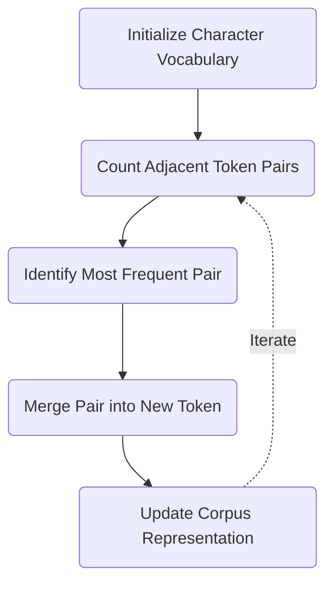

<h1 id="preface-why-tokenization-matters">Preface: Why Tokenization Matters</h1>
<!-- SUMMARY: Neural networks fundamentally operate on numerical tensors, establishing a strict requirement to translate raw text into structured integer sequences. Byte Pair Encoding satisfies this mathematical constraint by statistically discovering subword units, serving as the critical bridge to the initial embedding matrix. -->

The Transformer architecture relies entirely on continuous vector spaces and linear transformations to process information. Neural networks compute by calculating dot products and multiplying matrices. This strict mathematical reality dictates that raw text cannot be fed directly into the initial embedding matrix. A rigorous translation layer must exist to convert discrete character strings into vectors within an $n$-dimensional space before any neural computation can occur.

## The Numerical Constraint

Deep learning models require structured mathematical inputs. The attention mechanisms and feed-forward layers detailed throughout the Transformer series execute pure linear algebra. These mathematical operations mandate numerical tensors, which are defined as multi-dimensional arrays of numbers. Tokenization satisfies this requirement by segmenting raw strings into discrete units called tokens. 

Once isolated, each token is assigned a random integer ID. This ID functions solely as a lookup mechanism and possesses no mathematical meaning itself. The true semantic content of a token exists entirely within its corresponding vector in the embedding matrix $W_E$. When a token ID is passed into the architecture, it retrieves a dense vector spanning $n$ dimensions. Every dimension within this vector represents an identifying feature of the character string. The numerical values populating these dimensions are rigorously refined and updated throughout the training process to capture semantic relationships.

The quality of the initial string segmentation dictates the foundation upon which all subsequent layers build. If the tokenization strategy is flawed, the resulting geometric vectors will be inherently limited, regardless of how effectively the network trains.

## The Tokenization Landscape

Several algorithms exist to perform this segmentation, including WordPiece and Unigram language models. Byte Pair Encoding emerges as the dominant standard powering architectures ranging from the GPT family to Llama. The algorithm succeeds by operating without rigid word boundaries, relying instead on a data-driven approach that extracts optimal subword units based strictly on their statistical frequency.

This series explores the mechanics of Byte Pair Encoding from the ground up. To make the abstract process concrete, the algorithm will be executed entirely by hand on a carefully designed toy corpus featuring distinct morphological patterns:

| | | |
|---|---|---|
| `waking` | `woke` | `woken` |
| `walking` | `walked` | `walker` |
| `talking` | `talked` | `talker` |

This vocabulary provides the structural variation necessary to demonstrate how Byte Pair Encoding organically extracts shared stems and suffixes. The corpus groups three distinct root verbs alongside their present, past, and agent noun variations. The shared linguistic suffixes like "ing", "ed", and "er" guarantee that the algorithm will mathematically discover these recurring semantic structures through statistical frequency alone. The subsequent section examines the fundamental tension between character-level and word-level tokenization, mathematically proving why the subword compromise is necessary.

<h1 id="chapter-1-characters-words-and-the-subword-compromise">Chapter 1: Characters, Words, and the Subword Compromise</h1>

<!-- SUMMARY: The translation of raw text into a sequence of integer IDs requires defining a finite vocabulary space. Analyzing word-level and character-level boundaries reveals an inherent mathematical tradeoff between infinite vocabulary expansion and the destruction of semantic meaning, mandating a subword compression algorithm. -->

The preceding introduction established that neural networks cannot perform mathematical operations on text directly. Instead, these initial raw text strings need to be translated into continuous, $n$-dimensional vectors, where every dimension represents a distinct semantic feature of the string. The strings receive a randomly assigned, discrete integer ID that allows the architecture to look up the corresponding semantic vector in the embedding matrix. This mapping function necessitates a predefined vocabulary: a finite list of recognized textual elements.

The structural definition of these elements dictates two fundamental properties of the neural network. First, the size of this vocabulary defines the strict memory constraints of the model, as every recognized element requires a dedicated vector in memory. Second, the boundaries of these elements define the semantic capabilities of the architecture, as the model can only learn concepts that are cleanly isolated by its vocabulary.

## The Word-Level Explosion

Defining the vocabulary space around natural word boundaries presents an intuitive starting point. Under this paradigm, every distinct word in a corpus receives a unique integer ID.

A minimal toy corpus demonstrates the initial viability of this approach. Applying strict word-level boundaries produces a nine-element vocabulary:

`waking` `woke` `woken`  
`walking` `walked` `walker`  
`talking` `talked` `talker`  

The structural flaw emerges immediately when scaling this strategy to a realistic production corpus. A modern language contains hundreds of thousands of base words. Adding grammatical permutations, prefixes, suffixes, punctuation combinations, and typographical errors results in unbounded expansion.

Every unique token requires a dedicated row in the architecture's embedding matrix. A vocabulary of one million distinct words mandates an embedding matrix with one million rows.

$$
W_E = \begin{bmatrix}
w_{1,1} & w_{1,2} & \dots & w_{1,d_{model}} \\
w_{2,1} & w_{2,2} & \dots & w_{2,d_{model}} \\
\vdots & \vdots & \ddots & \vdots \\
w_{V,1} & w_{V,2} & \dots & w_{V,d_{model}}
\end{bmatrix}_{V \times d_{model}}
$$

If an architecture defines a vocabulary size $V$ of 1,000,000 and a dimensionality $d_{model}$ of 4096, this single matrix requires over sixteen gigabytes of memory purely to store initial representations. The parameter count explodes proportionally, rendering the system computationally intractable. Furthermore, word-level tokenization treats `walk` and `walking` as completely orthogonal dimensions. This rigid separation discards the obvious morphological relationship shared between the two strings, forcing the optimization process to encode the fundamental geometry of the action twice in unrelated vectors.

## The Character-Level Destruction

Addressing the dimensionality explosion requires constraining the vocabulary size. The opposite extreme of the tokenization spectrum defines the vocabulary around individual characters.

Applying character-level boundaries to the toy corpus decomposes the text into a tiny, highly constrained vocabulary of thirteen distinct elements, including a designated end-of-word marker `</w>`:

`a` `d` `e` `g` `i`  
`k` `l` `n` `o` `r`  
`t` `w` `</w>`  

This approach completely resolves the memory explosion problem. The embedding matrix shrinks to a negligible size.

The catastrophic failure of this method lies in the semantic destruction of the sequence. Individual characters carry zero inherent meaning. The sequence `t`, `a`, `l`, `k` forces the neural network to expend significant computational depth merely to reconstruct the basic semantic unit of conversation. 

The sequence length also expands drastically. The core attention mechanism within a Transformer scales quadratically, requiring every token to mathematically compare itself against every other token in the sequence. If a single word decomposes into six individual characters, the computational cost for that word increases by a factor of thirty-six. A simple paragraph of text transforms into an overwhelmingly long sequence of isolated characters, completely paralyzing the architecture's ability to process long-range context efficiently.

## The Subword Compromise

Word-level boundaries provide semantic richness at the cost of infinite parameter expansion. Character-level boundaries provide extreme memory efficiency at the cost of semantic destruction and quadratic sequence scaling.

Resolving this tension requires a middle ground that balances vocabulary size against sequence length. A subword tokenization algorithm decomposes rare words into smaller, logical pieces while preserving common words as intact units. This approach achieves the necessary mathematical compromise. 

Decomposing rare and complex words into reusable subword units strictly bounds the overall vocabulary size, preserving memory efficiency. If the architecture encounters an extremely rare word, it does not need to memorize a completely new vector. Instead, it constructs the meaning using common, pre-learned subword pieces it already knows. Simultaneously, preserving common words as single tokens minimizes the overall sequence length, protecting the attention mechanism from quadratic explosion. A common word remains a single token rather than ten isolated characters, drastically reducing the computational penalty during the attention calculation.

Applying a hypothetical subword algorithm to the toy corpus reveals morphological structures hidden across different verb families. The prefixes `walk` and `talk` might remain whole, while common suffixes like `ing` and `ed` separate into independent, reusable tokens.

`walk` `talk` `ing` `ed` `er`  

The embedding matrix row corresponding to `ing` captures the geometric representation of continuous action. The architecture effectively constructs composite representations for novel combinations by adding the learned vector for a stem to the learned vector for a suffix.

## The Mechanism of Merging

Achieving this ideal subword state requires a deterministic, data-driven mathematical process rather than a manual set of linguistic rules. Byte Pair Encoding accomplishes this through a systematic sequence of merge operations.

The algorithm initializes at the absolute character level, assuming zero inherent semantic meaning. The system then scans the training corpus to identify the single most frequent adjacent pair of tokens. Upon identifying this highest-frequency pair, the algorithm fuses the two discrete elements into a single, new token. This operation increments the vocabulary size by one while simultaneously shrinking the overall length of the encoded sequence. For example, merging the individual character tokens `i` and `n` into the single token `in` adds a term to the vocabulary but reduces the representation of the word 'walking' by one token, decreasing the overall sequence length the attention mechanism must process.

This iterative process acts as a localized compression algorithm. The system continuously discovers the most common patterns and binds them together, moving steadily from individual characters up through logical suffixes, full words, and eventually common phrases.

The subsequent article formalizes this training algorithm in detail, as applied to the toy vocabulary, rigorously defining the exact frequency counting and merging rules required to initialize the character-level vocabulary and execute these merges step by step until the final subword token set is completed.

<h1 id="chapter-2-the-bpe-training-algorithm">Chapter 2: The BPE Training Algorithm</h1>

<!-- SUMMARY: Constructing an optimized subword vocabulary requires a deterministic compression algorithm rather than manual linguistic rules. Byte Pair Encoding resolves this by initializing a base character vocabulary and executing a greedy, iterative merge operation that systematically fuses the most frequent adjacent tokens into unified semantic structures. -->

The previous section established that subword tokenization provides the necessary mathematical compromise between the dimensionality explosion of word-level tokenization and the semantic destruction of character-level boundaries. Constructing this precise subword vocabulary requires a data-driven mechanism. Byte Pair Encoding accomplishes this structural transformation through a deterministic, iterative pipeline that binds distinct characters into logical stems and suffixes.

## Initialization and Boundary Preservation

The training algorithm begins by isolating the fundamental building blocks of the language. The entire training corpus is first separated into discrete words, typically delineated by whitespace. Every word is then strictly decomposed into a sequence of individual character tokens.

This isolation requires a dedicated mechanism to preserve the original structural boundaries of the words. If the algorithm processes the corpus as a continuous stream of characters, it risks merging characters that span across adjacent words, creating unnatural representations. To prevent this bleeding, a dedicated end-of-word marker, denoted as `</w>`, is appended to the terminal character of every word sequence.

The toy corpus from the preceding article provides a concrete initialization state. The corpus consists of nine distinct verbs, each appearing exactly once. Decomposing these words produces a highly constrained initial vocabulary of thirteen character-level tokens:

`a` `d` `e` `g` `i` `k` `l`  
`n` `o` `r` `t` `w` `</w>`  

The words themselves transform into sequences constructed exclusively from this initial character inventory. For example, the string 'walking' maps to a sequence of eight discrete elements: `w`, `a`, `l`, `k`, `i`, `n`, `g`, `</w>`. The entire corpus is processed into this fully atomized state before any compression occurs.

## Pair Frequency Evaluation

The core intelligence of the algorithm relies on discovering structural redundancies within these atomized sequences. The system executes a comprehensive scan over the entire corpus, evaluating every instance where two distinct tokens appear adjacent to one another.

This frequency counting operation tallies the occurrences of every adjacent pair across all words. The goal is to identify the single pair of tokens that co-occur most frequently. In the initialized state of the toy corpus, several character pairings appear repeatedly due to the morphological similarities of the chosen verb families. A tally of the most common adjacent pairs immediately highlights structural patterns:

`a` + `l` $\rightarrow$ 6 occurrences  
`k` + `e` $\rightarrow$ 6 occurrences  
`l` + `k` $\rightarrow$ 6 occurrences  
`w` + `a` $\rightarrow$ 4 occurrences  

The algorithm identifies the pairs `a` + `l`, `k` + `e`, and `l` + `k` as tied for the highest frequency. A deterministic tie-breaking protocol resolves this collision. When multiple pairs share the highest frequency, the algorithm selects the pair that appears first when sorted lexicographically. Comparing the tied pairs, the character `a` precedes `k` and `l` in the alphabet, dictating the selection of the pair `a` + `l` for the inaugural merge operation.

## The Greedy Merge Rule

The identification of the highest-frequency pair triggers the central update mechanism. The algorithm formally registers a new token representing the concatenation of the selected pair. This new element is appended to the recognized vocabulary, increasing the total size of the vocabulary space by one.

`a` `d` `e` `g` `i` `k` `l`  
`n` `o` `r` `t` `w` `</w>` **`al`**  

Simultaneously, the algorithm sweeps through the entire corpus and replaces every adjacent occurrence of the individual tokens with the new fused token. This structural update reduces the overall sequence length of the corpus. Two discrete dimensions of information are compressed into a single, cohesive unit. For example, the sequence representation of the string 'walking' compresses from eight elements to seven: `w`, `al`, `k`, `i`, `n`, `g`, `</w>`.

This localized compression logic forms an iterative loop.

The system continuously scans the updated corpus, counts the new pair frequencies, selects the highest value, and executes another merge. This iterative loop continues strictly until it reaches a predefined iteration limit. Every individual merge operation generates one new token, meaning this iteration limit directly dictates the final size of the architecture's vocabulary. The final vocabulary count equals the number of initial base character tokens plus the total number of executed merge iterations. Modern enterprise models typically execute between thirty thousand and one hundred thousand iterations, establishing a final vocabulary of corresponding size.

This predetermined limit represents a carefully balanced architectural hyperparameter. Expanding the vocabulary space adds a linear parameter cost to the neural network, as every new token requires one additional row in the embedding matrix. Conversely, discovering and merging these frequent patterns reduces the overall sequence length of the encoded text. Since the attention mechanism scales quadratically with sequence length, reducing the number of tokens in a sequence yields massive computational savings. The greedy strategy of always merging the highest frequency pair first ensures that the algorithm systematically binds individual characters into logical suffixes, whole words, and eventually common phrases, optimizing this mathematical tradeoff by compressing the text as efficiently as possible.

The subsequent article executes this mathematical procedure against the toy corpus, tracing the pair frequency counts and vocabulary evolution step by step to prove how the algorithm organically discovers semantic stems like `walk` and suffixes like `ing` without any explicit linguistic programming.

<h1 id="chapter-3-training-bpe-by-hand">Chapter 3: Training BPE by Hand</h1>

<!-- SUMMARY: Executing the Byte Pair Encoding algorithm against a concrete corpus reveals exactly how abstract statistical rules collapse character-level data into optimized semantic units. Tracing the frequency counts and merge selections across a fourteen-step compression sequence demonstrates the deterministic derivation of morphological stems and suffixes without linguistic programming. -->

The formal definition of the Byte Pair Encoding algorithm establishes a greedy, iterative mechanism for subword compression. Executing this mechanism against a concrete corpus reveals exactly how these abstract rules operate in practice. The procedure relies entirely on statistical frequency rather than linguistic programming.

## The Initial State

The training process begins with the nine distinct verbs defined in the preceding article. Each word is split into individual character tokens, terminated by the `</w>` boundary marker. Once the initial state of the corpus is established, the discrete token sequences and their absolute frequencies are tracked across the text.

`w` `a` `k` `i` `n` `g` `</w>`  
`w` `o` `k` `e` `</w>`  
`w` `o` `k` `e` `n` `</w>`  
`w` `a` `l` `k` `i` `n` `g` `</w>`  
`w` `a` `l` `k` `e` `d` `</w>`  
`w` `a` `l` `k` `e` `r` `</w>`  
`t` `a` `l` `k` `i` `n` `g` `</w>`  
`t` `a` `l` `k` `e` `d` `</w>`  
`t` `a` `l` `k` `e` `r` `</w>`  

## The First Merges: Deriving Roots

The algorithm evaluates the frequency of every adjacent token pair in this initial state. The pairs `a` + `l`, `k` + `e`, and `l` + `k` tie for the highest frequency with six occurrences each. Lexicographical sorting dictates the selection of `a` + `l` for the inaugural merge operation. The new token `al` is formally registered, and the corpus representation is updated globally.

| Step | Operation | Result | Frequency |
|:---|:---|:---|---:|
| Step 1 | `a` + `l` | $\rightarrow$ **`al`** | 6 occurrences |

`w` `a` `k` `i` `n` `g` `</w>`  
`w` `o` `k` `e` `</w>`  
`w` `o` `k` `e` `n` `</w>`  
`w` **`al`** `k` `i` `n` `g` `</w>`  
`w` **`al`** `k` `e` `d` `</w>`  
`w` **`al`** `k` `e` `r` `</w>`  
`t` **`al`** `k` `i` `n` `g` `</w>`  
`t` **`al`** `k` `e` `d` `</w>`  
`t` **`al`** `k` `e` `r` `</w>`  

This operation immediately alters the subsequent frequency distribution. The second merge iteration tallies adjacent pairs across the newly updated corpus. The pair `al` + `k` emerges as the most frequent pattern.

| Step | Operation | Result | Frequency |
|:---|:---|:---|---:|
| Step 2 | **`al`** + `k` | $\rightarrow$ **`alk`** | 6 occurrences |

`w` `a` `k` `i` `n` `g` `</w>`  
`w` `o` `k` `e` `</w>`  
`w` `o` `k` `e` `n` `</w>`  
`w` **`alk`** `i` `n` `g` `</w>`  
`w` **`alk`** `e` `d` `</w>`  
`w` **`alk`** `e` `r` `</w>`  
`t` **`alk`** `i` `n` `g` `</w>`  
`t` **`alk`** `e` `d` `</w>`  
`t` **`alk`** `e` `r` `</w>`  

The merge operation fuses these tokens, creating the cohesive `alk` unit. The third merge iteration establishes that the pair `alk` + `e` occurs four times, binding the root verb to the start of its suffixes.

| Step | Operation | Result | Frequency |
|:---|:---|:---|---:|
| Step 3 | **`alk`** + `e` | $\rightarrow$ **`alke`** | 4 occurrences |

After merely three iterations, the counting mechanism derives `alk`, the central morphological root shared by the majority of the corpus. This fragment serves as the structural foundation for *walking*, *walked*, *walker*, *talking*, *talked*, and *talker*. The internal representation of the text compresses significantly.

`w` `a` `k` `i` `n` `g` `</w>`  
`w` `o` `k` `e` `</w>`  
`w` `o` `k` `e` `n` `</w>`  
`w` **`alk`** `i` `n` `g` `</w>`  
`w` **`alke`** `d` `</w>`  
`w` **`alke`** `r` `</w>`  
`t` **`alk`** `i` `n` `g` `</w>`  
`t` **`alke`** `d` `</w>`  
`t` **`alke`** `r` `</w>`  

## Assembling Suffixes

The subsequent three merge iterations reveal how boundary markers influence the derivation of suffixes. Iteration four evaluates the updated sequences and identifies the highest frequency pair ending the gerund verbs.

| Step | Operation | Result | Frequency |
|:---|:---|:---|---:|
| Step 4 | `g` + `</w>` | $\rightarrow$ **`g</w>`** | 3 occurrences |

Iteration five targets the interior of the suffix, binding the preceding characters.

| Step | Operation | Result | Frequency |
|:---|:---|:---|---:|
| Step 5 | `i` + `n` | $\rightarrow$ **`in`** | 3 occurrences |

Iteration six combines these two newly formed tokens.

| Step | Operation | Result | Frequency |
|:---|:---|:---|---:|
| Step 6 | **`in`** + **`g</w>`** | $\rightarrow$ **`ing</w>`** | 3 occurrences |

This sequence formally registers the morphological `-ing` suffix into the subword vocabulary. The token boundary marker `</w>` guarantees that this newly minted token `ing</w>` specifically represents the suffix at the end of a word, preventing it from incorrectly matching the substring "ing" in the middle of an unrelated word.

## Accelerated Convergence

The iterative compression rapidly integrates the remaining structure. The next five iterations bind the derived roots and suffixes into complete semantic units.

| Step | Operation | Result | Frequency |
|:---|:---|:---|---:|
| Step 7 | **`alk`** + **`ing</w>`** | $\rightarrow$ **`alking</w>`** | 2 occurrences |
| Step 8 | **`alke`** + `d` | $\rightarrow$ **`alked`** | 2 occurrences |
| Step 9 | **`alke`** + `r` | $\rightarrow$ **`alker`** | 2 occurrences |
| Step 10 | **`alked`** + `</w>` | $\rightarrow$ **`alked</w>`** | 2 occurrences |
| Step 11 | **`alker`** + `</w>` | $\rightarrow$ **`alker</w>`** | 2 occurrences |

The initial `alk` fragment transforms into three complete lexical structures: `alking</w>`, `alked</w>`, and `alker</w>`. The counting procedure then evaluates the remaining verb family.

| Step | Operation | Result | Frequency |
|:---|:---|:---|---:|
| Step 12 | `k` + `e` | $\rightarrow$ **`ke`** | 2 occurrences |
| Step 13 | `o` + **`ke`** | $\rightarrow$ **`oke`** | 2 occurrences |
| Step 14 | `w` + **`oke`** | $\rightarrow$ **`woke`** | 2 occurrences |

After fourteen merge operations, the original sequences of isolated characters transition into large subword fragments. The internal representation of the text demonstrates profound compression.

`w` `a` `k` **`ing</w>`**  
**`woke`** `</w>`  
**`woke`** `n` `</w>`  
`w` **`alking</w>`**  
`w` **`alked</w>`**  
`w` **`alker</w>`**  
`t` **`alking</w>`**  
`t` **`alked</w>`**  
`t` **`alker</w>`**  

## Finalization of the Vocabulary

The Byte Pair Encoding algorithm naturally halts when the maximum frequency of any adjacent pair drops to 1, because merging a pair that only occurs once offers no further compression benefit. Following step fourteen, the frequency of every remaining adjacent pair in our toy corpus has dropped to exactly 1. Therefore, the training algorithm definitively halts at this exact state. 

The execution of exactly fourteen merge operations yields a deterministic, highly compressed token inventory. It is crucial to distinguish between the final state of the corpus and the final trained vocabulary. The nine sequences shown above represent the completely compressed state of the corpus. The structural update has collapsed the original sequence of isolated characters into larger subword fragments. 

The corpus, however, does not perfectly compress into nine single-token words. This is a fundamental feature of subword tokenization: because the word *talking* only appears once in this tiny corpus, its leading consonant `t` never achieves a high enough frequency to merge with its suffix. Rare words are natively preserved as sequences of smaller, common subwords.

The *vocabulary dictionary* itself contains exactly 27 items: the 13 initial base characters plus the 14 new subwords generated during the merges. Because the vocabulary size directly dictates the architecture's input dimensions, the neural network's embedding matrix will now be instantiated with exactly 27 rows, one for each of these learned tokens.

`</w>` `a` **`al`** **`alk`** **`alke`**  
**`alked`** **`alked</w>`** **`alker`** **`alker</w>`** **`alking</w>`**  
`d` `e` `g` **`g</w>`** `i`  
**`in`** **`ing</w>`** `k` **`ke`** `l`  
`n` `o` **`oke`** `r` `t`  
`w` **`woke`**  

The statistical frequency analysis successfully identified the structural regularities of the English language. This trained 27-token vocabulary now exists as a fixed, immutable dictionary. The subsequent article explores how this finalized dictionary processes completely new, unseen text through the corresponding encoding algorithm.

<h1 id="chapter-4-encoding-and-decoding">Chapter 4: Encoding and Decoding</h1>
<!-- SUMMARY: The deployment of a static vocabulary and ordered list of merge rules enables the rigorous tokenization of novel text. This process mathematically guarantees consistency with the training distribution while gracefully decomposing unseen words into familiar subword units. -->

The 14-step training algorithm successfully halted by discovering a final 27-token vocabulary built upon the exact morphological patterns of the corpus. The resulting list of learned merge rules now stands as a static, ordered mapping protocol. Deploying this protocol to tokenize unseen text forms the critical next phase of the subword pipeline.

## The Ordered Merge Algorithm

The encoding process abandons the dynamic frequency counting that drove the training phase. The algorithm relies entirely instead on the exact sequence of merge operations acquired during training. These rules are applied to any incoming text strictly in the order they were learned. 

This sequential application constitutes a greedy, longest-match algorithm. Enforcing the original chronological order of merges guarantees that the resulting tokenization mathematically reflects the most dominant statistical patterns of the training data. The algorithm begins by splitting the incoming text into individual characters and appending the boundary marker `</w>`.

## Encoding the Known Distribution

The application of this static protocol to words from the original training distribution yields highly optimized subword representations. The encoding of the word `walked`, which exists in the original training corpus, demonstrates the systematic execution of these ordered rules.

Initial: `w` `a` `l` `k` `e` `d` `</w>`  
Step 1: `a` + `l` $\rightarrow$ `w` **`al`** `k` `e` `d` `</w>` (Rule 1)  
Step 2: **`al`** + `k` $\rightarrow$ `w` **`alk`** `e` `d` `</w>` (Rule 2)  
Step 3: **`alk`** + `e` $\rightarrow$ `w` **`alke`** `d` `</w>` (Rule 3)  
Step 4: **`alke`** + `d` $\rightarrow$ `w` **`alked`** `</w>` (Rule 8)  
Step 5: **`alked`** + `</w>` $\rightarrow$ `w` **`alked</w>`** (Rule 10)  

The algorithm completely ignores rules 4, 5, 6, 7, and 9 as the necessary adjacent pairs do not exist in the current sequence. The word systematically collapses down to two final tokens: `w` and `alked</w>`. 

A similar execution dictates the encoding of `waking`, which is also present in the original training corpus.

Initial: `w` `a` `k` `i` `n` `g` `</w>`  
Step 1: `g` + `</w>` $\rightarrow$ `w` `a` `k` `i` `n` **`g</w>`** (Rule 4)  
Step 2: `i` + `n` $\rightarrow$ `w` `a` `k` **`in`** **`g</w>`** (Rule 5)  
Step 3: **`in`** + **`g</w>`** $\rightarrow$ `w` `a` `k` **`ing</w>`** (Rule 6)  

The training process naturally halted before discovering a sequence unifying `w`, `a`, and `k`, causing the final encoding to remain fractured across four distinct tokens: `w`, `a`, `k`, and `ing</w>`.

## Subword Generalization on Novel Text

The true power of the Byte Pair Encoding algorithm emerges when encountering text wholly absent from the training corpus. The system leverages familiar morphological patterns to parse unseen words without suffering an out-of-vocabulary collapse.

Processing the novel word `stalking`, which does not exist in the training corpus, demonstrates this exact mechanism. The algorithm processes the string using the identical static rule sequence.

Initial: `s` `t` `a` `l` `k` `i` `n` `g` `</w>`  
Step 1: `a` + `l` $\rightarrow$ `s` `t` **`al`** `k` `i` `n` `g` `</w>` (Rule 1)  
Step 2: **`al`** + `k` $\rightarrow$ `s` `t` **`alk`** `i` `n` `g` `</w>` (Rule 2)  
Step 3: `g` + `</w>` $\rightarrow$ `s` `t` **`alk`** `i` `n` **`g</w>`** (Rule 4)  
Step 4: `i` + `n` $\rightarrow$ `s` `t` **`alk`** **`in`** **`g</w>`** (Rule 5)  
Step 5: **`in`** + **`g</w>`** $\rightarrow$ `s` `t` **`alk`** **`ing</w>`** (Rule 6)  
Step 6: **`alk`** + **`ing</w>`** $\rightarrow$ `s` `t` **`alking</w>`** (Rule 7)  

The algorithm isolates the unknown prefix `s` and `t` at the fundamental character level, while assembling the highly frequent suffix `alking</w>` learned from the training data. The resulting three-token sequence `s`, `t`, and `alking</w>` requires no new mathematical components.

The novel word `awoke`, similarly absent from the original corpus, undergoes an identical decomposition.

Initial: `a` `w` `o` `k` `e` `</w>`  
Step 1: `k` + `e` $\rightarrow$ `a` `w` `o` **`ke`** `</w>` (Rule 12)  
Step 2: `o` + **`ke`** $\rightarrow$ `a` `w` **`oke`** `</w>` (Rule 13)  
Step 3: `w` + **`oke`** $\rightarrow$ `a` **`woke`** `</w>` (Rule 14)  

The algorithm discovers the familiar sequence `woke`, leaving the independent prefix `a` and the final boundary marker `</w>` as separate units.

## The Triviality of Decoding

Reversing this process to recover raw text from a token sequence requires no complex algorithms or stored rules. Decoding acts as a pure concatenation operation. The system simply joins the sequence of string tokens together and transforms the `</w>` boundary markers back into standard spaces. This trivial inverse guarantees that the original text is recovered with perfect fidelity.

The tokenization pipeline is now mathematically complete, reliably transforming variable text into discrete integer sequences. This system remains bound to an arbitrary initial character set, however. If the encoder encounters a string containing any symbol absent from the original 13 base characters, such as a capital letter or punctuation, the entire process fails. The underlying dictionary possesses no mathematical representation for the unknown input, triggering a catastrophic out-of-vocabulary error. The subsequent section abandons this limitation entirely, examining how modern production systems drive Byte Pair Encoding down to the raw byte level to achieve true universal text encoding.

<h1 id="chapter-5-from-bytes-to-billions">Chapter 5: From Bytes to Billions</h1>
<!-- SUMMARY: Bridging the theoretical foundation of tokenization to production realities requires replacing arbitrary character sets with a universal byte-level fallback. Tracing the exact algorithm across pure byte integers proves that morphological structure emerges naturally without any requirement for human-readable letters, establishing the strict mathematical dimensions required by the Transformer's embedding matrix. -->

The previously demonstrated encoding process relies on a fragile assumption. The initial base vocabulary was strictly limited to the alphabetical characters explicitly observed in the training corpus. When a novel character like an emoji, a foreign script symbol, or a simple unobserved punctuation mark appears during inference, the greedy longest-match algorithm encounters a mathematical dead end. The character cannot be matched to any known token, triggering an out-of-vocabulary failure state that prevents the text from being processed.

## The Universal Byte-Level Foundation

Resolving this failure state requires abandoning the concept of text characters entirely. At the lowest physical hardware level, computers store data as bits—microscopic electrical states representing either a 1 or a 0. Software operating systems group these bits into standardized blocks of eight called *bytes*. Because a byte consists of eight binary positions ($2^8$), it can represent exactly 256 distinct permutations, yielding a fixed range of integer values from `0` to `255`.

Every text symbol, regardless of language or complexity, is fundamentally stored as a sequence of these bytes encoded via the UTF-8 standard. This provides the perfect, finite mathematical foundation for tokenization. Instead of defining the base vocabulary as an unpredictable set of human characters, production systems define their base vocabulary as the 256 raw byte values.

A critical distinction must be made regarding how the algorithm interacts with these values. Byte Pair Encoding does not operate at the bit level. It possesses no concept of the underlying ones and zeros. It treats each integer value from `[0]` to `[255]` as a single, indivisible atomic token. 

### The ASCII Range and Beyond

By initializing the algorithm with this exact 256-token foundation, no string can ever be unencodable. 

Standard encoding tables exhibit a distinct behavioral shift at the `[127]` boundary, which corresponds to `7F` in hexadecimal. The first `128` integer values (`0` through `127`) are strictly reserved for the classic ASCII character set, which covers all standard English letters, numbers, and basic punctuation. Given there are only `128` of these characters, they fit perfectly inside a single 8-bit byte. For example, the letter `w` maps to the single byte integer `119`.

However, the Unicode standard contains over one million symbols. To accommodate this massive scale without breaking compatibility with older 1-byte systems, UTF-8 operates as a *variable-length* encoding. Once a character falls outside that standard English range, the encoding shifts to use multiple bytes. The accented character `é` requires two bytes, specifically `[195]` followed by `[169]`. An emoji like 🚀 requires four bytes, sequentially `[240]`, `[159]`, `[154]`, and `[128]`.

The tokenizer algorithm possesses no mechanism to read these bits. It never touches binary data. When text is fed into a tokenizer, the programming language (like Python) first executes a standard `encode("utf-8")` function. This function references the OS-level text encoding standards to translate the string into an array of integers. 

When an author types `é`, the system instantly translates it into the integer array `[195, 169]`. The tokenizer is simply handed this integer array. 

To display these complex characters on a screen, the computer's text rendering engine must concatenate the underlying bits of that multi-byte sequence and interpret them as a single unified code point. But the Byte Pair Encoding algorithm *never* does this. 

### The Unicode Dimensionality Problem

Given the existence of over a million pre-assigned Unicode symbols, utilizing those established IDs directly appears to be a logical alternative. Initializing a base vocabulary with 1.1 million Unicode characters would still permit the algorithm to merge frequent characters, mapping combinations like [x] + [y] to [z], starting at token ID `2,000,000`. Capping the base vocabulary at `[255]` and manually learning new abstract entries for `[256]` onward requires specific justification.

The answer is structural efficiency and matrix parameter constraints.

The embedding matrix of a Transformer must contain exactly one row for *every single token* in the vocabulary. If the base vocabulary consisted of all 1.1 million Unicode characters, the embedding matrix would be gargantuan before the algorithm learned a single word! The model would pay a massive parameter cost for hundreds of thousands of obscure ancient scripts and emojis that are rarely ever used in the training data.

Conversely, if the base vocabulary is capped at the 256 raw bytes, the foundational embedding matrix costs almost nothing (only 256 rows). This leaves the entire parameter budget completely open. The algorithm can allocate its finite 50,000-token vocabulary exclusively to the structural combinations that actually appear frequently in the corpus.

When the tokenizer receives the array for `é`, it strictly sees the integer `[195]` followed by the integer `[169]`. Because those two distinct integers appear sequentially every single time an author types `é`, the BPE algorithm will naturally identify them as a highly frequent pair. It will then merge them by minting a completely new, abstract integer token ID (`[195]` + `[169]` &rarr; `[257]`). 

By extending this logic across massive datasets, the algorithm mathematically learns to fuse multi-byte sequences, morphological subwords (like `i` `n` `g`), and entire common words (like `t` `h` `e`) into highly efficient token identifiers—all while maintaining an incredibly compact, data-driven vocabulary.

### Decoding and the UTF-8 Guarantee

The restriction to abstract integers necessitates a dedicated text reconstruction protocol. Transforming the abstract token `[257]` back into the printable character `é` requires reversing the merge operations.

The tokenizer maintains a strict lookup table of every merge it performed. During the decoding phase (when the neural network outputs token `[257]`), the tokenizer references this table and simply reverses the operation. It expands `[257]` back down to its base constituent bytes: `[195, 169]`. It then hands this raw byte array back to the programming language.

This reversal process introduces a critical ambiguity regarding whether the array `[195, 169]` should be interpreted as the single character `é` or as two completely separate characters, such as `Ã` followed by `©`.

This is where the mathematical brilliance of the UTF-8 specification shines. UTF-8 uses exactly two types of bytes: **Start Bytes** and **Continuation Bytes**. By looking at the binary prefix of any byte, the decoding system instantly knows exactly how to group them:

- `0xxxxxxx`: 1-byte sequence (Standard ASCII)
- `110xxxxx`: Start of a 2-byte sequence
- `1110xxxx`: Start of a 3-byte sequence
- `11110xxx`: Start of a 4-byte sequence
- `10xxxxxx`: Continuation byte

Every single byte that follows a Start Byte must be a Continuation Byte, starting with the exact same `10` prefix. 

Because `195` in binary is `11000011`, it is mathematically defined as a Start Byte. Because `169` in binary is `10101001`, it is mathematically defined as a Continuation Byte. It is structurally impossible for the text rendering engine to interpret them as two independent symbols because a continuation byte cannot exist on its own. 

This design makes the byte stream perfectly self-synchronizing. If a computer jumps into the middle of a text file and lands on a byte starting with `10`, it knows it has landed inside a multi-byte character. It simply reads backward until it hits a Start Byte, which tells it exactly how many bytes to read forward. 

### The Genius of Partial Merges

The strict limitation of merging only adjacent pairs prevents the algorithm from compressing a 3-byte or 4-byte character in a single operation. 

Encountering a 3-byte character, such as a Hindi Devanagari symbol represented by `[224]` `[164]` `[185]`, forces the tokenizer to merge the sequence iteratively. First, it will merge `[224]` + `[164]` into a new abstract token like `[350]`. Later, it will merge `[350]` + `[185]` into `[412]`.

Leaving a character partially merged as `[350]` and `[185]` poses zero risk of corrupting the text. 

Tokens are never decoded in isolation. The neural network outputs the sequence of tokens, and the tokenizer expands them all back into a massive, flat byte array. Whether the neural network used one token or three tokens to generate those bytes is irrelevant to the UTF-8 decoder. As long as the final byte array receives `[224, 164, 185]`, the Start Byte (`224`) will tell the text engine to read all three bytes together and render the symbol flawlessly.

This partial merging behavior actually provides a massive structural advantage for foreign languages. In UTF-8, characters from the same language script are grouped together. Almost all Hindi characters share the exact same first two bytes (`[224]` and `[164]`). 

By merging those first two bytes into the abstract token `[350]`, the algorithm effectively creates a "Devanagari Prefix" token. Now, instead of requiring thousands of unique tokens for every Hindi character, the model can efficiently represent any Hindi character as just two tokens: `[Devanagari_Prefix]` + `[Specific_3rd_Byte]`. By operating strictly on raw bytes, Byte Pair Encoding naturally discovers the structural DNA of human languages.

## Re-Training the Toy Example in Bytes

To prove that the mechanical logic remains mathematically identical, the toy corpus is completely detached from human-readable characters and converted into raw integers. 

A special boundary token, `</w>`, is appended to mark the end of each word. The boundary marker </w> does not map to its literal 4-byte sequence. This string functions as an abstract control token artificially injected by the tokenizer rather than literal text typed by a human. To prevent the neural network from confusing control tokens with actual text, production systems assign control tokens to dedicated integers that exist completely outside the 0-255 raw byte range. Therefore, the word boundary token is explicitly assigned the integer `[256]`, and the algorithm begins minting new fused tokens at `[257]`.

INITIAL CORPUS:

<table style="width: 100%; border: none; margin-bottom: 2rem; border-collapse: collapse;">
  <tbody>
    <tr>
      <td style="border: none; padding: 0.25rem 0;"><code>w</code> <code>a</code> <code>k</code> <code>i</code> <code>n</code> <code>g</code> <code>&lt;/w&gt;</code></td>
      <td style="border: none; padding: 0.25rem 0;"><code>[119]</code> <code>[97]</code> <code>[107]</code> <code>[105]</code> <code>[110]</code> <code>[103]</code> <code>[256]</code></td>
    </tr>
    <tr>
      <td style="border: none; padding: 0.25rem 0;"><code>w</code> <code>o</code> <code>k</code> <code>e</code> <code>&lt;/w&gt;</code></td>
      <td style="border: none; padding: 0.25rem 0;"><code>[119]</code> <code>[111]</code> <code>[107]</code> <code>[101]</code> <code>[256]</code></td>
    </tr>
    <tr>
      <td style="border: none; padding: 0.25rem 0;"><code>w</code> <code>o</code> <code>k</code> <code>e</code> <code>n</code> <code>&lt;/w&gt;</code></td>
      <td style="border: none; padding: 0.25rem 0;"><code>[119]</code> <code>[111]</code> <code>[107]</code> <code>[101]</code> <code>[110]</code> <code>[256]</code></td>
    </tr>
    <tr>
      <td style="border: none; padding: 0.25rem 0;"><code>w</code> <code>a</code> <code>l</code> <code>k</code> <code>i</code> <code>n</code> <code>g</code> <code>&lt;/w&gt;</code></td>
      <td style="border: none; padding: 0.25rem 0;"><code>[119]</code> <code>[97]</code> <code>[108]</code> <code>[107]</code> <code>[105]</code> <code>[110]</code> <code>[103]</code> <code>[256]</code></td>
    </tr>
    <tr>
      <td style="border: none; padding: 0.25rem 0;"><code>w</code> <code>a</code> <code>l</code> <code>k</code> <code>e</code> <code>d</code> <code>&lt;/w&gt;</code></td>
      <td style="border: none; padding: 0.25rem 0;"><code>[119]</code> <code>[97]</code> <code>[108]</code> <code>[107]</code> <code>[101]</code> <code>[100]</code> <code>[256]</code></td>
    </tr>
    <tr>
      <td style="border: none; padding: 0.25rem 0;"><code>w</code> <code>a</code> <code>l</code> <code>k</code> <code>e</code> <code>r</code> <code>&lt;/w&gt;</code></td>
      <td style="border: none; padding: 0.25rem 0;"><code>[119]</code> <code>[97]</code> <code>[108]</code> <code>[107]</code> <code>[101]</code> <code>[114]</code> <code>[256]</code></td>
    </tr>
    <tr>
      <td style="border: none; padding: 0.25rem 0;"><code>t</code> <code>a</code> <code>l</code> <code>k</code> <code>i</code> <code>n</code> <code>g</code> <code>&lt;/w&gt;</code></td>
      <td style="border: none; padding: 0.25rem 0;"><code>[116]</code> <code>[97]</code> <code>[108]</code> <code>[107]</code> <code>[105]</code> <code>[110]</code> <code>[103]</code> <code>[256]</code></td>
    </tr>
    <tr>
      <td style="border: none; padding: 0.25rem 0;"><code>t</code> <code>a</code> <code>l</code> <code>k</code> <code>e</code> <code>d</code> <code>&lt;/w&gt;</code></td>
      <td style="border: none; padding: 0.25rem 0;"><code>[116]</code> <code>[97]</code> <code>[108]</code> <code>[107]</code> <code>[101]</code> <code>[100]</code> <code>[256]</code></td>
    </tr>
    <tr>
      <td style="border: none; padding: 0.25rem 0;"><code>t</code> <code>a</code> <code>l</code> <code>k</code> <code>e</code> <code>r</code> <code>&lt;/w&gt;</code></td>
      <td style="border: none; padding: 0.25rem 0;"><code>[116]</code> <code>[97]</code> <code>[108]</code> <code>[107]</code> <code>[101]</code> <code>[114]</code> <code>[256]</code></td>
    </tr>
  </tbody>
</table>

<table style="width: 100%; border: none; margin-bottom: 2rem; border-collapse: collapse;">
  <tbody>
    <tr>
      <td style="border: none; padding: 0.25rem 0;">Step 1 &nbsp;&nbsp;&nbsp;&nbsp; <code>a</code> + <code>l</code> &rarr; <b><code>al</code></b> &nbsp;&nbsp;&nbsp;&nbsp; <code>[97]</code> + <code>[108]</code> &rarr; <b><code>[257]</code></b></td>
    </tr>
  </tbody>
</table>
<table style="width: 100%; border: none; margin-bottom: 2rem; border-collapse: collapse;">
  <tbody>
    <tr>
      <td style="border: none; padding: 0.25rem 0;"><code>w</code> <code>a</code> <code>k</code> <code>i</code> <code>n</code> <code>g</code> <code>&lt;/w&gt;</code></td>
      <td style="border: none; padding: 0.25rem 0;"><code>[119]</code> <code>[97]</code> <code>[107]</code> <code>[105]</code> <code>[110]</code> <code>[103]</code> <code>[256]</code></td>
    </tr>
    <tr>
      <td style="border: none; padding: 0.25rem 0;"><code>w</code> <code>o</code> <code>k</code> <code>e</code> <code>&lt;/w&gt;</code></td>
      <td style="border: none; padding: 0.25rem 0;"><code>[119]</code> <code>[111]</code> <code>[107]</code> <code>[101]</code> <code>[256]</code></td>
    </tr>
    <tr>
      <td style="border: none; padding: 0.25rem 0;"><code>w</code> <code>o</code> <code>k</code> <code>e</code> <code>n</code> <code>&lt;/w&gt;</code></td>
      <td style="border: none; padding: 0.25rem 0;"><code>[119]</code> <code>[111]</code> <code>[107]</code> <code>[101]</code> <code>[110]</code> <code>[256]</code></td>
    </tr>
    <tr>
      <td style="border: none; padding: 0.25rem 0;"><code>w</code> <b><code>al</code></b> <code>k</code> <code>i</code> <code>n</code> <code>g</code> <code>&lt;/w&gt;</code></td>
      <td style="border: none; padding: 0.25rem 0;"><code>[119]</code> <b><code>[257]</code></b> <code>[107]</code> <code>[105]</code> <code>[110]</code> <code>[103]</code> <code>[256]</code></td>
    </tr>
    <tr>
      <td style="border: none; padding: 0.25rem 0;"><code>w</code> <b><code>al</code></b> <code>k</code> <code>e</code> <code>d</code> <code>&lt;/w&gt;</code></td>
      <td style="border: none; padding: 0.25rem 0;"><code>[119]</code> <b><code>[257]</code></b> <code>[107]</code> <code>[101]</code> <code>[100]</code> <code>[256]</code></td>
    </tr>
    <tr>
      <td style="border: none; padding: 0.25rem 0;"><code>w</code> <b><code>al</code></b> <code>k</code> <code>e</code> <code>r</code> <code>&lt;/w&gt;</code></td>
      <td style="border: none; padding: 0.25rem 0;"><code>[119]</code> <b><code>[257]</code></b> <code>[107]</code> <code>[101]</code> <code>[114]</code> <code>[256]</code></td>
    </tr>
    <tr>
      <td style="border: none; padding: 0.25rem 0;"><code>t</code> <b><code>al</code></b> <code>k</code> <code>i</code> <code>n</code> <code>g</code> <code>&lt;/w&gt;</code></td>
      <td style="border: none; padding: 0.25rem 0;"><code>[116]</code> <b><code>[257]</code></b> <code>[107]</code> <code>[105]</code> <code>[110]</code> <code>[103]</code> <code>[256]</code></td>
    </tr>
    <tr>
      <td style="border: none; padding: 0.25rem 0;"><code>t</code> <b><code>al</code></b> <code>k</code> <code>e</code> <code>d</code> <code>&lt;/w&gt;</code></td>
      <td style="border: none; padding: 0.25rem 0;"><code>[116]</code> <b><code>[257]</code></b> <code>[107]</code> <code>[101]</code> <code>[100]</code> <code>[256]</code></td>
    </tr>
    <tr>
      <td style="border: none; padding: 0.25rem 0;"><code>t</code> <b><code>al</code></b> <code>k</code> <code>e</code> <code>r</code> <code>&lt;/w&gt;</code></td>
      <td style="border: none; padding: 0.25rem 0;"><code>[116]</code> <b><code>[257]</code></b> <code>[107]</code> <code>[101]</code> <code>[114]</code> <code>[256]</code></td>
    </tr>
  </tbody>
</table>

<table style="width: 100%; border: none; margin-bottom: 2rem; border-collapse: collapse;">
  <tbody>
    <tr>
      <td style="border: none; padding: 0.25rem 0;">Step 2 &nbsp;&nbsp;&nbsp;&nbsp; <code>al</code> + <code>k</code> &rarr; <b><code>alk</code></b> &nbsp;&nbsp;&nbsp;&nbsp; <code>[257]</code> + <code>[107]</code> &rarr; <b><code>[258]</code></b></td>
    </tr>
  </tbody>
</table>
<table style="width: 100%; border: none; margin-bottom: 2rem; border-collapse: collapse;">
  <tbody>
    <tr>
      <td style="border: none; padding: 0.25rem 0;"><code>w</code> <code>a</code> <code>k</code> <code>i</code> <code>n</code> <code>g</code> <code>&lt;/w&gt;</code></td>
      <td style="border: none; padding: 0.25rem 0;"><code>[119]</code> <code>[97]</code> <code>[107]</code> <code>[105]</code> <code>[110]</code> <code>[103]</code> <code>[256]</code></td>
    </tr>
    <tr>
      <td style="border: none; padding: 0.25rem 0;"><code>w</code> <code>o</code> <code>k</code> <code>e</code> <code>&lt;/w&gt;</code></td>
      <td style="border: none; padding: 0.25rem 0;"><code>[119]</code> <code>[111]</code> <code>[107]</code> <code>[101]</code> <code>[256]</code></td>
    </tr>
    <tr>
      <td style="border: none; padding: 0.25rem 0;"><code>w</code> <code>o</code> <code>k</code> <code>e</code> <code>n</code> <code>&lt;/w&gt;</code></td>
      <td style="border: none; padding: 0.25rem 0;"><code>[119]</code> <code>[111]</code> <code>[107]</code> <code>[101]</code> <code>[110]</code> <code>[256]</code></td>
    </tr>
    <tr>
      <td style="border: none; padding: 0.25rem 0;"><code>w</code> <b><code>alk</code></b> <code>i</code> <code>n</code> <code>g</code> <code>&lt;/w&gt;</code></td>
      <td style="border: none; padding: 0.25rem 0;"><code>[119]</code> <b><code>[258]</code></b> <code>[105]</code> <code>[110]</code> <code>[103]</code> <code>[256]</code></td>
    </tr>
    <tr>
      <td style="border: none; padding: 0.25rem 0;"><code>w</code> <b><code>alk</code></b> <code>e</code> <code>d</code> <code>&lt;/w&gt;</code></td>
      <td style="border: none; padding: 0.25rem 0;"><code>[119]</code> <b><code>[258]</code></b> <code>[101]</code> <code>[100]</code> <code>[256]</code></td>
    </tr>
    <tr>
      <td style="border: none; padding: 0.25rem 0;"><code>w</code> <b><code>alk</code></b> <code>e</code> <code>r</code> <code>&lt;/w&gt;</code></td>
      <td style="border: none; padding: 0.25rem 0;"><code>[119]</code> <b><code>[258]</code></b> <code>[101]</code> <code>[114]</code> <code>[256]</code></td>
    </tr>
    <tr>
      <td style="border: none; padding: 0.25rem 0;"><code>t</code> <b><code>alk</code></b> <code>i</code> <code>n</code> <code>g</code> <code>&lt;/w&gt;</code></td>
      <td style="border: none; padding: 0.25rem 0;"><code>[116]</code> <b><code>[258]</code></b> <code>[105]</code> <code>[110]</code> <code>[103]</code> <code>[256]</code></td>
    </tr>
    <tr>
      <td style="border: none; padding: 0.25rem 0;"><code>t</code> <b><code>alk</code></b> <code>e</code> <code>d</code> <code>&lt;/w&gt;</code></td>
      <td style="border: none; padding: 0.25rem 0;"><code>[116]</code> <b><code>[258]</code></b> <code>[101]</code> <code>[100]</code> <code>[256]</code></td>
    </tr>
    <tr>
      <td style="border: none; padding: 0.25rem 0;"><code>t</code> <b><code>alk</code></b> <code>e</code> <code>r</code> <code>&lt;/w&gt;</code></td>
      <td style="border: none; padding: 0.25rem 0;"><code>[116]</code> <b><code>[258]</code></b> <code>[101]</code> <code>[114]</code> <code>[256]</code></td>
    </tr>
  </tbody>
</table>

&#8942;

The training halts precisely where it did in the character-based model. The identical structure emerges because the underlying statistical frequencies are invariant. By operating on raw bytes, the algorithm achieves perfect morphological discovery while guaranteeing absolute immunity to out-of-vocabulary errors. 

## The Embedding Matrix Connection

With a universally stable foundation established, the algorithm scales to handle massive datasets. Production systems like SentencePiece and tiktoken execute these exact greedy frequency counting and merging operations, but they run the loop tens of thousands of times across gigabytes of training data.

The decision of when to halt the training loop dictates the final vocabulary size, $V$. A small vocabulary compresses text poorly, forcing the Transformer to process very long sequences of fragmented subwords. A large vocabulary compresses text highly efficiently, allowing entire common words to be represented by a single token identifier like `[270]`. 

This compression comes with a strict parameter cost. Every token added to the vocabulary requires expanding the neural network's memory to accommodate it. Modern language models typically balance this trade-off by targeting a final vocabulary size between 32,000 and 100,000 tokens.

The final size of this learned vocabulary, $V$, creates the fundamental architectural bridge into the Transformer network itself. 

The initial step of a Transformer's forward pass requires mapping every discrete token into a continuous, multi-dimensional geometric space. This is achieved via the Embedding Matrix, denoted as $W_E$. 

The embedding matrix operates as a coordinate lookup table. It must contain exactly one row for every possible token in the vocabulary. The width of each row is defined by the network's internal model dimensionality, $d_{model}$. Therefore, the strict dimensions of the embedding matrix are mathematically locked to $V \times d_{model}$. 

$$
W_E = \begin{bmatrix}
\text{-- Coordinate vector for token [0] --} \\
\text{-- Coordinate vector for token [1] --} \\
\text{-- Coordinate vector for token [2] --} \\
\dots \\
\text{-- Coordinate vector for token [V-1] --} 
\end{bmatrix}_{V \times d_{model}}
$$

If a Byte Pair Encoding tokenizer is trained to a final vocabulary size of 50,257 tokens, and the Transformer architecture utilizes a $d_{model}$ of 768, the embedding matrix requires exactly $50,257 \times 768$ parameters. 

This strict dimensional requirement completes the data transformation pipeline. The raw text is converted to bytes. The bytes are merged into subword tokens based on learned frequency rules. The tokens are mapped to integers. The integers extract specific high-dimensional vectors from the embedding matrix. 

The origin of these dense coordinate vectors constitutes the foundational mechanism of the Transformer architecture. Calculating the exact multi-dimensional coordinates required to capture the semantic meaning of each token will be explored in depth in the next series.

