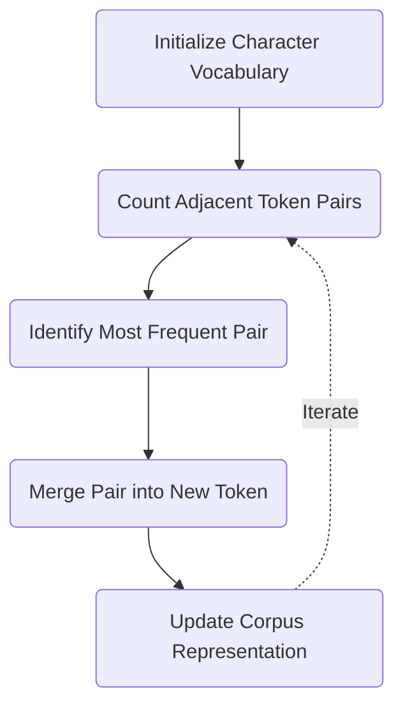

# Part 2: The BPE Training Algorithm

<!-- SUMMARY: Constructing an optimized subword vocabulary requires a deterministic compression algorithm rather than manual linguistic rules. Byte Pair Encoding resolves this by initializing a base character vocabulary and executing a greedy, iterative merge operation that systematically fuses the most frequent adjacent tokens into unified semantic structures. -->

<em>Prefer to read this seamlessly offline? <a href="/assets/docs/tokenization-ebook-v1.0.pdf" target="_blank" rel="noopener">Download the complete, formatting-optimized Tokenization Ebook here.</a></em>

The previous section established that subword tokenization provides the necessary mathematical compromise between the dimensionality explosion of word-level tokenization and the semantic destruction of character-level boundaries. Constructing this precise subword vocabulary requires a data-driven mechanism. Byte Pair Encoding accomplishes this structural transformation through a deterministic, iterative pipeline that binds distinct characters into logical stems and suffixes.

## Initialization and Boundary Preservation

The training algorithm begins by isolating the fundamental building blocks of the language. The entire training corpus is first separated into discrete words, typically delineated by whitespace. Every word is then strictly decomposed into a sequence of individual character tokens.

This isolation requires a dedicated mechanism to preserve the original structural boundaries of the words. If the algorithm processes the corpus as a continuous stream of characters, it risks merging characters that span across adjacent words, creating unnatural representations. To prevent this bleeding, a dedicated end-of-word marker, denoted as `</w>`, is appended to the terminal character of every word sequence.

The toy corpus from the preceding article provides a concrete initialization state. The corpus consists of nine distinct verbs, each appearing exactly once. Decomposing these words produces a highly constrained initial vocabulary of thirteen character-level tokens:

<code>a</code> <code>d</code> <code>e</code> <code>g</code> <code>i</code> <code>k</code> <code>l</code> <code>n</code> <code>o</code> <code>r</code> <code>t</code> <code>w</code> <code>&lt;/w&gt;</code>

The words themselves transform into sequences constructed exclusively from this initial character inventory. For example, the string 'walking' maps to a sequence of eight discrete elements: `w`, `a`, `l`, `k`, `i`, `n`, `g`, `</w>`. The entire corpus is processed into this fully atomized state before any compression occurs.

## Pair Frequency Evaluation

The core intelligence of the algorithm relies on discovering structural redundancies within these atomized sequences. The system executes a comprehensive scan over the entire corpus, evaluating every instance where two distinct tokens appear adjacent to one another.

This frequency counting operation tallies the occurrences of every adjacent pair across all words. The goal is to identify the single pair of tokens that co-occur most frequently. In the initialized state of the toy corpus, several character pairings appear repeatedly due to the morphological similarities of the chosen verb families. A tally of the most common adjacent pairs immediately highlights structural patterns:

<table style="width: 100%; border: none; margin-bottom: 2rem; border-collapse: collapse;">
  <tbody>
    <tr>
      <td style="border: none; padding: 0.25rem 0; text-align: left;"><code>a</code> + <code>l</code> &rarr;</td>
      <td style="border: none; padding: 0.25rem 0; text-align: right;">6 occurrences</td>
    </tr>
    <tr>
      <td style="border: none; padding: 0.25rem 0; text-align: left;"><code>k</code> + <code>e</code> &rarr;</td>
      <td style="border: none; padding: 0.25rem 0; text-align: right;">6 occurrences</td>
    </tr>
    <tr>
      <td style="border: none; padding: 0.25rem 0; text-align: left;"><code>l</code> + <code>k</code> &rarr;</td>
      <td style="border: none; padding: 0.25rem 0; text-align: right;">6 occurrences</td>
    </tr>
    <tr>
      <td style="border: none; padding: 0.25rem 0; text-align: left;"><code>w</code> + <code>a</code> &rarr;</td>
      <td style="border: none; padding: 0.25rem 0; text-align: right;">4 occurrences</td>
    </tr>
  </tbody>
</table>

The algorithm identifies the pairs `a` + `l`, `k` + `e`, and `l` + `k` as tied for the highest frequency. A deterministic tie-breaking protocol resolves this collision. When multiple pairs share the highest frequency, the algorithm selects the pair that appears first when sorted lexicographically. Comparing the tied pairs, the character `a` precedes `k` and `l` in the alphabet, dictating the selection of the pair `a` + `l` for the inaugural merge operation.

## The Greedy Merge Rule

The identification of the highest-frequency pair triggers the central update mechanism. The algorithm formally registers a new token representing the concatenation of the selected pair. This new element is appended to the recognized vocabulary, increasing the total size of the vocabulary space by one.

<code>a</code> <code>d</code> <code>e</code> <code>g</code> <code>i</code> <code>k</code> <code>l</code> <code>n</code> <code>o</code> <code>r</code> <code>t</code> <code>w</code> <code>&lt;/w&gt;</code> <b><code>al</code></b>

Simultaneously, the algorithm sweeps through the entire corpus and replaces every adjacent occurrence of the individual tokens with the new fused token. This structural update reduces the overall sequence length of the corpus. Two discrete dimensions of information are compressed into a single, cohesive unit. For example, the sequence representation of the string 'walking' compresses from eight elements to seven: `w`, `al`, `k`, `i`, `n`, `g`, `</w>`.

This localized compression logic forms an iterative loop.

The system continuously scans the updated corpus, counts the new pair frequencies, selects the highest value, and executes another merge. This iterative loop continues strictly until it reaches a predefined iteration limit. Every individual merge operation generates one new token, meaning this iteration limit directly dictates the final size of the architecture's vocabulary. The final vocabulary count equals the number of initial base character tokens plus the total number of executed merge iterations. Modern enterprise models typically execute between thirty thousand and one hundred thousand iterations, establishing a final vocabulary of corresponding size.

This predetermined limit represents a carefully balanced architectural hyperparameter. Expanding the vocabulary space adds a linear parameter cost to the neural network, as every new token requires one additional row in the embedding matrix. Conversely, discovering and merging these frequent patterns reduces the overall sequence length of the encoded text. Since the attention mechanism scales quadratically with sequence length, reducing the number of tokens in a sequence yields massive computational savings. The greedy strategy of always merging the highest frequency pair first ensures that the algorithm systematically binds individual characters into logical suffixes, whole words, and eventually common phrases, optimizing this mathematical tradeoff by compressing the text as efficiently as possible.

The subsequent article executes this mathematical procedure against the toy corpus, tracing the pair frequency counts and vocabulary evolution step by step to prove how the algorithm organically discovers semantic stems like `walk` and suffixes like `ing` without any explicit linguistic programming.

<em>Prefer to read this seamlessly offline? <a href="/assets/docs/tokenization-ebook-v1.0.pdf" target="_blank" rel="noopener">Download the complete, formatting-optimized Tokenization Ebook here.</a></em>

