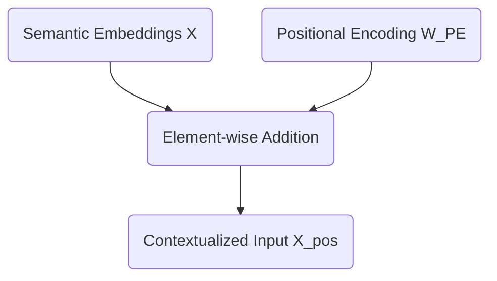

# Article 2: The Permutation Invariance Problem & Positional Encoding

Welcome back. In our previous session, we successfully transformed our input sequence `<BOS> i woke up` into a dense, continuous semantic space. We mathematically compressed sparse 12-dimensional one-hot vectors into a 6-dimensional embedding matrix.

Our current tensor representation $X$ for our sequence looks like this:

```math
X = \begin{bmatrix}
 0.1 &  0.0 &  0.0 &  0.0 &  0.0 &  0.0 \\
 0.0 &  0.8 & -0.1 &  0.2 &  0.0 &  0.5 \\
 0.0 & -0.2 &  0.9 &  0.1 & -0.4 &  0.1 \\
 0.0 & -0.1 &  0.4 &  0.9 & -0.2 &  0.0
\end{bmatrix}
```

This matrix beautifully captures the semantic meaning of our words. The problem is that it captures absolutely nothing else.

## The Permutation Invariance Problem

To understand why this is a fatal flaw, we must anticipate how the upcoming Attention mechanism processes this data. When we eventually compute self-attention, we will be calculating dot products between these row vectors to measure their similarities.

A fundamental property of set operations and matrix multiplication is that they are permutation invariant. If you shuffle the rows of our matrix $X$ to represent the sequence "woke i up `<BOS>`", the attention mechanism will calculate the exact same pairwise similarities. The model would process "i woke up" and "woke i up" as identical semantic concepts. Human language relies entirely on word order to derive meaning. "The dog bit the man" and "The man bit the dog" use identical tokens, yet they describe completely different events.

Without a mechanism to inject sequence order, our Transformer is merely a highly sophisticated bag-of-words model. It is completely order-blind.

## Injecting Time: Positional Encoding

We must explicitly inject positional information into our vectors before they enter the attention layers. We achieve this by creating a secondary matrix of identical dimensions to our input tensor, which we will simply add to it.

There are two primary philosophies for positional encoding:

1. **Relative Positional Encoding:** The model learns the distances between words. Instead of knowing that "woke" is at position 2, it only cares that "woke" is exactly one step away from "i". Modern architectures like RoPE utilize relative encodings through complex vector rotations.
2. **Absolute Positional Encoding:** Every position in the sequence receives a unique, static vector signature. The model learns that position 0 always has a specific geometric translation, position 1 has another, and so forth.

For our rigorous walkthrough, we will use an absolute positional encoding. We want a matrix that is mathematically deterministic and bounded, ensuring we do not explode the numerical variance of our carefully calibrated embeddings.

The original Transformer architecture used interweaving sine and cosine waves of varying frequencies. We will adopt a mathematically similar approach. By varying the frequencies across our 6 dimensions, each position generates a completely unique vector signature.

Here is the exact Positional Encoding matrix $W_{PE}$ for our 4-token sequence:

```math
W_{PE} = \begin{bmatrix}
 0.0 &  1.0 &  0.0 &  1.0 &  0.0 &  1.0 \\
 0.8 &  0.5 &  0.4 &  0.9 &  0.2 &  1.0 \\
 0.9 & -0.4 &  0.8 &  0.6 &  0.4 &  0.9 \\
 0.1 & -1.0 &  1.0 &  0.2 &  0.6 &  0.8
\end{bmatrix}
```

Notice the geometric elegance of this matrix. The values fluctuate smoothly between -1.0 and 1.0. Position 0 produces a clean alternating pattern, while subsequent positions introduce complex phase shifts. No two rows are identical.

## The Final Matrix Addition

The integration of positional data is remarkably simple. We perform an element-wise matrix addition of our semantic embeddings $X$ and our positional signatures $W_{PE}$.



Let us compute the exact addition for our model:

```math
X_{pos} = \begin{bmatrix}
 0.1 &  0.0 &  0.0 &  0.0 &  0.0 &  0.0 \\
 0.0 &  0.8 & -0.1 &  0.2 &  0.0 &  0.5 \\
 0.0 & -0.2 &  0.9 &  0.1 & -0.4 &  0.1 \\
 0.0 & -0.1 &  0.4 &  0.9 & -0.2 &  0.0
\end{bmatrix} + \begin{bmatrix}
 0.0 &  1.0 &  0.0 &  1.0 &  0.0 &  1.0 \\
 0.8 &  0.5 &  0.4 &  0.9 &  0.2 &  1.0 \\
 0.9 & -0.4 &  0.8 &  0.6 &  0.4 &  0.9 \\
 0.1 & -1.0 &  1.0 &  0.2 &  0.6 &  0.8
\end{bmatrix}
```

Which yields our final, positionally-aware tensor $X_{pos}$:

```math
X_{pos} = \begin{bmatrix}
 0.1 &  1.0 &  0.0 &  1.0 &  0.0 &  1.0 \\
 0.8 &  1.3 &  0.3 &  1.1 &  0.2 &  1.5 \\
 0.9 & -0.6 &  1.7 &  0.7 &  0.0 &  1.0 \\
 0.1 & -1.1 &  1.4 &  1.1 &  0.4 &  0.8
\end{bmatrix}
```

Our vector for "woke" is no longer just the abstract concept of waking up. It is now explicitly "woke" at position 2.

The stage is now completely set. We have successfully translated a string of text into a mathematically rich tensor that understands both semantic meaning and sequential time. Next, we will feed this matrix into the heart of the architecture to introduce Layer 1 Self-Attention.
