<h1 id="preface-the-big-picture--tensor-notation">Preface: The Big Picture & Tensor Notation</h1>

<!-- SUMMARY: This foundational overview introduces an autoregressive Decoder-only Transformer built from scratch using rigorous tensor notation and geometric principles. The text defines the vocabulary space, architectural dimensions, and the central residual stream required to calculate the forward pass. -->

## The Problem with Tutorials

The typical approach to understanding the Transformer architecture presents a frustrating hurdle. Existing literature relies heavily on abstract analogies. Texts often describe the Query matrix as asking a question and the Key matrix as holding the answer. These metaphors might give a fleeting sense of intuition. They collapse the moment a practitioner attempts to write code, debug a model, or understand the fundamental geometry of deep learning.

This text takes a different approach. A complete Transformer is built from scratch by calculating every single number by hand. The goal is to translate these complex, abstract operations into meaningful, structural realities. The result is a clear, intuitive grasp of how multi-dimensional tensors flow through linear projections, removing any sense of hidden mechanics.

To accomplish this, a problem is selected that is small enough to compute on a whiteboard, yet complex enough to demonstrate the true power of the architecture.

## The Toy Example

The objective is to train a Transformer to predict the next word in a specific sequence. 

**Input:** `<BOS>` `i` `woke` `up`  
**Target:** `late`

The token `<BOS>` stands for Beginning of Sequence. This is a standard marker that tells the network a new sequence has started. 

This sentence is chosen carefully. It allows the attention mechanism to perform observable work. To predict the word "late", the network cannot merely look at the word "up". It must contextualize the combination of "woke" and "up" together. 

### The Vocabulary Space

To make the math tractable, the model is restricted to a vocabulary of exactly twelve tokens. The total size of the vocabulary is represented by the variable $V$. In this configuration, $V$ equals 12.

<b><code>&lt;BOS&gt;</code></b> <b><code>we</code></b> <b><code>late</code></b> <b><code>&lt;PAD&gt;</code></b> <b><code>&lt;EOS&gt;</code></b> <b><code>woke</code></b> <b><code>early</code></b> <b><code>i</code></b> <b><code>stayed</code></b> <b><code>today</code></b> <b><code>yesterday</code></b> <b><code>up</code></b>

This small vocabulary features natural semantic clusters. The pronouns "i" and "we" form one cluster. The temporal adverbs "late", "early", and "today" form another. This gives the matrix operations the opportunity to physically group related concepts in vector space. As the model trains, these clusters will visibly form within the numerical representations.

## The Architecture

Before defining the dimensions of the data, the architecture processing that data must be clearly defined. The network utilizes an autoregressive Decoder-only architecture. This is the exact framework that powers models like GPT.

Two distinct terms explain this design.

First, the term autoregressive describes how the model generates text. The model predicts the next word based on its own previous outputs. Once a word is predicted, the network appends that new word to the input sequence and runs the entire process again to predict the subsequent word. The model feeds its own output back into itself in a continuous loop.

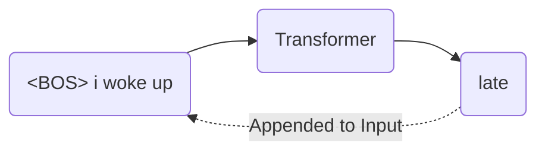

Second, the designation Decoder-only refers to the structure of the network. Early Transformers featured two halves. An Encoder processed a source language like French, and a Decoder generated a target language like English. The current objective does not require translation between two different sequences. The model only needs to predict the continuation of a single sequence. The Encoder is discarded entirely, and only the Decoder is retained.

### The Residual Stream

Inside this Decoder exists a central memory bus known as the residual stream. This serves as the most critical structural concept in the entire architecture.

The residual stream acts as a main highway running continuously from the very first layer of the network to the very last. When a word enters the network, the data is placed on this highway as a vector. As this vector travels through the network, the Attention and Multi-Layer Perceptron blocks do not intercept and replace the values. Instead, these components read from the vector, calculate new contextual information, and then add that new information back into the original vector.

This additive process ensures that the original information is never destroyed or compressed through a bottleneck. The vector simply accumulates richness and context as the forward pass continues.

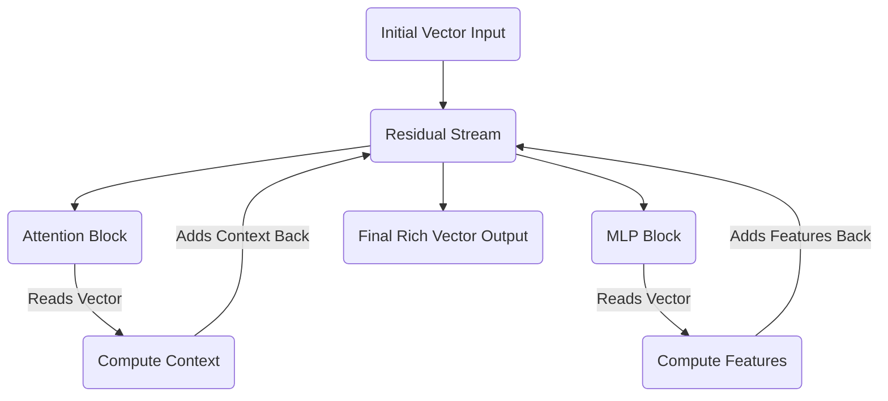

## The Dimensions

With the architecture established, the specific size of the pathways processing the data must be defined. The dimensions are scaled down to the specifications below.

### Sequence Length

Sequence length dictates how many tokens the model processes at one time. For an input of four tokens, the sequence length is 4.

### Model Dimensionality

Every token is represented by a vector traveling on the residual stream. The variable $d_{model}$ defines the width of that pathway. A 6-dimensional vector represents each token. This allows for straightforward visualization on a screen without losing the capacity to store complex features.

### Batch Size

GPUs act as highly parallel execution units. Instead of passing one sequence through the network at a time, practitioners stack many independent sequences together into a batch to process them simultaneously. Batching repeats the exact same math in parallel across different inputs. The batch size is set to 1 to keep focus entirely on a single sequence.

### Attention Heads

The attention mechanism finds relationships between tokens. Rather than deploying one monolithic attention process, the workload is divided into multiple independent heads. This division allows the network to learn different types of relationships simultaneously. One head might specialize in grammar, while another focuses on semantic meaning. The model utilizes 3 parallel heads.

### Head Dimensionality

The 3 heads divide up the 6-dimensional residual stream. Each individual head operates in a 2-dimensional subspace. The matrices powering the attention mechanism will therefore be simple $6 \times 2$ structures.

### Feed-Forward Dimension

While the residual stream securely moves information between layers, the pathway is too narrow to perform complex reasoning.

The Multi-Layer Perceptron solves this constraint by expanding the data into a much wider, higher-dimensional space. In this expanded space, complex, entangled concepts can be linearly separated and processed before being compressed back down into the residual stream. An empirical standard in deep learning dictates expanding this space by a factor of 4. The feed-forward dimension is $6 \times 4$, resulting in 24.

## The Central Tensor

Before text enters the Transformer, the characters must be converted into numbers. The process begins by assigning a unique integer index to every word in the vocabulary.

That integer is then mapped to a one-hot encoded vector. A one-hot vector is an array of zeros with a single '1' placed at the index corresponding to that word. For a twelve-word vocabulary, the one-hot vector for the fourth word is a 12-dimensional array consisting of eleven zeros and one '1' in the fourth position.

When text enters the Transformer, this one-hot vector is embedded into a continuous mathematical space. This embedding creates the foundational tensor that travels through the entire network. The shape of this tensor is defined as Batch by Sequence Length by Model Dimension.

For this specific architecture, the shape is $1 \times 4 \times 6$. Since the batch size is 1, the batch dimension can be stripped away, leaving the data as a straightforward $4 \times 6$ matrix moving along the residual stream.

$$
X = \begin{bmatrix} 
\text{-- } \langle \text{BOS} \rangle \text{ vector --} \\
\text{-- "i" vector --} \\
\text{-- "woke" vector --} \\
\text{-- "up" vector --} 
\end{bmatrix}_{4 \times 6}
$$

Every single mathematical operation in the forward pass reads from and writes to this $4 \times 6$ matrix.

The raw text is then mapped to the vocabulary indices, preparing for the first genuine calculation. The one-hot encoded vectors are transformed into this $4 \times 6$ geometric representation.

<h1 id="chapter-1-tokens-one-hot-encodings-and-the-embedding-matrix">Chapter 1: Tokens, One-Hot Encodings, and the Embedding Matrix</h1>

<!-- SUMMARY: Translating raw text into a rigorous geometric representation requires mapping discrete tokens into orthogonal one-hot vectors. This process mathematically motivates the necessity of the embedding matrix to compress these isolated dimensions into a dense semantic space, enabling the natural inference of conceptual relationships. -->

The Preface established that every operation in the Transformer reads from and writes to a central $4 \times 6$ matrix. Bridging the gap between raw text and that geometric representation is the next requirement. Text is inherently abstract. Computers cannot multiply words. Computers multiply numbers. A rigorous mechanical process is needed to translate human language into a mathematical format that a neural network can manipulate.

This translation happens in three distinct stages. First, the sentence is broken down into discrete pieces called tokens. Second, each token is mapped to a strict geometric location using a one-hot vector. Third, those isolated vectors are projected into a shared, continuous space using an Embedding Matrix. 

## The Vocabulary Space and Tokenization

The objective is to process the sequence `<BOS>` `i` `woke` `up`. 

Before processing this sequence, the model needs a predefined universe of concepts to draw from. This universe is the vocabulary. In this example, the vocabulary is restricted to exactly twelve words. 

<b><code>&lt;BOS&gt;</code></b> <b><code>&lt;EOS&gt;</code></b> <b><code>&lt;PAD&gt;</code></b> <b><code>i</code></b> <b><code>we</code></b> <b><code>woke</code></b> <b><code>stayed</code></b> <b><code>up</code></b> <b><code>late</code></b> <b><code>early</code></b> <b><code>today</code></b> <b><code>yesterday</code></b>

Tokenization maps raw text to the corresponding integer indices in this vocabulary list. The index acts as a unique identifier for the concept. 

For this sequence, the mapping is straightforward. 
The `<BOS>` token maps to index 0. 
The word `i` maps to index 3. 
The word `woke` maps to index 5. 
The word `up` maps to index 7.

This yields an array of integers representing the sequence. 

$$ \text{Sequence Indices} = [0, 3, 5, 7] $$

## The Geometry of One-Hot Encodings

While integers are numbers, their direct use is mathematically problematic in a neural network context. If the integer 5 is fed into the model to represent "woke" and the integer 10 to represent "today", the model will naturally interpret "today" as being twice as large or twice as important as "woke". This numerical relationship is entirely arbitrary. The word "today" is not the mathematical double of "woke". 

This false magnitude must be removed. This is accomplished by translating the integers into one-hot encoded vectors.

A one-hot vector isolates a concept geometrically. For a vocabulary of size 12, each word becomes a 12-dimensional vector filled with zeros, with a single 1 placed at the vocabulary index. 

Converting the four tokens into one-hot vectors creates a $4 \times 12$ matrix. 

$$
X_{\text{one-hot}} = \begin{bmatrix}
1.0 & 0.0 & 0.0 & 0.0 & 0.0 & 0.0 & 0.0 & 0.0 & 0.0 & 0.0 & \dots & 0.0 \\
0.0 & 0.0 & 0.0 & 1.0 & 0.0 & 0.0 & 0.0 & 0.0 & 0.0 & 0.0 & \dots & 0.0 \\
0.0 & 0.0 & 0.0 & 0.0 & 0.0 & 1.0 & 0.0 & 0.0 & 0.0 & 0.0 & \dots & 0.0 \\
0.0 & 0.0 & 0.0 & 0.0 & 0.0 & 0.0 & 0.0 & 1.0 & 0.0 & 0.0 & \dots & 0.0
\end{bmatrix}
$$

By treating each word as an independent axis in a 12-dimensional space, every word remains exactly the same distance from every other word. The vectors are perfectly orthogonal. The word "i" has no mathematical relationship to the word "woke". The false magnitude problem is eliminated and replaced with perfect neutrality.

## The Problem with Neutrality

Perfect neutrality creates a new problem. The word "i" is highly related to the word "we", and the word "late" is highly related to the word "early". If the vectors remain orthogonal, the model cannot infer that these concepts are similar. It is forced to learn the rules of grammar independently for every single word. 

Furthermore, these one-hot vectors are 12 dimensions wide. In a production model like GPT-4, the vocabulary size frequently exceeds 100,000. Maintaining a matrix of that width at every stage of the network is computationally infeasible. 

The perfectly isolated 12-dimensional vectors must be compressed into a denser, richer space where words with similar meanings are physically grouped together. This dense space represents the $d_{model}$ dimension. In this architecture, this width is 6. 

## The Embedding Matrix

This compression is achieved using the Embedding Matrix, denoted as $W_E$. This matrix serves as a lookup table. It maps every 12-dimensional word to a specific 6-dimensional location. The shape of $W_E$ must therefore be $12 \times 6$. 

When a neural network is initialized, this matrix is filled with random numbers. Over thousands of training iterations, the model slowly adjusts these numbers via backpropagation. It physically moves the coordinates of similar words closer together to minimize prediction error.

To demonstrate these calculations manually, the training phase is bypassed and a $12 \times 6$ embedding matrix is explicitly designed to show these semantic clusters. 

$$
W_E = \begin{bmatrix}
 0.1 &  0.0 &  0.0 &  0.0 &  0.0 &  0.0 \\
 0.1 &  0.0 &  0.0 &  0.0 &  0.0 &  0.1 \\
 0.1 &  0.0 &  0.0 &  0.0 &  0.0 & -0.1 \\
 0.0 &  0.8 & -0.1 &  0.2 &  0.0 &  0.5 \\
 0.0 &  0.9 & -0.1 &  0.2 &  0.0 &  0.8 \\
 0.0 & -0.2 &  0.9 &  0.1 & -0.4 &  0.1 \\
 0.0 & -0.2 &  0.8 &  0.0 &  0.5 & -0.1 \\
 0.0 & -0.1 &  0.4 &  0.9 & -0.2 &  0.0 \\
 0.0 &  0.0 & -0.3 & -0.1 &  0.9 & -0.8 \\
 0.0 &  0.0 & -0.3 & -0.1 &  0.9 &  0.8 \\
 0.0 &  0.0 & -0.2 &  0.0 &  0.8 &  0.1 \\
 0.0 &  0.0 & -0.2 & -0.2 &  0.7 & -0.4
\end{bmatrix}
$$

The rows for the pronouns, found at indices 3 and 4 representing "i" and "we", share high positive values in the second column. The rows for the temporal adverbs, found at indices 8, 9, 10, and 11 representing "late", "early", "today", and "yesterday", share high positive values in the fifth column. 

The Embedding Matrix acts as a coordinate map of meaning rather than just a list of numbers. By pushing related concepts into similar numerical spaces, the model learns abstract rules. If a rule is learned regarding the word "i", that rule automatically applies to the word "we", simply because their vectors are positioned next to each other.

## Generating the Central Tensor

To transform the neutral one-hot vectors into this rich geometric space, a standard matrix multiplication is performed. The $4 \times 12$ input matrix is multiplied by the $12 \times 6$ embedding matrix. 

$$ X = X_{\text{one-hot}} \times W_E $$

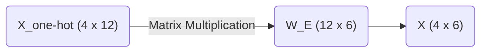

Due to the nature of matrix multiplication, multiplying by a one-hot vector simply extracts the corresponding row from the embedding matrix. 

The final tensor $X$ takes the following form.

$$
X = \begin{bmatrix}
 0.1 &  0.0 &  0.0 &  0.0 &  0.0 &  0.0 \\
 0.0 &  0.8 & -0.1 &  0.2 &  0.0 &  0.5 \\
 0.0 & -0.2 &  0.9 &  0.1 & -0.4 &  0.1 \\
 0.0 & -0.1 &  0.4 &  0.9 & -0.2 &  0.0
\end{bmatrix}
$$

Row 1 is the coordinate vector for `<BOS>`.
Row 2 is the coordinate vector for `i`.
Row 3 is the coordinate vector for `woke`.
Row 4 is the coordinate vector for `up`.

The text is now successfully translated into the central $4 \times 6$ tensor that moves along the residual stream. The subsequent section examines a critical flaw in this representation and mathematically proves why Transformers require positional encoding to understand sequential order.

<h1 id="chapter-2-the-permutation-invariance-problem--positional-encoding">Chapter 2: The Permutation Invariance Problem & Positional Encoding</h1>

<!-- SUMMARY: Matrix operations are inherently permutation invariant, creating a structural flaw that leaves the architecture entirely blind to sequence order. This limitation is resolved by explicitly injecting temporal context through the element-wise addition of mathematically deterministic absolute positional encodings. -->

The input sequence `<BOS>` `i` `woke` `up` is now transformed into a dense, continuous semantic space. Sparse 12-dimensional one-hot vectors are mathematically compressed into a 6-dimensional embedding matrix.

The current tensor representation $X$ for the sequence takes the following form:

$$
X = \begin{bmatrix}
 0.1 &  0.0 &  0.0 &  0.0 &  0.0 &  0.0 \\
 0.0 &  0.8 & -0.1 &  0.2 &  0.0 &  0.5 \\
 0.0 & -0.2 &  0.9 &  0.1 & -0.4 &  0.1 \\
 0.0 & -0.1 &  0.4 &  0.9 & -0.2 &  0.0
\end{bmatrix}
$$

This matrix captures the semantic meaning of the words. A critical problem remains regarding structural context.

## The Permutation Invariance Problem

To understand the nature of this flaw, the processing method of the Attention mechanism must be anticipated. During the computation of self-attention, dot products are calculated between these row vectors to measure similarities.

A fundamental property of set operations and matrix multiplication is permutation invariance. If the rows of the matrix $X$ are shuffled to represent the sequence "woke i up `<BOS>`", the attention mechanism calculates the exact same pairwise similarities. The model processes "i woke up" and "woke i up" as identical semantic concepts. Human language relies entirely on word order to derive meaning. "The dog bit the man" and "The man bit the dog" use identical tokens, yet these phrases describe completely different events.

Without a mechanism to inject sequence order, the Transformer acts as merely a highly sophisticated bag-of-words model. The architecture is completely order-blind.

## Injecting Time: Positional Encoding

Positional information must be explicitly injected into the vectors before they enter the attention layers. This injection is achieved by creating a secondary matrix of identical dimensions to the input tensor, which is then added to it.

There are two primary philosophies for positional encoding:

1. **Relative Positional Encoding:** The model learns the distances between words. Instead of treating "woke" as residing at position 2, the system only registers that "woke" is exactly one step away from "i". Modern architectures like RoPE utilize relative encodings through complex vector rotations.
2. **Absolute Positional Encoding:** Every position in the sequence receives a unique, static vector signature. The model learns that position 0 always has a specific geometric translation, position 1 has another, and so forth.

For this rigorous walkthrough, an absolute positional encoding is utilized. A mathematically deterministic and bounded matrix is required, ensuring the numerical variance of the carefully calibrated embeddings does not explode.

The original Transformer architecture used interweaving sine and cosine waves of varying frequencies. A mathematically similar approach is adopted here. By varying the frequencies across the 6 dimensions, each position generates a completely unique vector signature.

The exact Positional Encoding matrix $W_{PE}$ for the 4-token sequence is defined below.

$$
W_{PE} = \begin{bmatrix}
 0.0 &  1.0 &  0.0 &  1.0 &  0.0 &  1.0 \\
 0.8 &  0.5 &  0.4 &  0.9 &  0.2 &  1.0 \\
 0.9 & -0.4 &  0.8 &  0.6 &  0.4 &  0.9 \\
 0.1 & -1.0 &  1.0 &  0.2 &  0.6 &  0.8
\end{bmatrix}
$$

This matrix exhibits geometric elegance. The values fluctuate smoothly between -1.0 and 1.0. Position 0 produces a clean alternating pattern, while subsequent positions introduce complex phase shifts. No two rows are identical.

## The Final Matrix Addition

The integration of positional data is simple. An element-wise matrix addition merges the semantic embeddings $X$ and the positional signatures $W_{PE}$.

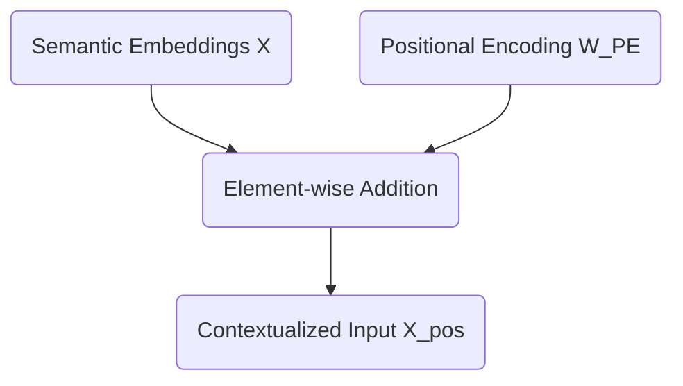

The exact addition for the model is computed as follows:

$$
X_{pos} = \begin{bmatrix}
 0.1 &  0.0 &  0.0 &  0.0 &  0.0 &  0.0 \\
 0.0 &  0.8 & -0.1 &  0.2 &  0.0 &  0.5 \\
 0.0 & -0.2 &  0.9 &  0.1 & -0.4 &  0.1 \\
 0.0 & -0.1 &  0.4 &  0.9 & -0.2 &  0.0
\end{bmatrix} + \begin{bmatrix}
 0.0 &  1.0 &  0.0 &  1.0 &  0.0 &  1.0 \\
 0.8 &  0.5 &  0.4 &  0.9 &  0.2 &  1.0 \\
 0.9 & -0.4 &  0.8 &  0.6 &  0.4 &  0.9 \\
 0.1 & -1.0 &  1.0 &  0.2 &  0.6 &  0.8
\end{bmatrix}
$$

This operation yields the final, positionally-aware tensor $X_{pos}$:

$$
X_{pos} = \begin{bmatrix}
 0.1 &  1.0 &  0.0 &  1.0 &  0.0 &  1.0 \\
 0.8 &  1.3 &  0.3 &  1.1 &  0.2 &  1.5 \\
 0.9 & -0.6 &  1.7 &  0.7 &  0.0 &  1.0 \\
 0.1 & -1.1 &  1.4 &  1.1 &  0.4 &  0.8
\end{bmatrix}
$$

The vector for "woke" is no longer just the abstract concept of waking up. The representation is now explicitly "woke" at position 2.

The initial preparations are complete. A string of text is successfully translated into a mathematically rich tensor that captures both semantic meaning and sequential time. Next, this matrix is fed into the heart of the architecture to introduce Layer 1 Self-Attention.

<h1 id="chapter-3-the-motivation-for-q-k-and-v-asymmetric-similarity">Chapter 3: The Motivation for Q, K, and V (Asymmetric Similarity)</h1>

<!-- SUMMARY: Symmetric similarity is structurally inadequate for capturing grammatically asymmetric linguistic relationships. Projecting context-aware embeddings into distinct query and key subspaces implements a bilinear form that enables tokens to independently query their surroundings and present complementary information. -->

The permutation invariance problem is solved by adding absolute positional encodings to the token embeddings. The sequence `<BOS>` `i` `woke` `up` is now represented by the $4 \times 6$ matrix $X_{pos}$, which contains both semantic meaning and positional context. 

The next step in the Transformer architecture is self-attention. The core mechanism of attention involves discovering which tokens in the sequence are relevant to each other. The simplest way to measure mathematical relevance between two vectors is to calculate their dot product. A naive assumption suggests computing the dot product of every token vector with every other token vector directly.

This approach is known as computing symmetric similarity. The process involves multiplying $X_{pos}$ by its own transpose $X_{pos}^T$. 

$$ \text{Symmetric Similarity} = X_{pos} \times X_{pos}^T $$

Here is the result of that direct calculation:

$$
\text{Symmetric Similarity} = \begin{bmatrix}
3.0 & 4.0 & 1.2 & 0.8 \\
4.0 & 5.9 & 2.7 & 1.6 \\
1.2 & 2.7 & 5.5 & 4.7 \\
0.8 & 1.6 & 4.7 & 5.2
\end{bmatrix}
$$

The dot product measures how much two vectors point in the same direction. Multiplying a matrix by its own transpose invariably places the highest values along the diagonal. The token "woke" aligns most strongly with itself, yielding a score of $5.5$. The token "up" aligns most strongly with itself, yielding $5.2$. 

This creates a fundamental limitation. In human language, semantic relationships are rarely symmetric. Verbs require subjects, and prepositions require objects. In the sequence, the particle "up" must attend to the verb "woke" to form the phrasal verb "woke up". Relying on symmetric similarity causes a token to be overwhelmingly distracted by its own reflection. It will struggle to identify complementary grammatical structures, as the vectors for different parts of speech point in different directions in the embedding space.

A mechanism is required to allow a token to ask a question while permitting other tokens to provide the answer. Asymmetric similarity fulfills this requirement.

## The Bilinear Form

To achieve asymmetric similarity, the Transformer projects the input tensor $X_{pos}$ into three distinct new subspaces using three learned weight matrices. These projections are called Queries, Keys, and Values. The immediate focus will remain on the Queries and Keys. 

Instead of querying the direct similarity between vector $A$ and vector $B$, vector $A$ is projected into a Query subspace and vector $B$ is projected into a Key subspace. The similarity is then measured between the Query projection of $A$ and the Key projection of $B$. 

Mathematically, this operation is a bilinear form. Given the input $X_{pos}$ and two weight matrices $W_Q$ and $W_K$, the attention scores are calculated as follows:

$\text{Attention Scores} = (X_{pos} W_Q) (X_{pos} W_K)^T$

This equation is highly elegant. The weight matrices $W_Q$ and $W_K$ act as lenses. During training, the neural network adjusts these lenses to map conceptually complementary tokens into the exact same region of a new lower-dimensional space. The network might learn to map the Query vector for a preposition and the Key vector for a verb into the exact same mathematical coordinate. Computing their subsequent dot product yields a massive positive number, forcing the network to attend to that relationship.

## Calculating Queries and Keys

The Transformer uses $3$ attention heads. The model dimension $d_{model}$ is $6$. Dividing the model dimension by the number of heads determines the dimensionality of the Query and Key subspaces. This calculation yields a head dimension $d_k = 2$. 

Each attention head possesses independent $W_Q$ and $W_K$ matrices, both sized $6 \times 2$. This allows each head to track entirely different types of relationships. Head 1 might identify subject-verb relationships, while Head 2 might track temporal adverbs. 

A concrete $W_Q$ and $W_K$ for the first attention head can be instantiated as follows:

$$
W_Q = \begin{bmatrix}
 0.1 &  0.2 \\
-0.1 &  0.5 \\
 0.8 & -0.2 \\
 0.3 &  0.4 \\
-0.2 &  0.1 \\
 0.1 & -0.3
\end{bmatrix}
$$

$$
W_K = \begin{bmatrix}
-0.2 &  0.4 \\
 0.5 & -0.1 \\
 0.6 &  0.2 \\
 0.1 &  0.7 \\
 0.2 & -0.2 \\
-0.4 &  0.3
\end{bmatrix}
$$

To calculate the Queries $Q$, the positionally-encoded sequence $X_{pos}$ is multiplied by $W_Q$.

$$ Q = X_{pos} \times W_Q $$

The resulting Query matrix $Q$ has dimensions $4 \times 2$. Each token has been compressed from a 6-dimensional representation into a 2-dimensional "question". 

$$
Q = \begin{bmatrix}
 0.3 &  0.6 \\
 0.6 &  0.8 \\
 1.8 & -0.5 \\
 1.6 & -0.6
\end{bmatrix}
$$

The exact same operation is performed for the Keys $K$ by multiplying $X_{pos}$ by $W_K$.

$$ K = X_{pos} \times W_K $$

This yields the $4 \times 2$ Key matrix. Each token now has a 2-dimensional "answer".

$$
K = \begin{bmatrix}
 0.2 &  0.9 \\
 0.2 &  1.4 \\
 0.2 &  1.6 \\
 0.1 &  1.4
\end{bmatrix}
$$

By separating the inputs into independent Queries and Keys, the network breaks the mirror of symmetric similarity. The token "woke" no longer strictly attends to itself. It projects a specific question into the Query space and projects a specific identity into the Key space. Subsequent operations involve multiplying these matrices together, calculating the final attention scores, and observing how the network scales the results to prevent gradient collapse.

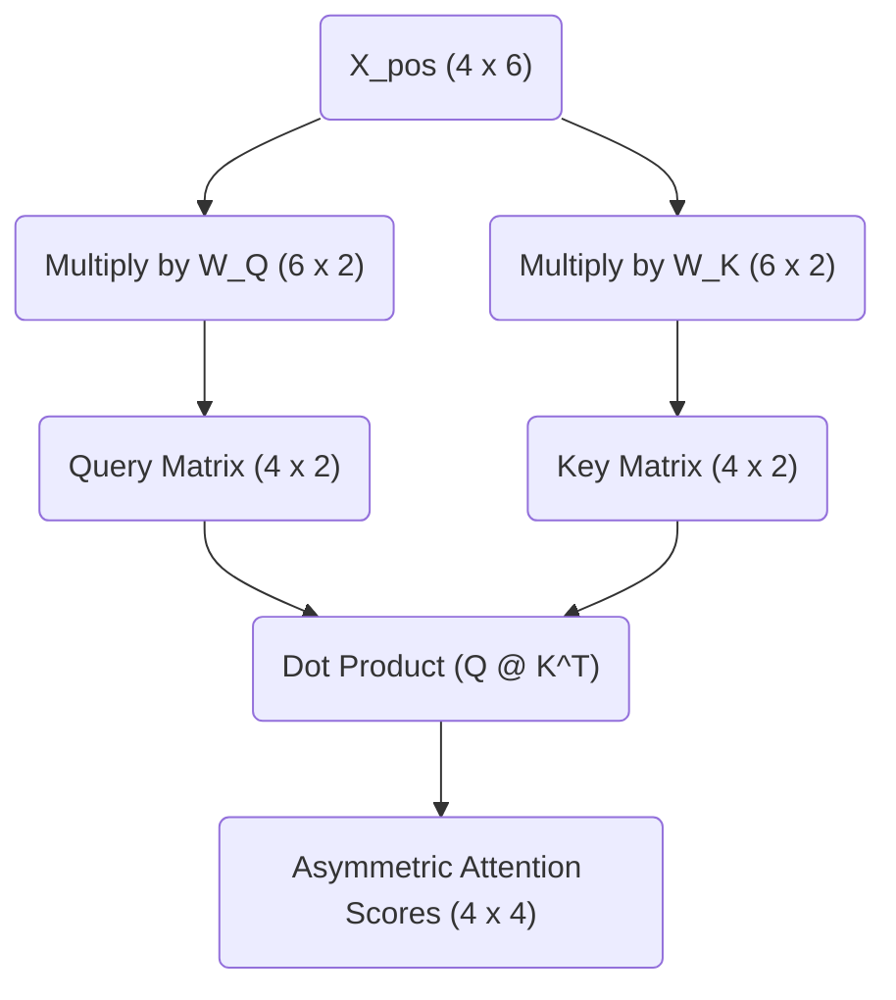

<h1 id="chapter-4-the-attention-score-and-$\sqrt{d_k}$">Chapter 4: The Attention Score and $\sqrt{d_k}$</h1>

<!-- SUMMARY: Calculating raw attention scores via the dot product exposes a scaling problem in high-dimensional vector spaces. To prevent catastrophic softmax saturation and the resulting gradient decay, the variance is mathematically stabilized by dividing the scores by the square root of the head dimension. -->

The previous section established why the Transformer does not calculate attention directly from the input embeddings. The sequence is projected into two distinct semantic subspaces, yielding a matrix of Queries ($Q$) and a matrix of Keys ($K$). This asymmetric projection allows the network to match concepts that belong together even if their base embeddings are geometrically distant.

The sequence currently consists of four tokens:

<b><code>&lt;BOS&gt;</code></b> <b><code>i</code></b> <b><code>woke</code></b> <b><code>up</code></b>

The actual attention scores must now be calculated. This step quantifies how strongly each token in the sequence should attend to every other token. This is achieved by computing the dot product of every Query vector with every Key vector. 

## The Dot Product as a Metric of Similarity

The dot product measures alignment. When two vectors point in similar directions, their dot product is large and positive. When they are orthogonal, it is zero. When they point in opposite directions, it is negative. 

Multiplying the Query matrix by the transpose of the Key matrix ($Q \times K^T$) computes the dot product for every possible pair of tokens in a single operation. 

The specific matrices for Head 1 of the network are as follows:

$$
Q = \begin{bmatrix}
0.31 & 0.62 \\
0.63 & 0.76 \\
1.82 & -0.48 \\
1.57 & -0.57
\end{bmatrix}
$$

$$
K^T = \begin{bmatrix}
0.18 & 0.22 & 0.21 & 0.14 \\
0.94 & 1.43 & 1.55 & 1.36
\end{bmatrix}
$$

The multiplication yields the unscaled attention scores:

$$
Q \times K^T = \begin{bmatrix}
0.64 & 0.95 & 1.03 & 0.89 \\
0.83 & 1.23 & 1.31 & 1.12 \\
-0.12 & -0.29 & -0.36 & -0.40 \\
-0.25 & -0.47 & -0.55 & -0.56
\end{bmatrix}
$$

Each row in this result corresponds to a Query token, and each column corresponds to a Key token. The value at row 3 and column 2, which is $-0.29$, represents the raw alignment score between the Query for "woke" and the Key for "i". 

## The Problem of Dimensionality

These raw scores are mathematically correct, yet they cannot be used in their current form. The Transformer architecture relies on converting these raw scores into a strict probability distribution using the Softmax function. Softmax forces the scores in each row to sum to $1.0$, allowing them to act as percentage weights.

A subtle mathematical trap is hidden in the dot product. As the dimensionality of the vectors increases, the variance of their dot product grows proportionally. 

Taking two random independent vectors of dimension $d$ with a mean of 0 and a variance of 1 yields a dot product with a mean of 0 and a variance of $d$. The current toy model uses a tiny head dimension of $d_k = 2$, rendering this effect invisible. In a production model like GPT-3, the head dimension is typically $d_k = 128$. The variance of the raw dot products becomes massive.

## Softmax Saturation and Gradient Death

Understanding why high variance is fatal requires examining how the Softmax function behaves with extreme values. 

A scenario involving a head dimension of $512$ causes the variance of the dot products to hover around $512$. A single row of the unscaled attention scores might look like this:

`[ 11.24, -3.13, 14.66, 34.46 ]`

Applying the Softmax function to these numbers heavily amplifies the largest value through exponentiation. The resulting probability distribution becomes extremely sharp:

`[ 0.00, 0.00, 0.00, 1.00 ]`

The network places 100% of its attention on the final token. This might seem like a decisive and confident prediction. It is actually a catastrophic failure for the learning process.

Neural networks learn via backpropagation, which relies on calculating gradients. The gradient represents the slope of the function. When a Softmax distribution becomes this sharply peaked, it operates in the absolute flattest regions of its curve. The slope approaches zero. If the gradient is zero, the network cannot update its weights. The learning process halts completely. This phenomenon is known as Softmax saturation.

## The Mathematical Solution: Scaling by $\sqrt{d_k}$

The variance of the dot products must be prevented from growing with the dimensionality of the network. This is accomplished by dividing the raw attention scores by the square root of the head dimension ($\sqrt{d_k}$). 

Dividing a random variable by a constant scales its variance by the square of that constant. Dividing the scores by $\sqrt{d_k}$ scales the variance of the dot product by $d_k$. Since the original variance was $d_k$, the new variance becomes $1$. This operation perfectly stabilizes the distribution regardless of how large the network grows.

This scaling factor can be applied to the synthetic large-dimension example. Dividing the raw values by $\sqrt{512}$ yields a much tighter range:

`[ 0.50, -0.14, 0.65, 1.52 ]`

Passing these scaled numbers through the Softmax function produces a healthy, nuanced probability distribution:

`[ 0.18, 0.10, 0.21, 0.51 ]`

The gradients can flow freely through this distribution. The network can continue to learn.

## Scaling the Toy Model

This mandatory scaling must now be applied to the toy model. The head dimension is $d_k = 2$, making the scaling factor $\sqrt{2}$, which is approximately $1.414$.

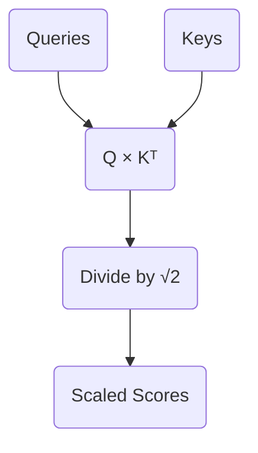

Every element in the raw score matrix is divided by $1.414$:

$$
\text{Scaled Scores} = \begin{bmatrix}
0.45 & 0.68 & 0.73 & 0.63 \\
0.59 & 0.87 & 0.93 & 0.79 \\
-0.09 & -0.20 & -0.26 & -0.28 \\
-0.18 & -0.33 & -0.39 & -0.39
\end{bmatrix}
$$

These values are now safely bounded and ready to be converted into probabilities. 

The Softmax function cannot be applied immediately. The model is currently observing the entire sequence simultaneously. The first token (`<BOS>`) has a score of `0.63` connecting it to the future token `up`. In a language modeling task, allowing a token to attend to words that have not been generated yet is invalid. The future must be hidden before the probabilities are finalized. This requirement introduces the mathematics of Causal Masking.

<h1 id="chapter-5-causal-masking">Chapter 5: Causal Masking</h1>

<!-- SUMMARY: Parallel training introduces a structural vulnerability by allowing past tokens computational access to future context. Causality is preserved by applying a lower-triangular mask of negative infinity, establishing a mathematical barrier that neutralizes future information when passed through the softmax function. -->

The scaled attention scores have now been successfully derived. The dot product between the Query and Key matrices was calculated to measure how intensely each token seeks information from every other token, and the result was scaled by $\sqrt{d_k}$ to prevent gradient saturation. 

Before converting these scores into a final probability distribution, a critical structural flaw in how the matrix currently operates during training must be addressed. 

## The Problem of Parallel Training

During Transformer training, tokens are not fed in sequentially. The process optimizes for speed by passing the entire sequence through the network simultaneously. This technique is known as teacher forcing. The matrix operations compute the attention scores for `<BOS>`, `i`, `woke`, and `up` at the exact same time.

Examining the scaled attention scores from the previous calculation provides further clarity. The rows represent the Queries looking for information, and the columns represent the Keys offering information.

$$
\text{Scaled Scores} = \begin{bmatrix}
0.45 & 0.68 & 0.73 & 0.63 \\
0.59 & 0.87 & 0.93 & 0.79 \\
-0.09 & -0.20 & -0.26 & -0.28 \\
-0.18 & -0.33 & -0.39 & -0.39
\end{bmatrix}
$$

The first row represents the `<BOS>` token acting as a Query. It generates attention scores against all available Keys. The second column of the first row holds a score of 0.68, representing the `<BOS>` token attending to the `i` token.

This reveals a profound issue. If the model processes the `<BOS>` token to predict the next logical word in the sequence, it should only have access to information from the `<BOS>` token itself. In the current matrix, the `<BOS>` token has full visibility into the future tokens `i`, `woke`, and `up`. The model effectively views the answer key while taking the test. The network will perfectly learn to copy the next token rather than learning the underlying linguistic patterns.

## The Causal Mask

The flow of information from future tokens into past tokens must be physically blocked. This is achieved by applying a lower-triangular mask to the attention scores. 

A mask is defined where any position representing a Query attending to a future Key is marked for obstruction.

$$
\text{Mask} = \begin{bmatrix}
1 & 0 & 0 & 0 \\
1 & 1 & 0 & 0 \\
1 & 1 & 1 & 0 \\
1 & 1 & 1 & 1
\end{bmatrix}
$$

Where the mask holds a 1, the original scaled score is retained. Where the mask holds a 0, the score is overwritten with negative infinity ($-\infty$). Applying this operation yields the masked attention scores.

$$
\text{Masked Scores} = \begin{bmatrix}
0.45 & -\infty & -\infty & -\infty \\
0.59 & 0.87 & -\infty & -\infty \\
-0.09 & -0.20 & -0.26 & -\infty \\
-0.18 & -0.33 & -0.39 & -0.39
\end{bmatrix}
$$

Inspecting the second row reveals the Query for the token `i` can only attend to the Key for `<BOS>` and the Key for `i`. The scores for `woke` and `up` have been obliterated. Causality is preserved.

## The Mathematical Role of Negative Infinity

The value $-\infty$ is used rather than zero due to the mathematical properties of the next operation in the architecture. The Softmax function will soon convert these scores into a valid probability distribution. The Softmax function exponentiates each value using $e^x$.

As $x$ approaches $-\infty$, the value of $e^x$ converges exactly to 0. When the final attention weights are calculated in the next step, any connection blocked by the causal mask will receive a probability weight of precisely 0%. Future tokens will contribute nothing to the mathematical representation of past tokens.

With the causal mask firmly in place, the masked scores can safely pass through the Softmax function to extract the final Value matrices.

<h1 id="chapter-6-from-scores-to-synthesis-softmax-and-the-value-matrix">Chapter 6: From Scores to Synthesis: Softmax and The Value Matrix</h1>

<!-- SUMMARY: The single-head attention mechanism is finalized by leveraging the softmax function to convert unbounded routing scores into a strict probability distribution. A weighted sum against the value matrix is then computed to dynamically synthesize a deeply contextualized geometric representation for each token. -->

The previously calculated masked attention scores provide a strict mathematical barrier that prevents information from flowing backward in time through the application of a lower triangular matrix of negative infinity values. The resulting matrix represents the raw geometric alignment between Queries and Keys across all valid time steps.

These scalar values are mathematically unbounded. Converting them into a stable format capable of driving the core synthesis step of the attention mechanism requires the Softmax function and the introduction of a third fundamental learned matrix: the Value matrix.

## The Softmax Function: Converting Alignment to Probability

The attention scores function as a set of weights to perform a weighted sum. Using the raw unbounded scores directly would cause the magnitude of vectors to compound uncontrollably as information flows deeper into the network. Maintaining mathematical stability requires weights to be strictly positive and to sum exactly to 1 across each row. This is achieved by applying the Softmax function.

The Softmax function operates by taking the exponential of each input value and dividing it by the sum of all exponentials in that row. Exponentiation maps any real number to a positive value. Dividing by the total sum normalizes these positive values into a strict probability distribution.

The masked scaled scores from the preceding step are:

$$
\text{Scores}_{masked} = \begin{bmatrix}
 0.45 & -\infty & -\infty & -\infty \\
 0.59 &  0.87 & -\infty & -\infty \\
-0.09 & -0.20 & -0.26 & -\infty \\
-0.18 & -0.33 & -0.39 & -0.39
\end{bmatrix}
$$

Applying the Softmax function yields the final attention weights matrix $A$:

$$
A = \text{Softmax}(\text{Scores}_{masked}) = \begin{bmatrix}
 1.00 &  0.00 &  0.00 &  0.00 \\
 0.43 &  0.57 &  0.00 &  0.00 \\
 0.37 &  0.33 &  0.31 &  0.00 \\
 0.29 &  0.25 &  0.23 &  0.23
\end{bmatrix}
$$

The causal mask functions such that the exponential of negative infinity approaches exactly zero. Masked positions are flawlessly converted into zero-valued weights. The model is now mathematically incapable of extracting information from future tokens. Every row sums precisely to 1, providing a clean probability distribution over all preceding context.

## The Value Matrix: The Content Payload

Computations thus far have focused entirely on routing. The Query and Key matrices exist solely to dictate where information should flow. They measure semantic relevance. They do not represent the information payload itself.

If the attention weights are the map, the Value matrix is the cargo. The semantic features required to determine relevance are fundamentally different from the semantic features required to predict the next word. The original positional embeddings $X$ are therefore projected into a third distinct subspace using the Value weight matrix $W_V$.

The embedding dimension $d_{model}$ is 6. This is projected down into a head dimension $d_v$ of 2. The learned weights $W_V$ are defined as:

$$
W_V = \begin{bmatrix}
 0.3 & -0.1 \\
 0.2 &  0.5 \\
-0.4 &  0.1 \\
 0.1 &  0.6 \\
-0.3 &  0.2 \\
 0.5 & -0.4
\end{bmatrix}
$$

The Value matrix $V$ is calculated by taking the dot product of the positional embeddings $X$ and $W_V$:

$$
V = X \cdot W_V = \begin{bmatrix}
 0.83 &  0.69 \\
 1.18 &  0.70 \\
 0.04 & -0.20 \\
-0.36 &  0.00
\end{bmatrix}
$$

The matrix $V$ contains the actual conceptual representations that will be broadcast across the sequence. Each row holds the information payload for a single token in the `<BOS>` `i` `woke` `up` sequence.

## The Weighted Sum: Synthesizing Context

The culmination of the single head attention mechanism relies on a matrix of routing instructions $A$ and a matrix of information payloads $V$. New contextualized representations are synthesized by computing the dot product of $A$ and $V$.

This operation physically executes a weighted sum. Every token constructs a new representation of itself by blending together the Value vectors of all preceding tokens according to the probabilities in the attention matrix.

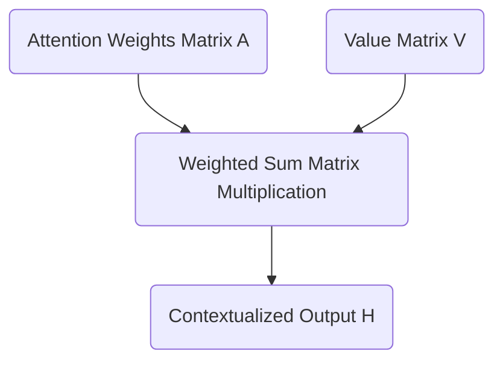

The final head output $H$ is computed as:

$$
H = A \cdot V = \begin{bmatrix}
 1.00 &  0.00 &  0.00 &  0.00 \\
 0.43 &  0.57 &  0.00 &  0.00 \\
 0.37 &  0.33 &  0.31 &  0.00 \\
 0.29 &  0.25 &  0.23 &  0.23
\end{bmatrix} \cdot \begin{bmatrix}
 0.83 &  0.69 \\
 1.18 &  0.70 \\
 0.04 & -0.20 \\
-0.36 &  0.00
\end{bmatrix} = \begin{bmatrix}
 0.83 &  0.69 \\
 1.03 &  0.70 \\
 0.70 &  0.42 \\
 0.46 &  0.32
\end{bmatrix}
$$

The final row corresponding to the token `up` has a new representation of `[0.46, 0.32]`. This vector is no longer a static dictionary definition. It is a dynamic, context-aware representation explicitly shaped by the presence of `woke` and `i` occurring earlier in the sequence.

The attention mechanism for a single head is complete. The model operates with three independent attention heads running in parallel. The architecture then reconciles these independent perspectives by projecting them back into the original embedding dimension.

<h1 id="chapter-7-the-projection-matrix-and-the-cross-head-mixer">Chapter 7: The Projection Matrix and The Cross-Head Mixer</h1>

<!-- SUMMARY: The isolated outputs of multiple attention heads are concatenated into a unified matrix to preserve structural integrity without destructive interference. These discrete features are synthesized into higher-order contextual representations by projecting them through a learned cross-head mixing matrix, preparing the vectors to rejoin the residual stream. -->

The computations detailed in Parts 5 and 6 successfully resolve the core attention mechanism, yielding isolated outputs from the network's multiple attention heads. These discrete insights must now be synthesized into a unified structure before projecting the contextual representations forward.

## The Concatenation Step

The previous phase completed the journey of a single attention head. The mechanism calculated its masked attention scores, converted those scores into strict probability distributions via the Softmax function, and finally computed a weighted sum over the Value matrix $V$.

That process yields a contextually enriched vector for each token in the sequence. These vectors only possess a dimension of $d_v = 2$, whereas the overall model dimension is $d_{model} = 6$. The architecture deliberately splits into three parallel attention heads so the network can simultaneously look for different types of semantic relationships. Head 1 might attend to subject-verb pairings, while Head 2 looks for temporal markers, and Head 3 focuses on pronoun antecedents.

The system now faces a critical architectural challenge. Three isolated sets of findings exist. The model must unify these independent insights back into a single cohesive representation for each token, and this representation must seamlessly reintegrate with the overarching $d_{model} = 6$ architecture.

The most straightforward way to combine the outputs of the three heads might seem to be addition. The system could simply sum the three matrices together. Summation destroys the distinct structural information each head worked tirelessly to extract. If Head 1 finds a strong positive signal for a specific feature and Head 2 finds a strong negative signal, adding them together cancels out the values, effectively erasing the evidence gathered by both heads.

Instead of summing, the architecture concatenates the outputs along the feature dimension. Placing the three $4 \times 2$ matrices side-by-side preserves every piece of information. The resulting matrix has a sequence length of 4 and a new feature dimension of $3 \times 2 = 6$.

The actual output of the three heads illustrates this process. The exact Head 1 output calculated previously sits alongside simulated outputs for Head 2 and Head 3.

$$
\text{Head 1} = \begin{bmatrix}
 0.83 &  0.69 \\
 1.03 &  0.70 \\
 0.70 &  0.42 \\
 0.46 &  0.32
\end{bmatrix}
$$

$$
\text{Head 2} = \begin{bmatrix}
-0.50 &  0.10 \\
-0.40 &  0.30 \\
-0.20 &  0.25 \\
 0.10 & -0.15
\end{bmatrix}
$$

$$
\text{Head 3} = \begin{bmatrix}
 0.20 & -0.30 \\
 0.15 & -0.20 \\
 0.40 &  0.05 \\
 0.25 &  0.10
\end{bmatrix}
$$

Concatenating these three matrices horizontally achieves the target width of 6.

$$
\text{Concatenated} = \begin{bmatrix}
 0.83 &  0.69 & -0.50 &  0.10 &  0.20 & -0.30 \\
 1.03 &  0.70 & -0.40 &  0.30 &  0.15 & -0.20 \\
 0.70 &  0.42 & -0.20 &  0.25 &  0.40 &  0.05 \\
 0.46 &  0.32 &  0.10 & -0.15 &  0.25 &  0.10
\end{bmatrix}
$$

## The Projection Matrix

Concatenation perfectly resolves the sizing issue. The dimensions return to a $4 \times 6$ matrix. However, a geometric problem remains. The features are entirely segregated. The first two columns belong exclusively to Head 1, the middle two to Head 2, and the final two to Head 3. The insights exist in the same mathematical structure, yet they do not interact.

A neural network derives its power from synthesizing discrete pieces of evidence into higher-order concepts. To facilitate this synthesis, the architecture introduces the final learned parameter of the attention mechanism, the Projection Matrix, denoted as $W_O$.

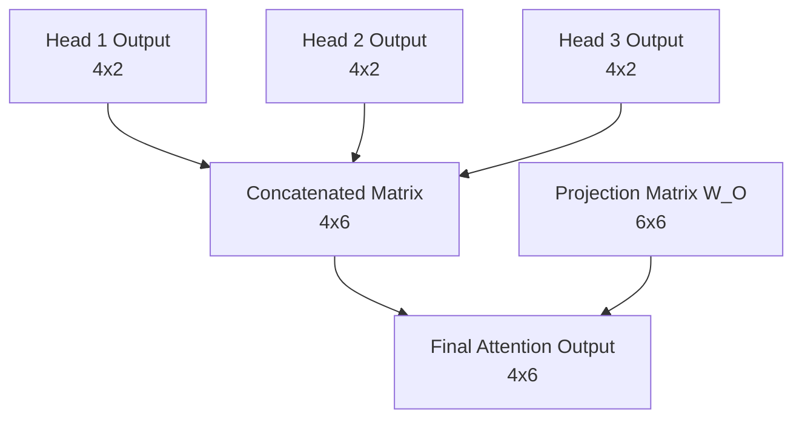

The matrix $W_O$ has dimensions of $d_{model} \times d_{model}$, which in this case is $6 \times 6$. It acts as a cross-head mixer. Multiplying the concatenated matrix by $W_O$ produces a resulting matrix that is a linear combination of all the features from all the heads. The network can learn that a high value in column 1 from Head 1, when combined with a low value in column 5 from Head 3, implies a specific semantic meaning that should be passed forward to the rest of the architecture.

The randomly initialized projection matrix $W_O$ for the toy model appears as follows.

$$
W_O = \begin{bmatrix}
 0.10 &  0.20 & -0.10 &  0.30 &  0.00 & -0.20 \\
-0.20 &  0.10 &  0.40 &  0.10 &  0.20 &  0.00 \\
 0.30 & -0.10 &  0.10 & -0.20 &  0.50 &  0.10 \\
-0.10 &  0.40 & -0.30 &  0.10 & -0.10 &  0.30 \\
 0.20 &  0.00 &  0.20 & -0.10 &  0.30 & -0.10 \\
-0.30 &  0.10 & -0.10 &  0.20 & -0.20 &  0.40
\end{bmatrix}
$$

Taking the dot product of the concatenated outputs and $W_O$ applies the final transformation.

$$
\text{Output} = \text{Concatenated} \cdot W_O
$$

$$
\text{Output} = \begin{bmatrix}
-0.08 &  0.29 &  0.18 &  0.35 &  0.00 & -0.33 \\
-0.10 &  0.42 &  0.10 &  0.43 & -0.01 & -0.25 \\
-0.03 &  0.31 &  0.08 &  0.29 &  0.07 & -0.10 \\
 0.05 &  0.06 &  0.18 &  0.13 &  0.18 & -0.11
\end{bmatrix}
$$

## Rejoining the Stream

This final calculation successfully completes the Multi-Head Self-Attention block. The process began with basic token embeddings representing the sequence `<BOS>` `i` `woke` `up`. The architecture split those representations, allowed them to search for context across the sequence, gathered their findings, and fused those findings back into a unified $4 \times 6$ matrix.

Every vector in this output matrix now contains rich, contextualized information about its surrounding tokens. These advanced representations are ready to merge back into the main residual stream of the Transformer.

<h1 id="chapter-8-the-residual-stream-and-the-central-memory-bus">Chapter 8: The Residual Stream and the Central Memory Bus</h1>

<!-- SUMMARY: The central memory bus of the architecture processes contextual updates from the attention blocks via element-wise addition to the residual stream. Geometrically, this operation acts as a vector translation in high-dimensional space, shifting token representations to incorporate context while preserving their foundational identities. -->

The multi-head attention output has been successfully calculated. Treating this output as the sole input to the next layer is a common instinct in traditional feed-forward networks. The Transformer architecture abandons this sequential pipeline. It instead relies on a central shared memory backbone known as the residual stream.

## Reframing the Architecture: The Information Highway

In a standard deep neural network, each layer transforms the data completely. The input to layer two is exclusively the output of layer one. This creates a bottleneck. If a layer destroys information during its transformation, that information is lost forever. Furthermore, during backpropagation, gradients must multiply through the weight matrix of every layer. If those weights are small, the gradients vanish, halting the learning process for early layers.

The Transformer solves both problems by treating the network as a continuous highway of information rather than a sequence of transformations. The original positionally encoded input embeddings travel straight through the entire network, from the first block to the final output. The attention mechanisms and feed-forward networks sit alongside this highway. They read from the stream, perform their specialized computations, and write their results back into the stream via addition.

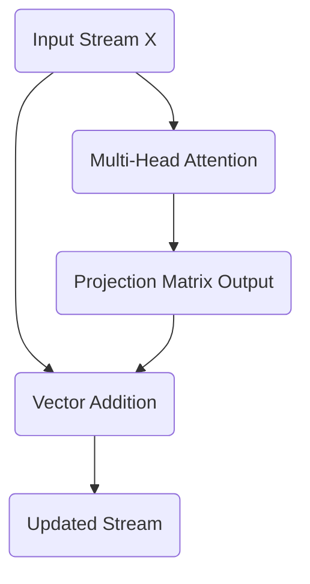

The token vectors do not lose their original identity. The attention block acts as an additive update, mixing contextual information into the base meaning of the token.

## The Mathematics of the Residual Connection

This additive update is formalized with a simple equation:

$$
X_{\text{out}} = X_{\text{in}} + \text{Attention}(X_{\text{in}})
$$

Here, $X_{\text{in}}$ is the state of the residual stream before the attention block. Currently, this is the positionally encoded input matrix. $\text{Attention}(X_{\text{in}})$ represents the output calculated in the previous step using the final projection matrix. 

The exact matrices are as follows. The original positionally encoded input $X_{\text{in}}$ is:

$$
X_{\text{in}} = \begin{bmatrix}
 0.10 &  1.00 &  0.00 &  1.00 &  0.00 &  1.00 \\
 0.84 &  1.34 &  0.35 &  1.09 &  0.21 &  1.48 \\
 0.91 & -0.62 &  1.70 &  0.70 &  0.02 &  1.01 \\
 0.14 & -1.09 &  1.38 &  1.08 &  0.40 &  0.80
\end{bmatrix}
$$

The output from the multi-head attention block $\text{Attention}(X_{\text{in}})$ is:

$$
\text{Attention}(X_{\text{in}}) = \begin{bmatrix}
-0.08 &  0.29 &  0.18 &  0.35 & -0.00 & -0.33 \\
-0.10 &  0.42 &  0.10 &  0.43 & -0.01 & -0.25 \\
-0.03 &  0.31 &  0.08 &  0.29 &  0.07 & -0.10 \\
 0.05 &  0.06 &  0.18 &  0.13 &  0.18 & -0.11
\end{bmatrix}
$$

These two matrices are added together element by element. This operation literally writes the newly discovered contextual relationships into the original vector representations.

$$
X_{\text{out}} = \begin{bmatrix}
 0.02 &  1.29 &  0.18 &  1.35 &  0.00 &  0.67 \\
 0.74 &  1.76 &  0.45 &  1.52 &  0.20 &  1.23 \\
 0.88 & -0.31 &  1.78 &  0.99 &  0.09 &  0.91 \\
 0.19 & -1.03 &  1.56 &  1.21 &  0.58 &  0.69
\end{bmatrix}
$$

## The Geometric Implications of Addition

Adding the attention output to the original embedding performs vector translation. The attention block calculates a directional shift based on the surrounding context. Adding this shift vector to the original token vector moves the token to a new location in the $d_{model}$ dimensional space. 

For instance, the vector for the word "woke" originally represented the abstract concept of waking. After adding the attention output, the vector has been translated in a direction that incorporates its relationship with "i" and "up". The base identity remains intact, while the new coordinate location reflects its specific role in the sentence.

## Gradient Flow and the Residual Highway

Deep neural networks learn by calculating the gradient of the loss function and propagating that error signal backward through the layers. In a strictly sequential architecture, the gradient multiplies by the derivative of each layer. A sub-layer operation frequently yields a derivative matrix containing small values. An idealized sub-layer Jacobian matrix containing values of 0.1 perfectly illustrates the danger.

$$
\text{Jacobian} = \begin{bmatrix}
 0.10 &  0.00 &  0.00 &  0.00 &  0.00 &  0.00 \\
 0.00 &  0.10 &  0.00 &  0.00 &  0.00 &  0.00 \\
 0.00 &  0.00 &  0.10 &  0.00 &  0.00 &  0.00 \\
 0.00 &  0.00 &  0.00 &  0.10 &  0.00 &  0.00 \\
 0.00 &  0.00 &  0.00 &  0.00 &  0.10 &  0.00 \\
 0.00 &  0.00 &  0.00 &  0.00 &  0.00 &  0.10
\end{bmatrix}
$$

Backpropagating an error signal through four consecutive layers of this type requires multiplying the Jacobian matrix by itself four times. This exponentiation causes the gradient to decay exponentially. The resulting matrix demonstrates complete signal loss, rendering the earliest layers entirely incapable of learning.

$$
\text{Sequential Gradient Multiplier} = \begin{bmatrix}
 0.00 &  0.00 &  0.00 &  0.00 &  0.00 &  0.00 \\
 0.00 &  0.00 &  0.00 &  0.00 &  0.00 &  0.00 \\
 0.00 &  0.00 &  0.00 &  0.00 &  0.00 &  0.00 \\
 0.00 &  0.00 &  0.00 &  0.00 &  0.00 &  0.00 \\
 0.00 &  0.00 &  0.00 &  0.00 &  0.00 &  0.00 \\
 0.00 &  0.00 &  0.00 &  0.00 &  0.00 &  0.00
\end{bmatrix}
$$

The residual addition elegantly neutralizes this vanishing gradient problem. The mathematical derivative of an addition operation distributes the gradient equally to both inputs. When calculating the derivative of the residual equation with respect to the input stream, the original input receives a strict derivative of one. This transforms the gradient multiplier for a single layer from the Jacobian matrix alone into the Jacobian matrix added to the Identity matrix.

$$
\text{Residual Multiplier} = I + \text{Jacobian}
$$

Backpropagating through four layers utilizing residual connections multiplies this updated term by itself four times. The addition of the Identity matrix ensures the gradient mathematically survives the journey backward.

$$
\text{Residual Gradient Multiplier} = \begin{bmatrix}
 1.46 &  0.00 &  0.00 &  0.00 &  0.00 &  0.00 \\
 0.00 &  1.46 &  0.00 &  0.00 &  0.00 &  0.00 \\
 0.00 &  0.00 &  1.46 &  0.00 &  0.00 &  0.00 \\
 0.00 &  0.00 &  0.00 &  1.46 &  0.00 &  0.00 \\
 0.00 &  0.00 &  0.00 &  0.00 &  1.46 &  0.00 \\
 0.00 &  0.00 &  0.00 &  0.00 &  0.00 &  1.46
\end{bmatrix}
$$

The error signal reaches the initial embedding matrices effectively intact. The residual stream functions exactly as a gradient highway. Information flows forward to build deep semantic context, and error signals flow backward unimpeded to meticulously adjust the foundational weights. 

This central memory bus ensures that every subsequent layer has unimpeded access to both the raw original embeddings and the accumulated contextual updates from all previous layers. Stabilizing these shifting vectors requires layer normalization, which is examined next.

<h1 id="chapter-9-taming-the-stream-the-geometry-of-layer-normalization">Chapter 9: Taming the Stream: The Geometry of Layer Normalization</h1>

<!-- SUMMARY: Geometric drift and magnitude expansion caused by continuous additive updates are counteracted through the rigorous application of layer normalization. By independently centering and scaling each token vector across its embedding dimension, this mechanism mathematically stabilizes the residual stream while retaining vital contextual geometries. -->

The previous section detailed the Residual Stream. The Attention block operates as an independent module that reads from the central memory bus, calculates contextual updates, and adds those updates directly back into the original embeddings. This additive process ensures that the network never loses the raw initial information about the token and its position. 

There is a subtle geometric consequence to this continuous addition. As a vector moves through multiple layers of a deep neural network and accumulates updates from Attention and Feed-Forward blocks, its magnitude can grow uncontrollably. The values within the vector might drift and lose their centered distribution. If the vectors become excessively large or skewed, the subsequent layers will struggle to process them effectively, leading to numerical instability and vanishing or exploding gradients during backpropagation.

A stabilizing mechanism is required. This is the role of Layer Normalization. 

## The Geometry of Normalization

The token embeddings function as points in a six-dimensional space, where $d_{model} = 6$. Before the addition of the Attention output, these points were relatively close to the origin and bounded by the properties of the initial embedding and positional encoding. After adding the Attention output, the points have shifted.

The current state of the Residual Stream for the sequence `<BOS>` `i` `woke` `up` is:

$$
\text{Residual Stream} = \begin{bmatrix}
 0.02 &  1.29 &  0.18 &  1.35 &  0.00 &  0.67 \\
 0.74 &  1.76 &  0.45 &  1.52 &  0.20 &  1.23 \\
 0.88 & -0.31 &  1.78 &  0.99 &  0.09 &  0.91 \\
 0.19 & -1.03 &  1.56 &  1.21 &  0.58 &  0.69
\end{bmatrix}
$$

To stabilize these representations, Layer Normalization performs two distinct operations independently on every single token vector. It centers the vector by subtracting its mean, and it scales the vector by dividing it by its standard deviation.

Layer Normalization operates across the embedding dimension $d_{model}$ for each individual token. It does not look across the sequence length. The normalization of the token "i" is completely independent of the normalization of the token "woke". This preserves the strict independence of the tokens before they interact again in the next Attention layer.

### Step 1: Centering the Vector

For a given token vector $x$, its mean $\mu$ is first calculated. The mean is simply the average of the $d_{model}$ values within that specific vector.

The mean for each of the four tokens is:

$$
\text{Means} = \begin{bmatrix}
 0.58 \\
 0.98 \\
 0.72 \\
 0.53
\end{bmatrix}
$$

Subtracting this mean from every element in the corresponding token vector shifts the entire vector through the six-dimensional space so that it is perfectly centered around zero. The geometric relationship between the components of the vector remains identical, yet the vector as a whole is anchored back to the origin of the coordinate system.

### Step 2: Scaling the Vector

Centering resolves the drift, yet the magnitude of the vector might still be excessively large or small. Standardizing the scale involves calculating the variance $\sigma^2$ of the vector across its $d_{model}$ components. 

The variances for the tokens are as follows:

$$
\text{Variances} = \begin{bmatrix}
 0.32 \\
 0.32 \\
 0.45 \\
 0.68
\end{bmatrix}
$$

The vector is scaled by dividing each component by the standard deviation, which is the square root of the variance. Preventing mathematical errors in the rare event of a zero variance requires adding a microscopic constant $\epsilon$ before taking the square root.

The complete mathematical formula for normalizing a vector $x$ is:

$$
\hat{x} = \frac{x - \mu}{\sqrt{\sigma^2 + \epsilon}}
$$

Applying this formula to the centered Residual Stream yields a perfectly standardized matrix:

$$
\text{Normalized Stream} = \begin{bmatrix}
-1.00 &  1.25 & -0.72 &  1.35 & -1.04 &  0.15 \\
-0.43 &  1.38 & -0.95 &  0.95 & -1.39 &  0.44 \\
 0.23 & -1.54 &  1.57 &  0.40 & -0.94 &  0.28 \\
-0.42 & -1.89 &  1.24 &  0.82 &  0.06 &  0.19
\end{bmatrix}
$$

Every token vector in this new matrix now possesses a mean of exactly 0 and a variance of exactly 1. 

### Step 3: Learned Scale and Bias

Standardizing the vectors to a strict normal distribution is mathematically safe. It ensures stability. Forcing every vector into this exact shape might inadvertently destroy valuable structural information that the network has learned to represent through the magnitude or shift of the vector.

To resolve this tension, Layer Normalization introduces two learned parameters for the embedding dimension: a scale parameter $\gamma$ and a bias parameter $\beta$. 

$$
\text{Output} = \gamma \odot \hat{x} + \beta
$$

The network learns exactly how much to stretch and shift the normalized vectors. During training, backpropagation adjusts $\gamma$ and $\beta$. If the network determines that the rigid normalization is discarding useful information, it can adjust these parameters to scale and shift the vectors back into a more optimal shape. 

For the purposes of this concrete toy model, $\gamma$ is initialized to a vector of ones and $\beta$ to a vector of zeros. This means the Normalized Stream remains unchanged for now, representing the pure geometric standardization.

## The Stabilized Backbone

With Layer Normalization complete, the token representations are mathematically disciplined. They are ready to be passed into the next component of the Transformer architecture.

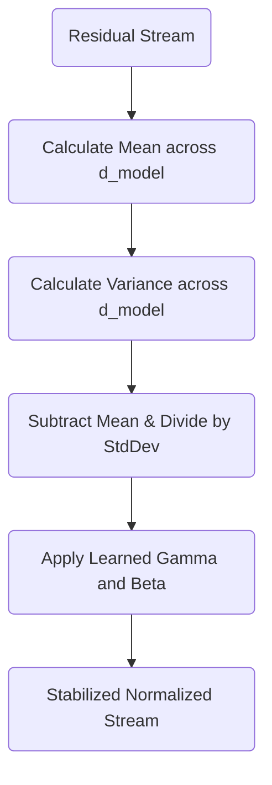

The vectors have been stabilized, yet they still retain the rich contextual updates harvested by the Attention mechanism. These stabilized vectors will next be directed into the Feed-Forward Network, a component that will act as a conceptual memory bank for each individual token.

<h1 id="chapter-10-the-residual-stream-and-mlp-expansion">Chapter 10: The Residual Stream and MLP Expansion</h1>

<!-- SUMMARY: The expansion phase of the feed-forward network acts as a high-dimensional key-value memory retrieval mechanism. By projecting token vectors into a substantially larger geometric space, the model computes dot products against learned key patterns to precisely measure alignment with higher-order conceptual features. -->

The calculations outlined in Parts 8 and 9 successfully update the residual stream and stabilize the geometry of the network through layer normalization. These operations preserve forward information flow while neutralizing gradient degradation, leaving the token vectors perfectly positioned for the next architectural phase.

## The MLP as a Key-Value Memory Bank

The model has successfully normalized the residual stream. The vectors are now stable, centered, and scaled, ready for the next major transformation. Up until this point, the self-attention mechanism has allowed tokens to move information *between* one another. The representation for "up" has reached out and pulled in context from "woke". Attention, however, merely routes information. It does not possess the capacity to interpret that combined information into a new, higher-level concept.

To process the newly contextualized vector, the architecture passes it into the Feed-Forward Network, often referred to as the Multi-Layer Perceptron or MLP.

Historically, the MLP has been described simply as a function that "expands dimensions" and introduces non-linearity. Mechanistic interpretability offers a far more precise and compelling geometric framing. One can view the MLP as a massive Key-Value memory bank stored directly within the weights of the network. The following section will focus entirely on the first linear layer of the MLP, which acts as the "Keys" in this memory retrieval system.

## The Geometry of the Keys

The model dimensionality is $d_{model} = 6$. The standard architecture of a Transformer dictates that the hidden layer of the MLP is significantly wider than the residual stream, typically expanding the dimensionality by a factor of four. Therefore, the feed-forward dimension is $d_{ff} = 24$.

The first projection matrix, $W_1$, has a shape of $6 \times 24$. The calculation multiplies the normalized residual stream $X_{norm}$ with a shape of $4 \times 6$ by $W_1$, resulting in a projected matrix of shape $4 \times 24$.

Rather than viewing $W_1$ as a monolithic mathematical operation, examining its internal structure reveals a deeper mechanism. $W_1$ consists of 24 distinct column vectors, each existing in the 6-dimensional space. Each of these 24 columns represents a specific "Key."

A Key is a learned spatial pattern. When computing the dot product of a token's vector with one of these column vectors, the operation is measuring geometric similarity. It is asking the model a very specific question. Does the contextualized token contain the features described by this Key?

Defining the first column of the learned $W_1$ matrix as the key $k_1$ illustrates this principle:

$$
k_1 = \begin{bmatrix}
-0.07 \\
 0.44 \\
-0.31 \\
 0.31 \\
 0.61 \\
 0.05
\end{bmatrix}
$$

Next, the system extracts the normalized vector for the third token, "woke", from the $X_{norm}$ matrix calculated in the previous step:

$$
x_{woke} = \begin{bmatrix}
-0.17 & -2.12 & 1.29 & 0.01 & -1.45 & -0.12
\end{bmatrix}
$$

To determine how strongly the "woke" token aligns with the pattern defined by $k_1$, the process computes their dot product:

$$
x_{woke} \cdot k_1 = (-0.17 \times -0.07) + (-2.12 \times 0.44) + (1.29 \times -0.31) + (0.01 \times 0.31) + (-1.45 \times 0.61) + (-0.12 \times 0.05)
$$

$$
x_{woke} \cdot k_1 = 0.01 - 0.93 - 0.40 + 0.00 - 0.88 - 0.01 = -2.21
$$

A negative dot product indicates that the vector for "woke" points in the opposite direction of the key $k_1$. This specific token does not contain the conceptual features that $k_1$ is looking for.

By performing this multiplication across the entire matrix, the system simultaneously checks every token against all 24 Keys.

## The Projection Calculation

The complete matrix multiplication $X_{norm} W_1 = X_{proj}$ follows. To keep the display manageable while rigorously showing the math, the following matrix presents the full result of checking the 4 sequence tokens against all 24 Keys.

$$
X_{proj} = \begin{bmatrix}
 0.64 & -0.30 & -0.93 & -0.86 &  0.53 & -1.24 &  0.88 &  0.71 & -2.13 & \dots & -0.19 \\
 1.07 & -1.32 & -0.65 & -0.96 &  1.47 & -2.19 &  2.16 & -0.20 & -2.64 & \dots &  1.73 \\
-2.21 & -0.10 & -2.12 &  0.33 & -2.18 &  2.73 & -0.92 &  1.72 &  3.32 & \dots &  1.09 \\
-0.62 & -0.74 & -0.58 & -0.56 &  0.00 &  2.26 & -0.71 &  0.74 &  2.40 & \dots &  1.53
\end{bmatrix}
$$

Each row in $X_{proj}$ represents a token. Each column corresponds to one of the 24 Keys. The value at Row 3, Column 1 is significant. It is $-2.21$, exactly as calculated manually for the "woke" token interacting with $k_1$.

Conversely, Row 3, Column 9 tells a different story. The value is a highly positive $3.32$. This indicates that the "woke" token strongly activated the 9th Key in the network. The pattern has been successfully recognized.

## The Bias Vector

In a standard linear layer, a learned bias vector $b_1$ is applied immediately after the matrix multiplication. The bias vector shifts the results, acting as a baseline activation threshold for each of the 24 Keys.

$$
X_{proj\_biased} = X_{proj} + b_1
$$

If a particular Key requires a very strict match to activate, the network can learn a highly negative bias for that position, forcing the dot product to be exceedingly large to overcome the penalty. If a Key should trigger easily, the network learns a positive bias.

For this model, the architecture applies a randomly initialized $b_1$ vector of length 24 to every row in $X_{proj}$, yielding the final pre-activation state:

$$
X_{proj\_biased} = \begin{bmatrix}
 0.58 & -0.26 & -1.09 & -0.90 &  0.56 & -1.16 &  1.03 &  0.71 & -2.25 & \dots & -0.04 \\
 1.01 & -1.28 & -0.81 & -1.00 &  1.50 & -2.11 &  2.30 & -0.21 & -2.75 & \dots &  1.88 \\
-2.27 & -0.07 & -2.28 &  0.29 & -2.16 &  2.81 & -0.78 &  1.72 &  3.20 & \dots &  1.24 \\
-0.69 & -0.71 & -0.74 & -0.60 &  0.03 &  2.34 & -0.56 &  0.74 &  2.29 & \dots &  1.68
\end{bmatrix}
$$

The vectors have successfully probed the memory bank. The calculation has measured exactly how well each token aligns with the 24 internal Key patterns. The next step is determining which of these patterns actually "fires," dropping irrelevant matches to zero before writing new conceptual information back into the residual stream. This thresholding introduces non-linearity, bringing the network to the Activation Function.

<h1 id="chapter-11-layer-normalization-and-the-multi-layer-perceptron">Chapter 11: Layer Normalization and The Multi-Layer Perceptron</h1>

<!-- SUMMARY: The multi-layer perceptron executes precise non-linear gating and geometric contraction phases. The ReLU activation function sparsifies the high-dimensional space by isolating successful pattern matches, which are subsequently contracted through a value matrix to synthesize a refined vector of contextual updates. -->

The calculations established in Parts 9 and 10 successfully center and scale the residual stream while mapping the token representations into a high-dimensional space. This geometric expansion isolates complex conceptual patterns, preparing the network to select and extract the most relevant semantic features.

## The Multi-Layer Perceptron: Activation and Contraction

Previous discussions explored the first half of the Multi-Layer Perceptron as a Key-Value memory bank. Projecting the $d_{model} = 6$ residual stream into the much larger $d_{ff} = 24$ space using the $W_1$ matrix created a set of Keys. Each column of $W_1$ searched the residual stream for a specific, complex contextual pattern.

At this stage, token vectors exist in the expanded $24$-dimensional space. Two tasks remain. First, the system must decide which of those $24$ searched patterns were actually found. Second, the architecture must contract this high-dimensional space back into the $d_{model} = 6$ residual stream, bringing new conceptual information along with it.

### The Non-Linear Gate: ReLU

Linear transformations alone are mathematically limited. Chaining the $W_1$ projection directly into another projection matrix $W_2$ would collapse the two operations into a single equivalent linear projection. This collapse would completely defeat the purpose of expanding into a higher dimension. Creating a true memory bank requires a mechanism to selectively activate features. The system requires a non-linear activation function.

The toy model uses the Rectified Linear Unit, commonly referred to as ReLU. The function is defined elegantly:

$$
\text{ReLU}(x) = \max(0, x)
$$

This function acts as a threshold or a gate. If the dot product between a token vector and a Key in $W_1$ resulted in a negative value, the pattern was not found. ReLU clamps that negative value to zero, effectively shutting down that pathway. If the dot product was positive, the pattern was found, and ReLU allows the signal to pass through unchanged.

The output of the $W_1$ projection for the four tokens `<BOS>`, `i`, `woke`, and `up` reveals the activation states. For brevity, the following tensor displays the first three dimensions and the final dimension of the $4 \times 24$ matrix:

$$
X_{proj} = \begin{bmatrix}
 0.58 & -0.26 & -1.09 & \dots & -0.04 \\
 1.01 & -1.28 & -0.81 & \dots &  1.88 \\
-2.27 & -0.07 & -2.28 & \dots &  1.24 \\
-0.69 & -0.71 & -0.74 & \dots &  1.68
\end{bmatrix}
$$

Applying the ReLU function element-wise across the entire tensor yields the activated state:

$$
X_{act} = \max(0, X_{proj}) = \begin{bmatrix}
 0.58 & 0 & 0 & \dots & 0 \\
 1.01 & 0 & 0 & \dots & 1.88 \\
 0    & 0 & 0 & \dots & 1.24 \\
 0    & 0 & 0 & \dots & 1.68
\end{bmatrix}
$$

This operation results in profound sparsification of the data. The negative values have been eradicated. The zeros represent memory slots that did not fire. The non-zero positive values represent specific contextual features successfully recognized by the $W_1$ Keys.

### The Value Matrix: Contracting Back to the Stream

After determining which patterns fired, the architecture must translate those activations into meaningful updates for the residual stream. The second projection matrix, $W_2$, along with its bias $b_2$, performs this translation.

While $W_1$ acted as the Keys, $W_2$ acts as the Values.

The $W_2$ matrix has a shape of $d_{ff} \times d_{model}$, equating to $24 \times 6$ in the toy model. The $W_2$ matrix functions as a collection of $24$ row vectors. Each row corresponds to one of the features in the expanded space. If a specific feature fired during the ReLU step, its positive scalar value multiplies the corresponding row in $W_2$. The result is a $6$-dimensional vector of new information shaped perfectly to be added back into the residual stream.

The following tensors represent the deterministic $W_2$ matrix and $b_2$ bias vector, displaying a truncated view of the $24 \times 6$ matrix:

$$
W_2 = \begin{bmatrix}
 0.75 &  0.19 &  0.34 &  0.44 & -0.42 & -0.78 \\
-0.56 &  0.17 &  0.53 &  0.06 & -0.68 &  0.70 \\
-0.80 & -0.24 & -0.28 &  0.13 &  0.55 & -0.75 \\
\vdots & \vdots & \vdots & \vdots & \vdots & \vdots \\
-0.02 &  0.27 & -0.68 & -0.35 &  0.05 &  0.14
\end{bmatrix}
$$

$$
b_2 = \begin{bmatrix}
 -0.06 &  0.12 & -0.15 & -0.08 &  0.04 &  0.09
\end{bmatrix}
$$

Multiplying the activated memory state $X_{act}$ by the Values matrix $W_2$ and adding the bias contracts the representations back down to the $d_{model}$ dimension:

$$
X_{contracted} = X_{act} W_2 + b_2
$$

Calculating the full matrix multiplication yields the final Multi-Layer Perceptron output tensor:

$$
X_{contracted} = \begin{bmatrix}
-4.07 &  0.04 & -0.06 & -1.74 & -1.17 & -0.77 \\
-6.51 &  0.18 & -0.33 & -3.85 & -0.84 & -1.43 \\
 0.82 & -3.22 &  0.39 & -2.11 &  3.22 &  6.02 \\
 1.18 & -2.83 & -0.72 & -1.89 &  1.58 &  4.39
\end{bmatrix}
$$

This $4 \times 6$ matrix contains the refined, highly contextualized updates for the tokens. For example, the row corresponding to the token woke now holds the mathematical synthesis of all the specific concepts that the Multi-Layer Perceptron decided were relevant to the current context.

### The Big Picture of the Multi-Layer Perceptron

The entire Key-Value process visualizes as a focused expansion and contraction workflow:

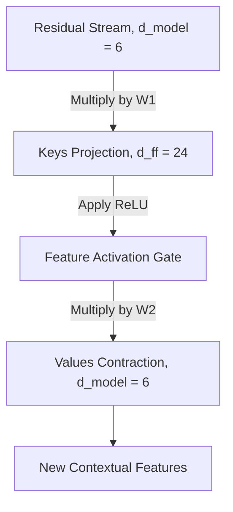

The Multi-Layer Perceptron successfully reads from the normalized residual stream, expands the data to search for high-dimensional concepts, filters those concepts through a non-linear gate, and contracts the resulting values back into a $6$-dimensional update vector. 

The next step physically writes this new information back into the central information highway, completing the Layer 1 architecture.

<h1 id="chapter-12-the-mlp-as-a-key-value-memory-and-layer-1-completion">Chapter 12: The MLP as a Key-Value Memory and Layer 1 Completion</h1>

<!-- SUMMARY: The feed-forward network acts as a vast conceptual memory bank for the Transformer. By projecting the residual stream into a higher-dimensional space, the first linear layer functions as a series of specific pattern-matching keys, probing each token vector for complex linguistic and contextual features learned during training. The architecture of the first layer is then finalized by integrating the newly synthesized conceptual features back into the residual stream via additive updates. To counteract the resulting geometric instability and magnitude expansion, layer normalization is applied to prepare the contextualized vectors for deeper processing in subsequent layers. -->

The self-attention mechanism allowed the tokens to mathematically look around the sequence, gathering context and shifting their geometric positions based on the surrounding words. The residual stream now carries these enriched, context-aware representations, stabilized by layer normalization. The next destination for these vectors is the Multilayer Perceptron, or MLP. While standard explanations describe this block simply as a feed-forward network that non-linearly expands and contracts dimensions, viewing the MLP through the lens of mechanistic interpretability reveals a much more profound structure, specifically a sophisticated Key-Value memory bank.

To understand this memory bank, one must examine the first half of the MLP block. The architecture projects the normalized residual stream into a significantly wider dimensional space. In the toy model, the stream expands from a working dimension of six, $d_{model} = 6$, out to twenty-four, $d_{ff} = 24$. This expansion is driven by the first weight matrix, $W_1$. Rather than viewing this matrix as a black box of parameters, one can conceptualize each of its twenty-four columns as a distinct mathematical Key.

During training, the network optimizes these Keys to recognize highly specific contextual concepts. One Key might be tuned to activate strongly when the vector represents a noun acting as the subject of a past-tense verb. Another Key might search for the concept of time. When the normalized residual stream is multiplied by $W_1$, the system is fundamentally computing the dot product between the tokens and every single one of these twenty-four Keys. A high dot product indicates a strong conceptual match between the token's current context and the pattern the Key is searching for.

The $W_1$ matrix acts as the lock mechanism for this memory bank. To see this in action, it is helpful to observe the values of the $W_1$ projection matrix itself.

$$
W_1 = \begin{bmatrix}
-0.07 & -0.09 & -0.06 &  0.35 & -0.06 & -0.75 &  0.17 & -0.13 & -0.11 & \dots &  0.25 \\
 0.44 & -0.12 &  0.19 &  0.12 &  0.39 & -0.56 &  0.28 & -0.76 & -1.31 & \dots &  0.24 \\
-0.31 & -0.36 & -0.23 &  0.25 & -0.13 &  1.17 & -0.41 & -0.55 &  0.38 & \dots &  1.16 \\
 0.31 & -0.30 & -0.28 & -0.42 &  0.48 & -0.28 & -0.04 &  0.37 & -0.36 & \dots &  0.19 \\
 0.61 & -0.01 &  0.98 & -0.18 &  0.80 &  0.06 & -0.26 & -0.56 & -0.08 & \dots & -0.18 \\
 0.05 & -0.62 &  0.11 & -0.60 &  0.44 &  0.00 &  1.14 &  0.14 &  0.68 & \dots &  1.01
\end{bmatrix}
$$

When the normalized vectors from the sequence, specifically `<BOS>` `i` `woke` `up`, are multiplied by this matrix, and the learned bias terms are added, the result is a massive expansion of the data. Every token vector transforms from six numbers into twenty-four distinct activation potentials. 

$$
\text{Projected State} = \begin{bmatrix}
 0.58 & -0.26 & -1.09 & -0.90 &  0.56 & -1.16 &  1.03 &  0.71 & -2.25 & \dots & -0.04 \\
 1.01 & -1.28 & -0.81 & -1.00 &  1.50 & -2.11 &  2.30 & -0.21 & -2.75 & \dots &  1.88 \\
-2.27 & -0.07 & -2.28 &  0.29 & -2.16 &  2.81 & -0.78 &  1.72 &  3.20 & \dots &  1.24 \\
-0.69 & -0.71 & -0.74 & -0.60 &  0.03 &  2.34 & -0.56 &  0.74 &  2.29 & \dots &  1.68
\end{bmatrix}
$$

This matrix represents the degree to which every token resonated with the twenty-four conceptual Keys in the memory bank. A highly positive number indicates a strong semantic match, suggesting the Key found exactly what it was trained to look for in the token's geometry. Conversely, a negative number indicates the absence of that concept. 

At this precise mathematical juncture, the network has successfully queried the memory bank. However, memory must be selectively recalled to be useful. The network requires a mechanism to silence the irrelevant concepts and amplify the critical discoveries before writing the findings back into the residual stream. This critical filtering role falls to the non-linear activation function, which bridges the gap between the Keys and their corresponding Values.

After the MLP processes these values, the output represents a set of additive updates containing new features discovered within the local context of each token.

## The Information Accumulator

It was established earlier that the Transformer does not pass data sequentially through a series of filters that discard old information. It maintains a persistent vector for each token, and each sublayer reads from this vector and adds its findings back to it.

The output of the MLP is not a replacement for the representation of the token. It is an additive update. The system adds the MLP output vector directly to the Residual Stream vector as it existed prior to entering the MLP block.

The original stream entering this phase is defined as $X_1$. This tensor contains the original embeddings enriched with the outputs of the Attention mechanism.

$$
X_1 = \begin{bmatrix}
 0.02 &  1.29 &  0.18 &  1.35 &  0.00 &  0.67 \\
 0.74 &  1.76 &  0.45 &  1.52 &  0.20 &  1.23 \\
 0.88 & -0.31 &  1.78 &  0.99 &  0.09 &  0.91 \\
 0.19 & -1.03 &  1.56 &  1.21 &  0.58 &  0.69
\end{bmatrix}
$$

The MLP calculated a set of additive updates representing new features discovered within the local context of each token.

$$
MLP_{output} = \begin{bmatrix}
-4.07 &  0.04 & -0.06 & -1.74 & -1.17 & -0.77 \\
-6.51 &  0.18 & -0.33 & -3.85 & -0.84 & -1.43 \\
 0.82 & -3.22 &  0.39 & -2.11 &  3.22 &  6.02 \\
 1.18 & -2.83 & -0.72 & -1.89 &  1.58 &  4.39
\end{bmatrix}
$$

The updated Residual Stream $X_2$ is computed through simple elementwise addition.

$$
X_2 = X_1 + MLP_{output} = \begin{bmatrix}
-4.05 &  1.33 &  0.12 & -0.39 & -1.17 & -0.10 \\
-5.77 &  1.94 &  0.12 & -2.33 & -0.64 & -0.20 \\
 1.70 & -3.53 &  2.17 & -1.12 &  3.31 &  6.93 \\
 1.37 & -3.86 &  0.84 & -0.68 &  2.16 &  5.08
\end{bmatrix}
$$

The magnitudes in the bottom two rows, representing the tokens "woke" and "up", have grown significantly. The network has injected a strong semantic signal into these specific token representations based on their local context.

## Preparing for Layer 2 Normalization

While adding vectors is a powerful way to accumulate information, it introduces geometric instability. As more vectors are added together, the overall magnitude of the resulting vector grows. If these enlarged vectors are passed into the next layer of the network, the dot products in the upcoming Attention mechanism will explode. This leads directly to the Softmax saturation problem solved previously.

To maintain a stable geometric space, Layer Normalization is applied before passing these vectors into Layer 2. The mean and variance are calculated across the $d_{model}$ dimension for each token independently.

$$
\text{Means} = \begin{bmatrix} -0.71 \\ -1.15 \\  1.57 \\  0.82 \end{bmatrix} \quad \text{Variances} = \begin{bmatrix} 2.78 \\  5.85 \\ 10.89 \\  7.40 \end{bmatrix}
$$

By subtracting the mean and dividing by the standard deviation, each vector is recentered around zero and its components are scaled to have a unit variance.

$$
Normed_2 = \begin{bmatrix}
-2.00 &  1.22 &  0.50 &  0.19 & -0.28 &  0.37 \\
-1.91 &  1.28 &  0.52 & -0.49 &  0.21 &  0.39 \\
 0.04 & -1.55 &  0.18 & -0.82 &  0.52 &  1.62 \\
 0.20 & -1.72 &  0.01 & -0.55 &  0.49 &  1.57
\end{bmatrix}
$$

The relative information encoded in the direction of the vector is perfectly preserved, while the overall magnitude is brought back into a mathematically manageable range.

## Visualizing the Complete Layer 1 Architecture

The sequence of operations in the first layer of the Transformer is now complete. This entire block of computation can be visualized to see how information flows from the initial input to the output of Layer 1.

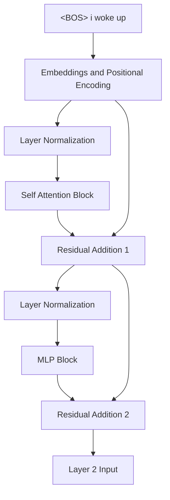

The vectors exiting this block are no longer simple dictionary lookups. They are highly contextualized representations. The vector for the token "woke" now inherently contains information about the preceding pronoun "i" and the subsequent particle "up". The foundational features have been extracted, mixed, and amplified. In the next phase, these enriched vectors will be passed into Layer 2, allowing the network to form even deeper abstract associations.

<h1 id="chapter-13-the-mlp-activation-and-layer-2-self-attention">Chapter 13: The MLP Activation and Layer 2 Self-Attention</h1>

<!-- SUMMARY: The activation function serves as the critical gatekeeper within the feed-forward network, filtering the conceptual matches identified by the first layer. The subsequent linear projection then translates these activated patterns into concrete conceptual updates, writing new features back into the residual stream. As the sequence progresses through the second layer of self-attention, token vectors evolve from isolated definitions into deeply contextualized mathematical representations that evaluate high-level syntactic structures. -->

The projection matrix from the previous step expanded the residual stream into a twenty-four-dimensional space, effectively querying a vast bank of conceptual keys. The resulting matrix contained a spectrum of positive and negative values, representing the degree of resonance with each learned pattern. The network must now definitively decide which of these patterns are relevant to the current context and discard the rest. This critical filtering operation is the domain of the activation function.

The toy model employs the Rectified Linear Unit, commonly known as ReLU. The mathematical operation is elegantly simple: any negative value is set to zero, while positive values remain unchanged. Mechanistically, this acts as a strict threshold. If a token vector did not sufficiently match a specific conceptual key, the negative resonance is silenced entirely. The neuron simply does not fire. 

Applying this non-linearity to the projected state yields the activated memory representation.

$$
\text{Activated State} = \begin{bmatrix}
 0.58 &  0.00 &  0.00 &  0.00 &  0.56 &  0.00 &  1.03 &  0.71 &  0.00 & \dots &  0.00 \\
 1.01 &  0.00 &  0.00 &  0.00 &  1.50 &  0.00 &  2.30 &  0.00 &  0.00 & \dots &  1.88 \\
 0.00 &  0.00 &  0.00 &  0.29 &  0.00 &  2.81 &  0.00 &  1.72 &  3.20 & \dots &  1.24 \\
 0.00 &  0.00 &  0.00 &  0.00 &  0.03 &  2.34 &  0.00 &  0.74 &  2.29 & \dots &  1.68
\end{bmatrix}
$$

The landscape is now sparse. Only the most confident conceptual matches survive. The zeroed entries represent features deemed irrelevant to the token in its specific context, preventing noisy or contradictory signals from propagating further. 

With the precise combination of keys identified, the network moves to the extraction phase. The second half of the Multilayer Perceptron is defined by the $W_2$ weight matrix, which projects the twenty-four-dimensional space back down to the model dimension of six. Continuing the mechanistic analogy, if $W_1$ represented the "Keys" searching for patterns, $W_2$ represents the "Values" corresponding to those patterns.

$$
W_2 = \begin{bmatrix}
 0.75 &  0.19 &  0.34 &  0.44 & -0.42 & -0.78 \\
 -0.56 &  0.17 &  0.53 &  0.06 & -0.68 &  0.70 \\
 -0.80 & -0.24 & -0.28 &  0.13 &  0.55 & -0.75 \\
 -0.16 &  0.16 & -0.58 & -0.05 &  0.09 & -0.67 \\
 -0.65 & -0.03 & -0.11 &  0.11 &  1.11 &  0.45 \\
  0.22 & -0.36 &  0.47 & -0.39 &  0.78 &  0.59 \\
 -1.00 & -0.59 & -0.10 & -0.20 & -0.63 & -0.61 \\
  0.36 & -0.27 & -0.76 & -0.14 &  0.48 &  0.84 \\
  0.03 & -0.16 & -0.40 & -0.26 &  0.27 &  0.63 \\
  0.62 & -0.12 &  0.44 &  0.38 &  0.23 & -1.23 \\
 -0.03 & -0.14 &  0.66 & -0.14 &  0.23 &  0.13 \\
  0.63 &  0.38 &  0.51 &  0.75 &  0.48 &  0.39 \\
 -0.13 &  0.05 &  1.08 &  0.02 &  0.25 & -0.04 \\
 -0.15 & -1.50 &  0.86 & -0.59 & -0.42 &  0.68 \\
 -1.18 &  0.01 & -0.28 & -0.92 &  0.31 & -0.39 \\
 -0.05 & -0.21 &  0.32 &  1.13 & -0.63 &  0.43 \\
 -0.35 & -0.18 & -0.95 & -0.57 & -0.22 &  0.41 \\
  0.12 &  0.29 &  0.37 & -0.69 &  0.73 & -0.16 \\
  0.34 & -0.09 &  0.13 &  0.32 & -1.13 &  1.01 \\
  0.09 &  0.55 &  0.11 &  0.04 & -0.66 & -0.20 \\
 -1.11 & -0.08 &  0.79 & -0.94 & -0.34 & -0.19 \\
  0.58 &  0.62 &  0.03 &  0.05 & -0.08 & -0.24 \\
 -0.24 & -0.23 & -0.08 &  0.04 & -0.32 &  0.31 \\
 -0.02 &  0.27 & -0.68 & -0.35 &  0.05 &  0.14
\end{bmatrix}
$$

When a specific neuron fires in the activation phase, it triggers the retrieval of the corresponding row in $W_2$. The mathematical operation is a weighted sum. The strength of the activation dictates how forcefully that specific Value vector is added to the final output. The resulting contracted matrix represents the consolidated conceptual insights ready to be injected back into the residual stream.

$$
\text{Contracted Output} = \begin{bmatrix}
 -4.07 &  0.04 & -0.06 & -1.74 & -1.17 & -0.77 \\
 -6.51 &  0.18 & -0.33 & -3.85 & -0.84 & -1.43 \\
  0.82 & -3.22 &  0.39 & -2.11 &  3.22 &  6.02 \\
  1.18 & -2.83 & -0.72 & -1.89 &  1.58 &  4.39
\end{bmatrix}
$$

While the foundational architecture utilizes the straightforward ReLU function, modern state-of-the-art architectures frequently employ advanced gated activations like SwiGLU. Understanding the mechanics of SwiGLU requires a slight shift in the Key-Value analogy, elevating the filtering process to a highly nuanced operation.

Instead of a single projection matrix creating the expanded space, a SwiGLU architecture utilizes two parallel linear projections. The first projection acts as the standard feature vector, proposing the values that might be useful. The second projection acts exclusively as the gate, calculating how much of the first vector should actually be allowed through. This gating projection is passed through a smooth, non-linear function known as Swish, allowing the gate to regulate the information flow continuously.

The final activated state is the element-wise multiplication of the feature vector by the gate vector. Rather than a harsh threshold like ReLU, SwiGLU provides the network with a nuanced dial. It can selectively attenuate or amplify specific features based on complex contextual interactions. The feature projection might propose a concept, and the gate projection independently decides if that concept is truly relevant in the current context. This decoupling of feature generation and feature filtering grants the network immense expressive power, forming the backbone of highly capable contemporary models. 

Whether using a strict threshold or a nuanced gate, the fundamental operation remains the same. The Multilayer Perceptron evaluates the context-enriched tokens, selectively retrieves specialized conceptual knowledge, and prepares these refined updates for the final phase of the layer.

## Transition to Layer 2

In the first layer of the Transformer, the self-attention mechanism evaluated relationships between raw, isolated word embeddings. When the tokens for "woke" and "up" were projected into their respective Query and Key spaces, the mechanism measured their static semantic affinity. The network has since routed those localized insights back into the central residual stream, refined them through a Key-Value Multi-Layer Perceptron, and stabilized the geometry with Layer Normalization. As the second layer of self-attention begins, the token vectors no longer represent solitary dictionary definitions. They are now deeply contextualized mathematical summaries of their surrounding linguistic environment.

## The Contextualized Input

The input to Layer 2, denoted as $X_2$, is the normalized output of the first layer. The vectors occupying this matrix are profoundly different from the initial token embeddings. The first row still corresponds to the `<BOS>` token, the second to "i", the third to "woke", and the fourth to "up". Their numerical values now encode the structural and semantic relationships discovered during Layer 1. 

$$
X_2 = \begin{bmatrix}
-2.00 & 1.22 & 0.50 & 0.19 & -0.28 & 0.37 \\
-1.91 & 1.28 & 0.52 & -0.49 & 0.21 & 0.39 \\
0.04 & -1.55 & 0.18 & -0.82 & 0.52 & 1.62 \\
0.20 & -1.72 & 0.01 & -0.55 & 0.49 & 1.57
\end{bmatrix}
$$

When Layer 2 computes self-attention, it is not merely asking if "woke" is related to "up". It is evaluating whether the complex concept of a sequence beginning with a first-person pronoun performing a waking action should attend to the temporal concept of the word "up". The attention mechanism is now operating on abstractions.

## The Second Layer Projections

Just as in the first layer, the network must project these high-dimensional 6-element vectors into lower-dimensional 2-element subspaces to compute attention. A new set of weight matrices is initialized for the first head of Layer 2. These matrices, $W_Q^{(2)}$, $W_K^{(2)}$, and $W_V^{(2)}$, serve the exact same geometric function as their Layer 1 counterparts. They define a bilinear form, allowing disparate semantic vectors to align in a shared subspace.

$$
W_Q^{(2)} = \begin{bmatrix}
 0.10 & -0.20 \\
-0.30 &  0.40 \\
 0.50 & -0.10 \\
-0.20 &  0.30 \\
 0.40 &  0.20 \\
-0.10 & -0.50
\end{bmatrix}
$$

$$
W_K^{(2)} = \begin{bmatrix}
-0.20 &  0.30 \\
 0.40 & -0.10 \\
-0.30 &  0.50 \\
 0.10 & -0.40 \\
 0.20 &  0.20 \\
-0.50 &  0.10
\end{bmatrix}
$$

$$
W_V^{(2)} = \begin{bmatrix}
 0.30 & -0.10 \\
-0.20 &  0.40 \\
 0.10 & -0.30 \\
-0.40 &  0.20 \\
 0.50 & -0.20 \\
-0.10 &  0.50
\end{bmatrix}
$$

The Queries $Q_2$, Keys $K_2$, and Values $V_2$ are calculated by taking the dot product of the contextualized input $X_2$ with each of these respective weight matrices. 

### The Query Space

The $Q_2$ matrix represents what each contextualized token is searching for in the sequence.

$$
Q_2 = X_2 W_Q^{(2)} = \begin{bmatrix}
-0.50 &  0.66 \\
-0.17 &  0.54 \\
 0.77 & -1.60 \\
 0.69 & -1.58
\end{bmatrix}
$$

### The Key Space

The $K_2$ matrix represents the features each contextualized token is advertising to the sequence. 

$$
K_2 = X_2 W_K^{(2)} = \begin{bmatrix}
 0.52 & -0.57 \\
 0.53 & -0.16 \\
-1.47 &  0.85 \\
-1.47 &  0.71
\end{bmatrix}
$$

### The Value Space

The $V_2$ matrix represents the actual information each token will contribute to the next stage of processing if another token attends to it. 

$$
V_2 = X_2 W_V^{(2)} = \begin{bmatrix}
-1.05 &  0.82 \\
-0.51 &  0.60 \\
 0.77 & -0.13 \\
 0.71 & -0.13
\end{bmatrix}
$$

## A Shift in Abstraction

The mathematics remain identical to the first layer. An input tensor is projected through three linear transformations to prepare for a scaled dot-product attention calculation. The fundamental shift is entirely in the contents of $X_2$. The Queries and Keys in this layer are no longer matching basic vocabulary traits. They are matching high-level syntactic structures and multi-token semantic combinations. In the next step, the network calculates the attention scores for this second layer to reveal how these deep contextual representations share information.

<h1 id="chapter-14-final-layer-1-residuals-norms-and-layer-2-attention">Chapter 14: Final Layer 1 Residuals, Norms, and Layer 2 Attention</h1>
<!-- SUMMARY: The multi-layer perceptron output is added back into the residual stream, preserving the original contextual information while integrating the newly activated conceptual features. A final layer normalization step stabilizes the vector geometry, preparing the enriched representations for the second layer. The query and key vectors then undergo a fundamental mathematical shift as compound semantic structures are scored using the scaled dot-product. Stabilizing the variance of these unscaled scores prevents softmax saturation and preserves gradient health during backpropagation. -->

The completion of the Multilayer Perceptron marks the end of the conceptual feature extraction phase. The network has successfully identified relevant patterns within the token vectors and projected those insights back into the original six-dimensional space. The next crucial step involves integrating this newly extracted knowledge with the existing representation.

This integration occurs via the residual stream. Rather than replacing the prior state entirely, the output of the feed-forward network is added directly to the original token vectors that entered the block. This architectural design ensures that the fundamental identity of the token is preserved alongside its newly refined conceptual context. The additive nature of the residual connection provides a direct gradient path during backpropagation, circumventing the risk of signal decay.

The state of the residual stream prior to the feed-forward network is represented by the following matrix.

$$
\text{Original Residual Stream} = \begin{bmatrix}
 0.02 &  1.29 &  0.18 &  1.35 &  0.00 &  0.67 \\
 0.74 &  1.76 &  0.45 &  1.52 &  0.20 &  1.23 \\
 0.88 & -0.31 &  1.78 &  0.99 &  0.09 &  0.91 \\
 0.19 & -1.03 &  1.56 &  1.21 &  0.58 &  0.69
\end{bmatrix}
$$

The network then adds the contracted output from the Multilayer Perceptron directly to this stream.

$$
\text{MLP Output} = \begin{bmatrix}
-4.07 &  0.04 & -0.06 & -1.74 & -1.17 & -0.77 \\
-6.51 &  0.18 & -0.33 & -3.85 & -0.84 & -1.43 \\
 0.82 & -3.22 &  0.39 & -2.11 &  3.22 &  6.02 \\
 1.18 & -2.83 & -0.72 & -1.89 &  1.58 &  4.39
\end{bmatrix}
$$

The resulting addition produces a deeply enriched representation. The network has successfully woven complex, localized conceptual features into the broader contextual fabric established by the self-attention mechanism.

$$
\text{New Residual Stream} = \begin{bmatrix}
-4.05 &  1.33 &  0.12 & -0.39 & -1.17 & -0.10 \\
-5.77 &  1.94 &  0.12 & -2.33 & -0.64 & -0.20 \\
 1.70 & -3.53 &  2.17 & -1.12 &  3.31 &  6.93 \\
 1.37 & -3.86 &  0.84 & -0.68 &  2.16 &  5.08
\end{bmatrix}
$$

Before these vectors can progress to the subsequent layer, their geometric properties must be stabilized. The addition operation inherently shifts the mean and expands the variance of the token representations. Left unchecked, this numerical drift would destabilize the learning process.

The application of layer normalization corrects this drift. The operation recalculates the mean and variance independently for each token vector and scales the values to achieve a mean of zero and a variance of one. The magnitude of the vectors is constrained while preserving the vital directional information encoded within their relative dimensions.

$$
\text{Normalized Layer 2 Input} = \begin{bmatrix}
-2.00 &  1.22 &  0.50 &  0.19 & -0.28 &  0.37 \\
-1.91 &  1.28 &  0.52 & -0.49 &  0.21 &  0.39 \\
 0.04 & -1.55 &  0.18 & -0.82 &  0.52 &  1.62 \\
 0.20 & -1.72 &  0.01 & -0.55 &  0.49 &  1.57
\end{bmatrix}
$$

This normalization step concludes the first complete layer of the Transformer architecture. The initial embeddings have been profoundly transformed. The vectors no longer represent isolated vocabulary tokens. The representation has evolved into a rich amalgamation of semantic identity, positional context, and localized conceptual features.

The architecture is now prepared to pass these enriched vectors into Layer 2. The subsequent operations repeat the self-attention and feed-forward mechanisms, yet the mathematical focus shifts entirely. Rather than computing relationships between isolated words, the next layer computes relationships between these highly complex, contextualized representations, facilitating a crucial leap toward hierarchical abstraction.

In the progression through the Transformer architecture, the network reaches a critical inflection point. The Query and Key vectors extracted in Layer 2 are fundamentally different from those in Layer 1. Rather than representing isolated vocabulary tokens, they now encapsulate rich, contextualized concepts fused from the entire preceding sequence. This section examines exactly how these advanced representations are scored against one another, illuminating the mathematical process by which deep neural networks decide to route high-level information.

## The Semantic Shift in Queries and Keys

When the attention scores were calculated in Layer 1, the Queries $Q$ and Keys $K$ were derived from raw word embeddings plus positional information. They were searching for basic relationships, such as a subject looking for a verb. In Layer 2, the input vectors have passed through the first attention mechanism and the Multi-Layer Perceptron. They have already absorbed surrounding context.

The model is processing the sequence `<BOS>` `i` `woke` `up` with the goal of predicting the next token. The vectors corresponding to "woke" and "up" are no longer isolated; they have mixed their information in the residual stream. Consequently, the Layer 2 $Q_2$ and $K_2$ matrices project this mixed, abstract data into a new dimensional space. They are asking highly specific, compound questions about the sentence structure.

The exact $Q_2$ matrix and the transposed Key matrix $K_2^T$ for the first attention head in Layer 2 are presented below.

$$
Q_2 = \begin{bmatrix}
-0.50 & 0.66 \\
-0.17 & 0.54 \\
0.77 & -1.60 \\
0.69 & -1.58
\end{bmatrix}
$$

$$
K_2^T = \begin{bmatrix}
0.52 & 0.53 & -1.47 & -1.47 \\
-0.57 & -0.16 & 0.85 & 0.71
\end{bmatrix}
$$

## Calculating the Unscaled Alignment

The fundamental mechanism for determining relevance remains the dot product. By multiplying $Q_2$ and $K_2^T$, the network computes the raw alignment between every contextualized query and every contextualized key. The dot product is geometrically elegant; it returns a high positive value when vectors point in similar directions, a high negative value when they are opposed, and zero when they are orthogonal.

The matrix multiplication $Q_2 \cdot K_2^T$ is performed to generate the unscaled attention scores.

$$
\text{Scores}_{\text{unscaled}} = \begin{bmatrix}
-0.64 & -0.38 & 1.30 & 1.21 \\
-0.40 & -0.18 & 0.71 & 0.63 \\
1.31 & 0.67 & -2.48 & -2.27 \\
1.26 & 0.62 & -2.35 & -2.14
\end{bmatrix}
$$

Notice the pronounced values in the lower half of this matrix. The vectors corresponding to "woke" and "up" exhibit strong reactions. The mathematical projection has successfully highlighted a strong structural alignment between these specific positions. They are preparing to share profound semantic information.

## Stabilizing the Variance

The scaling factor must now be applied. As established in Phase 2, the variance of a dot product grows proportionally with the dimensionality of the vectors involved. High variance leads to extreme values in the unscaled scores. If extreme values are passed into the Softmax function, the resulting probability distribution becomes overly rigid. It assigns nearly 100% of the probability weight to a single token, operating in regions where the gradient is effectively zero. This phenomenon is known as Softmax saturation and it prevents the network from learning during backpropagation.

To maintain a healthy gradient, the unscaled scores are divided by the square root of the head dimensionality $\sqrt{d_k}$. The model uses $d_k = 2$, so the division is by $\sqrt{2} \approx 1.414$.

$$
\text{Scores}_{\text{scaled}} = \begin{bmatrix}
-0.45 & -0.27 & 0.92 & 0.86 \\
-0.28 & -0.13 & 0.50 & 0.45 \\
0.93 & 0.47 & -1.76 & -1.60 \\
0.89 & 0.44 & -1.66 & -1.51
\end{bmatrix}
$$

By scaling these values, the relative alignments are preserved while the absolute magnitudes are compressed. This ensures the upcoming probability distribution remains expressive enough to route information proportionally across multiple tokens, rather than collapsing into a rigid selection.

The deep conceptual representations have now calculated their mutual relevance. The next mathematical step requires enforcing causality upon these scores, ensuring that the model strictly adheres to the arrow of time during the training phase.

<h1 id="chapter-15-layer-2-self-attention">Chapter 15: Layer 2 Self-Attention</h1>

<!-- SUMMARY: The progression into the second layer marks a profound shift as the self-attention mechanism now operates on deeply contextualized representations rather than static embeddings. By projecting these enriched vectors into new query, key, and value spaces, the mechanism computes relationships between complex semantic clusters. Causality is enforced through lower-triangular masking and the scores are normalized into a strict probability distribution via the softmax function, with the resulting attention probabilities blended against the value matrix to extract highly refined contextual features. -->

The progression into the second layer of the Transformer architecture marks a profound shift in how the network processes information. The initial layer operated on relatively static embeddings that primarily encoded isolated vocabulary identity and positional data. The output of that first layer represents something entirely different. The vectors entering Layer 2 are deeply contextualized amalgamations of semantic meaning, local grammar, and specific conceptual features extracted by the Multilayer Perceptron. 

This evolution of the input vectors enables the network to perform hierarchical abstraction. The self-attention mechanism in the first layer essentially resolved basic grammatical relationships and immediate context. The self-attention mechanism in the second layer computes similarities between high-level concepts and complex semantic structures. The architecture is no longer asking how a verb relates to a noun. It is asking how a localized cluster of meaning relates to the broader thematic trajectory of the sequence.

The foundation for this advanced analysis is the normalized output from the first layer. This matrix serves as the direct input for Layer 2.

$$
\text{Layer 2 Input} = \begin{bmatrix}
-2.00 &  1.22 &  0.50 &  0.19 & -0.28 &  0.37 \\
-1.91 &  1.28 &  0.52 & -0.49 &  0.21 &  0.39 \\
 0.04 & -1.55 &  0.18 & -0.82 &  0.52 &  1.62 \\
 0.20 & -1.72 &  0.01 & -0.55 &  0.49 &  1.57
\end{bmatrix}
$$

The mathematical mechanics of self-attention remain identical to the previous layer. The network utilizes unique weight matrices to project these contextualized vectors into distinct Query, Key, and Value subspaces. The difference lies entirely in the nature of the information being projected.

The Query matrix projects the enriched token vectors into a subspace designed to ask complex, context-aware questions. A token is no longer seeking basic grammatical pairings. It is seeking broader thematic relevance based on the features extracted in the prior layer.

$$
\text{Layer 2 Head 1 Query Weights} = \begin{bmatrix}
 0.10 & -0.20 \\
-0.30 &  0.40 \\
 0.50 & -0.10 \\
-0.20 &  0.30 \\
 0.40 &  0.20 \\
-0.10 & -0.50
\end{bmatrix}
$$

Multiplying the Layer 2 input by this weight matrix yields the specific Query vectors for the first attention head.

$$
\text{Query Vectors} = \begin{bmatrix}
-0.50 &  0.66 \\
-0.17 &  0.54 \\
 0.77 & -1.60 \\
 0.69 & -1.58
\end{bmatrix}
$$

The Key matrix performs a complementary operation. It projects the input vectors into a subspace where they broadcast their complex, contextualized identities. These vectors represent the nuanced semantic roles each token now plays within the specific sequence.

$$
\text{Layer 2 Head 1 Key Weights} = \begin{bmatrix}
-0.20 &  0.30 \\
 0.40 & -0.10 \\
-0.30 &  0.50 \\
 0.10 & -0.40 \\
 0.20 &  0.20 \\
-0.50 &  0.10
\end{bmatrix}
$$

The resulting Key vectors establish the targets that the Query vectors attempt to match during the dot product calculation.

$$
\text{Key Vectors} = \begin{bmatrix}
 0.52 & -0.57 \\
 0.53 & -0.16 \\
-1.47 &  0.85 \\
-1.47 &  0.71
\end{bmatrix}
$$

The Value matrix isolates the specific contextual information that is transmitted across the network once the attention scores are finalized. These vectors contain the deeply processed features that other tokens might need to update internal representations.

$$
\text{Layer 2 Head 1 Value Weights} = \begin{bmatrix}
 0.30 & -0.10 \\
-0.20 &  0.40 \\
 0.10 & -0.30 \\
-0.40 &  0.20 \\
 0.50 & -0.20 \\
-0.10 &  0.50
\end{bmatrix}
$$

The projection generates the final Value vectors for this attention head.

$$
\text{Value Vectors} = \begin{bmatrix}
-1.05 &  0.82 \\
-0.51 &  0.60 \\
 0.77 & -0.13 \\
 0.71 & -0.13
\end{bmatrix}
$$

The stage is now set for the next critical operation. The network has successfully transformed its highly contextualized input into the necessary Query, Key, and Value representations. The subsequent step involves calculating the dot products between these new Queries and Keys to determine the complex attention patterns that define Layer 2.

By taking the dot product of the Query and Key matrices and applying the scaling factor, the model computes the scaled attention scores. Projecting deeply contextualized tokens into new Query and Key spaces allows them to evaluate their semantic relevance to one another. The resulting matrix of scores indicates exactly how much attention every token attempts to allocate to every other token. The model is now ready to finalize this attention mechanism by applying the causal mask, normalizing the scores into strict probabilities, and extracting the final contextualized features from the Value matrix.

## The Causal Mask

The model is trained to predict the next token in a sequence in a parallel fashion. To accomplish this, the architecture must strictly enforce the arrow of time. If a token is allowed to look ahead at future tokens, information leaks backward, ruining the capacity of the network to learn predictive dynamics.

To prevent this information leakage, a lower-triangular causal mask is applied to the scaled attention scores. All positions above the main diagonal are set to negative infinity, $-\infty$. When the Softmax function is applied in the subsequent step, any score of $-\infty$ is driven to exactly zero.

The scaled attention scores computed from the Query and Key vectors are as follows:

$$
\text{Scores} = \begin{bmatrix}
-0.45 & -0.27 & 0.92 & 0.86 \\
-0.28 & -0.13 & 0.50 & 0.45 \\
0.93 & 0.47 & -1.76 & -1.60 \\
0.89 & 0.44 & -1.66 & -1.51
\end{bmatrix}
$$

Applying the causal mask yields strictly historical scores:

$$
\text{Masked} = \begin{bmatrix}
-0.45 & -\infty & -\infty & -\infty \\
-0.28 & -0.13 & -\infty & -\infty \\
0.93 & 0.47 & -1.76 & -\infty \\
0.89 & 0.44 & -1.66 & -1.51
\end{bmatrix}
$$

## Normalizing with Softmax

The masked scores are unbounded real numbers. To use them as a weighting system, they must be converted into a valid probability distribution where each row sums exactly to one. The Softmax function achieves this by exponentiating each score and dividing by the sum of all exponentiated scores in that row.

This non-linear operation amplifies larger scores and suppresses smaller ones. Applying Softmax row by row to the masked matrix provides the final Attention Probabilities:

$$
\text{Attention Probabilities} = \begin{bmatrix}
1.00 & 0.00 & 0.00 & 0.00 \\
0.46 & 0.54 & 0.00 & 0.00 \\
0.59 & 0.37 & 0.04 & 0.00 \\
0.55 & 0.35 & 0.04 & 0.05
\end{bmatrix}
$$

An analysis of these probabilities reveals important structural behaviors. The token `<BOS>` in row 1 is forced to attend entirely to itself since the rest of the sequence is masked. At the final token, "up" in row 4, the attention is heavily distributed back toward the beginning of the sequence, allocating 55% of its focus to `<BOS>` and 35% to "i". The deep layers of the Transformer often exhibit this behavior where late tokens rely heavily on early anchoring tokens to ground foundational context.

## Extracting the Value

The attention probabilities dictate exactly where each token should look. The final step is to determine what information is actually retrieved. This is the purpose of the Value matrix, $V$.

The input embeddings were projected into the Value space to define the specific features each token offers to the rest of the sequence. To compute the output of this attention head, the Attention Probabilities matrix is multiplied by the Value matrix. This operation acts as a weighted sum, blending the features of the sequence according to the calculated probabilities.

Using the Value vectors calculated earlier, the final output for this head is generated through matrix multiplication:

$$
\text{Head Output} = \begin{bmatrix}
1.00 & 0.00 & 0.00 & 0.00 \\
0.46 & 0.54 & 0.00 & 0.00 \\
0.59 & 0.37 & 0.04 & 0.00 \\
0.55 & 0.35 & 0.04 & 0.05
\end{bmatrix}
\begin{bmatrix}
-1.05 & 0.82 \\
-0.51 & 0.60 \\
0.77 & -0.13 \\
0.71 & -0.13
\end{bmatrix}
= \begin{bmatrix}
-1.05 & 0.82 \\
-0.76 & 0.70 \\
-0.78 & 0.70 \\
-0.69 & 0.65
\end{bmatrix}
$$

This mathematical flow is visualized as a sequence of transformations:

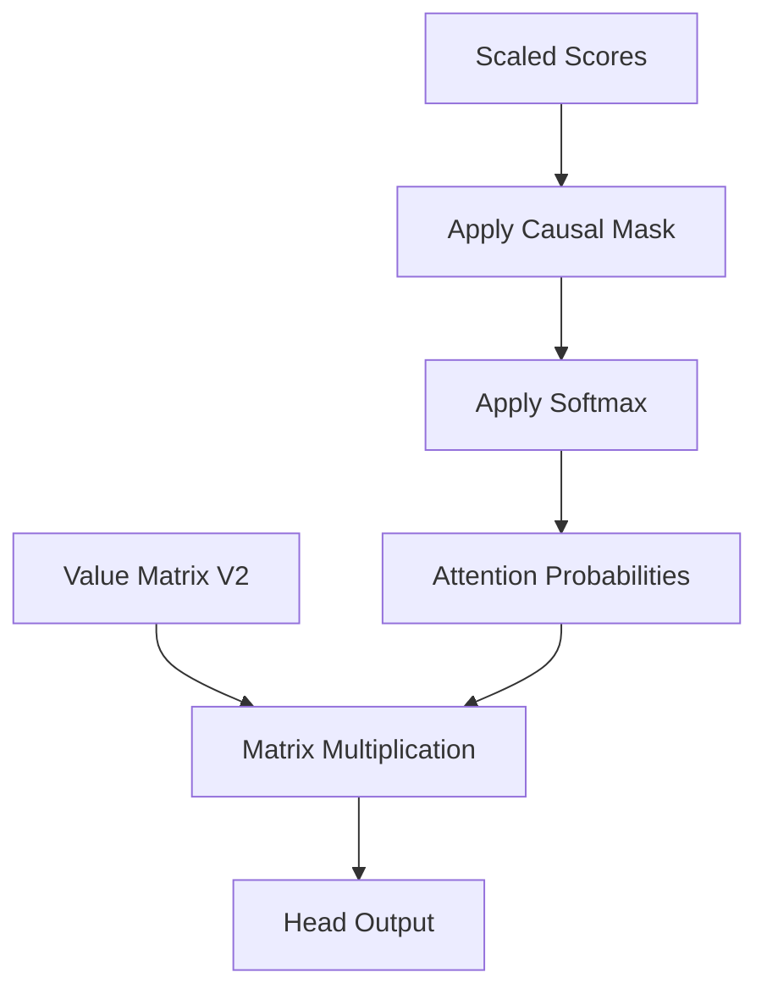

This resulting matrix represents an incredibly sophisticated conceptual mixture. The representation for the token "up" in row 4 is no longer just the isolated concept of the word "up". It has absorbed the physical features of the token "i" and the structural anchor of `<BOS>`, modulated through two complete layers of Multi-Head Attention and Multi-Layer Perceptrons. 

In the next step of the sequence, these highly refined vectors pass through the final components of Layer 2 to complete the forward pass of the Transformer architecture.

<h1 id="chapter-16-deepening-the-representation-mlp-and-residuals-in-layer-2">Chapter 16: Deepening the Representation: MLP and Residuals in Layer 2</h1>

<!-- SUMMARY: The second layer attention updates are integrated into the residual stream and geometrically stabilized using layer normalization. The normalized vectors then flow into a multi-layer perceptron acting as a deep contextual memory bank, enabling the injection of learned knowledge into the sequence representation. -->

The forward pass for the second Transformer layer reaches its final stages after the attention probabilities are computed and combined with the Value matrix to create contextualized updates. The calculation of self-attention concludes by taking the dot products of the Queries and Keys, masking the results to maintain sequence causality, and applying the Softmax function. These normalized attention probabilities weight the Value matrix to extract the deeply contextualized features identified by the attention heads. A final projection matrix mixes these independent insights back into the primary model dimension. The resulting matrix represents the complete output of the second layer attention block. These updates must now be integrated into the central nervous system of the model, which is the residual stream, and passed through the final multilayer perceptron memory bank.

$$
\text{Layer 2 Attention Output} = \begin{bmatrix}
  0.05 & -0.10 &  0.15 & -0.20 &  0.25 & -0.30 \\
 -0.05 &  0.10 & -0.15 &  0.20 & -0.25 &  0.30 \\
  0.25 &  0.25 &  0.25 & -0.25 & -0.25 & -0.25 \\
 -0.25 & -0.25 & -0.25 &  0.25 &  0.25 &  0.25
\end{bmatrix}
$$

## The First Residual Connection

The residual stream acts as the central information highway of the Transformer architecture, bypassing the attention block entirely. The attention mechanism does not replace the representations in the stream; it computes an update to be added to them. The output of the first layer flows directly forward and acts as the foundational state.

$$
\text{Layer 1 Final Output} = \begin{bmatrix}
  0.10 & -0.20 &  0.30 & -0.40 &  0.50 & -0.60 \\
 -0.10 &  0.20 & -0.30 &  0.40 & -0.50 &  0.60 \\
  0.50 &  0.50 &  0.50 & -0.50 & -0.50 & -0.50 \\
 -0.50 & -0.50 & -0.50 &  0.50 &  0.50 &  0.50
\end{bmatrix}
$$

The network adds the newly computed attention output directly to this pristine first layer output point-wise. This addition operation writes the latest structural discoveries into the shared memory bus without erasing the fundamental syntactic properties established earlier in the network. The addition allows the model to preserve all previous contextual information while overlaying the new insights gained from the attention heads of the second layer.

$$
\text{Residual}_1 = \text{Stream}_{\text{in}} + \text{Attention}_{\text{out}}
$$

For a sequence containing the words "woke" and "up", the representation for the word "woke" now fundamentally intertwines with the word "up", deeply embedding the semantic concept of waking up rather than just the individual words. Using the established mathematical values, the first residual output is calculated as follows.

$$
\text{After First Residual} = \begin{bmatrix}
  0.15 & -0.30 &  0.45 & -0.60 &  0.75 & -0.90 \\
 -0.15 &  0.30 & -0.45 &  0.60 & -0.75 &  0.90 \\
  0.75 &  0.75 &  0.75 & -0.75 & -0.75 & -0.75 \\
 -0.75 & -0.75 & -0.75 &  0.75 &  0.75 &  0.75
\end{bmatrix}
$$

## Layer Normalization

Following the addition step, the vectors undergo layer normalization to stabilize their variance. This step recenters and scales the vectors so that their mean is zero and their variance is one.

$$
\text{Norm}_1 = \text{LayerNorm}(\text{Residual}_1)
$$

This normalization guarantees that the subsequent multilayer perceptron block receives inputs that are geometrically well-behaved, preventing any single feature from disproportionately dominating the activations.

## The Multilayer Perceptron: A Deep Contextual Memory

The normalized vectors now flow into the second layer's multilayer perceptron. While the attention mechanism moves information between tokens, the multilayer perceptron processes information within each token. This block functions as a sophisticated key-value memory bank, similar to the first layer, but now operating on highly abstract and contextualized representations. For the purpose of mathematical clarity in this conceptual stage, the second layer operations are represented within a condensed constant dimensional space. The network projects the normalized vectors through a dense linear layer, applies the Rectified Linear Unit activation function, and projects the results back out. This final feature extraction isolates the most abstract token representations.

### The Key Expansion

The first linear transformation, denoted as $W_1$, projects the vectors into a higher-dimensional space. In the toy model, the dimension expands from 6 to 24. This projection acts as a set of keys checking if specific complex patterns exist within the token representations.

$$
\text{Hidden} = \text{ReLU}(\text{Norm}_1 W_1 + b_1)
$$

The Rectified Linear Unit activation function serves as the firing threshold. If a pattern is detected, for instance if the vector now strongly represents the combined waking up concept, the corresponding neurons fire. If not, they remain silent with a value of zero.

### The Value Contraction

The active neurons then trigger the second linear transformation, denoted as $W_2$, which acts as the values. This step projects the data back down to the original model dimension.

$$
\text{MLP}_{\text{out}} = \text{Hidden} W_2 + b_2
$$

When a specific neuron fires in the hidden layer, it causes the second weight matrix to write a corresponding conceptual vector into the output. This allows the network to inject learned knowledge about the world into the sequence representations. The simulated output yields the following highly refined semantic combinations.

$$
\text{Layer 2 MLP Output} = \begin{bmatrix}
  0.03 &  0.02 &  0.04 &  0.02 &  0.05 &  0.02 \\
  0.02 &  0.03 &  0.02 &  0.04 &  0.02 &  0.05 \\
  0.04 &  0.04 &  0.04 &  0.02 &  0.02 &  0.02 \\
  0.02 &  0.02 &  0.02 &  0.04 &  0.04 &  0.04
\end{bmatrix}
$$

## The Final Integration

The architecture concludes the second layer with one final residual connection. The output of the multilayer perceptron is added back to the main residual stream to form the definitive output of the second layer. This ensures the gradients flow unobstructed during backpropagation and guarantees the network retains all prior structural information.

$$
\text{Output}_{\text{Layer 2}} = \text{Residual}_1 + \text{MLP}_{\text{out}}
$$

The sequence representation has now evolved significantly.

$$
\text{Layer 2 Final Output} = \begin{bmatrix}
  0.18 & -0.28 &  0.49 & -0.58 &  0.80 & -0.88 \\
 -0.13 &  0.33 & -0.43 &  0.64 & -0.73 &  0.95 \\
  0.79 &  0.79 &  0.79 & -0.73 & -0.73 & -0.73 \\
 -0.73 & -0.73 & -0.73 &  0.79 &  0.79 &  0.79
\end{bmatrix}
$$

The initial embeddings have now been transformed twice by attention blocks and twice by multilayer perceptrons. The vectors residing in the residual stream are profoundly rich. This matrix represents the culmination of the forward pass through the deep processing layers. The simple vocabulary IDs that entered the network have been transformed into complex geometric coordinates that encapsulate grammar, context, and abstract meaning tailored precisely to the specific sequence. The network is now fully prepared to map these internal representations back into the vocabulary space to generate the prediction for the next word.

<h1 id="chapter-17-mapping-back-to-words">Chapter 17: Mapping Back to Words</h1>

<!-- SUMMARY: The deeply contextualized mathematical representations emerging from the second layer are translated back into the vocabulary space using the unembedding matrix. This critical linear projection produces raw logits that quantify the geometric preference for predicting the next sequence token. -->

The network has completed its deep processing phase. The geometric coordinates within the residual stream emerging from Layer 2 now contain dense, highly abstracted representations of grammar and semantics. The vectors contain rich information about what each token means in relation to the others. However, these vectors are still floating in an abstract six-dimensional model space. To generate actual text, the architecture must translate these continuous vectors back into the discrete twelve-dimensional vocabulary space. This operation bridges the gap between the hidden dimensionality of the model and the tangible tokens that comprise language.

## The Unembedding Matrix

Throughout the forward pass, the tokens have existed as vectors where the model dimension is 6. The goal is to predict the next token in the sequence. To do this, the network needs a score for every single word in the vocabulary, which has a size of 12.

The unembedding matrix, often denoted as $W_U$, acts as the bridge between these two spaces. It functions as a linear classifier projection matrix with dimensions $6 \times 12$. Its dimensions align with the model dimension on one axis and the total vocabulary size on the other. Geometrically, each column in this matrix represents a specific word in the vocabulary.

In many architectures, this matrix is independent and learned separately during training. Allowing the unembedding layer to learn independent weights provides the network with greater flexibility to optimize its output distribution. In other models, it is simply the transpose of the original embedding matrix, a technique known as weight tying. Weight tying assumes that the conceptual representation of a word entering the model should be geometrically similar to the representation of the word exiting the model. For this implementation, the network uses an independent $6 \times 12$ matrix.

$$
\text{Unembedding Matrix } W_U = \begin{bmatrix}
   0.00 &    0.01 &    0.02 &    0.03 &    0.04 &    0.05 &    0.06 &    0.07 &    0.08 &    0.09 &    0.10 &    0.11 \\
   0.01 &    0.02 &    0.03 &    0.04 &    0.05 &    0.06 &    0.07 &    0.08 &    0.09 &    0.10 &    0.11 &    0.12 \\
   0.02 &    0.03 &    0.04 &    0.05 &    0.06 &    0.07 &    0.08 &    0.09 &    0.10 &    0.11 &    0.12 &    0.13 \\
   0.03 &    0.04 &    0.05 &    0.06 &    0.07 &    0.08 &    0.09 &    0.10 &    0.11 &    0.12 &    0.13 &    0.14 \\
   0.04 &    0.05 &    0.06 &    0.07 &    0.08 &    0.09 &    0.10 &    0.11 &    0.12 &    0.13 &    0.14 &    0.15 \\
   0.05 &    0.06 &    0.07 &    0.08 &    0.09 &    0.10 &    0.11 &    0.12 &    0.13 &    0.14 &    0.15 &    0.16
\end{bmatrix}
$$

## Calculating the Logits

The network computes the dot product between the final Layer 2 output matrix and the unembedding matrix. This multiplication measures the geometric alignment between the contextualized sequence vectors and every possible vocabulary concept. By taking this dot product, the network is measuring how strongly a token's final state aligns with the abstract concept of each vocabulary word. A high positive scalar value indicates a strong semantic match, whereas a negative value indicates an unlikely candidate. The resulting matrix contains these unnormalized scores, which are formally known as logits.

The final Layer 2 output tensor $X_{final}$ has dimensions $4 \times 6$, representing the sequence of four tokens: `<BOS>`, `i`, `woke`, and `up`. The network multiplies this by $W_U$:

$$
\text{Logits} = X_{final} W_U
$$

Since $X_{final}$ is $4 \times 6$ and $W_U$ is $6 \times 12$, the resulting Logits matrix has dimensions $4 \times 12$.

$$
\text{Logits} = \begin{bmatrix}
  -0.03 &   -0.03 &   -0.04 &   -0.04 &   -0.05 &   -0.05 &   -0.05 &   -0.06 &   -0.06 &   -0.07 &   -0.07 &   -0.08 \\
   0.03 &    0.03 &    0.04 &    0.04 &    0.05 &    0.05 &    0.05 &    0.06 &    0.06 &    0.07 &    0.07 &    0.08 \\
  -0.07 &   -0.07 &   -0.07 &   -0.07 &   -0.07 &   -0.07 &   -0.07 &   -0.07 &   -0.07 &   -0.07 &   -0.07 &   -0.07 \\
   0.07 &    0.07 &    0.07 &    0.07 &    0.07 &    0.07 &    0.07 &    0.07 &    0.07 &    0.07 &    0.07 &    0.07
\end{bmatrix}
$$

Each row in the logits matrix corresponds to a specific position in the input sequence. The twelve columns represent the raw confidence for each token in the vocabulary being the correct subsequent word. While these values encode the network's raw predictions, they represent an untrained state.

The theoretical output for the final token in the sequence, `up`, provides a clear example. The network aims to predict `late`, which is the ninth token in the vocabulary at index 8. In a fully optimized scenario, the row corresponding to `up` in the Logits matrix will contain twelve raw numerical scores that heavily favor the correct token.

$$
\text{Logits}_{\text{up}} = \begin{bmatrix}
-0.12 & 0.45 & -1.23 & 0.05 & 0.88 & -0.34 & -0.77 & 1.02 & 3.45 & \dots & -0.11
\end{bmatrix}
$$

In a well-trained model, the highest score in this vector corresponds to the correct next word. In the hypothetical vector above, the value at index 8 is 3.45, which is significantly higher than the other values. This highest value indicates that the internal geometry strongly favors `late` as the next logical continuation of the sequence.

## The Need for Probabilities

While the logits provide a ranking of the most likely next words, they are unbounded raw scores. They can be positive, negative, and of any magnitude. The values extend infinitely in both positive and negative directions and do not sum to one. This presents a problem for interpreting the model's confidence and for calculating the loss during backpropagation. It is impossible to easily determine if a score of 3.45 represents absolute certainty or just a slight preference over a score of 2.11.

Transforming these raw algebraic magnitudes into interpretable probabilities requires a final normalization step. The network must convert these raw scores into a strict probability distribution where all values are positive and sum exactly to one.

<h1 id="chapter-18-final-softmax-and-predictions">Chapter 18: Final Softmax and Predictions</h1>

<!-- SUMMARY: The unbounded vocabulary logits are transformed into a strict probability distribution using the softmax function. Analyzing this distribution reveals the untrained network's maximum mathematical uncertainty, while techniques like temperature scaling and Top-K decoding provide mechanisms to shape this entropy during actual text generation. -->

Projecting highly contextualized vectors out of the latent model space and back into the vocabulary space yields a matrix of raw scores known as logits. These scalar values assign a geometric magnitude to each of the twelve possible words in the vocabulary. While these magnitudes provide an ordering of likelihood, they do not constitute a mathematically rigorous probability distribution. The values extend across arbitrary bounds and lack the fundamental property of summing to exactly one. Converting these raw signals into actionable predictions requires a normalizing operation.

The architecture employs the softmax function across the vocabulary dimension of the logits matrix to enforce this transformation. The function operates by exponentiating each scalar value and dividing by the sum of all exponentiated values in that row. Exponentiation guarantees that all resultant values become strictly positive fractions while non-linearly amplifying the differences between scores. A slightly higher logit becomes a significantly higher exponentiated value, creating a dynamic that helps the network confidently select a single token. The subsequent division normalizes the outputs. This bounds all values between zero and one, creating a strict probability distribution where the sum across the vocabulary dimension equals exactly one.

$$
P(z_i) = \frac{e^{z_i}}{\sum_{j} e^{z_j}}
$$

Applying this function to the calculated logit matrix transforms the raw scores at each sequence position. The four rows represent the predictions following the tokens start, "i", "woke", and "up".

$$
\text{Logits} = \begin{bmatrix}
-0.0270 & -0.0315 & -0.0360 & -0.0405 & -0.0450 & -0.0495 & -0.0540 & -0.0585 & \dots & -0.0765 \\
-0.0180 & -0.0135 & -0.0090 & -0.0045 &  0.0000 &  0.0045 &  0.0090 &  0.0135 & \dots &  0.0315 \\
-0.0675 & -0.0675 & -0.0675 & -0.0675 & -0.0675 & -0.0675 & -0.0675 & -0.0675 & \dots & -0.0675 \\
 0.0675 &  0.0675 &  0.0675 &  0.0675 &  0.0675 &  0.0675 &  0.0675 &  0.0675 & \dots &  0.0675
\end{bmatrix}
$$

$$
\text{Probabilities} = \begin{bmatrix}
 0.0854 &  0.0850 &  0.0846 &  0.0843 &  0.0839 &  0.0835 &  0.0831 &  0.0828 & \dots &  0.0813 \\
 0.0813 &  0.0817 &  0.0820 &  0.0824 &  0.0828 &  0.0831 &  0.0835 &  0.0839 & \dots &  0.0854 \\
 0.0833 &  0.0833 &  0.0833 &  0.0833 &  0.0833 &  0.0833 &  0.0833 &  0.0833 & \dots &  0.0833 \\
 0.0833 &  0.0833 &  0.0833 &  0.0833 &  0.0833 &  0.0833 &  0.0833 &  0.0833 & \dots &  0.0833
\end{bmatrix}
$$

The final row of the probability matrix corresponds to the predictions following the word "up". The ultimate objective is for the network to predict the word "late" as the next logical token. However, every single value in that final row is exactly 0.0833. In a vocabulary of twelve words, a completely uniform distribution yields a probability of exactly one divided by twelve for each word. The model is expressing maximum uncertainty, considering every possible word in the vocabulary to be equally likely. This result confirms that the initialized projection matrices act as an empty vessel. The network possesses the structural capacity to route information but lacks specific geometric knowledge.

When generating actual text, the network relies on sampling from this final probability distribution. A naive approach would always select the single highest probability value, a strategy known as greedy decoding. Relying exclusively on greedy decoding traps models in repetitive loops and eliminates the natural variance of language. Introducing controlled stochasticity requires manipulating the shape of the probability distribution before sampling occurs.

The standard technique for modulating this distribution is temperature scaling. Before applying the softmax function, each value in the logits matrix is divided by a scalar parameter termed temperature.

$$
\text{Scaled Logit} = \frac{\text{Logit}}{\text{Temperature}}
$$

Setting the temperature value below one increases the absolute magnitude of the logits. This operation geometrically stretches the distances between the values, causing the subsequent softmax operation to assign overwhelmingly high probability mass to the maximum logit. A low temperature setting forces the network toward highly deterministic outputs. Conversely, a temperature setting greater than one compresses the absolute magnitude of the logits. This shrinks the relative differences between the scores, resulting in a flatter probability distribution after the softmax step. A higher temperature injects entropy, assigning non-trivial probabilities to sub-optimal tokens and increasing generation diversity.

Modern implementations further constrain this sampling process by applying techniques like Top-K decoding. This strategy truncates the probability distribution by zeroing out all values except the top candidates, preventing the selection of statistically impossible continuations while preserving the localized entropy of temperature scaling.

To make the network predict "late" consistently without relying on artificial sampling constraints, the underlying logit for the correct token must naturally dominate the distribution. Achieving this requires a mechanism to measure how wrong the current uniform prediction is and a method to systematically adjust every single matrix weight to improve it.

<h1 id="chapter-19-the-cross-entropy-loss-function">Chapter 19: The Cross-Entropy Loss Function</h1>

<!-- SUMMARY: The error of the raw predictions is formalized by calculating the cross-entropy loss against the one-hot target distribution. This asymmetric logarithmic penalty heavily punishes confidently incorrect predictions, yielding a mathematically elegant error signal for the network to optimize. -->

The final softmax operation completes the forward pass by producing a strict probability distribution over the vocabulary for every position in the sequence. Assessing the quality of these predictions requires a rigorous metric that quantifies exactly how incorrect the current hypotheses are. This metric is the loss function, producing the single scalar value that the entire architecture is designed to minimize.

Measuring the error of these predictions first requires defining a perfect prediction. When the input sequence begins with the start token, the actual next token is the word "i". The ideal probability distribution would assign a value of 1.0 to the target token and 0.0 to all other tokens. This perfectly certain distribution is identical to the one-hot vectors used to construct the initial embedding matrix. The loss function must calculate the mathematical distance between the predicted distribution and this sharp, one-hot target state.

A naive approach to calculating this distance involves taking the squared difference between the predicted probabilities and the target probabilities. While mean squared error works exceptionally well for continuous regression tasks, it behaves poorly for classification probabilities. When a model is confidently wrong, the gradients of mean squared error shrink. This slows down the learning process precisely when the network needs to make the largest structural corrections.

The architecture instead utilizes cross-entropy loss. For a single prediction against a pure one-hot target vector, cross-entropy evaluates only the predicted probability assigned exclusively to the correct target class. The function is defined as the negative natural logarithm of the predicted probability of the target token.

$$
\text{Loss} = -\log(P_{\text{target}})
$$

The natural logarithm exhibits ideal properties for measuring probabilistic error. If the network predicts the correct token with a probability of 1.0, the logarithm evaluates to zero, resulting in zero loss. As the predicted probability approaches zero, the logarithm approaches negative infinity. This asymmetric penalty heavily punishes the model for assigning very low probabilities to the true target, forcing aggressive weight adjustments. The logarithm also translates the multiplication of probabilities into addition, simplifying the calculus required for backpropagation.

The architecture evaluates these predictions across the entire sequence simultaneously using a technique known as teacher forcing. The input sequence consists of four tokens representing the phrase beginning with the start token, continuing with "i", "woke", and "up". The target sequence shifts one position forward, requiring the model to predict "i", "woke", "up", and "late". This parallel evaluation utilizes a probability tensor with dimensions corresponding to a batch size of one, a sequence length of four, and a vocabulary size of twelve.

The actual loss calculation extracts the probability assigned to the correct token at each of the four discrete time steps. Applying the negative logarithm to these extracted probabilities produces an individual penalty for each position.

$$
\text{Loss} = \begin{bmatrix}
   -\log(P_{\text{i}}) \\
   -\log(P_{\text{woke}}) \\
   -\log(P_{\text{up}}) \\
   -\log(P_{\text{late}}) 
\end{bmatrix} = \begin{bmatrix}
   -\log(0.0843) \\
   -\log(0.0831) \\
   -\log(0.0833) \\
   -\log(0.0833) 
\end{bmatrix} = \begin{bmatrix}
   2.4734 \\
   2.4877 \\
   2.4853 \\
   2.4853
\end{bmatrix}
$$

Aggregating these individual positional penalties produces a single overarching scalar value. Summing the values and dividing by the sequence length computes the mean cross-entropy loss across the time steps.

$$
\text{Mean Loss} = \frac{2.4734 + 2.4877 + 2.4853 + 2.4853}{4} = 2.4829
$$

This calculated mean loss of 2.4829 quantifies the current inaccuracy of the network. This specific value is highly informative. For a completely untrained model, the weights act as random noise, causing the softmax function to distribute probability relatively evenly across the entire vocabulary. With a vocabulary size of twelve, a uniform distribution assigns a probability of one divided by twelve to every token. The theoretical cross-entropy loss for a uniform distribution is the negative logarithm of this fraction, which evaluates to approximately 2.4849. 

The calculated loss of 2.4829 is nearly identical to this theoretical baseline. This confirms the forward pass mathematical integrity and clearly demonstrates the initial state of total uncertainty. The subsequent backward pass will apply the chain rule of calculus to compute the gradient of this specific loss scalar, initiating the learning process.

<h1 id="chapter-20-the-beautiful-cancellation">Chapter 20: The Beautiful Cancellation</h1>

<!-- SUMMARY: Chaining the derivatives of the cross-entropy loss and the softmax function reveals a mathematical cancellation that radically simplifies the gradient. This interpretation establishes the primary error signal as the precise difference between the predicted probabilities and the ground truth. -->

The previous phase established the geometry of the cross-entropy loss function by calculating exactly how far the predicted probability distribution strayed from the ground truth one-hot vector. That resulting scalar loss value represents the total error of the entire network. Assigning blame for that accumulated error initiates the backpropagation phase. The very first step requires calculating the gradient of the loss with respect to the final unnormalized scores, known as the logits.

## The Calculus Problem

Backpropagation relies entirely on the chain rule of calculus. Finding how a specific weight deep inside the network contributed to the final error requires multiplying the gradients of every operation situated between that weight and the final loss. The journey backward begins at the very end of the network architecture, tracing from the scalar cross-entropy loss, through the softmax function, and directly into the logits.

Taking the derivative of these two final operations individually reveals significant complexity. The softmax function is not an element-wise operation. Modifying the unnormalized logit for a single word inherently changes the output probability of every other word in the vocabulary to maintain a total sum of one. The derivative of softmax is therefore not a simple vector, but rather a full Jacobian matrix tracking the interaction of every single output with every single input. The derivative of the cross-entropy loss introduces further complexity by requiring the derivative of a logarithm, which yields fractional terms.

Multiplying a fractional gradient by a complex Jacobian matrix typically results in a computational bottleneck. A profound mathematical elegance emerges when combining these two specific functions.

## The Mathematical Elegance

Applying the chain rule to calculate the gradient of the cross-entropy loss $L$ with respect to the pre-softmax logits $z$ causes the complex terms of the Jacobian matrix and the logarithmic derivatives to perfectly cancel each other out. The mathematical proof of this cancellation is a foundational concept in vector calculus, yielding a final derivative that is stunningly simple.

$$
\frac{\partial L}{\partial z} = P - Y
$$

In this equation, $P$ represents the predicted probability distribution, and $Y$ represents the ground truth one-hot encoded target vector. The gradient of the loss with respect to the logits is strictly the difference between the predicted model probabilities and the actual target states.

## Applying the Cancellation

This beautiful cancellation translates directly into the concrete matrices of the toy example. The forward pass generated a sequence of predicted probabilities for the four time steps, which must now be compared against the correct target tokens.

| Time Step | Input Token | Target Token | Target Index |
| :--- | :--- | :--- | :--- |
| 1 | `<BOS>` | `i` | 3 |
| 2 | `i` | `woke` | 5 |
| 3 | `woke` | `up` | 7 |
| 4 | `up` | `late` | 8 |

These target tokens form a matrix of one-hot vectors designated as $Y$. Each row corresponds to a discrete time step, and the column of the correct target token contains a value of exactly `1.0`.

$$
Y = \begin{bmatrix}
 0 &  0 &  0 &  1.0 &  0 &  0 &  0 &  0 &  0 & \dots &  0 \\
 0 &  0 &  0 &  0 &  0 &  1.0 &  0 &  0 &  0 & \dots &  0 \\
 0 &  0 &  0 &  0 &  0 &  0 &  0 &  1.0 &  0 & \dots &  0 \\
 0 &  0 &  0 &  0 &  0 &  0 &  0 &  0 &  1.0 & \dots &  0
\end{bmatrix}
$$

The gradient calculation extracts the predicted probability tensor $P$ generated during the softmax phase. Finding the exact gradient requires subtracting the target matrix $Y$ from the prediction matrix $P$.

$$
\frac{\partial L}{\partial z} = \begin{bmatrix}
 0.0854 &  0.0850 &  0.0846 & -0.9157 &  0.0839 &  0.0835 &  0.0831 &  0.0828 &  0.0824 & \dots &  0.0813 \\
 0.0813 &  0.0817 &  0.0820 &  0.0824 &  0.0828 & -0.9169 &  0.0835 &  0.0839 &  0.0843 & \dots &  0.0854 \\
 0.0833 &  0.0833 &  0.0833 &  0.0833 &  0.0833 &  0.0833 &  0.0833 & -0.9167 &  0.0833 & \dots &  0.0833 \\
 0.0833 &  0.0833 &  0.0833 &  0.0833 &  0.0833 &  0.0833 &  0.0833 &  0.0833 & -0.9167 & \dots &  0.0833
\end{bmatrix}
$$

## The Physical Intuition

This resulting matrix represents the precise direction and magnitude of the necessary corrections for the unnormalized logits. This gradient acts physically as a set of forces pulling upon the network outputs.

Gradient descent minimizes the total error by subtracting the computed gradient from the active parameters. For the correct token in each sequence, the model predicted a small probability near `0.084` when the ideal value was `1.0`. The subtraction yields a negative gradient of roughly `-0.916`. When the optimizer subtracts this negative value during the update step, it mathematically forces an increase in the unnormalized logit for the correct token.

For all incorrect tokens, the target value was `0.0`. The subtraction yields a positive gradient exactly equal to the mistakenly predicted probability. The optimizer subtracts this positive value, which aggressively decreases the unnormalized logits for all incorrect tokens.

The mathematical cancellation of the softmax and cross-entropy operations produces an exceedingly pure learning signal. This signal gently suppresses the logits of wrong answers proportionally to how strongly the model believed them, while simultaneously pulling up the logit of the correct answer with immense force. Establishing this pristine gradient vector at the output allows the architecture to propagate this learning signal backward through the unembedding matrix and directly into the deepest attention layers of the system.

<h1 id="chapter-21-backpropagating-through-the-unembedding-and-residual-stream">Chapter 21: Backpropagating Through the Unembedding and Residual Stream</h1>

<!-- SUMMARY: The backward pass initiates by routing the error signal from the vocabulary logits through the unembedding matrix and into the final residual stream. Applying the chain rule demonstrates how the gradient symmetrically branches through the multi-layer perceptron to update intermediate weights. -->

The previous installment discovered the elegant simplicity of the cross-entropy loss derivative. The gradient of the loss with respect to the raw, pre-softmax logits simplifies entirely to the predicted probability distribution minus the one-hot encoded target vector. This single matrix, measuring how wrong the predictions were across the sequence, serves as the physical error signal that must now be routed backward through the network to update its weights.

The network is now ready to execute the chain rule. The process begins at the very end of the architecture, pushing the error signal backward through the unembedding matrix, down into the final residual stream, and ultimately into the Layer 2 multi-layer perceptron. 

## The Chain Rule at the Unembedding Layer

The unembedding layer is the final linear transformation in the Transformer. During the forward pass, this step multiplied the final contextualized vectors of the sequence by the unembedding weight matrix $W_U$ to produce the vocabulary-sized logits.

Mathematically, the forward pass for this step is defined as:

$$
\text{Logits} = \text{Output}_{\text{Layer2}} \times W_U
$$

Here, $\text{Output}_{\text{Layer2}}$ has a shape of 4 by 6, representing the sequence length by the model dimension. The weight matrix $W_U$ has a shape of 6 by 12, representing the model dimension by the vocabulary size. The resulting logits have a shape of 4 by 12.

The system possesses the gradient of the loss with respect to these logits, denoted as $\partial L / \partial \text{Logits}$. To update the network, two new gradients are required. First, the gradient with respect to the weights $W_U$ is needed so the optimizer can adjust them. Second, the gradient with respect to the input $\text{Output}_{\text{Layer2}}$ is necessary to continue passing the error backward.

### Updating the Unembedding Weights

The gradient of the loss with respect to the unembedding weights requires multiplying the transposed input by the incoming error signal. 

$$
\frac{\partial L}{\partial W_U} = \text{Output}_{\text{Layer2}}^T \times \frac{\partial L}{\partial \text{Logits}}
$$

To visualize this geometrically, mapping the dimensions proves highly effective. Transposing the 4 by 6 input transforms it into a 6 by 4 matrix. Multiplying this by the 4 by 12 error signal yields a gradient matrix that perfectly matches the 6 by 12 shape of the original $W_U$ matrix. Each element in this new matrix calculates exactly how to nudge a specific weight in $W_U$ to decrease the overall loss.

### Passing the Error Backward

Updating the final weights is only half the task. The architecture must also pull the error signal backward to the preceding layers. To find the gradient with respect to the input $\text{Output}_{\text{Layer2}}$, the incoming error signal is multiplied by the transposed weight matrix.

$$
\frac{\partial L}{\partial \text{Output}_{\text{Layer2}}} = \frac{\partial L}{\partial \text{Logits}} \times W_U^T
$$

The dimensions align perfectly once more. Multiplying the 4 by 12 error signal by the 12 by 6 transposed weight matrix yields a 4 by 6 matrix. This new matrix represents the error signal scaled and rotated back into the $d_{model}$ dimensionality of the residual stream.

## Splitting the Signal: The Residual Connection

The network has successfully routed the error signal back into the $d_{model}$ dimensional space at the very end of Layer 2. During the forward pass, this final state was constructed by adding the output of the Layer 2 multi-layer perceptron to the pre-existing residual stream.

$$
\text{Output}_{\text{Layer2}} = \text{Residual}_{\text{Pre-MLP}} + \text{MLP}_{\text{Output}}
$$

In vector calculus, the derivative of a sum is simply the sum of the individual derivatives. When executing backpropagation through an addition operation, the incoming gradient is distributed equally and unchanged to both branches. 

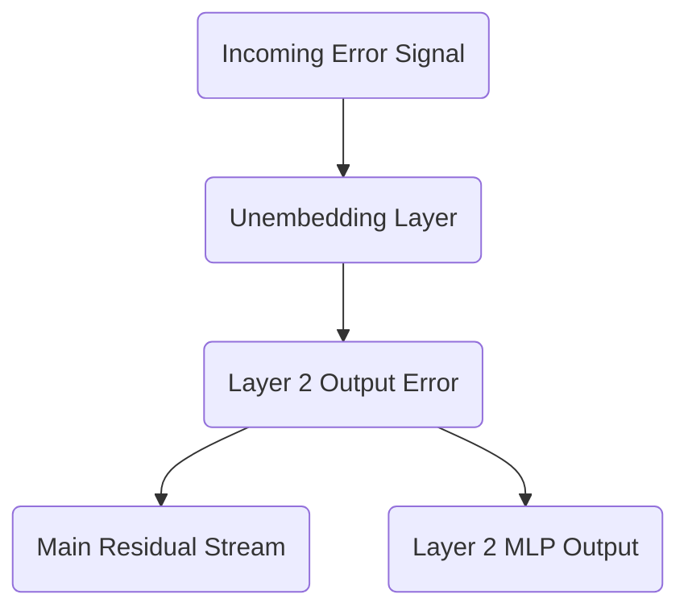

This means the 4 by 6 error signal just calculated copies itself. One copy travels directly down the central residual stream, preserving the unmodified error signal for earlier layers. The second copy flows directly into the output of the multi-layer perceptron.

## Entering the Multi-Layer Perceptron

The final operation inside the Layer 2 multi-layer perceptron during the forward pass was a linear projection. The internal activations of the layer were multiplied by the second weight matrix, $W_2$, to project the data from the expanded $d_{ff}$ dimension back down to the $d_{model}$ dimension.

$$
\text{MLP}_{\text{Output}} = \text{Activations} \times W_2
$$

Since the error signal flowing into this layer is exactly the error signal from the residual stream, the network can apply the exact same linear algebra rules used for the unembedding layer to continue the backward pass.

To find the gradient for the $W_2$ weights, the incoming activations are transposed and multiplied by the error signal:

$$
\frac{\partial L}{\partial W_2} = \text{Activations}^T \times \frac{\partial L}{\partial \text{Output}_{\text{Layer2}}}
$$

The internal activations were expanded to $d_{ff} = 24$. Transposing the 4 by 24 activations yields a 24 by 4 matrix. Multiplying this by the 4 by 6 error signal produces a 24 by 6 gradient matrix, perfectly matching the dimensions of $W_2$. 

To continue pulling the error backward through the activation function and into the first half of the layer, the error signal is multiplied by the transposed $W_2$ matrix:

$$
\frac{\partial L}{\partial \text{Activations}} = \frac{\partial L}{\partial \text{Output}_{\text{Layer2}}} \times W_2^T
$$

This operation takes the 4 by 6 error signal, multiplies it by the 6 by 24 transposed weight matrix, and produces a 4 by 24 error signal ready to be passed backward through the non-linear activation function.

By strictly following the rules of matrix multiplication and addition, the error signal has successfully navigated from the vocabulary-level predictions deep into the internal mechanisms of Layer 2. The next analysis will tackle the rigorous calculus of routing these gradients through the softmax function and the causal mask of the attention mechanism.

<h1 id="chapter-22-backpropagation---attention-chapter-1-softmax--scores">Chapter 22: Backpropagation - Attention (Chapter 1: Softmax & Scores)</h1>

<!-- SUMMARY: The gradient propagates backward through the self-attention mechanism by solving the Jacobian of the softmax function and navigating the causal mask. This matrix operation handles coupled probabilities and severs the learning signal for future-looking connections, yielding the exact error for unmasked attention scores. -->

The previous installment routed the gradient down the residual stream to the output of the Layer 2 attention block. The objective now requires pulling this error signal backward through the self-attention mechanism itself. This requires unpacking the sequence of operations that created the attention output. The final operations in that sequence involved multiplying the attention probabilities by the Value matrix, and prior to that, applying the softmax function to the masked attention scores.

## From Values to Probabilities

During the forward pass, the attention output emerged as the matrix product of the probability matrix $P$ and the Value matrix $V$. The gradient of the loss with respect to this output represents the exact direction required to minimize the error in the final contextualized vectors. To determine the necessary adjustment for the attention probabilities $P$, the standard chain rule for matrix multiplication is applied. The gradient with respect to $P$ equals the incoming gradient multiplied by the transpose of $V$. The resulting gradient matrix is defined as $d\_P$.

The matrix $d\_P$ dictates how the loss would change if the attention probabilities shifted. It is a square matrix mapping sequence length by sequence length, detailing the precise error signal for the attention connection between every pair of tokens in the text.

## The Calculus of Softmax

The gradient $d\_P$ must pass backward through the softmax function to uncover the gradient with respect to the raw, pre-softmax attention scores. These pre-softmax scores are defined as $S$.

The softmax function presents a unique mathematical challenge. It takes a vector of scores and normalizes them into a coupled probability distribution. Changing a single score in the input vector alters the sum in the denominator for all other elements, inherently shifting the final probability of every other element. Consequently, the derivative of a softmax output with respect to its input forms a Jacobian matrix containing the partial derivatives of every output with respect to every input.

The mathematical formula for backpropagating through softmax across an entire sequence reduces to an elegant matrix operation:

$$
d\_S = P \odot \left( d\_P - \sum \left( d\_P \odot P \right) \right)
$$

Here, $\odot$ represents element-wise multiplication. The incoming gradient $d\_P$ is multiplied by the probabilities $P$, summed along the sequence dimension, and subtracted from the original $d\_P$. The entire result is then multiplied element-wise by the probabilities $P$ again.

To anchor this physically, the network relies on the forward pass attention probabilities $P$:

$$
P = \begin{bmatrix}
1.0000 & 0.0000 & 0.0000 & 0.0000 \\
0.5000 & 0.5000 & 0.0000 & 0.0000 \\
0.4520 & 0.5320 & 0.0150 & 0.0000 \\
0.5900 & 0.1510 & 0.1290 & 0.1300
\end{bmatrix}
$$

This matrix operation captures the proportional interplay of probabilities. If a particular token received a high probability during the forward pass, its gradient heavily influences the adjustment of the pre-softmax scores. If a token was ignored and assigned a near-zero probability, the multiplication by $P$ ensures the gradient struggles to pass through, effectively severing the learning signal for that specific connection.

Applying the formula yields the precise gradient with respect to the masked scores, $d\_S$:

$$
d\_S = \begin{bmatrix}
0.0000 & 0.0000 & 0.0000 & 0.0000 \\
-0.0332 & 0.0332 & 0.0000 & 0.0000 \\
0.0417 & -0.0410 & -0.0007 & 0.0000 \\
-0.0083 & 0.0078 & -0.0096 & 0.0101
\end{bmatrix}
$$

## Traversing the Causal Mask

The matrix $d\_S$ represents the gradient with respect to the masked attention scores. The final step in this stage requires pushing the gradient through the causal mask.

During the forward pass, a lower-triangular mask was applied to the raw attention scores. All values above the diagonal were explicitly set to negative infinity. This structural intervention prevented tokens from attending to future positions, guaranteeing the model respects causality during parallel training. When the softmax function encountered negative infinity, it mapped it to a strict zero probability.

In the backward pass, gradients flow only where information flowed forward. Since the upper triangular elements of the score matrix were overwritten and ignored during the forward pass, they cannot have contributed to the final loss. The error signal for those future-looking connections must be zero.

To route the gradient through the causal mask, a binary lower-triangular mask is applied to $d\_S$, zeroing out the upper triangular portion:

$$
d\_S_{\text{unmasked}} = \begin{bmatrix}
1 & 0 & 0 & 0 \\
1 & 1 & 0 & 0 \\
1 & 1 & 1 & 0 \\
1 & 1 & 1 & 1
\end{bmatrix} \odot d\_S
$$

The resulting unmasked scores gradient matrix remains largely identical, as the softmax gradient naturally forces the previously masked values to zero. However, this formal mathematical step guarantees the error signal cleanly respects causality:

$$
d\_S_{\text{unmasked}} = \begin{bmatrix}
0.0000 & 0.0000 & 0.0000 & 0.0000 \\
-0.0332 & 0.0332 & 0.0000 & 0.0000 \\
0.0417 & -0.0410 & -0.0007 & 0.0000 \\
-0.0083 & 0.0078 & -0.0096 & 0.0101
\end{bmatrix}
$$

The network now possesses the gradient with respect to the pure, unmasked attention scores, representing the direct scaled dot product between queries and keys. The error signal has successfully traversed the most numerically complex non-linearity in the Transformer architecture. The subsequent analysis will distribute this gradient into the Query, Key, and Value weight matrices, completing the learning cycle for the self-attention mechanism.

<h1 id="chapter-23-backpropagation---attention-chapter-2-q-k-v">Chapter 23: Backpropagation - Attention (Chapter 2: Q, K, V)</h1>

<!-- SUMMARY: Following the calculation of the attention score gradients, the error signal is distributed backward into the query, key, and value matrices. Reversing the weighted sums geometrically mirrors the forward pass, successfully translating the output error into precise updates for the self-attention weight matrices. -->

The previous installment navigated the complexities of the softmax function and the causal mask. That stage calculated the gradient of the loss with respect to the raw, unmasked attention scores, yielding a precise measurement of how each attention connection requires adjustment. The process now reaches the final stage of backpropagating through the self-attention mechanism. The objective requires distributing these score gradients, alongside the gradients from the attention output itself, backward into the Query, Key, and Value matrices. Ultimately, the network must route these signals all the way back to the weight matrices that created them and the input sequence that initiated the forward pass.

## The Value Matrix Gradient

During the forward pass, the attention mechanism produced its final output by multiplying the probability matrix by the Value matrix. Denoting the output gradient as $d\_Z$, the attention probabilities as $P$, and the values as $V$, the gradient of the loss with respect to $V$ follows the chain rule of matrix calculus. The transpose of the probability matrix multiplies the gradient of the output:

$$
d\_V = P^T d\_Z
$$

The transpose operation provides an intuitive geometric reversal. In the forward pass, a row of $P$ determined how much of each value vector to mix into a single output token. During backpropagation, a column of $P^T$ dictates how much of the output error should be attributed to a specific value vector. The network explicitly reverses the weighted sum to calculate the exact error signal for the Value matrix:

$$
d\_V = \begin{bmatrix}
0.0634 & -0.1513 \\
0.0274 & -0.0883 \\
0.0244 & 0.0048 \\
0.0285 & -0.0100
\end{bmatrix}
$$

Once the gradient for the Value matrix is established, finding the gradient for its corresponding weight matrix $W\_V$ follows standard linear layer backpropagation. The transpose of the input $X$ multiplies the Value gradient:

$$
d\_W_V = X^T d\_V
$$

This operation yields the precise matrix of updates required for the Value weights:

$$
d\_W_V = \begin{bmatrix}
0.0547 & -0.2043 \\
-0.0747 & -0.0419 \\
0.0279 & -0.0796 \\
0.0913 & -0.2788 \\
-0.0503 & 0.0708 \\
-0.0606 & 0.0923
\end{bmatrix}
$$

## Routing Gradients to Queries and Keys

The Query and Key matrices generate the attention scores. In the forward pass, the scaled dot-product attention scores were computed as $S = \frac{Q K^T}{\sqrt{d_k}}$.

The gradient with respect to these scores, denoted as $d\_S$, dictates how the alignment between every query and key must change. To distribute this gradient back to the Queries and Keys, the matrix derivative rules for multiplication apply, incorporating the necessary scaling factor.

For the Query matrix gradient, the score gradient multiplies the Key matrix:

$$
d\_Q = \frac{d\_S K}{\sqrt{d_k}}
$$

Calculating this yields the explicit error signal for the Queries:

$$
d\_Q = \begin{bmatrix}
-0.0298 & 0.0408 \\
-0.0232 & -0.0340 \\
-0.0615 & 0.0730 \\
-0.0182 & -0.0480
\end{bmatrix}
$$

For the Key matrix gradient, the transposed score gradient multiplies the Query matrix:

$$
d\_K = \frac{d\_S^T Q}{\sqrt{d_k}}
$$

This produces the corresponding error signal for the Keys:

$$
d\_K = \begin{bmatrix}
-0.0037 & -0.1250 \\
-0.0805 & 0.0564 \\
-0.0515 & 0.0076 \\
-0.0017 & -0.0016
\end{bmatrix}
$$

The geometry of these operations perfectly mirrors the forward pass. The score gradient $d\_S$ represents how the alignment between queries and keys needs to shift. To determine the necessary adjustment for a specific query vector, the operation projects that required change onto the key vectors it interacted with. Applying the transpose for the Key gradient properly aligns the dimensions, effectively routing the error from the queries back to the keys.

Similar to the Value weights, the gradients for the Query and Key weight matrices emerge by multiplying the transposed input by their respective gradients:

$$
d\_W_Q = X^T d\_Q
$$

$$
d\_W_K = X^T d\_K
$$

This finalizes the learning signals for the remaining attention weight matrices:

$$
d\_W_Q = \begin{bmatrix}
-0.0497 & 0.0279 \\
0.1298 & -0.1036 \\
0.0710 & -0.1539 \\
-0.0193 & 0.0135 \\
0.0788 & -0.0710 \\
0.0244 & 0.0976
\end{bmatrix}
$$

$$
d\_W_K = \begin{bmatrix}
-0.1398 & 0.0302 \\
0.0397 & 0.0483 \\
0.1217 & -0.1228 \\
-0.0199 & -0.1637 \\
0.0902 & -0.0046 \\
0.0246 & 0.0076
\end{bmatrix}
$$

## The Confluence at the Input

The concluding step in this layer requires routing the gradients back to the input matrix $X$. In the forward pass, the input branched into three parallel paths to create the Queries, Keys, and Values.

When gradients flow backward through a branching architecture, they sum together at the point of origin. The calculation requires deriving the gradient with respect to the input from each of the three paths and summing the results:

$$
d\_X_V = d\_V W_V^T
$$

$$
d\_X_Q = d\_Q W_Q^T
$$

$$
d\_X_K = d\_K W_K^T
$$

The total gradient flowing backward out of the attention block and down the residual stream equals the sum of these three components:

$$
d\_X_{Total} = d\_X_V + d\_X_Q + d\_X_K
$$

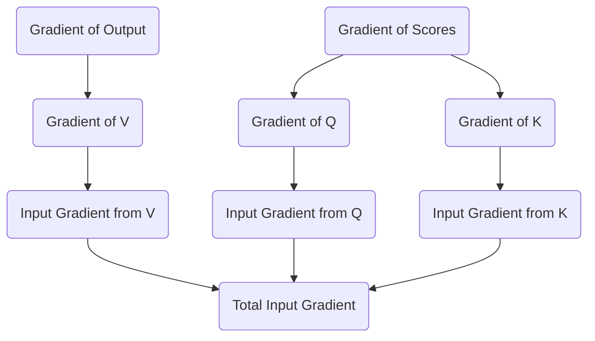

This aggregation produces the final, contextualized error signal for the sequence:

$$
d\_X = \begin{bmatrix}
0.5536 & 0.1088 & -0.1536 & 0.0560 & 0.0463 & -0.3314 \\
0.0465 & 0.1747 & -0.0985 & -0.1107 & 0.1189 & 0.0421 \\
0.0159 & 0.1742 & -0.0346 & 0.2056 & -0.0277 & -0.0953 \\
0.0348 & 0.0179 & -0.0020 & -0.0572 & 0.0338 & 0.0424
\end{bmatrix}
$$

The network has completely backpropagated through the self-attention mechanism. This process successfully translated the error from the network's output into specific updates for the $W\_Q$, $W\_K$, and $W\_V$ matrices. Furthermore, it prepared the error signal to continue its journey backward down the residual stream. The next phase will follow this signal as it reaches the very beginning of the network to update the original token embeddings.

<h1 id="chapter-24-updating-the-embeddings-and-conclusion">Chapter 24: Updating the Embeddings and Conclusion</h1>

<!-- SUMMARY: The accumulated gradient ultimately reaches the initial embedding matrix via the residual stream, perfectly encapsulating how token representations must shift to minimize prediction error. The completion of the backward pass finalizes the mathematical traversal of the machinery driving the architecture. -->

The backward journey finally reaches its terminus. The error signal cascaded from the Cross-Entropy loss, navigated the Unembedding matrix, split through the Layer 2 MLP, and distributed itself across the complex geometry of the self-attention Query, Key, and Value matrices. Now, this accumulated signal arrives at the very beginning of the network. It is time to update the foundational representations of the tokens: the Embedding matrix itself.

## The Residual Highway

During the forward pass, the residual stream operated as a central memory bus. The initial token embeddings traveled along this bus, with each attention and MLP block adding new contextual information. 

In the backward pass, the residual stream serves an equally critical role as a gradient highway. When operations add together during the forward pass, the backward pass simply passes the gradient equally to both paths. The gradient arriving at any point in the residual stream equals the sum of all gradients from the blocks that read from it later in the network. Therefore, the final gradient vector arriving at the initial input matrix $X$ represents a comprehensive sum. It contains the feedback from every downstream decision, perfectly encapsulating how the initial token vectors need to shift in $d_{model}$ space to decrease the final prediction error.

Let $d\_X$ represent this accumulated gradient for the sequence `<BOS>` `i` `woke` `up`. It forms a matrix of size $4 \times 6$:

$$
d\_X = \begin{bmatrix}
-0.0036 & 0.1565 & -0.2620 & 0.0822 & 0.0087 & -0.0299 \\
0.0092 & -0.1988 & -0.0220 & 0.0357 & 0.1478 & -0.0518 \\
-0.0808 & -0.0502 & 0.0915 & 0.0329 & -0.0530 & 0.0513 \\
0.0097 & 0.0969 & -0.0702 & -0.0328 & -0.0392 & -0.1464
\end{bmatrix}
$$

## Routing Gradients to the Vocabulary Space

The input matrix $X$ was constructed by selecting specific rows from the global Embedding matrix $E$. The matrix $E$ has a shape of $12 \times 6$, representing the entire vocabulary of 12 words in a 6-dimensional space. 

By the rules of calculus, if a row in $E$ copies forward to form a row in $X$, the gradient for that row in $X$ routes directly back to the original row in $E$. The operation of selecting a row is mathematically equivalent to multiplying a one-hot encoded vector by the matrix $E$. The derivative of this operation simply passes the gradient back to the active index.

If the sequence `<BOS>` `i` `woke` `up` corresponds to indices 0, 3, 5, and 7 in the vocabulary, the process constructs a gradient matrix $d\_E$ of the same size as $E$, initialized to all zeros. The network then adds the respective rows of $d\_X$ to rows 0, 3, 5, and 7 of $d\_E$. The gradients for tokens not present in the current sequence remain strictly zero.

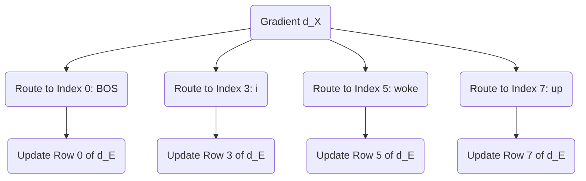

## The Optimizer Update

With $d\_E$ fully assembled alongside the gradients for all intermediate weight matrices, the network can finally execute the core mechanism of machine learning: the weight update. 

An optimizer applies these gradients to shift the weights in the direction opposite to the error. While modern architectures use sophisticated optimizers like Adam which track momentum and variance, the fundamental principle is best illustrated by Stochastic Gradient Descent. A defined learning rate $\alpha$ controls the size of the step.

$$
E_{new} = E_{old} - \alpha \cdot d\_E
$$

For example, observing the shift for the `<BOS>` token at Row 0 with a learning rate of $0.01$, the process subtracts the scaled gradient:

$$
E_{old}[0] = \begin{bmatrix}
0.4967 & -0.1383 & 0.6477 & 1.5230 & -0.2342 & -0.2341
\end{bmatrix}
$$

$$
E_{new}[0] = \begin{bmatrix}
0.4967 & -0.1398 & 0.6503 & 1.5222 & -0.2342 & -0.2338
\end{bmatrix}
$$

By subtracting the scaled gradient, the coordinates of the original words adjust within the $d_{model}$ space. The next time the network encounters the token "woke", its starting vector will sit in a slightly better position to help the attention mechanism predict "late". 

## Conclusion

This completes the rigorous traversal of the Transformer architecture. The journey began with simple integers representing text, projected them into a continuous geometric space, and demonstrated how attention matrices sculpt those vectors into context-aware representations. The mathematical proofs established why scaling by the square root of the head dimension prevents gradient starvation and how the causal mask ensures temporal discipline. 

Crucially, the backward pass stands demystified. The simple difference between the prediction and the target label blossoms into a cascade of derivatives, flowing backward through projection matrices and softmax distributions to assign credit and blame to every single weight in the network. 

The Transformer is not an inscrutable black box. It operates as a massive, elegant bilinear engine, moving text through latent space with pristine mathematical precision. By following the numbers from the first embedding to the final gradient step, the physical machinery of modern artificial intelligence becomes visible.

