<h1 id="preface-the-big-picture--tensor-notation">Preface: The Big Picture & Tensor Notation</h1>

<em>Prefer to read this seamlessly offline? <a href="/assets/docs/transformer_ebook_final.pdf">Download the complete, formatting-optimized 100-page Transformer Ebook here.</a></em>

## The Problem with Tutorials

If you have spent any time trying to understand the Transformer architecture, you have likely encountered the same frustrating hurdle. Tutorials rely heavily on abstract analogies. They tell you that the Query matrix asks a question and the Key matrix holds the answer. These metaphors might give you a fleeting sense of intuition. They collapse the moment you try to write code, debug a model, or understand the fundamental geometry of deep learning.

We are going to take a different approach. Over the course of this series, we will build a complete Transformer from scratch by calculating every single number by hand. Our goal is to translate these complex, abstract operations into meaningful, structural realities. By the end, there will be no magic left. You will have a clear, intuitive grasp of how multi-dimensional tensors flow through linear projections.

To do this, we need a problem that is small enough to compute on a whiteboard, yet complex enough to demonstrate the true power of the architecture.

## The Toy Example

Our objective is to train a Transformer to predict the next word in a specific sequence. 

**Input:** `<BOS> i woke up`  
**Target:** `late`

The token `<BOS>` stands for Beginning of Sequence. This is a standard marker that tells the network a new thought has started. 

We chose this sentence carefully. It allows us to watch the attention mechanism do real work. To predict the word "late", the network cannot just look at the word "up". It must contextualize the combination of "woke" and "up" together. 

### The Vocabulary Space

To make the math tractable, we are restricting our model to a vocabulary of exactly twelve tokens. The total size of our vocabulary is represented by the variable $V$. In our case, $V$ equals 12.

`<BOS>` `we` `late` `<PAD>` `<EOS>` `woke` `early` `i` `stayed` `today` `yesterday` `up`

We deliberately chose a small vocabulary with natural semantic clusters. The pronouns "i" and "we" form one cluster. The temporal adverbs "late", "early", and "today" form another. This gives our matrix operations the opportunity to physically group related concepts in vector space. As we progress, we will actually be able to see these clusters form in the numbers.

## The Architecture

Before we define the dimensions of our data, we must clearly define the architecture processing that data. We will be using an autoregressive Decoder-only architecture. This is the exact framework that powers models like GPT. 

To understand this, we need to unpack two distinct terms. 

First, "autoregressive" describes how the model generates text. It means the model predicts the next word based on its own previous outputs. Once it predicts a word, it appends that new word to the input sequence and runs the entire process again to predict the subsequent word. It feeds its own output back into itself in a continuous loop.

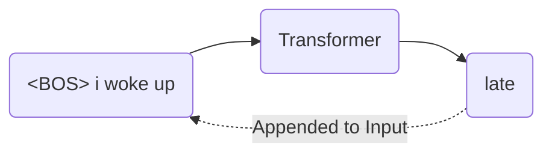

Second, "Decoder-only" refers to the structure of the network. Original Transformers had two halves. An Encoder processed a source language like French, and a Decoder generated a target language like English. We do not need to translate between two different sequences. We only need to predict the continuation of a single sequence. We discard the Encoder entirely and only use the Decoder. 

### The Residual Stream

Inside this Decoder, there is a central memory bus called the residual stream. This is arguably the most important structural concept in the entire architecture.

Imagine a main highway that runs continuously from the very first layer of the network to the very last. When a word enters the network, it is placed on this highway as a vector. As this vector travels through the network, the Attention and Multi-Layer Perceptron blocks do not intercept and replace it. Instead, they read from the vector, calculate new contextual information, and then add that new information back into the original vector. 

This additive process ensures that the original information is never destroyed or compressed through a bottleneck. It simply accumulates richness and context as it moves forward. 

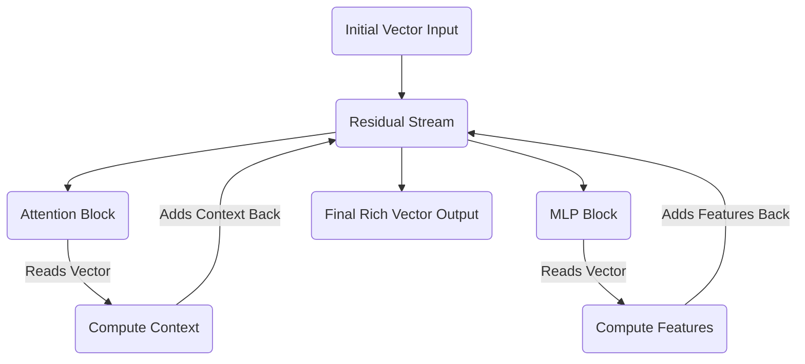

## The Dimensions

With the architecture established, we can define the specific size of the pathways our data will travel. We have scaled the dimensions down to the specifications below.

### Sequence Length

Sequence length is how many tokens we are feeding into the model at one time. For our input of four tokens, the sequence length is 4.

### Model Dimensionality

Every token is represented by a vector traveling on the residual stream highway. The variable $d_{model}$ defines the width of that highway. We are using a 6-dimensional vector for each token. This allows us to easily visualize the data on a screen without losing the capacity to store complex features.

### Batch Size

GPUs act as highly parallel execution units. Instead of passing one sequence through the network at a time, we stack many independent sequences together into a batch to process them simultaneously. Batching repeats the exact same math in parallel across different inputs. We will set our batch size to 1 to keep our focus entirely on a single sequence.

### Attention Heads

The attention mechanism finds relationships between tokens. Rather than having one monolithic attention process, we divide the workload into multiple independent heads. This allows the network to learn different types of relationships simultaneously. One head might specialize in grammar, while another focuses on semantic meaning. We will use 3 parallel heads.

### Head Dimensionality

We have 3 heads dividing up our 6-dimensional residual stream. Each individual head operates in a 2-dimensional subspace. The matrices powering our attention mechanism will therefore be simple $6 \times 2$ structures.

### Feed-Forward Dimension

While the residual stream is excellent for securely moving information between layers, it is too narrow to perform complex reasoning. 

The Multi-Layer Perceptron solves this by expanding the data into a much wider, higher-dimensional space. In this expanded space, complex, entangled concepts can be linearly separated and processed before being compressed back down into the residual stream. It is an empirical standard in deep learning to expand this space by a factor of 4. Our feed-forward dimension will be $6 \times 4$, which equals 24.

## The Central Tensor

Before text enters the Transformer, it needs to be converted into numbers. We start by assigning a unique integer index to every word in our vocabulary. 

We then map that integer to a one-hot encoded vector. A one-hot vector is an array of zeros with a single '1' placed at the index corresponding to that word. For a twelve-word vocabulary, the one-hot vector for the fourth word is a 12-dimensional array consisting of eleven zeros and one '1' in the fourth position.

When our text enters the Transformer, this one-hot vector is embedded into a continuous mathematical space. This creates the foundational tensor that will travel through the entire network. The shape of this tensor is defined as Batch by Sequence Length by Model Dimension. 

For our specific architecture, this shape is $1 \times 4 \times 6$. Since our batch size is 1, we can strip away the batch dimension and visualize our data as a straightforward $4 \times 6$ matrix moving along the residual stream.

$$
X = \begin{bmatrix} 
\text{-- } \langle \text{BOS} \rangle \text{ vector --} \\
\text{-- "i" vector --} \\
\text{-- "woke" vector --} \\
\text{-- "up" vector --} 
\end{bmatrix}_{4 \times 6}
$$

Every single mathematical operation in our forward pass will read from and write to this $4 \times 6$ matrix. 

In the next part, we will take our raw text, map it to our vocabulary indices, and perform our first genuine calculation. We will transform one-hot encoded vectors into this $4 \times 6$ geometric representation.

<em>Prefer to read this seamlessly offline? <a href="/assets/docs/transformer_ebook_final.pdf">Download the complete, formatting-optimized 100-page Transformer Ebook here.</a></em>

<h1 id="chapter-1-tokens-one-hot-encodings-and-the-embedding-matrix">Chapter 1: Tokens, One-Hot Encodings, and the Embedding Matrix</h1>

<em>Prefer to read this seamlessly offline? <a href="/assets/docs/transformer_ebook_final.pdf">Download the complete, formatting-optimized 100-page Transformer Ebook here.</a></em>

At the end of the Preface, we established that every operation in our Transformer will read from and write to a central $4 \times 6$ matrix. We must now bridge the gap between our raw text and that geometric representation. Text is inherently abstract. Computers cannot multiply words. Computers multiply numbers. We need a rigorous mechanical process to translate human language into a mathematical format that a neural network can manipulate.

This translation happens in three distinct stages. First, we break our sentence down into discrete pieces called tokens. Second, we map each token to a strict geometric location using a one-hot vector. Third, we project those isolated vectors into a shared, continuous space using an Embedding Matrix. 

## The Vocabulary Space and Tokenization

Our objective is to process the sequence `<BOS> i woke up`. 

Before we can do anything with this sequence, the model needs a predefined universe of concepts to draw from. This universe is the vocabulary. In our toy example, we have restricted the vocabulary to exactly twelve words. 

`<BOS>` `<EOS>` `<PAD>` `i` `we` `woke` `stayed` `up` `late` `early` `today` `yesterday`

Tokenization is the process of mapping raw text to the corresponding integer indices in this vocabulary list. The index acts as a unique identifier for the concept. 

For our specific sequence, the mapping is extremely straightforward. 
The `<BOS>` token maps to index 0. 
The word `i` maps to index 3. 
The word `woke` maps to index 5. 
The word `up` maps to index 7.

We now have an array of integers representing our sequence. 

$$ \text{Sequence Indices} = [0, 3, 5, 7] $$

## The Geometry of One-Hot Encodings

While integers are numbers, they are mathematically dangerous in a neural network context. If we feed the integer 5 into our model to represent "woke" and the integer 10 to represent "today", the model will naturally interpret "today" as being twice as large or twice as important as "woke". This numerical relationship is entirely arbitrary. The word "today" is not the mathematical double of "woke". 

We must remove this false magnitude. We do this by translating our integers into one-hot encoded vectors.

A one-hot vector isolates a concept geometrically. For a vocabulary of size 12, each word becomes a 12-dimensional vector filled with zeros, with a single 1 placed at the vocabulary index. 

When we convert our four tokens into one-hot vectors, we create a $4 \times 12$ matrix. 

$$
X_{\text{one-hot}} = \begin{bmatrix}
1.0 & 0.0 & 0.0 & 0.0 & 0.0 & 0.0 & 0.0 & 0.0 & 0.0 & 0.0 & \dots & 0.0 \\
0.0 & 0.0 & 0.0 & 1.0 & 0.0 & 0.0 & 0.0 & 0.0 & 0.0 & 0.0 & \dots & 0.0 \\
0.0 & 0.0 & 0.0 & 0.0 & 0.0 & 1.0 & 0.0 & 0.0 & 0.0 & 0.0 & \dots & 0.0 \\
0.0 & 0.0 & 0.0 & 0.0 & 0.0 & 0.0 & 0.0 & 1.0 & 0.0 & 0.0 & \dots & 0.0
\end{bmatrix}
$$

By treating each word as an independent axis in a 12-dimensional space, we ensure that every word is exactly the same distance from every other word. They are perfectly orthogonal. The word "i" has no mathematical relationship to the word "woke". We have eliminated the false magnitude problem, replacing it with perfect neutrality.

## The Problem with Neutrality

Perfect neutrality is a problem. The word "i" is highly related to the word "we", and the word "late" is highly related to the word "early". If our vectors remain orthogonal, the model will never know these concepts are similar. It will be forced to learn the rules of grammar independently for every single word. 

Furthermore, our one-hot vectors are 12 dimensions wide. In a real world model like GPT-4, the vocabulary size is often over 100,000. Maintaining a matrix of that width at every stage of the network is computationally impossible. 

We need to compress our perfectly isolated 12-dimensional vectors into a denser, richer space where words with similar meanings are grouped together physically. This dense space is the $d_{model}$ dimension. In our toy architecture, this width is 6. 

## The Embedding Matrix

We accomplish this compression using the Embedding Matrix, denoted as $W_E$. This matrix serves as a lookup table. It maps every 12-dimensional word to a specific 6-dimensional location. The shape of $W_E$ must therefore be $12 \times 6$. 

When you initialize a neural network, this matrix is filled with random numbers. Over thousands of training iterations, the model slowly pushes and pulls these numbers via backpropagation. It physically moves the coordinates of similar words closer together to minimize its prediction error.

Since we are manually calculating our example, we will bypass the training phase and explicitly design a $12 \times 6$ embedding matrix that demonstrates these semantic clusters. 

$$
W_E = \begin{bmatrix}
 0.1 &  0.0 &  0.0 &  0.0 &  0.0 &  0.0 \\
 0.1 &  0.0 &  0.0 &  0.0 &  0.0 &  0.1 \\
 0.1 &  0.0 &  0.0 &  0.0 &  0.0 & -0.1 \\
 0.0 &  0.8 & -0.1 &  0.2 &  0.0 &  0.5 \\
 0.0 &  0.9 & -0.1 &  0.2 &  0.0 &  0.8 \\
 0.0 & -0.2 &  0.9 &  0.1 & -0.4 &  0.1 \\
 0.0 & -0.2 &  0.8 &  0.0 &  0.5 & -0.1 \\
 0.0 & -0.1 &  0.4 &  0.9 & -0.2 &  0.0 \\
 0.0 &  0.0 & -0.3 & -0.1 &  0.9 & -0.8 \\
 0.0 &  0.0 & -0.3 & -0.1 &  0.9 &  0.8 \\
 0.0 &  0.0 & -0.2 &  0.0 &  0.8 &  0.1 \\
 0.0 &  0.0 & -0.2 & -0.2 &  0.7 & -0.4
\end{bmatrix}
$$

Look closely at the rows for our pronouns, which are indices 3 and 4 representing "i" and "we". They share high positive values in the second column. Now look at the rows for our temporal adverbs, which are indices 8, 9, 10, and 11 representing "late", "early", "today", and "yesterday". They share high positive values in the fifth column. 

The Embedding Matrix is not just a list of numbers. It is a coordinate map of meaning. By pushing related concepts into similar numerical spaces, the model can learn abstract rules. If it learns a rule about the word "i", that rule will automatically apply to the word "we", simply because their vectors are positioned next to each other.

## Generating the Central Tensor

To transform our neutral one-hot vectors into this rich geometric space, we perform a standard matrix multiplication. We multiply our $4 \times 12$ input matrix by our $12 \times 6$ embedding matrix. 

$$ X = X_{\text{one-hot}} \times W_E $$

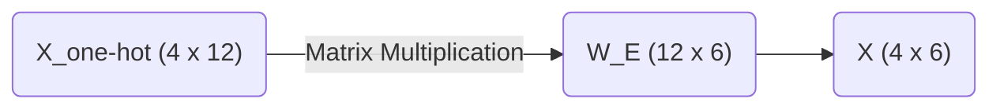

Due to the nature of matrix multiplication, multiplying by a one-hot vector simply extracts the corresponding row from the embedding matrix. 

Our final tensor $X$ takes the following form.

$$
X = \begin{bmatrix}
 0.1 &  0.0 &  0.0 &  0.0 &  0.0 &  0.0 \\
 0.0 &  0.8 & -0.1 &  0.2 &  0.0 &  0.5 \\
 0.0 & -0.2 &  0.9 &  0.1 & -0.4 &  0.1 \\
 0.0 & -0.1 &  0.4 &  0.9 & -0.2 &  0.0
\end{bmatrix}
$$

Row 1 is the coordinate vector for `<BOS>`.
Row 2 is the coordinate vector for `i`.
Row 3 is the coordinate vector for `woke`.
Row 4 is the coordinate vector for `up`.

We have successfully translated our text into the central $4 \times 6$ tensor that will ride the residual stream. In the next part, we will examine a critical flaw in this representation and mathematically prove why Transformers require positional encoding to understand the order of time.

<em>Prefer to read this seamlessly offline? <a href="/assets/docs/transformer_ebook_final.pdf">Download the complete, formatting-optimized 100-page Transformer Ebook here.</a></em>

<h1 id="chapter-2-the-permutation-invariance-problem--positional-encoding">Chapter 2: The Permutation Invariance Problem & Positional Encoding</h1>

<em>Prefer to read this seamlessly offline? <a href="/assets/docs/transformer_ebook_final.pdf">Download the complete, formatting-optimized 100-page Transformer Ebook here.</a></em>

Welcome back. In our previous session, we successfully transformed our input sequence `<BOS> i woke up` into a dense, continuous semantic space. We mathematically compressed sparse 12-dimensional one-hot vectors into a 6-dimensional embedding matrix.

Our current tensor representation $X$ for our sequence looks like this:

$$
X = \begin{bmatrix}
 0.1 &  0.0 &  0.0 &  0.0 &  0.0 &  0.0 \\
 0.0 &  0.8 & -0.1 &  0.2 &  0.0 &  0.5 \\
 0.0 & -0.2 &  0.9 &  0.1 & -0.4 &  0.1 \\
 0.0 & -0.1 &  0.4 &  0.9 & -0.2 &  0.0
\end{bmatrix}
$$

This matrix beautifully captures the semantic meaning of our words. The problem is that it captures absolutely nothing else.

## The Permutation Invariance Problem

To understand why this is a fatal flaw, we must anticipate how the upcoming Attention mechanism processes this data. When we eventually compute self-attention, we will be calculating dot products between these row vectors to measure their similarities.

A fundamental property of set operations and matrix multiplication is that they are permutation invariant. If you shuffle the rows of our matrix $X$ to represent the sequence "woke i up `<BOS>`", the attention mechanism will calculate the exact same pairwise similarities. The model would process "i woke up" and "woke i up" as identical semantic concepts. Human language relies entirely on word order to derive meaning. "The dog bit the man" and "The man bit the dog" use identical tokens, yet they describe completely different events.

Without a mechanism to inject sequence order, our Transformer is merely a highly sophisticated bag-of-words model. It is completely order-blind.

## Injecting Time: Positional Encoding

We must explicitly inject positional information into our vectors before they enter the attention layers. We achieve this by creating a secondary matrix of identical dimensions to our input tensor, which we will simply add to it.

There are two primary philosophies for positional encoding:

1. **Relative Positional Encoding:** The model learns the distances between words. Instead of knowing that "woke" is at position 2, it only cares that "woke" is exactly one step away from "i". Modern architectures like RoPE utilize relative encodings through complex vector rotations.
2. **Absolute Positional Encoding:** Every position in the sequence receives a unique, static vector signature. The model learns that position 0 always has a specific geometric translation, position 1 has another, and so forth.

For our rigorous walkthrough, we will use an absolute positional encoding. We want a matrix that is mathematically deterministic and bounded, ensuring we do not explode the numerical variance of our carefully calibrated embeddings.

The original Transformer architecture used interweaving sine and cosine waves of varying frequencies. We will adopt a mathematically similar approach. By varying the frequencies across our 6 dimensions, each position generates a completely unique vector signature.

Here is the exact Positional Encoding matrix $W_{PE}$ for our 4-token sequence:

$$
W_{PE} = \begin{bmatrix}
 0.0 &  1.0 &  0.0 &  1.0 &  0.0 &  1.0 \\
 0.8 &  0.5 &  0.4 &  0.9 &  0.2 &  1.0 \\
 0.9 & -0.4 &  0.8 &  0.6 &  0.4 &  0.9 \\
 0.1 & -1.0 &  1.0 &  0.2 &  0.6 &  0.8
\end{bmatrix}
$$

Notice the geometric elegance of this matrix. The values fluctuate smoothly between -1.0 and 1.0. Position 0 produces a clean alternating pattern, while subsequent positions introduce complex phase shifts. No two rows are identical.

## The Final Matrix Addition

The integration of positional data is remarkably simple. We perform an element-wise matrix addition of our semantic embeddings $X$ and our positional signatures $W_{PE}$.

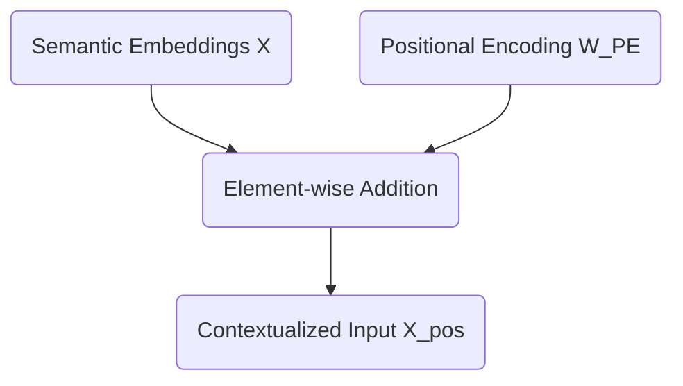

Let us compute the exact addition for our model:

$$
X_{pos} = \begin{bmatrix}
 0.1 &  0.0 &  0.0 &  0.0 &  0.0 &  0.0 \\
 0.0 &  0.8 & -0.1 &  0.2 &  0.0 &  0.5 \\
 0.0 & -0.2 &  0.9 &  0.1 & -0.4 &  0.1 \\
 0.0 & -0.1 &  0.4 &  0.9 & -0.2 &  0.0
\end{bmatrix} + \begin{bmatrix}
 0.0 &  1.0 &  0.0 &  1.0 &  0.0 &  1.0 \\
 0.8 &  0.5 &  0.4 &  0.9 &  0.2 &  1.0 \\
 0.9 & -0.4 &  0.8 &  0.6 &  0.4 &  0.9 \\
 0.1 & -1.0 &  1.0 &  0.2 &  0.6 &  0.8
\end{bmatrix}
$$

Which yields our final, positionally-aware tensor $X_{pos}$:

$$
X_{pos} = \begin{bmatrix}
 0.1 &  1.0 &  0.0 &  1.0 &  0.0 &  1.0 \\
 0.8 &  1.3 &  0.3 &  1.1 &  0.2 &  1.5 \\
 0.9 & -0.6 &  1.7 &  0.7 &  0.0 &  1.0 \\
 0.1 & -1.1 &  1.4 &  1.1 &  0.4 &  0.8
\end{bmatrix}
$$

Our vector for "woke" is no longer just the abstract concept of waking up. It is now explicitly "woke" at position 2.

The stage is now completely set. We have successfully translated a string of text into a mathematically rich tensor that understands both semantic meaning and sequential time. Next, we will feed this matrix into the heart of the architecture to introduce Layer 1 Self-Attention.

<em>Prefer to read this seamlessly offline? <a href="/assets/docs/transformer_ebook_final.pdf">Download the complete, formatting-optimized 100-page Transformer Ebook here.</a></em>

<h1 id="chapter-3-the-motivation-for-q-k-and-v-asymmetric-similarity">Chapter 3: The Motivation for Q, K, and V (Asymmetric Similarity)</h1>

<em>Prefer to read this seamlessly offline? <a href="/assets/docs/transformer_ebook_final.pdf">Download the complete, formatting-optimized 100-page Transformer Ebook here.</a></em>

In the previous part, we solved the permutation invariance problem by adding absolute positional encodings to our token embeddings. Our sequence `<BOS> i woke up` is now represented by the $4 \times 6$ matrix $X_{pos}$, which contains both semantic meaning and positional context. 

The next step in the Transformer architecture is self-attention. The core mechanism of attention is discovering which tokens in the sequence are relevant to each other. The simplest way to measure mathematical relevance between two vectors is to calculate their dot product. It is therefore tempting to assume we should just compute the dot product of every token vector with every other token vector directly.

This naive approach is known as computing symmetric similarity. We can test this by multiplying $X_{pos}$ by its own transpose $X_{pos}^T$. 

$$ \text{Symmetric Similarity} = X_{pos} \times X_{pos}^T $$

Here is the result of that direct calculation:

$$
\text{Symmetric Similarity} = \begin{bmatrix}
3.0 & 4.0 & 1.2 & 0.8 \\
4.0 & 5.9 & 2.7 & 1.6 \\
1.2 & 2.7 & 5.5 & 4.7 \\
0.8 & 1.6 & 4.7 & 5.2
\end{bmatrix}
$$

The dot product measures how much two vectors point in the same direction. When we multiply a matrix by its own transpose, the highest values will invariably appear along the diagonal. The token "woke" aligns most strongly with itself, yielding a score of $5.5$. The token "up" aligns most strongly with itself, yielding $5.2$. 

This creates a fundamental limitation. In human language, semantic relationships are rarely symmetric. Verbs need to find subjects. Prepositions need to find objects. In our sequence, the particle "up" needs to attend to the verb "woke" to form the phrasal verb "woke up". If we rely on symmetric similarity, a token will always be overwhelmingly distracted by its own reflection. It will struggle to look for complementary grammatical structures because the vectors for different parts of speech point in different directions in the embedding space.

We need a mechanism that allows a token to ask a question, and allows other tokens to provide the answer. We need asymmetric similarity.

## The Bilinear Form

To achieve asymmetric similarity, the Transformer projects the input tensor $X_{pos}$ into three distinct new subspaces using three learned weight matrices. We call these projections Queries, Keys, and Values. For now, we will focus on the Queries and Keys. 

Instead of asking how similar vector $A$ is to vector $B$, we project $A$ into a Query subspace and $B$ into a Key subspace. We then measure the similarity between the Query projection of $A$ and the Key projection of $B$. 

Mathematically, this operation is a bilinear form. Given our input $X_{pos}$ and our two weight matrices $W_Q$ and $W_K$, the attention scores are calculated as:

$\text{Attention Scores} = (X_{pos} W_Q) (X_{pos} W_K)^T$

This equation is deeply elegant. The weight matrices $W_Q$ and $W_K$ act as lenses. During training, the neural network adjusts these lenses to map conceptually complementary tokens into the exact same region of a new, lower-dimensional space. The network might learn to map the Query vector for a preposition and the Key vector for a verb into the exact same mathematical coordinate. When their dot product is subsequently computed, the result will be a massive positive number, forcing the network to attend to that relationship.

## Calculating Queries and Keys

Our Transformer uses $3$ attention heads. The model dimension $d_{model}$ is $6$. We divide the model dimension by the number of heads to determine the dimensionality of the Query and Key subspaces. This gives us a head dimension $d_k = 2$. 

Each attention head possesses its own independent $W_Q$ and $W_K$ matrices, both sized $6 \times 2$. This allows each head to look for entirely different types of relationships. Head 1 might look for subject-verb relationships. Head 2 might track temporal adverbs. 

Let us instantiate a concrete $W_Q$ and $W_K$ for our first attention head. 

$$
W_Q = \begin{bmatrix}
 0.1 &  0.2 \\
-0.1 &  0.5 \\
 0.8 & -0.2 \\
 0.3 &  0.4 \\
-0.2 &  0.1 \\
 0.1 & -0.3
\end{bmatrix}
$$

$$
W_K = \begin{bmatrix}
-0.2 &  0.4 \\
 0.5 & -0.1 \\
 0.6 &  0.2 \\
 0.1 &  0.7 \\
 0.2 & -0.2 \\
-0.4 &  0.3
\end{bmatrix}
$$

To calculate the Queries $Q$, we multiply our positionally-encoded sequence $X_{pos}$ by $W_Q$.

$$ Q = X_{pos} \times W_Q $$

The resulting Query matrix $Q$ has dimensions $4 \times 2$. Each token has been compressed from a 6-dimensional representation into a 2-dimensional "question". 

$$
Q = \begin{bmatrix}
 0.3 &  0.6 \\
 0.6 &  0.8 \\
 1.8 & -0.5 \\
 1.6 & -0.6
\end{bmatrix}
$$

We perform the exact same operation for the Keys $K$, multiplying $X_{pos}$ by $W_K$.

$$ K = X_{pos} \times W_K $$

This yields our $4 \times 2$ Key matrix. Each token now has a 2-dimensional "answer".

$$
K = \begin{bmatrix}
 0.2 &  0.9 \\
 0.2 &  1.4 \\
 0.2 &  1.6 \\
 0.1 &  1.4
\end{bmatrix}
$$

By separating the inputs into independent Queries and Keys, the network breaks the mirror of symmetric similarity. The token "woke" no longer strictly attends to itself. It projects a specific question into the Query space, and it projects a specific identity into the Key space. In the next part, we will multiply these matrices together, calculate the final attention scores, and observe how the network scales the results to prevent gradient collapse.

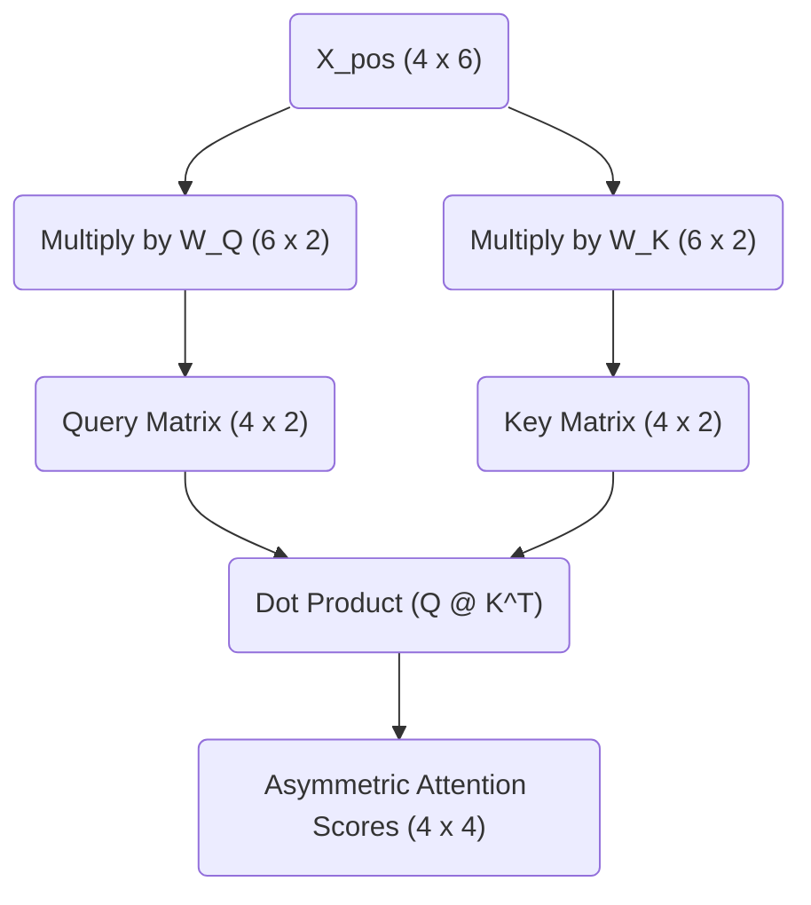

<em>Prefer to read this seamlessly offline? <a href="/assets/docs/transformer_ebook_final.pdf">Download the complete, formatting-optimized 100-page Transformer Ebook here.</a></em>

<h1 id="chapter-4-the-attention-score-and-$\sqrt{d_k}$">Chapter 4: The Attention Score and $\sqrt{d_k}$</h1>

<em>Prefer to read this seamlessly offline? <a href="/assets/docs/transformer_ebook_final.pdf">Download the complete, formatting-optimized 100-page Transformer Ebook here.</a></em>

In the previous installment, we established why the Transformer does not calculate attention directly from the input embeddings. We projected our sequence into two distinct semantic subspaces, yielding a matrix of Queries ($Q$) and a matrix of Keys ($K$). This asymmetric projection allows the network to match concepts that belong together even if their base embeddings are geometrically distant.

Our sequence currently consists of four tokens:

| `<BOS>` | `i` | `woke` | `up` |

We now need to calculate the actual attention scores. We want to quantify how strongly each token in our sequence should attend to every other token. We achieve this by taking the dot product of every Query vector with every Key vector. 

## The Dot Product as a Metric of Similarity

The dot product measures alignment. When two vectors point in similar directions, their dot product is large and positive. When they are orthogonal, it is zero. When they point in opposite directions, it is negative. 

By multiplying our Query matrix by the transpose of our Key matrix ($Q \times K^T$), we compute the dot product for every possible pair of tokens in a single operation. 

Here are the specific matrices for Head 1 of our network:

$$
Q = \begin{bmatrix}
0.31 & 0.62 \\
0.63 & 0.76 \\
1.82 & -0.48 \\
1.57 & -0.57
\end{bmatrix}
$$

$$
K^T = \begin{bmatrix}
0.18 & 0.22 & 0.21 & 0.14 \\
0.94 & 1.43 & 1.55 & 1.36
\end{bmatrix}
$$

The multiplication yields our unscaled attention scores:

$$
Q \times K^T = \begin{bmatrix}
0.64 & 0.95 & 1.03 & 0.89 \\
0.83 & 1.23 & 1.31 & 1.12 \\
-0.12 & -0.29 & -0.36 & -0.40 \\
-0.25 & -0.47 & -0.55 & -0.56
\end{bmatrix}
$$

Each row in this result corresponds to a Query token, and each column corresponds to a Key token. The value at row 3 and column 2, which is $-0.29$, represents the raw alignment score between the Query for "woke" and the Key for "i". 

## The Problem of Dimensionality

These raw scores are mathematically correct. We cannot use them as they are. The Transformer architecture relies on converting these raw scores into a strict probability distribution using the Softmax function. Softmax will force the scores in each row to sum to $1.0$, allowing us to treat them as percentage weights.

There is a subtle mathematical trap hidden in the dot product. As the dimensionality of the vectors increases, the variance of their dot product grows proportionally. 

If you take two random independent vectors of dimension $d$ with a mean of 0 and a variance of 1, their dot product will have a mean of 0 and a variance of $d$. Our current toy model uses a tiny head dimension of $d_k = 2$, so this effect is invisible. In a production model like GPT-3, the head dimension is typically $d_k = 128$. The variance of the raw dot products becomes massive.

## Softmax Saturation and Gradient Death

To understand why high variance is fatal, we must look at how the Softmax function behaves with extreme values. 

Imagine a scenario where we are using a head dimension of $512$. The variance of our dot products would hover around $512$. A single row of our unscaled attention scores might look like this:

`[ 11.24, -3.13, 14.66, 34.46 ]`

When we apply the Softmax function to these numbers, the exponentiation heavily amplifies the largest value. The resulting probability distribution becomes extremely sharp:

`[ 0.00, 0.00, 0.00, 1.00 ]`

The network has placed 100% of its attention on the final token. This might seem like a decisive and confident prediction. It is actually a catastrophic failure for the learning process.

Neural networks learn via backpropagation, which relies on calculating gradients. The gradient represents the slope of the function. When a Softmax distribution becomes this sharply peaked, it operates in the absolute flattest regions of its curve. The slope approaches zero. If the gradient is zero, the network cannot update its weights. The learning process halts completely. This phenomenon is known as Softmax saturation.

## The Mathematical Solution: Scaling by $\sqrt{d_k}$

We must prevent the variance of the dot products from growing with the dimensionality of the network. We do this by dividing the raw attention scores by the square root of the head dimension ($\sqrt{d_k}$). 

Dividing a random variable by a constant scales its variance by the square of that constant. By dividing our scores by $\sqrt{d_k}$, we scale the variance of the dot product by $d_k$. Since the original variance was $d_k$, the new variance becomes $1$. This perfectly stabilizes the distribution regardless of how large the network grows.

We can apply this scaling factor to our synthetic large-dimension example. Dividing our raw values by $\sqrt{512}$ yields a much tighter range:

`[ 0.50, -0.14, 0.65, 1.52 ]`

Passing these scaled numbers through the Softmax function produces a healthy, nuanced probability distribution:

`[ 0.18, 0.10, 0.21, 0.51 ]`

The gradients can flow freely through this distribution. The network can continue to learn.

## Scaling Our Toy Model

We must now apply this mandatory scaling to our own toy model. Our head dimension is $d_k = 2$. Our scaling factor is $\sqrt{2}$, which is approximately $1.414$.

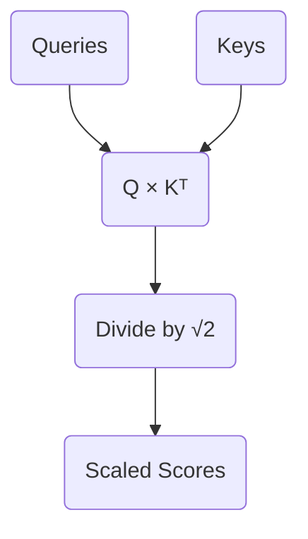

We divide every element in our raw score matrix by $1.414$:

$$
\text{Scaled Scores} = \begin{bmatrix}
0.45 & 0.68 & 0.73 & 0.63 \\
0.59 & 0.87 & 0.93 & 0.79 \\
-0.09 & -0.20 & -0.26 & -0.28 \\
-0.18 & -0.33 & -0.39 & -0.39
\end{bmatrix}
$$

These values are now safely bounded and ready to be converted into probabilities. 

We cannot apply the Softmax function just yet. Our model is currently looking at the entire sequence simultaneously. The first token (`<BOS>`) has a score of `0.63` connecting it to the future token `up`. In a language modeling task, allowing a token to attend to words that have not been generated yet is invalid. We must hide the future before we finalize our probabilities, which brings us to the mathematics of Causal Masking.

<em>Prefer to read this seamlessly offline? <a href="/assets/docs/transformer_ebook_final.pdf">Download the complete, formatting-optimized 100-page Transformer Ebook here.</a></em>

<h1 id="chapter-5-causal-masking">Chapter 5: Causal Masking</h1>

<em>Prefer to read this seamlessly offline? <a href="/assets/docs/transformer_ebook_final.pdf">Download the complete, formatting-optimized 100-page Transformer Ebook here.</a></em>

In our previous session, we successfully derived the scaled attention scores. We calculated the dot product between our Query and Key matrices, measuring how intensely each token seeks information from every other token, and scaled the result by $\sqrt{d_k}$ to prevent gradient saturation. 

Before we can convert these scores into a final probability distribution, we must address a critical structural flaw in how our matrix currently operates during training. 

## The Problem of Parallel Training

When training a Transformer, we do not feed tokens in one by one. We optimize for speed by passing the entire sequence through the network simultaneously. This technique is known as teacher forcing. Our matrix operations compute the attention scores for `<BOS>`, `i`, `woke`, and `up` all at the exact same time.

Let us examine the scaled attention scores from our previous calculation. The rows represent our Queries looking for information, and the columns represent our Keys offering information.

$$
\text{Scaled Scores} = \begin{bmatrix}
0.45 & 0.68 & 0.73 & 0.63 \\
0.59 & 0.87 & 0.93 & 0.79 \\
-0.09 & -0.20 & -0.26 & -0.28 \\
-0.18 & -0.33 & -0.39 & -0.39
\end{bmatrix}
$$

The first row represents the `<BOS>` token acting as a Query. It is generating attention scores against all available Keys. The second column of the first row holds a score of 0.68, representing the `<BOS>` token attending to the `i` token.

This reveals a profound issue. If the model is processing the `<BOS>` token to predict the next logical word in the sequence, it should only have access to information from the `<BOS>` token itself. In our current matrix, the `<BOS>` token has full visibility into the future tokens `i`, `woke`, and `up`. The model is effectively looking at the answer key while taking the test. The network will perfectly learn to copy the next token rather than learning the underlying linguistic patterns.

## The Causal Mask

We must physically block the flow of information from future tokens into past tokens. We achieve this by applying a lower-triangular mask to the attention scores. 

We define a mask where any position representing a Query attending to a future Key is marked for obstruction.

$$
\text{Mask} = \begin{bmatrix}
1 & 0 & 0 & 0 \\
1 & 1 & 0 & 0 \\
1 & 1 & 1 & 0 \\
1 & 1 & 1 & 1
\end{bmatrix}
$$

Where the mask holds a 1, we keep the original scaled score. Where the mask holds a 0, we overwrite the score with negative infinity ($-\infty$). Applying this operation yields our masked attention scores.

$$
\text{Masked Scores} = \begin{bmatrix}
0.45 & -\infty & -\infty & -\infty \\
0.59 & 0.87 & -\infty & -\infty \\
-0.09 & -0.20 & -0.26 & -\infty \\
-0.18 & -0.33 & -0.39 & -0.39
\end{bmatrix}
$$

By inspecting the second row, we see the Query for the token `i` can only attend to the Key for `<BOS>` and the Key for `i`. The scores for `woke` and `up` have been obliterated. Causality is preserved.

## The Mathematical Role of Negative Infinity

We use $-\infty$ rather than zero due to the mathematical properties of the next operation in the architecture. The Softmax function will soon convert these scores into a valid probability distribution. The Softmax function exponentiates each value using $e^x$.

As $x$ approaches $-\infty$, the value of $e^x$ converges exactly to 0. When we calculate the final attention weights in the next step, any connection blocked by our causal mask will receive a probability weight of precisely 0%. Future tokens will contribute nothing to the mathematical representation of past tokens.

With our causal mask firmly in place, we are ready to safely pass these masked scores through the Softmax function and extract our final Value matrices.

<em>Prefer to read this seamlessly offline? <a href="/assets/docs/transformer_ebook_final.pdf">Download the complete, formatting-optimized 100-page Transformer Ebook here.</a></em>

<h1 id="chapter-6-from-scores-to-synthesis-softmax-and-the-value-matrix">Chapter 6: From Scores to Synthesis: Softmax and The Value Matrix</h1>

<em>Prefer to read this seamlessly offline? <a href="/assets/docs/transformer_ebook_final.pdf">Download the complete, formatting-optimized 100-page Transformer Ebook here.</a></em>

In our previous installation, we successfully calculated the masked attention scores. By applying a lower triangular matrix of negative infinity values, we erected a strict mathematical barrier that prevents information from flowing backward in time. We are now left with a matrix representing the raw geometric alignment between our Queries and Keys across all valid time steps. 

These scalar values are mathematically unbounded. We must now convert them into a stable format capable of driving the core synthesis step of the attention mechanism. This transformation requires the Softmax function and the introduction of our third fundamental learned matrix: the Value matrix.

## The Softmax Function: Converting Alignment to Probability

We intend to use our attention scores as a set of weights to perform a weighted sum. If we were to use the raw, unbounded scores directly, the magnitude of our vectors would compound uncontrollably as information flows deeper into the network. To maintain mathematical stability, we require our weights to be strictly positive and to sum exactly to 1 across each row. We achieve this by applying the Softmax function.

The Softmax function operates by taking the exponential of each input value and dividing it by the sum of all exponentials in that row. Exponentiation maps any real number to a positive value. Dividing by the total sum normalizes these positive values into a strict probability distribution.

Let us observe our masked scaled scores from the previous step:

$$
\text{Scores}_{masked} = \begin{bmatrix}
 0.45 & -\infty & -\infty & -\infty \\
 0.59 &  0.87 & -\infty & -\infty \\
-0.09 & -0.20 & -0.26 & -\infty \\
-0.18 & -0.33 & -0.39 & -0.39
\end{bmatrix}
$$

Applying the Softmax function yields our final attention weights matrix $A$:

$$
A = \text{Softmax}(\text{Scores}_{masked}) = \begin{bmatrix}
 1.00 &  0.00 &  0.00 &  0.00 \\
 0.43 &  0.57 &  0.00 &  0.00 \\
 0.37 &  0.33 &  0.31 &  0.00 \\
 0.29 &  0.25 &  0.23 &  0.23
\end{bmatrix}
$$

Observe the profound elegance of the causal mask at work. The exponential of negative infinity approaches exactly zero. Our masked positions have been flawlessly converted into zero-valued weights. The model is now mathematically incapable of extracting information from future tokens. Every row sums precisely to 1, providing a clean probability distribution over all preceding context. 

## The Value Matrix: The Content Payload

Until this exact moment in the architecture, our computations have focused entirely on routing. The Query and Key matrices exist solely to dictate *where* information should flow. They measure semantic relevance. They do not represent the information payload itself.

If the attention weights are the map, the Value matrix is the cargo. The semantic features required to determine relevance are fundamentally different from the semantic features required to predict the next word. We therefore project our original positional embeddings $X$ into a third distinct subspace using the Value weight matrix $W_V$.

Our embedding dimension $d_{model}$ is 6. We project down into a head dimension $d_v$ of 2. We define our learned weights $W_V$:

$$
W_V = \begin{bmatrix}
 0.3 & -0.1 \\
 0.2 &  0.5 \\
-0.4 &  0.1 \\
 0.1 &  0.6 \\
-0.3 &  0.2 \\
 0.5 & -0.4
\end{bmatrix}
$$

We calculate our Value matrix $V$ by taking the dot product of our positional embeddings $X$ and $W_V$:

$$
V = X \cdot W_V = \begin{bmatrix}
 0.83 &  0.69 \\
 1.18 &  0.70 \\
 0.04 & -0.20 \\
-0.36 &  0.00
\end{bmatrix}
$$

The matrix $V$ contains the actual conceptual representations that will be broadcast across the sequence. Each row holds the information payload for a single token in our `<BOS> i woke up` sequence.

## The Weighted Sum: Synthesizing Context

We have reached the culmination of the single head attention mechanism. We possess a matrix of routing instructions $A$ and a matrix of information payloads $V$. We synthesize our new contextualized representations by computing the dot product of $A$ and $V$. 

This operation physically executes a weighted sum. Every token constructs a new representation of itself by blending together the Value vectors of all preceding tokens according to the probabilities in the attention matrix. 

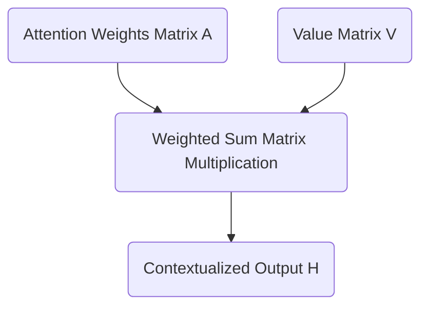

We compute our final head output $H$:

$$
H = A \cdot V = \begin{bmatrix}
 1.00 &  0.00 &  0.00 &  0.00 \\
 0.43 &  0.57 &  0.00 &  0.00 \\
 0.37 &  0.33 &  0.31 &  0.00 \\
 0.29 &  0.25 &  0.23 &  0.23
\end{bmatrix} \cdot \begin{bmatrix}
 0.83 &  0.69 \\
 1.18 &  0.70 \\
 0.04 & -0.20 \\
-0.36 &  0.00
\end{bmatrix} = \begin{bmatrix}
 0.83 &  0.69 \\
 1.03 &  0.70 \\
 0.70 &  0.42 \\
 0.46 &  0.32
\end{bmatrix}
$$

Let us analyze the final row corresponding to the token `up`. Its new representation is `[0.46, 0.32]`. This vector is no longer a static dictionary definition. It is a dynamic, context aware representation explicitly shaped by the presence of `woke` and `i` occurring earlier in the sequence. 

We have successfully completed the attention mechanism for a single head. Our model operates with three independent attention heads running in parallel. In our next session, we will explore how to reconcile these independent perspectives by projecting them back into the original embedding dimension.

<em>Prefer to read this seamlessly offline? <a href="/assets/docs/transformer_ebook_final.pdf">Download the complete, formatting-optimized 100-page Transformer Ebook here.</a></em>

<h1 id="chapter-7-the-cross-head-mixer-and-the-projection-matrix">Chapter 7: The Cross-Head Mixer and The Projection Matrix</h1>

<em>Prefer to read this seamlessly offline? <a href="/assets/docs/transformer_ebook_final.pdf">Download the complete, formatting-optimized 100-page Transformer Ebook here.</a></em>

In our previous session, we completed the journey of a single attention head. We watched it calculate its masked attention scores, convert those scores into strict probability distributions via the Softmax function, and finally compute a weighted sum over the Value matrix $V$. 

That process yielded a contextually enriched vector for each token in our sequence. These vectors, however, only have a dimension of $d_v = 2$. Our overall model dimension is $d_{model} = 6$. We deliberately split our architecture into three parallel attention heads so the network could simultaneously look for different types of semantic relationships. Head 1 might be attending to subject-verb pairings, while Head 2 looks for temporal markers, and Head 3 focuses on pronoun antecedents.

We now face a critical architectural challenge. We have three isolated sets of findings. We must unify these independent insights back into a single cohesive representation for each token, and this representation must seamlessly reintegrate with our overarching $d_{model} = 6$ architecture. 

## The Concatenation Step

The most straightforward way to combine the outputs of the three heads might seem to be addition. We could simply sum the three matrices together. Summation, however, destroys the distinct structural information each head worked so hard to extract. If Head 1 finds a strong positive signal for a specific feature and Head 2 finds a strong negative signal, adding them together would cancel out the values, effectively erasing the evidence gathered by both heads.

Instead of summing, we concatenate the outputs along the feature dimension. By placing the three $4 \times 2$ matrices side-by-side, we preserve every piece of information. The resulting matrix has a sequence length of 4 and a new feature dimension of $3 \times 2 = 6$. 

Let us look at the actual output of our three heads. We will use the exact Head 1 output we calculated previously, alongside simulated outputs for Head 2 and Head 3.

$$
\text{Head 1} = \begin{bmatrix}
 0.83 &  0.69 \\
 1.03 &  0.70 \\
 0.70 &  0.42 \\
 0.46 &  0.32
\end{bmatrix}
$$

$$
\text{Head 2} = \begin{bmatrix}
-0.50 &  0.10 \\
-0.40 &  0.30 \\
-0.20 &  0.25 \\
 0.10 & -0.15
\end{bmatrix}
$$

$$
\text{Head 3} = \begin{bmatrix}
 0.20 & -0.30 \\
 0.15 & -0.20 \\
 0.40 &  0.05 \\
 0.25 &  0.10
\end{bmatrix}
$$

When we concatenate these three matrices horizontally, we achieve our target width of 6.

$$
\text{Concatenated} = \begin{bmatrix}
 0.83 &  0.69 & -0.50 &  0.10 &  0.20 & -0.30 \\
 1.03 &  0.70 & -0.40 &  0.30 &  0.15 & -0.20 \\
 0.70 &  0.42 & -0.20 &  0.25 &  0.40 &  0.05 \\
 0.46 &  0.32 &  0.10 & -0.15 &  0.25 &  0.10
\end{bmatrix}
$$

## The Projection Matrix

Concatenation perfectly resolves our sizing issue. We are back to a $4 \times 6$ matrix. Yet, a geometric problem remains. The features are entirely segregated. The first two columns belong exclusively to Head 1, the middle two to Head 2, and the final two to Head 3. The insights exist in the same mathematical structure, yet they do not interact. 

A neural network derives its power from synthesizing discrete pieces of evidence into higher-order concepts. To facilitate this synthesis, we introduce the final learned parameter of the attention mechanism, the Projection Matrix, denoted as $W_O$. 

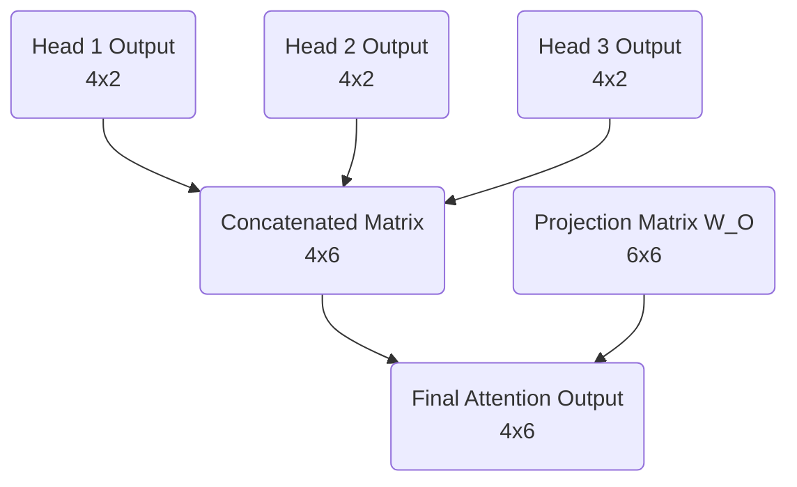

The matrix $W_O$ has dimensions of $d_{model} \times d_{model}$, which in our case is $6 \times 6$. It acts as a cross-head mixer. When we multiply our concatenated matrix by $W_O$, the resulting matrix is a linear combination of all the features from all the heads. The network can learn that a high value in column 1 from Head 1, when combined with a low value in column 5 from Head 3, implies a specific semantic meaning that should be passed forward to the rest of the architecture.

Here is the randomly initialized projection matrix $W_O$ for our toy model.

$$
W_O = \begin{bmatrix}
 0.10 &  0.20 & -0.10 &  0.30 &  0.00 & -0.20 \\
-0.20 &  0.10 &  0.40 &  0.10 &  0.20 &  0.00 \\
 0.30 & -0.10 &  0.10 & -0.20 &  0.50 &  0.10 \\
-0.10 &  0.40 & -0.30 &  0.10 & -0.10 &  0.30 \\
 0.20 &  0.00 &  0.20 & -0.10 &  0.30 & -0.10 \\
-0.30 &  0.10 & -0.10 &  0.20 & -0.20 &  0.40
\end{bmatrix}
$$

We apply the final transformation by taking the dot product of our concatenated outputs and $W_O$.

$$
\text{Output} = \text{Concatenated} \cdot W_O
$$

$$
\text{Output} = \begin{bmatrix}
-0.08 &  0.29 &  0.18 &  0.35 &  0.00 & -0.33 \\
-0.10 &  0.42 &  0.10 &  0.43 & -0.01 & -0.25 \\
-0.03 &  0.31 &  0.08 &  0.29 &  0.07 & -0.10 \\
 0.05 &  0.06 &  0.18 &  0.13 &  0.18 & -0.11
\end{bmatrix}
$$

## Rejoining the Stream

With this final calculation, we have successfully completed the Multi-Head Self-Attention block. We began with basic token embeddings representing our sequence `<BOS> i woke up`. We split those representations, allowed them to search for context across the sequence, gathered their findings, and fused those findings back into a unified $4 \times 6$ matrix.

Every vector in this output matrix now contains rich, contextualized information about its surrounding tokens. We are ready to merge these advanced representations back into the main residual stream of the Transformer.

<em>Prefer to read this seamlessly offline? <a href="/assets/docs/transformer_ebook_final.pdf">Download the complete, formatting-optimized 100-page Transformer Ebook here.</a></em>

<h1 id="chapter-8-the-residual-stream-and-the-central-memory-bus">Chapter 8: The Residual Stream and the Central Memory Bus</h1>

<em>Prefer to read this seamlessly offline? <a href="/assets/docs/transformer_ebook_final.pdf">Download the complete, formatting-optimized 100-page Transformer Ebook here.</a></em>

We have successfully calculated the multi-head attention output. The temptation now is to treat this output as the sole input to the next layer, much like a traditional feed-forward network. We must resist that instinct. The Transformer architecture does not pass data sequentially through a gauntlet of filters. Instead, it relies on a central, shared memory backbone known as the residual stream.

## Reframing the Architecture: The Information Highway

In a standard deep neural network, each layer transforms the data completely. The input to layer two is exclusively the output of layer one. This creates a bottleneck. If a layer destroys information during its transformation, that information is lost forever. Furthermore, during backpropagation, gradients must multiply through every layer's weight matrix. If those weights are small, the gradients vanish, halting the learning process for early layers.

The Transformer solves both problems by treating the network not as a sequence of transformations, but as a continuous highway of information. The original positionally encoded input embeddings travel straight through the entire network, from the first block to the final output. The attention mechanisms and feed-forward networks sit alongside this highway. They read from the stream, perform their specialized computations, and write their results back into the stream via addition.

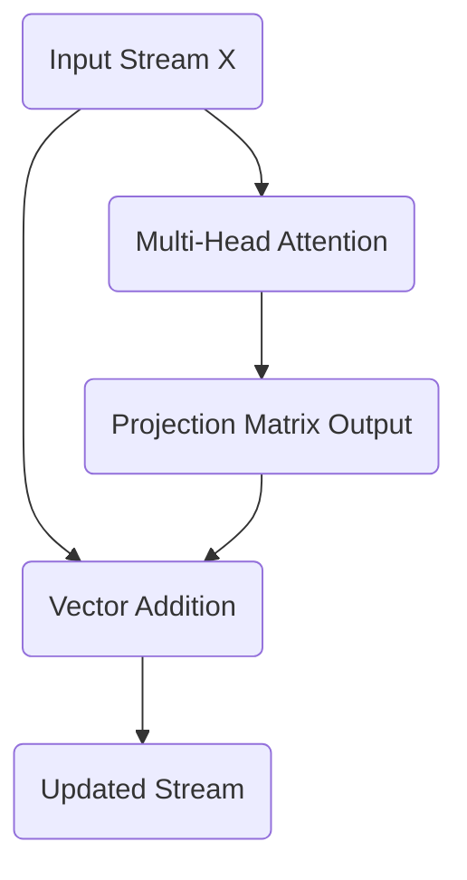

This means our token vectors do not lose their original identity. The attention block acts as an additive update, mixing contextual information into the base meaning of the token.

## The Mathematics of the Residual Connection

We formalize this additive update with a simple equation:

$$
X_{\text{out}} = X_{\text{in}} + \text{Attention}(X_{\text{in}})
$$

Here, $X_{\text{in}}$ is the state of the residual stream before the attention block. Currently, this is our positionally encoded input matrix. $\text{Attention}(X_{\text{in}})$ represents the output we calculated in the previous step using the final projection matrix. 

Let us look at the exact matrices. Our original positionally encoded input $X_{\text{in}}$ is:

$$
X_{\text{in}} = \begin{bmatrix}
 0.10 &  1.00 &  0.00 &  1.00 &  0.00 &  1.00 \\
 0.84 &  1.34 &  0.35 &  1.09 &  0.21 &  1.48 \\
 0.91 & -0.62 &  1.70 &  0.70 &  0.02 &  1.01 \\
 0.14 & -1.09 &  1.38 &  1.08 &  0.40 &  0.80
\end{bmatrix}
$$

The output from our multi-head attention block $\text{Attention}(X_{\text{in}})$ is:

$$
\text{Attention}(X_{\text{in}}) = \begin{bmatrix}
-0.08 &  0.29 &  0.18 &  0.35 & -0.00 & -0.33 \\
-0.10 &  0.42 &  0.10 &  0.43 & -0.01 & -0.25 \\
-0.03 &  0.31 &  0.08 &  0.29 &  0.07 & -0.10 \\
 0.05 &  0.06 &  0.18 &  0.13 &  0.18 & -0.11
\end{bmatrix}
$$

We add these two matrices together element by element. This operation literally writes the newly discovered contextual relationships into the original vector representations.

$$
X_{\text{out}} = \begin{bmatrix}
 0.02 &  1.29 &  0.18 &  1.35 &  0.00 &  0.67 \\
 0.74 &  1.76 &  0.45 &  1.52 &  0.20 &  1.23 \\
 0.88 & -0.31 &  1.78 &  0.99 &  0.09 &  0.91 \\
 0.19 & -1.03 &  1.56 &  1.21 &  0.58 &  0.69
\end{bmatrix}
$$

## The Geometric Implications of Addition

When we add the attention output to the original embedding, we are performing vector translation. The attention block calculates a directional shift based on the surrounding context. By adding this shift vector to the original token vector, we move the token to a new location in the $d_{model}$ dimensional space. 

For instance, the vector for the word "woke" originally represented the abstract concept of waking. After adding the attention output, the vector has been translated in a direction that incorporates its relationship with "i" and "up". The base identity remains intact, while the new coordinate location reflects its specific role in the sentence.

This central memory bus ensures that every subsequent layer has unimpeded access to both the raw original embeddings and the accumulated contextual updates from all previous layers. In our next step, we will examine how we stabilize these shifting vectors using layer normalization.

<em>Prefer to read this seamlessly offline? <a href="/assets/docs/transformer_ebook_final.pdf">Download the complete, formatting-optimized 100-page Transformer Ebook here.</a></em>

<h1 id="chapter-9-taming-the-stream-the-geometry-of-layer-normalization">Chapter 9: Taming the Stream: The Geometry of Layer Normalization</h1>

<em>Prefer to read this seamlessly offline? <a href="/assets/docs/transformer_ebook_final.pdf">Download the complete, formatting-optimized 100-page Transformer Ebook here.</a></em>

In our previous installment, we introduced the Residual Stream. We observed how the Attention block operates as an independent module that reads from the central memory bus, calculates contextual updates, and adds those updates directly back into the original embeddings. This additive process ensures that the network never loses the raw, initial information about the token and its position. 

There is a subtle geometric consequence to this continuous addition. As a vector moves through multiple layers of a deep neural network, accumulating updates from Attention and Feed-Forward blocks, its magnitude can grow uncontrollably. Furthermore, the values within the vector might drift, losing their centered distribution. If the vectors become excessively large or skewed, the subsequent layers will struggle to process them effectively, leading to numerical instability and vanishing or exploding gradients during backpropagation.

We must introduce a stabilizing mechanism. This is the role of Layer Normalization. 

## The Geometry of Normalization

Imagine our token embeddings as points in a six-dimensional space, where $d_{model} = 6$. Before the addition of the Attention output, these points were relatively close to the origin, bounded by the properties of the initial embedding and positional encoding. After adding the Attention output, the points have shifted.

Let us examine the current state of our Residual Stream for the sequence `<BOS> i woke up`:

$$
\text{Residual Stream} = \begin{bmatrix}
 0.02 &  1.29 &  0.18 &  1.35 &  0.00 &  0.67 \\
 0.74 &  1.76 &  0.45 &  1.52 &  0.20 &  1.23 \\
 0.88 & -0.31 &  1.78 &  0.99 &  0.09 &  0.91 \\
 0.19 & -1.03 &  1.56 &  1.21 &  0.58 &  0.69
\end{bmatrix}
$$

To stabilize these representations, Layer Normalization performs two distinct operations independently on every single token vector. It centers the vector by subtracting its mean, and it scales the vector by dividing it by its standard deviation.

Crucially, Layer Normalization operates across the embedding dimension $d_{model}$ for each individual token. It does not look across the sequence length. The normalization of the token "i" is completely independent of the normalization of the token "woke". This preserves the strict independence of the tokens before they interact again in the next Attention layer.

### Step 1: Centering the Vector

For a given token vector $x$, we first calculate its mean $\mu$. The mean is simply the average of the $d_{model}$ values within that specific vector.

Let us calculate the mean for each of our four tokens:

$$
\text{Means} = \begin{bmatrix}
 0.58 \\
 0.98 \\
 0.72 \\
 0.53
\end{bmatrix}
$$

By subtracting this mean from every element in the corresponding token vector, we shift the entire vector through our six-dimensional space so that it is perfectly centered around zero. The geometric relationship between the components of the vector remains identical, yet the vector as a whole is anchored back to the origin of our coordinate system.

### Step 2: Scaling the Vector

Centering resolves the drift, yet the magnitude of the vector might still be excessively large or small. To standardize the scale, we calculate the variance $\sigma^2$ of the vector across its $d_{model}$ components. 

The variances for our tokens are as follows:

$$
\text{Variances} = \begin{bmatrix}
 0.32 \\
 0.32 \\
 0.45 \\
 0.68
\end{bmatrix}
$$

We scale the vector by dividing each component by the standard deviation, which is the square root of the variance. To prevent mathematical errors in the rare event of a zero variance, we add a microscopic constant $\epsilon$ before taking the square root.

The complete mathematical formula for normalizing a vector $x$ is:

$$
\hat{x} = \frac{x - \mu}{\sqrt{\sigma^2 + \epsilon}}
$$

Applying this formula to our centered Residual Stream yields a perfectly standardized matrix:

$$
\text{Normalized Stream} = \begin{bmatrix}
-1.00 &  1.25 & -0.72 &  1.35 & -1.04 &  0.15 \\
-0.43 &  1.38 & -0.95 &  0.95 & -1.39 &  0.44 \\
 0.23 & -1.54 &  1.57 &  0.40 & -0.94 &  0.28 \\
-0.42 & -1.89 &  1.24 &  0.82 &  0.06 &  0.19
\end{bmatrix}
$$

Every token vector in this new matrix now possesses a mean of exactly 0 and a variance of exactly 1. 

### Step 3: Learned Scale and Bias

Standardizing the vectors to a strict normal distribution is mathematically safe. It ensures stability. However, forcing every vector into this exact shape might inadvertently destroy valuable structural information that the network has learned to represent through the magnitude or shift of the vector.

To resolve this tension, Layer Normalization introduces two learned parameters for the embedding dimension: a scale parameter $\gamma$ and a bias parameter $\beta$. 

$$
\text{Output} = \gamma \odot \hat{x} + \beta
$$

The network learns exactly how much to stretch and shift the normalized vectors. During training, backpropagation adjusts $\gamma$ and $\beta$. If the network determines that the rigid normalization is discarding useful information, it can adjust these parameters to scale and shift the vectors back into a more optimal shape. 

For the purposes of our concrete toy model, we initialize $\gamma$ to a vector of ones and $\beta$ to a vector of zeros. This means our Normalized Stream remains unchanged for now, representing the pure geometric standardization.

## The Stabilized Backbone

With Layer Normalization complete, our token representations are mathematically disciplined. They are ready to be passed into the next component of the Transformer architecture.

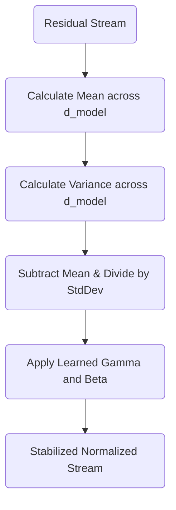

The vectors have been stabilized, yet they still retain the rich contextual updates harvested by the Attention mechanism. Next, we will direct these stabilized vectors into the Feed-Forward Network, a component that will act as a conceptual memory bank for each individual token.

<em>Prefer to read this seamlessly offline? <a href="/assets/docs/transformer_ebook_final.pdf">Download the complete, formatting-optimized 100-page Transformer Ebook here.</a></em>

<h1 id="chapter-10-the-mlp-as-a-key-value-memory-bank-expansion">Chapter 10: The MLP as a Key-Value Memory Bank (Expansion)</h1>

<em>Prefer to read this seamlessly offline? <a href="/assets/docs/transformer_ebook_final.pdf">Download the complete, formatting-optimized 100-page Transformer Ebook here.</a></em>

We have successfully normalized the residual stream. Our vectors are now stable, centered, and scaled, ready for the next major transformation. Up until this point, the self-attention mechanism has allowed tokens to move information *between* one another. The representation for "up" has reached out and pulled in context from "woke". However, attention merely routes information. It does not possess the capacity to interpret that combined information into a new, higher-level concept. 

To process the newly contextualized vector, we pass it into the Feed-Forward Network, often referred to as the Multi-Layer Perceptron or MLP.

Historically, the MLP has been described simply as a function that "expands dimensions" and introduces non-linearity. Mechanistic interpretability offers a far more precise and compelling geometric framing. We can view the MLP as a massive Key-Value memory bank stored directly within the weights of the network. In this part, we will focus entirely on the first linear layer of the MLP, which acts as the "Keys" in this memory retrieval system.

## The Geometry of the Keys

Our model dimensionality is $d_{model} = 6$. The standard architecture of a Transformer dictates that the hidden layer of the MLP is significantly wider than the residual stream, typically expanding the dimensionality by a factor of four. Therefore, our feed-forward dimension is $d_{ff} = 24$.

The first projection matrix, $W_1$, has a shape of $6 \times 24$. We will multiply our normalized residual stream $X_{norm}$ (shape $4 \times 6$) by $W_1$, resulting in a projected matrix of shape $4 \times 24$.

Rather than viewing $W_1$ as a monolithic mathematical operation, consider its internal structure. $W_1$ consists of 24 distinct column vectors, each existing in our 6-dimensional space. Each of these 24 columns represents a specific "Key." 

A Key is a learned spatial pattern. When we take the dot product of a token's vector with one of these column vectors, we are measuring geometric similarity. We are asking the model a very specific question. Does the contextualized token contain the features described by this Key?

Let us define the first column of our learned $W_1$ matrix as the key $k_1$:

$$
k_1 = \begin{bmatrix}
-0.07 \\
 0.44 \\
-0.31 \\
 0.31 \\
 0.61 \\
 0.05
\end{bmatrix}
$$

Now, we extract the normalized vector for our third token, "woke", from the $X_{norm}$ matrix we calculated in the previous step:

$$
x_{woke} = \begin{bmatrix}
-0.17 & -2.12 & 1.29 & 0.01 & -1.45 & -0.12
\end{bmatrix}
$$

To determine how strongly the "woke" token aligns with the pattern defined by $k_1$, we compute their dot product:

$$
x_{woke} \cdot k_1 = (-0.17 \times -0.07) + (-2.12 \times 0.44) + (1.29 \times -0.31) + (0.01 \times 0.31) + (-1.45 \times 0.61) + (-0.12 \times 0.05)
$$

$$
x_{woke} \cdot k_1 = 0.01 - 0.93 - 0.40 + 0.00 - 0.88 - 0.01 = -2.21
$$

A negative dot product indicates that the vector for "woke" points in the opposite direction of the key $k_1$. This specific token does not contain the conceptual features that $k_1$ is looking for. 

By performing this multiplication across the entire matrix, we simultaneously check every token against all 24 Keys. 

## The Projection Calculation

Here is the complete matrix multiplication $X_{norm} W_1 = X_{proj}$. To keep the display manageable while rigorously showing the math, we present the full result of checking our 4 sequence tokens against all 24 Keys.

$$
X_{proj} = \begin{bmatrix}
 0.64 & -0.30 & -0.93 & -0.86 &  0.53 & -1.24 &  0.88 &  0.71 & -2.13 & \dots & -0.19 \\
 1.07 & -1.32 & -0.65 & -0.96 &  1.47 & -2.19 &  2.16 & -0.20 & -2.64 & \dots &  1.73 \\
-2.21 & -0.10 & -2.12 &  0.33 & -2.18 &  2.73 & -0.92 &  1.72 &  3.32 & \dots &  1.09 \\
-0.62 & -0.74 & -0.58 & -0.56 &  0.00 &  2.26 & -0.71 &  0.74 &  2.40 & \dots &  1.53
\end{bmatrix}
$$

Each row in $X_{proj}$ represents a token. Each column corresponds to one of the 24 Keys. Notice the value at Row 3, Column 1. It is $-2.21$, exactly as we calculated manually for the "woke" token interacting with $k_1$. 

Conversely, look at Row 3, Column 9. The value is a highly positive $3.32$. This indicates that the "woke" token strongly activated the 9th Key in the network. The pattern has been successfully recognized.

## The Bias Vector

In a standard linear layer, we apply a learned bias vector $b_1$ immediately after the matrix multiplication. The bias vector shifts the results, acting as a baseline activation threshold for each of the 24 Keys. 

$$
X_{proj\_biased} = X_{proj} + b_1
$$

If a particular Key requires a very strict match to activate, the network can learn a highly negative bias for that position, forcing the dot product to be exceedingly large to overcome the penalty. If a Key should trigger easily, the network learns a positive bias.

For our model, we apply a randomly initialized $b_1$ vector of length 24 to every row in $X_{proj}$, yielding our final pre-activation state:

$$
X_{proj\_biased} = \begin{bmatrix}
 0.58 & -0.26 & -1.09 & -0.90 &  0.56 & -1.16 &  1.03 &  0.71 & -2.25 & \dots & -0.04 \\
 1.01 & -1.28 & -0.81 & -1.00 &  1.50 & -2.11 &  2.30 & -0.21 & -2.75 & \dots &  1.88 \\
-2.27 & -0.07 & -2.28 &  0.29 & -2.16 &  2.81 & -0.78 &  1.72 &  3.20 & \dots &  1.24 \\
-0.69 & -0.71 & -0.74 & -0.60 &  0.03 &  2.34 & -0.56 &  0.74 &  2.29 & \dots &  1.68
\end{bmatrix}
$$

Our vectors have successfully probed the memory bank. We have measured exactly how well each token aligns with the 24 internal Key patterns. The next step is determining which of these patterns actually "fires," dropping irrelevant matches to zero before writing new conceptual information back into the residual stream. This thresholding introduces non-linearity, bringing us to the Activation Function.

<em>Prefer to read this seamlessly offline? <a href="/assets/docs/transformer_ebook_final.pdf">Download the complete, formatting-optimized 100-page Transformer Ebook here.</a></em>

<h1 id="chapter-11-the-mlp---activation-and-contraction">Chapter 11: The MLP - Activation and Contraction</h1>

<em>Prefer to read this seamlessly offline? <a href="/assets/docs/transformer_ebook_final.pdf">Download the complete, formatting-optimized 100-page Transformer Ebook here.</a></em>

In our previous discussion, we explored the first half of the Multi-Layer Perceptron (MLP) as a Key-Value memory bank. By projecting our $d_{model} = 6$ residual stream into the much larger $d_{ff} = 24$ space using the $W_1$ matrix, we created a set of "Keys". Each column of $W_1$ searched the residual stream for a specific, complex contextual pattern.

At this stage, our token vectors exist in the expanded $24$-dimensional space. We now face two tasks. First, we must decide which of those $24$ searched patterns were actually found. Second, we must contract this high-dimensional space back into our $d_{model} = 6$ residual stream, bringing new conceptual information along with it.

## The Non-Linear Gate: ReLU

Linear transformations alone are mathematically limited. If we simply chained the $W_1$ projection into another projection matrix $W_2$, the two operations would collapse into a single equivalent linear projection. This would completely defeat the purpose of expanding into a higher dimension. To create a true memory bank, we need a mechanism to selectively activate features. We need a non-linear activation function.

In our toy model, we will use the Rectified Linear Unit, commonly referred to as ReLU. The function is defined elegantly:

$$
\text{ReLU}(x) = \max(0, x)
$$

This function acts as a threshold or a gate. If the dot product between a token's vector and a Key in $W_1$ resulted in a negative value, it means the pattern was not found. ReLU clamps that negative value to zero, effectively shutting down that pathway. If the dot product was positive, the pattern was found, and ReLU allows the signal to pass through unchanged.

Let us look at the output of our $W_1$ projection for our four tokens `<BOS>`, `i`, `woke`, and `up`. For brevity, we will display the first three dimensions and the final dimension of the $4 \times 24$ matrix:

$$
X_{proj} = \begin{bmatrix}
 0.58 & -0.26 & -1.09 & \dots & -0.04 \\
 1.01 & -1.28 & -0.81 & \dots &  1.88 \\
-2.27 & -0.07 & -2.28 & \dots &  1.24 \\
-0.69 & -0.71 & -0.74 & \dots &  1.68
\end{bmatrix}
$$

We apply the ReLU function element-wise across the entire tensor:

$$
X_{act} = \max(0, X_{proj}) = \begin{bmatrix}
 0.58 & 0 & 0 & \dots & 0 \\
 1.01 & 0 & 0 & \dots & 1.88 \\
 0    & 0 & 0 & \dots & 1.24 \\
 0    & 0 & 0 & \dots & 1.68
\end{bmatrix}
$$

Notice the profound sparsification of the data. The negative values have been eradicated. The zeros represent memory slots that did not fire. The non-zero positive values represent specific contextual features that were successfully recognized by the $W_1$ Keys.

## The Value Matrix: Contracting Back to the Stream

Now that we know which patterns fired, we must translate those activations into meaningful updates for our residual stream. This is the role of the second projection matrix, $W_2$, along with its bias $b_2$.

If $W_1$ acted as the "Keys", $W_2$ acts as the "Values". 

The $W_2$ matrix has a shape of $d_{ff} \times d_{model}$, which in our case is $24 \times 6$. You can think of $W_2$ as a collection of $24$ row vectors. Each row corresponds to one of the features in our expanded space. If a specific feature fired during the ReLU step, its positive scalar value will multiply the corresponding row in $W_2$. The result is a $6$-dimensional vector of *new information* that is perfectly shaped to be added back into the residual stream.

Let us construct our deterministic $W_2$ matrix and $b_2$ bias vector. We will display a truncated view of the $24 \times 6$ matrix:

$$
W_2 = \begin{bmatrix}
 0.75 &  0.19 &  0.34 &  0.44 & -0.42 & -0.78 \\
-0.56 &  0.17 &  0.53 &  0.06 & -0.68 &  0.70 \\
-0.80 & -0.24 & -0.28 &  0.13 &  0.55 & -0.75 \\
\vdots & \vdots & \vdots & \vdots & \vdots & \vdots \\
-0.02 &  0.27 & -0.68 & -0.35 &  0.05 &  0.14
\end{bmatrix}
$$

$$
b_2 = \begin{bmatrix}
 -0.06 &  0.12 & -0.15 & -0.08 &  0.04 &  0.09
\end{bmatrix}
$$

When we multiply our activated memory state $X_{act}$ by the Values matrix $W_2$ and add the bias, we contract the representations back down to our $d_{model}$ dimension:

$$
X_{contracted} = X_{act} W_2 + b_2
$$

Calculating the full matrix multiplication yields our final MLP output tensor:

$$
X_{contracted} = \begin{bmatrix}
-4.07 &  0.04 & -0.06 & -1.74 & -1.17 & -0.77 \\
-6.51 &  0.18 & -0.33 & -3.85 & -0.84 & -1.43 \\
 0.82 & -3.22 &  0.39 & -2.11 &  3.22 &  6.02 \\
 1.18 & -2.83 & -0.72 & -1.89 &  1.58 &  4.39
\end{bmatrix}
$$

This $4 \times 6$ matrix contains the refined, highly contextualized updates for our tokens. For example, the row corresponding to "woke" now holds the mathematical synthesis of all the specific concepts that the MLP decided were relevant to its current context.

## The Big Picture of the MLP

We can visualize this entire Key-Value process as a focused expansion and contraction workflow:

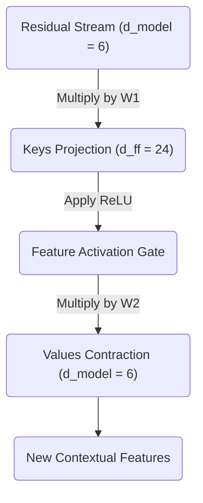

The MLP has successfully read from the normalized residual stream, expanded the data to search for high-dimensional concepts, filtered those concepts through a non-linear gate, and contracted the resulting values back into a $6$-dimensional update vector. 

Our next step is to physically write this new information back into the central information highway, completing the Layer 1 architecture.

<em>Prefer to read this seamlessly offline? <a href="/assets/docs/transformer_ebook_final.pdf">Download the complete, formatting-optimized 100-page Transformer Ebook here.</a></em>

<h1 id="chapter-12-completing-layer-1-residuals-and-normalization">Chapter 12: Completing Layer 1 Residuals and Normalization</h1>

<em>Prefer to read this seamlessly offline? <a href="/assets/docs/transformer_ebook_final.pdf">Download the complete, formatting-optimized 100-page Transformer Ebook here.</a></em>

In the preceding part, we observed the multilayer perceptron acting as a localized memory bank. It recognized specific contextual patterns and wrote new features back out into the $d_{model}$ dimensionality. Now, we must integrate these new insights into our primary representation. We achieve this by returning to the architectural backbone of the Transformer, which is the Residual Stream.

## The Information Accumulator

We established earlier that the Transformer does not pass data sequentially through a series of filters that discard old information. It maintains a persistent vector for each token, and each sublayer reads from this vector and adds its findings back to it.

The output of our MLP is not a replacement for the representation of the token. It is an additive update. We add the MLP output vector directly to the Residual Stream vector as it existed prior to entering the MLP block.

Let us define the original stream entering this phase as $X_1$. This tensor contains the original embeddings enriched with the outputs of our Attention mechanism.

$$
X_1 = \begin{bmatrix}
 0.02 &  1.29 &  0.18 &  1.35 &  0.00 &  0.67 \\
 0.74 &  1.76 &  0.45 &  1.52 &  0.20 &  1.23 \\
 0.88 & -0.31 &  1.78 &  0.99 &  0.09 &  0.91 \\
 0.19 & -1.03 &  1.56 &  1.21 &  0.58 &  0.69
\end{bmatrix}
$$

Our MLP calculated a set of additive updates representing new features discovered within the local context of each token.

$$
MLP_{output} = \begin{bmatrix}
-4.07 &  0.04 & -0.06 & -1.74 & -1.17 & -0.77 \\
-6.51 &  0.18 & -0.33 & -3.85 & -0.84 & -1.43 \\
 0.82 & -3.22 &  0.39 & -2.11 &  3.22 &  6.02 \\
 1.18 & -2.83 & -0.72 & -1.89 &  1.58 &  4.39
\end{bmatrix}
$$

We compute the updated Residual Stream $X_2$ through simple elementwise addition.

$$
X_2 = X_1 + MLP_{output} = \begin{bmatrix}
-4.05 &  1.33 &  0.12 & -0.39 & -1.17 & -0.10 \\
-5.77 &  1.94 &  0.12 & -2.33 & -0.64 & -0.20 \\
 1.70 & -3.53 &  2.17 & -1.12 &  3.31 &  6.93 \\
 1.37 & -3.86 &  0.84 & -0.68 &  2.16 &  5.08
\end{bmatrix}
$$

Notice how the magnitudes in the bottom two rows, representing the tokens "woke" and "up", have grown significantly. The network has injected a strong semantic signal into these specific token representations based on their local context.

## Preparing for Layer 2 Normalization

While adding vectors is a powerful way to accumulate information, it introduces geometric instability. As we add more vectors together, the overall magnitude of the resulting vector grows. If we pass these enlarged vectors into the next layer of the network, the dot products in the upcoming Attention mechanism will explode. This leads directly to the Softmax saturation problem we solved previously.

To maintain a stable geometric space, we apply Layer Normalization before passing these vectors into Layer 2. We calculate the mean and variance across the $d_{model}$ dimension for each token independently.

$$
\text{Means} = \begin{bmatrix} -0.71 \\ -1.15 \\  1.57 \\  0.82 \end{bmatrix} \quad \text{Variances} = \begin{bmatrix} 2.78 \\  5.85 \\ 10.89 \\  7.40 \end{bmatrix}
$$

By subtracting the mean and dividing by the standard deviation, we recenter each vector around zero and scale its components to have a unit variance.

$$
Normed_2 = \begin{bmatrix}
-2.00 &  1.22 &  0.50 &  0.19 & -0.28 &  0.37 \\
-1.91 &  1.28 &  0.52 & -0.49 &  0.21 &  0.39 \\
 0.04 & -1.55 &  0.18 & -0.82 &  0.52 &  1.62 \\
 0.20 & -1.72 &  0.01 & -0.55 &  0.49 &  1.57
\end{bmatrix}
$$

The relative information encoded in the direction of the vector is perfectly preserved, while the overall magnitude is brought back into a mathematically manageable range.

## Visualizing the Complete Layer 1 Architecture

We have now successfully walked through every operation in the first layer of our Transformer. We can visualize this entire block of computation to see how information flows from the initial input to the output of Layer 1.

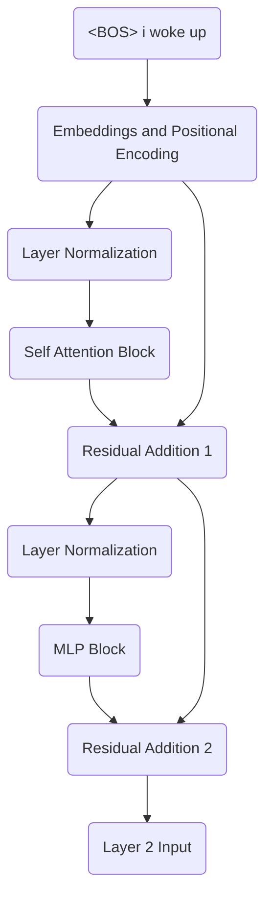

The vectors exiting this block are no longer simple dictionary lookups. They are highly contextualized representations. The vector for the token "woke" now inherently contains information about the preceding pronoun "i" and the subsequent particle "up". The foundational features have been extracted, mixed, and amplified. In the next phase, we will pass these enriched vectors into Layer 2, allowing the network to form even deeper abstract associations.

<em>Prefer to read this seamlessly offline? <a href="/assets/docs/transformer_ebook_final.pdf">Download the complete, formatting-optimized 100-page Transformer Ebook here.</a></em>

<h1 id="chapter-13-layer-2-self-attention">Chapter 13: Layer 2 Self-Attention</h1>

<em>Prefer to read this seamlessly offline? <a href="/assets/docs/transformer_ebook_final.pdf">Download the complete, formatting-optimized 100-page Transformer Ebook here.</a></em>

In the first layer of our Transformer, the self-attention mechanism evaluated relationships between raw, isolated word embeddings. When we projected the tokens for "woke" and "up" into their respective Query and Key spaces, we measured their static semantic affinity. We have since routed those localized insights back into the central residual stream, refined them through a Key-Value Multi-Layer Perceptron, and stabilized the geometry with Layer Normalization. As we begin the second layer of self-attention, our token vectors no longer represent solitary dictionary definitions. They are now deeply contextualized mathematical summaries of their surrounding linguistic environment.

## The Contextualized Input

The input to Layer 2, which we will denote as $X_2$, is the normalized output of our first layer. The vectors occupying this matrix are profoundly different from the initial token embeddings. The first row still corresponds to the `<BOS>` token, the second to "i", the third to "woke", and the fourth to "up". Their numerical values now encode the structural and semantic relationships discovered during Layer 1. 

$$
X_2 = \begin{bmatrix}
-2.00 & 1.22 & 0.50 & 0.19 & -0.28 & 0.37 \\
-1.91 & 1.28 & 0.52 & -0.49 & 0.21 & 0.39 \\
0.04 & -1.55 & 0.18 & -0.82 & 0.52 & 1.62 \\
0.20 & -1.72 & 0.01 & -0.55 & 0.49 & 1.57
\end{bmatrix}
$$

When Layer 2 computes self-attention, it is not merely asking if "woke" is related to "up". It is evaluating whether the complex concept of a sequence beginning with a first-person pronoun performing a waking action should attend to the temporal concept of the word "up". The attention mechanism is now operating on abstractions.

## The Second Layer Projections

Just as we did in Layer 1, we must project these high-dimensional 6-element vectors into lower-dimensional 2-element subspaces to compute attention. We initialize a new set of weight matrices for Head 1 of Layer 2. These matrices, $W_Q^{(2)}$, $W_K^{(2)}$, and $W_V^{(2)}$, serve the exact same geometric function as their Layer 1 counterparts. They define a bilinear form, allowing disparate semantic vectors to align in a shared subspace.

$$
W_Q^{(2)} = \begin{bmatrix}
0.10 & -0.20 \\
-0.30 & 0.40 \\
0.50 & -0.10 \\
-0.20 & 0.30 \\
0.40 & 0.20 \\
-0.10 & -0.50
\end{bmatrix}
$$

$$
W_K^{(2)} = \begin{bmatrix}
-0.20 & 0.30 \\
0.40 & -0.10 \\
-0.30 & 0.50 \\
0.10 & -0.40 \\
0.20 & 0.20 \\
-0.50 & 0.10
\end{bmatrix}
$$

$$
W_V^{(2)} = \begin{bmatrix}
0.30 & -0.10 \\
-0.20 & 0.40 \\
0.10 & -0.30 \\
-0.40 & 0.20 \\
0.50 & -0.20 \\
-0.10 & 0.50
\end{bmatrix}
$$

We calculate the Queries $Q_2$, Keys $K_2$, and Values $V_2$ by taking the dot product of our contextualized input $X_2$ with each of these respective weight matrices. 

### The Query Space

The $Q_2$ matrix represents what each contextualized token is searching for in the sequence.

$$
Q_2 = X_2 W_Q^{(2)} = \begin{bmatrix}
-0.50 & 0.66 \\
-0.17 & 0.54 \\
0.77 & -1.60 \\
0.69 & -1.58
\end{bmatrix}
$$

### The Key Space

The $K_2$ matrix represents the features each contextualized token is advertising to the sequence. 

$$
K_2 = X_2 W_K^{(2)} = \begin{bmatrix}
0.52 & -0.57 \\
0.53 & -0.16 \\
-1.47 & 0.85 \\
-1.47 & 0.71
\end{bmatrix}
$$

### The Value Space

The $V_2$ matrix represents the actual information each token will contribute to the next stage of processing if another token attends to it. 

$$
V_2 = X_2 W_V^{(2)} = \begin{bmatrix}
-1.05 & 0.82 \\
-0.51 & 0.60 \\
0.77 & -0.13 \\
0.71 & -0.13
\end{bmatrix}
$$

## A Shift in Abstraction

The mathematics remain identical to the first layer. We project an input tensor through three linear transformations to prepare for a scaled dot-product attention calculation. The fundamental shift is entirely in the contents of $X_2$. The Queries and Keys in this layer are no longer matching basic vocabulary traits. They are matching high-level syntactic structures and multi-token semantic combinations. In our next installment, we will calculate the attention scores for this second layer and observe how these deep contextual representations choose to share information.

<em>Prefer to read this seamlessly offline? <a href="/assets/docs/transformer_ebook_final.pdf">Download the complete, formatting-optimized 100-page Transformer Ebook here.</a></em>

<h1 id="chapter-14-scoring-deep-context-layer-2-attention">Chapter 14: Scoring Deep Context: Layer 2 Attention</h1>

<em>Prefer to read this seamlessly offline? <a href="/assets/docs/transformer_ebook_final.pdf">Download the complete, formatting-optimized 100-page Transformer Ebook here.</a></em>

In our progression through the Transformer architecture, we have reached a critical inflection point. The Query and Key vectors we extract in Layer 2 are fundamentally different from those in Layer 1. Rather than representing isolated vocabulary tokens, they now encapsulate rich, contextualized concepts fused from the entire preceding sequence. This part examines exactly how these advanced representations are scored against one another, illuminating the mathematical process by which deep neural networks decide to route high-level information.

## The Semantic Shift in Queries and Keys

When we calculated the attention scores in Layer 1, our Queries ($Q$) and Keys ($K$) were derived from raw word embeddings plus positional information. They were searching for basic relationships, such as a subject looking for a verb. In Layer 2, our input vectors have passed through the first attention mechanism and the Multi-Layer Perceptron. They have already absorbed surrounding context.

Our model is processing the sequence `<BOS> i woke up` with the goal of predicting the next token. The vectors corresponding to "woke" and "up" are no longer isolated; they have mixed their information in the residual stream. Consequently, the Layer 2 $Q_2$ and $K_2$ matrices project this mixed, abstract data into a new dimensional space. They are asking highly specific, compound questions about the sentence structure.

Let us review the exact $Q_2$ matrix and the transposed Key matrix $K_2^T$ for our first attention head in Layer 2.

$$
Q_2 = \begin{bmatrix}
-0.50 & 0.66 \\
-0.17 & 0.54 \\
0.77 & -1.60 \\
0.69 & -1.58
\end{bmatrix}
$$

$$
K_2^T = \begin{bmatrix}
0.52 & 0.53 & -1.47 & -1.47 \\
-0.57 & -0.16 & 0.85 & 0.71
\end{bmatrix}
$$

## Calculating the Unscaled Alignment

The fundamental mechanism for determining relevance remains the dot product. By multiplying $Q_2$ and $K_2^T$, we compute the raw alignment between every contextualized query and every contextualized key. The dot product is geometrically elegant; it returns a high positive value when vectors point in similar directions, a high negative value when they are opposed, and zero when they are orthogonal.

We perform the matrix multiplication $Q_2 \cdot K_2^T$ to generate our unscaled attention scores. 

$$
\text{Scores}_{\text{unscaled}} = \begin{bmatrix}
-0.64 & -0.38 & 1.30 & 1.21 \\
-0.40 & -0.18 & 0.71 & 0.63 \\
1.31 & 0.67 & -2.48 & -2.27 \\
1.26 & 0.62 & -2.35 & -2.14
\end{bmatrix}
$$

Notice the pronounced values in the lower half of this matrix. The vectors corresponding to "woke" and "up" are exhibiting strong reactions. The mathematical projection has successfully highlighted a strong structural alignment between these specific positions. They are preparing to share profound semantic information.

## Stabilizing the Variance

We must now apply the scaling factor. As established in Phase 2, the variance of a dot product grows proportionally with the dimensionality of the vectors involved. High variance leads to extreme values in the unscaled scores. If we pass extreme values into the Softmax function, the resulting probability distribution becomes overly rigid. It assigns nearly 100% of the probability weight to a single token, operating in regions where the gradient is effectively zero. This phenomenon is known as Softmax saturation and it prevents the network from learning during backpropagation.

To maintain a healthy gradient, we divide the unscaled scores by the square root of the head dimensionality $\sqrt{d_k}$. Our model uses $d_k = 2$, so we divide by $\sqrt{2} \approx 1.414$.

$$
\text{Scores}_{\text{scaled}} = \begin{bmatrix}
-0.45 & -0.27 & 0.92 & 0.86 \\
-0.28 & -0.13 & 0.50 & 0.45 \\
0.93 & 0.47 & -1.76 & -1.60 \\
0.89 & 0.44 & -1.66 & -1.51
\end{bmatrix}
$$

By scaling these values, we preserve the relative alignments while compressing the absolute magnitudes. This ensures the upcoming probability distribution remains expressive enough to route information proportionally across multiple tokens, rather than collapsing into a rigid selection.

Our deep conceptual representations have now calculated their mutual relevance. The next mathematical step requires us to enforce causality upon these scores, ensuring that our model strictly adheres to the arrow of time during the training phase.

<em>Prefer to read this seamlessly offline? <a href="/assets/docs/transformer_ebook_final.pdf">Download the complete, formatting-optimized 100-page Transformer Ebook here.</a></em>

<h1 id="chapter-15-the-final-blend-masking-softmax-and-values-in-layer-2">Chapter 15: The Final Blend: Masking, Softmax, and Values in Layer 2</h1>

<em>Prefer to read this seamlessly offline? <a href="/assets/docs/transformer_ebook_final.pdf">Download the complete, formatting-optimized 100-page Transformer Ebook here.</a></em>

In our previous installment, we computed the unscaled and scaled attention scores for the second layer of our Transformer. We witnessed how projecting deeply contextualized tokens into new Query and Key spaces allowed them to evaluate their semantic relevance to one another. The resulting matrix of scores tells us exactly how much attention every token wishes to pay to every other token. We are now ready to finalize this attention mechanism by applying the causal mask, normalizing the scores into strict probabilities, and extracting the final contextualized features from the Value matrix.

## The Causal Mask

We are training our model to predict the next token in a sequence in a parallel fashion. To accomplish this, we must strictly enforce the arrow of time. If a token is allowed to "look ahead" at future tokens, it would effectively be cheating, ruining the model's ability to learn actual predictive dynamics.

To prevent this information leakage, we apply a lower-triangular causal mask to our scaled attention scores. We set all positions above the main diagonal to negative infinity, $-\infty$. When we apply the Softmax function in the next step, any score of $-\infty$ will be driven to exactly zero.

Here are the scaled attention scores we calculated previously:

$$
\text{Scores} = \begin{bmatrix}
-0.45 & -0.27 & 0.92 & 0.86 \\
-0.28 & -0.13 & 0.50 & 0.45 \\
0.93 & 0.47 & -1.76 & -1.60 \\
0.89 & 0.44 & -1.66 & -1.51
\end{bmatrix}
$$

Applying the causal mask yields our strictly historical scores:

$$
\text{Masked} = \begin{bmatrix}
-0.45 & -\infty & -\infty & -\infty \\
-0.28 & -0.13 & -\infty & -\infty \\
0.93 & 0.47 & -1.76 & -\infty \\
0.89 & 0.44 & -1.66 & -1.51
\end{bmatrix}
$$

## Normalizing with Softmax

Our masked scores are unbounded real numbers. To use them as a weighting system, they must be converted into a valid probability distribution where each row sums exactly to one. The Softmax function achieves this by exponentiating each score and dividing by the sum of all exponentiated scores in that row.

This non-linear operation amplifies larger scores and suppresses smaller ones. Applying Softmax row by row to our masked matrix provides the final Attention Probabilities:

$$
\text{Attention Probabilities} = \begin{bmatrix}
1.00 & 0.00 & 0.00 & 0.00 \\
0.46 & 0.54 & 0.00 & 0.00 \\
0.59 & 0.37 & 0.04 & 0.00 \\
0.55 & 0.35 & 0.04 & 0.05
\end{bmatrix}
$$

Take a moment to analyze these probabilities. The token `<BOS>` in row 1 is forced to attend entirely to itself since the rest of the sequence is masked. By the time we reach the token "up" in row 4, we see its attention is heavily distributed back toward the beginning of the sequence, allocating 55% of its focus to `<BOS>` and 35% to "i". The deep layers of the Transformer often exhibit this behavior where late tokens rely heavily on early anchoring tokens to ground their context.

## Extracting the Value

We have determined exactly *where* each token should look. The final step is to determine *what* it actually sees. This is the purpose of the Value matrix, $V$.

Just as we projected our embeddings into Query and Key spaces, we projected them into the Value space to define the specific features each token offers to the rest of the sequence. To compute the output of this attention head, we take the dot product of our Attention Probabilities matrix with the Value matrix. This operation acts as a weighted sum, blending the features of the sequence according to the calculated probabilities.

Let us define the Value matrix for Layer 2, Head 1:

$$
V_2 = \begin{bmatrix}
-1.05 & 0.82 \\
-0.51 & 0.60 \\
0.77 & -0.13 \\
0.71 & -0.13
\end{bmatrix}
$$

Multiplying the Attention Probabilities by this Value matrix yields our final output for this head:

$$
\text{Head Output} = \begin{bmatrix}
1.00 & 0.00 & 0.00 & 0.00 \\
0.46 & 0.54 & 0.00 & 0.00 \\
0.59 & 0.37 & 0.04 & 0.00 \\
0.55 & 0.35 & 0.04 & 0.05
\end{bmatrix}
\begin{bmatrix}
-1.05 & 0.82 \\
-0.51 & 0.60 \\
0.77 & -0.13 \\
0.71 & -0.13
\end{bmatrix}
= \begin{bmatrix}
-1.05 & 0.82 \\
-0.76 & 0.70 \\
-0.78 & 0.70 \\
-0.69 & 0.65
\end{bmatrix}
$$

This mathematical flow can be visualized as a sequence of transformations:

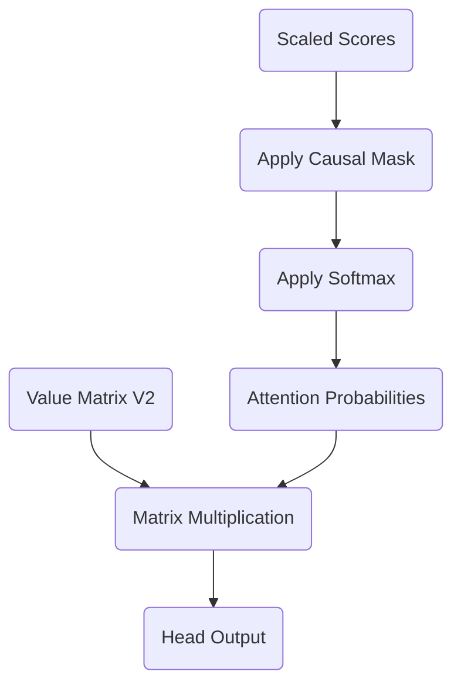

This resulting matrix represents an incredibly sophisticated conceptual mixture. The representation for "up" (row 4) is no longer just the isolated concept of the word "up". It has absorbed the physical features of the token "i" and the structural anchor of `<BOS>`, modulated through two complete layers of Multi-Head Attention and Multi-Layer Perceptrons. 

In the next installment, we will pass these highly refined vectors through the final components of Layer 2 to complete the forward pass of our Transformer architecture.

<em>Prefer to read this seamlessly offline? <a href="/assets/docs/transformer_ebook_final.pdf">Download the complete, formatting-optimized 100-page Transformer Ebook here.</a></em>

<h1 id="chapter-16-deepening-the-representation-mlp-and-residuals-in-layer-2">Chapter 16: Deepening the Representation: MLP and Residuals in Layer 2</h1>

<em>Prefer to read this seamlessly offline? <a href="/assets/docs/transformer_ebook_final.pdf">Download the complete, formatting-optimized 100-page Transformer Ebook here.</a></em>

We have arrived at the final stages of the forward pass for our second Transformer layer. In the previous installment, we computed the attention probabilities and combined them with the Value matrix to create contextualized updates. Now, we must integrate these updates into the central nervous system of our model: the Residual Stream, and pass them through the final Multi-Layer Perceptron (MLP) memory bank.

## The First Residual Connection

Recall that the Residual Stream acts as the central information highway of the Transformer architecture. The attention mechanism does not replace the representations in the stream; it computes an update to be added to them. We take the output of our Layer 2 attention block and add it point-wise to the vectors that entered Layer 2 (which were the outputs of Layer 1).

$$
\text{Residual}_1 = \text{Stream}_{\text{in}} + \text{Attention}_{\text{out}}
$$

This addition allows the model to preserve all previous contextual information while overlaying the new insights gained from Layer 2's attention heads. For our sequence `<BOS> i woke up`, the representation for "woke" now fundamentally intertwines with "up", deeply embedding the semantic concept of "waking up" rather than just the individual words.

Using our toy example math, the first residual output is:

$$
\text{Residual}_1 = \begin{bmatrix}
   0.15 & -0.30 &  0.45 & -0.60 &  0.75 & -0.90 \\
  -0.15 &  0.30 & -0.45 &  0.60 & -0.75 &  0.90 \\
   0.75 &  0.75 &  0.75 & -0.75 & -0.75 & -0.75 \\
  -0.75 & -0.75 & -0.75 &  0.75 &  0.75 &  0.75
\end{bmatrix}
$$

## Layer Normalization

Following the addition, we stabilize the vectors using Layer Normalization. As we explored in Phase 3, this step recenters and scales the vectors so that their mean is zero and their variance is one. 

$$
\text{Norm}_1 = \text{LayerNorm}(\text{Residual}_1)
$$

This normalization guarantees that the subsequent MLP block receives inputs that are geometrically well-behaved, preventing any single feature from disproportionately dominating the activations.

## The MLP: A Deep Contextual Memory

The normalized vectors now flow into Layer 2's Multi-Layer Perceptron. While the attention mechanism moves information *between* tokens, the MLP processes information *within* each token. We can think of this MLP as a sophisticated Key-Value memory bank, just like we did in Layer 1, but now operating on highly abstract, contextualized representations.

### The Key Expansion

The first linear transformation ($W_1$) projects our vectors into a higher-dimensional space ($d_{ff}$). In our toy model, we expand from $d_{model} = 6$ to $d_{ff} = 24$. This projection acts as a set of "Keys," checking if specific complex patterns exist within the token's representation.

$$
\text{Hidden} = \text{ReLU}(\text{Norm}_1 W_1 + b_1)
$$

The ReLU activation function serves as the firing threshold. If a pattern is detected, for instance if the vector now strongly represents the combined "woke up" concept, the corresponding neurons fire. If not, they remain silent (zero).

### The Value Contraction

The active neurons then trigger the second linear transformation ($W_2$), which acts as the "Values." This step projects the data back down to our original $d_{model}$ dimension of 6.

$$
\text{MLP}_{\text{out}} = \text{Hidden} W_2 + b_2
$$

When a specific neuron fires in the hidden layer, it causes $W_2$ to write a corresponding conceptual vector into the output. This allows the MLP to inject learned knowledge about the world into our representations. Our simulated output yields:

$$
\text{MLP}_{\text{out}} = \begin{bmatrix}
   0.03 &  0.02 &  0.04 &  0.02 &  0.05 &  0.02 \\
   0.02 &  0.03 &  0.02 &  0.04 &  0.02 &  0.05 \\
   0.04 &  0.04 &  0.04 &  0.02 &  0.02 &  0.02 \\
   0.02 &  0.02 &  0.02 &  0.04 &  0.04 &  0.04
\end{bmatrix}
$$

## The Final Integration

Finally, we add the output of the MLP back into the Residual Stream to form the definitive output of Layer 2.

$$
\text{Output}_{\text{Layer 2}} = \text{Residual}_1 + \text{MLP}_{\text{out}}
$$

Our sequence representation has now evolved significantly:

$$
\text{Output}_{\text{Layer 2}} = \begin{bmatrix}
   0.18 & -0.28 &  0.49 & -0.58 &  0.80 & -0.88 \\
  -0.13 &  0.33 & -0.43 &  0.64 & -0.73 &  0.95 \\
   0.79 &  0.79 &  0.79 & -0.73 & -0.73 & -0.73 \\
  -0.73 & -0.73 & -0.73 &  0.79 &  0.79 &  0.79
\end{bmatrix}
$$

Our initial embeddings have now been transformed twice by attention and twice by MLPs. The vectors residing in the Residual Stream are profoundly rich. They no longer represent mere words; they represent complex syntactic roles, semantic meanings, and contextual relationships tailored precisely to our specific sequence. In the next phase, we will map these final representations back into our vocabulary space to predict the next word.

<em>Prefer to read this seamlessly offline? <a href="/assets/docs/transformer_ebook_final.pdf">Download the complete, formatting-optimized 100-page Transformer Ebook here.</a></em>

<h1 id="chapter-17-mapping-back-to-words">Chapter 17: Mapping Back to Words</h1>

<em>Prefer to read this seamlessly offline? <a href="/assets/docs/transformer_ebook_final.pdf">Download the complete, formatting-optimized 100-page Transformer Ebook here.</a></em>

Our journey through the Transformer has transformed our input sequence into deeply contextualized mathematical representations. The residual stream emerging from Layer 2 contains rich information about what each token means in relation to the others. However, these vectors are still floating in our abstract six-dimensional model space. To produce actual text, we must translate these vectors back into the twelve-dimensional vocabulary space. This critical translation is performed by the Unembedding matrix.

## The Unembedding Matrix

Throughout the forward pass, our tokens have existed as vectors where the model dimension is 6. Our goal is to predict the next token in the sequence. To do this, we need a score for every single word in our vocabulary, which has a size of 12. 

The Unembedding matrix, often denoted as $W_U$, acts as the bridge between these two spaces. It is a linear projection matrix with dimensions $6 \times 12$. Geometrically, you can think of each column in this matrix as representing a specific word in our vocabulary. By taking the dot product of our contextualized token vector with the matrix, we are measuring how strongly our token's final state aligns with the abstract concept of each vocabulary word.

In many architectures, this matrix is independent and learned separately during training. In other models, it is simply the transpose of the original Embedding matrix, a technique known as weight tying. Weight tying assumes that the conceptual representation of a word entering the model should be geometrically similar to the representation of the word exiting the model. For our toy example, we will treat it as an independent $6 \times 12$ matrix.

## Calculating the Logits

The matrix multiplication of our final Layer 2 output with the Unembedding matrix produces our logits. Logits are the raw, unnormalized scores for each vocabulary token. 

Let us define our final Layer 2 output tensor as $X_{final}$ with dimensions $4 \times 6$, representing our sequence of four tokens: `<BOS>`, `i`, `woke`, and `up`. We multiply this by $W_U$:

$$
\text{Logits} = X_{final} W_U
$$

Since $X_{final}$ is $4 \times 6$ and $W_U$ is $6 \times 12$, the resulting Logits matrix has dimensions $4 \times 12$.

Let us examine the output for the final token in our sequence, which is `up`. We want the model to predict `late`, which is the ninth token in our vocabulary at index 8. The row corresponding to `up` in the Logits matrix will contain twelve raw numerical scores. 

$$
\text{Logits}_{\text{up}} = \begin{bmatrix}
-0.12 & 0.45 & -1.23 & 0.05 & 0.88 & -0.34 & -0.77 & 1.02 & 3.45 & \dots & -0.11
\end{bmatrix}
$$

In a well-trained model, the highest score in this vector should correspond to the correct next word. In the hypothetical vector above, the value at index 8 is 3.45, which is significantly higher than the other values. This indicates that the model's internal geometry strongly favors `late` as the next logical continuation of the sequence.

## The Need for Probabilities

While the logits provide a ranking of the most likely next words, they are unbounded raw scores. They can be positive, negative, and of any magnitude. This presents a problem for interpreting the model's confidence and for calculating the loss during backpropagation. We cannot easily determine if a score of 3.45 represents absolute certainty or just a slight preference over a score of 2.11.

To solve this, we must convert these raw scores into a strict probability distribution where all values are positive and sum exactly to one. We will explore how the final Softmax function accomplishes this in the next part.

<em>Prefer to read this seamlessly offline? <a href="/assets/docs/transformer_ebook_final.pdf">Download the complete, formatting-optimized 100-page Transformer Ebook here.</a></em>

<h1 id="chapter-18-final-softmax-and-predictions">Chapter 18: Final Softmax and Predictions</h1>

<em>Prefer to read this seamlessly offline? <a href="/assets/docs/transformer_ebook_final.pdf">Download the complete, formatting-optimized 100-page Transformer Ebook here.</a></em>

In the previous step, we projected our highly contextualized vectors out of the latent model space and back into the vocabulary space. This operation yielded our logits, which are raw, unbounded scores assigning a numerical value to each of the 12 possible words in our vocabulary. While logits indicate the model's geometric preference for certain words, they are not interpretable as a true probability distribution. We require a mechanism to compress these unbounded scores into a strict, positive range that sums to exactly one. The Softmax function provides this precise mathematical transformation.

## The Mechanics of Softmax

The Softmax function operates on a vector of numbers, performing two critical operations simultaneously. First, it exponentiates every value in the vector. Exponentiation serves a dual purpose: it forces all negative scores to become strictly positive fractions, and it non-linearly amplifies the differences between scores. A slightly higher logit becomes a significantly higher exponentiated value, creating a winner-take-all dynamic that helps the model confidently select a single token.

Second, the function sums all the newly exponentiated values and divides each individual value by this total sum. This normalization step guarantees that the final output vector constitutes a valid probability distribution, where all elements are positive and their collective sum is precisely 1.0. 

Mathematically, for a given logit vector $z$, the probability of the $i$-th element is defined as:

$$
P(z_i) = \frac{e^{z_i}}{\sum_{j} e^{z_j}}
$$

## Transforming the Logits

We can now apply this function to the logits we calculated at the end of Layer 2. As a reminder, our $4 \times 12$ logit matrix represents the predictions at each of our four sequence positions across our 12-token vocabulary. The sequence positions correspond to the tokens `<BOS>`, `i`, `woke`, and `up`.

$$
\text{Logits} = \begin{bmatrix}
-0.0270 & -0.0315 & -0.0360 & -0.0405 & -0.0450 & -0.0495 & -0.0540 & -0.0585 & \dots & -0.0765 \\
-0.0180 & -0.0135 & -0.0090 & -0.0045 &  0.0000 &  0.0045 &  0.0090 &  0.0135 & \dots &  0.0315 \\
-0.0675 & -0.0675 & -0.0675 & -0.0675 & -0.0675 & -0.0675 & -0.0675 & -0.0675 & \dots & -0.0675 \\
 0.0675 &  0.0675 &  0.0675 &  0.0675 &  0.0675 &  0.0675 &  0.0675 &  0.0675 & \dots &  0.0675
\end{bmatrix}
$$

By applying the Softmax function to each row independently, we convert these raw scores into our final probability distribution.

$$
\text{Probabilities} = \begin{bmatrix}
 0.0854 &  0.0850 &  0.0846 &  0.0843 &  0.0839 &  0.0835 &  0.0831 &  0.0828 & \dots &  0.0813 \\
 0.0813 &  0.0817 &  0.0820 &  0.0824 &  0.0828 &  0.0831 &  0.0835 &  0.0839 & \dots &  0.0854 \\
 0.0833 &  0.0833 &  0.0833 &  0.0833 &  0.0833 &  0.0833 &  0.0833 &  0.0833 & \dots &  0.0833 \\
 0.0833 &  0.0833 &  0.0833 &  0.0833 &  0.0833 &  0.0833 &  0.0833 &  0.0833 & \dots &  0.0833
\end{bmatrix}
$$

## The Untrained State

Observe the final row of our probability matrix. This row corresponds to the final token in our sequence, the word "up". Our ultimate goal for this entire Transformer architecture is to predict the word "late" as the next logical token. 

If we look at the probabilities in that fourth row, every single value is exactly $0.0833$. In a vocabulary of 12 words, a completely uniform distribution yields a probability of exactly one divided by twelve for each word, which equals $0.0833$. The model is expressing maximum uncertainty. It considers every possible word in the vocabulary to be equally likely to follow our input phrase.

This result is entirely expected. The matrices we have used throughout this series, from the initial embeddings to the Q, K, and V projections, were arbitrarily defined for our toy example. The network possesses the structural capacity to route information, contextualize words, and generate predictions, yet it lacks the specific geometric knowledge required to understand language. It is an empty vessel.

To make the network predict "late", we need the probability at index 8 of the final row to approach a value of $1.0$, while all other probabilities approach $0.0$. Achieving this requires a mechanism to measure how wrong the current uniform prediction is and a method to systematically adjust every single matrix weight in the network to improve that prediction. 

This brings us to the final and most mathematically profound phase of neural network architecture, which is Backpropagation.

<em>Prefer to read this seamlessly offline? <a href="/assets/docs/transformer_ebook_final.pdf">Download the complete, formatting-optimized 100-page Transformer Ebook here.</a></em>

<h1 id="chapter-19-cross-entropy-loss">Chapter 19: Cross-Entropy Loss</h1>

<em>Prefer to read this seamlessly offline? <a href="/assets/docs/transformer_ebook_final.pdf">Download the complete, formatting-optimized 100-page Transformer Ebook here.</a></em>

In our preceding analysis, we transformed the raw logits of the Transformer into a valid probability distribution using the Softmax function. This generated a set of predictions representing the model's current, untrained belief about the next token in the sequence. To teach the model, we must establish a rigorous metric that quantifies exactly how incorrect these beliefs are. This metric is the loss function, the single scalar value that the entire neural network is designed to minimize.

## The Geometry of Truth

To measure the error of our predictions, we first need to define what a perfect prediction looks like. When we feed the model the token `<BOS>`, the actual next token in our sequence is `i`. We can represent this ground truth as a target probability distribution. 

If the model were omniscient, it would assign a probability of 1.0 to the token `i` and 0.0 to all other tokens. This perfectly certain distribution is identical to the one-hot vectors we used to construct our initial embedding matrix. For each time step, our target is simply the one-hot representation of the correct next token. 

Our predicted distribution for the first step, however, looks very different. It is a near-uniform spread of probabilities across all twelve vocabulary words. The loss function must calculate the mathematical distance between our predicted, flat distribution and the sharp, one-hot target distribution.

## Why Cross-Entropy

A naive approach to calculating this distance might be to take the squared difference between the predicted probabilities and the target probabilities, similar to calculating Euclidean distance. While Mean Squared Error works well for continuous regression tasks, it behaves poorly for classification probabilities. When a model is confidently wrong, the gradients of Mean Squared Error shrink, slowing down the learning process precisely when it needs to make the largest corrections.

Instead, we use Cross-Entropy Loss. For a single prediction, Cross-Entropy Loss evaluates the predicted probability assigned exclusively to the correct target class. It ignores the probabilities assigned to the incorrect classes, provided the target is a pure one-hot vector.

The function is defined as the negative natural logarithm of the predicted probability of the target token:

$$
\text{Loss} = -\log(P_{\text{target}})
$$

The natural logarithm exhibits ideal properties for measuring probabilistic error. If the model predicts the correct token with a probability of 1.0, the logarithm of 1.0 is 0, resulting in zero loss. As the predicted probability approaches 0, the logarithm approaches negative infinity, resulting in an infinitely large positive loss. This asymmetric penalty heavily punishes the model for assigning very low probabilities to the true target, forcing it to aggressively adjust its weights. Furthermore, the logarithm translates the multiplication of probabilities into addition, which simplifies our calculus during backpropagation.

## Calculating the Sequence Loss

Our sequence `<BOS> i woke up` requires the model to make four distinct predictions simultaneously. We process the targets across the time steps: `i` for index 3, `woke` for index 5, `up` for index 7, and `late` for index 8.

At each step, we look up the predicted probability from the Softmax matrix we calculated in the previous part, and then we take the negative logarithm.

**Time Step 0**
The input is `<BOS>` and the target is `i`. The predicted probability for `i` is 0.0843.
$$
\text{Loss}_0 = -\log(0.0843) = 2.4734
$$

**Time Step 1**
The input is `i` and the target is `woke`. The predicted probability for `woke` is 0.0831.
$$
\text{Loss}_1 = -\log(0.0831) = 2.4877
$$

**Time Step 2**
The input is `woke` and the target is `up`. The predicted probability for `up` is 0.0833.
$$
\text{Loss}_2 = -\log(0.0833) = 2.4853
$$

**Time Step 3**
The input is `up` and the target is `late`. The predicted probability for `late` is 0.0833.
$$
\text{Loss}_3 = -\log(0.0833) = 2.4853
$$

To compute the final loss for the entire sequence, we calculate the arithmetic mean of the individual losses across all time steps. 

$$
\text{Total Loss} = \frac{2.4734 + 2.4877 + 2.4853 + 2.4853}{4} = 2.4829
$$

## The Untrained Baseline

Our final calculated loss is 2.4829. This specific value is highly informative. For a completely untrained model, the weights act as random noise, causing the Softmax function to distribute probability relatively evenly across the entire vocabulary. 

With a vocabulary size $V$ of 12, a uniform distribution assigns a probability of $\frac{1}{12}$ to every token. The theoretical Cross-Entropy Loss for a uniform distribution is $-\log(\frac{1}{12})$, which evaluates to approximately 2.4849. Our calculated loss of 2.4829 is nearly identical to this theoretical baseline. This confirms our forward pass is functioning correctly and clearly demonstrates the model's initial state of total uncertainty.

We have now reached the end of the forward pass. We possess a single scalar value that quantifies the error of our entire network. In our next installment, we will begin the backward pass, calculating the derivative of this loss to uncover an elegantly simple mathematical cancellation that drives the learning process.

<em>Prefer to read this seamlessly offline? <a href="/assets/docs/transformer_ebook_final.pdf">Download the complete, formatting-optimized 100-page Transformer Ebook here.</a></em>

<h1 id="chapter-20-the-beautiful-cancellation">Chapter 20: The Beautiful Cancellation</h1>

<em>Prefer to read this seamlessly offline? <a href="/assets/docs/transformer_ebook_final.pdf">Download the complete, formatting-optimized 100-page Transformer Ebook here.</a></em>

In the previous part, we established the geometry of the Cross-Entropy loss function. We calculated exactly how far our model's predicted probability distribution strayed from the ground truth one-hot vector. That scalar loss value represents the total error of our network. Now, we must assign blame for that error. We are entering the backpropagation phase of our Transformer, and our very first step is to calculate the gradient of the loss with respect to the final unnormalized scores, known as the logits. 

## The Calculus Problem

Backpropagation relies entirely on the Chain Rule of calculus. To find out how a specific weight deep inside the network contributed to the final error, we must multiply the gradients of every operation between that weight and the final loss. Our journey backward begins at the very end of the network, tracing from the scalar Cross-Entropy loss, through the Softmax function, and into the logits.

Taking the derivative of these two functions individually is notoriously messy. The Softmax function is not an element-wise operation; changing the logit for the word "late" inherently changes the probability of every other word in the vocabulary, since they must all sum to one. Consequently, the derivative of Softmax is not a simple vector, rather it is a full Jacobian matrix tracking the interaction of every output with every input. Furthermore, the derivative of the Cross-Entropy loss involves the derivative of a logarithm, which yields fractional terms. 

Multiplying a fractional gradient by a complex Jacobian matrix sounds like a recipe for a computational nightmare. Yet, a profound mathematical elegance emerges when we combine these two specific functions.

## The Mathematical Elegance

When we apply the Chain Rule to calculate the gradient of the Cross-Entropy loss ($L$) with respect to the pre-Softmax logits ($z$), the complex terms of the Jacobian matrix and the logarithmic derivatives perfectly cancel each other out. The mathematical proof of this cancellation is a staple of vector calculus, yielding a final derivative that is stunningly simple.

$$
\frac{\partial L}{\partial z} = P - Y
$$

In this equation, $P$ represents our predicted probability distribution, and $Y$ represents the ground truth one-hot encoded target vector. The gradient of the loss with respect to the logits is simply the difference between what the model predicted and what the target actually was. 

## Applying the Cancellation

We can observe this cancellation directly using the matrices from our toy example. We have our sequence of predicted probabilities for the four time steps, and we have the target tokens we wish the model had predicted.

| Time Step | Input Token | Target Token | Target Index |
| :--- | :--- | :--- | :--- |
| 1 | `<BOS>` | `i` | 3 |
| 2 | `i` | `woke` | 5 |
| 3 | `woke` | `up` | 7 |
| 4 | `up` | `late` | 8 |

We represent the target tokens as a matrix of one-hot vectors ($Y$), where each row corresponds to a time step and the column of the correct token contains a `1.0`.

$$
Y = \begin{bmatrix}
 0 &  0 &  0 &  1.0 &  0 &  0 &  0 &  0 &  0 & \dots &  0 \\
 0 &  0 &  0 &  0 &  0 &  1.0 &  0 &  0 &  0 & \dots &  0 \\
 0 &  0 &  0 &  0 &  0 &  0 &  0 &  1.0 &  0 & \dots &  0 \\
 0 &  0 &  0 &  0 &  0 &  0 &  0 &  0 &  1.0 & \dots &  0
\end{bmatrix}
$$

Next, we take the predicted probabilities ($P$) that we calculated in Chapter 18. To find the gradient, we simply subtract the target matrix ($Y$) from our predictions ($P$).

$$
\frac{\partial L}{\partial z} = \begin{bmatrix}
 0.0854 &  0.0850 &  0.0846 & -0.9157 &  0.0839 &  0.0835 &  0.0831 &  0.0828 &  0.0824 & \dots &  0.0813 \\
 0.0813 &  0.0817 &  0.0820 &  0.0824 &  0.0828 & -0.9169 &  0.0835 &  0.0839 &  0.0843 & \dots &  0.0854 \\
 0.0833 &  0.0833 &  0.0833 &  0.0833 &  0.0833 &  0.0833 &  0.0833 & -0.9167 &  0.0833 & \dots &  0.0833 \\
 0.0833 &  0.0833 &  0.0833 &  0.0833 &  0.0833 &  0.0833 &  0.0833 &  0.0833 & -0.9167 & \dots &  0.0833
\end{bmatrix}
$$

## The Physical Intuition

This resulting matrix represents the direction and magnitude of the necessary corrections for the unnormalized logits. We can read this gradient physically as a set of forces acting upon the network's outputs.

During gradient descent, we subtract the gradient from our weights to minimize the error. For the correct token in each sequence, the model predicted a small probability (around `0.084`) when it should have predicted `1.0`. The subtraction yields a negative gradient (roughly `-0.916`). When the optimizer subtracts this negative value during the update step, it will increase the logit for the correct token. 

Conversely, for all the incorrect tokens, the target was `0.0`. The subtraction yields a positive gradient equal to the predicted probability. When the optimizer subtracts this positive value, it will decrease the logits for all incorrect tokens. 

The mathematical cancellation of Softmax and Cross-Entropy results in an exceedingly pure learning signal. It gently suppresses the logits of wrong answers proportional to how strongly the model believed them, while aggressively pulling up the logit of the correct answer. With this gradient vector firmly established at the output of our network, we are now ready to propagate this learning signal backward through the Unembedding matrix and into the heart of the Transformer.

<em>Prefer to read this seamlessly offline? <a href="/assets/docs/transformer_ebook_final.pdf">Download the complete, formatting-optimized 100-page Transformer Ebook here.</a></em>

<h1 id="chapter-21-backpropagating-through-the-unembedding-and-residual-stream">Chapter 21: Backpropagating Through the Unembedding and Residual Stream</h1>

<em>Prefer to read this seamlessly offline? <a href="/assets/docs/transformer_ebook_final.pdf">Download the complete, formatting-optimized 100-page Transformer Ebook here.</a></em>

In our previous installment, we discovered the elegant simplicity of the Cross-Entropy Loss derivative. The gradient of our loss with respect to the raw, pre-Softmax logits simplifies entirely to the predicted probability distribution minus the one-hot encoded target vector. This single matrix, measuring how wrong our predictions were across the sequence, serves as the physical error signal that we must now route backward through the network to update its weights.

We are now ready to execute the Chain Rule. We will begin at the very end of the network, pushing the error signal backward through the Unembedding matrix, down into the final residual stream, and ultimately into the Layer 2 Multi-Layer Perceptron. 

## The Chain Rule at the Unembedding Layer

The Unembedding layer is the final linear transformation in our Transformer. During the forward pass, it multiplied the final contextualized vectors of our sequence by the Unembedding weight matrix $W_U$ to produce the vocabulary-sized logits.

Mathematically, the forward pass for this step is defined as:

$$
\text{Logits} = \text{Output}_{\text{Layer2}} \times W_U
$$

Here, $\text{Output}_{\text{Layer2}}$ has a shape of 4 by 6, representing the sequence length by the model dimension. The weight matrix $W_U$ has a shape of 6 by 12, representing the model dimension by the vocabulary size. The resulting logits have a shape of 4 by 12.

We possess the gradient of the loss with respect to these logits, which we will denote as $\partial L / \partial \text{Logits}$. To update the network, we must calculate two new gradients. First, we need the gradient with respect to the weights $W_U$ so the optimizer can adjust them. Second, we need the gradient with respect to the input $\text{Output}_{\text{Layer2}}$ so we can continue passing the error backward.

### Updating the Unembedding Weights

The gradient of the loss with respect to the Unembedding weights requires us to multiply the transposed input by the incoming error signal. 

$$
\frac{\partial L}{\partial W_U} = \text{Output}_{\text{Layer2}}^T \times \frac{\partial L}{\partial \text{Logits}}
$$

To visualize this geometrically, we map the dimensions. We transpose the 4 by 6 input to become 6 by 4. We then multiply this by the 4 by 12 error signal. The resulting gradient matrix perfectly matches the 6 by 12 shape of our original $W_U$ matrix. Each element in this new matrix tells us exactly how to nudge a specific weight in $W_U$ to decrease the overall loss.

### Passing the Error Backward

Updating the final weights is only half the task. We must also pull the error signal backward to the preceding layers. To find the gradient with respect to the input $\text{Output}_{\text{Layer2}}$, we multiply the incoming error signal by the transposed weight matrix.

$$
\frac{\partial L}{\partial \text{Output}_{\text{Layer2}}} = \frac{\partial L}{\partial \text{Logits}} \times W_U^T
$$

The dimensions align perfectly once more. We multiply the 4 by 12 error signal by the 12 by 6 transposed weight matrix, yielding a 4 by 6 matrix. This new matrix represents the error signal scaled and rotated back into the $d_{model}$ dimensionality of our residual stream.

## Splitting the Signal: The Residual Connection

We have successfully routed the error signal back into the $d_{model}$ dimensional space at the very end of Layer 2. During the forward pass, this final state was constructed by adding the output of the Layer 2 Multi-Layer Perceptron to the pre-existing residual stream.

$$
\text{Output}_{\text{Layer2}} = \text{Residual}_{\text{Pre-MLP}} + \text{MLP}_{\text{Output}}
$$

In calculus, the derivative of a sum $f(x) + g(x)$ is simply $f'(x) + g'(x)$. When executing backpropagation through an addition operation, the incoming gradient is distributed equally and unchanged to both branches. 

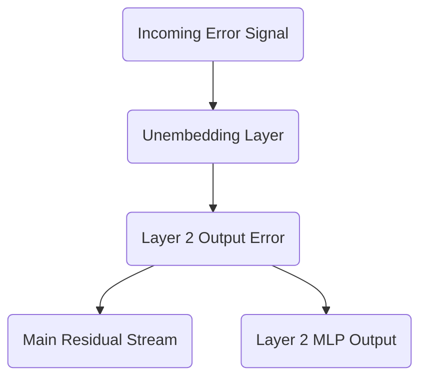

This means the 4 by 6 error signal we just calculated copies itself. One copy travels directly down the central residual stream, preserving the unmodified error signal for earlier layers. The second copy flows directly into the output of the Multi-Layer Perceptron.

## Entering the Multi-Layer Perceptron

The final operation inside the Layer 2 MLP during the forward pass was a linear projection. The internal activations of the MLP were multiplied by the second weight matrix, $W_2$, to project the data from the expanded $d_{ff}$ dimension back down to the $d_{model}$ dimension.

$$
\text{MLP}_{\text{Output}} = \text{Activations} \times W_2
$$

Since the error signal flowing into the MLP is exactly the error signal from the residual stream, we can apply the exact same linear algebra rules we used for the Unembedding layer to continue the backward pass.

To find the gradient for the $W_2$ weights, we transpose the incoming activations and multiply by the error signal:

$$
\frac{\partial L}{\partial W_2} = \text{Activations}^T \times \frac{\partial L}{\partial \text{Output}_{\text{Layer2}}}
$$

Our activations were expanded to $d_{ff} = 24$. Transposing the 4 by 24 activations gives us 24 by 4. Multiplying this by the 4 by 6 error signal yields a 24 by 6 gradient matrix, perfectly matching the dimensions of $W_2$. 

To continue pulling the error backward through the activation function and into the first half of the MLP, we multiply the error signal by the transposed $W_2$ matrix:

$$
\frac{\partial L}{\partial \text{Activations}} = \frac{\partial L}{\partial \text{Output}_{\text{Layer2}}} \times W_2^T
$$

This operation takes our 4 by 6 error signal, multiplies it by the 6 by 24 transposed weight matrix, and produces a 4 by 24 error signal ready to be passed backward through the non-linear activation function.

By strictly following the rules of matrix multiplication and addition, we have successfully navigated the error signal from the vocabulary-level predictions deep into the internal mechanisms of Layer 2. In our next analysis, we will tackle the rigorous calculus of routing these gradients through the Softmax function and the causal mask of the attention mechanism.

<em>Prefer to read this seamlessly offline? <a href="/assets/docs/transformer_ebook_final.pdf">Download the complete, formatting-optimized 100-page Transformer Ebook here.</a></em>

<h1 id="chapter-22-backpropagating-through-attention-the-softmax-and-the-mask">Chapter 22: Backpropagating Through Attention: The Softmax and the Mask</h1>

<em>Prefer to read this seamlessly offline? <a href="/assets/docs/transformer_ebook_final.pdf">Download the complete, formatting-optimized 100-page Transformer Ebook here.</a></em>

We left off with the gradient flowing down the residual stream, reaching the output of our Layer 2 attention block. Our objective now is to pull this error signal backward through the self-attention mechanism itself. This requires us to unpack the sequence of operations that created the attention output. The final operations in that sequence involved multiplying the attention probabilities by the Value matrix, and prior to that, applying the Softmax function to the masked attention scores.

## From Values to Probabilities

During the forward pass, the attention output is computed as the matrix product of the probability matrix $P$ and the Value matrix $V$. The gradient of the loss with respect to this output represents the exact direction we must move to minimize the error in our final contextualized vectors. To determine how to adjust the attention probabilities $P$, we apply the standard chain rule for matrix multiplication. The gradient with respect to $P$ is the incoming gradient multiplied by the transpose of $V$. We will define this resulting gradient matrix as $d\_P$.

The matrix $d\_P$ tells us how the loss would change if we tweaked the attention probabilities. It is a sequence-by-sequence square matrix, detailing the precise error signal for the attention connection between every pair of tokens in our text.

## The Calculus of Softmax

We must push this gradient $d\_P$ backward through the Softmax function to find the gradient with respect to the raw, pre-Softmax attention scores. We will define these pre-Softmax scores as $S$. 

The Softmax function presents a unique mathematical challenge. It takes a vector of scores and normalizes them into a coupled probability distribution. Changing a single score in the input vector alters the sum in the denominator for all other elements, inherently shifting the final probability of every other element. Consequently, the derivative of a Softmax output with respect to its input is a Jacobian matrix containing the partial derivatives of every output with respect to every input.

The mathematical formula for backpropagating through Softmax across an entire sequence reduces to an elegant matrix operation:

$$
d\_S = P \odot (d\_P - \sum (d\_P \odot P))
$$

Here, $\odot$ represents element-wise multiplication. We multiply the incoming gradient $d\_P$ by the probabilities $P$, sum those results along the sequence dimension, and subtract that sum from the original $d\_P$. We then multiply the entire result element-wise by the probabilities $P$ again.

This formulation captures the proportional interplay of probabilities. If a particular token received a high probability during the forward pass, its gradient heavily influences the adjustment of the pre-Softmax scores. If a token was ignored and assigned a near-zero probability, the multiplication by $P$ ensures the gradient struggles to pass through, effectively severing the learning signal for that specific connection.

## Traversing the Causal Mask

We have successfully calculated $d\_S$, representing the gradient with respect to the masked attention scores. The final step in this stage is to push the gradient through the causal mask.

During the forward pass, we applied a lower-triangular mask to the raw attention scores. We explicitly set all values above the diagonal to negative infinity. This structural intervention prevented tokens from attending to future positions, guaranteeing our model respects causality during parallel training. When the Softmax function encountered negative infinity, it mapped it to a strict zero probability.

In the backward pass, gradients flow only where information flowed forward. Since the upper triangular elements of the score matrix were overwritten and ignored during the forward pass, they cannot have contributed to the final loss. The error signal for those future-looking connections must be zero. 

To route the gradient through the causal mask, we simply apply a binary lower-triangular mask to $d\_S$, zeroing out the upper triangular portion:

$$
d\_S\_{unmasked} = \begin{bmatrix}
1 & 0 & 0 & 0 \\
1 & 1 & 0 & 0 \\
1 & 1 & 1 & 0 \\
1 & 1 & 1 & 1
\end{bmatrix} \odot d\_S
$$

We now possess the gradient with respect to the pure, unmasked attention scores, representing the direct scaled dot product $Q K^T / \sqrt{d_k}$. Our error signal has successfully traversed the most numerically complex non-linearity in the Transformer architecture. In our next installment, we will distribute this gradient into the Query, Key, and Value weight matrices, completing the learning cycle for the self-attention mechanism.

<em>Prefer to read this seamlessly offline? <a href="/assets/docs/transformer_ebook_final.pdf">Download the complete, formatting-optimized 100-page Transformer Ebook here.</a></em>

<h1 id="chapter-23-backpropagation-through-attention-chapter-2-routing-to-q-k-and-v">Chapter 23: Backpropagation Through Attention (Chapter 2: Routing to Q, K, and V)</h1>

<em>Prefer to read this seamlessly offline? <a href="/assets/docs/transformer_ebook_final.pdf">Download the complete, formatting-optimized 100-page Transformer Ebook here.</a></em>

In the previous part, we successfully navigated the complexities of the Softmax function and the causal mask. We calculated the gradient of the loss with respect to the raw, unmasked attention scores, giving us a precise measurement of how each attention connection should be adjusted. We now stand at the final stage of backpropagating through the self-attention mechanism. Our objective is to distribute these score gradients, along with the gradients from the attention output itself, backward into the Query, Key, and Value matrices. Ultimately, we must route these signals all the way back to the weight matrices that created them and the input sequence that started it all.

## The Value Matrix Gradient

During the forward pass, the attention mechanism produced its final output by multiplying the probability matrix by the Value matrix. If we denote the output as $Z$, the attention probabilities as $P$, and the values as $V$, the operation was $Z = P V$.

To determine how to adjust the Value matrix, we must calculate the gradient of the loss with respect to $V$. Using the chain rule of matrix calculus, we multiply the transpose of the probability matrix by the gradient of the output. 

$$
\partial V = P^T \partial Z
$$

The transpose operation here is highly intuitive. In the forward pass, a row of $P$ determined how much of each value vector to mix into a single output token. During backpropagation, we transpose $P$. This means a column of $P^T$ dictates how much of the output error should be attributed to a specific value vector. We are explicitly reversing the weighted sum.

Once we have the gradient for the Value matrix, finding the gradient for its corresponding weight matrix $W_V$ follows standard linear layer backpropagation. We multiply the transpose of the input $X$ by the Value gradient.

$$
\partial W_V = X^T \partial V
$$

## Routing Gradients to Queries and Keys

The Query and Key matrices are responsible for generating the attention scores. In the forward pass, we computed the scaled dot-product attention scores as $S = \frac{Q K^T}{\sqrt{d_k}}$. 

We have already computed the gradient with respect to these scores, which we will refer to as $\partial S$. To distribute this gradient back to the Queries and Keys, we apply the matrix derivative rules for multiplication, remembering to include the scaling factor.

For the Query matrix gradient, we multiply the score gradient by the Key matrix. 

$$
\partial Q = \frac{\partial S K}{\sqrt{d_k}}
$$

For the Key matrix gradient, we multiply the transposed score gradient by the Query matrix.

$$
\partial K = \frac{\partial S^T Q}{\sqrt{d_k}}
$$

The geometry of these operations perfectly mirrors the forward pass. The score gradient $\partial S$ represents how the alignment between every query and key needs to change. To know how to adjust a specific query vector, we project that required change onto the key vectors it interacted with. We apply the transpose for the Key gradient to properly align the dimensions, routing the error from the queries back to the keys.

Similar to the Value weights, we calculate the gradients for the Query and Key weight matrices by multiplying the transposed input by their respective gradients.

$$
\partial W_Q = X^T \partial Q
$$

$$
\partial W_K = X^T \partial K
$$

## The Confluence at the Input

The final step in this layer is to route the gradients all the way back to the input matrix $X$. In the forward pass, the input branched into three parallel paths to create the Queries, Keys, and Values. 

When gradients flow backward through a branching architecture, they sum together at the point of origin. We must calculate the gradient with respect to the input from each of the three paths and add them up.

$$
\partial X_V = \partial V W_V^T
$$

$$
\partial X_Q = \partial Q W_Q^T
$$

$$
\partial X_K = \partial K W_K^T
$$

The total gradient flowing backward out of the attention block and down the residual stream is the sum of these three components.

$$
\partial X_{Total} = \partial X_V + \partial X_Q + \partial X_K
$$

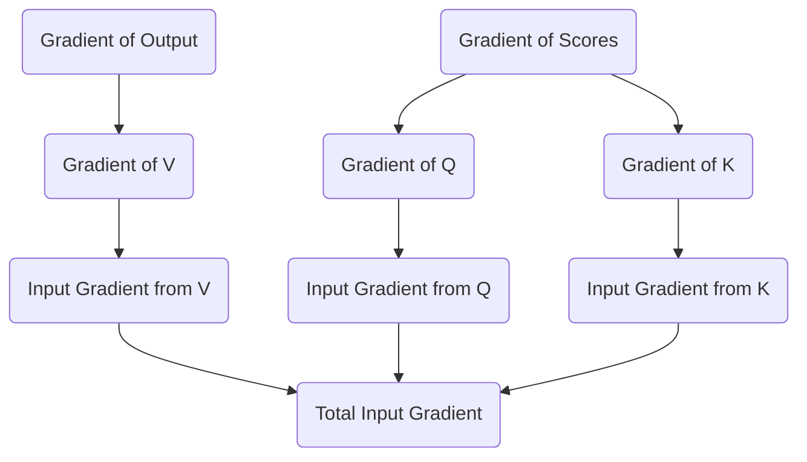

We have now completely backpropagated through the self-attention mechanism. We successfully translated the error from the network's output into specific updates for the $W_Q$, $W_K$, and $W_V$ matrices, and we prepared the error signal to continue its journey backward down the residual stream. In the next part, we will follow this signal as it reaches the very beginning of the network to update the original token embeddings.

<em>Prefer to read this seamlessly offline? <a href="/assets/docs/transformer_ebook_final.pdf">Download the complete, formatting-optimized 100-page Transformer Ebook here.</a></em>

<h1 id="chapter-24-updating-the-embeddings-and-conclusion">Chapter 24: Updating the Embeddings and Conclusion</h1>

<em>Prefer to read this seamlessly offline? <a href="/assets/docs/transformer_ebook_final.pdf">Download the complete, formatting-optimized 100-page Transformer Ebook here.</a></em>

We have finally reached the terminus of our backward journey. The error signal has cascaded from the Cross-Entropy loss, navigated the Unembedding matrix, split through the Layer 2 MLP, and distributed itself across the complex geometry of the self-attention Query, Key, and Value matrices. Now, this accumulated signal arrives at the very beginning of our network. It is time to update the foundational representations of our tokens: the Embedding matrix itself.

## The Residual Highway

During the forward pass, we conceptualized the residual stream as a central memory bus. The initial token embeddings traveled along this bus, with each attention and MLP block adding new contextual information. 

In the backward pass, the residual stream serves an equally critical role as a gradient highway. When operations are added together during the forward pass, the backward pass simply passes the gradient equally to both paths. The gradient arriving at any point in the residual stream is the sum of all gradients from the blocks that read from it later in the network. Therefore, the final gradient vector arriving at our initial input matrix $X$ is a comprehensive sum. It contains the feedback from every downstream decision, perfectly encapsulating how the initial token vectors need to shift in $d_{model}$ space to decrease the final prediction error.

Let $dX$ represent this accumulated gradient for our sequence `<BOS> i woke up`. It is a matrix of size $4 \times 6$.

$$
dX = \begin{bmatrix}
0.012 & -0.045 & 0.103 & 0.002 & -0.011 & 0.088 \\
-0.033 & 0.021 & 0.055 & -0.019 & 0.076 & -0.004 \\
0.091 & -0.082 & 0.011 & 0.034 & -0.055 & 0.012 \\
-0.005 & 0.067 & -0.099 & 0.041 & 0.022 & -0.031
\end{bmatrix}
$$

## Routing Gradients to the Vocabulary Space

Our input matrix $X$ was constructed by selecting specific rows from the global Embedding matrix $E$. The matrix $E$ has a shape of $12 \times 6$, representing our entire vocabulary of 12 words in a 6-dimensional space. 

By the rules of calculus, if a row in $E$ was copied to form a row in $X$, the gradient for that row in $X$ routes directly back to the original row in $E$. The operation of selecting a row is mathematically equivalent to multiplying a one-hot encoded vector by the matrix $E$. The derivative of this operation simply passes the gradient back to the active index.

If our sequence `<BOS> i woke up` corresponds to indices 0, 3, 5, and 7 in our vocabulary, we construct a gradient matrix $dE$ of the same size as $E$, initialized to all zeros. We then add the respective rows of $dX$ to rows 0, 3, 5, and 7 of $dE$. The gradients for tokens not present in the current sequence remain strictly zero.

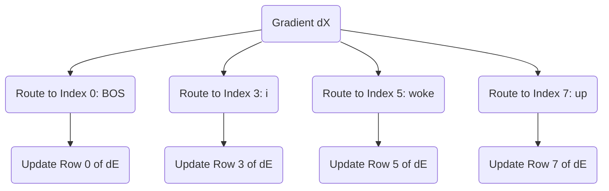

## The Optimizer Update

With $dE$ fully assembled alongside the gradients for all our intermediate weight matrices, we can finally execute the core mechanism of machine learning: the weight update. 

We apply an optimizer to shift our weights in the direction opposite to the gradient. While modern architectures use sophisticated optimizers like Adam which track momentum and variance, the fundamental principle is best illustrated by Stochastic Gradient Descent. We define a learning rate $\alpha$ to control the size of our step.

$$
E_{new} = E_{old} - \alpha \cdot dE
$$

By subtracting the scaled gradient, we adjust the coordinates of our original words in the $d_{model}$ space. The next time the network encounters the token "woke", its starting vector will be slightly better positioned to help the attention mechanism predict "late". 

## Conclusion

This completes our rigorous traversal of the Transformer architecture. We began with simple integers representing text, projected them into a continuous geometric space, and watched as attention matrices sculpted those vectors into context-aware representations. We proved why scaling by the square root of the head dimension prevents gradient starvation and how the causal mask ensures temporal discipline. 

Crucially, we demystified the backward pass. We saw how the simple difference between our prediction and the target label blossoms into a cascade of derivatives, flowing backward through projection matrices and softmax distributions to assign credit and blame to every single weight in the network. 

The Transformer is not an inscrutable black box. It is a massive, elegant bilinear engine, moving text through latent space with pristine mathematical precision. By following the numbers from the first embedding to the final gradient step, we have unlocked the physical machinery of modern artificial intelligence.

<em>Prefer to read this seamlessly offline? <a href="/assets/docs/transformer_ebook_final.pdf">Download the complete, formatting-optimized 100-page Transformer Ebook here.</a></em>

