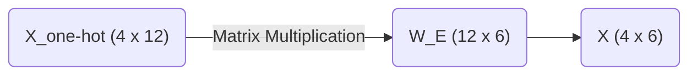

# Part 1: Tokens, One-Hot Encodings, and the Embedding Matrix

<!-- SUMMARY: Translating raw text into a rigorous geometric representation requires mapping discrete tokens into orthogonal one-hot vectors. This process mathematically motivates the necessity of the embedding matrix to compress these isolated dimensions into a dense semantic space, enabling the natural inference of conceptual relationships. -->

<em>Prefer to read this seamlessly offline? <a href="../assets/docs/transformers-ebook-v1.0.pdf">Download the complete, formatting-optimized 100-page Transformer Ebook here.</a></em>

The Preface established that every operation in the Transformer reads from and writes to a central $4 \times 6$ matrix. Bridging the gap between raw text and that geometric representation is the next requirement. Text is inherently abstract. Computers cannot multiply words. Computers multiply numbers. A rigorous mechanical process is needed to translate human language into a mathematical format that a neural network can manipulate.

This translation happens in three distinct stages. First, the sentence is broken down into discrete pieces called tokens. Second, each token is mapped to a strict geometric location using a one-hot vector. Third, those isolated vectors are projected into a shared, continuous space using an Embedding Matrix. 

## The Vocabulary Space and Tokenization

The objective is to process the sequence `<BOS>` `i` `woke` `up`. 

Before processing this sequence, the model needs a predefined universe of concepts to draw from. This universe is the vocabulary. In this example, the vocabulary is restricted to exactly twelve words. 

`<BOS>` `<EOS>` `<PAD>` `i`  
`we` `woke` `stayed` `up`  
`late` `early` `today` `yesterday`  

Tokenization maps raw text to the corresponding integer indices in this vocabulary list. The index acts as a unique identifier for the concept. 

For this sequence, the mapping is straightforward. 
The `<BOS>` token maps to index 0. 
The word `i` maps to index 3. 
The word `woke` maps to index 5. 
The word `up` maps to index 7.

This yields an array of integers representing the sequence. 

$$ \text{Sequence Indices} = [0, 3, 5, 7] $$

## The Geometry of One-Hot Encodings

While integers are numbers, their direct use is mathematically problematic in a neural network context. If the integer 5 is fed into the model to represent "woke" and the integer 10 to represent "today", the model will naturally interpret "today" as being twice as large or twice as important as "woke". This numerical relationship is entirely arbitrary. The word "today" is not the mathematical double of "woke". 

This false magnitude must be removed. This is accomplished by translating the integers into one-hot encoded vectors.

A one-hot vector isolates a concept geometrically. For a vocabulary of size 12, each word becomes a 12-dimensional vector filled with zeros, with a single 1 placed at the vocabulary index. 

Converting the four tokens into one-hot vectors creates a $4 \times 12$ matrix. 

$$
X_{\text{one-hot}} = \begin{bmatrix}
1.0 & 0.0 & 0.0 & 0.0 & 0.0 & 0.0 & 0.0 & 0.0 & 0.0 & 0.0 & \dots & 0.0 \\
0.0 & 0.0 & 0.0 & 1.0 & 0.0 & 0.0 & 0.0 & 0.0 & 0.0 & 0.0 & \dots & 0.0 \\
0.0 & 0.0 & 0.0 & 0.0 & 0.0 & 1.0 & 0.0 & 0.0 & 0.0 & 0.0 & \dots & 0.0 \\
0.0 & 0.0 & 0.0 & 0.0 & 0.0 & 0.0 & 0.0 & 1.0 & 0.0 & 0.0 & \dots & 0.0
\end{bmatrix}
$$

By treating each word as an independent axis in a 12-dimensional space, every word remains exactly the same distance from every other word. The vectors are perfectly orthogonal. The word "i" has no mathematical relationship to the word "woke". The false magnitude problem is eliminated and replaced with perfect neutrality.

## The Problem with Neutrality

Perfect neutrality creates a new problem. The word "i" is highly related to the word "we", and the word "late" is highly related to the word "early". If the vectors remain orthogonal, the model cannot infer that these concepts are similar. It is forced to learn the rules of grammar independently for every single word. 

Furthermore, these one-hot vectors are 12 dimensions wide. In a production model like GPT-4, the vocabulary size frequently exceeds 100,000. Maintaining a matrix of that width at every stage of the network is computationally infeasible. 

The perfectly isolated 12-dimensional vectors must be compressed into a denser, richer space where words with similar meanings are physically grouped together. This dense space represents the $d_{model}$ dimension. In this architecture, this width is 6. 

## The Embedding Matrix

This compression is achieved using the Embedding Matrix, denoted as $W_E$. This matrix serves as a lookup table. It maps every 12-dimensional word to a specific 6-dimensional location. The shape of $W_E$ must therefore be $12 \times 6$. 

When a neural network is initialized, this matrix is filled with random numbers. Over thousands of training iterations, the model slowly adjusts these numbers via backpropagation. It physically moves the coordinates of similar words closer together to minimize prediction error.

To demonstrate these calculations manually, the training phase is bypassed and a $12 \times 6$ embedding matrix is explicitly designed to show these semantic clusters. 

$$
W_E = \begin{bmatrix}
 0.1 &  0.0 &  0.0 &  0.0 &  0.0 &  0.0 \\
 0.1 &  0.0 &  0.0 &  0.0 &  0.0 &  0.1 \\
 0.1 &  0.0 &  0.0 &  0.0 &  0.0 & -0.1 \\
 0.0 &  0.8 & -0.1 &  0.2 &  0.0 &  0.5 \\
 0.0 &  0.9 & -0.1 &  0.2 &  0.0 &  0.8 \\
 0.0 & -0.2 &  0.9 &  0.1 & -0.4 &  0.1 \\
 0.0 & -0.2 &  0.8 &  0.0 &  0.5 & -0.1 \\
 0.0 & -0.1 &  0.4 &  0.9 & -0.2 &  0.0 \\
 0.0 &  0.0 & -0.3 & -0.1 &  0.9 & -0.8 \\
 0.0 &  0.0 & -0.3 & -0.1 &  0.9 &  0.8 \\
 0.0 &  0.0 & -0.2 &  0.0 &  0.8 &  0.1 \\
 0.0 &  0.0 & -0.2 & -0.2 &  0.7 & -0.4
\end{bmatrix}
$$

The rows for the pronouns, found at indices 3 and 4 representing "i" and "we", share high positive values in the second column. The rows for the temporal adverbs, found at indices 8, 9, 10, and 11 representing "late", "early", "today", and "yesterday", share high positive values in the fifth column. 

The Embedding Matrix acts as a coordinate map of meaning rather than just a list of numbers. By pushing related concepts into similar numerical spaces, the model learns abstract rules. If a rule is learned regarding the word "i", that rule automatically applies to the word "we", simply because their vectors are positioned next to each other.

## Generating the Central Tensor

To transform the neutral one-hot vectors into this rich geometric space, a standard matrix multiplication is performed. The $4 \times 12$ input matrix is multiplied by the $12 \times 6$ embedding matrix. 

$$ X = X_{\text{one-hot}} \times W_E $$

Due to the nature of matrix multiplication, multiplying by a one-hot vector simply extracts the corresponding row from the embedding matrix. 

The final tensor $X$ takes the following form.

$$
X = \begin{bmatrix}
 0.1 &  0.0 &  0.0 &  0.0 &  0.0 &  0.0 \\
 0.0 &  0.8 & -0.1 &  0.2 &  0.0 &  0.5 \\
 0.0 & -0.2 &  0.9 &  0.1 & -0.4 &  0.1 \\
 0.0 & -0.1 &  0.4 &  0.9 & -0.2 &  0.0
\end{bmatrix}
$$

Row 1 is the coordinate vector for `<BOS>`.
Row 2 is the coordinate vector for `i`.
Row 3 is the coordinate vector for `woke`.
Row 4 is the coordinate vector for `up`.

The text is now successfully translated into the central $4 \times 6$ tensor that moves along the residual stream. The subsequent section examines a critical flaw in this representation and mathematically proves why Transformers require positional encoding to understand sequential order.

<em>Prefer to read this seamlessly offline? <a href="../assets/docs/transformers-ebook-v1.0.pdf">Download the complete, formatting-optimized 100-page Transformer Ebook here.</a></em>

