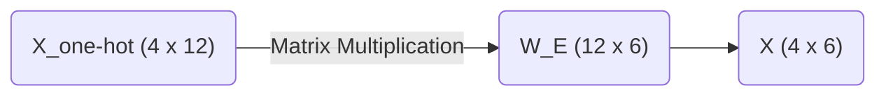

# Part 1: Tokens, One-Hot Encodings, and the Embedding Matrix

*Prefer to read this seamlessly offline? [Download the complete, formatting-optimized 100-page Transformer Ebook here.](/series/transformers/transformer_ebook_final.pdf)*

At the end of the Preface, we established that every operation in our Transformer will read from and write to a central $4 \times 6$ matrix. We must now bridge the gap between our raw text and that geometric representation. Text is inherently abstract. Computers cannot multiply words. Computers multiply numbers. We need a rigorous mechanical process to translate human language into a mathematical format that a neural network can manipulate.

This translation happens in three distinct stages. First, we break our sentence down into discrete pieces called tokens. Second, we map each token to a strict geometric location using a one-hot vector. Third, we project those isolated vectors into a shared, continuous space using an Embedding Matrix. 

## The Vocabulary Space and Tokenization

Our objective is to process the sequence `<BOS> i woke up`. 

Before we can do anything with this sequence, the model needs a predefined universe of concepts to draw from. This universe is the vocabulary. In our toy example, we have restricted the vocabulary to exactly twelve words. 

| | | | |
|---|---|---|---|
| `<BOS>` | `<EOS>` | `<PAD>` | `i` |
| `we` | `woke` | `stayed` | `up` |
| `late` | `early` | `today` | `yesterday` |

Tokenization is the process of mapping raw text to the corresponding integer indices in this vocabulary list. The index acts as a unique identifier for the concept. 

For our specific sequence, the mapping is extremely straightforward. 
The `<BOS>` token maps to index 0. 
The word `i` maps to index 3. 
The word `woke` maps to index 5. 
The word `up` maps to index 7.

We now have an array of integers representing our sequence. 

$$ \text{Sequence Indices} = [0, 3, 5, 7] $$

## The Geometry of One-Hot Encodings

While integers are numbers, they are mathematically dangerous in a neural network context. If we feed the integer 5 into our model to represent "woke" and the integer 10 to represent "today", the model will naturally interpret "today" as being twice as large or twice as important as "woke". This numerical relationship is entirely arbitrary. The word "today" is not the mathematical double of "woke". 

We must remove this false magnitude. We do this by translating our integers into one-hot encoded vectors.

A one-hot vector isolates a concept geometrically. For a vocabulary of size 12, each word becomes a 12-dimensional vector filled with zeros, with a single 1 placed at the vocabulary index. 

When we convert our four tokens into one-hot vectors, we create a $4 \times 12$ matrix. 

$$
X_{\text{one-hot}} = \begin{bmatrix}
1.0 & 0.0 & 0.0 & 0.0 & 0.0 & 0.0 & 0.0 & 0.0 & 0.0 & 0.0 & \dots & 0.0 \\
0.0 & 0.0 & 0.0 & 1.0 & 0.0 & 0.0 & 0.0 & 0.0 & 0.0 & 0.0 & \dots & 0.0 \\
0.0 & 0.0 & 0.0 & 0.0 & 0.0 & 1.0 & 0.0 & 0.0 & 0.0 & 0.0 & \dots & 0.0 \\
0.0 & 0.0 & 0.0 & 0.0 & 0.0 & 0.0 & 0.0 & 1.0 & 0.0 & 0.0 & \dots & 0.0
\end{bmatrix}
$$

By treating each word as an independent axis in a 12-dimensional space, we ensure that every word is exactly the same distance from every other word. They are perfectly orthogonal. The word "i" has no mathematical relationship to the word "woke". We have eliminated the false magnitude problem, replacing it with perfect neutrality.

## The Problem with Neutrality

Perfect neutrality is a problem. The word "i" is highly related to the word "we", and the word "late" is highly related to the word "early". If our vectors remain orthogonal, the model will never know these concepts are similar. It will be forced to learn the rules of grammar independently for every single word. 

Furthermore, our one-hot vectors are 12 dimensions wide. In a real world model like GPT-4, the vocabulary size is often over 100,000. Maintaining a matrix of that width at every stage of the network is computationally impossible. 

We need to compress our perfectly isolated 12-dimensional vectors into a denser, richer space where words with similar meanings are grouped together physically. This dense space is the $d_{model}$ dimension. In our toy architecture, this width is 6. 

## The Embedding Matrix

We accomplish this compression using the Embedding Matrix, denoted as $W_E$. This matrix serves as a lookup table. It maps every 12-dimensional word to a specific 6-dimensional location. The shape of $W_E$ must therefore be $12 \times 6$. 

When you initialize a neural network, this matrix is filled with random numbers. Over thousands of training iterations, the model slowly pushes and pulls these numbers via backpropagation. It physically moves the coordinates of similar words closer together to minimize its prediction error.

Since we are manually calculating our example, we will bypass the training phase and explicitly design a $12 \times 6$ embedding matrix that demonstrates these semantic clusters. 

$$
W_E = \begin{bmatrix}
 0.1 &  0.0 &  0.0 &  0.0 &  0.0 &  0.0 \\
 0.1 &  0.0 &  0.0 &  0.0 &  0.0 &  0.1 \\
 0.1 &  0.0 &  0.0 &  0.0 &  0.0 & -0.1 \\
 0.0 &  0.8 & -0.1 &  0.2 &  0.0 &  0.5 \\
 0.0 &  0.9 & -0.1 &  0.2 &  0.0 &  0.8 \\
 0.0 & -0.2 &  0.9 &  0.1 & -0.4 &  0.1 \\
 0.0 & -0.2 &  0.8 &  0.0 &  0.5 & -0.1 \\
 0.0 & -0.1 &  0.4 &  0.9 & -0.2 &  0.0 \\
 0.0 &  0.0 & -0.3 & -0.1 &  0.9 & -0.8 \\
 0.0 &  0.0 & -0.3 & -0.1 &  0.9 &  0.8 \\
 0.0 &  0.0 & -0.2 &  0.0 &  0.8 &  0.1 \\
 0.0 &  0.0 & -0.2 & -0.2 &  0.7 & -0.4
\end{bmatrix}
$$

Look closely at the rows for our pronouns, which are indices 3 and 4 representing "i" and "we". They share high positive values in the second column. Now look at the rows for our temporal adverbs, which are indices 8, 9, 10, and 11 representing "late", "early", "today", and "yesterday". They share high positive values in the fifth column. 

The Embedding Matrix is not just a list of numbers. It is a coordinate map of meaning. By pushing related concepts into similar numerical spaces, the model can learn abstract rules. If it learns a rule about the word "i", that rule will automatically apply to the word "we", simply because their vectors are positioned next to each other.

## Generating the Central Tensor

To transform our neutral one-hot vectors into this rich geometric space, we perform a standard matrix multiplication. We multiply our $4 \times 12$ input matrix by our $12 \times 6$ embedding matrix. 

$$ X = X_{\text{one-hot}} \times W_E $$

Due to the nature of matrix multiplication, multiplying by a one-hot vector simply extracts the corresponding row from the embedding matrix. 

Our final tensor $X$ takes the following form.

$$
X = \begin{bmatrix}
 0.1 &  0.0 &  0.0 &  0.0 &  0.0 &  0.0 \\
 0.0 &  0.8 & -0.1 &  0.2 &  0.0 &  0.5 \\
 0.0 & -0.2 &  0.9 &  0.1 & -0.4 &  0.1 \\
 0.0 & -0.1 &  0.4 &  0.9 & -0.2 &  0.0
\end{bmatrix}
$$

Row 1 is the coordinate vector for `<BOS>`.
Row 2 is the coordinate vector for `i`.
Row 3 is the coordinate vector for `woke`.
Row 4 is the coordinate vector for `up`.

We have successfully translated our text into the central $4 \times 6$ tensor that will ride the residual stream. In the next part, we will examine a critical flaw in this representation and mathematically prove why Transformers require positional encoding to understand the order of time.

*Prefer to read this seamlessly offline? [Download the complete, formatting-optimized 100-page Transformer Ebook here.](/series/transformers/transformer_ebook_final.pdf)*
