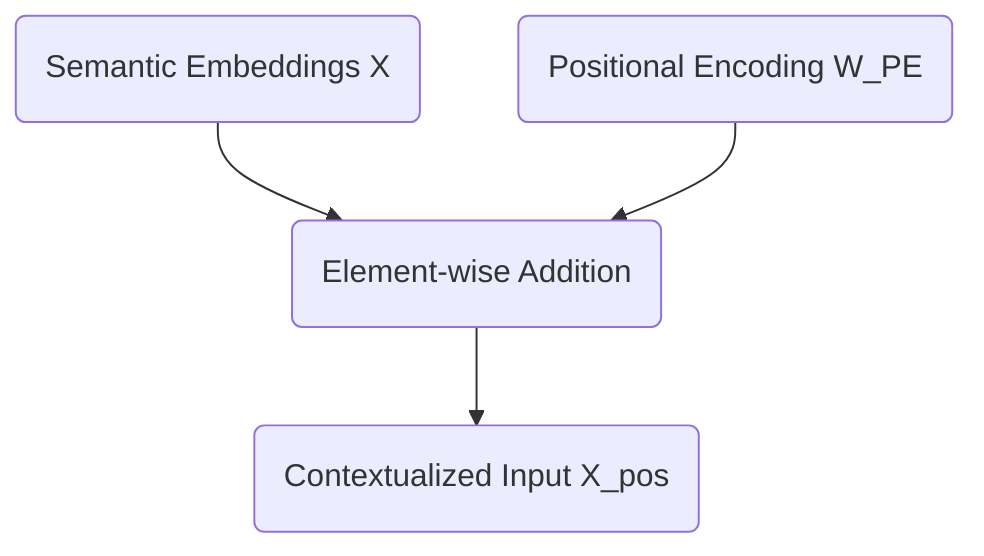

# Part 2: The Permutation Invariance Problem & Positional Encoding

<!-- SUMMARY: Matrix operations are inherently permutation invariant, creating a structural flaw that leaves the architecture entirely blind to sequence order. This limitation is resolved by explicitly injecting temporal context through the element-wise addition of mathematically deterministic absolute positional encodings. -->

<em>Prefer to read this seamlessly offline? <a href="../assets/docs/transformers-ebook-v1.0.pdf">Download the complete, formatting-optimized 100-page Transformer Ebook here.</a></em>

The input sequence `<BOS> i woke up` is now transformed into a dense, continuous semantic space. Sparse 12-dimensional one-hot vectors are mathematically compressed into a 6-dimensional embedding matrix.

The current tensor representation $X$ for the sequence takes the following form:

$$
X = \begin{bmatrix}
 0.1 &  0.0 &  0.0 &  0.0 &  0.0 &  0.0 \\
 0.0 &  0.8 & -0.1 &  0.2 &  0.0 &  0.5 \\
 0.0 & -0.2 &  0.9 &  0.1 & -0.4 &  0.1 \\
 0.0 & -0.1 &  0.4 &  0.9 & -0.2 &  0.0
\end{bmatrix}
$$

This matrix captures the semantic meaning of the words. A critical problem remains regarding structural context.

## The Permutation Invariance Problem

To understand the nature of this flaw, the processing method of the Attention mechanism must be anticipated. During the computation of self-attention, dot products are calculated between these row vectors to measure similarities.

A fundamental property of set operations and matrix multiplication is permutation invariance. If the rows of the matrix $X$ are shuffled to represent the sequence "woke i up `<BOS>`", the attention mechanism calculates the exact same pairwise similarities. The model processes "i woke up" and "woke i up" as identical semantic concepts. Human language relies entirely on word order to derive meaning. "The dog bit the man" and "The man bit the dog" use identical tokens, yet these phrases describe completely different events.

Without a mechanism to inject sequence order, the Transformer acts as merely a highly sophisticated bag-of-words model. The architecture is completely order-blind.

## Injecting Time: Positional Encoding

Positional information must be explicitly injected into the vectors before they enter the attention layers. This injection is achieved by creating a secondary matrix of identical dimensions to the input tensor, which is then added to it.

There are two primary philosophies for positional encoding:

1. **Relative Positional Encoding:** The model learns the distances between words. Instead of treating "woke" as residing at position 2, the system only registers that "woke" is exactly one step away from "i". Modern architectures like RoPE utilize relative encodings through complex vector rotations.
2. **Absolute Positional Encoding:** Every position in the sequence receives a unique, static vector signature. The model learns that position 0 always has a specific geometric translation, position 1 has another, and so forth.

For this rigorous walkthrough, an absolute positional encoding is utilized. A mathematically deterministic and bounded matrix is required, ensuring the numerical variance of the carefully calibrated embeddings does not explode.

The original Transformer architecture used interweaving sine and cosine waves of varying frequencies. A mathematically similar approach is adopted here. By varying the frequencies across the 6 dimensions, each position generates a completely unique vector signature.

The exact Positional Encoding matrix $W_{PE}$ for the 4-token sequence is defined below.

$$
W_{PE} = \begin{bmatrix}
 0.0 &  1.0 &  0.0 &  1.0 &  0.0 &  1.0 \\
 0.8 &  0.5 &  0.4 &  0.9 &  0.2 &  1.0 \\
 0.9 & -0.4 &  0.8 &  0.6 &  0.4 &  0.9 \\
 0.1 & -1.0 &  1.0 &  0.2 &  0.6 &  0.8
\end{bmatrix}
$$

This matrix exhibits geometric elegance. The values fluctuate smoothly between -1.0 and 1.0. Position 0 produces a clean alternating pattern, while subsequent positions introduce complex phase shifts. No two rows are identical.

## The Final Matrix Addition

The integration of positional data is simple. An element-wise matrix addition merges the semantic embeddings $X$ and the positional signatures $W_{PE}$.

The exact addition for the model is computed as follows:

$$
X_{pos} = \begin{bmatrix}
 0.1 &  0.0 &  0.0 &  0.0 &  0.0 &  0.0 \\
 0.0 &  0.8 & -0.1 &  0.2 &  0.0 &  0.5 \\
 0.0 & -0.2 &  0.9 &  0.1 & -0.4 &  0.1 \\
 0.0 & -0.1 &  0.4 &  0.9 & -0.2 &  0.0
\end{bmatrix} + \begin{bmatrix}
 0.0 &  1.0 &  0.0 &  1.0 &  0.0 &  1.0 \\
 0.8 &  0.5 &  0.4 &  0.9 &  0.2 &  1.0 \\
 0.9 & -0.4 &  0.8 &  0.6 &  0.4 &  0.9 \\
 0.1 & -1.0 &  1.0 &  0.2 &  0.6 &  0.8
\end{bmatrix}
$$

This operation yields the final, positionally-aware tensor $X_{pos}$:

$$
X_{pos} = \begin{bmatrix}
 0.1 &  1.0 &  0.0 &  1.0 &  0.0 &  1.0 \\
 0.8 &  1.3 &  0.3 &  1.1 &  0.2 &  1.5 \\
 0.9 & -0.6 &  1.7 &  0.7 &  0.0 &  1.0 \\
 0.1 & -1.1 &  1.4 &  1.1 &  0.4 &  0.8
\end{bmatrix}
$$

The vector for "woke" is no longer just the abstract concept of waking up. The representation is now explicitly "woke" at position 2.

The initial preparations are complete. A string of text is successfully translated into a mathematically rich tensor that captures both semantic meaning and sequential time. Next, this matrix is fed into the heart of the architecture to introduce Layer 1 Self-Attention.

<em>Prefer to read this seamlessly offline? <a href="../assets/docs/transformers-ebook-v1.0.pdf">Download the complete, formatting-optimized 100-page Transformer Ebook here.</a></em>

