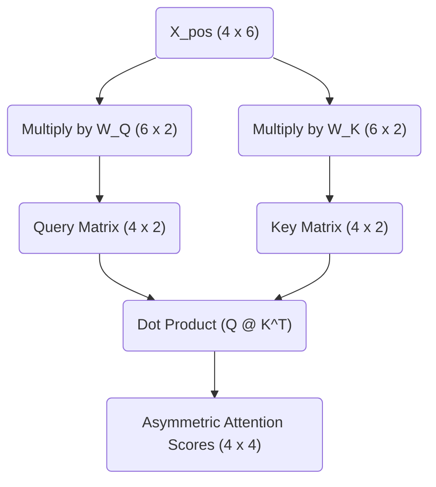

# Part 3: The Motivation for Q, K, and V (Asymmetric Similarity)

*Prefer to read this seamlessly offline? [Download the complete, formatting-optimized 100-page Transformer Ebook here.](/series/transformers/transformer_ebook_final.pdf)*

In the previous part, we solved the permutation invariance problem by adding absolute positional encodings to our token embeddings. Our sequence `<BOS> i woke up` is now represented by the $4 \times 6$ matrix $X_{pos}$, which contains both semantic meaning and positional context. 

The next step in the Transformer architecture is self-attention. The core mechanism of attention is discovering which tokens in the sequence are relevant to each other. The simplest way to measure mathematical relevance between two vectors is to calculate their dot product. It is therefore tempting to assume we should just compute the dot product of every token vector with every other token vector directly.

This naive approach is known as computing symmetric similarity. We can test this by multiplying $X_{pos}$ by its own transpose $X_{pos}^T$. 

$$ \text{Symmetric Similarity} = X_{pos} \times X_{pos}^T $$

Here is the result of that direct calculation:

$$
\text{Symmetric Similarity} = \begin{bmatrix}
3.0 & 4.0 & 1.2 & 0.8 \\
4.0 & 5.9 & 2.7 & 1.6 \\
1.2 & 2.7 & 5.5 & 4.7 \\
0.8 & 1.6 & 4.7 & 5.2
\end{bmatrix}
$$

The dot product measures how much two vectors point in the same direction. When we multiply a matrix by its own transpose, the highest values will invariably appear along the diagonal. The token "woke" aligns most strongly with itself, yielding a score of $5.5$. The token "up" aligns most strongly with itself, yielding $5.2$. 

This creates a fundamental limitation. In human language, semantic relationships are rarely symmetric. Verbs need to find subjects. Prepositions need to find objects. In our sequence, the particle "up" needs to attend to the verb "woke" to form the phrasal verb "woke up". If we rely on symmetric similarity, a token will always be overwhelmingly distracted by its own reflection. It will struggle to look for complementary grammatical structures because the vectors for different parts of speech point in different directions in the embedding space.

We need a mechanism that allows a token to ask a question, and allows other tokens to provide the answer. We need asymmetric similarity.

## The Bilinear Form

To achieve asymmetric similarity, the Transformer projects the input tensor $X_{pos}$ into three distinct new subspaces using three learned weight matrices. We call these projections Queries, Keys, and Values. For now, we will focus on the Queries and Keys. 

Instead of asking how similar vector $A$ is to vector $B$, we project $A$ into a Query subspace and $B$ into a Key subspace. We then measure the similarity between the Query projection of $A$ and the Key projection of $B$. 

Mathematically, this operation is a bilinear form. Given our input $X_{pos}$ and our two weight matrices $W_Q$ and $W_K$, the attention scores are calculated as:

$\text{Attention Scores} = (X_{pos} W_Q) (X_{pos} W_K)^T$

This equation is deeply elegant. The weight matrices $W_Q$ and $W_K$ act as lenses. During training, the neural network adjusts these lenses to map conceptually complementary tokens into the exact same region of a new, lower-dimensional space. The network might learn to map the Query vector for a preposition and the Key vector for a verb into the exact same mathematical coordinate. When their dot product is subsequently computed, the result will be a massive positive number, forcing the network to attend to that relationship.

## Calculating Queries and Keys

Our Transformer uses $3$ attention heads. The model dimension $d_{model}$ is $6$. We divide the model dimension by the number of heads to determine the dimensionality of the Query and Key subspaces. This gives us a head dimension $d_k = 2$. 

Each attention head possesses its own independent $W_Q$ and $W_K$ matrices, both sized $6 \times 2$. This allows each head to look for entirely different types of relationships. Head 1 might look for subject-verb relationships. Head 2 might track temporal adverbs. 

Let us instantiate a concrete $W_Q$ and $W_K$ for our first attention head. 

$$
W_Q = \begin{bmatrix}
 0.1 &  0.2 \\
-0.1 &  0.5 \\
 0.8 & -0.2 \\
 0.3 &  0.4 \\
-0.2 &  0.1 \\
 0.1 & -0.3
\end{bmatrix}
$$

$$
W_K = \begin{bmatrix}
-0.2 &  0.4 \\
 0.5 & -0.1 \\
 0.6 &  0.2 \\
 0.1 &  0.7 \\
 0.2 & -0.2 \\
-0.4 &  0.3
\end{bmatrix}
$$

To calculate the Queries $Q$, we multiply our positionally-encoded sequence $X_{pos}$ by $W_Q$.

$$ Q = X_{pos} \times W_Q $$

The resulting Query matrix $Q$ has dimensions $4 \times 2$. Each token has been compressed from a 6-dimensional representation into a 2-dimensional "question". 

$$
Q = \begin{bmatrix}
 0.3 &  0.6 \\
 0.6 &  0.8 \\
 1.8 & -0.5 \\
 1.6 & -0.6
\end{bmatrix}
$$

We perform the exact same operation for the Keys $K$, multiplying $X_{pos}$ by $W_K$.

$$ K = X_{pos} \times W_K $$

This yields our $4 \times 2$ Key matrix. Each token now has a 2-dimensional "answer".

$$
K = \begin{bmatrix}
 0.2 &  0.9 \\
 0.2 &  1.4 \\
 0.2 &  1.6 \\
 0.1 &  1.4
\end{bmatrix}
$$

By separating the inputs into independent Queries and Keys, the network breaks the mirror of symmetric similarity. The token "woke" no longer strictly attends to itself. It projects a specific question into the Query space, and it projects a specific identity into the Key space. In the next part, we will multiply these matrices together, calculate the final attention scores, and observe how the network scales the results to prevent gradient collapse.

*Prefer to read this seamlessly offline? [Download the complete, formatting-optimized 100-page Transformer Ebook here.](/series/transformers/transformer_ebook_final.pdf)*
