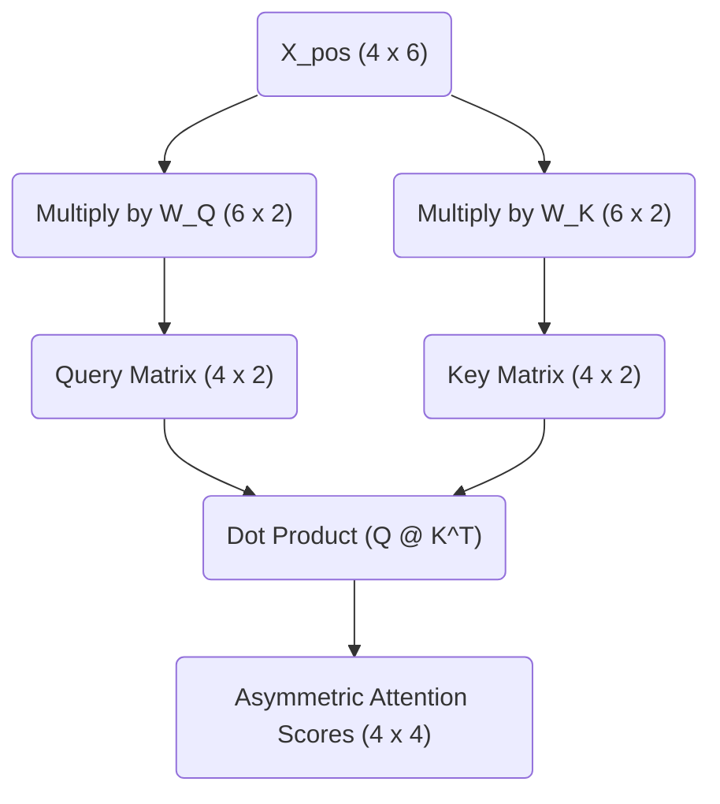

# Part 3: The Motivation for Q, K, and V (Asymmetric Similarity)

<!-- SUMMARY: Symmetric similarity is structurally inadequate for capturing grammatically asymmetric linguistic relationships. Projecting context-aware embeddings into distinct query and key subspaces implements a bilinear form that enables tokens to independently query their surroundings and present complementary information. -->

<em>Prefer to read this seamlessly offline? <a href="../assets/docs/transformers-ebook-v1.0.pdf">Download the complete, formatting-optimized 100-page Transformer Ebook here.</a></em>

The permutation invariance problem is solved by adding absolute positional encodings to the token embeddings. The sequence `<BOS>` `i` `woke` `up` is now represented by the $4 \times 6$ matrix $X_{pos}$, which contains both semantic meaning and positional context. 

The next step in the Transformer architecture is self-attention. The core mechanism of attention involves discovering which tokens in the sequence are relevant to each other. The simplest way to measure mathematical relevance between two vectors is to calculate their dot product. A naive assumption suggests computing the dot product of every token vector with every other token vector directly.

This approach is known as computing symmetric similarity. The process involves multiplying $X_{pos}$ by its own transpose $X_{pos}^T$. 

$$ \text{Symmetric Similarity} = X_{pos} \times X_{pos}^T $$

Here is the result of that direct calculation:

$$
\text{Symmetric Similarity} = \begin{bmatrix}
3.0 & 4.0 & 1.2 & 0.8 \\
4.0 & 5.9 & 2.7 & 1.6 \\
1.2 & 2.7 & 5.5 & 4.7 \\
0.8 & 1.6 & 4.7 & 5.2
\end{bmatrix}
$$

The dot product measures how much two vectors point in the same direction. Multiplying a matrix by its own transpose invariably places the highest values along the diagonal. The token "woke" aligns most strongly with itself, yielding a score of $5.5$. The token "up" aligns most strongly with itself, yielding $5.2$. 

This creates a fundamental limitation. In human language, semantic relationships are rarely symmetric. Verbs require subjects, and prepositions require objects. In the sequence, the particle "up" must attend to the verb "woke" to form the phrasal verb "woke up". Relying on symmetric similarity causes a token to be overwhelmingly distracted by its own reflection. It will struggle to identify complementary grammatical structures, as the vectors for different parts of speech point in different directions in the embedding space.

A mechanism is required to allow a token to ask a question while permitting other tokens to provide the answer. Asymmetric similarity fulfills this requirement.

## The Bilinear Form

To achieve asymmetric similarity, the Transformer projects the input tensor $X_{pos}$ into three distinct new subspaces using three learned weight matrices. These projections are called Queries, Keys, and Values. The immediate focus will remain on the Queries and Keys. 

Instead of querying the direct similarity between vector $A$ and vector $B$, vector $A$ is projected into a Query subspace and vector $B$ is projected into a Key subspace. The similarity is then measured between the Query projection of $A$ and the Key projection of $B$. 

Mathematically, this operation is a bilinear form. Given the input $X_{pos}$ and two weight matrices $W_Q$ and $W_K$, the attention scores are calculated as follows:

$\text{Attention Scores} = (X_{pos} W_Q) (X_{pos} W_K)^T$

This equation is highly elegant. The weight matrices $W_Q$ and $W_K$ act as lenses. During training, the neural network adjusts these lenses to map conceptually complementary tokens into the exact same region of a new lower-dimensional space. The network might learn to map the Query vector for a preposition and the Key vector for a verb into the exact same mathematical coordinate. Computing their subsequent dot product yields a massive positive number, forcing the network to attend to that relationship.

## Calculating Queries and Keys

The Transformer uses $3$ attention heads. The model dimension $d_{model}$ is $6$. Dividing the model dimension by the number of heads determines the dimensionality of the Query and Key subspaces. This calculation yields a head dimension $d_k = 2$. 

Each attention head possesses independent $W_Q$ and $W_K$ matrices, both sized $6 \times 2$. This allows each head to track entirely different types of relationships. Head 1 might identify subject-verb relationships, while Head 2 might track temporal adverbs. 

A concrete $W_Q$ and $W_K$ for the first attention head can be instantiated as follows:

$$
W_Q = \begin{bmatrix}
 0.1 &  0.2 \\
-0.1 &  0.5 \\
 0.8 & -0.2 \\
 0.3 &  0.4 \\
-0.2 &  0.1 \\
 0.1 & -0.3
\end{bmatrix}
$$

$$
W_K = \begin{bmatrix}
-0.2 &  0.4 \\
 0.5 & -0.1 \\
 0.6 &  0.2 \\
 0.1 &  0.7 \\
 0.2 & -0.2 \\
-0.4 &  0.3
\end{bmatrix}
$$

To calculate the Queries $Q$, the positionally-encoded sequence $X_{pos}$ is multiplied by $W_Q$.

$$ Q = X_{pos} \times W_Q $$

The resulting Query matrix $Q$ has dimensions $4 \times 2$. Each token has been compressed from a 6-dimensional representation into a 2-dimensional "question". 

$$
Q = \begin{bmatrix}
 0.3 &  0.6 \\
 0.6 &  0.8 \\
 1.8 & -0.5 \\
 1.6 & -0.6
\end{bmatrix}
$$

The exact same operation is performed for the Keys $K$ by multiplying $X_{pos}$ by $W_K$.

$$ K = X_{pos} \times W_K $$

This yields the $4 \times 2$ Key matrix. Each token now has a 2-dimensional "answer".

$$
K = \begin{bmatrix}
 0.2 &  0.9 \\
 0.2 &  1.4 \\
 0.2 &  1.6 \\
 0.1 &  1.4
\end{bmatrix}
$$

By separating the inputs into independent Queries and Keys, the network breaks the mirror of symmetric similarity. The token "woke" no longer strictly attends to itself. It projects a specific question into the Query space and projects a specific identity into the Key space. Subsequent operations involve multiplying these matrices together, calculating the final attention scores, and observing how the network scales the results to prevent gradient collapse.

<em>Prefer to read this seamlessly offline? <a href="../assets/docs/transformers-ebook-v1.0.pdf">Download the complete, formatting-optimized 100-page Transformer Ebook here.</a></em>

