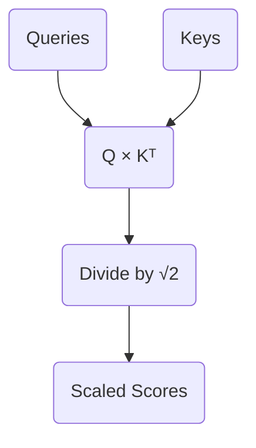

# Part 4: The Attention Score and $\sqrt{d_k}$

*Prefer to read this seamlessly offline? [Download the complete, formatting-optimized 100-page Transformer Ebook here.](/series/transformers/transformer_ebook_final.pdf)*

In the previous installment, we established why the Transformer does not calculate attention directly from the input embeddings. We projected our sequence into two distinct semantic subspaces, yielding a matrix of Queries ($Q$) and a matrix of Keys ($K$). This asymmetric projection allows the network to match concepts that belong together even if their base embeddings are geometrically distant.

Our sequence currently consists of four tokens:

| `<BOS>` | `i` | `woke` | `up` |

We now need to calculate the actual attention scores. We want to quantify how strongly each token in our sequence should attend to every other token. We achieve this by taking the dot product of every Query vector with every Key vector. 

## The Dot Product as a Metric of Similarity

The dot product measures alignment. When two vectors point in similar directions, their dot product is large and positive. When they are orthogonal, it is zero. When they point in opposite directions, it is negative. 

By multiplying our Query matrix by the transpose of our Key matrix ($Q \times K^T$), we compute the dot product for every possible pair of tokens in a single operation. 

Here are the specific matrices for Head 1 of our network:

$$
Q = \begin{bmatrix}
0.31 & 0.62 \\
0.63 & 0.76 \\
1.82 & -0.48 \\
1.57 & -0.57
\end{bmatrix}
$$

$$
K^T = \begin{bmatrix}
0.18 & 0.22 & 0.21 & 0.14 \\
0.94 & 1.43 & 1.55 & 1.36
\end{bmatrix}
$$

The multiplication yields our unscaled attention scores:

$$
Q \times K^T = \begin{bmatrix}
0.64 & 0.95 & 1.03 & 0.89 \\
0.83 & 1.23 & 1.31 & 1.12 \\
-0.12 & -0.29 & -0.36 & -0.40 \\
-0.25 & -0.47 & -0.55 & -0.56
\end{bmatrix}
$$

Each row in this result corresponds to a Query token, and each column corresponds to a Key token. The value at row 3 and column 2, which is $-0.29$, represents the raw alignment score between the Query for "woke" and the Key for "i". 

## The Problem of Dimensionality

These raw scores are mathematically correct. We cannot use them as they are. The Transformer architecture relies on converting these raw scores into a strict probability distribution using the Softmax function. Softmax will force the scores in each row to sum to $1.0$, allowing us to treat them as percentage weights.

There is a subtle mathematical trap hidden in the dot product. As the dimensionality of the vectors increases, the variance of their dot product grows proportionally. 

If you take two random independent vectors of dimension $d$ with a mean of 0 and a variance of 1, their dot product will have a mean of 0 and a variance of $d$. Our current toy model uses a tiny head dimension of $d_k = 2$, so this effect is invisible. In a production model like GPT-3, the head dimension is typically $d_k = 128$. The variance of the raw dot products becomes massive.

## Softmax Saturation and Gradient Death

To understand why high variance is fatal, we must look at how the Softmax function behaves with extreme values. 

Imagine a scenario where we are using a head dimension of $512$. The variance of our dot products would hover around $512$. A single row of our unscaled attention scores might look like this:

`[ 11.24, -3.13, 14.66, 34.46 ]`

When we apply the Softmax function to these numbers, the exponentiation heavily amplifies the largest value. The resulting probability distribution becomes extremely sharp:

`[ 0.00, 0.00, 0.00, 1.00 ]`

The network has placed 100% of its attention on the final token. This might seem like a decisive and confident prediction. It is actually a catastrophic failure for the learning process.

Neural networks learn via backpropagation, which relies on calculating gradients. The gradient represents the slope of the function. When a Softmax distribution becomes this sharply peaked, it operates in the absolute flattest regions of its curve. The slope approaches zero. If the gradient is zero, the network cannot update its weights. The learning process halts completely. This phenomenon is known as Softmax saturation.

## The Mathematical Solution: Scaling by $\sqrt{d_k}$

We must prevent the variance of the dot products from growing with the dimensionality of the network. We do this by dividing the raw attention scores by the square root of the head dimension ($\sqrt{d_k}$). 

Dividing a random variable by a constant scales its variance by the square of that constant. By dividing our scores by $\sqrt{d_k}$, we scale the variance of the dot product by $d_k$. Since the original variance was $d_k$, the new variance becomes $1$. This perfectly stabilizes the distribution regardless of how large the network grows.

We can apply this scaling factor to our synthetic large-dimension example. Dividing our raw values by $\sqrt{512}$ yields a much tighter range:

`[ 0.50, -0.14, 0.65, 1.52 ]`

Passing these scaled numbers through the Softmax function produces a healthy, nuanced probability distribution:

`[ 0.18, 0.10, 0.21, 0.51 ]`

The gradients can flow freely through this distribution. The network can continue to learn.

## Scaling Our Toy Model

We must now apply this mandatory scaling to our own toy model. Our head dimension is $d_k = 2$. Our scaling factor is $\sqrt{2}$, which is approximately $1.414$.

We divide every element in our raw score matrix by $1.414$:

$$
\text{Scaled Scores} = \begin{bmatrix}
0.45 & 0.68 & 0.73 & 0.63 \\
0.59 & 0.87 & 0.93 & 0.79 \\
-0.09 & -0.20 & -0.26 & -0.28 \\
-0.18 & -0.33 & -0.39 & -0.39
\end{bmatrix}
$$

These values are now safely bounded and ready to be converted into probabilities. 

We cannot apply the Softmax function just yet. Our model is currently looking at the entire sequence simultaneously. The first token (`<BOS>`) has a score of `0.63` connecting it to the future token `up`. In a language modeling task, allowing a token to attend to words that have not been generated yet is invalid. We must hide the future before we finalize our probabilities, which brings us to the mathematics of Causal Masking.

*Prefer to read this seamlessly offline? [Download the complete, formatting-optimized 100-page Transformer Ebook here.](/series/transformers/transformer_ebook_final.pdf)*
