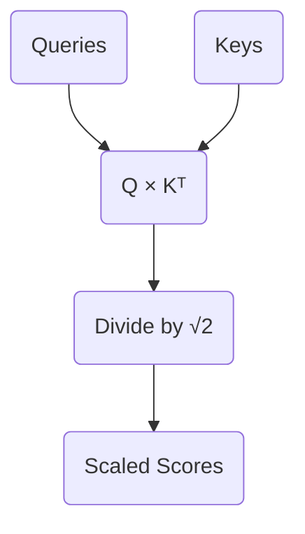

# Part 4: The Attention Score and $\sqrt{d_k}$

<!-- SUMMARY: Calculating raw attention scores via the dot product exposes a scaling problem in high-dimensional vector spaces. To prevent softmax saturation and the resulting gradient decay, the variance is mathematically stabilized by dividing the scores by the square root of the head dimension. -->

<em>Prefer to read this seamlessly offline? <a href="../assets/docs/transformers-ebook-v1.0.pdf" target="_blank" rel="noopener">Download the complete, formatting-optimized 100-page Transformer Ebook here.</a></em>

The previous section established why the Transformer does not calculate attention directly from the input embeddings. The sequence is projected into two distinct semantic subspaces, yielding a matrix of Queries ($Q$) and a matrix of Keys ($K$). This asymmetric projection allows the network to match concepts that belong together even if their base embeddings are geometrically distant.

The sequence currently consists of four tokens:

<b><code>&lt;BOS&gt;</code></b> <b><code>i</code></b> <b><code>woke</code></b> <b><code>up</code></b>

The actual attention scores must now be calculated. This step quantifies how strongly each token in the sequence should attend to every other token. This is achieved by computing the dot product of every Query vector with every Key vector. 

## The Dot Product as a Metric of Similarity

The dot product measures alignment. When two vectors point in similar directions, their dot product is large and positive. When they are orthogonal, it is zero. When they point in opposite directions, it is negative. 

Multiplying the Query matrix by the transpose of the Key matrix ($Q \times K^T$) computes the dot product for every possible pair of tokens in a single operation. 

The specific matrices for Head 1 of the network are as follows:

$$
Q = \begin{bmatrix}
0.31 & 0.62 \\
0.63 & 0.76 \\
1.82 & -0.48 \\
1.57 & -0.57
\end{bmatrix}
$$

$$
K^T = \begin{bmatrix}
0.18 & 0.22 & 0.21 & 0.14 \\
0.94 & 1.43 & 1.55 & 1.36
\end{bmatrix}
$$

The multiplication yields the unscaled attention scores:

$$
Q \times K^T = \begin{bmatrix}
0.64 & 0.95 & 1.03 & 0.89 \\
0.83 & 1.23 & 1.31 & 1.12 \\
-0.12 & -0.29 & -0.36 & -0.40 \\
-0.25 & -0.47 & -0.55 & -0.56
\end{bmatrix}
$$

Each row in this result corresponds to a Query token, and each column corresponds to a Key token. The value at row 3 and column 2, which is $-0.29$, represents the raw alignment score between the Query for "woke" and the Key for "i". 

## The Problem of Dimensionality

These raw scores are mathematically correct, yet they cannot be used in their current form. The Transformer architecture relies on converting these raw scores into a strict probability distribution using the Softmax function. Softmax forces the scores in each row to sum to $1.0$, allowing them to act as percentage weights.

A subtle mathematical trap is hidden in the dot product. As the dimensionality of the vectors increases, the variance of their dot product grows proportionally. 

Taking two random independent vectors of dimension $d$ with a mean of 0 and a variance of 1 yields a dot product with a mean of 0 and a variance of $d$. The current toy model uses a tiny head dimension of $d_k = 2$, rendering this effect invisible. In a production model like GPT-3, the head dimension is typically $d_k = 128$. The variance of the raw dot products becomes massive.

## Softmax Saturation and Gradient Death

Understanding why high variance is fatal requires examining how the Softmax function behaves with extreme values. 

A scenario involving a head dimension of $512$ causes the variance of the dot products to hover around $512$. A single row of the unscaled attention scores might look like this:

`[ 11.24, -3.13, 14.66, 34.46 ]`

Applying the Softmax function to these numbers heavily amplifies the largest value through exponentiation. The resulting probability distribution becomes extremely sharp:

`[ 0.00, 0.00, 0.00, 1.00 ]`

The network places 100% of its attention on the final token. This might seem like a decisive and confident prediction. It is actually a catastrophic failure for the learning process.

Neural networks learn via backpropagation, which relies on calculating gradients. The gradient represents the slope of the function. When a Softmax distribution becomes this sharply peaked, it operates in the absolute flattest regions of its curve. The slope approaches zero. If the gradient is zero, the network cannot update its weights. The learning process halts completely. This phenomenon is known as Softmax saturation.

## The Mathematical Solution: Scaling by $\sqrt{d_k}$

The variance of the dot products must be prevented from growing with the dimensionality of the network. This is accomplished by dividing the raw attention scores by the square root of the head dimension ($\sqrt{d_k}$). 

Dividing a random variable by a constant scales its variance by the square of that constant. Dividing the scores by $\sqrt{d_k}$ scales the variance of the dot product by $d_k$. Since the original variance was $d_k$, the new variance becomes $1$. This operation perfectly stabilizes the distribution regardless of how large the network grows.

This scaling factor can be applied to the synthetic large-dimension example. Dividing the raw values by $\sqrt{512}$ yields a much tighter range:

`[ 0.50, -0.14, 0.65, 1.52 ]`

Passing these scaled numbers through the Softmax function produces a healthy, nuanced probability distribution:

`[ 0.18, 0.10, 0.21, 0.51 ]`

The gradients can flow freely through this distribution. The network can continue to learn.

## Scaling the Toy Model

This mandatory scaling must now be applied to the toy model. The head dimension is $d_k = 2$, making the scaling factor $\sqrt{2}$, which is approximately $1.414$.

Every element in the raw score matrix is divided by $1.414$:

$$
\text{Scaled Scores} = \begin{bmatrix}
0.45 & 0.68 & 0.73 & 0.63 \\
0.59 & 0.87 & 0.93 & 0.79 \\
-0.09 & -0.20 & -0.26 & -0.28 \\
-0.18 & -0.33 & -0.39 & -0.39
\end{bmatrix}
$$

These values are now safely bounded and ready to be converted into probabilities. 

The Softmax function cannot be applied immediately. The model is currently observing the entire sequence simultaneously. The first token (`<BOS>`) has a score of `0.63` connecting it to the future token `up`. In a language modeling task, allowing a token to attend to words that have not been generated yet is invalid. The future must be hidden before the probabilities are finalized. This requirement introduces the mathematics of Causal Masking.

<em>Prefer to read this seamlessly offline? <a href="../assets/docs/transformers-ebook-v1.0.pdf" target="_blank" rel="noopener">Download the complete, formatting-optimized 100-page Transformer Ebook here.</a></em>

