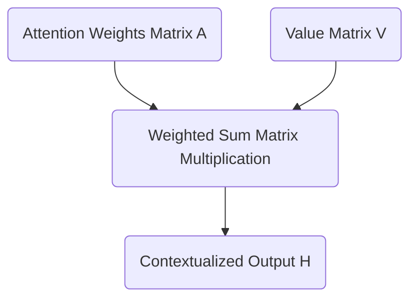

# Part 6: From Scores to Synthesis: Softmax and The Value Matrix

*Prefer to read this seamlessly offline? [Download the complete, formatting-optimized 100-page Transformer Ebook here.](/series/transformers/transformer_ebook_final.pdf)*

In our previous installation, we successfully calculated the masked attention scores. By applying a lower triangular matrix of negative infinity values, we erected a strict mathematical barrier that prevents information from flowing backward in time. We are now left with a matrix representing the raw geometric alignment between our Queries and Keys across all valid time steps. 

These scalar values are mathematically unbounded. We must now convert them into a stable format capable of driving the core synthesis step of the attention mechanism. This transformation requires the Softmax function and the introduction of our third fundamental learned matrix: the Value matrix.

## The Softmax Function: Converting Alignment to Probability

We intend to use our attention scores as a set of weights to perform a weighted sum. If we were to use the raw, unbounded scores directly, the magnitude of our vectors would compound uncontrollably as information flows deeper into the network. To maintain mathematical stability, we require our weights to be strictly positive and to sum exactly to 1 across each row. We achieve this by applying the Softmax function.

The Softmax function operates by taking the exponential of each input value and dividing it by the sum of all exponentials in that row. Exponentiation maps any real number to a positive value. Dividing by the total sum normalizes these positive values into a strict probability distribution.

Let us observe our masked scaled scores from the previous step:

$$
\text{Scores}_{masked} = \begin{bmatrix}
 0.45 & -\infty & -\infty & -\infty \\
 0.59 &  0.87 & -\infty & -\infty \\
-0.09 & -0.20 & -0.26 & -\infty \\
-0.18 & -0.33 & -0.39 & -0.39
\end{bmatrix}
$$

Applying the Softmax function yields our final attention weights matrix $A$:

$$
A = \text{Softmax}(\text{Scores}_{masked}) = \begin{bmatrix}
 1.00 &  0.00 &  0.00 &  0.00 \\
 0.43 &  0.57 &  0.00 &  0.00 \\
 0.37 &  0.33 &  0.31 &  0.00 \\
 0.29 &  0.25 &  0.23 &  0.23
\end{bmatrix}
$$

Observe the profound elegance of the causal mask at work. The exponential of negative infinity approaches exactly zero. Our masked positions have been flawlessly converted into zero-valued weights. The model is now mathematically incapable of extracting information from future tokens. Every row sums precisely to 1, providing a clean probability distribution over all preceding context. 

## The Value Matrix: The Content Payload

Until this exact moment in the architecture, our computations have focused entirely on routing. The Query and Key matrices exist solely to dictate *where* information should flow. They measure semantic relevance. They do not represent the information payload itself.

If the attention weights are the map, the Value matrix is the cargo. The semantic features required to determine relevance are fundamentally different from the semantic features required to predict the next word. We therefore project our original positional embeddings $X$ into a third distinct subspace using the Value weight matrix $W_V$.

Our embedding dimension $d_{model}$ is 6. We project down into a head dimension $d_v$ of 2. We define our learned weights $W_V$:

$$
W_V = \begin{bmatrix}
 0.3 & -0.1 \\
 0.2 &  0.5 \\
-0.4 &  0.1 \\
 0.1 &  0.6 \\
-0.3 &  0.2 \\
 0.5 & -0.4
\end{bmatrix}
$$

We calculate our Value matrix $V$ by taking the dot product of our positional embeddings $X$ and $W_V$:

$$
V = X \cdot W_V = \begin{bmatrix}
 0.83 &  0.69 \\
 1.18 &  0.70 \\
 0.04 & -0.20 \\
-0.36 &  0.00
\end{bmatrix}
$$

The matrix $V$ contains the actual conceptual representations that will be broadcast across the sequence. Each row holds the information payload for a single token in our `<BOS> i woke up` sequence.

## The Weighted Sum: Synthesizing Context

We have reached the culmination of the single head attention mechanism. We possess a matrix of routing instructions $A$ and a matrix of information payloads $V$. We synthesize our new contextualized representations by computing the dot product of $A$ and $V$. 

This operation physically executes a weighted sum. Every token constructs a new representation of itself by blending together the Value vectors of all preceding tokens according to the probabilities in the attention matrix. 

We compute our final head output $H$:

$$
H = A \cdot V = \begin{bmatrix}
 1.00 &  0.00 &  0.00 &  0.00 \\
 0.43 &  0.57 &  0.00 &  0.00 \\
 0.37 &  0.33 &  0.31 &  0.00 \\
 0.29 &  0.25 &  0.23 &  0.23
\end{bmatrix} \cdot \begin{bmatrix}
 0.83 &  0.69 \\
 1.18 &  0.70 \\
 0.04 & -0.20 \\
-0.36 &  0.00
\end{bmatrix} = \begin{bmatrix}
 0.83 &  0.69 \\
 1.03 &  0.70 \\
 0.70 &  0.42 \\
 0.46 &  0.32
\end{bmatrix}
$$

Let us analyze the final row corresponding to the token `up`. Its new representation is `[0.46, 0.32]`. This vector is no longer a static dictionary definition. It is a dynamic, context aware representation explicitly shaped by the presence of `woke` and `i` occurring earlier in the sequence. 

We have successfully completed the attention mechanism for a single head. Our model operates with three independent attention heads running in parallel. In our next session, we will explore how to reconcile these independent perspectives by projecting them back into the original embedding dimension.

*Prefer to read this seamlessly offline? [Download the complete, formatting-optimized 100-page Transformer Ebook here.](/series/transformers/transformer_ebook_final.pdf)*
