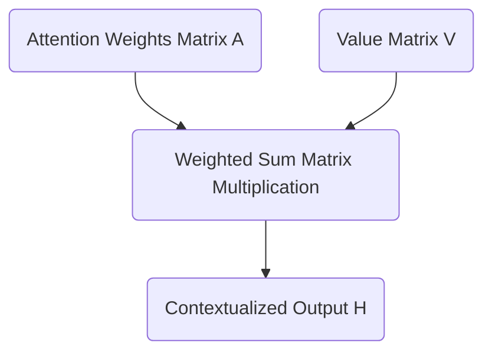

# Part 6: From Scores to Synthesis: Softmax and The Value Matrix

<!-- SUMMARY: The single-head attention mechanism is finalized by leveraging the softmax function to convert unbounded routing scores into a strict probability distribution. A weighted sum against the value matrix is then computed to dynamically synthesize a deeply contextualized geometric representation for each token. -->

<em>Prefer to read this seamlessly offline? <a href="../assets/docs/transformers-ebook-v1.0.pdf">Download the complete, formatting-optimized 100-page Transformer Ebook here.</a></em>

The previously calculated masked attention scores provide a strict mathematical barrier that prevents information from flowing backward in time through the application of a lower triangular matrix of negative infinity values. The resulting matrix represents the raw geometric alignment between Queries and Keys across all valid time steps.

These scalar values are mathematically unbounded. Converting them into a stable format capable of driving the core synthesis step of the attention mechanism requires the Softmax function and the introduction of a third fundamental learned matrix: the Value matrix.

## The Softmax Function: Converting Alignment to Probability

The attention scores function as a set of weights to perform a weighted sum. Using the raw unbounded scores directly would cause the magnitude of vectors to compound uncontrollably as information flows deeper into the network. Maintaining mathematical stability requires weights to be strictly positive and to sum exactly to 1 across each row. This is achieved by applying the Softmax function.

The Softmax function operates by taking the exponential of each input value and dividing it by the sum of all exponentials in that row. Exponentiation maps any real number to a positive value. Dividing by the total sum normalizes these positive values into a strict probability distribution.

The masked scaled scores from the preceding step are:

$$
\text{Scores}_{masked} = \begin{bmatrix}
 0.45 & -\infty & -\infty & -\infty \\
 0.59 &  0.87 & -\infty & -\infty \\
-0.09 & -0.20 & -0.26 & -\infty \\
-0.18 & -0.33 & -0.39 & -0.39
\end{bmatrix}
$$

Applying the Softmax function yields the final attention weights matrix $A$:

$$
A = \text{Softmax}(\text{Scores}_{masked}) = \begin{bmatrix}
 1.00 &  0.00 &  0.00 &  0.00 \\
 0.43 &  0.57 &  0.00 &  0.00 \\
 0.37 &  0.33 &  0.31 &  0.00 \\
 0.29 &  0.25 &  0.23 &  0.23
\end{bmatrix}
$$

The causal mask functions such that the exponential of negative infinity approaches exactly zero. Masked positions are flawlessly converted into zero-valued weights. The model is now mathematically incapable of extracting information from future tokens. Every row sums precisely to 1, providing a clean probability distribution over all preceding context.

## The Value Matrix: The Content Payload

Computations thus far have focused entirely on routing. The Query and Key matrices exist solely to dictate where information should flow. They measure semantic relevance. They do not represent the information payload itself.

If the attention weights are the map, the Value matrix is the cargo. The semantic features required to determine relevance are fundamentally different from the semantic features required to predict the next word. The original positional embeddings $X$ are therefore projected into a third distinct subspace using the Value weight matrix $W_V$.

The embedding dimension $d_{model}$ is 6. This is projected down into a head dimension $d_v$ of 2. The learned weights $W_V$ are defined as:

$$
W_V = \begin{bmatrix}
 0.3 & -0.1 \\
 0.2 &  0.5 \\
-0.4 &  0.1 \\
 0.1 &  0.6 \\
-0.3 &  0.2 \\
 0.5 & -0.4
\end{bmatrix}
$$

The Value matrix $V$ is calculated by taking the dot product of the positional embeddings $X$ and $W_V$:

$$
V = X \cdot W_V = \begin{bmatrix}
 0.83 &  0.69 \\
 1.18 &  0.70 \\
 0.04 & -0.20 \\
-0.36 &  0.00
\end{bmatrix}
$$

The matrix $V$ contains the actual conceptual representations that will be broadcast across the sequence. Each row holds the information payload for a single token in the `<BOS> i woke up` sequence.

## The Weighted Sum: Synthesizing Context

The culmination of the single head attention mechanism relies on a matrix of routing instructions $A$ and a matrix of information payloads $V$. New contextualized representations are synthesized by computing the dot product of $A$ and $V$.

This operation physically executes a weighted sum. Every token constructs a new representation of itself by blending together the Value vectors of all preceding tokens according to the probabilities in the attention matrix.

The final head output $H$ is computed as:

$$
H = A \cdot V = \begin{bmatrix}
 1.00 &  0.00 &  0.00 &  0.00 \\
 0.43 &  0.57 &  0.00 &  0.00 \\
 0.37 &  0.33 &  0.31 &  0.00 \\
 0.29 &  0.25 &  0.23 &  0.23
\end{bmatrix} \cdot \begin{bmatrix}
 0.83 &  0.69 \\
 1.18 &  0.70 \\
 0.04 & -0.20 \\
-0.36 &  0.00
\end{bmatrix} = \begin{bmatrix}
 0.83 &  0.69 \\
 1.03 &  0.70 \\
 0.70 &  0.42 \\
 0.46 &  0.32
\end{bmatrix}
$$

The final row corresponding to the token `up` has a new representation of `[0.46, 0.32]`. This vector is no longer a static dictionary definition. It is a dynamic, context-aware representation explicitly shaped by the presence of `woke` and `i` occurring earlier in the sequence.

The attention mechanism for a single head is complete. The model operates with three independent attention heads running in parallel. The architecture then reconciles these independent perspectives by projecting them back into the original embedding dimension.

<em>Prefer to read this seamlessly offline? <a href="../assets/docs/transformers-ebook-v1.0.pdf">Download the complete, formatting-optimized 100-page Transformer Ebook here.</a></em>

