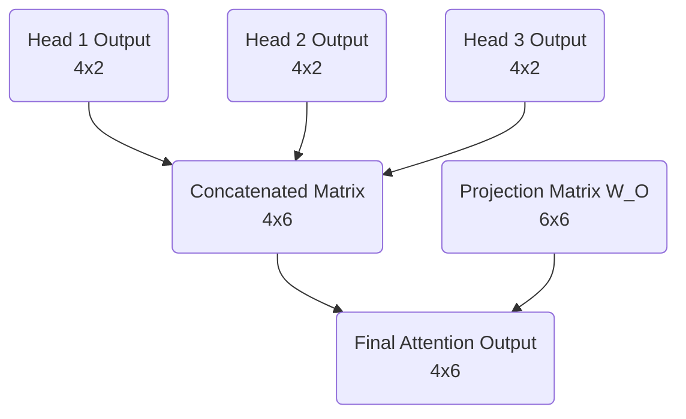

# Part 7: The Cross-Head Mixer and The Projection Matrix

<em>Prefer to read this seamlessly offline? <a href="/assets/docs/transformer_ebook_final.pdf">Download the complete, formatting-optimized 100-page Transformer Ebook here.</a></em>

In our previous session, we completed the journey of a single attention head. We watched it calculate its masked attention scores, convert those scores into strict probability distributions via the Softmax function, and finally compute a weighted sum over the Value matrix $V$. 

That process yielded a contextually enriched vector for each token in our sequence. These vectors, however, only have a dimension of $d_v = 2$. Our overall model dimension is $d_{model} = 6$. We deliberately split our architecture into three parallel attention heads so the network could simultaneously look for different types of semantic relationships. Head 1 might be attending to subject-verb pairings, while Head 2 looks for temporal markers, and Head 3 focuses on pronoun antecedents.

We now face a critical architectural challenge. We have three isolated sets of findings. We must unify these independent insights back into a single cohesive representation for each token, and this representation must seamlessly reintegrate with our overarching $d_{model} = 6$ architecture. 

## The Concatenation Step

The most straightforward way to combine the outputs of the three heads might seem to be addition. We could simply sum the three matrices together. Summation, however, destroys the distinct structural information each head worked so hard to extract. If Head 1 finds a strong positive signal for a specific feature and Head 2 finds a strong negative signal, adding them together would cancel out the values, effectively erasing the evidence gathered by both heads.

Instead of summing, we concatenate the outputs along the feature dimension. By placing the three $4 \times 2$ matrices side-by-side, we preserve every piece of information. The resulting matrix has a sequence length of 4 and a new feature dimension of $3 \times 2 = 6$. 

Let us look at the actual output of our three heads. We will use the exact Head 1 output we calculated previously, alongside simulated outputs for Head 2 and Head 3.

$$
\text{Head 1} = \begin{bmatrix}
 0.83 &  0.69 \\
 1.03 &  0.70 \\
 0.70 &  0.42 \\
 0.46 &  0.32
\end{bmatrix}
$$

$$
\text{Head 2} = \begin{bmatrix}
-0.50 &  0.10 \\
-0.40 &  0.30 \\
-0.20 &  0.25 \\
 0.10 & -0.15
\end{bmatrix}
$$

$$
\text{Head 3} = \begin{bmatrix}
 0.20 & -0.30 \\
 0.15 & -0.20 \\
 0.40 &  0.05 \\
 0.25 &  0.10
\end{bmatrix}
$$

When we concatenate these three matrices horizontally, we achieve our target width of 6.

$$
\text{Concatenated} = \begin{bmatrix}
 0.83 &  0.69 & -0.50 &  0.10 &  0.20 & -0.30 \\
 1.03 &  0.70 & -0.40 &  0.30 &  0.15 & -0.20 \\
 0.70 &  0.42 & -0.20 &  0.25 &  0.40 &  0.05 \\
 0.46 &  0.32 &  0.10 & -0.15 &  0.25 &  0.10
\end{bmatrix}
$$

## The Projection Matrix

Concatenation perfectly resolves our sizing issue. We are back to a $4 \times 6$ matrix. Yet, a geometric problem remains. The features are entirely segregated. The first two columns belong exclusively to Head 1, the middle two to Head 2, and the final two to Head 3. The insights exist in the same mathematical structure, yet they do not interact. 

A neural network derives its power from synthesizing discrete pieces of evidence into higher-order concepts. To facilitate this synthesis, we introduce the final learned parameter of the attention mechanism, the Projection Matrix, denoted as $W_O$. 

The matrix $W_O$ has dimensions of $d_{model} \times d_{model}$, which in our case is $6 \times 6$. It acts as a cross-head mixer. When we multiply our concatenated matrix by $W_O$, the resulting matrix is a linear combination of all the features from all the heads. The network can learn that a high value in column 1 from Head 1, when combined with a low value in column 5 from Head 3, implies a specific semantic meaning that should be passed forward to the rest of the architecture.

Here is the randomly initialized projection matrix $W_O$ for our toy model.

$$
W_O = \begin{bmatrix}
 0.10 &  0.20 & -0.10 &  0.30 &  0.00 & -0.20 \\
-0.20 &  0.10 &  0.40 &  0.10 &  0.20 &  0.00 \\
 0.30 & -0.10 &  0.10 & -0.20 &  0.50 &  0.10 \\
-0.10 &  0.40 & -0.30 &  0.10 & -0.10 &  0.30 \\
 0.20 &  0.00 &  0.20 & -0.10 &  0.30 & -0.10 \\
-0.30 &  0.10 & -0.10 &  0.20 & -0.20 &  0.40
\end{bmatrix}
$$

We apply the final transformation by taking the dot product of our concatenated outputs and $W_O$.

$$
\text{Output} = \text{Concatenated} \cdot W_O
$$

$$
\text{Output} = \begin{bmatrix}
-0.08 &  0.29 &  0.18 &  0.35 &  0.00 & -0.33 \\
-0.10 &  0.42 &  0.10 &  0.43 & -0.01 & -0.25 \\
-0.03 &  0.31 &  0.08 &  0.29 &  0.07 & -0.10 \\
 0.05 &  0.06 &  0.18 &  0.13 &  0.18 & -0.11
\end{bmatrix}
$$

## Rejoining the Stream

With this final calculation, we have successfully completed the Multi-Head Self-Attention block. We began with basic token embeddings representing our sequence `<BOS> i woke up`. We split those representations, allowed them to search for context across the sequence, gathered their findings, and fused those findings back into a unified $4 \times 6$ matrix.

Every vector in this output matrix now contains rich, contextualized information about its surrounding tokens. We are ready to merge these advanced representations back into the main residual stream of the Transformer.

<em>Prefer to read this seamlessly offline? <a href="/assets/docs/transformer_ebook_final.pdf">Download the complete, formatting-optimized 100-page Transformer Ebook here.</a></em>

