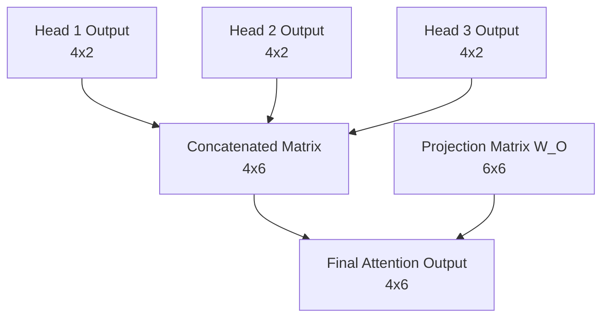

# Part 7: The Projection Matrix and The Cross-Head Mixer

<!-- SUMMARY: The isolated outputs of multiple attention heads are concatenated into a unified matrix to preserve structural integrity without destructive interference. These discrete features are synthesized into higher-order contextual representations by projecting them through a learned cross-head mixing matrix, preparing the vectors to rejoin the residual stream. -->

The computations detailed in Parts 5 and 6 successfully resolve the core attention mechanism, yielding isolated outputs from the network's multiple attention heads. These discrete insights must now be synthesized into a unified structure before projecting the contextual representations forward.

## The Concatenation Step

The previous phase completed the journey of a single attention head. The mechanism calculated its masked attention scores, converted those scores into strict probability distributions via the Softmax function, and finally computed a weighted sum over the Value matrix $V$.

That process yields a contextually enriched vector for each token in the sequence. These vectors only possess a dimension of $d_v = 2$, whereas the overall model dimension is $d_{model} = 6$. The architecture deliberately splits into three parallel attention heads so the network can simultaneously look for different types of semantic relationships. Head 1 might attend to subject-verb pairings, while Head 2 looks for temporal markers, and Head 3 focuses on pronoun antecedents.

The system now faces a critical architectural challenge. Three isolated sets of findings exist. The model must unify these independent insights back into a single cohesive representation for each token, and this representation must seamlessly reintegrate with the overarching $d_{model} = 6$ architecture.

The most straightforward way to combine the outputs of the three heads might seem to be addition. The system could simply sum the three matrices together. Summation destroys the distinct structural information each head worked tirelessly to extract. If Head 1 finds a strong positive signal for a specific feature and Head 2 finds a strong negative signal, adding them together cancels out the values, effectively erasing the evidence gathered by both heads.

Instead of summing, the architecture concatenates the outputs along the feature dimension. Placing the three $4 \times 2$ matrices side-by-side preserves every piece of information. The resulting matrix has a sequence length of 4 and a new feature dimension of $3 \times 2 = 6$.

The actual output of the three heads illustrates this process. The exact Head 1 output calculated previously sits alongside simulated outputs for Head 2 and Head 3.

$$
\text{Head 1} = \begin{bmatrix}
 0.83 &  0.69 \\
 1.03 &  0.70 \\
 0.70 &  0.42 \\
 0.46 &  0.32
\end{bmatrix}
$$

$$
\text{Head 2} = \begin{bmatrix}
-0.50 &  0.10 \\
-0.40 &  0.30 \\
-0.20 &  0.25 \\
 0.10 & -0.15
\end{bmatrix}
$$

$$
\text{Head 3} = \begin{bmatrix}
 0.20 & -0.30 \\
 0.15 & -0.20 \\
 0.40 &  0.05 \\
 0.25 &  0.10
\end{bmatrix}
$$

Concatenating these three matrices horizontally achieves the target width of 6.

$$
\text{Concatenated} = \begin{bmatrix}
 0.83 &  0.69 & -0.50 &  0.10 &  0.20 & -0.30 \\
 1.03 &  0.70 & -0.40 &  0.30 &  0.15 & -0.20 \\
 0.70 &  0.42 & -0.20 &  0.25 &  0.40 &  0.05 \\
 0.46 &  0.32 &  0.10 & -0.15 &  0.25 &  0.10
\end{bmatrix}
$$

## The Projection Matrix

Concatenation perfectly resolves the sizing issue. The dimensions return to a $4 \times 6$ matrix. However, a geometric problem remains. The features are entirely segregated. The first two columns belong exclusively to Head 1, the middle two to Head 2, and the final two to Head 3. The insights exist in the same mathematical structure, yet they do not interact.

A neural network derives its power from synthesizing discrete pieces of evidence into higher-order concepts. To facilitate this synthesis, the architecture introduces the final learned parameter of the attention mechanism, the Projection Matrix, denoted as $W_O$.

The matrix $W_O$ has dimensions of $d_{model} \times d_{model}$, which in this case is $6 \times 6$. It acts as a cross-head mixer. Multiplying the concatenated matrix by $W_O$ produces a resulting matrix that is a linear combination of all the features from all the heads. The network can learn that a high value in column 1 from Head 1, when combined with a low value in column 5 from Head 3, implies a specific semantic meaning that should be passed forward to the rest of the architecture.

The randomly initialized projection matrix $W_O$ for the toy model appears as follows.

$$
W_O = \begin{bmatrix}
 0.10 &  0.20 & -0.10 &  0.30 &  0.00 & -0.20 \\
-0.20 &  0.10 &  0.40 &  0.10 &  0.20 &  0.00 \\
 0.30 & -0.10 &  0.10 & -0.20 &  0.50 &  0.10 \\
-0.10 &  0.40 & -0.30 &  0.10 & -0.10 &  0.30 \\
 0.20 &  0.00 &  0.20 & -0.10 &  0.30 & -0.10 \\
-0.30 &  0.10 & -0.10 &  0.20 & -0.20 &  0.40
\end{bmatrix}
$$

Taking the dot product of the concatenated outputs and $W_O$ applies the final transformation.

$$
\text{Output} = \text{Concatenated} \cdot W_O
$$

$$
\text{Output} = \begin{bmatrix}
-0.08 &  0.29 &  0.18 &  0.35 &  0.00 & -0.33 \\
-0.10 &  0.42 &  0.10 &  0.43 & -0.01 & -0.25 \\
-0.03 &  0.31 &  0.08 &  0.29 &  0.07 & -0.10 \\
 0.05 &  0.06 &  0.18 &  0.13 &  0.18 & -0.11
\end{bmatrix}
$$

## Rejoining the Stream

This final calculation successfully completes the Multi-Head Self-Attention block. The process began with basic token embeddings representing the sequence `<BOS>` `i` `woke` `up`. The architecture split those representations, allowed them to search for context across the sequence, gathered their findings, and fused those findings back into a unified $4 \times 6$ matrix.

Every vector in this output matrix now contains rich, contextualized information about its surrounding tokens. These advanced representations are ready to merge back into the main residual stream of the Transformer.
