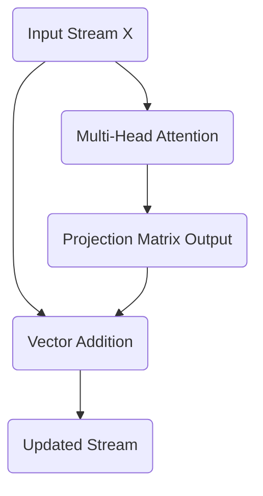

# Part 8: The Residual Stream and the Central Memory Bus

<!-- SUMMARY: The central memory bus of the architecture processes contextual updates from the attention blocks via element-wise addition to the residual stream. Geometrically, this operation acts as a vector translation in high-dimensional space, shifting token representations to incorporate context while preserving their foundational identities. -->

<em>Prefer to read this seamlessly offline? <a href="../assets/docs/transformers-ebook-v1.0.pdf" target="_blank" rel="noopener">Download the complete, formatting-optimized 100-page Transformer Ebook here.</a></em>

The multi-head attention output has been successfully calculated. Treating this output as the sole input to the next layer is a common instinct in traditional feed-forward networks. The Transformer architecture abandons this sequential pipeline. It instead relies on a central shared memory backbone known as the residual stream.

## Reframing the Architecture: The Information Highway

In a standard deep neural network, each layer transforms the data completely. The input to layer two is exclusively the output of layer one. This creates a bottleneck. If a layer destroys information during its transformation, that information is lost forever. Furthermore, during backpropagation, gradients must multiply through the weight matrix of every layer. If those weights are small, the gradients vanish, halting the learning process for early layers.

The Transformer solves both problems by treating the network as a continuous highway of information rather than a sequence of transformations. The original positionally encoded input embeddings travel straight through the entire network, from the first block to the final output. The attention mechanisms and feed-forward networks sit alongside this highway. They read from the stream, perform their specialized computations, and write their results back into the stream via addition.

The token vectors do not lose their original identity. The attention block acts as an additive update, mixing contextual information into the base meaning of the token.

## The Mathematics of the Residual Connection

This additive update is formalized with a simple equation:

$$
X_{\text{out}} = X_{\text{in}} + \text{Attention}(X_{\text{in}})
$$

Here, $X_{\text{in}}$ is the state of the residual stream before the attention block. Currently, this is the positionally encoded input matrix. $\text{Attention}(X_{\text{in}})$ represents the output calculated in the previous step using the final projection matrix. 

The exact matrices are as follows. The original positionally encoded input $X_{\text{in}}$ is:

$$
X_{\text{in}} = \begin{bmatrix}
 0.10 &  1.00 &  0.00 &  1.00 &  0.00 &  1.00 \\
 0.84 &  1.34 &  0.35 &  1.09 &  0.21 &  1.48 \\
 0.91 & -0.62 &  1.70 &  0.70 &  0.02 &  1.01 \\
 0.14 & -1.09 &  1.38 &  1.08 &  0.40 &  0.80
\end{bmatrix}
$$

The output from the multi-head attention block $\text{Attention}(X_{\text{in}})$ is:

$$
\text{Attention}(X_{\text{in}}) = \begin{bmatrix}
-0.08 &  0.29 &  0.18 &  0.35 & -0.00 & -0.33 \\
-0.10 &  0.42 &  0.10 &  0.43 & -0.01 & -0.25 \\
-0.03 &  0.31 &  0.08 &  0.29 &  0.07 & -0.10 \\
 0.05 &  0.06 &  0.18 &  0.13 &  0.18 & -0.11
\end{bmatrix}
$$

These two matrices are added together element by element. This operation literally writes the newly discovered contextual relationships into the original vector representations.

$$
X_{\text{out}} = \begin{bmatrix}
 0.02 &  1.29 &  0.18 &  1.35 &  0.00 &  0.67 \\
 0.74 &  1.76 &  0.45 &  1.52 &  0.20 &  1.23 \\
 0.88 & -0.31 &  1.78 &  0.99 &  0.09 &  0.91 \\
 0.19 & -1.03 &  1.56 &  1.21 &  0.58 &  0.69
\end{bmatrix}
$$

## The Geometric Implications of Addition

Adding the attention output to the original embedding performs vector translation. The attention block calculates a directional shift based on the surrounding context. Adding this shift vector to the original token vector moves the token to a new location in the $d_{model}$ dimensional space. 

For instance, the vector for the word "woke" originally represented the abstract concept of waking. After adding the attention output, the vector has been translated in a direction that incorporates its relationship with "i" and "up". The base identity remains intact, while the new coordinate location reflects its specific role in the sentence.

## Gradient Flow and the Residual Highway

Deep neural networks learn by calculating the gradient of the loss function and propagating that error signal backward through the layers. In a strictly sequential architecture, the gradient multiplies by the derivative of each layer. A sub-layer operation frequently yields a derivative matrix containing small values. An idealized sub-layer Jacobian matrix containing values of 0.1 perfectly illustrates the danger.

$$
\text{Jacobian} = \begin{bmatrix}
 0.10 &  0.00 &  0.00 &  0.00 &  0.00 &  0.00 \\
 0.00 &  0.10 &  0.00 &  0.00 &  0.00 &  0.00 \\
 0.00 &  0.00 &  0.10 &  0.00 &  0.00 &  0.00 \\
 0.00 &  0.00 &  0.00 &  0.10 &  0.00 &  0.00 \\
 0.00 &  0.00 &  0.00 &  0.00 &  0.10 &  0.00 \\
 0.00 &  0.00 &  0.00 &  0.00 &  0.00 &  0.10
\end{bmatrix}
$$

Backpropagating an error signal through four consecutive layers of this type requires multiplying the Jacobian matrix by itself four times. This exponentiation causes the gradient to decay exponentially. The resulting matrix demonstrates complete signal loss, rendering the earliest layers entirely incapable of learning.

$$
\text{Sequential Gradient Multiplier} = \begin{bmatrix}
 0.00 &  0.00 &  0.00 &  0.00 &  0.00 &  0.00 \\
 0.00 &  0.00 &  0.00 &  0.00 &  0.00 &  0.00 \\
 0.00 &  0.00 &  0.00 &  0.00 &  0.00 &  0.00 \\
 0.00 &  0.00 &  0.00 &  0.00 &  0.00 &  0.00 \\
 0.00 &  0.00 &  0.00 &  0.00 &  0.00 &  0.00 \\
 0.00 &  0.00 &  0.00 &  0.00 &  0.00 &  0.00
\end{bmatrix}
$$

The residual addition elegantly neutralizes this vanishing gradient problem. The mathematical derivative of an addition operation distributes the gradient equally to both inputs. When calculating the derivative of the residual equation with respect to the input stream, the original input receives a strict derivative of one. This transforms the gradient multiplier for a single layer from the Jacobian matrix alone into the Jacobian matrix added to the Identity matrix.

$$
\text{Residual Multiplier} = I + \text{Jacobian}
$$

Backpropagating through four layers utilizing residual connections multiplies this updated term by itself four times. The addition of the Identity matrix ensures the gradient mathematically survives the journey backward.

$$
\text{Residual Gradient Multiplier} = \begin{bmatrix}
 1.46 &  0.00 &  0.00 &  0.00 &  0.00 &  0.00 \\
 0.00 &  1.46 &  0.00 &  0.00 &  0.00 &  0.00 \\
 0.00 &  0.00 &  1.46 &  0.00 &  0.00 &  0.00 \\
 0.00 &  0.00 &  0.00 &  1.46 &  0.00 &  0.00 \\
 0.00 &  0.00 &  0.00 &  0.00 &  1.46 &  0.00 \\
 0.00 &  0.00 &  0.00 &  0.00 &  0.00 &  1.46
\end{bmatrix}
$$

The error signal reaches the initial embedding matrices effectively intact. The residual stream functions exactly as a gradient highway. Information flows forward to build deep semantic context, and error signals flow backward unimpeded to meticulously adjust the foundational weights. 

This central memory bus ensures that every subsequent layer has unimpeded access to both the raw original embeddings and the accumulated contextual updates from all previous layers. Stabilizing these shifting vectors requires layer normalization, which is examined next.

<em>Prefer to read this seamlessly offline? <a href="../assets/docs/transformers-ebook-v1.0.pdf" target="_blank" rel="noopener">Download the complete, formatting-optimized 100-page Transformer Ebook here.</a></em>

