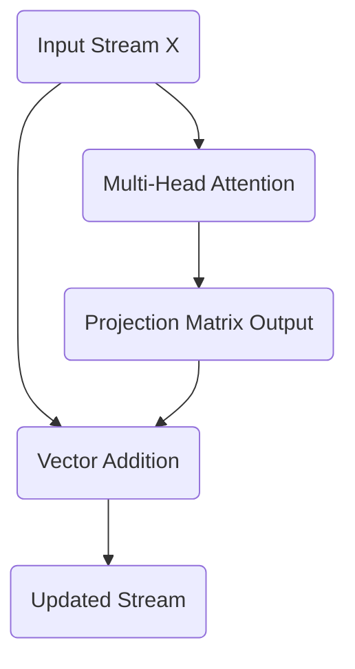

# Part 8: The Residual Stream and the Central Memory Bus

<!-- SUMMARY: Examine the central memory bus of the Transformer, where contextual updates from the attention blocks are element-wise added to the residual stream. Geometrically, this operation acts as a vector translation in high-dimensional space, shifting token representations to incorporate context while rigorously preserving their foundational identities. -->

<em>Prefer to read this seamlessly offline? <a href="/assets/docs/transformer_ebook_final.pdf">Download the complete, formatting-optimized 100-page Transformer Ebook here.</a></em>

We have successfully calculated the multi-head attention output. The temptation now is to treat this output as the sole input to the next layer, much like a traditional feed-forward network. We must resist that instinct. The Transformer architecture does not pass data sequentially through a gauntlet of filters. Instead, it relies on a central, shared memory backbone known as the residual stream.

## Reframing the Architecture: The Information Highway

In a standard deep neural network, each layer transforms the data completely. The input to layer two is exclusively the output of layer one. This creates a bottleneck. If a layer destroys information during its transformation, that information is lost forever. Furthermore, during backpropagation, gradients must multiply through every layer's weight matrix. If those weights are small, the gradients vanish, halting the learning process for early layers.

The Transformer solves both problems by treating the network not as a sequence of transformations, but as a continuous highway of information. The original positionally encoded input embeddings travel straight through the entire network, from the first block to the final output. The attention mechanisms and feed-forward networks sit alongside this highway. They read from the stream, perform their specialized computations, and write their results back into the stream via addition.

This means our token vectors do not lose their original identity. The attention block acts as an additive update, mixing contextual information into the base meaning of the token.

## The Mathematics of the Residual Connection

We formalize this additive update with a simple equation:

$$
X_{\text{out}} = X_{\text{in}} + \text{Attention}(X_{\text{in}})
$$

Here, $X_{\text{in}}$ is the state of the residual stream before the attention block. Currently, this is our positionally encoded input matrix. $\text{Attention}(X_{\text{in}})$ represents the output we calculated in the previous step using the final projection matrix. 

Let us look at the exact matrices. Our original positionally encoded input $X_{\text{in}}$ is:

$$
X_{\text{in}} = \begin{bmatrix}
 0.10 &  1.00 &  0.00 &  1.00 &  0.00 &  1.00 \\
 0.84 &  1.34 &  0.35 &  1.09 &  0.21 &  1.48 \\
 0.91 & -0.62 &  1.70 &  0.70 &  0.02 &  1.01 \\
 0.14 & -1.09 &  1.38 &  1.08 &  0.40 &  0.80
\end{bmatrix}
$$

The output from our multi-head attention block $\text{Attention}(X_{\text{in}})$ is:

$$
\text{Attention}(X_{\text{in}}) = \begin{bmatrix}
-0.08 &  0.29 &  0.18 &  0.35 & -0.00 & -0.33 \\
-0.10 &  0.42 &  0.10 &  0.43 & -0.01 & -0.25 \\
-0.03 &  0.31 &  0.08 &  0.29 &  0.07 & -0.10 \\
 0.05 &  0.06 &  0.18 &  0.13 &  0.18 & -0.11
\end{bmatrix}
$$

We add these two matrices together element by element. This operation literally writes the newly discovered contextual relationships into the original vector representations.

$$
X_{\text{out}} = \begin{bmatrix}
 0.02 &  1.29 &  0.18 &  1.35 &  0.00 &  0.67 \\
 0.74 &  1.76 &  0.45 &  1.52 &  0.20 &  1.23 \\
 0.88 & -0.31 &  1.78 &  0.99 &  0.09 &  0.91 \\
 0.19 & -1.03 &  1.56 &  1.21 &  0.58 &  0.69
\end{bmatrix}
$$

## The Geometric Implications of Addition

When we add the attention output to the original embedding, we are performing vector translation. The attention block calculates a directional shift based on the surrounding context. By adding this shift vector to the original token vector, we move the token to a new location in the $d_{model}$ dimensional space. 

For instance, the vector for the word "woke" originally represented the abstract concept of waking. After adding the attention output, the vector has been translated in a direction that incorporates its relationship with "i" and "up". The base identity remains intact, while the new coordinate location reflects its specific role in the sentence.

This central memory bus ensures that every subsequent layer has unimpeded access to both the raw original embeddings and the accumulated contextual updates from all previous layers. In our next step, we will examine how we stabilize these shifting vectors using layer normalization.

<em>Prefer to read this seamlessly offline? <a href="/assets/docs/transformer_ebook_final.pdf">Download the complete, formatting-optimized 100-page Transformer Ebook here.</a></em>

