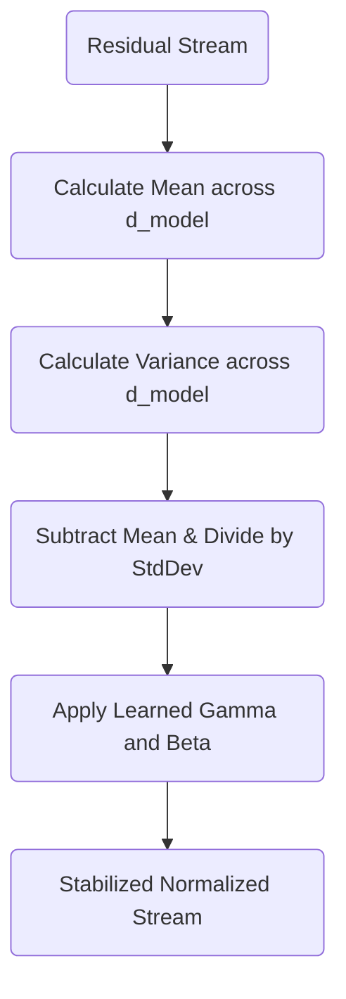

# Part 9: Taming the Stream: The Geometry of Layer Normalization

<!-- SUMMARY: Geometric drift and magnitude expansion caused by continuous additive updates are counteracted through the rigorous application of layer normalization. By independently centering and scaling each token vector across its embedding dimension, this mechanism mathematically stabilizes the residual stream while retaining vital contextual geometries. -->

<em>Prefer to read this seamlessly offline? <a href="../assets/docs/transformers-ebook-v1.0.pdf">Download the complete, formatting-optimized 100-page Transformer Ebook here.</a></em>

The previous section detailed the Residual Stream. The Attention block operates as an independent module that reads from the central memory bus, calculates contextual updates, and adds those updates directly back into the original embeddings. This additive process ensures that the network never loses the raw initial information about the token and its position. 

There is a subtle geometric consequence to this continuous addition. As a vector moves through multiple layers of a deep neural network and accumulates updates from Attention and Feed-Forward blocks, its magnitude can grow uncontrollably. The values within the vector might drift and lose their centered distribution. If the vectors become excessively large or skewed, the subsequent layers will struggle to process them effectively, leading to numerical instability and vanishing or exploding gradients during backpropagation.

A stabilizing mechanism is required. This is the role of Layer Normalization. 

## The Geometry of Normalization

The token embeddings function as points in a six-dimensional space, where $d_{model} = 6$. Before the addition of the Attention output, these points were relatively close to the origin and bounded by the properties of the initial embedding and positional encoding. After adding the Attention output, the points have shifted.

The current state of the Residual Stream for the sequence `<BOS> i woke up` is:

$$
\text{Residual Stream} = \begin{bmatrix}
 0.02 &  1.29 &  0.18 &  1.35 &  0.00 &  0.67 \\
 0.74 &  1.76 &  0.45 &  1.52 &  0.20 &  1.23 \\
 0.88 & -0.31 &  1.78 &  0.99 &  0.09 &  0.91 \\
 0.19 & -1.03 &  1.56 &  1.21 &  0.58 &  0.69
\end{bmatrix}
$$

To stabilize these representations, Layer Normalization performs two distinct operations independently on every single token vector. It centers the vector by subtracting its mean, and it scales the vector by dividing it by its standard deviation.

Layer Normalization operates across the embedding dimension $d_{model}$ for each individual token. It does not look across the sequence length. The normalization of the token "i" is completely independent of the normalization of the token "woke". This preserves the strict independence of the tokens before they interact again in the next Attention layer.

### Step 1: Centering the Vector

For a given token vector $x$, its mean $\mu$ is first calculated. The mean is simply the average of the $d_{model}$ values within that specific vector.

The mean for each of the four tokens is:

$$
\text{Means} = \begin{bmatrix}
 0.58 \\
 0.98 \\
 0.72 \\
 0.53
\end{bmatrix}
$$

Subtracting this mean from every element in the corresponding token vector shifts the entire vector through the six-dimensional space so that it is perfectly centered around zero. The geometric relationship between the components of the vector remains identical, yet the vector as a whole is anchored back to the origin of the coordinate system.

### Step 2: Scaling the Vector

Centering resolves the drift, yet the magnitude of the vector might still be excessively large or small. Standardizing the scale involves calculating the variance $\sigma^2$ of the vector across its $d_{model}$ components. 

The variances for the tokens are as follows:

$$
\text{Variances} = \begin{bmatrix}
 0.32 \\
 0.32 \\
 0.45 \\
 0.68
\end{bmatrix}
$$

The vector is scaled by dividing each component by the standard deviation, which is the square root of the variance. Preventing mathematical errors in the rare event of a zero variance requires adding a microscopic constant $\epsilon$ before taking the square root.

The complete mathematical formula for normalizing a vector $x$ is:

$$
\hat{x} = \frac{x - \mu}{\sqrt{\sigma^2 + \epsilon}}
$$

Applying this formula to the centered Residual Stream yields a perfectly standardized matrix:

$$
\text{Normalized Stream} = \begin{bmatrix}
-1.00 &  1.25 & -0.72 &  1.35 & -1.04 &  0.15 \\
-0.43 &  1.38 & -0.95 &  0.95 & -1.39 &  0.44 \\
 0.23 & -1.54 &  1.57 &  0.40 & -0.94 &  0.28 \\
-0.42 & -1.89 &  1.24 &  0.82 &  0.06 &  0.19
\end{bmatrix}
$$

Every token vector in this new matrix now possesses a mean of exactly 0 and a variance of exactly 1. 

### Step 3: Learned Scale and Bias

Standardizing the vectors to a strict normal distribution is mathematically safe. It ensures stability. Forcing every vector into this exact shape might inadvertently destroy valuable structural information that the network has learned to represent through the magnitude or shift of the vector.

To resolve this tension, Layer Normalization introduces two learned parameters for the embedding dimension: a scale parameter $\gamma$ and a bias parameter $\beta$. 

$$
\text{Output} = \gamma \odot \hat{x} + \beta
$$

The network learns exactly how much to stretch and shift the normalized vectors. During training, backpropagation adjusts $\gamma$ and $\beta$. If the network determines that the rigid normalization is discarding useful information, it can adjust these parameters to scale and shift the vectors back into a more optimal shape. 

For the purposes of this concrete toy model, $\gamma$ is initialized to a vector of ones and $\beta$ to a vector of zeros. This means the Normalized Stream remains unchanged for now, representing the pure geometric standardization.

## The Stabilized Backbone

With Layer Normalization complete, the token representations are mathematically disciplined. They are ready to be passed into the next component of the Transformer architecture.

The vectors have been stabilized, yet they still retain the rich contextual updates harvested by the Attention mechanism. These stabilized vectors will next be directed into the Feed-Forward Network, a component that will act as a conceptual memory bank for each individual token.

<em>Prefer to read this seamlessly offline? <a href="../assets/docs/transformers-ebook-v1.0.pdf">Download the complete, formatting-optimized 100-page Transformer Ebook here.</a></em>

