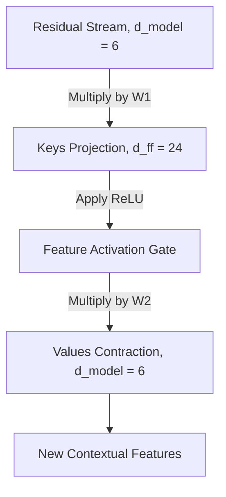

# Part 11: Layer Normalization and The Multi-Layer Perceptron

<!-- SUMMARY: The multi-layer perceptron executes precise non-linear gating and geometric contraction phases. The ReLU activation function sparsifies the high-dimensional space by isolating successful pattern matches, which are subsequently contracted through a value matrix to synthesize a refined vector of contextual updates. -->

The calculations established in Parts 9 and 10 successfully center and scale the residual stream while mapping the token representations into a high-dimensional space. This geometric expansion isolates complex conceptual patterns, preparing the network to select and extract the most relevant semantic features.

## The Multi-Layer Perceptron: Activation and Contraction

Previous discussions explored the first half of the Multi-Layer Perceptron as a Key-Value memory bank. Projecting the $d_{model} = 6$ residual stream into the much larger $d_{ff} = 24$ space using the $W_1$ matrix created a set of Keys. Each column of $W_1$ searched the residual stream for a specific, complex contextual pattern.

At this stage, token vectors exist in the expanded $24$-dimensional space. Two tasks remain. First, the system must decide which of those $24$ searched patterns were actually found. Second, the architecture must contract this high-dimensional space back into the $d_{model} = 6$ residual stream, bringing new conceptual information along with it.

### The Non-Linear Gate: ReLU

Linear transformations alone are mathematically limited. Chaining the $W_1$ projection directly into another projection matrix $W_2$ would collapse the two operations into a single equivalent linear projection. This collapse would completely defeat the purpose of expanding into a higher dimension. Creating a true memory bank requires a mechanism to selectively activate features. The system requires a non-linear activation function.

The toy model uses the Rectified Linear Unit, commonly referred to as ReLU. The function is defined elegantly:

$$
\text{ReLU}(x) = \max(0, x)
$$

This function acts as a threshold or a gate. If the dot product between a token vector and a Key in $W_1$ resulted in a negative value, the pattern was not found. ReLU clamps that negative value to zero, effectively shutting down that pathway. If the dot product was positive, the pattern was found, and ReLU allows the signal to pass through unchanged.

The output of the $W_1$ projection for the four tokens `<BOS>`, `i`, `woke`, and `up` reveals the activation states. For brevity, the following tensor displays the first three dimensions and the final dimension of the $4 \times 24$ matrix:

$$
X_{proj} = \begin{bmatrix}
 0.58 & -0.26 & -1.09 & \dots & -0.04 \\
 1.01 & -1.28 & -0.81 & \dots &  1.88 \\
-2.27 & -0.07 & -2.28 & \dots &  1.24 \\
-0.69 & -0.71 & -0.74 & \dots &  1.68
\end{bmatrix}
$$

Applying the ReLU function element-wise across the entire tensor yields the activated state:

$$
X_{act} = \max(0, X_{proj}) = \begin{bmatrix}
 0.58 & 0 & 0 & \dots & 0 \\
 1.01 & 0 & 0 & \dots & 1.88 \\
 0    & 0 & 0 & \dots & 1.24 \\
 0    & 0 & 0 & \dots & 1.68
\end{bmatrix}
$$

This operation results in profound sparsification of the data. The negative values have been eradicated. The zeros represent memory slots that did not fire. The non-zero positive values represent specific contextual features successfully recognized by the $W_1$ Keys.

### The Value Matrix: Contracting Back to the Stream

After determining which patterns fired, the architecture must translate those activations into meaningful updates for the residual stream. The second projection matrix, $W_2$, along with its bias $b_2$, performs this translation.

While $W_1$ acted as the Keys, $W_2$ acts as the Values.

The $W_2$ matrix has a shape of $d_{ff} \times d_{model}$, equating to $24 \times 6$ in the toy model. The $W_2$ matrix functions as a collection of $24$ row vectors. Each row corresponds to one of the features in the expanded space. If a specific feature fired during the ReLU step, its positive scalar value multiplies the corresponding row in $W_2$. The result is a $6$-dimensional vector of new information shaped perfectly to be added back into the residual stream.

The following tensors represent the deterministic $W_2$ matrix and $b_2$ bias vector, displaying a truncated view of the $24 \times 6$ matrix:

$$
W_2 = \begin{bmatrix}
 0.75 &  0.19 &  0.34 &  0.44 & -0.42 & -0.78 \\
-0.56 &  0.17 &  0.53 &  0.06 & -0.68 &  0.70 \\
-0.80 & -0.24 & -0.28 &  0.13 &  0.55 & -0.75 \\
\vdots & \vdots & \vdots & \vdots & \vdots & \vdots \\
-0.02 &  0.27 & -0.68 & -0.35 &  0.05 &  0.14
\end{bmatrix}
$$

$$
b_2 = \begin{bmatrix}
 -0.06 &  0.12 & -0.15 & -0.08 &  0.04 &  0.09
\end{bmatrix}
$$

Multiplying the activated memory state $X_{act}$ by the Values matrix $W_2$ and adding the bias contracts the representations back down to the $d_{model}$ dimension:

$$
X_{contracted} = X_{act} W_2 + b_2
$$

Calculating the full matrix multiplication yields the final Multi-Layer Perceptron output tensor:

$$
X_{contracted} = \begin{bmatrix}
-4.07 &  0.04 & -0.06 & -1.74 & -1.17 & -0.77 \\
-6.51 &  0.18 & -0.33 & -3.85 & -0.84 & -1.43 \\
 0.82 & -3.22 &  0.39 & -2.11 &  3.22 &  6.02 \\
 1.18 & -2.83 & -0.72 & -1.89 &  1.58 &  4.39
\end{bmatrix}
$$

This $4 \times 6$ matrix contains the refined, highly contextualized updates for the tokens. For example, the row corresponding to the token woke now holds the mathematical synthesis of all the specific concepts that the Multi-Layer Perceptron decided were relevant to the current context.

### The Big Picture of the Multi-Layer Perceptron

The entire Key-Value process visualizes as a focused expansion and contraction workflow:

The Multi-Layer Perceptron successfully reads from the normalized residual stream, expands the data to search for high-dimensional concepts, filters those concepts through a non-linear gate, and contracts the resulting values back into a $6$-dimensional update vector. 

The next step physically writes this new information back into the central information highway, completing the Layer 1 architecture.

<em>Prefer to read this seamlessly offline? <a href="../assets/docs/transformers-ebook-v1.0.pdf" target="_blank" rel="noopener">Download the complete, formatting-optimized 100-page Transformer Ebook here.</a></em>

