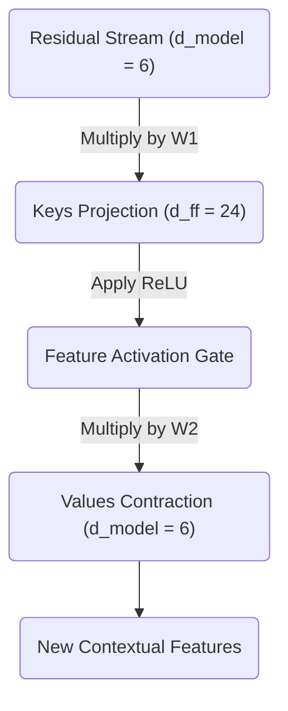

# Part 11: The MLP - Activation and Contraction

<!-- SUMMARY: Investigate the non-linear gating and geometric contraction phases of the Multi-Layer Perceptron. The ReLU activation function sparsifies the high-dimensional space by isolating successful pattern matches, which are subsequently contracted through a Value matrix to synthesize a refined vector of contextual updates. -->

<em>Prefer to read this seamlessly offline? <a href="/assets/docs/transformer_ebook_final.pdf">Download the complete, formatting-optimized 100-page Transformer Ebook here.</a></em>

In our previous discussion, we explored the first half of the Multi-Layer Perceptron (MLP) as a Key-Value memory bank. By projecting our $d_{model} = 6$ residual stream into the much larger $d_{ff} = 24$ space using the $W_1$ matrix, we created a set of "Keys". Each column of $W_1$ searched the residual stream for a specific, complex contextual pattern.

At this stage, our token vectors exist in the expanded $24$-dimensional space. We now face two tasks. First, we must decide which of those $24$ searched patterns were actually found. Second, we must contract this high-dimensional space back into our $d_{model} = 6$ residual stream, bringing new conceptual information along with it.

## The Non-Linear Gate: ReLU

Linear transformations alone are mathematically limited. If we simply chained the $W_1$ projection into another projection matrix $W_2$, the two operations would collapse into a single equivalent linear projection. This would completely defeat the purpose of expanding into a higher dimension. To create a true memory bank, we need a mechanism to selectively activate features. We need a non-linear activation function.

In our toy model, we will use the Rectified Linear Unit, commonly referred to as ReLU. The function is defined elegantly:

$$
\text{ReLU}(x) = \max(0, x)
$$

This function acts as a threshold or a gate. If the dot product between a token's vector and a Key in $W_1$ resulted in a negative value, it means the pattern was not found. ReLU clamps that negative value to zero, effectively shutting down that pathway. If the dot product was positive, the pattern was found, and ReLU allows the signal to pass through unchanged.

Let us look at the output of our $W_1$ projection for our four tokens `<BOS>`, `i`, `woke`, and `up`. For brevity, we will display the first three dimensions and the final dimension of the $4 \times 24$ matrix:

$$
X_{proj} = \begin{bmatrix}
 0.58 & -0.26 & -1.09 & \dots & -0.04 \\
 1.01 & -1.28 & -0.81 & \dots &  1.88 \\
-2.27 & -0.07 & -2.28 & \dots &  1.24 \\
-0.69 & -0.71 & -0.74 & \dots &  1.68
\end{bmatrix}
$$

We apply the ReLU function element-wise across the entire tensor:

$$
X_{act} = \max(0, X_{proj}) = \begin{bmatrix}
 0.58 & 0 & 0 & \dots & 0 \\
 1.01 & 0 & 0 & \dots & 1.88 \\
 0    & 0 & 0 & \dots & 1.24 \\
 0    & 0 & 0 & \dots & 1.68
\end{bmatrix}
$$

Notice the profound sparsification of the data. The negative values have been eradicated. The zeros represent memory slots that did not fire. The non-zero positive values represent specific contextual features that were successfully recognized by the $W_1$ Keys.

## The Value Matrix: Contracting Back to the Stream

Now that we know which patterns fired, we must translate those activations into meaningful updates for our residual stream. This is the role of the second projection matrix, $W_2$, along with its bias $b_2$.

If $W_1$ acted as the "Keys", $W_2$ acts as the "Values". 

The $W_2$ matrix has a shape of $d_{ff} \times d_{model}$, which in our case is $24 \times 6$. You can think of $W_2$ as a collection of $24$ row vectors. Each row corresponds to one of the features in our expanded space. If a specific feature fired during the ReLU step, its positive scalar value will multiply the corresponding row in $W_2$. The result is a $6$-dimensional vector of *new information* that is perfectly shaped to be added back into the residual stream.

Let us construct our deterministic $W_2$ matrix and $b_2$ bias vector. We will display a truncated view of the $24 \times 6$ matrix:

$$
W_2 = \begin{bmatrix}
 0.75 &  0.19 &  0.34 &  0.44 & -0.42 & -0.78 \\
-0.56 &  0.17 &  0.53 &  0.06 & -0.68 &  0.70 \\
-0.80 & -0.24 & -0.28 &  0.13 &  0.55 & -0.75 \\
\vdots & \vdots & \vdots & \vdots & \vdots & \vdots \\
-0.02 &  0.27 & -0.68 & -0.35 &  0.05 &  0.14
\end{bmatrix}
$$

$$
b_2 = \begin{bmatrix}
 -0.06 &  0.12 & -0.15 & -0.08 &  0.04 &  0.09
\end{bmatrix}
$$

When we multiply our activated memory state $X_{act}$ by the Values matrix $W_2$ and add the bias, we contract the representations back down to our $d_{model}$ dimension:

$$
X_{contracted} = X_{act} W_2 + b_2
$$

Calculating the full matrix multiplication yields our final MLP output tensor:

$$
X_{contracted} = \begin{bmatrix}
-4.07 &  0.04 & -0.06 & -1.74 & -1.17 & -0.77 \\
-6.51 &  0.18 & -0.33 & -3.85 & -0.84 & -1.43 \\
 0.82 & -3.22 &  0.39 & -2.11 &  3.22 &  6.02 \\
 1.18 & -2.83 & -0.72 & -1.89 &  1.58 &  4.39
\end{bmatrix}
$$

This $4 \times 6$ matrix contains the refined, highly contextualized updates for our tokens. For example, the row corresponding to "woke" now holds the mathematical synthesis of all the specific concepts that the MLP decided were relevant to its current context.

## The Big Picture of the MLP

We can visualize this entire Key-Value process as a focused expansion and contraction workflow:

The MLP has successfully read from the normalized residual stream, expanded the data to search for high-dimensional concepts, filtered those concepts through a non-linear gate, and contracted the resulting values back into a $6$-dimensional update vector. 

Our next step is to physically write this new information back into the central information highway, completing the Layer 1 architecture.

<em>Prefer to read this seamlessly offline? <a href="/assets/docs/transformer_ebook_final.pdf">Download the complete, formatting-optimized 100-page Transformer Ebook here.</a></em>

