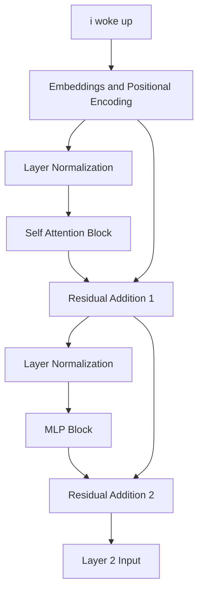

# Part 12: The MLP as a Key-Value Memory and Layer 1 Completion

<!-- SUMMARY: The feed-forward network acts as a vast conceptual memory bank for the Transformer. By projecting the residual stream into a higher-dimensional space, the first linear layer functions as a series of specific pattern-matching keys, probing each token vector for complex linguistic and contextual features learned during training. The architecture of the first layer is then finalized by integrating the newly synthesized conceptual features back into the residual stream via additive updates. To counteract the resulting geometric instability and magnitude expansion, layer normalization is applied to prepare the contextualized vectors for deeper processing in subsequent layers. -->

The self-attention mechanism allowed the tokens to mathematically look around the sequence, gathering context and shifting their geometric positions based on the surrounding words. The residual stream now carries these enriched, context-aware representations, stabilized by layer normalization. The next destination for these vectors is the Multilayer Perceptron, or MLP. While standard explanations describe this block simply as a feed-forward network that non-linearly expands and contracts dimensions, viewing the MLP through the lens of mechanistic interpretability reveals a much more profound structure, specifically a sophisticated Key-Value memory bank.

To understand this memory bank, one must examine the first half of the MLP block. The architecture projects the normalized residual stream into a significantly wider dimensional space. In the toy model, the stream expands from a working dimension of six, $d_{model} = 6$, out to twenty-four, $d_{ff} = 24$. This expansion is driven by the first weight matrix, $W_1$. Rather than viewing this matrix as a black box of parameters, one can conceptualize each of its twenty-four columns as a distinct mathematical Key.

During training, the network optimizes these Keys to recognize highly specific contextual concepts. One Key might be tuned to activate strongly when the vector represents a noun acting as the subject of a past-tense verb. Another Key might search for the concept of time. When the normalized residual stream is multiplied by $W_1$, the system is fundamentally computing the dot product between the tokens and every single one of these twenty-four Keys. A high dot product indicates a strong conceptual match between the token's current context and the pattern the Key is searching for.

The $W_1$ matrix acts as the lock mechanism for this memory bank. To see this in action, it is helpful to observe the values of the $W_1$ projection matrix itself.

$$
W_1 = \begin{bmatrix}
-0.07 & -0.09 & -0.06 &  0.35 & -0.06 & -0.75 &  0.17 & -0.13 & -0.11 & \dots &  0.25 \\
 0.44 & -0.12 &  0.19 &  0.12 &  0.39 & -0.56 &  0.28 & -0.76 & -1.31 & \dots &  0.24 \\
-0.31 & -0.36 & -0.23 &  0.25 & -0.13 &  1.17 & -0.41 & -0.55 &  0.38 & \dots &  1.16 \\
 0.31 & -0.30 & -0.28 & -0.42 &  0.48 & -0.28 & -0.04 &  0.37 & -0.36 & \dots &  0.19 \\
 0.61 & -0.01 &  0.98 & -0.18 &  0.80 &  0.06 & -0.26 & -0.56 & -0.08 & \dots & -0.18 \\
 0.05 & -0.62 &  0.11 & -0.60 &  0.44 &  0.00 &  1.14 &  0.14 &  0.68 & \dots &  1.01
\end{bmatrix}
$$

When the normalized vectors from the sequence, specifically `<BOS>` `i` `woke` `up`, are multiplied by this matrix, and the learned bias terms are added, the result is a massive expansion of the data. Every token vector transforms from six numbers into twenty-four distinct activation potentials. 

$$
\text{Projected State} = \begin{bmatrix}
 0.58 & -0.26 & -1.09 & -0.90 &  0.56 & -1.16 &  1.03 &  0.71 & -2.25 & \dots & -0.04 \\
 1.01 & -1.28 & -0.81 & -1.00 &  1.50 & -2.11 &  2.30 & -0.21 & -2.75 & \dots &  1.88 \\
-2.27 & -0.07 & -2.28 &  0.29 & -2.16 &  2.81 & -0.78 &  1.72 &  3.20 & \dots &  1.24 \\
-0.69 & -0.71 & -0.74 & -0.60 &  0.03 &  2.34 & -0.56 &  0.74 &  2.29 & \dots &  1.68
\end{bmatrix}
$$

This matrix represents the degree to which every token resonated with the twenty-four conceptual Keys in the memory bank. A highly positive number indicates a strong semantic match, suggesting the Key found exactly what it was trained to look for in the token's geometry. Conversely, a negative number indicates the absence of that concept. 

At this precise mathematical juncture, the network has successfully queried the memory bank. However, memory must be selectively recalled to be useful. The network requires a mechanism to silence the irrelevant concepts and amplify the critical discoveries before writing the findings back into the residual stream. This critical filtering role falls to the non-linear activation function, which bridges the gap between the Keys and their corresponding Values.

After the MLP processes these values, the output represents a set of additive updates containing new features discovered within the local context of each token.

## The Information Accumulator

It was established earlier that the Transformer does not pass data sequentially through a series of filters that discard old information. It maintains a persistent vector for each token, and each sublayer reads from this vector and adds its findings back to it.

The output of the MLP is not a replacement for the representation of the token. It is an additive update. The system adds the MLP output vector directly to the Residual Stream vector as it existed prior to entering the MLP block.

The original stream entering this phase is defined as $X_1$. This tensor contains the original embeddings enriched with the outputs of the Attention mechanism.

$$
X_1 = \begin{bmatrix}
 0.02 &  1.29 &  0.18 &  1.35 &  0.00 &  0.67 \\
 0.74 &  1.76 &  0.45 &  1.52 &  0.20 &  1.23 \\
 0.88 & -0.31 &  1.78 &  0.99 &  0.09 &  0.91 \\
 0.19 & -1.03 &  1.56 &  1.21 &  0.58 &  0.69
\end{bmatrix}
$$

The MLP calculated a set of additive updates representing new features discovered within the local context of each token.

$$
MLP_{output} = \begin{bmatrix}
-4.07 &  0.04 & -0.06 & -1.74 & -1.17 & -0.77 \\
-6.51 &  0.18 & -0.33 & -3.85 & -0.84 & -1.43 \\
 0.82 & -3.22 &  0.39 & -2.11 &  3.22 &  6.02 \\
 1.18 & -2.83 & -0.72 & -1.89 &  1.58 &  4.39
\end{bmatrix}
$$

The updated Residual Stream $X_2$ is computed through simple elementwise addition.

$$
X_2 = X_1 + MLP_{output} = \begin{bmatrix}
-4.05 &  1.33 &  0.12 & -0.39 & -1.17 & -0.10 \\
-5.77 &  1.94 &  0.12 & -2.33 & -0.64 & -0.20 \\
 1.70 & -3.53 &  2.17 & -1.12 &  3.31 &  6.93 \\
 1.37 & -3.86 &  0.84 & -0.68 &  2.16 &  5.08
\end{bmatrix}
$$

The magnitudes in the bottom two rows, representing the tokens "woke" and "up", have grown significantly. The network has injected a strong semantic signal into these specific token representations based on their local context.

## Preparing for Layer 2 Normalization

While adding vectors is a powerful way to accumulate information, it introduces geometric instability. As more vectors are added together, the overall magnitude of the resulting vector grows. If these enlarged vectors are passed into the next layer of the network, the dot products in the upcoming Attention mechanism will explode. This leads directly to the Softmax saturation problem solved previously.

To maintain a stable geometric space, Layer Normalization is applied before passing these vectors into Layer 2. The mean and variance are calculated across the $d_{model}$ dimension for each token independently.

$$
\text{Means} = \begin{bmatrix} -0.71 \\ -1.15 \\  1.57 \\  0.82 \end{bmatrix} \quad \text{Variances} = \begin{bmatrix} 2.78 \\  5.85 \\ 10.89 \\  7.40 \end{bmatrix}
$$

By subtracting the mean and dividing by the standard deviation, each vector is recentered around zero and its components are scaled to have a unit variance.

$$
Normed_2 = \begin{bmatrix}
-2.00 &  1.22 &  0.50 &  0.19 & -0.28 &  0.37 \\
-1.91 &  1.28 &  0.52 & -0.49 &  0.21 &  0.39 \\
 0.04 & -1.55 &  0.18 & -0.82 &  0.52 &  1.62 \\
 0.20 & -1.72 &  0.01 & -0.55 &  0.49 &  1.57
\end{bmatrix}
$$

The relative information encoded in the direction of the vector is perfectly preserved, while the overall magnitude is brought back into a mathematically manageable range.

## Visualizing the Complete Layer 1 Architecture

The sequence of operations in the first layer of the Transformer is now complete. This entire block of computation can be visualized to see how information flows from the initial input to the output of Layer 1.

The vectors exiting this block are no longer simple dictionary lookups. They are highly contextualized representations. The vector for the token "woke" now inherently contains information about the preceding pronoun "i" and the subsequent particle "up". The foundational features have been extracted, mixed, and amplified. In the next phase, these enriched vectors will be passed into Layer 2, allowing the network to form even deeper abstract associations.

<em>Prefer to read this seamlessly offline? <a href="../assets/docs/transformers-ebook-v1.0.pdf">Download the complete, formatting-optimized 100-page Transformer Ebook here.</a></em>

