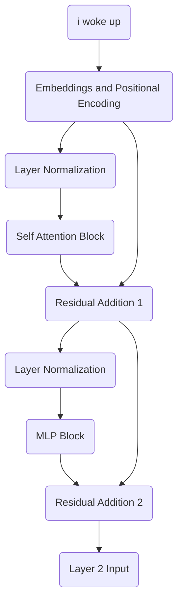

# Part 12: Completing Layer 1 Residuals and Normalization

<!-- SUMMARY: Finalize the architecture of the first Transformer layer by integrating the newly synthesized conceptual features back into the residual stream via additive updates. To counteract the resulting geometric instability and magnitude expansion, rigorously apply Layer Normalization to prepare the contextualized vectors for deeper processing in subsequent layers. -->

<em>Prefer to read this seamlessly offline? <a href="/assets/docs/transformer_ebook_final.pdf">Download the complete, formatting-optimized 100-page Transformer Ebook here.</a></em>

In the preceding part, we observed the multilayer perceptron acting as a localized memory bank. It recognized specific contextual patterns and wrote new features back out into the $d_{model}$ dimensionality. Now, we must integrate these new insights into our primary representation. We achieve this by returning to the architectural backbone of the Transformer, which is the Residual Stream.

## The Information Accumulator

We established earlier that the Transformer does not pass data sequentially through a series of filters that discard old information. It maintains a persistent vector for each token, and each sublayer reads from this vector and adds its findings back to it.

The output of our MLP is not a replacement for the representation of the token. It is an additive update. We add the MLP output vector directly to the Residual Stream vector as it existed prior to entering the MLP block.

Let us define the original stream entering this phase as $X_1$. This tensor contains the original embeddings enriched with the outputs of our Attention mechanism.

$$
X_1 = \begin{bmatrix}
 0.02 &  1.29 &  0.18 &  1.35 &  0.00 &  0.67 \\
 0.74 &  1.76 &  0.45 &  1.52 &  0.20 &  1.23 \\
 0.88 & -0.31 &  1.78 &  0.99 &  0.09 &  0.91 \\
 0.19 & -1.03 &  1.56 &  1.21 &  0.58 &  0.69
\end{bmatrix}
$$

Our MLP calculated a set of additive updates representing new features discovered within the local context of each token.

$$
MLP_{output} = \begin{bmatrix}
-4.07 &  0.04 & -0.06 & -1.74 & -1.17 & -0.77 \\
-6.51 &  0.18 & -0.33 & -3.85 & -0.84 & -1.43 \\
 0.82 & -3.22 &  0.39 & -2.11 &  3.22 &  6.02 \\
 1.18 & -2.83 & -0.72 & -1.89 &  1.58 &  4.39
\end{bmatrix}
$$

We compute the updated Residual Stream $X_2$ through simple elementwise addition.

$$
X_2 = X_1 + MLP_{output} = \begin{bmatrix}
-4.05 &  1.33 &  0.12 & -0.39 & -1.17 & -0.10 \\
-5.77 &  1.94 &  0.12 & -2.33 & -0.64 & -0.20 \\
 1.70 & -3.53 &  2.17 & -1.12 &  3.31 &  6.93 \\
 1.37 & -3.86 &  0.84 & -0.68 &  2.16 &  5.08
\end{bmatrix}
$$

Notice how the magnitudes in the bottom two rows, representing the tokens "woke" and "up", have grown significantly. The network has injected a strong semantic signal into these specific token representations based on their local context.

## Preparing for Layer 2 Normalization

While adding vectors is a powerful way to accumulate information, it introduces geometric instability. As we add more vectors together, the overall magnitude of the resulting vector grows. If we pass these enlarged vectors into the next layer of the network, the dot products in the upcoming Attention mechanism will explode. This leads directly to the Softmax saturation problem we solved previously.

To maintain a stable geometric space, we apply Layer Normalization before passing these vectors into Layer 2. We calculate the mean and variance across the $d_{model}$ dimension for each token independently.

$$
\text{Means} = \begin{bmatrix} -0.71 \\ -1.15 \\  1.57 \\  0.82 \end{bmatrix} \quad \text{Variances} = \begin{bmatrix} 2.78 \\  5.85 \\ 10.89 \\  7.40 \end{bmatrix}
$$

By subtracting the mean and dividing by the standard deviation, we recenter each vector around zero and scale its components to have a unit variance.

$$
Normed_2 = \begin{bmatrix}
-2.00 &  1.22 &  0.50 &  0.19 & -0.28 &  0.37 \\
-1.91 &  1.28 &  0.52 & -0.49 &  0.21 &  0.39 \\
 0.04 & -1.55 &  0.18 & -0.82 &  0.52 &  1.62 \\
 0.20 & -1.72 &  0.01 & -0.55 &  0.49 &  1.57
\end{bmatrix}
$$

The relative information encoded in the direction of the vector is perfectly preserved, while the overall magnitude is brought back into a mathematically manageable range.

## Visualizing the Complete Layer 1 Architecture

We have now successfully walked through every operation in the first layer of our Transformer. We can visualize this entire block of computation to see how information flows from the initial input to the output of Layer 1.

The vectors exiting this block are no longer simple dictionary lookups. They are highly contextualized representations. The vector for the token "woke" now inherently contains information about the preceding pronoun "i" and the subsequent particle "up". The foundational features have been extracted, mixed, and amplified. In the next phase, we will pass these enriched vectors into Layer 2, allowing the network to form even deeper abstract associations.

<em>Prefer to read this seamlessly offline? <a href="/assets/docs/transformer_ebook_final.pdf">Download the complete, formatting-optimized 100-page Transformer Ebook here.</a></em>

