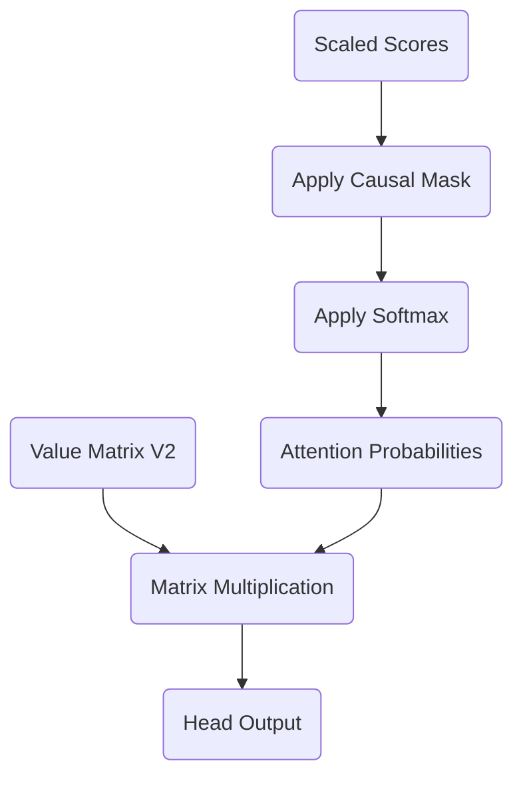

# Part 15: The Final Blend: Masking, Softmax, and Values in Layer 2
<!-- SUMMARY: Finalize the attention mechanism by enforcing causality through lower-triangular masking and normalizing the scores into a strict probability distribution via the Softmax function. These calculated attention probabilities are then blended with the Value matrix to extract highly refined, contextualized features. -->

<em>Prefer to read this seamlessly offline? <a href="../assets/docs/transformers-ebook-v1.0.pdf">Download the complete, formatting-optimized 100-page Transformer Ebook here.</a></em>

In our previous installment, we computed the unscaled and scaled attention scores for the second layer of our Transformer. We witnessed how projecting deeply contextualized tokens into new Query and Key spaces allowed them to evaluate their semantic relevance to one another. The resulting matrix of scores tells us exactly how much attention every token wishes to pay to every other token. We are now ready to finalize this attention mechanism by applying the causal mask, normalizing the scores into strict probabilities, and extracting the final contextualized features from the Value matrix.

## The Causal Mask

We are training our model to predict the next token in a sequence in a parallel fashion. To accomplish this, we must strictly enforce the arrow of time. If a token is allowed to "look ahead" at future tokens, it would effectively be cheating, ruining the model's ability to learn actual predictive dynamics.

To prevent this information leakage, we apply a lower-triangular causal mask to our scaled attention scores. We set all positions above the main diagonal to negative infinity, $-\infty$. When we apply the Softmax function in the next step, any score of $-\infty$ will be driven to exactly zero.

Here are the scaled attention scores we calculated previously:

$$
\text{Scores} = \begin{bmatrix}
-0.45 & -0.27 & 0.92 & 0.86 \\
-0.28 & -0.13 & 0.50 & 0.45 \\
0.93 & 0.47 & -1.76 & -1.60 \\
0.89 & 0.44 & -1.66 & -1.51
\end{bmatrix}
$$

Applying the causal mask yields our strictly historical scores:

$$
\text{Masked} = \begin{bmatrix}
-0.45 & -\infty & -\infty & -\infty \\
-0.28 & -0.13 & -\infty & -\infty \\
0.93 & 0.47 & -1.76 & -\infty \\
0.89 & 0.44 & -1.66 & -1.51
\end{bmatrix}
$$

## Normalizing with Softmax

Our masked scores are unbounded real numbers. To use them as a weighting system, they must be converted into a valid probability distribution where each row sums exactly to one. The Softmax function achieves this by exponentiating each score and dividing by the sum of all exponentiated scores in that row.

This non-linear operation amplifies larger scores and suppresses smaller ones. Applying Softmax row by row to our masked matrix provides the final Attention Probabilities:

$$
\text{Attention Probabilities} = \begin{bmatrix}
1.00 & 0.00 & 0.00 & 0.00 \\
0.46 & 0.54 & 0.00 & 0.00 \\
0.59 & 0.37 & 0.04 & 0.00 \\
0.55 & 0.35 & 0.04 & 0.05
\end{bmatrix}
$$

Take a moment to analyze these probabilities. The token `<BOS>` in row 1 is forced to attend entirely to itself since the rest of the sequence is masked. By the time we reach the token "up" in row 4, we see its attention is heavily distributed back toward the beginning of the sequence, allocating 55% of its focus to `<BOS>` and 35% to "i". The deep layers of the Transformer often exhibit this behavior where late tokens rely heavily on early anchoring tokens to ground their context.

## Extracting the Value

We have determined exactly *where* each token should look. The final step is to determine *what* it actually sees. This is the purpose of the Value matrix, $V$.

Just as we projected our embeddings into Query and Key spaces, we projected them into the Value space to define the specific features each token offers to the rest of the sequence. To compute the output of this attention head, we take the dot product of our Attention Probabilities matrix with the Value matrix. This operation acts as a weighted sum, blending the features of the sequence according to the calculated probabilities.

Let us define the Value matrix for Layer 2, Head 1:

$$
V_2 = \begin{bmatrix}
-1.05 & 0.82 \\
-0.51 & 0.60 \\
0.77 & -0.13 \\
0.71 & -0.13
\end{bmatrix}
$$

Multiplying the Attention Probabilities by this Value matrix yields our final output for this head:

$$
\text{Head Output} = \begin{bmatrix}
1.00 & 0.00 & 0.00 & 0.00 \\
0.46 & 0.54 & 0.00 & 0.00 \\
0.59 & 0.37 & 0.04 & 0.00 \\
0.55 & 0.35 & 0.04 & 0.05
\end{bmatrix}
\begin{bmatrix}
-1.05 & 0.82 \\
-0.51 & 0.60 \\
0.77 & -0.13 \\
0.71 & -0.13
\end{bmatrix}
= \begin{bmatrix}
-1.05 & 0.82 \\
-0.76 & 0.70 \\
-0.78 & 0.70 \\
-0.69 & 0.65
\end{bmatrix}
$$

This mathematical flow can be visualized as a sequence of transformations:

This resulting matrix represents an incredibly sophisticated conceptual mixture. The representation for "up" (row 4) is no longer just the isolated concept of the word "up". It has absorbed the physical features of the token "i" and the structural anchor of `<BOS>`, modulated through two complete layers of Multi-Head Attention and Multi-Layer Perceptrons. 

In the next installment, we will pass these highly refined vectors through the final components of Layer 2 to complete the forward pass of our Transformer architecture.

<em>Prefer to read this seamlessly offline? <a href="../assets/docs/transformers-ebook-v1.0.pdf">Download the complete, formatting-optimized 100-page Transformer Ebook here.</a></em>

