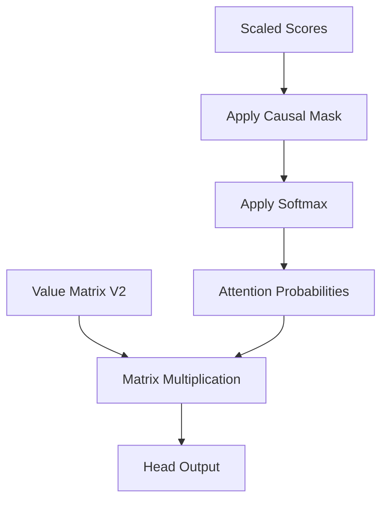

# Part 15: Layer 2 Self-Attention

<!-- SUMMARY: The progression into the second layer marks a profound shift as the self-attention mechanism now operates on deeply contextualized representations rather than static embeddings. By projecting these enriched vectors into new query, key, and value spaces, the mechanism computes relationships between complex semantic clusters. Causality is enforced through lower-triangular masking and the scores are normalized into a strict probability distribution via the softmax function, with the resulting attention probabilities blended against the value matrix to extract highly refined contextual features. -->

The progression into the second layer of the Transformer architecture marks a profound shift in how the network processes information. The initial layer operated on relatively static embeddings that primarily encoded isolated vocabulary identity and positional data. The output of that first layer represents something entirely different. The vectors entering Layer 2 are deeply contextualized amalgamations of semantic meaning, local grammar, and specific conceptual features extracted by the Multilayer Perceptron. 

This evolution of the input vectors enables the network to perform hierarchical abstraction. The self-attention mechanism in the first layer essentially resolved basic grammatical relationships and immediate context. The self-attention mechanism in the second layer computes similarities between high-level concepts and complex semantic structures. The architecture is no longer asking how a verb relates to a noun. It is asking how a localized cluster of meaning relates to the broader thematic trajectory of the sequence.

The foundation for this advanced analysis is the normalized output from the first layer. This matrix serves as the direct input for Layer 2.

$$
\text{Layer 2 Input} = \begin{bmatrix}
-2.00 &  1.22 &  0.50 &  0.19 & -0.28 &  0.37 \\
-1.91 &  1.28 &  0.52 & -0.49 &  0.21 &  0.39 \\
 0.04 & -1.55 &  0.18 & -0.82 &  0.52 &  1.62 \\
 0.20 & -1.72 &  0.01 & -0.55 &  0.49 &  1.57
\end{bmatrix}
$$

The mathematical mechanics of self-attention remain identical to the previous layer. The network utilizes unique weight matrices to project these contextualized vectors into distinct Query, Key, and Value subspaces. The difference lies entirely in the nature of the information being projected.

The Query matrix projects the enriched token vectors into a subspace designed to ask complex, context-aware questions. A token is no longer seeking basic grammatical pairings. It is seeking broader thematic relevance based on the features extracted in the prior layer.

$$
\text{Layer 2 Head 1 Query Weights} = \begin{bmatrix}
 0.10 & -0.20 \\
-0.30 &  0.40 \\
 0.50 & -0.10 \\
-0.20 &  0.30 \\
 0.40 &  0.20 \\
-0.10 & -0.50
\end{bmatrix}
$$

Multiplying the Layer 2 input by this weight matrix yields the specific Query vectors for the first attention head.

$$
\text{Query Vectors} = \begin{bmatrix}
-0.50 &  0.66 \\
-0.17 &  0.54 \\
 0.77 & -1.60 \\
 0.69 & -1.58
\end{bmatrix}
$$

The Key matrix performs a complementary operation. It projects the input vectors into a subspace where they broadcast their complex, contextualized identities. These vectors represent the nuanced semantic roles each token now plays within the specific sequence.

$$
\text{Layer 2 Head 1 Key Weights} = \begin{bmatrix}
-0.20 &  0.30 \\
 0.40 & -0.10 \\
-0.30 &  0.50 \\
 0.10 & -0.40 \\
 0.20 &  0.20 \\
-0.50 &  0.10
\end{bmatrix}
$$

The resulting Key vectors establish the targets that the Query vectors attempt to match during the dot product calculation.

$$
\text{Key Vectors} = \begin{bmatrix}
 0.52 & -0.57 \\
 0.53 & -0.16 \\
-1.47 &  0.85 \\
-1.47 &  0.71
\end{bmatrix}
$$

The Value matrix isolates the specific contextual information that is transmitted across the network once the attention scores are finalized. These vectors contain the deeply processed features that other tokens might need to update internal representations.

$$
\text{Layer 2 Head 1 Value Weights} = \begin{bmatrix}
 0.30 & -0.10 \\
-0.20 &  0.40 \\
 0.10 & -0.30 \\
-0.40 &  0.20 \\
 0.50 & -0.20 \\
-0.10 &  0.50
\end{bmatrix}
$$

The projection generates the final Value vectors for this attention head.

$$
\text{Value Vectors} = \begin{bmatrix}
-1.05 &  0.82 \\
-0.51 &  0.60 \\
 0.77 & -0.13 \\
 0.71 & -0.13
\end{bmatrix}
$$

The stage is now set for the next critical operation. The network has successfully transformed its highly contextualized input into the necessary Query, Key, and Value representations. The subsequent step involves calculating the dot products between these new Queries and Keys to determine the complex attention patterns that define Layer 2.

By taking the dot product of the Query and Key matrices and applying the scaling factor, the model computes the scaled attention scores. Projecting deeply contextualized tokens into new Query and Key spaces allows them to evaluate their semantic relevance to one another. The resulting matrix of scores indicates exactly how much attention every token attempts to allocate to every other token. The model is now ready to finalize this attention mechanism by applying the causal mask, normalizing the scores into strict probabilities, and extracting the final contextualized features from the Value matrix.

## The Causal Mask

The model is trained to predict the next token in a sequence in a parallel fashion. To accomplish this, the architecture must strictly enforce the arrow of time. If a token is allowed to look ahead at future tokens, information leaks backward, ruining the capacity of the network to learn predictive dynamics.

To prevent this information leakage, a lower-triangular causal mask is applied to the scaled attention scores. All positions above the main diagonal are set to negative infinity, $-\infty$. When the Softmax function is applied in the subsequent step, any score of $-\infty$ is driven to exactly zero.

The scaled attention scores computed from the Query and Key vectors are as follows:

$$
\text{Scores} = \begin{bmatrix}
-0.45 & -0.27 & 0.92 & 0.86 \\
-0.28 & -0.13 & 0.50 & 0.45 \\
0.93 & 0.47 & -1.76 & -1.60 \\
0.89 & 0.44 & -1.66 & -1.51
\end{bmatrix}
$$

Applying the causal mask yields strictly historical scores:

$$
\text{Masked} = \begin{bmatrix}
-0.45 & -\infty & -\infty & -\infty \\
-0.28 & -0.13 & -\infty & -\infty \\
0.93 & 0.47 & -1.76 & -\infty \\
0.89 & 0.44 & -1.66 & -1.51
\end{bmatrix}
$$

## Normalizing with Softmax

The masked scores are unbounded real numbers. To use them as a weighting system, they must be converted into a valid probability distribution where each row sums exactly to one. The Softmax function achieves this by exponentiating each score and dividing by the sum of all exponentiated scores in that row.

This non-linear operation amplifies larger scores and suppresses smaller ones. Applying Softmax row by row to the masked matrix provides the final Attention Probabilities:

$$
\text{Attention Probabilities} = \begin{bmatrix}
1.00 & 0.00 & 0.00 & 0.00 \\
0.46 & 0.54 & 0.00 & 0.00 \\
0.59 & 0.37 & 0.04 & 0.00 \\
0.55 & 0.35 & 0.04 & 0.05
\end{bmatrix}
$$

An analysis of these probabilities reveals important structural behaviors. The token `<BOS>` in row 1 is forced to attend entirely to itself since the rest of the sequence is masked. At the final token, "up" in row 4, the attention is heavily distributed back toward the beginning of the sequence, allocating 55% of its focus to `<BOS>` and 35% to "i". The deep layers of the Transformer often exhibit this behavior where late tokens rely heavily on early anchoring tokens to ground foundational context.

## Extracting the Value

The attention probabilities dictate exactly where each token should look. The final step is to determine what information is actually retrieved. This is the purpose of the Value matrix, $V$.

The input embeddings were projected into the Value space to define the specific features each token offers to the rest of the sequence. To compute the output of this attention head, the Attention Probabilities matrix is multiplied by the Value matrix. This operation acts as a weighted sum, blending the features of the sequence according to the calculated probabilities.

Using the Value vectors calculated earlier, the final output for this head is generated through matrix multiplication:

$$
\text{Head Output} = \begin{bmatrix}
1.00 & 0.00 & 0.00 & 0.00 \\
0.46 & 0.54 & 0.00 & 0.00 \\
0.59 & 0.37 & 0.04 & 0.00 \\
0.55 & 0.35 & 0.04 & 0.05
\end{bmatrix}
\begin{bmatrix}
-1.05 & 0.82 \\
-0.51 & 0.60 \\
0.77 & -0.13 \\
0.71 & -0.13
\end{bmatrix}
= \begin{bmatrix}
-1.05 & 0.82 \\
-0.76 & 0.70 \\
-0.78 & 0.70 \\
-0.69 & 0.65
\end{bmatrix}
$$

This mathematical flow is visualized as a sequence of transformations:

This resulting matrix represents an incredibly sophisticated conceptual mixture. The representation for the token "up" in row 4 is no longer just the isolated concept of the word "up". It has absorbed the physical features of the token "i" and the structural anchor of `<BOS>`, modulated through two complete layers of Multi-Head Attention and Multi-Layer Perceptrons. 

In the next step of the sequence, these highly refined vectors pass through the final components of Layer 2 to complete the forward pass of the Transformer architecture.
