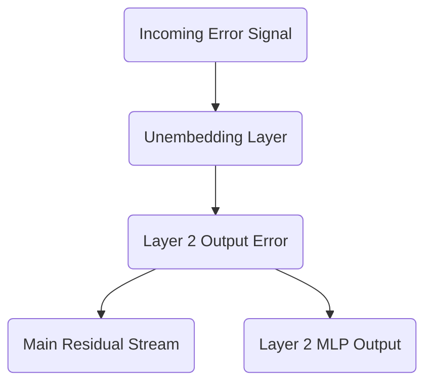

# Part 21: Backpropagating Through the Unembedding and Residual Stream

<!-- SUMMARY: We initiate the backward pass by routing the error signal from the vocabulary logits through the Unembedding matrix and into the final residual stream. Applying the chain rule reveals how the gradient symmetrically branches through the Multi-Layer Perceptron to update intermediate weights. -->

<em>Prefer to read this seamlessly offline? <a href="../assets/docs/transformers-ebook-v1.0.pdf">Download the complete, formatting-optimized 100-page Transformer Ebook here.</a></em>

In our previous installment, we discovered the elegant simplicity of the Cross-Entropy Loss derivative. The gradient of our loss with respect to the raw, pre-Softmax logits simplifies entirely to the predicted probability distribution minus the one-hot encoded target vector. This single matrix, measuring how wrong our predictions were across the sequence, serves as the physical error signal that we must now route backward through the network to update its weights.

We are now ready to execute the Chain Rule. We will begin at the very end of the network, pushing the error signal backward through the Unembedding matrix, down into the final residual stream, and ultimately into the Layer 2 Multi-Layer Perceptron. 

## The Chain Rule at the Unembedding Layer

The Unembedding layer is the final linear transformation in our Transformer. During the forward pass, it multiplied the final contextualized vectors of our sequence by the Unembedding weight matrix $W_U$ to produce the vocabulary-sized logits.

Mathematically, the forward pass for this step is defined as:

$$
\text{Logits} = \text{Output}_{\text{Layer2}} \times W_U
$$

Here, $\text{Output}_{\text{Layer2}}$ has a shape of 4 by 6, representing the sequence length by the model dimension. The weight matrix $W_U$ has a shape of 6 by 12, representing the model dimension by the vocabulary size. The resulting logits have a shape of 4 by 12.

We possess the gradient of the loss with respect to these logits, which we will denote as $\partial L / \partial \text{Logits}$. To update the network, we must calculate two new gradients. First, we need the gradient with respect to the weights $W_U$ so the optimizer can adjust them. Second, we need the gradient with respect to the input $\text{Output}_{\text{Layer2}}$ so we can continue passing the error backward.

### Updating the Unembedding Weights

The gradient of the loss with respect to the Unembedding weights requires us to multiply the transposed input by the incoming error signal. 

$$
\frac{\partial L}{\partial W_U} = \text{Output}_{\text{Layer2}}^T \times \frac{\partial L}{\partial \text{Logits}}
$$

To visualize this geometrically, we map the dimensions. We transpose the 4 by 6 input to become 6 by 4. We then multiply this by the 4 by 12 error signal. The resulting gradient matrix perfectly matches the 6 by 12 shape of our original $W_U$ matrix. Each element in this new matrix tells us exactly how to nudge a specific weight in $W_U$ to decrease the overall loss.

### Passing the Error Backward

Updating the final weights is only half the task. We must also pull the error signal backward to the preceding layers. To find the gradient with respect to the input $\text{Output}_{\text{Layer2}}$, we multiply the incoming error signal by the transposed weight matrix.

$$
\frac{\partial L}{\partial \text{Output}_{\text{Layer2}}} = \frac{\partial L}{\partial \text{Logits}} \times W_U^T
$$

The dimensions align perfectly once more. We multiply the 4 by 12 error signal by the 12 by 6 transposed weight matrix, yielding a 4 by 6 matrix. This new matrix represents the error signal scaled and rotated back into the $d_{model}$ dimensionality of our residual stream.

## Splitting the Signal: The Residual Connection

We have successfully routed the error signal back into the $d_{model}$ dimensional space at the very end of Layer 2. During the forward pass, this final state was constructed by adding the output of the Layer 2 Multi-Layer Perceptron to the pre-existing residual stream.

$$
\text{Output}_{\text{Layer2}} = \text{Residual}_{\text{Pre-MLP}} + \text{MLP}_{\text{Output}}
$$

In calculus, the derivative of a sum $f(x) + g(x)$ is simply $f'(x) + g'(x)$. When executing backpropagation through an addition operation, the incoming gradient is distributed equally and unchanged to both branches. 

This means the 4 by 6 error signal we just calculated copies itself. One copy travels directly down the central residual stream, preserving the unmodified error signal for earlier layers. The second copy flows directly into the output of the Multi-Layer Perceptron.

## Entering the Multi-Layer Perceptron

The final operation inside the Layer 2 MLP during the forward pass was a linear projection. The internal activations of the MLP were multiplied by the second weight matrix, $W_2$, to project the data from the expanded $d_{ff}$ dimension back down to the $d_{model}$ dimension.

$$
\text{MLP}_{\text{Output}} = \text{Activations} \times W_2
$$

Since the error signal flowing into the MLP is exactly the error signal from the residual stream, we can apply the exact same linear algebra rules we used for the Unembedding layer to continue the backward pass.

To find the gradient for the $W_2$ weights, we transpose the incoming activations and multiply by the error signal:

$$
\frac{\partial L}{\partial W_2} = \text{Activations}^T \times \frac{\partial L}{\partial \text{Output}_{\text{Layer2}}}
$$

Our activations were expanded to $d_{ff} = 24$. Transposing the 4 by 24 activations gives us 24 by 4. Multiplying this by the 4 by 6 error signal yields a 24 by 6 gradient matrix, perfectly matching the dimensions of $W_2$. 

To continue pulling the error backward through the activation function and into the first half of the MLP, we multiply the error signal by the transposed $W_2$ matrix:

$$
\frac{\partial L}{\partial \text{Activations}} = \frac{\partial L}{\partial \text{Output}_{\text{Layer2}}} \times W_2^T
$$

This operation takes our 4 by 6 error signal, multiplies it by the 6 by 24 transposed weight matrix, and produces a 4 by 24 error signal ready to be passed backward through the non-linear activation function.

By strictly following the rules of matrix multiplication and addition, we have successfully navigated the error signal from the vocabulary-level predictions deep into the internal mechanisms of Layer 2. In our next analysis, we will tackle the rigorous calculus of routing these gradients through the Softmax function and the causal mask of the attention mechanism.

<em>Prefer to read this seamlessly offline? <a href="../assets/docs/transformers-ebook-v1.0.pdf">Download the complete, formatting-optimized 100-page Transformer Ebook here.</a></em>

