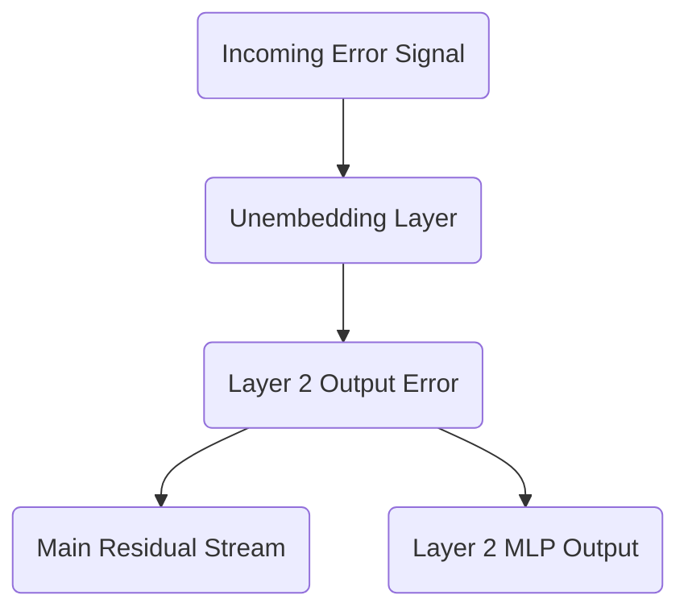

# Part 21: Backpropagating Through the Unembedding and Residual Stream

<!-- SUMMARY: The backward pass initiates by routing the error signal from the vocabulary logits through the unembedding matrix and into the final residual stream. Applying the chain rule demonstrates how the gradient symmetrically branches through the multi-layer perceptron to update intermediate weights. -->

<em>Prefer to read this seamlessly offline? <a href="../assets/docs/transformers-ebook-v1.0.pdf" target="_blank" rel="noopener">Download the complete, formatting-optimized 100-page Transformer Ebook here.</a></em>

The previous installment discovered the elegant simplicity of the cross-entropy loss derivative. The gradient of the loss with respect to the raw, pre-softmax logits simplifies entirely to the predicted probability distribution minus the one-hot encoded target vector. This single matrix, measuring how wrong the predictions were across the sequence, serves as the physical error signal that must now be routed backward through the network to update its weights.

The network is now ready to execute the chain rule. The process begins at the very end of the architecture, pushing the error signal backward through the unembedding matrix, down into the final residual stream, and ultimately into the Layer 2 multi-layer perceptron. 

## The Chain Rule at the Unembedding Layer

The unembedding layer is the final linear transformation in the Transformer. During the forward pass, this step multiplied the final contextualized vectors of the sequence by the unembedding weight matrix $W_U$ to produce the vocabulary-sized logits.

Mathematically, the forward pass for this step is defined as:

$$
\text{Logits} = \text{Output}_{\text{Layer2}} \times W_U
$$

Here, $\text{Output}_{\text{Layer2}}$ has a shape of 4 by 6, representing the sequence length by the model dimension. The weight matrix $W_U$ has a shape of 6 by 12, representing the model dimension by the vocabulary size. The resulting logits have a shape of 4 by 12.

The system possesses the gradient of the loss with respect to these logits, denoted as $\partial L / \partial \text{Logits}$. To update the network, two new gradients are required. First, the gradient with respect to the weights $W_U$ is needed so the optimizer can adjust them. Second, the gradient with respect to the input $\text{Output}_{\text{Layer2}}$ is necessary to continue passing the error backward.

### Updating the Unembedding Weights

The gradient of the loss with respect to the unembedding weights requires multiplying the transposed input by the incoming error signal. 

$$
\frac{\partial L}{\partial W_U} = \text{Output}_{\text{Layer2}}^T \times \frac{\partial L}{\partial \text{Logits}}
$$

To visualize this geometrically, mapping the dimensions proves highly effective. Transposing the 4 by 6 input transforms it into a 6 by 4 matrix. Multiplying this by the 4 by 12 error signal yields a gradient matrix that perfectly matches the 6 by 12 shape of the original $W_U$ matrix. Each element in this new matrix calculates exactly how to nudge a specific weight in $W_U$ to decrease the overall loss.

### Passing the Error Backward

Updating the final weights is only half the task. The architecture must also pull the error signal backward to the preceding layers. To find the gradient with respect to the input $\text{Output}_{\text{Layer2}}$, the incoming error signal is multiplied by the transposed weight matrix.

$$
\frac{\partial L}{\partial \text{Output}_{\text{Layer2}}} = \frac{\partial L}{\partial \text{Logits}} \times W_U^T
$$

The dimensions align perfectly once more. Multiplying the 4 by 12 error signal by the 12 by 6 transposed weight matrix yields a 4 by 6 matrix. This new matrix represents the error signal scaled and rotated back into the $d_{model}$ dimensionality of the residual stream.

## Splitting the Signal: The Residual Connection

The network has successfully routed the error signal back into the $d_{model}$ dimensional space at the very end of Layer 2. During the forward pass, this final state was constructed by adding the output of the Layer 2 multi-layer perceptron to the pre-existing residual stream.

$$
\text{Output}_{\text{Layer2}} = \text{Residual}_{\text{Pre-MLP}} + \text{MLP}_{\text{Output}}
$$

In vector calculus, the derivative of a sum is simply the sum of the individual derivatives. When executing backpropagation through an addition operation, the incoming gradient is distributed equally and unchanged to both branches. 

This means the 4 by 6 error signal just calculated copies itself. One copy travels directly down the central residual stream, preserving the unmodified error signal for earlier layers. The second copy flows directly into the output of the multi-layer perceptron.

## Entering the Multi-Layer Perceptron

The final operation inside the Layer 2 multi-layer perceptron during the forward pass was a linear projection. The internal activations of the layer were multiplied by the second weight matrix, $W_2$, to project the data from the expanded $d_{ff}$ dimension back down to the $d_{model}$ dimension.

$$
\text{MLP}_{\text{Output}} = \text{Activations} \times W_2
$$

Since the error signal flowing into this layer is exactly the error signal from the residual stream, the network can apply the exact same linear algebra rules used for the unembedding layer to continue the backward pass.

To find the gradient for the $W_2$ weights, the incoming activations are transposed and multiplied by the error signal:

$$
\frac{\partial L}{\partial W_2} = \text{Activations}^T \times \frac{\partial L}{\partial \text{Output}_{\text{Layer2}}}
$$

The internal activations were expanded to $d_{ff} = 24$. Transposing the 4 by 24 activations yields a 24 by 4 matrix. Multiplying this by the 4 by 6 error signal produces a 24 by 6 gradient matrix, perfectly matching the dimensions of $W_2$. 

To continue pulling the error backward through the activation function and into the first half of the layer, the error signal is multiplied by the transposed $W_2$ matrix:

$$
\frac{\partial L}{\partial \text{Activations}} = \frac{\partial L}{\partial \text{Output}_{\text{Layer2}}} \times W_2^T
$$

This operation takes the 4 by 6 error signal, multiplies it by the 6 by 24 transposed weight matrix, and produces a 4 by 24 error signal ready to be passed backward through the non-linear activation function.

By strictly following the rules of matrix multiplication and addition, the error signal has successfully navigated from the vocabulary-level predictions deep into the internal mechanisms of Layer 2. The next analysis will tackle the rigorous calculus of routing these gradients through the softmax function and the causal mask of the attention mechanism.

<em>Prefer to read this seamlessly offline? <a href="../assets/docs/transformers-ebook-v1.0.pdf" target="_blank" rel="noopener">Download the complete, formatting-optimized 100-page Transformer Ebook here.</a></em>

