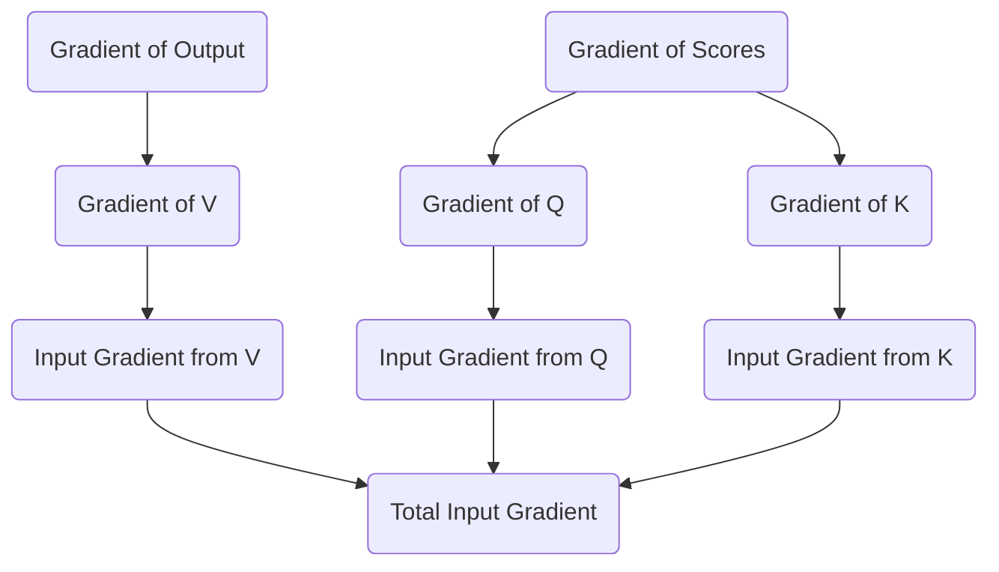

# Part 23: Backpropagation Through Attention (Part 2: Routing to Q, K, and V)

<!-- SUMMARY: Following the calculation of the attention score gradients, the error signal is distributed backward into the query, key, and value matrices. Reversing the weighted sums geometrically mirrors the forward pass, successfully translating the output error into precise updates for the self-attention weight matrices. -->

<em>Prefer to read this seamlessly offline? <a href="../assets/docs/transformers-ebook-v1.0.pdf">Download the complete, formatting-optimized 100-page Transformer Ebook here.</a></em>

In the previous part, we successfully navigated the complexities of the Softmax function and the causal mask. We calculated the gradient of the loss with respect to the raw, unmasked attention scores, giving us a precise measurement of how each attention connection should be adjusted. We now stand at the final stage of backpropagating through the self-attention mechanism. Our objective is to distribute these score gradients, along with the gradients from the attention output itself, backward into the Query, Key, and Value matrices. Ultimately, we must route these signals all the way back to the weight matrices that created them and the input sequence that started it all.

## The Value Matrix Gradient

During the forward pass, the attention mechanism produced its final output by multiplying the probability matrix by the Value matrix. If we denote the output as $Z$, the attention probabilities as $P$, and the values as $V$, the operation was $Z = P V$.

To determine how to adjust the Value matrix, we must calculate the gradient of the loss with respect to $V$. Using the chain rule of matrix calculus, we multiply the transpose of the probability matrix by the gradient of the output. 

$$
\partial V = P^T \partial Z
$$

The transpose operation here is highly intuitive. In the forward pass, a row of $P$ determined how much of each value vector to mix into a single output token. During backpropagation, we transpose $P$. This means a column of $P^T$ dictates how much of the output error should be attributed to a specific value vector. We are explicitly reversing the weighted sum.

Once we have the gradient for the Value matrix, finding the gradient for its corresponding weight matrix $W_V$ follows standard linear layer backpropagation. We multiply the transpose of the input $X$ by the Value gradient.

$$
\partial W_V = X^T \partial V
$$

## Routing Gradients to Queries and Keys

The Query and Key matrices are responsible for generating the attention scores. In the forward pass, we computed the scaled dot-product attention scores as $S = \frac{Q K^T}{\sqrt{d_k}}$. 

We have already computed the gradient with respect to these scores, which we will refer to as $\partial S$. To distribute this gradient back to the Queries and Keys, we apply the matrix derivative rules for multiplication, remembering to include the scaling factor.

For the Query matrix gradient, we multiply the score gradient by the Key matrix. 

$$
\partial Q = \frac{\partial S K}{\sqrt{d_k}}
$$

For the Key matrix gradient, we multiply the transposed score gradient by the Query matrix.

$$
\partial K = \frac{\partial S^T Q}{\sqrt{d_k}}
$$

The geometry of these operations perfectly mirrors the forward pass. The score gradient $\partial S$ represents how the alignment between every query and key needs to change. To know how to adjust a specific query vector, we project that required change onto the key vectors it interacted with. We apply the transpose for the Key gradient to properly align the dimensions, routing the error from the queries back to the keys.

Similar to the Value weights, we calculate the gradients for the Query and Key weight matrices by multiplying the transposed input by their respective gradients.

$$
\partial W_Q = X^T \partial Q
$$

$$
\partial W_K = X^T \partial K
$$

## The Confluence at the Input

The final step in this layer is to route the gradients all the way back to the input matrix $X$. In the forward pass, the input branched into three parallel paths to create the Queries, Keys, and Values. 

When gradients flow backward through a branching architecture, they sum together at the point of origin. We must calculate the gradient with respect to the input from each of the three paths and add them up.

$$
\partial X_V = \partial V W_V^T
$$

$$
\partial X_Q = \partial Q W_Q^T
$$

$$
\partial X_K = \partial K W_K^T
$$

The total gradient flowing backward out of the attention block and down the residual stream is the sum of these three components.

$$
\partial X_{Total} = \partial X_V + \partial X_Q + \partial X_K
$$

We have now completely backpropagated through the self-attention mechanism. We successfully translated the error from the network's output into specific updates for the $W_Q$, $W_K$, and $W_V$ matrices, and we prepared the error signal to continue its journey backward down the residual stream. In the next part, we will follow this signal as it reaches the very beginning of the network to update the original token embeddings.

<em>Prefer to read this seamlessly offline? <a href="../assets/docs/transformers-ebook-v1.0.pdf">Download the complete, formatting-optimized 100-page Transformer Ebook here.</a></em>

