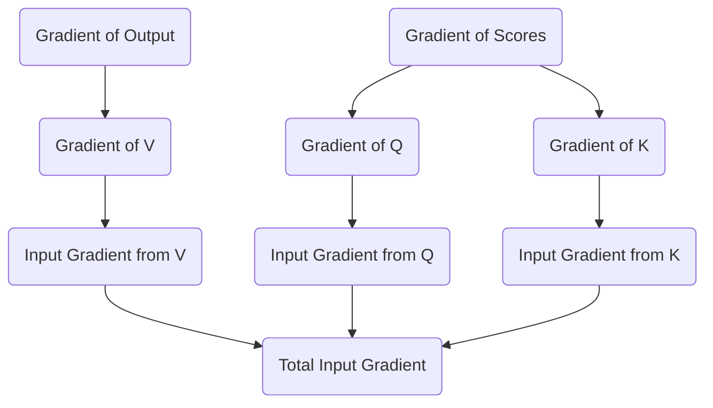

# Part 23: Backpropagation - Attention (Part 2: Q, K, V)

<!-- SUMMARY: Following the calculation of the attention score gradients, the error signal is distributed backward into the query, key, and value matrices. Reversing the weighted sums geometrically mirrors the forward pass, successfully translating the output error into precise updates for the self-attention weight matrices. -->

<em>Prefer to read this seamlessly offline? <a href="../assets/docs/transformers-ebook-v1.0.pdf" target="_blank" rel="noopener">Download the complete, formatting-optimized 100-page Transformer Ebook here.</a></em>

The previous installment navigated the complexities of the softmax function and the causal mask. That stage calculated the gradient of the loss with respect to the raw, unmasked attention scores, yielding a precise measurement of how each attention connection requires adjustment. The process now reaches the final stage of backpropagating through the self-attention mechanism. The objective requires distributing these score gradients, alongside the gradients from the attention output itself, backward into the Query, Key, and Value matrices. Ultimately, the network must route these signals all the way back to the weight matrices that created them and the input sequence that initiated the forward pass.

## The Value Matrix Gradient

During the forward pass, the attention mechanism produced its final output by multiplying the probability matrix by the Value matrix. Denoting the output gradient as $d\_Z$, the attention probabilities as $P$, and the values as $V$, the gradient of the loss with respect to $V$ follows the chain rule of matrix calculus. The transpose of the probability matrix multiplies the gradient of the output:

$$
d\_V = P^T d\_Z
$$

The transpose operation provides an intuitive geometric reversal. In the forward pass, a row of $P$ determined how much of each value vector to mix into a single output token. During backpropagation, a column of $P^T$ dictates how much of the output error should be attributed to a specific value vector. The network explicitly reverses the weighted sum to calculate the exact error signal for the Value matrix:

$$
d\_V = \begin{bmatrix}
0.0634 & -0.1513 \\
0.0274 & -0.0883 \\
0.0244 & 0.0048 \\
0.0285 & -0.0100
\end{bmatrix}
$$

Once the gradient for the Value matrix is established, finding the gradient for its corresponding weight matrix $W\_V$ follows standard linear layer backpropagation. The transpose of the input $X$ multiplies the Value gradient:

$$
d\_W_V = X^T d\_V
$$

This operation yields the precise matrix of updates required for the Value weights:

$$
d\_W_V = \begin{bmatrix}
0.0547 & -0.2043 \\
-0.0747 & -0.0419 \\
0.0279 & -0.0796 \\
0.0913 & -0.2788 \\
-0.0503 & 0.0708 \\
-0.0606 & 0.0923
\end{bmatrix}
$$

## Routing Gradients to Queries and Keys

The Query and Key matrices generate the attention scores. In the forward pass, the scaled dot-product attention scores were computed as $S = \frac{Q K^T}{\sqrt{d_k}}$.

The gradient with respect to these scores, denoted as $d\_S$, dictates how the alignment between every query and key must change. To distribute this gradient back to the Queries and Keys, the matrix derivative rules for multiplication apply, incorporating the necessary scaling factor.

For the Query matrix gradient, the score gradient multiplies the Key matrix:

$$
d\_Q = \frac{d\_S K}{\sqrt{d_k}}
$$

Calculating this yields the explicit error signal for the Queries:

$$
d\_Q = \begin{bmatrix}
-0.0298 & 0.0408 \\
-0.0232 & -0.0340 \\
-0.0615 & 0.0730 \\
-0.0182 & -0.0480
\end{bmatrix}
$$

For the Key matrix gradient, the transposed score gradient multiplies the Query matrix:

$$
d\_K = \frac{d\_S^T Q}{\sqrt{d_k}}
$$

This produces the corresponding error signal for the Keys:

$$
d\_K = \begin{bmatrix}
-0.0037 & -0.1250 \\
-0.0805 & 0.0564 \\
-0.0515 & 0.0076 \\
-0.0017 & -0.0016
\end{bmatrix}
$$

The geometry of these operations perfectly mirrors the forward pass. The score gradient $d\_S$ represents how the alignment between queries and keys needs to shift. To determine the necessary adjustment for a specific query vector, the operation projects that required change onto the key vectors it interacted with. Applying the transpose for the Key gradient properly aligns the dimensions, effectively routing the error from the queries back to the keys.

Similar to the Value weights, the gradients for the Query and Key weight matrices emerge by multiplying the transposed input by their respective gradients:

$$
d\_W_Q = X^T d\_Q
$$

$$
d\_W_K = X^T d\_K
$$

This finalizes the learning signals for the remaining attention weight matrices:

$$
d\_W_Q = \begin{bmatrix}
-0.0497 & 0.0279 \\
0.1298 & -0.1036 \\
0.0710 & -0.1539 \\
-0.0193 & 0.0135 \\
0.0788 & -0.0710 \\
0.0244 & 0.0976
\end{bmatrix}
$$

$$
d\_W_K = \begin{bmatrix}
-0.1398 & 0.0302 \\
0.0397 & 0.0483 \\
0.1217 & -0.1228 \\
-0.0199 & -0.1637 \\
0.0902 & -0.0046 \\
0.0246 & 0.0076
\end{bmatrix}
$$

## The Confluence at the Input

The concluding step in this layer requires routing the gradients back to the input matrix $X$. In the forward pass, the input branched into three parallel paths to create the Queries, Keys, and Values.

When gradients flow backward through a branching architecture, they sum together at the point of origin. The calculation requires deriving the gradient with respect to the input from each of the three paths and summing the results:

$$
d\_X_V = d\_V W_V^T
$$

$$
d\_X_Q = d\_Q W_Q^T
$$

$$
d\_X_K = d\_K W_K^T
$$

The total gradient flowing backward out of the attention block and down the residual stream equals the sum of these three components:

$$
d\_X_{Total} = d\_X_V + d\_X_Q + d\_X_K
$$

This aggregation produces the final, contextualized error signal for the sequence:

$$
d\_X = \begin{bmatrix}
0.5536 & 0.1088 & -0.1536 & 0.0560 & 0.0463 & -0.3314 \\
0.0465 & 0.1747 & -0.0985 & -0.1107 & 0.1189 & 0.0421 \\
0.0159 & 0.1742 & -0.0346 & 0.2056 & -0.0277 & -0.0953 \\
0.0348 & 0.0179 & -0.0020 & -0.0572 & 0.0338 & 0.0424
\end{bmatrix}
$$

The network has completely backpropagated through the self-attention mechanism. This process successfully translated the error from the network's output into specific updates for the $W\_Q$, $W\_K$, and $W\_V$ matrices. Furthermore, it prepared the error signal to continue its journey backward down the residual stream. The next phase will follow this signal as it reaches the very beginning of the network to update the original token embeddings.

<em>Prefer to read this seamlessly offline? <a href="../assets/docs/transformers-ebook-v1.0.pdf" target="_blank" rel="noopener">Download the complete, formatting-optimized 100-page Transformer Ebook here.</a></em>

