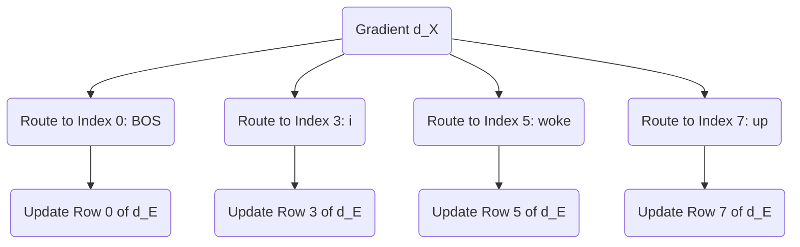

# Part 24: Updating the Embeddings and Conclusion

<!-- SUMMARY: The accumulated gradient ultimately reaches the initial embedding matrix via the residual stream, perfectly encapsulating how token representations must shift to minimize prediction error. The completion of the backward pass finalizes the mathematical traversal of the machinery driving the architecture. -->

<em>Prefer to read this seamlessly offline? <a href="../assets/docs/transformers-ebook-v1.0.pdf" target="_blank" rel="noopener">Download the complete, formatting-optimized 100-page Transformer Ebook here.</a></em>

The backward journey finally reaches its terminus. The error signal cascaded from the Cross-Entropy loss, navigated the Unembedding matrix, split through the Layer 2 MLP, and distributed itself across the complex geometry of the self-attention Query, Key, and Value matrices. Now, this accumulated signal arrives at the very beginning of the network. It is time to update the foundational representations of the tokens: the Embedding matrix itself.

## The Residual Highway

During the forward pass, the residual stream operated as a central memory bus. The initial token embeddings traveled along this bus, with each attention and MLP block adding new contextual information. 

In the backward pass, the residual stream serves an equally critical role as a gradient highway. When operations add together during the forward pass, the backward pass simply passes the gradient equally to both paths. The gradient arriving at any point in the residual stream equals the sum of all gradients from the blocks that read from it later in the network. Therefore, the final gradient vector arriving at the initial input matrix $X$ represents a comprehensive sum. It contains the feedback from every downstream decision, perfectly encapsulating how the initial token vectors need to shift in $d_{model}$ space to decrease the final prediction error.

Let $d\_X$ represent this accumulated gradient for the sequence `<BOS>` `i` `woke` `up`. It forms a matrix of size $4 \times 6$:

$$
d\_X = \begin{bmatrix}
-0.0036 & 0.1565 & -0.2620 & 0.0822 & 0.0087 & -0.0299 \\
0.0092 & -0.1988 & -0.0220 & 0.0357 & 0.1478 & -0.0518 \\
-0.0808 & -0.0502 & 0.0915 & 0.0329 & -0.0530 & 0.0513 \\
0.0097 & 0.0969 & -0.0702 & -0.0328 & -0.0392 & -0.1464
\end{bmatrix}
$$

## Routing Gradients to the Vocabulary Space

The input matrix $X$ was constructed by selecting specific rows from the global Embedding matrix $E$. The matrix $E$ has a shape of $12 \times 6$, representing the entire vocabulary of 12 words in a 6-dimensional space. 

By the rules of calculus, if a row in $E$ copies forward to form a row in $X$, the gradient for that row in $X$ routes directly back to the original row in $E$. The operation of selecting a row is mathematically equivalent to multiplying a one-hot encoded vector by the matrix $E$. The derivative of this operation simply passes the gradient back to the active index.

If the sequence `<BOS>` `i` `woke` `up` corresponds to indices 0, 3, 5, and 7 in the vocabulary, the process constructs a gradient matrix $d\_E$ of the same size as $E$, initialized to all zeros. The network then adds the respective rows of $d\_X$ to rows 0, 3, 5, and 7 of $d\_E$. The gradients for tokens not present in the current sequence remain strictly zero.

## The Optimizer Update

With $d\_E$ fully assembled alongside the gradients for all intermediate weight matrices, the network can finally execute the core mechanism of machine learning: the weight update. 

An optimizer applies these gradients to shift the weights in the direction opposite to the error. While modern architectures use sophisticated optimizers like Adam which track momentum and variance, the fundamental principle is best illustrated by Stochastic Gradient Descent. A defined learning rate $\alpha$ controls the size of the step.

$$
E_{new} = E_{old} - \alpha \cdot d\_E
$$

For example, observing the shift for the `<BOS>` token at Row 0 with a learning rate of $0.01$, the process subtracts the scaled gradient:

$$
E_{old}[0] = \begin{bmatrix}
0.4967 & -0.1383 & 0.6477 & 1.5230 & -0.2342 & -0.2341
\end{bmatrix}
$$

$$
E_{new}[0] = \begin{bmatrix}
0.4967 & -0.1398 & 0.6503 & 1.5222 & -0.2342 & -0.2338
\end{bmatrix}
$$

By subtracting the scaled gradient, the coordinates of the original words adjust within the $d_{model}$ space. The next time the network encounters the token "woke", its starting vector will sit in a slightly better position to help the attention mechanism predict "late". 

## Conclusion

This completes the rigorous traversal of the Transformer architecture. The journey began with simple integers representing text, projected them into a continuous geometric space, and demonstrated how attention matrices sculpt those vectors into context-aware representations. The mathematical proofs established why scaling by the square root of the head dimension prevents gradient starvation and how the causal mask ensures temporal discipline. 

Crucially, the backward pass stands demystified. The simple difference between the prediction and the target label blossoms into a cascade of derivatives, flowing backward through projection matrices and softmax distributions to assign credit and blame to every single weight in the network. 

The Transformer is not an inscrutable black box. It operates as a massive, elegant bilinear engine, moving text through latent space with pristine mathematical precision. By following the numbers from the first embedding to the final gradient step, the physical machinery of modern artificial intelligence becomes visible.

<em>Prefer to read this seamlessly offline? <a href="../assets/docs/transformers-ebook-v1.0.pdf" target="_blank" rel="noopener">Download the complete, formatting-optimized 100-page Transformer Ebook here.</a></em>

