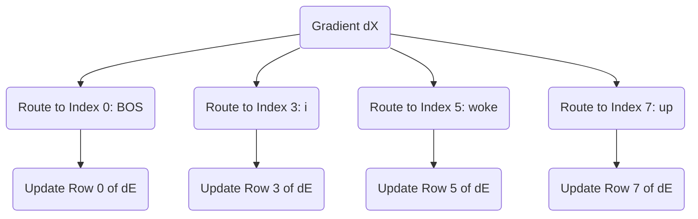

# Part 24: Updating the Embeddings and Conclusion

<!-- SUMMARY: The accumulated gradient finally reaches the initial embedding matrix via the residual stream, perfectly encapsulating how token representations must shift to minimize prediction error. With the backward pass complete, we conclude our rigorous mathematical traversal of the physical machinery driving the modern Transformer architecture. -->

<em>Prefer to read this seamlessly offline? <a href="../assets/docs/transformers-ebook-v1.0.pdf">Download the complete, formatting-optimized 100-page Transformer Ebook here.</a></em>

We have finally reached the terminus of our backward journey. The error signal has cascaded from the Cross-Entropy loss, navigated the Unembedding matrix, split through the Layer 2 MLP, and distributed itself across the complex geometry of the self-attention Query, Key, and Value matrices. Now, this accumulated signal arrives at the very beginning of our network. It is time to update the foundational representations of our tokens: the Embedding matrix itself.

## The Residual Highway

During the forward pass, we conceptualized the residual stream as a central memory bus. The initial token embeddings traveled along this bus, with each attention and MLP block adding new contextual information. 

In the backward pass, the residual stream serves an equally critical role as a gradient highway. When operations are added together during the forward pass, the backward pass simply passes the gradient equally to both paths. The gradient arriving at any point in the residual stream is the sum of all gradients from the blocks that read from it later in the network. Therefore, the final gradient vector arriving at our initial input matrix $X$ is a comprehensive sum. It contains the feedback from every downstream decision, perfectly encapsulating how the initial token vectors need to shift in $d_{model}$ space to decrease the final prediction error.

Let $dX$ represent this accumulated gradient for our sequence `<BOS> i woke up`. It is a matrix of size $4 \times 6$.

$$
dX = \begin{bmatrix}
0.012 & -0.045 & 0.103 & 0.002 & -0.011 & 0.088 \\
-0.033 & 0.021 & 0.055 & -0.019 & 0.076 & -0.004 \\
0.091 & -0.082 & 0.011 & 0.034 & -0.055 & 0.012 \\
-0.005 & 0.067 & -0.099 & 0.041 & 0.022 & -0.031
\end{bmatrix}
$$

## Routing Gradients to the Vocabulary Space

Our input matrix $X$ was constructed by selecting specific rows from the global Embedding matrix $E$. The matrix $E$ has a shape of $12 \times 6$, representing our entire vocabulary of 12 words in a 6-dimensional space. 

By the rules of calculus, if a row in $E$ was copied to form a row in $X$, the gradient for that row in $X$ routes directly back to the original row in $E$. The operation of selecting a row is mathematically equivalent to multiplying a one-hot encoded vector by the matrix $E$. The derivative of this operation simply passes the gradient back to the active index.

If our sequence `<BOS> i woke up` corresponds to indices 0, 3, 5, and 7 in our vocabulary, we construct a gradient matrix $dE$ of the same size as $E$, initialized to all zeros. We then add the respective rows of $dX$ to rows 0, 3, 5, and 7 of $dE$. The gradients for tokens not present in the current sequence remain strictly zero.

## The Optimizer Update

With $dE$ fully assembled alongside the gradients for all our intermediate weight matrices, we can finally execute the core mechanism of machine learning: the weight update. 

We apply an optimizer to shift our weights in the direction opposite to the gradient. While modern architectures use sophisticated optimizers like Adam which track momentum and variance, the fundamental principle is best illustrated by Stochastic Gradient Descent. We define a learning rate $\alpha$ to control the size of our step.

$$
E_{new} = E_{old} - \alpha \cdot dE
$$

By subtracting the scaled gradient, we adjust the coordinates of our original words in the $d_{model}$ space. The next time the network encounters the token "woke", its starting vector will be slightly better positioned to help the attention mechanism predict "late". 

## Conclusion

This completes our rigorous traversal of the Transformer architecture. We began with simple integers representing text, projected them into a continuous geometric space, and watched as attention matrices sculpted those vectors into context-aware representations. We proved why scaling by the square root of the head dimension prevents gradient starvation and how the causal mask ensures temporal discipline. 

Crucially, we demystified the backward pass. We saw how the simple difference between our prediction and the target label blossoms into a cascade of derivatives, flowing backward through projection matrices and softmax distributions to assign credit and blame to every single weight in the network. 

The Transformer is not an inscrutable black box. It is a massive, elegant bilinear engine, moving text through latent space with pristine mathematical precision. By following the numbers from the first embedding to the final gradient step, we have unlocked the physical machinery of modern artificial intelligence.

<em>Prefer to read this seamlessly offline? <a href="../assets/docs/transformers-ebook-v1.0.pdf">Download the complete, formatting-optimized 100-page Transformer Ebook here.</a></em>

