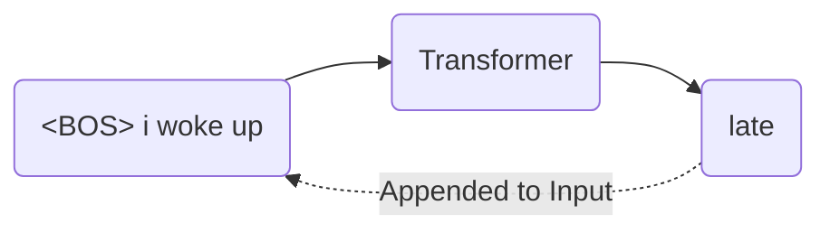
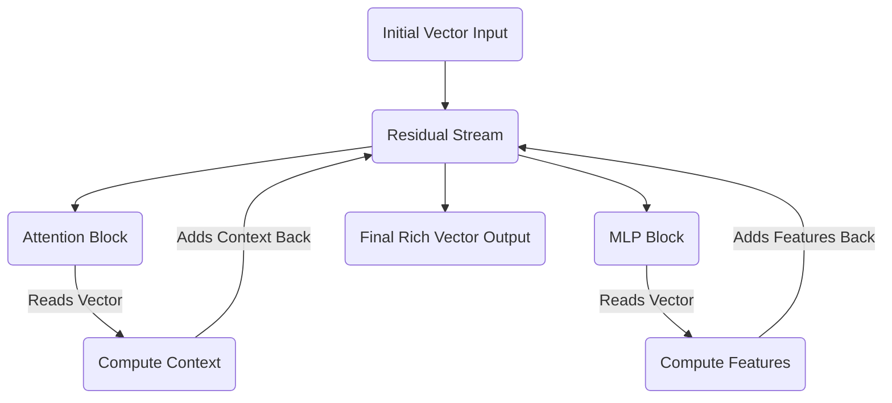

# Preface: The Big Picture & Tensor Notation
<!-- SUMMARY: Discard abstract metaphors and build an autoregressive Decoder-only Transformer from scratch using rigorous tensor notation and geometric principles. This foundational overview defines the vocabulary space, architectural dimensions, and the central residual stream required to calculate the forward pass. -->

<em>Prefer to read this seamlessly offline? <a href="../assets/docs/transformers-ebook-v1.0.pdf">Download the complete, formatting-optimized 100-page Transformer Ebook here.</a></em>

## The Problem with Tutorials

If you have spent any time trying to understand the Transformer architecture, you have likely encountered the same frustrating hurdle. Tutorials rely heavily on abstract analogies. They tell you that the Query matrix asks a question and the Key matrix holds the answer. These metaphors might give you a fleeting sense of intuition. They collapse the moment you try to write code, debug a model, or understand the fundamental geometry of deep learning.

We are going to take a different approach. Over the course of this series, we will build a complete Transformer from scratch by calculating every single number by hand. Our goal is to translate these complex, abstract operations into meaningful, structural realities. By the end, there will be no magic left. You will have a clear, intuitive grasp of how multi-dimensional tensors flow through linear projections.

To do this, we need a problem that is small enough to compute on a whiteboard, yet complex enough to demonstrate the true power of the architecture.

## The Toy Example

Our objective is to train a Transformer to predict the next word in a specific sequence. 

**Input:** `<BOS> i woke up`  
**Target:** `late`

The token `<BOS>` stands for Beginning of Sequence. This is a standard marker that tells the network a new thought has started. 

We chose this sentence carefully. It allows us to watch the attention mechanism do real work. To predict the word "late", the network cannot just look at the word "up". It must contextualize the combination of "woke" and "up" together. 

### The Vocabulary Space

To make the math tractable, we are restricting our model to a vocabulary of exactly twelve tokens. The total size of our vocabulary is represented by the variable $V$. In our case, $V$ equals 12.

| | | | |
|---|---|---|---|
| `<BOS>` | `we` | `late` | `<PAD>` |
| `<EOS>` | `woke` | `early` | `i` |
| `stayed` | `today` | `yesterday` | `up` |

We deliberately chose a small vocabulary with natural semantic clusters. The pronouns "i" and "we" form one cluster. The temporal adverbs "late", "early", and "today" form another. This gives our matrix operations the opportunity to physically group related concepts in vector space. As we progress, we will actually be able to see these clusters form in the numbers.

## The Architecture

Before we define the dimensions of our data, we must clearly define the architecture processing that data. We will be using an autoregressive Decoder-only architecture. This is the exact framework that powers models like GPT. 

To understand this, we need to unpack two distinct terms. 

First, "autoregressive" describes how the model generates text. It means the model predicts the next word based on its own previous outputs. Once it predicts a word, it appends that new word to the input sequence and runs the entire process again to predict the subsequent word. It feeds its own output back into itself in a continuous loop.

Second, "Decoder-only" refers to the structure of the network. Original Transformers had two halves. An Encoder processed a source language like French, and a Decoder generated a target language like English. We do not need to translate between two different sequences. We only need to predict the continuation of a single sequence. We discard the Encoder entirely and only use the Decoder. 

### The Residual Stream

Inside this Decoder, there is a central memory bus called the residual stream. This is arguably the most important structural concept in the entire architecture.

Imagine a main highway that runs continuously from the very first layer of the network to the very last. When a word enters the network, it is placed on this highway as a vector. As this vector travels through the network, the Attention and Multi-Layer Perceptron blocks do not intercept and replace it. Instead, they read from the vector, calculate new contextual information, and then add that new information back into the original vector. 

This additive process ensures that the original information is never destroyed or compressed through a bottleneck. It simply accumulates richness and context as it moves forward. 

## The Dimensions

With the architecture established, we can define the specific size of the pathways our data will travel. We have scaled the dimensions down to the specifications below.

### Sequence Length

Sequence length is how many tokens we are feeding into the model at one time. For our input of four tokens, the sequence length is 4.

### Model Dimensionality

Every token is represented by a vector traveling on the residual stream highway. The variable $d_{model}$ defines the width of that highway. We are using a 6-dimensional vector for each token. This allows us to easily visualize the data on a screen without losing the capacity to store complex features.

### Batch Size

GPUs act as highly parallel execution units. Instead of passing one sequence through the network at a time, we stack many independent sequences together into a batch to process them simultaneously. Batching repeats the exact same math in parallel across different inputs. We will set our batch size to 1 to keep our focus entirely on a single sequence.

### Attention Heads

The attention mechanism finds relationships between tokens. Rather than having one monolithic attention process, we divide the workload into multiple independent heads. This allows the network to learn different types of relationships simultaneously. One head might specialize in grammar, while another focuses on semantic meaning. We will use 3 parallel heads.

### Head Dimensionality

We have 3 heads dividing up our 6-dimensional residual stream. Each individual head operates in a 2-dimensional subspace. The matrices powering our attention mechanism will therefore be simple $6 \times 2$ structures.

### Feed-Forward Dimension

While the residual stream is excellent for securely moving information between layers, it is too narrow to perform complex reasoning. 

The Multi-Layer Perceptron solves this by expanding the data into a much wider, higher-dimensional space. In this expanded space, complex, entangled concepts can be linearly separated and processed before being compressed back down into the residual stream. It is an empirical standard in deep learning to expand this space by a factor of 4. Our feed-forward dimension will be $6 \times 4$, which equals 24.

## The Central Tensor

Before text enters the Transformer, it needs to be converted into numbers. We start by assigning a unique integer index to every word in our vocabulary. 

We then map that integer to a one-hot encoded vector. A one-hot vector is an array of zeros with a single '1' placed at the index corresponding to that word. For a twelve-word vocabulary, the one-hot vector for the fourth word is a 12-dimensional array consisting of eleven zeros and one '1' in the fourth position.

When our text enters the Transformer, this one-hot vector is embedded into a continuous mathematical space. This creates the foundational tensor that will travel through the entire network. The shape of this tensor is defined as Batch by Sequence Length by Model Dimension. 

For our specific architecture, this shape is $1 \times 4 \times 6$. Since our batch size is 1, we can strip away the batch dimension and visualize our data as a straightforward $4 \times 6$ matrix moving along the residual stream.

$$
X = \begin{bmatrix} 
\text{-- } \langle \text{BOS} \rangle \text{ vector --} \\
\text{-- "i" vector --} \\
\text{-- "woke" vector --} \\
\text{-- "up" vector --} 
\end{bmatrix}_{4 \times 6}
$$

Every single mathematical operation in our forward pass will read from and write to this $4 \times 6$ matrix. 

In the next part, we will take our raw text, map it to our vocabulary indices, and perform our first genuine calculation. We will transform one-hot encoded vectors into this $4 \times 6$ geometric representation.

<em>Prefer to read this seamlessly offline? <a href="../assets/docs/transformers-ebook-v1.0.pdf">Download the complete, formatting-optimized 100-page Transformer Ebook here.</a></em>

