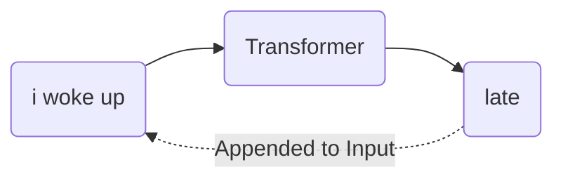
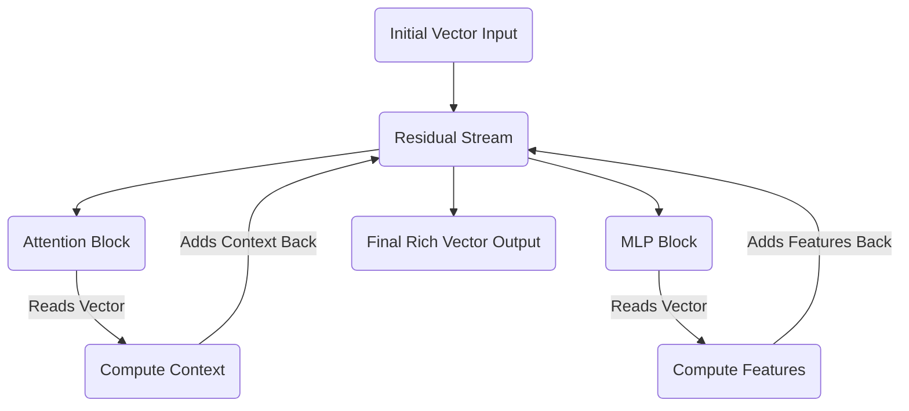

# Preface: The Big Picture & Tensor Notation

<!-- SUMMARY: This foundational overview introduces an autoregressive Decoder-only Transformer built from scratch using rigorous tensor notation and geometric principles. The text defines the vocabulary space, architectural dimensions, and the central residual stream required to calculate the forward pass. -->

<em>Prefer to read this seamlessly offline? <a href="../assets/docs/transformers-ebook-v1.0.pdf" target="_blank" rel="noopener">Download the complete, formatting-optimized 100-page Transformer Ebook here.</a></em>

## The Problem with Tutorials

The typical approach to understanding the Transformer architecture presents a frustrating hurdle. Existing literature relies heavily on abstract analogies. Texts often describe the Query matrix as asking a question and the Key matrix as holding the answer. These metaphors might give a fleeting sense of intuition. They collapse the moment a practitioner attempts to write code, debug a model, or understand the fundamental geometry of deep learning.

This text takes a different approach. A complete Transformer is built from scratch by calculating every single number by hand. The goal is to translate these complex, abstract operations into meaningful, structural realities. The result is a clear, intuitive grasp of how multi-dimensional tensors flow through linear projections, removing any sense of hidden mechanics.

To accomplish this, a problem is selected that is small enough to compute on a whiteboard, yet complex enough to demonstrate the true power of the architecture.

## The Toy Example

The objective is to train a Transformer to predict the next word in a specific sequence. 

**Input:** `<BOS>` `i` `woke` `up`  
**Target:** `late`

The token `<BOS>` stands for Beginning of Sequence. This is a standard marker that tells the network a new sequence has started. 

This sentence is chosen carefully. It allows the attention mechanism to perform observable work. To predict the word "late", the network cannot merely look at the word "up". It must contextualize the combination of "woke" and "up" together. 

### The Vocabulary Space

To make the math tractable, the model is restricted to a vocabulary of exactly twelve tokens. The total size of the vocabulary is represented by the variable $V$. In this configuration, $V$ equals 12.

<b><code>&lt;BOS&gt;</code></b> <b><code>we</code></b> <b><code>late</code></b> <b><code>&lt;PAD&gt;</code></b> <b><code>&lt;EOS&gt;</code></b> <b><code>woke</code></b> <b><code>early</code></b> <b><code>i</code></b> <b><code>stayed</code></b> <b><code>today</code></b> <b><code>yesterday</code></b> <b><code>up</code></b>

This small vocabulary features natural semantic clusters. The pronouns "i" and "we" form one cluster. The temporal adverbs "late", "early", and "today" form another. This gives the matrix operations the opportunity to physically group related concepts in vector space. As the model trains, these clusters will visibly form within the numerical representations.

## The Architecture

Before defining the dimensions of the data, the architecture processing that data must be clearly defined. The network utilizes an autoregressive Decoder-only architecture. This is the exact framework that powers models like GPT.

Two distinct terms explain this design.

First, the term autoregressive describes how the model generates text. The model predicts the next word based on its own previous outputs. Once a word is predicted, the network appends that new word to the input sequence and runs the entire process again to predict the subsequent word. The model feeds its own output back into itself in a continuous loop.

Second, the designation Decoder-only refers to the structure of the network. Early Transformers featured two halves. An Encoder processed a source language like French, and a Decoder generated a target language like English. The current objective does not require translation between two different sequences. The model only needs to predict the continuation of a single sequence. The Encoder is discarded entirely, and only the Decoder is retained.

### The Residual Stream

Inside this Decoder exists a central memory bus known as the residual stream. This serves as the most critical structural concept in the entire architecture.

The residual stream acts as a main highway running continuously from the very first layer of the network to the very last. When a word enters the network, the data is placed on this highway as a vector. As this vector travels through the network, the Attention and Multi-Layer Perceptron blocks do not intercept and replace the values. Instead, these components read from the vector, calculate new contextual information, and then add that new information back into the original vector.

This additive process ensures that the original information is never destroyed or compressed through a bottleneck. The vector simply accumulates richness and context as the forward pass continues.

## The Dimensions

With the architecture established, the specific size of the pathways processing the data must be defined. The dimensions are scaled down to the specifications below.

### Sequence Length

Sequence length dictates how many tokens the model processes at one time. For an input of four tokens, the sequence length is 4.

### Model Dimensionality

Every token is represented by a vector traveling on the residual stream. The variable $d_{model}$ defines the width of that pathway. A 6-dimensional vector represents each token. This allows for straightforward visualization on a screen without losing the capacity to store complex features.

### Batch Size

GPUs act as highly parallel execution units. Instead of passing one sequence through the network at a time, practitioners stack many independent sequences together into a batch to process them simultaneously. Batching repeats the exact same math in parallel across different inputs. The batch size is set to 1 to keep focus entirely on a single sequence.

### Attention Heads

The attention mechanism finds relationships between tokens. Rather than deploying one monolithic attention process, the workload is divided into multiple independent heads. This division allows the network to learn different types of relationships simultaneously. One head might specialize in grammar, while another focuses on semantic meaning. The model utilizes 3 parallel heads.

### Head Dimensionality

The 3 heads divide up the 6-dimensional residual stream. Each individual head operates in a 2-dimensional subspace. The matrices powering the attention mechanism will therefore be simple $6 \times 2$ structures.

### Feed-Forward Dimension

While the residual stream securely moves information between layers, the pathway is too narrow to perform complex reasoning.

The Multi-Layer Perceptron solves this constraint by expanding the data into a much wider, higher-dimensional space. In this expanded space, complex, entangled concepts can be linearly separated and processed before being compressed back down into the residual stream. An empirical standard in deep learning dictates expanding this space by a factor of 4. The feed-forward dimension is $6 \times 4$, resulting in 24.

## The Central Tensor

Before text enters the Transformer, the characters must be converted into numbers. The process begins by assigning a unique integer index to every word in the vocabulary.

That integer is then mapped to a one-hot encoded vector. A one-hot vector is an array of zeros with a single '1' placed at the index corresponding to that word. For a twelve-word vocabulary, the one-hot vector for the fourth word is a 12-dimensional array consisting of eleven zeros and one '1' in the fourth position.

When text enters the Transformer, this one-hot vector is embedded into a continuous mathematical space. This embedding creates the foundational tensor that travels through the entire network. The shape of this tensor is defined as Batch by Sequence Length by Model Dimension.

For this specific architecture, the shape is $1 \times 4 \times 6$. Since the batch size is 1, the batch dimension can be stripped away, leaving the data as a straightforward $4 \times 6$ matrix moving along the residual stream.

$$
X = \begin{bmatrix} 
\text{-- } \langle \text{BOS} \rangle \text{ vector --} \\
\text{-- "i" vector --} \\
\text{-- "woke" vector --} \\
\text{-- "up" vector --} 
\end{bmatrix}_{4 \times 6}
$$

Every single mathematical operation in the forward pass reads from and writes to this $4 \times 6$ matrix.

The raw text is then mapped to the vocabulary indices, preparing for the first genuine calculation. The one-hot encoded vectors are transformed into this $4 \times 6$ geometric representation.

<em>Prefer to read this seamlessly offline? <a href="../assets/docs/transformers-ebook-v1.0.pdf" target="_blank" rel="noopener">Download the complete, formatting-optimized 100-page Transformer Ebook here.</a></em>

