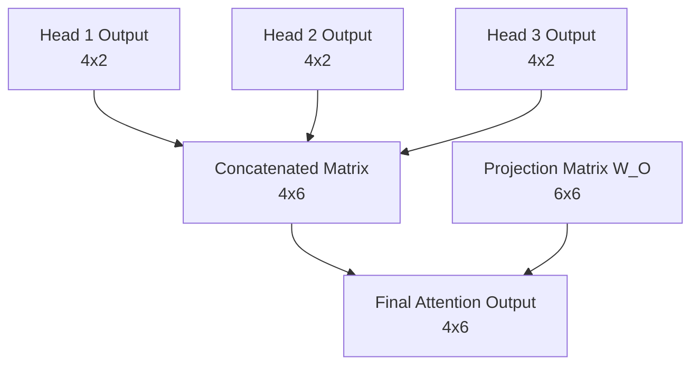

# Part 07: Causal Masking, The Cross-Head Mixer, and The Projection Matrix

<!-- SUMMARY: Parallel training introduces a structural vulnerability by granting past tokens computational access to future context. Applying a lower-triangular mask of negative infinity establishes a mathematical barrier that neutralizes future information, strictly enabling the simultaneous evaluation of shifted target sequences. The isolated outputs of multiple attention heads are concatenated into a unified matrix to preserve structural integrity without destructive interference. These discrete features are synthesized into higher-order contextual representations by projecting them through a learned cross-head mixing matrix, preparing the vectors to rejoin the residual stream. -->

The calculation of scaled attention scores establishes the intensity with which each token seeks information from every other token. This dot product operation occurs simultaneously across the entire sequence matrix. The resulting matrix reveals a profound structural flaw when deployed during the training phase.

During inference, a Transformer generates text sequentially. The model processes the initial token, predicts the next logical word, appends that prediction to the input, and repeats the cycle. This autoregressive loop acts as a strict computational bottleneck. Training a model in this sequential manner across billions of parameters would require an intractable amount of time. Engineers circumvent this bottleneck using a technique called teacher forcing. Instead of feeding tokens one by one, the architecture processes the entire input sequence simultaneously.

This simultaneous processing creates a temporal paradox. The input matrix contains the tokens `<BOS>`, `i`, `woke`, and `up`. The mathematical operations compute the attention scores for all four tokens at the exact same time. A review of the unmasked scaled attention scores illustrates the severity of this issue.

$$
\text{Scaled Scores} = \begin{bmatrix}
 0.45 &  0.68 &  0.73 &  0.63 \\
 0.59 &  0.87 &  0.93 &  0.79 \\
-0.09 & -0.20 & -0.26 & -0.28 \\
-0.18 & -0.33 & -0.39 & -0.39
\end{bmatrix}
$$

The rows represent Query vectors seeking context. The columns represent Key vectors offering context. The first row dictates the attention pattern for the `<BOS>` token. The second column of the first row holds a score of $0.68$, which represents the `<BOS>` token attending directly to the future token `i`.

A language model must predict the next logical token based strictly on preceding context. If the `<BOS>` token can mathematically attend to the token `i`, the model possesses direct access to the future. The architecture will simply learn to copy the adjacent token rather than learning complex linguistic patterns. Causality must be mathematically enforced to prevent this data leakage.

The architecture enforces causality by applying a lower-triangular mask to the attention score matrix. This mask acts as a strict mathematical filter.

$$
\text{Mask} = \begin{bmatrix}
1 & 0 & 0 & 0 \\
1 & 1 & 0 & 0 \\
1 & 1 & 1 & 0 \\
1 & 1 & 1 & 1
\end{bmatrix}
$$

Any matrix position representing a Query attending to a future Key receives a value of zero. Valid historical and current connections receive a value of one. The masking operation preserves the scaled scores at the valid locations and overwrites the invalid locations with negative infinity.

$$
\text{Masked Scores} = \begin{bmatrix}
 0.45 & -\infty & -\infty & -\infty \\
 0.59 &  0.87 & -\infty & -\infty \\
-0.09 & -0.20 & -0.26 & -\infty \\
-0.18 & -0.33 & -0.39 & -0.39
\end{bmatrix}
$$

An inspection of the second row confirms the token `i` can only attend to the `<BOS>` token and itself. The scores connecting `i` to the future tokens `woke` and `up` have been obliterated. The negative infinity value specifically prepares the matrix for the Softmax function. The Softmax operation exponentiates each entry. As an exponent approaches negative infinity, the resulting value converges exactly to zero. Future connections will consequently receive a probability weight of absolute zero.

This masking mechanism physically enables the rapid evaluation of shifted targets. The model receives the input sequence `<BOS> i woke up` and must predict the shifted target sequence `i woke up late`. The causal mask absolutely prevents any token from accessing its successors. This strict isolation allows the neural network to calculate the loss for all four predictions in a single forward pass.

The `<BOS>` token safely attempts to predict `i` utilizing only its own isolated representation. Simultaneously, the `up` token safely attempts to predict `late` utilizing the context of the entire preceding sequence. The causal mask resolves the temporal paradox, granting the architecture the sheer speed of parallel matrix multiplication without compromising the rigorous sequential logic of language generation. With causality secured, the masked scores are ready to be transformed into strict probability distributions.

## The Concatenation Step

The previous phase completed the journey of a single attention head. The mechanism calculated its masked attention scores, converted those scores into strict probability distributions via the Softmax function, and finally computed a weighted sum over the Value matrix $V$.

That process yields a contextually enriched vector for each token in the sequence. These vectors only possess a dimension of $d_v = 2$, whereas the overall model dimension is $d_{model} = 6$. The architecture deliberately splits into three parallel attention heads so the network can simultaneously look for different types of semantic relationships. Head 1 might attend to subject-verb pairings, while Head 2 looks for temporal markers, and Head 3 focuses on pronoun antecedents.

The system now faces a critical architectural challenge. Three isolated sets of findings exist. The model must unify these independent insights back into a single cohesive representation for each token, and this representation must seamlessly reintegrate with the overarching $d_{model} = 6$ architecture.

The most straightforward way to combine the outputs of the three heads might seem to be addition. The system could simply sum the three matrices together. Summation destroys the distinct structural information each head worked tirelessly to extract. If Head 1 finds a strong positive signal for a specific feature and Head 2 finds a strong negative signal, adding them together cancels out the values, effectively erasing the evidence gathered by both heads.

Instead of summing, the architecture concatenates the outputs along the feature dimension. Placing the three $4 \times 2$ matrices side-by-side preserves every piece of information. The resulting matrix has a sequence length of 4 and a new feature dimension of $3 \times 2 = 6$.

The actual output of the three heads illustrates this process. The exact Head 1 output calculated previously sits alongside simulated outputs for Head 2 and Head 3.

$$
\text{Head 1} = \begin{bmatrix}
 0.83 &  0.69 \\
 1.03 &  0.70 \\
 0.70 &  0.42 \\
 0.46 &  0.32
\end{bmatrix}
$$

$$
\text{Head 2} = \begin{bmatrix}
-0.50 &  0.10 \\
-0.40 &  0.30 \\
-0.20 &  0.25 \\
 0.10 & -0.15
\end{bmatrix}
$$

$$
\text{Head 3} = \begin{bmatrix}
 0.20 & -0.30 \\
 0.15 & -0.20 \\
 0.40 &  0.05 \\
 0.25 &  0.10
\end{bmatrix}
$$

Concatenating these three matrices horizontally achieves the target width of 6.

$$
\text{Concatenated} = \begin{bmatrix}
 0.83 &  0.69 & -0.50 &  0.10 &  0.20 & -0.30 \\
 1.03 &  0.70 & -0.40 &  0.30 &  0.15 & -0.20 \\
 0.70 &  0.42 & -0.20 &  0.25 &  0.40 &  0.05 \\
 0.46 &  0.32 &  0.10 & -0.15 &  0.25 &  0.10
\end{bmatrix}
$$

## The Projection Matrix

Concatenation perfectly resolves the sizing issue. The dimensions return to a $4 \times 6$ matrix. However, a geometric problem remains. The features are entirely segregated. The first two columns belong exclusively to Head 1, the middle two to Head 2, and the final two to Head 3. The insights exist in the same mathematical structure, yet they do not interact.

A neural network derives its power from synthesizing discrete pieces of evidence into higher-order concepts. To facilitate this synthesis, the architecture introduces the final learned parameter of the attention mechanism, the Projection Matrix, denoted as $W_O$.

The matrix $W_O$ has dimensions of $d_{model} \times d_{model}$, which in this case is $6 \times 6$. It acts as a cross-head mixer. Multiplying the concatenated matrix by $W_O$ produces a resulting matrix that is a linear combination of all the features from all the heads. The network can learn that a high value in column 1 from Head 1, when combined with a low value in column 5 from Head 3, implies a specific semantic meaning that should be passed forward to the rest of the architecture.

The randomly initialized projection matrix $W_O$ for the toy model appears as follows.

$$
W_O = \begin{bmatrix}
 0.10 &  0.20 & -0.10 &  0.30 &  0.00 & -0.20 \\
-0.20 &  0.10 &  0.40 &  0.10 &  0.20 &  0.00 \\
 0.30 & -0.10 &  0.10 & -0.20 &  0.50 &  0.10 \\
-0.10 &  0.40 & -0.30 &  0.10 & -0.10 &  0.30 \\
 0.20 &  0.00 &  0.20 & -0.10 &  0.30 & -0.10 \\
-0.30 &  0.10 & -0.10 &  0.20 & -0.20 &  0.40
\end{bmatrix}
$$

Taking the dot product of the concatenated outputs and $W_O$ applies the final transformation.

$$
\text{Output} = \text{Concatenated} \cdot W_O
$$

$$
\text{Output} = \begin{bmatrix}
-0.08 &  0.29 &  0.18 &  0.35 &  0.00 & -0.33 \\
-0.10 &  0.42 &  0.10 &  0.43 & -0.01 & -0.25 \\
-0.03 &  0.31 &  0.08 &  0.29 &  0.07 & -0.10 \\
 0.05 &  0.06 &  0.18 &  0.13 &  0.18 & -0.11
\end{bmatrix}
$$

## Rejoining the Stream

This final calculation successfully completes the Multi-Head Self-Attention block. The process began with basic token embeddings representing the sequence `<BOS> i woke up`. The architecture split those representations, allowed them to search for context across the sequence, gathered their findings, and fused those findings back into a unified $4 \times 6$ matrix.

Every vector in this output matrix now contains rich, contextualized information about its surrounding tokens. These advanced representations are ready to merge back into the main residual stream of the Transformer.
